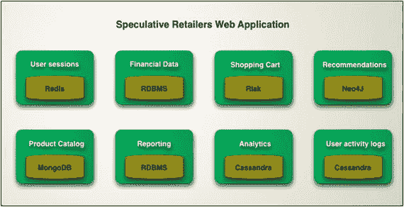
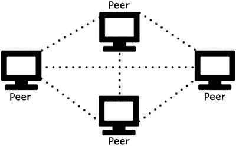
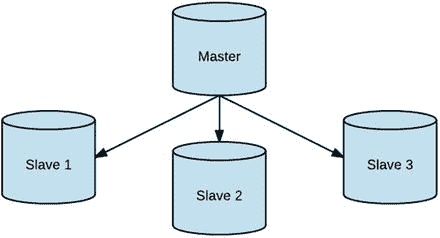

# 7. NoSQL 简介

世界正在发生变化。长期以来，IBM 和 Oracle 等公司一直主导着规则，但现在，谷歌、Facebook、亚马逊等公司已经走在了前列。这些公司产生着 TB 级的数据，并在短时间内处理数百万个请求，而且它们仍在日益增长。问题是，它们是如何扩展并处理如此海量的数据和请求的呢？事实是，以前从未有人遇到过这类问题（即使是 IBM 或 Oracle 也没有），因此它们不得不创建自己的解决方案来实现扩展。

例如，在数据持久化方面，这些公司采取了以下措施：

*   Facebook 创建了 Cassandra。
*   谷歌创建了 Bigtable。
*   亚马逊创建了 DynamoDB。

 数据持久化指的是，即使在创建数据的进程结束后，仍能保持数据存储并可供检索的能力。换句话说，对于一个数据存储来说，要被认为是持久化的，它必须写入非易失性存储。

如今，每一个“新一代”应用程序都必须基于以下支柱进行设计，以实现增长：

*   云计算
*   大数据/分析
*   移动
*   社交网络

应用程序必须准备好克服地理障碍并快速传播。如果你在你的城市使用 Uber 服务，你就会明白我在说什么。这个基于位置的交通应用，成立仅八年，现在已在全球 570 个城市运营。（顺便提一下，Uber 的基础设施运行在亚马逊云服务上。）

 我强调这一点的原因是想提醒你，如今的软件工程师必须知道如何使用比以前更多的技术。几年前，你基本上不用担心在新项目中会使用哪种数据持久化技术。选择仅仅在于使用哪种编程语言或关系型数据库供应商。而今天，对于现代应用程序来说，数据持久化是绝对关键的。

聊天应用架构之所以使用如此多不同的技术，是因为每种技术都以最佳方式解决了不同类型的问题。

例如，在可扩展性方面，使用关系型数据库来写入聊天消息可能不是最佳选择；聊天应用领域不需要 ACID¹ 属性，因此使用关系型数据库会导致巨大的性能损失。关系型数据库不会放弃一致性（它们也使用悲观锁），并且它们并非为集群而设计，尽管集群是可能的。关键在于，它无法实现线性扩展（例如像 Cassandra 那样），因为即使集群化，底层存储层仍然是瓶颈。当你的领域需要 ACID 属性时，才应该使用关系型数据库（请记住我在第 6 章中讨论过的领域与架构之间的关系）。

在许多情况下，即使是现代应用程序也需要符合 ACID 属性，因此需要像 MySQL 这样的关系型数据库。事实上，使用 NoSQL 技术并不意味着你不再需要关系型数据库。需要牢记的关键是，我们正处于多语言[持久化](https://martinfowler.com/bliki/PolyglotPersistence.html) ² 时代（图 7-1）。这本质上意味着你应该为每种场景采用合适的持久化技术。



图 7-1.

多语言持久化示例（来源：Martin Fowler）

大多数 NoSQL 数据库在设计时都考虑到了水平可扩展性。

 当你向机器集群中添加更多节点时，就实现了水平可扩展性。当你增加单台机器的硬件性能时，就实现了垂直可扩展性。

NoSQL 数据库的设计基于分布式系统。³ 简而言之，它们被设计成以集群方式工作，即一组相互连接并通过网络通信以解决特定问题（此处为数据持久化问题）的节点（机器）。

本质上，NoSQL 数据库分为四大类。

*   **键值存储**：存储与键关联的值（例如，Redis、Memcached、Riak）
*   **文档存储**：存储完整的文档（例如，MongoDB、CouchDB、Elasticsearch）
*   **列族存储**：以列而非行的形式存储数据；专为处理大量数据以及读写性能而设计（例如，Cassandra、HBase）
*   **图存储**：存储关于网络和连接实体的信息（例如，Neo4J、HyperGraphDB）

NoSQL 数据库的另一个重要特性是它们是无模式的。这意味着它们不像关系型数据库那样有严格的模式。例如，一个基于文档的 NoSQL 存储可以有一个 `User` 集合，其中存储的用户关联着不同的数据（有的可能有 `age` 字段，有的没有，而无需执行任何 `ALTER TABLE` 命令或类似操作）。

关系型数据库的建模与 NoSQL 数据库不同。在关系型数据库中，你通常使用第三范式⁴，并确保每个表只存储“它自己的数据”。每个关系都用外键表示，并且在运行时需要 SQL `JOIN` 来从不同实体检索数据。基本上，你首先对领域进行建模，而不考虑稍后将要执行的查询。之后，你使用高度灵活的 SQL 来构建查询。

## 7.1 NoSQL 中的建模

在 NoSQL 环境中，建模时你应该有不同的思考方式。反范式化在这里是你的朋友，因为你更关心性能（例如，避免使用连接），而不是可能的数据重复和消耗更多存储空间。请记住，与 CPU 能力和内存相比，存储是廉价的。在 NoSQL 中建模时，你必须精确地考虑你想要检索哪些数据，并相应地建模你的“存储单元”来检索它。

例如，假设你需要检索某个用户在特定聊天室中的消息（这真是个巧合，不是吗？）。使用关系型数据库，你会创建一个名为 `user` 的表、一个名为 `chat room` 的表和一个名为 `messages` 的表，每条消息都会有外键来表示与用户和聊天室的关系，对吧？在 Cassandra 中，连接和外键都不存在，所以你必须换一种思路！

在 Cassandra 中，你会创建一个列族（类似于关系型数据库中的表），并在其中存储每条记录，包含聊天室 ID、用户和消息。再次强调，反范式化在这里是你的朋友。

现在想象一下，你只需要检索来自巴西的用户的聊天消息。使用关系型方法，你会怎么做？很简单：只需在 `messages` 表上创建一个查询，连接 `user` 表，并添加一个 `where` 子句来验证用户来自巴西。你是否注意到，当你对关系型表进行建模时，你并没有考虑这个查询，但 SQL 凭借其高度的灵活性能够处理它？

那么在 Cassandra 中，你会怎么做呢？我打赌你已经知道答案了！但我知道你正在想，为这个任务再创建一个列族听起来很奇怪，而且在你公司工作了 20 年的数据库管理员可能不会喜欢这个主意。但你是对的。在这种情况下，这正是你要做的。我希望你的数据库管理员喜欢 Cassandra！


## 7.2 Cassandra 概述

为了让你了解一些分布式系统能变得多么强大，你知道吗，最大的 Cassandra 生产集群被苹果公司使用？这个集群拥有超过 75,000 个节点，存储着超过 10PB 的数据。第二名是 Netflix，拥有 2,500 个节点，存储着 420TB 数据，每天处理超过 1 万亿次请求。你能想象一个由超过 75,000 台机器协同工作的数据库吗？好了，既然你已经印象深刻，那么我向你介绍 Cassandra 就更容易了！

 虽然我是一名 Java 开发者，但过去几年我一直担任 DevOps 工程师，正如我在引言“我是谁？”部分中更详细地解释的那样。不幸的是，这本书并不完全关于基础设施，所以我无法深入探讨基础设施的细节。尽管如此，我邀请你看看我的网站⁵上提供的电子书、在线课程和文章，我在那里对这些主题进行了更深入的探讨。

Cassandra 基于 Google 的 Bigtable 和 Amazon 的 DynamoDB，最初由 Facebook 创建。随后它被开源，现在是一个 Apache [项目](http://cassandra.apache.org/)。⁶ 现在甚至可以通过 DataStax⁷ 获得“企业版”，它也有一个社区版。

正如你已经知道的，Cassandra 是一个属于列族类别的 NoSQL 数据库。它能够处理每秒大量的写入和读取，同时在向 Cassandra 集群添加节点时保持线性可扩展性⁸。Cassandra 还跨地理分布的数据中心提供自动、可靠的复制。

Cassandra 是一个实现点对点⁹架构的分布式系统（图 7-2）。它使用 gossip 协议¹⁰ 进行内部通信。换句话说，不存在主节点单点故障，因此每个节点都能处理读取和写入。



图 7-2.

点对点架构

Cassandra 的分区策略基于你在为列族建模主键时指定的分区键。你现在可能会想：“这家伙在说什么？”别急，几分钟后你就会明白了。

基本上，当你处理大量时间序列数据时，Cassandra 是一个极好的选择，这在物联网¹¹、日志、指标等场景中很常见。当放松一致性不是问题时，它甚至更合适，尽管你可以调整写入和读取的一致性级别。

 读取一致性是指在给定的时间点，每个节点对同一查询返回相同的结果。请记住，分布式系统运行在具有延迟的网络之上，因此当你将数据写入特定节点时，复制将开始发生，并需要几毫秒才能在其他节点上完成。在这几毫秒内，如果向其他节点发出读取请求，那么它们将返回过时数据。在 Cassandra 中，写入和读取的一致性级别是完全可调的。

为什么我选择 Cassandra 来存储聊天应用程序中聊天消息的历史记录？好吧，由于聊天应用程序可以在全球范围内使用，它很快就会包含大量数据。此外，聊天应用程序有大量的消息写入，而消息可以被视为时间序列数据，对吧？既然完全一致性对这个上下文来说不是那么关键，为什么不放弃一点一致性，以最终一致性模式工作（顺便说一下，这是 Cassandra 的默认行为）来获得卓越的写入性能呢？基本上，这就是我选择使用 Cassandra 的原因。

 最终一致性是一种一致性模型，它保证在不久的将来某个时刻，系统（本例中为 Cassandra）将变得一致。

Cassandra 中的一致性可以在写入或读取时进行调整。例如，你可以指定希望写入是完全一致的，这意味着只有在每个副本节点上成功执行写入后，它才会返回成功。也就是说，成功后，你可以保证对该数据的任何读取都将返回最新（且相同）的数据，无论哪个节点响应。请记住，更高的一致性伴随着延迟代价，因此完全一致性意味着最差的性能。

 CAP 定理¹² 指出，当分布式系统中发生完全分区（例如网络故障）或临时分区（写入请求后数据复制之间的延迟、JVM 中的完全 GC 等）时，它必须在一致性或可用性之间做出选择。如果分布式系统选择一致性而非可用性，那么在分区修复之前它将不可用。另一方面，如果它选择可用性而非一致性，它将返回对请求的响应，但该响应可能不包含最新的数据。

在 Cassandra 中，你可以使用 Cassandra 查询语言 (CQL) 创建键空间、插入数据、查询数据以及执行更多操作。一个名为 `cqlsh` 的命令行工具允许你对 Cassandra 实例发出 CQL 命令。CQL 类似于 SQL 命令，因此很容易习惯使用 CQL 命令。

### 7.2.1 Cassandra 概念

现在你将学习一些重要的概念，我将讨论在 Cassandra 中的建模。

#### 7.2.1.1 键空间

键空间类似于关系数据库中的数据库。它将来自同一域的一组列族（类似于 SQL 表）分组。在这里定义复制因子，即该键空间在不同节点上拥有的副本数量。这个聊天应用将只在本地机器上运行，而不是 Cassandra 集群。因此，以下是键空间定义：

```
CREATE KEYSPACE ebook_chat WITH REPLICATION =
{ 'class' : 'SimpleStrategy', 'replication_factor' : 1 };
```

 这些键空间设置不适用于生产环境。在生产环境中，你需要设置 `NetworkTopologyStrategy` 和至少为 3 的复制因子。

#### 7.2.1.2 列族

列族类似于关系数据库中的表。它以行和列的形式存储数据。

```
CREATE TABLE messages (
username text,
chatRoomId text,
date timestamp,
fromUser text,
toUser text,
text text,
PRIMARY KEY ((username, chatRoomId), date)
) WITH CLUSTERING ORDER BY (date ASC);
```

#### 7.2.1.3 主键

一行由主键唯一标识。每个列族必须定义一个主键，并且主键可以由分区键和聚簇键组成。主键可以是单个列或多个列。当有多个列时，称为复合主键。你可以使用 Cassandra 的主键列或二级索引来查询数据。`messages` 列族有一个复合主键，如下所示：

```
PRIMARY KEY ((username, chatRoomId), date)
```

#### 7.2.1.4 二级索引

二级索引允许你查询不属于主键的列。请记住，添加二级索引会降低写入性能！


#### 7.2.1.5 分区键

分区键是主键定义中最左侧的项。如果是单一主键，那么分区键与主键相同。分区键可以是单个列或多个列。当包含多个列时，称为复合分区键，并在主键定义中用括号括起来。`messages` 主键包含 `(username, chatRoomId)` 复合分区键，这实质上意味着来自特定用户在特定聊天室中的每条消息都将位于同一个分区中。

分区是共享相同分区键的行组。这对于在 Cassandra 中实现高性能和线性可扩展性非常重要。当你向 Cassandra 发出读取请求时，可能需要从不同分区获取数据，而这些分区可能位于不同的机器上。在这种情况下，网络延迟会使查询变慢。即使你查询的分区位于同一台机器上（这种情况也会发生），由于 Cassandra 内部存储行的方式，性能也会较慢。

在建模方面，为了获得最优化集群，你必须将数据均匀分布在各个节点之间。因此，只有一个巨大的分区没有帮助，拥有大量分区也无济于事。这里的关键工作是找出正确的分区键，以便将数据均匀分布在各个节点之间。

还记得我建议你根据领域来建模列族吗？这绝对正确，但现在我要补充一条关于 Cassandra 的额外说明。你必须根据领域来建模列族，同时还要考虑数据如何在分区之间分布。例如，假设你正在建模一个列族，用于存储一个国家所有州的所有城市每五秒一次的传感器温度测量值。如果你的分区键只是 `country` 列，那么来自 `USA` 国家所有传感器的每次写入都将进入同一个分区。你已经知道，如果想从分布式架构中受益，拥有一个唯一的大分区是不可行的。但是，如果将分区键改为 `(country, state, city)` 呢？现在，`USA` 特定州中特定城市的每次传感器温度测量值都将存储在不同的分区中。数据看起来分布得更均匀了，但仍然存在一些问题。请记住，像纽约这样的城市有近 900 万居民，而山景城是加利福尼亚州的一个小城市，只有大约 8 万人口。这是一个巨大的差异，可能导致分区不平衡。正如你所见，在 Cassandra 中建模主键是最困难的任务之一！

#### 7.2.1.6 聚簇键

聚簇键由不属于分区键的主键列组成。在 `PRIMARY KEY ((username, chatRoomId), date)` 中，`date` 是聚簇键。基本上，聚簇键告诉 Cassandra 分区内的数据如何排序。在 `messages` 列族中，`date` 聚簇键将按升序对消息进行排序。

## 7.3 Redis 概述

Redis 是一个极快的键值类内存 NoSQL 数据库，这意味着你可以存储一个值并将其与一个唯一键关联（例如，`name: Jorge Acetozi` 或 `numEbookReaders: 1000`）。当然，你还可以做一些更有趣的事情，比如用它进行缓存。

### 7.3.1 Redis 与 Memcached 对比

假设你的 Web 应用中有一个很少更改的网页（在聊天应用中，聊天室列表就是一个例子），并且该页面有大量访问。对于每次访问，应用程序都会查询关系数据库实例以获取要显示的数据。访问关系数据库是一项昂贵的操作，鉴于你正在处理一个高流量的网页，最终可能会遇到性能问题。在这种情况下，你可以使用 Redis 作为缓存服务器，这样当客户端访问页面时，数据将从 Redis 中获取，由于 Redis 将数据存储在 RAM 中，避免了磁盘访问，因此速度极快。很不错，对吧？

你可能会问我：“是的，Jorge，这很好。但我们为什么不使用 Memcached¹³ 呢？”我同意你的看法。Memcached 在这里也是一个不错的选择。但 Memcached 基本上只用于缓存，而 Redis 可以做得更多（实际上，即使在缓存方面，Redis 也胜过 Memcached）。

Memcached 仅支持字符串和整数作为数据结构，而 Redis 拥有许多其他复杂的数据类型，例如字符串、哈希、列表、集合、支持范围查询的有序集合、位图、HyperLogLog 以及支持半径查询的地理空间索引。此外，Redis 还支持 Lua 脚本¹⁴。

另外，Redis 可以将数据持久化到磁盘以保证持久性。Memcached 则不能。

 请务必查看所有 Redis 数据类型。¹⁵


### 7.3.2 Redis 使用场景

凭借其丰富的数据结构，Redis 可用于多种场景。

*   缓存（包括 LRU¹⁶ 策略）
*   实现页面浏览量的计数器
*   实现高性能队列
*   实现发布/订阅¹⁷
*   编译指标和统计数据
*   存储超文本传输协议（HTTP）会话
*   使用有序集合（按分数排序的项目集合）构建排行榜，例如访问量最高的聊天室
*   在集合中执行操作，例如获取两个集合的交集

你能看出 Redis 有多强大吗？你可以轻松地扩展聊天应用，加入“添加好友”功能，并将用户的好友存储在一个集合中。然后，你可以创建另一个包含所有在线用户的集合，并使用 `SINTER` ¹⁸ 命令，在 `O(N*M)` 的时间复杂度内提取这两个集合的交集。这个交集就是用户的在线好友。太棒了！

这基本上就是我选择使用 Redis 构建聊天应用的原因。

Redis 可以集群化¹⁹，用于复制和分片，其分布式架构基于主从模型（图 7-3）。



图 7-3.

主从架构

与 Cassandra 不同，Redis 无法调整一致性级别，并且 Redis 集群无法保证强一致性。这是因为当你向 Redis 集群发送写请求时，主节点会先将数据写入自身，并立即向客户端返回成功。然后，复制到从节点的操作会异步开始。如果在数据复制完成之前主节点崩溃，并且某个从节点被提升为新的主节点，会发生什么？基本上，客户端会收到成功响应，但写入实际上已经丢失了。

 再次强调，你的业务领域应该能提示你在生产环境中承担此风险是否可接受。请记住，Redis 集群为了获得卓越的性能而牺牲了一致性。

Redis 还通过 Redis Sentinel 支持监控、自动故障转移、Redis 主节点、服务发现和通知。²⁰

脚注 1

[`https://en.wikipedia.org/wiki/ACID`](https://en.wikipedia.org/wiki/ACID)

2

[`https://martinfowler.com/bliki/PolyglotPersistence.html`](https://martinfowler.com/bliki/PolyglotPersistence.html)

3

[`https://en.wikipedia.org/wiki/Distributed_computing`](https://en.wikipedia.org/wiki/Distributed_computing)

4

[`https://en.wikipedia.org/wiki/Third_normal_form`](https://en.wikipedia.org/wiki/Third_normal_form)

5

[`https://www.jorgeacetozi.com`](https://www.jorgeacetozi.com)

6

[`http://cassandra.apache.org/`](http://cassandra.apache.org/)

7

[`https://www.datastax.com/`](https://www.datastax.com/)

8

[`http://techblog.netflix.com/2011/11/benchmarking-cassandra-scalability-on.html`](http://techblog.netflix.com/2011/11/benchmarking-cassandra-scalability-on.html)

9

[`https://en.wikipedia.org/wiki/Peer-to-peer`](https://en.wikipedia.org/wiki/Peer-to-peer)

10

[`http://docs.datastax.com/en/archived/cassandra/2.0/cassandra/architecture/architectureGossipAbout_c.html`](http://docs.datastax.com/en/archived/cassandra/2.0/cassandra/architecture/architectureGossipAbout_c.html)

11

[`https://en.wikipedia.org/wiki/Internet_of_things`](https://en.wikipedia.org/wiki/Internet_of_things)

12

[`https://dzone.com/articles/better-explaining-cap-theorem`](https://dzone.com/articles/better-explaining-cap-theorem)

13

[`https://memcached.org/`](https://memcached.org/)

14

[`https://www.lua.org/`](https://www.lua.org/)

15

[`https://redis.io/topics/data-types`](https://redis.io/topics/data-types)

16

[`https://redis.io/topics/lru-cache`](https://redis.io/topics/lru-cache)

17

[`http://redis.io/topics/pubsub`](http://redis.io/topics/pubsub)

18

[`https://redis.io/commands/sinter`](https://redis.io/commands/sinter)

19

[`https://redis.io/topics/cluster-tutorial`](https://redis.io/topics/cluster-tutorial)

20

[`https://redis.io/topics/sentinel`](https://redis.io/topics/sentinel)

