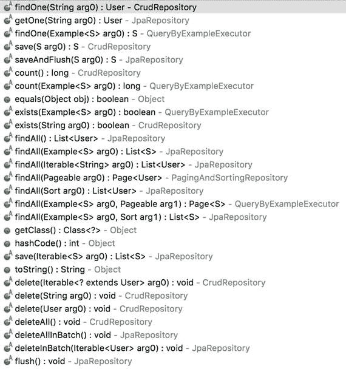

# 8. Spring 框架

Spring 框架是企业级 Java 应用中使用最广泛的框架。它是一个完整的平台，在“Spring 保护伞”下包含许多 Spring 子项目，几乎可以满足你的所有需求。它拥有庞大的社区，并且其发展速度远快于 Java EE（实际上从一开始就是如此）。

 在本书中，我不会过多解释 Spring 框架的理论。我的目标是向你展示如何在实际中使用它。在第 3 部分“按功能编码”中，我将使用 Spring 框架逐步解释代码片段。我相信这对大多数读者来说已经足够了。如果你在理解本节时仍有困难，我建议你在继续学习之前先研究一下 Spring。Spring 有很棒的文档¹，其中包含许多实际示例和教程。

尽管 Spring 一直是一个优秀的框架，但它过去有大量的可扩展标记语言（XML）配置，这很繁琐。有时配置一个简单的数据源可能需要一整天。幸运的是，现在情况已经不同了。如今，可以使用 Java 注解和配置类来设置 Spring Bean，并且由于你在编写 Java 代码，IDE 会通过自动补全和许多其他便捷功能为你提供很大帮助。有时你甚至不需要查阅文档；只需浏览类和 Javadoc，你就能编写配置。


## 8.1 Spring Boot

更棒的是，一个名为 Spring Boot ² 的 Spring 子项目在处理配置和项目引导时非常实用。它严格遵循“约定优于配置”的理念，因此在使用 Spring Boot 引导项目时，只需极少的配置，因为默认设置通常就能满足你的需求。Spring Boot 甚至内置了 Tomcat、Jetty 或 Undertow 等 Servlet 容器。基本上，它会根据项目的依赖推断你将使用什么，并自动为你进行配置。

要让你的企业级应用运行起来，只需启动一个 `public static void main` 方法即可。要从命令行启动 Spring Boot 应用，输入 `java -jar my_application.jar` 就完成了。这正是你在本地运行聊天应用时所做的事情。在我看来，Spring Boot 是 Spring 最令人惊叹的子项目之一。（或者会是 Spring Data？还是 Spring MVC？不！是 Spring Security！那 Spring WebSocket 呢？哦，我不知道……好吧，别管它了，我们继续吧！）

 请务必查看可用的 Spring 子项目列表³。它相当令人印象深刻，不是吗？确实，Spring 可以与任何东西集成。

## 8.2 Spring Data JPA 仓库

与关系型数据库的交互不应再让你感到恐慌。只需在 `application.yml` 配置文件中配置一个数据源，并创建一个继承自 `JpaRepository`（这是一个 Spring Data 接口）的 Java 接口，你就能获得许多现成的方法，用于通过 Java 持久化 API（JPA）操作数据库。例如，在聊天应用中，你有以下配置：

```
spring:
datasource:
url: jdbc:mysql://localhost:3306/ebook_chat
username: root
password: root
testWhileIdle: true
validationQuery: SELECT 1
jpa:
show-sql: true
hibernate:
ddl-auto: validate
naming-strategy: org.hibernate.cfg.ImprovedNamingStrategy
properties:
hibernate:
dialect: org.hibernate.dialect.MySQL5Dialect
public interface UserRepository extends JpaRepository {
}
```

这允许你使用图 8-1 中所示的方法。



图 8-1.

JpaRepository 方法

但是，例如，如果你需要根据电子邮件地址查找用户呢？嗯，你可以简单地声明一个遵循 Spring Data 模式⁴的方法签名，然后就完成了。

这里的核心思想是，你声明一个方法，Spring Data 会动态地为你实现它。

```
public interface UserRepository extends JpaRepository {
User findByEmail(String email);
}
```

如果你需要自定义查询，只需声明你的方法，用 `@Query` ⁵ 注解它，提供自定义的 JPQL⁶ 查询，然后使用它。

```
public interface UserRepository extends JpaRepository {
@Query("select u from User u where u.name like %?1")
List findByNameEndsWith(String name);
}
```

也可以创建原生查询。⁷

```
public interface UserRepository extends JpaRepository {
@Query(value = "SELECT * FROM USER WHERE EMAIL = ?1", nativeQuery = true)
User findByEmail(String email);
}
```

当然，为了让 JPA 仓库正常工作，`User` 类必须使用 JPA⁸ 注解进行标注。示例如下：

```
@Entity
@Table(name = "user")
public class User {
@Id
private String username;
private String password;
private String name;
private String email;
...
}
```

## 8.3 Spring Data 与 NoSQL

你已经了解到，构建现代应用时必须考虑可扩展性。持久化通常是限制可扩展性的根本原因，因此选择合适的持久化技术至关重要。

Spring Data 与许多 NoSQL 工具（如 Cassandra、Redis、Neo4J、MongoDB、Elasticsearch 等）提供了出色的集成。你也可以像使用 JPA 那样，将 Spring Data 仓库与 NoSQL 工具一起使用（某些技术可能存在一些限制）。例如，在聊天应用中，Spring Data Cassandra 仓库是这样实现的：

```
public interface InstantMessageRepository extends CassandraRepository {
List findInstantMessagesByUsernameAndChatRoomId(String username, String chatRoomId);
}
```

方法签名模式与 JPA 中解释的相同。实际变化在于，模型应使用 Spring Data Cassandra 注解而不是 JPA 注解进行标注。

```
import org.springframework.cassandra.core.Ordering;
import org.springframework.cassandra.core.PrimaryKeyType;
import org.springframework.data.cassandra.mapping.PrimaryKeyColumn;
import org.springframework. data .cassandra.mapping.Table;
@Table("messages")
public class InstantMessage {
@PrimaryKeyColumn(name = "username", ordinal = 0, type = PrimaryKeyType.PARTITIONED)
private String username;
@PrimaryKeyColumn(name = "chatRoomId", ordinal = 1, type = PrimaryKeyType.PARTITIONED)
private String chatRoomId;
@PrimaryKeyColumn(name = "date", ordinal = 2, type = PrimaryKeyType.CLUSTERED, ordering = Ordering.ASCENDING)
private Date date;
...
}
```

Spring Data Redis 仓库也是如此。正如你将在第 3 部分“按功能编码”中看到的，聊天应用中使用 Redis 来管理聊天室和已连接的用户。看看模型和仓库的样子：

```
import org.springframework.data.annotation.Id;
import org.springframework.data.redis.core.RedisHash;
@RedisHash("chatrooms")
public class ChatRoom {
@Id
private String id;
private String name;
private String description;
private List connectedUsers = new ArrayList();
...
}
public interface ChatRoomRepository extends CrudRepository {
}
```

 Spring Data 仓库确实让你的生活更轻松，但有时你可能需要它们未提供的额外功能。例如，对于 Spring Data Redis 仓库，该技术仅将你的模型映射到 Redis 哈希，但正如你所了解的，Redis 中还有许多其他可用的数据结构。在这种情况下，你必须使用 Spring Data 模板（CassandraTemplate、RedisTemplate 等），这些模板使用起来也很直接。

脚注 1

[`https://spring.io/docs`](https://spring.io/docs)

2

[`https://projects.spring.io/spring-boot/`](https://projects.spring.io/spring-boot/)

3

[`https://spring.io/docs/reference`](https://spring.io/docs/reference)

4

[`https://docs.spring.io/spring-data/jpa/docs/current/reference/html/#repositories.query-methods.query-creation`](https://docs.spring.io/spring-data/jpa/docs/current/reference/html/#repositories.query-methods.query-creation)

5

[`https://docs.spring.io/spring-data/jpa/docs/current/reference/html/#jpa.query-methods.at-query`](https://docs.spring.io/spring-data/jpa/docs/current/reference/html/#jpa.query-methods.at-query)

6

[`http://docs.oracle.com/html/E13946_04/ejb3_langref.html`](http://docs.oracle.com/html/E13946_04/ejb3_langref.html)

7

[`https://docs.spring.io/spring-data/jpa/docs/current/reference/html/#_native_queries`](https://docs.spring.io/spring-data/jpa/docs/current/reference/html/#_native_queries)

8

[`www.oracle.com/technetwork/java/javaee/tech/persistence-jsp-140049.html`](http://www.oracle.com/technetwork/java/javaee/tech/persistence-jsp-140049.html)


