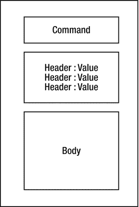
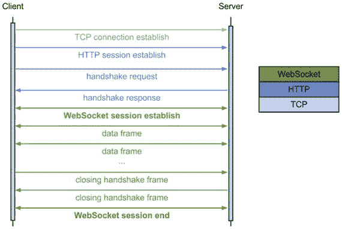

# 9. WebSocket

最初，Web 是建立在由以下部分组成的模型之上的：

*   客户端向 Web 服务器发送 HTTP 请求
*   Web 服务器返回包含所请求资源的 HTTP 响应

这种模式运行得非常好，几乎所有的 Web 应用都完全基于此模型。

随着 Web 应用变得越来越高级，页面也更具动态性，一种名为 Ajax 的新模型应运而生。¹ 使用 Ajax，可以在无需刷新整个页面的情况下执行 HTTP 请求并获取 HTTP 响应，这非常棒，因为页面现在可以变得非常动态。当使用诸如 JQuery 之类的 JavaScript 库时，这甚至变得更加容易。那么，我们是不是就没什么可担心的了呢？

## 9.1 轮询 vs. WebSocket

想象一下，在一个聊天室中，用户 A 使用 Ajax 向特定用户（比如用户 B）发送一个包含文本消息的 HTTP 请求。现在，服务器必须将此消息转发给用户 B。但是，如何做到呢？服务器无法发送 HTTP 请求；它的作用是接收 HTTP 请求，而不是发送。这就是 HTTP 的工作方式。

用户 B 如何才能透明地（我的意思是，无需刷新整个聊天室页面）获取此消息呢？这很简单——只需让用户 B 每隔三秒使用 Ajax 向服务器发送 HTTP 请求，以检查是否有针对该用户的消息。如果有消息，服务器就将它们附加到 HTTP 响应中。这就是一种轮询策略。

问题是，这是解决此问题的好方法吗？在这种场景下，每隔三秒，所有客户端都会向服务器发送 HTTP 请求，即使没有给它们的消息。这会产生开销，不是吗？此外，每次发生 HTTP 请求时，都会进行握手，并在客户端和服务器之间建立一条传输控制协议（TCP）连接。这是一个消耗资源的操作。还有另一个需要考虑的问题：HTTP 协议很冗长，带有大量头部信息，因此每个请求也会消耗带宽。

这正是 WebSocket 可以发挥作用的地方。它允许你打开一条全双工的双向 TCP 连接，双方（客户端和服务器）都可以发送帧。这些帧与 HTTP 请求不同。实际上，在 WebSocket 连接打开后，客户端和服务器之间的所有流量都通过它进行，因此不再发送 HTTP 请求。图 9-1 展示了一个帧的样子。

图 9-1.

WebSocket 帧

为了建立此 WebSocket 连接，会进行一次 HTTP 握手，以从 HTTP 升级到 WebSocket 协议（图 9-2）。

图 9-2.

WebSocket 握手

在 WebSocket 连接打开后，它会通过 ping/pong 帧使用心跳机制来保持连接活跃。

## 9.2 WebSocket 与浏览器兼容性

在某些情况下，一些旧版本的浏览器（试着找出是哪些！）可能会阻止 WebSocket 通信。为了解决这个问题，Spring 4 提供了简单的 SockJS 集成，它通过使用 HTTP 流或 HTTP 长轮询来添加回退选项，以模拟 WebSocket 行为。你将在本书后面看到使用 Spring 启用此兼容模式是多么容易。

## 9.3 原始 WebSocket vs. 基于 STOMP 的 WebSocket

正如你所了解的，WebSocket 协议允许你建立一条全双工的双向 TCP 连接，数据可以在两个方向上进行交换。现在的问题是，你实际上通过此连接传输的是什么，服务器又如何知道内容的数据类型？

基本上，原始 WebSocket 技术是低层次的，并且对消息内容保持中立，因此只能设置它是二进制数据还是文本数据；WebSocket 对消息的格式没有任何规定。这意味着客户端和服务器必须事先就它们将交换消息的格式达成一致，通信才能成功。这可能不太方便。

为了解决这个问题，WebSocket 技术可以运行在像 STOMP 这样的子协议之上，² 这是一个应用层协议，它指定了许多命令，帮助你处理文本消息，而无需担心客户端和服务器之间交换的是哪种格式（“格式”就是 STOMP 规范本身）。客户端和服务器应在握手阶段指定 WebSocket 连接期间要使用的子协议。

Spring 文档³ 对 STOMP 协议有一个很好的定义：“STOMP 是一个简单的、面向文本的消息传递协议，最初是为 Ruby、Python 和 Perl 等脚本语言创建的，用于连接到企业消息代理。它旨在解决一组常用的消息传递模式。STOMP 可以用于任何可靠的、双向的流式网络协议，例如 TCP 和 WebSocket。尽管 STOMP 是一个面向文本的协议，但消息的有效载荷可以是文本或二进制。”

请记住，你并非必须使用子协议，但使用它们会让你的工作轻松得多。在本书中，你将使用 STOMP 作为子协议来实现 WebSocket。

 WebSocket 也可以通过依赖基于 TCP 的传输层安全性（TLS）来保证安全。与 HTTP 和 HTTPS 类似，WebSocket 可以使用 WS 或 WSS 方案。

脚注 1

[`https://www.w3schools.com/xml/ajax_intro.asp`](https://www.w3schools.com/xml/ajax_intro.asp)

  2

[`https://stomp.github.io/stomp-specification-1.2.html`](https://stomp.github.io/stomp-specification-1.2.html)

  3

[`https://docs.spring.io/spring/docs/current/spring-framework-reference/html/websocket.html`](https://docs.spring.io/spring/docs/current/spring-framework-reference/html/websocket.html)

