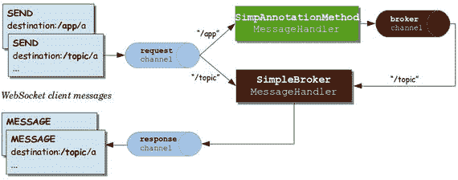
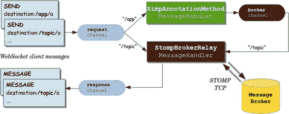

# 10. Spring WebSocket

Spring WebSocket 为 WebSocket 应用提供了良好的支持，并且当你理解了幕后发生的事情后，它很容易使用。本章将帮助你开始了解一些 Spring WebSocket 的配置可能性。


## 10.1 原始 WebSocket 配置

尽管你不会在聊天应用中使用原始 WebSocket 配置，但以下是其在 Spring 中的配置示例：

```
@Configuration
@EnableWebSocket
public class RawWebSocketConfiguration implements WebSocketConfigurer {
@Override
public void registerWebSocketHandlers(WebSocketHandlerRegistry registry) {
registry.addHandler(myRawWebSocketHandler(),  "/rawwebsocket");
}
@Bean
public WebSocketHandler myRawWebSocketHandler() {
return new MyRawWebSocketHandler();
}
}
```

这里声明了客户端将要连接的 WebSocket 端点（`ws://localhost:port/rawwebsocket`），并指定由 `MyRawWebSocket` 类的实例来处理接收到的帧。

```
public class MyRawWebSocketHandler extends TextWebSocketHandler {
public void afterConnectionEstablished(WebSocketSession session) {
TextMessage msg = new TextMessage("客户端连接成功！");
//客户端将收到此帧作为成功事件的回调
session.sendMessage(msg);
}
public void handleTextMessage(WebSocketSession session, TextMessage message) {
// 这是消息内容，可以是任何格式（json、xml、纯文本……谁知道呢？）
System.out.println(message.getPayload());
TextMessage msg = new TextMessage("消息已收到。谢谢，客户端！");
session.sendMessage(msg);
}
}
```

 还有一个 `BinaryWebSocketHandler` 类，当你通过原始 WebSocket 配置处理二进制数据时，可以继承该类。

以下是客户端代码：

```
function connectWebSocket(){
ws = new WebSocket('ws://localhost:8080/rawwebsocket');
ws.onmessage = function(event){
renderServerMessage(event.data);
};
}
function sendMessageToServer() {
var text = document.getElementById('myText').value;
var jsonMessage = JSON.stringify({ 'content': text });
ws.send(jsonMessage);
}
```

请注意，客户端以 JavaScript 对象表示法（JSON）格式向服务器发送消息。实际上，它发送 JSON 是因为它想发送一条 JSON 消息（因为客户端已经知道服务器期望的是 JSON 消息），但请记住，它也可以发送纯文本消息、XML 消息或其他任何格式（这就是原始 WebSocket 的工作方式！）。

 如果你想启用 WebSocket 浏览器兼容性，当由于兼容性问题无法使用 WebSocket 时，你必须使用某种方式来模拟 WebSocket 行为。幸运的是，SockJS¹ 可以轻松为你处理这个问题。使用 Spring 启用 SockJS 支持只需在处理程序上添加一个 `.withSockJS()` 方法调用，如下所示：

```
@Configuration
@EnableWebSocket
public class RawWebSocketConfiguration implements WebSocketConfigurer {
@Override
public void registerWebSocketHandlers(WebSocketHandlerRegistry registry) {
registry.addHandler(myRawWebSocketHandler(),   "/rawwebsocket").withSockJS();
}
@Bean
public WebSocketHandler myRawWebSocketHandler() {
return new MyRawWebSocketHandler();
}
}
```

## 10.2 基于 STOMP 的 WebSocket 配置

以下是使用 Spring 配置基于 STOMP 的 WebSocket 的方法：

```
@Configuration
@EnableWebSocketMessageBroker
public class WebSocketConfiguration extends AbstractWebSocketMessageBrokerConfigurer {
@Override
public void configureMessageBroker(MessageBrokerRegistry config) {
config.enableSimpleBroker("/queue/",  "/topic/");
config.setApplicationDestinationPrefixes("/app");
}
@Override
public void registerStompEndpoints(StompEndpointRegistry registry) {
registry.addEndpoint("/stompwebsocket").withSockJS();
}
}
```

要使用 STOMP，你需要一个 STOMP 代理。基本上，这个组件负责跟踪订阅并向订阅用户广播消息。在上述配置中，请注意以下几点：

*   通过声明两个目的地 `/queue/` 和 `/topic/`，启用了内存中的 STOMP 代理。这有助于开发阶段，但不建议用于生产环境（当你稍后学习本书中的多节点架构时，就会明白原因）。

 在 STOMP 规范中，目的地的含义有意保持不透明。它可以是任何字符串，完全由 STOMP 服务器来定义其支持的目的地的语义和语法（例如，RabbitMQ 定义了点号表示法，其中目的地名称应由点号分隔，如 `/topic/public.messages`）。然而，目的地通常是类似路径的字符串，其中 `/topic/` 表示发布-订阅²模式（一对多），而 `/queue/` 表示点对点³（一对一）消息交换。

 `/queue/` 和 `/topic/` 是代理目的地，这意味着任何发送到以这些前缀开头的目的地的帧都将由 STOMP 代理直接处理。

*   应用目的地前缀是 `/app`。基本上，当帧被发送到以 `/app` 开头的目的地时，带有 `@Controller` 注解的类会在将帧转发给代理之前处理它。更具体地说，`@Controller` 注解类中带有 `@MessageMapping` 注解的方法将处理它（如果你还不理解，不用担心）。
*   客户端将使用 JavaScript 连接到 STOMP 端点（`ws://localhost:port/stompwebsocket`）。

现在，在客户端，有一些 JavaScript 代码，如下所示：

```
function connect() {
socket = new SockJS('/stompwebsocket');
stompClient = Stomp.over(socket);
stompClient.connect({ }, function(frame) {
stompClient.subscribe('/topic/public.messages', renderPublicMessages);
});
}
function renderPublicMessages(message) {
//例如，将消息追加到一个 div 中
}
function sendMessage() {
var instantMessage;
instantMessage = {
'text' : inputMessage.val(),
'toUser' : spanSendTo.text()
}
stompClient.send("/app/send.message",  {},  JSON.stringify(instantMessage));
}
```

让我们理解一下这里发生了什么。

*   当调用 `connect` 函数时，会使用 STOMP 作为子协议打开一个新的 WebSocket 连接。
*   在成功回调中，执行一个匿名函数，用户订阅了 `/topic/public.messages` 目的地。从现在起，该用户将能够接收发送到该目的地的任何消息（来自任何客户端甚至服务器端），并将其传递给 `renderPublicMessages` 函数，该函数会将消息追加到一个 `div` 中，例如。
*   当调用 `sendMessage` 函数时，会向 `/app/send.message` 目的地发送一个包含消息的帧。还记得吗，发送到以 `/app` 开头的目的地的每条消息都将由 `@Controller` 注解类中的 `@MessageMapping` 方法处理？这就是处理它的方法：


```
    @Controller
    public class ChatRoomController {
    @Autowired
    private SimpMessagingTemplate simpMessagingTemplate;
    @MessageMapping("/send.message")
    public void sendPublicMessage(InstantMessage instantMessage) {
    simpMessagingTemplate.convertAndSend("/topic/public.messages",   instantMessage);
    }
    }
    ```

Spring 会将帧内容转换为 `instantMessage` 对象，并调用 `sendPublicMessage` 方法，该方法使用 `SimpMessagingTemplate` 中的 `convertAndSend` 方法将消息广播到 `/topic/public.messages` 目的地。还记得所有以 `/topic/` 开头的内容都是代理目的地吗？那么，谁来处理这条消息呢？没错，就是代理！实际上，代理会接收这条消息，并将其转发给该目的地的每个订阅用户（包括发送消息的用户，因为该用户也订阅了这个目的地，正如你在之前的 JavaScript 匿名函数中看到的那样）。

好了，就是这样。通过这些简单的代码示例，你就能在 Spring 框架上使用基于 STOMP 的 WebSocket 发送和接收公共消息了。这真是太棒了！

 如果 `sendPublicMessage` 返回任何对象（例如 `instantMessage` 对象），Spring 会自动将其解释为你希望将该对象发送到代理目的地。按照惯例，它会尝试将其发送到 `/topic/public.messages` 目的地，因为消息是通过 `/chatroom/public.messages` 目的地接收的（这是一种约定），但你也可以使用 `@SendTo` 注解轻松更改目标代理目的地。就我个人而言，我认为使用 `simpMessagingTemplate` 能让阅读代码的人更容易理解，但这取决于你的选择。

## 10.3 使用简单代理的消息流

图 10-1 展示了使用简单代理的消息流。这张图乍一看可能令人困惑，但这正是你刚刚了解到的流程。



图 10-1.

消息流：简单代理

当你通过基于 STOMP 的 WebSocket 发送一个帧时，消息首先会到达 `clientInboundChannel`。在那里，它会根据目的地名称被路由到特定的 `MessageHandler`。如果名称以 `/app` 开头，则会被路由到 `SimpAnnotationMethod` 消息处理器（该处理器最终会调用 `@Controller` 类中带有 `@MessageMapping` 注解的方法）。如果名称以 `/topic` 开头，则会被直接路由到 SimpleBroker⁴ 消息处理器。

让我们看一个帧 `SEND /app/a` 的例子。首先，`clientInboundChannel` 会接收它并将其转发给 `SimpAnnotationMethod` 消息处理器。然后，从带有 `@MessageMapping` 注解的方法中，消息会被转发到 `brokerChannel`。这会将消息发送给 `SimpleBroker` 消息处理器。该消息处理器维护着一个 `ConcurrentHashMap`，其中包含每个已连接客户端的 WebSocket 会话 ID，以及 `SubscriptionRegistry`（内存中）中的所有订阅。然后，消息处理器使用 WebSocket 客户端 ID 将消息转发到相应的 `clientOutboundChannel`，最终将消息发送给客户端。

 请注意，使用简单代理方法时，订阅信息保存在内存中。

## 10.4 使用完整外部 STOMP 代理的消息流

图 10-2 展示了相同的消息流，不同之处在于，消息处理器不再将订阅信息保存在内存中，而是将订阅委托给一个外部 STOMP 代理。你能理解为什么这如此重要吗？你将在下一章中了解原因！



图 10-2.

消息流：完整外部 STOMP 代理

 查看可用的 STOMP 代理列表⁵。

 在聊天应用中，你将使用带有 STOMP 插件⁶ 的 RabbitMQ 作为完整的外部 STOMP 代理。

你将在第 3 部分“按功能编码”中了解更多关于 Spring WebSocket 的内容。

脚注 1

[`https://github.com/sockjs`](https://github.com/sockjs)

  2

[`www.enterpriseintegrationpatterns.com/patterns/messaging/PublishSubscribeChannel.html`](http://www.enterpriseintegrationpatterns.com/patterns/messaging/PublishSubscribeChannel.html)

  3

[`www.enterpriseintegrationpatterns.com/patterns/messaging/PointToPointChannel.html`](http://www.enterpriseintegrationpatterns.com/patterns/messaging/PointToPointChannel.html)

  4

[`https://github.com/spring-projects/spring-framework/blob/master/spring-messaging/src/main/java/org/springframework/messaging/simp/broker/SimpleBrokerMessageHandler.java`](https://github.com/spring-projects/spring-framework/blob/master/spring-messaging/src/main/java/org/springframework/messaging/simp/broker/SimpleBrokerMessageHandler.java)

  5

[`https://stomp.github.io/implementations.html`](https://stomp.github.io/implementations.html)

  6

[`https://www.rabbitmq.com/web-stomp.html`](https://www.rabbitmq.com/web-stomp.html)


