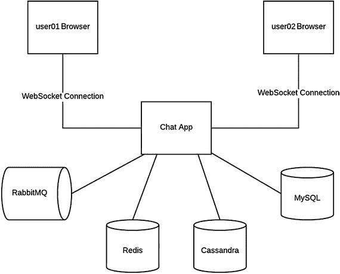

# 11. 单节点聊天架构

图 11-1 展示了单节点聊天应用的简化架构图。如果你按照第 2 章的步骤操作，这张图正是你本地机器上当前运行的内容。



图 11-1.

单节点聊天应用

当你注册新账户时，用户信息会存储在 MySQL 中，并且系统会为用户分配 `ROLE_USER` 角色，这意味着该用户无权创建新的聊天室。

登录后，系统会显示所有可用聊天室的列表。聊天室及其关联的用户以 Redis 哈希¹ 数据类型存储在 Redis 中。基本上，Redis 哈希是一种数据结构，允许你将多个 `key : value` 条目关联到一个唯一的键。在以下示例中，唯一键是 `chatrooms:c4f045bb-8dfd-4620-b365-fd3b4fbeb46e`：

```
HGETALL chatrooms:c4f045bb-8dfd-4620-b365-fd3b4fbeb46e
"id" : "c4f045bb-8dfd-4620-b365-fd3b4fbeb46e"
"name" : "Top Guitarists"
"description" : "Meet the most amazing guitarists"
```

 `HGETALL` ² 是 Redis 命令，用于获取一个哈希及其关联的所有 `key : value` 条目。

当你加入一个聊天室时，客户端会执行一段 JavaScript 代码片段。它会通过 STOMP 协议启动一个 WebSocket 连接到聊天服务器。如果连接失败，它将每十秒重试一次。

```
function connect() {
socket = new SockJS('/ws');
stompClient = Stomp.over(socket);
stompClient.connect({ 'chatRoomId' : chatRoomId }, stompSuccess, stompFailure);
}
function stompFailure(error) {
errorMessage("Lost connection to WebSocket! Reconnecting in 10 seconds...");
disableInputMessage();
setTimeout(connect, 10000);
}
```

正如你所了解的，WebSocket 连接建立后，所有通信都通过 WebSocket 连接进行，而非 HTTP 请求。

```
function stompSuccess(frame) {
enableInputMessage();
successMessage("Your WebSocket connection was successfully established!")
stompClient.subscribe('/chatroom/connected.users', updateConnectedUsers);
stompClient.subscribe('/chatroom/old.messages', oldMessages);
stompClient.subscribe('/topic/' + chatRoomId + '.public.messages', publicMessages);
stompClient.subscribe('/user/queue/' + chatRoomId + '.private.messages', privateMessages);
stompClient.subscribe('/topic/' + chatRoomId + '.connected.users', updateConnectedUsers);
}
```

WebSocket 连接一启动，就会发生以下主要事件：

*   客户端请求获取与该聊天室关联的已连接用户及其历史消息（整个对话记录）。对话记录从 Cassandra 中获取。
*   客户端还会订阅以下更新通知：用户加入或离开聊天室、发送公共消息、或用户收到私密消息。

在服务器端，一旦用户连接，Redis 中的聊天室信息会更新，以添加新连接的用户。

在聊天室中，用户看到的所有消息（公共消息、私密消息和系统消息）都会被追加到 Cassandra 中该用户的对话记录里。

 系统消息是由管理员发送的公共消息，用于通知所有人有用户加入或离开了聊天室。

请注意，在单节点架构中，从功能角度来看，内存代理方法可以完美运行，因为每个订阅都会保存在服务器的内存中，并且每个 WebSocket 连接也会绑定到同一台服务器。

脚注 1

[`https://redis.io/topics/data-types`](https://redis.io/topics/data-types)

2

[`https://redis.io/commands/hgetall`](https://redis.io/commands/hgetall)

