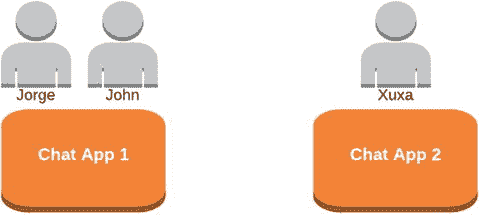
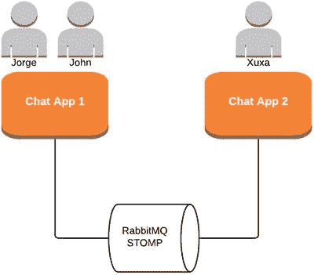
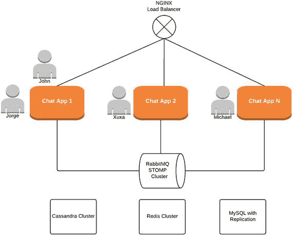

# 12. 多节点聊天架构

假设你想通过在不同服务器上运行两个聊天应用实例来水平扩展聊天应用。同时假设你仍在使用内存中的 `SimpleBroker`。

在图 12-1 中，Jorge 和 John 与服务器 1 建立了 WebSocket 连接，而 Xuxa 与服务器 2 建立了 WebSocket 连接。如果 Jorge 试图向 Xuxa 发送消息，会发生什么？我想你已经知道答案了！由于 Xuxa 没有连接到服务器 1，该服务器不知道用户 Xuxa 的存在。因此，消息会丢失。然而，如果 Jorge 向 John 发送消息，则可以正常工作。



图 12-1.

两个聊天实例：简单代理

内存代理方法完全无法用于水平扩展你的聊天应用。


## 12.1 将 RabbitMQ 用作完整的外部 STOMP 代理

现在，如果你开始使用像 RabbitMQ 这样的完整外部 STOMP 代理，你将遇到如图 12-2 所示的场景。



图 12-2.

两个聊天实例：代理中继

现在，订阅不再绑定到特定的服务器实例；也就是说，订阅不再保存在服务器的内存中。有一个外部组件负责处理订阅。针对此场景的 Spring 配置如下所示：

```
protected void configureStompEndpoints(StompEndpointRegistry registry) {
registry.addEndpoint("/ws").withSockJS();
}
public void configureMessageBroker(MessageBrokerRegistry registry) {
registry.enableStompBrokerRelay("/queue/",  "/topic/")
.setUserDestinationBroadcast("/topic/unresolved.user.dest")
.setUserRegistryBroadcast("/topic/registry.broadcast")
.setRelayHost(relayHost)
.setRelayPort(relayPort);
registry.setApplicationDestinationPrefixes("/chatroom");
}
```

让我们来看看这些配置：

*   **enableStompBrokerRelay**：此配置使用一个完整的外部 STOMP 代理，而不是内存中的代理。
*   **setRelayHost 和 setRelayPort**：这两个配置分别用于设置外部 STOMP 代理（本例中为 RabbitMQ）的主机和端口。
*   **setUserDestinationBroadcast**：用户目标可能因为用户连接到不同的服务器（例如 Jorge 和 Xuxa）而无法解析。在这种情况下，此目标用于广播未解析的消息，以便其他服务器有机会尝试处理。
*   **setUserRegistryBroadcast**：此配置设置一个目标，用于广播本地用户注册表（内存中存储已连接客户端的位置）的内容，并监听来自其他服务器的此类广播。在多节点架构中，这允许每个服务器的用户注册表知晓连接到其他服务器的用户。换句话说，它使聊天应用 1 能够知晓 Xuxa 存在于聊天应用 2 中。

当应用程序启动时，只有 `/topic/unresolved.user.dest` 和 `/topic/registry.broadcast` 这两个目标会在 RabbitMQ 上创建。Spring 在服务器和 RabbitMQ 之间保持一个“系统”TCP 连接，该连接不用于用户消息；它仅用于服务器和代理之间的内部通信（例如，默认情况下每十秒发送一次心跳消息以检查代理是否存活）。如果 Spring 检测到代理发生故障，则默认情况下它将每五秒尝试重新连接一次。

对于每个新的 WebSocket 连接，服务器都会与代理创建一个新的 TCP 连接。这个连接才是实际用于用户消息的连接。

现在，你已经有了一个适用于多节点架构的解决方案，你可以将更多聊天应用实例添加到像 Nginx¹ 这样的负载均衡器后面，从而获得一个高度可扩展的架构，如图 12-3 所示。



图 12-3.

多节点聊天架构

请注意，此架构的每个组件都可以集群化，并且可以实现复制策略。这意味着即使某些节点发生故障，此架构也能继续工作。这真是太棒了！

 在处理可扩展性时，有许多方面需要考虑，例如，增加操作系统能够使用的套接字描述符数量。你必须记住，水平扩展非常出色，但在向基础设施添加更多节点（以及更多成本）之前，你可以尝试许多其他方法。

脚注 1

[`https://www.nginx.com/blog/websocket-nginx/`](https://www.nginx.com/blog/websocket-nginx/)

