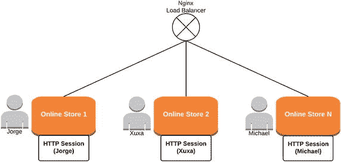
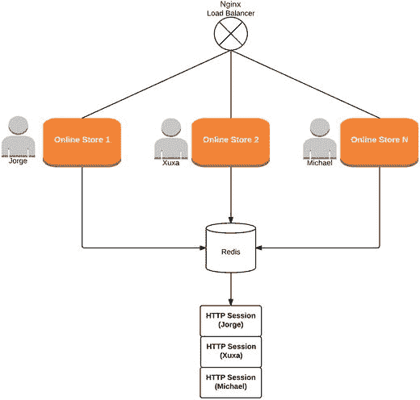

# 13. 水平扩展有状态 Web 应用

让我们暂时忘记 WebSocket 技术，思考一下传统的 Web 应用。你已经了解了请求/响应 HTTP 模型，并且知道 HTTP 是无状态的。这意味着，在服务器对请求给出响应后，它会关闭 TCP 连接，并且不再知道关于客户端的任何信息（甚至不知道客户端是否会发出其他请求）。这在某些情况下可能有效，但试想一个在线商店。如果 HTTP 是无状态的，商店如何能够在多个请求之间保持购物车中的商品呢？为了解决这个问题，Web 服务器提供了一种 HTTP 会话机制，它本质上是每个用户的本地存储，并与一个特定的代码（在 Java 中，是 `JSESSIONID` 代码）相关联。当用户向服务器发送第一个请求时，服务器会创建一个新的 HTTP 会话，并通过 cookie 将 `JSESSIONID` 代码发送给用户。如果客户端发送第二个请求，`JSESSIONID` 代码将在 HTTP 请求中可用，服务器将能够识别出这是一个回访用户。这意味着，如果购物车存储在 HTTP 会话中，服务器将能够在多个请求之间保持它。

这听起来不错，但在涉及水平扩展时，这是一个大问题。你能猜到为什么吗？如果一个在线商店的多节点架构是使用负载均衡器实现的，并且一个名为 Jorge 的用户将其购物车存储在服务器 1 的 HTTP 会话中，而在下一个请求中，负载均衡器将其发送到服务器 2，会发生什么？他的购物车在那里将不可用，对吧？（见图 13-1。）



图 13-1.

没有会话管理器的多节点在线商店


## 13.1 使用粘性会话策略

你可能会想：“好吧，但如果负载均衡器总是将特定用户的请求发送到特定服务器呢？那么用户的 HTTP 会话将始终存在。因此，用户的购物车在请求之间将始终可用，直到此 HTTP 会话过期。” 你说得完全正确，这就是所谓的**粘性会话策略**。但是，当你考虑节点故障场景时，问题又出现了。

想象一下，负载均衡器正在使用粘性会话策略，每个用户请求都被路由到同一台服务器。一切运行完美。但突然这台服务器崩溃了（意味着用户的 HTTP 会话丢失了），负载均衡器被迫将用户转发到另一台服务器。然后会发生什么？用户的购物车再次丢失。

另外，如果开发人员在用户在线时部署了在线商店应用程序的新版本，会发生什么？好吧，没有什么魔法发生；服务器必须重启才能应用新版本，那么用户的 HTTP 会话会怎样？你已经知道答案了。但是……你也已经知道解决方案，因为这与你之前在添加 RabbitMQ 作为完整的外部 STOMP 代理到架构时，针对 WebSocket 技术所做的操作类似。

为什么不将 HTTP 会话持久化到你已经在使用的关系数据库中呢？嗯，这与第 7 章“Redis 概述”部分中使用的场景非常相似。你还记得查询关系数据库比查询 Redis 这样的内存解决方案要昂贵得多吗？

图 13-2 展示了使用 Redis 作为会话管理器的架构。你不觉得现在的架构看起来好多了吗？如果一个节点崩溃，负载均衡器将用户重定向到另一个服务器实例，这没有问题。服务器会注意到它本地没有与任何用户 HTTP 会话关联的特定 `JSESSIONID` 代码，因此它会查询 Redis 来查找它。一旦在 Redis 上找到用户的会话，它就会将其带回服务器内存，一切继续正常运行。负载均衡器现在会继续向这台服务器发送请求，因为它正在使用粘性会话。用户甚至不知道所有这些事情在幕后发生。购物愉快，亲爱的用户！



图 13-2. 使用 Redis 作为会话管理器的多节点在线商店

现在的问题是，你如何在服务器端实现这种机制，以便它从 Redis 获取 HTTP 会话？嗯，如果你使用 Spring 框架，有一个很棒的 Spring Session¹ 子项目可以为你处理这个问题。将 Spring Session 与 Redis 结合使用非常简单，尤其是在你借助 Spring Boot 进行配置时。

## 13.2 Spring Session 与 WebSocket

你在聊天应用程序中使用 Spring Session 将 HTTP 会话存储在 Redis 上，但这里的情况略有不同。

在 Spring 中，当你打开一个新的 WebSocket 连接时，服务器端会创建一个新的 WebSocket 会话。顺便说一下，你已经知道这些 WebSocket 会话存储在相应的 `MessageHandler` 中。这个 WebSocket 会话将保持活动状态，直到其中一方显式关闭它或 HTTP 会话过期。这就是 JSR-356² 的工作方式。

 这里不要混淆。HTTP 会话和 WebSocket 会话是不同的东西。HTTP 会话是在用户向服务器发出第一个 HTTP 请求时创建的。然而，WebSocket 会话仅在用户已经拥有关联的 HTTP 会话并成功执行 WebSocket 握手后才创建。

问题在于 JSR-356 没有拦截 WebSocket 消息的机制。换句话说，当你仅使用 WebSocket 连接而不执行任何 HTTP 请求时，服务器会认为 HTTP 会话处于非活动状态，并且如你所知，每个 HTTP 会话都有一个过期阈值。如果超过此阈值，服务器将终止用户的 HTTP 会话，并且这样做也会导致用户的 WebSocket 连接消失。

引用 Spring Session 文档³ 中的说法，考虑一个通过 HTTP 请求完成大部分工作的电子邮件应用程序。假设其中还嵌入了一个通过 WebSocket API 工作的聊天应用程序。如果用户正在积极地与某人聊天，你不应该让 `HttpSession` 超时，因为那会造成非常糟糕的用户体验。然而，这正是 JSR-356 所做的。

此外，根据 JSR-356，如果 `HttpSession` 超时，任何使用该 `HttpSession` 和经过身份验证的用户创建的 WebSocket 都应该被强制关闭。这意味着，如果你在应用程序中积极聊天但没有使用 `HttpSession`，那么你也会断开与对话的连接。

为了解决这个问题，可以将 Spring Session 配置为确保 WebSocket 消息能使你的 `HttpSession` 保持活动状态。要在聊天应用程序中将 Spring Session 与 Spring WebSocket 一起配置，你需要执行以下操作：

1.  在 `pom.xml` 中添加 Spring Session 依赖项。

    ```
    org.springframework.session
    spring-session

    ```

2.  在 `application.yml` 中，将 Spring Session 的 `storage-type` 配置为 `redis`，如下所示：

    ```
    spring:
    session:
    store-type: redis
    ```

3.  现在，在 WebSocket 配置类中，不再像第 10 章“基于 STOMP 的 WebSocket 配置”部分那样继承 `AbstractWebSocketMessageBrokerConfigurer`，而是继承 `AbstractSessionWebSocketMessageBrokerConfigurer<ExpiringSession>`。另外，在类声明中添加 `@EnableScheduling` 注解。

    ```
    @Configuration
    @EnableScheduling
    @EnableWebSocketMessageBroker
    public class WebSocketConfigSpringSession extends AbstractSessionWebSocketMessageBrokerConfigurer {
    ...
    }
    ```

就是这样。你现在可以停下来喝杯咖啡，想想 Spring 是多么神奇。

脚注 1

[`http://projects.spring.io/spring-session/`](http://projects.spring.io/spring-session/)

  2

[`https://jcp.org/en/jsr/detail?id=356`](https://jcp.org/en/jsr/detail?id=356)

  3

[`https://github.com/spring-projects/spring-session/blob/master/docs/src/docs/asciidoc/index.adoc#websocket-why`](https://github.com/spring-projects/spring-session/blob/master/docs/src/docs/asciidoc/index.adoc#websocket-why)

