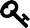

# 第三部分
按功能编码

按功能编码

在本书的这一部分，我将讨论聊天应用程序中每个功能的代码。再次强调，本书并非旨在教授 Spring 的基础知识，因此我假设你已经对依赖注入、控制器、服务等有基本的了解。

 如果你需要提高 Spring 框架的技能，我建议你查看官方的 Spring 框架文档¹。它提供了许多示例和优秀的教程。

脚注 1

`https://spring.io/docs`

