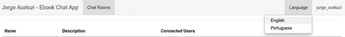

# 14. 更改应用程序语言

通过在应用程序菜单中选择所需语言，可以翻译所有聊天应用程序文本（图 14-1）。这样，来自不同国家的用户就能更好地使用该系统。这个概念通常被称为国际化（或 I18N）。



图 14-1.

语言菜单

使用 Spring MVC¹ 实现国际化非常简单。

基本上，你需要让 `@Configuration` 类继承自 `WebMvcConfigurerAdapter` 来进行一些 Spring MVC 配置。

```
@Configuration
public class WebConfig extends WebMvcConfigurerAdapter {
@Bean
public LocaleResolver localeResolver() {
return new SessionLocaleResolver();
}
@Bean
public LocaleChangeInterceptor localeChangeInterceptor() {
LocaleChangeInterceptor localeChangeInterceptor = new LocaleChangeInterceptor();
localeChangeInterceptor.setParamName("lang");
return localeChangeInterceptor;
}
@Override
public void addInterceptors(InterceptorRegistry registry) {
registry.addInterceptor(localeChangeInterceptor());
}
}
```

在这个类中，你为 `LocaleResolver` 设置了 `@Bean`。Spring 有许多 `LocaleResolver` 的实现，例如 `SessionLocaleResolver` 和 `CookieLocaleResolver`。

*   `SessionLocaleResolver`：这会将一个区域设置属性保存在用户的 HTTP 会话中，因此只要用户的 HTTP 会话处于活动状态，该用户使用的区域设置就是 HTTP 会话区域设置属性中指定的那个。
*   `CookieLocaleResolver`：这使用发送回用户的 cookie。对于不使用 HTTP 会话的无状态应用程序，此选项特别有用。

在前面的配置中，`LocaleChangeInterceptor` 会拦截每个请求，以检查是否存在 `lang` 参数。假设一个 GET 请求携带了 `lang=pt` 参数。基本上，这个拦截器会拦截此请求，将用户的区域设置设置为 `pt`（葡萄牙语），并将其存储在用户的 HTTP 会话区域设置属性中。从现在开始，所有应用程序文本都将从资源包 `messages_pt.properties` 中读取。

以下是菜单项的代码。当你单击英语或葡萄牙语菜单项时，将触发一个 GET 请求，并携带相应的 `param` 属性（`en` 或 `pt`）。

```
English
Portuguese

```

为了从适当的资源包（基于设置的区域设置）读取消息，Thymeleaf² 可以通过 `th:text` 帮助你。

```
Login
```

这段代码意味着键 `login.title` 的值将显示在 `h3` 超文本标记语言（HTML）元素内部。

脚注 1

[`https://docs.spring.io/spring/docs/current/spring-framework-reference/htmlsingle/#mvc-localeresolver`](https://docs.spring.io/spring/docs/current/spring-framework-reference/htmlsingle/#mvc-localeresolver)

  2

[`https://www.thymeleaf.org/`](https://www.thymeleaf.org/)

