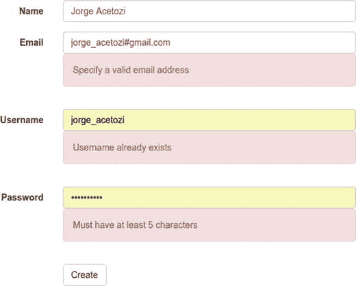

# 16. 新建账户

以下代码是 `User` 类。除了属性声明外，你还使用了 [Bean](http://beanvalidation.org/1.1/spec/) 验证¹和 Hibernate Validator² 注解。一个有效的新用户必须满足以下条件：

*   `username`：不能为空，且长度必须在 5 到 15 个字符之间。该字段是 `user` 数据库表的主键。
*   `password`：不能为空，且至少包含 5 个字符。
*   `name`：不能为空。
*   `email`：不能为空，且必须是有效的电子邮件地址。

```
@Entity
@Table(name = "user")
public class User {
@Id
@NotEmpty
@Size(min = 5, max = 15)
private String username;
@NotEmpty
@Size(min = 5)
private String password;
@NotEmpty
private String name;
@Email
@NotEmpty
private String email;
@ManyToMany(fetch=FetchType.EAGER)
@JoinTable(name = "user_role",
joinColumns = @JoinColumn(name = "username"),
inverseJoinColumns = @JoinColumn(name = "role_id"))
private Set roles = new HashSet();
...
}
```

除了这些简单的验证之外，你还必须确保提供的用户名不存在。为此，你创建了一个自定义的 Spring 验证器。

```
@Component
public class NewUserValidator implements Validator {
@Autowired
private UserRepository userRepository;
@Override
public boolean supports(Class clazz) {
return User.class.isAssignableFrom(clazz);
}
@Override
public void validate(Object target, Errors errors) {
User newUser = (User) target;
if (userRepository.exists(newUser.getUsername())) {
errors.rejectValue("username", "new.account.username.already.exists");
}
}
}
```

基本上，`NewUserValidator` 实现了 `Validator` Spring 接口，并使用 `UserRepository` 查询数据库以检查用户名是否已存在。如果存在，则会向 `Errors` 对象添加一条新错误。

 请注意，添加的错误包含错误消息的键，即 `new.account.username.already.exists`。你可以在附录中查看其值。

一旦 `new-account.html` 中的表单被提交，`AuthenticationController` 中的 `createAccount` 方法就会被调用。

```
@Controller
public class AuthenticationController {
@Autowired
private UserService userService;
@Autowired
private NewUserValidator newUserValidator;
@InitBinder
protected void initBinder(WebDataBinder binder) {
binder.addValidators(newUserValidator);
}
@RequestMapping(path = "/new-account", method = RequestMethod.POST)
public String createAccount(@Valid User user, BindingResult bindingResult) {
if (bindingResult.hasErrors()) {
return "new-account";
}
userService.createUser(user);
return "redirect:/";
}
}
```

请注意，你将 `NewUserValidator` 添加到了验证器中。这使得 Spring 在针对带有 `@Valid` 注解的新 `User` 对象进行验证时，除了使用 `User` 类中的简单验证外，还会使用你的自定义验证器。如果存在任何错误，用户将被重定向到新建账户表单并显示错误，如图 16-1 所示。



图 16-1.

验证

为了在页面中自动显示错误消息，Thymeleaf 提供了 `th:errors`。

```

用户名

错误

```

当提交的用户信息全部正确时，会调用 `userService.createUser(user)`。

```
@Service
public class DefaultUserService implements UserService {
@Autowired
private UserRepository userRepository;
@Autowired
private RoleRepository roleRepository;
@Autowired
private BCryptPasswordEncoder bCryptPasswordEncoder;
@Override
@Transactional
public User createUser(User user) {
user.setPassword(bCryptPasswordEncoder.encode(user.getPassword()));
Role userRole = roleRepository.findByName("ROLE_USER");
user.addRoles(Arrays.asList(userRole));
return userRepository.save(user);
}
}
```

本质上，该方法使用 `BCryptPasswordEncoder` 组件加密用户密码，将 `ROLE_USER` 角色附加到其角色列表中，并将用户保存到数据库。由于 `ROLE_USER` 不允许你创建新的聊天室，因此每个新用户都将无法使用此功能。

脚注 1

[`http://beanvalidation.org/1.1/spec/`](http://beanvalidation.org/1.1/spec/)

2

[`http://hibernate.org/validator/`](http://hibernate.org/validator/)

