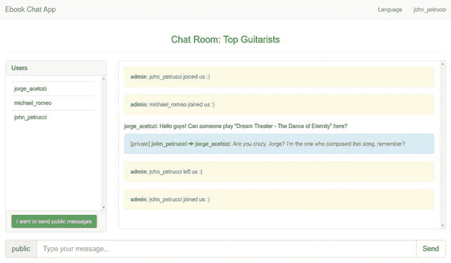

# 18. 加入聊天室

当你加入聊天室时，一些 JavaScript 代码会在客户端执行。

```
function connect() {
socket = new SockJS('/ws');
stompClient = Stomp.over(socket);
stompClient.connect({ 'chatRoomId' : chatRoomId }, stompSuccess, stompFailure);
}
function stompSuccess(frame) {
enableInputMessage();
successMessage("Your WebSocket connection was successfully established!")
stompClient.subscribe('/chatroom/connected.users',updateConnectedUsers);
stompClient.subscribe('/chatroom/old.messages',  oldMessages);
stompClient.subscribe('/topic/' + chatRoomId + '.public.messages', publicMessages);
stompClient.subscribe('/user/queue/' + chatRoomId + '.private.messages', privateMessages);
stompClient.subscribe('/topic/' + chatRoomId + '.connected.users', updateConnectedUsers);
}
function stompFailure(error) {
errorMessage("Lost connection to WebSocket! Reconnecting in 10 seconds...");
disableInputMessage();
setTimeout(connect, 10000);
}
```

首先，调用 `connect` 函数，并使用 STOMP 作为子协议启动一个新的 WebSocket 连接。请注意，在发送 `CONNECT` 帧时，你还需要添加头部 `'chatRoomId' : chatRoomId`，因为服务器必须保留此信息以确保它操作的是正确的目标名称。

如果握手成功，则会调用 `stompSuccess` 函数，并且用户会订阅一些目标。实际上，前两个订阅仅在服务器端执行一次，用于获取一些初始数据，即用户的历史对话以及当前连接到该特定聊天室的用户。以下是这两个订阅发生时执行的 Java 代码：

```
@Controller
public class ChatRoomController {
@Autowired
private ChatRoomService chatRoomService;
@Autowired
private InstantMessageService instantMessageService;
@SubscribeMapping("/connected.users")
public List listChatRoomConnectedUsersOnSubscribe(SimpMessageHeaderAccessor headerAccessor) {
String chatRoomId = headerAccessor.getSessionAttributes().get("chatRoomId").toString();
return chatRoomService.findById(chatRoomId).getConnectedUsers();
}
@SubscribeMapping("/old.messages")
public List listOldMessagesFromUserOnSubscribe(Principal principal, SimpMessageHeaderAccessor headerAccessor) {
String chatRoomId = headerAccessor.getSessionAttributes().get("chatRoomId").toString();
return instantMessageService.findAllInstantMessagesFor(principal.getName(), chatRoomId);
}
...
}
```

 `List<ChatRoomUser>` 列表从 Redis 中获取，而 `List<InstantMessage>` 列表则从 Cassandra 中获取。

 当用户需要通过 WebSocket 连接获取初始数据时，`@SubscribeMapping` 注解非常有用。

JavaScript 代码中的最后三个订阅分别如下：

*   当新消息到达 `'/topic/' + chatRoomId + '.public.messages'` 目标时，执行 `publicMessages` 函数。此函数将在用户的消息面板中渲染一条公共消息。
*   当新消息到达 `'/user/queue/' + chatRoomId + '.private.messages'` 目标时，执行 `privateMessages` 函数。此函数将在用户的消息面板中渲染一条私有消息。
*   当新消息到达 `'/topic/' + chatRoomId + '.connected.users'` 目标时，执行 `updateConnectedUsers` 函数。此函数将更新用户连接用户面板中的在线用户列表。

## 18.1 WebSocket 重连策略

当 WebSocket 连接丢失时，会执行 `stompFailure` 函数，该函数将每隔十秒尝试重新建立连接。如果重连成功，则之前解释的所有过程将再次发生。由于每条消息都存储在 Cassandra 中（无论是否通过 WebSocket 连接传递），即使有人在用户离线时向他发送了消息，当用户重新连接时，该消息也会出现在 `List<InstantMessage>` 列表中，并显示在用户的消息面板中。

## 18.2 WebSocket 事件

一旦 WebSocket 连接建立或断开，服务器端就会触发一个事件，并向聊天室中的每个已连接用户发送一条系统消息，通知他们有人加入或离开了（图 18-1）。



图 18-1.

来自管理员的系统消息

以下是服务器端处理这些事件的代码：

```
@Component
public class WebSocketEvents {
@Autowired
private ChatRoomService chatRoomService;
@EventListener
private void handleSessionConnected(SessionConnectEvent event) {
SimpMessageHeaderAccessor headers = SimpMessageHeaderAccessor.wrap(event.getMessage());
String chatRoomId = headers.getNativeHeader("chatRoomId").get(0);
headers.getSessionAttributes().put("chatRoomId", chatRoomId);
ChatRoomUser joiningUser = new ChatRoomUser(event.getUser().getName());
chatRoomService.join(joiningUser, chatRoomService.findById(chatRoomId));
}
@EventListener
private void handleSessionDisconnect(SessionDisconnectEvent event) {
SimpMessageHeaderAccessor headers = SimpMessageHeaderAccessor.wrap(event.getMessage());
String chatRoomId = headers.getSessionAttributes().get("chatRoomId").toString();
ChatRoomUser leavingUser = new ChatRoomUser(event.getUser().getName());
chatRoomService.leave(leavingUser, chatRoomService.findById(chatRoomId));
}
}
```

让我们以 `SessionConnected` 事件为例，跟踪整个流程。

当 WebSocket 连接建立时，会调用 `handleSessionConnected` 方法。然后，从 `CONNECT` 帧的头部获取 `chatRoomId` 值，并将其作为属性存储在用户的 WebSocket 会话中。这样做很方便，因为从现在开始，客户端发送的每条消息都不需要再提供 `chatRoomId` 值，因为它已经存储在用户的 WebSocket 会话中了。接着，调用 `join` 方法，并将 `joiningUser` 和 `chatRoom` 作为参数传入。

```
@Service
public class RedisChatRoomService implements ChatRoomService {
@Autowired
private SimpMessagingTemplate webSocketMessagingTemplate;
@Autowired
private ChatRoomRepository chatRoomRepository;
@Autowired
private InstantMessageService instantMessageService;
@Override
public ChatRoom join(ChatRoomUser joiningUser, ChatRoom chatRoom) {
chatRoom.addUser(joiningUser);
chatRoomRepository.save(chatRoom);
sendPublicMessage(SystemMessages.welcome(chatRoom.getId(), joiningUser.getUsername()));
updateConnectedUsersViaWebSocket(chatRoom);
return chatRoom;
}
@Override
public ChatRoom leave(ChatRoomUser leavingUser, ChatRoom chatRoom) {
sendPublicMessage(SystemMessages.goodbye(chatRoom.getId(), leavingUser.getUsername()));
chatRoom.removeUser(leavingUser); chatRoomRepository.save(chatRoom);
updateConnectedUsersViaWebSocket(chatRoom);
return chatRoom;
}
@Override
public void sendPublicMessage(InstantMessage instantMessage) {
webSocketMessagingTemplate.convertAndSend(
Destinations.ChatRoom.publicMessages(instantMessage.getChatRoomId()), instantMessage);
instantMessageService.appendInstantMessageToConversations(instantMessage);
}
private void updateConnectedUsersViaWebSocket(ChatRoom chatRoom) {
webSocketMessagingTemplate.convertAndSend(
Destinations.ChatRoom.connectedUsers(chatRoom.getId()),
chatRoom.getConnectedUsers());
}
}
```


### 18.2.1 通过 WebSocket 发送公共系统消息

现在我们来分析 `join` 方法。首先，它将用户添加到 `chatRoom` 对象中，并将其持久化到 Redis；接着，它调用 `sendPublicMessage` 方法，该方法使用 `SimpMessagingTemplate`（你在本书中已经使用过）以 `admin` 用户的身份发送一条公共欢迎消息。所有已连接的用户都能收到这条消息，因为它被发送到了 `'/topic/' + chatRoomId + '.public.messages'` 目标地址，这是用户建立 WebSocket 连接时订阅的地址之一。然后，它调用 `InstantMessageService` 组件中的 `appendInstantMessageToConversations` 方法，该方法负责将消息存储到 Cassandra 中的用户会话记录中。以下是该方法的代码：

```
@Service
public class CassandraInstantMessageService implements InstantMessageService {
@Autowired
private InstantMessageRepository instantMessageRepository;
@Autowired
private ChatRoomService chatRoomService;
@Override
public void appendInstantMessageToConversations(InstantMessage instantMessage) {
if (instantMessage.isFromAdmin() || instantMessage.isPublic()) {
ChatRoom chatRoom = chatRoomService.findById(instantMessage.getChatRoomId());
chatRoom.getConnectedUsers().forEach(connectedUser -> {
instantMessage.setUsername(connectedUser.getUsername());
instantMessageRepository.save(instantMessage);
});
} else {
instantMessage.setUsername(instantMessage.getFromUser());
instantMessageRepository.save(instantMessage);
instantMessage.setUsername(instantMessage.getToUser());
instantMessageRepository.save(instantMessage);
}
}
@Override
public List findAllInstantMessagesFor(String username, String chatRoomId) {
return instantMessageRepository.findInstantMessagesByUsernameAndChatRoomId(username, chatRoomId);
}
}
```

这段代码本质上是在 Cassandra 中为相关用户保存消息。例如，如果你向我发送一条私密消息，该方法会将消息追加到我的会话和你的会话中。但如果你发送一条公共消息，该方法会将消息追加到每个已连接用户的会话中。

最后，它调用 `updateConnectedUsersViaWebSocket` 方法，该方法也会向 `'/topic/' + chatRoomId + '.connected.users'` 目标地址发送一条公共消息。由于所有用户都订阅了这个目标地址，他们能够收到消息并更新其已连接用户面板。

本质上，当用户离开聊天室时，也会发生相同的流程。

