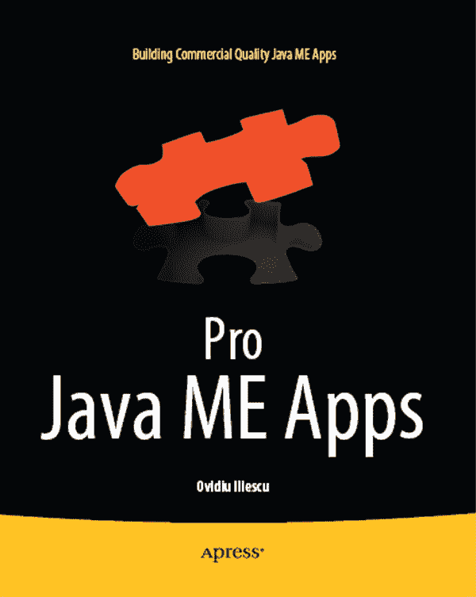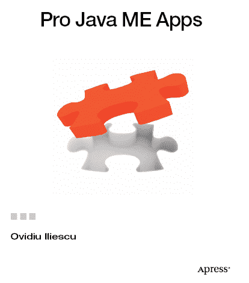

**专业 Java ME 应用开发**

版权所有 © 2011 Ovidiu Iliescu

保留所有权利。未经版权所有者及出版人事先书面许可，本作品的任何部分均不得以任何形式或通过任何方式（电子或机械，包括影印、录制或任何信息存储检索系统）进行复制或传播。

ISBN-13（平装版）：978-1-4302-3327-5

ISBN-13（电子版）：978-1-4302-3328-2

本书中可能出现商标名称、标识和图像。对于商标名称、标识和图像，我们仅在编辑风格中使用，而非每次出现时都使用商标符号，以维护商标所有者的权益，且无意侵犯商标权。

本出版物中使用的商品名称、商标、服务标记及类似术语，即使未明确标识，也不应被视为对其是否受专有权利保护的立场表达。

> 总裁兼出版人：Paul Manning
> 
> 主编：Steve Anglin
> 
> 开发编辑：Douglas Pundick
> 
> 技术审校：Carol Hamer
> 
> 编辑委员会：Steve Anglin, Mark Beckner, Ewan Buckingham, Gary Cornell, Jonathan Gennick, Jonathan Hassell, Michelle Lowman, James Markham, Matthew Moodie, Jeff Olson, Jeffrey Pepper, Frank Pohlmann, Douglas Pundick, Ben Renow-Clarke, Dominic Shakeshaft, Matt Wade, Tom Welsh
> 
> 协调编辑：Adam Heath
> 
> 文字编辑：Mary Ann Fugate, Sharon Wilkey
> 
> 排版：MacPS, LLC
> 
> 索引编制：SPi Global
> 
> 美术设计：SPiGobal
> 
> 封面设计：Anna Ishchenko

本书通过 Springer Science+Business Media, LLC.在全球图书贸易中发行，地址：233 Spring Street, 6th Floor, New York, NY 10013。电话：1-800-SPRINGER，传真：(201) 348-4505，电子邮件：`orders-ny@springer-sbm.com`，或访问[`www.springeronline.com`](http://www.springeronline.com)。

如需翻译相关信息，请发送电子邮件至`rights@apress.com`，或访问[`www.apress.com`](http://www.apress.com)。

Apress 及 friends of ED 书籍可批量购买用于学术、企业或促销用途。大多数图书也提供电子版及许可证。更多信息，请参考我们的特殊批量销售–电子书许可网页：[`www.apress.com/bulk-sales`](http://www.apress.com/bulk-sales)。

本书中的信息按“原样”提供，不附带任何担保。尽管在编写过程中已采取一切预防措施，但作者及 Apress 对因本书所含信息直接或间接造成的任何损失或损害，不承担任何责任。

本书的源代码可供读者在[`www.apress.com`](http://www.apress.com)获取。成功下载代码前，您需要回答与本书相关的问题。

*妈妈，爸爸，爷爷——感谢你们的一切。我爱你们。*

## 内容概览

目录

关于作者

关于技术审校

致谢

引言

 第 1 章：入门指南

 第 2 章：Java ME 框架

 第 3 章：定义数据

 第 4 章：网络模块

 第 5 章：持久化模块

 第 6 章：用户界面模块

 第 7 章：本地化模块

 第 8 章：整合所有模块

 第 9 章：设备碎片化

 第 10 章：优化代码

 第 11 章：添加细节与用户交互改进

 第 12 章：Java ME 应用测试

 第 13 章：高级 Java ME 图形

 第 14 章：正确的 Java ME 思维模式

 第 15 章：Java ME 与未来

 第 16 章：结语

索引

## 目录

内容速览

关于作者

关于技术审校

致谢

引言

 第 1 章：入门指南

Java ME、智能手机与功能手机

Java ME 的优势

Java ME 的劣势

核心要点

创建 Java ME 应用程序

应用程序的构思

目标、功能、收入来源与目标设备

确定目标设备

识别 Java ME 技术限制

常规 Java ME 应用 vs. 专业 Java ME 应用

编写灵活的 Java ME 应用程序

防御性编码

避免错误假设

学习处理复杂性

权衡取舍是你的朋友——明智地利用它们

追求松散且去中心化的架构

凡能在设备外完成的事，绝不在设备上做

本章小结

 第 2 章：Java ME 框架

使用框架的重要性

为何每个应用都需要自定义框架？

定义框架结构

基本对象类型

事件

事件监听器

提供者

消费者

管理器

模型与控制器

视图

通用对象

EventController 类

EventControllerManager

核心对象与类

Application 类

EventManagerThreads 类

Bootstrap 类

一个简单的测试应用

本章小结

 第 3 章：定义我们的数据

为何要实现模型接口？

使数据类型不可变

定义推文数据类型

定义 TwitterUser 数据类型

定义 TwitterServer 实体

定义 UserCredentials 数据类型

定义 TweetFilter 数据类型

定义时间线实体

为数据选择智能表示方式

总结

 第 4 章：网络模块

设置和配置库

使用高级对象

使用自定义数据类型

编写我们的 TwitterServer 实现

定义通用结构

初始化 ServerImplementation 实例

提供登录支持

发布推文

检索推文

getMyProfile()和 getProfileFor()方法

Java ME 网络最佳实践

不要重复造轮子

移动互联网的特殊性

牢记目标设备的限制

支持网络限速和休眠模式

高效传输数据

保持网络代码轻量

保持独立性

总结

 第 5 章：持久化模块

理解 Java ME 持久化选项

设计持久化模块

持久化提供者

记录读取器和记录写入器

序列化器和反序列化器

持久化辅助工具

实现核心架构

实现序列化器和反序列化器

实现记录读取器和记录写入器

实现 PersistenceProvider

测试代码

编写持久化辅助工具

在实际场景中使用模块

进一步扩展模块

总结

 第 6 章：UI 模块

为何创建自定义 UI 模块？

理解创建 UI 模块的基础知识

控件

容器

裁剪矩形

视图

主题

处理用户交互

实现基础控件支持

BaseWidget 类

BaseContainerWidget 和 BaseContainerManager

实现具体控件

VerticalContainer 和 HorizontalContainer 类

SimpleTextButton 类

StringItem 类

InputStringItem

GameCanvasView

测试 UI 模块

在纯触屏设备上实现 UI

关于 UI 模块的结语

总结

 第 7 章：本地化模块

了解优秀本地化模块的特性

了解原生 Java ME 本地化

为 Java ME 应用添加自定义本地化支持

处理本地化文件

在设备上加载本地化数据

测试本地化模块

实现高级本地化功能

总结

 第 8 章：整合所有内容

快速启动应用

实现 FlowController

实现 TweetsController

实现 WelcomeScreenController 和 WelcomeForm

实现 MainForm 和 MainScreenController

实现 SettingsScreenController 和 SettingsForm

实现 EVT 类

改进应用

改进错误处理

增加功能

改进 UI 框架

总结

 第 9 章：设备碎片化

硬件碎片化

CPU 性能

RAM

屏幕

其他硬件考量

能力碎片化

API 不一致性

局部 API 不一致性

全局 API 不一致性

可解释的不一致性

移植框架

预处理器

设备数据库

构建引擎

抽象 API

多平台支持

工具代码与工具

UI 库

客户支持

代码许可

交叉开发与移植工具

总结

 第 10 章：优化你的代码

代码优化速成课

代码优化技术

快速代码路径切换

避免冗余

利用局部性优势

优化数学运算

展开循环

内联代码

优化循环相关数学运算

保持循环无条件分支

从循环中消除特殊迭代

使用循环分裂

避免高级语言特性

坚持基础

避免不必要的对象创建

优化内存访问

算法优化技术

比较算法

改进你的算法

总结

 第 11 章：添加细节优化与用户交互改进

为你的应用添加细节优化

理解细节优化

添加合适的应用内帮助

添加上下文信息

添加合适的反馈

添加自适应文本功能

添加历史记录与自动补全支持

添加意图检测

在设备间同步数据

改进用户交互

消除用户困惑

保持界面简洁

让客户轻松联系到你

创建应用的非移动版本

部署持续的应用更新

添加皮肤支持

推广相关产品

决定实施哪些细节优化与改进

总结

 第 12 章：Java ME 应用测试

收集调试信息

执行单元测试

解决常见的单元测试相关问题

收集高质量的调试数据

在桌面环境中运行测试

执行可视化调试

执行电池测试

在各种场景下测试应用

测试性能改进与优化技术

总结

 第 13 章：高级 Java ME 图形

使用预渲染图形

使用图像遮罩

使用图像混合技术

旋转图像

调整图像大小

实现其他图形效果

组合多种效果

总结

 第 14 章：正确的 Java ME 思维模式

Java ME 的强大程度取决于其运行的设备

优化应用的最佳实践

坚持你的优先级

跳出固有思维模式很重要

保持简单

标准化用户体验

为最坏情况做规划

确定应用的极限

总结

 第 15 章：Java ME 与未来

Java ME 硬件演进

Java ME API 的演进

Java ME 思维模式与开发理念的演进

Java ME 的目标市场

Java ME 与其他平台

Java ME 应用类型

Java ME 创新

Java ME 的消亡

总结

 第 16 章：结语

本书涵盖的内容

下一步研究什么

结束语

索引

## 关于作者

**奥维迪乌·伊利埃斯库**是一位自学成才的软件开发人员；他从 9 岁开始编写计算机程序，至今已拥有近 15 年的经验。在编写了桌面应用和基于 Web 的应用之后，奥维迪乌将注意力转向了移动开发领域。他对所有与计算机相关的事物充满热情，除了移动软件，他的主要兴趣还包括计算机图形学、算法和优化。

奥维迪乌居住在罗马尼亚，最近创办了自己的软件公司 November Solutions，旨在将他的想法转化为产品——或许还能征服世界。目前，他还在 Enough Software 担任软件开发人员，并偶尔以自由职业者的身份承接一些有趣的项目。

您可以通过访问他的网站 [`www.ovidiuiliescu.com`](http://www.ovidiuiliescu.com) 与奥维迪乌取得联系。

## 关于技术审校

*卡罗尔·哈默* 于新泽西州立大学罗格斯分校获得数论博士学位。此后，她在美国、法国和瑞士担任了十二年的软件工程师，其中包括在 In-Fusio 移动游戏公司工作的三年。

卡罗尔撰写了三本关于移动游戏编程的书籍：*《J2ME 游戏开发与 MIDP2》*、*《创建移动游戏》* 和 *《学习 BlackBerry 游戏开发》*，均由 Apress 出版。

## 引言

我认为手机是令人惊叹的技术产物。它们让你几乎身处世界任何角落，只需按下按钮就能联系到朋友、亲人、同事或商业伙伴。这还不够，它们已变得如此强大，如今简直不亚于口袋里的电脑。仅仅几十年前，你只能在《星际迷航》电影中看到类似的设备——如今它们已成为现实。

现代手机运行在多种软件平台上，但就覆盖范围和市场份额而言，最流行的无疑是 Java ME。这个曾经功能有限的平台，随着支持它的硬件一同成长和成熟；如今它能够交付真正令人惊叹的应用程序，这些应用有潜力触达数亿（甚至数十亿）用户。

然而，令人稍感失望的是，开发者编写 Java ME 应用程序的技术并未与时俱进。许多开发者，尤其是经验不足者，仍以近十年前该平台初生时那种极其保守的方式来处理 Java ME 开发。更糟的是，他们像对待桌面平台一样对待 Java ME，完全无视其细微差别以及它本质上是一个设计用于移动设备的移动平台这一事实。结果，许多 Java ME 应用程序未能发挥其潜力。

你现在正在阅读的这本书旨在纠正这一点，它展示了应该如何进行现代 Java ME 应用程序开发——包含了当今适用于该平台的所有重要技巧和技术。

### 本书涵盖的内容

本书与其他 Java ME 书籍有所不同，它围绕使用现代开发技术从头编写一个完整且功能齐全的 Java ME 应用程序而构建。为此，从编写应用程序框架到编写 UI 模块（包含小部件和触摸支持），所有内容都将被讨论——不会遗漏任何重要的应用程序组件。

此外，你将看到所有这些组件如何融入真实世界的应用程序中，以及各个应用程序组件如何交互和协同工作。沿途做出的决策将被解释，潜在陷阱将被强调，基于实践经验的宝贵建议将被给出——所有这一切都是为了全面描绘现代 Java ME 应用程序开发的真实面貌。

一旦应用程序编写完成，我们将涵盖 Java ME 开发的其他关键方面。代码优化、应用程序测试、高级图形、改善用户体验以及正确的 Java ME 开发者思维模式都将被讨论。

最后，我们将展望 Java ME 的未来，以便更好地理解该平台的发展方向，并提供一个与 Java ME 开发相关的进一步研究主题列表。

### 本书所需准备

首先，你应该至少具备中级水平的 Java ME 开发知识。这不是一本入门书籍——事实上，我们假设你之前至少开发过一个中等规模的 Java ME 应用程序。

其次，本书中源代码的目标设备是 WTK 模拟器。为获得最佳效果，建议你同时安装 2.5.2 和 3.0 版本。选择 WTK 模拟器是因为其普遍性，并且它几乎是 Java ME 的“参考实现”。然而，代码设计为尽可能可移植；在其他模拟器和真实设备上运行应该也能正常工作（但无法保证）。

还建议你运行所有提供的代码并进行实验。Java ME 的精髓在于细微之处，许多细节必须通过实际运行才能掌握。显然，静态的代码列表无法做到这一点。

### 让乐趣开始吧

对我来说，Java ME 开发总是一件充满乐趣的事情。虽然并不总是容易，但也几乎从不乏味；总有新的挑战需要克服，并从中学习到新东西。

带着这样的想法，我希望你能享受阅读本书的过程，并且书中的信息能帮助你作为 Java ME 开发者的生活变得更轻松、更有趣、更精彩。

## 第 1 章

## 入门指南

十年前，如果你想为手机编写软件，基本上只有一个选择：Java ME（或者当时被称为 J2ME）。近年来情况发生了变化，出现了众多移动平台，每个平台都有其优缺点。尽管有这些新来者，Java ME 仍然是一个强大的移动开发平台。关键在于，如今的质量门槛已经相当高，为了在现实世界中竞争，你的应用程序必须在技术上非常过硬。本书旨在教你如何实现这一目标。

然而，首先你必须理解 Java ME 当今所处的地位。

### Java ME、智能手机与功能手机

有些人认为，在一个所有新闻都关于 iPhone 和 Android 智能手机的世界里，Java ME 已无立足之地。这完全不对。Java ME 仍然是一个出色的移动开发平台。让我们来看看原因。

#### Java ME 的优势

首先，与普遍看法相反，Java ME *确实*是智能手机软件开发的一个可行选择。一方面，塞班系统是当今使用最广泛的智能手机操作系统，并且它完全支持 Java ME。黑莓设备也支持 Java ME。甚至还有方法可以通过使用跨平台转换工具和模拟器，在安卓和 iPhone 上运行 Java ME 应用。因此，当今大多数智能手机都以某种形式支持 Java ME——并且它可以利用这些设备卓越的能力。

此外，尽管如今智能手机因其酷炫的新功能而备受追捧，但值得注意的是，现代功能手机也开始涉足同一领域。触摸屏、3D 加速器、传感器（例如加速度计）、地理定位支持、多任务处理、大容量 RAM、快速 CPU 和高分辨率屏幕等功能，正逐渐在功能手机世界中变得普遍，而在功能手机领域，Java ME 是无可争议的王者。

再者，功能手机的销量仍然远高于智能手机。例如，根据维基百科，截至 2010 年，功能手机在美国占据了 83% 的市场份额。这意味着美国 83% 的手机无法运行安卓或 iPhone 应用，但它们*可以*运行 Java ME 应用，这使得 Java ME 成为你想要实现高市场渗透率时的最佳平台。

最后，Java ME 被设计得简单且模块化。除核心功能外，所有内容都由各个 Java 规范请求（JSR）定义和规范：3D 支持在 JSR 184 中，PIM 和文件系统支持在 JSR 75 中，传感器支持在 JSR 256 中，等等。这意味着两件事。首先，Java ME 作为一个整体，可以在保持向后兼容性的同时进行演进和改进。你将始终能够利用你现有的知识和软件基础，因为沿途不会有颠覆性的、破坏兼容性的变化，只有不影响现有功能的、可选的增量改进。其次，你可以根据特定目标设备所支持的功能，定制你的应用程序，以提供该设备所需的精确功能集。

最终，你得到一个在当今绝大多数手机上以某种形式得到支持的平台，并且与竞争对手平台不同，它不仅能运行在最先进的智能手机上，也能运行在低端功能手机上。此外，该平台足够灵活，允许你在可用的情况下使用花哨的功能（例如 3D 支持和地理定位），因此你不必局限于核心的 Java ME 功能。所以你看，Java ME 仍然是开发移动应用的绝佳选择。

#### Java ME 的劣势

与所有软件平台一样，Java ME 既有优点也有缺点。为了提供公正的评估，让我们看看 Java ME 最显著的缺点——以及如何缓解这些问题。

Java ME 的主要问题在于，按照当今的标准，其核心 API 有些过时且低级。幸运的是，市面上有大量的第三方库，从 UI 库到实用工具库，可以帮助缓解这个问题。这甚至可以被视为一个优势，因为你可以自由选择最适合你特定项目的任何库和编码范式，从而保持代码库的简洁和切题。

Java ME 还受到设备碎片化问题的困扰（考虑到支持 Java ME 的设备数量惊人，这在某种程度上是不可避免的）。这在早期是一个巨大的问题；然而，设备支持已经变得更加标准化，并且出现了应对碎片化的工具。如今，碎片化仍然是一个问题，但程度要轻得多，并且有大量资源可以用来解决它。我们将在本书后面讨论碎片化问题。

Java ME 也比竞争平台更缺乏宽容度。通常需要在比其它现代平台更少的资源下工作，这意味着内存泄漏和低效算法等问题更有可能导致稳定性和性能问题。对此最好的解决方案是防御性编码，并优化你的算法和代码——我们稍后将讨论这两个主题。

此外，Java ME 根本缺乏对某些功能的支持。例如，系统级通知不可用，同样也不支持编写小部件以及与硬件和操作系统的底层交互。即将推出的 MIDP 3.0 标准将缓解其中一些问题，但在此之前，Java ME 应用程序在大多数情况下必须是独立且自包含的，只能有限地访问某些操作系统和硬件功能。

**注意：** 有一些方法可以将常规的 Java ME API 调用与特定平台的 API 调用混合使用（这在黑莓应用程序中经常这样做），但严格来说，最终结果并非 Java ME 应用程序，因此出于记账目的，这不计算在内。

最后，Java ME 通常缺乏底层平台内集成的应用商店，而安卓和 iPhone 都具备这一点。然而，近年来，像诺基亚的 Ovi 商店和 GetJar 这样的 Java ME 应用商店已成为主流并广为人知，因此将你的软件交付给客户不再是一个真正的问题。

#### 结论

首先，坏消息是：从技术角度来看，Java ME 并非一个通用的解决方案。例如，我不会用它来编写极其复杂、最先进的 3D 游戏。如果我的应用程序只需要针对最新最好的智能手机，我可能也不会使用它，因为原生应用更适合这种情况。最后，即使我想，我也无法将它用于需要与操作系统进行密切交互的应用程序或编写小部件。

话虽如此，Java ME 几乎适用于其他所有场景，从商业应用和常规游戏（甚至是 3D 游戏），到那些本质上需要高市场渗透率的应用，例如社交网络客户端和基于 Web 服务的支持应用（用于文件传输、网络邮件等）。

当你加入商业因素时，Java ME 就成为了一个非常强大的竞争者：很难反驳它是世界上最流行的移动平台，毕竟有数十亿的设备支持它。

总的来说，Java ME 仍然是一个相当稳健的平台。尽管多年来它经历了变化和重新定位，但它仍然是构建移动应用的一个有用工具。

### 创建一个 Java ME 应用程序

学习如何创建高质量 Java ME 应用程序的最佳方法就是实际创建一个，因此本书的其余部分将致力于此。我们将从基础开始，例如项目的想法和目标，然后逐步构建一个功能完整的 Java ME 应用程序。

由于这是一本技术书籍，我们将主要关注技术方面——其他所有内容只会简要提及。

**注意：** 现代 Java ME 应用程序通常有数千行或数万行代码，但我们在本书中只会包含说明当前主题所需的最少量代码。完整源代码可在 Apress 网站上获取。

#### 应用创意

每个项目都始于一个创意。由于本书是一本学习工具，我们的项目应当简单、有趣、有收获且易于理解，但同时也要足够充实，具备成为专业 Java ME 应用的潜力。

编程入门书籍通常以“Hello, world”示例开始，但我们需要稍微复杂一些的内容。因此，对于我们的项目，我们将编写一个 Java ME 的 Twitter 客户端。这样选择是合理的，因为：

*   **复杂度恰到好处**：Twitter 客户端的复杂度足以构成挑战，并为我们提供足够的学习素材，同时又足够简单，可以在合理的篇幅内进行讲解和讨论。
*   **直截了当**：Twitter 提供了简洁明了的 API 来访问其服务。互联网上也有现成的文档和代码示例。
*   **趣味性强**：Twitter 的互动特性使这个项目充满乐趣。在编写代码的过程中，你将能轻松地在每一步看到实际效果，并可以向朋友和家人展示，以获取名声和反馈。
*   **内容丰富**：为了编写一个 Twitter 客户端，我们将处理从创建用户界面到编写网络层，再到使用持久化存储保存应用设置等所有内容。
*   **为其他应用提供良好起点**：一旦 Twitter 客户端准备就绪，你可以对其进行修改，以支持其他类似 Twitter 的服务，甚至是即时通讯协议。

#### 目标、功能、收入来源与目标设备

在确定具体创意后，技术和业务团队应共同决定项目的目标和所需的功能集。这里的关键词是“共同”；与其他更强大的移动平台相比，在 Java ME 项目中，技术团队拥有发言权要重要得多。

例如，如果某个业务目标是在应用中包含 DivX 支持，技术团队应该否决这一点，因为 Java ME 根本没有足够的处理能力来进行实时的 DivX 解码。另一方面，如果目标是原生的 Symbian 应用或原生的 Android 应用，这个目标虽然困难，但可以实现。

技术团队了解应用如何产生收入也很重要，因为这会影响开发过程，有时影响还很大。例如，如果应用旨在通过与第三方服务（如亚马逊）集成来产生收入，那么在设计应用架构，特别是其网络模块时，必须考虑到这一点。

然而，如果主要收入来源是直接销售，那么开发者可以加入某种形式的复制保护，例如国际移动设备识别码（IMEI）检查，以减少盗版并增加销量。或者，如果应用通过增加公司曝光度和展示其产品来间接赚钱，那么代码必须经过彻底优化，并榨干每一分性能，以便用户获得最佳体验。

当然，这些要点对所有移动平台都适用，但 Java ME 项目必须格外注意，因为它们不像其他移动平台那样拥有集成的应用商店、丰富（甚至过剩）的资源以及强大的内置网络功能。

技术团队还需要了解项目在资金、时间和人力方面的预算，并应在如何支出这笔预算方面拥有明确的发言权（再次强调，这比其他平台重要得多）。例如，如果项目资金不多，但有足够的人力和时间，UI 模块可以完全内部构建，而不是授权使用第三方库。虽然这个决定影响深远，在 Java ME 项目中必须仔细考虑，但对于 Android 或 iPhone 来说，这通常甚至不是一个讨论话题，因为它们原生的 UI 能力对于大多数项目来说已经绰绰有余。

接下来，应确定目标设备以及每台设备要包含的功能。在这方面，Java ME 也与其他移动平台不同，因为设备种类繁多，高端和低端设备之间存在巨大差距，这意味着你无法针对所有设备，通常也无法在你所针对的所有设备上包含相同的功能集。

因此，确定目标设备是非常重要的一步，并且应与你的业务目标保持一致。例如，如果你的应用旨在通过月度订阅产生收入，那么针对低端手机意义不大，因为它们的用户不太可能在订阅上花钱。相反，你应该针对更高端的设备：这将允许你包含更多功能和打磨，从而使你的应用更具吸引力。而且，由于高端设备更贵，通常可以推断其用户更有可能每月为你的服务付费——哪怕仅仅是因为他们通常有更多的钱可以花。

相反，如果你的应用旨在通过提高公司和产品的知名度来为你赚钱，那么你应该尽可能多地针对那些受欢迎（按销量计）且价格实惠的设备，并确定一套在所有设备上都能良好运行的功能集，从而确保最大的曝光度。对于依赖一次性销售来产生收入的应用也是如此：如果你针对更广泛的设备，达成销售的机会也会相应增加。你还可以降低购买价格，以使你的产品对潜在买家更具吸引力（每次销售赚得更少，但销量会更高）。

有时，应用本身的特性就决定了你可以针对的设备。例如，纯触摸设备由于其有限的输入能力，不适合作为模拟器。

应用可以使用的媒体格式取决于目标设备的媒体支持——而且，与其他移动平台不同，在 Java ME 中通常无法添加对非原生媒体类型的支持。这限制了你在应用中使用的媒体的质量和数量，从 UI 图形到音效，并且还会影响构建过程。

例如，如果你所有的目标设备都支持 SVG 图形和 MP3 文件，你可以为你的应用创建一个外观精美的基于矢量的 UI，并配以高质量的音频效果，此外，你还可以为所有设备进行单一构建。然而，如果你的一些设备不支持这些格式，那么对于这些设备，你必须将矢量图形渲染为 PNG 等位图格式，并将 MP3 声音转换为 WAV 或 AMR。这不仅大大复杂化了构建过程，还会增加应用 JAR 文件的大小，同时实际上降低了媒体质量。这还不是全部：有些设备不支持特定格式的所有变体，因此除了选择合适的媒体格式外，还必须设置正确的编码参数。这意味着，在 Java ME 项目中，技术团队应与媒体团队紧密合作，以确保所使用的媒体资源经过正确制作并针对目标设备进行了优化。

#### 识别目标设备

我们的 Twitter 客户端将编写为在 WTK 模拟器上运行。做出这一决定是为了让尽可能多的人能够运行该代码，无论他们手头拥有何种设备。这也意味着代码可以遵循“最佳实践”来编写，因为针对真实设备进行开发通常需要走捷径，并使用一些小技巧和变通方法来解决特定设备的问题。

然而，实际项目必须在真实设备上运行。考虑到这一点，作为最佳实践，你应该始终尝试在你手头的所有设备上运行你的项目（包括 Twitter 客户端），即使这些设备并未得到明确支持。对每台设备进行一些理论和实践研究，并尝试找出它们相对于当前项目的优势和劣势。

最终，你应该拥有一份能够完全运行你项目的设备清单，而对于那些只能部分运行（通常是由于错误或性能问题）的设备，则需要记录原因以及潜在的解决方案。这些“额外信息”通常被证明是无价的。例如，如果你的目标设备都是高端机型，那么应用程序 GC 频繁的问题可能并不明显；但一旦你在中端或低端设备上运行代码，这个问题就会迅速显现出来——然后你就可以着手解决它，否则这个问题可能会被忽视，直到为时已晚。

后面的章节将讨论设备碎片化以及将应用程序移植到其他平台和设备的问题。如果需要，你可以利用该章节中的信息将 Twitter 客户端适配到你的特定设备上。

话虽如此，本书中提供的代码已尽可能做到与设备无关，以最大限度地减少或完全消除移植所需的工作量。

#### 识别 Java ME 技术限制

为移动设备编写软件意味着要考虑各种在桌面世界中基本不成问题的因素，例如电池续航、屏幕尺寸和网络连接。

除此之外，移动软件（尤其是 Java ME）本身也有其局限性，必须识别并妥善处理。这些限制从显而易见的（例如“设备 X 上只有 1 MB 可用 RAM”）到更为隐蔽的（例如“设备 Y 上的对象创建速度太慢”）。让我们来看看一些最常见的 Java ME 技术限制。

##### 设备碎片化

设备碎片化有两种形式：硬件碎片化和软件碎片化。硬件碎片化是可以预料的，因为并非所有设备都具有相同的规格，开发人员可以根据手头可用的资源来规划和编写代码。

然而，软件碎片化是一个更为严重的问题，可能是影响 Java ME（以及程度较轻的其他平台，如 Android）的最大问题。并非所有设备都以相同的方式实现 Java ME API，有些设备甚至错误地实现了它。这范围从容易发现和解决的问题（例如不同设备上的不同按键代码），到仅在特定情况下、特定设备上出现且难以调试的明显错误。

例如，在 Blackberry 设备上，当指定的 (x, y) 坐标为负数时（即绘制从屏幕区域外开始），`drawRGB()` 会引发 `ArrayIndexOutOfBounds` 异常。只要两个坐标都是正数，就不会发生这种情况。这很难调试，因为文档说明该异常仅在“请求的操作将尝试访问索引为负数或超出其长度的 `rgbData` 元素”时抛出。作为开发人员，你更有可能认为错误是因为你为 `drawRGB()` 指定了错误的参数，导致代码引用了数组边界之外的元素，而不是相信错误是由有缺陷的平台实现引起的——而事实恰恰如此。

在本书的后面部分，我们将讨论如何处理硬件和软件碎片化；解决方案出奇地相似。

##### 屏幕像素密度与屏幕尺寸

关于像素密度，最重要的一点是，它与屏幕尺寸和屏幕分辨率共同决定了你一次能在屏幕上舒适地显示多少信息。让我解释一下：如果一台设备拥有 3 英寸显示屏、1024×768 分辨率以及 10 像素的默认字体高度，那么屏幕上最多可以同时显示 76 行文本。然而，文本会变得非常小，几乎无法阅读。据我所知，这也是为什么不存在这样的设备。

现在考虑以下两种场景：

*   一台拥有 10 英寸显示屏、1024×768 分辨率的设备
*   另一台拥有 3 英寸显示屏，但分辨率小三倍（341×256）的设备

在这两种场景中，文本的物理尺寸都比原始场景大三倍，因此更容易阅读。为了清晰对比，请查看图 1–1。

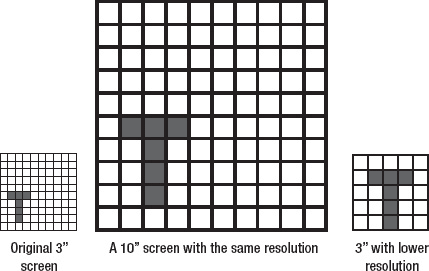

**图 1–1.** *屏幕像素密度对比*

固定大小的图形也受到类似影响。由于像素密度，一个给定的精灵、按钮或 UI 控件在一台设备上可能显得太小，而在另一台设备上又显得太大，即使像素尺寸相同。

屏幕尺寸比屏幕密度更重要，因为如果屏幕足够大，你可以容忍较低的密度：图像质量可能没那么好，但你能看清屏幕上的内容，这才是关键。

另一件需要记住的事情是，一个 UI 设计在一台设备上可能很棒，但在另一台设备上却很糟糕，仅仅是因为该设计的物理屏幕尺寸太小，而与分辨率无关。这意味着需要进行一些研究和实践，才能为任何给定的目标设备找到合适的 UI 设计和尺寸。

虽然开发人员应该意识到这些问题，但主要是设计团队必须在这方面做出决策。作为一般性指导，绝大多数 Java ME 设备具有 320×240 的屏幕分辨率，屏幕尺寸为 2.2–2.8 英寸。一些较新的支持触摸屏的 Java ME 设备，例如诺基亚的设备，屏幕尺寸为 3.0–4.0 英寸，分辨率更高，诺基亚的设备为 480×360。

##### UI 设计

Java ME 在 UI 方面最大的限制可能在于，由于历史原因，你只能使用设备的原生控件来创建外观简单的界面。任何更复杂的设计都无法通过原生方式实现，因此你不得不使用自己的 GUI 工具包或第三方工具包——几乎所有专业的 Java ME 应用都使用非原生 GUI 工具包。这当然意味着你的应用在外观和体验上很可能与用户习惯的原生应用格格不入。对于游戏或其他多媒体应用来说，这并非问题，但对于商业应用而言，这可能是一个缺点，尤其是当需求之一是“原生外观和体验”时。

Java ME 的另一个限制是，大多数用户习惯使用两个软键来访问应用菜单。然而，有些设备并没有软键。例如，黑莓设备就没有软键（它们使用“菜单”键），而一些 Java ME 设备仅支持触控。因此，从一开始我们就面临三种不同的菜单导航方式。你可以通过构建多个版本并在运行时检测平台，或者通过设计和实现一个能够无缝且独立地使用所有三种方式的 UI 来解决这个问题。

物理按键的位置有时会成为一个问题，或者至少会让人感到沮丧，因为在某些设备上，尤其是那些带有加速度计的设备，屏幕可以旋转，并在横竖屏之间即时切换。你的应用不仅需要能够处理这种情况，还应该跟踪设备上物理按键的位置。这对于软菜单尤其重要。例如，图 1–2 展示了应用处于横屏模式时正确的软菜单位置和布局，以及横屏模式下错误的位置和布局。请注意，在正确的布局中，软菜单选项紧邻软按键，而不是位于屏幕底部。

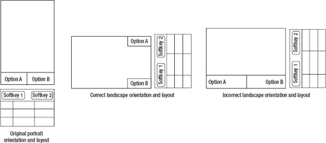

**图 1–2.** *物理按键位置如何影响屏幕布局*

UI 设计还应尝试考虑前面提到的屏幕特性，例如屏幕像素密度。在高密度屏幕的设备上，通常最好将所有元素（以像素为单位）做得更大，以便应用更易于使用。由于高密度屏幕通常出现在处理能力更强的高端设备上，你可以利用额外的像素为 UI 增添精致细节，例如阴影和微妙的动画，从而提升用户体验。

##### CPU 和虚拟机特性

这些特性是迄今为止对 Java ME 应用速度影响最大的因素。首先，我们来谈谈 CPU。由于大多数移动 CPU 都是基于 ARM 架构的，我们将以此作为参考。对于常规应用，如今 100–200MHz 的范围通常就足够了。对于计算密集型应用或具有大量 UI 精细效果的应用，你可能需要 200–400MHz 甚至更高的频率，才能获得流畅的用户体验。当然，这些只是大致范围，并受到许多因素的影响，例如是否有后台应用在运行，以及 CPU 是否支持 Jazelle 或 ThumbEE（支持 Jazelle 或 ThumbEE 的 ARM CPU 可以在硬件中运行 Java ME 字节码，从而大幅提升性能）。

底层功能有时可能是一个重要的限制因素。有些设备不支持原生浮点运算，因此它们使用整数运算来模拟浮点运算。这使得这些设备上的浮点运算极其缓慢。同样常见的是，某些数学运算（如加法）比其他运算（如除法）更快。在某些设备上，这种差异非常显著，因此如果你的应用严重依赖这些较慢的运算，它在上述设备上的运行速度将远低于预期。在本书的后续部分，我们将看到如何通过代码优化来至少缓解部分问题。

比 CPU 速度更重要的是虚拟机性能，尤其是在低端设备上。由于 Java ME 是解释字节码的，两台硬件规格相同但虚拟机不同的设备，其性能可能会有天壤之别——因此，仅凭 CPU 速度并不能很好地衡量 Java ME 的性能。要了解特定设备运行你的应用的效果，可以编写小型测试应用来模拟真实应用可能承受的负载，并测量其性能。为了获得更全面的了解，可以逐步将“负载因子”从 10% 变化到 200%。

##### 内存相关性能

显然，你拥有的可用内存越多越好。然而，并非所有设备都会将其全部空闲内存提供给 Java ME，因此你应始终考虑 Java ME 实际可用的内存，而不是设备声明的内存容量。此外，尤其是在支持多任务的设备上，任何给定时刻的实际可用内存量都可能变化很大。你永远不应假设自己总是拥有相同数量的可用 RAM，并且应始终进行防御性编码以应对这种情况。

**注意：** 有一些方法可以解决内存问题——例如，使用持久化存储机制模拟页面文件，以及将大型负载拆分为更小、更易于管理的块。我们将在本书的后续部分讨论这些内容。

仅次于内存大小，影响整体性能的是垃圾回收器的性能，这也与之前讨论的虚拟机性能相关。Java ME 应用往往会创建大量对象，而这些对象最终必须被删除。当这种情况发生时，垃圾回收器就会启动。当今市场上的设备拥有各种各样的垃圾回收器，从那些高效且不引人注目地完成工作的，到那些运行时间极长并在此过程中冻结整个应用的。你的应用应准备好处理其中大多数（如果不是全部）情况，尤其是当它是一个数据密集型应用时。

对象创建的速度是影响任何 Java ME 应用性能的另一个重要因素。如果你的应用操作大量对象，这些对象的创建速度可能会严重限制应用的速度，甚至比垃圾回收器的影响更大。

##### 电池续航

不同设备的电池续航能力差异很大——有些项目甚至对应用消耗电池的速度设定了限制。因此，在开发 Java ME 应用时，你需要尽量延长电池续航时间。

延长电池续航最有效的方法是降低 CPU 使用率和网络访问频率。这并不总是容易做到，但很重要，尤其是对于倾向于长时间运行的应用，例如聊天客户端。此外，只要实施得当，降低功耗通常能有效延长电池续航。我们将在本书的后续部分对此进行更深入的了解。

##### 网络差异

大多数情况下，设备通过 2G 或 3G 网络连接，其信号随时可能中断，网速也可能在极快与极慢之间瞬息万变。专业的 Java ME 应用程序必须考虑到这一点。

对于某些应用而言，丢包数量或网络延迟时间至关重要。如果是这种情况，应用程序必须能够检测到该领域的问题，并通知用户其存在。

Java ME 还对应用程序可同时建立的连接数量施加了限制。尽管某些设备支持更多连接，但最好不要同时运行超过两个连接。

另一个需要考虑的因素是数据的发送方式。以较小的、离散的数据包发送数据通常比发送大块数据更好，因为在某些情况下，大块数据可能导致应用程序在等待数据发送时停滞。

数据的格式也很重要。由于数据流量需要付费，使用更少的字节发送信息可以为用户节省费用，同时也能让应用程序响应更迅速，因为它需要处理的数据更少。XML 可能是一个广为人知的标准，但它也极其冗长。考虑使用更简洁的格式，例如 JSON 或二进制协议。

##### 本地化问题

对于专业的 Java ME 应用程序来说，本地化极其重要。让应用程序以用户的母语与其交互，并使用用户习惯的日期和货币格式，是高品质的标志。

一个常被忽视的关键要求是，确保目标设备对特定语言所需的字符集有适当的支持。对于拉丁语系语言，这通常不是问题，但对于希腊语等非拉丁语系语言，则可能成为问题。这些语言的字符集支持有时仅在某些特定国家/地区的固件版本上可用。这意味着，在不支持所需字符集的设备上，文本会显示得很糟糕，充满占位符字符。解决此问题的最佳方法是使用位图字体，并将必要的字符集直接嵌入到应用程序中。

同样重要的是支持多种日期、时间、货币和数字格式的能力。其中，正确的日期支持至关重要。例如，一些国家使用 DD/MM/YYYY 而不是 MM/DD/YYYY 来指定日期，因此像 2011 年 7 月 4 日这样的日期可以写成 4/7/2011 或 7/4/2011。未能正确处理这些差异可能会导致用户困惑和沮丧。至于数字格式支持，请考虑以下示例：为了表示精确到三位小数的数字 4，一些国家使用“4.000”，而另一些国家则使用“4,000”。使用错误的小数分隔符同样会导致用户困惑和沮丧——如果你习惯使用点而不是逗号作为小数分隔符，“4,000”可能会被解释为“四千”。

有时，还需要对图形和其他媒体进行本地化。这范围从显而易见的（如国旗）到晦涩难懂的（如在某些文化中完全可以接受但在其他文化中具有冒犯性的图标）。虽然这通常不是问题，但你应该意识到这种情况可能发生。

##### 对设备功能的有限访问

一组重要的限制来自于 Java ME 通常无法访问设备的全部功能。

例如，某些设备只允许访问文件系统的特定部分，而不允许访问其他部分；某些设备支持访问用户的电话簿，而其他设备则不支持，等等。

一个很好的例子是手机的摄像头。通常可以从 Java ME 访问设备上的摄像头，但可捕获的最大图像尺寸通常低于摄像头的实际最大图像尺寸。

这意味着你不能依赖制造商的规格说明，而需要进行一些设备上的测试，以确定你可以使用哪些功能以及使用到什么程度。

#### 普通 Java ME 应用程序 vs. 专业 Java ME 应用程序

在确定了设备限制并处理了所有其他项目管理问题之后，开发通常就开始了。然而，在进入正题之前，让我们先看看普通 Java ME 应用程序（作为爱好编写的那种）和专业 Java ME 应用程序（我们旨在通过本书创建的那种）之间最重要的区别。

##### 专业 Java ME 应用程序很智能

例如，它们会尝试根据用户之前的操作来推断其下一步动作。如果用户选择了三封邮件并逐一删除，当选中第四封时，应用程序可能会询问他“您要删除这封邮件吗？”

专业 Java ME 应用程序也倾向于处理特殊情况，以在更高程度上提升用户体验。虽然普通应用程序可能满足于显示诸如“0 封未读邮件”或“1 封未读邮件”之类的内容（在两种情况下使用相同的模糊模板），但专业应用程序会为每种情况选择合适的模板，从而相应地显示“没有未读邮件”、“一封未读邮件”和“2 封未读邮件”。这一原则也扩展到应用程序的其他部分——例如，在用户生日时选择不同的配色方案。

高质量的 Java ME 应用程序也非常注重资源，它们会动态调整自身，以充分利用可用资源，无论资源是稀缺还是丰富。

##### 专业 Java ME 应用程序围绕自定义框架构建

专业 Java ME 应用程序无一例外地围绕自定义框架构建。这个框架通常在公司内部开发，以适应其将要使用的特定项目，并且每个框架通常是从头开始设计的。这样做是因为框架应始终尝试满足每个项目的特定需求，以便尽可能高效且易于使用。

例如，一个好的 Java ME HTML 浏览器的框架将与一个 Java ME 电子邮件客户端的框架截然不同。前者将侧重于处理 UI 布局，其结构、辅助方法和对象层次结构都以此为目标进行设计，而后者则更侧重于底层的客户端-服务器功能，并在 UI 相关功能上投入较少。

这与 Android 等其他移动平台形成对比，在这些平台上，资源丰富意味着你可以将两个框架合并为一个，并为两个项目使用同一个框架。

**提示：** 如果从头开始设计一个新框架不可行，你可以从一个现有框架开始，添加新功能，同时移除不需要的功能。除非你计划编写的应用程序与框架最初设计的应用程序非常相似，否则绝不应原封不动地重用框架。

##### 专业 Java ME 应用善用第三方库

Java ME 是一项成熟且久经考验的技术，因此它拥有丰富的库资源也就不足为奇了。从图形用户界面到数据库访问，你都能找到相应的第三方库。此外，优秀的 Java ME 库在设计上能够透明地处理（至少是部分处理）诸如设备碎片化和 API 不一致等重要的 Java ME 问题。这使得开发者可以专注于构建应用本身，而不是费力去驯服平台。例如，一个好的 UI 库知道如何处理黑莓手机与普通 Java ME 设备之间的差异（比如黑莓手机缺少软键），并确保用户看到的用户界面是针对其运行应用的平台量身定制的。

因此，高质量的 Java ME 应用往往会使用大量第三方库也就不足为奇了。否则，它们根本无法提供同等的价值和同样高的精良程度。而且，使用这些库的不仅仅是个人开发者或小公司；大公司在其 Java ME 应用中也同样使用第三方库。即便对于他们来说，在时间和金钱上的收益也实在太大，不容忽视。

这与普通的 Java ME 应用形成对比，后者往往使用较少的第三方库，这主要是出于预算方面的考虑。

##### 专业 Java ME 应用复用代码

由于 Java ME 应用必须在差异巨大的环境和条件下运行，代码复用一直是 Java ME 的一个敏感话题。这意味着你为一个项目（甚至是一个项目的某个特定设备构建版本）编写的许多代码，无法在另一个项目中高效地使用。

然而，顶级的 Java ME 应用通常比普通 Java ME 应用具有更高的代码复用潜力。实现这一点的关键因素包括：大量使用第三方库、代码模块化、代码灵活性（尤其是在资源需求方面），以及使用恰当的抽象。例如，一个编写良好的 HTML 浏览器可以通过获取其框架、UI 库和布局模块，稍作修改，并使用 `PDFParser` 代替 `HTMLParser` 作为输入源，从而转变为一个 PDF 阅读器；代码会自我调整以充分利用可用资源。

与此形成对比的是，一个不那么出色的 Java ME HTML 浏览器，其布局模块和解析器纠缠在一起，导致无法重新利用，并且它只是为了满足解析和渲染 HTML 的特定资源需求而编写的。事实上，代码复用的潜力通常是衡量一个 Java ME 应用编写质量和优秀程度的重要指标——其重要性远超其他平台。

### 编写灵活的 Java ME 应用

任何 Java ME 应用成功的关键在于其能够在多种软件和硬件环境中运行。然而，Java ME 的可移植性不仅仅意味着让你的代码能在大量不同的设备上运行。

可移植性还意味着，无论底层硬件如何，你的代码即使在不太理想的情况下也能出色运行——例如，当电池电量不足，或者设备的 CPU 正在后台解码音乐时。此外，由于运行时的环境可能会发生变化，有时甚至在单次运行过程中变化多次，你的应用必须能够随时应对这些变化。

这种灵活性水平并非轻易就能达到，它需要大量的经验、技巧，有时甚至需要一点运气。幸运的是，有一些 Java ME 开发者应始终努力遵循的黄金法则。在接下来的篇幅中，我们将介绍其中最重要的几条，例如防御性编码、避免复杂性，以及避免对平台和环境做出错误假设。

**注意：** 在 Android 和 iOS 等其他现代平台上，运行时灵活性的关注度较低。这些平台上的应用不仅拥有更多可支配的资源，而且它们是原生应用，因此对其环境和资源的控制能力远胜于 Java ME 应用——后者完全在其虚拟机受限的环境中运行。

#### 防御性编码

这是移动软件开发中最重要的一条规则，尤其对于 Java ME 而言，并且在可预见的未来仍将如此。对大多数开发者来说，这大概意味着“在尝试写入前，检查设备上是否有足够的磁盘空间”或“在运行时读取设备的屏幕分辨率”，但这只是冰山一角。例如，请考虑代码清单 1–1 中的代码片段。

**代码清单 1–1.** *向服务器发送数据*

`byte buffer[] ;`
`while ( dataSource.hasMoreData() )`
`{`
`        buffer = dataSource.readNextChunk();`
`        if ( dataSource.readOK() )`
`        {`
`                try`
`                {`
`                        serverConnection.send(buffer);`
`                }`
`                catch (IOException ex)`
`                {`
`                        // 处理异常`
`                }`

`        }`
`        else`
`        {`
`                // 读取数据时出现问题`
`        }`
`}`

乍一看，这段代码似乎没什么问题。我们处理了从数据源读取数据时出错的情况，也处理了向服务器发送数据时出错的情况。那么问题出在哪里呢？

问题在于我们做了一个关键假设：这段代码能够及时完成。因此，只有当没有更多数据需要读取和发送时，我们才会退出循环，而这根据具体情况可能需要相当长的时间。如果处理不当，用户可能会长时间盯着“传输进行中”的屏幕，等待很久很久。这甚至不依赖于设备：如果网络连接极其缓慢或不稳定，无论你在什么设备上运行，最终都会陷入这种状况。

但真正要命的是：持续时间并非主要问题。这段代码真正糟糕的地方在于，它在整个数据传输期间锁定了大量资源（CPU 时间、带宽、内存、活动连接）。对于资源丰富的台式电脑来说，这可能没问题，但对于移动设备来说，这绝对不行。永远不要假设你可以在移动设备上长时间锁定资源。

解决这个问题的一个好方法是，将任何可能需要超过几秒钟才能完成的动作或工作负载，拆分成独立的工作单元（对于后台动作或工作负载也是如此）。然后，这些工作单元可以与其他动作或工作负载中的其他工作单元轮流执行，使用相同的资源池，*但并非同时执行*。这有助于你的应用程序保持较低的资源占用，并能确保你可以同时处理许多事情而不会遇到资源短缺。代码清单 1–2 展示了一个基本示例，说明如何实现这一点。

**代码清单 1–2.** *以正确方式向服务器发送数据*

`while ( isRunning() )`
`{`
`        workListeners.jumpToFirst();`
`        while ( workListeners.hasMore() )`
`        {`
`                workListeners.nextListener().raiseEvent( Event.DO_WORK_UNIT )`
`        }`
`}`

`....`

`public void handleEvent(int eventType)`
`{`
`        if ( eventType == Event.DO_WORK_UNIT )`
`        {`
`                if ( dataSource.hasMoreData() )`
`                {`
`                        buffer = dataSource.readNextChunk();`
`                        if ( dataSource.readOK() )`
`                        {`
`                                try`
`                                {`
`                                        serverConnection.send(buffer);`
`                                }`
`                                catch (IOException ex)`
`                                {`
`                                        // 处理异常`
`                                }`

`                        }`
`                        else`
`                        {`
`                                // 读取时出现问题`
`                        }`
`                }`
`        }`
`}`

这种方法不仅更节省资源，而且也更灵活。例如，你可以有多个工作线程，每个线程一次处理一个工作单元，并且 `DO_WORK_UNIT` 事件可以由任意数量的源独立触发。

这对于 Java ME 应用程序来说极其重要，因为它们通常在比原生应用程序更受限的环境中运行，无论是在资源方面还是在运行时灵活性方面。恰当的防御性编码技术通常能最大限度地减少资源消耗，并使应用程序更加灵活，因为它允许开发者处理更多的运行时场景。

#### 避免错误假设

一个常见的错误假设是认为 Java ME 应用程序运行在单任务环境中。这在早期确实如此，但现在已不再适用。最明显的后果是，你可能会错误地认为手机的所有资源都归你支配。虽然这意味着你的应用程序在单独运行时会快如闪电，但也意味着当它与其他应用程序同时运行时，可能会慢如蜗牛。换句话说，你的应用程序可能显得不一致，这不是用户期望或喜欢的。

当设备某种类型的资源（例如 RAM）耗尽时，这种情况最为危险。具体会发生什么因设备而异。例如，当我在我的旧诺基亚 E50 上同时运行太多 Java ME 应用程序，导致手机内存不足时，它会显示“内存已满”消息，并立即关闭*所有*正在运行的 Java ME 应用程序。任何未保存的数据都会丢失。

为了避免不必要地频繁遭遇这些问题，你可以做一件简单的事情：构建你的应用程序，使其能够在必要时减少资源消耗。例如，为你的某些关键操作计时，如果它们完成所需的时间超过了预设的时间，请考虑动态降低其复杂度（例如，减少游戏中的图形效果），或者通知用户某个操作耗时比平时长，并请求他尽可能停止其他后台应用程序。

内存方面也是如此。例如，如果你无法分配 2 MB 的缓冲区，请尝试分配 1 MB 的缓冲区，然后再尝试 512 KB 的缓冲区，依此类推。确保你的代码能够处理任意大小的缓冲区，而不仅仅是首选大小。

将你所做的错误假设数量保持在最低限度的最佳方法是极度悲观并进行防御性编码。始终为最坏的情况做打算，永远不要认为任何事情是理所当然的，即使是像设备有电这样显而易见的事情（电池可能在应用程序运行时耗尽）。

#### 学习如何应对复杂性

防御性编程和避免假设会带来一个副作用：应用程序的复杂性会增加。因此，处理复杂性对于 Java ME 应用程序来说至关重要。应对复杂性最常用也最直观的武器，就是扎实掌握面向对象的原则和技术，例如：

*   **多态**处理了根据传入参数决定调用哪个方法这一部分复杂性。
*   **继承**使数据类型之间的关系更清晰、更内聚，从而部分降低了理解数据本身及其操作方式的复杂性。
*   **工厂模式**将对象创建和初始化的复杂性与其余代码隔离开来。
*   **接口**允许进行契约式编程，从而将复杂性和代码封装在一系列黑盒中。

然而，如果你仔细审视这些例子，你会发现一个非常重要的事实：面向对象的原则和技术并没有消除复杂性，它们只是隐藏或分散了复杂性。以工厂模式为例：程序员看不到与对象创建和初始化相关的大部分复杂性，但这并不意味着它不存在。

不过，在很多情况下，复杂性是可以被优雅地避免的。例如，考虑以下场景：

“我们的应用程序在用户的手机和他的社交网络账户之间同步照片和其他媒体文件，通常一次同步数百个文件。文件大小从 100 KB 到 200 MB 不等，在整个范围内分布得大致均匀。由于涉及可能的大文件，有时文件出现在网页上或设备上（取决于同步方向）需要很长时间，尤其是在涉及大文件时，用户开始变得担心。我们希望尽可能改善这一点，从用户的角度让传输看起来更快。”

这听起来像是一个非常复杂的问题，涉及缓存、优先级队列和其他时髦术语，但实际上解决方案可能非常简单。文本明确指出，主要问题是用户*感知*到同步速度慢。解决这个特定场景最简单、通常也是最有效的方法，就是简单地根据文件大小进行排序，并优先发送较小的文件。

这样做的效果是，用户会在同步开始的最初阶段看到大量文件被上传（因为它们体积较小），随着应用程序处理到较大的文件，每分钟或每秒上传的文件数量会逐渐减少。

到那时，两件事已经发生。第一，用户看到同步确实在工作，因此不那么担心了。第二，用户留下了同步速度很快的印象，因此不会因为最后阶段同步速度变慢而感到困扰。

因此，这个问题在很大程度上用很少的编码工作就解决了，并且几乎没有增加复杂性方面的开销。大多数看似复杂的问题都可以简化为更简单、更容易解决的问题。所以，下次当你觉得需要花整整一周时间来解决一个看似艰巨的问题时，先退一步，看看能否将其转化为更易于管理的问题。

#### 权衡取舍是你的朋友——明智地利用它们

每个计算机科学初学者都知道，在计算机世界里，几乎每种资源都可以用另一种资源来交换。这一原则在 Java ME 编程中扮演着非常重要的角色。由于你的应用程序预计要在大量不同的设备上运行，你应该为一种资源丰富而其他资源匮乏的情况做好准备，并在运行时在它们之间进行权衡。

经典的例子是 CPU 时间与内存的权衡：你可以通过使用更多内存来缩短解决问题的时间，或者通过使用更少内存来延长解决问题的时间。

考虑以下示例（清单 1–3），它可以是任何基于瓦片的 Java ME 游戏的一部分。这段代码的作用是，每当屏幕上的实体移动到游戏世界中的不同瓦片时，改变该实体面对的方向。为了便于讨论，我们假设计算角度时还必须考虑瓦片的高度和其他因素，而不仅仅是它的 (x, y) 位置。

**清单 1–3.** *改变游戏实体面对的方向*

`public void entityMoved(int x, int y)`
`{`
`                ...`
`                int angle = getAngleForTile (x, y);`
`                current.setFacingAngle(angle);`
`                ...`
`}`

`public int getAngleForTile(int x, int y)`
`{`
`        // 这里进行一些涉及正弦和余弦的复杂计算`
`}`

这段代码的主要问题在于，CPU 密集型的 `getAngleForTile()` 方法总是会为传入的任何 (x, y) 对计算角度。通常这不成问题，但当 CPU 资源紧张时，在这个方法上花费的时间可能会累积到相当可观的程度。当屏幕上有很多动作发生时尤其如此，因为可以推测会有大量实体在移动，该方法会被频繁调用。

解决这个问题的最佳方法是将每个 (x, y) 对的结果存储在一个矩阵中，然后从那里检索，而不是每次都重新计算。此外，你可以使用惰性初始化，这样就不必一次性计算出所有值，因为那可能会花费很长时间，而且有些值可能根本用不到。我们要做的是：每当为某个 (x, y) 对调用该方法时，我们检查结果是否在矩阵中。如果在，我们就从那里检索；如果不在，我们就计算它，将其存储在矩阵中，然后返回给调用者。如果某些情况发生变化需要重新计算矩阵，我们只需创建一个新的空矩阵，并让它根据需要再次被填充。

这意味着对于一个 200×200 的游戏世界（这实际上相当大），我们最多需要为矩阵预留 160 KB 的 RAM。我说“最多”是因为这个想法可以进一步优化：例如，将矩阵拆分成更小的块，比如 50×50，并且只在内存中保留当前可见的部分。

现在我们牺牲了 160 KB 的 RAM 来换取大量的 CPU 时间。对于大多数现代设备来说，这是一个公平的权衡，但如果用户后台运行着一个浏览器，并且它突然加载了一个非常大的页面，会发生什么？内存会变得稀缺，我们的应用程序可能被迫释放部分内存，或者被关闭。

在这种情况下，释放内存的最佳方法之一就是放弃我们的 160 KB 矩阵，退而使用 CPU 来计算任何给定瓦片面对的方向。当有更多内存可用时，我们可以再切换回原来的方法。代码可能类似于清单 1–4 所示（为简洁起见，省略了 `entityMoved()`）：

**清单 1–4.** *改变游戏实体面对的方向，正确的方式*

`boolean isInLowMemoryMode = false;`
`int [][] angleMatrix = new int[200][200];`

好的，作为一名高级文档工程师和翻译员，我将严格遵循您提供的注意事项和示例，将给定的英文文本翻译成中文。

`public void handleEvent(int eventID, Object eventData)`
`{`
`        if ( event == Event.Environment.LOW_MEMORY )`
`        {`
`                isInLowMemoryMode = true;`
`                angleMatrix = null;`
`                ....`
`        }`
`        else if ( event == Event.Environment.HIGH_MEMORY )`
`        {`
`                isInLowMemoryMode = false;`
`                angleMatrix = new int[200][200];`
`                ...`
`        }`
`}`

`public int getAngleForTile(int x, int y)`
`{`
`        if ( isInLowMemoryMode )`
`        {`
`                // 此处进行一些高 CPU 消耗的计算`
`        }`
`        else`
`        {`
`                if ( angleMatrix[x][y] == 0 )`
`                {`
`                        // 此处进行一些高 CPU 消耗的计算`
`                        // 将结果存储在 angleMatrix[x][y] 中`
`                }`
`                return angleMatrix[x][y];`

`        }`
`}`

现在，我们的代码可以根据接收到的事件，在消耗更多 CPU 和消耗更多 RAM 之间无缝切换。你可以将此方法应用于应用程序的其他部分，以及其他类型的资源。例如，你可以在通过网络发送数据之前，使用 CPU 压缩数据，从而牺牲 CPU 时间和电池寿命来换取带宽。或者，你也可以反其道而行之，用带宽换取 CPU 时间。

如果操作得当，这种技术的净效果是使应用程序在资源方面变得非常灵活，这体现在当环境参数发生剧烈变化时，资源消耗概况会随之变化。

这种技术同样可以应用于非技术资源。例如，如果你的应用程序需要显示大量文本，比如一封来自满意客户的冗长的“感谢信！”，你可能需要考虑使用比平时稍小的字体大小，从而牺牲一点可读性来换取更好的整体画面。

#### 追求松散和去中心化的架构

用一个类比可以最好地解释这一点：你希望你的汽车是一个紧密互联的部件总成吗？如果车载电脑停止工作，发动机就无法启动；如果发动机无法启动，车内灯就不会亮？还是你希望它像现在这样，如果某些部件停止工作，其余部分仍能尽力继续运行？

我猜你更倾向于后者。软件开发也是如此：你应该始终将应用程序拆分成几乎独立的组件，这些组件在必要时可以独立运行。要将所有内容连接起来，你所要做的就是使用全局事件。

清单 1–4 中的代码就是一个很好的例子。你会注意到，它响应了 `Event.Environment.LOW_MEMORY` 事件，但在代码的任何地方都没有指定该事件应该来自何处。那是因为它是一个全局事件。你可以想象，在代码的某个地方，有一个模块定期测量环境参数，当它检测到显著变化时，就会触发相应的事件。然后，其他模块可以对此事件做出响应。

这种技术对于 Java ME 软件开发尤为重要，因为它为开发者提供了一种非常有效的手段来处理 Java ME 软件必须应对的设备能力和规格的巨大差异。

例如，当运行你代码的设备不支持某个特定功能时，只需让你的应用程序忽略相应的事件，或者一开始就不触发它们，或者触发一个适当的 `NOT_SUPPORTED` 事件，然后由受其影响的模块来处理该事件。这将使你能够以一种透明、逻辑清晰且易于理解的方式，动态地改变应用程序的行为，并产生你所期望的影响（局部或全局）。

最后，去中心化也意味着组件应该能够“独立思考”，可以这么说。例如，在 GUI 层，与其让一个中央实体决定每个小部件应该放在哪里以及应该有多大，不如让小部件自己格式化。所有“中央权威”需要做的就是提供信息，例如当前行有多少可用空间。这种方法可以用于所有软件平台，但对于 Java ME 来说更为重要，因为它必须支持各种不同（且小尺寸）的屏幕、UI 布局和交互范式。

#### 绝不在设备上做可以在设备外完成的事

这条规则背后的主要思想是，与其在移动设备本身上进行计算，不如事先计算好，只将*结果*包含在应用程序中。这可以节省大量的 CPU 能力和电池寿命，否则这些资源将在运行时被用于在设备上进行计算。

为了说明这一点，请考虑清单 1–5 中的示例，该示例在许多应用程序（尤其是游戏）中都能找到一种或另一种形式。

**清单 1–5.** *绘制正弦曲线*

`for (int x=0;x<360;x++)`
`{`
`        drawPoint(x, 199 * Math.sin( degreesToRadians(x));`
`}`

我们从清单 1–4 中知道，我们可以使用数组来加速。但是当前示例和上一个示例之间有一个关键区别：在这个示例中，数组中的值永远不会改变，因为正弦函数的值总是相同的。

这意味着，我们可以在设备外部计算数组，并将其显式地包含在源代码中，而不是在设备上计算它，如清单 1–6 所示。

**清单 1–6.** *使用已计算好的 `sin()` 值绘制正弦曲线*

`double SIN_VALUES = { 0, 0.0174524064, 0.0348994967, ... }`
`for (int x=0;x<360;x++)`
`{`
`        drawPoint(x, 199 * SIN_VALUES[x] );`
`}`

现在，显然，此示例与清单 1–5 中的示例在 CPU 时间上的总体差异并不大，但对于更复杂的场景，它肯定是可以察觉的。

考虑一个复杂的游戏或股票分析应用程序，它使用神经网络来实现其 AI。在设备上训练神经网络可能极其耗时且资源密集，而在台式计算机上训练它，然后让设备使用预先建立的结果，则更经济、更快捷，并且对用户来说更少挫败感。

同样的想法可以应用于更严肃的事情，例如加密和数据压缩。通过离线计算一些值并使用结果，可以极大地改进此类活动。当然，这对于所有移动平台都是如此，但 Java ME 受益最大，因为它通常缺乏必要的硬件支持和资源来独立高效地完成这些事情。

### 总结

在简要审视了 Java ME 在现代移动世界中的地位之后，我们为自己的 Pro Java ME 项目选择了一个想法，并讨论了非技术性问题（例如项目目标和收入来源）如何影响其技术方面。

我们还讨论了 Java ME 应用程序通常面临的主要技术限制，并研究了 Pro Java ME 应用程序与常规 Java ME 应用程序的不同之处（代码智能、自定义框架、大量使用第三方库以及巨大的代码重用潜力）。

最后，我们探讨了一些关于编写真正灵活和可移植的 Java ME 应用程序的重要技巧。

## 第 2 章

## Java ME 框架

在开始开发实际应用程序之前，我们还需要完成几个步骤。其中大部分都是琐碎的工作，比如设置源代码管理和创建 IDE 项目，因此我们将完全跳过这些步骤。然而，有一个非常重要的步骤我们无法跳过：编写应用程序的框架。

本章具有双重目的：既概述了我们将要使用的框架的基础知识，也为一般 Java ME 框架应如何编写提供了基础。

基于此，我们的框架虽然功能完备，但在本质上将大大简化。代码将尽可能保持简单，所有不必要的内容要么被省略，要么被精简到最低限度。因此，请随意尝试、改进并根据您的需求和项目进行调整。请记住我们在第 1 章中讨论的内容：永远不要拿来一个框架就直接使用（原因稍后会解释）。

### 使用框架的重要性

简而言之，一个优秀的框架，在其之上构建应用程序，能显著提高最终产品强大、稳固且灵活的可能性。

例如，一个 Java ME 应用程序通常运行多个线程：UI 线程、网络线程、数据处理线程等。这些线程需要能够相互通信。此外，它们需要以一种既不会阻塞也不会干扰其他线程，并且能最小化开销的方式进行通信。对此，一个很好的解决方案是使用基于事件的系统：每当应用程序的某个部分发生感兴趣的事情时，就会触发一个事件，而应用程序中正在“监听”的其他部分随后可以响应并对此事件做出反应。

如果没有框架来提供这种功能，这些线程（或者更确切地说，应用程序中与之对应的各个部分）可能会以不同的方式实现事件，有时只有最细微的差别，但从长远来看，这可能会导致严重的问题。例如，UI 部分可能会在一个带有事件队列的独立线程中实现事件，而网络部分可能会立即、直接地处理事件，不涉及任何队列。或者应用程序的一个部分可能使用基于优先级的队列，而另一个部分可能使用简单的队列。这可能导致竞态条件、事件处理顺序错乱等问题。事实上，考虑到真实使用场景的复杂性，这种混乱且异构的事件系统的行为最好被描述为“未定义”。

相比之下，通过在框架中实现事件处理，您不仅可以在整个应用程序中使用一致的事件 API 及其相关约定，还能受益于编写干净且专注的应用程序代码；所有与事件相关的脏活累活都由框架处理。此外，如果需要对事件系统进行大修或调试，可以在一个中心位置（即框架）完成，而无需在应用程序的每个部分分别进行。所有这些都节省了大量的时间、精力和资源。

事件系统只是一个例子，尽管是一个突出的例子。根据您的应用程序需求，您很可能需要向框架添加其他功能，例如动态资源加载或对象池功能（本书后面会详细介绍对象池）。

框架的另一个关键功能是它定义了应用程序代码的结构：一个好的框架会为开发者强加一个良好的包结构和类层次结构，使应用程序的源代码更具内聚性且更易于导航。

最后，一个框架通常附带一套最佳实践和编码指南，这些有时会通过框架 API、包层次结构和类结构的本质来强制执行。这使得代码更加同质化且易于理解，从而减少错误并提高生产力。

### 为什么每个应用程序都要有自定义框架？

许多公司甚至个人都使用一个定制的通用框架来处理他们所有的 Java ME 项目。我个人认为，这是错误的做法：每个项目都应该有自己的、特定于项目的框架。

原因可以用一个词来概括：开销。例如，假设我们正在编写一个通用框架，但针对的是桌面平台。在这种情况下，我们的事件处理系统很可能基于优先级队列，因为这样会更灵活。这个决定的直接后果是，即使我们所有的事件都具有相同的优先级，事件优先级排序代码仍然必须启动，分析每个事件，并将其放置在队列中的适当位置——请记住，框架是通用的，它不知道所有事件都具有相同的优先级。这会消耗一些 CPU 时间，但与可用的 CPU 时间相比，这种开销实际上可以忽略不计。

现在假设我们在 Java ME 框架中做同样的事情。由于我们针对的是性能低得多的硬件，事件优先级排序的开销将会增加。它本身应该仍然相当低调，但当与其他开销来源叠加在一起时，它可能会变得显著——5-10% 或更多的复合开销肯定是显而易见的，而浪费的资源可以更好地用在其他地方。为了避免这种特定的开销来源，如果我们的应用程序不需要事件的优先级队列，我们只需编写一个使用简单队列而非优先级队列的事件处理系统。这样做的直接后果是，我们的通用框架不再那么通用，因为至少它的一部分已经针对我们的特定应用程序进行了优化。

然而，要真正最小化开销，我们必须将这类优化应用于整个框架，而不仅仅是其中的一部分。这意味着我们最终会为应用程序得到一个非常流畅、高度定制且资源友好的主干，它很可能与原始框架至少部分不兼容。此外，有时所需的定制非常广泛，以至于从头开始编写一个新框架反而更好。无论如何，对于高质量的 Java ME 应用程序来说，为不同项目重用同一个框架并不是一个好主意；如果您想要最佳性能，就需要为每个应用程序定制一个框架。

### 定义框架结构

编写框架的第一步是定义其基本结构，并明确其各部分应归属于哪些 Java 包。由于框架结构通常也定义了应用程序的包结构，因此我们也会对此进行说明。

在我们的案例中，所有包名都以“`com.apress`”开头，但为了节省篇幅，表 2-1 中已省略此前缀。

**表 2-1.** 框架与应用程序结构

| **包名** | **描述** |
| --- | --- |
| `framework.objecttypes` | 定义框架和应用程序使用的基本对象类型，例如 `Model`、`Controller`、`View`、`Event` 等。 |
| `framework.common` | 常用对象的实现，例如 `EventController`；如果常用对象很多，根据对象类型将此包拆分为子包可能更合理。 |
| `framework.core` | 核心框架对象的实现，例如 `Application` 静态类。 |
| `framework.helpers` | 所有辅助类和工具类均放置于此。 |
| `app.models` | 所有全局模型（逻辑上不属于单个模块的模型）放置于此——例如 `TwitterUser` 模型。 |
| `app.module.<NAME>` | 每个模块拥有自己的包。 |
| `app.module.<NAME>.models` `app.module.<NAME>.views`
`app.module.<NAME>.controllers`
`app.module.<NAME>.managers`
`app.module.<NAME>.helpers`
`app.module.<NAME>.classes.*` | 每个模块特有的模型、视图和控制器放入对应的包中。管理器、辅助类和其他类也是如此。 |
| `app.media, app.files` `app.media.<NAME>`
`app.files.<NAME>` | 所有媒体文件和其他非代码文件放置于此。例如，全局媒体文件放入 `app.media` 包，而模块特定文件放入 `app.media.<NAME>` 包。 |

当然，这并不是构建框架及其应用程序的唯一方式，但这是我通常使用的包布局。它允许代码和职责的清晰分离，同时确保开发者不会迷失在包名和深层包树中。

现在我们已经有了骨架，是时候往骨架上添些血肉了。具体来说，我们将用适当的实体填充上表中前三个包。最终结果将是一个极其简单但可用的框架。

我们将从 `com.apress.framework.objecttypes` 包开始。

### 基本对象类型

大多数框架（包括我们的）主要基于模型-视图-控制器（MVC）范式，并做了一些修改。这是 Java ME 开发中最灵活的范式，因为它提供了开发者覆盖所有基础所需的高水平抽象和灵活性。

**注意：** 此规则的主要例外是游戏框架，其本质决定了它们需要与应用程序框架不同的方法和思维方式。例如，由于游戏通常节奏非常快，使用事件来处理代码不同部分之间的通信可能会在资源方面显得缓慢且低效。因此，游戏框架倾向于使用灵活性较低但更高效的通信方式，例如属于应用程序不同区域的对象之间的直接方法调用。

如果你对 Java ME 游戏编写感兴趣，Apress 有大量相关书籍可供参考。

MVC 范式你应该已经熟悉，因此我们不再深入探讨，仅回顾其基本对象类型。

在此基本设计之上，我们将添加一些自己的对象类型：

*   *事件*，顾名思义，定义了应用程序运行期间发生的事件。
*   *事件监听器*响应事件。
*   *提供者*从各种来源（通常是外部来源，如本地通讯录或服务器）检索、提取或生成对象或数据。
*   *消费者*是提供者的对应方，用于将数据或对象发送到外部来源。
*   *管理器*处理和管理对象集合。
*   *模型*是应用程序操作的数据类型的表示，例如推文和联系人。
*   *控制器*通常控制程序流程。
*   *视图*负责根据模型和控制器给出的指令，绘制用户在屏幕上看到的内容，包括表单和 UI 组件。

我们将逐一介绍这些类型。如前所述，本节讨论的每个类和接口都属于 `com.apress.framework.objecttypes` 包。

在继续之前，这里有一个简短的说明。由于我们的框架将主要基于事件，本章大部分内容将专门讨论事件和事件处理。基于事件的开发几乎是唯一真正适用于 Java ME 应用程序的范式，因为它将所有内容分离为离散且独立的单元（事件）。这使开发者几乎完全控制何时以及以何种方式处理什么内容。

#### 事件

事件将在应用程序中大量传递，因此它们既易于使用又定义清晰非常重要。

因此，一个事件包含三个基本组成部分：事件上下文、事件类型和事件负载。上下文和类型定义了发生何种事件以及发生在何处，而事件负载则提供关于事件的额外信息，例如受其影响的对象。

为了能够正确定义事件，我们需要两个类。一个是实际的事件类，如代码清单 2-1 所示。

**代码清单 2-1.** *`Event` 类*

`package com.apress.framework.objecttypes;`

`public class Event`
`{`
`    protected int context;`
`    protected int type;`
`    protected Object payload;`

`    public Event(int context, int type, Object payload)`
`    {`
`        this.context = context;`
`        ...`
`    }`

`    public int getContext()`
`    {`
`        return this.context;`
`    }`

`    ...`
`}`

另一个类是用于描述所有可能事件上下文和事件类型的描述符。为了简洁和代码清晰，我们将此类命名为 `EVT`。如代码清单 2-2 所示。

**代码清单 2-2.** *`EVT` 类*

`package com.apress.framework.objecttypes;`
`public class EVT`
`{`
`    public class CONTEXT`
`    {`
`        public static final int NONE = -1;`
`public static final int LOCAL = 0;`
`        public static final int STARTUP = 1;`
`        public static final int SHUTDOWN = 2;`
`        public static final int LOGIN_FORM = 3;`
`...`
`    }`

`    public class CONTACTS`
`    {`
`        public static final int ADD_CONTACT = 1;`
`        public static final int REMOVE_CONTACT = 2;`
`    }`
`    ...`
`}`

这种方法使得使用事件变得轻而易举。例如，要创建一个表示在启动过程中添加了新联系人的事件，我们只需这样做：

`Event someEvent = new Event( EVT.CONTEXT.STARTUP, EVT.CONTACTS.ADD_CONTACT,`
`contactObject );`

处理事件则是另一回事，而且更为复杂，涉及框架和应用程序的许多领域。

我们需要事件监听器来响应它们（接下来会介绍），需要事件控制器将事件分发给监听器，需要事件控制器管理器来捆绑事件控制器（这是出于实际原因），还需要一种让事件控制器管理器在其独立线程上运行的方法，以免干扰应用程序的其他部分。随着我们的深入，所有这些实体都将在专门介绍其对应包的章节中涵盖。

#### 事件监听器

必须有人来监听并响应事件。事件监听器正是为此而生。所有事件监听器都必须实现 `EventListener` 接口，该接口定义于清单 2-3。

**清单 2-3.** *`EventListener` 接口*

`package com.apress.framework.objecttypes;`

`public interface EventListener`
`{`
`    public boolean handleEvent(Event event) ;`
`}`

如果事件已被处理，`handleEvent()` 方法返回 `true`，否则返回 `false`。

#### 提供者

顾名思义，提供者负责向应用程序提供数据和对象，这些数据通常来自外部源。例如，`PIMContactProvider` 可用于从设备的通讯录中检索联系人，而 `CameraFrameProvider` 可用于从设备的摄像头中检索静态帧。

提供者主要可分为两类：随机访问提供者和顺序访问提供者。

顺序提供者的行为类似于枚举，它们按顺序逐个检索对象。在任何给定时间，只有一个对象可用，一旦请求下一个对象，旧对象就会被丢弃且无法再次检索。`CameraFrameProvider` 就是一个很好的顺序提供者示例。

随机访问提供者允许在任何给定时间访问其任意对象。例如，`PIMContactProvider` 可以提供对设备通讯录中任何联系人的访问。

在我们的框架中，所有提供者都必须实现清单 2-4 中所示的 `Provider` 接口。

**清单 2-4.** *`Provider` 接口*

`package com.apress.framework.objecttypes;`

`public interface Provider`
`{`
`    public boolean isSequential();`

`    public Object retrieveCurrent();`

`    public void next();`

`    public boolean hasMore();`

`    public boolean jumpTo(int objectIndex);`

`    public int getNumberOfAvailableObjects();`
`}`

调用 `retrieveCurrent()` 将返回当前索引处的元素；可以通过调用 `next()` 或 `jumpTo()` 来更改当前索引。对于顺序提供者，只能通过调用 `next()` 来更改索引。

当无法跳转到特定索引或下一个索引时，`jumpTo()` 和 `next()` 将返回 `false`。

当调用 `getNumberOfAvailableObjects()` 时，对象数量未知的提供者将返回 `-1`。

如果当前索引之后还有更多元素，调用 `hasMore()` 将返回 `true`，否则返回 `false`。

#### 消费者

消费者是提供者的对应方。它们用于将数据或对象发送到外部源，通常是在应用程序外部。与提供者一样，它们可以是随机访问或顺序访问的，并遵循相同的约定。所有消费者都必须实现清单 2-5 中的 `Consumer` 接口。

**清单 2-5.** *`Consumer` 接口*

`package com.apress.framework.objecttypes;`

`public interface Consumer`
`{`
`    public boolean isSequential();`

`    public boolean next();`

`    public boolean store(Object object);`

`    public boolean jumpTo(int objectIndex);`

`    public int getNumberOfAvailableSlots();`
`}`

接下来是消费者特定的约定。

随机访问消费者将对象存储在当前索引指示的“槽位”中。更改索引的方式与提供者相同（见上文）。

当在顺序消费者上调用 `store()` 时，也会隐式调用 `next()`。在随机访问消费者上调用 `store()` 不会更改当前索引。

在顺序消费者上调用 `next()` 而不先存储对象，相当于“不存储任何内容”。根据消费者的不同，这可能会失败，也可能不会。

#### 管理器

就像足球经理负责其球员的职业生涯一样，我们的管理器也负责其管理下对象的特定方面。

例如，`ContactSyncManager` 将负责使其联系人保持与服务器同步，而 `ContactIntegrityManager` 将负责确保其联系人的详细信息相互一致，例如，联系人声明的星座与指定的出生日期相符。

管理器非常有用，因为它们通常遵循“发射后不管”的原则，独立地在后台完成工作。因此，它们将应用程序的某些复杂性进行划分，并将其对代码的其他部分隐藏起来。

为了使用管理器，我们必须能够向它们分配和取消分配对象，并且我们还应该能够找出某个管理器是否负责某个特定对象。因此，所有管理器都必须实现清单 2-6 中的 `Manager` 接口。

**清单 2-6.** *`Manager` 接口*

`package com.apress.framework.objecttypes;`

`public interface Manager`
`{`
`    public boolean assign(Object object);`

`    public void unassign(Object object);`

`    public boolean isManaging(Object object);`
`}`

一个管理器可以处理多种类型的对象，甚至是完全不相关的对象，只要这样做是合理的。一个很好的例子是，一个管理器必须确保其所有对象，无论其类型如何，占用的内存都少于设定的数量。

一个对象也可以由多个管理器处理。

管理器可以拒绝管理对象，这通过 `assign()` 返回 `false` 来表示。

最后但同样重要的是，管理器除了其管理角色外，通常还可以扮演其他角色。例如，它们也可以是提供者或事件监听器。

本章稍后将提供一个关于如何使用管理器的好例子。

#### 模型和控制器

就其本质而言，模型是独一无二的，通常不存在所有模型都共有的通用功能。因此，模型的模板将如清单 2-7 所示。

**清单 2-7.** *`Model` 接口*

`package com.apress.framework.objecttypes;`

`public interface Model`
`{`

`}`

所有模型类都必须实现此接口，即使它目前是空的。在我们的案例中，这样做主要是为了清晰起见，但您可能会发现，在开发过程中，所有模型都会共享或需要一些通用特性，例如，一个 `checksum()` 方法，届时将这些特性添加到接口中将是合理的。

上述内容同样适用于控制器。所有控制器都必须实现清单 2-8 中的接口。

**清单 2-8.** *`Controller` 接口*

`package com.apress.framework.objecttypes;`

`public interface Controller`
`{`

`}`

#### 视图

视图是用户与应用程序交互时看到的屏幕。与所有 MVC 视图一样，我们的视图通过向其中传入数据（通常是模型或模型集合）来使用。然后由视图本身负责将这些数据呈现给用户，并为用户交互提供支持。

所有视图在被指示时必须能够自行绘制。它们还必须能够提供对其父控制器及其底层`GameCanvas`的引用。因此，视图必须实现清单 2-9 中的接口。

**清单 2-9.** *`View`接口*

`package com.apress.framework.objecttypes;`

`import javax.microedition.lcdui.Graphics;`

`public interface View`
`{`
`    public boolean refresh();`

`    public Controller getParentController();`

`    public GameCanvas getCanvas();`
`}`

很多时候，视图仅仅是底层 GUI 库中“屏幕”对象的包装器。使用它们仍然有意义，因为如果项目后期需要切换 GUI 库，这会使切换变得容易得多。这一点非常重要，需要牢记：视图通常不绑定到特定的 GUI 框架，只绑定到特定的应用程序屏幕。

我们将在专门讨论 GUI 的章节中进一步了解视图及其使用方法。

添加视图后，我们的“对象类型”包现已完全填充。让我们休息五分钟，消化一下这些内容，然后再继续填充“公共对象”包。

### 公共对象

许多对象在整个应用程序中被大量重用。它们通常是基本类型的派生类或实现类，并且在框架及基于框架的应用程序的运行方式中扮演着关键角色。一个典型的例子是`EventController`，我们稍后将详细介绍它。

目前我们只关心让框架运行起来，因此我们将公共对象的数量保持在最低限度：仅两个。

让我们从前面提到的`EventController`开始。

#### EventController 类

`EventController`本质上充当事件的路由控制器，将事件分派给其注册的监听器。在`EventController`的术语中，这被称为“处理事件”。

`EventController`公共对象的代码如清单 2-10 所示。

**清单 2-10.** *`EventController`类*

`package com.apress.framework.common;`

`import com.apress.framework.objecttypes.Controller;`
`import com.apress.framework.objecttypes.Event;`
`import com.apress.framework.objecttypes.EventListener;`
`import java.util.Vector;`

`public class EventController implements Controller`
`{`
`    protected Vector listeners = new Vector(10,10);`
`    protected Vector events = new Vector(10,10);`

`    public void registerListener(EventListener listener)`
`    {`
`        if (! listeners.contains(listener) )`
`        {`
`            listeners.addElement(listener);`
`        }`
`    }`

`    public void unregisterListener(EventListener listener)`
`    {`
`        listeners.removeElement(listener);`
`    }`

**`    public void queueEvent(Event event)`**
`    {`
`        events.addElement(event);`
`    }`

**`    public void processNextEvent()`**
`    {`
`        if (events.size() > 0 )`
`        {`
`            Event event = (Event) events.firstElement();`
`            events.removeElement(event);`

`            int listenerCount = listeners.size();`
`            int currentIndex;`
`            EventListener temp;`
`            for (currentIndex = 0; currentIndex < listenerCount; currentIndex++)`
`            {`
`                temp = ( (EventListener) listeners.elementAt(currentIndex));`
`                temp.handleEvent(event);`
`            }`
`        }`
`    }`

`    public int currentEventCount()`
`    {`
`        return events.size();`
`    }`

`    public boolean hasMoreEvents()`
`    {`
`        return events.size() > 0 ;`
`    }`
`}`

这段代码中唯一可能有趣的部分是存在两个不同的方法`queueEvent()`和`processNextEvent()`来处理事件。大多数开发者倾向于在同一步骤中完成这两件事，但这是错误的，主要有两个原因。

第一个原因是，你可能不希望事件在入队的同时就被处理。例如，在 CPU 能力有限的情况下，这通常是常见做法。通过这种方法，你可以将事件处理推迟到以后，或者以比平时更慢的速度处理事件。

第二个也是最重要的原因是线程问题。考虑清单 2-11 中的以下示例，其中`processEvent()`方法将事件的入队和处理合并在一个步骤中。假设`onButtonPress()`方法是应用程序使用的 GUI 库的一部分，而`handleEvent()`是注册到`EventController`的监听器的一部分。

**清单 2-11.** *处理事件的错误方式*

`public void onButtonPressed(Button button)`
`{`
`        Event event = new Calculate100FactorialEvent();`
`        eventController.processEvent(event);`
`}`

`...`

`public boolean handleEvent(Event evt)`
`{`
`        if (evnt instanceOf Calculate100FactorialEvent)`
`        {`
`                // 在此处执行大量 CPU 密集型操作`
`        }`
`        return true;`
`}`

这段代码的问题在于，你不知道这些 CPU 密集型操作将在哪个线程上运行。如果它在主 UI 线程上运行，那么应用程序的用户界面将很快陷入停滞。更糟糕的是，有问题的可能来自业务关键线程，比如网络线程，在这种情况下，该线程将变得无响应，服务器可能会将用户注销，甚至更糟。此外，`onButtonPressed()`可能会在主 UI/系统事件线程上运行，可能是通过`CommandListener`的`commandAction()`方法调用的。根据`onButtonPressed()`内部执行的操作，这可能会导致应用程序崩溃（例如，如果发起了网络访问请求，而平台试图向用户请求权限）。

解决这个问题的唯一真正方法是在与发出事件的线程完全不同的线程上处理事件，或者至少在一个你可以确定不关键的线程上处理。然而，让每个控制器都在自己独立的线程中运行通常并不可行。

这就是我们下一个公共对象的用武之地。

#### EventControllerManager

`EventControllerManager`的主要目的是确保其监管下的所有控制器的事件处理都在同一个线程上完成——该线程通常与事件发出的线程不同。其次要目的是确保所有控制器获得大致相等的 CPU 时间。

该管理器将为`EventController`维护一个简易队列。你可以通过调用`assign()`将控制器添加到队列中，并通过调用`unassign()`将其从队列中移除。添加控制器时，它会被添加到队列的末尾。

管理器还提供了一个`processNextEvent()`方法。此方法必须从事件处理所在的线程调用。你可以始终从同一个线程调用它，也可以从不同线程调用；你可以使用现有线程，也可以创建一个专用线程——这完全取决于你和你的需求。

当该方法被调用时，将处理简易队列中第一个控制器的一个事件。之后，第一个控制器会被移到队列末尾，第二个控制器成为新的第一个，以此类推。这种轮转方式提供了一种快速有效的方法，确保所有控制器获得相对均等的关注。

至于从哪个线程以及如何调用`processNextEvent()`，这完全取决于你和你的应用程序。框架确实提供了一个快速简便的解决方案，在 90%的情况下都能很好地工作。这将在专门讨论`core`包的章节中介绍。不过，你并非必须使用它——如果你愿意或需要，完全可以自由设计和实现自己的机制。

`EventControllerManager`如清单 2–12 所示。

**清单 2–12.** *`EventControllerManager`类*

`package com.apress.framework.common;`

`import com.apress.framework.objecttypes.Manager;`
`import java.util.Vector;`

`public class EventControllerManager implements Manager`
`{`
`    public Vector controllers = new Vector(10,10);`

`    public boolean assign(Object object)`
`    {`
`        if ( object instanceof EventController)`
`        {`
`            if ( ! controllers.contains(object) )`
`            {`
`                controllers.addElement(object);`
`            }`
`            return true;`
`        }`
`        else`
`        {`
`            return false;`
`        }`
`    }`

`    public void unassign(Object object)`
`    {`
`        controllers.removeElement(object);`
`    }`

`    public boolean isManaging(Object object)`
`    {`
`        return ( controllers.indexOf(object) > -1 );`
`    }`

`    public void processNextEvent()`
`    {`
`        if ( controllers.size() > 0 )`
`        {`
`            EventController controller = (EventController) controllers.firstElement();`
`            controllers.removeElement(controller);`
`            controller.processNextEvent();`
`            controllers.addElement(controller);`
`        }`
`    }`

`    public boolean hasMoreEvents()`
`    {`
`        return currentEventCount() > 0;`
`    }`

`    public int currentEventCount()`
`    {`
`        Enumeration controllerEnum = controllers.elements();`
`        EventController temp = null;`
`        int count = 0;`
`        while ( controllerEnum.hasMoreElements() )`
`        {`
`            temp = (EventController) controllerEnum.nextElement() ;`
`            if ( temp.hasMoreEvents() )`
`            {`
`                count += temp.currentEventCount();`
`            }`
`        }`
`        return count;`
`    }`
`}`

现在，我们进入下一个包：`com.apress.framework.core`。

### 核心对象与类

这个包可以被视为框架的核心，负责将所有部分粘合在一起，并确保应用程序能够访问所需的一切。我们将讨论`Application`类、`EventManagerThreads`类和`Bootstrap`类。

#### Application 类

综上所述，`core`包中最重要的部分是`Application`类。它提供了对主事件控制器、主事件控制器管理器（默认情况下*不*与主事件控制器关联）、MIDlet 实例、显示实例以及几乎所有可能需要在应用程序代码中访问的高级或关键内容的访问。

`Application`类的一个简单实现如清单 2–13 所示。当你将框架适配到特定项目时，很可能会修改此类以满足你的需求。

**清单 2–13.** *`Application`类*

`package com.apress.framework.core;`

`import com.apress.framework.common.EventController;`
`import com.apress.framework.common.EventControllerManager;`
`import com.apress.framework.objecttypes.View;`
`import javax.microedition.lcdui.Display;`
`import javax.microedition.midlet.MIDlet;`

`public class Application`
`{`
`    static EventController mainEventController = new EventController();`
`    static EventControllerManager manager = new EventControllerManager();`
`    static MIDlet midlet = null ;`

`    protected Application()`
`    {`
`        // 不执行任何操作`
`    }`

`    public static void showView(View view)`
`    {`
`        getDisplay().setCurrent(view.getCanvas());`
`        view.refresh();`
`    }`

`    public static void init(MIDlet instance)`
`    {`
`        midlet = instance;`
`        manager.assign(mainEventController);`
`    }`

`    public static EventController getMainEventController()`
`    {`
`        return mainEventController;`
`    }`

`    public static EventControllerManager getMainEventControllerManager()`
`    {`
`        return manager;`
`    }`

`    public static MIDlet getMIDlet()`
`    {`
`        return midlet;`
`    }`

`    public static Display getDisplay()`
`    {`
`        return Display.getDisplay(midlet);`
`    }`
`}`

#### EventManagerThreads 类

该类允许事件控制器管理器在各自独立的线程中，以各自特定的速度运行——我们在`EventControllerManager`部分已经暗示过这一点。

使用这个类非常简单。要让一个事件控制器管理器每 30 毫秒处理一次其所有已分配控制器中的所有底层事件，你只需调用以下代码：

`EventManagerThreads.start ( someManagerInstance, 30 );`

如果你希望管理器以不同的时间间隔处理事件，只需使用所需的参数再次调用`start()`即可。

停止一个事件控制器管理器的周期性处理也同样简单：

`EventManagerThreads.stop ( someManagerInstance );`

`EventManagerThreads`类的代码如清单 2–14 所示。

**清单 2–14.** *`EventManagerThreads`类*

`package com.apress.framework.core;`

`import com.apress.framework.common.EventControllerManager;`
`import java.util.Hashtable;`

`public class EventManagerThreads`
`{`
`    public static class ManagerThread implements Runnable`
`    {`
`        EventControllerManager manager = null;`
`        long sleepTime = 0;`
`        boolean run = true;`

`        public ManagerThread(EventControllerManager manager, long sleepTime)`
`        {`
`            this.manager = manager;`
`            this.sleepTime = sleepTime;`
`        }`

`        public void run()`
`        {`
`            while ( run )`
`            {`
**`                int evtCount = manager.currentEventCount();`**
**`                while ( evtCount>0 )`**
**`                {`**
**`                    manager.processNextEvent();`**
**`                    evtCount--;`**
`                }`

`                try`
`                {`
`                    Thread.sleep(sleepTime);`
`                }`
`                catch (InterruptedException ex)`
`                {`
`                    ex.printStackTrace();`
`                }`
`            }`
`        }`
`        public void stop()`
`        {`
`            run = false;`
`        }`

`    }`

`    protected static Hashtable threads = new Hashtable();`

`    protected EventManagerThreads()`
`    {`
`        // 不做任何操作`
`    }`

`    public static void start(EventControllerManager manager, long sleepTime)`
`    {`
`        stop(manager);`
`        ManagerThread thread = null;`
`        thread = new ManagerThread(manager, sleepTime);`
`        Thread t = new Thread(thread);`
`        t.start();`
`        threads.put(manager, thread);`
`    }`

`    public static void stop(EventControllerManager manager)`
`    {`
`        ManagerThread thread = (ManagerThread) threads.get(manager);`
`        if( thread != null )`
`        {`
`            thread.stop();`
`        }`
`    }`

`}`

请查看上述清单中高亮显示的行。你可能会问，为什么不直接使用`hasMoreEvents()`？答案很简单：当事件被监听器处理时，这些监听器可能会（而且经常）向它们所属控制器的队列中添加其他事件。这可能导致你的控制器管理器始终有更多事件需要处理，进而意味着你将永远无法退出循环，这又意味着线程将永远不会休眠，从而以全速运行并浪费宝贵的资源，尤其是 CPU 时间。我们的方法确保只有已经在队列中的事件会在当前时间片内被处理，而在当前时间片内添加的事件将在下一个时间片被处理。未能正确处理这一点是基于事件的系统中一个非常常见的错误。

**注意：** 本章末尾有一个示例应用程序，非常适合说明这个问题。要了解使用`hasMoreEvents()`和使用`currentEventCount()`之间的区别，请分别用这两种方法运行该应用程序。

有了这个类，我们终于有了一个功能完善的事件系统。一开始理解和运用它可能会有些令人困惑，所以让我们花点时间来审视一下它作为一个整体是如何运作的，以及你需要做些什么才能让它运行起来。

首先，如果你希望能够响应事件，你必须将自己注册到相应的事件控制器（一个或多个）上。如果你想将自己注册为主事件控制器的监听器，你应该调用以下代码：

`Application.getMainEventController().registerListener( this )`

接下来，每当有事情发生时，你必须将相应的事件排入相应控制器（一个或多个）的队列。例如，要将一个事件排入主事件控制器的队列，你只需调用以下代码：

`Application.getMainEventController().queueEvent( someEvent )`

除了本地事件控制器之外，所有事件控制器都应分配给一个管理器。例如，要将一个控制器分配给主事件控制器管理器，你必须调用以下代码：

`Application.getMainEventControllerManager().assign( someController );`

最后，你必须确保所有事件控制器管理器都有机会定期处理其底层事件，比如每 20 毫秒一次。一种简单的方法是调用以下代码：

`EventManagerThreads.start( someManager, 20);`

虽然刚刚描述的方法比经典的“在此处排队，立即处理”方法要复杂一些，但它确实提供了更大程度的自由度和灵活性。例如，你可以控制哪些控制器分配给哪个管理器，以及每个管理器被调用的频率和所在的线程。因此，如果需要，你可以将所有低优先级控制器分配给同一个管理器，并让它每五秒或十秒被调用一次，从而节省 CPU 时间。你还可以轻松修改代码，以允许两个或多个管理器运行在同一个线程上，这样所有低优先级管理器共享同一个线程，而每个高优先级管理器则拥有自己的线程。

正如你可能想象到的，我们目前的代码远非完美。CPU 密集型事件仍然可能阻塞控制器；有可能一个非常重要和关键的事件被放在队列的末尾，从而被处理得太晚，等等。

然而，大多数可能出现的问题都可以通过相对简单的方式解决，只需对代码及其背后的思路进行微小的改动即可。

例如，你可以创建多个事件控制器和事件管理器，一些用于高优先级事件，一些用于低优先级事件。

你也可以使用上一章中的`DO_WORK_UNIT`技巧，将 CPU 密集型事件拆分成更小的块。

最后但同样重要的是，你可以创建关于事件的事件。例如，你可以实现一个`FILL_IN_THE_BLANKS`事件，该事件将另一个事件作为有效载荷，以某种方式处理它（修改其有效载荷、更改其类型或上下文等），然后将其重新投入流通。这听起来很复杂，但实现起来非常简单，而且比它最初看起来要有用得多。该概念的一个基本实现如清单 2–15 所示。

**清单 2–15.** *关于事件的事件*

`Event evt = new SomeEventWithIncompleteInformation();`
`Event handleThis = new Event( EVT.CONTEXT.NONE, EVT.EVENTS.FILL_IN_THE_BLANKS, evt);`
`mainEventController.queueEvent ( handleThis ) ;`

`....`

`public void handleEvent(Event evt)`
`{`
`        if ( evt.getType() == EVT.EVENTS.EVENTS.FILL_IN_THE_BLANKS )`
`        {`
`                Event temp = (Event) evt.getPayload() ;`
`                if ( evt instanceOf SomeEventWithIncompleteInformation)`
`                {`
`                        completeInformation( evt );`
`                        mainEventController.queueEvent ( evt );`
`                }`
`        }`
`}`

在结束本段讨论并继续阅读本书之前，还有一点我想提及：事件处理，如同 Java ME 中的所有事物一样，并没有通用的解决方案。根据你所编写的应用程序类型，你可能会更倾向于某种方法而非其他。例如，监听器-控制器范式非常适合业务应用，但对于某些实时应用（如动作游戏）来说，它可能过于缓慢。在这些情况下，你可能更倾向于在事件发生时，尽可能在靠近事件源的位置进行处理。

#### 引导类

灵活性和自由度固然好，但你确实需要调用几个函数来完成所有设置。这正是我们的下一个核心类 `Bootstrap` 发挥作用的地方。它允许你以最少的函数调用次数启动并准备好一切，这使得它非常适合快速测试项目，或向不熟悉该框架的人展示框架。你还可以针对不同的情况和设置，向该类添加不同的“引导”方法——目前我们只有一个。`Bootstrap` 的完整源代码如代码清单 2–16 所示。

**代码清单 2–16.** *`Bootstrap` 类*

`package com.apress.framework.core;`

`import com.apress.framework.common.EventControllerManager;`
`import javax.microedition.midlet.MIDlet;`

`public class Bootstrap`
`{`

`    public static void boot(MIDlet midlet, long eventManagerSleepTime)`
`    {`
`        Application.init(midlet);`
`        EventControllerManager main = Application.getMainEventControllerManager();`
`        main.assign(Application.getMainEventController());`
`        EventManagerThreads.start(main, eventManagerSleepTime);`
`    }`
`}`

有了 `Bootstrap` 类，我们的基本框架就完成了。剩下的就是对其进行一次小测试，这正是我们接下来要做的。

### 一个简单的测试应用

框架准备就绪后，快速了解其工作原理的最佳方式是编写一个简单的测试应用并运行它。这也能让你测试框架是否存在问题。

我们的测试应用将尽可能简单，但同时会测试框架的所有重要方面：控制器、事件、视图和模型的使用。

其基本思路如下：你有两个控制器，每个控制器代表一个乒乓球游戏中的玩家。

一个控制器通过显示自己的视图来响应 PING 事件，然后发出一个 PONG 事件。

另一个控制器响应 PONG 事件，显示其视图，然后发出一个 PING 事件。这两个控制器基本上会持续地来回交换消息，同时在此过程中进行一些处理。这个简单的场景涵盖了现有 90% 的应用，因此非常合适。

现在，在编写测试应用之前，我们需要设置好相应的事件。你的 `EVT` 类应该类似于代码清单 2–17 所示。

**代码清单 2–17.** *用于测试应用的 `EVT` 类*

`package com.apress.framework.objecttypes;`

`public class EVT`
`{`
`    public class CONTEXT`
`    {`
`        public static final int TEST= 999;`
`        ...`
`    }`

`    public class TEST`
`    {`
`        public static final int PING=1;`
`        public static final int PONG=2;`
`    }`

`    ...`

`}`

现在事件已经就绪，我们可以继续编写应用了。

让我们从最简单的类 `TestModel` 开始，如代码清单 2–18 所示。代码不言自明，无需多言。

**代码清单 2–18.** *`TestModel` 类*

`package test;`

`import com.apress.framework.objecttypes.Model;`

`public class TestModel implements Model`
`{`
`    protected String text;`

`    public TestModel (String text)`
`    {`
`        this.text = text;`
`    }`

`    public String getText()`
`    {`
`        return text;`
`    }`
`}`

接下来，我们需要一个能够显示模型的视图。那就是 `TestView`，如代码清单 2–19 所示。

**代码清单 2–19.** *`TestView` 类*

`package test;`

`import com.apress.framework.objecttypes.Controller;`
`import com.apress.framework.objecttypes.View;`
`import javax.microedition.lcdui.Graphics;`
`import javax.microedition.lcdui.game.GameCanvas;`

`public class TestView extends GameCanvas implements View`
`{`
`    Controller controller;`
`    TestModel model;`

`    public TestView(Controller controller, TestModel model)`
`    {`
`        super(true);`
`        this.controller = controller;`
`        this.model = model;`
`    }`

`    public void paint(Graphics g)`
`    {`
`        g.setColor(255, 255, 255);`
`        g.fillRect(0, 0, 1000, 1000);`
`        g.setColor(0,0,0);`
`        String message = model.getText() + " received from " + controller;`
`        System.out.println(message);`
`        g.drawString(message, 10, 10, Graphics.TOP | Graphics.LEFT);`
`    }`

`    public boolean refresh()`
`    {`
`       repaint();`
`       serviceRepaints();`
`       return true;`
`    }`

`    public Controller getParentController()`
`    {`
`        return controller;`
`    }`

`    public GameCanvas getCanvas()`
`    {`
`        return this;`
`    }`

`}`

同样，代码本身已经足够清晰。我们现在需要实现 `Player` 类，它将是示例应用的核心部分。它是一个与主事件控制器交互的控制器，从中接收事件，并在需要时发出新事件作为响应。它还会创建模型，将模型附加到视图，并在接收到相应事件时显示这些视图。代码清单 2–20 展示了其源代码。

**代码清单 2–20.** *`Player` 类*

`package test;`

`import com.apress.framework.core.Application;`
`import com.apress.framework.objecttypes.Controller;`
`import com.apress.framework.objecttypes.EVT;`
`import com.apress.framework.objecttypes.Event;`
`import com.apress.framework.objecttypes.EventListener;`

`public class Player implements Controller, EventListener`
`{`
`    private int reactsTo, responseEvent;`
`    private TestView testView;`

`    public Player(int reactsTo, int sendsOut, String saying)`
`    {`
`        this.reactsTo = reactsTo;`
`        this.responseEvent = sendsOut;`
`        TestModel model = new TestModel(saying);`
`        this.testView = new TestView(this,model);`
`    }`

`    public boolean handleEvent(Event event)`
`    {`
`        if ( event.getContext() == EVT.CONTEXT.TEST )`
`        {`
`            if ( event.getType() == reactsTo)`
`            {`
`                // 显示此控制器的视图`
`                Application.showView(testView);`

`                // 将相应的响应事件加入队列`
`                Event evt = new Event(EVT.CONTEXT.TEST, responseEvent,this);`
`                Application.getMainEventController().queueEvent(evt);`

`                return true;`
`            }`
`        }`
`        return false;`
`    }`

`}`

最后但同样重要的是，既然我们已经拥有所需的一切，就可以实现主`TestMidlet`类，如清单 2-21 所示。该框架让一切保持井井有条。

**清单 2-21.** *`TestMidlet`类*

`package test;`

`import com.apress.framework.core.Application;`
`import com.apress.framework.core.Bootstrap;`
`import com.apress.framework.objecttypes.EVT;`
`import com.apress.framework.objecttypes.Event;`
`import javax.microedition.midlet.*;`

`public class TestMidlet extends MIDlet`
`{`

`    public void startApp()`
`    {`
`        Bootstrap.boot(this, 1500);`

`        Player player1 = new Player(EVT.TEST.PING, EVT.TEST.PONG, "PING!");`
`        Player player2 = new Player(EVT.TEST.PONG, EVT.TEST.PING, "PONG!");`

`        Application.getMainEventController().registerListener(player1);`
`        Application.getMainEventController().registerListener(player2);`

`        // 启动事件`
`        Event evt = new Event(EVT.CONTEXT.TEST, EVT.TEST.PING, this);`
`        Application.getMainEventController().queueEvent(evt);`

`    }`

`    public void pauseApp() {`
`    }`

`    public void destroyApp(boolean unconditional) {`
`    }`
`}`

至此，我们在本章的工作就完成了。框架已启动并运行，示例应用程序也已准备就绪，供您试用，如图图 2-1 所示。我们做得不错！

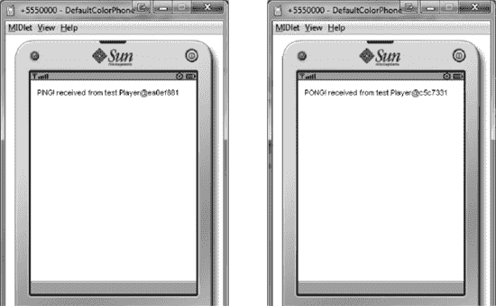

**图 2-1.** *运行中的测试应用程序*

### 总结

我们了解了 Pro Java ME 应用程序框架的运行方式。在此过程中，我们还学习了如何正确构建和编写 Java ME 应用程序框架的一般方法，以及与之相关的一些陷阱。

在本章末尾，我们通过编写一个基于该框架的小型示例应用程序，对框架进行了测试。

接下来，我们将定义应用程序的数据类型，并探讨正确定义数据类型和对象如何能够改进 Java ME 应用程序。

## 第 3 章

## 定义数据

在本章中，我们将介绍如何以适合 Java ME 的方式定义数据类型和对象。这一步很少得到应有的重视，但正如以错误的思维方式开发应用程序或在错误的框架之上开发应用程序会导致灾难一样，为数据使用错误的表示形式同样会带来问题。

这里的主要陷阱是倾向于将标准的面向对象概念（一切都是对象，专门化的对象通过继承建立在较不专门化的对象之上等）直接应用于 Java ME，而没有考虑该平台的特性。

如果这样做，从架构角度来看，您最终会得到一个优雅的对象层次结构，但在性能关键的时刻表现不佳，并且需要大量 RAM。同时，走向另一个极端，将所有内容合并到一个（或两三个）类中也不是一个选项，因为这将带来出色的性能，但代码几乎无法维护。

Java ME 的最佳平衡点位于两者之间：将对象和数据类型整合到足够高的程度，以最大限度地减少性能问题，同时仍保留它们之间足够的分离度，以便将整个体系称为“面向对象”。本章旨在展示如何找到这个最佳平衡点。在此过程中，我们还将定义在 Twitter 客户端中实际使用的数据类型和实体。

我们只关注全局数据类型和实体，即属于`app.models`包的那些。非全局模型将在其特定模块中处理。

### 为什么要实现 Model 接口？

您会注意到，本章中讨论的所有类都实现了`Model`接口，而所有我们将讨论的接口都扩展了它。换句话说，`Model`接口位于我们应用程序中每个全局数据类型和实体的根。此外，正如我们在前一章中所见，`Model`接口是空的。那么，为什么还要实现/扩展它呢？

这主要有三个原因。第一个原因是，它可以作为一个非常高效的代码提示。例如，如果开发人员看到`Tweet`类是一个`Model`，他就知道这个类应该对相关的“现实世界”实体的行为和功能进行建模，并且根据规范，他知道应该如何精确地实现这一点。此外，当他考虑为类添加新功能时，他会问自己该功能是否真的属于`Model`，还是属于其他地方（比如相关的`Controller`）。最后，类扩展了`Model`这一信息可以被代码分析/优化工具以及 IDE 使用（要获取应用程序中所有模型的列表，无论它们位于哪个包中，只需在`Model`上执行“显示类型层次结构”即可）。

实现`Model`接口的第二个原因是，它有助于整合工作。例如，您可以（事先或在开发过程中）决定所有模型都应实现一个`checksum()`方法或一个`isSyncedToServer()`方法，以检查客户端的本地数据是否与服务器上的数据相同（这对于实时应用程序非常有用）。让所有模型实现一个公共接口是实现这一目标的优雅且有效的方式。

第三个原因是，`Model`接口还可以作为防止过度整合的保障。沿用前面的例子，如果在某个类中，不清楚`checksum()`或`isSyncedToServer()`方法应用于哪些数据，或者如果概念上需要为同一个类提供两个独立的`checksum()`方法（每个方法处理两组不同的数据），那么您很可能已经过度整合了，需要拆分有问题的数据类型和对象，直到每个类只需一个`checksum()/isSyncedToServer()`方法就足够，并且其作用域完全清晰为止。

### 使数据类型不可变

这是一条同样适用于 Java ME 的通用建议：尽可能让你的数据类型不可变。例如，你应该确保一旦创建了一个新的 `Tweet` 实例，就只能获取其属性——而无法以任何方式修改它们。

如果你想修改它的一个或多个属性，你必须创建一个包含相应新值集合的新实例，而不是在现有实例上调用 `setTimestamp()` 或 `setText()` 等方法。这样做虽然会带来一点性能损失，但如果处理得当，其收益将远超成本。

这样做最大的好处是，通过确保你无法意外修改对象来防止大量 bug 的发生，因为你“修改”对象的唯一方式就是创建一个新对象。另一个好处是，对重要实例值（例如 `Tweet` 的文本）的修改更容易追踪，这反过来也使代码更易于调试。这两点对于大型且复杂的应用程序都极为重要。

**注意：** 这种方法的缺点是，如果你不小心，最终可能会制造问题而不是解决问题。例如，如果你错误地保留了对旧且未使用实例的引用，那么你不仅会阻止它们被垃圾回收，还会影响应用程序的行为，因为“无效”的旧数据可能会被使用，而不是“有效”的新数据。

当然，并非所有数据类型和实体都能或应该不可变。假设你正在编写一个游戏，其中包含一个 `BadGuy` 实体。让它不可变是个坏主意，因为 `BadGuy` 会频繁地 `move()` 和 `fire()`。虽然创建新实例是良好实践，但每次发生这些操作时都这样做会使你的游戏运行缓慢。对于其他频繁改变状态的实体也是如此，比如 UI 框架中的 `Scrollbar` 或聊天程序中的 `ChatRoomHistory`。

另一个很好的例子是包含大量信息的数据类型和实体——例如，前面游戏中的 `Level` 数据类型：每当一个瓦片改变其值时都必须创建一个新的关卡实例，这绝对是疯狂的。

然而，这些都是例外情况。在一个典型的应用程序中，通过合理的规划和架构，你可能能够让全局数据类型和实体中的 60–70% 变得不可变，甚至更多。

话虽如此，现在让我们开始定义我们的对象和数据类型。

### 定义 Tweet 数据类型

这可能是应用程序的基本数据类型，因为其整个功能都围绕推文展开。推文的主要属性包括正文、作者和 ID。

**注意：** 推文实际上还有更多与之关联的属性——例如，地理位置——但为了我们的目的，我们将只关注刚刚列出的三个重要属性。如果你愿意，可以随意添加对其他属性的支持。

我们的 `Tweet` 类将类似于代码清单 3–1。与所有全局数据类型和实体一样，`Tweet` 类实现了 `Model` 接口。

**代码清单 3–1.** *`Tweet` 类*

`package app.models;`

`import com.apress.framework.objecttypes.Model;`

`public class Tweet implements Model`
`{`
`    protected Tweet() { }`
`    public Tweet (String author, String body, long timestamp)`
`    {`
`        ...`
`    }`

`    public String getBody() { ... }`

`    public String getAuthor() { ... }`

`    public String getID() { ... }`
`}`

如你所见，它有一个受保护的默认构造函数，并且只有其字段的设置器，这迫使你使用一些数据初始化它，同时使其不可变。随着你添加对更多属性的支持，添加额外的构造函数也是有意义的——例如，一个接受作者、正文、时间戳和位置作为参数的构造函数。然而，就我们的目的而言，当前的实现已经足够。

我们现在知道了推文在代码中的样子。现在是时候看看它们的创建者，即 Twitter 用户，将如何被表示。

### 定义 TwitterUser 数据类型

直观地说，用户是发布和阅读推文的人。每个 Twitter 用户都有一个名字、一个简短描述（或简介）、一个 URL 和一个位置。因此，`TwitterUser` 类类似于代码清单 3–2 中的类。

**代码清单 3–2.** *`TwitterUser` 类*

`package app.models;`

`import com.apress.framework.objecttypes.Model;`

`public class TweeterUser implements Model`
`{`

`    protected TweeterUser() {  }`

`    public TweeterUser (String author, String body, String url, String location)`
`    {`
`         ...`
`    }`

`    public String getDescription() { ... }`

`    public String getName() { ... }`

`    public String getUrl() { ... }`

`    public String getLocation() { ... }`
`}`

此时，你们中熟悉 Twitter 的人可能会问：“好吧，但是好友、关注者、被屏蔽的用户在哪里？”

这是一个非常好的问题。尽管在我们的应用程序概述中，Twitter 用户是一个独立的实体，能够执行发送和接收推文等操作，但在实践中，我们会将其视为一个简单的数据类型，并将所有与之相关的功能和行为转移到 Twitter 服务器实体中。如果你仔细想想，这实际上是有道理的：Twitter 用户自己实际上什么也做不了——他需要一个服务器才能运作。

一般来说，如果实体 A 的功能依赖于实体 B，那么将功能从实体 A 转移到实体 B 是一个好主意，至少在 Java ME 中是这样。这是因为这种“功能整合”方法通常能最小化代码大小、传递的信息量以及进行的方法调用次数，因为大多数“动作”往往发生在单个类的单个实例中。

这也导致了这样一种情况：10% 的实体接管了剩余 90% 实体的功能，这违背了一些面向对象的原则。例如，在我们的案例中，“行为封装”原则被打破了，因为尽管 `TwitterUser` 保留了状态，但其所有行为都已转移到 `TwitterServer`。虽然在“文明”的面向对象世界中这通常被认为是不良实践，但 Java ME 是少数几个使用这种方法有意义的案例之一。

如果应用得当，这种整合过程会将项目中的许多实体转变为 C 语言意义上的简单结构，而剩余的关键实体将负责应用程序的大部分功能。在这些少数实体中，大多数将以接口或抽象类的形式编写代码，将实际实现留给应用程序的模块。因此，`app.models` 包中很少有完整的类——在我们的案例中，一个都没有。

现在回到我们的应用程序。到目前为止，我们已经研究了推文和 Twitter 用户，两者都不算令人兴奋。让我们看看一些更有趣的东西：Twitter 服务器。

### 定义 TwitterServer 实体

顾名思义，`TwitterServer` 实体对应的是 Twitter 服务器。不过，对它进行建模并不像对推文或用户建模那样简单。首先，它完全处于我们应用程序的边界之外，其数据和逻辑也是如此——我们对它紧闭的大门背后发生的事情一无所知。此外，我们自己既无法创建新服务器，也无法更改现有服务器的 IP 地址或其他参数。

我们要做的是将 `TwitterServer` 编写成一个黑盒，它依赖网络模块将请求转发到实际的服务器，并接收来自实际服务器的响应。同时，除了与 Twitter 服务器相关的常规功能（如登录和检索 `Timeline` 的推文）之外，`TwitterServer` 还将接管通常与 `TwitterUser` 相关的功能，例如发布推文——其原因已在上一节讨论过。

`TwitterServer` 接口的完整代码见列表 3–3，而具体实现将在专门讨论网络模块的章节中给出。

**列表 3–3.** *`TwitterServer` 接口*

`package app.models;`

`import com.apress.framework.objecttypes.Model;`

`public interface TwitterServer extends Model`
`{`
`    public boolean login(UserCredentials credentials) ;`

`    public TwitterUser getMyProfile();`

`    public TwitterUser getProfileFor(String userid);`

`    public Timeline getTimelineForFilter(TweetFilter filter);`

`    public boolean postTweet(Tweet tweet);`
`}`

你可以看到，代码中引用了三种我们尚未讨论的数据类型：`UserCredentials`、`TweetFilter` 和 `Timeline`。让我们逐一审视它们。

### 定义 UserCredentials 数据类型

`UserCredentials` 类负责向服务器提供我们希望登录的 Twitter 用户的凭据。

在撰写本文时，如果你想从外部访问 Twitter 的服务，它支持三种主要的身份验证方法。

第一种是带外身份验证，仅适用于 Web 和桌面应用。它对于移动应用（尤其是 Java ME 应用）效果不佳，因为用户必须离开应用程序，在浏览器中输入其凭据。此外，在某些设备上这可能完全无法工作，因为它们可能根本没有合适的浏览器，或者无法从 Java ME 应用内部打开浏览器。即使它能工作，你也不能期望登录流程在所有设备上保持一致（不同的弹出窗口、确认信息等）。总而言之，这对用户来说是一种糟糕的体验。

第二种是单次访问令牌，它非常适合单用户场景，因为用户的凭据被“硬编码”到了应用程序中。

第三种是 xAuth，它最适合多用户场景，例如我们计划编写的这种面向所有人的 Twitter 客户端。使用 xAuth，只要提供的用户名和密码正确，你的应用程序就被授权代表任何用户工作。

显然，我们希望为我们的项目使用 xAuth。然而，在我撰写本文时，Twitter 仅在需要时才授予 xAuth 权限——所以你不能指望 xAuth 对你可用。

虽然无法使用 xAuth 对于实际项目来说算是一个障碍，但我们的学习项目可以不用它。如果 xAuth 不可用，只需使用单次访问令牌即可。更多细节将在与网络相关的章节中提供。

目前，我们必须确保 Twitter 同时支持 xAuth 和单次访问令牌。因此，我们的类如列表 3–4 所示。

**列表 3–4.** *`UserCredentials` 类*

`package app.models;`

`import com.apress.framework.objecttypes.Model;`

`public class UserCredentials implements Model`
`{`
`    protected UserCredentials() {  }`

`    public UserCredentials(String username, String password,`
`                 String accessToken, String accessTokenSecret)  { ... }`

`    // 用于 xAuth 身份验证`
`    public String getUsername() { ... }`
`    public String getPassword() { ... }`

`    // 用于基于令牌的身份验证`
`    public String getAccessToken() { ... }`
`    public String getAccessTokenSecret() { ... }`
`}`

如果你还没有这样做，现在是时候问问自己：“为什么这个类属于全局模型包？” 确实，乍一看它更适合放在网络模块中。

我们在这里而不是在网络章节讨论凭据的原因很简单：`UserCredentials` 标识了应用程序的用户，即坐在手机屏幕另一侧的人——对于 Java ME 应用程序来说，他就是一个全局实体。

一点建议：许多开发者常常忘记最终用户本身就是一个实体，而且是一个全局实体。当这种情况发生时，他们往往不会将与用户相关的所有内容放在一个单独的包中，而是将与用户相关的信息分散到应用程序的各个模块中。然而，不同的模块有不同的范围，并且大多数模块本质上倾向于某种程度的自治。结果，一些与用户相关的信息和功能要么丢失，要么变得过于复杂而难以使用。这会导致代码无法准确反映用户的角色和需求，从而产生一个焦点不明确的应用程序。

### 定义 TweetFilter 数据类型

`TweetFilter` 数据类型将允许我们根据特定条件过滤推文。例如，我们可能只想获取由某个特定用户创建的推文，或者包含某个特定话题标签的推文。

不过，为了简单起见，我们将只关注一个条件，并仅根据创建推文的用户来过滤推文。该类如列表 3–5 所示。

**列表 3–5.** *`TweetFilter` 类*

`package app.models;`

`import com.apress.framework.objecttypes.Model;`

`public class TweetFilter implements Model`
`{`
`    protected TweetFilter () { }`

`    public TweetFilter(String userID) { ... }`

`    public String getUserID() { ... }`
`}`

在你亲自使用该应用程序时，可以随意添加更多的过滤条件。

### 定义时间线实体

`Timeline` 实体是一个绝佳范例，展示了如何通过恰当的数据表示来节省时间、减轻压力，同时提供极大的灵活性。让我们先快速回顾一下 Twitter 背后的一些原则，以此开启讨论。

每条进入系统的新推文都会获得一个唯一 ID，所有 ID 均按时间顺序和字母顺序生成。因此，推文越新，其 ID 数字就越大。Twitter 还有两种主要的推文检索方式：查询和时间线。查询类似于“给我包含‘JavaME’这个词的最新五条推文”，而时间线则是一种聚合推文的方式。例如，你的主页时间线会聚合来自你本人、你关注的人以及一些可能与你兴趣相关的推文。

查询和时间线通常通过不同的 API 调用访问，但我们希望能够将它们统一到一个公共 API 下。因此，我们将把 Twitter 的查询和时间线合并到我们自己的时间线概念中，该概念对这两种来源同样适用，如下所示。

我们将把时间线视为一系列按时间顺序排列的推文，每条推文都对应时间线指定的 `TweetFilter`。时间线与整数数轴非常相似：它有一个“零时刻”推文，你可以从该推文向后回溯到更早的推文（相当于负数），或向前推进到更新的推文（正数）。零时刻推文可以被视为时间线初始化时的最新推文。

为了在时间线上移动，你有两个“游标”，分别对应两个方向：向前和向后。每个游标只能在其指定的方向上移动。因此，“向后”游标只能向后移动，而“向前”游标只能向前移动。此外，每个游标每次只能移动一条推文。这意味着，要到达时间线的任一端，你必须遍历该方向上的所有推文，并且无论时间线有多大，你在任何时刻最多只需跟踪两条推文——每个游标一条。

由于我们希望时间线概念能覆盖多个数据源，我们将使用 Java 接口 `Timeline` 来表示它，如代码清单 3–6 所示。每个相应的数据源将负责实现此接口。

**代码清单 3–6.** *`Timeline` 接口*

`package app.models;`

`import com.apress.framework.objecttypes.Model;`

`public interface Timeline extends Model`
`{`
`    public Tweet goForward();`

`    public Tweet goBack();`
`}`

`Timeline` 接口的约定如下一段所述。

初始化后首次调用 `goForward()` 或 `goBack()` 将返回零时刻推文，如果当时没有推文匹配指定的过滤器，则返回 `null`。当无法再向后移动（即已达到时间线的最旧推文）时，`goBack()` 方法将返回 `null`。如果没有可用的更新推文，`goForward()` 方法可能返回 `null`。

快速补充一点：这是极致的简洁。仅使用两个简单的方法，你不仅可以实时浏览 Twitter 系统中当前的所有推文，还能浏览未来的推文——而且内存需求极低。此外，你可以调整这个概念，使其几乎适用于你能想到的任何连续数据源，从股票市场数据（实时但也有历史记录）到搜索引擎趋势。

时间线这个比喻也是一个很好的例子，说明了抽象概念本身如何能提供大量功能。仔细想想，我们的时间线将简单灵活的导航与强大的数据源抽象结合在了一起——尽管它仅仅是一个想法。花点时间看看能否找到适合你 Java ME 应用程序需求的此类想法，总是值得的。

### 为你的数据选择智能表示

大多数开发者倾向于低估数据建模的重要性。他们通常将这个过程等同于编写类或接口，为试图建模的现实世界实体的每个属性或动作都提供一个方法或字段。这既快速又直观，也确实有效，但这也意味着从长远来看，你无意中让自己的工作变得更困难，同时阻碍了应用程序发挥其全部潜力。

其根本原因在于（开发者中）普遍认为数据是“笨拙的”，而代码是“智能的”。事实远非如此：恰当建模的数据结构往往比等效的代码更智能。我想用几段文字，通过一个我们都熟悉的数据结构——链表——来说明这一点。

假设我们需要一个链表，能够快速访问其第一个和最后一个元素。有两种常见的方法可以实现这一点。

第一种是跟踪对列表第一个元素的引用，用于 `getFirst()`。当调用 `getLast()` 时，代码会遍历列表中的所有元素，直到到达最后一个。这显然很慢，但优点是只使用一个指针。

第二种方法是使用两个引用，一个指向第一个元素，一个指向最后一个。这比前一种方法快，但缺点是需要跟踪两个引用而不是一个。

然而，还有第三种更智能的方法来实现我们的目标：我们将列表建模为循环列表，将最后一个元素链接到第一个元素。

这个小小的改变带来了天壤之别。首先，我们现在只需跟踪一个引用，即指向列表中最后一个元素的引用。`getLast()` 将返回该引用，而 `getFirst()` 只需返回 `getLast().next()`。这个概念如图 3–1 所示。

由于我们只管理一个引用，代码复杂度和资源消耗与第一种方法一样低。而且，由于从最后一个元素到第一个元素几乎没有成本，代码的执行速度与第二种方法一样快。此外，对外部世界而言，我们的循环列表的行为与常规链表相同。

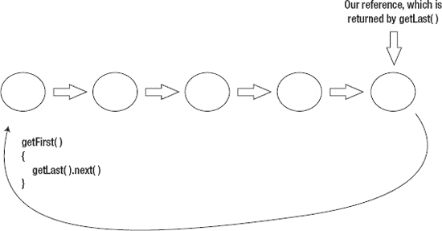

**图 3–1.** *循环列表*

通过巧妙地定义数据并选择合适的模型，我们获得了前两种方法的所有优点，而没有它们的任何缺点。

这种优化在更复杂的现实场景中也经常可以进行，尽管程度通常较小。这意味着，通常只需为数据和实体选择正确的表示形式，就能让你的应用程序更快、更精简、更灵活。

我希望这个例子能让你相信，对数据和实体进行建模，并与由此产生的模型打交道，是一个比乍看起来更微妙、更重要的话题。请记住这一点，在编写应用程序时不要仓促跳过这个重要步骤。这条建议在 Java ME 的世界中尤其重要，因为不恰当的数据表示所导致的性能和资源消耗问题可能相当显著。

### 本章小结

我们已经为项目定义了全局数据类型和实体。在此过程中，我们还研究了如何为 Java ME 应用程序建模数据，以及如何为数据选择合适的模型能显著改进应用程序。

在下一章中，我们将实现 Twitter 客户端的第一个模块——网络模块，并且还将更深入地了解 Java ME 网络编程。

## 第 4 章

## 网络模块

每个客户端应用都需要一个模块来与关联的服务器进行通信。我们的 Twitter 客户端也不例外。在本章中，我们将实现网络模块，以便访问 Twitter 的服务。在此过程中，我们还将探讨与 Java ME 网络相关的一些有趣方面。

由于从头编写网络模块过于耗时且复杂，我们将改用现有的第三方库来处理与 Twitter 服务器的底层通信。因此，我们将围绕该库构建模块，依赖它完成底层工作，同时仅向应用的其他部分暴露高级功能。

### 设置与配置库

我们将使用的第三方库名为 Twitter API ME，可从[`www.twapime.com`](http://www.twapime.com)获取。它是一个跨平台库，在撰写本文时支持 Java ME、J2SE 和 Android。其源代码采用 GPL 许可证发布，而二进制文件可在 LGPL 下使用。在我们的应用中，我们将以源代码形式使用该库。

撰写本文时的最新版本是 1.4，这也是本章将使用的版本。如果你愿意，也可以使用该库的更新版本。

首先需要下载 Twitter API ME。请访问[`http://kenai.com/projects/twitterapime/downloads/directory/1.4`](http://kenai.com/projects/twitterapime/downloads/directory/1.4)，下载该库的 Java ME 版本：`twitter_api_me-1.4-javame.zip`。

我们主要关注压缩包中的两个目录：`/src`和`/lib`。将`/src`的内容复制到项目的源代码文件夹，将`/lib`的内容复制到项目的库文件夹。

接下来，配置你的 IDE 和环境，确保`/lib`文件夹中的`kxml`和`xauth-encoders`库都包含在构建过程中（Twitter API ME 依赖它们，正如我们依赖它一样），并且 Twitter API ME 的源代码将与你的应用源代码一起编译。然后，删除`impl.android`包及其所有子包，以确保项目能无错误地构建。

至此，库的设置完成。但我们仍需确保 Twitter 允许我们访问其服务。假设你还没有 Twitter 账号，请先创建一个。然后访问[`http://dev.twitter.com/apps`](http://dev.twitter.com/apps)，为你的账号注册一个新的 Twitter 应用。注册完成后，进入应用的详情页面。你会在那里找到大量信息，供后续步骤使用，例如 API 密钥、消费者密钥和密钥、单次访问令牌和令牌密钥。

现在是时候请求 xAuth 访问权限了。请按照[`http://dev.twitter.com/pages/xauth`](http://dev.twitter.com/pages/xauth)上的说明操作。基本流程是：发送一封邮件至[`api@twitter.com`](http://api@twitter.com)，附上你的应用描述、需要 xAuth 访问权限的原因、应用的消费者密钥及其 ID（如果有）。你的请求将被审核，通常会在 24-48 小时内收到回复。

**注意：** 在撰写本文时，xAuth 仅按请求提供，并非所有人都有资格获取。不过，这种情况可能会随时间改变，xAuth 可能会默认向所有人开放，因此在向 Twitter 发送请求前，请先确认最新情况。

在此期间，你可以使用单次访问令牌进行身份验证。如果 Twitter 因某种原因拒绝了你的 xAuth 访问请求，你也可以使用自己的令牌。但这意味着你只能使用自己的 Twitter 账号，无法以其他用户身份登录。对我们来说这不是问题：由于我们只是做一个学习项目，只能使用一个用户账号并不会造成太大不便。

一旦你知道了自己的单次访问令牌和密钥，以及消费者密钥和密钥，就可以进行快速冒烟测试了。为此，你需要运行代码清单 4-1 中所示的 MIDlet。

**代码清单 4-1.** *冒烟测试 MIDlet*

`package test;`

`import com.twitterapime.rest.Credential;`
`import com.twitterapime.rest.UserAccountManager;`
`...`

`public class TestMidlet extends MIDlet`
`{`
`    public void startApp()`
`    {`
`        try`
`        {`
**`Token token = new Token("access_token", "access_token_secret");`**
**`Credential c = new ("your_user_name", "consumer_key", "consumer_secret",`**
**`token);`**
`            UserAccountManager m = UserAccountManager.getInstance(c);`
`            if (m.verifyCredential())`
`            {`
`                System.out.println("Auth OK");`
`            }`
`            else`
`            {`
`                System.out.println("Auth failed");`
`            }`
`        }`
`        catch (Exception ex)`
`        {`
`            ex.printStackTrace();`
`        }`
`    }`

`    public void pauseApp() {`
`    }`

`    public void destroyApp(boolean unconditional) {`
`    }`
`}`

冒烟测试 MIDlet 用于检查基于令牌的身份验证是否正常工作。要检查 xAuth 身份验证是否对你有效，只需将代码清单 4-1 中的粗体行替换为以下代码行：

`Credential c = new Credential("user_name", "password", "consumer_key",`
`"consumer_secret");`

上述示例中的用户名和密码可以是任何有效 Twitter 账号的用户名和密码。

在运行上述两个冒烟测试 MIDlet 中的任意一个时，你可能会遇到以下错误或类似错误：

`javax.microedition.pki.CertificateException: Certificate was issued by an unrecognized`
`entity`

这是因为 Twitter 使用的 SSL 证书未被某些旧版本的 WTK 模拟器识别。如果在较新的设备（出厂时间少于 4-5 年）且由知名公司制造的实际设备上运行该 MIDlet，应该可以正常工作。换句话说，该代码在绝大多数现有设备上都能正常运行。但我们的目标设备是 WTK 模拟器，因此需要解决这个问题。我们可以手动安装缺失的证书（这相当复杂），或者配置 Twitter API ME 使用 HTTP 而非 HTTPS。我们将选择后者。

如果你能访问库的源代码，使用 HTTP 而非 HTTPS 进行身份验证非常简单。只需打开`UserAccountManager.java`，将 OAuth URL 从[`https://api.twitter.com/oauth/access_token`](https://api.twitter.com/oauth/access_token)改为[`http://api.twitter.com/oauth/access_token`](http://api.twitter.com/oauth/access_token)。

**提示：** 在继续之前，我想分享两条与编写网络模块相关的重要建议。虽然并非开创性，但它们多次帮助了我，并且确实能让你的工作更轻松（它们无疑让我的工作更轻松了）。

#### 使用高级对象

编写和定义网络模块的方式有很多种。例如，有些人倾向于让网络模块成为数据的简单通道，将原始字节流传递给应用程序的其他部分进行解码。另一些人则偏好让网络模块处理结构化数据（如向量和哈希表），而非原始字节。还有一些人使用非原生格式，例如编码在`String`对象中的 XML 和 JSON。

所有这些方法以及其他类似方法都有一个重大缺陷：它们需要在网络模块外部进行某种序列化/反序列化操作。这实际上意味着网络模块会“渗透”到其他模块中。

这种情况绝无合理理由。网络模块之外的任何模型、控制器或其他类都不应包含诸如`createFromHashtable()`、`createFromRawBytes()`或任何类似的方法。此规则唯一可接受的例外是持久化模块——我们将在下一章讨论原因。

因此，一个编写得当的网络模块始终消费高级对象，并始终提供高级对象（通常是模型）。将这些对象与字节流或 XML 等格式相互转换，严格来说是网络模块的内部工作——应用程序的其他部分无需关心这一过程如何实现。

#### 使用自定义数据类型

大多数第三方库（包括 Twitter API ME）已经定义了与其领域相关的关键实体和数据类型的对象和类。例如，在 Twitter API ME 客户端库中，`Tweet`数据类型已由该库定义。问题在于：你是在应用程序中使用这些已定义的数据类型，还是实现自己的数据类型？

根据经验，实现并使用自己的数据类型始终是个好主意。你应该仅将库定义的数据类型用作服务器发送的原始字节与你应用程序中使用的数据类型之间的缓冲区——这很容易实现，因为库数据类型与你的数据类型通常非常相似。

这样做最初可能需要多做一些工作，因为你必须将信息从库数据类型“迁移”到你的数据类型，但它为你带来了一个极其重要的优势：与库无关；这使你能够轻松地将应用程序移植到其他平台或其他库。它还允许你按照自己的使用方式来建模数据类型和实体，而不是受限于库提供的表示形式——仅凭这一点就为我省去了无数麻烦。

### 编写我们的 TwitterServer 实现

如果你还记得上一章的内容，我们决定将 Twitter 服务器定义为一个 Java 接口。现在是时候通过构建一个能够登录、读取推文和发布新推文的`TwitterServer`实现，将该接口具体化了。我们还将研究一些有用的技术，例如使用通用时间线概念以最小开销实时浏览服务器上的数据（在我们的案例中是推文）、将异步请求转换为同步请求，以及使用缓冲来最小化感知到的网络延迟和性能开销。

#### 定义通用结构

我们将从编写`ServerImplementation`类的精简版本开始，如代码清单 4-2 所示。

**代码清单 4-2.** *精简版`ServerImplementation`类*

`package app.module.network.models;`

`import app.models.Timeline;`
`import app.models.Tweet;`
`...`

`public class ServerImplementation implements TwitterServer {`

`    public boolean login(UserCredentials credentials)`
`    {`
`        throw new UnsupportedOperationException("Not supported yet.");`
`    }`

`    public TwitterUser getMyProfile()`
`    {`
`        throw new UnsupportedOperationException("Not supported yet.");`
`    }`

`    ...`

`}`

如你所见，该类位于`app.module.network`包下的`models`子包中。

有趣的一点是：由于在我们的框架中，控制器、普通类或模型之间在实际代码层面没有区别，因此它们之间的区分主要是概念性的，目的是理清思路。例如，如果新加入项目的开发者看到网络模块没有控制器，他就能轻松推断出网络模块正在后台默默工作，仅向其他模块提供数据和事件。然而，如果他看到网络模块中至少有一个控制器，他就会知道该模块至关重要，并且可以改变程序的流程。

在我们的特定案例中，由于 Twitter 的特性，应用程序的网络模块将完全没有控制器，因为与 Twitter 相关的任何事务都没有紧迫到需要网络模块本身来改变程序流程或以任何方式干预它。

这种情况与其他类型的应用程序（例如股票监控应用程序）中的情况截然不同。在那些情况下，网络模块可以并且确实控制着程序流程：如果客户端收到`STOCK_HIT_ROCK_BOTTOM`消息，你可以肯定用户会希望立即被告知此事，并被引导至专用屏幕，无论应用程序的其他部分当时在做什么。因此，将执行此操作的逻辑放在控制器类中是合理的。

#### 初始化 ServerImplementation 实例

为了使`ServerImplementation`类能够执行有用的操作，我们必须首先提供使其能够正确初始化的方法。

初始化`ServerImplementation`实例需要三部分信息：消费者密钥、消费者密钥密文以及事件控制器的引用。前两者的原因显而易见：消费者密钥和密钥密文用于向 Twitter 标识我们的应用程序。需要事件控制器是为了让实例能够向应用程序的其他部分发送关于重要事件的通知，并能够接收来自其他部分的通知。

此外，我们应该努力使`ServerImplementation`尽可能不可变。因此，我们的类变成了代码清单 4-3 中的样子。

**代码清单 4-3.** *支持初始化的`ServerImplementation`类*

`public class ServerImplementation implements TwitterServer, EventListener {`

`    protected String consumerKey, consumerSecret;`
`    protected EventController eventController;`

`    protected ServerImplementation() { } ;`

`    public ServerImplementation(String consumerKey, String consumerSecret,`
`    EventController controller)`
`    {`
`        this.consumerKey = consumerKey;`
`        this.consumerSecret = consumerSecret;`
`        this.eventController = controller;`
`        controller.registerListener(this);`
`    }`

`    public boolean handleEvent(Event event)`
`    {`
`        // 暂时为空`
`        return false;`
`    }`

`    public EventController getEventController()`
`    {`
`        return eventController;`
`    }`

`    ...`
`}`

现在，例如，如果我们想要初始化服务器实现并将其附加到应用程序的主事件控制器，我们只需执行以下操作：

`ServerImplementation impl = new ServerImplementation("conKey", "conSecret",`
`Application.getMainEventController() );`

#### 提供登录支持

在 `ServerImplementation` 实例初始化后，它能执行的最基本操作就是让用户登录。

考虑到我们必须以一致的方式同时支持用户名密码认证和单次访问令牌认证，我们的登录需求如下：首先，应用程序应尝试使用用户名和密码组合进行登录。如果无法提供此组合或该组合无效，则应用程序应改用单次访问令牌。如果未提供令牌或令牌无效，则应用程序将认为认证过程失败。

如果你还记得前一章的内容，我们将使用 `UserCredentials` 数据类型来提供认证信息。`UserCredentials` 在同一个数据结构中同时支持用户名密码认证和单次访问令牌认证。这多少有些违背了为每种认证方式使用独立数据类型的直观做法——例如，分别使用 `UsernamePasswordCredentials` 和 `TokenCredentials`。

将两者合并到单一数据类型的原因很简单：通过这样做，我们可以让专门的 `ServerImplementation` 自行决定哪种登录方法最适合任何特定情况。

其重要性最好通过以下场景（改编自一个真实项目）来举例说明：应用程序 X 要求，如果通过蜂窝网络上的 HTTPS 连接到服务器，则使用用户名和密码对用户进行认证；如果通过 WiFi 和/或 HTTP 连接，则使用令牌或其他加密凭据进行认证。

在这个例子中，考虑一下如果我们没有将所有可用的凭据放在一个数据结构中提供给网络模块，会发生什么：决定提供哪些具体凭据的责任就落到了应用程序的其他部分身上。根据需求，这涉及到检查可用的连接类型、它们是否安全等。由于所有这些任务在逻辑上都属于网络模块的一部分，但我们却在其他地方完成，这基本上造成了从网络模块到应用程序其他模块的“泄漏”——这是我们非常希望避免的。

然而，如果我们一次性提供所有可用的凭据，并说“你来选”，那么网络模块就可以自行决定使用哪些凭据，在内部完成所有必要的检查——并且以一种或多或少集中化的方式。这不仅消除了任何潜在的“泄漏”，还有助于保持代码的结构和可读性、应用程序的逻辑以及开发人员的理智（在整个应用程序中寻找“那行执行那个检查的代码”是非常令人沮丧且耗时的）。

这条建议不仅适用于网络模块——这是一条通用建议。尤其是在处理高级操作时，最好提供你所拥有的所有信息，让应用程序的专门模块在内部决定使用哪些信息以及丢弃哪些信息。

现在我们回到我们的 Twitter 客户端。除了实际的认证代码之外，登录过程要正确实现还需要一件事：事件。

一方面，我们希望能够通过事件触发登录。为此，我们将实现对 `BEGIN_LOGIN` 事件的支持。当登录失败或成功时，我们还需要生成事件，这正是 `LOGIN_FAILED` 和 `LOGIN_SUCCEEDED` 的作用。为了实现这些事件，我们必须先定义它们。确保你的 `EVT` 看起来像清单 4-4 中的那样。

**清单 4-4.** *定义的登录事件*

`public class EVT`
`{`
`    public class CONTEXT`
`    {`
`...`
`        public static final int NETWORKING_MODULE = 4;`
`    }`

`    ...`

`    public class NETWORK`
`    {`
`        public static final int BEGIN_LOGIN=30001;`
`        public static final int LOGIN_FAILED=30002;`
`        public static final int LOGIN_SUCCEEDED=30003;`
`    }`

`}`

现在是时候进行实际实现了。首先，`ServerImplementation` 的主要 `login()` 方法如清单 4-5 所示。

**清单 4-5.** *`login()` 方法*

`public boolean login(UserCredentials credentials)`
`{`
`        boolean success = false ;`

`        // 首先，尝试使用用户名和密码登录`
`        if ( credentials.getUsername()!= null && credentials.getPassword()!= null )`
`        {`
`                success = loginUsingUnPw(credentials.getUsername(),`
`                credentials.getPassword() );`
`        }`
`        // 如果失败，尝试使用令牌`
`        if ( success == false )`
`        {`

`                if ( credentials.getAccessToken() != null &&`
`                credentials.getAccessTokenSecret() != null )`
`                {`
`                        success = loginUsingTokens(credentials.getAccessToken(),`
`                        credentials.getAccessTokenSecret() );`
`                }`
`        }`

`        // 生成相应的事件`
`        if ( success )`
`        {`
`                Event evt = new Event ( EVT.CONTEXT.NETWORKING_MODULE,`
`                EVT.NETWORK.LOGIN_SUCCEEDED, credentials);`
`                eventController.queueEvent(evt);`
`        }`
`        else`
`        {`
`                Event evt = new Event ( EVT.CONTEXT.NETWORKING_MODULE,`
`                EVT.NETWORK.LOGIN_FAILED, credentials);`
`                eventController.queueEvent(evt);`
`        }`

`        return success;`
`}`

接下来是实现实际的登录方法 `loginUsingUnPw()` 和 `loginUsingTokens()`。这两个方法都在清单 4-6 中给出。将它们与主 `login()` 方法分离，不仅是为了提高可读性，还因为，在切换库的情况下，你可以保持主登录逻辑不变，只更改实际的实现。

**清单 4-6.** *方法 `loginUsingUnPw()` 和 `loginUsingTokens()`*

`protected UserAccountManager accountManager = null ;`

`protected boolean loginUsingUnPw(String username, String password)`
`{`
`Credential c = new Credential(username, password, this.consumerKey,`
`this.consumerSecret);`
`        UserAccountManager m = UserAccountManager.getInstance(c);`
`        try`
`        {`
`                if ( m.verifyCredential() )`
`                {`
`                        accountManager = m;`
`                        return true;`
`                }`
`                else`
`                {`
`                        return false;`
`                }`
`        }`
`        catch (Exception ex)`
`        {`
`                // 错误处理在此处进行`
`                return false;`
`        }`
`}`

`protected boolean loginUsingTokens(String token, String tokenSecret)`
`{`
`        Token authToken = new Token(token,tokenSecret);`
`        Credential c = new Credential("ignored", this.consumerKey,`
`        this.consumerSecret,authToken);`
`        UserAccountManager m = UserAccountManager.getInstance(c);`
`        try`
`        {`
`                if ( m.verifyCredential() )`
`                {`
`                        accountManager = m;`
`                        return true;`
`                }`
`                else`
`                {`
`                        return false;`
`                }`
`        }`
`        catch (Exception ex)`
`        {`
`                // 错误处理在此处进行`
`                return false;`
`        }`
`}`

**注意：** 基于令牌的身份验证假定您提供的令牌是有效的，并且*实际上并不*验证它们（即 `verifyCredential()` 始终返回 `true`）。如果令牌实际上是无效的，那么即使 `verifyCredential()` 对它们返回了 `true`，所有对服务器的调用也都会失败。这是一个库的问题，很可能在后续版本中得到修复。

最后，我们需要添加对 `BEGIN_LOGIN` 事件的支持。为此，请将代码清单 4–7 中的代码添加到 `ServerImplementation` 的 `handleEvent()` 方法中。按照惯例，`BEGIN_LOGIN` 事件的负载是一个 `UserCredentials` 类型的对象，该对象将用于实际登录。

**代码清单 4–7.** *添加对 `BEGIN_LOGIN` 事件的支持*

`public boolean handleEvent(Event event)`
`{`
`        ...`
`        if ( event.getType() == EVT.NETWORK.BEGIN_LOGIN )`
`        {`
`                login ( (UserCredentials) event.getPayload());`
`                return true;`
`        }`
`        ...`
`}`

现在代码已经写好了，让我们来测试一下。代码清单 4–8 展示了一些可能的登录场景。

**代码清单 4–8.** *可能的登录场景*

`// 创建 ServerImplementation 实例`
`ServerImplementation impl = new ServerImplementation("conKey", "conSecret",`
`Application.getMainEventController() );`

`// 仅包含用户名和密码的凭据`
`UserCredentials credentials1 = new UserCredentials("johndoe","123password",null,null);`

`// 仅包含令牌的凭据`
`UserCredentials credentials2 = new UserCredentials(null,null,"token123",`
`"tokensecret123");`

`// 同时包含用户名/密码和令牌的凭据`
`UserCredentials credentials3 = new UserCredentials("johndoe","123password","token123",`
`"tokensecret123");`

`// 通过同时提供用户名/密码和令牌进行登录`
`impl.login(credentials3);`

`// 仅通过提供令牌进行登录`
`impl.login(credentials2);`

`// 通过使用事件并仅提供用户名和密码进行登录`
`Event event = new Event(EVT.CONTEXT.LOCAL, EVT.NETWORK.BEGIN_LOGIN, credentials1);`
`Application.getMainEventController().queueEvent(event);`

如您所见，我们实现的登录机制既易于使用又非常灵活。

#### 发布推文

除了登录之外，用户可能想做的第二件事就是发布自己的推文。使用 Twitter API ME，这非常容易实现。我们的 `ServerImplementation` 的 `postTweet()` 方法的代码如代码清单 4–9 所示。

**代码清单 4–9.** *发布推文*

`import app.models.Tweet;`
`...`

`public boolean postTweet(Tweet tweet)`
`    {`
`       com.twitterapime.search.Tweet libTweet = new com.twitterapime.search.Tweet`
`               (tweet.getBody());`

`       if ( accountManager != null )`
`       {`
`            TweetER tweeter = TweetER.getInstance(accountManager);`
`            try`
`            {`
`                tweeter.post(libTweet);`
`            }`
`            catch (Exception ex)`
`            {`
`                return false;`
`            }`
`            return true;`
`       }`
`       return false;`
`    }`

除了发布推文之外，上述代码片段还有第二个目的：它演示了使用第三方库时比较烦人的一个方面：命名冲突。为了避免我们的 `Tweet` 数据类型与库的 `Tweet` 数据类型混淆，我们必须使用库的 `Tweet` 类的全名，即 `com.twitterapime.search.Tweet`。类名冲突不过是个小麻烦，但它们的大哥——访问修饰符冲突——才真正令人头疼。例如，当您想要或需要重写一个 `final` 方法，或者想要将一个标记为 `private` 或 `protected` 的方法设为 `public` 时，就会发生访问修饰符冲突。我们将在第 11 章中进一步讨论这些问题。

#### 检索推文

这可能是网络模块中最有趣的部分，也是我们将花费最多时间研究的部分。

如前所述，检索推文主要有两种方式：推文时间线和查询。推文时间线聚合来自各种来源的推文（例如，来自您“关注”列表中所有人的推文），而查询则允许您通过指定各种参数（如推文内容、作者、时间、位置等）来细化您接收到的推文。

在我们的应用程序中，我们希望以统一的方式处理查询和推文时间线。为此，我们将使用上一章定义的时间线概念（这与 Twitter 的时间线概念不同——请不要混淆）。

具体来说，我们将实现两种类型的时间线（我们的时间线，而非 Twitter 的），每种来源对应一种。

然后，我们将根据调用 `getTimelineForFilter()` 时指定的过滤器来选择合适的时间线。如果未指定过滤器，或者过滤器包含空的用户名，那么我们将使用对应于 Twitter 主页时间线的时间线，也就是您在网页上登录 Twitter 时看到的推文列表。

如果在过滤器中指定了用户名，那么我们将使用查询来检索与指定用户对应的所有可用推文。请注意，Twitter 的 API 历史记录仅限于几天，因此早于此期限的推文将无法获取。

代码清单 4–10 展示了 `ServerImplementation` 的 `getTimelineForFilter()` 方法的代码，该方法实现了上述选择逻辑。

**代码清单 4–10.** *`getTimelineForFilter()` 方法*

`public Timeline getTimelineForFilter(TweetFilter filter)`
`{`
`        if ( filter == null || filter.getUserID() == null )`
`        {`
`           return new TimelineHome (accountManager);`
`        }`
`        else`
`        {`
`           return new TimelineUserTweets (accountManager, filter);`
`        }`
`}`

正如我们将看到的，上述示例中引用的两种时间线类型在实现上都有其特定的细节，并且每种类型都会教给我们重要的经验。让我们从主页时间线的实现开始。

##### 时间线主页

我们将通过 `TimelineHome` 类从 Twitter 的主时间线中检索推文，该类基于 Twitter API ME 的时间线功能。

Twitter API ME 的时间线功能是异步的。每次从时间线检索推文的请求都在单独的线程中运行，并附加了一个监听器。当收到与时间线对应的新推文、搜索完成或由于某种原因失败时，该监听器会异步收到通知。

为简单起见，在我们的案例中，`TimelineHome` 将同时充当请求发起者和请求监听者，这样我们就可以在同一个类实例中处理传入的推文。因此，`TimelineHome` 的声明如代码清单 4-11 所示。

**代码清单 4-11.** *`TimelineHome` 声明*

`public class TimelineHome implements Timeline, SearchDeviceListener`
`{`
`...`
`}`

异步检索通常是一件好事；然而，在我们对 `Timeline` 接口的规范中，检索推文是一个同步操作：`goForward()` 和 `goBack()` 在每次调用时必须返回下一个对应的推文或 `null`。

对于使用外部服务的 Java ME 应用程序来说，使异步操作同步工作是一项相当常见的任务，因为某些服务在设计上至少是部分异步的。最简单的解决方案（通常也是最有效的）依赖于缓冲区和 Java 的 `wait()` 和 `notify()` 方法。其工作原理如下。

首先，在您希望以同步方式工作的方法或类中，创建一个对象作为监视器——我们称这个对象为 `lock`。然后，在您发出异步请求后，立即调用 `lock.wait()` 来暂停线程。

接下来，当另一个线程（即运行请求的线程）或已注册的监听器收到响应时，将响应存储在缓冲区中，并调用 `lock.notify()`。这会唤醒初始线程，然后该线程就可以自由处理现在位于缓冲区中的结果了。

此过程的伪代码版本如代码清单 4-12 所示。请注意，这个想法有许多可能的变体——例如，缓冲区可以作为参数传递，锁可以用信号量替换，等等。

**代码清单 4-12.** *将异步请求转换为同步请求*

`lock = new Object();`
`buffer = new Buffer();`

`// 在发起者线程中（该线程是同步的）`
`public Object getNext()`
`{`
`   issueAsyncRequest();`
`   lock.wait();`
`   result = processBuffer (buffer);`
`   return result;`
`}`

`// 在请求线程或事件监听器中`
`void dataReceived(data)`
`{`
`  buffer = processData(data);`
`  lock.notify();`
`}`

看到上面的伪代码，您可能会认为这个想法很容易实现，但在实践中，事情很少如此简单。以下是您在实现此概念时在现实生活中可能遇到的常见问题列表——在编写代码时请注意它们。

首先，您必须确保缓冲区对象得到妥善处理，并且在它被处理或显式丢弃之前，不会被其他请求或方法调用覆盖。根据所使用的架构和应用程序的要求，这有时可能非常困难。其次，您必须确保整个过程是线程安全的，以便从多个线程调用 `getNext()` 能按预期工作。第三，在某些情况下可能涉及多个缓冲区对象——注意不要误用了错误的缓冲区。第四，您必须确保最终不会导致整个应用程序或一个重要线程死锁。

既然我们知道了需要注意什么，就可以将注意力转向 `TimelineHome` 类了。在开始展示代码之前，让我们简要讨论一下它将如何工作。

当类被初始化时，将从时间线中检索最新的推文。这将是“原点”推文，是整个时间线的参考点。从它开始，您可以在时间线上向前或向后移动。

为此，我们将跟踪两个 ID：检索到的最旧推文的 ID 和检索到的最新推文的 ID。最初，两个 ID 都等于原点推文的 ID。然后，当您调用 `goBack()` 或 `goForward()` 时，会从时间线中检索每种情况对应的下一个推文。其 ID 分别成为最旧或最新推文的新 ID。

对 `goBack()` 和 `goForward()` 的首次调用都将返回原点推文。如果在任何时候没有更旧或更新的推文可用（取决于调用），这些调用将返回 `null`。如果用户的主时间线中根本没有推文，原点推文也可以是 `null`。

现在让我们看看实际的代码，从代码清单 4-13 中看到的构造函数和字段声明开始。

**代码清单 4-13.** *`TimelineHome` 的构造函数和字段*

`protected String latestID, oldestID;`
`protected com.twitterapime.rest.Timeline timeline;`
`protected Tweet resultBuffer;`

`protected Object lock;`

`protected TimelineHome() { } ;`

`public TimelineHome(UserAccountManager manager)`
`{`
`        lock = new Object();`

**`synchronized (lock)`**
`        {`
`                // 创建一个查询以获取最新推文的 ID`
`                timeline = com.twitterapime.rest.Timeline.getInstance(manager);`
`                Query q = QueryComposer.count(1);`
**`timeline.startGetHomeTweets(q, this);`**

`                // 等待请求完成`
`                try`
`                {`
**`lock.wait();`**
`                }`
`                catch (Exception ex)`
`                {`
`                        ex.printStackTrace();`
`                }`

`                if ( resultBuffer == null )`
`                {`
`                        return;`
`                }`

`                // 从结果中检索所需信息`
`                // 并设置适当的最新和最旧推文 ID`
`                // 以便首次调用 goBack() 和 goForward()`
`                // 返回初始推文。`
`                String initialTweetID = resultBuffer.getID() ;`
`                latestID = String.valueOf(Long.parseLong(initialTweetID)-1);`
`                oldestID = String.valueOf(Long.parseLong(initialTweetID));`
`        }`
`}`

高亮显示的代码完成了有趣的工作：它将实例本身设置为 `startGetHomeTweets()` 的监听器，并等待锁对象被通知已收到响应并将其放入缓冲区。锁被通知后，构造函数的执行继续，并处理缓冲区中的结果（如果有）。

实际的通知是在 `tweetFound()`、`searchCompleted()` 和 `searchFailed()` 方法中完成的，这些方法由 `SearchDeviceListener` 接口定义。这些方法如代码清单 4-14 所示。

**代码清单 4-14.** *`TimelineHome` 实现 `SearchDeviceListener` 接口*

`public void tweetFound(com.twitterapime.search.Tweet tweet)`
`{`
`        // 已收到与请求参数匹配的推文。处理该推文，`
`        // 并将其放入缓冲区。`
`        synchronized(lock)`
`        {`
`                resultBuffer = new Tweet(tweet.getString`
`                ( MetadataSet.TWEET_AUTHOR_USERNAME),                 tweet.getString(MetadataSet.TWEET_CONTENT),`
`                tweet.getString(MetadataSet.TWEET_ID));`
`        }`
`}`

`public void searchCompleted()`
`{`
`        // 推文搜索已完成。通知锁对象。`
`        synchronized(lock)`
`        {`
`           lock.notifyAll();`
`        }`
`}`

`public void searchFailed(Throwable cause)`
`{`
`        // 搜索失败。将缓冲区置空并打印错误信息`
`        synchronized(lock)`
`        {`
`          System.out.println(cause.getMessage());`
`          resultBuffer = null;`
`          lock.notifyAll();`
`        }`
`}`

请注意，为确保完全的线程安全，这些方法不应从外部访问——也就是说，它们不应是公开的。这并不难实现（例如，你可以使用私有内部类），但确实会使代码稍微复杂化，因此为简单起见，我们将保持现有实现不变，让这些方法保持公开。

接下来是 `goForward()` 和 `goBack()` 方法。它们彼此之间以及与构造函数都非常相似。因此，我们只会在书中包含 `goForward()` 方法的代码（参见清单 4–15）——你可以在 Apress 网站提供的完整源代码中找到 `goBack()` 的代码。

**清单 4–15.** *`goForward()` 方法*

`public` **`synchronized`** `Tweet goForward()`
`{`
`        synchronized (lock)`
`        {`
`                // 发出查询以获取下一条推文`
`                Query q = QueryComposer.count(1);`
`                String currentMaxID = String.valueOf(Long.parseLong(latestID));`
`                q = QueryComposer.append(q, QueryComposer.sinceID(currentMaxID));`
`                timeline.startGetHomeTweets(q, this);`

`                // 等待结果`
`                try`
`                {`
`                        lock.wait();`
`                }`
`                catch (Exception ex)`
`                {`
`                        ex.printStackTrace();`
`                }`

`                // 处理结果（如果有）`
`                if ( resultBuffer == null )`
`                {`
`                        return null;`
`                }`
`                latestID = resultBuffer.getID() ;`
`                return resultBuffer;`
`        }`
`}`

`public` **`synchronized`** `Tweet goBack()`
`{`
`...`
`}`

代码中高亮的部分极其重要：它确保来自不同线程的对 `goForward()` 或 `goBack()` 的多次调用能够按顺序执行。这意味着缓冲区的内容与当前请求是同步的，因此该实现是线程安全的。如果没有 `synchronized` 关键字，来自不同线程的多次调用将会并行执行，从而破坏“锁和缓冲区”机制——例如，`goForward()` 调用的结果可能会被 `goBack()` 调用错误地处理。

现在代码已经齐全，让我们来测试一下。清单 4–16 中的代码片段从用户的主时间线中检索了 20 条推文。

**清单 4–16.** *测试 `TimelineHome`*

`ServerImplementation impl = new ServerImplementation("<consumerKey>",`
`"<consumerSecret>", Application.getMainEventController() );`
`UserCredentials credentials = new UserCredentials("<username>", "<password>",`
`"<token>", "<tokenSecret>");`

`if ( impl.login(credentials) )`
`{`
`        Timeline t = impl.getTimelineForFilter(null);`

`        for (int i=0;i<20;i++)`
`        {`
`                Tweet twt = t.goBack() ;`
`                if ( twt != null )`
`                {`
`                        System.out.println(">> " + twt.getID() + " : " +`
`                        twt.getBody() );`
`                }`
`                else`
`                {`
`                        System.out.println("No tweet available");`
`                }`
`        }`

`        System.out.println("Done!");`
`}`

**注意：** 如果你直接使用令牌进行身份验证，而不是使用 xAuth，请确保上述代码片段中的用户名和密码参数为 `null`，并且令牌、令牌密钥、消费者密钥和消费者密钥参数设置正确。对于 xAuth，请确保消费者密钥、消费者密钥、用户名和密码参数正确。

如果你运行上述代码片段，并且你的主时间线中有超过 10–15 条推文，你会发现……代码不起作用！在检索了大约 10 条推文后，搜索会失败，并显示一条错误消息，提示已达到最大套接字限制。

问题不在于我们的代码，而在于 Twitter API ME，至少在我使用的 1.4 版本中是这样。该库的 `com.twitterapime.rest.Timeline` 类在当前搜索没有更多结果时会关闭活动连接，但它不会关闭相应的 `InputStream`——因此连接基本上仍在使用中。正因为如此，在几次调用 `goBack()` 或 `goForward()` 之后，你将耗尽可用的连接。

别担心——如果你能访问该库的源代码，这个问题很容易解决：在上述类的 `startGet()` 方法中，只需在 `l.searchCompleted()` 之前添加对 `resp.getStream().close()` 的调用。完成这个简单的修改后，清单 4–16 中的代码应该就能正常工作了。

这个小小的坎坷展示了 Java ME 软件开发中两个非常重要的方面。第一个方面显而易见：没有软件是完美的。虽然这是一个普遍问题，但 Java ME 比其他平台更受其困扰，因为它对错误的容忍度非常低。例如，如果上述代码在 J2SE 上运行，很可能不会引起注意，因为 J2SE 支持数量多得多的并发连接。

第二个方面是第一个方面的结果：由于 Java ME 上的故障比其他平台更频繁，你应该*始终*尝试使用你想要使用的工具和库的源代码版本。这样，你就能轻松地调试和调整它们以满足你的需求，而不是绝望地寻找变通方法和不优雅的 hack。例如，我倾向于完全忽略二进制构建，除非它们是唯一可用的选择。

在解决了这个小问题之后，我们的 `TimelineHome` 就完整且可用了。是时候继续讨论 `TimelineUserTweets` 了。

##### TimelineUserTweets

该类用于从特定用户的历史记录中检索推文。在开始讨论之前，我们必须先仔细看看 `TimelineUserTweets` 的实现，特别是每次调用 `goForward()` 或 `goBack()` 时都会发起一个新请求这一事实——这意味着 30 次调用就需要发起 30 个请求。

这不仅效率低下，从长远来看也是不可行的：Twitter 对任何给定应用程序每小时的请求总数都有限制，因此如果你 `goBack()` 的次数过多、速度过快，很可能会耗尽请求配额。

对于这个问题，一个非常好的解决方案是缓冲，我们将在 `TimelineUserTweets` 中实现它。其工作原理如下：当首次调用 `goBack()` 时，我们将请求一批推文（而非单条），将这批推文放入缓冲区，并返回第一条推文。当该方法再次被调用时，将返回缓冲区中的第二条推文，依此类推，直到缓冲区为空，此时将请求新的一批推文。这个过程会持续进行，直到我们从服务器获取到一个空批次，此时表明已经没有更多推文可供检索。`goForward()` 也采用相同的策略。

缓冲在网络流量、数据成本、服务器负载和电池续航方面带来了巨大的改进。对于依赖网络连接的 Java ME 应用程序来说，这是一项重要的技术。

此外，它的好处并不仅限于客户端-服务器通信。由于从服务器检索到的数据会存储在缓冲区中，因此可以在实际需要之前对其进行处理。一个巧妙的应用程序可以在 CPU 使用率低时处理缓冲区中的数据，并在 CPU 使用率高时暂停处理。这确保了 CPU 负载在应用程序运行期间的均匀分布，并带来更流畅的整体用户体验，因为应用程序无需花费太多时间即时处理数据。

回到我们的应用程序，`TimelineUserTweets` 的构造函数和字段如代码清单 4–17 所示。

**代码清单 4–17.** *`TimelineUserTweets` 构造函数和字段*

`public class TimelineUserTweets implements Timeline{`

`UserAccountManager manager;`
`String username;`
`SearchDevice search;`
**`Tweet [] forwardBuffer ;`**
**`int forwardIndex = 0;`**

**`Tweet [] backBuffer ;`**
**`int backIndex = 0;`**

**`public static final int BUFFER_SIZE = 10 ;`**

`public TimelineUserTweets(UserAccountManager manager, TweetFilter filter)`
`{`
`        this.username = filter.getUserID();`
`        this.manager = manager ;`
`        this.search = SearchDevice.getInstance();`

**`forwardBuffer = new Tweet[1];`**
**`backBuffer = new Tweet[1];`**

`        // 获取初始推文（如果有的话）`
`        Query q = QueryComposer.resultCount(1);`
`        q = QueryComposer.from(username);`
`        com.twitterapime.search.Tweet[] result;`
`        try`
`        {`
`                result = search.searchTweets(q);`
`        }`
`        catch (Exception ex)`
`        {`
`                ex.printStackTrace();`
`                return ;`
`        }`

`        // 处理初始推文`
`        if (result != null && result.length > 0)`
`        {`
`                com.twitterapime.search.Tweet tweet = result[0];`
`                Tweet requestResult = new`
`                Tweet(tweet.getString(MetadataSet.TWEET_AUTHOR_USERNAME),`
`                tweet.getString(MetadataSet.TWEET_CONTENT),                 tweet.getString(MetadataSet.TWEET_ID));`
**`forwardBuffer[0] = backBuffer[0] = requestResult;`**
`        }`
`}`

与缓冲相关的代码已突出显示。如你所见，在初始化期间，后退和前进缓冲区都初始化为包含一条推文——即起始推文。你还可以看到默认缓冲区大小为 10。请随意尝试增加或减小此值以获得最佳效果。

但是，请务必小心：过度缓冲与完全没有缓冲一样糟糕。如果你从服务器检索了 100 条数据，但只需要或只使用其中一条，那么剩下的 99 条就成了开销。为了避免这种巨大的资源浪费，大多数实际应用程序都使用动态缓冲区，根据可用资源和当前任务改变其大小。

一种常用且有效的策略是在设置缓冲区大小时使用递进序列。为了说明这一点以及我们稍后将讨论的另一点，让我们考虑一个向用户展示 100 条消息的新应用程序。

如果消息按重要性排序，那么用户*很可能*（注意强调）会按顺序浏览所有消息，从第一条开始，因为它是最重要的。在这种情况下，你可以从一个较大的缓冲区开始（比如足够存储 30 条消息），当该缓冲区为空时，将其大小改为更小的值（如 25），依此类推。越接近最后一条消息，用户停止阅读消息的可能性就越大（因为消息变得不那么重要），但同时你的缓冲区会变小——这样，即使用户中止操作，你也能将开销降到最低。

如果消息是琐碎的（例如垃圾邮件），那么用户*很可能*只会浏览其中一部分，通常是前几条。在这种情况下，从一个非常小的缓冲区（大小为 5）开始，并在其变空时增加其大小（增加到 10、15、20 等）。这样做是有道理的，因为如果用户已经浏览了 15 条琐碎消息且没有退出，那么他很可能也想浏览接下来的 20 条——因此缓冲接下来的 20 条而不是仅缓冲接下来的 5 条是个好主意。

还有第三种情况：消息是完全随机的，用户可能在任何时候选择阅读其中任何一条。在这种情况下，使用递进序列没有意义。合理的做法是保留一个最近访问过的 10 或 20 条消息的缓冲区（也许更多）。如果读取了一条新消息，它会被放在缓冲区的前面，而最早访问的消息会被移除。如果请求的消息已在缓冲区中，则从缓冲区中检索，并且不做任何更改。

如你所见，为了达到最佳运行效果，这三种情况都极大地依赖于数据的性质以及应用程序和用户将如何处理这些数据。这引出了前面提到的“另一点”：在实施缓冲方案之前，尽可能多地从用户那里获取一些关于使用模式的实际信息非常重要。如果你无法获取实际信息，请尝试计算或推断出平均使用模式。在这两种情况下都要小心：针对特定场景使用错误的缓冲方案会导致结果远非最优。如有疑问，请使用固定大小的缓冲区。

回到 `TimelineUserTweets`，我们现在必须实现 `goForward()` 和 `goBack()` 方法。同样，由于它们相似，我们只展示 `goBack()` 的代码。如代码清单 4–18 所示。

**代码清单 4–18.** *`TimelineUserTweets` 的 `goBack()` 方法*

`public Tweet goBack()`
`{`
`        // 当前后退缓冲区为空，意味着没有更旧的推文可用。`
`        // 无需再检查更多，因为已到达“历史记录末尾”。`
`        // 我们可以返回 null。`
**`if ( backBuffer.length == 0 || backBuffer[0] == null )`**
**`{`**
**`return null;`**
**`}`**

`        // 检查是否必须获取下一批更旧的推文（如果有的话）`
**`if ( backIndex >= backBuffer.length )`**
`        {`
`                // 获取要使用的最大 ID`
`                String oldestID = backBuffer[backIndex-1].getID();`
`                String maxID = String.valueOf(Long.parseLong(oldestID) - 1);`

`                // 创建查询`
`                Query q = QueryComposer.resultCount(BUFFER_SIZE);`
`                q = QueryComposer.append(q, QueryComposer.from(username));`
`                q = QueryComposer.append(q, QueryComposer.maxID(maxID));`

`                try`
`                {`
`                        // 执行查询`
`                        com.twitterapime.search.Tweet[] results =`
`                        search.searchTweets(q);`

`                        // 如果没有结果，说明已到达末尾`
`                        // 因此必须返回 null。同时将缓冲区长度设为零，`
`                        // 以表示"历史记录结束"。`
**`if ( results == null || results.length == 0)`**
**`{`**
**`backBuffer = new Tweet[0];`**
**`return null;`**
**`}`**

`                        // 否则，处理结果`
`                        int i;`
`                        com.twitterapime.search.Tweet tweet;`
**`backBuffer = new Tweet[results.length];`**
**`for (i=0;i<results.length;i++)`**
**`{`**
**`tweet = results[i];`**
**`backBuffer[i] = new Tweet(tweet.getString`**
**`( MetadataSet.TWEET_AUTHOR_USERNAME),`**
**`tweet.getString(MetadataSet.TWEET_CONTENT),`**
**`tweet.getString(MetadataSet.TWEET_ID));`**
**`}`**

`                        // 重置缓冲区索引`
**`backIndex = 0;`**
`                }`
`                catch (Exception ex)`
`                {`
`                        return null;`
`                }`
`        }`

`        // 返回缓冲区中的下一条推文，并递增缓冲区索引`
**`Tweet currentTweet = backBuffer[backIndex];`**
**`backIndex++;`**
**`return currentTweet;`**

`}`

为方便起见，代码中所有与缓冲相关的部分已再次高亮显示。如您所见，最简单的缓冲形式实现起来相当简单直接：没有理由不在您的应用程序中使用它。作为练习，我将把 `TimelineHome` 类转换为使用缓冲的任务留给您，亲爱的读者。

现在，我们几乎完成了网络模块的编写。唯一剩下的功能是与获取用户资料相关的。在下一节中介绍完这部分内容后，我们将探讨一些 Java ME 网络编程的最佳实践及其适用场景。

#### getMyProfile() 和 getProfileFor() 方法

`ServerImplementation` 类中最后剩下的两个方法是 `getMyProfile()` 和 `getProfileFor()`。`getMyProfile()` 方法用于获取当前登录用户的资料，而 `getProfileFor()` 方法则根据用户 ID 或用户名获取任意用户的资料。

这两个方法非常相似，且都不算特别复杂，因此我们只展示 `getProfileFor()` 方法，如代码清单 4–19 所示。

**代码清单 4–19.** *`getProfileFor()` 方法*

`public TwitterUser getProfileFor(String userid)`
`{`
`        try`
`        {`
`           UserAccount account = accountManager.getUserAccount(new UserAccount(userid));`
`           if ( account == null )`
`           {`
`                   return null;`
`           }`
`           else`
`           {`
`                   return new TwitterUser`
`                   (account.getString(MetadataSet.USERACCOUNT_NAME),`
`                           account.getString(MetadataSet.USERACCOUNT_USER_NAME),`
`                           account.getString(MetadataSet.USERACCOUNT_DESCRIPTION),`
`                           account.getString(MetadataSet.USERACCOUNT_URL),`
`                           account.getString(MetadataSet.USERACCOUNT_LOCATION));`
`           }`
`        }`
`        catch (Exception ex)`
`        {`
`                ex.printStackTrace();`
`                return null;`
`        }`
`}`

Twitter API ME 在此完成了大部分工作，其 `UserAccount` 类有效地充当了从服务器接收的原始数据与我们的 `TwitterUser` 类之间的中间层。

### Java ME 网络编程最佳实践

到目前为止，本章主要集中讨论如何基于第三方库实现网络模块，以使过程更快、更易于理解。然而，这样做也让我们忽略了许多与 Java ME 网络编程相关的最佳实践。本章的这一部分旨在通过提供有关 Java ME 网络编程的通用建议，以及如何、在何处以及为何应用这些建议的示例，来弥补这一不足。

#### 不要重复造轮子

市面上有大量的通信协议，以及针对这些协议的 Java ME 实现。无论您偏好 XML、JSON 还是二进制协议，也无论您想连接 Twitter、Blogger 还是 Facebook，都有现成的解决方案，无需重复造轮子，编写自己的自定义实现或通信协议。尽可能将底层工作交给他人，使用现成的实现。

考虑到 Java ME 开发的精髓是“精简高效”，这似乎有点反直觉。从这个角度看，乍一看似乎自己实现比使用现有实现更好：您能获得更专门化的功能、更小的代码体积、针对当前应用优化的代码等。您可以只为自己的应用编写一个自定义 XML 解析器，仅实现所需的 XML 功能，然后对其进行彻底优化。对吗？

不对。即使您成功让解析器工作起来，事实是您已经投入了大量人力工时来增加开发工作量，同时也增加了出现错误和性能不佳的可能性。而且，由于您可能是唯一使用该解析器的人，您收到的唯一错误报告和性能问题报告将来自您的客户，抱怨您的产品无法按预期工作。再加上您的解析器功能不够丰富，您很快就会明白为什么自己实现是一个得不偿失的做法。

相比之下，标准协议的专用第三方实现更安全、功能丰富、与时俱进、经过充分测试，并且可以立即使用。许多人都在使用它们，因此它们在错误和性能方面获得了大量反馈。它们有专门的团队维护，并持续改进。诚然，它们可能不如一个编写良好且经过彻底优化的自定义实现那样“精简高效”（尽管如前所述，您能否写出这样的实现本身也值得怀疑），但当您权衡所有因素时，除了缺乏硬件资源或支持外，没有真正的理由不使用它们。

事实上，即使是我们的第三方 Twitter 库也采用了这种做法，它依赖 KXML 解析器来处理所有与 XML 相关的操作。市面上许多著名的产品和库也是如此。如果这对它们来说很好，那么对您来说很可能也很好。

#### 移动互联网的特殊性

在编写网络代码时，切勿忘记移动互联网与家庭/办公网络具有不同的参数。它的速度较慢，因此你可能需要为消息添加时间戳，并设置比桌面应用更宽松的超时间隔。

时间戳有助于确保数据按顺序并在正确的时间范围内处理。例如，如果你正在编写一个用于监控车队速度的转速表应用，可能会发生这样的情况：由于网络问题，相隔一分钟发送的两条读数会同时到达。为了计算正确的加速度和速度，你必须知道每条读数被*采集*的时间，而不是它*到达*你的时间。时间戳能优雅地解决这个问题。

时间戳也可用作数据完整性检查。例如，如果你知道每 10 秒真实时间应收到一条新消息，而连续两条消息的时间戳相差 20 秒，那么你基本可以确定某条消息在传输过程中丢失了。

此外，时间戳对于实时游戏或其他可使用数据插值的应用也很有用。这是因为时间戳允许你使用 UDP 而非 TCP/IP，从而改善感知到的网络延迟。当然，UDP 可能会（而且很可能）丢失一些消息，但由于每条到达的消息都带有时间戳，你可以直接利用该时间信息来插值推断中间发生的情况。

移动互联网的另一个特点是其可靠性通常低于固定位置的互联网。因此，使用校验和来确保一切正确总是一个好主意（校验和有时甚至可用于重建丢失或损坏的数据）。校验和可以应用于单条消息，也可以应用于一系列消息（以确保你收到了所有消息且顺序正确）。校验和还可以作为一种基本的防篡改机制：如果生成校验和的算法不为第三方所知，或者依赖于仅参与方知道的某些值，那么消息内容与其校验和之间的任何差异都表明可能存在数据篡改企图。在免费无线接入点普遍存在（且不安全）、针对移动网络的中间人攻击（通过各种手段）也并非闻所未闻的世界里，这可以作为额外的安全层。

最后，对于最终用户而言，从移动设备连接到互联网的成本也相当高，因此如果你要发送大量数据，请尝试进行压缩。这不仅能降低成本，还能减少传输信息所需的时间，这两点都会让你的用户感到满意。然而，这是以消耗 CPU 时间为代价的，因此除非设备拥有非常强大的 CPU，否则在短时间内压缩/解压大量数据是不可行的。

#### 牢记目标设备的局限性

所有移动设备都有网络限制。有些限制你肯定了解，比如设备的最大吞吐量（例如，GPRS 比 EDGE 慢，EDGE 又比 3G 慢）和最大并发连接数（一些较旧的设备只能处理两个，而其他设备可以处理十个或更多）。其他限制则更为隐蔽，比如建立新连接所需的时间以及底层协议支持（有相当多的设备不支持 UDP；有些设备在处理某些类型的 HTTPS 证书时存在问题）。要了解所有这些限制，并据此设计你的网络层。

例如，如果你的目标设备不支持 HTTPS，那么这意味着你必须自行加密和解密敏感数据，这可能会极其消耗 CPU 资源。你的目标设备也可能只支持某些 SSL 证书——例如，只支持那些不包含通配符的证书。这个问题可以在服务器端解决——例如，通过生成一个新的、兼容的证书——但有时由于各种原因（有些是技术原因，有些是业务原因），这根本不可能。在这种情况下，你再次陷入需要在应用程序内部处理加密的困境。

如果你需要连接大量 IP 地址（例如在对等网络中），建立新连接所需的时间就很重要。如果创建新连接耗时异常长，或者这样做会产生其他不良影响（例如，导致应用冻结一两秒钟），那么你应该考虑减少使用的连接数量（例如，通过复用同一连接实现多个目的）或降低创建新连接的频率。

#### 支持网络限速与休眠模式

休眠模式对于长时间运行的应用程序（例如聊天客户端）极为重要。例如，如果应用程序已闲置十分钟，你可以关闭所有打开的连接，从而节省电池电量。当然，这意味着当应用程序退出休眠模式并恢复正常运行时，你必须与服务器重新同步，这可能会导致网络瓶颈，因为需要一次性传输和处理大量信息。这也可能意味着用户无法及时收到某些事件的通知（例如，如果他在应用程序处于休眠模式时收到一条聊天消息，他只能在重新同步时看到该消息，而这可能是几小时甚至几天之后）。

有一些方法可以弥补休眠模式的这些缺点。其中一种方法是将你的应用程序注册为某个特定短信端口的监听器。然后，服务器可以通过在指定端口向应用程序发送短信来通知它需要恢复运行。当然，这要求目标设备通过 `PushRegistry` 或特定平台的 API 支持监听传入的短信。此外，这种方法几乎肯定会产生大量的短信发送成本，而你或你的用户将不得不承担这些费用。

另一种解决方法是进行周期性唤醒。在这种方案中，应用程序会定期从休眠模式中唤醒，建立与服务器的单一连接，并询问是否有任何感兴趣的事件发生。如果答案是“是”，应用程序就恢复正常运行并与服务器同步。如果答案是“否”，应用程序则立即重新进入休眠模式。如果满足某些条件，应用程序在与服务器同步后也可以重新进入休眠模式。例如，如果用户不想收到新聊天消息的通知，应用程序可以重新进入休眠状态，直到用户明确唤醒它。

第二种方法在成本上要友好得多，尽管在电池效率上稍逊一筹，因为需要定期建立新的连接，尽管每次连接的时间很短。

至于限速，有意降低数据吞吐量有时是个好主意。例如，假设用户正在浏览一个图片库。即使你每秒可以从服务器检索 30 张图片，但如果你将自己限制为仅 20 张，并且只按需下载图片（即，你不预先加载整个图库），用户不会察觉到差异，但你会节省大量的数据流量和相当多的电池电量，因为一个活跃的（正在传输）数据连接比空闲的连接消耗更多电量。

限速可以应用于大多数旨在按顺序访问的数据，因为很多时候应用程序在到达数据流末尾之前就被中断了（例如，如果一个图库有 10,000 张图片，用户很可能不会全部浏览完）。大量信息（日志、报告、书籍、客户信息等）可以通过这种方式高效且经济地传输到移动设备上，你也可以使用这种技术来流式传输媒体和其他内容。

最后，限速还能改善用户体验。由于每秒需要处理的数据量减少，应用程序的 CPU 使用率降低，从而能够更流畅地运行。

#### 高效传输数据

在传输信息的方式上，你也需要富有创造性和实用性。例如，假设你需要将一份幻灯片传输到移动设备上，每张幻灯片包含一张图片和一个或多个文本片段。你会如何处理？使用自定义协议（或任何支持二进制数据的现有协议）将纯文本（文本片段）和二进制数据（图片）合并到单个流中当然是可行的。然而，更简单且更有效的方法是直接使用纯文本协议，并在纯文本中嵌入指向相关二进制数据的 URL。

这种方法有几个好处。首先，它保持了协议的简单性，使其更容易被人理解，也更容易被机器解析。其次，由于协议是纯文本，它非常有利于压缩。第三，因为图片和文本是分开的，你可以分别处理它们。例如，你可以一次下载多张图片，或者只下载用户当前正在查看的幻灯片对应的图片，或者完全忽略图片而只显示文本。所有这些操作，如果使用单流方法，即使不是不可能，也是非常困难的。

还有一个问题是使用什么协议。需要注意的是，XML 并不是唯一的协议！例如，我是 JSON 的粉丝，因为它比 XML 更简洁，更容易实现，并且同样易于阅读和理解。另一个被大多数人忽视的好选择是 YAML，它可以说是 JSON 的“老大哥”。所有这些都是基于文本的协议，这完全没问题，因为对于封装二进制数据，你可以使用前面描述的“嵌入指向二进制资源的 URL”的方法。

**注意：** 我能想到的使用二进制协议的唯一理由是，将传输开销保持在绝对最低水平。即使这个理由也值得商榷，因为对于大量数据而言，基于文本的协议（XML 除外）的开销与传输的数据总量相比，大部分情况下是微不足道的。

#### 保持网络代码轻量

网络层的全部职责应该是：建立与服务器的连接，将来自服务器的数据转换为客户端特定的类实例（反之亦然），并响应与网络相关的事件（连接断开、休眠模式激活等）。

其他所有事情（在服务器上发起高级数据请求、处理传入数据、指示应用程序进入休眠和唤醒等）都应在网络模块*之外*完成。将外部逻辑添加到网络代码中可能很有诱惑力，大多数时候是因为这样做方便省事，但从长远来看，这只会让事情变得复杂：代码变得混乱，逻辑分散在整个应用程序中。

例如，将“决定应用程序是否需要进入休眠”的代码直接添加到网络层可能很有诱惑力，毕竟，要进入休眠的是网络连接。然而，如果后来决定应用程序可以在用户请求时或因其他多种原因进入休眠，并且决定应用程序的其他部分也应该对“即将进入休眠”事件做出反应，那么将该代码放在网络层就会成为一个问题。

到那时，你要么保留决策代码并修改它以匹配新的需求（请记住，你现在正在向网络模块添加非网络逻辑），要么将其移动到一个单独的位置（可能是它自己的模块），然后将其与网络模块的其余部分对接。这两种方法不仅复杂，而且存在风险，可能会导致届时已经相当复杂的应用程序出现故障。

通过让网络模块严格包含与网络相关的代码，可以轻松避免这种情况。诚然，进入休眠是与网络相关的，但进入休眠的*决策*与网络无关。这意味着前面提到的决策代码从一开始就不属于网络模块，而应该放在它自己的模块中，或者放在与之相关的模块中（例如自动化模块）。

#### 保持独立

你应当设计代码和架构，使得服务器和客户端都不依赖对方以特定方式运行（例如“你必须这样做，否则我就崩溃”）。要宽容，始终假设某些环节可能出错；并为可能发生的意外准备备用方案。

例如，永远不要假设服务器会发送有效信息；在使用前尽量检查从服务器接收的数据（如果这样做合理且可行），并通知用户任何异常情况。同时，永远不要假设服务器会响应你的请求，因为网络中断或断电随时可能发生。设置超时机制，这样如果未及时收到服务器响应，用户会被告知此情况，应用程序也能优雅地处理故障。

为应用程序添加离线模式总是很实用的。你可以使用队列来存储请求，待应用程序重新上线后再将其发送至服务器。

最后，如果可能，将所有设计都采用异步方式。这能最大程度减少网络延迟和中断的影响，同时提供灵活性。而且，由于应用程序无需等待服务器响应即可继续运行，用户也会感觉操作更流畅。

### 总结

我们已经为 Twitter 客户端实现了网络模块。在此过程中，我们学习了如何正确构建网络模块、需要注意哪些陷阱、如何将异步请求转换为同步请求，以及如何使用缓冲来提高应用程序效率。我们还探讨了与 Java ME 网络相关的一些最佳实践，并讨论了它们对实际应用的影响。

接下来，我们将编写持久化模块，并深入了解在 Java ME 应用世界中“持久化存储”的含义。

## 第 5 章

## **持久化模块**

顾名思义，持久化模块负责存储和保留数据，以便在稍后的时间点（可能是在不同的应用程序会话中）使用。

最常见的应用场景是在多个会话间跟踪应用程序参数（例如当前登录的用户、是否启用声音等），但它也可用于其他任务，例如缓存大量数据或长期存储从服务器接收的文件。

与 Java ME 的其他部分一样，为了真正有用且灵活，持久化模块应具备精心设计的架构，其代码应简洁且易于最终开发者使用。

在本章中，我们将讨论设计和实现一个优秀持久化模块的最重要方面，并编写我们将用于 Twitter 客户端的实际实现。我们将讨论在 Java ME 持久化方面有哪些选择，并比较它们的优劣；一个优秀持久化模块的组成部分有哪些；如何优雅地实现这些组件等等。我们还将介绍一些持久化技巧，例如如何高效地将整数和长整型等原始数据类型序列化为字节数组，以及如何优雅地将高级应用程序对象序列化为字节数组。

**注意：** 在撰写本文时，WTK 3.0 模拟器在会话之间不保留 RMS。因此，建议使用 WTK 2.5.2 模拟器来测试 RMS 持久化。当然，该代码在真实设备上运行良好。

### 理解 Java ME 持久化选项

在 Java ME 早期，唯一的持久化选项是使用记录管理系统（RMS）。RMS 最初容量非常有限，因此除了少量设置外，无法存储太多内容。随着时间的推移，情况有了很大改善，在当前的设备上，RMS 可以为大多数应用程序提供足够的存储空间。

随着 Java 规范请求（JSR）75 的出现，开发者有了第二个选择：使用设备的文件系统来存储数据。在当时，这意味着可以访问几兆字节的持久化存储，但当前设备支持 8GB 或 16GB 甚至更大的存储卡，因此你的 Java ME 应用程序基本上可以访问无限的存储空间。然而，有一个问题：由于数据存储在文件系统上，所有应用程序都可以查看、编辑和删除这些数据。因此，虽然你可以使用 JSR 75 来创建类似于大型缓存或临时交换文件的东西，但不建议用它来存储密码、用户名等私人信息。还应注意，并非所有设备都支持 JSR 75。许多极其廉价的设备，尤其是在发展中国家销售的设备，仅提供非常基础的 Java ME 实现，而 JSR 75 等可选组件则不可用。

最后但同样重要的是，近年来，将数据存储在云端的趋势日益增长。这是因为移动互联网接入变得越来越便宜——并且这一趋势仍在继续。因此，将信息远程存储在安全、集中的服务器上（而不是或除了存储在设备本身之外）变得可行。这意味着用户的设置、偏好和关键数据可以比以往任何时候都更安全、更易获取。用户不必担心手机被盗，并且可以在所有设备上获得相同的应用程序体验：只需在新设备上进行身份验证，所有偏好设置就会在几秒钟内下载完成。

当然，基于云的持久化必须考虑到这样一个事实：并非所有用户都能在其设备上访问互联网（或者可能不愿意允许你的应用程序使用它）。在一些国家，移动互联网接入极其昂贵（几乎高得令人望而却步），因此很少有人使用。在其他国家，尤其是在西方世界，大多数移动套餐默认都包含一些免费流量（根据套餐不同，每月 10-100 MB 不等），额外流量也相当便宜，因此许多人会允许你的应用程序访问互联网。这种差异意味着，如果你的目标是国际市场，你应该对此进行彻底的研究。

这是在 Java ME 世界中提供持久化能力的三种主要方法。迄今为止，最广泛使用的持久化方法是基于 RMS 的方法。仅次于基于 RMS 的持久化的是基于云的持久化，许多应用程序（从即时通讯客户端到个人信息管理套件）都在使用。最后，据我所知，很少有应用程序使用基于文件系统的持久化：我能想到的只有少数 GPS 应用程序和一些大型游戏。有趣的是，一个应用程序可以使用多种持久化方法。例如，数据可以同时保存在 RMS 中（用于快速本地访问）和云端（为了安全以及用户切换到不同设备时使用）。

那么，如何决定哪种持久化方法最适合你的应用程序呢？

作为经验法则，只要可能，尽量只使用基于 RMS 的持久化，因为它在速度、存储大小和可用性之间提供了最佳平衡。即使你还会使用其他持久化机制，也始终将 RMS 持久化作为备份方案来实现。

如果需要存储大量数据（例如数据库），基于文件系统的持久化通常是**最佳选择**，但需注意随之而来的安全与隐私影响。基于文件系统的持久化在多种非传统场景中也十分有用。例如，某些设备支持挂载 U 盘、硬盘甚至其他手机作为外部文件系统。在这些设备上，你可以利用基于文件系统的持久化来备份应用数据、轻松在设备间迁移设置等。

基于云的持久化应始终作为可选方案，且应仅用于存储少量数据（如偏好设置、密码等）以降低成本。唯一的例外是那些本质上依赖互联网的应用（如浏览器、流媒体客户端）。在这些情况下，你可以依赖云持久化存储更多信息（如头像图片、文本笔记），因为无论采用何种持久化方法，这类应用本身就会产生大量流量。

### 设计持久化模块

设计并实现一个优秀的持久化模块需要仔细考量。最佳方法是采用**自上而下**的方式：从 RMS、文件系统或云的高层抽象入手，逐步深入到构成数据类型的字节层面。

最终通常会形成如图 5–1 所示的三层架构。

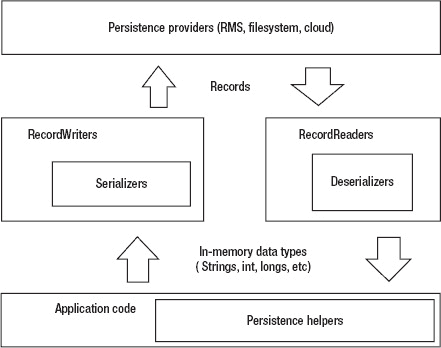

**图 5–1.** *持久化模块架构*

持久化提供者位于顶层，以记录形式向`RecordReaders`提供数据，并从`RecordWriters`接收数据（同样以记录形式）。

`RecordWriters`和`RecordReaders`是应用程序其余部分用于读写持久化数据的接口，可直接使用或通过辅助工具调用。为完成工作，`RecordWriters`和`RecordReaders`需依赖`Serializers`和`Deserializers`将内存对象转换为独立表示形式，反之亦然。

模块其余部分主要由辅助工具组成，用于简化持久化模块的整体使用，使开发者免于编写繁琐、重复且易出错的代码。虽然并非严格必需，但由于其带来的便利性，这些工具在应用中广泛使用——事实上，大多数持久化相关操作通常通过辅助工具完成，而非直接使用读写器和提供者。

为更好理解上述内容，我们需要详细剖析构成持久化模块的主要组件。先从持久化提供者开始。

#### 持久化提供者

如前所述，提供者位于持久化金字塔的顶层。它们负责为模块其他部分提供存储和检索原始持久化数据的手段。RMS 和文件系统是典型的持久化提供者，网络层（用于基于云的持久化，适用时）也是如此。

所有持久化提供者都基于记录工作。记录本质上是一系列字节（字节数组），通过唯一索引号标识。持久化提供者不关心每条记录中的数据代表什么、应如何解释，也不关心数据是否有意义或只是垃圾数据；它们的任务仅在于检索、创建、覆盖和删除记录。

为与实际使用场景保持一致，每个持久化提供者在使用前必须“打开”，使用后必须“关闭”。提供者还需在必要时提供刷新缓存数据（如有）的方法。

基于以上考虑，所有持久化提供者必须实现清单 5–1 所示的接口。

**清单 5–1.** *`PersistenceProvider`接口*

`package app.module.persistence.classes;`

`public interface PersistenceProvider`
`{`
`    public byte[] getRecord(int index);`
`    public int createRecord(byte [] data);`
`    public boolean overwriteRecord(int index, byte [] data);`
`    public boolean deleteRecord(int index);`
`    public boolean open();`
`    public void flush();`
`    public void close();`
`}`

观察`createRecord()`方法，你会发现无法直接指定新记录的索引。相反，调用该方法时会创建一个新记录，并返回其对应的索引。

这种方式提供了更高的抽象层级，但同时也增加了追踪信息位置的复杂性（例如，如何知道包含当前用户登录凭据的记录索引？）。克服这一缺点的有效策略是让第一条记录充当目录，记录提供者中每条具体信息的位置——我们稍后将探讨具体实现方法。

#### 记录读取器与记录写入器

对于提供者而言，记录不过是字节数组。这意味着，要使用它们来存储和检索数据，我们必须首先赋予构成每条记录的原始字节以意义。

我们可以通过以下方式轻松实现这一点：在逻辑层面上，定义每条记录代表一系列根据预定义编码序列化在一起的原始值（整数、字符串等）。

例如，考虑以下序列：整数 `123456`，后跟字符串“`Hello, how are you?`”，再后跟布尔值“`false`”。如果我们选择一种简单的基于 `getBytes()` 的编码方式（即直接检索构成每个原始值的原始字节），那么结果记录中的前四个字节将编码该整数（因为 Java 整数长度为四个字节），接下来的 19 个字节将编码该字符串，再接下来的一个字节将编码该布尔值。

**注意：** 这些值背后的高级含义完全取决于应用程序。例如，一个“字符串、字符串、字符串”的记录可能代表一个人的全名（名 + 中间名 + 姓）或登录凭据（用户名、密码和电子邮件）。应用程序需要知道任何给定记录代表什么，并正确解释该记录。

这种编码方案很简单，在实践中效果非常好，因此我们将在项目中使用它。然而，有时编码方案可能会复杂得多。

例如，如果我们选择使用 XML 对数据进行编码，那么该序列必须首先被序列化为一个有效的 XML 字符串，类似于“`<record><int>123456</int><string>Hello, how are you?</string><boolean>true</boolean></record>`”。正是这个字符串需要被转换为字节并存储在记录中。

在许多场景下，使用此类编码方案是有意义的——例如，如果你的应用程序使用基于云的持久化提供者。在这种情况下，由于持久化数据很可能也会被非 Java 应用程序（基于 Web 的客户端、统计软件等）访问，从长远来看，将其存储为 XML 或 JSON 等通用格式会使应用程序间的数据共享更简单、更安全。

至于什么构成原始数据类型，这同样因应用程序而异。例如，我们只将整数、长整数、字节、字符串和布尔值视为原始类型，但其他应用程序可能将向量和图像也视为原始数据类型。

**注意：** 当然，你可以将图像表示为一串字节原始值，并从记录中逐个检索这些字节。然而，这会花费大量时间和方法调用，因此如果你需要持久化图像，最好将其视为独立的原始数据类型。对于向量和其他更复杂的数据类型也是如此。

记录的原始字节永远不会由应用程序直接操作。相反，持久化模块提供了 `RecordReader` 和 `RecordWriter` 来处理记录中原始值的解码和编码。应用程序使用的每种编码方案都必须存在一个读取器/写入器对。

`RecordWriter` 接口如清单 5–2 所示，其针对我们项目的具体实现将在本章后面给出。

**清单 5–2.** *`RecordWriter` 接口*

`package app.module.persistence.classes;`

`public interface RecordWriter`
`{`
`    public void writeInt ( int value );`
`    public void writeLong ( long value );`
`    public void writeString ( String value );`
`    public void writeBoolean ( boolean value ) ;`
`    public void writeByte( byte value );`
`    public void reset();`
`    public byte[] getCurrentResult();`
`}`

每个写入器都以一个空记录开始。随着 `writeXXX()` 方法被调用，原始值被一个接一个地添加到记录中。在任何时候，都可以调用 `getCurrentResult()` 来获取当前记录的有效字节数组表示。然后可以将此表示传递给 `PersistenceProvider` 进行存储。你始终可以 `reset()` 写入器，这将使其恢复到初始的空记录状态。

**提示：** `RecordWriter` 可以自由使用其希望的任何内部表示来存储数据（例如，`Object` 的 `Vector` 或链表），只要 `getCurrentResult()` 返回预期的结果即可。利用这一点，看看你是否能找到节省内存和/或 CPU 周期的替代表示。

`RecordReader` 执行相反的过程：它从记录中读取字节并将其转换为原始值。`RecordReader` 接口如清单 5–3 所示，其实际实现也将在本章后面给出。

**清单 5–3.** *`RecordReader` 接口*

`package app.module.persistence.classes;`

`public interface RecordReader`
`{`
`    public int readInt();`
`    public long readLong();`
`    public String readString();`
`    public boolean readBoolean();`
`    public byte readByte();`
`}`

要反序列化前面提到的“Hello, how are you?”示例记录，需要依次调用 `readInt()`、`readString()` 和 `readBoolean()`。请注意，应用程序有责任以正确的顺序调用 `readXXX()` 方法。例如，如果应用程序在记录中的下一个原始值是字符串时调用了 `readInt()`，则结果将是未定义的。

#### 序列化器与反序列化器

`RecordWriters` 依赖 `Serializers` 将内存中的原始数据类型实际转换为可写入记录的字节数组。反之，`RecordReaders` 使用 `Deserializers` 将字节数组转换回内存中的原始数据类型。与读取器和写入器一样，应用程序使用的每种编码方案都必须提供一对序列化器/反序列化器。

由于 Java ME 没有内置序列化支持，我们必须从清单 5-4 中展示的 `Serializer` 接口开始，自行实现序列化功能。为简单起见，序列化器将始终直接返回它们被要求序列化的原始数据类型的字节数组表示。

**清单 5-4.** *`Serializer` 接口*

`package app.module.persistence.classes;`

`public interface Serializer`
`{`
`    public byte[] serializeByte(byte data);`
`    public byte[] serializeInt(int value);`
`    public byte[] serializeString(String value);`
`    public byte[] serializeLong(long value);`
`    public byte[] serializeBoolean(boolean value);`
`}`

`Deserializer` 接口展示在清单 5-5 中。由于反序列化器主要处理构成记录的字节数组，因此反序列化器中的每个方法都会有一个偏移量参数，用于指示从字节数组的哪个位置开始反序列化。这样做是为了避免从记录字节数组到反序列化器使用的临时字节数组进行不必要的内存复制操作。

**清单 5-5.** *`Deserializer` 接口*

`package app.module.persistence.classes;`

`public interface Deserializer`
`{`
`    public byte deserializeByte(byte[] data, int offset);`
`    public int deserializeInt(byte [] data, int offset);`
`    public long deserializeLong(byte [] data, int offset);`
**`public String deserializeString(byte[] data, int offset, int length);`**
`    public boolean deserializeBoolean(byte[] data, int offset);`
`}`

从高亮显示的代码可以看出，用于反序列化字符串的方法与其他方法略有不同，因为我们使用的所有其他原始数据类型都有固定长度，而字符串的长度是可变的。因此，必须传递一个额外的参数来指示应将多少个字节反序列化为一个 `String`（这也适用于其他可变大小的原始数据类型，例如向量和图像）。

在实际使用场景中（例如在记录内），这个额外参数的值会与字符串一起编码；但是，它*不*是字符串编码本身的一部分。例如，整数 5 可以在字符串“Hello”之前立即编码，以指示其长度。对于易于确定字符串结束位置的编码（XML 就是一个很好的例子），则不需要这样做。

#### 持久化辅助类

每个辅助类提供单一特定功能，通常是高级功能，在应用程序中被广泛使用。不同的应用程序根据其需求有不同的辅助类。辅助类的一个常见作用是提供更简单的记录管理以及对高级应用程序对象的简化序列化。

大多数辅助类都是为特定应用程序定制的。因此，它们在某种程度上与主持久化代码分离，移除它们不会破坏持久化模块的其余部分。

### 实现核心架构

接下来，我们来看看如何实现序列化器和反序列化器、记录读取器、记录写入器以及全局 RMS 持久化提供者，它们共同构成了持久化模块的核心架构。

**注意：** 本章的这一部分主要是代码。为了节省篇幅，这里只展示相关的代码片段，完整源代码可在 Apress 网站上获取。

#### 实现序列化器和反序列化器

我们已经决定在应用程序中使用一种简单的基于 `getBytes()` 的编码。因此，我们的 `Serializer` 实现将命名为 `ByteSerializer`，而 `Deserializer` 实现将命名为 `ByteDeserializer`。

我们先来看 `ByteSerializer`（你可以在清单 5-6 中看到它）。

**清单 5-6.** *`ByteSerializer` 模型*

`package app.module.persistence.models;`

`import app.module.persistence.classes.Serializer;`

`public class ByteSerializer implements Serializer {`

`    public byte[] serializeInt(int value)`
`    {`
`        byte[] result = new byte[4];`
**`result[0] = (byte) ( value >> 24 );`**
**`result[1] = (byte) ( value >> 16 );`**
**`result[2] = (byte) ( value >> 8 ) ;`**
**`result[3] = (byte) (value);`**
`        return result;`
`    }`

`    public byte[] serializeLong(long value)`
`    {`
`        byte[] result = new byte[8];`
`        result[0] = (byte) (value >> 56);`
`        result[1] = (byte) (value >> 48);`
`        ...`
`        result[7] = (byte) (value);`
`        return result;`
`    }`

`    public byte[] serializeString(String value)`
`    {`
`       return value.getBytes();`
`    }`

`    public byte[] serializeByte(byte data)`
`    {`
`        return new byte[] { data } ;`
`    }`

`    public byte[] serializeBoolean(boolean value) { ... }`

`}`

这里的一切都非常直接，可能除了序列化 `integer` 和 `long` 之外。Java ME 没有为这些数据类型提供像 `String` 那样方便的 `getBytes()` 方法，因此我们必须自己进行转换。我们通过使用位移操作来提取 `long` 或 `integer` 的每个单独字节，然后将这些字节放入一个 `byte` 数组中。

例如，一个 `integer` 是 32 位宽，即 4 个字节。向右移动 24 位（或 3 个字节）并将结果转换为 `byte` 将得到该整数的最高位字节，然后我们将其存储在 `result[0]` 中。向右移动 16 位（或 2 个字节）并转换为 `byte` 将得到该整数的次高位字节，然后我们将其存储在 `result[1]` 中，依此类推，如代码中高亮显示的部分所示。同样的过程也适用于 `long`。

我们也可以使用 `ByteArrayOutputStream` 来提取各个字节。这很容易做到：只需将 `integer` 或 `long` 写入一个 `ByteArrayOutputStream` 对象，然后对其调用 `toByteArray()` 即可。然而，使用位移操作要快得多，并且具有开销非常小的额外优势。

接下来是 `ByteDeserializer`，如清单 5-7 所示。它执行相反的过程：获取由 `ByteSerializer` 生成的 `byte` 数组，并将其转换为相应的数据类型。

**清单 5-7.** *`ByteDeserializer` 模型*

`package app.module.persistence.models;`

`import app.module.persistence.classes.Deserializer;`

`public class ByteDeserializer implements Deserializer {`

`    public byte deserializeByte(byte[] data, int offset)`
`    {`
`        return data[offset];`
`    }`

`    public int deserializeInt(byte[] data, int offset)`
`    {`
**`return ( (data[offset] & 0xFF) << 24 ) | ( (data[offset+1] & 0xFF)`**
**`<< 16 ) | ( (data[offset+2] & 0xFF) << 8 ) | (data[offset+3] & 0xFF );`**
`    }`

`    public long deserializeLong(byte[] data, int offset)`
`    {`
**`return ( ( (long) data[offset] & 0xFF) << 56 ) | ( ( (long)`**
**`data[offset+1] & 0xFF) << 48 ) | ... | ( (long) data[offset+7] & 0xFF );`**
`    }`

`    public String deserializeString(byte[] data, int offset, int length)`
`    {`
`        return new String(data,offset,length);`
`    }`

`    public boolean deserializeBoolean(byte[] data, int offset) { ... }`
`}`

从高亮显示的行可以看出，反序列化整数和长整数比序列化它们要棘手得多，需要使用位掩码和类型转换。除此之外，这里的一切也都很直接。

**提示：** 字节序列化器和反序列化器也可以在持久化模块之外使用。例如，加密模块可以在加密前使用它们将数据简化为最小公分母——字节。

#### 实现 RecordReaders 和 RecordWriters

`RecordReaders` 和 `RecordWriters` 接口将分别由 `ByteRecordReader` 和 `ByteRecordWriter` 类实现。

`ByteRecordWriter` 可见于代码清单 5–8。高亮行展示了如何将字符串长度与字符串本身一起序列化。

**代码清单 5–8.** *`ByteRecordWriter`*

`package app.module.persistence.models;`

`import app.module.persistence.classes.RecordWriter;`
`import java.io.ByteArrayOutputStream;`
`import java.io.IOException;`

`public class ByteRecordWriter implements RecordWriter`
`{`
`    ByteArrayOutputStream os = new ByteArrayOutputStream();`
`    ByteSerializer bs = new ByteSerializer();`

`    protected void writeRawByteArray(byte [] data)`
`    {`
`        ...`
`        os.write(data);`
`        ...`

`    }`

`    public void reset() { os.reset(); }`

`    public void writeString(String value)`
`    {`
**`byte [] rawStringData = bs.serializeString(value);`**
**`writeRawByteArray( bs.serializeInt(rawStringData.length) );`**
**`writeRawByteArray( rawStringData );`**
`    }`

`    public void writeInt(int value)`
`    {`
`        writeRawByteArray( bs.serializeInt(value) );`
`    }`

`    public void writeLong(long value) { ... }`
`    public void writeBoolean(boolean value) { ... }`
`    public byte[] getCurrentResult() { return os.toByteArray(); }`
`    public void writeByte(byte value) { ... }`

`}`

这里的主要思路是将字符串长度（一个整数）和字符串主体（一个字节集合）视为一个原子数据类型，并将它们一起写入。同样重要的是，必须先写入字符串长度；否则在解码时你将不知道需要读取多少字节。

与 `ByteRecordWriter` 对应的是 `ByteRecordReader`，如代码清单 5–9 所示。这次的高亮行展示了如何反序列化一个与其长度一起序列化的字符串。这个过程相当直观且简单：首先我们读取字符串长度，然后读取字符串的实际字节。

**代码清单 5–9.** *`ByteRecordReader`*

`package app.module.persistence.models;`

`import app.module.persistence.classes.RecordReader;`

`public class ByteRecordReader implements RecordReader`
`{`
`    byte [] recordData = null;`
`    int currentOffset = 0;`
`    ByteDeserializer bds = new ByteDeserializer();`

`    public ByteRecordReader ( byte [] data)`
`    {`
`        recordData = data;`
`    }`

`    public String readString()`
`    {`
**`int strSize = readInt();`**
**`String result = bds.deserializeString(recordData, currentOffset, strSize);`**
**`currentOffset += strSize;`**
**`return result;`**
`    }`

`    public int readInt()`
`    {`
`        int result = bds.deserializeInt(recordData, currentOffset);`
`        currentOffset += 4;`
`        return result;`
`    }`

`    public long readLong() { ... }`
`    public boolean readBoolean() { ... }`
`    public byte readByte() { ... }`
`}`

#### 实现 PersistenceProvider

最后，代码清单 5–10 中展示的 `RMSPersistenceProvider` 是一个基于 RMS 构建的持久化提供程序实现。在这种情况下，我们很幸运，因为 RMS API 与我们 `RMSPersistenceProvider` 需要实现的方法完全对应。因此，我们的 `RMSPersistenceProvider` 基本上只是 Java ME 的 RMS API 的一个包装器。

然而，对于其他提供程序，尤其是基于云的提供程序，情况可能会复杂得多。例如，在基于云的提供程序的情况下，需要建立和管理网络连接，并且与服务器的通信需要通过标准化协议进行，而不是直接调用原生平台 API。这会使代码显著复杂化，并引入大量潜在问题，因此在这种情况下必须仔细考虑 `PersistenceProvider`。

**代码清单 5–10.** *`RMSPersistenceProvider`*

`package app.module.persistence.models;`

`import app.module.persistence.classes.PersistenceProvider;`
`import javax.microedition.rms.RecordStore;`
`import javax.microedition.rms.RecordStoreException;`

`public class RMSPersistenceProvider implements PersistenceProvider`
`{`
`    String recordStoreName;`
`    RecordStore rs ;`

`    public RMSPersistenceProvider(String recordStoreName)`
`    {`
`        this.recordStoreName = recordStoreName;`
`    }`

`    public boolean open()`
`    {`
`        ...`
`        rs = RecordStore.openRecordStore(recordStoreName, true);`
`        ...`
`        return true;`
`    }`

`    public byte[] getRecord(int index)`
`    {`
`        ...`
`        result = rs.getRecord(index);`
`        ...`
`        return result;`
`    }`

`    public boolean overwriteRecord(int index, byte[] data) { ... }`
`    public boolean deleteRecord(int index) { ... }`
`    public void close() { ... }`
`    public int createRecord(byte[] data) { ... }`

`    public void flush()`
`    {`
`        // 不需要`
`    }`

`}`

#### 测试代码

现在一切就绪，是时候测试一切是否正常工作了。代码清单 5–11 中的代码创建了一个新的 RMS 持久化提供程序，并尝试从其一条记录中检索之前保存的日期（保存为 `String`）和时间戳（保存为 `long`）。然后，它会将它们输出到控制台，之后用新的日期字符串和时间戳替换它们。

**代码清单 5–11.** *快速持久化测试*

`// 定义变量`
`ByteRecordReader reader;`
`ByteRecordWriter writer;`
`long timestamp = 0;`
`String dateString = "";`

`// 使用 "test" 记录存储打开持久化提供程序`
`RMSPersistenceProvider prov = new RMSPersistenceProvider("test");`
`prov.open();`

`// 如果没有初始记录，则创建一个`
`if ( prov.getRecord(1) == null )`
`{`
`        prov.createRecord(new byte[] {0});`
`}`
`else`
`{       // 否则，从现有记录中读取日期字符串和时间戳...`
`        reader = new ByteRecordReader(prov.getRecord(1));`
`        timestamp = reader.readLong();`
`        dateString = reader.readString();`

`        // ... 并将它们写入控制台`
`        System.out.println("Date: " + dateString + " Time: " + timestamp );`
`}`

`// 创建一个新的写入器`
`writer = new ByteRecordWriter();`

`// 编码当前时间戳和日期字符串`
`writer.writeLong(System.currentTimeMillis());`
`writer.writeString( new Date().toString() );`

`// 将生成的记录保存到位置 1 以供后续使用`
`// 并关闭提供程序`
`prov.overwriteRecord(1, writer.getCurrentResult());`
`prov.close();`

第一次运行代码时，它将不会显示任何内容，因为没有创建初始记录。然而，从第二次运行开始，每次运行该代码片段时，您都应该看到上一次运行该代码片段时的日期字符串和时间戳。

持久化显然有效；但在当前状态下，在实际应用中使用它过于复杂且令人困惑。我们需要一些辅助工具来简化操作。

### 编写持久化辅助类

我们将编写的第一个辅助类是目录辅助类，简称`TOC`。这是一个通用辅助类，能够以开发者友好的方式追踪哪些信息存储在哪个记录中。

要使用它，首先需要通过以下调用将`TOC`附加到提供者上：

`TOC tableOfContents = new TOC(providerInstance) ;`

接下来，例如，如果你想记住当前用户的凭据存储在记录编号 15 中，只需调用以下代码：

`tableOfContents.addEntry(“credentials”,15);`

之后，无论何时你想知道凭据存储在哪里，只需调用：

`tableOfContents.getIndexFor(“credentials”);`

删除条目同样简单：

`tableOfContents.deleteEntry(“credentials”);`

`TOC`辅助类的代码见代码清单 5-12，实际使用示例将在后续作为`SimplifiedPersistenceHelper`的一部分给出。代码清单 5-12 中高亮显示的代码演示了如何反序列化一个复杂记录——在本例中，该记录包含了实际的目录哈希表。

**代码清单 5-12.** *`TOC`辅助类*

`package app.module.persistence.helpers;`

`import app.module.persistence.classes.PersistenceProvider;`
`import app.module.persistence.classes.RecordReader;`
`...`

`public class TOC`
`{`
`    Hashtable TOCHashtable = new Hashtable();`
`    PersistenceProvider provider;`
`    RecordReader reader;`
`    RecordWriter writer;`

`    public TOC(PersistenceProvider provider)`
`    {`
`        this.writer = new ByteRecordWriter();`
`        this.provider = provider;`
`        provider.open();`

`        // 尝试打开 TOC。按照约定，它存储在记录#1 中`
`        if ( provider.getRecord(1) == null )`
`        {`
`            return; // 不存在 TOC，无需反序列化`
`        }`
`        else`
`        {`
`            // 存在 TOC，可以反序列化` `        }`

`        // 为记录#1 创建一个读取器`
`        reader = new ByteRecordReader(provider.getRecord(1));`

`        // 读取 TOC 的大小`
`        int size = reader.readInt();`

`        // 读取 TOC 中的每个条目并将其添加到哈希表`
`        String key;`
`        int value;`
`        while (size>0)`
`        {`
`            key = reader.readString();`
`            value = reader.readInt();`
`            addEntry(key, value);`
`            size--;`
`        }`
`    }`

`    // 将 TOC 序列化为字节数组`
`    protected byte[] getCurrentTOCBytes()`
`    {`
`        String tempKey;`
`        int size = TOCHashtable.size();`

`        // 重置写入器`
`        writer.reset();`

`        // 写入 TOC 的大小`
`        writer.writeInt(size);`

`        // 写入 TOC 中的每个条目`
`        Enumeration keys = TOCHashtable.keys();`
`        while ( keys.hasMoreElements() )`
`        {`
`            tempKey = (String) keys.nextElement();`
`            writer.writeString(tempKey);`
`            writer.writeInt( ((Integer) TOCHashtable.get(tempKey)).intValue() );`
`        }`

`        // 返回对应的字节数组`
`        return writer.getCurrentResult();`
`    }`

`    public void save()`
`    {`
`        // 不存在初始记录。创建它。`
`        if ( provider.getRecord(1) == null)`
`        {`
`            provider.createRecord(new byte[] {0});`
`        }`

`        // 保存索引#1 处对应 TOC 的记录`
`        provider.overwriteRecord(1, getCurrentTOCBytes());`
`    }` `    public void addEntry(String key, int index)`
`    {`
`        TOCHashtable.put(key, new Integer(index));`
`    }`

`    public void deleteEntry(String key)`
`    {`
`        TOCHashtable.remove(key);`
`    }`

`    public int getIndexFor(String key)`
`    {`
`        Integer result = (Integer) TOCHashtable.get(key) ;`
`        if ( result != null )`
`        {`
`            return result.intValue();`
`        }`
`        else`
`        {`
`            return -1;`
`        }`
`    }`
`}`

使用`TOC`辅助类有两个限制。首先，为了确保它始终能分配到第一个记录，你必须在提供者创建后立即实例化它，或者至少在提供者上调用任何`createRecord()`操作之前。其次，每当你想持久化`TOC`时，必须记得调用`save()`，否则对其所做的更改将会丢失。

我们将编写的下一个辅助类负责序列化和反序列化高级应用程序对象。它的名称恰如其分地叫做`HighLevelSerializer`。这个辅助类将为每个高级数据类型提供两个方法：`serializeXXX()`和`deserializeXXX()`，其中 XXX 是所讨论的数据类型。

例如，该辅助类的`serializeUserCredentials()`方法见代码清单 5-13。高亮部分展示了如何处理可能为空的字段：在每个字段之前写入一个布尔标志，指示该字段是否存在。这样，当反序列化器处理记录时，它就知道哪些字段可用于反序列化，哪些不可用。

此外，`serializeXXX()`方法会将数据追加到当前存在的写入器中（而不是返回独立的字节数组），以便于在单个记录中序列化多个对象。

**代码清单 5-13.** *序列化`UserCredentials`*

`public static void serializeUserCredentials(UserCredentials credentials, RecordWriter writer)`
`{`
`        if ( credentials.getAccessToken() != null )`
`        {`
`                 writer.writeBoolean(true);`
`                 writer.writeString(credentials.getAccessToken());` `        }`
`        else`
`        {`
`                writer.writeBoolean(false);`
`        }`

`        if ( credentials.getAccessTokenSecret() != null )`
`        {`
`                 writer.writeBoolean(true);`
`                 writer.writeString(credentials.getAccessTokenSecret());`
`        }`
`        else`
`        {`
`                writer.writeBoolean(false);`
`        }`

`        ...`
`}`

反序列化`UserCredentials`甚至更简单。相应的方法见代码清单 5-14。从高亮代码中可以看出，我们只尝试反序列化那些不为空的字段，这些字段由其对应的标志设置为`true`来指示。

与`serializeXXX()`类似，反序列化方法使用当前存在的读取器（而不是直接使用字节数组），以便于从同一记录中反序列化多个对象。

**代码清单 5-14.** *反序列化`UserCredentials`*

`public UserCredentials deserializeUserCredentials(RecordReader reader)`
`{`
`        String token = null , tokenSecret = null;`
`        String username = null, password = null;`

`if (` **`reader.readBoolean()`** `)`
`        {`
`                token = reader.readString() ;`
`        }`

`if (` **`reader.readBoolean()`** `)`
`        {`
`                tokenSecret = reader.readString() ;`
`        }`

`if (` **`reader.readBoolean()`** `)`
`        {`
`                username = reader.readString() ;`
`        }`

`if (` **`reader.readBoolean()`** `)`
`        {`
`                password = reader.readString() ;`
`        }`

`        return new UserCredentials(username, password, token, tokenSecret);`
`}`

我们将编写的第三个也是最后一个辅助类，很可能也是最重要的一个，并且是我们使用最多的一个。它被称为`SimplifiedPersistenceHelper`，它使用`TOC`辅助类向应用程序的其余部分隐藏了所有记录索引管理的细节，使得处理持久化变得轻而易举。

要使用它，首先必须创建一个实例，并将该实例附加到一个持久化提供程序上，如下所示：

`RMSPersistenceProvider provider = new RMSPersistenceProvider("recordStoreName");`
`SimplifiedPersistenceHelper helper = new SimplifiedPersistenceHelper(provider);`

接下来，如果你想在持久化提供程序中存储一条记录，只需调用辅助类的 `store()` 方法，并将你想要存储记录的名称以及实际的记录字节作为参数传入，如下例所示：

`helper.store("name", writer.getCurrentResult() );`

检索记录也非常简单：

`byte [] data = helper.getRecord("name");`

最后，要删除一条记录，你只需调用以下方法：

`helper.delete("name");`

真正妙的地方在于，辅助类本身非常小巧。其完整源代码见清单 5–15。

**清单 5–15.** *`SimplifiedPersistenceHelper`*

`package app.module.network.helpers;`

`import app.module.persistence.classes.PersistenceProvider;`

`public class SimplifiedPersistenceHelper`
`{`
`    PersistenceProvider provider;`
`    TOC toc;`

`    public SimplifiedPersistenceHelper(PersistenceProvider provider)`
`    {`
`        this.provider = provider;`
`        // 立即初始化 TOC`
`        toc = new TOC(provider);`
`    }`

`    public void store(String key, byte [] data)`
`    {`
`        int index = toc.getIndexFor(key) ;`
`        if ( index != -1)`
`        {`
`            provider.overwriteRecord(index, data);`
`        }`
`        else`
`        {`
`            index = provider.createRecord(data);`
`            toc.addEntry(key, index);`
`        }` `    }`

`    public byte [] getRecord(String key)`
`    {`
`        int index = toc.getIndexFor(key) ;`
`        if ( index != -1)`
`        {`
`            return provider.getRecord(index);`
`        }`
`        else`
`        {`
`            return null;`
`        }`
`    }`

`    public void delete(String key)`
`    {`
`        int index = toc.getIndexFor(key) ;`
`        if ( index != -1 )`
`        {`
`            provider.deleteRecord(index);`
`            toc.deleteEntry(key);`
`        }`
`    }`

`    public void close()`
`    {`
`        toc.save();`
`    }`

`}`

### 在实际场景中使用该模块

我们的持久化模块现已完成。为了画上圆满句号，我们来看最后一个示例，即清单 5–16，它演示了如何在实际场景中使用该模块。虽然示例很简单，但它涵盖了简单记录（仅包含一个对象）和复杂记录（包含多个对象）的存储与检索。这应该能让你很好地了解持久化模块在实际应用中的用法，以及我们将在 Twitter 客户端中如何使用它。

**清单 5–16.** *持久化模块的完整使用示例*

`// 创建提供程序和 SimplifiedPersistenceHelper`
`RMSPersistenceProvider provider = new RMSPersistenceProvider("recordStoreName");`
`SimplifiedPersistenceHelper helper = new SimplifiedPersistenceHelper(provider);`

`// 创建一组用户凭据`
`UserCredentials creds = new UserCredentials("1", "2", null, "3");` `// 序列化单个（高级）对象`
`ByteRecordWriter writer = new ByteRecordWriter();`
`HighLevelSerializer.serializeUserCredentials(creds, writer);`
`helper.store("credentials", writer.getCurrentResult());`

`// 在单条记录中序列化多个对象`
`writer.reset(); // 将写入器重置为“空”`
`HighLevelSerializer.serializeUserCredentials(creds, writer);`
`writer.writeString("凭据后面还有一个字符串");`
`helper.store("complexrecord",writer.getCurrentResult());`

`// 反序列化包含单个对象的记录`
`byte [] data = helper.getRecord("credentials");`
`ByteRecordReader reader = new ByteRecordReader(data);`
`UserCredentials storedCredentials =`
`HighLevelSerializer.deserializeUserCredentials(reader);`

`// 反序列化包含多个对象的记录`
`data = helper.getRecord("complexrecord");`
`reader = new ByteRecordReader(data);`
`storedCredentials = HighLevelSerializer.deserializeUserCredentials(reader);`
`String message = reader.readString();`

`// 使用后别忘了关闭 SimplifiedHelper，以便保存 TOC`
`helper.close();`

如你所见，与持久化相关的大部分细节都被辅助类巧妙地隐藏起来了。尽管如此，灵活性也很高：例如，如果需要，每条记录可以使用不同的写入器和读取器组合，并且可以直接操作底层记录数据（尽管不推荐这样做）。话虽如此，我们现在可以宣布持久化模块已经完成，可以投入使用了。

### 进一步扩展模块

就我们的项目而言，我们将保持持久化模块的现有状态，因为它在灵活性/可扩展性与可读性/易用性之间取得了良好的平衡。不过，你可以随意调整该模块以满足你的特定需求。例如，如果你的应用程序中只使用一种编码方案（这通常是常见情况），那么你可以修改代码，这样就不必显式传递读取器或写入器作为参数，从而简化代码。实现这一点的一种方法是创建一个专用的 `Record` 数据类型，并将所有序列化和反序列化代码直接添加到其中。你也可以通过编写一个专用的辅助类来实现相同的效果，而无需触及主要的持久化代码。

除了简化模块，你还可以为其添加项目特定的功能。很好的例子包括：一个优先级队列，用于决定哪些数据先被序列化（这在由于存储限制或低带宽情况下无法序列化所有数据时非常有用）；一个“伞式”持久化提供程序，它可以透明地与多个子提供程序协同工作，以存储和检索数据（从而提供分布式持久化存储）；以及一个记录缓存（用于加速持久化操作）。

### 总结

我们学习了如何审视 Java ME 持久化，以及实现它的主要方法。

我们还学习了如何构建、编写和使用一个持久化模块——以及如何处理常见问题，例如存储可变长度的数据类型、处理复合数据类型以及支持多种编码方案。

我们通过为应用程序编写持久化模块，将所学知识付诸实践。

在下一章中，我们将介绍许多人认为 Java ME 应用程序最重要且最有趣的技术方面：UI 模块。

## 第 6 章

## **UI 模块**

编写移动应用程序最棘手、也最令人有成就感的部分，在我看来，就是编写其 UI 模块。Java ME 与其他移动平台的一个显著区别在于，为了获得任何有用的功能，你必须从头开始编写 UI——直至最底层的低级绘图调用。内置的 UI 包对于现代使用来说已经过于陈旧。

从头编写 UI 模块需要掌握许多领域的知识，从计算几何到用户体验分析和界面设计，因此并非易事。然而，这确实为你提供了完全的自由，让你能以任何你认为合适的方式设计和实现 UI，并让你能够发挥极致的创造力。此外，与你正在编写的代码进行视觉交互总是一种极好的体验——因此，这项努力中也蕴含着巨大的乐趣。

在本章中，我们将介绍 UI 实现的基本原理和概念，并为我们的应用程序编写一个简单但功能齐全的 UI 模块——你也可以在其他应用程序中重复使用它。为了保持代码简单易懂，外观和感觉将非常基础，但你可以根据需要自由添加各种花哨的功能。

一个优秀的 Java ME UI 需要在代码灵活性、恰当的编程技术、可用性和代码复杂性之间取得微妙的平衡。它介于 SWING（功能强大但过于冗长且资源密集）和原生 Java ME UI（简单且速度极快，但对于现代使用来说过于受限）之间。

我们的 UI 模块将力求恰好处于正确的位置。它的编写方式将支持你可能希望实现的任何类型的小部件和容器，同时保持快速和易用。为了可读性和简洁性，代码不会进行任何优化。例如，代码将大量使用递归。这可以大大减少，但代价是增加代码复杂性，这不是本书的目的。本书后面将讨论优化代码的方法——将它们应用于 UI 模块是一个很好的练习！

UI 模块还将涵盖我们应用程序所需的基本组件：按钮、标签、输入字段、水平布局容器和垂直布局容器。最后，它的目标是功能齐全，而非美观，所以不要期待最先进的视觉体验。也不应期望它在某些事情的处理方式上非常智能。我决定保持简单和“笨拙”，以便更容易理解这些概念；我将在本书后面向你展示如何让 UI 模块更智能。

**注意：** 要在 WTK 2.5.2 及更早版本的模拟器上运行本章代码，你需要为它们启用触摸支持。为此，请转到 `WTK_HOME_FOLDER\wtklib\devices\DefaultColorPhone` 并找到配置文件 `DefaultColorPhone.properties`。打开它，找到 `touch_screen` 属性并将其设置为 `true`。

### 为什么要创建自定义 UI 模块？

现实情况是，对于大多数项目，最好使用现成的第三方 UI 库。第三方 UI 库通常比你自行开发的库具有更好的打磨和更丰富的功能集。那么，为什么要学习如何编写自己的 UI 模块呢？

嗯，在很多情况下，掌握编写 UI 模块所需的技能会派上用场。有很多项目，尤其是个人项目，由于许可、形象或预算问题，无法使用第三方库。其他时候（实际上相当频繁），你开始时使用第三方 UI 库，但在开发过程中，你需要使用自定义组件和/或行为来修改或扩展它。如果你的目标设备资源有限，比如较旧的手机，那么你可能会发现第三方库根本无法在这些设备上良好运行（或根本无法运行）。

编写自己的 UI 模块也是一项非常有教育意义的练习，无论你经验多么丰富，几乎可以肯定，完成它至少会让你学到一些新东西。最后，如果你投入足够的资源，你甚至可以将你的 UI 模块变成一个独立的产品并从中获利，或者至少将其作为向潜在客户展示你技能的非常直观且令人信服的证明。

基于这些原因以及其他许多原因，了解如何编写自己的 UI 模块，或者至少理解 UI 模块功能的基本原理，是值得的。

### 理解创建 UI 模块的基础知识

在我们深入代码之前，我们应该先看一些理论方面的问题，以便更好地理解我们将在本章中创建的内容。例如，你可能已经直观地知道什么是小部件，什么是容器。你可能不知道的是如何以 Java ME 的方式定义这些实体，提供恰到好处的功能和信息，使它们可用，同时防止代码变得臃肿和资源密集。

#### 控件

任何用户界面的基本元素，从概念上讲，都是控件。控件基本上是对用户在屏幕上看到并可能与之交互的任何内容的抽象。按钮、标签、滚动条——它们都是控件。屏幕本身也是一个控件，尽管是一个特殊的控件——稍后会详细介绍。

控件具有相对位置，由相对于其父级的 X 和 Y 坐标定义，以及相对于屏幕本身的绝对位置。它还具有尺寸，用宽度和高度表示。它可以响应用户交互，例如按键和触摸事件。控件还具有状态，在我们的例子中，状态可以是“聚焦”或“未聚焦”，并且可以响应状态变化。它还可以向外部世界提供状态信息——例如，它是否可以聚焦，以及在任意给定时刻是否处于聚焦状态。

控件的 X 和 Y 坐标始终相对于其父控件（稍后会详细介绍）。其尺寸可以是控件的首选尺寸（由自身计算），也可以是由外部方式设置的指定尺寸。指定尺寸始终优先于首选尺寸。

考虑到这一点，基本的 `Widget` 接口如代码清单 6–1 所示。

**代码清单 6–1.** *基本的 `Widget` 接口*

`package app.module.ui.models;`

`public interface Widget`
`{`
`    public void setX(int x);`
`    public void setY(int y);`
`    public int getX();`
`    public int getY();`
`    public int getAbsoluteX();`
`    public int getAbsoluteY();`
**`    public void setContentWidth(int w);`**
**`    public int getContentWidth();`**
**`    public void setContentHeight(int h);`**
**`    public int getContentHeight();`**
**`    public int getPreferredContentHeight();`**
**`    public int getPreferredContentWidth();`**
**`    public int getTotalWidth();`**
**`    public int getTotalHeight();`**
`    public Container getParent();`
`    public void setParent(Container c);`
`    public boolean handleKeyPressed(int key);`
`    public boolean handleKeyReleased(int key);`
`    public boolean handlePointerPressed(int x, int y);`
`    public boolean handlePointerDragged(int x, int y);`
`    public boolean handlePointerReleased(int x, int y);`
`    public boolean onFocus();`
`    public boolean onLostFocus();`
`    public boolean isFocusable();`
`    public boolean isFocused();`
`}`

到目前为止，这个接口中最复杂的部分是与控件尺寸相关的部分，正如你从高亮代码中看到的那样。约定如下：`getPreferredContentWidth()` 返回控件的理想宽度（由控件自身计算得出），`setContentWidth()` 强制将控件的内容设置为指定的宽度，而 `getContentWidth()` 返回该强制宽度。

最后，`getTotalWidth()` 返回实际的控件宽度，如果设置了 `getContentWidth()`，则返回该值，否则返回 `getPreferredContentWidth()`。在实践中，我们主要使用 `getTotalWidth()`，但有时你也会需要其他方法。当然，控件可以覆盖此约定，让这些方法中的任何一个返回不同的值——但除非绝对必要，否则你不应该这样做，因为它可能会破坏你的用户界面。

在我们继续之前，有两个重要的方面需要牢记。第一是知道何时使用控件的首选尺寸，何时强制为其设置尺寸。这非常重要。对于低级控件，例如按钮，你应该始终尝试使用控件的首选尺寸。仅在极端情况下才强制使用较小的尺寸——例如，当你需要使控件变小以适合父容器时。出于设计原因，强制控件使用较大的尺寸通常是可以接受的，但如果可能，也应避免这样做。

第二个重要方面是，控件的尺寸不仅仅可以通过宽度和高度来指定。例如，控件可以有内边距、外边距和边框。为了保持代码简单，我们不会涉及这些，但欢迎你尝试实现对这些特性的支持作为练习。

现在回到我们的接口。由于控件存在于 Java ME 应用程序中，因此还有一些与此相关的特定方法。我们需要能够获取控件的绝对屏幕位置、其裁剪矩形（实际可见的区域——稍后会详细介绍这个重要主题）以及其父视图。我们还需要能够绘制控件，并在必要时请求重绘。因此，代码清单 6–2 中的方法将被添加到 `Widget` 接口中。

**代码清单 6–2.** *`Widget` 接口的额外方法*

`    public int getAbsoluteX();`
`    public int getAbsoluteY();`
`    public ClipRect getClipRect();`
`    public void requestRepaint();`
`    public View getParentView();`
`    public void paint(Graphics g);`

#### 容器

如前所述，控件可以有父级。父级就是一个实现了 `Container` 接口的控件，如代码清单 6–3 所示。容器与集合非常相似——事实上，它们是控件的可视化集合。

**代码清单 6–3.** *`Container` 接口*

`package app.module.ui.models;`

`public interface Container extends Widget`
`{`
`    public boolean addWidget(Widget b);`
`    public boolean insertWidget(Widget b, int index);`
`    public int indexOf(Widget w);`
`    public void removeWidget(Widget b);`
`    public int getChildCount();`
`    public void focusWidget(Widget w);`
`    public Widget getWidget(int index);`
**`    public void doLayout();`**
`}`

高亮的方法对于容器来说非常重要：调用它会使容器根据其布局方案重新排列和调整其子控件的大小。例如，在 `VerticalContainer` 上调用 `doLayout()` 将按照添加顺序将其控件一个接一个地排列，最先添加的控件位于顶部。

此时，你可能会问，如果子控件的总高度超过了容器的高度，会发生什么。这是一个非常好的问题。为了解决这个问题，容器必须实现滚动。因此，代码清单 6–4 中的方法将被添加到 `Container` 接口中。

**代码清单 6–4.** *容器滚动方法*

`public int getXScroll();`
`public int getYScroll();`
`public void setYScroll(int scroll);`
`public void setXScroll(int scroll);`
`public boolean scrollToWidget(Widget w);`

有了滚动，容器的可见区域就变成了实际容器表面的视口，你可以将视口滚动到任何你想要的位置。

容器也能够拒绝控件。例如，一个 `TabbedContainer` 可能会拒绝任何不是 `TabContainer` 的控件。当控件被拒绝时，`addWidget()` 和 `insertWidget()` 方法会返回 `false`。

容器的妙处在于，由于它们本身也是控件，所以它们也可以有父级。这提供了通过套娃效应创建复杂界面的可能性，即容器嵌套在容器中，而容器又嵌套在容器中。此外，容器允许你轻松创建复合控件。例如，如果你想创建一个图片按钮，只需让 `PictureButton` 类成为一个容器，其中包含一个图片控件和一个标签控件即可。

**注意：** 请记住，所有这些在原生 Java ME UI 包中都是不可能实现的！

综上所述，屏幕本身就是一个容器，尽管是一个特殊的容器，因为它本身没有任何父级，并且其尺寸是固定的，与屏幕分辨率相匹配。

#### 裁剪矩形

随着容器的滚动，某些控件可能无法完全可见。因此，为了正确绘制控件，我们必须确定其可见部分（即裁剪矩形），并将其余部分裁剪掉。

如果控件的父级是顶级父级，这很容易实现，但如果控件的父级本身也有父级呢？例如，假设控件的父级有一个水平滚动条，将控件水平裁剪掉一半，而父级的父级有一个垂直滚动条，将控件垂直裁剪掉一半，就像图 6-1 所示那样？

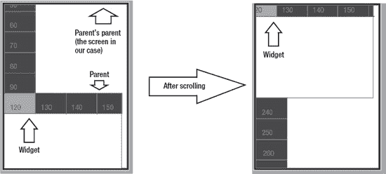

**图 6-1.** *一种裁剪情况*

此外，如果父级的父级也有自己的父级呢？那么该如何计算裁剪矩形？你可以看到，这很快就会变得复杂。然而，解决方案在概念上和代码上都相当简单，只需要一点巧妙的思考。

首先，我们定义：初始状态下，控件的裁剪矩形与其在屏幕上的位置和大小相同，即如下所示：

`ClipRect.X = getAbsoluteX()`
`ClipRect.Y = getAbsoluteY()`
`ClipRect.Width = getTotalWidth()`
`ClipRect.Height = getTotalHeight()`

接下来，为了获得控件正确的裁剪矩形，我们必须将其裁剪矩形与其父级的裁剪矩形相交，然后将结果与父级的父级的裁剪矩形相交，依此类推，直到到达顶级父级（通常是屏幕）。最终得到的相交矩形就是控件的实际裁剪矩形。

这样，我们就把裁剪问题简化为一个计算几何问题——矩形相交，幸运的是，这个问题很容易解决。但为此，我们必须首先重新定义表示矩形的方式。

具体来说，我们将从当前通过指定 (X,Y) 坐标以及宽度和高度来表示矩形的方法，切换到通过指定其对角坐标来表示矩形，如图 6-2 所示。

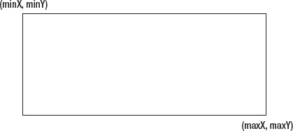

**图 6-2.** *重新定义裁剪矩形表示*

这个看似微小的改变带来了天壤之别。考虑一下在新表示法中两个矩形相交时会发生什么，如图 6-3 所示。

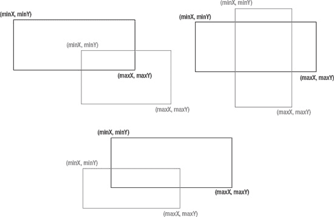

**图 6-3.** *可能的矩形相交场景*

从视觉上看，最终的相交矩形显而易见，但计算机只关心数字。使用旧的矩形表示法，*计算*相交矩形既困难又违反直觉，而我们的新矩形表示法则让这件事变得轻而易举，而且非常直观！

当你充分研究这些图形并进行分析后，你会注意到，在图 6-3 所示的所有情况中，实际上在所有矩形相交的情况下，最终相交矩形的 `minX` 都是源矩形 `minX` 值中的最大值。

这说起来有点拗口，但用数学公式写出来就更容易理解了：

`result.minX = Max ( source1.minX, source2.minX )`

同样，最终矩形的 `maxX` 是源矩形 `maxX` 值中的最小值，即：

`result.maxX = Min ( source1.maxX, source2.maxX )`

同样的公式也适用于 Y 坐标，如下所示：

`result.minY = Max ( source1.minY, source2.minY )`
`result.maxY = Min ( source1.maxY, source2.maxY )`

请尝试对你所能想到的任何两个矩形应用这些公式；你会发现它们“神奇地”有效！

掌握了这些知识，我们现在可以编写 `ClipRect` 类了。其有趣的部分如代码清单 6-5 所示。

**代码清单 6-5.** *`ClipRect` 类*

`package app.module.ui.models;`

`public class ClipRect`
`{`
`        ...`

`    public ClipRect(int minX, int minY, int maxX, int maxY)`
`    {`
`       ...`
`    }`

`        ...`

`    public ClipRect intersectWith(ClipRect otherRect)`
`    {`
`       ClipRect newRect = new ClipRect ( Math.max (this.minX, otherRect.getMinX()),`
`            Math.max (this.minY, otherRect.getMinY()),`
`            Math.min (this.maxX, otherRect.getMaxX()),`
`            Math.min (this.maxY, otherRect.getMaxY()));`

`       return newRect;`
`    }`

**`    public boolean isVisible()`**
**`    {`**
**`        return ( this.maxX >= this.minX && this.maxY > this.minY );`**
**`    }`**

`}`

代码中高亮的部分展示了如何判断一个裁剪矩形是否可见或有效。如果你尝试相交两个不重叠的矩形，那么应用上述公式后，你会得到 `maxX < minX` 或 `maxY < minY`，或者两者都成立。请亲自试试看！因此，如果这两个条件都不成立，则裁剪矩形有效，因此可见。

至此，我们可以编写 `ClipHelper` 类，其中包含与裁剪相关的辅助方法。其最重要的部分如代码清单 6-6 所示。

**代码清单 6-6.** *`ClipHelper` 类*

`package app.module.ui.helpers;`

`import app.module.ui.models.ClipRect;`
`import app.module.ui.models.Widget;`
`import javax.microedition.lcdui.Graphics;`

`public class ClipHelper`
`{`
**`    public static ClipRect getTargetClipRectFor(Widget w)`**
**`    {`**
**`        ClipRect result = w.getClipRect();`**
**`        Widget parent = w.getParent();`**
**`        while ( parent != null )`**
**`        {`**
**`            result = result.intersectWith(parent.getClipRect());`**
**`            parent = parent.getParent();`**
**`        }`**

**`        return result;`**
**`    }`**

`    public static void setClipOn(Widget w, Graphics g)`
`    {`
`        ClipRect result = getTargetClipRectFor(w);`
`        g.setClip(result.getMinX(), result.getMinY(), result.getMaxX()-result`
`        .getMinX(), result.getMaxY()-result.getMinY());`
`    }`
`    ...`
`}`

代码中高亮的部分展示了计算任何控件裁剪矩形是多么容易。

在 Java ME UI 框架中，裁剪矩形经常被错误处理。这很可惜，因为裁剪在几乎任何 UI 中都被大量使用。使用次优的实现方案会导致代码复杂和资源浪费，这两者都应像躲避瘟疫一样避免。本节描述的解决方案简单、高效且可扩展，此外，通过一些代码优化（我们将在本书后面讨论），它还可以变得极其快速。

裁剪矩形也是一个很好的例子，说明了重新定义数据结构可以解决许多问题，并使事情更清晰、更优雅。如果你以 (X,Y,width,height) 的方式思考，那么所提出的解决方案更难想出、更难实现且不够优雅；而如果你以 (minX,minY,maxX,maxY) 的方式思考，则情况正好相反——你同意吗？

#### 视图

视图是应用程序屏幕的抽象表示。正如我们在本书前面所见，`View` 接口本身并不提供太多交互能力。这是有意为之，因为某些视图可以自给自足并独立运行——例如，一个`ScreenSaver`视图。然而在实践中，大多数具体视图至少会实现另一个接口，通常是`Container`或`Widget`，以便应用程序的其他部分能与它们交互。

因此，视图本身就是小部件，尽管就其本质而言，它们有些特殊，因为它们通常位于应用程序代码与平台原生代码之间。例如，大多数底层视图直接继承自`GameCanvas`原生类，这意味着，除其他事项外，视图是用户交互事件（如按键和触摸事件）的入口点。它们还负责处理底层图形相关事宜，例如屏幕缓冲和绘制。

视图可以执行相当“疯狂”的操作。例如，你可以实现一个`RemoteView`类，它将所有`paint()`调用转发到一张图像而非屏幕，然后将该图像通过网络发送到远程服务器，从而允许用户在世界任何地方通过网页浏览器使用该应用程序！如果你认为这在现实中没有用途，只需想想它为远程调试和远程辅助所开启的可能性。

#### 主题

每个专业的 Java ME 应用程序都有一套特定的绘图颜色集，以确保整个用户界面视觉风格的一致性。例如，设计师可能规定所有获得焦点的部件必须具有绿色背景，而所有未获得焦点的部件必须具有黑色背景。为了保持一切一致，需要使用主题。主题是`UITheme`接口的子类，如清单 6–7 所示。

**清单 6–7.** *`UITheme` 接口*

`package app.module.ui.models;`

`import javax.microedition.lcdui.Font;`

`public interface UITheme`
`{`
`    public int getAppBgColor();`
`    public int getSelectedBgColor();`
`    public int getNotSelectedBgColor();`
`    public int getSelectedFgColor();`
`    public int getNotSelectedFgColor();`
`    public Font getSelectedFont();`
`    public Font getNotSelectedFont();`
`    ...`
`}`

如你所见，主题以一致且全局的方式提供了应用程序所需的所有颜色。

通常，每当创建一个部件时，都会为其附加一个主题；该部件随后必须在所有绘图操作中使用主题中指定的颜色。这意味着，例如，当你更改主题的背景颜色时，所有使用该主题的部件都将反映这一变化。

当然，你也可以同时使用多个主题，或者在运行时切换主题；一切皆有可能。

此外，主题提供的不仅仅是颜色值：它们可以提供用作图标或其他 UI 元素（如声音）的图像对象。你甚至可以使用主题来自定义动画滚动的速度、振动的持续时间，以及几乎所有与用户交互相关的内容。

在我们的应用程序中，我们将只使用一个主题，该主题仅指定绘图所用的颜色。如清单 6–8 所示。

**清单 6–8.** *我们的 `AppTheme` 类*

`package app.classes;`

`import app.module.ui.models.UITheme;`
`import javax.microedition.lcdui.Font;`
`public class AppTheme implements UITheme`
`{`

`    public int getSelectedBgColor()`
`    {`
`        return 0x0000FF00;`
`    }`

`    public int getNotSelectedBgColor()`
`    {`
`        return 0x00888888;`
`    }`

`    ...`

`}`

最后，主题可以变得智能化。例如，你可以创建一个主题类，根据一天中的不同时间返回不同的颜色和媒体。智能主题是定制和打磨应用程序的一种绝佳且简单的方式，因为它们编码相当容易，并且能为用户体验增加很多价值。

#### 处理用户交互

用户交互是 UI 框架的关键部分，因此正确处理它至关重要。

首先，如前所述，用户交互事件通常通过`Views`进入应用程序。从那里，它们被转发给子部件，如下所述。

当在一个部件（包括`Views`和`Containers`）上调用用户交互方法（`handleXXXX()`）时，该部件应首先尝试将调用转发给其获得焦点的子部件（如果有的话），或者在触摸交互的情况下，转发给指针位置处的子部件。如果子部件未处理该交互，则部件本身应尝试处理它。如果子部件和部件本身都未处理，则该方法应返回`false`，表示调用者可以自由尝试处理该交互。

可以想象，这是一个递归非常密集的过程，需要你密切关注。由于涉及多层嵌套调用，将交互事件转发给错误的部件、错误地标记其已处理/未处理状态，或者更糟的是，根本不转发调用，都可能导致不可预测的后果。

例如，在我参与的一个社交网络客户端项目中，某个容器在某些情况下错误地计算了指针下的部件，因为它没有考虑滚动——这导致错误的部件接收到了触摸事件。我是通过惨痛教训发现这一点的。我当时正在处理一个“发送消息”表单，我想做的是测试“返回”按钮的功能，该按钮本应弹出一个提示框，显示“您确定要放弃此消息吗？”返回按钮位于发送按钮下方。于是，我在“输入消息”编辑框中写了一条非常“友好”的消息，然后触摸了屏幕上的返回按钮。然而，由于容器没有考虑滚动，我让你猜猜应用程序实际上认为我按的是哪个按钮，以及接下来发生了什么……

同样值得记住的是，有些部件可能希望在将某些事件传递给子部件*之前*自行处理它们（如果确实要传递的话）。支持手势的触摸部件就是很好的例子。它们可能不想将某些触摸事件转发给子部件——例如，当用户在屏幕上滑动手指时。相反，它们可能会选择将其解释为滚动请求并相应处理——子部件不会收到任何通知。

现在，UI 层必须在某个时刻与应用程序的其余部分进行交互。为了实现这一点，部件需要有一种方式来发出信号，表明需要执行某些操作。这是通过使用`CallbackHandler`接口实现的，如清单 6–9 所示。

**清单 6–9.** *`CallbackHandler` 接口*

`package app.module.ui.models;`

`import com.apress.framework.objecttypes.Event;`

`public interface CallbackHandler`
`{`
`    public boolean doCallback(Event evt);`
`}`

`CallbackHandlers`的用法应该相当明显：交互式部件会附加一个`CallbackHandler`，每当发生有趣的事情时，它们就会通过调用其`doCallback()`方法将相应的事件转发给该处理器。

最后，值得注意的一点是，让代码为那些“不配合”的控件提供支持是件好事。例如，你可能需要实现一个 `EnterPassword` 控件，该控件在输入正确密码之前不会放弃焦点，即使被明确指示这样做也不行——实际上，一旦该控件被激活，用户就会被困在 `EnterPassword` 字段中。这在控件中很容易实现，只需让 `onLostFocus()` 方法返回 `false` 即可。然而，代码的其他部分，特别是容器，必须意识到这种情况可能发生，并相应地处理。为简单起见，我们的 UI 模块将不支持这种“不听话”的行为，但修改它以支持这种行为是 UI 实现中的一个很好的练习。如果你觉得有能力，请在读完本章后尝试一下。

### 实现基本控件支持

现在我们已经完成了理论基础，是时候开始编写一些代码了。由于 UI 模块中的所有类都相当庞大，我只会包含代码中重要的部分，完整源代码可在 Apress 网站上获取。

话虽如此，让我们开始编写 UI，从 `BaseWidget` 类开始。

#### BaseWidget 类

`BaseWidget` 类将作为所有其他控件的基础。它的大部分内容都很直接，但有些方面值得深入探讨——首先，确定控件的屏幕位置和裁剪矩形。相关代码见代码清单 6–10。

**代码清单 6–10.** *确定 `BaseWidget` 的位置和裁剪矩形*

`package app.module.ui.models;`

`public abstract class BaseWidget implements Widget`
`{`
`    protected Container parent;`
`    protected ClipRect clipRect = new ClipRect(0,0,0,0);`

`    ...`

`    public ClipRect getClipRect()`
`    {`
`        clipRect.setMaxX(getAbsoluteX()+getTotalWidth());`
`        clipRect.setMaxY(getAbsoluteY()+getTotalHeight());`
`        clipRect.setMinX(getAbsoluteX());`
`        clipRect.setMinY(getAbsoluteY());`
`        return clipRect;`
`    }`

`    public int getAbsoluteX()`
`    {`
`        return parent.getAbsoluteX() - parent.getXScroll() + getX();`
`    }`

**`    public int getAbsoluteY()`**
**`    {`**
**`        return parent.getAbsoluteY() - parent.getYScroll() + getY();`**
**`    }`**

`    ...`
`}`

我想请你注意高亮显示的代码。如你所见，确定控件的绝对位置是一个递归过程。为此，你需要获取父控件的绝对位置，加上控件相对于父控件的位置，然后补偿父控件的滚动，但要获取父控件的绝对位置，你需要获取*它的*父控件的绝对位置，依此类推。

因此，确保递归链上的每个环节都报告正确的绝对位置至关重要，因为绝对位置将用于绘制控件和确定其裁剪矩形。即使是微小的偏差也是不可接受的，因为它们会在每一步中被累积，直到变得明显并影响应用程序的外观。

此外，如果计算控件绝对位置耗时过长，整个应用程序都会变慢，因为获取控件的绝对位置可能是整个 UI 模块中使用最广泛的方法调用。这就是为什么保持这一区域的简单性很重要。

`BaseWidget` 中下一个有趣的代码片段是关于重绘请求的。如代码清单 6–11 所示。

**代码清单 6–11.** *请求重绘*

`public void requestRepaint()`
`{`
`        View v = getParentView();`
`        if ( v != null )`
`        {`
`                getParentView().paintWidget(this);`
`        }`
`}`

`public View getParentView()`
`{`
`        if ( parent == null )`
`        {`
`                return null;`
`        }`
`        return parent.getParentView();`
`}`

如你所见，控件只是将重绘请求转发给其父视图（如果有的话）。然后由视图负责调用控件的 `paint()` 方法，并传入一个合适的 `Graphics` 对象作为参数。当然，获取控件的父视图也是递归完成的。

最后一个值得关注的领域是事件处理。由于 `BaseWidget` 是所有其他控件的模板类，因此必须编码最常见的行为。这意味着，默认情况下，控件应在调用相应方法时返回 `false` 来忽略所有按键事件。这样父容器就有机会处理它们，这一点很重要——例如，如果它们是“向上键”或“向下键”，它们通常负责导航。需要处理按键事件的控件（例如按钮）可以简单地重写相应的方法。

触摸事件则不同。默认情况下，控件会忽略“指针按下”和“指针拖动”事件，但会通过尝试聚焦控件来响应“指针释放”事件，如代码清单 6–12 所示。这样做是因为所有 UI 中的默认约定是，只有当你想要与某物交互或将其移入焦点时，你才会触摸它。

**代码清单 6–12.** *处理“指针释放”事件*

`public boolean handlePointerReleased(int x, int y)`
`{`
`        if ( isFocusable() == true && isFocused() == false )`
`        {`
`                if ( getParent() != null )`
`                {`
`                        getParent().focusWidget(this);`
`                }`
`                return true;`
`        }`
`        return false;`
`}`

在继续之前，我想指出非常重要的一点：你应该只在“释放”事件（即“按键释放”和“指针释放”）上更改焦点或激活项目。主要原因是这给用户一些回旋余地，并防止意外操作。

例如，如果你在“按下”事件上处理激活，那么一旦用户触摸或按下通知上的“确定”按钮，对话框就会消失。然而，如果你在释放事件中处理，那么只要用户按住按键或指针，对话框就会保持可见。对于指针事件，如果用户误触了按钮，他只需将指针拖到按钮外部并释放即可——不会触发任何操作。

最后，我想指出 `BaseWidget` 类被声明为 `abstract`。某些方法，特别是 `paint()`，必须在其子类中显式实现。这既是一种确保开发者正确实现控件的手段（通过让他们显式编写所有关键方法），也是一种文档手段（通过告诉开发者控件需要实现这样那样的功能才能正常工作）。

说到这里，我们已经涵盖了 `BaseWidget` 类最重要的方面。是时候继续讨论容器了。

#### BaseContainerWidget 与 BaseContainerManager

`BaseContainerWidget` 将作为 UI 模块中所有容器的基类。它本身并没有什么特别之处；其作用是将所有方法（如 `addWidget()`、`insertWidget()` 和 `getWidget()`）映射到一个 `Vector` 实例上。除此之外，它还提供了设置和获取容器滚动位置的方法，但也仅此而已。

它被声明为抽象类，因此子类必须显式实现其两个最重要的方法：`paint()` 和 `doLayout()`。

`BaseContainerManager` 是 `BaseContainerWidget` 的直接子类，则完全是另一回事，而且相当有趣。它将作为 `BaseContainerWidget` 与实际容器实现之间的中间类，提供我们 UI 模块中所有具体容器实现所共用的基础方法。

出于灵活性考虑，其功能并未集成到 `BaseContainerWidget` 中（反之亦然）：在某些情况下，您可能决定实现一个与其他容器截然不同的容器，此时从比 `BaseContainerManager` 更低的公共基类开始会更有意义，而这正是 `BaseContainerWidget` 所提供的。

正如其名称中的“Manager”部分所暗示的那样，`BaseContainerManager` 不仅仅是一个像我们之前介绍的那些“傻瓜类”。实际上，它做了很多事情，但我们只介绍其中有趣的部分。

首先，`BaseContainerManager` 通过实现通用的 `onFocus()`、`isFocusable()` 和 `onLostFocus()` 来提供焦点支持。在这三个方法中，`onFocus()` 和 `isFocusable()` 值得特别关注。它们的代码如清单 6–13 所示。

**清单 6–13.** *`onFocus()` 与 `isFocusable()`*

`public boolean isFocusable()`
`{`
`        int i;`
`        for (i=0;i< getChildCount();i++)`
`        {`
`if (` **`getWidget(i).isFocusable()`** `)`
`                {`
`                        return true;`
`                }`
`        }`
`        return false;`
`}`

`public boolean onFocus()`
`{`
`        isFocused = false;`
`        if (focusedWidget == null)`
`        {`
`                for (int i = 0; i < getChildCount(); i++)`
`                {`
`                        if ( getWidget(i).isFocusable() )`
`                        {`
`                                focusedWidget = getWidget(i);`
`                                break;`
`                        }`
`                }`
`        }`

`        if ( focusedWidget != null && indexOf(focusedWidget) == -1 )`
`        {`
`                focusedWidget = null;`
`                return onFocus();`
`        }`

`        if ( focusedWidget != null )`
`        {`
`                isFocused = focusedWidget.onFocus();`
`                scrollToWidget(focusedWidget);`
`                return isFocused;`
`        }`
`        else`
`        {`
`                return false;`
`        }`
`}`

这段代码非常重要，因此理解它至关重要。为了确定一个容器能否接收焦点，我们必须首先检查其任何子容器能否接收焦点。如果没有子容器能接收焦点，那么容器本身也无法接收焦点，因为其内部没有任何可聚焦的内容。这个检查在 `isFocusable()` 方法中完成。请注意，由于容器可以嵌套在其他容器中，代码中高亮的部分本质上可能是（并且经常是）递归的，因为 `getWidget()` 可能返回一个 `Container`。

`onFocus()` 方法比 `isFocusable()` 稍微复杂一些。首先，它检查容器内是否存在先前已聚焦的控件。如果没有，则会在容器内找到第一个可聚焦的控件并与之交互。

其次，它检查该聚焦控件（可能是上次容器获得焦点时遗留的）是否仍在容器内。这是一个必要的检查，因为控件可能（并且经常）从其父容器中被移除——例如，当用户触发“删除”操作时。如果待聚焦的控件不再位于容器中，那么 `onFocus()` 将通过调用自身来尝试聚焦另一个控件。

第三，如果待聚焦的控件是有效的（可聚焦且在容器内），那么我们会对其调用 `onFocus()`，然后将其滚动到可视区域。

这引出了 `BaseContainerManager` 的另一个有趣部分：滚动到特定控件。这通过 `scrollToWidget()` 方法完成。有趣之处在于，仅仅在当前容器中将控件滚动到可视区域是不够的；还必须将其滚动到*屏幕上的*可视区域。这两者并不总是一回事。例如，当前聚焦的控件在其父容器中可能是可见的，但父容器可能因为*其*父容器的滚动而处于屏幕之外。因此，实际上，我们当前聚焦的控件对用户来说是不可见的。为了避免这种情况，我们必须确保在将当前控件滚动到当前容器可视区域的同时，也将其滚动到当前容器父容器的可视区域。

`scrollToWidget()` 方法的代码如清单 6–14 所示。为简洁起见，仅展示垂直滚动部分。

**清单 6–14.** *滚动到控件*

`public boolean scrollToWidget(Widget w)`
`{`
`        ...`

`        int maxScroll, neededScrollDelta;`

`        // 最大允许的垂直滚动量`
`        maxScroll = Math.max(getPreferredContentHeight() - getContentHeight(), 0);`

`        // 将控件顶部边缘带入视图所需的垂直滚动增量`
**`        neededScrollDelta = WidgetHelper.getYDistanceBetween(w, this);`**

`        if ( neededScrollDelta > 0 && getYScroll() + neededScrollDelta < getYScroll()`
`        + getTotalHeight() )`
`        {`
`                // 如果控件顶部边缘已可见，则不滚动`
`        }`
`        else`
`        {`
`                if ( getYScroll() + neededScrollDelta >= maxScroll   )`
`                {`
`                        // 确保不会过度滚动`
`                        setYScroll(maxScroll);`
`                }`
`                else`
`                {`
`                        setYScroll(getYScroll()+neededScrollDelta);`
`                }`
`                scroll=true;`
`        }`

`        ...`

`        parent.scrollToWidget(w);`
`}`

让我们总结一下这里所做的工作：我们计算了将指定控件带入当前容器可视区域所需的滚动增量（相对于当前滚动值），然后将该增量应用于当前滚动，但前提是控件尚未可见（此时不做任何操作），并且最终的滚动值不大于最大允许滚动值（此时则使用最大允许值）。然后，正如刚才所述，我们尝试将控件滚动到当前容器父容器的可视区域——请注意这里的递归。

在继续之前，需要做一点小小的澄清：最大滚动值对应于将容器底部区域整齐地带入视图所需的滚动值。任何大于此值的滚动都会导致容器视口底部出现不必要的空白区域。您可以看到，最大滚动值很容易通过从首选内容高度（即容器为完全可见所需的高度）中减去内容高度（即视口的高度）来计算得出。

现在，如果你查看高亮显示的代码，会看到对`WidgetHelper`类的引用。我们关注的是`getYDistanceBetween()`方法，它返回一个控件与其某个祖先控件之间的距离（以屏幕像素为单位）。该方法的代码如代码清单 6-15 所示。类似地，还有一个用于 X 轴距离的方法，此处未列出。

**代码清单 6-15.** *`getYDistanceBetween()`方法*

`public static int getYDistanceBetween(Widget w, Container c)`
`{`
`        int result = 0;`
`        boolean found = false;`
`        while ( w != null )`
`        {`
`                // 已到达目标容器，可以停止。`
`                if ( w == c )`
`                {`
`                        found = true;`
`                        break;`
`                }`

**`                // 将当前控件到父控件的距离累加到总距离中`**
**`                result += w.getY();`**

**`                // 补偿父控件的滚动偏移`**
**`                if ( w.getParent() != null )`**
**`                {`**
**`                        result -= w.getParent().getYScroll();`**
**`                }`**

**`                // 向上移动一层`**
**`                w = w.getParent();`**

`        }`

`        if ( found )`
`        {`
`                return result;`
`        }`
`        else`
`        {`
`                return Integer.MIN_VALUE;`
`        }`
`}`

代码中高亮的部分完成了主要工作。它计算当前控件与其直接父控件之间的距离，补偿父控件的滚动偏移，然后将父控件设为当前控件。

最后，我想把注意力转向`paint()`方法和类构造函数，两者均如代码清单 6-16 所示。这些方法之所以有趣，是因为它们演示了如何使用主题，如代码中高亮部分所示。

**代码清单 6-16.** *`paint()`方法和构造函数*

`public BaseContainerManager(UITheme theme)`
`{`
**`        this.theme = theme;`**
`}`

`public void paint (Graphics g)`
`{`
**`        g.setColor(theme.getAppBgColor());`**
`        int absX = getAbsoluteX();`
`        int absY = getAbsoluteY();`
`        g.fillRect(getAbsoluteX(), getAbsoluteY(), getTotalWidth()-1,`
`        getTotalHeight()-1);`

`        Widget temp;`
`        for (int i=0; i < getChildCount(); i++)`
`        {`
`                temp = getWidget(i);`
`                if ( temp.getClipRect().isVisible() )`
`                {`
`                        temp.paint(g);`
`                }`
`        }`
`}`

我还想指出一个虽小但非常重要的优化：只有当控件的裁剪矩形可见时，我们才绘制它。如果用户根本看不到绘制结果，那么调用`paint()`并执行其中的所有操作（可能非常繁重）是毫无意义的。

最后，在继续之前，还有一件事需要介绍：处理指针事件。这里要学到的重要经验是：忽略一系列“指针拖动”事件之后的第一个“指针释放”事件。这是必要的，因为第一个“释放”事件实际上意味着“用户已完成拖动”，而不是“用户想要聚焦或激活指针下的控件”——而“释放”事件通常用于后者。

这一点很容易实现，如代码清单 6-17 所示。`BaseContainerManager`中也采用了相同的方法。

**代码清单 6-17.** *处理指针事件*

`public boolean handlePointerReleased(int x, int y)`
`{`
**`if ( isDragging )`**
**`{`**
**`isDragging = false;`**
`                return true;`
`        }`
`        else`
`        {`
`                ...`
`        }`
`}`

`public boolean handlePointerDragged(int x, int y)`
`{`
`        Widget w = getWidgetAt(x, y);`
`        if ( w != null )`
`        {`
`            if ( w.handlePointerDragged(x, y) )`
`            {`
`                // 不做任何操作`
`                return true;`
`            }`
`        }`
`        isDragging = true;`
`        return false;`
`}`

至此，我们完成了基本的控件支持。有了这些样板类，我们就可以继续实现具体的控件了。

### 实现具体控件

在完成了实现控件所需的基础工作之后，我们现在将专注于为 UI 模块编写具体的控件。我们将实现容器、按钮、文本输入字段和标签。在此过程中，我们将涉及级联事件、导航以及通过扩展现有控件来创建新控件等概念。

#### VerticalContainer 和 HorizontalContainer 类

大多数 UI 表单都是使用垂直布局创建的——也就是说，控件一个接一个地垂直放置。这正是`VerticalContainer`类所做的。大部分繁重的工作已经为我们完成，因为`VerticalContainer`继承了`BaseContainerManager`，所以我们可以专注于重要的部分。

首先，有`doLayout()`方法，如代码清单 6-18 所示。

**代码清单 6-18.** *`VerticalContainer`及其`doLayout()`方法*

`package app.module.ui.classes;`

`import app.module.ui.models.BaseContainerManager;`
`...`

`public class VerticalContainer extends BaseContainerManager`
`{`
`    ...`

`    protected int PADDING = 3 ;`

**`public void doLayout()`**
**`{`**
**`int currentY = 0;`**
**`int i;`**
**`Widget temp;`**

**`for (i=0; i < getChildCount(); i++)`**
**`{`**
**`temp = getWidget(i);`**
**`temp.setX(0);`**
**`temp.setY(currentY);`**
**`currentY += temp.getTotalHeight() + PADDING;`**
**`}`**
**`}`**
`    requestRepaint();`
`}`

代码非常简单：它只是按照子控件添加的顺序垂直排列它们。为了确保控件之间不相互接触，添加了少量内边距。内边距很重要，因为如果没有它，就很难确定一个控件在哪里结束，另一个控件从哪里开始。此外，这是一个非常基本的布局方案，但其他容器实现可能会采用更复杂的布局方案，可能包含多个内边距和外边距。

下一个重要部分是确定容器的首选大小。相关代码如代码清单 6-19 所示。

**代码清单 6-19.** *确定`VerticalContainer`的首选大小*

`public int getPreferredContentHeight()`
`{`
`        int maxH = 0;`
`        if ( getChildCount() > 0 )`
`        {`
`                Widget lastWidget = getWidget(getChildCount()-1);`
`                maxH = lastWidget.getY() + lastWidget.getTotalHeight();`
`        }`
`        return maxH;`
`}`

`public int getPreferredContentWidth()`
`{`
`        int maxW = 0;`
`        int tempW;`
`        for (int i=0;i<getChildCount();i++)`
`        {`
`                tempW = getWidget(i).getTotalWidth();`
`                if ( tempW > maxW )`
`                {`
`                        maxW = tempW;`
`                }`
`        }`
`        return maxW;`
`}`

如你所见，首选高度等于最后一个子控件（如果有）底部边缘的位置，而首选宽度等于最宽子控件的宽度。由于首选内容高度的计算方式，必须事先调用`doLayout()`。

接下来，由于这是一个容器，我们可能应该实现导航支持——即将焦点从一个控件移动到另一个控件。从这里开始，事情变得有趣起来，首先从代码清单 6-20 中所示的`handleKeyPressed()`方法开始。

**代码清单 6-20.** *`handleKeyPressed()`方法*

`public boolean handleKeyReleased(int key)`
`{`
`        if ( getFocusedWidget().handleKeyReleased(key) )`
`        {`
`                return true;`
`        }`
`        else`
**`        if ( GameCanvas.UP == KeyHelper.getGameAction(key) )`**
**`        {`**
**`                // 尝试聚焦上一个控件`**
**`                int max = indexOf(getFocusedWidget());`**
**`                for (int i=max-1;i>=0;i--)`**
**`                {`**
**`                        if ( getWidget(i).isFocusable() )`**
**`                        {`**
**`                                focusWidget(getWidget(i));`**
**`                                return true;`**
**`                        }`**
**`                }`**
**`                return false;`**
**`        }`**
`        else`
`        if ( GameCanvas.DOWN == KeyHelper.getGameAction(key) )`
`        {`
`                // 尝试聚焦上一个控件`
`                ...`
`        }`
`        else`
`        {`
`                return false;`
`        }`
`}`

该方法理所当然地认为，既然它被调用了，那么容器就处于聚焦状态，因此存在一个已聚焦的控件。如果你在这里遇到 `NullPointerException`，那是因为你忘记调用 `onFocus()`，或者是因为你试图聚焦一个不可聚焦的容器。

由于这是一个垂直容器，我们只关心 `UP` 和 `DOWN` 按键的按下事件；其他所有按键均被忽略。展示如何处理 `UP` 键的代码已高亮显示；`DOWN` 键的处理代码类似，此处不再赘述。

思考当返回 `false` 时会发生什么，是件有趣的事——例如，当没有上一个控件可以聚焦时。返回 `false` 将向父容器发出信号，表明它应该处理该按键事件。

如果按键事件导致父容器移动焦点，那么此容器上的 `onLostFocus()` 将被调用。这反过来会导致已聚焦控件（也可能是容器）上的 `onLostFocus()` 被调用。当所有 `onLostFocus()` 调用完成后，父控制器将调用新控件上的 `onFocus()`，这可能会引发另一系列级联调用。最后，当一切尘埃落定，父控制器的 `handleKeyReleased()` 方法将向其调用者返回 `true`。

如果父容器未处理该按键事件，那么父容器的父容器将尝试处理它，并且到目前为止讨论的所有内容将再次适用，只是这次规模稍大一些。

**注意：** 如你所见，一个看似简单的按键事件背后可能发生很多事情，并且代码中许多看似不相关的部分可能会被调用以协同工作。这就是为什么确保所有地方都正确无误至关重要，因为即使是一个微小的差一错误，也可能由于 UI 模块中事物相互连接的复杂方式，以极其糟糕的方式破坏功能。

最后，让我们看看如何利用拖拽来滚动容器。相关代码如清单 6–21 所示。

**清单 6–21.** *`handlePointerDragged()` 方法*

`public boolean handlePointerDragged(int x, int y)`
`{`
**`        if ( super.handlePointerDragged(x,y) )`**
**`        {`**
**`                return true;`**
**`        }`**

`        int deltaY = getOldY() - y ;`
`        setOldY(y);`
`        setOldX(x);`

`        int scroll = getYScroll() + deltaY;`
`        int maxScroll = Math.max(getPreferredContentHeight() - getContentHeight(), 0);`
`        if ( scroll >= 0 && scroll <= maxScroll )`
`        {`
`                setYScroll(scroll);`
`                requestRepaint();`
`        }`
`        return true;`
`}`

由于这是一个垂直容器，我们只关心垂直滚动。这很容易实现：计算当前 Y 位置与旧 Y 位置之间的差值，并将该差值应用于当前滚动位置（如果结果在限制范围内）。然而，代码中高亮显示的部分才是关键。调用 `super.handlePointerDragged()` 至关重要，因为它为子控件提供了处理事件的机会，并且最重要的是，它设置了 `isDragging` 标志。此外，如果你决定在应用程序中实现触摸手势，那么实现全局手势的最佳位置是在 `BaseContainerManager.handlePointerDragged()` 中。总而言之，如果你扩展了 `BaseContainerManager`，请确保你的 `handlePointerDragged()` 方法调用了其 `super` 的等效方法。

`HorizontalManager` 类与 `VerticalManager` 几乎相同，只有少数差异（例如，它只关心水平滚动），因此此处不再赘述。

#### SimpleTextButton 类

容器本身固然不错，但它们自身无法完成任何操作。为了使其有用，必须用控件来填充它们。我们能实现的最基本的控件是按钮。按钮可以是简单的文本元素，也可以是包含文本和图像，甚至其他控件的复杂控件。不过，为了保持简单，在我们的 UI 模块中，我们只实现一个简单的文本按钮，恰如其分地命名为 `SimpleTextButton`。

一个简单的文本按钮包含文本、主题，以及一个可选的用于处理其事件的 `CallbackHandler`，如代码清单 6–22 所示。它还有一个用于其文本内容的内边距，为了保持代码简洁，我们将对其进行硬编码。

**代码清单 6–22.** *基本的 `SimpleTextButton` 类*

`package app.module.ui.classes;`
`...`
`public class SimpleTextButton extends BaseWidget`
`{`
`    protected int PADDING = 5;`
`    ...`

`    public SimpleTextButton(String text, CallbackHandler handler, UITheme theme)`
`    {`
`        this.text = text;`
`        this.handler = handler;`
`        this.theme = theme;`
`    }`
`    ...`
`}`

接下来是有趣的部分：绘制按钮。其 `paint()` 方法如代码清单 6–23 所示。

**代码清单 6–23.** *`paint()` 方法*

`public void paint(Graphics g)`
`{`
**`        ClipHelper.setClipOn(this, g);`**
**`        int bgColor = theme.getNotSelectedBgColor();`**
**`        int fgColor = theme.getNotSelectedFgColor();`**
**`        if ( isFocused() )`**
**`        {`**
**`           bgColor = theme.getSelectedBgColor();`**
**`           fgColor = theme.getSelectedFgColor();`**
**`        }`**

`        // 绘制背景`
`        g.setColor(bgColor);`
`        g.fillRoundRect(getAbsoluteX(), getAbsoluteY(), getTotalWidth(),`
`        getTotalHeight(), 15, 15);`

`        // 绘制文本`
`        g.setColor(fgColor);`
`        g.setFont(theme.getSelectedFont());`
`        int sizeInPixels = theme.getSelectedFont().stringWidth(text);`
`        int posX = (getTotalWidth() - sizeInPixels) / 2;`
`        g.drawString(text, getAbsoluteX() + posX, getAbsoluteY()+PADDING,`
`        Graphics.TOP | Graphics.LEFT );`

**`        ClipHelper.resetClip(g);`**
`}`

代码中高亮的部分值得关注。你可以看到，我们在绘制按钮之前，在 `Graphics` 对象上设置了适当的裁剪区域，以防止其内容溢出可见区域，并且我们根据所使用的主题以及按钮是否获得焦点来设置背景色和前景色。

最后，让我们看看如何处理用户交互。相关方法如代码清单 6–24 所示。

**代码清单 6–24.** *处理用户交互*

`public boolean handleKeyReleased(int key)`
`{`
`        if ( GameCanvas.FIRE == KeyHelper.getGameAction(key) )`
`        {`
`                fireEvent();`
`                return true;`
`        }`
`        return false;`
`}`

`public boolean handlePointerReleased(int x, int y)`
`{`
`        super.handlePointerReleased(x,y);`
`        fireEvent();`
`        return true;`
`}`

`protected void fireEvent()`
`{`
`        if ( handler != null )`
`        {`
`                Event event = new Event(EVT.CONTEXT.UI_MODULE, EVT.UI.BUTTON_PRESSED,`
` this);`
`                handler.doCallback(event);`
`        }`
`}`

这段代码极其简单，无需任何注释——然而，令人惊讶的是，它居然能工作！在目前的状态下，`SimpleTextButton` 足以满足我们的需求；但是，如果我们想让事情变得更有趣，我们可以让按钮变得更智能，通过检测它是否被按下并相应地改变其绘制颜色——如果你愿意，可以自行尝试。

这就是我们 `SimpleTextButton` 类的全部内容。现在，让我们转向更复杂一些的 `StringItem` 类。

#### StringItem 类

顾名思义，`StringItem` 是一个用于显示文本的控件。其最简单的形式实现起来非常容易，但我们希望增加一些趣味性：当 `StringItem` 未获得焦点时，它只显示两行文本；当它获得焦点时，则显示完整文本（或在给定边界内尽可能多的文本）——换句话说，该控件可以动态改变其大小。此外，与 `SimpleTextButton` 类似，该控件在被激活时会触发一个 `BUTTON_PRESSED` 事件。实现这些功能的方法与 `SimpleTextButton` 中的完全相同，因此此处不再赘述。

我们将从该类的构造函数开始，如代码清单 6–25 所示。

**代码清单 6–25.** *`StringItem` 构造函数*

`package app.module.ui.classes;`

**`import app.module.ui.helpers.UITextHelper;`**
`...`

`public class StringItem extends BaseWidget`
`{`
**`    protected String [] linesSelected, linesNotSelected;`**
`    ....`

`    public StringItem(String string, int maxLineWidth, int maxTextHeight,`
`    CallbackHandler handler, UITheme theme)`
`    {`
`        this.maxHeight = maxTextHeight;`
`        this.maxWidth = maxLineWidth;`
`        this.theme = theme;`
`         this.handler = handler;`
**`        setText(string);`**
`    }`

`    public void setText(String text)`
`    {`
**`        linesSelected = UITextHelper.wrapText(text, maxWidth, maxHeight,`**
**` theme.getSelectedFont());`**
**`        linesNotSelected = UITextHelper.wrapText(text, maxWidth,`**
**` theme.getNotSelectedFont().getHeight() * 2, theme.getNotSelectedFont());`**
**`        ...`**
`    }`
`}`

从高亮代码中可以看出，该控件维护了两组文本行：一组用于获得焦点时，另一组用于未获得焦点时。`String` 数组的计算由 `UITextHelper` 完成，它可以整齐地重新格式化并裁剪文本，使其在使用指定字体渲染时能够适应给定的宽度和高度。

接下来是 `onFocus()` 和 `onLostFocus()` 方法，如代码清单 6–26 所示。

**代码清单 6–26.** *`onFocus()` 和 `onLostFocus()` 方法*

`public boolean onFocus()`
`{`
`        super.onFocus();`
`        if ( getParent() != null )`
`        {`
**`                getParent().doLayout();`**
`        }`
`        return true;`
`}`

`public boolean onLostFocus()`
`{`
`        super.onLostFocus();`
`        if ( getParent() != null )`
`        {`
**`getParent().doLayout();`**
`        }`
`        return false;`
`}`

这些方法中值得关注的部分是 `doLayout()` 调用。这些调用是必要的，因为控件的大小会随着焦点的变化而改变。事实上，所有动态调整大小的控件在其大小发生变化时，都必须调用 `getParent().doLayout()`，以便父容器有机会重新排列所有内容。

控件高度的确定也是基于焦点状态动态进行的，如代码清单 6–27 所示。

**代码清单 6–27.** *动态确定 `StringItem` 的大小*

`public int getPreferredContentHeight()`
`{`
`        Font font = theme.getNotSelectedFont() ;`
`        String [] text = linesNotSelected;`
`        if ( isFocused() )`
`        {`
`                font = theme.getSelectedFont();`
`                text = linesSelected;`
`        }`
`        return PADDING * 2 + text.length * font.getHeight();`
`}`

控件的绘制也是动态完成的，如代码清单 6–28 所示。你可以看到，整个配色方案会根据控件是否获得焦点而改变。

**代码清单 6–28.** *绘制 `StringItem`*

`public void paint(Graphics g)`
`{`
`        ClipHelper.setClipOn(this, g);`
`        int bgColor = theme.getNotSelectedBgColor();`
`        int fgColor = theme.getNotSelectedFgColor();`
`        String [] text = linesNotSelected;`
`        Font f = theme.getNotSelectedFont();`
**`        if ( isFocused() )`**
**`        {`**
**`bgColor = theme.getSelectedBgColor();`**
**`fgColor = theme.getSelectedFgColor();`**
**`f = theme.getSelectedFont();`**
**`text = linesSelected;`**
**`}`**

`        // 绘制背景`
`        g.setColor(bgColor);`
`        g.fillRect(getAbsoluteX(), getAbsoluteY(), getTotalWidth(), getTotalHeight());`

`        // 绘制文本`
`        g.setColor(fgColor);`
`        g.setFont(f);`
`        int i=0;`
`        for (i=0;i<text.length;i++)`
`        {`
`                g.drawString(text[i], getAbsoluteX()+PADDING,`
`                getAbsoluteY()+PADDING+f.getHeight()*i, Graphics.TOP | Graphics.LEFT );`
`        }`
`        ClipHelper.resetClip(g);`
`}`

在此，我想指出 `paint()` 与 `getPreferredHeight()` 之间非常紧密的关系。这两个方法必须使用相同的逻辑，并基于相同的参考数值（例如字体大小）进行计算，否则该控件相对于其需要显示的文本来说，要么太小，要么太大。

现在我们已经有了 `SimpleTextItem`，可以基于它创建一个输入组件，用户可以通过该组件输入文本。

#### InputStringItem

此控件将用于从用户处获取文本。从代码层面来看，它将是 `StringItem` 和原生 `TextBox` 的组合。其文本将以 `StringItem` 的形式显示，但当用户激活它（通过触摸或按下 FIRE 键）时，它将显示一个原生的 `TextBox`，用户可以在其中输入文本，而不是触发 `BUTTON_PRESSED` 事件。然后，当用户在 `TextBox` 中按下 OK 键时，该控件将向其回调处理程序（如果有）转发一个 `TEXT_CHANGED` 事件。

**注意：** 通常，UI 框架拥有自己定制的输入字段，并不依赖像 `TextBox` 这样的原生组件。然而，编写自定义输入字段需要大量的时间和精力，甚至可能值得用一整本书来专门论述。因此，我们将使用原生的 `TextBox`。

大部分工作已经在 `StringItem` 中为我们完成了，因此我们可以专注于实现新的功能，即显示 `TextBox` 并从中检索文本。

让我们从基本的类声明和构造函数开始，如清单 6–29 所示。

**清单 6–29.** *`InputStringItem` 声明与构造函数*

`package app.module.ui.classes;`

`...`

`public class InputStringItem extends StringItem implements CommandListener`
`{`
`   protected CallbackHandler handler;`
`   protected Command CMD_OK, CMD_CANCEL;`
`   protected String label;`
`   protected TextBox textBox;`
`   protected View oldView;`

`    public InputStringItem (String label, String initialText, String OKText, String`
`    cancelText, int maxLineWidth, int maxTextHeight, UITheme theme)`
`    {`
`        super(initialText, maxLineWidth, maxTextHeight, theme);`
`        this.label = label;`

`        // 准备 TextBox 的命令`
`        CMD_OK = new Command(OKText,Command.SCREEN,0 ) ;`
`        CMD_CANCEL = new Command (cancelText, Command.SCREEN, 1);`
`    }`
`    ...`
`}`

如您所见，`InputStringItem` 将实现 `CommandListener` 接口。这样做是为了让我们能够处理从 `TextBox` 接收到的命令。

接下来是用户事件处理方法，如清单 6–30 所示。它们与 `SimpleTextButton` 中的方法非常相似，唯一的区别是我们调用了 `showTextBox()` 而不是 `fireEvent()`。事件只会在 `TextBox` 中激活 OK 命令时触发。

**清单 6–30.** *用户事件处理方法*

`public boolean handleKeyReleased(int key)`
`{`
`        if ( GameCanvas.FIRE == KeyHelper.getGameAction(key) )`
`        {`
`                showTextBox();`
`                return true;`
`        }`
`        return false;`
`}`

`public boolean handlePointerReleased(int x, int y)`
`{`
`        super.handlePointerReleased(x,y);`
`        showTextBox();`
`        return true;`
`}`

`showTextBox()` 方法用于显示实际的 `TextBox`，如清单 6–31 所示。

**清单 6–31.** *`showTextBox()` 方法*

`public void showTextBox()`
`{`
`        Display d = Display.getDisplay(Application.getMIDlet());`
`        TextBox t = new TextBox(label,getText(),1024,0);`
`        t.addCommand(CMD_OK);`
`        t.addCommand(CMD_CANCEL);`
**`        t.setCommandListener(this);`**
**`        oldView = getParentView();`**
`        d.setCurrent(t);`
`}`

这里重要的事情是跟踪当前显示的 `View`，并将此 `InputStringItem` 实例注册为 `TextBox` 的命令监听器。

最后，处理从 `TextBox` 接收到的命令并触发相应事件，如清单 6–32 所示。

**清单 6–32.** *处理从 `TextBox` 接收到的命令*

`public void commandAction(Command c, Displayable d)`
`{`
`        if ( CMD_OK == c )`
`        {`
`                setText( ( (TextBox) d).getString() );`
`                if ( getParent() != null )`
`                {`
`                        getParent().doLayout();`
`                }`
**`                if ( oldView != null )`**
**`                {`**
**`                               Application.showView(oldView);`**
**`                }`**
**`                fireEvent();`**
`        }`
`        else`
`        if ( CMD_CANCEL == c)`
`        {`
`            if ( oldView != null )`
`            {`
`                Application.showView(oldView);`
`            }`
`        }`
`}`

`protected void fireEvent()`
`{`
`        if ( handler != null )`
`        {`
`                Event event = new Event(EVT.CONTEXT.UI_MODULE, EVT.UI.TEXT_CHANGED,`
` this);`
`                handler.doCallback(event);`
`        }`
`}`

由于控件的大小可能会根据用户输入的文本而变化，我们调用 `getParent().doLayout()` 来重新格式化父容器。同样重要的是，尽管可能看起来不明显，但代码中高亮部分的调用顺序至关重要。如果调用顺序颠倒，事件将首先被处理。如果作为处理事件的结果，应用程序切换到另一个视图，那么一旦 `fireEvent()` 执行完毕，此切换将被覆盖，因为 `oldView` 将会被显示。通过先切换视图再处理事件，我们确保了这种情况不会发生。

#### GameCanvasView

顾名思义，这是一个基于 `GameCanvas` 的视图。从层次结构上讲，视图是顶级容器。我们可以利用这一点，将 `GameCanvasView` 包裹在一个 `VerticalContainer` 中——也就是说，我们将把大部分 `Container` 调用转发给 `VerticalContainer`，并让它来处理这些调用。

为此，我们必须首先正确地构造并初始化我们的类，如代码清单 6–33 所示。

**代码清单 6–33.** *初始化 `GameCanvasView`*

`package app.module.ui.classes;`
`...`
`public class GameCanvasView extends GameCanvas implements View, Container`
`{`
`        ...`
`    protected ClipRect clipRect;`
`    protected VerticalContainer container = null;`
`    protected UITheme theme;`

`    public GameCanvasView(boolean b, UITheme theme)`
`    {`
`        super(b);`
`        setFullScreenMode(true);`
`        clipRect = new ClipRect(0,0,getWidth(),getHeight());`
**`        container = new VerticalContainer(theme);`**
**`        container.setParent(this);`**
**`        container.setContentHeight(getHeight());`**
**`        container.setContentWidth(getWidth());`**
`    }`
`        ...`
`}`

代码中高亮的部分就是魔法发生的地方。基本上，我们构造了一个容器并对其进行配置，使得该视图成为其父容器，并且其大小与屏幕本身一样大。

从这里开始，我们可以像代码清单 6–34 那样，将调用转发给容器。

**代码清单 6–34.** *将调用转发给容器*

`...`
`public boolean addWidget(BaseWidget b)`
`{`
`        return container.addWidget(b);`
`}`

`public boolean insertWidget(BaseWidget b, int index)`
`{`
`        return container.insertWidget(b, index);`
`}`

`public void removeWidget(BaseWidget b)`
`{`
`        container.removeWidget(b);`
`}`

`public void paint (Graphics g)`
`{`
`        ...`
`        container.paint(g);`
`        ...`
`}`
`...`

然而，有些调用我们不能转发给容器。例如，我们不能将视图的 `getYScroll()` 转发给容器，因为那意味着容器在计算其绝对位置时会考虑自身的滚动——这显然毫无意义。类似的推理适用于所有与视图位置和滚动相关的方法。因此，所有对滚动和位置设置器的调用都会被忽略，所有对获取器的调用都返回 0；实际上，视图被固定在坐标 (0,0) 处，且没有滚动。这在大多数情况下是可以的，当你绝对需要在视图上设置滚动时，你可以直接调用 `getContainer()` 来获取底层容器，然后在其上调用 `setYScroll()`。这有点取巧，如果这不是 Java ME 平台，我强烈不建议这样做，但在我们的案例中，其在代码规模、简洁性和速度方面的优势超过了代价。

现在一切就绪，是时候进行一个小测试了。

### 测试 UI 模块

现在所有的小部件都已编写完成，让我们在一个测试 MIDlet 中一起使用它们。这个测试 MIDlet 的代码如代码清单 6–35 所示。

**代码清单 6–35.** *UI 模块的测试 MIDlet*

`package test;`

`...`

`public class TestMidlet extends MIDlet implements CallbackHandler`
`{`
`    public boolean doCallback(Event evt)`
`    {`
`        System.out.println("EVENT " + evt.getType() + " RECEIVED FROM " +`
`        evt.getPayload() );`
`        return true;`
`    }`

`    public void startApp()`
`    {`
`            // 初始化相关`
`            Application.init(this);`
`            UITheme theme = new AppTheme();`
`            GameCanvasView view = new GameCanvasView(false,theme);`

`            // 添加一些小部件`
`            for (int i=0; i<= 10; i++)`
`            {`
`                SimpleTextButton button = new SimpleTextButton("BUTTON #" + i, this,`
` theme);`

`                InputStringItem inputStrItem = new InputStringItem("Enter text",`
`                "INPUT STRING ITEM #" + i,"Okay", "Nope", 100, 30, this, theme);`

`                view.addWidget(button);`
`                view.addWidget(inputStrItem);`
`            }`

`            // 创建一个水平容器`
`            HorizontalContainer container = new HorizontalContainer(theme);`
`            container.setContentWidth(view.getWidth());`

`            // 向水平容器添加一些小部件`
`            for (int i=0; i<= 10; i++)`
`            {`
`                StringItem stringItem = new StringItem("#" + i + " This is a very very`
`                long string which will not fit in the small view", 77, 400, this, theme);`
`                container.addWidget(stringItem);`
`            }`

`            // 将容器添加到主视图`
`            view.addWidget(container);`

`            // 布局所有元素`
`            container.doLayout();`
`            view.doLayout();`

`           // 聚焦视图`
`           view.onFocus();`

`            // 显示视图`
`            Application.showView(view);`
`        }`
`}`

如果你运行这段代码，你会得到类似图 6–4 的结果。

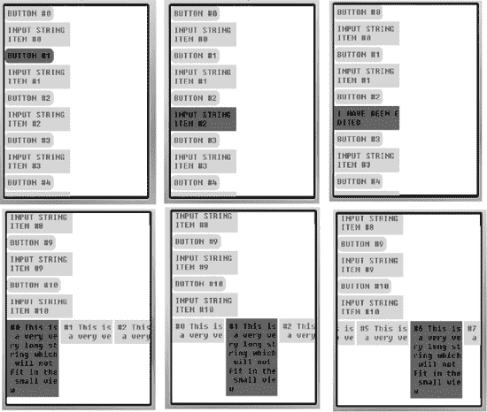

**图 6–4.** *UI 模块的测试应用程序*

诚然，它并不是最漂亮的应用程序，但它确实拥有现代 UI 的所有基本元素：小部件、容器、对嵌套容器的支持、触摸支持、滚动以及对用户交互事件的支持。考虑到我们是白手起家开始编写它的，这已经很不错了。当然，这里那里可能还有一些小问题，以及一些未能妥善处理的边界情况，但无论如何，这是一个功能完备且可用的 UI。

而这仅仅是乐趣的开始：现在你可以摆弄代码，创建新的小部件，并改进现有的小部件。例如，你可以为容器添加边框和滚动条。或者，你可以实现复选框和单选按钮来补充现有的小部件阵列。这完全取决于你！

### 在纯触控设备上实现用户界面

一个日益常见的应用场景是在纯触控设备上运行你的应用程序。过去这仅限于昂贵的智能手机领域，但相对廉价的纯触控屏 Java ME 设备已逐渐开始出现在市场上，并且随着技术成本的降低，其数量必将增加。

纯触控屏设备的有趣之处在于，它们依赖一个虚拟的屏幕导航区域（通常包含方向键、软键和一个确认/OK 按钮）来提供与现有非触控应用的兼容性。这个导航区域在大多数情况下可以禁用（通过 JAD 文件中的属性或设备菜单），从而让你能够摆脱经典且现已略显过时的 Java ME 用户交互模式。

例如，在典型的 Java ME 应用程序中，其中一个软键通常专用于当前焦点项的“上下文菜单”。在纯触控设备上，你可以实现长按行为来显示上下文菜单：如果用户按住某个项目足够长时间（3-5 秒），其上下文菜单就会弹出。对大多数用户来说，这比传统方法更直观，并且在许多情况下具有更快的优势，因为用户只需执行一个操作（按住项目），而不是两个操作（导航到目标项目，按下软键）。

你在应用程序的布局设计上也拥有更多自由。经典的 Java ME 应用程序，即使是使用高质量 UI 框架构建的，通常也采用矩形方式的 UI 布局，即从任何给定项目，你可以向左、向右、向上或向下移动。原因显而易见：经典的 Java ME 应用程序设计为使用摇杆导航，而摇杆只能朝这四个方向移动。纯触控设备没有这个限制；你可以根据任何你想要的形状或布局来构建你的 UI。

例如，前面讨论的上下文菜单不必是经典的垂直菜单：它可以是一系列排列成圆形的象形图。在这个“圆形菜单”中，你可以在上半部分放置特定于项目的命令，在下半部分放置诸如复制和粘贴之类的通用命令。这不仅使导航更快，而且更简单、更直观：用户知道，如果他们想粘贴某些内容，无论上下文菜单中有哪些特定于项目的选项，粘贴图标都会始终位于屏幕上的同一位置。

你可以实现的另一个触控特定功能是“拖放”。当你编写的应用程序处理列表或表格时，这尤其有用，因为用户可以轻松直观地重新排列他们的数据和内容。

支持手指手势也是一个非常好的特性。这超越了现在经典的惯性滚动。例如，从右向左划过屏幕可以表示“返回”命令，在屏幕上划一个“V”形手势可以是“确定”命令，而划一个“X”形手势则相当于“取消”。这使得用户交互更快、更直观、更有趣。

另一个在纯触控界面中效果很好的概念是窗格（panes）概念。虽然由于屏幕尺寸和分辨率有限，功能完备的窗口不太可行，但窗格有时非常适合手头的活动。例如，在聊天程序中，屏幕通常分为两个区域：上部区域显示对话，下部区域供用户输入消息。通过使用窗格，用户可以简单地通过拖动窗格分隔线，根据需要自由分配两个区域之间的可用屏幕空间。

你可以在纯触控设备上实现更多 UI 优化，这些优化可以使你的应用程序更易于使用、更直观，并使其从众多应用中脱颖而出。关键在于，你的应用程序必须仅针对纯触控设备，才能使许多这些优化生效。例如，圆形菜单范式在非触控输入（如经典 Java ME 手机或触控与键盘混合设备）上效果并不理想。

考虑到这一点，如果你的预算紧张，并且项目目标设备范围同时包含纯触控设备和混合/非触控设备，那么请选择在所有设备上都能良好运行的经典 UI 范式。然而，如果你的预算允许，那么考虑为纯触控设备创建专门的 UI 是值得的；你将从中获得的改进的可用性和形象资本绝对是值得的。

### 关于 UI 模块的最终建议

在着手编写 UI 模块之前，你需要考虑的一个问题是它的粒度。例如，我们选择将滚动和容器实现在同一个类中，但对于其他项目，将其拆分为两个独立的类可能更合理：`Container`（负责管理 UI 控件的集合）和 `Viewport`（负责处理滚动并确定容器的可见区域）。滚动条可以内置于 `Viewport` 中，也可以作为独立组件*附加*到 `Viewport` 上。

确定 UI 模块的合适粒度并非一门精确的科学，但仍有一些指导原则。首先，考虑组件的复用性。如果滚动条仅在视口内部使用，那么将其内置即可。然而，如果你计划在其他组件中（或作为滑块）使用滚动条，那么将其设计为独立组件则更有意义。

其次，考虑开销问题。你可以将粒度概念一直细化到像素级别，让每个像素都成为更大控件（例如按钮）的独立组成部分，但这会使你的应用程序运行缓慢。通常，子控件的层级最好不超过三层。例如，一个视口可以定义为由可见容器区域和一个滚动条组成；滚动条由两个按钮（用于上下箭头）和一个滑动区域组成；每个按钮组件内部包含一个图像。然而，在实践中，最好将层级控制在一到两层，因为层级过多往往会大幅增加开销和代码复杂度。

第三点，与上一点有些关联，需要考虑代码复杂度和开销。如果你的每个组件和子组件都简单明了，那么你可以适当增加粒度。但如果你的控件本身就很复杂精细，那么每增加一层都会让事情变得更难理解、运行更慢，并增加出现 bug 的可能性。如果在 UI 模块的设计阶段，你发现自己无法百分之百确定控件之间的协作方式，那么请考虑简化它们的功能和相互连接，或者降低粒度。当然，你也可以带着“不确定性”继续推进，并告诉自己“船到桥头自然直”，但从长远来看，这个决定总会让你付出代价。

另一个需要考虑的问题是，将 UI 功能与 UI 美化分离开来。这与模块化（见后文）有关。例如，你可能希望有一个 `Button` 类来提供按钮的功能，以及一个 `ButtonRenderer` 类来负责实际的渲染。这样做有明显的优势，但并非总是必需，尤其是对于为单个项目或项目集编写的自定义 UI 而言。不过，如果你计划编写一个通用且功能完备的 UI 框架，用于所有项目，那么这样做是合理的；如果你计划跨平台（例如，同时面向 Java ME 和 Android 设备），那么这样做几乎肯定是必要的（本书后面会详细讨论）。

你的 UI 的“智能”程度也是需要留意的。例如，一个智能 UI 可以检测到用户“轻拂”控件，并在该控件可滚动时将其转化为惯性滚动手势。或者，它可以区分通过按键聚焦和通过触摸聚焦，并对每种情况区别对待（两者之间存在一些细微差别；例如，通过触摸聚焦时，相关控件无需完全可见——用户只需将其滚动到视图中即可）。UI 智能不同于应用智能，因为它完全包含在 UI 模块中，不影响应用程序其余部分的行为；然而，它确实会影响用户体验，因此非常重要。

对 UI 模块进行模块化始终是好的做法。许多第三方库在这方面做得不好或根本没有提供支持，因此迫使你包含大量额外的支持代码，仅仅是为了使用你真正需要的那一个控件或行为。这正是自定义 UI 可以大放异彩的领域，因为你可以根据需要将其设计得尽可能模块化。模块化 UI 的主要好处是，它能拓宽你所能支持的设备范围，因为你可以在面向高端设备的构建中包含所有内容（美化组件、智能行为、额外功能等），而在面向低端设备的构建中只保留最低限度的必要内容。模块化与粒度不同。粒度指的是控件有多少“层级深度”，而模块化指的是 UI 模块的各个方面和特性彼此之间的独立程度。我们将在本书后面讨论如何实现模块化。

最后，但同样重要的是，请记住你正在为移动设备编写 UI，屏幕空间非常宝贵，用户交互必须尽可能直观。在这方面，请尽量保持 UI 简洁，避免杂乱。例如，滚动条不必始终显示在屏幕上。通常，在用户滚动时将其绘制在容器上，而在其他所有时间将其隐藏就足够了——这样可以节省原本会一直被滚动条占用的屏幕空间，同时保持界面整洁。一个常见的错误是，用编写桌面 UI 的思维来编写移动 UI，尤其是因为两者之间有很多相似之处。然而，有些概念需要调整（比如前面提到的滚动条示例），而有些概念则需要完全摒弃（移动设备上不存在桌面式窗口的概念，即可以在屏幕上拖动的窗口）。

### 本章小结

在本章中，我们学习了如何从头开始编写一个 Java ME UI 模块。我们讨论的一些重要方面及相关理论概念包括：裁剪矩形、嵌套控件，以及正确处理按键等用户交互事件。

在此过程中，我们为 Twitter 客户端编写了 UI 模块，该模块具备按钮、字符串项、可编辑字符串项、水平容器、垂直容器、触摸支持以及嵌套控件支持等功能。

在下一章中，我们将探讨如何在 Java ME 应用程序中处理本地化和国际化。

## 第 7 章

## 本地化模块

本地化（简称 L10n）对于移动应用程序来说极其重要，因为用户期望它们尽可能友好和直观易用。因此，让应用程序以用户自己的语言和特定于区域设置的设置运行至关重要。

从本质上讲，本地化仅仅涉及为你希望应用程序支持的每个区域设置提供不同版本的特定字符串。这些字符串可以直接显示给用户，例如命令名称和按钮标签；或者它们可以包含元数据，例如适用于给定区域设置的日期格式或货币符号。

在本章中，我们将讨论 Java ME 本地化的主要可用选项，并学习如何以简单、干净的方式从头开始为我们的应用程序添加本地化支持。我们还将学习如何高效处理常见的本地化相关任务，例如生成和加载本地化文件，以及处理货币、日期和时间的格式化。

### 理解优秀本地化模块的特性

一个优秀的本地化模块应具备灵活性、简洁性和智能性。它应占用较小的代码体积和资源空间，易于扩展，并且其编写方式应能支持多种可能的输入源。

本地化字符串通常以键/值对的形式存储，其中键是像“`button.quit.label`”这样的通用标识符，而值则是字符串本身。这些键/值对可以从多种来源获取：来自网络、来自 JAR 内的文本文件，甚至可以在应用程序中硬编码（例如通过使用主题）。有些应用程序会组合使用多个来源。

选择合适的输入源至关重要，因为每个来源都有其优缺点。例如，将本地化内容作为主题的一部分硬编码到应用程序中速度非常快，但其缺点是非程序员难以更新，并且无法在运行时（例如通过网络）进行更新。使用存储在应用程序 JAR 内的文件是一种改进，因为非程序员可以轻松更新本地化字符串，并且基于文件的本地化机制可以很容易地扩展以支持基于网络的本地化（或至少通过网络进行更新）。最后，基于网络的本地化（即从网络下载本地化文件）是目前最灵活的方法，但其缺点是需要付费，并且依赖于可用的网络连接。

优秀本地化模块的另一个特性是，选择正确的区域设置是在本地化模块内部透明完成的。应用程序代码应能指定一个可选的用户首选区域设置以及一个强制性的默认区域设置，但由本地化模块来决定实际使用哪个区域设置。通常的优先级顺序如下：用户指定的区域设置、手机当前区域设置（可在运行时获取），最后是应用程序的默认区域设置。除了指定用户首选区域设置和默认区域设置外，通用应用程序代码根本不应关心区域设置，也不应关心实际使用了哪个区域设置。它唯一需要做的就是从本地化模块请求某个键的值，并相应地使用该值。

一个优秀的本地化模块还应支持参数化区域设置字符串（“您有 X 封电子邮件”）。参数化本地化字符串极其重要，因此令人惊讶的是，我所见过的大多数 Java ME 本地化框架都有一个明显的遗漏：它们没有考虑参数的值。具体来说，经常出现的情况是，X=0 的模板与 X=1 或 X>=2 的模板略有不同。在前面的例子中，对于 X=0，模板应为“没有新邮件”；对于 X=1，模板应为“您有一封新邮件”；对于 X>=2，模板应为“您有 X 封新邮件”。如果本地化模块中没有添加对此的支持，则必须在应用程序代码中添加，而正如我们所看到的，这是一种不良实践。当然，X 也可以是一个字符串（而非数字），并且对于任何本地化字符串，您可以拥有一个“通用模板”以及任意数量的自定义模板。

### 理解原生 Java ME 本地化

Java ME 确实通过移动国际化 API（也称为 JSR 238）提供了自己的“内置”本地化和国际化支持。移动国际化 API 涵盖了最常见的本地化相关任务，即字符串和资源的本地化，以及货币、数字、日期和时间的格式化。

JSR 238 的最大优势当然在于其速度和资源消耗：作为原生 API 实现，它通常在这些方面比非原生 API 更高效，有时甚至高效得多。

然而，JSR 238 确实有两个主要缺点。首先也是最重要的，它并非在所有设备上都可用。这意味着，只有当您专门针对支持它的设备时，才能依赖它；否则，您将不得不为那些不支持 JSR 238 的设备自行实现本地化支持。

其次，它不如一个编写得当的自定义本地化实现那样灵活或强大。例如，对于 JSR 238，本地化和资源文件必须位于应用程序的 JAR 内，因此无法从网络下载新的本地化数据和资源，并且也不支持参数化本地化字符串。

由于这两个缺点，大多数开发者选择自行实现本地化模块。然而，需要注意的是，如果您只针对支持 JSR 238 的设备，并且只需要 JSR 238 所支持的功能，那么 JSR 238 可以（实际上也确实是）一个不错的选择。

### 为 Java ME 应用添加自定义本地化支持

既然我们已经了解了优秀的本地化模块应具备哪些特性，以及为何通常无法使用 JSR 238，那么我们就可以开始编写自己的自定义本地化支持模块了。

对于我们的应用，我们将仅实现基于文件的本地化（本地化文件存储在 JAR 包内）；不过，我们会包含从通用 `DataInputStream` 读取本地化文件的支持，因此如果你愿意，也可以添加基于网络的本地化支持。

我们首先要做的是为本地化文件定义一种结构。我们希望它既易于解析又易于理解，因此我们将采用清单 7–1 中所示的通用结构。

**清单 7–1.** *通用本地化文件结构*

`<键 #1>`
`<值 #1>`
`<键 #2>`
`<值 #2>`

`# 以“#”开头的行是注释行`
`# 例如，你可以用它们来解释每个翻译的用途。`
`# 空行也会被忽略。`

`<键 #3>`
`<值 #3>`

`…`

至于键/值对，它们有两种形式：通用型和参数特定型。通用型键/值对如清单 7–2 所示。

**清单 7–2.** *通用型键/值对*

`some.key`
`这是“some.key”的值，这里 --> {@} <-- 是参数`

`new.email`
`你有 {@} 封新邮件`

键的约定是：键必须唯一，并且使用“.”代替空格来分隔键的各个部分（或单词）。值的约定是：每个值最多只能有一个参数，并且该参数用字符序列“{@}”标记。限制最多只有一个参数的原因是，否则支持参数特定键将极其困难：如果你的值有两个参数，并且每个参数有三种特殊情况和一个通用情况，那么你将需要 4×4=16 个键/值对才能覆盖所有可能的组合，这是不可行的。如果你确实需要在同一个字符串中包含两个参数，只需将该字符串拆分成两个较小的字符串，每个字符串包含一个参数即可。

参数特定型键/值对与通用型键/值对几乎相同，如清单 7–3 所示。

**清单 7–3.** *参数特定型键/值对*

`some.key:`**`1`**
`这是参数为 1 时的值`

`some.key`**`:a string value`**
`这是参数为“a string value”时的值`

`new.email:0`
`没有新邮件`

`new.email:1`
`有一封新邮件`

唯一的区别在于，键名后面添加了一个“:”，后跟该键/值对所对应的参数值。这可以在代码片段中高亮显示的部分看到。你还会注意到，参数特定型键/值对的值中没有参数占位符。由于参数的值是已知的，你可以直接将其插入到值中，而不是使用占位符。话虽如此，你*可以*使用参数占位符，但这样做意义不大，也许除了节省一些空间之外。

那么，整个键/值机制是如何工作的呢？假设我们想要检索键“`new.email`”对应的值，且参数为 5。本地化模块将首先检查是否存在“`new.email:5`”这个键。由于不存在，它将直接使用通用键“`new.email`”并传入相应的参数。因此，它将返回“`You have 5 new emails`”。如果参数值为 0，那么本地化模块将返回“`No new emails`”，对应于参数特定型键“`new.email:0`”。

至于本地化文件本身，它们将以所实现的语言区域命名——例如，“`en-US.bin`”或“`ro-RO.bin`”——并将存储在包 `app.files.L10n` 中。这些文件是 `.bin` 文件而不是 `.txt` 文件的原因稍后将讨论。

#### 处理本地化文件

既然我们已经知道如何创建本地化文件，下一步就是将文件加载到我们的 Java ME 应用中。不幸的是，这说起来容易做起来难。

原因很简单：Java ME 没有任何类似于 `readLine()` 的方法，该方法允许我们逐行读取文件。因此，我们被迫逐字符地处理文件，或者更准确地说，是逐字节地处理，因为 Java 的 `char` 数据类型长度为两个字节，因此与纯 ASCII 或 UTF-8 编码不兼容。然而，虽然逐字节处理文件是可行的，但它也极其缓慢（尤其是按 Java ME 的标准来看），并且可能相当复杂。幸运的是，有一种更好的方法可以解决我们的文件读取问题。

虽然 Java ME 没有 `readLine()` 方法，但其 `DataInputStream` 类确实有一个 `readUTF()` 方法，该方法可以读取 Java UTF 编码的字符串。不过有一个问题：`readUTF()` 使用了一种修改过的 UTF 编码方案（如 Java 规范中所定义），因此用它来读取常规 UTF 字符串或纯文本文件将会失败。为了解决这个问题，我们将使用一个小技巧——即，我们将使用一个 J2SE 应用来处理原始翻译文件，该应用将输出可由 Java ME 的 `readUTF()` 方法读取的二进制文件。

这实际上比听起来要容易得多。此外，它允许我们在 J2SE 端简化和优化输出的翻译文件——例如，通过移除所有注释和空行，从而提供额外的速度提升并减小整体 JAR 包大小。执行此操作的 J2SE 应用如清单 7–4 所示。

**清单 7–4.** *在 J2SE 端处理翻译文件*

`package com.apress;`

`...`

`public class TranslationFileConverter {`

`    public static void main(String[] args) {`
`        String sourceFile = args[0];`
`        String destFile = args[1];`
`        String lineIn = "";`
`        try`
`        {`
`            DataInputStream in = new DataInputStream( new FileInputStream(sourceFile));`
`            BufferedReader br = new BufferedReader(new InputStreamReader(in));`
`            DataOutputStream out = new DataOutputStream(new FileOutputStream(`
`                                    destFile));`

**`while ( ( lineIn = br.readLine()) != null )`**
**`{`**
**`// 忽略注释和空行`**
**`if ( lineIn.length() == 0 || lineIn.charAt(0) == '#' )`**
**`{`**
**`continue;`**
**`}`**
**`out.writeUTF(lineIn);`**
**`}`**

`            out.close();`
`            br.close();`
`        }`
`        catch (Exception ex)`
`        {`
`            ex.printStackTrace();`
`            // 不做任何处理`
`        }`
`    }`

`}`

高亮显示的行就是奇迹发生的地方。与 Java ME 不同，J2SE 确实有 `readLine()` 方法，这使得读取原始输入文件变得异常简单。此外，J2SE 的 `writeUTF()` 方法与 J2ME 的 `readUTF()` 方法兼容，因为它们实现了相同的编码标准——所以另一个问题也轻松解决了。最终，这个 J2SE 应用所做的就是从原始输入文件中读取有效行，并将它们一个接一个地作为 `readUTF()` 兼容的字符串写入输出文件，这些字符串可以轻松地从 Java ME 中读取。

要使用该应用，你只需在命令提示符下运行以下命令：

`java –jar TranslationFileConverter.jar C:\translations\en-US.txt C:\output\en-US.bin`

第一个参数是原始翻译文件的位置，第二个参数是输出文件的位置。作为区分原始文件和处理后文件的约定，处理后的文件将带有“`.bin`”扩展名。最后，在运行该应用之前，请确保两个目录（原始文件和处理后文件的目录）都存在且有效。

我们在此暂停处理翻译文件，但请记住，整个过程还可以更进一步。重要的是要认识到，最终输出的文件始终看起来像清单 7–5。

**清单 7–5.** *翻译输出文件的样子*

`<键 1> <值 1> <键 2> <值 2> … <键 XX> <值 XX>`

这种结构极其简单，没有换行符或特殊分隔符，并且具有非常基础且易于理解的结构。这样做的一个副作用是，输入文件几乎可以采用任何格式和结构，只要该格式最终能够被翻译成简单的键/值对即可。这意味着，例如，你可以将语言文件的输入格式更改为 XML 或 JSON（甚至可以直接从数据库中获取翻译），可以通过添加预处理功能（例如，“include”指令）来增强语言文件的结构，还可以添加诸如“if”语句和循环等动态元素。只要输出结果与清单 7–5 中的结构匹配，你就可以自由地做任何想做的事情。虽然通常不需要这种程度的灵活性，但知道在需要时可以使用它，这很棒。

#### 在设备上加载本地化数据

如前所述，本地化数据的主要来源将是 JAR 本身内的文件，但我们也会提供支持，用于从任何通用的 `DataInputStream` 加载本地化数据。

然而，在此之前，我们需要准备好本地化模块的基本结构。这非常简单，因为本地化模块的核心依赖于非常基础的键/值对概念，而这正是 `Hashtable` 类所提供的。因此，本地化模块的骨架将类似于清单 7–6 中的代码。

**清单 7–6.** *本地化模块的骨架*

`package app.module.L10n.classes;`

`...`

`public class Locale`
`{`
`    protected static Hashtable keyValuePairs = new Hashtable();`

`    ...`
`}`

`Locale` 类将是本地化模块的核心（实际上，它将是*整个*本地化模块）。`keyValuePairs` 哈希表将用于存储来自本地化文件的所有键/值对。哈希表允许快速查找，但代价是增加一些内存开销。这种开销通常是可以接受且可以忽略不计的。然而，如果你的目标设备是内存极其有限且性能极低的设备，或者目标设备的 `Hashtable` 实现极其浪费内存，那么你可能希望改用 `Vector` 甚至固定数组。虽然这样可以节省内存，但通常会增加查找操作的 CPU 开销。幸运的是，这些“内存不足”的情况相当罕见，而且即使发生，根本原因通常也不在于本地化模块，而在于应用程序中其他内存密集型的部分。

现在，我们必须将本地化文件中的数据加载到哈希表中。为了保持选项的开放性，我们将从内部 JAD 文件、字节数组或抽象的 `InputStream` 中加载数据。从字节数组加载数据可能看起来没有必要，但当本地化数据是更大数据集的一部分时（例如，当它从包含多个对象的持久化记录中反序列化时），这通常是必需的。因此，数据加载代码将类似于清单 7–7 中的代码。

**清单 7–7.** *从不同来源加载本地化数据*

`public static boolean loadFromInternalFile(String internalFile)`
`{`
`        try`
`        {`
`                InputStream stream = Locale.class.getResourceAsStream(internalFile);`
`                if ( stream == null )`
`                {`
`                        return false;`
`                }`
`                DataInputStream in = new DataInputStream(stream);`
`                if ( in.available() == 0 )`
`                {`
`                        return false;`
`                }`
`                return loadFromDataInputStream(in);`
`        }`
`        catch (Exception ex)`
`        {`
`                return false;`
`        }`
`}`

`public static boolean loadFromByteArray(byte [] data, int offset, int length)`
`{`
`         DataInputStream in = new DataInputStream ( new ByteArrayInputStream(data,`
`         offset,length) );`
`        return loadFromDataInputStream(in);`
`}`

`public static boolean loadFromDataInputStream(DataInputStream in)`
`{`
`        String key, value;`
`        try`
`        {`
**`while ( true )`**
**`{`**
**`key = in.readUTF();`**
**`value = in.readUTF();`**
**`keyValuePairs.put(key, value);`**
**`}`**
**`}`**
**`catch (EOFException ex)`**
**`{`**
**`// 文件结束，我们可以停止`**
**`}`**
`        catch (IOException ex)`
`        {`
`                // 哎呀！读取未成功`
`                return false;`
`        }`
`        return true;`
`}`

可以看到，基于文件和基于数组的方法最终都依赖于 `loadFromDataInputStream()` 来完成实际工作。同时也能发现所有方法都是静态的。这样设计是为了让 `Locale` 类能够在应用程序的任何位置轻松使用，当我们真正开始使用本地化功能时，其重要性会变得更加明显。

至于读取本地化数据，高亮显示的行就是关键所在。我们只需按顺序读取键/值对，直到抛出 `EOFException`（表示读取成功）或 `IOException`（表示出现错误）。这种机制在 Java ME 端简单可靠，因为原始本地化文件已经在 J2SE 端处理并验证过了。事实上，任何检查或验证都应当只在 J2SE 端完成。

核心加载功能已经就绪，现在让我们添加一些辅助方法。我们需要获取设备的当前区域设置，仅根据区域名称在 JAR 文件中找到对应的本地化文件，以及根据用户偏好的区域设置、手机的区域设置和默认区域设置来确定要加载哪个本地化文件。所有这些功能都由清单 7–8 中的代码实现。

**清单 7–8.** *本地化模块的辅助方法*

`public static String getDeviceLocale()`
`{`
`        return System.getProperty("microedition.locale");`
`}`

`public static String getLocaleFile(String locale)`
`{`
`        if ( locale == null )`
`        {`
`                return getLocaleFile(getDeviceLocale());`
`        }`
`        return "/app/files/L10n/" + locale + ".bin";`
`}`

`public static boolean loadFromFileBasedOnPreferences(String specifiedUserLocale,`
`String defaultLocale)`
`{`
`        // 按顺序尝试加载：指定的用户区域设置、默认区域设置和设备区域设置`
`        if ( loadFromInternalFile( getLocaleFile(specifiedUserLocale) ) ||`
`                 loadFromInternalFile( getLocaleFile(getDeviceLocale() ) ) ||`
`                 loadFromInternalFile( getLocaleFile(defaultLocale) ) )`
`        {`
`                return true;`
`        }`

`        // 所有尝试均失败`
`        return false;`
`}`

目前这些方法都是便捷方法，因为它们底层功能非常简单。引入它们的主要目的是为了长期的灵活性。例如，`getLocaleFile()` 方法中将区域名称解析为文件名的逻辑目前极其简单，但长远来看可能会改为更复杂的逻辑——比如，如果请求的区域是 en-UK，但该文件不可用，而 en-US 可用，则改用 en-US。

最后，我们来编写实际承担主要工作的方法：获取通用键和特定参数键的翻译值。其代码如清单 7–9 所示。

**清单 7–9.** *获取翻译键的值*

`public static String get(String key)`
`{`
`        return (String) keyValuePairs.get(key);`
`}`

`public static String get(String key, int value)`
`{`
`        return get(key, String.valueOf(value) );`
`}`

`public static String get(String key, String parameter)`
`{`
`    // 首先尝试读取特定参数的键`
`    String originalStr = get(key + ":" + parameter);`

`    // 如果不存在特定参数的键，则尝试读取通用键`
`    if ( originalStr == null )`
`    {`
`        originalStr = get(key);`
`    }`

`    // 完全未找到键，返回 null`
`    if ( originalStr == null )`
`    {`
`        return null;`
`    }`

`    // 检查是否存在参数占位符`
`    int placeholderPosition = originalStr.indexOf("{@}");`

`    // 没有参数占位符，直接返回值`
`    if ( placeholderPosition == -1 )`
`    {`
`        return originalStr;`
`    }`

`    // 将参数占位符替换为参数值并返回结果字符串`
`    return originalStr.substring(0, placeholderPosition) + parameter +`
`                originalStr.substring(placeholderPosition+3);`
`}`

就是这样！我们的本地化模块现在可以投入使用了。让我们来测试一下。

### 测试本地化模块

要测试本地化模块，首先需要创建一个输入本地化文件。本章开头有两个示例，即清单 7–2 和清单 7–3，我们将它们合并成一个文件，并保存为 `C:\test\en-US.txt`。

之后，我们需要使用 J2SE 工具处理该本地化文件，命令如下：

`java –jar TranslationFileConverter.jar C:\test\en-US.txt C:\test\en-US.bin`

下一步是将生成的 `en-US.bin` 文件移动到项目文件夹中对应的位置，即与 `app.files.L10n` 包对应的子文件夹。完成此操作后，我们就可以在应用程序中使用本地化模块了，使用方法如清单 7–10 所示。

**清单 7–10.** *测试本地化模块*

`package test;`

`...`

`public class TestMidlet extends MIDlet`
`{`
`        ...`

`    public void startApp()`
`    {`
`        // 没有用户偏好的区域设置，默认区域设置为 en-US。`
`        // 本地化模块将尝试使用手机当前的区域设置（如果可用），`
`        // 如果不可用，则默认使用 en-US。`
`        Locale.loadFromFileBasedOnPreferences(null, "en-US");`

`        // 两个特定参数的本地化字符串`
`        System.out.println ( Locale.get("new.email",0) );`
`        System.out.println ( Locale.get("new.email",1) );`

`        // 一个通用的本地化字符串`
`        System.out.println ( Locale.get("new.email",9999) );`

`        // 参数也可以是字符串`
`        System.out.println ( Locale.get("new.email","a couple of") );`
`    }`
`}`

控制台输出将如下所示：

`No new emails`
`One new email`
`You have 9999 new emails.`
`You have a couple of new emails.`

如您所见，我们的本地化模块紧凑、灵活且易于使用。

### 实现高级本地化功能

将字符串从一种语言翻译成另一种语言很容易；然而，本地化远不止于此。例如，不同的区域设置使用不同的日期格式。由于 Java ME 对本地化的支持较差，我们必须自己处理这些问题。

我们需要做的第一件事是定义一个包含正确日期格式的本地化字符串，类似于代码清单 7–11 中的片段。我们将把这个字符串添加到 `en-US` 本地化文件中。

**代码清单 7–11.** *定义日期格式*

`# 默认日期格式`
`format.date`
`D, d/m/y`

在这个例子中，“d”代表月份中的日期，“m”代表月份，“y”代表年份，而大写的“D”代表星期几。这是我们将在本地化模块中使用的约定。

接下来，我们需要定义一周中的每一天，如代码清单 7–12 所示。一周中的“第零天”将用于未知值（以防过程中出现意外，尽管这不应该发生）。同样，将这些本地化字符串添加到 `en-US` 本地化文件中。

**代码清单 7–12.** *定义一周中的每一天*

`# 星期名称`
`weekdays.names:1`
`星期一`

`weekdays.names:2`
`星期二`

`...`

`weekdays.names:7`
`星期日`

`weekdays.names:0`
`未知`

我们需要完成的最后一步是在本地化模块中编写一个日期到字符串的处理函数，因为 Java ME 没有内置这样的函数。这样一个具有基本支持功能的函数如代码清单 7–13 所示。你可以根据需要对其进行增强——例如，添加对月份名称的支持。

**代码清单 7–13.** *根据给定格式将日期转换为字符串*

`public static String formatDate(String dateFormat, Date date)`
`{`
`        Calendar c = Calendar.getInstance();`
`        c.setTime(date);`
`        String result;`

`        String day = String.valueOf(c.get(Calendar.DAY_OF_MONTH));`
`        result = UITextHelper.strReplace("d", day, dateFormat);`

`        String month = String.valueOf(c.get(Calendar.MONTH));`
`        result = UITextHelper.strReplace("m", month, result);`

`        String year = String.valueOf(c.get(Calendar.YEAR));`
`        result = UITextHelper.strReplace("y", year, result);`

`        int dayOfWeek = c.get(Calendar.DAY_OF_WEEK);`
`        int dayOfWeekIndex = 0;`
`        switch (dayOfWeek)`
`        {`
`                case Calendar.MONDAY:`
`                        dayOfWeekIndex = 1;`
`                        break;`

`                case Calendar.TUESDAY:`
`                        dayOfWeekIndex = 2;`
`                        break;`

`                ...`

`                case Calendar.SUNDAY:`
`                        dayOfWeekIndex = 7;`
`                        break;`

`                default:`
`                        dayOfWeekIndex = 0;`
`                        break;`
`        }`
`        result = UITextHelper.strReplace("D", Locale.get("weekdays.names",`
`        dayOfWeekIndex), result);`

`        return result;`
`}`

这里值得注意的一点是，代码依赖于预定义的本地化字符串（`weekdays.name` 键）才能正常运行。这意味着这些“核心字符串”必须存在于所有本地化文件中，否则可能会发生意外错误。该代码还使用了 `UITextHelper.strReplace()`，这是一个自定义的字符串替换方法，因为 Java ME 没有内置这样的方法。

最后，让我们来实际使用一下我们的 `formatDate()` 方法，如代码清单 7–14 所示。

**代码清单 7–14.** *测试 `formatDate()` 方法*

`Date date = new Date();`
`String dateFormat = Locale.get("format.date");`
`System.out.println ( Locale.formatDate(dateFormat, date));`

运行这段代码将在控制台输出类似如下的内容：

`星期一, 22/10/2010`

更改 `format.date` 键的值也会相应地改变输出字符串。通过同时更改 `format.date` 和 `weekdays.name` 键，你可以让应用程序动态匹配任何给定区域设置所期望的日期和时间格式，而无需修改实际的应用程序代码。

我们用于格式化日期的相同思路也可以应用于应用程序中其他需要基于区域设置进行格式化的方面——例如，格式化数字（小数分隔符、千位分隔符等）和格式化货币。我们还可以使用这种机制来定义更特殊的内容，比如特定于区域设置的数学公式（例如，计算税金的公式，不同国家各不相同）。

Java ME 应用程序中的一切，从按钮标签到图形文件再到数学公式，都可以定制为特定于区域设置。正如我们在本章中所看到的，这样做并不特别困难——只需要一些创造性和实用性的编码技巧。

### 本章小结

我们讨论了什么是本地化，以及如何将本地化支持添加到 Java ME 应用程序中。在此过程中，我们探讨了一个良好本地化实现的一些更重要的方面，例如在将本地化文件加载到移动设备之前在桌面上对其进行处理和优化，实现对参数特定键的支持，以及实现高级本地化功能，例如基于区域设置的对象（日期、货币等）格式化。

在下一章中，我们将整合目前学到的所有知识，编写我们的 Twitter 客户端应用程序。在此过程中，我们将讨论与构建完整 Java ME 应用程序相关的最佳实践，例如 UI 和应用程序逻辑的适当分离、定义清晰的事件结构等等。

## 第 8 章

## **整合所有内容**

到目前为止，本书已经探讨了构成任何 Java ME 应用程序主体的各个不同方面。现在是时候看看它们如何整合在一起形成一个完整的应用程序了。

在本章中，我们将创建一个功能完备的 Java ME Twitter 客户端的基础，其中大部分重要功能都已实现，其余功能也相当容易实现。在浏览代码时，你会注意到主应用程序代码库非常小。其主要原因是拥有一个良好、灵活的架构，并且能够高度依赖我们迄今为止编写的应用程序模块所提供的功能。事实上，属于应用程序本身的逻辑非常少：大部分繁重的工作都在各个模块中完成。

这造就了一个易于理解和操作、可移植且紧凑的应用程序——所有这些都是一款专业 Java ME 应用程序最明显的标志。

话不多说，让我们开始工作吧。

### 快速启动应用程序

每个 Java ME 应用程序都必须构建在 `MIDlet` 类之上。我们的应用也不例外；不过，我们将仅使用 `MIDlet` 类来快速启动核心应用程序框架、相关的控制器以及其他类。因此，`TwitterClient` MIDlet 类将如代码清单 8–1 所示。

**代码清单 8–1.** *`TwitterClient` 类*

`public class TwitterClient extends MIDlet`
`{`
`    public void startApp()`
`    {`
`        Application.init(this);`

`        FlowController flowController = new FlowController();`
`        SettingsController settingsController = new SettingsController();`
`        WelcomeScreenController welcomeController = new WelcomeScreenController();`
`        MainScreenController mainScreenController = new MainScreenController();`
`        TweetsController tweetsController = new TweetsController();`

`        Application.getMainEventController().registerListener(tweetsController);`
`        Application.getMainEventController().registerListener(flowController);`
`        Application.getMainEventController().registerListener(settingsController);`
`        Application.getMainEventController().registerListener(welcomeController);`
`        Application.getMainEventController().registerListener(mainScreenController);`

`        Event start = new Event(EVT.CONTEXT.STARTUP,`
`        EVT.PROGRAM_FLOW.APPLICATION_START,null);`
`        Application.getMainEventController().queueEvent(start);`

`        Bootstrap.boot(this, 100);`
`        }`

`        ...`
`}`

就是这样。`TwitterClient` 类以及我们应用程序的原生部分就完成了。从现在开始，我们所做的一切都将只与我们的应用程序对象和框架相关——不再有直接的 Java ME 原生调用；它们都从主应用程序代码中隐藏起来了。这不仅会使我们的应用程序更易于理解、更简洁，还有助于将来向其他平台移植。

让我们稍微看看这里发生了什么。首先，我们初始化框架。然后，我们创建将在应用程序中使用的所有控制器的实例。稍后我们将逐一介绍它们。创建完成后，这些控制器都作为监听器添加到主事件控制器中，并且一个 `APPLICATION_START` 事件被排入主事件控制器的队列。最后，应用程序以 100 毫秒的事件处理间隔启动——这完全满足我们的需求。

**注意：** 在本章中，你会多次看到对 `EVT` 类及其定义的事件的引用。为了清晰和可读性，该类将在本章末尾完整展示——并且仅在那时展示。

现在，让我们看看接下来会发生什么。初始化应用程序的关键在于 `APPLICATION_START` 事件。让我们看看它在何处以及如何处理。

### 实现 FlowController

该控制器负责处理所有影响应用程序流程和/或生命周期的主要事件。这些事件包括应用程序启动或退出、设备内存不足或无法执行关键命令等。当然，可以有多个控制器响应这些事件（通常也确实不止一个），但 `FlowController` 负责执行通用的、非特定模块的事件处理。

举一个具体的例子，你会看到 `FlowController` 和 `TweetsController` 都会响应 `APPLICATION_START` 事件。然而，`TweetsController` 执行与推文相关的特定操作（例如创建和初始化 `ServerImplementation` 实例），而 `FlowController` 则执行更通用的操作，例如根据用户偏好（如果有）加载相应的区域设置。

`FlowController` 类的代码如代码清单 8–2 所示。

**代码清单 8–2.** *`FlowController` 类*

`package app.controller;`

`import app.classes.Defaults;`
`...`

`public class FlowController implements Controller, EventListener`
`{`

`    public boolean handleEvent(Event event)`
`    {`

`        if (EVT.PROGRAM_FLOW.APPLICATION_START == event.getType())`
`        {`
`            // 加载用户的区域设置（如果有）`
`            String locale = null;`
`            byte[] data = Defaults.persistenceHelper.getRecord(`
`            Defaults.DEFAULT_LOCALE_RECORD_NAME);`
`            if (data != null)`
`            {`
`                ByteRecordReader reader = new ByteRecordReader(data);`
`                locale = reader.readString();`
`            }`
`            Locale.loadFromFileBasedOnPreferences(locale, Defaults.DEFAULT_LOCALE);`

`            // 显示欢迎表单`
`            Event showWelcome = new Event(EVT.CONTEXT.STARTUP,`
`            EVT.PROGRAM_FLOW.SHOW_WELCOME_SCREEN, null);`
`            Application.getMainEventController().queueEvent(showWelcome);`

`            return true;`

`        } else if (EVT.PROGRAM_FLOW.APPLICATION_EXIT == event.getType())`
`        {`
`            Defaults.persistenceHelper.close();`
`            Application.exit();`
`        } else if ( EVT.PROGRAM_FLOW.INITIATE_SHUTDOWN == event.getType() )`
`        {`
`                Event shutdown = new Event(EVT.CONTEXT.SETTINGS_FORM,`
`                EVT.PROGRAM_FLOW.APPLICATION_PREPARE_SHUTDOWN, null);`
`                Application.getMainEventController().queueEvent(shutdown);`

`                shutdown = new Event(EVT.CONTEXT.SETTINGS_FORM,`
`                EVT.PROGRAM_FLOW.APPLICATION_EXIT, null);`
`                Application.getMainEventController().queueEvent(shutdown);`
`                return true;`
`        }`

`        return false;`
`    }`
`}`

从代码中可以看出，我们的 `FlowController` 目前只处理三个事件：`APPLICATION_START`、`INITIATE_SHUTDOWN` 和 `APPLICATION_EXIT`，其中后两个事件紧密关联。

在处理 `APPLICATION_START` 时，我们首先尝试查看是否设置了用户偏好的区域设置，如果设置了，则尝试加载它（即使尝试失败，默认区域设置仍会被加载）。之后，我们发出一个 `SHOW_WELCOME_SCREEN` 事件，这将导致显示欢迎屏幕（或者如果你愿意，也可以称为欢迎表单）。此事件在 `WelcomeScreenController` 内部处理。

顺便提一下，你应该始终通过事件来切换屏幕，而永远不要直接切换。这不仅允许应用程序的其他部分响应屏幕切换（例如，在离开设置屏幕时重新加载关键配置选项），还能最大限度地减少竞态条件、线程死锁以及各种 UI 故障和问题的可能性。如果确实发生了这些问题，使用事件通常会使调试更快更容易，因为哪个操作发生在哪里变得非常清晰，而且代码片段本身通常也很小。

`INITIATE_SHUTDOWN` 事件也很有趣，因为它会触发一系列事件，为应用程序的关闭和退出做好准备。它本质上是一个总括性事件，不仅有助于缩短代码库（因为只需触发单个事件，而非两个或更多），还能阐明关闭过程的工作方式以及需要执行的操作。

最后，我想指出对 `Defaults` 类的广泛使用（如代码清单 8–3 所示），该类包含了各种应用程序设置的默认值和硬编码值，例如默认区域设置、存储首选用户区域设置的记录名称、要使用的默认持久化助手等。

**代码清单 8–3.** *`Defaults` 类*

`package app.classes;`

`...`

`public class Defaults {`

`    public static final UITheme THEME = new AppTheme();`

**`    public static final boolean USE_SINGLE_USER_ACCESS = true ;`**

**`    public static final int TWEET_BATCH_SIZE = 1;`**

`    public static final String DEFAULT_LOCALE = "en-US";`

`    public static final String DEFAULT_LOCALE_RECORD_NAME = "locale";`

`    public static final String DEFAULT_LOGIN_DATA_RECORD_NAME = "loginData";`

**`public static final PersistenceProvider persistenceProvider = new`**
**`RMSPersistenceProvider("twitterclient");`**

`    public static SimplifiedPersistenceHelper persistenceHelper = new`
`    SimplifiedPersistenceHelper(persistenceProvider);`
`}`

除了能够在单个中心位置更改关键值这一明显好处外，`Defaults` 类还能很好地指示应用程序的灵活性：通常，其中包含的值越多（且这些值确实属于那里），应用程序就越灵活。例如，前两个高亮显示的值可用于轻松配置应用程序以适应各种使用和测试场景，方法是更改登录方式以及每批检索的推文数量；而最后一个高亮显示的值可用于将应用程序从使用本地 RMS 持久化更改为基于云的持久化等。

至此，我们已经完成了对 `FlowController` 的介绍。现在，让我们继续讨论 `TweetsController`。

### 实现 TweetsController

该控制器负责处理所有与推文相关的事件和操作，例如发布推文和从服务器检索推文。首先，让我们看一下它的源代码，如代码清单 8–4 所示。

**代码清单 8–4.** *`TweetsController`*

`package app.controller;`

`...`

`public class TweetsController implements Controller, EventListener {`

`    protected TwitterServer server = null;`
`    protected Timeline mainTweetTimeline = null;`

`    public boolean handleEvent(Event event) {`
`        if ( EVT.PROGRAM_FLOW.APPLICATION_START == event.getType() )`
`        {`
`            server = new ServerImplementation("<consumer-key>", "<consumer-secret>",`
`            Application.getMainEventController());`
`            return true;`
`        }`
`        else`
`        if ( EVT.NETWORK.LOGIN_SUCCEEDED == event.getType() )`
`        {`
**`if ( server == null )`**
**`{`**
**`return false;`**
**`}`**
`            mainTweetTimeline = server.getTimelineForFilter(null);`
`            return true;`
`        }`
`        else`
`        if ( EVT.TWEETS.REQUEST_MAIN_TWEETS_BATCH == event.getType() )`
`        {`
**`            if ( mainTweetTimeline == null )`**
**`            {`**
**`                return false;`**
**`            }`**
`            int count = 0;`
`            Tweet temp = null;`
`            while ( count < Defaults.TWEET_BATCH_SIZE )`
`            {`
`                temp = mainTweetTimeline.goBack();`
**`                if ( temp == null )`**
**`                {`**
**`                    break;`**
**`                }`**
`                Event evt = new Event ( EVT.CONTEXT.NETWORKING_MODULE,`
`                EVT.TWEETS.RECEIVED_TWEET, temp);`
`                Application.getMainEventController().queueEvent(evt);`
`                count++;`
`            }`
`            return true;`
`        }`
`        else if ( EVT.TWEETS.POST_TWEET == event.getType() )`
`        {`
**`            if ( server == null )`**
**`            {`**
**`                return false;`**
**`            }`**
`            Tweet tweet = (Tweet) event.getPayload();`
`            server.postTweet(tweet);`
`        }`
`        return false;`
`    }`

`}`

如您所见，`TweetsController` 也响应 `APPLICATION_START` 事件，通过初始化其 `TwitterServer`。通常，几乎肯定会用到的控制器应在收到 `APPLICATION_START` 事件时初始化其底层数据结构和实体，而可能永远不会用到的控制器（例如与应用程序表单绑定的控制器，我们稍后会看到）则应在实际需要时才初始化其底层数据结构和实体（惰性初始化）。

这通常会导致启动过程快速，并在运行时提供相当流畅的用户体验，如果您的应用程序要在低端 Java ME 设备上运行，这一点尤其重要。反例是，想象一下如果应用程序中的所有控制器都在启动时初始化自己会发生什么：启动过程将花费很长时间（或者无论如何都比必要的时间长），并且设备在尝试同时初始化所有内容时很可能会开始耗尽资源，这将导致性能更差，甚至应用程序崩溃。

接下来，这段代码还阐释了编写基于事件的应用程序的一个非常重要的原则：你绝不应仅仅因为接收到某个事件就盲目地执行操作或发起动作。**加粗**的行展示了我们在尝试处理事件之前进行的一些非常基本的检查。乍一看，这些只是简单的健全性检查，以确保不会发生 `NullPointerExceptions`。虽然确实如此，但这些检查背后隐藏着一种“逻辑”。在我们的例子中，如果 `Timeline` 对象尚未初始化，就无法处理“请求推文”事件；而 `Timeline` 对象又是在登录尝试成功时初始化的，这又只有在 `APPLICATION_START` 事件期间成功初始化 `TweetsController` 之后才会发生。

这一切意味着，实际上，除非此操作之前的所有逻辑步骤都已执行完毕，否则你无法请求推文——凭空发出一个“请求推文”事件不会有任何效果。这确保了事件不会按错误的顺序或在不当的情况下被处理，如果你计划在应用程序中大量使用事件，这一点至关重要。

另一个值得关注的点是 `REQUEST_MAIN_TWEETS_BATCH` 事件的处理方式。此事件的目的是从服务器检索下一批推文（批次大小在 `Defaults` 类中定义）。当接收到批次时，代码不会调用预设的方法或直接返回/处理该批次，而是为批次中的每条推文生成一个 `RECEIVED_TWEET` 事件。然后，这个事件可以在任何其他控制器中处理，甚至可以在生成它的同一个控制器中处理。

这种方法背后的理念是保持一切清晰且模块化：你有一个用于接收推文的事件，还有一个用于处理它们的事件；两者完全独立。人们总是倾向于将相似或相关事件的处理混在一起。例如，在 UI 库中，独立的 `REQUEST_PAINT` 和 `HANDLE_PAINT` 事件可能会被错误地合并成一个 `DO_REPAINT` 事件。起初这听起来可能是个好主意，或者你甚至可能没有意识到实际上需要实现两个独立的事件。然而，随着应用程序的增长，你很快就会发现，`HANDLE_PAINT` 部分的事件可能需要因 `REQUEST_PAINT` 部分之外的其他原因而进行处理，或者接收到 `DO_REPAINT` 事件可能并不总是导致重绘（例如，当相关的小部件/表面对最终用户不可见时）。因此，将单一的大事件拆分成更小的事件总是一个好主意——当然，也不要过度拆分。这有助于保持代码库小巧且易于维护，这两点都是任何优秀 Java ME 应用程序的关键方面。

至此，`TweetsController` 就介绍完了。接下来是 `WelcomeScreenController` 和 `WelcomeForm`。

### 实现 WelcomeScreenController 和 WelcomeForm

这个表单-控制器组合负责应用程序在首次启动并显示欢迎屏幕时与用户交互的方式。欢迎屏幕也充当应用程序的登录屏幕。

在继续之前，我想指出屏幕（screen）和表单（form）之间细微的概念差异。屏幕是用户在应用程序运行期间的某个时刻所看到、听到和感觉到（通过振动）的全部内容。它就像是应用程序的一个多媒体快照。其中，表单只是应用程序的 UI 部分，包含用户可以与之交互的应用程序小部件。它甚至可能不是屏幕的整个视觉部分（例如，当应用程序未以全屏模式运行时）。这种差异主要是理论上的，在实践中，这两个术语在大多数情况下可以互换使用，但在设计具有复杂用户交互场景的复杂应用程序时，这种差异可能需要牢记。当然，“屏幕”和“表单”的命名并非固定不变：不同的团队和个人可能会使用不同的术语。

回到我们的 Twitter 客户端，让我们看看 `WelcomeForm` 的源代码，如清单 8–5 所示。

**清单 8–5.** *`WelcomeForm`*

`package app.views;`

`...`

`public class WelcomeForm extends GameCanvasView implements CallbackHandler`
`{`

`    protected InputStringItem username = null;`
`    protected InputStringItem password = null;`
`    protected SimpleTextButton login = null;`

`    public WelcomeForm(UITheme theme)`
`    {`
`        super(false,theme);`

`        // 创建所有必需的小部件`
`        username = new InputStringItem(Locale.get("username.text"), "",`
`        Locale.get("text.general.ok"), Locale.get("text.general.cancel"),`
`        getContentWidth()/2, 100, null, theme);`

`        password = new InputStringItem(Locale.get("username.text"), "",`
`        Locale.get("text.general.ok"), Locale.get("text.general.cancel"),`
`        getContentWidth()/2, 100, null, theme);`

`        login = new SimpleTextButton(Locale.get("login.button.text"), this, theme);`

`        // 创建表单结构`
`        addWidget ( new Label(Locale.get("username.text") + ":",theme));`
`        addWidget(username);`
`        addWidget ( new Label(Locale.get("password.text") + ":",theme));`
`        addWidget(password);`
`        addWidget(login);`

`        // 布局并聚焦表单`
`        doLayout();`
`        onFocus();`
`    }`

`    public boolean doCallback(Event evt)`
`    {`
`        if ( EVT.UI.BUTTON_PRESSED == evt.getType() )`
`        {`
`            UserCredentials credentials = null;`
**`            if ( Defaults.USE_SINGLE_USER_ACCESS )`**
**`            {`**
**`                credentials = new UserCredentials(null,null, "<token>",`**
**`                "<token-secret>");`**
**`            }`**
**`            else`**
**`            {`**
**`                credentials = new UserCredentials(username.getText(),`**
**`                password.getText(),null,null);`**
**`            }`**

`            Event event = new Event ( EVT.CONTEXT.LOGIN_FORM, EVT.NETWORK.BEGIN_LOGIN,`
`            credentials);`
`            Application.getMainEventController().queueEvent(event);`
`            return true;`
`        }`
`        return false;`
`    }`
`}`

你可以在类的构造函数中看到小部件是如何初始化的，以及表单结构是如何创建的。这应该让你联想到专门介绍 UI 的那一章，因此我们不再赘述。我唯一想指出的是，所有界面字符串都已本地化，如果这还不是你的标准做法，那么它应该成为你的标准做法——即使你正在进行的项目没有特别要求本地化。

然而，代码中高亮的部分更有趣。根据 `Defaults` 类中 `USE_SINGLE_USER_ACCESS` 的值，代码会触发一个 `BEGIN_LOGIN` 事件，该事件要么使用预定义的凭据，要么使用用户输入的凭据。这种灵活性对于测试构建或任何类型的自动化都非常有用，尽管在我们的案例中，这样做只是为了能够在多用户访问和单用户访问之间轻松切换。

你还会注意到，该类本身的代码量相当轻。这是因为所有繁重的工作都在 `WelcomeScreenController` 中完成，如清单 8–6 所示。

**清单 8–6.** *`WelcomeScreenController`*

`package app.controller;`

`...`

`public class WelcomeScreenController implements Controller, EventListener {`

`    public static boolean firstTimeShow = true;`
`    public static WelcomeForm form = null;`

`    public boolean handleEvent(Event event)`
`    {`
`        if ( EVT.PROGRAM_FLOW.SHOW_WELCOME_SCREEN == event.getType() )`
`        {`
`            if ( firstTimeShow )`
`            {`
`                firstTimeShow = false;`
`                form = new WelcomeForm(Defaults.THEME);`
`            }`

`            // 检查是否存在一组已存储的用户凭据。如果存在，`
`            // 则直接使用该凭据登录，而不是显示欢迎屏幕。`
`                byte [] data = Defaults.`
`                persistenceHelper.getRecord(Defaults.DEFAULT_LOGIN_DATA_RECORD_NAME);`
`            if ( data != null )`
`            {`
`                ByteRecordReader reader = new ByteRecordReader(data);`
`                UserCredentials credentials = HighLevelSerializer.`
`                deserializeUserCredentials(reader);`

`                Event evt = new Event ( EVT.CONTEXT.LOGIN_FORM, EVT.NETWORK`
`                .BEGIN_LOGIN, credentials);`
`                Application.getMainEventController().queueEvent(evt);`
`            }`
`            else`
`            {`
`                Application.showView(form);`
`                return true;`
`            }`
`        }`
`        else`
`        if ( EVT.NETWORK.LOGIN_FAILED == event.getType() )`
`        {`
`            // 错误处理代码写在这里`
`            return true;`
`        }`
`        else`
`        if ( EVT.NETWORK.LOGIN_SUCCEEDED == event.getType() )`
`        {`
`            Event evt = new Event(EVT.CONTEXT.LOGIN_FORM,`
`            EVT.PROGRAM_FLOW.SHOW_MAIN_SCREEN, null);`
`            Application.getMainEventController().queueEvent(evt);`

`            // 存储所使用的凭据`
`            UserCredentials credentials = (UserCredentials) event.getPayload();`
`            ByteRecordWriter writer = new ByteRecordWriter();`
`            HighLevelSerializer.serializeUserCredentials(credentials, writer);`
`            Defaults.persistenceHelper.store(Defaults.DEFAULT_LOGIN_DATA_RECORD_NAME,`
`            writer.getCurrentResult());`

`            return true;`
`        }`
`        return false;`
`    }`

`}`

这里涉及的内容相当多，所以我们来总结一下。首先，实际的表单对象仅在处理 `SHOW_WELCOME_SCREEN` 事件时创建，而不是在此之前（即本章前面描述的懒加载）。接下来，在表单初始化之后，代码会检查是否存在一组先前存储的凭据。如果存在，则基于这些凭据触发一个 `BEGIN_LOGIN` 事件；如果不存在，则显示实际的 `WelcomeForm`。凭据的实际存储是在处理 `LOGIN_SUCCEEDED` 事件的代码中完成的，因此每次登录成功时，都会保存用于登录的凭据。这实际上是一种自动登录机制。你还可以在处理 `LOGIN_FAILED` 事件的代码分支中添加对登录失败尝试的处理支持。

在继续下一节之前，让我们看看欢迎屏幕在 WTK 模拟器上的样子（如图 8–1 所示）。如你所见，其设计和外观并不花哨，但功能齐全，并且反映了代码应有的预期效果。

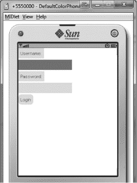

**图 8–1.** *WTK 模拟器上的欢迎屏幕——用户名输入框处于焦点状态。*

接下来，让我们看看用户成功登录后会发生什么。

### 实现 MainForm 和 MainScreenController

顾名思义，这两个类负责用户与应用程序主屏幕的交互。在此屏幕上，用户可以查看从服务器检索到的推文、请求新一批推文、发布自己的推文以及访问设置屏幕。

`MainForm` 的可视化结构和布局比 `WelcomeForm` 稍微复杂一些，如代码清单 8-7（高亮部分）所示。

**代码清单 8-7.** *`MainForm`*

`package app.views;`

`...`

`import com.apress.framework.objecttypes.Event;`

`public class MainForm extends GameCanvasView implements CallbackHandler`
`{`

`    VerticalContainer tweetsContainer = null;`

`    HorizontalContainer commandButtons = null;`
`    InputStringItem newTweet = null;`
`    SimpleTextButton nextTweets = null;`
`    SimpleTextButton showSettingsForm = null;`

`    public void addTweet(Tweet tweet)`
`    {`
`            String text = tweet.getAuthor() + " : " + tweet.getBody() ;`

`            StringItem item = new StringItem( text , tweetsContainer.getTotalWidth()`
`            - 20, 100, this, Defaults.THEME );`

`            tweetsContainer.addWidget(item);`
`            tweetsContainer.doLayout();`
`    }`

`    public MainForm(UITheme theme)`
`    {`
**`        super(false,theme);`**

**`        // 创建新推文输入项`**
**`        newTweet = new InputStringItem(Locale.get("tweets.new.prompt"),`**
**`        Locale.get("tweets.new.prompt"), Locale.get("text.general.ok"),`**
**`        Locale.get("text.general.cancel"),`**
**`                    getContentWidth()-10, 100, this, theme);`**

**`        // 创建用于显示推文的容器`**
**`        tweetsContainer = new VerticalContainer(theme);`**

**`        // 创建命令按钮`**
**`        nextTweets = new SimpleTextButton(Locale.get("tweets.next.label"), this,`**
**`        theme);`**
**`        showSettingsForm = new SimpleTextButton(`**
**`        Locale.get("settings.form.button.label"), this, theme);`**
**`        commandButtons = new HorizontalContainer(theme);`**
**`        commandButtons.addWidget(nextTweets);`**
**`        commandButtons.addWidget(showSettingsForm);`**

**`        // 将表单元素添加到表单`**
**`        addWidget(newTweet);`**
**`        addWidget(tweetsContainer);`**
**`        addWidget(commandButtons);`**

`        // 执行初始布局和焦点设置`
`        doLayout();`
`        onFocus();`
`    }`

`    public void doLayout()`
`    {`
**`        commandButtons.doLayout();`**
**`        tweetsContainer.setContentHeight(getTotalHeight() –`**
**`        commandButtons.getTotalHeight() - newTweet.getTotalHeight() - 20);`**
**`        tweetsContainer.setContentWidth(getTotalWidth());`**
**`        super.doLayout();`**
`    }`

`    public boolean doCallback(Event event)`
`    {`
`        if ( EVT.UI.BUTTON_PRESSED == event.getType() )`
`        {`
`            if ( nextTweets == event.getPayload() )`
`            {`
`                Event evt = new Event(EVT.CONTEXT.MAIN_FORM,`
`                EVT.TWEETS.REQUEST_MAIN_TWEETS_BATCH, null);`
`                Application.getMainEventController().queueEvent(evt);`
`                return true;`
`            }`
`            else`
`            if ( showSettingsForm == event.getPayload() )`
`            {`
`                Event evt = new Event(EVT.CONTEXT.MAIN_FORM,`
`                EVT.PROGRAM_FLOW.SHOW_SETTINGS_SCREEN, null);`
`                Application.getMainEventController().queueEvent(evt);`
`                return true;`
`            }`
`        }`
`        else if ( EVT.UI.TEXT_CHANGED == event.getType() )`
`        {`
`            // 使用 StringItem 文本创建新推文并发布`
`            Tweet tweet = new Tweet(null,newTweet.getText(),null);`
`            Event evt = new Event(EVT.CONTEXT.MAIN_FORM, EVT.TWEETS.POST_TWEET, tweet);`
`            Application.getMainEventController().queueEvent(evt);`

`            // 重置 StringItem 文本`
`            newTweet.setText(Locale.get("tweets.new.prompt"));`
`            return true;`
`        }`
`        return false;`
`    }`
`}`

该表单由三个区域组成。第一个区域是一个单独的按钮，即“新推文”按钮。第二个区域是一个垂直容器，用于显示从服务器检索到的推文。第三个区域是一个水平容器，包含“检索下一批推文”和“前往设置表单”按钮。由于用于显示推文的容器应占据屏幕的大部分空间（即其大小不固定，取决于屏幕分辨率），我们需要为 `MainForm` 自定义布局，这就是我们重写标准 `doLayout()` 方法的原因。

请注意，当按下“检索下一批推文”按钮时，会触发一个 `REQUEST_MAIN_TWEETS_BATCH` 事件，该事件由 `TweetsController` 处理。来自 `TweetsController` 的响应（以 `RECEIVED_TWEET` 事件的形式）由 `MainScreenController` 处理，如代码清单 8-8 所示。

**代码清单 8-8.** *`MainScreenController`*

`package app.controller;`

`...`

`public class MainScreenController implements Controller, EventListener {`

`    public static MainForm form = null;`
`    public static boolean firstTimeShow = true;`

`    public boolean handleEvent(Event event)`
`    {`
`        if ( EVT.PROGRAM_FLOW.SHOW_MAIN_SCREEN == event.getType() )`
`        {`
`          ...`
`        }`
`        else`
`        if ( EVT.TWEETS.RECEIVED_TWEET == event.getType() )`
`        {`
**`           Tweet tweet = (Tweet) event.getPayload();`**
**`           form.addTweet(tweet);`**
`        }        `
`        return false;`
`    }`
`}`

此清单清晰地展示了 UI 代码（表单类）与底层功能（控制器类）之间的分离：表单类仅负责 UI 的创建以及在 UI 元素交互时触发相应的事件，而控制器则处理实际的应用程序逻辑。以高亮代码为例，表单执行实际的小部件添加操作（通过 `MainForm` 类的 `addTweet()` 方法），但由控制器决定添加哪条推文。从这个角度来看，你可以将表单视为控制器的某种从属，或者作为用户与控制器之间的接口。

UI 与逻辑的不当分离可能是 Java ME 应用程序的一个主要问题。由于针对不同设备通常会导致不同的 UI（或至少是特定于设备的 UI 调整），将应用程序逻辑与 UI 逻辑合并可能会导致应用程序代码在一台设备上运行，而在另一台设备上无法运行，因为 UI 代码在后一台设备上遵循了不同的路径。

更糟糕的是，有时应用程序逻辑会错误地与 UI 属性绑定。例如，视口在许多应用程序中很常见，如电子表格或地图软件。根据关联容器的滚动位置来确定视口位置在某种程度上是有道理的，但这从根本上来说是错误的，因为你不是将视口绑定到某个应用程序内部变量（即计算出的视口位置），而是将其绑定到 UI 小部件的状态。这不仅可能导致代码和逻辑在 UI 与核心应用程序代码之间“渗透”，还可能将 UI 错误（例如，在 UI 库中）转变为应用程序错误。试想一下，如果某个错误导致滚动位置被错误报告——例如，在调整大小后或从横屏模式切换到竖屏模式后——会发生什么；视口位置也会因此受到影响。

通过将 UI 与应用程序逻辑完全分离，此类情况发生的概率大大降低：当 UI 出现异常时，视口位置仍保持不变（因为它是从应用程序内部变量获取的）。此外，在这种情况及其他许多场景中，这种分离使得滚动位置与实际视口位置之间的差异易于追溯为 UI 错误，因为我们知道视口位置始终在内部被正确计算，且不受 UI 大小调整或布局变化的影响。这大大缩短了修复 UI 错误本身所需的时间。

**注意：** 如果你还记得前面介绍的`WelcomeForm`，在该表单的`BUTTON_PRESSED`事件处理中（即 UI 层）存在一些凭据选择逻辑，根据前述内容，这些逻辑应移至`BEGIN_LOGIN`事件的处理方法中（即应用程序逻辑代码）。这是有意为之，因为目标是在登录按钮（属于`WelcomeForm`本地）触发登录过程时影响其行为和数据，而非影响由`BEGIN_LOGIN`事件（可来自任何来源）触发的登录过程的通用行为。

回到正题，主应用程序屏幕在 WTK 模拟器中的显示效果如图 8-2 所示。两张截图分别反映了选中“发布新推文”项（第一张截图）和选中一条推文（第二张截图）时的屏幕状态。注意，选中的推文会由`StringItem`类自动展开至完整长度。

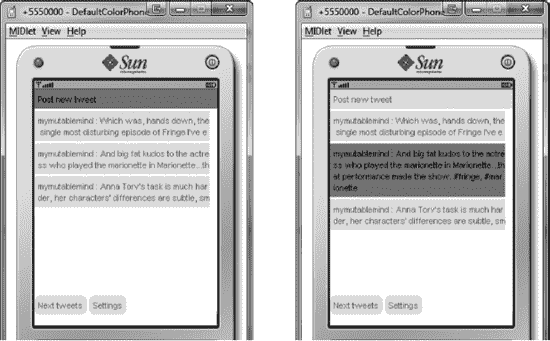

**图 8-2.** *主应用程序屏幕*

现在，让我们来看应用程序的最后一组表单-控制器对。

### 实现 SettingsScreenController 和 SettingsForm

这组表单-控制器对负责管理应用程序设置和偏好（例如用户区域设置），以及执行用户注销或退出应用程序等操作。

`SettingsForm`的代码见代码清单 8-9。

**代码清单 8-9.** *`SettingsForm`*

`package app.views;`

`...`

`public class SettingsForm extends GameCanvasView implements CallbackHandler`
`{`

`    SimpleTextButton switchToLanguage1 = null;`
`    SimpleTextButton switchToLanguage2 = null;`
`    SimpleTextButton goBack = null;`
`    SimpleTextButton exit = null;`
`    SimpleTextButton logout = null;`

`    public SettingsForm(UITheme theme)`
`    {`
`        super(false,theme);`

`        // 创建命令按钮`
`        switchToLanguage1 = new SimpleTextButton(Locale.get("text.general`
`        .language.1"), this, theme);`
`        switchToLanguage2 = new SimpleTextButton(Locale.get("text.general`
`        .language.2"), this, theme);`
`        goBack = new SimpleTextButton(Locale.get("text.general.goback"), this, theme);`
`        exit = new SimpleTextButton(Locale.get("text.general.exit"), this, theme);`
`        logout = new SimpleTextButton(Locale.get("text.general.logout"), this, theme);`

`        addWidget(switchToLanguage1);`
`        addWidget(switchToLanguage2);`
`        addWidget(goBack);`
`        addWidget(exit);`
`        addWidget(logout);`

`        // 执行初始布局和焦点设置`
`        doLayout();`
`        onFocus();`
`    }`

`    public boolean doCallback(Event event)`
`    {`
`        if ( EVT.UI.BUTTON_PRESSED == event.getType() )`
`        {`
`            if ( switchToLanguage1 == event.getPayload() )`
`            {`
`                Event evt = new Event(EVT.CONTEXT.SETTINGS_FORM,`
`                EVT.SETTINGS.CHANGE_LANGUAGE, "en-US");`
`                Application.getMainEventController().queueEvent(evt);`
`                return true;`
`            }`
`            else`
`            if ( switchToLanguage2 == event.getPayload() )`
`            {`
`                Event evt = new Event(EVT.CONTEXT.SETTINGS_FORM,`
`                EVT.SETTINGS.CHANGE_LANGUAGE, "weird");`
`                Application.getMainEventController().queueEvent(evt);`
`                return true;`
`            }`
`            else`
`            if ( goBack == event.getPayload() )`
`            {`
`                Event evt = new Event(EVT.CONTEXT.SETTINGS_FORM,`
`                EVT.PROGRAM_FLOW.SHOW_MAIN_SCREEN, null);`
`                Application.getMainEventController().queueEvent(evt);`
`                return true;`
`            }`
`            else`
`            if ( logout == event.getPayload() )`
`            {`
`                Event evt = new Event(EVT.CONTEXT.SETTINGS_FORM,`
`                EVT.PROGRAM_FLOW.INITIATE_LOGOUT, null);`
`                Application.getMainEventController().queueEvent(evt);`
`                return true;`
`            }`
`            else`
`            if ( exit == event.getPayload() )`
`            {`
`                Event evt = new Event(EVT.CONTEXT.SETTINGS_FORM,`
`                EVT.PROGRAM_FLOW.INITIATE_SHUTDOWN, null);`
`                Application.getMainEventController().queueEvent(evt);`
`                return true;`
`            }`
`        }`
`        return false;`
`    }`

`}`

代码及其结果都非常直观：你会得到一个包含两个“切换语言”按钮（一个用于 en-US 区域设置，一个用于“weird”区域设置）、一个“返回”按钮、一个用户注销按钮以及一个退出应用程序按钮的表单。

**注意：** 这里提到的“weird”区域设置/语言实际上是带有滑稽口音的英语（例如，用“Okay”代替“OK”），以便所有阅读本书并测试应用程序的人都能理解。两种区域设置的本地化文件均可在 Apress 网站本书页面获取。

`SettingsScreenController` 类同样非常直观，如代码清单 8–10 所示。

**代码清单 8–10.** *`SettingsScreenController` 类*

`package app.controller;`

`...`

`public class SettingsScreenController implements Controller, EventListener {`

`    ...`

`    public boolean handleEvent(Event event)`
`    {`
`        if ( EVT.PROGRAM_FLOW.SHOW_SETTINGS_SCREEN == event.getType() )`
`        {`
`            ...`
`        }`
`        else`
`        if ( EVT.SETTINGS.CHANGE_LANGUAGE == event.getType() )`
`        {`
`            String locale = (String) event.getPayload();`

`            ByteRecordWriter writer = new ByteRecordWriter();`
`            writer.writeString(locale);`
`            Defaults.persistenceHelper.store(Defaults.DEFAULT_LOCALE_RECORD_NAME,`
`            writer.getCurrentResult());`
`            Locale.loadFromFileBasedOnPreferences(locale, Defaults.DEFAULT_LOCALE);`
`            return true;`
`        }`
`        else`
`        if ( EVT.SETTINGS.CLEAR_LOGIN_DATA == event.getType() )`
`        {`
`            Defaults.persistenceHelper.delete(Defaults.DEFAULT_LOGIN_DATA_RECORD_NAME);`
`            return true;`
`        }`
`        else`
`        if ( EVT.PROGRAM_FLOW.INITIATE_LOGOUT == event.getType() )`
`        {`
`            Event evt = new Event(EVT.CONTEXT.SETTINGS_FORM,`
`            EVT.SETTINGS.CLEAR_LOGIN_DATA, null);`
`            Application.getMainEventController().queueEvent(evt);`

`            evt = new Event(EVT.CONTEXT.SETTINGS_FORM,`
`            EVT.PROGRAM_FLOW.INITIATE_SHUTDOWN, null);`
`            Application.getMainEventController().queueEvent(evt);`
`            return true;`
`        }`

`        return false;`
`    }`
`}`

至此，代码本身已经足够说明问题，因此我不再赘述。请查看图 8–3，了解设置屏幕在 WTK 模拟器上的显示效果。

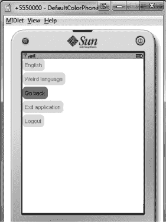

**图 8–3.** *WTK 模拟器上的设置屏幕*

我想指出的是，设置代码存在一个缺陷：更改语言/区域设置需要重启应用程序。这是因为应用程序的所有表单字段都是在表单的构造函数中创建的，而构造函数显然只会被调用一次。

要实现运行时的语言/区域设置更改，需要一个 `buildFormStructure()` 方法，该方法能在需要时重建表单，并且可以按需调用。或者，也可以实现一个 `reloadLanguage()` 方法，该方法在被调用时，会为表单内所有控件设置相应的文本/标题。

然而，在当前应用程序代码中实现这两种方法中的任何一种，都需要对应用程序和 UI 框架结构进行重大修改。例如，重建表单会对用户体验产生严重影响（比如，当前焦点元素的信息会丢失，滚动偏移量以及可能其他与 UI 状态相关的重要信息也会丢失），而更改控件上的文本则需要 UI 框架的支持，并且如果新文本溢出或明显小于原始文本，还可能导致当前表单的完全重新布局。出于这个原因，以及为了代码的清晰和简洁，这些功能已从当前代码库中省略，并留给读者作为练习。

为了完成我们应用程序的代码，我想介绍一下 `EVT` 类。

### 实现 EVT 类

当你想要熟悉一个新项目时，`EVT` 类可能是你首先应该查看的地方。它基本上充当了应用程序中所有可能发生事件的中央仓库，让你能够快速了解应用程序应该如何运行以及其关键流程是什么，同时它也为分支探索和浏览源代码树提供了一个绝佳的中心点。你只需沿着“事件轨迹”追踪，迟早会找到调试那个奇怪 bug 所需的代码部分，或者理解某个方法被使用的原因和位置。

以我们的 Twitter 客户端为例，`EVT` 类如代码清单 8–11 所示。

**代码清单 8–11.** *`EVT` 类*

`package com.apress.framework.objecttypes;`

`public class EVT`
`{`
`    public class CONTEXT`
`    {`
`        public static final int STARTUP = 1;`
`        public static final int LOGIN_FORM = 2;`
`        public static final int NETWORKING_MODULE = 3;`
`        public static final int UI_MODULE = 4;`
`        public static final int MAIN_FORM = 5;`
`        public static final int SETTINGS_FORM = 6;`
`    }`

`    public class PROGRAM_FLOW`
`    {`
`        public static final int SHOW_WELCOME_SCREEN = 10001;`
`        public static final int SHOW_MAIN_SCREEN = 10002;`
`        public static final int SHOW_SETTINGS_SCREEN = 10003;`
`        public static final int APPLICATION_START = 10004;`
`        public static final int APPLICATION_PREPARE_SHUTDOWN = 10005;`
`        public static final int APPLICATION_EXIT = 10006;`
`        public static final int INITIATE_SHUTDOWN = 10007;`
`        public static final int INITIATE_LOGOUT = 10008;`
`    }`

`    public class TWEETS`
`    {`
`        public static final int REQUEST_MAIN_TWEETS_BATCH = 20001;`
`        public static final int RECEIVED_TWEET = 20002;`
`        public static final int POST_TWEET = 20003;`
`    }`

`    public class NETWORK`
`    {`
`        public static final int BEGIN_LOGIN=30001;`
`        public static final int LOGIN_FAILED=30002;`
`        public static final int LOGIN_SUCCEEDED=30003;`
`    }`

`    public class UI`
`    {`
`        public static final int BUTTON_PRESSED=40001;`
`        public static final int TEXT_CHANGED=40002;`
`    }`

`    public class SETTINGS`
`    {`
`        public static final int CHANGE_LANGUAGE = 50001;`
`        public static final int CLEAR_LOGIN_DATA = 50002;`
`    }`
`}`

请注意命名约定。上下文（Context）从 1 开始连续编号，而单个事件则使用 `XYYYY` 编号约定，其中 `X` 对于应用程序的每个上下文/区域是唯一的（并从 1 开始连续取值），而 `YYYY` 是在 `X` 范围内唯一的事件编号（同样连续取值）。这种命名方案确保了可读性，有助于调试（一段时间后，你几乎会开始记住 `2YYYY` 是与推文相关的事件），并且最重要的是，防止了不同事件获得相同事件编号的冲突。

现在我们的 Twitter 客户端已经可以运行了，让我们看看如何进一步改进它。

### 改进应用程序

我们编写的 Twitter 客户端可以工作，其底层基础也很扎实，但应用程序本身目前还相当简陋。要将其扩展为一个功能完备、完整的应用程序，需要大量的时间、精力和篇幅，而对于任何不打算做一个功能齐全的 Twitter 客户端的人来说，收益甚微。因此，虽然我们不会深入探讨这个过程，但我们可以并且将会看看实现这一目标所需的一些步骤。

#### 改进错误处理

目前，我们应用程序中的错误处理非常薄弱。为了达到“完成”状态，这一点需要改进。改进错误处理应从每个模块（网络、用户界面、本地化、持久化等）的核心开始，在这些模块中，原生 API 调用与项目特定或框架特定的代码混合在一起，并且应持续进行，直到处理高层错误（例如，界面中的控件聚焦错误）。

理论上，每个函数（尤其是原生函数）的返回值都应检查是否失败并进行相应处理，并且在给定场景中可能抛出的每一种异常类型都应被捕获并单独处理（即，代码不应依赖 `catch (Exception ex)` 作为包罗万象的通用安全网）。因此，当出现故障时，我们不仅要知道“它失败了”，还应该在运行时确切知道失败的地点和原因，并尽可能从中恢复。

实际上，Java ME 设备通常没有足够的资源来实现这一点。捕获每一种错误类型并检查每一个返回值将严重消耗 CPU 和 RAM 资源，同时也会显著增加代码库。如果这些检查恰好发生在频繁执行的代码块中，应用程序的性能将受到严重影响。幸运的是，有几种方法可以绕过这个问题。

首先，开发人员必须了解 80-20 法则，在错误处理方面，这意味着所有*可能*产生错误的场景或代码块中的 20% 导致了 80% 的*实际发生*的错误。如果你能识别出这 20% 是什么以及在哪里，并妥善处理它们，那么对于剩余 80% 的可能产生错误的场景和代码，你通常只需进行最低限度的错误处理即可。

根据我的经验，最常见的错误来源如下：

*   外部操作，例如 IO 访问和访问设备上的用户数据
*   为大数据块分配内存（我还没见过因为分配单个 `int` 或 `String` 而导致的 `OutOfMemory` 异常）
*   线程/并发问题，通常是由于尝试使用或访问一个尚未准备好使用或已被其他线程占用的资源（无论是外部还是内部）引起的
*   无效或不一致的输入数据（例如，损坏的 HTML 代码、使用与预期不同的算法压缩的数据等）

其次，还有一个经常被忽视或未被正确理解的概念：*错误预防*。如果采用了适当的检查，大多数错误是可以避免的。例如，与其尝试将 `InputStream` 绑定到 `DataInputStream`，从 `DataInputStream` 读取并捕获 `IOException`，不如确保 `InputStream` 不为 `null` 并且可以安全读取。你还应该验证关键数据和参数，以确保它们不会破坏你的代码。确保你拥有关于运行时环境（可用内存、运行线程数、正在使用的网络连接数等）的准确信息，并使你的代码能够适应这些参数的关键变化，在某些场景下同样重要。了解你的代码所运行设备的特性是无价的：如果你知道某个原生函数在你运行的设备上行为异常，就调整你的代码来弥补（更多内容见下一章）。

归根结底，与其试图处理错误，不如始终首先尝试预防错误的发生。当然，你无法控制因网络（或其他类似场景）而发生的 IO 错误，但你遇到的大多数错误都可以通过代码以某种方式预防——尤其是当这些错误也是由你的代码产生时。错误预防相对于错误处理的优势应该是显而易见的：你的应用程序变得更加健壮，并且处理潜在敏感情况也变得更加容易，因为你提前意识到了它们。

第三点也是最后一点建议是：尝试向上传递错误并集中处理错误。如果本地网络访问操作失败，尽快且高效地在本地进行清理，然后触发一个带有适当负载的 `NETWORK_FAILURE` 事件。在一个专用的错误处理控制器中处理此事件，并在那里完成大部分错误处理工作（通知用户、停止相关线程/操作等）。由于许多错误以相似甚至相同的方式处理，拥有一个集中的错误处理中心是合理的，它还能提高代码的可读性、灵活性和代码库的规模。

#### 增加功能

我们目前的应用程序只提供基本的 Twitter 功能——对于一个专业版应用来说，这还不够。添加功能应该很容易，因为构建模块都已就绪。一些可能不错且实现起来也很有趣的功能如下：

*   查看你的好友及其推文的功能
*   定期自动更新推文列表（例如，每五分钟一次）
*   每条推文的更多信息（位置、时间戳等）
*   头像图片以及每位好友的更多信息（头像、位置、简介等）
*   通过外部服务支持 URL 缩短（这个可能稍微难一点）
*   更多上下文选项——例如，激活一条推文时，应出现一个包含“回复”、“转推”和“该用户的更多推文”等选项的菜单。

#### 改进 UI 框架

UI 框架可能是任何 Java ME 应用程序最重要的部分之一，在我们的案例中，它功能可用但非常简陋。当然，你可以将应用程序切换到一个更完整的 UI 框架，或者尝试改进现有的框架（我推荐后者，纯粹是为了学习经验）。你可以尝试实现的一些功能如下：

*   更多控件——下拉框、上下文菜单和图片控件都是很好的候选。
*   支持惯性滚动以及可能的触摸手势
*   自定义字体和文本输入功能，以取代原生功能（不同设备间不一致）——本书后面会详细介绍。
*   更多布局容器和选项（例如内边距、外边距、前导等）
*   更高的灵活性（运行时更改控件文本、内置表单重新布局支持等）

### 总结

在本章中，我们将迄今为止编写的所有模块整合在一起。我们创建了一个功能可用（尽管功能并非完全完备）的 Twitter 客户端。我们探讨了如何将应用程序分离为 UI 相关代码（表单）和业务相关代码（控制器），事件如何用于形成从启动到关闭的完整应用程序流程，如何利用事件桥接前端 UI 和后端应用程序代码之间的鸿沟，如何在真实场景中实现自动登录和本地化等功能，以及更多内容。我们还探讨了可以采取哪些措施来进一步改进应用程序。为此，我们向读者提供了一份“待办”练习清单。

## 第 9 章

## 设备碎片化

设备碎片化是 Java ME 领域一个由来已久的问题。它主要源于两个因素。首先，Java ME 仅仅是一套规范和 API，供应商可以自由地在他们的 JVM 中实现这些规范。然而，并非所有供应商对规范的解释都完全相同，这可能导致不同 JVM 的行为存在差异。这些差异通常很小，或者只出现在极端情况下，但它们确实存在，并且可能给开发者带来巨大的痛苦。

设备碎片化的第二个原因是，目前市面上实际使用的 Java ME 手机型号实在太多。Java ME 设备覆盖了从极其廉价但低端的设备（采用 CLDC 1.0、MIDP 1.0，且无额外 API——在印度和亚洲相当流行）到昂贵但高端的设备（例如塞班设备——它们通常实现了最新的 Java ME JSR）的所有价格区间。

此外，Java ME 设备的使用寿命往往比 iPhone 等设备更长，这意味着你仍然会发现 4-5 年前的设备在现实世界中相当流行，尤其是如果这些设备在发布时属于高端机型。这带来的一个后果是，你可能会发现一些硬件性能强大但不支持某些 API 的老旧 Java ME 设备，而这些 API 反而是更新但性能较弱的设备所支持的。

在处理任何类型的设备碎片化问题时，首要目标是让你的应用程序能够基于单一代码库支持尽可能多的不同设备（即，编写代码使其能在尽可能多的设备上良好运行）。

对于复杂的应用程序来说，很有可能，即使你尽了最大努力，仍然需要为每个目标设备或设备类别构建定制版本，每个版本都需要针对其目标设备的特定硬件、功能和 API 进行调整。

这样做有可能在每台设备上提供最佳体验，但这会使你的开发成本飙升。因此，只有在别无选择，或者你的开发预算非常充裕时，才应考虑此方案。一个折中的方案（在大多数情况下是理想的）是使用移植框架来自动完成适配工作。这能提供手动为每个目标设备构建定制版本的大部分性能（我认为能达到 95%），但所需花费的资金和开发时间却少得多。移植框架将在本章后面介绍。

尽管如此，即使有了定制构建和移植框架，Java ME 的碎片化仍然是一个相当棘手的问题。要解决它，我们首先需要将其分类，分解成若干子问题。因此，我们可以将设备碎片化视为包含三个主要子部分：

*   **硬件碎片化**：硬件规格（CPU、RAM、屏幕尺寸、触摸与非触摸等）的差异意味着你必须调整你的应用程序，使其能在截然不同的环境中运行。
*   **功能碎片化**：并非所有设备都支持相同的 API 或提供你所需的所有功能（例如，蓝牙文件传输、地理定位、PIM 访问等）。
*   **API 碎片化**：相同的 API 在不同设备上可能表现不同。当这种情况发生时，差异通常很小且微妙，但可能会给开发者带来很多问题。

在理想情况下（如果存在的话），你只会处理一种类型的碎片化，但在现实世界中，通常你必须同时应对所有三种类型。此外，你面临的一些问题可能属于多个类别。

**注意：** 现实中存在大量具体的碎片化问题，而且每天都会出现新的问题。要涵盖所有这些问题，需要的不是一本书，而是好几本书。此外，其中许多问题及其相关解决方案都具有高度的场景特异性。因此，在本章中，我们只提供关于设备碎片化的一般性建议。

### 硬件碎片化

本节将向你展示如何让你的应用程序在具有不同硬件规格的设备上运行。

#### CPU 性能

与桌面世界的情况一样，CPU 性能仍然是影响设备性能的主要因素。在理想情况下，你所有的目标设备都有充足的性能，你可以直接编写代码，而无需考虑消耗的 CPU 周期。

然而，现实情况很少如此。即使设备足够快，让 CPU 以 100% 的负载运行也会显著降低电池寿命，因此这并非一个真正的选择。此外，你需要支持的大多数设备的 CPU 频率在 100-300 MHz 范围内，这与现代智能手机通常从 600 MHz 起步相比相形见绌。

**提示：** 尽早识别潜在 CPU 碎片化问题的一个好方法是，将你正在使用的模拟器性能限制在目标真实设备性能的约 80%。这意味着，即使在将应用程序运行到真实设备上之前，你也能发现这方面的问题。

处理 CPU 碎片化最显而易见的方法是优化你的代码，使其性能达到可接受的水平，即使在低端设备上也是如此。这将在另一章中介绍。尽管如此，在某些情况下，这根本无法做到（要么是因为所使用的算法本身不允许，要么是因为设备性能确实不够强大）。当这种情况发生时，你可以尝试一些技巧。

你应该尝试的第一件事是平滑 CPU 使用率曲线。在典型的使用场景中，CPU 在 80% 的时间里处于空闲或接近空闲状态（例如，当用户未与应用程序交互或仅在菜单中导航时），而在剩余的 20% 时间里则全速运行（这时 CPU 碎片化问题就变得明显了）。你可以做的是，利用那段接近空闲的时间，为即将到来的 CPU 密集型任务做好准备。

例如，你可以让一个后台线程预处理数据，为应用程序将要进行的实际处理做好准备。如果你正在编写一个类似黄页的应用程序，需要聚合来自不同来源的联系人，你可以让后台线程在用户浏览菜单时对聚合后的联系人列表进行排序。这样，当用户实际使用搜索功能时，列表已经排序完毕，应用程序的响应会非常迅速——从而消除了 CPU 碎片化问题。

**提示：** 在进行后台预处理时，注意不要占用过多的 CPU 时间，否则就失去了意义。确保预处理保持在后台运行的一个简单方法是，将你要处理的数据分割成更小的数据包（如第 1 章所述），并安排在 CPU 使用率低于某个阈值时处理这些数据包。

你应该尝试的第二件事是，当 CPU 使用率接近 100% 时，降低所有不必要的 CPU 使用。例如，如果你的应用程序 UI 以 30 FPS 运行，可以考虑在 CPU 密集型情况下将其降至 20 FPS，或者暂时禁用一些花哨的视觉效果。如果你的应用程序设计为尽可能快地执行大量计算（例如，电子表格程序），你可以对此进行节流（例如，每秒计算不超过 X 个单元格）。

一个很少被考虑的 CPU 使用来源是垃圾回收器。通过改进你创建、使用和销毁对象的方式，在某些情况下可以显著降低 CPU 使用率。例如，你可以创建一个对象池并重复使用这些对象，而不是每次都创建新对象。关于垃圾回收器以及如何在这方面提高性能的更多信息将在下一章中给出。

如果此时你仍然遇到性能问题，你应该花些时间生成一份设备虚拟机（VM）配置文件，以便更深入地了解该设备在虚拟机相关操作方面的行为。这份配置文件应包含与设备虚拟机工作原理及其内部机制如何影响 CPU 使用率和性能相关的有用信息。例如：在启动多少个线程后，线程切换的开销会变得明显？同步代码比非同步代码慢多少？虚拟机清理 100 个对象需要多长时间？清理 10,000 个对象呢？如果这些对象是相互关联的，情况又如何？对象的大小和类型是否重要？对象的分配与创建——这一过程需要多长时间？对象是原生类型（如图像）还是应用自定义类型，这有影响吗？

**注意：** 你必须通过编写一个或多个示例应用程序来测试你感兴趣的每个方面，从而生成这份配置文件。据我所知，目前还没有现成的应用程序能做到这一点。而且，考虑到这些测试中有许多具有高度的经验性，短期内也不太可能出现这样的工具。

一旦你尽可能多地获取了关于该设备的信息，就可以利用这些信息来调整和优化你的应用程序，使其适应你遇到问题的特定设备。如果你使用了过多线程，可以考虑将相关任务合并到单个线程中。如果那个同步代码段运行得慢如蜗牛，可以尝试重新设计程序流程，使得不再需要`synchronized`指令（即使这需要一些“黑客手段”）。如果清理 1000 个交叉关联的对象比清理 1000 个独立对象慢得多，可以在垃圾回收器被调用之前手动解除它们之间的关联。

请注意，这种“分析并适配”的过程与优化代码本身完全不同。代码优化依赖于数学和具体数据，这些数据通常适用于所有设备（例如，加法总是比乘法快，快速排序比冒泡排序快等），而刚才描述的那种优化则更具经验性，依赖于实践经验和特定设备的知识。在一个设备上效果很好的优化，在另一个设备上可能毫无影响，甚至可能让情况变得更糟。与其说这是编程，不如说这更像是一种“巫术”。有时你会为此花费大量时间却一无所获，而有时你则能早早挖到“金矿”——这种结果的不确定性正是你应该最后才尝试这种方法的原因。无论如何，这种技术的好处在于，你会对你所分析的设备获得更深入、更直观的理解，这不仅有助于提升性能，还能帮助识别错误和其他应用程序问题。而且，每个设备你只需要做一次这样的分析，因为获得的知识可以应用到其他项目中。

同时请记住，这些“设备适配”有时可能需要你撤销最初所做的一些性能优化。例如，优化算法和代码通常会导致代码体积增大。然而，在某些设备上，如果方法体过大，性能会显著下降，因为 JVM 和/或 CPU 不得不在不同的代码段之间“跳转”。在这种情况下，你必须要么将方法拆分成两个或多个更小的方法，并承受由此带来的开销，要么（通过放弃部分优化来）减小方法体积。虽然理论上这两种选择都比优化后的代码慢，但在实际应用中，由于 JVM 的工作方式，它们反而会更快。

最后，你应该意识到一个事实：有时设备会降低 CPU 频率以节省电池电量。当电池电量低于某个水平时，设备会自动执行此操作，并且通常无法阻止这种情况发生。这意味着你的应用程序在这些情况下可能（而且很可能）会表现不佳。

通过应用本节中介绍的技巧和方法，你将能够缓解这种可感知的性能下降。或者，你可以将应用程序设计为在正常情况下仅使用总 CPU 能力的约 50-60%来运行。这样，当降频发生时，应用程序仍然有足够的 CPU 周期来正常运行。一个明显的缺点是，总 CPU 能力的 50%可能无法满足你应用程序的需求。

#### 内存

可用内存的大小很可能是导致硬件碎片化的第二大原因，仅次于 CPU 性能。可用内存较少会以多种方式引发问题。最明显的问题是在运行时可能直接耗尽内存。其他潜在问题包括：垃圾回收器过于频繁地启动（因为内存消耗更快）、流媒体因持续卡顿和缓冲而中断（因为分配的缓冲区更小），以及设备整体性能变慢（即使在应用程序之外也是如此）。

问题在于，虽然一些高端设备允许 Java ME 应用程序使用数十兆字节的内存，但低端设备通常只提供 1-2 兆字节，有时甚至更少。为了应对这种差异，你应该在内存方面以防御性方式设计和编码应用程序，并实现一些“安全特性”。

你可能要做的第一件事是检查数据结构，看看是否有任何信息被重复存储。所有适用于数据库规范化的原则在这里也同样适用；然而，需要记住的一条原则是：应用程序中的每一条信息（例如，一个人的姓名或地址）在数据结构中应该只出现一次。如果它出现多次，那么你应该重构数据结构，让该信息只存在于一个数据结构中，而所有其他出现或引用都指向这个数据结构。

将此原则全局应用于应用程序中的所有数据结构，可以显著增加可用内存，尤其是在通常数据密集型的业务相关应用程序中。请记住，通常不可能移除所有重复信息。例如，你可能因为无法访问类的受保护/私有字段（这些字段有时用于保存数据的本地副本，而非引用）、因为第三方库的内部实现通常不可触及，或者因为你在无法动态计算这些表示形式的情况下，可能需要同一数据的不同表示或编码，而残留一些重复信息。根据我的经验，根据应用程序的不同，你通常可以消除 30%到 70%的重复信息——这仍然可以节省大量内存。

如果上述技术没有产生理想的结果，那么接下来你应该尝试最小化存储在内存中的信息量。检查你不使用的数据字段并直接删除它们。移除那些可以在运行时轻松计算的信息（例如，如果你有某人的出生日期，就不需要单独记录他的星座、年龄或其他相关信息）。尝试为你的数据寻找更节省空间的替代编码方式（例如，使用 JSON 代替 XML，并使用数据压缩技术存储长字符串）。在数据不再需要时立即丢弃（例如，一旦将对象的 JSON 表示转换为实际对象，就立即丢弃 JSON 字符串及其所有相关内容）。

如果在此之后，你仍然内存不足，那么你应该尝试寻找替代的存储空间。例如，可以使用 RMS 或设备的文件系统作为一种交换文件，来存储那些内存已不足以容纳的对象。通常，设备上（通过 RMS 和文件系统）可用的存储空间比 RAM 多得多，因此如果你处理大量数据，这当然是有意义的。不过要小心：存储在 RMS 或文件系统中的数据可能被其他未经授权的应用程序或用户访问，因此不要在那里存储敏感或个人数据。

如果你决定使用替代存储空间，请记住，其读写速度可能比内存操作的读写速度慢一到两个数量级。因此，你应该维护一个包含替代存储中信息内容的索引，并且该索引应包含最常用于搜索操作的字段的值。此外，这个索引应该易于搜索，所以如果可能，你实际上应该拥有多个索引，每个常用字段一个。

例如，考虑一个处理大量人员记录的应用程序，每条记录包含一个人的名字、姓氏、位置、年龄、性别以及其他信息，如备注、文档等。在这个应用程序中，最常用的搜索条件是人的姓名和/或位置。理想情况下，在这种情况下你应该有两个索引。第一个索引将包含每个人的姓名以及指向替代存储中完整记录的引用（例如，可能是 RMS 记录索引），并根据姓名字段进行排序。第二个索引类似，只是姓名字段将被位置字段替换。接下来，当查找位于“亚利桑那州”且姓氏为“Atkinson”的人时，应用程序只需进行两次二分查找，每个字段一次，然后交叉引用结果。如果操作得当，这个过程可以非常快。此外，只需一次二分查找操作就可以完成这个特定的搜索，这进一步加快了速度。优化搜索将在下一章讨论。

如果执行了上述所有操作后，你仍然内存不足，那么是时候采取严厉措施了。如果你正在编写一个客户端-服务器应用程序，那么考虑将一些通常在客户端执行的操作（如搜索）卸载到服务器上。对于这些操作，客户端应用程序基本上变成了服务器上运行代码的哑终端。这可以显著减少设备上的 CPU 和内存使用，代价是服务器 CPU 和内存使用以及网络流量的增加。这种方法的主要问题是网络流量的增加，这通常意味着用户使用应用程序的总成本上升，有时甚至显著上升。

**注意：** 在客户端-服务器场景中，有时内存短缺问题的发生是因为没有针对移动设备设计的 API/协议。例如，如果一个 Web 服务请求返回 512 KB 的响应，在桌面上处理该响应是可以的，但如果移动设备必须接收并处理一个 512 KB 的 XML 字符串，那么你就麻烦了。考虑实现一个专用的移动 API/协议，它返回更少的数据（例如，只返回记录的基本字段；检索其余字段可以通过单独的请求完成），并使用更高效的编码（我是不是提过 XML 并不真正适合移动通信？）。

如果你正在编写一个独立应用程序而不是客户端-服务器应用程序，那么此时你基本上就无能为力了。现实情况是，至少存在一种场景，你的应用程序无论如何都会耗尽内存。此时你唯一能做的合理事情是：要么将有问题的设备移至“不支持”状态，要么发布免责声明说明应用程序在某些场景下可能耗尽内存，如果问题设备支持多任务处理，则指示用户关闭所有其他正在运行的应用程序，最后重新调整规格以降低内存使用量（这通常涉及削减或完全移除某些功能）。这些选项没有一个特别有吸引力，但现实就是如此。

与 RAM 碎片问题相关的最后一个方面是访问时间。如今这几乎是一个没有实际意义的问题，但你应该知道，不同设备的 RAM 访问时间因多种原因而异，从硬件设计（例如，内存分页方案和页面大小）到虚拟机行为（例如，数组的范围检查）。与其他因素（RAM 大小、CPU 性能）相比，RAM 访问时间通常不那么重要，但你可能会遇到一些特殊情况，其中它确实很重要。如果发生这种情况，你将在下一章中找到一些技巧，帮助你将其影响降至最低。

#### 屏幕

在 CPU 和 RAM 之后，移动设备之间最大的区别在于屏幕。需要考虑的主要参数是屏幕分辨率和物理尺寸。构建适合目标设备的高质量移动界面主要是一项设计任务，因此本节将简要介绍。

最重要的事情是选择一个支持动态布局的 UI 框架/库，即布局可以自动调整大小以适应任何给定的屏幕尺寸和方向。这最大限度地减少了支持所有目标设备所需的设计和编程工作量。

其次，你应该基于最低配置的通用标准来创建基本的设计指南和布局。也就是说，你的参考 UI 在你将支持的最低端设备上应该看起来不错。然后，这个参考 UI 将针对高端设备进行调整，以利用其优越的屏幕特性，而不是反过来（即，UI 首先为高端设备设计，然后精简以在低端设备上运行）。

第三，你应该始终隐藏不需要的信息和 UI 元素，并尽可能减少浪费的空间。例如，滚动条仅在实际滚动时才需要。如果你在所有其他情况下隐藏它们，可以节省几个像素，同时使设计感觉不那么杂乱。任何类型的新通知都可以通过屏幕两个软键按钮之间的一个小图标来指示（它们之间通常有足够的空间来容纳一个小图标；否则这个空间会被浪费）。滚动条和标签页是最大化屏幕空间的绝佳方式——明智地使用它们，但注意不要过度使用。

第四，所有应用程序功能都应可通过触摸和按键输入访问。随着触摸屏设备的普及，这一点变得越来越重要。我见过的混合模式应用程序中可能最大的问题是 UI 元素太小，无法通过触摸使用，尤其是在没有触控笔的情况下。因此，考虑在设置屏幕中添加一个“大 UI”选项。此外，特别是对于较小的 UI 元素，考虑为触摸事件添加一个小的误差容限。例如，如果用户在复选框外十个像素处按下屏幕，并且那里没有其他 UI 元素，那么可以安全地认为他打算按下该复选框。对于用户来说，没有什么比必须用手指精确地按下屏幕上一个非常小的区域更令人沮丧的了，尤其是当这根手指比平均尺寸大时。

这里要考虑的另一个重要方面是文本输入。这可以在应用程序内部处理，也可以委托给系统（即，当用户点击文本字段时显示一个原生的 `TextBox`）。原生处理它的优点是支持用户习惯的文本输入方法，以及自动完成等功能，但它也有一个主要缺点，即中断程序流程，因为在应用程序使用过程中显示一个原生的 `TextBox` 至少可以说是具有破坏性的。通过自定义虚拟键盘在应用程序内处理文本输入破坏性要小得多，但如果键盘设计不当（例如，按键太小或间距太大）或位置不当（即，它重叠并隐藏了其他 UI 元素，而不是将其移开），可能会让一些用户感到沮丧。此外，这也意味着自动完成等功能不可用。

选择哪种方法在很大程度上取决于应用程序的具体需求。对于输入短文本，例如用户名、密码或搜索条件，虚拟键盘方法无疑是最好的。对于输入大量文本，例如电子邮件，原生文本输入机制总体上更好。你还应该永远不要混合使用这两种输入方法，因为这对大多数用户来说非常令人困惑。

应用程序还应支持针对常见使用场景的触摸特定扩展。例如，用户应该能够通过拖动滚动条以及轻拂需要滚动的内容（即，惯性滚动）来滚动。在适用的情况下，水平滑动事件也应被注册为后退/前进命令。长按应调出所选项目的上下文菜单（如果有）。这些精细的触感极大地增强了用户体验，并弥合了原生应用程序和 Java ME 应用程序之间的差距。

你应该考虑的最后一个方面是屏幕的颜色数量。虽然支持 65,536 种颜色的屏幕和支持 1600 万种颜色的屏幕之间存在差异，但在实践中并不那么明显。然而，65,536 种颜色与 4,096 种或更少颜色之间的差异是巨大的。如果你必须同时针对这两类设备，你可能需要为每类设备准备单独的图形，并针对其各自的颜色数量进行优化。

#### 其他硬件考量

还有其他与硬件相关的因素会导致设备之间存在差异。例如，由于各种原因，不同设备以及不同场景下的网络速度差异巨大。由于这完全不在你的控制范围内，你无法真正解决网络相关的问题——但你可以尝试缓解它们。

例如，你应该让应用程序定期测量网络吞吐量，并在传输速度低于最低可接受值时通知用户。你还应通过压缩数据以及使用适合移动设备的编码方案（如 JSON 或 Hessian 等二进制协议）来最小化传输的数据量。最后，设计你的服务器 API/协议，使其仅返回响应请求所需的最少信息；只有在需要时，才通过后续请求获取更多信息。

还有其他技巧可以用来改善用户体验。设计你的通信协议，使其无需等待整个响应接收完毕，即可在数据仍在传入时开始解析。通过将多个请求合并为一个更大的请求来减少请求次数，并在服务器端对响应也做同样处理。在合并请求和/或响应时，确保最小的部分排在前面，以便尽快开始处理。尝试以设备能直接理解的格式发送数据（例如，不要以 ASCII 字符串形式发送，而应使用与 `readUTF()` 兼容的字节数组）。最后，尽可能在后台并提前传输数据。

这些对于所有移动平台都是很好的建议，但对于 Java ME 来说，效果会加倍，因为 Java ME 设备上的网络传输速度通常至少部分受限于可用的 CPU 性能。上述所有技巧不仅最小化了传输的数据量，而且往往有助于改善与网络相关的 CPU 使用率。

RMS 或文件系统上的存储空间在不同设备之间也可能差异很大。如果你的应用程序只存储用户偏好设置以及可能的一些东西（如用户名和密码），这通常不是问题。但是，如果你的应用程序存储大量数据，例如一组完整的记录，或者从服务器接收的文档或图像，那么你可能会遇到问题。提前研究一下你的每个目标设备在这方面的情况。例如，有些设备将你的 RMS 记录存储大小限制为固定值，而其他设备则允许你为 RMS 使用全部可用设备存储空间——在处理存储密集型应用程序时，这是你需要了解的信息。

关于设备上任何类型的存储，另一个值得关注的问题是安全性。人们通常认为文件系统不安全，而 RMS 相当安全。但情况未必如此，因为 RMS 可能很容易被侵入。例如，有些设备使用文件系统上的一个文件来持久化 RMS，这使得这些设备上的 RMS 与普通文件一样不安全——不过，公平地说，我个人只在少数廉价的无名设备上见过这种情况。即使不是这样，RMS 仍然会持久化到某种闪存芯片上，因此理论上可以物理移除该芯片并读取其内容。有些设备甚至可能对你保存到 RMS 的数据进行加密（默认情况下或向用户提供此选项），但市面上 99% 的 Java ME 设备都不具备此功能。因此，为了确保安全，你应该始终自行加密极其敏感的数据。

电池续航是另一个需要考虑的问题，特别是对于设计为长时间运行的应用程序（例如即时通讯客户端）。限制网络和 CPU 使用对延长电池续航非常有效，但还有其他技巧可以尝试。例如，屏幕消耗大量电量，因此你可能需要考虑使用特定于厂商的 API 来调暗屏幕亮度。就像笔记本电脑一样，即使稍微调暗屏幕，也能显著延长电池续航。不使用声音或振动也有助于延长电池续航。优化代码也能延长电池续航，因为 CPU 运行你的应用程序所需的周期更少。在空闲时刻正确使用 `sleep()` 和 `wait()`/`notify()` 方法也能显著延长电池续航，因为这允许 CPU 进入省电模式。

最后但同样重要的是，不同设备的用户输入能力差异很大。例如，有些设备无法同时注册多个按键，因此在视频游戏中尝试同时向上和向左移动在这些设备上无法实现。廉价的触摸屏设备通常精度较差和/或缺少触控笔，因此也无法在其上进行精确的触摸输入。由于这些问题会极大地影响用户体验，你在设计用户界面时必须将它们考虑在内。

### 功能碎片化

设备不仅在硬件上存在差异，在功能方面也各不相同。有些 API 和 JSR 相当主流（例如用于 PIM 和文件系统访问的 JSR 75），而另一些则仅在相对较少的设备上得到支持（例如位置 API）。此外，即使两台设备支持相同的功能，它们支持的程度也可能不同。

这方面最好的例子就是多媒体 API（MMAPI）。大多数现代手机都支持 MMAPI，但支持的程度却千差万别。例如，两款配备相同摄像头的设备，在拍摄图像或视频时支持的最大分辨率可能不同。媒体播放也是如此：高端设备支持所有常见的媒体类型，而低端设备往往只支持基本类型，通常意味着 `.wav` 音频文件和可能支持的 `.3gp` 视频。

处理功能碎片化是一件复杂的事情，因为问题很容易发现，根本原因也容易确定，但解决方案通常涉及某种妥协。继续上面的 MMAPI 例子，如果拍摄的图像分辨率低于应用程序的需求，可以通过软件将图像放大以满足最低要求，但这会以牺牲 CPU 使用率和图像质量为代价。

与硬件碎片化问题不同，你甚至可以在开始实际应用程序开发之前，就着手处理与功能相关的碎片化问题。第一步是列出你的应用程序所需的所有 JSR 和 API，并研究你的目标设备支持哪些以及支持到什么程度。如果幸运的话，你的所有目标设备都支持你所需的所有功能，那么这里就无需进一步操作了。

如果不幸你的目标设备不支持某些功能，那么下一步就是看看是否可以通过某种方式模拟这些功能。例如，并非所有设备都支持位置 API（事实上，大多数 Java ME 设备都不支持）。但是，可以询问用户当前的位置，然后像处理来自位置 API 本身的数据一样处理这些数据。如果不支持 MMAPI，但支持允许文件系统访问的 JSR 75，那么用户可以从应用程序内部拍照，改为选择文件系统上已有的图片文件。如果不支持蓝牙 API，那么可以考虑使用网络来传输数据：你将文件上传到服务器，另一方可以从那里获取，即使他就在三英尺之外。

虽然这些变通方法并不特别优雅，但总比无法使用应用程序要好。此外，在支持所需功能的设备上，这些方法甚至可以被视为额外功能，因为它们让用户对提供给应用程序的数据有了更多选择（例如，即使你在堪萨斯州，你可能也希望让应用程序认为你在波士顿）。

另一种常见情况涉及在 CLDC 1.0 设备上添加对浮点运算的支持，或支持缺失的媒体类型，例如用于矢量图形的 SVG。这些都是相当常见的问题，而且很可能已经有第三方库形式的解决方案，因此快速上网搜索应该能极大地帮助你。

需要注意的是，有些功能根本无法模拟，例如 JSR 75 的 PIM 部分；而有些功能虽然可以模拟，但效果不佳，例如 3D API（你可以用软件实现，但性能会非常糟糕）。在这些情况下，你可以选择声明这些有问题的设备不受支持，完全放弃这些功能，或者绕过它们（例如，你的日历应用程序在没有 PIM 功能的情况下仍然可以工作——只是无法将应用程序的日历与设备自带的日历同步）。显然，如果某个功能被认为是关键任务，而该功能在特定设备上原生不支持且无法模拟，那么除了声明该设备不受支持之外，别无他法。

在此，我想稍微岔开话题，指出在模拟或绕过缺失功能时，你通常最终需要构建单独的版本。有一些工具可以帮助你解决这个问题（稍后会讨论），但事实仍然是，你必须维护和支持多个构建版本，并且必须指导用户为其设备下载正确的版本。

**注意：** 一种常用的技术是配置你的服务器，使其检测手机浏览器的用户代理，并据此自动提供相应的构建版本。但是，如果使用的是非原生浏览器（例如 Opera Mini），这种技术就不起作用。此外，浏览器代理字段可能被浏览器伪造和/或隐藏。

当某个功能在最新的固件版本中得到支持，但在旧版固件中不支持，或者功能是通过附加组件安装的（例如，Symbian v5 设备的传感器支持可以通过一个可下载的、完全可选的软件包添加）时，问题就变得更加复杂了。虽然指导用户为其特定设备下载版本是常见做法且相当直接，但指导用户为特定固件下载合适的版本则技术性很强，没有多少用户能够做到。

幸运的是，在大多数情况下，这两个问题至少可以通过一个简单而有效的技巧得到部分解决。与其提供应用程序的多个公开构建版本，不如提供一个可以称为前端安装程序的应用程序。一旦安装到设备上，这个前端安装程序可以尝试通过检查环境属性（例如 `microedition.platform` 系统属性），或者通过 `getClass().forName()` 检查是否存在特定的 JSR/API 相关类，来确定它正在运行的设备和固件版本。基于这些信息，可以识别出正确的应用程序构建版本，并告知用户。然后用户可以选择访问相应的网页，或直接下载并安装正确的构建版本。

前端安装程序避免了用户需要处理多个构建版本的情况，这反过来降低了用户安装错误版本的可能性，并提高了客户满意度。它还减少了你收到的支持问题数量，并通过提供友好、以用户为中心且易于使用的产品来改善公司形象。

回到正题，处理功能相关碎片化的最后一步是确保所有支持某项功能的设备（无论是原生支持还是通过变通/模拟方式支持）都满足该功能的最低要求。例如，对于一个城市指南应用程序，位置 API 的最低要求是应用程序能够知道用户当前所在的城市。

在最理想的情况下，你无需为此做任何特殊处理，因为最低要求默认就能满足。上述例子就是这种情况，因为即使设备没有原生 GPS 功能，用户仍然可以手动指定他或她当前所在的城市。

与此相对的是最坏的情况。例如，如果城市指南应用的需求从“知道用户当前所在城市”变为“能够在运行时自动确定用户在城内的具体位置（精确到街道/街区级别）”，事情就变得复杂了。尽管困难，但如果设备本身不支持位置 API，在某些场景下仍然有可能实现。

例如，在某些设备上，你可以通过 `System.getProperty()` 获取当前小区 ID（实际属性名各不相同，但通常是“Cell-ID”或类似“com.X.cellid”的形式，其中 X 是手机制造商名称）。了解本地区域码也很有帮助，获取方式与小区 ID 类似。一旦获得这些信息，你就可以进行查询，从而确定用户的大致当前位置。

这种方法的主要问题在于，获取当前小区信息可能有非常严格的安全要求（例如，在诺基亚 S40 设备上，应用必须使用运营商或制造商级别的证书进行签名），并且将这些信息转换为真实世界的位置，通常需要你拥有关于蜂窝基站准确且最新的数据——这本身就是一项艰巨的任务。幸运的是，有一些开放的数据库可以帮助解决后一个问题，例如 [`www.opencellid.org`](http://www.opencellid.org) 上的数据库。另一种方法是使用无线消息 API 来监听小区广播服务消息，并从中获取小区信息。虽然这在大多数情况下可以免去签名的需求，但它要求目标设备支持 WMA，并且仍然需要进行查询。

我们已经看到了最好和最坏的情况，但实际情况通常介于两者之间。一种非常常见的情况是开发者仅略微增强功能——例如，通过压缩数据或使用替代编码来提高蓝牙传输速度。

最后，在处理与功能相关的碎片化问题时，你可以遵循一些通用建议。首先也是最重要的，保持一切模块化和抽象化。不要直接使用位置 API，而是实现一个位置模块，让所有魔法都在那里发生（由该模块决定如何获取用户的当前位置）。不要直接进行蓝牙文件传输；实现一个文件传输模块，其中蓝牙是首选方案，但不是唯一方案。

其次，与上一条建议有些关联，在定义应用需求时，尝试为那些可能并非在所有设备上都可用的功能定义备用方案。例如，通过蓝牙进行设备间传输的备用方案可能是使用网络来传输数据。拥有备用方案的好处是双重的：你既能最大限度地减少功能碎片化问题，又能为用户提供更多完成任务的选择。

第三，始终尝试将你的最低要求保持得尽可能低，即使你的目标设备是高端机型。这样，如果应用被证明是成功的，你将来就有潜力瞄准更多设备，同时也能提升当前目标设备上的用户体验。例如，即使你的蓝牙传输速度是 200 KB/s，也要设计你的应用使其在仅 100 KB/s 的速度下也能工作；这样，你的应用在不太理想的场景下也能正常运行，同时在正常使用中提供顶级性能（因为其最低要求得到了满足甚至超越）。

第四，看看别人是怎么做的。这一点经常被忽视。尤其是当你是一位经验丰富的开发者时，常常会发生这样的情况：面对功能碎片化问题时，你倾向于实现脑海中浮现的第一个解决方案，或者过去在另一台设备上使用过的解决方案。问题在于，Java ME 设备可能千差万别，并且往往有独特的怪癖，因此很可能存在一个比你想到的更好的解决方案，这个方案可能利用了厂商特定的扩展或设备特定的功能；或者，在设备 X 上有效的解决方案，在你当前使用的设备上可能不那么有效。因此，你应该始终在通用层面和设备特定层面深入研究你的问题。你很可能会找到一个比你当前想法更好的解决方案，或者至少你会找到一种方法让你当前的解决方案变得更好。

第五，在真实环境中测试你的应用。虽然硬件碎片化问题或性能问题可以在办公室内检测并修复，但某些功能碎片化问题则不能。当你移动时，GPS 信号有多强和多准确？在像火车站这样拥挤的环境中，蓝牙传输表现如何？在弱光条件下或户外，照片质量如何？准确测试这些事情的唯一方法，就是将应用安装到真实设备上，然后走出去到现实世界中。

第六，看看是否有厂商特定的 API 可以提供帮助。有时你所需的功能或能力并未被标准的 Java ME API 或 JSR 所涵盖，但它存在于厂商特定的扩展中。例如，如果你正在编写一个 GPS 应用，你很可能希望保持背光常亮。Java ME 没有提供这种机制，但大多数主流厂商提供了你所需的功能：诺基亚有 `DeviceControl.setLights()`，三星有 `LCDLight.on()` 等。

第七，如果你的目标是智能手机，检查是否可以使用原生应用来帮助你解决问题。例如，某些 Symbian 设备不允许 Java ME 访问其内置的加速度计或 GPS 芯片（或者允许，但需要在后续固件版本中或通过安装可选组件来实现）。然而，这些功能可以从原生应用内部访问。

因此，一个可行但有些取巧的解决方案是创建一个原生应用，它作为一个可通过 TCP/IP 访问的服务器（在本地主机上运行），用于提供加速度计和 GPS 数据。然后，Java ME 应用通过套接字连接到这个原生服务器应用，并读取所需的数据。这种设置相当复杂，但作为最后的手段是有效的。

### API 不一致性

在所有可能遇到的碎片化问题中，API 不一致性是最难识别且最令人头疼的。

API 不一致性是指不同厂商对 Java ME 标准的解读方式不同。这通常会导致同一系统调用在不同设备上产生不同结果、返回不同值，甚至完全无效。由于这些是系统调用，开发者自然会认为它们会像在其他设备上一样正常运行且不会失败——换句话说，开发者认为它们始终安全可靠。因此，当应用出现异常或未产生预期结果时，这些调用通常不会被检查，导致大量时间花在调试和审查应用代码上，而问题实际出在平台实现上。话虽如此，当应用出现异常时，API 不一致性应作为最后排查项，因为大多数情况下是代码本身而非平台存在问题。

API 不一致性可分为三个子类别：

*   *局部不一致性*：通常仅单个方法调用或少数紧密相关的函数表现异常。例如，`Graphics.translate()` 方法在某些平台上无法按预期处理平移，这往往也会影响其他绘图函数。
*   *架构性或全局不一致性*：标准整体未正确实现。例如，某些手机在应该调用 `pauseApp()` 时未调用，这可能导致各种不良副作用。
*   *解释空间*：规范未明确定义对错。例如，厂商可自由选择自己的按键码，某些设备可能拥有其他设备没有的按键（及其关联按键码）。

让我们逐一分析。

#### 局部 API 不一致性

局部 API 不一致性在老款手机或无名品牌手机上更常见，在新款手机上则较少（因为厂商已解决大部分问题）。一旦发现局部 API 不一致性，其修复方法通常比硬件和功能碎片化问题简单得多。

从性能角度看，修复 API 不一致性问题的最佳方法是调整方法调用参数或返回值，使最终结果与正常实现一致。这种方法下，大部分工作仍由平台原生完成，因此性能依然良好。这在大多数场景下可行，因为局部 API 不一致性及其不良影响通常较细微（例如差一错误、精度误差等），且仅在特定边界情况下发生。此外，有时可通过其他方法调用来替代有问题的函数，从而避免修改参数或返回值，进一步减少对性能的影响。

当上述方法均不可行时，唯一的选择是自行实现有问题的函数（自己编写或使用第三方库）。显然，这通常会导致显著的性能损失，应尽可能避免。

无论采用哪种方法，最佳实践是为有问题的函数创建“包装器”，以隐藏修复的复杂性并减少冗余代码。对于静态方法调用或不关心上下文的方法，创建单方法包装器即可，该包装器可以是独立类，也可以是更大 `GeneralWrappers` 类的一部分。

对于关心上下文或以某种方式影响上下文的方法（如 `Graphics.translate()` 方法），即使可以通过单方法包装器修复问题，也必须为其整个上下文创建包装器。以 `translate()` 为例，应为整个 `Graphics` 对象创建包装器，例如 `GraphicsWrapper`。

即使单方法修复可行，仍要包装整个上下文的思路在于：这能提高代码可读性和一致性（即代码中不混用包装器和原生调用，仅使用包装器调用），并且如果原生方法存在问题，很可能其他相关方法也存在问题或会受影响——因此最终可能也需要包装这些方法。

值得注意的是，上下文感知的方法包装起来相当棘手，因为它们具有持久副作用。例如，`translate()` 调用会通过偏移 (x,y) 坐标影响 `Graphics` 对象上的所有后续绘图操作。如果通过修改原生系统调用的方法参数来修复有问题的 `translate()` 实现，则无需额外处理，因为所有副作用（即坐标偏移）都由平台透明处理。

但如果通过自行实现来修复有问题的 `translate()`，则必须自行跟踪当前平移值，并手动将其应用于所有后续绘图方法调用——换句话说，必须自行模拟所有副作用，这正是清单 9–1 中包装器所实现的功能。

**清单 9–1.** *修复 `translate()` 方法的图形包装器类*

`import javax.microedition.lcdui.Graphics;`

`public class GraphicsWrapper {`

`    protected Graphics graphics;`
`    int translateX = 0, translateY = 0;`
`    ...`

`    public GraphicsWrapper(Graphics g)`
`    {`
`        graphics = g;`
`    }`

`    public void translate(int dx, int dy)`
`    {`
`        translateX = dx;`
`        translateY = dy;`
`    }`

`    public void drawLine(int x1, int y1, int x2, int y2)`
`    {`
`        graphics.drawLine(translateX+x1, translateY+y1, translateX+x2, translateY+y2) ;`
`    }`

`    ...`
`}`

使用包装类的好处在于，你实际上可以增强原生 API。例如，Java ME 中没有原生方法来绘制或填充多边形，但你可以通过在 `GraphicsWrapper` 类中以 `drawPoly()` 和 `fillPoly()` 方法的形式实现所需功能，从而优雅地克服这一限制。由于其余代码将使用包装类而非直接使用底层的 `Graphics` 对象，因此看起来就像平台原生支持多边形一样。

与局部 API 不一致性相关的最令人头疼的问题，大概就是随机出现的情况和边界情况。这意味着，某个方法调用在大多数情况下行为正常，但并非在所有情况下都如此。我曾见过一些实现，它们能正确解码某些 PNG 图像，但无法解码其他图像（例如，透明度会丢失）；某些设备在播放特定媒体文件时会停止响应；某些 JVM 会直接拒绝正确关闭某些输入流，但其他输入流却可以（从输入流读取数据也存在同样的问题），诸如此类。这再次进入了神秘领域。

对于与媒体相关的随机问题，我通常的做法是直接重新编码有问题的文件。这通常要么能解决问题，要么能让我了解究竟是什么触发了该问题（可能是某种特定的文件编码，或者媒体文件的比特率超过了某个阈值）。

对于与平台相关的随机问题，你首先应该 100% 确定自己完全按照规范正确操作，并且该随机或边界情况错误确实是实现中的缺陷，而非你代码中的问题。最好的方法是创建一个独立的简单项目，尝试在其中重现该问题，而不是在你的应用程序中。一旦你确定问题出在实现中，可以尝试以下几种方法。

首先也是最重要的，尝试对执行环境进行细微调整。如果遇到与文件相关的问题，尝试将有问题的文件移动到其他位置，或尝试重命名它。如果从 URL 读取数据时遇到问题，尝试移除其中的“www”或“http://”部分，或者如果该 URL 在你的控制之下，将必要的内容移动到（最好是在）不同服务器上的不同 URL。如果遇到与线程相关的问题，尝试在代码中添加小的延迟（或任何能打破“节奏”的操作）。

如果这不起作用，尝试“改写”代码（即，尝试改变方法调用的顺序）。这有时能奏效，即使它看起来毫无道理。例如，我遇到过一种情况，需要打开两个不同的输入流，一个来自文件，一个来自 URL。先打开文件再打开 URL 会导致应用程序崩溃；而先打开 URL 再打开文件则运行正常。结果发现，问题出在平台实现中的竞态条件（代码运行在测试版 JVM 上）。

局部 API 不一致性很烦人，但至少它们只会在局部影响应用程序。正如我们接下来将看到的，还存在一些在架构层面“运作”的不一致性——或者更糟，它们源于局部不一致性，却会全局影响应用程序。

#### 全局 API 不一致性

有时 API 不一致性处于比单个函数更高的层面。它们可能与 MIDlet 生命周期有关，或者与某些可选 API 的实现方式以及与之关联的高级对象的生命周期有关。例如，如前所述，在很多手机上，当应用程序被移至后台、最小化或因任何原因暂停时，`pauseApp()` 方法并不会被调用，这是相当普遍的情况。由于某些应用程序使用此方法来正确进入待机状态（例如，在聊天应用程序中，通过告知服务器“我将暂时离开，请将我显示为离线状态”），未能接收到此事件可能会导致意外且不可预测的结果（沿用之前的例子，移动用户可能会丢失一些即时消息，或者如果应用程序最小化时间过长，服务器可能会断开移动客户端的连接）。

处理这类不一致性最常见的方法是在架构层面进行规避。例如，即使 `pauseApp()` 方法未被调用，大多数现代应用程序也使用 `Canvas` 来显示其用户界面，而 `Canvas` 类提供了 `showNotify()` 和 `hideNotify()` 方法，根据我的经验，在我使用过的 99% 的设备上，这些方法都能被正确调用。因此，虽然需要做一些工作才能正确实现，但可以将暂停/最小化检测转移到应用程序的 `Canvas` 中，并在 `Canvas` 被隐藏时（而不是在调用 `pauseApp()` 时）执行相应的暂停/最小化操作。这种重新利用方法和回调的技巧通常可以应用于大多数与 MIDlet 生命周期以及 Java ME 核心平台本身相关的不一致性。

你可能遇到的其他平台特定不一致性包括：可同时运行的最大线程数（JSR-185 规定至少为 10 个，但某些设备支持的数量更少）、任何时刻可保持打开的网络连接数等等。这些问题可以通过例如在同一线程上运行不同任务，或在使用完连接后立即关闭而不是保持打开以备后用等方式来克服。如果你遵循本书前面提到的关于灵活编写 Java ME 代码的规则，应该能够相对轻松地克服这些不一致性。

关于可选 API 实现方式的不一致性也相当普遍。例如，MMAPI 为其 `Player` 对象定义了一个清晰的生命周期，包含五个状态：`UNREALIZED`、`REALIZED`、`PREFETCHED`、`STARTED` 和 `CLOSED`。根据规范，你应该能够在需要时从较高状态转移到较低状态（例如，从 `PREFETCHED` 到 `REALIZED`），以节省资源，并且一旦播放器停止播放，它应该返回到 `PREFETCHED` 状态，以便可以再次播放。

不幸的是，并非所有实现都能正确做到这一点。在某些设备上，你无法从 `STARTED` 状态转移到 `PREFETCHED` 状态（负责此操作的 `deallocate()` 调用要么抛出异常，要么什么都不做），而某些设备则根本不会向已注册的 `PlayerListener` 通知所有事件（例如，如果 `VOLUME_CHANGED` 事件接连快速发生，你可能收不到通知）。

可选 API 不一致性的影响有时也不那么容易识别：除非你在调用 `deallocate()` 前后都检查空闲内存量，否则很难确定该调用是否真的如规范所述那样释放了任何内存。有时，真正从播放器释放内存的唯一方法是移除对播放器及其关联对象的所有引用，然后让垃圾回收器发挥其魔力——这要求你不仅要管理 `Player`，还要管理 `DataSource`、`Control` 等。

**注意：** 全局性问题甚至可能与单一方法有关，例如前面提到的 `deallocate()` 案例。但如果问题的影响是全局性的，并影响到应用程序的其他部分，或者解决方案并非纯粹的局部方案，那么你确实面临着一个全局性问题。

这些不一致性虽然范围全局且通常易于发现，但处理起来却有些棘手，因为其根本原因并不容易定位。问题源于 JSR 或可选 API 通常非常深奥且服务于非常特定的目的，因此你需要相当丰富的经验才能对它们应有的工作方式有所感觉：沿用前面的例子，虽然很容易判断 `pauseApp()` 方法未被调用，并通过使用 `showNotify()`/`hideNotify()` 来规避此问题，但要准确找出 `deallocate()` 为何毫无作用以及如何使其正常工作，则要困难得多。

基本上，在这种情况下你需要的是信息，而且比处理局部性或一般平台不一致性所需的信息要多得多，也要具体得多。因此，解决可选 API 不一致性的第一步是彻底阅读标准文档*以及*与所涉 API 相关的供应商特定文档。有时，仅仅通读供应商特定文档就能提供有用的线索，无论是边界情况及其在供应商实现中的处理方式、已知缺陷，还是突出显示供应商实现实际工作方式的使用示例或注释。互联网在这里也特别有用，因为你很可能会找到与你正在处理的具体问题相关的论坛帖子或博客文章——这些问题通常在任何书籍或你能找到的其他“官方”阅读材料中都没有涉及。

你也可以像处理碎片化问题一样处理这些问题，以收集更多信息（本章前面已介绍过）；观察其他设备的行为，尝试找出你的目标设备为何表现不同，运行测试，并模拟各种其他场景。这通常是一个被忽视的步骤，主要是因为可选 API 的不一致性范围非常狭窄，而开发者往往也在同样狭窄的范围内审视它们。

一旦你掌握了足够的信息，就该解决问题了。理想情况下，如果你面对的是一个已知缺陷，那么也存在已知的解决方法。解决方法不一定总是代码层面的。例如，你可能需要重新编码你的媒体文件，要求用户升级到特定的固件版本或安装官方补丁，或者以某种方式配置他们的设备。

也可能存在这样的情况：由于某种原因，没有适用于你场景的已知解决方法，这时你就必须自己想出解决方法。根据我的经验，对于可选 API，你真的需要发挥创造力，这就是为什么拥有尽可能多的信息至关重要。API 没有释放内存？好的，尝试从应用程序的另一部分释放更多可用内存。接收某些事件通知时遇到问题？没问题——手动定期检查变化。

一旦你有了解决方法，就该将其集成到你的应用程序中了。这通常需要在你的应用程序中添加一个额外的代码层，位于 API 和你的应用程序代码之间，或者需要进行架构上的更改。

也有可能根本没有任何可用的解决方法，在这种情况下，你必须像对待无法实现/不可用的功能一样对待这种情况。如果你面对的只是一个功能完全正常的 API 实现中的“小缺陷”，心理上很难接受，但我见过许多人花费大量工时试图克服这种“小缺陷”——这些时间本可以更有效地利用。这并不是说你在看到 API 不一致性时就应该立刻放弃，但如果你已经做了研究，尝试了所有方法，并且想不出办法了，那么就该继续前进了。在更成熟的平台上，深入挖掘并投入更多时间可能是值得的，因为你有更多的可能性去探索，也有更多的资源可以利用，但 Java ME 是一个紧凑的平台，当事情不按你的预期发展时，你能做的也就这么多了。

#### 未明确规定的歧义之处

当规范未*精确*说明如何执行某项操作时，各实现可自由做出自己的假设和决策——如果所有厂商未做出相同的假设和决策，就可能导致问题。

最典型的例子是按键码。如你所知，在 Java ME 中，每个被识别的按键都有特定的按键码。虽然在所有实现上都可以将给定的按键码转换为标准化的 `GameCanvas` 动作（`FIRE`、`UP`、`LEFT`、`GAME_A`、`GAME_B` 等），但按键码本身在不同实现间并不相同，规范本身也未将其固定。此外，某些实现比其他实现拥有更多按键，因此能生成更多按键码。

事实上，如果你查阅平台规范或可选 API 的规范，会发现许多情况下实现都是自行其是（并非双关语）。MMAPI 再次提供了一个绝佳的例子。引用 Sun 文档中的话：

> *功能的选择也留给实现自行决定。它可能支持媒体播放但不支持录制，某些设备可能支持音量控制而其他设备则不支持，等等。*
> 
> - developers.sun.com，Oracle 公司，Qusay H. Mahmoud，
> “J2ME 移动媒体 API
> ”，[`http://developers.sun.com/mobility/midp/articles/mmapioverview/`](http://developers.sun.com/mobility/midp/articles/mmapioverview/)
> 2003 年 6 月

当这种情况发生时，你会遇到从轻微问题（如控制反转，例如 Sagem 左右软键的按键码与索尼爱立信完全相同，只是顺序相反）到可被视为严重问题（如能力碎片化，参见前述 MMAPI 示例）的各种问题。不过，根据我的经验，你很少会遇到严重问题，而遇到的那些问题往往属于已讨论过的能力碎片化问题。大多数时候，你只会遇到像刚才描述的控制反转这样的轻微问题。

幸运的是，处理这类问题只需要两件事。首先，你必须意识到问题可能发生。这意味着要了解 API 和规范的一般知识，并从一开始就知道哪些是“可选的”，哪些是“留给实现自行决定的”，以及哪些是固定不变的。任何未明确固定的内容默认都应被视为不稳定的，并在使用前进行研究。只要不是固定不变的，即使 90% 的设备（甚至同一厂商 90% 的设备）都以相同方式执行某项操作，也不意味着你可以假设那就是正确的方式并将其硬编码到应用程序中。

你需要的第二件事是实际的实现特定值。在这方面，有时当规范未固定某些内容时，它们确实提供了一种方法来了解实际实现的行为方式，这非常有帮助。例如，MMAPI 的媒体类型和能力极其不稳定且高度依赖实现，但规范确实提供了诸如 `Manager.getSupportedContentTypes()` 之类的方法，这些方法可以帮助确定支持的媒体类型，甚至可以在运行时动态确定。然而，情况并非总是如此，有些内容你必须通过实验来确定（例如非标准按键的按键码）。

一旦你掌握了所有需要的信息，就该将这些信息整合到你的应用程序中了。当然，你可以为每个设备进行定制构建，但更高效的方式是在运行时处理这些问题，通过尝试确定你的代码运行在哪个设备厂商和系列上，并为“可自由解释”的方面使用适当的值和/或代码路径。

你可以自己实现这一点，也可以使用第三方移植框架来为你完成。第三方移植框架对 Java ME 开发者来说是一个有价值的工具，因此值得仔细研究。

### 移植框架

正如我们在本章中已经看到的，在为 Java ME 开发时，你会面临许多碎片化问题，尤其是在软件层面。手动处理这些问题既耗时又容易出错，这就是移植框架存在的原因。

移植框架的主要工作是帮助你管理碎片化。一个常见的误解是移植框架应该隐藏碎片化，虽然有些框架确实做到了这一点，但*管理*碎片化是更好的选择。

两者之间的区别微妙但重要。在隐藏碎片化的情况下，框架从你手中夺走控制权，基本上是在说：“来，用这个统一的 API 做事——其他任何东西都不允许。”你实际上无法自定义框架的工作方式；你只能使用它提供的 API，并希望它能满足你的需求。

管理碎片化的框架则不同。它围绕给予你选择和自由的概念构建。虽然它确实提供了默认且标准化的 API，但它也允许你接入其中，并在应用程序中需要的地方使用厂商或设备特定的代码。

在进行多设备或多平台开发时，选择移植框架是一个非常重要的决定，它无疑会极大地影响开发过程。当然，其中涉及商业因素，如价格，但在这方面，技术原因应优先于商业原因。

你还应该意识到，没有完美的移植框架；每个框架都有其优点和缺点。你需要做的是权衡每个框架的技术优缺点，并选择最适合你整体目标的框架。话虽如此，让我们来看看移植框架的一些技术方面，你可以用它们来评估和比较。

#### 预处理器

在桌面和服务器领域，为 Java 添加预处理器可能是有史以来最糟糕的想法之一。它甚至毫无必要，因为该平台已经足够强大，能够在运行时完成预处理器在编译时所做的任何事情。

而在 Java ME 领域，情况则截然不同。诸如极其有限的反射能力、代码大小与功能的限制、平台碎片化、可用资源稀少以及设备特性差异等问题，意味着大多数情况下代码必须在编译时就针对特定设备，而无法在运行时进行适配。

因此，优秀的移植框架总是包含一个功能强大且完善的预处理器。预处理器的核心目的是在构建过程中排除某些代码块（或整个文件），同时包含其他代码块。它的用法与常规的 C/C++ 风格预处理器极为相似，如代码清单 9-2 所示。

**代码清单 9-2.** *一个可能的 Java ME 预处理器代码示例*

**`//#if ${device.vendor} == nokia`**
**`        import com.nokia.mid.ui.DeviceControl;`**
**`//#elseif ${device.vendor} == samsung`**
**`        import com.samsung.util.LCDLight;`**
**`//#endif`**

`public class LCDUtils`
`{`
`....`
`        public static void keepBacklightOn()`
`        {`
**`//#if ${device.vendor} == nokia`**
**`                        DeviceControl.setLights(0,100);`**
**`                //#elseif ${device.vendor} == samsung`**
**`                        LCDLight.on();`**
**`                //#endif`**
`        }`
`...`
`}`

当该文件经过预处理器处理后，会根据目标设备厂商生成一个兼容诺基亚或兼容三星的文件。这意味着你无需为每个厂商分别维护不同版本的文件：你可以将它们整合到一个文件中，让预处理器自动完成分离工作。这使代码更清晰，整个项目也更容易管理，从而节省大量的时间、精力和金钱。

**提示：** 你也可以将预处理器用于一些非常规用途，例如编译时国际化、宏定义，甚至实现多重继承（Java 默认不支持）。然而，即使按照 Java ME 的标准，这些也被视为黑客式用法，通常应避免使用。

所有预处理器在包含和排除代码块方面的功能都大同小异，因此真正区分它们的是与框架其他部分以及外部工具的集成方式。例如，对于你的预处理器来说，预处理指令能否影响构建引擎（见下文）？能否使用预处理器为代码添加元数据——例如，为 UI 库添加外观指令（同样见下文）？能否使用预处理器对代码块或整个文件运行第三方工具？

这些方面相对于预处理器的核心目的来说是次要的，但它们确实非常实用，一旦你习惯了它们，就很难再回到过去。

#### 设备数据库

一个全面的设备数据库对于任何移植框架都至关重要。诸如键码值、屏幕分辨率和尺寸、多媒体能力以及支持的 API 等信息都应被视为标准配置。数据库越全面，框架可用的信息就越多，移植的质量也就越高。

此外，框架应允许你通过预处理器以及在运行时（例如，通过一个动态生成的静态类）访问所有这些信息。这使你能够自动调整应用程序代码以匹配正在运行的设备，类似于代码清单 9-3 中的示例。

**代码清单 9-3.** *运行时设备特定代码*

`public void doMultipleFileUpload(File [] files, int maxSimultaneousConnections)`
`{`
`        ...`
`}`

`....`

`doMultipleFileUpload( someFileArray, DeviceInfo.getMaxNetworkConnections() )`

代码清单 9-3 中的代码可能是一个文件上传应用程序的一部分。`DeviceInfo` 类由框架根据设备数据库动态生成，包含与当前目标设备相关的信息。其中一条信息是设备支持的最大并发网络连接数。应用程序代码随后可以在运行时利用此信息，确保充分利用设备能力的同时避免出现问题（例如打开超过设备支持的连接数）。

设备数据库在项目的规划阶段也极其有用，因为它可以用来确定你可以针对哪些设备，以及这些设备支持哪些功能及其支持程度。拥有一个高质量的设备数据库往往价值连城，因为它节省的研究时间累积起来相当可观。

#### 构建引擎

一个 Java ME 应用程序由许多不同的文件组成，其中一些是代码文件，一些是媒体资源文件，还有一些是配置文件或其他杂项文件。这些文件随后需要被打包成一个 JAR 文件。构建引擎的职责是获取特定目标设备所需的文件（且仅获取这些文件），并创建最终的 JAR 文件。

这项任务可能比听起来更困难。例如，考虑一个项目可能针对具有不同屏幕分辨率的设备，而每种屏幕分辨率都有一套特定的媒体文件（用于图标、字体等）。构建引擎必须根据设备的规格包含相应的文件。这同样适用于本地化文件、代码文件、配置文件以及 JAR 包中的所有其他内容。

此外，某些构建版本需要签名或应用其他“特殊处理”（例如，对 JAD 文件），这也是构建引擎的职责所在。

一个好的构建引擎能够处理一个结构清晰的文件夹体系，开发者可以将文件放入其中（例如，`/Screen.240x320` 文件夹包含 240×320 分辨率的资源，`/Vendor.Nokia` 文件夹包含仅用于诺基亚构建所需的文件，`/Certificates` 文件夹包含所有必要的证书等），并且还支持定义合并规则（例如，在资源冲突的情况下，开发者应能指定 `/Vendor` 或 `/Screen` 资源哪个优先级更高）。

一个好的构建引擎还应该能够在将文件传递给编译器之前，根据指令检查代码并替换某些变量名或类名。例如，它应该能够解析像 `import javax.microedition.lcdui.Canvas` 这样的通用语句，并根据目标厂商将其替换为 `import framework.wrapper.nokia.lcdui.Canvas` 或 `import framework.wrapper.samsung.lcdui.Canvas`。这在编写包装器时极其有用，但也有其他用途，例如通过两个不同的类（一个带有提示屏幕，另一个没有）轻松创建应用程序的完整版/演示版。

最后，一个好的构建引擎应该易于与标准的 Java ME 构建工具（通常是 Ant）集成。

#### 抽象 API

抽象 API 是整个框架的核心。简单来说，您不再直接调用原生平台 API，而是调用抽象 API；它负责通过透明地处理碎片化问题和不一致性，来确保最终结果与预期结果相符。

最好的抽象 API 是那些模仿原生 API 本身的 API。理想情况下，抽象 API 应该非常易于使用，以至于您根本无需修改现有代码。如果抽象 API 能精确模仿原生 API，并且移植框架为所有 API 类提供了供应商或设备特定的包装器，那么这种情况就可能实现。结合前面提到的替换功能，这为开发者创造了一个无忧无虑的环境；所有移植问题都由框架透明地处理。

一个真正优秀的抽象 API 不仅模仿原生 API，还会对其进行扩展。例如，它可以向 `Graphics` 类添加诸如 `drawPoly()` 或 `fillPoly()` 之类的方法，以增强您应用程序的绘图能力，或者向 `Display` 类添加一个通用的 `keepBacklightOn()` 方法。

#### 多平台支持

这是一个很棒的特性，但对于一个严格专注于碎片化问题的框架来说，它是可选的。基本上，这允许您获取普通的 Java ME 应用程序，并将其编译为完全不同的平台，例如 Android。

这通常通过交叉编译代码，甚至将代码从一种语言翻译成另一种语言来实现，例如将 Java ME 应用转换为 iPhone 应用的情况。

一个值得关注的问题是，不同平台有不同的用户交互范式，这需要加以缓解（例如，Android 和 iPhone 都没有软键的概念）。因此，多平台转换工具仅真正推荐用于后端内容，或者那些不依赖平台原生表单和小部件，而是通过底层绘图命令来渲染用户界面的应用程序。

多平台支持最理想的情况是，您只需通过转换工具运行代码，它就能自动完成所有工作，生成一个可在另一个平台上直接运行的应用程序。然而，实际情况并非如此，尤其对于复杂的应用程序而言。通常，转换工具可能只能完成 90-95% 的工作，具体取决于目标平台和应用程序的复杂性，这意味着您仍然需要自己解决一些问题（例如内存泄漏）。一个好的转换工具会告知您大多数潜在问题及其在代码中可能出现的位置，这样您就能确切知道该从哪里入手。

#### 实用代码和工具

您是否注意到 Java ME 不支持大数？或者它的数组处理能力相当有限？又或者它几乎没有 XML 处理能力？一个好的移植框架会将这些特性作为其“实用工具包”的一部分，该工具包通常是一组独立的类，您可以将其与主移植框架分开，在您的项目中使用。

外部工具也是一个巨大的加分项。跨格式转换器（例如从 XML 到 JSON）、二进制资源编辑器、配置文件编辑器、代码混淆器等，有时会作为移植框架完整包的一部分。与实用类一样，虽然这些工具与移植应用程序没有直接关系，但它们确实能让开发者的生活更轻松。

此外，它们通常是根据移动/Java ME 开发者的需求量身设计的，旨在与移植框架本身配合使用，并且通常可以很容易地集成到构建过程中以进一步实现自动化——因此它们最终能提供相当多的额外价值。

#### UI 库

优秀的移植框架通常还会附带一个高质量的 UI 库。这完全合理，因为 UI 通常是跨设备和平台移植时最困难的部分之一。

您也可以找到支持多种设备的独立 UI 工具包；然而，这些工具包仅提供 UI 的移植支持；其他所有事情都需要您自己处理。此外，它们通常不具备移植框架的所有优点，例如高质量的构建引擎和设备数据库。当然，您可以将第三方 UI 库集成到您选择的框架中，但这可能会导致意想不到的副作用和错误，并且通常会使得 UI 库方面的支持选项失效或受限（这很有道理，因为您基本上是在他们无法控制的第三方软件解决方案之上运行他们的代码）。

因此，坚持使用移植框架自带的 UI 库是一个非常明智的选择。这些库通常功能强大，并且能与移植工具集的其余部分完美集成。

一个好的 UI 库应该完全摒弃原生 UI 小部件，并从头开始实现自己的小部件。它还应该支持通过 CSS 或其他对设计师友好的方式进行样式设置、灵活的 UI 布局机制（如果您计划针对分辨率差异很大的设备，这一点非常重要）、丰富的小部件选择（类似于桌面世界中的选择），以及一系列精美的视觉效果，为您的应用程序增添额外的光彩。

#### 客户支持

最后但同样重要的是，客户支持对于移植框架来说极其重要，无论从商业*还是*技术角度来看都是如此。无论您使用的框架有多好，很可能在某些时候，某些问题（无论是新的碎片化问题还是特定场景的问题）都必须手动处理。例如，以下是您在开发 Java ME 应用程序时可能遇到的几种常见情况：

*   您可能需要从那些在低端和高端设备上拥有丰富 Java ME 经验的人那里获得一些专业建议（例如，关于如何实现某个特定需求）。
*   您的项目需求非常具体，需要大量的定制化，无论是从技术角度还是从商业角度（例如，许可模式）。
*   您可能需要与一家拥有跨平台经验的公司合作，该公司可以帮助您将应用程序移植到其他平台。
*   您可能需要为您的项目添加额外的功能，例如基于小区 ID 查找设备坐标。

在所有这些情况下，客户支持都可能成就或毁掉一个项目。事实上，根据您的需求，最佳的技术解决方案可能并非项目整体的最佳解决方案。在 Java ME 领域，通常来说，花钱购买开发支持、知识以及一个好的产品，远比花钱购买一个没有附带支持的好产品要划算得多。

一个好的 Java ME 移植框架背后，其开发者会提供几乎无限的支持。也就是说，只要您愿意付费，开发者就愿意投入所需的时间和精力来满足您的需求，并且愿意修改框架和相关工具以适应您的需求。

#### 代码许可

如果可能，请选择开源或双许可的移植框架。目标是能够拥有、使用或修改尽可能多的代码，并能与他人共享这些代码（用于提出建议、报告错误等）。

除了明显的商业影响外，封闭或限制性的代码许可意味着了解代码和框架本身的人更少，因此当你遇到问题时，能够帮助你的人也相应减少。此外，如果开发或支持该产品的公司倒闭，你可能会面临完全失去支持且代码库不再更新的风险。

另一方面，开源或双许可意味着更新更频繁，因为更多人能够贡献代码，并且这也为母公司倒闭提供了一定的保障，因为开源社区可以自行继续开发。

封闭源代码与开源之间的差异在 Java ME 世界中极为重要。在桌面或服务器端，你的代码可以在数年甚至数十年内拥有相对稳定的环境。而在 Java ME 世界中，变化如此频繁，以至于你的代码今天可能运行良好，明天却因固件更新而崩溃。开源项目几乎总是比闭源项目反应更快、覆盖更广。

### 交叉开发与移植工具

如今有相当丰富的交叉开发与移植工具可供选择。在本节中，让我们简要了解其中一些工具。

首先，Sun 的轻量级 UI 工具包（LWUIT）是一个出色的 UI 框架，支持当今大多数满足其最低规格（CLDC 1.1 / MIDP 2.0）的 Java ME 设备。使用 LWUIT，你将能够创建外观精美的用户界面，并轻松地在不同设备间进行移植。LWUIT 在 GPL 许可（源代码形式）和 Sun 许可协议（二进制形式）下均可使用。

其次，Enough Software 的 J2ME Polish 是一个功能完备的移植套件，不仅提供丰富的 UI 框架，还提供其他实用功能：强大的预处理器、序列化支持、远程方法调用支持、外部工具等。它可以将你的 Java ME 应用程序移植到不同设备型号和厂商，以及 Blackberry 和 Android 平台。它采用 GPL 和商业许可两种方式。

Mobile Distillery 的 Celsius 是另一个强大的移植工具。与 J2ME Polish 类似，它可以自动将你的 Java ME 应用程序移植到不同设备、厂商和平台。Celsius 的主要重点是高效地移植源代码，并尽量减少任何给定应用程序所需的特定设备构建数量。Celsius 采用商业许可。

最后但同样重要的是 Metismo 创建的 Bedrock。Bedrock 的范围比 Celsius 和 J2ME Polish 更广，因为它不仅允许你将 Java ME 应用程序移植到手机，还能移植到各种其他设备。例如，它可以针对索尼的 PSP 和任天堂的 DS 等平台。Bedrock 采用商业许可。

### 总结

在本章中，我们探讨了设备碎片化问题。我们研究了它的来源、可以细分为哪些子类型，以及如何处理每种类型的碎片化问题。

我们还研究了移植框架如何帮助缓解碎片化问题，以及如何从技术角度比较不同的移植框架。

在下一章中，我们将探讨如何优化应用程序的代码。

## 第 10 章

## 优化你的代码

仅次于设备碎片化，你在编写 Java ME 应用程序时遇到的最严重问题是 CPU 性能不足。典型的 Java ME 设备提供的 CPU 性能非常有限，通常足以流畅运行简单应用程序，但不足以运行具有大量后台任务和花哨用户界面的更复杂应用程序。虽然这无法避免，但可以通过优化代码和算法来最小化其对应用程序的影响。

关于这一点，既有好消息也有坏消息。好消息是，通过优化代码，你可以毫不费力地获得 10–20% 的速度提升，在某些情况下，速度提升可达 200% 甚至更多，典型的速度提升在 30% 到 50% 之间。坏消息是，你必须手动优化代码。

为什么必须手动优化代码？问得好——首先，因为 `javac`（官方的 Java 编译器，也是你很可能使用的编译器）实际上并不会优化你的代码。Java 依赖于即时编译器（JVM 的一部分）在运行时优化 `javac` 生成的字节码，并可选择将其转换为原生代码（速度显著更快）。大多数手机上找到的 JVM 并没有即时编译器。这意味着 `javac` 生成的 Java 字节码通常按原样执行，没有任何性能优化应用于它——而这些优化在针对完整的 JVM 时通常是默认应用的。

其次，因为即使你使用能够在构建时优化字节码的编译器，它的能力也是有限的。当然，与 `javac` 生成的未优化字节码相比，你肯定会获得性能提升，但如果你自己优化代码，还可以额外获得 20–30% 的改进（有时甚至更多）。请记住，编译器不知道你针对的设备及其特性，不知道代码代表什么算法，也不知道你实际希望代码做什么（可以说，不知道你的意图）。它在优化代码时无法考虑这些因素——但你可以。

在本章中，我们将探讨适用于 Java ME 开发的最重要的代码优化技术，从简单的技术如快速代码路径切换和代码内联，到更高级的技术如数学表达式优化和变量局部性改进。

我们还将研究如何正确比较算法，以及使用哪些算法来搜索和排序数据。最后，我们将探讨重要的编程技术，如对象池（用于消除对象创建）和动态规划（用于消除递归）。

### 代码优化速成课

代码优化是一件微妙的事情。理论上，目标是让 CPU 在尽可能短的时间内执行给定任务；然而，在现实中，必须考虑内存大小和 I/O 速度等限制，因此实际目标是：在将资源消耗控制在特定阈值以下的同时，让 CPU 在尽可能短的时间内执行给定任务。例如，数组查找比乘法运算更快，因此你可以在内存中保存一个乘法表，用于所有两个`int`类型之间可能进行的乘法运算——问题在于，现实中可能全世界都没有足够的内存单元来存储这个表。

你可以通过两种方式优化代码：一是“改写”代码，二是优化底层算法。改写代码意味着将其转换为等价但更快的形式。涵盖这一点的优化技术可以成功应用于几乎任何代码片段，并能带来可衡量的性能提升（通常为 10–30%）。如果应用了特定平台的知识，性能提升甚至可能更大。

作为应用特定平台知识的一个例子，考虑任何 JVM 都是基于栈的。因此，大多数 JVM 会尝试将栈顶（前 X 个元素）保存在 CPU 寄存器或 CPU 缓存中，这两者都比 RAM 快得多。栈中更靠后的值必须从内存中读取，从而带来性能损失。了解 X 的值意味着你可以编写代码，尽量减少 JVM 需要执行的内存读取次数，从而提升性能。

优化算法则完全是另一回事。在这里，你无需关注底层细节；而是专注于你想要完成任务的总体思路。例如，如果你的目标是对包含 1000 个联系人的列表按姓名排序，那么你的任务就是找到一种更高效的*理论*方法，比如用更快的算法（如快速排序）替换你的选择排序算法。这里的关键词是“理论”：算法优化几乎完全是在纸上完成的，所使用的工具是抽象概念，如大 O 表示法，以及通用编程技术，如动态规划，再加上敏锐的直觉和良好的逻辑与数学能力。

此外，由于多种原因，算法带来的理论改进可能无法在现实中体现出来。例如，算法的代码可能足够大，以至于在硬件层面需要大量的代码页切换，从而造成巨大的性能损失。或者它可能依赖于缓慢的 I/O 操作、大量的方法调用（同样很慢），或者创建大量对象等。所有这些因素在纸上不会显现，但在现实中几乎立即可见。

还应注意，算法优化并非在所有情况下都能应用（例如，对 1000 个数字求和的算法几乎没什么可优化的），但当你能够应用时，结果通常非常显著。根据场景不同，现实中实现 50%的改进非常常见，200–300%的改进也经常出现。更棒的是，如果你设法找到了合适的算法，性能提升是指数级的而非线性的，这意味着对于更大的输入数据集，与原始算法的性能差异将以数量级来衡量。

优化代码和算法（尤其是前者）确实有一个很大的缺点：它往往会增加代码量并降低可读性，同时由于边界情况而引入更多潜在的错误。此外，正确地进行优化可能需要大量的时间和人力。因此，你应该只对应用程序中性能关键的领域应用优化，这些领域通常可以通过使用性能分析器轻松识别，即 CPU 花费最多时间执行的代码区域。这里通常适用 80-20 法则，即 80%的 CPU 时间用于运行 20%的代码（有时甚至更少，5%甚至 1%）。对这些关键领域的改进将对性能产生巨大影响，同时提供最佳的风险/回报（风险以问题数量衡量）和努力/回报（努力以时间和人力衡量）比率。

知道何时选择一种优化类型而非另一种也很重要。如果所需的性能提升很小（例如 10–15%），你应该始终选择优化代码而非算法。对于更大的改进，最佳做法是尝试优化所使用的算法（尽管如前所述，这并非总是可行）。如果你时间紧迫，可能应该选择优化代码（除非你知道一个更好的算法，并且有信心能及时实现它）。

**注意：** 在本章中，我们将主要关注代码优化，因为它们具有普遍适用性。算法优化是一个困难得多的主题（并且大多超出了本书的范围），因此只会简要提及。

代码优化作用于两个方向。首先，是直接方向，即提高代码在 CPU 周期方面的执行速度。这是迄今为止最突出、最有效的优化方向。当你向人们提及“代码优化”时，这也是大多数人首先想到的。

然而，还有第二个优化方向，即间接方向。这个方向优化的是*实际时间*方面的执行速度，而非 CPU 周期。这听起来可能有点令人困惑，但请考虑：执行一个 CPU 操作需要该操作所需的数据也准备就绪。如果这些数据不在 CPU 寄存器中，那么你必须从缓存、内存中读取，或者更糟，通过 I/O 操作读取。这需要时间，而在这段时间里 CPU 处于空闲状态。在此基础上再加上一个虚拟机（就像 Java ME 的情况），你会突然意识到，相当多的 CPU 时间都浪费在了*没有*运行你的应用程序代码上。

对于 Java ME，你对硬件的操作几乎没有控制权；然而，你确实对 JVM 做什么以及如何做有一定的控制权，尽管是间接的。通过最小化 JVM 的“停机时间”，你可以提高应用程序的性能。你可以通过让 JVM 的工作更轻松来最小化这种停机时间：使用更少的变量，将代码和相关数据保持得更紧密，以 JVM 友好的方式编写数学表达式等。这些内容都将在本章中介绍。

### 代码优化技术

在本节中，我们将介绍你可以用来加速 Java ME 应用程序的最重要的代码优化技术。

#### 快速代码路径切换

这项基础优化适用于 `if...else` 块和 `switch` 语句，在循环中效果最为显著。你需要做的是将最常见的情况放在代码块/语句的顶部，而将最不常见的情况放在末尾。

根据情况的数量和条件的复杂程度，该方法带来的性能提升范围可以从 <1%（即几乎无法察觉）到接近 100%（例如，在包含一个或多个情况的场景中，且每个情况的评估时间比实际测试用例的执行时间更长时，就能看到这种效果）。

这项优化实现起来极其简单；然而，它确实需要一些性能分析，以便根据各种代码路径在实际使用场景中的出现频率来排列它们的顺序。事实上，这个性能分析步骤才是最重要的；如果执行不当，这项优化的全部意义就丧失了。

理想情况下，性能分析完全是理论性的：你可以通过数学计算得出每条代码路径的使用频率，并据此进行排列。然而，大多数时候，代码性能分析必须亲力亲为。在进行手动性能分析时，你有两个主要选择：要么使用性能分析器和模拟器来查看哪些代码路径被最频繁地访问，要么为测试人员提供专门用于调试的构建版本，以测量这一点。

后者是更优的选择，因为它不仅能节省开发时间，还能提供更贴近实际、更无偏倚的结果。因为每个人的使用模式往往不同，而且每个人都在不同的条件下、在真实设备上测试应用程序，所以通过这种方式获得的结果，远比查看单个人在模拟器上运行应用程序所获得的数据要可靠得多。

快速代码路径切换作为一种技术，可以应用于任何平台，无论是移动端还是其他平台；它对 Java ME 极其有效，因为根据我的经验，`if` 语句是你在移动 JVM 上能做的最慢的操作之一，这主要是由于 JVM 的典型工作方式所致。此外，即使你使用的是已经具备优化功能的编译器，这项优化也同样适用，因为编译器无法知道哪个情况会被最频繁地执行。

#### 避免冗余

尽可能只计算一次值（本书前面介绍的预计算技术就是一个很好的例子），并尽量避免使用中间值。减少中间值意味着需要执行的变量分配工作更少，需要跟踪的变量也更少，这反过来意味着 CPU 的工作量更少，内存/缓存访问操作也更少。此外，它还能保持 JVM 的栈更干净，这同样能提升性能。

对于功能完备的 JVM 来说，通常不需要这项技术，因为它们能够检测到中间值并相应地优化字节码（例如，完全消除对中间值的需求）；然而，由于移动 JVM 会原样执行字节码，这可能会导致显著的性能损失，尤其是在循环内部。如果你在循环内创建或实例化变量，这一点尤为明显。

避免冗余的最佳方法之一可能是简化你的数学运算，尤其是在循环内部。这两种优化方法稍后都会介绍。

#### 善用局部性原理

局部性原理指的是相关代码和数据在内存中彼此靠近的程度。与避免冗余类似，将相关的代码和数据放在一起意味着 CPU 和内存子系统在运行你的代码时需要做的工作更少。

在 Java 中，你无法知道某个代码块或某个变量在内存中的具体位置；但是，你可以重写代码，使变量在你的表达式中被分组在一起。这样做的好处是优化了 JVM 的栈和内存使用，从而带来额外的性能提升。

例如，考虑以下表达式：

`expr1 = a * b + c * d + ... + y * z + a * z`

你可以清楚地看到，变量 `a` 被使用了两次，一次在表达式开头，一次在表达式末尾。这样做的问题是，当第二次使用 `a` 被求值时，`a` 很可能已经不在栈顶附近，或者不在 CPU 的缓存或寄存器中了。这意味着必须从内存中重新获取它，这需要额外的工作并浪费 CPU 周期。然而，如果我们像这样将 `a` 的使用分组在一起：

`expr1 = c * d + ... + y * z + a * z + a * b`

那么 `a` 从 CPU 缓存或寄存器中读取的可能性就非常高，这要快得多。诚然，对于单次访问来说，差异微乎其微，但同样，如果你在循环中这样做，所有微小的差异就会累积起来。

在上述例子中需要注意的一点是，为了将变量 `a` *和* `z` 都放在一起，第一个子表达式（`a * b`）不得不被移到了末尾。如果我们把表达式重写为：

`expr1 =+ a * b + a * z + c * d + ... + y * z`

那么变量 `a` 会彼此靠近，但变量 `z` 会彼此远离，从而抵消了优化的效果。

不幸的是，这种重写的一个副作用是，有时会使数学运算背后的含义变得不清晰；在我们的例子中，序列的整洁性和直观性就丢失了。

#### 优化数学运算

在所有你能执行的代码优化中，这一项的影响是最大的。首先，值得注意的是，并非所有运算的执行速度都相同。通常，加法是 CPU 能执行的最快的数学运算，其次是减法、乘法和除法。乘法的速度通常至少比加法慢 2-3 倍，而除法则至少慢 4-5 倍。浮点运算也比整数运算慢得多。当然，这些因素在很大程度上取决于底层硬件：在先进的移动 CPU 上，加法与除法之间的差异远没有在低端移动 CPU 上那么明显。

优化数学运算时，你需要做的第一件事就是尽量减少数学运算的次数。例如，考虑以下表达式（你肯定很熟悉）：

`expr2 = a * a + 2 * a * b + b * b`

如你所见，CPU 需要执行四次乘法和三次加法才能计算出这个表达式。我们可以通过如下方式重写这个表达式来减少运算次数：

`expr2 = a * ( a + b ) + b * (a + b )`

我们仍然需要做三次加法，但只需要两次乘法。我们可以更进一步，写成如下形式：

`expr2 = ( a + b ) * ( a + b )`

它包含两次加法和一次乘法——还不错。但我们还可以更进一步，写成最终形式：

`expr21 = a + b`
`expr2 = expr21 * expr21`

最终，我们只剩下一次加法和一次乘法，结合起来，计算所需的时间比原始表达式要少得多。

我们在学校学到的所有“数学技巧”，比如提取公因式，在这里都适用。事实上，这个练习的目标与代数课上的目标相同：将给定的表达式写成最简形式。然而，规则略有不同：你必须牢记每种运算执行所需的时间。例如，如果你需要在三次加法加一次乘法，与一次除法加一次减法之间做出选择，那么选择前者很可能会好得多。

你可以使用的第二个技巧是用乘法替换常量除法。例如，考虑以下表达式：

`expr3 = someValue / 2.5`

你可以将其改写为：

`expr3 = someValue * 0.4`

鉴于乘法比除法快，这应该会快得多。这里的一般规则很简单：

不要写成

`A = B / C`

只需执行以下操作：

`D = 1 / C`
`A = B * D`

当然，要让这生效，你必须手动计算 `D` 并将最终结果直接插入到你的代码中。

需要注意的是，这种方法也适用于变量，但仅在某些情况下。例如，如果原始代码是

`expr41 = a / someVariable`
`expr42 = b / someVariable`
`expr43 = c / somevariable`

那么执行以下操作肯定会更快：

`temp = 1 / someVariable`
`expr41 = a * temp`
`expr42 = b * temp`
`expr43 = c * temp`

你可以使用的第三个也是最后一个常见技巧是用整数运算替换浮点运算。这可以在很多情况下使用，但最常见的情况是那些在计算过程中需要浮点精度，但最终结果被转换为整数的场景。例如，在屏幕上绘制某些内容时，你只使用整数坐标。如果你计算某个绘图操作的 `x` 坐标为 2.34，平台会从 `x=2` 开始绘制，原因显而易见。额外的精度（即小数部分）无论如何都会丢失，所以我们应该首先尽量避免使用浮点运算。

为了举例说明这一点，让我们考虑以下表达式，其中 `a=1`，`b=2`，`c=3`（均为整数），并且我们需要计算精度精确到小数点后两位，最终结果为整数（屏幕坐标）：

`X = ( a * 2.31 + b * 1.53 ) * c`

我们可以轻松计算出 X=16.11。所以，最终 X 将被计算为 16。

如果我们想消除浮点运算并获得所需的中间运算精度，我们只需将表达式乘以 100，得到如下结果：

`X = ( a * 231 + b * 153 ) * c`

如果我们想要三位小数精度，我们就乘以 1,000，以此类推。

此时，我们不再有浮点运算，这应该会使计算 `X` 的速度比原始情况快得多。由于我们最初乘以了 100，现在 X 将是 1,611。如果我们现在除以 100，我们会得到 X=16 的值，这是正确的结果——只是我们完全没有使用浮点数学。

这种优化是值得的，因为通常三次整数乘法、一次加法和一次除法比三次浮点乘法和一次浮点加法更快。一般来说，你需要执行的浮点运算越多，将它们转换为整数运算就越值得。

请注意，从浮点数学转换为整数数学有其陷阱。例如，考虑以下表达式：

`Y = ( a * 1.5 ) * 2.2`

为了便于讨论，我们假设不能以任何方式改变这个表达式（即，不能将其转换为 `Y = a * 3.3`），并且我们希望将其转换为整数数学，同时保持一位小数的精度。最终结果当然必须是整数。

你的第一直觉可能是将表达式乘以 10，得到如下结果：

`Y = ( a * 15 ) * 22`

你会是错的。如果我们乘以 10，我们得到的是：

`Y = ( a * 1.5 ) * 2.2 * 10 = ( a * 1.5 ) * 22`

你可以清楚地看到，括号内仍然有浮点运算！为了消除所有浮点运算，我们必须再乘以 10，得到如下结果：

`Y = ( a * 15 ) * 220`

这也意味着，为了得到最终的整数结果，我们必须除以 100，而不是 10！

将你的数学运算转换为纯整数运算是提高 Java ME 应用程序速度的好方法，特别是那些计算密集型的应用程序。在配备低端 CPU 的设备上，速度优势尤其明显，因为在这些设备上，浮点运算与纯整数运算之间的性能差异可能相当显著。

另一个极其有效的数学优化技巧是使用位移运算代替数学运算。例如，`a << 2` 等同于 `a *= 2`，而 `a >> 2` 等同于 `a /= 2`。

这个技巧的一个绝佳应用与将数学运算转换为纯整数运算有关。例如，如果你想以三位小数的精度计算某个值，你通常会乘以 1,000。你可以改为乘以 1,024。这会使计算结果略有偏差，但额外的 24 带来的最大误差仅为 2.4%。作为这种误差的交换，你可以使用位移运算来代替乘法和除法，因为 `a * 1024` 等同于 `a << 10`，而 `a / 1024` 等同于 `a >> 10`。此外，如果你以三位小数的精度计算，但实际上只用了两位，那么误差几乎可以忽略不计。

#### 循环展开

在许多情况下，循环需要执行的迭代次数是预先已知的。此时，如果次数足够小（最多 10 到 15 次迭代），就值得将循环展开。也就是说，将循环的原始形式，例如下面的代码：

`for (i=0;i<4;i++)`
`{`
`        a[i] = i * i;`
`}`

转换为更冗长但速度更快的版本：

`a[0] = 0;`
`a[1] = 1;`
`a[2] = 4;`
`a[3] = 9;`

这种技术能带来多项性能提升，其中最重要的是它消除了循环所需的跳转指令、边界条件检查以及递增指令（例如 `i++`）。此外，在许多情况下（包括我们的示例），循环内部的数学运算也可以在一定程度上展开，从而获得更大的性能提升。

如果展开后的循环被多次执行（例如，当它是嵌套循环结构中的内层循环时），该技术尤其有效。如果循环是独立的，性能提升通常微乎其微。

#### 内联代码

与循环展开相关，代码内联是指用方法实际的主体替换方法调用的做法。这对于主体较小的方法极为有效，因为在这些方法中，调用开销通常等于甚至大于运行该方法所需的实际资源（内存、CPU 时间）。

这种技术有时能为 Java ME 代码带来显著的性能提升，因为某些 JVM 在调用方法时会产生大量开销（较旧的设备和 JVM 尤其容易受到此影响）。

代码内联的主要问题是，除非通过预处理器或其他外部工具实现，否则它会显著增加应用程序的代码库。这可能是一个问题，因为方法主体的任何更改都必须手动传播到所有调用处，这不仅繁琐，而且容易出错。

此外，即使使用自动化工具，代码内联也会增加应用程序的 JAR 大小，并且如果包含内联代码的方法变得过大，甚至可能导致性能问题；不过，这种情况很少发生。

#### 优化循环相关的数学运算

很多时候，循环内部变量的值依赖于循环变量的值。这通常是进行代码优化的好地方。例如，以下代码片段：

`for (i=0;i<100;i++)`
`{`
`        for (j=0;j<100;j++)`
`        {`
`                someVariable = i * 10 + j * 5;`
`                doSomething(someVariable);`
`        }`
`}`

这里可以清楚地看到，`someVariable` 线性依赖于 `i` 和 `j` 的值。这段代码效率非常低，每次迭代都从头计算 `someVariable`，总共计算了 10,000 次。

我们可以在两个地方进行优化。首先，`i * 10` 这部分可以移到外层循环之外，如下所示：

`for (i=0;i<100;i++)`
`{`
`        tempI = i * 10;`
`        for (j=0;j<100;j++)`
`        {`
`                someVariable = tempI + j * 5;`
`                doSomething(someVariable);`
`        }`
`}`

现在我们节省了 10,000 次乘法运算。通过观察 `j * 5` 产生的序列：0, 5, 10 等，我们还可以再节省 10,000 次。在这种情况下，如果我们像下面这样编写代码，就可以直接用 `j` 的值替换 `j * 5`：

`for (i=0;i<100;i++)`
`{`
`        tempI = i * 10;`
**`for (j=0;j<500;j+=5)`**
`        {`
`                someVariable = tempI + j;`
`                doSomething(someVariable);`
`        }`
`}`

如果在循环中只使用变量值乘以一个数字的结果，这个技巧非常有用。然而，在我们的例子中，我们还可以做得更好。请注意，对于任何 `tempI` 的值，`someVariable` 的值序列是 `tempI`、`tempI+5`、`tempI+10` 等。将其写成递归公式，我们会得到 `a(i) = a(i-1) + 5`。这意味着我们可以像下面这样编写循环：

`for (i=0;i<100;i++)`
`{`
`        tempI = i * 10;`
`        for (j=0;j<100;j++)`
`        {`
`                doSomething(tempI);`
**`tempI += 5;`**
`        }`
`}`

将这个最终版本与原始版本进行比较，你会注意到，我们将内层循环中的数学运算从两次乘法和一次加法减少为仅一次加法——考虑到内层循环运行了 10,000 次迭代，这是一个相当大的改进！

优化循环相关的数学运算通常很有效，而且通常没有陷阱，但它确实有使循环逻辑变得非常难以理解的趋势，尤其是当内层循环中的数学运算原本就很复杂时。我经常使用的一个技巧是，在优化后的循环版本之前，将原始的、未优化的循环版本作为注释添加进去。然后，我可以将此注释用作调试和理解循环逻辑的参考。

对于 Java ME，除了使代码更快这一明显优势外，这种优化还使字节码体积更小，并显著减少了所需的变量读/写次数，这些本身就是有价值的优化。

#### 保持循环内无条件分支

你应该始终努力使关键循环内没有条件分支。例如，以下代码片段：

`boolean multiplyByTwo = getMultiplyByTwo();`
`for (i=0;i<1000;i++)`
`{`
`   c[i] = a[i] + b[i];`
`   if ( multiplyByTwo )`
`   {`
`        c[i] += c[i]; // 用加法替换乘以 2`
`   }`
`}`

问题在于，它在每次迭代中都不必要地检查 `if` 条件。我们可以通过重写代码来消除这个瓶颈，将 `if` 移到循环外部，并在 `if` 的每个分支中放置一个对应的循环版本，如下所示：

`boolean multiplyByTwo = getMultiplyByTwo();`
`if ( multiplyByTwo )`
`{`
`        for (i=0;i<1000;i++)`
`        {`
`           c[i] = a[i] + b[i];`
`           c[i] *= 2;`
`        }`
`}`
`else`
`{`
`        for (i=0;i<1000;i++)`
`        {`
`           c[i] = a[i] + b[i];`
`        }`
`}`

这个版本更冗长，但也快得多，因为循环内的操作更少（记住，`if` 语句非常昂贵）。此外，使用的变量也更少，因此局部性得到了改善。最后，你可以独立优化每个循环，以便在每种情况下都能获得最佳性能。

这种技术正式名称为“循环切换”，对于最多两个嵌套的 `if` 语句效果良好。对于超过两个嵌套的 `if` 语句，代码会变得难以维护，并且还会显著增加方法的大小，这可能导致 JVM 或硬件性能问题。

#### 从循环中消除特殊迭代

通常，某些循环在开头或结尾，有时甚至在中间会有特殊的迭代。例如，以下代码片段：

`int bIndex = 9`
`int cIndex = 8;`
`for (i=0;i<10;i++)`
`{`
`        a[i] = b[bIndex] + c[cIndex];`
`        bIndex = i;`
`        cIndex = i;`

`}`

请注意，这个循环的通用公式本质上是 `a[i] = b[i-1] + c[i-1]`，除了第一种情况，其公式是 `a[0] = b[9] + c[8]`。我们可以利用这一点，将循环重写如下：

`a[0] = b[9] + c[8]`
`for (i=0;`**`i<9;`**`i++)`
`{`
`        a[`**`i+1`**`] = b[i] + c[i];`
`}`

这有效地将第一次迭代单独处理，从而简化了实际循环的主体。该技术正式名称为“循环剥离”。

请注意，使用循环剥离时，通常需要调整循环的结束和/或初始条件，以及任何引用循环变量的数组索引和对它的其他引用——请参见前面的代码片段示例。

#### 使用循环分裂

该技术主要通过改善局部性和优化 JVM 栈来发挥作用。考虑以下循环：

`for (i=0;i<1000;i++)`
`{`
`        a[i] = 5 + i;`
`        b[i] = 5 + i*2;`
`        ...`
`        z[i] = 5 + i*26;`
`}`

在这种情况下，当处理到 `z` 时，其他变量很可能需要从内存中重新加载。由于每次迭代都会发生这种情况，性能将受到影响。为了避免这种情况，我们将这个大循环拆分成多个小循环，如下所示：

`for (i=0;i<1000;i++)`
`{`
`        a[i] = 5 + i;`
`}`
`...`
`for (i=0;i<1000;i++)`
`{`
`        z[i] = 5 + i*26;`
`}`

现在局部性得到了极大改善，如果你愿意，还可以自由地对每个循环进行单独优化。

循环分裂的问题在于其性能高度依赖于具体场景和目标设备。通常，在大多数设备上，单个循环运行更快，因为循环相关的开销很小；然而，在某些场景下（尤其是涉及大量变量时，如上述示例），将大循环拆分成多个小循环可能会更快。对此没有固定规则；你只能尝试并找出最佳方案。

### 避免使用高级语言特性

Java 是一种非常强大且复杂的语言。例如，它具备继承、方法重载、类型转换和运行时类型评估等特性。这些特性旨在让开发者的生活更轻松，并让编写的代码更强大。

不幸的是，它们也会带来性能损失。例如，在继承的情况下，每当创建一个对象时，JVM 不仅需要实例化类的直接成员，还需要实例化其所有父类的成员。此外，还必须跟踪继承层次结构和变量作用域。这增加了开销。

在方法重载的情况下，情况变得更加有趣，因为 JVM 必须决定需要调用哪个版本的方法。这并不总是能在编译时完全确定，因此调用重载方法通常比调用非重载方法稍慢。它还会使变量作用域的评估变得相当复杂。

类型转换也是一件棘手的事情，因为它基本上告诉 JVM 忘记它已知的关于某个对象及其实例的一切信息，并按照你指示的类型来对待它。此外，类型转换还使得运行时类型检查成为强制要求，这进一步降低了性能。

对大多数人来说，一个非常令人惊讶的例子是，即使是数组也会带来性能开销。原因是 Java 总是对数组进行边界检查，以确保你不会溢出（如果溢出，则会引发错误）。这意味着每次访问数组元素时，JVM 都必须检查你指定的元素索引是否有效。对于单次零星访问，这种性能损失很小，但对于大量访问，则会累积起来。因此，尽可能使用简单变量代替数组，尤其是在循环内部。

这样的例子还有很多，但核心原则是：在语言特性方面，应尽可能坚持使用基础功能。尽量保持继承树尽可能小，尽量避免类型转换和方法重载，并尽量不要进行 `instanceof` 检查。

这可以减轻 JVM 的负担，从而使你的应用程序运行得更快。此外，如果你使用优化编译器，这还能让编译器更好地优化生成的字节码。

**提示：** 如果你追求绝对最佳的性能，请尽量将尽可能多的成员字段和方法声明为 static 和 final。这虽然违背了面向对象的原则，但性能提升可能非常显著，因为 JVM 需要做的工作会大大减少。当然，这也会使应用程序开发更加困难且灵活性降低，这本身也可能导致性能下降。

#### 坚持使用基础功能

Java ME 默认不提供大量实用工具或辅助类/对象，但它确实提供了一些。我们都使用过 `Vectors` 和 `Hashtables`，尽管它们不如 J2SE 中的对应物强大，但它们确实让我们的生活更轻松。

不幸的是，无论它们可能有多快，使用它们也会带来性能损失。很多时候，使用它们是完全合理的；然而，在许多情况下，它们可以被更原始、更不优雅的替代方案所取代。

例如，如果你想存储键/值对，其中键是某个对象的实例，或者当你需要快速高效地访问任何给定键对应的值时，`Hashtables` 非常棒。不幸的是，它们往往需要大量内存，并且对于小型数据集，它们的理论速度会被函数调用带来的开销以及 JVM 的缓慢所抵消。事实上，在许多情况下，使用排序数组并对其进行二分查找会好得多。

向量也是如此。如果你不打算使用它们的一些更高级（或更方便）的特性，如 `indexOf` 和动态调整大小，那么坚持使用老式的数组。

然而，这些优化只有在频繁执行的代码块中使用这些实用对象/类时才有意义。对于零星执行的代码块，这些优化实际上没有意义，因为它们带来的微小性能提升会被代码复杂度的增加所大大抵消。此外，某些 JVM 将这些对象实现在本地平台代码中，这实际上使得使用它们比使用手动编写的代码更好、更快。因此，在选择一种方法之前，必须进行一些前期研究。

#### 避免不必要的对象创建

在 Java ME 的世界中，创建对象是一项极其昂贵的操作。首先，创建对象有初始成本：为其分配内存、实例化其成员字段、遍历其父类层次结构等。然后，在对象使用期间，JVM 必须跟踪所有指向它的引用。最后，当对象被销毁时，JVM 必须释放该对象占用的内存并将其标记为可用。

这会产生未使用空闲内存的间隙，这些间隙可以被压缩（通过在内存中移动对象，使所有空闲内存成为一个连续块），也可以保持原样。在后一种情况下，未来的对象创建操作可能会失败，仅仅因为可能没有空闲内存块来容纳新对象所需的数据。这实际上是较旧和低端设备上的一个问题，这些设备要么根本不压缩内存，要么更糟，甚至没有合适的垃圾回收器。

有几种方法可以避免创建新对象。从性能角度来看，最有效的方法是根本不使用对象。你可以用简单直接的变量来替代它们。例如，看下面的代码片段：

`public class Person`
`{`
`        String name;`
`        Date dateOfBirth;`
`        ...`

`        public void savePerson(OutputStream stream)`
`        {`
`                ...`
`        }`
`}`

这段代码的作用应该很清楚：它将一个 `Person` 对象序列化到一个 `OutputStream` 中。然而，它通过创建至少两个不必要的对象来实现这一点：`dateOfBirth` 和 `Person` 实例本身。虽然远没有那么优雅，但有一种更节省内存的方法来完成同样的任务：

`public class Person`
`{`
`        public static final void savePerson(String name, int yearOfBirth,`
`        int monthOfBirth, ... )`
`}`

然而，这是一个非常极端的解决方案，只应在极端情况下或性能至上的情况下采用。一个远不那么极端的解决方案，并且可以在所有 Java ME 应用程序中成功实现，就是使用对象池。

在最简单的形式中，对象池就是一组可重用对象的集合——例如，一个 `Persons` 数组。每当你需要一个新 `Person` 对象时，你只需遍历数组，取出第一个未使用的实例，然后使用它，而不是创建一个新对象。当然，这意味着要将该实例的所有成员字段重置为你需要的值，这可能意味着你需要添加一些额外的 getter/setter 或一个通用的 `doInit()` 方法来充当临时的构造函数。一旦你找到未使用的实例并用适当的参数初始化它，你就可以像使用常规的新创建对象一样使用它。

嗯，差不多。对于池化实例，有些事情你必须小心处理。例如，通常不建议对它们调用 `wait()`，或者使用它们来 `synchronize` 东西。你还必须小心，不要同时将同一个对象用于两个不同的目的。这说起来容易做起来难，尤其是在更复杂的应用程序中，对象引用会被大量传递，甚至跨越不同的应用程序层/模块。

避免这个问题的最佳方法是采用一种简单的引用计数形式。每当你在一个方法中使用共享对象时，如果它作为参数传入，则在方法代码的开头将其引用计数加一；或者在你从池中请求它之后立即加一。当你使用完该对象时，或者在方法结束时，将其引用计数减一。池中的对象当且仅当它们的引用计数为零时才被视为空闲。

以上所有内容总结在代码清单 10-1 的代码中。

**代码清单 10-1.** *使用对象池*

`public class Person`
`{`
`        public void increaseReferenceCount() { ... }`
`        public void decreaseReferenceCount() { ... }`
`        public int getReferenceCount();`
`        ...`
`        public void doInit(String name, Date dateOfBirth, ... ) { ... }`
`        ...`
`}`

`public class PersonPool`
`{`
`        public static final int POOL_SIZE = 30;`
`        protected static Person [] pool = new Person[POOL_SIZE];`

`        static`
`        {`
`                for (int i=0; i<POOL_SIZE; i++)`
`                {`
`                        pool[i] = new Person();`
`                }`
`        }`

`        public static Person getUnusedInstance()`
`        {`
`                for (int i=0; i<POOL_SIZE; i++)`
`                {`
`                        if ( pool[i].getReferenceCount == 0 )`
`                        {`
`                                return pool[i];`
`                        }`
`                }`
**`return new Person();`**
`        }`
`}`

`public class SomeClass`
`{`
`        public void doSomething()`
`        {`
`                ...`
`                Person person = PersonPool.getUnusedInstance();`
`                person.increaseReferenceCount();`
**`person.doInit("John Doe", new Date());`**
`                ...`
`                writePerson(person);`
`                ...`
`                person.decreaseReferenceCount();`
`                ...`
`        }`

`        public void writePerson(Person person)`
`        {`
`                person.increaseReferenceCount();`
`                        ....`
`                person.decreaseReferenceCount();`
`        }`
`}`

关于代码清单 10-1，有两点值得一提。首先，如果池找不到未使用的实例，它最终会创建一个新实例作为最后的手段。这充当了一种故障安全机制，但理想情况下，你应该定义池的大小，使其能够轻松处理应用程序的需求。当然，如果你的对象池太大，那么你最终可能会浪费内存——这里总是需要权衡。

第二点值得一提的是使用 `doInit()` 方法来初始化对象。池化对象应始终具有最精简的构造函数，所有初始化工作都应在单独的方法中完成，该方法可以根据需要调用。

对象池可能不是非常面向对象友好的，但它确实消除了与创建和管理新实例相关的大量性能开销，因此有时可以证明其价值不可估量。它在低端设备或具有不友好垃圾回收器的设备上最为有效（例如，Blackberry 设备往往会在屏幕中央显示“沙漏”图标，并在垃圾回收器运行时完全暂停应用程序几秒钟，通常是一两秒）。

在有经验的开发人员手中，对象池可以是一种非常强大的 Java ME 代码优化技术。然而，如果使用不当，它也会产生很多问题。如前所述，将同一个对象用于两个不同的目的是最常见的问题，但也可能出现其他问题。例如，如果你对 UI 对象使用池化，那么你最终可能会遇到奇怪的视觉故障。因此，始终要谨慎地使用对象池，并确保在编写代码之前，在纸上详细规划好所有细节（每个实例在哪里使用以及如何使用）。

#### 优化内存访问

有时，仅通过改变内存使用方式就能提升应用程序的性能。例如，与其使用数组存储数据，不如尝试使用简单变量来实现（并相应调整使用模式）。也就是说，将代码从

`expr = a[0] * b[0] + a[0] * b[1] + ... + a[1] * b[0] + a[1] * b[1] + ...`

改为

`expr = a0 * b0 + a0 * b1 + ...`

这种方法的主要优势在于，虚拟机无需对每个数组元素进行边界检查（因为你使用的是独立变量），从而提升了速度。此外，根据代码和虚拟机的不同，它还可能改善数据的局部性。

这种方法的主要缺点是增加了编码难度：在这种场景下，从语言层面来说，使用数组比使用变量要容易得多——举个例子，你可以用 `for` 循环帮你完成计算，而不必显式地写出所有运算。

此外，当“数组”需要作为参数传递时，这种技术实际上可能损害性能，因为传递一个实际数组只需要一个对象引用，而这种方法需要为每个“数组”元素提供一个对象引用或实例——因此，仅当数据局限于单个方法时，才应使用此技术。

另一种有时可以使用的技术是，干脆将数组变小，并使用更多数组。例如，与其创建一个包含 10,000 个元素的数组，不如创建两个各含 5,000 个元素的数组。这在内存页面较小的旧设备上尤其有效，因为这意味着每个数组都能适配在一个页面内，从而显著减少所需的页面切换次数。

这种方法的主要缺点是，大多数情况下根本无法使用更小的数组，或者虽然可行，但这样做会带来显著的性能损失（例如，如果你在循环内部，被迫使用 `if` 语句来判断该使用哪个较小的数组）。此外，这种技术往往只在非常低端的设备上有效，因为其他设备上的性能提升通常微乎其微。

### 算法优化技术

在接下来的页面中，我们将介绍一些算法优化技术。我们还将探讨一些在开发 Java ME 应用程序时常用的算法。不过，首先让我们从算法优化的一些基本概念开始。

广义上讲，优化算法意味着改进该算法使其性能更佳，或者用一个完全不同且更好的算法来替换它。“更好”的含义因情况而异：可能意味着更快的性能、更低的内存使用、更少的带宽需求等。通常，性能是关注的重点。

优化算法时，你基本上要做的是，找到一系列通用的步骤，这些步骤通常能比当前步骤更好地完成特定任务，而无需考虑其实际实现所运行的底层硬件。因此，算法优化本质上始终是理论性的，并且总是在纸面上完成的。事实上，如果你试图在计算机上优化算法，很可能无法正确完成，因为你会受到正在编写的实际实现以及运行它的硬件的影响——这两者都极其主观，可能无法准确代表一般情况下的性能。

#### 比较算法

现在的问题是，如何在纸面上衡量一个算法的优劣？请记住，你不能将自己局限于特定的用例和输入集，而必须在一般层面上进行。你的衡量标准还必须与硬件无关。那么，该怎么做呢？

著名计算机科学家高德纳通过发明“大 O”表示法解决了这个问题。用通俗的话来说，其工作原理如下。首先，找出所有可能影响算法的变量数量。例如，如果你要对一个数字列表进行排序，那么列表的大小就是一个变量数量。如果你要生成一组男孩和女孩中所有可能的男女配对，那么男孩数量和女孩数量都是变量数量。一旦确定了所有变量数量，你就可以用这些变量——并且仅用这些变量——来表示算法的复杂度。

例如，假设我们要讨论使用选择排序对包含 `n` 个数字的列表进行排序，并且想知道该算法在速度方面的优劣。选择排序的做法是多次遍历数字列表。在第一轮遍历中，找到最小的数字并将其放在列表首位。这需要在第一轮遍历中检查所有 `n` 个数字，以找出其中最小的一个。在第二轮遍历中，你已经知道列表中的第一个数字位置正确，因此只需遍历剩下的 `n-1` 个数字来找出第二小的数字。你继续这个过程，直到到达列表中的最后一个数字，此时只需遍历 `1` 个数字。

所需的总步数为 `O = n + (n-1) + (n-2) + ... + 1`，等于 `O = n * (n+1) / 2` 或 `O = (n² + n) / 2`。由于我们讨论的是通用情况，可以假设 `n` 可能是一个非常大的数字，这使得 `O` 更大。在这种情况下，从实际角度来看，O 的一半与 O 本身一样大（执行 10,000 万亿步与仅执行 5,000 万亿步之间没有真正的实际区别）。这意味着我们可以将公式简化为 `O = n² + n`。接下来，假设 `n` 足够大，`n²` 的值将远远超过 `n` 的值（例如，如果 `n=1000`，则 `n²=100000`；与 `n²` 步相比，`n` 步实际上可以忽略不计）。这意味着我们可以将公式简化为 `O = n²`。这就是我们的最终公式，我们将它写作 `O(n²)`，读作“该算法的复杂度为 `n²`。”

**提示：** 要快速找出算法的复杂度，只需将其通用复杂度公式写成一个多项式，然后丢弃所有常数以及每个变量中除最高指数项之外的所有项。例如，`O = 2 * n³ + 5 * n² + n + m² * n + m` 简化为 `O(n³+m²*n)`。项 `5 * n²`、`n` 和 `m` 已被移除，因为它们不是各自变量的最高指数项，并且 `2 * n³` 中的常数 `2` 也已被移除。

或者，你也可以使用 `O` 的原始公式，写作 `O( (n² + n) / 2 )`。从理论角度来看，这并不完全正确，但对于足够小的 `n` 值，这个公式可以产生更精确的结果，尤其是在 Java ME 代码中，每一丝性能都至关重要。

现在假设你有两个算法，一个复杂度为 `O(n²)`，另一个为 `O(n*log n)`。哪个更好？要回答这个问题，你只需用一个非常大的数字替换 `n`。对于 `n = 1000000`，第一个算法的“复杂度”为 1,000,000,000,000，而第二个算法的“复杂度”仅为 19,931,568。答案应该很明确了。

**注意：** 在表示复杂度时，按惯例所有使用的对数都是以 2 为底的对数。

我花了一页左右的篇幅来解释这些概念，是因为它们对 Java ME 开发至关重要。与基于基准测试的度量不同，算法复杂度度量在所有设备和所有 JVM 上都是一致的，因此更能反映你的应用程序实际质量。在适用的情况下，它们也是判断问题所在以及需要改进之处的更佳工具。同时，它们还能很好地指示那些可能不易察觉的代码相关问题：如果你实现的 `O(n*log n)` 算法与其他人的 `O(n²)` 算法性能相当，那么可以肯定你的代码某处存在真正的问题。

**注意：** 某些算法的复杂度根本无法用多项式表示。这在自适应和/或启发式算法中很常见——例如，遗传算法（从一个随机解开始，逐步“进化”直到满足问题的验收标准）。除非替代方案确实差得多，否则应避免使用此类算法，因为它们的执行时间完全不可预测。

#### 改进你的算法

不幸的是，与优化代码不同，优化算法没有明确的“技巧和窍门”手册。没有任何技术可以应用于任何给定算法并直接得到更好的算法。每个算法都是独一无二的，优化给定算法的过程也与算法本身一样独特。

不过，也有一些好消息。在处理算法时，你经常会遇到几个核心操作，就像在处理代码时经常遇到变量和函数的概念一样。这些操作是*排序*、*搜索*和*递归*。在接下来的几页中，我们将探讨如何通过改进这些操作来优化你的算法。

##### 排序

排序是指根据给定标准，按特定顺序排列一组对象。例如，你可以按姓名的字母顺序对人进行排序，或者按数据包的大小从小到大进行排序。排序是算法中非常常见的操作，因此值得更仔细地研究如何提高排序性能。

与 J2SE 或 J2EE 不同，Java ME 没有任何内置的排序功能，这意味着你必须自行实现排序算法及相应的代码。在我遇到的大多数情况下，使用的算法是选择排序或类似算法，正如我们之前所见，这是一种 `O(n²)` 算法。选择排序的主要优点是易于实现（基本上是两个嵌套的 `for` 循环）和概念简单；然而，其复杂度使其仅适用于小型输入集。从复杂度的角度来看，比选择排序好得多的替代方案是快速排序，它通常是一种 `O(n*log n)` 算法，最坏情况为 `O(n²)`。换句话说，在最坏的情况下，快速排序仍然与选择排序一样好。通过在算法实现中使用快速排序（例如，代替选择排序），你可以显著提高应用程序的性能。

快速排序的工作原理如下：对于给定的输入集，选择一个元素作为基准（通常中间元素就很好）。然后，遍历其他元素，如果它们比基准大，则移到基准右侧；如果比基准小，则移到基准左侧。完成此操作后，你将得到两个较小的输入集：一个包含比基准小的元素，另一个包含比基准大的元素，而基准位于它们之间。需要注意的是，这些较小的集合不一定是有序的，也不一定大小相同。

接下来你要做的是对每个较小的输入集应用相同的步骤，最终得到四个更小的输入集，依此类推。你一直这样做，直到处理的输入集只有一个或两个元素，这些元素要么通过简单比较很容易排序（对于只有两个元素的集合），要么已经有序（对于只有一个元素的输入集）。当这些最小的子集也排序完成后，你会发现原始输入集现在也已排序，因为对于沿途遇到的每个基准（包括原始基准），“大于”和“小于”的子集都已排序。为了更好地理解其工作原理，你可以用纸笔亲自尝试一下。

如果你理解了上述描述，应该很明显快速排序是一种递归算法：在得到一个基准和两个较小的输入集后，你对每个较小的输入集应用快速排序，依此类推。你会找到许多快速排序的实现；然而，清单 10–2 中给出的快速排序实现特别适合 Java ME，因为它是一种原地实现（意味着除了原始输入数组外，不会创建额外的数组）。不要被它庞大的篇幅吓到。其中大部分是解释正在发生什么的注释；实际实现相当简洁。

**清单 10–2.** *一个适合 Java ME 的快速排序实现*

`public static void quicksort(int [] inputSet, int start, int end)`
`{`
`    int left = start;`
`    int right = end;`
`    int temp = 0;`

`    // 首先，我们找到基准值`
`    int pivotValue = inputSet[ (start+end)/2];`

`    // 然后，我们将输入集排列为：`
`    // { 小于基准值的子集, 基准值, 大于基准值的子集 }。`
`    // 具体过程如下：`
`    // 0: 初始左位置 = 起始点；初始右位置 = 结束点。`
`    // 1: 从当前左位置开始，找到一个大于基准值的值。`
`    // 我们称这个值为 A。`
`    // 2: 从当前右位置开始，找到一个小于基准值的值。`
`    // 我们称这个值为 B。`
`    // 3: 交换 A 和 B。左位置递增，右位置递减。`
`    // 4: 重复步骤 1，直到左位置索引大于或等于右位置索引。`

`    // 接下来，当左索引小于或等于右索引时，……`
`    while (left<=right)`
`    {`
`        // ……我们找到一个合适的 A……`
`        while ( inputSet[left] < pivotValue )`
`        {`
`            left++;`
`        }`

`        // ……然后找到一个合适的 B……`
`        while ( inputSet[right] > pivotValue )`
`        {`
`            right--;`
`        }`

`        // ……接着，如果 left <= right，……`
`        if ( left <= right )`
`        {`
`            // ……我们交换 A 和 B。`
`            temp = inputSet[left];`
`            inputSet[left] = inputSet[right];`
`            inputSet[right] = temp;`

`            // 同时，别忘了递增 left……`
`            left++;`

`            // ……并递减 right。这样做是为了避免无限交换相同的两个值。`
`            right--;`
`        }`
`    }`

`    // 在输入集排列完成后，如果子集至少包含两个元素，`
`    // 我们对“小于基准值”的子集应用快速排序。`
`    if ( start < right )`
`    {`
`        quicksort(inputSet,start,right);`
`    }`

`    // 然后，如果子集足够大，我们对“大于基准值”的子集应用快速排序。`
`    if ( end > left )`
`    {`
`        quicksort(inputSet,left,end);`
`    }`
`}`

清单 10–2 中的实现适用于数字，但可以轻松适配以处理任何其他数据类型。要使用它，只需调用以下代码：

`quicksort ( inputSet, 0, inputSet.length -1 );`

除了快速排序之外，还有其他高效的排序算法——例如归并排序和堆排序——每种算法都有其优缺点。例如，堆排序的整体性能通常略逊于快速排序，但在最坏情况下的表现要好得多：`O(n * log n)` 对比快速排序的 `O(n²)`。根据手头的任务以及所需的性能水平，你可能需要在不同场景下使用不同的算法。尽管如此，快速排序仍然是一个非常全面的解决方案，并且你很少会遇到仅使用它就会出问题的情况。

##### 搜索

搜索基本上意味着在给定的输入集中找到符合特定条件的某个元素。最常见的搜索形式是线性搜索，即遍历输入集中的所有元素，直到找到所需元素。这是一个 `O(n)` 操作。一个更好的替代方案是二分搜索，这是一个 `O(log n)` 操作。二分搜索仅适用于已排序的输入集，并且是一个非常简单的算法。

其思路很简单：在任何给定的已排序输入集中，查看集合中间位置的值，并将该元素与你的目标条件进行比较。如果匹配，则得到结果。如果中间元素“大于”你的目标条件，则在区间 `[start, middle)` 上执行相同的查找。如果中间元素“小于”你的目标条件，则在区间 `(middle, end]` 上执行相同的查找。随着你不断进行此操作，工作区间会变得越来越小，直到最终区间内没有元素。如果此时仍未找到结果，则说明输入集中没有元素符合你的条件。

与快速排序一样，二分搜索可以通过递归实现。然而，最常见的实现方式是非递归的，例如清单 10–3 中的实现。

**清单 10–3.** *二分搜索实现*

`public static int binarySearch(int [] inputSet, int element)`
`{`
`    int start = 0;`
`    int end = inputSet.length-1;`
`    int middleValue = 0;`
`    int middleIndex = 0;`

`    // 只要区间内至少有一个元素`
`    while ( start<=end )`
`    {`
`        // 获取中间元素的索引`
`        middleIndex = (start+end) / 2;`

`        // 获取区间中间元素的值`
`        middleValue = inputSet[middleIndex];`

`        // 并将其与目标条件/元素进行比较`
`        if ( middleValue == element )`
`        {`
`            // 如果匹配，我们就得到了结果`
`            return middleIndex;`
`        }`
`        else if ( middleValue > element )`
`        {`
`            // 如果中间值更大，则使用区间 (middle, end]`
`            end = middleIndex-1;`
`        }`
`        else`
`        {`
`            // 如果中间值更小，则使用区间 [start, middle)`
`            start = middleIndex+1;`
`        }`
`    }`

`    // 区间内没有元素，未找到匹配项`
`    return -1;`
`}`

上述方法返回找到的元素的索引（如果存在），如果未找到元素则返回 -1。当然，这段代码也可以适配以处理其他数据类型，而不仅仅是整数。

##### 消除不必要的递归

递归是计算机科学中最强大的概念之一。方法调用自身的能力催生了许多非常有趣且实用的编程技巧和窍门（例如快速排序），当正确理解并应用时，可以极大地简化代码的复杂性（想象一下不用递归实现快速排序）。

然而，递归有好的用法，也有糟糕的用法。糟糕的用法之一就是盲目地计算数值，即使这些数值之前已经被计算过。这种情况通常发生在基于公式的递归中。

例如，考虑斐波那契数列：0, 1, 1, 2, 3, 5, 8... 在这个数列中，除了前两个数之外，每个数都是前两个数之和。通用公式是 F(n) = F(n-1) + F(n-2)。这个公式可以很容易地通过递归实现，如代码清单 10–4 所示。

**代码清单 10–4.** *递归实现的斐波那契数列*

`public static int fib(int n)`
`{`
`    if ( n < 2 )`
`    {`
`        return n;`
`    }`
`    else`
`    {`
`        return fib(n-1) + fib(n-2);`
`    }`
`}`

这段代码极其简短和简单；然而，它在计算上也非常昂贵。下面是它产生的调用树：

`fib(5)`
`fib(4) + fib(3)`
`(fib(3) +` **`fib(2))`** `+ (`**`fib(2)`** `+ fib(1))`
`((`**`fib(2)`** `+ fib(1)) + (fib(1) + fib(0))) + ((fib(1) + fib(0)) + fib(1))`
`(((fib(1) + fib(0)) + fib(1)) + (fib(1) + fib(0))) + ((fib(1) + fib(0)) + fib(1))`

你可以看到，在上面的调用树中，`fib(2)`被计算了三次。此外，即使`fib(0)`和`fib(1)`是固定值的函数，不需要计算，它们仍然需要被调用，这增加了开销。

幸运的是，有一种技术旨在避免处理递归时的不必要计算。它被称为动态规划。动态规划基本上归结为将已经计算过的值存储起来供以后使用，而不是每次需要时都从头开始计算。

动态规划有两种方法。一种是自顶向下方法，它和递归非常相似，但有一个不同之处：在计算`fib(n)`之前，我们首先检查之前是否已经计算过它，如代码清单 10–5 所示。

**代码清单 10–5.** *自顶向下动态规划实现的斐波那契数列*

`public static int fibBuffer[] = new int [1000];`

`public static int fibTopDown(int n)`
`{`
`    if ( n < 2 )`
`    {`
`        return n;`
`    }`
**`else if ( fibBuffer[n] != 0 )`**
**`{`**
**`return fibBuffer[n];`**
**`}`**
`    else`
`    {`
**`fibBuffer[n] = fibTopDown(n-1) + fibTopDown(n-2);`**
`        return fibBuffer[n];`
`    }`
`}`

加粗的行就是奇迹发生的地方。在这个实现中，一个斐波那契数值只在第一次遇到时被计算，之后就不再计算，因此调用树变成如下所示：

`fib(5)`
`fib(4) +` **`[fib(3)]`**
`(fib(3) +` **`[fib(2)])`**
`((fib(2) + fib(1)))`
`(((fib(1) + fib(0)) + fib(1)))`

方括号中的调用返回已经计算过的值，而不是从头开始计算新值。例如，当对`fib(3)`的加粗调用发生时，它的值已经在之前的`fib(4)`调用中被计算过了。同样的情况也适用于对`fib(2)`的加粗调用：它的值已经在紧接其前的`fib(3)`调用中被计算过了。

使用这种简单技术的好处是双重的：我们不仅减少了数学运算，还减少了函数调用。

动态规划的第二种方法是自底向上方法。这种方法更复杂，但在实践中，它的实现性能显著更快。其思想类似于数学归纳法：从最底层开始，然后逐步向上，直到达到你想要的目标点。它可以被视为递归的对立面。

例如，在斐波那契数列的情况下，我们知道前两个数是固定的：0 和 1。基于它们，我们可以计算出第三个数。基于第三和第二个数，我们可以计算出第四个数，依此类推。因此，公式更像是`fib(n-2) + fib(n-1) = fib(n)`。这种方法还有另一个主要好处：由于在每一步中我们都知道前两步的值，我们根本不需要递归，只需执行简单的数组查找即可。消除递归显著减少了开销，并为我们在代码清单 10–6 中的 Java ME 实现带来了非常明显且可观的性能提升。

**代码清单 10–6.** *自底向上实现的斐波那契数列*

`public static int fibBuffer[] = new int [1000];`

`public static int fibBottomUp(int n)`
`{`
`    fibBuffer[0] = 0;`
`    fibBuffer[1] = 1;`

`    int index=2;`
`    while (index<=n)`
`    {`
`        fibBuffer[index] = fibBuffer[index-2] + fibBuffer[index-1];`
`        index++;`
`    }`
`    return fibBuffer[n];`
`}`

动态规划的自底向上方法尤其强大。它消除了额外方法调用形式的不必要开销，并且由于其本质上是归纳性的，其实现和通用公式比自顶向下动态规划更容易调试（在自顶向下方法中，你经常会在调用树中迷失方向，并且通用公式更难用实际数据进行验证）。

在更一般的层面上，有许多算法可以从动态规划中受益。例如，计算两个字符串之间的编辑距离（将字符串 A 转换为字符串 B 所需的最小更改次数），如果使用递归实现，可能需要很长时间才能运行，但如果使用动态规划，几乎在任何硬件上都能瞬间完成。例如，这可以用来补偿应用程序中的小拼写错误，比如用户输入人名或地址时打错了几个字符。

其他问题也是如此，比如在树中找到两个节点之间的最小距离（例如，这可用于优化 GPS 软件中的路线）或一大类决策问题（对商业模拟或游戏 AI 很有用）。

在 Java ME 的背景下，动态规划可以成为一个极其有用的工具。如果实现得当，动态规划能极快地产生结果，这有助于使移动应用程序的感知性能与桌面应用程序的感知性能相媲美。例如，动态规划算法的桌面实现可能只需要 1 毫秒就能运行，而同样的实现在 Java ME 设备上可能需要 200 毫秒。虽然绝对性能差异是 20000%，但几乎不存在感知性能差异，因为对用户来说，200 毫秒和 1 毫秒几乎是相同的。

### 本章小结

在本章中，我们探讨了如何通过改进代码以及代码背后的算法来优化我们的 Java ME 应用程序。我们研究了最常用的代码优化技术以及它们如何提高应用程序速度：优化数学运算、快速代码路径切换、优化循环等等。我们还研究了如何衡量算法性能，以及如何优化最常用的算法操作：排序、搜索和递归。

在下一章中，我们将探讨如何通过改进现有功能以及使应用程序对用户更直观，来整体提升你的应用程序。

## 第 11 章

## 增添细节打磨与用户交互改进

至此，你应该已经拥有一个结构良好且经过优化的应用程序。从技术角度来看，这已经让你超越了市面上大多数 Java ME 应用。然而，这还不足以让应用在用户眼中脱颖而出，因为用户并不关心“引擎盖下”发生了什么。

因此，本章致力于展示如何从用户角度改进你的应用。除了拥有完善的功能集（这应是基本要求），主要有两种方法：为应用增添细节打磨，以及改善用户与应用及你所在公司的交互，从而提升整体用户体验。在接下来的篇幅中，我们将讨论这两个方面。

在开始讨论之前，需要指出的是，出于技术和业务原因，你很可能无法实现所有建议。实现本章讨论的所有内容，很可能打造出一款高度精致且品质极佳的应用。然而，开发成本也会显著增加，因此你只能瞄准最高端的 Java ME 设备。中端和低端设备根本无法承受这种资源压力。决定采纳哪些建议、忽略哪些建议，高度依赖于具体应用。不过，本章末尾会提供一些指导原则。

### 为应用增添细节打磨

区分专业 Java ME 应用与普通 Java ME 应用的关键因素之一，就是*细节打磨*——那些并非应用核心功能所必需，但却锦上添花的特性和功能。这些细节打磨可能很微妙——例如，在电子表格应用中，当前选中单元格的边框是动画效果而非静态边框（以便用户更轻松地看到编辑将发生在何处）。细节打磨也可能更显眼，例如为应用中每个可选项目提供上下文帮助。

细节打磨为你的应用增添了巨大价值。它们并非通过增加主要功能（按定义而言）来实现，而是通过让现有功能更易用、更愉悦。接触你应用的用户可能不会明确注意到你添加的细节打磨，但会感觉你的应用“就是好用”，并且能感受到其中倾注了大量心血和深思熟虑。

这不仅意味着你的用户（和客户）会持续使用你的应用，还会吸引更多用户（和更多客户）。口碑好的、用户友好的、直观的应用传播得很快，尤其是在 Java ME 领域，这类应用往往凤毛麟角。

#### 理解细节打磨

在开始讨论具体的细节打磨之前，你必须先更好地理解它们是什么。虽然没有教科书式的定义，但可以肯定地说，任何具有以下特征的功能或特性都可以被视为细节打磨：

*   *非关键性*：按定义，细节打磨对于 Java ME 应用的运行并非关键。例如，当前选中单元格周围的动画边框对于电子表格应用的功能并非必需。
*   *非侵入性*：细节打磨从不强迫或要求用户改变他们的使用模式。换句话说，无论有没有这些细节打磨，用户都应该能同样地使用应用。例如，为应用中每个可选项目提供上下文帮助可以被视为细节打磨，因为用户不必使用此功能，完全可以忽略它。另一方面，针对更敏感操作（如删除项目）的确认对话框不能被视为细节打磨，因为用户被迫通过确认或取消操作来响应。
*   *简单直观*：如果一个功能需要解释，那它就不是细节打磨。
*   *可关闭*：这一点比看起来更重要，而且经常被遗忘。你可能觉得动画边框很好，很多用户也会这么认为，但有些用户可能会因此分心。上下文帮助很棒，但经验丰富的用户可能想关闭它以尽量减少菜单杂乱。通过能够关闭细节打磨，用户能对自己的体验获得更多控制权。

正确理解什么是细节打磨有一个很好的理由：许多功能（包括本章后面讨论的一些功能）既可以作为常规功能实现，也可以作为细节打磨实现——但当它们以后者的方式实现时，能产生最大的影响。例如，对于聊天客户端或其他与互联网相关的应用，更新功能可以通过两种主要方式实现。第一种是作为独立功能，用户必须显式激活（即应用菜单中的“检查更新”选项）。第二种是作为细节打磨，默认自动执行，并且用户可以关闭（即，当用户连接到互联网时，自动检查是否有新版本）。

在这两种方式中，第二种通常是最好的，原因有几个：它不需要用户交互；即使用户没有显式检查，也会收到新版本的通知；并且释放了应用菜单。这带来了更简洁、看似更“智能”的应用，这是用户会喜欢的。

同样的原则可以应用于应用的许多其他方面，从而打造出简单、有趣且功能齐全的应用。这对任何当前的移动平台都很好，但 Java ME 从中受益最大，因为其用户通常不如智能手机平台的用户精通技术，因此他们会更加欣赏应用的简洁性和易用性。事实上，这可能是用户选择使用你应用的决定性标准。

**提示：** 在探索细节打磨时，不要局限于 Java ME 应用！在移动领域，苹果公司的产品可能是运用细节打磨的最佳范例。虽然 Java ME 应用通常无法（出于技术原因）达到苹果的细节打磨水平，但许多重要的细节打磨（与苹果相关或来自其他平台）至少可以部分地适配到 Java ME。研究其他平台及其应用提供的细节打磨，并将这些细节打磨适配到你的 Java ME 应用中，是提升产品价值的最佳方法之一。

现在，让我们探索一些你可以添加到 Java ME 应用中的细节打磨。需要指出的是，这绝非详尽的讨论。相反，它只涵盖了最常用的、你可以在 Java ME 应用中实现的细节打磨。

#### 添加合适的应用内帮助

对于 Java ME 应用程序而言，*帮助*传统上意味着主菜单中可访问的一种形式，其中包含一些操作说明。这种简朴的做法在早期是必要的，并且也符合当时简单的 Java ME 应用程序。不幸的是，尽管现在的应用程序已经复杂得多，硬件也强大得多，这种做法却依然延续。因此，添加合适的应用内帮助是一个能让你在竞争中脱颖而出的精妙之举。

一个良好的应用内帮助系统最重要的组成部分是一套全面的帮助页面。应用程序中的每个屏幕都应该有一个专用的帮助页面与之关联，操作应用程序所需的每个概念也应如此。从每个帮助页面，你应该能够导航到其他相关页面。

在专用于屏幕表单的每个帮助页面上，应讨论相应表单的每个控件（如果解释较长，则放在单独的页面上；否则用几句话说明），同时也要说明整个表单的工作方式。每个帮助页面都应能从相应表单的菜单中访问。此外，你还应该有一些“教程”或“入门”页面，以方便新用户或缺乏经验的用户。

为了让用户操作更简单，你可以在应用程序中实现上下文帮助。最简单的做法是，在表单的菜单或小部件的上下文菜单中提供一个额外的“上下文帮助”选项。当选择此选项时，用户将获得关于该特定控件的信息（这很容易实现，例如，通过打开表单的主帮助页面并滚动到专门讨论该小部件的部分）。

进一步扩展这个想法，上下文帮助可以根据当前的使用场景进行定制。例如，像“向选中的联系人发送消息”这样的帮助文本可以改写为“向选中的联系人（伊莎贝尔）发送消息”，其中*伊莎贝尔*是当前选中联系人的名字。这涉及到帮助系统与应用程序其他部分的更深层次集成，但对用户来说更有用，因为解释是在上下文中给出的，因此更容易理解。

此外，还有“边做边学”的概念。这已经通过前面提到的教程和“入门”指南涵盖了，但我们还可以进一步深化这个概念。引导用户使用应用程序（从而边做边学）的一个有效方法是使用视觉指示器。例如，假设你有一个登录表单，包含“用户名”字段、“密码”字段和一个“登录”按钮。用户需要首先关注屏幕上的项目是“用户名”字段，因此它旁边应该出现一个内含“1”的气泡。当用户访问此字段并输入一些文本后，“1”气泡会消失，然后“密码”字段旁边会出现一个内含“2”的气泡。当用户名和密码都输入完毕后，“登录”按钮旁边会出现一个“3”气泡。

这种机制对初学者来说简单直观，但更高级的用户可能会觉得烦人甚至冒犯。因此，最好默认关闭此选项，并询问用户是否想使用它，或者更好的做法是，将此机制的使用限制在教程中。

应用内帮助的重要性因你编写的应用程序类型和目标市场而异。例如，如果你正在编写一个本质上就很高级的应用程序（例如，一个 FTP 客户端），那么几个帮助页面就足够了。然而，如果你正在为学龄儿童编写教育类应用程序，则应尽可能多地添加帮助。

如果可能的话，在帮助页面中包含多媒体内容总是一个好主意。例如，如果你的应用程序有一个帮助页面解释“当文件传输进行时，文件传输图标将出现在屏幕的右上角”，你可以通过在帮助页面中包含该图标本身来补充这一解释。这在资源或 JAR 大小方面不会花费太多，因为你的 JAR 文件中已经包含了该图标。

此外，虽然有点牵强，但也可以考虑包含解释你的应用程序所涉及的概念和原理的多媒体内容。例如，如果你正在开发一个点对点文件传输客户端，可以考虑包含一两张详细说明点对点工作原理的图片。这绝不是必需的，这样做会增加你的 JAR 文件大小。然而，这确实能表明你对应用程序倾注了大量心血——用户会欣赏这一点。

#### 添加上下文信息

上下文信息与应用内帮助有些关联，即尽可能向用户呈现有用的信息，以便他们能进行更明智的交互，从而获得更好的用户体验。很多时候，这些信息并非关键；它们只是“锦上添花”，表明你连最微小的细节都考虑到了。

例如，如果你正在编写一个文件管理器应用，当前选中文件的信息框可能会包含文件大小、创建日期和权限等详细信息。这些是适用于文件系统中任何文件的通用信息，并非特定于上下文。然而，根据文件扩展名，你可以检测当前选中的文件是否是一首 MP3 歌曲。如果是这种情况，你还可以显示该文件的 ID3 标签信息，或者其时长和比特率，以及前面提到的通用信息。这是一个大多数资深用户都会欣赏的精致细节。

上下文信息在其他场景中也很有用。在个人信息管理（PIM）应用中选中多个联系人时，你可以显示这些联系人有哪些共同细节——例如，他们共享相同的生日或相同的地点。在电子表格应用中，你可以显示当前公式引用了多少个单元格，或者重新计算它需要多少次估算操作。在聊天客户端中，你可以显示当前选中联系人的状态历史，或者你与该联系人对话的概览（已交换多少条消息，平均每小时交换多少条消息，等等）。这样的例子不胜枚举。

上下文信息可以按需显示，也可以自动显示。由于我们讨论的是精致细节，我们只关注自动显示的上下文信息。因此，我们自然关心两件事：何时显示以及如何显示。

这两者是相辅相成的。如果屏幕上有专门的区域用于显示上下文信息，例如滚动条，你可以在上下文发生变化时立即显示上下文信息。如果没有专门的屏幕区域，你可以使用延迟工具提示这一简单概念来实现此目的。当应用程序空闲数秒时——例如，用户选择了一个不同的文件，然后在 3-4 秒内没有触碰手机——这些工具提示会出现在当前屏幕内容之上。如果提取上下文信息是一项 CPU 密集型操作，延迟工具提示也是一个不错的选择，在这种情况下，延迟有助于最大限度地减少提取上下文信息对性能的影响，这在 Java ME 中可能非常显著。

**提示：** 上下文信息不一定全是文本。例如，它可以是缩略图、色样、图表等等。在给定的场景中，使用任何更有意义的形式。

此外，你可以让上下文信息具有交互性。例如，在文件管理器应用中，显示文件大小的工具提示可用于跳转到该文件的详细属性页面。这种交互性可以使你的上下文信息显示非常强大，并且它往往能最大化屏幕空间的利用：静态工具提示只是占用屏幕空间，而交互式工具提示则为用户提供了功能。

#### 添加恰当的反馈

为了帮助用户感觉一切尽在掌控之中，用户的操作（无论多么微小）都应始终伴随来自应用程序的反馈。这种反馈应该是可见的、即时的且不突兀的。如果可能，它还应该是*平滑的*。例如，在应用程序菜单中从一个选项导航到另一个选项时，旧选项的背景可以逐渐淡出，同时新选项的背景逐渐淡入。这种过渡应该相当快，在 1 秒以内完成，以免显得突兀。

除了美观之外，这种方法还有实际优势。用户的注意力会被吸引到新选中的菜单选项上，这对于视力障碍者和/或技术不太熟练的人（那些对手机没有太多实际操作经验的人）来说，是一个有用的指导。如果你计划将 Java ME 应用程序推广到发展中国家，这一点尤其重要。

在长时间操作期间，例如传输文件或处理大量数据时，应用程序也应该向用户提供反馈。至少，当此类操作正在进行时，屏幕上应显示一个小沙漏图标。为了进一步强调长时间操作正在进行，如果资源允许，沙漏图标还可以是动画的。最后，如果可能，考虑显示一个进度条和估计完成操作所需时间的提示。

如果可能，表单之间的切换也应该伴随某种视觉反馈，尽管这主要是一种美观上的点缀。过渡应该快速且简单，例如 PowerPoint 中的“擦除”或“推入”过渡。

除了视觉反馈，你还可以使用其他类型的反馈。例如，每当用户发起一个操作或应用程序有内容要呈现给用户时，你可以播放一段短小的音效。对于触屏设备，每当用户激活一个控件时，你可以触发一次短暂的振动，以模拟按下真实物理按钮的感觉。最后，一些设备允许你控制各种可用的光源（例如 LCD 背光或呼吸/通知灯）。你可以利用这些在设备处于空闲模式时吸引用户的注意力。当设备不在用户手中时（例如，放在桌子上时），这尤其有用。

这些额外反馈方式的问题在于它们往往会消耗电池电量。因此，应该适度使用它们。此外，并非所有 Java ME 设备都提供所有这些额外的反馈方式，所以除了视觉反馈之外，你永远不应依赖其他任何方式。

一种非常特殊的反馈是来自设备外部的反馈。例如，如果你正在编写一个聊天客户端（显然是基于客户端-服务器的），你可以考虑添加一个选项，让用户在一天结束时通过电子邮件接收他们的聊天记录。虽然这绝不是必需的，但它有助于让你的应用程序保持在聚光灯下和用户的关注中，因为用户与它的交互超越了移动设备的界限。

#### 添加自适应文本功能

在手机上输入文本从来都不是一件轻松的事，尤其是在 Java ME 设备上。很多时候，文本输入都很匆忙，因此即使有 T9 这样的功能，错误也依然很多。因此，为 Java ME 应用程序添加一个绝佳的润色功能就是*自适应文本支持*。例如，如果用户有一个联系人列表，并搜索了 *Dany* 而不是 *Danny*，普通的 Java ME 应用程序会告诉他找到了零个结果。故事到此结束。而一个专业的 Java ME 应用程序则会采取不同的做法。当原始搜索没有返回结果时，它会询问用户是否想要搜索与 *Dany* *相似*的联系人，这样我们的 *Danny* 就会被找到——或者更棒的是，应用程序在原始搜索无结果后，会默认执行一次*与 Dany 相似*的搜索。

毫无疑问，第二种方法比第一种更好。但我们该如何实现它呢？其关键在于两个字符串之间的所谓*编辑距离*：即将一个字符串转换成另一个字符串所需操作（在我们的场景中，指单个字符的插入、替换或删除）的数量。例如，*Dany* 和 *Danny* 之间的编辑距离是 1：你只需要插入一个额外的 *n*。*Ben* 和 *Bob* 之间的编辑距离是 2：你需要将 *en* 替换为 *ob*。最后，*Bob* 和 *Bo* 之间的编辑距离是 1：你需要删除末尾的 *b*。

根据可用的编辑操作和其他因素，计算两个字符串之间编辑距离的方法有很多种。出于我们的目的，我们将使用 Levenshtein 编辑距离算法，这是一种自底向上的动态规划算法。

该算法本身相当简单。我们首先计算 S1[1...1]（第一个字符串的第一个字符）和 S2[1...1]（第二个字符串的第一个字符）之间的最小编辑距离，然后计算 S1[1...1] 和 S2[1...2]（第二个字符串的前两个字符）之间的最小编辑距离，依此类推，直到我们得到 S1[1...1] 与整个 S2 之间的最小距离。然后，我们重复相同的过程，但将 S1[1...1] 替换为 S1[1...2]，然后是 S1[1...3]，依此类推，直到我们得到 S1 和 S2 之间的最小距离。

这个算法有一些变体，并且有相当多的实现方式。清单 11–1 中给出的代码是最简单的一种。

**清单 11–1.** *Levenshtein 编辑距离算法*

`public static int editDistance(String s1, String s2) {`

`        int i,j;`
`        int sizeS1 = s1.length();`
`        int sizeS2 = s2.length();`

`        // 创建编辑距离矩阵`
`        int distances[][] = new int[sizeS1+1][sizeS2+1];`

`        // 初始化矩阵`
`        for (i=0; i<=sizeS1; i++) {`
`                distances[i][0] = i;`
`        }`
`        for (j=0; j<=sizeS2; j++) {`
`                distances[0][j] = j;`
`        }`

`        // 计算编辑距离`
`        for (i=1; i<=sizeS1; i++) {`
`                for (j=1; j<=sizeS2; j++) {`

`                        if ( s1.charAt(i-1) == s2.charAt(j-1) ) {`
`                                // 无需操作，成本保持不变`
`                                distances[i][j] = distances[i-1][j-1];`
`                        }`
`                        else`
`                        {`
**`// 基于我们此时可以执行的三种操作计算最小距离：`**
**`distances[i][j] = Math.min (`**
**`// 删除 S1[i]`**
**`distances[i-1][j] + 1,`**
**`// 插入 S2[j]`**
**`Math.min ( distances[i][j-1] + 1,`**
**`// 将 S1[i] 替换为 S2[j]`**
**`distances[i-1][j-1] + 1 ) );`**
`                        }`
`                }`
`        }`

`        return distances[sizeS1][sizeS2];`
`}`

加粗的代码是神奇发生的地方：在每一步中，都会选择最佳的操作（删除、插入、替换），以便 S1[1...i] 和 S2[1...j] 之间的编辑距离最小。

一旦我们知道两个字符串之间的编辑距离，我们就可以判断它们是否*近似匹配*。*近似匹配*的定义取决于上下文。对于两个非常短的字符串（*Mom* 和 *Dad*），编辑距离为 2 或 3 意味着用户可能想输入其他内容，而对于较长的字符串，编辑距离为 2 或 3 是可以接受的。

自适应文本可用于从匹配通讯录中的联系人到匹配文件管理器应用程序中的文件名等各种场景。然而，其更有趣的应用之一是作为排序过滤器。不是按字母顺序对条目进行排序，而是根据它们与用户输入模式的编辑距离进行排序。例如，如果你正在编写一个外语短语词典，你可以让用户输入他/她正在寻找的短语的一部分，应用程序将根据数据库中所有短语与该输入的距离进行排序。这非常有效，因为很多时候人们只是“大概”记得一个短语的写法或听起来像什么，因此这对用户来说通常比手动浏览所有短语要快得多、容易得多。显然，这仅在输入的短语是外语（例如，用户在街上听到的某个短语）时才有意义。

最后，自适应文本功能的有趣之处在于，它们可以轻松地移植到非文本信息上。例如，刚才描述的相同算法（稍作调整）可用于计算两个图像之间或两个数字序列之间的编辑距离。这在数据处理应用程序中会派上用场。

#### 添加历史记录和自动补全支持

*历史记录*和*自动补全支持*对于阅读本书的每个人来说应该都不陌生，因为它们都在网络浏览器中被广泛使用。然而，这些概念也非常适合移动世界，尤其是 Java ME，因为在 Java ME 设备上打字比在计算机键盘上打字更困难。

此外，它们不仅适用于输入电子邮件地址、网站 URL 和搜索词等场景。你可以使用历史记录快速找到你在聊天程序中最后聊天的人，或者你在日历/PIM 应用程序中最后查看的日期。而自动补全的用途也不仅限于简单的文本。例如，如果你正在编写一个 IMAP/POP 电子邮件客户端，程序可以检测来自知名电子邮件提供商（例如，`someone@gmail.com` 或 `someone.else@yahoo.com`）的地址，并自动补全必要的连接参数。历史记录支持也可以用来实现其他润色功能，例如撤销/重做。

在 Java ME 上实现历史记录和自动补全功能存在几个主要限制。首先，Java ME 的内存通常极其有限，因此，尽管你可以记住，例如，你上次访问的是哪个对象，但通常无法同时记住该对象当时所处的*状态*。因此，通常最好只在简单的不可变对象（如字符串）上使用类似历史记录的功能。同样由于内存限制，自动补全列表通常实现为固定大小的 LIFO（后进先出）队列：每当一个项目被添加到队列中时，最后一个项目（在我们的场景中是最少使用的项目）就会被移除。

CPU 限制也是影响 Java ME 自动补全机制运行的一个重要因素。自动补全涉及大量比较，通常是 `String` 之间的比较。因此，如果自动补全列表相当大，通常直到输入至少三到四个字符后才适合启用它。较小的自动补全列表通常可以在输入第一个字符后立即使用，但由于其规模小，其用途也有限。

#### 添加意图检测

这是一个我很少见到被实现的概念，但它却能带来奇效。其核心思想在于，人们往往会反复使用应用程序执行相同的任务，因此应用程序可以检测到这种重复性，并预判用户的意图。例如，假设你正在一个聊天应用中整理联系人。你将一个联系人移动到 A 组，然后又移动另一个，接着再移动一个。此时，当你选中第四个联系人时，应用程序可以询问你是否也想将该联系人移动到 A 组，从而预判你的意图并为你节省时间。

在实践中实现这一点相当直接。你只需检查你的*操作历史*，看看用户最近几次的操作是否相似——例如，假设用户给五张不同的照片设置了相同的标签。如果这些操作与用户当前正在进行的操作相似，那么就向用户提供一个选项，使其能够针对当前的应用程序上下文（即，针对当前选中的照片）重复该过程。

当然，这涉及到一些你需要克服的技术难题。首先，你必须添加对操作和操作历史的支持。这意味着你需要记住每个操作的相关信息。你可以通过将每个操作存储为一组键/值对来实现，每个键值对表示所执行操作的一个特定参数。

然后，你需要判断这些操作的相似程度。这意味着你需要为每种类型的操作实现一个比较器，因为仅仅检查两个操作 80%的键值对是否匹配通常是不够的。相反，你必须审视每个键值对背后的含义以及它们的整体意义。例如，如果用户给前三张照片分别贴上了*photo1*、*photo2*和*photo3*标签，那么第四张照片很可能会被贴上*photo4*标签。

接着，你需要为每种类型的操作实现一个*合并管理器*，用于将当前应用程序上下文信息与存储的操作中找到的上下文信息进行合并。例如，对于一个*编辑标签*操作，合并管理器应该能够创建一个新的编辑标签操作，该操作包含来自历史记录的标签信息以及来自当前选中文件的文件信息（名称、路径）。

最后，由于我们讨论的是一种精妙的细节处理，你不能突然询问用户是否想执行某个操作，因为那样会显得唐突。一个不错的解决方案是，当检测到意图时，在屏幕上显示一个小型指示器。然后，当用户长按某个按键或点击屏幕上的指示器时，程序再询问用户是否想要执行建议的操作。

然而，意图检测的主要问题在于可能出现的场景种类繁多。例如，相似的操作在操作历史列表中可能并不总是连续的条目，在这种情况下，你需要更深入地查看操作历史才能找到匹配项。也可能出现用户执行了*不止一个*重复操作的情况（例如，*编辑标签*之后紧接着*移动到文件夹*），在这种情况下，应用程序应该同时建议这两个操作，而不仅仅是*编辑标签*。这样的例子不胜枚举，但核心思想是，意图检测实现起来有些困难，尤其是在 Java ME 应用程序的背景下。那么，为什么还要提及它呢？原因只有一个：因为它是顶级应用程序的标志。

此外，虽然在 Java ME 中实现完整的意图检测支持几乎不可能，但实现部分支持是相当可行的。首先分析一些遥测数据，了解用户最常执行的操作是什么，然后在最简单的上下文中为这些操作添加意图检测（例如，80%的参数完全匹配，操作连续重复）。然后获取用户反馈，并据此要么增加对更多操作的支持，要么微调对现有操作的支持（例如，实现非连续重复操作的检测，增加对近似匹配参数的支持等）。得益于 80-20 法则，你将能够以相对较少的精力和可接受的资源消耗水平，实现相当可观（从用户角度来看）的意图检测功能。

#### 在设备间同步数据

在许多情况下，人们会在不同的设备上使用同一个应用程序，要么是因为他们拥有不止一台设备，要么是因为他们正在从一台设备切换到另一台设备。在这些情况下，值得为应用程序添加自动同步支持，以保持不同设备间应用程序的数据同步，尤其是当应用程序本身本质上是基于客户端-服务器架构时。

以聊天客户端为例。当用户登录时，应用程序可以向服务器查询比设备上最新聊天消息更新的聊天消息（即，当应用程序在另一台设备上使用时交换的消息）。导入的消息数量应可由用户配置，但默认导入 20-30 条消息通常足以让用户了解上下文，并且导入这些消息所产生的数据流量可以忽略不计。

**注意：** 通过其他方式（如存储卡或蓝牙）进行同步是可行的，但要将其作为精妙的细节处理来实现则比较棘手，因为缺乏对环境的控制。例如，有些设备总是要求用户确认文件系统或蓝牙访问权限。其他设备要么默认配置，要么由用户自己配置为在蓝牙启动后永远保持开启状态（只能手动关闭），这会导致应用程序不必要地消耗电池。当无法将同步作为精妙的细节处理来实现时，你应该尝试将其作为一项常规功能来实现。

无论你正在编写什么应用程序，在设备间同步所有内容不仅不必要，而且也不推荐，因为这涉及到金钱成本以及执行同步所需的时间。你应该始终只同步维持设备间用户体验一致性所需的最少量信息，而其他所有内容则仅在需要时或用户明确要求时才进行同步。

同步支持比你想象的要重要。它目前还不是一个关键功能，但它属于那种“我希望这个应用有这个功能”的特性，有它会让用户非常满意，没有则会让他们有些失望。随着越来越多的人拥有不止一部手机，同步的重要性正在日益提升。此外，在 Java ME 世界中，这也不是一个非常普遍的功能，因此它能让你的应用程序从众多应用中脱颖而出。

最后，同步不必严格局限于手机之间。例如，你可以将手机通讯录与用户的桌面日历应用或社交网络账户进行同步。这在跨平台项目中是一个特别有趣的功能，桌面端和移动端应用程序可以在它们之间无缝交换数据。但是，请确保将其作为精妙的细节处理来实现——也就是说，使其完全可选，并且除非万不得已，不要将应用程序的任何功能依赖于它。

### 提升用户交互体验

我在本章开头提到，从用户角度来看，优秀的功能集对于让你的应用脱颖而出至关重要。这确实没错，你的应用应当能够完美实现它所宣传的所有功能，并且要做得足够好。这里的重点在于*做得足够好*，因为质量比数量更重要。用户宁愿使用一个功能较少但始终稳定运行的程序，也不愿使用一个功能繁多却漏洞百出、不可靠的程序。因此，你应当始终优先覆盖核心功能，并在实现新功能之前，确保当前已实现的功能尽可能完美地运行。这样做能确保你的应用尽可能健壮，并让用户获得流畅愉悦的体验。对吗？

不一定。优秀的功能并不足以带来良好的用户体验。用户与这些功能的交互方式，无论功能本身多么出色，都可能成就或毁掉一个应用。

遗憾的是，在移动领域，用户交互恰恰是常被忽视的环节之一。这并非说桌面领域对此就足够重视。但在桌面环境中，当你遇到困难时，通常有朋友或网络可以求助。而在移动应用中，你可能独自面对问题，且无法联网。此外，如前所述，Java ME 用户通常不如智能手机用户那样精通技术，这进一步增加了对高质量用户交互的需求。

基于这些原因，在你的 Java ME 应用的技术限制内，正确（或尽可能正确）地处理用户交互至关重要。用户交互基本上包含两个方面：用户如何与应用本身及其功能进行交互，以及用户如何与应用开发公司及相关服务进行交互。接下来的内容将涵盖在你的应用中改进这两个方面最重要的方法。与“锦上添花”部分一样，这份清单绝非详尽无遗；它只涵盖了最重要且普遍适用的主题。

**注意：** “为你的应用锦上添花”一节中讨论的所有内容，通常也属于用户交互改进的范畴。

#### 消除用户困惑

移动行业的从业者往往倾向于认为，用户对他们手中的应用（以及移动设备本身）的熟悉程度，比实际情况要高。这可能导致用户遇到可用性问题，进而引发挫败感并流失客户。

例如，我最喜欢的一个 Java ME 应用——一个多网络即时通讯客户端——实际上需要多组凭证：一组用于程序的“主账户”（用于记录 IM 会话等），另一组用于你想使用的每个独立 IM 账户。当应用首次启动时，它会显示一个主账户登录表单，标题为“配置你的 IM 服务”。这个表单有两个字段，分别标注为“用户名”和“密码”。在这两个字段下方，是一个包含所有已添加 IM 账户的列表。显然，初始时这个列表是空的。要添加 IM 账户，你需要进入应用的上下文菜单，选择“添加服务”。

这个表单的问题在于，它对新用户来说极其令人困惑。试想一下：你第一次启动应用，屏幕上只看到一个标题为“配置你的 IM 服务”的表单，以及两个用于输入用户名和密码的字段。许多人会像我最初那样，本能地认为这是指他们 IM 账户的凭证，*而不是*主账户的凭证。因此，当他们的 IM 账户凭证被拒绝时，他们会感到沮丧，并最终从设备上卸载该应用，甚至可能在这个过程中给出差评。

讽刺的是，整个登录过程在应用的网页上解释得很清楚，但在应用本身中却没有说明。此外，无法直接从应用中创建主账户；你必须通过网页来完成。考虑到所有这些因素，我相信很多人因为这个令人困惑的登录/注册流程而放弃了这款应用，这很可惜，因为该程序在其他方面真的非常出色。那么，应用开发者本应如何避免这种情况呢？

首先，他们应该在屏幕上包含更多信息。例如，在登录字段上方，他们可以放置一个文本框或滚动条（以节省空间），其中包含一条清晰表述的信息，解释这些是用户必须输入的主账户凭证，*而不是* IM 账户的凭证。

或者，“凭证被拒绝”的弹出消息可以提示用户确保他们输入的是有效的主账户凭证，而非 IM 账户凭证。错误消息绝不应仅仅是“出了点问题”。它们还应该包含一两个最可能的原因。同样，如果用户在特定屏幕上需要执行的操作存在合理的歧义，则必须在同一屏幕上向用户提供清晰的说明。

其次，他们应该在登录字段下方放置一个标题为“添加 IM 服务”的按钮，并用水平分隔线与字段隔开。添加 IM 服务是你在登录表单上可以执行的两个主要操作之一，而主要操作*始终*应该既出现在应用菜单中，也出现在屏幕上。此外，这也有助于澄清关于“输入你的凭证”字段的困惑。诚然，考虑到大多数 Java ME 设备的分辨率，屏幕空间非常宝贵，人们倾向于将操作移至菜单，但这不应以让用户困惑为代价。

第三，由于该流程涉及多个账户和账户类型，为此设计一个应用内向导会非常棒。向导是引导用户完成更复杂流程的绝佳方式，新用户或缺乏经验的用户尤其喜欢它们。遗憾的是，很少有 Java ME 应用似乎包含向导。因此，如果你决定实现它们，向导的存在可以成为你应用的一大亮点。

第四，他们应该添加某种获取应用内帮助的方式。诚然，Java ME 应用通常受大小限制，但至少可以添加一个指向网页帮助页面的链接。此外，如今你通常可以节省出 4-6 KB 的 JAR 大小，将关键帮助信息直接存储在应用中。动态帮助（如前所述）在这种情况下也会大有裨益。

第五，将更复杂的流程拆分成几个不那么复杂的表单可能是个好主意。例如，“添加主账户凭证”和“添加 IM 服务”步骤可以组织在不同的表单上，并提供在它们之间导航的选项。这将使每个表单更加聚焦，并允许用户一次专注于一个步骤，而不会分心。

所有这些技巧的最终目标都是消除用户困惑并提高用户满意度。通过向用户提供视觉提示和有用的信息，用户会感觉对应用更有掌控感、更舒适，从而获得更愉悦的用户体验。

#### 保持界面简洁

保持界面简洁与消除用户困惑有一定关联，但本身也应被视为一个目标。与任何应用平台（无论是移动端还是其他平台）一样，保持界面简洁的主要好处当然是更好的用户体验。对大多数用户而言，更简洁的界面更令人愉悦，也更容易使用。

除此之外，Java ME 还能从保持界面简洁中获得两个“额外”好处。第一个好处是，你可以更好地利用可用的屏幕空间。如果界面过于复杂，在 Java ME 类显示屏上会显得杂乱无章、不够优雅，即便在更高分辨率的显示屏（例如智能手机或台式电脑上的显示屏）上它看起来很棒。第二个好处是，更简洁的界面更容易移植到其他设备和平台，并且在不同的设备和平台上会感觉更一致，从而减少碎片化问题。

你可以采用几种主要策略来保持界面简洁。如前所述，最简单、最自然的方法是将更复杂的表单和操作拆分为子表单和子操作。你可以通过向导、选项卡式表单，甚至通过链接在一起的常规表单来实现这一点。

遵循这一点，或者作为一种替代方案，重要的是要认识到信息是有层次的，让用户在输入*浅层*信息之前输入*深层*信息是没有意义的。例如，假设用户的电话号码是注册过程中的一个可选字段，并且用户也可以（可选地）使用该号码接收通知和找回密码。

错误的处理方式是从一开始就在注册表单上显示所有字段（用户电话号码、“接收通知”复选框、“使用该号码找回密码”复选框）。正确的做法是只在表单上显示一个标题为“添加电话号码”的按钮。按下该按钮后，会显示一个内联的*表单中的表单*来替代它，其中包含上述三个字段。当用户离开子表单时，它会自动隐藏，并被一个“编辑电话详情”按钮取代。通过这样做，你实际上是在询问用户深层信息（“你想用它做什么？”）之前，先询问浅层信息（“你想输入电话号码吗？”）。

这种分层方法有几个优点。表单永远不会被输入字段淹没，因为在任何给定时间只显示一个*部分*。这意味着你实际上可以拥有非常复杂的表单（例如，在电子商店中输入产品详情），同时这些表单又易于使用和理解。表单内的导航也得到了改进和简化，因为默认情况下，你是在各部分之间导航，而不是在字段之间导航。

同样与分层策略相关的是，你应该始终研究任何给定操作的最常见参数，如果这样做有意义，就将它们用作默认值，而无需用户显式输入。例如，如果你正在编写一个 FTP 客户端，很可能在大多数情况下会使用默认端口 21，并且被动模式是一种安全的默认连接模式。因此，“连接到 FTP 服务器”表单将只包含一个用于输入 FTP 服务器地址的输入字段和一个“高级”按钮。按下“高级”按钮会触发显示一个内联子表单，其中包含更改端口号和连接模式（从已提到的默认值更改）所需的输入字段。

最后，你应该始终只向用户呈现有意义的选项，并隐藏当时不可用的选项。我能想到的最基本的例子是，只要没有复制任何内容，任何菜单中都不应有“粘贴”选项。该选项不应被置灰——它根本就不应该存在。在运行于桌面级显示屏上的桌面级应用的世界里，情况当然有所不同，但在 Java ME 世界中，显示用户实际上无法使用的选项几乎毫无意义。你最终只会浪费屏幕空间，并造成困惑和挫败感。这在功能丰富的应用中尤其重要，这类应用往往有大量潜在选项，但在任何给定时间只有少数几个是激活的。

#### 让客户轻松联系到你

当你的客户遇到问题或有建议时，他们通常希望轻松、快速地告知你。实现这一点的最佳方式是提供一个应用内的联系表单。根据应用的类型，这可以关联到客户的主账户（如果存在的话），也可以是一个简单的表单，应用在其中输入用户的姓名、电子邮件地址以及用户想要发送给你的消息。

除此之外，在联系表单上，你还可以添加一个或多个客户可以联系到你的电话号码。这在移动设备上尤其有效，因为客户只需选择该号码，应用就会自动发起通话。

根据消息的类型（错误报告、建议等），你还可以询问用户是否也想提交有意义的应用数据，例如调试日志。应用可以自动为用户执行此操作，这将增加问题得到解决的机会，同时也间接表明你关心你的客户。

这种紧密的客户关系机制非常有效。它不仅让你随时了解用户可能遇到的任何问题、投诉或建议，还有助于保持客户忠诚度，并提升你作为软件开发者和服务提供商的形象。

当然，这意味着你需要建立某种基础设施来处理这种沟通流程，并且来自客户的消息实际上会得到及时处理或回复。允许客户提交消息，然后忽略或延迟回复，比一开始就不允许用户提交消息更糟糕。

此外，还有成本问题，这就是为什么我在本节中使用“*客户*”而不是“用户”这个词的原因。正如本书开头所述，Java ME 应用产生的收入往往低于其他平台的应用。因此，尤其是在直销的情况下，以这种方式支持用户的成本可能不值得。但是，如果你的预算允许，内置客户支持通常会极大地提升客户满意度并改善公司形象。

最后，客户联系是双向的。如果这样做有意义，你可以在你的应用中实现一个通知系统。每次启动时，应用都会连接到你的服务器，并检索一种*每日消息*（如果存在的话）。这条消息可以是任何内容，从一则笑话或一篇博客文章片段，到与应用更新或可能的服务器停机相关的重要通知。

#### 为应用程序创建非移动版本

移动领域正呈现一种趋势，即用基于网页或桌面的版本来补充移动应用程序。例如，你常用的移动聊天客户端可能也有网页版，能在两者之间自动同步聊天记录、联系人列表和账户。

为 Java ME 应用程序添加这一功能非常棒，仅仅因为它在 Java ME 环境中并不常见。此类功能能大幅提升你应用的知名度和用户忠诚度。许多潜在用户可能不知道你的 Java ME 应用存在，或者不知道它能在他们的手机上运行。然而，你可以通过宣传“集网页与移动体验于一体，兼容所有手机——而不仅仅是智能手机”（这只是一个例子）来吸引他们的兴趣。

此外，你产品的网页版意味着潜在用户可能会偶然发现它（完全靠自己、通过广告或口口相传），在网页上试用，然后决定在设备上安装移动版。即使用户最初并未寻找你产品的移动版（聊天客户端、电子邮件客户端等），这种情况也可能发生。在这种情况下，你实际上是在将用户从一个高知名度、易于触达的媒介（网页）引导至一个低知名度、较难触达的媒介（Java ME 应用程序），这通常比一开始就只针对低知名度媒介更为成功。

拥有应用程序的非移动版本也有技术上的优势。除了拥有用户数据的备份外，由于处理能力更强、屏幕空间更大，你在网页或桌面上做某些事情会比在移动设备上更容易。此外，将数据导入你的应用程序可能只能在网页或桌面端进行——例如，导入 PNG 或 JPEG 以外的图像格式，或从办公套件导入文档。这些文件可以在设备外转换为应用程序原生格式，然后通过网页、蓝牙或直接电缆连接等方式上传到设备。

同样值得注意的是，你的应用程序的非移动版本不必功能完备。例如，对于基于网页的应用，通常只需具备一些核心功能就足以激发潜在用户的兴趣。

#### 部署持续的应用更新

保持用户忠诚度最有效的方法之一是频繁发布小型更新，而不是偶尔发布大型更新。这对于修复错误尤其重要。许多因一两个错误而感到沮丧的用户不会等待数月来等待你应用的新主要版本修复问题。相反，他们会转而使用竞争产品。通过频繁发布小版本，即使每次只包含一两个错误修复，你也能塑造出产品动态且持续更新的形象，同时确保用户能及时获得他们想要的修复。

如果你决定采用持续更新策略，必须事先做好一些准备。首先，确保你的分发渠道能够承受频繁更新带来的速度和压力。确保你的服务器硬件和带宽能够胜任，并确保你与第三方（主要是应用商店）的协议中包含相关条款，以保证你能快速部署更新。

同时，你必须确保拥有高效的应用内更新机制。由于更新频繁，你必须确保更新过程尽可能无缝。理想情况下，用户只需确认他们想要安装新更新，其余工作由应用程序完成。例如，应用程序会打开一个浏览器，指向新版本 JAD 文件的 URL，进而触发系统安装新版本的应用。

采用持续更新方法时，你必须非常小心的一点是每次更新的质量。确保用户安装到其设备上的版本运行正常，并且不会修复一个错误却带来十个新问题。频繁发布更新不是不做质量保证的借口。这或许显而易见，但也至关重要。只需一个错误的更新版本就足以吓跑用户，并损害你的声誉。

#### 添加皮肤支持

高质量的 Java ME 应用程序普遍使用第三方 UI 库构建，而非设备自带的原生 UI 组件。这意味着应用程序的外观和感觉不会与设备的原生外观相匹配，这对某些用户来说可能不太方便。

为了克服这一点，你可以为应用程序创建多个*皮肤*（或主题），每个设备或平台对应一个，每个皮肤模仿该设备或平台的默认原生外观。这将使用户对你的应用感到更加熟悉。模仿不必完全精确。通常只需保持相同的 UI 布局，更改颜色主题和图形元素（图标、按钮等），同时保持底层 UI 功能和操作模式不变即可。

另一种替代方案是，为所有构建版本保持图形元素不变，并将应用程序与几个内置颜色主题捆绑在一起，在运行时选择与目标设备最匹配的主题（如果该设备在已知设备列表中）。如果你的预算有限或时间紧张，此选项是最佳选择。你甚至可以允许用户创建自己的颜色主题，从而提高他们个性化体验的程度。

更进一步，你甚至可以实现在线下载皮肤的功能，就像下载新的翻译包一样。这将使你的应用保持新鲜感，并让用户即使没有明确需要使用你的应用，也会偶尔回来看看。

再进一步，皮肤还可以包含不同的 UI 布局和与 UI 相关的配置设置（例如，滚动条是始终可见还是仅在需要时显示），从而为用户创造完全不同的 UI 体验。这也不仅仅是为了展示。许多人偏爱一种布局而非另一种，仅仅是因为它更适合他们的使用模式，而某些布局天生就比其他布局更适合某些任务。

皮肤支持是打造卓越 Java ME 用户体验的重要组成部分。它既关乎审美原因，也关乎功能原因，能够赋予用户控制应用外观和感觉的能力，对于你的应用在市场上的认知度至关重要。归根结底，用户不想要千篇一律的体验；他们想要量身定制的东西。在 Java ME 世界中，皮肤是最接近这一点的实现方式。

最后，皮肤还可以用于针对不同用户群体定制你的产品。例如，“高级用户”皮肤旨在提供对所有应用功能的快速访问，而“新手用户”皮肤则更侧重于视觉吸引力，并以简单的步骤引导用户使用应用，甚至可能完全隐藏潜在的危险选项（例如，客户端-服务器应用中的服务器 IP 和端口号等）。

尽管这听起来很棒，但你应该意识到，这种级别的皮肤通常只能通过代码实现。如果不处理皮肤系统带来的大量开销，你实际上无法通过可下载的皮肤做到这一点。

#### 广告相关产品

顾名思义，你的应用程序无法满足用户对手机的所有需求。例如，你的电子邮件客户端应用可以满足用户的邮件需求，但无法满足即时通讯需求。这非但不是坏事，反而是一个常被忽视的巨大机遇。要利用这一点，你只需在应用中添加一个“相关应用”或“推荐应用”页面。在此页面上，你可以推广你的其他应用，最好是那些与用户当前使用的应用互补或相关的应用。如果你自己没有相关或互补的应用，可以推广合作伙伴的应用，并请他们为你的产品做同样的事。如果你没有合作伙伴，那就推广那些你真心认为能满足用户需求的免费软件。

这是一个双赢的局面。你的用户因此受益，因为他们能了解到其他可能有用的应用。你和你的合作伙伴也受益，因为你们可以直接向终端用户推广其他产品。这对任何 Java ME 应用开发者来说都是一个巨大的优势，因为 Java ME 缺乏像苹果 App Store 那样的中央应用来源。没有中央应用来源，推广和宣传你的应用会有些困难，因为你通常需要瞄准多个来源才能达到可接受的用户认知度。因此，能够直接向潜在用户进行推广简直是天赐良机。

此外，你瞄准的是那些对你的其他产品充满好奇，并主动请求查看它们（通过访问“相关应用”页面）的潜在用户。因此，你的成功几率会比平时高得多。

为了让事情对用户更具吸引力，你甚至可以在应用中包含一些特别优惠。例如，应用可以生成一个动态优惠券代码，用户可以用它来折扣购买其他应用。

### 决定实施哪些细节优化和改进

正如本章开头所述，除非你只针对高端 Java ME 设备，并且预算末尾有很多个零，否则你无法实施迄今为止提到的所有改进。因此，你将不得不做出一些取舍，优先实施某些功能而牺牲其他功能。本节旨在为实施哪些功能以及舍弃哪些功能提供一个小指南。

通常，你应该始终从资源友好的改进开始，例如历史记录、简单的视觉反馈和应用内帮助。原因在于，你通常可以在应用的所有构建版本中都包含这些改进，即使是针对低端设备的版本也是如此。更消耗资源的改进，例如自适应文本支持，应该最后实施。

你应该始终考虑你的应用最能让哪些目标用户受益。例如，如果你的目标市场主要是精通技术的用户，那么在漂亮的视觉反馈和良好的上下文信息之间选择时，应该倾向于后者，因为精通技术的人通常更看重信息而非花哨的视觉效果。然而，如果你的目标是初学者用户，那么漂亮的视觉反馈就更重要。

有些改进，尤其是高端改进，只有在应用在其他方面都相当完善的情况下才有意义。例如，意图检测不会使一个充满漏洞、不可靠或缺少核心功能的应用受益。总的来说，应用的所有功能（包括细节优化和其他改进）应该具有相同的整体质量水平，并且只有在所有较简单的功能都实现之后，才应该实现更复杂的功能。

最后，一些改进（例如自适应文本支持）使应用对错误更加“宽容”。如果目标是打造一个极其用户友好的应用，那么这些改进是必须的。它们的实施程度因设备而异，取决于可用资源和处理能力，但它们应该以某种形式存在于你应用的所有版本中。

### 本章小结

在本章中，你了解了可以添加到应用中的最重要的细节优化和用户交互改进。你学习了它们如何改善用户的整体体验，同时提升你和你的产品形象。在下一章中，你将了解 Java ME 应用测试。

## 第 12 章

## **Java ME 应用测试**

测试你的应用是软件开发过程中的一个重要部分。对于移动开发，尤其是在 Java ME 平台上，对应用进行适当的测试几乎与编写应用本身同等重要，因为你不仅要识别代码中的错误，还要识别与 JVM 和设备本身相关的各种小故障、不一致性、碎片化问题以及其他问题。

从宏观角度来看，Java ME 应用测试与桌面平台上的常规应用测试极为相似。事实上，相同的原则、最佳实践和流程在两种情况下都适用，并且假定你对此已熟悉。然而，由于平台的性质，Java ME 应用测试带来了一些微妙但重要的差异，以及需要即兴发挥并测试一些在桌面平台上根本不需要测试的方面——例如，底层系统功能的正确运行。

本章旨在作为 Java ME 应用测试的快速指南，讨论 Java ME 应用测试涉及的内容以及最佳方法。我将介绍最重要的方面，并在适用时解释这些方面在 Java ME 上与桌面类平台有何不同。

### 收集调试信息

收集调试信息是应用程序测试过程中至关重要的一环。通过记录应用程序运行时的各种细节，例如方法调用的执行时间或特定对象的状态，你可以相当清晰地了解底层实际发生的情况。然后，你可以利用这些信息来补充测试结果以及基于这些结果得出的结论。

我认为，收集调试信息对于 Java ME 应用程序比对于桌面应用程序更为重要，因为它有助于解决的问题对 Java ME 应用程序而言更为关键。例如，即使你的应用程序运行正常，代码中也可能存在内存泄漏。在拥有数 GB 内存的桌面计算机上，任何微小的内存泄漏很可能在数小时或数天内都不会被察觉，而到那时用户很可能已经关闭了程序。但在内存有限的 Java ME 设备上，这样的内存泄漏会很快导致 `OutOfMemory` 异常。一份良好的调试日志可以帮助你追踪并修复这个问题。

这直接导致的结果是，Java ME 应用程序的调试日志应该比桌面应用程序的调试日志更加详尽。有很多你通常不会为桌面应用程序持续追踪，但应该始终为 Java ME 应用程序追踪的信息：实例数量、关键原生方法调用的执行时间、已用/可用内存、性能指标等等。记录如此多信息的原因很简单：Java ME 比桌面平台要不可预测得多，因此问题可能且确实会突然出现。此外，有时它们只是偶尔出现，并且极难重现。当这种情况发生时，你会庆幸自己拥有一份完整的调试日志来帮助你。

让我们仔细看看上一段中提到的你应该追踪的事项列表。其中一项很突出的是追踪原生方法调用的执行时间。为什么它会在列表中？原因很简单：追踪原生方法调用的执行时间往往能揭示与平台相关的错误，并且能让你更深入地了解平台底层的工作方式。例如，假设类似的 `System.arraycopy()` 调用通常需要相同的完成时间，但有时会花费相当长的时间。当这种情况发生时，幕后可能发生两件事：要么是 JVM 在内存中重新定位对象（压缩它们），*要么*是 JVM 的实现中存在某种故障。

当然，仅凭这一项测量结果是不确定的，但当你将其与其他测量收集到的信息结合起来时，就能对实际发生的情况有一个相当清晰的认识。然后你可以利用这些知识为自己谋利：如果是压缩发生，你可以尝试在池和数组中创建更大尺寸的对象；而如果是存在故障，你可以尝试尽可能避免使用 `arraycopy()`。无论哪种方式，你的努力最终都会得到一个运行更流畅、更好的应用程序。

在 Java ME 应用程序中，你可能需要追踪的最重要的事情之一就是网络连接。至少，你应该记录它们何时被创建、为何被创建以及何时被实际关闭。除此之外，这有助于处理 Java ME 应用程序中一个相对常见的问题：超过设备允许的最大并发连接数。在 Java ME 中，即使代码中没有“连接泄漏”，这种情况也可能发生。例如，某些设备在被要求关闭网络连接时并不会立即关闭，这意味着如果新连接创建得太快，你就会超出限制。一份良好的调试日志可以通过检查（通过时间戳）连接是立即关闭还是延迟关闭，来帮助你判断是否属于这种情况。

你还应该尽可能多地追踪设备的状态。这包括设备方向、正在使用的连接能力、其他正在运行的应用程序、电池电量等等。这些信息对于重现仅在特定情况下（例如，仅在设备处于横屏模式或电池电量低时）出现的错误来说是无价的。

一个 Java ME 特有的、你应该记录的事项是屏幕和组件的重绘。这在桌面应用程序甚至智能手机平台上通常是不需要的，因为原生 UI 框架会自动处理重绘。然而，Java ME 应用程序往往容易出现刷新问题（闪烁、屏幕未正确重绘），因为它们的 UI 是基于第三方框架创建的，而这些框架又使用了底层且特定于设备的绘图调用。因此，当出现刷新错误时，了解重绘是在何时发出的、为何发出以及实际执行的时间，对于追踪错误的根本原因大有帮助。

例如，当设备改变方向时出现屏幕损坏，了解最后一次重绘请求的时间（方向改变前/后）以及实际执行的时间，可以告诉你损坏是由于糟糕的框架代码（在方向改变前请求，在方向改变后执行——因此刷新本应考虑新方向）还是由于设备本身的故障（在方向改变前请求，在方向改变前执行——框架未及时收到方向已更改的通知）造成的。

最后，需要注意的是，收集调试数据可能会给 Java ME 设备带来显著的额外开销和资源压力，这反过来又可能导致性能不佳（性能下降 2 到 5 倍很常见）。为避免这种情况，你应该始终有一个专门用于收集调试数据的构建版本，与其他构建版本分开。其次，你应该始终将数据收集量保持在最低限度。你可以通过降低数据收集频率来做到这一点，例如每 3 秒收集一次，而不是每秒一次。

你也可以考虑一次只关注少数几个相关方面，而不是生成完整的调试日志；当你在调查特定问题时，这样做是完全可行的。所有优秀的移植框架都内置了某种调试支持，因此这些措施应该很容易付诸实践。

### 执行单元测试

单元测试是测试应用程序功能方面（内部运作）并确保新更改不会破坏现有功能的绝佳工具。其基本思想是，对于应用程序中的每个 Java 类和功能子系统，你编写一个或多个功能测试，并在每次测试后将测试输出与先前计算出的、已知正确的输出进行比较。如果输出匹配，则测试通过。如果不匹配，则测试失败，这通常表明你的应用程序代码存在问题。

就像 J2SE 有 JUnit 用于创建和运行单元测试一样，Java ME 也有诸如 JMUnit（甚至与 NetBeans 捆绑在一起）和 J2MEUnit 之类的工具。任何熟悉 JUnit 的人都应该能轻松上手这些工具。因此，以下部分将更多地关注 Java ME 特有的单元测试方面。

#### 解决常见的单元测试相关问题

编写 Java ME 单元测试的主要难点不在于编写测试本身，也不在于缺乏测试编写工具；而在于如何覆盖不同设备之间、以及真实设备与模拟器之间的差异。众所周知，某些功能（例如，对各种媒体类型和 SSL 证书的支持）在真实设备上可以工作，但在模拟器上却不行，反之亦然。此外，如果你的目标设备是多种不同的设备，就必须考虑每台设备的限制和特性，例如屏幕分辨率、内存大小和 API 支持。

克服这个问题并不特别困难。你最重要的工具是一个良好的移植框架。你可以用它为每台不同的真实设备和每个模拟器创建独立的测试构建。其主要思路是：如果某个测试在给定的目标设备上无法运行（无论出于何种原因，例如 API 支持），你可以将其从构建中排除，或者替换为一个*能够*在该目标设备上运行的等效版本。你还可以在构建配置文件中存储特定于构建的信息——例如，为不同设备设置不同的资源 URL、不同的测试设置和测试数据。

需要注意的是，单元测试的目标不是在通用上下文中测试应用程序的代码，而是在其将要运行的确切上下文中进行测试。考虑到这一点，你的测试和测试数据应始终尝试模拟实际应用程序在真实环境中的压力。例如，假设你正在编写一个客户端-服务器应用程序，它有两种通信协议版本：一种用于低端设备的“轻量级”协议，另一种用于高端设备的“重量级”协议。在低端设备上使用“重量级”测试数据运行测试并不能代表应用程序的真实情况。测试可能会失败，或者设备性能表现不佳，但这对于真实场景来说无关紧要，因为低端设备只需要处理“轻量级”协议数据。同样，仅通过 Wi-Fi 或 3G 测试网络相关功能也无法提供相关信息，因为应用程序还需要在信号不稳定和网络连接质量较差的区域运行。

这引出了 Java ME 单元测试的另一个重要方面：模拟非应用程序相关的因素，例如网络连接质量、电池电量和 GPS 位置。这是设备模拟器大放异彩的领域之一。所有主流的设备模拟器都允许你在运行时轻松、动态地配置这些参数，通常是通过一个便捷的属性页面，从而确保你可以测试到你能想到的每一种可能场景。

然而，当你希望这些参数根据给定的脚本发生变化时（例如，5 秒的良好网络质量，然后 10 秒无网络，接着 5 秒的平均网络质量），或者当你需要对发生的事情进行底层控制时（例如，控制从 `HttpConnection` 读取的确切字节数以及读取间隔），问题就开始出现了。

解决这些问题的最佳方案是创建*模拟*类——并且，再次强调，拥有一个良好的移植框架将对你大有裨益。例如，在前面的 `HttpConnection` 示例中，最好的方法是自己编写一个 `MockHttpConnection` 类，它具有与真实 `HttpConnection` 相同的公共 API，但它是从*脚本文件*中读取数据，而不是从实际的 HTTP 连接中读取。然后，你可以指示移植框架将所有对 `HttpConnection` 的引用替换为 `MockHttpConnection`，并且只要准备好脚本文件，就可以开始了。

这种方法虽然优雅且极其灵活，但也有其优缺点，你必须对两者都有所了解。从优点方面来说，它让你能够完全控制环境中原本无法控制的方面，并且你不仅可以在模拟器上，还可以在真实设备上受益于这种控制。

从缺点方面来说，你模拟的是硬件/操作系统组合的*理论*行为，而不是其实际行为。例如，仅仅因为你的 `MockHttpConnection` 测试能够每秒处理 1 MB 的数据，并不意味着真实的 `HttpConnection` 也能做到这一点。通过确保测试数据/脚本文件与在真实场景中观察到的情况相似，可以最小化这种影响，但你永远无法 100% 确定你模拟的行为会与真实行为匹配，尤其是在出现故障和异常行为时。

另一个缺点是，模拟类往往会增加开销，并对设备资源造成额外压力，这反过来可能会改变测试结果和/或导致本应通过的测试失败。这是你必须接受的事实，因为有时很难确定测试失败是由于你的应用程序代码还是由于额外的压力，尤其是在真实设备上。

#### 收集高质量的调试数据

单元测试为你提供了一个绝佳的机会：从应用程序的各个部分收集调试数据，无论是它们独立工作时，还是协同工作时。通过使用这些数据，你可以比从实际应用程序收集调试数据更快、更可靠地识别整个应用程序代码中的性能瓶颈和潜在问题区域。

在单元测试期间收集的调试数据的主要吸引力在于，它既能反映真实世界的性能（如果测试是这样设计的），又由于测试的高度可控性而每次都可重现。因此，例如，如果代码更改后收集的性能数据比更改前收集的性能数据更差，你就知道新代码的性能比旧代码差。

同样的道理也适用于追踪错误。由于单元测试中的随机性因素大大降低，因此更容易确定某个问题是由竞态条件、糟糕的算法、平台故障还是其他原因引起的。

话虽如此，在实验室收集的调试数据与在实际使用过程中收集的调试数据之间总会存在差异。有许多错误，尤其是推测性的错误，只能在真实场景中进行调试。因此，永远不要只依赖实验室的调试数据，也不要仅仅因为某个问题在实验室测试中已修复，就认为它在实际应用程序中也已修复。

#### 在桌面环境中运行测试

在某些情况下，我们希望在桌面环境中运行代码（而非在模拟器或真实设备上运行）：例如，当您需要收集大量遥测数据时，当脚本文件体积庞大或动态生成时，或者当您希望将测试与调试器、分析器等工具集成时。

幸运的是，这是可行的。MicroEmulator 是一个完全用 Java 编写的开源 Java ME 模拟器。它能较好地模拟标准的 Java ME API，适用于您想要运行的大多数单元测试。其主要优势在于，由于完全基于 J2SE，您可以用它将 Java ME 代码与 J2SE 原生代码混合使用。这对于实现 Java ME 上无法完成的操作非常有用，例如使用反射 API 在不实际修改代码的情况下调整应用程序，利用 J2SE 原生功能创建更强大的测试，或运行 J2SE 专属工具。

**注意：** 您可以从 [`www.microemu.org`](http://www.microemu.org) 下载最新版本的 MicroEmulator。

此外，由于它本质上是一个桌面应用程序，您可以充分利用桌面环境更高的灵活性。例如，您可以设置测试环境使其可通过远程桌面访问（适用于地理分布团队协作），使整个测试过程完全自动化，记录每次使用会话的详细信息以供后续分析等。

在我看来，使用 MicroEmulator 的问题在于，它本质上是在模拟平台之上运行的模拟 API。这意味着，虽然您可以测试高级功能和算法，但绝不应依赖它来测试底层内容。任何与硬件调用（例如网络、图形）或操作系统调用（例如图形、生命周期方法）直接相关的内容都应被视为不可靠的，因为其最终行为可能与真实设备甚至专用 Java ME 模拟器的行为截然不同。

它的另一个问题是，其 API 集不如专用 Java ME 模拟器丰富或实现完善。您可能会发现运行代码或单元测试所需的 API 功能在 MicroEmulator 上根本不可用。如果出现这种情况，您可以考虑自行实现所需 API，或向 MicroEmulator 团队提交功能请求。

### 执行可视化调试

*可视化调试* 是指通过查看应用程序的可视化输出（即截图）来判断应用程序的输出和行为是否符合预期。由于存在多种 JVM、UI 框架和硬件规格，这对 Java ME 来说极为重要。

此外，可视化调试对于涉及大量图像处理（例如游戏）以及处理复杂 UI 布局和布局规则（例如 HTML/CSS 浏览器）的应用程序尤为重要。它有助于发现图形异常和微小错误（例如像素偏移错误），这些错误在动态运行的应用程序中很难识别。

**注意：** 截图分析可以是手动的（由人查看截图），也可以是自动的（由计算机将当前截图与参考截图进行比对）。

大多数模拟器支持手动截图，少数支持捕获整个使用会话期间的全部输出（例如 MicroEmulator 可以将会话保存为 GIF 动画）。此外，某些 SDK（例如 BlackBerry）允许您直接从连接的实体设备上截图。

可视化调试与单元测试结合使用时尤为强大。一个技巧是：在 MicroEmulator 中运行与图形相关的单元测试（以利用“另存为 GIF”选项），并让每个测试用例在屏幕左上角绘制一个该测试独有的“条形码”。该条形码会与实际的测试输出一起作为 GIF 动画中的一帧被保存。

然后，使用自定义工具程序，您可以根据条形码从生成的 GIF 动画中提取每个单独的测试截图。这样，无论您的测试套件中有多少测试，也无论任何给定测试需要执行多长时间，您都可以自动获取所有测试的截图。这是通过常规手段无法实现的（除非 MicroEmulator 提供可从测试套件访问的公共 API 来控制此类功能），并且该技术也可适用于其他模拟器。

一旦获得了*每个测试*的截图，您就可以使用自动分析来逐一检查。即使对于包含数百个测试的复杂应用程序，计算机也只需几秒钟就能识别出参考截图与当前截图集之间的差异——而人类完成这项工作可能需要数十分钟甚至数小时。

最后，收集应用程序截图也有助于快速了解某个应用程序在不同设备上的显示效果。这对于发现可用性问题和显示不一致性通常很重要，而这些问题在仅查看单个设备时很难发现。

### 执行电池测试

电池测试是移动设备特有的环节。通常，你需要了解应用程序消耗了多少电量，例如，用于确定应用程序的预估最长运行时间、检查添加到应用程序代码中的电源优化效果，或者仅仅是为了营销目的。

获取电池测量值最简单、最可靠的方法是购买专用的功耗测量设备，例如功率计。这些设备能提供关于设备瞬时功耗和总功耗的可靠信息。缺点是普通的功率计有点难以连接到手机电源电路，而专门为手机设计的专用功率计往往价格昂贵。

当专用硬件无法实现时，有时可以转而使用原生 API 来获取电池测量值。这在智能手机上是一个相当常见的功能。然而，我还没有见过具备此功能的纯 Java ME 设备。因此，唯一可行的替代专用硬件测量设备的方法，就是简单地根据电池的额定容量和应用程序耗尽电池所需的时间来估算功耗。虽然这不需要额外的硬件，并且适用于任何 Java ME 设备，但确实需要耐心。

你需要做的第一件事是建立几个基准场景，并获取相应的功耗测量值。例如，当没有应用程序运行且无线电关闭时，设备电池耗尽需要多长时间？当没有应用程序运行但无线电开启时，电池耗尽需要多长时间？当信号强度只有 50%，或者 Wi-Fi 与无线电同时开启时，情况又如何？每个合理的用户使用场景都应转化为一个基准测量值。

然后，你需要在相同的使用场景下运行你的应用程序，并将新的测量值与基准值进行比较。电池续航时间的差异是由应用程序的功耗造成的。为了切合实际，你应该测量三种应用程序使用场景下的功耗：低使用率、中等使用率和高强度使用率。你还应该对每个场景至少运行四到五次，以考虑不同的条件（例如，网络信号）。

理想情况下，故事到此就结束了，但现实世界并不理想。手机电池耗尽需要很长时间。这意味着必须有人以一致的方式“玩”手机至少几个小时，直到手机没电，然后必须重复相同的使用模式再进行几次测试。除了（至少可以说）是一件真正的苦差事之外，这种方法还容易出错，因为不同测试轮次之间使用模式的差异，即使是微小的差异，也可能使测试结果产生偏差。即使对于使用专用硬件设备进行的测量，这也是一个问题。你仍然需要测量至少 10-20 分钟的功耗，这段时间足以让使用模式产生一致的差异。

**提示：** 并不总是需要将应用程序运行到电池 100% 耗尽。有些设备会显示剩余电量，通常以百分比形式显示。在这些情况下，通常只需让电量消耗 5-10%，就能对应用程序的功耗进行切合实际的估算。

解决这个问题的一个方法是自动化该过程。你可以通过三种方式实现。第一种方法是在你的应用程序中添加一个*机器人*类，它在一个循环中模拟所需的使用模式。就你的应用程序而言，是用户在发出命令，而不是机器人。这种方法有效，但有一些缺点。当你的应用程序认为有一个真实用户在掌舵时，你的设备却不这么认为。因此，省电功能可能会启动（至少屏幕会关闭）。这可以通过各种方式避免，包括手机设置、原生 API 调用和物理技巧。还应注意，机器人类会增加一些 CPU 使用率（通常很小），这反过来会转化为电池续航时间的损失。

第二种方法涉及通过电缆连接，从连接的计算机向设备发送命令（按键、触摸事件）。这些命令通常以与真实用户命令相同的方式处理，因此不应启动省电措施。此外，这能提供更准确的读数，因为机器人类不会增加额外的负担。这种方法的问题在于它不容易实现。根据制造商以及芯片组/固件的不同，通常需要进行大量的挖掘和破解工作，并且结果并不总能保证成功。

第三种方法涉及硬件改装，虽然听起来很难，但对于喜欢做这类事情的人来说相当容易（我大学时认识一个这样做的人），因为所需的大部分硬件部件都很容易获得。其思路是将设备的部分或全部按键连接到 PC 的串口或并口上。发送到该端口的信号将被设备解释为真实的按键操作。这种方法 100% 有效（前提是改装得当），而且额外的好处是它提供了最逼真的用户模拟。在我看来，这是迄今为止最好的解决方案，尽管在此过程中你很可能需要牺牲一部手机。

最后，应注意电池的效率会随着时间的推移而降低。请经常更换电池，以避免使你的测试结果产生偏差。

### 在各种场景下测试应用程序

考虑到市面上 Java ME 设备的多样性，在不同场景下进行测试尤为重要。这些设备形态各异、尺寸不一，配备着各式各样的屏幕和键盘/按键布局。

与桌面或 Web 应用程序相比，移动应用程序的使用场景要广泛得多：单手操作、边走边用、在阳光下使用等等。每个场景都有其特殊性，需要针对性地进行测试。例如：能否仅用单手操作应用程序？即使在单手操作下，横屏模式能否正常工作？文字和图形是否足够大且清晰，即使用户在移动中也能理解？所采用的配色方案是否具有足够的对比度，以便在阳光下使用？

此外，还有使用时长因素。如果应用程序是为短时、频繁使用而设计的（例如股票行情应用程序），那么快速启动并在不使屏幕过于拥挤的情况下，尽可能一目了然地提供信息就至关重要。如果应用程序是为长时间使用而设计的，那么确保它在视觉和功能上都不会让人感到疲劳就至关重要。

务必确保覆盖每一种可能的场景和使用路径。这往往说起来容易做起来难，尤其是大多数测试用例都是“凭感觉”设计的，整体上容易遗漏应用程序的许多区域。关键在于真正测试应用程序的每一个角落，即使是一些你认为简单到不值得测试的逻辑，也要在每一个使用场景和你需要支持的每一台设备上进行测试。我在实际 Java ME 应用程序中遇到的大多数错误都是显而易见的（例如，一个本应禁用的按钮却被启用了，一个列表在设备方向改变时滚动混乱，等等）。相比之下，我遇到的细微错误要少得多。

你还应该让真实用户来测试你的应用程序，而不仅仅是那些以此为生的测试人员。考虑到这一点，你应该选择一个多样化的用户群体进行测试，而不仅仅是符合你目标市场的人群（尽管他们显然应该是你“小白鼠大军”的主力）。不同年龄和背景的人可以为你提供宝贵的信息，让你了解应用程序的真实使用感受，并且你可以获得有价值的见解，了解如何改进或调整你的应用程序，以覆盖原本不在目标市场内的人群（请记住，Java ME 用户覆盖的范围比智能手机用户要广泛得多）。

一个让测试用户群体多样化的好策略（特别是如果你正在编写一个有趣且酷炫的应用程序）是创建一个网页，让有兴趣试用你应用程序的人可以注册参加封闭测试。每个注册的人都应填写年龄、职业、对手机的熟悉程度以及当前使用的一部或多部手机等信息。作为交换，他们提交对应用程序的诚实意见和偶尔的 bug 报告，就能在应用程序上市前提前使用。这是一个双赢的局面。

最后，在你的测试场景中覆盖设备特性也很重要。正如本节开头所述，Java ME 设备具有不同的外形尺寸、键盘/按键布局和屏幕尺寸。你当前的应用程序界面是否适用于所有设备？你是否需要为设备 X 定制 UI 布局？设备 X 是否拥有舒适操作应用程序所需的所有必要按键（例如，黑莓设备没有软键）？如果没有，我们如何改善这种情况？设备是否有全键盘？如果有，应用程序是否充分利用了它？这些都是测试阶段需要审视的重要问题。

### 测试性能改进与优化技术

作为一名 Java ME 开发者，过一段时间后，你会开始拥有自己的“锦囊妙计”，用于各种场景。这些通常是优化技巧或技术，有助于让你的应用程序更快、更稳定或更灵活。

这显然是一件好事，而正是这些技巧将新手开发者与经验丰富的开发者区分开来。然而，经验丰富的开发者经常陷入的一个常见陷阱是盲目重用过去学到的技术和优化方法。仅仅因为某个方法在两年前的设备上有效，并不意味着它在你现在使用的设备上也有效。同样，在高端设备上有效的方法，在低端设备上可能会让情况变得更糟。

测试某个设备上哪些方法有效、哪些无效的一个非常有效的方法是为此专门创建一个测试应用程序。基本上，这样的应用程序就是一堆单元测试，只不过测试的不是应用程序功能，而是编程技巧和技术。运行这个自动化应用程序的结果将是一份完整的报告，详细说明每个被测试的技巧和技术是否有效，如果有效，它能带来什么样的性能提升。

在这种情况下，一个成功的测试应用程序的关键在于拥有适当且可靠的输入数据。每个测试至少应在五到六个差异很大的数据集上运行（有时甚至更多），以便提供结论性的概览——少于这个数量，结果就只能被视为推测。

此外，有些测试本质上是动态的。例如，一个涉及线程优化和线程相关架构的测试，应考虑每台设备支持的最大线程数，因为支持 10 个线程的设备、支持 20 个线程的设备和支持仅 5 个线程的设备之间存在巨大差异。（尽管规范要求兼容实现应至少支持 10 个线程，但有些实现并不兼容）。内存分配测试以及几乎所有其他涉及可变环境条件的测试也是如此。

一旦你有了这些测试结果，你不仅可以用它们来更清晰地了解设备的能力，还可以自动为其选择最合适的解决方案。例如，你可以将测试结果集成到你的预处理器中，使其能够为当前设备选择最佳的代码路径。这可以作为一种自动化的应用程序优化过程，并能大大减少优化应用程序所需的时间（特别是当你希望榨干其最后一丝性能时）。

最后，应该指出的是，测试结果并不总能转化为真实场景中的表现。在测试用例中运行一段代码是一回事，而在真实应用程序中与其他代码块一起运行则是另一回事。话虽如此，一个设计得当的测试用例可以通过精心选择输入数据以及向环境中添加“垃圾”（例如，除了消耗资源什么都不做的线程）来弥补这一缺陷。

### 本章小结

在本章中，你学习了 Java ME 应用程序测试的核心领域：收集调试信息、单元测试、可视化调试，以及在所有可能的用法场景和环境中对应用程序进行彻底测试。在此过程中，你了解了 Java ME 带来的一些有趣特性（例如，有缺陷的 JVM、多种设备形态以及不同设备的不同使用场景），以及如何在测试过程中涵盖这些方面。在下一章中，你将学习高级 Java ME 图形技术，并掌握一些对 Java ME 开发有用的图形技巧。

## 第 13 章

## **高级 Java ME 图形技术**

传统上，图形处理从来都不是 Java ME 的强项。正如我们今天所知，Java ME 诞生于移动计算的早期，其主要目标是尽可能在更多设备上运行，这意味着必须做出妥协。其中一项妥协就是只能使用极其有限的 2D API 来显示图形。

**注意：** 尽管近年来 Java ME 本身也增加了对 3D 图形的支持，但市面上绝大多数设备仍然只能使用非常有限的 2D 图形 API，这要么是因为它们的 JVM 不支持 3D，要么是因为它们实际的 3D 性能非常糟糕。此外，Java ME 中的 3D 支持仅适用于游戏，并且本身也相当有限。

起初这并无大碍，但随着智能手机的出现及其日益普及，Java ME 应用程序发现自己正与那些使用更强大图形 API 编写、视觉效果明显更出色的应用程序竞争。

幸运的是，尽管 Java ME 图形 API 多年来基本保持不变，但 Java ME 设备已经发展进化，现在拥有比以往任何时候都更强大的图形和 CPU 处理能力。这使得通过编写自定义图形例程，并运用几年前还不可行的巧妙技巧和技术来补充现有图形功能成为可能。因此，外观惊艳的 Java ME 应用程序不再是过去式——如今它们完全可以实现。

在本章中，你将学习一些与 Java ME 图形编程相关的最重要的技巧和技术。掌握它们将使你能够为 Java ME 应用程序创建令人惊叹的视觉效果，从而立即吸引用户，并使你遥遥领先于竞争对手。

在开始之前，需要注意的是，本章介绍的一些技术依赖于 MIDP 2.0 的特性，例如 `Image.getRGB()`。不幸的是，这意味着它们无法在 MIDP 1.0 设备上使用。不过，应该指出的是，MIDP 1.0 设备通常速度也不足以胜任这项工作。

另一个重要的注意事项与性能有关。本章提供的代码片段以清晰性而非速度为首要目标。因此，它们的性能远非最优。通过运用第 10 章中介绍的技术，代码性能可以得到显著提升。事实上，优化这些例程可能是练习第 10 章所介绍技术的最佳方式之一，因为它让你有机会尝试其中的大部分技术。

### 使用预渲染图形

除非你的目标设备是真正的低端机型，否则目标设备的最大 JAR 文件大小很可能远大于你实际的 JAR 文件大小。换句话说，你通常有充足的空间可以支配——那为什么不利用起来呢？这些额外可用字节的最佳用途之一就是为你的应用程序存储*预渲染图形*（例如，UI 元素、字体和动画帧）。这完全合理；既然可以简单地预渲染图形，何必在运行时动态绘制图形来给设备增加负担呢？此外，预渲染图形的质量通常远高于实时或动态生成的图形，就像 3D 故事片看起来比电子游戏更好看一样。

你应该首先尝试预渲染的是 UI 元素。对于固定大小的元素，例如复选框，你可以简单地为其各个状态（例如，按下、聚焦、选中、未选中、禁用、选中且禁用）渲染单独的图像，然后在 `paint()` 方法中将这些图像直接绘制到屏幕/画布上。这做起来非常简单，而且效果很棒。

对于可变大小的元素，情况就稍微复杂一些。这里的主要思路是使用一种称为*拼贴*的技术：你将元素分成两个或多个拼块，其中一些是固定大小的，另一些是可平铺的。然后，你将这些拼块组合起来，形成所需大小的目标元素图像。例如，假设你想绘制一个可以抽象定义为圆角框的元素，比如按钮或对话框。图 13–1 展示了该元素的一种可能的拼块配置。

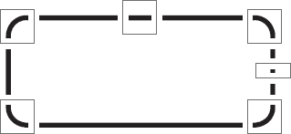

**图 13–1.** *圆角框的拼块配置*

你可以清楚地看到，四个角上的拼块是固定大小的。同时，构成框水平和垂直边框的另外两个拼块是可平铺的：它们会根据需要重复多次，以覆盖角之间的间距。根据需求，可以添加更多拼块——例如，如果顶部和底部边框不同，或者你希望边框遵循更复杂的图案（在这种情况下，你会交替使用相应的图案拼块）。

你还可以使用预渲染图像来存储 UI 动画，这些动画如果实时生成可能会非常耗时甚至不可能实现。这与基于精灵的游戏所使用的技术几乎相同，只是这里的动画精灵可能是按钮的背景、电子邮件通知图标或加载条。这些动画是精细的细节，对于 Java ME 应用程序来说极其重要，因为它们使界面看起来更自然、更“流畅”，类似于你在桌面或智能手机上看到的效果（例如，当光标/指针悬停在按钮上时，按钮逐渐“亮起”，而不是立即切换到“聚焦”状态）。

进一步扩展这个想法，预渲染图像也是创建应用程序主题的好方法。改变 UI 元素的外观变得非常简单，只需使用不同的图像文件即可；在此过程中无需更改任何代码。

还有许多其他小的图形元素可以预渲染，以获得更好的性能和更流畅的外观。例如，在折线图中，各个线段通常会用某种标记点来分隔。与其使用底层绘图函数（例如 `fillArc()`）实时绘制这些标记点，不如预先渲染它们。这不仅通常更快，而且效果也更好，因为你可以，例如，在标记点边缘预渲染半透明像素，使它们看起来更平滑。

预渲染图像的另一个重要用途是作为图形效果的基础。你很快就会发现，许多可以用 Java ME 实现的图形效果都需要两个图像文件：一个源图像和一个用作参数（例如，作为图像遮罩或颜色滤镜）的辅助图像。通过预渲染这些辅助图像，而不是在运行时生成它们，你可以显著提升这些图形效果的运行时性能。

更棒的是，有时你可以预渲染整个图形效果的输出，特别是当输出本质上不是动态的时候（例如，输出不是动画中的某一帧）。假设你想使用图像遮罩来创建一个带有天空纹理的公司标志版本。你可以在运行时完成，也可以在构建时完成，并将预渲染的遮罩标志存储在 JAR 文件中。这在运行时性能方面更快，但明显的副作用是增加了 JAR 文件的大小。

**提示：** 一个好的策略是混合使用动态图形和预渲染图形。例如，如果你正在编写一个基于精灵的游戏，并且需要你的精灵在 16 个方向上旋转，可以考虑预渲染其中八个所需的帧，并动态生成剩下的八个。这能在 JAR 文件大小和运行时性能之间取得良好的平衡。此外，如果你使用精灵镜像，你只需要预渲染和生成一半数量的帧。

最后，预渲染图形的最佳用途之一是存储字体。原生设备字体通常看起来不好看。此外，它们可能会破坏应用程序在不同设备上的用户界面，因为它们在大小和形状上往往差异很大。因此，大多数高质量的 Java ME 应用程序都采用预渲染的位图字体。然而，一个美观的应用程序 UI 通常需要多种字体，或者至少需要不同大小和样式（粗体、斜体）的同一字体——所以如果空间允许，就大胆去做吧。

关于预渲染图形，我想讨论的最后一件事是存储它们的正确方法。将每个图形元素存储在单独的文件中会适得其反，无论是在性能方面，还是在占用的 JAR 和内存空间方面。存储预渲染图形的最佳方式是作为图像映射的一部分。具体来说，你创建一个更大的*父图像*，每个预渲染的图形元素都存储为该图像的一个矩形子区域，如图 13-2 所示。图像映射顶部和左侧边框与元素子区域之间的距离分别称为元素的*顶部偏移量*和*左侧偏移量*。

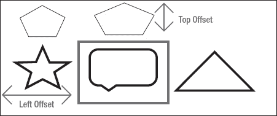

**图 13-2.** *一个图像映射，其中一个图形元素及其偏移量被高亮显示*

**提示：** 你可以通过将 PNG 文件转换为使用调色板的文件来优化文件大小。如果你的图像只使用有限的颜色集，这会很有帮助，但对于使用大量颜色的图像则效果较差。你还应该注意，除了 Java ME 规范中要求的 PNG 文件格式外，所有其他文件格式都是可选的。因此，在考虑替代格式（如 GIF 或 JPEG）时，请确保你的目标设备支持它。

要渲染图像映射中的某个图形元素，你只需计算父图像*相对于图形元素偏移量*的绘制坐标，在屏幕上你想要绘制该图形元素的坐标周围裁剪画布，然后*在之前计算好的坐标处绘制父图像*。由于我们已经根据元素的偏移量计算了图像映射的坐标，实际元素将被精确绘制在所需位置。用文字解释听起来有点令人困惑，但清单 13-1 中展示的伪代码会让一切变得清晰。

**清单 13-1.** *绘制图像映射中元素的伪代码*

`function drawAt( Image imageMap, Graphics target, int x, int y, int elementOffsetLeft,`
`int elementOffsetTop, int elementWidth, int elementHeight)`
`{`
`        // 计算图像映射的目标坐标`
`        // 相对于元素的偏移量`
`        imageX = x - elementOffsetLeft;`
`        imageY = y - elementOffsetTop;`

`        // 在元素绘制位置周围裁剪画布`
`        target.clip(x, y, elementWidth, elementHeight);`

`        // 在上述计算出的坐标处绘制图像映射。`
`        // 这确保了元素本身实际上被绘制在 (x,y) 处，`
`        // 并且由于画布在元素的目标区域周围被裁剪，`
`        // 除了元素之外，不会绘制任何其他内容。`
`        target.drawImage(imageMap,imageX,imageY);`
`}`

使用图像映射是 Java ME 应用程序中一项非常重要的技术。它往往对资源友好（因为需要创建和管理的 `Image` 对象更少，需要解码的单个图像文件也更少）。它也非常快，因为绝大多数手机都支持硬件裁剪。事实上，如果你在单个绘制操作（例如，屏幕刷新）中使用大量图形元素，使用图像映射实际上可能比绘制单个图像*更快*。此外，高端 Java ME 手机拥有专用图形芯片，它们也用于加速 Java ME 的绘制操作。由于这些芯片的工作方式，绘制同一图像的不同部分几乎总是比绘制不同的单个图像更快，因为在后一种情况下，图形芯片必须切换缓冲区（图像）。不过，这种差异可能不太明显。

### 使用图像遮罩

*图像遮罩*是一种类似于裁剪的技术。裁剪是根据矩形区域“切割”图像，而图像遮罩则是根据自由形状的遮罩（通常是另一张图像）来切割图像。

图像遮罩用途广泛，从时尚效果（例如，纹理字体——图像是纹理，遮罩是字体）到实用巧妙的技巧（例如，基于非矩形组件的实际形状和大小为该组件创建动态背景——在这种情况下，组件的形状就是遮罩），都非常有用。

图像遮罩不仅功能强大，而且实现起来极其简单。关键在于正确定义遮罩。具体来说，遮罩必须是一张图像，其中部分像素不透明，部分像素透明或半透明。其约定是：当应用于源图像时，遮罩中不透明的像素会在结果图像中生成不透明的像素，而遮罩中透明或半透明的像素则会在结果图像中生成透明或半透明的像素。我们只关心遮罩图像中像素的透明度；它们的实际颜色对我们的目的无关紧要。

接下来，我们知道 MIDP 2.0 允许我们通过 `Image.getRGB()` 检索图像的各个像素。结果将是一个整数数组，数组中的每个整数对应源图像的一个像素。每个像素的通道数据（其 Alpha、红、绿、蓝值）通过为每个通道保留 8 位整数进行编码。用十六进制表示，其格式为 0xAARRGGBB。

考虑到这一点，我们需要做的就是获取遮罩图像的 Alpha 通道，并将其与源图像的 RGB 通道合并。这很容易实现，如清单 13–2 中突出显示的行所示。接下来，在获得合并后的 ARGB 数据后，我们可以直接将其绘制到屏幕上或任何其他 `Graphics` 对象上。

**清单 13–2.** *Java ME 中的图像遮罩*

`public void drawMaskedImage(Image source, Image mask, Graphics g, int x, int y)`
`{`
`        // 为每张图像的像素数据预留一个数组`
`        int [] sourceData = new int[source.getHeight()*source.getWidth()];`
`        int [] maskData = new int[mask.getHeight()*mask.getWidth()];`

`        // 检索每张图像（源图像、遮罩图像）的各个像素`
`        source.getRGB(sourceData, 0, source.getWidth(), 0, 0, source.getWidth(),`
`        source.getHeight());`
`        mask.getRGB(maskData, 0, mask.getWidth(), 0, 0, mask.getWidth(),`
`        mask.getHeight());`

**`// 将遮罩的 Alpha 通道与源图像的颜色通道合并`**
**`for (int i=0;i<sourceData.length;i++) {`**
**`sourceData[i] =  (maskData[i] & 0xFF000000) |`**
**`(sourceData[i] & 0x00FFFFFF) ;`**
**`}`**

`        // 绘制结果`
`        g.drawRGB(sourceData, 0, source.getWidth(), x, y, source.getWidth(),`
`        source.getHeight(), true);`
`}`

有一点需要说明：为了清晰和简洁，清单 13–2 中的代码假设遮罩图像和源图像尺寸相同。如果两张图像尺寸不同，结果要么看起来不正确，要么会引发 `ArrayIndexOutOfBounds` 异常。不过，调整代码使其适用于不同尺寸的遮罩和源图像是可行的（而且并不太难）。这留给读者作为练习。

在 Java ME 中实现图像遮罩就是这么简单！结果看起来相当不错，如图 13–3 所示。

**图 13–3.** *图像遮罩的实际效果*

然而，乐趣不止于此。我们还可以利用这项技术做更多事情。例如，可以动态生成 `maskData` 数组。你可以利用这一点创建各种效果，从胶片颗粒或雪花效果，到类似于 PowerPoint 的棋盘格或溶解的动画过渡。

你应该注意，虽然大多数现代 MIDP 2.0 设备支持透明度和 Alpha 混合，但这并非 Java ME 标准的强制要求。此外，不同设备支持的透明度级别数量差异很大（从 2 级到 256 级不等）。在使用透明度和图像遮罩之前，请务必在目标设备上测试这两个方面。例如，一张充分利用了 256 级透明度的图像，在仅支持 4 级透明度的设备上显示时，效果可能会很差。

### 使用图像混合技术

*图像混合*基本上是指将两张图像合并在一起，使最终图像包含来自两张图像的颜色信息。这与遮罩类似，都是使用两张图像来获得结果。但同时，它又非常不同，因为与遮罩不同，最终图像中使用了来自*两张*图像的颜色信息。

图像混合有多种形式，从非常复杂的（例如你在 Photoshop 中看到的“海滩上的北极熊”效果）到简单的（例如 Alpha 混合，其中两张图像重叠，顶部图像半透明，使你可以透过它看到底部图像——这种效果在 80 年代的音乐视频中经常见到）。

本节仅涵盖简单的混合技术。更高级的混合技术实际上并不适合 Java ME，因为存在资源限制。尽管如此，简单并不意味着粗糙。正如你将看到的，即使使用简单的混合技术，你仍然可以获得一些非常有趣的结果。

首先，让我们看看前面提到的两张图像的 Alpha 混合。这有很多应用，从平滑的屏幕过渡（顶部屏幕逐渐淡出以显示底部屏幕），到更好、更直观的数据分析工具（例如，你可以直接重叠数据的两个可视化表示，如图表或颜色图，并查看哪些区域相同，哪些区域不同）。

顺便提一下，这种混合技术（像所有简单的图像混合技术一样）是一种逐像素操作。也就是说，输出图像中的每个像素仅依赖于源图像中对应的像素；它不依赖于相邻像素。这使得它易于实现，并且只要你不将其用于非常大的图像，代码运行速度就相当快。

相比之下，更高级的混合技术需要你为输出图像的每个像素处理每个源图像的 2 个或更多像素。某些技术需要你为每个输出像素考虑数十个源像素。这显然会使它们慢得多，并且不适合 Java ME。

回到正题，对我们 Alpha 混合效果最好的类比是……混合颜料。当你想要混合颜料时，你会将两种不同颜色的颜料倒入一个桶中，根据每种颜色的量，你会得到更接近第一种颜色或第二种颜色的结果。这正是我们想要做的：我们希望输出图像根据我们指定的透明度级别，更多地反映顶部图像或更多地反映底部图像。

幸运的是，有一个数学公式可以做到这一点。经过调整，使所有值都在 0–255 范围内（以便在 Java ME 中更容易处理），该公式如清单 13–3 所示。

**清单 13–3.** *Alpha 混合公式*

**`结果 = ( 颜色 1 * 透明度 + 颜色 2 * ( 255 - 透明度) ) / 255`**

因为每种颜色实际上由四个不同的通道（Alpha、红、绿、蓝）组成，我们必须将此公式应用于每个单独的通道，如清单 13–4 所示。

**清单 13–4.** *逐通道 Alpha 混合公式*

**`R.红 = ( 颜色 1.红 * 透明度 + 颜色 2.红 * ( 255 - 透明度) ) / 255`**
**`R.绿 = ( 颜色 1.绿 * 透明度 + 颜色 2.绿 * ( 255 - 透明度) ) / 255`**
**`R.蓝 = ( 颜色 1.蓝 * 透明度 + 颜色 2.蓝 * ( 255 - 透明度) ) / 255`**
**`R.Alpha = ( 颜色 1.Alpha * 透明度 + 颜色 2.Alpha * ( 255 - 透明度) ) / 255`**

由于这是一个逐像素操作，我们必须将此公式应用于结果图像的每个单独像素。执行此操作的 Java ME 代码如清单 13–5 所示，其中 `coeff` 是透明度系数（范围 0–255）。

**清单 13–5.** *Java ME 中的 Alpha 混合*

`public void drawBlendedImage(Image bottom, Image top, Graphics g,`
`int coeff, int x, int y)`
`{`
`        // 为每个图像的像素数据保留一个数组`
`        int [] bottomData = new int[bottom.getHeight()*bottom.getWidth()];`
`        int [] topData = new int[top.getHeight()*top.getWidth()];`

`        // 检索每个图像的各个像素（源，遮罩）`
`        bottom.getRGB(bottomData, 0, bottom.getWidth(), 0, 0, bottom.getWidth(),`
`        bottom.getHeight());`
`        top.getRGB(topData, 0, top.getWidth(), 0, 0, top.getWidth(), top.getHeight());`

`        // 定义所需的像素值`
`        int alpha1, alpha2;`
`        int red1, red2;`
`        int green1, green2;`
`        int blue1, blue2;`
`        int resultA,resultR,resultG,resultB;`

`        // 遍历顶部和底部图像中的所有像素`
`        for (int i=0;i<bottomData.length;i++) {`

**`           // 获取每个像素的各个通道值（顶部，底部）`**
**`           alpha1 = (bottomData[i] & 0xFF000000) >>> 24;`**
**`           alpha2 = (topData[i] & 0xFF000000) >>> 24;`**
**`           red1 = (bottomData[i] & 0x00FF0000) >> 16;`**
**`           red2 = (topData[i] & 0x00FF0000) >> 16;`**
**`           green1 = (bottomData[i] & 0x0000FF00) >> 8;`**
**`           green2 = (topData[i] & 0x0000FF00) >> 8;`**
**`           blue1 = (bottomData[i] & 0x000000FF);`**
**`           blue2 = (topData[i] & 0x000000FF);`**

**`           // 应用图像混合公式`**
**`           resultA = ( alpha1 * coeff + alpha2 * (255 - coeff) ) / 255;`**
**`           resultR = ( red1 * coeff + red2 * (255 - coeff) ) / 255;`**
**`           resultG = ( green1 * coeff + green2 * (255 - coeff) ) / 255;`**
**`           resultB = ( blue1 * coeff + blue2 * (255 - coeff) ) / 255;`**

**`           // 创建最终的像素值`**
**`           bottomData[i] = resultA << 24 | resultR << 16 | resultG << 8 | resultB ;`**
**`        }`**

`        // 绘制结果`
`        g.drawRGB(bottomData, 0, bottom.getWidth(), x, y, bottom.getWidth(),`
`        bottom.getHeight(), true);`
`}`

高亮显示的行展示了奇迹发生的地方。首先，对于两个源像素中的每一个，我们从它们的 `integer` 表示中提取单独的 Alpha、红、绿和蓝通道值。这是通过经典的位掩码和位移操作完成的。然后，我们将公式应用于每个通道，以获得最终的 ARGB 通道值。然后，我们将这些值组合成结果像素的 `integer` 表示。运行此代码的结果可以在图 13–4 中看到。

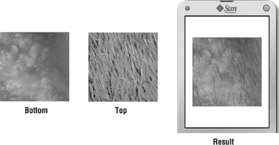

**图 13–4.** *半透明图像重叠*

逐像素效果的有趣之处在于，你可以更改混合公式以获得各种有趣的结果。例如，一种非常强大的混合类型是“正片叠底”混合。这种混合类型的公式如清单 13–6 所示，非常简单，甚至比之前的公式还要简单。

**清单 13–6.** *正片叠底混合公式*

**`结果 = ( 颜色 1 * 颜色 2 ) / 255`**

清单 13–7 显示了转换为 Java ME 代码的公式。该清单与清单 13–5 极其相似；唯一的实际区别在于混合公式的更改，如高亮行所示。

**清单 13–7.** *Java ME 中的正片叠底混合*

`public void drawMultipliedImage(Image firstImage, Image secondImage,`
`Graphics g, int x, int y)`
`{`
`        // 为每个图像的像素数据保留一个数组`
`        int [] bottomData = new int[firstImage.getHeight()*firstImage.getWidth()];`
`        int [] topData = new int[secondImage.getHeight()*secondImage.getWidth()];`

`        // 获取每张图像（源图像、蒙版）的各个像素`
`        firstImage.getRGB(bottomData, 0, firstImage.getWidth(), 0, 0,`
`        firstImage.getWidth(), firstImage.getHeight());`
`        secondImage.getRGB(topData, 0, secondImage.getWidth(), 0, 0,`
`        secondImage.getWidth(), secondImage.getHeight());`

`        // 定义所需的像素值`
`        int alpha1, alpha2;`
`        int red1, red2;`
`        int green1, green2;`
`        int blue1, blue2;`
`        int resultA,resultR,resultG,resultB;`

`        for (int i=0;i<bottomData.length;i++) {`

`           // 获取底层图像和顶层图像各自的通道值`
`           alpha1 = (bottomData[i] & 0xFF000000) >>> 24;`
`           alpha2 = (topData[i] & 0xFF000000) >>> 24;`
`           red1 = (bottomData[i] & 0x00FF0000) >> 16;`
`           red2 = (topData[i] & 0x00FF0000) >> 16;`
`           green1 = (bottomData[i] & 0x0000FF00) >> 8;`
`           green2 = (topData[i] & 0x0000FF00) >> 8;`
`           blue1 = (bottomData[i] & 0x000000FF);`
`           blue2 = (topData[i] & 0x000000FF);`
**`resultA = alpha1 * alpha2 / 255 ;`**
**`resultR = red1 * red2 / 255 ;`**
**`resultG = green1 * green2 / 255 ;`**
`           resultB = blue1 * blue2 / 255;`
`           // 创建最终的像素值`
`           bottomData[i] = resultA << 24 | resultR << 16 | resultG << 8 | resultB ;`
`        }`

`        // 绘制结果`
`        g.drawRGB(bottomData, 0, firstImage.getWidth(), x, y, firstImage.getWidth(),`
`        firstImage.getHeight(), true);`
`}`

那么，我们可以用正片叠底混合做些什么呢？首先，我们可以将其应用于同一张图像，这会增加图像的对比度，使其更加鲜艳。这一点可以在图 13-5 中看到。

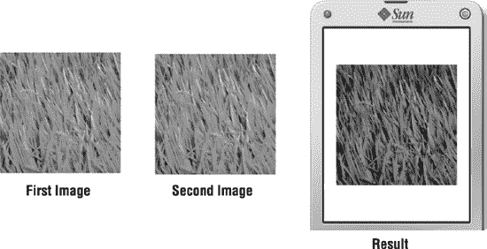

**图 13-5.** *将正片叠底混合应用于同一张图像*

或者，我们可以将其应用于一张图像和一个渐变。这将产生一个漂亮的淡入淡出效果，如图 13-6 所示。

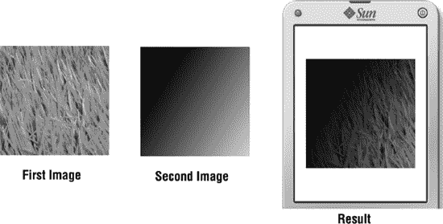

**图 13-6.** *将正片叠底混合应用于一张图像和一个渐变*

通过更改混合公式，你还可以实现其他混合效果——例如，滤色混合，其公式见代码清单 13-8。滤色混合在某种程度上与正片叠底混合相反，因为它往往会产生对比度较低、更亮的图像。

**代码清单 13-8.** *滤色混合公式*

**`结果 = 255 – ( ( (255 – 颜色 1) * (255 – 颜色 2) ) / 255 )`**

混合技术是一种强大的工具。如果谨慎地将其应用于 UI 元素、徽标和用户图片，或作为小型动画的一部分，它们可以为你的应用程序增添大量风格，弥合智能手机 UI 与 Java ME UI 之间的视觉差距。它们还能带来比通常预期的 Java ME 应用程序更令人愉悦的视觉体验，这将使你的应用程序在众多应用中脱颖而出。当应用于小尺寸图像（例如 64×64 或 32×128）时，它们尤其有效，因为在当今主流的 Java ME 设备上，这些操作通常足够快，可以实时使用而不会出现明显的卡顿。

### 旋转图像

在开始之前，需要说明的是，要正确理解这个主题，需要具备良好的数学知识（尤其是三角学）。不过，我会尽力以最非数学化的方式来解释。

*图像旋转*是所有平台（包括桌面和移动平台）上最广泛使用的图像操作之一。它最常用于游戏或多媒体应用程序中，但对商业应用程序也有实际价值。不幸的是，Java ME 中对标准图像旋转的支持极其有限。你只能以 90 度的倍数角度旋转图像；自由角度旋转是不可行的。这是一个主要的限制，因为很多时候你需要以“非标准”角度（即不是 90 度的倍数）旋转图像。

例如，如果你想为你的应用程序创建一个仪表盘控件，你需要能够以任意角度绘制指示针。使用可用的标准函数，有三种方法可以实现：为每个可能的角度创建一张图像，但这会显著增加 JAR 文件的大小；创建较少的图像，但会损失精度；或者使用诸如 `drawLine()` 之类的底层函数来绘制仪表盘，但这会将你限制在一个非常粗糙且难看的指针上。这些选项都不太令人满意。

因此，最好的做法是实现你自己的图像旋转函数，使其能够以任意角度旋转图像。这听起来可能令人生畏，但一旦你理解了所涉及的数学原理，这并不特别难做到。事实上，图像旋转是一个相当简单的操作。因为每张图像都是由单个像素组成的，要旋转一张图像，你所要做的就是围绕同一个参考点（通常是图像的中心）旋转其所有像素。你基本上是在一遍又一遍地执行相同的简单操作。

为此，我们需要的最基本的东西是在笛卡尔坐标系中围绕原点旋转一个点的公式。其背后的数学原理很难在短短几段文字中解释清楚，而且超出了本书的范围（不过这是一个相当有趣的阅读内容，能让你深入了解 2D/3D 变换的世界以及如何在计算机上实现这些变换）。因此，我们只需直接使用这个公式。该公式见代码清单 13-9。

**代码清单 13-9.** *在笛卡尔坐标系中围绕原点旋转一个点*

`x' = x * cos(a) - y * sin(a)`
`y' = x * sin(a) + y * cos(a)`

在上述公式中，`(x,y)` 是点的原始坐标，`(x’,y’)` 是该点绕原点旋转 `a` 度后的结果坐标。与大多数实用的 2D/3D 变换一样，这个公式出奇地简单。

任何图像都可以内接在一个矩形中，这个矩形被称为它的*边界框*。对于未旋转的图像，边界框的大小与图像大小相同。然而，一旦你旋转了图像，你将需要一个更大的边界框来容纳它，如图 13-7 所示。

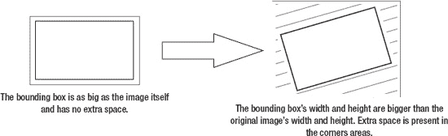

**图 13-7.** *旋转图像时，边界框的尺寸会增大。*

接下来我们需要做的是计算出旋转后图像的边界框尺寸。有几种方法可以做到这一点，让我们选择最合理的一种（不一定是最快或最高效的）。

为了计算边界框的大小，我们首先从原始图像的边界框开始，将其四个角点围绕原点旋转，就像旋转图像本身一样。然后，我们观察得到的四个点的坐标，记录下遇到的最小和最大 x 和 y 坐标——这样我们就能得到 `minX`、`maxX`、`minY` 和 `maxY`。最大 x 坐标与最小 x 坐标之差即为结果边界框的宽度，最大 y 坐标与最小 y 坐标之差即为结果边界框的高度。

为了使数学计算更简单，我们可以将其中一个角点本身视为坐标系的原点，而不是采用更直观的方法——将边界框的中心视为坐标系的原点。这意味着我们只需要计算其余三个角点的坐标，因为根据定义，我们初始的那个角点的坐标是 `(0,0)`。

整个过程如图 图 13–8 所示。

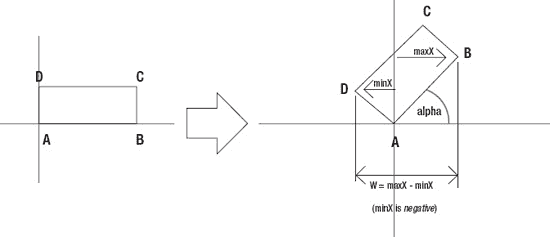

**图 13–8.** *计算图像旋转后边界框的大小。（图中展示了宽度的计算过程。）*

转换成代码后，结果将类似于 代码清单 13–10 所示。

**代码清单 13–10.** *计算图像旋转后边界框的大小*

`// 计算旋转后的图像尺寸`
`// 为此，首先假设左下角位于 (0,0)。`
`// 然后，计算其他三个角点`
`double point1x = originalW * Math.cos(angle);`
`double point1y = originalW * Math.sin(angle);`
`double point2x = -originalH * Math.sin(angle);`
`double point2y = originalH * Math.cos(angle);`
`double point3x = originalW * Math.cos(angle) - originalH * Math.sin(angle);`
`double point3y = originalW * Math.sin(angle) + originalH * Math.cos(angle);`

`// 接下来找出角点的最小和最大坐标值`
`double minx = Math.min( 0, Math.min(point1x , Math.min(point2x , point3x)));`
`double miny = Math.min( 0, Math.min(point1y , Math.min(point2y , point3y)));`
`double maxx = Math.max( 0, Math.max(point1x , Math.max(point2x , point3x)));`
`double maxy = Math.max( 0, Math.max(point1y , Math.max(point2y , point3y)));`

`// 最后，计算旋转后图像的实际宽度和高度`
`int rotatedW = (int) Math.floor(Math.abs(maxx - minx));`
`int rotatedH = (int) Math.floor(Math.abs(maxy - miny));`

现在我们已经知道了旋转后图像边界框的大小，就可以开始将像素从原始图像“移动”到旋转后的图像上。为此，我们将使用*反向映射*。也就是说，我们不是遍历原始图像的所有像素，看它们落在旋转后图像的哪个位置，而是遍历旋转后图像的所有像素，看原始图像中有哪些像素（如果有的话）与之对应。

原因很简单：常规映射会在旋转后的图像中留下空洞。这是因为真实像素的坐标总是整数，而计算出的像素坐标是实数。这会导致计算出的像素坐标与实际像素坐标之间存在差异。

为了说明这一点，假设在将旋转公式应用于原始图像中的一个像素后，我们得到的 `x’` 值为 `12.3`。为了将源像素正确地映射到旋转后的图像，我们需要它“填充” `x’=11.8` 到 `x’=12.8` 之间的空间，这样 `x’=12.3` 就正好位于中间。然而，当像素被映射到旋转后的图像时，实际发生的情况是 `12.3` 这个值被向下取整为 `12`，并且 `x’=12` 到 `x’=13` 之间的空间被填充了；计算出的 `x’` 值与实际的 `x’` 值之间 `0.4`（`0.2 + 0.2`）的差异就变成了空白空间。如图 图 13–9 所示。

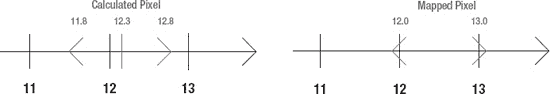

**图 13–9.** *计算出的像素坐标与映射后的像素坐标之间的差异*

如果图像只有一维，这不会成为问题，因为空白空间会被其他像素覆盖。然而，在二维情况下，这会导致结果图像中的某些像素完全没有被覆盖，从而在旋转后的图像中表现为空洞。

**注意：**“空洞”在图像变换中经常出现，尤其是当公式产生实数坐标（而非整数坐标）时。为了避免这个问题，在这些情况下应始终使用反向映射。

除了使用反向映射，我们还需要做一件事：考虑旋转中心。对于图像来说，旋转中心是图像的中心，这意味着从数学角度讲，图像中心必须具有坐标 (0,0)，我们的旋转公式才能正常工作。

然而，Java ME 将 (0,0) 坐标分配给图像的左上角。我们必须通过相应地调整旋转公式来考虑这种坐标映射上的差异。由于图像中心与图像左上角之间的坐标差为 `(-width/2, -height/2)`，因此调整后的公式如 代码清单 13–11 所示。

**代码清单 13–11.** *针对映射差异调整后的旋转公式*

`x' = (x – width/2) * cos(a) – (y – height/2) * sin(a)`
`y' = (x – width/2) * sin(a) + (y – height/2)  * cos(a)`

现在，我们已经拥有了编写完整图像旋转例程所需的一切。该例程如 代码清单 13–12 所示。

**代码清单 13–12.** *完整的 Java ME 图像旋转例程*

`public void drawRotatedImage(Image image, Graphics g, double angle, int x, int y)`
`{`
`        // 在此处插入代码清单 13-8 中的代码。`

`        // 计算旋转后图像的“原点”（在本例中为中心点）`
`        int referenceX = rotatedW / 2;`
`        int referenceY = rotatedH / 2;`

`        // 为原始图像和旋转后图像的像素数据预留数组`
`        int [] sourceData = new int[originalW * originalH];`
`        int [] rotatedData = new int[rotatedW * rotatedH];`

`        // 获取原始图像的像素`
`        image.getRGB(sourceData, 0, originalW, 0, 0, originalW, originalH);`

`        // 用于标记原始图像和旋转后图像中 X,Y 像素位置的变量`
`        int rotX,rotY;`
`        int origX, origY;`

`        // 用于跟踪 RGB 数组中索引位置的变量`
`        int origPos, rotatedPos;`

`        // 处理旋转后的图像的每个像素`
`        for (rotX=0;rotX<rotatedW;rotX++)`
`        {`
`                for (rotY=0;rotY<rotatedH;rotY++)`
`                {`
`                        // 对于当前“旋转后”的像素，计算`
`                        // 原始图像像素的 X 坐标。由于此操作`
`                        // 假设原点为图像中心，因此需要减去`
`                        // 这个参考点。`
`                        origX = (int) ( (rotX - referenceX) * Math.cos(angle) - (rotY`
`                         - referenceY) *  Math.sin(angle) + originalW / 2);`
**`// 检查计算出的 X 值是否落在原始图像内部`**
**`// 或外部。如果是外部，则跳转到下一个像素。`**
**`if ( origX < 0 || origX >= originalW)`**
**`{`**
**`continue;`**
`                        }`
`                        // 接下来计算 Y 坐标`
`                        origY = (int) ( (rotY - referenceY) * Math.cos(angle) +`
`                        (rotX -referenceX) *  Math.sin(angle) + originalH / 2);`
`                        // 计算该像素在原始源数组中的对应位置`
`                        origPos = origY * originalW + origX ;`
**`// 检查该位置是否有效`**
**`// 如果位置无效，则跳转到下一个像素`**
**`if ( origPos < 0 || origPos >= sourceData.length )`**
**`{`**
**`continue;`**
**`}`**
`                        // 计算“旋转后”像素在旋转后图像数组中的位置`
`                        rotatedPos = rotY * rotatedW + rotX;`
`                        // 将像素数据从原始数组移动到旋转后数组`
`                        rotatedData[rotatedPos] = sourceData[origPos];`
`                }`
`        }`
`        // 绘制结果`
`        g.drawRGB(rotatedData, 0, rotatedW, x, y, rotatedW, rotatedH, true);`
`}`

前面的代码清单可能有点长，但其工作原理相当直接。其中较为复杂的部分，例如计算旋转后图像的大小，以及像素的逆映射（以及必要的坐标调整），前面已经解释过了。不过，我想请你注意一下高亮显示的行。这些行检查逆映射后的像素坐标是否在原始图像的边界内。如果任一检查失败，代码就会跳过旋转后图像的下一个像素进行逆映射。这是必要的，因为如图 13–7 所示，旋转后图像角落的一些像素是空白区域，并不映射到原始图像中的任何像素；尝试映射它们会导致 `ArrayIndexOutOfBounds` 错误。

最后，图 13–10 展示了我们的图像旋转例程的实际运行效果。

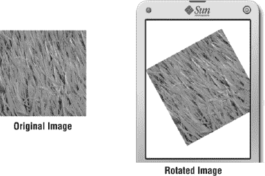

**图 13–10.** *图像旋转例程的实际运行效果*

### 调整图像大小

另一种非常常见的图像处理技术是*图像缩放*——即放大或缩小图像。这在多种场景下都很有用，从在图片库应用中创建缩放效果，到动态调整 UI 图形元素的大小。

默认情况下，Java ME 完全没有图像缩放功能。幸运的是，图像缩放非常容易实现，因为本质上就是将源图像乘以一个缩放因子。如果缩放因子小于 1.0，图像将缩小。如果因子大于 1.0，图像将放大。

因此，我们需要做的第一件事是计算缩放后图像的大小。这很容易，因为我们只需将原始图像大小乘以缩放因子即可。接下来，我们将使用逆映射，找出原始图像中的哪个像素对应于缩放后图像的每个像素。要做到这一点，我们只需将每个目标像素的坐标*除以*缩放因子。

整个过程如清单 13–13 所示。

**清单 13–13.** *在 Java ME 中调整图像大小*

`public void drawResizedImage(Image image, Graphics g, double factor, int x, int y)`
`{`
`        // 用于标记原始图像和缩放后图像中 X,Y 位置的变量`
`        int xpos,ypos;`
`        int origx, origy;`

`        // RGB 数组中的位置`
`        int origpos, zoompos;`

`        // 计算缩放后图像的大小`
`        int originalW = image.getWidth();`
`        int originalH = image.getWidth();`
`        int zoomW = (int) (originalW * factor);`
`        int zoomH = (int) (originalH * factor);`

`        // 为原始图像和缩放后图像的像素数据预留数组`
`        int [] sourceData = new int[originalW * originalH];`
`        int [] zoomData = new int[zoomW * zoomH];`

`        // 获取原始图像的像素`
`        image.getRGB(sourceData, 0, originalW, 0, 0, originalW, originalH);`

`        // 处理缩放后图像的每个像素`
`        for (xpos=0;xpos<zoomW;xpos++)`
`        {`
`                for (ypos=0;ypos<zoomH;ypos++)`
`                {`
`                        // 计算其对应的原始图像像素`
`                        origx = (int) (xpos / factor);`
`                        origy = (int) (ypos / factor);`

`                        // 在数据数组中映射两个像素（原始、缩放后）`
`                        origpos = origy * originalW + origx;`
`                        zoompos = ypos * zoomW + xpos;`

`                        // 将像素数据从原始数组移动到缩放后数组`
`                        zoomData[zoompos] = sourceData[origpos];`
`                }`
`        }`

`        // 绘制结果`
`        g.drawRGB(zoomData, 0, zoomW, x, y, zoomW, zoomH, true);`
`}`

上述图像缩放例程的实际运行效果见图 13–11。

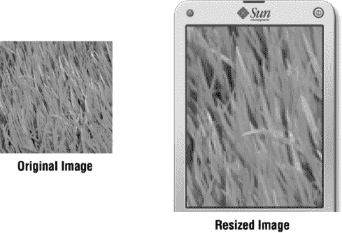

**图 13–11.** *在 Java ME 中调整图像大小*

### 实现其他图形效果

还有许多图形效果可供实现。例如，你可以实现一个基于粒子的系统，将给定图像“炸开”成许多更小的碎片（或者反向操作，将小碎片组合成完整图像）。

为你的技能库增添更多图形效果的关键在于你的想象力，以及对 Java ME 功能的巧妙运用。例如，刚才提到的爆炸效果实际上对 CPU 非常友好，因为你只需计算每个碎片的位置，然后使用源图像作为图像映射，在每个对应位置绘制碎片。

你还应该意识到，你可以创建两种类型的效果：适合实时使用的和不适于实时使用的。图像遮罩是适合实时使用的效果的绝佳例子，因为它简单且快速。然而，如果你尝试实现图像滤镜（例如，Photoshop 中的水彩效果），很可能无法在实时场景中使用它们。这并不是说它们没有用处；例如，根据用户自己的图像来个性化应用程序是一件非常好的事情，而滤镜可以极大地帮助实现这一目标。

实现自己的图形效果总是一种非常有成就感的体验。操作像素总是很有趣，在这个过程中，你将学到许多与计算机图形学、代码优化、编程技巧和数学相关的知识。更不用说，最终你可以用自己编写的代码给朋友、同事甚至老板留下深刻印象。

话虽如此，以下是一些你可以考虑实现的图形效果：

*   基于粒子的系统，如本节示例所示。
*   图像模糊和图像锐化。
*   图像抗锯齿。
*   图像倾斜效果（例如，使图像看起来像梯形，或使其像旗帜一样摆动）。
*   图像去饱和（将彩色图像转换为黑白图像）。
*   艺术滤镜，例如水彩和浅浮雕效果。
*   图像变形（无缝融合两张图像的内容，而非其像素——例如，将你的脸与配偶的脸融合）。需要提醒你：这是一个极难实现的效果。

### 组合多种效果

经过适当优化后，本章介绍的效果可以组合起来，产生更惊人的结果。例如，可以创建公司标志的旋转且带纹理的版本，其中纹理是通过混合两张图像获得的。当所涉及效果的各种参数（例如，旋转角度改变，混合操作的透明度系数也随之改变）发生变化以创建动画时，这种方法最为有效。

此时，你可能想知道这到底有多可行。几年前，我问过自己同样的问题。于是我着手创建一个既快速又强大的 Java ME 图形效果库。我很好奇 Java ME 平台在这个领域能被推到何种程度，并且对这个名为 J2ME Army Knife 的库最终的表现感到非常满意。

最有趣和最令人惊讶的事情（至少对我来说）是图形效果在速度方面可以达到的优化水平。例如，在优化了图像旋转代码后，我能够在诺基亚 E50 上每秒将近 100 次地旋转一张 64×64 的图像。一个有趣的题外话是，我已经有两年多没有对这个库做任何严肃的工作了（这在软件开发中算是一段很长的时间），但我仍然偶尔会收到人们的邮件，说他们对代码运行的速度感到惊讶，并认为这确实展示了 J2ME Army Knife 的“先进水平”。

**注意：** 有关 J2ME Army Knife 的更多信息，请访问 [www.j2mearmyknife.com](http://www.j2mearmyknife.com)。在那里你可以看到该库的实际运行效果（现场演示），也可以下载它。以二进制形式使用是完全免费的，甚至可用于商业项目，所以试试看吧！

在非动态环境下，组合多种效果甚至更为可行。虽然单个动画帧通常需要在最多 100 毫秒内计算完毕以获得“流畅”的感觉，但对于静态图形，你可以使用长达 500 毫秒的时间来完成计算（如果处理在单独的后台线程中进行，甚至可能更长）。这意味着你可以处理更大的源图像，或者串联更多的效果。

另一个非常强大的技术是将动态图形效果与图像映射结合使用。例如，让我们考虑前面带纹理的标志被旋转并制作成动画的场景。与其每次都重新计算每一帧，不如只在第一次需要时计算帧，然后将它们放入图像映射中。然后，当动画循环时，不再重新计算帧，而是使用存储在图像映射中的数据。总体而言，这非常快，但对于较大的图像确实需要相当多的 RAM——因此，这种技术的效果会因目标设备而异。

最后，组合图形效果可以通过两种方式之一完成。第一种选择是逐个应用每个效果：第一个效果的输出成为第二个效果的输入，依此类推。虽然这很灵活，因为每个效果都是独立的，但它也有缺点，即给整体结果增加了大量开销。例如，如果链中的两个效果都需要处理每个像素的 Alpha、红、绿、蓝值，那么这两个效果都必须分别进行提取。

第二种选择是创建元效果；例如，你可以将旋转和调整大小效果结合起来。这具有消除大量不必要开销的优势，因为两个效果的许多共同计算只需进行一次，并且像 ARGB 数组这样的内存对象可以被重用。如果消除的开销发生在像素级别（即，在操作单个像素的内循环中），性能提升尤其显著。

### 总结

在本章中，你学习了几种高级 Java ME 图形技术：图像混合、图像遮罩、图像调整大小和图像旋转。你了解了这些技术背后的原理及其各种用例。在下一章中，你将了解一些 Java ME 开发故事，并探讨它们背后的寓意。

## 第 14 章

## 正确的 Java ME 思维模式

到目前为止，本书主要讨论了创建 Java ME 应用程序的技术层面。虽然这显然是 Java ME 应用程序开发中最重要的方面，但还有另一个方面有时与技术方面同样重要：即你处理开发过程的思维模式。

为了理解为何拥有正确的思维模式对 Java ME 开发至关重要，有必要指出，每个软件平台（无论是移动平台还是其他平台）往往都有一套与之相关的特定开发方法论。这要么是由平台创建者强加的（通过提供“最佳实践”文档并相应构建 API），要么是随着平台获得关注和发展而自然形成的。此外，随着平台范围和底层硬件技术的变化，开发方法论也往往会随时间而改变。

Java ME 在这些方面有些独特。它最初被设想在极其受限的设备上运行，但现在也支持在（相对）非常强大的设备上运行；而在实践中，你经常需要同时支持这两种硬件类别。由于新旧 Java ME 硬件目前都在使用，因此没有通用的“最佳实践”可以遵循，也没有通用的开发方法论；在旧硬件上有效的方法可能在新硬件上无效，反之亦然。有一些通用技巧你可以在所有情况下考虑（其中最重要的已在第 1 章中列举），但仅此而已。

然后是 Java ME API 本身，它被设计得尽可能简单，以便能在尽可能多的设备上使用。这意味着，为了完成更复杂的工作，你经常需要发挥创造力，并自行实现许多在其他平台上你认为是理所当然的功能，从简单的实用方法（如字符串匹配）到复杂的功能（如序列化）。决定为了实现目标需要实现哪些功能（同时注意项目在资源和目标硬件方面的限制），以及如何实现它们，这本身往往是一门艺术——而在这方面做出的决策会影响整个开发过程。

最后，你还必须考虑正在编写的应用程序类型，因为这通常决定了你如何在用户界面、灵活性和功能性之间分配可用资源。有时用户界面比实际功能更重要，而其他时候则相反，或者应用程序的灵活性（其在多种不同环境中运行的能力）是其最重要的特性。在这里做出正确的决策对于应用程序的成功至关重要。

基于这些原因，拥有正确的思维模式——一套指导你如何处理任何给定应用程序开发的核心原则——对于任何 Java ME 项目的成功都至关重要。这些原则帮助你理解 Java ME 作为一个平台在特定场景下能做什么和不能做什么，并且它们可以帮助你确定在特定情况下你*应该*和*不应该*做什么。

在本章中，我们将探讨正确的 Java ME 开发思维模式是什么，并尝试通过几个实际例子来演示它。

**注意：** 当然，本章描述的原则也可以应用于其他平台。然而，它们对其他平台的适用程度远低于对 Java ME 的适用程度；Java ME 从这些原则中获益最多，仅仅是因为其更具约束性和更低容错性的本质。

### Java ME 的强大程度取决于其运行的设备

令人惊讶的是，有多少人倾向于脱离底层硬件来单独评判 Java ME 平台。当然，仅根据平台规格来评判它感觉是直观的，但对于 Java ME 来说，这完全是错误的。原因在于，虽然 Java ME 本身在能力方面并非天赋异禀，但它确实有改进和扩展这些能力的条款——而这些条款可以带来天壤之别。

例如，Java ME 的默认图形能力以今天的标准来看极其有限。然而，正如我们在前一章中所见，你可以显著扩展这些能力，并将 Java ME 提升到与现代平台相同的水平。这项努力中唯一的限制因素是底层硬件的处理能力。换句话说，大多数时候问题不在于能否用 Java ME 实现（通常是可以实现的）；问题在于能否在当前的硬件上实现。这同样适用于 Java ME 缺乏或发展不足的许多其他特性或能力。

此外，虽然设备的硬件极其重要，但该设备支持的可选能力也同样重要。这包括可选的 JSR 和供应商特定的扩展，两者在决定项目的可行性方面都可能产生巨大影响。某些 JSR 和扩展对于特定项目至关重要；例如，如果你计划编写一个文件管理器应用程序，那么文件连接 API 的支持就至关重要。其他一些虽然不是关键，但能极大地提高应用程序的性能或灵活性。例如，诺基亚的 UI 扩展有一个 `fillPolygon()` 方法，可用于快速填充屏幕上的多边形区域。如果没有这个扩展，你将不得不编写自己的填充例程，这会慢得多。

那么这一切意味着什么？首先，这意味着虽然 Java ME 在低端设备上确实是一个受限的平台，但当你瞄准高端设备并充分利用其潜力时，它可以成为一个相当灵活的开发平台；并且在低端设备上不可行的项目在高端设备上可能是可行的。硬件和平台应该作为一个整体来评判，而不是分开评判。在评估一个项目是否可行以及可行到什么程度时，认识到这一点很重要。

其次，这意味着为了从目标设备中获得最大收益（或者为了在功能方面使它们处于公平的竞争环境），你将不得不大量依赖第三方库，或者自行编写代码来添加缺失的功能和/或改进现有功能。这给开发方程增加了一层额外的复杂性，并且还要求你作为开发者，熟悉你需要使用的各种第三方库和/或它们背后的思想和算法。换句话说，如果你真的想在给定的目标设备上创建尽可能最好的应用程序，你必须做好研究并亲自动手。

第三，这意味着随着用户对移动应用程序（尤其是 Java ME 应用程序）的期望不断提高，你通常可以利用普通手机计算能力的提升来满足这些期望。当然，这需要你付出越来越多的努力，因为你必须为核心平台添加越来越多新的特性和功能才能跟上步伐。幸运的是，第三方工具和库也在不断发展，这缓解了这一问题。总的来说，这意味着整个 Java ME 平台在持续演进。

我最早的自由职业项目之一，就是一个很好的例子，可以说明上述观点。在这个项目中，我们只针对中端设备，核心需求是能够在任意时刻保存和恢复应用程序状态；换句话说，就是序列化。Java ME 并未内置序列化功能，因此我们将注意力转向了市面上一些 Java ME 序列化库/框架。经过一番研究，我们决定尝试一个相对冷门的库。它并非功能最丰富的库，但简单、快速，且处于活跃开发状态，所以我们决定采用它。

项目开发初期进展顺利。然而，在开发过程中期，我们被要求支持一款非常流行但低端的设备。这款设备在各方面性能都满足我们的需求……除了序列化。每当需要序列化数据时，设备就会变得极其缓慢。此时更换其他库或自行开发序列化库都已不可行。经过几次实验，我们得出结论：问题出在平台的 RMS 实现上——每次单独的写入请求耗时过长。这实际上对我们来说是个好消息，因为我们曾担心是低端设备性能不足，无法处理负载。

我们最终的做法是，对库进行了一些修改，将序列化请求缓冲到同一条记录中，并且每 20 秒或每 5-10 次请求（以先到者为准）才提交一次。这极大地提升了序列化性能，并在用户感知性能方面，拉平了中端设备与低端设备之间的差距。

然而，随着客户提出越来越多的功能需求，低端设备的性能开始落后。最终，我们不得不放弃对低端设备的支持；它的硬件确实无法胜任这项工作。与此同时，中端设备的表现相当良好，除了偶尔的轻微卡顿，应用程序运行流畅。同一款应用程序在两种设备上运行，使用相同的 API，方式也相同。在我们的案例中（实际上，在大多数情况下），限制因素显然不是应用程序或平台本身，而是其运行的硬件。这一点非常重要，需要充分理解，因为它有着间接的影响。

这些影响中，最重要的一点是：你今天展示的那个很酷的概念验证演示，实际上将成为明天应用程序的标准功能。这意味着，作为 Java ME 开发者，你应该不断尝试新想法、新技术和新项目，挑战 Java ME 当前能力的极限，因为未来你就能在更强大的硬件上实践你的实验成果。换句话说，你应该始终走在硬件发展的前面，从而领先于竞争对手。

另一个重要的影响是，尤其是在长期项目中，随着“平均硬件”性能越来越强大，你所编写的应用程序在性能和功能方面都可以随着时间的推移得到显著提升——而且，为了保持应用程序的竞争力，你可能实际上不得不这样做。这意味着，在做出诸如选择何种架构和库等技术决策时，你应该考虑应用程序的预期生命周期和开发时间。如果你预计应用程序会存在一段时间，那么就要追求自由度和灵活性。即使这最初可能会在性能上付出一点代价，但从长远来看，性能损失微不足道，而开发上的收益却不可估量。

例如，在原项目完成大约一年后，客户再次联系我们，询问我们是否有兴趣继续开发这个应用程序；这一次，设备谱系中的“低端”代表是原来的中端设备，而“高端”代表则是几款新发布的手机。因此，我们最终添加了许多视觉效果，并改善了整体用户体验，使其保持与时俱进。

又过了几个月，客户再次找到我们，他想要一个完全翻新的用户界面。这意味着要使用不同的 UI 工具包。最初，出于性能原因，UI 在几个关键位置与应用程序功能紧密耦合，因为我们没预料到应用程序在最初形态下两年后仍在开发并保持活跃，也因为最初的目标硬件是低端的，所以我们需要尽可能榨取所有性能。由于 UI 和功能之间的这种紧密联系，更换 UI 工具包涉及大量的应用程序重构，而如果我们从一开始就知道应用程序的“路线图”，这些重构本可以轻易避免（本章后面会更详细地讨论这一点）。

### 优化应用程序的最佳实践

谈到 Java ME 应用程序的优化，有两种常见的观点，它们本质上是相反的，但在我看来，这两种观点都是错误的。

第一种观点在来自桌面领域的开发者或专门从事高端 Java ME 设备开发的开发者中最为常见，即几乎从不进行任何优化。这种观点是错误的，因为这样你得到的要么是次优的性能，要么是良好的性能（如果你的目标是高端设备），但你的竞争对手的应用程序要么性能更好，要么功能更丰富，因为他们能更好地利用可用资源。

第二种观点在早期就从事该领域的开发者中最为常见，即优化所有可能优化的东西。这种观点同样是错误的，因为这样做需要耗费大量的开发时间，而且很多时候结果根本不值得：性能提升微乎其微，或者优化后的代码在一台设备上运行良好，但由于设备特性，在另一台设备上却表现不佳。

那么，优化 Java ME 应用程序的正确方法是什么呢？正如在专门讨论优化的章节中所讨论的，你首先应该做的是分析你的代码，找出时间和资源消耗最多的地方。先优化那个区域，然后再次进行分析，将注意力转向代码中的下一个候选区域，依此类推，直到性能和资源消耗达到可接受的水平。同时，最好的优化是与算法或架构相关的优化，因为它们往往能很好地适用于所有设备，因此在进行任何代码优化之前，应该先尝试这些优化。

然而，即使方法得当，上述优化过程也并不总能很好地适用于现实场景。例如，你可能会花费大量时间优化某组方法，新旧代码之间的性能差异在低端设备上可能非常显著，但在高端设备上却几乎察觉不到。或者反过来——如果性能提升 2 倍只是将应用程序的帧率从每秒 2 帧提高到每秒 4 帧，那么在低端设备上这种提升实际上并不明显；应用程序仍然无法使用。换句话说，花费在优化代码上的时间和资源并没有真正反映在现实世界中。

为了应对这种情况，并在花费的时间和获得的性能之间达到良好的平衡，最好的策略是采用增量式优化方法。也就是说，一旦你发现一个问题区域，不要试图从中榨取最佳性能，而是简单地尝试获得良好的性能，然后转向下一个区域。如果优化了所有值得优化的部分后，性能仍然不够好，那么你就开始新一轮的优化周期，进一步改进已经优化过的代码。

这种方法在实践中效果很好，因为很多时候，代码和算法只需相对较少的努力就能优化到最大可能性能的 40-50%，但剩下的 60-50% 则需要大量的工作。通过只优化到最大可能性能的 40-50%，你就能获得最佳的性价比——而且，如果需要的话，你随时可以回过头来做得更好。

内化这个概念的最佳方式是将优化你的应用程序视为一种工具，一种达到目的的手段，而不是目的本身。你优化东西不是为了优化而优化；你这样做是为了满足你的需求（例如，在特定设备上达到可接受的性能）。因此，你对应用程序优化的方法应该是一种最大化投入产出比的方法（这正是上述策略所做的），并且一旦你的目标达成，你就应该*停止*优化。这既适用于局部优化目标（即优化局部代码块），也适用于整体应用程序优化目标。

我和几个朋友曾经举办过一次优化竞赛，我们从网上下载了一个非常消耗 CPU 的应用程序的源代码（一个简单的概念验证型国际象棋引擎），并试图在两小时内尽可能提高其性能。

我们都从分析应用程序开始，并且都确定了相同的需要改进的关键区域。然而，当我和另一个朋友使用上述方法，尝试优化每个关键区域直到我们认为达到了可接受的性能水平时，另外两个朋友决定按顺序尽可能优化所有东西。

两小时过去后，他们高度优化了代码中大约两到三个关键区域，而我和我的朋友则将大约四到五个关键区域优化到了“足够好”的水平。最终结果正如预期：尽管他们彻底优化的那两三个关键区域的性能明显优于我们取得的成果，但我们的整体性能更好，因为我们在各个区域都有较小的性能提升，但总体上我们优化了更多的代码区域。然后我们比较了在代码的每个单独部分上花费的时间与获得的性能提升，结果显示，虽然他们高度优化的代码比我们的快 20-30%，但他们花费了两到三倍的时间进行优化。换句话说，他们的投资回报率并不高。

所有这一切中最有趣的结果是，当我们把代码从模拟器移植到实际设备上时发现的。一个关键区域在我们未经彻底优化的版本中，其性能实际上明显优于我们朋友们的高度优化版本。最可能的原因是，为了改善 CPU 时间，他们在方法中使用了比我们多得多的内存和变量，这意味着比我们更多的内存读取次数和更差的缓存性能。

从中吸取的教训是，在 Java ME 世界中，将代码优化到最佳程度并不总是一件好事。只优化你需要的程度，并且只在你需要的地方优化。如果你决定（无论出于何种原因）进行极致优化，请确保保留一份未经优化的方法副本以供参考，并确保在所有目标设备上测试你的优化，以避免任何不愉快的意外。

### 坚持你的优先级

如前所述，典型的 Java ME 应用程序可用的资源是有限的。此外，多年来，在各个方面（用户界面、功能、灵活性等）的质量标准都大幅提高，这意味着在上述任何一个类别中“达到标准”都需要越来越多的资源。因此，Java ME 开发者面临着如何在上述关键领域之间正确分配有限可用资源的问题。

首先，需要明确的是，除非你正在编写的应用程序极其简单，否则你不可能在所有类别中都达到最佳效果，因此你必须做出权衡。例如，你可以为应用程序提供一个惊艳的用户界面，但这样做很可能会严重限制应用程序实际功能可用的资源量，并且你还会在将应用程序移植到低端设备时遇到困难。或者，你可以将大量资源投入到底层功能上，但代价是用户界面非常朴素。又或者，你可以选择支持多种设备，但在此过程中牺牲用户界面和功能。

明确优先级会极大地影响你处理开发过程的方式。例如，如果你追求灵活性和可移植性，那么你的代码必须坚如磐石且高度适应性强，你的应用程序框架也必须经过深思熟虑。这涉及到大量的前期规划和思考、错误检查以及错误处理例程，这些都会增加相当多的开销。此外，你的开发时间也会大幅增加。

如果你决定专注于应用程序的用户界面方面，那么就选择你能找到/负担得起的最好看的 UI 工具包，并坚持使用它。为了弥补 UI 带来的（很可能是）高资源消耗，你的应用程序功能代码必须进行非常好的优化，其优化程度要比你使用更朴素的 UI 时高得多。

或者，如果你试图将尽可能多的功能塞进应用程序，那么你很可能会严重依赖第三方库和非标准 API。这些往往会引入许多可能超出你控制范围的可移植性问题和错误，因此实际上开发过程会更加繁琐且更容易出错。

作为一名 Java ME 开发者，理清应用程序的优先级对于有效分配资源至关重要。理想情况下，这应该在项目的规划阶段、在你开始编写任何代码之前完成，但也可以在早期开发阶段完成。在此之后改变优先级并不是一个值得考虑的选择——你最好从头开始编写一个新的应用程序。

例如，由于技术原因，切换到不同的 UI 工具包并不总是可行或可能的，尤其是当你当前使用的 UI 与应用程序的功能紧密相连时——或者当应用程序的功能是围绕当前 UI 工具包的能力和架构构建时。

决定在代码完成 80% 时大幅增强现有功能，虽然可能，但很可能会在你修改现有代码时引入大量新错误、性能问题和不必要的副作用，因为这些更改通常以“补丁”的形式出现，而不是干净的实现。

这还将涉及对应用程序架构进行大规模重构，甚至可能完全改造，这是在开发过程中途遇到的噩梦般的情景。添加额外功能通常还意味着你必须使用或模拟非标准 API，或者引入新的第三方库，而这些行为会带来所有相关问题。

**注意：** 在更标准化和同质化的平台上，你或许能侥幸避免这些问题，但 Java ME 受限且不可预测的特性使得这些事情变得相当困难，除非从一开始就对其进行规划（或预置）。

最后，支持比原计划更多的设备（尤其是那些比你当前目标设备性能更弱的设备）通常是不可能的，除非大幅削减功能、切换到资源消耗更少或外观更差的 UI，或者做出其他技术妥协和调整——这意味着你必须重新审视并大量重写你的大部分代码，从而同时增加开发时间和错误数量。

我曾在一个团队中工作，负责创建一个简单的照片分享应用程序。最初的目标很简单：只需要能够拍照并上传到基于网络的相册。目标设备是中端机型。

这个核心需求相当容易实现，因此我们与客户达成一致，认为我们可以并且应该为应用程序创建一个时髦的界面，以吸引潜在用户。我们之所以能做到这一点，是因为核心应用程序的 CPU 需求极低，因此大部分 CPU 时间可以专用于 UI。

我们将大部分注意力集中在添加大量酷炫的 UI 功能上。例如，上传进度条实际上是待上传图片的缩略图。缩略图最初是灰度的，随着图片内容的上传，它会从左到右逐渐着色。

到目前为止一切顺利，但随后客户要求我们为应用程序添加非常简单的图像处理能力——例如，颜色效果和字幕。这些功能与 UI 本身争夺 CPU 时间，但仍有足够的处理能力可供分配。每当需要执行真正密集的任务时，我们只需在屏幕上显示一个沙漏图标。我们最初的优先级从花哨的 UI 变成了功能与花哨 UI 的混合体。不过，这仍在我们的处理能力范围之内。我们不得不进行一些重构，以使 UI 和图像处理功能能够良好协作，但都不是大问题。速度在此阶段确实受到了一些影响，但不大。

然后，我们收到了实现图片库功能的需求。结合花哨的 UI，这已经有点超出我们可用处理能力的承受范围了，因此我们与客户进行了讨论，并同意提供两种图库类型：一种用于高端设备的非常酷炫的版本，以及一种用于中端设备的简化版本。

现在，灵活性和可移植性也被加入了进来，事情变得真正有趣起来。我们不得不添加大量新代码并修改现有代码的大部分内容，以确保应用程序能够充分利用每种设备上的可用资源，并动态调整其资源消耗以避免崩溃。速度因此进一步下降，当然，还引入了一些相当奇怪的错误（请记住，我们在此过程中正在对现有代码进行大量修补）。

雪上加霜的是，客户随后要求我们也支持低端手机。我们问他想要放弃什么：花哨的 UI、图像处理能力，还是图片库功能。他说他什么都不想放弃。

我们尽可能地优化了应用程序（低端设备屏幕分辨率较低这一点有所帮助，因此我们可以使用较低质量的图形），但严苛的硬件要求和我们打了补丁的代码库意味着最终结果远未达到我们想要的效果。最终，客户决定专门为低端设备从头开始创建一个特殊版本的应用程序。

这个故事的重点在于，如果客户从一开始就向我们提供了正确的需求和优先级，那么该项目中很大一部分开发工作本可以避免。从零开始设计（即，一个同时兼顾用户界面、功能以及灵活性和可移植性的架构和代码库）要比将某个为特定目的（例如，炫酷的 UI）设计的东西改造成一个万金油式的方案容易得多。

更关键的是，如果我们事先知道项目的最终优先级是什么，那么应用程序的架构就会不同，开发工作的分配也会不同，我们会使用不同的工具，而且总的来说，项目的结果会更好：更少的错误、更快的性能、更短的开发时间，以及所有设备共用一个应用程序代码库（而不是两个代码库，一个用于低端设备，另一个用于其他设备）。而实际情况是，我们最初做出的决策最适合我们最初的优先级（不惜一切代价打造花哨的 UI），而这最终从长远来看代价高昂。

**注意：** 当然，这种目标不断变化的情况在所有软件平台上都很常见，无论是移动平台还是其他平台。对于 Java ME 来说，这个问题更棘手，因为目标不断变化往往会给应用程序增加“额外负担”，比如处理开销和不必要的代码。而在其他平台上，即使有时存在极其过分的“负担”，你也能应付过去，但 Java ME 的特性决定了，即使是一点点的“额外负担”也可能导致“心脏病发作”。因此，Java ME 开发者在项目初期就应该不遗余力地确保目标尽可能保持稳定。

### 跳出固有思维模式很重要

Java ME 并非寻常平台。正如我们在本书中迄今所见，它有许多独特的特点和特性，因此你传统的应用程序开发方法可能并不适用。正因为如此，开发者能够退后一步，不受先前开发经验和开发模式的偏见影响，来审视当前的项目就显得尤为重要；换句话说，开发者应该能够在需要时跳出固有思维模式。

但这究竟意味着什么呢？首先，这意味着要意识到，过去在类似情况下行之有效的方法，在当前情况下可能并非最佳解决方案。这种情况可能由多种原因造成，从可用资源数量的不同到业务原因。因此，每个情况都应该单独处理，只有先前的解决方案符合当前场景的约束条件时，才应使用它们。

例如，你可能习惯于使用某个特定的库（无论是第三方的还是自制的）来进行序列化和持久化。过去在类似硬件上运行的项目中，这个库对你来说效果很好，所以你自然而然地决定在当前项目中也使用它，而没有过多考虑这个决定——这是一种非常常见的情况。

然而，这样做时，你做了很多假设，其中许多可能并不成立。你假设当前项目与旧项目有相同的序列化需求——但如果因为待序列化数据的性质不同，不同的序列化方案和/或机制更适合当前项目呢？你还假设，仅仅因为硬件相似，资源分布也相似——如果你的序列化代码只能使用可用资源的 10%，而不是之前项目中获得的 20%，那该怎么办？此外，你自动忽略了当前设备上可能存在的任何有用但非标准的 API，而你的当前库并没有利用这些 API。这样的例子不胜枚举。

这种“重用旧方案”的做法是 Java ME 开发中一个常见的错误，其根源在于，在其他平台上，你确实可以在大多数时候重用旧方案。即使结果不是最优的，它们通常也仍在可接受的范围内。然而，对于 Java ME 来说，任何非最优的结果往往更接近于“不可用”而非“足够好”——即便没有其他原因，仅仅是因为你没有很好地利用可用的资源和能力，要么消耗过多，要么利用过少。

因此，像对待你的第一个项目一样审视当前项目，摒弃所有关于先前项目的知识（在我们的例子中，就是摒弃任何关于先前序列化库存在的知识），并问自己，对于当前必须完成的任务，什么才是最佳解决方案，这一点变得至关重要。如果你找到的解决方案恰好是你过去使用过的库或方法，那么尽管去用。如果不是，那就从头开始。起初这可能很难做到，因为你几乎在每个项目上通常都得从头开始，但从长远来看，这会变得更容易；随着时间的推移，你过去使用过的方法列表会增长，这大大增加了你从中找到适合当前需求的方法的可能性，而无需想出新东西。

跳出思维定式也意味着，在需要时，能够为你的问题提出新颖且创新的解决方案。请记住，仅仅因为某件事至今无人做过，并不意味着它无法完成。即使这些解决方案最终并非最佳，或者完全不可行，你仍然可以将它们储存起来以备后用，并且在这个过程中你很可能会获得宝贵的经验。此外，很多时候你最终想出的解决方案确实是可行的，在这种情况下，你将能够突破 Java ME 所能实现的极限——从而提升你的产品和你的形象。

提出创新的解决方案并没有你想象的那么难。最大的障碍在于一个（完全正确的）认知：Java ME 设备通常非常有限且受限。因此，第一步应该是简单地想象你正在针对一个拥有无限资源的 Java ME 设备进行开发，也就是说，你不会耗尽 CPU 算力、内存或存储空间，但你可用的 API 仍然相同。那么，你提出的解决方案会是什么样子？实际上，你应该提出三到四个不同的解决方案，然后选择那个听起来最适合你的。

在你选择并充实了最佳解决方案之后，从资源和可行性方面对其进行评估。你最需要改进的是什么？如果是 CPU 使用率，看看你是否能优化算法或代码。如果你需要的是 RAM，看看是否可以用 CPU 算力来换取 RAM，或者使用持久化存储作为交换文件等。换句话说，你应该尝试让你的解决方案适应现实世界，更具体地说，是适应你应用程序的现实约束。这里的关键是循序渐进，并首先关注关键方面。例如，如果预期的 CPU 使用率非常高，首先尝试尽可能优化代码，然后再关注其他问题领域（如 RAM 使用率）——但前提是你先设法将 CPU 使用率降低到可接受的水平。

这个过程有两种可能的结果。要么你成功地将你的解决方案提升到可用的水平，在这种情况下你可以立即实施并测试它；要么你在一个或多个方面有所欠缺，在这种情况下你可以简单地将其储存起来以备后用（记住，今天不可行的东西，随着平台及其硬件的演进，明天很可能就很容易实现了），然后选择次优的解决方案，并重复这个过程。

这听起来可能很繁琐，并且会花费很长很长时间，但事实是，你可以在纸上和/或通过估算完成大部分工作，并且在第一阶段你只需要充实总体解决方案，而不是实现整个方案——换句话说，你只需要做一个快速的可行性测试和一些原型设计。这不仅有趣，而且花费的时间远比你想象的要少。

### 保持简单

到目前为止，我们在本书中讨论的大部分内容都表明，为 Java ME 开发并非易事；事实上，Java ME 开发被描绘成一项相当艰巨的任务。这完全正确：开发一个高质量的 Java ME 应用程序绝非易事，并且在每一步都可能出现复杂情况。

这正是为什么始终保持事情简单直接极其重要的原因：没有花哨的技巧，没有复杂的算法和流程，没有冗长的描述和令人费解的需求——只有简单清晰的推理，易于理解且易于付诸实践。你会在前进的道路上遇到许多坎坷和障碍，但保持事情简单往往会使这些不幸的遭遇变得更少。

这种理念应该贯穿于整个项目，从规划过程开始，一直到 QA 团队最终签字确认。例如，你的需求应该简单，每条不超过一句话。基于这些需求，你的需要也应该被提取出来，并且它们也应该是简单而简洁的。基于这些需要，你应该设计出尽可能简单的架构，以此类推。

以上所有内容听起来可能显而易见，但简单并不总是容易找到的。事实上，它往往很难找到。其主要原因是，很难清晰地阐述和识别正确的问题。很多时候，你面临的问题并不是你实际看到的问题：就像在生活中一样，你的期望、过往经验和个人观点会改变你对实际情况的感知。

例如，正如在第 1 章前面的例子中所讨论的，当用户抱怨性能时，作为开发人员，我们自然倾向于认为他们指的是代码性能，而实际上他们抱怨的是*感知*性能。因此，问题不在于“我们如何让应用程序更快？”（你可以优化它），而在于“我们如何让应用程序*看起来*更快？”（你可以优化它，但也可以并行化任务、限制 CPU 使用率、改变处理数据的顺序等）。正如你所见，识别出正确的问题会给你提供更多可用的选项。

**注意：** 表面上相似的情况，其核心可能是完全不同的问题，因此它们可能有完全不同的解决方案。你能够看到这一点的唯一方法是，以“它可以比现在做得更好”的态度，单独处理每一种情况。

一旦你识别出正确的问题，更棘手的任务是识别出正确的解决方案。很多时候，简单的解决方案很容易被忽略，因为它们往往非常规，需要跳出思维定式。一个很好的例子可以在第 3 章的末尾找到，即那里给出的链表实现：解决方案很简单，但肯定不显而易见。

最后，在你找到一个简单的解决方案之后，下一步就是实际实现它。这同样比乍看起来要棘手，因为实现本身也必须简单。在这种情况下，简单意味着代码易于编写、易于理解且运行快速。显然，同时满足这三个标准并不总是可能的，所以如果你必须做出妥协，请确保不要牺牲清晰度，即使这意味着你的代码需要更长的编写和执行时间——你总可以在优化阶段对这两个方面进行微调。

正如你可能猜到的，跳出固有思维模式对于保持事物简洁至关重要，两者相辅相成。我曾参与的一个项目需要脚本支持；也就是说，脚本需要从服务器下载并在设备上运行。其背后的想法是能够在运行时升级或改变应用程序的行为和/或功能集。问题在于，正如预期的那样，在 Java ME 设备上运行脚本速度并不快，也不节省资源。

最初的方法是直接在设备上解析并运行纯文本形式的脚本，原封不动地执行。当然，这效果并不理想：性能简直糟透了。

提出的第二种方法是将脚本转换为解析树（或抽象语法树），一旦脚本到达设备就进行转换。这比最初的方法好得多，但转换仍然必须在设备上完成，这使得初始转换速度很慢。此外，我们使用的语言（类似 C 语言）相当复杂，因此在 Java ME 设备的限制内编写并执行一个完整的解析器并不容易。而且，在设备上首次转换脚本会花费非常非常长的时间。

因此，第三种方法是在服务器端（或者至少在设备外部）完成从脚本文件到语法树的转换。这效果很好，因为一旦我们从服务器接收到语法树，它就可以立即在设备上使用。但这里仍然存在一个问题：存储树、根据需要遍历节点以及执行每个节点，对于我们的目的来说仍然不够快。

我们的第四种也是最终方法也解决了这个问题。语法树会被转换为字节码（同样在服务器端），然后在我们的 Java ME 应用程序内的虚拟机上执行。我们现在可以使用一个简单的数组来存储脚本指令，而不是使用树结构，并且执行脚本的速度变得快得多。此外，脚本大小也因此显著减小，内存需求也同样降低。

总的来说，我们能够创建更大、更复杂的脚本，这些脚本下载更快，运行也更快。在实际设备上运行脚本所需的代码也非常简单，因为我们所要做的就是遍历源数组并盲目地执行其中的字节码。而且，额外的好处是，只要存在相应的字节码转换器，脚本可以用任何语言编写（尽管只实现了原始的 C 语言变体）。

通过跳出固有思维模式并正确识别核心问题（和需求），我们得以实现这个非常优雅且简单的解决方案。在我们的案例中，问题不是“我们如何在设备上运行脚本？”，而是“我们如何编写脚本来控制设备的行为？” 这种差异虽然微妙，但却很重要。

### 标准化用户体验

无论你喜欢与否，Java ME 作为一个平台，并没有用户可识别的身份。换句话说，用户无法仅仅看一眼某个应用程序就说，“嘿，这是一个 Java ME 应用程序！”，然后使用一套标准的隐喻和范式来操作该应用程序（例如，在 Android 上长按一个元素会弹出上下文菜单，或者 iOS 应用程序通常在屏幕顶部有一种导航栏）。

这种能力的缺失主要源于 Java ME 没有一套清晰且标准化的规范来详细说明应用程序的用户界面应该如何呈现和运作、平台的用户体验最佳实践是什么，以及从用户角度来看，平台有哪些关键的可识别元素使其与其他平台区分开来。

没有这样的身份，也没有清晰全面的用户体验规则，你最终可能会让用户感到困惑和沮丧。例如，你现在通常的做法是围绕一个高质量的 UI 工具包来构建你的应用程序，按你认为合适的方式设计。这很容易做到，因为现代 UI 工具包或多或少与桌面 UI 工具包相当。最终，尽管你没有遵循任何平台指南，但应用程序本身看起来很棒，感觉也很好。

问题是每个人都这样做，虽然所有应用程序都大致使用相同的小部件，但实际的用户体验却完全不同：不同的应用程序仍然有不同的 UI 结构（例如，一个可能基于标签页，而另一个可能基于表单）和不同的细微差别（例如，访问上下文菜单的不同方式，屏幕间导航的不同方式等）。

这意味着用户必须学习如何使用每个应用程序，并且必须适应每个应用程序的交互范式。此外，这意味着用户在一个应用程序中习惯的某些功能（例如，惯性滚动）可能在另一个应用程序中不可用，反之亦然。即使在高级用户中，在应用程序之间切换也可能变得有点混乱；技术不太熟练的用户肯定会觉得这种体验令人沮丧。话虽如此，有更好的方法来解决用户界面和用户体验问题。

针对上述令人沮丧的情况，一种替代方案是尝试为用户提供标准化的体验，一种即使在你的应用程序之外也能让他们产生共鸣并且会觉得直观的体验。首先需要问的问题是：标准化到什么程度？如前所述，没有与此相关的官方指南，至少没有达到与当今应用程序相关的水平：你能找到的最好结果是一些通用程序和指南，涉及命令如何映射到软键以及其他与现已过时的 `javax.microedition.lcdui` 包相关的低级内容。

**注意：** 遗憾的是，没有一套最新的用户体验指南不仅影响单个应用程序，也影响整个 Java ME 平台，因为成为“无人区”绝不是提高知名度和吸引用户的好方法。就宣传而言，Java ME 正在与 Android、iOS 和 Blackberry 进行一场必败之战——而且，在我看来，它失败的主要原因之一正是缺乏用户体验标准。

因此，唯一明智且合理的做法是模仿其他移动平台。当然，首选目标是 Android 和 iOS。就基本 UI 而言，只要你使用一个功能强大的 UI 工具包，模仿这些平台应该没有问题：你可能需要编写一两个自定义组件，并在这里或那里做一些改动，但大部分工作都很简单，而且你还可以在未来的项目中重复使用这些成果。

棘手之处在于模拟目标平台的更高级功能——例如 Android 的抽屉概念。为此，你很可能需要编写大量自定义组件——遗憾的是，这无法回避。同样，实现特定平台的交互范式（如前面提到的长按弹出上下文菜单）也需要亲自动手，不过一个好的 UI 框架能极大帮助你将混乱程度降至最低。

接下来，一个非常有趣的任务是在没有触摸屏、仅配备摇杆的设备上提供标准化的用户体验——这是最常见的情况。Android 模拟在此表现最佳，因为 Android 的用户界面（与 iOS 不同）设计为也可通过摇杆操作。

进一步延伸模拟平台用户体验的概念，你还可以且应该模拟目标平台处理错误和通知的方式，以及用户体验的其他方面。例如，作为最佳实践，Android 应用程序需要保存其状态，以便在需要时自动关闭和恢复。真正模拟 Android 用户体验至少需要部分实现这一行为。例如，当应用程序重新启动时，应显示上次关闭时用户所在的最后一个屏幕。

除此之外还有另一种选择：尽可能贴近地模拟设备原生用户体验——即用户在 Java ME 环境之外操作手机原生应用时的体验。这很可能需要为每个目标设备编写自定义版本的应用程序（就 UI 而言），并且很可能需要大量自定义组件编写和皮肤定制。最终结果可能并不完美，因为用户应用于手机原生环境的任何皮肤或主题都不会迁移到你的应用程序中。然而，大多数情况下结果是可以接受的，无论技术用户还是非技术用户，都会因为知道如何使用手机而轻松上手你的应用。

最后，需要指出的是，如第 6 章后续部分所述，为标准方案创建带有自定义调整的自定义用户体验/界面，在许多场景下仍是一个好主意——例如，在多媒体应用程序中，或希望通过炫酷的 UI 吸引用户眼球时，或仅仅是为了探索新概念并推动平台发展。然而，对于普通应用程序（例如商业应用），你最好只提供标准且“平淡”的用户体验，让用户能够直观地立即上手。

### 为最坏情况做规划

综合考虑，Java ME 并非一个非常对开发者友好的环境，实践中许多事情可能且确实会出错，从设备碎片化问题到资源不足。这些顾虑在其他移动平台上或多或少不存在，因此你可以像在桌面平台上一样自由开发；但在 Java ME 上你并没有这种奢侈。

因此，在项目的每一步都应保持谨慎。与其假设一切顺利并一头扎进去，不如采取更悲观的方法，默认事情可能且将会出错。

防御性编程就是一个很好的例子，也是开发者最直观的做法：永远不要假设某件事会正确执行，始终处理所有可能的错误，无论其可能性有多小。这不仅意味着捕获所有抛出的异常，还包括检查你正在处理的数据的有效性和一致性。保持悲观和谨慎还意味着不要依赖设备的所有资源和功能都可用；正如我们所见，情况往往并非如此。

另一个很好的例子来自估算截止日期和人力：在初始估算基础上额外增加 20-30%，以确保安全。你很可能会需要至少一部分额外的时间和人力，如果不需要，那么你就能提前发布——无论哪种情况你都是赢家。如果你不预留额外的时间和人力，最终结果很可能是错过截止日期或发布有缺陷的产品。

你还应对用户的期望持悲观态度。例如，永远不要假设用户会对当前提供的功能和用户体验感到满意，因此你应该不断思考合理且可行的改进这两个方面的方法。即使最终没有将这些改进纳入当前版本的应用程序，后续版本也可能实现它们。

此外，正如本书前面所讨论的，永远不要假设用户会对你的应用程序感到熟悉或得心应手。很可能大多数用户会如此，但至少有一部分用户会感到困惑，或者可能无法弄清楚如何访问和使用你应用程序的至少部分功能。对于一个拥有如此多样化用户群的平台来说，这是可以预料的；然而，这仍然是一个劣势。为了尽量减少其负面影响，你应该应用第 11 章中描述的技巧。

### 确定应用程序的极限

在进行 Java ME 开发时，你经常会遇到棘手的情况——那些看似没有明显解决方案，或者解决方案不可行的情况。当你遇到这些情况时，重要的是要能够判断：当前的做法是否值得继续深入，是否因为已经达到了当前方法的极限而应该尝试不同的方法，或者是否到了该彻底放弃的时候。

例如，重要的是要能够判断：你当前用于特定任务的算法是否可以进一步优化（以满足性能要求），或者你是否应该直接切换到不同的算法。不幸的是，这方面没有金科玉律：你最好的选择是跟随直觉并依赖以往的经验。当我遇到这些情况时，我通常会对自己说：“我再花一天时间在这个问题上。如果我想不出改进当前方法的方式，我就尝试其他方法。”

这个“了解你的极限”的技巧适用于 Java ME 开发的所有领域，而不仅仅是编码。例如，在决定你想要支持的设备列表时，能够准确地确定规格方面的下限非常重要。你的应用程序所需的最低 CPU 处理能力是多少？RAM 和屏幕尺寸呢？API 呢？

确定这些下限从来都不是一件容易的事。如果你的目标定得太高，你可能会失去许多拥有性能较弱设备的潜在用户。同时，如果你的目标定得太低，你最终可能无法支持所有期望的设备，或者更糟的是，为了支持低端设备而削弱应用程序的功能。在这种情况下，制作原型或编写模拟代码非常有效。

例如，假设你想知道你的应用程序在 CPU 处理能力方面能否在设备 X 上运行。你需要做的第一件事是估算你的应用程序平均每秒需要进行的计算量。这听起来可能很难，但这只是列出你的应用程序在任何给定时间可能执行的所有操作，估算每个操作需要多少 CPU 周期，然后将结果相加。

然后，你可以简单地创建一个需要大致相同 CPU 处理能力才能运行的模拟应用程序。这个模拟应用程序可以极其简单。通常，我会创建一两个线程，每个线程都运行一个无限循环，并使用 `sleep()` 和其他线程机制来调整它们消耗的 CPU 周期。然后，我向其中添加一个用户界面，并简单地检查在操作界面时用户体验是否足够流畅。如果是，则该设备可行。如果不是，则该设备被排除在外。

此外，如果你觉得你的估算不够准确，应该注意到，很多时候 CPU 使用的大部分要么来自第三方库（在这种情况下，你可以通过使用静态和预先创建的输入数据来测试这些库，从而模拟真实使用情况），要么来自几个关键的算法和代码块（这些同样可以使用预定义数据轻松实现和测试）。而且，作为额外的好处，你可以向你的应用程序原型添加性能指标，这样你就可以看到哪些领域需要改进以及改进多少，才能使项目可行。

在确定和测试各种限制时，原型设计是一个非常有用的工具。与简单的理论测量和假设相比，它不需要投入更多的时间来实践，并且往往能产生更好的结果，因为它是在真实硬件上运行真实代码——我们都知道，在真实硬件上运行 Java ME 代码与在模拟器或“纸上”运行该代码有多么不同。

此外，你可以使用原型设计不仅来确定某个应用程序在设备 X 上是否可行，还可以确定在保持应用程序可用性的同时，可以向现有应用程序添加哪些功能，以及为了将应用程序移植到低端设备，应该移除或弱化哪些功能。换句话说，原型设计和编写模拟代码是“巧妙处理”应用程序功能、需求和限制的绝佳工具。

我的一个业余项目是一个完全用原生 Java ME 编写的简单 3D 光线投射引擎。这个项目的目标是学习底层 3D 图形技术，并测试在没有额外 API（特别是没有使用 JSR 184）的情况下，3D 在 Java ME 上是否可行。

显然，在我深入研究复杂的数学计算等之前，我需要确定这个项目是否可行，如果可行，其程度如何。为此，我估算了计算屏幕上对象位置和大小（在这个案例中，对象是矩形网格中的简单方块）所需的操作数量，以及将这些对象绘制到屏幕上所需的时间，并将这些转化为一些模拟代码。模拟代码实际上并没有做任何与 3D 相关的事情；它只是试图模拟所需的 CPU 使用率和绘图操作。由于模拟代码所依据的计算是粗略估计，我增加了 30% 的误差容限。

运行模拟代码后，结果表明 3D 对于 Java ME 来说确实是一个可行的选择，至少对于我的设备（当时是诺基亚 E50）来说是这样。于是我开始实现实际的引擎。结果发现，我的估算有些偏差，实际帧率只有我估算的大约 80%，但这主要是因为一些未预料到的计算需求（例如，补偿鱼眼效果）。

然后，我面临的问题是我能否在此基础上添加纹理。在此之前，方块是单色的，所以我只需要计算出它们的形状（它们的 2D 投影）并填充即可，但纹理需要大量的额外计算，因为我必须计算出方块形状内每个像素的颜色。

我再次估算了所需的 CPU 时间并编写了一些模拟代码。结果很糟糕：纹理化不可行，至少对于 320x240 的屏幕来说是这样。此外，数据如此糟糕，以至于我知道我根本没有机会在该设备上让纹理化功能正常运行并达到我想要的性能水平。尽管如此，为了学习，我还是决定继续实现纹理化。最终，基于真实纹理化代码的结果几乎和基于模拟代码的结果一样糟糕；也就是说，我的估算是正确的。

原型设计和编写模拟代码帮助我在进行任何 3D 相关工作之前就确定了该项目是可行的，后来又帮助我确定添加纹理在我的目标设备上无法实现。可以想象，如果我本来就没有兴趣添加它，那么实现纹理化后却发现性能极其糟糕，那将是对时间和人力的巨大浪费——所以，从这个角度来看，原型设计和模拟代码拯救了一切。

从商业角度来看，了解自己的极限也很重要。你应该对潜在的销售额和市场份额持现实态度。事实上，根据之前的建议，你应该对这些方面持*悲观*态度。即使你的应用程序确实是市场上最好的，也不要指望能独占市场或一夜暴富——这种情况很少发生。

此外，甚至可能发生你的应用程序完全没有获得任何关注（或获得极少关注）的情况，在这种情况下，最好的做法是尝试将其卖给另一家公司，免费提供给用户，或者将其开源（反正你目前也没有赚钱，所以从这个角度来看你没有什么可损失的，但你可能会获得关注度和形象提升）。

### 本章小结

在本章中，我们探讨了 Java ME 开发中最重要的思维模式规则，并通过几个实际案例进行了演示。

下一章，我们将简要展望 Java ME 的未来，以及它与其他移动平台相比将处于何种地位。

## 第 15 章

## **Java ME 与未来**

在本书中，到目前为止，你已经了解了当前 Java ME 所能实现的功能及其开发现状。你已经熟悉了需要支持的硬件类型、可用的 API，以及最适合针对这些硬件和 API 进行开发的技术。

你研究了从当前设备中获取最佳性能所需的技巧和优化方法，了解了用户对当前 Java ME 应用的期望，以及当今 Java ME 应用在功能和用户界面方面与竞争对手相比的表现。

你还了解了 Java ME 开发者目前可能遇到的各种陷阱，从碎片化问题到仅仅以错误的思维模式来对待开发过程。

现在，是时候快速展望一下未来了，看看几年后 Java ME 世界会是什么样子。在本章中，你将探讨 Java ME 在未来目标受众、可用硬件、可用 API、开发技术等方面的发展前景。

**注意：** 以下观点仅代表我个人看法，但基于我对该平台的经验以及当前市场趋势。

### Java ME 硬件演进

在 Java ME 世界中，如今几乎所有问题都归结于硬件。由于其他平台原生支持的许多特性和功能（如 XML 支持、图形能力等）在 Java ME 的默认功能集中缺失，开发者不得不用 Java 代码来实现这些功能，这既慢又消耗可用资源。

此外，中低端设备共同决定了你能为任何给定平台编写何种软件，而 Java ME 中两者之间相对较大的差距意味着开发者必须在功能不足和需求过高之间走钢丝。

回顾过去几年硬件性能的增长，尤其是低端设备领域令人瞩目的进步，我们可以得出两个非常重要的结论。

第一个结论是，低端设备在硬件性能方面已经并且仍在快速演进，并开始追赶中端设备。这是个好消息，因为 Java ME 开发工作的很大一部分源于对这些低端设备的支持。随着其处理能力的提升，开发者将越来越少地依赖巧妙的编程技巧和极致的优化，并且能够将越来越多的功能作为标准配置包含进来。

第二个结论是，中高端 Java ME 硬件的演进速度已不如从前。尽管这些细分市场的处理能力也在增长，但其增长率已远不及过去。这主要是因为如今顶级硬件被分配给了智能手机，而非功能手机。

结合低端市场的快速增长，最终将导致低端、中端和高端 Java ME 设备之间的“差距缩小”。它们之间仍会存在差异，但不会像今天这样显著。这是个好消息，因为 Java ME 将成为一个更一致的开发平台；但也是个坏消息，因为硬件性能增长放缓也意味着创新和新功能的增长放缓。

话虽如此，处理能力并非一切。其他硬件方面几乎同样重要，甚至更为重要。例如，如今越来越多的手机配备触摸屏，这带来了更直观、更令人愉悦的用户界面。此外，屏幕尺寸不断增大，而 3D 图形支持也开始成为主流，传感器和全球定位支持也是如此。

这意味着，未来的 Java ME 应用将拥有更具视觉吸引力和更直观的界面，其吸引力不一定来自处理能力，而在于用户与之交互的方式。这一趋势如今已可见一斑，顶尖的 Java ME 用户界面已能与智能手机或 PC 上的界面相媲美，而诸如增强现实等先进的概念验证应用也开始出现。

同时，随着设备获得更大更快的存储能力，并且连接性越来越强，Java ME 应用最终将能够存储、操作和共享海量数据。结合云计算日益增长的趋势，这将催生与服务器端软件协同工作的 Java ME 应用，真正赋能用户。即使是离线应用也将从存储能力的增长中受益匪浅。例如，它们能够包含更精细的图形和多媒体元素，并能存储和处理更多用户数据。

Java ME 硬件演进的一个非常重要的方面将是近场通信（NFC）硬件的出现和广泛采用。这种硬件随后将用于从支付到名片交换等各种场景，并且随着该技术的普及，我们很可能会看到更多创新性的用途。最重要的是，这项技术将确保 Java ME 在可预见的未来仍是移动世界的一员，因为具备 NFC 功能的 Java ME 设备将价格低廉且普及广泛。作为附带效应，当人们接触到为其编写的 NFC 应用时，将更加了解 Java ME 的潜力和能力。

最后，正如我刚才所暗示的，还有硬件价格的问题。硬件价格不断下降，Java ME 硬件也不例外。这将使得更新硬件技术（例如 3D 芯片、触摸屏、GPS、传感器和 NFC）的普及速度比以往更快，进而由于这些技术的广泛可用性，它们将迅速被 Java ME 开发者采用。这反过来又将催生更好、更强大的 Java ME 应用，并带来随之而来的所有好处。

### Java ME API 的演进

这里最需要讨论的是 MIDP 3.0，它是 MIDP 2.0 的继任者。MIDP 3.0 将在 Java ME 平台的大多数领域带来增强功能：更好的图形、用户界面和通信支持，支持后台 MIDlet、MIDlet 多任务处理、MIDlet 间通信、原生安全的 RMS 存储、更少的分裂问题等等。

**注意：** 如需 MIDP 3.0 增强功能的完整列表，请访问 [`http://java.sun.com/developer/technicalArticles/javame/midp3_enhance/`](http://java.sun.com/developer/technicalArticles/javame/midp3_enhance/)。

这些增强功能是必要的，以便在软件能力方面将 Java ME 平台提升到与现代智能手机平台相当的水平。诚然，智能手机（根据定义）总是拥有更好的能力，但如今大多数 Java ME 手机甚至不支持像多任务处理这样简单的事情（例如），这意味着大量潜在用户正在远离该平台，也意味着该平台开始显露出老态。

MIDP 3.0 将改变这一切，为开发者提供创建具有竞争力的现代应用所需的工具。乍一看，一部 MIDP 3.0 功能手机与智能手机相比不会有太大区别。例如，它将支持多任务处理，并支持小部件。（在 MIDP 3.0 应用中，通过扩展 `IdleItem` 类可以相当容易地实现小部件，之后应用可以通过调用 `Display.setIdleItem(someItem)` 将它们添加到设备的待机屏幕。基本上，`IdleItem` 就像常规的 Item 一样，可以像它们一样使用，区别在于它们还可以被添加到待机屏幕。）此外，应用将能够相互通信（例如，提供复制粘贴支持）并共享功能，并且它们将能够响应系统级事件，如来电。

MIDP 3.0 在被广泛采用后，无疑将改变游戏规则。然而，问题在于知道这何时会发生。规范已经最终确定，但据我所知，在撰写本文时，市面上还没有 MIDP 3.0 设备。造成这种情况的原因有很多，包括产品路线图、许可费用、硬件要求、MIDP 2.0 对于在功能手机上运行的独立应用来说仍然相当不错，以及定价。毫无疑问，为了让功能手机保持竞争力，MIDP 3.0 设备迟早会出现（考虑到它们的市场份额，显然存在需求）。然而，就目前而言，我们只能等待。

未来还将看到从 MIDP 1.0/CLDC 1.0 到 MIDP 2.0/CLDC 1.1 的普遍迁移。前一种组合仍然存在于各种各样的设备中，尤其是在发展中国家，但随着硬件变得更便宜以及 MIDP 3.0 的登场，即使是极低端的设备也将跃升至 MIDP 2.0。

最后，就 Java ME 可选 API 的演进而言，我没有看到重大变化。大多数现代功能的 API 已经存在（例如，GPS 和 NFC），因此未来唯一会带来的是它们的广泛采用。

### Java ME 思维模式与开发理念的演进

首先，我相信，随着低端、中端和高端设备在能力上持续趋同，开发者最终将能够以一种统一的思维模式来对待所有这些设备——从而创建一种共同的开发理念。重点将放在优雅和简洁上。无需担心当今应用需要支持的截然不同的环境，开发者将能够编写更简洁、更好、更快的代码。

随着硬件变得更加强大，Java ME 所能实现的极限也将随之增长，采取悲观和谨慎方法的需求将逐渐消失。需要做出的妥协将更少；你将能够同时拥有外观漂亮且功能丰富的应用。

同时，完成应用不再必须依赖创造性思维和巧妙的问题解决方案。相反，它们将成为可选项，或者更有可能成为应用之间的差异化因素。

用户体验将比现在受到更多重视，因为开发者将受益于创建用户界面的自由，而这些界面即使在当今的高端设备上也是不可行的。第三方库和工具也将变得更加功能丰富，并利用可用资源和 API 的增加，这将有助于这一点。因此，使用的第三方库将比现在更多。同时，为了在特定设备上获得最佳性能而亲力亲为的需求将消失：要么库会为你完成这项工作，要么目标设备将足够强大，无需付出这种努力。

新的思维模式规则也将被引入。例如，云计算以及与云的集成将在 Java ME 世界中扮演越来越重要的角色，以至于它几乎变得司空见惯。这将反映在开发者的思维模式中，目标之一是无缝融合云的能力和设备的能力，以比现在高得多的程度实现两者的最佳结合。

另一个将被引入的规则是，由于存储空间和内存充足，你应该始终充分利用它们。这将影响一切，从图形用户界面的质量到你的应用将存储和处理的数据的数量和类型。例如，你将能够通过在整个运行过程中跟踪数据的状态，为你的应用添加完整的“撤销”支持。相比之下，尽管比几年前好得多，但今天的开发者仍然需要努力节省 RAM 并尽可能少地使用存储空间，而具有撤销支持的应用通常仅限于一两个步骤。

总之，Java ME 开发将以与当今桌面开发相同的方式进行处理。需要的优化将大大减少，需要的可移植性技巧也将减少，开发者将更多地依赖原生 API 以及成熟的第三方库和工具。开发将是简洁、简单且优雅的。

### Java ME 的目标市场

Java ME 设备首次问世时，其目标用户是全球范围内相对富裕的人群。当时，这意味着西方世界的人们。如今，在西方世界，Java ME 设备正被智能手机取代，这一趋势在未来仍将持续。但这种取代并非完全彻底：许多人仍会购买 Java ME 设备作为备用手机，或者因为他们偏爱其简洁性和更长的电池续航时间。

因此，从地理角度来看，Java ME 未来的目标市场将主要是发展中国家，这一趋势在当下也已显现。许多传统上被认为贫困的国家正经历经济腾飞，这意味着大量此前买不起手机（或只能购买极其廉价、不支持第三方应用的手机）的人，现在有能力购买了。由于智能手机对他们来说过于昂贵，他们选择了运行 Java ME 的功能手机。

这一点，加上这些国家的经济繁荣，共同创造了一个潜力巨大的 Java ME 市场，正如它最初在西方世界那样。例如，在非洲，手机的数量远超电脑。因此，我们在西方世界用电脑做的事情（包括银行业务、上网浏览、游戏和写邮件），他们都在手机上完成——而这些手机需要应用程序来完成上述所有任务，这些应用正是你可以编写并实现盈利的。

其次，与 Java ME 首次问世时相比，当今世界的连接性大大增强，并且在可预见的未来这一趋势将持续。这意味着联网的 Java ME 应用将变得越来越普遍。因此，有一类特殊的应用（目前正开始获得关注）仅仅是基于网络或云服务的客户端——例如，社交网站的客户端和基于网页的电子邮件服务客户端。这类应用与 Java ME 在全球的广泛使用完美契合，并且随着其硬件性能和能力的提升，它们的重要性很可能会日益凸显；它们构成了一个不断增长且潜在利润丰厚的市场。

最后，随着 MIDP 3.0 的到来，将会催生出一个类似智能手机应用的新市场。这些应用将运行在支持 MIDP 3.0 的功能手机上，介于当今（相对受限的）MIDP 2.0 应用和智能手机应用之间，它们将弥合功能手机与智能手机功能之间的差距——例如，作为待机屏幕应用/小部件运行在功能手机上的电子邮件客户端，或者在后台运行并在新邮件到达时通知用户的客户端。

### Java ME 与其他平台

就市场份额而言，Java ME 是移动平台之王，并且在可预见的未来仍将如此。然而，就资金和开发投入而言，Java ME 正逐渐但确实地被智能手机平台所超越，这已不是什么秘密。

至少在 MIDP 3.0 到来之前，这一趋势将持续。为智能手机开发比为功能手机开发要容易得多。此外，随着智能手机平台的快速发展和改进（Android 是典型例子），Java ME 与它们之间的能力差距将会扩大。

目前，以及在不久的将来，唯一能让 Java ME 维持下去的是其巨大的市场份额。为了利用这一点，跨平台工具应运而生，这些工具允许开发者将其 Java ME 应用自动移植到智能手机平台，从而为开发者提供尽可能大的市场份额。这些工具迅速流行起来，并且只要市场份额是应用的关键需求，它们就会继续保持流行。

然而，在过去几年中，专门针对智能手机的跨平台工具已经获得了巨大的人气。这些工具基于网络技术（HTML、CSS、JavaScript），并且在注重盈利的应用领域，其受欢迎程度已经超过了基于 Java ME 的工具。这种情况很可能会持续到 MIDP 3.0 被广泛采用，届时 Java ME 也可能成为一个可行的盈利平台。

如前所述，MIDP 3.0 将是一个游戏规则改变者，它能让 Java ME 作为一个平台显著缩小与智能手机平台之间的差距。这将使该平台再次对开发者具有吸引力，至少在能力方面是如此。盈利可能是一个不同的问题，这主要是由于分发问题（如果你无法将应用交付给用户，就很难从中盈利；Java ME 没有中央应用商店）。

解决这个问题主要有两种方案：内置在 MIDP 3.0 手机中的特定供应商商店（例如，诺基亚的 Ovi），以及用户可以自行访问的独立于供应商的商店（例如，GetJar）。然而，这两种方案都不如直接内置于平台中的统一应用商店（例如，Android Market）那样优雅。尽管如此，在优雅性上的损失可能会在纯粹的销售数量上得到弥补，因为 MIDP 3.0 设备的数量最终很可能会远超任何一个单一的智能手机平台。

MIDP 3.0 还将见证 Java ME 作为跨平台应用开发的源平台重新崛起，因为 MIDP 3.0 的基线低端设备应该相当于当今的高端 Java ME 设备。这一点，加上 MIDP 3.0 引入的新功能，将使 Java ME 强大到足以与智能手机平台同台竞技。

至于当前的 MIDP 2.0 技术，它只能在价格是购买手机最重要标准的地理区域内与智能手机平台竞争。在西方世界，随着入门级智能手机价格持续下降，几乎所有想在手机上运行应用的人都能买得起智能手机。

然而，在价格是最重要标准的地理区域，MIDP 2.0 仍有很长的寿命，因为它将取代既有的基础功能手机和 MIDP 1.0 设备。相比之下，即使是最便宜的智能手机，其价格也远高于当地大多数人的承受能力。

### Java ME 应用类型

最初，Java ME 应用不过是概念验证的产物。由于平台和硬件能力极其有限，你实际上无法用它们做太多事情。这种情况一直持续到 MIDP 2.0 标准和支持该标准的设备问世。

那时，Java ME 应用领域开始蓬勃发展。大多数编写的应用是游戏，但也出现了一些严肃的应用，包括日历、计算器和电子表格。尽管如此，可选种类仍然不多，主要是因为任何严肃的数字运算都需要比当时设备所能提供的更强大的处理能力和更大的屏幕。

如今，Java ME 拥有为其编写的种类繁多的应用，以及足够强大的设备来运行它们。从游戏到文档查看器，从远程桌面客户端到 GPS 软件，可谓应有尽有。

除了这些应用类型，如前所述，未来 Java ME 在社交网络、银行和云计算相关的应用方面将迎来巨大增长。这些类型的应用都非常契合 Java ME 的广泛普及性，并且随着设备变得越来越强大，用户在这些设备上的体验（尤其是在社交网络方面）也将变得越来越令人愉悦。

依赖与现实世界交互的应用也将日益突出。例如，NFC 通信可用于将你的手机与你的汽车、电视机甚至微波炉连接起来。家电制造商肯定会瞄准带有 NFC 芯片的 Java ME 设备以及任何智能手机平台，原因很简单，就是它们被广泛使用。

增强现实的应用也将登场。随着越来越多的 Java ME 设备配备 GPS 和 3D 硬件，增强现实应用将开始出现在市场上。这些可能是现有应用的简单演进（例如，GPS 应用将增加增强现实支持），也可能是独立的工具（例如，距离测量应用或博物馆导览）。

MIDP 3.0 将带来编写目前根本无法实现的应用的可能性——例如，在后台运行的应用、在设备空闲屏幕上运行的应用，或响应系统级事件的应用。应用还将能够协同工作，共享数据和能力，从而产生“1+1>2”的效果。

最后，与其他计算设备交互的应用也将开始出现。例如，配备了合适的 Java ME 应用，你将能够使用兼容的手机作为 PC 和主机游戏的游戏控制器。这方面的原型已经存在，但通常有限制（例如，它们利用手机的加速度计功能作为虚拟方向盘）。随着设备性能和能力的增长，手机被用作游戏控制器或其他计算设备增强工具的程度也将提高。例如，你将能够将手机与汽车的导航系统连接，获得“指路即达”的体验：你只需拍下你想去的地方的照片（地址、实景照片或地图），手机就会自动告诉 GPS 去哪里。

### Java ME 创新

目前，在当前 Java ME 平台状态下几乎所有可能实现的事情都已经完成，无论是商业应用还是概念验证。唯一剩下要做的就是将更多的概念验证应用带入现实世界。随着硬件变得越来越强大，这正在逐步实现。例如，五年前不可行的图形处理算法现在可以在现代 Java ME 设备上运行，3D 触摸屏游戏也不再只是美好的愿望。同样的情况也适用于 GPS 软件、网络浏览器以及其他过去不可行的软件类别。

还有许多其他类型的应用，或多或少属于概念验证，正等待成为焦点（例如，电子银行客户端和家庭远程控制应用）。这些应用尚未准备好进入黄金时段，但它们的时代无疑会到来，因为生活在一个互联的世界意味着人们希望在移动中做越来越多的事情。

随着 MIDP 2.0 设备取代旧的 MIDP 1.0 设备，以及发展中世界手机数量的增加，真正创新（甚至可能改变生活）的潜力是存在的，尽管是在不同的层面上。例如，在我们看来可能无用或幼稚的应用，比如教幼儿识字和数数的应用，在教育匮乏的世界部分地区却是无价之宝。这种技术、创新和社会关怀的结合可以带来改变——而 Java ME 正是实现这一目标的完美平台。

然而，真正的创新将在 MIDP 3.0 设备出现在市场上以及 NFC 变得普及时起飞。这些技术中的每一项都提供了与从 MIDP 1.0 跃升到 MIDP 2.0 时一样多的创新机会。

例如，MIDP 3.0 将为更逼真的游戏和更强大的应用打开大门，这些是目前无法实现的（例如，在后台运行或作为小部件的应用）。MIDP 3.0 还将开启应用作为服务提供者的可能性，向其他应用提供其服务和能力。

一个图片编辑应用将能够与文档编辑应用实时共享其数据。这将允许文档编辑器应用嵌入其本身不支持、但图片编辑应用支持的格式的图像文件。此外，这使得在图片编辑软件中编辑图片并立即在文档中看到结果成为可能。这里有许多机会可以把握。

至于 NFC，其广泛采用将使手机变成特别强大的工具，而 Java ME 手机将像瑞士军刀一样：小巧、廉价，却非常强大。如前所述，你将能够用手机做任何事情，从支付账单到启动汽车。

这里蕴含着巨大的创新潜力。例如，你有可能将手机用作购物助手：只需将手机靠近你感兴趣的产品，它就会将该产品保存到你的“心愿单”中，但它还能将其与同一商店中其他类似产品进行比较，并向你提供关于该产品的详细信息。或者，你可以结合 MIDP 3.0 和 NFC 来创建真正有趣的社交应用，例如一个在后台运行的社交 MIDlet，只需你们两个将手机碰在一起，就能快速交换名片并在 Facebook 上加为好友。

### Java ME 的消亡

尽管 Java ME 的消亡终有一天会发生（如同所有软件平台一样），但在可预见的未来，这一事件不太可能发生。不过，我们还是悲观地审视一下，Java ME 作为一个平台，可能如何以及为何会消亡。

最明显的原因是来自其他移动平台的竞争，尤其是 Android。Android 的采用率惊人，未来几年必将成为领先的智能手机平台。它被认为（且理由充分）是一个灵活且强大的移动平台，并且由于无需许可费用，制造商迅速采纳了它。

然而，Android 仍然是一个智能手机平台，需要相应的硬件：快速的 CPU、大容量 RAM、支持触摸的大屏幕。这些不仅成本高昂，而且往往耗电很快——任何智能手机用户都能告诉你这一点。

相比之下，Java ME 更像是一个应用环境。其最低规格要求远低于 Android，这意味着它可以在性能低得多的硬件上运行，并且在此过程中功耗显著降低（这得益于一个事实：与 Android 不同，Java ME 环境仅在应用运行时才需激活）。商业原因也起了作用，因为消费者为智能手机支付的溢价部分是基于其操作系统。如果你在入门级设备上提供相同的操作系统，就必须降低溢价，而我认为制造商短期内不会在 Android 上这样做。

所有这些都意味着，Java ME 比 Android 更适合功能手机，而且这种情况在未来不太可能改变。诚然，Android 设备正变得越来越便宜，但在入门级手机领域，Java ME 始终能提供更高的性价比。

第二个常被提及的原因是，大多数开发者正涌向智能手机平台。这现在确实如此，但只要 Java ME 应用存在市场（正如我们所见，现在有，将来也会有），就必然会有 Java ME 开发者。此外，无论从成本还是技术角度来看，Java ME 都是最容易入门的平台，因此总会有源源不断的新开发者加入。MIDP 3.0 也将引起广泛关注，因为它确实极大地增强了 Java ME 的能力。

Java ME 无法赚钱是另一个被引用的平台消亡原因。然而，这是错误的。虽然赚钱的机会*没有那么多*，但这并不意味着没有机会。你只需要考虑你的商业模式。正如我在本书开头所说，Java ME 应用不像智能手机应用那样通过向最终用户销售来盈利。你还应该将目光投向本土以外的商机，即发展中国家。

可能导致 Java ME 终结的最后一个原因是平台停滞不前。这在一定程度上是正确的，因为近年来其发展速度远慢于其他平台。但发展*确实存在*。硬件比以前更强大，API 是最新的，并正逐渐被越来越多的设备采用，屏幕也变得更大更好。真正令人担忧的是 Java ME 与其他平台之间的差距。这个差距非常真实，并且目前正在扩大，而能够（在很大程度上）缩小差距的 MIDP 3.0 却遥遥无期。

然而，这并不完全正确。缺少的是支持 MIDP 3.0 的*设备*。标准本身已经就绪，并且有相应的参考实现。请记住，从许多角度来看，MIDP 3.0 都非常庞大，因此公司自然不愿一头扎进去。需要考虑的因素和影响很多（例如，实现 MIDP 3.0 可能需要对制造商当前使用的固件进行大规模修改）。但这一跨越迟早会发生；这只是时间问题。

### 总结

在本章中，你了解了 Java ME 平台在硬件、软件、目标市场等方面的未来前景。你还审视了 Java ME 可能在可预见的未来“消亡”的一些原因。

## 第 16 章

## 结语

至此，我们关于 Pro Java ME 应用世界的旅程已到达终点。因此，我想利用最后这几页来回顾本书至此讨论的内容，并为你提供一些关于下一步该如何深化平台知识的指引。

### 本书涵盖的内容

我们从对 Java ME 世界的简单介绍开始：快速概述了该平台、为其开发所需的基本技术，以及在此过程中会遇到的各种问题。作为目标，我们设定要使用专业的开发方法编写一个 Java ME Twitter 客户端。

设定目标后，我们继续旅程，为我们的应用编写了一个合适的框架，解释了沿途所做的决策，并强调了为应用构建良好框架对其成功至关重要。

接着，我们着手定义应用所需的关键数据结构。我们探讨了 Java ME 处理数据建模的方式，以及正确定义的对象和数据结构如何能显著简化开发过程并整体改进应用。

然后，我们继续编写应用的所有必要模块：网络模块、UI 模块、持久化模块和本地化模块。在此过程中，我们解释了关键决策，强调了可能致命的错误，并给出了有用的建议。

完成应用后，议程的下一步是讨论 Java ME 最大的顽疾：碎片化。我们讨论了常见的碎片化类型，并描述了相应的解决方案。

接着，我们深入探讨了同样重要的 Java ME 代码优化主题。我们解释并举例说明了重要的优化技术，以及其背后的原理和底层工作机制。

接下来讨论的主题是通过添加精细修饰和改进用户与应用交互方式来提升应用质量。我们针对每个类别给出了示例并进行了讨论。

之后，我们探索了各种形式的 Java ME 应用测试。从基本的单元测试到涉及硬件修改的测试，我们解释了最相关的 Java ME 应用测试技术。

倒数第二个讨论的主题是图形。我们介绍了一些在当今 Java ME 应用中非常有用的有趣图形技术，例如图像遮罩和图像旋转。

我们以讨论正确的 Java ME 思维方式结束了旅程。我们概述、解释并辅以真实案例说明了应指导整个 Java ME 应用开发过程的一整套规则和原则。

### 下一步研究什么

我首先建议你尽可能多地阅读与 Java ME 开发相关的两个关键主题：代码优化和图形处理。这两个领域对于创建具有竞争力且用户友好的、高度精致的应用程序至关重要。它们也是 Java ME 相比其他移动平台的主要弱点，因为你需要自行优化代码，并且除了最基本的图形操作外，其他所有内容都必须从头开始实现。

接下来可能应该涵盖算法和数据结构。这些主题对于任何平台上的专业应用程序都很重要，但对于 Java ME 尤其重要，因为使用正确的算法和数据结构，决定了你的应用程序是会耗尽资源并/或崩溃，还是能够平稳运行、毫无卡顿。

另一个你应该研究的领域是用户界面设计和用户交互，特别是专注于小屏幕 UI 的文献。如果你想充分利用你的应用程序，这方面的良好知识非常重要。请记住，无论你的应用程序在技术上多么出色，用户仍然需要能够轻松使用它。此外，这不仅仅是一个“设计问题”；你在研究这个主题时获得的知识将帮助你更好地编写和实现你的 UI，因为你将更深入地理解其背后运作的原理。

如果你尚未涉足，跨平台开发和应用程序移植也应该列入你的研究清单。这已经是一个很大的领域，但随着 MIDP 3.0 设备进入市场，它将变得更为重要。此外，即使你只针对 Java ME 进行开发，亲身体验其他平台如何完成各种任务，以及 Java ME 在具体场景中与它们相比如何，都将极大地帮助你优化开发流程。

最后，这听起来可能有些不同寻常，你应该研究一下 80 年代的微型计算机平台，例如 Commodore 64 或 ZX Spectrum。阅读相关资料，玩玩模拟器，尝试感受它们的应用程序是什么样的，以及这些应用程序是如何编写的。Java ME 和这些老平台共享着一种精神：用极其有限的资源完成不可思议的事情，并通过创新和跳出框架的思考来突破底层平台的界限。因此，研究这些昔日的计算机将帮助你更好地把握和理解 Java ME 软件开发的本质。

### 结语

本书的主要目标是解释如何以专业的方式处理 Java ME 开发过程的每个方面，从最初的规划到最终的精细打磨。我真诚地希望这个目标已经实现，并且在你阅读完这些章节后，你获得了宝贵的见解和信息，这将帮助你成为一名更优秀的 Java ME 开发者。

我也希望本书采用编写和讨论一个完整的 Java ME 应用程序，而不是处理独立的代码片段的方法，能让你对编写一个专业级 Java ME 应用程序所需的条件有一个完整的认识，并更好地理解本书中介绍的技巧和技术如何在现实场景中应用。

最后，我希望你阅读本书的过程是愉快的，并且它激发了你探索、尝试新事物，并突破当今 Java ME 平台可能性的极限。

祝你编码愉快！

## 索引

### **A**

算法复杂度，242，243

Android，333，334

API，305

应用程序移植，338

应用程序测试，271

电池测试，277–279

设备特性，280

收集调试信息

桌面应用程序，271–272

设备状态，272

执行时间，272

网络连接，272

屏幕和组件重绘，273

优化技术，280

真实用户，280–281

场景和使用路径，280

会话持续时间因素，279

单元测试

调试数据收集，275

设备模拟器，274

难点，274

目标，274

J2MEUnit，273

MicroEmulator，276

移植框架，274

优缺点，275

可视化调试，276–277

多样化的用户群体，280

APPLICATION_START 事件，170–174

艺术滤镜，302

### B

后台预处理，195

基岩，221

二分查找，246–247

蓝牙，261

ByteDeserializer 模型，102

ByteSerializer 模型，101

### C

摄氏度，221

客户端-服务器应用程序，198

代码优化，223，338

算法优化技术

复杂度测量，242

递归，247–249

搜索，246–247

排序，243–245

字节码，223

代码大小变化，196

CPU 碎片化，195

速成课程

算法优化，224–225

代码改写，224

直接与间接向量，225

JVM 停机时间最小化，226

高级语言特性

数组溢出，236

基础知识，236–237

继承，235

内存访问优化，240

对象池化，238

重载，235

类型转换，236

数学与具体数据，196

技术

无条件循环，233–234

快速代码路径切换，226–227

内联代码，231–232

迭代消除，234

局部性概念，227–228

循环分裂，235

循环展开，231

循环相关数学，232–233

数学运算，228

冗余避免，227

CPU 碎片化，195

CPU 使用率曲线，195

跨平台开发，338

自定义本地化支持模块

基于文件的本地化，157

通用文件结构，157

通用键/值对，158

J2SE 应用程序，159–161

加载本地化数据

Hashtable 实现，161

辅助方法，163

检索键的翻译值，164

骨架代码，161

参数特定的键/值对，158

### D

数据结构，197，337

数据类型，51

不可变，52，53

链表，59

陷阱，51

时间线实体，58，59

推文，53，54

推文过滤器，58

TwitterServer 实体，55，56

TwitterUser，54，55

用户凭据，56，57

去中心化，23

设备碎片化，193

API 不一致性

全局性，210–212

局部性，207–210

解释开放性，212–213

能力碎片化

备份解决方案优势，205

模拟，203

前端安装程序应用程序，204

指南，205–206

JSR 与 API，203

位置 API，204，205

多媒体 API/MMAPI，202

无线消息 API，205

促成因素，193

跨开发与移植工具，220

硬件碎片化

电池寿命，202

通信协议，201

CPU 性能，194–197

网络速度，201

网络吞吐量，201

设备存储安全，202

RAM，197–199

屏幕，199–201

用户输入能力，202–206

移植框架

抽象 API，217

构建引擎，216–217

代码许可，220

客户支持，219–220

设备数据库，216

多平台支持，218

预处理器，214–215

UI 库，219

实用代码与工具，218

动态规划

自底向上方法，248–249

自顶向下方法，248

### E

错误预防概念，190

### F

精细触控增强，251

自适应文本支持

莱文斯坦编辑距离算法，257–258

排序过滤器，259

上下文信息，255–256

特性/功能

苹果公司的产品，253

非关键性，252

非侵入性，252

简单直观，252

关闭选项，252

历史记录/自动补全支持，259–260

应用内上下文帮助系统，253–255

同步支持，261–262

用户反馈

LCD 背光/通知灯，257

声音片段，256

振动，257

视觉反馈，256，270

用户意图检测，260

功能完备的 Java ME Twitter 客户端，169

错误处理，189–191

EVT 类，188–189

FlowController 实现

APPLICATION_EXIT 事件，172

APPLICATION_START 事件，172

默认类，172–173

FlowController 类，171–172

INITIATE_SHUTDOWN 事件，172

SHOW_WELCOME_SCREEN 事件，172

功能改进，191

MainForm 实现，179–181

MainScreenController 实现，182

SettingsForm 实现，184–186

SettingsScreenController 类实现，186–188

TweetController 实现

APPLICATION_START 事件，174–175

RECEIVED_TWEET 事件，175

REQUEST_MAIN_TWEETS_BATCH 事件，175

REQUEST_PAINT 和 HANDLE_PAINT 事件，175

源代码，173–174

TwitterClient 类，169–170

UI 框架改进，191–192

WelcomeForm 实现，176–177

WelcomeScreenController 实现，177–179

功能整合方法，55

未来展望，325

Android，333，334

应用类型，331–332

跨平台工具，330

硬件演进

特性，325

硬件价格，327

低端设备，326

中端和高端设备，326

NFC，327

存储能力，326

用户界面，326

Java ME 创新，332–333

MIDP 2.0 技术，331

MIDP 3.0 增强功能，327–328

思维规则与开发理念，328–329

盈利模式，330

智能手机平台，330

目标市场，329–330

### G

游戏框架，28

GameCanvasView

将调用转发至容器，146–147

初始化，146

垃圾回收器，195

getAngleForTile()方法，20

GPS，332

图形编程，283

图形效果，301–302

图像混合技术

Alpha 混合应用，290

Alpha 混合效果，290

Alpha 混合公式，290

正片叠底混合公式，292–294

逐通道 Alpha 混合公式，290

滤色混合公式，294

半透明图像重叠，292

图像遮罩，287–289

图像缩放，300–301

图像旋转

边界框，295–296

笛卡尔坐标系，295

公式，298

空洞，297

逆映射，297

例程，298–299

多重图形效果库，302–303

预渲染

应用主题，285

图形效果，285

图形元素，285–286

图像映射，286–287

补丁处理，284

UI 动画，285

UI 元素，284

### H

硬件碎片化，7

堆排序，245

### I

图像混合，289–294

图像去饱和度，302

图像变形，302

图像旋转，294–295

图像倾斜效果，302

InputStringItem

声明与构造函数，143

事件处理方法，144

处理从 TextBox 接收的命令，145

showTextBox()方法，144

### J, K

J2ME 军刀库（J2ME Army Knife library），302

J2ME Polish，221

Java ME 框架，25

基本对象类型

事件监听器，29，31

事件，28，29

管理器，29，33

模型与控制器，29，33

视图，29，34

公共对象

EventController 类，35

EventControllerManager，37

消费者

随机访问，32

顺序访问，32

核心对象与类，39

Application 类，39

Bootstrap 类，44

EventManagerThreads 类，40

自定义框架，26

事件处理，26

基于事件的系统，25

函数式事件系统，42

同构代码，26

多线程，25

开销最小化，27

提供者

随机访问，31

顺序访问，31

结构定义，27

结构化代码，26

测试应用程序，45，46，47，48，49

Java ME Twitter 客户端，4

Java 规范请求（JSR），94

Jazelle/ThumbEE 支持，10

JSR 238

优势，156

缺点，157

即时编译器，223

### L

轻量级 UI 工具包（LWUIT），220

线性搜索，246

本地化模块，155

自定义本地化支持模块

基于文件的本地化，157

通用文件结构，157

通用键/值对，158

J2SE 应用程序，159–160

加载，161–164

参数特定的键/值对，158

日期格式，166

日期转字符串处理函数，166–167

星期几，166

缺点，156

formatDate() 方法，167

输入源，155

JSR 238

优势，156

缺点，156

区域设置选择，156

参数化的区域设置字符串，156

测试，165

循环剥离，234

循环分离技术，234

LWUIT。*参见* 轻量级 UI 工具包（LWUIT）

### M

MicroEmulator，276，277

MIDP 3.0 增强功能，327，328

思维定势开发工具，305

创新思维，314–315

局限性

3D 光线投射引擎，322

模拟应用程序，321

性能指标，321

原型设计，321–322

移动设备计算能力

应用程序重构，309

文件连接 API，306

fillPolygon() 方法，307

硬件性能滞后，308

创新，308

序列化库/框架，307

UI 改造，308

优化

代码剖析，309

增量优化，309

性能提升，310

优先级

灵活性与可移植性，311

功能性，311

图片库功能，312

图像处理功能，312

UI 工具包，311

简单方法

字节码转换，317

解析树，317

问题识别，316

脚本解析，317

解决方案识别，316

语法树，317

用户体验指南，317–319

最坏情况规划

截止日期估算，320

防御性编码，320

人力估算，320

用户期望，320

移动开发，1

优势，1，2

应用程序

目标、功能与收入来源，4，6

Twitter 客户端，4

电池续航，11

商业应用，3

复杂性，18，20

CPU 与虚拟机特性，10，11

去中心化架构，22，23

防御性编码技术，16，17，18

设备能力限制，13

设备碎片化，7

硬件碎片化，7

软件碎片化，7

缺点，2，3

错误假设，18

灵活性，15

本地化问题，12，13

媒体支持，6

内存相关性能，11

网络差异，12

面向对象原则与技术，19

设备外计算，23，24

可移植性，15

屏幕像素密度与屏幕尺寸，8，9

智能手机与功能手机，1

目标设备，4

业务目标，5

识别，6，7

技术限制，7

权衡，20，21，22

Twitter 客户端，4

与 UI 相关的限制，9

*对比* Pro Java ME 应用程序

代码复用，15

自定义框架，14

提升用户体验，13，14

第三方库，14，15

手机，329

模型接口

实现，51

整合工作，52

高效代码提示，51

安全防护，52

Tweet 类，53

模型-视图-控制器范式，28

MVC 范式。*参见* 模型-视图-控制器范式

### N

近场通信（NFC）硬件，327

网络模块，63

高级对象，66

Java ME

代码精简，90

数据传输，89，90

开发，86

限制，88

移动互联网，87

休眠模式，88，89

第三方实现，86

限流，89

库数据类型，66

库设置与配置

冒烟测试 MIDlet，64，65

Twitter API ME，63

xAuth 访问，64

TwitterServer 实现

基础 ServerImplementation 类，67，68

事件控制器，68

getMyProfile() 和 getProfileFor() 方法，85

初始化支持，68，69

登录支持，69，70，71，72，73

postTweet() 方法，73，74

检索推文，74

时间线主页。*参见* TimelineHome

TimelineUserTweets。*参见* TimelineUserTweets

### O

对象池，238–239

开源/双重许可，220

### P

持久化模块，93

基于云的持久化，94，95

代码测试，106

基于文件系统的持久化，95

辅助类，100

实现

RecordReaders 和 RecordWriters，103–104

RMSPersistenceProvider，104–105

序列化器和反序列化器，101–102

在实际场景中，112–113

Java 规范请求（JSR），94

编写持久化辅助类

DeserializeUserCredentials() 方法，110

SerializeUserCredentials() 方法，109

SimplifiedPersistenceHelper，111–112

目录（TOC）辅助类，107–109

提供者，96，97

记录管理系统（RMS），93

RecordReaders 和 RecordWriters，97，98

序列化器和反序列化器，99，100

三层架构，95

### Q

快速排序，243–245

### R

RAM 访问时间，199

RecordReaders 和 RecordWriters，96，98

基于 getBytes() 的编码，97，98

实现，103–104

递归，247

递归斐波那契数列，247

### S

选择排序，243

SimpleTextButton 类

基础控件，139

处理用户交互，140

paint() 方法，139

软件碎片化，7

存储最小化，198

StringItem 类

构造函数，141

绘制，142

onFocus() 和 onLostFocus() 方法，141

尺寸确定，142

### T

目录（TOC）辅助类，107–112

DeserializeUserCredentials() 方法，110

限制，109

serializeUserCredentials() 方法，109

SimplifiedPersistenceHelper，111

Timeline 实体，59

goForward()/goBack() 方法，59

接口，59

隐喻，59

查询和时间线，58

零时刻推文，58

时间线主页

异步检索，75，76

缓冲区对象，76

构造函数和字段，77，78

声明，75

goForward() 方法，78，79

Java ME 软件开发，80

多个缓冲区对象，76

检索推文，79，80

SearchDeviceListener 接口，78

线程安全，76

TimelineUserTweets

缓冲，81

构造函数和字段，81，82

goBack() 方法，83，85

实际信息，83

Tweet 类，53

Tweet 数据类型，53

TweetFilter 数据类型，58

Twitter

带外认证，56

查询和时间线，58

单次访问令牌，56

xAuth，56，57

TwitterServer 接口，55，56

TwitterUser 数据类型，54

### U

UI 框架/库，199

UI 模块，115

裁剪矩形

ClipHelper 类，123

裁剪情况，120

ClipRect 类，122

交集场景，121

重新定义裁剪矩形，120

分区化，152

复杂性与开销，151

组件复用，151

组件，116

具体控件实现

GameCanvasView，146–147

InputStringItem，143–146

SimpleTextButton 类，139–141

StringItem 类，141–143

容器

接口，118–119

滚动方法，119

目标，116

智能程度，152

测试，147–149

主题

AppTheme 类，125

UITheme 接口，124

第三方 UI 库，116

纯触控设备，149–151

拖放，150

手指手势，150

窗格，150

用户交互，126–127

VerticalContainer 类

doLayout()方法，135–136

handleKeyPressed()方法，137

handlePointerDragged()方法，138

首选尺寸确定，136–137

View 接口，124

控件

BaseContainerWidget 和 BaseContainerManager，130–135

BaseWidget 类，127–130

基本接口，117–118

方法，118

尺寸，118

用户操作历史，260

用户行为，260

用户交互改进，251，*另请参阅* 精细触控补充

持续应用更新，267–268

应用内联系表单，266

非移动版本，267

相关产品广告，269–270

简洁用户界面，264–266

皮肤支持，268–269

可用性问题，263–264

用户界面设计，338

UserCredentials 数据类型，56，57

### V

VM 配置文件，196

### W, X, Y, Z

控件

BaseContainerManager，130

BaseContainerWidget，130

BaseWidget 类，127–130

基本接口，117–118

具体控件实现

GameCanvasView。*参见* GameCanvasView

InputStringItem。*参见* InputStringItem

SimpleTextButton 类。*参见* SimpleTextButton

StringItem 类。*参见* StringItem 类

VerticalContainer 类，135–139

定义，117

方法，118

尺寸，118

包装器创建，208

WTK 模拟器

主应用程序屏幕，184

设置屏幕，187

欢迎屏幕，179
