# 九、JavaFX 9 用户界面设计：Java 9 游戏设计的前端

让我们通过继续设计你的 i3D 棋盘游戏的前端用户界面基础设施来建立你在第八章中建立的顶级场景图架构。这将在 StackPane 分支节点内部完成，使用该节点下的三个主要节点。VBox 分支节点保存按钮叶节点，ImageView 叶节点显示不同的图像对象，TextFlow 叶节点显示(流动)覆盖在 ImageView 节点顶部的不同文本描述。这七个叶子节点将共同组成你游戏的顶层用户界面设计。StackPane 节点将充当背景图像板(holder ),而 ImageView 叶节点将保存五个不同的图像对象，这些对象为五个按钮中的每一个引用您的数字图像部分素材。StartGame 背景图像素材将被视为闪屏。在 StackPane 层次结构中 ImageView 的顶部是 TextFlow 叶节点，它将作为前景文本信息的持有者，并根据单击的按钮控件对象引用不同的文本数据。在 TextFlow 层之上是 VBox 分支节点层，它将包含五个按钮叶节点。这将保持、对齐和定位您的五个按钮控件对象，最终将使用事件处理程序将不同的图像对象交换到您的 ImageView 对象中，并将不同的文本数据交换到您的 TextFlow 对象中。

既然你已经声明了你的五个背景图像对象(以及你的 ImageView 和 TextFlow 对象，用于 JavaFXGame.java 类的顶部),我要介绍的第一件事就是你如何使用你在第八章开始构建的场景图层次来完成你的用户界面设计。

接下来，我们需要介绍 javafx.scene.image 和 javafx.scene.text 包中的四个新 JavaFX 类，在本章中，您将对它们进行实例化和配置，以便在 Java 游戏中使用。这些类包括 Image 类、ImageView 类、Text 类和 TextFlow 类。

接下来您需要做的事情是创建将被加载到 Image 对象中的背景图像，这样您就可以在以后测试您的 Java 代码，从而确保它能够正常工作。

之后，您将学习一个很酷的技巧，将另一个合成层添加到您的合成管道中，而无需将另一个节点对象添加到场景图形层次中。这将包括了解如何利用 JavaFX 背景类(对象)以及 JavaFX 背景图像类(对象)来利用节点子类的背景属性作为 pro Java game 数字图像合成管道中的另一个图像对象保持层。

所有这些都将涉及到向您的。createBoardGameNodes()方法和您的。addNodesToSceneGraph()方法将 ImageView 背景图像板和 TextFlow 信息文本覆盖放置在 VBox 按钮控件组的后面。您还将在 JavaFXGame 类中添加两个新的 Java 方法来加载图像资源(loadImageAssets()方法)和创建文本资源(createTextAssets()方法)。为了让你的用户界面更有条理、更专业，你需要进行大量的编码、重新编码、重新布线(对象引用变化)和参数调整，我们将在学习完本章关于用户界面的课程中用到的一些 JavaFX API 类后开始。

## UI 设计基础:完成场景图

在这一章中，你要做的第一件事就是完成顶层用户界面屏幕的场景图设计。这意味着实例化您的 ImageView 数字图像显示底板，它将保存您的背景图像对象，这些对象将引用您的数字图像素材。在本章中，您将引用这些使用 GIMP 2.10 创建的数字图像素材。在场景图层次结构中的 ImageView 之上，您将添加一个 TextFlow 信息容器；因此，您的文本内容将位于背景图像的上方，而不是下方。最后，在这两个叶节点对象之上是 VBox 按钮控件分支节点对象，您已经在第八章中创建并实现了它。图 9-1 显示了最终的场景图层次(在图 7-3 中展开你在第七章看到的通用根、分支和叶场景图)。这一次，我为您的 pro Java 9 游戏应用进行了定制。注意，在 i3D 组分支节点叶节点对象上没有连接器，因为我们还没有在 Java 代码中实现它们。

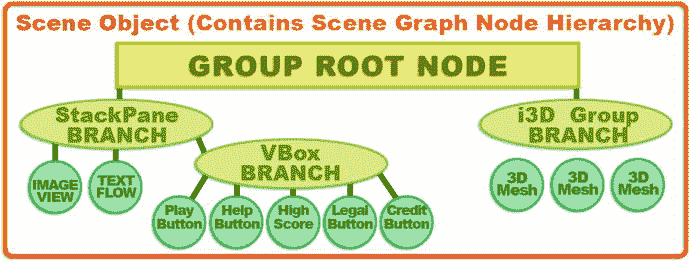

图 9-1。

BoardGame user interface design Scene Graph hierarchy, showing the root, branch, and leaf Node objects

这将需要您向 StackPane 布局容器父分支节点添加两个叶节点，如图 9-1 左下方所示。在我们开始编写 Java 代码来实例化。createBoardGameNodes()方法，并将其添加到场景图形层次结构中，让我们对您将在本章中放置的新 Java 语句中使用的每个类进行概述。

## JavaFX 9 UI 合成:ImageView 和 TextFlow

接下来，让我们看看主要的 JavaFX 类，这些类可以用来为游戏启动画面和文本信息画面创建基本的合成管道，这些屏幕将位于您在前一章中创建的 UI 按钮库的旁边(和下面)。游戏说明、高分、法律和信用屏幕实质上是由背景图像(保存在 ImageView 对象中)合成的文本(保存在 TextFlow 对象中)。启动画面将与开始游戏按钮相关联，并且将在启动游戏应用时显示；当按下开始游戏按钮时，它将变得不可见。这是因为 StackPane UI 构造位于比根组和游戏板组节点对象更高的 z 顺序上，在场景图中它们位于它的上面。这意味着 StackPane 中任何不透明的东西都会覆盖(遮挡视线)场景图形根正下方的 i3D 游戏板组，如图 8-3 所示。我们先来看看图像类。

### JavaFX 图像类:在设计中引用数字图像

Image 类是一个公共类，它直接扩展了 java.lang.Object 主类，这意味着 Image 类也是“临时编码”的，以提供图像加载(引用)和缩放(调整大小)。您可以锁定缩放的纵横比，也可以指定缩放(算法)质量。支持所有由`java.net.URL`类支持的 URL。这意味着您可以从互联网( [`www.domainname.com/imagename.png`](http://www.domainname.com/imagename.png) )、操作系统文件系统(`file:imagename.png`)或使用正斜杠字符(/imagename.png)的 JAR 文件中加载图像。

JavaFX Image 类是 javafx.scene.image 包的一部分。javaFX Image 类的类层次结构源自 java.lang.Object 主类，并使用以下 Java 类层次结构:

```java
java.lang.Object
  > javafx.scene.image.Image

```

Image 类提供了六种不同的(重载的)Image()构造函数方法。这些函数从简单的 URL 到一组指定 URL、宽度、高度、比例、平滑和预加载选项的参数值。这些应该在您的构造函数方法中按此顺序指定。当您使用所有这些构造函数方法中最复杂的方法来编写 Image()构造函数时，您很快就会看到这一点，该方法使用以下格式:

```java
Image(String url, double requestedWidth, double requestedHeight,
      boolean preserveRatio, boolean smooth, boolean backgroundLoading)

```

Image 对象的最简单的构造函数只指定 URL，并使用以下格式:

```java
Image(String url)

```

如果您希望加载图像，并让 constructor 方法使用最高质量的重新采样(平滑像素缩放)将图像缩放到不同的宽度和高度(通常会更小，以获得更好的质量)，同时锁定(保留)纵横比，则可以使用以下格式的 image 对象构造函数:

```java
Image(String url, double scaleWidth, double scaleHeight, boolean preserveAspect, boolean smooth)

```

如果您希望使用图像的“原始”或“物理”(默认)分辨率和原始纵横比来加载图像，并让它在后台(异步)加载图像，您可以对 image()构造函数使用以下格式:

```java
Image(String url, boolean backgroundLoading)

```

还有两个 Image()构造函数方法使用 java.io.InputStream 类。这个类为 Image()构造函数方法提供了一个低级的 Java 输入流。通常，您会使用 URL 来引用您的数码图像文件。这两种图像对象构造器格式采用以下格式。简单的格式如下:

```java
Image(InputStream is)

```

复杂的 InputStream 构造函数方法允许您指定宽度、高度、纵横比锁定和图像缩放插值平滑算法(开/真或关/假)。第二种格式如下所示:

```java
Image(InputStream is, double newWidth, double newHeight, boolean preserveAspect, boolean smooth)

```

因此，Image 类(object)用于准备要使用的数字图像素材，也就是说，从 URL 读取其数据，必要时调整其大小(使用您喜欢的任何平滑和纵横比锁定)，甚至在应用中进行其他操作时异步加载它。值得注意的是，这个图像类(或对象)不显示您的图像素材；它只是加载它，根据需要进行缩放，并将其放入系统内存，以便在您的应用中使用。

为了显示一个图像对象，你需要使用第二个类(对象)，叫做 ImageView，我们将在本章的下一节中讨论它。此 ImageView 对象实现为场景图形和引用中的叶节点，然后将图像对象数据“绘制”到包含此 ImageView 节点的布局容器上。在我们的例子中，这是叶 ImageView 节点之上的 uiLayout StackPane 父(或分支)节点。

从数字图像合成的角度来看，StackPane 类(对象)是层合成引擎，也可以称为层管理器，ImageView 对象表示层堆栈中的一个数字图像层。图像对象包含显示在 ImageView 层内部或多个 ImageView 中的数字图像数据(如果需要的话),因为图像对象和 ImageView 对象是分离的，因此彼此独立存在。我试图最小化场景图节点的使用，所以我使用一个 ImageView 图像板和一个文本信息合成板来创建用户界面屏幕，然后使用代码来切换它们。

### JavaFX ImageView 类:在设计中显示数字图像

ImageView 类是一个公共类，它直接扩展 javafx.scene.Node 超类，后者是 java.lang.Object master 类的扩展。因此，ImageView 对象是 JavaFX 场景图中的一种节点对象，用于使用 Image 对象中包含的数据绘制图形视口。该类具有允许图像重采样(调整大小)的方法，并且与 image 类一样，您可以锁定缩放的纵横比，以及指定重采样算法(平滑质量，通过使用像素插值)。

正如您在 Java 代码的第 24 行中所看到的，如图 8-6 所示，您将使用一个名为 boardGameBackPlate 的 ImageView 对象来显示您的图像对象数据。与 Image 类一样，这个 ImageView 类也包含在 javafx.scene.image 包中。ImageView 类的 Java 类层次结构从 java.lang.Object 主类开始，并使用该类创建 javafx.scene.Node 类，然后使用该类创建 javafx.scene.image.ImageView 节点子类。ImageView 类使用以下 Java 类继承层次结构:

```java
java.lang.Object
  > javafx.scene.Node

    > javafx.scene.image.ImageView

```

ImageView 类提供了三种不同的(重载的)ImageView()构造函数方法。这些构造函数从空的 ImageView 构造函数(您将在后面的代码中使用它)到将 Image 对象作为其参数的构造函数，再到将 URL String 对象作为参数并自动创建 Image 对象的构造函数。最简单的空参数列表 ImageView()构造函数方法将创建一个(空的)ImageView 对象(即没有要显示的图像对象但可以保存图像对象的对象)。它将使用以下格式:

```java
ImageView()

```

我们将使用这个构造函数方法，这样我就可以向您展示如何使用？setImage()方法调用将图像对象加载到 ImageView 对象中。如果您想避免使用。setImage()方法调用，您可以使用另一个重载的构造函数方法。该 ImageView 对象构造函数将使用以下格式:

```java
ImageView(Image image)

```

因此，我将显式设置一个 ImageView 并将其连接到 Image 对象的方式如下所示:

```java
boardGameBackPlate = new ImageView();      // This uses empty constructor method approach
boardGameBackPlate.setImage(splashScreen);

```

这可以使用重载的构造函数方法压缩成一行代码，结构如下:

```java
boardGameBackPlate = new ImageView(splashScreen);  // using the overloaded constructor method

```

如果您还想跳过创建和加载图像对象的过程，还有另一个构造函数方法，它使用以下格式:

```java
ImageView(String url)

```

如果您希望使用图像的“原始”或“物理”(默认)分辨率和原始纵横比来加载图像，并让它在后台(异步)加载图像，image()构造函数将使用以下格式:

```java
backPlate = new Image("/backplate8.png", 1280, 640, true, false, true);
boardGameBackplate = new ImageView();
boardGameBackplate.setImage(backPlate); // use empty ImageView constructor method approach

```

如果您不想指定图像尺寸、背景图像加载或平滑缩放，并且您想锁定任何缩放的纵横比，您可以将前面三行 Java 代码压缩到下面的一个构造函数中:

```java
boardGameBackPlate = new ImageView("/backplate8.png");   // uses third constructor method

```

至少在开始时，出于学习的目的，我会用长时间的方式来做这件事，我将总是使用 Image()构造函数方法“显式地”加载图像对象，这样我们就可以指定所有不同的属性，这样您就可以看到您在 Java 9 编程逻辑中使用的所有不同的图像素材。我想在这里向您展示快捷方式代码，因为如果您开始将 ImageViews 用作 2D 精灵，您以后可能会想要使用这种快捷方式。你可以对你的精灵使用这种快捷方式，因为你不会缩放他们，因为他们是如此高度优化，以至于后台加载选项，节省了很长的加载时间，将是不必要的。

### JavaFX TextFlow 类:在设计中使用文本对象(内容)

TextFlow 类是一个公共类，允许开发人员创建文本段落。文本段落是多行文本的容器，每一行都用“换行符”分隔，在 Java 代码中用“escape n”序列表示。

因此，TextFlow 类将使用以下 Java 类继承层次结构:

```java
java.lang.Object
  > javafx.scene.Node

    > javafx.scene.Parent
      > javafx.scene.layout.Region
        > javafx.scene.layout.Pane
          > javafx.scene.text.TextFlow

```

该 TextFlow 对象是 JavaFX 场景图中的节点对象类型，可用于使用文本对象中包含的数据呈现文本段落，与 ImageView 呈现图像对象中包含的数据的方式非常相似。但是，TextFlow 可以一次处理多个文本对象，允许您使用类似。setFill()和。setFont()。TextFlow 是一个专门的文本布局类，旨在呈现通常称为富文本格式(RTF)的内容。有些人称之为桌面出版，它涉及到使用不同的字体、风格或颜色来增强基于文本的内容的呈现。有趣的是，javafx.scene.text 保存在 javafx.graphics 模块中，而不是 javafx.controls 模块中。这一点很重要，因为如果您想优化(而不是使用)JavaFX 9 UI 控件类(100 个或更多)，您仍然可以仅使用 javafx.base 和 javafx.graphics 模块使用 Image、ImageView、Text 和 3D geometry 对象创建自己的 UI 元素，这为您提供了创建 pro Java 9 i3D 游戏所需的一切。

TextFlow 对象可用于在单个 TextFlow 对象中布局多个文本节点。TextFlow 对象使用其内部每个文本节点对象的文本、字体和样式设置，加上其自己的最大宽度和文本对齐样式属性，来确定呈现每个子文本对象的位置。

由于 TextFlow 对象的包装功能，单个文本节点可以跨越多行，并且由于双向(bidi)重新排序，文本节点的可视位置可以不同于逻辑位置。Java Bidi 对象提供了关于用来创建它的文本的双向重新排序的信息。例如，要正确显示从右向左(RTL)而不是从左向右(LTR)阅读的阿拉伯语或希伯来语文本，这是必需的。

当然，除了文本节点对象之外，任何其他节点对象类型都将被视为 TextFlow 对象布局中嵌入的“富内容”对象。它将使用其首选的宽度、高度和基线偏移值插入到内容中，并相对于父 TextFlow 对象中的其他文本对象进行间隔和对齐。

当文本节点对象位于 TextFlow 对象内部时，它的一些属性将被忽略。例如，文本节点对象的 X 和 Y 属性将被忽略，因为子文本节点的位置是由父 TextFlow 对象决定的。同样，文本节点中的换行宽度将被忽略，因为用于换行的最大宽度将继承 TextFlow 对象的最大宽度属性。TextFlow 布局的环绕宽度将由 Region 对象的当前宽度决定。这可以由应用通过设置 TextFlow 对象的 preferred width 属性来指定。如果不需要换行特性，应用可以将首选宽度设置为两倍。MAX_VALUE 或 Region。USE_COMPUTED_SIZE。应该在任何子文本节点对象中使用换行符或\n(转义符)分隔段落，如下面的粗体代码示例所示。

在 TextFlow 对象中呈现文本节点对象时，该对象的 pickOnBounds 属性值将被设置为 false。发生这种情况是因为单个文本节点对象中的内容可能会被 TextFlow 算法分割，并由于换行和双向重新排序而被放置在 TextFlow 中的不同位置。TextFlow 算法将对每个托管子文本节点对象进行布局，而不考虑该子文本节点的 visibility 属性值，为设置为不可见的文本节点对象留出间隙。以下是 TextFlow 对象创建工作流程的示例:

```java
Text titleText = new Text("Welcome to iTVboardgame! \n");
titleText.setFill(Color.RED).setFont(Font.font("Helvetica", FontPosture.ITALIC, 40));
Text pressPlayText = new Text("Press the Start Game Button to Start!");
pressPlayText.setFill(Color.BLUE).setFont(Font.font("Helvetica", FontWeight.BOLD, 10));
TextFlow gameTextFlow = new TextFlow(titleText, pressPlayText);

```

TextFlow 类有两个属性:DoubleProperty lineSpacing 属性，它使用文本行之间的像素定义垂直间距；object property<textalignment>Text alignment 属性，它定义水平文本对齐常量，如 LEFT、RIGHT、CENTER 或 JUSTIFY。</textalignment>

TextFlow 类有两个构造函数方法；第一个有一个空参数区域，并构造一个空的 TextFlow 文本布局对象。此构造函数方法将使用以下格式:

```java
TextFlow()

```

前面使用的第二个 TextFlow 构造函数方法使用子文本(或富媒体)节点对象创建一个 TextFlow，这些子文本(或富媒体)节点对象使用逗号分隔的列表传递到参数区域，格式如下:

```java
TextFlow(Node... children)

```

第二个构造函数方法采用节点对象的参数列表数组的原因是因为 TextFlow 对象支持“富文本布局”，这是文本对象和其他支持富媒体(图像、形状、几何图形、网格、动画、视频等)的节点对象的组合。).

让我们回到编码，实例化和配置图像，图像视图，文本和文本流对象，以便您可以将它们添加到您现有的场景图层次结构中，以实现图 9-1 所示的内容。之后，在第十章中，我们可以在你的按钮动作事件处理程序中编写代码，它将基于点击定制你的用户界面。

## 用户界面编码:UI 合成管道

要进入用户界面设计，您将需要实例化 ImageView 和 TextFlow 对象，将它们添加到场景图的层次结构中的适当位置，将数字图像导入到您的项目中，创建一种用数字图像素材加载图像对象的方法，创建一种用适当的信息创建文本对象的方法，最后调整场景图和 UI 元素以微调 UI 最终结果。

### 实例化合成层:。createBoardGameNodes()

由于您已经在第八章中声明了 boardgameb 背板 ImageView 和 infoOverlay TextFlow 并编写了这些类的导入语句，接下来您需要做的是使用 Java new 关键字以及它们的基本(空参数列表)构造函数方法将它们实例化为对象。您将在 createBoardGameNodes()方法中做到这一点，以保持事情高度有序。为了镜像场景图形层次，您将在 StackPane 之后和 VBox 之前实例化它们，因为这将是您将使用的合成(层)顺序。正如你在图 9-2 中看到的，Java 代码是没有错误的，你有一个场景图根、i3D 游戏板分支和 UI 布局分支，它们仅使用系统内存中的一个根和三个分支节点对象进行实例化，包括一个组节点、一个 StackPane 和一个 VBox(Insets 对象是一个实用程序对象，而不是一个场景图节点)。

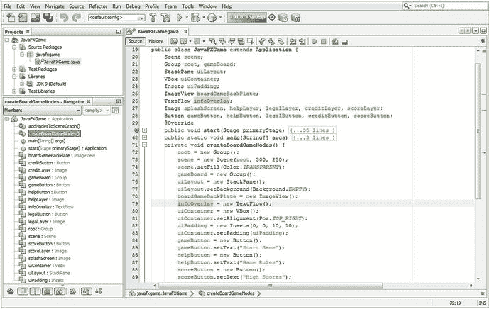

图 9-2。

Instantiate boardGameBackPlate and infoOverlay objects inside of your createBoardGameNodes() method

如果算上持有 SceneGraph 的场景对象，内存中有五个游戏组织对象。向其中添加 Stage 对象，该对象是使用。start()方法和由 JavaFXGame 类创建的应用对象扩展了应用声明，并且您已经使用系统内存中的七个对象为 pro Java 9 游戏开发创建了顶级基础结构。使用 ImageView 和 TextFlow 显示，我们在系统内存中仍然有不到 10 个对象。一旦我们用数字图像素材加载了您的五个图像对象，并设置了五个 UI 按钮对象，您在内存中仍然只有不到 20 个对象，这仍然是非常好的优化。在本章的后面，您还将添加八个文本对象，但它们不是以像素为中心的，所以它们不会占用太多内存。我们还将使用一些实用对象，比如 Insets，但即使有这些，在你开始添加核心 3D 对象组成你的 i3D 棋盘游戏之前，你仍然会有 30 个以下的对象。接下来，让我们将 ImageView 和 TextFlow 添加到场景图中，将它们放在 VBox UI 按钮库的后面，以便它们首先渲染。

### 将 UI 背板添加到场景图形:addNodesToSceneGraph()

对于位于场景、3D 游戏板和 StackPane 之上但在 VBox 按钮库之后的 ImageView 合成层和 TextFlow 信息板，您将需要。getChildren()。在根方法调用之后，uiContainer 方法调用之前，从 uiLayout StackPane 对象中调用 add()方法。这如图 9-3 所示，将在 addNodesToSceneGraph()方法结构中使用以下两个 Java 语句:

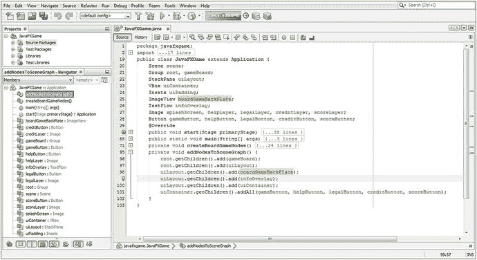

图 9-3。

Add boardGameBackPlate and infoOverlay to your Scene Graph in the addNodesToSceneGraph() method

```java
uiLayout.getChildren().add(boardGameBackPlate); // Add ImageView backplate behind TextFlow Node
uiLayout.getChildren().add(infoOverlay);      //  Add TextFlow information overlay second

```

由于按钮对象不能单独定位，我不得不使用 VBox 类和 Insets 类来包含和定位一组垂直的按钮控件。现在我们已经准备好编写两个素材加载方法了。

### 素材加载方法:loadImageAssets()和 createTextAssets()

在本书的过程中，当我们创建这个游戏时，我们想做的下一件事是创建另外两个专用的方法来加载图像对象素材和创建文本对象素材。这就创建了一个专门的“基于方法的工作流程”来为你的游戏添加元素。在中实例化。createBoardGameNodes()，添加到。addNodesToSceneGraph()，引用。loadImageAssets()，并在。createTextAssets()。正如你在图 9-4 中看到的，我已经把这两个新的方法调用放在了。start()方法，并让 NetBeans 为它们创建空方法，当我们向游戏中添加资源时，我们将向其中添加 Java 代码。我把它们放在 start 方法的顶部，这样你的应用就可以首先把这些资源加载到系统内存中，这样当你的 pro Java 游戏代码需要它们的时候，它们就在那里了，这样我们就不需要使用任何专门的预加载器了。此外，这些对象在被其他方法调用之前必须就位，因此需要首先调用它们，在设置更高级的对象并将它们添加到 SceneGraph 层次结构的方法之前。稍后，我们可以使用 NetBeans 9 profiler 确保素材加载不到一秒钟，一旦我们有了 3D 对象渲染和游戏处理逻辑等需要确保高度优化的内容，并且在处理场景图时不会占用太多 Pulse 引擎的 60 FPS 中断(时间片)。


图 9-4。

Create empty methods for loadImageAssets() and createTextAssets() to create your image and text assets

在我们继续之前，我们需要创建一些新的媒体素材来与图像对象一起使用，我们将使用 PNG32 数字图像素材实例化和引用(加载)，这将利用 alpha 通道。这种 alpha 通道数据将允许我们在任何背景图像上合成这些徽标或屏幕字幕，如果我们选择继续下去，甚至可以在 i3D 游戏板本身上合成。在下一节中，我将在 Autodesk 3D Studio Max 中创建一个 iTVBoardGame 徽标，然后将其导出为 OBJ 文件，并使用冷(或者热)岩石纹理进行渲染。然后，我们将有一个专业的 Java 9 游戏 3D 闪屏标题，供你在本章稍后完善你的 UI 设计时使用。

### 创建闪屏素材:在 2D 管道中使用 3D 素材

正如你在图 9-5 中看到的，我已经使用 2D 文本工具创建了一个“快速和肮脏”的 iTVBoardGame 3D 徽标，然后使用斜角修改器挤压它，正如你在截图右上角的 Autodesk 3D Studio Max 版本的场景图形层次(在 3D Studio Max 中称为修改器列表)中看到的。我后来使用文件➤输出功能输出一个波前。OBJ 3D 文件格式，是 JavaFX 9 支持的几种 3D 文件导入格式之一。根据我们需要导入的 3D 数据类型，我们可能会使用这种格式或其他格式，因为每种格式都支持不同类型的 3D 数据和功能，如纹理贴图、UVW 贴图、反向运动学(IK)骨骼动画数据、网格变形、动画、相机数据、照明数据等。JavaFX 能够导入相当多的高级 3D 格式，如 Collada (DAE)、FrameBox (FBX)、3D Studio 3DS 和 OBJ。

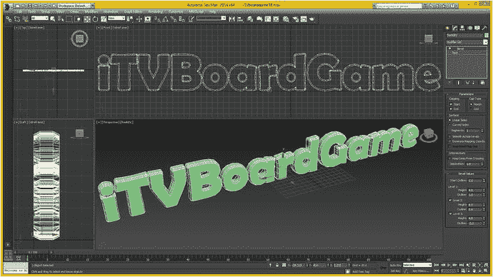

图 9-5。

I created an iTVBoardGame logo with 3D Studio Max, exported it to an OBJ file format, and rendered it

我将把这个网格数据导入渲染引擎，添加一个胡桃木纹理贴图，渲染它，然后把 2D 像素数据导出为 2D 图像素材。我将确保它有一个 alpha 通道，所以它看起来仍然像是一个 3D 对象，即使事实上它不是。这就是业内所说的 2.5D。

如果我们以后想要旋转它等等，当我们了解了 JavaFX 中 i3D 内容生产管道的更多信息时，我们可以在本书的后面将其作为 3D 素材导入。JavaFX 提供的混合 2D+3D 环境(API)的优势之一是能够决定什么 3D 是“幻觉”(像 2.5D，或立体)，什么 3D 是“真实”的 i3D。立体 3D(主要是电影)不是真正的 3D，因为你不能走在场景和所有角色的后面。在一个 i3D 游戏中，比如《光环》或《疯狂足球》,你可以，因为它是一个完全虚拟的现实。

接下来，让我们来看一些我为在 ImageView 对象中使用而创建的 UI 屏幕标题数字图像对象，我将向您展示如何将它们添加到 NetBeansProject 文件夹层次结构中的适当文件夹中。NetBeans 9 可以“看到”这些 PNG32 数字图像素材后，您就可以编写 loadImageAssets()方法，该方法会将 PNG32 数据加载到系统内存中的图像对象中，以便 ImageView 可以引用和显示它们。

### 将图像资源添加到项目中:使用\src\文件夹

正如您在图 9-6 的顶部所看到的，我的 Windows 7 64 位四核 AMD 工作站上的路径从 Users 文件夹开始，看起来像 C:\ Users \ Walls \ my documents \ netbeans projects \ Java FX game \ src \ credits . png。正如您所看到的，我根据文件内部的内容来命名 PNG32 文件，尽管它们看起来像是在白色背景上，但实际上它们是透明的。将图书素材存储库中的文件复制到您的项目文件夹中，然后您将能够在您的代码中引用它们。


图 9-6。

Copy the PNG32 files for the digital image titles for the UI screens to /NetBeansProjects/JavaFXGame/src/

### 一种加载图像资源的方法:。loadImageAssets()

打开空的 loadImageAssets()方法结构，添加五个 Image()构造函数方法，用正确的图像素材及其规范实例化和加载图像对象，如图 9-7 中突出显示的。

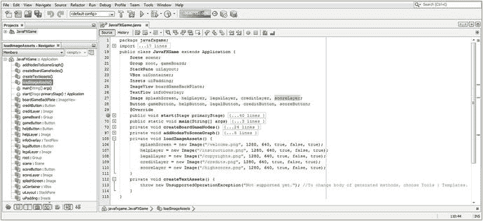

图 9-7。

Instantiate and reference your five Image objects inside of the loadImageAssets() method you just created

如图 9-7 所示的 Java 代码应该是这样的:

```java
splashScreen = new Image("/welcome.png", 1280, 640, true, false, true);
helpLayer = new Image("/instructions.png", 1280, 640, true, false, true);
legalLayer = new Image("/copyrights.png", 1280, 640, true, false, true);
creditLayer = new Image("/credits.png", 1280, 640, true, false, true);
scoreLayer = new Image("/highscores.png", 1280, 640, true, false, true);

```

这个构造函数方法格式所做的是在 JAR 文件中加载带有数字图像素材的图像，使用“根”或正斜杠字符引用，因为该文件位于/src/文件夹中。第二个和第三个条目代表图像的 X 和 Y 分辨率，第四个 true 条目打开纵横比锁定。第五个假输入关闭双线性插值，第六个真输入打开背景图像加载，作为速度优化。

### 一种创建文本资源的方法:。createTextAssets()

打开空的 createTextAssets()方法结构，添加八个 Text()构造函数方法，用正确的信息实例化和加载文本对象。如图 9-8 所示的代码应该是这样的:


图 9-8。

Declare eight Text objects at top of class; instantiate and load Text objects in the createTextAssets() method

```java
playText = new Text("Press the Start Game Button to Start! \n");
moreText = new Text("Use other buttons for instructions, copyrights, credits and high scores.");
helpText = new Text("To play game roll dice, advance gamepiece, follow gameboard instruction.");
cardText = new Text("If you land on square that requires card draw it will appear in UI area.");
copyText = new Text("Copyright 2015 Wallace Jackson, All Rights Reserved. \n");
riteText = new Text("Visit the iTVboardGame.com website on the Internet: www.iTVboardgame.com");
credText = new Text("Digital Imaging, 3D Modeling, 3D Texture Mapping, by Wallace Jackson. \n");
codeText = new Text("Game Design, User Interface Design, Java Programming by Wallace Jackson.");

```

接下来，您可能希望使按钮控件的宽度一致，这将通过使用 Button.setMaxWidth()方法来实现。当您升级您的场景对象构造器以支持 iTV 1280x720 时，您将能够看到 TOP_RIGHT Pos 常量的运行，并且统一的按钮块将看起来更专业。

### 使用 Button.setMaxWidth()方法:使按钮一致

您需要做的第一件事是将场景场景对象的 iTV 宽度设置为 1280，高度设置为 640，这样您就可以使用 2:1 的宽高比，并且具有 pro Java 9 游戏应用支持的最低 iTV 屏幕分辨率。正如你在图 9-9 中看到的，我在下面的 Java 代码中升级了 Scene()构造函数方法来使用这些新的应用窗口屏幕尺寸，如图 9-9 顶部的第 83 行所示:

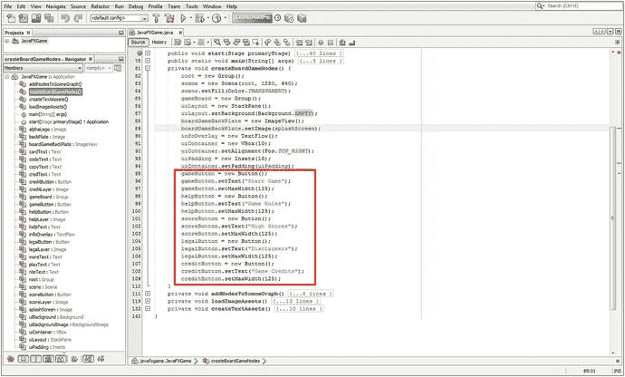

图 9-9。

Use the .setMaxWidth() method call to set your Button UI objects to 125 so that they have a uniform width

```java
scene = new Scene(root, 1280, 640);

```

接下来要做的事情是设置 boardgameb 背板 ImageView 来包含欢迎消息图像。您将使用闪屏图像的. setImage()方法来实现这一点，在图 9-9 的第 89 行使用以下代码:

```java
boardGameBackPlate.setImage(splashScreen);

```

最后，为了使按钮对象的宽度统一为 125 像素，使用`.setMaxWidth(125)`方法调用，调用五个按钮 UI 对象中的每一个(如图 9-9 ，代码行 97、100、103、106 和 109 所示)。

我将 VBox 配置为以 10 个像素间隔其子节点，在 VBox(10)构造函数方法调用中放置值 10。我将 Insets()的间距值增加到 Insets(16)。运行项目以查看变更，如图 9-10 所示。


图 9-10。

Use the Run ➤ Project work processing to see your Button bank design improvements in spacing and width

接下来，将 backplate8.png 和 alphalogo.png 图像素材复制到源文件夹，如图 9-11 所示。


图 9-11。

Use your file management utility to copy the backplate8.png and alphalogo.png assets to your /src folder

接下来，让我们使用 StackPane 的背景图像功能。目前我们使用的是 Background 类中的空常量，所以让我们用 BackgroundImage 对象替换它，您的背景类也将支持它。接下来让我们看看如何连接它，以便我们可以通过使用一个未使用的功能(StackPane 背景)而不是通过添加另一个 ImageView 对象来进一步优化您的场景图，大多数人都倾向于这样做。

### 使用 StackPane 背景:利用所有合成层

JavaFX StackPane 类支持. setBackground(背景背景)方法调用，该方法调用又支持 BackgroundImage 对象，该对象可以用 Image 对象加载或与 EMPTY 常量一起使用。这意味着您可以在 StackPane UI 布局容器对象的背景中引用图像资源，所以让我们来看看如何利用这一点，这样您就可以使用五个合成层(舞台背景、场景背景、ImageView、TextFlow、StackPane ),只需使用您添加到场景图中的节点。所有这些当前都设置为空或透明，或者包含带有 alpha 的 PNG32。使用以下代码，将 backPlate 和 alphaLogo 对象名称添加到类顶部的现有图像声明复合 Java 语句中:

```java
Image splashScreen, helpLayer, legalLayer, creditLayer, scoreLayer, backPlate, alphaLogo;

```

接下来，在类的顶部声明一个名为 uiBackgroundImage 的 BackgroundImage 对象，并使用 Alt+Enter 让 NetBeans 9 为您编写导入语句。接下来，添加一个名为 uiBackground 的背景对象(注意，在第六章中已经导入了背景类，所以您可以利用背景。空常量)，如下面的 Java 代码所示，以及图 9-12 中突出显示的:

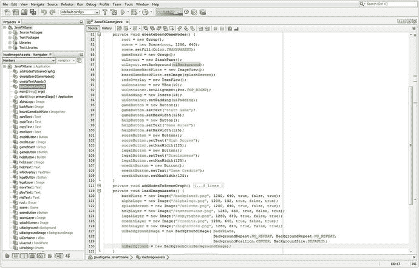

图 9-12。

Add a backgroundImage object named uiBackgroundImage; use the .setBackground() method to load it

```java
BackgroundImage uiBackgroundImage;  // Object Declaration at the top of the JavaFXGame class
Background uiBackground;           //  Object Declaration at the top of the JavaFXGame class

```

在 loadImageAssets()方法的开头，实例化 backPlate 和 alphaLogo 图像对象，然后使用以下 Java 代码加载它们及其相关的数字图像素材，如图 9-12 所示:

```java
backPlate = new Image("/backplate8.png", 1280, 640, true, false, true);
alphaLogo = new Image("/alphalogo.png",  1200, 132, true, false, true);

```

在这个 loadImageAssets()方法的最后，实例化您的 uiBackgroundImage 对象并使用 backplate Image 对象加载它，我们将使用它作为优化的 8 位 PNG8 背景图像，用于我们使用 Node 子类(StackPane、ImageView 和 VBox)创建的复合闪屏图像；你可以使用下面的 Java 代码来实现，如图 9-12 所示:

```java
uiBackgroundImage = new BackgroundImage(backPlate,
                                         BackgroundRepeat.NO_REPEAT, BackgroundRepeat.NO_REPEAT,
                                        BackgroundPosition.CENTER, BackgroundSize.DEFAULT);

```

最后，您需要实例化 uiBackground 背景对象，并使用其构造函数方法，用您在前面的 Java 代码行中刚刚创建的 uiBackgroundImage 背景图像对象来加载它。这将使用下面的代码行来完成，在图 9-12 中的 loadImageAssets()方法中突出显示:

```java
uiBackground = new Background(uiBackgroundImage);

```

在 createBoardGameNodes()方法中，调用。setBackground()方法，并传递一个 uiBackground 背景对象，替换背景。空常数，使用图 9-12 中的代码:

```java
uiLayout.setBackground(uiBackground);

```

使用“运行➤项目”查看背板图像是否在您的 StackPane 的背景中，如图 9-13 所示。

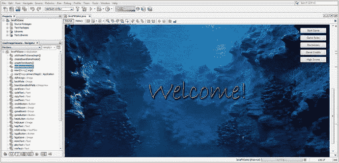

图 9-13。

Use the Run ➤ Run Project (JavaFXGame) menu sequence to test your new compositing pipeline Java code

现在我们准备使用 textFlow 和 Text 对象将文本层添加到合成管道中。

### 使用 TextFlow:设置信息叠加对象

打开 createTextAssets()方法，为 playText 和 moreText 对象添加两个方法调用，确保它们使用颜色。白色常量来填充字体，并选择一种广泛支持的 Helvetica 字体，使用其常规字体，并为字体高度设置一个大的 50 像素。使用 FontPosture 辅助类(font face 常量)将 playText 和 moreText 对象设置为使用常规字体样式。在 moreText 对象内添加转义换行符或\n 字符序列，将其分成两行。图 9-14 中间突出显示的新文本对象配置应类似于以下 Java 代码:


图 9-14。

Add .setFill() and .setFont() methods to your SplashScreen text

```java
playText = new Text("Press the Start Game Button to Start! \n");
playText.setFill(Color.WHITE);
playText.setFont(Font.font("Helvetica", FontPosture.REGULAR, 50));
moreText = new Text("Use other buttons for instructions, \n copyrights, credits and scores.");
moreText.setFill(Color.WHITE);
moreText.setFont(Font.font("Helvetica", FontPosture.REGULAR, 50));

```

打开 createBoardGameNodes()方法，在 infoOverlay 对象实例化之后，添加一行代码并调用。使用 infoOverlay 对象的值 240 设置 Translate X()方法。然后添加另一行代码并调用。值为 420 的 setTranslateY()方法。这将把 TextFlow 容器放置在 ImageView 对象(当前是一条欢迎消息)的下面，这样您的合成文本块将位于屏幕的底部。这些语句的 Java 代码应该如下所示(在图 9-15 中突出显示):

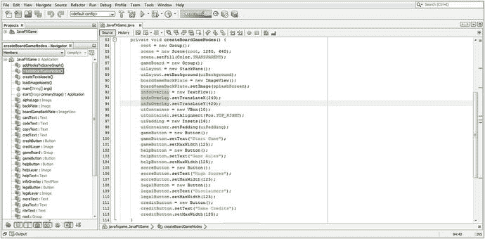

图 9-15。

Add Text objects to your TextFlow object and .setTranslateX() and .setTranslateY()

```java
infoOverlay.setTranslateX(240);
infoOverlay.setTranslateY(420);

```

打开 addNodesToStackPane()方法。在该方法的末尾，添加一个 infoOverlay 对象并调用。getChildren()。addAll()方法，用逗号分隔 playText 和 moreText 对象，如图 9-16 所示。

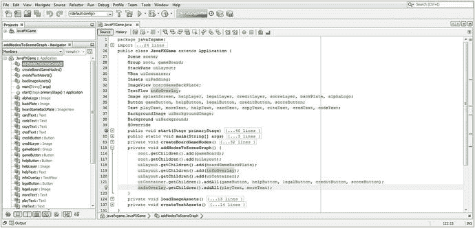

图 9-16。

Add infoOverlay object to end of .addNodesToSceneGraph() and use .addAll() to add playText and moreText objects to infoOverlay

该语句的 Java 代码应如下所示，并在图 9-16 中突出显示:

```java
infoOverlay.getChildren().addAll(playText, moreText);

```

正如你在图 9-17 中看到的，白色的文本对象看起来很酷，你的图像合成管道看起来好像是用专业的数字成像软件创建的。接下来，让我们添加一个徽标的图像合成层。


图 9-17。

Run the project and check the result of adding a TextFlow object to the splash screen compositing pipeline

这个 UI 设计看起来越来越专业，按钮放在岩石露头上，还有“欢迎！”文本在屏幕设计中居中。但是，UI 设计仍然需要一个品牌标志，并且有一个额外的空间将第三行推到右边，需要固定(删除)。让我们在下一节做这件事。

### 使用 StackPane:添加更多数字图像合成层

让我们在 JavaFXGame 类的顶部添加另一个名为 logoLayer 的 ImageView 对象声明，将 ImageView 声明变成一个`ImageView boardGameBackPlate, logoLayer;`复合 Java 语句。打开 createBoardGameNodes()方法，为该对象添加一个对象实例化，然后调用. setImage()方法将它连接到您之前在导入该数字图像素材时创建的 alphaLogo 图像对象。接下来，您将添加 logoLayer 对象的两个方法调用，一个用于 X 缩放，一个用于 Y 缩放，使用相同的 80%值 0.8，以便我们锁定此缩放操作的纵横比(也称为统一缩放)。最后，您将使用-225 值将徽标从屏幕中心沿 y 轴上移 225 个像素，因为 StackPane 使用 0，0 中心屏幕引用模型，而不是标准的 0，0 左上角像素引用模型。我们还将使用-75 像素的 X 平移值将徽标向左拉回 75 像素。新 logoLayer ImageView 对象实例化、素材引用和转换(位置/转换和比例)配置代码可以在图 9-18 的中间高亮显示，应该类似于下面的 Java 9 代码语句块:

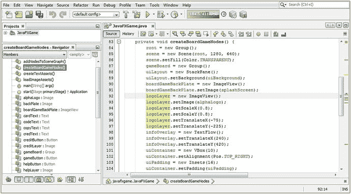

图 9-18。

Create a logoLayer ImageView referencing the alphaLogo image; set scale to 80 percent and position to -75,-225

```java
logoLayer = new ImageView();
logoLayer.setImage(alphaLogo);
logoLayer.setScaleX(0.8);
logoLayer.setScaleY(0.8);
logoLayer.setTranslateX(-75);
logoLayer.setTranslateY(-225);

```

接下来，您必须在 addNodesToSceneGraph()方法中将这个新的 logoLayer ImageView 添加到合成层的 StackPane uiLayout 容器中。在这里，由于我们正在向 root 和 uiLayout SceneGraph 层次结构添加多个节点子类，我们将从使用。getChildren()。使用. getChildren()将()方法链添加到。addAll()方法链，将该方法中的 Java 语句数量从八个减少到四个。

添加的顺序会影响合成层的顺序，因此对于。add()语句，这等同于从上到下。添加的第一个语句(顶部)在合成层堆栈的底部(有点违反直觉，不是吗？).

与。addAll()方法，这将变为从左到右，因此首先添加的对象(左)位于合成层堆栈的底部。一个新的 addNodesToStackPane()方法结构，使用。getChildren()。因此，addAll()方法调用看起来如下，如图 9-19 底部突出显示的:


图 9-19。

Consolidate six .add() method calls into two .addAll() method calls off of a SceneGraph root and UI branch

```java
private void addNodesToSCeneGraph() {
    root.getChildren().addAll(gameBoard, uiLayout);
    uiLayout.getChildren().addAll(boardGameBackPlate, logoLayer, infoOverlay, uiContainer);
    uiContainer.getChildren().addAll(gameButton, helpButton, legalButton,
                                     creditButton, scoreButton);
    infoOverlay.getChildren().addAll(playText, moreText);
}

```

正如您在图 9-20 中看到的，我已经添加了徽标并修复了文本段落(左侧)对齐方式，删除了\n 后面的空格，这是违反直觉的，因为它留下了\ n 版权并且没有转义版权。作为一名 Java 程序员，您需要知道在这种情况下，编译器会查看转义符(\)，并且只查看其后的一个字母(在本例中是 n 或 newline)，然后继续将字符作为文本内容的一部分进行解析。


图 9-20。

Run the project and check the result of adding ImageView object to the splash screen compositing pipeline

徽标已经添加到合成层容器(StackPane)中，调整了大小(缩放)以适合按钮库，并上移(平移)到按钮库的中心。这一切看起来很平衡和专业；它在场景图中使用很少的节点，在系统内存中使用很少的对象，所以它是优化的。

由于我们没有使用我在第七章中向您展示的透明性(技巧),让我们通过恢复到默认的修饰 StageStyle 类常量来替换 OS chrome，这可以通过删除 primaryStage.initStyle()方法调用来实现。相反，我将保留 Java 语句，并将使用透明常量改为使用修饰常量，以防将来我们希望以不同的方式修饰 Stage 对象。这可以通过将图 9-21 中第 46 行所示的这行代码改为以下 Java 代码来实现:


图 9-21。

Revert to StageStyle.DECORATED and add an iTVBoardGame (JavaFX 9 Game) title for your OS window

```java
primaryStage.initStyle(StageStyle.DECORATED);

```

接下来，通过替换在第六章中为您创建的引导代码中的“Hello World”占位符文本，为您的操作系统窗口 chrome 添加标题。我将使用 iTVBoardGame 来匹配 3D 徽标，并使用括号添加“JavaFX 9 Game ”,以向用户阐明该应用是在什么平台上构建的。执行此操作的代码在上方的图 9-21 中以橙色显示。initStyle()方法，应该类似于下面的 Java 语句:

```java
primaryStage.setTitle("iTVBoardGame (JavaFX 9 Game)");

```

正如你在图 9-22 中看到的，我们现在有了一个初始的应用启动闪屏，带有徽标、背景图像、用户界面按钮库和部分标题图像层。在闪屏的情况下，这是“欢迎！”

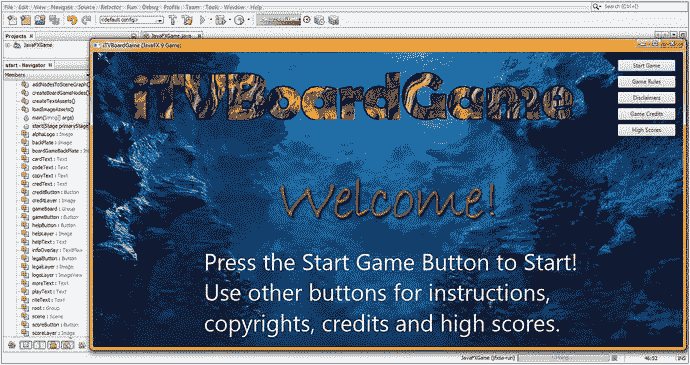

图 9-22。

Run the project to make sure the OS chrome has been replaced and the window title is in place and correct

我们剩下要做的唯一一件事是完成其他四个部分的图像对象的实现，并在其他四个 TextFlow 对象中实现字体样式和颜色。所有这些对象都将在您的事件处理代码中被调用，我们将在第十章中添加这些代码(涵盖 JavaFX 9 和 Java 9 游戏中的事件处理和效果)。

在所有这些 2D 屏幕设计、UI 设计和事件处理编码完成后，我们可以在本书的后半部分开始进入 3D 和 i3D。

### 完成 UI 设计对象的创建和配置

让我们打开 createTextAssets()方法并添加。setFill()和。setFont()方法调用其他六个文本对象，将它们的颜色设置为与保存手写文本图像的 boardGameBackPlate ImageView 相匹配，并将它们的字体样式设置为 Helvetica 常规。这是一个相对简单的练习；得到的方法体如图 9-23 所示，应该类似于下面的 Java 方法体和 Java 语句:

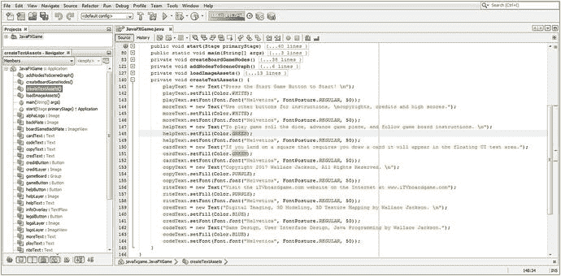

图 9-23。

Finish configuring your Text objects using .setFill() and .setFont() methods with Color and Helvetica values

```java
private void createTextAssets(){
    playText = new Text("Press the PLAY GAME Button to Start!\n");
    playText.setFill(Color.WHITE);
    playText.setFont(Font.font("Helvetica", FontPosture.REGULAR, 50));
    moreText = new Text("Use other buttons for instructions,\ncopyrights, credits and scores.");
    moreText.setFill(Color.WHITE);
    moreText.setFont(Font.font("Helvetica", FontPosture.ITALIC, 50));
    helpText = new Text("To play game roll the dice, advance\ngame piece and
                         follow game board\ninstructions. ");
    helpText.setFill(Color.GREEN);
    helpText.setFont(Font.font("Helvetica", FontPosture.REGULAR, 50));
    cardText = new Text("If you land on a square\nthat requires you draw a card, it
                         will\nappear in the floating UI text area.");
    cardText.setFill(Color.GREEN);
    cardText.setFont(Font.font("Helvetica", FontPosture.REGULAR, 50));
    copyText = new Text("Copyright 2015 Wallace Jackson.\nAll Rights Reserved.\n");
    copyText.setFill(Color.PURPLE);
    copyText.setFont(Font.font("Helvetica", FontPosture.REGULAR, 50));
    riteText = new Text("Visit the iTVboardGame.com website on\nthe Internet
                         at www.iTVboardgame.com");
    riteText.setFill(Color.PURPLE);
    riteText.setFont(Font.font("Helvetica", FontPosture.REGULAR, 50));
    credText = new Text("Digital Imaging, 3D Modeling, 3D\nTexture Mapping
                         by Wallace Jackson.\n");
    credText.setFill(Color.BLUE);
    credText.setFont(Font.font("Helvetica", FontPosture.REGULAR, 50));
    codeText = new Text("Game Design, User Interface Design,\nJava Programming
                         by Wallace Jackson.");
    codeText.setFill(Color.BLUE);
    codeText.setFont(Font.font("Helvetica", FontPosture.REGULAR, 50));
}

```

在本章中，你已经在整合你的专业 Java 游戏闪屏设计、用户界面设计、顶级场景图和类(和方法)基础设施方面取得了很大的进步。您还了解了 Image、ImageView、Text、TextFlow、Background 和 BackgroundImage 类。拍拍自己的背，如果你有那么灵活的话，然后从 Java 9 编程中稍微休息一下！

您还没有完成 pro Java 9 游戏开发的用户界面设计部分。在本书的后面，当我们使它成为交互式的(第十章)和当我们通过添加一个透视相机到场景根(第十一章)将你现在的 2D 场景转换成 3D 场景时，使它成为一个 2D 平面时，准备好进一步完善它，所有这些都需要改变 StackPane 对象合成层管道属性和坐标参考系统。正如我所说的，这本书的每一章都会变得越来越复杂，直到你对 Java 9、JavaFX 和 NetBeans 9 的了解足以创建你能想象的任何 i3D 游戏设计！

## 摘要

在第九章中，您使用 JavaFX Image、ImageView、Background、BackgroundImage、Text 和 TextFlow 类向游戏的实际顶级用户界面设计的合成管道中添加了更多代码。你做的第一件事是完成 JavaFX 场景图层次结构设计，我在图 9-1 中可视化了它，展示了场景图如何使用一个根节点对象、三个分支节点对象和七个叶节点对象(五个按钮对象、一个 ImageView 对象和一个 TextFlow 对象)。稍后，您将为游戏的 3D 部分添加更多分支和叶节点对象，主要用于保存 JavaFX 提供的 3D 对象(基本体)或您自己的 3D 网格几何体。在本章中，您为徽标合成添加了第二个 ImageView 节点。

接下来，您了解了一些 JavaFX 类，我们将在本章和下一章中在这些新方法中实现这些类。其中包括 Image 类和 ImageView 类，都来自 javafx.scene.image 包。您还了解了 javafx.scene.text 包中的 Text 和 TextFlow 类。

您实例化并配置了这些新的合成节点对象，然后编写了两个新方法来处理您的图像和文本素材。loadImageAssets()方法将数字影像素材实例化并配置到图像对象中，createTextAssets()方法将文本信息素材实例化并配置到文本对象中，以便以后与场景图形中的 TextFlow 节点对象一起使用。

然后，您使用 125 像素的值使按钮宽度一致，并随后学习了如何使用 background 和 BackgroundImage 类(对象),以便能够利用 StackPane 的 Background 属性作为合成管道中的另一个合成层，而无需向 JavaFX 场景图形层次添加任何更多的节点对象。这加强了我对 pro Java 游戏开发的优化方法，即利用场景图中每个节点给你的一切，这样你就可以将每个脉冲事件中遍历的节点总数保持在绝对最低限度。

在下一章中，您将学习 JavaFX 中的事件处理类，并在 ActionEvent EventHandler 程序逻辑中实现 Java 代码。您还将学习如何在这个过程中实现一些很酷的特殊效果，因为其中一些将由 Java 9 语句在您的事件处理程序中触发。在那之后，我们将进入 3D 和你需要知道的进入 3D 领域的职业和素材。