# 十、用户界面设计交互性：事件处理和图像效果

现在，您已经完成了闪屏和用户界面设计的场景图层次结构，让我们回到第十章中的 JavaFXGame 主应用类编码，并完成您已经准备好但实际上是“空的”事件处理框架的实现(除了几个 System.out.println 调用来测试您的按钮控件节点对象)。我们将在本章中概述的 Java 和 JavaFX 事件处理将实现用户界面，玩家将使用该界面来了解和启动您的 Java 9 游戏。在本书中，你将使用其他类型的事件处理(击键和鼠标),我们将在本章中讨论。您将添加 Java 游戏 UI 编程逻辑，它可以被视为游戏的交互引擎。有许多与游戏交互的方式，包括箭头键，被称为消费电子设备和现代遥控器的 pad 一个键盘；一只老鼠；轨迹球；游戏控制器；触摸屏；甚至是高级硬件，包括陀螺仪和加速度计。您将为您的 pro Java 9 游戏开发做出的一个重要选择是，您的玩家将如何使用他们玩游戏的硬件设备和游戏支持的硬件输入功能与您的 Java 游戏进行交互。

在本章中，您将学习不同类型的 JavaFX 事件类型，它们包含在`javafx.event`、javafx.scene.input 和 java.util 包中。您将覆盖 ActionEvent，因为您当前在您的用户界面设计中使用它，以及输入事件，如 MouseEvent 和 KeyEvent。

除了通过添加事件处理继续在 JavaFXGame Java 代码上工作之外，您将在本章中学习 JavaFX 特效，以确保我在本书中涵盖了 Java 中所有很酷的东西。这些 JavaFX 特效存储在 javafx.scene.effect 包中，为 javafx 和 Java 提供了与 GIMP 等数字图像合成软件包相同的特效优势。

## 事件处理:增加游戏的互动性

有人会说事件处理是游戏开发的基础。这是因为如果你没有一种方法来与游戏逻辑和游戏元素进行交互，你就真的没有一款游戏。在本章的这一节，我将介绍 JavaFX 事件处理类，您将实现 ActionEvent 处理结构，以便您的用户可以利用您在过去几章中设计的用户界面。在我们开始剖析 Java 和 JavaFX 包、类、接口和方法之前，我首先要说的是可以为 pro Java 游戏处理的不同类型的输入硬件事件。这些可以使用 iTV 遥控器或智能手机 DPAD 上的箭头键、键盘、鼠标或轨迹球以及智能手机、平板电脑或 iTV 电视机上的触摸屏来生成。还有自定义输入硬件，包括游戏机上的游戏控制器和现在的 iTV 电视机，智能手机和平板电脑中的陀螺仪和加速度计，以及自由形式的手势和动作控制器，如 Leap Motion，VR Glove 和 Razer Hydra Portal。

### 控制器的类型:我们应该处理什么类型的事件？

要考虑的一个关键问题是，支持游戏相关事件的最合理方法是什么，如箭头键、鼠标点击、触摸屏事件、游戏控制器按钮(A、B、C 和 D)以及更高级的控制器，如 Android、Kindle、Tizen、HTML5 OS 和 iOS 消费电子设备上可用的陀螺仪和加速度计。这个决定是由游戏运行的硬件设备决定的；如果一个游戏需要在任何地方运行，那么最终将需要处理不同事件类型的代码，甚至是不同的事件处理编程方法。在本章的这一节中，我们将进一步了解 Java 和 JavaFX 目前支持哪些输入事件，以便为您的游戏开发提供一个概览。

有趣的是，Java 和 JavaFX 应用已经可以在两个流行的嵌入式平台上运行，Android 和 iOS，我会在不久的将来的某个时候在开源平台(Opera，Tizen，Chrome，Ubuntu 和 Firefox)和当前支持 Java 8 或 9 技术的专有平台(Windows，Samsung Bada，RIM Blackberry，LG WebOS，OpenSolaris)上投入资金。Java 9 的未来是光明的，这要归功于 JavaFX、Java 平台几十年来的发展势头以及新的高级 i3D 硬件平台支持！

### Java 和 JavaFX 事件包:java.util 和 javafx.event

正如您在事件处理结构的新 EventHandler <actionevent>声明中看到的，javafx.event 包的 EventHandler 公共接口扩展了 java.util 包的 EventListener 接口，是创建和处理事件对象的方式，或者使用匿名内部类(Java 7)结构(我们正在使用它，因为它与 Android 兼容)，或者使用 lambda 表达式(Java 8)。现在，您已经熟悉了如何编写这种类型的事件处理结构，在本书中，我将继续使用 Java 匿名内部类方法编写方法。也就是说，您可以将鼠标悬停在任何 Java 7 代码下的黄色波浪下划线高亮处，并让 NetBeans 9 将其转换为使用更简化的 Java 8 lambda 表达式。通过这种方式，您可以创建兼容 Java 7 (64 位 Android 5 和 6)、Java 8 (64 位 Android 7 和 8)和 Java 9(PC OS 和未来版本的 Android)游戏代码交付管道的游戏。在本节中，我们将查看 ActionEvent 和 InputEvent EventObject 子类类别，以便您了解 JavaFX 中的主要事件。这些来自 java.util.EventObject 超类，我们将看看它们如何应用于处理动作、击键、鼠标事件、触摸事件和类似的高级输入事件类型。</actionevent>

#### JavaFX ActionEvent 类:从 java.util 创建。EventObject 超类

到目前为止，您在本书中用于用户界面按钮控件事件处理的 ActionEvent 类(和对象)是 javafx.event 包的 Event 超类的子类，该超类本身是 java.util 包的 EventObject 超类的子类，该超类是 java.lang.Object 主类的子类。这个类还有一个已知的直接子类 MediaMarkerEvent 类。因此，类层次结构如下所示:

```java
java.lang.Object
  > java.util.EventObject

    > javafx.event.Event
      > javafx.event.ActionEvent

```

ActionEvent 类与 EventHandler 公共接口一起包含在 javafx.event 包中。正如您可能已经猜到的，ActionEvent 对象是一个表示某种类型的动作的事件对象。这种类型的事件对象可以用来表示各种各样的事物。正如你所看到的，当一个按钮被触发时使用它，例如，当一个关键帧结束播放时，以及在其他类似的内部软件使用中也使用它。ActionEvent 是在 JavaFX 1.x 版本中引入的，在 JavaFX 1.x 版本(1.0 到 1.3)中不可用。它保留在 JavaFX 7 for Java 7 中(两者现在都已停止使用)，保留在 JavaFX 8 for Java 8 中，现在保留在 JavaFX 9 for Java 9 中。

ActionEvent 对象有两个数据字段(属性)。第一个是静态 EventType <actionevent>动作特征，这是 ActionEvent 的唯一有效 EventType。然而，还有一个 ActionEvent 对象的超类型，它采用静态 EventType <actionevent>ANY 的形式，为开发人员提供了一个能够表示所有动作事件类型的通用超类型。因此，如果希望 Java 代码处理任何 ActionEvent 对象，请使用此数据字段；如果希望 Java 代码处理特定的 ActionEvent 对象，请使用 ACTION 数据字段。</actionevent></actionevent>

此 ActionEvent 类还支持两个构造函数方法。默认的空参数列表 ActionEvent()构造函数方法使用默认的事件类型 ACTION 创建一个新的 ActionEvent 对象。还有一个 ActionEvent(Object source，EventTarget)构造函数方法，它将使用指定的事件对象源和 EventTarget 目标创建新的 ActionEvent。

此 ActionEvent 类还支持两种方法。第一个是 ActionEvent copy for(Object new source，EventTarget newTarget)方法，用于使用指定的事件源和目标创建并返回事件的副本。第二个是 EventType extends ActionEvent> getEventType()方法，该方法将获取调用它的事件对象的事件类型。

我们将用于游戏的 i3D 组件的所有其他事件相关类都包含在 javafx.scene.input 包中。在本节的剩余部分，我将重点关注 javafx.scene.input 包，因为您已经学会了如何为 Java 7 编写新的 EventHandler <actionevent>{ … }结构。如果您指示 NetBeans 9 将此转换为 Lambda 表达式，它将采用 Java 8 的(ActionEvent) -> { … }代码结构格式。</actionevent>

现在是时候学习如何在 Java 游戏开发工作流程中使用其他类型的事件，称为输入事件。让我们看看 javafx.scene.input 包及其 25 个输入事件相关的类。

#### JavaFX 输入事件类:javafx.scene.input 包

尽管 java.util 和 javafx.event 包包含核心的 eventObject、Event 和 EventHandler 类来“处理”您的事件，但在确保事件得到处理(处理)的基础级别上，还有另一个名为 javafx.scene.input 的 javafx 包，它包含您有兴趣用来处理(处理)您可能正在创建的不同类型游戏的玩家输入的类。这些事件被称为输入事件，它们不同于动作事件和脉冲事件，您已经了解了这些事件。

有趣的是，javafx.scene.input 包中支持的许多输入事件类型更适合智能手机和平板电脑等消费电子(行业术语是嵌入式)设备。这告诉我，JavaFX 正在被定位(设计)用于开源平台，如 Android OS、Firefox OS、Tizen OS、Bada OS、Opera OS、Ubuntu OS 或 Chrome OS。JavaFX 9 具有“专门化”事件，如 GestureEvent、SwipeEvent、TouchEvent 和 ZoomEvent，它们支持新的嵌入式设备市场中的特定功能。这些输入事件类支持高级触摸屏设备功能，如手势、页面滑动、触摸屏输入处理和多点触摸显示功能，如双指“捏”或“展开”触摸输入，例如分别用于放大和缩小屏幕上的内容。

我们将在本书中涵盖更多“通用”输入类型，这些类型在个人电脑(台式机、笔记本电脑、笔记本电脑、上网本和较新的“专业”平板电脑，如 Surface Pro 4)和嵌入式设备(包括智能手机、平板电脑、电子阅读器、iTV 电视机、游戏控制台、家庭媒体中心、机顶盒等)上都受支持。这些设备还将处理这些更广泛的(在它们的实现中)按键事件和鼠标事件类型的输入事件，因为鼠标事件和按键事件对于传统软件包总是受支持的。例如，触摸屏支持鼠标点击事件，但是定位设备(鼠标、轨迹球、控制器、DPAD 等)不支持触摸屏事件。).所以如果可以的话，用键盘鼠标事件！

有趣的是，触摸屏显示器将“处理”鼠标事件以及触摸事件，这对于确保您的游戏能够在尽可能多的不同平台上运行来说非常方便。我经常在我的 Android 书籍中使用这种使用鼠标事件处理的方法，以便用户可以使用触摸屏和 DPAD 中心(点击)按钮来生成鼠标点击事件，而不必专门使用触摸事件。对于触摸屏用户来说，尽可能使用鼠标(点击)事件的另一个好处是，如果您使用触摸事件，您将无法进行其他操作。也就是说，您的游戏应用只能在触摸屏设备上运行，而不能在具有某种鼠标硬件的设备(如 iTV、笔记本电脑、台式机、上网本等)上运行。

同样的原则也适用于按键事件，尤其是开发人员在游戏中使用的箭头键，因为这些键可以在键盘和遥控器的箭头小键盘上、游戏控制器上以及大多数智能手机的 DPAD 上找到。我还将向您展示如何包含备用键映射，以便您的玩家可以决定他们更喜欢使用哪种输入法来玩您的 pro Java 9 游戏。接下来让我们看看 KeyCode 和 KeyEvent 类。

#### KeyCode 类:使用枚举常量来定义玩家在游戏中使用的键

由于许多游戏使用箭头小键盘进行导航(通常是 A、S、D 和 W 键),并且有时使用这些键到游戏控制器的 GAME_A、GAME_B、GAME_C 和 GAME_D 按钮的替代映射，所以让我们先仔细看看 JavaFX KeyCode 类。此类是一个公共枚举类，它保存当按下或释放某个键时计算的键的枚举常数值。这个类是 KeyEvent 类获取 keycode 常量值的地方，keycode 常量值用于(处理)确定播放器在任何特定的键事件调用中使用了哪个键。KeyCode 类的 Java 和 JavaFX 类层次结构如下所示:

```java
java.lang.Object
  > java.lang.Enum<KeyCode>
    > javafx.scene.input.KeyCode

```

keycode 类中包含的常量值使用大写字母，并以 KeyCode 支持的键命名。例如，A、S、W 和 d 键码是 A、S、W 和 d。箭头键盘键码是上、下、左和右，游戏控制器按钮键码是 GAME_A、GAME_B、GAME_C 和 GAME_D。

在本书的后面部分，您将在 EventHandler 对象中实现 KeyCode 常量和 KeyEvent 对象，因此我将在这里介绍这些用于输入事件处理的事件相关的包和类。正如您将看到的，这与设置 ActionEvent 的处理方式非常相似。您的 KeyEvents 也可以使用 Java 7 内部类方法或通过 Java 8 lambda 表达式进行编码。您的 KeyEvent 对象处理应该以模块化的方式完成，这样您的键码评估结构就可以为每个键码映射设置布尔标志变量。布尔标志将提供玩家在任何毫秒内按下或释放什么键的精确视图。

然后可以在其他游戏引擎类中使用 Java 游戏编程逻辑来读取和操作这些布尔值，这些游戏引擎类将实时处理这些关键事件，以便您的 pro Java 游戏运行良好，并且您的用户体验良好。接下来，让我们看看处理这些 KeyCode 对象的 KeyEvent 对象。

#### KeyEvent 类:使用 KeyEvent 对象保存键码常量

接下来，让我们仔细看看 KeyEvent 类。该类被指定为 public final KeyEvent，它扩展了 InputEvent 超类，后者用于创建 javafx.scene.input 包中的所有输入事件子类。使用 EventHandler 类将 KeyEvent 类设置为 motion，并处理 KeyCode 类常量值。该类的层次结构从 java.lang.Object 主类开始，经过 java.util.EventObject 事件超类，到 javafx.event.Event 类，后者用于创建 KeyEvent 类扩展的 javafx.scene.input.InputEvent 类(子类)。有趣的是，我们在这里跨越了四个不同的包。

KeyEvent 类的 Java 和 JavaFX 类层次结构从 java.lang 包跳转到 java.util 包、javafx.event 包、javafx.scene.input 包。键事件层次结构如下所示:

```java
java.lang.Object
  > java.util.EventObject
    > javafx.event.Event
      > javafx.scene.input.InputEvent
        > javafx.scene.input.KeyEvent

```

EventHandler 对象生成的 KeyEvent 对象表示发生了击键。此键事件通常是使用场景图形节点对象之一生成的，如可编辑文本 UI 控件；但是，在您的游戏中，您可能要将场景图形节点对象层次级别之上的关键事件处理直接附加到名为 Scene 的场景对象。这将通过不向场景图中的任何节点对象附加任何关键事件处理来最小化场景图脉冲处理开销。在您的游戏中，这是包含 uiLayout StackPane 对象和 gameBoard 组对象的根组对象。

每当按下并按住、释放或键入(按下并立即释放)某个键时，就会生成一个 KeyEvent 对象。根据这个按键动作本身的性质，您的 KeyEvent 对象被传递到。onKeyPressed()，。onKeyTyped()，或者。onKeyReleased()方法，以便在. handle()方法中进行进一步处理。

游戏通常使用按键和按键释放事件，因为用户通常按住按键来移动游戏中的角色。另一方面，键入事件往往是“高级”事件，通常不依赖于操作系统平台或键盘布局。键入的按键事件(。onKeyTyped()方法调用)将在输入 Unicode 字符时生成。它们用于为 UI 控件(如文本字段)获取字符输入，并用于业务应用，如日历、计算器、电子邮件客户端和文字处理程序。

在一个简单的例子中，击键事件将通过使用一次击键及其立即释放来产生。此外，可以使用按键事件的组合来产生替代字符。例如，使用 Shift 键和“A”键类型(按下并立即释放)产生大写字母 A。

生成键类型的 KeyEvent 对象通常不需要按键释放。需要注意的是，在某些极端情况下，直到释放按键时才会生成按键类型的事件；这方面的一个很好的例子是使用老式的 Alt 键和数字键盘输入方法输入 ASCII 字符代码序列的过程，这种方法“过去”在 DOS 中使用，并保留到 Windows 操作系统中。值得注意的是，对于不生成 Unicode(可见、可打印)字符的计算机键盘键，如 Shift、Control (Ctrl)或 Alternate)键(通常称为修饰键),不会生成键类型的 KeyEvent 对象。

KeyEvent 类有一个字符变量(我倾向于称之为字符特征，但我不会这样做),对于键入键的事件，它总是包含一个有效的 Unicode 字符，对于按下键或释放键的事件，它总是包含 CHAR_UNDEFINED 字符。字符输入仅针对键入的事件进行报告，因为按键和按键释放事件不一定与字符输入相关联。因此，您的字符变量保证只对键类型的事件有意义。

对于按键和按键释放的 KeyEvent 对象，KeyEvent 类中的 code 变量将包含您的 KeyEvent 对象的 keycode，该 KeyCode 是使用您之前学习过的 KeyCode 类定义的。对于键入事件，这个代码变量总是包含常量 KeyCode.UNDEFINED。所以正如你所看到的，按键和按键释放被设计成不同于键入事件的用法，这就是为什么你可能会在游戏事件处理中使用按键和按键释放事件。按键和按键释放事件是低级事件，每当按下或释放给定的按键时都会生成。它们是“轮询”不产生字符输入的键的唯一方法。您的按键被按下或释放会使用 code 变量指示给操作系统，该变量包含一个虚拟键码。

## 添加键盘事件处理:使用 KeyEvents

我认为这些背景信息已经足够让你理解一个如何为 pro Java 游戏实现 KeyEvent 处理的基本例子了。这相当简单，所以我将向您简要介绍一下这里是如何完成的，因为我们正在讨论 KeyEvent 类。这在我的《Java 8 游戏开发入门》一书中也有涉及。您要做的第一件事是在 JavaFXGame 类的顶部添加一行代码，并使用一个复合声明语句声明四个布尔变量，分别命名为 up、down、left 和 right，如下所示:

```java
boolean up, down, left, right;

```

由于布尔变量的默认值为 false，这将表示某个键未被按下，即当前释放或未使用的键。因为这也是键盘上按键的默认状态，所以这将是该应用的正确默认值。因为在 Java 中，布尔变量默认为 false，所以您不必显式初始化这些变量。

我通过使用。setOnKeyPressed()方法调用名为 Scene 的场景对象，我已经实例化了它。在这个方法调用中，我创建了新的 EventHandler <keyevent>,就像对 ActionEvent 所做的那样。代码如下所示:</keyevent>

```java
scene.setOnKeyPressed( new EventHandler<KeyEvent>() { a .handle() method will go in here } );

```

KeyEvent 对象处理恰好是实现高效 Java switch 语句的完美应用。您可以为想要处理的每个 JavaFX KeyCode 常量添加一个 case。它们包含在名为 Event 的 KeyEvent 对象中，该对象被传递到此。handle()方法通过它的参数区域。

然后，使用您的从 switch()评估区域内的 KeyEvent 对象中提取键码。事件 KeyEvent 对象的 getCode()方法调用。这可以通过使用下面的 Java 开关情况 Java 代码编程结构来完成:

```java
scene.setOnKeyPressed(new EventHandler<KeyEvent>() {
    @Override
    public void handle(KeyEvent event) {
        switch (event.getCode()) {
            case UP:    up    = true; break;
            case DOWN:  down  = true; break;
            case LEFT:  left  = true; break;
            case RIGHT: right = true; break; // No break; statement is needed here, if there
                                             // are no more case statements to be added later
        }
    }
});

```

这将为您提供基本的按键事件处理结构，您可以将它添加到您的 pro Java 游戏中，并使用您的代码轮询这四个布尔变量，以找出您的用户正在使用他们的箭头键做什么。如果您指示 NetBeans 9 将这个 Java 7 结构转换成 Java 8 lambda 表达式，您将得到一个紧凑的结构。在 lambda expression Java 8 代码结构中，许多东西，如公共 void handle()声明和新的 EventHandler <keyevent>()声明，将被隐含或假定(但仍存在于编译器中)。使用 lambda 表达式将简化代码，将三层嵌套的代码块减少到只有两层嵌套的代码块，并将 11 行代码减少到 8 行。Lambda 表达式对于编写更紧凑的代码来说确实很优雅，但是它并没有向您展示正在使用的类(对象)、修饰符和返回类型的所有情况。这就是为什么我选择使用更明确的 Java 7(和更早版本)代码结构的原因，在 Java 5 到 7 中使用，在 Java 8 中引入 Lambda 表达式之前使用。Java 9 支持这两种方法。</keyevent>

您生成的 Java 8 lambda 表达式代码结构将类似于以下 Java 代码结构:

```java
scene.setOnKeyPressed(KeyEvent event) -> {
    switch (event.getCode()) {
        case UP:    up    = true; break;
        case DOWN:  down  = true; break;
        case LEFT:  left  = true; break;
        case RIGHT: right = true; break;
    }
});

```

接下来你要做的是创建 OnKeyPressed 结构的对立面，从而创建一个 OnKeyReleased 结构。这将使用相同的代码结构，只是真值会变成假值，并且。setOnKeyPressed()方法调用将改为. setOnKeyReleased()方法调用。最简单的方法是选择。setOnKeyPressed()结构，并将其复制粘贴到自身下面。Java 代码如下所示:

```java
scene.setOnKeyReleased(new EventHandler<KeyEvent>() {
    @Override
    public void handle(KeyEvent event) {
        switch (event.getCode()) {
            case UP:    up    = false; break;
            case DOWN:  down  = false; break;
            case LEFT:  left  = false; break;
            case RIGHT: right = false; break;
        }
    }
});

```

使用 lambda 表达式通过“隐式”声明和使用类(如本章实例中的 EventHandler 类)所做的一件有趣的事情是，它减少了类代码顶部的 import 语句的数量。这是因为，如果在代码中没有专门使用某个类(写下了它的名称),则该类的 import 语句不必与其他 import 语句一起放在代码的顶部。您还会注意到，如果您转换为 lambda 表达式，NetBeans 9 左边的代码折叠加号或减号图标将会消失。这是因为 lambda 表达式是一个基本的 Java 代码语句，而不是内部类或方法之类的构造或结构，在将其转换为 lambda 表达式之前是这样的。

既然你已经看了如何设置按键事件处理结构，让我们来看看添加一个备用按键映射到游戏中经常使用的 ASDW 按键是多么容易。这是通过为键盘上的 A、S、D 和 W 字符添加一些 case 语句，并将它们设置为我们已经设置好的 up、down、left 和 right 布尔等价物(UP、DOWN、LEFT 和 RIGHT 变量)来实现的。

例如，这将允许用户用左手使用 A 和 D 字符，用右手使用上下箭头来简化游戏。稍后，如果您想要使用游戏控制器及其对 KeyCode 类 GAME_A、GAME_B、GAME_C 和 GAME_D 常量的支持来为游戏添加更多功能，那么您将不得不为您的游戏添加这些新功能，只需为该类顶部的 up、down、left 和 right 变量添加另外四个布尔变量(A、B、C 和 D ),并添加另外四个 case 语句。

这四个 W(上)、S(下)、A(左)和 D(右)case 语句一旦添加到 switch 语句中，就会使您的 KeyEvent 对象及其事件处理 Java 代码看起来像下面 15 行 Java 代码:

```java
scene.setOnKeyPressed(new EventHandler<KeyEvent>() {
    @Override
    public void handle(KeyEvent event) {
        switch (event.getCode()) {
            case UP:    up    = true; break;
            case DOWN:  down  = true; break;
            case LEFT:  left  = true; break;
            case RIGHT: right = true; break;
            case W:     up    = true; break;
            case S:     down  = true; break;
            case A:     left  = true; break;
            case D:     right = true; break;
        }
    }
});

```

正如你所看到的，现在用户可以使用任意一组按键，或者同时使用两组按键来控制游戏。现在对。setOnKeyReleased()事件处理结构使用复制粘贴工作流程，并将值更改为 false。那个。setOnKeyReleased()事件处理 Java 代码如下所示:

```java
scene.setOnKeyPressed(new EventHandler<KeyEvent>() {
    @Override
    public void handle(KeyEvent event) {
        switch (event.getCode()) {
            case UP:    up    = false; break;
            case DOWN:  down  = false; break;
            case LEFT:  left  = false; break;
            case RIGHT: right = false; break;
            case W:     up    = false; break;
            case S:     down  = false; break;
            case A:     left  = false; break;
            case D:     right = false; break;
        }
    }
});

```

接下来，让我们切换回 Java 编码模式，为您的用户界面设计实现事件处理。

## 完成用户界面设计:编写事件处理代码

让我们通过在。handle()方法。此方法清除文本对象，然后将文本对象添加到 infoOverlay TextFlow 对象中，并使用。setBackground()和。setImage()方法调用。正如你在图 10-1 中看到的，我总是首先使用。getChildren()。clear()方法调用，然后我使用. getChildren.addAll()方法调用将正确的文本对象添加到 TextFlow 对象中。然后我使用。setTranslateX()和。setTranslateY()方法调用 infoOverlay TextFlow 来定位该容器(和层)。之后，我使用。setBackground()方法调用来设置 uiLayout VBox 对象的背景图像(用于闪屏)或背景。其他四个按钮对象为空，这允许颜色。要显示的白色背景色。最后，我使用。setImage()方法调用，使用正确的图像对象设置 boardgameb 背板 ImageView 对象。在游戏规则(帮助)按钮的情况下，这是一个帮助者图像对象引用。对于第一个 helpButton 事件处理程序，此。handle()方法代码体将包括以下 Java 语句:

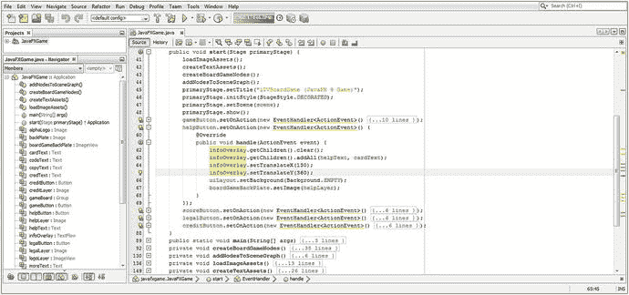

图 10-1。

Implement the code in the handle() method to reconfigure your helpButton UI compositing layer objects

```java
helpButton.setOnAction(new EventHandler<ActionEvent>() {
    @Override
    public void handle(ActionEvent event) {
        infoOverlay.getChildren().clear();
        infoOverlay.getChildren().addAll(helpText, cardText);
        infoOverlay.setTranslateX(130);
        infoOverlay.setTranslateY(360);
        uiLayout.setBackground(Background.EMPTY);
        boardGameBackPlate.setImage(helpLayer);
    }
} );

```

现在，当您使用您的 Run ➤项目工作流程时，游戏规则按钮 UI 控件将触发用户界面设计，该设计已优化为向您的游戏玩家显示您的说明(帮助)屏幕，如图 10-2 所示。在本章中，我们将使用 Java 代码对此设计做进一步的设计“调整”。

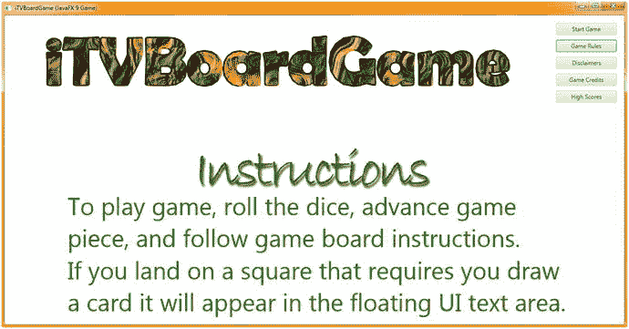

图 10-2。

Test your UI Button event handling with the Start Game and Game Rules buttons, switching back and forth

此代码通过使用 Background.EMPTY 在 StackPane 对象中安装透明度来配置合成堆栈(Stage ➤根➤ StackPane ➤ ImageView ➤ TextFlow)中的不同对象，以显示操作系统的默认白色背景，即场景(和 Stage)对象。boardGameBackPlate ImageView 包含一个透明指令脚本字体投影 PNG32 图像，它允许白色背景颜色通过。TextFlow 和两个 Text 对象也支持透明度并添加了游戏说明，因此信息屏幕是一个漂亮、可读的白色，文本预设为 Color.GREEN。如果您单击 Start Game 按钮(我们接下来将编写该按钮，以将其自身重置为默认设置)，您可以在闪屏和新的帮助文本之间切换，尽管在闪屏上有一些错误，因为 Game Button 事件处理程序需要重置特性，我们接下来将恢复白色文本、文本位置、闪屏图像和欢迎图像，因为该按钮更改了对象特性。

接下来，让我们将这些 Java 语句复制并粘贴到 gameButton 事件处理结构中，然后我们将使用正确的文本、背景、图像对象和像素位置值来配置您的方法调用参数区域。清除 TextFlow 对象，然后使用。addAll()方法。接下来，使用 240 整数值为您的设置 TextFlow 容器的 X，Y 像素位置(它在屏幕上的位置)。setTranslateX()方法调用，并为您的。setTranslateY()方法调用。使用 uiBackground 对象加载 uiLayout StackPane 对象的背景。setBackground()方法调用，然后使用。setImage()方法调用。这都是通过在。handle()方法，如图 10-3 中间高亮显示:


图 10-3。

Implement the code in the handle() method to configure gameButton default UI compositing layer objects

```java
gameButton.setOnAction(new EventHandler<ActionEvent>() {
    @Override
    public void handle(ActionEvent event) {
        infoOverlay.getChildren().clear();
        infoOverlay.getChildren().addAll(playText, moreText);
        infoOverlay.setTranslateX(240);
        infoOverlay.setTranslateY(420);
        uiLayout.setBackground(uiBackground);
        boardGameBackPlate.setImage(splashScreen);
    }
} );

```

请注意，在图 10-3 中，我使用代码编辑窗格左边的加号(+)图标在 NetBeans 9 IDE 中打开了 gameButton 和 helpButton 事件处理结构，这样您就可以从 Java 代码的角度看到您的。handle()方法设置所有合成管道对象特征，以便仅使用少量不同的变量和对象设置来控制每个不同按钮对象的屏幕设计。这是一个例子，说明当您以最佳方式设置 JavaFX 场景图时，Java 可以有多么强大。

使用“运行➤项目”工作流程，再次在“开始游戏”和“游戏规则”按钮 UI 控件之间切换。你会看到游戏规则按钮不再弄乱你的开始游戏屏幕，如图 10-4 所示。

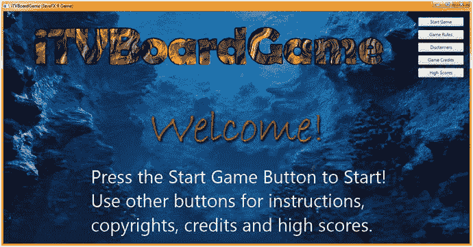

图 10-4。

Test your UI Button event handling with the Start Game and Game Rules, switching back and forth

接下来，让我们将 helpButton Java 语句复制并粘贴到 legalButton 事件处理结构中，然后通过使用正确的文本、背景、图像对象和像素位置值来配置这些方法调用参数区域。再次清除 TextFlow 对象，然后使用。addAll()方法。接下来，设置 TextFlow 容器的 X，Y 像素位置(它在屏幕上的位置)。setTranslateX()方法调用，并为。setTranslateY()方法调用。用背景加载你的 uiLayout 对象背景。使用您的。setBackground()方法调用，然后使用。setImage()方法调用。这都是通过在。handle()方法，如图 10-5 中间高亮显示:

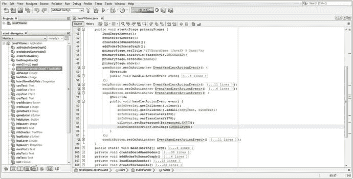

图 10-5。

Implement the code in the handle() method to reconfigure your legalButton UI compositing layer objects

```java
legalButton.setOnAction(new EventHandler<ActionEvent>() {
    @Override
    public void handle(ActionEvent event) {
        infoOverlay.getChildren().clear();
        infoOverlay.getChildren().addAll(copyText, riteText);
        infoOverlay.setTranslateX(200);
        infoOverlay.setTranslateY(370);
        uiLayout.setBackground(Background.EMPTY);
        boardGameBackPlate.setImage(legalLayer);
    }
} );

```

接下来，使用您的运行➤项目工作流程，并确保您的免责声明按钮是在白色背景上以可读、有组织的格式配置您的文本对象。正如你将在图 10-6 中看到的，你的 UI 屏幕看起来不错，你可以继续通过再次使用复制和粘贴来创建一个游戏积分按钮对象事件处理结构。


图 10-6。

Test UI Button event handling with the Start Game, Game Rules, and Disclaimers, switching back and forth

接下来，让我们将 helpButton Java 语句复制并粘贴到 legalButton 事件处理结构中，然后通过使用正确的文本、背景、图像对象和像素位置值来配置这些方法调用参数区域。再次清除 TextFlow 对象，然后使用。addAll()方法。接下来，设置 TextFlow 容器的 X，Y 像素位置(它在屏幕上的位置)。setTranslateX()方法调用，并为。setTranslateY()方法调用。用背景加载你的 uiLayout 对象背景。使用您的。setBackground()方法调用，然后使用。setImage()方法调用。这都是通过在。handle()方法，如图 10-7 中间高亮显示:

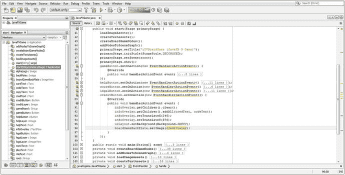

图 10-7。

Implement the code in the handle() method to reconfigure your creditButton UI compositing layer objects

```java
creditButton.setOnAction(new EventHandler<ActionEvent>() {
    @Override
    public void handle(ActionEvent event) {
        infoOverlay.getChildren().clear();
        infoOverlay.getChildren().addAll(credText, codeText);
        infoOverlay.setTranslateX(240);
        infoOverlay.setTranslateY(370);
        uiContainer.setBackground(Background.EMPTY);
        boardGameBackPlate.setImage(creditLayer);
    }
} );

```

接下来，使用您的“运行➤项目”工作流程，并确保您的 Credits TextFlow 对象以可读格式将其所有文本对象定位在屏幕上。如图 10-8 所示，你的 UI 屏幕看起来很棒。我们暂时不实现高分按钮，因为稍后我们将创建一个评分引擎和高分表。

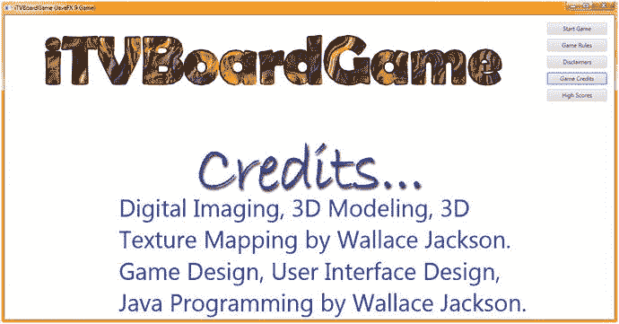

图 10-8。

Implement the code in the handle() method to reconfigure the creditButton UI compositing layer objects

## 特效:javafx.scene.effects 包

javafx.scene.effect 包包含所有 javafx 特效的基础超类。不奇怪，这叫效果类。Effect 类有 17 个已知的 2D 数字图像合成效果的直接子类，比如你会在 GIMP 2.10 中找到的，它们也包含在这个包中。其中包括 Blend、Bloom、BoxBlur、ColorAdjust、ColorInput、DisplacementMap、DropShadow、FloatMap、GaussianBlur、Glow、ImageInput、InnerShadow、Lighting、MotionBlur、PerspectiveTransform、Reflection、SepiaTone 和 Shadow 类。对于 2D，这个包还包含了轻超类和轻。遥远，轻盈。点，和光。Spot 子类，我们将在本书的 3D 部分使用。

让我们先来看看 JavaFX Effect 超类。该类是一个公共抽象类，扩展了 java.lang.Object 主类。这意味着它是由 JavaFX 开发团队从头开始创建的，专门用于在 JavaFX 中提供基于图像(基于像素)的特殊效果，并提供照明支持，可用于 2D 和 3D。提供的效果很像 GIMP 3 或 Photoshop 在各自的数字成像软件包中提供的效果。

因此，JavaFX Effect Java 类的层次结构如下所示:

```java
java.lang.Object
  > javafx.scene.effect.Effect

```

Effect 类为 JavaFX 中所有特效实现的创建提供了一个抽象或“基础”类。JavaFX 中的效果对象(及其子类)将始终包含一个生成图像对象的像素图形算法。这将是对源图像对象中像素的算法修改，在 2D 和 3D 中都有效。

通过设置名为 Node.effect 的属性，也就是节点类(或从节点子类创建的对象)的效果属性，效果对象也可以与场景图形节点(而不是图像对象)相关联。

有些效果(如 ColorAdjust)会改变源像素的颜色特征(色调、亮度和饱和度)，而其他效果(如 Blend)会通过算法(通过 Porter-Duff)将多个图像组合在一起。

DisplacementMap 和 PerspectiveTransform 特殊效果类将在 2D 空间中扭曲或移动源图像的像素，以模拟 3D 空间，通常称为“2.5D”或“等轴”空间光学效果。

所有 JavaFX 特效都至少定义了一个输入。此外，该输入可以设置为另一个效果对象，允许开发人员将效果对象链接在一起。这允许开发者组合效果结果，允许创建复合或混合特效。此输入也可以保持“未指定”，在这种情况下，效果会将其算法应用于使用. setEffect()方法调用附加到的节点对象的图形渲染(像素表示或渲染结果)，或者应用于已提供的图像对象。

需要注意的是，特效处理是一个有条件的特性。条件功能。效果枚举类和常量将定义一组条件(支持的)特效功能。这些功能可能并非在所有操作系统或所有嵌入式平台上都可用，尽管“现代”消费电子设备通常可以使用其硬件 GPU 图形处理能力来支持效果处理以及 i3D 渲染。

如果您的专业 Java 游戏应用想要轮询硬件平台以确定是否有任何特定的效果功能可用，您可以使用 [Platform.isSupported](https://docs.oracle.com/javase/8/javafx/api/javafx/application/Platform.html#isSupported-javafx.application.ConditionalFeature-) ()方法调用来查询效果支持。如果您在不支持条件功能的平台上使用任何条件功能，都不会导致异常。一般来说，条件特性将被忽略，这样您就不必编写任何特定的错误捕获或错误处理 Java 代码。

接下来，让我们看看如何在 UI 设计中实现一两个这样的特殊效果，并向 TextFlow 对象添加投影，以便使用增加的对比度使它显示的文本更具可读性。之后，我们将看看如何在可见光谱范围内改变数字图像的颜色。

### 创建特殊效果:添加 createSpecialEffects()方法

让我们跟随组织 Java 代码的趋势，创建一个名为。createSpecialEffects()。让 NetBeans 9 在 createTextAssets()方法调用之后，通过添加一行代码在 start()方法中调用它来创建一个空的`private void createSpecialEffects() {...}`基础架构，如图 10-9 中突出显示的。这里的逻辑是，我们将首先加载图像，然后定义效果，然后创建文本。

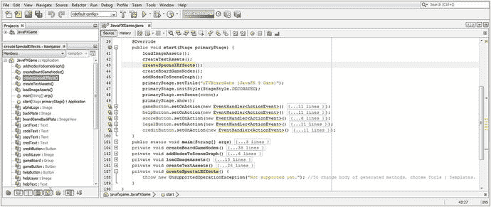

图 10-9。

Add a createSpecialEffects() method call at the top of .start() so that NetBeans creates the method body

接下来，我们将用特效代码替换 createSpecialEffects()方法中的引导代码。

### 投影:向 TextFlow 对象添加投影

现在是时候将 Java 代码添加到空的 createSpecialEffects()方法中来设置投影效果了。稍后，您将通过使用。setEffect()方法调用。首先，您需要在类的顶部声明一个名为 DropShadow 的 dropShadow 对象，并使用 Alt+Enter 工作进程让 NetBeans 为您生成一个导入语句。接下来，在 createSpecialEffects()方法中，使用 Java new 关键字和 DropShadow()构造函数方法实例化该对象。接下来，使用。setRadius()方法调用 dropShadow 对象来设置一个 4.0 像素的阴影半径(它从源展开的程度)。接下来，使用。setOffsetX()和。setOffsetY()方法使用 3.0 像素的设置调用，以使阴影向右斜向偏移(使用负值表示相反方向)。最后，使用. setColor()方法调用来指定暗灰色颜色类常量。图 10-10 中突出显示的代码应如下所示:

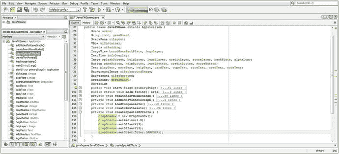

图 10-10。

Code your private void createSpecialEffects() method body to create and configure a DropShadow object

```java
DropShadow dropShadow;
...
private void createSpecialEffects() {
    dropShadow = new DropShadow();
    dropShadow.setRadius(4.0);
    dropShadow.setOffsetX(3.0);
    dropShadow.setOffsetY(3.0);
    dropShadow.setColor(Color.DARKGRAY);
}

```

接下来，打开 createTextAssets()方法体，添加一个`.setEffect(dropShadow)`方法调用每个文本对象，将它们绑定到投影效果和你为对象设置的设置，如图 10-11 所示。

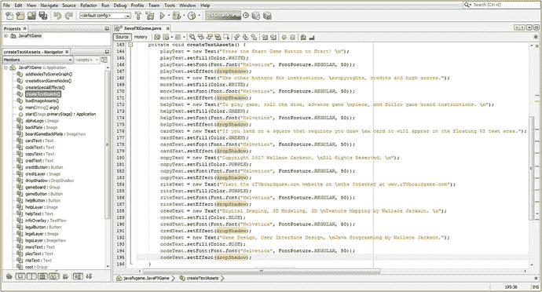

图 10-11。

Add a .setEffect(dropShadow) method call to each of your Text objects in the createTextAssets() method

另一个流行且有用的特效是调整像素颜色值，这是你想在你的 pro Java 9 游戏开发中使用的。javafx.scene.effect 包中有一个强大的 ColorAdjust 特殊效果类，允许开发人员调整图像的数字成像属性，包括使用对比度。setContrast()，亮度使用。setBrightness()，饱和度使用。setSaturation()和 hue (color)使用。setHue()。接下来我们来了解一下这个。

### 颜色调整:调整色调、饱和度、对比度和亮度

让我们使用。setHue()方法调用 ColorAdjust 对象，以允许我们对 PNG32 透明徽标数字图像素材的色温进行“颜色转换”,以便它在视觉上与我们在本章中改进的每个按钮控件用户界面设计的所有其他屏幕设计元素颜色值的颜色相匹配。在类的顶部声明一个名为 ColorAdjust 的 colorAdjust 对象。在 createSpecialEffects()方法中，使用 ColorAdjust()构造函数实例化该对象，然后使用浮点 0.4 值调用该对象的. setHue()方法，将当前图像颜色值在色轮周围向前移动 40%。图 10-12 中间和底部突出显示的 Java 代码如下所示:

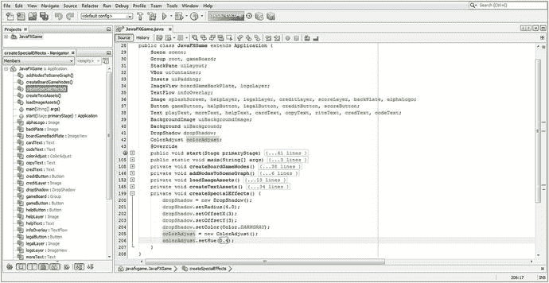

图 10-12。

Add a colorAdjust object instantiation and use a .setHue (0.4) method call off of the object to configure it

```java
DropShadow dropShadow;
ColorAdjust colorAdjust;
...
private void createSpecialEffects()  {
    dropShadow = new DropShadow();
    dropShadow.setRadius(4.0);
    dropShadow.setOffsetX(3.0);
    dropShadow.setOffsetY(3.0);
    dropShadow.setColor(Color.DARKGRAY);
    colorAdjust = new ColorAdjust();
    colorAdjust.setHue(0.4);        }

```

ColorAdjust 效果对象实现的下一步是添加。在 helpButton.setOnAction()事件处理程序中，对 logoLayer ImageView 对象调用 setEffect(colorAdjust)方法。这将使透明徽标 PNG32 图像中的棕色像素变为绿色，同时保持透明像素不变，因为它们具有零颜色值(和最大透明度值)。如果这些像素是使用部分颜色值和部分透明度值定义的，那么部分颜色值将向前移动 40%。

我加了这个。setEffect()方法调用紧接在你的`boardGameBackPlate.setImage(helpLayer);`方法调用之后，因为我们现在需要对徽标图像复合层进行颜色转换，正如你在图 10-13 中看到的高亮显示。logoLayer 对象的 Effect 对象被设置为 colorAdjust 对象，该对象随后被设置为色调值 0.4(40%)。

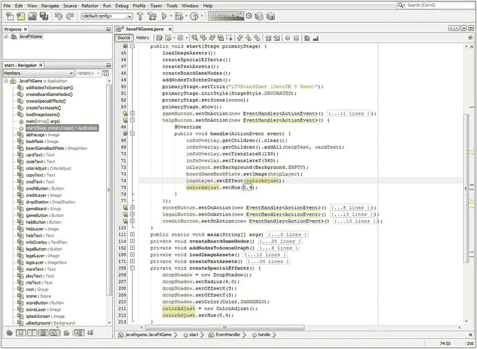

图 10-13。

Use a Run ➤ Project work process to make sure that the drop shadow special effects are working well

你可能想知道为什么我已经在 createSpecialEffects()方法中设置了 40%的色调。原因是 createSpecialEffects()方法中的设置可以被视为“默认”设置，而我必须在 helpButton 事件处理程序代码中指定它(再次)的原因是其他按钮处理程序将设置不同的色调值。您的 helpButton.setOnAction()事件处理代码现在应该如下所示:

```java
helpButton.setOnAction(new EventHandler<ActionEvent>() {
    @Override
    public void handle(ActionEvent event) {
        infoOverlay.getChildren().clear();
        infoOverlay.getChildren().addAll(helpText, cardText);
        infoOverlay.setTranslateX(130);
        infoOverlay.setTranslateY(360);
        uiLayout.setBackground(Background.EMPTY);
        boardGameBackPlate.setImage(helpLayer);
        logoLayer.setEffect(colorAdjust);
        colorAdjust.setHue(0.4);
    }
});

```

现在是时候使用“运行➤项目”工作流程，并确保 TextFlow 对象上的投影效果使您的文本对象更具可读性，并与屏幕字幕图像上的投影相匹配。您可以在图 10-14 中看到，Java 代码中有些地方出了问题，因为 JavaFX 应用运行了，但没有对文本进行阴影处理。让我们检查一下 Java 代码执行语句的顺序，看看是否有什么地方出了问题！

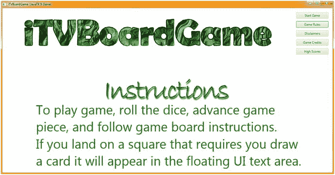

图 10-14。

Declare and instantiate a ColorAdjust object named colorAdjust and use .setHue() to shift the color 40 percent

由于 Java 代码在方法中的顺序是正确的，我怀疑调用方法的顺序很可能是这个问题的根源。让我们看看 start()方法内部的方法调用顺序，如图 10-9 顶部所示。请注意，createSpecialEffects()是在 createTextAssets()之后调用的，但是我们使用的是。setEffect(dropShadow)方法调用在 createTextAssets()方法内部，所以我们必须将 createSpecialEffects()方法调用移到 createTextAssets()方法调用之上，如图 10-13 所示，这样你的效果在使用之前就已经设置好了。如果你在你正在做的事情的过程中追踪这种逻辑，那么 Java 代码是非常合乎逻辑的！

正如你在图 10-16 中看到的，这解决了问题，你的投影效果渲染正确。

下一步需要修改的是您的 legalButton.setOnAction()事件处理结构，使屏幕上的所有内容都变成紫色。这可以通过将你的 logo 的色调改变 40%来实现，这次是在色轮的负方向。使用浮点数，色轮的右正 180 度范围从 0.0 到 1.0，左负 180 度范围从 0.0 到-1.0。

在图 10-15 的底部，高亮显示了您的 legalButton 事件处理 Java 语句的 Java 代码。它应该类似于下面的 Java 代码:


图 10-16。

Use the Run ➤ Project work process and make sure that the drop shadow effect is rendering correctly

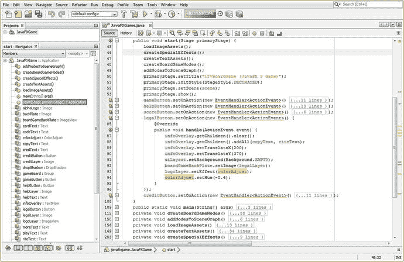

图 10-15。

Add a .setEffect (colorAdjust) method call off logoLayer and call .setHue(-0.4) to change the color shift

```java
legalButton.setOnAction(new EventHandler<ActionEvent>() {
    @Override
    public void handle(ActionEvent event) {
        infoOverlay.getChildren().clear();
        infoOverlay.getChildren().addAll(copyText, riteText);
        infoOverlay.setTranslateY(200);
        infoOverlay.setTranslateY(370);
        uiLayout.setBackground(Background.EMPTY);
        boardGameBackPlate.setImage(legalLayer);
        logoLayer.setEffect(colorAdjust);
        colorAdjust.setHue(-0.4);
    }
} );

```

图 10-17 显示了我的 Run ➤项目按钮处理程序测试工作流程，显示了投影效果和免责声明按钮控件中的色调(颜色)移动，进一步完善了设计。我在所有不同的按钮元素之间来回点击，以确保所有的属性都没有以不可取的方式重置任何其他按钮屏幕设计属性，这就是我将所有正确的变量放在所有事件处理代码体中的原因，以便没有方法调用忽略设置(未指定/传递)。

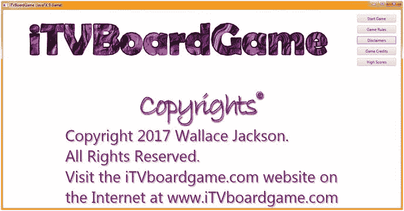

图 10-17。

Use the Run ➤ Project work process and make sure that the color hue shift matches the rest of the design

您需要做的最后一项修改是对 creditButton.setOnAction()事件处理结构进行修改，以使屏幕上的所有内容呈现出漂亮的蓝色。这可以通过围绕一个色轮将你的标志色调向负方向偏移 90%来实现。图 10-18 中间突出显示了处理 Java 语句的 creditButton 事件的代码，如下所示:


图 10-18。

Copy and paste the colorAdjust.setHue(-0.9) and logoLayer.setEffect(colorAdjust) Java code in creditButton

```java
creditButton.setOnAction(new EventHandler<ActionEvent>() {
    @Override
    public void handle(ActionEvent event)    {
        infoOverlay.getChildren().clear();
        infoOverlay.getChildren().addAll(credText, codeText);
        infoOverlay.setTranslateY(240);
        infoOverlay.setTranslateY(370);
        uiLayout.setBackground(Background.EMPTY);
        boardGameBackPlate.setImage(creditLayer);
        logoLayer.setEffect(colorAdjust);
        colorAdjust.setHue(-0.9);
    }
});

```

使用“运行➤”项目的工作流程，确保色轮周围这 90%的负偏移现在将徽标变成鲜艳的蓝色，这与用户界面设计的其余部分看起来很好。正如你在图 10-19 中看到的，演职员表按钮控制屏幕现在在颜色和阴影效果上都匹配了。


图 10-19。

Use the Run ➤ Project work process and make sure that the color hue shift matches the rest of the design

我们将编写 scoreButton.setOnAction()事件处理程序的内部代码，当我们在本书后面介绍实现评分引擎和高分 UI 设计时，您将有一个可以就地评分的棋盘游戏。

在您的 pro Java 9 游戏开发中实现许多其他特殊效果的工作过程也可以用同样的方式来实现——为您想要使用的效果声明一个类，在 createSpecialEffects()方法中实例化它，使用该类中的方法设置效果配置的参数，最后使用。setEffect(effectClassNameHere)方法调用对象名称。

您会发现 JavaFX 特效包和类在这种实现方法中特别灵活，因为您可以将大多数软件包中常见的所有特效应用于 JavaFX 9 中的几乎任何对象或场景图形层次结构，通常使用大约十几行代码，有时甚至更少。

一旦你知道了如何在 JavaFX 中创建和应用这些特效，你的 pro Java 9 游戏开发创造力就会提升一个数量级。这是因为这些效果可以应用于场景图形层次结构中的任何地方，以及 2D、成像和 3D 渲染管道中的任何地方。

在本书的后面部分，我会尝试使用更多的 JavaFX 9 Effect 子类，因为我会给每一章增加更多的复杂性，并且随着我们在本书中的进展。

## 摘要

在第十章中，我们使用 ActionEvent 处理结构将交互性添加到用户界面设计中，了解了 InputEvent 对象和 MouseEvent 及 KeyEvent 对象处理，并了解了如何应用 javafx.scene.effects 包中包含的利用 JavaFX Effect 超类的特殊效果。

接下来，通过使用 java.util 和 javafx.event 包及其 eventObject、Event、ActionEvent 和 InputEvent 类，您了解了 Java 9 和 JavaFX 中如何处理允许交互的事件。我们讨论了不同类型的 InputEvent 对象，如 MouseEvents、TouchEvents 和 KeyEvents，然后您实现了 ActionEvent 处理，以使用户界面的(中间三个)说明、法律免责声明和 Production Credits 部分(按钮对象)具有交互性。

最后，您了解了 javafx.scene.effects 包以及 javafx 为开发人员提供的许多特殊效果。我们查看了 Effect 超类，并讨论了如何实现 DropShadow 类(和对象)和 ColorAdjust 类(和对象),以便您可以通过向 TextFlow 对象添加阴影来美化用户界面，提高可读性(对比度),并对顶部徽标数字图像素材进行颜色转换，以匹配每个按钮控件对象用户界面设计的颜色方案。

在第十一章中，我们将看看如何配置您的 JavaFX 游戏来利用 3D 资源。这涉及 Camera 超类及其 ParallelCamera 和 PerspectiveCamera 子类。我们还将学习如何在你的 3D 场景中创建光线，以便相机物体可以“看见”我们将看看 LightBase 超类及其 AmbientLight 和 PointLight 子类，它们是专门为 3D 场景应用中的照明设计而提供的。