# 二十、编写游戏：设置游戏方法和动画相机视图

到目前为止，你有你的游戏随机象限选择逻辑编码，你正在跟踪每个旋转象限着陆。现在，我们需要将大部分 Java 代码放在适当的位置，用游戏棋盘方格随机内容选择填充这四个象限，这五个方格中的每一个都连接到任何给定的象限。我们还需要创建代码，允许玩家通过单击图像来选择一个主题问题。这将使用图像填充象限，并将相机移动到适当的位置，以便选定的图像更大(更易查看)。这意味着在这一章中，我们还将涉及到`Animation`对象与`Camera`对象的结合使用。

在本章中，我们将创建十几个新的 setupQSgameplay()方法，这些方法将包含为每个游戏棋盘方块设置下一级游戏性(关于图像内容的问题)的代码。这样，当玩家单击给定的游戏棋盘方格时，将调用该方法来设置“问答”体验。

这意味着我们将在本章中增加几百行代码；幸运的是，我们将使用一种最佳的“编码一次，然后复制、粘贴和修改”的方法，因此不会像您想象的那样需要大量的输入。一旦我们完成了游戏内容选择和显示基础设施的大部分编码，并测试了每个象限以确保其正常工作，我们就可以执行第二十一章中代码的问答部分，然后编写第二十二章中的评分引擎，以完成大部分“核心”游戏体验。

## 选择游戏内容:selectQSgameplay()方法

为了允许玩家选择一个游戏棋盘方格来测试他们的知识，我们必须添加 createSceneProcessing()方法，该方法包含我们对鼠标单击 3D 场景图节点对象的事件处理。在本章之前，这是 3D spinner UI 元素，但现在我们必须再添加 20 个事件处理条件 if()处理语句，这样，如果单击 20 个游戏棋盘方格中的一个，就会调用其对应的 selectQxSxgameplay()方法来处理该方格内容的游戏逻辑。我们将从编码和测试第一个 if (picked == Q1S1)结构开始。由于游戏内容的视觉效果(纹理贴图)已经创建，使用第十八章中概述的工作流程，这些方法将正确地显示那些图像素材，并触发玩家需要掌握的游戏性问题以得分。这些 if()语句将查找选取的节点，并将播放器发送到正确的 selectQSgameplay()方法。此结构的伪代码如下所示:

```java
if (pickedNode == Q1S1) { call the selectQ1S1gameplay() method }
if (pickedNode == Q2S2) { call the selectQ2S2gameplay() method } // and so on, out through Q4S5

```

一旦我们创建了几个这样的语句，我们就可以使用 Alt+Enter 组合键，让 NetBeans 为我们创建一个空的方法结构。一旦我们创建了方法结构，我们就可以使用复制和粘贴来创建 20 个方法，在创建时测试每个象限的代码，直到 20 个都完成为止。

### 游戏棋盘方格交互:OnMouseClick()事件处理

让我们创建第一个事件处理条件 if()语句，查找 Q1S1 到 Q4S5 方形节点鼠标单击事件。我将把 20 个游戏棋盘方块节点求值放在`if(picked != null)`外部 if()结构内部(紧接其后)和`if(picked == spinner)`结构之前，因为这些结构只是在单击一个盒子节点时调用一个方法。值得注意的是，我不能使用 switch-case 结构，因为目前该结构与对象求值不兼容，只与字符串、枚举和数值求值兼容。这应该类似于这里显示的 Java 语句和方法调用(在图 20-1 中用浅蓝色和黄色突出显示):

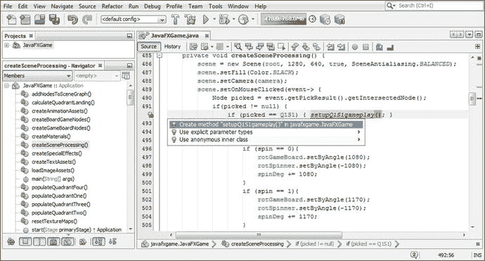

图 20-1。

Add an if(picked==Q1S1) conditional evaluation; use Alt+Enter to create a setupQ1S1gameplay() method

```java
if (picked != null) {
     if (picked == Q1S1) { setupQ1S1gameplay(); }
     ... // 3D spinner UI processing logic will go after all game board square processing logic
}

```

一旦您键入第一个 if()条件求值，您的方法名称将带有红色下划线，因为该方法尚不存在。使用 Alt+Enter 工作进程让 NetBeans 9 为您编写代码，并在 javafxgame 中选择创建方法“setupQ1S1gameplay()”。JavaFXGame 选项，如图 20-1 中蓝色部分所示。

在 setupQ1S1gameplay()方法中，用三个 if()随机选择来替换 bootstrap 错误代码，用于 square 1 (int pickS1)条件求值。这将告诉你的游戏当三个不同的随机选择数字(0，1 或 2)产生时该做什么。这应该看起来像下面的 Java 代码，如图 20-2 中突出显示的:

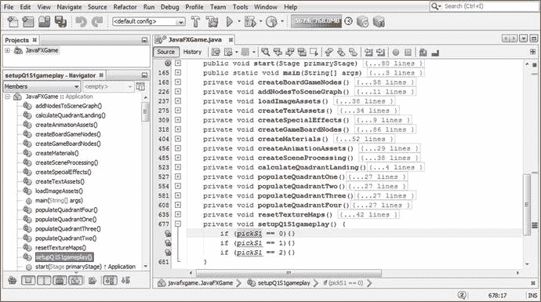

图 20-2。

Add conditional if() structures for random number generator result processing inside setupQ1S1gameplay

```java
private void setupQ1S1gameplay() {
   if (pickS1 == 0) {}
   if (pickS1 == 1) {}
   if (pickS1 == 2) {}
}

```

它们下面有红色波浪错误下划线的原因是因为 pickS1 当前在 populateQuadrantOne()方法中被声明为 int (integer ),所以 pickS1 变量当前是局部的，需要被设置为“package protected ”(不使用 public、private 或 protected 关键字),这样整个类都可以访问它。

这将通过将 pickS1 声明移动到类的顶部来实现，这样类(和包)中的所有方法都可以引用从随机数生成器加载的数据值。您可以将 pickS1 添加到 int quadrantLanding 中，并创建一个复合语句，在一行代码中声明要使用的所有整数变量。

当您修改每个 populateQuadrant()方法的 Java 代码时，您可以将 pickS1 到 pickS20 添加到这个复合语句中，或者您可以先添加所有 20 个新的 int 变量，然后再从所有 populateQuadrant()方法中删除 int 声明，此时您的代码结构(如图 20-3 所示)将是无错误的。

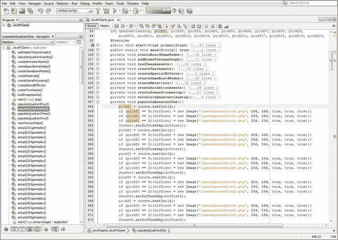

图 20-3。

Declare int pickS1 at the top of the class so it can be used in the populateQuadrant() and setupQSgameplay() methods

最初，我们在 populateQuadrant()方法中使用该语句来声明和加载 pickSn int (integer)变量，该变量包含来自随机数生成器对象的游戏棋盘方格的当前内容结果。

```java
int pickS1 = random.nextInt(3);  // Next declare int at top of class, so it needs to be removed!

```

既然我们已经声明了这些具有“全局”(而不是本地)访问权的整数随机数“持有者”，前面的 Java 9 语句将变得更加简单，看起来像下面这样，如图 20-3 所示:

```java
pickS1 = random.nextInt(3);

```

请注意，附加到每个象限的每个游戏棋盘方格的随机数是在 populateQuadrant()方法中生成的，用于选择和设置所使用的图像素材。我们还将在 setupQ1S1gameplay()方法中使用这个随机数结果来确定显示哪个象限纹理贴图图像，如果玩家单击了那个正方形来选择他们问题的内容。这是因为每个方块有不止一个图像。

由于这个 setupQ1S1gameplay()方法是在 Q1S1 节点对象上单击鼠标的结果，所以您需要做的第一件事是将游戏棋盘象限 1 的默认纹理贴图改为纹理贴图，它与被单击的游戏棋盘方块 1 中显示的内容相匹配。稍后还会添加其他 Java 语句来设置图像内容的问答选项，但是让我们从玩家在单击游戏板内容时将获得的视觉反馈开始。

因为目前有三个不同的内容图像可能填充游戏板 square 1，所以您将有三个 if()构造，它们将包含与每个内容选择相关的 Java 语句。随机数生成器已经在 populateQuadrantOne()方法中随机选择了这三个内容图像中的一个，使用 pickS1 变量存储该选择。因此，从逻辑上讲，我们应该使用这个变量(您现在已经将它作为“全局”游戏变量)来确定将 diffuse21 象限纹理图像对象设置到哪个象限纹理贴图，使用 Image()对象构造函数以及图像资源名称、分辨率和渲染设置。然后，您所要做的就是使用 setDiffuseMap()方法调用设置 Shader21 对象来引用这个(新的)diffuse21 图像对象。这将针对三个内容选项中的每一个进行，gamequad1bird0 到 gamequad1bird2 图像文件名是主要的代码元素，它将在 setupQ1S1gameplay()方法内的三个不同的条件 if()结构之间进行更改。这使得复制粘贴编码工作流程成为可以利用的逻辑流程。

您的 setupQ1S1gameplay()方法的 Java 代码应该类似于下面的代码，如图 20-4 的顶部所示，并复制粘贴到图的底部，以创建 setupQ1S2gameplay()方法:

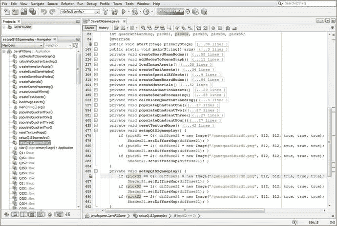

图 20-4。

The setupQ1S1gameplay method is error-free and can be finished and copied and pasted to create setupQ1S2gameplay()

```java
private void setupQ1S1gameplay() {
    if (pickS1 == 0) {
        diffuse21 = new Image("gamequad1bird0.png", 512, 512, true, true, true);
        Shader21.setDiffuseMap(diffuse21);
    }
    if (pickS1 == 1) {
        diffuse21 = new Image("gamequad1bird1.png", 512, 512, true, true, true);
        Shader21.setDiffuseMap(diffuse21);
    }
    if (pickS1 == 2) {
        diffuse21 = new Image("gamequad1bird2.png", 512, 512, true, true, true);
        Shader21.setDiffuseMap(diffuse21);
    }
}

```

让我们使用“运行➤项目”工作流程，看看当我们单击正方形 1 时，它是否会将正确的图像放在象限的中心。正如你将在图 20-5 中看到的，Java 代码工作了，我们可以创建其他 19 个方法。


图 20-5。

Clicking quadrant 1’s square 1 (Q1S1) texture maps the game board quadrant with the correct image asset

现在您已经有了一个 setupQ1S1gameplay()方法代码模板，在它本身下面剪切并粘贴四次，在方法名和 if()代码结构中通过 Q1S5 将 Q1S1 更改为 Q1S2，通过 pickS5 将 pickS1 更改为 pickS2。此外，更改 image()实例中的图像文件名，以匹配您在第十八章中创建的 PNG 纹理贴图图像素材。完成后，如图 20-6 所示的 Java 代码应该如下所示:


图 20-6。

Copy and paste the setupQ1S1gameplay() method four times; edit each to create the other four methods

```java
private void setupQ1S2gameplay() {
    if (pickS2 == 0) {diffuse21 = new Image("gamequad1s2bird0.png", 512, 512, true, true, true);
                      Shader21.setDiffuseMap(diffuse21); }
    if (pickS2 == 1) {diffuse21 = new Image("gamequad1s2bird1.png", 512, 512, true, true, true);
                      Shader21.setDiffuseMap(diffuse21); }
    if (pickS2 == 2) {diffuse21 = new Image("gamequad1s2bird2.png", 512, 512, true, true, true);
                      Shader21.setDiffuseMap(diffuse21); }
}
private void setupQ1S3gameplay() {
    if (pickS3 == 0) {diffuse21 = new Image("gamequad1s3bird0.png", 512, 512, true, true, true);
                      Shader21.setDiffuseMap(diffuse21); }
    if (pickS3 == 1) {diffuse21 = new Image("gamequad1s3bird1.png", 512, 512, true, true, true);
                      Shader21.setDiffuseMap(diffuse21); }
    if (pickS3 == 2) {diffuse21 = new Image("gamequad1s3bird2.png", 512, 512, true, true, true);
                      Shader21.setDiffuseMap(diffuse21); }
}
private void setupQ1S4gameplay() {
    if (pickS4 == 0) {diffuse21 = new Image("gamequad1s4bird0.png", 512, 512, true, true, true);
                      Shader21.setDiffuseMap(diffuse21); }
    if (pickS4 == 1) {diffuse21 = new Image("gamequad1s4bird1.png", 512, 512, true, true, true);
                      Shader21.setDiffuseMap(diffuse21); }
    if (pickS4 == 2) {diffuse21 = new Image("gamequad1s4bird2.png", 512, 512, true, true, true);
                      Shader21.setDiffuseMap(diffuse21); }
}
private void setupQ1S5gameplay() {
    if (pickS5 == 0) {diffuse21 = new Image("gamequad1s5bird0.png", 512, 512, true, true, true);
                      Shader21.setDiffuseMap(diffuse21); }
    if (pickS5 == 1) {diffuse21 = new Image("gamequad1s5bird1.png", 512, 512, true, true, true);
                      Shader21.setDiffuseMap(diffuse21); }
    if (pickS5 == 2) {diffuse21 = new Image("gamequad1s5bird2.png", 512, 512, true, true, true);
                      Shader21.setDiffuseMap(diffuse21); }
}

```

在测试所有五个附加的象限 1 方块之前，需要确保前五个 OnMouseClicked 事件处理程序条件 if()语句在 createSceneProcessing()方法体中就位。在图 20-1 中选择你的第一个`if (picked == Q1S1)`条件 if()语句，复制并粘贴它四次。将您的 Q1S1 引用更改为 Q1S2 至 Q1S5，将 setupQ1S1gameplay()更改为 setupQ1S2gameplay()。您的新 OnMouseClicked 事件处理方法体应该看起来像下面的 Java 9 代码，在图 20-7 中也用浅蓝色和黄色显示:

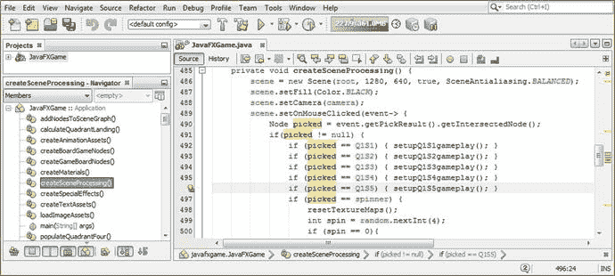

图 20-7。

Copy the first if(picked==Q1S1) construct four more times to create the Q1S2 through Q1S5 if() constructs

```java
scene.setOnMouseClicked(event-> {
    Node picked = event.getPickResult().getIntersectedNode();
    if (picked != null) {
         if (picked == Q1S1)    { setupQ1S1gameplay(); }
         if (picked == Q1S2)    { setupQ1S2gameplay(); }
         if (picked == Q1S3)    { setupQ1S3gameplay(); }
         if (picked == Q1S4)    { setupQ1S4gameplay(); }
         if (picked == Q1S5)    { setupQ1S5gameplay(); }
         if (picked == spinner) { resetTextureMaps();
                                  int spin = random.nextInt(4);
                                  if (spin == 0) {
                                  ... // 3D spinner UI logic
                                  }
         }
    }
});

```

从本章可以看出，我们现在进入了 Java 编码过程的一部分，在接下来的几章中，当我们添加游戏内容时，我们将生成数百行(如果不是数千行)代码。

这将包括这一章，在这一章中，我们添加了基础设施，玩家可以单击图像来选择他们要回答的游戏问题，我们还添加了相机动画来更好地查看这些内容。它还包括下一章，我们将添加问题和每个问题的答案，以及显示这些答案选项的 2D 用户界面。我们还将在第二十一章中使用 JavaFX 9 AudioClip 类添加数字音频旋转和缩放音效。

在第二十二章，我们会添加一个评分引擎，代码也相当多。因此，从现在开始，随着我们继续充实我们的游戏功能，你的 Java 9 代码行将会显著增加。完成后，我们将了解 NetBeans 9 如何让您测试代码的运行情况，然后对其进行优化。让我们使用一个运行➤项目的工作流程，看看当我们单击方块 2 到 5 时，是否会在象限的中心放置一个正确的图像。正如你在图 20-8 中看到的，Java 代码工作了，我们可以创建其他 15 个方法。


图 20-8。

Use a Run ➤ Project work process to test; ensure each square populates the quadrant with the correct image

现在我们可以将这些 setupQ1S1gameplay()到 setupQ1S5gameplay()方法结构复制粘贴到它们自身下面，来创建 setupQ2S1gameplay()到 setupQ2S5gameplay()方法结构。在测试代码之前，您还需要添加接下来的五个`if(picked == Q2S1)`到`if(picked == Q2S5)`事件处理结构(如图 20-7 所示)，并确认您的 populateQuadrantTwo()方法引用了正确的图像素材。一旦你编辑了它们，你的新方法应该看起来像下面的代码，如图 20-9 所示:


图 20-9。

Create the setupQ2S1gameplay() to setupQ2S5gameplay() methods using the diffuse22 and Shader22 objects

```java
private void setupQ2S1gameplay() {
   if (pickS6 == 0) {diffuse22 = new Image("gamequad2s1vegi0.png", 512, 512, true, true, true);
                     Shader22.setDiffuseMap(diffuse22); }
   if (pickS6 == 1) {diffuse22 = new Image("gamequad2s1vegi1.png", 512, 512, true, true, true);
                     Shader22.setDiffuseMap(diffuse22); }
   if (pickS6 == 2) {diffuse22 = new Image("gamequad2s1vegi2.png", 512, 512, true, true, true);
                     Shader22.setDiffuseMap(diffuse22); }
}
private void setupQ2S2gameplay() {
   if (pickS7 == 0) {diffuse22 = new Image("gamequad2s2vegi0.png", 512, 512, true, true, true);
                     Shader22.setDiffuseMap(diffuse22); }
   if (pickS7 == 1) {diffuse22 = new Image("gamequad2s2vegi1.png", 512, 512, true, true, true);
                     Shader22.setDiffuseMap(diffuse22); }
   if (pickS7 == 2) {diffuse22 = new Image("gamequad2s2vegi2.png", 512, 512, true, true, true);
                     Shader22.setDiffuseMap(diffuse22); }
}
private void setupQ2S3gameplay() {
   if (pickS8 == 0) {diffuse22 = new Image("gamequad2s3vegi0.png", 512, 512, true, true, true);
                     Shader22.setDiffuseMap(diffuse22); }
   if (pickS8 == 1) {diffuse22 = new Image("gamequad2s3vegi1.png", 512, 512, true, true, true);
                     Shader22.setDiffuseMap(diffuse22); }
   if (pickS8 == 2) {diffuse22 = new Image("gamequad2s3vegi2.png", 512, 512, true, true, true);
                     Shader22.setDiffuseMap(diffuse22); }
}

private void setupQ2S4gameplay() {
   if (pickS9 == 0) {diffuse22 = new Image("gamequad2s4vegi0.png", 512, 512, true, true, true);
                     Shader22.setDiffuseMap(diffuse22); }
   if (pickS9 == 1) {diffuse22 = new Image("gamequad2s4vegi1.png", 512, 512, true, true, true);
                     Shader22.setDiffuseMap(diffuse22); }
   if (pickS9 == 2) {diffuse22 = new Image("gamequad2s4vegi2.png", 512, 512, true, true, true);
                     Shader22.setDiffuseMap(diffuse22); }
}

private void setupQ2S5gameplay() {
   if (pickS10 == 0) {diffuse22 = new Image("gamequad2s5vegi0.png", 512, 512, true, true, true);
                      Shader22.setDiffuseMap(diffuse22); }
   if (pickS10 == 1) {diffuse22 = new Image("gamequad2s5vegi1.png", 512, 512, true, true, true);
                      Shader22.setDiffuseMap(diffuse22); }
   if (pickS10 == 2) {diffuse22 = new Image("gamequad2s5vegi2.png", 512, 512, true, true, true);
                      Shader22.setDiffuseMap(diffuse22); }
}

```

正如您在图 20-6 和 20-10 中看到的，我已经能够为象限 1 和象限 2 中的每个方块创建所有三个不同的内容选项，这相当于已经创建了 60 个图像素材(5 个方块× 3 个选项× 2 个图形× 2 个象限)。正如你从第十八章中概述的工作流程中所认识到的，这是一大堆数字图像素材。对于象限 3 和象限 4，我还有同样多的工作(另外 60 个数字图像素材)要完成。创建任何专业的 Java 游戏都是大量的工作，这就是为什么充满数字工匠的大型团队几乎总是参与其中。注意，我还选择了 6 到 10 个全局变量。

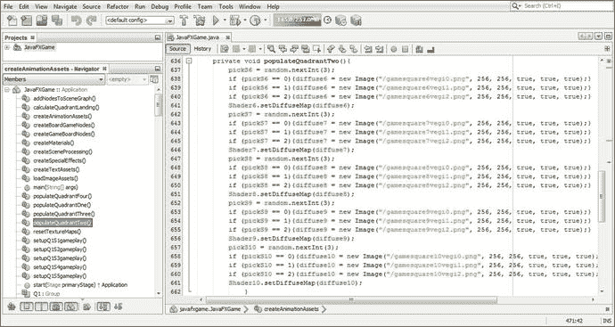

图 20-10。

Confirm the populateQuadrantTwo() method image assets cross-reference to the createQSgameplay() methods

在我写完这一章的时候，我将为这四个象限中的每一个创建至少三个图像素材，这样在我们分别在第 21 和 22 章开始开发问答和评分引擎 Java 代码之前，我们已经完成了 120 个图像素材(编码和测试需要的)。

我们还将开始在这些章节中添加其他很酷的新媒体元素，如数字音频和更多的 2D 用户界面元素，因此我们还有更多令人兴奋的 JavaFX 游戏引擎主题要介绍！

通常，创建新媒体数字素材(数字图像、数字音频、数字插图、数字视频、3D 建模或动画、视觉效果、粒子系统、流体动力学等等)的工作比创建 Java 9 代码要多得多！如果您有多个内容制作工作站，您将有不同的计算机处理(渲染、合成、编码、建模、纹理映射、动画制作等)pro Java 9 游戏开发工作流程中使用的不同新媒体素材。

让我们再次使用运行➤项目的工作流程，并彻底测试您的第二象限的新代码，确保您的所有游戏棋盘方块图像都显示出来，并且当它们被单击时，它们会用正确的(四倍大)图像填充您的象限纹理图。正如您在图 20-11 中看到的，游戏棋盘正方形图像和游戏棋盘象限图像都很清晰，易于识别，可用作游戏内容。

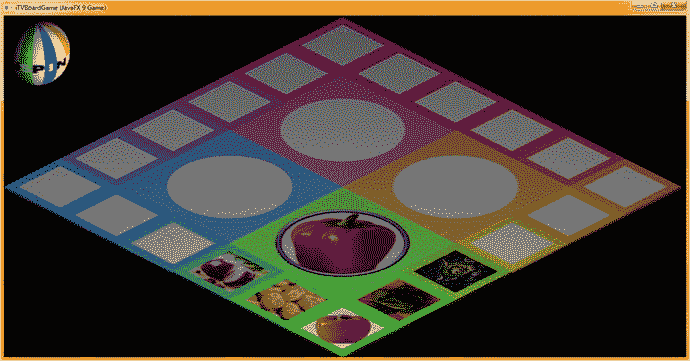

图 20-11。

Use a Run ➤ Project work process to test ; make sure each square populates the quadrant with the correct image

让我们复制并粘贴另外五个方法体，并为象限 3 创建 setupQSgameplay()方法。确保您的图像素材名称与您用于 populateQuadrantThree()的名称相匹配。Java 代码应该看起来像下面的方法体，在图 20-12 中也用黄色显示:

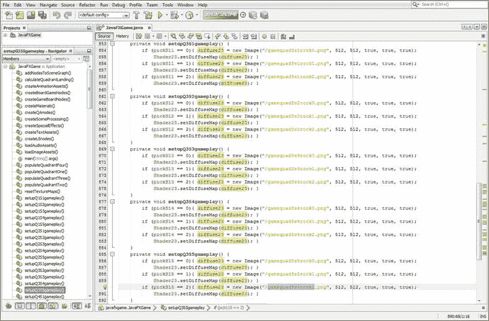

图 20-12。

Create the setupQ3S1gameplay() through setupQ3S5gameplay() methods, using diffuse23 and Shader23 objects

```java
private void setupQ3S1gameplay() {
   if (pickS11 == 0) {diffuse23 = new Image("gamequad3s1rock0.png", 512, 512, true, true, true);
                      Shader23.setDiffuseMap(diffuse23); }
   if (pickS11 == 1) {diffuse23 = new Image("gamequad3s1rock1.png", 512, 512, true, true, true);
                      Shader23.setDiffuseMap(diffuse23); }
   if (pickS11 == 2) {diffuse23 = new Image("gamequad3s1rock2.png", 512, 512, true, true, true);
                      Shader23.setDiffuseMap(diffuse23); }
}
private void setupQ3S2gameplay() {
   if (pickS12 == 0) {diffuse23 = new Image("gamequad3s2rock0.png", 512, 512, true, true, true);
                      Shader23.setDiffuseMap(diffuse23); }
   if (pickS12 == 1) {diffuse23 = new Image("gamequad3s2rock1.png", 512, 512, true, true, true);
                      Shader23.setDiffuseMap(diffuse23); }
   if (pickS12 == 2) {diffuse23 = new Image("gamequad3s2rock2.png", 512, 512, true, true, true);
                      Shader23.setDiffuseMap(diffuse23); }
}
private void setupQ3S3gameplay() {
   if (pickS13 == 0) {diffuse23 = new Image("gamequad3s3rock0.png", 512, 512, true, true, true);
                      Shader23.setDiffuseMap(diffuse23); }
   if (pickS13 == 1) {diffuse23 = new Image("gamequad3s3rock1.png", 512, 512, true, true, true);
                      Shader23.setDiffuseMap(diffuse23); }
   if (pickS13 == 2) {diffuse23 = new Image("gamequad3s3rock2.png", 512, 512, true, true, true);
                      Shader23.setDiffuseMap(diffuse23); }
}
private void setupQ3S4gameplay() {
   if (pickS14 == 0) {diffuse23 = new Image("gamequad3s4rock0.png", 512, 512, true, true, true);
                      Shader23.setDiffuseMap(diffuse23); }
   if (pickS14 == 1) {diffuse23 = new Image("gamequad3s4rock1.png", 512, 512, true, true, true);
                      Shader23.setDiffuseMap(diffuse23); }
   if (pickS14 == 2) {diffuse23 = new Image("gamequad3s4rock2.png", 512, 512, true, true, true);
                      Shader23.setDiffuseMap(diffuse23); }
}
private void setupQ3S5gameplay() {
   if (pickS15 == 0) {diffuse23 = new Image("gamequad3s5rock0.png", 512, 512, true, true, true);
                      Shader23.setDiffuseMap(diffuse23); }
   if (pickS15 == 1) {diffuse23 = new Image("gamequad3s5rock1.png", 512, 512, true, true, true);
                      Shader23.setDiffuseMap(diffuse23); }
   if (pickS15 == 2) {diffuse23 = new Image("gamequad3s5rock2.png", 512, 512, true, true, true);
                      Shader23.setDiffuseMap(diffuse23); }
}

```

确保打开 populateQuadrantThree()方法，并检查所使用的图像资源，以确保它们使用相同的图像名称。例外情况是，您的游戏正方形图像资源是 256 像素正方形，而游戏象限图像资源是 512 像素正方形版本，并且以“gamequad”而不是“game square”开始。

在这两种方法之间，所有 gamesquare 和 gamequad 图像都被加载到 24 个游戏板纹理贴图中，这些贴图用于游戏板着色器，这些着色器将在游戏过程中的任何给定时间装饰游戏板的表面。这二十多种方法(四种用于象限，二十种用于方块)确保您的游戏板在任何给定回合的游戏中都看起来正确，确保游戏板方块具有随机选择的主题内容，并且游戏象限显示内容的大版本。

所有这 24 种方法都是以这样一种方式设置的，即随着时间的推移可以添加内容，将 random.nextInt()方法调用更改为下一个最大的上限，以添加一个级别的内容。一旦游戏设计，包括其他新媒体素材，如更多的动画，数字音频，3D 和游戏问题(所有这些我们仍然需要创建和编码)，在接下来的几章中完成，你就可以这样做了。在最初的代码完成后，你将会修改和增加游戏的内容和关卡。你可以重新设计你的游戏结构，就像我们在本书中所做的那样，根据游戏扩展的需要添加更多的类或方法。

populateQuadrantThree()方法，如图 20-13 所示，增加了第三轮图像内容，在文件名末尾用 2 表示。这些素材是我自己在另一台机器上创建的(在您的情况下，可能是由您的图形设计员工创建的)，同时我继续在一台四核 Windows 7 机器上处理 Java 9 代码。

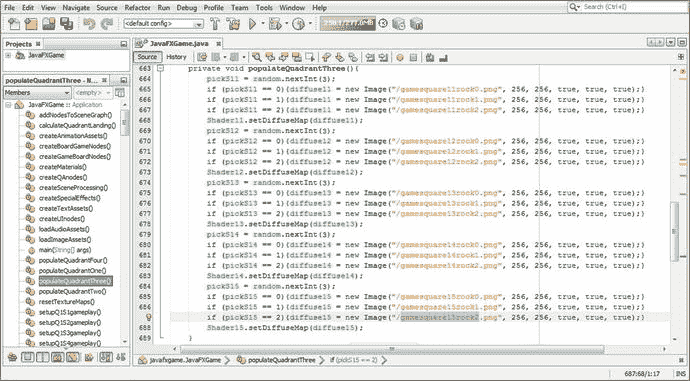

图 20-13。

Confirm the populateQuadrantThree() method image assets cross-reference to the createQSgameplay() methods

确保将五个 if(picked == Q3S1)到 if(picked == Q3S5)语句添加到 createSceneProcessing()中的 OnMouseClick 事件处理中，以便将新方法与您不断增长的游戏体验联系起来。

如图 20-14 所示，使用运行➤项目工作流程并测试与象限 3 相关的代码，以确保象限和内容图像都正确显示，并且看起来清晰专业。


图 20-14。

Use a Run ➤ Project work process to test; make sure each square populates the quadrant with the correct image

最后，让我们创建最后五个 setupQSgameplay()方法，如图 20-15 所示，如下所示:


图 20-15。

Create the setupQ4S1gameplay() through setupQ4S5gameplay() methods, using diffuse24 and Shader24 objects

```java
private void setupQ4S1gameplay() {
   if (pickS16 == 0) {diffuse24 = new Image("gamequad4s1fame0.png", 512, 512, true, true, true);
                      Shader24.setDiffuseMap(diffuse24); }
   if (pickS16 == 1) {diffuse24 = new Image("gamequad4s1fame1.png", 512, 512, true, true, true);
                      Shader24.setDiffuseMap(diffuse24); }
   if (pickS16 == 2) {diffuse24 = new Image("gamequad4s1fame2.png", 512, 512, true, true, true);
                      Shader24.setDiffuseMap(diffuse24); }
}
private void setupQ4S2gameplay() {
   if (pickS17 == 0) {diffuse24 = new Image("gamequad4s2fame0.png", 512, 512, true, true, true);
                      Shader24.setDiffuseMap(diffuse24); }
   if (pickS17 == 1) {diffuse24 = new Image("gamequad4s2fame1.png", 512, 512, true, true, true);
                      Shader24.setDiffuseMap(diffuse24); }
   if (pickS17 == 2) {diffuse24 = new Image("gamequad4s2fame2.png", 512, 512, true, true, true);
                      Shader24.setDiffuseMap(diffuse24); }
}
private void setupQ4S3gameplay() {
   if (pickS18 == 0) {diffuse24 = new Image("gamequad4s3fame0.png", 512, 512, true, true, true);
                      Shader24.setDiffuseMap(diffuse24); }
   if (pickS18 == 1) {diffuse24 = new Image("gamequad4s3fame1.png", 512, 512, true, true, true);
                      Shader24.setDiffuseMap(diffuse24); }
   if (pickS18 == 2) {diffuse24 = new Image("gamequad4s3fame2.png", 512, 512, true, true, true);
                      Shader24.setDiffuseMap(diffuse24); }
}
private void setupQ4S4gameplay() {
   if (pickS19 == 0) {diffuse24 = new Image("gamequad4s4fame0.png", 512, 512, true, true, true);
                      Shader24.setDiffuseMap(diffuse24); }
   if (pickS19 == 1) {diffuse24 = new Image("gamequad4s4fame1.png", 512, 512, true, true, true);
                      Shader24.setDiffuseMap(diffuse24); }
   if (pickS19 == 2) {diffuse24 = new Image("gamequad4s4fame2.png", 512, 512, true, true, true);
                      Shader24.setDiffuseMap(diffuse24); }
}

private void setupQ4S5gameplay() {
   if (pickS20 == 0) {diffuse24 = new Image("gamequad4s5fame0.png", 512, 512, true, true, true);
                      Shader24.setDiffuseMap(diffuse24); }
   if (pickS20 == 1) {diffuse24 = new Image("gamequad4s5fame1.png", 512, 512, true, true, true);
                      Shader24.setDiffuseMap(diffuse24); }
   if (pickS20 == 2) {diffuse24 = new Image("gamequad4s5fame2.png", 512, 512, true, true, true);
                      Shader24.setDiffuseMap(diffuse24); }
}

```

同样，将您在 setupQ4S1gamedesign()到 setupQ4S5gamedesign()中所做的与您在 populateQuadrantFour()中所做的进行比较。通过比较数字 20-15 和 20-16 ，确保一切同步。

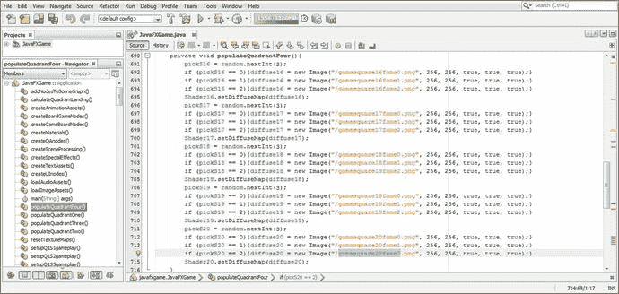

图 20-16。

Confirm the populateQuadrantFour() method image assets cross-reference the createQSgameplay() methods

让我们使用图 20-17 所示的运行➤项目工作流程来测试第四象限的新代码。


图 20-17。

Test with a Run ➤ Project work process; make sure each square populates the quadrant with the correct image

为了节省一些屏幕截图，我没有显示五个事件处理 if()结构的添加，这五个事件处理 if()结构是您在本章中填充每个新象限和匹配 setupQSgameplay()方法时添加的，每个象限添加了近 50 行 Java 9 代码。

这将导致以下 20 个 Java 编程 if()结构——我们将用调用来填充这些结构以触发摄像机动画、数字音频样本(声音效果)等——被添加到自定义 createSceneProcessing()方法体中的 onMouseClicked()事件处理程序基础结构中。

在图 20-18 中，可以看到这 20 个条件 if()结构被选择为浅蓝色和黄色。请注意，我使用了一个红色方块来突出显示这些新的 setupQSgameplay()方法，这些方法是我们在本章的第一部分“导航器”窗格的“游戏代码方法成员”部分中添加的，它显示在 NetBeans 9 的最左侧窗格中。


图 20-18。

You now have all the setupQSgameplay() methods and are calling them in an OnMouseClicked event handler

如果你想看到你所有的图像资源，它们都是纹理贴图，因为这是一个 i3D 游戏，你可以使用你的操作系统文件管理工具并导航到你的`/MyDocuments/NetBeansProjects/JavaFXGame/src/`文件夹，如图 20-19 所示。我几乎无法将所有这些游戏素材(大约 34MB)放入一张截图中！我可能必须将这 120 个图像素材优化成 PNG8 图像素材，这将把这个数据占用空间减少到大约 10MB。使用游程编码(RLE，也称为 ZIP 文件压缩)可以进一步优化它们。这些图像中的大多数可以很好地转换为 256 色(带抖动)。

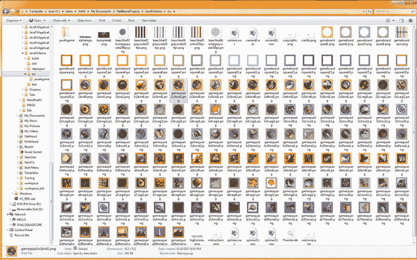

图 20-19。

Use your file management software to view all of the game image (texture map) assets in the /src folder

在下一章中，我们还将使用一个名为 Audacity 2.1.3 的用于 Windows、Mac 和 Linux 的专业数字音频编辑和增甜包来创建我们的音频素材并学习一些数字音频编码技巧。

接下来，让我们通过将相机缩放到选定的游戏象限来给游戏添加一些“哇”的因素。

## 相机动画:选择后定位游戏板

接下来让我们添加一些 3D 相机动画，以便在玩家单击他们想要用于其回合的正方形后，相机对象移动并从-30 度转到-60 度，这将使象限及其图像更接近(和更平行)相机。这将使象限图像对玩家来说更大，也将为屏幕左右两侧的 2D 叠加面板提供更多空间。这些将包含我们的用户界面，记分板，和选择的游戏板广场视觉内容的答案。大部分内容将在接下来的几章中创建，所以我们基本上完成了游戏外部部分的 i3D 和 UI 编程。在接下来的章节中，我们将开始游戏编程的内部(问答)和音频部分。

将 rotCameraDown 对象声明添加到类顶部的 RotateTransition 复合语句中；然后在 createAnimationAssets()方法的末尾添加该对象的实例化，使用 5 秒作为持续时间设置，并引用 camera 对象。将 cycleCount 变量设置为 1，将 Rate 设置为 0.75，以获得更适中的移动速率。将延迟设置为 1(持续时间。一个)并使用插值器。目前的线性插值器值。最后，将 fromAngle 变量设置为当前的-30 度，将 toAngle 变量设置为目标的-60 度。这段 Java 代码可以在 createAnimationAssets()方法的末尾看到，在图 20-20 中用黄色突出显示。

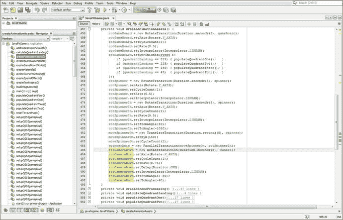

图 20-20。

Add a rotCameraDown animation at the end of the createAnimationAssets() method from -30 to -60

如图 20-20 所示，调用 RotateTransition 对象的 camera 对象的 Java 9 代码应该如下所示:

```java
rotCameraDown = new RotateTransition(Duration.seconds(5), camera);
rotCameraDown.setAxis(Rotate.X_AXIS);
rotCameraDown.setCycleCount(1);
rotCameraDown.setRate(0.75);
rotCameraDown.setDelay(Duration.ONE);
rotCameraDown.setInterpolator(Interpolator.LINEAR);
rotCameraDown.setFromAngle(-30);
rotCameraDown.setToAngle(-60);

```

由于我们还希望将 camera 对象移动-175 个单位，从 500 到 325，同时我们将 camera 对象向下旋转-30 度，因此我们将在类顶部的 TranslateTransition 对象复合声明语句中添加一个 moveCameraIn 对象。在 createAnimationAssets()方法的最后，我们将使用 2 秒钟实例化这个对象，并将其附加到 camera 对象。然后，我们将使用 setByZ(-175)将其配置为在 Z 方向移动-175 个单位，cycleCount 设置为 1。该动画对象的 Java 代码应该如下所示:

```java
moveCameraIn = new TranslateTransition(Duration.seconds(2), camera);
moveCameraIn.setByZ(-175);
moveCameraIn.setCycleCount(1);

```

最后，为了制作一个复合动画，我们将添加一个 cameraAnimIn ParallelTransition 对象声明，在类的顶部制作一个复合声明，然后我们将在 createAnimationAssets()中实例化该对象。

我们将把 moveCameraIn 和 rotCameraDown 动画对象添加到这个 ParallelTransition 对象中，就在对象实例化语句内部，因此我们只需要一行代码就可以将这两个动画无缝地结合在一起。Java 代码也显示在图 20-22 的末尾，应该如下所示:

```java
cameraAnimIn = new ParallelTransition(moveCameraIn, rotCameraDown);

```

接下来，让我们使用一个运行➤项目的工作过程，并测试这个代码，看看它是如何工作的！正如你在图 20-21 中看到的，象限在屏幕上处于一个很好的位置，所以我们所要做的就是将 3D 旋转器 UI 移出屏幕。为了实现这一点，我们将向 cameraAnimIn ParallelTransition 添加一个 moveSpinnerOff 动画对象，以便将相机旋转到游戏板上的过程也包括将 3D 微调器移出游戏屏幕。

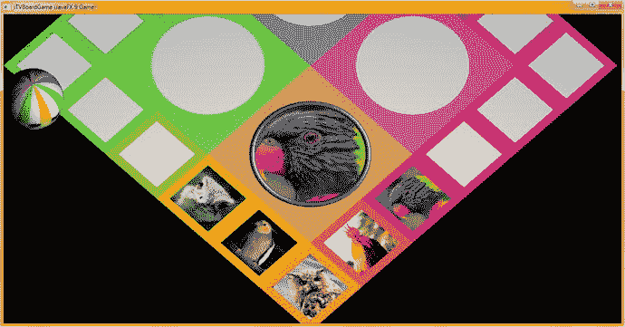

图 20-21。

The camera now points down 60 degrees at the game board displaying the content better

这将使动画序列看起来更专业。每当我们需要再次旋转游戏板时，我们可以使用原始的 spinnerAnim ParallelTransition 对象将 3D spinner UI 显示在屏幕上。

接下来让我们创建 moveSpinnerOff 动画对象，然后我们可以将它添加到我们刚刚创建的 cameraAnimIn 对象中，以创建一个更复杂的 ParallelTransition 动画对象，以便在您的游戏代码中使用。

在类顶部的复合 TranslateTransition 声明语句中声明一个 moveSpinnerOff 对象，然后在 createAnimationAssets()方法体中，在 moveCameraIn 语句之后和 cameraAnimIn ParallelTransition 对象实例化之前实例化它，因为我们要将它添加到此复合动画过渡中。通过这种方式，我们想要制作动画的一切都在完全相同的时间发生。

我们将在 2 秒钟内快速移动微调器，移动量与我们将微调器移动到屏幕上的量相同，即 150 个单位(这次是负的)。Java 代码应该如下所示，如方法底部的图 20-22 所示，用黄色和浅蓝色突出显示:

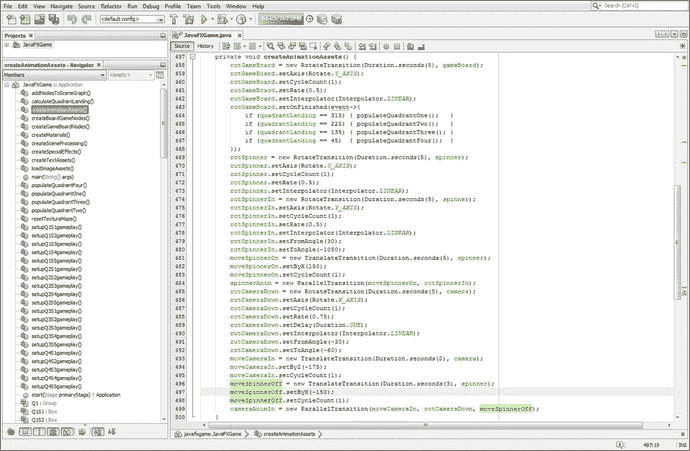

图 20-22。

Add a moveSpinnerOff Animation object to a cameraAnimIn ParallelTransition object to remove the spinner

```java
moveCameraIn = new TranslateTransition(Duration.seconds(2), camera);
moveCameraIn.setByZ(-175);
moveCameraIn.setCycleCount(1);

moveSpinnerOff = new TranslateTransition(Duration.seconds(3), spinner);
moveSpinnerOff.setByX(-150);
moveSpinnerOff.setCycleCount(1);

cameraAnimIn = new ParallelTransition(moveCameraIn, rotCameraDown, moveSpinnerOff);

```

这四个新的动画对象将为您的 i3D 游戏增加相当多的专业性，将您的相机视图动画化到一个非常优越的位置，为每个核心游戏会话从屏幕上移除微调器 i3D UI 元素，旋转 3D 相机的平面，使其与您的象限内容更加平行，并将所有这些移动合并到一个并行转换动画序列中。

这为下一章做好了准备，在下一章中，我们将通过使用 ParallelTransition 对象为游戏面板旋转和相机缩放添加数字音频音效。这将使这两个 3D 动画对象对我们的 i3D 桌面游戏玩家来说更加有趣。

最后，让我们使用一个运行➤项目的工作流程来测试代码。正如你在图 20-23 中看到的，它工作得很好，我们在屏幕的左右两侧有一些不错的区域来覆盖我们的 2D 用户界面区域，我们将在接下来的几章中创建这些区域来完成 i3D 棋盘游戏。

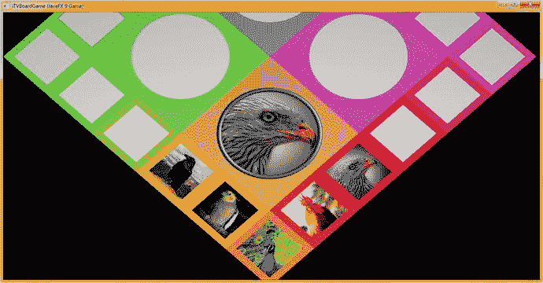

图 20-23。

The cameraAnimIn Animation object now works as expected, removing the spinner

在接下来的几章中，我们不仅会继续添加数字音频音效，还会继续添加挑战玩家的问题和答案。我们还将添加一个评分引擎，它将跟踪他们成功识别内容。

## 摘要

在第二十章中，我们了解了更多关于如何完成游戏棋盘方块内容的随机选择的实现。我们实现了 onMouseEvent 处理代码，当玩家点击游戏棋盘上的方块并选择内容后，该代码会将象限纹理贴图放置到位。我们还实现了相机动画代码，一旦选择了游戏板方块，它就会改变游戏板的视图，以便象限显示更大的图像。这基本上让我们开始编写单个方块(和象限，一旦方块被选中)的游戏性，在这里一个关于内容的视觉问题被回答并评分，我们将在第 21 和 22 章中创建。这些代码的大部分将进入每个方块的 setupQSgameplay()方法中，这是我们在本章中要做的基础。之后，我们将着眼于创建一个评分引擎，数字音频效果，以提高游戏性，也许更多的动画对象。这将使游戏更具 3D 互动性，并增加更多的专业性。

这是你繁重的编码章节之一(下一章也是)。您构造了 20 个自定义方法，setupQ1S1gameplay()到 setupQ4S5gameplay()，并且在 OnMouseClick()事件处理基础结构中放置了指向这些方法的条件 if()结构。您还在所有 populateQuadrant()方法之间交叉检查了图像素材，最后，一起测试了所有代码以确保它正常工作。

我们还在 setupAnimationAssets()方法中添加了一些动画对象，以继续添加一些很酷的“wow”因素，包括一个关键动画，该动画将玩家从“全局”游戏板旋转选择模式带入更“本地”的游戏板内容游戏模式。在本书的后面，当答案和得分完成时，我们当然会反转这个动画，并动画回到更倾斜的视图，这是以最佳方式查看游戏棋盘旋转所需要的。

在第二十一章中，你将开发额外的游戏代码基础设施来处理玩家点击(选择)游戏方块内容时发生的事情。这意味着回到开发更多的 2D 游戏元素，以容纳将弹出的问题和答案内容，并覆盖 3D 游戏板的未使用部分。如您所见，开发一个专业的 Java 9 游戏是一项巨大的编程工作量！