# 二十三、完成游戏代码和通过玩家验证你的事件处理

既然您的 i3D UI 及其事件处理(更不用说您的大多数动画和数字音频)都已就绪并正常工作，那么是时候在您的代码库中完成加载基本级别的内容(60 幅图像、240 个答案和得分)了。我们将在这一章的第一部分做这个，所以我可以向你展示我做了什么来完成游戏，并且在整本书中没有代码连续性的损失。大部分编码都是复制粘贴，这要归功于我设置游戏设计代码的方式，以及在测试游戏时确保答案匹配且运行良好。

在本章中，我们将用与视觉效果(问题)相匹配的基于文本的答案内容填充 20 个 setupQSgameplay()方法。我们还将完成 createQAprocessing()方法，该方法保存更新评分 UI 面板的答案评分代码。玩家将使用这些来选择正确的答案，揭示该方块的视觉代表什么，并对他们的答案进行评分。这意味着在这一章中你将会增加几百行代码，在你完成之前将会增加 1750 行代码。

一旦我们完成了游戏“答案显示、选择和评分”基础设施的大部分编码，并测试了每个方块以确保其工作正常，我们就可以创建 Java 代码的防错部分了。这导致了一个专业的游戏，确保玩家正确使用它。这包括使用布尔变量(称为标志)来保存“点击”变量；一旦玩家单击了旋转器、游戏棋盘方块或回答按钮 UI 元素，elementClick 变量就会被设置为 false，这样游戏玩家就不能再次单击它并“游戏”游戏代码。

例如，您的玩家可能多次单击您的正确答案按钮 UI 元素，这将运行到记分板的“右:”部分！我称之为代码的“用户检验”或“错误检验”，这是一个相当复杂的过程(正如你将在本章中看到的)，有时会深入到几个层次。例如，我们将首先保护所有游戏棋盘方格不被点击两次，然后再下一层，保护一个象限的游戏棋盘方格，这样玩家在每一轮游戏中只能选择选定的象限。

我们还将添加最终的动画，它将摄像机带回到游戏的游戏棋盘旋转视图，以便玩家可以调用随机旋转来选择下一个象限(动物、植物、矿物或地点主题)。这将通过在棋盘游戏 UI 设计的顶层添加一个亮黄色的 Let's Play Again 按钮元素来实现。在这一章中我们有大量的工作要做，所以让我们开始吧！

## 完成游戏:填充游戏方法

这一章的第一部分将向你展示我如何把 Java 代码放在适当的位置来完成游戏。我们将在 setupQSgameplay()方法中向四个按钮 UI 元素添加答案选项(其中有二十个，第一个已经在第二十一章中编写过，以向您展示 Java 代码是如何工作的)，然后我们将在四个 Q &按钮 UI 元素的 ActionEvent 处理方法内的 createQAprocessing()方法中添加这些答案的得分。

### 添加答案选项:完成 setupQSgameplay()方法

在游戏内容开发的这一阶段，并不是在 setupQSgameplay()方法中复制和粘贴 Java 9 代码会占用您的大部分时间，而是确认正确答案和创建错误答案会难倒玩家并导致“错误:”答案。一旦为每个随机选择添加了四个答案选项，setupQ1S1gameplay()的方法体看起来就像图 23-1 中的 18 个 Java 语句。

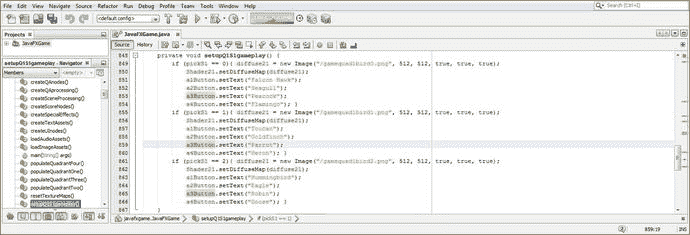

图 23-1。

Find and add a correct answer to a different button (and three incorrect answers) for each random image

将你对应的对错答案处理添加到我们在第二十二章创建的 createQAprocessing()评分引擎中。正确答案(正确答案和正确答案)在图 23-2 中用黄色突出显示。

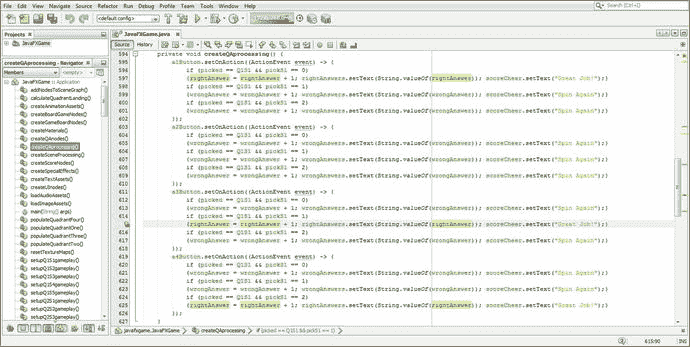

图 23-2。

Add matching correct or incorrect answer score processing to the createQAprocessing() method for Q1S1

非常仔细地执行这个工作过程是很重要的，这样您的 20 个 setupQSgameplay()方法中的每一个方法的正确和不正确的答案都可以与 createQAprocessing()计分算法的方法体完美匹配。为了让你的评分引擎准确地给游戏评分，这些必须完美匹配，正如你通过比较数字 23-1 和 23-2 在一个问题接一个问题和一个答案接一个答案的基础上所看到的。

你可以边走边测试，一个游戏板一个游戏板地测试，或者完成后一次性测试。或者你可以两种方式都做，我就是这么做的，尝试生成在编译时和运行时都没有错误的代码。在我写这本书的时候，有成千上万行代码和一个处于测试阶段的 Java 9(和 JavaFX 9) API，这显然不是一件容易的事情，尤其是当我每周都要上交一个完整的章节的时候。

使用运行➤项目工作流程渲染代码和 3D，并在您的第一象限测试游戏棋盘 square 1，如图 23-3 所示。我建议一次做一个方格(和一个象限)，这样你就可以利用代码“模式”，这可以通过比较图 23-1 和 23-2 看出。您可以根据 Java 代码对象名和变量名直观地判断出您正在使用哪个游戏棋盘方格、游戏棋盘象限、按钮编号和随机问题选择，我专门为此目的使用了这些名称。

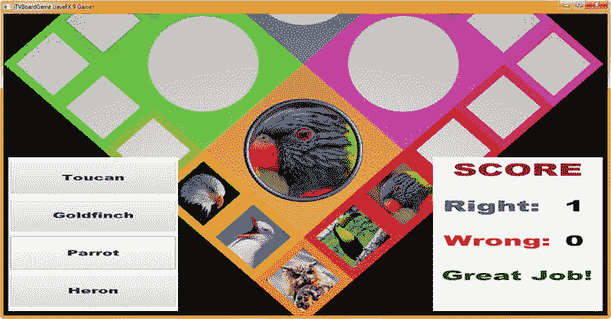

图 23-3。

Use a Run ➤ Project work process and test your Q1S1 answers and scoring logic before moving on to Q1S2

正如你在图 23-4 中突出显示的，setupQ1S2gameplay()方法代码非常相似，除了 pickS2 随机对象和图像引用，当然还有正确和错误答案的按钮标签。

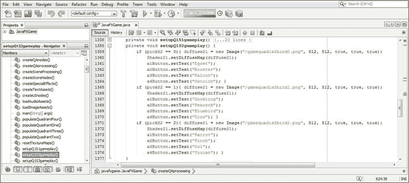

图 23-4。

Add correct and incorrect answers to Q1S2 Button objects, which as you can see is similar to the Q1S1 method

正如您在游戏设计和编程的这一阶段所看到的，主要目标是选择最佳按钮答案标签，并将其正确“连接”到 setupQAprocessing()评分引擎方法，以便正确计算分数！这就是为什么我建议一次一个方块地对每个游戏板进行编码，并小心地将它们绑定到 setupQAprocessing()评分引擎方法！确保对每个游戏棋盘方格进行足够好的测试，这样您就可以确保单击正确答案按钮会将“右:”分数标签的整数文本值加 1。

如图 23-5 所示，我已经添加了评分引擎方法的 Java 代码来评估这些答案，用黄色突出显示。我选择了代码中的 Q1S2 框(正方形)对象，以突出显示对它的引用。

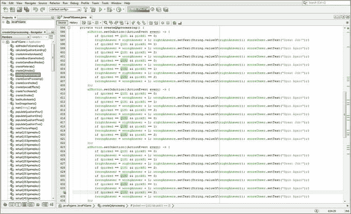

图 23-5。

Add matching correct or incorrect answer score processing to the createQAprocessing() method for Q1S2

使用图 23-6 所示的运行➤项目工作流程，并测试 Q1S2 游戏棋盘方块逻辑，通过将“right:”score ui panel integer text 对象加 1 来查看它是否为正确答案(duckling)打分。

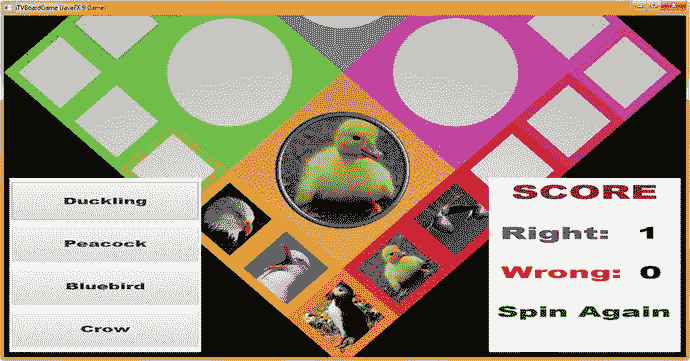

图 23-6。

Use a Run ➤ Project work process and test your Q1S2 answers and scoring logic before moving on to Q1S3

接下来，我完成了第三个到第五个棋盘游戏设置方法，并测试了它们的代码，以确保我在 createQAprocessing()方法体中连接了正确的答案按钮计分逻辑。一旦我们完成添加评分逻辑，这个方法体中的代码将达到大约 500 行，稍后，一个变量将在选择答案后锁定按钮单击事件处理。接下来会有一些非常酷的代码，我会在本章稍后介绍，当我们编写代码来“防止玩家”在 UI 上多次点击鼠标。

正如你将在图 23-7 中看到的，前六个游戏棋盘方格(已经完成 30%)的答案评分逻辑是用三十多行代码填充按钮 1 的 IDE 屏幕，这意味着我们为所有四个按钮完成了十几行代码(144 行)。

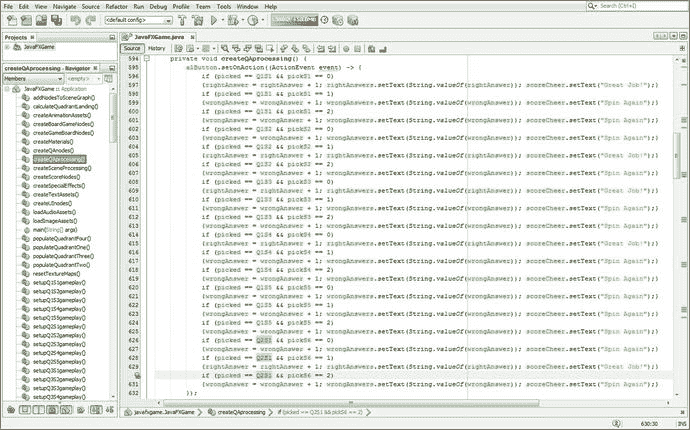

图 23-7。

Add matching correct or incorrect answer score processing to the createQAprocessing() method for Q2S1

图 23-7 底部高亮显示的代码也显示在被测图左侧的图 23-8 中。当我单击第一个按钮元素(Chard)时，评分引擎将“Right:”分数加 1，如数字从 0 增加到 1 所示。


图 23-8。

Use a Run ➤ Project work process to test Q2S1 through Q2S5 answers and scoring logic before moving on

此时，您必须完成接下来的四个 Q2S2 到 Q2S5 游戏棋盘 square setupQSgameplay()方法，以及相应的 createQAprocessing()评分引擎逻辑，以便对您的棋盘游戏的一半内容完成一半。如图 23-8 右侧所示，为了节省空间，我没有展示所有这些工作(及其测试工作过程)所涉及的所有游戏棋盘旋转屏幕截图。完成这个游戏内容所需的 600 行代码需要做大量的工作(createQAprocessing()大约需要 480 行，setupQSgameplay()方法大约需要 100 行)，所以这花了我大约一天的时间来编码和测试。我拍摄了一些截图，我将在本章的这一部分展示。

当您将游戏棋盘方块内容和计分逻辑添加到游戏中时，请确保经常使用“运行➤项目”工作流程来测试添加答案按钮对象的新 Java 代码，以及将这些内容连接到 createQAprocessing()计分引擎方法的代码，以查看它是否能提供您想要的游戏效果。如图 23-8 所示，第二象限的答案和评分工作正常，我可以继续做第三象限了。

正如您在图 23-9 中看到的，第三象限的答案和评分现在工作正常，我可以继续添加第四象限的答案和评分代码。此时，您的棋盘游戏应该运行得相当好，我们现在可以开始添加代码，防止游戏玩家多次单击 UI 元素。


图 23-9。

Use a Run ➤ Project work process to test the Q3S1 through Q3S5 answers and scoring logic before moving on

正如你在图 23-10 中看到的，游戏内容现在已经准备好了，我们可以开始玩家验证了。


图 23-10。

Use the Run ➤ Project work process to test the Q4S1 through Q4S5 answers and scoring logic to finish 20 squares

接下来，让我们通过添加布尔变量来防止重复点击，从而对您当前的代码进行“玩家验证”。

## 玩家验证代码:控制玩家事件的使用

游戏“理论上”已经结束了，我们可以相信玩家只需点击(一次)正确的 i3D 和 i2D UI 元素就可以玩游戏了。然而，这种特定游戏的预期观众包括未成年儿童、智障人士、残疾玩家和自闭症玩家。因此，我们将放置一些控件，确保玩家只需点击一次正确的 UI 元素就可以玩这个游戏。让我们通过声明(类的顶部)并在 rotGameBoard.setOnFinished()中添加一个设置为 true 的 squareClick 布尔变量来开始这个过程，如下图所示:

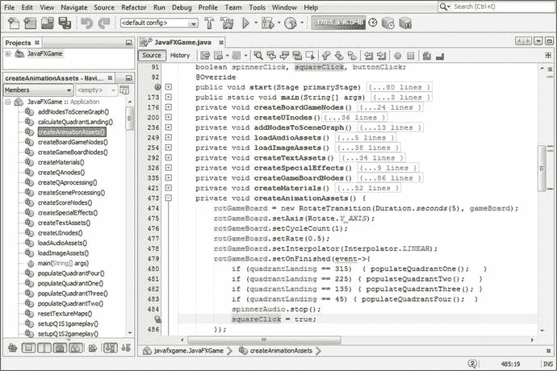

图 23-11。

Add a squareClick boolean variable set to true at the end of your rotGameBoard.setOnFinished() handler

```java
rotGameBoard.setOnFinished(event-> {
    if (quadrantLanding == 315) { populateQuadrantOne();   }
    if (quadrantLanding == 225) { populateQuadrantTwo();   }
    if (quadrantLanding == 135) { populateQuadrantThree(); }
    if (quadrantLanding == 45)  { populateQuadrantFour();  }
    spinnerAudio.stop();
    squareClick = true;
});

```

因此，从逻辑上讲，我们已经将游戏棋盘方块的点击“保护”连接到游戏棋盘旋转动画对象。另外，请注意，通过将所有点击保护变量初始化为没有(缺省)值的布尔值，我们实际上已经将所有点击保护设置为 false，或者“点击被锁定”，只需在 Java 类的顶部声明这些变量。这样，我们就不需要 start()方法体中的任何`clickProtect = false;`语句。

注意在图 23-11 中，我已经在你的类的顶部使用一个复合 Java(布尔)声明声明了 spinnerClick 和 buttonClick。这是因为一旦玩家点击了 i3D spinner UI 元素、游戏棋盘方块和 Q & A 按钮 UI 元素，我们就想要“锁定”它们。这是为了防止多次点击，从而防止多次点击回答按钮(以提高分数)。它还确保您的 i3D 动画和音频通话在每轮游戏中仅触发一次，以防止玩家看到(或听到)类似错误的内容。你真的不希望动画在预期的视觉效果中间重新开始，即使你告诉它重新开始(在播放周期中足够快，这通常是一次以上的点击所做的)，所以我们将在一次点击后锁定点击！

接下来，让我们为 spinnerClick 设置锁定，从 MouseEvent 处理代码中的 if(picked == spinner)条件求值开始。我们需要将&& spinnerClick == true 添加到 if(picked == spinner)中，以评估是否允许我们在游戏中的该点单击微调器。如果是的话，我们会立即将 spinnerClick 设置为 false 值，因为 spinner 动画对象(以及象限着陆处理)也在这个代码块中启动。我们将启用单击。setOnFinished()处理程序，这将阻止玩家在旋转的时候点击你的 i3D spinner UI 元素！酷！

i3D spinner 的条件 if() Java 代码基础设施中新增的防鼠标点击功能在这里以粗体显示，并在图 23-12 的顶部以浅蓝色和黄色突出显示:

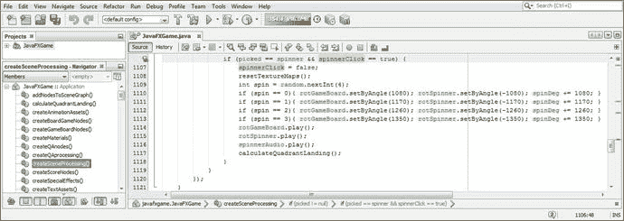

图 23-12。

Add && spinnerClick == true to the if() evaluation for the spinner in your MouseEvent handling structure

```java
if(picked == spinner && spinnerClick == true) {
    spinnerClick = false;
    ...
}

```

接下来，我们将为这个 rotSpinner 动画对象添加一个. setOnFinished()事件处理程序，一旦 rotSpinner 动画对象完成，它就将布尔 spinnerClick 变量设置为 false 值。这是错误的，因为我们不希望旋转器(或游戏板)再次旋转，直到玩家选择了一个方块和相应的答案按钮 UI 元素来注册(和评分)他们的答案。

但是，在微调器再次出现在屏幕上(这是 rotSpinnerIn 动画对象)后，我们确实希望打开微调器鼠标单击。为此，我们将在。setOnFinished()事件处理逻辑。再说一次，Java 编程在这里是合乎逻辑的，如果你只是想在你的游戏管道中实现什么，这并不奇怪。像大多数游戏逻辑一样，一次考虑所有的事情非常多，所以一开始可能很难做到，直到你习惯于一次考虑所有的实时游戏逻辑，因为它涉及到处理实时交互式游戏所涉及的逻辑(处理管道)。这就是为什么游戏开发被大多数人认为是困难的，因为作为一个程序员，你需要一次“把你的脑袋包起来”所有的游戏代码。

此处显示了 createSceneProcessing()方法中的新 Java 代码，以及在图 23-13 中用浅蓝色和黄色突出显示的代码块，这些代码块设置了用于 rotSpinner 和 rotSpinnerIn 的逻辑:

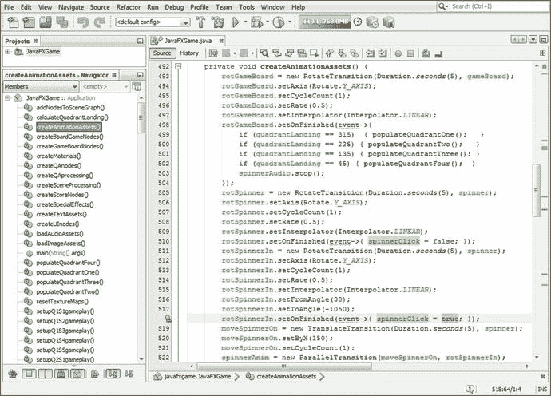

图 23-13。

Set spinnerClick to false in rotSpinner and to true in rotSpinnerIn to control when the spinner is to be clicked

```java
rotSpinner = new RotateTransition(Duration.seconds(5), spinner);
...
rotSpinner.setOnFinished(event-> {
    spinnerClick = false;
});

rotSpinnerIn = new RotateTransition(Duration.seconds(5), spinner);
...
rotSpinnerIn.setOnFinished(event-> {
    spinnerClick = true;
});

```

我们需要确定(和编码)的下一件事是什么时候我们允许按钮 UI 元素被点击。从逻辑上讲，这应该在 cameraAnimIn 动画对象的末尾，也是在。setOnFinished()事件处理程序构造，在 qaLayout 和 scoreLayout StackPane 2D UI 面板(及其内容或子面板)通过使用。setVisible(true)方法调用每个 StackPane UI 容器对象。由于 buttonClick 作为(声明)缺省值是 false，这就像使用`buttonClick = true;` Java 语句一样简单。

一旦单击了一个应答按钮 UI 对象，buttonClick 将再次被设置为 false，以防止任何按钮 UI 对象(即使是同一个)被单击，直到再次播放 cameraAnimIn 动画对象。接下来，我们将在 createQAprocessing()计分方法中将此 Java 代码放入每个 ActionEvent 处理结构中，该结构附加到中四个按钮对象的每一个。setOnAction()事件处理构造。

您的新 cameraAnimIn Java 9 代码现在应该如下所示，并且在图 23-14 的底部以浅蓝色和黄色突出显示:


图 23-14。

Add a buttonClick = true; statement to the end of the cameraAnimIn.setOnFinished() event handler code

```java
cameraAnimIn = new ParallelTransition( moveCameraIn, rotCameraDown, moveSpinnerOff );
cameraAnimIn.setOnFinished(event-> {
    qaLayout.setVisible(true);
    scoreLayout.setVisible(true);
    buttonClick = true;
});

```

现在摄像机已经在游戏板表面附近设置了动画，并且 buttonClick 布尔变量已经设置为 true 以允许单击按钮来选择答案，我们需要告诉 buttonClick 变量在一个按钮(a1Button 到 a4Button)被单击时自动关闭(false)。

为此，我们需要用一个`if(buttonClick == true)`条件评估层“包装”每个按钮 ActionEvent 事件处理构造的分数处理内容。这将只允许在 buttonClick 打开(true)时进行事件处理，然后在处理结束时使用简单的`buttonClick = false;` Java 语句关闭事件处理。这将是退出`if(buttonClick == true)` Java 代码构造之前的最后一条语句。

您的 Java 代码应该如下所示，这也在图 23-15 的开头和图 23-16 的结尾突出显示，因为这四个按钮 UI 对象的 ActionEvent 处理结构跨越了每个按钮的 120 多行 Java 代码。setOnAction()事件处理基础结构:

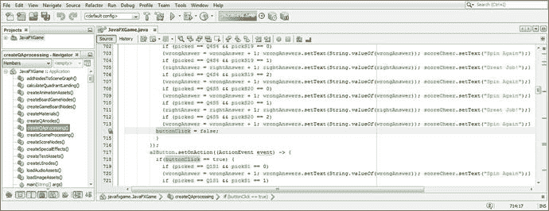

图 23-16。

At the end of each if(buttonClick==true) construct, set buttonClick = false; to turn off the Button click function

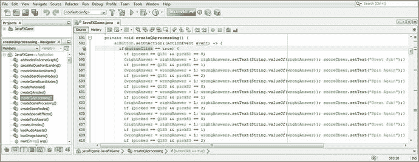

图 23-15。

Use a conditional if(buttonClick == true) statement at the top of each Button event processing structure

```java
private void createQAprocessing() {
    a1Button.setOnAction( (ActionEvent event) -> {
        if (buttonClick == true) { // Evaluates if (buttonClick == true) then {not yet clicked}
            if (picked == Q1S1 && pickS1 == 0)
            ...
        buttonClick = false;   // If this Button has been clicked then set buttonClick to false
        }
    });
}

```

将这个相同的 if(buttonClick == true)放在每个 Button.setOnAction()构造之前，并将 buttonClick = false 在每个 Button.setOnAction()事件处理构造的末尾，如图 23-15 和图 23-16 所示。

要重新打开所有这些事件处理，我们需要一个“让我们再玩一次”按钮和。setOnAction()事件处理程序。

## 让我们再玩一次按钮:重置播放器事件处理

一旦玩家点击一个回答按钮 UI 对象，所有的游戏棋盘方块、旋转器和按钮 UI 对象都将被锁定！为下一轮游戏解锁的最佳方式是在游戏板中间添加一个大的黄色“让我们再玩一次”按钮(如果您需要提前查看，如图 23-23 所示)，用户将单击该按钮旋转另一个时间，随机选择一个新主题和另一个图像进行识别。在本章的这一节，我们将把这个按钮元素添加到你的场景图的根中，开发按钮的代码，并完成你的播放器校对。

让我们通过将 againButton 添加到类顶部的复合按钮声明中来设置 againButton 的基础结构，然后使用. getChildren()将 againButton 添加到您的场景图根中。addAll()方法链。此处显示了执行此操作所需的 Java 代码，并且在图 23-17 的顶部用黄色突出显示:

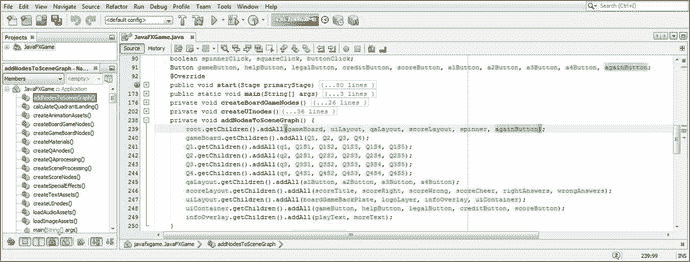

图 23-17。

Declare an againButton Button object at the top of your class and add it to your SceneGraph root object

```java
Button ... a1Button, a2Button, a3Button, a4Button, againButton;
...

root.getChildren().addAll(gameBoard, uiLayout, qaLayout, scoreLayout, spinner, againButton);

```

在 createBoardGameNodes()中实例化并配置 againButton，位于 X，Y (200，-400)，大小为(300，150)，使用 34 号 Arial 黑色字体，如图 23-18 所示。标签为“让我们再玩一次”,因为它触发了一轮游戏。

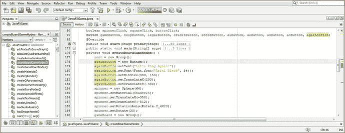

图 23-18。

Instantiate and configure againButton in the createBoardGameNodes() method and use a large size and font

因为我们不希望这个按钮在玩家选择答案后才可见，所以我们将 againButton 设置为在启动时不可见。为此，我们在 createBoardGameNodes()方法调用之后，在 start()方法的顶部使用. setVisible(false)方法 call off againButton。这看起来像下面的代码，在图 23-19 中突出显示:


图 23-19。

Set your againButton visibility to false in the start() method, after the createBoardGameNodes() method

```java
againButton.setVisible(false);

```

接下来，将`againButton.setVisible(true);` Java 语句添加到每个 Button.setOnAction()构造的末尾，以打开“让我们再玩一次”按钮的可见性，如图 23-20 中用黄色和蓝色突出显示的。

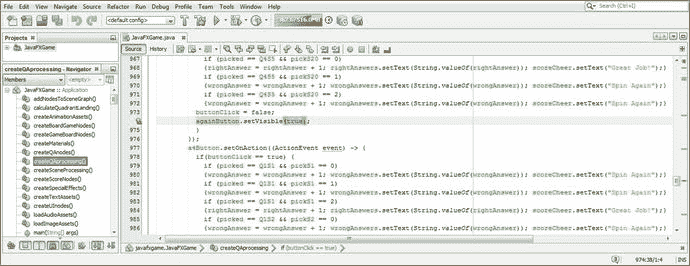

图 23-20。

Call againButton.setVisible(true); at end of each answer Button event handler, after buttonClick = false;

由于我们只估计了图 23-18 中按钮的位置和大小，让我们使用运行➤项目工作流程，这样我们就可以看到按钮 UI 元素是否位于游戏板设计的四色交叉点的中心。正如你在图 23-21 中看到的，我们需要做一些调整，因为按钮在内容的象限图像上。

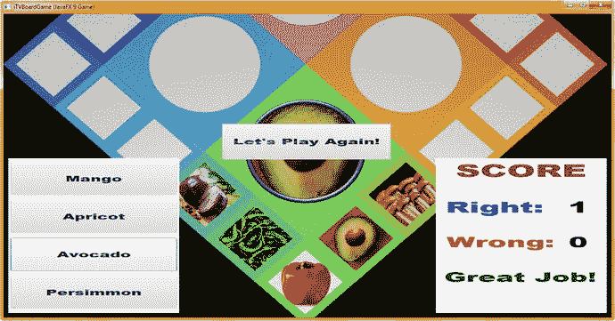

图 23-21。

Use the Run ➤ Project work process to test the againButton code to see whether it is located and sized properly

还要注意，我们需要为按钮设置黄色背景，因为象限使用粉色、蓝色、绿色和橙色。在`.``setBackground``(new``Background``(new``BackgroundFill``(``color.YELLOW``)))`方法链中添加一个黄色值(不要忘记空的 CornerRadii 和 Insets)，如图 23-22 中蓝色高亮显示。增加你的。将 setMinSize()设置为 300，200；将您的字体大小增加到 35；并将 X，Y，Z 重新定位到(190，-580，100)。

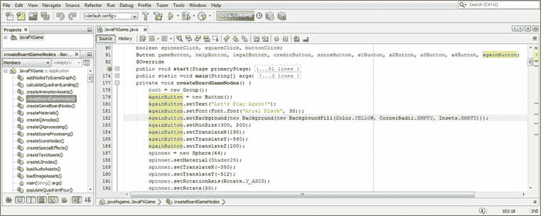

图 23-22。

Add a Yellow background color and adjust the translate values and size values to center the againButton

使用“运行➤项目”查看最终的按钮 UI 元素样式。如图 23-23 所示，看起来很棒！


图 23-23。

Use a Run ➤ Project work process to test the againButton to see if it is located, sized, and colored properly

接下来，将. setOnAction()事件处理构造添加到 againButton，以便当单击按钮时，可以关闭问答和计分(StackPane)面板，并将 buttonClick、squareClick 和 spinnerClick 变量重置为 false (off ),以便可以使用 3D 微调器、游戏板方块和回答按钮 UI 元素。这些可见性和防点击重置语句的初始 Java 代码在图 23-24 中以蓝色显示。


图 23-24。

Add the .setOnAction() method call to againButton; start adding mouse click and visibility event handling

我们需要创建的下一件事是 camera animout parallel transition 动画对象，它将把 camera 对象动画显示回您的完整游戏板(旋转)视图，因为我们将调用。在 againButton.setOnAction()事件处理构造中动画对象构造的 play()方法。因此，让我们在本章下一节创建 ParallelTransition 动画对象，因为这将是一个相对复杂的任务。

## 相机缩小:另一个平行转换

首先，让我们创建一个与我们在本书前面创建的 rotCameraDown RotateTransition 动画对象完全相反的对象，方法是将此动画对象代码复制并粘贴到 cameraAnimIn 对象下，因为我们将要创建 cameraAnimOut 对象。除了将对象名从 rotCameraDown 改为 rotCameraBack，并在。setFromAngle()和。setToAngle()方法调用。此处显示了完成此任务的 Java 9 代码，并在图 23-25 中用黄色和蓝色突出显示:

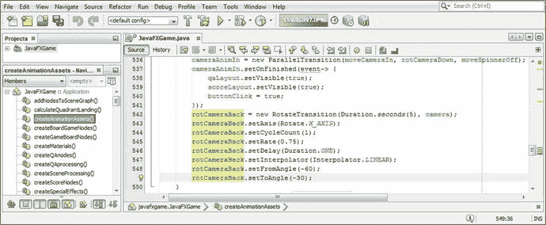

图 23-25。

Add the rotCameraBack RotateTransition object in createAnimationAssets() and instantiate and configure it for use

```java
rotCameraBack = new RotateTransition(Duration.seconds(5), camera);
rotCameraBack.setAxis(Rotate.X_AXIS);
rotCameraBack.setCycleCount(1);
rotCameraBack.setRate(0.75);
rotCameraBack.setDelay(Duration.ONE);
rotCameraBack.setInterpolator(Interpolator.LINEAR);
rotCameraBack.setFromAngle(-60);
rotCameraBack.setToAngle(-30);

```

接下来，让我们创建一个与 move camera in translate transition 动画对象完全相反的对象，方法是将此动画对象代码复制并粘贴到 rotCameraBack 对象下。除了将对象名从 moveCameraIn 更改为 moveCameraOut，并将。setByZ()方法调用。这里显示了完成此任务的 Java 代码，在图 23-26 中用黄色和蓝色突出显示:

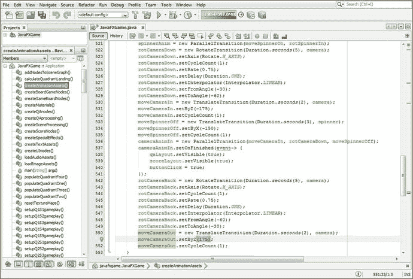

图 23-26。

Create a moveCameraOut TranslateTransition Animation object and change the .setByZ() value to 175

```java
moveCameraOut = new TranslateTransition(Duration.seconds(2), camera);
moveCameraOut.setByZ(175);
moveCameraOut.setCycleCount(1);

```

我们可以使用现有的 moveSpinnerOn 动画对象，该动画对象用作 spinnerAnim ParallelTransition 的组件之一，以便在 ParallelTransition 将相机带回其原始游戏板旋转位置和方向时，将微调器移回屏幕上。这将证明该动画对象可以在多个 ParallelTransition 对象中使用，这是一种编码优化，因为编码构造可以用于多个目的。在图 23-27 的顶部，您可以看到这个已经编码的动画以黄色突出显示。


图 23-27。

Create cameraAnimOut ParallelTransition and reference moveCameraOut, rotCameraback, and moveSpinnerOn

因此，现在我们可以创建您的 parallel transition camera animout 对象，它将并行或完全同时播放 moveCameraOut、rotCameraBack 和 moveSpinnerOn 动画对象！这将只需要一行代码来实例化 cameraAnimOut 对象，并使用其构造函数方法来加载带有其他三个动画对象引用的对象。最后，我们将添加第二行代码，调用该对象的. setOnFinished()方法，以便在相机缩小后将 spinnerClick 布尔变量重置为 false，这样玩家就可以再次使用 i3D spinner UI 元素来随机旋转游戏板。

执行此操作的 Java 代码应该如下所示，并在图 23-27 的底部以浅蓝色和黄色突出显示:

```java
cameraAnimOut = new ParallelTransition(moveCameraOut, rotCameraBack, moveSpinnerOn);

```

现在，我们可以继续完成 againButton.setOnAction()构造的代码，细化结果。

## 完成再次播放按钮:resetTextureMaps()

我们现在将扩展 againButton.setOnAction()事件处理基础结构中的五行代码，以便我们调用新的 camera Animation 对象和现有的 AudioClip 对象，将动画和数字音频添加到游戏的一部分，使玩家返回到缩小视图，在那里他们可以随机旋转游戏板以选择新内容来测试他们的知识库。我们还将把您的 resetTextureMaps()方法调用从 createSceneProcessing()方法中移到这个游戏重置事件处理方法中，以便在游戏结束时，就在相机从游戏板缩放回来之前(以及在播放相机缩放音频效果以匹配该动画之前)，游戏板的方块和象限被重置为空白。作为此过程的一部分，我们还将隐藏 againButton 按钮 UI 元素，因为我们不希望该按钮 UI 元素覆盖我们的 i3D 旋转器和游戏板旋转以随机选择下一个象限的视图。

在 qaLayout 和 scoreLayout 可见性调用之后，在 againButton 上添加一个. setVisible(false)方法调用。接下来，添加一个 resetTextureMaps()调用和。play()在方法结束时调用 cameraAnimOut 和 cameraAudio。

用于事件处理的 Java 9 代码现在看起来应该如下所示，如图 23-28 所示:

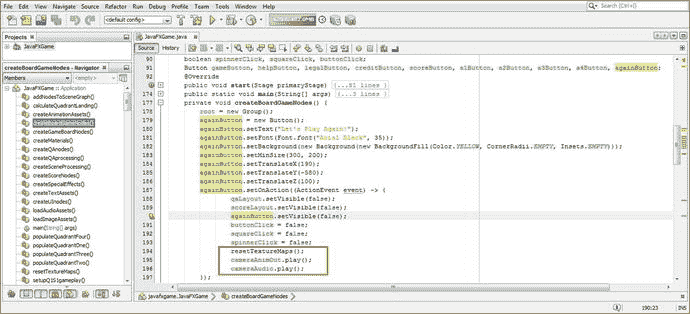

图 23-28。

Call resetTextureMaps(), cameraAnimOut.play(), and cameraAudio.play() in againButton.setOnAction()

```java
againButton = new Button();
againButton.setText("Let's Play Again!);
againButton.setFont(Font.font( "Arial Black", 35) );
againButton.setBackground(new Background(new BackgroundFill(Color.Yellow,
                                                            CornerRadii.EMPTY, Insets.Empty);
againButton.setMinSize(300, 200);
againButton.setTranslateX(190);
againButton.setTranslateY(-580);
againButton.setTranslateZ(100);
againButton.setOnAction( (ActionEvent event) -> {
    qaLayout.setVisible(false);
    scoreLayout.setVisible(false);
    againButton.setVisible(false);

    buttonClick = false;
    squareClick = false;
    spinnerClick = false;
    resetTextureMaps();

    cameraAnimOut.play();

    cameraAudio.play();

}

```

现在我们可以添加。setOnFinished()事件处理构造到 cameraAnimOut 动画对象，以在相机动画返回到游戏棋盘旋转视图时自动打开 spinnerClick 功能，以便玩家可以单击 i3D spinner UI 元素重新开始游戏过程。该功能的 Java 代码在这里显示为单行代码，并在图 23-29 中以浅蓝色和黄色突出显示:


图 23-29。

Add a cameraAnimOut.setOnFinsihed() event handler that sets the spinnerClick variable to a true value

```java
cameraAnimOut = new ParallelTransition(moveCameraOut, rotCameraBack, moveSpinnerOn);
cameraAnimOut.setOnFinished( event-> { spinnerClick = true; } );

```

使用一个运行➤项目的工作流程，如图 23-30 所示，来测试一个完整的周期(或者两轮游戏)。


图 23-30。

Use Run ➤ Project to test code; notice that clicking another quadrant square sets that quadrant image

注意图 23-30 中，我们的测试过程揭示了另一个问题！事实证明，方形点击的测试不够“深入”，不足以保证完美的游戏性！当某个象限已经“登陆”或被随机选择进行游戏时，您可以单击另一个象限的方块。这需要我们给游戏增加另一层保护，我们必须创建四个 squareClick 变量(每个象限一个)来真正彻底地保护我们的游戏。让我们在本章的下一节中修改我们的代码，使用 squareClick1 到 squareClick4 布尔变量并在每个象限的基础上进行测试来完成这个任务。

## 象限级保护:每象限平方点击

到目前为止，让我们更改 squareClick 代码，以适应每象限正方形检查。我们要做的第一件事是将类顶部的 squareClick 更改为 squareClick1 到 squareClick4(以匹配您的象限)。我们还需要更改 createSceneProcessing()方法中的测试，以将 squareClickN 变量与四个象限中的每一个相匹配，因此例如`if(picked ==` `Q1` `S1 &&` `squareClick1` `)`将被修改，而`if(picked ==` `Q2` `S1 &&` `squareClick2` `)`等等，如图 23-31 中突出显示的(象限 4)。这个改动的 Java 代码相当微妙，代码量很大，有些重复，这里就不一一列举了。图 23-32 显示了我提到的轻微(但重要)的修改。

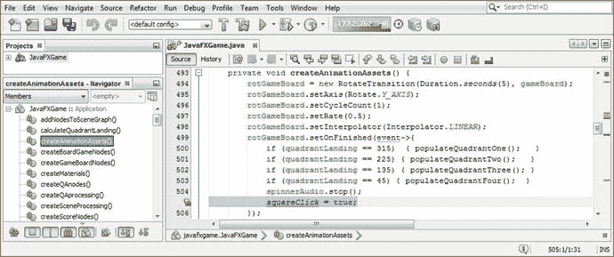

图 23-32。

Select and delete the squareClick = true; statement in createAnimationAssets(), as we are now moving it

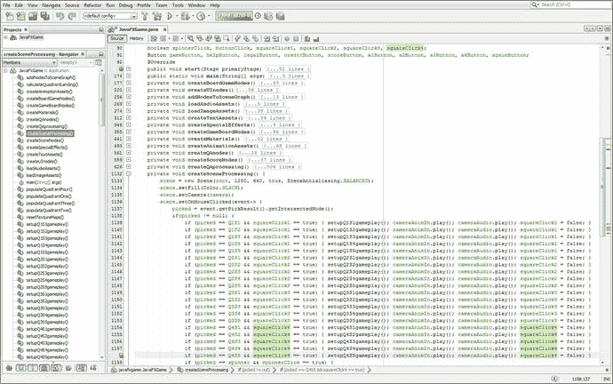

图 23-31。

Change your squareClick code to squareClick1 through squareClick4 to match up with the quadrant involved

从 createAnimationAssets()方法中删除 squareClick 引用，因为我们将在四个 populateQuadrant()方法中基于象限来控制方形点击，这是一个更合理的做法。

如图 23-32 所示，我选择了 createAnimationAssets()square click 语句进行删除。

正如你在图 23-33 中所看到的，我也选择了 createBoardGameNodes() `squareClick = false;`语句进行删除，因为我们将在你的 createSceneProcessing()方法中执行此操作。事实上，这已经显示在图 23-31 中，在屏幕截图的最右侧以黄色突出显示，这是它逻辑上的归属。

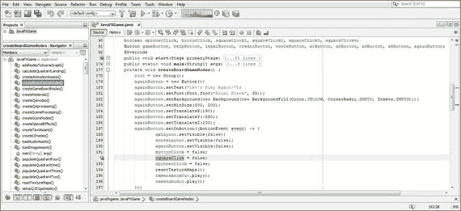

图 23-33。

Select and delete the squareClick = false; statement in createBoardGameNodes(), as we’ve already moved it

您希望将四个 squareClick 变量设置为 true(允许在这个象限的正方形上单击)的地方是在每个 populateQuadrantNumber()方法调用的末尾，以完成设置。这允许单击其中一个方块，以便为该象限的主题选择内容。

squareClick1 变量位于 populateQuadrantOne()的末尾，squareClick2 变量位于 populateQuadrantTwo()的末尾，squareClick3 变量位于 populateQuadrantThree()的末尾，squareClick4 变量位于 populateQuadrantFour()的末尾。

现在有一个 squareClickN 变量与四个象限中的每一个都相关。这更好地匹配了游戏模式，因为现在我们可以有选择地只在玩家所在的游戏棋盘象限打开鼠标点击，而在其他三个象限关闭游戏棋盘方块。这将防止图 23-30 中未被发现的测试，其中未被随机数发生器选择的象限仍然可以被播放。由于这在视觉上看起来不正确(如您所见)，我们将通过逐个象限地关闭方块来解决这个问题，这将解决这个问题，尽管需要更复杂的防玩家 Java 代码。

populateQuadrantOne()方法体的 Java 代码如下所示，在图 23-34 的底部用浅蓝色和黄色突出显示:

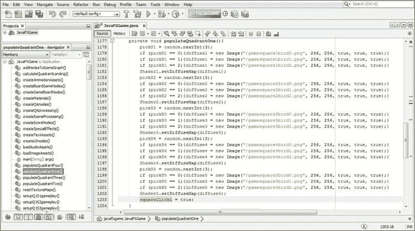

图 23-34。

Add a squareClick1 = true; statement at the end of populateQuadrantOne() and the other three in the other three methods

```java
private void populateQuadrantOne() {
    pickS1 = random.nextInt(3);
    if (pickS1 == 0){diffuse1 = new Image("/gamesquare1bird0.png", 256, 256, true, true, true);}
    if (pickS1 == 0){diffuse1 = new Image("/gamesquare1bird1.png", 256, 256, true, true, true);}
    if (pickS1 == 0){diffuse1 = new Image("/gamesquare1bird2.png", 256, 256, true, true, true);}
    Shader1.setDiffuseMap(diffuse1);
    ...
    squareClick1 = true;
}

```

做同样的平方 clickn = true；Java 语句来打开 squareClick 函数，一旦为当前一轮游戏选择了一个方块，该函数将被关闭。如图 23-35 所示，游戏现在可以正常运行了。您可以单击与当前象限无关的微调按钮和方块，这些单击将被忽略，就像单击第一个应答按钮之后的任何按钮一样。这种“错误检验”或“玩家检验”使得 i3D 游戏更加专业。

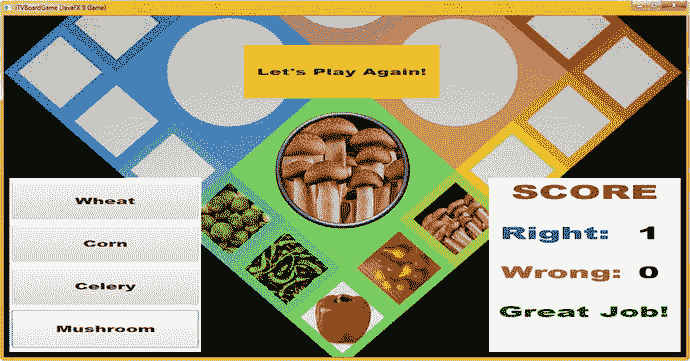

图 23-35。

Use Run ➤ Project and test the final error-proofing code and Play Again User Interface

恭喜你，基本的游戏已经完成，我们可以看看优化和剖析。

## 摘要

在第二十三章中，我们学习了如何创建玩家验证逻辑来强制正确使用 i3D 旋转器 UI、游戏板方块和回答按钮 UI 元素。这包括使用大约六个布尔变量，它们被用作“标志”，以关闭玩家在每轮游戏中多次点击 UI 元素的能力。我们保护了 i3D spinner UI，按钮 UI answers，以及每个象限的游戏棋盘方块，防止它们被“误用”到游戏系统中并累积未得分数。这是 pro Java 9 游戏设计和开发的一个重要部分，以确保您的游戏逻辑以预期的方式运行。

我们还在本章的第一部分完成了游戏内容的添加，添加了近 600 行 Java 代码，并将当前的 pro Java 9 游戏开发项目增加到近 1750 行 Java 代码。

在第二十四章中，您将了解游戏优化、使用 NetBeans 9 的评估以及 NetBeans 9 Profiler。