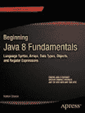


专业人士为专业人士打造的书籍®

沃斯

高

陈

艾弗森

韦弗

相关书籍

**Pro JavaFX 8**

在《Pro JavaFX 8》中，专家作者将向您展示如何使用 JavaFX 平台创建富客户端 Java 应用程序。您将发现如何使用这个强大的基于 Java 的 UI 平台，它能够处理面向 PC 以及移动和嵌入式设备的大规模数据驱动型业务应用程序。

本书涵盖了 JavaFX API、开发工具和最佳实践，并提供了代码示例，探索了 JavaFX 8 带来的激动人心的新特性，这些特性是 Oracle 新版 Java (SE) 8 的一部分。本书还包含了几乎涵盖 JavaFX 开发各个方面的引人入胜的教程，以及补充 JavaFX API 文档的参考材料。

阅读并使用本书后，您将掌握权威知识，这将在您为工作或客户进行的下一个基于 JavaFX 的应用程序项目中为您带来优势。

**您将学到：**

• 如何开始使用 JavaFX，包括下载 SDK 和可用工具

• 如何使用 SceneBuilder 和 FXML 表达用户界面

• 如何使用属性绑定轻松保持 UI 与模型同步

• 如何使用丰富的 JavaFX UI 控件、图表、形状、效果、变换和动画来创建令人惊叹、响应迅速的用户界面

• 如何使用强大的 JavaFX 布局类以跨平台方式定义用户界面

• 如何利用可观察集合类来观察 Java 集合的变化并进行绑定

• 如何使用 JavaFX 媒体类播放音频和视频

• 如何与外部应用程序服务交互，以使用 JavaFX 创建企业级应用程序

• 如何将 JavaFX API 与 Scala 和 Groovy 等替代语言结合使用

分类于

ISBN 978-1-4302-6574-0

编程语言/Java

5 4 9 9 9

用户级别：

中级–高级

**源代码在线**

9 781430 265740

www.apress.com

[www.it-ebooks.info](http://www.it-ebooks.info/)

************************为方便您阅读，Apress 已将部分前言材料置于索引之后。请使用书签和目录概览链接访问它们。*

*****[www.it-ebooks.info](http://www.it-ebooks.info/)

**目录概览**

关于作者 ��������������������������������������������������������������������������������������������������������������� xv

关于技术审校者 �������������������������������������������������������������������������������������������������� xvii

致谢 �������������������������������������������������������������������������������������������������������������������� xix

前言 ��������������������������������������������������������������������������������������������������������������������� xxi

引言 ��������������������������������������������������������������������������������������������������������������������� xxiii

第 1 章：快速入门 JavaFX

■

�����������������������������������������������������������������������1

第 2 章：在 JavaFX 中创

■

建用户界面 ���������������������������������������������������������������31

第 3 章：使用 SceneBuilder 创

■

建用户界面 ����������������������������������������������79

第 4 章：属

■

性与绑定 ���������������������������������������������������������������������������������������143

第 5 章：在 JavaFX 中构建动态 UI 布

■

局 ������������������������������������������������������187

第 6 章：使用 J

■

avaFX UI 控件 �����������������������������������������������������������������������229

第 7 章：集合与并

■

发 ���������������������������������������������������������������������������������������271

第 8 章：在 JavaFX 中创

■

建图表 ����������������������������������������������������������������������������349

第 9 章：使用媒体类

■

����������������������������������������������������������������������������������������������377

第 10 章：J

■

avaFX 3D ��������������������������������������������������������������������������������������������������429

第 11 章：访问 W

■

eb 服务 ��������������������������������������������������������������������������������������������491

第 12 章：嵌入式与移动设备上的 J

■

avaFX ��������������������������������������������������������������525

第 13 章：J

■

avaFX 语言与标记 �����������������������������������������������������������������549

索引 ���������������������������������������������������������������������������������������������������������������������������������579

iii

[www.it-ebooks.info](http://www.it-ebooks.info/)

**引言**

作为一名自 2007 年 JavaFX 诞生以来就一直是其开发者、作者、演讲者和倡导者，我对 JavaFX 8 感到非常兴奋。

它于 2014 年 3 月作为 Java SE 8 的组成部分发布，是 Java Swing 的继任者。正如您将在本书中读到的，JavaFX 不仅可以在桌面端（Mac、Windows、Linux）运行，还可以在树莓派等嵌入式设备上运行。随着物联网（IoT）的日益普及，JavaFX 已做好充分准备，能够为物联网提供用户界面。此外，得益于 Johan Vos 和 Niklas Therning 等人领导的社区项目，开发者们正在将 JavaFX 应用部署到 Android 和 iOS 设备上。

JavaFX 社区拥有许多才华横溢、充满热情且友善的开发者，我很荣幸能称他们为我的同事。其中一位同事 Johan Vos 是我们《Pro JavaFX 2》一书的合著者，也是这本《Pro JavaFX 8》的主要作者。我很高兴能继续在他的领导下与他合作完成本书。

请与我一起欢迎并祝贺他担任此角色，或许可以在 Twitter 上@Johan Vos，或在亚马逊上为本书发表评论。我希望您能发现本书既有趣又有助于您学习 JavaFX！

——James L. Weaver

Java 技术大使

甲骨文公司

xxiii

[www.it-ebooks.info](http://www.it-ebooks.info/)

**第 1 章**

**快速入门 JavaFX**

*不要问世界需要什么。问问是什么让你充满活力，然后去做。因为世界需要的正是那些充满活力的人。*

——霍华德·瑟曼

在 2007 年 5 月的一年一度的 JavaOne 大会上，Sun Microsystems 宣布了一个名为 JavaFX 的新产品系列。

其既定目标包括支持在消费设备（如手机、电视、车载系统和浏览器）上开发和部署内容丰富型应用程序。Sun 公司的软件工程师 Josh Marinacci 在 Java Posse 的一次采访中非常恰当地表示：“JavaFX 某种程度上是重塑客户端 Java 并修正过去错误的代名词。”他指的是 Java Swing 和 Java 2D


功能强大，但也非常复杂。通过使用 FXML，JavaFX 允许我们以声明式编程风格简洁而优雅地表达用户界面（UI）。它还充分利用了 Java 的全部能力，因为你可以实例化并使用当今存在的数百万个 Java 类。再加上诸如将 UI 绑定到模型中的属性以及减少对 setter 方法需求的变更监听器等特性，你将拥有一个有助于将 Java 重新带回客户端互联网应用的组合。

在本章中，我们将带你快速入门 JavaFX 应用的开发。在让你了解 JavaFX 的简要历史之后，我们将向你展示如何获取所需的工具。我们还将探索一些优秀的 JavaFX 资源，并引导你完成编译和运行 JavaFX 应用的过程。在此过程中，当我们一起浏览应用代码时，你将学到很多关于 JavaFX 应用编程接口（API）的知识。

JavaFX 简史

JavaFX 最初是 Chris Oliver 在名为 SeeBeyond 的公司工作时的创意。他们需要更丰富的用户界面，因此 Chris 为此创建了一种他称之为 F3（形式追随功能）的语言。在文章《令人脑洞大开的创新》（本章末尾的参考资料部分有引用）中，Chris 被引述如下：“当谈到将人员整合到业务流程中时，你需要图形用户界面供他们交互，因此在企业应用领域存在对图形的用例，并且 SeeBeyond 对拥有更丰富的用户界面感兴趣。”

SeeBeyond 被 Sun 收购，Sun 随后将 F3 更名为 JavaFX，并在 2007 年的 JavaOne 大会上宣布。Chris Oliver 在收购期间加入了 Sun，并继续领导 JavaFX 的开发。

JavaFX Script 的第一个版本是一种解释型语言，被认为是后来编译型 JavaFX Script 语言的原型。解释型 JavaFX Script 非常健壮，并且在 2007 年下半年出版了两本基于该版本的 JavaFX 书籍。一本是用日文写的，另一本是用英文写的，由 Apress 出版（*JavaFX Script: Dynamic Java Scripting for Rich Internet/Client-Side Applications*，Apress，2007 年）。

在开发者们试验 JavaFX 并提供改进反馈的同时，Sun 的 JavaFX Script 编译器团队正忙于创建该语言的编译版本。这包括一套新的运行时 API 库。JavaFX Script 编译器项目在 2007 年 12 月初达到了一个临界点，这在一篇题为“祝贺 JavaFX Script 编译器团队——大象已经穿过门”的博客文章中得到了纪念。这句话来自 JavaFX Script 编译器项目负责人 Tom Ball 的一篇博客文章，其中包含以下摘录。

*当我最近被问及 JavaFX Script 编译器团队究竟何时会交付我们的第一个里程碑版本时，我想到了一个关于大象的比喻。“我无法给你一个准确的日期，”我说。“这就像把一头大象推过一扇门；在达到临界质量使其越过门槛之前，你根本不知道什么时候能完成。然而，一旦你越过了那个门槛，剩下的部分就会很快完成，并且可以更准确地预测。”*

图 1-1 显示了本书作者之一 Jim Weaver 为那篇文章编写的一个搞笑的已编译 JavaFX 应用的截图，证明该项目确实已经达到了 Tom Ball 所说的临界质量。

***图 1-1.** “大象穿过门”程序的截图*

2008 年，JavaFX 继续取得巨大进展：

• 2008 年 3 月，NetBeans JavaFX 插件可用于编译版本。

• 许多 JavaFX 运行时库（主要关注 JavaFX 的 UI 方面）由一个包括来自 Java Swing 团队的一些非常有才华的开发者的团队重写。

• 2008 年 7 月，JavaFX 预览版软件开发工具包（SDK）发布，并且在 2008 年的 JavaOne 大会上，Sun 宣布 JavaFX 1.0 SDK 将于 2008 年秋季发布。

• 2008 年 12 月 4 日，JavaFX 1.0 SDK 发布。这一事件提高了开发者和 IT 经理对 JavaFX 的采用率，因为它代表了一个稳定的代码库。

• 2009 年 4 月，Oracle 和 Sun 宣布 Oracle 将收购 Sun。JavaFX 1.2 SDK 在 2009 年的 JavaOne 大会上发布。

• 2010 年 1 月，Oracle 完成了对 Sun 的收购。JavaFX 1.3 SDK 于 2010 年 4 月发布，JavaFX 1.3.1 是 1.3 系列的最后一个版本。

[www.it-ebooks.info](http://www.it-ebooks.info/)

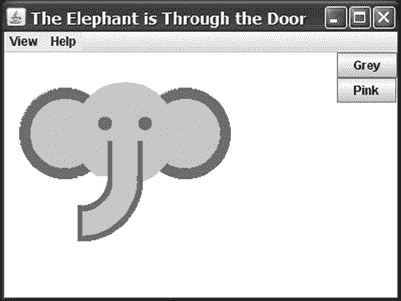

第一章 ■ 快速入门 JavaFX

在 2010 年的 JavaOne 大会上，JavaFX 2.0 被宣布。Oracle 发布了 JavaFX 2.0 路线图，其中包括以下内容。

• 弃用 JavaFX Script 语言，转而使用 Java 和 JavaFX 2.0 API。这使得 JavaFX 能够被任何在 Java 虚拟机（JVM）上运行的语言（例如 Java、Groovy 和 JRuby）所使用，从而进入主流。因此，现有开发者无需学习新语言，而是可以利用现有技能开始开发 JavaFX 应用。

• 将 JavaFX Script 的引人注目的特性（包括绑定到表达式）引入 JavaFX 2.0 API。

• 在 JavaFX 1.3 中已有的组件基础上，提供日益丰富的 UI 组件集。

• 提供一个用于将 HTML 和 JavaScript 内容嵌入 JavaFX 应用的 Web 组件。

• 实现 JavaFX 与 Swing 的互操作性。

• 从头重写媒体栈。

JavaFX 2.0 在 2011 年的 JavaOne 大会上发布，并且由于前面阐述的创新特性，其采用率大幅提高。

JavaFX 8 标志着另一个重要的里程碑。JavaFX 现在是 Java 平台标准版的一个组成部分。

• 这清楚地表明 JavaFX 被认为足够成熟，并且是 Java 在客户端的未来。

• 这极大地惠及了开发者，因为他们无需下载两个 SDK 和工具套件。

• Java 8 中的新技术，特别是 Lambda 表达式、Stream API 和默认接口方法，在 JavaFX 中非常有用。

• 增加了许多新特性，包括原生 3D 支持、打印 API，以及一些新控件，包括日期选择器。

现在你已经完成了 JavaFX 的必修历史课，让我们通过向你展示一些示例、工具和其他资源的位置，离编写代码更近一步。

准备你的 JavaFX 之旅

所需工具

由于 JavaFX 现在是 Java 的一部分，你无需下载单独的 JavaFX SDK。整个 JavaFX API 和实现是 Java 8 SE SDK 的一部分，可以从以下网址下载：

[`www.oracle.com/technetwork/java/javase/downloads/index.html`](http://www.oracle.com/technetwork/java/javase/downloads/index.html)

该 SDK 包含开发、运行和打包 JavaFX 应用所需的一切。你可以使用 Java 8 SE SDK 中包含的命令行工具编译 JavaFX 应用。

然而，大多数开发者更喜欢集成开发环境（IDE）以提高生产力。

根据定义，支持 Java 8 的 IDE 也支持 JavaFX 8。因此，你可以使用你最喜欢的 IDE 来开发 JavaFX 应用。在本书中，我们主要使用 NetBeans IDE，因为它允许与 SceneBuilder（见下一段）更紧密地集成。NetBeans IDE 可以从以下网址下载：

[`netbeans.org/downloads`](https://netbeans.org/downloads)

[www.it-ebooks.info](http://www.it-ebooks.info/)


第一章 ■ 快速入门 JavaFX


SceneBuilder 是一款独立工具，可让你通过设计而非编码来创建 JavaFX 界面。我们将在第 3 章讨论 SceneBuilder。尽管 SceneBuilder 生成的是 FXML（我们也会在第 3 章讨论 FXML），且 FXML 可用于任何 IDE，但 NetBeans 提供了与 SceneBuilder 的紧密集成。SceneBuilder 工具可从 [`www.oracle.com/technetwork/java/javase/downloads/sb2download-2177776.html`](http://www.oracle.com/technetwork/java/javase/downloads/sb2download-2177776.html) 下载。

JavaFX 社区

JavaFX 并非一个在秘密基地中开发的闭源项目。恰恰相反，JavaFX 以开放精神进行开发，拥有开放的源代码库、开放的邮件列表，以及一个开放且活跃的知识共享社区。

其源代码在 OpenJFX 项目中开发，而 OpenJFX 是开发 Java SE 的 OpenJDK 项目的一个子项目。如果你想查看源代码或架构，或者想阅读邮件列表中的技术讨论，请访问 [`openjdk.java.net/projects/openjfx`](http://openjdk.java.net/projects/openjfx)。

开发者社区非常活跃，无论是在 OpenJFX 领域还是在特定应用领域。开发者的起点是 JavaFX 社区网站 [`javafxcommunity.com`](http://javafxcommunity.com/)。这是一个由 Oracle 创建，但吸纳了许多 JavaFX 开发者意见的社区网站。JavaFX 社区的内容经常更新，图 1-2 展示了该社区网站在撰写本书时的快照。

***图 1-2.** JavaFX 社区网站快照*

[www.it-ebooks.info](http://www.it-ebooks.info/)

第 1 章 ■ 快速入门 JavaFX

此外，由 JavaFX 工程师和开发者维护的博客是获取 JavaFX 最新技术信息的绝佳资源。例如，Oracle JavaFX 工程师 Richard Bair、Jasper Potts 和 Jonathan Giles 在 [`fxexperience.com`](http://fxexperience.com/) 上向开发者社区通报 JavaFX 的最新创新。本章末尾的“资源”部分包含了本书作者用于与 JavaFX 开发者社区互动的博客网址。

JavaFX 社区的两个重要特点是其自身的创造力和分享意愿。有许多开源项目为 JavaFX 平台带来了附加价值。由于 JavaFX 平台工程师与外部 JavaFX 开发者之间的良好合作，这些开源项目与官方 JavaFX 平台非常契合。

以下列出了一些最有趣的项目：

• RoboVM 允许你使用 Java 和 JavaFX 创建 iOS 应用程序。因此，你的 JavaFX 应用可用于为 iPhone 或 iPad 创建应用。

• JavaFX-Android 项目维护了一个用于 Android 开发的 JavaFX SDK。因此，你的 JavaFX 应用可用于为 Android 设备创建应用。

JavaFX 的 iOS 和 Android 移植版将在第 12 章中详细讨论。

• [JFXtras.org](https://JFXtras.org) 是一个致力于为 JavaFX 平台添加高质量控件和附加组件的项目。

• ControlsFX 是另一个为 JavaFX 平台添加高质量控件和工具的项目。

值得一提的是，JavaFX 团队密切关注着 JFXtras.org 和 ControlsFX 这两个项目的努力，其中一个项目中启动的想法可能会被纳入 JavaFX 的下一个版本中。

• DataFX 是一个开源项目，旨在简化 JavaFX 应用中外部数据的检索，并为 JavaFX 开发者提供注入和流程管理等企业级功能。

• OpenDolphin 是另一个帮助开发者分离和同步客户端与服务器开发的项目，它实现了最高程度的模型-视图-控制器分离。

花几分钟时间探索这些网站。接下来，我们将指出一些更有价值的资源，它们会很有帮助。

使用官方规范

在开发 JavaFX 应用时，能够访问 API JavaDoc 文档非常有用，该文档位于 [`download.java.net/jdk8/jfxdocs/index.html`](http://download.java.net/jdk8/jfxdocs/index.html)，如图 1-3 所示。

[www.it-ebooks.info](http://www.it-ebooks.info/)

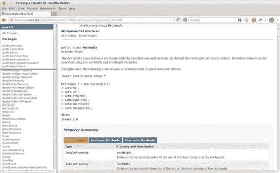

第 1 章 ■ 快速入门 JavaFX

***图 1-3.** JavaFX SDK API Javadoc*

例如，图 1-3 中的 API 文档展示了如何使用位于 `javafx.scene.shape` 包中的 `Rectangle` 类。向下滚动此网页，可以查看关于 `Rectangle` 类的属性、构造函数、方法以及其他有用信息。顺便提一下，此 API 文档在你下载的 Java 8 SE SDK 中也有提供，但我们希望你也知道如何在线找到它。

除了 JavaDoc 之外，手边备一份层叠样式表（CSS）样式参考也非常有用。

这份文档解释了可以应用于特定 JavaFX 元素的所有样式类。你可以在 [`download.java.net/jdk8/jfxdocs/javafx/scene/doc-files/cssref.html`](http://download.java.net/jdk8/jfxdocs/javafx/scene/doc-files/cssref.html) 找到这份文档。

ScenicView

你已经下载了 SceneBuilder，这是一款允许你通过设计而非编写代码来创建用户界面的工具。我们预计会有更多由公司和个人开发的工具来帮助你创建 JavaFX 应用。最早免费提供且对调试 JavaFX 应用非常有帮助的工具之一是 ScenicView，它最初由 Oracle 的 Amy Fowler 创建，后来由 Jonathan Giles 维护。你可以从 [`fxexperience.com/scenic-view/`](http://fxexperience.com/scenic-view/) 下载 ScenicView。

ScenicView 特别有用，因为它提供了一个便捷的用户界面，允许开发者在运行时检查节点（例如尺寸、变换、CSS）的属性。

打包与分发

用于向最终用户交付软件的技术一直在变化。过去，交付 Java 应用的首选方式是通过 Java 网络启动协议（JNLP）。通过这种方式，小程序和独立应用都可以安装在客户端上。然而，这种技术存在一些问题。该想法仅在最终用户安装了能够执行应用的 JVM 时才有效，但这并非总是如此。即使在桌面领域，系统可以预装 JVM 交付，也存在版本控制和安全性问题。事实上，有些应用是硬编码针对特定 JVM 版本的。尽管 JVM 中的漏洞在大多数情况下修复得非常快，但这仍然要求最终用户始终安装最新版本的 JVM，这可能会相当令人沮丧。

除此之外，浏览器制造商越来越不愿意支持替代的嵌入式平台。总之，依赖浏览器和本地预装的 JVM 并不能提供最佳的最终用户体验。

客户端软件行业正越来越多地向所谓的“应用商店”转变。在这种概念中，可以下载和安装自包含的应用。它们不依赖于预装的执行环境。这一原则起源于移动领域，其中苹果的 AppStore 和安卓的 Play 商店引领市场。尤其是在这些市场中，一键安装相比本地下载、解压、手动配置等噩梦具有巨大优势。


在 Java 术语中，自包含应用程序是指将应用程序与能够运行该应用程序的 JVM 捆绑在一起。过去，这个想法常常被拒绝，因为它会使应用程序包变得过于庞大。然而，随着内存和存储容量的增加，以及通过互联网发送字节的成本降低，这一劣势正变得不那么重要。

目前正在开发多种技术，可帮助你将应用程序与正确的 JVM 版本捆绑并打包。

在 OpenJFX 项目区域内开发的 JavaFXPackager 包含一个用于创建自包含包的 API。NetBeans 使用了此工具，只需点击几下即可生成自包含包。

Maven 用户可以使用 Daniel Zwolenski 创建的 Maven 插件。该插件的文档位于

[`zenjava.com/javafx/maven/`](http://zenjava.com/javafx/maven/)，允许使用熟悉的 Maven 命令创建 JavaFX 自包含包。

现在你已经安装了这些工具，我们将向你展示如何创建一个简单的 JavaFX 程序，然后详细讲解它。我们为你选择的第一个程序叫做“Hello Earthrise”，它比典型的入门级“Hello World”程序展示了更多功能。

开发你的第一个 JavaFX 程序：Hello Earthrise

1968 年的平安夜，阿波罗 8 号的宇航员们历史上首次进入月球轨道。他们是第一批目睹“地出”景象的人类，并拍摄了如图 1-4 所示的壮丽照片。程序启动时，这张图片会从本书的网站动态加载，因此你需要连接到互联网才能查看。

***图 1-4.** Hello Earthrise 程序*

[www.it-ebooks.info](http://www.it-ebooks.info/)

第 1 章 ■ 快速入门 JavaFX

除了演示如何通过互联网动态加载图像外，此示例还向你展示了如何在 JavaFX 中使用动画。现在，是时候编译并运行该程序了。我们向你展示两种方法：使用命令行和使用 NetBeans。

从命令行编译和运行

我们通常使用 IDE 来构建和运行 JavaFX 程序，但为了揭开整个过程的神秘面纱，我们首先使用命令行工具。

■ **注意** 对于本练习，与本书中大多数其他练习一样，你需要源代码。如果你不想将源代码输入到文本编辑器中，可以从代码下载站点获取本书所有示例的源代码。有关该站点的位置，请参阅本章末尾的资源部分。

假设你已经将本书的源代码下载并解压到一个目录中，请按照本练习中的说明进行操作，并按照指示完成所有步骤。我们将在练习之后剖析源代码。

**从命令行编译和运行 Hello Earthrise 程序**

在本练习中，你将使用 javac 和 java 命令行工具来编译和运行程序。在你的机器上的命令行提示符下：

1. 导航到 Chapter01/Hello 目录。

2. 执行以下命令来编译 HelloEarthRiseMain.java 文件。

javac -d . HelloEarthRiseMain.java

3. 由于此命令中使用了 –d 选项，生成的类文件会被放置在与源文件中包语句匹配的目录中。这些目录的根目录由 –d 选项的参数指定，在本例中为当前目录。

4. 要运行该程序，请执行以下命令。请注意，我们使用了将要执行的类的完全限定名称，这需要指定路径名称的节点和类的名称，全部用句点分隔。

java projavafx.helloearthrise.ui.HelloEarthRiseMain

程序应显示如前面图 1-4 所示，文本缓慢向上滚动，让人想起《星球大战》的开场字幕。


恭喜您完成了探索 JavaFX 的第一个练习！

[www.it-ebooks.info](http://www.it-ebooks.info/)

第 1 章 ■ JavaFX 快速入门

理解 Hello Earthrise 程序

现在您已经运行了该应用程序，让我们一起来浏览一下程序清单。Hello Earthrise 应用程序的代码如清单 1-1 所示。

***清单 1-1.*** HelloEarthRiseMain.java 程序

package projavafx.helloearthrise.ui;

import javafx.animation.Interpolator;

import javafx.animation.Timeline;

import javafx.animation.TranslateTransition;

import javafx.application.Application;

import javafx.geometry.VPos;

import javafx.scene.Group;

import javafx.scene.Scene;

import javafx.scene.image.Image;

import javafx.scene.image.ImageView;

import javafx.scene.paint.Color;

import javafx.scene.shape.Rectangle;

import javafx.scene.text.Font;

import javafx.scene.text.FontWeight;

import javafx.scene.text.Text;

import javafx.scene.text.TextAlignment;

import javafx.stage.Stage;

import javafx.util.Duration;

/**

* "Hello World" 风格示例的主类

*/

public class HelloEarthRiseMain extends Application {

/**

* @param args 命令行参数

*/

public static void main(String[] args) {

Application.launch(args);

}

@Override

public void start(Stage stage) {

String message

= "Earthrise at Christmas: "

+ "[Forty] years ago this Christmas, a turbulent world "

+ "looked to the heavens for a unique view of our home "

+ "planet. This photo of Earthrise over the lunar horizon "

+ "was taken by the Apollo 8 crew in December 1968, showing "

+ "Earth for the first time as it appears from deep space. "

+ "Astronauts Frank Borman, Jim Lovell and William Anders "

+ "had become the first humans to leave Earth orbit, "

+ "entering lunar orbit on Christmas Eve. In a historic live "

[www.it-ebooks.info](http://www.it-ebooks.info/)

第 1 章 ■ JavaFX 快速入门

+ "broadcast that night, the crew took turns reading from "

+ "the Book of Genesis, closing with a holiday wish from "

+ "Commander Borman: \"We close with good night, good luck, "

+ "a Merry Christmas, and God bless all of you -- all of "

+ "you on the good Earth.\"";

// 引用 Text 对象

Text textRef = new Text(message);

textRef.setLayoutY(100);

textRef.setTextOrigin(VPos.TOP);

textRef.setTextAlignment(TextAlignment.JUSTIFY);

textRef.setWrappingWidth(400);

textRef.setFill(Color.rgb(187, 195, 107));

textRef.setFont(Font.font("SansSerif", FontWeight.BOLD, 24));

// 提供文本的滚动动画效果

TranslateTransition transTransition = new TranslateTransition(new Duration(75000), textRef); transTransition.setToY(-820);

transTransition.setInterpolator(Interpolator.LINEAR);

transTransition.setCycleCount(Timeline.INDEFINITE);

// 创建包含图片的 ImageView

Image image = new Image (" [`projavafx.com/images/earthrise.jpg`](http://projavafx.com/images/earthrise.jpg)"); ImageView imageView = new ImageView(image);

// 创建包含文本的 Group

Group textGroup = new Group(textRef);

textGroup.setLayoutX(50);

textGroup.setLayoutY(180);

textGroup.setClip(new Rectangle(430, 85));

// 组合 ImageView 和 Group

Group root = new Group(imageView, textGroup);

Scene scene = new Scene(root, 516, 387);

stage.setScene(scene);

stage.setTitle("Hello Earthrise");

stage.show();

// 启动文本动画

transTransition.play();

}

}

现在您已经看过了代码，让我们更详细地了解一下它的结构和概念。

构建器（Builder）怎么了？

如果您之前使用过 JavaFX 2，您可能对所谓的构建器模式很熟悉。构建器提供了一种声明式的编程风格。构建器模式不是通过调用类实例的 set() 方法来指定其字段，而是使用 Builder 类的实例来定义目标类应该如何组合。

[www.it-ebooks.info](http://www.it-ebooks.info/)

第 1 章 ■ JavaFX 快速入门

构建器在 JavaFX 中非常流行。然而，事实证明，将它们保留在平台中存在重大的技术障碍。因此，决定逐步淘汰构建器。在 Java 8 中，Builder 类仍然可以使用，但已被弃用。在 Java 9 中，Builder 类可能会被完全移除。

关于 Builder 类不再被推荐使用的更多原因，可以在 JavaFX 首席架构师 Richard Bair 的邮件列表条目中找到，地址为 [`mail.openjdk.java.net/pipermail/openjfx-dev/2013-`](http://mail.openjdk.java.net/pipermail/openjfx-dev/2013-March/006725.html)

[March/006725.html。](http://mail.openjdk.java.net/pipermail/openjfx-dev/2013-March/006725.html)该条目的末尾包含一个非常重要的声明：“我相信 FXML 或 Lambda 表达式或替代语言都提供了其他途径来实现与构建器相同的目标，而无需增加字节码或类的额外成本。”

这正是我们将在本书中展示的内容。在本章末尾，我们将在代码中展示 Lambda 表达式的第一个示例。在第 3 章中，我们将展示 SceneBuilder 和 FXML 如何让您以声明方式定义 UI。

在当前示例中，我们以编程方式定义 UI 的不同组件，并将它们组合在一起。在第 3 章中，我们将使用基于 FXML 的声明式方法展示相同的示例。

JavaFX 应用程序

让我们看一下第一个示例中的类声明：

public class HelloEarthRiseMain extends Application

这个声明表明我们的应用程序继承了 javafx.application.Application 类。该类有一个我们需要实现的抽象方法：

public void start(Stage stage) {}

这个方法将由执行我们 JavaFX 应用程序的环境调用。

根据环境的不同，JavaFX 应用程序将以不同的方式启动。作为开发人员，您不必担心应用程序如何启动，以及如何连接到物理屏幕。

您需要实现“start”方法，并使用提供的 Stage 参数来创建您的 UI，如下一段所述。

在我们的命令行示例中，我们通过执行应用程序类的 main 方法来启动应用程序。main 方法的实现非常简单：

public static void main(String[] args) {

Application.launch(args);

}

这个 main 方法中唯一的指令是调用 Application 的静态 launch 方法，该方法将启动应用程序。

■ **提示** JavaFX 应用程序必须始终继承 javafx.application.Application 类。

舞台（Stage）和场景（Scene）

Stage 包含 JavaFX 应用程序的 UI，无论它部署在桌面、嵌入式系统还是其他设备上。例如，在桌面上，Stage 拥有自己的顶级窗口，通常包含边框和标题栏。

[www.it-ebooks.info](http://www.it-ebooks.info/)

第 1 章 ■ JavaFX 快速入门

初始 Stage 由 JavaFX 运行时创建，并通过 start() 方法传递给您的应用程序，如上一段所述。Stage 类具有一组属性和方法。从清单中的以下代码片段可以看出，其中一些属性和方法如下：

• 一个包含 UI 中图形节点的场景（Scene）
• 出现在窗口标题栏中的标题（当部署在桌面时）
• Stage 的可见性

stage.setScene(scene);

stage.setTitle("Hello Earthrise");

stage.show();

Scene 是 JavaFX 场景图中的顶级容器。Scene 包含显示在 Stage 上的图形元素。Scene 中的每个元素都是一个图形节点，即任何继承自 javafx.scene.Node 的类。场景图是 Scene 的层次化表示。场景图中的元素可以包含子元素，并且所有元素都是 Node 类的实例。


`Scene` 类包含许多属性，例如其宽度和高度。`Scene` 还有一个名为 `root` 的属性，用于保存在场景中显示的图形元素，在本例中是一个包含 `ImageView` 实例（用于显示图像）和一个 `Group` 实例的 `Group` 对象。后一个 `Group` 内部嵌套了一个 `Text` 实例（它是一种图形元素，通常称为图形节点，或简称为节点）。

请注意，`Scene` 的 `root` 属性包含一个 `Group` 类的实例。`root` 属性可以包含 `javafx.scene.Node` 任何子类的实例，并且通常包含一个能够容纳其自身 `Node` 实例集合的实例。请查看我们之前教你如何访问的 JavaFX API 文档（在“使用官方规范”部分），并查阅 `Node` 类，以了解任何图形节点可用的属性和方法。同时，也请查看 `javafx.scene.image` 包中的 `ImageView` 类和 `javafx.scene` 包中的 `Group` 类。在这两种情况下，它们都继承自 `Node` 类。

■ **提示** 我们怎么强调都不为过：在阅读本书时，手边备好 JavaFX API 文档非常重要。当提到类、变量和函数时，最好查阅文档以获取更多信息。此外，这个习惯能帮助你更熟悉 API 中可用的内容。

显示图像

如下代码所示，显示图像需要使用 `ImageView` 实例与 `Image` 实例配合。

```java
Image image = new Image ("http://projavafx.com/images/earthrise.jpg");
ImageView imageView = new ImageView(image);
```

`Image` 实例标识图像资源，并从分配给其 `URL` 变量的 URL 加载该资源。这两个类都位于 `javafx.scene.image` 包中。

显示文本

在示例中，我们按如下方式创建了一个 `Text` 节点：

```java
Text textRef = new Text(message);
```

[www.it-ebooks.info](http://www.it-ebooks.info/)

第 1 章 ■ 快速入门 JavaFX

如果你查阅 JavaFX API 文档，你会注意到 `Text` 实例（位于 `javafx.scene.text` 包中）扩展了 `Shape`，而 `Shape` 又扩展了 `Node`。因此，`Text` 实例也是一个 `Node`，并且 `Node` 上的所有属性同样适用于 `Text`。此外，`Text` 实例可以像其他节点一样在场景图中使用。

正如你从示例中可以看到的，`Text` 实例包含许多可以修改的属性。大多数属性不言自明，但同样，在操作对象时查阅 JavaFX API 文档总是很有用的。

由于 JavaFX 中的所有图形元素都直接或间接地扩展了 `Node` 类，并且由于 `Node` 类已经包含了许多有用的属性，因此特定图形元素（如 `Text`）的属性数量可能相当多。

在我们的示例中，我们设置了一些有限的属性，接下来简要解释一下。

方法

```java
textRef.setLayoutY(100)
```

对 `Text` 内容应用了 100 像素的垂直平移。

`fill` 方法用于指定文本的颜色。

当你在 API 文档中查看 `javafx.scene.text` 包时，也请查看 `Font` 类的 `font` 函数，该函数用于定义 `Text` 的字体系列、粗细和大小。

`textOrigin` 属性指定文本如何与其区域对齐。

再次参考 JavaFX API 文档，请注意 `VPos` 枚举（位于 `javafx.geometry` 包中）包含作为常量的字段，例如 `BASELINE`、`BOTTOM` 和 `TOP`。这些常量控制文本相对于显示文本垂直位置的起点：

• 正如我们在前面的代码片段中所使用的，`TOP` 起点将文本的顶部（包括上升部分）放置在 `layoutY` 位置，相对于 `Text` 所在的坐标空间。


• **BOTTOM** 原点会将文本底部（包括下行部分，例如小写字母 g 的底部）放置在 `layoutY` 位置。
• **BASELINE** 原点会将文本基线（不包括下行部分）放置在 `layoutY` 位置。这是 `Text` 实例的 `textOrigin` 属性的默认值。

`wrappingWidth` 属性允许您指定文本在多少像素处换行。

`textAlignment` 属性允许您控制文本的对齐方式。在我们的示例中，`TextAlignment.JUSTIFY` 使文本在左右两侧都对齐，通过增加单词之间的间距来实现这一点。

我们显示的文本足够长，可以换行并绘制在地球上，因此我们需要定义一个矩形区域，文本不能超出该区域显示。

■ **提示** 我们建议您修改一些值，重新编译示例，然后再次运行。这将帮助您理解不同属性的工作方式。或者，通过使用 ScenicView，您可以在运行时检查和修改不同的属性。

将图形节点作为一个组来使用

JavaFX 的一个强大图形功能是能够创建场景图，它由图形节点的树状结构组成。然后，您可以为层次结构中的 `Group` 的属性赋值，该 `Group` 中包含的节点将受到影响。在我们当前来自清单 1-1 的示例中，我们使用一个 `Group` 来包含一个 `Text` 节点，并在该 `Group` 内裁剪一个特定的矩形区域，以便文本在向上动画时不会出现在月球或地球上。以下是相关的代码片段：

```java
Group textGroup = new Group(textRef);
textGroup.setLayoutX(50);
textGroup.setLayoutY(180);
textGroup.setClip(new Rectangle(430, 85));
```

请注意，该 `Group` 位于其默认位置右侧 50 像素、下方 180 像素处。这是由于为 `Group` 实例的 `layoutX` 和 `layoutY` 变量赋值所致。由于此 `Group` 直接包含在 `Scene` 中，其左上角的位置位于 `Scene` 左上角右侧 50 像素、下方 180 像素处。在阅读其余解释时，请查看图 1-5 以查看此示例的图示。

***图 1-5.** Scene、Group、Text 和裁剪区域的图示*

一个 `Group` 实例通过 `children()` 方法将 `Node` 子类的实例集合分配给它自身来包含这些实例。在前面的代码片段中，`Group` 包含一个 `Text` 实例，该实例的 `layoutY` 属性已被赋值。由于此 `Text` 包含在 `Group` 中，它采用 `Group` 的二维空间（也称为坐标空间），`Text` 节点的原点 (0,0) 与 `Group` 的左上角重合。

将 `layoutY` 属性赋值为 100 会导致 `Text` 位于 `Group` 顶部下方 100 像素处，刚好在裁剪区域底部下方，从而使其在动画开始前不可见。

由于没有为 `layoutX` 变量赋值，其值为 0（默认值）。

刚才描述的 `Group` 的 `layoutX` 和 `layoutY` 属性是我们之前所述“`Group` 中包含的节点将受到赋给 `Group` 属性的值的影响”的示例。另一个示例是将 `Group` 实例的 `opacity` 属性设置为 0.5，这会导致该 `Group` 中包含的所有节点变得半透明。如果手边有 JavaFX API 文档，请查看 `javafx.scene.Group` 类中可用的属性。然后查看 `javafx.scene.Node` 类中可用的属性，您可以在其中找到 `Group` 类继承的 `layoutX`、`layoutY` 和 `opacity` 变量。

[www.it-ebooks.info](http://www.it-ebooks.info/)

第一章 ■ 快速入门 JavaFX

裁剪图形区域

为了定义裁剪区域，我们将一个 `Node` 子类赋值给 `clip` 属性，该属性定义了裁剪形状，在本例中是一个宽 430 像素、高 85 像素的 `Rectangle`。除了防止 `Text` 覆盖月球外，当 `Text` 因动画向上滚动时，裁剪区域还能防止 `Text` 覆盖地球。

动画化文本使其向上滚动

当调用 `HelloEarthriseMain` 程序时，`Text` 开始缓慢向上滚动。为了实现此动画，我们使用了位于 `javafx.animation` 包中的 `TranslateTransition` 类，如清单 1-1 中的以下片段所示。

```java
TranslateTransition transTransition = new TranslateTransition(new Duration(75000), textRef);
transTransition.setToY(-820);
transTransition.setInterpolator(Interpolator.LINEAR);
transTransition.setCycleCount(Timeline.INDEFINITE);
...代码省略...
// 启动文本动画
transTransition.play();
```

`javafx.animation` 包包含用于动画化节点的便捷类。此 `TranslateTransition` 实例将 `textRef` 变量引用的 `Text` 节点从其原始 Y 位置 100 像素转换到 Y 位置 -820 像素，持续时间为 75 秒。`Interpolator.LINEAR` 常量被赋值给 `interpolator` 属性，这会导致动画以线性方式进行。查看 `javafx.animation` 包中 `Interpolator` 类的 API 文档，可以发现还有其他形式的插值可用，其中一种是 `EASE_OUT`，它会在指定持续时间结束时减慢动画速度。

■ **注意** 在此上下文中，插值是在给定起始值、结束值和持续时间的情况下，计算任意时间点值的过程。

前面片段中的最后一行开始执行程序中先前创建的 `TranslateTransition` 实例的 `play` 方法。这使得 `Text` 开始向上滚动。由于赋给 `cycleCount` 变量的值，此过渡将无限重复。

现在您已经使用命令行工具编译并运行了此示例，并且我们一起浏览了代码，是时候开始使用 NetBeans IDE 来使开发和部署过程更快、更容易了。

使用 NetBeans 构建和运行程序

假设您已将本书的源代码下载并解压到一个目录中，请按照本练习中的说明在 NetBeans 中构建和运行 Hello Earthrise 程序。如果您尚未下载 Java SDK 和 NetBeans，请从本章末尾资源部分列出的网站下载。

[www.it-ebooks.info](http://www.it-ebooks.info/)

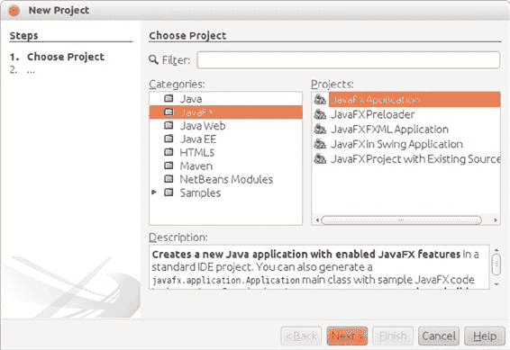

第一章 ■ 快速入门 JavaFX

**使用 NetBeans 构建和运行 Hello Earthrise**

要构建和运行 Hello Earthrise 程序，请执行以下步骤。

1. 启动 NetBeans。
2. 从菜单栏中选择“文件”➤“新建项目”。将出现“新建项目”向导的第一个窗口。选择 JavaFX 类别，您将看到如图 1-6 所示的向导：

***图 1-6.** 新建项目向导*

[www.it-ebooks.info](http://www.it-ebooks.info/)

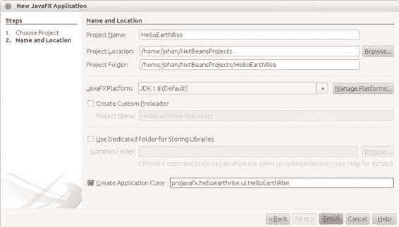

第一章 ■ 快速入门 JavaFX

3. 在“项目”窗格中选择“JavaFX 应用程序”，然后单击“下一步”。应出现“新建项目”向导的下一页，如图 1-7 所示：

***图 1-7.** 新建项目向导的下一页*

4. 在此屏幕上，输入项目名称（我们使用了 helloearthrise），然后单击“浏览”。
5. 选择项目位置，可以直接在文本框中输入，也可以单击“浏览”导航到所需目录（我们使用了 /home/johan/NetBeansProjects）。
6. 选中“创建应用程序类”复选框，并将提供的包/类名更改为 `projavafx.helloearthrise.ui.HelloEarthRiseMain`。


7. 点击“完成”。此时应已创建好一个包含 NetBeans 默认主类的 helloearthrise 项目。如果你想运行这个默认程序，请在“项目”窗格中右键点击 helloearthrise 项目，然后从快捷菜单中选择“运行项目”。

8. 将清单 1-1 中的代码输入到 helloearthrisemain.java 代码窗口中。你可以手动输入，也可以从本书源代码下载包中位于 `Chapter01/HelloEarthRise/src/projavafx/helloearthrise/ui` 目录下的 `HelloEarthRiseMain.java` 文件中剪切并粘贴。

9. 在“项目”窗格中右键点击 helloearthrise 项目，然后从快捷菜单中选择“运行项目”。

helloearthrise 程序应开始执行，如本章前面图 1-4 所示。

[www.it-ebooks.info](http://www.it-ebooks.info/)


第 1 章 ■ 快速入门 JavaFX

至此，你已经通过命令行和 NetBeans 两种方式构建并运行了“Hello Earthrise”程序应用程序。在结束这个示例之前，我们将向你展示另一种实现滚动文本节点的方法。在 `javafx.scene.control` 包中有一个名为 `ScrollPane` 的类，其目的是为通常比视图大的节点提供可滚动视图。此外，用户可以在可滚动区域内拖动正在查看的节点。图 1-8 显示了修改后使用 ScrollPane 控件的 Hello Earthrise 程序。

***图 1-8.** 使用 ScrollPane 控件为文本节点提供可滚动视图* 请注意，移动光标是可见的，表示用户可以在裁剪区域内拖动节点。

请注意，图 1-8 中的截图是在 Windows 上运行的程序，而移动光标在其他平台上具有不同的外观。清单 1-2 包含此示例的相关代码部分，名为 `HelloScrollPaneMain.java`。

***清单 1-2.*** HelloScrollPaneMain.java 程序

...代码省略...

// 创建一个包含文本的 ScrollPane

ScrollPane scrollPane = new ScrollPane();

scrollPane.setLayoutX(50);

scrollPane.setLayoutY(180);

scrollPane.setPrefWidth(400);

scrollPane.setPrefHeight(85);

scrollPane.setHbarPolicy(ScrollPane.ScrollBarPolicy.NEVER);

scrollPane.setVbarPolicy(ScrollPane.ScrollBarPolicy.NEVER);

scrollPane.setPannable(true);

scrollPane.setContent(textRef);

scrollPane.setStyle("-fx-background-color: transparent;");

// 组合 ImageView 和 ScrollPane

Group root = new Group(iv, scrollPane);

Scene scene = new Scene(root, 516, 387);

现在你已经学习了 JavaFX 应用程序开发的一些基础知识，让我们来研究另一个示例应用程序，以帮助你学习更多 JavaFX 的概念和结构。

[www.it-ebooks.info](http://www.it-ebooks.info/)

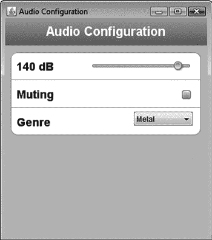

第 1 章 ■ 快速入门 JavaFX

开发你的第二个 JavaFX 程序：“再来点牛铃！”

如果你熟悉《周六夜现场》电视节目，你可能看过“再来点牛铃”小品，其中克里斯托弗·沃肯的角色在 Blue Oyster Cult 乐队的录音过程中不断要求“再来点牛铃”。

以下 JavaFX 示例程序在一个虚构的应用程序背景下，介绍了 JavaFX 中一些简单但强大的概念，该应用程序允许你选择音乐类型并控制音量。当然，“Cowbell Metal”（简称为“Cowbell”）是可用的类型之一。图 1-9 显示了此应用程序的截图，它有一种复古的 iPhone 应用程序外观。

***图 1-9.** 音频配置“再来点牛铃”程序*

构建并运行音频配置程序

在本章前面，我们向你展示了如何在 NetBeans 中创建一个新的 JavaFX 项目。对于此示例（以及本书中的其余示例），我们利用了这样一个事实：本书的代码下载包中为每个示例都包含了 NetBeans 和 Eclipse 项目文件。请按照本练习中的说明构建并运行音频配置应用程序。

**使用 NetBeans 构建并运行音频配置程序**

要使用 NetBeans 构建并执行此程序，请执行以下步骤。

1. 从“文件”菜单中，选择“打开项目”菜单项。在“打开项目”对话框中，导航到你解压本书代码下载包的 Chapter01 目录，如图 1-10 所示。

[www.it-ebooks.info](http://www.it-ebooks.info/)

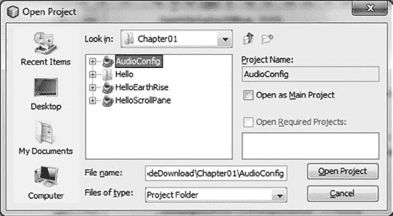

第 1 章 ■ 快速入门 JavaFX

***图 1-10.** “打开项目”对话框中的第 01 章目录*

2. 在左侧窗格中选择 audioConfig 项目，然后点击“打开项目”。

3. 按照之前讨论的方法运行该项目。

应用程序应如图 1-9 所示。

音频配置程序的行为

当你运行该应用程序时，请注意调整音量滑块会改变显示的相关分贝 (dB) 级别。此外，选中“静音”复选框会禁用滑块，而选择不同的类型会改变音量滑块。这种行为是通过以下代码中展示的概念实现的，例如：

• 绑定到包含模型的类
• 使用更改监听器
• 创建可观察列表

理解音频配置程序

音频配置程序包含两个源代码文件，如清单 1-3 和清单 1-4 所示：

• 清单 1-3 中的 `AudioConfigMain.java` 文件包含主类，并以你从清单 1-1 的 Hello Earthrise 示例中熟悉的方式表达了 UI。
• 清单 1-4 中的 `AudioConfigModel.java` 文件包含此程序的模型，该模型保存了应用程序的状态，UI 绑定到该状态。

***清单 1-3.*** AudioConfigMain.java 程序

package projavafx.audioconfig.ui;

import javafx.application.Application;

import javafx.geometry.VPos;

import javafx.scene.Group;

import javafx.scene.Scene;

[www.it-ebooks.info](http://www.it-ebooks.info/)

第 1 章 ■ 快速入门 JavaFX

import javafx.scene.control.CheckBox;

import javafx.scene.control.ChoiceBox;

import javafx.scene.control.Slider;

import javafx.scene.paint.Color;

import javafx.scene.paint.CycleMethod;

import javafx.scene.paint.LinearGradient;

import javafx.scene.paint.Stop;

import javafx.scene.shape.Line;

import javafx.scene.shape.Rectangle;

import javafx.scene.text.Font;

import javafx.scene.text.FontWeight;

import javafx.scene.text.Text;

import javafx.stage.Stage;

import projavafx.audioconfig.model.AudioConfigModel;

public class AudioConfigMain extends Application {

// 对模型的引用

AudioConfigModel acModel = new AudioConfigModel();

Text textDb;

Slider slider;

CheckBox mutingCheckBox;

ChoiceBox genreChoiceBox;

Color color = Color.color(0.66, 0.67, 0.69);

public static void main(String[] args) {

Application.launch(args);

}

@Override

public void start(Stage stage) {

Text title = new Text(65,12, "Audio Configuration");

title.setTextOrigin(VPos.TOP);

title.setFill(Color.WHITE);

title.setFont(Font.font("SansSerif", FontWeight.BOLD, 20));

Text textDb = new Text();

textDb.setLayoutX(18);

textDb.setLayoutY(69);

textDb.setTextOrigin(VPos.TOP);

textDb.setFill(Color.web("#131021"));

textDb.setFont(Font.font("SansSerif", FontWeight.BOLD, 18));

Text mutingText = new Text(18, 113, "Muting");

mutingText.setTextOrigin(VPos.TOP);

mutingText.setFont(Font.font("SanSerif", FontWeight.BOLD, 18));

mutingText.setFill(Color.web("#131021"));

Text genreText = new Text(18,154,"Genre");

genreText.setTextOrigin(VPos.TOP);

[www.it-ebooks.info](http://www.it-ebooks.info/)

第 1 章 ■ 快速入门 JavaFX


genreText.setFill(Color.web("#131021"));

genreText.setFont(Font.font("SanSerif", FontWeight.BOLD, 18));

slider = new Slider();

slider.setLayoutX(135);

slider.setLayoutY(69);

slider.setPrefWidth(162);

slider.setMin(acModel.minDecibels);

slider.setMax(acModel.maxDecibels);

mutingCheckBox = new CheckBox();

mutingCheckBox.setLayoutX(280);

mutingCheckBox.setLayoutY(113);

genreChoiceBox = new ChoiceBox();

genreChoiceBox.setLayoutX(204);

genreChoiceBox.setLayoutY(154);

genreChoiceBox.setPrefWidth(93);

genreChoiceBox.setItems(acModel.genres);

Stop[] stops = new Stop[]{new Stop(0, Color.web("0xAEBBCC")), new Stop(1,

Color.web("0x6D84A3"))};

LinearGradient linearGradient = new LinearGradient(0, 0, 0, 1, true,

CycleMethod.NO_CYCLE, stops);

Rectangle rectangle = new Rectangle(0, 0, 320, 45);

rectangle.setFill(linearGradient);

Rectangle rectangle2 = new Rectangle(0, 43, 320, 300);

rectangle2.setFill(Color.rgb(199, 206, 213));

Rectangle rectangle3 = new Rectangle(8, 54, 300, 130);

rectangle3.setArcHeight(20);

rectangle3.setArcWidth(20);

rectangle3.setFill(Color.WHITE);

rectangle3.setStroke(color);

Line line1 = new Line(9, 97, 309, 97);

line1.setStroke(color);

Line line2 = new Line(9, 141, 309, 141);

line2.setFill(color);

Group group = new Group(rectangle, title, rectangle2, rectangle3,

textDb,

slider,

line1,

mutingText,

mutingCheckBox, line2, genreText,

genreChoiceBox);

Scene scene = new Scene(group, 320, 343);

[www.it-ebooks.info](http://www.it-ebooks.info/)

第 1 章 ■ 在 JavaFX 中快速起步

textDb.textProperty().bind(acModel.selectedDBs.asString().concat(" dB"));

slider.valueProperty().bindBidirectional(acModel.selectedDBs);

slider.disableProperty().bind(acModel.muting);

mutingCheckBox.selectedProperty().bindBidirectional(acModel.muting);

acModel.genreSelectionModel = genreChoiceBox.getSelectionModel();

acModel.addListenerToGenreSelectionModel();

acModel.genreSelectionModel.selectFirst();

stage.setScene(scene);

stage.setTitle("音频配置");

stage.show();

}

}

请查看清单 1-3 中的`AudioConfigMain.java`源代码，之后我们将一起分析它，重点关注上一个示例中未涉及的概念。

现在你已经看到了这个应用程序中的主类，让我们来逐一了解这些新概念。

**绑定的魔力**

JavaFX 最强大的特性之一就是绑定，它使得应用程序的 UI 能够轻松地与应用程序的状态（即模型）保持同步。JavaFX 应用程序的模型通常保存在一个或多个类中，在本例中就是`AudioConfigModel`类。请看下面取自清单 1-3 的代码片段，其中我们创建了该模型类的一个实例。

AudioConfigModel acModel = new AudioConfigModel();

在这个 UI 的场景中有多个图形节点实例（回忆一下，场景由一系列节点组成）。跳过其中几个，我们来到下面代码片段中所示的图形节点，这些节点具有绑定到模型中`selectedDBs`属性的属性。

textDb = new Text();

... 代码省略

slider = new Slider();

...代码省略...

textDb.textProperty().bind(acModel.selectedDBs.asString().concat(" dB"));

slider.valueProperty().bindBidirectional(acModel.selectedDBs);

如这段代码所示，`Text`对象的文本属性被绑定到一个表达式。`bind`函数包含一个表达式（其中包含`selectedDBs`属性），该表达式被求值后成为文本属性的值。请查看图 1-9（或运行应用程序）以查看显示在滑块左侧的`Text`节点的内容值。

另外请注意，代码中`Slider`节点的值属性也绑定到了模型中的`selectedDBs`属性，但这里使用的是`bindBidirectional()`方法。这使得绑定成为双向的，因此在这种情况下，当滑块移动时，模型中的`selectedDBs`属性会发生变化。反之，当`selectedDBs`属性发生变化时（由于更改了流派），滑块也会随之移动。


请移动滑块，以演示代码片段中绑定表达式的效果。滑块左侧显示的分贝数值会随着滑块的调整而变化。

在清单 1-3 中还有其他绑定的属性，我们将在讲解模型类时指出。在结束 UI 部分之前，我们还会指出本例中一些与颜色相关的概念。

[www.it-ebooks.info](http://www.it-ebooks.info/)

第 1 章 ■ JavaFX 快速入门

颜色与渐变

以下来自清单 1-3 的代码片段包含了一个定义颜色渐变模式以及定义颜色的示例。

```java
Stop[] stops = new Stop[]{new Stop(0, Color.web("0xAEBBCC")), new Stop(1, Color.web("0x6D84A3"))}; 
LinearGradient linearGradient = new LinearGradient(0, 0, 0, 1, true, CycleMethod.NO_CYCLE, stops); 
Rectangle rectangle = new Rectangle(0, 0, 320, 45);
rectangle.setFill(linearGradient);
```

如果手边有 JavaFX API 文档，请先查看 `javafx.scene.shape.Rectangle` 类，注意它继承了一个名为 `fill` 的属性，该属性的类型是 `javafx.scene.paint.Paint`。查看 JavaFX API 文档中关于 `Paint` 类的说明，你会发现 `Color`、`ImagePattern`、`LinearGradient` 和 `RadialGradient` 类都是 `Paint` 的子类。这意味着任何形状的填充都可以被赋予颜色、图案或渐变。

要创建如代码所示的 `LinearGradient`，你需要至少定义两个色标（stop），它们定义了位置以及该位置的颜色。在本例中，第一个色标的偏移值是 0.0，第二个色标的偏移值是 1.0。这些是单位正方形两个端点的值，其结果是渐变将跨越整个节点（在本例中是一个矩形）。`LinearGradient` 的方向由其 `startX`、`startY`、`endX` 和 `endY` 值控制，我们通过构造函数传递这些值。在本例中，方向仅为垂直方向，因为 `startY` 值为 0.0，`endY` 值为 1.0，而 `startX` 和 `endX` 值均为 0.0。

请注意，在清单 1-1 的 Hello Earthrise 示例中，使用了名为 `Color.WHITE` 的常量来表示白色。而在前面的代码片段中，则使用了 `Color` 类的 `web` 函数来根据十六进制值定义颜色。

音频配置示例的模型类

请查看清单 1-4 中 `AudioConfigModel` 类的源代码。

***清单 1-4.*** AudioConfigModel.java 的源代码

```java
package projavafx.audioconfig.model;

import javafx.beans.Observable;

import javafx.beans.property.BooleanProperty;

import javafx.beans.property.IntegerProperty;

import javafx.beans.property.SimpleBooleanProperty;

import javafx.beans.property.SimpleIntegerProperty;

import javafx.collections.FXCollections;

import javafx.collections.ObservableList;

import javafx.scene.control.SingleSelectionModel;

/**
 * AudioConfigMain 类使用的模型类
 */
public class AudioConfigModel {

    /**
     * 最小音频音量（分贝）
     */
    public double minDecibels = 0.0;

[www.it-ebooks.info](http://www.it-ebooks.info/)

第 1 章 ■ JavaFX 快速入门

    /**
     * 最大音频音量（分贝）
     */
    public double maxDecibels = 160.0;

    /**
     * 选中的音频音量（分贝）
     */
    public IntegerProperty selectedDBs = new SimpleIntegerProperty(0);

    /**
     * 指示音频是否静音
     */
    public BooleanProperty muting = new SimpleBooleanProperty(false);

    /**
     * 一些音乐流派的列表
     */
    public ObservableList genres = FXCollections.observableArrayList(
        "Chamber",
        "Country",
        "Cowbell",
        "Metal",
        "Polka",
        "Rock"
    );

    /**
     * 对 Slider 使用的选择模型的引用
     */
    public SingleSelectionModel genreSelectionModel;

    /**
     * 向 ChoiceBox 的选择模型添加一个更改监听器，并包含
     * 当 ChoiceBox 中的选择发生变化时执行的代码。
     */
    public void addListenerToGenreSelectionModel() {
        genreSelectionModel.selectedIndexProperty().addListener((Observable o) -> {
            int selectedIndex = genreSelectionModel.selectedIndexProperty().getValue();
            switch(selectedIndex) {
```


case 0: selectedDBs.setValue(80);

break;

case 1: selectedDBs.setValue(100);

break;

case 2: selectedDBs.setValue(150);

break;

case 3: selectedDBs.setValue(140);

break;

[www.it-ebooks.info](http://www.it-ebooks.info/)

第 1 章 ■ JavaFX 快速入门

case 4: selectedDBs.setValue(120);

break;

case 5: selectedDBs.setValue(130);

}

});

}

}

使用 InvalidationListener 和 Lambda 表达式

在之前的“绑定的魔力”一节中，我们展示了如何使用属性绑定来动态更改参数。还有另一种更底层但也更灵活的方式来实现这一点，即使用 ChangeListener 和 InvalidationListener。这些概念将在第 4 章中详细讨论。

在我们的示例中，我们向 `genreSelectionModel` 的 `selectedIndexProperty` 添加了一个 `InvalidationListener`。

当 `selectedIndexProperty` 的值发生变化，并且我们尚未检索该值时，所添加的 `InvalidationListener` 上的 `invalidated(Observable)` 方法将被调用。在该方法的实现中，我们检索 `selectedIndexProperty` 的值，并根据其值更改 `selectedDBs` 属性的值。这通过以下代码实现：

public void addListenerToGenreSelectionModel() {

genreSelectionModel.selectedIndexProperty().addListener((Observable o) -> {

int selectedIndex = genreSelectionModel.selectedIndexProperty().getValue();

switch(selectedIndex) {

case 0: selectedDBs.setValue(80);

break;

case 1: selectedDBs.setValue(100);

break;

case 2: selectedDBs.setValue(150);

break;

case 3: selectedDBs.setValue(140);

break;

case 4: selectedDBs.setValue(120);

break;

case 5: selectedDBs.setValue(130);

}

});

}

请注意，这里我们使用了 Lambda 表达式，而不是创建 `InvalidationListener` 的新实例并实现其唯一的抽象方法 `invalidated`。

■ **提示** JavaFX 8 的主要增强之一是其使用了 Java 8。因此，只有一个抽象方法的抽象类可以轻松地被 Lambda 表达式替代，这明显提高了代码的可读性。

[www.it-ebooks.info](http://www.it-ebooks.info/)

第 1 章 ■ JavaFX 快速入门

是什么导致 `genreSelectionModel` 的 `selectedIndexProperty` 发生变化？要找到答案，我们需要回顾一下清单 1-3 中的一些代码。在下面的代码片段中，`ChoiceBox` 的 `setItems` 方法用于向 `ChoiceBox` 填充包含各种流派的项目。

genreChoiceBox = new ChoiceBox();

genreChoiceBox.setLayoutX(204);

genreChoiceBox.setLayoutY(154);

genreChoiceBox.setPrefWidth(93);

genreChoiceBox.setItems(acModel.genres);

清单 1-4 中模型代码的这段代码包含了 `ComboBox` 项目所绑定的集合：

/**

* 一些音乐流派的列表

*/

public ObservableList genres = FXCollections.observableArrayList(

"Chamber",

"Country",

"Cowbell",

"Metal",

"Polka",

"Rock"

);

当用户在 `ChoiceBox` 中选择不同的项目时，`InvalidationListener` 会被调用。再次查看 `InvalidationListener` 中的代码，你会发现 `selectedDBs` 属性的值发生了变化，而你可能还记得，该属性与滑块是双向绑定的。这就是为什么当你在组合框中选择一个流派时，滑块会移动。你可以通过运行 Audio Config 程序来测试这一点。

■ **注意** 将 `ChoiceBox` 的 `items` 属性与 `ObservableList` 关联，会导致当底层集合中的元素被修改时，`ChoiceBox` 中的项目会自动更新。

概览 JavaFX 特性

我们通过概览 JavaFX 的许多特性来结束本章，其中一些对你来说可能是复习。我们通过描述 Java SDK API 中几个更常用的包和类来实现这一点。

`javafx.stage` 包包含以下内容：

• `Stage` 类，它是任何 JavaFX 应用程序 UI 包含层次结构的顶层，无论其部署在何处（例如，桌面、浏览器或手机）。


• Screen 类，代表运行 JavaFX 程序的机器上的显示器。它使您能够获取屏幕的相关信息，例如尺寸和分辨率。

[www.it-ebooks.info](http://www.it-ebooks.info/)

第 1 章 ■ 快速入门 JavaFX

`javafx.scene` 包包含一些您会经常使用的类：

• Scene 类是 JavaFX 应用程序 UI 包含层次结构的第二层。它包含了应用程序中的所有 UI 元素。这些元素被称为图形节点，或简称为节点。

• Node 类是 JavaFX 中所有图形节点的基类。诸如文本、图像、媒体、形状和控件（例如文本框和按钮）等 UI 元素都是 Node 的子类。花点时间查看 Node 类中的变量和函数，以了解其为其所有子类提供的功能，包括边界计算以及鼠标和键盘事件处理。

• Group 类是 Node 类的一个子类。其用途包括将节点分组到单个坐标空间中，并允许对整个组应用变换（例如旋转）。此外，组中更改的属性（例如不透明度）将应用于组内包含的所有节点。

有几个以 `javafx.scene` 开头的包，其中包含各种类型的 Node 子类。示例如下：

• `javafx.scene.image` 包包含 Image 和 ImageView 类，它们使图像能够在 Scene 中显示。ImageView 类是 Node 的一个子类。

• `javafx.scene.shape` 包包含几个用于绘制形状的类，例如 Circle、Rectangle、Line、Polygon 和 Arc。形状的基类名为 Shape，包含一个名为 fill 的属性，该属性使您能够指定用于填充形状的颜色、图案或渐变。

• `javafx.scene.text` 包包含用于在场景中绘制文本的 Text 类。Font 类使您能够指定文本的字体名称和大小。

• `javafx.scene.media` 包包含使您能够播放媒体的类。MediaView 类是 Node 的一个子类，用于显示媒体。

• `javafx.scene.chart` 包包含帮助您轻松创建面积图、条形图、气泡图、折线图、饼图和散点图的类。此包中对应的 UI 类是 AreaChart、BarChart、BubbleChart、LineChart、PieChart 和 ScatterChart。

以下是 JavaFX 8 API 中的其他一些包。

• `javafx.scene.control` 包包含几个 UI 控件，每个控件都能够通过 CSS 进行皮肤设置和样式化。

• `javafx.scene.transform` 包使您能够变换节点（缩放、旋转、平移、剪切和仿射变换）。

• `javafx.scene.input` 包包含诸如 MouseEvent 和 KeyEvent 之类的类，它们从事件处理函数（例如 Node 类的 `onMouseClicked` 事件）内部提供有关这些事件的信息。

• `javafx.scene.layout` 包包含几个布局容器，包括 HBox、VBox、BorderPane、FlowPane、StackPane 和 TilePane。

• `javafx.scene.effect` 包包含易于使用的效果，例如 Reflection、Glow、Shadow、BoxBlur 和 Lighting。

[www.it-ebooks.info](http://www.it-ebooks.info/)

第 1 章 ■ 快速入门 JavaFX

• `javafx.scene.web` 包包含用于在 JavaFX 应用程序中轻松嵌入 Web 浏览器的类。

• `javafx.animation` 包包含通常用于动画的基于时间的插值以及用于常见过渡的便捷类。

• `javafx.beans`、`javafx.beans.binding`、`javafx.beans.property` 和 `javafx.beans.value` 包包含实现属性和绑定的类。

• `javafx.fxml` 包包含实现一个非常强大的工具（称为 FXML）的类，FXML 是一种用于在 XML 中表达 JavaFX UI 的标记语言。

• `javafx.util` 包包含实用程序类，例如本章前面 HelloEarthRise 示例中使用的 Duration 类。


• `javafx.print` 包包含用于打印 JavaFX 应用程序布局（部分）的工具。
• `javafx.embed.swing` 包包含在 Swing 应用程序中嵌入 JavaFX 应用程序所需的功能。
• `javafx.embed.swt` 包包含在 SWT 应用程序中嵌入 JavaFX 应用程序所需的功能。

根据这些信息，请再次查阅 JavaFX API 文档，以更深入地了解如何使用其功能。

总结

恭喜！在本章中，您学到了很多关于 JavaFX 的知识，包括：
• JavaFX 是富客户端 Java，是软件开发行业所需要的。
• JavaFX 历史中的一些亮点。
• 在哪里可以找到 JavaFX 资源，包括 Java SDK、NetBeans、SceneBuilder、ScenicView 和 API 文档。
• 如何从命令行编译和运行 JavaFX 程序。
• 如何使用 NetBeans 构建和运行 JavaFX 程序。
• 如何使用 JavaFX API 中的多个类。
• 如何在 JavaFX 中创建一个类，并将其用作包含 JavaFX 应用程序状态的模型。
• 如何使用属性绑定使 UI 轻松与模型保持同步。

我们还查看了许多可用的 API 包和类，并且您学习了如何利用它们的功能。既然您已经对 JavaFX 有了一个快速入门，就可以开始在第 2 章中研究 JavaFX 的细节了。

[www.it-ebooks.info](http://www.it-ebooks.info/)

第 1 章 ■ JavaFX 快速入门

资源

有关 JavaFX 的一些背景信息，您可以查阅以下资源。
• 本书的代码示例：Apress 网站上的源代码/下载部分
[(www.apress.com)。](http://www.apress.com/)
• Java Posse #163：2008 年 2 月 8 日新闻广播：这是 Java Posse 采访 Josh Marinacci 和 Richard Bair 关于 JavaFX 主题的播客。网址是
[`javaposse.com/java_posse_163_newscast_for_feb_8th_2008。`](http://javaposse.com/java_posse_163_newscast_for_feb_8th_2008)
• “祝贺 JavaFX 脚本编译器团队——大象已经穿过门”：本书作者之一 Jim Weaver 的一篇博文，祝贺 JavaFX 编译器团队达到了项目的转折点。网址是
[`learnjavafx.typepad.com/weblog/2007/12/congratulations.html。`](http://learnjavafx.typepad.com/weblog/2007/12/congratulations.html)
• Oracle 的 [JavaFX.com](http://javafx.com/) 网站：JavaFX 的主页，您可以在其中下载 JavaFX SDK
和其他 JavaFX 资源。网址是 [`www.javafx.com。`](http://www.javafx.com/)
• JavaFX 社区网站，内容来自 JavaFX 领域活跃的广泛贡献者。网址是 [` javafxcommunity.com`](https://%20javafxcommunity.com)。
• FX Experience：由 Oracle JavaFX 工程师 Richard Bair、Jasper Potts 和 Jonathan Giles 维护的博客。网址是 [`fxexperience.com。`](http://fxexperience.com/)
• Jim Weaver 的 JavaFX 博客：始于 2007 年 10 月的博客，其既定目标是帮助读者成为“JavaFXpert”。网址是 [`javafxpert.com`](http://javafxpert.com/)。
• Weiqi Gao 的观察：Weiqi Gao 分享其软件开发经验的博客。网址是 [`weiqigao.blogspot.com/`](http://weiqigao.blogspot.com/)。
• Dean Iverson 的 Pleasing Software 博客：Dean Iverson 分享其在 JavaFX 和 GroovyFX 方面创新的博客。网址是 [`pleasingsoftware.blogspot.com`](http://pleasingsoftware.blogspot.com/)。
• Steve on Java：Stephen Chin 让世界了解其在 JavaFX、Java 和敏捷开发领域不懈努力的博客。网址是 [`steveonjava.com。`](http://steveonjava.com/)
• Johan 的博客：Johan Vos 讨论 JavaFX 和 Java 企业版的博客。网址是
[`blogs.lodgon.com/johan。`](http://blogs.lodgon.com/johan)
• JavaFX Eclipse 插件：由 Tom Shindl 开发的 JavaFX 2.0 Eclipse 工具。公告的网址
是 [`tomsondev.bestsolution.at/2011/06/24/`](http://tomsondev.bestsolution.at/2011/06/24/introducing-efxclipse/)
[introducing-efxclipse/。](http://tomsondev.bestsolution.at/2011/06/24/introducing-efxclipse/)
• ScenicView：用于检查 JavaFX 应用程序场景图的应用程序。网址是 [`scenic-view.org。`](http://scenic-view.org/)
• RoboVM，允许您将 JavaFX 应用程序移植到 iOS。网址是 [`robovm.org。`](http://robovm.org/)
• JavaFX-Android 移植，允许您在 Android 上运行 JavaFX 应用程序。网址是
[`bitbucket.org/javafxports/android/wiki/Home`](https://bitbucket.org/javafxports/android/wiki/Home)。
• JavaFXPorts，一个致力于 JavaFX 移动端移植的网站。网址是
[`javafxports.org。`](http://javafxports.org/)
• ControlsFX，高质量的自定义 JavaFX 控件。网址是 [`controlsfx.org。`](http://controlsfx.org/)
• JFXtras.org，高质量的自定义 JavaFX 控件。网址是 [`jfxtras.org`](http://jfxtras.org/)。

[www.it-ebooks.info](http://www.it-ebooks.info/)

**第 2 章**

**在 JavaFX 中创建用户界面**

*生活是一门不用橡皮擦的艺术。*
——约翰·W·加德纳

第 1 章通过介绍开发和执行 JavaFX 程序的基础知识，让您快速入门了 JavaFX。

现在，我们将介绍第 1 章中略过的关于在 JavaFX 中创建 UI 的许多细节。议程上的第一件事是让您熟悉 JavaFX 用于表达 UI 的*剧场*隐喻，并介绍我们称之为*以节点为中心的 UI* 的重要性。

以编程方式与声明方式创建用户界面

JavaFX 平台提供了两种互补的方式来创建 UI。在本章中，我们将讨论如何使用 Java API 来创建和填充 UI。对于习惯于编写代码来利用 API 的 Java 开发人员来说，这是一种便捷的方式。

设计师通常使用允许他们声明而非编程 UI 的图形工具。JavaFX 平台定义了 FXML，这是一种基于 XML 的标记语言，可用于声明式地描述 UI。此外，Oracle 提供了一个名为 SceneBuilder 的图形工具，该工具能够处理 FXML 文件。

SceneBuilder 的使用将在第 3 章中演示。

请注意，UI 的一部分可以使用 API 创建，而其他部分可以使用 SceneBuilder 创建。FXML
API 提供了两种方法之间的桥梁和集成粘合剂。

以节点为中心的 UI 简介

在 JavaFX 中创建 UI 就像创作一部舞台剧，通常包含以下几个非常简单的步骤：
1. *创建一个舞台，您的程序将在其上表演。* 舞台的具体实现将取决于其部署的平台（例如，桌面、平板电脑或嵌入式系统）。
2. *创建一个场景，演员和道具（节点）将在其中进行视觉交互，并与观众（程序的用户）互动。* 就像剧场行业中任何优秀的布景设计师一样，优秀的 JavaFX 开发人员会努力使他们的场景在视觉上吸引人。为此，与图形设计师合作通常是一个好主意，共同打造您的“舞台剧”。

[www.it-ebooks.info](http://www.it-ebooks.info/)

第 2 章 ■ 在 JavaFX 中创建用户界面

3. *在场景中创建节点。* 这些节点是 `javafx.scene.Node` 类的子类，包括 UI 控件、形状、文本（一种形状类型）、图像、媒体播放器、嵌入式浏览器以及您创建的自定义 UI 组件。节点也可以是其他节点的容器，通常提供跨平台的布局能力。一个场景拥有一个场景图，其中包含一个有向的节点图。通过更改非常丰富的 Node 属性集中的值，可以以多种方式（例如，移动、缩放和设置不透明度）操作单个节点和节点组。


4. *创建代表场景中节点模型的变量和类。* 如第 1 章所述，JavaFX 最强大的特性之一就是绑定，它能使应用程序的 UI 轻松地与应用程序的状态（即模型）保持同步。

■ **注意** 本章中的大多数示例都是用于演示 UI 概念的小程序。因此，许多示例中的模型由主程序中的变量组成，而不是包含在单独的 Java 类中（例如，第 1 章中的 `AudioConfigModel` 类）。

5. *创建事件处理器，例如* `onMousePressed`*，使用户能够与程序交互。* 这些事件处理器通常会操作模型中的实例变量。许多处理器需要实现一个单一的抽象方法，因此这为使用 lambda 表达式提供了绝佳的机会。

6. *创建时间线和过渡动画来为场景添加动画效果。* 例如，你可能希望书籍列表的缩略图在场景中平滑移动，或者 UI 中的某个页面淡入视野。你可能只是想让一个乒乓球在场景中移动，从墙壁和球拍上反弹，这将在本章后面的“节点碰撞检测的禅意”一节中演示。

让我们从更仔细地审视步骤 1 开始，在这一步中，我们将研究舞台（Stage）的能力。

## 设置舞台

舞台的外观和功能将取决于其部署的平台。例如，如果部署在带有触摸屏的嵌入式设备上，你的舞台可能就是整个触摸屏。通过 Java Web Start 部署的 JavaFX 程序的舞台将是一个窗口。

## 理解 Stage 类

Stage 类是任何具有图形 UI 的 JavaFX 程序的顶级容器。它拥有多个属性和方法，例如，可以定位、调整大小、设置标题、使其不可见或设置一定程度的透明度。据我们所知，了解一个类能力的最佳两种方法是研究 JavaFX API 文档以及检查（并编写）使用它的程序。在本节中，我们要求你两者都做，首先从查看 API 文档开始。

JavaFX API 文档位于 JavaFX SDK 安装目录下的 `docs/api` 子目录中。此外，你也可以通过本章末尾“资源”部分提供的 URL 在线获取。

在浏览器中打开 `index.html` 文件，导航到 `javafx.stage` 包，然后选择 `Stage` 类。该页面应包含属性、构造函数和方法的表格，包括图 2-1 摘录中显示的部分内容。

[www.it-ebooks.info](http://www.it-ebooks.info/)

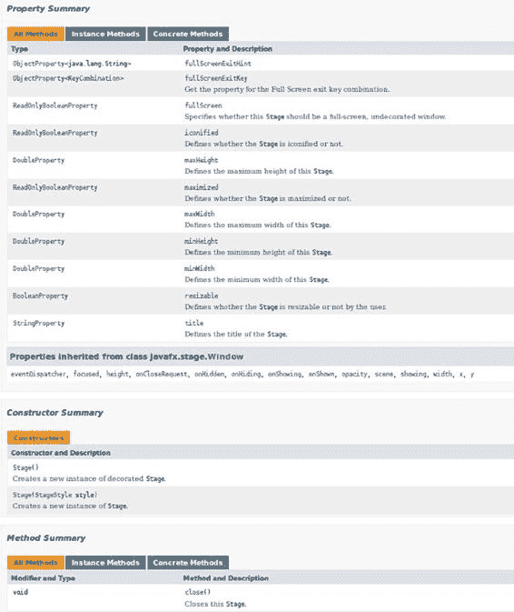

第 2 章 ■ 在 JavaFX 中创建用户界面

***图 2-1.** JavaFX API 中 Stage 类文档的一部分*

请继续探索 Stage 类中每个属性和方法的文档，记得点击链接以查看更详细的信息。完成后，请返回，我们将向你展示一个演示 Stage 类中许多属性和方法的程序。

## 使用 Stage 类：StageCoach 示例

图 2-2 显示了不起眼且故意设计得不太合身的 StageCoach 示例程序的屏幕截图。

[www.it-ebooks.info](http://www.it-ebooks.info/)

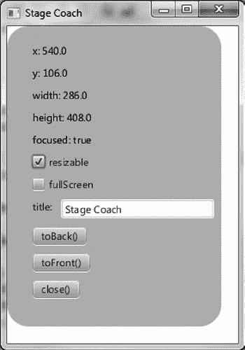

第 2 章 ■ 在 JavaFX 中创建用户界面

***图 2-2.** StageCoach 示例的屏幕截图*

创建 StageCoach 程序是为了指导你掌握使用 Stage 类及相关类（如 `StageStyle` 和 `Screen`）的细节。此外，我们还使用此程序向你展示如何将参数传递到程序中。在逐步了解程序的行为之前，请先打开项目并按照第 1 章中构建和执行 AudioConfig 项目的说明来执行它。项目文件位于你解压本书代码下载包后的 `Chapter02` 子目录中。

**检查 StageCoach 程序的行为**

程序启动时，其外观应类似于图 2-2 中的屏幕截图。要全面检查其行为，请执行以下步骤。请注意，出于教学目的，UI 上的属性和方法名称与 Stage 实例中的属性和方法相对应。

1. 注意，StageCoach 程序的窗口最初显示在屏幕顶部附近，其水平位置在屏幕中央。拖动程序窗口，观察 UI 顶部的 `x` 和 `y` 值会动态更新，以反映其在屏幕上的位置。

2. 调整程序窗口的大小，观察宽度和高度值会随之变化，以反映 Stage 的宽度和高度。请注意，此大小包括窗口的装饰（标题栏和边框）。

3. 点击程序（或以其他方式使其获得焦点），注意 `focused` 值为 `true`。使窗口失去焦点（例如，点击屏幕上的其他位置），注意 `focused` 值变为 `false`。

[www.it-ebooks.info](http://www.it-ebooks.info/)

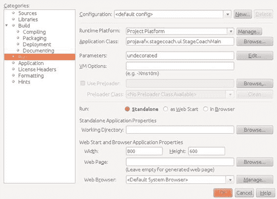

第 2 章 ■ 在 JavaFX 中创建用户界面

4. 清除 `resizable` 复选框，然后注意 `resizable` 值变为 `false`。然后尝试调整窗口大小，注意这是不允许的。再次选中 `resizable` 复选框，使窗口可调整大小。

5. 选中 `fullscreen` 复选框。注意程序会占据整个屏幕，并且窗口装饰不可见。清除 `fullscreen` 复选框，将程序恢复到之前的大小。

6. 编辑 `title` 标签旁边的文本字段中的文本，注意窗口标题栏中的文本会随之改变以反映新值。

7. 拖动窗口使其部分覆盖另一个窗口，然后点击 `toBack()`。注意，这会将程序置于另一个窗口之后，从而导致 Z 顺序发生变化。

8. 当程序窗口的一部分位于另一个窗口后面，但 `toFront()` 按钮可见时，点击该按钮。注意，程序窗口会被置于另一个窗口之前。

9. 点击 `close()`，注意程序会退出。

10. 再次调用程序，传入字符串 `"undecorated"`。如果从 NetBeans 调用，请使用项目属性对话框传递此参数，如图 2-3 所示。`"undecorated"` 字符串作为无值的参数传递。

***图 2-3.** 使用 NetBeans 的项目属性对话框向程序传递参数*

11. 注意，这次程序出现时没有任何窗口装饰，但程序的白色背景包含了窗口的背景。图 2-4 屏幕截图中的黑色轮廓是桌面背景的一部分。

[www.it-ebooks.info](http://www.it-ebooks.info/)

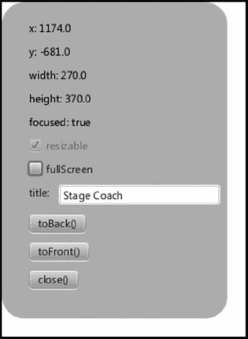

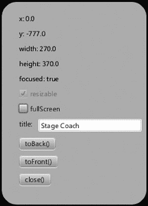

第 2 章 ■ 在 JavaFX 中创建用户界面

***图 2-4.** 使用 `undecorated` 参数调用后的 StageCoach 程序*

12. 再次点击 `close()` 退出程序，然后再次运行程序，传入字符串 `"transparent"` 作为参数。注意，程序以圆角矩形的形状出现，如图 2-5 所示。


***图 2-5.** 使用透明参数调用后的 StageCoach 程序* 36

[www.it-ebooks.info](http://www.it-ebooks.info/)

第 2 章 ■ 在 JavaFX 中创建用户界面

■ **注意** 你可能已经注意到，图 2-4 和 2-5 的截图中 y 值为负数。这是因为截图时，应用程序被放置在副显示器上，逻辑上位于主显示器的上方。

13. 点击应用程序的用户界面，在屏幕上拖动它，完成后点击 close()。

恭喜你坚持完成了这 13 个步骤的练习！完成此练习后，你将能够理解其背后的代码，接下来我们将一起逐步讲解。

理解 StageCoach 程序

在指出新的相关概念之前，请先查看清单 2-1 中 StageCoach 程序的代码。

***清单 2-1.*** StageCoachMain.java

package projavafx.stagecoach.ui;

import java.util.List;

import javafx.application.Application;

import javafx.beans.property.SimpleStringProperty;

import javafx.beans.property.StringProperty;

import javafx.geometry.Rectangle2D;

import javafx.geometry.VPos;

import javafx.scene.Group;

import javafx.scene.Scene;

import javafx.scene.control.Button;

import javafx.scene.control.CheckBox;

import javafx.scene.control.Label;

import javafx.scene.control.TextField;

import javafx.scene.input.MouseEvent;

import javafx.scene.layout.HBox;

import javafx.scene.layout.VBox;

import javafx.scene.paint.Color;

import javafx.scene.shape.Rectangle;

import javafx.scene.text.Text;

import javafx.stage.Screen;

import javafx.stage.Stage;

import javafx.stage.StageStyle;

import javafx.stage.WindowEvent;

public class StageCoachMain extends Application {

StringProperty title = new SimpleStringProperty();

Text textStageX;

Text textStageY;

Text textStageW;

Text textStageH;

Text textStageF;

[www.it-ebooks.info](http://www.it-ebooks.info/)

第 2 章 ■ 在 JavaFX 中创建用户界面

CheckBox checkBoxResizable;

CheckBox checkBoxFullScreen;

double dragAnchorX;

double dragAnchorY;

public static void main(String[] args) {

Application.launch(args);

}

@Override

public void start(Stage stage) {

StageStyle stageStyle = StageStyle.DECORATED;

List<String> unnamedParams = getParameters().getUnnamed();

if (unnamedParams.size() > 0) {

String stageStyleParam = unnamedParams.get(0);

if (stageStyleParam.equalsIgnoreCase("transparent")) {

stageStyle = StageStyle.TRANSPARENT;

} else if (stageStyleParam.equalsIgnoreCase("undecorated")) {

stageStyle = StageStyle.UNDECORATED;

} else if (stageStyleParam.equalsIgnoreCase("utility")) {

stageStyle = StageStyle.UTILITY;

}

}

final Stage stageRef = stage;

Group rootGroup;

TextField titleTextField;

Button toBackButton = new Button("toBack()");

toBackButton.setOnAction(e -> stageRef.toBack());

Button toFrontButton = new Button("toFront()");

toFrontButton.setOnAction(e -> stageRef.toFront());

Button closeButton = new Button("close()");

closeButton.setOnAction(e -> stageRef.close());

Rectangle blue = new Rectangle(250, 350, Color.SKYBLUE);

blue.setArcHeight(50);

blue.setArcWidth(50);

textStageX = new Text();

textStageX.setTextOrigin(VPos.TOP);

textStageY = new Text();

textStageY.setTextOrigin(VPos.TOP);

textStageH = new Text();

textStageH.setTextOrigin(VPos.TOP);

textStageW = new Text();

textStageW.setTextOrigin(VPos.TOP);

textStageF = new Text();

textStageF.setTextOrigin(VPos.TOP);

checkBoxResizable = new CheckBox("resizable");

checkBoxResizable.setDisable(stageStyle == StageStyle.TRANSPARENT

|| stageStyle == StageStyle.UNDECORATED);

checkBoxFullScreen = new CheckBox("fullScreen");

titleTextField = new TextField("Stage Coach");

[www.it-ebooks.info](http://www.it-ebooks.info/)

第 2 章 ■ 在 JavaFX 中创建用户界面

Label titleLabel = new Label("title");

HBox titleBox = new HBox(titleLabel, titleTextField);

VBox contentBox = new VBox(

textStageX, textStageY, textStageW, textStageH, textStageF,

checkBoxResizable, checkBoxFullScreen,

titleBox, toBackButton, toFrontButton, closeButton);

contentBox.setLayoutX(30);


contentBox.setLayoutY(20);

contentBox.setSpacing(10);

rootGroup = new Group(blue, contentBox);

Scene scene = new Scene(rootGroup, 270, 370);

scene.setFill(Color.TRANSPARENT);

//当鼠标按下时，保存屏幕的初始位置

rootGroup.setOnMousePressed((MouseEvent me) -> {

dragAnchorX = me.getScreenX() - stageRef.getX();

dragAnchorY = me.getScreenY() - stageRef.getY();

});

//当屏幕被拖动时，相应地平移它

rootGroup.setOnMouseDragged((MouseEvent me) -> {

stageRef.setX(me.getScreenX() - dragAnchorX);

stageRef.setY(me.getScreenY() - dragAnchorY);

});

textStageX.textProperty().bind(new SimpleStringProperty("x: ")

.concat(stageRef.xProperty().asString()));

textStageY.textProperty().bind(new SimpleStringProperty("y: ")

.concat(stageRef.yProperty().asString()));

textStageW.textProperty().bind(new SimpleStringProperty("width: ")

.concat(stageRef.widthProperty().asString()));

textStageH.textProperty().bind(new SimpleStringProperty("height: ")

.concat(stageRef.heightProperty().asString()));

textStageF.textProperty().bind(new SimpleStringProperty("focused: ")

.concat(stageRef.focusedProperty().asString()));

stage.setResizable(true);

checkBoxResizable.selectedProperty()

.bindBidirectional(stage.resizableProperty());

checkBoxFullScreen.selectedProperty().addListener((ov, oldValue, newValue) -> {

stageRef.setFullScreen(checkBoxFullScreen.selectedProperty().getValue());

});

title.bind(titleTextField.textProperty());

stage.setScene(scene);

stage.titleProperty().bind(title);

stage.initStyle(stageStyle);

stage.setOnCloseRequest((WindowEvent we) -> {

System.out.println("Stage is closing");

});

[www.it-ebooks.info](http://www.it-ebooks.info/)

第 2 章 ■ 在 JavaFX 中创建用户界面

stage.show();

Rectangle2D primScreenBounds = Screen.getPrimary().getVisualBounds();

stage.setX((primScreenBounds.getWidth() - stage.getWidth()) / 2);

stage.setY((primScreenBounds.getHeight() - stage.getHeight()) / 4);

}

}

获取程序参数

本程序引入的第一个新概念是能够读取传递给 JavaFX 程序的参数。

`javafx.application`包中包含一个名为`Application`的类，该类具有与应用程序生命周期相关的方法，例如`launch()`、`init()`、`start()`和`stop()`。`Application`类中的另一个方法是`getParameters()`，它使应用程序能够访问命令行传递的参数，以及 JNLP 文件中指定的未命名参数和`<name,value>`对。以下是清单 2-1 中的相关代码片段，供您参考：`StageStyle stageStyle = StageStyle.DECORATED;`

`List<String> unnamedParams = getParameters().getUnnamed();`

`if (unnamedParams.size() > 0) {`

`String stageStyleParam = unnamedParams.get(0);`

`if (stageStyleParam.equalsIgnoreCase("transparent")) {`

`stageStyle = StageStyle.TRANSPARENT;`

`}`

`else if (stageStyleParam.equalsIgnoreCase("undecorated")) {`

`stageStyle = StageStyle.UNDECORATED;`

`}`

`else if (stageStyleParam.equalsIgnoreCase("utility")) {`

`stageStyle = StageStyle.UTILITY;`

`}`

`}`

`...代码省略...`

`stage.initStyle(stageStyle);`

设置舞台的样式

我们使用前面描述的`getParameters()`方法来获取一个参数，该参数告诉我们`Stage`实例的舞台样式应该是其默认样式（`StageStyle.DECORATED`）、`StageStyle.UNDECORATED`还是`StageStyle.TRANSPARENT`。您在前面的练习中看到了每种样式的效果，特别是在图 2-2、2-4 和 2-5 中。

控制舞台是否可调整大小

如下面的清单 2-1 摘录所示，为了使此应用程序的窗口最初可调整大小，我们调用了`Stage`实例的`setResizable()`方法。为了保持`Stage`的可调整大小属性与可调整大小复选框的状态同步，该复选框与`Stage`实例的`resizable`属性进行了双向绑定。

`stage.setResizable(true);`

`checkBoxResizable.selectedProperty()`

`.bindBidirectional(stage.resizableProperty());`

[www.it-ebooks.info](http://www.it-ebooks.info/)


第 2 章 ■ 在 JavaFX 中创建用户界面

■ **提示** 已绑定的属性无法显式设置。在上述代码片段中，可调整大小属性是在下一行绑定属性*之前*通过 setResizable()方法设置的。

使舞台全屏显示

要使舞台以全屏模式显示，只需将 Stage 实例的 fullScreen 属性设置为 true 即可。

如清单 2-1 的以下片段所示，为了保持 Stage 的 fullScreen 属性与全屏复选框的状态同步，每当复选框的 selected 属性发生变化时，都会更新 Stage 实例的 fullScreen 属性。

checkBoxFullScreen.selectedProperty().addListener((ov, oldValue, newValue) -> {

stageRef.setFullScreen(checkBoxFullScreen.selectedProperty().getValue());

});

处理舞台的边界

舞台的边界由其 x、y、width 和 height 属性表示，这些属性的值可以随意更改。清单 2-1 的以下片段演示了这一点：在 Stage 初始化后，将其放置在主屏幕顶部附近并水平居中。

Rectangle2D primScreenBounds = Screen.getPrimary().getVisualBounds();

stage.setX((primScreenBounds.getWidth() - stage.getWidth()) / 2);

stage.setY((primScreenBounds.getHeight() - stage.getHeight()) / 4);

我们使用 javafx.stage 包中的 Screen 类来获取主屏幕的尺寸，以便计算所需位置。

■ **注意** 我们特意将图 2-2 中的 Stage 做得比其包含的 Scene 更大，以说明以下观点。Stage 的宽度和高度包括其装饰（标题栏和边框），这些在不同平台上有所不同。

因此，通常更好的做法是控制 Scene 的宽度和高度（稍后我们将展示如何操作），并让 Stage 适应该尺寸。

绘制圆角矩形

如第 1 章所述，您可以通过为矩形的角指定 arcWidth 和 arcHeight 来绘制圆角矩形。清单 2-1 中的以下片段绘制了天蓝色圆角矩形，该矩形成为图 2-5 中透明窗口示例的背景。

Rectangle blue = new Rectangle(250, 350, Color.SKYBLUE);

blue.setArcHeight(50);

blue.setArcWidth(50);

在此片段中，我们使用了 Rectangle 的三参数构造函数，其中前两个参数指定矩形的宽度和高度。第三个参数定义矩形的填充颜色。

[www.it-ebooks.info](http://www.it-ebooks.info/)

第 2 章 ■ 在 JavaFX 中创建用户界面

从这段代码可以看出，使用 arcWidth(double v)和 arcHeight(double v)方法可以轻松创建圆角矩形，其中参数 v 定义了弧的直径。

在无标题栏时在桌面上拖动舞台

Stage 可以使用其标题栏在桌面上拖动，但当其 StageStyle 为 UNDECORATED 或 TRANSPARENT 时，标题栏不可用。为了在这种情况下允许拖动，我们添加了清单 2-1 中以下代码片段所示的代码。

//当鼠标按下时，保存屏幕的初始位置

rootGroup.setOnMousePressed((MouseEvent me) -> {

dragAnchorX = me.getScreenX() - stageRef.getX();

dragAnchorY = me.getScreenY() - stageRef.getY();

});

//当屏幕被拖动时，相应地平移它

rootGroup.setOnMouseDragged((MouseEvent me) -> {

stageRef.setX(me.getScreenX() - dragAnchorX);

stageRef.setY(me.getScreenY() - dragAnchorY);

});

事件处理程序将在本章稍后部分介绍，但作为预览，当鼠标被拖动时，会调用提供给 onMouseDragged()方法的 lambda 表达式。结果，x 和 y 属性的值会根据鼠标拖动的像素数而改变，从而在鼠标拖动时移动 Stage。

使用 UI 布局容器


在开发需要部署于跨平台环境或进行国际化的应用程序时，使用*布局容器*是一个好习惯。使用布局容器的优势之一在于，当节点尺寸发生变化时，它们之间的视觉关系是可预测的。另一个优势是，你无需计算放置在用户界面中每个节点的位置。

以下来自代码清单 2-1 的片段展示了如何使用位于 `javafx.scene.layout` 包中的 `VBox` 布局类，将 `Text`、`CheckBox`、`HBox` 和 `Button` 节点排列成一列。该片段还展示了布局容器可以嵌套，如名为 `titleBox` 的 `HBox` 所示，它水平排列了 `Label` 和 `TextField` 节点。请注意，为了清晰展示布局嵌套，该片段中省略了若干行代码：

```java
HBox titleBox = new HBox(titleLabel, titleTextField);

VBox contentBox = new VBox(
    textStageX, textStageY, textStageW, textStageH, textStageF,
    checkBoxResizable, checkBoxFullScreen,
    titleBox, toBackButton, toFrontButton, closeButton);
```

`VBox` 布局类与第 1 章“Hello Earthrise”示例中讨论的 `Group` 类类似，因为它内部包含一组节点。与 `Group` 类不同的是，`VBox` 类会垂直排列其包含的节点，并通过 `spacing` 属性中指定的像素数来设置节点之间的间距。

[www.it-ebooks.info](http://www.it-ebooks.info/)

第 2 章 ■ 在 JavaFX 中创建用户界面

**判断舞台是否处于焦点状态**

要了解你的 JavaFX 应用程序当前是否处于焦点状态（例如，按键输入是否传递给该应用程序），只需查询 `Stage` 实例的 `focused` 属性即可。以下来自代码清单 2-1 的片段演示了这一点。

```java
textStageF.textProperty().bind(new SimpleStringProperty("focused: ")
    .concat(stageRef.focusedProperty().asString()));
```

**控制舞台的 Z 轴顺序**

如果你希望 JavaFX 应用程序显示在其他窗口之上或之下，可以分别使用 `toFront()` 和 `toBack()` 方法。以下来自代码清单 2-1 的片段展示了如何实现这一点。

```java
Button toBackButton = new Button("toBack()");
toBackButton.setOnAction(e -> stageRef.toBack());

Button toFrontButton = new Button("toFront()");
toFrontButton.setOnAction(e -> stageRef.toFront());
```

再次注意，使用 lambda 表达式如何增强了代码的可读性。从片段的第一行可以清晰地看出，创建了一个名为 `toBackButton` 的按钮，其上显示文本 `"toBack()"`。第二行定义了当对该按钮执行操作时（即点击按钮），舞台将被发送到后台。

如果不使用 lambda 表达式，第二行将被替换为对匿名内部类的调用，如下所示：

```java
toBackButton.setOnAction(new EventHandler<javafx.event.ActionEvent>() {
    @Override public void handle(javafx.event.ActionEvent e) {
        stageRef.toBack();
    }
})
```

这种方法不仅需要更多代码，而且不允许 Java 运行时优化调用，可读性也差得多。

**关闭舞台并检测其关闭事件**

如下方来自代码清单 2-1 的代码片段所示，你可以通过 `Stage` 的 `close()` 方法以编程方式关闭它。当 `stageStyle` 设置为无装饰或透明时，这一点尤为重要，因为窗口系统提供的关闭按钮将不存在。

```java
Button closeButton = new Button("close()");
closeButton.setOnAction(e -> stageRef.close());
```

[www.it-ebooks.info](http://www.it-ebooks.info/)

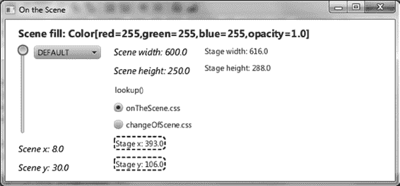

第 2 章 ■ 在 JavaFX 中创建用户界面

顺便提一下，你可以通过使用 `onCloseRequest` 事件处理器来检测何时有外部请求关闭舞台，如下方来自代码清单 2-1 的代码片段所示。

```java
stage.setOnCloseRequest((WindowEvent we) -> {
    System.out.println("Stage is closing");
});
```


要查看实际效果，请在不带任何参数的情况下运行应用程序，使其显示为之前图 2-2 所示的外观，然后点击窗口装饰上的关闭按钮。

■ **提示** `onCloseRequest` 事件处理器仅在收到外部关闭窗口请求时才会被调用。这就是为什么在本示例中，当你点击标有“close( )”的按钮时，不会出现“stage is closing”消息的原因。

制作场景

继续沿用我们创建 JavaFX 应用程序的剧场比喻，现在我们来讨论如何将场景放置到舞台上。正如你所记得的，场景是演员和道具（节点）与观众（程序用户）进行视觉交互的场所。

使用 Scene 类：OnTheScene 示例

与 Stage 类一样，我们将使用一个精心设计的示例应用程序来演示和讲解 Scene 类中可用功能的细节。请参见图 2-6 中 OnTheScene 程序的截图。

***图 2-6.** 首次调用时的 OnTheScene 程序*

请继续运行 OnTheScene 程序，并按照以下练习中的指示对其进行全面测试。

随后我们将对代码进行讲解，以便你能将行为与其背后的代码关联起来。

[www.it-ebooks.info](http://www.it-ebooks.info/)

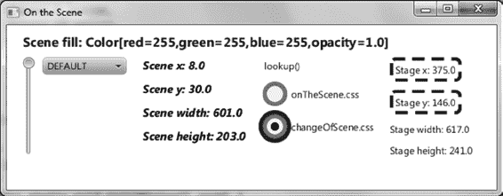

第 2 章 ■ 在 JavaFX 中创建用户界面

**检查 OnTheScene 程序的行为**

当 OnTheScene 程序启动时，其外观应与图 2-6 中的截图相似。要全面检查其行为，请执行以下步骤。请注意，UI 上的属性和方法名称对应于 Scene、Stage 和 Cursor 类中的属性和方法，以及层叠样式表（CSS）文件名。

1. 拖动应用程序，注意虽然 Stage 的 x 和 y 值是相对于屏幕的，但 Scene 的 x 和 y 值是相对于 Stage 外部（包括装饰）左上角的。同样，Scene 的宽度和高度是 Stage 内部（不包括装饰）的尺寸。如前所述，最好显式设置 Scene 的宽度和高度（或通过假设包含节点的大小来隐式设置），而不是设置装饰过的 Stage 的宽度和高度。

2. 调整程序窗口的大小，观察宽度和高度值的变化，这些值反映了 Scene 的宽度和高度。同时注意，当你改变窗口高度时，场景中许多内容的位置也会发生变化。

3. 点击 `lookup( )` 超链接，注意控制台中会打印出字符串“scene height: XXX.X”，其中 XXX.X 是 Scene 的高度。

4. 将鼠标悬停在选择框下拉列表上，注意它会稍微变大。
点击选择框，在列表中选择一种光标样式，注意光标会变为该样式。小心不要选择 `NONE`，因为光标可能会消失，你需要使用键盘（或者在移动鼠标时使用心灵感应）才能让它重新可见。

5. 拖动左侧的滑块，注意 Scene 的填充颜色会发生变化，并且 Scene 顶部的字符串会反映当前填充颜色的红绿蓝（RGB）值和不透明度值。

6. 注意 Scene 上文本的外观和内容。然后点击 `changeOfscene.css`，注意 Scene 上某些文本的颜色、字体和内容特性会发生变化，如图 2-7 中的截图所示。

***图 2-7.** 应用了 changeOfScene CSS 样式表的 OnTheScene 程序* 7. 点击 `Onthescene.css`，注意颜色和字体特性会恢复到之前的状态。

现在你已经探索了这个演示 Scene 功能的示例程序，让我们来讲解一下代码吧！


[www.it-ebooks.info](http://www.it-ebooks.info/)

第 2 章 ■ 在 JavaFX 中创建用户界面

理解 OnTheScene 程序

在指出新的相关概念之前，我们先看一下清单 2-2 中 OnTheScene 程序的代码。

***清单 2-2.*** OnTheSceneMain.java

import javafx.application.Application;

import javafx.beans.property.DoubleProperty;

import javafx.beans.property.SimpleDoubleProperty;

import javafx.beans.property.SimpleStringProperty;

import javafx.collections.FXCollections;

import javafx.collections.ObservableList;

import javafx.geometry.HPos;

import javafx.geometry.Insets;

import javafx.geometry.Orientation;

import javafx.geometry.VPos;

import javafx.scene.Cursor;

import javafx.scene.Scene;

import javafx.scene.control.ChoiceBox;

import javafx.scene.control.Hyperlink;

import javafx.scene.control.Label;

import javafx.scene.control.RadioButton;

import javafx.scene.control.Slider;

import javafx.scene.control.ToggleGroup;

import javafx.scene.layout.FlowPane;

import javafx.scene.layout.HBox;

import javafx.scene.paint.Color;

import javafx.scene.text.Font;

import javafx.scene.text.FontWeight;

import javafx.scene.text.Text;

import javafx.stage.Stage;

public class OnTheSceneMain extends Application {

DoubleProperty fillVals = new SimpleDoubleProperty(255.0);

Scene sceneRef;

ObservableList cursors = FXCollections.observableArrayList(

Cursor.DEFAULT,

Cursor.CROSSHAIR,

Cursor.WAIT,

Cursor.TEXT,

Cursor.HAND,

Cursor.MOVE,

Cursor.N_RESIZE,

Cursor.NE_RESIZE,

Cursor.E_RESIZE,

Cursor.SE_RESIZE,

Cursor.S_RESIZE,

Cursor.SW_RESIZE,

[www.it-ebooks.info](http://www.it-ebooks.info/)

第 2 章 ■ 在 JavaFX 中创建用户界面

Cursor.W_RESIZE,

Cursor.NW_RESIZE,

Cursor.NONE

);

public static void main(String[] args) {

Application.launch(args);

}

@Override

public void start(Stage stage) {

Slider sliderRef;

ChoiceBox choiceBoxRef;

Text textSceneX;

Text textSceneY;

Text textSceneW;

Text textSceneH;

Label labelStageX;

Label labelStageY;

Label labelStageW;

Label labelStageH;

final ToggleGroup toggleGrp = new ToggleGroup();

sliderRef = new Slider(0, 255, 255);

sliderRef.setOrientation(Orientation.VERTICAL);

choiceBoxRef = new ChoiceBox(cursors);

HBox hbox = new HBox(sliderRef, choiceBoxRef);

hbox.setSpacing(10);

textSceneX = new Text();

textSceneX.getStyleClass().add("emphasized-text");

textSceneY = new Text();

textSceneY.getStyleClass().add("emphasized-text");

textSceneW = new Text();

textSceneW.getStyleClass().add("emphasized-text");

textSceneH = new Text();

textSceneH.getStyleClass().add("emphasized-text");

textSceneH.setId("sceneHeightText");

Hyperlink hyperlink = new Hyperlink("查找");

hyperlink.setOnAction((javafx.event.ActionEvent e) -> {

System.out.println("sceneRef:" + sceneRef);

Text textRef = (Text) sceneRef.lookup("#sceneHeightText");

System.out.println(textRef.getText());

});

RadioButton radio1 = new RadioButton("onTheScene.css");

radio1.setSelected(true);

radio1.setToggleGroup(toggleGrp);

RadioButton radio2 = new RadioButton("changeOfScene.css");

radio2.setToggleGroup(toggleGrp);

labelStageX = new Label();

labelStageX.setId("stageX");

labelStageY = new Label();

labelStageY.setId("stageY");

[www.it-ebooks.info](http://www.it-ebooks.info/)

第 2 章 ■ 在 JavaFX 中创建用户界面

labelStageW = new Label();

labelStageH = new Label();

FlowPane sceneRoot = new FlowPane(Orientation.VERTICAL, 20, 10, hbox,

textSceneX, textSceneY, textSceneW, textSceneH, hyperlink,

radio1, radio2,

labelStageX, labelStageY,

labelStageW,

labelStageH);

sceneRoot.setPadding(new Insets(0, 20, 40, 0));

sceneRoot.setColumnHalignment(HPos.LEFT);

sceneRoot.setLayoutX(20);

sceneRoot.setLayoutY(40);

sceneRef = new Scene(sceneRoot, 600, 250);

sceneRef.getStylesheets().add("onTheScene.css");

stage.setScene(sceneRef);

choiceBoxRef.getSelectionModel().selectFirst();

// 设置各种属性绑定

textSceneX.textProperty().bind(new SimpleStringProperty("场景 x: ")

.concat(sceneRef.xProperty().asString()));

textSceneY.textProperty().bind(new SimpleStringProperty("场景 y: ")

.concat(sceneRef.yProperty().asString()));


textSceneW.textProperty().bind(new SimpleStringProperty("场景宽度：")
.concat(sceneRef.widthProperty().asString()));

textSceneH.textProperty().bind(new SimpleStringProperty("场景高度：")
.concat(sceneRef.heightProperty().asString()));

labelStageX.textProperty().bind(new SimpleStringProperty("舞台 X 坐标：")
.concat(sceneRef.getWindow().xProperty().asString()));

labelStageY.textProperty().bind(new SimpleStringProperty("舞台 Y 坐标：")
.concat(sceneRef.getWindow().yProperty().asString()));

labelStageW.textProperty().bind(new SimpleStringProperty("舞台宽度：")
.concat(sceneRef.getWindow().widthProperty().asString()));

labelStageH.textProperty().bind(new SimpleStringProperty("舞台高度：")
.concat(sceneRef.getWindow().heightProperty().asString()));

sceneRef.cursorProperty().bind(choiceBoxRef.getSelectionModel()
.selectedItemProperty());

fillVals.bind(sliderRef.valueProperty());

// 当 fillVals 变化时，使用该值作为 RGB 填充场景
fillVals.addListener((ov, oldValue, newValue) -> {
Double fillValue = fillVals.getValue() / 256.0;
sceneRef.setFill(new Color(fillValue, fillValue, fillValue, 1.0));
});

[www.it-ebooks.info](http://www.it-ebooks.info/)

第 2 章 ■ 在 JavaFX 中创建用户界面

// 当选中的单选按钮变化时，设置相应的样式表
toggleGrp.selectedToggleProperty().addListener((ov, oldValue, newValue) -> {
String radioButtonText = ((RadioButton) toggleGrp.getSelectedToggle())
.getText();
sceneRef.getStylesheets().clear();
sceneRef.getStylesheets().addAll(radioButtonText);
});

stage.setTitle("在场景中");
stage.show();

// 定义一个非托管节点，用于显示文本
Text addedTextRef = new Text(0, -30, "");
addedTextRef.setTextOrigin(VPos.TOP);
addedTextRef.setFill(Color.BLUE);
addedTextRef.setFont(Font.font("Sans Serif", FontWeight.BOLD, 16));
addedTextRef.setManaged(false);

// 将添加的文本节点的文本绑定到场景的填充属性
addedTextRef.textProperty().bind(new SimpleStringProperty("场景填充：")
.concat(sceneRef.fillProperty()));

// 将文本节点添加到 FlowPane
((FlowPane) sceneRef.getRoot()).getChildren().add(addedTextRef);
}
}

设置场景的光标

可以为特定节点、整个场景或同时为两者设置光标。要同时设置两者，请将 Scene 实例的 cursor 属性设置为 Cursor 类中的常量值之一，如清单 2-2 中的以下代码片段所示。

sceneRef.cursorProperty().bind(choiceBoxRef.getSelectionModel()
.selectedItemProperty());

这些光标值可以通过查看 JavaFX API 文档中的 javafx.scene.Cursor 类来了解；我们在清单 2-2 中创建了这些常量的集合。

绘制场景背景

Scene 类有一个类型为 javafx.scene.paint.Paint 的 fill 属性。查看 JavaFX API 会发现 Paint 的已知子类包括 Color、ImagePattern、LinearGradient 和 RadialGradient。因此，场景的背景可以用纯色、图案和渐变来填充。如果你没有设置 Scene 的 fill 属性，将使用默认颜色（白色）。

■ **提示** Color 常量之一是 Color.TRANSPARENT，因此如果需要，你可以使场景背景完全透明。事实上，图 2-5 中 stageCoach 截图里圆角矩形后面的场景之所以不是白色，是因为其 fill 属性设置为 Color.TRANSPARENT（请再次查看清单 2-1）。

[www.it-ebooks.info](http://www.it-ebooks.info/)

第 2 章 ■ 在 JavaFX 中创建用户界面

在 OnTheScene 示例中设置 fill 属性时，我们没有使用 Color 类中的常量（例如 Color.BLUE），而是使用 RGB 公式来创建颜色。请查看 JavaFX API 文档中的 javafx.scene.paint.Color 类，并向下滚动浏览诸如 ALICEBLUE 和 WHITESMOKE 等常量，以查看构造函数和方法。我们正在使用 Color 类的构造函数，将 fill 属性设置为其值，如清单 2-2 中的以下代码片段所示。


sceneRef.setFill(new Color(fillValue, fillValue, fillValue, 1.0));

当您移动滑块（`fillVals` 属性绑定到该滑块）时，`Color()` 构造函数的每个参数都会被设置为 0 到 255 之间的值，如下方来自代码清单 2-2 的代码片段所示。

fillVals.bind(sliderRef.valueProperty());

使用节点填充场景

如第 1 章所述，您可以通过实例化节点并将其添加到可容纳其他节点的容器节点（例如 `Group` 和 `VBox`）中来填充场景。这些功能使您能够构建包含节点的复杂*场景图*。在此示例中，`Scene` 的 `root` 属性包含一个流式布局容器，该容器会使其内容垂直或水平流动，并在必要时自动换行。我们示例中的 `Flow` 容器包含一个 `HBox`（其中包含一个 `Slider` 和一个 `ChoiceBox`）以及几个其他节点（`Text`、`Hyperlink` 和 `RadioButton` 类的实例）。

按 ID 查找场景节点

场景中的每个节点都可以在节点的 `id` 属性中分配一个 ID。例如，在下方来自代码清单 2-2 的代码片段中，一个 `Text` 节点的 `id` 属性被赋值为字符串 `"sceneHeightText"`。当 `Hyperlink` 控件中的操作事件处理器被调用时，会使用 `Scene` 实例的 `lookup()` 方法来获取对 ID 为 `"sceneHeightText"` 的节点的引用。然后，事件处理器会将 `Text` 节点的内容打印到控制台。

■ **注意** 超链接控件本质上是一个具有超链接文本外观的按钮。它有一个操作事件处理器，您可以在其中放置用于打开浏览器页面或实现任何其他所需功能的代码。

textSceneH = new Text();

textSceneH.getStyleClass().add("emphasized-text");

textSceneH.setId("sceneHeightText");

Hyperlink hyperlink = new Hyperlink("lookup");

hyperlink.setOnAction((javafx.event.ActionEvent e) -> {

System.out.println("sceneRef:" + sceneRef);

Text textRef = (Text) sceneRef.lookup("#sceneHeightText");

System.out.println(textRef.getText());

});

仔细检查操作事件处理器可以发现，`lookup()` 方法返回一个 `Node`，但此代码片段中返回对象的实际类型是 `Text` 对象。由于我们需要访问 `Text` 类中 `Node` 类没有的属性（`text`），因此有必要强制编译器相信在运行时该对象将是 `Text` 类的一个实例。

[www.it-ebooks.info](http://www.it-ebooks.info/)

第 2 章 ■ 在 JavaFX 中创建用户界面

从场景访问舞台

为了从场景获取对 `Stage` 实例的引用，我们使用 `Scene` 类中名为 `window` 的属性。下方来自代码清单 2-2 的代码片段展示了该属性的访问器方法，用于获取舞台在屏幕上的 x 和 y 坐标。

labelStageX.textProperty().bind(new SimpleStringProperty("Stage x: ")

.concat(sceneRef.getWindow().xProperty().asString()));

labelStageY.textProperty().bind(new SimpleStringProperty("Stage y: ")

.concat(sceneRef.getWindow().yProperty().asString()));

将节点插入场景的内容序列

有时，动态地向 UI 容器类的子节点列表中添加节点是很有用的。接下来来自代码清单 2-2 的代码片段演示了如何通过动态地向 `FlowPane` 实例的子节点列表中添加一个 `Text` 节点来实现这一点：

// 定义一个非托管节点，用于显示文本

Text addedTextRef = new Text(0, -30, "");

addedTextRef.setTextOrigin(VPos.TOP);

addedTextRef.setFill(Color.BLUE);

addedTextRef.setFont(Font.font("Sans Serif", FontWeight.BOLD, 16));

addedTextRef.setManaged(false);

// 将添加的 Text 节点的文本绑定到 Scene 的 fill 属性

addedTextRef.textProperty().bind(new SimpleStringProperty("Scene fill: ").

concat(sceneRef.fillProperty()));

// 将 Text 节点添加到 FlowPane

((FlowPane) sceneRef.getRoot()).getChildren().add(addedTextRef);


这个特定的文本节点是场景顶部的那个节点，如图 2-6 和 2-7 所示，其中显示了场景填充属性的值。请注意，在此示例中，`addedTextRef` 实例的 `managed` 属性被设置为 `false`，因此其位置不受 `FlowPane` 控制。默认情况下，节点是“受管理的”，这意味着其父节点（即添加该节点的容器）负责节点的布局。通过将 `managed` 属性设置为 `false`，则假定由开发者负责节点的布局。

**CSS 样式化场景中的节点**

JavaFX 的一个非常强大的特性是能够使用 CSS 动态地样式化场景中的节点。你在上一个练习的步骤 6 中使用了此功能，当时你点击了 `changeOfScene.css`，将 UI 的外观从图 2-6 所示更改为图 2-7 所示。此外，在练习的步骤 7 中，当你选择了 `onTheScene.css` 单选按钮时，UI 的外观又变回了图 2-6 所示。清单 2-2 中的相关代码片段如下所示：

sceneRef.getStylesheets().add("onTheScene.css");

...代码省略...

// 当选中的单选按钮改变时，设置相应的样式表

toggleGrp.selectedToggleProperty().addListener((ov, oldValue, newValue) -> {

String radioButtonText = ((RadioButton) toggleGrp.getSelectedToggle())

.getText();

[www.it-ebooks.info](http://www.it-ebooks.info/)

第 2 章 ■ 在 JavaFX 中创建用户界面

sceneRef.getStylesheets().clear();

sceneRef.getStylesheets().addAll("/"+radioButtonText);

});

在此代码片段中，Scene 的 `stylesheets` 属性被初始化为 `onTheScene.css` 文件的位置，在本例中为根目录。该代码片段还展示了在点击相应按钮时将 CSS 文件分配给 Scene 的过程。`RadioButton` 实例的文本等于样式表的名称，因此我们可以轻松地将相应的样式表设置给场景。请查看清单 2-3，了解与图 2-6 截图相对应的样式表。此样式表中的一些 CSS *选择器* 代表了 `id` 属性为 `"stageX"` 或 `"stageY"` 的节点。此样式表中还有一个选择器，代表了 `styleClass` 属性为 `"emphasized-text"` 的节点。此外，此样式表中还有一个选择器，通过将控件的驼峰式名称替换为小写连字符名称（`choice-box`）来映射到 `ChoiceBox` UI 控件。此样式表中的*属性*以 `-fx` 开头，并与它们所关联的节点类型相对应。此样式表中的*值*（例如 `black`、`italic` 和 `14pt`）以标准 CSS 值表示。

***清单 2-3.*** onTheScene.css

#stageX, #stageY {

-fx-padding: 1;

-fx-border-color: black;

-fx-border-style: dashed;

-fx-border-width: 2;

-fx-border-radius: 5;

}

.emphasized-text {

-fx-font-size: 14pt;

-fx-font-weight: normal;

-fx-font-style: italic;

}

.choice-box:hover {

-fx-scale-x: 1.1;

-fx-scale-y: 1.1;

}

.radio-button .radio {

-fx-background-color: -fx-shadow-highlight-color, -fx-outer-border,

-fx-inner-border, -fx-body-color;

-fx-background-insets: 0 0 -1 0, 0, 1, 2;

-fx-background-radius: 1.0em;

-fx-padding: 0.333333em;

}

.radio-button:focused .radio {

-fx-background-color: -fx-focus-color, -fx-outer-border,

-fx-inner-border, -fx-body-color;

-fx-background-radius: 1.0em;

-fx-background-insets: -1.4, 0, 1, 2;

}

清单 2-4 是与图 2-7 截图相对应的样式表。有关 CSS 样式表的更多信息，请参阅本章末尾的“资源”部分。

[www.it-ebooks.info](http://www.it-ebooks.info/)

第 2 章 ■ 在 JavaFX 中创建用户界面

***清单 2-4.*** changeOfScene.css

#stageX, #stageY {

-fx-padding: 3;

-fx-border-color: blue;

-fx-stroke-dash-array: 12 2 4 2;

-fx-border-width: 4;

-fx-border-radius: 5;

}

.emphasized-text {

-fx-font-size: 14pt;

-fx-font-weight: bold;

-fx-font-style: normal;

}

.radio-button *.radio {

-fx-padding: 10;

-fx-background-color: red, yellow;

-fx-background-insets: 0, 5;

-fx-background-radius: 30, 20;

}

.radio-button:focused *.radio {

-fx-background-color: blue, red, yellow;

-fx-background-insets: -5, 0, 5;

-fx-background-radius: 40, 30, 20;

}

现在你已经对使用 Stage 和 Scene 类、几个 Node 子类以及 CSS 样式有了一些经验，我们将向你展示如何处理 JavaFX 程序运行时可能发生的事件。

**处理输入事件**

到目前为止，我们已经向你展示了一些事件处理的示例。例如，我们使用 `onAction` 事件处理程序在点击按钮时执行代码。我们还使用了 Stage 类的 `onCloseRequest` 事件处理程序，在外部请求关闭 Stage 时执行代码。在本节中，我们将探索 JavaFX 中更多可用的事件处理程序。

**概览鼠标、键盘、触摸和手势事件及处理程序**

JavaFX 程序中发生的大多数事件都与用户操作输入设备（如鼠标、键盘或多点触摸屏）有关。为了查看可用的事件处理程序及其关联的事件对象，我们再次查看 JavaFX API 文档。首先，导航到 `javafx.scene.Node` 类，查找以字母“on”开头的属性。这些属性代表了 JavaFX 中所有节点通用的事件处理程序。以下是 JavaFX 8 API 中这些事件处理程序的列表：

• 键盘事件处理程序：onKeyPressed, onKeyReleased, onKeyTyped

• 鼠标事件处理程序：onMouseClicked, onMouseDragEntered, onMouseDragExited,

onMouseDragged, onMouseDragOver, onMouseDragReleased, onMouseEntered, onMouseExited,

onMouseMoved, onMousePressed, onMouseReleased

[www.it-ebooks.info](http://www.it-ebooks.info/)

第 2 章 ■ 在 JavaFX 中创建用户界面

• 拖放处理程序

:onDragDetected, onDragDone, onDragDropped, onDragEntered, onDragExited, onDragOver

• 触摸处理程序：onTouchMoved, onTouchPressed, onTouchReleased, onTouchStationary

• 手势处理程序：onRotate, onRotationFinished, onRotationStarted, onScroll,

onScrollStarted, onScrollFinished, onSwipeLeft, onSwipeRight, onSwipeUp, onSwipeDown,

onZoom, onZoomStarted, onZoomFinished

这些属性中的每一个都定义了一个方法，当特定的输入事件发生时调用该方法。对于键盘事件处理程序，如 JavaFX API 文档所示，该方法的参数是一个 `javafx.scene.input.KeyEvent` 实例。鼠标事件处理程序的方法参数是一个 `javafx.scene.input.MouseEvent`。触摸处理程序使用一个 `javafx.scene.input.TouchEvent` 实例，而当手势事件发生时，处理事件的方法参数是一个 `javafx.scene.input.GestureInput` 实例。

**理解 KeyEvent 类**

查看 JavaFX API 文档中关于 `KeyEvent` 类的部分，你会发现它包含几个方法，其中一个常用的是 `getCode()`。`getCode()` 方法返回一个 `KeyCode` 实例，代表按下时导致该事件的键。查看 JavaFX API 文档中的 `javafx.scene.input.KeyCode` 类，会发现存在大量常量，代表国际键盘集上的按键。另一种找出按下了哪个键的方法是调用 `getCharacter()` 方法，该方法返回一个字符串，代表与按下的键关联的 Unicode 字符。

`KeyEvent` 类还允许你通过分别调用 `isAltDown()`、`isControlDown()`、`isMetaDown()` 或 `isShiftDown()` 方法来查看事件发生时 Alt、Ctrl、Meta 和/或 Shift 键是否被按下。

**理解 MouseEvent 类**


查看 JavaFX API 文档中的 `MouseEvent` 类，你会发现它提供的方法比 `KeyEvent` 多得多。与 `KeyEvent` 类似，`MouseEvent` 也包含 `isAltDown()`、`isControlDown()`、`isMetaDown()` 和 `isShiftDown()` 方法，以及 `source` 字段，该字段是对事件来源对象的引用。

此外，它还有几个方法可以精确定位鼠标事件发生的各种坐标空间，所有坐标均以像素为单位表示：

• `getX()` 和 `getY()` 返回鼠标事件相对于发生该事件的节点原点的水平和垂直位置。

• `getSceneX()` 和 `getSceneY()` 返回鼠标事件相对于场景（Scene）的水平和垂直位置。

• `getScreenX()` 和 `getScreenY()` 返回鼠标事件相对于屏幕的水平和垂直位置。

以下是一些其他常用的方法：

• `isDragDetect()` 如果检测到拖拽事件则返回 `true`。

• `getButton()`、`isPrimaryButtonDown()`、`isSecondaryButtonDown()`、`isMiddleButtonDown()` 和 `getClickCount()` 包含关于点击了哪个按钮以及点击了多少次的信息。

在本章稍后的内容中，你将通过 ZenPong 示例程序获得创建键盘和鼠标事件处理程序的经验。为了继续为你准备 ZenPong 示例，我们现在向你展示如何为放置在场景中的节点添加动画效果。

[www.it-ebooks.info](http://www.it-ebooks.info/)

第 2 章 ■ 在 JavaFX 中创建用户界面

理解 TouchEvent 类

随着越来越多的设备配备触摸屏，对触摸事件的内置支持使 JavaFX 成为一个用于创建利用多点触控功能的应用程序的先进平台。这里所说的多点触控是指平台能够在单个事件集中跟踪多个触摸点。

`TouchEvent` 类提供了 `getTouchPoint()` 方法，该方法返回一个特定的触摸点。该 `TouchPoint` 上的方法与 `MouseEvent` 上的方法类似，例如，你可以通过调用 `getX()` 和 `getY()`、或 `getSceneX()` 和 `getSceneY()`、或 `getScreenX()` 和 `getScreenY()` 来获取相对和绝对位置。

`TouchEvent` 类还允许开发者获取关于属于同一事件集的其他触摸点的信息。通过调用 `getEventSetId()`，你可以获得该组 `TouchEvent` 实例的唯一标识符，并且可以通过调用 `getTouchPoints()` 获取该事件集中所有触摸点的列表，该方法返回一个 `TouchPoint` 实例的列表。

理解 GestureEvent 类

除了处理多点触控事件，JavaFX 还支持手势事件的创建和分发。手势越来越多地用于智能手机、平板电脑、触摸屏和其他输入设备。它们提供了一种执行操作的直观方式，例如，让用户滑动手指。`GestureEvent` 类目前有四个子类，每个子类代表一种特定的手势：`RotateEvent`、`ScrollEvent`、`SwipeEvent` 和 `ZoomEvent`。所有这些事件都拥有与 `MouseEvent` 类似的方法，用于获取操作的位置——`getX()` 和 `getY()`、`getSceneX()` 和 `getSceneY()`，以及 `getScreenX()` 和 `getScreenY()` 方法。

特定的子类都允许检索更详细的事件类型。例如，`SwipeEvent` 可以是向右或向左、向上或向下的滑动。此信息通过调用 `GestureEvent` 上的 `getEventType()` 方法获得。

为场景中的节点添加动画

JavaFX 的优势之一在于能够轻松创建图形丰富的用户界面。这种丰富性部分体现在能够为场景中的节点添加动画效果。其核心思想是，为节点添加动画涉及在一段时间内更改其属性的值。为节点添加动画的示例包括以下内容。

• 当鼠标进入节点边界时逐渐增大节点的大小，当鼠标离开节点边界时逐渐减小节点的大小。请注意，这需要缩放节点，这被称为变换（transform）。

• 逐渐增加或减少节点的不透明度，以分别实现淡入或淡出效果。

• 逐渐改变节点中改变其位置的属性值，使其从一个位置移动到另一个位置。例如，在创建像 Pong 这样的游戏时，这非常有用。

一个相关的功能是检测节点何时与另一个节点发生碰撞。

为节点添加动画涉及使用位于 `javafx.animation` 包中的 `Timeline` 类。根据动画的需求和个人偏好，可以使用以下两种通用技术之一：

• 直接创建 `Timeline` 类的实例，并提供指定特定时间点上的值和动作的关键帧（key frames）。

• 使用 `javafx.animation.Transition` 子类来定义特定的过渡效果并将其与节点关联。过渡效果的示例包括使节点在一段时间内沿定义路径移动，以及在一段时间内旋转节点。这些过渡类中的每一个都扩展了 `Timeline` 类。

我们现在将介绍这些技术，并展示每个技术的示例，从第一个列出的技术开始。

[www.it-ebooks.info](http://www.it-ebooks.info/)

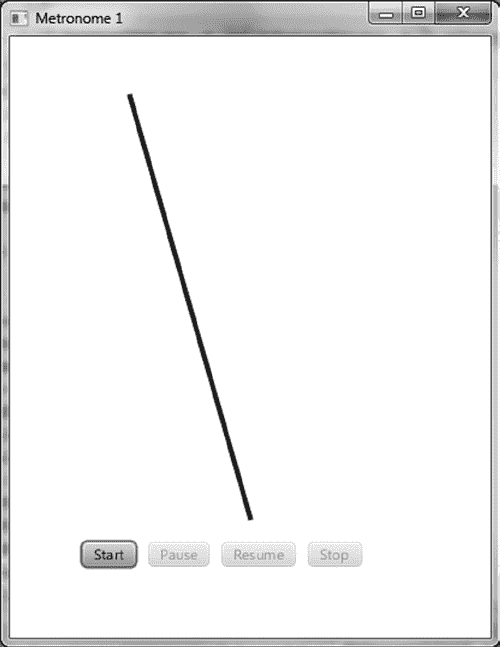

第 2 章 ■ 在 JavaFX 中创建用户界面

使用 Timeline 进行动画制作

查看 JavaFX API 文档中的 `javafx.animation` 包，你会看到在直接创建时间线时使用的三个类：`Timeline`、`KeyFrame` 和 `Interpolator`。仔细阅读这些类的文档，然后回来，我们将向你展示一些使用它们的示例。

■ **提示** 请记得查阅 JavaFX API 文档，了解你遇到的任何新包、类、属性和方法。

Metronome1 示例

我们使用一个简单的节拍器示例来演示如何创建时间线。

如图 2-8 的截图所示，Metronome1 程序有一个摆锤以及四个按钮，分别用于启动、暂停、恢复和停止动画。此示例中的摆锤是一个 `Line` 节点，我们将通过在一秒内*插值*其 `startX` 属性来为该节点添加动画效果。请通过执行以下练习来尝试运行此示例。

***图 2-8.** Metronome1 程序*

[www.it-ebooks.info](http://www.it-ebooks.info/)

第 2 章 ■ 在 JavaFX 中创建用户界面

**检查 Metronome1 程序的行为**

当 Metronome1 程序启动时，其外观应类似于图 2-8 中的截图。要全面检查其行为，请执行以下步骤。

1. 观察场景中的四个按钮，只有“启动”按钮是启用的。
2. 点击“启动”。注意线条的顶部来回移动，每个方向移动需要一秒钟。同时，观察“启动”和“恢复”按钮被禁用，而“暂停”和“停止”按钮被启用。
3. 点击“暂停”，注意动画暂停。同时，观察“启动”和“暂停”按钮被禁用，而“恢复”和“停止”按钮被启用。
4. 点击“恢复”，注意动画从暂停处恢复。
5. 点击“停止”，注意动画停止，并且按钮状态与程序首次启动时相同（参见步骤 1）。
6. 再次点击“启动”，注意线条在开始动画之前会跳回其起始点（而不是像步骤 4 中那样简单地恢复）。
7. 点击“停止”。

现在你已经体验了 Metronome1 程序的行为，让我们来了解其背后的代码。

理解 Metronome1 程序

在我们讨论相关概念之前，请先查看清单 2-5 中 Metronome1 程序的代码。

***清单 2-5.*** Metronome1Main.java

package projavafx.metronome1.ui;


import javafx.animation.Animation;

import javafx.animation.Interpolator;

import javafx.animation.KeyFrame;

import javafx.animation.KeyValue;

import javafx.animation.Timeline;

import javafx.application.Application;

import javafx.beans.property.DoubleProperty;

import javafx.beans.property.SimpleDoubleProperty;

import javafx.scene.Group;

import javafx.scene.Scene;

import javafx.scene.control.Button;

import javafx.scene.layout.HBox;

import javafx.scene.paint.Color;

import javafx.scene.shape.Line;

[www.it-ebooks.info](http://www.it-ebooks.info/)

第 2 章 ■ 在 JavaFX 中创建用户界面

import javafx.stage.Stage;

import javafx.util.Duration;

public class Metronome1Main extends Application {

DoubleProperty startXVal = new SimpleDoubleProperty(100.0);

Button startButton;

Button pauseButton;

Button resumeButton;

Button stopButton;

Line line;

Timeline anim;

public static void main(String[] args) {

Application.launch(args);

}

@Override

public void start(Stage stage) {

anim = new Timeline(

new KeyFrame(new Duration(0.0), new KeyValue(startXVal, 100.)),

new KeyFrame(new Duration(1000.0), new KeyValue(startXVal, 300., Interpolator.LINEAR))

);

anim.setAutoReverse(true);

anim.setCycleCount(Animation.INDEFINITE);

line = new Line(0, 50, 200, 400);

line.setStrokeWidth(4);

line.setStroke(Color.BLUE);

startButton = new Button("start");

startButton.setOnAction(e -> anim.playFromStart());

pauseButton = new Button("pause");

pauseButton.setOnAction(e -> anim.pause());

resumeButton = new Button("resume");

resumeButton.setOnAction(e -> anim.play());

stopButton = new Button("stop");

stopButton.setOnAction(e -> anim.stop());

HBox commands = new HBox(10,

startButton,

pauseButton,

resumeButton,

stopButton);

commands.setLayoutX(60);

commands.setLayoutY(420);

Group group = new Group(line, commands);

Scene scene = new Scene(group, 400, 500);

[www.it-ebooks.info](http://www.it-ebooks.info/)

第 2 章 ■ 在 JavaFX 中创建用户界面

line.startXProperty().bind(startXVal);

startButton.disableProperty().bind(anim.statusProperty()

.isNotEqualTo(Animation.Status.STOPPED));

pauseButton.disableProperty().bind(anim.statusProperty()

.isNotEqualTo(Animation.Status.RUNNING));

resumeButton.disableProperty().bind(anim.statusProperty()

.isNotEqualTo(Animation.Status.PAUSED));

stopButton.disableProperty().bind(anim.statusProperty()

.isEqualTo(Animation.Status.STOPPED));

stage.setScene(scene);

stage.setTitle("Metronome 1");

stage.show();

}

}

理解**Timeline**类

Timeline 类的主要目的是提供在给定时间段内逐步更改属性值的能力。请看清单 2-5 中的以下片段，了解时间线的创建过程及其一些常用属性。

DoubleProperty startXVal = new SimpleDoubleProperty(100.0);

**...代码省略...**

Timeline anim = new Timeline(

new KeyFrame(new Duration(0.0), new KeyValue(startXVal, 100.)),

new KeyFrame(new Duration(1000.0), new KeyValue(startXVal, 300., Interpolator.LINEAR))

);

anim.setAutoReverse(true);

anim.setCycleCount(Animation.INDEFINITE);

**...代码省略...**

line = new Line(0, 50, 200, 400);

line.setStrokeWidth(4);

line.setStroke(Color.BLUE);

**...代码省略...**

line.startXProperty().bind(startXVal);

[www.it-ebooks.info](http://www.it-ebooks.info/)

第 2 章 ■ 在 JavaFX 中创建用户界面

■ **注意** 在 JavaFX 2 中，推荐使用构建器模式来创建节点。因此，创建一条线的方式如下：

line = LineBuilder.create()

.startY(50)

.endX(200)

.endY(400)

.strokeWidth(4)

.stroke(Color.BLUE)

.build();

这种方法的优点在于，第二行中的参数“50”的含义非常清晰：该线在垂直方向上的起始坐标为 50。通过调用 setter 方法也可以达到同样的可读性，例如：

line.setStartY(50);


然而，在实际应用中，许多参数是通过 Node 的构造函数传递的。以 Line 实例为例，第二个参数是 startY 参数。这种方法可以减少代码行数，但开发者需要留意构造函数中参数的顺序和含义。我们再次强烈建议在编写 JavaFX 应用程序时准备好 JavaDoc。

将关键帧插入时间线

我们的时间线包含两个 KeyFrame 实例的集合。使用 KeyValue 构造函数，其中一个实例在时间线开始时将 startXVal 属性赋值为 100，另一个实例在时间线运行一秒后将 startXVal 属性赋值为 300。由于 Line 的 startX 属性绑定到 startXVal 属性的值，最终结果是线条的顶端在一秒内水平移动了 200 像素。

在时间线的第二个 KeyFrame 中，KeyValue 构造函数传递了第三个参数，该参数指定从 100 到 300 的插值将在一秒的持续时间内以线性方式进行。其他插值常量包括 EASE_IN、EASE_OUT 和 EASE_BOTH。这些常量分别使关键帧中的插值在开始、结束或开始和结束时速度变慢。

以下是本示例中使用的其他 Timeline 属性（继承自 Animation 类）：

• autoReverse，我们将其初始化为 true。这会导致时间线在到达最后一个 KeyFrame 时自动反向播放。反向播放时，插值会在一秒内从 300 变为 100。

• cycleCount，我们将其初始化为 Animation.INDEFINITE。这会导致时间线无限重复，直到被 Timeline 类的 stop() 方法停止。

说到 Timeline 类的方法，现在是向您展示如何控制时间线并监控其状态的好时机。

[www.it-ebooks.info](http://www.it-ebooks.info/)

第 2 章 ■ 在 JavaFX 中创建用户界面

控制与监控时间线

正如您在使用 Metronome1 程序时所观察到的，点击按钮会导致动画开始、暂停、恢复和停止。这反过来会影响动画的状态（运行中、已暂停或已停止）。这些状态以启用或禁用的形式反映在按钮上。以下来自清单 2-5 的代码片段展示了如何启动、暂停、恢复和停止时间线，以及如何判断时间线是正在运行还是已暂停。

startButton = new Button("start");

startButton.setOnAction(e -> anim.playFromStart());

pauseButton = new Button("pause");

pauseButton.setOnAction(e -> anim.pause());

resumeButton = new Button("resume");

resumeButton.setOnAction(e -> anim.play());

stopButton = new Button("stop");

stopButton.setOnAction(e -> anim.stop());

**...代码省略...**

startButton.disableProperty().bind(anim.statusProperty()

.isNotEqualTo(Animation.Status.STOPPED));

pauseButton.disableProperty().bind(anim.statusProperty()

.isNotEqualTo(Animation.Status.RUNNING));

resumeButton.disableProperty().bind(anim.statusProperty()

.isNotEqualTo(Animation.Status.PAUSED));

stopButton.disableProperty().bind(anim.statusProperty()

.isEqualTo(Animation.Status.STOPPED));

如 Start 按钮的动作事件处理器所示，调用了 Timeline 实例的 playFromStart() 方法，该方法从开头开始播放时间线。此外，该 Button 的 disable 属性绑定到一个表达式，该表达式评估时间线的 status 属性是否不等于 Animation.Status.STOPPED。这会导致当时间线未停止时（此时它必须处于运行或暂停状态），该按钮被禁用。

当用户点击 Pause 按钮时，动作事件处理器会调用时间线的 pause() 方法，该方法会暂停动画。该 Button 的 disable 属性绑定到一个表达式，该表达式评估时间线是否未在运行。


“恢复”按钮仅在时间线未暂停时禁用。要从暂停位置恢复时间线，动作事件处理器会调用时间线的 `play()` 方法。

最后，当时间线停止时，“停止”按钮会被禁用。要停止时间线，动作事件处理器会调用时间线的 `stop()` 方法。

现在你已经了解了如何通过创建 `Timeline` 类和 `KeyFrame` 实例来为节点制作动画，接下来该学习如何使用过渡类来为节点制作动画了。

**使用过渡类进行动画制作**

使用 `TimeLine` 可以实现非常灵活的动画效果。JavaFX 内置支持多种常见动画，这些动画便于实现从一种状态到另一种状态的转换。`javafx.animation` 包中包含多个类，旨在为这些常用的动画任务提供便捷的实现方式。

`TimeLine` 和 `Transition`（所有具体过渡类的抽象根类）都继承自 `Animation` 类。

表 2-1 列出了该包中的过渡类。

[www.it-ebooks.info](http://www.it-ebooks.info/)

第 2 章 ■ 在 JavaFX 中创建用户界面

***表 2-1.** javafx.animation 包中用于节点动画的过渡类* **过渡类名称**

**描述**

`TranslateTransition`

在指定时间段内将节点从一个位置平移（移动）到另一个位置。

第 1 章的 Hello Earthrise 示例程序中使用了该过渡。

`PathTransition`

沿指定路径移动节点。

`RotateTransition`

在指定时间段内旋转节点。

`ScaleTransition`

在指定时间段内缩放（增大或减小尺寸）节点。

`FadeTransition`

在指定时间段内淡入或淡出（增大或减小不透明度）节点。

`FillTransition`

在指定时间段内更改形状的填充颜色。

`StrokeTransition`

在指定时间段内更改形状的描边颜色。

`PauseTransition`

在其持续时间结束时执行一个动作；主要用于在 `SequentialTransition` 中作为等待一段时间的手段。

`SequentialTransition`

允许你定义一系列按顺序执行的过渡。

`ParallelTransition`

允许你定义一系列并行执行的过渡。

让我们来看一个节拍器主题的变体，其中我们使用 `TranslateTransition` 来创建动画。

**MetronomeTransition 示例**

使用过渡类时，我们采用与直接使用 `Timeline` 类不同的动画方法：

• 在基于时间线的 Metronome1 程序中，我们将节点的一个属性（具体是 `startX`）绑定到模型中的一个属性（`startXVal`），然后使用时间线对模型中的属性值进行插值。

• 然而，在使用过渡类时，我们为 `Transition` 子类的属性赋值，其中一个属性就是节点。最终结果是节点本身受到影响，而不仅仅是节点的绑定属性受到影响。

当我们逐步讲解 MetronomeTransition 示例时，这两种方法之间的区别会变得清晰。图 2-9 显示了该程序首次启动时的截图。

[www.it-ebooks.info](http://www.it-ebooks.info/)

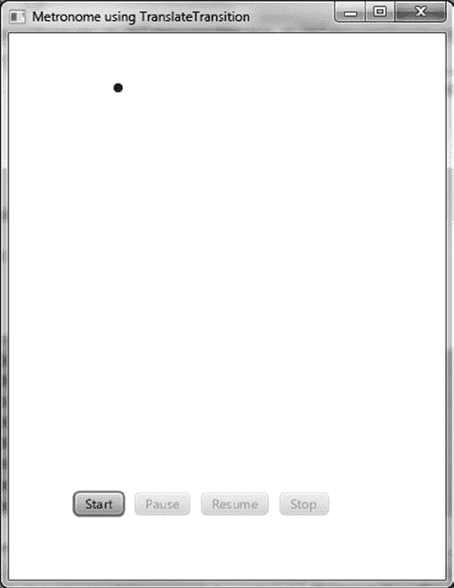

第 2 章 ■ 在 JavaFX 中创建用户界面

***图 2-9.** MetronomeTransition 程序*

该示例与前一个示例（Metronome1）的第一个明显区别是，我们不再让一条线的一端来回移动，而是让一个圆形节点来回移动。

**MetronomeTransition 程序的行为**

继续运行该程序，并执行与之前 Metronome1 练习中相同的步骤。

除了前面指出的视觉差异外，一切功能都应相同。

**理解 MetronomeTransition 程序**


在指出相关概念之前，我们先看一下清单 2-6 中 MetronomeTransition 程序的代码。

***清单 2-6.*** MetronomeTransitionMain.fx

package projavafx.metronometransition.ui;

import javafx.animation.Animation;

import javafx.animation.Interpolator;

import javafx.animation.TranslateTransition;

import javafx.application.Application;

[www.it-ebooks.info](http://www.it-ebooks.info/)

第 2 章 ■ 在 JavaFX 中创建用户界面

import javafx.scene.Group;

import javafx.scene.Scene;

import javafx.scene.control.Button;

import javafx.scene.layout.HBox;

import javafx.scene.paint.Color;

import javafx.scene.shape.Circle;

import javafx.stage.Stage;

import javafx.util.Duration;

public class MetronomeTransitionMain extends Application {

Button startButton;

Button pauseButton;

Button resumeButton;

Button stopButton;

Circle circle;

public static void main(String[] args) {

Application.launch(args);

}

@Override

public void start(Stage stage) {

circle = new Circle(100, 50, 4, Color.BLUE);

TranslateTransition anim = new TranslateTransition(new Duration(1000.0), circle);

anim.setFromX(0);

anim.setToX(200);

anim.setAutoReverse(true);

anim.setCycleCount(Animation.INDEFINITE);

anim.setInterpolator(Interpolator.LINEAR);

startButton = new Button("start");

startButton.setOnAction(e -> anim.playFromStart());

pauseButton = new Button("pause");

pauseButton.setOnAction(e -> anim.pause());

resumeButton = new Button("resume");

resumeButton.setOnAction(e -> anim.play());

stopButton = new Button("stop");

stopButton.setOnAction(e -> anim.stop());

HBox commands = new HBox(10, startButton,

pauseButton,

resumeButton,

stopButton);

commands.setLayoutX(60);

commands.setLayoutY(420);

Group group = new Group(circle, commands);

Scene scene = new Scene(group, 400, 500);

startButton.disableProperty().bind(anim.statusProperty()

.isNotEqualTo(Animation.Status.STOPPED));

pauseButton.disableProperty().bind(anim.statusProperty()

.isNotEqualTo(Animation.Status.RUNNING));

[www.it-ebooks.info](http://www.it-ebooks.info/)

第 2 章 ■ 在 JavaFX 中创建用户界面

resumeButton.disableProperty().bind(anim.statusProperty()

.isNotEqualTo(Animation.Status.PAUSED));

stopButton.disableProperty().bind(anim.statusProperty()

.isEqualTo(Animation.Status.STOPPED));

stage.setScene(scene);

stage.setTitle("Metronome using TranslateTransition");

stage.show();

}

}

使用 TranslateTransition 类

如下方来自清单 2-6 的代码片段所示，为了创建 TranslateTransition，我们提供的值与上一个示例中创建时间线时使用的值类似。例如，我们将 autoReverse 设置为 true，将 cycleCount 设置为 Animation.INDEFINITE。此外，就像为时间线创建 KeyFrame 时一样，我们在此处也提供了持续时间和插值类型。

除此之外，我们还为 TranslateTransition 特有的属性提供了一些值，即 fromX 和 toX。这些值会在请求的持续时间内进行插值，并赋值给该过渡所控制的节点的 layoutX 属性（在本例中，该节点是圆形）。如果我们还想实现垂直移动，为 fromY 和 toY 赋值将导致它们之间的插值被赋值给 layoutY 属性。

除了提供 toX 和 toY 值之外，另一种选择是为 byX 和 byY 属性提供值，这使你可以指定在每个方向上的移动距离，而不是起点和终点。此外，如果你没有为 fromX 提供值，插值将从节点 layoutX 属性的当前值开始。fromY 也是如此（如果未提供，插值将从 layoutY 的值开始）。

circle = new Circle(100, 50, 4, Color.BLUE);

TranslateTransition anim = new TranslateTransition(new Duration(1000.0), circle);

anim.setFromX(0);

anim.setToX(200);

anim.setAutoReverse(true);

anim.setCycleCount(Animation.INDEFINITE);

anim.setInterpolator(Interpolator.LINEAR);

控制与监控过渡


`TranslateTransition` 类与前面表 2-1 中的所有类一样，都扩展了 `javafx.animation.Transition` 类，而 `Transition` 类又扩展了 `Animation` 类。由于 `Timeline` 类也扩展了 `Animation` 类，因此通过对比清单 2-5 和 2-6 可以看出，本示例中所有按钮的代码都与上一个示例完全相同。实际上，启动、暂停、恢复和停止动画所需的功能都是在 `Animation` 类本身上定义的，并由 `Translation` 类以及 `Timeline` 类继承。

**MetronomePathTransition 示例**

如前文表 2-1 所示，`PathTransition` 是一个过渡类，它允许你沿着定义的几何路径移动节点。图 2-10 展示了一个名为 `MetronomePathTransition` 的节拍器示例版本的截图，该示例演示了如何使用 `PathTransition` 类。

[www.it-ebooks.info](http://www.it-ebooks.info/)

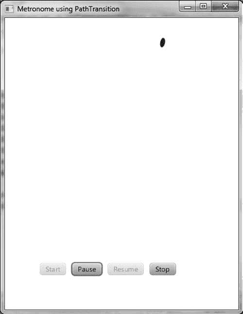

第 2 章 ■ 在 JavaFX 中创建用户界面

***图 2-10.** MetronomePathTransition 程序*

**MetronomePathTransition 程序的行为**

继续运行该程序，再次执行与 Metronome1 练习中相同的步骤。

除了节点是椭圆而不是圆形，并且节点沿着弧线路径移动之外，所有功能应与 MetronomeTransition 示例中的相同。

**理解 MetronomePathTransition 程序**

清单 2-7 包含了 MetronomePathTransition 程序中的代码片段，这些片段突出了与之前（MetronomeTransition）程序的不同之处。查看代码，然后我们将回顾相关概念。

***清单 2-7.*** MetronomePathTransitionMain.java 的部分代码

package projavafx.metronomepathtransition.ui;

**...省略导入...**

public class MetronomePathTransitionMain extends Application {

    Button startButton;

    Button pauseButton;

[www.it-ebooks.info](http://www.it-ebooks.info/)

第 2 章 ■ 在 JavaFX 中创建用户界面

    Button resumeButton;

    Button stopButton;

    Ellipse ellipse;

    Path path;

    public static void main(String[] args) {

        Application.launch(args);

    }

    @Override

    public void start(Stage stage) {

        ellipse = new Ellipse(100, 50, 4, 8);

        ellipse.setFill(Color.BLUE);

        path = new Path(

            new MoveTo(100, 50),

            new ArcTo(350, 350, 0, 300, 50, false, true)

        );

        PathTransition anim = new PathTransition(new Duration(1000.0), path, ellipse);

        anim.setOrientation(OrientationType.ORTHOGONAL_TO_TANGENT);

        anim.setInterpolator(Interpolator.LINEAR);

        anim.setAutoReverse(true);

        anim.setCycleCount(Timeline.INDEFINITE);

        startButton = new Button("start");

        startButton.setOnAction(e -> anim.playFromStart());

        pauseButton = new Button("pause");

        pauseButton.setOnAction(e -> anim.pause());

        resumeButton = new Button("resume");

        resumeButton.setOnAction(e -> anim.play());

        stopButton = new Button("stop");

        stopButton.setOnAction(e -> anim.stop());

        HBox commands = new HBox(10, startButton,

            pauseButton,

            resumeButton,

            stopButton);

        commands.setLayoutX(60);

        commands.setLayoutY(420);

        Group group = new Group(ellipse, commands);

        Scene scene = new Scene(group, 400, 500);

        startButton.disableProperty().bind(anim.statusProperty()

            .isNotEqualTo(Animation.Status.STOPPED));

        pauseButton.disableProperty().bind(anim.statusProperty()

            .isNotEqualTo(Animation.Status.RUNNING));

        resumeButton.disableProperty().bind(anim.statusProperty()

            .isNotEqualTo(Animation.Status.PAUSED));

        stopButton.disableProperty().bind(anim.statusProperty()

            .isEqualTo(Animation.Status.STOPPED));

        stage.setScene(scene);

        stage.setTitle("Metronome using PathTransition");

        stage.show();

    }

}

[www.it-ebooks.info](http://www.it-ebooks.info/)

第 2 章 ■ 在 JavaFX 中创建用户界面

**使用 PathTransition 类**

如清单 2-7 所示，定义 `PathTransition` 需要向 `path` 属性提供一个 `Path` 类型的实例，该实例表示节点将要移动的几何路径。这里我们创建了一个 `Path` 实例，它定义了一条弧线，起点在 x 轴 100 像素、y 轴 50 像素处，终点在 x 轴 300 像素、y 轴 50 像素处，水平和垂直半径均为 350 像素。这是通过创建一个包含 `MoveTo` 和 `ArcTo` 路径元素的 `Path` 来实现的。有关用于创建路径的 `PathElement` 类及其子类的更多信息，请参阅 JavaFX API 文档中的 `javafx.scene.shape` 包。

■ **提示** `ArcTo` 类中的属性除了 `sweepFlag` 之外都相当直观。如果 `sweepFlag` 为 `true`，则连接弧心与弧本身的线会沿着角度增大的方向扫过。否则，它会沿着角度减小的方向扫过。

`PathTransition` 类的另一个属性是 `orientation`，它控制节点的方向是保持不变，还是在沿路径移动时始终垂直于路径的切线。清单 2-7 使用了 `OrientationType.ORTHOGONAL_TO_TANGENT` 常量来实现后者，因为前者是默认行为。

**绘制椭圆**

如清单 2-7 所示，绘制 `Ellipse` 与绘制 `Circle` 类似，区别在于需要多一个半径（`radiusX` 和 `radiusY`，而不仅仅是 `radius`）。

现在你已经学会了如何通过创建时间线和创建过渡来为节点添加动画效果，我们将创建一个非常简单的 Pong 风格游戏，该游戏需要为乒乓球添加动画。在此过程中，你将学习如何检测球是否击中了游戏中的球拍或墙壁。

**节点碰撞检测的禅意**

在为节点添加动画时，有时需要知道节点何时与另一个节点发生了碰撞。为了演示这种能力，我们的同事 Chris Wright 开发了一个简单的 Pong 风格游戏，我们称之为 ZenPong。最初我们要求他只用一只球拍来构建游戏，这让人想起了著名的禅宗公案（哲学谜题）：“一只手鼓掌的声音是什么？” Chris 在开发这个游戏时玩得很开心，以至于他偷偷地加入了第二只球拍，但我们仍然将这个示例称为 ZenPong。图 2-11 展示了这个非常简单的游戏首次启动时的状态。

[www.it-ebooks.info](http://www.it-ebooks.info/)

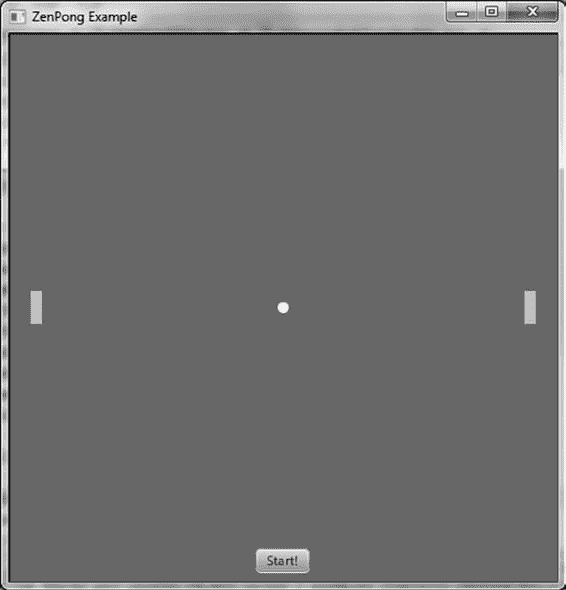

第 2 章 ■ 在 JavaFX 中创建用户界面

***图 2-11.** ZenPong 游戏的初始状态*

按照接下来的练习中的说明来尝试这个游戏，记住你要控制两个球拍（除非你能让同事共享你的键盘一起玩）。

**检查 ZenPong 游戏的行为**

程序启动时，其外观应类似于图 2-11 中的截图。要全面检查其行为，请执行以下步骤。

1.  在点击“开始”之前，垂直拖动每个球拍到其他位置。一个游戏作弊技巧是将左球拍向上拖，右球拍向下拖，这样它们就能在发球后处于有利位置来应对球。

2.  练习使用 **A** 键向上移动左球拍，**Z** 键向下移动左球拍，**L** 键向上移动右球拍，以及逗号 (**,**) 键向下移动右球拍。

3.  点击“开始”开始玩游戏。注意“开始”按钮消失，球开始以 45° 角移动，在球拍以及顶部和底部墙壁之间弹跳。屏幕应类似于图 2-12。

[www.it-ebooks.info](http://www.it-ebooks.info/)

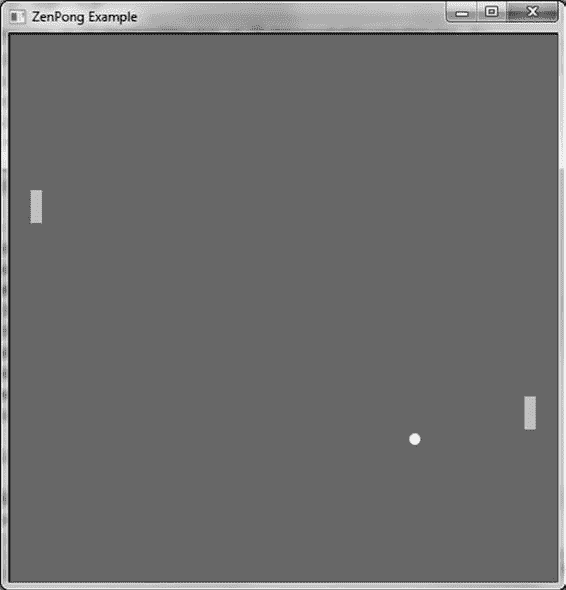

第 2 章 ■ 在 JavaFX 中创建用户界面

***图 2-12.** 运行中的 ZenPong 游戏*

4.  如果球击中了左侧或右侧的墙壁，你的其中一只手就输掉了游戏。注意游戏会重置，外观再次类似于图 2-11 中的截图。


现在你已经体验了 ZenPong 程序的行为，让我们来回顾一下其背后的代码。

理解 ZenPong 程序

在突出展示其中演示的一些概念之前，请先查看清单 2-8 中 ZenPong 程序的代码。

***清单 2-8.*** ZenPongMain.java

package projavafx.zenpong.ui;

**...导入部分已省略...**

public class ZenPongMain extends Application {

/**

* 移动球的中心点

*/

DoubleProperty centerX = new SimpleDoubleProperty();

DoubleProperty centerY = new SimpleDoubleProperty();

[www.it-ebooks.info](http://www.it-ebooks.info/)

第 2 章 ■ 在 JavaFX 中创建用户界面

/**

* 左侧挡板的 Y 坐标

*/

DoubleProperty leftPaddleY = new SimpleDoubleProperty();

/**

* 右侧挡板的 Y 坐标

*/

DoubleProperty rightPaddleY = new SimpleDoubleProperty();

/**

* 左右挡板的拖动锚点

*/

double leftPaddleDragAnchorY;

double rightPaddleDragAnchorY;

/**

* 左右挡板的初始 translateY 属性

*/

double initLeftPaddleTranslateY;

double initRightPaddleTranslateY;

/**

* 移动的球

*/

Circle ball;

/**

* 包含所有墙壁、挡板和球的组。这也

* 允许我们在该组上为按键事件请求焦点

*/

Group pongComponents;

/**

* 左右挡板

*/

Rectangle leftPaddle;

Rectangle rightPaddle;

/**

* 墙壁

*/

Rectangle topWall;

Rectangle rightWall;

Rectangle leftWall;

Rectangle bottomWall;

Button startButton;

[www.it-ebooks.info](http://www.it-ebooks.info/)

第 2 章 ■ 在 JavaFX 中创建用户界面

/**

* 控制 startButton 是否可见

*/

BooleanProperty startVisible = new SimpleBooleanProperty(true);

/**

* 球的动画

*/

Timeline pongAnimation;

/**

* 控制球是否向右移动

*/

boolean movingRight = true;

/**

* 控制球是否向下移动

*/

boolean movingDown = true;

/**

* 设置球和挡板的初始起始位置

*/

void initialize() {

centerX.setValue(250);

centerY.setValue(250);

leftPaddleY.setValue(235);

rightPaddleY.setValue(235);

startVisible.set(true);

pongComponents.requestFocus();

}

/**

* 检查球是否与挡板、topWall 或 bottomWall 发生碰撞。如果球击中了挡板后面的墙壁，则

* 游戏结束。

*/

void checkForCollision() {

if (ball.intersects(rightWall.getBoundsInLocal())

|| ball.intersects(leftWall.getBoundsInLocal())) {

pongAnimation.stop();

initialize();

} else if (ball.intersects(bottomWall.getBoundsInLocal())

|| ball.intersects(topWall.getBoundsInLocal())) {

movingDown = !movingDown;

} else if (ball.intersects(leftPaddle.getBoundsInParent()) && !movingRight) {

movingRight = !movingRight;

} else if (ball.intersects(rightPaddle.getBoundsInParent()) && movingRight) {

movingRight = !movingRight;

}

}

[www.it-ebooks.info](http://www.it-ebooks.info/)

第 2 章 ■ 在 JavaFX 中创建用户界面

/**

* @param args 命令行参数

*/

public static void main(String[] args) {

Application.launch(args);

}

@Override

public void start(Stage stage) {

pongAnimation = new Timeline(

new KeyFrame(new Duration(10.0), t -> {

checkForCollision();

int horzPixels = movingRight ? 1 : -1;

int vertPixels = movingDown ? 1 : -1;

centerX.setValue(centerX.getValue() + horzPixels);

centerY.setValue(centerY.getValue() + vertPixels);

})

);

pongAnimation.setCycleCount(Timeline.INDEFINITE);

ball = new Circle(0, 0, 5, Color.WHITE);

topWall = new Rectangle(0, 0, 500, 1);

leftWall = new Rectangle(0, 0, 1, 500);

rightWall = new Rectangle(500, 0, 1, 500);

bottomWall = new Rectangle(0, 500, 500, 1);

leftPaddle = new Rectangle(20, 0, 10, 30);

leftPaddle.setFill(Color.LIGHTBLUE);

leftPaddle.setCursor(Cursor.HAND);

leftPaddle.setOnMousePressed(me -> {

initLeftPaddleTranslateY = leftPaddle.getTranslateY();

leftPaddleDragAnchorY = me.getSceneY();

});

leftPaddle.setOnMouseDragged(me -> {

double dragY = me.getSceneY() - leftPaddleDragAnchorY;

leftPaddleY.setValue(initLeftPaddleTranslateY + dragY);

});

rightPaddle = new Rectangle(470, 0, 10, 30);

rightPaddle.setFill(Color.LIGHTBLUE);


rightPaddle.setCursor(Cursor.CLOSED_HAND);

rightPaddle.setOnMousePressed(me -> {

initRightPaddleTranslateY = rightPaddle.getTranslateY();

rightPaddleDragAnchorY = me.getSceneY();

});

rightPaddle.setOnMouseDragged(me -> {

double dragY = me.getSceneY() - rightPaddleDragAnchorY;

rightPaddleY.setValue(initRightPaddleTranslateY + dragY);

});

startButton = new Button("开始！");

startButton.setLayoutX(225);

startButton.setLayoutY(470);

startButton.setOnAction(e -> {

startVisible.set(false);

[www.it-ebooks.info](http://www.it-ebooks.info/)

第 2 章 ■ 在 JavaFX 中创建用户界面

pongAnimation.playFromStart();

pongComponents.requestFocus();

});

pongComponents = new Group(ball,

topWall,

leftWall,

rightWall,

bottomWall,

leftPaddle,

rightPaddle,

startButton);

pongComponents.setFocusTraversable(true);

pongComponents.setOnKeyPressed(k -> {

if (k.getCode() == KeyCode.SPACE

&& pongAnimation.statusProperty()

.equals(Animation.Status.STOPPED)) {

rightPaddleY.setValue(rightPaddleY.getValue() - 6);

} else if (k.getCode() == KeyCode.L

&& !rightPaddle.getBoundsInParent().intersects(topWall.getBoundsInLocal())) {

rightPaddleY.setValue(rightPaddleY.getValue() - 6);

} else if (k.getCode() == KeyCode.COMMA

&& !rightPaddle.getBoundsInParent().intersects(bottomWall.getBoundsInLocal())) {

rightPaddleY.setValue(rightPaddleY.getValue() + 6);

} else if (k.getCode() == KeyCode.A

&& !leftPaddle.getBoundsInParent().intersects(topWall.getBoundsInLocal())) {

leftPaddleY.setValue(leftPaddleY.getValue() - 6);

} else if (k.getCode() == KeyCode.Z

&& !leftPaddle.getBoundsInParent().intersects(bottomWall.getBoundsInLocal())) {

leftPaddleY.setValue(leftPaddleY.getValue() + 6);

}

});

Scene scene = new Scene(pongComponents, 500, 500);

scene.setFill(Color.GRAY);

ball.centerXProperty().bind(centerX);

ball.centerYProperty().bind(centerY);

leftPaddle.translateYProperty().bind(leftPaddleY);

rightPaddle.translateYProperty().bind(rightPaddleY);

startButton.visibleProperty().bind(startVisible);

stage.setScene(scene);

initialize();

stage.setTitle("ZenPong 示例");

stage.show();

}

}

[www.it-ebooks.info](http://www.it-ebooks.info/)

第 2 章 ■ 在 JavaFX 中创建用户界面

使用 KeyFrame 动作事件处理器

我们在时间线中使用的技术与本章前面演示的 Metronome1 程序（见图 2-8 和清单 2-5）不同。我们没有在一段时间内对两个值进行插值，而是在时间线中使用了 KeyFrame 实例的动作事件处理器。请查看清单 2-8 中的以下片段，了解该技术的实际应用。

pongAnimation = new Timeline(

new KeyFrame(new Duration(10.0), t -> {

checkForCollision();

int horzPixels = movingRight ? 1 : -1;

int vertPixels = movingDown ? 1 : -1;

centerX.setValue(centerX.getValue() + horzPixels);

centerY.setValue(centerY.getValue() + vertPixels);

})

);

pongAnimation.setCycleCount(Timeline.INDEFINITE);

如片段所示，我们只使用了一个 KeyFrame，并且它的时间非常短（10 毫秒）。

当一个 KeyFrame 拥有动作事件处理器时，该处理器中的代码（本例中同样是一个 lambda 表达式）会在该 KeyFrame 的时间到达时执行。由于此时间线的 cycleCount 是无限的，因此动作事件处理器将每 10 毫秒执行一次。此事件处理器中的代码执行两项操作：

• 调用一个名为 checkForCollision() 的方法（该方法在此程序中定义），其目的是检查球是否与任一球拍或任何墙壁发生了碰撞
• 更新模型中与球位置绑定的属性，同时考虑球当前移动的方向

使用节点 **intersects()** 方法检测碰撞

请查看清单 2-8 中以下片段内的 checkForCollision() 方法，了解我们如何通过检测两个节点何时相交（共享任何相同像素）来检查碰撞。

void checkForCollision() {

if (ball.intersects(rightWall.getBoundsInLocal()) ||


ball.intersects(leftWall.getBoundsInLocal())) {

pongAnimation.stop();

initialize();

}

else if (ball.intersects(bottomWall.getBoundsInLocal()) ||

ball.intersects(topWall.getBoundsInLocal())) {

movingDown = !movingDown;

}

else if (ball.intersects(leftPaddle.getBoundsInParent()) && !movingRight) {

movingRight = !movingRight;

}

else if (ball.intersects(rightPaddle.getBoundsInParent()) && movingRight) {

movingRight = !movingRight;

}

}

[www.it-ebooks.info](http://www.it-ebooks.info/)

第 2 章 ■ 在 JavaFX 中创建用户界面

此处展示的 Node 类的 `intersects()` 方法接受一个 `Bounds` 类型的参数，该参数位于 `javafx.geometry` 包中。它表示节点的矩形边界，例如前面代码片段中所示的 `leftPaddle` 节点。请注意，为了获取包含左挡板的 Group 中左挡板的位置，我们使用了 `leftPaddle`（一个 `Rectangle`）从 `Node` 类继承的 `boundsInParent` 属性。

前面代码片段中 `intersect` 方法调用的最终结果如下。

• 如果球与 `rightWall` 或 `leftWall` 的边界相交，则 `pongAnimation` `Timeline` 会停止，并初始化游戏以进行下一轮。请注意，`rightWall` 和 `leftWall` 节点是场景左右两侧宽度为一个像素的矩形。请查看清单 2-8 以了解这些节点的定义位置。

• 如果球与 `bottomWall` 或 `topWall` 的边界相交，则球的垂直方向将通过取反程序的布尔变量 `movingDown` 来改变。

• 如果球与 `leftPaddle` 或 `rightPaddle` 的边界相交，则球的水平方向将通过取反程序的布尔变量 `movingRight` 来改变。

■ **提示** 有关 `boundsInParent` 及其相关属性 `layoutBounds` 和 `boundsInLocal` 的更多信息，请参阅 JavaFX API 文档中 `javafx.scene.Node` 类开头的“边界矩形”讨论。

例如，一种常见的做法是通过表达式 `myNode.getLayoutBounds().getWidth()` 或 `myNode.getLayoutBounds().getHeight()` 来获取节点的宽度或高度。

拖拽节点

正如您之前所体验到的，ZenPong 应用程序的挡板可以通过鼠标拖拽。以下来自清单 2-8 的代码片段展示了如何在 ZenPong 中实现拖拽右挡板的功能。

DoubleProperty **rightPaddleY** = new SimpleDoubleProperty();

...代码省略...

double rightPaddleDragStartY;

double rightPaddleDragAnchorY;

...代码省略...

void initialize() {

...代码省略...

rightPaddleY.setValue(235);

}

**...代码省略...**

rightPaddle = new Rectangle(470, 0, 10, 30);

rightPaddle.setFill(Color.LIGHTBLUE);

rightPaddle.setCursor(Cursor.CLOSED_HAND);

rightPaddle.setOnMousePressed(me -> {

initRightPaddleTranslateY = rightPaddle.getTranslateY();

rightPaddleDragAnchorY = me.getSceneY();

});

[www.it-ebooks.info](http://www.it-ebooks.info/)

第 2 章 ■ 在 JavaFX 中创建用户界面

rightPaddle.setOnMouseDragged(me -> {

double dragY = me.getSceneY() - rightPaddleDragAnchorY;

rightPaddleY.setValue(initRightPaddleTranslateY + dragY);

});

**...代码省略...**

rightPaddle.translateYProperty().bind(rightPaddleY);

请注意，在此 ZenPong 示例中，我们仅垂直拖拽挡板，而非水平拖拽。因此，代码片段仅处理 y 轴上的拖拽。在初始位置创建挡板后，我们为 `MousePressed` 和 `MouseDragged` 事件注册了事件处理器。后者操作 `rightPaddleY` 属性，该属性用于沿 y 轴平移挡板。属性和绑定将在第 4 章中详细解释。

为节点赋予键盘输入焦点

为了使节点能够接收按键事件，它必须拥有键盘焦点。在 ZenPong 示例中，通过执行以下两项操作来实现这一点，如下面来自清单 2-8 的代码片段所示：

• 将 `Group` 节点的 `focusTraversable` 属性设置为 `true`。这允许该节点接受键盘焦点。


• 调用 Group 节点（由 `pongComponents` 变量引用）的 `requestFocus()` 方法。这会请求该节点获取焦点。

■ **提示** 你无法直接设置 Stage 的 `focused` 属性值。查阅 API 文档也会发现，你无法设置 Node（例如我们正在讨论的 Group）的 `focused` 属性值。然而，正如刚才提到的第二点所述，你可以在节点上调用 `requestFocus()` 方法，如果请求被批准（且 `focusTraversable` 为 true），则会将 `focused` 属性设置为 true。顺便提一下，Stage 没有 `requestFocus()` 方法，但它有一个 `toFront()` 方法，这应该能使其获得键盘焦点。

**...代码省略...**

pongComponents.setFocusTraversable(true);

pongComponents.setOnKeyPressed(k -> {

if (k.getCode() == KeyCode.SPACE

&& pongAnimation.statusProperty()

.equals(Animation.Status.STOPPED)) {

rightPaddleY.setValue(rightPaddleY.getValue() - 6);

} else if (k.getCode() == KeyCode.L

&& !rightPaddle.getBoundsInParent().intersects(topWall.getBoundsInLocal())) {

rightPaddleY.setValue(rightPaddleY.getValue() - 6);

} else if (k.getCode() == KeyCode.COMMA

&& !rightPaddle.getBoundsInParent().intersects(bottomWall.getBoundsInLocal())) {

rightPaddleY.setValue(rightPaddleY.getValue() + 6);

} else if (k.getCode() == KeyCode.A

&& !leftPaddle.getBoundsInParent().intersects(topWall.getBoundsInLocal())) {

leftPaddleY.setValue(leftPaddleY.getValue() - 6);

[www.it-ebooks.info](http://www.it-ebooks.info/)

第 2 章 ■ 在 JavaFX 中创建用户界面

} else if (k.getCode() == KeyCode.Z

&& !leftPaddle.getBoundsInParent().intersects(bottomWall.getBoundsInLocal())) {

leftPaddleY.setValue(leftPaddleY.getValue() + 6);

}

});

现在节点已获得焦点，当用户与键盘交互时，相应的事件处理器将被调用。在此示例中，我们关注的是按下特定按键时的情况，接下来将对此进行讨论。

使用 onKeyPressed 事件处理器

当用户按下某个键时，提供给 `onKeyPressed` 方法的 lambda 表达式会被调用，并传入一个包含事件信息的 `KeyEvent` 实例。该表达式的方法体（如前面清单 2-8 的代码片段所示）会将 `KeyEvent` 实例的 `getCode()` 方法与代表方向键的 `KeyCode` 常量进行比较，以确定按下的是哪个键。

总结

恭喜！在本章中，你学到了很多关于在 JavaFX 中创建 UI 的知识，包括以下内容。

• 在 JavaFX 中创建 UI（我们大致以创作舞台剧为比喻），通常包括创建舞台、场景、节点、模型和事件处理器，并对部分节点进行动画处理
• 关于使用 Stage 类大部分属性和方法的详细信息，包括如何创建一个没有窗口装饰的透明 Stage
• 如何使用 HBox 和 VBox 布局容器分别将节点水平或垂直排列
• 关于使用 Scene 类许多属性和方法的详细信息
• 如何通过将一个或多个样式表关联到 Scene，在程序中创建 CSS 样式并将其应用于节点
• 如何处理键盘和鼠标输入事件
• 如何使用 Timeline 类和过渡类对场景中的节点进行动画处理
• 如何检测场景中的节点何时发生碰撞

在第 3 章中，我们将讨论创建 UI 的另一种方法，这次将使用 SceneBuilder。

然后，在第 4 章中，我们将更深入地探讨属性和绑定的领域。

资源

有关创建 JavaFX UI 的更多信息，你可以查阅以下资源。

• JavaFX 8 SDK 在线文档：[`download.java.net/jdk8/jfxdocs/`](http://download.java.net/jdk8/jfxdocs/)
• JavaFX 8 CSS 参考指南：[`docs.oracle.com/javase/8/javafx/api/javafx/`](http://docs.oracle.com/javase/8/javafx/api/javafx/scene/doc-files/cssref.html)

[scene/doc-files/cssref.html](http://docs.oracle.com/javase/8/javafx/api/javafx/scene/doc-files/cssref.html)


• w3schools.com 的 CSS 教程：[`www.w3schools.com/css`](http://www.w3schools.com/css)

[www.it-ebooks.info](http://www.it-ebooks.info/)

**第 3 章**

**使用 SceneBuilder 创建**

**用户界面**

*给我一个足够长的杠杆和一个支点，我就能撬动地球。*

——阿基米德

在第 2 章中，你了解了创建 JavaFX UI 的两种方式：编程方式和声明方式，以及如何使用 JavaFX API 以编程方式创建 UI。你已经熟悉了 JavaFX UI 的剧场隐喻，其中 Stage 代表 Windows、Mac 或 Linux 程序中的窗口，或移动设备中的触摸屏，Scene 及其包含的 Node 代表 UI 的内容。在本章中，我们将探讨 JavaFX 中 UI 的另一面：UI 的声明式创建。

这种 UI 设计方法的核心是 FXML 文件。它是一种专门为保存 UI 元素信息而设计的 XML 文件格式。它包含 UI 元素的“是什么”，但不包含“怎么做”。这就是为什么这种创建 JavaFX UI 的方法被称为*声明式*。FXML 本质上是一种 Java 对象序列化格式，可用于任何以特定方式编写的 Java 类，包括所有旧式 JavaBean。然而，在实践中，它仅用于指定 JavaFX UI。

除了在文本编辑器或你喜欢的 Java 集成开发环境（IDE）中直接编辑外，FXML 文件还可以通过一个名为 JavaFX SceneBuilder 的图形化工具进行操作，该工具专为处理 FXML 文件而设计。

JavaFX SceneBuilder 1.0 于 2012 年 8 月发布，JavaFX SceneBuilder 1.1 于 2013 年 9 月发布。1.0 和 1.1 版本均适用于 JavaFX 2。JavaFX SceneBuilder 2.0 于 2014 年 5 月发布，适用于 JavaFX 8。JavaFX SceneBuilder 2.0 的代码库已作为开源发布。JavaFX SceneBuilder 是一个完全图形化的工具，允许你从可用的容器、控件和其他可视化节点的调色板中绘制 UI 屏幕，并通过直接在屏幕上操作以及通过属性编辑器修改其属性来进行布局。

FXML 文件由 JavaFX 运行时使用 FXMLLoader 类加载到 JavaFX 应用程序中。加载 FXML 文件的结果始终是一个 Java 对象，通常是一个容器 Node，例如 Group 或 Pane。此对象可用作 Scene 的根节点，或作为节点附加到更大的编程方式创建的场景图中。对于 JavaFX 应用程序的其他部分，从 FXML 文件加载的节点与编程方式构造的节点没有区别。

我们将以螺旋式递进的方式，介绍关于 FXML 文件的内容和格式、它们在运行时如何加载以及在设计时如何构建这些相互关联的材料。本章首先从一个完整的示例开始，展示第 2 章中清单 2-1 的 StageCoach 程序如何使用 FXML 实现。然后，我们将详细介绍 FXML 加载机制。接着，我们将展示一系列手工制作的 FXML 文件，以突出 FXML 文件格式的所有特性。一旦你理解了 FXML 文件格式，我们将向你展示如何使用 JavaFX SceneBuilder 创建这些 FXML 文件，涵盖 JavaFX SceneBuilder 2.0 的所有功能。

[www.it-ebooks.info](http://www.it-ebooks.info/)

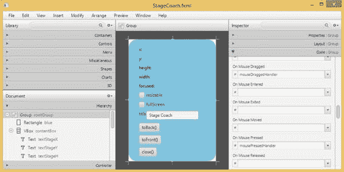

第 3 章 ■ 使用 SceneBuilder 创建用户界面

■ **注意** 你需要从 [`www.oracle.com/technetwork/java/javase/downloads/javafxscenebuilder-info-2157684.html`](http://www.oracle.com/technetwork/java/javase/downloads/javafxscenebuilder-info-2157684.html) 下载并安装 Oracle 的开源 JavaFX SceneBuilder 2.0，才能完成本章中的示例。我们还强烈建议你配置你喜欢的 IDE 以使用 JavaFX SceneBuilder 2.0 来编辑 FXML 文件。NetBeans 和 IntelliJ IDEA 已捆绑了 JavaFX 支持。Eclipse 用户可以安装 e(fx)clipse 插件。


配置完成后，你可以在 IDE 中右键点击项目中的任意 fXML 文件，然后选择“使用 SceneBuilder 编辑”上下文菜单项。当然，你也可以使用 IDE 的 XML 文件编辑功能，将 fXML 文件作为 XML 文件进行编辑。

使用 FXML 设置舞台

将第 2 章中的 StageCoach 程序从使用程序化创建的 UI 转换为使用声明式创建的 UI 的过程非常直接。

使用 JavaFX SceneBuilder 以图形方式创建用户界面

我们首先使用 JavaFX SceneBuilder 创建了一个 FXML 文件，该文件代表了场景的根节点。图 3-1 展示了此 UI 正在创建时的截图。

***图 3-1.** 在 JavaFX SceneBuilder 中创建的 StageCoach.fxml*

我们将在本章后半部分详细介绍如何使用 JavaFX SceneBuilder。现在，只需观察该工具的主要功能区域。中间是内容面板，显示了正在处理的 UI 的外观。左侧上方是库面板，其中包含了所有可以在内容面板中使用的节点，并整齐地划分为容器、控件、形状、图表等子集；下方是文档面板，它以树形结构显示了内容面板中正在处理的场景图，该结构称为层次结构，以及为 UI 中各种控件提供事件处理代码的控制器。右侧是检查器区域，它包含多个子区域，允许你操作当前选中控件的属性、布局和代码连接。

理解 FXML 文件

清单 3-1 显示了 JavaFX SceneBuilder 根据我们创建的 UI 保存的 FXML 文件。

***清单 3-1.*** StageCoach.fxml

<?xml version="1.0" encoding="UTF-8"?>

<?import javafx.scene.control.Button?>

<?import javafx.scene.control.CheckBox?>

<?import javafx.scene.control.Label?>

<?import javafx.scene.control.TextField?>

<?import javafx.scene.Group?>

<?import javafx.scene.layout.HBox?>

<?import javafx.scene.layout.VBox?>

<?import javafx.scene.shape.Rectangle?>

<?import javafx.scene.text.Text?>

<Group fx:id="rootGroup"

onMouseDragged="#mouseDraggedHandler"

onMousePressed="#mousePressedHandler"

xmlns=" [`javafx.com/javafx/8`](http://javafx.com/javafx/8)"

xmlns:fx=" [`javafx.com/fxml/1"`](http://javafx.com/fxml/1)

fx:controller="projavafx.stagecoach.ui.StageCoachController">

<children>

<Rectangle fx:id="blue"

arcHeight="50.0"

arcWidth="50.0"

fill="SKYBLUE"

height="350.0"

strokeType="INSIDE"

width="250.0"/>

<VBox fx:id="contentBox"

layoutX="30.0"

layoutY="20.0"

spacing="10.0">

<children>

<Text fx:id="textStageX"

strokeType="OUTSIDE"

strokeWidth="0.0"

text="x:"

textOrigin="TOP"/>

<Text fx:id="textStageY"

layoutX="10.0"

layoutY="23.0"

strokeType="OUTSIDE"

strokeWidth="0.0"

text="y:"

textOrigin="TOP"/>

[www.it-ebooks.info](http://www.it-ebooks.info/)

第三章 ■ 使用 SceneBuilder 创建用户界面

<Text fx:id="textStageH"

layoutX="10.0"

layoutY="50.0"

strokeType="OUTSIDE"

strokeWidth="0.0"

text="height:"

textOrigin="TOP"/>

<Text fx:id="textStageW"

layoutX="10.0"

layoutY="77.0"

strokeType="OUTSIDE"

strokeWidth="0.0"

text="width:"

textOrigin="TOP"/>

<Text fx:id="textStageF"

layoutX="10.0"

layoutY="104.0"

strokeType="OUTSIDE"

strokeWidth="0.0"

text="focused:"

textOrigin="TOP"/>

<CheckBox fx:id="checkBoxResizable"

mnemonicParsing="false"

text="resizable"/>

<CheckBox fx:id="checkBoxFullScreen"

mnemonicParsing="false"

text="fullScreen"/>

<HBox fx:id="titleBox">

<children>

<Label fx:id="titleLabel"

text="title"/>

<TextField fx:id="titleTextField"

text="Stage Coach"/>

</children>

</HBox>

<Button fx:id="toBackButton"

mnemonicParsing="false"

onAction="#toBackEventHandler"

text="toBack()"/>

<Button fx:id="toFrontButton"

mnemonicParsing="false"

onAction="#toFrontEventHandler"

text="toFront()"/>

<Button fx:id="closeButton"

mnemonicParsing="false"

onAction="#closeEventHandler"

text="close()"/>

</children>

</VBox>

</children>


</Group>

[www.it-ebooks.info](http://www.it-ebooks.info/)

第 3 章 ■ 使用 SceneBuilder 创建用户界面

■ **注意** JavaFX SceneBuilder 生成的 FXML 文件行较长。我们对 FXML 文件进行了重新格式化，以适配本书页面。

该 FXML 文件的大部分内容可以直观理解：它表示一个包含两个子节点（一个 Rectangle 和一个 VBox）的 Group。VBox 又包含五个 Text 节点、两个 CheckBox、一个 HBox 和三个 Button。HBox 包含一个 Label 和一个 TextField。这些节点的各种属性被设置为合理的值；例如，三个 Button 的文本分别设置为"toBack()"、"toFront()"和"close()"。

该 FXML 文件中的某些结构需要稍作解释。文件顶部的 XML 处理指令

<?import javafx.scene.control.Button?>

<?import javafx.scene.control.CheckBox?>

<?import javafx.scene.control.Label?>

<?import javafx.scene.control.TextField?>

<?import javafx.scene.Group?>

<?import javafx.scene.layout.HBox?>

<?import javafx.scene.layout.VBox?>

<?import javafx.scene.shape.Rectangle?>

<?import javafx.scene.text.Text?>

告知该文件的消费者（设计时的 JavaFX SceneBuilder 或运行时的 FXMLLoader）导入所提及的 Java 类。这些指令与 Java 源文件中的 import 指令具有相同效果。

顶层元素 Group 提供了两个命名空间声明。JavaFX SceneBuilder 会将这些命名空间放入其创建的每个 FXML 文件中：

xmlns:fx=" [`javafx.com/fxml/1"`](http://javafx.com/fxml/1)

**警告**

■

FXML 文件不会针对任何 XML 模式进行验证。此处指定的命名空间由 FXMLLoader、JavaFX SceneBuilder 以及 NetBeans、Eclipse 和 IntelliJ IDEA 等 Java IDE 使用，以便在编辑 FXML 文件时提供辅助。实际的前缀（第一个命名空间为空字符串，第二个命名空间为“fx”）不应更改。

此 FXML 文件包含两种带有 fx 前缀的属性：fx:controller 和 fx:id。fx:controller 属性出现在顶层元素 Group 上。它告知 JavaFX 运行时，当前 FXML 文件中设计的 UI 旨在与一个称为其*控制器*的 Java 类协同工作：

fx:controller="projavafx.stagecoach.ui.StageCoachController"

[www.it-ebooks.info](http://www.it-ebooks.info/)

第 3 章 ■ 使用 SceneBuilder 创建用户界面

上述属性声明 StageCoach.fxml 将与 Java 类 projavafx.stagecoach.ui.StageCoachController 协同工作。fx:id 属性可以出现在每个表示 JavaFX 节点的元素中。fx:id 的值是控制器中代表该节点（在 FXML 文件加载后）的字段名称。StageCoach.fxml 文件声明了以下 fx:id（仅显示包含 fx:id 属性的行）：

<Group fx:id="rootGroup"

<Rectangle fx:id="blue"

<VBox fx:id="contentBox"

<Text fx:id="textStageX"

<Text fx:id="textStageY"

<Text fx:id="textStageH"

<Text fx:id="textStageW"

<Text fx:id="textStageF"

<CheckBox fx:id="checkBoxResizable"

<CheckBox fx:id="checkBoxFullScreen"

<HBox fx:id="titleBox">

<Label fx:id="titleLabel"

<TextField fx:id="titleTextField"

<Button fx:id="toBackButton"

<Button fx:id="toFrontButton"

<Button fx:id="closeButton"

因此，在 FXMLLoader 完成加载 FXML 文件后，FXML 文件中的顶层 Group 节点可以在 Java 代码中作为 StageCoachController 类的 rootGroup 字段进行访问和操作。在此 FXML 文件中，我们为创建的所有节点都分配了 fx:id。这仅用于说明目的。如果没有理由以编程方式操作某个节点（例如静态标签的情况），则可以省略 fx:id 属性以及控制器中对应的字段。

为 FXML 文件中的节点提供编程访问是控制器扮演的角色之一。控制器扮演的另一个角色是提供处理来自 FXML 文件中节点的用户输入和交互事件的方法。这些事件处理器由名称以“on”开头的属性指定，例如 onMouseDragged、onMousePressed 和 onAction。它们对应于 Node 类或其子类中的 setOnMouseDragged()、setOnMousePressed()和 setOnAction()方法。要将事件处理器设置为控制器中的方法，请使用以“#”字符开头的方法名称作为 onMouseDragged、onMousePressed 和 onAction 属性的值。StageCoach.fxml 文件声明了以下事件处理器（仅显示包含事件处理器的行）：

<Group fx:id="rootGroup"

onMouseDragged="#mouseDraggedHandler"

onMousePressed="#mousePressedHandler"

<Button fx:id="toBackButton"

onAction="#toBackEventHandler"

<Button fx:id="toFrontButton"

onAction="#toFrontEventHandler"

<Button fx:id="closeButton"

onAction="#closeEventHandler"

控制器类中的事件处理方法通常应符合 EventHandler<T>接口中单一方法的签名

void handle(T event)

[www.it-ebooks.info](http://www.it-ebooks.info/)

第 3 章 ■ 使用 SceneBuilder 创建用户界面

其中 T 是适当的事件对象，对于 onMouseDragged 和 onMousePressed 事件处理器为 MouseEvent，对于 onAction 事件处理器为 ActionEvent。不接受任何参数的方法也可以设置为事件处理方法。如果您不打算使用事件对象，则可以使用此类方法。

现在我们已经理解了 FXML 文件，接下来将介绍控制器类。

理解控制器

清单 3-2 显示了与我们在上一小节中创建的 FXML 文件协同工作的控制器类。

***清单 3-2.*** StageCoachController.java

package projavafx.stagecoach.ui;

import javafx.beans.property.SimpleStringProperty;

import javafx.beans.property.StringProperty;

import javafx.event.ActionEvent;

import javafx.fxml.FXML;

import javafx.scene.control.Button;

import javafx.scene.control.CheckBox;

import javafx.scene.control.Label;

import javafx.scene.control.TextField;

import javafx.scene.input.MouseEvent;

import javafx.scene.layout.HBox;

import javafx.scene.layout.VBox;

import javafx.scene.shape.Rectangle;

import javafx.scene.text.Text;

import javafx.stage.Stage;

import javafx.stage.StageStyle;

public class StageCoachController {

@FXML

private Rectangle blue;

@FXML

private VBox contentBox;

@FXML

private Text textStageX;

@FXML

private Text textStageY;

@FXML

private Text textStageH;

@FXML

private Text textStageW;

@FXML

private Text textStageF;

[www.it-ebooks.info](http://www.it-ebooks.info/)

第 3 章 ■ 使用 SceneBuilder 创建用户界面

@FXML

private CheckBox checkBoxResizable;

@FXML

private CheckBox checkBoxFullScreen;

@FXML

private HBox titleBox;

@FXML

private Label titleLabel;

@FXML

private TextField titleTextField;

@FXML

private Button toBackButton;

@FXML

private Button toFrontButton;

@FXML

private Button closeButton;

private Stage stage;

private StringProperty title = new SimpleStringProperty();

private double dragAnchorX;

private double dragAnchorY;

public void setStage(Stage stage) {

this.stage = stage;

}

public void setupBinding(StageStyle stageStyle) {

checkBoxResizable.setDisable(stageStyle == StageStyle.TRANSPARENT

|| stageStyle == StageStyle.UNDECORATED);

textStageX.textProperty().bind(new SimpleStringProperty("x: ")

.concat(stage.xProperty().asString()));

textStageY.textProperty().bind(new SimpleStringProperty("y: ")

.concat(stage.yProperty().asString()));

textStageW.textProperty().bind(new SimpleStringProperty("width: ")

.concat(stage.widthProperty().asString()));

textStageH.textProperty().bind(new SimpleStringProperty("height: ")

.concat(stage.heightProperty().asString()));

textStageF.textProperty().bind(new SimpleStringProperty("focused: ")

.concat(stage.focusedProperty().asString()));

stage.setResizable(true);


checkBoxResizable.selectedProperty()

.bindBidirectional(stage.resizableProperty());

checkBoxFullScreen.selectedProperty().addListener((ov, oldValue, newValue) ->

stage.setFullScreen(checkBoxFullScreen.selectedProperty().getValue()));

[www.it-ebooks.info](http://www.it-ebooks.info/)

第 3 章 ■ 使用 SceneBuilder 创建用户界面

title.bind(titleTextField.textProperty());

stage.titleProperty().bind(title);

stage.initStyle(stageStyle);

}

@FXML

public void toBackEventHandler(ActionEvent e) {

stage.toBack();

}

@FXML

public void toFrontEventHandler(ActionEvent e) {

stage.toFront();

}

@FXML

public void closeEventHandler(ActionEvent e) {

stage.close();

}

@FXML

public void mousePressedHandler(MouseEvent me) {

dragAnchorX = me.getScreenX() - stage.getX();

dragAnchorY = me.getScreenY() - stage.getY();

}

@FXML

public void mouseDraggedHandler(MouseEvent me) {

stage.setX(me.getScreenX() - dragAnchorX);

stage.setY(me.getScreenY() - dragAnchorY);

}

}

该类是从第 2 章的`StageCoachMain`类中提取出来的，并且是我们为 FXML 文件`StageCoach.fxml`指定的控制器类。实际上，它包含了与 FXML 文件中`fx:ids`匹配的类型和名称的字段。它还包含了名称和签名与 FXML 文件中各个节点的事件处理程序相匹配的方法。

唯一需要解释的是`@FXML`注解。它属于`javafx.fxml`包。这是一个标记注解，具有运行时保留策略，可以应用于字段和方法。当应用于字段时，`@FXML`注解告诉 JavaFX SceneBuilder，该字段的名称可以用作 FXML 文件中适当类型元素的`fx:id`。当应用于方法时，`@FXML`注解告诉 JavaFX SceneBuilder，该方法的名称可以用作适当类型事件处理程序属性的值。无论修饰符如何，使用`@FXML`注解的字段和方法都对 FXML 加载机制可访问。因此，将所有`@FXML`注解的字段从`public`改为`private`是安全的，不会对 FXML 加载过程产生不利影响。

`StageCoachController`类包含了与 FXML 文件中声明的所有`fx:ids`相匹配的字段。它还包含了 FXML 文件中事件处理程序属性所指向的五个事件处理方法。所有这些字段和方法都使用了`@FXML`注解。

`StageCoachController`还包含了一些未使用`@FXML`注解的字段和方法。这些字段和方法存在于类中是为了其他目的。例如，`stage`字段、`setStage()`和`setupBindings()`方法直接在 Java 代码中使用。

[www.it-ebooks.info](http://www.it-ebooks.info/)

第 3 章 ■ 使用 SceneBuilder 创建用户界面

理解 FXMLLoader

现在我们已经理解了 FXML 文件以及与该 FXML 文件配合使用的控制器类，我们将注意力转向运行时加载 FXML 文件的过程。`javafx.fxml`包中的`FXMLLoader`类承担了加载 FXML 文件的大部分工作。在我们的示例中，FXML 文件的加载是在`StageCoachMain`类中完成的。

清单 3-3 展示了`StageCoachMain`类。

***清单 3-3.*** StageCoachMain.java

package projavafx.stagecoach.ui;

import javafx.application.Application;

import javafx.fxml.FXMLLoader;

import javafx.geometry.Rectangle2D;

import javafx.scene.Group;

import javafx.scene.Scene;

import javafx.scene.paint.Color;

import javafx.stage.Screen;

import javafx.stage.Stage;

import javafx.stage.StageStyle;

import java.io.IOException;

import java.util.List;

public class StageCoachMain extends Application {

@Override

public void start(Stage stage) throws IOException {

final StageStyle stageStyle = configStageStyle();

FXMLLoader fxmlLoader = new FXMLLoader(StageCoachMain.class

.getResource("/projavafx/stagecoach/ui/StageCoach.fxml"));

Group rootGroup = fxmlLoader.load();

final StageCoachController controller = fxmlLoader.getController();

controller.setStage(stage);

controller.setupBinding(stageStyle);

Scene scene = new Scene(rootGroup, 250, 350);

scene.setFill(Color.TRANSPARENT);

stage.setScene(scene);

stage.setOnCloseRequest(we -> System.out.println("Stage is closing"));

stage.show();

Rectangle2D primScreenBounds = Screen.getPrimary().getVisualBounds();

stage.setX((primScreenBounds.getWidth() - stage.getWidth()) / 2);

stage.setY((primScreenBounds.getHeight() - stage.getHeight()) / 4);

}

public static void main(String[] args) {

launch(args);

}

[www.it-ebooks.info](http://www.it-ebooks.info/)

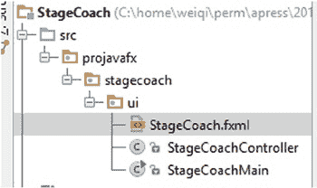

第 3 章 ■ 使用 SceneBuilder 创建用户界面

private StageStyle configStageStyle() {

StageStyle stageStyle = StageStyle.DECORATED;

List<String> unnamedParams = getParameters().getUnnamed();

if (unnamedParams.size() > 0) {

String stageStyleParam = unnamedParams.get(0);

if (stageStyleParam.equalsIgnoreCase("transparent")) {

stageStyle = StageStyle.TRANSPARENT;

} else if (stageStyleParam.equalsIgnoreCase("undecorated")) {

stageStyle = StageStyle.UNDECORATED;

} else if (stageStyleParam.equalsIgnoreCase("utility")) {

stageStyle = StageStyle.UTILITY;

}

}

return stageStyle;

}

}

在查看 FXMLLoader 代码之前，请允许我指出，在本示例中，我们选择将`StageCoach.fxml`文件与`StageCoachMain.java`和`StageCoachController.java`文件放在一起。它们都位于`projavafx/stagecoach/ui`目录中。当我们编译源文件时，这种关系得以保留。因此，当我们运行此程序时，FXML 文件在类路径中显示为资源`/projavafx/stagecoach/ui/StageCoach.fxml`。

图 3-2 展示了我们示例的文件布局。

***图 3-2.** StageCoach 示例的文件布局*

FXML 文件的加载由以下代码片段执行：

FXMLLoader fxmlLoader = new FXMLLoader(StageCoachMain.class

.getResource("/projavafx/stagecoach/ui/StageCoach.fxml"));

Group rootGroup = fxmlLoader.load();

final StageCoachController controller = fxmlLoader.getController();

这里，我们使用`FXMLLoader`类的单参数构造函数来构造一个`fxmlLoader`对象，并传入由`StageCoachMain`的`Class`对象上的`getResource()`调用返回的`URL`对象。此`URL`对象是一个 jar URL 或文件 URL，具体取决于您是从 jar 运行此程序还是从文件系统运行。然后，我们在`fxmlLoader`对象上调用`load()`方法。此方法读取 FXML 文件，解析它，实例化它指定的所有节点，并根据它指定的包含关系将它们连接起来。由于 FXML 文件中指定了控制器，该方法还会实例化一个`StageCoachController`实例，并根据`fx:ids`将节点分配给控制器实例的字段。此步骤通常称为将 FXML 节点*注入*到控制器中。事件处理程序也会被连接起来。`load()`方法返回 FXML 文件中的顶层对象，在我们的示例中是一个`Group`。这个返回的`Group`对象被赋值给`rootGroup`变量，并在后续代码中以与第 2 章中通过编程方式创建的`rootGroup`相同的方式使用。然后，我们调用`getController()`方法来获取控制器，其节点字段已由`FXMLLoader`注入。此控制器被赋值给`controller`变量，并在后续代码中使用，就好像我们刚刚创建了它并通过编程方式分配了其节点字段一样。

现在我们已经完成了将 Stage Coach 程序从编程式 UI 创建切换到声明式 UI 创建，我们可以运行它了。它的行为与第 2 章中的完全相同。图 3-3 显示了使用`transparent`命令行参数运行的程序。


***图 3-3.** 使用透明命令行参数运行的 Stage Coach 程序* 在本节中，我们涉及了 FXML 设计时和运行时工具的各个方面。然而，我们仅描述了每个工具的部分内容，刚好足以让我们的示例程序运行起来。在本章的剩余部分，我们将详细研究每个工具。

理解 FXML 加载工具

FXML 文件加载工具由两个类、一个接口、一个异常以及 `javafx.fxml` 包中的一个注解组成。`FXMLLoader` 是承担大部分工作的类，例如读取和解析 FXML 文件、识别 FXML 文件中的处理指令并做出必要的响应、识别 FXML 文件的每个元素和属性并将对象创建任务委托给一组构建器、在必要时创建控制器对象并将节点和其他对象注入到控制器中。`JavaFXBuilderFactory` 负责响应 `FXMLLoader` 对特定类构建器的请求来创建构建器。`Initializable` 接口可以由控制器类实现，以便像早期版本的 JavaFX 那样从 `FXMLLoader` 接收信息；然而，此功能已被注入方法取代，因此我们不再讨论它。如果 FXML 文件包含导致 `FXMLLoader` 无法构造 FXML 文件中指定的所有对象的错误，则会抛出 `LoadException`。`@FXML` 注解可用于控制器类，以将某些字段标记为注入目标，并将某些方法标记为事件处理程序候选。

[www.it-ebooks.info](http://www.it-ebooks.info/)

第 3 章 ■ 使用 Scene Builder 创建用户界面

理解 FXMLLoader 类

`FXMLLoader` 类具有以下公共构造函数：

• `FXMLLoader()`
• `FXMLLoader(URL location)`
• `FXMLLoader(URL location, ResourceBundle resources)`
• `FXMLLoader(URL location, ResourceBundle resources, BuilderFactory builderFactory)`
• `FXMLLoader(URL location, ResourceBundle resources, BuilderFactory builderFactory, Callback<Class<?>, Object> controllerFactory)`
• `FXMLLoader(Charset charset)`
• `FXMLLoader(URL location, ResourceBundle resources, BuilderFactory builderFactory, Callback<Class<?> controllerFactory, Object>, Charset charset)`
• `FXMLLoader(URL location, ResourceBundle resources, BuilderFactory builderFactory, Callback<Class<?>, Object> controllerFactory, Charset charset, LinkedList<FXMLLoader> loaders)`

参数较少的构造函数会委托给参数较多的构造函数，缺失的参数将用默认值填充。`location` 参数是要加载的 FXML 文件的 URL。它默认为 `null`。`resources` 参数是与 FXML 文件一起使用的资源包。如果 FXML 文件中使用了国际化字符串，则此参数是必需的。它默认为 `null`。`builderFactory` 参数是 `FXMLLoader` 用来获取其创建的各种对象的构建器的构建器工厂。它默认为 `JavaFXBuilderFactory` 的一个实例。此构建器工厂了解所有可能出现在 FXML 文件中的标准 JavaFX 类型，因此很少使用自定义的构建器工厂。`controllerFactory` 是一个 `javafx.util.CallBack`，当提供控制器类时，它能够返回控制器的一个实例。它默认为 `null`，在这种情况下，`FXMLLoader` 将通过反射调用控制器类的无参构造函数来实例化控制器。因此，仅当控制器无法通过这种方式构造时，才需要提供 `controllerFactory`。`charset` 在解析 FXML 时使用。它默认为 `UTF-8`。`loaders` 参数是一个 `FXMLLoader` 列表。它默认为一个空列表。

`FXMLLoader` 类具有以下用于更改 `FXMLLoader` 状态的 getter 和 setter 方法：

• `URL getLocation()`


• void setLocation(URL location)

• ResourceBundle getResources()

• void setResources(ResourceBundle resources)

• ObservableMap<String, Object> getNamespace()

• <T> T getRoot()

• void setRoot(Object root)

• <T> T getController()

• void setController(Object controller)

• BuilderFactory getBuilderFactory()

• void setBuilderFactory(BuilderFactory builderFactory)

[www.it-ebooks.info](http://www.it-ebooks.info/)

第 3 章 ■ 使用 SceneBuilder 创建用户界面

• Callback<Class<?>, Object> getControllerFactory()

• void setControllerFactory(Callback<Class<?>, Object> controllerFactory)

• Charset getCharset()

• void setCharset(Charset charset)

• ClassLoader getClassLoader()

• void setClassLoader(ClassLoader classLoader)

从该列表中可以看出，location、resources、builderFactory、controllerFactory 和 charset 也可以在构造 FXMLLoader 之后进行设置。此外，我们还可以获取和设置 root、controller、classLoader，以及获取 FXMLLoader 的 namespace。root 仅在 FXML 文件使用 `fx:root` 作为根元素时才相关，在这种情况下，必须在加载 FXML 文件之前调用 `setRoot()`。我们将在下一节中更详细地介绍 `fx:root` 的用法。仅当 FXML 文件的顶层元素中不存在 `fx:controller` 属性时，才需要在加载 FXML 文件之前设置 controller。classLoader 和 namespace 主要由 FXMLLoader 内部使用，通常不会由用户代码调用。

FXML 文件的实际加载发生在调用某个 `load()` 方法时。FXMLLoader 类具有以下 load 方法：

• <T> T load() throws IOException

• <T> T load(InputStream input) throws IOException

• static <T> T load(URL location) throws IOException

• static <T> T load(URL location, ResourceBundle resources) throws IOException

• static <T> T load(URL location, ResourceBundle resources, BuilderFactory builderFactory) throws IOException

• static <T> T load(URL location, ResourceBundle resources, BuilderFactory builderFactory, Callback<Class<?>, Object> controllerFactory) throws IOException

• static <T> T load(URL location, ResourceBundle resources, BuilderFactory builderFactory, Callback<Class<?>, Object> controllerFactory, Charset charset) throws IOException

可以在所有必要字段已初始化的 FXMLLoader 实例上调用不带参数的 `load()` 方法。接受 InputStream 参数的 `load()` 方法将从指定的输入流加载 FXML。所有静态的 `load()` 方法都是便捷方法，它们会使用提供的参数实例化一个 FXMLLoader，然后调用其非静态的 `load()` 方法之一。

在我们的下一个示例中，我们故意没有在 FXML 文件中指定 `fx:controller`。我们还为控制器类添加了一个单参数构造函数。FXML 文件、控制器类和主类分别如清单 3-4、3-5 和 3-6 所示。

***清单 3-4.*** FXMLLoaderExample.fxml

<?xml version="1.0" encoding="UTF-8"?>

<?import javafx.geometry.Insets?>

<?import javafx.scene.control.Button?>

<?import javafx.scene.control.TextField?>

<?import javafx.scene.layout.HBox?>

<?import javafx.scene.layout.VBox?>

<?import javafx.scene.web.WebView?>

[www.it-ebooks.info](http://www.it-ebooks.info/)

第 3 章 ■ 使用 SceneBuilder 创建用户界面

<VBox maxHeight="-Infinity"

maxWidth="-Infinity"

minHeight="-Infinity"

minWidth="-Infinity"

prefHeight="400.0"

prefWidth="600.0"

spacing="10.0"

xmlns=" [`javafx.com/javafx/8`](http://javafx.com/javafx/8)"

xmlns:fx=" [`javafx.com/fxml/1`](http://javafx.com/fxml/1)">

<children>

<HBox spacing="10.0">

<children>

<TextField fx:id="address"

onAction="#actionHandler"

HBox.hgrow="ALWAYS">

<padding>

<Insets bottom="4.0" left="4.0" right="4.0" top="4.0"/>

</padding>

</TextField>

<Button fx:id="loadButton"

mnemonicParsing="false"

onAction="#actionHandler"

text="加载"/>

</children>

</HBox>

<WebView fx:id="webView"

prefHeight="200.0"

prefWidth="200.0"

VBox.vgrow="ALWAYS"/>

</children>

<padding>


<Insets bottom="10.0" left="10.0" right="10.0" top="10.0"/>

</padding>

</VBox>

***清单 3-5.*** FXMLLoaderExampleController.java

import javafx.event.ActionEvent;

import javafx.fxml.FXML;

import javafx.scene.control.Button;

import javafx.scene.control.TextField;

import javafx.scene.web.WebView;

public class FXMLLoaderExampleController {

@FXML

private TextField address;

@FXML

private WebView webView;

[www.it-ebooks.info](http://www.it-ebooks.info/)

第 3 章 ■ 使用 Scene Builder 创建用户界面

@FXML

private Button loadButton;

private String name;

public FXMLLoaderExampleController(String name) {

this.name = name;

}

@FXML

public void actionHandler() {

webView.getEngine().load(address.getText());

}

}

***清单 3-6.*** FXMLLoaderExampleMain.java

import javafx.application.Application;

import javafx.fxml.FXMLLoader;

import javafx.scene.Scene;

import javafx.scene.layout.VBox;

import javafx.stage.Stage;

public class FXMLLoaderExampleMain extends Application {

@Override

public void start(Stage primaryStage) throws Exception {

FXMLLoader fxmlLoader = new FXMLLoader();

fxmlLoader.setLocation(

FXMLLoaderExampleMain.class.getResource("/FXMLLoaderExample.fxml"));

fxmlLoader.setController(

new FXMLLoaderExampleController("FXMLLoaderExampleController"));

final VBox vBox = fxmlLoader.load();

Scene scene = new Scene(vBox, 600, 400);

primaryStage.setTitle("FXMLLoader 示例");

primaryStage.setScene(scene);

primaryStage.show();

}

public static void main(String[] args) {

launch(args);

}

}

由于我们没有在 FXML 文件的顶层元素中指定 `fx:controller` 属性，因此需要在加载 FXML 文件之前，在 `fxmlLoader` 上设置控制器：

FXMLLoader fxmlLoader = new FXMLLoader();

fxmlLoader.setLocation(

FXMLLoaderExampleMain.class.getResource("/FXMLLoaderExample.fxml"));

fxmlLoader.setController(

new FXMLLoaderExampleController("FXMLLoaderExampleController"));

final VBox vBox = fxmlLoader.load();

[www.it-ebooks.info](http://www.it-ebooks.info/)


第 3 章 ■ 使用 Scene Builder 创建用户界面

如果未设置控制器，则会抛出 `LoaderException`，并显示消息“未指定控制器。”这是因为我们确实将控制器方法 `actionHandler` 指定为文本字段和按钮的操作事件处理器。`FXMLLoader` 需要控制器来满足 FXML 文件中的这些规范。如果未指定事件处理器，则 FXML 文件本可以成功加载，因为此时不需要控制器。

该程序是一个非常原始的 Web 浏览器，包含一个地址栏 `TextField`、一个加载 `Button` 和一个 `WebView`。

图 3-4 展示了正在运行的 `FXMLLoaderExample` 程序。

***图 3-4.** FXMLLoaderExample 程序*

我们的下一个示例 `ControllerFactoryExample` 与 `FXMLLoaderExample` 几乎相同，仅有两处不同，因此此处不展示完整代码。您可以在代码下载包中找到它。与 `FXMLLoaderExample` 不同，我们在 FXML 文件中指定了 `fx:controller`。这迫使我们移除主类中的 `setController()` 调用，否则会收到一条 `LoadException`，提示“已指定控制器值。”然而，由于我们的控制器没有默认构造函数，`FXMLLoader` 将因无法实例化控制器而抛出 `LoadException`。此异常可以通过在 `fxmlLoader` 上设置一个简单的控制器工厂来解决：`fxmlLoader.setControllerFactory(

clazz -> new ControllerFactoryExampleController("ExampleController"));`

这里我们使用了一个简单的 lambda 表达式来实现函数式接口 `Callback<Class<?>, Object>`，该接口只有一个方法：

`Object call(Class<?>)`

在我们的实现中，我们简单地返回一个 `ControllerFactoryExampleController` 的实例。

[www.it-ebooks.info](http://www.it-ebooks.info/)

第 3 章 ■ 使用 Scene Builder 创建用户界面

理解 @FXML 注解


我们已经看到了 `@FXML` 注解的两种用途。它可以应用于 FXML 文件控制器中的字段，这些字段的名称和类型与要注入节点的 FXML 元素的 `fx:id` 属性和元素名称相匹配。它还可以应用于无返回类型的方法，这些方法要么没有参数，要么只有一个 `javafx.event.Event` 或其子类型的参数，使它们能够作为 FXML 文件中元素的事件处理器使用。

如果控制器中有相应的字段，`FXMLLoader` 会将其位置和资源注入到控制器中：

@FXML

private URL location;

@FXML

private ResourceBundle resources;

`FXMLLoader` 还会调用一个带有以下签名的 `@FXML` 注解的初始化方法：

@FXML

public void initialize() {

// ...

}

清单 3-7、3-8 和 3-9 中的 `FXMLInjectionExample` 演示了这些功能如何工作。在此示例中，我们在 FXML 文件的 `VBox` 中放置了四个 `Label`。我们将其中两个 `Label` 注入到控制器中。我们还在控制器类中指定了位置和资源的注入字段。最后，在 `initialize()` 方法中，我们将两个注入的 `Label` 的文本设置为位置和资源的字符串表示形式。

***清单 3-7.*** FXMLInjectionExample.fxml

<?xml version="1.0" encoding="UTF-8"?>

<?import javafx.geometry.Insets?>

<?import javafx.scene.control.Label?>

<?import javafx.scene.layout.VBox?>

<?import javafx.scene.text.Font?>

<VBox alignment="CENTER_LEFT"

maxHeight="-Infinity"

maxWidth="-Infinity"

minHeight="-Infinity"

minWidth="-Infinity"

prefHeight="150.0"

prefWidth="700.0"

spacing="10.0"

xmlns=" [`javafx.com/javafx/8`](http://javafx.com/javafx/8)"

xmlns:fx=" [`javafx.com/fxml/1`](http://javafx.com/fxml/1)"

fx:controller="FXMLInjectionExampleController">

<children>

<Label text="位置:">

<font>

<Font name="System Bold" size="14.0"/>

</font>

</Label>

[www.it-ebooks.info](http://www.it-ebooks.info/)

第 3 章 ■ 使用 SceneBuilder 创建用户界面

<Label fx:id="locationLabel" text="[location]"/>

<Label text="资源:">

<font>

<Font name="System Bold" size="14.0"/>

</font>

</Label>

<Label fx:id="resourcesLabel" text="[resources]"/>

</children>

<opaqueInsets>

<Insets/>

</opaqueInsets>

<padding>

<Insets bottom="10.0" left="10.0" right="10.0" top="10.0"/>

</padding>

</VBox>

***清单 3-8.*** FXMLInjectionExampleController.java

import javafx.fxml.FXML;

import javafx.scene.control.Label;

import java.net.URL;

import java.util.ResourceBundle;

public class FXMLInjectionExampleController {

@FXML

private Label resourcesLabel;

@FXML

private Label locationLabel;

@FXML

private URL location;

@FXML

private ResourceBundle resources;

@FXML

public void initialize() {

locationLabel.setText(location.toString());

resourcesLabel.setText(resources.getBaseBundleName());

}

}

***清单 3-9.*** FXMLInjectionExampleMain.java

import javafx.application.Application;

import javafx.fxml.FXMLLoader;

import javafx.scene.Scene;

import javafx.scene.layout.VBox;

import javafx.stage.Stage;

[www.it-ebooks.info](http://www.it-ebooks.info/)

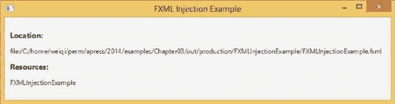

第 3 章 ■ 使用 SceneBuilder 创建用户界面

import java.util.ResourceBundle;

public class FXMLInjectionExampleMain extends Application {

@Override

public void start(Stage primaryStage) throws Exception {

FXMLLoader fxmlLoader = new FXMLLoader();

fxmlLoader.setLocation(

FXMLInjectionExampleMain.class.getResource("/FXMLInjectionExample.fxml"));

fxmlLoader.setResources(ResourceBundle.getBundle("FXMLInjectionExample"));

VBox vBox = fxmlLoader.load();

Scene scene = new Scene(vBox);

primaryStage.setTitle("FXML 注入示例");

primaryStage.setScene(scene);

primaryStage.show();

}

public static void main(String[] args) {

launch(args);

}

}

请注意，我们还创建了一个空的 `FXMLInjectionExample.properties` 文件作为资源包，以演示将 `resources` 字段注入到控制器中。我们将在后面解释如何将资源包与 FXML 一起使用。


下一节中的文件。当在我的机器上运行 FXMLInjectionExample 时，屏幕上会显示图 3-5 中的 FXML 注入示例窗口。

***图 3-5.** FXMLInjection 程序*

@FXML 注解也可用于注入包含的 FXML 文件控制器，以及标记 `javafx.event.EventHandler` 类型的控制器属性，以便在 FXML 文件中用作事件处理器。我们将在下一节讨论 FXML 文件的相关特性时详细介绍它们。

探索 FXML 文件的功能

在本节中，我们将介绍 FXML 文件格式的特性。由于 FXMLLoader 的一个主要目标是将 FXML 文件反序列化为 Java 对象，因此它提供了有助于简化 FXML 文件编写的工具也就不足为奇了。

[www.it-ebooks.info](http://www.it-ebooks.info/)

第 3 章 ■ 使用 Scene Builder 创建用户界面

FXML 格式的反序列化能力

由于本节介绍的特性更多与反序列化通用 Java 对象有关，我们将暂时离开 GUI 领域，转而使用普通的 Java 类。在讨论中，我们使用清单 3-10 中定义的 JavaBean。这是一个虚构的类，旨在说明不同的 FXML 特性。

***清单 3-10.*** FXMLBasicFeaturesBean.java

package projavafx.fxmlbasicfeatures;

import javafx.scene.paint.Color;

import java.util.ArrayList;

import java.util.HashMap;

import java.util.List;

import java.util.Map;

public class FXMLBasicFeaturesBean {

private String name;

private String address;

private boolean flag;

private int count;

private Color foreground;

private Color background;

private Double price;

private Double discount;

private List<Integer> sizes;

private Map<String, Double> profits;

private Long inventory;

private List<String> products = new ArrayList<String>();

private Map<String, String> abbreviations = new HashMap<>();

public String getName() {

return name;

}

public void setName(String name) {

this.name = name;

}

public String getAddress() {

return address;

}

public void setAddress(String address) {

this.address = address;

}

public boolean isFlag() {

return flag;

}

[www.it-ebooks.info](http://www.it-ebooks.info/)

第 3 章 ■ 使用 Scene Builder 创建用户界面

public void setFlag(boolean flag) {

this.flag = flag;

}

public int getCount() {

return count;

}

public void setCount(int count) {

this.count = count;

}

public Color getForeground() {

return foreground;

}

public void setForeground(Color foreground) {

this.foreground = foreground;

}

public Color getBackground() {

return background;

}

public void setBackground(Color background) {

this.background = background;

}

public Double getPrice() {

return price;

}

public void setPrice(Double price) {

this.price = price;

}

public Double getDiscount() {

return discount;

}

public void setDiscount(Double discount) {

this.discount = discount;

}

public List<Integer> getSizes() {

return sizes;

}

public void setSizes(List<Integer> sizes) {

this.sizes = sizes;

}

[www.it-ebooks.info](http://www.it-ebooks.info/)

第 3 章 ■ 使用 Scene Builder 创建用户界面

public Map<String, Double> getProfits() {

return profits;

}

public void setProfits(Map<String, Double> profits) {

this.profits = profits;

}

public Long getInventory() {

return inventory;

}

public void setInventory(Long inventory) {

this.inventory = inventory;

}

public List<String> getProducts() {

return products;

}

public Map<String, String> getAbbreviations() {

return abbreviations;

}

@Override

public String toString() {

return "FXMLBasicFeaturesBean{" +

"name='" + name + '\'' +

",\n\taddress='" + address + '\'' +

",\n\tflag=" + flag +

",\n\tcount=" + count +

",\n\tforeground=" + foreground +

",\n\tbackground=" + background +

",\n\tprice=" + price +

",\n\tdiscount=" + discount +

",\n\tsizes=" + sizes +

",\n\tprofits=" + profits +

",\n\tinventory=" + inventory +

",\n\tproducts=" + products +

",\n\tabbreviations=" + abbreviations +

'}';

}

}

清单 3-11 中的 FXML 文件将被加载，并在清单 3-12 的程序中打印到控制台。


***清单 3-11.*** FXMLBasicFeatures.fxml

<?import javafx.scene.paint.Color?>

<?import projavafx.fxmlbasicfeatures.FXMLBasicFeaturesBean?>

<?import projavafx.fxmlbasicfeatures.Utilities?>

<?import java.lang.Double?>

[www.it-ebooks.info](http://www.it-ebooks.info/)

第 3 章 ■ 使用 Scene Builder 创建用户界面

<?import java.lang.Integer?>

<?import java.lang.Long?>

<?import java.util.HashMap?>

<?import java.lang.String?>

<FXMLBasicFeaturesBean name="John Smith"

flag="true"

count="12345"

xmlns:fx=" [`javafx.com/fxml/1">`](http://javafx.com/fxml/1)

<address>12345 Main St.</address>

<foreground>#ff8800</foreground>

<background>

<Color red="0.0" green="1.0" blue="0.5"/>

</background>

<price>

<Double fx:value="3.1415926"/>

</price>

<discount>

<Utilities fx:constant="TEN_PCT"/>

</discount>

<sizes>

<Utilities fx:factory="createList">

<Integer fx:value="1"/>

<Integer fx:value="2"/>

<Integer fx:value="3"/>

</Utilities>

</sizes>

<profits>

<HashMap q1="1000" q2="1100" q3="1200" a4="1300"/>

</profits>

<fx:define>

<Long fx:id="inv" fx:value="9765625"/>

</fx:define>

<inventory>

<fx:reference source="inv"/>

</inventory>

<products>

<String fx:value="widget"/>

<String fx:value="gadget"/>

<String fx:value="models"/>

</products>

<abbreviations CA="California" NY="New York" FL="Florida" MO="Missouri"/>

</FXMLBasicFeaturesBean>

***清单 3-12.*** FXMLBasicFeaturesMain.java

package projavafx.fxmlbasicfeatures;

import javafx.fxml.FXMLLoader;

import java.io.IOException;

[www.it-ebooks.info](http://www.it-ebooks.info/)

第 3 章 ■ 使用 Scene Builder 创建用户界面

public class FXMLBasicFeaturesMain {

public static void main(String[] args) throws IOException {

FXMLBasicFeaturesBean bean = FXMLLoader.load(

FXMLBasicFeaturesMain.class.getResource(

"/projavafx/fxmlbasicfeatures/FXMLBasicFeatures.fxml")

);

System.out.println("bean = " + bean);

}

}

我们使用了一个小型工具类，其中包含一些常量和用于创建 `List<Integer>` 的工厂方法，如清单 3-13 所示。

***清单 3-13.*** Utilities.java

package projavafx.fxmlbasicfeatures;

import java.util.ArrayList;

import java.util.List;

public class Utilities {

public static final Double TEN_PCT = 0.1d;

public static final Double TWENTY_PCT = 0.2d;

public static final Double THIRTY_PCT = 0.3d;

public static List<Integer> createList() {

return new ArrayList<>();

}

}

`FXMLBasicFeaturesBean` 对象是在 FXML 文件中创建的；这一点可以从 FXML 文件的顶级元素是 `FXMLBasicFeaturesBean` 看出。`name` 和 `address` 字段说明了一个字段既可以作为属性设置，也可以作为子元素设置：

<FXMLBasicFeaturesBean name="John Smith"

flag="true"

count="12345"

xmlns:fx=" [`javafx.com/fxml/1">`](http://javafx.com/fxml/1)

<address>12345 Main St.</address>

`foreground` 和 `background` 字段展示了设置 `javafx.scene.paint.Color` 子元素的两种方式：通过十六进制字符串，或者使用 `Color` 元素（请记住 `Color` 是一个没有默认构造函数的不可变对象）：

<foreground>#ff8800</foreground>

<background>

<Color red="0.0" green="1.0" blue="0.5"/>

</background>

[www.it-ebooks.info](http://www.it-ebooks.info/)

第 3 章 ■ 使用 Scene Builder 创建用户界面

`price` 字段展示了一种构造 `Double` 对象的方法。`fx:value` 属性调用了 `Double` 上的 `valueOf(String)` 方法。这适用于任何具有工厂方法 `valueOf(String)` 的 Java 类：

<price>

<Double fx:value="3.1415926"/>

</price>

`discount` 字段展示了如何使用 Java 类中定义的常量。`fx:constant` 属性访问其元素类型的常量（`public static final`）字段。以下代码将 `discount` 字段设置为 `Utilities.TEN_PCT`，即 0.1：

<discount>

<Utilities fx:constant="TEN_PCT"/>

</discount>

`sizes` 字段展示了使用工厂方法创建对象。`fx:factory` 属性在其元素类型上调用指定的工厂方法。在我们的例子中，它调用 `Utilities.createList()` 来创建一个整数列表，然后用三个整数填充该列表。请注意，`sizes` 是一个读写属性。稍后您将看到一个如何填充只读列表属性的示例。

<sizes>

<Utilities fx:factory="createList">

<Integer fx:value="1"/>

<Integer fx:value="2"/>

<Integer fx:value="3"/>

</Utilities>

</sizes>

`profits` 字段展示了如何填充一个读写映射。这里我们将 `profits` 字段设置为我们创建的包含键/值对的 `HashMap`：

<profits>

<HashMap q1="1000" q2="1100" q3="1200" a4="1300"/>

</profits>

`inventory` 字段展示了如何在一个地方定义对象，并在另一个地方引用它。`fx:define` 元素创建一个独立的、具有 `fx:id` 属性的对象。`fx:reference` 元素创建对其他地方定义的对象的引用，其 `source` 属性指向先前定义对象的 `fx:id`：

<fx:define>

<Long fx:id="inv" fx:value="9765625"/>

</fx:define>

<inventory>

<fx:reference source="inv"/>

</inventory>

`products` 字段展示了如何填充一个只读列表。以下 FXML 片段等同于调用 `bean.getProducts().addAll("widget", "gadget", "models")`：

<products>

<String fx:value="widget"/>

<String fx:value="gadget"/>

<String fx:value="models"/>

</products>

[www.it-ebooks.info](http://www.it-ebooks.info/)

第 3 章 ■ 使用 Scene Builder 创建用户界面

`abbreviations` 字段展示了如何填充一个只读映射：

<abbreviations CA="California" NY="New York" FL="Florida" MO="Missouri"/> 当运行 `FXMLBasicFeaturesMain` 程序时，控制台会按预期打印以下输出： bean = FXMLBasicFeaturesBean{name='John Smith',

address='12345 Main St.',

flag=true,

count=12345,

foreground=0xff8800ff,

background=0x00ff80ff,

price=3.1415926,

discount=0.1,

sizes=[1, 2, 3],

profits={q1=1000, q2=1100, q3=1200, a4=1300},

inventory=9765625,

products=[widget, gadget, models],

abbreviations={MO=Missouri, FL=Florida, NY=New York, CA=California}}

理解默认属性和静态属性

许多 JavaFX 类都有一个默认属性。*默认属性* 通过在类上使用 `@DefaultProperty` 注解来指定。`@DefaultProperty` 注解属于 `javafx.beans` 包。例如，`javafx.scene.Group` 类的默认属性是其 `children` 属性。在 FXML 文件中，当通过子元素指定默认属性时，可以省略默认属性本身的开始和结束标签。例如，您在清单 3-1 中看到的以下代码片段：

<HBox fx:id="titleBox">

<children>

<Label fx:id="titleLabel"

text="title"/>

<TextField fx:id="titleTextField"

text="Stage Coach"/>

</children>

</HBox>

可以简化为：

<HBox fx:id="titleBox">

<Label fx:id="titleLabel"

text="title"/>

<TextField fx:id="titleTextField"

text="Stage Coach"/>

</HBox>

*静态属性* 是一种属性，它不是通过调用对象本身的 setter 方法来设置，而是通过调用另一个类的静态方法，将对象和属性值作为参数传递来设置。许多 JavaFX 的容器节点都有这样的静态方法。这些方法在将节点添加到容器之前被调用，以影响某些结果。静态属性在 FXML 文件中表示为内部对象（作为第一个参数传递给静态方法的对象）上的属性，其名称包含由点分隔的类名和静态方法名。您可以在清单 3-4 中看到一个静态属性的示例：

<WebView fx:id="webView"

prefHeight="200.0"

prefWidth="200.0"

VBox.vgrow="ALWAYS"/>


这里我们正在将一个 WebView 添加到 VBox 中，而 `VBox.vgrow` 属性指示 FXMLLoader 在将 webView 添加到 VBox **之前**，需要调用 `VBox.vgrow(webView, Priority.ALWAYS)`。静态属性除了可以作为属性出现外，还可以作为子元素出现。

理解属性解析与绑定

正如你在本章前面部分所见，对象属性既可以表示为属性，也可以表示为子元素。有时，将属性建模为子元素或属性效果是一样的。然而，FXMLLoader 会对属性执行额外的处理，这使得使用属性更具吸引力。在处理属性时，FXMLLoader 会执行三种属性值解析和表达式绑定。

当属性值以“@”字符开头时，FXMLLoader 会将该值视为相对于当前文件的位置。这称为*位置解析*。当属性值以“%”字符开头时，FXMLLoader 会将该值视为资源包中的键，并用特定于语言环境的值替换该键。这称为*资源解析*。当属性值以“$”字符开头时，FXMLLoader 会将该值视为变量名，并用所引用变量的值替换该属性值。这称为*变量解析*。

当属性值以“${”开头并以“}”结尾时，并且如果该属性代表一个 JavaFX 属性，FXMLLoader 会将该值视为绑定表达式，并将 JavaFX 属性绑定到该封闭表达式。这称为*表达式绑定*。你将在第 4 章中了解 JavaFX 属性和绑定。现在只需理解，当一个属性绑定到一个表达式时，每次表达式值发生变化，该变化都会反映到属性中。支持的表达式包括字符串字面量、布尔字面量、数字字面量、一元运算符 –（负号）和 !（非）、算术运算符（+、–、*、/、%）、逻辑运算符（&&、||）以及关系运算符（>、>=、<、<=、==、!=）。

清单 3-14 到 3-19 中所示的 ResolutionAndBindingExample 演示了位置解析、资源解析、变量解析以及表达式绑定的使用。

***清单 3-14.*** ResolutionAndBindingExample.fxml

<?xml version="1.0" encoding="UTF-8"?>

<?import javafx.geometry.Insets?>

<?import javafx.scene.control.Label?>

<?import javafx.scene.control.TextField?>

<?import javafx.scene.layout.HBox?>

<?import javafx.scene.layout.VBox?>

<?import javafx.scene.text.Font?>

<?import java.util.Date?>

<VBox id="vbox" alignment="CENTER_LEFT" maxHeight="-Infinity" maxWidth="-Infinity" minHeight="-Infinity"

minWidth="-Infinity" prefHeight="200.0" prefWidth="700.0" spacing="10.0"

stylesheets="@ResolutionAndBindingExample.css" xmlns=" [`javafx.com/javafx/8"`](http://javafx.com/javafx/8)

xmlns:fx=" [`javafx.com/fxml/1`](http://javafx.com/fxml/1)" fx:controller="ResolutionAndBindingController"> 106

[www.it-ebooks.info](http://www.it-ebooks.info/)

第 3 章 ■ 使用 SceneBuilder 创建用户界面

<children>

<Label text="%location">

<font>

<Font name="System Bold" size="14.0"/>

</font>

</Label>

<Label fx:id="locationLabel" text="[location]"/>

<Label text="%resources">

<font>

<Font name="System Bold" size="14.0"/>

</font>

</Label>

<Label fx:id="resourcesLabel" text="[resources]"/>

<Label text="%currentDate">

<font>

<Font name="System Bold" size="14.0"/>

</font>

</Label>

<HBox alignment="BASELINE_LEFT" spacing="10.0">

<children>

<fx:define>

<Date fx:id="capturedDate"/>

</fx:define>

<Label fx:id="currentDateLabel" text="$capturedDate"/>

<TextField fx:id="textField"/>

<Label text="${textField.text}"/>

</children>

</HBox>

</children>

<opaqueInsets>

<Insets/>

</opaqueInsets>

<padding>

<Insets bottom="10.0" left="10.0" right="10.0" top="10.0"/>

</padding>

</VBox>

***清单 3-15.*** ResolutionAndBindingController.java

import javafx.fxml.FXML;

import javafx.scene.control.Label;


import java.net.URL;

import java.util.ResourceBundle;

public class ResolutionAndBindingController {

@FXML

private Label resourcesLabel;

@FXML

private Label locationLabel;

[www.it-ebooks.info](http://www.it-ebooks.info/)

第 3 章 ■ 使用 SceneBuilder 创建用户界面

@FXML

private Label currentDateLabel;

@FXML

private URL location;

@FXML

private ResourceBundle resources;

@FXML

public void initialize() {

locationLabel.setText(location.toString());

resourcesLabel.setText(resources.getBaseBundleName() +

" (" + resources.getLocale().getCountry() +

", " + resources.getLocale().getLanguage() + ")");

}

}

***清单 3-16.*** ResolutionAndBindingExample.java

import javafx.application.Application;

import javafx.fxml.FXMLLoader;

import javafx.scene.Scene;

import javafx.scene.layout.VBox;

import javafx.stage.Stage;

import java.util.ResourceBundle;

public class ResolutionAndBindingExample extends Application {

@Override

public void start(Stage primaryStage) throws Exception {

FXMLLoader fxmlLoader = new FXMLLoader();

fxmlLoader.setLocation(

ResolutionAndBindingExample.class.getResource(

"/ResolutionAndBindingExample.fxml"));

fxmlLoader.setResources(

ResourceBundle.getBundle(

"ResolutionAndBindingExample"));

VBox vBox = fxmlLoader.load();

Scene scene = new Scene(vBox);

primaryStage.setTitle("解析与绑定示例");

primaryStage.setScene(scene);

primaryStage.show();

}

public static void main(String[] args) {

launch(args);

}

}

[www.it-ebooks.info](http://www.it-ebooks.info/)

第 3 章 ■ 使用 SceneBuilder 创建用户界面

***清单 3-17.*** ResourceAndBindingExample.properties

location=位置:

resources=资源:

currentDate=当前日期:

***清单 3-18.*** ResolutionAndBindingExample_fr_FR.properties

location=位置:

resources=资源:

currentDate=当前日期:

***清单 3-19.*** ResolutionAndBindingExample.css

#vbox {

-fx-background-color: azure ;

}

在 FXML 文件中使用位置解析来指定 CSS 文件的位置。样式表属性被设置为位置“@ResolutionAndBindingExample.css”：

<VBox id="vbox" alignment="CENTER_LEFT" maxHeight="-Infinity" maxWidth="-Infinity" minHeight="-Infinity"

minWidth="-Infinity" prefHeight="200.0" prefWidth="700.0" spacing="10.0"

stylesheets="@ResolutionAndBindingExample.css" xmlns=" [`javafx.com/javafx/8"`](http://javafx.com/javafx/8)

xmlns:fx=" [`javafx.com/fxml/1`](http://javafx.com/fxml/1)" fx:controller="ResolutionAndBindingController"> 该样式表将 VBox 的背景色设置为浅蓝色。资源解析用于设置程序中三个标签的文本：

<Label text="%location">

<Label text="%resources">

<Label text="%currentDate">

这些标签将从加载 FXML 文件之前提供给 FXMLLoader 的资源包中获取文本。提供了默认区域设置和法语区域设置的属性文件翻译。变量解析发生在定义的 java.util.Date 实例和标签之间：

<fx:define>

<Date fx:id="capturedDate"/>

</fx:define>

<Label fx:id="currentDateLabel" text="$capturedDate"/>

定义的 Date 被赋予了 fx:id 为 capturedDate，标签则使用该变量作为其文本。最后，表达式绑定发生在 TextField 和 Label 之间：

<TextField fx:id="textField"/>

<Label text="${textField.text}"/>

TextField 被赋予了 fx:id 为 textField，标签绑定到表达式 textField.text，结果是标签会模仿文本字段中输入的内容。当使用法语区域设置运行 ResolutionAndBindingExample 时，将显示如图 3-6 所示的“解析与绑定示例”窗口。

[www.it-ebooks.info](http://www.it-ebooks.info/)

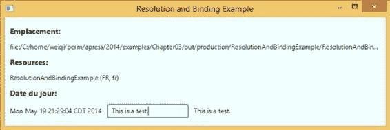

第 3 章 ■ 使用 SceneBuilder 创建用户界面

***图 3-6.** ResolutionAndBindingExample 程序*

使用多个 FXML 文件


由于加载 FXML 文件的结果是一个可在场景（Scene）中使用的 JavaFX 节点（Node），因此你并不局限于为每个场景仅使用一个 FXML 文件。例如，你可以将场景拆分为两个或多个部分，并用各自的 FXML 文件表示每个部分。然后，你可以对每个部分的 FXML 文件调用 `FXMLLoader` 的某个 `load()` 方法，并通过编程方式将生成的节点组装到场景中。

FXML 文件格式支持另一种将单独准备的 FXML 文件组合在一起的机制。一个 FXML 文件可以通过 `fx:include` 元素包含另一个 FXML 文件。`fx:include` 元素支持三个属性：`source` 属性用于指定被包含 FXML 文件的位置；`resources` 属性用于指定被包含 FXML 文件所使用的资源包（resource bundle）的位置；`charset` 属性用于指定被包含 FXML 文件的字符集。如果 `source` 属性以“/”字符开头，则将其解释为类路径（classpath）中的路径；否则，将其解释为相对于包含该 FXML 文件的位置。`resource` 和 `charset` 属性是可选的。当未指定它们时，将使用加载包含 FXML 文件时所使用的值。用于加载包含 FXML 文件的构建器工厂（builder factory）和控制器工厂（controller factory）也用于加载被包含的 FXML 文件。

可以为 `fx:include` 元素指定一个 `fx:id`。当指定了 `fx:id` 时，可以在包含 FXML 文件的控制器中指定一个对应的字段，并且 `FXMLLoader` 会将加载被包含 FXML 文件的结果注入到该字段中。此外，如果被包含的 FXML 文件在其根元素中指定了 `fx:controller`，那么该被包含 FXML 文件的控制器也可以被注入到包含 FXML 文件的控制器中，前提是包含文件的控制器中存在一个命名和类型都合适的字段来接收被注入的被包含 FXML 文件的控制器。在本节的示例应用程序中，我们使用两个 FXML 文件来表示应用程序的用户界面。

包含 FXML 文件包含如下代码行：

<BorderPane maxHeight="-Infinity"

...

fx:controller="IncludeExampleTreeController">

<fx:include fx:id="details"

source="IncludeExampleDetail.fxml" />

而被包含的 FXML 文件包含如下代码行：

<VBox maxHeight="-Infinity"

...

fx:controller="IncludeExampleDetailController">

[www.it-ebooks.info](http://www.it-ebooks.info/)

第 3 章 ■ 使用 SceneBuilder 创建用户界面

因此，加载被包含的 FXML 文件将生成一个类型为 `VBox` 的根元素，以及一个类型为 `IncludeExampleDetailController` 的控制器。包含 FXML 文件的控制器 `IncludeExampleTreeController` 包含如下字段：

@FXML

private VBox details;

@FXML

private IncludeExampleDetailController detailsController;

当加载包含 FXML 文件时，这些字段将保存被包含 FXML 文件的已加载根元素和控制器。

本节示例的完整源代码如清单 3-20 至 3-25 所示。

***清单 3-20.*** IncludeExampleTree.fxml

<?xml version="1.0" encoding="UTF-8"?>

<?import javafx.geometry.Insets?>

<?import javafx.scene.control.Label?>

<?import javafx.scene.control.TreeTableColumn?>

<?import javafx.scene.control.TreeTableView?>

<?import javafx.scene.layout.BorderPane?>

<?import javafx.scene.layout.VBox?>

<?import javafx.scene.text.Font?>

<BorderPane maxHeight="-Infinity"

maxWidth="-Infinity"

minHeight="-Infinity"

minWidth="-Infinity"

prefHeight="400.0"

prefWidth="600.0"

xmlns:fx=" [`javafx.com/fxml/1"`](http://javafx.com/fxml/1)

fx:controller="IncludeExampleTreeController">

<top>

<Label text="Product Details"

BorderPane.alignment="CENTER">

<font>

<Font name="System Bold Italic" size="36.0"/>

</font>

</Label>

</top>

<left>

<VBox spacing="10.0">

<children>

<Label text="List of Products:">

<font>

<Font name="System Bold" size="12.0"/>

</font>

</Label>

<TreeTableView fx:id="treeTableView"

prefHeight="200.0"

prefWidth="200.0"

[www.it-ebooks.info](http://www.it-ebooks.info/)


第 3 章 ■ 使用 SceneBuilder 创建用户界面

BorderPane.alignment="CENTER"

VBox.vgrow="ALWAYS">

<columns>

<TreeTableColumn fx:id="category"

editable="false"

prefWidth="125.0"

text="类别"/>

<TreeTableColumn fx:id="name"

editable="false"

prefWidth="75.0"

text="名称"/>

</columns>

</TreeTableView>

</children>

<BorderPane.margin>

<Insets/>

</BorderPane.margin>

</VBox>

</left>

<center>

<fx:include fx:id="details"

source="IncludeExampleDetail.fxml"/>

</center>

<padding>

<Insets bottom="10.0" left="10.0" right="10.0" top="10.0"/>

</padding>

</BorderPane>

***清单 3-21.*** IncludeExampleDetail.fxml

<?xml version="1.0" encoding="UTF-8"?>

<?import javafx.geometry.Insets?>

<?import javafx.scene.control.Label?>

<?import javafx.scene.control.TextArea?>

<?import javafx.scene.layout.VBox?>

<?import javafx.scene.text.Font?>

<VBox maxHeight="-Infinity"

maxWidth="-Infinity"

minHeight="-Infinity"

minWidth="-Infinity"

prefHeight="346.0"

prefWidth="384.0"

spacing="10.0"

xmlns=" [`javafx.com/javafx/8`](http://javafx.com/javafx/8)"

xmlns:fx=" [`javafx.com/fxml/1`](http://javafx.com/fxml/1)"

fx:controller="IncludeExampleDetailController">

<children>

<Label text="类别:">

<font>

<Font name="System Bold" size="12.0"/>

</font>

</Label>

[www.it-ebooks.info](http://www.it-ebooks.info/)

第 3 章 ■ 使用 SceneBuilder 创建用户界面

<Label fx:id="category" text="[类别]"/>

<Label text="名称:">

<font>

<Font name="System Bold" size="12.0"/>

</font>

</Label>

<Label fx:id="name" text="[名称]"/>

<Label text="描述:">

<font>

<Font name="System Bold" size="12.0"/>

</font>

</Label>

<TextArea fx:id="description"

prefHeight="200.0"

prefWidth="200.0"

VBox.vgrow="ALWAYS"/>

</children>

<padding>

<Insets bottom="10.0" left="20.0" right="10.0" top="30.0"/>

</padding>

</VBox>

***清单 3-22.*** IncludeExampleTreeController.java

import javafx.beans.property.ReadOnlyStringWrapper;

import javafx.fxml.FXML;

import javafx.scene.control.TreeItem;

import javafx.scene.control.TreeTableColumn;

import javafx.scene.control.TreeTableView;

import javafx.scene.layout.VBox;

public class IncludeExampleTreeController {

@FXML

private TreeTableView<Product> treeTableView;

@FXML

private TreeTableColumn<Product, String> category;

@FXML

private TreeTableColumn<Product, String> name;

@FXML

private VBox details;

@FXML

private IncludeExampleDetailController detailsController;

@FXML

public void initialize() {

Product[] products = new Product[101];

for (int i = 0; i <= 100; i++) {

products[i] = new Product();

products[i].setCategory("类别" + (i / 10));

[www.it-ebooks.info](http://www.it-ebooks.info/)

第 3 章 ■ 使用 SceneBuilder 创建用户界面

products[i].setName("名称" + i);

products[i].setDescription("描述" + i);

}

TreeItem<Product> root = new TreeItem<>(products[100]);

root.setExpanded(true);

for (int i = 0; i < 10; i++) {

TreeItem<Product> firstLevel =

new TreeItem<>(products[i * 10]);

firstLevel.setExpanded(true);

for (int j = 1; j < 10; j++) {

TreeItem<Product> secondLevel =

new TreeItem<>(products[i * 10 + j]);

secondLevel.setExpanded(true);

firstLevel.getChildren().add(secondLevel);

}

root.getChildren().add(firstLevel);

}

category.setCellValueFactory(param ->

new ReadOnlyStringWrapper(param.getValue().getValue().getCategory()));

name.setCellValueFactory(param ->

new ReadOnlyStringWrapper(param.getValue().getValue().getName()));

treeTableView.setRoot(root);

treeTableView.getSelectionModel().selectedItemProperty()

.addListener((observable, oldValue, newValue) -> {

Product product = null;

if (newValue != null) {

product = newValue.getValue();

}

detailsController.setProduct(product);

});

}

}

***清单 3-23.*** IncludeExampleDetailController.java

import javafx.beans.value.ChangeListener;

import javafx.fxml.FXML;

import javafx.scene.control.Label;

import javafx.scene.control.TextArea;

public class IncludeExampleDetailController {

@FXML

private Label category;

@FXML

private Label name;

@FXML

private TextArea description;

[www.it-ebooks.info](http://www.it-ebooks.info/)

第 3 章 ■ 使用 SceneBuilder 创建用户界面

private Product product;


private ChangeListener<String> listener;

public void setProduct(Product product) {

if (this.product != null) {

unhookListener();

}

this.product = product;

hookTo(product);

}

private void unhookListener() {

description.textProperty().removeListener(listener);

}

private void hookTo(Product product) {

if (product == null) {

category.setText("");

name.setText("");

description.setText("");

listener = null;

} else {

category.setText(product.getCategory());

name.setText(product.getName());

description.setText(product.getDescription());

listener = (observable, oldValue, newValue) ->

product.setDescription(newValue);

description.textProperty().addListener(listener);

}

}

}

***清单 3-24.*** IncludeExample.java

import javafx.application.Application;

import javafx.fxml.FXMLLoader;

import javafx.scene.Scene;

import javafx.scene.layout.BorderPane;

import javafx.stage.Stage;

public class IncludeExample extends Application {

@Override

public void start(Stage primaryStage) throws Exception {

FXMLLoader fxmlLoader = new FXMLLoader();

fxmlLoader.setLocation(

IncludeExample.class.getResource("IncludeExampleTree.fxml"));

final BorderPane borderPane = fxmlLoader.load();

Scene scene = new Scene(borderPane, 600, 400);

primaryStage.setTitle("包含示例");

primaryStage.setScene(scene);

primaryStage.show();

}

[www.it-ebooks.info](http://www.it-ebooks.info/)

第 3 章 ■ 使用 SceneBuilder 创建用户界面

public static void main(String[] args) {

launch(args);

}

}

***清单 3-25.*** Product.java

public class Product {

private String category;

private String name;

private String description;

public String getCategory() {

return category;

}

public void setCategory(String category) {

this.category = category;

}

public String getDescription() {

return description;

}

public void setDescription(String description) {

this.description = description;

}

public String getName() {

return name;

}

public void setName(String name) {

this.name = name;

}

}

在这个 IncludeExample 程序中，我们通过两个 FXML 文件构建用户界面，每个文件都由其自己的控制器支持。该用户界面左侧有一个 TreeTableView，右侧有一些标签和一个 TextArea。

TreeTableView 中加载了虚拟的 Product 数据。当选中左侧 TreeTableView 中的某一行时，相应的 Product 会显示在右侧。您可以使用右侧的 TextArea 编辑 Product 的 description 字段。当您从左侧的旧行导航到新行时，右侧的 Product 会反映这一变化。但是，您对之前显示的 Product 所做的所有更改都会保留在模型中。当您导航回一个已修改的 Product 时，您的更改将再次显示。TreeTableView 类将在第 6 章中更详细地介绍。

我们使用了一个附加到 TextField 的 textProperty 上的 ChangeListener<String>，来同步 TextField 中的文本和 Product 中的 description。JavaFX 属性和更改监听器是 JavaFX 属性和绑定 API 的一部分。我们将在下一章介绍这个 API。

运行 IncludeExample 时，将显示图 3-7 所示的“包含示例”窗口。

[www.it-ebooks.info](http://www.it-ebooks.info/)

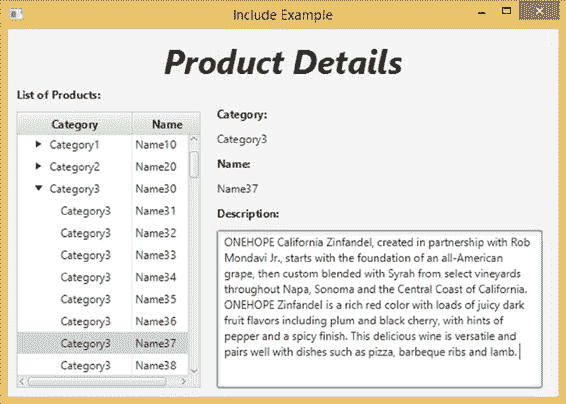

第 3 章 ■ 使用 SceneBuilder 创建用户界面

***图 3-7.** IncludeExample 程序*

使用 fx:root 创建自定义组件

fx:include 元素允许我们将一个 FXML 文件附加到另一个 FXML 文件中。类似地，fx:root 元素允许我们将一个 FXML 文件附加到代码中提供的 Node 上。fx:root 元素必须是 FXML 文件中的顶级元素。它必须提供一个 type 属性，该属性决定了加载此 FXML 文件时需要在代码中创建的 Node 的类型。

在其最简单的形式中，您可以将前面任何一个 FXML 文件的顶级元素从

<SomeType ...

更改为

<fx:root type="some.package.SomeType" ...

并在代码中实例化 SomeType，然后在加载 FXML 文件之前将其设置为 FXMLLoader 中的根节点，如下所示：


`SomeType someType = new SomeType();`

`fxmlLoader.setRoot(someType);`

`fxmlLoader.load();`

下一个示例更进一步。它定义了一个类，该类扩展了 FXML 文件的 `fx:root` 类型，并同时充当 FXML 文件的根节点和控制器。它在构造函数中加载 FXML 文件，并使用 `initialize()` 方法来设置在 FXML 文件中构建的节点之间所需的关联。然后，这个类可以像原生 JavaFX 节点一样被使用。以这种方式构建的类被称为*自定义组件*。

[www.it-ebooks.info](http://www.it-ebooks.info/)

第 3 章 ■ 使用 Scene Builder 创建用户界面

我们在此定义的自定义组件是一个简单的*复合*自定义组件，这意味着它由多个节点组成，这些节点共同满足某些业务需求。我们在本例中创建的自定义组件名为 `ProdId`。它旨在帮助输入产品 ID 的数据，产品 ID 必须采用“A-123456”的形式，其中破折号前只有一个字符，且必须是“A”、“B”或“C”。破折号后最多可以有六个字符。

该程序如清单 3-26 至 3-28 所示。

***清单 3-26.*** ProdId.fxml

```xml
<?xml version="1.0" encoding="UTF-8"?>

<?import javafx.scene.control.Label?>

<?import javafx.scene.control.TextField?>

<fx:root type="javafx.scene.layout.HBox"

alignment="BASELINE_LEFT"

maxHeight="-Infinity"

maxWidth="-Infinity"

minHeight="-Infinity"

minWidth="-Infinity"

xmlns="http://javafx.com/javafx/8"

xmlns:fx="http://javafx.com/fxml/1">

<children>

<TextField fx:id="prefix" prefColumnCount="1"/>

<Label text="-"/>

<TextField fx:id="prodCode" prefColumnCount="6"/>

</children>

</fx:root>
```

***清单 3-27.*** ProdId.java

```java
package projavafx.customcomponent;

import javafx.beans.property.SimpleStringProperty;

import javafx.beans.property.StringProperty;

import javafx.fxml.FXML;

import javafx.fxml.FXMLLoader;

import javafx.scene.control.TextField;

import javafx.scene.layout.HBox;

import java.io.IOException;

public class ProdId extends HBox {

@FXML

private TextField prefix;

@FXML

private TextField prodCode;

private StringProperty prodId = new SimpleStringProperty();

[www.it-ebooks.info](http://www.it-ebooks.info/)

第 3 章 ■ 使用 Scene Builder 创建用户界面

public ProdId() throws IOException {

FXMLLoader fxmlLoader = new FXMLLoader(ProdId.class.getResource("ProdId.fxml")); fxmlLoader.setRoot(this);

fxmlLoader.setController(this);

fxmlLoader.load();

}

@FXML

public void initialize() {

prefix.textProperty().addListener((observable, oldValue, newValue) -> {

switch (newValue) {

case "A":

case "B":

case "C":

prodCode.requestFocus();

break;

default:

prefix.setText("");

}

});

prodCode.textProperty().addListener((observable, oldValue, newValue) -> {

if (newValue.length() > 6) {

prodCode.setText(newValue.substring(0, 6));

} else if (newValue.length() == 0) {

prefix.requestFocus();

}

});

prodId.bind(prefix.textProperty().concat("-").concat(prodCode.textProperty()));

}

public String getProdId() {

return prodId.get();

}

public StringProperty prodIdProperty() {

return prodId;

}

public void setProdId(String prodId) {

this.prodId.set(prodId);

}

}
```

***清单 3-28.*** CustomComponent.java

```java
package projavafx.customcomponent;

import javafx.application.Application;

import javafx.geometry.Insets;

import javafx.geometry.Pos;

import javafx.scene.Scene;

import javafx.scene.control.Label;

[www.it-ebooks.info](http://www.it-ebooks.info/)

第 3 章 ■ 使用 Scene Builder 创建用户界面

import javafx.scene.layout.HBox;

import javafx.scene.layout.VBox;

import javafx.scene.text.Font;

import javafx.stage.Stage;

public class CustomComponent extends Application {

@Override

public void start(Stage primaryStage) throws Exception {

VBox vBox = new VBox(10);

vBox.setPadding(new Insets(10, 10, 10, 10));

vBox.setAlignment(Pos.BASELINE_CENTER);

final Label prodIdLabel = new Label("Enter Product Id:");

final ProdId prodId = new ProdId();

final Label label = new Label();

label.setFont(Font.font(48));
```


label.textProperty().bind(prodId.prodIdProperty());

HBox hBox = new HBox(10);

hBox.setPadding(new Insets(10, 10, 10, 10));

hBox.setAlignment(Pos.BASELINE_LEFT);

hBox.getChildren().addAll(prodIdLabel, prodId);

vBox.getChildren().addAll(hBox, label);

Scene scene = new Scene(vBox);

primaryStage.setTitle("自定义组件示例");

primaryStage.setScene(scene);

primaryStage.show();

}

public static void main(String[] args) {

launch(args);

}

}

请注意，在主程序 `CustomComponent` 类中，我们并未加载任何 FXML 文件。我们只是实例化了 `ProdId`，然后像使用原生 JavaFX 节点一样使用它。FXML 文件只是将两个 `TextField` 和一个 `Label` 放置在一个 `HBox` 类型的 `fx:root` 中。由于我们希望在 `ProdId` 类的构造函数中设置控制器，因此没有设置 `fx:controller`。除了两个注入的 `TextField` 之外，我们还有一个名为 `prodId` 的 `StringProperty` 字段，并为其定义了 getter `getProdId()`、setter `setProdId()` 以及属性 getter `prodIdProperty()`。

private StringProperty prodId = new SimpleStringProperty();

public String getProdId() {

return prodId.get();

}

public StringProperty prodIdProperty() {

return prodId;

}

[www.it-ebooks.info](http://www.it-ebooks.info/)

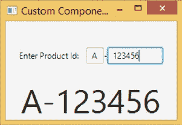

第 3 章 ■ 使用 SceneBuilder 创建用户界面

public void setProdId(String prodId) {

this.prodId.set(prodId);

}

验证需求和便捷功能都位于 `initialize()` 方法中，当 `FXMLLoader` 完成加载 FXML 文件后，会调用该方法。我们为两个 `TextField` 的 `textProperty` 添加了 `ChangeListener`，并只允许有效的更改发生。当前缀字段填入正确数据时，我们还会将光标移动到 `prodCode` 字段。同样，当我们从 `prodCode` 字段移开时，光标会自动跳转到前缀文本字段。

@FXML

public void initialize() {

prefix.textProperty().addListener((observable, oldValue, newValue) -> {

switch (newValue) {

case "A":

case "B":

case "C":

prodCode.requestFocus();

break;

default:

prefix.setText("");

}

});

prodCode.textProperty().addListener((observable, oldValue, newValue) -> {

if (newValue.length() > 6) {

prodCode.setText(newValue.substring(0, 6));

} else if (newValue.length() == 0) {

prefix.requestFocus();

}

});

prodId.bind(prefix.textProperty().concat("-").concat(prodCode.textProperty()));

}

运行 `CustomComponent` 程序时，将显示如图 3-8 所示的“自定义组件示例”窗口。

***图 3-8.** CustomComponent 程序*

[www.it-ebooks.info](http://www.it-ebooks.info/)

第 3 章 ■ 使用 SceneBuilder 创建用户界面

使用脚本或控制器属性进行事件处理

在上一节中，我们向您介绍了如何使用控制器的方法作为 FXML 文件中节点的事件处理器。JavaFX 还提供了另外两种在 FXML 文件中设置事件处理器的方法。一种方法是使用脚本。任何兼容 JSR-223 的基于 `javax.script` 的脚本引擎都可以使用。用于脚本的语言必须在 FXML 文件的顶部指定。要使用 Oracle JDK 8 附带的 Nashorn JavaScript 引擎，必须在 FXML 文件的顶部包含以下处理指令：

<?language javascript?>

`fx:script` 元素用于引入脚本。支持内联脚本和外部文件脚本。

以下是内联脚本：

<fx:script>

function actionHandler(event) {

webView.getEngine().load(address.getText());

}

</fx:script>

外部脚本采用以下形式：

<fx:script source="myscript.js"/>

FXML 文件中任何具有 `fx:id` 的节点都可以通过其 `fx:id` 名称从脚本环境中访问。如果 FXML 文件有控制器，则该控制器可作为名为 `controller` 的变量使用。在 `fx:script` 部分中声明的变量也可用作 FXML 文件其余部分中属性的变量。要将 `fx:script` 部分中定义的 `actionHandler(event)` 函数用作事件处理器，可以按如下方式指定：

<TextField fx:id="address"

onAction="actionHandler(event)"

■ **注意** 如果事件处理器不需要检查事件对象，则可以使用不带参数的函数；或者使用带一个参数的函数作为事件处理器属性的值，例如 `onAction`。如果调用带一个参数的函数，则必须将系统提供的 `event` 变量传递给它。

清单 3-29 和 3-30 中的 `ScriptingExample` 演示了使用脚本进行事件处理。

***清单 3-29.*** ScriptingExample.fxml

<?xml version="1.0" encoding="UTF-8"?>

<?language javascript?>

<?import javafx.geometry.Insets?>

<?import javafx.scene.control.Button?>

<?import javafx.scene.control.TextField?>

<?import javafx.scene.layout.HBox?>

[www.it-ebooks.info](http://www.it-ebooks.info/)

第 3 章 ■ 使用 SceneBuilder 创建用户界面

<?import javafx.scene.layout.VBox?>

<?import javafx.scene.web.WebView?>

<VBox maxHeight="-Infinity"

maxWidth="-Infinity"

minHeight="-Infinity"

minWidth="-Infinity"

prefHeight="400.0"

prefWidth="600.0"

spacing="10.0"

xmlns=" [`javafx.com/javafx/8`](http://javafx.com/javafx/8)"

xmlns:fx=" [`javafx.com/fxml/1`](http://javafx.com/fxml/1)">

<fx:script>

function actionHandler(event) {

webView.getEngine().load(address.getText());

}

</fx:script>

<children>

<HBox spacing="10.0">

<children>

<TextField fx:id="address"

onAction="actionHandler(event)"

HBox.hgrow="ALWAYS">

<padding>

<Insets bottom="4.0" left="4.0" right="4.0" top="4.0"/>

</padding>

</TextField>

<Button fx:id="loadButton"

mnemonicParsing="false"

onAction="actionHandler(event)"

text="加载"/>

</children>

</HBox>

<WebView fx:id="webView"

prefHeight="200.0"

prefWidth="200.0"

VBox.vgrow="ALWAYS"/>

</children>

<padding>

<Insets bottom="10.0" left="10.0" right="10.0" top="10.0"/>

</padding>

</VBox>

***清单 3-30.*** ScriptingExample.java

import javafx.application.Application;

import javafx.fxml.FXMLLoader;

import javafx.scene.Scene;

import javafx.scene.layout.VBox;

import javafx.stage.Stage;

[www.it-ebooks.info](http://www.it-ebooks.info/)

第 3 章 ■ 使用 SceneBuilder 创建用户界面

public class ScriptingExample extends Application {

@Override

public void start(Stage primaryStage) throws Exception {

FXMLLoader fxmlLoader = new FXMLLoader();

fxmlLoader.setLocation(

ScriptingExample.class.getResource("/ScriptingExample.fxml"));

final VBox vBox = fxmlLoader.load();

Scene scene = new Scene(vBox, 600, 400);

primaryStage.setTitle("脚本示例");

primaryStage.setScene(scene);

primaryStage.show();

}

public static void main(String[] args) {

launch(args);

}

}

运行 `ScriptingExample` 时，将显示与图 3-4 非常相似的“脚本示例”窗口。

您还可以使用变量语法指定事件处理器：

<TextField fx:id="address"

onAction="$controller.actionHandler"

这将把控制器中的 `actionHandler` 属性设置为 `onActionEvent` 的事件处理器。

在控制器中，`actionHandler` 属性应具有正确的事件处理器类型。对于 `onAction` 事件，该属性应如下所示：

@FXML

public EventHandler<ActionEvent> getActionHandler() {

return event -> {

// 处理事件

};

}

现在，我们已经深入理解了 FXML 文件格式，可以有效地利用 GUI 编辑的便利性来创建 FXML 文件。

使用 JavaFX SceneBuilder

在前面的章节中，您已经学习了 FXML 文件格式的基础知识。在尝试使用和理解 JavaFX SceneBuilder 工具时，这些知识将非常有用。在本章的最后一节中，我们将深入探讨 JavaFX SceneBuilder 的用法。


由于 UI 布局是一项高度主观、有时甚至带有艺术性的工作，它在很大程度上取决于具体的应用程序以及 UI 和用户体验团队的设计理念。我们并不自诩通晓 UI 设计的最佳方法。因此，在本节中，我们将引导您了解 JavaFX SceneBuilder 2.0 本身，向您指出 UI 设计器的各个部分，并讨论如何操作旋钮和切换档位以达到预期效果。

[www.it-ebooks.info](http://www.it-ebooks.info/)

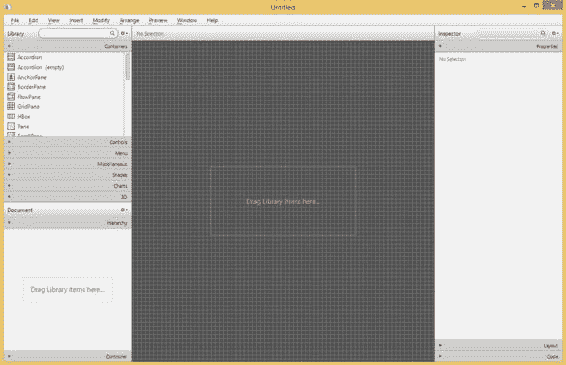

第 3 章 ■ 使用 SceneBuilder 创建用户界面

JavaFX SceneBuilder 概述

启动 JavaFX SceneBuilder 后，屏幕显示如图 3-9 所示。

***图 3-9.** JavaFX SceneBuilder 程序*

首次启动时，JavaFX SceneBuilder UI 顶部有一个菜单栏，屏幕左侧有两个名为“库”和“文档”的折叠容器，屏幕中间是内容面板，屏幕右侧是一个名为“检查器”的折叠容器。

了解菜单栏和菜单项

JavaFX SceneBuilder 中有九个菜单。让我们逐一查看。

“文件”菜单如图 3-10 所示。

[www.it-ebooks.info](http://www.it-ebooks.info/)

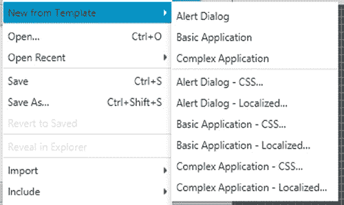

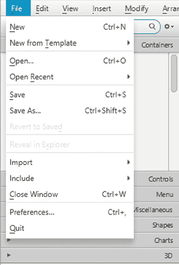

第 3 章 ■ 使用 SceneBuilder 创建用户界面

***图 3-10.** “文件”菜单*

“新建”、“打开”、“保存”、“另存为”、“恢复已保存”、“在资源管理器中显示”（或 Finder、桌面）、“关闭窗口”和“退出”菜单项的功能基本符合您的预期。“从模板新建”菜单项可根据现有模板创建新的 FXML 文件。模板列表如图 3-11 所示。

***图 3-11.** 模板*

[www.it-ebooks.info](http://www.it-ebooks.info/)

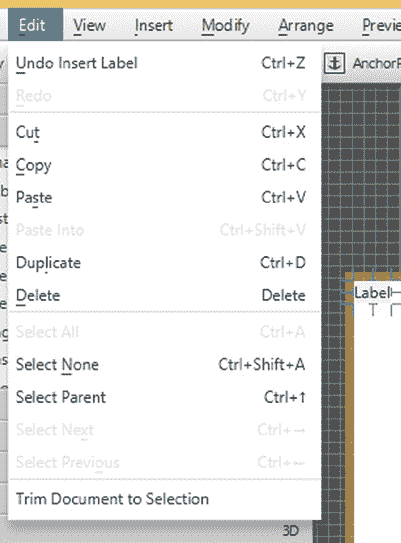

第 3 章 ■ 使用 SceneBuilder 创建用户界面

“导入”菜单项允许您将另一个 FXML 文件的内容复制到当前 FXML 文件中。它还允许您将图像和媒体文件添加到当前 FXML 文件中。此类导入的文件会被包装在 ImageView 或 MediaView 节点中。“包含”菜单项允许您向当前 FXML 文件中添加一个 fx:include 元素。“关闭窗口”菜单项关闭当前窗口中正在编辑的 FXML 文件。“首选项”菜单项允许您设置某些控制 JavaFX SceneBuilder 外观的首选项。“退出”菜单项允许您完全退出 JavaFX SceneBuilder 应用程序。它会在关闭应用程序前提示您保存所有未保存的文件。

“编辑”菜单如图 3-12 所示。

***图 3-12.** “编辑”菜单*

“撤销”、“重做”、“剪切”、“复制”、“粘贴”、“粘贴到”、“复制”、“删除”、“全选”、“取消全选”、“选择父级”、“选择下一个”和“选择上一个”菜单项均执行其常规功能。“将文档修剪到所选内容”菜单项会删除所有未选中的内容。

“视图”菜单如图 3-13 所示。

[www.it-ebooks.info](http://www.it-ebooks.info/)

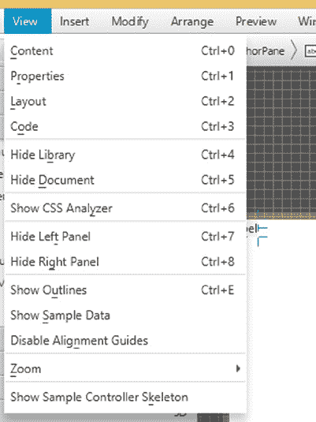

第 3 章 ■ 使用 SceneBuilder 创建用户界面

***图 3-13.** “视图”菜单*

“内容”菜单项将焦点置于屏幕中间的内容面板上。“属性”、“布局”和“代码”菜单项将焦点置于屏幕右侧检查器面板中的“属性”、“布局”或“代码”部分。“隐藏库”命令隐藏屏幕左侧顶部的库面板。库隐藏后，该菜单项将变为“显示库”。“隐藏文档”菜单项对屏幕左侧底部的文档面板执行相同操作。“显示 CSS 分析器”菜单项显示默认不显示的 CSS 分析器。“隐藏左侧面板”和“隐藏右侧面板”菜单项隐藏左侧面板（库面板和文档面板）或右侧面板（检查器面板）。“显示轮廓”菜单项显示项目的轮廓。“显示示例数据”菜单项将显示 TreeView、TableView 和 TreeTableView 节点的示例数据，以帮助您可视化节点的工作状态。示例数据不会随 FXML 文件一起保存。

“禁用对齐参考线”菜单项禁用在内容面板的容器中移动节点时显示的对齐参考线。这些对齐参考线有助于您将节点定位在屏幕上的正确位置。“缩放”菜单项允许您更改内容面板的放大倍率。“显示示例控制器骨架”菜单项将打开一个对话框，显示基于文档面板中的控制器设置以及 FXML 文件中为节点声明的 fx:id 生成的控制器类骨架声明。

图 3-14 显示了显示 CSS 分析器时的 JavaFX SceneBuilder 屏幕。

[www.it-ebooks.info](http://www.it-ebooks.info/)

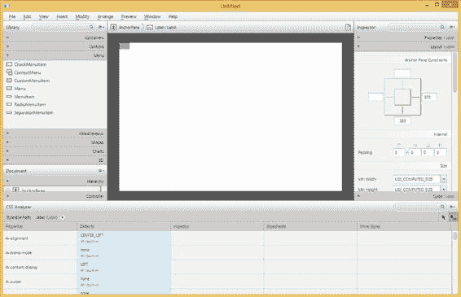

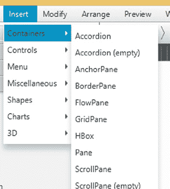

第 3 章 ■ 使用 SceneBuilder 创建用户界面

***图 3-14.** 显示 CSS 分析器时的 JavaFX SceneBuilder 屏幕*

“插入”菜单如图 3-15 所示。

***图 3-15.** “插入”菜单*

[www.it-ebooks.info](http://www.it-ebooks.info/)

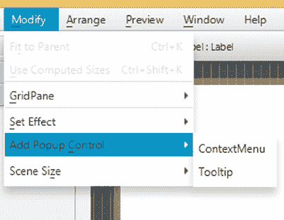

第 3 章 ■ 使用 SceneBuilder 创建用户界面

“插入”菜单包含允许您将不同类型的节点插入内容面板的子菜单和菜单项。这些子菜单及其菜单项表示与库面板中相同的层次结构。它们包括“容器”、“控件”、“菜单”、“杂项”、“形状”、“图表”和“3D”类别。我们将在后续章节中更详细地介绍这些节点。

“修改”菜单如图 3-16 所示。

***图 3-16.** “修改”菜单*

“适应父级”菜单项将展开所选节点以填充 AnchorPane 容器，并将节点锚定到父级的所有边。“使用计算大小”菜单项将所选元素的大小调整为 USE_COMPUTED_SIZE。

“GridPane”子菜单包含用于 GridPane 容器的项目。“设置效果”子菜单包含可应用于当前节点的每种效果的项目。“添加弹出控件”允许您向所选节点添加 ContextMenu 或 Tooltip。“场景大小”子菜单允许您将场景大小更改为一些常用尺寸，包括 320x240 (QVGA)、640x480 (VGA)、1280x800 和 1920x1080。

“排列”菜单如图 3-17 所示。

[www.it-ebooks.info](http://www.it-ebooks.info/)

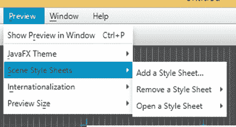

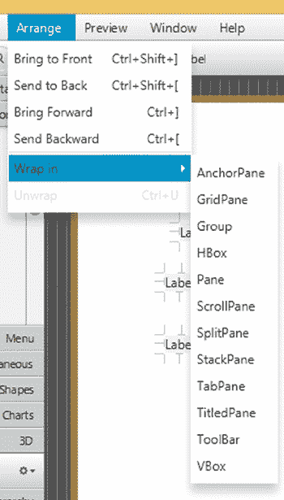

第 3 章 ■ 使用 SceneBuilder 创建用户界面

***图 3-17.** “排列”菜单*

“置于顶层”、“置于底层”、“上移一层”和“下移一层”菜单项可将所选节点在重叠节点的 Z 轴顺序中向前、向后、向上或向下移动。“包裹在”子菜单包含每种容器类型的项目，并允许您将一组选定的节点包裹到该容器中。例如，您可以选择将两个相邻的标签包裹到一个 HBox 中。“取消包裹”菜单项从所选节点中移除容器。


预览菜单如图 3-18 所示。

***图 3-18.** 预览菜单*

[www.it-ebooks.info](http://www.it-ebooks.info/)

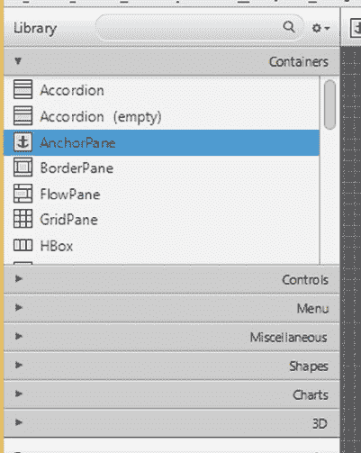

第 3 章 ■ 使用 SceneBuilder 创建用户界面

“在窗口中显示预览”菜单项允许你在一个实时窗口中预览场景，以查看其在实际运行中的效果。这是最常用的菜单项，因为你将多次使用它。“JavaFX 主题”子菜单包含多种主题，你可以用它们来预览场景。“场景样式表”子菜单包含的选项允许你添加、删除或编辑在预览期间应用于场景的样式表。“国际化”子菜单包含的选项允许你添加、删除或编辑在预览期间使用的资源包。“预览大小”子菜单包含用于设置预览时首选屏幕尺寸的选项。

“窗口”菜单允许你在多个同时编辑的 FXML 文件之间切换。

“帮助”菜单显示 JavaFX SceneBuilder 的在线帮助和关于对话框。

了解库面板

库面板位于左侧面板的顶部，可以通过“视图 ➤ 隐藏库”菜单项将其隐藏。它包含了可用于构建用户界面的容器和节点。图 3-19 显示了库面板及其“容器”抽屉打开的状态，展示了一些容器。你可以点击其他抽屉来查看它们包含的内容。

图 3-20 显示了库面板及其“控件”抽屉打开的状态，展示了一些控件。

***图 3-19.** 库面板及其“容器”抽屉打开状态*

[www.it-ebooks.info](http://www.it-ebooks.info/)

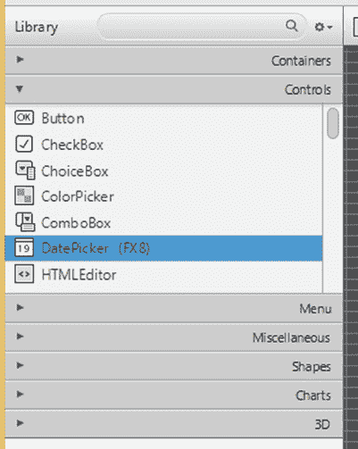

第 3 章 ■ 使用 SceneBuilder 创建用户界面

***图 3-20.** 库面板及其“控件”抽屉打开状态*

库面板顶部有一个搜索框。你可以在搜索框中输入容器、控件或属于其他抽屉的某个元素的名称。当你输入时，库面板的显示会从手风琴式布局切换为一个单一的列表，其中包含所有名称与搜索框中输入内容匹配的节点。这使你能够快速按名称找到节点，而无需逐个浏览抽屉。

图 3-21 显示了处于搜索模式的库面板。要退出搜索模式，只需点击搜索框右端的 x 标记即可。

[www.it-ebooks.info](http://www.it-ebooks.info/)

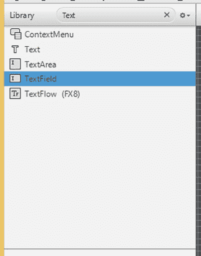

第 3 章 ■ 使用 SceneBuilder 创建用户界面

***图 3-21.** 处于搜索模式的库面板*

一旦找到容器或节点，你可以将其拖拽到内容面板，拖拽到文档面板的层次树中，或者双击它。将容器拖入内容面板，然后用控件和其他节点填充容器，这就是在 JavaFX SceneBuilder 中构建用户界面的方式。

搜索框右侧是一个菜单按钮，其中包含几个菜单项和一个用于改变库面板行为的子菜单。图 3-22 显示了此菜单按钮中的可用选项。“以列表形式查看”菜单项将库面板的显示从按多个分区展示节点，改为将所有节点集中在一个列表中展示，不分区域。“以分区形式查看”菜单项则将库面板的显示从单一列表改为按多个分区展示节点。“导入 JAR/FXML 文件”菜单项允许你将外部 jar 文件或 FXML 文件作为自定义组件导入到 JavaFX SceneBuilder 中。“导入所选内容”菜单项允许你将当前选中的节点作为自定义组件导入到 JavaFX SceneBuilder 中。“自定义库文件夹”子菜单包含两个菜单项。“在资源管理器中显示”菜单项会打开操作系统的文件资源管理器（或 Finder）中存放自定义组件的文件夹，允许你移除任何已导入的自定义库。“显示 JAR 分析报告”菜单项会显示一份报告，其中包含 JavaFX SceneBuilder 对导入的 jar 文件的评估结果。

[www.it-ebooks.info](http://www.it-ebooks.info/)

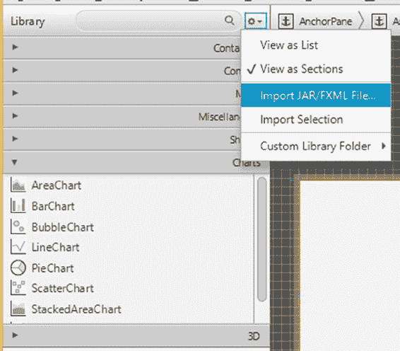

第 3 章 ■ 使用 SceneBuilder 创建用户界面

***图 3-22.** 库面板及其菜单打开状态*

为了演示如何将自定义组件导入 JavaFX SceneBuilder，我们将上一节中 CustomComponent 示例的类文件和 FXML 文件打包成一个 CustomComponent.jar 文件。然后我们调用“导入 JAR/FXML 文件”菜单项，导航到相应目录，并选择 CustomComponent.jar 文件进行导入。一旦我们在文件选择对话框中点击“打开”按钮，JavaFX SceneBuilder 就会打开“导入”对话框，如图 3-23 所示。

[www.it-ebooks.info](http://www.it-ebooks.info/)

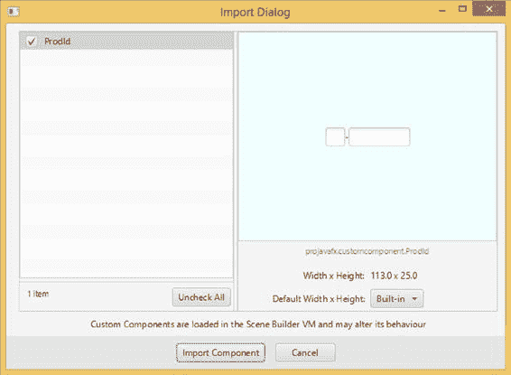

第 3 章 ■ 使用 SceneBuilder 创建用户界面

***图 3-23.** 导入 CustomComponent.jar 的“导入”对话框*

我们可以通过点击左侧列表中的自定义组件名称来检查 jar 文件中包含的每个自定义组件。所选自定义组件的信息，包括其可视化表示，会显示在屏幕右侧。我们可以通过选中组件名称旁的复选框来选择要导入哪些自定义组件。然后点击“导入组件”按钮完成导入过程。导入后，ProdId 自定义组件会出现在库面板的“自定义”分区中，并且可以添加到任何后续构建的用户界面中。

了解文档面板

文档面板位于左侧面板的底部，可以通过“视图 ➤ 隐藏文档”菜单项将其隐藏。它包含两个分区。“层次结构”分区以树状视图显示所有已添加到内容面板的节点，并按包含关系进行组织。由于内容面板中节点的布局可能使得从内容面板中选择节点比较棘手，因此在文档面板的“层次结构”分区中进行选择可能会更容易。

图 3-24 显示了清单 3-4 中 FXMLLoaderExample 的 FXML 文件对应的文档面板的“层次结构”分区。你可以看到展开的节点树，其中 WebView 节点处于选中状态。

[www.it-ebooks.info](http://www.it-ebooks.info/)

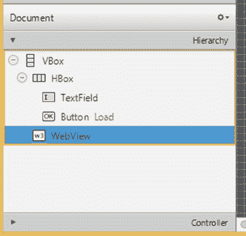

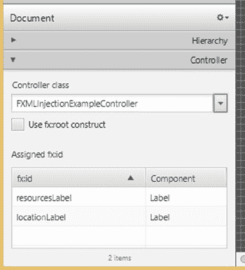

第 3 章 ■ 使用 SceneBuilder 创建用户界面


***图 3-24.** FXMLLoaderExample.fxml 文档面板的层次结构部分* 控制器部分显示 FXML 文件控制器的信息。图 3-25 展示了清单 3-7 中 FXMLInjectionExample 的 FXML 文件在文档面板中的控制器部分。您可以在此部分设置控制器类的名称。您也可以在此部分选择为 FXML 文件使用 fx:root 构造。您还会看到一个已设置 fx:id 的节点列表，并且可以通过单击“已分配的 fx:id”表格中的行来选择节点。

***图 3-25.** FXMLInjectionExample.fxml 文档面板的控制器部分* 137

[www.it-ebooks.info](http://www.it-ebooks.info/)

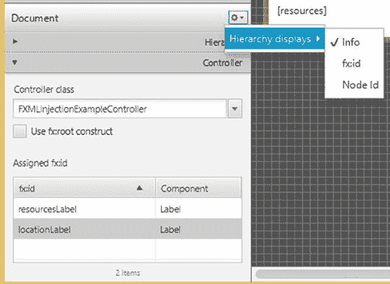

第 3 章 ■ 使用 SceneBuilder 创建用户界面

文档面板的右上角有一个菜单按钮。它包含一个“层次结构显示”子菜单，该子菜单有三个菜单项，如图 3-26 所示。“信息”菜单项使层次结构部分显示每个节点及其常规信息，通常也就是内容面板中为同一节点显示的信息。“fx:id”菜单项使层次结构部分显示每个节点及其已设置的 fx:id（如果已设置）。“节点 ID”菜单项使层次结构部分显示每个节点及其已设置的节点 ID（如果已设置）。节点 ID 被 CSS 用于查找节点并操作节点的样式。

***图 3-26.** 菜单打开的文档面板*

理解内容面板

内容面板是组合用户界面的地方。您首先将一个容器拖到内容面板中。然后，您将其他节点拖到内容面板中，并将其定位到容器节点上。当您拖动节点时，当拖动的节点达到某些对齐和间距位置时，会出现红色参考线。借助这些参考线，您应该能够创建视觉上令人愉悦的用户界面。

内容面板上方有一个面包屑导航栏，显示内容区域中选中节点的路径。

这使您可以轻松导航到当前选中节点的包含节点。当出现情况时，JavaFX SceneBuilder 会在此栏中显示警告和错误消息。

JavaFX SceneBuilder 的一个便捷功能是，当您选中多个节点时，可以右键单击选中的节点，转到上下文菜单，选择“包裹在”子菜单，然后选择一种容器类型。您也可以通过这种方式“解包”一个节点，移除包含该节点的任何容器。

图 3-27 展示了正在 JavaFX SceneBuilder 中编辑的清单 3-20 中的 IncludeExampleTree.fxml 文件。

[www.it-ebooks.info](http://www.it-ebooks.info/)

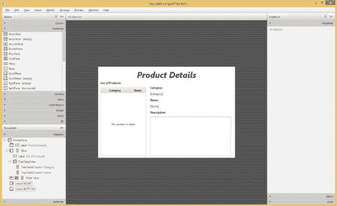

第 3 章 ■ 使用 SceneBuilder 创建用户界面

***图 3-27.** 正在 JavaFX SceneBuilder 中编辑的 IncludeExampleTree.fxml 文件* 理解检查器面板

检查器面板位于右侧面板中，可以使用“视图 ➤ 隐藏右侧面板”菜单项将其隐藏。

它包含“属性”、“布局”和“代码”部分。“属性”部分列出了内容面板中选中节点的所有通用属性。您可以通过更改此处显示的值来设置属性。您也可以通过调用属性右侧的小菜单按钮将属性恢复为其默认值。您可以在“属性”部分的 ID 属性编辑器中设置节点 ID。图 3-28 展示了检查器面板的“属性”部分。

[www.it-ebooks.info](http://www.it-ebooks.info/)

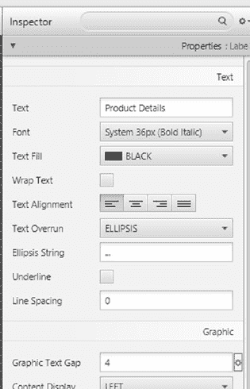

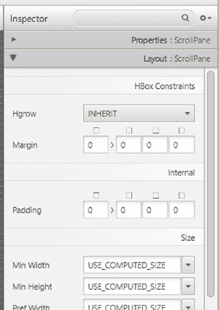

第 3 章 ■ 使用 SceneBuilder 创建用户界面

***图 3-28.** 检查器面板的“属性”部分*

“布局”部分列出了当前选中节点的所有布局相关属性。图 3-29 展示了检查器面板的“布局”部分。

***图 3-29.** 检查器面板的“布局”部分*

[www.it-ebooks.info](http://www.it-ebooks.info/)

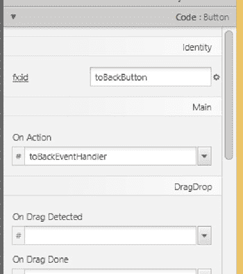

第 3 章 ■ 使用 SceneBuilder 创建用户界面

“代码”部分列出了内容面板中选中节点可能拥有的所有事件处理器。它还允许您为选中节点设置 fx:id。您可以以任何方式在“代码”部分连接事件处理器，但提供事件处理器最便捷的方式是将它们设置为控制器中具有正确签名的方法。图 3-30 展示了检查器面板的“代码”部分。

***图 3-30.** 检查器面板的“代码”部分*

总结

在本章中，您学习了在 JavaFX 中以声明方式创建用户界面的方法。您学习了以下重要的工具和信息：

• FXML 文件是声明式 UI 信息的载体，是 JavaFX 项目的核心资产。

• FXML 文件通过 FXMLLoader 加载到 JavaFX 应用程序中。加载的结果是一个可以合并到场景中的节点。

• FXML 文件可以有一个配套的控制器类，该类在运行时代表 FXML 文件中声明的节点执行程序化功能，例如事件处理。

• FXML 文件可以在您喜欢的 Java IDE 中轻松编辑，并带有智能建议和自动补全功能。

• FXML 文件也可以在 Oracle JavaFX SceneBuilder 2.0 中编辑，这是一个用于编辑 FXML 文件的开源工具。

• JavaFX SceneBuilder 是一个用于指定 JavaFX UI 的高效工具。您可以将容器、控件和其他 JavaFX 节点添加到 FXML 文件的内容中。

• 您可以设置控制器并定义场景中各个节点的 fx:id。

• 您可以通过操作文档面板“层次结构”部分中的容器、控件和其他节点来组织 FXML 文件中的层次结构信息。

[www.it-ebooks.info](http://www.it-ebooks.info/)

第 3 章 ■ 使用 SceneBuilder 创建用户界面

• 您可以通过使用检查器面板中的“属性”、“布局”和“代码”部分来操作 FXML 文件中节点的属性。

• 您可以在内容面板中直观地组合您的用户界面。

• 您可以使用 CSS 分析器分析用户界面的 CSS。

资源

• Oracle JavaFX SceneBuilder 2.0 下载站点：[`www.oracle.com/technetwork/java/javase/downloads/javafxscenebuilder-info-2157684.html`](http://www.oracle.com/technetwork/java/javase/downloads/javafxscenebuilder-info-2157684.html)

• Jasper Pott 宣布发布 JavaFX SceneBuilder 2.0 的博客文章：[`fxexperience.com/2014/05/announcing-scenebuilder-2-0/`](http://fxexperience.com/2014/05/announcing-scenebuilder-2-0/)

• 一段九分钟的视频，展示了伴随 Jasper Pott 公告的 JavaFX SceneBuilder 2.0 的功能：[`www.youtube.com/watch?v=ij0HwRAlCmo&feature=youtu.be`](https://www.youtube.com/watch?v=ij0HwRAlCmo&feature=youtu.be)

• 为 Eclipse IDE 提供 JavaFX 支持的 e(fx)clipse Eclipse 插件：[`www.eclipse.org/efxclipse/install.html`](http://www.eclipse.org/efxclipse/install.html)

[www.it-ebooks.info](http://www.it-ebooks.info/)

**第 4 章**

**属性和绑定**

*天行健，*

*君子以自强不息。*

——《易经》


在前面的章节中，我们向您介绍了作为 Oracle JDK 8 一部分的 JavaFX 8 平台。您使用自己喜爱的 IDE（Eclipse、NetBeans 或 IntelliJ IDEA）搭建了开发环境，编写并运行了第一个 JavaFX GUI 程序，学习了 JavaFX 的基本构建模块：Stage 和 Scene 类，以及构成 Scene 的 Nodes。您无疑已经注意到，我们使用了用户定义的模型类来表示应用程序状态，并通过属性和绑定将该状态传递给 UI。

在本章中，我们将带您深入了解 JavaFX 属性和绑定框架。在简要回顾历史并给出一个激励性示例（展示 JavaFX Property 的各种使用方式）之后，我们将介绍该框架的核心概念：Observable、ObservableValue、WritableValue、ReadOnlyProperty、Property 和 Binding。我们将展示这些框架基础接口所提供的功能，然后演示 Property 对象如何绑定在一起，Binding 对象如何由属性和其他绑定构建而成——

使用 `Bindings` 工具类中的工厂方法、流畅接口 API，或者通过直接扩展实现 `Binding` 接口的抽象类来进行底层操作——以及它们如何被用来轻松地将程序中某一部分的变更传播到其他部分，而无需编写过多代码。接着，我们将介绍 JavaFX Beans 命名约定，这是原始 JavaBeans 命名约定的扩展，它使您能够将数据有条理地组织到封装组件中。最后，我们将展示如何将旧式 JavaBeans 属性适配为 JavaFX 属性。

由于 JavaFX 属性和绑定框架是 JavaFX 平台的非可视化部分，本章中的示例程序本质上也是非可视化的。我们将处理 Boolean、Integer、Long、Float、Double、String 和 Object 类型的属性和绑定，因为这些是 JavaFX 绑定框架所专精的类型。

您的 GUI 编程乐趣将在下一章及后续章节中继续。

**JavaFX 绑定的先驱**

在 Java 发展早期，人们就认识到需要将 Java 组件的属性直接暴露给客户端代码，使其能够观察和操作这些属性，并在其值发生变化时采取行动。Java 1.1 中的 JavaBeans 框架通过如今广为人知的 getter 和 setter 约定提供了对属性的支持。它还通过其 `PropertyChangeEvent` 和 `PropertyChangeListener` 机制支持属性变更的传播。尽管 JavaBeans 框架在许多 Swing 应用程序中得到了应用，但其使用相当繁琐，需要编写大量样板代码。多年来，人们创建了多个更高级的数据绑定框架，并取得了不同程度的成功。JavaBeans 在 JavaFX 属性和绑定框架中的传承主要体现在 JavaFX Beans 的 getter、setter 和属性 getter 命名约定上，用于定义 JavaFX 组件。我们将在本章后面介绍 JavaFX 属性和绑定框架的核心概念和接口之后，再讨论 JavaFX Beans 的 getter、setter 和属性 getter 命名约定。

JavaFX 属性和绑定框架的另一传承来自 JavaFX Script 语言，该语言是 JavaFX 1.x 平台的一部分。尽管 JavaFX Script 语言在 JavaFX 平台中已被弃用，转而采用基于 Java 的 API，但这次过渡的目标之一就是保留 JavaFX Script 的 `bind` 关键字的大部分能力，其表达能力曾令许多 JavaFX 爱好者欣喜不已。例如，JavaFX Script 支持绑定到复杂表达式：

```java
var a = 1;
var b = 10;
var m = 4;
def c = bind for (x in [a..b] where x < m) { x * x };
```

每当 `a`、`b` 或 `m` 的值发生变化时，这段代码都会自动重新计算 `c` 的值。

尽管 JavaFX 属性和绑定框架并不支持 JavaFX Script 的所有绑定结构，但它支持许多有用表达式的绑定。在介绍完框架的核心概念和接口之后，我们将进一步讨论如何构建复合绑定表达式。

**一个激励性示例**

让我们从清单 4-1 中的示例开始，该示例通过使用 `SimpleIntegerProperty` 类的几个实例，展示了 `Property` 接口的功能。

***清单 4-1.*** MotivatingExample.java

```java
import javafx.beans.InvalidationListener;
import javafx.beans.property.IntegerProperty;
import javafx.beans.property.SimpleIntegerProperty;
import javafx.beans.value.ChangeListener;
import javafx.beans.value.ObservableValue;

public class MotivatingExample {
    private static IntegerProperty intProperty;

    public static void main(String[] args) {
        createProperty();
        addAndRemoveInvalidationListener();
        addAndRemoveChangeListener();
        bindAndUnbindOnePropertyToAnother();
    }

    private static void createProperty() {
        System.out.println();
        intProperty = new SimpleIntegerProperty(1024);
        System.out.println("intProperty = " + intProperty);
        System.out.println("intProperty.get() = " + intProperty.get());
        System.out.println("intProperty.getValue() = " + intProperty.getValue().intValue());
    }

    private static void addAndRemoveInvalidationListener() {
        System.out.println();
        final InvalidationListener invalidationListener = observable ->
            System.out.println("The observable has been invalidated: " + observable + ".");
        intProperty.addListener(invalidationListener);
        System.out.println("Added invalidation listener.");
        System.out.println("Calling intProperty.set(2048).");
        intProperty.set(2048);
        System.out.println("Calling intProperty.setValue(3072).");
        intProperty.setValue(Integer.valueOf(3072));
        intProperty.removeListener(invalidationListener);
        System.out.println("Removed invalidation listener.");
        System.out.println("Calling intProperty.set(4096).");
        intProperty.set(4096);
    }

    private static void addAndRemoveChangeListener() {
        System.out.println();
        final ChangeListener changeListener = (ObservableValue observableValue, Object oldValue,
                Object newValue) ->
            System.out.println("The observableValue has changed: oldValue = " + oldValue + ", newValue = " + newValue);
        intProperty.addListener(changeListener);
        System.out.println("Added change listener.");
        System.out.println("Calling intProperty.set(5120).");
        intProperty.set(5120);
        intProperty.removeListener(changeListener);
        System.out.println("Removed change listener.");
        System.out.println("Calling intProperty.set(6144).");
        intProperty.set(6144);
    }

    private static void bindAndUnbindOnePropertyToAnother() {
        System.out.println();
        IntegerProperty otherProperty = new SimpleIntegerProperty(0);
        System.out.println("otherProperty.get() = " + otherProperty.get());
        System.out.println("Binding otherProperty to intProperty.");
        otherProperty.bind(intProperty);
        System.out.println("otherProperty.get() = " + otherProperty.get());
        System.out.println("Calling intProperty.set(7168).");
        intProperty.set(7168);
        System.out.println("otherProperty.get() = " + otherProperty.get());
        System.out.println("Unbinding otherProperty from intProperty.");
        otherProperty.unbind();
        System.out.println("otherProperty.get() = " + otherProperty.get());
        System.out.println("Calling intProperty.set(8192).");
        intProperty.set(8192);
        System.out.println("otherProperty.get() = " + otherProperty.get());
    }
}
```


在本例中，我们创建了一个名为 `intProperty` 的 `SimpleIntegerProperty` 对象，其初始值为 1024。随后，我们通过一系列不同的整数值更新了它的值，期间我们先后添加并移除了一个 `InvalidationListener`，添加并移除了一个 `ChangeListener`，最后创建了另一个名为 `otherProperty` 的 `SimpleIntegerProperty`，将其绑定到 `intProperty` 上，然后又解除了绑定。我们在定义监听器时利用了 Java 8 的 Lambda 语法。该示例程序大量使用了 `println` 调用来展示程序内部发生的情况。

运行清单 4-1 中的程序时，控制台会输出以下内容：

intProperty = IntegerProperty [value: 1024]

intProperty.get() = 1024

intProperty.getValue() = 1024

已添加失效监听器。

调用 intProperty.set(2048)。

可观察对象已失效：IntegerProperty [value: 2048]。

调用 intProperty.setValue(3072)。

可观察对象已失效：IntegerProperty [value: 3072]。

已移除失效监听器。

调用 intProperty.set(4096)。

已添加变更监听器。

调用 intProperty.set(5120)。

可观察值已变更：旧值 = 4096，新值 = 5120

已移除变更监听器。

调用 intProperty.set(6144)。

otherProperty.get() = 0

将 otherProperty 绑定到 intProperty。

otherProperty.get() = 6144

调用 intProperty.set(7168)。

otherProperty.get() = 7168

解除 otherProperty 与 intProperty 的绑定。

otherProperty.get() = 7168

调用 intProperty.set(8192)。

otherProperty.get() = 7168

通过将输出行与程序源代码进行关联（或者在你喜欢的 IDE 的调试器中单步执行代码），我们可以得出以下结论。

[www.it-ebooks.info](http://www.it-ebooks.info/)

第 4 章 ■ 属性和绑定

•   一个 `SimpleIntegerProperty` 对象（例如 `intProperty` 和 `otherProperty`）持有一个 `int` 值。该值可以通过 `get()`、`set()`、`getValue()` 和 `setValue()` 方法进行操作。`get()` 和 `set()` 方法使用原始 `int` 类型执行操作。`getValue()` 和 `setValue()` 方法使用 `Integer` 包装类型。

•   你可以向 `intProperty` 添加和移除 `InvalidationListener` 对象。

•   你可以向 `intProperty` 添加和移除 `ChangeListener` 对象。

•   另一个 `Property` 对象（例如 `otherProperty`）可以绑定到 `intProperty`。当这种情况发生时，`otherProperty` 会接收 `intProperty` 的值。

•   当为 `intProperty` 设置新值时，任何附加到其上的对象都会收到通知。如果该对象已被移除，则不会发送通知。

•   收到通知时，`InvalidationListener` 对象仅被告知哪个对象正在发送通知，并且该对象仅被识别为 `Observable`。

•   收到通知时，`ChangeListener` 对象除了收到发送通知的对象外，还会被告知另外两条信息——`oldValue` 和 `newValue`。发送通知的对象被识别为 `ObservableValue`。

•   对于像 `otherProperty` 这样的绑定属性，我们无法从输出中判断它何时或如何收到 `intProperty` 值变更的通知。但是，我们可以推断它一定知道了变更，因为当我们询问 `otherProperty` 的值时，我们得到的是 `intProperty` 的最新值。

■ **注意** 尽管这个激励示例使用了 `Integer` 属性，但类似的示例也可以使用基于 `Boolean`、`Long`、`Float`、`Double`、`String` 和 `Object` 类型的属性。在 JavaFX 属性和绑定框架中，当接口为具体类型进行扩展或实现时，总是针对 `Boolean`、`Integer`、`Long`、`Float`、`Double`、`String` 和 `Object` 类型进行的。

这个示例让我们注意到了 JavaFX 属性和绑定框架的一些关键接口和概念：包括 `Observable` 及其关联的 `InvalidationListener` 接口，`ObservableValue` 及其关联的 `ChangeListener` 接口，允许我们直接操作 `SimpleIntegerProperty` 对象值的 `get()`、`set()`、`getValue()` 和 `setValue()` 方法，以及允许我们通过将 `SimpleIntegerProperty` 对象从属于另一个 `SimpleIntegerProperty` 对象来放弃对其值的直接操作的 `bind()` 方法。

在下一节中，我们将更详细地向你介绍这些以及 JavaFX 属性和绑定框架的其他一些关键接口和概念。

理解关键接口和概念

图 4-1 是一个 UML 图，展示了 JavaFX 属性和绑定框架的关键接口。它包含了一些你在上一节中已经见过的接口，以及一些你尚未见过的接口。

[www.it-ebooks.info](http://www.it-ebooks.info/)

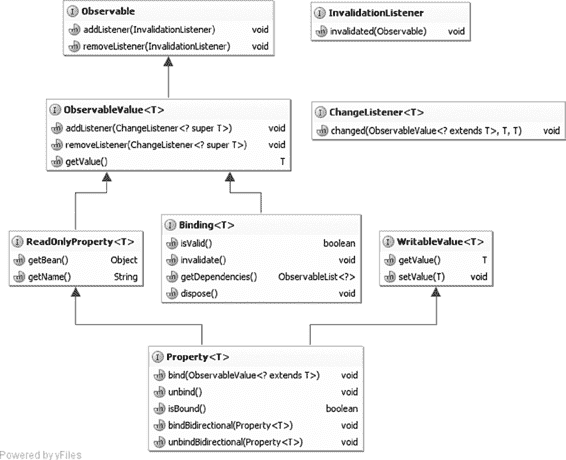

第 4 章 ■ 属性和绑定

***图 4-1.** JavaFX 属性和绑定框架的关键接口*

■ **注意** 我们在 UML 图中没有显示接口的完全限定名称。这些接口分布在四个包中：`javafx.beans`、`javafx.beans.binding`、`javafx.beans.property` 和 `javafx.beans.value`。你可以通过查阅 JavaFX API 文档或使用你喜欢的 IDE 的“查找类”功能轻松找出哪个接口属于哪个包。

理解 Observable 接口

层次结构的根是 `Observable` 接口。你可以向一个 `Observable` 对象注册 `InvalidationListener` 对象以接收*失效*事件。你已经在上一节的激励示例中看到过从一种 `Observable` 对象（`SimpleIntegerProperty` 对象 `intProperty`）触发的失效事件。

当调用 `set()` 或 `setValue()` 方法将底层值从一个 `int` 更改为另一个不同的 `int` 时，就会触发该事件。

[www.it-ebooks.info](http://www.it-ebooks.info/)

第 4 章 ■ 属性和绑定

■ **注意** 如果你连续多次使用相同的值调用 setter，JavaFX 属性和绑定框架中 `Property` 接口的任何实现都只会触发一次失效事件。

失效事件触发的另一个来源是 `Binding` 对象。你还没有见过 `Binding` 对象的示例，但本章后半部分会有大量 `Binding` 对象。目前我们只需注意，`Binding` 对象可能会变得无效，例如，当调用其 `invalidate()` 方法时，或者，正如我们将在本章后面展示的，当其某个依赖项触发失效事件时。

■ **注意** 如果 `Binding` 对象连续多次变得无效，JavaFX 属性和绑定框架中 `Binding` 接口的任何实现都只会触发一次失效事件。

理解 ObservableValue 接口

层次结构中的下一个是 `ObservableValue` 接口。它只是一个具有值的 `Observable`。其 `getValue()` 方法返回其值。我们在激励示例中对 `SimpleIntegerProperty` 对象调用的 `getValue()` 方法可以被认为来自此接口。你可以向一个 `ObservableValue` 对象注册 `ChangeListener` 对象以接收*变更*事件。

你在上一节的激励示例中看到了变更事件的触发。当变更事件触发时，`ChangeListener` 会收到另外两条信息：`ObservableValue` 对象的旧值和新值。

■ **注意** 如果你连续多次使用相同的值调用 setter，JavaFX 属性和绑定框架中 `ObservableValue` 接口的任何实现都只会触发一次变更事件。


区分失效事件和变更事件，是为了让 JavaFX 属性和绑定框架能够支持*惰性求值*。我们通过查看示例中的三行代码来展示这一点：

otherProperty.bind(intProperty);

intProperty.set(7168);

System.out.println("otherProperty.get() = " + otherProperty.get());

当调用 `intProperty.set(7168)` 时，它会向 `otherProperty` 触发一个失效事件。收到此失效事件后，`otherProperty` 仅记录其值不再有效这一事实。它不会立即通过查询 `intProperty` 的值来重新计算自己的值。重新计算会在稍后调用 `otherProperty.get()` 时执行。想象一下，如果我们在前面的代码中不是只调用一次 `intProperty.set()`，而是多次调用；`otherProperty` 仍然只重新计算一次其值。

■ **注意** `ObservableValue` 接口并不是 `Observable` 的唯一直接子接口。`Observable` 还有另外四个直接子接口，它们位于 `javafx.collections` 包中：`ObservableList`、`ObservableMap`、`ObservableSet` 和 `ObservableArray`，并分别对应 `ListChangeListener`、`MapChangeListener`、`SetChangeListener` 和 `ArrayChangeListener` 作为回调机制。这些 JavaFX 可观察集合将在第 7 章“集合与并发”中介绍。

[www.it-ebooks.info](http://www.it-ebooks.info/)

第 4 章 ■ 属性与绑定

理解 WritableValue 接口

这可能是整章中最简单的小节，因为 `WritableValue` 接口确实如其表面所见般简单。其目的是将 `getValue()` 和 `setValue()` 方法注入到该接口的实现中。

在 JavaFX 属性和绑定框架中，`WritableValue` 的所有实现类也都实现了 `ObservableValue`，因此你可以认为 `WritableValue` 的价值仅在于提供 `setValue()` 方法。

你已经在示例中看到了 `setValue()` 方法的工作方式。

理解 ReadOnlyProperty 接口

`ReadOnlyProperty` 接口向其实现中注入了两个方法。`getBean()` 方法应返回包含该 `ReadOnlyProperty` 的对象，如果它不包含在任何对象中，则返回 `null`。`getName()` 方法应返回 `ReadOnlyProperty` 的名称，如果该 `ReadOnlyProperty` 没有名称，则返回空字符串。

包含对象和名称提供了关于 `ReadOnlyProperty` 的*上下文*信息。属性的上下文信息在失效事件的传播或值的重新计算中不扮演任何直接角色。但是，如果提供了这些信息，它们会在一些外围计算中被考虑。

在我们的示例中，`intProperty` 是在没有任何上下文信息的情况下构建的。如果我们使用完整的构造函数为其提供一个名称：

intProperty = new SimpleIntegerProperty(null, "intProperty", 1024);

输出将包含属性名称：

intProperty = IntegerProperty [name: intProperty, value: 1024]

理解 Property 接口

现在我们来到了关键接口层次结构的底部。`Property` 接口的父接口包括我们迄今为止研究过的所有四个接口：`Observable`、`ObservableValue`、`ReadOnlyProperty` 和 `WritableValue`。

因此，它继承了所有这些接口的方法。它还提供了五个自己的方法：`void bind(ObservableValue<? extends T> observableValue);`

`void unbind();`

`boolean isBound();`

`void bindBidirectional(Property<T> tProperty);`

`void unbindBidirectional(Property<T> tProperty);`

你在上一节的示例中已经看到了其中两个方法的工作方式：`bind()` 和 `unbind()`。

调用 `bind()` 会在 `Property` 对象和 `ObservableValue` 参数之间创建一个*单向绑定*或依赖关系。一旦它们进入这种关系，在 `Property` 对象上调用 `set()` 或 `setValue()` 方法将导致抛出 `RuntimeException`。在 `Property` 对象上调用 `get()` 或 `getValue()` 方法将返回 `ObservableValue` 对象的值。当然，更改 `ObservableValue` 对象的值将使 `Property` 对象失效。调用 `unbind()` 会释放 `Property` 对象可能存在的任何现有单向绑定。如果单向绑定生效，`isBound()` 方法返回 `true`；否则返回 `false`。

调用 `bindBidirectional()` 会在调用者 `Property` 和参数 `Property` 之间创建一个*双向绑定*。请注意，与接受 `ObservableValue` 参数的 `bind()` 方法不同，`bindBidirectional()` 方法接受一个 `Property` 参数。只有两个 `Property` 对象可以双向绑定在一起。

[www.it-ebooks.info](http://www.it-ebooks.info/)

第 4 章 ■ 属性与绑定

一旦它们进入这种关系，在任一 `Property` 对象上调用 `set()` 或 `setValue()` 方法都会导致两个对象的值都被更新。调用 `unbindBidirectional()` 会释放调用者和参数之间可能存在的任何现有双向绑定。清单 4-2 中的程序展示了一个简单的双向绑定工作示例。

***清单 4-2.*** BidirectionalBindingExample.java

import javafx.beans.property.SimpleStringProperty;

import javafx.beans.property.StringProperty;

public class BidirectionalBindingExample {

public static void main(String[] args) {

System.out.println("Constructing two StringProperty objects.");

StringProperty prop1 = new SimpleStringProperty("");

StringProperty prop2 = new SimpleStringProperty("");

System.out.println("Calling bindBidirectional.");

prop2.bindBidirectional(prop1);

System.out.println("prop1.isBound() = " + prop1.isBound());

System.out.println("prop2.isBound() = " + prop2.isBound());

System.out.println("Calling prop1.set(\"prop1 says: Hi!\")");

prop1.set("prop1 says: Hi!");

System.out.println("prop2.get() returned:");

System.out.println(prop2.get());

System.out.println("Calling prop2.set(prop2.get() + \"\\nprop2 says: Bye!\")"); prop2.set(prop2.get() + "\nprop2 says: Bye!");

System.out.println("prop1.get() returned:");

System.out.println(prop1.get());

}

}

在这个例子中，我们创建了两个名为 `prop1` 和 `prop2` 的 `SimpleStringProperty` 对象，在它们之间创建了一个双向绑定，然后对两个属性都调用了 `set()` 和 `get()` 方法。

当我们运行清单 4-2 中的程序时，控制台会打印以下输出：

Constructing two StringProperty objects.

Calling bindBidirectional.

prop1.isBound() = false

prop2.isBound() = false

Calling prop1.set("prop1 says: Hi!")

prop2.get() returned:

prop1 says: Hi!

Calling prop2.set(prop2.get() + "\nprop2 says: Bye!")

prop1.get() returned:

prop1 says: Hi!

prop2 says: Bye!

[www.it-ebooks.info](http://www.it-ebooks.info/)

第 4 章 ■ 属性与绑定

■ **警告** 每个 `Property` 对象一次最多只能有一个活动的单向绑定。它可以拥有任意数量的双向绑定。`isBound()` 方法仅适用于单向绑定。在单向绑定已经生效的情况下，使用不同的 `ObservableValue` 参数第二次调用 `bind()` 将解除现有绑定并用新绑定替换它。

理解 Binding 接口

`Binding` 接口定义了四个方法，揭示了该接口的意图。一个 `Binding` 对象是一个 `ObservableValue`，其有效性可以通过 `isValid()` 方法查询，并通过 `invalidate()` 方法设置。

它有一个依赖项列表，可以通过 `getDependencies()` 方法获取。最后，`dispose()` 方法表示该绑定将不再被使用，并且其使用的资源可以被清理。


从上述对 Binding 接口的简要描述中，我们可以推断出它代表一种*具有多重依赖关系的单向绑定*。我们设想，每个依赖项都是一个 ObservableValue，Binding 会注册到该依赖项上以接收失效事件。当调用 get() 或 getValue() 方法时，如果绑定已失效，则会重新计算其值。

JavaFX 属性和绑定框架并未提供任何实现 Binding 接口的具体类。不过，它提供了多种轻松创建自定义 Binding 对象的方法：你可以扩展框架中的抽象基类；可以使用工具类 `Bindings` 中的一组静态方法，基于现有的常规 Java 值（即不可观察值）、属性和绑定来创建新绑定；还可以使用各种属性和绑定类中提供的一组方法，这些方法构成了流畅接口 API，用于创建新绑定。我们将在本章后面的“创建绑定”一节中详细介绍这些工具方法和流畅接口 API。现在，我们先通过扩展 `DoubleBinding` 抽象类来展示绑定的第一个示例。

清单 4-3 中的程序使用绑定来计算矩形的面积。

***清单 4-3.*** RectangleAreaExample.java

import javafx.beans.binding.DoubleBinding;

import javafx.beans.property.DoubleProperty;

import javafx.beans.property.SimpleDoubleProperty;

public class RectangleAreaExample {

public static void main(String[] args) {

System.out.println("构造 x，初始值为 2.0。");

final DoubleProperty x = new SimpleDoubleProperty(null, "x", 2.0);

System.out.println("构造 y，初始值为 3.0。");

final DoubleProperty y = new SimpleDoubleProperty(null, "y", 3.0);

System.out.println("创建绑定 area，依赖项为 x 和 y。");

DoubleBinding area = new DoubleBinding() {

private double value;

{

super.bind(x, y);

}

@Override

protected double computeValue() {

System.out.println("调用了 computeValue()。");

return x.get() * y.get();

}

};

[www.it-ebooks.info](http://www.it-ebooks.info/)

第 4 章 ■ 属性和绑定

System.out.println("area.get() = " + area.get());

System.out.println("area.get() = " + area.get());

System.out.println("将 x 设置为 5");

x.set(5);

System.out.println("将 y 设置为 7");

y.set(7);

System.out.println("area.get() = " + area.get());

}

}

在匿名内部类中，我们调用了父类 `DoubleBinding` 中的受保护方法 `bind()`，告知父类我们希望监听 `DoubleProperty` 对象 x 和 y 的失效事件。

最后，我们在父类 `DoubleBinding` 中实现了受保护的抽象方法 `computeValue()`，以便在需要重新计算时执行实际计算。

运行清单 4-3 中的程序时，控制台会输出以下内容：

构造 x，初始值为 2.0。

构造 y，初始值为 3.0。

创建绑定 area，依赖项为 x 和 y。

调用了 computeValue()。

area.get() = 6.0

area.get() = 6.0

将 x 设置为 5

将 y 设置为 7

调用了 computeValue()。

area.get() = 35.0

请注意，当我们连续两次调用 area.get() 时，computeValue() 只被调用了一次。

■ **注意** `DoubleBinding` 抽象类包含一个默认的 `dispose()` 实现（为空）和一个默认的 `getDependencies()` 实现（返回空列表）。为了使此示例成为正确的 Binding 实现，我们应该重写这两个方法以使其行为正确。

现在，你已经牢固掌握了 JavaFX 属性和绑定框架的关键接口和概念，接下来我们将展示这些通用接口如何特化为特定类型的接口，并在特定类型的抽象类和具体类中实现。

关键接口的类型特定特化


上一节中我们并未强调这一事实，因为我们认为省略它不会影响那里的解释，但除了 `Observable` 和 `InvalidationListener` 之外，其余接口都是带有类型参数 `<T>` 的泛型接口。本节我们将探讨这些泛型接口如何特化为特定类型：`Boolean`、`Integer`、`Long`、`Float`、`Double`、`String` 和 `Object`。同时，我们还将研究框架中的一些抽象类和具体类，并探索每个类的典型使用场景。

[www.it-ebooks.info](http://www.it-ebooks.info/)

第 4 章 ■ 属性和绑定

■ **注意** 这些接口也针对 `List`、`Map` 和 `Set` 存在特化版本，它们用于处理可观察集合。我们将在第 7 章介绍可观察集合。

类型特定接口的通用主题

尽管这些泛型接口并非以完全相同的方式特化，但存在一个通用主题：

• `Boolean` 类型被直接特化。

• `Integer`、`Long`、`Float` 和 `Double` 类型通过 `Number` 超类型进行特化。

• `String` 类型通过 `Object` 类型进行特化。

这一主题存在于所有关键接口的类型特定特化中。例如，我们来看 `ObservableValue<T>` 接口的子接口：

• `ObservableBooleanValue` 继承 `ObservableValue<Boolean>`，并额外提供一个方法：

• `boolean get();`

• `ObservableNumberValue` 继承 `ObservableValue<Number>`，并额外提供四个方法：

• `int intValue();`

• `long longValue();`

• `float floatValue();`

• `double doubleValue();`

• `ObservableObjectValue<T>` 继承 `ObservableValue<T>`，并额外提供一个方法：

• `T get();`

• `ObservableIntegerValue`、`ObservableLongValue`、`ObservableFloatValue` 和 `ObservableDoubleValue` 继承 `ObservableNumberValue`，每个都额外提供一个返回相应原始类型值的 `get()` 方法。

• `ObservableStringValue` 继承 `ObservableObjectValue<String>`，并继承其返回 `String` 的 `get()` 方法。

请注意，我们在示例中一直使用的 `get()` 方法是在类型特定的 `ObservableValue` 子接口中定义的。类似地，我们在示例中一直使用的 `set()` 方法是在类型特定的 `WritableValue` 子接口中定义的。

这种派生层次结构的一个实际结果是：任何数值属性都可以在任何其他数值属性或绑定上调用 `bind()`。实际上，任何数值属性上的 `bind()` 方法的签名都是 `void bind(ObservableValue<? extends Number> observable);`，并且任何数值属性和绑定都可以赋值给该泛型参数类型。清单 4-4 中的程序展示了不同特定类型的数值属性可以相互绑定。

[www.it-ebooks.info](http://www.it-ebooks.info/)

第 4 章 ■ 属性和绑定

***清单 4-4.*** NumericPropertiesExample.java

import javafx.beans.property.DoubleProperty;

import javafx.beans.property.FloatProperty;

import javafx.beans.property.IntegerProperty;

import javafx.beans.property.LongProperty;

import javafx.beans.property.SimpleDoubleProperty;

import javafx.beans.property.SimpleFloatProperty;

import javafx.beans.property.SimpleIntegerProperty;

import javafx.beans.property.SimpleLongProperty;

public class NumericPropertiesExample {

public static void main(String[] args) {

IntegerProperty i = new SimpleIntegerProperty(null, "i", 1024);

LongProperty l = new SimpleLongProperty(null, "l", 0L);

FloatProperty f = new SimpleFloatProperty(null, "f", 0.0F);

DoubleProperty d = new SimpleDoubleProperty(null, "d", 0.0);

System.out.println("已构造数值属性 i, l, f, d。");

System.out.println("i.get() = " + i.get());

System.out.println("l.get() = " + l.get());

System.out.println("f.get() = " + f.get());

System.out.println("d.get() = " + d.get());

l.bind(i);

f.bind(l);

d.bind(f);

System.out.println("已将 l 绑定到 i，f 绑定到 l，d 绑定到 f。");

System.out.println("i.get() = " + i.get());

System.out.println("l.get() = " + l.get());


System.out.println("f.get() = " + f.get());

System.out.println("d.get() = " + d.get());

System.out.println("调用 i.set(2048)。");

i.set(2048);

System.out.println("i.get() = " + i.get());

System.out.println("l.get() = " + l.get());

System.out.println("f.get() = " + f.get());

System.out.println("d.get() = " + d.get());

d.unbind();

f.unbind();

l.unbind();

System.out.println("已解除 l 到 i、f 到 l、d 到 f 的绑定。");

f.bind(d);

l.bind(f);

i.bind(l);

System.out.println("已绑定 f 到 d、l 到 f、i 到 l。");

[www.it-ebooks.info](http://www.it-ebooks.info/)

第 4 章 ■ 属性和绑定

System.out.println("调用 d.set(10000000000L)。");

d.set(10000000000L);

System.out.println("d.get() = " + d.get());

System.out.println("f.get() = " + f.get());

System.out.println("l.get() = " + l.get());

System.out.println("i.get() = " + i.get());

}

}

在这个示例中，我们创建了四个数值属性，并将它们按大小递减的顺序绑定成一个链，以演示绑定按预期工作。然后，我们反转了链的顺序，并将 double 属性的值设置为一个会导致 integer 属性溢出的数字，以突出这样一个事实：即使你可以将不同大小的数值属性绑定在一起，但当依赖属性的值超出绑定属性的范围时，会应用常规的 Java 数值转换。

当我们运行清单 4-4 中的程序时，控制台会打印出以下内容：

已构造数值属性 i, l, f, d。

i.get() = 1024

l.get() = 0

f.get() = 0.0

d.get() = 0.0

已绑定 l 到 i、f 到 l、d 到 f。

i.get() = 1024

l.get() = 1024

f.get() = 1024.0

d.get() = 1024.0

调用 i.set(2048)。

i.get() = 2048

l.get() = 2048

f.get() = 2048.0

d.get() = 2048.0

已解除 l 到 i、f 到 l、d 到 f 的绑定。

已绑定 f 到 d、l 到 f、i 到 l。

调用 d.set(10000000000L)。

d.get() = 1.0E10

f.get() = 1.0E10

l.get() = 10000000000

i.get() = 1410065408

常用类

现在，我们对 `javafx.beans`、`javafx.beans.binding`、`javafx.beans.property` 和 `javafx.beans.value` 这四个包的内容进行概述。在本节中，“SimpleIntegerProperty 系列类”指的是在 Boolean、Integer、Long、Float、Double、String 和 Object 类型上外推得到的类。因此，所述内容同样适用于 SimpleBooleanProperty 等。

• JavaFX 属性和绑定框架中最常用的类是 SimpleIntegerProperty 系列类。它们提供了 Property 接口的所有功能，包括惰性求值。到目前为止，本章的所有示例中都使用了它们。

[www.it-ebooks.info](http://www.it-ebooks.info/)

第 4 章 ■ 属性和绑定

• JavaFX 属性和绑定框架中的另一组具体类是 ReadOnlyIntegerWrapper 系列类。这些类实现了 Property 接口，但还有一个 `getReadOnlyProperty()` 方法，该方法返回一个与主 Property 同步的 ReadOnlyProperty。当你需要为组件的实现提供一个功能完备的 Property，但又只想向组件的客户端提供一个 ReadOnlyProperty 时，它们非常方便使用。

• 可以扩展 IntegerPropertyBase 系列抽象类来提供完整 Property 类的实现，尽管在实践中，SimpleIntegerProperty 系列类更易于使用。IntegerPropertyBase 系列类中唯一的抽象方法是 `getBean()` 和 `getName()`。

• 可以扩展 ReadOnlyIntegerPropertyBase 系列抽象类来提供 ReadOnlyProperty 类的实现。这很少有必要。ReadOnlyIntegerPropertyBase 系列类中唯一的抽象方法是 `get()`、`getBean()` 和 `getName()`。

• 可以在调用 `addListener()` 之前，使用 WeakInvalidationListener 和 WeakChangeListener 类来包装 InvalidationListener 和 ChangeListener 实例。它们持有被包装监听器实例的弱引用。只要你在自己这边持有对被包装监听器的引用，弱引用就会保持活跃，你就能接收到事件。当你处理完被包装的监听器并从自己这边取消对其的引用后，弱引用就有资格被垃圾回收，并随后被回收。所有 JavaFX 属性和绑定框架的 Observable 对象都知道如何在弱引用被垃圾回收后清理弱监听器。这可以防止在监听器使用后未被移除时发生内存泄漏。WeakInvalidationListener 和 WeakListener 类实现了 WeakListener 接口，如果被包装的监听器实例已被垃圾回收，其 `wasGarbageCollected()` 方法将返回 true。

以上涵盖了位于 `javafx.beans`、`javafx.beans.property` 和 `javafx.beans.value` 包中的所有 JavaFX 属性和绑定 API，以及 `javafx.beans.binding` 包中的部分（而非全部）API。

`javafx.beans.property.adapters` 包提供了旧式 JavaBeans 属性和 JavaFX 属性之间的适配器。我们将在“将 JavaBeans 属性适配为 JavaFX 属性”一节中介绍这些适配器。

`javafx.beans.binding` 包中剩余的类是帮助您从现有属性和绑定创建新绑定的 API。这是下一节的重点。

创建绑定

现在，我们将重点转向从现有属性和绑定创建新绑定。您在本章前面的“理解关键接口和概念”一节中了解到，绑定是一个可观察的值，它有一个依赖项列表，这些依赖项也是可观察的值。

JavaFX 属性和绑定框架提供了三种创建新绑定的方式：

• 扩展 IntegerBinding 系列抽象类。
• 使用工具类 Bindings 中创建绑定的静态方法。
• 使用 IntegerExpression 系列抽象类提供的流畅接口 API。

您在本章前面的“理解 Binding 接口”一节中已经看到了直接扩展的方法。接下来，我们将探讨 Bindings 工具类。

[www.it-ebooks.info](http://www.it-ebooks.info/)

第 4 章 ■ 属性和绑定

理解 Bindings 工具类

Bindings 类包含 236 个工厂方法，这些方法利用现有的可观察值和常规值来创建新的绑定。大多数方法都被重载，以考虑到可观察值和常规 Java（不可观察）值都可以用来构建新的绑定。至少有一个参数必须是可观察值。

以下是九个重载的 `add()` 方法的签名：

public static NumberBinding add(ObservableNumberValue n1, ObservableNumberValue n2)

public static DoubleBinding add(ObservableNumberValue n, double d)

public static DoubleBinding add(double d, ObservableNumberValue n)

public static NumberBinding add(ObservableNumberValue n, float f)

public static NumberBinding add(float f, ObservableNumberValue n)

public static NumberBinding add(ObservableNumberValue n, long l)

public static NumberBinding add(long l, ObservableNumberValue n)

public static NumberBinding add(ObservableNumberValue n, int i)

public static NumberBinding add(int i, ObservableNumberValue n)

当调用 `add()` 方法时，它会返回一个 NumberBinding，其依赖项包括所有可观察值参数，并且其值是两个参数值的和。类似的重载方法也存在于 `subtract()`、`multiply()` 和 `divide()` 中。

■ **注意** 回顾上一节，ObservableIntegerValue、ObservableLongValue、ObservableFloatValue 和 ObservableDoubleValue 是 ObservableNumberValue 的子类。因此，刚才提到的四种算术方法可以接受这些可观察数值类型以及任何不可观察值的任意组合。


清单 4-5 中的程序使用 Bindings 中的算术方法，通过以下公式计算笛卡尔平面上顶点为(x1, y1)、(x2, y2)、(x3, y3)的三角形面积：

面积 = (x1*y2 + x2*y3 + x3*y1 – x1*y3 – x2*y1 – x3*y2) / 2

***清单 4-5.*** TriangleAreaExample.java

import javafx.beans.binding.Bindings;

import javafx.beans.binding.NumberBinding;

import javafx.beans.property.IntegerProperty;

import javafx.beans.property.SimpleIntegerProperty;

public class TriangleAreaExample {

public static void main(String[] args) {

IntegerProperty x1 = new SimpleIntegerProperty(0);

IntegerProperty y1 = new SimpleIntegerProperty(0);

IntegerProperty x2 = new SimpleIntegerProperty(0);

IntegerProperty y2 = new SimpleIntegerProperty(0);

IntegerProperty x3 = new SimpleIntegerProperty(0);

IntegerProperty y3 = new SimpleIntegerProperty(0);

final NumberBinding x1y2 = Bindings.multiply(x1, y2);

final NumberBinding x2y3 = Bindings.multiply(x2, y3);

[www.it-ebooks.info](http://www.it-ebooks.info/)

第 4 章 ■ 属性和绑定

final NumberBinding x3y1 = Bindings.multiply(x3, y1);

final NumberBinding x1y3 = Bindings.multiply(x1, y3);

final NumberBinding x2y1 = Bindings.multiply(x2, y1);

final NumberBinding x3y2 = Bindings.multiply(x3, y2);

final NumberBinding sum1 = Bindings.add(x1y2, x2y3);

final NumberBinding sum2 = Bindings.add(sum1, x3y1);

final NumberBinding sum3 = Bindings.add(sum2, x3y1);

final NumberBinding diff1 = Bindings.subtract(sum3, x1y3);

final NumberBinding diff2 = Bindings.subtract(diff1, x2y1);

final NumberBinding determinant = Bindings.subtract(diff2, x3y2);

final NumberBinding area = Bindings.divide(determinant, 2.0D);

x1.set(0); y1.set(0);

x2.set(6); y2.set(0);

x3.set(4); y3.set(3);

printResult(x1, y1, x2, y2, x3, y3, area);

x1.set(1); y1.set(0);

x2.set(2); y2.set(2);

x3.set(0); y3.set(1);

printResult(x1, y1, x2, y2, x3, y3, area);

}

private static void printResult(IntegerProperty x1, IntegerProperty y1,

IntegerProperty x2, IntegerProperty y2,

IntegerProperty x3, IntegerProperty y3,

NumberBinding area) {

System.out.println("对于 A(" +

x1.get() + "," + y1.get() + "), B(" +

x2.get() + "," + y2.get() + "), C(" +

x3.get() + "," + y3.get() + ")，三角形 ABC 的面积为 " + area.getValue());

}

}

我们使用`IntegerProperty`来表示坐标。`NumberBinding area`的构建使用了`Bindings`中所有四个算术工厂方法。由于我们从`IntegerProperty`对象开始，尽管`Bindings`算术工厂方法的返回类型是`NumberBinding`，但实际返回的对象（直到`determinant`）都是`IntegerBinding`对象。我们在`divide()`调用中使用了`2.0D`而不是单纯的`2`，以强制除法按双精度除法执行，而非整数除法。我们构建的所有属性和绑定形成了一个树状结构，其中`area`是根节点，中间绑定是内部节点，而属性`x1`、`y1`、`x2`、`y2`、`x3`、`y3`是叶子节点。这棵树类似于我们使用常规算术表达式语法解析面积公式的数学表达式时得到的解析树。

当我们运行清单 4-5 中的程序时，控制台会输出以下内容：

对于 A(0,0), B(6,0), C(4,3)，三角形 ABC 的面积为 9.0

对于 A(1,0), B(2,2), C(0,1)，三角形 ABC 的面积为 1.5

[www.it-ebooks.info](http://www.it-ebooks.info/)

第 4 章 ■ 属性和绑定

除了算术方法之外，`Bindings`类还包含以下工厂方法。

*   逻辑运算符：`and`、`or`、`not`
*   数值运算符：`min`、`max`、`negate`
*   对象运算符：`isNull`、`isNotNull`
*   字符串运算符：`length`、`isEmpty`、`isNotEmpty`
*   关系运算符：
    *   `equal`
    *   `equalIgnoreCase`
    *   `greaterThan`
    *   `greaterThanOrEqual`
    *   `lessThan`
    *   `lessThanOrEqual`
    *   `notEqual`
    *   `notEqualIgnoreCase`
*   创建运算符：
    *   `createBooleanBinding`
    *   `createIntegerBinding`
    *   `createLongBinding`
    *   `createFloatBinding`
    *   `createDoubleBinding`
    *   `createStringBinding`
    *   `createObjectBinding`
*   选择运算符：`select`
    *   `selectBoolean`
    *   `selectInteger`
    *   `selectLong`
    *   `selectFloat`
    *   `selectDouble`
    *   `selectString`


除了创建运算符和选择运算符之外，前面的运算符都能实现你所期望的功能。对象运算符仅对可观察的字符串值和可观察的对象值有意义。字符串运算符仅对可观察的字符串值有意义。除 `IgnoreCase` 之外的所有关系运算符都适用于数值。对于数值类型的 `equal` 和 `notEqual` 运算符，存在一个带有第三个双精度参数的版本，用于在比较 `float` 或 `double` 值时指定容差。`equal` 和 `notEqual` 运算符也适用于布尔值、字符串值和对象值。对于字符串值和对象值，`equal` 和 `notEqual` 运算符会使用 `equals()` 方法来比较它们的值。

[www.it-ebooks.info](http://www.it-ebooks.info/)

第 4 章 ■ 属性和绑定

创建运算符提供了一种便捷的方式来创建绑定，而无需直接扩展抽象基类。它接受一个 `Callable` 和任意数量的依赖项作为参数。清单 4-3 中的 `area` 双精度绑定可以重写如下，使用 lambda 表达式作为 `Callable`：

DoubleBinding area = Bindings.createDoubleBinding(() -> {

return x.get() * y.get();

}, x, y);

选择运算符作用于所谓的 *JavaFX Beans*，即根据 JavaFX Beans 规范构建的 Java 类。我们将在本章后面的“理解 JavaFX Beans 约定”一节中讨论 JavaFX Beans。

`Bindings` 中有许多方法用于处理可观察集合。我们将在第 7 章中介绍它们。

以上涵盖了 `Bindings` 中所有返回绑定对象的方法。`Bindings` 中有 18 个方法不返回绑定对象。各种 `bindBidirectional()` 和 `unbindBidirectional()` 方法用于创建双向绑定。事实上，各个属性类中的 `bindBidirectional()` 和 `unbindBidirectional()` 方法只是简单地调用了 `Bindings` 类中对应的方法。`bindContent()` 和 `unbindContent()` 方法用于将普通集合绑定到可观察集合。`convert()`、`concat()` 以及一对重载的 `format()` 方法返回 `StringExpression` 对象。最后，`when()` 方法返回一个 `When` 对象。

`When` 和 `StringExpression` 类是用于创建绑定的流畅接口 API 的一部分，我们将在下一小节中介绍。

理解流畅接口 API

如果你曾问过“为什么会有人给方法起名叫 `when()`？`When` 类又会封装什么样的信息？”，那么欢迎加入我们的行列。在你未曾留意的时候，面向对象编程社区发明了一种全新的 API 设计方法，它完全无视了沿用数十年的面向对象实践原则。这种新方法论不再封装数据并将业务逻辑分配到相关的领域对象中，而是产生了一种 API 风格，鼓励方法链式调用，并利用一个方法的返回类型来决定下一个方法（如同火车车厢般）可用的方法。方法名称的选择并非为了传达完整含义，而是为了让整个方法链读起来像一个流畅的句子。这种 API 风格被称为 *流畅接口 API*。

■ **注意** 你可以在本章末尾引用的 Martin Fowler 网站上找到关于流畅接口的更详尽阐述。

用于创建绑定的流畅接口 API 定义在 `IntegerExpression` 系列类中。

`IntegerExpression` 是 `IntegerProperty` 和 `IntegerBinding` 的父类，这使得 `IntegerExpression` 的方法也可用于 `IntegerProperty` 和 `IntegerBinding` 类。四个数值表达式类共享一个共同的父接口 `NumberExpression`，所有方法都在该接口中定义。特定类型的表达式类会重写一些返回 `NumberBinding` 的方法，以返回更合适的绑定类型。

以下列出了七种属性和绑定可用的方法：


• 对于 `BooleanProperty` 和 `BooleanBinding`

•

`BooleanBinding and(ObservableBooleanValue b)`

•

`BooleanBinding or(ObservableBooleanValue b)`

•

`BooleanBinding not()`

•

`BooleanBinding isEqualTo(ObservableBooleanValue b)`

[www.it-ebooks.info](http://www.it-ebooks.info/)

第 4 章 ■ 属性和绑定

•

`BooleanBinding isNotEqualTo(ObservableBooleanValue b)`

•

`StringBinding asString()`

• 所有数值属性和绑定的通用方法

•

`BooleanBinding isEqualTo(ObservableNumberValue m)`

•

`BooleanBinding isEqualTo(ObservableNumberValue m, double err)`

•

`BooleanBinding isEqualTo(double d, double err)`

•

`BooleanBinding isEqualTo(float f, double err)`

•

`BooleanBinding isEqualTo(long l)`

•

`BooleanBinding isEqualTo(long l, double err)`

•

`BooleanBinding isEqualTo(int i)`

•

`BooleanBinding isEqualTo(int i, double err)`

•

`BooleanBinding isNotEqualTo(ObservableNumberValue m)`

•

`BooleanBinding isNotEqualTo(ObservableNumberValue m, double err)`

•

`BooleanBinding isNotEqualTo(double d, double err)`

•

`BooleanBinding isNotEqualTo(float f, double err)`

•

`BooleanBinding isNotEqualTo(long l)`

•

`BooleanBinding isNotEqualTo(long l, double err)`

•

`BooleanBinding isNotEqualTo(int i)`

•

`BooleanBinding isNotEqualTo(int i, double err)`

•

`BooleanBinding greaterThan(ObservableNumberValue m)`

•

`BooleanBinding greaterThan(double d)`

•

`BooleanBinding greaterThan(float f)`

•

`BooleanBinding greaterThan(long l)`

•

`BooleanBinding greaterThan(int i)`

•

`BooleanBinding lessThan(ObservableNumberValue m)`

•

`BooleanBinding lessThan(double d)`

•

`BooleanBinding lessThan(float f)`

•

`BooleanBinding lessThan(long l)`

•

`BooleanBinding lessThan(int i)`

•

`BooleanBinding greaterThanOrEqualTo(ObservableNumberValue m)`

•

`BooleanBinding greaterThanOrEqualTo(double d)`

•

`BooleanBinding greaterThanOrEqualTo(float f)`

•

`BooleanBinding greaterThanOrEqualTo(long l)`

[www.it-ebooks.info](http://www.it-ebooks.info/)

第 4 章 ■ 属性和绑定

•

`BooleanBinding greaterThanOrEqualTo(int i)`

•

`BooleanBinding lessThanOrEqualTo(ObservableNumberValue m)`

•

`BooleanBinding lessThanOrEqualTo(double d)`

•

`BooleanBinding lessThanOrEqualTo(float f)`

•

`BooleanBinding lessThanOrEqualTo(long l)`

•

`BooleanBinding lessThanOrEqualTo(int i)`

•

`StringBinding asString()`

•

`StringBinding asString(String str)`

•

`StringBinding asString(Locale locale, String str)`

• 对于 `IntegerProperty` 和 `IntegerBinding`

•

`IntegerBinding negate()`

•

`NumberBinding add(ObservableNumberValue n)`

•

`DoubleBinding add(double d)`

•

`FloatBinding add(float f)`

•

`LongBinding add(long l)`

•

`IntegerBinding add(int i)`

•

`NumberBinding subtract(ObservableNumberValue n)`

•

`DoubleBinding subtract(double d)`

•

`FloatBinding subtract(float f)`

•

`LongBinding subtract(long l)`

•

`IntegerBinding subtract(int i)`

•

`NumberBinding multiply(ObservableNumberValue n)`

•

`DoubleBinding multiply(double d)`

•

`FloatBinding multiply(float f)`

•

`LongBinding multiply(long l)`

•

`IntegerBinding multiply(int i)`

•

`NumberBinding divide(ObservableNumberValue n)`

•

`DoubleBinding divide(double d)`

•

`FloatBinding divide(float f)`

•

`LongBinding divide(long l)`

•

`IntegerBinding divide(int i)`

• 对于 `LongProperty` 和 `LongBinding`

•

`LongBinding negate()`

•

`NumberBinding add(ObservableNumberValue n)`

[www.it-ebooks.info](http://www.it-ebooks.info/)

第 4 章 ■ 属性和绑定

•

`DoubleBinding add(double d)`

•

`FloatBinding add(float f)`

•

`LongBinding add(long l)`

•

`LongBinding add(int i)`

•

`NumberBinding subtract(ObservableNumberValue n)`

•

`DoubleBinding subtract(double d)`

•

`FloatBinding subtract(float f)`

•

`LongBinding subtract(long l)`

•

`LongBinding subtract(int i)`

•

`NumberBinding multiply(ObservableNumberValue n)`

•

`DoubleBinding multiply(double d)`

•

`FloatBinding multiply(float f)`

•

`LongBinding multiply(long l)`

•

`LongBinding multiply(int i)`

•

`NumberBinding divide(ObservableNumberValue n)`

•

`DoubleBinding divide(double d)`

•

`FloatBinding divide(float f)`

•

`LongBinding divide(long l)`

•

`LongBinding divide(int i)`

• 对于 `FloatProperty` 和 `FloatBinding`

•

`FloatBinding negate()`

•

`NumberBinding add(ObservableNumberValue n)`

•

`DoubleBinding add(double d)`

•

`FloatBinding add(float g)`

•

`FloatBinding add(long l)`

•

`FloatBinding add(int i)`

•

`NumberBinding subtract(ObservableNumberValue n)`

•

`DoubleBinding subtract(double d)`

•

`FloatBinding subtract(float g)`

•


FloatBinding subtract(long l)

•

FloatBinding subtract(int i)

•

NumberBinding multiply(ObservableNumberValue n)

•

DoubleBinding multiply(double d)

[www.it-ebooks.info](http://www.it-ebooks.info/)

第 4 章 ■ 属性和绑定

•

FloatBinding multiply(float g)

•

FloatBinding multiply(long l)

•

FloatBinding multiply(int i)

•

NumberBinding divide(ObservableNumberValue n)

•

DoubleBinding divide(double d)

•

FloatBinding divide(float g)

•

FloatBinding divide(long l)

•

FloatBinding divide(int i)

• 对于 DoubleProperty 和 DoubleBinding

•

DoubleBinding negate()

•

DoubleBinding add(ObservableNumberValue n)

•

DoubleBinding add(double d)

•

DoubleBinding add(float f)

•

DoubleBinding add(long l)

•

DoubleBinding add(int i)

•

DoubleBinding subtract(ObservableNumberValue n)

•

DoubleBinding subtract(double d)

•

DoubleBinding subtract(float f)

•

DoubleBinding subtract(long l)

•

DoubleBinding subtract(int i)

•

DoubleBinding multiply(ObservableNumberValue n)

•

DoubleBinding multiply(double d)

•

DoubleBinding multiply(float f)

•

DoubleBinding multiply(long l)

•

DoubleBinding multiply(int i)

•

DoubleBinding divide(ObservableNumberValue n)

•

DoubleBinding divide(double d)

•

DoubleBinding divide(float f)

•

DoubleBinding divide(long l)

•

DoubleBinding divide(int i)

• 对于 StringProperty 和 StringBinding

•

StringExpression concat(Object obj)

•

BooleanBinding isEqualTo(ObservableStringValue str)

[www.it-ebooks.info](http://www.it-ebooks.info/)

第 4 章 ■ 属性和绑定

•

BooleanBinding isEqualTo(String str)

•

BooleanBinding isNotEqualTo(ObservableStringValue str)

•

BooleanBinding isNotEqualTo(String str)

•

BooleanBinding isEqualToIgnoreCase(ObservableStringValue str)

•

BooleanBinding isEqualToIgnoreCase(String str)

•

BooleanBinding isNotEqualToIgnoreCase(ObservableStringValue str)

•

BooleanBinding isNotEqualToIgnoreCase(String str)

•

BooleanBinding greaterThan(ObservableStringValue str)

•

BooleanBinding greaterThan(String str)

•

BooleanBinding lessThan(ObservableStringValue str)

•

BooleanBinding lessThan(String str)

•

BooleanBinding greaterThanOrEqualTo(ObservableStringValue str)

•

BooleanBinding greaterThanOrEqualTo(String str)

•

BooleanBinding lessThanOrEqualTo(ObservableStringValue str)

•

BooleanBinding lessThanOrEqualTo(String str)

•

BooleanBinding isNull()

•

BooleanBinding isNotNull()

•

IntegerBinding length()

•

BooleanExpression isEmpty()

•

BooleanExpression isNotEmpty()

• 对于 ObjectProperty 和 ObjectBinding

•

BooleanBinding isEqualTo(ObservableObjectValue<?> obj)

•

BooleanBinding isEqualTo(Object obj)

•

BooleanBinding isNotEqualTo(ObservableObjectValue<?> obj)

•

BooleanBinding isNotEqualTo(Object obj)

•

BooleanBinding isNull()

•

BooleanBinding isNotNull()

借助这些方法，你可以从某个属性开始，调用适用于该属性类型的方法来获取一个绑定，再调用适用于该绑定类型的方法来获取另一个绑定，以此类推，从而创建出无限多样的绑定。这里值得指出的一点是，所有针对特定类型数值表达式的方法都在 `NumberExpression` 基础接口中定义，返回类型为 `NumberBinding`，并在特定类型的表达式类中进行了重写，参数签名相同但返回类型更具体。这种在子类中以相同参数签名但更具体返回类型重写方法的方式被称为*协变返回类型重写*，自 Java 5 以来一直是 Java 语言的一个特性。这一事实带来的一个结果是，使用流畅接口 API 构建的数值绑定，其类型比使用 `Bindings` 类中的工厂方法构建的绑定更为具体。

[www.it-ebooks.info](http://www.it-ebooks.info/)

第 4 章 ■ 属性和绑定


有时需要将特定类型的表达式转换为持有相同类型值的对象表达式。这可以通过特定类型表达式类中的 `asObject()` 方法实现。反向转换则可以使用表达式类中的静态方法完成。对于 `IntegerExpression`，这些静态方法包括：

`static IntegerExpression integerExpression(ObservableIntegerValue value)`

`static <T extends java.lang.Number> IntegerExpression integerExpression(ObservableValue<T> value)`

清单 4-6 中的程序是对清单 4-5 中三角形面积示例的修改，它使用了流式接口 API，而不是调用 `Bindings` 类中的工厂方法。

***清单 4-6.*** TriangleAreaFluentExample.java

```java
import javafx.beans.binding.Bindings;

import javafx.beans.binding.NumberBinding;

import javafx.beans.binding.StringExpression;

import javafx.beans.property.IntegerProperty;

import javafx.beans.property.SimpleIntegerProperty;

public class TriangleAreaFluentExample {

public static void main(String[] args) {

IntegerProperty x1 = new SimpleIntegerProperty(0);

IntegerProperty y1 = new SimpleIntegerProperty(0);

IntegerProperty x2 = new SimpleIntegerProperty(0);

IntegerProperty y2 = new SimpleIntegerProperty(0);

IntegerProperty x3 = new SimpleIntegerProperty(0);

IntegerProperty y3 = new SimpleIntegerProperty(0);

final NumberBinding area = x1.multiply(y2)

.add(x2.multiply(y3))

.add(x3.multiply(y1))

.subtract(x1.multiply(y3))

.subtract(x2.multiply(y1))

.subtract(x3.multiply(y2))

.divide(2.0D);

StringExpression output = Bindings.format(

"For A(%d,%d), B(%d,%d), C(%d,%d), the area of triangle ABC is %3.1f",

x1, y1, x2, y2, x3, y3, area);

x1.set(0); y1.set(0);

x2.set(6); y2.set(0);

x3.set(4); y3.set(3);

System.out.println(output.get());

x1.set(1); y1.set(0);

x2.set(2); y2.set(2);

x3.set(0); y3.set(1);

System.out.println(output.get());

}

}
```

[www.it-ebooks.info](http://www.it-ebooks.info/)

第 4 章 ■ 属性和绑定

请注意，清单 4-5 中用于构建面积绑定的 13 行代码和 12 个中间变量，在清单 4-6 中减少为 7 行代码且无需使用中间变量。我们还使用了 `Bindings.format()` 方法来构建一个名为 `output` 的 `StringExpression` 对象。`Bindings.format()` 方法有两个重载版本，其签名如下：

`StringExpression format(Locale locale, String format, Object... args)`

`StringExpression format(String format, Object... args)`

它们的工作方式与对应的 `String.format()` 方法类似，即根据格式规范 `format` 以及 `Locale locale`（或默认 `Locale`）来格式化 `args` 的值。如果 `args` 中的任何一个参数是 `ObservableValue`，其变化会反映在 `StringExpression` 中。

当我们运行清单 4-6 中的程序时，控制台会输出以下内容：

```
For A(0,0), B(6,0), C(4,3), the area of triangle ABC is 9.0
For A(1,0), B(2,2), C(0,1), the area of triangle ABC is 1.5
```

接下来，我们将揭开 `When` 类的神秘面纱，以及它在构建本质上是 if/then/else 表达式的绑定时所扮演的角色。`When` 类有一个构造函数，它接受一个 `ObservableBooleanValue` 参数：`public When(ObservableBooleanValue b)`

它有以下 11 个重载的 `then()` 方法：

```java
When.NumberConditionBuilder then(ObservableNumberValue n)
When.NumberConditionBuilder then(double d)
When.NumberConditionBuilder then(float f)
When.NumberConditionBuilder then(long l)
When.NumberConditionBuilder then(int i)
When.BooleanConditionBuilder then(ObservableBooleanValue b)
When.BooleanConditionBuilder then(boolean b)
When.StringConditionBuilder then(ObservableStringValue str)
When.StringConditionBuilder then(String str)
When.ObjectConditionBuilder<T> then(ObservableObjectValue<T> obj)
When.ObjectConditionBuilder<T> then(T obj)
```

从 `then()` 方法返回的对象类型取决于参数的类型。如果参数是数值类型（无论是可观察的还是不可观察的），返回类型是嵌套类 `When.NumberConditionBuilder`。


类似地，对于布尔型参数，返回类型是 `When.BooleanConditionBuilder`；对于字符串型参数，返回类型是 `When.StringConditionBuilder`；而对于对象型参数，返回类型是 `When.ObjectConditionBuilder`。

这些条件构建器依次包含以下 `otherwise()` 方法。

• 对于 `When.NumberConditionBuilder`

•

`NumberBinding otherwise(ObservableNumberValue n)`

•

`DoubleBinding otherwise(double d)`

•

`NumberBinding otherwise(float f)`

•

`NumberBinding otherwise(long l)`

•

`NumberBinding otherwise(int i)`

[www.it-ebooks.info](http://www.it-ebooks.info/)

第 4 章 ■ 属性和绑定

• 对于 `When.BooleanConditionBuilder`

•

`BooleanBinding otherwise(ObservableBooleanValue b)`

•

`BooleanBinding otherwise(boolean b)`

• 对于 `When.StringConditionBuilder`

•

`StringBinding otherwise(ObservableStringValue str)`

•

`StringBinding otherwise(String str)`

• 对于 `When.ObjectConditionBuilder`

•

`ObjectBinding<T> otherwise(ObservableObjectValue<T> obj)`

•

`ObjectBinding<T> otherwise(T obj)`

这些方法签名的最终效果是，你可以构建一个类似于 if/then/else 表达式的绑定，方式如下：

`new When(b).then(x).otherwise(y)`

其中 `b` 是一个 `ObservableBooleanValue`，`x` 和 `y` 是相似类型，并且可以是可观察的或不可观察的。生成的绑定类型将与 `x` 和 `y` 的类型相似。

清单 4-7 中的程序使用 `When` 类中的流畅接口 API 来计算给定边长 a、b 和 c 的三角形面积。回顾一下，要构成一个三角形，三条边必须满足以下条件：a + b > c，b + c > a，c + a > b。

当上述条件满足时，可以使用海伦公式计算三角形面积：面积 = sqrt(s * (s – a) * (s – b) * (s – c))

其中 s 是半周长：

s = (a + b + c) / 2。

***清单 4-7.*** HeronsFormulaExample.java

```java
import javafx.beans.binding.DoubleBinding;
import javafx.beans.binding.When;
import javafx.beans.property.DoubleProperty;
import javafx.beans.property.SimpleDoubleProperty;

public class HeronsFormulaExample {
    public static void main(String[] args) {
        DoubleProperty a = new SimpleDoubleProperty(0);
        DoubleProperty b = new SimpleDoubleProperty(0);
        DoubleProperty c = new SimpleDoubleProperty(0);
        DoubleBinding s = a.add(b).add(c).divide(2.0D);
        final DoubleBinding areaSquared = new When(
                a.add(b).greaterThan(c)
                .and(b.add(c).greaterThan(a))
                .and(c.add(a).greaterThan(b)))
                .then(s.multiply(s.subtract(a))
                .multiply(s.subtract(b))
                .multiply(s.subtract(c)))
                .otherwise(0.0D);
        a.set(3);
        b.set(4);
        c.set(5);
        System.out.printf("Given sides a = %1.0f, b = %1.0f, and c = %1.0f," +
                " the area of the triangle is %3.2f\n", a.get(), b.get(), c.get(),
                Math.sqrt(areaSquared.get()));
        a.set(2);
        b.set(2);
        c.set(2);
        System.out.printf("Given sides a = %1.0f, b = %1.0f, and c = %1.0f," +
                " the area of the triangle is %3.2f\n", a.get(), b.get(), c.get(),
                Math.sqrt(areaSquared.get()));
    }
}
```

[www.it-ebooks.info](http://www.it-ebooks.info/)

第 4 章 ■ 属性和绑定

由于 `DoubleExpression` 中没有现成的计算平方根的绑定方法，我们为 `areaSquared` 创建了一个 `DoubleBinding`。`When()` 的构造函数参数是一个基于 a、b 和 c 三个条件构建的 `BooleanBinding`。`then()` 方法的参数是一个计算三角形面积平方的 `DoubleBinding`。并且由于 `then()` 的参数是数值类型，`otherwise()` 的参数也必须是数值类型。我们选择使用 `0.0D` 来表示遇到了无效的三角形。

■ **注意** 除了使用 `When()` 构造函数，你也可以使用 `Bindings` 工具类中的工厂方法 `when()` 来创建 `When` 对象。

当我们运行清单 4-7 中的程序时，控制台会输出以下内容：

```
Given sides a = 3, b = 4, and c = 5, the area of the triangle is 6.00.
Given sides a = 2, b = 2, and c = 2, the area of the triangle is 1.73.
```


如果清单 4-7 中定义的绑定让你有点头晕，那你并不孤单。我们选择这个示例仅仅是为了说明 `When` 类所提供的流畅接口 API。事实上，这个示例或许更适合采用我们在本章前面“理解绑定接口”一节中首次介绍的**直接子类化**方法。

清单 4-8 中的程序通过使用直接扩展方法解决了与清单 4-7 相同的问题。

***清单 4-8.*** HeronsFormulaDirectExtensionExample.java

import javafx.beans.binding.DoubleBinding;

import javafx.beans.property.DoubleProperty;

import javafx.beans.property.SimpleDoubleProperty;

[www.it-ebooks.info](http://www.it-ebooks.info/)

第 4 章 ■ 属性和绑定

public class HeronsFormulaDirectExtensionExample {

public static void main(String[] args) {

final DoubleProperty a = new SimpleDoubleProperty(0);

final DoubleProperty b = new SimpleDoubleProperty(0);

final DoubleProperty c = new SimpleDoubleProperty(0);

DoubleBinding area = new DoubleBinding() {

{

super.bind(a, b, c);

}

@Override

protected double computeValue() {

double a0 = a.get();

double b0 = b.get();

double c0 = c.get();

if ((a0 + b0 > c0) && (b0 + c0 > a0) && (c0 + a0 > b0)) {

double s = (a0 + b0 + c0) / 2.0D;

return Math.sqrt(s * (s - a0) * (s - b0) * (s - c0));

} else {

return 0.0D;

}

}

};

a.set(3);

b.set(4);

c.set(5);

System.out.printf("Given sides a = %1.0f, b = %1.0f, and c = %1.0f," +

" the area of the triangle is %3.2f\n", a.get(), b.get(), c.get(),

area.get());

a.set(2);

b.set(2);

c.set(2);

System.out.printf("Given sides a = %1.0f, b = %1.0f, and c = %1.0f," +

" the area of the triangle is %3.2f\n", a.get(), b.get(), c.get(),

area.get());

}

}

对于复杂的表达式以及超出可用运算符范围的表达式，直接扩展方法是首选。

现在，你已经掌握了 `javafx.beans`、`javafx.beans.binding`、`javafx.beans.property` 和 `javafx.beans.value` 包中的所有 API，可以超越 JavaFX 属性和绑定框架的细节，学习如何将这些属性组织成更大的组件，即 JavaFX Bean。

理解 JavaFX Bean 约定

JavaFX 引入了 JavaFX Bean 的概念，这是一组为 Java 对象提供属性支持的约定。

在本节中，我们将讨论指定 JavaFX Bean 属性的命名约定、实现 JavaFX Bean 属性的几种方法，以及最后的选择绑定用法。

[www.it-ebooks.info](http://www.it-ebooks.info/)

第 4 章 ■ 属性和绑定

JavaFX Bean 规范

多年来，Java 一直使用 JavaBeans API 来表示对象的属性。JavaBeans 属性由一对 getter 和 setter 方法表示。属性变化通过 setter 代码中触发属性变化事件来传播给属性变化监听器。

JavaFX 引入了 JavaFX Bean 规范，该规范借助 JavaFX 属性和绑定框架中的属性类，为 Java 对象增加了属性支持。

■ **注意** 这里的“属性”一词有两种不同的含义。当我们说 JavaFX Bean 属性时，应理解为类似于 JavaBeans 属性的更高级概念。当我们说 JavaFX 属性和绑定框架属性时，应理解为 `Property` 或 `ReadOnlyProperty` 接口的各种实现，例如 `IntegerProperty`、`StringProperty` 等。JavaFX Bean 属性是使用 JavaFX 属性和绑定框架属性来指定的。

与 JavaBeans 类似，*JavaFX Bean 属性* 由 Java 类中的一组方法指定。要在 Java 类中定义 JavaFX Bean 属性，你需要提供三个方法：getter、setter 和属性 getter。对于类型为 `double`、名为 `height` 的属性，这三个方法是：

public final double getHeight();

public final void setHeight(double h);


`public DoubleProperty heightProperty();`

getter 和 setter 方法的命名遵循 JavaBeans 规范。它们是通过将“get”和“set”与属性名称拼接而成，且属性名称的首字母大写。对于布尔类型的属性，getter 方法名也可以以“is”开头。属性 getter 的名称是通过将属性名称与“Property”拼接而成。要定义一个*只读的 JavaFX Beans 属性*，你可以移除 setter 方法，或将其改为私有方法，并将属性 getter 的返回类型改为 `ReadOnlyProperty`。

本规范仅涉及 JavaFX Beans 属性的接口，并未施加任何实现约束。根据 JavaFX Bean 可能拥有的属性数量以及这些属性的使用模式，存在多种实现策略。毫不意外的是，所有这些策略都使用 JavaFX 属性和绑定框架属性作为 JavaFX Beans 属性值的后备存储。我们将在接下来的两个小节中向你展示这些策略。

**理解急切实例化属性策略**

*急切实例化属性*策略是实现 JavaFX Beans 属性最简单的方法。对于你想在对象中定义的每个 JavaFX Beans 属性，你需要在类中引入一个私有字段，其类型为相应的 JavaFX 属性和绑定框架属性类型。这些私有字段在 Bean 构造时被实例化。getter 和 setter 方法只需调用私有字段的 `get()` 和 `set()` 方法。属性 getter 则直接返回该私有字段本身。

清单 4-9 中的程序定义了一个 JavaFX Bean，它包含一个 int 属性 i、一个 String 属性 str 和一个 Color 属性 color。

***清单 4-9.*** JavaFXBeanModelExample.java

```java
import javafx.beans.property.IntegerProperty;
import javafx.beans.property.ObjectProperty;
import javafx.beans.property.SimpleIntegerProperty;
import javafx.beans.property.SimpleObjectProperty;
```

[www.it-ebooks.info](http://www.it-ebooks.info/)

第 4 章 ■ 属性和绑定

```java
import javafx.beans.property.SimpleStringProperty;
import javafx.beans.property.StringProperty;
import javafx.scene.paint.Color;

public class JavaFXBeanModelExample {

    private IntegerProperty i = new SimpleIntegerProperty(this, "i", 0);
    private StringProperty str = new SimpleStringProperty(this, "str", "Hello");
    private ObjectProperty<Color> color = new SimpleObjectProperty<Color>(this, "color", Color.BLACK);

    public final int getI() {
        return i.get();
    }

    public final void setI(int i) {
        this.i.set(i);
    }

    public IntegerProperty iProperty() {
        return i;
    }

    public final String getStr() {
        return str.get();
    }

    public final void setStr(String str) {
        this.str.set(str);
    }

    public StringProperty strProperty() {
        return str;
    }

    public final Color getColor() {
        return color.get();
    }

    public final void setColor(Color color) {
        this.color.set(color);
    }

    public ObjectProperty<Color> colorProperty() {
        return color;
    }
}
```

这是一个简单的 Java 类。在此实现中，我们只想指出两点。首先，按照惯例，getter 和 setter 方法被声明为 `final`。其次，在初始化私有字段时，我们使用完整的上下文信息调用了简单属性的构造函数，并将 `this` 作为第一个参数传入。在本章之前的所有示例中，我们为简单属性的构造函数使用了 `null` 作为第一个参数，因为这些属性并非更高级别 JavaFX Bean 对象的一部分。

[www.it-ebooks.info](http://www.it-ebooks.info/)

第 4 章 ■ 属性和绑定

清单 4-10 中的程序定义了一个视图类，它监视着清单 4-9 中定义的 JavaFX Bean 的一个实例。它通过挂载变更监听器来观察该 Bean 的 i、str 和 color 属性的变化，这些监听器会将任何变更打印到控制台。

***清单 4-10.*** JavaFXBeanViewExample.java

```java
import javafx.beans.value.ChangeListener;
```


import javafx.beans.value.ObservableValue;

import javafx.scene.paint.Color;

public class JavaFXBeanViewExample {

private JavaFXBeanModelExample model;

public JavaFXBeanViewExample(JavaFXBeanModelExample model) {

this.model = model;

hookupChangeListeners();

}

private void hookupChangeListeners() {

model.iProperty().addListener(new ChangeListener<Number>() {

@Override

public void changed(ObservableValue<? extends Number> observableValue, Number

oldValue, Number newValue) {

System.out.println("属性 i 已更改：旧值 = " + oldValue + "，新值 = " + newValue);

}

});

model.strProperty().addListener(new ChangeListener<String>() {

@Override

public void changed(ObservableValue<? extends String> observableValue, String

oldValue, String newValue) {

System.out.println("属性 str 已更改：旧值 = " + oldValue + "，新值 = " + newValue);

}

});

model.colorProperty().addListener(new ChangeListener<Color>() {

@Override

public void changed(ObservableValue<? extends Color> observableValue, Color

oldValue, Color newValue) {

System.out.println("属性 color 已更改：旧值 = " + oldValue + "，新值 = " + newValue);

}

});

}

}

清单 4-11 中的程序定义了一个可以修改模型对象的控制器。

[www.it-ebooks.info](http://www.it-ebooks.info/)

第 4 章 ■ 属性和绑定

***清单 4-11.*** JavaFXBeanControllerExample.java

import javafx.scene.paint.Color;

public class JavaFXBeanControllerExample {

private JavaFXBeanModelExample model;

private JavaFXBeanViewExample view;

public JavaFXBeanControllerExample(JavaFXBeanModelExample model, JavaFXBeanViewExample

view) {

this.model = model;

this.view = view;

}

public void incrementIPropertyOnModel() {

model.setI(model.getI() + 1);

}

public void changeStrPropertyOnModel() {

final String str = model.getStr();

if (str.equals("Hello")) {

model.setStr("World");

} else {

model.setStr("Hello");

}

}

public void switchColorPropertyOnModel() {

final Color color = model.getColor();

if (color.equals(Color.BLACK)) {

model.setColor(Color.WHITE);

} else {

model.setColor(Color.BLACK);

}

}

}

请注意，这并不是一个功能完备的控制器，并且它没有利用其对视图对象的引用执行任何操作。

清单 4-12 中的程序提供了一个主程序，该程序以典型的模型-视图-控制器模式组装并测试了清单 4-9 至 4-11 中的类。

***清单 4-12.*** JavaFXbeanMainExample.java

public class JavaFXBeanMainExample {

public static void main(String[] args) {

JavaFXBeanModelExample model = new JavaFXBeanModelExample();

JavaFXBeanViewExample view = new JavaFXBeanViewExample(model);

JavaFXBeanControllerExample controller = new JavaFXBeanControllerExample(model, view);

controller.incrementIPropertyOnModel();

controller.changeStrPropertyOnModel();

controller.switchColorPropertyOnModel();

[www.it-ebooks.info](http://www.it-ebooks.info/)

第 4 章 ■ 属性和绑定

controller.incrementIPropertyOnModel();

controller.changeStrPropertyOnModel();

controller.switchColorPropertyOnModel();

}

}

当我们运行清单 4-9 至 4-12 中的程序时，控制台会输出以下内容：
属性 i 已更改：旧值 = 0，新值 = 1
属性 str 已更改：旧值 = Hello，新值 = World
属性 color 已更改：旧值 = 0x000000ff，新值 = 0xffffffff
属性 i 已更改：旧值 = 1，新值 = 2
属性 str 已更改：旧值 = World，新值 = Hello
属性 color 已更改：旧值 = 0xffffffff，新值 = 0x000000ff

理解惰性实例化属性策略

如果你的 JavaFX Bean 有很多属性，那么在 Bean 创建时立即实例化所有属性对象可能是一种过于沉重的方法。如果实际上只使用了其中少数几个属性，那么所有属性对象的内存就真的被浪费了。在这种情况下，你可以使用几种惰性实例化属性策略之一。两种典型的策略是*半惰性实例化*策略和*完全惰性实例化*策略。

在半惰性策略中，只有当 setter 被调用且传入的值与默认值不同时，或者当属性 getter 被调用时，属性对象才会被实例化。清单 4-13 中的程序说明了如何实现此策略。

***清单 4-13.*** JavaFXBeanModelHalfLazyExample.java

import javafx.beans.property.SimpleStringProperty;

import javafx.beans.property.StringProperty;

public class JavaFXBeanModelHalfLazyExample {

private static final String DEFAULT_STR = "Hello";

private StringProperty str;

public final String getStr() {

if (str != null) {

return str.get();

} else {

return DEFAULT_STR;

}

}

public final void setStr(String str) {

if ((this.str != null) || !(str.equals(DEFAULT_STR))) {

strProperty().set(str);

}

}

[www.it-ebooks.info](http://www.it-ebooks.info/)

第 4 章 ■ 属性和绑定

public StringProperty strProperty() {

if (str == null) {

str = new SimpleStringProperty(this, "str", DEFAULT_STR);

}

return str;

}

}

在这种策略中，客户端代码可以多次调用 getter 而无需实例化属性对象。如果属性对象为 null，getter 仅返回默认值。一旦 setter 被调用且传入的值与默认值不同，它就会调用属性 getter，而属性 getter 会惰性地实例化属性对象。如果客户端代码直接调用属性 getter，属性对象也会被实例化。

在完全惰性策略中，只有当属性 getter 被调用时，属性对象才会被实例化。getter 和 setter 仅在属性对象已实例化时才通过它进行操作。否则，它们会通过一个单独的字段进行操作。

清单 4-14 中的程序展示了一个完全惰性属性的示例。

***清单 4-14.*** JavaFXBeanModelFullLazyExample.java

import javafx.beans.property.SimpleStringProperty;

import javafx.beans.property.StringProperty;

public class JavaFXBeanModelFullLazyExample {

private static final String DEFAULT_STR = "Hello";

private StringProperty str;

private String _str = DEFAULT_STR;

public final String getStr() {

if (str != null) {

return str.get();

} else {

return _str;

}

}

public final void setStr(String str) {

if (this.str != null) {

this.str.set(str);

} else {

_str = str;

}

}

public StringProperty strProperty() {

if (str == null) {

str = new SimpleStringProperty(this, "str", DEFAULT_STR);

}

return str;

}

}

[www.it-ebooks.info](http://www.it-ebooks.info/)

第 4 章 ■ 属性和绑定

■ **注意** 完全惰性实例化策略会引入一个额外字段的开销，以便将属性实例化的需求再推迟一段时间。同样，半惰性和完全惰性实例化策略都会带来实现复杂性和运行时性能方面的开销，以换取可能减少运行时内存占用的好处。这是软件工程中一个经典的权衡取舍情况。选择哪种策略将取决于你的应用程序的具体情况。我们的建议是，只有在有需要时才引入优化。

使用选择绑定

正如你在前面“理解绑定工具类”一节中所看到的，绑定工具类包含七个选择运算符。这些运算符的方法签名是：

• select(Object root, String... steps)

• selectBoolean(Object root, String... steps)

• selectDouble(Object root, String... steps)

• selectFloat(Object root, String... steps)

• selectInteger(Object root, String... steps)

• selectLong(Object root, String... steps)

• selectString(Object root, String... steps)

这些选择运算符允许你创建能够观察深度嵌套的 JavaFX Bean 属性的绑定。


假设你有一个 JavaFX bean，它包含一个属性，该属性的类型是另一个 JavaFX bean，而这个 bean 又包含一个属性，其类型是另一个 JavaFX bean，以此类推。同时，假设你正在通过一个 `ObjectProperty` 来观察这个属性链的根节点。那么，你可以通过调用某个 `select` 方法来创建一个绑定，用于观察深层嵌套的 JavaFX Bean 属性。该方法的第一个参数是作为根节点的 `ObjectProperty`，其余参数是依次指向深层嵌套 JavaFX Bean 属性的属性名称，且该方法的类型需与深层嵌套的 JavaFX Bean 属性的类型相匹配。

■ **注意** 还有另一组 `select` 方法，它们将 `ObservableValue` 作为第一个参数。这些方法是在 JavaFX 2.0 中引入的。而将 `Object` 作为第一个参数的 `select` 方法集允许我们使用任何 Java 对象（而不仅仅是 JavaFX Bean）作为选择绑定的根节点。

在下面的示例中，我们使用了 `javafx.scene.effect` 包中的几个类——`Lighting` 和 `Light`——来说明选择运算符的工作原理。我们将在本书的后续章节中教你如何将光照应用于 JavaFX 场景图。目前，我们关注的是：`Lighting` 是一个 JavaFX bean，它有一个名为 `light` 的属性，其类型是 `Light`；而 `Light` 也是一个 JavaFX bean，它有一个名为 `color` 的属性，其类型是 `Color`（位于 `javafx.scene.paint` 包中）。

清单 4-15 中的程序演示了如何观察光照中灯光的颜色。

***清单 4-15.*** SelectBindingExample.java

```java
import javafx.beans.binding.Bindings;

import javafx.beans.binding.ObjectBinding;

import javafx.beans.property.ObjectProperty;

import javafx.beans.property.SimpleObjectProperty;

[www.it-ebooks.info](http://www.it-ebooks.info/)

Chapter 4 ■ properties and Bindings

import javafx.beans.value.ChangeListener;

import javafx.beans.value.ObservableValue;

import javafx.scene.effect.Light;

import javafx.scene.effect.Lighting;

import javafx.scene.paint.Color;

public class SelectBindingExample {

public static void main(String[] args) {

ObjectProperty<Lighting> root = new SimpleObjectProperty<>(new Lighting());

final ObjectBinding<Color> selectBinding = Bindings.select(root, "light", "color"); selectBinding.addListener(new ChangeListener<Color>() {

@Override

public void changed(ObservableValue<? extends Color> observableValue, Color

oldValue, Color newValue) {

System.out.println("\tThe color changed:\n\t\told color = " +

oldValue + ",\n\t\tnew color = " + newValue);

}

});

System.out.println("firstLight is black.");

Light firstLight = new Light.Point();

firstLight.setColor(Color.BLACK);

System.out.println("secondLight is white.");

Light secondLight = new Light.Point();

secondLight.setColor(Color.WHITE);

System.out.println("firstLighting has firstLight.");

Lighting firstLighting = new Lighting();

firstLighting.setLight(firstLight);

System.out.println("secondLighting has secondLight.");

Lighting secondLighting = new Lighting();

secondLighting.setLight(secondLight);

System.out.println("Making root observe firstLighting.");

root.set(firstLighting);

System.out.println("Making root observe secondLighting.");

root.set(secondLighting);

System.out.println("Changing secondLighting's light to firstLight");

secondLighting.setLight(firstLight);

System.out.println("Changing firstLight's color to red");

firstLight.setColor(Color.RED);

}

}
```

[www.it-ebooks.info](http://www.it-ebooks.info/)

Chapter 4 ■ properties and Bindings

在这个示例中，根节点是一个观察 `Lighting` 对象的 `ObjectProperty`。绑定 `colorBinding` 观察的是根节点值（即 `Lighting` 对象）的 `light` 属性中的 `color` 属性。然后，我们创建了一些 `Light` 和 `Lighting` 对象，并以多种方式更改了它们的配置。

当我们运行清单 4-15 中的程序时，控制台会输出以下内容：

```
firstLight is black.

secondLight is white.

firstLighting has firstLight.

secondLighting has secondLight.

Making root observe firstLighting.

The color changed:

old color = 0xffffffff,
```


new color = 0x000000ff

使根对象观察 secondLighting。

颜色已更改：

old color = 0x000000ff,

new color = 0xffffffff

将 secondLighting 的光源更改为 firstLight

颜色已更改：

old color = 0xffffffff,

new color = 0x000000ff

将 firstLight 的颜色更改为红色

颜色已更改：

old color = 0x000000ff,

new color = 0xff0000ff

正如预期的那样，每当根对象所观察的对象的配置发生更改时，都会触发一个更改事件，并且 colorBinding 的值始终反映根对象中当前 Lighting 对象的光源颜色。

■ **注意**：如果提供的属性名称与 JavaFX bean 中的任何属性名称都不匹配，JavaFX 属性和绑定框架不会发出任何警告。它只会使用该类型的默认值：对象类型为 null，数值类型为零，布尔类型为 false，字符串类型为空字符串。

将 JavaBeans 属性适配为 JavaFX 属性

自 JavaBeans 规范发布以来的许多年里，针对各种项目、产品和库编写了大量 JavaBeans。为了更好地帮助 Java 开发人员利用这些 JavaBeans，在 `javafx.beans.properties.adapter` 包中提供了一组适配器，通过从 JavaBeans 属性创建 JavaFX 属性，使它们在 JavaFX 世界中发挥作用。

在本节中，我们首先通过一个简单的示例简要回顾 JavaBeans 规范中关于属性、绑定属性和约束属性的定义。然后，我们将展示如何使用适配器从 JavaBeans 属性创建 JavaFX 属性。

理解 JavaBeans 属性

JavaBeans *属性*是使用熟悉的 getter 和 setter 命名约定来定义的。如果只提供 getter，则该属性是“只读”的；如果同时提供 getter 和 setter，则该属性是“读/写”的。JavaBeans 事件由事件对象、事件监听器接口以及 JavaBean 上的监听器注册方法组成。两种特定

[www.it-ebooks.info](http://www.it-ebooks.info/)

第 4 章 ■ 属性和绑定

类型的事件可供 JavaBeans 属性使用：当 JavaBeans 属性发生更改时，可以触发 `PropertyChange` 事件；当 JavaBeans 属性发生更改时，也可以触发 `VetoableChange` 事件；如果监听器抛出 `PropertyVetoException`，则该属性更改不应生效。其 setter 触发 `PropertyChange` 事件的属性称为*绑定属性*。其 setter 触发 `VetoableChange` 事件的属性称为*约束属性*。辅助类 `PropertyChangeSupport` 和 `VetoableChangeSupport` 允许在 JavaBean 类中轻松定义绑定属性和约束属性。

清单 4-16 定义了一个具有三个属性的 JavaBean `Person`：name、address 和 phoneNumber。address 属性是一个绑定属性，phoneNumber 属性是一个约束属性。

***清单 4-16.*** Person.java

import java.beans.PropertyChangeListener;

import java.beans.PropertyChangeSupport;

import java.beans.PropertyVetoException;

import java.beans.VetoableChangeListener;

import java.beans.VetoableChangeSupport;

public class Person {

private PropertyChangeSupport propertyChangeSupport;

private VetoableChangeSupport vetoableChangeSupport;

private String name;

private String address;

private String phoneNumber;

public Person() {

propertyChangeSupport = new PropertyChangeSupport(this);

vetoableChangeSupport = new VetoableChangeSupport(this);

}

public String getName() {

return name;

}

public void setName(String name) {

this.name = name;

}

public String getAddress() {

return address;

}

public void setAddress(String address) {

String oldAddress = this.address;

this.address = address;

propertyChangeSupport.firePropertyChange("address", oldAddress, this.address);

}

public String getPhoneNumber() {

return phoneNumber;

}

[www.it-ebooks.info](http://www.it-ebooks.info/)

第 4 章 ■ 属性和绑定

public void setPhoneNumber(String phoneNumber) throws PropertyVetoException {

String oldPhoneNumber = this.phoneNumber;


vetoableChangeSupport.fireVetoableChange("phoneNumber", oldPhoneNumber, phoneNumber);  
this.phoneNumber = phoneNumber;

propertyChangeSupport.firePropertyChange("phoneNumber", oldPhoneNumber, this.phoneNumber);

}

public void addPropertyChangeListener(PropertyChangeListener l) {

propertyChangeSupport.addPropertyChangeListener(l);

}

public void removePropertyChangeListener(PropertyChangeListener l) {

propertyChangeSupport.removePropertyChangeListener(l);

}

public PropertyChangeListener[] getPropertyChangeListeners() {

return propertyChangeSupport.getPropertyChangeListeners();

}

public void addVetoableChangeListener(VetoableChangeListener l) {

vetoableChangeSupport.addVetoableChangeListener(l);

}

public void removeVetoableChangeListener(VetoableChangeListener l) {

vetoableChangeSupport.removeVetoableChangeListener(l);

}

public VetoableChangeListener[] getVetoableChangeListeners() {

return vetoableChangeSupport.getVetoableChangeListeners();

}

}

理解 JavaFX 属性适配器

`javafx.beans.property.adapter` 包中的接口和类可用于轻松地将 JavaBeans 属性适配为 JavaFX 属性。`ReadOnlyJavaBeanProperty` 接口是 `ReadOnlyProperty` 的子接口，并增加了两个方法：

void dispose()

void fireValueChangedEvent()

`JavaBeanProperty` 接口扩展了 `ReadOnlyJavaBeanProperty` 和 `Property` 接口。这两个接口各自都有针对 Boolean、Integer、Long、Float、Double、Object 和 String 类型的具体类特化。这些类没有公共构造函数，而是提供了构建器类来创建这些类型的实例。在以下示例代码中，我们使用了 `JavaBeanStringProperty` 类。同样的模式适用于所有其他 JavaFX 属性适配器。`JavaBeanStringPropertyBuilder` 支持以下方法：  
public static JavaBeanStringPropertyBuilder create()

public JavaBeanStringProperty build()

public JavaBeanStringPropertyBuilder name(java.lang.String)

public JavaBeanStringPropertyBuilder bean(java.lang.Object)

[www.it-ebooks.info](http://www.it-ebooks.info/)

第 4 章 ■ 属性和绑定

public JavaBeanStringPropertyBuilder beanClass(java.lang.Class<?>)

public JavaBeanStringPropertyBuilder getter(java.lang.String)

public JavaBeanStringPropertyBuilder setter(java.lang.String)

public JavaBeanStringPropertyBuilder getter(java.lang.reflect.Method)

public JavaBeanStringPropertyBuilder setter(java.lang.reflect.Method)

要使用构建器，首先调用其静态方法 `create()`，然后链式调用返回构建器自身的方法。最后，调用 `build()` 方法来创建属性。在大多数情况下，只需调用 `bean()` 和 `name()` 方法来指定 JavaBean 实例和属性名称即可。`getter()` 和 `setter()` 方法可用于指定不遵循命名约定的 getter 和 setter。`beanClass()` 方法可用于指定 JavaBean 类。在构建器上预先设置 JavaBean 类，可以更高效地为同一 JavaBean 类的多个实例创建适配器。

**注意**

■

尽管 JavaFX 场景、控件等类的构建器已被弃用，但 `javafx.beans.property.adapter` 包中的构建器并未被弃用。它们是生成 JavaBeans 属性适配器所必需的。

清单 4-17 中的程序演示了如何将 Person 类的三个 JavaBeans 属性适配为 `JavaBeanStringProperty` 对象。

***清单 4-17.*** JavaBeanPropertiesExamples.java

import javafx.beans.property.SimpleStringProperty;

import javafx.beans.property.adapter.JavaBeanStringProperty;

import javafx.beans.property.adapter.JavaBeanStringPropertyBuilder;

import java.beans.PropertyVetoException;

public class JavaBeanPropertiesExample {

public static void main(String[] args) throws NoSuchMethodException {

adaptJavaBeansProperty();

adaptBoundProperty();

adaptConstrainedProperty();

}


private static void adaptJavaBeansProperty() throws NoSuchMethodException {

Person person = new Person();

JavaBeanStringProperty nameProperty = JavaBeanStringPropertyBuilder.create()

.bean(person)

.name("name")

.build();

nameProperty.addListener((observable, oldValue, newValue) -> {

System.out.println("JavaFX 属性 " + observable + " 已更改：");

System.out.println("\t 旧值 = " + oldValue + "，新值 = " + newValue);

});

System.out.println("在 JavaBeans 属性上设置名称");

person.setName("Weiqi Gao");

System.out.println("调用 fireValueChange");

[www.it-ebooks.info](http://www.it-ebooks.info/)

第 4 章 ■ 属性和绑定

nameProperty.fireValueChangedEvent();

System.out.println("nameProperty.get() = " + nameProperty.get());

System.out.println("在 JavaFX 属性上设置值");

nameProperty.set("Johan Vos");

System.out.println("person.getName() = " + person.getName());

}

private static void adaptBoundProperty() throws NoSuchMethodException {

System.out.println();

Person person = new Person();

JavaBeanStringProperty addressProperty = JavaBeanStringPropertyBuilder.create()

.bean(person)

.name("address")

.build();

addressProperty.addListener((observable, oldValue, newValue) -> {

System.out.println("JavaFX 属性 " + observable + " 已更改：");

System.out.println("\t 旧值 = " + oldValue + "，新值 = " + newValue);

});

System.out.println("在 JavaBeans 属性上设置地址");

person.setAddress("12345 main Street");

}

private static void adaptConstrainedProperty() throws NoSuchMethodException {

System.out.println();

Person person = new Person();

JavaBeanStringProperty phoneNumberProperty = JavaBeanStringPropertyBuilder.create()

.bean(person)

.name("phoneNumber")

.build();

phoneNumberProperty.addListener((observable, oldValue, newValue) -> {

System.out.println("JavaFX 属性 " + observable + " 已更改：");

System.out.println("\t 旧值 = " + oldValue + "，新值 = " + newValue);

});

System.out.println("在 JavaBeans 属性上设置电话号码");

try {

person.setPhoneNumber("800-555-1212");

} catch (PropertyVetoException e) {

System.out.println("JavaBeans 属性更改被否决。");

}

System.out.println("将 phoneNumberProperty 绑定到另一个属性");

SimpleStringProperty stringProperty = new SimpleStringProperty("866-555-1212");

phoneNumberProperty.bind(stringProperty);

[www.it-ebooks.info](http://www.it-ebooks.info/)

第 4 章 ■ 属性和绑定

System.out.println("在 JavaBeans 属性上设置电话号码");

try {

person.setPhoneNumber("888-555-1212");

} catch (PropertyVetoException e) {

System.out.println("JavaBeans 属性更改被否决。");

}

System.out.println("person.getPhoneNumber() = " + person.getPhoneNumber());

}

}

在 `adaptJavaBeanProperty()` 方法中，我们实例化了一个 `Person` bean，并将其 `name` JavaBeans 属性适配为 JavaFX 的 `JavaBeanStringProperty`。为了帮助您理解 `ChangeEvent` 何时传递给 `nameProperty`，我们为其添加了一个 `ChangeListener`（以 lambda 表达式的形式）。由于 `name` 不是绑定属性，当我们调用 `person.setName()` 时，`nameProperty` 不会感知到这一更改。为了通知 `nameProperty` 该更改，我们调用了它的 `fireValueChangedEvent()` 方法。当我们调用 `nameProperty.get()` 时，会获取到我们在 person bean 上设置的名称。反之，在调用 `nameProperty.set()` 之后，调用 `person.getName()` 将返回我们在 `nameProperty` 上设置的值。

在 `adaptBoundProperty()` 方法中，我们实例化了一个 `Person` bean，并将其 `address` JavaBeans 属性适配为 JavaFX 的 `JavaBeanStringProperty`。为了帮助您理解 `ChangeEvent` 何时传递给 `addressProperty`，我们为其添加了一个 `ChangeListener`（以 lambda 表达式的形式）。由于 `address` 是一个绑定属性，`addressProperty` 被注册为 person bean 的 `PropertyChangeListener`；因此，当我们调用 `person.setAddress()` 时，`addressProperty` 会立即收到通知，无需我们调用 `fireValuechangedEvent()` 方法。


在 `adaptConstrainedProperty()` 方法中，我们实例化了一个 `Person` bean，并将其 `phoneNumber` JavaBeans 属性适配为 `JavaBeanStringProperty`。我们再次为其添加了一个 `ChangeListener`。由于 `phoneNumber` 是一个约束属性，`phoneNumberProperty` 能够否决对 `person.setPhoneNumber()` 的调用。当这种情况发生时，`person.setPhoneNumber()` 调用会抛出一个 `PropertyVetoException`。如果 `phoneNumberProperty` 本身绑定到了另一个 JavaFX 属性，它就会否决此类更改。我们调用了两次 `person.setPhoneNumber()`：第一次是在将 `phoneNumberProperty` 绑定到另一个 JavaFX 属性之前，第二次是在绑定之后。第一次调用成功更改了 `phoneNumberProperty` 的值，而第二次调用则抛出了 `PropertyVetoException`。

当我们运行清单 4-17 中的程序时，控制台会打印以下输出：

在 JavaBeans 属性上设置 name

调用 fireValueChange

JavaFX 属性 StringProperty [bean: Person@776ec8df, name: name, value: Weiqi Gao] 已更改：oldValue = null, newValue = Weiqi Gao

nameProperty.get() = Weiqi Gao

在 JavaFX 属性上设置 value

JavaFX 属性 StringProperty [bean: Person@776ec8df, name: name, value: Johan Vos] 已更改：oldValue = Weiqi Gao, newValue = Johan Vos

person.getName() = Johan Vos

在 JavaBeans 属性上设置 address

JavaFX 属性 StringProperty [bean: Person@41629346, name: address, value: 12345 main Street]

已更改：

oldValue = null, newValue = 12345 main Street

[www.it-ebooks.info](http://www.it-ebooks.info/)

第 4 章 ■ 属性和绑定

在 JavaBeans 属性上设置 phoneNumber

JavaFX 属性 StringProperty [bean: Person@6d311334, name: phoneNumber, value: 800-555-1212]

已更改：

oldValue = null, newValue = 800-555-1212

将 phoneNumberProperty 绑定到另一个属性

JavaFX 属性 StringProperty [bean: Person@6d311334, name: phoneNumber, value: 866-555-1212]

已更改：

oldValue = 800-555-1212, newValue = 866-555-1212

在 JavaBeans 属性上设置 phoneNumber

一个 JavaBeans 属性更改被否决。

person.getPhoneNumber() = 866-555-1212

总结

在本章中，您学习了 JavaFX 属性和绑定框架以及 JavaFX Beans 规范的基础知识。现在您应该理解以下重要原则。

• JavaFX 属性和绑定框架中的属性和绑定是该框架的核心工作单元。

• 它们遵循该框架的关键接口。

• 它们会触发两种事件：失效事件和变更事件。

• JavaFX 属性和绑定框架提供的所有属性和绑定都会惰性地重新计算其值，仅在请求值时才会计算。要强制它们进行即时重新求值，请为其附加一个 `ChangeListener`。

• 可以通过以下三种方式之一，基于现有属性和绑定创建新绑定：使用 `Bindings` 工具类的工厂方法、使用流式接口 API，或直接扩展 `IntegerBinding` 系列抽象类。

• JavaFX Beans 规范使用三种方法来定义属性：getter、setter 和属性 getter。

• JavaFX Beans 属性可以通过即时、半惰性和全惰性策略来实现。

• 旧式 JavaBeans 属性可以轻松适配为 JavaFX 属性。

资源

以下是一些有助于理解属性和绑定的实用资源：

• *Martin Fowler 关于流式接口 API 的文章*：

[`www.martinfowler.com/bliki/FluentInterface.html`](http://www.martinfowler.com/bliki/FluentInterface.html)

• *Oracle 的 JavaFX.com 网站上的属性和绑定教程*：

[`docs.oracle.com/javase/8/javafx/properties-binding-tutorial/`](http://docs.oracle.com/javase/8/javafx/properties-binding-tutorial/)

• *Michael Heinrichs 的博客包含关于 JavaFX 属性和绑定的文章*：

[`blog.netopyr.com/`](http://blog.netopyr.com/)

[www.it-ebooks.info](http://www.it-ebooks.info/)

**第 5 章**

**在 JavaFX 中构建动态 UI 布局**


*当我研究一个问题时，我从不考虑美。我只思考如何解决这个问题。但当我完成时，如果解决方案不美，我就知道它错了。*

—巴克敏斯特·富勒

JavaFX 提供了创建动态布局的功能，使您能够轻松构建外观精美的 UI，这些 UI 可缩放至任意分辨率，并由简洁的代码支撑。您可以利用简单而优雅的绑定功能；基于 Pane 和 Region 类构建的强大自定义布局；以及内置布局，包括 HBox、VBox、AnchorPane、BorderPane、FlowPane、TilePane、StackPane、GridPane 和 TextFlow。

在本章中，我们将展示如何利用这些动态布局机制来构建零静态定位的复杂 UI。

介绍 JavaFX Reversi

为了演示 JavaFX 中动态布局的强大功能，本章的目标是构建一个功能完备的流行 Reversi 游戏版本。Reversi 是一种策略游戏，玩家轮流在八乘八的游戏棋盘上放置黑白棋子。游戏的目标是通过包围对手的棋子并将其翻转为己方颜色，从而在棋盘上拥有最多的棋子。

Reversi 最初由 Lewis Waterman 和 James Mollett 于 1880 年发明，在 19 世纪的英格兰获得了相当大的 popularity，并且是德国游戏制造商 Ravensburger 最早发行的游戏之一。

如今它更常被称为 Othello，这是由 Pressman 公司注册商标并销售的。

Reversi 的规则极其简单，这让我们可以专注于 JavaFX 布局。为了增加一点挑战性，我们将把 Reversi 带入 21 世纪，采用现代 RIA 风格的界面和完全可调整大小的布局。

棋盘布局与基本规则

Reversi 是一款回合制游戏，两名玩家分别选择白方和黑方。每位玩家有 32 枚棋子；黑方先手。

初始棋盘布局在棋盘中央的交替格子中放置四枚棋子（见图 5-1）。

[www.it-ebooks.info](http://www.it-ebooks.info/)


第 5 章 ■ 在 JavaFX 中构建动态 UI 布局

***图 5-1.** 这是 Reversi 的起始棋盘位置*

黑方先手，可以在与白方棋子相邻的任意位置放置一枚棋子，前提是在同一行（垂直、水平或对角线）上有一个匹配的黑方棋子。从起始位置开始，只有四个合法走法，如图 5-1 中高亮所示。所有走法在位置上均等，因此我们假设黑方走最上面的位置。这使得黑方可以翻转上方的白方棋子，占据整列（见图 5-2）。

***图 5-2.** 黑方第一步后的棋盘位置*

[www.it-ebooks.info](http://www.it-ebooks.info/)


第 5 章 ■ 在 JavaFX 中构建动态 UI 布局

白方第二步，有三个可用选项，如图 5-2 中高亮所示。假设白方走最下面的位置，翻转一枚黑方棋子。现在又轮到黑方，有五个可用位置（如图 5-3）所示。

***图 5-3.** 白方下一步后的棋盘位置*

游戏以此方式继续，黑方和白方交替进行，除非一方无棋可走，此时该方跳过这一回合。当双方都无棋可走时游戏结束，最终棋盘上棋子最多的一方获胜。

为 Reversi 构建 JavaFX 模型

现在您已经了解了 Reversi 的工作原理，是时候将其转化为一组代表游戏模型的 Java 类了。

您的 ReversiModel 类需要包含两条主要信息：当前棋盘位置和当前轮到哪位玩家。清单 5-1 展示了一个基本的模型类，供您入门。

***清单 5-1.*** Reversi 应用程序的 ReversiModel 类

public class ReversiModel {

public static int BOARD_SIZE = 8;

public ObjectProperty<Owner> turn = new SimpleObjectProperty<>(Owner.BLACK);

public ObjectProperty<Owner>[][] board = new ObjectProperty[BOARD_SIZE][BOARD_SIZE]; private ReversiModel() {

for (int i = 0; i < BOARD_SIZE; i++) {

for (int j = 0; j < BOARD_SIZE; j++) {

board[i][j] = new SimpleObjectProperty<>(Owner.NONE);

}

[www.it-ebooks.info](http://www.it-ebooks.info/)

第 5 章 ■ 在 JavaFX 中构建动态 UI 布局

}

initBoard();

}

public static ReversiModel getInstance() {

return ReversiModelHolder.INSTANCE;

}

private static class ReversiModelHolder {

private static final ReversiModel INSTANCE = new ReversiModel();

}

}

关于此模型，有几点需要指出。

*   它使用 Java 单例模式来创建和提供对实例的访问。
*   棋盘大小通过常量定义，这使得将来调整尺寸变得容易。
*   turn 变量被声明为可观察的对象属性，以便我们可以在绑定语句中使用它。
*   棋盘被声明为一个包含可观察对象属性的二维数组，允许绑定到当前游戏状态。
*   该模型引用了一个 Owner 类，用于表示棋盘内容和当前回合。

接下来，我们需要定义 ReversiModel 中使用的 Owner 枚举。如下代码所示，您可以将 Owner 类定义为一个 Java 枚举，其中包含 WHITE、BLACK 以及空单元格情况下的 NONE 状态。

public enum Owner {

NONE,

WHITE,

BLACK;

public Owner opposite() {

return this == WHITE ? BLACK : this == BLACK ? WHITE : NONE;

}

public Color getColor() {

return this == Owner.WHITE ? Color.WHITE : Color.BLACK;

}

public String getColorStyle() {

return this == Owner.WHITE ? "white" : "black";

}

}

此枚举类包含几个我们稍后会使用的额外辅助函数。第一个名为 opposite()，可用于将黑方转换为白方，反之亦然，这对于交换回合和稍后实现游戏算法非常有用。接下来的两个方法返回颜色，可以是 JavaFX Color 对象，也可以是用于 UI 样式属性的样式字符串。

[www.it-ebooks.info](http://www.it-ebooks.info/)

第 5 章 ■ 在 JavaFX 中构建动态 UI 布局

最后一步是将我们的模型初始化为 Reversi 游戏的起始位置。以下 initBoard() 方法的实现将前四枚棋子放置在棋盘中央。

private void initBoard() {

int center1 = BOARD_SIZE / 2 - 1;

int center2 = BOARD_SIZE /2;

board[center1][center1].setValue(Owner.WHITE);

board[center1][center2].setValue(Owner.BLACK);

board[center2][center1].setValue(Owner.BLACK);

board[center2][center2].setValue(Owner.WHITE);

}

我们稍后会回到模型，但现在让我们切换到使用 JavaFX 中一些基本的动态布局机制来构建 Reversi UI。

动态布局技术

JavaFX 提供了多种适用于不同任务的布局。它们从通用的绑定到自由形式的 Pane 和 Region，后者允许您即时创建全新的布局。还有大量内置布局，包括 HBox、VBox、AnchorPane、BorderPane、StackPane、TilePane、FlowPane 和 GridPane，可以组合使用以实现复杂的布局。

为了演示这一点，我们将展示如何为 Reversi 应用程序构建一个 UI 外壳，该外壳完全没有静态定位的组件，并且支持动态调整大小。

使用绑定居中文本

JavaFX 最强大的功能之一是能够绑定变量。之前我们展示了如何使用绑定来保持 UI 和模型同步，而无需复杂的事件或监听器。


绑定的另一个强大用途是通过绑定 UI 组件的位置和大小来保持它们对齐。此技术可用于将组件对齐到窗口边缘、保持节点彼此相对对齐，或将其在容器内居中，这正是我们在本例中展示的内容。

要实现这一点，你需要结合使用 `Node` 类的几个属性和方法与绑定。创建绑定布局时常用的 Node 成员列于表 5-1 中。

为演示起见，清单 5-2 是一个简单的代码示例，展示了如何在场景（Scene）中将“JavaFX Reversi”标题居中。

***表 5-1.** 绑定布局中常用的 Node 变量*

**访问名称**

**类型/返回值**

**描述**

public

layoutXProperty

DoubleProperty 用于布局定位的 Node 水平偏移量

public

layoutYProperty

DoubleProperty 用于布局定位的 Node 垂直偏移量

public

prefWidth(double)

Double

Node 的首选宽度（当给定传入的高度时，适用于具有垂直内容偏差的节点）

public

prefHeight(double) Double

Node 的首选高度（当给定传入的宽度时，适用于具有水平内容偏差的节点）

[www.it-ebooks.info](http://www.it-ebooks.info/)


第 5 章 ■ 在 JavaFX 中构建动态 UI 布局

***清单 5-2.** 在场景中居中文本的示例*

public class CenterUsingBind extends Application {

public static void main(String[] args) {

launch(args);

}

@Override

public void start(Stage primaryStage) {

Text text = new Text("JavaFX Reversi");

text.setTextOrigin(VPos.TOP);

text.setFont(Font.font(null, FontWeight.BOLD, 18));

Scene scene = new Scene(new Group(text), 400, 100);

text.layoutXProperty().bind(scene.widthProperty().subtract(text.prefWidth(-1)).divide(2)); text.layoutYProperty().bind(scene.heightProperty().subtract(text.prefHeight(-1)).divide(2)); primaryStage.setScene(scene);

primaryStage.show();

}

}

以下是关于清单 5-2 需要强调的几个要点：

• `Text` 的 `textOrigin` 属性默认值为 `BASELINE`，该值将原点对齐到字母底部（不包括下伸部分）。我们选择使用 `TOP` 替代，这样原点与字母顶部对齐。这使得 `Text` 的行为与大多数其他 `Node` 类似，并且更容易居中。

• 我们必须将 `Text` 节点添加到 `Group` 中，才能将其添加到期望 `Parent` 类型容器的 `Scene` 中。使用 `Group` 并非最佳选择，如我们在下一节所示，因为它会禁用任何自动调整大小功能。

• 在获取 `prefWidth` 和 `prefHeight` 时，我们传入参数 `-1` 作为反维度值，因为这不会影响 `Text` 节点返回的尺寸。（`Text` 节点没有内容偏差。）

运行此程序会产生一个窗口，即使调整窗口大小，标题也会保持居中，如图 5-4 所示。

***图 5-4.** 使用绑定在场景中居中的 Text 节点*

[www.it-ebooks.info](http://www.it-ebooks.info/)

第 5 章 ■ 在 JavaFX 中构建动态 UI 布局

使用 StackPane 重新实现居中

在上一节中，你了解了如何使用绑定运算符居中文本。这是一种居中文本的方法，但我们向你展示另一种使用 `StackPane` 类的方法，该类具有内置的对齐节点功能。

`StackPane` 类是一个布局容器，允许你将节点层层叠放以创建复合效果。要使 `StackPane` 中的所有节点可见，上层节点必须具有形状或透明，以便能够透视。表 5-2 列出了一些可用于在 `StackPane` 中添加和对齐节点的函数。

***表 5-2.** StackPane 布局类的函数*

**名称**

**定义位置**

**描述**

setAlignment(Pos)

StackPane

设置添加到 StackPane 的节点的默认对齐方式

setAlignment(Node, Pos)

StackPane

静态函数，用于设置给定节点在添加到 StackPane 时的对齐方式

getChildren():ObservableList<Node>

Pane

子节点序列，将从后向前堆叠

内容序列中子节点的顺序控制 `StackPane` 的 z 轴顺序，第一个元素（索引 0）出现在底部，最后一个元素（索引 size –1）出现在顶部。`setAlignment` 函数可用于控制未填满 `StackPane` 中所有可用空间的节点的对齐方式。当设置了节点对齐方式时，该设置优先；否则使用 `StackPane` 的默认对齐方式。最后，如果两者均未设置，则使用默认值 `CENTER` 来对齐节点。

为了在前一个示例的基础上进行扩展，我们通过向场景中添加一个覆盖大部分背景的黑色椭圆并将 `Text` 节点的颜色改为白色，来反转文本和背景。此外，为了简化对齐并允许节点分层，我们使用 `StackPane` 而不是绑定来布局节点，如清单 5-3 所示。

***清单 5-3.** 使用 StackPane 覆盖和对齐节点的示例*

public class CenterUsingStack extends Application {

public static void main(String[] args) {

launch(args);

}

@Override

public void start(Stage primaryStage) {

Text text = new Text("JavaFX Reversi");

text.setFont(Font.font(null, FontWeight.BOLD, 18));

text.setFill(Color.WHITE);

Ellipse ellipse = new Ellipse();

StackPane stack = new StackPane();

stack.getChildren().addAll(ellipse, text);

Scene scene = new Scene(stack, 400, 100);

ellipse.radiusXProperty().bind(scene.widthProperty().divide(2));

ellipse.radiusYProperty().bind(scene.heightProperty().divide(2));

primaryStage.setScene(scene);

primaryStage.show();

}

}

[www.it-ebooks.info](http://www.it-ebooks.info/)


第 5 章 ■ 在 JavaFX 中构建动态 UI 布局

请注意，我们无需做任何特殊操作即可在窗口中对齐 `Text`。`StackPane` 中节点的默认对齐方式是居中，这正是我们想要的效果。稍后我们将展示如何按布局或按节点覆盖此行为。

由于 `StackPane` 扩展了 `Parent`，因此在将其添加到 `Scene` 时无需将其包装在 `Group` 中。此外，当将可调整大小的容器（如 `StackPane`）添加到 `Scene` 时，它会在窗口大小改变时自动调整大小。仍然需要一些绑定来保持 `Ellipse` 的尺寸合适。以这种方式将绑定与布局结合使用是很常见的。

完成的示例如图 5-5 所示。

***图 5-5.** 使用 StackPane 的反色 JavaFX Reversi 标志*

使用 StackPane 和 TilePane 进行边缘对齐

使用边缘对齐，你可以改进标题程序以契合 Reversi 主题。为了强调 Reversi 棋子的黑白对比，让我们创建一个设计，其中单词在交替的背景上呈现交替的颜色。

要实现这种视觉效果，你需要执行以下操作。

1. 创建一个具有白色背景（默认）的场景（Scene）。
2. 向场景中添加一个 `TilePane`，将其分为左右两半。
3. 在右侧，添加一个左对齐的“Reversi”文本节点。
4. 在左侧，添加一个具有黑色背景的 `StackPane`。
5. 向 `StackPane` 中添加一个白色文本的“JavaFX”节点，并右对齐。

看待这个问题的一种方式是，你正在创建两个大小相等的图块，它们将包含朝向窗口中心对齐的文本。右侧只是一个左边缘对齐的 `Text` 节点，而左侧可以使用一个带有右对齐 `Text` 的 `StackPane` 来实现。我们使用所有布局都继承的 `Region` 类的背景颜色样式功能，而不是使用需要绑定来设置其尺寸的 `Rectangle` 对象。


为了创建大小相等的磁贴，我们使用了内置的 `TilePane` 布局。该布局将其内容划分为大小相等的区域，以容纳其所有节点。`TilePane` 上可用的布局方法如表 5-3 所示。

[www.it-ebooks.info](http://www.it-ebooks.info/)

第 5 章 ■ 在 JavaFX 中构建动态 UI 布局

***表 5-3.** TilePane 类的布局方法*

**名称**

**默认值**

**描述**

`setPrefRows(int)`

用于计算 TilePane 首选高度的行数

`setPrefColumns(int)`

用于计算 TilePane 首选宽度的列数

`setHGap(double)`

列之间的水平间距

`setVGap(double)`

行之间的垂直间距

`setAlignment(Pos)`

`TOP_LEFT`

TilePane 内容的对齐方式

`setAlignment(Node, Pos)`

添加到 TilePane 的节点的对齐方式

`setMargin(Node, Insets)`

添加到 TilePane 的节点周围的外边距

`setTileAlignment(Pos)`

`CENTER`

添加到 TilePane 的节点的默认对齐方式

`setPrefTileWidth(double)`

`USE_COMPUTED_SIZE`

设置首选磁贴宽度（可通过将其重置为默认值来恢复）

`setPrefTileHeight(double)`

`USE_COMPUTED_SIZE`

设置首选磁贴高度（可通过将其重置为默认值来恢复）

`setOrientation(Orientation)`

`HORIZONTAL`

磁贴的布局方向；可以是 `HORIZONTAL` 或 `VERTICAL`

`setSnapToPixel(boolean)`

`True`

布局是否将磁贴对齐到像素边界，或使用分数磁贴宽度

`TilePane` 是一个非常通用的类，提供了许多选项来设置首选磁贴宽度和高度、首选行数和列数、行与列之间的间距，以及水平和垂直位置。其中大多数选项都有合理的默认值，例如 `preferredTileWidth` 和 `preferredTileHeight`，它们会使用所有子节点中最大的首选宽度/高度。类似地，行和列会根据适合 `TilePane` 宽度和高度的磁贴数量自动设置。

与 `StackPane` 类一样，`TilePane` 也有用于设置默认对齐方式以及每个添加节点的对齐方式的变量。我们使用后者，因为我们希望文本在一侧右对齐，在另一侧左对齐。

与 JavaFX 1.3 使用单独的水平和垂直位置不同，JavaFX 8 使用一个包含所有组合的单一 `Pos` 枚举。表 5-4 列出了所有可以在需要 `Pos` 时传入的可能值。

***表 5-4.** Pos 枚举的不同组合*

**名称**

**描述**

`TOP_LEFT`

对齐到容器的左上角

`TOP_CENTER`

对齐到容器的顶部中间

`TOP_RIGHT`

对齐到容器的右上角

`CENTER_LEFT`

对齐到容器左侧的中间位置

（*续*）

[www.it-ebooks.info](http://www.it-ebooks.info/)

第 5 章 ■ 在 JavaFX 中构建动态 UI 布局

***表 5-4.*** （*续*）

**名称**

**描述**

`CENTER`

对齐到容器的中心

`CENTER_RIGHT`

对齐到容器右侧的中间位置

`BOTTOM_LEFT`

对齐到容器的左下角

`BOTTOM_CENTER`

对齐到容器的底部中间

`BOTTOM_RIGHT`

对齐到容器的右下角

`BASELINE_LEFT`

沿基线（文本和组件的底部）对齐到左侧

`BASELINE_CENTER`

沿基线（文本和组件的底部）对齐到中间

`BASELINE_RIGHT`

沿基线（文本和组件的底部）对齐到右侧

我们利用 `BASELINE_LEFT` 和 `BASELINE_RIGHT` 这两个 `Pos` 常量，将一半文本右对齐，另一半左对齐，如清单 5-4 所示。

***清单 5-4.*** 展示如何使用 TilePane 和 StackPane 对齐节点的示例
```java
public class AlignUsingStackAndTile extends Application {

    public static void main(String[] args) {
        launch(args);
    }

    @Override
    public void start(Stage primaryStage) {
        StackPane left = new StackPane();
        left.setStyle("-fx-background-color: black");
        Text text = new Text("JavaFX");
```


text.setFont(Font.font(null, FontWeight.BOLD, 18));

text.setFill(Color.WHITE);

StackPane.setAlignment(text, Pos.BASELINE_RIGHT);

left.getChildren().add(text);

Text right = new Text("Reversi");

right.setFont(Font.font(null, FontWeight.BOLD, 18));

TilePane tiles = new TilePane();

tiles.setSnapToPixel(false);

TilePane.setAlignment(right, Pos.BASELINE_LEFT);

tiles.getChildren().addAll(left, right);

Scene scene = new Scene(tiles, 400, 100);

left.prefWidthProperty().bind(scene.widthProperty().divide(2));

left.prefHeightProperty().bind(scene.heightProperty());

primaryStage.setScene(scene);

primaryStage.show();

}

}

[www.it-ebooks.info](http://www.it-ebooks.info/)


第 5 章 ■ 在 JavaFX 中构建动态 UI 布局

完成的布局使用了`TilePane`来分割背景，`StackPane`来分层放置节点，并通过绑定使内容随场景（Scene）大小调整。为了防止在非整数瓦片尺寸时出现换行伪影，我们将`snapToPixels`属性设置为`false`。这允许使用非整数瓦片宽度，并避免因舍入误差导致布局换行到下一行。

最终结果是，当场景（Scene）大小改变时，布局能够正确调整大小，包括带有黑色背景的`StackPane`，它始终占据一半区域，如图 5-6 所示。

***图 5-6.** 运行节点对齐示例的结果*

使用 FlowPane 和 Box 实现方向对齐

在前面的章节中，我们展示了如何使用`StackPane`和`TilePane`创建动态嵌套的 UI，但如果你只想沿垂直或水平线排列节点呢？这时就需要用到方向布局：`HBox`、`VBox`和`FlowPane`。它们允许你按节点的首选大小排列一串节点，可选择是否换行。

为了演示方向节点对齐，我们将展示如何实现 Reversi UI 的下一个部分：玩家得分框。每个玩家有两个得分框，内容非常相似：

• *得分：* 棋盘上玩家颜色棋子的数量
• *玩家颜色：* 玩家棋子的颜色
• *剩余回合数：* 剩余的回合数

在开始 UI 之前，现在是时候用额外的方法来完善模型，以捕获这些需求。清单 5-5 展示了`getScore`和`getTurnsRemaining`的一个示例实现，它们返回填充玩家得分框 UI 所需的确切数据。

***清单 5-5.** 实现玩家得分后端的额外模型方法*

public NumberExpression getScore(Owner owner) {

NumberExpression score = new SimpleIntegerProperty();

for (int i = 0; i < BOARD_SIZE; i++) {

for (int j = 0; j < BOARD_SIZE; j++) {

score = score.add(Bindings.when(board[i][j].isEqualTo(owner)).then(1).otherwise(0));

}

}

return score;

}

public NumberBinding getTurnsRemaining(Owner owner) {

NumberExpression emptyCellCount = getScore(Owner.NONE);

return Bindings.when(turn.isEqualTo(owner))

.then(emptyCellCount.add(1).divide(2))

.otherwise(emptyCellCount.divide(2));

}

[www.it-ebooks.info](http://www.it-ebooks.info/)

第 5 章 ■ 在 JavaFX 中构建动态 UI 布局

关于清单 5-5，需要强调以下几点：

• `getScore`和`getTurnsRemaining`都返回绑定，当回合和棋盘状态改变时，这些绑定会自动重新计算其值。
• `getScore`方法使用`SimpleIntegerProperty`作为绑定聚合器，以统计属于该拥有者的单元格总数。
• `getTurnsRemaining`方法使用条件绑定和绑定算术来计算给定拥有者的剩余回合数。

现在我们已经创建了模型函数，可以使用它们来构建一个 JavaFX UI 类，显示每个玩家的得分。由于需要创建两次相同的 UI 组件，现在是时候通过创建生成 UI 部分的函数来提高 UI 的抽象级别。这让我们可以为两个玩家重用相同的得分框。


清单 5-6 展示了前半部分代码，演示了如何设置一个包含玩家得分框的简单双列`TilePane`布局。

***清单 5-6.*** 玩家得分实现的前半部分

@Override

public void start(Stage primaryStage) {

TilePane tiles = new TilePane(createScore(Owner.BLACK), createScore(Owner.WHITE));

tiles.setSnapToPixel(false);

Scene scene = new Scene(tiles, 600, 120);

primaryStage.setScene(scene);

tiles.prefTileWidthProperty().bind(scene.widthProperty().divide(2));

tiles.prefTileHeightProperty().bind(scene.heightProperty());

primaryStage.show();

}

请注意，我们显式绑定了`tileWidth`和`tileHeight`。这确保了磁贴会随窗口一起调整大小。同时注意，我们是针对场景的宽度和高度进行绑定，而非磁贴自身的尺寸。针对父容器的宽度进行绑定之所以能正常工作，是因为绑定更新是同步发生的；而针对自身宽度和高度的绑定则会在布局完成后才执行，并可能产生伪影。

对于后半部分，你需要使用`HBox`、`VBox`和`FlowPane`类。表 5-5 列出了所有可用的变量及其适用的布局。

***表 5-5.** HBox、VBox 和 FlowPane 的变量列表*

**名称**

**类型**

**默认值**

**所在布局**

**描述**

hpos

HPos

HPos.LEFT

HBox, VBox, FlowPane 整个布局的水平位置

vpos

VPos

VPos.TOP

HBox, VBox, FlowPane 整个布局的垂直位置

nodeHPos HPos

HPos.LEFT, HPos.CENTER VBox, FlowPane

节点的默认水平对齐方式

nodeVPos VPos

HPos.TOP, HPos.CENTER HBox, FlowPane

节点的默认垂直对齐方式

spacing

Number 0

HBox, VBox

布局方向上节点之间的间距

hgap

Number 0

FlowPane

行之间的水平间距

vgap

Number 0

FlowPane

列之间的垂直间距

vertical Boolean false

FlowPane

若为 true，则此 FlowPane 从上到下排列；若为 false，则从左到右排列

[www.it-ebooks.info](http://www.it-ebooks.info/)

第 5 章 ■ 在 JavaFX 中构建动态 UI 布局

HBox/VBox 与 FlowPane 的主要区别在于：当水平布局达到容器宽度或垂直布局达到容器高度时，`FlowPane`布局会自动换行，而`HBox`和`VBox`则始终保持其方向不变。

清单 5-7 展示了`createScore`方法的实现，该方法将你之前编写的模型函数转化为可视化表示。

***清单 5-7.*** 使用方向对齐的 createScore 方法实现 private StackPane createScore(Owner owner) {

Region background;

Ellipse piece = new Ellipse(32, 20);

piece.setFill(owner.getColor());

DropShadow pieceEffect = new DropShadow();

pieceEffect.setColor(Color.DODGERBLUE);

pieceEffect.setSpread(.2);

piece.setEffect(pieceEffect);

Text score = new Text();

score.setFont(Font.font(null, FontWeight.BOLD, 100));

score.setFill(owner.getColor());

Text remaining = new Text();

remaining.setFont(Font.font(null, FontWeight.BOLD, 12));

remaining.setFill(owner.getColor());

VBox remainingBox = new VBox(10, piece, remaining);

remainingBox.setAlignment(Pos.CENTER);

FlowPane flowPane = new FlowPane(20, 10, score, remainingBox);

flowPane.setAlignment(Pos.CENTER);

background = new Region();

background.setStyle("-fx-background-color: " + owner.opposite().getColorStyle()); ReversiModel model = ReversiModel.getInstance();

StackPane stack = new StackPane(background, flowPane);

stack.setPrefHeight(1000);

InnerShadow innerShadow = new InnerShadow();

innerShadow.setColor(Color.DODGERBLUE);

innerShadow.setChoke(.5);

background.effectProperty().bind(Bindings.when(model.turn.isEqualTo(owner))

.then(innerShadow)

.otherwise((InnerShadow) null));

DropShadow dropShadow = new DropShadow();

dropShadow.setColor(Color.DODGERBLUE);

dropShadow.setSpread(.2);

piece.effectProperty().bind(Bindings.when(model.turn.isEqualTo(owner))

.then(dropShadow)

.otherwise((DropShadow) null));

score.textProperty().bind(model.getScore(owner).asString());


`remaining.textProperty().bind(model.getTurnsRemaining(owner).asString().concat(" turns remaining")); return stack;`

}

[www.it-ebooks.info](http://www.it-ebooks.info/)


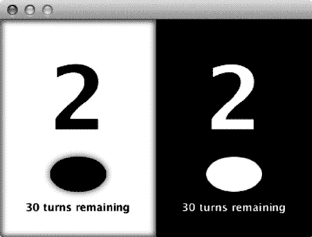

第 5 章 ■ 在 JavaFX 中构建动态 UI 布局

请注意，我们使用了 `FlowPane` 作为外部布局，并在内部使用 `VBox` 来保持 `Ellipse` 和 `Text` 的垂直对齐。这确保了 `Ellipse` 始终位于 `Text` 上方，同时如果水平屏幕空间有限，仍允许显示内容换行成垂直布局。

我们使用绑定来启用和禁用高亮显示当前玩家回合的特殊效果（`DropShadow` 和 `InnerShadow`），并基于模型动态更新文本。这是绑定的一个非常强大的用途，它能使 UI 与游戏状态保持同步，而无需使用事件监听器或命令式回调。

在水平布局下运行程序的结果如图 5-7 所示，调整大小后的垂直布局如图 5-8 所示。

***图 5-7.** 在水平窗口中运行玩家分数示例的输出*

***图 5-8.** 在垂直窗口中运行玩家分数示例的输出* 尽管起始分数不为零可能令人惊讶，但如果您还记得黑白棋的起始位置，棋盘中央有四颗棋子，每位玩家得两分。此外，所有分数与剩余回合数的总和应始终为 64，本例中确实如此。

下一步是使用 `BorderPane` 将徽标和分数组合起来，为黑白棋应用程序构建最小外壳。

使用 BorderPane 组合布局

我们已经构建了黑白棋 UI 的几个元素，现在需要将它们整合到一个组合中。

在本节中，我们将演示如何使用 `BorderPane` 类，以常见的布局模式快速组合其他组件。与本章前面使用的布局不同，您不应修改 `BorderPane` 的子节点列表，而应使用表 5-6 中列出的每个内容区域的属性。

[www.it-ebooks.info](http://www.it-ebooks.info/)

第 5 章 ■ 在 JavaFX 中构建动态 UI 布局

***表 5-6.** BorderPanel 类中可用的属性*

**名称**

**类型**

**描述**

top

Node

放置在 `BorderPane` 区域顶部边缘的元素；将调整为其首选高度并扩展以填满整个宽度

bottom

Node

放置在 `BorderPane` 区域底部边缘的元素；将调整为其首选高度并扩展以填满整个宽度

left

Node

放置在 `BorderPane` 区域左侧边缘的元素；将调整为其首选宽度并扩展以填满顶部和底部节点之间的整个高度

right

Node

放置在 `BorderPane` 区域右侧边缘的元素；将调整为其首选宽度并扩展以填满顶部和底部节点之间的整个高度

center

Node

放置在 `BorderPane` 区域中心的元素；将扩展以填满顶部、底部、右侧和左侧节点之间的所有空间

`BorderPane` 的顶部和底部区域首先被定位，然后是左侧和右侧，它们可以扩展到减去顶部和底部后的高度。最后，中心区域调整大小以占据布局中任何剩余空间。

对于我们在黑白棋应用程序中的使用，我们只需要顶部、中心和底部内容区域。使用这三个内容区域设置 `BorderPane` 的布局代码如清单 5-8 所示。

***清单 5-8.*** 使用 BorderPane 进行布局的黑白棋根舞台声明

```java
@Override

public void start(Stage primaryStage) {

BorderPane root = new BorderPane();

root.setCenter(createBackground());

root.setTop(createTitle());

root.setBottom(createScoreBoxes());

Scene scene = new Scene(root, 600, 400);

primaryStage.setScene(scene);

primaryStage.show();

}
```

我们使用它来创建类似停靠栏的行为，其中标题以固定高度对齐到顶部，分数框也以固定高度对齐到底部。中心的所有剩余空间由网格占据。这也可以使用绑定表达式来完成，但使用 `BorderPane` 可以保证布局函数在每个布局周期只被调用一次，从而获得更高的性能和无伪影的布局。

清单 5-9 展示了本章前面“使用 FlowPane 和 Boxes 进行方向对齐”一节中 `createScoreBoxes()` 函数的简单抽象。请注意，`tileWidth` 使用 `Bindings.selectDouble()` 函数动态绑定到父级宽度，这打破了对场景的依赖。

***清单 5-9.*** 创建分数框函数

```java
private Node createScoreBoxes() {

TilePane scoreTiles = new TilePane(createScore(Owner.BLACK), createScore(Owner.WHITE));

scoreTiles.setSnapToPixel(false);

scoreTiles.setPrefColumns(2);

scoreTiles.prefTileWidthProperty().bind(Bindings.selectDouble(tiles.parentProperty(),

"width").divide(2));

return scoreTiles;

}
```

[www.it-ebooks.info](http://www.it-ebooks.info/)

第 5 章 ■ 在 JavaFX 中构建动态 UI 布局

实现 `createTitle` 是对前面“使用 StackPanes 和 TilePanes 对齐边缘”一节中场景定义的类似修改。在这种情况下，我们还增加了标题的首选高度，以便在文本周围留出一些内边距。所需的额外更改在清单 5-10 中以粗体突出显示。

***清单 5-10.*** 将标题创建代码转换为函数所需的更改

```java
**private Node createTitle()** {

StackPane left = new StackPane();

left.setStyle("-fx-background-color: black");

Text text = new Text("JavaFX");

text.setFont(Font.font(null, FontWeight.BOLD, 18));

text.setFill(Color.WHITE);

StackPane.setAlignment(text, Pos.CENTER_RIGHT);

left.getChildren().add(text);

Text right = new Text("Reversi");

right.setFont(Font.font(null, FontWeight.BOLD, 18));

titleTiles = new TilePane();

titleTiles.setSnapToPixel(false);

TilePane.setAlignment(right, Pos.CENTER_LEFT);

titleTiles.getChildren().addAll(left, right);

**titleTiles.setPrefTileHeight(40);**

**titleTiles.prefTileWidthProperty().bind(Bindings.selectDouble(tiles.parentProperty(),**

**"width").divide(2));**

**return titleTiles;**

}
```

最后一项任务是通过实现 `createBackground()` 来创建棋盘背景。在本章后面的“使用 GridPane 布局棋子”一节中，我们将展示如何使用 `GridPane` 实现黑白棋棋盘，但现在您可以简单地创建一个 `Region` 并用 `RadialGradient` 填充它。`RadialGradient` 与您在之前练习中创建的 `LinearGradient` 非常相似，但会以椭圆形式从中心向外渲染颜色。因为我们使用 `Region` 来创建背景，所以需要使用样式属性来配置 `RadialGradient`，如清单 5-11 所示。

***清单 5-11.*** 创建黑白棋棋盘背景的绑定函数

```java
private Node createBackground() {

Region answer = new Region();

answer.setStyle("-fx-background-color: radial-gradient(radius 100%, white, gray)"); return answer;

}
```

当您运行完整程序时，应该会看到一个如图 5-9 所示的窗口。

[www.it-ebooks.info](http://www.it-ebooks.info/)

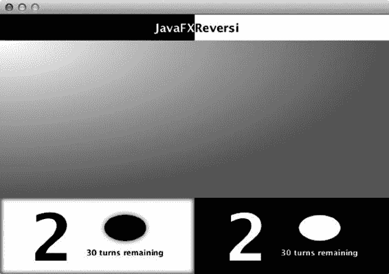

第 5 章 ■ 在 JavaFX 中构建动态 UI 布局

***图 5-9.** 带有标题、背景和分数的黑白棋用户界面*

尝试调整窗口大小，注意 `BorderPanel` 如何保持组件边缘对齐，并自动调整它们的大小以填充所有可用空间。这个组合示例演示了如何使用绑定和内置布局在 JavaFX 中轻松组合动态布局。

创建自定义区域


在前面的章节中，我们使用了 Region 类为应用程序提供简单的样式化背景，但 Region 类是所有 JavaFX 布局的基础，其功能远不止于此。

在本节中，我们将向您展示如何在 JavaFX 中创建完全可调整大小的自定义 Region，以构建构成游戏棋盘的 Reversi 棋子和方格。在下一节中，我们将向您展示如何从头开始构建动态容器，以容纳这些可调整大小的节点，并使用最终的布局 GridPane 来构建一个动态棋盘，该棋盘可同时调整方格和棋子的大小。

**构建自定义方形 Region**

所有 JavaFX 布局的基础类是 Region。它拥有用于获取布局边界首选项的标准函数，以及用于设置节点宽度和高度的变量。在本节中，我们将向您展示如何通过扩展 Region 来构建一个能够动态响应高度和宽度变化的 Reversi 棋盘方格。Region 类有十个属性可用于控制尺寸和布局，如表 5-7 所示。

[www.it-ebooks.info](http://www.it-ebooks.info/)

第 5 章 ■ 在 JavaFX 中构建动态 UI 布局

***表 5-7.** Region 类的属性*

**名称**

**访问权限**

**类型**

**默认值**

**描述**

width

只读

Double

节点的宽度，由父容器设置

height

只读

Double

节点的高度，由父容器设置

minWidth

读/写

Double

USE_COMPUTED_SIZE

此 Region 被覆盖的最小宽度

minHeight

读/写

Double

USE_COMPUTED_SIZE

此 Region 被覆盖的最小高度

prefWidth

读/写

Double

USE_COMPUTED_SIZE

此 Region 被覆盖的首选宽度

prefHeight

读/写

Double

USE_COMPUTED_SIZE

此 Region 被覆盖的首选高度

maxWidth

读/写

Double

USE_COMPUTED_SIZE

此 Region 被覆盖的最大宽度

maxHeight

读/写

Double

USE_COMPUTED_SIZE

此 Region 被覆盖的最大高度

padding

读/写

Insets

Insets.EMPTY

此 Region 顶部、底部、左侧和右侧请求的空间量

snapToPixel

读/写

Boolean

True

如果为 true，会将 Region 的位置和大小舍入为整数值

Region 的宽度和高度是只读属性，您可以在布局完成后使用它们来获取尺寸。

请注意不要直接绑定到宽度和高度，因为任何影响此节点或其子节点大小的更改，都要等到下一个布局周期才会更新，从而导致显示异常。

padding 属性允许您在布局期间设置围绕 Region 内容的空间量。

我们之前再次使用了 snapToPixel 属性，以确保 TilePane 能够无舍入误差地适应场景边界。它定义在 Region 类上，默认值为 true，有助于减少由像素未对齐引起的显示异常。

其余属性允许您覆盖此 Region 的最小、最大和首选宽度及高度。它们是对父容器如何分配空间的提示，并默认为此 Region 的计算值。设置后，可以通过为这些属性赋予 `Region.USE_COMPUTED_SIZE` 值，将它们重置为计算值。此外，可以通过为最小和最大属性赋予 `Region.USE_PREF_SIZE` 值，将它们设置为与相应首选属性相同的值。

要定义这些属性的计算值，请重写 Region 类中定义的 `calculate*` 函数，如表 5-8 所列。

[www.it-ebooks.info](http://www.it-ebooks.info/)

第 5 章 ■ 在 JavaFX 中构建动态 UI 布局

***表 5-8.** Region 类的函数*

**名称**

**访问权限**

**返回类型**

**描述**

computeMinWidth(height)

受保护

Double

返回此 Region 的计算最小宽度。默认值为左右内边距之和。

computeMinHeight(width)

受保护

Double

返回此 Region 的计算最小高度。默认值为上下内边距之和。

computePrefWidth(height)


受保护

Double

返回该 Region 计算得到的首选宽度。

默认值为左右内边距之和，加上在给定子节点首选位置和大小时容纳它们所需的宽度。

computePrefHeight(width)

受保护

Double

返回该 Region 计算得到的首选高度。

默认值为上下内边距之和，加上在给定子节点首选位置和大小时容纳它们所需的高度。

computeMaxWidth(height)

受保护

Double

返回该 Region 计算得到的最大宽度。

默认值为 Double.MAX_VALUE。

computeMaxHeight(width)

受保护

Double

返回该 Region 计算得到的最大高度。

默认值为 Double.MAX_VALUE。

compute 函数返回的默认值通常没有问题，但首选宽度和高度除外——由于没有子节点且无内边距，两者均返回 0。要获得非零的首选尺寸，我们可以重写 computePrefWidth/Height 方法，或者直接调用 preferredWidth/Height 属性的 setter 方法。

以下实现采用了后一种方式。

public class ReversiSquare extends Region {

public ReversiSquare() {

setStyle("-fx-background-color: burlywood");

Light.Distant light = new Light.Distant();

light.setAzimuth(-135);

light.setElevation(30);

setEffect(LightingBuilder.create().light(light).build());

setPrefSize(200, 200);

}

}

为了给上述代码中的方块提供样式，我们设置了 style 属性，该属性接受用于背景和边框的 CSS 属性。由于无法在 CSS 中指定 JavaFX 光照效果，我们使用 LightingBuilder 创建了一个远距离光照效果，并将其应用于 Region。

■ **警告** 在未启用硬件加速效果的平台上，Lighting 效果可能会显著影响性能。

为了测试这个类，我们创建了一个简单的 StackPane 包装器，其中包含一个随场景大小调整的 ReversiSquare，如清单 5-12 所示。

[www.it-ebooks.info](http://www.it-ebooks.info/)


第 5 章 ■ 在 JavaFX 中构建动态 UI 布局

***清单 5-12.*** 展示随场景大小调整的 ReversiSquare 的包装脚本 public class ReversiSquareTest extends Application {

public static void main(String[] args) {

launch(args);

}

@Override

public void start(Stage primaryStage) {

Scene scene = new Scene(new StackPane(new ReversiSquare()));

primaryStage.setScene(scene);

primaryStage.show();

}

}

运行完成的类将生成一个独特的棋盘方块，它会随窗口动态调整大小，如图 5-10 所示。

***图 5-10.** 随窗口大小调整的单个 Reversi 方块*

构建可调整大小的 Reversi 棋子

创建 Reversi 棋子的方式与上一节创建方块的方式非常相似。你的类应继承 Region，并拥有一个公共的 owner 属性，该属性可设置为 WHITE 或 BLACK 以改变棋子的颜色：

public class ReversiPiece extends Region {

private ObjectProperty<Owner> ownerProperty = new SimpleObjectProperty<>(this, "owner" , Owner.NONE); public ObjectProperty<Owner> ownerProperty() {

return ownerProperty;

}

public Owner getOwner() {

return ownerProperty.get();

}

public void setOwner(Owner owner) {

ownerProperty.set(owner);

}

[www.it-ebooks.info](http://www.it-ebooks.info/)

第 5 章 ■ 在 JavaFX 中构建动态 UI 布局

在此示例中，我们使用了简化的属性格式，通过一个泛型类型为 Owner 的 SimpleObjectProperty 在对象初始化时创建。它提供了获取属性、获取和设置值的公共方法，默认值为 Owner.NONE，表示不显示任何棋子。

为了创建棋子的样式，我们在构造函数中使用了条件绑定，以便在 owner 发生变化时更改样式。对于 WHITE 棋子，我们使用从白色到灰色再到黑色的径向渐变（模拟阴影）。对于 BLACK 棋子，我们使用从白色快速过渡到黑色的径向渐变（模拟高光）。


当所有者（owner）为 NONE 时，我们还可以通过第二个条件绑定将半径设为 0，从而隐藏棋子。最后，为了让区域呈现圆形，我们将背景半径设为一个非常大的值（1000 em），这样就能得到一个边长为零的圆角矩形（或椭圆），如下方构造器开头的代码所示。

public ReversiPiece() {

styleProperty().bind(Bindings.when(ownerProperty.isEqualTo(Owner.NONE))

.then("radius 0")

.otherwise(Bindings.when(ownerProperty.isEqualTo(Owner.WHITE))

.then("-fx-background-color: radial-gradient(radius 100%, white .4, gray .9, darkgray 1)")

.otherwise("-fx-background-color: radial-gradient(radius 100%, white 0, black .6)"))

.concat("; -fx-background-radius: 1000em; -fx-background-insets: 5"));

...

构造器代码继续设置反射效果，使棋盘表面看起来有光泽，同时设置一个首选大小，并在边缘留出足够空间，以匹配方格的首选大小减去五像素的背景内边距。最后一步是将棋子设置为对鼠标事件透明，这样下方的方格就能捕获这些事件：

...

Reflection reflection = new Reflection();

reflection.setFraction(1);

reflection.topOffsetProperty().bind(heightProperty().multiply(-.75));

setEffect(reflection);

setPrefSize(180, 180);

setMouseTransparent(true);

}

为了方便起见，我们还包含了一个构造器版本，它接受一个所有者属性的初始值： public ReversiPiece(Owner owner) {

this();

ownerProperty.setValue(owner);

}

为了演示最终效果，你需要对之前的示例应用程序做一些补充，以叠加显示 Reversi 棋子。实现这一点的最简单方法是重构场景（Scene），使用 StackPane 布局将 Reversi 棋子放置在方格之上，并将其放入 HBox 中，这样你就可以并排显示棋子。

我们还利用了 HBox 和 VBox 的一个新约束，称为 grow。对添加到 HBox 的元素设置 hgrow，或对添加到 VBox 的元素设置 vgrow，可以让元素从其首选大小开始扩展，以占用额外的可用空间。关于 grow 和 priority 的更详细讨论，请参见下一节关于 GridPane 的内容，其中大量使用了这些特性。

使用堆栈（Stack）、盒子（Box）和 grow 约束的完整包装代码如清单 5-13 所示。

[www.it-ebooks.info](http://www.it-ebooks.info/)


第 5 章 ■ 在 JavaFX 中构建动态 UI 布局

***清单 5-13.*** 显示两个并排 Reversi 方格且上方有棋子的包装应用程序 public class ReversiPieceTest extends Application {

public static void main(String[] args) {

launch(args);

}

@Override

public void start(Stage primaryStage) {

Node white = new StackPane(new ReversiSquare(), new ReversiPiece(Owner.WHITE));

Node black = new StackPane(new ReversiSquare(), new ReversiPiece(Owner.BLACK));

HBox hbox = new HBox(white, black);

hbox.setSnapToPixel(false);

primaryStage.setScene(new Scene(hbox));

HBox.setHgrow(white, Priority.ALWAYS);

HBox.setHgrow(black, Priority.ALWAYS);

primaryStage.show();

}

}

图 5-11 sho 显示了完成的应用程序，白色和黑色棋子并排显示。

***图 5-11.** 一个带有白色棋子的 Reversi 方格，以及另一个带有黑色棋子的方格* 使用 **GridPane** 布局棋盘格

JavaFX 中最灵活、最强大的布局之一就是 GridPane。它允许你将子节点排列在由行和列组成的网格中，并可以选择为单个节点或整行/整列分配对齐、增长（grow）和边距等约束。你还可以进行高级布局，使节点跨行或跨列，从而使该布局容器真正成为迄今为止讨论的所有其他容器的超集。

表 5-9 lis 列出了 GridPane 的不同属性，这些属性可以针对每个节点设置，也可以针对整列或整行设置（边距除外）。


[www.it-ebooks.info](http://www.it-ebooks.info/)

第 5 章 ■ 在 JavaFX 中构建动态 UI 布局

***表 5-9.** GridPane 布局中节点可用的属性*

**名称**

**类型**

**描述**

halignment

HPos

GridPane 单元格中节点的水平对齐方式；可选值为 LEFT、CENTER 或 RIGHT

valignment

VPos

GridPane 单元格中节点的垂直对齐方式；可选值为 TOP、CENTER、BASELINE 或 BOTTOM

hgrow

Priority

GridPane 单元格超出其首选宽度时水平扩展的优先级

vgrow

Priority

GridPane 单元格超出其首选高度时垂直扩展的优先级

margin

Insets

GridPane 单元格中元素周围的边距，以 Insets 对象指定，包含上、左、下、右四个方向的偏移量

fillWidth

Boolean

指定节点是否应扩展以适配列宽，还是保持其自身宽度

fillHeight

Boolean

指定节点是否应扩展以适配行高，还是保持其自身高度

与之前的布局一样，这些约束可以通过 GridPane 类中一系列同名静态方法来设置，这些方法接受一个节点和约束值。前两个对齐约束与 StackPane 上的对齐类似，区别在于它们被限制在水平或垂直方向上。然而，将水平和垂直对齐结合使用，可以得到相同的 12 种组合。

边距与之前“使用 StackPane 和 TilePane 对齐边缘”一节中首次描述的同名约束类似。它也是唯一一个可以仅应用于单个节点，而不能应用于整行或整列的约束。

hgrow 和 vgrow 都接受 Priority 类型的值，分别类似于 HBox 和 VBox 上的同名约束。它们可以取以下三个可能值之一：

• NEVER：永远不会超出节点的首选尺寸。
• SOMETIMES：仅当所有具有“ALWAYS”增长优先级的节点都考虑后，仍有可用空间时才会增长。
• ALWAYS：增长至节点的最大尺寸，与其他具有“ALWAYS”增长优先级的节点均分空间。

设置增长约束属性可以大大简化复杂 UI 的布局工作。例如，您可以在按钮上使用 NEVER 增长约束，在 TextField 上使用 ALWAYS 增长约束，以确保文本字段填满表单宽度，而按钮则根据包含的文本完美调整大小。

fillWidth 和 fillHeight 属性对于首选尺寸小于 GridPane 中分配空间的节点非常有用。如果这些属性被赋予布尔值 true，容器将使用可用尺寸而非首选尺寸来布局节点。

我们利用 GridPane 的灵活功能来布局黑白棋应用程序的方格和棋子网格。默认的对齐方式、增长策略和边距完美满足了游戏棋盘的需求，因此我们在添加方格时唯一需要更新的是 x 和 y 位置。我们甚至不需要设置网格的大小，因为它会自动缩放以适应添加的组件数量和位置。

首先，我们需要更新黑白棋应用程序中的 start 方法，将方块放置在背景之上。为此，我们使用 StackPane 来组合 BorderLayout 的中心区域，如清单 5-14 所示。

[www.it-ebooks.info](http://www.it-ebooks.info/)

第 5 章 ■ 在 JavaFX 中构建动态 UI 布局

***清单 5-14.** 黑白棋应用程序的修改，用于叠加方块列表（以粗体突出显示）*

@Override

public void start(Stage primaryStage) {

BorderPane borderPane = new BorderPane();

borderPane.setTop(createTitle());

**borderPane.setCenter(new StackPane(createBackground(), tiles()));**

borderPane.setBottom(createScoreBoxes());

Scene scene = new Scene(borderPane, 600, 400);

primaryStage.setScene(scene);

primaryStage.show();

}

tiles 方法的实现直接应用了我们学到的关于 GridPane 布局的知识。我们只需使用默认构造函数创建一个新的 GridPane，然后通过几个循环遍历列和行，以填充每个游戏单元格，如清单 5-15 所示。

***清单 5-15.** 使用 GridPane 实现 tiles 方法*

private Node tiles() {

GridPane board = new GridPane();

for (int i = 0; i < ReversiModel.BOARD_SIZE; i++) {

for (int j = 0; j < ReversiModel.BOARD_SIZE; j++) {

ReversiSquare square = new ReversiSquare();

ReversiPiece piece = new ReversiPiece();

piece.ownerProperty().bind(model.board[i][j]);

board.add(new StackPane(square, piece), i, j);

}

}

return board;

}

请注意，我们为了方便使用了 GridPane 的 add 方法，该方法先接受一个节点，然后接受 x、y 坐标。此外，我们使用嵌套的 StackPane 将 ReversiSquare 放在底部，ReversiPiece 放在顶部。

从 model.board 到每个棋子的单一绑定就足以让 UI 反映当前棋盘状态，并在模型更改时更新。通过这些简单的更改，黑白棋应用程序显示了我们的起始位置，其中有两个黑色棋子和两个白色棋子已落下，如图 5-12 所示。

[www.it-ebooks.info](http://www.it-ebooks.info/)


第 5 章 ■ 在 JavaFX 中构建动态 UI 布局

***图 5-12.** 使用 GridPane 显示棋盘和棋子的黑白棋应用程序* 使用**AnchorPane**进行对齐和拉伸

最后一个内置布局是 AnchorPane。它是一个相当专门的布局，服务于两个相关目的。当与一个或两个非对立的约束一起使用时，它可以用于将子节点对齐到布局的特定角落，并带有设定的偏移量。另一个目的是通过设置对立的约束来水平、垂直或同时拉伸子节点，同样可以选择与父边缘的偏移量，如图 5-13 所示。

***图 5-13.** 父容器（虚线）中子节点（实线）的 AnchorPane 约束* AnchorPane 通过接受一个按堆叠顺序显示的子节点列表来工作，每个子节点可以选择指定左、右、上、下锚点的约束。如果未指定锚点，它将子节点定位在容器的左上角。一旦设置了锚点，它将与相应边缘保持设定的距离对齐，并取首选尺寸和容器尺寸中的较小值。

[www.it-ebooks.info](http://www.it-ebooks.info/)

第 5 章 ■ 在 JavaFX 中构建动态 UI 布局

如果在左侧和右侧或顶部和底部设置了相对的锚点，大小调整行为将变为拉伸，子节点的宽度将等于父节点宽度减去左右锚点距离，或者子节点高度将等于父节点高度减去上下锚点距离。也可以设置所有四个锚点，在这种情况下，子节点将随父节点一起在两个维度上调整大小。

通过对黑白棋应用程序进行一些修改，我们利用 AnchorPane 的对齐和拉伸属性，在 UI 中添加了一个新的“重新开始”按钮。第一步是重构黑白棋构造函数，将现有的游戏视图提取到一个变量中，并添加一个 AnchorPane 作为根节点：

@Override

public void start(Stage primaryStage) {

TilePane title = createTitle();

TilePane scoreBoxes = createScoreBoxes();

BorderPane game = new BorderPane();

game.setTop(title);

game.setCenter(new StackPane(createBackground(), tiles()));

game.setBottom(scoreBoxes);

Node restart = restart();

AnchorPane root = new AnchorPane(game, restart);

primaryStage.setScene(new Scene(root, 600, 400));

...


请注意，我们还在 AnchorPane 中添加了第二个组件，用于稍后定义的“重新开始”按钮。该方法其余部分继续为游戏节点和重新开始节点设置 AnchorPane 约束，使得前者随场景缩放，后者则对齐到右上角并偏移 10 像素：

...

AnchorPane.setTopAnchor(game, 0d);

AnchorPane.setBottomAnchor(game, 0d);

AnchorPane.setLeftAnchor(game, 0d);

AnchorPane.setRightAnchor(game, 0d);

AnchorPane.setRightAnchor(restart, 10d);

AnchorPane.setTopAnchor(restart, 10d);

}

下一步是创建 `restart()` 方法，该方法构建“重新开始”按钮并绑定一个 `ActionEvent` 事件处理器，用于重置模型：

private Node restart() {

Button button = new Button("Restart");

button.setOnAction(e -> model.restart());

return button;

}

最后，你需要实现重新开始模型函数，该函数将所有方格重置为初始值，并将回合重置为黑方：

public void restart() {

for (int i = 0; i < BOARD_SIZE; i++) {

for (int j = 0; j < BOARD_SIZE; j++) {

board[i][j].setValue(Owner.NONE);

}

[www.it-ebooks.info](http://www.it-ebooks.info/)


第 5 章 ■ 在 JavaFX 中构建动态 UI 布局

}

initBoard();

turn.setValue(Owner.BLACK);

}

运行完整的应用程序后，你将拥有一个功能完备的“重新开始”按钮，它固定在右上角，如图 5-14 所示。

***图 5-14.** 带有固定在右上角的“重新开始”按钮的 Reversi 应用程序* 何时使用不同的布局

本章讨论的不同布局技术的组合，为创建动态布局提供了非常强大的能力。然而，由于实现相同结果的方法众多，在创建新布局时，最佳实践往往令人困惑。在本节中，我们将讨论每种布局在不同场景下的优缺点，以帮助你更轻松地确定哪种布局最适合你的应用需求。

绑定是第一种介绍的技术，它足够强大，可以构建几乎任何你能想象到的动态 UI。然而，绑定有两个主要缺点：

• **复杂性**。UI 中的节点越多，每个节点为了出现在正确位置而必须遵循的边和约束就越多。

• **性能**。尽管 JavaFX 在评估绑定语句方面非常高效，但过多的绑定变量会导致性能下降，并且在调整大小时出现显示伪影。

这就是内置布局（HBox、VBox、FlowPane、StackPane、TilePane、GridPane 和 AnchorPane）发挥作用的地方。

对于一系列节点水平或垂直堆叠的常见情况，使用盒子布局比等效的绑定产生的代码更简单。此外，与绑定不同，布局容器每个显示周期只评估一次，因此无论 UI 的复杂性如何，你都能保证一致的性能。

[www.it-ebooks.info](http://www.it-ebooks.info/)

第 5 章 ■ 在 JavaFX 中构建动态 UI 布局

在实践中，你通常需要同时使用布局和绑定来创建动态布局。表 5-10 说明了每种布局类型最适合哪些情况。

***表 5-10.** 何时使用绑定与布局*

**技术**

**适用场景**

绑定

用于调整固定形状（如矩形、椭圆和线条）的大小。

易于创建节点重叠的布局（另请参见 StackPane 和 AnchorPane）。

过度使用可能降低性能或导致渲染伪影。

HBox/VBox

用于节点的垂直或水平对齐。

高性能；可用于大量节点。

利用对齐和增长约束来处理更复杂的用例。

FlowPane

用法与 HBox/VBox 类似。

适用于布局需要换行以适应空间的情况。

StackPane

允许通过节点重叠进行组合。

非常适用于创建分层效果，例如在背景上放置文本。


在堆叠需要让鼠标事件穿透的节点时需格外小心。

请使用节点上的 `mouseTransparent` 属性，或考虑改用 `AnchorPane`。

**TilePane**

创建所有节点等尺寸排列的平铺效果。

可通过绑定强制填充父容器（务必设置 `snapToPixel` 为 `false`）。

不能替代通用网格布局（参见 `GridPane`）。

**GridPane**

提供最灵活的布局容器。

适用于需要像素级精确行列对齐的场景。

除非与其他布局结合使用，否则无法实现组件重叠。

**AnchorPane**

高度专业化的布局，可用于边缘对齐或拉伸。

最适合组件重叠的布局（能干净地穿透鼠标事件）。

某些场景通过边距/内边距或其他约束实现效果更佳。

**让黑白棋活起来**

到目前为止，我们一直专注于布局——这固然重要，但不足以让游戏变得有趣。然而，动态布局的美妙之处在于，只需对游戏算法稍加改进，就能将静态应用转变为可玩的动态游戏。

**高亮合法落子**

可玩游戏算法的第一步是确保棋子只能放置在合法格子上。我们不仅要在后端实现算法，更要借此机会为应用添加一个功能：显示所有下一步可用的落子位置。

[www.it-ebooks.info](http://www.it-ebooks.info/)

第 5 章 ■ 在 JavaFX 中构建动态 UI 布局

回到黑白棋规则，只有在以下情况下落子才合法：

• 目标位置没有其他棋子。

• 棋子放置在与对方棋子相邻的位置，且在同一方向上，另一端有己方棋子，从而可以翻转一个或多个对方棋子。

首先，需要在模型类中添加一个 `legalMove` 函数，检查格子是否为空，然后验证给定格子周围的八个方向：

```java
public BooleanBinding legalMove(int x, int y) {
    return board[x][y].isEqualTo(Owner.NONE).and(
        canFlip(x, y, 0, -1, turn).or(
        canFlip(x, y, -1, -1, turn).or(
        canFlip(x, y, -1, 0, turn).or(
        canFlip(x, y, -1, 1, turn).or(
        canFlip(x, y, 0, 1, turn).or(
        canFlip(x, y, 1, 1, turn).or(
        canFlip(x, y, 1, 0, turn).or(
        canFlip(x, y, 1, -1, turn))))))))
    );
}
```

> **注意** 我们选择让所有公共模型函数返回绑定。这使得可以通过属性绑定更新 UI，并能在棋盘变化时高效地延迟更新。

`canFlip` 方法验证由 `cellX`、`cellY` 参数指定的方向以及当前回合玩家的第二个条件。由于使用流畅绑定接口会更复杂且效率较低，我们选择创建自定义绑定。

创建自定义绑定包括以下步骤：

• 首先用内部类重写绑定类（此处为 `BooleanBinding`）。

• 设置绑定变量：使用静态初始化器，为算法依赖的每个变量调用 `bind` 函数。

• 重写 `computeValue` 方法，返回绑定的新计算值。

判断是否为合法落子的基本算法是：检查给定方向的第一个格子，确保它是不同颜色；如果是，则继续沿格子行走，直到找到同色棋子。如果找到同色棋子，则为合法落子（可翻转棋子）；但如果下一个格子是同色，或另一端没有对方棋子，则不是合法落子。

这意味着静态初始化器需要为给定方向上的每个格子添加属性绑定，并且算法需要使用循环遍历所有格子，检查其所有者，如下代码所示。


public BooleanBinding canFlip(final int cellX, final int cellY, final int directionX, final int directionY, final ObjectProperty<Owner> turn) {

return new BooleanBinding() {

{

bind(turn);

int x = cellX + directionX;

[www.it-ebooks.info](http://www.it-ebooks.info/)

第 5 章 ■ 在 JavaFX 中构建动态 UI 布局

int y = cellY + directionY;

while (x >=0 && x < BOARD_SIZE && y >=0 && y < BOARD_SIZE) {

bind(board[x][y]);

x += directionX;

y += directionY;

}

}

@Override

protected boolean computeValue() {

Owner turnVal = turn.get();

int x = cellX + directionX;

int y = cellY + directionY;

boolean first = true;

while (x >=0 && x < BOARD_SIZE && y >=0 && y < BOARD_SIZE && board[x][y].get() != Owner.NONE) {

if (board[x][y].get() == turnVal) {

return !first;

}

first = false;

x += directionX;

y += directionY;

}

return false;

}

};

}

高亮合法走法的最后一步是将`legalMove`模型函数连接到棋盘方格上。这涉及将`ReversiSquare`类的样式属性绑定到`legalMove`方法（更改部分以**粗体**显示）。

public ReversiSquare(**final int x, final int y**) {

**styleProperty().bind(Bindings.when(model.legalMove(x, y))**

**.then("-fx-background-color: derive(dodgerblue, -60%)")**

**.otherwise("-fx-background-color: burlywood"));**

Light.Distant light = new Light.Distant();

■ **提示** 这里使用的`derive`函数是一个 JavaFX 特有的 CSS 函数，它允许你基于现有颜色创建新颜色。第二个参数是亮度，范围从–100%（黑色）到 100%（白色）。

另外，别忘了添加此代码所依赖的静态模型变量：

private static ReversiModel model = ReversiModel.getInstance();

同时，更新`tiles()`方法中的`ReversiSquare`构造，传入棋盘坐标 x 和 y：`ReversiSquare square = new ReversiSquare(i, j);`

现在运行应用程序，它会正确高亮黑方在“棋盘布局与基本规则”部分中描述的相同四个走法，如图 5-15 所示。

[www.it-ebooks.info](http://www.it-ebooks.info/)


第 5 章 ■ 在 JavaFX 中构建动态 UI 布局

***图 5-15.** 黑白棋应用程序高亮显示黑方第一步的可用走法*  
高亮活动单元格

棋盘交互最简单的示例是，高亮用户鼠标悬停的当前单元格。与其高亮不可走的单元格，不如利用上一节定义的`legalMove()`函数，仅高亮活动单元格。

对于高亮效果，我们将使用一个带有蓝色描边的嵌套`Region`来勾勒光标所在单元格的轮廓。

虽然我们可以简单地为现有的`Region`添加描边，但创建一个独立的`Region`可以更轻松地隔离高亮效果并独立为其添加动画。

高亮区域可以快速在`ReversiSquare`类中作为一个变量创建，使用 CSS 样式和如清单 5-16 所示的构建器模式。

***清单 5-16.** 为启用高亮功能而对`ReversiSquare`的`create()`方法所做的添加*  
private Region highlight = RegionBuilder.create()

.opacity(0)

.style("-fx-border-width: 3; -fx-border-color: dodgerblue")

.build();

然后，要将其添加到场景图中，可以在构造函数中追加以下代码行。

getChildren().add(highlight);

`Region`类的默认布局只是将子节点设置为首选大小，但不会定位它们，也不允许它们填充内容区域。我们希望高亮效果与方格大小匹配，因此需要重写布局算法并提供我们自己的算法。表 5-12 列出了`Region`的几个额外函数，这些函数允许我们重写布局算法，并有助于子节点的大小调整和定位。

[www.it-ebooks.info](http://www.it-ebooks.info/)

第 5 章 ■ 在 JavaFX 中构建动态 UI 布局

***表 5-11.** Region 类的布局函数*

**名称**

**访问权限**

**返回类型 描述**

layoutChildren()

Protected Void


用于对子节点执行布局的方法。

可被重写以提供自定义算法。

layoutInArea(node, x, y,

Protected Void

辅助方法，用于将给定的节点定位到

width, height, baseline,

指定的坐标，并缩放可调整大小的节点以适应

halign, valign)

给定的宽度和高度。如果节点可调整大小，或节点的

最大尺寸阻止其被调整大小，则节点将

根据给定的基线、水平对齐方式和垂直对齐方式进行定位。

layoutInArea(node, x, y,

Protected Void

与上一个 layoutInArea 方法相同，但

width, height, baseline,

给定的边距将应用于节点的边缘。

margin, halign, valign)

layoutInArea(node, x, y,

Protected Void

与上一个 layoutInArea 方法相同，但如果

width, height, baseline,

fillWidth 或 fillHeight 设置为 false，则节点将仅

margin, fillWidth,

分别缩放到其首选宽度或高度。

fillHeight, halign, valign)

layoutInArea(node, x, y,

Public

Void

实用方法，用于在由其父节点定义的

width, height, baseline,

区域（areaX, areaY, areaWidth x areaHeight）内布局子节点，

margin, fillWidth,

并相对于该区域设置基线偏移。

fillHeight, halign,

valign, isSnapToPixel)

为了确保包含区域的大小和位置与父节点匹配，我们将重写 layoutChildren 方法并提供我们自己的算法。layoutInArea 辅助方法的第一个变体允许我们一次性定位和缩放，这非常适合我们的用例：

@Override

protected void layoutChildren() {

layoutInArea(highlight, 0, 0, getWidth(), getHeight(), getBaselineOffset(), HPos.CENTER, VPos.CENTER);

}

为了创建动画高亮，我们使用了一个 FadeTransition，它将清单 5-16 中创建的高亮的不透明度从 0.0 动画到 1.0。这用于在用户鼠标悬停在节点上时产生淡入效果，并在鼠标移出时产生淡出效果。以下代码展示了实现此效果的 FadeTransition。

private FadeTransition highlightTransition = FadeTransitionBuilder.create()

.node(highlight)

.duration(Duration.millis(200))

.fromValue(0)

.toValue(1)

.build();

[www.it-ebooks.info](http://www.it-ebooks.info/)


第 5 章 ■ 在 JavaFX 中构建动态 UI 布局

■ **注意** 即使不透明度的起始值设置为 0，你仍然需要将过渡的 fromValue 属性显式设置为 0，以便它在反向播放时能正确工作。

最后一步是添加当用户鼠标悬停在节点上时将触发的事件监听器。可以通过调用 addEventHandler 方法并传入一个接受 MouseEvents 的 lambda 表达式来添加这些监听器：

addEventHandler(MouseEvent.MOUSE_ENTERED_TARGET, t -> {

if (model.legalMove(x, y).get()) {

highlightTransition.setRate(1);

highlightTransition.play();

}

});

addEventHandler(MouseEvent.MOUSE_EXITED_TARGET, t -> {

highlightTransition.setRate(-1);

highlightTransition.play();

});

请注意，代码在两种情况下都播放相同的动画，但根据动画是应该正向播放（1）还是反向播放（-1）来改变动画的速率。这确保了即使动画正在进行中，也能无缝过渡。

运行时，Reversi 应用程序现在会在光标下的高亮节点上动画显示一个微妙的蓝色轮廓，如图 5-16 所示。

***图 5-16.** 在活动单元格上带有高亮动画的 Reversi 应用程序* 219

[www.it-ebooks.info](http://www.it-ebooks.info/)

第 5 章 ■ 在 JavaFX 中构建动态 UI 布局

轮流落子

Reversi 应用程序中最后缺失的功能是玩家能够在棋盘上轮流放置棋子。我们已经拥有了接受鼠标输入和显示棋子所需的基础设施。只需要一些粘合代码，再加上一些模型增强，即可完成游戏玩法。


接续上一节的内容，第一步是在 `ReversiSquare` 的 `init` 方法中添加一个 `onMouseClicked` 事件处理器：

```java
setOnMouseClicked(t -> {
    model.play(x, y);
    highlightTransition.setRate(-1);
    highlightTransition.play();
});
```

该方法既调用了模型函数来执行当前回合的操作，也移除了当前单元格的高亮效果，这与鼠标移出事件处理器的功能类似。

模型类中的 `play()` 函数需要为每个合法落子执行以下操作：

• 将点击的单元格设置为当前玩家所有。
• 在八个可能的方向上翻转被捕获的棋子。
• 将回合切换为对方玩家。

`play()` 方法的一个示例实现如清单 5-17 所示。

***清单 5-17.*** 在八个方向上翻转棋子的 `play()` 方法示例

```java
public void play(int cellX, int cellY) {
    if (legalMove(cellX, cellY).get()) {
        board[cellX][cellY].setValue(turn.get());
        flip(cellX, cellY, 0, -1, turn);
        flip(cellX, cellY, -1, -1, turn);
        flip(cellX, cellY, -1, 0, turn);
        flip(cellX, cellY, -1, 1, turn);
        flip(cellX, cellY, 0, 1, turn);
        flip(cellX, cellY, 1, 1, turn);
        flip(cellX, cellY, 1, 0, turn);
        flip(cellX, cellY, 1, -1, turn);
        turn.setValue(turn.getValue().opposite());
    }
}
```

请注意，它遵循了我们之前定义的 `legalMove()` 函数的相同模式，用于判断是否有棋子可以被翻转，主要区别在于它没有使用绑定。`flip` 方法的实现也与 `canFlip()` 方法中使用的算法有许多相似之处，但同样无需处理绑定的创建：

```java
public void flip(int cellX, int cellY, int directionX, int directionY, ObjectProperty<Owner> turn) {
    if (canFlip(cellX, cellY, directionX, directionY, turn).get()) {
        int x = cellX + directionX;
        int y = cellY + directionY;
        while (x >=0 && x < BOARD_SIZE && y >=0 && y < BOARD_SIZE && board[x][y].get() != turn.get()) {
            [www.it-ebooks.info](http://www.it-ebooks.info/)
            // 第 5 章 ■ 在 JavaFX 中构建动态 UI 布局
            board[x][y].setValue(turn.get());
            x += directionX;
            y += directionY;
        }
    }
}
```

有了完整的游戏算法，你现在可以在同一台电脑上让两名玩家进行完整的游戏，如图 5-16 所示。请注意，就连你在本章开头设置的回合指示器现在也能正确翻转并指示当前玩家了。

使用 FXML 声明用户界面

到目前为止，我们使用 JavaFX API 为 Reversi 应用程序创建了完整的 UI。通过这种方式，我们以编程方式定义了 UI。这种方法能让开发者清晰地了解 UI 不同组件的结构和行为。正如我们在第 3 章中解释的那样，声明 UI 通常比编程实现 UI 更有趣。

清单 5-18 提供了一个 FXML 文件，它声明了与我们在前几节中开发的相同的 UI。

**清单 5-18 *.*** 用 FXML 声明的 Reversi 用户界面

```xml
<?xml version="1.0" encoding="UTF-8"?>
<?import java.lang.*?>
<?import javafx.scene.control.*?>
<?import javafx.scene.layout.*?>
<?import javafx.scene.shape.*?>
<?import javafx.scene.text.*?>
[<AnchorPane id="AnchorPane" xmlns:fx="](http://javafx.com/javafx/8) [`javafx.com/fxml/1"`](http://javafx.com/fxml/1)
    fx:controller="projavafx.reversifxml.BoardController">
    <children>
        <BorderPane AnchorPane.bottomAnchor="0.0" AnchorPane.leftAnchor="0.0"
            AnchorPane.rightAnchor="0.0" AnchorPane.topAnchor="0.0">
            <top>
                <TilePane fx:id="titlePane" prefTileHeight="40.0" snapToPixel="false"
                    BorderPane.alignment="CENTER">
                    <children>
                        <StackPane snapToPixel="false" style="-fx-background-color: black;">
                            <children>
                                <Text fill="WHITE" strokeType="OUTSIDE" strokeWidth="0.0"
                                    text="JavaFX" StackPane.alignment="CENTER_RIGHT">
                                    <font>
                                        <Font name="System Bold" size="18.0" />
                                    </font>
                                </Text>
                            </children>
                        </StackPane>
                        <Text strokeType="OUTSIDE" strokeWidth="0.0" text="Reversi"
                            TilePane.alignment="CENTER_LEFT">
                            [www.it-ebooks.info](http://www.it-ebooks.info/)
```


第 5 章 ■ 在 JavaFX 中构建动态 UI 布局

<font>

<Font name="System Bold" size="18.0" />

</font>

</Text>

</children>

</TilePane>

</top>

<center>

<StackPane fx:id="centerPane">

<children>

<Region style="-fx-background-color:

radial-gradient(radius 100%, white, gray);" />

</children>

</StackPane>

</center>

<bottom>

<TilePane fx:id="scorePane" BorderPane.alignment="CENTER">

<children>

<StackPane fx:id="leftScore">

<children>

<Region fx:id="whiteRegion" style="-fx-background-color: white;" />

<FlowPane alignment="CENTER" hgap="20.0" vgap="10.0">

<children>

<Text fx:id="scoreBlack" strokeType="OUTSIDE"

strokeWidth="0.0" text="1">

<font>

<Font name="System Bold" size="100.0" />

</font>

</Text>

<VBox alignment="CENTER" spacing="10.0">

<children>

<Ellipse fx:id="blackEllipse" radiusX="32.0"

radiusY="20.0" stroke="BLACK" strokeType="INSIDE" />

<Text fx:id="remainingBlack" strokeType="OUTSIDE"

strokeWidth="0.0" text="Text">

<font>

<Font name="System Bold" size="12.0" />

</font>

</Text>

</children>

</VBox>

</children>

</FlowPane>

</children>

</StackPane>

<StackPane fx:id="rightScore">

<children>

<Region fx:id="blackRegion" style="-fx-background-color: black;" />

<FlowPane alignment="CENTER" hgap="20.0" vgap="10.0">

<children>

<Text fx:id="scoreWhite" fill="WHITE" strokeType="OUTSIDE"

strokeWidth="0.0" text="2">

[www.it-ebooks.info](http://www.it-ebooks.info/)

第 5 章 ■ 在 JavaFX 中构建动态 UI 布局

<font>

<Font name="System Bold" size="100.0" />

</font>

</Text>

<VBox alignment="CENTER" spacing="10.0">

<children>

<Ellipse fx:id="whiteEllipse" fill="WHITE"

radiusX="32.0" radiusY="20.0" stroke="BLACK" strokeType="INSIDE" />

<Text fx:id="remainingWhite" fill="WHITE"

strokeType="OUTSIDE" strokeWidth="0.0" text="剩余回合数">

<font>

<Font name="System Bold" size="12.0" />

</font>

</Text>

</children>

</VBox>

</children>

</FlowPane>

</children>

</StackPane>

</children>

</TilePane>

</bottom>

</BorderPane>

<Button layoutX="520.0" layoutY="14.0" mnemonicParsing="false" onAction="#restart"

text="重新开始" AnchorPane.rightAnchor="10.0" AnchorPane.topAnchor="10.0" />

</children>

</AnchorPane>

这个 XML 文件并非手工编写，而是通过第 3 章讨论的 ScreenBuilder 2 设计工具生成的。

我们已经在 FXML 文件中声明了 UI，但仍需将游戏逻辑连接起来。连接过程中一个重要的部分是声明控制器类，这在 FXML 文件的顶部附近完成：

<AnchorPane ... fx:controller="projavafx.reversifxml.BoardController">

`BoardController`是一个新类，它提供了对 FXML 文件中声明的组件进行编程访问的途径。

清单 5-19 展示了这个控制器类的内容。

***清单 5-19.*** 控制器类的实现

public class BoardController {

private final ReversiModel model = ReversiModel.getInstance();

@FXML private TilePane titlePane;

@FXML private TilePane scorePane;

@FXML private StackPane centerPane;

@FXML private Text scoreBlack;

@FXML private Text scoreWhite;

@FXML private Text remainingBlack;

@FXML private Text remainingWhite;

[www.it-ebooks.info](http://www.it-ebooks.info/)

第 5 章 ■ 在 JavaFX 中构建动态 UI 布局

@FXML private Region blackRegion;

@FXML private Region whiteRegion;

@FXML private Ellipse blackEllipse;

@FXML private Ellipse whiteEllipse;

public void initialize() {

titlePane.prefTileWidthProperty().bind(Bindings.selectDouble(titlePane.parentProperty(),

"width").divide(2));

scorePane.prefTileWidthProperty().bind(Bindings.selectDouble(scorePane.parentProperty(),

"width").divide(2));

centerPane.getChildren().add(tiles());

scoreBlack.textProperty().bind(model.getScore(Owner.BLACK).asString());

scoreWhite.textProperty().bind(model.getScore(Owner.WHITE).asString());

remainingBlack.textProperty().bind(model.getTurnsRemaining(Owner.BLACK).asString().concat("

剩余回合数"));

remainingWhite.textProperty().bind(model.getTurnsRemaining(Owner.WHITE).asString().concat("

剩余回合数"));

InnerShadow innerShadow = new InnerShadow();

innerShadow.setColor(Color.DODGERBLUE);


innerShadow.setChoke(0.5);

whiteRegion.effectProperty().bind(Bindings.when(model.turn.isEqualTo(Owner.WHITE))

.then(innerShadow)

.otherwise((InnerShadow) null));

blackRegion.effectProperty().bind(Bindings.when(model.turn.isEqualTo(Owner.BLACK))

.then(innerShadow)

.otherwise((InnerShadow) null));

DropShadow dropShadow = new DropShadow();

dropShadow.setColor(Color.DODGERBLUE);

dropShadow.setSpread(0.2);

blackEllipse.setEffect(dropShadow);

blackEllipse.effectProperty().bind(Bindings.when(model.turn.isEqualTo(Owner.BLACK))

.then(dropShadow)

.otherwise((DropShadow) null));

whiteEllipse.effectProperty().bind(Bindings.when(model.turn.isEqualTo(Owner.WHITE))

.then(dropShadow)

.otherwise((DropShadow) null));

}

@FXML

public void restart() {

model.restart();

}

private Node tiles() {

GridPane board = new GridPane();

for (int i = 0; i < ReversiModel.BOARD_SIZE; i++) {

for (int j = 0; j < ReversiModel.BOARD_SIZE; j++) {

ReversiSquare square = new ReversiSquare(i, j);

ReversiPiece piece = new ReversiPiece();

[www.it-ebooks.info](http://www.it-ebooks.info/)

第 5 章 ■ 在 JavaFX 中构建动态 UI 布局

piece.ownerProperty().bind(model.board[i][j]);

board.add(new StackPane(square, piece), i, j);

}

}

return board;

}

}

BoardController 类包含多个使用@FXML 注解标注的变量。

如第 3 章所述，这种技术将 FXML 文件中定义的组件与 JavaFX 对象绑定。

当 FXML 文件被加载时，控制器的 initialize()方法将被调用。在此方法中，我们创建所需的绑定，并用棋子填充网格面板。

所需的绑定与我们在前几节中创建的绑定完全相同；例如，我们按如下方式绑定边框面板顶部区域的棋子首选宽度：

titlePane.prefTileWidthProperty().bind(Bindings.selectDouble(titlePane.parentProperty(), "width").

divide(2));

创建棋子的方式与不使用 FXML 时完全相同。这次，我们将棋子添加到 centerPane 变量中，由于@FXML 注解，该变量对应于 FXML 文件中 id 为 centerPane 的元素。实际上，FXML 文件包含以下声明：

<StackPane fx:id="centerPane">

而我们的代码包含以下语句：

@FXML private StackPane centerPane;

...

centerPane.getChildren().add(tiles());

这两条语句的组合将导致棋子显示在 FXML 文件中声明的 StackPane 中。

清单 5-19 中的代码还显示，可以将 FXML 声明组件上的操作绑定到控制器类中的方法调用。点击重启按钮将导致调用 restart()方法。同样，这是通过 FXML 文件和控制器类之间的协作实现的。FXML 文件按如下方式声明重启按钮及其操作：

<Button layoutX="520.0" layoutY="14.0" mnemonicParsing="false" **onAction="#restart"** text="重启"

AnchorPane.rightAnchor="10.0" AnchorPane.topAnchor="10.0" />

指向控制器类中方法的 onAction 属性以粗体显示。

在 BoardController 类中，restart()函数使用@FXML 注解，从而与 FXML 文件中定义的重启操作建立绑定：

@FXML

public void restart() {

model.restart();

}

[www.it-ebooks.info](http://www.it-ebooks.info/)

第 5 章 ■ 在 JavaFX 中构建动态 UI 布局

如果你想知道何时应该使用 FXML，何时应该在 Java 中编写 UI，这并没有唯一正确的答案。通常，在使用合适的工具（例如 SceneBuilder）时，在 FXML 中声明布局往往更容易。业务逻辑和连接通常是在相应的控制器类中完成的。然而，最重要的因素是开发人员和设计师应该找到一种能让他们最高效工作的方式！

其他游戏增强功能


本章开发的 Reversi 应用程序在布局和结构上完全动态且灵活，因此是时候利用这一点，挑战你的编码技能极限了。

以下是一些编码挑战，你可以借此将 Reversi 应用程序从一个设计精良的教程，发展成一个功能完备的应用程序。

•   有一条规则我们忽略了实现，那就是跳过回合。当且仅当某位玩家没有可用的落子选项时，下一位玩家才能走棋。尝试实现一个自动检测是否存在合法走法，并在没有时跳过回合的功能。
•   在同一台电脑上与另一位玩家对战，远不如与远程对手对战有趣。在阅读了后续关于 JavaFX 后端集成的章节后，尝试实现一个支持网络的 Reversi 应用程序版本。
•   拥有一个用于玩 Reversi 的 JavaFX AI 不是很好吗？试试看，看看你是否能创造一个无法击败的对手！

总结

在本章中，你充分利用了 JavaFX 的布局能力，实现了一个复杂应用程序的动态布局。在此过程中，你学会了如何：

•   使用绑定（bind）对齐节点（Nodes）。
•   使用 StackPane 分层放置节点并创建复合布局。
•   使用 TilePane 进行固定尺寸布局。
•   使用 FlowPane、HBox 和 VBox 进行带或不带换行的方向性布局。
•   使用绑定和 GridPane 创建动态游戏棋盘。
•   使用 AnchorPane 对齐和拉伸重叠的节点。
•   使用 Regions 和 CSS 创建自定义组件。
•   构建由游戏模型支持的丰富用户界面。
•   应用 JavaFX 特效和过渡动画。
•   使用 FXML 以声明方式创建用户界面。

在体验了动态布局的优势之后，你将很难再回到使用固定尺寸静态定位组件的方式。在下一章中，我们将向你展示如何创建自定义 UI 组件和图表，以构建更令人印象深刻的业务导向型应用程序。

[www.it-ebooks.info](http://www.it-ebooks.info/)

第 5 章 ■ 在 JavaFX 中构建动态 UI 布局

资源

有关动态布局的更多信息，请查阅以下资源。

•   JavaFX 2.0 布局：类之旅：
    [`amyfowlersblog.wordpress.com/2011/06/02/javafx2-0-layout-a-class-tour/`](http://amyfowlersblog.wordpress.com/2011/06/02/javafx2-0-layout-a-class-tour/)

•   在 JavaFX 中使用布局：
    [`docs.oracle.com/javase/8/javafx/layout-tutorial/index.html`](http://docs.oracle.com/javase/8/javafx/layout-tutorial/index.html)

要了解更多关于 Reversi 游戏的信息，请参考以下资源。

•   维基百科，“Reversi”。网址：[`en.wikipedia.org/wiki/Reversi`](http://en.wikipedia.org/wiki/Reversi)

[www.it-ebooks.info](http://www.it-ebooks.info/)

**第 6 章**

**使用 JavaFX UI 控件**

*奇迹是用小写字母重述同一个故事，而这个故事用大写字母写满了整个世界，大得我们有些人看不见。*

——C. S. 刘易斯

在第 2 章中，你学习了如何通过创建舞台（stage）、在舞台上放置场景（scene）、以及在场景中放置节点（nodes）来在 JavaFX 中创建用户界面。你还学习了如何处理鼠标和键盘事件，以及如何为场景中的节点添加动画。

在本章中，我们将从第 2 章的用户界面讨论继续，向你展示如何使用 JavaFX 中可用的 UI 控件。你在第 4 章学到的属性绑定知识和第 5 章学到的布局知识，将在本章中发挥重要作用，因为本章建立在这些概念之上。

尝试使用 JavaFX UI 控件

JavaFX 拥有丰富的 UI 控件集，可用于创建应用程序。这些控件从相对简单的控件（如 TextField）到更复杂的控件（如 WebView）不等。为了让你快速掌握这些控件，我们创建了一个名为 StarterApp 的示例应用程序。该应用程序包含了 JavaFX 中大多数 UI 控件的示例，同时它也可以作为一个起点，你可以通过修改它来创建自己的应用程序。


在逐步了解程序行为之前，请先打开项目并按照第 1 章中关于构建和执行 AudioConfig 项目的说明来运行它。项目文件位于你解压书籍代码下载包后得到的 **Chapter06** 目录下。

**检查 StarterApp 程序的行为**

程序启动时，其外观应类似于图 6-1 中的截图。

[www.it-ebooks.info](http://www.it-ebooks.info/)


第 6 章 ■ 使用 JavaFX UI 控件

***图 6-1.** 首次调用时的 StarterApp 程序*

要全面检查其行为，请执行以下步骤。

1.  点击 **文件** 菜单，注意下拉菜单中包含一个名为 **新建** 的菜单项，它带有一个图标和 `Ctrl+n` 快捷键组合，如图 6-2 所示。

***图 6-2.** StarterApp 程序的“文件”菜单*

2.  通过点击或按下快捷键组合来选择 **新建** 菜单项，注意 Java 控制台中会出现以下消息：“在菜单项新建上发生了操作”。

3.  检查菜单栏下方的工具栏，如图 6-3 所示。点击最左侧那个与“新建”菜单项图标相同的按钮。注意 Java 控制台中会出现以下消息：“新建工具栏按钮被点击”。

[www.it-ebooks.info](http://www.it-ebooks.info/)


第 6 章 ■ 使用 JavaFX UI 控件

***图 6-3.** StarterApp 程序的工具栏*

4.  将鼠标光标悬停在工具栏最左侧的按钮上，注意会出现一个工具提示，显示消息：“新建文档... Ctrl+n”。

5.  点击工具栏上位于垂直分隔条之间的第四个和第五个按钮。注意这两个按钮具有两种状态，且彼此独立。

6.  点击工具栏上位于最后一个垂直分隔条右侧的三个最右侧按钮。注意这些按钮具有两种状态，但同一时间只有一个按钮处于选中（按下）状态。

7.  拖动 TableView 右侧垂直滚动条上的滑块，注意表格中有 10,000 行数据，每行包含名字、姓氏和电话号码。点击其中一行，注意 Java 控制台会输出类似“人员：名字 X 姓氏 X 在 tableview 中被选中”的消息。

8.  水平拖动 TableView 的列标题以重新排列它们。拖动列标题的左右两侧以调整其大小。

9.  点击标签为 **手风琴/标题窗格** 的选项卡，注意该选项卡包含一个手风琴控件，其中有三个可展开的标题窗格，如图 6-4 所示。点击每个标题窗格，注意每个窗格都会展开和折叠。

***图 6-4.** StarterApp 程序的“手风琴/标题窗格”选项卡*

[www.it-ebooks.info](http://www.it-ebooks.info/)


第 6 章 ■ 使用 JavaFX UI 控件

10. 点击标签为 **分割窗格/树视图/列表视图** 的选项卡，注意该选项卡包含一个分割窗格，左侧是树控件，右侧是空的列表视图，如图 6-5 所示。

***图 6-5.** StarterApp 程序的“分割窗格/树视图/列表视图”选项卡*

11. 展开左侧 TreeView 中的节点，点击各个叶节点。注意右侧的 ListView 会填充 10,000 行数据，每行包含与所点击节点相同的名称。

12. 将 SplitPane 的分隔条向右拖动，应用程序将呈现如图 6-6 所示的外观。将 SplitPane 的分隔条向左拖动，注意它被阻止隐藏 TreeView。

[www.it-ebooks.info](http://www.it-ebooks.info/)


第 6 章 ■ 使用 JavaFX UI 控件

***图 6-6.** 展开 TreeView 上的节点并选择其中一个叶节点后* 13. 点击标签为 **树表视图** 的选项卡，注意会看到一个表格，左侧有树控件，各列描述了每个人的详细信息，如图 6-7 所示。

[www.it-ebooks.info](http://www.it-ebooks.info/)


第 6 章 ■ 使用 JavaFX UI 控件

***图 6-7.** StarterApp 程序的“树表视图”选项卡*

14. 点击一些箭头，浏览整个树以查看子节点和孙节点。这将产生一个类似于图 6-8 的视图。

[www.it-ebooks.info](http://www.it-ebooks.info/)


第 6 章 ■ 使用 JavaFX UI 控件

***图 6-8.** 展开部分节点后，将出现类似于此的视图* 15. 点击标签为 **滚动窗格/杂项** 的选项卡，注意该选项卡包含一个可滚动窗格，其中有各种 UI 控件，如图 6-9 所示。

[www.it-ebooks.info](http://www.it-ebooks.info/)


第 6 章 ■ 使用 JavaFX UI 控件

***图 6-9.** StarterApp 程序的“滚动窗格/杂项”选项卡*

16. 点击按钮（标签为“按钮”），注意 Java 控制台会输出以下消息：“在按钮上发生了操作”。

17. 点击复选框，注意 Java 控制台会输出以下消息：“在复选框上发生了操作，且 selectedproperty 为：true”。

18. 选择每个单选按钮，注意当选中某个单选按钮时，Java 控制台会输出类似“radioButton2 被选中”的消息。

19. 点击超链接控件，注意 Java 控制台会输出以下消息：“在超链接上发生了操作”。

20. 在 ChoiceBox 中选择不同的项目（例如，“选项 B”），注意当选中某个项目时，Java 控制台会输出类似“在 ChoiceBox 中选择了选项 B”的消息。

21. 在 MenuButton（标签为“菜单按钮”）中选择“菜单项 a”选项，注意 Java 控制台会输出消息“在菜单项 a 上发生了操作”。

22. 点击 SplitMenuButton（标签为“拆分菜单按钮”）的文本区域，注意 Java 控制台会输出以下消息：“在拆分菜单按钮上发生了操作”。

23. 点击 SplitMenuButton 右侧的下拉箭头，并选择“菜单项 a”选项，注意 Java 控制台会输出消息“在菜单项 a 上发生了操作”。

[www.it-ebooks.info](http://www.it-ebooks.info/)


第 6 章 ■ 使用 JavaFX UI 控件

24. 根据需要向下滚动 ScrollPane，以查看图 6-10 中所示的控件。

***图 6-10.** 滚动到底部的“滚动窗格/杂项”选项卡*

25. 在提示文本为“输入用户名”的 TextField 中输入一些文本，注意每次修改文本时，TextField 的内容都会输出到 Java 控制台。

26. 在提示文本为“输入密码”的 PasswordField 中输入一些文本，注意显示的是掩码字符，而不是你输入的字符。点击 PasswordField 以外的任何地方，使其失去焦点，注意 PasswordField 的内容会输出到 Java 控制台。

27. 在 TextArea（标签为“文本区域”）中输入一些文本。点击 TextArea 以外的任何地方，使其失去焦点，注意 TextArea 的内容会输出到 Java 控制台。

28. 将水平 Slider 的滑块向右滑动，注意其上方的 ProgressIndicator 会从 0% 显示到 99%，然后显示“完成”。将其一直向左滑动，注意 ProgressIndicator 的外观会变为其旋转的未确定状态。


29\. 将水平滚动条的滑块向右拖动，注意其上方的进度条显示相同的值。将滑块一直向左拖动，注意进度条的外观会变为其不确定状态。

[www.it-ebooks.info](http://www.it-ebooks.info/)


第 6 章 ■ 使用 JavaFX UI 控件

30\. 在 ScrollPane 的空白区域某处单击鼠标的辅助键（通常是右键），注意会出现一个上下文菜单，如图 6-11 所示。

***图 6-11.** 单击鼠标辅助键后出现的上下文菜单*  
31\. 单击上下文菜单中的“Menuitem a”菜单项，注意 Java 控制台中会出现以下消息：“aCtion occurred on Menu item a”。

32\. 单击标记为 htMleditor 的选项卡，注意该选项卡包含一个富文本编辑器和一个标记为 view htMl 的按钮，如图 6-12 所示。

[www.it-ebooks.info](http://www.it-ebooks.info/)


第 6 章 ■ 使用 JavaFX UI 控件

***图 6-12.** StarterApp 程序的 HTMLEditor 选项卡*

33\. 在编辑区域输入一些文本，使用编辑器工具栏中的各种工具来设置文本样式。完成后，单击 view htMl 按钮，查看弹出窗口中显示的基础数据模型中的 HTML，如图 6-13 所示。

[www.it-ebooks.info](http://www.it-ebooks.info/)


第 6 章 ■ 使用 JavaFX UI 控件

***图 6-13.** 在 HTMLEditor 中编辑文本并单击 View HTML 后*

34\. 单击 oK 关闭弹出窗口。然后单击标记为 Webview 的选项卡，注意该选项卡包含一个显示随机选择网页的 Web 浏览器（如果您的计算机已连接到互联网），如图 6-14 所示。

[www.it-ebooks.info](http://www.it-ebooks.info/)


第 6 章 ■ 使用 JavaFX UI 控件

***图 6-14.** StarterApp 程序的 WebView 选项卡*

35\. 单击应用程序中的其他选项卡之一，然后再单击 Webview 选项卡，注意 Java 控制台会显示 Webview 正在尝试加载的随机选择的 URL。

恭喜您坚持完成了这 35 个步骤的练习！完成此练习后，您将能够理解其背后的代码，我们现在将一起逐步讲解。

利用 JavaFX UI 控件

与第 1 章中的 Audio Configuration 程序类似，我们的 StarterApp 程序包含一个名为 StarterAppModel 的模型类，如清单 6-1 所示。

***清单 6-1.*** StarterAppModel.java 的源代码

package projavafx.starterapp.model;

import java.util.Random;

import javafx.beans.property.DoubleProperty;

import javafx.beans.property.SimpleDoubleProperty;

import javafx.collections.FXCollections;

import javafx.collections.ObservableList;

import javafx.scene.control.TreeItem;

[www.it-ebooks.info](http://www.it-ebooks.info/)

第 6 章 ■ 使用 JavaFX UI 控件

public class StarterAppModel {

public ObservableList getTeamMembers() {

ObservableList teamMembers = FXCollections.observableArrayList();

for (int i = 1; i <= 10000; i++) {

teamMembers.add(new Person("FirstName" + i,

"LastName" + i,

"Phone" + i));

}

return teamMembers;

}

public TreeItem<Person> getFamilyTree() {

Random random = new Random();

TreeItem<Person> root = new TreeItem();

for (int i = 0; i < 5; i++) {

Person parent = new Person("Parent " + i, "LastName" + i, "Phone" + i); TreeItem<Person> parentItem = new TreeItem(parent);

for (int j = 0; j < random.nextInt(4); j++) {

Person child = new Person("Child " + i + "-" + j, "LastName" + i, "Phone" + j); TreeItem<Person> childItem = new TreeItem(child);

parentItem.getChildren().add(childItem);

for (int k = 0; k < random.nextInt(4); k++) {

Person grandChild = new Person("Grandchild " + i + "-" + j + "-" + k, "LastName"

+ i, "Phone" + k);

TreeItem<Person> grandChildItem = new TreeItem(grandChild);

childItem.getChildren().add(grandChildItem);

}

}


root.getChildren().add(parentItem);

}

return root;

}

public String getRandomWebSite() {

String[] webSites = {

" [`javafx.com",`](http://javafx.com/)

" [`fxexperience.com`](http://fxexperience.com/)",

" [`steveonjava.com`](http://steveonjava.com/)",

" [`javafxpert.com",`](http://javafxpert.com/)

" [`pleasingsoftware.blogspot.com",`](http://pleasingsoftware.blogspot.com/)

" [`www.weiqigao.com/blog",`](http://www.weiqigao.com/blog)

" [`blogs.lodgon.com/johan",`](http://blogs.lodgon.com/johan)

" [`google.com"`](http://google.com/)

};

int randomIdx = (int) (Math.random() * webSites.length);

return webSites[randomIdx];

}

public ObservableList listViewItems = FXCollections.observableArrayList();

[www.it-ebooks.info](http://www.it-ebooks.info/)

第 6 章 ■ 使用 JavaFX UI 控件

public ObservableList choiceBoxItems = FXCollections.observableArrayList(

"选项 A",

"选项 B",

"选项 C",

"选项 D"

);

public double maxRpm = 8000.0;

public DoubleProperty rpm = new SimpleDoubleProperty(0);

public double maxKph = 300.0;

public DoubleProperty kph = new SimpleDoubleProperty(0);

}

我们将引用此清单中的代码片段，因为它们适用于我们在 StarterApp 程序的主 Java 文件中逐步讲解的相关 UI 控件。该文件名为 StarterAppMain.java，在讨论 JavaFX UI 控件时，我们将分块完整展示该文件。

为 StarterApp 程序搭建舞台，清单 6-2 展示了 StarterAppMain.java 文件的第一部分，其中接收并创建了 Stage 和 Scene。此外，Scene 的根节点被分配了一个 BorderPane，它提供了 MenuBar、ToolBar 和 TabPane 将驻留的 UI 结构。

***清单 6-2.*** StarterAppMain.java 的第一部分

package projavafx.starterapp.ui;

... 省略导入语句...

public class StarterAppMain extends Application {

StarterAppModel model = new StarterAppModel();

Stage stage;

public static void main(String[] args) {

Application.launch(args);

}

@Override

public void start(final Stage primaryStage) {

stage = primaryStage;

VBox topBox = new VBox(createMenus(), createToolBar());

BorderPane borderPane = new BorderPane();

borderPane.setCenter(createTabs());

borderPane.setTop(topBox);

Scene scene = new Scene(borderPane, 980, 600);

scene.getStylesheets().add("/projavafx/starterapp/ui/starterApp.css");

stage.setScene(scene);

stage.setTitle("Starter App");

stage.show();

}

[www.it-ebooks.info](http://www.it-ebooks.info/)

第 6 章 ■ 使用 JavaFX UI 控件

在清单 6-2 中，以下几点值得特别注意：

• BorderPane 的顶部区域将包含图 6-1 中所示的 MenuBar 和 ToolBar，它们由我们即将讲解的 createMenus()和 createToolBar()方法创建。

• BorderPane 的中心区域将包含图 6-1 中所示的 TabPane，它同样由我们即将讲解的 createTabs()方法创建。

• 加载了一个名为 starterApp.css 的样式表，我们将在讨论相关功能时引用它。

创建菜单并定义菜单项

为了创建菜单结构，我们的 StarterApp 程序定义了一个我们任意命名为 createMenus()的方法，如清单 6-3 所示。该方法返回一个包含所需菜单结构的 MenuBar 实例。

***清单 6-3.*** StarterAppMain.java 中的 createMenus()方法

MenuBar createMenus() {

MenuItem itemNew = new MenuItem("新建...", new ImageView(

new Image(getClass().getResourceAsStream("images/paper.png"))));

itemNew.setAccelerator(KeyCombination.keyCombination("Ctrl+N"));

itemNew.setOnAction(e -> System.out.println(e.getEventType()

+ " 发生在菜单项“新建”上"));

MenuItem itemSave = new MenuItem("保存");

Menu menuFile = new Menu("文件");

menuFile.getItems().addAll(itemNew, itemSave);

MenuItem itemCut = new MenuItem("剪切");

MenuItem itemCopy = new MenuItem("复制");

MenuItem itemPaste = new MenuItem("粘贴");

Menu menuEdit = new Menu("编辑");


menuEdit.getItems().addAll(itemCut, itemCopy, itemPaste);

MenuBar menuBar = new MenuBar();

menuBar.getMenus().addAll(menuFile, menuEdit);

return menuBar;

}

如前文图 6-2 所示，菜单项除了标题外，通常还包含图标和快捷键组合。在以下来自清单 5-3 的代码片段中，名为“新建”的菜单项定义了标题、图标、快捷键以及选中菜单项时要执行的操作。

MenuItem itemNew = new MenuItem("新建...", new ImageView(

new Image(getClass().getResourceAsStream("images/paper.png"))));

itemNew.setAccelerator(KeyCombination.keyCombination("Ctrl+N"));

itemNew.setOnAction(e -> System.out.println(e.getEventType()

+ " 发生在菜单项“新建”上"));

菜单项图标的推荐尺寸为 16×16 像素，这也是 StarterApp 程序中“新建”菜单项所用图标的尺寸。要从文件系统加载图标，上述代码片段中传递给 Image 构造函数的参数会促使加载 StarterAppMain 类的同一个类加载器加载 paper.png 文件。该 paper.png 文件是从 StartAppMain.class 文件所在位置的 images 子目录中加载的。

[www.it-ebooks.info](http://www.it-ebooks.info/)

第 6 章 ■ 使用 JavaFX UI 控件

要定义 Ctrl+N 快捷键组合，需使用 KeyCombination 类的静态 keyCombination()方法来创建 KeyCombination 实例。然后将该实例传递给 MenuItem 的 setAccelerator()方法。

上述代码片段中的 onAction()事件处理器定义了一个 lambda 表达式，当用户选中“新建”菜单项时，该表达式会被调用。输出到 Java 控制台的消息正是前面练习步骤 2 中所指的那条。

创建工具栏

为了创建工具栏，我们的 StarterApp 程序定义了一个我们随意命名为 createToolBar()的方法，如清单 6-4 所示。该方法使用了 Button、Separator、ToggleButton 和 ToggleGroup 类，并返回一个包含所需工具栏按钮的 ToolBar 实例。

***清单 6-4.*** StarterAppMain.java 中的 createToolBar()方法

ToolBar createToolBar() {

final ToggleGroup alignToggleGroup = new ToggleGroup();

Button newButton = new Button();

newButton.setGraphic(new ImageView(new Image(getClass().getResourceAsStream

("images/paper.png"))));

newButton.setId("newButton");

newButton.setTooltip(new Tooltip("新建文档... Ctrl+N"));

newButton.setOnAction(e -> System.out.println("新建工具栏按钮被点击"));

Button editButton = new Button();

editButton.setGraphic(new Circle(8, Color.GREEN));

editButton.setId("editButton");

Button deleteButton = new Button();

deleteButton.setGraphic(new Circle(8, Color.BLUE));

deleteButton.setId("deleteButton");

ToggleButton boldButton = new ToggleButton();

boldButton.setGraphic(new Circle(8, Color.MAROON));

boldButton.setId("boldButton");

boldButton.setOnAction(e -> {

ToggleButton tb = ((ToggleButton) e.getTarget());

System.out.print(e.getEventType() + " 发生在 ToggleButton "

+ tb.getId());

System.out.print(", 且 selectedProperty 为: ");

System.out.println(tb.selectedProperty().getValue());

});

ToggleButton italicButton = new ToggleButton();

italicButton.setGraphic(new Circle(8, Color.YELLOW));

italicButton.setId("italicButton");

italicButton.setOnAction(e -> {

ToggleButton tb = ((ToggleButton) e.getTarget());

System.out.print(e.getEventType() + " 发生在 ToggleButton "

+ tb.getId());

System.out.print(", 且 selectedProperty 为: ");

System.out.println(tb.selectedProperty().getValue());

});

ToggleButton leftAlignButton = new ToggleButton();

leftAlignButton.setGraphic(new Circle(8, Color.PURPLE));

[www.it-ebooks.info](http://www.it-ebooks.info/)

第 6 章 ■ 使用 JavaFX UI 控件

leftAlignButton.setId("leftAlignButton");

leftAlignButton.setToggleGroup(alignToggleGroup);

ToggleButton centerAlignButton = new ToggleButton();

centerAlignButton.setGraphic(new Circle(8, Color.ORANGE));

centerAlignButton.setId("centerAlignButton");

centerAlignButton.setToggleGroup(alignToggleGroup);

ToggleButton rightAlignButton = new ToggleButton();

rightAlignButton.setGraphic(new Circle(8, Color.CYAN));

rightAlignButton.setId("rightAlignButton");

rightAlignButton.setToggleGroup(alignToggleGroup);

ToolBar toolBar = new ToolBar(

newButton,

editButton,

deleteButton,

new Separator(Orientation.VERTICAL),

boldButton,

italicButton,

new Separator(Orientation.VERTICAL),

leftAlignButton,

centerAlignButton,

rightAlignButton

);

alignToggleGroup.selectToggle(alignToggleGroup.getToggles().get(0));

alignToggleGroup.selectedToggleProperty().addListener((ov, oldValue, newValue) -> {

ToggleButton tb = ((ToggleButton) alignToggleGroup.getSelectedToggle());

if (tb != null) {

System.out.println(tb.getId() + " 被选中");

}

});

return toolBar;

}

定义图形按钮

如图 6-1 所示，工具栏按钮通常使用图标而非标题。它们还经常带有工具提示，当鼠标悬停在按钮上时弹出，如练习步骤 4 所示。在以下来自清单 6-4 的代码片段中，用于创建“新建文档”的工具栏按钮定义了图标、工具提示以及选中该工具栏按钮时要执行的操作：

Button newButton = new Button();

newButton.setGraphic(new ImageView(new Image(getClass().getResourceAsStream

("images/paper.png"))));

newButton.setId("newButton");

newButton.setTooltip(new Tooltip("新建文档... Ctrl+N"));

newButton.setOnAction(e -> System.out.println("新建工具栏按钮被点击"));

[www.it-ebooks.info](http://www.it-ebooks.info/)

第 6 章 ■ 使用 JavaFX UI 控件

请注意，上述代码片段中使用了 Button 的 setId()方法。由于 starterApp.css 样式表中包含以下规则，这会导致按钮四周的内边距均设置为 4 像素。

#newButton {

-fx-padding: 4 4 4 4;

}

上述代码片段中定义的工具栏按钮是一个 JavaFX Button，但在许多用例中，选择 JavaFX ToggleButton 更为合适。下一节将讨论此类情况，以及如何在工具栏中实现切换按钮。

定义切换按钮

在前面的练习步骤 5 和 6 中，您与具有两种状态（选中和未选中）的按钮进行了交互。

步骤 5 中的按钮是切换按钮，步骤 6 中的按钮也是。步骤 5 中的按钮彼此独立运行，但在步骤 6 中，任何时候只能有一个按钮处于选中（按下）状态。以下来自清单 6-4 的代码片段包含了步骤 5 中一个按钮背后的代码。

ToggleButton boldButton = new ToggleButton();

boldButton.setGraphic(new Circle(8, Color.MAROON));

boldButton.setId("boldButton");

boldButton.setOnAction(e -> {

ToggleButton tb = ((ToggleButton) e.getTarget());

System.out.print(e.getEventType() + " 发生在 ToggleButton "

+ tb.getId());

System.out.print(", 且 selectedProperty 为: ");

System.out.println(tb.selectedProperty().getValue());

});

此用例是许多文档编辑应用程序中的经典“粗体”按钮，该按钮要么被选中，要么未被选中。上述代码片段中显示的 ToggleButton 包含这种双状态功能，因此非常适合此用例。

此代码片段中的 onAction()事件处理器演示了如何确定 ToggleButton 在被点击后的状态。如代码片段所示，使用 ActionEvent 的 getTarget()方法获取对 ToggleButton 的引用；然后使用其 selectedProperty()方法获取对其选中属性的引用。

最后，使用 getValue()方法获取选中属性的值（true 或 false）。

使用切换组


正如前一节所述，在上述练习的步骤 6 中，任何时候都只能有一个按钮处于选中（按下）状态。以下来自清单 6-4 的代码片段包含了步骤 6 中其中一个按钮的后台代码。

```java
final ToggleGroup alignToggleGroup = new ToggleGroup();

ToggleButton leftAlignButton = new ToggleButton();

leftAlignButton.setGraphic(new Circle(8, Color.PURPLE));

leftAlignButton.setId("leftAlignButton");

leftAlignButton.setToggleGroup(alignToggleGroup);

...
```

[www.it-ebooks.info](http://www.it-ebooks.info/)

第 6 章 ■ 使用 JavaFX UI 控件

```java
alignToggleGroup.selectToggle(alignToggleGroup.getToggles().get(0));

alignToggleGroup.selectedToggleProperty().addListener((ov, oldValue, newValue) -> {

    ToggleButton tb = ((ToggleButton) alignToggleGroup.getSelectedToggle());

    if (tb != null) {

        System.out.println(tb.getId() + " selected");

    }

});
```

这个用例是许多文档编辑应用程序中经典的“左对齐”按钮，在任何时候都只能选中一个对齐按钮。`ToggleGroup` 实例被传递给上述代码片段中 `ToggleButton` 的 `setToggleGroup()` 方法，以实现这种互斥行为。

除了提供互斥性之外，`ToggleGroup` 实例在此代码片段中还用于两个目的：
1.  通过使用 `ToggleGroup` 实例的 `selectToggle()` 方法，初始选中组中的第一个 `ToggleButton`。
2.  检测当前选中的 `ToggleButton` 何时发生变化。这是通过向 `ToggleGroup` 的 `selectedToggle` 属性添加一个 `ChangeListener`，然后使用其 `getSelectedToggle()` 方法来确定当前选中了哪个 `ToggleButton` 来实现的。请注意，这通常优于为参与切换组的每个切换按钮添加 `onAction` 事件处理程序。

**在工具栏中插入分隔符**

有时，使用如图 6-3 所示的垂直分隔符来在视觉上分隔工具栏按钮是很有用的。

要实现这一点，请使用 `Separator` 类，如清单 6-4 中的这一行所示：

```java
new Separator(Orientation.VERTICAL),
```

尽管我们在这个 StarterApp 程序的菜单中没有使用分隔符，但 `Separator` 对象也可以用在菜单中。当然，菜单中使用的分隔符通常具有 `HORIZONTAL` 方向。

**创建 TabPane 并定义选项卡**

UI 设计的原则之一称为*渐进式呈现*，它指出 UI 应逐步展示其功能，而不是一次性将所有功能都呈现给用户，使其应接不暇。`TabPane` 是这一原则应用的一个很好的例子，因为每个选项卡在展示自身功能的同时，隐藏了其他选项卡中包含的功能。

为了创建 `TabPane` 实例，我们的 StarterApp 程序定义了一个我们任意命名为 `createTabs()` 的方法，如清单 6-5 所示。该方法利用了 `TabPane` 和 `Tab` 类，并返回一个包含所需 `Tab` 对象的 `TabPane` 实例。

***清单 6-5.*** StarterAppMain.java 中的 createTabs() 方法

```java
TabPane createTabs() {

    final WebView webView = new WebView();

    Tab tableTab = new Tab("TableView");

    tableTab.setContent(createTableDemoNode());

    tableTab.setClosable(false);

    Tab accordionTab = new Tab("Accordion/TitledPane");

    accordionTab.setContent(createAccordionTitledDemoNode());

    accordionTab.setClosable(false);
```

[www.it-ebooks.info](http://www.it-ebooks.info/)

第 6 章 ■ 使用 JavaFX UI 控件

```java
    Tab splitTab = new Tab("SplitPane/TreeView/ListView");

    splitTab.setContent(createSplitTreeListDemoNode());

    splitTab.setClosable(false);

    Tab scrollTab = new Tab("ScrollPane/Miscellaneous");

    scrollTab.setContent(createScrollMiscDemoNode());

    scrollTab.setClosable(false);

    Tab htmlTab = new Tab("HTMLEditor");

    htmlTab.setContent(createHtmlEditorDemoNode());

    htmlTab.setClosable(false);

    Tab webViewTab = new Tab("WebView");

    webViewTab.setContent(webView);

    webViewTab.setClosable(false);

    webViewTab.setOnSelectionChanged(e -> {
```


String randomWebSite = model.getRandomWebSite();

if (webViewTab.isSelected()) {

webView.getEngine().load(randomWebSite);

System.out.println("WebView tab is selected, loading: "

+ randomWebSite);

}

});

TabPane tabPane = new TabPane();

tabPane.getTabs().addAll(

tableTab,

accordionTab,

splitTab,

scrollTab,

htmlTab,

webViewTab

);

return tabPane;

}

要定义一个最简单的标签页，你只需提供其文本（显示在标签上）和内容（选中该标签时显示的内容）。以下来自清单 6-5 的代码片段演示了 StarterApp 程序中 `TabPane` 的其他一些特性：

Tab webViewTab = new Tab("WebView");

webViewTab.setContent(webView);

webViewTab.setClosable(false);

webViewTab.setOnSelectionChanged(e -> {

String randomWebSite = model.getRandomWebSite();

if (webViewTab.isSelected()) {

webView.getEngine().load(randomWebSite);

System.out.println("WebView tab is selected, loading: "

+ randomWebSite);

}

});

[www.it-ebooks.info](http://www.it-ebooks.info/)

第 6 章 ■ 使用 JavaFX UI 控件

除了提供文本和内容外，我们还指定了该标签页不可关闭，并且当用户选择该标签页时应执行一些处理。后者通过前面展示的 `onSelectionChanged()` 方法实现，该方法使您能够在标签页显示或隐藏（即选中或未选中）时实现生命周期功能。在前面的代码片段中，我们让 `WebView`（将在后面介绍）在标签页被选中时加载一个随机选择的网站。

现在您已经了解了 StarterApp 程序中菜单、工具栏和标签页的创建方式，接下来让我们检查每个标签页上的 UI 控件。我们从最左边的标签页（标记为 TableView）开始，然后依次向右进行。

创建 TableView

正如您在练习的第 7 步和第 8 步中所体验到的，图 6-1 con 中显示的 `TableView` 包含 10,000 行数据，并且允许其列被重新排列和调整大小。在 StarterApp 程序中定义并填充 `TableView` 的代码如清单 6-6 所示。

***清单 6-6.*** 位于 StarterAppMain.java 中的 createTableDemoNode() 方法 Node createTableDemoNode() {

TableView table = new TableView(model.getTeamMembers());

TableColumn firstNameColumn = new TableColumn("First Name");

firstNameColumn.setCellValueFactory(new PropertyValueFactory("firstName"));

firstNameColumn.setPrefWidth(180);

TableColumn lastNameColumn = new TableColumn("Last Name");

lastNameColumn.setCellValueFactory(new PropertyValueFactory("lastName"));

lastNameColumn.setPrefWidth(180);

TableColumn phoneColumn = new TableColumn("Phone Number");

phoneColumn.setCellValueFactory(new PropertyValueFactory("phone"));

phoneColumn.setPrefWidth(180);

table.getColumns().addAll(firstNameColumn, lastNameColumn, phoneColumn);

table.getSelectionModel().selectedItemProperty()

.addListener((ObservableValue observable, Object oldValue, Object newValue) -> {

Person selectedPerson = (Person) newValue;

System.out.println(selectedPerson + " chosen in TableView");

});

return table;

}

除了清单 6-6 中的代码，以下来自清单 6-1 的代码片段包含了我们 `StarterAppModel` 类中的一个方法，该方法创建了将在 `TableView` 中显示的 `Person` 实例： public ObservableList getTeamMembers() {

ObservableList teamMembers = FXCollections.observableArrayList();

for (int i = 1; i <= 10000; i++) {

teamMembers.add(new Person("FirstName" + i,

"LastName" + i,

"Phone" + i));

}

return teamMembers;

}

[www.it-ebooks.info](http://www.it-ebooks.info/)

第 6 章 ■ 使用 JavaFX UI 控件

为表格分配项目

清单 6-6 开头的 `TableView` 构造函数使得包含 `Person` 实例的 `ObservableList`（从 `getTeamMembers()` 方法返回）与 `TableView` 相关联。如果底层 `ObservableList` 的内容发生变化，`TableView` 会自动更新以反映这些变化。

定义 **TableView** 列


要定义 TableView 中的列，我们使用清单 6-6 中这段代码所示的方法：`TableColumn firstNameColumn = new TableColumn("First Name");`

`firstNameColumn.setCellValueFactory(new PropertyValueFactory("firstName"));`

`firstNameColumn.setPrefWidth(180);`

我们提供给构造函数的字符串参数指定了列标题中应显示的文本，而 `setPrefWidth()` 方法则指定了列的首选宽度（以像素为单位）。

传递给 `setCellValueFactory()` 方法的参数指定了用于填充此列的属性。在本例中，该属性是 StarterApp 程序的 Person 模型类中定义的 `firstNameProperty`，如清单 6-7 所示。

***清单 6-7.*** Person.java 的源代码

```java
package projavafx.starterapp.model;

import javafx.beans.property.SimpleStringProperty;

import javafx.beans.property.StringProperty;

public final class Person {

private StringProperty firstName;

public void setFirstName(String value) { firstNameProperty().set(value); }

public String getFirstName() { return firstNameProperty().get(); }

public StringProperty firstNameProperty() {

if (firstName == null) firstName = new SimpleStringProperty(this, "firstName");

return firstName;

}

private StringProperty lastName;

public void setLastName(String value) { lastNameProperty().set(value); }

public String getLastName() { return lastNameProperty().get(); }

public StringProperty lastNameProperty() {

if (lastName == null) lastName = new SimpleStringProperty(this, "lastName");

return lastName;

}

private StringProperty phone;

public void setPhone(String value) { phoneProperty().set(value); }

public String getPhone() { return phoneProperty().get(); }

public StringProperty phoneProperty() {

if (phone == null) phone = new SimpleStringProperty(this, "phone");

return phone;

}

[www.it-ebooks.info](http://www.it-ebooks.info/)

第 6 章 ■ 使用 JavaFX UI 控件

public Person(String firstName, String lastName, String phone) {

setFirstName(firstName);

setLastName(lastName);

setPhone(phone);

}

public String toString() {

return "Person: " + firstName.getValue() + " " + lastName.getValue();

}

}
```

检测行何时被选中

为了检测用户何时在 TableView 中选中某一行，StarterApp 程序向表格视图选择模型的 `selectedItem` 属性添加了一个 `ChangeListener`。实现此功能的代码如清单 6-6 中的这段代码所示：

```java
table.getSelectionModel().selectedItemProperty()

.addListener((ObservableValue observable, Object oldValue, Object newValue) -> {

Person selectedPerson = (Person) newValue;

System.out.println(selectedPerson + " chosen in TableView");

});
```

当用户选中一行时，lambda 表达式被调用，它会打印该行所代表的底层 Person 实例的数据。这就是你在上一个练习的步骤 7 中观察到的行为。

既然我们已经探讨了 TableView 的一些功能，接下来让我们进入下一个选项卡：Accordion/TitledPane。

创建 Accordion 并定义 TitledPane

正如你在练习的步骤 9 中所体验到的，图 6-4 中显示的 Accordion 包含了一些 TitledPane 实例，每个实例都包含节点，并且可以展开和折叠。在 StarterApp 程序中定义并填充 Accordion 的代码如清单 6-8 所示。

***清单 6-8.*** StarterAppMain.java 中的 createAccordionTitledDemoNode() 方法

```java
Node createAccordionTitledDemoNode() {

TitledPane paneA = new TitledPane("TitledPane A", new TextArea("TitledPane A content")); TitledPane paneB = new TitledPane("TitledPane B", new TextArea("TitledPane B content")); TitledPane paneC = new TitledPane("TitledPane C", new TextArea("TitledPane C content")); Accordion accordion = new Accordion();

accordion.getPanes().addAll(paneA, paneB, paneC);

accordion.setExpandedPane(paneA);

return accordion;

}
```


如下方清单 6-8 的代码片段所示，`TitledPane`通常需要为其标题提供文本，并为其内容提供一个`Node`子类（此处为`TextArea`）：

TitledPane paneA = new TitledPane("标题面板 A", new TextArea("标题面板 A 的内容"));

...

accordion.setExpandedPane(paneA);

[www.it-ebooks.info](http://www.it-ebooks.info/)

第 6 章 ■ 使用 JavaFX UI 控件

此外，我们希望示例中的第一个`TitledPane`在初始状态下展开，因此使用了`Accordion`的`setExpandedPane()`方法来实现这一点。

现在你已经了解了如何创建`Accordion`和`TitledPane`控件，接下来我们将进入下一个标签页：`SplitPane/TreeView/ListView`。

**创建 TreeView**

正如你在练习的第 10 步和第 11 步中所体验到的，图 6-5 中展示的`TreeView`包含一个树形项目的层次结构，每个项目都可以展开或折叠。在`StarterApp`程序中定义并填充`TreeView`的代码如清单 6-9 所示。

***清单 6-9.*** 位于`StarterAppMain.java`中的`createSplitTreeListDemoNode()`方法
Node createSplitTreeListDemoNode() {

TreeItem animalTree = new TreeItem("动物");

animalTree.getChildren().addAll(new TreeItem("狮子"), new TreeItem("老虎"), new TreeItem("熊"));

TreeItem mineralTree = new TreeItem("矿物");

mineralTree.getChildren().addAll(new TreeItem("铜"), new TreeItem("钻石"), new TreeItem("石英"));

TreeItem vegetableTree = new TreeItem("蔬菜");

vegetableTree.getChildren().addAll(new TreeItem("芝麻菜"), new TreeItem("西兰花"), new TreeItem("卷心菜"));

TreeItem root = new TreeItem("根节点");

root.getChildren().addAll(animalTree, mineralTree, vegetableTree);

TreeView treeView = new TreeView(root);

treeView.setMinWidth(150);

treeView.setShowRoot(false);

treeView.setEditable(false);

ListView listView = new ListView(model.listViewItems);

SplitPane splitPane = new SplitPane();

splitPane.getItems().addAll(treeView, listView);

treeView.getSelectionModel().setSelectionMode(SelectionMode.SINGLE);

treeView.getSelectionModel().selectedItemProperty()

.addListener((ObservableValue observable, Object oldValue, Object newValue) -> {

TreeItem treeItem = (TreeItem) newValue;

if (newValue != null && treeItem.isLeaf()) {

model.listViewItems.clear();

for (int i = 1; i <= 10000; i++) {

model.listViewItems.add(treeItem.getValue() + " " + i);

}

}

});

return splitPane;

}

[www.it-ebooks.info](http://www.it-ebooks.info/)

第 6 章 ■ 使用 JavaFX UI 控件

如下方清单 6-9 的代码片段所示，`TreeView`可以为多个属性提供值，包括是否显示根`TreeItem`以及`TreeView`是否可编辑。在`StarterApp`程序中，我们还设置了`minWidth`，以防止用户通过拖动`SplitPane`分隔条来隐藏`TreeView`（正如你在上一个练习的第 12 步中所注意到的）。

TreeView treeView = new TreeView(root);

treeView.setMinWidth(150);

treeView.setShowRoot(false);

treeView.setEditable(false);

...

**定义 TreeItem**

查看清单 6-9 中的以下代码片段，你会发现每个`TreeItem`都被赋予了它所代表的值，以及零个或多个子`TreeItem`对象：

animalTree.getChildren().addAll(new TreeItem("狮子"), new TreeItem("老虎"), new TreeItem("熊")); 
TreeItem root = new TreeItem("根节点");

root.getChildren().addAll(animalTree, mineralTree, vegetableTree);

此外，你还可以设置以下属性：

• `graphic`，用于在`TreeItem`中显示一个`Node`
• `expanded`，用于控制`TreeItem`是展开还是折叠

现在你已经了解了如何创建`TreeView`及其`TreeItem`实例，接下来让我们探讨如何检测`TreeItem`何时被选中。

**检测 TreeItem 何时被选中**

为了检测用户何时在`TreeView`中选中了一个`TreeItem`，`StarterApp`程序向树视图选择模型的`selectedItem`属性添加了一个`ChangeListener`。实现此功能的代码如清单 6-9 中的以下片段所示：


`treeView.getSelectionModel().setSelectionMode(SelectionMode.SINGLE);`

`treeView.getSelectionModel().selectedItemProperty()`

`.addListener((ObservableValue observable, Object oldValue, Object newValue) -> {`

`TreeItem treeItem = (TreeItem) newValue;`

`if (newValue != null && treeItem.isLeaf()) {`

`model.listViewItems.clear();`

`for (int i = 1; i <= 10000; i++) {`

`model.listViewItems.add(treeItem.getValue() + " " + i);`

`}`

`}`

`});`

根据选择模式，`TreeView` 可以允许用户选择单行或多行。在上述代码片段的第一行中，我们将 `TableView` 的选择模式设置为 `SINGLE`（单选）。

在练习的第 11 步中，当你在 `TreeView` 中点击一个叶子节点 `TreeItem` 时，图 6-6 w 右侧的 `ListView` 会被填充。此代码片段通过首先检查选中的 `TreeItem` 是否为叶子节点，然后填充支持 `ListView` 的模型来实现这一功能。

[www.it-ebooks.info](http://www.it-ebooks.info/)

第 6 章 ■ 使用 JavaFX UI 控件

创建 ListView 并向其分配项目

以下来自清单 6-9 的代码片段定义并填充了 `StarterApp` 程序中的 `ListView`：`ListView listView = new ListView(model.listViewItems);`

除了上述代码片段中的代码外，清单 6-1 中的以下代码行包含了来自 `StarterAppModel` 类的一个实例变量，该变量包含了将在 `ListView` 中显示的对象：`public ObservableList listViewItems = FXCollections.observableArrayList();`

回想一下，这与上一节中点击叶子节点 `TreeItem` 时填充的实例变量是同一个。

我们提供给 `ListView` 构造函数的参数使得模型中名为 `listViewItems` 的 `ObservableList` 与 `ListView` 关联起来。正如上一练习的第 11 步所示，如果底层 `ObservableList` 的内容发生变化，`ListView` 会自动更新以反映这些变化。

创建 SplitPane

正如你在上一练习的第 12 步中所体验到的，图 6-6 con 中显示的 `SplitPane` 包含一个 `TreeView` 和一个 `ListView`，并且其分隔线可以由用户拖动。以下来自清单 6-9 的代码片段定义并填充了 `StarterApp` 程序中的 `SplitPane`：

`SplitPane splitPane = new SplitPane();`

`splitPane.getItems().addAll(treeView, listView);`

在这种情况下，`SplitPane` 中有两个节点，这意味着只会有一条分隔线。请注意，`SplitPane` 可能包含两个以上的节点，因此也可能有不止一条分隔线。

除了上述代码片段中展示的功能外，`SplitPane` 还可以将其方向设置为 `VERTICAL`（垂直），并将其分隔线位置设置为窗格的给定百分比。

现在你已经了解了如何创建 `TreeView`、`ListView` 和 `SplitPane` 控件，我们接下来进入下一个标签页：`ScrollPane/Miscellaneous`（滚动面板/其他）。

创建 TreeTableView

有时，将树和表格结合起来会非常有用。当需要可视化的数据是分层的，并且每个条目包含相同类型的属性时，这一点尤其重要。在这种情况下，`TreeTableView` 类提供了一个很好的解决方案。如图 6-7 和 6-8 所示，`TreeTableView` 提供了 `TreeView` 所具备的功能，但对于显示的每个条目，我们还可以在 `TreeTableView` 中显示额外的列。

`TreeTableView` 中的数据是使用 `TreeItem` 实例创建的。在我们的 `StarterApp` 程序中，我们在模型的 `getFamily()` 方法中创建了数据，如清单 6-10 所示。

***清单 6-10.*** 在 StarterAppModel.java 中创建分层数据

`public TreeItem<Person> getFamilyTree() {`

`Random random = new Random();`

`TreeItem<Person> root = new TreeItem();`

`for (int i = 0; i < 5; i++) {`

`Person parent = new Person("Parent " + i, "LastName" + i, "Phone" + i); TreeItem<Person> parentItem = new TreeItem(parent);`

`for (int j = 0; j < random.nextInt(4); j++) {`


Person child = new Person("Child " + i + "-" + j, "LastName" + i, "Phone" + j); 255

[www.it-ebooks.info](http://www.it-ebooks.info/)

第 6 章 ■ 使用 JavaFX UI 控件

TreeItem<Person> childItem = new TreeItem(child);

parentItem.getChildren().add(childItem);

for (int k = 0; k < random.nextInt(4); k++) {

Person grandChild = new Person("Grandchild " + i + "-" + j + "-" + k,

"LastName" + i, "Phone" + k);

TreeItem<Person> grandChildItem = new TreeItem(grandChild);

childItem.getChildren().add(grandChildItem);

}

}

root.getChildren().add(parentItem);

}

return root;

}

在这段代码中，我们创建了若干个人对象，从五个“父节点”开始。然后为每个父节点添加随机数量的子节点（0 到 3 个），每个子节点自身也可以拥有随机数量的子节点——即所谓的孙节点。所有父节点都被添加到`TreeItem`的根节点上。使用`TreeTableView`渲染这种层级数据的示例见代码清单 6-11。

***代码清单 6-11.*** 在 StarterAppMain.java 中使用 TreeTableView 实例渲染层级数据 Node createTreeTableDemoNode() {

TreeTableView<Person> treeTableView = new TreeTableView(model.getFamilyTree());

TreeTableColumn<Person, String> firstNameColumn = new TreeTableColumn("名字"); firstNameColumn.setCellValueFactory(new TreeItemPropertyValueFactory("firstName")); firstNameColumn.setPrefWidth(180);

TreeTableColumn lastNameColumn = new TreeTableColumn("姓氏");

lastNameColumn.setCellValueFactory(new TreeItemPropertyValueFactory("lastName")); lastNameColumn.setPrefWidth(180);

TreeTableColumn phoneColumn = new TreeTableColumn("电话号码");

phoneColumn.setCellValueFactory(new TreeItemPropertyValueFactory("phone"));

phoneColumn.setPrefWidth(180);

treeTableView.getColumns().addAll(firstNameColumn, lastNameColumn, phoneColumn);

treeTableView.getSelectionModel().selectedItemProperty().addListener((ObservableValue<?

extends TreeItem<Person>>observable, TreeItem<Person> oldValue, TreeItem<Person> newValue) -> {

Person selectedPerson = newValue.getValue();

System.out.println(selectedPerson + " 在 TreeTableView 中被选中");

});

treeTableView.setShowRoot(false);

return treeTableView;

}

从这段代码可以看出，`TreeTableView`与`TableView`非常相似。不过，两者存在一些明显差异。描述列时，`TreeTableView`要求使用`TreeTableColumn`实例，而非`TableColumn`实例。此外，如果我们要为特定列设置`CellValueFactory`，可以使用便捷类`TreeItemPropertyValueFactory`，它会确保指定名称的属性值在特定列的调用中被正确渲染。接下来，我们进入下一个标签页：ScrollPane/杂项。

[www.it-ebooks.info](http://www.it-ebooks.info/)

第 6 章 ■ 使用 JavaFX UI 控件

定义 ScrollPane

正如你在上一个练习的第 22 步中所体验到的，图 6-9 和图 6-10 中展示的`ScrollPane`包含多个 UI 控件，并带有一个垂直滚动条，以便访问所有控件。

来自 StarterApp 程序中定义`ScrollPane`并用 UI 控件填充它的代码，如代码清单 6-12 所示。

***代码清单 6-12.*** 位于 StarterAppMain.java 中的 createScrollMiscDemoNode()方法 Node createScrollMiscDemoNode() {

final ToggleGroup radioToggleGroup = new ToggleGroup();

ChoiceBox choiceBox;

final TextField textField;

final PasswordField passwordField;

final TextArea textArea;

Slider slider;

ProgressIndicator progressIndicator;

ProgressBar progressBar;

ScrollBar scrollBar;

Button button = new Button("按钮");

button.setOnAction(e -> System.out.println(e.getEventType() + " 发生在按钮上")); final CheckBox checkBox = new CheckBox("复选框");

checkBox.setOnAction(e -> {

System.out.print(e.getEventType() + " 发生在复选框上");

System.out.print(", 且 selectedProperty 值为: ");

System.out.println(checkBox.selectedProperty().getValue());

});


RadioButton radioButton1 = new RadioButton("RadioButton1");

radioButton1.setToggleGroup(radioToggleGroup);

RadioButton radioButton2 = new RadioButton("RadioButton2");

radioButton2.setToggleGroup(radioToggleGroup);

HBox radioBox = new HBox(10, radioButton1, radioButton2);

Hyperlink link = new Hyperlink("超链接");

link.setOnAction(e -> System.out.println(e.getEventType() + " occurred on Hyperlink")); choiceBox = new ChoiceBox(model.choiceBoxItems);

MenuItem menuA = new MenuItem("菜单项 A");

menuA.setOnAction(e -> System.out.println(e.getEventType() + " occurred on Menu Item A")); MenuItem menuB = new MenuItem("菜单项 B");

MenuButton menuButton = new MenuButton("菜单按钮");

menuButton.getItems().addAll(menuA, menuB);

MenuItem splitMenuA = new MenuItem("菜单项 A");

splitMenuA.setOnAction(e -> System.out.println(e.getEventType()

+ " occurred on Menu Item A"));

MenuItem splitMenuB = new MenuItem("菜单项 B");

SplitMenuButton splitMenuButton = new SplitMenuButton(splitMenuA, splitMenuB);

splitMenuButton.setText("拆分菜单按钮");

splitMenuButton.setOnAction(e -> System.out.println(e.getEventType()

+ " occurred on SplitMenuButton"));

[www.it-ebooks.info](http://www.it-ebooks.info/)

第 6 章 ■ 使用 JavaFX UI 控件

textField = new TextField();

textField.setPromptText("输入用户名");

textField.setPrefColumnCount(16);

passwordField = new PasswordField();

passwordField.setPromptText("输入密码");

passwordField.setPrefColumnCount(16);

textArea = new TextArea();

textArea.setPrefColumnCount(12);

textArea.setPrefRowCount(4);

LocalDate today = LocalDate.now();

DatePicker datePicker = new DatePicker(today);

datePicker.setOnAction(e -> System.out.println("选择的日期: " + datePicker.getValue())); ColorPicker colorPicker = new ColorPicker(Color.BLUEVIOLET);

colorPicker.setOnAction(e -> System.out.println("选择的颜色: " + colorPicker.getValue())); progressIndicator = new ProgressIndicator();

progressIndicator.setPrefWidth(200);

slider = new Slider(-1, model.maxRpm, 0);

slider.setPrefWidth(200);

progressBar = new ProgressBar();

progressBar.setPrefWidth(200);

scrollBar = new ScrollBar();

scrollBar.setPrefWidth(200);

scrollBar.setMin(-1);

scrollBar.setMax(model.maxKph);

VBox variousControls = new VBox(20,

button,

checkBox,

radioBox,

link,

choiceBox,

menuButton,

splitMenuButton,

textField,

passwordField,

new HBox(10, new Label("文本区域:"), textArea),

datePicker, colorPicker,

progressIndicator, slider,

progressBar, scrollBar);

variousControls.setPadding(new Insets(10, 10, 10, 10));

radioToggleGroup.selectToggle(radioToggleGroup.getToggles().get(0));

radioToggleGroup.selectedToggleProperty().addListener((ov, oldValue, newValue) -> {

RadioButton rb = ((RadioButton) radioToggleGroup.getSelectedToggle());

[www.it-ebooks.info](http://www.it-ebooks.info/)

第 6 章 ■ 使用 JavaFX UI 控件

if (rb != null) {

System.out.println(rb.getText() + " 已选中");

}

});

textField.textProperty().addListener((ov, oldValue, newValue) -> {

System.out.println("文本框文本为: " + textField.getText());

});

passwordField.focusedProperty().addListener((ov, oldValue, newValue) -> {

if (!passwordField.isFocused()) {

System.out.println("密码框文本为: "

+ passwordField.getText());

}

});

textArea.focusedProperty().addListener((ov, oldValue, newValue) -> {

if (!textArea.isFocused()) {

System.out.println("文本区域文本为: " + textArea.getText());

}

});

slider.valueProperty().bindBidirectional(model.rpm);

progressIndicator.progressProperty().bind(model.rpm.divide(model.maxRpm));

scrollBar.valueProperty().bindBidirectional(model.kph);

progressBar.progressProperty().bind(model.kph.divide(model.maxKph));

choiceBox.getSelectionModel().selectFirst();

choiceBox.getSelectionModel().selectedItemProperty()

.addListener((observable, oldValue, newValue) -> {

System.out.println(newValue + " 在 ChoiceBox 中被选中");

});

ScrollPane scrollPane = new ScrollPane(variousControls);

scrollPane.setHbarPolicy(ScrollPane.ScrollBarPolicy.NEVER);

scrollPane.setVbarPolicy(ScrollPane.ScrollBarPolicy.AS_NEEDED);


scrollPane.setOnMousePressed((MouseEvent me) -> {

if (me.getButton() == MouseButton.SECONDARY) {

contextMenu.show(stage, me.getScreenX(), me.getScreenY());

}

});

MenuItem contextA = new MenuItem("菜单项 A");

contextA.setOnAction(e -> System.out.println(e.getEventType()

+ " 发生在菜单项 A 上"));

MenuItem contextB = new MenuItem("菜单项 B");

contextMenu = new ContextMenu(contextA, contextB);

return scrollPane;

}

[www.it-ebooks.info](http://www.it-ebooks.info/)

第 6 章 ■ 使用 JavaFX UI 控件

如下方清单 6-12 的代码片段所示，ScrollPane 的内容是一个 Node 子类，此处是一个包含多个节点的 VBox。当内容大于 ScrollPane 的可视区域时，会根据指定的 hbarPolicy 和 vbarPolicy 显示水平或垂直滚动条。

ScrollPane scrollPane = new ScrollPane(variousControls);

scrollPane.setHbarPolicy(ScrollPane.ScrollBarPolicy.NEVER);

scrollPane.setVbarPolicy(ScrollPane.ScrollBarPolicy.AS_NEEDED);

scrollPane.setOnMousePressed((MouseEvent me) -> {

if (me.getButton() == MouseButton.SECONDARY) {

contextMenu.show(stage, me.getScreenX(), me.getScreenY());

}

});

其他有用的 ScrollPane 属性包括：

• pannable，允许用户通过鼠标拖拽来平移 ScrollPane 的内容

• fitToWidth/fitToHeight，使内容节点（如果可调整大小）拉伸以适配 ScrollPane 的宽度/高度

请注意，我们在前面的代码片段中使用了 onMousePressed() 事件处理器。在讨论 ScrollPane 中包含的部分 UI 控件（从 CheckBox 开始）之后，我们将详细讲解该功能。

使用 CheckBox

正如你在练习的第 17 步中所体验到的，图 6-9 con 中显示的 ScrollPane 包含一个 CheckBox。

当点击 CheckBox 时，Java 控制台会打印一条消息，指示其 selected 属性的状态。

以下代码片段来自清单 6-12，在 StarterApp 程序中实现了此功能：
final CheckBox checkBox = new CheckBox("复选框");

checkBox.setOnAction(e -> {

System.out.print(e.getEventType() + " 发生在复选框上");

System.out.print("，且 selectedProperty 为：");

System.out.println(checkBox.selectedProperty().getValue());

});

CheckBox 还可以通过将其 allowIndeterminate 属性设置为 true 来表示第三种不确定状态。这种第三种状态通常以短横线显示在 CheckBox 中，用于指示 CheckBox 所代表的状态未知。

定义 RadioButton

在之前练习的第 18 步中，你选择了图 6-9 中显示的每个 RadioButton 控件。结果，Java 控制台打印了一条消息，指示选择了哪个 RadioButton。以下代码片段来自清单 6-12，在 StarterApp 程序中实现了此功能：

final ToggleGroup radioToggleGroup = new ToggleGroup();

RadioButton radioButton1 = new RadioButton("单选按钮 1");

radioButton1.setToggleGroup(radioToggleGroup);

[www.it-ebooks.info](http://www.it-ebooks.info/)

第 6 章 ■ 使用 JavaFX UI 控件

RadioButton radioButton2 = new RadioButton("单选按钮 2");

radioButton2.setToggleGroup(radioToggleGroup);

HBox radioBox = new HBox(10, radioButton1, radioButton2);

...

radioToggleGroup.selectToggle(radioToggleGroup.getToggles().get(0));

radioToggleGroup.selectedToggleProperty().addListener((ov, oldValue, newValue) -> {

RadioButton rb = ((RadioButton) radioToggleGroup.getSelectedToggle());

if (rb != null) {

System.out.println(rb.getText() + " 被选中");

}

});

由于 RadioButton 类继承自 ToggleButton 类，上述代码片段与本章前面“使用 Toggle 组”一节中的代码非常相似。如果你需要解释此代码片段中的代码，请回顾该部分。

创建超链接


Hyperlink 控件是一个按钮，外观类似于浏览器中的链接。它可以包含图形、文本或两者兼有，并能响应鼠标悬停和点击。在上一练习的第 19 步中，你点击了图 6-9 中显示的 Hyperlink 控件。结果，Java 控制台打印出一条消息，表明该链接已被点击。以下来自清单 6-12 的代码片段在 StarterApp 程序中实现了此功能：`Hyperlink link = new Hyperlink("Hyperlink");`

`link.setOnAction(e -> System.out.println(e.getEventType() + " occurred on Hyperlink"));` 定义 ChoiceBox

当点击时，ChoiceBox 控件会弹出一个包含可选项目列表的弹出窗口。在上一练习的第 20 步中，你点击了图 6-9 中显示的 ChoiceBox 控件。结果，Java 控制台打印出一条消息，表明你选择了哪个项目。以下来自清单 6-12 的代码片段在 StarterApp 程序中实现了此功能：

`ChoiceBox choiceBox;`

`choiceBox = new ChoiceBox(model.choiceBoxItems);`

`choiceBox.getSelectionModel().selectFirst();`

`choiceBox.getSelectionModel().selectedItemProperty()`

`.addListener((observable, oldValue, newValue) -> {`

`System.out.println(newValue + " chosen in ChoiceBox");`

`});`

为了初始选中 ChoiceBox 中的第一个项目，上述代码片段调用了选择框的 `selectionModel` 的 `selectFirst()` 方法。为了检测用户何时在 ChoiceBox 中选择了一个项目，我们将代码片段中显示的 `ChangeListener` 添加到了选择框选择模型的 `selectedItem` 属性上。

[www.it-ebooks.info](http://www.it-ebooks.info/)

第 6 章 ■ 使用 JavaFX UI 控件

除了上述代码片段中的代码，以下来自清单 6-1 的代码片段包含了我们 `StarterAppModel` 类中的一个实例变量，该变量包含了将在 ChoiceBox 中显示的对象：`public ObservableList choiceBoxItems = FXCollections.observableArrayList(`

`"Choice A",`

`"Choice B",`

`"Choice C",`

`"Choice D"`

`);`

现在，我们继续介绍一个名为 MenuButton 的控件，它的外观类似于 ChoiceBox，但其行为类似于 Menu。

使用 MenuButton

当点击时，MenuButton 控件会弹出一个上下文菜单，其中包含可供选择的 MenuItem 实例。

在上一练习的第 21 步中，你点击了图 6-9 中显示的 MenuButton 控件。结果，Java 控制台打印出一条消息，表明你选择了哪个 MenuItem。以下来自清单 6-12 的代码片段在 StarterApp 程序中实现了此功能：

`MenuItem menuA = new MenuItem("MenuItem A");`

`menuA.setOnAction(e -> System.out.println(e.getEventType() + " occurred on Menu Item A"));` `MenuItem menuB = new MenuItem("MenuItem B");`

`MenuButton menuButton = new MenuButton("MenuButton");`

`menuButton.getItems().addAll(menuA, menuB);`

由于 MenuButton 和 Menu 类之间的相似性，前面代码片段中的概念已在本章前面的“创建 Menu 并定义 Menu Items”部分中介绍过。MenuButton 的一个显著特性是 `popupSide` 属性，它允许你选择 ContextMenu 应该从 MenuButton 的哪一侧弹出。

另一种弹出 ContextMenu 而不需要使用 MenuButton 的方法是我们接下来要讨论的主题。

创建 ContextMenu

在上一练习的第 30 步中，你在图 6-11 所示的 ScrollPane 的空白区域点击了鼠标辅助按钮，弹出了一个 ContextMenu，你从中选择了一个 MenuItem。以下来自清单 6-12 的代码片段实现了此行为：

`MenuItem contextA = new MenuItem("MenuItem A");`

`contextA.setOnAction(e -> System.out.println(e.getEventType()`

`+ " occurred on Menu Item A"));`

`MenuItem contextB = new MenuItem("MenuItem B");`

`final ContextMenu contextMenu = new ContextMenu(contextA, contextB);`

`ScrollPane scrollPane = new ScrollPane(variousControls);`

`...`

`scrollPane.setOnMousePressed((MouseEvent me) -> {`

`if (me.getButton() == MouseButton.SECONDARY) {`

`contextMenu.show(stage, me.getScreenX(), me.getScreenY());`

`}`

`});`

[www.it-ebooks.info](http://www.it-ebooks.info/)

第 6 章 ■ 使用 JavaFX UI 控件

当用户按下鼠标辅助按钮时，在 `setOnMousePressed` 方法中定义的 lambda 表达式会被调用。按照代码片段中的方式调用 `show()` 方法会使 ContextMenu 在屏幕上鼠标按下的位置显示出来。ContextMenu 必须有一个所有者（可以是 Node 或 Stage）才能显示，这就是为什么将 Stage 对象传递给 `show()` 方法的原因。

创建 SplitMenuButton

与 MenuButton 非常相似，SplitMenuButton 在点击向下箭头时会弹出一个 ContextMenu。此外，当点击 SplitMenuButton 的主要部分时，其行为类似于 Button。在与图 6-9 中显示的 SplitMenuButton 交互时，上一练习的第 22 和 23 步演示了这两种行为。以下来自清单 6-12 的代码片段实现了这些行为：`MenuItem splitMenuA = new MenuItem("MenuItem A");`

`splitMenuA.setOnAction(e -> System.out.println(e.getEventType()`

`+ " occurred on Menu Item A"));`

`MenuItem splitMenuB = new MenuItem("MenuItem B");`

`SplitMenuButton splitMenuButton = new SplitMenuButton(splitMenuA, splitMenuB);`

`splitMenuButton.setText("SplitMenuButton");`

`splitMenuButton.setOnAction(e -> System.out.println(e.getEventType()`

`+ " occurred on SplitMenuButton"));`

让我们暂时离开类似按钮的 UI 控件，将注意力转向一些接受文本输入的 UI 控件，首先从 TextField 开始。

定义 TextField

在练习的第 25 步中，当你向图 6-9 中显示的 TextField 输入文本时，每次内容发生变化（例如，当字符被输入到 TextField 中时），TextField 的内容都会被打印到 Java 控制台。

以下来自清单 6-12 的代码片段创建了 TextField 并实现了这些行为：`final TextField textField = new TextField();`

`textField.setPromptText("Enter user name");`

`textField.setPrefColumnCount(16);`

`textField.textProperty().addListener((ov, oldValue, newValue) -> {`

`System.out.println("TextField text is: " + textField.getText());`

`});`

为了检测 TextField 的 text 属性何时发生变化，此代码片段向 text 属性添加了一个 ChangeListener。然后，在 lambda 表达式的主体中，将 text 属性的新值打印到 Java 控制台。

使用 PasswordField

PasswordField 扩展了 TextField 类，其目的是屏蔽输入其中的字符。在练习的第 26 步中，当你向图 6-9 中显示的 PasswordField 输入文本，随后使 PasswordField 失去焦点时，PasswordField 的内容会被打印到 Java 控制台。以下来自清单 6-12 的代码片段创建了 PasswordField 并实现了这些行为：

`final PasswordField passwordField = new PasswordField();`

`passwordField.setPromptText("Enter password");`

`passwordField.setPrefColumnCount(16);`

[www.it-ebooks.info](http://www.it-ebooks.info/)

第 6 章 ■ 使用 JavaFX UI 控件

`passwordField.focusedProperty().addListener((ov, oldValue, newValue) -> {`

`if (!passwordField.isFocused()) {`

`System.out.println("PasswordField text is: "`

`+ passwordField.getText());`

`}`

`});`

为了检测 PasswordField 何时失去焦点，上述代码片段向 focused 属性添加了一个 ChangeListener。如果 PasswordField 确实没有焦点，则在 lambda 表达式的主体中将 text 属性的值打印到 Java 控制台。

创建 TextArea


TextArea 控件与 TextField 控件类似，但支持多行文本。在练习的第 27 步中，当你向图 6-9 和 s 所示的 TextArea 输入文本，并随后使其失去焦点时，TextArea 的内容会被打印到 Java 控制台。以下来自清单 6-12 的代码片段创建了 TextArea 并实现了这些行为：

final TextArea textArea = new TextArea();

textArea.setPrefColumnCount(12);

textArea.setPrefRowCount(4);

textArea.focusedProperty().addListener((ov, oldValue, newValue) -> {

if (!textArea.isFocused()) {

System.out.println("TextArea text is: " + textArea.getText());

}

});

上述代码片段中未展示的一些有用的 TextArea 属性包括：

• wrapText，用于控制文本是否在 TextArea 中自动换行

• scrollLeft/scrollTop，表示内容水平或垂直滚动的像素数

现在，让我们暂时离开接受文本输入的 UI 控件，简要讨论两个非常便捷的工具。

创建 DatePicker 和 ColorPicker

当 JavaFX 2 发布并附带许多控件时，人们关注了实际应用中还需要哪些其他控件。根据开发者社区的反馈，JavaFX 2.2 和 JavaFX 8 中新增了一些控件。其中一个特别有用的控件是 DatePicker，它允许用户打开日历视图并选择特定日期。以下来自清单 6-12 的代码片段展示了如何在 JavaFX 应用程序中包含此控件：LocalDate today = LocalDate.now();

DatePicker datePicker = new DatePicker(today);

datePicker.setOnAction(e -> System.out.println("Selected date: " + datePicker.getValue())); 当用户点击图 6-10 所示的日期控件时，会弹出一个日历。在日历上选择一个日期将触发 datePicker 实例上的 onAction 事件处理器，lambda 表达式会将所选日期打印到标准控制台。

[www.it-ebooks.info](http://www.it-ebooks.info/)

第 6 章 ■ 使用 JavaFX UI 控件

与 DatePicker 类类似，ColorPicker 允许用户从调色板中选择颜色。以下两行代码取自清单 6-12，展示了创建图 6-10. 所示颜色选择器控件所需的全部内容。

ColorPicker colorPicker = new ColorPicker(Color.BLUEVIOLET);

colorPicker.setOnAction(e -> System.out.println("Selected color: " + colorPicker.getValue())); 同样，点击该控件会打开一个更大的控件，用户可以在其中选择颜色。选择完成后，会调用 colorPicker 上 onAction 事件处理器中的 lambda 表达式，并将所选颜色打印到标准控制台。

现在，我们将转向以图形方式表示不同范围内数值的控件。

创建 Slider

Slider 控件通过其滑块表示一个数值，并允许用户通过拖动滑块来选择数值。在练习的第 28 步中，你与图 6-10, t 所示的 Slider 进行了交互，以控制其正上方的 ProgressIndicator 的值。以下来自清单 6-12 的代码片段包含了实现此行为中与 Slider 相关部分的代码：

final Slider slider = new Slider(-1, model.maxRpm, 0);

slider.setPrefWidth(200);

slider.valueProperty().bindBidirectional(model.rpm);

Slider 的范围通过其 min 和 max 属性设置，在本例中分别为 -1 和 StarterAppModel 类中 maxRpm 实例变量的值。min、max 属性和初始值通过构造函数传递。

此外，Slider 的 value 属性与模型中的 rpm 属性进行了双向绑定，正如你在第 26 步中所体验到的，这用于保持 ProgressIndicator 的更新。以下来自清单 6-1 的代码片段包含了 StarterAppModel 类中的相关实例变量：

public double maxRpm = 8000.0;

public DoubleProperty rpm = new SimpleDoubleProperty(0);

定义 ProgressIndicator

ProgressIndicator 控件显示操作的进度，可以表示为完成百分比或不确定状态。以下代码片段包含了创建 ProgressIndicator 并使其 progress 属性根据模型中的相关实例变量保持更新的代码。

final ProgressIndicator progressIndicator = new ProgressIndicator();

progressIndicator.setPrefWidth(200);

progressIndicator.progressProperty().bind(model.rpm.divide(model.maxRpm));

由于此代码片段中所示的绑定，当 StarterAppModel 类中的 rpm 变量为负数时，ProgressIndicator 的 progress 属性也会变为负数。这会导致 ProgressIndicator 呈现你在练习第 28 步中遇到的不确定外观。请注意，我们在绑定表达式中使用了第 4 章介绍的 Fluent API。

[www.it-ebooks.info](http://www.it-ebooks.info/)

第 6 章 ■ 使用 JavaFX UI 控件

定义 ScrollBar

ScrollBar 控件与前面讨论的 Slider 控件类似，通过其滑块表示一个数值，并允许用户通过拖动滑块来选择数值。ScrollBar 控件通常与其他节点结合使用来定义新的 UI 组件，ScrollPane 和 ListView 就是两个例子。在第 29 步中，你与图 6-10 所示的 ScrollBar 进行了交互，以控制其正上方的 ProgressBar 的值。

以下来自清单 6-12 的代码片段包含了实现此行为中与 ScrollBar 相关部分的代码：final ScrollBar scrollBar = new ScrollBar();

scrollBar.setPrefWidth(200);

scrollBar.setMin(-1);

scrollBar.setMax(model.maxKph);

scrollBar.valueProperty().bindBidirectional(model.kph);

与 Slider 一样，ScrollBar 的范围通过其 min 和 max 属性设置，在本例中分别为 -1 和 StarterAppModel 类中 maxKph 实例变量的值。此外，ScrollBar 的 value 属性与模型中的 kph 属性进行了双向绑定，正如你在第 29 步中所体验到的，这用于保持 ProgressBar 的更新。以下来自清单 6-1 的代码片段包含了 StarterAppModel 类中的相关实例变量：

public double maxKph = 300.0;

public DoubleProperty kph = new SimpleDoubleProperty(0);

使用 ProgressBar

ProgressBar 控件是 ProgressIndicator 的一个特化版本，以条形图形式显示操作进度。以下代码片段包含了创建 ProgressBar 并使其 progress 属性根据模型中的相关实例变量保持更新的代码。

final ProgressBar progressBar = new ProgressBar();

progressBar.setPrefWidth(200);

progressBar.progressProperty().bind(model.kph.divide(model.maxKph));

由于此代码片段中所示的绑定，当 StarterAppModel 类中的 kph 变量为负数时，ProgressBar 的 progress 属性也会变为负数。这会导致 ProgressBar 呈现你在第 29 步中遇到的不确定外观。

现在，我们离开以图形方式表示不同范围内数值的 UI 控件，转向处理 HTML 和其他 Web 相关内容的控件。

创建 HTMLEditor

HTMLEditor 控件允许用户编辑富文本，其底层数据以 HTML 表示。正如你在练习的第 32 步中所体验到的，图 6-12 con 所示的 HTMLEditor 包含多个用于编辑文本的工具以及编辑区域本身。


为了创建 HTMLEditor 实例，我们的 StarterApp 程序定义了一个我们随意命名为 createHtmlEditorDemoNode() 的方法，如清单 6-13 所示。该方法利用了 BorderPane、HTMLEditor 和 Button 类，返回一个包含 HTMLEditor 和一个标记为“查看 HTML”的按钮的 BorderPane 实例。

[www.it-ebooks.info](http://www.it-ebooks.info/)

第 6 章 ■ 使用 JavaFX UI 控件

***清单 6-13.*** 位于 StarterAppMain.java 中的 createHtmlEditorDemoNode() 方法
```java
Node createHtmlEditorDemoNode() {

    final BorderPane htmlEditorDemo;

    final HTMLEditor htmlEditor = new HTMLEditor();

    htmlEditor.setHtmlText("<p>Replace this text</p>");

    Button viewHtmlButton = new Button("View HTML");

    viewHtmlButton.setOnAction(e -> {

        Popup alertPopup = createAlertPopup(htmlEditor.getHtmlText());

        alertPopup.show(stage,

            (stage.getWidth() - alertPopup.getWidth()) / 2 + stage.getX(),

            (stage.getHeight() - alertPopup.getHeight()) / 2 + stage.getY());

    });

    htmlEditorDemo = new BorderPane();

    htmlEditorDemo.setCenter(htmlEditor);

    htmlEditorDemo.setBottom(viewHtmlButton);

    BorderPane.setAlignment(viewHtmlButton, Pos.CENTER);

    BorderPane.setMargin(viewHtmlButton, new Insets(10, 0, 10, 0));

    return htmlEditorDemo;

}
```

创建弹出窗口

正如你在练习的第 33 步中所体验到的，当按钮被点击时，会创建并显示图 6-13 所示的弹出窗口。该弹出窗口显示代表编辑区域中文本的 HTML。前面的代码片段包含了调用 Popup 的 show() 方法的代码。然而，该弹出窗口是由 StarterAppMain.java 中的另一个方法创建的，我们随意将其命名为 createAlertPopup()，如清单 6-14 所示。

***清单 6-14.*** 位于 StarterAppMain.java 中的 createAlertPopup() 方法
```java
Popup createAlertPopup(String text) {

    Popup alertPopup = new Popup();

    htmlLabel = new Label(text);

    htmlLabel.setWrapText(true);

    htmlLabel.setMaxWidth(280);

    htmlLabel.setMaxHeight(140);

    Button okButton = new Button("OK");

    okButton.setOnAction(e -> alertPopup.hide());

    BorderPane borderPane = new BorderPane();

    borderPane.setCenter(htmlLabel);

    borderPane.setBottom(okButton);

    Rectangle rectangle = new Rectangle(300, 200, Color.LIGHTBLUE);

    rectangle.setArcHeight(20);

    rectangle.setArcWidth(20);

    rectangle.setStroke(Color.GRAY);

    rectangle.setStrokeWidth(2);

    StackPane contentPane = new StackPane(rectangle, borderPane);

    alertPopup.getContent().add(contentPane);

    BorderPane.setAlignment(okButton, Pos.CENTER);

    BorderPane.setMargin(okButton, new Insets(10, 0, 10, 0));

    return alertPopup;

}
```

[www.it-ebooks.info](http://www.it-ebooks.info/)

第 6 章 ■ 使用 JavaFX UI 控件

以下是关于 createAlertPopup() 方法代码的一些相关说明：

• 一个包含要显示的 HTML 的字符串参数被传入该方法。

• 创建了一个 Popup 实例。一个包含 BorderPane（该 BorderPane 又包含一个带有 HTML 的 Label）的 StackPane 被添加到 Popup 中。

• OK 按钮中的 onAction 处理程序会使 Popup 隐藏，正如你在练习的第 34 步中所体验到的。

接下来，我们继续介绍 StarterApp 程序中的最后一个 UI 控件。

使用 WebView

WebView 控件是一个可以嵌入到 JavaFX 应用程序中的网页浏览器。正如你在练习的第 34 步和第 35 步中所体验到的，图 6-14 所示的 WebView 控件在选中标记为“PasswordField”的标签页时，会自动显示一个随机选择的网页。

在以下来自清单 6-5 的代码片段中，之前创建的 WebView 被分配给 Tab 的内容，并分配了属性，包括在选中该标签页时调用的 lambda 表达式。

```java
Tab webViewTab = new Tab("WebView");

webViewTab.setContent(webView);

webViewTab.setClosable(false);

webViewTab.setOnSelectionChanged(e -> {

    String randomWebSite = model.getRandomWebSite();

    if (webViewTab.isSelected()) {

        webView.getEngine().load(randomWebSite);

        System.out.println("WebView tab is selected, loading: "

            + randomWebSite);

    }

});
```


前面提到的 `onSelectionChanged()` 方法中的代码会调用 `StarterAppModel` 类中的一个方法，以获取随机选中网站的 URL。随后，调用 `WebView` 的 `getEngine()` 方法获取与该 `WebView` 关联的 `WebEngine` 实例。接着调用 `WebEngine` 的 `load()` 方法，传入一个包含随机选中 URL 的字符串，从而使 `WebView` 显示从该 URL 获取的网页。以下代码片段包含了 `StarterAppModel` 类中的相关代码：

public String getRandomWebSite() {

String[] webSites = {

" [`javafx.com",`](http://javafx.com/)

" [`fxexperience.com`](http://fxexperience.com/)",

" [`steveonjava.com`](http://steveonjava.com/)",

" [`javafxpert.com",`](http://javafxpert.com/)

" [`pleasingsoftware.blogspot.com",`](http://pleasingsoftware.blogspot.com/)

[www.it-ebooks.info](http://www.it-ebooks.info/)

第 6 章 ■ 使用 JavaFX UI 控件

" [`weiqigao.blogspot.com/",`](http://weiqigao.blogspot.com/)

["http://blogs.lodgon.com/johan",](http://blogs.lodgon.com/johan)

" [`google.com"`](http://google.com/)

};

int randomIdx = (int)(Math.random() * webSites.length);

return webSites[randomIdx];

}

`WebView` 控件及其对应的 `WebEngine` 还具有 API 中 `javafx.scene.web` 包所记载的其他功能，值得深入研究。

总结

恭喜！你已经积累了关于 JavaFX UI 控件的丰富经验。

• 你在 `StarterApp` 程序的上下文中尝试了大多数 JavaFX UI 控件，该程序也可作为你修改和创建应用程序的起点。

• 你探索了这些 JavaFX UI 控件的代码示例和解释。

资源

如需获取关于使用 JavaFX UI 控件的更多信息，请参考以下资源。

• *《使用 JavaFX UI 控件》*，由 Oracle 开发：

[`docs.oracle.com/javase/8/javafx/user-interface-tutorial/ui_controls.htm`](http://docs.oracle.com/javase/8/javafx/user-interface-tutorial/ui_controls.htm)

[www.it-ebooks.info](http://www.it-ebooks.info/)

**第 7 章**

**集合与并发**

*知之为知之，不知为不知，是知也。*

——孔子

在经历了第 5 章对 JavaFX 布局和第 6 章对 JavaFX UI 控件的快速探索之后，本章我们将重新聚焦于 JavaFX 的一些底层设施。

回顾一下，在第 4 章中你学习了 `Observable` 接口及其子接口之一 `ObservableValue`。在本章中，我们将研究 `Observable` 的其他四个子接口——`ObservableList`、`ObservableMap`、`ObservableSet` 和 `ObservableArray`，从而完整讲述 `Observable` 接口和类家族的故事。

接着，我们将介绍 JavaFX 中的并发。我们会解释 JavaFX 的线程模型，指出 JavaFX 应用程序中最重要的线程。我们将探讨你必须遵循的规则，以确保你的 JavaFX 应用程序能够响应用户输入，并且不会因执行时间过长的事件处理程序而卡死。我们还将展示如何使用 `javafx.concurrent` 框架将长时间运行的任务卸载到后台线程。

在本章的最后，我们将通过示例展示如何利用 `JFXPanel` 将 JavaFX 场景图嵌入到 Swing 应用程序中，如何利用 `FXCanvas` 将其嵌入到 SWT 应用程序中，同时关注如何使 JavaFX 事件线程与 Swing 事件分发线程良好协作，以及如何利用 `SwingNode` 将 Swing 组件嵌入到 JavaFX 场景中。

理解 Observable 集合与数组

正如我们在第 4 章中所见，`Observable` 接口有五个直接子接口——`ObservableValue` 接口、`ObservableList` 接口、`ObservableMap` 接口、`ObservableSet` 接口和 `ObservableArray` 接口。

我们了解到，`ObservableValue` 接口在 JavaFX 属性和绑定框架中扮演着核心角色。


`ObservableList`、`ObservableMap`、`ObservableSet` 和 `ObservableArray` 接口位于 `javafx.collections` 包中，统称为 JavaFX 可观察集合与数组。除了扩展 `Observable` 接口外，`ObservableList`、`ObservableMap` 和 `ObservableSet` 还分别扩展了 `java.util.List`、`java.util.Map` 和 `java.util.Set` 接口，这使得它们在 Java 集合框架中成为真正的集合。你可以对这些接口的对象调用所有熟悉的 Java 集合框架方法，并期望得到完全相同的结果。JavaFX 可观察集合与数组在标准 Java 集合框架基础上提供的额外功能，是向已注册的监听器发送通知。由于它们是可观察对象，你可以向 JavaFX 可观察集合与数组对象注册 `InvalidationListener`，并在可观察集合与数组的内容失效时收到通知。

[www.it-ebooks.info](http://www.it-ebooks.info/)


第 7 章 ■ 集合与并发

每个 JavaFX 可观察集合与数组接口都支持一个变更事件，该事件会传达更详细的变更信息。我们将在以下章节中探讨 JavaFX 可观察集合与数组及其支持的变更事件。

理解 ObservableList

图 7-1 是一个 UML 图，展示了 `ObservableList` 及其支持接口。

***图 7-1.** 支持 JavaFX 可观察列表的关键接口*

[www.it-ebooks.info](http://www.it-ebooks.info/)

第 7 章 ■ 集合与并发

为避免杂乱，我们在图 7-1 中省略了 `java.util.List` 接口。`java.util.List` 接口是 `ObservableList` 的另一个父接口。`ObservableList` 接口上的以下两个方法允许你注册和注销 `ListChangeListener`：

• `addListener(ListChangeListener<? super E> listener)`

• `removeListener(ListChangeListener<? super E> listener)`

`ObservableList` 上的以下额外方法使该接口更易于使用：

• `addAll(E... elements)`

• `setAll(E... elements)`

• `setAll(Collection<? extends E> col)`

• `removeAll(E... elements)`

• `retainAll(E... elements)`

• `remove(int from, int to)`

• `filtered(Predicate<E>)`

• `sorted(Comparator<E>)`

• `sorted()`

`filtered()` 方法和两个 `sorted()` 方法返回一个包装了 `ObservableList` 的 `FilteredList` 或 `SortedList`。当原始 `ObservableList` 发生变化时，包装后的 `FilteredList` 和 `SortedList` 会反映这些变化。

`ListChangeListener` 接口只有一个方法：`onChange(ListChangeListener.Change<? extends E> change)`。当 `ObservableList` 的内容被操作时，此方法会被回调。请注意，此方法的参数类型是 `ListChangeListener` 接口中声明的嵌套类 `Change`。我们将在下一小节中向你展示如何使用 `ListChangeListener.Change` 类。现在，我们先看一个简单的示例（清单 7-1），该示例演示了在操作 `ObservableList` 时，失效事件和列表变更事件的触发过程。

***清单 7-1.*** ObservableListExample.java

```java
import javafx.beans.Observable;
import javafx.collections.FXCollections;
import javafx.collections.ObservableList;
import java.util.Arrays;
import java.util.Iterator;
import java.util.List;
import static javafx.collections.ListChangeListener.Change;

public class ObservableListExample {
    public static void main(String[] args) {
        ObservableList<String> strings = FXCollections.observableArrayList();
        strings.addListener((Observable observable) -> {
            System.out.println("\tlist invalidated");
        });
```

[www.it-ebooks.info](http://www.it-ebooks.info/)

第 7 章 ■ 集合与并发

```java
        strings.addListener((Change<? extends String> change) -> {
            System.out.println("\tstrings = " + change.getList());
        });
        System.out.println("Calling add(\"First\"): ");
        strings.add("First");
```


System.out.println("Calling add(0, \"Zeroth\"): ");

strings.add(0, "Zeroth");

System.out.println("Calling addAll(\"Second\", \"Third\"): "); strings.addAll("Second", "Third");

System.out.println("Calling set(1, \"New First\"): ");

strings.set(1, "New First");

final List<String> list = Arrays.asList("Second_1", "Second_2"); System.out.println("Calling addAll(3, list): ");

strings.addAll(3, list);

System.out.println("Calling remove(2, 4): ");

strings.remove(2, 4);

final Iterator<String> iterator = strings.iterator();

while (iterator.hasNext()) {

final String next = iterator.next();

if (next.contains("t")) {

System.out.println("Calling remove() on iterator: ");

iterator.remove();

}

}

System.out.println("Calling removeAll(\"Third\", \"Fourth\"): "); strings.removeAll("Third", "Fourth");

}

}

与 Java 集合框架不同（其公共 API 既包含 `List`、`Map` 和 `Set` 等接口，也包含可实例化的具体实现类，如 `ArrayList`、`HashMap` 和 `HashSet`），JavaFX 可观察集合框架仅提供 `ObservableList`、`ObservableMap`、`ObservableSet` 和 `ObservableArray` 接口，而不提供具体实现类。要获取 JavaFX 可观察集合和数组接口的对象，需要使用工具类 `FXCollections`。在清单 7-1 中，我们通过调用 `FXCollections` 上的工厂方法获取了一个 `ObservableList<String>` 对象：

ObservableList<String> strings = FXCollections.observableArrayList();

然后，我们向该可观察列表挂载了一个 `InvalidationListener` 和一个 `ListChangeListener`。由于这两个监听器都只有一个参数的方法，并且通过 `addListener()` 添加，因此我们必须在 lambda 表达式中指定参数类型。失效监听器在每次被调用时仅打印一条消息。列表变更监听器则打印可观察列表的内容。程序的其余部分通过多种方式操作可观察列表的内容：调用 `java.util.List` 接口的方法、调用 `ObservableList` 新增的一些便捷方法，以及调用从可观察列表获取的 `Iterator` 上的 `remove()` 方法。

[www.it-ebooks.info](http://www.it-ebooks.info/)

第 7 章 ■ 集合与并发

运行清单 7-1 中的程序时，控制台会输出以下内容：

Calling add("First"):

list invalidated

strings = [First]

Calling add(0, "Zeroth"):

list invalidated

strings = [Zeroth, First]

Calling addAll("Second", "Third"):

list invalidated

strings = [Zeroth, First, Second, Third]

Calling set(1, "New First"):

list invalidated

strings = [Zeroth, New First, Second, Third]

Calling addAll(3, list):

list invalidated

strings = [Zeroth, New First, Second, Second_1, Second_2, Third]

Calling remove(2, 4):

list invalidated

strings = [Zeroth, New First, Second_2, Third]

Calling remove() on iterator:

list invalidated

strings = [New First, Second_2, Third]

Calling remove() on iterator:

list invalidated

strings = [Second_2, Third]

Calling removeAll("Third", "Fourth"):

list invalidated

strings = [Second_2]

确实，代码中每次更改可观察列表内容的调用，都会触发失效监听器和列表变更监听器的回调。

如果某个失效监听器或列表变更监听器的实例已作为监听器添加到可观察列表中，那么后续所有以该实例为参数的 `addListener()` 调用都将被忽略。当然，你可以根据需要向一个可观察列表添加任意多个不同的失效监听器和列表变更监听器。

处理 ListChangeListener 中的变更事件

在本节中，我们将更深入地研究 `ListChangeListener.Change` 类，并讨论 `onChange()` 回调方法应如何处理列表变更事件。

正如我们在上一节中看到的，对于通过调用 `FXCollections` 获取的 `ObservableList` 而言……


`observableArrayList()`的每个修改器调用——即每次调用改变可观察列表内容的单个方法——都会生成一个列表变更事件，并传递给每个已注册的观察者。该事件对象是实现了`ListChangeListener.Change`接口的类的实例，可视为代表一个或多个离散变更，每个变更属于以下四种类型之一：添加元素、移除元素、替换元素或重排元素。`ListChangeListener.Change`类提供了以下方法，使您能够获取关于变更的详细信息：

• `boolean next()`

• `void reset()`

[www.it-ebooks.info](http://www.it-ebooks.info/)

第 7 章 ■ 集合与并发

• `boolean wasAdded()`

• `boolean wasRemoved()`

• `boolean wasReplaced()`

• `boolean wasPermutated()`

• `int getFrom()`

• `int getTo()`

• `int getAddedSize()`

• `List<E> getAddedSublist()`

• `int getRemovedSize()`

• `List<E> getRemoved()`

• `int getPermutation(int i)`

• `ObservableList<E> getList()`

`next()`和`reset()`方法控制一个游标，用于遍历事件对象中的所有离散变更。进入`ListChangeListener`的`onChange()`方法时，游标位于第一个离散变更之前。您必须调用`next()`方法将游标移动到第一个离散变更。后续对`next()`方法的调用会将游标移动到剩余的离散变更。如果到达下一个离散变更，返回值将为`true`。如果游标已在最后一个离散变更上，返回值将为`false`。一旦游标定位到有效的离散变更，即可调用`wasAdded()`、`wasRemoved()`、`wasReplaced()`和`wasPermutated()`方法来确定该离散变更的类型。

■ **注意** `wasAdded()`、`wasRemoved()`、`wasReplaced()`和`wasPermutated()`方法并非正交。

只有当离散变更同时涉及添加和移除时，它才属于替换。因此，判断离散变更类型的正确顺序是：首先确定它是重排还是替换，然后再确定它是添加还是移除。

确定离散变更的类型后，您可以调用其他方法来获取更多信息。对于添加操作，`getFrom()`方法返回新元素在可观察列表中的起始索引；`getTo()`方法返回添加元素末尾之后一个位置的索引；`getAddedSize()`方法返回添加的元素数量；`getAddedSublist()`方法返回包含添加元素的`List<E>`。对于移除操作，`getFrom()`和`getTo()`方法都返回元素在可观察列表中被移除的索引；`getRemovedSize()`方法返回被移除的元素数量；`getRemoved()`方法返回包含被移除元素的`List<E>`。

对于替换操作，应同时检查与添加和移除相关的方法，因为替换可视为在同一索引处先移除后添加。

对于重排操作，`getPermutation(int i)`方法返回重排后元素在可观察列表中的索引，该元素在重排前的索引为`i`。在所有情况下，`getList()`方法始终返回底层的可观察列表。

在清单 7-2 所示的示例中，我们在将`ListChangeListener`附加到`ObservableList`后执行了各种列表操作。`ListChangeListener`的实现（名为`MyListener`）包含一个用于`ListChangeListener.Change`对象的格式化输出器，并在事件触发时打印列表变更事件对象。

[www.it-ebooks.info](http://www.it-ebooks.info/)

第 7 章 ■ 集合与并发

***清单 7-2.*** ListChangeEventExample.java

import javafx.collections.FXCollections;

import javafx.collections.ListChangeListener;

import javafx.collections.ObservableList;


public class ListChangeEventExample {

public static void main(String[] args) {

ObservableList<String> strings = FXCollections.observableArrayList();

strings.addListener(new MyListener());

System.out.println("调用 addAll(\"Zero\", \"One\", \"Two\", \"Three\"): "); strings.addAll("Zero", "One", "Two", "Three");

System.out.println("调用 FXCollections.sort(strings): ");

FXCollections.sort(strings);

System.out.println("调用 set(1, \"Three_1\"): ");

strings.set(1, "Three_1");

System.out.println("调用 setAll(\"One_1\", \"Three_1\", \"Two_1\", \"Zero_1\"): "); strings.setAll("One_1", "Three_1", "Two_1", "Zero_1"); System.out.println("调用 removeAll(\"One_1\", \"Two_1\", \"Zero_1\"): "); strings.removeAll("One_1", "Two_1", "Zero_1");

}

private static class MyListener implements ListChangeListener<String> {

@Override

public void onChanged(Change<? extends String> change) {

System.out.println("\t 列表 = " + change.getList());

System.out.println(prettyPrint(change));

}

private String prettyPrint(Change<? extends String> change) {

StringBuilder sb = new StringBuilder("\t 变更事件数据:\n");

int i = 0;

while (change.next()) {

sb.append("\t\t 游标 = ")

.append(i++)

.append("\n");

final String kind =

change.wasPermutated() ? "permutated" :

change.wasReplaced() ? "replaced" :

change.wasRemoved() ? "removed" :

change.wasAdded() ? "added" : "none";

sb.append("\t\t 变更类型: ")

.append(kind)

.append("\n");

[www.it-ebooks.info](http://www.it-ebooks.info/)

第 7 章 ■ 集合与并发

sb.append("\t\t 影响范围: [")

.append(change.getFrom())

.append(", ")

.append(change.getTo())

.append("]\n");

if (kind.equals("added") || kind.equals("replaced")) {

sb.append("\t\t 新增大小: ")

.append(change.getAddedSize())

.append("\n");

sb.append("\t\t 新增子列表: ")

.append(change.getAddedSubList())

.append("\n");

}

if (kind.equals("removed") || kind.equals("replaced")) {

sb.append("\t\t 移除大小: ")

.append(change.getRemovedSize())

.append("\n");

sb.append("\t\t 移除内容: ")

.append(change.getRemoved())

.append("\n");

}

if (kind.equals("permutated")) {

StringBuilder permutationStringBuilder = new StringBuilder("[");

for (int k = change.getFrom(); k < change.getTo(); k++) {

permutationStringBuilder.append(k)

.append("->")

.append(change.getPermutation(k));

if (k < change.getTo() - 1) {

permutationStringBuilder.append(", ");

}

}

permutationStringBuilder.append("]");

String permutation = permutationStringBuilder.toString();

sb.append("\t\t 排列映射: ").append(permutation).append("\n");

}

}

return sb.toString();

}

}

}

在前面的示例中，我们触发了可观察列表中的四种离散变更。由于 `ObservableList` 上的方法不会触发排列事件，我们使用了 `FXCollections` 类中的 `sort()` 工具方法来产生排列效果。关于 `FXCollections`，我们将在后续章节中进一步讨论。我们触发了两次替换事件，一次通过 `set()`，另一次通过 `setAll()`。`setAll()` 的妙处在于，它实际上在一次操作中完成了 `clear()` 和 `addAll()`，并且只生成一个变更事件。

[www.it-ebooks.info](http://www.it-ebooks.info/)

第 7 章 ■ 集合与并发

当我们运行清单 7-2 中的程序时，控制台会输出以下内容：

调用 addAll("Zero", "One", "Two", "Three"):

列表 = [Zero, One, Two, Three]

变更事件数据:

游标 = 0

变更类型: added

影响范围: [0, 4]

新增大小: 4

新增子列表: [Zero, One, Two, Three]

调用 FXCollections.sort(strings):

列表 = [One, Three, Two, Zero]

变更事件数据:

游标 = 0

变更类型: permutated

影响范围: [0, 4]

排列映射: [0->3, 1->0, 2->2, 3->1]

调用 set(1, "Three_1"):

列表 = [One, Three_1, Two, Zero]

变更事件数据:

游标 = 0

变更类型: replaced

影响范围: [1, 2]

新增大小: 1

新增子列表: [Three_1]

移除大小: 1

移除内容: [Three]

调用 setAll("One_1", "Three_1", "Two_1", "Zero_1"): 列表 = [One_1, Three_1, Two_1, Zero_1]

变更事件数据:

游标 = 0

变更类型: replaced

影响范围: [0, 4]

新增大小: 4


新增子列表：[One_1, Three_1, Two_1, Zero_1]

移除大小：4

移除元素：[One, Three_1, Two, Zero]

调用 removeAll("One_1", "Two_1", "Zero_1")：

list = [Three_1]

变更事件数据：

cursor = 0

变更类型：移除

影响范围：[0, 0]

移除大小：1

移除元素：[One_1]

cursor = 1

[www.it-ebooks.info](http://www.it-ebooks.info/)


第 7 章 ■ 集合与并发

变更类型：移除

影响范围：[1, 1]

移除大小：2

移除元素：[Two_1, Zero_1]

除了 removeAll() 调用之外，列表变更事件对象仅包含一个离散变更。removeAll() 调用之所以生成包含两个离散变更的列表变更事件，是因为我们想要移除的三个元素位于列表中的两个不相交范围内。

在大多数关注列表变更事件的用例中，你并不一定需要区分离散变更的类型。有时你只想对所有新增和移除的元素执行某些操作。在这种情况下，你的 ListChangeListener 方法可以像下面这样简单。

@Override

public void onChanged(Change<? extends Foo> change) {

while (change.next()) {

for (Foo foo : change.getAddedSubList()) {

// 启动处理

}

for (Foo foo : change.getRemoved()) {

// 清理处理

}

}

}

理解 ObservableMap

尽管 ObservableMap 在 JavaFX 可观察集合框架层次结构中看起来与 ObservableList 等价，但实际上它并不像 ObservableList 那样复杂。图 7-2 是一个 UML 图，展示了 ObservableMap 及其支持接口。

***图 7-2.** 支持 JavaFX 可观察映射的关键接口*

[www.it-ebooks.info](http://www.it-ebooks.info/)

第 7 章 ■ 集合与并发

为避免混乱，我们在图 7-2 中省略了 java.util.Map 接口。java.util.Map 接口是 ObservableMap 的另一个超接口。ObservableMap 接口上的以下方法允许你注册和注销 MapChangeListener：

• addListener(MapChangeListener<? super K, ? super V> listener)

• addListener(MapChangeListener<? super K, ? super V> listener)

ObservableMap 上没有其他便捷方法。

MapChangeListener 接口只有一个方法：onChange(MapChangeListener.Change<? extends K, ? extends V> change)。当 ObservableMap 的内容被操作时，此方法会被回调。请注意，此方法的参数类型是在 MapChangeListener 接口中声明的嵌套类 Change。与 ListChangeListener.Change 类不同，MapChangeListener.Change 类旨在报告映射中单个键的变更。如果对 ObservableMap 的方法调用影响了多个键，则会触发与受影响键数量相同数量的映射变更事件。

MapChangeListener.Change 类提供了以下方法供你检查对某个键所做的变更。

• boolean wasAdded() 如果为该键添加了新值，则返回 true。

• boolean wasRemoved() 如果从该键移除了旧值，则返回 true。

• K getKey() 返回受影响的键。

• V getValueAdded() 返回为该键添加的值。

• V getValueRemoved() 返回从该键移除的值。（注意：对现有键调用 put() 会导致旧值被移除。）

• ObservableMap<K, V> getMap()

在清单 7-3 的示例中，我们在将 MapChangeListener 附加到 ObservableMap 后执行了各种映射操作。MapChangeListener 的实现（名为 MyListener）包含一个用于 MapChangeListener.Change 对象的格式化打印器，并在事件触发时打印出映射变更事件对象。

***清单 7-3.*** MapChangeEventExample.java

import javafx.collections.FXCollections;

import javafx.collections.MapChangeListener;

import javafx.collections.ObservableMap;

import java.util.HashMap;

import java.util.Iterator;

import java.util.Map;

public class MapChangeEventExample {

public static void main(String[] args) {


`ObservableMap<String, Integer> map = FXCollections.observableHashMap();`

`map.addListener(new MyListener());`

`System.out.println("Calling put(\"First\", 1): ");`

`map.put("First", 1);`

`System.out.println("Calling put(\"First\", 100): ");`

`map.put("First", 100);`

[www.it-ebooks.info](http://www.it-ebooks.info/)

第 7 章 ■ 集合与并发

`Map<String, Integer> anotherMap = new HashMap<>();`

`anotherMap.put("Second", 2);`

`anotherMap.put("Third", 3);`

`System.out.println("Calling putAll(anotherMap): ");`

`map.putAll(anotherMap);`

`final Iterator<Map.Entry<String, Integer>> entryIterator = map.entrySet().iterator(); while (entryIterator.hasNext()) {`

`final Map.Entry<String, Integer> next = entryIterator.next();`

`if (next.getKey().equals("Second")) {`

`System.out.println("Calling remove on entryIterator: ");`

`entryIterator.remove();`

`}`

`}`

`final Iterator<Integer> valueIterator = map.values().iterator();`

`while (valueIterator.hasNext()) {`

`final Integer next = valueIterator.next();`

`if (next == 3) {`

`System.out.println("Calling remove on valueIterator: ");`

`valueIterator.remove();`

`}`

`}`

`}`

`private static class MyListener implements MapChangeListener<String, Integer> {`

`@Override`

`public void onChanged(Change<? extends String, ? extends Integer> change) {`

`System.out.println("\tmap = " + change.getMap());`

`System.out.println(prettyPrint(change));`

`}`

`private String prettyPrint(Change<? extends String, ? extends Integer> change) {`

`StringBuilder sb = new StringBuilder("\tChange event data:\n");`

`sb.append("\t\tWas added: ").append(change.wasAdded()).append("\n");`

`sb.append("\t\tWas removed: ").append(change.wasRemoved()).append("\n"); sb.append("\t\tKey: ").append(change.getKey()).append("\n");`

`sb.append("\t\tValue added: ").append(change.getValueAdded()).append("\n"); sb.append("\t\tValue removed: ").append(change.getValueRemoved()).append("\n"); return sb.toString();`

`}`

`}`

`}`

当我们运行清单 7-3 中的程序时，控制台会输出以下内容：

`Calling put("First", 1):`

`map = {First=1}`

`Change event data:`

`Was added: true`

`Was removed: false`

[www.it-ebooks.info](http://www.it-ebooks.info/)

第 7 章 ■ 集合与并发

`Key: First`

`Value added: 1`

`Value removed: null`

`Calling put("First", 100):`

`map = {First=100}`

`Change event data:`

`Was added: true`

`Was removed: true`

`Key: First`

`Value added: 100`

`Value removed: 1`

`Calling putAll(anotherMap):`

`map = {Second=2, First=100}`

`Change event data:`

`Was added: true`

`Was removed: false`

`Key: Second`

`Value added: 2`

`Value removed: null`

`map = {Second=2, Third=3, First=100}`

`Change event data:`

`Was added: true`

`Was removed: false`

`Key: Third`

`Value added: 3`

`Value removed: null`

`Calling remove on entryIterator:`

`map = {Third=3, First=100}`

`Change event data:`

`Was added: false`

`Was removed: true`

`Key: Second`

`Value added: null`

`Value removed: 2`

`Calling remove on valueIterator:`

`map = {First=100}`

`Change event data:`

`Was added: false`

`Was removed: true`

`Key: Third`

`Value added: null`

`Value removed: 3`

在前面的示例中，请注意 `putAll()` 调用生成了两个映射更改事件，因为另一个映射包含两个键。

[www.it-ebooks.info](http://www.it-ebooks.info/)


第 7 章 ■ 集合与并发

**理解 ObservableSet**

`ObservableSet` 接口与 `ObservableMap` 接口类似，其 `SetChangeListener.Change` 对象跟踪单个元素。图 7-3 是一个 UML 图，展示了 `ObservableSet` 及其支持接口。

***图 7-3.** 支持 JavaFX 可观察集合的关键接口*

为避免混乱，我们在图 7-3 中省略了 `java.util.Set` 接口。`java.util.Set` 接口是 `ObservableSet` 的另一个超接口。`ObservableSet` 接口上的以下方法允许您注册和注销 `SetChangeListener`：

• `addListener(SetChangeListener<? super E> listener)`

• `removeListener(SetChangeListener<? super E> listener)`

`ObservableSet` 上没有其他便捷方法。

`SetChangeListener` 接口只有一个方法：`onChange(SetChangeListener.Change<? extends E> change)`。当 `ObservableSet` 的内容被操作时，会回调此方法。请注意，此方法的参数类型是 `SetChangeListener` 接口中声明的嵌套类 `Change`。`SetChangeListener.Change` 类旨在报告集合中单个元素的更改。如果对 `ObservableSet` 的方法调用影响了多个元素，则会触发与受影响元素数量相同的集合更改事件。

`SetChangeListener.Change` 类提供了以下方法供您检查对元素所做的更改。

[www.it-ebooks.info](http://www.it-ebooks.info/)

第 7 章 ■ 集合与并发

• `boolean wasAdded()` 如果向集合中添加了新元素，则返回 `true`。

• `boolean wasRemoved()` 如果从集合中移除了一个元素，则返回 `true`。

• `E getElementAdded()` 返回添加到集合中的元素。

• `E getElementRemoved()` 返回从集合中移除的元素。

• `ObservableSet<E> getSet()`

在清单 7-4 的示例中，我们在将 `SetChangeListener` 附加到 `ObservableSet` 后执行了各种集合操作。`SetChangeListener` 的实现（称为 `MyListener`）包含一个用于 `SetChangeListener.Change` 对象的格式化打印器，并在事件触发时打印出集合更改事件对象。

***清单 7-4.*** SetChangeEventExample.java

`import javafx.collections.FXCollections;`

`import javafx.collections.ObservableSet;`

`import javafx.collections.SetChangeListener;`

`import java.util.Arrays;`

`public class SetChangeEventExample {`

`public static void main(String[] args) {`

`ObservableSet<String> set = FXCollections.observableSet();`

`set.addListener(new MyListener());`

`System.out.println("Calling add(\"First\"): ");`

`set.add("First");`

`System.out.println("Calling addAll(Arrays.asList(\"Second\", \"Third\")): "); set.addAll(Arrays.asList("Second", "Third"));`

`System.out.println("Calling remove(\"Third\"): ");`

`set.remove("Third");`

`}`

`private static class MyListener implements SetChangeListener<String> {`

`@Override`

`public void onChanged(Change<? extends String> change) {`

`System.out.println("\tset = " + change.getSet());`

`System.out.println(prettyPrint(change));`

`}`

`private String prettyPrint(Change<? extends String> change) {`

`StringBuilder sb = new StringBuilder("\tChange event data:\n");`

`sb.append("\t\tWas added: ").append(change.wasAdded()).append("\n");`

`sb.append("\t\tWas removed: ").append(change.wasRemoved()).append("\n"); sb.append("\t\tElement added: ").append(change.getElementAdded()).append("\n"); sb.append("\t\tElement removed: ").append(change.getElementRemoved()).append("\n"); return sb.toString();`

`}`

`}`

`}`

[www.it-ebooks.info](http://www.it-ebooks.info/)

第 7 章 ■ 集合与并发

当我们运行清单 7-4 中的程序时，控制台会输出以下内容：

`Calling add("First"):`

`set = [First]`

`Change event data:`

`Was added: true`

`Was removed: false`

`Element added: First`

`Element removed: null`

`Calling addAll(Arrays.asList("Second", "Third")):`

`set = [Second, First]`

`Change event data:`

`Was added: true`

`Was removed: false`

`Element added: Second`

`Element removed: null`

`set = [Second, First, Third]`

`Change event data:`

`Was added: true`

`Was removed: false`

`Element added: Third`

`Element removed: null`

`Calling remove("Third"):`

`set = [Second, First]`

`Change event data:`

`Was added: false`

`Was removed: true`

`Element added: null`

`Element removed: Third`

在前面的示例中，请注意 `addAll()` 调用生成了两个集合更改事件，因为添加到可观察集合的列表包含两个元素。

**理解 ObservableArrays**


`ObservableArray` 接口的引入，是为了应对需要观察原始 int 或 float 值列表，但每次从列表中添加或移除元素时，因装箱和拆箱原始值而带来的性能开销不可接受的情况。`ObservableArray` 及其两个子接口 `ObservableIntegerArray` 和 `ObservableFloatArray` 的实现，预期会使用原始数组作为其内容的底层存储。JavaFX 3D API 使用了 `ObservableArray`、`ObservableIntegerArray` 和 `ObservableFloatArray`。图 7-4 是一个 UML 图，展示了 `ObservableArray` 及其支持接口。

[www.it-ebooks.info](http://www.it-ebooks.info/)


第 7 章 ■ 集合与并发

***图 7-4.** 支持 JavaFX 可观察数组的关键接口*

与 `ObservableList`、`ObservableMap` 和 `ObservableSet` 接口不同，`ObservableArray` 接口并未实现任何 Java 集合框架接口。`ObservableArray` 接口上的以下方法允许你注册和注销 `ArrayChangeListener`：

• `addListener(ArrayChangeListener<T> listener)`

• `removeListener(ArrayChangeListener<T> listener)`

`ObservableArray` 上的以下额外方法让你能够控制底层的原始数组：

• `resize(int size)`

• `ensureCapacity(int capacity)`

• `trimToSize()`

• `clear()`

• `size()`

这些方法处理 `ObservableArray` 的容量和大小。*容量* 是底层原始数组的长度。*大小* 是实际包含应用程序数据的元素数量。容量总是大于或等于大小。如果当前底层原始数组的长度小于所需的新容量，`ensureCapacity()` 方法会分配一个新的底层原始数组。`resize()` 方法会改变 `ObservableArray` 的大小。如果新大小大于当前容量，则容量会增加。如果新大小大于当前大小，则额外的元素会用零填充。如果新大小小于当前大小，`resize()` 实际上不会缩小数组，但“丢失”的元素会用零填充。`trimToSize()` 方法会将底层原始数组替换为一个长度与 `ObservableArray` 大小相同的数组。`clear()` 方法将 `ObservableArray` 的大小调整为 0。`size()` 方法返回 `ObservableArray` 的当前大小。

[www.it-ebooks.info](http://www.it-ebooks.info/)

第 7 章 ■ 集合与并发

`ArrayChangeListener` 接口只有一个方法：`onChanged(T observableArray, boolean sizeChanged, int from, int to)`。请注意，与 `ListChangeListener`、`MapChangeListener` 和 `SetChangeListener` 中将 `Change` 对象传递给 `onChange()` 方法不同，`ArrayChangeListener` 直接将变更的特征作为参数传递。第一个参数是 `ObservableArray` 本身。如果可观察数组的大小发生了变化，`sizeChanged` 参数将为 `true`。`from` 和 `to` 参数标记了变更元素的范围，`from` 端包含在内，`to` 端不包含在内。

`ObservableIntegerArray` 和 `ObservableFloatArray` 接口具有以类型特定方式操作数据的方法。我们列出 `ObservableIntegerArray` 的方法（`ObservableFloatArray` 的方法类似）：

• `copyTo(int srcIndex, int[] dest, int destIndex, int length)`

• `copyTo(int srcIndex, ObservableIntegerArray dest, int destIndex, int length)`

• `int get(int index)`

• `addAll(int... elements)`

• `addAll(ObservableIntegerArray src)`

• `addAll(int[] src, int srcIndex, int length)`

• `addAll(ObservableIntegerArray src, int srcIndex, int length)`

• `setAll(int... elements)`

• `setAll(int[] src, int srcIndex, int length)`

• `setAll(ObservableIntegerArray src)`

• `setAll(ObservableIntegerArray src, int srcIndex, int length)`

• `set(int destIndex, int[] src, int srcIndex, int length)`


• set(int destIndex, ObservableIntegerArray src, int srcIndex, int length)

• set(int index, int value)

• int[] toArray(int[] dest)

• int[] toArray(int srcIndex, int[] dest, int length)

`addAll()` 方法用于向 `ObservableIntegerArray` 追加元素。`setAll()` 方法用于替换 `ObservableIntegerArray` 的内容。这两组方法的源数据可以是：一个 int 类型的可变参数数组、一个 `ObservableIntegerArray`、一个带有起始索引和长度的 int 数组，或者一个带有起始索引和长度的 `ObservableIntegerArray`。`get()` 方法返回指定索引处的值。`set()` 方法使用从第一个参数指定索引开始的新值替换 `ObservableIntegerArray` 的一部分。替换数据可以是一个单独的 int 值、一个带有起始索引和长度的 int 数组，或者一个带有起始索引和长度的 `ObservableIntegerArray`。如果原始 `ObservableIntegerArray` 中没有足够的空间来容纳替换数据，则会抛出 `ArrayIndexOutOfBoundsException`。`copyTo()` 方法将从指定 `srcIndex` 开始的 `ObservableIntegerArray` 的一部分复制到从指定 `destIndex` 开始的目标 int 数组或 `ObservableIntegerArray` 中。`length` 参数指定了要复制的部分的长度。如果源 `ObservableIntegerArray` 中没有足够的元素来形成指定长度的部分，或者目标中没有足够的空间来容纳复制的部分，则会抛出 `ArrayIndexOutOfBoundsException`。

`toArray()` 方法将 `ObservableIntegerArray` 的内容复制到一个 int 数组中。如果 `dest` 参数不为 null 且有足够的空间，则填充并返回该数组；否则，将分配、填充并返回一个新的 int 数组。在指定了 `srcIndex` 和 `length` 的形式中，如果 `ObservableIntegerArray` 中没有足够的元素，则会抛出 `ArrayIndexOutOfBoundsException`。

[www.it-ebooks.info](http://www.it-ebooks.info/)

第 7 章 ■ 集合与并发

在清单 7-5 所示的示例中，我们在向 `ObservableIntegerArray` 添加 `ArrayChangeListener` 后执行了各种数组操作。当事件被触发时，我们打印出传递给 `onChange()` 方法的参数。

***清单 7-5.*** ArrayChangeEventExample.java

import javafx.collections.FXCollections;

import javafx.collections.ObservableIntegerArray;

public class ArrayChangeEventExample {

public static void main(String[] args) {

final ObservableIntegerArray ints = FXCollections.observableIntegerArray(10, 20);

ints.addListener((array, sizeChanged, from, to) -> {

StringBuilder sb = new StringBuilder("\tObservable Array = ").append(array).append("\n")

.append("\t\tsizeChanged = ").append(sizeChanged).append("\n")

.append("\t\tfrom = ").append(from).append("\n")

.append("\t\tto = ").append(to).append("\n");

System.out.println(sb.toString());

});

ints.ensureCapacity(20);

System.out.println("Calling addAll(30, 40):");

ints.addAll(30, 40);

final int[] src = {50, 60, 70};

System.out.println("Calling addAll(src, 1, 2):");

ints.addAll(src, 1, 2);

System.out.println("Calling set(0, src, 0, 1):");

ints.set(0, src, 0, 1);

System.out.println("Calling setAll(src):");

ints.setAll(src);

ints.trimToSize();

final ObservableIntegerArray ints2 = FXCollections.observableIntegerArray();

ints2.resize(ints.size());

System.out.println("Calling copyTo(0, ints2, 0, ints.size()):");

ints.copyTo(0, ints2, 0, ints.size());

System.out.println("\tDestination = " + ints2);

}

}

当我们运行清单 7-5 中的程序时，控制台会打印出以下输出：

[www.it-ebooks.info](http://www.it-ebooks.info/)

第 7 章 ■ 集合与并发

Calling addAll(30, 40):

Observable Array = [10, 20, 30, 40]

sizeChanged = true

from = 2

to = 4

Calling addAll(src, 1, 2):

Observable Array = [10, 20, 30, 40, 60, 70]

sizeChanged = true

from = 4

to = 6

Calling set(0, src, 0, 1):

Observable Array = [50, 20, 30, 40, 60, 70]

sizeChanged = false

from = 0

to = 1

Calling setAll(src):

Observable Array = [50, 60, 70]


sizeChanged = true

from = 0

to = 3

调用 copyTo(0, ints2, 0, ints.size())：

目标数组 = [50, 60, 70]

使用 FXCollections 的工厂方法和实用方法

FXCollections 类在 JavaFX 可观察集合与数组框架中的作用，类似于 java.util.Collections 类在 Java 集合框架中的作用。FXCollections 类包含以下用于 ObservableList 的工厂方法：

• ObservableList<E> observableList(List<E> list)

• ObservableList<E> observableList(List<E> list, Callback<E, Observable[]> extractor);

• ObservableList<E> observableArrayList()

• ObservableList<E> observableArrayList(Callback<E, Observable[]> extractor);

• ObservableList<E> observableArrayList(E... items)

• ObservableList<E> observableArrayList(Collection<? extends E> col)

• ObservableList<E> concat(ObservableList<E>... lists)

• ObservableList<E> unmodifiableObservableList(ObservableList<E> list)

• ObservableList<E> checkedObservableList(ObservableList<E> list, Class<E> type) 290

[www.it-ebooks.info](http://www.it-ebooks.info/)

第 7 章 ■ 集合与并发

• ObservableList<E> synchronizedObservableList(ObservableList<E> list)

• ObservableList<E> emptyObservableList()

• ObservableList<E> singletonObservableList(E e)

它还包含以下用于 ObservableMap 的工厂方法：

• ObservableMap<K, V> observableMap(Map<K, V> map)

• ObservableMap<K, V> unmodifiableObservableMap(ObservableMap<K, V> map)

• ObservableMap<K, V> checkedObservableMap(ObservableMap<K, V> map, Class<K> keyType, Class<V> valType)

• ObservableMap<K, V> synchronizedObservableMap(ObservableMap<K, V> map)

• ObservableMap<K, V> emptyObservableMap();

• ObservableMap<K, V> observableHashMap()

它还包含以下用于 ObservableSet 的工厂方法：

• ObservableSet<E> observableSet(Set<E> set)

• ObservableSet<E> observableSet(E...)

• ObservableSet<E> unmodifiableObservableSet(ObservableSet<E> set)

• ObservableSet<E> checkedObservableSet(ObservableSet<E> set, Class<E> type)

• ObservableSet<E> synchronizedObservableSet(ObservableSet<E>)

• ObservableSet<E> emptyObservableSet()

它还包含以下用于 ObservableIntegerArray 和 ObservableFloatArray 的工厂方法：

• ObservableIntegerArray observableIntegerArray()

• ObservableIntegerArray observableIntegerArray(int...)

• ObservableIntegerArray observableIntegerArray(ObservableIntegerArray)

• ObservableFloatArray observableFloatArray()

• ObservableFloatArray observableFloatArray(float...)

• ObservableFloatArray observableFloatArray(ObservableFloatArray)

此外，它还包含九个实用方法，这些方法与 java.util.Collections 中同名的方法相对应。它们都作用于 ObservableList 对象。与 java.util.Collections 中的对应方法不同之处在于，当它们作用于 ObservableList 时，会确保仅生成一个列表更改事件，而 java.util.Collections 中的对应方法则会生成多个列表更改事件。

• void copy(ObservableList<? super T> dest, java.util.List<? extends T> src)

• void fill(ObservableList<? super T> list, T obj)

• boolean replaceAll(ObservableList<T> list, T oldVal, T newVal)

• void reverse(ObservableList list)

• void rotate(ObservableList list, int distance)

• void shuffle(ObservableList<?> list)

[www.it-ebooks.info](http://www.it-ebooks.info/)

第 7 章 ■ 集合与并发

• void shuffle(ObservableList list, java.util.Random rnd)

• void sort(ObservableList<T> list)

• void sort(ObservableList<T> list, java.util.Comparator<? super T> c)

我们在清单 7-6 中演示了这些实用方法的效果。

***清单 7-6.*** FXCollectionsExample.java

import javafx.collections.FXCollections;

import javafx.collections.ListChangeListener;

import javafx.collections.ObservableList;

import java.util.Arrays;

import java.util.Comparator;

import java.util.Random;

public class FXCollectionsExample {

public static void main(String[] args) {

ObservableList<String> strings = FXCollections.observableArrayList();

strings.addListener(new MyListener());


System.out.println("调用 addAll(\"Zero\", \"One\", \"Two\", \"Three\"): "); strings.addAll("Zero", "One", "Two", "Three");

System.out.println("调用 copy: ");

FXCollections.copy(strings, Arrays.asList("Four", "Five"));

System.out.println("调用 replaceAll: ");

FXCollections.replaceAll(strings, "Two", "Two_1");

System.out.println("调用 reverse: ");

FXCollections.reverse(strings);

System.out.println("调用 rotate(strings, 2): ");

FXCollections.rotate(strings, 2);

System.out.println("调用 shuffle(strings): ");

FXCollections.shuffle(strings);

System.out.println("调用 shuffle(strings, new Random(0L)): ");

FXCollections.shuffle(strings, new Random(0L));

System.out.println("调用 sort(strings): ");

FXCollections.sort(strings);

System.out.println("调用 sort(strings, c) 使用自定义比较器: ");

FXCollections.sort(strings, new Comparator<String>() {

@Override

public int compare(String lhs, String rhs) {

// 反转顺序

return rhs.compareTo(lhs);

}

});

[www.it-ebooks.info](http://www.it-ebooks.info/)

第 7 章 ■ 集合与并发

System.out.println("调用 fill(strings, \"Ten\"): ");

FXCollections.fill(strings, "Ten");

}

// 我们省略了嵌套类 MyListener，它与清单 7-2 中的相同

}

当我们运行清单 7-6 中的程序时，控制台会输出以下内容：

调用 addAll("Zero", "One", "Two", "Three"):

list = [Zero, One, Two, Three]

变更事件数据:

cursor = 0

变更类型: 新增

影响范围: [0, 4]

新增大小: 4

新增子列表: [Zero, One, Two, Three]

调用 copy:

list = [Four, Five, Two, Three]

变更事件数据:

cursor = 0

变更类型: 替换

影响范围: [0, 4]

新增大小: 4

新增子列表: [Four, Five, Two, Three]

移除大小: 4

移除内容: [Zero, One, Two, Three]

调用 replaceAll:

list = [Four, Five, Two_1, Three]

变更事件数据:

cursor = 0

变更类型: 替换

影响范围: [0, 4]

新增大小: 4

新增子列表: [Four, Five, Two_1, Three]

移除大小: 4

移除内容: [Four, Five, Two, Three]

调用 reverse:

list = [Three, Two_1, Five, Four]

变更事件数据:

cursor = 0

变更类型: 替换

影响范围: [0, 4]

新增大小: 4

新增子列表: [Three, Two_1, Five, Four]

移除大小: 4

移除内容: [Four, Five, Two_1, Three]

[www.it-ebooks.info](http://www.it-ebooks.info/)

第 7 章 ■ 集合与并发

调用 rotate(strings, 2):

list = [Five, Four, Three, Two_1]

变更事件数据:

cursor = 0

变更类型: 替换

影响范围: [0, 4]

新增大小: 4

新增子列表: [Five, Four, Three, Two_1]

移除大小: 4

移除内容: [Three, Two_1, Five, Four]

调用 shuffle(strings):

list = [Three, Four, Two_1, Five]

变更事件数据:

cursor = 0

变更类型: 替换

影响范围: [0, 4]

新增大小: 4

新增子列表: [Three, Four, Two_1, Five]

移除大小: 4

移除内容: [Five, Four, Three, Two_1]

调用 shuffle(strings, new Random(0L)):

list = [Five, Three, Four, Two_1]

变更事件数据:

cursor = 0

变更类型: 替换

影响范围: [0, 4]

新增大小: 4

新增子列表: [Five, Three, Four, Two_1]

移除大小: 4

移除内容: [Three, Four, Two_1, Five]

调用 sort(strings):

list = [Five, Four, Three, Two_1]

变更事件数据:

cursor = 0

变更类型: 排列

影响范围: [0, 4]

排列映射: [0->0, 1->2, 2->1, 3->3]

调用 sort(strings, c) 使用自定义比较器:

list = [Two_1, Three, Four, Five]

变更事件数据:

cursor = 0

变更类型: 排列

影响范围: [0, 4]

排列映射: [0->3, 1->2, 2->1, 3->0]

[www.it-ebooks.info](http://www.it-ebooks.info/)

第 7 章 ■ 集合与并发

调用 fill(strings, "Ten"):

list = [Ten, Ten, Ten, Ten]

变更事件数据:

cursor = 0

变更类型: 替换

影响范围: [0, 4]

新增大小: 4

新增子列表: [Ten, Ten, Ten, Ten]

移除大小: 4

移除内容: [Two_1, Three, Four, Five]

请注意，每次调用 FXCollections 中的工具方法都只生成一个列表变更事件。

使用 JavaFX 并发框架

如今众所周知，几乎所有 GUI 平台都采用单线程事件分发模型。


JavaFX 也不例外，事实上 JavaFX 中的所有 UI 事件都在 *JavaFX 应用程序线程* 中处理。然而，随着近年来多核桌面计算机变得普及（例如，我正是在我的四核 PC 上编写本章内容），JavaFX 的设计者自然会利用 Java 编程语言出色的并发支持，充分发挥硬件的全部性能。

在本节中，我们将研究所有 JavaFX 应用程序中都存在的重要线程。我们将解释它们在 JavaFX 应用程序整体架构中所扮演的角色。然后，我们将注意力转向 JavaFX 应用程序线程，解释为什么在 JavaFX 应用程序线程中执行长时间运行的代码会导致应用程序看起来像挂起了一样。最后，我们将研究 `javafx.concurrent` 框架，并向您展示如何使用它在 JavaFX 应用程序线程之外的工作线程中执行长时间运行的代码，并将结果传回 JavaFX 应用程序线程以更新 GUI 状态。

■ **注意** 如果您熟悉 Swing 编程，JavaFX 应用程序线程类似于 Swing 的事件调度线程（EDT），通常名称为“`awt-eventQueue-0`”。

识别 JavaFX 应用程序中的线程

清单 7-7 中的程序创建了一个简单的 JavaFX GUI，包含一个 `ListView`、一个 `TextArea` 和一个 `Button`，并用应用程序中所有活动线程的名称填充 `ListView`。当您从 `ListView` 中选择一个项目时，该线程的堆栈跟踪会显示在 `TextArea` 中。线程和堆栈跟踪的初始列表在应用程序启动时填充。您可以通过单击“更新”按钮来更新线程和堆栈跟踪的列表。

***清单 7-7.*** JavaFXThreadsExample.java

import javafx.application.Application;

import javafx.beans.value.ChangeListener;

import javafx.beans.value.ObservableValue;

import javafx.collections.FXCollections;

import javafx.collections.ObservableList;

import javafx.event.ActionEvent;

import javafx.event.EventHandler;

[www.it-ebooks.info](http://www.it-ebooks.info/)

第 7 章 ■ 集合与并发

import javafx.geometry.Insets;

import javafx.scene.Scene;

import javafx.scene.control.Button;

import javafx.scene.control.ListView;

import javafx.scene.control.TextArea;

import javafx.scene.layout.VBox;

import javafx.stage.Stage;

import java.util.Map;

public class JavaFXThreadsExample extends Application

implements EventHandler<ActionEvent>, ChangeListener<Number> {

private Model model;

private View view;

public static void main(String[] args) {

launch(args);

}

public JavaFXThreadsExample() {

model = new Model();

}

@Override

public void start(Stage stage) throws Exception {

view = new View(model);

hookupEvents();

stage.setTitle("JavaFX 线程信息");

stage.setScene(view.scene);

stage.show();

}

private void hookupEvents() {

view.updateButton.setOnAction(this);

view.threadNames.getSelectionModel().selectedIndexProperty().addListener(this);

}

@Override

public void changed(ObservableValue<? extends Number> observableValue,

Number oldValue, Number newValue) {

int index = (Integer) newValue;

if (index >=0) {

view.stackTrace.setText(model.stackTraces.get(index));

}

}

@Override

public void handle(ActionEvent actionEvent) {

model.update();

}

[www.it-ebooks.info](http://www.it-ebooks.info/)

第 7 章 ■ 集合与并发

public static class Model {

public ObservableList<String> threadNames;

public ObservableList<String> stackTraces;

public Model() {

threadNames = FXCollections.observableArrayList();

stackTraces = FXCollections.observableArrayList();

update();

}

public void update() {

threadNames.clear();

stackTraces.clear();

final Map<Thread, StackTraceElement[]> map = Thread.getAllStackTraces();

for (Map.Entry<Thread, StackTraceElement[]> entry : map.entrySet()) {

threadNames.add("\"" + entry.getKey().getName() + "\"");

stackTraces.add(formatStackTrace(entry.getValue()));

}

}

private String formatStackTrace(StackTraceElement[] value) {

StringBuilder sb = new StringBuilder("堆栈跟踪: \n");


for (StackTraceElement stackTraceElement : value) {

sb.append(" at ").append(stackTraceElement.toString()).append("\n");

}

return sb.toString();

}

}

private static class View {

public ListView<String> threadNames;

public TextArea stackTrace;

public Button updateButton;

public Scene scene;

private View(Model model) {

threadNames = new ListView<>(model.threadNames);

stackTrace = new TextArea();

updateButton = new Button("Update");

VBox vBox = new VBox(10, threadNames, stackTrace, updateButton);

vBox.setPadding(new Insets(10, 10, 10, 10));

scene = new Scene(vBox, 440, 640);

}

}

}

[www.it-ebooks.info](http://www.it-ebooks.info/)

第 7 章 ■ 集合与并发

这是一个非常精简的 JavaFX GUI 应用程序。在让你运行这个程序之前，我们先指出该程序的几个特点。首先，请留意 `main()` 方法：

public static void main(String[] args) {

launch(args);

}

这个方法你已经见过多次了。这种固定格式的 `main()` 方法总是出现在继承 `javafx.application.Application` 类的类中。`Application.launch()` 方法有一个重载版本，它接受一个 `Class` 对象作为第一个参数，可以从其他类中调用：`launch(Class<? Extends Application> appClass, String[] args)`

因此，你可以将 `main()` 方法移到另一个类中：

public class Main {

public static void main(String[] args) {

Application.launch(JavaFXThreadsExample.class, args);

}

}

以达到同样的效果。

接下来，请注意嵌套类 `Model` 在其 `update()` 方法中构建了数据模型，该模型包含所有活动线程的列表以及每个线程的堆栈跟踪信息：

public void update() {

threadNames.clear();

stackTraces.clear();

final Map<Thread, StackTraceElement[]> map = Thread.getAllStackTraces();

for (Map.Entry<Thread, StackTraceElement[]> entry : map.entrySet()) {

threadNames.add("\"" + entry.getKey().getName() + "\"");

stackTraces.add(formatStackTrace(entry.getValue()));

}

}

这个方法在 `Model` 的构造函数中被调用一次（该构造函数从 `JavaFXThreadsExample` 的构造函数中调用），并在“Update”按钮的事件处理器中被调用一次。

当我们运行清单 7-7 中的程序时，屏幕上会显示图 7-5 中的 GUI。你可以通过点击列表中的每个线程名称，并在文本区域中查看该线程的堆栈跟踪信息，来探索这个 JavaFX 程序中的线程。以下是一些有趣的观察结果：

• “main”线程的调用栈包含对 `com.sun.javafx.application.LauncherImpl.launchApplication()` 的调用。

• “JavaFX-Launcher”线程的调用栈包含对 `com.sun.javafx.application.PlatformImpl.runAndWait()` 的调用。这会将代码（包括构造函数的调用）放入 JavaFX 应用程序线程中。

• “JavaFX Application Thread”线程的调用栈在 Windows 系统上包含原生方法 `com.sun.glass.ui.win.WinApplication._runLoop()`，在 Mac 或 Linux 系统上则包含类似的方法。

• “QuantumRenderer-0”线程的调用栈包含方法 `com.sun.javafx.tk.quantum.QuantumRenderer$PipelineRunnable.run()`。

[www.it-ebooks.info](http://www.it-ebooks.info/)


第 7 章 ■ 集合与并发

***图 7-5.** JavaFXThreadsExample 程序*

现在，当你点击“Update”按钮并检查“JavaFX Application Thread”线程的调用栈时，你会发现“Update”按钮的事件处理器是在 JavaFX 应用程序线程上执行的。

这个小实验揭示了 JavaFX 运行时系统的一些架构元素。虽然这些信息中的一部分包含了由 `com.sun` 层级中的类所代表的实现细节——因此不应在普通 JavaFX 应用程序的代码中使用——但了解一些内部工作原理仍然是有益的。

■ **注意** 在接下来的讨论中，我们会提及包名以 `com.sun` 开头的 Java 类。


这些类是 JavaFX 运行时系统的实现细节，不适用于常规的 JavaFX 应用程序。它们可能会在未来的 JavaFX 版本中发生变更。

`javafx.application.Application` 类为 JavaFX 应用程序提供了生命周期支持。除了我们在本节前面提到的两个静态 `launch()` 方法之外，它还提供了以下生命周期方法。

[www.it-ebooks.info](http://www.it-ebooks.info/)

第 7 章 ■ 集合与并发

• `public void init() throws Exception`

• `public abstract void start(Stage stage) throws Exception`

• `public void stop() throws Exception`

`init()` 方法在“JavaFX-Launcher”线程中被调用。构造函数、`start()` 和 `stop()` 方法在“JavaFX Application Thread”线程中被调用。JavaFX 应用程序线程是 `com.sun.glass` 包层次结构中 *Glass Windowing Toolkit* 的一部分。JavaFX 事件在 JavaFX 应用程序线程上处理。所有对活动场景的操作都必须在 JavaFX 应用程序线程中执行。未附加到活动场景的节点可以在其他线程中创建和操作，直到它们被附加到活动场景。

■ **注意** Glass Windowing Toolkit 在 JavaFX 应用程序中的作用类似于 Swing 应用程序中的 AWT。它提供来自原生平台的绘图表面和输入事件。与 AWT 不同（在 AWT 中，EDT 与原生平台的 UI 线程不同，并且它们之间必须进行通信），Glass Windowing Toolkit 中的 JavaFX 应用程序线程直接使用原生平台的 UI 线程。

“QuantumRenderer-0”线程的所有者是位于 `com.sun.javafx.tk.quantum` 包层次结构中的 *Quantum Toolkit*。该线程负责使用 `com.sun.prism` 包层次结构中的 *Prism Graphics Engine* 来渲染 JavaFX 场景图。如果 JavaFX 支持图形硬件，Prism 将使用完全加速的渲染路径；如果 JavaFX 不支持图形硬件，则会回退到 Java2D 渲染路径。Quantum Toolkit 还负责协调事件线程和渲染线程的活动。它通过脉冲事件来进行协调。

■ **注意** *脉冲事件* 是一个被放入 JavaFX 应用程序线程队列中的事件。当它被处理时，它会将场景图元素的状态同步到渲染层。如果场景图的状态发生变化（无论是通过运行动画还是直接修改场景图），都会调度脉冲事件。脉冲事件被限制在每秒 60 帧。

如果 `JavaFXThreadsExample` 程序包含媒体播放，那么列表中还会出现一个名为“JFXMedia Player EventQueueThread”的线程。该线程负责通过使用 JavaFX 应用程序线程来同步场景图中的最新帧。

修复无响应的 UI

事件处理器在 JavaFX 应用程序线程上执行，因此，如果一个事件处理器花费太长时间来完成其工作，整个 UI 将变得无响应，因为任何后续的用户操作都只会排队，直到长时间运行的事件处理器完成才会被处理。

我们在清单 7-8 中演示了这一点。

***清单 7-8.*** UnresponsiveUIExample.java

```java
import javafx.application.Application;

import javafx.beans.property.ObjectProperty;

import javafx.beans.property.SimpleObjectProperty;

import javafx.geometry.Insets;

[www.it-ebooks.info](http://www.it-ebooks.info/)

第 7 章 ■ 集合与并发

import javafx.geometry.Pos;

import javafx.scene.Scene;

import javafx.scene.control.Button;

import javafx.scene.layout.BorderPane;

import javafx.scene.layout.HBox;

import javafx.scene.paint.Color;

import javafx.scene.paint.Paint;

import javafx.scene.shape.Rectangle;

import javafx.stage.Stage;

public class UnresponsiveUIExample extends Application {

private Model model;

private View view;

public static void main(String[] args) {

launch(args);

}

public UnresponsiveUIExample() {

model = new Model();

}

@Override

public void start(Stage stage) throws Exception {

view = new View(model);

hookupEvents();

stage.setTitle("Unresponsive UI Example");

stage.setScene(view.scene);

stage.show();

}

private void hookupEvents() {

view.changeFillButton.setOnAction(actionEvent -> {

final Paint fillPaint = model.getFillPaint();

if (fillPaint.equals(Color.LIGHTGRAY)) {

model.setFillPaint(Color.GRAY);

} else {

model.setFillPaint(Color.LIGHTGRAY);

}

// Bad code, this will cause the UI to be unresponsive

try {

Thread.sleep(Long.MAX_VALUE);

} catch (InterruptedException e) {

// TODO properly handle interruption

}

});

view.changeStrokeButton.setOnAction(actionEvent -> {

final Paint strokePaint = model.getStrokePaint();

if (strokePaint.equals(Color.DARKGRAY)) {

model.setStrokePaint(Color.BLACK);

[www.it-ebooks.info](http://www.it-ebooks.info/)

第 7 章 ■ 集合与并发

} else {

model.setStrokePaint(Color.DARKGRAY);

}

});

}

private static class Model {

private ObjectProperty<Paint> fillPaint = new SimpleObjectProperty<>();

private ObjectProperty<Paint> strokePaint = new SimpleObjectProperty<>();

private Model() {

fillPaint.set(Color.LIGHTGRAY);

strokePaint.set(Color.DARKGRAY);

}

final public Paint getFillPaint() {

return fillPaint.get();

}

final public void setFillPaint(Paint value) {

this.fillPaint.set(value);

}

final public Paint getStrokePaint() {

return strokePaint.get();

}

final public void setStrokePaint(Paint value) {

this.strokePaint.set(value);

}

final public ObjectProperty<Paint> fillPaintProperty() {

return fillPaint;

}

final public ObjectProperty<Paint> strokePaintProperty() {

return strokePaint;

}

}

private static class View {

public Rectangle rectangle;

public Button changeFillButton;

public Button changeStrokeButton;

public HBox buttonHBox;

public Scene scene;

private View(Model model) {

rectangle = new Rectangle(200, 200);

rectangle.setStrokeWidth(10);

rectangle.fillProperty().bind(model.fillPaintProperty());

rectangle.strokeProperty().bind(model.strokePaintProperty());

[www.it-ebooks.info](http://www.it-ebooks.info/)


第 7 章 ■ 集合与并发

changeFillButton = new Button("Change Fill");

changeStrokeButton = new Button("Change Stroke");

buttonHBox = new HBox(10, changeFillButton, changeStrokeButton);

buttonHBox.setPadding(new Insets(10, 10, 10, 10));

buttonHBox.setAlignment(Pos.CENTER);

BorderPane root = new BorderPane(rectangle, null, null, buttonHBox, null);

root.setPadding(new Insets(10, 10, 10, 10));

scene = new Scene(root);

}

}

}
```

这个类构建了一个简单的 UI，包含一个矩形（带有明显的 `Color.DARKGRAY` 描边和 `Color.LIGHTGRAY` 填充，位于 `BorderPane` 中央），以及底部两个分别标记为“Change Fill”和“Change Stroke”的按钮。“Change Fill”按钮用于在 `Color.LIGHTGRAY` 和 `Color.GRAY` 之间切换矩形的填充。“Change Stroke”按钮用于在 `Color.DARKGRAY` 和 `Color.BLACK` 之间切换矩形的描边。

当我们运行清单 7-8 中的程序时，屏幕上会显示图 7-6 中的 GUI。

***图 7-6.** UnresponsiveUIExample 程序*

然而，该程序在“Change Fill”按钮的事件处理器中存在一个错误：

```java
@Override

public void handle(ActionEvent actionEvent) {

final Paint fillPaint = model.getFillPaint();

if (fillPaint.equals(Color.LIGHTGRAY)) {

model.setFillPaint(Color.GRAY);

} else {

model.setFillPaint(Color.LIGHTGRAY);

}

[www.it-ebooks.info](http://www.it-ebooks.info/)

第 7 章 ■ 集合与并发

// Bad code, this will cause the UI to be unresponsive

try {

Thread.sleep(Long.MAX_VALUE);

} catch (InterruptedException e) {

// TODO properly handle interruption

}

}
```


`Thread.sleep(Long.MAX_VALUE)` 模拟了需要长时间执行的代码。在实际应用中，这可能是数据库调用、Web 服务调用或一段复杂的代码。因此，如果你点击“更改填充”按钮，矩形中不会看到颜色变化。更糟糕的是，整个 UI 似乎被锁定了：“更改填充”和“更改描边”按钮停止工作；操作系统提供的关闭窗口按钮也不会产生预期效果。操作系统还可能将该程序标记为“未响应”，停止程序的唯一方法是使用操作系统的强制终止功能。

要解决此类问题，我们需要将长时间运行的代码卸载到工作线程，并将长时间计算的结果传回 JavaFX 应用程序线程，以更新 UI 的状态，从而让用户看到结果。根据你学习 Java 的时间，你对将代码卸载到工作线程这一首要问题的答案可能有所不同。如果你是一位资深的 Java 程序员，你的本能反应可能是实例化一个 `Runnable`，将其包装在 `Thread` 中，并调用其 `start()` 方法。如果你是在 Java 5 之后开始学习 Java，并学习了 `java.util.concurrent` 类层次结构，你的反应可能是创建一个 `java.util.concurrent.ExecutorService` 并向其提交 `java.util.concurrent.FutureTasks`。JavaFX 在 `javafx.concurrent` 包中提供了一个基于后一种方法的工作线程框架。

在接下来的几节中，我们将研究此框架中的接口和类，但在此之前，我们使用 `Runnable` 和 `Thread` 方法将计算卸载到工作线程。我们在此的目的是强调第二个问题的答案：如何从工作线程让代码在 JavaFX 应用程序线程上运行。

完整的修正程序可以在 `ResponsiveUIExample.java` 中找到。以下是“更改填充”按钮事件处理程序的新代码：

```java
view.changeFillButton.setOnAction(actionEvent -> {

    final Paint fillPaint = model.getFillPaint();

    if (fillPaint.equals(Color.LIGHTGRAY)) {

        model.setFillPaint(Color.GRAY);

    } else {

        model.setFillPaint(Color.LIGHTGRAY);

    }

    Runnable task = () -> {

        try {

            Thread.sleep(3000);

            Platform.runLater(() -> {

                final Rectangle rect = view.rectangle;

                double newArcSize =

                        rect.getArcHeight() < 20 ? 30 : 0;

                rect.setArcWidth(newArcSize);

                rect.setArcHeight(newArcSize);

            });

        } catch (InterruptedException e) {

            // TODO 正确处理中断

        }

    };

    new Thread(task).start();

});
```

[www.it-ebooks.info](http://www.it-ebooks.info/)

第 7 章 ■ 集合与并发

我们已经用在工作线程中执行的代码替换了长时间的休眠。在休眠三秒后，工作线程调用 `javafx.application.Platform` 类的 `runLater()` 方法，并向其传递另一个 `Runnable`，该 `Runnable` 用于切换矩形的圆角。由于长时间运行的计算在工作线程中完成，事件处理程序不会阻塞 JavaFX 应用程序线程。填充的更改现在会立即在 UI 中反映出来。由于 `Platform.runLater()` 调用会导致 `Runnable` 在 JavaFX 应用程序线程上执行，因此圆角的更改会在三秒后反映在 UI 中。我们必须在 JavaFX 应用程序线程上执行 `Runnable` 的原因是它修改了活动场景的状态。

`Platform` 类包含以下其他有用的实用方法：

- `public static boolean isFxApplicationThread()`：如果在 JavaFX 应用程序线程上执行则返回 `true`，否则返回 `false`。
- `public static boolean isSupported(ConditionalFeature)`：测试执行环境是否支持某个 `ConditionalFeature`。可测试的 `ConditionalFeature` 包括：`GRAPHICS`、`CONTROLS`、`MEDIA`、`WEB`、`SWT`、`SWING`、`FXML`、`SCENE3D`、`EFFECT`、`SHAPE_CLIP`、`INPUT_METHOD`、`TRANSPARENT_WINDOW`、`UNIFIED_WINDOW`、`TWO_LEVEL_FOCUS`、`VIRTUAL_KEYBOARD`、`INPUT_TOUCH`、`INPUT_MULTITOUCH` 和 `INPUT_POINTER`。
- `public static void exit()`：如果在应用程序的 `start()` 方法被调用后调用，则会导致应用程序的 `stop()` 方法在 JavaFX 应用程序线程上执行，然后 JavaFX 应用程序线程和其他 JavaFX 平台线程才会被关闭。如果应用程序的 `start()` 方法尚未被调用，则应用程序的 `stop()` 方法可能不会被调用。
- `public static boolean isImplicitExit()` 和 `public static void setImplicitExit(boolean)`：测试和设置隐式退出标志。当此标志为 `true` 时，JavaFX 运行时将在最后一个应用程序窗口关闭时关闭。否则，你必须显式调用 `Platform.exit()` 来关闭 JavaFX 运行时。此标志的默认值为 `true`。

■ **注意** 如果你熟悉 Swing 编程，你应该会看到 JavaFX 的 `Platform.runLater()` 与 Swing 的 `EventQueue.invokerLater()` 或 `SwingUtilities.invokeLater()` 之间的相似性。

现在我们已经使用 `Runnable`、`Thread` 和 `Platform.runLater()` 解决了问题，是时候看看如何使用 JavaFX 内置的工作线程框架以更灵活、更优雅的方式解决这个问题了。

理解 `javafx.concurrent` 框架

`javafx.concurrent` 包中的 JavaFX 工作线程框架将 Java 5 中引入的 Java 并发框架的多功能性和灵活性与 JavaFX 属性和绑定框架的便利性相结合，产生了一个易于使用的工具集，该工具集既了解 JavaFX 应用程序线程规则，又非常易于使用。它由一个接口 `Worker` 和三个实现该接口的抽象基类 `Task<V>`、`Service<V>` 和 `ScheduledService<V>` 组成。

[www.it-ebooks.info](http://www.it-ebooks.info/)

第 7 章 ■ 集合与并发

理解 **Worker** 接口

`Worker` 接口指定了一个具有九个只读属性、一个名为 `cancel()` 的方法以及一个状态模型和状态转换规则的 JavaFX bean。`Worker` 表示一个工作单元，它在一个或多个后台线程中运行，但其某些内部状态对 JavaFX 应用程序线程是安全可观察的。九个只读属性如下：

- `title` 是一个 `String` 属性，表示任务的标题。
- `message` 是一个 `String` 属性，表示随着任务进展的更详细消息。
- `running` 是一个 `boolean` 属性，仅当 `Worker` 处于 `Worker.State.SCHEDULED` 或 `Worker.State.RUNNING` 状态时为 `true`。
- `state` 是一个 `Object` 属性，表示任务的 `Worker.State`。
- `totalWork` 是一个 `double` 属性，表示任务的总工作量。当总工作量未知时，其值为 `-1.0`。
- `workDone` 是一个 `double` 属性，表示任务到目前为止已完成的工作量。其值为 `-1.0` 或介于 0 和 `totalWork` 之间的数字。
- `progress` 是一个 `double` 属性，表示任务到目前为止已完成工作量占总工作量的百分比。其值为 `-1.0` 或 `workDone` 与 `totalWork` 的比率。
- `value` 是一个 `Object` 属性，表示任务的输出。仅当任务成功完成时，即达到 `Worker.State.SUCCEEDED` 状态时，其值才为非 `null`。
- `exception` 是一个 `Object` 属性，表示任务实现向 JavaFX 工作线程框架抛出的 `Throwable`。仅当任务处于 `Worker.State.FAILED` 状态时，其值才为非 `null`。

上述属性旨在从 JavaFX 应用程序线程访问。将场景图属性绑定到它们是安全的，因为这些属性的失效事件和更改事件是在 JavaFX 上触发的。


应用程序线程。通过想象在许多 GUI 应用中常见的任务进度消息框，有助于理解这些属性。这些消息框通常有一个标题、一个指示已完成工作百分比的进度条，以及一条告知用户已处理多少项、还剩多少项的消息。所有这些属性都由 JavaFX 工作线程框架本身或任务的实际实现来设置。

`running`、`state`、`value` 和 `exception` 属性由框架控制，无需用户干预即可在 JavaFX 应用程序线程中观察到。当框架想要更改这些属性时，它会承担繁重的工作，确保更改在 JavaFX 应用程序线程上完成。`title`、`message`、`totalWork`、`workDone` 和 `progress` 属性可由任务的实现代码通过调用框架提供的受保护方法来更新，这些方法会承担繁重的工作，确保更改在 JavaFX 应用程序线程上完成。

`Worker.State` 是一个嵌套枚举，定义了 Worker 的以下六种状态：

• READY（初始状态）
• SCHEDULED（过渡状态）
• RUNNING（过渡状态）
• SUCCEEDED（终止状态）
• CANCELLED（终止状态）
• FAILED（终止状态）

[www.it-ebooks.info](http://www.it-ebooks.info/)

第 7 章 ■ 集合与并发

如果 Worker 尚未处于 SUCCEEDED 或 FAILED 状态，`cancel()` 方法将使其转换到 CANCELLED 状态。

现在你已经熟悉了 Worker 接口的属性和状态，可以继续学习 JavaFX 工作线程框架中实现该接口的三个抽象类：`Task<V>`、`Service<V>` 和 `ScheduledService<V>`。

理解 **Task<V>** 抽象类

`Task<V>` 抽象类是 Worker 接口的一个实现，旨在用于一次性任务。一旦其状态进入 SUCCEEDED、FAILED 或 CANCELLED，它将永远停留在终止状态。`Task<V>` 抽象类扩展了 `FutureTask<V>` 类，因此除了支持 Worker 接口外，还支持 `Runnable`、`Future<V>` 和 `RunnableFuture<V>` 接口。`Future<V>`、`RunnableFuture<V>` 和 `FutureTask<V>` 接口及类属于 `java.util.concurrent` 包。由于这一继承关系，`Task<V>` 对象可以以其父类适用的各种方式使用。然而，对于典型的 JavaFX 用法，仅使用 `Task<V>` 类本身的方法就足够了，这些方法的列表可以在该类的 Javadoc 中找到。以下是这些方法的列表，不包括上一节讨论的只读属性：

• `protected abstract V call() throws Exception`
• `public final boolean cancel()`
• `public boolean cancel(boolean mayInterruptIfRunning)`
• `protected void updateTitle(String title)`
• `protected void updateMessage(String message)`
• `protected void updateProgress(long workDone, long totalWork)`
• `protected void updateProgress(double workDone, double totalWork)`
• `protected void updateValue(V)`

`Task<V>` 抽象类实现了 `javafx.event.EventTarget` 接口。它支持的事件由 `WorkerStateEvent` 类表示。五个 `Worker.State` 中的每一个都有一个对应的 `WorkerStateEvent`。

当 `Task<V>` 转换到某个状态时，会触发相应事件。`Task<V>` 中有五个类型为 `EventHandler<WorkerStateEvent>` 的对象属性，以及五个受保护的方法。当相应事件被触发时，这些事件处理器和受保护方法会被调用：

• `onScheduled` 属性
• `onRunning` 属性
• `onSucceeded` 属性
• `onCancelled` 属性
• `onFailed` 属性
• `protected void scheduled()`
• `protected void running()`
• `protected void succeeded()`
• `protected void cancelled()`
• `protected void failed()`

[www.it-ebooks.info](http://www.it-ebooks.info/)

第 7 章 ■ 集合与并发


`Task<V>` 的扩展必须重写受保护的抽象方法 `call()` 来执行实际工作。

`call()` 方法的实现可以调用受保护的方法 `updateTitle()`、`updateMessage()`、`updateProgress()` 和 `updateValue()`，将其内部状态发布到 JavaFX 应用程序线程。实现完全控制任务的标题和消息内容。对于接受两个长整型参数的 `updateProgress()` 调用，`workDone` 和 `totalWork` 必须同时为 –1（表示进度不确定），或者满足 `workDone >= 0` 且 `workDone <= totalWork` 的关系，从而得到介于 0.0 和 1.0（0% 到 100%）之间的进度值。

■ **注意** 如果 `workDone > totalWork`，或者其中一个值小于 –1，`updateProgress()` API 将抛出异常。

不过，它允许传入 (0, 0)，这会导致进度值为 `NaN`。

两个 `cancel()` 方法可以从任何线程调用，如果任务尚未处于 `SUCCEEDED` 或 `FAILED` 状态，则会将任务移至 `CANCELLED` 状态。如果在任务运行之前调用了任一 `cancel()` 方法，任务将移至 `CANCELLED` 状态并且永远不会运行。这两个 `cancel()` 方法仅在任务处于 `RUNNING` 状态时有所不同，并且仅在对运行线程的处理上有所不同。如果调用 `cancel(true)`，线程将收到一个中断。为了使此中断达到使任务快速完成处理的预期效果，`call()` 方法的实现必须以能够检测到中断并跳过任何进一步处理的方式进行编码。无参数的 `cancel()` 方法只是转发到 `cancel(true)`。

清单 7-9 演示了如何创建 Task、启动它，并通过一个显示所有九个属性的简单 GUI 来观察任务的属性。

***清单 7-9.*** WorkerAndTaskExample.java

```java
import javafx.application.Application;

import javafx.beans.binding.Bindings;

import javafx.beans.property.ReadOnlyObjectProperty;

import javafx.concurrent.Task;

import javafx.concurrent.Worker;

import javafx.geometry.HPos;

import javafx.geometry.Insets;

import javafx.geometry.Pos;

import javafx.scene.Scene;

import javafx.scene.control.Button;

import javafx.scene.control.Label;

import javafx.scene.control.ProgressBar;

import javafx.scene.layout.BorderPane;

import javafx.scene.layout.ColumnConstraints;

import javafx.scene.layout.GridPane;

import javafx.scene.layout.HBox;

import javafx.stage.Stage;

import java.util.concurrent.atomic.AtomicBoolean;

public class WorkerAndTaskExample extends Application {

private Model model;

private View view;

public static void main(String[] args) {

launch(args);

}

[www.it-ebooks.info](http://www.it-ebooks.info/)

第 7 章 ■ 集合与并发

public WorkerAndTaskExample() {

model = new Model();

}

@Override

public void start(Stage stage) throws Exception {

view = new View(model);

hookupEvents();

stage.setTitle("Worker and Task Example");

stage.setScene(view.scene);

stage.show();

}

private void hookupEvents() {

view.startButton.setOnAction(actionEvent -> {

new Thread((Runnable) model.worker).start();

});

view.cancelButton.setOnAction(actionEvent -> {

model.worker.cancel();

});

view.exceptionButton.setOnAction(actionEvent -> {

model.shouldThrow.getAndSet(true);

});

}

private static class Model {

public Worker<String> worker;

public AtomicBoolean shouldThrow = new AtomicBoolean(false);

private Model() {

worker = new Task<String>() {

@Override

protected String call() throws Exception {

updateTitle("Example Task");

updateMessage("Starting...");

final int total = 250;

updateProgress(0, total);

for (int i = 1; i <= total; i++) {

if (isCancelled()) {

updateValue("Canceled at " + System.currentTimeMillis());

return null; // ignored

}

try {

Thread.sleep(20);

} catch (InterruptedException e) {

updateValue("Canceled at " + System.currentTimeMillis());

return null; // ignored }

if (shouldThrow.get()) {

throw new RuntimeException("Exception thrown at " +

System.currentTimeMillis());

}

[www.it-ebooks.info](http://www.it-ebooks.info/)

第 7 章 ■ 集合与并发
```


updateTitle("示例任务 (" + i + ")");

updateMessage("已处理 " + i + " 个，共 " + total + " 个项目。"); updateProgress(i, total);

}

return "完成于 " + System.currentTimeMillis();

}

@Override

protected void scheduled() {

System.out.println("任务已调度。");

}

@Override

protected void running() {

System.out.println("任务正在运行。");

}

};

((Task<String>) worker).setOnSucceeded(event -> {

System.out.println("任务成功完成。");

});

((Task<String>) worker).setOnCancelled(event -> {

System.out.println("任务已取消。");

});

((Task<String>) worker).setOnFailed(event -> {

System.out.println("任务失败。");

});

}

}

private static class View {

public ProgressBar progressBar;

public Label title;

public Label message;

public Label running;

public Label state;

public Label totalWork;

public Label workDone;

public Label progress;

public Label value;

public Label exception;

public Button startButton;

public Button cancelButton;

public Button exceptionButton;

public Scene scene;

private View(final Model model) {

progressBar = new ProgressBar();

progressBar.setMinWidth(250);

[www.it-ebooks.info](http://www.it-ebooks.info/)

第 7 章 ■ 集合与并发

title = new Label();

message = new Label();

running = new Label();

state = new Label();

totalWork = new Label();

workDone = new Label();

progress = new Label();

value = new Label();

exception = new Label();

startButton = new Button("开始");

cancelButton = new Button("取消");

exceptionButton = new Button("异常");

final ReadOnlyObjectProperty<Worker.State> stateProperty =

model.worker.stateProperty();

progressBar.progressProperty().bind(model.worker.progressProperty());

title.textProperty().bind(

model.worker.titleProperty());

message.textProperty().bind(

model.worker.messageProperty());

running.textProperty().bind(

Bindings.format("%s", model.worker.runningProperty()));

state.textProperty().bind(

Bindings.format("%s", stateProperty));

totalWork.textProperty().bind(

model.worker.totalWorkProperty().asString());

workDone.textProperty().bind(

model.worker.workDoneProperty().asString());

progress.textProperty().bind(

Bindings.format("%5.2f%%", model.worker.progressProperty().multiply(100)));

value.textProperty().bind(

model.worker.valueProperty());

exception.textProperty().bind(Bindings.createStringBinding(() -> {

final Throwable exception = model.worker.getException();

if (exception == null) return "";

return exception.getMessage();

}, model.worker.exceptionProperty()));

startButton.disableProperty().bind(

stateProperty.isNotEqualTo(Worker.State.READY));

cancelButton.disableProperty().bind(

stateProperty.isNotEqualTo(Worker.State.RUNNING));

exceptionButton.disableProperty().bind(

stateProperty.isNotEqualTo(Worker.State.RUNNING));

HBox topPane = new HBox(10, progressBar);

topPane.setAlignment(Pos.CENTER);

topPane.setPadding(new Insets(10, 10, 10, 10));

[www.it-ebooks.info](http://www.it-ebooks.info/)

第 7 章 ■ 集合与并发

ColumnConstraints constraints1 = new ColumnConstraints();

constraints1.setHalignment(HPos.CENTER);

constraints1.setMinWidth(65);

ColumnConstraints constraints2 = new ColumnConstraints();

constraints2.setHalignment(HPos.LEFT);

constraints2.setMinWidth(200);

GridPane centerPane = new GridPane();

centerPane.setHgap(10);

centerPane.setVgap(10);

centerPane.setPadding(new Insets(10, 10, 10, 10));

centerPane.getColumnConstraints()

.addAll(constraints1, constraints2);

centerPane.add(new Label("标题:"), 0, 0);

centerPane.add(new Label("消息:"), 0, 1);

centerPane.add(new Label("运行中:"), 0, 2);

centerPane.add(new Label("状态:"), 0, 3);

centerPane.add(new Label("总工作量:"), 0, 4);

centerPane.add(new Label("已完成工作量:"), 0, 5);

centerPane.add(new Label("进度:"), 0, 6);

centerPane.add(new Label("值:"), 0, 7);

centerPane.add(new Label("异常:"), 0, 8);

centerPane.add(title, 1, 0);

centerPane.add(message, 1, 1);

centerPane.add(running, 1, 2);

centerPane.add(state, 1, 3);

centerPane.add(totalWork, 1, 4);

centerPane.add(workDone, 1, 5);

centerPane.add(progress, 1, 6);

centerPane.add(value, 1, 7);

centerPane.add(exception, 1, 8);

HBox buttonPane = new HBox(10,

startButton, cancelButton, exceptionButton);

buttonPane.setPadding(new Insets(10, 10, 10, 10));

buttonPane.setAlignment(Pos.CENTER);

BorderPane root = new BorderPane(centerPane,

topPane, null, buttonPane, null);

scene = new Scene(root);

}

}

}

该程序的 Model 嵌套类持有一个类型为 Worker 的 worker 字段，以及一个类型为 AtomicBoolean 的 shouldThrow 字段。worker 字段被初始化为一个 Task<String> 的匿名子类的实例，该子类通过模拟以每项 20 毫秒的速度处理 250 个项目来实现其 call() 方法。它在 call 方法开始时以及循环的每次迭代中更新任务的属性。它在两处处理取消操作。它在每次迭代的顶部检查 isCancelled() 标志，并且还在 Thread.sleep() 调用的 InterruptedException 处理器中检查 isCancelled() 标志。如果任务被取消，它会调用 updateValue()，然后跳出循环并快速返回。框架会忽略返回值。shouldThrow 字段由 View 控制，用于向任务传达它应该抛出异常的信息。

该程序的 View 嵌套类创建了一个简单的用户界面，顶部有一个进度条，中间有一组显示 worker 各种属性的标签，底部有三个按钮。标签的内容绑定到 worker 的各种属性。按钮的禁用属性也绑定到 worker 的 state 属性，以便在任何时候只有相关的按钮处于启用状态。例如，程序启动时“开始”按钮是启用的，但在按下按钮且任务开始执行后，该按钮就会被禁用。类似地，“取消”和“异常”按钮仅在任务运行时才启用。

当我们运行清单 7-9 中的程序时，屏幕上会显示图 7-7 中的图形用户界面。

***图 7-7.** 启动后的 WorkerAndTaskExample 程序*

请注意，进度条处于不确定状态。标题、消息、值和异常的值为空。运行中的值为 false。状态值为 READY，总工作量和已完成工作量的值为 –1.0，进度显示为 –100%。“开始”按钮已启用，而“取消”和“异常”按钮已禁用。

点击“开始”按钮后，任务开始执行，图形用户界面会自动反映任务进行过程中各属性的值。图 7-8 是此阶段应用程序的截图。请注意，进度条处于确定状态，并反映了任务的进度。标题和消息的值反映了在任务的 call() 方法实现中为这些属性设置的值。运行中的值为 true。状态值为 RUNNING，总工作量、已完成工作量和进度的值反映了正在执行的任务的当前状态：已完成 250 项中的 156 项。值和异常字段为空，因为任务既没有提供值也没有提供异常。“开始”按钮现在已禁用。“取消”和“异常”按钮已启用，表明我们此时可以尝试取消任务或强制任务抛出异常。

[www.it-ebooks.info](http://www.it-ebooks.info/)


第 7 章 ■ 集合与并发

***图 7-8.** 任务进行中的 WorkerAndTaskExample 程序*


当任务正常完成时，我们会看到图 7-9 中的截图。请注意进度条显示为 100.00%。标题、消息、总工作量、已完成工作量和进度字段的值均反映了任务已处理完所有 250 个项目的事实。运行状态为 false。状态为 SUCCEEDED，值字段现在包含 call() 方法的返回值。

***图 7-9.** 任务成功后的 WorkerAndTaskExample 程序*

[www.it-ebooks.info](http://www.it-ebooks.info/)


第 7 章 ■ 集合与并发

如果我们不等待任务正常结束，而是点击“取消”按钮，任务将立即结束，并得到图 7-10 中的截图。请注意状态字段现在显示为 CANCELLED。值字段包含我们在任务取消时传递给 updateValue() 方法的字符串。当检测到任务被取消时，我们有两种退出方法体的选择。在清单 7-7 的程序中，我们选择更新值字段并从方法中返回。我们也可以选择通过抛出 RuntimeException 来退出方法体。如果做出那种选择，截图中的值字段将为空，但异常字段非空。无论哪种方式，工作者的状态都将是 CANCELLED。

***图 7-10.** 任务被取消后的 WorkerAndTaskExample 程序*

■ **警告** 当你在响应取消操作时正常返回，当前 Task 实现中的一个错误会导致 IllegalStateException 被记录为 Task 的异常。此问题将在下一个版本中修复。

最后一张截图，图 7-11，展示了在任务执行过程中点击“异常”按钮时发生的情况。我们通过从 JavaFX 应用程序设置一个 AtomicBoolean 标志来模拟任务中的异常，然后任务在工作线程中捕获该标志并抛出异常。请注意状态字段现在显示为 FAILED。值字段为空，因为任务未成功完成。异常字段填充了我们抛出的 RuntimeException 的消息。

[www.it-ebooks.info](http://www.it-ebooks.info/)


第 7 章 ■ 集合与并发

***图 7-11.** 任务抛出异常后的 WorkerAndTaskExample 程序* 我们在 Task 的匿名扩展中重写了 scheduled() 和 running() 方法，并在 Model 类中为 succeeded、cancelled 和 failed 事件设置了事件处理器。当你操作这些场景时，应该会看到这些事件被记录到控制台。

■ **注意** Task<V> 类定义了单次任务，这些任务执行一次后不再运行。每次运行任务后，你必须重新启动 WorkerAndTaskExample 程序。

理解 **Service<V>** 抽象类

Service<V> 抽象类是 Worker 接口的一个实现，旨在被重用。它通过允许其状态重置为 Worker.State.READY 来扩展 Worker 的状态模型。Service<V> 抽象类不扩展任何类，并实现了 Worker 和 EventTarget 接口。除了 Worker 接口的九个只读属性外，Service<V> 还有一个额外的名为 executor 的 Executor 类型的读写属性。它还具有事件处理器属性和受保护的事件回调方法，就像 Task 类一样。以下是 Service<V> 其余方法的列表：

• protected abstract Task<V> createTask()
• public void start()
• public void reset()
• public void restart()
• public boolean cancel()

Service<V> 的扩展必须重写受保护的抽象方法 createTask() 以生成一个新创建的 Task。start() 方法只能在 Service<V> 对象处于 Worker.State.READY 状态时调用。


状态。它调用 `createTask()` 来获取一个全新的 `Task`，并向 `executor` 属性请求一个 `Executor`。如果 `executor` 属性未设置，它会自行创建一个 `Executor`。它将 `Service<V>` 对象的九个 `Worker` 属性绑定到 `Task` 的对应属性上。然后，它将 `Task` 转换为 `Worker.State.SCHEDULED` 状态，并在 `Executor` 上执行该 `Task`。

[www.it-ebooks.info](http://www.it-ebooks.info/)

第 7 章 ■ 集合与并发

`reset()` 方法只能在 `Service<V>` 的状态不是 `Worker.State.SCHEDULED` 或 `Worker.State.RUNNING` 时调用。它只是将 `Service<V>` 的九个属性与底层 `Task` 解绑，并将它们的值重置为初始启动值：`state` 属性设为 `Worker.State.READY`，其他属性设为 `null` 或 `""` 或 `false` 或 `–1`。

`restart()` 方法会取消当前正在执行的 `Task`（如果有的话），然后执行 `reset()`，接着执行 `start()`。`cancel()` 方法会取消当前正在执行的 `Task`（如果有的话）；否则，它会将 `Service<V>` 转换为 `Worker.State.CANCELLED` 状态。

清单 7-10 演示了如何使用 `Service<V>` 抽象类的匿名子类实例，在其自身的 `Executor` 中重复执行 `Task`。

***清单 7-10.*** ServiceExample.java

import javafx.application.Application;

import javafx.beans.binding.Bindings;

import javafx.beans.property.IntegerProperty;

import javafx.beans.property.ReadOnlyObjectProperty;

import javafx.beans.property.SimpleIntegerProperty;

import javafx.concurrent.Service;

import javafx.concurrent.Task;

import javafx.concurrent.Worker;

import javafx.geometry.HPos;

import javafx.geometry.Insets;

import javafx.geometry.Pos;

import javafx.scene.Scene;

import javafx.scene.control.Button;

import javafx.scene.control.Label;

import javafx.scene.control.ProgressBar;

import javafx.scene.control.TextField;

import javafx.scene.layout.BorderPane;

import javafx.scene.layout.ColumnConstraints;

import javafx.scene.layout.GridPane;

import javafx.scene.layout.HBox;

import javafx.stage.Stage;

import java.util.concurrent.atomic.AtomicBoolean;

public class ServiceExample extends Application {

private Model model;

private View view;

public static void main(String[] args) {

launch(args);

}

public ServiceExample() {

model = new Model();

}

@Override

public void start(Stage stage) throws Exception {

view = new View(model);

hookupEvents();

[www.it-ebooks.info](http://www.it-ebooks.info/)

第 7 章 ■ 集合与并发

stage.setTitle("Service Example");

stage.setScene(view.scene);

stage.show();

}

private void hookupEvents() {

view.startButton.setOnAction(actionEvent -> {

model.shouldThrow.getAndSet(false);

((Service) model.worker).restart();

});

view.cancelButton.setOnAction(actionEvent -> {

model.worker.cancel();

});

view.exceptionButton.setOnAction(actionEvent -> {

model.shouldThrow.getAndSet(true);

});

}

private static class Model {

public Worker<String> worker;

public AtomicBoolean shouldThrow = new AtomicBoolean(false);

public IntegerProperty numberOfItems = new SimpleIntegerProperty(250);

private Model() {

worker = new Service<String>() {

@Override

protected Task createTask() {

return new Task<String>() {

@Override

protected String call() throws Exception {

updateTitle("Example Service");

updateMessage("Starting...");

final int total = numberOfItems.get();

updateProgress(0, total);

for (int i = 1; i <= total; i++) {

if (isCancelled()) {

updateValue("Canceled at " + System.currentTimeMillis());

return null; // 忽略

}

try {

Thread.sleep(20);

} catch (InterruptedException e) {

if (isCancelled()) {

updateValue("Canceled at " + System.currentTimeMillis());

return null; // 忽略

} }

if (shouldThrow.get()) {

throw new RuntimeException("Exception thrown at " +

System.currentTimeMillis());

}

[www.it-ebooks.info](http://www.it-ebooks.info/)

第 7 章 ■ 集合与并发

updateTitle("Example Service (" + i + ")");

updateMessage("Processed " + i + " of " + total + " items."); updateProgress(i, total);

}

return "Completed at " + System.currentTimeMillis();

}

};

}

};

}

}

private static class View {


public ProgressBar progressBar;

public Label title;

public Label message;

public Label running;

public Label state;

public Label totalWork;

public Label workDone;

public Label progress;

public Label value;

public Label exception;

public TextField numberOfItems;

public Button startButton;

public Button cancelButton;

public Button exceptionButton;

public Scene scene;

private View(final Model model) {

progressBar = new ProgressBar();

progressBar.setMinWidth(250);

title = new Label();

message = new Label();

running = new Label();

state = new Label();

totalWork = new Label();

workDone = new Label();

progress = new Label();

value = new Label();

exception = new Label();

numberOfItems = new TextField();

numberOfItems.setMaxWidth(40);

startButton = new Button("开始");

cancelButton = new Button("取消");

exceptionButton = new Button("异常");

[www.it-ebooks.info](http://www.it-ebooks.info/)

第 7 章 ■ 集合与并发

final ReadOnlyObjectProperty<Worker.State> stateProperty =

model.worker.stateProperty();

progressBar.progressProperty().bind(model.worker.progressProperty());

title.textProperty().bind(

model.worker.titleProperty());

message.textProperty().bind(

model.worker.messageProperty());

running.textProperty().bind(

Bindings.format("%s", model.worker.runningProperty()));

state.textProperty().bind(

Bindings.format("%s", stateProperty));

totalWork.textProperty().bind(

model.worker.totalWorkProperty().asString());

workDone.textProperty().bind(

model.worker.workDoneProperty().asString());

progress.textProperty().bind(

Bindings.format("%5.2f%%", model.worker.progressProperty().multiply(100)));

value.textProperty().bind(

model.worker.valueProperty());

exception.textProperty().bind(Bindings.createStringBinding(() -> {

final Throwable exception = model.worker.getException();

if (exception == null) return "";

return exception.getMessage();

}, model.worker.exceptionProperty()));

model.numberOfItems.bind(Bindings.createIntegerBinding(() -> {

final String text = numberOfItems.getText();

int n = 250;

try {

n = Integer.parseInt(text);

} catch (NumberFormatException e) {

}

return n;

}, numberOfItems.textProperty()));

startButton.disableProperty().bind(

stateProperty.isEqualTo(Worker.State.RUNNING));

cancelButton.disableProperty().bind(

stateProperty.isNotEqualTo(Worker.State.RUNNING));

exceptionButton.disableProperty().bind(

stateProperty.isNotEqualTo(Worker.State.RUNNING));

HBox topPane = new HBox(10, progressBar);

topPane.setPadding(new Insets(10, 10, 10, 10));

topPane.setAlignment(Pos.CENTER);

ColumnConstraints constraints1 = new ColumnConstraints();

constraints1.setHalignment(HPos.RIGHT);

constraints1.setMinWidth(65);

[www.it-ebooks.info](http://www.it-ebooks.info/)

第 7 章 ■ 集合与并发

ColumnConstraints constraints2 = new ColumnConstraints();

constraints2.setHalignment(HPos.LEFT);

constraints2.setMinWidth(200);

GridPane centerPane = new GridPane();

centerPane.setHgap(10);

centerPane.setVgap(10);

centerPane.setPadding(new Insets(10, 10, 10, 10));

centerPane.getColumnConstraints().addAll(constraints1, constraints2);

centerPane.add(new Label("标题:"), 0, 0);

centerPane.add(new Label("消息:"), 0, 1);

centerPane.add(new Label("运行中:"), 0, 2);

centerPane.add(new Label("状态:"), 0, 3);

centerPane.add(new Label("总工作量:"), 0, 4);

centerPane.add(new Label("已完成:"), 0, 5);

centerPane.add(new Label("进度:"), 0, 6);

centerPane.add(new Label("值:"), 0, 7);

centerPane.add(new Label("异常:"), 0, 8);

centerPane.add(title, 1, 0);

centerPane.add(message, 1, 1);

centerPane.add(running, 1, 2);

centerPane.add(state, 1, 3);

centerPane.add(totalWork, 1, 4);

centerPane.add(workDone, 1, 5);

centerPane.add(progress, 1, 6);

centerPane.add(value, 1, 7);

centerPane.add(exception, 1, 8);

HBox buttonPane = new HBox(10,

new Label("处理"), numberOfItems, new Label("个项目"),

startButton, cancelButton, exceptionButton);

buttonPane.setPadding(new Insets(10, 10, 10, 10));

buttonPane.setAlignment(Pos.CENTER);

BorderPane root = new BorderPane(centerPane, topPane, null, buttonPane, null);

scene = new Scene(root);

}

}

}

上述程序源自我们在上一节中学习的`WorkerAndTaskExample`类。该程序的`Model`嵌套类包含一个`Worker`类型的`worker`字段、一个`AtomicBoolean`类型的`shouldThrow`字段以及一个`IntegerProperty`类型的`numberOfItems`字段。`worker`字段被初始化为`Service<String>`的匿名子类实例，该子类实现了`createTask()`方法，返回一个`Task<String>`，其`call()`方法的实现与上一节中`Task<String>`的实现几乎完全相同，区别在于它不再总是处理 250 个项目，而是从`Model`类的`numberOfItems`属性中获取要处理的项目数量。

该程序的`View`嵌套类创建了一个与上一节几乎相同的 UI，但在按钮面板中添加了一些额外的控件。添加到按钮面板的控件之一是一个名为`numberOfItems`的`TextField`。模型的`numberOfItems` `IntegerProperty`被绑定到一个由 321 创建的`IntegerBinding`上。

[www.it-ebooks.info](http://www.it-ebooks.info/)


第 7 章 ■ 集合与并发

视图的`numberOfItems`字段的`textProperty()`。这有效地控制了每个新创建的`Task`将处理的项目数量。仅当服务处于`Worker.State.RUNNING`状态时，“开始”按钮才被禁用。

因此，你可以在任务完成后点击“开始”按钮。

“开始”按钮的操作处理器现在将`shouldThrow`标志重置为`false`，并调用服务的`restart()`方法。

图 7-12 至 7-16 中的截图是在与`WorkerAndTaskExample`程序的图 7-7 至 7-11 截图类似的情况下，使用`ServiceExample`程序截取的。

***图 7-12.** 启动后的 ServiceExample 程序*

***图 7-13.** 任务进行中的 ServiceExample 程序*

[www.it-ebooks.info](http://www.it-ebooks.info/)


第 7 章 ■ 集合与并发

***图 7-14.** 任务成功后的 ServiceExample 程序*

***图 7-15.** 任务取消后的 ServiceExample 程序*

[www.it-ebooks.info](http://www.it-ebooks.info/)


第 7 章 ■ 集合与并发

***图 7-16.** 任务抛出异常后的 ServiceExample 程序*

从上述截图可以看出，在文本字段中输入的数字确实会影响服务每次运行中处理的项目数量，这一点可以从截图中 UI 反映的消息中得到证实。

■ **注意** 由于通过 JavaFX 工作线程框架启动的任务在后台线程中执行，因此在任务代码中不要访问任何活动场景非常重要。

理解 **ScheduledService<V>** 抽象类

`ScheduledService<V>`抽象类扩展了`Service<V>`抽象类，并提供由服务创建的任务的重复执行。`ScheduledService<V>`类通过以下属性控制其任务的重复方式：

• delay（延迟）

• period（周期）

• backOffStrategy（退避策略）

• restartOnFailure（失败时重启）

• maximumFailureCount（最大失败次数）

• currentFailureCount（当前失败次数）

• cumulativePeriod（累积周期）

• maximumCumulativePeriod（最大累积周期）

• lastValue（最后一个值）

[www.it-ebooks.info](http://www.it-ebooks.info/)

第 7 章 ■ 集合与并发


`delay` 属性控制的是在调度服务上调用 `start()` 后，任务开始运行前必须经过的时间。`period` 属性控制的是任务一次运行结束后，下一次运行开始前必须经过的时间。`period` 衡量的是某次运行开始与下一次运行开始之间的时间差。`delay` 和 `period` 都是 `Duration` 类型的对象属性。如果在任务执行过程中没有发生故障条件，`ScheduledService` 将无限期地重复执行该任务。

如果在任务执行过程中发生了故障条件，接下来会发生什么由 `restartOnFailure` 属性控制。如果该属性为 `false`，`ScheduledService` 将保持在 `FAILED` 状态，不再进行任何操作。

如果 `restartOnFailure` 属性为 `true`，`ScheduledService` 将重新运行该任务。失败任务的重试由 `backOffStrategy`、`maximumFailureCount` 和 `maximumCumulativePeriod` 属性控制。退避策略本质上是一个 lambda 表达式，它接受 `ScheduledService` 作为参数并返回一个 `Duration`，该值被设置为 `cumulativePeriod` 属性的值。当自上次任务运行失败开始所经过的时间达到 `cumulativePeriod` 时，任务将开始重新运行。除了 `cumulativePeriod` 之外，`ScheduledService` 还会跟踪 `currentFailureCount` 属性，该属性表示当前连续失败运行序列中的连续失败次数。如果任务重新运行成功，`ScheduledService` 将恢复其正常行为，即按 `period` 时间间隔运行任务。否则——也就是说，如果重新运行再次失败——`ScheduledService` 将向 `backOffStrategy` 请求一个新的 `cumulativePeriod`，并再次尝试重新运行。如果 `currentFailureCount` 达到 `maximumFailureCount`，或者 `cumulativePeriod` 变得大于或等于 `maximumCumulativePeriod`，`ScheduledService` 将进入 `FAILED` 状态，不再进行任何操作。

系统提供了三种退避策略。它们是 `ScheduledService` 中的常量。`LINEAR_BACKOFF_STRATEGY` 返回线性增长的、越来越长的 `Duration`。`EXPONENTIAL_BACKOFF_STRATEGY` 返回指数增长的、越来越长的 `Duration`。`LOGARITHMIC_BACKOFF_STRATEGY` 返回对数增长的、越来越长的 `Duration`。你可以轻松定义自己的退避策略。

你可以通过调用 `reset()` 和 `start()` 方法来重置并重新启动一个 `ScheduledService`。

**将 JavaFX 与其他 GUI 工具包混合使用**

在研究了 JavaFX 运行时的线程模型以及从 JavaFX 应用程序线程执行代码的方法之后，我们现在来看看如何让 JavaFX 与其他一些 GUI 工具包共存。JavaFX 提供了类和框架，使得将 JavaFX 与 Swing 或 SWT 混合使用成为可能。你可以将 JavaFX 场景嵌入到 Swing 应用程序中。你可以将 JavaFX 场景嵌入到 SWT 应用程序中。你也可以将 Swing 组件嵌入到 JavaFX 应用程序中。

**在 Swing 应用程序中嵌入 JavaFX 场景**

JavaFX 支持通过 `javafx.embed.swing` 包中的类将 JavaFX 场景嵌入到 Swing 应用程序中。这是一个非常小的包，包含一个用于将 JavaFX 场景嵌入到 Swing 中的公共类 `JFXPanel`，以及另一个用于将 Swing 组件嵌入到 JavaFX 应用程序中的类 `SwingNode`。`JFXPanel` 类继承自 `javax.swing.JComponent`，因此可以像任何其他 Swing 组件一样被放置在 Swing 程序中。`JFXPanel` 也可以托管一个 JavaFX 场景，因此可以将 JavaFX 场景添加到 Swing 程序中。

然而，这个嵌入了 JavaFX 场景的 Swing 程序需要同时具备 Swing 运行时（以确保其 Swing 部分正常运行）和 JavaFX 运行时（以确保其 JavaFX 部分正常运行）。因此，它同时拥有 Swing 事件分发线程 (EDT) 和 JavaFX 应用程序线程。`JFXPanel` 类在 Swing 和 JavaFX 之间对所有用户事件进行双向转换。


正如 JavaFX 要求所有对活动场景的访问都必须在 JavaFX 应用程序线程中执行一样，Swing 也要求所有对 Swing GUI 的访问都必须在 EDT 中执行。如果你想要从 JavaFX 事件处理器中修改 Swing 组件，或者反过来，你仍然需要进行线程切换。正如我们之前所见，在 JavaFX 应用程序线程上执行代码的正确方式是使用 `Platform.runLater()`。在 Swing EDT 上执行代码的正确方式是使用 `EventQueue.invokeLater()`。

在本节中，我们将把一个纯 Swing 程序转换为 Swing 和 JavaFX 混合程序。我们从清单 7-11 中的 Swing 程序开始，该程序与 ResponsiveUIExample 程序非常相似。

[www.it-ebooks.info](http://www.it-ebooks.info/)

第 7 章 ■ 集合与并发

***清单 7-11.*** NoJavaFXSceneInSwingExample.java

import javax.swing.*;

import java.awt.*;

import java.awt.event.ActionEvent;

import java.awt.event.ActionListener;

public class NoJavaFXSceneInSwingExample {

public static void main(final String[] args) {

EventQueue.invokeLater(new Runnable() {

@Override

public void run() {

swingMain(args);

}

});

}

private static void swingMain(String[] args) {

Model model = new Model();

View view = new View(model);

Controller controller = new Controller(model, view);

controller.mainLoop();

}

private static class Model {

public Color fillColor = Color.LIGHT_GRAY;

public Color strokeColor = Color.DARK_GRAY;

}

private static class View {

public JFrame frame;

public JComponent canvas;

public JButton changeFillButton;

public JButton changeStrokeButton;

private View(final Model model) {

frame = new JFrame("No JavaFX in Swing Example");

canvas = new JComponent() {

@Override

public void paint(Graphics g) {

g.setColor(model.strokeColor);

g.fillRect(0, 0, 200, 200);

g.setColor(model.fillColor);

g.fillRect(10, 10, 180, 180);

}

@Override

public Dimension getPreferredSize() {

return new Dimension(200, 200);

}

};

[www.it-ebooks.info](http://www.it-ebooks.info/)

第 7 章 ■ 集合与并发

FlowLayout canvasPanelLayout = new FlowLayout(FlowLayout.CENTER, 10, 10);

JPanel canvasPanel = new JPanel(canvasPanelLayout);

canvasPanel.add(canvas);

changeFillButton = new JButton("Change Fill");

changeStrokeButton = new JButton("Change Stroke");

FlowLayout buttonPanelLayout = new FlowLayout(FlowLayout.CENTER, 10, 10);

JPanel buttonPanel = new JPanel(buttonPanelLayout);

buttonPanel.add(changeFillButton);

buttonPanel.add(changeStrokeButton);

frame.add(canvasPanel, BorderLayout.CENTER);

frame.add(buttonPanel, BorderLayout.SOUTH);

frame.setDefaultCloseOperation(JFrame.EXIT_ON_CLOSE);

frame.setLocationByPlatform(true);

frame.pack();

}

}

private static class Controller {

private View view;

private Controller(final Model model, final View view) {

this.view = view;

this.view.changeFillButton.addActionListener(new ActionListener() {

@Override

public void actionPerformed(ActionEvent e) {

if (model.fillColor.equals(Color.LIGHT_GRAY)) {

model.fillColor = Color.GRAY;

} else {

model.fillColor = Color.LIGHT_GRAY;

}

view.canvas.repaint();

}

});

this.view.changeStrokeButton.addActionListener(new ActionListener() {

@Override

public void actionPerformed(ActionEvent e) {

if (model.strokeColor.equals(Color.DARK_GRAY)) {

model.strokeColor = Color.BLACK;

} else {

model.strokeColor = Color.DARK_GRAY;

}

view.canvas.repaint();

}

});

}

public void mainLoop() {

view.frame.setVisible(true);

}

}

}

[www.it-ebooks.info](http://www.it-ebooks.info/)


第 7 章 ■ 集合与并发

当运行清单 7-11 中的程序时，将显示图 7-17 中的 UI。它是一个包含三个 Swing 组件的 JFrame：一个重写了 `paint()` 和 `getPreferredSize()` 方法的 JComponent，使其看起来像我们在之前程序中看到的矩形；以及两个用于更改矩形填充和描边的 JButton。

***图 7-17.** NoJavaFXSceneInSwingExample 程序*


由于 `NoJavaFXSceneInSwingExample` 中自定义绘制的 `JComponent` 长期来看难以维护，我们将其替换为 JavaFX 的 `Rectangle`。具体做法是将 Swing 代码替换为等效的 `JFXPanel` 代码。以下是 Swing 代码：

```java
canvas = new JComponent() {

    @Override
    public void paint(Graphics g) {
        g.setColor(model.strokeColor);
        g.fillRect(0, 0, 200, 200);
        g.setColor(model.fillColor);
        g.fillRect(10, 10, 180, 180);
    }

    @Override
    public Dimension getPreferredSize() {
        return new Dimension(200, 200);
    }
};
```

以下是 `JFXPanel` 代码：

```java
canvas = new JFXPanel();
canvas.setPreferredSize(new Dimension(210, 210));
Platform.runLater(new Runnable() {
    @Override
    public void run() {
        final Rectangle rectangle = new Rectangle(200, 200);
        rectangle.setStrokeWidth(10);
        rectangle.fillProperty().bind(model.fillProperty());
        rectangle.strokeProperty().bind(model.strokeProperty());
        final VBox vBox = new VBox(rectangle);
        final Scene scene = new Scene(vBox);
        canvas.setScene(scene);
    }
});
```

`JFXPanel` 的构造方法会引导 JavaFX 运行时系统启动。我们为 `JFXPanel` 设置了首选大小，以确保它在 Swing 容器中能正确布局。然后，我们在 JavaFX 应用程序线程上构建场景图，并将其绑定到模型（该模型已改为 JavaFX Bean）。另一组需要修改的地方是两个 `JButton` 的 `ActionListener`。修改模型会触发 JavaFX 矩形的变化，因此以下代码需要在 JavaFX 应用程序线程上运行：

```java
this.view.changeFillButton.addActionListener(e -> {
    Platform.runLater(() -> {
        final Paint fillPaint = model.getFill();
        if (fillPaint.equals(Color.LIGHTGRAY)) {
            model.setFill(Color.GRAY);
        } else {
            model.setFill(Color.LIGHTGRAY);
        }
    });
});
```

完整的 Swing 与 JavaFX 混合程序如代码清单 7-12 所示。

***代码清单 7-12.*** JavaFXSceneInSwingExample.java

```java
import javafx.application.Platform;
import javafx.beans.property.ObjectProperty;
import javafx.beans.property.SimpleObjectProperty;
import javafx.embed.swing.JFXPanel;
import javafx.scene.Scene;
import javafx.scene.layout.VBox;
import javafx.scene.paint.Color;
import javafx.scene.paint.Paint;
import javafx.scene.shape.Rectangle;
import javax.swing.*;
import java.awt.*;

public class JavaFXSceneInSwingExample {

    public static void main(final String[] args) {
        EventQueue.invokeLater(() -> {
            swingMain(args);
        });
    }

    private static void swingMain(String[] args) {
        Model model = new Model();
        View view = new View(model);
        Controller controller = new Controller(model, view);
        controller.mainLoop();
    }

    private static class Model {
        private ObjectProperty<Color> fill = new SimpleObjectProperty<>(Color.LIGHTGRAY);
        private ObjectProperty<Color> stroke = new SimpleObjectProperty<>(Color.DARKGRAY);

        public final Color getFill() {
            return fill.get();
        }

        public final void setFill(Color value) {
            this.fill.set(value);
        }

        public final Color getStroke() {
            return stroke.get();
        }

        public final void setStroke(Color value) {
            this.stroke.set(value);
        }

        public final ObjectProperty<Color> fillProperty() {
            return fill;
        }

        public final ObjectProperty<Color> strokeProperty() {
            return stroke;
        }
    }

    private static class View {
        public JFrame frame;
        public JFXPanel canvas;
        public JButton changeFillButton;
        public JButton changeStrokeButton;

        private View(final Model model) {
            frame = new JFrame("JavaFX in Swing Example");
            canvas = new JFXPanel();
            canvas.setPreferredSize(new Dimension(210, 210));
            Platform.runLater(new Runnable() {
                @Override
                public void run() {
                    final Rectangle rectangle = new Rectangle(200, 200);
                    rectangle.setStrokeWidth(10);
                    rectangle.fillProperty().bind(model.fillProperty());
                    rectangle.strokeProperty().bind(model.strokeProperty());
                    final VBox vBox = new VBox(rectangle);
                    final Scene scene = new Scene(vBox);
                    canvas.setScene(scene);
                }
            });
        }
    }
}
```


```java
FlowLayout canvasPanelLayout = new FlowLayout(FlowLayout.CENTER, 10, 10);

JPanel canvasPanel = new JPanel(canvasPanelLayout);

canvasPanel.add(canvas);

changeFillButton = new JButton("Change Fill");

changeStrokeButton = new JButton("Change Stroke");

FlowLayout buttonPanelLayout = new FlowLayout(FlowLayout.CENTER, 10, 10);

JPanel buttonPanel = new JPanel(buttonPanelLayout);

buttonPanel.add(changeFillButton);

buttonPanel.add(changeStrokeButton);

frame.add(canvasPanel, BorderLayout.CENTER);

frame.add(buttonPanel, BorderLayout.SOUTH);

frame.setDefaultCloseOperation(JFrame.EXIT_ON_CLOSE);

frame.setLocationByPlatform(true);

frame.pack();

}

}

private static class Controller {

private View view;

private Controller(final Model model, final View view) {

this.view = view;

this.view.changeFillButton.addActionListener(e -> {

Platform.runLater(() -> {

final Paint fillPaint = model.getFill();

if (fillPaint.equals(Color.LIGHTGRAY)) {

model.setFill(Color.GRAY);

} else {

model.setFill(Color.LIGHTGRAY);

}

});

});

this.view.changeStrokeButton.addActionListener(e -> {

Platform.runLater(() -> {

final Paint strokePaint = model.getStroke();

if (strokePaint.equals(Color.DARKGRAY)) {

model.setStroke(Color.BLACK);

} else {

model.setStroke(Color.DARKGRAY);

}

});

});

}
```

[www.it-ebooks.info](http://www.it-ebooks.info/)


第 7 章 ■ 集合与并发

```java
public void mainLoop() {

view.frame.setVisible(true);

}

}
```

运行清单 7-12 中的程序时，将显示图 7-18 中的 GUI。从截图中无法看出，但 `JFrame` 中央的矩形是一个 JavaFX 矩形。

***图 7-18.** JavaFXSceneInSwingExample 程序*

**在 SWT 应用程序中嵌入 JavaFX 场景**

JavaFX 能够通过 `javafx.embed.swt` 包中的类将 JavaFX 场景嵌入到 SWT 应用程序中。该包包含两个公共类：`FXCanvas` 和 `SWTFXUtils`。`FXCanvas` 类继承自 `org.eclipse.swt.widgets.Canvas`，可以像其他任何 SWT 控件一样放置在 SWT 程序中。`FXCanvas` 还可以托管 JavaFX 场景，并能将 JavaFX 场景添加到 SWT 程序中。

由于 SWT 和 JavaFX 都使用原生平台的 UI 线程作为各自的事件分发线程，因此 SWT UI 线程（在该线程中实例化 `Display` 对象、启动主循环，并且必须创建和访问所有其他 UI 控件）与 JavaFX 应用程序线程是同一个线程。因此，在 SWT 和 JavaFX 事件处理器中无需使用 `Platform.runLater()` 或其 SWT 等效方法 `display.asyncExec()`。

清单 7-13 中的 SWT 程序是清单 7-11 中 Swing 程序的 SWT 移植版本。

***清单 7-13.*** NoJavaFXSceneInSWTExample.java

```java
import org.eclipse.swt.SWT;

import org.eclipse.swt.events.MouseEvent;

import org.eclipse.swt.events.MouseMoveListener;

import org.eclipse.swt.events.MouseTrackAdapter;

import org.eclipse.swt.events.PaintEvent;

import org.eclipse.swt.events.PaintListener;

import org.eclipse.swt.events.SelectionAdapter;

import org.eclipse.swt.events.SelectionEvent;

import org.eclipse.swt.graphics.Color;
```

[www.it-ebooks.info](http://www.it-ebooks.info/)

第 7 章 ■ 集合与并发

```java
import org.eclipse.swt.graphics.GC;

import org.eclipse.swt.graphics.RGB;

import org.eclipse.swt.layout.RowData;

import org.eclipse.swt.layout.RowLayout;

import org.eclipse.swt.widgets.Button;

import org.eclipse.swt.widgets.Canvas;

import org.eclipse.swt.widgets.Composite;

import org.eclipse.swt.widgets.Display;

import org.eclipse.swt.widgets.Label;

import org.eclipse.swt.widgets.Shell;

public class NoJavaFXSceneInSWTExample {

public static void main(final String[] args) {

Model model = new Model();

View view = new View(model);

Controller controller = new Controller(model, view);

controller.mainLoop();

}

private static class Model {

public static final RGB LIGHT_GRAY = new RGB(0xd3, 0xd3, 0xd3);

public static final RGB GRAY = new RGB(0x80, 0x80, 0x80);

public static final RGB DARK_GRAY = new RGB(0xa9, 0xa9, 0xa9);

public static final RGB BLACK = new RGB(0x0, 0x0, 0x0);
```


public RGB fillColor = LIGHT_GRAY;

public RGB strokeColor = DARK_GRAY;

}

private static class View {

public Display display;

public Shell frame;

public Canvas canvas;

public Button changeFillButton;

public Button changeStrokeButton;

public Label mouseLocation;

public boolean mouseInCanvas;

private View(final Model model) {

this.display = new Display();

frame = new Shell(display);

frame.setText("SWT 中无 JavaFX 示例");

RowLayout frameLayout = new RowLayout(SWT.VERTICAL);

frameLayout.spacing = 10;

frameLayout.center = true;

frame.setLayout(frameLayout);

Composite canvasPanel = new Composite(frame, SWT.NONE);

RowLayout canvasPanelLayout = new RowLayout(SWT.VERTICAL);

canvasPanelLayout.spacing = 10;

canvasPanel.setLayout(canvasPanelLayout);

[www.it-ebooks.info](http://www.it-ebooks.info/)

第 7 章 ■ 集合与并发

canvas = new Canvas(canvasPanel, SWT.NONE);

canvas.setLayoutData(new RowData(200, 200));

canvas.addPaintListener(new PaintListener() {

@Override

public void paintControl(PaintEvent paintEvent) {

final GC gc = paintEvent.gc;

final Color strokeColor = new Color(display, model.strokeColor);

gc.setBackground(strokeColor);

gc.fillRectangle(0, 0, 200, 200);

final Color fillColor = new Color(display, model.fillColor);

gc.setBackground(fillColor);

gc.fillRectangle(10, 10, 180, 180);

strokeColor.dispose();

fillColor.dispose();

}

});

Composite buttonPanel = new Composite(frame, SWT.NONE);

RowLayout buttonPanelLayout = new RowLayout(SWT.HORIZONTAL);

buttonPanelLayout.spacing = 10;

buttonPanelLayout.center = true;

buttonPanel.setLayout(buttonPanelLayout);

changeFillButton = new Button(buttonPanel, SWT.NONE);

changeFillButton.setText("更改填充色");

changeStrokeButton = new Button(buttonPanel, SWT.NONE);

changeStrokeButton.setText("更改描边色");

mouseLocation = new Label(buttonPanel, SWT.NONE);

mouseLocation.setLayoutData(new RowData(50, 15));

frame.pack();

}

}

private static class Controller {

private View view;

private Controller(final Model model, final View view) {

this.view = view;

view.changeFillButton.addSelectionListener(new SelectionAdapter() {

@Override

public void widgetSelected(SelectionEvent e) {

if (model.fillColor.equals(model.LIGHT_GRAY)) {

model.fillColor = model.GRAY;

} else {

model.fillColor = model.LIGHT_GRAY;

}

view.canvas.redraw();

}

});

[www.it-ebooks.info](http://www.it-ebooks.info/)

第 7 章 ■ 集合与并发

view.changeStrokeButton.addSelectionListener(new SelectionAdapter() {

@Override

public void widgetSelected(SelectionEvent e) {

if (model.strokeColor.equals(model.DARK_GRAY)) {

model.strokeColor = model.BLACK;

} else {

model.strokeColor = model.DARK_GRAY;

}

view.canvas.redraw();

}

});

view.canvas.addMouseMoveListener(new MouseMoveListener() {

@Override

public void mouseMove(MouseEvent mouseEvent) {

if (view.mouseInCanvas) {

view.mouseLocation.setText("(" + mouseEvent.x + ", " + mouseEvent.y + ")");

}

}

});

this.view.canvas.addMouseTrackListener(new MouseTrackAdapter() {

@Override

public void mouseEnter(MouseEvent e) {

view.mouseInCanvas = true;

}

@Override

public void mouseExit(MouseEvent e) {

view.mouseInCanvas = false;

view.mouseLocation.setText("");

}

});

}

public void mainLoop() {

view.frame.open();

while (!view.frame.isDisposed()) {

if (!view.display.readAndDispatch()) {

view.display.sleep();

}

}

view.display.dispose();

}

}

}

**注意**

■

你需要将包含 SWT 类的 jar 文件添加到类路径中，才能编译清单 7-13 和 7-14 中的程序。在我的开发机器上，SWT jar 位于 %ECLIPSE_HOME%\plugins\ org.eclipse.swt.win32.win32.x86_64_3.102.1.v20140206-1358.jar，其中 %ECLIPSE_HOME% 是我的 Eclipse（Kepler SR2）安装目录。

[www.it-ebooks.info](http://www.it-ebooks.info/)


第 7 章 ■ 集合与并发

当运行清单 7-13 中的程序时，将显示图 7-19 中的 UI。它是一个包含四个 SWT 控件的 SWT Shell。


widgets（控件）、一个带有 PaintListener 的 Canvas（画布），使其看起来像我们之前看到的矩形、两个用于改变矩形填充色和描边色的 Button（按钮），以及一个用于在鼠标位于矩形内部时显示鼠标指针位置的 Label（标签）控件。

***图 7-19.** NoJavaFXSceneInSWTExample 程序*

与 Swing 示例类似，我们将 NoJavaFXSceneInSWTExample 程序中自定义绘制的 Canvas 控件替换为 JavaFX 的 Rectangle。这是通过将 SWT 代码替换为等效的 FXCanvas 代码来实现的。以下是 SWT 代码：

canvas = new Canvas(canvasPanel, SWT.NONE);

canvas.setLayoutData(new RowData(200, 200));

canvas.addPaintListener(new PaintListener() {

@Override

public void paintControl(PaintEvent paintEvent) {

final GC gc = paintEvent.gc;

final Color strokeColor = new Color(display, model.strokeColor);

gc.setBackground(strokeColor);

gc.fillRectangle(0, 0, 200, 200);

final Color fillColor = new Color(display, model.fillColor);

gc.setBackground(fillColor);

gc.fillRectangle(10, 10, 180, 180);

strokeColor.dispose();

fillColor.dispose();

}

});

以下是 FXCanvas 代码：

canvas = new FXCanvas(canvasPanel, SWT.NONE);

rectangle = new Rectangle(200, 200);

rectangle.setStrokeWidth(10);

VBox vBox = new VBox(rectangle);

[www.it-ebooks.info](http://www.it-ebooks.info/)

第 7 章 ■ 集合与并发

Scene scene = new Scene(vBox, 210, 210);

canvas.setScene(scene);

rectangle.fillProperty().bind(model.fillProperty());

rectangle.strokeProperty().bind(model.strokeProperty());

我们还将模型改为了 JavaFX bean。事件监听器也以自然的方式进行了更改。完整的 SWT JavaFX 混合程序如清单 7-14 所示。

***清单 7-14.*** JavaFXSceneInSWTExample.java

import javafx.beans.property.ObjectProperty;

import javafx.beans.property.SimpleObjectProperty;

import javafx.embed.swt.FXCanvas;

import javafx.event.EventHandler;

import javafx.scene.Scene;

import javafx.scene.input.MouseEvent;

import javafx.scene.layout.VBox;

import javafx.scene.paint.Color;

import javafx.scene.paint.Paint;

import javafx.scene.shape.Rectangle;

import org.eclipse.swt.SWT;

import org.eclipse.swt.events.SelectionAdapter;

import org.eclipse.swt.events.SelectionEvent;

import org.eclipse.swt.layout.RowData;

import org.eclipse.swt.layout.RowLayout;

import org.eclipse.swt.widgets.Button;

import org.eclipse.swt.widgets.Composite;

import org.eclipse.swt.widgets.Display;

import org.eclipse.swt.widgets.Label;

import org.eclipse.swt.widgets.Shell;

public class JavaFXSceneInSWTExample {

public static void main(final String[] args) {

Model model = new Model();

View view = new View(model);

Controller controller = new Controller(model, view);

controller.mainLoop();

}

private static class Model {

private ObjectProperty<Color> fill = new SimpleObjectProperty<>(Color.LIGHTGRAY); private ObjectProperty<Color> stroke = new SimpleObjectProperty<>(Color.DARKGRAY); public Color getFill() {

return fill.get();

}

public void setFill(Color value) {

this.fill.set(value);

}

[www.it-ebooks.info](http://www.it-ebooks.info/)

第 7 章 ■ 集合与并发

public Color getStroke() {

return stroke.get();

}

public void setStroke(Color value) {

this.stroke.set(value);

}

public ObjectProperty<Color> fillProperty() {

return fill;

}

public ObjectProperty<Color> strokeProperty() {

return stroke;

}

}

private static class View {

public Display display;

public Shell frame;

public FXCanvas canvas;

public Button changeFillButton;

public Button changeStrokeButton;

public Label mouseLocation;

public boolean mouseInCanvas;

public Rectangle rectangle;

private View(final Model model) {

this.display = new Display();

frame = new Shell(display);

frame.setText("JavaFX in SWT Example");

RowLayout frameLayout = new RowLayout(SWT.VERTICAL);

frameLayout.spacing = 10;

frameLayout.center = true;

frame.setLayout(frameLayout);

Composite canvasPanel = new Composite(frame, SWT.NONE);

RowLayout canvasPanelLayout = new RowLayout(SWT.VERTICAL);

canvasPanelLayout.spacing = 10;

canvasPanel.setLayout(canvasPanelLayout);

canvas = new FXCanvas(canvasPanel, SWT.NONE);

rectangle = new Rectangle(200, 200);

rectangle.setStrokeWidth(10);

VBox vBox = new VBox(rectangle);

Scene scene = new Scene(vBox, 210, 210);

canvas.setScene(scene);

rectangle.fillProperty().bind(model.fillProperty());

rectangle.strokeProperty().bind(model.strokeProperty());

[www.it-ebooks.info](http://www.it-ebooks.info/)

第 7 章 ■ 集合与并发

Composite buttonPanel = new Composite(frame, SWT.NONE);

RowLayout buttonPanelLayout = new RowLayout(SWT.HORIZONTAL);

buttonPanelLayout.spacing = 10;

buttonPanelLayout.center = true;

buttonPanel.setLayout(buttonPanelLayout);

changeFillButton = new Button(buttonPanel, SWT.NONE);

changeFillButton.setText("Change Fill");

changeStrokeButton = new Button(buttonPanel, SWT.NONE);

changeStrokeButton.setText("Change Stroke");

mouseLocation = new Label(buttonPanel, SWT.NONE);

mouseLocation.setLayoutData(new RowData(50, 15));

frame.pack();

}

}

private static class Controller {

private View view;

private Controller(final Model model, final View view) {

this.view = view;

view.changeFillButton.addSelectionListener(new SelectionAdapter() {

@Override

public void widgetSelected(SelectionEvent e) {

final Paint fillPaint = model.getFill();

if (fillPaint.equals(Color.LIGHTGRAY)) {

model.setFill(Color.GRAY);

} else {

model.setFill(Color.LIGHTGRAY);

}

}

});

view.changeStrokeButton.addSelectionListener(new SelectionAdapter() {

@Override

public void widgetSelected(SelectionEvent e) {

final Paint strokePaint = model.getStroke();

if (strokePaint.equals(Color.DARKGRAY)) {

model.setStroke(Color.BLACK);

} else {

model.setStroke(Color.DARKGRAY);

}

}

});

view.rectangle.setOnMouseEntered(new EventHandler<MouseEvent>() {

@Override

public void handle(MouseEvent mouseEvent) {

view.mouseInCanvas = true;

}

});

[www.it-ebooks.info](http://www.it-ebooks.info/)


第 7 章 ■ 集合与并发

view.rectangle.setOnMouseExited(new EventHandler<MouseEvent>() {

@Override

public void handle(final MouseEvent mouseEvent) {

view.mouseInCanvas = false;

view.mouseLocation.setText("");

}

});

view.rectangle.setOnMouseMoved(new EventHandler<MouseEvent>() {

@Override

public void handle(final MouseEvent mouseEvent) {

if (view.mouseInCanvas) {

view.mouseLocation.setText("(" + (int) mouseEvent.getSceneX() + ", " +

(int) mouseEvent.getSceneY() + ")");

}

}

});

}

public void mainLoop() {

view.frame.open();

while (!view.frame.isDisposed()) {

if (!view.display.readAndDispatch()) view.display.sleep();

}

view.display.dispose();

}

}

}

运行清单 7-14 中的程序时，将显示图 7-20 中的 GUI。SWT Shell 中央的矩形是一个 JavaFX 矩形。

***图 7-20.** JavaFXSceneInSWTExample 程序*

[www.it-ebooks.info](http://www.it-ebooks.info/)

第 7 章 ■ 集合与并发

在 JavaFX 应用程序中嵌入 Swing 组件

`javafx.embed.swing` 包中的 `SwingNode` 类是一个 JavaFX Node，它可以托管一个 Swing `JComponent`，因此允许你将 Swing 组件嵌入到 JavaFX 应用程序中。这为遗留的 Swing 应用程序提供了一种逐步迁移到 JavaFX 的方式。除了默认构造函数之外，专为应用程序开发者设计的其他公共方法只有一对用于获取和设置嵌入 `JComponent` 的 getter 和 setter 方法：

• `public void setContent(JComponent)`
• `public JComponent getContent()`


当一个包含 JComponent 的 SwingNode 被附加到活动的 JavaFX 场景时，SwingNode 类会负责将所有 JavaFX 输入和焦点事件转发给嵌入的 JComponent。只有轻量级 Swing 组件才允许嵌入到 JavaFX 应用程序中。与 Swing 应用程序中嵌入 JavaFX 场景的情况类似，在包含嵌入 Swing 组件的 JavaFX 应用程序中，存在两个事件调度线程——JavaFX 应用程序线程和 Swing EDT，这值得我们关注。特别地，应遵循在 JavaFX 应用程序线程中执行 JavaFX 活动场景操作的要求，以及在 Swing EDT 中执行 Swing UI 操作的要求。实际应用中，这意味着如果你想在 JavaFX 事件处理器中操作 Swing UI，应通过 `EventQueue.invokeLater()` 将其发送到 Swing EDT；如果你想在 Swing 事件监听方法中操作 JavaFX 节点，应通过 `Platform.runLater()` 将其发送到 JavaFX 应用程序线程。

在本节中，我们将本章一直使用的示例程序改造成一个嵌入了自定义 Swing 组件的 JavaFX 应用程序。该自定义 Swing 组件是 JComponent 的一个简单子类，用于绘制一个带有粗边框的矩形，边框和填充使用两种不同颜色。

```java
private static class MyRectangle extends JComponent {

    private final Model model;

    public MyRectangle(Model model) {
        this.model = model;
    }

    @Override
    public void paint(Graphics g) {
        g.setColor(model.getStrokeColor());
        g.fillRect(0, 0, 200, 200);
        g.setColor(model.getFillColor());
        g.fillRect(10, 10, 180, 180);
    }

    @Override
    public Dimension getMaximumSize() {
        return new Dimension(200, 200);
    }
}
```

SwingNode 的当前实现缺乏对其 JavaFX 容器节点布局请求的良好响应能力。我们对其进行扩展，以改进应用程序的布局：

```java
private static class MySwingNode extends SwingNode {

    @Override
    public double minWidth(double height) {
        return 250;
    }

    [www.it-ebooks.info](http://www.it-ebooks.info/)

    // 第 7 章 ■ 集合与并发

    @Override
    public double minHeight(double width) {
        return 200;
    }
}
```

当两个 JavaFX 按钮被点击时，我们通过 `EventQueue.invokeLater()` 调用代码，以 lambda 表达式表示的 Runnable 来改变 Swing 组件 MyRectangle 的状态：

```java
view.changeFillButton.setOnAction(actionEvent -> {
    EventQueue.invokeLater(() -> {
        final java.awt.Color fillColor = model.getFillColor();
        if (fillColor.equals(java.awt.Color.LIGHT_GRAY)) {
            model.setFillColor(java.awt.Color.GRAY);
        } else {
            model.setFillColor(java.awt.Color.LIGHT_GRAY);
        }
        view.canvas.repaint();
    });
});
```

■ **注意** `repaint()` 方法实际上是少数几个可以从任何线程（而不仅仅是 Swing EDT）调用的 Swing UI 方法之一。我们使用 `EventQueue.invokeLater()` 仅用于演示目的。

当鼠标悬停在 MyRectangle 上时，我们通过更新 Model 类中名为 `mouseLocation` 的 `StringProperty`（Label 的 `textProperty` 绑定到该属性）来更新 JavaFX Label：

```java
canvas.addMouseMotionListener(new MouseMotionListener() {
    @Override
    public void mouseDragged(MouseEvent e) {
    }

    @Override
    public void mouseMoved(MouseEvent e) {
        Platform.runLater(() -> {
            model.setMouseLocation("(" + e.getX() + ", " + e.getY() + ")");
        });
    }
});

swingNode.setContent(canvas);
```

完整的 JavaFX 应用程序中的 Swing 组件示例如清单 7-15 所示。

***清单 7-15.*** SwingComponentInJavaFXExample.java

```java
import javafx.application.Application;
import javafx.application.Platform;
import javafx.beans.property.SimpleStringProperty;
import javafx.beans.property.StringProperty;

[www.it-ebooks.info](http://www.it-ebooks.info/)

// 第 7 章 ■ 集合与并发

import javafx.embed.swing.SwingNode;
import javafx.geometry.Insets;
import javafx.geometry.Pos;
import javafx.scene.Scene;
import javafx.scene.control.Button;
import javafx.scene.control.Label;
import javafx.scene.layout.HBox;
import javafx.scene.layout.VBox;
import javafx.stage.Stage;
```


import javax.swing.*;

import java.awt.*;

import java.awt.event.MouseAdapter;

import java.awt.event.MouseEvent;

import java.awt.event.MouseMotionListener;

public class SwingComponentInJavaFXExample extends Application {

private Model model;

private View view;

public static void main(String[] args) {

launch(args);

}

public SwingComponentInJavaFXExample() {

model = new Model();

}

@Override

public void start(Stage stage) throws Exception {

view = new View(model);

hookupEvents();

stage.setTitle("JavaFX 中的 Swing 组件示例");

stage.setScene(view.scene);

stage.show();

}

private void hookupEvents() {

view.changeFillButton.setOnAction(actionEvent -> {

EventQueue.invokeLater(() -> {

final java.awt.Color fillColor = model.getFillColor();

if (fillColor.equals(java.awt.Color.LIGHT_GRAY)) {

model.setFillColor(java.awt.Color.GRAY);

} else {

model.setFillColor(java.awt.Color.LIGHT_GRAY);

}

view.canvas.repaint();

});

});

[www.it-ebooks.info](http://www.it-ebooks.info/)

第 7 章 ■ 集合与并发

view.changeStrokeButton.setOnAction(actionEvent -> {

EventQueue.invokeLater(() -> {

final java.awt.Color strokeColor = model.getStrokeColor();

if (strokeColor.equals(java.awt.Color.GRAY)) {

model.setStrokeColor(java.awt.Color.BLACK);

} else {

model.setStrokeColor(java.awt.Color.GRAY);

}

view.canvas.repaint();

});

});

}

private static class Model {

private java.awt.Color fillColor;

private java.awt.Color strokeColor;

final private StringProperty mouseLocation = new SimpleStringProperty(this, "mouseLocation", ""); private Model() {

fillColor = java.awt.Color.LIGHT_GRAY;

strokeColor = java.awt.Color.GRAY;

}

public java.awt.Color getFillColor() {

return fillColor;

}

public void setFillColor(java.awt.Color fillColor) {

this.fillColor = fillColor;

}

public java.awt.Color getStrokeColor() {

return strokeColor;

}

public void setStrokeColor(java.awt.Color strokeColor) {

this.strokeColor = strokeColor;

}

public final void setMouseLocation(String mouseLocation) {

this.mouseLocation.set(mouseLocation);

}

public final StringProperty mouseLocationProperty() {

return mouseLocation;

}

}

private static class View {

public JComponent canvas;

public Button changeFillButton;

public Button changeStrokeButton;

[www.it-ebooks.info](http://www.it-ebooks.info/)

第 7 章 ■ 集合与并发

public Label mouseLocation;

public HBox buttonHBox;

public Scene scene;

private View(Model model) {

SwingNode swingNode = new MySwingNode();

EventQueue.invokeLater(() -> {

canvas = new MyRectangle(model);

canvas.addMouseListener(new MouseAdapter() {

@Override

public void mouseExited(MouseEvent e) {

Platform.runLater(() -> {

model.setMouseLocation("");

});

}

});

canvas.addMouseMotionListener(new MouseMotionListener() {

@Override

public void mouseDragged(MouseEvent e) {

}

@Override

public void mouseMoved(MouseEvent e) {

Platform.runLater(() -> {

model.setMouseLocation("(" + e.getX() + ", " + e.getY() + ")");

});

}

});

swingNode.setContent(canvas);

});

changeFillButton = new Button("更改填充色");

changeStrokeButton = new Button("更改描边色");

mouseLocation = new Label("(100, 100)");

mouseLocation.setPrefSize(60, 15);

mouseLocation.textProperty().bind(model.mouseLocationProperty());

buttonHBox = new HBox(10, changeFillButton, changeStrokeButton, mouseLocation);

buttonHBox.setPadding(new Insets(10, 0, 10, 0));

buttonHBox.setAlignment(Pos.CENTER);

VBox root = new VBox(10, swingNode, buttonHBox);

root.setPadding(new Insets(10, 10, 10, 10));

scene = new Scene(root);

}

}

[www.it-ebooks.info](http://www.it-ebooks.info/)

第 7 章 ■ 集合与并发

private static class MySwingNode extends SwingNode {

@Override

public double minWidth(double height) {

return 250;

}

@Override

public double minHeight(double width) {

return 200;

}

}

private static class MyRectangle extends JComponent {

private final Model model;

public MyRectangle(Model model) {

this.model = model;

}

@Override

public void paint(Graphics g) {

g.setColor(model.getStrokeColor());

g.fillRect(0, 0, 200, 200);

g.setColor(model.getFillColor());

g.fillRect(10, 10, 180, 180);

}

@Override

public Dimension getMaximumSize() {

return new Dimension(200, 200);

}

}

}


运行清单 7-15 中的程序时，将显示图 7-21 所示的 GUI。JavaFX 应用程序中央的矩形是一个 Swing JComponent。

[www.it-ebooks.info](http://www.it-ebooks.info/)


第 7 章 ■ 集合与并发

***图 7-21.** SwingComponentInJavaFXExample 程序*

■ **提示** 如果您想知道是否有办法将 SWT 小部件嵌入到 JavaFX 应用程序中，答案是否定的。

原因是 SWT 小部件是重量级组件，因此更难集成到像 JavaFX 这样的轻量级 GUI 工具包中。

总结

在本章中，我们研究了 JavaFX 可观察集合、JavaFX 工作线程框架、在 Swing 和 SWT 应用程序中嵌入 JavaFX 场景，以及在 JavaFX 应用程序中嵌入 Swing 组件，以帮助您理解以下原理和技术。

• JavaFX 支持可观察集合和数组：`ObservableList`、`ObservableMap`、
`ObservableSet` 和 `ObservableArray`，以及子接口 `ObservableIntegerArray` 和
`ObservableFloatArray`。
• `ObservableList` 通过 `ListChangeListener` 触发 `Change` 事件。`ListChangeListener.Change` 可能包含一个或多个离散更改。
• `ObservableMap` 通过 `MapChangeListener` 触发 `Change` 事件。`MapChangeListener.Change` 仅表示一个键的更改。
• `ObservableSet` 通过 `SetChangeListener` 触发 `Change` 事件。`SetChangeListener.Change` 仅表示一个元素的更改。
• `ObservableArray` 及其子接口通过 `ArrayChangeListener` 触发更改事件。
• `FXCollections` 类包含用于创建可观察集合和数组的工厂方法，以及用于操作它们的实用方法。
• JavaFX 应用程序中的主事件处理线程是 JavaFX 应用程序线程。所有对活动场景的访问都必须通过 JavaFX 应用程序线程进行。

[www.it-ebooks.info](http://www.it-ebooks.info/)

第 7 章 ■ 集合与并发

• 其他重要线程，如 Prism 渲染线程和媒体事件线程，与 JavaFX 应用程序线程协作，以实现图形渲染和媒体播放。
• 在 JavaFX 应用程序线程上执行长时间运行的计算会使 JavaFX GUI 无响应。这些计算应分配给后台线程或工作线程。
• `Worker` 接口定义了九个可在 JavaFX 应用程序线程上观察的属性。它还定义了一个 `cancel()` 方法。
• `Task<V>` 定义了一次性任务，用于将工作卸载到后台线程或工作线程，并将结果或异常传达给 JavaFX 应用程序线程。
• `Service<V>` 定义了用于创建和运行后台任务的可重用机制。
• `ScheduledService<V>` 定义了用于以重复方式创建和运行后台任务的可重用机制。
• `JFXPanel` 类是一个 `JComponent`，可以将 JavaFX 场景放入 Swing 应用程序中。
• 在 Swing JavaFX 混合程序中，在 Swing 事件监听器中使用 `Platform.runLater()` 来访问 JavaFX 场景，并在 JavaFX 事件处理器中使用 `EventQueue.invokeLater()` 或 `SwingUtilities.invokeLater()` 来访问 Swing 小部件。
• `FXCanvas` 类是一个 SWT 小部件，可以将 JavaFX 场景放入 SWT 应用程序中。
• 在 SWT JavaFX 混合程序中，SWT UI 线程和 JavaFX 应用程序线程是同一个线程。
• `SwingNode` 类是一个 JavaFX `Node`，可以将 Swing 组件放入 JavaFX 应用程序中。

资源

以下是一些有助于理解本章内容的实用资源：

• *JavaFX 教程网站上的 JavaFX 架构页面：* [`docs.oracle.com/javase/8/javafx/get-started-tutorial/jfx-architecture.htm#JFXST788`](http://docs.oracle.com/javase/8/javafx/get-started-tutorial/jfx-architecture.htm#JFXST788)
• *FX Experience 上关于 JavaFX 工作线程框架的原始文章：*
[`fxexperience.com/2011/07/worker-threading-in-javafx-2-0/`](http://fxexperience.com/2011/07/worker-threading-in-javafx-2-0/)
• *FX Experience 上关于 JavaFX 和 SWT 互操作性的原始文章：*
[`fxexperience.com/2011/12/swt-interop/`](http://fxexperience.com/2011/12/swt-interop/)

[www.it-ebooks.info](http://www.it-ebooks.info/)

**第 8 章**

**在 JavaFX 中创建图表**

*任何足够先进的技术都与魔法无异。*

——阿瑟·C·克拉克

报表是许多业务应用程序中的一个重要方面。JavaFX 平台包含一个用于创建图表的 API。由于 `Chart` 本质上是一个 `Node`，因此将图表与 JavaFX 应用程序的其他部分集成起来非常简单。因此，报表是典型 JavaFX 业务应用程序的一个组成部分。

设计 API 通常是在多个需求之间进行权衡。两个最常见的需求是“易于使用”和“易于扩展”。JavaFX Chart API 满足了这两点。Chart API 包含许多方法，允许开发人员更改图表的外观以及数据，使其成为一个灵活且易于扩展的 API。不过，设置的默认值非常合理，只需几行代码即可轻松将图表集成到自定义应用程序中。

JavaFX 8 中的 JavaFX Chart API 有八个具体的实现，可供开发人员直接使用。

除此之外，开发人员还可以通过扩展其中一个抽象类来添加自己的实现。

JavaFX Chart API 的结构

存在不同类型的图表，并且有多种方法可以对它们进行分类。JavaFX Chart API 区分了双轴图表和无轴图表。JavaFX 8 版本包含一个无轴图表的实现，即 `PieChart`。有许多双轴图表，它们都扩展了抽象类 `XYChart`，如图 8-1 所示。

[www.it-ebooks.info](http://www.it-ebooks.info/)

第 8 章 ■ 在 JavaFX 中创建图表

Chart
│
├── PieChart
│
└── XYChart
    ├── AreaChart
    ├── BarChart
    ├── BubbleChart
    ├── LineChart
    ├── ScatterChart
    ├── StackedAreaChart
    └── StackedBarChart

***图 8-1.** JavaFX Chart API 中的图表概览*

抽象类 `Chart` 定义了所有图表的设置。基本上，一个图表由三部分组成：标题、图例和内容。内容对于每个图表的实现是特定的，但图例和标题的概念在各个实现中是相似的。因此，`Chart` 类有许多属性以及相应的 getter 和 setter 方法，允许操作这些概念。`Chart` 类的 javadoc 提到了以下属性。

`BooleanProperty animated`
`ObjectProperty<Node> legend`
`BooleanProperty legendVisible`
`ObjectProperty<Side> legendSide`
`StringProperty title`
`ObjectProperty<Side> titleSide`

我们将在接下来的示例中使用其中一些属性，但也会展示即使不为这些属性设置值，Chart API 也能让您创建出漂亮的图表。

由于 `Chart` 扩展了 `Region`、`Parent` 和 `Node`，因此这些类上所有可用的属性和方法也可以用于 `Chart`。好处之一是，用于向 JavaFX `Node` 添加样式信息的相同 CSS 样式技术也适用于 JavaFX 图表。

*JavaFX CSS 参考指南*，可在 [`download.java.net/jdk8/jfxdocs/javafx/scene/doc-files/cssref.html`](http://download.java.net/jdk8/jfxdocs/javafx/scene/doc-files/cssref.html) 获取，其中包含设计人员和开发人员可以更改的 CSS 属性概览。


默认情况下，JavaFX 8.0 运行时自带的 modena 样式表用于为 JavaFX 图表提供皮肤。有关在 JavaFX 图表中使用 CSS 样式的更多信息，请参阅 Oracle 图表教程，网址为 [`docs.oracle.com/`](http://docs.oracle.com/javase/8/javafx/user-interface-tutorial/css-styles.htm)

[javase/8/javafx/user-interface-tutorial/css-styles.htm.](http://docs.oracle.com/javase/8/javafx/user-interface-tutorial/css-styles.htm)

使用 JavaFX 饼图

饼图以典型的饼状结构呈现信息，其中扇区的大小与数据的值成比例。在深入探讨细节之前，我们先展示一个呈现饼图的小型应用程序。

[www.it-ebooks.info](http://www.it-ebooks.info/)


第 8 章 ■ 在 JavaFX 中创建图表

简单示例

我们的示例展示了基于 2011 年 12 月 TIOBE 指数的几种编程语言的“市场份额”。TIOBE 编程社区指数可在 [www.tiobe.com/index.php/content/](http://www.tiobe.com/index.php/content/paperinfo/tpci/index.html) 获取

[paperinfo/tpci/index.html，它](http://www.tiobe.com/index.php/content/paperinfo/tpci/index.html)根据搜索引擎流量提供了编程语言流行度的指示。2011 年 12 月的排名截图如图 8-2 所示。

***图 8-2.** 2011 年 12 月 TIOBE 指数截图，取自 [www.tiobe.com/index.php/content/](http://www.tiobe.com/index.php/content/paperinfo/tpci/index.html)*

[*paperinfo/tpci/index.html*](http://www.tiobe.com/index.php/content/paperinfo/tpci/index.html)

■ **注意** TIOBE 使用的算法描述见 [www.tiobe.com/index.php/content/paperinfo/tpci/tpci_](http://www.tiobe.com/index.php/content/paperinfo/tpci/tpci_definition.htm)

[definition.htm.](http://www.tiobe.com/index.php/content/paperinfo/tpci/tpci_definition.htm)

这些数字的科学价值不在我们示例的讨论范围内。

[www.it-ebooks.info](http://www.it-ebooks.info/)

第 8 章 ■ 在 JavaFX 中创建图表

清单 8-1 包含了该示例的代码。

***清单 8-1.*** 在饼图中呈现 TIOBE 指数

package projavafx ;

import javafx.application.Application;

import javafx.collections.FXCollections;

import javafx.collections.ObservableList;

import javafx.scene.Scene;

import javafx.scene.chart.PieChart;

import javafx.scene.layout.StackPane;

import javafx.stage.Stage;

public class ChartApp1 extends Application {

public static void main(String[] args) {

launch(args);

}

@Override

public void start(Stage primaryStage) {

PieChart pieChart = new PieChart();

pieChart.setData(getChartData());

primaryStage.setTitle("PieChart");

StackPane root = new StackPane();

root.getChildren().add(pieChart);

primaryStage.setScene(new Scene(root, 400, 250));

primaryStage.show();

}

private ObservableList<PieChart.Data> getChartData() {

ObservableList<PieChart.Data> answer = FXCollections.observableArrayList();

answer.addAll(new PieChart.Data("java", 17.56),

new PieChart.Data("C", 17.06),

new PieChart.Data("C++", 8.25),

new PieChart.Data("C#", 8.20),

new PieChart.Data("ObjectiveC", 6.8),

new PieChart.Data("PHP", 6.0),

new PieChart.Data("(Visual)Basic", 4.76),

new PieChart.Data("Other", 31.37));

return answer;

}

}

运行此示例的结果如图 8-3. 所示。

[www.it-ebooks.info](http://www.it-ebooks.info/)


第 8 章 ■ 在 JavaFX 中创建图表

***图 8-3.** 在饼图中呈现 TIOBE 指数*

只需少量代码，我们就可以在饼图中呈现数据。在对这个示例进行修改之前，我们先解释一下各个部分。

设置 Application、Stage 和 Scene 所需的代码在第 1 章中已介绍。PieChart 扩展了 Node，因此我们可以轻松地将其添加到场景图中。start 方法中的前两行代码创建了 PieChart，并向其添加了所需数据：

PieChart pieChart = new PieChart();

pieChart.setData(getChartData());

数据（类型为 ObservableList<PieChart.Data>）从 getChartData() 方法获取，在我们的示例中，它包含静态数据。正如 getChartData() 方法的返回类型所指定的，返回的数据是一个 ObservableList 的 PieChart.Data。

PieChart.Data 的实例（它是 PieChart 的嵌套类）包含绘制饼图一个扇区所需的信息。PieChart.Data 有一个构造函数，接受扇区的名称及其值：PieChart.Data(String name, double value)

我们使用这个构造函数来创建包含编程语言名称及其在 TIOBE 指数中得分的数据元素。

new PieChart.Data("java", 17.56)

然后，我们将这些元素添加到需要返回的 ObservableList<PieChart.Data> 中。

[www.it-ebooks.info](http://www.it-ebooks.info/)

第 8 章 ■ 在 JavaFX 中创建图表

一些修改

虽然简单示例的结果看起来已经不错，但我们仍然可以调整代码和呈现效果。首先，该示例使用两行代码来创建 PieChart 并为其填充数据：PieChart pieChart = new PieChart();

pieChart.setData(getChartData());

由于 PieChart 也有一个单参数构造函数，前面的代码片段可以替换如下。

PieChart pieChart = new PieChart(getChartData());

除了抽象 Chart 类上定义的属性外，PieChart 还具有以下属性。

BooleanProperty clockwise

ObjectProperty<ObservableList<PieChart.Data>>data

DoubleProperty labelLineLength

BooleanProperty labelsVisible

DoubleProperty startAngle

我们在上一节中介绍了 data 属性。其他一些属性将在下一个代码片段中演示。清单 8-2 包含了 start() 方法的修改版本。

***清单 8-2.*** PieChart 示例的修改版本

public void start(Stage primaryStage) {

PieChart pieChart = new PieChart();

pieChart.setData(getChartData());

pieChart.setTitle("Tiobe index");

pieChart.setLegendSide(Side.LEFT);

pieChart.setClockwise(false);

pieChart.setLabelsVisible(false);

primaryStage.setTitle("PieChart");

StackPane root = new StackPane();

root.getChildren().add(pieChart);

primaryStage.setScene(new Scene(root, 400, 250));

primaryStage.show();

}

由于我们在新代码中使用了 Side.LEFT 字段，因此我们也需要在应用程序中导入 Side 类。

这可以通过在代码的导入块中添加以下行来完成

import javafx.geometry.Side

运行此修改版本将产生如图 8-4 所示的修改后输出。

[www.it-ebooks.info](http://www.it-ebooks.info/)


第 8 章 ■ 在 JavaFX 中创建图表

***图 8-4.** 修改后 PieChart 示例的输出*

更改几行代码就会产生看起来非常不同的输出。我们将更详细地介绍所做的更改。首先，我们为图表添加了一个标题。这是通过调用以下代码完成的

pieChart.setTitle("Tiobe index");

我们也可以使用 titleProperty：

pieChart.titleProperty().set("Tiobe index");

两种方法都会产生相同的输出。

■ **注意** 后续的修改也可以使用相同的模式完成。我们只记录了使用 setter 方法的方式，但很容易将其替换为基于属性的方法。

修改后示例中的下一行代码更改了图例的位置：

pieChart.setLegendSide(Side.LEFT);

当未指定 legendSide 时，图例会显示在默认位置，即图表下方。title 和 legendSide 都是属于抽象 Chart 类的属性。因此，它们可以在任何图表上设置。修改后示例中的下一行代码修改了 PieChart 特有的属性：pieChart.setClockwise(false);


默认情况下，饼图中的扇区按顺时针方向渲染。将此属性设置为 false 后，扇区将按逆时针方向渲染。我们还禁用了饼图中标签的显示。标签仍会显示在图例中，但不再指向各个扇区。这是通过以下代码行实现的：`pieChart.setLabelsVisible(false);`

[www.it-ebooks.info](http://www.it-ebooks.info/)

第 8 章 ■ 在 JavaFX 中创建图表

到目前为止，所有布局更改都是通过编程方式完成的。也可以（并且通常建议）使用 CSS 样式表来设置应用程序（尤其是图表）的样式。

我们将从 Java 代码中移除布局更改，并添加一个包含一些布局指令的样式表。

清单 8-3 显示了 `start()` 方法的修改后代码，清单 8-4 包含我们添加的样式表。

***清单 8-3.*** 移除程序化布局指令

public void start(Stage primaryStage) {

PieChart pieChart = new PieChart();

pieChart.setData(getChartData());

pieChart.titleProperty().set("Tiobe index");

primaryStage.setTitle("PieChart");

StackPane root = new StackPane();

root.getChildren().add(pieChart);

Scene scene = new Scene (root, 400, 250);

scene.getStylesheets().add("/chartappstyle.css");

primaryStage.setScene(scene);

primaryStage.show();

}

***清单 8-4.*** 饼图示例的样式表

.chart {

-fx-clockwise: false;

-fx-pie-label-visible: true;

-fx-label-line-length: 5;

-fx-start-angle: 90;

-fx-legend-side: right;

}

.chart-pie-label {

-fx-font-size:9px;

}

.chart-content {

-fx-padding:1;

}

.default-color0.chart-pie {

-fx-pie-color:blue;

}

.chart-legend {

-fx-background-color: #f0e68c;

-fx-border-color: #696969;

-fx-border-width:1;

}

运行此代码将产生如图 8-5 所示的输出。

[www.it-ebooks.info](http://www.it-ebooks.info/)


第 8 章 ■ 在 JavaFX 中创建图表

***图 8-5.** 使用 CSS 设置饼图样式*

现在我们逐一介绍所做的更改。在详细讨论各个更改之前，我们先展示如何将 CSS 集成到应用程序中。这是通过将样式表添加到场景中来实现的，具体操作如下：

`scene.getStylesheets().add("/chartappstyle.css");`

包含样式表的文件 `chartappstyle.css` 必须在应用程序运行时位于类路径中。

在清单 8-2 中，我们使用以下代码设置了顺时针配置：

`pieChart.setClockwise(false)`

我们在清单 8-3 的代码中移除了这一行，而是在样式表的 `.chart` 类上定义了 `-fx-clockwise` 属性：

.chart {

-fx-clockwise: false;

-fx-pie-label-visible: true;

-fx-label-line-length: 5;

-fx-start-angle: 90;

-fx-legend-side: right;

}

在同一个 `.chart` 类定义中，我们通过将 `-fx-pie-label-visible` 属性设置为 true 来使饼图上的标签可见，并指定每个标签的线条长度为 5。

此外，我们通过定义 `-fx-start-angle` 属性将整个饼图旋转了 90 度。现在标签在样式表中定义，我们通过省略以下代码行来移除代码中的相应定义：

`pieChart.setLabelsVisible(false)`

为了确保图例显示在图表的右侧，我们指定了 `-fx-legend-side` 属性。

[www.it-ebooks.info](http://www.it-ebooks.info/)

第 8 章 ■ 在 JavaFX 中创建图表

默认情况下，饼图使用 `caspian` 样式表中定义的默认颜色。第一个扇区填充 `default-color0`，第二个扇区填充 `default-color1`，依此类推。更改不同扇区颜色的最简单方法是覆盖默认颜色的定义。在我们的样式表中，这是通过以下方式完成的：

.default-color0.chart-pie {

-fx-pie-color: blue;

}

其他扇区也可以进行同样的操作。

如果你在没有 CSS 其他部分的情况下运行此示例，你会注意到图表本身相当小，并且标签的大小占用了太多空间。因此，我们按如下方式修改标签的字体大小：

.chart-pie-label {

-fx-font-size:9px;

}


此外，我们减少了图表区域的内边距：

.chart-content {

-fx-padding:1;

}

最后，我们修改了图例的背景和描边。这可以通过重写 chart-legend 类来实现，具体如下：

.chart-legend {

-fx-background-color: #f0e68c;

-fx-border-color: #696969;

-fx-border-width:1;

}

再次提醒，关于在 JavaFX 图表中使用 CSS 的更多信息，请读者参考 [`docs.oracle.com/javase/8/javafx/user-interface-tutorial/css-styles.htm`](http://docs.oracle.com/javase/8/javafx/user-interface-tutorial/css-styles.htm)。

使用 XYChart

XYChart 类是一个抽象类，有七个直接已知的子类。这些类与 PieChart 类的区别在于，XYChart 有两个坐标轴，以及一个可选的 alternativeColumn 或 alternativeRow。这对应着 XYChart 的以下附加属性列表。

BooleanProperty alternativeColumnFillVisible

BooleanProperty alternativeRowFillVisible

ObjectProperty<ObservableList<XYChart.Series<X,Y>>>data

BooleanProperty horizontalGridLinesVisible

BooleanProperty horizontalZeroLineVisible

BooleanProperty verticalGridLinesVisible

BooleanProperty verticalZeroLineVisible

XYChart 中的数据是按系列（series）组织的。这些系列如何渲染取决于 XYChart 子类的具体实现。通常，一个系列中的单个元素包含若干对数据。以下示例使用了一个假设的未来三种编程语言市场份额预测。我们从 TIOBE 指数开始

[www.it-ebooks.info](http://www.it-ebooks.info/)

第 8 章 ■ 在 JavaFX 中创建图表

以 2011 年 Java、C 和 C++ 的指数为基础，并为每年（直到 2020 年）添加随机值（介于 –2 和 +2 之间）。由此得到的（年份，数值）对构成了 Java 系列，C 和 C++ 同理。最终，我们得到了三个系列，每个系列包含 10 对数据。

PieChart 和 XYChart 的一个主要区别在于 XYChart 中存在 x 轴和 y 轴。

从以下构造函数可以看出，在创建 XYChart 时需要指定这些坐标轴。

XYChart (Axis<X> xAxis, Axis<Y> yAxis)

Axis 类是一个抽象类，它继承自 Region（因此也继承自 Parent 和 Node），并有两个子类：CategoryAxis 和 ValueAxis。从类定义可以看出，CategoryAxis 用于渲染 String 格式的标签：

public class CategoryAxis extends Axis<java.lang.String>

ValueAxis 用于渲染表示 Number 的数据条目。它本身是一个抽象类，定义如下：

public abstract class ValueAxis <T extends java.lang.Number> extends Axis<T>

ValueAxis 类有一个具体的子类，即 NumberAxis：

public final class NumberAxis extends ValueAxis<java.lang.Number>

这些 Axis 类之间的区别将在示例中逐渐清晰。我们现在展示一些不同 XYChart 实现的示例，从 ScatterChart 开始。所有 XYChart 共有的某些特性也将在 ScatterChart 部分进行说明。

■ **注意** 由于 Axis 类继承自 Region，它们允许像其他任何 Region 一样应用相同的 CSS 元素。这使得可以高度自定义 Axis 实例。

使用 ScatterChart

ScatterChart 类的实例用于渲染数据，其中每个数据项在二维区域中表示为一个符号。如前所述，我们将渲染一个包含三个数据系列的图表，分别代表 Java、C 和 C++ 的 TIOBE 指数假设演变。我们首先展示一个简单实现的代码，然后将其优化为更有用的形式。

一个简单的实现

使用 ScatterChart 的应用程序的第一个实现如清单 8-5 所示。

***清单 8-5.*** 在 ScatterChart 中渲染数据的第一个实现

package projavafx ;

import javafx.application.Application;

import javafx.collections.FXCollections;


import javafx.collections.ObservableList;

import javafx.scene.Scene;

[www.it-ebooks.info](http://www.it-ebooks.info/)

第 8 章 ■ 在 JavaFX 中创建图表

import javafx.scene.chart.NumberAxis;

import javafx.scene.chart.ScatterChart;

import javafx.scene.chart.XYChart;

import javafx.scene.chart.XYChart.Series;

import javafx.scene.layout.StackPane;

import javafx.stage.Stage;

public class ChartApp3 extends Application {

public static void main(String[] args) {

launch(args);

}

@Override

public void start(Stage primaryStage) {

NumberAxis xAxis = new NumberAxis();

NumberAxis yAxis = new NumberAxis();

ScatterChart scatterChart = new ScatterChart(xAxis, yAxis);

scatterChart.setData(getChartData());

primaryStage.setTitle("ScatterChart");

StackPane root = new StackPane();

root.getChildren().add(scatterChart);

primaryStage.setScene(new Scene(root, 400, 250));

primaryStage.show();

}

private ObservableList<XYChart.Series<Integer, Double>>getChartData() {

double javaValue = 17.56;

double cValue = 17.06;

double cppValue = 8.25;

ObservableList<XYChart.Series<Integer, Double>>answer = FXCollections.observableArrayList(); Series<Integer, Double> java = new Series<>();

Series<Integer, Double> c = new Series<>();

Series<Integer, Double> cpp = new Series<>();

for (int i = 2011; i < 2021; i++) {

java.getData().add(new XYChart.Data(i, javaValue));

javaValue = javaValue + 4 * Math.random() - 2;

c.getData().add(new XYChart.Data(i, cValue));

cValue = cValue + Math.random() - .5;

cpp.getData().add(new XYChart.Data(i, cppValue));

cppValue = cppValue + 4 * Math.random() - 2;

}

answer.addAll(java, c, cpp);

return answer;

}

}

执行此应用程序将生成一个类似于图 8-6 所示的图表。

[www.it-ebooks.info](http://www.it-ebooks.info/)


第 8 章 ■ 在 JavaFX 中创建图表

***图 8-6.** 散点图简单实现的结果*

尽管图表显示了所需信息，但可读性并不高。我们将添加一些增强功能，但首先让我们更深入地了解代码的不同部分。

与 PieChart 示例类似，我们创建了一个单独的方法来获取数据。原因之一是在实际应用中，数据不太可能是静态的。通过将数据检索隔离到单独的方法中，可以更轻松地更改获取数据的方式。

单个数据点由`XYChart.Data<Integer, Double>`的实例定义，通过构造函数`XYChart.Data(Integer i, Double d)`创建，其中参数定义如下。

i: Integer，代表特定年份（介于 2011 年和 2020 年之间）

d: Double，代表特定系列在由 i 指定的年份中的假设 TIOBE 指数

局部变量`javaValue`、`cValue`和`cppValue`用于跟踪不同编程语言的得分。它们使用 2011 年的实际值进行初始化。每年，单个得分会递增或递减一个介于-2 和+2 之间的随机值。数据点被堆叠到一个系列中。在我们的示例中，我们有三个系列，每个系列包含 10 个`XYChart.Data<Integer, Double>`实例。这些系列的类型为`XYChart.Series<Integer, Double>`。

通过调用以下方法将数据条目添加到相应的系列中：

java.getData().add (...)

c.getData().add(...)

以及

cpp.getData().add(...)

最后，所有系列都被添加到`ObservableList<XYChart.Series<Integer, Double>>`中并返回。

应用程序的`start()`方法包含创建和渲染散点图所需的功能，以及使用从`getChartData`方法获取的数据填充图表的功能。

[www.it-ebooks.info](http://www.it-ebooks.info/)


第 8 章 ■ 在 JavaFX 中创建图表

■ **注意** 正如之前关于 PieChart 的讨论，我们可以在此处使用不同的模式。在示例中我们使用了 JavaBeans 模式，但也可以使用属性。


要创建散点图，我们需要创建 x 轴和 y 轴。在第一个简单的实现中，我们使用两个 `NumberAxis` 实例来实现：

`NumberAxis xAxis = new NumberAxis();`

`NumberAxis yAxis = new NumberAxis();`

除了调用以下 `ScatterChart` 构造函数外，此方法与饼图的情况并无不同。

`ScatterChart scatterChart = new ScatterChart(xAxis, yAxis);`

**改进简单实现**

观察图 8-5 时首先注意到的一点是，一个系列中的所有数据点几乎都绘制在彼此之上。原因很清楚：x 轴从 0 开始，到 2250 结束。默认情况下，`NumberAxis` 会自动确定其范围。我们可以通过将 `autoRanging` 属性设置为 `false`，并为 `lowerBound` 和 `upperBound` 提供值来覆盖此行为。如果我们将原始示例中 `xAxis` 的构造函数替换为以下代码片段：

`NumberAxis xAxis = new NumberAxis();`

`xAxis.setAutoRanging(false);`

`xAxis.setLowerBound(2011);`

`xAxis.setUpperBound(2021);`

则生成的输出将类似于图 8-7 所示。

***图 8-7.** 定义 xAxis 的行为*

[www.it-ebooks.info](http://www.it-ebooks.info/)


第 8 章 ■ 在 JavaFX 中创建图表

接下来，我们想为图表添加标题，并希望在图例节点的符号旁边显示名称。为图表添加标题与为饼图添加标题没有区别，通过以下代码实现：`scatterChart.setTitle("Speculations");`

通过为 `XYChart.Series` 的三个实例添加名称，我们为图例节点中的符号添加了标签。

`getChartData` 方法的相关部分变为：

`Series<Integer, Double> java = new Series<>();`

`Series<Integer, Double> c = new Series<>();`

`Series<Integer, Double> cpp = new Series<>();`

`java.setName("java");`

`c.setName("C");`

`cpp.setName("C++");`

应用这两项更改后再次运行应用程序，输出结果类似于图 8-8 所示。

***图 8-8.** 带有标题和命名符号的散点图*

到目前为止，我们为 x 轴使用了 `NumberAxis`。由于年份可以表示为 `Number` 实例，因此这是可行的。但是，因为我们不对年份进行任何数值运算，并且连续数据条目之间的间隔始终为一年，所以我们也可以使用 `String` 值来表示此信息。

现在我们修改代码，为 x 轴使用 `CategoryAxis`。将 x 轴从 `NumberAxis` 更改为 `CategoryAxis` 也意味着 `getChartData()` 方法应返回 `ObservableList<XYChart.Series<String, Double>>` 类型的实例，并且这意味着单个 `Series` 中的不同元素应具有 `XYChart.Data<String, Double>` 类型。

在清单 8-6 中，原始代码已被修改为使用 `CategoryAxis`。

[www.it-ebooks.info](http://www.it-ebooks.info/)

第 8 章 ■ 在 JavaFX 中创建图表

***清单 8-6.*** 为 x 轴使用 CategoryAxis 替代 NumberAxis

`package projavafx ;`

`import javafx.application.Application;`

`import javafx.collections.FXCollections;`

`import javafx.collections.ObservableList;`

`import javafx.scene.Scene;`

`import javafx.scene.chart.CategoryAxis;`

`import javafx.scene.chart.NumberAxis;`

`import javafx.scene.chart.ScatterChart;`

`import javafx.scene.chart.XYChart;`

`import javafx.scene.chart.XYChart.Series;`

`import javafx.scene.layout.StackPane;`

`import javafx.stage.Stage;`

`public class ChartApp6 extends Application {`

`public static void main(String[] args) {`

`launch(args);`

`}`

`@Override`

`public void start(Stage primaryStage) {`

`CategoryAxis xAxis = new CategoryAxis();`

`NumberAxis yAxis = new NumberAxis();`

`ScatterChart scatterChart = new ScatterChart(xAxis, yAxis);`

`scatterChart.setData(getChartData());`

`scatterChart.setTitle("speculations");`

`primaryStage.setTitle("ScatterChart example");`

`StackPane root = new StackPane();`

`root.getChildren().add(scatterChart);`


primaryStage.setScene(new Scene(root, 400, 250));

primaryStage.show();

}

private ObservableList<XYChart.Series<String, Double>>getChartData() {

double javaValue = 17.56;

double cValue = 17.06;

double cppValue = 8.25;

ObservableList<XYChart.Series<String, Double>>answer = FXCollections.observableArrayList(); Series<String, Double> java = new Series<>();

Series<String, Double> c = new Series<>();

Series<String, Double> cpp = new Series<>();

java.setName("java");

c.setName("C");

cpp.setName("C++");

for (int i = 2011; i < 2021; i++) {

java.getData().add(new XYChart.Data(Integer.toString(i), javaValue));

javaValue = javaValue + 4 * Math.random() - .2;

[www.it-ebooks.info](http://www.it-ebooks.info/)


第 8 章 ■ 在 JavaFX 中创建图表

c.getData().add(new XYChart.Data(Integer.toString(i), cValue));

cValue = cValue + 4 * Math.random() - 2;

cpp.getData().add(new XYChart.Data(Integer.toString(i), cppValue));

cppValue = cppValue + 4 * Math.random() - 2;

}

answer.addAll(java, c, cpp);

return answer;

}

}

运行修改后的应用程序，输出结果类似于图 8-9。

***图 8-9.** 在 x 轴上使用 CategoryAxis 的散点图*

**使用折线图**

上一节的示例中，数据条目由单个点或符号表示。通常，我们希望用线条连接这些点，因为这有助于观察趋势。JavaFX 的`LineChart`非常适合此用途。

`LineChart`的 API 与`ScatterChart`的 API 有许多共同的方法。实际上，我们可以重用清单 8-6 中的大部分代码，只需将`ScatterChart`替换为`LineChart`，并将`javafx.scene.chart.ScatterChart`的导入替换为`javafx.scene.chart.LineChart`。数据完全保持不变，因此我们仅在清单 8-7 中展示新的`start()`方法。

***清单 8-7.** 使用折线图代替散点图*

public void start(Stage primaryStage) {

CategoryAxis xAxis = new CategoryAxis();

NumberAxis yAxis = new NumberAxis();

LineChart lineChart = new LineChart(xAxis, yAxis);

lineChart.setData(getChartData());

lineChart.setTitle("speculations");

primaryStage.setTitle("LineChart example");

[www.it-ebooks.info](http://www.it-ebooks.info/)


第 8 章 ■ 在 JavaFX 中创建图表

StackPane root = new StackPane();

root.getChildren().add(lineChart);

primaryStage.setScene(new Scene(root, 400, 250));

primaryStage.show();

}

运行此应用程序，输出结果类似于图 8-10。

***图 8-10.** 使用折线图显示趋势*

`ScatterChart`可用的多数功能同样适用于`LineChart`。更改图例位置、添加或移除标题、以及使用`NumberAxis`代替`CategoryAxis`，这些操作在`LineChart`中均可实现。

**使用柱状图**

`BarChart`能够渲染与`ScatterChart`和`LineChart`相同的数据，但外观不同。在柱状图中，重点通常更多地是展示给定类别下不同系列之间的相对差异。

在我们的案例中，这意味着我们关注 Java、C 和 C++值之间的差异。

同样，我们无需修改返回数据的方法。实际上，`BarChart`需要为其 x 轴使用`CategoryAxis`，并且我们已经修改了`getChartData()`方法，使其返回包含`XYChart.Series<String, double>`的`ObservableList`。从清单 8-6 开始，我们仅将`ScatterChart`的出现替换为`BarChart`，即可得到清单 8-8。

***清单 8-8.** 使用柱状图代替散点图*

public void start(Stage primaryStage) {

CategoryAxis xAxis = new CategoryAxis();

NumberAxis yAxis = new NumberAxis();

BarChart barChart = new BarChart(xAxis, yAxis);

barChart.setData(getChartData());

barChart.setTitle("speculations");

primaryStage.setTitle("BarChart example");

[www.it-ebooks.info](http://www.it-ebooks.info/)


第 8 章 ■ 在 JavaFX 中创建图表


```java
StackPane root = new StackPane();

root.getChildren().add(barChart);

primaryStage.setScene(new Scene(root, 400, 250));

primaryStage.show();

}
```

一旦我们将 `javafx.scene.chart.ScatterChart` 的导入替换为 `javafx.scene.chart.BarChart`，就可以构建并运行应用程序。结果将得到一个类似于图 8-11 所示的柱状图。

***图 8-11.** 使用 BarChart 突出显示数值之间的差异*

虽然结果确实显示了每年数值之间的差异，但由于柱状条非常小，因此并不十分清晰。场景总宽度为 400 像素，没有足够的空间来渲染较大的柱状条。不过，BarChart API 包含用于定义柱状条之间内部间距和类别之间间距的方法。在我们的案例中，我们希望柱状条之间的间距更小，例如一个像素。这可以通过调用以下代码实现：

```java
barChart.setBarGap(1);
```

将这一行代码添加到 `start` 方法中，并重新运行应用程序，将得到如图 8-12 所示的输出。

[www.it-ebooks.info](http://www.it-ebooks.info/)


第 8 章 ■ 在 JavaFX 中创建图表

***图 8-12.** 将柱状条之间的间距设置为一个像素*

显然，这一行代码极大地提升了可读性。

### 使用 StackedBarChart

StackedBarChart 是在 JavaFX 2.1 中新增的。StackedBarChart 与 BarChart 一样，以柱状条的形式显示数据，但不同的是，StackedBarChart 将同一类别中的柱状条上下堆叠显示，而不是并排显示。这通常使得检查总计值更加容易。

通常，类别对应于数据系列中的公共键值。因此，在我们的示例中，不同的年份（2011、2012、……2020）可以被视为类别。我们可以按如下方式将这些类别添加到 xAxis：

```java
IntStream.range(2011,2020).forEach(t -> xAxis.getCategories().add(String.valueOf(t)));
```

除此之外，唯一的代码更改是在代码和导入语句中将 `BarChart` 替换为 `StackedBarChart`。这产生了清单 8-9 中的代码片段。

***清单 8-9.*** 使用 StackedBarChart 替代 ScatterChart

```java
public void start(Stage primaryStage) {

    CategoryAxis xAxis = new CategoryAxis();

    IntStream.range(2011,2020).forEach(t -> xAxis.getCategories().add(String.valueOf(t)));

    NumberAxis yAxis = new NumberAxis();

    StackedBarChart stackedBarChart = new StackedBarChart(xAxis, yAxis, getChartData());

    stackedBarChart.setTitle("speculations");

    primaryStage.setTitle("StackedBarChart example");

    StackPane root = new StackPane();

    root.getChildren().add(stackedBarChart);

    Scene scene = new Scene(root, 400, 250);

    primaryStage.setScene(scene);

    primaryStage.show();

}
```

[www.it-ebooks.info](http://www.it-ebooks.info/)


第 8 章 ■ 在 JavaFX 中创建图表

现在运行应用程序将产生如图 8-13 所示的输出。

***图 8-13.** 使用 StackedBarChart 渲染堆叠柱状图*

### 使用 AreaChart

在某些情况下，填充连接数据点的线条下方的区域是有意义的。虽然渲染的数据与 LineChart 相同，但结果看起来不同。清单 8-10 包含了修改后的 `start()` 方法，该方法使用 AreaChart 替代了原始的 ScatterChart。与之前的修改一样，我们没有更改 `getChartData()` 方法。

***清单 8-10.*** 使用 AreaChart 替代 ScatterChart

```java
public void start(Stage primaryStage) {

    CategoryAxis xAxis = new CategoryAxis();

    NumberAxis yAxis = new NumberAxis();

    AreaChart areaChart = new AreaChart(xAxis, yAxis);

    areaChart.setData(getChartData());

    areaChart.setTitle("speculations");

    primaryStage.setTitle("AreaChart example");

    StackPane root = new StackPane();

    root.getChildren().add(areaChart);

    primaryStage.setScene(new Scene(root, 400, 250));

    primaryStage.show();

}
```


运行此应用程序将输出如图 8-14 所示的结果。

[www.it-ebooks.info](http://www.it-ebooks.info/)


第 8 章 ■ 在 JavaFX 中创建图表

***图 8-14.** 使用 AreaChart 渲染面积图*

使用 StackedAreaChart

StackedAreaChart 与 AreaChart 的关系，类似于 StackedBarChart 与 BarChart 的关系。StackedAreaChart 不显示单个区域，而是始终显示特定类别中数值的总和。

将 AreaChart 改为 StackedAreaChart 只需更改一行代码并添加相应的导入语句。

`AreaChart areaChart = new AreaChart(xAxis, yAxis);`

必须替换为

`StackedAreaChart areaChart = new StackedAreaChart(xAxis, yAxis);`

应用此更改并运行应用程序后，将得到如图 8-15 所示的图表。

[www.it-ebooks.info](http://www.it-ebooks.info/)


第 8 章 ■ 在 JavaFX 中创建图表

***图 8-15.** 使用 AreaChart 渲染面积图*

使用 BubbleChart

XYChart 的最后一个实现是特殊的。BubbleChart 并不包含 XYChart 类中尚未包含的属性，但它是当前 JavaFX 图表 API 中唯一使用 XYChart.Data 类额外参数的直接实现。

我们首先修改清单 8-6 中的代码，使用 BubbleChart 代替 ScatterChart。由于默认情况下，当 xAxis 上的跨度与 yAxis 上的跨度相差很大时，气泡会被拉伸，因此我们不使用年份，而是使用年份的十分之一作为 xAxis 上的值。这样，xAxis 上的跨度为 100 个单位（10 年），而 yAxis 上的跨度约为 30 个单位。这大致也符合我们图表的宽高比。因此，气泡相对呈圆形。

清单 8-11 包含了渲染 BubbleChart 的代码。

***清单 8-11.*** 使用 BubbleChart

package projavafx;

import javafx.application.Application;

import javafx.collections.FXCollections;

import javafx.collections.ObservableList;

import javafx.scene.Scene;

import javafx.scene.chart.*;

import javafx.scene.chart.XYChart.Series;

import javafx.scene.layout.StackPane;

import javafx.stage.Stage;

import javafx.util.StringConverter;

public class ChartApp10 extends Application {

public static void main(String[] args) {

launch(args);

}

[www.it-ebooks.info](http://www.it-ebooks.info/)

第 8 章 ■ 在 JavaFX 中创建图表

@Override

public void start(Stage primaryStage) {

NumberAxis xAxis = new NumberAxis();

NumberAxis yAxis = new NumberAxis();

yAxis.setAutoRanging(false);

yAxis.setLowerBound(0);

yAxis.setUpperBound(30);

xAxis.setAutoRanging(false);

xAxis.setAutoRanging(false);

xAxis.setLowerBound(20110);

xAxis.setUpperBound(20201);

xAxis.setTickUnit(10);

xAxis.setTickLabelFormatter(new StringConverter<Number>() {

@Override

public String toString(Number n) {

return String.valueOf(n.intValue() / 10);

}

@Override

public Number fromString(String s) {

return Integer.valueOf(s) * 10;

}

});

BubbleChart bubbleChart = new BubbleChart(xAxis, yAxis);

bubbleChart.setData(getChartData());

bubbleChart.setTitle("Speculations");

primaryStage.setTitle("BubbleChart example");

StackPane root = new StackPane();

root.getChildren().add(bubbleChart);

primaryStage.setScene(new Scene(root, 400, 250));

primaryStage.show();

}

private ObservableList<XYChart.Series<Integer, Double>>getChartData() {

double javaValue = 17.56;

double cValue = 17.06;

double cppValue = 8.25;

ObservableList<XYChart.Series<Integer, Double>>answer = FXCollections.observableArrayList(); Series<Integer, Double> java = new Series<>();

Series<Integer, Double> c = new Series<>();

Series<Integer, Double> cpp = new Series<>();

java.setName("java");

c.setName("C");

cpp.setName("C++");

for (int i = 20110; i < 20210; i = i + 10) {

double diff = Math.random();

java.getData().add(new XYChart.Data(i, javaValue));

javaValue = Math.max(javaValue + 4 * diff - 2, 0);

diff = Math.random();


[www.it-ebooks.info](http://www.it-ebooks.info/)


第 8 章 ■ 在 JavaFX 中创建图表

c.getData().add(new XYChart.Data(i, cValue));

cValue = Math.max(cValue + 4 * diff - 2, 0);

diff = Math.random();

cpp.getData().add(new XYChart.Data(i, cppValue));

cppValue = Math.max(cppValue + 4 * diff - 2, 0);

}

answer.addAll(java, c, cpp);

return answer;

}

xAxis 的范围是从 20110 到 20201，但我们当然希望在坐标轴上显示年份。这可以通过调用以下方法实现：

xAxis.setTickLabelFormatter(new StringConverter<Number>() {

...

}

其中，我们提供的`StringConverter`将我们使用的数字（例如 20150）转换为字符串（例如 2015），反之亦然。这样一来，我们就能使用任意数值来计算气泡大小，同时还能以美观的方式格式化标签。运行此示例将得到如图 8-16 所示的图表。

***图 8-16.** 使用固定半径的 BubbleChart*

到目前为止，我们还没有利用`XYChart.Data`的三参数构造函数。除了我们已经熟悉的双参数构造函数：

XYChart.Data (X xValue, Y yValue)

`XYChart.Data`还有一个三参数构造函数：

XYChart.Data (X xValue, Y yValue, Object extraValue)

[www.it-ebooks.info](http://www.it-ebooks.info/)

第 8 章 ■ 在 JavaFX 中创建图表

`extraValue`参数可以是任何类型。这使得开发者能够实现自己的`XYChart`子类，利用单个数据元素中包含的额外信息。`BubbleChart`实现正是使用这个`extraValue`来决定气泡的渲染大小。

我们现在修改`getChartData()`方法，以使用三参数构造函数。`xValue`和`yValue`参数与之前的代码清单相同，但我们新增了第三个参数，用于指示未来的趋势。该参数越大，表示下一年涨幅越大；参数越小，表示下一年跌幅越大。修改后的`getChartData()`方法如代码清单 8-12 所示。

***代码清单 8-12.** 为 XYChart.Data 实例使用三参数构造函数*
private ObservableList<XYChart.Series<Integer, Double>>getChartData() {

double javaValue = 17.56;

double cValue = 17.06;

double cppValue = 8.25;

ObservableList<XYChart.Series<Integer, Double>>answer = FXCollections.observableArrayList(); Series<Integer, Double> java = new Series<>();

Series<Integer, Double> c = new Series<>();

Series<Integer, Double> cpp = new Series<>();

java.setName("java");

c.setName("C");

cpp.setName("C++");

for (int i = 20110; i < 20210; i = i+10) {

double diff = Math.random();

java.getData().add(new XYChart.Data(i, javaValue, 2*diff));

javaValue = Math.max(javaValue + 4*diff - 2,0);

diff = Math.random();

c.getData().add(new XYChart.Data(i, cValue,2* diff));

cValue = Math.max(cValue + 4*diff - 2,0);

diff = Math.random();

cpp.getData().add(new XYChart.Data(i, cppValue, 2*diff));

cppValue = Math.max(cppValue + 4*diff - 2,0);

}

answer.addAll(java, c, cpp);

return answer;

}

将此方法与代码清单 8-11 中的`start()`方法集成后，将得到如图 8-17 所示的输出。

[www.it-ebooks.info](http://www.it-ebooks.info/)


第 8 章 ■ 在 JavaFX 中创建图表

***图 8-17.** 添加气泡大小的变化*

总结

JavaFX 图表 API 为不同类型的图表提供了多种即用型实现。每种实现都有其特定用途，开发者需要选择最合适的图表类型。

通过应用 CSS 规则或使用图表特定的方法或属性，可以对图表进行修改并针对特定应用进行调优。

如果你需要更定制化的图表，可以扩展抽象的`Chart`类并利用该类上的现有属性，或者如果你的图表需要两个坐标轴，则可以扩展抽象的`XYChart`类。

资源

有关 JavaFX 图表 API 的更多信息，请参考以下资源：

• [`docs.oracle.com/javase/8/javafx/user-interface-tutorial/charts.htm`](http://docs.oracle.com/javase/8/javafx/user-interface-tutorial/charts.htm)

• [`docs.oracle.com/javase/8/javafx/user-interface-tutorial/css-styles.htm`](http://docs.oracle.com/javase/8/javafx/user-interface-tutorial/css-styles.htm)

[www.it-ebooks.info](http://www.it-ebooks.info/)

**第 9 章**

**使用媒体类**

*我们不断前进，开启新的大门，尝试新的事物，因为我们充满好奇，而好奇心不断引领我们探索新的道路。*

—沃尔特·迪士尼

在前几章中，你已经学会了如何使用 JavaFX 库创建应用程序。现在，我们将充分利用这些知识，创建探索 JavaFX 平台音频和视频功能的应用程序。

基础

自 JavaFX 2.0 起，JavaFX 中的媒体类基于一个名为 GStreamer1 的开源多媒体框架。

这与早期版本 JavaFX 中的媒体库相比是一个重大变化，早期版本直接使用了各种支持平台的原生媒体功能。相比之下，基于 GStreamer 的库提供了更好的稳定性和跨平台一致性。后者应结合 Java“一次编写，到处运行”的范式来看待。在 JavaFX 1 中，不同平台上的 JavaFX 媒体应用程序之间存在巨大差异。

如今，这种一致性的缺点是某些情况下提供的功能较少，但不同平台提供了相同的功能。

支持的媒体格式

表 9-1 显示了 JavaFX 媒体类支持的文件格式。支持四种音频格式和三种视频格式。JavaFX 支持的四种音频格式（MP3、WAV、AIFF 和 AAC）非常常见，并且都得到了市场上大多数音频工具的很好支持。你应该能够轻松地将源音频文件获取为 JavaFX 支持的格式之一，或将其转换为这些格式。

1[`gstreamer.freedesktop.org/`](http://gstreamer.freedesktop.org/)

[www.it-ebooks.info](http://www.it-ebooks.info/)

第 9 章 ■ 使用媒体类

***表 9-1.** JavaFX 支持的媒体格式*

**文件扩展名类型**

**格式**

**MIME 类型**

.mp3

音频

MP3：MPEG-1、2、2.5 音频，带有 ID3 v2.3、v2.4 元数据

audio/mpeg

.aif, .aiff

音频

音频交换文件格式：未压缩音频

audio/x-aiff

.wav

音频

波形音频格式：未压缩音频

audio/x-wav

.aac, .m4a

音频

MPEG-4 多媒体容器，包含高级音频编码（AAC）音频

audio/aac

.fxm

视频

FX 媒体：VP6 视频与 MP3 音频

video/x-javafx

.flv

视频

Flash 视频：VP6 视频与 MP3 音频

video/x-flv

.mp4

视频

MPEG-4 多媒体容器，采用 H.264/AVC（高级视频编码）视频压缩

video/mp4

FXM 是“原生”JavaFX 视频格式。它由 VP6 编码的视频和 MP3 音频组成，这种组合也用于 Flash 视频（FLV）文件。FLV 容器除了 VP6 和 MP3 之外，还可以承载多种不同的视频和音频编码选项。因此，说 JavaFX 可以播放任何 FLV 文件是不准确的。然而，VP6/MP3 组合非常常见，因此可以说 JavaFX 应该能够播放互联网上能找到的大多数 FLV 文件。FLV 视频得到了 Adobe 等公司工具的广泛支持，因此你应该能够轻松地转换或制作这种格式的视频。

从 JavaFX 2.1 开始，支持 H.264。JavaFX 现在支持带有 H.264 视频和 AAC 音频的 MPEG-4 多媒体。

使用音频剪辑


在 JavaFX 的早期版本中，无法播放低延迟音频。这一急需的功能在 2.0 版本中通过新的 `AudioClip` 类得以实现。音频剪辑不适合用于大型或长时间的声音，因为与之相关的音频数据会被解压缩并完全存储在内存中。如果你需要播放一首歌曲或其他较长的音频文件，则应改用 `Media` 对象，这将在下一节中讨论。

`AudioClip` 非常适合在游戏或其他富媒体应用中播放短促的声音以响应用户操作。构造 `AudioClip` 实例时，只需将 URI 字符串作为唯一参数传递给构造函数。该 URI 可以指向互联网上的资源、本地文件系统，或通过分别使用 `http:`、`file:` 和 `jar:` 协议指向 jar 文件内的资源。构造 `AudioClip` 后，你可以调整多个影响剪辑播放的属性，例如音量、播放速率、声像和平衡。调用其 `play` 方法将开始播放 `AudioClip`。你可以重复调用 `play` 方法来开始对给定剪辑进行多次重叠播放。

实际上，`AudioClip` 类中有三个重载版本的 `play` 方法。不带参数调用该方法将使用 `AudioClip` 实例的当前属性进行播放。还有一个 `play` 方法的变体，它接受一个音量参数，允许你仅针对该次播放覆盖剪辑的音量。

`play` 方法的最后一个变体允许你指定该次播放的音量、平衡、速率、声像和优先级。

将这些参数指定为 `play` 方法的参数并不会导致它们被永久保存；它们仅是一次性的覆盖，覆盖 `AudioClip` 的实例数据。还有一个 `stop` 方法，用于停止 `AudioClip` 的所有播放。

清单 9-1 演示了创建和播放 `AudioClip` 所需的简单步骤。此源代码位于本书源代码 Chapter09 目录下的 BasicAudioClip 示例项目中。

[www.it-ebooks.info](http://www.it-ebooks.info/)

第 9 章 ■ 使用媒体类

***清单 9-1.*** 播放音频剪辑

public class BasicAudioClip extends Application {

public static void main(String[] args) {

launch(args);

}

@Override

public void start(Stage primaryStage) {

final URL resource = getClass().getResource("resources/beep.wav");

final AudioClip clip = new AudioClip(resource.toString());

final Button button = new Button("Bing Zzzzt!");

button.setOnAction((ActionEvent event) -> {

clip.play(1.0);

});

final StackPane stackPane = new StackPane();

stackPane.setPadding(new Insets(10));

stackPane.getChildren().add(button);

final Scene scene = new Scene(stackPane, 200, 200);

final URL stylesheet = getClass().getResource("media.css");

scene.getStylesheets().add(stylesheet.toString());

primaryStage.setTitle("Basic AudioClip Example");

primaryStage.setScene(scene);

primaryStage.show();

}

}

创建 `AudioClip` 的前提是为要加载的资源创建 URI 字符串。在清单 9-1 中，我们使用 `getResource` 方法返回嵌入在 jar 文件中的音频文件的 URI。该 URI 被转换为字符串，然后传递给 `AudioClip` 构造函数。如前所述，`AudioClip` 构造函数会将整个声音加载到内存中，并在必要时对其进行解码。如果你的音效文件很小，你可以将它们存储为未压缩的格式，例如本例中使用的 `.wav` 文件，以避免解码开销。一旦声音文件大小超过 100 KB 左右，你应该考虑将其存储为压缩的 MP3 文件，因为较小的文件大小可以远远弥补解码声音的开销。如果你是从互联网上的服务器加载声音文件，这一点尤其重要。你还应记住，`AudioClip` 构造函数会阻塞当前线程，直到声音完全加载。因此，如果你要加载大量文件或文件很大，应考虑在后台线程上加载音效。有关使用 JavaFX 并发类的详细信息，请参见第 7 章。

一旦构造了 `AudioClip`，你只需调用其 `play` 方法之一即可开始播放。清单 9-1 中的声音通过调用 `play` 方法并传递音量参数 `1.0` 来响应按钮点击，这会使声音以最大音量播放。然后将按钮添加到 `StackPane`，使其自动保持在场景中心。最后，将场景添加到舞台并显示给用户。请注意，`media.css` 样式表已应用于场景。本章中的所有示例应用程序都使用此样式表。该样式表如清单 9-2 所示。

[www.it-ebooks.info](http://www.it-ebooks.info/)


第 9 章 ■ 使用媒体类

***清单 9-2.*** 本章应用程序使用的样式表的第一版

.root {

-fx-base: #606060;

-fx-background-color: radial-gradient(center 50% 50%, radius 60%,

#666a6b, #2b2f32);

-fx-background-image: url("resources/cross.png");

-fx-background-position: left top;

}

.button {

-fx-text-fill: #E0E0E0;

-fx-font-size: 20pt;

-fx-pref-width: 300px;

}

.label {

-fx-text-fill: #E0E0E0;

}

#clipLabel {

-fx-font-size: 24pt;

}

.hyperlink {

-fx-text-fill: #808080;

}

图 9-1 显示了此简单的 AudioClip 示例在运行时的外观。每次点击按钮都会开始一次新的 AudioClip 播放。如果你的动作非常快，可能会同时播放两到三次。

***图 9-1.** BasicAudioClip 应用程序*

[www.it-ebooks.info](http://www.it-ebooks.info/)


第 9 章 ■ 使用媒体类

控制 AudioClip 的播放参数

我们现在基于前面的示例进行扩展，展示 AudioClip 如何允许以不同的音量和速率播放音效。我们还展示了如何调整音频剪辑的平衡以控制左右声道的音量。当你想在音效中实现一点 2D 空间化效果时，这会很有用。

我们最终得到的应用程序如图 9-2 所示。

***图 9-2.** CodeMonkeyToDo 应用程序*

我们首先检查 Application 类，并查看声音是如何加载的。清单 9-3 显示了移除了场景构建代码的应用程序。这让你更容易看到我们再次使用 `getResource` 方法从 jar 文件中加载 MP3 文件。在本例中，我们的音效相对于我们的应用程序类位于不同的位置。因此，我们使用诸如 `resources/coffee.mp3` 之类的路径来定位它们。这些剪辑稍长一些，因此决定使用 MP3 文件以保持 jar 文件大小最小化，代价是在启动期间需要额外一点解码时间。


音频剪辑均在 `CodeMonkeyToDo` 类的构造函数中加载。在构造函数中加载它们，可以确保它们在程序启动之初、`start` 方法被调用之前就已加载完毕。另一种做法是重写 `Application` 类的 `init` 方法，并在其中加载剪辑。请注意，三个 `AudioClip` 和三个 `Slider` 控件被声明为 `Application` 类中的字段。这样，当稍后使用图 9-2 中 `Slider` 控件的当前值播放 `AudioClip` 时，可以方便地访问它们。

***清单 9-3.*** CodeMonkeyToDo 示例程序的 Application 类

public class CodeMonkeyToDo extends Application {

private final AudioClip coffeeClip;

private final AudioClip jobClip;

private final AudioClip meetingClip;

private Slider volumeSlider;

private Slider rateSlider;

private Slider balanceSlider;

[www.it-ebooks.info](http://www.it-ebooks.info/)

第 9 章 ■ 使用媒体类

public static void main(String[] args) {

CodeMonkeyToDo.launch(args);

}

public CodeMonkeyToDo() {

coffeeClip = new AudioClip(getClipResourceString("resources/coffee.mp3"));

jobClip = new AudioClip(getClipResourceString("resources/job.mp3"));

meetingClip =

new AudioClip(getClipResourceString("resources/meeting.mp3"));

}

// 场景构建代码暂时移除...

private String getClipResourceString(String clipName) {

return getClass().getResource(clipName).toString();

}

}

构建场景

现在，我们简要看一下图 9-2 所示应用程序的场景构建代码。该应用程序的布局是一列播放音频剪辑的按钮，窗口底部有一行控件。

我们使用 `GridPane` 作为应用程序的顶级布局容器。你可以在应用程序的 `start` 方法中看到创建的 `GridPane`，如清单 9-4 所示。一旦 `GridPane` 创建并配置完成，它就会被作为参数传递给 `createControls` 和 `createClipList` 方法。`createClipList` 方法负责创建垂直排列的按钮列，将在本节稍后展示和讨论。`createControls` 方法创建标签和相应的 `Slider` 控件，允许用户设置下一个要播放剪辑的音量、速率和平衡。然后，在方法返回之前，将滑块及其标签添加到 `GridPane` 中。网格填充完控件后，它被用作新 `Scene` 的根节点。然后，场景使用我们的 `media.css` 样式表进行样式设置，并添加到 `primaryStage` 中，最后显示给用户。

***清单 9-4.*** 构建场景以及音量、平衡和速率控件

@Override

public void start(Stage primaryStage) {

final GridPane grid = new GridPane();

grid.setPadding(new Insets(10));

grid.setHgap(10);

grid.setVgap(5);

createControls(grid);

createClipList(grid); // 稍后展示...

final Scene scene = new Scene(grid, 640, 380);

scene.getStylesheets()

.add(getClass().getResource("media.css").toString());

primaryStage.setTitle("AudioClip 示例");

primaryStage.setScene(scene);

primaryStage.show();

}

[www.it-ebooks.info](http://www.it-ebooks.info/)

第 9 章 ■ 使用媒体类

private void createControls(GridPane grid) {

final Label volumeLabel = new Label("音量");

final Label rateLabel = new Label("速率");

final Label balanceLabel = new Label("平衡");

GridPane.setHalignment(volumeLabel, HPos.CENTER);

GridPane.setHalignment(rateLabel, HPos.CENTER);

GridPane.setHalignment(balanceLabel, HPos.CENTER);

volumeSlider = new Slider(0.0, 1.0, 1.0);

rateSlider = new Slider(0.25, 2.5, 1.0);

balanceSlider = new Slider(-1.0, 1.0, 0.0);

GridPane.setHgrow(volumeSlider, Priority.ALWAYS);

GridPane.setHgrow(rateSlider, Priority.ALWAYS);

GridPane.setHgrow(balanceSlider, Priority.ALWAYS);

grid.add(volumeLabel, 0, 2);

grid.add(volumeSlider, 0, 3);

grid.add(rateLabel, 1, 2);

grid.add(rateSlider, 1, 3);

grid.add(balanceLabel, 2, 2);

grid.add(balanceSlider, 2, 3);

}

清单 9-5 展示了 `createClipList` 方法。该方法创建一个 `VBox` 来容纳一个标签、三个播放 `AudioClip` 的按钮，以及一个超链接，该超链接会在单独的窗口中触发显示 jonathancoulton.com 上的 Code Monkey 网页。然后，将 `VBox` 添加到 `GridPane` 中，使其跨越第一行中所有剩余的列。`VBox` 始终在网格中水平居中，并在水平和垂直方向上扩展，占据布局中任何额外的可用空间。

***清单 9-5.*** 构建播放 AudioClip 的按钮

private void createClipList(GridPane grid) {

final VBox vbox = new VBox(30);

vbox.setAlignment(Pos.TOP_CENTER);

final Label clipLabel = new Label("Code Monkey 待办事项列表：");

clipLabel.setId("clipLabel");

final Button getUpButton = new Button("起床，喝咖啡");

getUpButton.setPrefWidth(300);

getUpButton.setOnAction(createPlayHandler(coffeeClip));

final Button goToJobButton = new Button("去上班");

goToJobButton.setPrefWidth(300);

goToJobButton.setOnAction(createPlayHandler(jobClip));

final Button meetingButton = new Button("开无聊的会议");

meetingButton.setPrefWidth(300);

meetingButton.setOnAction(createPlayHandler(meetingClip));

[www.it-ebooks.info](http://www.it-ebooks.info/)

第 9 章 ■ 使用媒体类

final Hyperlink link = new Hyperlink("关于 Code Monkey...");

link.setOnAction((ActionEvent event) -> {

WebView wv = new WebView();

[wv.getEngine().load("http://www.jonathancoulton.com/2006/04/14/" +](http://www.jonathancoulton.com/2006/04/14/)

"thing-a-week-29-code-monkey/");

Scene scene = new Scene(wv, 720, 480);

Stage stage = new Stage();

stage.setTitle("Code Monkey");

stage.setScene(scene);

stage.show();

});

vbox.getChildren().addAll(clipLabel, getUpButton, goToJobButton,

meetingButton, link);

GridPane.setHalignment(vbox, HPos.CENTER);

GridPane.setHgrow(vbox, Priority.ALWAYS);

GridPane.setVgrow(vbox, Priority.ALWAYS);

grid.add(vbox, 0, 0, GridPane.REMAINING, 1);

}

private EventHandler<ActionEvent> createPlayHandler(final AudioClip clip) {

return (ActionEvent event) -> {

clip.play(volumeSlider.getValue(), balanceSlider.getValue(),

rateSlider.getValue(), 0, 0);

};

}

创建每个按钮时，也会创建一个新的 `EventHandler`，用于播放该按钮对应的 `AudioClip`。`EventHandler` 中的 `play` 方法使用音量、速率和平衡滑块的当前值作为参数。`play` 方法的最后两个参数设置为零，但这两个参数可用于指定播放 `AudioClip` 时的声像和优先级。我们将在下一节讨论这两个属性。

AudioClip 总结

在前面的示例中，我们没有展示 `AudioClip` 的两个属性：声像（pan）和优先级（priority）。`pan` 属性允许你移动剪辑的中心。将其设置为 –1.0 会将剪辑完全移至左声道，设置为 1.0 则完全移至右声道。默认设置 0.0 保持剪辑的原始状态。与仅调整左右声道相对音量的 `balance` 属性不同，`pan` 属性实际上会重新混合两个声道。这允许你将左声道的部分或全部内容引入右声道，反之亦然。只有在左右声道不同的真实立体声效果上使用 `pan` 属性才有意义。在单声道声音上设置 `pan` 与调整 `balance` 的效果完全相同，而 `balance` 的计算成本要低得多。你可以使用 `setPan` 和 `getPan` 方法设置或检索剪辑当前的声像设置，该属性通过 `panProperty` 方法暴露。


你可以选择为你的 `AudioClip` 分配优先级。这是一个 `IntegerProperty`，用于指定音效的相对优先级。数字越大，表示你分配给该 `AudioClip` 的重要性越高。如果系统播放的 `AudioClip` 数量超过了其处理能力，系统将根据优先级来决定停止哪些剪辑。系统能同时播放的剪辑数量没有精确规定，也无法在当前版本的 JavaFX 中查询。因此，如果你一次性播放大量 `AudioClip`（例如在游戏中），你应该考虑为你的音效分配优先级。

[www.it-ebooks.info](http://www.it-ebooks.info/)


第 9 章 ■ 使用媒体类

`AudioClip` 非常适合播放短小、低延迟的音效。如果你需要播放歌曲或背景音乐，JavaFX 媒体类是更好的选择。

使用媒体

JavaFX 媒体类通过将音频和视频文件简单地视为两种不同类型的媒体，使得处理它们变得非常容易。因此，播放音频或视频文件的基本功能只需几行（几乎相同的）代码即可完成。另一方面，该 API 也具有一定的深度，允许你超越简单的播放功能，从而增强用户的体验。在本章的剩余部分，我们将从简单的音频播放开始，然后向你展示如何利用此 API 的强大功能，将你的媒体应用提升到新的水平。

JavaFX 媒体类位于 `javafx.scene.media` 包中。主要有三个类——`Media`、`MediaPlayer` 和 `MediaView`——以及许多辅助类。`Media` 类封装了要播放的音频或视频资源。标识此资源的 URI 的字符串表示形式作为其唯一参数传递给 `Media` 构造函数。`Media` 对象公开了一些属性，用于描述媒体的宽度和高度（处理视频时）、其持续时间，以及两个与错误处理相关的属性。构造完成后，`Media` 对象可以传递给 `MediaPlayer` 实例的构造函数，该实例提供了一组用于控制音频或视频资源播放的方法。最后，`MediaPlayer` 可以传递给 `MediaView` 节点的构造函数，以便在场景图中显示视频。这三个类之间的关系如图 9-3 所示。2

***图 9-3.** JavaFX 8 媒体类*

2 当然，入侵者最初会遭到恐惧和不信任。在一个出人意料的剧情转折中，他们被证明是一群能干且乐于助人的人。

[www.it-ebooks.info](http://www.it-ebooks.info/)

第 9 章 ■ 使用媒体类

需要重申的是，在这三个类中，只有 `MediaView` 是一个节点，因此能够被插入到场景图中。这意味着我们在图 9-3 中展示与 `MediaPlayer` 类相关的一组视觉控件时，稍微有些自由发挥。实际上，你需要创建自己的按钮和滑块，并将它们连接到 `MediaPlayer` 的方法，以便用户能够控制应用中媒体的播放。在本章接下来的示例中，我们有很多机会向你展示如何做到这一点。让我们通过创建一个播放音频文件的应用程序，开始深入探讨这些媒体类。

播放音频

播放音频文件只涉及 `Media` 和 `MediaPlayer` 类。没有视频需要处理，因此不需要 `MediaView`。清单 9-6 展示了使用 JavaFX 播放音频所需的最少代码。

***清单 9-6.*** 一个播放音频文件的非常简单的应用程序

```java
public class AudioPlayer1 extends Application {

    public static void main(String[] args) {
        launch(args);
    }

    @Override
    public void start(Stage primaryStage) {
        URL resource = getClass().getResource("resources/keeper.mp3");
        Media media = new Media(resource.toString());
        MediaPlayer mediaPlayer = new MediaPlayer(media);
        mediaPlayer.play();

        primaryStage.setTitle("Audio Player 1");
        primaryStage.setWidth(200);
        primaryStage.setHeight(200);
        primaryStage.show();
    }
}
```

这个简单的应用程序首先找到其 jar 文件中打包的音频文件资源的 URL。

资源 URL 的字符串形式作为源参数传递给 `Media` 构造函数。`Media` 类也可以像 `AudioClip` 一样从互联网或本地文件系统加载资源。一旦 `Media` 对象构建完成，它就被用来构建一个新的 `MediaPlayer`，并调用 `MediaPlayer` 的 `play` 方法开始播放。这个应用程序没有实际的场景要显示，因此将舞台的宽度和高度设置为 200，以便生成的窗口可见。如果你的音频需求仅仅是加载一个声音文件并播放它，那么你的工作就完成了。然而，清单 9-6 中的代码还不是生产质量的代码。

■ **注意** 一旦创建了 `MediaPlayer`，其 `Media` 对象就不能更改。如果你想更改当前正在播放的歌曲或视频，必须为新的 `Media` 对象创建一个新的 `MediaPlayer`。多个 `MediaPlayer` 可以共享一个 `Media` 对象。

[www.it-ebooks.info](http://www.it-ebooks.info/)

第 9 章 ■ 使用媒体类

错误处理

`Media` 类有两个属性，`error` 和 `onError`，可以帮助你处理播放期间发生的任何错误。你可以通过调用 `getError` 方法手动检查错误，如果发生错误，该方法将从底层的 `errorProperty` 返回一个 `MediaException` 对象。你可以通过向 `Media` 类的 `errorProperty` 附加一个 `InvalidationListener` 或 `ChangeListener` 来监听错误。为了方便起见，你可以简单地将一个 `Runnable` 传递给 `setOnError` 方法以达到相同的结果。如果发生错误，将调用 `Runnable` 的 `run` 方法。由于 `run` 方法是在 JavaFX 应用程序线程上调用的，因此从该方法更新场景图是安全的。

`Media` 实例很少单独使用。通常，它们会作为构造函数参数传递给 `MediaPlayer`。`MediaPlayer` 类复制了 `Media` 的 `error` 和 `onError` 属性，并且所有 `Media` 错误都会被转发到封闭的 `MediaPlayer` 实例的 `error` 属性和 `onError` 回调。因此，你只需要使用 `MediaPlayer` 的错误属性，就可以在一个地方捕获来自 `MediaPlayer` 及其底层 `Media` 对象的错误。

异常，包括 `MediaException`，也可能在构造 `Media` 或 `MediaPlayer` 实例期间发生。显然，这些异常在对象的 `error` 属性中是不可用的，因为该对象尚不存在。如果你想在错误处理方面做到彻底，除了设置 `MediaPlayer` 的 `onError` 处理器之外，还应该将构造函数包裹在 `try-catch` 块中。这种错误处理技术在清单 9-7 中进行了演示。

***清单 9-7.*** 使用媒体类进行错误处理

```java
try {
    final URL resource = getClass().getResource("resources/keeper.mp3");
    final Media media = new Media(resource.toString());
    final MediaPlayer mediaPlayer = new MediaPlayer(media);
    mediaPlayer.setOnError(() -> {
        final String errorMessage = media.getError().getMessage();
        ...
    });
    mediaPlayer.play();
} catch (RuntimeException re) {
    // 处理 Media 和 MediaPlayer 构造错误...
}
```

显示元数据


大多数媒体文件格式都具备嵌入*元数据*的能力，这些数据用于描述歌曲或视频。例如，MP3 文件包含 ID3 标签，可用于标识艺术家、专辑、曲目编号，甚至歌曲的发行年份。许多 MP3 文件还嵌入了艺术家图片、专辑封面或徽标（例如播客等）。JavaFX 的 Media 类会读取这些元数据，并以键/值对的 ObservableMap 形式呈现给开发者。键是标识元数据的字符串，值是对象，通常是字符串或图像。

虽然无法保证任何给定媒体文件中存在哪些元数据，但有几个字段非常常见：艺术家、标题、专辑和年份。此外，如果文件的元数据中嵌入了任何图像，Media 类将允许你使用“image”键访问它。清单 9-8 展示了如何在创建新的 Media 对象时添加接收元数据通知的功能。

[www.it-ebooks.info](http://www.it-ebooks.info/)

第 9 章 ■ 使用媒体类

在此清单中，我们通过互联网 URL 加载了一集 Java Posse 播客。在创建 Media 实例后，我们立即通过调用 getMetadata 方法获取其元数据映射的引用。然后，我们向元数据映射附加一个 MapChangeListener，用于检查是否有新的键/值对被添加到映射中。

如果有，新的键和值会被传递给 handleMetadata 辅助方法，该方法会检查这是否是我们感兴趣处理的元数据。这就是清单 9-8 中以粗体显示的代码。

***清单 9-8.*** 监听来自 Media 类的元数据

private Label artist;

private Label album;

private Label title;

private Label year;

private ImageView albumCover;

private void createMedia() {

try {

[media = new Media("http://traffic.libsyn.com/dickwall/JavaPosse373.mp3");](http://traffic.libsyn.com/dickwall/JavaPosse373.mp3)

**media.getMetadata().addListener((Change<? extends String, ? extends Object> ch) -> {**

**if (ch.wasAdded()) {**

**handleMetadata(ch.getKey(), ch.getValueAdded());**

**}**

**});**

mediaPlayer = new MediaPlayer(media);

mediaPlayer.setOnError(() -> {

final String errorMessage = media.getError().getMessage();

// 处理播放期间的错误

System.out.println("MediaPlayer Error: " + errorMessage);

});

mediaPlayer.play();

} catch (RuntimeException re) {

// 处理构造错误

System.out.println("Caught Exception: " + re.getMessage());

}

}

private void handleMetadata(String key, Object value) {

switch (key) {

case "album":

album.setText(value.toString());

break;

case "artist":

artist.setText(value.toString());

break;

case "title":

title.setText(value.toString());

break;

case "year":

year.setText(value.toString());

break;

[www.it-ebooks.info](http://www.it-ebooks.info/)

第 9 章 ■ 使用媒体类

case "image":

albumCover.setImage((Image)value);

break;

}

}

如果 handleMetadata 方法确定新的元数据对程序有用，它会将元数据的值设置为 Label 控件的字符串或 ImageView 节点的图像。清单 9-9 展示了此应用程序的其余代码，其中创建了这些控件并将其放入 GridPane 中供用户查看。此外，还对 media.css 样式表进行了一些小修改，以设置标签中使用的字体大小。你可以在本书示例代码的 AudioPlayer2 示例应用程序的源文件中查看这些更改。

***清单 9-9.*** 在场景图中显示元数据信息

public class AudioPlayer2 extends Application {

private Media media;

private MediaPlayer mediaPlayer;

private Label artist;

private Label album;

private Label title;

private Label year;

private ImageView albumCover;

public static void main(String[] args) {

launch(args);

}

@Override

public void start(Stage primaryStage) {

createControls();

createMedia();

final Scene scene = new Scene(createGridPane(), 800, 400);


final URL stylesheet = getClass().getResource("media.css");

scene.getStylesheets().add(stylesheet.toString());

primaryStage.setScene(scene);

primaryStage.setTitle("音频播放器 2");

primaryStage.show();

}

private GridPane createGridPane() {

final GridPane gp = new GridPane();

gp.setPadding(new Insets(10));

gp.setHgap(20);

gp.add(albumCover, 0, 0, 1, GridPane.REMAINING);

gp.add(title, 1, 0);

gp.add(artist, 1, 1);

gp.add(album, 1, 2);

gp.add(year, 1, 3);

[www.it-ebooks.info](http://www.it-ebooks.info/)

第 9 章 ■ 使用媒体类

final ColumnConstraints c0 = new ColumnConstraints();

final ColumnConstraints c1 = new ColumnConstraints();

c1.setHgrow(Priority.ALWAYS);

gp.getColumnConstraints().addAll(c0, c1);

final RowConstraints r0 = new RowConstraints();

r0.setValignment(VPos.TOP);

gp.getRowConstraints().addAll(r0, r0, r0, r0);

return gp;

}

private void createControls() {

artist = new Label();

artist.setId("artist");

album = new Label();

album.setId("album");

title = new Label();

title.setId("title");

year = new Label();

year.setId("year");

final Reflection reflection = new Reflection();

reflection.setFraction(0.2);

final URL url = getClass().getResource("resources/defaultAlbum.png");

final Image image = new Image(url.toString());

albumCover = new ImageView(image);

albumCover.setFitWidth(240);

albumCover.setPreserveRatio(true);

albumCover.setSmooth(true);

albumCover.setEffect(reflection);

}

private void createMedia() {

// 如前所示...

}

private void handleMetadata(String key, Object value) {

// 如前所示...

}

}

图 9-4 展示了显示 Java Posse 播客元数据的 AudioPlayer2 应用程序。从清单 9-9 的代码和图 9-4 中可以看出，我们还为从元数据中读取的图像添加了微妙的倒影效果。虽然我们不想滥用这类效果，但 JavaFX 能让我们如此轻松地创建它们，确实非常棒。

[www.it-ebooks.info](http://www.it-ebooks.info/)


第 9 章 ■ 使用媒体类

***图 9-4.** 在音频播放器第二版中显示媒体元数据* 加载媒体

如果这个音频播放器要发展成一个相当实用的应用程序，那么仅从预定的 jar 资源或互联网 URL 加载媒体文件就会受到限制。我们支持两种选择内容的方式。首先，我们允许用户使用 JavaFX FileChooser 从本地文件系统中选择文件。我们还支持将文件或 URL 拖放到音频播放器上。另一个需要注意的问题是应用程序源代码的扩展。它变得过于庞大，无法容纳在单个文件和单个类中。是时候为我们的示例应用程序引入一些架构了。

我们首先将与 Media、其关联元数据以及 MediaPlayer 相关的代码隔离到一个名为 SongModel 的单独类中。这个类将公开一组 JavaFX 属性（如果需要复习，请回顾第 4 章），这些属性代表当前媒体的元数据，以及一个公开 MediaPlayer 实例的属性。它还定义了一个用于设置媒体 URL 的方法，该方法将触发创建新的 Media 和 MediaPlayer 实例。

这个类如清单 9-10 所示。

***清单 9-10.*** SongModel 类

public final class SongModel {

private static final String DEFAULT_IMG_URL =

SongModel.class.getResource("resources/defaultAlbum.png").toString();

private static final Image DEFAULT_ALBUM_COVER =

new Image(DEFAULT_IMG_URL);

private final StringProperty album =

new SimpleStringProperty(this, "album");

private final StringProperty artist =

new SimpleStringProperty(this,"artist");

private final StringProperty title =

new SimpleStringProperty(this, "title");

private final StringProperty year =

new SimpleStringProperty(this, "year");

private final ObjectProperty<Image> albumCover =

new SimpleObjectProperty<>(this, "albumCover");

private final ReadOnlyObjectWrapper<MediaPlayer> mediaPlayer =

new ReadOnlyObjectWrapper<>(this, "mediaPlayer");

[www.it-ebooks.info](http://www.it-ebooks.info/)

第 9 章 ■ 使用媒体类

public SongModel() {

resetProperties();

}

public void setURL(String url) {

if (mediaPlayer.get() != null) {

mediaPlayer.get().stop();

}

initializeMedia(url);

}

public String getAlbum() { return album.get(); }

public void setAlbum(String value) { album.set(value); }

public StringProperty albumProperty() { return album; }

// 上述三个方法对 artist、title、year 和 albumCover 属性重复...

public MediaPlayer getMediaPlayer() { return mediaPlayer.get(); }

public ReadOnlyObjectProperty<MediaPlayer> mediaPlayerProperty() {

return mediaPlayer.getReadOnlyProperty();

}

private void resetProperties() {

setArtist("");

setAlbum("");

setTitle("");

setYear("");

setAlbumCover(DEFAULT_ALBUM_COVER);

}

private void initializeMedia(String url) {

resetProperties();

try {

final Media media = new Media(url);

media.getMetadata().addListener((Change<? extends String, ? extends Object> ch) -> {

if (ch.wasAdded()) {

handleMetadata(ch.getKey(), ch.getValueAdded());

}

});

mediaPlayer.setValue(new MediaPlayer(media));

mediaPlayer.get().setOnError(() -> {

String errorMessage = mediaPlayer.get().getError().getMessage();

// 处理播放期间的错误

System.out.println("MediaPlayer 错误: " + errorMessage);

});

[www.it-ebooks.info](http://www.it-ebooks.info/)

第 9 章 ■ 使用媒体类

} catch (RuntimeException re) {

// 处理构造错误

System.out.println("捕获异常: " + re.getMessage());

}

}

private void handleMetadata(String key, Object value) {

switch (key) {

case "album":

setAlbum(value.toString());

break;

case "artist":

setArtist(value.toString());

break;

case "title":

setTitle(value.toString());

break;

case "year":

setYear(value.toString());

break;

case "image":

setAlbumCover((Image)value);

break;

}

}

}

MediaPlayer 属性被公开为 ReadOnlyObjectProperty，因为我们不希望该类的用户能够将 MediaPlayer 实例设置为新值。现在我们已经为媒体创建了一个封装良好的类，接下来我们将注意力转向将 UI 代码分离成更易于管理的块，即*视图*。我们创建了一个新的 AbstractView 基类，通过保存所有视图共有的代码来消除重复。这个小型类如清单 9-11 所示。

***清单 9-11.*** AbstractView 基类

public abstract class AbstractView {

protected final SongModel songModel;

protected final Node viewNode;

public AbstractView(SongModel songModel) {

this.songModel = songModel;

this.viewNode = initView();

}

public Node getViewNode() {

return viewNode;

}

protected abstract Node initView();

}

[www.it-ebooks.info](http://www.it-ebooks.info/)

第 9 章 ■ 使用媒体类

这个类确保所有视图都能访问应用程序的 SongModel 实例。它还提供了一种轻松编写新视图的模式。每个新视图只需提供 initView 方法的具体实现。该方法返回一个顶级 Node，作为该视图场景图的根节点。

有了这两个基础设施组件，我们就可以继续创建一些实际的视图了。最明显的起点是将 AudioPlayer2 中显示元数据的 GridPane、Labels 和 ImageView 移动到一个名为 MetadataView 的新视图类中。此处未展示该类的源代码，因为它与清单 9-9 中 createGridPane 和 createControls 方法显示的 UI 代码基本相同。如果你好奇，可以在 AudioPlayer3 项目的源代码中找到该视图。


现在我们回到最初的目标：让用户通过 FileChooser 对话框，或者通过将文件或 URL 拖放到应用程序上，来选择要播放的媒体资源。我们创建了一个新视图来容纳音频播放器的控件。它的第一个组件是一个按钮，点击后会显示 FileChooser。该按钮的事件处理器将获取用户选择的文件，并将文件的 URL 传递给 SongModel。这个名为 PlayerControlsView 的视图如清单 9-12 所示。

***清单 9-12.*** PlayerControlsView 类

class PlayerControlsView extends AbstractView {

public PlayerControlsView(SongModel songModel) {

super(songModel);

}

@Override

protected Node initView() {

final HBox hbox = new HBox();

hbox.setPadding(new Insets(10));

final Button openButton = new Button();

openButton.setId("openButton");

openButton.setOnAction(new OpenHandler());

openButton.setPrefWidth(32);

openButton.setPrefHeight(32);

hbox.getChildren().addAll(openButton);

return hbox;

}

private class OpenHandler implements EventHandler<ActionEvent> {

**@Override**

**public void handle(ActionEvent event) {**

**FileChooser fc = new FileChooser();**

**fc.setTitle("Pick a Sound File");**

**File song = fc.showOpenDialog(viewNode.getScene().getWindow());**

**if (song != null) {**

**songModel.setURL(song.toURI().toString());**

**songModel.getMediaPlayer().play();**

**}**

**}**

}

}

[www.it-ebooks.info](http://www.it-ebooks.info/)

第 9 章 ■ 使用媒体类

以下代码片段通过 CSS 样式表设置了 openButton 的图标。

#openButton {

-fx-graphic: url("resources/music_note.png");

}

下一步是添加拖放支持。我们将拖放事件处理器添加到 Scene 上，因为我们希望支持将文件或 URL 拖放到应用程序的任意位置。清单 9-13 展示了创建这些事件处理器的 initSceneDragAndDrop 方法。

***清单 9-13.*** Scene 的 DragEvent 处理器

private void initSceneDragAndDrop(Scene scene) {

scene.setOnDragOver(event -> {

Dragboard db = event.getDragboard();

if (db.hasFiles() || db.hasUrl()) {

event.acceptTransferModes(TransferMode.ANY);

}

event.consume();

});

scene.setOnDragDropped(event -> {

Dragboard db = event.getDragboard();

String url = null;

if (db.hasFiles()) {

url = db.getFiles().get(0).toURI().toString();

} else if (db.hasUrl()) {

url = db.getUrl();

}

if (url != null) {

songModel.setURL(url);

songModel.getMediaPlayer().play();

}

event.setDropCompleted(url != null);

event.consume();

});

}

DRAG_OVER 事件的处理器会检查此次拖放是否包含文件或 URL。如果是，它会调用 DragEvent 的 acceptTransferModes 方法来设置支持哪些 TransferMode 类型。在本例中，我们表示支持任何类型的传输。其他选项包括 COPY、LINK 和 MOVE。由于我们只关心文件 URL 的字符串形式或实际的 URL 字符串，因此可以接受任何类型的传输。在 DRAG_OVER 处理器中调用 acceptTransferModes 方法非常重要，因为在许多平台上，这会影响用户将拖放光标移过窗口时所看到的视觉反馈。

DRAG_DROPPED 处理器会获取拖放文件列表中第一个文件的 URL，或者如果拖放的是 URL 本身，则直接获取该 URL。与文件选择器代码一样，它会将此 URL 传递给 SongModel 并开始播放歌曲。拖放操作的最后一步是调用 DragEvent 的 setDropCompleted 方法，以通知它拖放操作已成功完成。

[www.it-ebooks.info](http://www.it-ebooks.info/)

第 9 章 ■ 使用媒体类

清单 9-14 展示了新的 Application 类，它创建了视图并初始化了拖放处理。

SongModel 实例在 AudioPlayer3 类的构造函数中创建，并在稍后的 start 方法中传递给应用程序的视图。创建和初始化 Scene、加载样式表以及初始化 Stage 的代码与 AudioPlayer2 基本相同，只是额外调用了清单 9-13 中所示的 initSceneDragAndDrop 方法。另一个区别是，我们现在使用 BorderPane 布局节点将元数据视图保持在控件视图之上。

***清单 9-14.*** AudioPlayer3 应用程序类

public class AudioPlayer3 extends Application {

private final SongModel songModel;

private MetadataView metaDataView;

private PlayerControlsView playerControlsView;

public static void main(String[] args) {

launch(args);

}

public AudioPlayer3() {

songModel = new SongModel();

}

@Override

public void start(Stage primaryStage) {

songModel.setURL(" [`traffic.libsyn.com/dickwall/JavaPosse373.mp3");`](http://traffic.libsyn.com/dickwall/JavaPosse373.mp3)

metaDataView = new MetadataView(songModel);

playerControlsView = new PlayerControlsView(songModel);

final BorderPane root = new BorderPane();

root.setCenter(metaDataView.getViewNode());

root.setBottom(playerControlsView.getViewNode());

final Scene scene = new Scene(root, 800, 400);

initSceneDragAndDrop(scene);

final URL stylesheet = getClass().getResource("media.css");

scene.getStylesheets().add(stylesheet.toString());

primaryStage.setScene(scene);

primaryStage.setTitle("Audio Player 3");

primaryStage.show();

songModel.getPlayer().play();

}

private void initSceneDragAndDrop(Scene scene) {

// 如清单 9-13 所示。

}

}

现在，我们有了一个不错的音频播放器应用程序的开端，但无法控制歌曲的播放会让人非常烦恼。是时候解决这个问题了。

[www.it-ebooks.info](http://www.it-ebooks.info/)


第 9 章 ■ 使用媒体类

控制播放

MediaPlayer 类中有三个主要方法用于控制 Media 对象的播放：play、pause 和 stop。这些方法都不接受任何参数，但它们会影响 MediaPlayer 的 status 和 currentTime 属性。play 方法用于开始播放媒体。在媒体播放过程中，MediaPlayer 的 currentTime 属性会持续更新，以指示播放进度。由于 currentTime 的类型是 Duration，它可以以毫秒、秒、分钟或小时为单位给出播放位置。

pause 方法会导致播放暂停，随后调用 play 将从暂停处重新开始播放。调用 stop 方法会停止播放，并将 currentTime 变量重置为 Media 的开头。

当首次创建 MediaPlayer 对象时，其 status 属性被初始化为 MediaPlayer.Status.UNKNOWN。

一旦 Media 资源开始加载且没有其他错误，状态将变为 MediaPlayer.Status.

READY。调用 play 方法会导致 status 变量变为 MediaPlayer.Status.PLAYING。调用 stop 或 pause 会分别将状态重置为 MediaPlayer.Status.STOPPED 或 MediaPlayer.Status.PAUSED。status 的其他可能值包括 MediaPlayer.Status.HALTED、MediaPlayer.Status.STALLED 和 MediaPlayer.

DISPOSED。halted 状态意味着发生了严重的不可恢复错误。一旦进入该状态，MediaPlayer 将永远不会退出 halted 状态。当媒体流在播放过程中数据耗尽，必须等待更多数据可用时，会出现 stalled 状态。你可以随时在 MediaPlayer 上调用 play 方法，即使其状态为 UNKNOWN。在这种情况下，一旦 MediaPlayer 进入 READY 状态，播放就会立即开始。

当在 MediaPlayer 上调用 dispose() 方法时，会进入 MediaPlayer.DISPOSED 状态。一旦进入此状态，MediaPlayer 的资源将被释放，并且不应再被重用。但是，此播放器中使用的 Media 和 MediaView 对象仍然可以重用。


布局播放器控件

现在需要重新审视我们在代码清单 9-12 中创建的 `PlayerControlsView`。除了现有的 `openButton` 之外，我们还要添加控制播放、音量、播放位置的功能，并显示媒体的当前时间、总时长以及 `MediaPlayer` 的状态。要在单个布局中展示这么多内容，我们使用 JavaFX 最灵活的布局节点 `GridPane` 来管理这一切。最终得到的 `GridPane` 布局如图 9-5 所示。

***图 9-5.** 媒体播放器控件的 GridPane 布局*

图 9-5 中的某些控件（如播放控件和打开按钮）跨越多行，其他控件则使用了特殊的对齐约束。代码清单 9-15 展示了 `PlayerControlsView` 中创建此布局的新 `initView` 方法。

[www.it-ebooks.info](http://www.it-ebooks.info/)

第 9 章 ■ 使用媒体类

***代码清单 9-15.*** 播放器控件的 GridPane 布局

```java
@Override
protected Node initView() {
    final Button openButton = createOpenButton();
    controlPanel = createControlPanel();
    volumeSlider = createSlider("volumeSlider");
    statusLabel = createLabel("Buffering", "statusDisplay");
    positionSlider = createSlider("positionSlider");
    totalDurationLabel = createLabel("00:00", "mediaText");
    currentTimeLabel = createLabel("00:00", "mediaText");
    final ImageView volLow = new ImageView();
    volLow.setId("volumeLow");
    final ImageView volHigh = new ImageView();
    volHigh.setId("volumeHigh");
    final GridPane gp = new GridPane();
    gp.setHgap(1);
    gp.setVgap(1);
    gp.setPadding(new Insets(10));
    final ColumnConstraints buttonCol = new ColumnConstraints(100);
    final ColumnConstraints spacerCol = new ColumnConstraints(40, 80, 80);
    final ColumnConstraints middleCol = new ColumnConstraints();
    middleCol.setHgrow(Priority.ALWAYS);
    gp.getColumnConstraints().addAll(buttonCol, spacerCol, middleCol,
            spacerCol, buttonCol);
    GridPane.setValignment(openButton, VPos.BOTTOM);
    GridPane.setHalignment(volHigh, HPos.RIGHT);
    GridPane.setValignment(volumeSlider, VPos.TOP);
    GridPane.setHalignment(statusLabel, HPos.RIGHT);
    GridPane.setValignment(statusLabel, VPos.TOP);
    GridPane.setHalignment(currentTimeLabel, HPos.RIGHT);
    gp.add(openButton, 0, 0, 1, 3);
    gp.add(volLow, 1, 0);
    gp.add(volHigh, 1, 0);
    gp.add(volumeSlider, 1, 1);
    gp.add(controlPanel, 2, 0, 1, 2);
    gp.add(statusLabel, 3, 1);
    gp.add(currentTimeLabel, 1, 2);
    gp.add(positionSlider, 2, 2);
    gp.add(totalDurationLabel, 3, 2);
    return gp;
}
```

[www.it-ebooks.info](http://www.it-ebooks.info/)

第 9 章 ■ 使用媒体类

```java
private Slider createSlider(String id) {
    final Slider slider = new Slider(0.0, 1.0, 0.1);
    slider.setId(id);
    slider.setValue(0);
    return slider;
}

private Label createLabel(String text, String styleClass) {
    final Label label = new Label(text);
    label.getStyleClass().add(styleClass);
    return label;
}
```

该方法首先创建将要放置在布局中的控件和 `ImageView`。我们已经在代码清单 9-12 中看到创建 `openButton` 的代码。`createControlPanel` 方法将在本节后面介绍。下一步是创建 `GridPane` 及其 `ColumnConstraints`。这里创建了三种不同的列约束。第一个是 `buttonCol`，用于打开按钮，固定宽度为 100 像素。按钮本身小于 100 像素，因此该列的宽度在打开按钮与实际播放器控件之间创建了一个良好的缓冲区域。第二个列约束是 `spacerCol`，其宽度可在最小 40 像素到最大 80 像素之间变化，首选宽度为 80 像素。该约束用于主要包含音量滑块和状态显示的列。最后是 `middleCol` 约束。应用此约束的列允许增长以填充其他列剩余的空间。它将包含位置滑块和播放控件。

这些约束按以下顺序添加：`buttonCol`、`spacerCol`、`middleCol`、`spacerCol`、`buttonCol`。我们添加了最后一个 `buttonCol` 约束，尽管最后一列中没有任何控件需要放置。这保持了布局的对称性，并使播放器控件在窗口中居中显示。

多个控件还使用了通过 `setHalignment` 和 `setValignment` 方法设置的特殊对齐方式，以控制其水平和垂直对齐。例如，`openButton` 对齐到它所跨越的三个单元格的底部。如前所述，这是为了在按钮与实际播放器控件之间创建“空白区域”。另一个例子是 `volHigh` 的 `ImageView`，它对齐到其单元格的右侧。原因是我们将 `volLow` 和 `volHigh` 图像添加到了同一个 `GridPane` 单元格中。由于 `volLow` 是左对齐（默认），而 `volHigh` 是右对齐，因此它们不会重叠，并且即使在调整布局大小时，也能自动保持在音量滑块上方的正确位置。

最后一步当然是将控件实际添加到 `GridPane` 中。我们在代码清单 9-15 中使用了 `GridPane` 的 `add` 方法。该方法有两种不同的变体。第一种允许你指定要添加的 `Node` 及其列索引和行索引。第二种变体还允许你指定 `Node` 应跨越的列数和行数。后一种变体用于播放器控件（`controlPanel` 节点和 `openButton`），以允许它们跨越多行。

凭借指定行和列大小约束、创建自定义对齐方式，甚至在每个单元格中显示多个节点的能力，`GridPane` 无疑是 JavaFX 工具包中最强大、最灵活的布局。熟悉它的所有功能确实非常值得。

创建播放控件

现在你已经掌握了使用 `MediaPlayer` 控制播放的基本知识，并且我们的布局也已就位，接下来让我们考虑实现一个播放/暂停按钮。这个简单的控件会在 `MediaPlayer` 当前不处于 `PLAYING` 状态时显示播放图标。如果 `MediaPlayer` 正在播放，按钮将显示暂停图标。如果在 `MediaPlayer` 处于 `PLAYING` 状态时按下按钮，按钮的事件处理器将调用 `MediaPlayer` 的 `pause` 方法。否则，将调用 `MediaPlayer` 的 `play` 方法。加载播放和暂停图标、创建按钮以及附加实现此逻辑的事件处理器的代码如代码清单 9-16 所示。

[www.it-ebooks.info](http://www.it-ebooks.info/)

第 9 章 ■ 使用媒体类

***代码清单 9-16.*** 播放/暂停按钮背后的逻辑

```java
private Button createPlayPauseButton() {
    URL url = getClass().getResource("resources/pause.png");
    pauseImg = new Image(url.toString());
    url = getClass().getResource("resources/play.png");
    playImg = new Image(url.toString());
    playPauseIcon = new ImageView(playImg);
    final Button playPauseButton = new Button(null, playPauseIcon);
    playPauseButton.setId("playPauseButton");
    playPauseButton.setOnAction((ActionEvent arg0) -> {
        final MediaPlayer mediaPlayer = songModel.getMediaPlayer();
        if (mediaPlayer.getStatus() == MediaPlayer.Status.PLAYING) {
            mediaPlayer.pause();
        } else {
            mediaPlayer.play();
        }
    });
    return playPauseButton;
}
```

创建 `playPauseButton` 的第一步是加载将用作按钮图标的两个图像。然后使用播放图像初始化 `playPauseIcon`（一个 `ImageView`）。这个 `ImageView` 作为 `playPauseButton` 的图形节点。这两个图像和 `ImageView` 是 `PlayerControlsView` 类的私有成员，因为稍后我们需要访问它们，以便根据媒体播放器的状态设置按钮的图标。


playPauseButton 还被赋予了一个 ID，应用程序的样式表使用该 ID 为按钮应用额外的样式。这些样式使得按钮的背景完全透明，除非鼠标当前悬停在它上面。在这种情况下，会应用一个半透明背景，为用户提供一些视觉反馈，表明该按钮是可交互的。

这些样式如下面的代码片段所示。

#playPauseButton {

-fx-background-color: transparent;

}

#playPauseButton:hover {

-fx-background-color: rgb(255, 255, 255, 0.1);

}

为了根据 MediaPlayer 的状态切换 playPauseButton 的图标，我们需要监听 MediaPlayer 的 status 属性。不幸的是，status 属性不是在 JavaFX 应用程序线程上更新的，因此我们不能直接将按钮的图标绑定到该属性。这样做会违反 JavaFX 的线程规则，并可能导致“未定义行为”。

■ **警告** status 和 currentTime 属性由 MediaPlayer 更新，并且截至 JavaFX 2.0.2 版本，这些更新不会发生在 JavaFX 应用程序线程上。因此，你不能绑定这些属性，也不能在影响活动场景图节点的绑定表达式中使用它们。这样做会导致奇怪的错误或异常，因为这违反了 JavaFX 的线程约定。

[www.it-ebooks.info](http://www.it-ebooks.info/)

第 9 章 ■ 使用媒体类

解决方案是向该属性附加一个监听器，并使用 Platform.runLater 方法在应用程序线程上触发更新。此代码如清单 9-17 所示。

***清单 9-17.*** 监听状态属性变化以更新场景图
private class StatusListener implements InvalidationListener {

@Override

public void invalidated(Observable observable) {

Platform.runLater(() -> {

updateStatus(songModel.getMediaPlayer().getStatus());

});

}

}

private void updateStatus(Status newStatus) {

if (newStatus == Status.UNKNOWN || newStatus == null) {

controlPanel.setDisable(true);

positionSlider.setDisable(true);

statusLabel.setText("Buffering");

} else {

controlPanel.setDisable(false);

positionSlider.setDisable(false);

statusLabel.setText(newStatus.toString());

**if (newStatus == Status.PLAYING) {**

**playPauseIcon.setImage(pauseImg);**

**} else {**

**playPauseIcon.setImage(playImg);**

**}**

}

}

StatusListener 内部类是一个 InvalidationListener，一旦添加到 MediaPlayer 的 status 属性上，每当 status 属性发生变化时，它就会收到通知。它的任务是在 JavaFX 应用程序线程上调用其外部类的私有方法 updateStatus。这使得在 updateStatus 方法内部安全地更新活动场景图节点成为可能。其中一项更新是设置 playPauseIcon（一个 ImageView 节点）的图像，如 updateStatus 方法中高亮显示的代码所示。

我们还会更新用作状态显示的 statusLabel 的文本（请参考图 9-5），并在状态发生变化时启用或禁用播放控件和位置滑块。如果 MediaPlayer 的状态是 UNKNOWN 或 null，则播放器尚未准备好开始播放，我们通过显示“Buffering”字符串并禁用播放控件来指示此状态。任何其他 MediaPlayer 状态都会导致显示其名称并启用播放控件。

状态显示以带有边框的文本字符串形式呈现。这只需通过使用一个带有额外样式的 Label 控件即可实现，如下面的代码所示。

.statusDisplay {

-fx-border-color: white;

-fx-border-radius: 2;

-fx-border-width: 1;

-fx-text-fill: white;

-fx-font-size: 10pt;

}

[www.it-ebooks.info](http://www.it-ebooks.info/)

第 9 章 ■ 使用媒体类

播放功能的最后一部分是在媒体播放结束时停止播放。MediaPlayer 在媒体播放结束时（严格来说，是到达 stopTime 时；更多信息请参见“定位”部分）不会自动停止播放。你可以通过将 MediaPlayer 的 onEndOfMedia 回调属性设置为一个调用 MediaPlayer 上 stop 方法的 Runnable 来显式停止播放。

songModel.getMediaPlayer().setOnEndOfMedia(() -> {

songModel.getMediaPlayer().stop();

});

调用 MediaPlayer 的 stop 方法会将状态设置为 STOPPED，并通过将 currentTime 设置为 0 将播放位置重置到媒体的开头。

■ **注意** 所有 MediaPlayer 的回调属性，例如 onEndOfMediaProperty、onError 和 onReadyProperty，都是 Runnable 而不是像 JavaFX API 其他部分那样使用 EventHandler，这看起来可能有点奇怪。Oracle 的 JavaFX 团队表示这只是一个疏忽。

作为关于播放的最后一点说明，MediaPlayer 还包含一个名为 autoPlay 的属性。如果将此布尔属性设置为 true，它将导致播放尽快开始。有时它有点过于激进，我们发现当对音频文件使用此功能时，播放有时会暂停甚至在一两秒后重新开始。因此，我们建议在正常情况下使用 play 方法，并且仅在播放中潜在的故障不是严重问题，并且你只想“一劳永逸”地播放时，才使用 autoPlay。

定位

名为 currentTime 的只读属性始终包含 MediaPlayer 的当前播放位置。此属性的类型为 Duration，并且只能通过使用 seek 方法来设置。你可以使用 seek 方法将播放位置移动到当前 startTime 和 stopTime 之间的任何时间点。MediaPlayer 的 startTime 和 stopTime 属性分别初始化为 0 和 totalDuration，其中 totalDuration 属性（也是只读的）指定了媒体的总时长。如果 MediaPlayer 当前处于 STOPPED 状态，则 seek 方法无效。

音频播放器应用程序中的三个控件使用了 MediaPlayer 的定位功能。也许最明显的是位于 playPauseButton 两侧的“定位到开头”和“定位到结尾”按钮。这些按钮显示的图标由指向左侧（定位到开头）和右侧（定位到结尾）的双三角形组成。清单 9-18 显示了来自 PlayerControlsView 类的 createControlPanel 方法，其中创建了这些按钮。

***清单 9-18.*** 创建包含播放/暂停按钮和定位按钮的面板
private Node createControlPanel() {

final HBox hbox = new HBox();

hbox.setAlignment(Pos.CENTER);

hbox.setFillHeight(false);

final Button playPauseButton = createPlayPauseButton();

final Button seekStartButton = new Button();

seekStartButton.setId("seekStartButton");

[www.it-ebooks.info](http://www.it-ebooks.info/)

第 9 章 ■ 使用媒体类

seekStartButton.setOnAction(event -> {

seekAndUpdatePosition(Duration.ZERO);

});

final Button seekEndButton = new Button();

seekEndButton.setId("seekEndButton");

seekEndButton.setOnAction(event -> {

final MediaPlayer mediaPlayer = songModel.getMediaPlayer();

final Duration totalDuration = mediaPlayer.getTotalDuration();

final Duration oneSecond = Duration.seconds(1);

seekAndUpdatePosition(totalDuration.subtract(oneSecond));

});

hbox.getChildren().addAll(seekStartButton, playPauseButton, seekEndButton);

return hbox;

}

private void seekAndUpdatePosition(Duration duration) {

final MediaPlayer mediaPlayer = songModel.getMediaPlayer();

if (mediaPlayer.getStatus() == Status.STOPPED) {

mediaPlayer.pause();

}

mediaPlayer.seek(duration);

if (mediaPlayer.getStatus() != Status.PLAYING) {

updatePositionSlider(duration);

}

}


回顾清单 9-16 展示了`createPlayPauseButton`方法的代码。清单 9-18 展示了播放控制面板其余部分的创建，即`seekStartButton`和`seekEndButton`。这两个按钮将搜索时间作为参数传递给`seekAndUpdatePosition`辅助方法。对于`seekStartButton`，搜索时间为`Duration.ZERO`，这始终会搜索到媒体的开头。`seekEndButton`实际上会搜索到媒体结束前一秒，该时间由`MediaPlayer`的`totalDuration`属性指定。你完全可以一直搜索到`totalDuration`的值。我们特意决定搜索到结束前一秒，以便让用户听到歌曲的结尾，而不是静音。

这些按钮图标的分配可以通过应用程序的样式表轻松处理，因为这些图标是静态的。这些按钮还共享了播放/暂停按钮的部分样式，如下所示。

```css
#seekStartButton {
    -fx-graphic: url("resources/prev.png");
}

#seekEndButton {
    -fx-graphic: url("resources/next.png");
}

#playPauseButton, #seekEndButton, #seekStartButton {
    -fx-background-color: transparent;
}
```

[www.it-ebooks.info](http://www.it-ebooks.info/)

第 9 章 ■ 使用媒体类

```css
#playPauseButton:hover, #seekEndButton:hover, #seekStartButton:hover {
    -fx-background-color: rgb(255, 255, 255, 0.1);
}
```

控制实际搜索操作的逻辑封装在`seekAndUpdatePosition`方法中。

请记住，如果播放器处于`STOPPED`状态，`seek`方法将无效。如果是这种情况，我们需要在调用`seek`方法之前调用`pause`方法，否则搜索将无法工作。另外请注意，调用`seek`后，如果`MediaPlayer`未在播放，我们需要手动更新位置滑块。这是必要的，因为`MediaPlayer`的`currentTime`属性不会通过调用`seek`自动更新。如果`MediaPlayer`正在播放，这并不明显，因为播放会立即从新的搜索位置继续，从而导致`currentTime`也快速更新。另一方面，如果`MediaPlayer`未在播放，则`currentTime`不会更新，导致位置滑块（它监听并显示`currentTime`的更新）与新的播放位置不同步。这在下次按下播放按钮时会很明显；位置滑块会突然跳转到上次搜索的位置。

这个讨论自然地引出了音频播放器中第三个使用`seek`功能的控件：前面提到的位置滑块。位置滑块有双重作用：它显示`currentTime`值，但也可以被拖拽到新位置，从而调用`seek`方法。你可能已经猜到，要使其正常工作，需要考虑一些细微之处。清单 9-19 展示了实现此功能第一部分所需的代码：在位置滑块上显示`currentTime`值。

***清单 9-19.*** 在位置滑块上显示 currentTime 的值

```java
private class CurrentTimeListener implements InvalidationListener {
    @Override
    public void invalidated(Observable observable) {
        Platform.runLater(() -> {
            final MediaPlayer mediaPlayer = songModel.getMediaPlayer();
            final Duration currentTime = mediaPlayer.getCurrentTime();
            currentTimeLabel.setText(formatDuration(currentTime));
            updatePositionSlider(currentTime);
        });
    }
}

private void updatePositionSlider(Duration currentTime) {
    if (positionSlider.isValueChanging())
        return;
    final MediaPlayer mediaPlayer = songModel.getMediaPlayer();
    final Duration total = mediaPlayer.getTotalDuration();
    if (total == null || currentTime == null) {
        positionSlider.setValue(0);
    } else {
        positionSlider.setValue(currentTime.toMillis() / total.toMillis());
    }
}
```

与`status`属性一样，`MediaPlayer`的`currentTime`属性是在与主 JavaFX 应用程序线程不同的线程上更新的。因此，我们不能直接绑定到它，而必须附加一个`InvalidationListener`，该监听器利用`Platform.runLater`来对活动场景图节点（如位置滑块）执行更新。清单 9-19 展示了为我们实现此功能的`CurrentTimeListener`内部类的实现。`Runnable`的 lambda 表达式在 JavaFX 应用程序线程上被调用。在 lambda 表达式的运行体内，我们从`MediaPlayer`获取`currentTime`，并将其作为参数传递给`updatePositionSlider`方法。同样在清单 9-19 中展示的`updatePositionSlider`方法，首先检查`positionSlider`的值当前是否正在变化，如果是，则直接返回而不做任何操作。我们这样做是为了确保在用户拖拽滑块时不会改变滑块的位置。这样做会导致滑块的拇指条在拖拽位置和`currentTime`值指示的位置之间来回闪烁。不用说，这是我们小心避免的不良效果。如果用户当前没有更改位置滑块的值，我们就可以根据`currentTime`和`totalDuration`的值自由更新它。位置滑块创建时的最小值和最大值分别为`0.0`和`1.0`。因此，将`currentTime`值除以媒体的`totalDuration`来计算滑块的正确值。如果`totalDuration`或`currentValue`为`null`，滑块将简单地定位在`0`。

你可能注意到`CurrentTimeListener`还格式化了`currentTime`的值，并将其显示为`currentTimeLabel`的文本。如果你回头参考图 9-5，可以看到位置滑块被两个`Label`控件包围。左侧是一个显示`currentTime`值的标签，右侧是一个显示`totalDuration`的标签。显示`totalDuration`的标签由一个监听器设置，该监听器附加到`MediaPlayer`的`totalDuration`属性上，类似于前面展示的`CurrentTimeListener`。每当`totalDuration`的值发生变化时，监听器会调用`formatDuration`方法来创建一个字符串作为标签的文本。用于格式化这两个值的`formatDuration`方法如清单 9-20 所示。

***清单 9-20.*** formatDuration 方法

```java
private String formatDuration(Duration duration) {
    double millis = duration.toMillis();
    int seconds = (int) (millis / 1000) % 60;
    int minutes = (int) (millis / (1000 * 60));
    return String.format("%02d:%02d", minutes, seconds);
}
```

`formatDuration`方法接受一个`Duration`作为参数，并返回一个格式为*mm*:*ss*的字符串，其中*mm*是分钟，*ss*是秒。如果分钟和秒数只有一位数字，它们将用零填充。

位置滑块的第二部分工作是允许用户通过来回拖拽滑块来设置播放位置。这是通过监听`Slider`的`valueChangingProperty`的变化来实现的，如清单 9-21 所示。

***清单 9-21.*** 监听位置滑块变化并执行搜索

```java
@Override
protected Node initView() {
    // 控件的创建如清单 9-15 所示。
    positionSlider = createSlider("positionSlider");
    positionSlider.valueChangingProperty().addListener(new PositionListener());
    // 布局 GridPane 如清单 9-15 所示。
}

private class PositionListener implements ChangeListener<Boolean> {
    @Override
    public void changed(ObservableValue<? extends Boolean> observable,
                        Boolean oldValue, Boolean newValue) {
        if (oldValue && !newValue) {
            double pos = positionSlider.getValue();
            final MediaPlayer mediaPlayer = songModel.getMediaPlayer();
```

[www.it-ebooks.info](http://www.it-ebooks.info/)


第 9 章 ■ 使用媒体类


final Duration seekTo = mediaPlayer.getTotalDuration().multiply(pos);

seekAndUpdatePosition(seekTo);

}

}

}

`PositionListener` 是一个 `ChangeListener`，它等待旧值为 `true`（值正在变化）且新值为 `false`（值不再变化）的状态。当满足这些条件时，我们知道用户已完成拖拽滑块，此时应跳转到新位置。新位置的计算方式为：将滑块的新值（范围从 0.0 到 1.0）乘以 `MediaPlayer` 的 `totalDuration`，从而得到传递给 `seek` 方法的新 `Duration` 值。该值被传递给与清单 9-18 中相同的 `seekAndUpdatePosition` 辅助方法，该方法负责处理调用 `seek` 方法的细节。

**控制音量**

`MediaPlayer` 类有两个控制音频播放音量的属性。`volume` 属性的取值范围为 0.0（静音）到 1.0（最大音量）。此音量设置不会影响播放音频的计算机的主音量；它仅控制 `MediaPlayer` 使用的音量。`volume` 属性的默认值为 1.0。此外还有一个名为 `mute` 的布尔属性。当此变量设置为 `true` 时，播放音量将被静音。尽管播放仍在继续，但不会听到任何声音。这实际上等同于将 `volume` 属性设置为 0.0，但静音播放允许您切断声音，并在之后轻松恢复到之前的音量级别，而无需读取和重置音量值。

音频播放器应用中的音量控制是一个 `Slider`，其值范围从 0.0 到 1.0。只需在 `Slider` 的 `value` 属性和 `MediaPlayer` 的 `volume` 属性之间建立双向绑定，用户即可控制播放音量。

volumeSlider.valueProperty().bindBidirectional(mediaPlayer.volumeProperty());

至此，我们完成了对示例应用中播放器控件的介绍。我们并未展示监听 `mediaPlayer` 属性自身变化以干净地添加和移除监听器的代码。如果您有兴趣查看 `PlayerControlsView` 的完整源代码，可以在本书第 9 章示例代码的 `AudioPlayer3` 项目中找到。图 9-6 展示了此时音频播放器的外观。

***图 9-6.** 音频播放器的播放控件。“只需在复平面上取一个点 z……”*

[www.it-ebooks.info](http://www.it-ebooks.info/)

第 9 章 ■ 使用媒体类

`MediaPlayer` 还公开了一个 `balance` 属性，用于控制音频的左右声道平衡。该变量的取值范围为 –1.0（仅从左扬声器播放）到 1.0（仅从右扬声器播放）。如果播放的音频只有一条音轨（单声道），则该音轨将在两个扬声器上播放，而平衡控制将充当音量控制，允许您调整左或右扬声器的播放响度。如果音频有两条音轨（立体声），则左音轨从左扬声器播放，右音轨从右扬声器播放。在这种情况下，平衡控制允许您在左右音轨之间进行淡入淡出。`balance` 变量的默认值为 0.0。音频播放器应用未提供任何调整平衡的控件；此处提及仅为了完整性。

**重复播放**

音频播放器示例应用未使用的另一个 `MediaPlayer` 功能，但确实值得一提，那就是重复播放媒体的能力。您可以将播放设置为重复一定次数或无限重复。此行为由 `cycleCount` 属性控制。已完成的播放周期数可通过 `currentCount` 属性获取。当媒体播放结束时，`currentCount` 会递增，如果它小于 `cycleCount`，播放将自动重新开始。每当播放重复时，会调用 `onRepeat` 回调函数。通常的 `onEndOfMedia` 调用将在最后一次重复之后才进行。将 `cycleCount` 设置为 `MediaPlayer.INDEFINITE` 值将导致播放无限循环。

`MediaPlayer` 类中的 `startTime` 和 `stopTime` 属性可以影响媒体开始和停止播放的位置。顾名思义，这两个属性都是 `Duration` 类型。`startTime` 属性初始化为 0 毫秒，而 `stopTime` 初始化为 `totalDuration` 的值。如果设置了 `stopTime`，播放将在到达该时间时停止或重复。与此相关，`cycleDuration` 属性是一个只读属性，它提供当前 `startTime` 和 `stopTime` 之间的差值。

设置播放重复的能力对于音频播放器来说将是一个便捷的功能。示例应用中目前尚未实现，但添加该功能对于热心的读者来说将是一个很好的练习。

**音频均衡**

JavaFX 媒体 API 的两个非常酷的功能是创建音频均衡器和在音频播放时查看其实时频谱。均衡器允许您增强或衰减特定频率的音频。如果您正在可视化音频的频谱，这种变化将是可见的；这两个功能协同工作，为您或您的用户提供对播放体验的终极控制。

每个 `MediaPlayer` 都会创建一个 `AudioEqualizer` 实例，您可以使用 `getAudioEqualizer` 方法访问它。

`AudioEqualizer` 类有一个 `enabled` 属性，您可以使用它来启用或禁用均衡器。它还公开了一个 `EqualizerBand` 实例的 `ObservableList`。每个 `EqualizerBand` 都有 `bandwidth`、`centerFrequency` 和 `gain` 属性。`bandwidth` 和 `centerFrequency` 属性允许您定义受该频段影响的频率范围，而 `gain` 属性则增强或衰减这些频率。这三个属性都是可变的。

当您获取对 `MediaPlayer` 均衡器的引用时，它已经定义了许多 `EqualizerBand`。

您可以修改这些频段的设置，或者移除部分或全部频段，并用您自己的频段替换它们。

清单 9-22 展示了 `EqualizerView` 类的开头。这个新视图用于显示音频均衡器和实时频谱。它被添加在本书源代码的 `AudioPlayer4` 示例项目中。

***清单 9-22.*** EqualizerView 类

public class EqualizerView extends AbstractView {

private static final double START_FREQ = 250.0;

private static final int BAND_COUNT = 7;

public EqualizerView(SongModel songModel) {

super(songModel);

createEQInterface();

}

[www.it-ebooks.info](http://www.it-ebooks.info/)

第 9 章 ■ 使用媒体类

@Override

protected Node initView() {

final GridPane gp = new GridPane();

gp.setPadding(new Insets(10));

gp.setHgap(20);

RowConstraints middle = new RowConstraints();

RowConstraints outside = new RowConstraints();

outside.setVgrow(Priority.ALWAYS);

gp.getRowConstraints().addAll(outside, middle, outside);

return gp;

}

private void createEQInterface() {

final GridPane gp = (GridPane) getViewNode();

final MediaPlayer mp = songModel.getMediaPlayer();

createEQBands(gp, mp);

}

// 待续...

}


这是我们新视图的第一部分。与所有自定义的 `AbstractView` 类一样，我们需要重写 `initView` 方法，以便创建并返回视图的“根”节点。均衡器视图最终会在均衡器控件上方显示实时音频频谱。`GridPane` 再次成为显示由多行节点组成的内容的自然选择。第一行包含我们的频谱显示，中间行包含一组标识每个 `EqualizerBand` 中心频率的标签，最后一行由一行滑块组成，用于调整每个 `EqualizerBand` 的增益。因此，我们创建了两个行约束来控制这些行的尺寸行为。最后，返回新的 `GridPane` 实例，使其成为视图的根节点。

由于 `initView` 是从超类构造函数中调用的，它会在 `EqualizerView` 构造函数的其余部分运行之前被调用。因此，当构造函数中调用 `createEQInterface` 时，`initView` 已经完成。这就是为什么我们可以在 `createEQInterface` 中调用 `getViewNode` 方法来检索刚刚在 `initView` 中创建的 `GridPane`。`createEQInterface` 方法还会从 `songModel` 中检索当前的 `MediaPlayer` 实例，并将它们都传递给 `createEQBands` 方法，该方法会创建 `EqualizerBand` 实例以及用于操控每个频段增益的 `Slider` 控件。此方法如代码清单 9-23 所示。

***代码清单 9-23.*** 创建均衡器频段

```java
private void createEQBands(GridPane gp, MediaPlayer mp) {

    final ObservableList<EqualizerBand> bands =

    mp.getAudioEqualizer().getBands();

    bands.clear();

    double min = EqualizerBand.MIN_GAIN;

    double max = EqualizerBand.MAX_GAIN;

    double mid = (max - min) / 2;

    double freq = START_FREQ;

    // 创建均衡器频段，增益预设为
    // 一个漂亮的余弦波模式。
    for (int j = 0; j < BAND_COUNT; j++) {

        // 使用 j 和 BAND_COUNT 计算一个介于 0 和 2*pi 之间的值
        double theta = (double)j / (double)(BAND_COUNT-1) * (2*Math.PI);

        // cos 函数计算一个介于 0 和 0.4 之间的缩放值
        double scale = 0.4 * (1 + Math.cos(theta));

        // 将增益设置为介于中点和 0.9*max 之间的值。
        double gain = min + mid + (mid * scale);

        bands.add(new EqualizerBand(freq, freq/2, gain));

        freq *= 2;

    }

    for (int i = 0; i < bands.size(); ++i) {

        EqualizerBand eb = bands.get(i);

        Slider s = createEQSlider(eb, min, max);

        final Label l = new Label(formatFrequency(eb.getCenterFrequency()));

        l.getStyleClass().addAll("mediaText", "eqLabel");

        GridPane.setHalignment(l, HPos.CENTER);

        GridPane.setHalignment(s, HPos.CENTER);

        GridPane.setHgrow(s, Priority.ALWAYS);

        gp.add(l, i, 1);

        gp.add(s, i, 2);

    }

}

private Slider createEQSlider(EqualizerBand eb, double min, double max) {

    final Slider s = new Slider(min, max, eb.getGain());

    s.getStyleClass().add("eqSlider");

    s.setOrientation(Orientation.VERTICAL);

    s.valueProperty().bindBidirectional(eb.gainProperty());

    s.setPrefWidth(44);

    return s;

}

private String formatFrequency(double centerFrequency) {

    if (centerFrequency < 1000) {

        return String.format("%.0f Hz", centerFrequency);

    } else {

        return String.format("%.1f kHz", centerFrequency / 1000);

    }

}
```

`createEQBands` 方法首先从与当前 `MediaPlayer` 关联的 `AudioEqualizer` 中获取 `EqualizerBand` 列表。然后清空该列表，为我们想要创建的频段腾出空间。当前平台上 `EqualizerBand` 的最小和最大增益可以通过 `EqualizerBand.MIN_GAIN` 和 `EqualizerBand.MAX_GAIN` 常量访问。在涉及有效增益值范围的计算中，应始终使用这些常量。我们使用它们来定义 `min`、`max` 和 `mid`（增益范围的中点）变量。然后，一个 `for` 循环创建由 `BAND_COUNT` 常量定义数量的 `EqualizerBand`，并将其增益值设置为一个漂亮的余弦波模式。这种模式强调了低音和高频范围，形成了一组不错的默认值。

之后，第二个 `for` 循环遍历我们刚刚创建的 `EqualizerBand` 实例列表，并为每个实例创建一个对应的 `Slider` 控件和频率 `Label`。每个 `Slider` 由 `createEQSlider` 方法创建。在该方法内部，新 `Slider` 的 `value` 属性与 `EqualizerBand` 的 `gain` 属性进行双向绑定。这是让用户控制频段增益的关键部分。请注意，每个 `Slider` 还被赋予了一个 `eqSlider` 样式类。我们稍后将使用这个类为均衡器显示添加一些漂亮的样式。

`createEQBands` 方法的最后一步是设置 `Slider` 和 `Label` 的对齐方式和增长约束，并将它们添加到 `GridPane` 布局节点中。`Slider` 被设置为水平增长，以便 `GridPane` 能够扩展以填充窗口的宽度。当然，通过设置 `Label` 增长也可以达到同样的效果，但那样我们还需要重置 `Label` 的最大尺寸，因为默认情况下，所有 `Label` 的最大尺寸都等于其首选尺寸。`Label` 和 `Slider` 填充 `GridPane` 的第一行和第二行，将第零行留给频谱显示。

`MediaPlayer` 有四个属性用于处理当前音频轨道的频谱：`audioSpectrumListener`、`audioSpectrumInterval`、`audioSpectrumNumBands` 和 `audioSpectrumThreshold`。`audioSpectrumListener` 属性是 `AudioSpectrumListener` 接口的一个实例。您可以使用 `MediaPlayer` 的 `setAudioSpectrumListener` 方法来附加监听器，这将启用频谱数据的计算，并定期向监听器的 `spectrumDataUpdate` 方法发送更新。再次调用 `setAudioSpectrumListener` 并传入 `null` 值将关闭音频频谱计算和更新。

`audioSpectrumInterval` 属性允许您控制向 `AudioSpectrumListener` 发送更新的间隔。该值以秒为单位指定，其默认值为 0.1 秒，这意味着默认情况下您的监听器每秒将收到 10 次频谱更新。将向监听器报告的频谱频段数量由 `audioSpectrumNumBands` 属性控制。`audioSpectrumThreshold` 属性定义了将为给定频谱频段报告的最小值。该值的单位是分贝，且必须小于零。

代码清单 9-24 突出了需要添加到 `createEQInterface` 方法中的内容，以创建显示音频频谱的控件。

***代码清单 9-24.*** 创建频谱显示

```java
private void createEQInterface() {

    final GridPane gp = (GridPane) getViewNode();

    final MediaPlayer mp = songModel.getMediaPlayer();

    createEQBands(gp, mp);

    **createSpectrumBars(gp, mp);**

    **spectrumListener = new SpectrumListener(START_FREQ, mp, spectrumBars);**

}

private void createSpectrumBars(GridPane gp, MediaPlayer mp) {

    spectrumBars = new SpectrumBar[BAND_COUNT];

    for (int i = 0; i < spectrumBars.length; i++) {

        spectrumBars[i] = new SpectrumBar(100, 20);

        spectrumBars[i].setMaxWidth(44);

        GridPane.setHalignment(spectrumBars[i], HPos.CENTER);

        gp.add(spectrumBars[i], i, 0);

    }

}
```


`createSpectrumBars` 方法会创建一个新的 `SpectrumBar` 控件数组，每个控件对应之前创建的一个均衡器频段。`SpectrumBar` 是一个自定义控件类，它扩展了 `VBox`，用于在垂直堆叠中排列一系列 `Rectangle` 节点。构造函数的参数决定了条形的最大值（本例中为 100）以及堆叠中 `Rectangle` 节点的数量（我们将其设置为 20）。该控件有一个 `setValue` 方法，用于确定有多少个条形被点亮。例如，如果我们设置值为 50（最大值为 100），则一半的条形（本例中为 10 个）会被点亮。每个 `SpectrumBar` 的最大宽度设置为 44，以匹配均衡器滑块（sliders）的宽度。然后，每个条形都被添加到 `GridPane` 布局的第零行，并在其 `GridPane` 单元格内水平居中。图 9-7\. W 展示了该控件的几个示例。我们没有列出 `SpectrumBar` 的代码，因为创建自定义控件并非本章的重点。如果你想查看此控件的源代码，可以在 AudioPlayer4 示例项目的 `SpectrumBar.java` 文件中找到。

***图 9-7.** 一行六个 SpectrumBar 控件*

清单 9-24 还展示了 `createEQInterface` 方法中的一行新代码，该代码实例化了 `SpectrumListener` 类的一个新实例。这个类实现了 `AudioSpectrumListener` 接口。它的任务是监听频谱数据更新，计算我们定义的每个均衡器频段内频率的幅度，并用这个计算值更新相应的 `SpectrumBar`。清单 9-25 展示了该类及其初始化代码。

***清单 9-25.*** SpectrumListener 类

class SpectrumListener implements AudioSpectrumListener {

private final SpectrumBar[] bars;

private double minValue;

private double[] norms;

private int[] spectrumBucketCounts;

SpectrumListener(double startFreq, MediaPlayer mp, SpectrumBar[] bars) {

this.bars = bars;

this.minValue = mp.getAudioSpectrumThreshold();

this.norms = createNormArray();

int bandCount = mp.getAudioSpectrumNumBands();

this.spectrumBucketCounts = createBucketCounts(startFreq, bandCount);

}

[www.it-ebooks.info](http://www.it-ebooks.info/)

第 9 章 ■ 使用媒体类

public void spectrumDataUpdate(double timestamp, double duration,

float[] magnitudes, float[] phases) {

// 如清单 9-26 所示。

}

private double[] createNormArray() {

double[] normArray = new double[bars.length];

double currentNorm = 0.05;

for (int i = 0; i < normArray.length; i++) {

normArray[i] = 1 + currentNorm;

currentNorm *= 2;

}

return normArray;

}

private int[] createBucketCounts(double startFreq, int bandCount) {

int[] bucketCounts = new int[bars.length];

double bandwidth = 22050.0 / bandCount;

double centerFreq = bandwidth / 2;

double currentSpectrumFreq = centerFreq;

double currentEQFreq = startFreq / 2;

double currentCutoff = 0;

int currentBucketIndex = -1;

for (int i = 0; i < bandCount; i++) {

if (currentSpectrumFreq > currentCutoff) {

currentEQFreq *= 2;

currentCutoff = currentEQFreq + currentEQFreq / 2;

++currentBucketIndex;

if (currentBucketIndex == bucketCounts.length) {

break;

}

}

++bucketCounts[currentBucketIndex];

currentSpectrumFreq += bandwidth;

}

return bucketCounts;

}

}

`SpectrumListener` 的构造函数接受三个参数。第一个是第一个均衡器频段的中心频率。第二个是此监听器将要附加到的 `MediaPlayer` 实例。第三个是监听器将要更新的 `SpectrumBar` 控件数组。此数组保存在类的实例数据中供以后使用。`MediaPlayer` 实例用于在初始化期间获取监听器所需的数据。这包括 `audioSpectrumNumBands` 属性的值以及 `audioSpectrumThreshold` 的值。如果在调用 `SpectrumListener` 构造函数后这两个值中的任何一个发生更改，监听器的计算结果可能会略有偏差。我们知道 AudioPlayer4 不会这样做，但如果你必须处理这种情况，则需要绑定或附加监听器到这些属性，以便在发生更改时得到通知。

[www.it-ebooks.info](http://www.it-ebooks.info/)

第 9 章 ■ 使用媒体类

然后，构造函数初始化一个名为 `normArray` 的归一化数组。这是一个双精度值数组，用于归一化稍后为每个均衡器频段频率范围计算的幅度值。归一化因子试图补偿这样一个事实：每个后续均衡器频段的带宽都会加倍，但我们仍然希望在 `SpectrumBar` 控件中以相同的比例显示所有频段。

从构造函数调用的最后一段初始化代码是 `createBucketCounts` 方法。此方法的任务是计算出每个均衡器频段内包含多少个频谱频段。它创建了“桶”（buckets），我们稍后可以将每个频谱频段的幅度累加到这些桶中，从而轻松确定它们对应于哪个均衡器频段。桶计数存储在一个与 `SpectrumBar` 数组长度相同的整型数组中；也就是说，每个 `SpectrumBar` 对应一个桶。

为了开始桶的计算，我们假设频谱数据将覆盖高达 22.05 kHz 的频率，这对于音乐来说是一个很好的假设。语音音频（仅人声）通常覆盖的频率范围要小得多，但媒体引擎提供的频谱数据将覆盖全部 22.05 kHz。我们将这个最大频率除以音频频谱频段的数量，得出每个频段的带宽。带宽的一半给出了第一个频段的中心频率。然后，我们继续设置 `for` 循环内部使用的变量的初始值。这些值的设置使得在第一次循环时，`currentSpectrumFreq` 的值（初始化为第一个频谱频段的中心频率）大于 `currentCutoff` 频率（初始化为零），从而触发循环变量的重新计算。我们这样做是为了不必将循环的第一次迭代与后续迭代区别对待。

第一次迭代之后，所有循环变量都按预期设置好，第一个桶的计数增加。然后循环继续检查每个频谱频段的中心频率。如果它大于当前均衡器频段的截止频率，则桶索引增加，并且对应于下一个均衡器频率的桶开始递增。完成后，我们得到一个数组，它告诉我们每个均衡器频段中包含多少个频谱频段。

这个桶数组使我们能够快速累加每个频谱频段的幅度，并在监听器的 `spectrumDataUpdate` 方法期间将它们分配给正确的均衡器频段。这种优化是个好主意，因为 `spectrumDataUpdate` 每秒发生 10 次。监听器的 `spectrumDataUpdate` 方法的代码如清单 9-26 所示。

***清单 9-26.*** SpectrumListener 的 spectrumDataUpdate 方法

@Override

public void spectrumDataUpdate(double timestamp, double duration,

float[] magnitudes, float[] phases) {

int index = 0;

int bucketIndex = 0;

int currentBucketCount = 0;

double sum = 0.0;


while (index < magnitudes.length) {

sum += magnitudes[index] - minValue;

++currentBucketCount;

if (currentBucketCount >=spectrumBucketCounts[bucketIndex]) {

bars[bucketIndex].setValue(sum / norms[bucketIndex]);

currentBucketCount = 0;

sum = 0.0;

++bucketIndex;

}

++index;

}

}

[www.it-ebooks.info](http://www.it-ebooks.info/)

第 9 章 ■ 使用媒体类

`spectrumDataUpdate`方法接收四个参数。`timestamp`参数以秒为单位给出更新的时间。`duration`是频谱计算所持续的秒数，该时长通常应近似等于`MediaPlayer`的`audioSpectrumInterval`属性值。`magnitudes`数组将保存与每个频谱波段幅度对应的浮点数值。数组长度始终等于`MediaPlayer`的`audioSpectrumNumBands`属性值。该值以分贝为单位，范围在`audioSpectrumThreshold`和零之间，且始终小于零。类似地，`phases`数组包含每个频谱波段的相位偏移。由于`MediaPlayer`可能在两次更新之间复用这些数组，监听器应将其视为只读。

就我们的目的而言，我们只是试图让用户大致了解每个均衡器频段中的频谱内容。因此，我们只需关注`magnitudes`数组。我们遍历该数组，并使用桶计数来累加与每个均衡器频段对应的波段的幅度。当达到每个桶的计数时，将当前总和除以归一化因子，然后作为值传递给对应的`SpectrumBar`。接着重置这些值，并计算下一个频段的总和。

现在，我们能够创建一组自定义的`EqualizerBand`，并根据当前正在播放的音频信号计算出的每个频段的频率幅度进行显示。这为应用程序的用户提供了一个相当不错的均衡器界面。我们确实需要确保每当创建新的`MediaPlayer`（加载新歌曲）时，都重新初始化均衡器界面。附加到`SongModel`的`mediaPlayer`属性上的监听器负责处理此操作，如代码清单 9-27 所示。

***代码清单 9-27.*** EqualizerView 的 MediaPlayer 监听器

private class MediaPlayerListener implements ChangeListener<MediaPlayer> {

@Override

public void changed(ObservableValue<? extends MediaPlayer> observable,

MediaPlayer oldValue, MediaPlayer newValue) {

if (oldValue != null) {

oldValue.setAudioSpectrumListener(null);

clearGridPane();

}

createEQInterface();

}

private void clearGridPane() {

for (Node node : ((GridPane)getViewNode()).getChildren()) {

GridPane.clearConstraints(node);

}

((GridPane)getViewNode()).getChildren().clear();

}

}

这个内部类位于`EqualizerView`中。如果`oldValue`不为空，我们将其频谱监听器设置为`null`以关闭频谱计算。然后我们清空`GridPane`并重新创建均衡器界面。这是必要的，因为每个`MediaPlayer`都有自己的`AudioEqualizer`实例，该实例无法从外部初始化或设置。

此外，当`MediaPlayer`不可见时（例如显示元数据视图时），让其计算音频频谱也是一种浪费。我们可以为`GridPane`的`scene`属性附加另一个监听器，以确保不会发生这种情况。代码清单 9-28 展示了添加了此功能的`EqualizerView`构造函数的最终版本。

***代码清单 9-28.*** 声明了场景监听器的 EqualizerView 构造函数 public EqualizerView(SongModel songModel) {

super(songModel);

[www.it-ebooks.info](http://www.it-ebooks.info/)

第 9 章 ■ 使用媒体类

songModel.mediaPlayerProperty().addListener(new MediaPlayerListener());

createEQInterface();

getViewNode().sceneProperty().addListener((observable, oldValue, newValue) -> {

final MediaPlayer mp = EqualizerView.this.songModel.getMediaPlayer();

if (newValue != null) {

mp.setAudioSpectrumListener(spectrumListener);

} else {

mp.setAudioSpectrumListener(null);

}

});

}

每当`EqualizerView`的`GridPane`不在场景中时（即`newValue`为`null`时），我们确保将`MediaPlayer`的`audioSpectrumListener`设置为`null`以禁用频谱计算。这引出了一个问题：如何以及何时将均衡器视图添加到应用程序中。我们创建了一个“EQ”按钮，并将其添加到播放器控件视图的最右侧。每当点击此按钮时，元数据和控件视图将被隐藏，并显示均衡器视图。我们还在均衡器视图中添加了一个“返回”按钮，该按钮可将应用程序返回到元数据和控件视图。为了便于切换视图，在`AbstractView`类中添加了一个新的监听器字段。它允许我们为每个视图指定一个事件处理器，用于指示应显示“下一个”视图。`AbstractView`类的新版本如代码清单 9-29 所示。

***代码清单 9-29.*** 向 AbstractView 添加 setNextHandler 方法

public abstract class AbstractView {

protected final SongModel songModel;

protected final Node viewNode;

public AbstractView(SongModel songModel) {

this.songModel = songModel;

this.viewNode = initView();

}

// 其他方法已移除...

**public void setNextHandler(EventHandler<ActionEvent> nextHandler) {**

**}**

}

如您所见，`setNextHandler`默认不执行任何操作，因此现有视图可以忽略它。任何需要支持此新功能的视图都可以重写该方法，并将`nextHandler`参数传递给作为下一个动作来源的控件。在我们的例子中，这个控件是播放器控件视图中的“EQ”按钮和均衡器视图中的“返回”按钮。自然，`AudioPlayer4`应用程序类也需要修改，以创建能够在我们最终应用程序的两个“页面”之间切换的事件处理器。我们在此不详细说明这些更改，但如果您感兴趣，可以查阅`AudioPlayer4`示例代码。

音频播放器应用程序的最终版本如图 9-8 所示。上方的图像显示了包含元数据和控件视图的“页面”，下方的图像显示了均衡器视图的最终版本。

[www.it-ebooks.info](http://www.it-ebooks.info/)


第 9 章 ■ 使用媒体类

***图 9-8.** AudioPlayer 4 的最终版本，包含元数据/控件视图（上方）和均衡器视图（下方）* 图 9-8 下方的图像显示了应用于`EqualizerView`的`Slider`和`SpectrumBar`控件的特殊样式。您可能还注意到“返回”和“EQ”按钮被设计成箭头形状。这也是通过应用程序的样式表实现的。这些样式如代码清单 9-30 所示。

***代码清单 9-30.*** 设置均衡器和按钮的样式

#eqButton {

-fx-shape: "M 1,0 L 10,0 13,5 10,10 1,10 Q 0 10 0 9 L 0,1 Q 0 0 1 0";

-fx-font-size: 12pt;

-fx-alignment: center-left;

}

[www.it-ebooks.info](http://www.it-ebooks.info/)

第 9 章 ■ 使用媒体类

#backButton {

-fx-shape: "M 3,0 L 12,0 Q 13,0 13,1 L 13,9 Q 13,10 12,10 L 3,10 1,5";

-fx-font-size: 12pt;

-fx-alignment: center-right;

}

.eqSlider {

-fx-background-radius: 5;

-fx-background-color: #222, #888, black;

-fx-background-insets: 0, 1 0 0 1, 1;

-fx-padding: 2 10;

}

.eqSlider .thumb {

-fx-background-image: url("resources/thumb.png");

-fx-padding: 12;

}

.eqSlider:vertical .track{

-fx-padding: 5;

}

.spectrumBar {

-fx-background-radius: 5;

-fx-background-color: #222, #888, black;

-fx-background-insets: 0, 1 0 0 1, 1;

-fx-padding: 2 10;

}

MediaPlayer 总结


通过 JavaFX 媒体 API，播放网络媒体文件是自动完成的。你只需将 `Media` 对象指向一个 HTTP 资源，并将其附加到 `MediaPlayer` 上，同时将 `autoPlay` 设置为 `true` 即可。然而，如果你有兴趣监控下载缓冲区的进度，可以使用 `MediaPlayer` 类中的 `bufferProgressTime` 属性。当数据从流或磁盘加载时，系统会计算这些数据播放所需的时间，并且该时间会作为 `bufferProgressTime` 的值定期更新。通过绑定此属性，你可以接收这些更新，从而有效监控媒体的缓冲区。

我们要讨论的最后两个 `MediaPlayer` 属性是 `rate` 和 `currentRate` 属性。调用 `setRate` 可以控制播放速率。传入参数 `1.0` 将以正常速率播放。参数 `2.0` 将使媒体以两倍正常速率播放。你可以传入 `0.0` 到 `8.0` 之间的任意值。`currentRate` 属性始终反映实际的播放速率，无论 `rate` 属性的值是多少。例如，如果播放当前处于暂停状态，即使 `rate` 可能设置为 `4.0`，`currentRate` 也会是 `0.0`。

**播放视频**

从 API 的角度来看，播放视频而非音频，只需将 `MediaPlayer` 包装在 `MediaView` 中，并将 `MediaView` 添加到场景图中即可。清单 9-31 展示了如何实现这一点。你只需将 `Media` 对象指向一个有效的源（本例中是一个 Flash 影片），并将其包装在一个自动播放的 `MediaPlayer` 中，然后再将 `MediaPlayer` 包装在 `MediaView` 中。最后一步是将 `MediaView` 添加到场景中，并设置场景的大小以匹配影片的大小。

[www.it-ebooks.info](http://www.it-ebooks.info/)

第 9 章 ■ 使用媒体类

***清单 9-31.*** 一个极简但功能完整的影片播放器

```java
public class VideoPlayer1 extends Application {

    public static void main(String[] args) {
        launch(args);
    }

    @Override
    public void start(Stage primaryStage) {
        String workingDir = System.getProperty("user.dir");
        File f = new File(workingDir, "../media/omgrobots.flv");
        Media m = new Media(f.toURI().toString());
        MediaPlayer mp = new MediaPlayer(m);
        MediaView mv = new MediaView(mp);

        StackPane root = new StackPane();
        root.getChildren().add(mv);
        primaryStage.setScene(new Scene(root, 960, 540));
        primaryStage.setTitle("Video Player 1");
        primaryStage.show();
        mp.play();
    }
}
```

此示例从文件系统加载视频文件。使用 HTTP URL 从互联网加载视频同样有效，但不建议将任何体积较大的影片打包到 jar 文件中，因为这会显著增加应用程序的大小。一旦我们有了文件 URL，一切就变得熟悉了。你使用该 URL 创建 `Media` 对象，并将该 `Media` 对象包装在 `MediaPlayer` 中。唯一新增的步骤是使用 `MediaPlayer` 作为构造函数参数来构造一个 `MediaView` 节点，并将其添加到场景图的根节点（本例中为 `StackPane`）。我们创建一个大小适合影片尺寸的 `Scene`，然后将其传递给舞台并显示。最后一步是通过调用熟悉的 `MediaPlayer` 的 `play` 方法来启动影片播放。图 9-9 展示了这个简单影片播放器的运行效果。

[www.it-ebooks.info](http://www.it-ebooks.info/)


第 9 章 ■ 使用媒体类

***图 9-9.** 在 JavaFX 中播放机器人影片*

到目前为止，你学到的关于使用 `Media` 和 `MediaPlayer` 播放音频的所有知识，同样适用于使用 `MediaView` 播放视频。你只需要了解几个额外的概念。

**控制 MediaView 的大小**

`MediaView` 只是场景图中的另一个节点，因此可以使用常规的变换或 `Node` 类的 `scaleX` 和 `scaleY` 属性来缩放其内容。然而，在处理 `MediaView` 时，有更方便的方法来完成这项工作。可以使用 `fitWidth` 和 `fitHeight` 属性来使 `MediaView` 拉伸或收缩到所需大小。一次只使用其中一个属性，将使 `MediaView` 仅在该维度上进行缩放，而另一个维度的大小保持不变。

如果你希望在缩放影片以适应应用程序时保持其原始宽高比，可以将 `preserveRatio` 属性设置为 `true`。如果你在设置 `preserveRatio` 为 `true` 的同时指定了一个维度的适配大小，那么另一个维度将自动缩放，以在沿指定维度适配时匹配影片的原始宽高比。例如，假设我们的影片原始尺寸为 640 × 352 像素，宽高比为 640 ÷ 352，约等于 1.82。如果你指定 `fitWidth` 为 400 并启用 `preserveRatio`，则影片的最终高度将从 352 像素变为 400 ÷ 1.82 = 220 像素。请注意，宽高比得以保留，因为 400 ÷ 220 也等于 1.82。

你也可以通过同时指定 `fitWidth` 和 `fitHeight` 值并启用 `preserveRatio` 来在两个维度上进行缩放。在这种情况下，系统将计算影片的最佳适配方式，另一个维度将被缩放以保持原始宽高比。例如，如果适配区域和影片都是宽大于高（常见情况），则影片将水平缩放以适配，高度将通过使用宽高比计算匹配新宽度所需的高度来确定。

最后一个与调整影片大小相关的值得了解的属性是 `smooth` 属性。这是一个布尔属性，用于控制缩放后生成图像的质量。如果 `smooth` 为 `true`，缩放算法将以额外的计算时间为代价，生成更高质量的图像。如果为 `false`，缩放会更快完成，但结果看起来效果较差。这使开发者可以在时间与质量之间进行权衡。当缩小影片时，平滑与非平滑选项之间的质量差异不大。虽然放大时质量差异很明显，但对于某些应用程序来说可能仍然可以接受。因此，如果你需要生成并显示影片的缩略图，这是一个值得考虑的选项。默认情况下，`smooth` 通常设置为 `true`，但这可能取决于你运行应用程序的平台。

清单 9-32 展示了一个全屏影片播放器，它使用 `fitWidth`、`fitHeight` 和 `preserveRatio` 来缩放影片，使其在整个屏幕上播放。这是通过使用 `Stage` 的 `fullScreen` 属性来确保屏幕上只能看到影片来实现的。按下 Escape 键将使应用程序恢复到其正常窗口。

***清单 9-32.*** 一个全屏影片播放器

```java
public class FullScreenVideoPlayer extends Application {

    public static void main(String[] args) {
        launch(args);
    }

    @Override
    public void start(Stage primaryStage) {
        String workingDir = System.getProperty("user.dir");
        final File f = new File(workingDir, "../media/omgrobots.flv");
        final Media m = new Media(f.toURI().toString());
        final MediaPlayer mp = new MediaPlayer(m);
        final MediaView mv = new MediaView(mp);

        final DoubleProperty width = mv.fitWidthProperty();
        final DoubleProperty height = mv.fitHeightProperty();
        width.bind(Bindings.selectDouble(mv.sceneProperty(), "width"));
        height.bind(Bindings.selectDouble(mv.sceneProperty(), "height"));
        mv.setPreserveRatio(true);

        StackPane root = new StackPane();
        root.getChildren().add(mv);
        final Scene scene = new Scene(root, 960, 540);
        scene.setFill(Color.BLACK);
        primaryStage.setScene(scene);
```


primaryStage.setTitle("全屏视频播放器");

primaryStage.setFullScreen(true);

primaryStage.show();

mp.play();

}

}

清单 9-32 中高亮显示的代码表明，MediaView 的 fitWidth 和 fitHeight 属性已绑定到 MediaView 的 Scene 对象的 width 和 height 属性。使用 `Bindings.selectDouble` 是为了确保当 MediaView 添加到活动场景图时，fitWidth 和 fitHeight 能够更新。为了使影片正确缩放，必须将 preserveRatio 属性设置为 true。

[www.it-ebooks.info](http://www.it-ebooks.info/)

第 9 章 ■ 使用媒体类

MediaView 与特效

所有可应用于节点的常规特效同样可以应用于 MediaView。必须注意确保这些特效不会过于消耗资源，以免干扰影片的流畅播放。有了这个前提，我们来介绍一些媒体播放器应用中常用的特效。反射（参见 `javafx.scene.effect.Reflection`）是一种流行的特效，尤其是在旨在展示平台图形处理能力的演示中。反射效果可以让影片看起来像是放在一个光滑的表面上。这种效果非常引人注目，因为反射会实时更新以匹配影片内容。JavaFX 的 ColorAdjust 特效可用于改变影片中的颜色，产生有趣且视觉上引人入胜的效果。如果你心情比较文艺，那么 SepiaTone 特效可能正合你意。当然，还有经典可靠的 DropShadow 特效，可以让影片看起来像是悬浮在背景之上。我们鼓励你使用示例程序，并尝试 `javafx.scene.effect` 包中的不同特效。这是一种有趣且富有启发性的学习方式。

使用标记

JavaFX 2.0 媒体 API 还支持媒体标记。这些标记可用于在媒体播放期间触发事件。每个 Media 对象都包含一个 ObservableMap，其键是字符串，值是 Duration。在播放过程中，这些标记会在标记指定的 Duration 处触发 MediaMarkerEvent。通过将 EventHandler 传递给 MediaPlayer 的 `setOnMarker` 方法，可以捕获这些事件。清单 9-33 包含了 VideoPlayer2 应用程序的代码，该应用程序在视频播放期间设置并显示这些标记的文本。

虽然我们在此处展示的是视频播放期间的功能，但标记功能在音频播放期间同样可用。

***清单 9-33.*** 在影片中显示媒体标记

public class VideoPlayer2 extends Application {

public static void main(String[] args) {

launch(args);

}

@Override

public void start(Stage primaryStage) {

final Label markerText = new Label();

StackPane.setAlignment(markerText, Pos.TOP_CENTER);

String workingDir = System.getProperty("user.dir");

final File f = new File(workingDir, "../media/omgrobots.flv");

final Media m = new Media(f.toURI().toString());

**final ObservableMap<String, Duration> markers = m.getMarkers();**

**markers.put("机器人发现墙壁", Duration.millis(3100));**

**markers.put("然后发现绿线", Duration.millis(5600));**

**markers.put("机器人抓住雪橇", Duration.millis(8000));**

**markers.put("并朝家前进", Duration.millis(11500));**

final MediaPlayer mp = new MediaPlayer(m);

mp.setOnMarker((event) -> {

Platform.runLater(() -> {

markerText.setText(event.getMarker().getKey());

});

});

final MediaView mv = new MediaView(mp);

[www.it-ebooks.info](http://www.it-ebooks.info/)


第 9 章 ■ 使用媒体类

final StackPane root = new StackPane();

root.getChildren().addAll(mv, markerText);

root.setOnMouseClicked((event) -> {

mp.seek(Duration.ZERO);

markerText.setText("");

});

final Scene scene = new Scene(root, 960, 540);

final URL stylesheet = getClass().getResource("media.css");

scene.getStylesheets().add(stylesheet.toString());

primaryStage.setScene(scene);

primaryStage.setTitle("视频播放器 1");

primaryStage.show();

mp.play();

}

}


标签（Label）通过将其对齐方式设置为 `Pos.TOP_CENTER`，用于在屏幕顶部居中显示每个标记的文本。然后，在创建 Media 对象后，向 ObservableMap 中插入四个标记，从 3.1 秒处的消息“Robot Finds Wall”开始，到 11.5 秒处的“And Heads for Home”结束。一旦 MediaPlayer 被实例化，就会创建一个新的 MediaMarkerEvent 处理器，并将其传递给 setOnMarker 方法。

此事件将在 JavaFX 媒体线程上发生，因此我们必须使用 `Platform.runLater` 在 JavaFX 应用程序线程上设置 markerText 标签的文本。我们对这个版本的视频播放器所做的另一项更改是添加了一个 onMouseClicked 处理器，它会将媒体回放到开头并清除 markerText 标签。这样，你只需点击窗口即可重新开始播放。运行中的应用程序显示“And Heads for Home”

标记文本，如图 9-10 所示。messageLabel 文本的样式包含在 media.css 样式表中，该样式表在 Scene 创建后由 Scene 加载。

***图 9-10.** 在电影播放期间显示标记*

[www.it-ebooks.info](http://www.it-ebooks.info/)

第 9 章 ■ 使用媒体类

一个播放器，多个视图

每个 MediaView 都支持视口（viewport）的概念。这是一个 Rectangle2D，用于定义要观看的电影部分。多个 MediaView 可以共享同一个 MediaPlayer，并且通过使用视口，它们可以同时显示同一媒体的不同视图。由于它们共享同一个播放器，所有视图将同时显示视频的同一帧。视口将成为你对播放器内容的视图。如果你指定了 fitWidth 或 fitHeight，以及任何变换或效果，它们将应用于视口，就像应用于整个视图一样。清单 9-34 中的代码展示了如何为单个 MediaPlayer 定义多个 MediaView 和视口。

该清单首先定义一个标签（Label）来保存一条“秘密”消息，该标签最初设置为不可见。创建 Media 对象后，定义了两个标记，它们将告诉我们何时拆分和合并我们创建的两个视口。接下来，创建两个 MediaView，每个被分配观看视频的一半。Rectangle2D 构造函数的参数依次指定视口矩形的最小 x 坐标、最小 y 坐标、宽度和高度。因此，你可以看到第一个 MediaView 将包含一个视口，用于观看电影的左侧，第二个 MediaView 将观看电影的右侧。创建一个 StackPane 来容纳两个 MediaView 后面的消息；消息作为第一个子元素添加。当触发“split”标记时，两个视口将滑开，露出我们的消息。“join”标记将触发两个视口滑回一起，再次隐藏消息。

***清单 9-34.*** 为 MediaView 定义视口

public class VideoPlayer3 extends Application {

public static void main(String[] args) {

launch(args);

}

@Override

public void start(Stage primaryStage) {

final Label message = new Label("I \u2764 Robots");

message.setVisible(false);

String workingDir = System.getProperty("user.dir");

final File f = new File(workingDir, "../media/omgrobots.flv");

final Media m = new Media(f.toURI().toString());

m.getMarkers().put("Split", Duration.millis(3000));

m.getMarkers().put("Join", Duration.millis(9000));

final MediaPlayer mp = new MediaPlayer(m);

final MediaView mv1 = new MediaView(mp);

**mv1.setViewport(new Rectangle2D(0, 0, 960 / 2, 540));**

StackPane.setAlignment(mv1, Pos.CENTER_LEFT);

final MediaView mv2 = new MediaView(mp);

**mv2.setViewport(new Rectangle2D(960 / 2, 0, 960 / 2, 540));**

StackPane.setAlignment(mv2, Pos.CENTER_RIGHT);

StackPane root = new StackPane();

root.getChildren().addAll(message, mv1, mv2);

root.setOnMouseClicked((event) -> {

mp.seek(Duration.ZERO);


[www.it-ebooks.info](http://www.it-ebooks.info/)

第 9 章 ■ 使用媒体类

message.setVisible(false);

});

final Scene scene = new Scene(root, 960, 540);

final URL stylesheet = getClass().getResource("media.css");

scene.getStylesheets().add(stylesheet.toString());

primaryStage.setScene(scene);

primaryStage.setTitle("视频播放器 3");

primaryStage.show();

mp.setOnMarker((event) -> {

Platform.runLater(() -> {

if (event.getMarker().getKey().equals("Split")) {

message.setVisible(true);

buildSplitTransition(mv1, mv2).play();

} else {

buildJoinTransition(mv1, mv2).play();

}

});

});

mp.play();

}

}

显示隐藏消息的最后一步是设置一个处理`MediaMarkerEvents`的处理器，该处理器能让我们知道何时拆分两个视口以及何时重新合并它们。与上一个示例一样，需要使用`Platform.runLater`方法，因为我们要操作消息标签的可见性，并对两个`MediaView`节点应用平移变换。构建并返回这两个过渡效果的方法如代码清单 9-35 所示。

***代码清单 9-35.*** 构建拆分与合并过渡效果

private ParallelTransition buildJoinTransition(Node one, Node two) {

TranslateTransition translate1 = new TranslateTransition(Duration.millis(1000), one);

translate1.setByX(200);

TranslateTransition translate2 = new TranslateTransition(Duration.millis(1000), two);

translate2.setByX(-200);

ParallelTransition answer = new ParallelTransition(translate1, translate2);

return answer;

}

private ParallelTransition buildSplitTransition(Node one, Node two) {

TranslateTransition translate1 = new TranslateTransition(Duration.millis(1000), one);

translate1.setByX(-200);

TranslateTransition translate2 = new TranslateTransition(Duration.millis(1000), two);

translate2.setByX(200);

ParallelTransition answer = new ParallelTransition(translate1, translate2);

return answer;

}

此示例表明，媒体标记的用途远不止显示字幕那么简单。

它们可用于触发应用程序中的各种事件。运行中的应用程序截图（隐藏消息已显示）如图 9-11 所示。

[www.it-ebooks.info](http://www.it-ebooks.info/)


第 9 章 ■ 使用媒体类

***图 9-11.** MediaViews 滑动分开以显示隐藏消息*

将 AudioPlayer 转换为 VideoPlayer

基于目前所学内容，您可能会认为将 AudioPlayer 应用程序转换为播放视频是一项简单的任务，而您是对的。第一步只需将`SongModel`类重命名为更合适的`MediaModel`。无需更改代码。虽然电影通常不包含元数据，但保留查找元数据的代码也无妨。我们不显示元数据，而是创建一个新的视图来显示`MediaView`。这个`VideoView`类如代码清单 9-36 所示。

***代码清单 9-36.*** 显示 MediaView 节点的视图

public class VideoView extends AbstractView {

public VideoView(MediaModel mediaModel) {

super(mediaModel);

}

@Override

protected Node initView() {

MediaView mv = new MediaView();

mv.mediaPlayerProperty().bind(mediaModel.mediaPlayerProperty());

return mv;

}

}

这个简单的类使用其`initView`方法创建一个`MediaView`，并将`MediaView`的`mediaPlayerProperty`绑定到我们在`MediaModel`（原`SongModel`）类中创建的`mediaPlayerProperty`。

[www.it-ebooks.info](http://www.it-ebooks.info/)


第 9 章 ■ 使用媒体类

下一步是用这个新的`VideoView`替换`MetadataView`。代码清单 9-37 显示了来自`VideoPlayer4`类（原`AudioPlayer4`）的修改后代码。我们现在不再创建`MetadataView`，而是创建`VideoView`，并将`mediaModel`实例传递给它。然后获取`VideoView`的视图节点，并将其设置为`BorderPane`的中心节点，以替代`MetadataView`的视图节点。仅此而已！


***清单 9-37.*** 创建 VideoView 并将其添加到应用程序的第一个页面  
private Parent createPageOne() {

videoView = new VideoView(mediaModel);

playerControlsView = new PlayerControlsView(mediaModel);

playerControlsView.setNextHandler((ActionEvent arg0) -> {

rootNode.getChildren().setAll(page2);

});

final BorderPane bp = new BorderPane();

bp.setCenter(videoView.getViewNode());

bp.setBottom(playerControlsView.getViewNode());

return bp;

}

最后一步润色是将打开按钮上的音符图标替换为更合适的图标。因此，我们创建了一个胶片图标，并替换了应用程序样式表中按钮所使用的图像文件名。

#openButton {

-fx-graphic: url("resources/filmstrip.png");

}

转换的最终结果如图 9-12 所示，正在播放来自 Oracle 网站的宣传视频。

所有控件的功能与播放音频文件的版本完全相同，甚至包括均衡器。

你一定会爱上 JavaFX，不是吗？

***图 9-12.** 运行中的转换后视频播放器*

[www.it-ebooks.info](http://www.it-ebooks.info/)

第 9 章 ■ 使用媒体类

总结

在本章中，你学习了 JavaFX 平台的一个非常重要的方面：媒体类。我们向你展示了如何完成以下任务。

• 使用 AudioClip 类播放低延迟音效。

• 将 JavaFX 支持的各种媒体类型加载到 Media 对象中。

• 使用 MediaPlayer 类从 .jar 文件、磁盘以及通过网络加载播放音频文件。

• 构建一个包含图形用户界面的简单媒体播放器，用于控制音频文件的播放。

• 利用 MediaPlayer 的均衡器和音频频谱功能。

• 使用 MediaView 类播放视频文件。

• 使用媒体标记在媒体播放期间触发事件。

• 将视频播放分割到多个视口中。

资源

有关 JavaFX Media API 的更多信息，请参阅以下资源：

• [`docs.oracle.com/javase/8/javafx/media-tutorial/overview.htm`](http://docs.oracle.com/javase/8/javafx/media-tutorial/overview.htm)

[www.it-ebooks.info](http://www.it-ebooks.info/)

**第 10 章**

**JavaFX 3D**

*我不知道是我在梦中变成了蝴蝶，还是现在的我是一只蝴蝶，在梦中变成了人。*

——庄子

在学习了 JavaFX 的媒体功能之后，我们现在将重点放在 JavaFX 的 3D 功能上。JavaFX 3D 图形 API 通过一个设计精良、非常规范的 Java API 提供了对现代个人计算机和设备中普遍存在的加速图形硬件的访问，该 API 与 JavaFX 的其他 API 无缝协作。

JavaFX 3D 功能使 JavaFX 平台成为更多类型应用程序的合适开发平台，包括科学、工程和工业可视化；医学和科学成像；增强用户体验；娱乐以及许多其他创新应用。

在本章中，我们将介绍 JavaFX 3D 图形 API 的类和方法。你将学习如何将 JavaFX 3D 形状放入场景中，用灯光照亮它们，为它们赋予材质纹理，以及使用摄像机创建场景视图。你还将学习如何使用变换和动画来操作它们，以及如何使用事件与它们交互。虽然 Canvas 和 Image Ops API 不属于 JavaFX 3D 图形 API 的一部分，但本章也会对其进行介绍。

概述

只有当你的计算机配备了符合 JavaFX 系统要求的显卡时，JavaFX 3D 图形 API 才可用。表 10-1 列出了支持的显卡。

***表 10-1.** 支持的显卡*

NVIDIA

移动 GPU：GeForce 8M 和 100M 系列或更高版本，NVS 2100M 系列或更高版本，以及 Mobility Quadro FX 300M 系列或更高版本

桌面 GPU：GeForce 8 和 100 系列或更高版本


工作站 GPU：Quadro FX 300 系列或更高版本

ATI

移动 GPU：Mobility Radeon HD 3000、4000 和 5000 系列

桌面 GPU：Radeon HD 2400、3000、4000、5000 和 6000 系列

Intel

移动 GPU：GMA 4500MHD 和 GMA HD

桌面 GPU：GMA 4500 和 GMA HD

[www.it-ebooks.info](http://www.it-ebooks.info/)

第 10 章 ■ JavaFX 3D

你可以使用 `Platform.isSupported()` 方法并传入 `ConditionalFeature.SCENE3D` 来测试系统是否支持 JavaFX 3D 图形 API：

`boolean supported = Platform.isSupported(ConditionalFeature.SCENE3D);`

只有当此测试结果为 `true` 时，本章其余示例才能正常工作。

作为我们首次涉足 JavaFX 3D 世界的尝试，我们来看清单 10-1 中的第一个 JavaFX 3D 示例。

***清单 10-1.*** First3DExample.java

`import javafx.application.Application;`

`import javafx.scene.Group;`

`import javafx.scene.Scene;`

`import javafx.scene.shape.Sphere;`

`import javafx.stage.Stage;`

`public class First3DExample extends Application {`

`@Override`

`public void start(Stage stage) throws Exception {`

`stage.setTitle("First 3D Example");`

`stage.setScene(makeScene());`

`stage.show();`

`}`

`private Scene makeScene() {`

`**Sphere sphere = new Sphere(100);**`

`Group root = new Group(sphere);`

`root.setTranslateX(320);`

`root.setTranslateY(240);`

`Scene scene = new Scene(root, 640, 480);`

`return scene;`

`}`

`public static void main(String[] args) {`

`launch(args);`

`}`

`}`

尽管这个非常简单的程序中唯一的 3D 元素是 `Sphere` 类（它表示三维空间中的一个球体），但它在场景中的出现会触发 JavaFX 运行时系统的几个响应。它会向场景中添加一个相机和一盏灯光。它还会赋予球体一种材质属性。相机、灯光、3D 对象以及 3D 对象的材质属性是 *3D 模型*的基本要素。它们协同工作，将 3D 模型呈现在我们的二维屏幕上。

运行清单 10-1 中的程序时，会显示图 10-1 中的“First 3D Example”窗口。

[www.it-ebooks.info](http://www.it-ebooks.info/)


第 10 章 ■ JavaFX 3D

***图 10-1.** First3DExample 程序*

3D 对象、灯光和相机存在于一个三维空间中，该空间中的每个点都由三个浮点数（*x*、*y*、*z*）组成的元组表示。这个三维空间是右手坐标系，这意味着如果你伸出右手的前三个手指，使拇指指向 *x* 正方向，食指指向 *y* 正方向，那么中指就指向 *z* 正方向。

我们在程序中创建的球体位于原点 (0, 0, 0)，半径为 100。JavaFX 运行时系统为我们添加的相机是一个平行相机，位于 *z* 轴负半轴，朝向 *xy* 平面，使得 *x* 正方向指向右侧；因此 *y* 正方向指向下方，*z* 正方向指向屏幕内部。JavaFX 运行时系统为我们添加的灯光与相机位于同一位置，并且向所有方向均匀辐射光线。

在“First 3D Example”窗口中显示的是该 3D 模型的二维表示。并非 3D 模型中的所有内容都会显示在窗口中。例如，球体的背面是不可见的。任何位于场景边界之外的 3D 模型部分也是不可见的。确定二维表示中显示内容的过程称为*渲染*。

在这个渲染场景中，左上角的 *xy* 坐标为 (0, 0)，右下角的 *xy* 坐标为 (640, 480)。为了让球体出现在屏幕中央，我们将容器根节点沿 *x* 方向平移了屏幕宽度的一半，沿 *y* 方向平移了屏幕高度的一半。请注意，球体似乎被一个位于 (0, 0, *z*)（*z* 为负值）的光源照亮。

为了了解在具有默认相机和灯光的 3D 场景中坐标系的方向，我们可以通过引入一个字段来让球体在 *x* 方向上的位置产生动画效果：

`DoubleProperty translateX = new SimpleDoubleProperty();`

在创建球体后，将球体的 `translateX` 属性绑定到该字段：

`sphere.translateXProperty().bind(translateX);`

[www.it-ebooks.info](http://www.it-ebooks.info/)

第 10 章 ■ JavaFX 3D

在舞台显示后，调用以下 `animate()` 方法：

`private void animate() {`

`Timeline timeline = new Timeline(`

`new KeyFrame(Duration.seconds(0), new KeyValue(translateX, -320)),`

`new KeyFrame(Duration.seconds(2), new KeyValue(translateX, 320)));`

`timeline.setCycleCount(Animation.INDEFINITE);`

`timeline.play();`

`}`

当使用上述动画运行 First3DExample 程序时，你会看到球体从窗口左侧移动到窗口右侧，这证实了 *x* 坐标从左到右递增。同样，你可以让球体的 `translateY` 属性从 -240 到 240 进行动画，并看到球体从窗口顶部移动到底部，这证实了 *y* 坐标从上到下递增。在这两个动画中，球体的高光会随着球体在屏幕上移动而改变，其变化方式与灯光位于窗口中心的情况一致。理论上，你可以尝试让球体的 `translateZ` 属性从 -500 到 500 进行动画。然而，由于默认相机是平行相机，即使球体确实从 *z* 负坐标移动到 *z* 正坐标，球体的大小保持不变。你只能通过球体高光的变化来辨别其移动。当球体的 `translateZ` 属性进行动画时，可以观察到的另一个现象是，在 *z* 坐标范围的两个极端位置，球体是不可见的。

最后，请注意球体的颜色。在我们的程序中，我们没有指定球体的材质。你所看到的是 JavaFX 运行时系统为球体赋予默认材质的结果。

在接下来的几节中，我们将向你全面介绍 JavaFX 3D 图形 API 中可用的 3D 对象、相机、灯光和材质。

理解 JavaFX 3D 对象

JavaFX 3D 图形 API 提供了几个表示 3D 对象的 `Node`。这些类与它们的 2D 同类一起位于 `javafx.scene.shape` 包中。有一个公共基类 `Shape3D` 和四个具体子类：`Sphere`、`Box`、`Cylinder` 和 `MeshView`。`Sphere`、`Box` 和 `Cylinder` 是预定义的 3D 形状，也称为 3D 图元。`MeshView` 是用户定义的形状。

理解 Shape3D 基类

`Shape3D` 类是 `Node` 的子类。它包含以下公共方法：

• `void setMaterial(Material)`

• `Material getMaterial()`

• `ObjectProperty<Material> materialProperty()`

• `void setDrawMode(DrawMode)`

• `DrawMode getDrawMode()`

• `ObjectProperty<DrawMode> drawModeProperty()`

• `void setCullFace(CullFace)`

• `CullFace getCullFace()`

• `ObjectProperty<CullFace> cullFaceProperty()`

[www.it-ebooks.info](http://www.it-ebooks.info/)

第 10 章 ■ JavaFX 3D

它们定义了三个可读写的对象属性：`material`、`drawMode` 和 `cullFace`。它们控制 `Shape3D` 的表面材质、绘制模式和面剔除设置。`material` 属性的对象类型是 `javafx.scene.paint.Material` 类。`drawMode` 属性的类型是枚举 `javafx.scene.shape.DrawMode`。`cullFace` 属性的类型是枚举 `javafx.scene.shape.CullFace`。


`Material` 类包含一组渲染属性，用于控制 3D 形状如何对光照做出反应。它赋予了 3D 形状独特的外观。我们将在后续章节中介绍 `Material` 类的层次结构。目前，只需知道该层次结构中有一个名为 `PhongMaterial` 的具体类，并且它有一个构造函数，该构造函数接受一个 `Color` 参数作为其漫反射颜色。`DrawMode` 枚举有两个声明符：`LINE` 和 `FILL`。`drawMode` 属性设置为 `DrawMode.LINE` 将导致 JavaFX 运行时将 3D 形状渲染为线框。`drawMode` 属性设置为 `DrawMode.FILL` 将导致 JavaFX 运行时将 3D 形状渲染为实体。`CullFace` 枚举有三个声明符：`NONE`、`BACK` 和 `FRONT`。它控制 JavaFX 运行时如何渲染 3D 形状的每个组成多边形（也称为*面*）。通过一个称为*面剔除*的过程，JavaFX 运行时可能会移除 3D 形状中的某些面，使其不被渲染，从而提高 3D 模型的性能。`cullFace` 属性设置为 `CullFace.NONE` 将导致 JavaFX 运行时不执行任何面剔除。`cullFace` 属性设置为 `CullFace.BACK` 将导致 JavaFX 运行时剔除所有背面。`cullFace` 属性设置为 `CullFace.FRONT` 将导致 JavaFX 运行时剔除所有正面。我们将在关于用户自定义 3D 形状的章节中更详细地讨论 3D 形状的面。

清单 10-2 中的程序允许您试验更改 `material`、`drawMode` 和 `cullFace` 属性的效果。

***清单 10-2.*** Shape3DPropertiesExample.java

import javafx.application.Application;

import javafx.beans.property.ObjectProperty;

import javafx.beans.property.SimpleObjectProperty;

import javafx.collections.FXCollections;

import javafx.geometry.Insets;

import javafx.geometry.Pos;

import javafx.scene.Scene;

import javafx.scene.control.ColorPicker;

import javafx.scene.control.ComboBox;

import javafx.scene.control.Label;

import javafx.scene.layout.BorderPane;

import javafx.scene.layout.HBox;

import javafx.scene.paint.Color;

import javafx.scene.paint.Material;

import javafx.scene.paint.PhongMaterial;

import javafx.scene.shape.CullFace;

import javafx.scene.shape.DrawMode;

import javafx.scene.shape.Sphere;

import javafx.stage.Stage;

public class Shape3DPropertiesExample extends Application {

private Model model;

private View view;

public Shape3DPropertiesExample() {

model = new Model();

}

@Override

public void start(Stage stage) throws Exception {

view = new View(model);

hookupEvents();

[www.it-ebooks.info](http://www.it-ebooks.info/)

第 10 章 ■ JavaFX 3D

stage.setTitle("Shape3D Properties Example");

stage.setScene(view.scene);

stage.show();

}

private void hookupEvents() {

view.colorPicker.setOnAction(event -> {

ColorPicker colorPicker = (ColorPicker) event.getSource();

model.setMaterial(new PhongMaterial(colorPicker.getValue()));

});

view.drawModeComboBox.setOnAction(event -> {

ComboBox<DrawMode> drawModeComboBox = (ComboBox<DrawMode>) event.getSource();

model.setDrawMode(drawModeComboBox.getValue());

});

view.cullFaceComboBox.setOnAction(event -> {

ComboBox<CullFace> cullFaceComboBox = (ComboBox<CullFace>) event.getSource();

model.setCullFace(cullFaceComboBox.getValue());

});

}

public static void main(String[] args) {

launch(args);

}

private static class Model {

private ObjectProperty<Material> material = new SimpleObjectProperty<>(

this, "material", new PhongMaterial(Color.BLUE));

private ObjectProperty<DrawMode> drawMode = new SimpleObjectProperty<>(

this, "drawMode", DrawMode.FILL);

private ObjectProperty<CullFace> cullFace = new SimpleObjectProperty<>(

this, "cullFace", CullFace.BACK);

public final Material getMaterial() {

return material.get();

}

public final void setMaterial(Material material) {

this.material.set(material);

}

public final ObjectProperty<Material> materialProperty() {

return material;

}

public final DrawMode getDrawMode() {

return drawMode.getValue();

}

[www.it-ebooks.info](http://www.it-ebooks.info/)

第 10 章 ■ JavaFX 3D

public final void setDrawMode(DrawMode drawMode) {

this.drawMode.set(drawMode);

}

public final ObjectProperty<DrawMode> drawModeProperty() {

return drawMode;

}

public final CullFace getCullFace() {

return cullFace.get();

}

public final void setCullFace(CullFace cullFace) {

this.cullFace.set(cullFace);

}

public final ObjectProperty<CullFace> cullFaceProperty() {

return cullFace;

}

}

private static class View {

public Scene scene;

public Sphere sphere;

public ColorPicker colorPicker;

public ComboBox<DrawMode> drawModeComboBox;

public ComboBox<CullFace> cullFaceComboBox;

public View(Model model) {

sphere = new Sphere(100);

sphere.materialProperty().bind(model.materialProperty());

sphere.drawModeProperty().bind(model.drawModeProperty());

sphere.cullFaceProperty().bind(model.cullFaceProperty());

colorPicker = new ColorPicker(Color.BLUE);

drawModeComboBox = new ComboBox<>();

drawModeComboBox.setItems(FXCollections.observableArrayList(

DrawMode.FILL, DrawMode.LINE));

drawModeComboBox.setValue(DrawMode.FILL);

cullFaceComboBox = new ComboBox<>();

cullFaceComboBox.setItems(FXCollections.observableArrayList(

CullFace.BACK, CullFace.FRONT, CullFace.NONE));

cullFaceComboBox.setValue(CullFace.BACK);

HBox hbox = new HBox(10, new Label("Color:"), colorPicker,

new Label("DrawMode:"), drawModeComboBox,

new Label("CullFace:"), cullFaceComboBox);

hbox.setPadding(new Insets(10, 10, 10, 10));

hbox.setAlignment(Pos.CENTER);

[www.it-ebooks.info](http://www.it-ebooks.info/)


第 10 章 ■ JavaFX 3D

BorderPane root = new BorderPane(sphere, null, null, hbox, null);

scene = new Scene(root, 640, 480);

}

}

}

在此示例中，我们在 GUI 底部添加了一个颜色选择器和两个组合框，允许您更改模型中的 `material`、`drawMode` 和 `cullFace` 属性。球体显示在 GUI 的中间。球体的 `material`、`drawMode` 和 `cullFace` 属性绑定到模型中类似的属性。因此，用户的选择会反映在球体上。

当运行清单 10-2 中的程序时，将显示图 10-2 中的“Shape3D Properties Example”窗口。

显示了一个球体的线框。

***图 10-2.** Shape3DPropertiesExample 程序*

创建预定义的 3D 形状

三种预定义的 3D 形状——`Sphere`、`Cylinder` 和 `Box`——可以非常容易地构建并放入 JavaFX 场景中，正如我们在上一节中看到的 `Sphere` 类那样。在本节中，我们将更详细地描述这些类。

`Sphere` 类具有以下构造函数：

• Sphere()

• Sphere(double radius)

• Sphere(double radius, int divisions)

[www.it-ebooks.info](http://www.it-ebooks.info/)

第 10 章 ■ JavaFX 3D

默认构造函数创建一个半径为 1 的球体。单参数构造函数创建一个具有指定半径的球体。双参数构造函数创建一个具有指定半径和沿球体赤道使用的分割点数的球体，以用一组三角形来近似球体形状。分割数越大，生成的球体越平滑。分割数默认为 64。新构建的 `Sphere` 的中心始终位于三维空间的原点 (0, 0, 0)。

球体的半径可作为读写双精度属性使用。分割数只能在构造时设置，并可通过 `getDivisions()` 获取。

`Cylinder` 类具有以下构造函数：

• Cylinder()

• Cylinder(double radius, double height)

• Cylinder(double radius, double height, int divisions)


默认构造函数会创建一个底面半径为 1、高度为 2 的圆柱体。双参数构造函数会创建一个具有指定底面半径和高度的圆柱体。三参数构造函数会创建一个具有指定底面半径、高度以及沿底面圆周用于近似圆柱体形状的三角形分割点数量的圆柱体。分割数越大，生成的圆柱体就越平滑。分割数默认为 64。新构建的圆柱体的底面平行于 *xz* 平面，高度平行于 *y* 轴。新构建的圆柱体的中心始终位于三维空间的原点 (0, 0, 0)。

圆柱体的半径和高度可作为可读写的双精度浮点数属性使用。分割数只能在构造时设置，并可通过 `getDivisions()` 方法获取。

`Box` 类具有以下构造函数：

• Box()

• Box(double width, double height, double depth)

默认构造函数会创建一个在三个方向上尺寸均为 2 的立方体。三参数构造函数会创建一个具有指定宽度、高度和深度的立方体。宽度平行于 *x* 轴，高度平行于 *y* 轴，深度平行于 *z* 轴。新构建的立方体的中心始终位于三维空间的原点 (0, 0, 0)。

立方体的宽度、高度和深度可作为可读写的双精度浮点数属性使用。

清单 10-3 中的程序演示了 JavaFX 中三种预定义的 3D 形状。

***清单 10-3.*** Predefined3DShapesExample.java

import javafx.application.Application;

import javafx.beans.property.DoubleProperty;

import javafx.beans.property.ObjectProperty;

import javafx.beans.property.SimpleDoubleProperty;

import javafx.beans.property.SimpleObjectProperty;

import javafx.collections.FXCollections;

import javafx.geometry.Insets;

import javafx.geometry.Point3D;

import javafx.geometry.Pos;

import javafx.scene.Group;

import javafx.scene.Scene;

import javafx.scene.control.ComboBox;

import javafx.scene.control.Label;

import javafx.scene.control.Slider;

import javafx.scene.layout.BorderPane;

import javafx.scene.layout.HBox;

[www.it-ebooks.info](http://www.it-ebooks.info/)

第 10 章 ■ JavaFX 3D

import javafx.scene.layout.VBox;

import javafx.scene.paint.Color;

import javafx.scene.paint.PhongMaterial;

import javafx.scene.shape.Box;

import javafx.scene.shape.CullFace;

import javafx.scene.shape.Cylinder;

import javafx.scene.shape.DrawMode;

import javafx.scene.shape.Shape3D;

import javafx.scene.shape.Sphere;

import javafx.stage.Stage;

public class Predefined3DShapesExample extends Application {

private Model model;

private View view;

public Predefined3DShapesExample() {

model = new Model();

}

@Override

public void start(Stage stage) throws Exception {

view = new View(model);

hookupEvents();

stage.setTitle("预定义的 3D 形状示例");

stage.setScene(view.scene);

stage.show();

}

private void hookupEvents() {

view.drawModeComboBox.setOnAction(event -> {

ComboBox<DrawMode> drawModeComboBox = (ComboBox<DrawMode>) event.getSource();

model.setDrawMode(drawModeComboBox.getValue());

});

view.cullFaceComboBox.setOnAction(event -> {

ComboBox<CullFace> cullFaceComboBox = (ComboBox<CullFace>) event.getSource();

model.setCullFace(cullFaceComboBox.getValue());

});

}

public static void main(String[] args) {

launch(args);

}

private static class Model {

private DoubleProperty rotate = new SimpleDoubleProperty(

this, "rotate", 60.0d);

private ObjectProperty<DrawMode> drawMode = new SimpleObjectProperty<>(

this, "drawMode", DrawMode.FILL);

private ObjectProperty<CullFace> cullFace = new SimpleObjectProperty<>(

this, "cullFace", CullFace.BACK);

[www.it-ebooks.info](http://www.it-ebooks.info/)

第 10 章 ■ JavaFX 3D

public final double getRotate() {

return rotate.doubleValue();

}

public final void setRotate(double rotate) {

this.rotate.set(rotate);

}

public final DoubleProperty rotateProperty() {

return rotate;

}

public final DrawMode getDrawMode() {


return drawMode.getValue();

}

public final void setDrawMode(DrawMode drawMode) {

this.drawMode.set(drawMode);

}

public final ObjectProperty<DrawMode> drawModeProperty() {

return drawMode;

}

public final CullFace getCullFace() {

return cullFace.get();

}

public final void setCullFace(CullFace cullFace) {

this.cullFace.set(cullFace);

}

public final ObjectProperty<CullFace> cullFaceProperty() {

return cullFace;

}

}

private static class View {

public Scene scene;

public Sphere sphere;

public Cylinder cylinder;

public Box box;

public ComboBox<DrawMode> drawModeComboBox;

public ComboBox<CullFace> cullFaceComboBox;

public Slider rotateSlider;

public View(Model model) {

sphere = new Sphere(50);

cylinder = new Cylinder(50, 100);

box = new Box(100, 100, 100);

[www.it-ebooks.info](http://www.it-ebooks.info/)

第 10 章 ■ JavaFX 3D

sphere.setTranslateX(-200);

cylinder.setTranslateX(0);

box.setTranslateX(200);

sphere.setMaterial(new PhongMaterial(Color.RED));

cylinder.setMaterial(new PhongMaterial(Color.BLUE));

box.setMaterial(new PhongMaterial(Color.GREEN));

setupShape3D(sphere, model);

setupShape3D(cylinder, model);

setupShape3D(box, model);

Group shapesGroup = new Group(sphere, cylinder, box);

drawModeComboBox = new ComboBox<>();

drawModeComboBox.setItems(FXCollections.observableArrayList(

DrawMode.FILL, DrawMode.LINE));

drawModeComboBox.setValue(DrawMode.FILL);

cullFaceComboBox = new ComboBox<>();

cullFaceComboBox.setItems(FXCollections.observableArrayList(

CullFace.BACK, CullFace.FRONT, CullFace.NONE));

cullFaceComboBox.setValue(CullFace.BACK);

HBox hbox1 = new HBox(10, new Label("DrawMode:"), drawModeComboBox,

new Label("CullFace:"), cullFaceComboBox);

hbox1.setPadding(new Insets(10, 10, 10, 10));

hbox1.setAlignment(Pos.CENTER_LEFT);

rotateSlider = new Slider(-180.0d, 180.0d, 60.0d);

rotateSlider.setMinWidth(400.0d);

rotateSlider.setMajorTickUnit(10.0d);

rotateSlider.setMinorTickCount(5);

rotateSlider.setShowTickMarks(true);

rotateSlider.setShowTickLabels(true);

rotateSlider.valueProperty().bindBidirectional(model.rotateProperty());

HBox hbox2 = new HBox(10, new Label("Rotate Around (1, 1, 1) Axis:"),

rotateSlider);

hbox2.setPadding(new Insets(10, 10, 10, 10));

hbox2.setAlignment(Pos.CENTER_LEFT);

VBox controlPanel = new VBox(10, hbox1, hbox2);

controlPanel.setPadding(new Insets(10, 10, 10, 10));

BorderPane root = new BorderPane(shapesGroup, null, null, controlPanel, null);

scene = new Scene(root, 640, 480);

}

[www.it-ebooks.info](http://www.it-ebooks.info/)


第 10 章 ■ JavaFX 3D

private void setupShape3D(Shape3D shape3D, Model model) {

shape3D.setTranslateY(240.0d);

shape3D.setRotationAxis(new Point3D(1.0d, 1.0d, 1.0d));

shape3D.drawModeProperty().bind(model.drawModeProperty());

shape3D.cullFaceProperty().bind(model.cullFaceProperty());

shape3D.rotateProperty().bind(model.rotateProperty());

}

}

}

我们创建了一个球体、一个圆柱体和一个立方体，为它们赋予不同的颜色，并将它们并排放置。由于我们的摄像机是从负的 *z* 位置向屏幕内观察，因此圆柱体和立方体的投影视图并不十分有趣。所以我们让这些 3D 形状围绕 (1, 1, 1) 轴旋转 60 度。GUI 底部的控制面板允许你更改绘制模式和面剔除策略，也允许你更改旋转角度。

当运行清单 10-3 中的程序时，将显示图 10-3 中的“预定义 3D 形状示例”窗口。

***图 10-3.** Predefined3DShapesExample 程序*

图 10-4 以线框形式展示了这三个 3D 形状，并采用了不同的旋转角度。

[www.it-ebooks.info](http://www.it-ebooks.info/)


第 10 章 ■ JavaFX 3D

***图 10-4.** Predefined3DShapesExample 程序，线框形式*

创建用户自定义的 3D 形状

`MeshView` 类是一个 `Node`，它允许将任意用户自定义的 3D 形状集成到 JavaFX 场景中。它具有以下构造函数：

• `MeshView()`

• `MeshView(Mesh mesh)`

默认构造函数创建一个没有 `Mesh` 的 `MeshView`。单参数构造函数使用指定的网格创建一个 `MeshView`。该网格作为一个可读写的对象属性提供。`Mesh` 抽象类及其具体子类 `TriangleMesh` 用于存储 3D 形状的几何信息。`TriangleMesh` 中的几何信息包括：

• 3D 形状所有顶点（或点）的三维坐标

• 3D 形状使用的二维纹理坐标

• 3D 形状的面，每个面都是一个三角形，其顶点来自顶点列表，纹理坐标来自纹理坐标列表

• 面平滑组，它使 JavaFX 运行时能够平滑地连接同一平滑组中的面，使其公共边缘平滑过渡，而不同平滑组之间的面边缘则保留为硬边

出于效率考虑，`TriangleMesh` 类将这些信息存储在可观察数组中。以下公共方法允许你访问这些可观察数组及其大小：

• `ObservableFloatArray getPoints()`

• `ObservableFloatArray getTexCoords()`

[www.it-ebooks.info](http://www.it-ebooks.info/)

第 10 章 ■ JavaFX 3D

• `ObservableFaceArray getFaces()`

• `ObservableIntegerArray getFaceSmoothingGroups()`

• `int getPointElementSize()`

• `int getTexCoordElementSize()`

• `int getFaceElementSize()`

`getPoints()` 方法返回一个 `ObservableFloatArray`，你可以用它来添加三维顶点坐标。这个可观察浮点数组的大小必须是 3 的倍数，数组元素被解释为 *x0*、*y0*、*z0*、*x1*、*y1*、*z1*、……，其中 (*x0*、*y0*、*z0*) 是第一个顶点 *p0* 的坐标，(*x1*、*y1*、*z1*) 是第二个顶点 *p1* 的坐标，依此类推。

`getTexCoords()` 方法返回一个 `ObservableFloatArray`，你可以用它来添加二维纹理坐标。这个可观察浮点数组的大小必须是 2 的倍数，数组元素被解释为 *u0*、*v0*、*u1*、*v1*、……，其中 (*u0*、*v0*) 是第一个纹理点，(*u1*、*v1*) 是第二个纹理点，依此类推。

我们将在材质部分更详细地介绍纹理坐标。目前，将纹理坐标理解为二维图像中的点就足够了，该图像的左上角坐标为 (0, 0)，右下角坐标为 (1, 1)。

`getFaces()` 方法返回一个 `ObservableFaceArray`，你可以用它来向 3D 形状添加面。`ObservableFaceArray` 是 `ObservableIntegerArray` 接口的子接口。该数组的大小必须是 6 的倍数，数组元素被解释为 *p0*、*t0*、*p1*、*t1*、*p2*、*t2*、*p3*、*t3*、*p4*、*t4*、*p5*、*t5*、……，其中 *p0*、*t0*、*p1*、*t1*、*p2*、*t2* 定义第一个面，*p3*、*t3*、*p4*、*t4*、*p5*、*t5* 定义第二个面，依此类推。在定义面的六个整数中，*p* 值是概念点数组的索引，该数组的长度是实际点数组长度的三分之一，因为我们将实际点数组中的三个浮点元素视为构成一个概念点；而 *t* 值是概念纹理坐标数组的索引，该数组的长度是实际纹理坐标数组长度的二分之一，因为我们将实际纹理坐标数组中的两个浮点元素视为构成一个概念纹理坐标对。


`getFaceSmoothingGroups()` 方法返回一个 `ObservableIntegerArray`，你可以用它来为 3D 形状的面定义平滑组。你可以将此数组留空，在这种情况下，JavaFX 运行时会认为 3D 形状的所有面都属于同一个平滑组，从而生成一个表面处处平滑的 3D 形状。预定义的 3D 形状 `Sphere` 的底层 `TriangleMesh` 就是这种情况。如果你填充此数组，则必须用与概念面数量相同的元素来填充它，该数量是实际面数组长度的六分之一，因为我们把实际面数组中的六个 `int` 元素视为构成一个概念面。面平滑组数组中的每个元素代表 3D 形状的一个面，当每个 `int` 值被视为 32 个独立位时，当且仅当两个面的表示共享一个公共的开启位时，它们才属于同一个平滑组。一个 `TriangleMesh` 中最多可以有 32 个面平滑组。

`getPointElementSize()` 方法始终返回 3。`getTexCoordElementSize()` 方法始终返回 2。`getFaceElementSize()` 方法始终返回 6。

3D 形状中的每个面都有两侧。在 3D 图形编程中，区分这两侧为正面或背面非常重要。JavaFX 3D 使用逆时针绕序来定义正面。想象你站在三角形的一侧，并按照面定义中每个顶点出现的顺序追踪三角形的边。如果你发现是以逆时针方式追踪边，那么你就站在该面的正面。面的正面和背面这一概念正是 `CullFace.FRONT` 和 `CullFace.BACK` 枚举声明符所指代的。默认情况下，`Shape3D` 使用 `CullFace.BACK` 设置，这意味着面的背面不会被渲染。

清单 10-4 中的程序演示了在 JavaFX 中使用用户定义的 3D 形状。

[www.it-ebooks.info](http://www.it-ebooks.info/)

第 10 章 ■ JavaFX 3D

***清单 10-4.*** MeshViewExample.java

import javafx.application.Application;

import javafx.beans.property.DoubleProperty;

import javafx.beans.property.ObjectProperty;

import javafx.beans.property.SimpleDoubleProperty;

import javafx.beans.property.SimpleObjectProperty;

import javafx.collections.FXCollections;

import javafx.geometry.Insets;

import javafx.geometry.Point3D;

import javafx.geometry.Pos;

import javafx.scene.Scene;

import javafx.scene.control.ColorPicker;

import javafx.scene.control.ComboBox;

import javafx.scene.control.Label;

import javafx.scene.control.Slider;

import javafx.scene.layout.BorderPane;

import javafx.scene.layout.HBox;

import javafx.scene.layout.VBox;

import javafx.scene.paint.Color;

import javafx.scene.paint.Material;

import javafx.scene.paint.PhongMaterial;

import javafx.scene.shape.*;

import javafx.stage.Stage;

public class MeshViewExample extends Application {

private Model model;

private View view;

public MeshViewExample() {

model = new Model();

}

@Override

public void start(Stage stage) throws Exception {

view = new View(model);

hookupEvents();

stage.setTitle("MeshView 示例");

stage.setScene(view.scene);

stage.show();

}

private void hookupEvents() {

view.colorPicker.setOnAction(event -> {

ColorPicker colorPicker = (ColorPicker) event.getSource();

model.setMaterial(new PhongMaterial(colorPicker.getValue()));

});

view.drawModeComboBox.setOnAction(event -> {

ComboBox<DrawMode> drawModeComboBox = (ComboBox<DrawMode>) event.getSource();

model.setDrawMode(drawModeComboBox.getValue());

});

[www.it-ebooks.info](http://www.it-ebooks.info/)

第 10 章 ■ JavaFX 3D

view.cullFaceComboBox.setOnAction(event -> {

ComboBox<CullFace> cullFaceComboBox = (ComboBox<CullFace>) event.getSource();

model.setCullFace(cullFaceComboBox.getValue());

});

}

public static void main(String[] args) {

launch(args);

}

private static class Model {

private DoubleProperty rotate = new SimpleDoubleProperty(


this, "rotate", 60.0d);

private ObjectProperty<Material> material = new SimpleObjectProperty<>(

this, "material", new PhongMaterial(Color.BLUE));

private ObjectProperty<DrawMode> drawMode = new SimpleObjectProperty<>(

this, "drawMode", DrawMode.FILL);

private ObjectProperty<CullFace> cullFace = new SimpleObjectProperty<>(

this, "cullFace", CullFace.BACK);

public final double getRotate() {

return rotate.get();

}

public final void setRotate(double rotate) {

this.rotate.set(rotate);

}

public final DoubleProperty rotateProperty() {

return rotate;

}

public final Material getMaterial() {

return material.get();

}

public final void setMaterial(Material material) {

this.material.set(material);

}

public final ObjectProperty<Material> materialProperty() {

return material;

}

public final DrawMode getDrawMode() {

return drawMode.getValue();

}

public final void setDrawMode(DrawMode drawMode) {

this.drawMode.set(drawMode);

}

[www.it-ebooks.info](http://www.it-ebooks.info/)

第 10 章 ■ JavaFX 3D

public final ObjectProperty<DrawMode> drawModeProperty() {

return drawMode;

}

public final CullFace getCullFace() {

return cullFace.get();

}

public final void setCullFace(CullFace cullFace) {

this.cullFace.set(cullFace);

}

public final ObjectProperty<CullFace> cullFaceProperty() {

return cullFace;

}

}

private static class View {

public Scene scene;

public MeshView meshView;

public ColorPicker colorPicker;

public ComboBox<DrawMode> drawModeComboBox;

public ComboBox<CullFace> cullFaceComboBox;

public Slider rotateSlider;

public View(Model model) {

meshView = new MeshView(createSimplex(200.0f));

meshView.materialProperty().bind(model.materialProperty());

meshView.drawModeProperty().bind(model.drawModeProperty());

meshView.cullFaceProperty().bind(model.cullFaceProperty());

meshView.setRotationAxis(new Point3D(1, 1, 1));

meshView.rotateProperty().bind(model.rotateProperty());

colorPicker = new ColorPicker(Color.BLUE);

drawModeComboBox = new ComboBox<>();

drawModeComboBox.setItems(FXCollections.observableArrayList(

DrawMode.FILL, DrawMode.LINE));

drawModeComboBox.setValue(DrawMode.FILL);

cullFaceComboBox = new ComboBox<>();

cullFaceComboBox.setItems(FXCollections.observableArrayList(

CullFace.BACK, CullFace.FRONT, CullFace.NONE));

cullFaceComboBox.setValue(CullFace.BACK);

HBox hbox1 = new HBox(10, new Label("颜色:"), colorPicker,

new Label("绘制模式:"), drawModeComboBox,

new Label("剔除面:"), cullFaceComboBox);

[www.it-ebooks.info](http://www.it-ebooks.info/)

第 10 章 ■ JavaFX 3D

hbox1.setPadding(new Insets(10, 10, 10, 10));

hbox1.setAlignment(Pos.CENTER);

rotateSlider = new Slider(-180.0d, 180.0d, 60.0d);

rotateSlider.setMinWidth(400.0d);

rotateSlider.setMajorTickUnit(10.0d);

rotateSlider.setMinorTickCount(5);

rotateSlider.setShowTickMarks(true);

rotateSlider.setShowTickLabels(true);

rotateSlider.valueProperty().bindBidirectional(model.rotateProperty());

HBox hbox2 = new HBox(10, new Label("绕 (1, 1, 1) 轴旋转:"),

rotateSlider);

hbox2.setPadding(new Insets(10, 10, 10, 10));

hbox2.setAlignment(Pos.CENTER_LEFT);

VBox controlPanel = new VBox(10, hbox1, hbox2);

controlPanel.setPadding(new Insets(10, 10, 10, 10));

BorderPane root = new BorderPane(meshView, null, null, controlPanel, null);

scene = new Scene(root, 640, 480);

}

private Mesh createSimplex(float length) {

TriangleMesh mesh = new TriangleMesh();

mesh.getPoints().addAll(

0.0f, 0.0f, 0.0f, // O

length, 0.0f, 0.0f, // A

0.0f, length, 0.0f, // B

0.0f, 0.0f, length // C

);

mesh.getTexCoords().addAll(

0.0f, 0.0f,

0.0f, 1.0f,

1.0f, 0.0f,

1.0f, 1.0f

);

mesh.getFaces().addAll(

0, 0, 2, 1, 1, 2, // OBA

0, 0, 3, 1, 2, 2, // OCB

0, 0, 1, 1, 3, 2, // OAC

1, 0, 2, 1, 3, 2 // ABC

);

[www.it-ebooks.info](http://www.it-ebooks.info/)


第 10 章 ■ JavaFX 3D

mesh.getFaceSmoothingGroups().addAll(0, 0, 0, 0);

return mesh;

}

}

}

`View` 类的 `createSimplex()` 方法构建了一个非常简单的 `TriangleMesh`，称为*单纯形*。它有四个顶点，分别位于 *O*( *0*, *0*, *0*)、*A*( *length*, *0*, *0*)、*B*( *0*, *length*, *0*) 和 *C*( *0*, *0*, *length*)，以及四个面：*OBA*、*OCB*、*OAC* 和 *ABC*。

此 `TriangleMesh` 没有定义面平滑组。

运行清单 10-4 中的程序时，将显示图 10-5 中的 `MeshView` 示例窗口。您可以通过控制面板更改材质、绘制模式和剔除面属性。您还可以绕 (1, 1, 1) 轴旋转，以查看单纯形的不同面。

***图 10-5.** MeshViewExample 程序*

现在我们已经了解了预定义和用户定义的 3D 形状，接下来将介绍 JavaFX 3D 图形 API 中的其他重要类。

向 JavaFX 3D 场景添加摄像机

到目前为止，在本章中，我们还没有向 JavaFX 3D 场景添加自己的摄像机。我们一直依赖 JavaFX 运行时提供给场景的默认摄像机。它允许我们从负 *z* 位置观察场景。要从任何其他角度观察场景，我们需要提供自己的摄像机。

摄像机的类层次结构由一个抽象基类 `Camera` 及其具体子类 `ParallelCamera` 和 `PerspectiveCamera` 组成。它们属于 `javafx.scene` 包。当我们没有设置自己的摄像机时，JavaFX 运行时提供的摄像机就是 `ParallelCamera`。无论物体距离摄像机多远，它总是以相同的大小显示物体。这被称为*正交投影*，虽然计算起来容易得多，但看起来并不真实。对于 3D 建模来说，`PerspectiveCamera` 更有趣。使用 `PerspectiveCamera` 时，远处的物体比近处的物体小。

理解 PerspectiveCamera

`PerspectiveCamera` 类具有以下公共构造函数：

• `PerspectiveCamera()`

• `PerspectiveCamera(boolean fixedEyeAtCameraZero)`

默认构造函数创建一个 `PerspectiveCamera`，其 `fixedEyeAtCameraZero` 设置为 `false`。单参数构造函数创建一个 `PerspectiveCamera`，其 `fixedEyeAtCameraZero` 为指定值。摄像机是 `Node`，可以放置在 JavaFX 场景中。新创建的 `PerspectiveCamera`，就像新创建的 `Sphere`、`Cylinder` 或 `Box` 一样，其中心或眼睛位于三维空间的原点 (0, 0, 0)。眼睛朝向正 *z* 方向。作为 `Node`，`PerspectiveCamera` 本身可以通过 3D 变换（如旋转、平移、缩放，甚至通用的 `Affine`）进行变换。将 `fixedEyeAtCameraZero` 设置为 `true` 可以保证在此类变换之后，`PerspectiveCamera` 的眼睛随之移动，并保持在摄像机的零位置。将 `fixedEyeAtCameraZero` 设置为 `false` 允许眼睛偏离摄像机的零位置，以适应场景中的内容。这对于渲染 2D 场景很有用，并且仅在摄像机本身未以任何方式变换时才有意义。因此，对于 3D 模型的使用，您应始终使用单参数构造函数，并传入 `fixedEyeAtCameraZero` 为 `true`。

`PerspectiveCamera` 类具有以下公共方法：

• `void setFieldOfView(double)`

• `double getFieldOfView()`

• `DoubleProperty fieldOfViewProperty()`

• `void setVerticalFieldOfView(boolean)`

• `boolean isVerticalFieldOfView()`

• `BooleanProperty verticalFieldOfViewProperty()`

• `boolean isFixedEyeAtCameraZero()`

这些方法为 `PerspectiveCamera` 类定义了两个属性：`fieldOfView` 和 `verticalFieldOfView`。`fieldOfView` 是一个 `double` 属性，表示透视摄像机的视野，单位为度。


默认值为 30 度。`verticalFieldOfView`是一个布尔属性，用于确定视野属性是否应用于投影平面的垂直维度。`isFixedEyeAtCameraZero()`方法返回构造`PerspectiveCamera`时使用的`fixedEyeAtCameraZero`标志。

`PerspectiveCamera`还从`Camera`抽象类继承了两个双精度属性：`nearClip`和`farClip`。比`nearClip`更靠近眼睛的物体以及比`farClip`更远离眼睛的物体都不会在场景中渲染。

在清单 10-5 的程序中，我们创建了一个`Box`和一个`PerspectiveCamera`。与之前示例中对`Box`等 3D 对象本身进行变换不同，在此程序中，我们保持`Box`固定，并通过绕*x*轴旋转、绕*y*轴旋转以及沿*z*轴平移的组合方式来变换`PerspectiveCamera`。我们在一个五秒的`Timeline`中，将旋转角度从 90 度动画变化到-90 度，并将*z*轴平移从-20 动画变化到-80。

[www.it-ebooks.info](http://www.it-ebooks.info/)

第 10 章 ■ JavaFX 3D

***清单 10-5.*** PerspectiveCameraExample.java

import javafx.animation.Animation;

import javafx.animation.KeyFrame;

import javafx.animation.KeyValue;

import javafx.animation.Timeline;

import javafx.application.Application;

import javafx.scene.Group;

import javafx.scene.PerspectiveCamera;

import javafx.scene.Scene;

import javafx.scene.shape.Box;

import javafx.scene.transform.Rotate;

import javafx.scene.transform.Translate;

import javafx.stage.Stage;

import javafx.util.Duration;

public class PerspectiveCameraExample extends Application {

private View view;

@Override

public void start(Stage stage) throws Exception {

view = new View();

stage.setTitle("PerspectiveCamera 示例");

stage.setScene(view.scene);

stage.show();

view.animate();

}

public static void main(String[] args) {

launch(args);

}

private static class View {

public Scene scene;

public Box box;

public PerspectiveCamera camera;

private final Rotate rotateX;

private final Rotate rotateY;

private final Rotate rotateZ;

private final Translate translateZ;

private View() {

box = new Box(10, 10, 10);

camera = new PerspectiveCamera(true);

rotateX = new Rotate(-20, Rotate.X_AXIS);

rotateY = new Rotate(-20, Rotate.Y_AXIS);

rotateZ = new Rotate(-20, Rotate.Z_AXIS);

translateZ = new Translate(0, 0, -100);

camera.getTransforms().addAll(rotateX, rotateY, rotateZ, translateZ);

[www.it-ebooks.info](http://www.it-ebooks.info/)


第 10 章 ■ JavaFX 3D

Group group = new Group(box, camera);

scene = new Scene(group, 640, 480);

scene.setCamera(camera);

}

public void animate() {

Timeline timeline = new Timeline(

new KeyFrame(Duration.seconds(0),

new KeyValue(translateZ.zProperty(), -20),

new KeyValue(rotateX.angleProperty(), 90),

new KeyValue(rotateY.angleProperty(), 90),

new KeyValue(rotateZ.angleProperty(), 90)),

new KeyFrame(Duration.seconds(5),

new KeyValue(translateZ.zProperty(), -80),

new KeyValue(rotateX.angleProperty(), -90),

new KeyValue(rotateY.angleProperty(), -90),

new KeyValue(rotateZ.angleProperty(), -90))

);

timeline.setCycleCount(Animation.INDEFINITE);

timeline.play();

}

}

}

请注意，相机需要作为`Node`添加到场景中，这样我们才能对其应用变换。同时，它还需要被设置为场景用于渲染 3D 模型的相机。

运行清单 10-5 中的程序时，会显示图 10-6 中的“PerspectiveCamera 示例”窗口。我们可以看到盒子从不同角度和不同距离被观察。当相机远离盒子时，盒子会变小。

***图 10-6.** PerspectiveCameraExample 程序*

[www.it-ebooks.info](http://www.it-ebooks.info/)

第 10 章 ■ JavaFX 3D

另请注意，当您调整窗口大小时，场景的内容会随窗口一起调整大小。这是我们在创建`PerspectiveCamera`时将`fixedEyeAtCameraZero`设置为`true`的结果。

向 JavaFX 场景添加灯光


JavaFX 3D 图形 API 的光照类层次结构由抽象类 `LightBase` 及其具体子类 `AmbientLight` 和 `PointLight` 组成。它们属于 `javafx.scene` 包。`AmbientLight` 是一种似乎来自四面八方的光源。`PointLight` 是一种在空间中具有固定点，并向远离自身的各个方向均匀辐射光线的光源。它们都是节点（Node），因此可以添加到 JavaFX 场景中为场景提供光照。它们也可以使用平移变换（Translate transform）移动到所需位置。如果将它们添加到容器中，那么当容器被变换时，它们会随容器一起移动。

**理解 LightBase 类**

`LightBase` 抽象类具有以下公共方法：

• `void setColor(Color)`

• `Color getColor()`

• `ObjectProperty<Color> colorProperty()`

• `void setLightOn(boolean)`

• `boolean isLightOn()`

• `BooleanProperty lightOnProperty()`

• `ObservableList<Node> getScope()`

这些方法为 `LightBase` 类定义了 `color` 和 `lightOn` 两个属性。`color` 属性的类型为 `Color`，用于定义光的颜色。`lightOn` 属性是一个布尔属性，用于控制光是否开启。`getScope()` 方法返回一个 `ObservableList<Node>`。当此列表为空时，光照会影响场景中的所有节点。当此列表不为空时，光照仅影响列表中包含的节点。

**理解 AmbientLight 类**

`AmbientLight` 类具有以下构造方法：

• `AmbientLight()`

• `AmbientLight(Color color)`

默认构造方法创建一个默认颜色为 `Color.WHITE` 的 `AmbientLight`。单参数构造方法创建一个具有指定颜色的 `AmbientLight`。除了从基类 `LightBase` 继承的方法外，`AmbientLight` 类没有额外的公共方法。

**理解 PointLight 类**

`PointLight` 类具有以下构造方法：

• `PointLight()`

• `PointLight(Color color)`

[www.it-ebooks.info](http://www.it-ebooks.info/)

第 10 章 ■ JavaFX 3D

默认构造方法创建一个默认颜色为 `Color.WHITE` 的 `PointLight`。单参数构造方法创建一个具有指定颜色的 `PointLight`。除了从 `LightBase` 类继承的方法外，`PointLight` 类没有额外的公共方法。

清单 10-6 中的程序演示了在 JavaFX 3D 场景中使用光照。两个 `PointLight`（一个红色，一个蓝色）被添加到一个已包含一个 `Box` 和一个 `PerspectiveCamera` 的场景中。窗口底部添加了一个带有滑块的控制面板，可以改变两个光源的坐标，以便您观察光源位于不同位置时的效果。

***清单 10-6.*** LightExample.java

```java
import javafx.application.Application;

import javafx.beans.property.DoubleProperty;

import javafx.beans.property.SimpleDoubleProperty;

import javafx.geometry.Insets;

import javafx.geometry.Pos;

import javafx.scene.*;

import javafx.scene.control.Label;

import javafx.scene.control.Slider;

import javafx.scene.layout.BorderPane;

import javafx.scene.layout.HBox;

import javafx.scene.layout.VBox;

import javafx.scene.paint.Color;

import javafx.scene.shape.Box;

import javafx.scene.transform.Rotate;

import javafx.scene.transform.Translate;

import javafx.stage.Stage;

public class LightExample extends Application {

private Model model;

private View view;

public LightExample() {

model = new Model();

}

@Override

public void start(Stage stage) throws Exception {

view = new View(model);

stage.setTitle("光照示例");

stage.setScene(view.scene);

stage.show();

}

public static void main(String[] args) {

launch(args);

}

private static class Model {

private DoubleProperty redLightX = new SimpleDoubleProperty(this, "redLightX", 20.0d); private DoubleProperty redLightY = new SimpleDoubleProperty(this, "redLightY", -15.0d); private DoubleProperty redLightZ = new SimpleDoubleProperty(this, "redLightZ", -20.0d); private DoubleProperty blueLightX = new SimpleDoubleProperty(this, "blueLightX", 15.0d); 453
```


[www.it-ebooks.info](http://www.it-ebooks.info/)

第 10 章 ■ JavaFX 3D

private DoubleProperty blueLightY = new SimpleDoubleProperty(this, "blueLightY", -15.0d); private DoubleProperty blueLightZ = new SimpleDoubleProperty(this, "blueLightZ", -5.0d); public double getRedLightX() {

return redLightX.get();

}

public DoubleProperty redLightXProperty() {

return redLightX;

}

public void setRedLightX(double redLightX) {

this.redLightX.set(redLightX);

}

public double getRedLightY() {

return redLightY.get();

}

public DoubleProperty redLightYProperty() {

return redLightY;

}

public void setRedLightY(double redLightY) {

this.redLightY.set(redLightY);

}

public double getRedLightZ() {

return redLightZ.get();

}

public DoubleProperty redLightZProperty() {

return redLightZ;

}

public void setRedLightZ(double redLightZ) {

this.redLightZ.set(redLightZ);

}

public double getBlueLightX() {

return blueLightX.get();

}

public DoubleProperty blueLightXProperty() {

return blueLightX;

}

public void setBlueLightX(double blueLightX) {

this.blueLightX.set(blueLightX);

}

[www.it-ebooks.info](http://www.it-ebooks.info/)

第 10 章 ■ JavaFX 3D

public double getBlueLightY() {

return blueLightY.get();

}

public DoubleProperty blueLightYProperty() {

return blueLightY;

}

public void setBlueLightY(double blueLightY) {

this.blueLightY.set(blueLightY);

}

public double getBlueLightZ() {

return blueLightZ.get();

}

public DoubleProperty blueLightZProperty() {

return blueLightZ;

}

public void setBlueLightZ(double blueLightZ) {

this.blueLightZ.set(blueLightZ);

}

}

private static class View {

public Scene scene;

public Box box;

public PerspectiveCamera camera;

public PointLight redLight;

public PointLight blueLight;

private final Rotate rotateX;

private final Rotate rotateY;

private final Rotate rotateZ;

private final Translate translateZ;

private View(Model model) {

box = new Box(10, 10, 10);

camera = new PerspectiveCamera(true);

rotateX = new Rotate(-20, Rotate.X_AXIS);

rotateY = new Rotate(-20, Rotate.Y_AXIS);

rotateZ = new Rotate(-20, Rotate.Z_AXIS);

translateZ = new Translate(0, 0, -50);

camera.getTransforms().addAll(rotateX, rotateY, rotateZ, translateZ);

[www.it-ebooks.info](http://www.it-ebooks.info/)

第 10 章 ■ JavaFX 3D

redLight = new PointLight(Color.RED);

redLight.translateXProperty().bind(model.redLightXProperty());

redLight.translateYProperty().bind(model.redLightYProperty());

redLight.translateZProperty().bind(model.redLightZProperty());

blueLight = new PointLight(Color.BLUE);

blueLight.translateXProperty().bind(model.blueLightXProperty());

blueLight.translateYProperty().bind(model.blueLightYProperty());

blueLight.translateZProperty().bind(model.blueLightZProperty());

Group group = new Group(box, camera, redLight, blueLight);

SubScene subScene = new SubScene(group, 640, 480, true, SceneAntialiasing.BALANCED);

subScene.setCamera(camera);

Slider redLightXSlider = createSlider(20);

Slider redLightYSlider = createSlider(-20);

Slider redLightZSlider = createSlider(-20);

redLightXSlider.valueProperty().bindBidirectional(model.redLightXProperty());

redLightYSlider.valueProperty().bindBidirectional(model.redLightYProperty());

redLightZSlider.valueProperty().bindBidirectional(model.redLightZProperty());

HBox hbox1 = new HBox(10, new Label("Red light x:"), redLightXSlider,

new Label("y:"), redLightYSlider,

new Label("z:"), redLightZSlider);

hbox1.setPadding(new Insets(10, 10, 10, 10));

hbox1.setAlignment(Pos.CENTER);

Slider blueLightXSlider = createSlider(15);

Slider blueLightYSlider = createSlider(-15);

Slider blueLightZSlider = createSlider(-15);

blueLightXSlider.valueProperty().bindBidirectional(model.blueLightXProperty());

blueLightYSlider.valueProperty().bindBidirectional(model.blueLightYProperty());

blueLightZSlider.valueProperty().bindBidirectional(model.blueLightZProperty());

HBox hbox2 = new HBox(10, new Label("Blue light x:"), blueLightXSlider,

new Label("y:"), blueLightYSlider,

new Label("z:"), blueLightZSlider);

hbox2.setPadding(new Insets(10, 10, 10, 10));

hbox2.setAlignment(Pos.CENTER);

VBox controlPanel = new VBox(10, hbox1, hbox2);


controlPanel.setPadding(new Insets(10, 10, 10, 10));

controlPanel.setAlignment(Pos.CENTER);

BorderPane borderPane = new BorderPane(subScene, null, null, controlPanel, null);

scene = new Scene(borderPane);

}

private Slider createSlider(double value) {

Slider slider = new Slider(-30, 30, value);

slider.setShowTickMarks(true);

[www.it-ebooks.info](http://www.it-ebooks.info/)


第 10 章 ■ JavaFX 3D

slider.setShowTickLabels(true);

return slider;

}

}

}

运行清单 10-6 中的程序时，将显示图 10-7 中的“光照示例”窗口。

***图 10-7.** LightExample 程序*

当你尝试调整红光和蓝光的不同 ( *x*, *y*, *z*) 坐标时，请记住，渲染屏幕的透视摄像机已从默认位置略微旋转，并向 *z* 轴负方向平移。因此，面向我们的盒子面是 *z* 坐标为负的面；面向右侧的盒子面是 *x* 坐标为正的面；而朝上的盒子面是 *y* 坐标为负的面。

[www.it-ebooks.info](http://www.it-ebooks.info/)

第 10 章 ■ JavaFX 3D

理解 SubScene

在上一节的 LightExample 中，我们使用了一个尚未介绍的 JavaFX 3D 图形 API，即 SubScene 类。它属于 javafx.scene 包。SubScene 是一个容器节点，可以向更大的场景中添加内容，但它可以拥有自己的摄像机、深度缓冲区和抗锯齿策略，并能独立于场景的其他部分渲染自己的内容。

SubScene 类具有以下构造方法：

• SubScene(Parent parent, double width, double height)

• SubScene(Parent parent, double width, double height, boolean depthBuffer,

SceneAntialiasing antiAliasing)

三参数构造方法使用指定的父节点、宽度和高度创建一个 SubScene，但不包含自身的深度缓冲区，并且抗锯齿级别为 SceneAntiAliasing.DISABLED。五参数构造方法进一步允许你指定深度缓冲区和抗锯齿级别。它具有以下公共方法：

• SceneAntialiasing getAntiAliasing()

• boolean isDepthBuffer()

• void setRoot(Parent)

• Parent getRoot()

• ObjectProperty<Parent> rootProperty()

• void setCamera(Camera)

• Camera getCamera()

• ObjectProperty<Camera> cameraProperty()

• void setWidth(double)

• double getWidth()

• DoubleProperty widthProperty()

• void setHeight(double)

• double getHeight()

• DoubleProperty heightProperty()

• void setFill(paint.Paint)

• paint.Paint getFill()

• ObjectProperty< Paint> fillProperty()

getAntiAliasing() 和 isDepthBuffer() 方法返回传入构造方法的抗锯齿级别和深度缓冲区参数。其他方法为 SubScene 类定义了五个读写属性。

这些属性分别是 root、camera、width、height 和 fill。它们的行为与 Scene 类中同名属性的行为相同。

SubScene 的主要用途是在需要同时使用 2D 和 3D 内容的 JavaFX 程序中，将两者分离开来。这正是我们在 LightExample 中使用它的方式。我们将程序的 3D 部分放入一个 SubScene 中，使其与程序的其余部分（由 JavaFX 控件组成）分离。

[www.it-ebooks.info](http://www.it-ebooks.info/)

第 10 章 ■ JavaFX 3D

指定 3D 形状的材质

现在我们已经介绍了 3D 形状（包括预定义和用户自定义的）、摄像机和光照，在本节中，我们将处理 JavaFX 3D 图形 API 中最后一个剩余的主题。材质 API 由 Material 抽象类及其具体子类 PhongMaterial 组成。Material 类是一个没有公共方法的抽象基类。在所有实际情况下，使用的都是 PhongMaterial 类。材质类描述了 3D 表面的物理属性以及它们如何与光照相互作用。

理解 PhongMaterial 类


`PhongMaterial` 类包含以下构造方法：

• `PhongMaterial()`

• `PhongMaterial(Color diffuseColor)`

• `PhongMaterial(Color diffuseColor, Image diffuseMap, Image specularMap, Image bumpMap, Image selfIlluminationMap)`

默认构造方法会创建一个 `PhongMaterial`，其默认漫反射颜色为 `Color.WHITE`。单参数构造方法使用指定的漫反射颜色创建 `PhongMaterial`。第三个构造方法则使用指定的漫反射颜色、漫反射贴图、高光贴图、凹凸贴图和自发光贴图来创建 `PhongMaterial`。我们将在介绍 `PhongMaterial` 类的属性之后，讨论这些参数的含义。

`PhongMaterial` 类包含以下公有方法：

• `void setDiffuseColor(Color)`

• `Color getDiffuseColor()`

• `ObjectProperty<Color> diffuseColorProperty()`

• `void setSpecularColor(Color)`

• `Color getSpecularColor()`

• `ObjectProperty<Color> specularColorProperty()`

• `void setSpecularPower(double)`

• `double getSpecularPower()`

• `DoubleProperty specularPowerProperty()`

• `void setDiffuseMap(Image)`

• `Image getDiffuseMap()`

• `ObjectProperty<Image> diffuseMapProperty()`

• `void setSpecularMap(Image)`

• `Image getSpecularMap()`

• `ObjectProperty<Image> specularMapProperty()`

• `void setBumpMap(Image)`

• `Image getBumpMap()`

• `ObjectProperty<Image> bumpMapProperty()`

[www.it-ebooks.info](http://www.it-ebooks.info/)

第 10 章 ■ JavaFX 3D

• `void setSelfIlluminationMap(Image)`

• `Image getSelfIlluminationMap()`

• `ObjectProperty<Image> selfIlluminationMapProperty()`

这些方法为 `PhongMaterial` 类定义了七个可读写属性。`diffuseColor` 和 `specularColor` 是 `Color` 类型的对象属性。`specularPower` 是一个双精度浮点型属性。`diffuseMap`、`specularMap`、`bumpMap` 和 `selfIlluminationMap` 属性是 `Image` 类型的对象属性。这七个属性中有五个可以在第三个构造方法中指定。然而，一旦 `PhongMaterial` 被构造，其属性也可以被修改。

在我们之前的一些示例中，我们使用了单参数的 `PhongMaterial` 构造方法，在其中指定了 3D 形状的漫反射颜色。漫反射颜色通常就是我们理解的对象颜色。

高光颜色是从光滑表面（如镜子或其他抛光表面）反射出的高光颜色。

在清单 10-7 的程序中，我们为球体的材质添加了高光颜色。

***清单 10-7.*** SpecularColorExample.java

import javafx.application.Application;

import javafx.scene.Group;

import javafx.scene.PointLight;

import javafx.scene.Scene;

import javafx.scene.paint.Color;

import javafx.scene.paint.PhongMaterial;

import javafx.scene.shape.Sphere;

import javafx.stage.Stage;

public class SpecularColorExample extends Application {

private View view;

@Override

public void start(Stage stage) throws Exception {

view = new View();

stage.setTitle("高光颜色示例");

stage.setScene(view.scene);

stage.show();

}

public static void main(String[] args) {

launch(args);

}

private static class View {

public Scene scene;

public Sphere sphere;

public PointLight light;

private View() {

sphere = new Sphere(100);

PhongMaterial material = new PhongMaterial(Color.BLUE);

material.setSpecularColor(Color.LIGHTBLUE);

material.setSpecularPower(10.0d);

sphere.setMaterial(material);

sphere.setTranslateZ(300);

[www.it-ebooks.info](http://www.it-ebooks.info/)


第 10 章 ■ JavaFX 3D

light = new PointLight(Color.WHITE);

Group group = new Group(sphere, light);

group.setTranslateY(240);

group.setTranslateX(320);

scene = new Scene(group, 640, 480);

}

}

}

在这个程序中，我们让一束白光照射在一个球体上，该球体的漫反射颜色为蓝色，高光颜色为浅蓝色，高光强度为 10。`PhongMaterial` 中的默认高光强度是 32.0。因此，我们的球体高光区域不如默认情况下那么集中。运行清单 10-7 中的程序时，将显示如图 10-8 所示的“高光颜色示例”窗口。

***图 10-8.** SpecularColorExample 程序*


为 3D 形状添加纹理

`diffuseMap`（漫反射贴图）和`specularMap`（高光贴图）的作用与`diffuseColor`（漫反射颜色）和`specularColor`（高光颜色）相同，区别在于贴图为 3D 形状表面上的不同点提供了不同的颜色值。`bumpMap`（凹凸贴图）和`selfIlluminationMap`（自发光贴图）也类似地映射到 3D 形状表面的点上。`selfIlluminationMap`提供的颜色即使在没有光照照射 3D 物体时也能显现出来。`bumpMap`完全不包含颜色信息。它包含的是表面上每个点的法向量信息（恰好是三个数字，可以编码为 RGB 颜色），在进行颜色渲染计算时考虑这些信息，会产生凹凸不平的外观。

[www.it-ebooks.info](http://www.it-ebooks.info/)

第 10 章 ■ JavaFX 3D

将表面上的点映射到图像上的点，这是`TriangleMesh`（三角形网格）的工作。我们在本章前面部分使用用户定义的`TriangleMesh`构建了一个`MeshView`。实际上，预定义的 3D 形状内部也是基于`TriangleMesh`的。因此，它们也能够被纹理化。回想一下，在`TriangleMesh`中，每个面由六个索引定义：*p0*、*t0*、*p1*、*t1*、*p2*、*t2*，其中*p0*、*p1*、*p2*是`points`数组的索引，而*t0*、*t1*、*t2*是`texCoords`数组的索引。通过*t0*、*t1*、*t2*查找`texCoords`数组，我们得到坐标( *u0*、*v0*)、( *u1*、*v1*)和( *u2*、*v2*)。由这三个坐标确定的图像三角形部分被映射到 3D 形状的面上。

在清单 10-8 的程序中，我们使用一张世界地图图像作为球体的`diffuseMap`来制作一个地球仪。

***清单 10-8.*** EarthSphere.java

import javafx.application.Application;

import javafx.beans.property.DoubleProperty;

import javafx.beans.property.SimpleDoubleProperty;

import javafx.scene.Group;

import javafx.scene.PerspectiveCamera;

import javafx.scene.PointLight;

import javafx.scene.Scene;

import javafx.scene.image.Image;

import javafx.scene.input.MouseEvent;

import javafx.scene.paint.Color;

import javafx.scene.paint.PhongMaterial;

import javafx.scene.shape.Sphere;

import javafx.scene.transform.Rotate;

import javafx.stage.Stage;

public class EarthSphere extends Application {

double anchorX, anchorY;

private double anchorAngleX = 0;

private double anchorAngleY = 0;

private final DoubleProperty angleX = new SimpleDoubleProperty(0);

private final DoubleProperty angleY = new SimpleDoubleProperty(0);

PerspectiveCamera scenePerspectiveCamera = new PerspectiveCamera(false);

public static void main(String[] args) {

launch(args);

}

@Override

public void start(Stage stage) {

stage.setTitle("EarthSphere");

Image diffuseMap = new Image(EarthSphere.class

.getResource("earth-mercator.jpg")

.toExternalForm());

PhongMaterial earthMaterial = new PhongMaterial();

earthMaterial.setDiffuseMap(diffuseMap);

[www.it-ebooks.info](http://www.it-ebooks.info/)

第 10 章 ■ JavaFX 3D

final Sphere earth = new Sphere(400);

earth.setMaterial(earthMaterial);

final Group parent = new Group(earth);

parent.setTranslateX(450);

parent.setTranslateY(450);

parent.setTranslateZ(100);

Rotate xRotate;

Rotate yRotate;

parent.getTransforms().setAll(

xRotate = new Rotate(0, Rotate.X_AXIS),

yRotate = new Rotate(0, Rotate.Y_AXIS)

);

xRotate.angleProperty().bind(angleX);

yRotate.angleProperty().bind(angleY);

final Group root = new Group();

root.getChildren().add(parent);

final Scene scene = new Scene(root, 900, 900, true);

scene.setFill(Color.BLACK);

scene.setOnMousePressed((MouseEvent event) -> {

anchorX = event.getSceneX();

anchorY = event.getSceneY();

anchorAngleX = angleX.get();

anchorAngleY = angleY.get();

});

scene.setOnMouseDragged((MouseEvent event) -> {

angleY.set(anchorAngleY + anchorX - event.getSceneX());

});

PointLight pointLight = new PointLight(Color.WHITE);

pointLight.setTranslateX(400);

pointLight.setTranslateY(400);

pointLight.setTranslateZ(-3000);

scene.setCamera(scenePerspectiveCamera);

root.getChildren().addAll(pointLight, scenePerspectiveCamera);


stage.setScene(scene);

stage.show();

}

}

[www.it-ebooks.info](http://www.it-ebooks.info/)


第 10 章 ■ JavaFX 3D

将世界地图图像映射到球体上的代码相当直接：

Image diffuseMap = new Image(EarthSphere.class

.getResource("earth-mercator.jpg")

.toExternalForm());

PhongMaterial earthMaterial = new PhongMaterial();

earthMaterial.setDiffuseMap(diffuseMap);

final Sphere earth = new Sphere(400);

earth.setMaterial(earthMaterial);

请注意，该图像是墨卡托投影下的世界地图，这是球体内部`TriangleMesh`所要求的。运行清单 10-8 中的程序时，将显示图 10-9 中的 EarthSphere 窗口。

***图 10-9.** EarthSphere 程序*

[www.it-ebooks.info](http://www.it-ebooks.info/)


第 10 章 ■ JavaFX 3D

我们同样可以轻松地将图像映射到圆柱体和立方体上。此处不展示相关代码，因为它与球体的代码非常相似。您可以在本书的下载代码包中查找这些代码。我们在图 10-10 和 10-11 中展示了这些程序的运行结果。

***图 10-10.** EarthCylinder 程序*

[www.it-ebooks.info](http://www.it-ebooks.info/)


第 10 章 ■ JavaFX 3D

***图 10-11.** EarthBox 程序*

如果您留意图 10-11，您会注意到立方体的所有六个面都映射到了同一张图像上。

这是预定义的 Box 类实现其`TriangleMesh`方式的结果。我们可以轻松创建一个用户定义的`MeshCube`，使其各个面映射到`diffuseMap`图像文件的不同部分。

在清单 10-9 中，我们创建了一个`MeshCube`，然后使用一个看起来像实际展开盒子的地球盒子图像文件为其添加纹理，从而在立方体上呈现出一幅世界地图。

***清单 10-9.*** MeshCube.java

import javafx.application.Application;

import javafx.beans.property.DoubleProperty;

import javafx.beans.property.SimpleDoubleProperty;

import javafx.scene.Group;

import javafx.scene.PerspectiveCamera;

import javafx.scene.PointLight;

import javafx.scene.Scene;

import javafx.scene.image.Image;

import javafx.scene.paint.Color;

import javafx.scene.paint.PhongMaterial;

import javafx.scene.shape.MeshView;

import javafx.scene.shape.TriangleMesh;

[www.it-ebooks.info](http://www.it-ebooks.info/)

第 10 章 ■ JavaFX 3D

import javafx.scene.transform.Rotate;

import javafx.stage.Stage;

/**

* @author Jim

*/

public class MeshCube extends Application {

double anchorX, anchorY;

private static final float EDGE_LENGTH = 380;

private double anchorAngleX = 0;

private double anchorAngleY = 0;

private final DoubleProperty angleX = new SimpleDoubleProperty(25);

private final DoubleProperty angleY = new SimpleDoubleProperty(40);

PerspectiveCamera camera = new PerspectiveCamera(false);

static TriangleMesh createMesh(float w, float h, float d) {

if (w * h * d == 0) {

return null;

}

float hw = w / 2f;

float hh = h / 2f;

float hd = d / 2f;

float x0 = 0f;

float x1 = 1f / 4f;

float x2 = 2f / 4f;

float x3 = 3f / 4f;

float x4 = 1f;

float y0 = 0f;

float y1 = 1f / 3f;

float y2 = 2f / 3f;

float y3 = 1f;

TriangleMesh mesh = new TriangleMesh();

mesh.getPoints().addAll(

hw, hh, hd, //点 A

hw, hh, -hd, //点 B

hw, -hh, hd, //点 C

hw, -hh, -hd, //点 D

-hw, hh, hd, //点 E

-hw, hh, -hd, //点 F

-hw, -hh, hd, //点 G

-hw, -hh, -hd //点 H

);

[www.it-ebooks.info](http://www.it-ebooks.info/)

第 10 章 ■ JavaFX 3D

mesh.getTexCoords().addAll(

x1, y0,

x2, y0,

x0, y1,

x1, y1,

x2, y1,

x3, y1,

x4, y1,

x0, y2,

x1, y2,

x2, y2,

x3, y2,

x4, y2,

x1, y3,

x2, y3

);

mesh.getFaces().addAll(

0, 10, 2, 5, 1, 9, //三角形 A-C-B

2, 5, 3, 4, 1, 9, //三角形 C-D-B

4, 7, 5, 8, 6, 2, //三角形 E-F-G

6, 2, 5, 8, 7, 3, //三角形 G-F-H

0, 13, 1, 9, 4, 12, //三角形 A-B-E

4, 12, 1, 9, 5, 8, //三角形 E-B-F

2, 1, 6, 0, 3, 4, //三角形 C-G-D

3, 4, 6, 0, 7, 3, //三角形 D-G-H

0, 10, 4, 11, 2, 5, //三角形 A-E-C


2, 5, 4, 11, 6, 6, //三角形 C-E-G

1, 9, 3, 4, 5, 8, //三角形 B-D-F

5, 8, 3, 4, 7, 3 //三角形 F-D-H

);

mesh.getFaceSmoothingGroups().addAll(

0, 0, 1, 1, 2, 2, 3, 3, 4, 4, 5, 5

);

return mesh;

}

@Override

public void start(Stage primaryStage) {

primaryStage.setTitle("MeshCube");

Image diffuseMap =

new Image(MeshCube.class

.getResource("cbGn_pof-bm.png")

.toExternalForm());

PhongMaterial earthMaterial = new PhongMaterial();

earthMaterial.setDiffuseMap(diffuseMap);

MeshView cube =

new MeshView(createMesh(EDGE_LENGTH, EDGE_LENGTH, EDGE_LENGTH));

cube.setMaterial(earthMaterial);

[www.it-ebooks.info](http://www.it-ebooks.info/)

第 10 章 ■ JavaFX 3D

final Group parent = new Group(cube);

parent.setTranslateX(450);

parent.setTranslateY(400);

parent.setTranslateZ(0);

Rotate xRotate;

Rotate yRotate;

parent.getTransforms().setAll(

xRotate = new Rotate(0, Rotate.X_AXIS),

yRotate = new Rotate(0, Rotate.Y_AXIS)

);

xRotate.angleProperty().bind(angleX);

yRotate.angleProperty().bind(angleY);

final Group root = new Group(parent);

final Scene scene = new Scene(root, 900, 900, true);

scene.setFill(Color.WHITE);

scene.setOnMousePressed(event -> {

anchorX = event.getSceneX();

anchorY = event.getSceneY();

anchorAngleX = angleX.get();

anchorAngleY = angleY.get();

});

scene.setOnMouseDragged(event -> {

angleX.set(anchorAngleX - (anchorY - event.getSceneY()));

angleY.set(anchorAngleY + anchorX - event.getSceneX());

});

PointLight pointLight = new PointLight(Color.WHITE);

pointLight.setTranslateX(300);

pointLight.setTranslateY(200);

pointLight.setTranslateZ(-2000);

root.getChildren().add(pointLight);

scene.setCamera(camera);

primaryStage.setScene(scene);

primaryStage.show();

}

public static void main(String[] args) {

launch(args);

}

}

运行清单 10-9 中的程序时，将显示图 10-12 所示的 MeshCube 窗口。

[www.it-ebooks.info](http://www.it-ebooks.info/)


第 10 章 ■ JavaFX 3D

***图 10-12.** MeshCube 程序*

与 JavaFX 3D 场景交互

JavaFX 3D 图形 API 中的 3D 形状支持完整的 JavaFX 鼠标和触摸事件。您的 JavaFX 3D 程序可以充分利用这些事件来实现交互行为。事实上，我们已经在 EarthSphere、EarthCylinder、EarthBox 和 MeshCube 程序中实现了鼠标交互。在 EarthSphere 中，我们在场景上设置了事件处理器：

scene.setOnMousePressed((MouseEvent event) -> {

anchorX = event.getSceneX();

anchorY = event.getSceneY();

anchorAngleX = angleX.get();

anchorAngleY = angleY.get();

});

scene.setOnMouseDragged((MouseEvent event) -> {

angleY.set(anchorAngleY + anchorX - event.getSceneX());

});

[www.it-ebooks.info](http://www.it-ebooks.info/)

第 10 章 ■ JavaFX 3D

在这段代码中，`anchorX` 和 `anchorY` 是类的双精度字段，而 `angleX` 和 `angleY` 是双精度属性，它们绑定到包含球体的父节点绕 *x* 轴和 *y* 轴的旋转角度。这里，当鼠标在屏幕上按下时，我们将鼠标指针的屏幕坐标捕获为 `anchorX` 和 `anchorY`。同时，我们查询包含球体的父节点绕 *x* 轴和 *y* 轴的旋转角度。

当鼠标拖动时，我们通过将 `anchorX` 与鼠标新位置的屏幕 *x* 坐标之差相加，来改变包含球体的父节点绕 *y* 轴的旋转角度。因此，如果您点击屏幕并将鼠标向右拖动，`anchorX – event.getScreenX()` 是一个负数，从而我们减小了绕 *y* 轴的旋转角度。由于在此程序中，*y* 轴指向下方，绕 *y* 轴旋转角度的减小实际上会使球体看起来向右旋转，与鼠标拖动的方向一致。

理解 PickResult 类

JavaFX 3D 运行时提供了关于鼠标指针与 3D 场景交互的增强信息。


此信息以相关事件对象中 `PickResult` 类的对象形式提供。它包含在 `javafx.scene.input` 包中。以下事件对象提供了 `getPickResult()` 方法，允许你检索此 `PickResult` 对象：

• `ContextMenuEvent`

• `DragEvent`

• `GestureEvent`

• `RotateEvent`

• `ScrollEvent`

• `SwipeEvent`

• `ZoomEvent`

• `MouseEvent`

• `MouseDragEvent`

• `TouchPoint`

`PickResult` 类提供了以下公共构造方法：

• `PickResult(EventTarget, double, double)`

• `PickResult(Node, Point3D, double)`

• `PickResult(Node, Point3D, double, int, Point2D)`

前两个构造方法用于创建与 2D 场景配合使用的 `PickResult`，第三个构造方法创建包含 3D 信息的 `PickResult`。`PickResult` 通常由 JavaFX 3D 运行时创建。

JavaFX 应用程序代码通常通过调用事件对象上的访问器方法来获取 `PickResult`。

`PickResult` 类提供了以下公共方法：

• `Node getIntersectedNode()`

• `Point3D getIntersectedPoint()`

• `double getIntersectedDistance()`

• `int getIntersectedFace()`

• `Point2D getIntersectedTexCoord()`

[www.it-ebooks.info](http://www.it-ebooks.info/)

第 10 章 ■ JavaFX 3D

当用户在 3D 形状上点击鼠标时，它会触及该 3D 形状特定面上的特定点。

从场景或子场景有效相机的视点出发，到 3D 形状上该点的线段被称为*拾取射线*。3D 形状上的该点被称为*相交点*。`PickResult` 提供了关于此相交点的信息。`getIntersectedNode()` 方法返回 3D 形状本身，可以是 `Sphere`、`Cylinder`、`Box` 或 `MeshView`。`getIntersectedPoint()` 方法返回相交点的 3D 坐标。这些坐标是相对于 3D 形状的局部坐标系而言的。对于一个半径为 100 的球体，返回的 `Point3D` 的坐标 ( *x*, *y*, *z* ) 将满足 *x²* *+ y²* *+ z²* *=* 100²，无论对其本身或其任何包含节点应用了何种变换。`getIntersectedDistance()` 方法返回从相机视点到相交点的距离。这是在 3D 模型的世界坐标系中拾取射线的长度。

`getIntersectedFace()` 方法返回包含相交点的面的面编号，适用于具有用户定义面的 `MeshView`。对于预定义的 3D 形状 `Sphere`、`Cylinder` 和 `Box`，它返回 `FACE_UNDEFINED`。`getIntersectedTexCoord()` 方法返回相交点的纹理坐标。与 `getIntersectedFace()` 方法不同，此方法会为用户定义和预定义的 3D 形状都返回纹理坐标。

清单 10-10 中的程序为一个球体设置了鼠标点击和鼠标拖拽事件的事件处理器，并根据你在球体上点击或拖拽鼠标时相交点的坐标来改变球体的颜色。

***清单 10-10.*** SphereWithEvents.java

import javafx.application.Application;

import javafx.beans.property.ObjectProperty;

import javafx.beans.property.SimpleObjectProperty;

import javafx.event.EventHandler;

import javafx.geometry.Point3D;

import javafx.scene.Group;

import javafx.scene.Scene;

import javafx.scene.input.PickResult;

import javafx.scene.paint.Color;

import javafx.scene.paint.Material;

import javafx.scene.paint.PhongMaterial;

import javafx.scene.shape.Sphere;

import javafx.stage.Stage;

import static java.lang.Math.abs;

import static java.lang.Math.min;

public class SphereWithEvents extends Application {

private Model model;

private View view;

public SphereWithEvents() {

model = new Model();

}

@Override

public void start(Stage primaryStage) throws Exception {

view = new View(model);

primaryStage.setTitle("带有鼠标事件的球体");

primaryStage.setScene(view.scene);

primaryStage.show();

}

[www.it-ebooks.info](http://www.it-ebooks.info/)

第 10 章 ■ JavaFX 3D

public static void main(String[] args) {

launch(args);

}

private static class Model {


private ObjectProperty<Material> material = new SimpleObjectProperty<>(
    this, "material", new PhongMaterial());

public Material getMaterial() {
    return material.get();
}

public ObjectProperty<Material> materialProperty() {
    return material;
}

public void setMaterial(Material material) {
    this.material.set(material);
}

}

private static class View {
    public static final int SPHERE_RADIUS = 200;
    public Scene scene;
    public Sphere sphere;

    private View(Model model) {
        sphere = new Sphere(SPHERE_RADIUS);
        sphere.materialProperty().bind(model.materialProperty());
        EventHandler<javafx.scene.input.MouseEvent> handler = event -> {
            PickResult pickResult = event.getPickResult();
            Point3D point = pickResult.getIntersectedPoint();
            model.setMaterial(new PhongMaterial(makeColorOutOfPoint3D(point)));
        };
        sphere.setOnMouseClicked(handler);
        sphere.setOnMouseDragged(handler);
        Group group = new Group(sphere);
        group.setTranslateX(320);
        group.setTranslateY(240);
        scene = new Scene(group, 640, 480);
    }

    private Color makeColorOutOfPoint3D(Point3D point) {
        double x = point.getX();
        double y = point.getY();
        double z = point.getZ();
        return Color.color(normalize(x), normalize(y), normalize(z));
    }

[www.it-ebooks.info](http://www.it-ebooks.info/)


第 10 章 ■ JavaFX 3D

    private double normalize(double x) {
        return min(abs(x) / SPHERE_RADIUS, 1);
    }

}

}

运行清单 10-10 中的程序时，将显示图 10-13 所示的带有鼠标事件的球体窗口。您可以点击或拖动鼠标在球体上滑动，观察球体颜色的变化。

***图 10-13.** SphereWithEvents 程序*

清单 10-11 中的程序显示了一个用户定义的立方体网格视图，并包含一个控制面板，允许用户控制立方体的*z*坐标，在 DrawMode.LINE 和 DrawMode.FILL 之间切换绘制模式，并显示被相交面的面编号。

***清单 10-11.*** MeshCubePickDemo.java

import javafx.application.Application;
import javafx.beans.binding.When;
import javafx.beans.property.BooleanProperty;
import javafx.beans.property.DoubleProperty;
import javafx.beans.property.SimpleBooleanProperty;
import javafx.beans.property.SimpleDoubleProperty;
import javafx.geometry.Insets;
import javafx.scene.Group;

[www.it-ebooks.info](http://www.it-ebooks.info/)

第 10 章 ■ JavaFX 3D

import javafx.scene.PerspectiveCamera;
import javafx.scene.PointLight;
import javafx.scene.Scene;
import javafx.scene.SubScene;
import javafx.scene.control.CheckBox;
import javafx.scene.control.Label;
import javafx.scene.control.Slider;
import javafx.scene.image.Image;
import javafx.scene.input.MouseEvent;
import javafx.scene.input.PickResult;
import javafx.scene.layout.HBox;
import javafx.scene.paint.Color;
import javafx.scene.paint.PhongMaterial;
import javafx.scene.shape.DrawMode;
import javafx.scene.shape.MeshView;
import javafx.scene.shape.TriangleMesh;
import javafx.scene.transform.Rotate;
import javafx.stage.Stage;

public class MeshCubePickDemo extends Application {
    double anchorX, anchorY;
    private static final float EDGE_LENGTH = 200;
    private double anchorAngleX = 0;
    private double anchorAngleY = 0;
    private final DoubleProperty angleX = new SimpleDoubleProperty(25);
    private final DoubleProperty angleY = new SimpleDoubleProperty(40);
    PerspectiveCamera camera = new PerspectiveCamera(false);
    private Slider zSlider;
    private final DoubleProperty zPos = new SimpleDoubleProperty(-200);
    private CheckBox meshCheckBox;
    private final BooleanProperty showWireframe = new SimpleBooleanProperty(false);
    private Label facePickedLabel = new Label();

    static TriangleMesh createMesh(float w, float h, float d) {
        if (w * h * d == 0) {
            return null;
        }
        float hw = w / 2f;
        float hh = h / 2f;
        float hd = d / 2f;

[www.it-ebooks.info](http://www.it-ebooks.info/)

第 10 章 ■ JavaFX 3D

        float x0 = 0f;
        float x1 = 1f / 4f;
        float x2 = 2f / 4f;
        float x3 = 3f / 4f;
        float x4 = 1f;
        float y0 = 0f;
        float y1 = 1f / 3f;
        float y2 = 2f / 3f;
        float y3 = 1f;

        TriangleMesh mesh = new TriangleMesh();
        mesh.getPoints().addAll(
            hw, hh, hd, //点 A
            hw, hh, -hd, //点 B


hw, -hh, hd, //点 C

hw, -hh, -hd, //点 D

-hw, hh, hd, //点 E

-hw, hh, -hd, //点 F

-hw, -hh, hd, //点 G

-hw, -hh, -hd //点 H

);

mesh.getTexCoords().addAll(

x1, y0,

x2, y0,

x0, y1,

x1, y1,

x2, y1,

x3, y1,

x4, y1,

x0, y2,

x1, y2,

x2, y2,

x3, y2,

x4, y2,

x1, y3,

x2, y3

);

mesh.getFaces().addAll(

0, 10, 2, 5, 1, 9, //三角形 A-C-B

2, 5, 3, 4, 1, 9, //三角形 C-D-B

4, 7, 5, 8, 6, 2, //三角形 E-F-G

6, 2, 5, 8, 7, 3, //三角形 G-F-H

0, 13, 1, 9, 4, 12, //三角形 A-B-E

4, 12, 1, 9, 5, 8, //三角形 E-B-F

2, 1, 6, 0, 3, 4, //三角形 C-G-D

3, 4, 6, 0, 7, 3, //三角形 D-G-H

0, 10, 4, 11, 2, 5, //三角形 A-E-C

2, 5, 4, 11, 6, 6, //三角形 C-E-G

1, 9, 3, 4, 5, 8, //三角形 B-D-F

5, 8, 3, 4, 7, 3 //三角形 F-D-H

);

[www.it-ebooks.info](http://www.it-ebooks.info/)

第 10 章 ■ JavaFX 3D

mesh.getFaceSmoothingGroups().addAll(

0, 0, 1, 1, 2, 2, 3, 3, 4, 4, 5, 5

);

return mesh;

}

@Override

public void start(Stage stage) {

stage.setTitle("MeshCubePickDemo");

Image diffuseMap = new Image(MeshCubePickDemo.class

.getResource("cbGn_pof-bm.png").toExternalForm());

PhongMaterial earthMaterial = new PhongMaterial();

earthMaterial.setDiffuseMap(diffuseMap);

MeshView cube =

new MeshView(createMesh(EDGE_LENGTH, EDGE_LENGTH, EDGE_LENGTH));

cube.setMaterial(earthMaterial);

final Group parent = new Group(cube);

parent.setTranslateX(320);

parent.setTranslateY(240);

parent.setTranslateZ(0);

Rotate xRotate;

Rotate yRotate;

parent.getTransforms().setAll(

xRotate = new Rotate(0, Rotate.X_AXIS),

yRotate = new Rotate(0, Rotate.Y_AXIS)

);

xRotate.angleProperty().bind(angleX);

yRotate.angleProperty().bind(angleY);

final Group root = new Group(parent);

final Scene scene = new Scene(root, 640, 480, true);

scene.setFill(Color.WHITE);

scene.setOnMousePressed((MouseEvent event) -> {

anchorX = event.getSceneX();

anchorY = event.getSceneY();

anchorAngleX = angleX.get();

anchorAngleY = angleY.get();

PickResult pr = event.getPickResult();

facePickedLabel.setText("选中的面: "

+ pr.getIntersectedFace());

});

[www.it-ebooks.info](http://www.it-ebooks.info/)

第 10 章 ■ JavaFX 3D

scene.setOnMouseDragged((MouseEvent event) -> {

angleX.set(anchorAngleX - (anchorY - event.getSceneY()));

angleY.set(anchorAngleY + anchorX - event.getSceneX());

});

PointLight pointLight = new PointLight(Color.WHITE);

pointLight.setTranslateX(300);

pointLight.setTranslateY(200);

pointLight.setTranslateZ(-2000);

root.getChildren().add(pointLight);

scene.setCamera(camera);

stage.setScene(scene);

// SubScene 代码

Label zLabel = new Label("Z");

zSlider = new Slider(-200, 3000, -200);

meshCheckBox = new CheckBox("线框");

HBox subSceneGroup = new HBox(70, new HBox(10, zLabel, zSlider),

meshCheckBox, facePickedLabel);

subSceneGroup.setPadding(new Insets(10, 10, 10, 10));

SubScene subScene = new SubScene(subSceneGroup, 640, 50);

root.getChildren().add(subScene);

// 设置绑定

zSlider.valueProperty().bindBidirectional(zPos);

parent.translateZProperty().bind(zPos);

meshCheckBox.selectedProperty().bindBidirectional(showWireframe);

cube.drawModeProperty().bind(new When(showWireframe)

.then(DrawMode.LINE).otherwise(DrawMode.FILL));

stage.show();

}

public static void main(String[] args) {

launch(args);

}

}

用户可以通过在屏幕上拖动鼠标来控制绕 *x* 轴和 *y* 轴的旋转。当用户点击场景时，被点击面的编号会显示在控制面板中。请注意，如果你点击屏幕中 `MeshView` 立方体之外的部分，显示的面编号将为 –1，这是 `PickResult` 中 `FACE_UNDEFINED` 常量的数值。否则，它将显示 12 个面中某一个面的编号。

该立方体有六个面，每个面在 `TriangleMesh` 中由两个三角形表示。

当运行清单 10-11 中的程序时，将显示图 10-14 中的 `MeshCubePickDemo` 窗口。你可以点击或拖动鼠标在立方体上移动，以查看立方体的各个面。

[www.it-ebooks.info](http://www.it-ebooks.info/)


第 10 章 ■ JavaFX 3D


***图 10-14.** MeshCubePickDemo 程序*

理解 Canvas 和 Image Ops API

Canvas 和 Image Ops API 允许你操作屏幕画布或离屏图像的 2D 图形内容。

理解 Canvas API

Canvas API 包含两个公共类：`javafx.scene.canvas` 包中的 `Canvas` 和 `GraphicsContext`。

`Canvas` 是一个可以添加到场景（Scene）中的节点（Node）。

`Canvas` 类包含两个公共构造方法：

• `Canvas()`

• `Canvas(double width, double height)`

默认构造方法创建一个宽度和高度均为零的 `Canvas`。双参数构造方法创建一个具有指定宽度和高度的 `Canvas`。

`Canvas` 类包含以下公共方法：

• `GraphicsContext getGraphicsContext2D()`

• `void setWidth(double width)`

• `double getWidth()`

[www.it-ebooks.info](http://www.it-ebooks.info/)

第 10 章 ■ JavaFX 3D

• `DoubleProperty widthProperty()`

• `void setHeight(double height)`

• `double getHeight()`

• `DoubleProperty heightProperty()`

`getGraphicsContext2D()` 方法返回可用于执行 2D 图形操作的 `GraphicsContext`。如果在同一个 `Canvas` 对象上多次调用 `getGraphicsContext2D()`，则返回同一个对象。其他方法定义了 `Canvas` 的读写属性 `width` 和 `height`。

`GraphicsContext` 类没有任何公共构造方法。获取 `GraphicsContext` 实例的唯一途径是通过 `Canvas` 对象。

`GraphicsContext` 支持一种类似于其他图形工具包（如 `java.awt.Canvas`、`javax.swing.Component` 和 HTML 5 Canvas API）中的即时模式 2D 操作的 2D 操作风格。与 AWT 或 Java2D 中在 `paint()` 回调方法中进行表面绘制不同，JavaFX Canvas 的典型使用场景是：创建 `Canvas`，从中获取 `GraphicsContext`，通过调用 `GraphicsContext` 的方法在 `Canvas` 上绘制，然后将 `Canvas` 添加到场景图中。在将 `Canvas` 添加到场景图后，你仍然可以继续调用 `GraphicsContext` 的方法。但是，所有 `GraphicsContext` 方法都被视为 UI 操作方法，并且只应在 `Canvas` 已添加到场景图后，在 JavaFX 应用程序线程中调用。

`GraphicsContext` 类拥有一整套公共方法，允许你在其所属的 `Canvas` 上执行 2D 操作。以下方法不会在 `Canvas` 上放置任何图形元素；但是，它们控制 `GraphicsContext` 的状态并影响后续的渲染调用：

• `void save()`

• `void restore()`

• `void translate(double x, double y)`

• `void scale(double x, double y)`

• `void rotate(double degrees)`

• `void transform(double mxx, double myx, double mxy, double myy, double mxt, double myt)`

• `void transform(Affine xform)`

• `void setTransform(double mxx, double myx, double mxy, double myy, double mxt, double myt)`

• `void setTransform(Affine xform)`

• `Affine getTransform(Affine xform)`

• `Affine getTransform()`

• `void setGlobalAlpha(double alpha)`

• `double getGlobalAlpha()`

• `void setGlobalBlendMode(BlendMode op)`

• `BlendMode getGlobalBlendMode()`

• `void setFill(Paint p)`

• `Paint getFill()`

[www.it-ebooks.info](http://www.it-ebooks.info/)

第 10 章 ■ JavaFX 3D

• `void setStroke(Paint p)`

• `Paint getStroke()`

• `void setLineWidth(double lw)`

• `double getLineWidth()`

• `void setLineCap(StrokeLineCap cap)`

• `StrokeLineCap getLineCap()`

• `void setLineJoin(StrokeLineJoin join)`

• `StrokeLineJoin getLineJoin()`

• `void setMiterLimit(double ml)`

• `double getMiterLimit()`

• `void setFont(Font f)`

• `Font getFont()`

• `void setTextAlign(TextAlignment align)`

• `TextAlignment getTextAlign()`

• `void setTextBaseline(VPos baseline)`

• `VPos getTextBaseline()`

• `void setFillRule(FillRule fillRule)`

• `FillRule getFillRule()`

• `void setEffect(Effect e)`

• `Effect getEffect(Effect e)`

• `void applyEffect(Effect e)`

各种 setter 和 getter 方法用于改变 `GraphicsContext` 的特性。它们影响坐标变换、全局透明度、全局混合模式、填充画笔、描边画笔、线宽、线帽、线连接、斜接限制、字体、文本对齐、文本基线、填充规则以及在下一次渲染方法调用时将使用的效果。`save()` 方法会将这些特性的当前设置推入一个栈中。`restore()` 方法会将保存的设置弹出并恢复到 `GraphicsContext` 中。

以下方法会在 `Canvas` 上放置图形元素：

• `void fillText(String text, double x, double y)`

• `void strokeText(String text, double x, double y)`

• `void fillText(String text, double x, double y, double maxWidth)`

• `void strokeText(String text, double x, double y, double maxWidth)`

• `void beginPath()`

• `void moveTo(double x0, double y0)`

• `void lineTo(double x1, double y1)`

• `void quadraticCurveTo(double xc, double yc, double x1, double y1)`

[www.it-ebooks.info](http://www.it-ebooks.info/)

第 10 章 ■ JavaFX 3D

• `void bezierCurveTo(double xc1, double yc1, double xc2, double yc2, double x1, double y1)`

• `void arcTo(double x1, double y1, double x2, double y2, double radius)`

• `void arc(double centerX, double centerY, double radiusX, double radiusY, double startAngle, double length)`

• `void rect(double x, double y, double w, double h)`

• `void appendSVGPath(String svgPath)`

• `void closePath()`

• `void fill()`

• `void stroke()`

• `void clip()`

• `void clearRect(double x, double y, double w, double h)`

• `void fillRect(double x, double y, double w, double h)`

• `void strokeRect(double x, double y, double w, double h)`

• `void fillOval(double x, double y, double w, double h)`

• `void strokeOval(double x, double y, double w, double h)`

• `void fillArc(double x, double y, double w, double h, double startAngle, double arcExtent, ArcType closure)`

• `void strokeArc(double x, double y, double w, double h, double startAngle, double arcExtent, ArcType closure)`

• `void fillRoundRect(double x, double y, double w, double h, double arcWidth, double arcHeight)`

• `void strokeRoundRect(double x, double y, double w, double h, double arcWidth, double arcHeight)`

• `void strokeLine(double x1, double y1, double x2, double y2)`

• `void fillPolygon(double[] xPoints, double[] yPoints, int nPoints)`

• `void strokePolygon(double[] xPoints, double[] yPoints, int nPoints)`

• `void strokePolyline(double[] xPoints, double[] yPoints, int nPoints)`

• `void drawImage(Image img, double x, double y)`

• `void drawImage(Image img, double x, double y, double w, double h)`

• `void drawImage(Image img, double sx, double sy, double sw, double sh, double dx, double dy, double dw, double dh)`

`fillXXX` 方法将一个具有填充内部的形状放置到 `Canvas` 上。`strokeXXX` 方法将一个具有空心内部的形状放置到 `Canvas` 上。三个 `drawImage()` 方法将一个 `javafx.scene.image.Image` 绘制到 `Canvas` 上，并支持缩放和子区域选取。`beginPath()` 方法开始构建一个路径，该路径可以渲染到 `Canvas` 上或用作裁剪蒙版。`moveTo()`、`lineTo()`、`quadraticCurveTo()`、`bezierCurveTo()`、`arcTo()`、`arc()`、`rect()`、`appendSVGPath()` 和 `closePath()` 方法用于向路径添加内容。`fill()` 方法将路径渲染到 `Canvas` 上，并填充其内部。`stroke()` 方法将路径渲染到 `Canvas` 上，但内部为空。`clip()` 方法使用路径裁剪 `Canvas`，以便后续的渲染方法调用在路径外部不会产生任何效果。`clearRect()` 方法将使用透明颜色值清除 `Canvas` 上的一个矩形区域。要清除整个 `Canvas`，可以调用 `clearRect(0, 0, width, height)`。

以下方法用于提供关于 `GraphicsContext` 的额外信息：

• `Canvas getCanvas()`

• `PixelWriter getPixelWriter()`

• `boolean isPointInPath(double x, double y)`


`getCanvas()` 方法返回 Canvas 对象。`getPixelWriter()` 方法返回一个 PixelWriter，可用于逐像素操作 Canvas。PixelWriter 类是 JavaFX 图像操作 API 的一部分，我们将在下一小节中介绍。`isPointInPath()` 方法在点 (x, y) 位于 GraphicsContext 当前路径内时返回 true。

清单 10-12 中的程序显示了一个 Canvas，并允许用户通过鼠标在屏幕上拖拽来绘制椭圆。椭圆的位置和大小也会显示在 Canvas 上。

***清单 10-12.*** CanvasExample.java

import javafx.application.Application;

import javafx.geometry.Point2D;

import javafx.scene.Group;

import javafx.scene.Scene;

import javafx.scene.canvas.Canvas;

import javafx.scene.canvas.GraphicsContext;

import javafx.scene.paint.Color;

import javafx.scene.text.Font;

import javafx.stage.Stage;

import static java.lang.Math.abs;

import static java.lang.Math.min;

public class CanvasExample extends Application {

private Point2D p0;

public static void main(String[] args) {

launch(args);

}

@Override

public void start(Stage stage) {

stage.setTitle("Canvas 示例");

stage.setScene(makeScene());

stage.show();

}

private Scene makeScene() {

Canvas canvas = new Canvas(640, 480);

GraphicsContext graphicsContext = canvas.getGraphicsContext2D();

graphicsContext.setFill(Color.BLUE);

graphicsContext.setStroke(Color.RED);

graphicsContext.setFont(Font.font(14));

graphicsContext.strokeText("点击并拖拽鼠标绘制椭圆", 20, 20);

[www.it-ebooks.info](http://www.it-ebooks.info/)


第 10 章 ■ JavaFX 3D

canvas.setOnMousePressed(event -> {

graphicsContext.clearRect(0, 0, 640, 480);

p0 = new Point2D(event.getX(), event.getY());

});

canvas.setOnMouseDragged(event -> {

Point2D p1 = new Point2D(event.getX(), event.getY());

graphicsContext.clearRect(0, 0, 640, 480);

double x = min(p0.getX(), p1.getX());

double y = min(p0.getY(), p1.getY());

double width = abs(p1.getX() - p0.getX());

double height = abs(p1.getY() - p0.getY());

graphicsContext.fillOval(x, y, width, height);

graphicsContext.strokeText("椭圆(" + x + ", " + y + ", " +

width + ", " + height + ")", x, y - 10);

});

Group group = new Group(canvas);

return new Scene(group, 640, 480);

}

}

运行清单 10-12 中的程序，并在用户进行一些交互后，将显示图 10-15 中的 Canvas 示例窗口。

***图 10-15.** CanvasExample 程序*

[www.it-ebooks.info](http://www.it-ebooks.info/)

第 10 章 ■ JavaFX 3D

理解 Image Ops API

JavaFX Image Ops API 允许 JavaFX 程序在像素级别操作图像。JavaFX Image Ops API 的关键是 `javafx.scene.image` 包中的一对接口：`PixelReader` 和 `PixelWriter`。你可以从 `javafx.scene.image.Image` 对象获取 `PixelReader`。并且可以从 `javafx.scene.image.WritableImage` 对象获取 `PixelWriter`。`WritableImage` 是 `Image` 的子类。

`PixelReader` 接口包含以下公共方法：

• `PixelFormat getPixelFormat()`

• `int getArgb(int x, int y)`

• `Color getColor(int x, int y)`

• `<T extends Buffer> void getPixels(int x, int y, int w, int h, WritablePixelFormat<T> pixelFormat, T buffer, int scanlineStride)`

• `void getPixels(int x, int y, int w, int h, WritablePixelFormat<ByteBuffer> pixelFormat, byte[] buffer, int offset, int scanlineStride)`

• `void getPixels(int x, int y, int w, int h, WritablePixelFormat<IntBuffer> pixelFormat, int[] buffer, int offset, int scanlineStride)`

`getPixelFormat()` 方法返回底层图像的像素格式。`getArgb()` 方法将像素的颜色作为一个 32 位整数返回，其从最高有效字节到最低有效字节的 4 个字节包含指定像素颜色的 ARGB 分量。`getColor()` 方法将指定像素的颜色作为 `Color` 对象返回。`getPixels()` 方法接受由前四个参数 (x, y, w, h) 指定的图像区域，读取这些像素的颜色，并根据 `WritablePixelFormat`、缓冲区类型、偏移量和 `scanlineStride` 将它们写入缓冲区。

`PixelWriter` 接口包含以下公共方法：

• `PixelFormat getPixelFormat()`

• `void setArgb(int x, int y, int argb)`

• `void setColor(int x, int y, Color color)`

• `<T extends Buffer> void setPixels(int x, int y, int w, int h, PixelFormat<T> pixelFormat, T buffer, int scanlineStride)`

• `void setPixels(int x, int y, int w, int h, PixelFormat<ByteBuffer> pixelFormat, byte[] buffer, int offset, int scanlineStride)`

• `void setPixels(int x, int y, int w, int h, PixelFormat<IntBuffer> pixelFormat, int[] buffer, int offset, int scanlineStride)`

• `void setPixels(int dstx, int dsty, int w, int h, PixelReader reader, int srcx, int srcy)`

`getPixelFormat()` 方法返回底层 `WritableImage` 的像素格式。`setArgb()` 方法将像素 (x, y) 的颜色设置为 argb。`setColor()` 方法将像素 (x, y) 的颜色设置为 color。

接受 `pixelFormat` 参数的 `setPixels()` 方法将区域 (x, y, w, h) 中像素的颜色设置为缓冲区中指定的值，具体取决于 `PixelFormat`、缓冲区类型、偏移量和 `scanlineStride`。接受 `PixelReader` 的 `setPixels()` 方法根据从 `PixelReader` 获取的内容，从像素 (srcx, srcy) 开始，设置区域 (dstx, dsty, w, h) 中像素的颜色。

`PixelFormat` 和 `WritablePixelFormat` 描述了每个像素的颜色信息如何存储。`PixelFormat` 的可能类型由枚举 `PixelFormat.Type` 描述，它具有以下声明符：`INT_ARGB_PRE`、`INT_ARGB`、`BYTE_BGRA_PRE`、`BYTE_BGRA`、`BYTE_RGB`、`BYTE_INDEXED`。

[www.it-ebooks.info](http://www.it-ebooks.info/)

第 10 章 ■ JavaFX 3D

清单 10-13 中的程序演示了从你在第 1 章中看到的 EarthRise 图像中读取像素颜色。

***清单 10-13.*** ImageOpsExample.java

import javafx.application.Application;

import javafx.geometry.BoundingBox;

import javafx.scene.Scene;

import javafx.scene.control.ScrollPane;

import javafx.scene.control.TextArea;

import javafx.scene.image.Image;

import javafx.scene.image.ImageView;

import javafx.scene.image.PixelReader;

import javafx.scene.layout.HBox;

import javafx.scene.paint.Color;

import javafx.stage.Stage;

public class ImageOpsExample extends Application {

@Override

public void start(Stage stage) throws Exception {

stage.setTitle("图像操作示例");

stage.setScene(makeScene());

stage.show();

}

private Scene makeScene() {

final String imageUrl = " [`projavafx.com/images/earthrise.jpg";`](http://projavafx.com/images/earthrise.jpg)

Image image = new Image(imageUrl);

final PixelReader pixelReader = image.getPixelReader();

ImageView imageView = new ImageView(image);

TextArea textArea = new TextArea();

textArea.setPrefSize(image.getWidth(), image.getHeight());

textArea.setText("正在检查: " + imageUrl + "\n" +

"\t 像素格式: " + pixelReader.getPixelFormat().getType() + "\n");

imageView.setOnMouseClicked(event -> {

final int x = (int) event.getX();

final int y = (int) event.getY();

final Color color = pixelReader.getColor(x, y);

final int argb = pixelReader.getArgb(x, y);

String pixelDescription = String.format(

"像素[%d, %d]:\n" +

"\t argb: %x\n" +

"\t 颜色: %s (%5.4f, %5.4f, %5.4f, %5.4f)\n",

x, y, argb, color, color.getOpacity(),

color.getRed(), color.getGreen(), color.getBlue()

);

textArea.setText(textArea.getText() + pixelDescription);

});

HBox root = new HBox(10, imageView, textArea);


[www.it-ebooks.info](http://www.it-ebooks.info/)


第 10 章 ■ JavaFX 3D

Scene scene = new Scene(root);

return scene;

}

public static void main(String[] args) {

launch(args);

}

}

该程序从 URL 加载 EarthRise 图像，并将其与一个 TextArea 放入场景中，然后从中获取一个 PixelReader。每次在图像上点击鼠标时，该像素的颜色就会被追加到 TextArea 的文本中。运行清单 10-13 中的程序后，在图像上点击几次，就会显示图 10-16 中的 ImageOps 示例窗口。

***图 10-16.** ImageOpsExample 程序*

清单 10-14 中的程序创建了一个 WritableImage，在其上绘制曼德勃罗集，然后将图像绘制到 Canvas 上，最后将 Canvas 放入场景中。曼德勃罗集的绘制是通过计算每个像素的颜色并设置该像素的颜色来完成的。

***清单 10-14.*** MandelbrotSetExample.java

import javafx.application.Application;

import javafx.scene.Group;

import javafx.scene.Scene;

import javafx.scene.canvas.Canvas;

import javafx.scene.canvas.GraphicsContext;

import javafx.scene.image.PixelWriter;

import javafx.scene.image.WritableImage;

import javafx.scene.paint.Color;

import javafx.stage.Stage;

[www.it-ebooks.info](http://www.it-ebooks.info/)

第 10 章 ■ JavaFX 3D

public class MandelbrotSetExample extends Application {

@Override

public void start(Stage primaryStage) throws Exception {

primaryStage.setTitle("Mandelbrot iSet Example");

primaryStage.setScene(makeScene());

primaryStage.show();

}

private Scene makeScene() {

WritableImage mandelbrotSet = new WritableImage(840, 480);

populateMandelbrotSet(mandelbrotSet);

Canvas canvas = new Canvas(840, 480);

final GraphicsContext graphicsContext =

canvas.getGraphicsContext2D();

graphicsContext.drawImage(mandelbrotSet, 0, 0);

Group root = new Group(canvas);

Scene scene = new Scene(root);

return scene;

}

private void populateMandelbrotSet(WritableImage mandelbrotSet) {

final PixelWriter pixelWriter = mandelbrotSet.getPixelWriter();

for (int i = 0; i < 840; i++) {

for (int j = 0; j < 480; j++) {

double x = (i - 600) / 240.0d;

double y = (240 - j) / 240.0d;

Color color = calculateColor(x, y);

System.out.println("argb = " + color);

pixelWriter.setColor(i, j, color);

}

}

}

private Color calculateColor(double x0, double y0) {

double x = 0.0;

double y = 0.0;

int iteration = 0;

int max_iteration = 1000;

while (x * x + y * y < 2 * 2 && iteration < max_iteration) {

double xtemp = x * x - y * y + x0;

y = 2 * x * y + y0;

x = xtemp;

iteration = iteration + 1;

}

double r = (iteration % 10) / 10.0d;

double g = ((iteration / 10) % 10) / 10.0d;

double b = ((iteration / 100) % 10) / 10.0d;

return Color.color(r, g, b);

}

[www.it-ebooks.info](http://www.it-ebooks.info/)


第 10 章 ■ JavaFX 3D

public static void main(String[] args) {

launch(args);

}

}

运行清单 10-14 中的程序后，会显示图 10-17 中的曼德勃罗集示例窗口。

***图 10-17.** MandelbrotSetExample 程序*

总结

在本章中，你学习了 JavaFX 3D 图形 API。现在你应该理解以下 3D 建模概念：

• 3D 建模涉及创建 3D 形状、定位相机、放置灯光以及为 3D 形状提供材质。

• JavaFX 3D 图形 API 提供了三种预定义的 3D 形状：Sphere、Cylinder 和 Box。

• MeshView 类表示用户定义的 3D 形状。通过为其提供一个 TriangleMesh 来创建新的 MeshView。

• ParallelCamera 提供不逼真的 3D 模型视图——前景中的对象与背景中的对象看起来大小相同。

• PerspectiveCamera 提供更逼真的 3D 模型视图，较远的对象看起来更小。fieldOfView 控制渲染的 3D 模型视图的宽度。

• AmbientLight 是一种似乎来自所有方向的光源。

[www.it-ebooks.info](http://www.it-ebooks.info/)


第 10 章 ■ JavaFX 3D

• PointLight 是一种从一个点发出并向所有方向均匀辐射的光源。

• PhongMaterial 控制我们创建的 3D 形状表面的颜色和纹理。

diffuseColor 通常被视为 3D 形状对象的颜色。specularColor 则是高光颜色。

• 借助 PhongMaterial，你可以非常轻松地将图像映射到 3D 形状上。

• SubScene 可用于将场景的不同部分分隔成独立渲染的部分，每个部分都有自己的摄像机、depthBuffer 和抗锯齿设置。

• 你可以使用标准的 JavaFX 事件与 3D 场景进行交互。可以从某些事件对象中获取 PickResult 对象。它包含有关节点、面以及与拾取射线交点的信息。

• 你可以使用 Canvas API 在屏幕表面上执行 2D 操作。

• 你可以使用 Image Ops API 从 Images 中读取像素，并将像素写入 WritableImages。

资源

以下是一些有助于理解 JavaFX 3D 图形 API 的实用资源：

• *JavaFX 3D 图形入门，Oracle 网站上的教程：*

[`docs.oracle.com/javase/8/javafx/graphics-tutorial/javafx-3d-graphics.htm`](http://docs.oracle.com/javase/8/javafx/graphics-tutorial/javafx-3d-graphics.htm)

• *Jim Weaver 的 Java 8 介绍演示视频（包含 JavaFX 3D 演示）：*

[`bit.ly/1nibOek`](http://bit.ly/1nibOek)

[www.it-ebooks.info](http://www.it-ebooks.info/)

**第 11 章**

**访问 Web 服务**

*所谓专家，就是在某个狭窄领域犯过所有可能犯的错误的人。*

——尼尔斯·玻尔

现代应用程序的范式很明确：没有什么是孤立存在的。客户端应用程序与从各种物理和逻辑资源中获取的数据进行交互。无论数据是从硬盘、远程数据库还是公开的网络资源中检索，我们都期望应用程序能够灵活、提供多种数据检索选项，并且通常能与其他系统良好协作。

到目前为止，我们已经解释了如何使用 JavaFX 平台来渲染信息和交互式地操作数据。在本章中，我们将简要概述可用于将 JavaFX 应用程序与企业系统集成的选项，然后继续介绍该过程的一些具体示例。

我们构建的示例旨在演示 JavaFX 应用程序如何轻松访问 REST 资源，然后将响应（来自 JSON 或 XML 格式）转换为 JavaFX 控件可理解的格式。作为我们的示例外部数据源，StackExchange API 是理想的选择，因为它们公开可用、易于理解，并且在互联网上被广泛使用。

前端和后端平台

JavaFX 通常被视为一个前端平台。尽管这种说法对 JavaFX 平台中与 UI 无关的 API 有失公允，但确实大多数 JavaFX 应用程序都专注于“内容”的丰富且交互式的可视化。

Java 的一大优点在于，同一种语言可以在广泛的设备、桌面和服务器中使用。构成 JavaFX 核心的 Java 语言，同样也是 Java 平台企业版（Java EE）的基本核心。

Java 平台是企业应用程序的头号开发平台。JavaFX 平台提供丰富且交互式的 UI，与运行在 Java 平台上的企业应用程序相结合，创造了巨大的可能性。为了实现这一点，JavaFX 应用程序和 Java 企业应用程序必须进行数据交换。

数据交换可以通过多种方式进行，并且根据需求（来自前端和后端），某种方式可能比另一种更合适。

基本上，有两种不同的方法：

• JavaFX 应用程序可以利用其与典型企业应用程序运行在同一基础设施上的优势，并与这些企业组件深度集成。如图 11-1 所示。

[www.it-ebooks.info](http://www.it-ebooks.info/)

第 11 章 ■ 访问 Web 服务

***图 11-1.** 单一系统上的 JavaFX 和企业组件*

• JavaFX 应用程序运行在相对简单的 Java 平台上，并使用 Java 企业组件已支持的标准协议与企业服务器交换数据。

如图 11-2 所示。

***图 11-2.** JavaFX 应用程序与远程服务器上的企业组件通信*

第一种方法被提及并简要涉及，但本章的重点是第二种方法，即 JavaFX 客户端与远程服务器上的 Java 企业组件进行通信。

这里还应该强调，只要使用标准的、定义明确的协议（例如 SOAP/REST），将 JavaFX 应用程序连接到非 Java 后端应用程序是完全可能的。客户端和服务器之间的解耦确实允许在客户端和服务器上使用不同的编程语言。

在同一环境中合并 JavaFX 和 Java 企业模块

JavaFX 8 构建在 Java 平台标准版之上。因此，该平台提供的所有功能都可以在 JavaFX 8 中利用。Java 平台企业版也构建在 Java 平台标准版之上。因此，JavaFX 应用程序可以与使用 Java 平台企业版的应用程序共存于同一环境中。

因此，JavaFX 开发人员可以使用他或她喜欢的企业工具来创建应用程序。这样做有许多优点。企业组件提供的工具允许开发人员专注于特定的领域层，同时使他们免受例如数据库资源和事务等问题的困扰。

Java 是企业环境中的流行平台，许多公司、组织和个人已经开发了大量的企业组件和库。

[www.it-ebooks.info](http://www.it-ebooks.info/)

第 11 章 ■ 访问 Web 服务

Java 平台企业版由通过 Java 社区流程（JCP）程序标准化的规范定义。对于不同的组成部分，会提交单独的 Java 规范请求（JSR）。

当前版本的 Java 平台企业版，即 Java 企业版 7，包含以下 JSR。

• Java Servlet 3.1 (JSR 340)
• JavaServer Faces 2.2 (JSR 344)
• Java API for WebSocket 1.0 (JSR 356)
• Java API for JSON Processing 1.0 (JSR 353)
• Expression Language 3.0 (JSR 341)
• JavaServer Pages 2.3 (JSR 245)
• Standard Tag Library for JavaServer Pages (JSTL) 1.2 (JSR 52)
• Debugging Support for Other Languages 1.0 (JSR 45)
• Java API for RESTful Web Services (JAX-RS) 2.0 (JSR 339)
• Java API for XML-Based Web Services (JAX-WS) 2.2 (JSR 224)
• Java Architecture for XML Binding (JAXB) 2.2 (JSR 222)
• Implementing Enterprise Web Services 1.4 (JSR 109)
• Web Services Metadata for the Java Platform (JSR 181)
• Java API for XML-Based RPC (JAX-RPC) 1.1 (JSR 101)
• Java API for XML Registries (JAXR) 1.0 (JSR 93)
• Java Message Service 2.0 (JSR 343)
• Batch Applications for the Java Platform 1.0 (JSR 352)
• Concurrency Utilities for Java EE 1.0 (JSR 236)
• Enterprise JavaBeans 3.2 (JSR 345)
• Bean Validation 1.1 (JSR 349)
• Java Persistence 2.1 (JSR 338)
• Contexts and Dependency Injection (CDI) for Java 1.1 (JSR 346)
• Dependency Injection for Java 1.0 (JSR 330)
• Java EE Connector Architecture 1.7 (JSR 322)
• Java Transaction API (JTA) 1.2 (JSR 907)
• Common Annotations for the Java Platform 1.2 (JSR 250)
• JavaMail 1.5 (JSR 919)
• Java Authentication Service Provider Interface for Containers 1.1 (JSR 196)


• Java 容器授权合约 1.5（JSR 115）

• Java XML 消息 API 1.3（JSR 67）

• J2EE 管理 1.1（JSR 77）

• Java EE 应用部署 1.2（JSR 88）

[www.it-ebooks.info](http://www.it-ebooks.info/)

第 11 章 ■ 访问 Web 服务

这些独立的 JSR 大多由多家公司实现，且实现通常被整合到产品中。典型的企业组件会实现一个或多个 JSR，并可能包含额外的产品特定功能。最流行的企业组件包括 Spring 框架、Tomcat/TomEE、Hibernate、JBoss/WildFly、RestEasy 和 GlassFish。部分产品实现了所有 JSR，这些产品被称为 Java 平台企业版（通常称为 Java EE 平台）的实现。

从技术上讲，JavaFX 平台并未限制企业组件的使用。然而，企业开发与客户端开发在多个方面存在差异：

• 企业基础设施正转向云端。特定任务（如存储、邮件等）被外包给提供特定功能的“云”组件。企业服务器通常部署在云环境中，以便与云组件实现快速无缝交互。

• 在资源需求方面，企业系统侧重于计算资源（CPU、缓存和内存），而台式机和笔记本电脑则侧重于视觉资源（如图形硬件加速）。

• 启动时间在服务器上几乎不成问题，但在许多桌面应用中却至关重要。此外，服务器需要 7×24 小时持续运行，而大多数客户端则无需如此。

• 部署和生命周期管理通常针对特定服务器产品或客户端产品。升级服务器或服务器软件往往是一个繁琐的过程。由于客户端应用可能保持与服务器的开放连接，停机时间必须最小化。客户端应用的部署方式有多种，例如通过独立应用、自包含应用或 Java 网络启动协议（JNLP）。

• 企业开发使用多种模式（如控制反转、基于容器的初始化），这些模式在客户端开发中可能有用，但通常需要与传统客户端不同的架构。

使用 JavaFX 调用远程（Web）服务

企业组件通常通过 Web 资源进行访问。某些规范明确描述了基于 Web 的框架应如何与企业组件交互以呈现信息。然而，还有其他规范允许从非 Web 资源访问企业组件（用 Java 或其他语言编写）。由于这些规范实现了企业开发与其他开发之间的解耦，它们由多个利益相关方共同定义。

1998 年，微软发明了简单对象访问协议（SOAP），随后该协议被用作 Java 应用与.NET 应用之间的“标准”交换格式。SOAP 基于 XML，当前版本 1.2 于 2003 年成为 W3C 推荐标准。Java 提供了多种工具，允许开发者通过 SOAP 交换数据。

尽管功能强大且相对易读，SOAP 常被认为过于冗长。随着混搭应用和提供特定功能的简单服务的兴起，一种新的架构风格应运而生：表述性状态转移（REST）。REST 允许服务器和客户端开发者以松散耦合且更高效的方式交换数据，协议可以是 XML、JSON、Atom 或任何其他格式。

SOAP

许多企业应用在后端使用 SOAP，因此要求客户端也支持 SOAP。幸运的是，Java 原生支持 SOAP。本章示例将主要使用 REST 协议（因其更全面），但在 JavaFX 应用中使用`javax.xml.soap`包也完全可行，因为该包已包含在 Java 平台标准版 8 中。

[www.it-ebooks.info](http://www.it-ebooks.info/)

第 11 章 ■ 访问 Web 服务

REST

本章剩余部分将介绍如何调用基于 REST 的 Web 服务。互联网上有大量关于 REST 及基于 REST 的 Web 服务的资源和文档。基于 REST 的 Web 服务会暴露多个 URI，这些 URI 可通过 HTTP 协议访问。通常，不同的 HTTP 请求方法（GET、POST、PUT、DELETE）用于表示对资源的不同操作。

基于 REST 的 Web 服务可通过标准 HTTP 技术访问，Java 平台提供了多个 API（主要在`java.io`和`java.net`包中）以简化对 REST 服务的访问。

JavaFX 构建于 Java 平台标准版 8 之上，其主要优势之一便是在 JavaFX 应用中使用所有这些 API。这正是本章前几个示例的核心内容。我们将展示如何使用 Java API 消费基于 REST 的 Web 服务，并将结果集成到 JavaFX 应用中。

接下来，我们将展示如何利用 JavaFX API 避免常见陷阱（例如应用无响应、无法动态更新等）。最后，我们简要介绍一些第三方库，这些库可帮助 JavaFX 开发者轻松访问基于 REST 的 Web 服务。

搭建应用

首先，我们为示例创建框架。我们将使用 Stack Exchange 提供的 API。Stack Exchange 网络是一个论坛集群，每个论坛专注于特定领域，问题和答案以“最佳”答案来自最受信任用户的方式呈现。Java 开发者可能对 StackOverflow 比较熟悉，它是 Stack Exchange 的第一个站点，提供了大量 IT 相关问题的解答。

■ **注意** 在本书上一版《Pro JavaFX 2》中，本章示例使用了 Twitter API。Twitter API 仍然可用，且是演示 REST 服务的绝佳示例。然而，所有对 Twitter API 的请求现在都需要身份验证。虽然这完全可以理解，但使得从简单示例入手变得稍显困难。正如您将在本章中看到的，我们首先通过简单的 HTTP 连接访问 REST 端点，暂不考虑身份验证。本章末尾介绍的框架支持基于 OAuth 的身份验证，而连接 Twitter API 的任务则留给感兴趣的开发者作为练习。

StackExchange 提供的 REST API 在[`api.stackexchange.com`](https://api.stackexchange.com/)上有详细描述。我们的目标并非探索 StackExchange 及其对应 API 的所有可能性，感兴趣的读者可参考网站上的文档。

在本章示例中，我们希望可视化显示问题的作者、问题标题以及提问日期。

最初，我们使用一个包含 getter 和 setter 的 Java 对象来表示问题。如清单 11-1 所示。

***清单 11-1.*** Question 类

package projavafx;

public class Question {

    private String owner;

    private String question;

    private long timestamp;

[www.it-ebooks.info](http://www.it-ebooks.info/)

第 11 章 ■ 访问 Web 服务

    public Question() {

    }

    public Question(String o, String q, long t) {

        this.owner = o;

        this.question = q;

        this.timestamp = t;

    }

    public String getOwner() {

        return owner;

    }

    public void setOwner(String owner) {

        this.owner = owner;

    }


public String getQuestion() {

return question;

}

public void setQuestion(String question) {

this.question = question;

}

public long getTimestamp() {

return timestamp;

}

public void setTimestamp(long timestamp) {

this.timestamp = timestamp;

}

}

我们的 `Question` 类有两个构造方法。零参数构造方法在后续某个示例中是必需的，我们稍后会再讨论。而接受三个参数的构造方法则用于其他示例中，以方便使用。

在清单 11-2 中，我们展示了如何显示问题。在这个第一个示例中，问题并非通过 StackExchange API 获取，而是硬编码在示例中的。

***清单 11-2.*** 在 ListView 中渲染问题的框架

package projavafx;

import javafx.application.Application;

import javafx.collections.FXCollections;

import javafx.collections.ObservableList;

import javafx.scene.Scene;

import javafx.scene.control.ListView;

import javafx.scene.layout.StackPane;

import javafx.stage.Stage;

[www.it-ebooks.info](http://www.it-ebooks.info/)

第 11 章 ■ 访问 Web 服务

public class StackOverflowApp1 extends Application {

public static void main(String[] args) {

launch(args);

}

@Override

public void start(Stage primaryStage) {

ListView<Question> listView = new ListView<>();

listView.setItems(getObservableList());

StackPane root = new StackPane();

root.getChildren().add(listView);

Scene scene = new Scene(root, 500, 300);

primaryStage.setTitle("StackOverflow 列表");

primaryStage.setScene(scene);

primaryStage.show();

}

ObservableList<Question> getObservableList() {

ObservableList<Question> answer = FXCollections.observableArrayList();

long now = System.currentTimeMillis();

long yesterday = now - 1000 * 60 * 60 * 24;

Question q1 = new Question("James", "如何调用 REST 服务？", now); Question q2 = new Question("Stephen", "JavaFX 能在 Android 上运行吗？", yesterday); answer.addAll(q1, q2);

return answer;

}

}

如果你读过前面的章节，这段代码中并没有任何新内容。我们创建了一个 `ListView`，将其添加到 `StackPane` 中，创建一个 `Scene`，然后渲染 `Stage`。

`ListView` 通过一个包含 `Question` 对象的 `ObservableList` 来填充数据。这个 `ObservableList` 是通过调用 `getObservableList()` 方法获得的。在后续的示例中，我们将修改这个方法，并展示如何从 StackExchange API 检索问题。

■ **注意** `getObservableList` 方法返回一个 `ObservableList`。`ListView` 会自动观察这个 `ObservableList`。因此，`ObservableList` 中的变化会立即在 `ListView` 控件中渲染出来。

在后面的一个示例中，我们将利用这一功能。

运行此示例将得到如图 11-3 所示的窗口。

[www.it-ebooks.info](http://www.it-ebooks.info/)


第 11 章 ■ 访问 Web 服务

***图 11-3.** 第一个示例的结果*

生成的窗口包含一个带有两个条目的 `ListView`。这些条目对应于在清单 11-2 底部的 `getObservableList()` 方法中创建的两个问题。

窗口中显示的问题信息并不是很有用。实际上，我们告诉 `ListView` 它应该显示一些 `Question` 实例，但我们没有说明这些实例应该如何显示。后者可以通过指定一个 `CellFactory` 来实现。在本章中，我们的目标不是创建一个花哨的用户界面，而是展示如何检索数据并在 UI 中渲染这些数据。因此，我们简要展示开发者如何通过使用 `CellFactory` 概念来改变数据的可视化方式。关于我们在示例中使用的 UI 控件（`ListView` 和 `TableView`）的概述，请参考第 6 章。

在清单 11-3 中，我们创建了一个 `QuestionCell` 类，它继承自 `ListCell` 并定义了如何布局一个单元格。

***清单 11-3.*** 定义 QuestionCell

package projavafx;

import java.text.SimpleDateFormat;

import java.util.Date;

import javafx.scene.control.ListCell;

public class QuestionCell extends ListCell<Question> {

static final SimpleDateFormat sdf = new SimpleDateFormat ("dd-MM-YY");


@Override

protected void updateItem(Question question, boolean empty){

super.updateItem(question, empty);

if (empty) {

setText("");

} else {

StringBuilder sb= new StringBuilder();

[www.it-ebooks.info](http://www.it-ebooks.info/)


第 11 章 ■ 访问 Web 服务

sb.append("[").append(sdf.format(new Date(question.getTimestamp()))).append("]")

.append(" ").append(question.getOwner()+": "+question.getQuestion());

setText(sb.toString());

}

}

}

当需要更新单元格项时，我们让它显示包含方括号内时间戳的文本，后跟作者和问题标题。接下来，需要告诉 ListView 它应该渲染 QuestionCell。我们通过调用`ListView.setCellFactory()`方法并提供一个 lambda 表达式来实现，该表达式在被调用时会创建一个新的 QuestionCell。在清单 11-4 中，我们展示了 StackOverflowApplication 的 start 方法的修改版本。

***清单 11-4.*** 在 ListView 上使用 CellFactory

public void start(Stage primaryStage) {

ListView<Question> listView = new ListView<>();

listView.setItems(getObservableList());

listView.setCellFactory(l -> new QuestionCell());

StackPane root = new StackPane();

root.getChildren().add(listView);

Scene scene = new Scene(root, 500, 300);

primaryStage.setTitle("StackOverflow List");

primaryStage.setScene(scene);

primaryStage.show();

}

如果我们现在运行应用程序，输出结果如图 11-4 所示。

***图 11-4.** 添加 QuestionCell 后的结果*

[www.it-ebooks.info](http://www.it-ebooks.info/)

第 11 章 ■ 访问 Web 服务

对于 ListView 项中的每个问题，现在的输出都符合我们的预期。我们可以用 CellFactories 做更多事情（例如，使用图形而不仅仅是文本），但这超出了本章的范围。

现在我们用通过 StackExchange API 获取的真实信息替换硬编码的问题。

使用 StackExchange API

Stack Exchange 网络（[`stackexchange.com）`](http://stackexchange.com/)允许第三方开发者使用基于 REST 的接口浏览和访问问题与答案。StackExchange 维护了多个基于 REST 的 API，但在我们的示例中，我们只限于使用搜索 API。关于搜索 API 的详细信息可以从以下网址获取：

[`api.stackexchange.com/docs`](http://api.stackexchange.com/docs)

资源 URL——REST 服务的端点——非常简单：

[`api.stackexchange.com/2.2/search`](http://api.stackexchange.com/2.2/search)

这里可以提供多个查询参数。我们只使用两个参数，感兴趣的读者可以查阅 StackExchange 文档了解其他参数的信息。

• Site：指定要搜索的域名，在我们的例子中是“stackoverflow”。
• tagged：一个以分号分隔的标签列表。我们想搜索所有标记为“javafx”的问题。

将这两个参数组合起来，得到以下 REST 调用：

[`api.stackexchange.com/2.2/search?tagged=javafx&site=stackoverflow`](http://api.stackexchange.com/2.2/search?tagged=javafx&site=stackoverflow)

在浏览器中或使用命令行工具（例如 curl）执行此 REST 调用时，结果类似于清单 11-5 中的 JSON 文本。

***清单 11-5.*** 从 StackExchange 搜索 API 获取的 JSON 响应

{

"items": [

{

"tags": [

"java",

"sorting",

"javafx",

"tableview"

],

"owner": {

"reputation": 132,

["user_id": 578518,](http://stackoverflow.com/u/578518#_blank)

"user_type": "registered",

"accept_rate": 84,

"profile_image": ["https://www.gravatar.com/avatar/bdbee99c377a7063b24e09e7121fb1ab?s=128&d=](https://www.gravatar.com/avatar/bdbee99c377a7063b24e09e7121fb1ab?s=128&d=identicon&r=PG#_blank)

[identicon&r=PG"](https://www.gravatar.com/avatar/bdbee99c377a7063b24e09e7121fb1ab?s=128&d=identicon&r=PG#_blank) ,

"display_name": "Rps",

"link": ["http://stackoverflow.com/users/578518/rps"](http://stackoverflow.com/users/578518/rps#_blank)

},

"is_answered": false,

"view_count": 7,


[www.it-ebooks.info](http://www.it-ebooks.info/)

第 11 章 ■ 访问 Web 服务

"answer_count": 1,

"score": 0,

"last_activity_date": 1397845222,

"creation_date": 1397844823,

"last_edit_date": 1397845143,

"question_id": [23159737,](http://stackoverflow.com/q/23159737#_blank)

"link": ["http://stackoverflow.com/questions/23159737/javafx-tableview-ordered-by-date"](http://stackoverflow.com/questions/23159737/javafx-tableview-ordered-by-date#_blank) ,

"title": "javafx Tableview ordered by date"

},

...

,"has_more":true

,"quota_max":300,

"quota_remaining":290

}

StackExchange API 仅提供基于 JSON 的响应。许多 Web 服务以 XML 格式传递信息，而其他服务则同时提供 JSON 和 XML 格式。由于我们希望展示如何处理 XML 响应，因此我们为 StackExchange REST 服务创建了基于 XML 的输出。此 XML 响应将通过读取本地文件获得，而非调用外部 REST 端点。

我们自定义的 XML 响应如清单 11-6 所示。

***清单 11-6.*** 从 StackExchange 搜索 API 获取的人工 XML 响应

<?xml version="1.0" encoding="UTF-8"?>

<items>

<item>

<tags>

<tag>java</tag>

<tag>sorting</tag>

<tag>javafx</tag>

<tag>tableview</tag>

</tags>

<owner>Rps</owner>

<creation_date>1397844823</creation_date>

<title>javafx Tableview ordered by date</title>

<item>

</items>

[www.it-ebooks.info](http://www.it-ebooks.info/)

第 11 章 ■ 访问 Web 服务

尽管 JSON 响应中的数据与 XML 响应中的数据包含相同的信息，但格式当然截然不同。JSON 和 XML 在互联网上都被广泛使用，大量 Web 服务提供这两种格式的响应。

根据用例和开发者的不同，一种格式可能比另一种更受青睐。通常，JavaFX 应用程序应能处理这两种格式，因为它们需要连接第三方数据，而 JavaFX 开发者并不总能影响后端使用的数据格式。

■ **注意** 许多应用程序支持多种格式，通过指定 HTTP “accept” 头，客户端可以在不同格式之间进行选择。

在下一个示例中，我们将展示如何检索和解析 StackExchange 搜索 API 中使用的 JSON 响应。

JSON 响应格式

JSON 是互联网上非常流行的格式，尤其是在使用 JavaScript 解析传入数据的 Web 应用程序中。JSON 数据相当紧凑，并且或多或少具有可读性。

Java 中存在多种用于读写 JSON 数据的工具。自 2013 年 6 月 Java 企业版 7 发布以来，Java 中有了一个标准规范，用于描述如何读写 JSON 数据。该 Java 规范定义为 JSR 353，更多信息可访问 [`www.jcp.org/en/jsr/detail?id=353`](http://www.jcp.org/en/jsr/detail?id=353)。

JSR 353 仅定义了一个规范，实际工作仍需一个实现来完成。在我们的示例中，我们将使用 jsonp，它是 JSR 353 的参考实现。该参考实现可在 [`jsonp.java.net/`](https://jsonp.java.net/) 找到。不过，我们鼓励读者尝试他们自己喜欢的 JSR 353 实现。

尽管 JSR 353 是 Java 企业版体系的一部分，但其参考实现也能在 Java 标准版环境中运行。它没有外部依赖。

现在，我们将包含两个虚假问题的硬编码列表替换为通过 StackExchange REST API 获取的真实问题。我们保留现有代码，但修改 `getObservableList()` 方法，如清单 11-7 所示。

***清单 11-7.*** 通过 StackExchange REST API 获取问题（JSON 格式）并解析 JSON

ObservableList<Question> getObservableList() throws IOException {

String url = " [`api.stackexchange.com/2.2/search?tagged=javafx&site=stackoverflow";`](http://api.stackexchange.com/2.2/search?tagged=javafx&site=stackoverflow)

URL host = new URL(url);

JsonReader jr = Json.createReader(new GZIPInputStream(host.openConnection().getInputStream())); JsonObject jsonObject = jr.readObject();

JsonArray jsonArray = jsonObject.getJsonArray("items");

ObservableList<Question> answer = FXCollections.observableArrayList();

jsonArray.iterator().forEachRemaining((JsonValue e) -> {

JsonObject obj = (JsonObject) e;

JsonString name = obj.getJsonObject("owner").getJsonString("display_name"); JsonString quest = obj.getJsonString("title");

JsonNumber jsonNumber = obj.getJsonNumber("creation_date");

Question q = new Question(name.getString(), quest.getString(), jsonNumber.longValue() * 1000); answer.add(q);

});

return answer;

}

[www.it-ebooks.info](http://www.it-ebooks.info/)


第 11 章 ■ 访问 Web 服务

在深入代码之前，我们先在图 11-5 中展示修改后应用程序的结果。

***图 11-5.** StackOverflowApplication 检索 JSON 数据的结果*

清单 11-7 中的代码可以分为四个部分：

1. 调用 REST 端点。
2. 获取原始 JSON 数据。
3. 将每个条目转换为一个问题。
4. 将问题添加到结果中。

调用 REST 端点非常简单：

String url = " [`api.stackexchange.com/2.2/search?tagged=javafx&site=stackoverflow";`](http://api.stackexchange.com/2.2/search?tagged=javafx&site=stackoverflow)

URL host = new URL(url);

JsonReader jr = Json.createReader(new GZIPInputStream(host.openConnection().getInputStream())); 首先，我们创建一个指向所需位置的 URL 对象。接着，我们打开到该位置的连接。

由于 StackExchange 以压缩数据形式发送数据，我们使用从连接获取的 InputStream 打开一个 GZIPInputStream。我们将此 GZIPInputStream 作为 InputStream 参数传递给 `Json.createReader()` 方法。

现在我们有了一个 JSON 读取器，它消费了我们想要的数据。从该 JSON 读取器中手动提取 Java 对象需要针对特定情况编写特定代码。

■ **注意** 我们也可以使用 JSON 解析器而不是 JSON 读取器。我们的目的并非提供详尽的 JSON 解析指南。我们只是尝试展示如何针对我们的特定用例将 JSON 数据转换为 Java 对象。

你可以在互联网上轻松找到许多关于 JSON 的教程。

[www.it-ebooks.info](http://www.it-ebooks.info/)

第 11 章 ■ 访问 Web 服务

在清单 11-5 中，我们观察到问题位于名为 `items` 的数组中，以左方括号（[）开头。我们可以使用以下语句获取此 JSON 数组：

JsonArray jsonArray = jsonObject.getJsonArray("items");

接下来，我们需要遍历所有这些元素。对于遇到的每个条目，我们希望创建一个 Question 实例。

遍历数组元素可以使用以下方式：

jsonArray.iterator().forEachRemaining((JsonValue e) -> {

...

}

要创建 Question 实例，我们需要获取作者姓名、标题以及问题的创建日期。Java JSON API 提供了一种标准方式来实现这一点：

JsonObject obj = (JsonObject) e;

JsonString name = obj.getJsonObject("owner").getJsonString("display_name"); JsonString quest = obj.getJsonString("title");

JsonNumber jsonNumber = obj.getJsonNumber("creation_date");

最后，我们需要基于这些信息创建一个 Question 实例，并将其添加到我们将返回的 ObservableList 实例中：

Question q = new Question(name.getString(), quest.getString(), jsonNumber.longValue() * 1000); answer.add(q);

此示例表明，从 REST 端点检索和读取 JSON 数据，并将结果转换为 ListView 是非常容易的。在下一节中，我们将演示针对 XML 响应的类似过程。

XML 响应格式


XML 格式在 Java 平台中得到了广泛应用。因此，多年前 Java 就已实现了基于 XML 操作的标准。Java 平台标准版内置了多种 XML 工具，我们可以在 JavaFX 中直接使用这些 API 和工具，无需任何外部依赖。在本节中，我们首先使用 DOM 处理器来解析我们人工构建的 XML 响应。接着，我们使用 JAXB 标准来自动获取 Java 对象。

将应用程序从 JSON 输入改为 XML 输入，只需修改 `getObservableList` 方法。新的实现如清单 11-8 所示。

***清单 11-8.*** 从基于 XML 的响应中获取问题

```java
ObservableList<Question> getObservableList() throws IOException, ParserConfigurationException, SAXException {

    ObservableList<Question> answer = FXCollections.observableArrayList();

    InputStream inputStream = this.getClass().getResourceAsStream("/stackoverflow.xml");
    DocumentBuilderFactory dbf = DocumentBuilderFactory.newInstance();

    DocumentBuilder db = dbf.newDocumentBuilder();

    Document doc = db.parse(inputStream);

    NodeList questionNodes = doc.getElementsByTagName("item");

    int count = questionNodes.getLength();

    for (int i = 0; i < count; i++) {

        Question question = new Question();

        Element questionNode = (Element) questionNodes.item(i);

        NodeList childNodes = questionNode.getChildNodes();

        int cnt2 = childNodes.getLength();

        for (int j = 0; j < cnt2; j++) {

            Node me = childNodes.item(j);

            String nodeName = me.getNodeName();

            if ("creation_date".equals(nodeName)) {

                question.setTimestamp(Long.parseLong(me.getTextContent()));

            }

            if ("owner".equals(nodeName)) {

                question.setOwner(me.getTextContent());

            }

            if ("title".equals(nodeName)) {

                question.setQuestion(me.getTextContent());

            }

        }

        answer.add(question);

    }

    return answer;

}
```

同样，本节的目的并非全面介绍 DOM API。互联网上有大量资源提供了关于 XML（特别是 DOM）的详细信息。

为了能够编译清单 11-8 中的代码，需要添加以下 import 语句。

```java
import javax.xml.parsers.DocumentBuilder;
import javax.xml.parsers.DocumentBuilderFactory;
import javax.xml.parsers.ParserConfigurationException;
import org.w3c.dom.Document;
import org.w3c.dom.Node;
import org.w3c.dom.NodeList;
import org.xml.sax.SAXException;
```

在深入讲解代码细节之前，我们先在图 11-6 中展示此示例的输出结果。


***图 11-6.** 使用 XML 响应的问题应用程序结果*

清单 11-8 中的代码与清单 11-7 中的代码有一些相似之处。两者都处理文本格式（JSON 或 XML）的数据，并将数据转换为 Question 实例。在清单 11-8 中，我们使用 DOM 方法来检查接收到的响应。

使用以下代码获取 `org.w3c.dom.Document` 实例。

```java
InputStream inputStream = this.getClass().getResourceAsStream("/stackoverflow.xml");
DocumentBuilderFactory dbf = DocumentBuilderFactory.newInstance();
DocumentBuilder db = dbf.newDocumentBuilder();
Document doc = db.parse(inputStream);
```

在此例中，我们基于 `InputStream` 创建了一个 `Document`。该 `InputStream` 是从人工创建的文件中获取的。我们也可以从 `URLConnection` 创建 `InputStream`，并将此 `InputStream` 传递给 `db.parse()` 方法。更简单的方法是，`DocumentBuilder.parse` 方法也接受一个包含（REST）端点 URL 的 `String` 参数。

这表明，尽管本例中我们使用的是包含问题的静态文件，但在使用真实的 REST 端点时，我们也可以轻松地使用相同的代码。


现在可以对生成的文档进行查询了。从清单 11-6 所示的 XML 响应中，我们了解到每个问题都包含在名为“item”的 XML 元素中。我们使用以下代码来获取这些 XML 元素的列表。

NodeList questionNodes = doc.getElementsByTagName("item");

然后，我们遍历这个列表，并通过检查各个 XML 元素中的子节点来获取问题特定的字段。最后，我们将得到的问题添加到名为 answer 的 ObservableList<Question> 对象中。

这种方法相当简单，但我们仍然需要手动进行一些 XML 解析。虽然这提供了灵活性，但随着数据结构的复杂性增加，解析会变得更加困难且更容易出错。

幸运的是，Java 标准版 API 包含了一些工具，可以直接将 XML 转换为 Java 对象。这些 API 的规范由 JAXB 标准定义，可在 javax.xml.bind 包中找到。将 XML 数据转换为 Java 对象的过程称为解组（unmarshalling）。

[www.it-ebooks.info](http://www.it-ebooks.info/)

第 11 章 ■ 访问 Web 服务

现在，我们修改示例，使其混合使用 DOM 解析和 JAXB 解组。同样，我们只更改 getObservableList() 方法。修改后的实现如清单 11-9 所示。

***清单 11-9.*** 结合 XML 解析与 JAXB

ObservableList<Question> getObservableList() throws IOException, ParserConfigurationException, SAXException {

ObservableList<Question> answer = FXCollections.observableArrayList();

InputStream inputStream = this.getClass().getResourceAsStream("/stackoverflow.xml"); DocumentBuilderFactory dbf = DocumentBuilderFactory.newInstance();

DocumentBuilder db = dbf.newDocumentBuilder();

Document doc = db.parse(inputStream);

NodeList questionNodes = doc.getElementsByTagName("item");

int count = questionNodes.getLength();

for (int i = 0; i < count; i++) {

Element questionNode = (Element) questionNodes.item(i);

DOMSource source = new DOMSource(questionNode);

final Question question = (Question) JAXB.unmarshal(source, Question.class);

answer.add(question);

}

return answer;

}

这种方法与清单 11-8 中使用的方法之间的唯一区别在于对各个问题的解析。我们不再使用 DOM 解析来获取各个问题的特定字段，而是使用 JAXB 中的 unmarshal 方法。JAXB 规范提供了极大的灵活性和配置选项，而 JAXB.unmarshal 方法只是一个便捷方法。然而，在许多情况下，这个方法已经足够使用。JAXB.unmarshal 方法接受两个参数：输入源和转换结果对应的类。

我们希望将 XML 源转换为 Question 类的实例，但 JAXB 框架如何知道如何映射这些字段呢？在许多情况下，映射是直接的，不需要更改现有代码，但在其他情况下，映射会稍微复杂一些。幸运的是，存在一个包含注解的完整包，我们可以使用它来帮助 JAXB 确定 XML 与 Java 对象之间的转换。

为了使清单 11-9 中的代码能够工作，我们对 Question 类进行了一些小的修改。Question 类的新代码如清单 11-10 所示。

***清单 11-10.*** 带有 JAXB 注解的 Question 类

package projavafx;

import javax.xml.bind.annotation.XmlAccessType;

import javax.xml.bind.annotation.XmlAccessorType;

import javax.xml.bind.annotation.XmlElement;

@XmlAccessorType(XmlAccessType.FIELD)

public class Question {

private String owner;

@XmlElement(name = "title")

private String question;

@XmlElement(name = "creation_date")

private long timestamp;

[www.it-ebooks.info](http://www.it-ebooks.info/)

第 11 章 ■ 访问 Web 服务

public Question(String o, String q, long t) {

this.owner = o;

this.question = q;

this.timestamp = t;

}

public Question() {

}

/**

* @return the owner

*/

public String getOwner() {

return owner;

}

/**

* @param owner the owner to set

*/

public void setOwner(String owner) {

this.owner = owner;

}

/**


* @return 问题

*/

public String getQuestion() {

return question;

}

/**

* @param question 要设置的问题

*/

public void setQuestion(String question) {

this.question = question;

}

/**

* @return 时间戳

*/

public long getTimestamp() {

return timestamp;

}

/**

* @param timestamp 要设置的时间戳

*/

public void setTimestamp(long timestamp) {

this.timestamp = timestamp;

}

}

[www.it-ebooks.info](http://www.it-ebooks.info/)

第 11 章 ■ 访问 Web 服务

我们在原始的 Question 类中添加了三个注解。首先，我们在类本身上添加了注解

@XmlAccessorType(XmlAccessType.FIELD)

这个注解告诉 JAXB 框架将 XML 数据映射到该类的字段上，而不是映射到该类的 JavaBean 属性（getter/setter 方法）上。第二个和第三个注解添加到了 question 字段和 timeStamp 字段上：

@XmlElement(name = "title")

private String question;

@XmlElement(name = "creation_date")

private long timestamp;

这表明 question 字段对应一个名为“title”的 XML 元素，而 timestamp 字段对应一个名为“creation_date”的 XML 元素。确实，如果查看清单 11-6，它会显示问题位于名称为“title”的元素中，而时间戳位于名称为“creation_date”的元素中。我们必须指示 JAXB 运行时将这个元素映射到我们的 timestamp 字段，而这正是我们通过@XmlElement 注解所做的事情。

使用 JAXB 注解可以轻松地将 XML 问题元素转换为单个 Question 实例，但在我们的主类中仍然需要一些手动的 XML 处理。然而，我们可以完全移除手动的 XML 解析，并将整个 XML 响应转换为一个 Java 对象。这样做之后，`getObservableList()`方法变得非常简单，如清单 11-11 所示。

***清单 11-11.*** 使用 JAXB 解析传入的 XML 数据

ObservableList<Question> getObservableList() {

InputStream inputStream = this.getClass().getResourceAsStream("/stackoverflow.xml"); QuestionResponse response = JAXB.unmarshal(inputStream, QuestionResponse.class);

return FXCollections.observableArrayList(response.getItem());

}

在这个例子中，我们使用 JAXB 将 XML 响应转换为 QuestionResponse 的实例，然后通过这个 QuestionResponse 实例获取问题。请注意，我们按照方法签名的要求，将问题从常规的 List 对象转换为 ObservableList 对象。稍后我们会展示一个无需进行这种额外转换的例子。

QuestionResponse 类有两个目标：将 XML 响应映射到 Java 对象，并将问题项作为 Question 实例的 List 提供。这通过清单 11-12 中的代码实现。

***清单 11-12.*** QuestionResponse 类，实现 XML 响应与 Java 对象之间的转换 package projavafx;

import java.util.List;

import javax.xml.bind.annotation.XmlAccessType;

import javax.xml.bind.annotation.XmlAccessorType;

import javax.xml.bind.annotation.XmlRootElement;

@XmlRootElement(name="items")

@XmlAccessorType(XmlAccessType.FIELD)

public class QuestionResponse {

private List<Question> item;

[www.it-ebooks.info](http://www.it-ebooks.info/)

第 11 章 ■ 访问 Web 服务

public List<Question> getItem() {

return item;

}

public void setItem(List<Question> item) {

this.item = item;

}

}

QuestionResponse 类本身有两个注解：

@XmlAccessorType(XmlAccessType.FIELD)

之前已经讨论过，而

@XmlRootElement(name="items")

表明这个类对应于 XML 结构中的一个根对象，名称为“items”。这确实与我们之前在清单 11-6 中创建的 XML 响应的语法相对应。

前面的示例展示了如何使用 Java 2 平台标准版中已有的技术从 Web 服务获取数据，并将这些数据注入 JavaFX 控件中。现在我们修改示例代码，以利用 JavaFX 平台的一些特定功能。

异步处理

到目前为止，这些示例的一个主要问题是它们在数据检索和解析过程中会阻塞用户界面。在许多实际场景中，这是不可接受的。由于网络或服务器问题，对外部 Web 服务的调用可能比预期花费更长时间。即使外部调用很快，暂时无响应的用户界面也会降低应用程序的整体质量。

幸运的是，JavaFX 平台支持并发和异步任务。Task、Worker 和 Service 的概念已在第 7 章中讨论过。在本节中，我们将展示在访问 Web 服务时如何利用`javafx.concurrent`包。我们还利用了 ListView 会监视包含其项目的 ObservableList 这一特性。

基本思路是，在创建 ListView 时，我们立即返回一个空的 ObservableList，同时在后台线程中检索数据。一旦我们检索并解析完数据，就将其添加到 ObservableList 中，结果将立即在 ListView 中可见。

此示例的主类如清单 11-13 所示。我们从清单 11-7 中的代码开始，其中我们通过向 StackExchange API 发送 REST 请求，以 JSON 格式获取了问题。不过，稍作修改后，我们也可以使用 XML 响应。

***清单 11-13.*** 使用后台线程检索问题 ListView。

package projavafx;

import java.io.IOException;

import javafx.application.Application;

import static javafx.application.Application.launch;

import javafx.beans.InvalidationListener;

import javafx.beans.Observable;

import javafx.collections.FXCollections;

import javafx.collections.ObservableList;

import javafx.concurrent.Service;

[www.it-ebooks.info](http://www.it-ebooks.info/)

第 11 章 ■ 访问 Web 服务

import javafx.concurrent.Worker;

import javafx.scene.Scene;

import javafx.scene.control.ListView;

import javafx.scene.layout.StackPane;

import javafx.stage.Stage;

public class StackOverflow4 extends Application {

@Override

public void start(Stage primaryStage) throws IOException {

ListView<Question> listView = new ListView<>();

listView.setItems(getObservableList());

listView.setCellFactory(l -> new QuestionCell());

StackPane root = new StackPane();

root.getChildren().add(listView);

Scene scene = new Scene(root, 500, 300);

primaryStage.setTitle("StackOverflow 列表");

primaryStage.setScene(scene);

primaryStage.show();

System.out.println("设置完成");

}

ObservableList<Question> getObservableList() throws IOException {

String url = "http://api.stackexchange.com/2.2/search?order=desc&sort=activity&tagged=javafx&site=stackoverflow"; Service<ObservableList<Question>> service = new QuestionRetrievalService(url);

ObservableList<Question> answer = FXCollections.observableArrayList();

service.stateProperty().addListener(new InvalidationListener() {

@Override

public void invalidated(Observable observable) {

System.out.println("当前值为 "+service.getState());

if (service.getState().equals(Worker.State.SUCCEEDED)) {

answer.addAll(service.getValue());

}

}

});

System.out.println("启动服务 = "+service.getTitle());

service.start();

return answer;

}

/**

* @param args 命令行参数

*/

public static void main(String[] args) {

launch(args);

}

}

[www.it-ebooks.info](http://www.it-ebooks.info/)

第 11 章 ■ 访问 Web 服务

main 方法与之前的示例没有区别，只是添加了一条 System.out 日志消息，该消息会在设置完成时打印一条信息。


`getObservableList` 方法首先会创建一个 `ObservableList` 实例，并在方法完成时返回该实例。初始状态下，该实例是一个空列表。在此方法中，会创建一个 `QuestionRetrievalService` 实例，并在构造函数中传入 REST 端点的位置。启动继承自 `javafx.concurrent.Service` 的 `QuestionRetrievalService` 后，我们会监听该服务状态的变化。当服务状态变为 `State.SUCCEEDED` 时，我们将检索到的问题添加到 `ObservableList` 中。请注意，每次 `QuestionRetrievalService` 实例的状态发生变化时，我们都会向 `System.out` 输出一条日志消息。

现在，我们更深入地研究 `QuestionRetrievalService`，以了解它如何启动一个新线程，以及如何确保使用 JavaFX 线程将检索到的问题添加到 `ListView` 控件中。`QuestionRetrievalService` 的代码如清单 11-14 所示。

***清单 11-14.*** QuestionRetrievalService

```java
package projavafx;

import java.net.URL;

import java.util.zip.GZIPInputStream;

import javafx.collections.FXCollections;

import javafx.collections.ObservableList;

import javafx.concurrent.Service;

import javafx.concurrent.Task;

import javax.json.Json;

import javax.json.JsonArray;

import javax.json.JsonNumber;

import javax.json.JsonObject;

import javax.json.JsonReader;

import javax.json.JsonString;

import javax.json.JsonValue;

public class QuestionRetrievalService extends Service<ObservableList<Question>> {

private String loc;

public QuestionRetrievalService(String loc) {

this.loc = loc;

}

@Override

protected Task<ObservableList<Question>> createTask() {

return new Task<ObservableList<Question>>() {

@Override

protected ObservableList<Question> call() throws Exception {

URL host = new URL(loc);

JsonReader jr = Json.createReader(new GZIPInputStream(host.openConnection().

getInputStream()));

[www.it-ebooks.info](http://www.it-ebooks.info/)

第 11 章 ■ 访问 Web 服务

JsonObject jsonObject = jr.readObject();

JsonArray jsonArray = jsonObject.getJsonArray("items");

ObservableList<Question> answer = FXCollections.observableArrayList();

jsonArray.iterator().forEachRemaining((JsonValue e) -> {

JsonObject obj = (JsonObject) e;

JsonString name = obj.getJsonObject("owner").getJsonString("display_name"); JsonString quest = obj.getJsonString("title");

JsonNumber jsonNumber = obj.getJsonNumber("creation_date");

Question q = new Question(name.getString(), quest.getString(),

jsonNumber.longValue() * 1000);

System.out.println("Adding question "+q);

answer.add(q);

});

return answer;

}

};

}

}
```

`QuestionRetrievalService` 继承自 `Service`，因此必须实现 `createTask` 方法。当服务启动时，此任务会在一个单独的线程中执行。`QuestionRetrievalService` 上的 `createTask` 方法会创建一个新的 `Task` 并返回它。该方法的签名

`Task<ObservableList<Question>> createTask()`

确保该任务会创建一个问题的 `ObservableList`。泛型类型参数 `ObservableList<Question>` 与 `Service` 声明中的类型参数相同。因此，`Service` 的 `getValue()` 方法也会返回一个问题的 `ObservableList`。

实际上，以下代码片段表明 `questionRetrievalService.getValue()` 应返回一个 `ObservableList<Question>`。

```java
ObservableList<Question> answer = FXCollections.observableArrayList();

...

if (now == State.SUCCEEDED) {

answer.addAll(service.getValue());

}
```

我们在 `QuestionRetrievalService` 中创建的 `Task` 实例必须实现 `call` 方法。此方法实际上执行的是之前示例中 `getObservableList` 方法所做的工作：检索数据并解析它们。

尽管 `Service` 中的实际工作（由 `createTask` 创建的 `Task`）是在后台线程中完成的，但 `Service` 上的所有方法（包括 `getValue()` 调用）都应从 JavaFX 线程访问。内部实现确保对 `Service` 中可用属性的所有更改都在 JavaFX 应用程序线程上执行。

运行此示例会得到与运行前一个示例完全相同的视觉输出。但是，为了清晰起见，我们添加了一些 `System.out` 消息。如果运行此示例，可以在控制台上看到以下消息。

```
State of service is READY
State of service is SCHEDULED
[www.it-ebooks.info](http://www.it-ebooks.info/)
第 11 章 ■ 访问 Web 服务
Done with the setup
State of service is RUNNING
Adding question projavafx.Question@482fb3d5
...
Adding question projavafx.Question@2d622bf7
State of service is SUCCEEDED
```

这表明 `getObservableList` 方法在获取问题并将其添加到列表之前就已返回。

■ **注意** 理论上，你可能会注意到不同的行为，因为后台线程可能在其他初始化完成之前就已经完成。然而，在实际应用中，当涉及网络调用时，这种行为不太可能发生。

**将 Web 服务数据转换为 TableView**

到目前为止，我们所有的示例都在 `ListView` 中显示问题。`ListView` 是一个简单而强大的 JavaFX 控件，然而，在某些情况下，其他控件更适合渲染信息。

我们也可以将问题数据显示在 `TableView` 中，这正是本节要做的。数据的检索和解析与上一个示例相同。但是，现在我们使用 `TableView` 来渲染数据，并且必须定义我们想要查看的列。对于每一列，我们必须指定数据的来源。

清单 11-15 中的代码显示了示例中使用的 `start` 方法。

***清单 11-15.*** 在应用程序中渲染问题到 TableView 的 Start 方法

```java
@Override

public void start(Stage primaryStage) throws IOException {

TableView<Question> tableView = new TableView<>();

tableView.setItems(getObservableList());

TableColumn<Question, String> dateColumn = new TableColumn<>("Date"); TableColumn<Question, String> ownerColumn = new TableColumn<>("Owner"); TableColumn<Question, String> questionColumn = new TableColumn<>("Question"); dateColumn.setCellValueFactory((CellDataFeatures<Question, String> cdf) -> {

Question q = cdf.getValue();

return new SimpleStringProperty(getTimeStampString(q.getTimestamp()));

});

ownerColumn.setCellValueFactory((CellDataFeatures<Question, String> cdf) -> {

Question q = cdf.getValue();

return new SimpleStringProperty(q.getOwner());

});

questionColumn.setCellValueFactory((CellDataFeatures<Question, String> cdf) -> {

Question q = cdf.getValue();

return new SimpleStringProperty(q.getQuestion());

});

questionColumn.setPrefWidth(350);

tableView.getColumns().addAll(dateColumn, ownerColumn, questionColumn);

StackPane root = new StackPane();

root.getChildren().add(tableView);

Scene scene = new Scene(root, 500, 300);

[www.it-ebooks.info](http://www.it-ebooks.info/)
第 11 章 ■ 访问 Web 服务
primaryStage.setTitle("StackOverflow Table");

primaryStage.setScene(scene);

primaryStage.show();

}
```

显然，此示例比显示 `ListView` 的示例需要更多代码。由于涉及不同的列，设置表格稍微复杂一些。设置 `ListView` 的内容和设置 `TableView` 的内容之间没有太大区别。这是通过执行 `tableView.setItems(getObservableList());` 实现的，其中 `getObservableList()` 方法与上一个示例中的实现相同。请注意，我们也可以使用便捷构造函数 `TableView<Question> tableView = new TableView<>(getObservableList());`。

当使用 `TableView` 时，我们必须定义一些 `TableColumn`。这在以下代码片段中完成。


`TableColumn<Question, String> dateColumn = new TableColumn<>("Date");`  
`TableColumn<Question, String> ownerColumn = new TableColumn<>("Owner");`  
`TableColumn<Question, String> questionColumn = new TableColumn<>("Question");`  
使用 `TableColumn` 构造器，我们创建了三个 `TableColumn` 实例，标题分别为“Date”、“Owner”和“Question”。泛型 `<Question, String>` 表示行中的每个条目代表一个 `Question` 对象，而指定列中的每个单元格类型为 `String`。

接下来，我们创建的 `TableColumn` 实例需要知道它们应该渲染哪些数据。这可以通过 `CellFactory` 来实现，如下面的代码片段所示。

```java
dateColumn.setCellValueFactory((CellDataFeatures<Question, String> cdf) -> {
    Question q = cdf.getValue();
    return new SimpleStringProperty(getTimeStampString(q.getTimestamp()));
});
```

关于 `setCellValueFactory` 方法的详细描述超出了本章的范围。建议读者在处理表格时，查阅 `TableView` 和 `TableColumn` 类的 JavaDoc 文档。

JavaDoc 文档说明，我们必须指定一个 `Callback` 类，其中包含一个 `call` 方法，该方法返回一个包含特定单元格内容的 `ObservableValue`。幸运的是，我们可以使用 lambda 表达式来实现这一点。

当前行中显示的 `Question` 对象可以通过 `CellDataFeatures` 实例获取，该实例作为 lambda 表达式中的唯一参数传入。由于我们要显示时间戳，因此返回一个 `SimpleStringProperty`，其内容设置为指定 `Question` 对象的时间戳。

对于其他 `TableColumn`（包含 `owner` 和 `question` 字段的列），也必须使用相同的技术。

最后，我们需要将这些列添加到 `TableView` 中：

```java
tableView.getColumns().addAll(dateColumn, ownerColumn, questionColumn);
```

运行此示例将产生如图 11-7 所示的视觉输出。

[www.it-ebooks.info](http://www.it-ebooks.info/)


第 11 章 ■ 访问 Web 服务

***图 11-7.** 使用 TableView 渲染问题列表*

这个示例为了一个简单的表格需要大量样板代码，但幸运的是，JavaFX 平台提供了一种减少代码量的方法。手动为每一列设置 `CellValueFactory` 实例很繁琐，但我们可以使用另一种方法，即利用 JavaFX 属性。清单 11-16 包含了主类中 `start` 方法的修改版本，其中我们利用了 JavaFX 属性概念。

***清单 11-16.*** 基于 JavaFX 属性在列中渲染数据

```java
@Override
public void start(Stage primaryStage) throws IOException {
    TableView<Question> tableView = new TableView<>();
    tableView.setItems(getObservableList());
    TableColumn<Question, String> dateColumn = new TableColumn<>("Date");
    TableColumn<Question, String> ownerColumn = new TableColumn<>("Owner");
    TableColumn<Question, String> questionColumn = new TableColumn<>("Question");
    dateColumn.setCellValueFactory(new PropertyValueFactory<>("timestampString"));
    ownerColumn.setCellValueFactory(new PropertyValueFactory<>("owner"));
    questionColumn.setCellValueFactory(new PropertyValueFactory<>("question"));
    questionColumn.setPrefWidth(350);
    tableView.getColumns().addAll(dateColumn, ownerColumn, questionColumn);
    StackPane root = new StackPane();
    root.getChildren().add(tableView);
    Scene scene = new Scene(root, 500, 300);
    primaryStage.setTitle("StackOverflow Table");
    primaryStage.setScene(scene);
    primaryStage.show();
}
```

[www.it-ebooks.info](http://www.it-ebooks.info/)

第 11 章 ■ 访问 Web 服务

这段代码明显比上一个示例中的代码更短。我们实际上将

```java
dateColumn.setCellValueFactory((CellDataFeatures<Question, String> cdf) -> {
    Question q = cdf.getValue();
    return new SimpleStringProperty(getTimeStampString(q.getTimestamp()));
});
```

替换为


`dateColumn.setCellValueFactory(new PropertyValueFactory<>("timestampString"));` 对于 `ownerColumn` 和 `questionColumn` 也是如此。

我们使用 `javafx.scene.control.cell.PropertyValueFactory<S,T>(String name)` 的实例来定义每个单元格中应渲染哪些具体数据。

`PropertyValueFactory` 会查找具有指定名称的 JavaFX 属性，并在调用时返回该属性的 `ObservableValue`。如果找不到具有该名称的属性，JavaDoc 会说明如下。

*在此示例中，“firstName”字符串用作对 Person 类类型（即 TableView 项列表的类类型）中假设的 firstNameProperty() 方法的引用。此外，此方法必须返回一个 Property 实例。如果找到满足这些要求的方法，则 TableCell 将使用此 ObservableValue 填充。此外，TableView 将自动向返回的值添加一个观察者，以便 TableView 能够观察到任何触发的更改，从而使单元格立即更新。*

*如果不存在匹配此模式的方法，则会回退尝试调用 get<property>() 或 is<property>()（即上述示例中的 getFirstName() 或 isFirstName()）。*

*如果存在匹配此模式的方法，则从此方法返回的值会被包装在 ReadOnlyObjectWrapper 中，并返回给 TableCell。然而，在这种情况下，这意味着 TableCell 将无法观察 ObservableValue 的更改（就像上述第一种方法中的情况一样）。*

由此可知，JavaFX 属性是在 TableView 中渲染信息的首选方式。到目前为止，我们使用了带有 JavaBean getter 和 setter 方法的 POJO Question 类，作为在 ListView 和 TableView 中显示的值对象。

尽管前面的示例在不使用 JavaFX 属性的情况下也能工作，但根据 JavaDoc 所述，我们现在修改 Question 类，为 owner 信息使用 JavaFX 属性。`timeStamp` 和 `text` 字段也可以修改为使用 JavaFX 属性，但这个混合示例表明 JavaDoc 中描述的回退场景确实有效。修改后的 Question 类如清单 11-17 所示。

***清单 11-17.*** 为作者字段使用 JavaFX 属性的 Question 类实现
```java
package projavafx;

import java.text.SimpleDateFormat;

import java.util.Date;

import javafx.beans.property.SimpleStringProperty;

import javafx.beans.property.StringProperty;

import javax.xml.bind.annotation.XmlAccessType;

import javax.xml.bind.annotation.XmlAccessorType;
```
[www.it-ebooks.info](http://www.it-ebooks.info/)

第 11 章 ■ 访问 Web 服务

```java
@XmlAccessorType(XmlAccessType.PROPERTY)

public class Question {

    static final SimpleDateFormat sdf = new SimpleDateFormat ("dd-MM-YY");

    private StringProperty ownerProperty = new SimpleStringProperty();

    private String question;

    private long timestamp;

    public Question (String o, String q, long t) {

        this.ownerProperty.set(o);

        this.question = q;

        this.timestamp = t;

    }

    public String getOwner() {

        return ownerProperty.get();

    }

    public void setOwner(String owner) {

        this.ownerProperty.set(owner);

    }

    public String getQuestion() {

        return question;

    }

    public void setQuestion(String question) {

        this.question = question;

    }

    public long getTimestamp() {

        return timestamp;

    }

    public void setTimestamp(long timestamp) {

        this.timestamp = timestamp;

    }

    public String getTimestampString() {

        return sdf.format(new Date(timestamp));

    }

}
```
关于此实现，有几点需要注意。`ownerProperty` 遵循标准的 JavaFX 约定，如第 3 章所述。

除了引入 JavaFX 属性之外，Question 类的实现还有另一个重大变化。该类现在使用以下注解进行标注：

`@XmlAccessorType(XmlAccessType.PROPERTY)`

[www.it-ebooks.info](http://www.it-ebooks.info/)

第 11 章 ■ 访问 Web 服务


这样做的原因是，当 JAXB.unmarshal 方法创建带有特定信息的 Question 实例时，setter 方法会被调用。由于我们现在使用的是 JavaFX 属性而非原始类型，因此这是必需的。JAXB 框架可以轻松地将 XML 元素 "owner" 的值赋给 owner 字符串字段，但默认情况下它无法将值赋给 JavaFX 属性对象。

通过使用 `XmlAccessType.PROPERTY`，JAXB 框架会调用 `setOwner(String v)` 方法，并将 XML 元素的值传递给 setOwner 方法。该方法实现中的 `ownerProperty.set(owner);` 随后会更新 JavaFX 属性，该属性随后被 TableColumn 和 TableView 使用。

Question 实现中的另一个重要变化是，我们添加了一个方法：

`String getTimestampString()`

该方法将以人类可读的格式返回时间戳。你可能已经注意到，在清单 11-16 中，我们将 dateColumn 的 CellValueFactory 设置为指向 "timestampString" 而非 "timeStamp" 的 PropertyValueFactory：

`dateColumn.setCellValueFactory(new PropertyValueFactory<>("timestampString"));` 这样做的原因是，`getTimestamp()` 方法返回一个 long 值，而我们更倾向于以更易读的格式显示时间戳。通过添加 `getTimestampString()` 方法并将 CellValueFactory 指向该方法，该列单元格的内容将显示为可读的时间指示。

本章到目前为止展示的示例表明，Java 平台标准版已经包含了许多在访问 Web 服务时非常有用的 API。我们还展示了如何使用 JavaFX 并发框架、ObservableList 模式、JavaFX 属性和 PropertyValueFactory 类来增强调用 Web 服务与在 JavaFX 控件中渲染数据之间的流程。

虽然这些示例中不涉及高深的技术，但额外的需求会使事情变得更加复杂，并且需要更多的样板代码。幸运的是，JavaFX 社区中已经涌现出许多旨在简化我们工作的方案。

**使用外部库**

到目前为止，我们所有的示例都不需要任何额外的外部库。Java 2 平台标准版和 JavaFX 平台提供了一个可用于访问 Web 服务的优秀环境。在本节中，我们将使用两个外部库，并展示它们如何使访问 Web 服务变得更加容易。

**DataFX**

DataFX 库在 [`datafx.io`](http://datafx.io) 上有介绍，它提供了一个端到端的工具包，用于检索、解析、处理、填充、查看和渲染数据。这些数据可以通过使用 REST、SSE 或 WebSockets 等知名协议进行通信的 Web 服务获得，也可以从本地文件系统、数据库或许多其他数据源获得。DataFX 2 于 2013 年底发布，DataFX 8 预计于 2014 年 9 月发布。

DataFX 8 包含多个模块：

• **Cell Factories**：提供许多有用的 CellFactory，从而减少项目中通常需要的样板代码

• **DataSources**：提供关于数据来源的抽象层，既涉及物理位置（文件、网络资源），也涉及格式（JSON、XML、JDBC 等）

• **DataFlow API**：为开发者提供一种便捷的方式来管理工作流中的数据，并使用依赖注入

[www.it-ebooks.info](http://www.it-ebooks.info/)

第 11 章 ■ 访问 Web 服务

在下一个示例中，我们将 DataFX 集成到我们的 StackExchange 示例中。同样，唯一的变化在 `getObservableList` 方法中，但为了清晰起见，我们在清单 11-18 中展示了整个主类。

***清单 11-18.*** 使用 DataFX 获取问题

```java
import java.io.IOException;

import javafx.application.Application;

import static javafx.application.Application.launch;
```


import javafx.collections.ObservableList;

import javafx.concurrent.Worker;

import javafx.scene.Scene;

import javafx.scene.control.ListView;

import javafx.scene.layout.StackPane;

import javafx.stage.Stage;

import org.datafx.provider.ListDataProvider;

import org.datafx.provider.ListDataProviderBuilder;

import org.datafx.io.RestSource;

import org.datafx.io.RestSourceBuilder;

import org.datafx.io.converter.InputStreamConverter;

import org.datafx.io.converter.JsonConverter;

public class StackOverflowDataFX extends Application {

@Override

public void start(Stage primaryStage) throws IOException {

ListView<Question> listView = new ListView<>();

listView.setItems(getObservableList());

listView.setCellFactory(l -> new QuestionCell());

StackPane root = new StackPane();

root.getChildren().add(listView);

Scene scene = new Scene(root, 500, 300);

primaryStage.setTitle("StackOverflow 列表");

primaryStage.setScene(scene);

primaryStage.show();

System.out.println ("设置完成");

}

ObservableList<Question> getObservableList() throws IOException {

InputStreamConverter converter = new JsonConverter("item", Question.class);

RestSource restSource = RestSourceBuilder.create()

.converter(converter)

[.host("http://api.stackexchange.com](http://api.stackexchange.com/)")

.path("2.2").path("search")

.queryParam("order", "desc")

.queryParam("sort", "activity")

.queryParam("tagged", "javafx")

.queryParam("site", "stackoverflow").build();

[www.it-ebooks.info](http://www.it-ebooks.info/)

第 11 章 ■ 访问 Web 服务

ListDataProvider<Question> ldp = ListDataProviderBuilder.create()

.dataReader(restSource)

.build();

Worker<ObservableList<Question>>retrieve = ldp.retrieve();

return retrieve.getValue();

}

public static void main(String[] args) {

launch(args);

}

}

相关部分，即 `getObservableList` 方法的实现，非常简单。我们首先构建一个 `JsonConverter`，它将把名为“item”的 JSON 对象转换为 `Question` 实例。

接下来，我们创建一个 `RestSource`，并将转换器分配给它。我们还提供了关于 REST 端点的信息。

然后，我们创建一个 `ListDataSource`，它将使用 `RestSource` 并检索数据。

调用 `ListDataSource.retrieve` 方法会启动一个异步服务。我们无需等待结果，而是可以立即将结果对象返回给我们的可视化控件。DataFX 框架会在读取和解析传入数据的同时更新结果对象。对于大量数据，这非常有用，因为这种方法允许开发者在部分数据仍在传入或处理时，先渲染已就绪的数据部分。

■ **注意** 在撰写本文时，DataFX 8 的 API 尚未最终确定。建议开发者访问 [`datafx.io`](http://datafx.io) 并查看文档以获取最新的 API 文档。

JAX-RS

Java 企业版 7 的发布包含了 JAX-RS 2.0 的发布。该规范不仅定义了 Java 开发者如何提供 REST 端点，还定义了 Java 代码如何消费 REST 端点。

在下一个示例中，我们修改了清单 11-14 中的 `QuestionRetrievalService`，以使用 JAX-RS API。如清单 11-19 所示。

***清单 11-19.*** 使用 JAX-RS 检索问题

package projavafx.jerseystackoverflow;

import javafx.collections.FXCollections;

import javafx.collections.ObservableList;

import javafx.concurrent.Service;

import javafx.concurrent.Task;

import javax.ws.rs.client.Client;

import javax.ws.rs.client.ClientBuilder;

import javax.ws.rs.client.WebTarget;

import javax.ws.rs.core.MediaType;

public class QuestionRetrievalService extends Service<ObservableList<Question>> {

private String loc;

private String path;

private String search;

[www.it-ebooks.info](http://www.it-ebooks.info/)

第 11 章 ■ 访问 Web 服务

public QuestionRetrievalService(String loc, String path, String search) {

this.loc = loc;

this.path = path;

this.search = search;

}

@Override

protected Task<ObservableList<Question>>createTask() {

return new Task<ObservableList<Question>>() {

@Override


protected ObservableList<Question> call() throws Exception {

    Client client = ClientBuilder.newClient();

    WebTarget target = client.target(loc).path(path).queryParam("tagged", search).

    queryParam("site", "stackoverflow");

    QuestionResponse response = target.request(MediaType.APPLICATION_JSON).

    get(QuestionResponse.class);

    return FXCollections.observableArrayList(response.getItem());

}

};

}

}

为了展示 JAX-RS 的一个优秀工具，我们对 `QuestionRetrievalService` 的构造函数稍作修改，使其接受三个参数：

public QuestionRetrievalService(String host, String path, String search);

这是因为 JAX-RS 允许我们使用建造者模式来构建 REST 资源，从而能够区分主机名、路径、查询参数等。

因此，我们需要对清单 11-13 进行轻微修改：

String url = " [`api.stackexchange.com/2.2/search?order=desc&sort=activity&tagged=`](http://api.stackexchange.com/2.2/search?order=desc&sort=activity&tagged=javafx&site=stackoverflow)

[javafx&site=stackoverflow";](http://api.stackexchange.com/2.2/search?order=desc&sort=activity&tagged=javafx&site=stackoverflow)

Service<ObservableList<Question>>service = new QuestionRetrievalService(url);

被替换为

String url = " [`api.stackexchange.com/`](http://api.stackexchange.com/)"; String path = "2.2/search";

String search = "javafx";

Service<ObservableList<Question>>service = new QuestionRetrievalService(url, path, search); 主机名、路径和搜索参数用于创建一个 JAX-RS `WebTarget`：

Client client = ClientBuilder.newClient();

WebTarget target = client.target(loc).path(path).queryParam("tagged", search)

.queryParam("site", "stackoverflow");

[www.it-ebooks.info](http://www.it-ebooks.info/)

第 11 章 ■ 访问 Web 服务

在这个 `WebResource` 上，我们可以调用 `request` 方法来执行请求，接着调用 `get(Class clazz)` 方法，并提供一个类参数。REST 调用的结果随后会被解析成所提供类的实例，这也正是我们在清单 11-11 的示例中使用 JAXB 所做的。

QuestionResponse response = target.request(MediaType.APPLICATION_JSON).get(QuestionResponse.class); 响应现在包含了一个问题列表，我们可以使用与清单 11-4 完全相同的代码来渲染这些问题。

**总结**

在本章中，我们简要介绍了集成 JavaFX 应用程序和企业应用程序的两种选择。

我们演示了多种通过 Web 服务检索数据的技术，并展示了如何在典型的 JavaFX 控件（如 `ListView` 和 `TableView`）中渲染这些数据。

我们使用了一些第三方工具来简化检索、解析和渲染数据的过程。我们还演示了一些与远程 Web 服务相关的 JavaFX 特定问题（即，UI 更新应在 JavaFX 应用程序线程上进行）。

重要的是要认识到，JavaFX 客户端应用程序与 Web 服务之间的解耦提供了很大的自由度。处理 Web 服务有不同的工具和技术，鼓励开发者在他们的 JavaFX 应用程序中使用自己喜欢的工具。

[www.it-ebooks.info](http://www.it-ebooks.info/)

**第 12 章**

**JavaFX 在嵌入式与移动平台上的应用**

*很简单——你阅读协议，然后编写代码。*

—比尔·乔伊

桌面系统和笔记本电脑在许多环境中都占有重要地位。用 JavaFX 编写的商业应用程序和最终用户应用程序都可以在这些系统上运行。尽管桌面和笔记本电脑仍然是巨大的目标市场，但客户端应用程序还有其他新兴环境。在本章中，我们将展示如何利用现有的 JavaFX 代码为移动和嵌入式系统创建应用程序。

**OpenJFX：代码的起源**

在 2011 年的 JavaOne 大会上，Oracle 宣布 JavaFX 将在某个时间点完全开源。

解决所有技术和法律问题花费了几年时间，但如今，你在应用程序开发中使用的整个 JavaFX 平台都基于开源代码。JavaFX 的代码是在 OpenJFX 项目中开发的，该项目是 OpenJDK 的一个子项目（参见 [`openjdk.org`](http://openjdk.org/)）。

OpenJDK 是 Java 平台标准版本身作为开源项目进行开发的地方。OpenJDK 项目包含许多子项目，OpenJFX 就是其中之一。重要的是要认识到，尽管 OpenJDK 的大多数贡献者是 Oracle 员工，但这个过程对任何人都是开放的。除了 Oracle，许多大公司（例如 IBM、Twitter、Apple）以及一些个人也为 OpenJDK 贡献代码。虽然阅读代码非常容易，但在任何人获得代码库的提交权限之前，有一个严格的流程。考虑到 Java 平台的重要性和使用范围，这是一个令人安心的想法。

OpenJDK 中的 OpenJFX 项目包含了创建 JavaFX 平台所需的所有代码。不仅代码是公开的，邮件列表和文档部分也是开放的。因此，每个开发者都可以阅读关于 JavaFX 平台架构和实现的讨论。这种开放性的一个优点是，如果你想知道 JavaFX 平台中某个功能为何如此设计，你可以在讨论列表中搜索。关于 OpenJFX 的一个重要信息来源是 OpenJFX 维基，其地址为

[`wiki.openjdk.java.net/display/OpenJFX/Main。`](https://wiki.openjdk.java.net/display/OpenJFX/Main)该维基的登录页面截图如图 12-1 所示。

[www.it-ebooks.info](http://www.it-ebooks.info/)


第 12 章 ■ JavaFX 在嵌入式与移动平台上的应用

***图 12-1.** OpenJDK 网站上的 OpenJFX 维基*

OpenJFX 维基包含有关 JavaFX 平台结构的有用信息。它提供了指向问题跟踪器和邮件列表的链接，这使得可以跟踪功能和错误修复。

它也是 Oracle 和社区创建的不同 JavaFX 运行时包的起点。

OpenJFX 项目包含 JavaFX 平台的代码，但不包含二进制运行时或 SDK。基于这些代码，创建了许多实现。如图 12-2 所示，一些实现利用了 OpenJFX 中的代码。

[www.it-ebooks.info](http://www.it-ebooks.info/)


第 12 章 ■ JavaFX 在嵌入式与移动平台上的应用

***图 12-2.** 利用 OpenJFX 代码库的实现*

由于 OpenJFX 代码完全开源并采用 GPL 许可证授权，开发者可以创建自己的运行时，只要他们遵守许可证条款即可。

Oracle 使用 OpenJFX 和 OpenJDK 中的代码来创建 Oracle SE 8 SDK 和 Oracle SE 8 运行时。这些二进制文件根据 Oracle 二进制代码许可证进行分发。

此外，Oracle 还创建了 Oracle SE 8 嵌入式系统，该系统允许应用程序使用多种紧凑配置文件在嵌入式设备上运行。Oracle SE 8 嵌入式系统包含许多工具，允许应用程序提供商定义最合适的配置文件。Java SE Embedded 可免费下载用于评估和开发，但用于生产环境需要商业许可证。我们不会在本章讨论 Java SE Embedded。对此产品感兴趣的开发者，建议阅读 Oracle 文档，地址为

[`docs.oracle.com/javase/8/javase-embedded.htm`](http://docs.oracle.com/javase/8/javase-embedded.htm)。

Oracle 为多个平台（包括 ARM 平台）提供 SE 8 SDK 和运行时。ARM


Java SE Development Kit 8 的版本可从 [`www.oracle.com/technetwork/java/javase/`](http://www.oracle.com/technetwork/java/javase/downloads/jdk8-arm-downloads-2187472.html) 下载

[downloads/jdk8-arm-downloads-2187472.html。](http://www.oracle.com/technetwork/java/javase/downloads/jdk8-arm-downloads-2187472.html)

■ **注意**：Java SE 开发工具包和运行时的下载位置将来可能会发生变化，此处提供的链接可能不再有效。

我们将在下一节讨论 ARM 上的 JavaFX 8。接下来，我们将讨论 iOS 上的 JavaFX 和 Android 上的 JavaFX。这两个移植版本的运行时都基于与 Oracle SE 8 完全相同的代码，即 OpenJFX 源代码。这一点极其重要，因为它使开发者能够编写可移植的应用程序。

JavaFX 的主要优势之一在于代码的可移植性。如果你能用一种语言编写应用程序，并将其部署到多个平台（台式机、笔记本电脑、嵌入式设备、移动设备）上，这将极大地提高生产力。

Java 8 平台（以及由此延伸的 JavaFX 8 平台）在多种不同环境中的可用性，为 Java 开发者带来了相对于那些为每个平台使用特定语言的开发者的竞争优势。

在你的 JavaFX 应用程序中，仍然可以利用特定平台提供的功能。当然，例如仅在 iOS 中可用的功能无法在 Android 环境中使用，反之亦然。

因此，对于那些需要创建在不同平台上具有完全相同行为的应用程序的开发者来说，应尽可能坚持使用 JavaFX 功能。

[www.it-ebooks.info](http://www.it-ebooks.info/)

第 12 章 ■ 嵌入式与移动设备上的 JavaFX

ARM 上的 JavaFX

在不久之前，嵌入式设备的世界还相当封闭，对 Java 开发者来说并不十分友好。

每种设备都有自己（通常是专有的）一套工具，供开发者与之交互。设备上可用的资源（处理器、内存）也非常有限。

在过去几年中，这种情况开始发生巨大变化。设备正变得功能更强大、更开放、更便宜。

*   **功能强大：** 即使是嵌入式设备，现在也通常配备多核处理器，以及专门处理图形计算的图形处理单元（GPU），从而减轻了 CPU 的负载。
*   **开放：** 许多新型嵌入式设备在知名处理器之上使用开源操作系统。典型的例子是使用 ARM 处理器的基于 Linux 的嵌入式设备。
*   **更便宜：** 电子元件的价格已经下降，组装成本也更低，互联网用户被鼓励开发和组装自己的电路板。

这些演变导致了嵌入式计算的重大转变。一个临界点已经达到，即可以在许多嵌入式设备上使用与桌面系统上运行的 Java 平台相同的 Java 平台。

对于较小的系统，Java 平台微型版 8 仍然是最佳解决方案。想要了解更多关于 Java 微型版信息的开发者，可以从 Oracle 网站 [`docs.oracle.com/javame/8.0/`](http://docs.oracle.com/javame/8.0/index.html) 开始。

[index.html。](http://docs.oracle.com/javame/8.0/index.html)尽管 Java 平台微型版 8 是一个强大的平台，拥有一些允许直接链接到原生接口的有趣 API，但在本书中，我们重点关注 Java 平台标准版。

Java 平台微型版 8 与 Java 平台标准版 8 的比较见图 12-3，该图摘自 Oracle 移动与嵌入式领域高级技术专家 Terence Barr 的一篇博客文章。

[www.it-ebooks.info](http://www.it-ebooks.info/)


第 12 章 ■ 嵌入式与移动设备上的 JavaFX

***图 12-3.** Java 微型版 8 与 Java 标准版 8 的比较*

如前所述，Oracle 为基于 ARM 的 Linux 系统提供了 Java 标准版 8 开发工具包和运行时。据报道，JavaFX for ARM 捆绑包在包括 Raspberry Pi 在内的许多嵌入式设备上运行良好。

[www.it-ebooks.info](http://www.it-ebooks.info/)


第 12 章 ■ 嵌入式与移动设备上的 JavaFX

Raspberry Pi

Raspberry Pi 是一款大小与信用卡相当的板卡计算机。它由 Raspberry Pi 基金会（参见 [`www.raspberrypi.org`](http://www.raspberrypi.org/)）开发，并由多家授权公司制造。它通常用于教育目标和展示技术。

Raspberry Pi 板卡的图片如图 12-4 所示。

***图 12-4.** Raspberry Pi 板卡*

目前，Raspberry Pi 有两个版本，售价分别为 25 美元和 35 美元。两个版本均配备 ARM11 32 位 RISC 处理器。低价型号拥有 256 MB 内存，高价型号拥有 512 MB 内存。Raspberry Pi 没有内置硬盘，而是从 SD 卡启动。

Raspberry Pi 推荐的操作系统是 Raspbian Wheezy，它基于开源 Debian Linux 操作系统。Raspbian Wheezy 使用 ARM 硬浮点架构。这很好，因为 Oracle 提供的 ARM 版 JDK 8 也是为 ARM 硬浮点架构构建的。

Raspberry Pi 配备了一款不错的 GPU，这使其成为展示 JavaFX 应用程序的绝佳选择。Raspberry Pi 板卡本身没有输出屏幕，但它包含多种接口（例如 HDMI、复合 RCA、DSI）来与标准显示器交互。由于 Raspberry Pi 有以太网连接，因此非常方便使用 SSH（安全外壳）从工作站登录到 Raspberry Pi。

Raspberry Pi 上的 JavaFX

如前所述，你可以用来在 Raspberry Pi（以及一般的基于 ARM 的 Linux 系统）上开发 JavaFX 应用程序的 JavaFX 平台，基于 OpenJFX 中可用的代码。

OpenJFX 项目的 wiki 部分包含关于如何设置带有 JavaFX 的 Raspberry Pi 的详细且最新的说明。你可以在以下网站阅读这些说明：[`wiki.openjdk.java.net/display/`](https://wiki.openjdk.java.net/display/OpenJFX/OpenJFX+on+the+Raspberry+Pi.Because)

[OpenJFX/OpenJFX+on+the+Raspberry+Pi。](https://wiki.openjdk.java.net/display/OpenJFX/OpenJFX+on+the+Raspberry+Pi.Because)由于 Raspberry Pi 上的 JavaFX 运行时提供了与桌面版 JavaFX 运行时相同的 API，我们可以在我们的 530

[www.it-ebooks.info](http://www.it-ebooks.info/)

第 12 章 ■ 嵌入式与移动设备上的 JavaFX

应用程序中利用 JavaFX 8（以及一般的 Java 8）的所有优秀特性。特别是，Java 8 中添加的 Lambda 表达式和流支持，在使用 Raspberry Pi 上的 JavaFX 运行时效果非常好。

这方面的一个很好的例子是 Mary Had a Little Lambda 项目。这个项目是 JavaFX 对流行歌曲“Mary Had a Little Lamb”的回应，是 JavaFX 应用程序中 Lambda 表达式和流 API 的典型展示。该代码由 Stephen Chin 在 GitHub 上维护，地址为 [`github.com/steveonjava/`](https://github.com/steveonjava/MaryHadALittleLambda/tree/master/src/sample)

[MaryHadALittleLambda/tree/master/src/sample](https://github.com/steveonjava/MaryHadALittleLambda/tree/master/src/sample)。

该代码包含在 NetBeans 中打开它所需的文件，但也可以使用命令行 ant 工具进行编译、打包和执行。你可以通过执行 `git clone [`github.com/steveonjava/MaryHadALittleLambda.git`](https://github.com/steveonjava/MaryHadALittleLambda.git)` 获取代码的本地副本。


■ **注意** 你需要在系统上安装一个 git 客户端来获取代码。如果你没有 git 客户端，可以轻松安装它。在 Linux 上，可以通过 `sudo apt-get install git` 命令完成安装。在 Windows 上，下载网址为 [`git-scm.com/download/win`](http://git-scm.com/download/win)。在 macOS 上，下载网址为 [`git-scm.com/download/mac`](http://git-scm.com/download/mac)。

获取代码后，你可以通过一条命令在桌面上构建并运行它：`ant`

■ **注意** 如果你没有 ant 构建工具，可以根据你的操作系统从以下网址下载：
[`ant.apache.org/bindownload.cgi`](http://ant.apache.org/bindownload.cgi)

或者，你也可以在 NetBeans 中打开该项目，并像本书前几章中的其他 NetBeans 项目一样，在 NetBeans 中运行它。

在桌面系统上运行代码将产生如图 12-5 所示的输出。

[www.it-ebooks.info](http://www.it-ebooks.info/)


第 12 章 ■ 嵌入式与移动设备上的 JavaFX

***图 12-5.** MaryHadALittleLambda 项目的桌面版本*

在嵌入式 ARM 系统上部署 JavaFX 应用程序

有多种方法可以在嵌入式系统上部署 JavaFX 应用程序。特定的嵌入式系统通常有特定的要求、限制和选项。在本节中，我们将描述两种适用于我们拥有嵌入式 ARM 系统 SSH 访问权限的通用方法。在这两种方法中，我们都假设嵌入式系统已经配备了 Java 8 标准版运行时。

使用命令行工具

这种方法通常与在 Linux 系统上部署 JavaFX 应用程序非常相似。使用你喜欢的构建工具，在你的本地开发系统上创建一个包含你的应用程序及其所有依赖项的 JAR 文件。然后，使用 SCP（安全复制）将该 JAR 文件传输到嵌入式系统，并在那里执行它。通常，你需要使用 SSH 登录到嵌入式系统，执行 Java 命令，并提供 JAR 文件的位置。

使用 NetBeans

NetBeans 8 包含对在远程平台（包括嵌入式系统）上运行 Java 和 JavaFX 应用程序的内置支持。使用此功能，你不仅可以在本地开发系统上创建应用程序，还可以将其推送到嵌入式系统，在那里执行它，并在本地检查系统输出。在底层，NetBeans 执行的操作与我们之前使用命令行工具的方法相同。不过，所有操作都很好地集成在 IDE 中，并且在本地开发系统上测试和在嵌入式系统上运行之间的切换非常容易。要使用此功能，我们首先必须告诉 NetBeans 我们的嵌入式系统在哪里运行，以及 NetBeans 如何访问它。这可以通过选择“工具” ➤ “Java 平台”菜单，然后单击“添加平台”按钮来完成。将显示如图 12-6 所示的截图。

[www.it-ebooks.info](http://www.it-ebooks.info/)


第 12 章 ■ 嵌入式与移动设备上的 JavaFX

***图 12-6.** NetBeans 添加远程 Java 平台的向导*

选择“远程 Java 标准版”并单击“下一步”。下一个屏幕，如图 12-7 所示，显示了许多配置参数，NetBeans 将使用这些参数将你的应用程序传输到远程系统，并执行 Java 进程。

[www.it-ebooks.info](http://www.it-ebooks.info/)


第 12 章 ■ 嵌入式与移动设备上的 JavaFX

***图 12-7.** 在 NetBeans 中配置远程 Java 平台*

“平台名称”可以自由选择。“主机”和“端口”参数必须与嵌入式系统的 IP 地址相对应。在这种情况下，我们假设嵌入式系统在我们的本地内网中运行，地址为 192.168.1.20，使用标准的 SSH 端口 22。由于 NetBeans 会将文件传输到嵌入式系统并在其上执行命令，因此它需要进行身份验证。这可以通过提供密码或带有密码短语的密钥来完成。在本例中，我们提供 Raspberry Pi 系统标配的典型用户名“pi”。默认情况下，对应的密码是“raspberry”。

接下来，我们必须将 NetBeans 指向 JRE 的位置，我们假设它安装在 `/opt/jdk1.8.0`。

■ **注意** 你也可以将 NetBeans 与 Java 标准版嵌入式版本结合使用，在你的嵌入式系统上创建一个 JRE 安装。

最后，我们必须指定 NetBeans 的工作目录。此处接受默认目录即可。单击“完成”以确认配置信息。

作为这些配置步骤的结果，一个新的“远程 Java 平台”已创建。如果你现在打开一个 Java 或 JavaFX 项目，右键单击该项目，选择“项目属性”，然后选择“运行”选项卡，你将能够指定新的远程 Java 平台，如图 12-8 所示。

[www.it-ebooks.info](http://www.it-ebooks.info/)


第 12 章 ■ 嵌入式与移动设备上的 JavaFX

***图 12-8.** 显示运行时平台选项的项目属性*

“运行”设置中的“运行时平台”选项显示了你可以选择用来执行 Java 或 JavaFX 应用程序的平台。在本地开发系统和远程嵌入式系统（我们将其命名为 RemotePi）之间切换，将导致应用程序在本地系统或嵌入式系统上运行。

移动设备上的 JavaFX

目前，移动设备（手机和平板电脑）的销量超过了桌面系统。据估计，到 2014 年，使用移动设备访问互联网的人数将超过桌面系统。仅此一点就改变了 IT 行业的格局。其后果之一是，信息和服务应能通过移动界面访问，以覆盖大多数互联网用户。然而，还有更多的变化。在桌面系统上，大部分信息是通过网页浏览器消费的，但在移动设备上情况并非如此。移动设备的用户更喜欢使用原生应用程序（即所谓的 App），而不是网页浏览器。这意味着，希望触达移动用户的公司和组织应该创建应用程序，而不是（移动）网页。这对 JavaFX 开发者来说是一个巨大的机遇，因为使用 JavaFX 创建移动应用程序是可行的。Java 开发者现在无需使用 HTML、CSS 和 JavaScript 创建移动网站，而是可以创建 JavaFX 应用程序并将其打包为移动应用程序。

[www.it-ebooks.info](http://www.it-ebooks.info/)


第 12 章 ■ 嵌入式与移动设备上的 JavaFX

iOS 上的 JavaFX

2007 年，苹果发布了 iOS 的第一个版本，作为 iPhone 的操作系统。最初，iOS 是 iPhone 操作系统的缩写。后来，iOS 成为其他苹果设备的操作系统，包括 iPod Touch、iPad 和 iPad Mini，以及第二代 Apple TV。

iPhone 和 iPad 的应用程序必须为 iOS 编写和编译，并通过苹果 App Store 提供。App Store 的官方网站是 [`www.itunes.com/appstore`](http://www.itunes.com/appstore)。

■ **注意** App Store 不应与 Mac App Store 混淆，后者用于分发 macOS 应用程序，主要面向桌面应用。


通常，iOS 应用程序是使用 Xcode 开发环境通过 Objective-C 编写的。相比之下，Java 应用程序会生成 Java 字节码，并且通常使用 IDE 创建。因此，需要经过一个翻译步骤才能让 Java 字节码在 iOS 环境中运行。

有多种方法可以在 iOS 环境中运行（翻译后的）Java 字节码。目前，RoboVM 项目提供了一种便捷的方式，可以将你的 JavaFX 应用程序转换为原生的 iOS 应用程序。

RoboVM 将 Java 字节码翻译为 iOS 原生代码。OpenJFX 仓库中已经包含了基于 iOS 的 JavaFX 实现。JavaFX 平台所需的原生调用是通过使用 iOS 原生调用来实现的。这使得 JavaFX 应用程序能够达到与原生应用程序相同的性能。RoboVM

不仅会翻译你的 JavaFX 应用程序类，还会翻译你的应用程序所依赖的所有类。

在运行时不需要进行编译、链接、解析或翻译——苹果公司对此是不允许的，它对 iOS 应用程序中允许执行的操作有着严格的政策。图 12-9 中的示意图展示了其工作原理。

***图 12-9.** 在 RoboVM 上运行 JavaFX 应用程序*

从示意图中可以看出，RoboVM 项目既包含库，也包含一个编译器。RoboVM

编译器会编译你的 JavaFX 应用程序文件以及所有必需的类文件，并将其与所需的库链接在一起。RoboVM 可以为 MacOS 和 iOS 生成可执行文件。

将 JavaFX 应用程序转换为原生 iOS 应用程序所需的步骤在 RoboVM

文档页面中有详细描述。目前，开发者可以遵循以下几种选择：

• 使用带有 RoboVM 插件的 Eclipse。
• 使用带有 RoboVM Maven 插件的 Maven。
• 通过命令行方式直接执行 RoboVM 编译器。

[www.it-ebooks.info](http://www.it-ebooks.info/)

第 12 章 ■ 嵌入式与移动设备上的 JavaFX

作为示例，我们将编写一个非常简单的 JavaFX 应用程序，并解释创建 iOS

应用程序所需的步骤。这个简单应用程序的代码如代码清单 12-1 所示。

***代码清单 12-1.*** 将移植到 iOS 和 Android 的简单 JavaFX 应用程序 package projavafx;

import java.util.Random;

import javafx.application.Application;

import javafx.event.ActionEvent;

import javafx.event.EventHandler;

import javafx.scene.Scene;

import javafx.scene.control.Button;

import javafx.scene.control.Label;

import javafx.scene.layout.StackPane;

import javafx.stage.Stage;

public class SimplePort extends Application {

final String[] days = new String[]{"Monday", "Tuesday", "Wednesday", "Thursday", "Friday",

"Saturday", "Sunday"};

@Override

public void start(Stage primaryStage) {

Random random = new Random();

Button btn = new Button();

btn.setText("Guess a day");

Label answer = new Label("no input received");

answer.setTranslateY(50);

btn.setOnAction(new EventHandler<ActionEvent>() {

@Override

public void handle(ActionEvent event) {

int day = random.nextInt(7);

answer.setText(days[day]);

}

});

StackPane root = new StackPane();

root.getChildren().addAll(btn, answer);

Scene scene = new Scene(root, 300, 250);

primaryStage.setTitle("JavaFX Porting");

primaryStage.setScene(scene);

primaryStage.show();

}

public static void main(String[] args) {

launch(args);

}

}

[www.it-ebooks.info](http://www.it-ebooks.info/)


第 12 章 ■ 嵌入式与移动设备上的 JavaFX

编译代码并在桌面环境中运行，会产生如图 12-10 所示的输出。

***图 12-10.** 我们的 SimplePort 应用程序的桌面输出*

如果你点击“Guess a day”按钮，按钮下方的文本将变为一个随机日期。输出结果将类似于图 12-11 所示。

***图 12-11.** 点击按钮后 SimplePort 应用程序的桌面输出* 538

[www.it-ebooks.info](http://www.it-ebooks.info/)


第 12 章 ■ 嵌入式与移动设备上的 JavaFX

如果你已经阅读了本书前面的章节，那么这个应用程序的代码对你来说已毫无秘密可言。我们创建了一个包含按钮和标签的`StackPane`。标签位于按钮下方。为按钮添加了一个`EventHandler`。当按钮被点击时，`EventHandler`中的代码会将标签的文本更改为一个随机日期。

如前所述，将 JavaFX 应用程序转换为原生 iOS 应用程序有多种方法。这里我们将采用 Maven 方式，因为事实证明这是创建和运行 iOS 应用程序的一种简单方法。

在创建 iOS 应用程序之前，我们需要一个启动器类。清单 12-2 中的代码展示了 RoboVM iOS 应用程序的启动器是什么样的。

***清单 12-2.*** iOS 应用程序的启动器类

package projavafx;

import javafx.application.Application;

import org.robovm.cocoatouch.foundation.NSAutoreleasePool;

import org.robovm.cocoatouch.foundation.NSDictionary;

import org.robovm.cocoatouch.uikit.UIApplication;

import org.robovm.cocoatouch.uikit.UIApplicationDelegate;

public class SimplePortJFXLauncher extends UIApplicationDelegate.Adapter {

@Override

public boolean didFinishLaunching(UIApplication application, NSDictionary launchOptions) {

Thread launchThread = new Thread() {

@Override

public void run() {

Application.launch(SimplePort.class);

}

};

launchThread.setDaemon(true);

launchThread.start();

return true;

}

public static void main(String[] args) throws Exception {

System.setProperty("glass.platform", "ios");

System.setProperty("prism.text", "native");

NSAutoreleasePool pool = new NSAutoreleasePool();

UIApplication.main(args, null, SimplePortJFXLauncher.class);

pool.drain();

}

}

这个启动器类的`main`方法包含一些 iOS 特定的代码。请注意，我们还可以添加更多 iOS 特定的代码，但这超出了我们此处要讨论的范围。

`didFinishLaunching`回调处理器将通过调用`javafx.application.Application`类上的静态`launch`方法来启动 JavaFX 应用程序，并传入 JavaFX 应用程序的类名。

现在，我们拥有了构建、测试和运行应用程序所需的所有代码。RoboVM Maven 插件是实现这一目标的绝佳工具。我们需要一个`pom`文件来获取 RoboVM Maven 插件并配置相关目标。

该`pom`文件的代码如清单 12-3 所示。

[www.it-ebooks.info](http://www.it-ebooks.info/)

第 12 章 ■ 嵌入式与移动设备上的 JavaFX

***清单 12-3.*** 用于在 iOS 上构建和运行 JavaFX 应用程序的 pom 文件

<?xml version="1.0"?>

<project xmlns=" [`maven.apache.org/POM/4.0.0"`](http://maven.apache.org/POM/4.0.0)

xsi:schemaLocation=" [`maven.apache.org/POM/4.0.0`](http://maven.apache.org/POM/4.0.0)

[`maven.apache.org/xsd/maven-4.0.0.xsd`](http://maven.apache.org/xsd/maven-4.0.0.xsd)">

<modelVersion>4.0.0</modelVersion>

<groupId>projavafx</groupId>

<artifactId>simpleport</artifactId>

<name>ProJavaFX SimplePort</name>

<packaging>jar</packaging>

<version>1.0-SNAPSHOT</version>

<dependencies>

<dependency>

<groupId>org.robovm</groupId>

<artifactId>robovm-rt</artifactId>

<version>0.0.11</version>

</dependency>

<dependency>

<groupId>org.robovm</groupId>

<artifactId>robovm-cocoatouch</artifactId>

<version>0.0.11</version>

</dependency>

</dependencies>

<build>

<plugins>

<plugin>

<groupId>org.robovm</groupId>

<artifactId>robovm-maven-plugin</artifactId>

<version>0.0.11.1</version>

<configuration>

<config>

<mainClass>projavafx.SimplePortJFXLauncher</mainClass>

</config>

<includeJFX>true</includeJFX>

</configuration>

</plugin>

</plugins>

</build>

</project>

此`pom`文件中的`dependencies`部分表明，我们的项目需要`org.robovm`空间中的两个构件。`robovm-maven-plug-in`的配置可用于提供关于 JavaFX 的信息。

[www.it-ebooks.info](http://www.it-ebooks.info/)


第 12 章 ■ 嵌入式与移动设备上的 JavaFX


应用。至少，我们需要提供将启动 JavaFX 应用的类名。这通过以下配置行完成：

<mainClass>projavafx.SimplePortJFXLauncher</mainClass>

pom 文件的一个重要部分是以下条目：

<includeJFX>true</includeJFX>

这告诉插件，JavaFX 运行时需要包含在我们即将创建的 iOS 应用中。

一旦 pom 文件准备就绪，构建 iOS 应用就很简单了。通过以下 Maven 命令即可在 iPhone 模拟器上构建并运行应用：

mvn robovm:iphone-sim

此命令的结果是 iPhone 模拟器显示我们的应用，如图 12-12 所示。

***图 12-12.** 显示 SimplePort 应用的 iPhone 模拟器。在模拟器上点击“Guess a day”按钮会触发事件处理器，输出将发生变化，如图 12-13 所示*

[www.it-ebooks.info](http://www.it-ebooks.info/)


第 12 章 ■ 嵌入式与移动设备上的 JavaFX

***图 12-13.** 点击按钮后，iPhone 模拟器显示我们的应用。要在真实设备上显示应用，你需要在一台 Mac 上搭建完整的 iOS 开发环境。搭建此类环境不在本书讨论范围之内*

在已连接真实设备并具备 iOS 开发环境的 Mac 上，通过以下 Maven 命令即可将应用安装到设备上：

mvn robovm:ios-device

应用现在将被安装到设备上。图 12-14 中的图片展示了运行我们应用的真实 iPhone 的屏幕截图。

[www.it-ebooks.info](http://www.it-ebooks.info/)


第 12 章 ■ 嵌入式与移动设备上的 JavaFX

***图 12-14.** 运行我们 SimplePort 应用的真实 iPhone 屏幕截图*

事件处理在真实 iPhone 上同样有效，点击“Guess a day”按钮即可验证。

生成的屏幕截图如图 12-15 所示。

[www.it-ebooks.info](http://www.it-ebooks.info/)


第 12 章 ■ 嵌入式与移动设备上的 JavaFX

***图 12-15.** 点击“Guess a day”按钮后，运行 SimplePort 应用的真实 iPhone 屏幕截图*

Android 上的 JavaFX

Android 平台是 Google 为移动设备和平板电脑开发的操作系统。它正扩展到越来越多的设备，从可穿戴设备到电视和车载电脑。Android 是一个基于 Linux 的系统，使用 Dalvik 虚拟机。Dalvik 虚拟机和 Java 虚拟机之间有许多相似之处，但并不完全相同。

大多数标准 Java 包在 Dalvik 中也可用，但并非全部。

JavaFX Android 移植项目基于 OpenJFX 项目。该项目的代码和文档可在 [`bitbucket.org/javafxports/android`](http://bitbucket.org/javafxports/android) 获取。

构建 JavaFX 平台以及在 Android 平台上执行 JavaFX 应用所需的大部分原生代码都可在 OpenJFX 仓库中找到。JavaFX 平台所需但 Dalvik 中不可用的 Java 类已添加到 JavaFX Android 移植项目中。

在撰写本文时，创建 Android 应用（或 APK 包）是通过 JavaFX Android 移植项目提供的命令行工具完成的。

必须执行以下步骤：

1. 下载并安装最新的 Android SDK，可在以下地址找到：

[`developer.android.com/sdk/index.html`](http://developer.android.com/sdk/index.html)。

2. 下载 JavaFX Dalvik SDK。确保你拥有最新版本的 JavaFX Dalvik SDK，可在 [`bitbucket.org/javafxports/android/downloads`](https://bitbucket.org/javafxports/android/downloads) 获取。

3. 创建一个常规的 JavaFX 应用。这可以是任何你用于桌面环境的 JavaFX 应用。但是，目前 JavaFX Android 项目不支持 Java 8 代码。

[www.it-ebooks.info](http://www.it-ebooks.info/)

第 12 章 ■ 嵌入式与移动设备上的 JavaFX

4. 使用 JavaFX Dalvik SDK 创建一个 JavaFX-Dalvik 项目。JavaFX Dalvik SDK 包含一个名为 android-tools 的目录，其中有一个 Gradle 构建脚本，该脚本需要一些参数，并将生成 Android 应用项目目录。

5. 构建 Android 应用。Android 应用项目目录包含一个 ant 结构，允许我们构建 Android 应用。

6. 将应用安装到 Android 设备上，在模拟器中运行，或提交到 Play 商店。

接下来，我们再次使用上一节介绍的 SimplePort 应用来演示这些步骤。

构建 JavaFX Android 应用与构建 JavaFX iOS 应用略有不同。然而，相同的源代码树甚至相同的 pom.xml 文件都可以作为两个目标环境的起点。由于目前无法在 Dalvik 上使用 Java 8 API（例如 Stream API），我们需要告诉 Java 编译器我们想要生成与 Java 7 兼容的字节码。对 pom.xml 文件进行以下添加即可实现：

<properties>

<maven.compiler.source>1.7</maven.compiler.source>

<maven.compiler.target>1.7</maven.compiler.target>

</properties>

JavaFX Android 构建序列的第一步类似于构建常规的 JavaFX 桌面应用。

你只需使用 JavaFX 和 Java 代码创建一个应用。与用于生成 iOS 应用的 RoboVM 方法不同，在应用的源代码中不会创建启动器类。然而，由于创建 Android 应用也需要元信息，这意味着在 Android 构建序列中需要一个在 iOS 构建序列中不需要的额外步骤。

执行

mvn clean install

的结果是一个包含以下内容的 target 目录：

simpleport-1.0-SNAPSHOT.jar

在序列的第 4 步中，我们必须使用 javafx-dalvik SDK 提供的 Gradle 构建脚本创建一个 JavaFX Dalvik 项目。javafx-dalvik SDK 中的 android-tools 目录包含一个 build.gradle 文件，该文件需要多个参数。通常，会创建一个构建脚本来设置这些参数。

以下构建脚本将基于我们在上一步创建的 JavaFX 应用，创建 SimplePort Android 项目。

#!/bin/bash

