# 这是一个示例脚本。请根据你的本地设置更改参数

export ANDROID_SDK=/opt/android-sdk

export PATH=$ANDROID_SDK/tools:$PATH

export CURRENT_DIR=`pwd`

[www.it-ebooks.info](http://www.it-ebooks.info/)

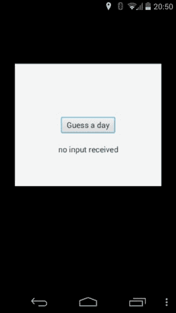

第 12 章 ■ 嵌入式与移动设备上的 JavaFX

export WORKDIR=$CURRENT_DIR/work

export APPDIR=/home/johan/javafx/ProJavaFX/projavafx8/ch12/SimplePort/target

gradlew --info createProject -PDEBUG -PDIR=$WORKDIR -PPACKAGE=org.javafxports

-P

NAME=SimplePort -PANDROID_SDK=$ANDROID_SDK -PJFX_SDK=$CURRENT_DIR/../build/dalvik-sdk

-PJFX_APP=$APPDIR -PJFX_MAIN=projavafx.SimplePort

执行此构建脚本的结果是在 WORKDIR 目录中创建一个名为 SimplePort（NAME 参数的值）的目录。在此目录中，会为你创建所需的 Android 项目结构，以及一个允许 ant 任务创建包的 build.xml 文件。要创建 Android 包，你必须切换到新目录并执行

ant clean debug

这将在该目录的 bin 子目录中创建一个调试版本（未签名）的 Android 应用。


现在，可以通过调用 `$ANDROID_SDK/platform-tools/adb install -r bin/SimplePort-debug.apk`，将 Android 应用程序传输到连接到开发系统的真实 Android 设备上。该应用程序现在已可在您的 Android 设备上使用。点击图标即可运行，图 12-16 中的截图显示了运行结果。

***图 12-16.** Nexus 5 Android 设备上的应用程序截图*

[www.it-ebooks.info](http://www.it-ebooks.info/)


第 12 章 ■ 嵌入式与移动设备上的 JavaFX

再次点击“猜一天”按钮会触发事件处理器，并生成图 12-17 所示的截图。

***图 12-17.** 点击“猜一天”按钮后 Nexus 5 Android 设备的截图* JavaFXPorts，整合应用

嵌入式与移动领域正处于持续且快速的发展之中。JavaFX 平台本身也仍在不断演进。

网站 [`javafxports.org`](http://javafxports.org/) 致力于跟踪能够运行 JavaFX 应用程序的环境状态。

JavaFXPorts 网站由 JavaFX 社区维护。尽管内容独立于 Oracle，但它包含了指向 Oracle 产品（包括开源和商业产品）以及第三方产品的链接。

总结

JavaFX 的市场潜力巨大，任何一家公司都难以独自掌控。过去几年中，Oracle 与 JavaFX 社区之间开展了非常良好的合作。Oracle 的 JavaFX 团队在架构和技术讨论方面一直非常开放和透明，而社区也提供了极佳的反馈。此外，还创建了许多开源项目。Oracle 的投入与社区贡献相结合，使得 JavaFX 8 平台能够在越来越多的环境中运行。

[www.it-ebooks.info](http://www.it-ebooks.info/)

第 12 章 ■ 嵌入式与移动设备上的 JavaFX

资源

以下是一些有助于理解嵌入式与移动设备上 JavaFX 的有用资源：

• *树莓派上的 JavaFX 操作指南*：[`javafx.steveonjava.com/javafx-on-`](http://javafx.steveonjava.com/javafx-on-raspberry-pi-3-easy-steps/)

[raspberry-pi-3-easy-steps/](http://javafx.steveonjava.com/javafx-on-raspberry-pi-3-easy-steps/)

• *JavaFXPorts*[: http://javafxports.org](http://javafxports.org/)

• *RoboVM*[: http://www.robovm.org](http://www.robovm.org/)

[www.it-ebooks.info](http://www.it-ebooks.info/)

**第 13 章**

**JavaFX 语言与标记**

*计算机编程非常有趣。就像音乐一样，它是一种源于天赋与持续练习的未知融合的技能。就像绘画一样，它可以被塑造成各种目的——商业、艺术和纯粹的娱乐。程序员因长时间工作而享有盛誉，但很少有人将其归因于创造力的驱动。程序员在周末、假期和用餐时谈论软件开发，并非因为他们缺乏想象力，而是因为他们的想象力揭示了他人无法看到的世界。*

—拉里·奥布莱恩和布鲁斯·埃克尔

JavaFX 提供了丰富的功能集来构建应用程序，让您可以创建超越传统 UI 工具包所能实现的沉浸式用户界面。然而，它并不仅限于此，因为 JavaFX 构建在 Java 语言之上，因此您还可以充分利用为 Java 平台开发的所有语言和工具。此外，JavaFX 还附带 FXML，这是其用 XML 编写的 UI 声明语言，本身功能相当强大。

在本章中，我们将展示如何利用不同的语言和标记，用更少的代码创建外观精美的 JavaFX UI。本章讨论的所有语言和功能的妙处在于，您可以选择使用。您可以继续使用命令式风格，用纯 Java 构建 JavaFX 应用程序，也可以利用您喜爱的 JVM 语言。谁知道呢？您甚至可能仅仅因为 JavaFX 的使用而成为本章讨论的某种语言的皈依者。

替代语言的快速比较

为了让您了解使用不同 JVM 语言的能力和表现力，我们首先从一个简单的示例开始，并以六种不同的表示形式展示它。该示例是 JavaFX 团队的 Jasper Potts 设计的“彩色圆圈”应用程序的扩展。这是一个用极少量代码展示形状、动画和效果的绝佳示例，我们对其进行了改编，以同时展示绑定和交互性。运行中的“消失的圆圈”应用程序如图 13-1 所示。

[www.it-ebooks.info](http://www.it-ebooks.info/)

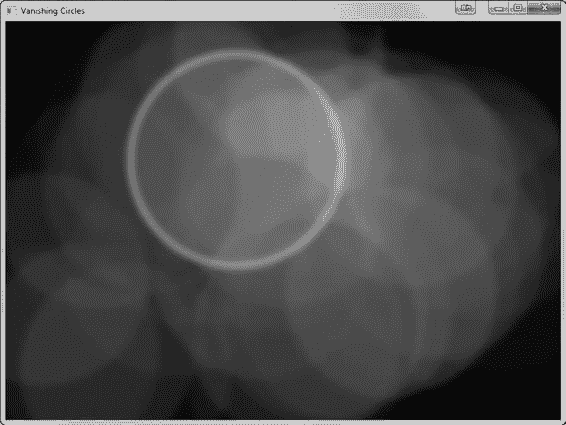

第 13 章 ■ JavaFX 语言与标记

***图 13-1.** 展示 JavaFX 效果、动画和交互的“消失的圆圈”应用程序* Java 中的“消失的圆圈”

首先，让我们用标准的 Java 命令式风格展示代码。这是编写 JavaFX 代码最冗长的方式，但对于熟悉 Java 编程语言和早期 UI 工具包（如 Swing）的人来说，也是最直接的方式。编写此示例的完整代码清单如清单 13-1 所示。

***清单 13-1.*** 以命令式 Java 风格编写的“消失的圆圈”应用程序 public class VanishingCircles extends Application {

public static void main(String[] args) {

launch(args);

}

@Override

public void start(Stage primaryStage) {

primaryStage.setTitle("Vanishing Circles");

Group root = new Group();

[www.it-ebooks.info](http://www.it-ebooks.info/)

第 13 章 ■ JavaFX 语言与标记

Scene scene = new Scene(root, 800, 600, Color.BLACK);

List<Circle> circles = new ArrayList<>();

for (int i = 0; i < 50; i++) {

final Circle circle = new Circle(150);

circle.setCenterX(Math.random() * 800);

circle.setCenterY(Math.random() * 600);

circle.setFill(new Color(Math.random(), Math.random(), Math.random(), .2));

circle.setEffect(new BoxBlur(10, 10, 3));

circle.addEventHandler(MouseEvent.MOUSE_CLICKED, e -> {

KeyValue collapse = new KeyValue(circle.radiusProperty(), 0);

new Timeline(new KeyFrame(Duration.seconds(3), collapse)).play();

});

circle.setStroke(Color.WHITE);

circle.strokeWidthProperty().bind(Bindings

.when(circle.hoverProperty())

.then(4)

.otherwise(0));

circles.add(circle);

}

root.getChildren().addAll(circles);

primaryStage.setScene(scene);

primaryStage.show();

Timeline moveCircles = new Timeline();

circles.stream().forEach(circle -> {

KeyValue moveX = new KeyValue(circle.centerXProperty(), Math.random() * 800);

KeyValue moveY = new KeyValue(circle.centerYProperty(), Math.random() * 600);

moveCircles.getKeyFrames().add(new KeyFrame(Duration.seconds(40), moveX, moveY));

});

moveCircles.play();

}

}

尽管代码相当容易理解，但也相当冗长。基本功能可总结如下。

• 五十个颜色各异的圆圈叠加在一起，并带有透明填充。
• 这些圆圈在窗口中按照半随机模式进行动画移动。
• 当鼠标悬停在一个圆圈上时，该圆圈会被白色边框包围。
• 点击一个圆圈时，它会慢慢缩小并消失。

通过非常简短的代码，这让我们能够展示许多不同的 JavaFX 特性，包括形状、效果、动画、绑定、流以及使用 lambda 表达式的事件监听器。在接下来的几个示例中，我们将把这个确切的应用程序转换为几种不同的语言和表示形式，让您了解这些特性在您可用的每种选择中是如何变化的。

替代 JVM 语言中的“消失的圆圈”


现在我们来探讨不同的 JVM 语言，并展示使用 Groovy 和 Scala 可以实现哪些功能。这两种语言都利用了基于 JavaFX API 构建的内部领域特定语言（DSL）。

[www.it-ebooks.info](http://www.it-ebooks.info/)

第 13 章 ■ JavaFX 语言与标记语言

对于刚开始接触 JVM 语言的开发者来说，Groovy 是一个绝佳的选择，因为它的语法与 Java 语言最为接近。事实上，只需进行少量修改，所有 Java 程序也都是有效的 Groovy 程序！然而，要充分利用 Groovy 的语言特性，你需要针对目标用例使用相应的 DSL，例如 GroovyFX。GroovyFX 是一个开源项目，它允许你用 Groovy 语言编写 JavaFX 代码，效果如代码清单 13-2 所示。

***代码清单 13-2.*** 使用 GroovyFX DSL 用 Groovy 编写的“消失的圆圈”应用程序

GroovyFX.start { primaryStage ->

def sg = new SceneGraphBuilder()

def rand = new Random().&nextInt

def circles = []

sg.stage(title: '消失的圆圈', show: true) {

scene(fill: black, width: 800, height: 600) {

50.times {

circles << circle(centerX: rand(800), centerY: rand(600), radius: 150, stroke: white, strokeWidth: bind('hover', converter: {val -> val ? 4 : 0})) {

fill rgb(rand(255), rand(255), rand(255), 0.2)

effect boxBlur(width: 10, height: 10, iterations: 3)

onMouseClicked { e ->

timeline {

at(3.s) { change e.source.radiusProperty() to 0 }

}.play()

}

}

}

}

timeline(cycleCount: Timeline.INDEFINITE, autoReverse: true) {

circles.each { circle ->

at (40.s) {

change circle.centerXProperty() to rand(800)

change circle.centerYProperty() to rand(600)

}

}

}.play()

}

}

这段 GroovyFX 代码与之前的 JavaFX 示例功能相同，但代码量显著减少，表达力更强。此外，随着应用程序规模的增长，使用此类 DSL 将带来更多好处，让你能够用更少的代码编写更复杂、功能更丰富的应用程序。

这段代码所利用的一些 Groovy 语言特性包括：

• *Groovy 构建器模式*：Groovy 使得构建强大且简洁的构建器代码变得特别容易，GroovyFX 的 SceneGraphBuilder 就是很好的例子。

• *命名参数*：记住方法或构造函数中长参数列表的顺序很困难，但命名参数允许你明确指定参数，并可以按自己的方便调整顺序。

[www.it-ebooks.info](http://www.it-ebooks.info/)

第 13 章 ■ JavaFX 语言与标记语言

• *类扩展*：Groovy 允许你向现有类添加新的方法和功能，例如通过语法 `40.s` 创建持续时间对象，其中“s”是整数上的一个方法。

• *闭包*：通过闭包创建匿名单方法接口扩展，极大地简化了事件处理程序。

所有这些特性共同造就了一种非常简洁、可读性强且样板代码极少的语法。我们将在后面题为“让你的 JavaFX 更 Groovy”的章节中深入探讨每个 JavaFX 特性如何转换为 Groovy 语法。

我们介绍的第二种 JVM 语言是 Scala。它提供了许多与 Groovy 相同的好处，并且额外具有完全类型安全的优势。这意味着编译器甚至在你运行应用程序之前就能捕获错误和类型错误，这可以极大地提高生产力，并缩短你的开发和测试周期。

同样，我们利用了一种用 Scala 语言编写的内部 DSL，称为 ScalaFX，这是另一个开源项目，为 JavaFX API 提供了完整的封装库。使用 ScalaFX 编写的“消失的圆圈”应用程序的代码如代码清单 13-3 所示。

***代码清单 13-3.*** 使用 ScalaFX DSL 用 Scala 编写的“消失的圆圈”应用程序

object VanishingCircles extends JFXApp {

var circles: Seq[Circle] = null

stage = new PrimaryStage {

title = "消失的圆圈"

width = 800

height = 600

scene = new Scene {

fill = BLACK

circles = for (i <- 0 until 50) yield new Circle {

centerX = random * 800


centerY = random * 600

radius = 150

fill = color(random, random, random, .2)

effect = new BoxBlur(10, 10, 3)

strokeWidth <== when (hover) then 4 otherwise 0

stroke = White

onMouseClicked = {

Timeline(at (3 s) {radius -> 0}).play()

}

}

content = circles

}

}

new Timeline {

cycleCount = INDEFINITE

autoReverse = true

keyFrames = for (circle <- circles) yield at (40 s) {

Set(

circle.centerX -> random * stage.width,

circle.centerY -> random * stage.height

)

}

}.play();

}

[www.it-ebooks.info](http://www.it-ebooks.info/)

第 13 章 ■ JavaFX 语言与标记

Scala 示例利用对象字面量模式来构建场景图，这与 Java 和 Groovy 构建器具有相同的优势。它还受益于 ScalaFX 库内置的强大绑定支持。该代码所利用的一些 Scala 语言特性包括：

• *运算符重载*：Scala 允许你重载现有运算符并创建全新的运算符。这在多个地方得到应用，包括绑定和动画语法。

• *隐式转换*：Scala 通过隐式转换来实现类扩展。这使得可以为 JavaFX API 类添加便捷方法，用于对象字面量构建，从而让你在核心类上获得构建器的全部能力。

• *闭包*：Scala 也支持闭包，这使得事件处理程序更加简洁，并允许强大的循环结构，例如`for . . . yield`语法。

• *DSL 友好语法*：常见的代码标点符号（如点和括号）在大多数情况下是可选的，这使得可以构建读起来像语言关键字的流畅 API。

尽管代码最终相当简短且易于理解，但 Scala 语言本身具有相当的深度。我们将在本章稍后的“Scala 与 JavaFX”一节中展示如何利用 Scala 的一些内置特性来进一步改进你的应用程序。

如你所见，使用 DSL 编写 JavaFX 代码相比使用命令式或构建器风格在 Java 中编写代码，能带来显著的好处。此外，由于所有这些语言都基于相同的底层 JavaFX API，它们与纯 Java 编写的应用程序具有相同的功能。因此，你可以自行选择使用哪种语言来编写 JavaFX 应用程序。

在接下来的几节中，我们将更详细地介绍每种语言，以帮助你开始使用它们开发 JavaFX 应用程序。此外，实际上可以使用任何 JVM 语言来编写 JavaFX 应用程序，因此如果你有这里未列出的偏爱语言，也值得一试！

让你的 JavaFX 更 Groovy

根据就业趋势，Groovy 是 JVM 上除 Java 之外最流行的语言.1。这得益于 Groovy 极易上手；除了一些细微差异,2 外，任何 Java 程序也都是有效的 Groovy 应用程序。这使得 Java 开发者即使尚未充分领略 Groovy 为 Java 生态系统带来的所有强大功能和便利性，也能轻松开始使用它。

Groovy 源文件直接编译为 Java 字节码，可以在任何拥有 JVM 的地方运行。因此，你可以直接访问任何 Java 库，包括 JavaFX API。由于语言内置了诸多便利性，编写良好的 Groovy 应用程序几乎总是比等效的 Java 版本更简短。Groovy 语言的一些特性使其成为 Java 和 JavaFX 代码的有吸引力的替代品，包括：

• *闭包*：最近在 Java 8 中引入，闭包对 GUI 编程尤其重要，因为它们使得编写事件发生时调用的代码更加简单。

• *运算符重载*：Groovy 允许你重载现有运算符或定义新运算符，这对于编写可读的 DSL 至关重要。

• *动态类型*：在 Groovy 代码中类型是可选的，这使得编写简洁代码更加容易。

• *Getter/Setter 访问*：Groovy 会自动将直接字段访问转换为 getter 和 setter，从而缩短了这种访问 Java API 的常见模式。

1Scala、Groovy、Clojure、Jython、JRuby 和 Java：按语言划分的工作机会，[`bloodredsun.com/2011/10/04/scala-groovy-`](http://bloodredsun.com/2011/10/04/scala-groovy-clojure-jython-jruby-java-jobs/)
[clojure-jython-jruby-java-jobs/](http://bloodredsun.com/2011/10/04/scala-groovy-clojure-jython-jruby-java-jobs/)，2011 年 10 月。
2 与 Java 的差异，[`groovy.codehaus.org/Differences+from+Java`](http://groovy.codehaus.org/Differences+from+Java)，2011 年。

[www.it-ebooks.info](http://www.it-ebooks.info/)

第 13 章 ■ JavaFX 语言与标记

• *命名构造函数参数*：使用构造函数初始化对象时，还可以通过名称引用类上的字段来设置它们。这种模式在我们后面的 GroovyFX 代码中会大量使用。

• *内置数据结构语法*：许多常用的数据结构（如列表和映射）在 Groovy 中都有内置语法，这使得使用它们和动态构建它们更加方便。

直接从 Groovy 使用 JavaFX 是可行的；然而，如果不使用专门的 DSL 库（如 GroovyFX），你将错过 Groovy 的许多好处。在接下来的几节中，我们将向你展示使用 Groovy 语言和 GroovyFX 库编写 JavaFX 代码的一些好处。

GroovyFX 简介

GroovyFX 是一个用于在 Groovy 中开发 JavaFX 应用程序的库，它允许你以更 Groovy 的方式构建应用程序。它由 Jim Clarke 和本书合著者之一 Dean Iverson 发起，并作为开源 Groovy 模块进行开发。Groovy 领域的知名专家 Russel Winder 已将其更新为适用于 Java 8。GroovyFX 的主页位于 GitHub 上：[`groovyfx-project.github.com/`](http://groovyfx-project.github.com/)。

使用 GroovyFX 编写代码，而不是直接针对 JavaFX API 编码，其好处包括：

• *构建器模式*：GroovyFX 为所有主要的 JavaFX 类提供了 Groovy 构建器，使得以声明方式构建场景图变得简单方便。

• *属性生成*：编写自定义属性的 JavaFX 属性模式相当冗长，但在 GroovyFX 中只需一行注解即可替代。

• *时间线 DSL*：GroovyFX 为动画提供了便捷的简写语法。

• *便捷的绑定语法*：GroovyFX 使创建绑定比等效的 Java 代码更加简洁和易读。

• *API 改进*：许多 JavaFX API 都经过了调整和增强，使其更易于使用。

为了帮助你开始使用 GroovyFX，我们将引导你从头开始设置一个小型 GroovyFX 项目。这些说明假设你的系统上已安装了最新的 Java 和 JavaFX 8 SDK。此外，我们选择针对 IntelliJ 社区版定制说明，这是一个免费的、开源的 IDE，长期以来对 Groovy 有出色的支持。Eclipse、NetBeans 和许多其他 IDE 也支持 Groovy，因此如果你偏好其他 IDE，可以轻松调整这些说明以适用于你选择的 IDE。

首先，下载并安装最新版本的 IntelliJ IDEA。社区版自带 Groovy 支持，因此无需购买终极版。IntelliJ 网站位于：

[`www.jetbrains.com/idea`](http://www.jetbrains.com/idea)


安装并启动 IntelliJ 后，你需要创建一个启用了 **Groovy** 语言支持的新 Java 项目。在欢迎页面上，你可以点击“创建新项目”；如果你在其他界面，可以通过“文件”菜单选择“新建项目...”来打开相同的向导。这将打开如图 13-2 所示的“新建项目”向导。

[www.it-ebooks.info](http://www.it-ebooks.info/)

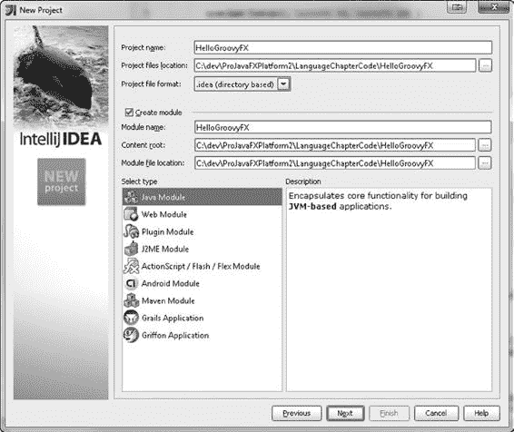

第 13 章 ■ JavaFX 语言与标记

***图 13-2.** IntelliJ 新建项目向导对话框*

将你的项目命名为 `HelloGroovyFX`，确保项目类型设置为“Java 模块”，然后点击“下一步”。

在向导的下一页，你可以直接接受默认的 `src` 文件夹位置并继续，这将带你进入如图 13-3 所示的扩展屏幕。

[www.it-ebooks.info](http://www.it-ebooks.info/)

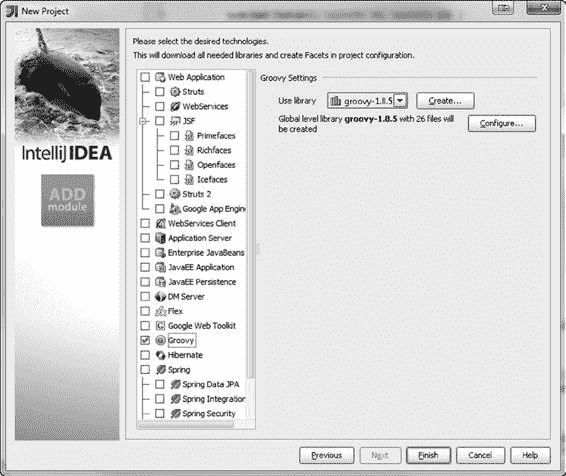

第 13 章 ■ JavaFX 语言与标记

***图 13-3.** IntelliJ 新建项目向导，第二个对话框*

在这里，你可以为你的项目选择并启用 Groovy 支持。在左侧列表中找到 **Groovy** 并勾选复选框。你还需要在右侧窗格中配置一个 Groovy 运行时环境，以便其正常工作。如果你尚未安装当前的 Groovy 运行时，可以从 Groovy 网站获取最新版本，网址为：

[`groovy.codehaus.org/`](http://groovy.codehaus.org/)。

二进制 zip 发布版本即可正常使用。将其解压到硬盘上的某个文件夹，然后返回 IntelliJ，点击“创建...”按钮并选择你刚刚解压 Groovy 的文件夹，来设置 Groovy 库。要完成项目创建，请点击“完成”，你的新项目将在当前窗口中打开。

项目设置基本完成，但还缺少 JavaFX 和 GroovyFX 的依赖库。

要添加这些库，请从“文件”菜单中打开“项目结构...”对话框，并导航到“模块”部分。

这允许你比“新建项目”向导更详细地配置项目设置。

点击右侧的“依赖项”选项卡，将出现如图 13-4 所示的屏幕。

[www.it-ebooks.info](http://www.it-ebooks.info/)

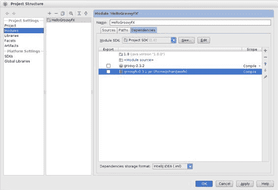

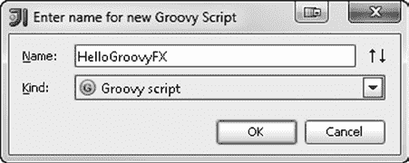

第 13 章 ■ JavaFX 语言与标记

***图 13-4.** HelloGroovyFX 项目的模块配置屏幕*

在“依赖项”选项卡上，你需要配置一个额外的 jar 引用，如图 13-4 中高亮所示。

这就是 GroovyFX jar 文件，你可以从 GroovyFX 网站下载。GroovyFX 网站的 URL 是：

[`groovyfx-project.github.com/`](http://groovyfx-project.github.com/)。

现在，要创建 HelloGroovyFX 应用程序，我们需要向项目添加一个新的 Groovy 脚本。右键点击项目的 `src` 目录，从上下文菜单中选择“新建 ➤ Groovy 脚本”。这将打开一个脚本创建对话框，你可以在其中输入脚本文件的名称，然后点击“确定”创建它，如图 13-5 所示。

***图 13-5.** Groovy 脚本创建对话框*

[www.it-ebooks.info](http://www.it-ebooks.info/)


第 13 章 ■ JavaFX 语言与标记

现在，你终于可以开始编写一些代码了。HelloGroovyFX 应用程序非常简短，因此你可以从本书附带的源代码包中获取代码，或者自己输入清单 13-4 中所示的代码。

***清单 13-4.*** Hello GroovyFX 代码

import groovyx.javafx.GroovyFX

import groovyx.javafx.SceneGraphBuilder

GroovyFX.start {

new SceneGraphBuilder().stage(visible: true) {

scene {

stackPane {

text("Hello GroovyFX")

}

}

}

}

要运行该应用程序，只需右键点击该类，然后从上下文菜单中选择“运行 'HelloGroovyFX'”。

这将为你提供如图 13-6 所示的应用程序。

***图 13-6.** 在 IntelliJ 中运行 Hello GroovyFX 应用程序的输出*

恭喜！你已经成功创建并运行了你的第一个基于 Groovy 的 JavaFX 应用程序。在接下来的几节中，我们将更详细地介绍 GroovyFX 的特性和功能，但请记住，你在 JavaFX 中能做的任何事情在 GroovyFX 中都能实现，因为它封装了完整的 JavaFX API。

GroovyFX 中的属性

在 Java 中使用 JavaFX 进行 UI 开发时，最能受益的特性之一是在语言中拥有一流的、可观察的属性概念。由于目前尚不存在这种特性，JavaFX 团队在 API 层面添加了属性，这虽然足够，但比原生语法要冗长得多。

幸运的是，使用像 Groovy 这样的动态语言，可以很容易地添加强大的特性，包括原生属性语法。Groovy 已经内置了简化的 getter/setter 访问概念，因此你可以像处理普通变量一样检索和存储 JavaFX 属性。例如，要在 Groovy 中设置矩形的宽度，你只需编写：

rectangle.width = 500

这将自动转换为 setter 调用，如下所示：

rectangle.setWidth(500);

[www.it-ebooks.info](http://www.it-ebooks.info/)

第 13 章 ■ JavaFX 语言与标记

JavaFX 属性模式中更繁琐的另一部分是创建新属性。要以与 JavaFX API 定义属性相同的方式在类上定义新属性，每个属性需要一个字段和三个方法。在 Person 对象上创建 name 属性的标准样板代码如清单 13-5 所示。

***清单 13-5.*** 在 Java 中创建新属性的 JavaFX 属性模式

import javafx.beans.property.SimpleStringProperty

import javafx.beans.property.StringProperty

public class Person {

private StringProperty name;

public final void setName(String val) { nameProperty().set(val); }

public final String getName() { return nameProperty().get(); }

public StringProperty nameProperty() {

if (name == null) {

name = new SimpleStringProperty(this, "name");

}

return name;

}

}

■ **注意** 上述代码可以通过在 getName 方法中检查属性是否已创建来进一步优化，如果尚未创建则返回 null（从而避免初始化 name 属性）。

虽然这段代码只比标准的 Java 属性 bean 模式稍微冗长一点，但将其乘以你需要在应用程序中定义的属性数量，你就会得到相当多的代码需要维护，并且在出现意外问题时进行调试。

GroovyFX 对此有一个非常优雅的解决方案，即使用 AST 转换的编译器钩子。与其每次想定义新属性时都复制粘贴属性样板代码，你只需用 `@FXBindable` 注解标注一个变量，GroovyFX 就会处理其余的事情。它会生成与你手动编写完全相同的优化代码，但在编译阶段在后台完成，这样你的源代码就不会被额外的逻辑弄得杂乱无章。

清单 13-6 展示了 name 属性在 Groovy 中的样子。

***清单 13-6.*** 在 Groovy 中创建新属性的 GroovyFX 属性模式

import groovyx.javafx.beans.FXBindable

class Person {

@FXBindable String name

}

GroovyFX 的 `@FXBindable` 注解还支持处理属性具有默认初始化值的情况：

class Person {

@FXBindable String name = "Guillaume Laforge"

}

[www.it-ebooks.info](http://www.it-ebooks.info/)

第 13 章 ■ JavaFX 语言与标记

它还有一个便捷的快捷语法，用于将类中的所有变量转换为属性：

@FXBindable

class Person {

String name;

int age;

String gender;

Date dob;

}

GroovyFX 绑定


JavaFX 中的绑定是一项极其强大的功能，但 JavaFX 2 引入的基于 API 的语法常常会妨碍理解绑定代码的实际作用。GroovyFX 通过利用 Groovy 语言的运算符重载特性，为常见的绑定表达式提供了中缀表示法，从而解决了这个问题。

例如，要将一个矩形的宽度绑定到另一个矩形的宽度，你可以在 GroovyFX 中编写如下代码：

rect1.widthProperty.bind(rect2.widthProperty)

此外，还有另一种等效的代码写法可供使用：

rect1.widthProperty.bind(rect2, 'width')

然而，GroovyFX 绑定的真正威力体现在将多个属性组合到一个绑定语句中时。再举一个例子，假设你想将一个矩形的宽度绑定到另外两个矩形的宽度之和。

在 GroovyFX 中，你可以编写如下代码：

rect1.widthProperty.bind(rect2.widthProperty + rect3.widthProperty)

这将会转换为下面这段长得多的 JavaFX Java 代码：

rect1.getWidthProperty().bind(rect2.getWidthProperty().add(rect3.getWidthProperty()));

GroovyFX 发行版附带了一个绑定代码示例，用于制作模拟时钟的指针动画。该示例由 Jim Clark 编写，其中展示属性和绑定的相关代码如清单 13-7 所示。

***清单 13-7.*** GroovyFX 演示包中的模拟时钟节选

@FXBindable

class Time {

Integer hours

Integer minutes

Integer seconds

Double hourAngle

Double minuteAngle

Double secondAngle

[www.it-ebooks.info](http://www.it-ebooks.info/)

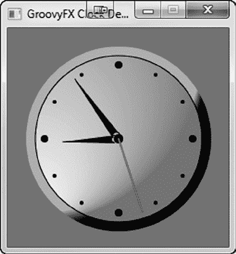

第 13 章 ■ JavaFX 语言与标记

public Time() {

// 将角度属性绑定到时钟时间

hourAngleProperty.bind((hoursProperty * 30.0) + (minutesProperty * 0.5))

minuteAngleProperty.bind(minutesProperty * 6.0)

secondAngleProperty.bind(secondsProperty * 6.0)

...

}

通过 AST 转换实现的自动属性扩展与中缀表示法绑定的结合，让你无需编写大量代码就能表达相当复杂的逻辑。运行该示例后得到的 Groovy 模拟时钟图形用户界面如图 13-7 所示。

***图 13-7.** Groovy 模拟时钟演示*

GroovyFX API 增强功能

除了使用 Groovy 替代 JavaFX 带来的核心语言优势外，GroovyFX 还对许多 JavaFX API 进行了 Groovy 化改造，使其在动态语言中更易于使用。本节我们将介绍三个主要方面：用于动画的 GroovyFX 自定义 DSL、简化的表格构建模式以及精简的 JavaFX 布局。与核心 JavaFX API 相比，所有这些都带来了显著优势，让你能够编写更少的代码，完成更多的工作。

动画

GroovyFX 支持使用一种特殊的 DSL 来构建动画，该 DSL 拥有创建 Duration、KeyFrame 和 KeyValue 的语法，且所有语法都简洁明了。我们之前在“消失的圆圈”应用程序中展示过一个 Groovy 动画语法示例，如下所示：

timeline {

at(3.s) { change e.source.radiusProperty() to 0 }

}.play()

[www.it-ebooks.info](http://www.it-ebooks.info/)

第 13 章 ■ JavaFX 语言与标记

基本模式如下，你可以在一个时间线（timeline）中包含多个 at 表达式，并在一个 at 中包含多个 change 表达式。

timeline {

at(duration) {

[change property to value]

}

}

与绑定类似，还有第二种格式用于引用构成 change 表达式的属性：

timeline {

at(3.s) { change(e.source, 'radius') to 0 }

}.play()

该语法还支持一个可选的 tween，让你可以为动画进行的速度提供一条曲线：

timeline {

at(3.s) { change e.source.radiusProperty() to 0 tween ease_both }

}.play()

通过上述更改，动画将开始缓慢，然后加速到正常速度，最后再以同样的方式减速。

与完整的 Java 代码相比，Groovy 动画语法在字符数上节省了大量篇幅，并且让你更容易看清动画的实际效果。


表格

由于构建器或命令式 Java 需要额外的语法糖，并且需要在多个层级指定泛型，因此在 Java 代码中构建简单的数据表格往往需要编写大量代码。Groovy 通过一种相当直观的构建器格式来简化表格创建，同时还提供了一些便利功能，例如内置的类型转换器，允许你指定一个闭包来更改某个字段的输出类型。

因此，你可以用很少的代码编写相当复杂的表格。下面的示例基于我们之前创建的 Person 类构建，以表格格式显示人员列表。完整代码如清单 13-8 所示。

***清单 13-8.*** 演示 Groovy 中包含字符串、整数和日期的表格的代码
```groovy
import groovyx.javafx.GroovyFX
import groovyx.javafx.SceneGraphBuilder
import binding.Person
import java.text.SimpleDateFormat

def dateFormat = new SimpleDateFormat("MM/dd/yyyy")

def persons = [
    new Person(name: "Ada Lovelace", age: 36, gender: "Female",
               dob: dateFormat.parse("10/10/1815")),
    new Person(name: "Henrietta Swan Leavitt", age: 53, gender: "Female",
               dob: dateFormat.parse("7/4/1868")),
    new Person(name: "Grete Hermann", age: 83, gender: "Female",
               dob: dateFormat.parse("3/2/1901"))
]
```

[www.it-ebooks.info](http://www.it-ebooks.info/)

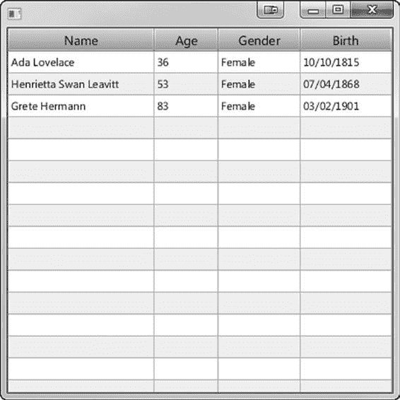

第 13 章 ■ JavaFX 语言与标记

```groovy
GroovyFX.start {
    new SceneGraphBuilder().stage(visible: true) {
        scene {
            tableView(items: persons) {
                tableColumn(property: "name", text: "Name", prefWidth: 160)
                tableColumn(property: "age", text: "Age", prefWidth: 70)
                tableColumn(property: "gender", text: "Gender", prefWidth: 90)
                tableColumn(property: "dob", text: "Birth", prefWidth: 100,
                            type: Date,
                            converter: { d -> return dateFormat.format(d) })
            }
        }
    }
}
```

请注意，显示表格的代码几乎和设置数据的代码一样简短。最后一列中用于格式化日期的转换器在 Groovy 中是一行代码，但在 Java 中则需要一个 `CellValueFactory` 以及 `Callback` 接口的实现，这需要节省好几行 Java 代码。

图 13-8 dis 展示了在 Groovy 中运行此表格应用程序的结果。

***图 13-8.** 列出计算机领域著名女性的 Groovy 表格演示*

[www.it-ebooks.info](http://www.it-ebooks.info/)

第 13 章 ■ JavaFX 语言与标记

布局

另一组以声明式方式使用相对具有挑战性的 API 是 JavaFX 布局。它们拥有强大的约束系统，你可以利用它来为节点赋予基于特定布局的特殊布局行为，但这同时也意味着向布局添加节点需要两个步骤：(1) 将其添加到容器中，(2) 分配约束。

GroovyFX API 通过一种非常简洁的解决方案解决了布局问题，该方案涉及为节点对象添加额外的伪属性来表示布局约束。这允许你在构建场景图时定义约束，然后在布局阶段，JavaFX 布局系统会使用这些约束来控制节点的定位和大小。

清单 13-9 展示了一个更复杂的布局示例——GridPaneLayout，整个应用程序以声明式风格编写。

***清单 13-9.*** GroovyFX 中 GridPane 布局的示例代码
```groovy
import groovyx.javafx.GroovyFX
import groovyx.javafx.SceneGraphBuilder
import javafx.scene.layout.GridPane
import javafx.scene.text.Font

GroovyFX.start {
    def sg = new SceneGraphBuilder()
    sg.stage(title: "GridPane Demo", width: 400, height: 500, visible: true) {
        scene {
            stackPane {
                imageView {
                    image("puppy.jpg", width: 1100, height: 1100, preserveRatio: true)
                    effect colorAdjust(brightness: 0.6, input: gaussianBlur())
                }
                gridPane(hgap: 10, vgap: 10, padding: 20) {
                    columnConstraints(minWidth: 60, halignment: "right")
                    columnConstraints(prefWidth: 300, hgrow: "always")
                    label("Dog Adoption Form", font: new Font(24), margin: [0, 0, 10, 0],
                          halignment: "center", columnSpan: GridPane.REMAINING)
                    label("Size: ", row: 2)
                    textField(promptText: "approximate size in pounds", row: 2, column: 1)
                    label("Breed:", row: 3)
                    textField(promptText: "pet breed", row: 3, column: 1)
                    label("Sex:", row: 4)
                    choiceBox(items: ['Male', 'Female', 'Either'], row: 4, column: 1)
                    label("Additional Info:", wrapText: true, textAlignment: "right",
                          row: 5, valignment: "baseline")
                    textArea(prefRowCount: 8, wrapText: true, row: 5, column: 1, vgrow: 'always')
                    button("Submit", row: 6, column: 1, halignment: "right")
                }
            }
        }
    }
}
```

[www.it-ebooks.info](http://www.it-ebooks.info/)

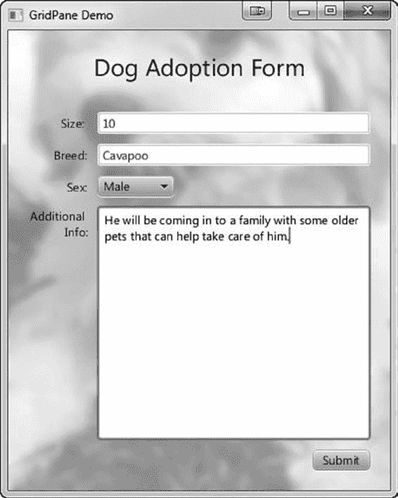

第 13 章 ■ JavaFX 语言与标记

请注意，代码简洁明了，并且紧密地模拟了它试图构建的 UI。运行此应用程序的结果与典型的 UI 表单完全一致，如图 13-9 所示。

***图 13-9.** 运行中的狗狗领养表单示例，背景是一只 Cavapoo（卡瓦利国王查理士猎犬与贵宾犬的混种）*3

3 来自维基共享资源的公共领域图片：[`commons.wikimedia.org/wiki/File:Image-Cavapoo_puppy.JPG`](http://commons.wikimedia.org/wiki/File:Image-Cavapoo_puppy.JPG)

[www.it-ebooks.info](http://www.it-ebooks.info/)

第 13 章 ■ JavaFX 语言与标记

Scala 与 JavaFX

Scala 是一种强大的 JVM 语言，它将函数式编程和面向对象编程的最佳特性融合于一身。与本章讨论的其他 JVM 语言一样，它直接将源文件编译为 Java 字节码，并且所有常用的现有 Java 语言库都与它兼容。此外，Scala 还增加了强大的类型安全集合、优雅的并发 Actor 模型，以及包括闭包、模式匹配和柯里化在内的函数式语言特性。

Scala 由 Martin Odersky 于 2001 年在洛桑联邦理工学院 (EPFL) 创立，多年来不断成熟并日益流行。Odersky 实际上多年来一直是 Java 编译器幕后工作的天才，包括扩展了 Java 的 Pizza 语言以及 GJ，后者在 Sun 公司于 Java 1.3 中采用后，成为了现代 Java 编译器的鼻祖。通过在 JVM 上开发一种全新的语言，Odersky 得以克服 Java 的若干固有设计限制。

如今，Scala 被许多大型企业使用，例如 Twitter、LinkedIn、Foursquare 和 Morgan Stanley。此外，该语言的创建者还通过 Scala 语言公司 TypeSafe 提供商业支持。而且，Scala 已被 Java 之父 James Gosling、Groovy 创建者 James Strachan 以及 JRuby 核心开发者 Charles Nutter 等人誉为 Java 的继任者。有了 Scala 语言背后的所有这些支持，它也成为为 JavaFX 开发提供卓越 API 的绝佳候选！

虽然你可以直接针对 JavaFX API 使用 Scala 进行编码，但最终结果看起来会与我们到目前为止编写的 Java 代码非常相似，并且无法充分利用该语言的优势。ScalaFX 项目就是为了提供更符合 Scala 风格的 API 来进行 JavaFX 开发而启动的，我们在本书的所有示例中都使用了它。

ScalaFX 是一个开源项目，由本书作者之一 Stephen Chin 创建，并且有许多额外的贡献者帮助进行了库的设计和测试。它与本章前面描述的 GroovyFX 库非常相似，因为它也是一个开源库，构成了 JVM 语言与 JavaFX API 之间的桥梁。然而，ScalaFX 的不同之处在于它优先考虑类型安全和一致的语义，这符合 Scala 语言设计目标的精神。


ScalaFX 库中的许多结构都受到了 JavaFX 2.0 之前版本所使用的 JavaFX Script 语言的启发，因此，如果你熟悉 JavaFX Script，你会觉得其语法非常亲切。它利用了 Scala 中许多高级特性，但不会让最终用户为了构建漂亮的 UI 应用程序而被迫去理解这些特性。

让你成为 Scala 专家并非本书的目标，但我们会在 ScalaFX 代码中使用 Scala 特性时对其进行描述，因此，对于任何已经精通 Java 的开发者来说，这也可以作为一份温和的 Scala 入门指南。

开始使用 ScalaFX

要编写你的第一个 ScalaFX 应用程序，你需要下载并安装 Scala 以及 ScalaFX 库。由于 ScalaFX 代码是用 Scala 语言编写的 DSL，你可以使用任何支持 Scala 开发的 IDE，例如 IntelliJ、Eclipse 或 NetBeans，不过你可能想从 Scala IDE for Eclipse 开始，因为这是 TypeSafe 的 Scala 语言团队所支持的 IDE。我们将在本章演示 Eclipse 环境的基本设置，但这些概念同样适用于其他 IDE。

首先，安装最新版本的 Eclipse 并启动它。从 **Help** 菜单中选择 **Install New Software...**

并将 Scala IDE 的更新 URL 粘贴到 **Work with** 字段中。你可以从他们的网站 [`scala-ide.org/download/current.html`](http://scala-ide.org/download/current.html) 获取 Scala IDE 的最新更新 URL。

这将允许你选择 Scala IDE for Eclipse 插件，如图 13-10 所示。

[www.it-ebooks.info](http://www.it-ebooks.info/)

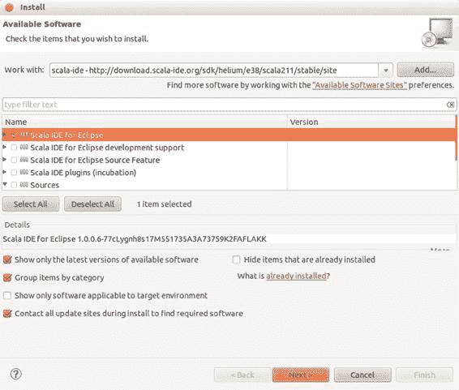

第 13 章 ■ JavaFX 语言与标记

***图 13-10.** 在 Eclipse 中安装 Scala IDE*

继续向导，接受许可协议和默认设置。下载并安装插件并重启 Eclipse 后，你就可以开始 Scala 开发了。

首先，我们创建一个新的 Scala 项目。转到 **File** 菜单并选择 **New ➤ Project...** 以打开图 13-11 所示的新建项目向导。从选项列表中选择 **Scala Wizards/Scala Project**，然后点击 **Next**。

[www.it-ebooks.info](http://www.it-ebooks.info/)

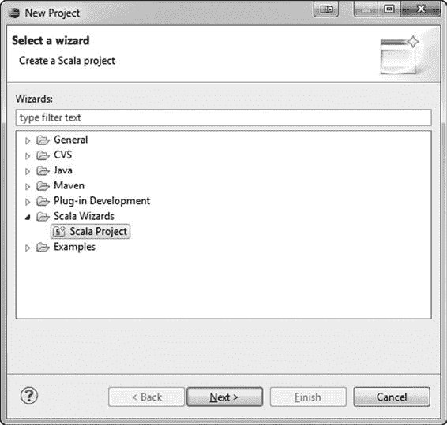

第 13 章 ■ JavaFX 语言与标记

***图 13-11.** 在 Eclipse 中创建 Scala 项目*

我们将项目命名为 **Hello ScalaFX**，并使用默认项目设置。当被询问是否切换到 Scala 透视图时，选择 **Yes**，你将进入编辑 Scala 代码的正确视图。

除了标准的项目设置外，我们还需要将 ScalaFX 和 JavaFX 库添加到代码中，以便使用此 DSL。ScalaFX 可以从 Google Code 网站 [`code.google.com/p/scalafx/`](http://code.google.com/p/scalafx/) 下载。

作为 JavaFX 运行时和 SDK 的一部分，你已经安装了 JavaFX 库。要安装 ScalaFX，只需下载最新的 jar 发行版，并将其作为依赖库添加到你的项目中。最简单的方法如下：

1.  将 `ScalaFX.jar` 文件复制到项目根目录下的 `lib` 文件夹中。
2.  右键点击你的项目，从上下文菜单中选择 **Properties...**。
3.  导航到 **Java Build Path** 条目，选择 **Libraries** 选项卡，然后点击 **Add Jars**。
4.  选择你在步骤 1 中添加到项目中的 `ScalaFX.jar` 文件。

[www.it-ebooks.info](http://www.it-ebooks.info/)

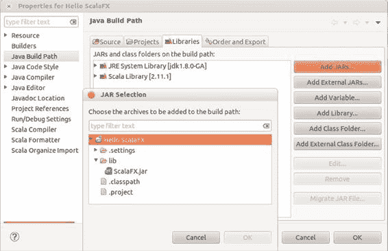

第 13 章 ■ JavaFX 语言与标记

步骤 2 到 4 如图 13-12 所示。

***图 13-12.** 将 ScalaFX jar 文件添加到你的项目中*

现在，你已经准备好创建你的第一个 ScalaFX 应用程序了。首先，我们创建一个非常简单的 ScalaFX 应用程序，它显示一个包含单个 Label 的 Stage 和 Scene。这是 JavaFX 应用程序的 Hello World，它将确保你所有的项目设置都正确无误，并且你已经准备好构建更大的应用程序。

要创建一个新的 ScalaFX 类，请从 **File** 菜单中选择 **New ➤ Scala Object**。这将打开一个向导，你可以在其中将类名设置为 `HelloScalaFX`，并选择它应该继承的 `scalafx.application.JFXApp` 类。完成向导后，Eclipse 将为你创建一个存根类。

为了完成这个示例，你需要向应用程序添加一个 Stage、Scene 和 Label。Hello ScalaFX 应用程序的完整代码如清单 13-10 所示。

***清单 13-10.** 用于测试你新创建项目的 Hello ScalaFX 应用程序*
```scala
import scalafx.application.JFXApp
import scalafx.application.JFXApp.PrimaryStage
import scalafx.scene.Scene
import scalafx.scene.control.Label

object HelloScalaFX extends JFXApp {
  stage = new PrimaryStage {
    scene = new Scene {
      content = new Label {
        text = "Hello ScalaFX"
      }
    }
  }
}
```

[www.it-ebooks.info](http://www.it-ebooks.info/)


第 13 章 ■ JavaFX 语言与标记

你可能注意到与 Java 代码的一些明显区别。在 Scala 中，如果换行符已经表明语句结束，那么分号几乎总是可选的。这就是为什么 import 语句和 `text` 赋值语句后面没有分号的原因。此外，Scala 既有类也有对象，两者或其中之一都可以在给定的文件中定义。在这个例子中，我们创建了一个继承 `scalafx.application.JFXApp` 的对象，这提供了一种一步到位地定义和启动应用程序的方式。

创建一个继承 `scalafx.application.JFXApp` 的对象是使用 ScalaFX 构建 JavaFX 应用程序的基本模式。这个基类拥有实例化 JavaFX 应用程序所需的所有核心功能，让你免于通常所需的样板代码。你只需要处理所需的任何初始化工作，并用你自己的 ScalaFX stage 对象覆盖 `stage` 变量即可。

`PrimaryStage`、`Scene` 和 `Label` 都遵循相同的模式，它们都是 ScalaFX 对象，其属性对应于相同 JavaFX 类的每个可用 JavaFX 属性。如果你注意到导入语句，我们实际上并没有引用 JavaFX 类，而是使用了一组并行的 ScalaFX 类中的代理类。

这些代理类可以使用 Scala 中称为隐式转换的特性与等效的 JavaFX 类互换，但具有支持这种嵌套对象字面量式语法的额外功能。

要运行此应用程序，请右键点击该文件并选择 **Run As ➤ Scala Application**。执行后，此应用程序将打开一个窗口，其中显示文字 "Hello ScalaFX"，如图 13-13 所示。

***图 13-13.** 从 Eclipse 启动的 Hello ScalaFX 应用程序*

恭喜！你已经成功运行了你的第一个 ScalaFX 应用程序。现在，我们将更深入地探讨 ScalaFX 的设计和特性，向你展示如何在 Scala 中构建更复杂的 JavaFX 应用程序。

ScalaFX 代理与隐式转换

几乎对于每一个 JavaFX API 类，都有一个等效的 ScalaFX 代理类。ScalaFX 代理类位于一个并行的包结构中，其中 `javafx` 被替换为 `scalafx`，并在 JavaFX API 之上提供了额外的功能。每个代理类都包含以下一项或多项内容：

*   **委托对象**：每个代理都包含一个指向它所扩展和包装的 JavaFX 类的引用。
*   **属性别名**：对于所有属性，你可以直接将其作为 `foo` 访问，而无需引用为 `fooProperty`。
*   **属性赋值**：为了支持对象字面量式的语法，赋值运算符被重载，允许你直接设置可写属性。


[www.it-ebooks.info](http://www.it-ebooks.info/)

第 13 章 ■ JavaFX 语言与标记

• *列表访问*：所有 JavaFX ObservableList 都通过一个属性进行包装，以便访问该列表，从而让你能够将其视为 Scala 集合。

• *API 增强*：部分 JavaFX API 在设计时并未考虑 Scala 语言和对象字面量构造方式，因此 API 作者在添加策略性增强方面采取了一些灵活处理。

对于大多数使用场景，你实际上可以忽略存在一组并行类的事实，因为 Scala 的隐式转换特性允许你互换使用它们。在任何需要 JavaFX 类的 API 中，你都可以传入 ScalaFX 代理对象，它会自动转换回 JavaFX 版本。同样，如果某个 API 需要 ScalaFX 版本，也存在一个 Scala 隐式转换，会自动将 JavaFX 类包装到 ScalaFX 代理中。

例如，你可以修改 Hello ScalaFX 代码，直接使用 JavaFX 标签，代码依然可以正常编译和运行。修改后的版本如代码清单 13-11 所示。

***代码清单 13-11.*** 用于测试新建项目的 Hello ScalaFX 应用程序
```scala
import scalafx.Includes._

import scalafx.application.JFXApp

import scalafx.application.JFXApp.PrimaryStage

import scalafx.scene.Scene

import javafx.scene.control.Label

object HelloScalaFXImplicits extends JFXApp {

  stage = new PrimaryStage {

    scene = new Scene {

      content = new Label("Hello ScalaFX Implicits")

    }

  }

}
```

请注意，我们将导入语句改为了普通的 JavaFX 导入，并使用了带字符串参数的标准构造器。尽管 Scene 的 content 被定义为 ScalaFX Node 的集合，但 Scala 隐式转换会自动介入，将 JavaFX 对象转换为 ScalaFX 代理。

ScalaFX 隐式转换要求你导入 `scalafx.Includes._`，这是我们展示的所有程序中的第一行代码。这是 Scala 的一种特殊语法，相当于 Java 中的静态导入，会自动包含多个实用方法以及所有从 JavaFX 到 ScalaFX 的隐式转换。就 ScalaFX 开发而言，你只需将其视为前置声明，并在所有 ScalaFX 源文件中包含它即可。

Scala 中的 JavaFX 属性

虽然我们一直在直接使用 ScalaFX 属性，但并未直接展示它们的工作原理。特别需要注意的是，JavaFX 中常见的 getter/setter 模式在这里消失了。这是因为 ScalaFX 允许我们重写运算符和赋值的行为，以替换为更高效的相同操作版本。为了理解这一点，让我们再次审视 JavaFX 属性模式。

在 Java 中为 JavaFX 创建属性时，每个属性定义包含一个变量和三个不同的访问器方法，如代码清单 13-12 所示。

[www.it-ebooks.info](http://www.it-ebooks.info/)

第 13 章 ■ JavaFX 语言与标记

***代码清单 13-12.*** 在 Java 中创建新属性的 JavaFX 属性模式
```java
import javafx.beans.property.SimpleStringProperty

import javafx.beans.property.StringProperty

public class Person {

  private StringProperty name;

  public void setName(String val) { nameProperty().set(val); }

  public String getName() { return nameProperty().get(); }

  public StringProperty nameProperty() {

    if (name == null) {

      name = new SimpleStringProperty(this, "name");

    }

    return name;

  }

}
```

对属性的直接访问受到限制，以便在首次使用时进行懒加载。初始化发生在 `nameProperty` 方法中（如果属性为 null），然后 get 和 set 方法仅将调用委托给属性上同名的方法。

在 ScalaFX 中，你可以通过一行代码获得相同的懒加载优势，如代码清单 13-13 所示。

***代码清单 13-13.*** 使用 ScalaFX API 适配的简化版 JavaFX 属性模式
```scala
import scalafx.beans.property.StringProperty

class Person {

  lazy val name = new StringProperty(this, "name")

  // 以下代码为可选，但支持对象字面量构造模式：
```


def name_=(v: String) {

name() = v

}

}

定义属性的第一行就足以完成前面 Java 代码所做的所有工作。将 name 声明为 val 告诉 Scala 它是一个常量变量。声明前的 lazy 关键字表示它直到首次使用时才会被初始化。因此，你可以直接从用户代码访问此变量，并且初始化逻辑会在需要时自动调用。

■ **提示** Scala 支持三种不同类型的变量定义：val、var 和 def。var 关键字的行为与你熟悉的 Java 最相似，它定义了一个可以原地修改的变量。我们这里使用的 val 关键字声明了一个常量变量，与 Java 中的 final 变量最为相似。最后一个关键字 def 声明了一个每次调用时都会重新求值的表达式，因此它的行为就像 Java 中的方法。

第二个定义 name_= 方法是在 Scala 中重载赋值运算符的特殊语法。这就是我们之前使用的对象字面量风格语法的工作原理；然而，它只是访问属性并赋值的一种快捷方式。这也展示了 ScalaFX 中属性使用的基本模式。

表 13-1 比较了在 Java 和 ScalaFX 中访问和设置属性的所有不同组合。

[www.it-ebooks.info](http://www.it-ebooks.info/)

第 13 章 ■ JavaFX 语言与标记

***表 13-1.** ScalaFX 与 Java 中的属性操作*

**操作**

**Java**

**ScalaFX**

**描述**

获取属性

getFooProperty()

foo

获取原始属性（通常用于设置绑定或监听器）

获取属性值

1: getFoo()

1: foo()

获取属性的值

2: getFooProperty.get()

2: foo.get() [长格式]

[长格式]

设置属性值

1: setFoo(val)

1: foo() = val

设置属性的值

2: getFooProperty.set(val) 2: foo.set(val) [长格式]

[长格式]

3: obj.foo = val [对象字面量快捷方式]

一旦你习惯了 ScalaFX 语法，它就会变得非常自然。通常，如果你直接引用一个属性，你将访问到完整的属性对象，该对象拥有用于绑定、监听器等所有方法。然而，如果你在属性名后加上括号，你将获取（或设置）属性的值。

■ **提示** 这种括号的使用是通过 Scala 的 apply 和 update 语法支持的，该语法常用于数组和列表，但在 ScalaFX 中用于区分原始属性及其值。

此规则的一个例外是对象字面量情况（设置属性值的第三个示例），你可以直接使用赋值运算符来设置属性的值（无需括号）。这是一个明确无误的情况，之所以允许这样做，是因为 JavaFX 属性引用是只读的，并且这能显著简化用户代码的语法。

如果你在属性和值之间感到困惑，Scala 的类型系统会来帮忙。通常，ScalaFX API 的设计旨在保持强类型，并在开发者意图不明确的地方产生类型错误。因此，如果你在需要类型的地方使用了属性，或者反之，编译器很可能会在你运行应用程序之前就捕获到错误。

ScalaFX 绑定 API

绑定可以说是 JavaFX 库中最具创新性的特性之一；然而，API 使用起来可能有点繁琐，尤其是在绑定逻辑复杂的情况下。考虑到 Java 语言的限制，所提供的流畅 API 相当强大且富有表现力，但缺乏许多让绑定在 JavaFX Script 中如此强大的优雅性。

ScalaFX 绑定 API 建立在 JavaFX 绑定支持之上，但将它们封装在一种自然编写和理解的编程语言语法中。通过利用运算符重载和中缀表示法，你可以在甚至不了解 JavaFX 附带的所有绑定 API 方法的情况下，编写复杂的 ScalaFX 绑定表达式。


例如，以下是将一个矩形的高度绑定到另外两个矩形高度之和的方法：`rect1.height <== rect2.height + rect3.height`

除了特殊的绑定操作符（`<==`）以及缺少将属性转换为值的括号外，这段代码与你静态计算高度之和时编写的代码完全相同。然而，一旦绑定建立，对 `rect2` 或 `rect3` 的任何更新都会动态地改变 `rect1` 的高度。

[www.it-ebooks.info](http://www.it-ebooks.info/)

第 13 章 ■ JavaFX 语言与标记

这个表达式实际上会翻译成以下 Java 中的 JavaFX 代码：

`rect1.heightProperty().bind(rect2.heightProperty().add(rect3.heightProperty()));`

即使对于这样一个简单的绑定表达式，也很容易迷失在 Java 所需的所有括号和方法调用中。

你也可以在 ScalaFX 中使用聚合操作符。无需使用 JavaFX `Bindings` 类上的静态方法，ScalaFX 的 `Includes` 导入为你提供了所有这些可以直接调用的函数方法，例如以下代码将一个矩形的宽度绑定到其他三个矩形的最大宽度。

`rect1.width <== max(rect2.width, rect3.width, rect4.width)`

另一种极其常见的绑定表达式是条件语句。使用 JavaFX API 创建条件语句是可行的，同样需要借助静态的 `Bindings` 类，但使用 ScalaFX API 则简单得多。

以下代码根据光标是否悬停来改变 `strokeWidth`（正如我们之前在“消失的圆圈”应用中所做的那样）。

`strokeWidth <== when (hover) then 4 otherwise 0`

传递给条件值和结果子句的表达式可以任意复杂。以下示例结合了布尔逻辑、字符串拼接和条件表达式。

`text <== when (rect.hover || circle.hover && !disabled) then textField.text + " is enabled"`

`otherwise "disabled"`

在所有这些示例中，由于你编写的代码直接位于 JavaFX 绑定 API 之上，因此你可以获得所有相同的好处，例如惰性求值。此外，由于 Scala 像 Java 一样是一种静态类型语言，你在获得这些好处的同时，不会像使用其他动态语言那样牺牲类型安全。事实上，使用 ScalaFX API 可以获得更好的类型安全，因为它还支持子属性的类型安全解引用。例如，在 ScalaFX 中，要将矩形的宽度绑定到场景的宽度，你只需编写：

`rect1.width <== stage.scene.width`

即使场景尚未创建（例如在 `Stage` 对象初始化期间），这也能正常工作。你也可以在 Java 中完成同样的事情，但这需要一个非类型安全的属性选择器：`rect.widthProperty().bind(Bindings.selectDouble(stage, "scene.width"));`

在底层，ScalaFX 调用了这个精确的 JavaFX API，但它保护了应用程序开发者，使其不会访问可能拼写错误或类型错误的属性。

最后，如果不举一个双向绑定的例子，关于绑定的讨论就不算完整。这在 ScalaFX 中同样简单，可以通过对绑定操作符稍作变体来实现，如下例所示。

`textField.text <==> model.name`

这在模型中的 `name` 属性和一个 `TextField` 之间创建了一个双向绑定，这样如果用户编辑了文本字段，模型对象也会自动更新。

[www.it-ebooks.info](http://www.it-ebooks.info/)

第 13 章 ■ JavaFX 语言与标记

尽管大多数 ScalaFX 操作符相当直观，但在少数情况下无法使用标准操作符。这些情况包括：

*   `if/else`：这些是 Scala 语言的关键字，因此如前所述，它们已被替换为 `when/otherwise`，就像在相应的 JavaFX API 中一样。
*   `==/!=`：直接使用相等和不相等操作符会与核心 Scala 对象基类上的相同操作产生一些不必要的交互。请改用 `===` 和 `=!=`，这两个操作符都经过精心选择，具有与它们所替换的操作符相同的优先级规则。

作为额外的好处，你可以使用以下语法为数值比较指定 `===` 和 `=!=` 操作符的精度。

`aboutFiveHundred <== value1 === 500+-.1`

这将测试 `value1` 与 500 的差值是否小于 0.1。

API 增强

到目前为止，你应该已经很好地理解了如何将你一直在构建的 JavaFX 应用程序转换为等效的 ScalaFX 代码。通常，ScalaFX API 镜像了 JavaFX API，提供了等效的功能。

然而，在某些情况下，实际上可以提供改进的 API 或替代选择，以匹配 ScalaFX 所鼓励的声明式编程风格。在本节中，我们将介绍 ScalaFX 在 JavaFX API 基础上进行改进的几个不同领域。

闭包

Java 8 的新特性之一是 lambda 表达式或闭包。这简化了创建事件监听器或类似回调的情况，在这些情况下你需要实现一个包含单个方法的接口。

大多数现代 JVM 语言（如 Scala 语言）早已将闭包作为核心语言特性。这意味着在任何通常需要实现事件或属性监听器的地方，你都可以改用闭包来简化代码。

之前在“消失的圆圈”应用中，我们展示了一个设置鼠标点击处理器的闭包示例：`onMouseClicked = {`

`Timeline(at (3 s) {radius -> 0}).play()`

`}`

闭包部分确实就这么简单；你只需用花括号包围你的方法逻辑，并将其赋值给事件处理器的属性即可。如果你还需要访问传入的一些变量（例如 `MouseEvent`），还有另一种变体：

`onMouseClicked = { (e: MouseEvent) =>`

`Timeline(at (3 s) {radius -> 0}).play()`

`}`

布局约束

JavaFX 2 中引入的布局约束机制非常灵活，因为它允许布局作者定义自己的约束并存储在 `Node` 上，但从应用程序开发者的角度来看，它并不理想。它迫使你的代码进入一种命令式模式，即先在一个步骤中添加子节点，然后再设置约束。

[www.it-ebooks.info](http://www.it-ebooks.info/)

第 13 章 ■ JavaFX 语言与标记

由于有用的布局约束集合相当小，ScalaFX API 直接将常见的约束添加到了 `Node` 类上。这让你可以在创建对象树时以声明方式指定约束，例如对齐、边距和增长。

例如，要在我们的 Hello ScalaFX 示例中为 `Label` 添加边距，只需设置 `Label` 上的 `margin` 属性即可：

`object HelloScalaFXMargin extends JFXApp {`

`stage = new PrimaryStage {`

`scene = new Scene {`

`content = new Label {`

`text = "Hello ScalaFX Margin"`

`margin = new Insets(20)`

`}`

`}`

`}`

`}`

这会在 `Label` 周围添加 20 像素的间距，使其在窗口中留出空间。如果没有这个 ScalaFX 特性，你将需要保存对 `Label` 的引用，然后稍后调用以下代码：

`StackPane.setMargin(new Insets(20));`

ScalaFX 节点布局约束的一个额外好处是，它们适用于所有 JavaFX 布局，无论你使用哪种类型的容器。使用普通的 JavaFX 布局约束，你需要使用来自正确布局类型的静态方法，否则约束将不起作用。

■ **提示** 对于希望使用 ScalaFX 节点布局约束的布局作者，ScalaFX 还会以无前缀的形式存储布局约束，你可以直接访问。例如，要获取边距约束，只需调用 `node.getProperties().get("margin")`。对于对齐，你可以选择以“alignment”、“halignment”或“valignment”的形式访问它，当用户设置对齐属性时，所有这些都会更新。

动画


ScalaFX 提供了一种受 JavaFX Script 中相同语法启发的快捷语法，用于表达时间线。它允许你使用适合单行的快捷语法来指定持续时间、关键帧、关键值和补间。我们之前在“消失的圆圈”示例中使用了这种语法，来指定点击圆圈时使其缩小的动画：`Timeline(at (3 s) {radius -> 0}).play()`

这段代码等价于以下使用 JavaFX 动画 API 编写的 Java 代码：

```java
KeyValue collapse = new KeyValue(circle.radiusProperty(), 0);
new Timeline(new KeyFrame(Duration.seconds(3), collapse)).play();
```

[www.it-ebooks.info](http://www.it-ebooks.info/)

第 13 章 ■ JavaFX 语言与标记

如你所见，即使在这个简单的示例中，ScalaFX 变体也更为简洁且可读性更强。ScalaFX 中动画的基本语法是：

`at (duration) {[property -> value]}`

该语句会转换为一个 `KeyFrame`，可以直接添加到 `Timeline` 中。你可以向 `Timeline` 传递多个 `KeyFrame`，或者在前述语法中使用多个 `property->value` 对，从而灵活地指定任意复杂的动画。

进一步分解这个示例，请注意我们使用了快捷语法来创建 `Duration` 和 `KeyValue`。对于前者，ScalaFX 有一个隐式转换，它为 `Double` 类型添加了 `ms()`、`s()`、`m()` 和 `h()` 函数，允许你通过调用相应的函数来创建一个新的 `Duration`。通过使用 Scala 中的后缀运算符快捷语法，而不是调用 `"3.s()"` 或 `"3.s"`，你可以进一步将其缩写为 `"3 s"`（其中 3 和 s 之间需要空格）。

对于后者，ScalaFX 属性有一个重载的 `"->"` 运算符，它接受一个值并返回一个 `KeyValue` 对象。事实上，你不仅可以指定目标值，还可以像这样添加一个补间表达式：`radius -> 0 tween EASE_OUT`

这种添加会使动画在接近结束时减速，从而实现更平滑的过渡。

**总结**

正如我们在本章中所示，除了使用 Java 语言之外，你还有更多编写 JavaFX 代码的选择。目前已有几种用流行的 JVM 语言（如 Groovy 和 Scala）编写的 DSL 可用。

很棒的一点是，你可以选择最适合项目需求的语言和标记。所有这些技术都能与用 Java 编写的 JavaFX 代码干净地集成，并且根据项目需求，你可以利用它们各自的好处。

**资源**

有关 Groovy 和 GroovyFX 的更多信息，请查阅以下资源。

*   Groovy 主页：[`groovy.codehaus.org/`](http://groovy.codehaus.org/)
*   GroovyFX 主页：[`groovyfx-project.github.com/`](http://groovyfx-project.github.com/)
*   GroovyFX 公告博客文章：[`pleasingsoftware.blogspot.com/2011/08/`](http://pleasingsoftware.blogspot.com/2011/08/introducing-groovyfx-it-about-time.html) [introducing-groovyfx-it-about-time.html](http://pleasingsoftware.blogspot.com/2011/08/introducing-groovyfx-it-about-time.html)

有关 Scala 和 ScalaFX 的更多信息，请参见此处：

*   Scala 主页：[`www.scala-lang.org/`](http://www.scala-lang.org/)
*   ScalaFX 主页：[`code.google.com/p/scalafx/`](http://code.google.com/p/scalafx/)
*   ScalaFX 公告博客文章：[`javafx.steveonjava.com/javafx-2-0-and-`](http://javafx.steveonjava.com/javafx-2-0-and-scala-like-milk-and-cookies/) [scala-like-milk-and-cookies/](http://javafx.steveonjava.com/javafx-2-0-and-scala-like-milk-and-cookies/)

[www.it-ebooks.info](http://www.it-ebooks.info/)

**索引**

**A**

**B**

动画节点

BarChart, 366

过渡类程序

Bindings 工具类

MetronomeTransition, 62–65

equals() 方法, 160

类型, 62

重载的 add() 方法, 158

TranslateTransition 类


关系运算符, 160

控制与监控, 65

选择运算符, 160

椭圆, 68

triangleareaexample.java, 158

MetronomePathTransition, 65–66

BorderPane 类

PathTransition 类, 68

边界函数, 202](#index_split_002.html#p206)

AreaChart, 369

createBackground(), 202

音频均衡

createScoreBoxes() 函数, 201

audioSpectrumInterval 属性, 410, 414

属性, 201

audioSpectrumListener 属性, 410

黑白棋根舞台声明, 201

audioSpectrumNumBands

标题、背景和分数, 203

属性, 410, 412, 414

标题创建代码, 202

audioSpectrumThreshold 属性, 410

BubbleChart, 371

BAND_COUNT 常量, 410

桶计算, 413

**C**

createBucketCounts 方法, 413

createEQBands 方法, 410

层叠样式表, 45

createEQInterface 方法, 408

changeOfScene.css, 53

EqualizerBand.MAX_GAIN 常量, 410

节点样式, 51

EqualizerBand.MIN_GAIN 常量, 410

onTheScene.css 文件, 52

均衡器频带创建, 408–409

onTheScene.css 单选按钮, 51

EqualizerView 类, 407–408

并发框架, 271

equalizerview 构造函数, 414

ScheduledService<V> 抽象类, 324

equalizerview 媒体播放器监听器, 414

currentFailureCount 属性, 325

频谱显示, 410

delay 属性, 325

GridPane, 410–411

restartOnFailure 属性, 325

normArray, 413

Service<V> 抽象类

setValue 方法, 411

createTask() 方法, 316, 321

Slider 值属性, 410

执行器, 316

SpectrumBar 控件, 411

restart() 方法, 317

spectrumDataUpdate 方法, 413

ServiceExample.java, 317

SpectrumListener 类, 411–412

启动 ServiceExample, 322

[www.it-ebooks.info](http://www.it-ebooks.info/)

■ 索引

并发框架（续）

**D**

任务已取消, 323

任务进度, ServiceExample, 322

3D 图形, 432, 470

任务已成功, 323

Canvas API, 479, 484

任务抛出异常, 324

canvas 类, 479

Worker.State.CANCELLED 状态, 317

fillXXX 方法, 482

Worker.State.RUNNING 状态, 322

getCanvas() 方法, 483


Worker.State.SCHEDULED 状态, 316

getPixelWriter() 方法, 483

线程标识符, 295

图形伪影, 481

无响应的用户界面

GraphicsContext 类, 480–481

AtomicBoolean, 312, 315

isPointInPath() 方法, 483

call() 方法, 313

程序实现, 483

CANCELLED 状态, 308

strokeXXX 方法, 482

cancel() 方法, 308

图形显卡, 429

异常, 306

Image Ops API, 485, 487

FutureTask<V> 类, 307

EarthRise 图像, 487

InterruptedException, 315

曼德勃罗集, 487, 489

java.util.concurrent.ExecutorService, 304

PixelFormat, 485

java.util.concurrent.FutureTasks, 304

PixelReader 接口, 485

长时间运行的事件处理器, 300

PixelWriter 接口, 485

消息, 306

程序实现, 486

Model 嵌套类, 312

WritablePixelFormat, 485

Platform.runLater() 方法, 305

灯光

程序实现, 303

AmbientLight 类, 452

进度, 306

LightBase 类, 452

受保护的方法, 308

PointLight 类, 452

public static boolean

SubScene 类, 458

isFxApplicationThread(), 305

材质类, 459

public static boolean

diffuseMap, 461–462

isSupported(ConditionalFeature), 305

MeshCube, 466

public static void exit(), 305

MeshView, 462

ResponsiveUIExample.java, 304

PhongMaterial 类, 459

RunnableFuture<V> 类, 307

specularMap, 461

RUNNING 状态, 306, 308

MeshView 类, 442, 448

RuntimeException, 315

createSimplex() 方法, 448

shouldThrow 字段, 312

默认构造函数, 442

启动中, WorkerAndTaskExample

getFaces() 方法, 443

程序, 313

getFaceSmoothingGroups() 方法, 443

任务已取消, WorkerAndTaskExample

getPointElementSize() 方法, 443

程序, 315

getPoints() 方法, 443

Task<V> 抽象类, 307

getTexCoords() 方法, 443

任务进度, WorkerAndTaskExample

程序实现, 443–444

程序, 314

PerspectiveCamera 类, 449, 451

任务成功, WorkerAndTaskExample

fieldOfView, 449

程序, 314


fixedEyeAtCameraZero, 449

Thread.sleep(Long.MAX_VALUE), 304

程序实现, 450

标题, 306

公共方法, 449

totalWork, 306

verticalFieldOfView, 449

UnresponsiveUIExample.java, 300

PickResult 类, 471

updateProgress() 调用方法, 308

事件对象, 471

值, 306

getIntersectedDistance() 方法, 472

workDone, 306

getIntersectedFace() 方法, 472

WorkerAndTaskExample.java, 308

getIntersectedNode() 方法, 472

Worker.State, 306

getIntersectedPoint() 方法, 472

[www.it-ebooks.info](http://www.it-ebooks.info/)

■ 索引

getIntersectedTexCoord() 方法, 472

restart() 方法, 225

MeshCubePickDemo, 474

ScreenBuilder 2, 223

公共构造函数, 471

公共方法, 471

**G**

SphereWithEvents, 472, 474

预定义 3D 形状, 441

getChartData() 方法, 353

box 类, 437

GroovyFX

控制面板, 441

API 增强, 562

cylinder 类, 437

动画, 562

程序实现, 437

布局, 565

sphere 类, 436

表格, 563

线框形式, 442

绑定, 561

程序实现, 430

DSL, 消失圆, 552

渲染场景, 431

HelloGroovyFX 应用程序, 555, 559

运行时系统, 431–432

二进制 zip, 557

Shape3D 类, 432, 436

代码实现, 559

cullFace 属性, 433, 436

模块配置, 558

drawMode 属性, 433, 436

脚本创建, 558

面剔除, 433

向导对话框, 556–557

Material 类, 433, 436

IntelliJ 社区版, 555

程序实现, 433

属性, 559

线框球体, 436

@FXBindable 注解, 560

三维空间, 431

JavaFX 属性模式, 560

二维表示, 431

name 属性, 560

Dispose() 方法, 397

编写代码, 555

Groovy 语言

**E**

内置数据结构语法, 555

闭包, 554

嵌入式 ARM 系统, 528

动态类型, 554

更便宜, 528


特性, 552

命令行工具, 532

getter/setter 访问, 554

比较, 529

GroovyFX ( *参见* GroovyFX)

多核处理器, 528

命名构造函数参数, 555

NetBeans, 532

运算符重载, 554

开源操作系统, 528

GStreamer, 377

树莓派, 530

引爆点, 528

**H**

**F**

HandleMetadata 方法, 389

Hello Earthrise

流畅接口 API

NetBeans, 15

布尔属性与绑定, 161

文本动画, 15

双精度属性与双精度绑定, 165

浮点属性与浮点绑定, 164–165

**I**

海伦公式, 169–171

if/then/else 表达式, 168–169

initSceneDragAndDrop 方法, 396

整数属性与整数绑定, 163

initView 方法, 425

长整型属性与绑定, 163–164

集成开发环境 (IDE), 79

对象属性与对象绑定, 166

字符串属性与字符串绑定, 165–166

**J**

三角形面积, 167–168

FXML, 黑白棋用户界面, 221

JavaFX, 187

BoardController 类, 223

AnchorPane

centerPane 变量, 225

对齐与拉伸属性, 212

initialize() 方法, 225

子节点约束, 211

[www.it-ebooks.info](http://www.it-ebooks.info/)

■ 索引

JavaFX ( *续* )

嵌入式 ARM 系统 ( *参见* 嵌入式

游戏与重启节点, 212

ARM 系统)

子节点列表, 211

GridPane 布局

restart() 方法, 212

ALWAYS, 209

尺寸行为, 212

hgrow 与 vgrow, 209

间距, 211

同名静态方法, 209

右上角，重启按钮, 213

嵌套 StackPane, 210

API 图表结构, 349–350

NEVER, 209

AreaChart, 369

节点属性, 209

BarChart, 366

黑白棋应用, 209–211

差异, 367

SOMETIMES, 209

getChartData() 方法, 366

tiles 方法实现, 210

BubbleChart, 371

Hello Earthrise, 8

固定半径, 373

裁剪图形区域, 15

集成方法, 374

代码, 10

XYChart.Data 实例, 374

命令行, 8

自定义方形区域

图形节点, 13–14

函数, 205

图像显示, 12

内边距属性, 204

NetBeans, 18

preferredWidth/Height 属性, 205

场景类, 12


属性, 204

文本动画, 15

只读属性, 204

文本绘制, 13

单格黑白棋, 206

JavaFX 2.0, 3

包装脚本, 206

JavaFXPorts, 547

3D（*参见* 3D 图形）

Java SE 6 Update 1, 10

动态布局技术

布局技术

绑定布局变量, 191

绑定, 213

BorderPane 类, 200

绑定 *与* 布局, 214

CenterUsingStack

复杂性, 213

继承 Application, 193

性能, 213

createScore 方法, 199

折线图, 365

投影与内阴影, 200

散点图, 366

上半场玩家得分, 198

start() 方法, 365

getScore 与 getTurnsRemaining, 198

移动设备（*参见* 移动设备）

HBox、VBox 与 FlowPane, 198

More Cowbell 程序, 19

水平缩放窗口，输出, 200

OpenJFX 项目, 525

实现玩家得分后端, 197

代码库, 527

位置与大小绑定, 191

JavaFX 平台, 525–526

徽标，StackPane, 194

OpenJDK 网站, 526

覆盖与对齐节点, 193

Oracle 官方 JavaFX 网站, 6

按布局或按节点, 194

饼图

玩家颜色, 197

抽象 Chart 类, 354

prefWidth 与 prefHeight, 192

顺时针配置, 357

场景居中文本, 192

使用 CSS 设置样式, 357

得分, 197

fx-pie-label-visible 属性, 357

setAlignment 函数, 193

getChartData() 方法, 353

SimpleIntegerProperty, 198

布局指令, 356

StackPane 类, 193

修改后的图表，输出, 355

StackPane 与 TilePane, 194

修改版本, 354

文本节点, 192

渲染，TIOBE

textOrigin 属性, 192

索引, 352–353

tileWidth 与 tileHeight, 198

start() 方法, 356

剩余回合数, 197

样式表, 356

垂直缩放窗口，输出, 200

TIOBE 索引截图, 351

[www.it-ebooks.info](http://www.it-ebooks.info/)

■ 索引

可调整大小的黑白棋棋子

getChartData 方法, 363

构造函数代码, 207

实现, 359

public ReversiPiece() 方法, 207

NumberAxis, 363–364

黑白棋方格, 208

属性, 358

并排棋子, 207

散点图, 359, 361


SimpleObjectProperty，207

start() 方法，361

样式设置，207

标题和命名符号，363

WHITE 或 BLACK，206

xAxis 构造函数，362

包装器应用，208

JavaFX 2.0

Reversi 应用

属性和绑定

黑方先手，188

绑定工具类（*参见* Bindings utility class）

棋盘位置，188

流畅接口 API（*参见* Fluent interface API）

枚举类，190

intProperty，146

initBoard() 方法，191

JavaFX Beans（*参见* JavaFX Beans）

Java 单例模式，190

关键接口和概念，147（*另请参阅*

白方下一步，189

关键接口和概念）

opposite() 方法，190

媒体类，385

所有者枚举，190

脚本语言，144

ReversiModel 类，189

SimpleIntegerProperty 类，144

回合制游戏，187

JavaFX 应用

二维数组，190

集合（*参见* ObservableList）

让 Reversi 活起来

并发框架（*参见* Concurrency

addEventHandler 方法，219

框架）

黑方先手回合，217

Swing (SWT) 应用（*参见*

canFlip 方法，215

Swing (SWT) 应用）

遍历单元格循环，215

JavaFX Beans

自定义绑定，215

急切实例化属性策略，176

EventHandler 内部类，219

getter 和 setter 方法，172

FadeTransition，218

惰性实例化属性

游戏增强，226

策略，176–178

游戏规则，215

选择绑定，180

高亮动画，活动单元格，219

Javafx.scene.media 包，385

合法移动，215

JavaFX UI。*参见* 用户界面 (UI)

legalMove() 函数，215, 217

Java 网络启动协议 (JNLP)，494

legalMove 模型函数，216

Java 规范请求 (JSR)，493

region 类函数，218

JAXB.unmarshal 方法，507

ReversiSquare create() 方法，217

JVM 语言，549

静态模型变量，216

Groovy 语言，552（*参见* Groovy 语言）

轮流操作，220

Scala 语言（*参见* Scala 语言）

tiles() 方法，216

消失的圆圈，549–550

截图，2

领域特定语言 (DSL)，551

脚本语言，1

GroovyFX DSL，552

StackedAreaChart，370

命令式风格，550

StackedBarChart，368

ScalaFX DSL，553

应用，369

xAxis，368

**K**

调查，29

工具，7


关键接口与概念

用户界面控件，229（ *另请参阅*

绑定接口, 153

StarterApp 程序)

可观察接口, 148–149

XYChart

属性接口, 150–152

抽象类, 359

只读属性, 150

行为, xAxis, 362

类型特定特化, 156

CategoryAxis, 363, 365

writableValue 接口, 150

[www.it-ebooks.info](http://www.it-ebooks.info/)

■ 索引

**L**

媒体格式, 377

视频播放

LineChart, 365

音频播放器转换, 426

功能电影播放器, 418

**M, N**

http URL, 418

标记, 421–422

Media 类, 377

MediaView, 418–419, 421

音频剪辑

mediaviews 滑动分开, 425

BasicAudioClip 应用程序, 380

机器人电影, 419

构造函数, 379

分割与合并过渡, 424

getResource 方法, 379

StackPane, 418

media.css 样式表, 379–380

视口, 423–424

MediaPlayer, 385–386

MediaPlayer 的 play 方法, 386

MediaView, 385

Metronome1, Timeline 类

播放参数控制, 381–382

控制与监控, 61

play 方法, 378

关键帧插入, 60

场景构建, 382–384

pause() 方法, 61

源代码, 378–379

属性, 59

stop 方法, 378

恢复按钮, 61

URI 字符串, 378

Start() 方法, 61

总结, 384–385

停止按钮, 61

音频播放

移动设备, 525, 535

AbstractView 基类, 393

Android 应用程序, 544

acceptTransferModes 方法, 395

build.gradle, 545

音频均衡, 407

命令行工具, 544

AudioPlayer3 应用类, 396

元数据信息, 545

代码, 386

OpenJFX 仓库, 544

createControlPanel 方法, 402

pom.xml, 545

createControls 方法, 394

截图, 547

createPlayPauseButton 方法, 403

WORKDIR 目录, 546

currentTime 属性, 397

iOS 应用程序, 536

currentTime 值, 404

代码实现, 537

DragEvent 处理器, 395

桌面输出, 538

错误处理, 387

开发者选项, 536

formatDuration 方法, 405

EventHandler, 539


handleMetadata 方法, 389

iPhone 模拟器, 541

initSceneDragAndDrop 方法, 395–396

启动器类, 539

JAR 文件, 386

POM 文件, 539

JavaFX FileChooser, 391

RoboVM 项目, 536

MediaPlayer 总结, 417

屏幕截图, 542

元数据, 387–389, 391

StackPane, 539

面板创建, 402–403

Xcode 开发

播放控制创建, 399, 401–402

环境, 536

播放器控件, 397, 399

More Cowbell 程序

PlayerControlsView 类, 394

AudioConfigModel, 23

播放、暂停和停止, 397

音频配置程序

位置滑块变化, 405–406

行为, 20

重复, 407

构建与运行, 19–20

seekAndUpdatePosition 辅助

更改监听器, 26

方法, 403

模型类, 26

搜索, 405

源代码文件, 23

SongModel, 391, 393

颜色与渐变, 24

updatePositionSlider 方法, 405

图形节点, 23

音量控制, 406

滑块节点, 23

[www.it-ebooks.info](http://www.it-ebooks.info/)

■ 索引

**O**

**, P**

**, Q**

wasPermutted(), 276

wasRemoved(), 276

ObservableList

wasReplaced(), 276

addListener() 调用, 275

OnTheScene 程序

工厂与工具方法, 290

行为, 45

FXCollections.observableArrayList(), 275

OnTheSceneMain.fx, 46

getAddedSize() 方法, 276

屏幕截图, 44

getAddedSublist() 方法, 276

getFrom() 方法, 276

getPermutation(int i) 方法, 276

**R**

getRemoved() 方法, 276

REST, 495

getRemovedSize() 方法, 276

异步处理, 510

java.util.List 接口, 273

ListView, 510

关键接口, 272

QuestionRetrievalService, 512

ListChangeEventExample.java, 277

外部库

next() 和 reset() 方法, 276

DataFX, 519

ObservableArray 接口, 286–287

Jersey-Client, 521, 523

addAll() 方法, 288

getObservableList() 方法, 497

ArrayChangeEventExample.java, 289

硬编码问题, 500

clear() 方法, 287

HTTP 协议, 495

copyTo() 方法, 288

ListView, 497–498

ensureCapacity() 方法, 287


ListView.setCellFactory() 方法, 499

onChange() 方法, 289

QuestionCell 类, 498

resize() 方法, 287

Question 类, 495

set() 方法, 288

Questions 渲染, 496

toArray() 方法, 288

StackExchange API, 500

ObservableListExample.java, 273

Json.createReader() 方法, 503

ObservableMap 接口, 280

JSON 格式, 502

boolean wasAdded(), 281

Json 响应, 500

boolean wasRemoved(), 281

RSS 响应, 501

K getKey(), 281

StackOverflowApplication

MapChangeEventExample.java, 281

检索 JSON 数据, 503

MapChangeListener.Change 类, 281

TableView

MapChangeListener 接口, 281

样板代码, 516

ObservableMap<K, V> getMap(), 281

CellFactories, 515

V getValueAdded(), 281

firstNameProperty() 方法, 517

V getValueRemoved(), 281

getTimestampString() 方法, 519

ObservableSet 接口, 284

JavaFX 属性, 516–518

boolean wasAdded(), 285

ownerProperty, 518

boolean wasRemoved(), 285

POJO Question 类, 517

MapChangeListener.Change 类, 284

PropertyValueFactory, 517

MapChangeListener 接口, 284

setCellValueFactory 方法, 515

ObservableMap<K, V> getMap(), 285

SimpleStringProperty, 515

SetChangeEventExample.java, 285

start 方法, 514

V getValueAdded(), 285

TableColumn 构造函数, 515

V getValueRemoved(), 285

XmlAccessType.PROPERTY, 519

onChange() 回调方法, 275

XML 格式

注册与注销

DOM 方法, 506

ListChangeListeners, 273

getObservableList() 方法, 507

removeAll() 调用, 280

import 语句, 505

remove() 方法, 274

JavaBean 属性, 509

setAll() 方法, 278

JAXB 注解, 507–508

sort() 工具方法, 278

手动 XML 解析, 509

UML 图, 272

QuestionResponse 类, 509

wasAdded(), 276

timeStamp 字段, 509

[www.it-ebooks.info](http://www.it-ebooks.info/)

■ 索引

REST ( *续* )

ChoiceBox, 261

解组, 506

colorPicker, 265

基于 XML 的响应, 504

ContextMenu, 238, 262

XML 解析与 JAXB, 507

createAlertPopup() 方法, 267


零参数构造函数, 496

createMenus() 方法, 244

createTabs() 方法, 244

**S**

createToolBar() 方法, 244–245

createTabs() 方法, 248

ScalaFX

图形按钮, 246

API 增强, 576

onSelectionChanged() 方法, 250

动画, 577

分隔符, 248

闭包, 576

切换按钮, 247

布局约束, 576

切换组, 247

绑定, 574

日期选择器, 264

DSL，消失的圆圈, 553

文件菜单, 230

Eclipse 安装, 568

图形按钮, 247

Hello ScalaFX 应用程序, 569, 571

图形和加速键, 244

代码实现, 570, 572

graphic() 方法, 244

scalafx.application.JFXApp, 571

HTMLEditor, 238–239, 266

ScalaFX 类, 571

超链接控件, 261

ScalaFX jar 文件, 570

keyCombination() 方法, 245

隐式转换, 572

列表视图的创建与赋值, 255

属性, 572

MenuButton, 262

JavaFX 属性模式, 572

onAction() 事件处理器, 245

nameProperty 方法, 573

PasswordField, 263

ScalaFX API, 573

弹出窗口, 239–240

ScalaFX 与 Java 对比, 574

ProgressBar, 266

代理类, 571

ProgressIndicator, 265

场景内容, 572

RadioButton 控件, 260

字符串参数, 572

截图, 230

Scala 语言

ScrollBar 控件, 266

描述, 567

ScrollPane 定义, 257

Eclipse 安装, 567

ScrollPane/杂项选项卡, 235

特性, 554

Slider 控件, 265

JavaFX 代码, 554

源代码, 241

ScalaFX ( *参见* ScalaFX)

SplitMenuButton, 263

简单对象访问协议 (SOAP), 494

SplitPane, 232, 255

SongModel, 392

tableView, 231, 250

StackedAreaChart, 370

列, 251

StackedBarChart, 368

createTableDemoNode() 方法, 250

StackPanes 和 TilePanes

ObservableList, 251

对齐节点, 196

行选择, 252

布局方法, 195

TextArea, 264

节点对齐示例, 197

TextField, 263


pos 枚举 tion, 195

titledpane 定义, 252

snapToPixels 属性, 197

切换组, 248

多功能类, 195

工具栏, 230

视觉效果, 194

treeitem

StageCoach 程序

listview 创建

行为, 34

和分配, 255

截图, 34

splitmenubutton, 263

StageCoachMain.java, 37

webview, 269

STARTERAPP 程序

TreeTableView, 233, 255

Accordion/TitledPane 选项卡, 232

getFamily() 方法, 255

CheckBox, 260

渲染数据, 256

[www.it-ebooks.info](http://www.it-ebooks.info/)

■ 索引

TreeView, 253

以节点为中心的 UI, 31

ChangeListener, 254

javafx.scene.Node 类, 32

TreeItem, 254

onMousePressed, 32

Webview 控件, 268

程序 *vs*. 声明式, 31

webview 选项卡, 240–241

场景制作, 44

Swing (SWT) 应用程序

光标设置, 49

ActionListeners, 329

javafx.scene.paint, 49

display.asyncExec(), 332

节点, 50

EventQueue.invokeLater(), 325, 341–342

OnTheScene 程序, 44

FXCanvas 代码, 336

场景类属性, 51

InSwingExample.java, 326

舞台设置, 51

javafx.embed.swing 包, 341

文本节点, 50

javafx.embed.swt 包, 332

舞台桌面设置, 42

JavaFX 混合程序, 329

舞台设置, 32

JavaFX Rectangle, 336

动画节点, 55

JavaFXSceneInSwingExample.java, 329

边界舞台, 41

javax.swing.JComponent, 325

close() 方法, 43–44

JComponent, 341

拖放处理程序, 54

JFXPanel 类, 325

绘制圆角矩形, 41

Label 小部件, 336

焦点属性, 43

Model 类, 342

全屏模式, 41

NoJavaFXSceneInSWTExample.java, 332

布局容器, 42

org.eclipse.swt.widgets.Canvas, 332

节点, 50

paint() 和 getPreferredSize() 方法, 328

程序参数, 40

Platform.runLater(), 325, 332

resizable 方法, 40

ResponsiveUIExample 程序, 325

场景类属性, 51

Swing 代码, 328

舞台类, 32

SwingComponentInJava

StageCoach 程序, 33

FXExample.java, 342


样式设置，40

SWT JavaFX 混合程序，337

文本节点，50

VBox 布局类，42

**T**

Z 顺序，43

ZenPong 程序，68

时间类创建，Metronome1，56

行为，69

行为，57

checkForCollision() 方法，75

Metronome1Main.java，57

初始状态，69

截图，56

intersects() 方法，76

时间线类，59

键盘输入焦点，77

关键帧动作

**U**

**, V**

事件处理器，75

节点拖拽，76–77

用户界面创建，31

ZenPongMain.java，70

动画节点，55

用户界面 (UI)，79, 187

时间线 ( *参见* 时间类创建)

控制器类，85

过渡类，61

事件处理器方法，84

TranslateTransition 类，65

fx:controller 属性，83

事件处理，53

fx:id 属性，84

拖放处理器，54

@FXML 注解，87

GestureEvent 类，55

FXML 文件，98

KeyEvent 类，54

背景字段，103

按键事件处理器，53

自定义组件，118

鼠标事件类，54

默认属性，105

鼠标事件处理器，53

折扣字段，104

TouchEvent 类，55

前景字段，103

[www.it-ebooks.info](http://www.it-ebooks.info/)

■ 索引

用户界面 (UI) ( *续* )

REST

fx:include 元素，110

异步处理，510, 514

fx:root 元素，117

样板代码，516

fx:script 元素，122

CellFactories，515

价格字段，104

DataFX，519, 521

尺寸字段，104

DOM 方法，506

静态属性，105

firstNameProperty() 方法，517

FXMLLoader 类，79, 83, 88, 90–91

getObservableList() 方法，497, 507

fx:controller 属性，94

硬编码问题，500

@FXML 注解，96

HTTP 协议，495

getter 和 setter 方法，91

导入语句，505

LoaderException，95

JavaBean 属性，509

load() 方法，92

JavaFX 属性，516–518

setController()，95

JAXB 注解，507–508

Initializable 接口，90

Jersey-Client，521, 523

SceneBuilder，125

Json 响应，500

排列菜单，131

ListView，497–498

内容面板，138

ListView.setCellFactory() 方法，499

CSS 分析器，129

手动 XML 解析，509

文档面板，136

POJO Question 类，517

编辑菜单，127

PropertyValueFactory，517

文件菜单，126

QuestionCell 类，498–499

插入菜单，129

Question 类，495

检查器面板，139

QuestionResponse 类，509–510

库面板，132

问题渲染，496

修改菜单，130

RSS 响应，501

预览菜单，131

setCellValueFactory 方法，515

StageCoach.fxml，80

SimpleStringProperty，515

模板，126

StackExchange REST API，502

视图菜单，128

StackOverflowApplication，

setOnMouseDragged()，84

检索 JSON 数据，503

StageCoachController 类，87

start 方法，514–515

TableColumn 构造函数，515

**W**

**, X,Y**

**, Z**

时间戳字段，509

解组，506

Web 服务，491

XmlAccessType.PROPERTY，519

前端和后端平台，491–492

基于 XML 的响应，504

Java 企业组件，494

XML 解析与 JAXB，507

JavaFX 开发者，492

零参数构造函数，496

Java 规范请求 (JSR)，493

简单对象访问协议 (SOAP)，494

[www.it-ebooks.info](http://www.it-ebooks.info/)


Pro JavaFX 8

构建桌面、移动和嵌入式 Java 客户端的权威指南

Johan Vos

Weiqi Gao

Stephen Chin

Dean Iverson

James Weaver

[www.it-ebooks.info](http://www.it-ebooks.info/)

**Pro JavaFX 8：构建桌面、移动和嵌入式 Java 客户端的权威指南** 版权所有 © 2014 Johan Vos、Weiqi Gao、Stephen Chin、Dean Iverson 和 James Weaver

本作品受版权保护。出版商保留所有权利，无论是全部还是部分内容，特别是翻译、重印、重用插图、朗诵、广播、以缩微胶卷或任何其他物理方式复制，以及信息存储和检索的传输、电子改编、计算机软件，或通过目前已知或以后开发的类似或不同方法进行的权利。


本法律保留条款的例外情况包括：与评论或学术分析相关的简短摘录，或专门为在计算机系统上输入和执行而提供的材料，仅供作品购买者专用。复制本出版物或其部分内容，仅在出版商所在地现行版权法的规定下允许，且使用许可必须始终从 Springer 获取。使用许可可通过 Copyright Clearance Center 的 RightsLink 获取。违反者将根据相应版权法被起诉。

ISBN-13 (平装): 978-1-4302-6574-0

ISBN-13 (电子版): 978-1-4302-6575-7

本书中可能出现商标名称、标识和图像。对于每个出现的商标名称、标识或图像，我们并非每次都使用商标符号，而是仅以编辑方式使用这些名称、标识和图像，以维护商标所有者的利益，并无意侵犯商标权。

本出版物中使用的商品名称、商标、服务标志及类似术语，即使未明确标识，也不应被视为对其是否受专有权利保护的表达意见。

尽管本书中的建议和信息在出版时被认为是真实准确的，但作者、编辑和出版商均不对可能存在的任何错误或遗漏承担法律责任。出版商对本书所含内容不作任何明示或暗示的保证。

出版商：Heinz Weinheimer

首席编辑：Steve Anglin

技术审校：Mark Heckler

编辑委员会：Steve Anglin, Mark Beckner, Ewan Buckingham, Gary Cornell, Louise Corrigan, James T. DeWolf, Jonathan Gennick, Jonathan Hassell, Robert Hutchinson, Michelle Lowman, James Markham,

Matthew Moodie, Jeff Olson, Jeffrey Pepper, Douglas Pundick, Ben Renow-Clarke, Dominic Shakeshaft, Gwenan Spearing, Matt Wade, Steve Weiss

协调编辑：Anamika Panchoo

文字编辑：Teresa Horton

排版：SPi Global

索引编制：SPi Global

插图：SPi Global

封面设计：Anna Ishchenko

全球图书贸易由 Springer Science+Business Media New York 发行，地址：233 Spring Street, 6th Floor, New York, NY 10013。电话：1-800-SPRINGER，传真：(201) 348-4505，电子邮件：[orders-ny@springer-sbm.com](http://orders-ny@springer-sbm.com)，或访问

[www.springeronline.com。](http://www.springeronline.com) Apress Media, LLC 是一家加利福尼亚有限责任公司，其唯一成员（所有者）是 Springer Science +

Business Media Finance Inc (SSBM Finance Inc)。SSBM Finance Inc 是一家特拉华州公司。

有关翻译信息，请发送电子邮件至 [rights@apress.com](http://rights@apress.com)，或访问 [www.apress.com。](http://www.apress.com)

Apress 和 friends of ED 的书籍可批量购买用于学术、企业或促销用途。大多数图书也提供电子版和许可证。如需更多信息，请参考我们的特殊批量销售–电子书许可网页，网址为 [www.apress.com/bulk-sales。](http://www.apress.com)

作者在本文中引用的任何源代码或其他补充材料，读者可在

[www.apress.com 获取。](http://www.apress.com) 有关如何找到本书源代码的详细信息，请访问

[www.apress.com/source-code。](http://www.apress.com/bulk-salesm)

[www.it-ebooks.info](http://www.it-ebooks.info/)

**目录**

关于作者 ��������������������������������������������������������������������������������������������������������������� xv

关于技术审校 ���������������������������������������������������������������������������������������������������������� xvii

致谢 ���������������������������������������������������������������������������������������������������������������������������� xix

前言 ��������������������������������������������������������������������������������������������������������������������������� xxi

引言 ����������������������������������������������������������������������������������������������������������������������������� xxiii

第 1 章：快速入门 J

■

avaFX �����������������������������������������������������������������������1

JavaFX 简史 ���������������������������������������������������������������������������������������������������������������1

准备你的 JavaFX 之旅 ��������������������������������������������������������������������������������������������������������3

所需工具 ������������������������������������������������������������������������������������������������������������������������������������������������������� 3

JavaFX 社区 ����������������������������������������������������������������������������������������������������������������������������������������� 4

使用官方规范 ����������������������������������������������������������������������������������������������������������������������������������������������� 5

ScenicView �������������������������������������������������������������������������������������������������������������������������������������������� 6

开发你的第一个 JavaFX 程序：Hello Earthrise ����������������������������������������������������������������7

从命令行编译和运行 ������������������������������������������������������������������������������������������������������������������ 8

理解 Hello Earthrise 程序 �������������������������������������������������������������������������������������������������������������������������� 9

使用 NetBeans 构建和运行程序 ������������������������������������������������������������������������������������������������������������� 15

开发你的第二个 JavaFX 程序：“More Cowbell!” �������������������������������������������������������19

构建和运行音频配置程序 ����������������������������������������������������������������������������������������������������� 19

音频配置程序的行为 ��������������������������������������������������������������������������������������������������������������� 20

理解音频配置程序 ���������������������������������������������������������������������������������������������������������������� 20

颜色与渐变 ������������������������������������������������������������������������������������������������������������������������������������������� 24

音频配置示例的模型类 ������������������������������������������������������������������������������������������������������������������������ 24

使用 InvalidationListeners 和 Lambda 表达式 ����������������������������������������������������������������������������������������� 26

v

[www.it-ebooks.info](http://www.it-ebooks.info/)

■ 目录

概览 JavaFX 特性 ���������������������������������������������������������������������������������������������������������27

总结 �������������������������������������������������������������������������������������������������������������������������������������29


资源������������������������������������������������������������������������������������������������������������������������������������30

■第 2 章：在 JavaFX 中创建用户界面 ����������������������������������������������������������������31

程序化与声明式创建用户界面 ����������������������������������������������������������������31

以节点为中心的用户界面简介 ��������������������������������������������������������������������������������������������������31

设置舞台 ������������������������������������������������������������������������������������������������������������������������������32

理解 Stage 类 �������������������������������������������������������������������������������������������������������������������������������������������� 32

使用 Stage 类：StageCoach 示例 ������������������������������������������������������������������������������������������������� 33

理解 StageCoach 程序 ������������������������������������������������������������������������������������������������������������������������������� 37

构建场景 ������������������������������������������������������������������������������������������������������������������������������44

使用 Scene 类：OnTheScene 示例 ��������������������������������������������������������������������������������������������������� 44

理解 OnTheScene 程序 ������������������������������������������������������������������������������������������������������������������������������ 46

处理输入事件 ��������������������������������������������������������������������������������������������������������������������53

概览鼠标、键盘、触摸和手势事件及处理器 ����������������������������������������������������������������������������������� 53

理解 KeyEvent 类 ����������������������������������������������������������������������������������������������������������������������������������������� 54

理解 MouseEvent 类 ������������������������������������������������������������������������������������������������������������������������������������ 54

理解 TouchEvent 类 ������������������������������������������������������������������������������������������������������������������������������������� 55

理解 GestureEvent 类 �������������������������������������������������������������������������������������������������������������������������������� 55

在场景中为节点添加动画 �������������������������������������������������������������������������������������������������������55

使用时间线制作动画 ��������������������������������������������������������������������������������������������������������������������������������������������� 56

使用过渡类制作动画 �������������������������������������������������������������������������������������������������������������������������������������������� 61

节点碰撞检测的禅意 ��������������������������������������������������������������������������������������������������������������������������������������������� 68

本章小结 ����������������������������������������������������������������������������������������������������������������������������������������78

资源 ���������������������������������������������������������������������������������������������������������������������������������������78

■第 3 章：使用 SceneBuilder 创建用户界面 �������������������������������������������������������79

使用 FXML 设置舞台 ��������������������������������������������������������������������������������������������������������������������80

使用 JavaFX SceneBuilder 以图形化方式创建用户界面 ���������������������������������������������������������������������������������������� 80

理解 FXML 文件 ������������������������������������������������������������������������������������������������������������������������������������������������ 81

vi

[www.it-ebooks.info](http://www.it-ebooks.info/)

■ 目录

理解控制器 ������������������������������������������������������������������������������������������������������������������������������������������������ 85

理解 FXMLLoader ����������������������������������������������������������������������������������������������������������������������������������������������� 88

理解 FXML 加载机制 ��������������������������������������������������������������������������������������������������������������������90

理解 FXMLLoader 类 ������������������������������������������������������������������������������������������������������������������������������������������ 91

理解@FXML 注解 ������������������������������������������������������������������������������������������������������������������������������������������������� 96

探索 FXML 文件的能力 ����������������������������������������������������������������������������������������������������������������������98

FXML 格式的反序列化能力 ������������������������������������������������������������������������������������������������������������������������������������ 99

理解默认属性和静态属性 ����������������������������������������������������������������������������������������������������������������������������������� 105

理解属性解析与绑定 �������������������������������������������������������������������������������������������������������������������������������������������� 106

使用多个 FXML 文件 ������������������������������������������������������������������������������������������������������������������������������������������ 110

使用 fx:root 创建自定义组件 ������������������������������������������������������������������������������������������������������������������������������� 117

使用脚本或控制器属性进行事件处理 �������������������������������������������������������������������������������������������������������������������� 122

使用 JavaFX SceneBuilder ������������������������������������������������������������������������������������������������������������������������124

JavaFX SceneBuilder 概述 �������������������������������������������������������������������������������������������������������������������������������������� 125

理解菜单栏与菜单项 ��������������������������������������������������������������������������������������������������������������������������������������������� 125

理解库面板 �������������������������������������������������������������������������������������������������������������������������������������������������������� 132

理解文档面板 ��������������������������������������������������������������������������������������������������������������������������������������������������� 136

理解内容面板 ������������������������������������������������������������������������������������������������������������������������������������������������������� 138


理解检查器面板 ������������������������������������������������������������������������������������������������������������������� 139

总结 �����������������������������������������������������������������������������������������������������������������������������������141

资源 ����������������������������������������������������������������������������������������������������������������������������������142

第 4 章：属性与绑定 ���������������������������������������������������������������������������������������������������������������143

JavaFX 绑定的先驱 �����������������������������������������������������������������������������������������������������������������143

一个激励示例 ������������������������������������������������������������������������������������������������������������������������144

理解关键接口与概念 ��������������������������������������������������������������������������������������������������������������147

理解 Observable 接口 ��������������������������������������������������������������������������������������������������������������������������� 148

理解 ObservableValue 接口 ������������������������������������������������������������������������������������������������������������������ 149

理解 WritableValue 接口 ����������������������������������������������������������������������������������������������������������������������� 150

理解 ReadOnlyProperty 接口 ���������������������������������������������������������������������������������������������������������������� 150

理解 Property 接口 ������������������������������������������������������������������������������������������������������������������������������� 150

理解 Binding 接口 ��������������������������������������������������������������������������������������������������������������������������������� 152

vii

[www.it-ebooks.info](http://www.it-ebooks.info/)

■ 目录

关键接口的类型特定特化 ��������������������������������������������������������������������������������������������������������153

类型特定接口的通用主题 ����������������������������������������������������������������������������������������������������������������� 154

常用类 ��������������������������������������������������������������������������������������������������������������������������������������������������� 156

创建绑定 ��������������������������������������������������������������������������������������������������������������������������������������157

理解 Bindings 工具类 ��������������������������������������������������������������������������������������������������������������������������� 158

理解流式接口 API ����������������������������������������������������������������������������������������������������������������������������� 161

理解 JavaFX Beans 约定 �����������������������������������������������������������������������������������������������������������171

JavaFX Beans 规范 ���������������������������������������������������������������������������������������������������������������������������������������� 172

理解即时实例化属性策略 ����������������������������������������������������������������������������������������������������������������������������� 172

理解延迟实例化属性策略 ������������������������������������������������������������������������������������������������������������������������������� 176

使用选择绑定 ��������������������������������������������������������������������������������������������������������������������������������������������������� 178

将 JavaBeans 属性适配为 JavaFX 属性 ���������������������������������������������������������������������������������������180

理解 JavaBeans 属性 �������������������������������������������������������������������������������������������������������������������������������� 180

理解 JavaFX 属性适配器 ����������������������������������������������������������������������������������������������������������������������������������� 182

总结 �����������������������������������������������������������������������������������������������������������������������������������186

资源 ����������������������������������������������������������������������������������������������������������������������������������186

第 5 章：在 JavaFX 中构建动态 UI 布局 ����������������������������������������������������������������������������������187

介绍 JavaFX Reversi 游戏 �������������������������������������������������������������������������������������������������������187

棋盘布局与基本规则 ��������������������������������������������������������������������������������������������������������������������������� 187

为 Reversi 游戏构建 JavaFX 模型 ����������������������������������������������������������������������������������������������������������������� 189

动态布局技术 ��������������������������������������������������������������������������������������������������������������������������������������191

使用绑定居中文本 ���������������������������������������������������������������������������������������������������������������������������������� 191

使用 StackPane 重新实现居中 ������������������������������������������������������������������������������������������������������������� 193

使用 StackPane 和 TilePane 对齐边缘 ���������������������������������������������������������������������������������������������������������� 194

使用 FlowPane 和 Box 进行方向对齐 ������������������������������������������������������������������������������������������������������� 197

使用 BorderPane 组合布局 ����������������������������������������������������������������������������������������������������������������������������� 200

创建自定义区域 ����������������������������������������������������������������������������������������������������������������������������������203

构建自定义方形区域 ������������������������������������������������������������������������������������������������������������������������������������� 203

构建可调整大小的 Reversi 棋子 �������������������������������������������������������������������������������������������������������������������� 206

viii

[www.it-ebooks.info](http://www.it-ebooks.info/)

■ 目录

使用 GridPane 布局棋盘格 �������������������������������������������������������������������������������������������������������208

使用 AnchorPane 进行对齐与拉伸 �������������������������������������������������������������������������������������������������211

不同布局的使用时机 ������������������������������������������������������������������������������������������������������������������213


让黑白棋活起来 �������������������������������������������������������������������������������������������������������������214

高亮合法落子 �������������������������������������������������������������������������������������������������������������������������������������������������� 214

高亮活动单元格 ������������������������������������������������������������������������������������������������������������������������������������������������ 217

轮流落子 ��������������������������������������������������������������������������������������������������������������������������������������������������������������� 220

使用 FXML 声明用户界面 ��������������������������������������������������������������������������������������������������221

其他游戏增强功能 ���������������������������������������������������������������������������������������������������������������������������������������� 226

本章小结 �����������������������������������������������������������������������������������������������������������������������������������226

参考资料 ����������������������������������������������������������������������������������������������������������������������������������227

第 6 章：使用 JavaFX UI 控件 �����������������������������������������������������������������������229

试用 JavaFX UI 控件 �������������������������������������������������������������������������������������������������������������229

充分利用 JavaFX UI 控件 ������������������������������������������������������������������������������������������������������������241

创建菜单并定义菜单项 ��������������������������������������������������������������������������������������������������������������������������������������� 244

创建工具栏 �������������������������������������������������������������������������������������������������������������������������������������������������������������� 245

创建 TableView ��������������������������������������������������������������������������������������������������������������������������������������������������������� 250

创建 Accordion 并定义 TitledPane ������������������������������������������������������������������������������������������������������������������������������ 252

创建 TreeView ����������������������������������������������������������������������������������������������������������������������������������������������������������� 253

创建 ListView 并向其分配项目 ������������������������������������������������������������������������������������������������������������������������������������� 255

创建 SplitPane ���������������������������������������������������������������������������������������������������������������������������������������������������������� 255

创建 TreeTableView �������������������������������������������������������������������������������������������������������������������������������������������������� 255

定义 ScrollPane �������������������������������������������������������������������������������������������������������������������������������������������������������� 257

使用 CheckBox �������������������������������������������������������������������������������������������������������������������������������������������������������������� 260

定义 RadioButton ������������������������������������������������������������������������������������������������������������������������������������������������������ 260

创建超链接 ���������������������������������������������������������������������������������������������������������������������������������������������������������� 261

定义 ChoiceBox ��������������������������������������������������������������������������������������������������������������������������������������������������������� 261

使用 MenuButton ���������������������������������������������������������������������������������������������������������������������������������������������������������� 262

创建 ContextMenu ���������������������������������������������������������������������������������������������������������������������������������������������������� 262

创建 SplitMenuButton ����������������������������������������������������������������������������������������������������������������������������������������������� 263

ix

[www.it-ebooks.info](http://www.it-ebooks.info/)

■ 目录

定义 TextField ����������������������������������������������������������������������������������������������������������������������������������������������������������� 263

使用 PasswordField ������������������������������������������������������������������������������������������������������������������������������������������������������ 263

创建 TextArea ������������������������������������������������������������������������������������������������������������������������������������������������������������ 264

创建 DatePicker 和 ColorPicker ��������������������������������������������������������������������������������������������������������������������������� 264

创建 Slider ���������������������������������������������������������������������������������������������������������������������������������������������������������������� 265

定义 ProgressIndicator ��������������������������������������������������������������������������������������������������������������������������������������������� 265

定义 ScrollBar ����������������������������������������������������������������������������������������������������������������������������������������������������������� 266

使用 ProgressBar ���������������������������������������������������������������������������������������������������������������������������������������������������������� 266

创建 HTMLEditor ����������������������������������������������������������������������������������������������������������������������������������������������������� 266

创建 Popup ��������������������������������������������������������������������������������������������������������������������������������������������������������������� 267

使用 WebView ��������������������������������������������������������������������������������������������������������������������������������������������������������������� 268

本章小结 �����������������������������������������������������������������������������������������������������������������������������������269

参考资料 ����������������������������������������������������������������������������������������������������������������������������������269

第 7 章：集合与并发 ���������������������������������������������������������������������������������������271

理解可观察集合与数组 �����������������������������������������������������������������������������������������������������������������������������������271

理解 ObservableList ������������������������������������������������������������������������������������������������������������������������������������������� 272


在 ListChangeListener 中处理变更事件 ������������������������������������������������������������������������������������������������ 275

理解 ObservableMap ������������������������������������������������������������������������������������������������������������������������� 280

理解 ObservableSet ��������������������������������������������������������������������������������������������������������������������������� 284

理解 ObservableArrays ���������������������������������������������������������������������������������������������������������������������� 286

使用 FXCollections 中的工厂和实用方法 �������������������������������������������������������������������������������������� 290

使用 JavaFX 并发框架 �����������������������������������������������������������������������������������������������295

识别 JavaFX 应用程序中的线程 ������������������������������������������������������������������������������������������������ 295

修复无响应的用户界面 ������������������������������������������������������������������������������������������������������������������������������������ 300

理解 javafx.concurrent 框架 ������������������������������������������������������������������������������������������������������������� 305

将 JavaFX 与其他 GUI 工具包混合使用 ��������������������������������������������������������������������������������������325

在 Swing 应用程序中嵌入 JavaFX 场景 �������������������������������������������������������������������������������������������� 325

在 SWT 应用程序中嵌入 JavaFX 场景 ����������������������������������������������������������������������������������������������� 332

在 JavaFX 应用程序中嵌入 Swing 组件 ������������������������������������������������������������������������������������ 341

总结 �����������������������������������������������������������������������������������������������������������������������������������347

资源 ����������������������������������������������������������������������������������������������������������������������������������348

x

[www.it-ebooks.info](http://www.it-ebooks.info/)

■ 目录

第 8 章：在 JavaFX 中创建图表 ��������������������������������������������������������������������������������������������349

JavaFX 图表 API 的结构 �������������������������������������������������������������������������������������������������������������349

使用 JavaFX PieChart ��������������������������������������������������������������������������������������������������������350

简单示例 ���������������������������������������������������������������������������������������������������������������������������������������������������������� 351

一些修改 ����������������������������������������������������������������������������������������������������������������������������������������������������������� 354

使用 XYChart ����������������������������������������������������������������������������������������������������������������������358

使用 ScatterChart �������������������������������������������������������������������������������������������������������������������������������������� 359

使用 LineChart ������������������������������������������������������������������������������������������������������������������������������������������� 365

使用 BarChart �������������������������������������������������������������������������������������������������������������������������������������������� 366

使用 StackedBarChart �������������������������������������������������������������������������������������������������������������������������������� 368

使用 AreaChart ������������������������������������������������������������������������������������������������������������������������������������������� 369

使用 StackedAreaChart ������������������������������������������������������������������������������������������������������������������������������ 370

使用 BubbleChart ��������������������������������������������������������������������������������������������������������������������������������������� 371

总结 �����������������������������������������������������������������������������������������������������������������������������������375

资源 ����������������������������������������������������������������������������������������������������������������������������������375

第 9 章：使用媒体类 ������������������������������������������������������������������������������������������������������������������377

基础 ������������������������������������������������������������������������������������������������������������������������������������������377

支持的媒体格式 �������������������������������������������������������������������������������������������������������������������������377

使用音频剪辑 ���������������������������������������������������������������������������������������������������������������������������378

控制 AudioClip 的播放参数 ��������������������������������������������������������������������������������������������������������������������������������������� 381

构建场景 ����������������������������������������������������������������������������������������������������������������������������������������������������� 382

AudioClip 总结 ������������������������������������������������������������������������������������������������������������������������������������������������������������� 384

使用 Media ����������������������������������������������������������������������������������������������������������������������������������385

播放音频 ���������������������������������������������������������������������������������������������������������������������������������������������386

错误处理 ���������������������������������������������������������������������������������������������������������������������������������������������������� 387

显示元数据 ���������������������������������������������������������������������������������������������������������������������������������������������������������� 387

加载媒体 ��������������������������������������������������������������������������������������������������������������������������������������������������� 391

控制播放 ���������������������������������������������������������������������������������������������������������������������������������������������������������� 397

音频均衡 ������������������������������������������������������������������������������������������������������������������������������������������������������������� 407


MediaPlayer 总结 ���������������������������������������������������������������������������������������������������������������������������������������� 417

xi

[www.it-ebooks.info](http://www.it-ebooks.info/)

■ 目录

播放视频 ���������������������������������������������������������������������������������������������������������������������������������������������417

控制 MediaView 的大小 ������������������������������������������������������������������������������������������������������������������ 419

MediaView 与特效 �������������������������������������������������������������������������������������������������������������������������������������� 421

使用标记 ��������������������������������������������������������������������������������������������������������������������������������������������������� 421

一个播放器，多个视图 ��������������������������������������������������������������������������������������������������������������������������������� 423

将 AudioPlayer 转换为 VideoPlayer ��������������������������������������������������������������������������������425

总结 �����������������������������������������������������������������������������������������������������������������������������������427

资源 ����������������������������������������������������������������������������������������������������������������������������������427

■第 10 章：JavaFX 3D ��������������������������������������������������������������������������������������������������429

概述 �����������������������������������������������������������������������������������������������������������������������������������429

理解 JavaFX 3D 对象 ������������������������������������������������������������������������������������������������������������432

理解 Shape3D 基类 ����������������������������������������������������������������������������������������������������������������������������������� 432

创建预定义的 3D 形状 ������������������������������������������������������������������������������������������������������������������������� 436

创建用户自定义的 3D 形状 ��������������������������������������������������������������������������������������������������������������������� 442

为 JavaFX 3D 场景添加摄像机 ��������������������������������������������������������������������������������������448

理解 PerspectiveCamera ����������������������������������������������������������������������������������������������������������������������������� 449

为 JavaFX 场景添加光照 �����������������������������������������������������������������������������������������������452

理解 LightBase 类 ����������������������������������������������������������������������������������������������������������������������������������� 452

理解 AmbientLight 类 ������������������������������������������������������������������������������������������������������������������������������ 452

理解 PointLight 类 ����������������������������������������������������������������������������������������������������������������������������������� 452

理解子场景 �������������������������������������������������������������������������������������������������������������������������������� 458


指定 3D 形状的材质 ���������������������������������������������������������������������������������������459

理解 PhongMaterial 类 ����������������������������������������������������������������������������������������������������������� 459

为 3D 形状添加纹理 ����������������������������������������������������������������������������������������������������������������������������� 461

与 JavaFX 3D 场景交互 �������������������������������������������������������������������������������������������470

理解 PickResult 类 ������������������������������������������������������������������������������������������������������������������ 471

xii

[www.it-ebooks.info](http://www.it-ebooks.info/)

■ 目录

理解 Canvas 和 Image Ops API ������������������������������������������������������������������������479

理解 Canvas API ��������������������������������������������������������������������������������������������������������������������������� 479

理解 Image Ops API ��������������������������������������������������������������������������������������������������������������������� 485

总结 �����������������������������������������������������������������������������������������������������������������������������������489

资源 ����������������������������������������������������������������������������������������������������������������������������������490

第 11 章：访问 Web 服务 ����������������������������������������������������������������������������491

前端与后端平台 �������������������������������������������������������������������������������������������491

在同一环境中融合 JavaFX 与 Java 企业模块 ������������������������������������������������492

使用 JavaFX 调用远程（Web）服务 ����������������������������������������������������������������������������494

SOAP ������������������������������������������������������������������������������������������������������������������������������������������������������������������ 494

REST ������������������������������������������������������������������������������������������������������������������������������������������������������������������ 495

总结 �����������������������������������������������������������������������������������������������������������������������������������523

■第 12 章：嵌入式与移动设备上的 JavaFX ��������������������������������������������������������������525

OpenJFX：代码的起源 �����������������������������������������������������������������������������������������������525

ARM 平台上的 JavaFX ����������������������������������������������������������������������������������������������������������528

树莓派 ����������������������������������������������������������������������������������������������������������������������������������������������� 530

树莓派上的 JavaFX ������������������������������������������������������������������������������������������������������������������������������� 530

在嵌入式 ARM 系统上部署 JavaFX 应用程序 ���������������������������������������������������������������������� 532


JavaFX 移动端 ����������������������������������������������������������������������������������������������������������������������535

JavaFX 在 iOS 上 ���������������������������������������������������������������������������������������������������������������������������������������������������� 536

JavaFX 在 Android 上 ��������������������������������������������������������������������������������������������������������������������������������������������� 544

JavaFXPorts：整合所有内容 �������������������������������������������������������������������������������������������547

总结 �����������������������������������������������������������������������������������������������������������������������������������547

资源 ����������������������������������������������������������������������������������������������������������������������������������548

■第 13 章：JavaFX 语言与标记 �����������������������������������������������������������������549

备选语言的快速比较 �����������������������������������������������������������������������������������������������������������������������������������������549

Java 中的消失圆 ��������������������������������������������������������������������������������������������������������������������������������������������������� 550

备选 JVM 语言中的消失圆 �������������������������������������������������������������������������������������������������������������������������������� 551

xiii

[www.it-ebooks.info](http://www.it-ebooks.info/)

■ 目录

让 JavaFX 更 Groovy ������������������������������������������������������������������������������������������������������554

GroovyFX 简介 ��������������������������������������������������������������������������������������������������������������������������������������������������� 555

GroovyFX 中的属性 ������������������������������������������������������������������������������������������������������������������������������������������������ 559

GroovyFX 绑定 ������������������������������������������������������������������������������������������������������������������������������������������������ 561

GroovyFX API 增强 ��������������������������������������������������������������������������������������������������������������������������������������������� 562

Scala 与 JavaFX ����������������������������������������������������������������������������������������������������������������������567

ScalaFX 入门 ��������������������������������������������������������������������������������������������������������������������������������������������������� 567

ScalaFX 代理与隐式转换 �������������������������������������������������������������������������������������������������������������������������������� 571

Scala 中的 JavaFX 属性 �������������������������������������������������������������������������������������������������������������������������������� 572

ScalaFX 绑定 API ���������������������������������������������������������������������������������������������������������������������������������������������� 574

API 增强 ������������������������������������������������������������������������������������������������������������������������������������������������������������� 576

总结 �����������������������������������������������������������������������������������������������������������������������������������578


资源����������������������������������������������������������������������������������������������������������������������������������578

索引 ���������������������������������������������������������������������������������������������������������������������������������579

xiv

[www.it-ebooks.info](http://www.it-ebooks.info/)


**关于作者**

**Johan Vos** 是一位 Java 冠军，自 1995 年开始使用 Java。作为 Blackdown 团队的一员，他帮助将 Java 移植到 Linux。在他共同创立的 LodgON 公司，他主要致力于基于 Java 的社交网络软件解决方案。他的主要关注点是端到端 Java，结合后端系统和嵌入式设备的优势。他目前最喜爱的技术是后端的 Java EE/Glassfish 和前端的 JavaFX。他为多个开源项目做出了贡献，包括 DataFX 和 JavaFX 的 Android 移植版。Johan 的博客可通过 [`blogs.lodgon.com/johan`](http://blogs.lodgon.com/johan) 关注，他的推特账号是 [`twitter.com/johanvos`](http://twitter.com/johanvos)，也可以通过 [johan@lodgon.com](http://johan@lodgon.com) 联系到他。

**Weiqi Gao** 是密苏里州圣路易斯市 Object Computing, Inc. 的首席软件工程师。他拥有数十年的软件开发经验，并从 1998 年开始使用 Java 技术。他对编程语言、面向对象系统、分布式计算和图形用户界面感兴趣。他是圣路易斯 Java 用户组指导委员会的成员。Weiqi 拥有数学博士学位。

**Stephen Chin** 是 Oracle 的 Java 大使，专攻嵌入式与用户界面技术，并担任 JavaOne 内容主席。他曾在世界各地的 Java 会议上亮相，包括 Devoxx、JFokus、OSCON、JFall、GeeCON、JustJava 和 JavaOne，并在 JavaOne 上三次获得 Rock Star 奖。Stephen 是一位狂热的摩托车手，曾进行过数次泛欧布道之旅，在黑客的自然栖息地采访他们，并将视频发布在 [`nighthacking.com/`](http://nighthacking.com/)。不旅行时，他喜欢教孩子们如何与他 11 岁的女儿一起进行嵌入式开发和机器人编程。

xv

[www.it-ebooks.info](http://www.it-ebooks.info/)


■ 关于作者

**Dean Iverson** 从事专业软件开发已超过 15 年。他就职于弗吉尼亚理工大学交通研究所，担任高级研究员和富客户端应用程序开发人员。他还与妻子共同创立了一家名为 Pleasing Software Solutions 的小型软件咨询公司。

**James Weaver** 是一位专注于客户端 Java 和物联网的开发人员、作者、教师和国际演讲者。他的推特账号是 [@JavaFXpert](http://@JavaFXpert)。

xvi

[www.it-ebooks.info](http://www.it-ebooks.info/)


**关于技术审校**

**Mark Heckler** 是一位 Java 软件架构师/工程师，拥有在多种环境中的开发经验。他曾为制造业、新兴市场、零售业、医疗、电信和金融行业的关键参与者工作，并与他们合作，按时按预算开发和交付关键功能。目前，他主要与企业客户合作，在整个技术栈中使用 Java。他也抓住每一个机会参与开源开发，是 JFXtras 项目的提交者、DialogFX 和 MonologFX 的开发者、Autonomous4j 的共同开发者等等。当 Mark 不从事 Java 工作时，他喜欢在会议上以及通过 Java Jungle 网站 [(https://blogs.oracle.com/javajungle)](https://blogs.oracle.com/javajungle)、他的个人网站 [(http://www.thehecklers.org)](http://www.thehecklers.org) 和 Twitter ([@MkHeck](http://@MkHeck)) 分享他的经验。Mark 与非常善解人意的妻子、三个孩子和一条狗住在密苏里州圣路易斯市。

xvii

[www.it-ebooks.info](http://www.it-ebooks.info/)

**致谢**

写书通常是在业余时间完成的。我要感谢我的妻子 Kathleen 以及我们的孩子 Merlijn 和 Linde，允许我在晚上和周末时间坐在电脑前。我要感谢作者 Jim Weaver、Weiqi Gao、Stephen Chin 和 Dean Iverson；技术审校 Mark Heckler；以及 Apress 团队对我的信任。特别感谢我的 LodgON 同事 Joeri Sykora 和 Erwin Morrhey 在示例方面给予我的帮助。

Oracle 的 JavaFX 团队出色地发布了 JavaFX 8。他们的努力与 Java 社区的努力相结合，使 JavaFX 成为面向越来越多客户端的优秀平台。

——Johan Vos

我要感谢我的妻子龚友红，在写作过程中给予我的支持、理解和鼓励。我还要感谢作者和技术审校团队：Johan Vos、Jim Weaver、Stephen Chin、Dean Iverson 和 Mark Heckler，让这本书成为一个有趣的项目。我与合著者们共同感谢 Oracle 的 JavaFX 团队和 Apress 的编辑团队。

——Weiqi Gao

献给我的妻子 Justine，以及女儿 Cassandra 和 Priscilla，她们在我承担所有其他责任的同时支持我撰写本书。同时，非常感谢整个作者团队，包括我们的新成员 Johan Vos 和 Mark Heckler，他们为本书做出了超乎寻常的贡献。最后，衷心感谢 JavaFX 团队和 JVM 语言设计者，他们创造的技术将深刻改变我们未来设计和编写用户界面的方式。

——Stephen Chin

我要感谢我的家人 Sondra、Alex 和 Matt，在又一个写作项目中给予我的支持和理解。是你们让这一切成为可能。我还要感谢 Jim Weaver、Stephen Chin、Weiqi Gao、Johan Vos 和 Mark Heckler 组成的写作和审校团队的奉献和耐心。Apress 的编辑团队一如既往地一流且极其专业。当然，如果没有 Oracle 的 JavaFX 团队中一群才华横溢的工程师的辛勤工作，这一切都不可能实现。

——Dean Iverson

献给我的妻子 Julie、女儿 Lori 和 Kelli、儿子 Marty，以及孙子 Kaleb 和 Jillian。感谢 Merrill 和 Barbara Bishir、Ken 和 Marilyn Prater 以及 Walter Weaver，你们是如此出色的榜样。我将本书的贡献献给 Merrill Bishir 和 Ken Prater 的回忆。*“我将这些事告诉你们，是要叫你们在我里面有平安。在世上你们有苦难，但你们可以放心，我已经胜了世界。”（约翰福音 16:33）*

——Jim Weaver

xix

[www.it-ebooks.info](http://www.it-ebooks.info/)

**前言**

我清楚地记得，仿佛就在昨天：在 2007 年 JavaOne 大会上，我们站在 Moscone 中心的舞台中央发布了 JavaFX。我们承诺为 Java 构建一个世界级的客户端平台。在世界带着怀疑的目光注视下，在拥挤的客户端领域中，我们开始构建这个梦想。事后看来，这是一个相当雄心勃勃的目标。

时光飞逝，七年过去了，随着 Java SE 8 的发布，我们在兑现这一承诺方面迈出了一大步。随着愿景的展开，我们的产品计划也随之调整，以适应不断变化的 RIA 市场以及开发者和 Java 社区告诉我们他们正在寻找的东西。作为从 JavaFX 诞生之初就参与其中，并目睹它在过去七年中发展到当前版本的人，我的感觉就像一位父母看着蹒跚学步的孩子茁壮成长。


詹姆斯·韦弗和斯蒂芬·钦与我一同见证了 JavaFX 的发展历程。他们多次在国际会议上发表关于 JavaFX 的演讲，并从 2007 年起就开始开发 JavaFX 并撰写相关博客。詹姆斯拥有 30 年软件开发经验，曾撰写多本 Java 相关书籍，并为《Java Magazine》和 Oracle 技术网络供稿。他还为各类客户开发了大量 JavaFX 应用程序。

斯蒂芬热衷于开源技术，是 WidgetFX 和 JFXtras 的创始人。他对改进开发技术、开发流程以及敏捷开发方法同样充满热情。

约翰·沃斯是 LodgON 的联合创始人，拥有应用物理学博士学位，是 JavaFX 社区非常活跃的成员。他的兴趣在于 JavaFX 的企业通信领域，致力于将大型服务器世界与终端用户设备相结合。约翰用物理学类比：大统一理论将量子力学（微观）与相对论（宏观）相结合；同样，在软件领域，Java 将 JavaFX 与 Java EE 相结合。

迪恩·艾弗森是一位资深的客户端开发者，在创建优雅用户界面方面独具慧眼。他开发了 GroovyFX 库，并为 JFXtras 项目做出了贡献。他从 2007 年起就开始开发 JavaFX 并撰写相关博客。高伟奇拥有数学博士学位。他的专长在于 JavaFX 的语言层面，这体现在关于属性与绑定、集合与并发的章节中。

如今，Oracle 的 JavaFX 核心团队中仍有几位参与过 JavaFX 早期版本的开发者，同时也有新加入的工程师。随着我们推进 JavaFX 的开源进程，我们期待更多来自 Java 社区的开发者和专家加入我们，共同使 JavaFX 成为客户端开发的首选。

能够成为这项关键软件技术的一部分，我感到无比自豪和荣幸。鉴于他们在 JavaFX 各个方面以及整个 Java 平台上丰富的经验和深厚的专业知识，我想不出还有比他们更合适的作者团队来为您呈现 JavaFX 8。希望您能喜欢这本书，并像我多年来一样，发现 JavaFX 的魅力。希望它能充分激发您的兴趣，加入 JavaFX 社区，共同将 JavaFX 打造成客户端开发的首选平台。

——南迪尼·拉马尼

Java 客户端开发副总裁

甲骨文公司

xxi

[www.it-ebooks.info](http://www.it-ebooks.info/)

