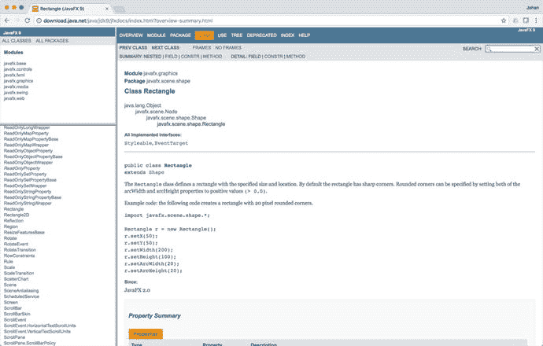
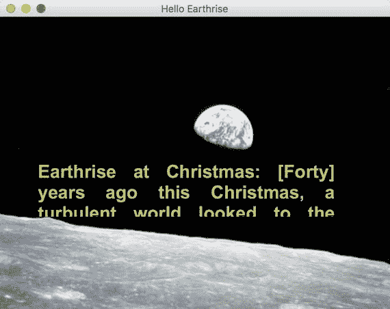
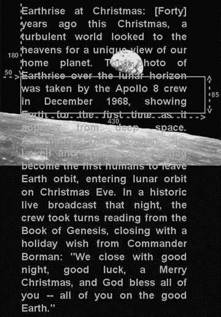
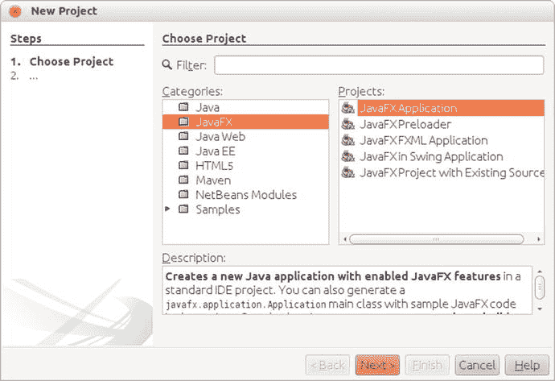
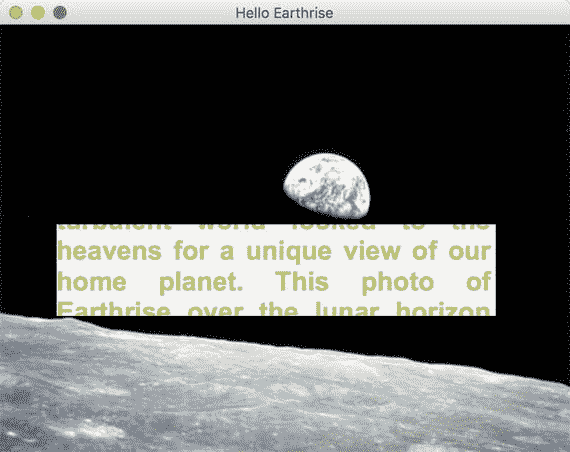
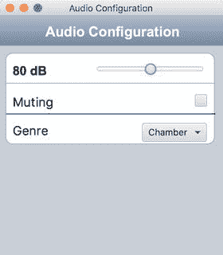
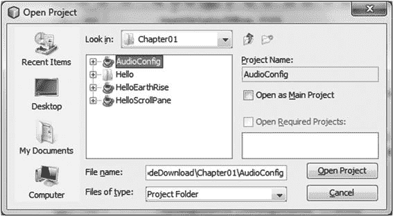

# 一、开始使用 JavaFX

> Don't ask what the world needs. Ask what makes you energetic and then do it. Because the world needs people who are alive. Howard Thurman

在 2007 年 5 月的 JavaOne 大会上，Sun Microsystems 宣布了一个名为 JavaFX 的新产品系列。它的既定目标包括在手机、电视、嵌入式汽车系统和浏览器等消费设备上开发和部署内容丰富的应用程序。Sun 公司的软件工程师 Josh Marinacci 在一次 Java Posse 采访中非常恰当地做了如下陈述:“JavaFX 是一种重新发明客户机 Java 和修复过去错误的代码。”他指的是 Java Swing 和 Java 2D 有很多功能，但也非常复杂。此外，自从 Swing 和 Java 2D 问世以来，技术已经有了很大的发展。今天的客户端系统(桌面以及移动和嵌入式设备)都配备了强大的图形处理器 GPU。JavaFX 利用了 GPU 提供的新特性和性能提升。通过使用 FXML，JavaFX 允许我们用声明式编程风格简单而优雅地表达用户界面(ui)。它还利用了 Java 的全部功能，因为您可以实例化和使用当今存在的数百万个 Java 类。添加一些特性，比如将 UI 绑定到模型中的属性，并更改侦听器以减少对 setter 方法的需求，这样就有了一个组合，有助于将 Java 恢复到客户端 Internet 应用程序。

在本章中，我们将帮助您快速开发 JavaFX 应用程序。在向您介绍了 JavaFX 的简史之后，我们将向您展示如何获得所需的工具。我们还探索了一些优秀的 JavaFX 资源，并带您完成编译和运行 JavaFX 应用程序的过程。在这个过程中，当我们一起浏览应用程序代码时，您会学到很多关于 JavaFX 应用程序编程接口(API)的知识。

## JavaFX 简史

JavaFX 最初是 Chris Oliver 的创意，当时他在一家名为 SeeBeyond 的公司工作。他们需要更丰富的用户界面，所以 Chris 为此创造了一种他称为 F3(形式服从功能)的语言。在“令人难以置信的酷创新”一文中(引用于本章末尾的“参考资料”部分)，Chris 引用如下:“当涉及到将人们集成到业务流程中时，您需要图形用户界面来与他们交互，因此在企业应用程序空间中有一个图形用例，SeeBeyond 对拥有更丰富的用户界面感兴趣。”

SeeBeyond 被 Sun 收购，他随后将 F3 的名称改为 JavaFX，并在 JavaOne 2007 上宣布了这一消息。Chris Oliver 在收购期间加入 Sun，继续领导 JavaFX 的开发。

JavaFX Script 的第一个版本是一种解释型语言，被认为是后来出现的编译型 JavaFX Script 语言的原型。解释的 JavaFX 脚本非常健壮，2007 年下半年出版了两本基于该版本的 JavaFX 书籍。一个是用日语写的，另一个是用英语写的(Java FX Script:Jim Weaver 的富互联网/客户端应用程序的动态 Java 脚本(Apress，2007))。

当开发人员正在试验 JavaFX 并提供改进反馈时，Sun 的 JavaFX Script 编译器团队正忙于创建该语言的编译版本。这包括一组新的运行时 API 库。JavaFX Script 编译器项目在 2007 年 12 月初达到了一个临界点，在一篇名为“祝贺 JavaFX Script 编译器团队—大象进门了”的博客文章中对此进行了纪念。这句话来自 JavaFX Script 编译器项目负责人 Tom Ball 的一篇博客文章，其中包含以下摘录。当我最近被问到 JavaFX Script 编译器团队将于何时发布我们的第一个里程碑版本时，我想到了一个大象的比喻。“我不能给你一个准确的日期，”我说。“这就像把一头大象推进一扇门；在临界质量超过阈值之前，你不知道什么时候会结束。不过，一旦你跨过了这个门槛，剩下的事情就会很快发生，而且可以更准确地预测。”

图 1-1 显示了作者之一 Jim Weaver 为该帖子编写的 JavaFX 应用程序的截屏，表明该项目实际上已经达到了 Tom Ball 提到的临界质量。


图 1-1。

Screenshot for the “Elephant Is Through the Door” program

JavaFX 在 2008 年继续取得很大进展:

*   NetBeans JavaFX 插件已于 2008 年 3 月推出编译版。
*   许多 JavaFX 运行时库(主要集中在 JavaFX 的 UI 方面)由一个团队重写，该团队包括来自 Java Swing 团队的一些非常有才华的开发人员。
*   2008 年 7 月，JavaFX Preview 软件开发工具包(SDK)发布，在 JavaOne 2008 上，Sun 宣布 JavaFX 1.0 SDK 将于 2008 年秋季发布。
*   2008 年 12 月 4 日，JavaFX 1.0 SDK 发布。这一事件增加了开发人员和 IT 经理对 JavaFX 的采用率，因为它代表了一个稳定的代码库。
*   2009 年 4 月，甲骨文和 Sun 宣布甲骨文将收购 Sun。JavaFX 1.2 SDK 在 JavaOne 大会 2009 上发布。
*   2010 年 1 月，甲骨文完成了对太阳的收购。JavaFX 1.3 SDK 于 2010 年 4 月发布，JavaFX 1.3.1 是 1.3 版本的最后一个版本。

在 JavaOne 大会 2010 上，宣布了 JavaFX 2.0。JavaFX 2.0 路线图由 Oracle 发布，包括如下内容。

*   放弃 JavaFX 脚本语言，转而使用 Java 和 JavaFX 2.0 API。这使得 JavaFX 成为主流，因为它可以被运行在 Java 虚拟机(JVM)上的任何语言(例如 Java、Groovy 和 JRuby)使用。因此，现有的开发人员不需要学习新的语言，但是他们可以使用现有的技能并开始开发 JavaFX 应用程序。
*   在 JavaFX 2.0 API 中提供 JavaFX Script 的引人注目的特性，包括绑定到表达式。
*   在 JavaFX 1.3 中已经可用的组件的基础上，提供一组越来越丰富的 UI 组件。
*   提供一个 Web 组件，用于将 HTML 和 JavaScript 内容嵌入 JavaFX 应用程序。
*   启用 JavaFX 与 Swing 的互操作性。
*   从头开始重写媒体堆栈。

JavaFX 2.0 是在 JavaOne 2011 上发布的，由于之前阐述的创新特性，其采用率大大增加。

JavaFX 8 标志着另一个重要的里程碑。JavaFX 现在是 Java 平台标准版不可或缺的一部分。

*   这清楚地表明 JavaFX 被认为是足够成熟的，它是客户机上 Java 的未来。
*   这极大地有利于开发人员，因为他们不必下载两个 SDK 和工具套件。
*   Java 8 中的新技术，特别是 lambda 表达式、流 API 和默认接口方法，在 JavaFX 中非常有用。
*   添加了许多新功能，包括本机 3D 支持、打印 API 和一些新控件，包括日期选择器。
*   自 JavaFX 8 发布以来，JavaFX 平台遵循与 Java 平台标准版相同的版本和发布过程。因此，当 Java 9 发布时，JavaFX 9 也发布了。
*   Java 9 的主要焦点是模块化。Java 平台标准版已经变得越来越大，并不是所有的应用程序都要求所有的类都可用。通过模块化 Java 平台，可以更容易地创建 Java 平台的子集，这些子集组合了许多足以运行特定应用程序的模块。这种模块化的努力是巨大的，花了许多年才完成。Java Platform，Standard Edition 的所有部分都被重构为模块，包括 JavaFX 9 平台 API。
*   模块化的结果之一是现在不再允许代码依赖于另一个模块的内部 API。这具有深远的影响。在 JavaFX 9 之前，通常通过实现未记录的内部 API 来创建控件。这些 API 是公共的，因为它们在不同的包中被其他 JavaFX 类内部使用。因此，开发人员也可以使用它们。
*   由于这些内部 API 现在位于默认情况下不公开该功能的模块中，所以想要创建自定义控件的开发人员需要一种新的方法。因此，JavaFX 团队不仅要将所有 JavaFX 公共 API 迁移到多个模块中，还必须为以前通过内部 API 访问的功能提供公共 API。

在 Java 9 中，JavaFX 平台提供了以下模块:

*   javafx.base
*   javafx.controls
*   javafx.fxml
*   javafx.graphics
*   javafx.jmx
*   javafx.media
*   javafx.swing
*   javafx.swt
*   javafx.web
*   jdk .打包程序
*   jdk.packager.services

既然您已经上了 JavaFX 的必修历史课，让我们向您展示一些示例、工具和其他资源在哪里，从而离编写代码更近一步。

## 准备您的 JavaFX 之旅

### 所需工具

因为 JavaFX 是 Java 9 的一部分，所以不必下载单独的 JavaFX SDK。整个 JavaFX API 和实现是 Java 9 SE SDK 的一部分，可以从 [`www.oracle.com/technetwork/java/javase/downloads/index.html`](http://www.oracle.com/technetwork/java/javase/downloads/index.html) 下载。

该 SDK 包含开发、运行和打包 JavaFX 应用程序所需的一切。您可以使用 Java 9 SE SDK 中包含的命令行工具来编译 JavaFX 应用程序。

然而，为了提高生产率，大多数开发人员更喜欢集成开发环境(IDE)。根据定义，支持 Java 9 的 IDE 也支持 JavaFX 9。因此，您可以使用自己喜欢的 IDE 开发 JavaFX 应用程序。在本书中，我们主要使用 NetBeans IDE，但也可以使用其他 IDE，如 IntelliJ 或 Eclipse。NetBeans IDE 可以从 [`https://netbeans.org/downloads`](https://netbeans.org/downloads) 下载。

许多 JavaFX 开发人员，尤其是从事用户界面工作的开发人员，更喜欢使用 WYSIWYG 工具来创建界面。Scene Builder 是一个独立的工具，允许您设计 JavaFX 界面，而不是对其进行编码。我们将在第四章中讨论场景构建器。尽管 Scene Builder 生成 FXML(我们在第三章 3 中也会讨论 FXML ),它可以在任何 IDE 中使用，但是 NetBeans 提供了与 Scene Builder 的紧密集成。场景构建工具可以在 [`http://gluonhq.com/products/scene-builder/`](http://gluonhq.com/products/scene-builder/) 下载。

### JavaFX，社区

JavaFX 不是一个闭源项目，是在一个秘密的掩体中开发的。相反，JavaFX 是以开放的精神开发的，它有开放的源代码库、开放的邮件列表和开放活跃的知识共享社区。

源代码在 OpenJFX 项目中开发，该项目是开发 Java SE 的 OpenJDK 项目的子项目。如果你想检查源代码或架构，或者如果你想阅读邮件列表上的技术讨论，看看 [`http://openjdk.java.net/projects/openjfx`](http://openjdk.java.net/projects/openjfx) 。

开发人员社区非常活跃，无论是在 OpenJFX 还是在特定于应用程序的领域。许多 JavaFX 开发人员定期在博客上介绍他们的 JavaFX 活动，许多与 JavaFX 相关的非 Oracle 产品和项目也由该社区创建和维护。

此外，JavaFX 工程师和开发人员维护的博客是 JavaFX 最新技术信息的重要资源。例如，Oracle JavaFX 工程师 Jonathan Giles 在 [`http://fxexperience.com`](http://fxexperience.com) 让开发人员了解 JavaFX 的最新创新。本章末尾的“参考资料”部分包含了本书作者用来参与 JavaFX 开发人员社区的博客的 URL。

JavaFX 社区的两个重要特征是它自己的创造力和分享的愿望。有许多开源项目为 JavaFX 平台带来了附加值。由于 JavaFX 平台工程师和外部 JavaFX 开发人员之间的良好合作，这些开源项目非常适合官方 JavaFX 平台。

下面列出了一些最有趣的尝试:

*   Gluon 允许你使用 Java 和 JavaFX 创建 iOS 和 Android 应用。因此，您的 JavaFX 应用程序可用于为 Android 设备和 iPhone 或 iPad 创建应用程序。

JavaFX 的这个移动端口将在第 [12](https://doi.org/10.1007/978-1-4842-3042-8_12) 章中详细讨论。

*   ControlsFX 是一个致力于向 JavaFX 平台添加高质量控件和附加组件的项目。
*   JFXtras.org 是另一个致力于向 JavaFX 平台添加高质量控件和插件的项目。

值得一提的是，JavaFX 团队正在密切关注 JFXtras.org 和 ControlsFX 的工作，在其中一个项目中产生的想法可能会成为 JavaFX 的下一个版本。

花几分钟时间探索这些网站。接下来，我们指出一些有价值的资源。

### 使用官方规格

在开发 JavaFX 应用程序时，访问 API Javadoc 文档非常有用，可在 [`http://download.java.net/jdk9/jfxdocs/index.html`](http://download.java.net/jdk9/jfxdocs/index.html) 获得，如图 1-2 所示。



图 1-2。

JavaFX SDK API Javadoc

例如，图 1-2 中的 API 文档显示了如何使用位于`javafx.scene.shape`包中的`Rectangle`类。向下滚动这个网页会显示属性、构造器、方法和其他关于`Rectangle`类的有用信息。顺便说一下，这个 API 文档可以在您下载的 Java 8 SE SDK 中找到，但是我们希望您也知道如何在线找到它。

除了 Javadoc 之外，手头有级联样式表(CSS)样式参考也非常有用。本文档解释了可以应用于特定 JavaFX 元素的所有样式类。你可以在 [`http://download.java.net/jdk9/jfxdocs/javafx/scene/doc-files/cssref.html`](http://download.java.net/jdk9/jfxdocs/javafx/scene/doc-files/cssref.html) 找到这份文件。

### 风景

您已经下载了 Scene Builder，该工具允许您通过设计而不是编写代码来创建 ui。我们预计将会有更多由公司和个人开发的工具来帮助您创建 JavaFX 应用程序。ScenicView 是首批免费提供的工具之一，在调试 JavaFX 应用程序时非常有用，它最初由 Oracle 的 Amy Fowler 创建，后来由 Jonathan Giles 维护。您可以在 [`http://scenic-view.org/`](http://scenic-view.org/) 下载 ScenicView。

ScenicView 特别有用，因为它提供了一个方便的 UI，允许开发人员在运行时检查节点的属性(即维度、翻译、CSS)。

#### 包装和分销

用于向最终用户交付软件的技术总是在变化。过去，交付 Java 应用程序的首选方式是通过 Java 网络启动协议(JNLP)。这样，小应用程序和独立应用程序都可以安装在客户机上。然而，这种技术有许多问题。这个想法只有在最终用户安装了能够执行应用程序的 JVM 的情况下才行得通。这并不总是正确的。即使在桌面领域，系统可以预装 JVM 交付，也存在版本和安全性问题。事实上，一些应用程序是针对特定版本的 JVM 硬编码的。尽管 JVM 中的漏洞在大多数情况下可以很快得到修复，但这仍然要求最终用户总是安装最新版本的 JVM，这可能非常令人沮丧。

最重要的是，浏览器制造商越来越不愿意支持替代的嵌入式平台。总之，依赖浏览器和本地预装的 JVM 并不能提供最佳的最终用户体验。

客户端软件行业正越来越多地转向所谓的应用商店。在这个概念中，可以下载和安装自包含的应用程序。它们不依赖于预先安装的执行环境。这些原则起源于移动领域，苹果的 AppStore 和安卓的 Play Store 在这个领域处于领先地位。尤其是在这些市场，一键安装比本地下载、拆包、手动配置、噩梦多有巨大优势。

在 Java 术语中，自包含应用程序意味着应用程序与能够运行该应用程序的 JVM 捆绑在一起。在过去，这种想法经常被拒绝，因为它使应用程序包太大。然而，随着内存和存储容量的增加，以及通过互联网发送字节的成本的降低，这个缺点变得越来越不相关。

目前有许多正在开发的技术可以帮助您将应用程序与正确的 JVM 版本捆绑在一起并打包。

将 Java 应用程序与 Java 虚拟机运行时捆绑在一起的标准技术是 JavaPackager，它是在 OpenJFX 项目区域内开发的。JavaFXPackager 包含一个用于创建自包含包的 API。NetBeans 使用这个工具，只需点击几下，就可以用它来生成自包含的包。

现在您已经安装了工具，我们将向您展示如何创建一个简单的 JavaFX 程序，然后我们将详细地浏览它。我们为你选择的第一个节目叫做“Hello Earthrise”，它展示了比典型的“Hello World”节目更多的特点。

## 开发您的第一个 JavaFX 程序:Hello Earthrise

1968 年在平安夜，阿波罗 8 号的机组人员历史上第一次进入月球轨道。他们是第一批见证“地球升起”的人类，拍摄了如图 1-3 所示的壮丽照片。这个图片是在程序启动时从这本书的网站上动态加载的，所以你需要连接到互联网才能查看它。



图 1-3。

The Hello Earthrise program

除了演示如何通过互联网动态加载图像，这个例子还展示了如何在 JavaFX 中使用动画。现在是你编译和运行程序的时候了。我们向您展示了两种方法:从命令行和使用 NetBeans。

### 从命令行编译和运行

我们通常使用 IDE 来构建和运行 JavaFX 程序，但是为了揭开这个过程的神秘面纱，我们首先使用命令行工具。

Note

对于这个练习，就像书中的大多数其他练习一样，您需要源代码。如果您不想在文本编辑器中键入源代码，可以从代码下载站点获得本书中所有示例的源代码。有关该站点的位置，请参见本章末尾的“参考资料”部分。

假设您已经下载了这本书的源代码并将其解压缩到一个目录中，请按照本练习中的说明，按照指示执行所有步骤。我们在练习之后剖析源代码。

Compiling and Running the Hello Earthrise Program from the Command Line

在本练习中，您将使用 javac 和 java 命令行工具来编译和运行程序。从机器上的命令行提示符:

1.  导航到`Chapter01/Hello`目录。
2.  执行以下命令编译`HelloEarthRiseMain.java`文件。

    ```java
    javac -d . HelloEarthRiseMain.java

    ```

3.  因为在这个命令中使用了`–d`选项，所以生成的类文件被放在与源文件中的包语句相匹配的目录中。这些目录的根目录由为`–d`选项给出的参数指定，在本例中是当前目录。
4.  要运行该程序，请执行以下命令。请注意，我们使用将要执行的类的完全限定名，这需要指定路径名和类名的节点，它们都用句点分隔。

    ```java
    java projavafx.helloearthrise.ui.HelloEarthRiseMain

    ```

程序应该如图 1-4 所示，文本缓慢向上滚动，让人想起星球大战的开场抓取。

祝贺您完成探索 JavaFX 的第一个练习！

### 了解 Hello Earthrise 计划

现在您已经运行了应用程序，让我们一起浏览一下程序清单。Hello Earthrise 应用程序的代码如清单 1-1 所示。

```java
package projavafx.helloearthrise.ui;

import javafx.animation.Interpolator;
import javafx.animation.Timeline;
import javafx.animation.TranslateTransition;
import javafx.application.Application;
import javafx.geometry.VPos;
import javafx.scene.Group;
import javafx.scene.Scene;
import javafx.scene.image.Image;
import javafx.scene.image.ImageView;
import javafx.scene.paint.Color;
import javafx.scene.shape.Rectangle;
import javafx.scene.text.Font;
import javafx.scene.text.FontWeight;
import javafx.scene.text.Text;
import javafx.scene.text.TextAlignment;
import javafx.stage.Stage;
import javafx.util.Duration;

/**
 * Main class for the "Hello World" style example
 */
public class HelloEarthRiseMain extends Application {

    /**
     * @param args the command line arguments
     */
    public static void main(String[] args) {
        Application.launch(args);
    }

    @Override
    public void start(Stage stage) {

        String message
                = "Earthrise at Christmas: "
                + "[Forty] years ago this Christmas, a turbulent world "
                + "looked to the heavens for a unique view of our home "
                + "planet. This photo of Earthrise over the lunar horizon "
                + "was taken by the Apollo 8 crew in December 1968, showing "
                + "Earth for the first time as it appears from deep space. "
                + "Astronauts Frank Borman, Jim Lovell and William Anders "
                + "had become the first humans to leave Earth orbit, "
                + "entering lunar orbit on Christmas Eve. In a historic live "
                + "broadcast that night, the crew took turns reading from "
                + "the Book of Genesis, closing with a holiday wish from "
                + "Commander Borman: \"We close with good night, good luck, "
                + "a Merry Christmas, and God bless all of you    all of "
                + "you on the good Earth.\"";

        // Reference to the Text
        Text textRef = new Text(message);
        textRef.setLayoutY(100);
        textRef.setTextOrigin(VPos.TOP);
        textRef.setTextAlignment(TextAlignment.JUSTIFY);
        textRef.setWrappingWidth(400);
        textRef.setFill(Color.rgb(187, 195, 107));
        textRef.setFont(Font.font("SansSerif", FontWeight.BOLD, 24));

        // Provides the animated scrolling behavior for the text
        TranslateTransition transTransition = new TranslateTransition(new Duration(75000), textRef);
        transTransition.setToY(-820);
        transTransition.setInterpolator(Interpolator.LINEAR);
        transTransition.setCycleCount(Timeline.INDEFINITE);

        // Create an ImageView containing the Image
        Image image = new Image ("http://projavafx.com/img/earthrise.jpg");
        ImageView imageView = new ImageView(image);

        // Create a Group containing the text
        Group textGroup = new Group(textRef);
        textGroup.setLayoutX(50);
        textGroup.setLayoutY(180);
        textGroup.setClip(new Rectangle(430, 85));

        // Combine ImageView and Group
        Group root = new Group(imageView, textGroup);
        Scene scene = new Scene(root, 516, 387);

        stage.setScene(scene);
        stage.setTitle("Hello Earthrise");
        stage.show();

        // Start the text animation
        transTransition.play();
    }
}

Listing 1-1.The HelloEarthRiseMain.java Program

```

现在您已经看到了代码，让我们更详细地看看它的构造和概念。

#### 建筑商怎么了？

如果您之前使用的是 JavaFX 2，那么您可能对所谓的构建器模式很熟悉。构建器提供了一种声明式的编程风格。不是在类实例上调用`set()`方法来指定它的字段，构建器模式使用一个`Builder`类的实例来定义目标类应该如何组成。

构建器在 JavaFX 中非常受欢迎。然而，事实证明，将它们保留在平台中存在重大的技术障碍。因此，决定逐步淘汰建筑商。在 Java 8 中，`Builder`类仍然是可用的，但是它们已经过时了。在 Java 9 中，`Builder`类已经被完全移除。

JavaFX 客户端架构师 Richard Bair 在 [`http://mail.openjdk.java.net/pipermail/openjfx-dev/2013-March/006725.html`](http://mail.openjdk.java.net/pipermail/openjfx-dev/2013-March/006725.html) 的邮件列表条目中可以找到关于`Builder`类不再受欢迎的原因的更多信息。这个条目的底部包含了一个非常重要的声明:“我相信 FXML 或 lambda 或替代语言都提供了其他途径来实现与构建者相同的目标，但没有字节码或类的额外成本。”

这就是我们将在本书中展示的内容。在本章快结束时，我们在代码中展示了 lambda 表达式的第一个例子。在第三章中，我们展示了 Scene Builder 和 FXML 如何允许你使用一种声明性的方式来定义一个 UI。

在当前示例中，我们以编程方式定义了 UI 的不同组件，并将它们粘合在一起。在第三章中，我们使用基于声明性 FXML 的方法展示了相同的例子。

#### JavaFX 应用程序

让我们看看第一个例子中的类声明:

```java
public class HelloEarthRiseMain extends Application

```

该声明声明我们的应用程序扩展了`javafx.application.Application`类。这个类有一个我们应该实现的抽象方法:

```java
public void start(Stage stage) {}

```

这个方法将被执行 JavaFX 应用程序的环境调用。

根据环境的不同，JavaFX 应用程序将以不同的方式启动。作为一名开发人员，您不必担心您的应用程序是如何启动的，以及在哪里连接到物理屏幕。您必须实现“start”方法，并使用提供的`Stage`参数来创建您的 UI，这将在下一段中讨论。

在我们的命令行示例中，我们通过执行 application 类的 main 方法来启动应用程序。main 方法的实现非常简单:

```java
public static void main(String[] args) {
    Application.launch(args);
}

```

这个 main 方法中唯一的指令是调用应用程序的静态启动方法，这将启动应用程序。

Tip

JavaFX 应用程序总是需要扩展`javafx.application.Application`类。

#### 一个舞台和一个场景

一个`Stage`包含一个 JavaFX 应用的 UI，无论它是部署在桌面上、嵌入式系统上还是其他设备上。例如，在桌面上，`Stage`有自己的顶层窗口，通常包括边框和标题栏。

初始阶段由 JavaFX 运行时创建，并通过`start()`方法传递给您，如前一段所述。`Stage`类有一组属性和方法。这些属性和方法中的一些，如清单中的代码片段所示，如下所示。

*   包含用户界面中图形节点的场景
*   出现在窗口标题栏中的标题(部署在桌面上时)
*   `Stage`的可见度

```java
stage.setScene(scene);
stage.setTitle("Hello Earthrise");
stage.show();

```

A `Scene`是 JavaFX 场景图中的顶部容器。一个`Scene`保存显示在`Stage`上的图形元素。一个`Scene`中的每个元素都是一个图形节点，它是任何一个扩展了`javafx.scene.Node`的类。场景图是`Scene`的分层表示。场景图中的元素可能包含子元素，它们都是`Node`类的实例。

`Scene`类包含许多属性，比如它的宽度和高度。一个`Scene`也有一个名为`root`的属性，它保存显示在`Scene`中的图形元素，在本例中是一个包含一个`ImageView`实例(显示图像)和一个`Group`实例的`Group`实例。嵌套在后一个`Group`中的是一个`Text`实例(这是一个图形元素，通常称为图形节点，或简称为节点)。

注意，`Scene`的`root`属性包含了`Group`类的一个实例。`root`属性可以包含`javafx.scene.Node`的任何子类的一个实例，并且通常包含一个能够保存自己的一组`Node`实例的实例。看一看 JavaFX API 文档，我们在“使用官方规范”一节中向您展示了如何访问该文档，并检查`Node`类以查看可用于任何图形节点的属性和方法。另外，看看`javafx.scene.image`包中的`ImageView`类和`javafx.scene`包中的`Group`类。在这两种情况下，它们都继承自`Node`类。

Tip

在阅读本书时，我们再怎么强调手边有 JavaFX API 文档的重要性也不为过。当提到类、变量和函数时，查看文档以获得更多信息是一个好主意。此外，这个习惯有助于您更加熟悉 API 中可用的内容。

#### 显示图像

如下面的代码所示，显示图像需要结合使用一个`ImageView`实例和一个`Image`实例。

```java
Image image = new Image ("http://projavafx.com/img/earthrise.jpg");
ImageView imageView = new ImageView(image);

```

`Image`实例识别图像资源，并从分配给其 URL 变量的 URL 中加载它。这两个类都位于`javafx.scene.image`包中。

#### 显示文本

在本例中，我们创建了一个文本节点，如下所示:

```java
Text textRef = new Text(message);

```

如果您查阅 JavaFX API 文档，您会注意到包含在包`javafx.scene.text`中的`Text`实例扩展了一个`Shape`，后者扩展了一个`Node`。因此，`Text`实例也是`Node`，并且`Node`上的所有属性也适用于`Text`。此外，`Text`实例可以像使用其他节点一样在场景图中使用。

从示例中可以看出，`Text`实例包含许多可以修改的属性。大多数属性都是不言自明的，但是在操作对象时参考 JavaFX API 文档总是有用的。

因为 JavaFX 中的所有图形元素都直接或间接地扩展了`Node`类，并且因为`Node`类已经包含了许多有用的属性，所以特定图形元素(如`Text`)上的属性数量可能相当多。

在我们的示例中，我们设置了有限数量的属性，下面将简要介绍这些属性。

`textRef.setLayoutY(100)`方法将 100 像素的垂直平移应用于`Text`内容。`fill`方法用于指定文本的颜色。

当您查看 API 文档中的`javafx.scene.text`包时，请看一下`Font`类的 font 函数，它用于定义字体系列、粗细和`Text`的大小。

属性指定文本如何与其区域对齐。

再次参考 JavaFX API 文档，注意 VPos enum(在`javafx.geometry`包中)有作为常量的字段，例如 BASELINE、BOTTOM 和 TOP。这些控制文本相对于显示的`Text`垂直位置的原点:

*   顶部原点，正如我们在前面的代码片段中使用的，将文本的顶部(包括升序)放置在布局位置，相对于`Text`所在的坐标空间。
*   底部原点将文本的底部放置在布局位置，包括下行字母(例如，位于小写的 g 中)。
*   基线原点将文本的基线(不包括下行)放置在布局位置。这是一个`Text`实例的`textOrigin`属性的默认值。

`wrappingWidth`属性使您能够指定文本将在多少像素处换行。

`textAlignment`属性使您能够控制文本如何对齐。在我们的例子中，`TextAlignment.JUSTIFY`将文本左右对齐，扩展单词之间的空间来实现这一点。

我们正在显示的文本足够长，足以包裹并绘制在地球上，因此我们需要定义一个矩形区域，在这个区域之外，文本是看不见的。

Tip

我们建议您修改一些值，重新编译该示例，然后再次运行它。这将帮助您理解不同属性的工作原理。或者，通过使用`ScenicView`，您可以在运行时检查和修改不同的属性。

#### 将图形节点作为一个组使用

JavaFX 的一个强大的图形特性是创建场景图的能力，场景图由图形节点树组成。然后，您可以为位于层次结构中的`Group`的属性赋值，包含在`Group`中的节点将受到影响。在我们当前的清单 1-1 的例子中，我们使用了一个`Group`来包含一个`Text`节点，并在`Group`中裁剪一个特定的矩形区域，这样当文本向上移动时，它就不会出现在月球或地球上。下面是相关的代码片段:

```java
Group textGroup = new Group(textRef);
textGroup.setLayoutX(50);
textGroup.setLayoutY(180);
textGroup.setClip(new Rectangle(430, 85));

```

请注意，`Group`位于其默认位置的右侧 50 像素和下方 180 像素处。这是由于分配给`Group`实例的`layoutX`和`layoutY`变量的值。因为这个`Group`直接包含在`Scene`中，所以它的左上角的位置是从`Scene`的左上角向右 50 像素，向下 180 像素。看一下图 1-4 来看看这个例子，当你阅读其余的解释时。



图 1-4。

The `Scene`, `Group`, `Text`, and clip illustrated

一个`Group`实例包含了`Node`子类的实例，通过`children()`方法将它们的集合分配给自己。在前面的代码片段中，`Group`包含一个`Text`实例，该实例的`layoutY`属性被赋值。因为这个`Text`包含在一个`Group`中，所以它假定了`Group`的二维空间(也称为坐标空间)，其中`Text`节点的原点(0，0)与`Group`的左上角重合。将值 100 赋给`layoutY`属性会导致`Text`位于`Group`顶部下方 100 个像素处，而`Group`正好位于剪辑区域底部的下方，因此在动画开始之前，剪辑区域不会出现在视图中。因为没有给`layoutX`变量赋值，所以它的值是 0(默认值)。

刚刚描述的`Group`的`layoutX`和`layoutY`属性是我们之前陈述的例子，即包含在`Group`中的节点将受到分配给`Group`属性的值的影响。另一个例子是将一个`Group`实例的不透明度属性设置为 0.5，这会导致该`Group`中包含的所有节点变成半透明的。如果 JavaFX API 文档很方便，可以看看`javafx.scene.Group`类中可用的属性。然后查看`javafx.scene.Node`类属性中可用的属性，在这里您可以找到由`Group`类继承的`layoutX`、`layoutY`和不透明度变量。

#### 剪裁图形区域

为了定义一个裁剪区域，我们为 clip 属性分配一个`Node`子类来定义裁剪形状，在本例中是一个宽 430 像素、高 85 像素的`Rectangle`。除了防止`Text`遮住月亮之外，当`Text`因为动画而向上滚动时，剪辑区域还防止`Text`遮住地球。

#### 动画文本，使其向上滚动

当调用`HelloEarthriseMain`程序时，`Text`开始缓慢向上滚动。为了实现这个动画，我们使用了位于`javafx.animation`包中的`TranslateTransition`类，如清单 1-1 中的代码片段所示。

```java
TranslateTransition transTransition = new TranslateTransition(new Duration(75000), textRef);
transTransition.setToY(-820);
transTransition.setInterpolator(Interpolator.LINEAR);
transTransition.setCycleCount(Timeline.INDEFINITE);
...code omitted...
// Start the text animation
transTransition.play();

```

`javafx.animation`包包含了制作节点动画的便利类。这个`TranslateTransition`实例在 75 秒的时间内将`textRef`变量引用的`Text`节点从其原始的 100 像素的 Y 位置转换为–820 像素的 Y 位置。`Interpolator.LINEAR`常量被赋予插值器属性，这使得动画以线性方式进行。查看一下`javafx.animation`包中`Interpolator`类的 API 文档，会发现还有其他形式的插值可用，其中一种是 EASE_OUT，它会在指定持续时间的末尾减慢动画的速度。

Note

在这种情况下，插值是在给定起始值、结束值和持续时间的情况下计算任意时间点的值的过程。

前面代码片段中的最后一行开始执行之前在程序中创建的`TranslateTransition`实例的 play 方法。这使得`Text`开始向上滚动。由于分配给`cycleCount`变量的值，这个转换将无限重复。

现在，您已经使用命令行工具编译并运行了此示例，并且我们已经一起浏览了代码，是时候开始使用 NetBeans IDE 来使开发和部署过程变得更快更容易了。

### 用 NetBeans 构建和运行程序

假设您已经下载了本书的源代码并将其解压缩到一个目录中，请按照本练习中的说明在 NetBeans 中构建并运行 Hello Earthrise 程序。如果您还没有下载 Java SDK 和 NetBeans，请从本章末尾“参考资料”一节中列出的站点下载。

Building and Running Hello Earthrise with Netbeans

要构建并运行 Hello Earthrise 程序，请执行以下步骤。

1.  启动 NetBeans。
2.  Choose File ➤ New Project from the menu bar. The first window of the New Project Wizard will appear. Select the JavaFX category, and you will see wizard shown in Figure 1-5.

    

    图 1-5。

    New Project Wizard  
3.  Choose JavaFX Application in the Projects pane, and then click Next. The next page in the New Project Wizard, shown in Figure 1-6, should appear.

    

    图 1-6。

    The next page of the New Project Wizard  
4.  在这个屏幕上，键入项目名称(我们使用 HelloEarthRise)并单击 Browse。
5.  直接在文本框中输入项目位置，或者点击 Browse 导航到所需的目录(我们使用了`/home/johan/NetBeansProjects`)来选择项目位置。
6.  选择创建应用程序类复选框，并将提供的包/类名更改为`projavafx.helloearthrise.ui.HelloEarthRiseMain`
7.  单击完成。现在应该已经创建了 HelloEarthRise 项目，该项目具有由 NetBeans 创建的默认主类。如果您想要运行此默认程序，请在“项目”窗格中右键单击 HelloEarthRise 项目，然后从快捷菜单中选择“运行项目”。
8.  将清单 1-1 中的代码输入 HelloEarthRiseMain.java 代码窗口。你可以输入它，或者从本书源代码下载的`Chapter01/HelloEarthRise/src/projavafx/helloearthrise/ui`目录下的`HelloEarthRiseMain.java`文件中剪切并粘贴它。
9.  在“项目”窗格中右键单击 HelloEarthRise 项目，然后从快捷菜单中选择“运行项目”。

HelloEarthRise 程序应该开始执行，如本章前面的图 1-3 所示。

至此，您已经从命令行和使用 NetBeans 构建并运行了“Hello Earthrise”程序应用程序。在离开这个例子之前，我们向您展示了实现滚动`Text`节点的另一种方法。在`javafx.scene.control`包中有一个名为`ScrollPane`的类，其目的是提供一个节点的可滚动视图，该视图通常比视图大。此外，用户可以在可滚动区域内拖动正在查看的节点。图 1-7 显示了使用`ScrollPane`控件修改后的 Hello Earthrise 程序。



图 1-7。

Using the `ScrollPane` control to provide a scrollable view of the `Text` node

请注意，移动光标是可见的，表示用户可以在裁剪区域周围拖动节点。注意图 1-7 中的截图是运行在 macOS X 上的程序，移动光标在其他平台上有不同的外观。清单 1-2 包含了这个例子的相关代码部分，名为`HelloScrollPaneMain.java`。

```java
...code omitted...
    // Create a ScrollPane containing the text
        ScrollPane scrollPane = new ScrollPane();
        scrollPane.setLayoutX(50);
        scrollPane.setLayoutY(180);
        scrollPane.setPrefWidth(400);
        scrollPane.setPrefHeight(85);
        scrollPane.setHbarPolicy(ScrollPane.ScrollBarPolicy.NEVER);
        scrollPane.setVbarPolicy(ScrollPane.ScrollBarPolicy.NEVER);
        scrollPane.setPannable(true);
        scrollPane.setContent(textRef);
        scrollPane.setStyle("-fx-background-color: transparent;");

        // Combine ImageView and ScrollPane
        Group root = new Group(imageView, scrollPane);
        Scene scene = new Scene(root, 516, 387);

Listing 1-2.The HelloScrollPaneMain.java Program

```

现在您已经学习了 JavaFX 应用程序开发的一些基础知识，让我们研究另一个示例应用程序来帮助您学习更多的 JavaFX 概念和构造。

## 开发您的第二个 JavaFX 程序:“更多牛铃！”

如果你熟悉周六夜现场电视节目，你可能看过“更多牛铃”的小品，在这个小品中，克里斯托弗·沃肯扮演的角色在一次蓝牡蛎邪教录制会上不断要求“更多牛铃”。下面的 JavaFX 示例程序在一个假想的应用程序的上下文中介绍了 JavaFX 的一些简单而强大的概念，该应用程序允许您选择音乐流派并控制音量。当然，“牛铃金属”，简称“牛铃”，是可用的流派之一。图 1-8 显示了这个应用程序的截图，它有一种复古的 iPhone 应用程序外观。



图 1-8。

The Audio Configuration “More Cowbell” program

### 构建和运行音频配置程序

在本章的前面，我们向您展示了如何在 NetBeans 中创建新的 JavaFX 项目。对于本例(以及本书中的其他示例)，我们利用了本书的代码下载包包含每个示例的 NetBeans 和 Eclipse 项目文件这一事实。按照本练习中的说明构建并运行音频配置应用程序。

Building and Running the Audio Configuration Program Using Netbeans

要使用 NetBeans 构建和执行该程序，请执行以下步骤。

1.  From the File menu, select the Open Project menu item. In the Open Project dialog box, navigate to the Chapter01 directory where you extracted the book’s code download bundle, as shown in Figure 1-9.

    

    图 1-9。

    The Chapter 01 directory in the Open Project dialog box  
2.  在左侧面板中选择 AudioConfig 项目，然后点按“打开项目”。
3.  按照前面讨论的方式运行项目。

应用程序应如图 1-8 所示。

### 音频配置程序的行为

运行应用程序时，请注意调整音量滑块会改变显示的相关分贝(dB)级别。此外，选择静音复选框会禁用滑块，选择各种风格会改变音量滑块。这种行为是由以下代码中显示的概念实现的，例如:

*   绑定到包含模型的类
*   使用更改监听器
*   创建可观察列表

### 了解音频配置程序

音频配置程序包含两个源代码文件，如清单 1-3 和清单 1-4 所示:

*   清单 1-3 中的`AudioConfigMain.java`文件包含了主类，并以您在清单 1-1 中的 Hello Earthrise 示例中所熟悉的方式来表达 UI。
*   清单 1-4 中的`AudioConfigModel.java`文件包含了这个程序的模型，它保存了 UI 绑定到的应用程序的状态。

看一看清单 1-3 中的`AudioConfigMain.java`源代码，之后我们一起检查它，重点关注前一个例子中没有涉及的概念。

```java
package projavafx.audioconfig.ui;

import javafx.application.Application;
import javafx.geometry.VPos;
import javafx.scene.Group;
import javafx.scene.Scene;
import javafx.scene.control.CheckBox;
import javafx.scene.control.ChoiceBox;
import javafx.scene.control.Slider;
import javafx.scene.paint.Color;
import javafx.scene.paint.CycleMethod;
import javafx.scene.paint.LinearGradient;
import javafx.scene.paint.Stop;
import javafx.scene.shape.Line;
import javafx.scene.shape.Rectangle;
import javafx.scene.text.Font;
import javafx.scene.text.FontWeight;
import javafx.scene.text.Text;
import javafx.stage.Stage;
import projavafx.audioconfig.model.AudioConfigModel;

public class AudioConfigMain extends Application {

    // A reference to the model
    AudioConfigModel acModel = new AudioConfigModel();

    Text textDb;
    Slider slider;
    CheckBox mutingCheckBox;
    ChoiceBox genreChoiceBox;
    Color color = Color.color(0.66, 0.67, 0.69);

    public static void main(String[] args) {
        Application.launch(args);
    }

    @Override
    public void start(Stage stage) {
        Text title = new Text(65,12, "Audio Configuration");
        title.setTextOrigin(VPos.TOP);
        title.setFill(Color.WHITE);
        title.setFont(Font.font("SansSerif", FontWeight.BOLD, 20));

        Text textDb = new Text();
        textDb.setLayoutX(18);
        textDb.setLayoutY(69);
        textDb.setTextOrigin(VPos.TOP);
        textDb.setFill(Color.web("#131021"));
        textDb.setFont(Font.font("SansSerif", FontWeight.BOLD, 18));

        Text mutingText = new Text(18, 113, "Muting");
        mutingText.setTextOrigin(VPos.TOP);
        mutingText.setFont(Font.font("SanSerif", FontWeight.BOLD, 18));
        mutingText.setFill(Color.web("#131021"));

        Text genreText = new Text(18,154,"Genre");
        genreText.setTextOrigin(VPos.TOP);
        genreText.setFill(Color.web("#131021"));
        genreText.setFont(Font.font("SanSerif", FontWeight.BOLD, 18));

        slider = new Slider();
        slider.setLayoutX(135);
        slider.setLayoutY(69);
        slider.setPrefWidth(162);
        slider.setMin(acModel.minDecibels);
        slider.setMax(acModel.maxDecibels);

        mutingCheckBox = new CheckBox();
        mutingCheckBox.setLayoutX(280);
        mutingCheckBox.setLayoutY(113);

        genreChoiceBox = new ChoiceBox();
        genreChoiceBox.setLayoutX(204);
        genreChoiceBox.setLayoutY(154);
        genreChoiceBox.setPrefWidth(93);
        genreChoiceBox.setItems(acModel.genres);
        Stop[] stops = new Stop[]{new Stop(0, Color.web("0xAEBBCC")), new Stop(1, Color.web("0x6D84A3"))};

        LinearGradient linearGradient = new LinearGradient(0, 0, 0, 1, true, CycleMethod.NO_CYCLE, stops);
        Rectangle rectangle = new Rectangle(0, 0, 320, 45);
        rectangle.setFill(linearGradient);

        Rectangle rectangle2 = new Rectangle(0, 43, 320, 300);
        rectangle2.setFill(Color.rgb(199, 206, 213));

        Rectangle rectangle3 = new Rectangle(8, 54, 300, 130);
        rectangle3.setArcHeight(20);
        rectangle3.setArcWidth(20);
        rectangle3.setFill(Color.WHITE);
        rectangle3.setStroke(color);

        Line line1 = new Line(9, 97, 309, 97);
        line1.setStroke(color);

        Line line2 = new Line(9, 141, 309, 141);
        line2.setFill(color);

        Group group = new Group(rectangle, title, rectangle2, rectangle3,
                textDb,
                slider,
                line1,
                mutingText,
                mutingCheckBox, line2, genreText,
                genreChoiceBox);
        Scene scene = new Scene(group, 320, 343);

        textDb.textProperty().bind(acModel.selectedDBs.asString().concat(" dB"));
        slider.valueProperty().bindBidirectional(acModel.selectedDBs);
        slider.disableProperty().bind(acModel.muting);
        mutingCheckBox.selectedProperty().bindBidirectional(acModel.muting);
        acModel.genreSelectionModel = genreChoiceBox.getSelectionModel();
        acModel.addListenerToGenreSelectionModel();
        acModel.genreSelectionModel.selectFirst();

        stage.setScene(scene);
        stage.setTitle("Audio Configuration");
        stage.show();
    }
}

Listing 1-3.The AudioConfigMain.java Program

```

现在您已经看到了这个应用程序中的主类，让我们来看一下新概念。

#### 装订的魔力

JavaFX 最强大的方面之一是绑定，它使应用程序的 UI 能够轻松地与应用程序的状态或模型保持同步。JavaFX 应用程序的模型通常保存在一个或多个类中，在本例中是`AudioConfigModel`类。请看下面的代码片段，摘自清单 1-3 ，其中我们创建了这个模型类的一个实例。

```java
  AudioConfigModel acModel = new AudioConfigModel();

```

在这个 UI 的场景中有几个图形节点实例(回想一下，场景由一系列节点组成)。跳过其中的几个，我们来看下面代码片段中显示的图形节点，这些节点有一个属性绑定到模型中的`selectedDBs`属性。

```java
textDb = new Text();
... code omitted
slider = new Slider();
...code omitted...
textDb.textProperty().bind(acModel.selectedDBs.asString().concat(" dB"));
slider.valueProperty().bindBidirectional(acModel.selectedDBs);

```

如这段代码所示，`Text`对象的 text 属性被绑定到一个表达式。`bind`函数包含一个表达式(包含`selectedDBs`属性)，该表达式被求值并成为文本属性的值。查看图 1-9 (或检查正在运行的应用程序)以查看滑块左侧显示的`Text`节点的内容值。

还要注意代码中的`Slider`节点的`value`属性也绑定到了模型中的`selectedDBs`属性，但是它使用了`bindBidirectional()`方法。这导致绑定是双向的，所以在这种情况下，当滑块移动时，模型中的`selectedDBs`属性会改变。相反，当`selectedDBs`属性改变时(作为改变类型的结果)，滑块移动。

继续移动滑块来演示代码片段中绑定表达式的效果。滑块左侧显示的分贝数应随着滑块的调整而变化。

在清单 1-3 中还有其他绑定属性，我们在遍历模型类时会指出。在离开 UI 之前，我们在这个例子中指出一些与颜色相关的概念。

### 颜色和渐变

清单 1-3 中的以下代码片段包含了一个定义颜色渐变模式和颜色的例子。

```java
Stop[] stops = new Stop[]{new Stop(0, Color.web("0xAEBBCC")), new Stop(1, Color.web("0x6D84A3"))};
LinearGradient linearGradient = new LinearGradient(0, 0, 0, 1, true, CycleMethod.NO_CYCLE, stops);
Rectangle rectangle = new Rectangle(0, 0, 320, 45);
rectangle.setFill(linearGradient);

```

如果 JavaFX API 文档很方便，首先看一下`javafx.scene.shape.Rectangle`类，注意它继承了一个名为`fill`的属性，该属性的类型为`javafx.scene.paint.Paint`。查看`Paint`类的 JavaFX API 文档，您会看到`Color`、`ImagePattern`、`LinearGradient`和`RadialGradient`类是`Paint`的子类。这意味着可以为任何形状的填充指定颜色、图案或渐变。

要创建一个`LinearGradient`，如代码所示，您需要定义至少两个停靠点，它们定义了位置和该位置的颜色。在此示例中，第一个停止点的偏移值为 0.0，第二个停止点的偏移值为 1.0。这些是单位正方形两端的值，结果是梯度将跨越整个节点(在这种情况下是一个`Rectangle`)。`LinearGradient`的方向由它的`startX`、`startY`、`endX`和`endY`值控制，我们通过构造器传递这些值。在这种情况下，方向只是垂直的，因为`startY`值是 0.0，`endY`值是 1.0，而`startX`和`endX`值都是 0.0。

注意，在清单 1-1 中的 Hello Earthrise 示例中，名为`Color.WHITE`的常量用于表示白色。在前面的代码片段中，`Color`类的 web 函数用于根据十六进制值定义颜色。

### 音频配置示例的模型类

看看清单 1-4 中`AudioConfig` `Model`类的源代码。

```java
package projavafx.audioconfig.model;

import javafx.beans.Observable;
import javafx.beans.property.BooleanProperty;
import javafx.beans.property.IntegerProperty;
import javafx.beans.property.SimpleBooleanProperty;
import javafx.beans.property.SimpleIntegerProperty;
import javafx.collections.FXCollections;
import javafx.collections.ObservableList;
import javafx.scene.control.SingleSelectionModel;

/**
 * The model class that the AudioConfigMain class uses
 */
public class AudioConfigModel {
  /**
   * The minimum audio volume in decibels
   */
  public double minDecibels = 0.0;

  /**
   * The maximum audio volume in decibels
   */
  public double maxDecibels = 160.0;

  /**
   * The selected audio volume in decibels
   */
  public IntegerProperty selectedDBs = new SimpleIntegerProperty(0);

  /**
   * Indicates whether audio is muted
   */
  public BooleanProperty muting = new SimpleBooleanProperty(false);

  /**
   * List of some musical genres
   */
  public ObservableList genres = FXCollections.observableArrayList(
    "Chamber",
    "Country",
    "Cowbell",
    "Metal",
    "Polka",
    "Rock"
  );

  /**
   * A reference to the selection model used by the Slider
   */
  public SingleSelectionModel genreSelectionModel;

  /**
   * Adds a change listener to the selection model of the ChoiceBox, and contains
   * code that executes when the selection in the ChoiceBox changes.
   */
public void addListenerToGenreSelectionModel() {
    genreSelectionModel.selectedIndexProperty().addListener((Observable o) -> {
        int selectedIndex = genreSelectionModel.selectedIndexProperty().getValue();
        switch(selectedIndex) {
            case 0: selectedDBs.setValue(80);
            break;
            case 1: selectedDBs.setValue(100);
            break;
            case 2: selectedDBs.setValue(150);
            break;
            case 3: selectedDBs.setValue(140);
            break;
            case 4: selectedDBs.setValue(120);
            break;
            case 5: selectedDBs.setValue(130);
        }
    });

  }
}

Listing 1-4.The Source Code for AudioConfigModel.java

```

### 使用失效侦听器和 Lambda 表达式

在“绑定的魔力”一节中，我们展示了如何使用属性绑定来动态改变参数。还有另一种更低级但也更灵活的方法来实现这一点，使用`ChangeListeners`和`InvalidationListeners`。这些概念将在第四章中详细讨论。

在我们的例子中，我们给`genreSelectionModel`的`selectedIndexProperty`添加了一个`InvalidationListener`。当`selectedIndexProperty`的值改变时，当我们还没有检索它时，添加的`InvalidationListener`上的`invalidated(Observable)`方法将被调用。在这个方法的实现中，我们检索了`selectedIndexProperty`的值，并根据它的值修改了`selectedDBs`属性的值。这是通过以下代码实现的:

```java
public void addListenerToGenreSelectionModel() {
    genreSelectionModel.selectedIndexProperty().addListener((Observable o) -> {
        int selectedIndex = genreSelectionModel.selectedIndexProperty().getValue();
        switch(selectedIndex) {
            case 0: selectedDBs.setValue(80);
            break;
            case 1: selectedDBs.setValue(100);
            break;
            case 2: selectedDBs.setValue(150);
            break;
            case 3: selectedDBs.setValue(140);
            break;
            case 4: selectedDBs.setValue(120);
            break;
            case 5: selectedDBs.setValue(130);
        }
    });

  }

```

注意，我们在这里使用的是 lambda 表达式，而不是创建一个新的`InvalidationListener`实例并实现它的单个抽象方法 invalidated。

Tip

JavaFX 8 的主要增强之一是它使用了 Java 8。因此，具有单一抽象方法的抽象类可以很容易地被 lambda 表达式替换，这明显增强了代码的可读性。

是什么原因导致`genreSelectionModel`的`selectedIndexProperty`发生变化？为了找到这个问题的答案，我们必须重新查看清单 1-3 中的一些代码。在下面的代码片段中，`ChoiceBox`的`setItems`方法用于用包含流派的条目填充`ChoiceBox`。

```java
genreChoiceBox = new ChoiceBox();
genreChoiceBox.setLayoutX(204);
genreChoiceBox.setLayoutY(154);
genreChoiceBox.setPrefWidth(93);
genreChoiceBox.setItems(acModel.genres);

```

清单 1-4 中的模型代码片段包含了`ComboBox`项绑定到的集合:

```java
/**
 * List of some musical genres
 */
public ObservableList genres = FXCollections.observableArrayList(
  "Chamber",
  "Country",
  "Cowbell",
  "Metal",
  "Polka",
  "Rock"
);

```

当用户在`ChoiceBox`中选择不同的项目时，`invalidationListener`被调用。再次查看`invalidationListener`中的代码，您会看到`selectedDBs`属性的值发生了变化，您可能还记得，它是双向绑定到滑块的。这就是当您在组合框中选择一个流派时滑块移动的原因。继续运行音频配置程序来测试这一点。

Note

将`ChoiceBox`的`items`属性与一个`ObservableList`相关联会导致`ChoiceBox`中的项目在底层集合中的元素被修改时自动更新。

## 调查 JavaFX 特性

我们通过调查 JavaFX 的许多特性来结束这一章，其中一些是对您的回顾。我们通过描述 Java SDK API 中几个更常用的包和类来做到这一点。

`javafx.stage`包包含以下内容:

*   `Stage`类，它是任何 JavaFX 应用程序的 UI 容器层次结构的顶层，不管它部署在哪里(例如，桌面、浏览器或手机)。
*   `Screen`类，代表运行 JavaFX 程序的机器上的显示器。这使您能够获得有关屏幕的信息，如尺寸和分辨率。

`javafx.scene`包包含一些您经常使用的类:

*   `Scene`类是 JavaFX 应用程序 UI 包含层次结构的第二层。它包括应用程序中包含的所有 UI 元素。这些元素被称为图形节点，或简称为节点。
*   `Node`类是 JavaFX 中所有图形节点的基类。文本、图像、媒体、形状和控件(如文本框和按钮)等 UI 元素都是`Node`的子类。花点时间看一下`Node`类中的变量和函数，以了解提供给所有子类的功能，包括边界计算和鼠标键盘事件处理。
*   `Group`类是`Node`类的子类。其目的包括将节点分组到单个坐标空间中，并允许将变换(例如旋转)应用于整个组。此外，被改变的组属性(例如，不透明度)适用于该组中包含的所有节点。

有几个包以`javafx.scene`开头，包含各种类型的`Node`的子类。例如:

*   `javafx.scene.image`包包含了`Image`和`ImageView`类，它们使得图像能够在`Scene`中显示。`ImageView`类是`Node`的子类。
*   `javafx.scene.shape`包包含几个绘制形状的类，如`Circle`、`Rectangle`、`Line`、`Polygon`和`Arc`。形状的基类名为`Shape`，包含一个名为`fill`的属性，该属性使您能够指定填充形状的颜色、图案或渐变。
*   `javafx.scene.text`包包含用于在场景中绘制文本的`Text`类。`Font`类使你能够指定字体名称和文本大小。
*   `javafx.scene.media`包中有允许你播放媒体的类。`MediaView`类是显示媒体的`Node`的子类。
*   这个`javafx.scene.chart`包有帮助你轻松创建面积图、条形图、气泡图、折线图、饼图和散点图的类。这个包中对应的 UI 类有`AreaChart`、`BarChart`、`BubbleChart`、`LineChart`、`PieChart`和`ScatterChart`。

下面是 JavaFX 8 API 中的一些其他包。

*   `javafx.scene.control`包包含了几个 UI 控件，每个都能够通过 CSS 来设置皮肤和样式。
*   `javafx.scene.transform`包使您能够变换节点(缩放、旋转、平移、剪切和仿射)。
*   `javafx.scene.input`包包含了像`MouseEvent`和`KeyEvent`这样的类，它们从一个事件处理函数(比如`Node`类的`onMouseClicked`事件)中提供关于这些事件的信息。
*   `javafx.scene.layout`包包含多个布局容器，包括`HBox`、`VBox`、`BorderPane`、`FlowPane`、`StackPane`和`TilePane`。
*   `javafx.scene.effect`包包含`Reflection`、`Glow`、`Shadow`、`BoxBlur`、`Lighting`等简单易用的效果。
*   `javafx.scene.web`包包含了在 JavaFX 应用程序中轻松嵌入 web 浏览器的类。
*   `javafx.animation`包包含基于时间的插值，通常用于动画和普通过渡的便利类。
*   `javafx.beans`、`javafx.beans.binding`、`javafx.beans.property`和`javafx.beans.value`包包含实现属性和绑定的类。
*   `javafx.fxml`包包含实现 FXML 这种非常强大的工具的类，FXML 是一种用 XML 表示 JavaFX UIs 的标记语言。
*   `javafx.util`包包含实用程序类，如 HelloEarthRise 示例中使用的`Duration`类。
*   `javafx.print`包包含打印 JavaFX 应用程序(部分)布局的实用程序。
*   `javafx.embed.swing`包包含 Swing 应用程序中嵌入式 JavaFX 应用程序所需的功能。
*   `javafx.embed.swt`包包含在 SWT 应用程序中嵌入 JavaFX 应用程序所需的功能。

根据这些信息，再次查看 JavaFX API 文档，以便更深入地了解如何使用它的功能。

## 摘要

恭喜你！在本章中，您学习了很多关于 JavaFX 的知识，包括

*   JavaFX 是富客户端 Java，是软件开发行业所需要的。
*   自从 Java 9 发布以来，JavaFX APIs 被分成许多遵循 Java 9 约定和规则的模块。
*   JavaFX 历史上的一些高潮。
*   在哪里可以找到 JavaFX 资源，包括 Java SDK、NetBeans、Scene Builder、ScenicView 和 API 文档。
*   如何从命令行编译和运行 JavaFX 程序。
*   如何使用 NetBeans 构建和运行 JavaFX 程序。
*   如何使用 JavaFX API 中的几个类？
*   如何在 JavaFX 中创建一个类，并将其用作包含 JavaFX 应用程序状态的模型。
*   如何使用属性绑定使用户界面与模型保持同步？

我们还查看了许多可用的 API 包和类，您了解了如何利用它们的功能。既然您已经开始使用 JavaFX，那么您可以在第二章中开始研究 JavaFX 的细节。

## 资源

有关 JavaFX 的一些背景信息，可以参考以下资源。

*   本书的代码示例:Apress 网站上的源代码/下载部分( [`www.apress.com`](http://www.apress.com) )。
*   Java Posse # 163:2008 年 2 月 8 日的新闻广播:这是 Java Posse 就 JavaFX 主题采访 Josh Marinacci 和 Richard Bair 的播客。( [`http://javaposse.com/java_posse_163_newscast_for_feb_8th_2008`](http://javaposse.com/java_posse_163_newscast_for_feb_8th_2008) )。
*   “祝贺 JavaFX Script 编译器团队——大象进门了”:这是本书作者之一 Jim Weaver 的一篇博客文章，祝贺 JavaFX 编译器团队在项目中达到了一个转折点。( [`http://learnjavafx.typepad.com/weblog/2007/12/congratulations.html`](http://learnjavafx.typepad.com/weblog/2007/12/congratulations.html) )。
*   甲骨文的 [JavaFX。com](http://javafx.com) 站点:JavaFX 的主页，您可以在这里下载 JavaFX SDK 和其他 JavaFX 资源。( [`www.javafx.com`](http://www.javafx.com) )
*   FX Experience:由 Oracle JavaFX 工程师 Richard Bair、Jasper Potts 和 Jonathan Giles 维护的博客。( [`http://fxexperience.com`](http://fxexperience.com)
*   Jim Weaver 的 JavaFX 博客:一个始于 2007 年 10 月的博客，其目的是帮助读者成为“Java FX 专家”。( [`http://javafxpert.com`](http://javafxpert.com)
*   高玮琪的观察:高玮琪在博客中分享他在软件开发方面的经验。( [`http://weiqigao.blogspot.com`](http://weiqigao.blogspot.com)
*   Dean Iverson 令人愉悦的软件博客:在这个博客中，Dean Iverson 分享了他在 JavaFX 和 GroovyFX 方面的创新。( [`http://pleasingsoftware.blogspot.com`](http://pleasingsoftware.blogspot.com)
*   Steve on Java:在这个博客中，Stephen Chin 向世界介绍了他在 JavaFX、Java 和敏捷开发领域的不懈努力。( [`http://steveonjava.com`](http://steveonjava.com)
*   Johan 的博客:Johan Vos 讨论 JavaFX 和 Java Enterprise 的博客。( [`http://blogs.lodgon.com/johan`](http://blogs.lodgon.com/johan)
*   JavaFX Eclipse 插件:JavaFX 2.0 的 Eclipse 工具，由 Tom Shindl 开发。( [`http://tomsondev.bestsolution.at/2011/06/24/introducing-efxclipse/`](http://tomsondev.bestsolution.at/2011/06/24/introducing-efxclipse/)
*   Scenic View:用于检查 JavaFX 应用程序的场景图的应用程序。( [`http://scenic-view.org`](http://scenic-view.org)
*   胶子网站:( [`http://gluonhq.com`](http://gluonhq.com) )
*   ControlsFX，高质量的自定义 JavaFX 控件。( [`http://controlsfx.org`](http://controlsfx.org)
*   JFXtras.org，高质量的自定义 JavaFX 控件。( [`http://jfxtras.org`](http://jfxtras.org)