# 四、使用场景构建器创建用户界面

给我一根足够长的杠杆和一个支点，我可以撬动地球。—阿基米德

在第二章中，您了解了以编程方式和声明方式创建 JavaFX UI 的两种方式，以及如何使用 JavaFX APIs 以编程方式创建 UI。您熟悉 JavaFX UI 的剧场隐喻，其中的`Stage`代表 Windows、Mac 或 Linux 程序中的窗口，或者移动设备中的触摸屏，它包含的`Scene`和`Node`代表 UI 的内容。在本章中，我们将讨论 JavaFX 中 UI 故事的另一面:UI 的声明性创建。

这种 UI 设计方法的核心是 FXML 文件。它是一种 XML 文件格式，专门用于保存 UI 元素的信息。它包含 UI 元素的“是什么”，但不包含“如何”这就是为什么这种创建 JavaFX UIs 的方法被称为声明性的。FXML 的核心是一种 Java 对象序列化格式，可以用于以某种方式编写的任何 Java 类，包括所有旧式的 JavaBeans。然而，实际上，它仅用于指定 JavaFX UIs。

除了在文本编辑器或您喜欢的 Java 集成开发环境(ide)中直接编辑之外，FXML 文件还可以通过一个名为 JavaFX Scene Builder 的图形工具进行操作。JavaFX 场景构建器 1.0 于 2012 年 8 月发布，JavaFX 场景构建器 1.1 于 2013 年 9 月发布。1.0 和 1.1 都支持 JavaFX 2。JavaFX Scene Builder 2.0 于 2014 年 5 月发布，可与 JavaFX 8 配合使用。JavaFX Scene Builder 2.0 代码库以开源形式发布，虽然 Oracle JavaFX 团队仍在为其做出贡献，但 Scene Builder 的开发和发布现在由 Gluon 协调。

Gluon 合并了来自 Oracle、Gluon 工程师和社区贡献者的贡献，并维护一个公共代码库和一个问题跟踪器。此外，Gluon 为 Windows、Mac 和 Linux 创建了二进制版本。Scene Builder 上的所有信息，包括如何下载和安装，现在都在 [`http://gluonhq.com/products/scene-builder/`](http://gluonhq.com/products/scene-builder/) 维护。

JavaFX Scene Builder 是一个完全图形化的工具，允许您从可用容器、控件和其他可视节点的调色板中绘制 UI 屏幕，并通过在屏幕上直接操作和通过属性编辑器修改其属性来对其进行布局。

JavaFX 运行时使用`FXMLLoader`类将 FXML 文件加载到 JavaFX 应用程序中。加载 FXML 文件的结果总是一个 Java 对象，通常是一个容器`Node`，如`Group`或`Pane`。这个对象可以作为一个`Scene`的根，或者作为一个节点附加到一个更大的以编程方式创建的场景图中。对于 JavaFX 应用程序的其余部分，从 FXML 文件加载的节点与以编程方式构造的节点没有什么不同。

我们以螺旋上升的方式介绍了 FXML 文件的内容和格式，它们在运行时是如何加载的，以及它们在设计时是如何形成的。我们从一个完整的例子开始这一章，这个例子展示了如何使用 FXML 完成第二章的清单 2-1 中的 StageCoach 程序。然后，我们详细介绍 FXML 加载工具。然后，我们展示一系列手工制作的小 FXML 文件，突出 FXML 文件格式的所有特性。一旦您理解了 FXML 文件格式，我们将向您展示如何使用 JavaFX Scene Builder 创建这些 FXML 文件，涵盖 JavaFX Scene Builder 2.0 的所有功能。

Note

你需要从 [`http://gluonhq.com/products/scene-builder/`](http://gluonhq.com/products/scene-builder/) 下载并安装 Gluon 的开源 JavaFX Scene Builder 9.0 来浏览本章的例子。我们还强烈建议配置您最喜欢的 IDE，以使用 JavaFX Scene Builder 9.0 来编辑 FXML 文件。NetBeans 和 IntelliJ IDEA 捆绑了 JavaFX 支持。Eclipse 用户可以安装 e(fx)clipse 插件。配置完成后，您可以在 IDE 中右键单击项目中的任何 FXML 文件，然后选择“使用场景生成器编辑”上下文菜单项。当然，您也可以使用 IDE 的 XML 文件编辑功能将 FXML 文件编辑为 XML 文件。

## 使用 FXML 设置舞台

将第二章中的 StageCoach 程序从使用以编程方式创建的 UI 转换为使用以声明方式创建的 UI 的过程非常简单。

### 使用 JavaFX Scene Builder 以图形方式创建用户界面

我们首先用 JavaFX Scene Builder 创建了一个表示场景根节点的 FXML 文件。图 4-1 显示了创建该 UI 时的屏幕截图。

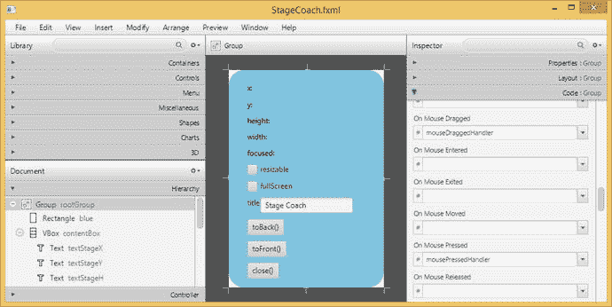

图 4-1。

`StageCoach.fxml` being created in JavaFX Scene Builder

我们将在本章的后半部分详细介绍如何使用 JavaFX Scene Builder。现在，只需观察工具的主要功能区域。中间是内容面板，显示正在处理的 UI 的外观。左侧是顶部的“库”面板，它包括可在内容面板中使用的所有可能的节点，这些节点被划分为简单的子集，如容器、控件、形状、图表等；下面是“文档”面板，它将内容面板中正在处理的场景图形显示为称为层次结构的树结构，以及为 UI 中的各种控件提供事件处理程序代码的控制器。右侧是检查器区域，其中包含允许您操作当前选定控件的属性、布局和代码连接的子区域。

### 了解 FXML 文件

清单 4-1 显示了 JavaFX Scene Builder 从我们创建的 UI 中保存的 FXML 文件。

```java
<?xml version="1.0" encoding="UTF-8"?>

<?import javafx.scene.control.Button?>
<?import javafx.scene.control.CheckBox?>
<?import javafx.scene.control.Label?>
<?import javafx.scene.control.TextField?>
<?import javafx.scene.Group?>
<?import javafx.scene.layout.HBox?>
<?import javafx.scene.layout.VBox?>
<?import javafx.scene.shape.Rectangle?>
<?import javafx.scene.text.Text?>
<Group fx:id="rootGroup"
       onMouseDragged="#mouseDraggedHandler"
       onMousePressed="#mousePressedHandler"

       xmlns:fx="http://javafx.com/fxml/1"
       fx:controller="projavafx.stagecoach.ui.StageCoachController">
    <children>
        <Rectangle fx:id="blue"
                   arcHeight="50.0"
                   arcWidth="50.0"
                   fill="SKYBLUE"
                   height="350.0"
                   strokeType="INSIDE"
                   width="250.0"/>
        <VBox fx:id="contentBox"
              layoutX="30.0"
              layoutY="20.0"
              spacing="10.0">
            <children>
                <Text fx:id="textStageX"
                      strokeType="OUTSIDE"
                      strokeWidth="0.0"
                      text="x:"
                      textOrigin="TOP"/>
                <Text fx:id="textStageY"
                      layoutX="10.0"
                      layoutY="23.0"
                      strokeType="OUTSIDE"
                      strokeWidth="0.0"
                      text="y:"
                      textOrigin="TOP"/>
                <Text fx:id="textStageH"
                      layoutX="10.0"
                      layoutY="50.0"
                      strokeType="OUTSIDE"
                      strokeWidth="0.0"
                      text="height:"
                      textOrigin="TOP"/>
                <Text fx:id="textStageW"
                      layoutX="10.0"
                      layoutY="77.0"
                      strokeType="OUTSIDE"
                      strokeWidth="0.0"
                      text="width:"
                      textOrigin="TOP"/>
                <Text fx:id="textStageF"
                      layoutX="10.0"
                      layoutY="104.0"
                      strokeType="OUTSIDE"
                      strokeWidth="0.0"
                      text="focused:"
                      textOrigin="TOP"/>
                <CheckBox fx:id="checkBoxResizable"
                          mnemonicParsing="false"
                          text="resizable"/>
                <CheckBox fx:id="checkBoxFullScreen"
                          mnemonicParsing="false"
                          text="fullScreen"/>
                <HBox fx:id="titleBox">
                    <children>
                        <Label fx:id="titleLabel"
                               text="title"/>
                        <TextField fx:id="titleTextField"
                                   text="Stage Coach"/>
                    </children>
                </HBox>
                <Button fx:id="toBackButton"
                        mnemonicParsing="false"
                        onAction="#toBackEventHandler"
                        text="toBack()"/>
                <Button fx:id="toFrontButton"
                        mnemonicParsing="false"
                        onAction="#toFrontEventHandler"
                        text="toFront()"/>
                <Button fx:id="closeButton"
                        mnemonicParsing="false"
                        onAction="#closeEventHandler"
                        text="close()"/>
            </children>
        </VBox>
    </children>
</Group>

Listing 4-1.
StageCoach.fxml

```

Note

JavaFX Scene Builder 创建的 FXML 文件具有较长的行。我们重新格式化了 FXML 文件，以适应书的页面。

这个 FXML 文件的大部分可以直观地理解:它表示一个包含两个孩子的`Group`，一个`Rectangle`和一个`VBox`。`VBox`依次持有五个`Text`节点、两个`CheckBox` es、一个`HBox`和三个`Button`。`HBox`持有一个`Label`和一个`TextField`。这些节点的各种属性被设置为一些合理的值；例如三个`Button`上的`text`设置为`"toBack()"`、`"toFront()"`和`"close()"`。

这个 FXML 文件中的一些结构需要更多的解释。文件顶部的 XML 处理指令

```java
<?import javafx.scene.control.Button?>
<?import javafx.scene.control.CheckBox?>
<?import javafx.scene.control.Label?>
<?import javafx.scene.control.TextField?>
<?import javafx.scene.Group?>
<?import javafx.scene.layout.HBox?>
<?import javafx.scene.layout.VBox?>
<?import javafx.scene.shape.Rectangle?>
<?import javafx.scene.text.Text?>

```

通知这个文件的消费者，或者在设计时通知 JavaFX Scene Builder，或者在运行时通知`FXMLLoader`,以导入提到的 Java 类。这些与 Java 源文件中的导入指令具有相同的效果。

为顶级元素`Group`提供了两个名称空间声明。JavaFX Scene Builder 将这些名称空间放在它创建的每个 FXML 文件中:

```java
xmlns:fx="http://javafx.com/fxml/1"

```

Caution

FXML 文件没有根据任何 XML 架构进行验证。FXMLLoader、JavaFX Scene Builder 和 Java IDEs(如 NetBeans、Eclipse 和 IntelliJ IDEA)使用此处指定的名称空间来在编辑 FXML 文件时提供帮助。实际的前缀，即第一个名称空间的空字符串和第二个名称空间的“`fx`”不应该改变。

这个 FXML 文件包含两种带有`fx`前缀的属性，`fx:` `controller`和`fx:id`。`fx:controller`属性出现在顶层元素`Group`上。它通知 JavaFX 运行时，在当前 FXML 文件中设计的 UI 将与一个称为其控制器的 Java 类一起工作:

```java
fx:controller="projavafx.stagecoach.ui.StageCoachController"

```

前面的属性声明`StageCoach.fxml`将与 Java 类`projavafx.stagecoach.ui.StageCoachController`一起工作。`fx:id`属性可以出现在代表 JavaFX `Node`的每个元素中。`fx:id`的值是控制器中一个字段的名称，表示 FXML 文件加载后的`Node`。`StageCoach.fxml`文件声明了下面的`fx:ids`(只显示了带有`fx:id`属性的行):

```java
<Group fx:id="rootGroup"
        <Rectangle fx:id="blue"
        <VBox fx:id="contentBox"
                <Text fx:id="textStageX"
                <Text fx:id="textStageY"
                <Text fx:id="textStageH"
                <Text fx:id="textStageW"
                <Text fx:id="textStageF"
                <CheckBox fx:id="checkBoxResizable"
                <CheckBox fx:id="checkBoxFullScreen"
                <HBox fx:id="titleBox">
                        <Label fx:id="titleLabel"
                        <TextField fx:id="titleTextField"
                <Button fx:id="toBackButton"
                <Button fx:id="toFrontButton"
                <Button fx:id="closeButton"

```

因此，在`FXMLLoader`完成加载 FXML 文件之后，可以在 Java 代码中访问和操作 FXML 文件中的顶层`Group`节点，作为`StageCoachController`类的`rootGroup`字段。在这个 FXML 文件中，我们为我们创建的所有节点分配了一个`fx:id`。这样做只是为了说明的目的。如果没有理由以编程方式操作节点，比如静态标签，那么可以省略控制器中的`fx:id`属性和相应的字段。

提供对 FXML 文件中节点的编程访问是控制器扮演的一个角色。控制器扮演的另一个角色是提供处理用户输入和来自 FXML 文件中节点的交互事件的方法。这些事件处理程序由名称以`on`开头的属性指定，例如`onMouseDragged`、`onMousePressed`和`onAction`。它们对应于`Node`类或其子类中的`setOnMouseDragged()`、`setOnMousePressed()`和`setOnAction()`方法。要将事件处理程序设置为控制器中的一个方法，请使用带有“`#`”字符的方法名称作为`onMouseDragged`、`onMousePressed`和`onAction`属性的值。`StageCoach.fxml`文件声明了以下事件处理程序(只显示了带有事件处理程序的行):

```java
<Group fx:id="rootGroup"
       onMouseDragged="#mouseDraggedHandler"
       onMousePressed="#mousePressedHandler"
                <Button fx:id="toBackButton"
                        onAction="#toBackEventHandler"
                <Button fx:id="toFrontButton"
                        onAction="#toFrontEventHandler"
                <Button fx:id="closeButton"
                        onAction="#closeEventHandler"

```

控制器类中的事件处理器方法通常应该符合`EventHandler<T>`接口中单个方法的签名

```java
void handle(T event)

```

其中`T`是适当的事件对象，`MouseEvent`用于`onMouseDragged`和`onMousePressed`事件处理程序，`ActionEvent`用于`onAction`事件处理程序。不带任何参数的方法也可以设置为事件处理程序方法。如果不打算使用事件对象，可以使用这样的方法。

现在我们已经理解了 FXML 文件，接下来我们继续学习控制器类。

### 了解控制器

清单 4-2 显示了使用我们在上一小节中创建的 FXML 文件的控制器类。

```java
package projavafx.stagecoach.ui;

import javafx.beans.property.SimpleStringProperty;
import javafx.beans.property.StringProperty;
import javafx.event.ActionEvent;
import javafx.fxml.FXML;
import javafx.scene.control.Button;
import javafx.scene.control.CheckBox;
import javafx.scene.control.Label;
import javafx.scene.control.TextField;
import javafx.scene.input.MouseEvent;
import javafx.scene.layout.HBox;
import javafx.scene.layout.VBox;
import javafx.scene.shape.Rectangle;
import javafx.scene.text.Text;
import javafx.stage.Stage;
import javafx.stage.StageStyle;

public class StageCoachController {
    @FXML
    private Rectangle blue;

    @FXML
    private VBox contentBox;

    @FXML
    private Text textStageX;

    @FXML
    private Text textStageY;

    @FXML
    private Text textStageH;

    @FXML
    private Text textStageW;

    @FXML
    private Text textStageF;

    @FXML
    private CheckBox checkBoxResizable;

    @FXML
    private CheckBox checkBoxFullScreen;

    @FXML
    private HBox titleBox;

    @FXML
    private Label titleLabel;

    @FXML
    private TextField titleTextField;

    @FXML
    private Button toBackButton;

    @FXML
    private Button toFrontButton;

    @FXML
    private Button closeButton;

    private Stage stage;
    private StringProperty title = new SimpleStringProperty();
    private double dragAnchorX;
    private double dragAnchorY;

    public void setStage(Stage stage) {
        this.stage = stage;
    }

    public void setupBinding(StageStyle stageStyle) {
        checkBoxResizable.setDisable(stageStyle == StageStyle.TRANSPARENT
            || stageStyle == StageStyle.UNDECORATED);
        textStageX.textProperty().bind(new SimpleStringProperty("x: ")
            .concat(stage.xProperty().asString()));
        textStageY.textProperty().bind(new SimpleStringProperty("y: ")
            .concat(stage.yProperty().asString()));
        textStageW.textProperty().bind(new SimpleStringProperty("width: ")
            .concat(stage.widthProperty().asString()));
        textStageH.textProperty().bind(new SimpleStringProperty("height: ")
            .concat(stage.heightProperty().asString()));
        textStageF.textProperty().bind(new SimpleStringProperty("focused: ")
            .concat(stage.focusedProperty().asString()));
        stage.setResizable(true);
        checkBoxResizable.selectedProperty()
            .bindBidirectional(stage.resizableProperty());
        checkBoxFullScreen.selectedProperty().addListener((ov, oldValue, newValue) ->
            stage.setFullScreen(checkBoxFullScreen.selectedProperty().getValue()));
        title.bind(titleTextField.textProperty());
        stage.titleProperty().bind(title);
        stage.initStyle(stageStyle);
    }

    @FXML
    public void toBackEventHandler(ActionEvent e) {
        stage.toBack();
    }

    @FXML
    public void toFrontEventHandler(ActionEvent e) {
        stage.toFront();
    }

    @FXML
    public void closeEventHandler(ActionEvent e) {
        stage.close();
    }

    @FXML
    public void mousePressedHandler(MouseEvent me) {
        dragAnchorX = me.getScreenX() - stage.getX();
        dragAnchorY = me.getScreenY() - stage.getY();
    }

    @FXML
    public void mouseDraggedHandler(MouseEvent me) {
        stage.setX(me.getScreenX() - dragAnchorX);
        stage.setY(me.getScreenY() - dragAnchorY);
    }
}

Listing 4-2.
StageCoachController.java

```

这个类是从第二章的`StageCoachMain`类中提取出来的，这是我们指定为 FXML 文件`StageCoach.fxml.`的控制器类的类。实际上，它包含了类型和名称与 FXML 文件中的`fx:id`相匹配的字段。它还包括名称和签名与 FXML 文件中各种节点的事件处理程序相匹配的方法。

唯一需要解释的是`@FXML`注释。属于`javafx.fxml`套餐。这是一个带有运行时保留的标记注释，可以应用于字段和方法。当应用于字段时，`@FXML`注释告诉 JavaFX Scene Builder 该字段的名称可以用作 FXML 文件中适当类型元素的`fx:id`。当应用于一个方法时，`@FXML`注释告诉 JavaFX Scene Builder 该方法的名称可以用作适当类型的事件处理程序属性的值。不管修饰符是什么，用`@FXML`标注的字段和方法都可以被 FXML 加载工具访问。因此，将所有的`@FXML`注释字段从`public`更改为`private`是安全的，不会对 FXML 加载过程产生负面影响。

`StageCoachController`类包含 FXML 文件中声明的所有`fx:id`的匹配字段。它还包括 FXML 文件中的事件处理程序属性指向的五个事件处理程序方法。所有这些字段和方法都用`@FXML`进行了注释。

`StageCoachController`还包括一些没有用`@FXML`注释标注的字段和方法。这些字段和方法出现在类中是为了其他目的。例如，`stage`字段、`setStage()`和`setupBindings()`方法直接在 Java 代码中使用。

### 了解 FXMLLoader

现在我们已经了解了 FXML 文件和使用 FXML 文件的控制器类，我们将注意力转向运行时 FXML 文件的加载。`javafx.fxml`包中的`FXMLLoader`类完成了加载 FXML 文件的大部分工作。在我们的例子中，FXML 文件的加载是在`StageCoachMain`类中完成的。清单 4-3 显示了`StageCoachMain`类。

```java
package projavafx.stagecoach.ui;

import javafx.application.Application;
import javafx.fxml.FXMLLoader;
import javafx.geometry.Rectangle2D;
import javafx.scene.Group;
import javafx.scene.Scene;
import javafx.scene.paint.Color;
import javafx.stage.Screen;
import javafx.stage.Stage;
import javafx.stage.StageStyle;

import java.io.IOException;
import java.util.List;

public class StageCoachMain extends Application {
    @Override
    public void start(Stage stage) throws IOException {
        final StageStyle stageStyle = configStageStyle();

        FXMLLoader fxmlLoader = new FXMLLoader(StageCoachMain.class
            .getResource("/projavafx/stagecoach/ui/StageCoach.fxml"));
        Group rootGroup = fxmlLoader.load();

        final StageCoachController controller = fxmlLoader.getController();
        controller.setStage(stage);
        controller.setupBinding(stageStyle);

        Scene scene = new Scene(rootGroup, 250, 350);
        scene.setFill(Color.TRANSPARENT);

        stage.setScene(scene);
        stage.setOnCloseRequest(we -> System.out.println("Stage is closing"));
        stage.show();
        Rectangle2D primScreenBounds = Screen.getPrimary().getVisualBounds();
        stage.setX((primScreenBounds.getWidth() - stage.getWidth()) / 2);
        stage.setY((primScreenBounds.getHeight() - stage.getHeight()) / 4);
    }

    public static void main(String[] args) {
        launch(args);
    }

    private StageStyle configStageStyle() {
        StageStyle stageStyle = StageStyle.DECORATED;
        List<String> unnamedParams = getParameters().getUnnamed();
        if (unnamedParams.size() > 0) {
            String stageStyleParam = unnamedParams.get(0);
            if (stageStyleParam.equalsIgnoreCase("transparent")) {
                stageStyle = StageStyle.TRANSPARENT;
            } else if (stageStyleParam.equalsIgnoreCase("undecorated")) {
                stageStyle = StageStyle.UNDECORATED;
            } else if (stageStyleParam.equalsIgnoreCase("utility")) {
                stageStyle = StageStyle.UTILITY;
            }
        }
        return stageStyle;
    }
}

Listing 4-3.
StageCoachMain.java

```

在查看`FXMLLoader`代码之前，让我指出，对于这个例子，我们选择将`StageCoach.fxml`文件与`StageCoachMain.java`和`StageCoachController.java`文件放在一起。它们都位于`projavafx/stagecoach/ui`目录中。当我们编译源文件时，这种关系被保留下来。因此，当我们运行这个程序时，FXML 文件作为资源`/projavafx/stagecoach/ui/StageCoach.fxml`出现在类路径中。图 4-2 展示了我们例子中的文件布局。

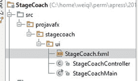

图 4-2。

The file layout of the StageCoach example

FXML 文件的加载由以下代码片段执行:

```java
FXMLLoader fxmlLoader = new FXMLLoader(StageCoachMain.class
    .getResource("/projavafx/stagecoach/ui/StageCoach.fxml"));
Group rootGroup = fxmlLoader.load();

final StageCoachController controller = fxmlLoader.getController();

```

这里我们使用`FXMLLoader`类的单参数构造器构造一个`fxmlLoader`对象，并传入一个由`StageCoachMain`的`Class`对象上的`getResource()`调用返回的`URL`对象。这个 URL 对象是一个 jar URL 或一个文件 URL，这取决于您是否从 jar 运行这个程序。然后我们在`fxmlLoader`对象上调用`load()`方法。这个方法读取 FXML 文件，解析它，实例化它指定的所有节点，并根据它指定的包含关系将它们连接起来。因为控制器是在 FXML 文件中指定的，所以该方法还实例化了一个`StageCoachController`实例，并根据`fx:id`将节点分配给控制器实例的字段，这一步通常称为将 FXML 节点注入控制器。事件处理程序也被连接起来。`load()`方法返回 FXML 文件中的顶层对象，在我们的例子中是一个`Group`。该返回的`Group`对象被分配给`rootGroup`变量，并在后续代码中使用，使用方式与第二章中以编程方式创建的`rootGroup`相同。然后我们调用`getController()`方法来获取控制器，控制器的节点字段已经被`FXMLLoader`注入。该控制器被分配给`controller`变量，并在后续代码中使用，就像我们刚刚以编程方式创建了它并分配了它的节点字段一样。

既然我们已经完成了将 Stage 蔻驰程序从编程式 UI 创建切换到声明式 UI 创建，我们就可以运行它了。它的行为就像第二章一样。图 4-3 显示了使用`transparent`命令行参数运行的程序。

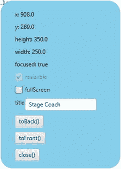

图 4-3。

The Stage Coach program run with transparent command-line argument

在这一节中，我们谈到了 FXML 设计时和运行时工具的所有方面。然而，我们只描述了每个设施的一部分，仅仅足以让我们的示例程序运行。在本章的其余部分，我们将详细研究每一个工具。

## 了解 FXML 加载工具

FXML 文件加载工具由两个类组成，一个接口、一个异常和`javafx.fxml`包中的一个注释。`FXMLLoader`是完成大部分工作的类，例如读取和解析 FXML 文件，识别 FXML 文件中的处理指令，并以必要的动作做出响应，识别 FXML 文件的每个元素和属性，并将对象创建任务委托给一组构建器，必要时创建控制器对象，并将节点和其他对象注入控制器。`JavaFXBuilderFactory`负责创建构建器，以响应`FXMLLoader`对特定类的构建器的请求。控制器类可以实现`Initializable`接口来接收来自`FXMLLoader`的信息，就像以前版本的 JavaFX 一样；然而，这个功能已经被注入方法所取代，所以我们不讨论它。如果 FXML 文件包含错误，使得`FXMLLoader`无法构建 FXML 文件中指定的所有对象，则会抛出`LoadException`。`@FXML`注释可以在控制器类中使用，将某些字段标记为注入目标，将某些方法标记为事件处理程序候选。

### 了解 FXMLLoader 类

`FXMLLoader`类有以下公共构造器:

*   `FXMLLoader()`
*   `FXMLLoader(URL location)`
*   `FXMLLoader(URL location, ResourceBundle resources)`
*   `FXMLLoader(URL location, ResourceBundle resources, BuilderFactory builderFactory)`
*   `FXMLLoader(URL location, ResourceBundle resources, BuilderFactory BuilderFactory builderFactory, Callback<Class<?>, Object> controllerFactory)`
*   `FXMLLoader(Charset charset)`
*   `FXMLLoader(URL location, ResourceBundle resources, BuilderFactory BuilderFactory builderFactory, Callback<Class<?> controllerFactory, Object>, Charset charset)`
*   `FXMLLoader(URL location, ResourceBundle resources, BuilderFactory BuilderFactory builderFactory, Callback<Class<?>, Object> controllerFactory, Charset charset, LinkedList<FXMLLoader> loaders)`

参数较少的构造器委托给参数较多的构造器，缺少的参数用默认值填充。`location`参数是要加载的 FXML 文件的`URL`。默认为`null`。`resources`参数是与 FXML 文件一起使用的资源包。如果在 FXML 文件中使用国际化字符串，这是必要的。默认为`null`。`builderFactory`参数是生成器工厂，`FXMLLoader`用它来获得它创建的各种对象的生成器。它默认为`JavaFXBuilderFactory`的一个实例。这个构建器工厂了解所有可能出现在 FXML 文件中的标准 JavaFX 类型，所以很少使用定制的构建器工厂。`controllerFactory`是一个`javafx.util.CallBack`，当提供控制器的类时，它能够返回控制器的实例。默认为`null`，在这种情况下`FXMLLoader`将通过调用控制器类的无参数构造器，通过反射实例化控制器。因此，只有当控制器不能以这种方式构建时，才需要提供一个`controllerFactory`。解析 FXML 时使用`charset`。它默认为 UTF-8。`loaders`参数是一个`FXMLLoader`列表，默认为空列表。

`FXMLLoader`类有下面的 getter 和 setter 方法来改变`FXMLLoader`的状态:

*   `URL getLocation()`
*   `void setLocation(URL location)`
*   `ResourceBundle getResources()`
*   `void setResources(ResourceBundle resources)`
*   `ObservableMap<String, Object> getNamespace()`
*   `<T> T getRoot()`
*   `void setRoot(Object root)`
*   `<T> T getController()`
*   `void setController(Object controller)`
*   `BuilderFactory getBuilderFactory()`
*   `void setBuilderFactory(BuilderFactory builderFactory)`
*   `Callback<Class<?>, Object> getControllerFactory()`
*   `void setControllerFactory(Callback<Class<?>, Object> controllerFactory)`
*   `Charset getCharset()`
*   `void setCharset(Charset charset)`
*   `ClassLoader getClassLoader()`
*   `void setClassLoader(ClassLoader classLoader)`

从这个列表中可以看出，`location`、`resources`、`builderFactory`、`controllerFactory`、`charset`也可以在`FXMLLoader`构造完成后进行设置。另外，我们可以获取并设置`root`、`controller`、`classLoader`，获取`FXMLLoader`的`namespace`。只有当 FXML 文件使用`fx:root`作为其根元素时,`root`才相关，在这种情况下，必须在加载 FXML 文件之前调用`setRoot()`。我们将在下一节更详细地介绍`fx:root`的用法。只有当 FXML 文件的顶层元素中不存在`fx:controller`属性时，才需要在加载 FXML 文件之前设置`controller`。`classLoader`和`namespace`主要由`FXMLLoader`内部使用，通常不会被用户代码调用。

FXML 文件的实际加载发生在调用其中一个`load()`方法的时候。`FXMLLoader`类有以下加载方法:

*   `<T> T load() throws IOException`
*   `<T> T load(InputStream input) throws IOException`
*   `static <T> T load(URL location) throws IOException`
*   `static <T> T load(URL location, ResourceBundle resources) throws IOException`
*   `static <T> T load(URL location, ResourceBundle resources, BuilderFactory builderFactory) throws IOException`
*   `static <T> T load(URL location, ResourceBundle resources, BuilderFactory builderFactory, Callback<Class<?>, Object> controllerFactory) throws IOException`
*   `static <T> T load(URL location, ResourceBundle resources, BuilderFactory builderFactory, Callback<Class<?>, Object> controllerFactory, Charset charset) throws IOException`

不带参数的`load()`方法可以在已经初始化了所有必要字段的`FXMLLoader`实例上调用。采用`InputStream`参数的`load()`方法将从指定的`input`加载 FXML。所有静态的`load()`方法都是方便的方法，它们将使用提供的参数实例化一个`FXMLLoader`，然后调用它的一个非静态的`load()`方法。

在我们的下一个例子中，我们故意没有在 FXML 文件中指定`fx:controller`。我们还向控制器类添加了一个单参数构造器。FXML 文件、控制器类和主类如清单 4-4 、 4-5 和 4-6 所示。

```java
<?xml version="1.0" encoding="UTF-8"?>

<?import javafx.geometry.Insets?>
<?import javafx.scene.control.Button?>
<?import javafx.scene.control.TextField?>
<?import javafx.scene.layout.HBox?>
<?import javafx.scene.layout.VBox?>
<?import javafx.scene.web.WebView?>
<VBox maxHeight="-Infinity"
      maxWidth="-Infinity"
      minHeight="-Infinity"
      minWidth="-Infinity"
      prefHeight="400.0"
      prefWidth="600.0"
      spacing="10.0"

      xmlns:fx="http://javafx.com/fxml/1">
    <children>
        <HBox spacing="10.0">
            <children>
                <TextField fx:id="address"
                           onAction="#actionHandler"
                           HBox.hgrow="ALWAYS">
                    <padding>
                        <Insets bottom="4.0" left="4.0" right="4.0" top="4.0"/>
                    </padding>
                </TextField>
                <Button fx:id="loadButton"
                        mnemonicParsing="false"
                        onAction="#actionHandler"
                        text="Load"/>
            </children>
        </HBox>
        <WebView fx:id="webView"
                 prefHeight="200.0"
                 prefWidth="200.0"
                 VBox.vgrow="ALWAYS"/>
    </children>
    <padding>
        <Insets bottom="10.0" left="10.0" right="10.0" top="10.0"/>
    </padding>
</VBox>

Listing 4-4.
FXMLLoaderExample.fxml

```

```java
import javafx.event.ActionEvent;
import javafx.fxml.FXML;
import javafx.scene.control.Button;
import javafx.scene.control.TextField;
import javafx.scene.web.WebView;

public class FXMLLoaderExampleController {
    @FXML
    private TextField address;

    @FXML
    private WebView webView;

    @FXML
    private Button loadButton;

    private String name;

    public FXMLLoaderExampleController(String name) {
        this.name = name;
    }

    @FXML
    public void actionHandler() {
        webView.getEngine().load(address.getText());
    }
}

Listing 4-5.
FXMLLoaderExampleController.

java

```

```java
import javafx.application.Application;
import javafx.fxml.FXMLLoader;
import javafx.scene.Scene;
import javafx.scene.layout.VBox;
import javafx.stage.Stage;

public class FXMLLoaderExampleMain extends Application {
    @Override
    public void start(Stage primaryStage) throws Exception {
        FXMLLoader fxmlLoader = new FXMLLoader();
        fxmlLoader.setLocation(
            FXMLLoaderExampleMain.class.getResource("/FXMLLoaderExample.fxml"));
        fxmlLoader.setController(
            new FXMLLoaderExampleController("FXMLLoaderExampleController"));
        final VBox vBox = fxmlLoader.load();
        Scene scene = new Scene(vBox, 600, 400);
        primaryStage.setTitle("FXMLLoader Example");
        primaryStage.setScene(scene);
        primaryStage.show();
    }

    public static void main(String[] args) {
        launch(args);
    }
}

Listing 4-6.
FXMLLoaderExampleMain.

java

```

因为我们没有在 FXML 文件的顶层元素中指定`fx:controller`属性，所以我们需要在加载 FXML 文件之前在`fxmlLoader`上设置控制器:

```java
FXMLLoader fxmlLoader = new FXMLLoader();
fxmlLoader.setLocation(
    FXMLLoaderExampleMain.class.getResource("/FXMLLoaderExample.fxml"));
fxmlLoader.setController(
    new FXMLLoaderExampleController("FXMLLoaderExampleController"));
final VBox vBox = fxmlLoader.load();

```

如果没有设置控制器，将抛出一个`LoaderException`，并显示消息“没有指定控制器”这是因为我们指定了控制器方法`actionHandler`作为文本字段和按钮的动作事件处理程序。`FXMLLoader`需要控制器来满足 FXML 文件中的这些规范。如果没有指定事件处理程序，FXML 文件将会成功加载，因为不需要控制器。

这个程序是一个非常原始的网络浏览器，有一个地址栏`TextField`，一个加载栏`Button`，和一个`WebView`。图 4-4 显示了工作中的 FXMLLoaderExample 程序。

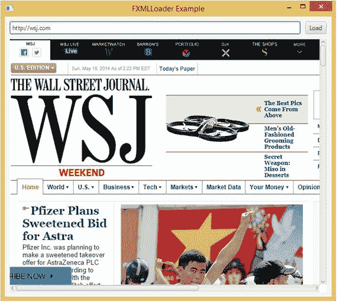

图 4-4。

The FXMLLoaderExample program

我们的下一个示例 ControllerFactoryExample 与 FXMLLoaderExample 几乎相同，只有两处不同，所以我们在这里没有展示完整的代码。您可以在代码下载包中找到它。不像在`FXMLLoaderExample`中，我们在 FXML 文件中指定了`fx:controller`。这迫使我们删除主类中的`setController()`调用，因为否则我们会得到一个`LoadException`消息“控制器值已经指定”但是，因为我们的控制器没有默认的构造器，`FXMLLoader`会抛出一个因无法实例化控制器而导致的`LoadException`。这个异常可以通过我们在`fxmlLoader`上设置的简单控制器工厂来纠正:

```java
fxmlLoader.setControllerFactory(
    clazz -> new ControllerFactoryExampleController("ExampleController"));

```

这里我们使用了一个简单的 lambda 表达式来实现函数接口`Callback<Class<?>, Object>`，它只有一个方法:

```java
Object call(Class<?>)

```

在我们的实现中，我们简单地返回一个`ControllerFactoryExampleController`的实例。

### 理解@FXML 注释

我们已经看到了`@FXML`注释的两种用法。它可以应用于 FXML 文件的控制器中的字段，这些字段的名称和类型与要注入节点的 FXML 元素的`fx:id`属性和元素名称相匹配。它可以应用于不带参数或者只带一个类型为`javafx.event.Event`或其子类型的参数的 void 方法，使它们有资格用作 FXML 文件中元素的事件处理程序。

`FXMLLoader`将把它的`location`和`resources`注入控制器，如果它有接收它们的字段的话:

```java
@FXML
private URL location;

@FXML
private ResourceBundle resources;

```

`FXMLLoader`还将调用带有以下签名的`@FXML`带注释的初始化方法:

```java
@FXML
public void initialize() {
    // ...
}

```

清单 4-7 、 4-8 和 4-9 中的 FXMLInjectionExample 说明了这些特性是如何工作的。在这个例子中，我们将四个`Label`放在 FXML 文件的一个`VBox`中。我们将两个`Label`注入控制器。我们还在控制器类中指定了`location`和`resources`注入字段。最后，在`initialize()`方法中，我们将两个注入的`Label`的文本设置为`location`和`resource`的字符串表示。

```java
<?xml version="1.0" encoding="UTF-8"?>

<?import javafx.geometry.Insets?>
<?import javafx.scene.control.Label?>
<?import javafx.scene.layout.VBox?>
<?import javafx.scene.text.Font?>
<VBox alignment="CENTER_LEFT"
      maxHeight="-Infinity"
      maxWidth="-Infinity"
      minHeight="-Infinity"
      minWidth="-Infinity"
      prefHeight="150.0"
      prefWidth="700.0"
      spacing="10.0"

      xmlns:fx="http://javafx.com/fxml/1"
      fx:controller="FXMLInjectionExampleController">
    <children>
        <Label text="Location:">
            <font>
                <Font name="System Bold" size="14.0"/>
            </font>
        </Label>
        <Label fx:id="locationLabel" text="[location]"/>
        <Label text="Resources:">
            <font>
                <Font name="System Bold" size="14.0"/>
            </font>
        </Label>
        <Label fx:id="resourcesLabel" text="[resources]"/>
    </children>
    <opaqueInsets>
        <Insets/>
    </opaqueInsets>
    <padding>
        <Insets bottom="10.0" left="10.0" right="10.0" top="10.0"/>
    </padding>
</VBox>

Listing 4-7.
FXMLInjectionExample.fxml

```

```java
import javafx.fxml.FXML;
import javafx.scene.control.Label;

import java.net.URL;
import java.util.ResourceBundle;

public class FXMLInjectionExampleController {
    @FXML
    private Label resourcesLabel;

    @FXML
    private Label locationLabel;

    @FXML
    private URL location;

    @FXML
    private ResourceBundle resources;

    @FXML
    public void initialize() {
        locationLabel.setText(location.toString());
        resourcesLabel.setText(resources.getBaseBundleName());
    }
}

Listing 4-8.
FXMLInjectionExampleController.

java

```

```java
import javafx.application.Application;
import javafx.fxml.FXMLLoader;
import javafx.scene.Scene;
import javafx.scene.layout.VBox;
import javafx.stage.Stage;

import java.util.ResourceBundle;

public class FXMLInjectionExampleMain extends Application {
    @Override
    public void start(Stage primaryStage) throws Exception {
        FXMLLoader fxmlLoader = new FXMLLoader();
        fxmlLoader.setLocation(
            FXMLInjectionExampleMain.class.getResource("/FXMLInjectionExample.fxml"));
        fxmlLoader.setResources(ResourceBundle.getBundle("FXMLInjectionExample"));
        VBox vBox = fxmlLoader.load();
        Scene scene = new Scene(vBox);
        primaryStage.setTitle("FXML Injection Example");
        primaryStage.setScene(scene);
        primaryStage.show();
    }

    public static void main(String[] args) {
        launch(args);
    }
}

Listing 4-9.
FXMLInjectionExampleMain.

java

```

注意，我们还创建了一个空的`FXMLInjectionExample.properties`文件，用作资源包来说明资源字段到控制器的注入。我们将在下一节解释如何使用带有 FXML 文件的资源包。当 FXMLInjectionExample 在我们的机器上运行时，屏幕上会显示图 4-5 中的 FXML 注入示例窗口。


图 4-5。

The FXMLInjection program

`@FXML`注释也可用于包含的 FXML 文件控制器注入，以及标记`javafx.event.EventHandler`类型的控制器属性，用作 FXML 文件中的事件处理程序。在下一节讨论 FXML 文件的相关特性时，我们将详细介绍它们。

## 探索 FXML 文件的功能

在本节中，我们将介绍 FXML 文件格式的特性。因为`FXMLLoader`的主要目标是将 FXML 文件反序列化为 Java 对象，所以它提供了有助于简化 FXML 文件编写的工具也就不足为奇了。

### FXML 格式的反序列化能力

因为我们在这一节中讨论的特性与反序列化通用 Java 对象有更多的关系，所以我们将离开 GUI 世界，使用普通的 Java 类。我们在讨论中使用清单 4-10 中定义的 JavaBean。这是一个虚构的类，旨在说明不同的 FXML 特性。

```java
package projavafx.fxmlbasicfeatures;

import javafx.scene.paint.Color;

import java.util.ArrayList;
import java.util.HashMap;
import java.util.List;
import java.util.Map;

public class FXMLBasicFeaturesBean {
    private String name;
    private String address;
    private boolean flag;
    private int count;
    private Color foreground;
    private Color background;
    private Double price;
    private Double discount;
    private List<Integer> sizes;
    private Map<String, Double> profits;
    private Long inventory;
    private List<String> products = new ArrayList<String>();
    private Map<String, String> abbreviations = new HashMap<>();

    public String getName() {
        return name;
    }

    public void setName(String name) {
        this.name = name;
    }

    public String getAddress() {
        return address;
    }

    public void setAddress(String address) {
        this.address = address;
    }

    public boolean isFlag() {
        return flag;
    }

    public void setFlag(boolean flag) {
        this.flag = flag;
    }

    public int getCount() {
        return count;
    }

    public void setCount(int count) {
        this.count = count;
    }

    public Color getForeground() {
        return foreground;
    }

    public void setForeground(Color foreground) {
        this.foreground = foreground;
    }

    public Color getBackground() {
        return background;
    }

    public void setBackground(Color background) {
        this.background = background;
    }

    public Double getPrice() {
        return price;
    }

    public void setPrice(Double price) {
        this.price = price;
    }

    public Double getDiscount() {
        return discount;
    }

    public void setDiscount(Double discount) {
        this.discount = discount;
    }

    public List<Integer> getSizes() {
        return sizes;
    }

    public void setSizes(List<Integer> sizes) {
        this.sizes = sizes;
    }

    public Map<String, Double> getProfits() {
        return profits;
    }

    public void setProfits(Map<String, Double> profits) {
        this.profits = profits;
    }

    public Long getInventory() {
        return inventory;
    }

    public void setInventory(Long inventory) {
        this.inventory = inventory;
    }

    public List<String> getProducts() {
        return products;
    }

    public Map<String, String> getAbbreviations() {
        return abbreviations;
    }

    @Override
    public String toString() {
        return "FXMLBasicFeaturesBean{" +
            "name='" + name + '\'' +
            ",\n\taddress='" + address + '\'' +
            ",\n\tflag=" + flag +
            ",\n\tcount=" + count +
            ",\n\tforeground=" + foreground +
            ",\n\tbackground=" + background +
            ",\n\tprice=" + price +
            ",\n\tdiscount=" + discount +
            ",\n\tsizes=" + sizes +
            ",\n\tprofits=" + profits +
            ",\n\tinventory=" + inventory +
            ",\n\tproducts=" + products +
            ",\n\tabbreviations=" + abbreviations +
            '}';
    }
}

Listing 4-10.
FXMLBasicFeaturesBean.java

```

清单 4-11 中的 FXML 文件被加载并打印到清单 4-12 中程序的控制台上。

```java
<?import javafx.scene.paint.Color?>
<?import projavafx.fxmlbasicfeatures.FXMLBasicFeaturesBean?>
<?import projavafx.fxmlbasicfeatures.Utilities?>
<?import java.lang.Double?>
<?import java.lang.Integer?>
<?import java.lang.Long?>
<?import java.util.HashMap?>
<?import java.lang.String?>
<FXMLBasicFeaturesBean name="John Smith"
                       flag="true"
                       count="12345"
                       xmlns:fx="http://javafx.com/fxml/1">
    <address>12345 Main St.</address>
    <foreground>#ff8800</foreground>
    <background>
        <Color red="0.0" green="1.0" blue="0.5"/>
    </background>
    <price>
        <Double fx:value="3.1415926"/>
    </price>
    <discount>
        <Utilities fx:constant="TEN_PCT"/>
    </discount>
    <sizes>
        <Utilities fx:factory="createList">
            <Integer fx:value="1"/>
            <Integer fx:value="2"/>
            <Integer fx:value="3"/>
        </Utilities>
    </sizes>
    <profits>
        <HashMap q1="1000" q2="1100" q3="1200" a4="1300"/>
    </profits>
    <fx:define>
        <Long fx:id="inv" fx:value="9765625"/>
    </fx:define>
    <inventory>
        <fx:reference source="inv"/>
    </inventory>
    <products>
        <String fx:value="widget"/>
        <String fx:value="gadget"/>
        <String fx:value="models"/>
    </products>
    <abbreviations CA="California" NY="New York" FL="Florida" MO="Missouri"/>

</FXMLBasicFeaturesBean>

Listing 4-11.
FXMLBasicFeatures.fxml

```

```java
package projavafx.fxmlbasicfeatures;

import javafx.fxml.FXMLLoader;

import java.io.IOException;

public class FXMLBasicFeaturesMain {
    public static void main(String[] args) throws IOException {
        FXMLBasicFeaturesBean bean = FXMLLoader.load(
            FXMLBasicFeaturesMain.class.getResource(
                "/projavafx/fxmlbasicfeatures/FXMLBasicFeatures.fxml")
        );
        System.out.println("bean = " + bean);
    }
}

Listing 4-12.
FXMLBasicFeaturesMain.java

```

我们使用了一个小的工具类，它包含一些常量和一个创建`List<Integer>`的工厂方法，如清单 4-13 所示。

```java
package projavafx.fxmlbasicfeatures;

import java.util.ArrayList;
import java.util.List;

public class Utilities {
    public static final Double TEN_PCT = 0.1d;
    public static final Double TWENTY_PCT = 0.2d;
    public static final Double THIRTY_PCT = 0.3d;

    public static List<Integer> createList() {
        return  new ArrayList<>();
    }
}

Listing 4-13.
Utilities.java

```

正在 FXML 文件中创建`FXMLBasicFeaturesBean`对象；FXML 文件的顶层元素是`FXMLBasicFeaturesBean`这一事实表明了这一点。`name`和`address`字段说明了可以将字段设置为属性或子元素:

```java
<FXMLBasicFeaturesBean name="John Smith"
                       flag="true"
                       count="12345"
                       xmlns:fx="http://javafx.com/fxml/1">
    <address>12345 Main St.</address>

```

`foreground`和`background`字段说明了设置`javafx.scene.paint.Color`子元素的两种方式，要么通过十六进制字符串，要么使用`Color`元素(记住`Color`是一个没有默认构造器的不可变对象):

```java
<foreground>#ff8800</foreground>
<background>
    <Color red="0.0" green="1.0" blue="0.5"/>
</background>

```

`price`字段说明了一种构造`Double`对象的方法。`fx:value`属性调用`Double`上的`valueOf(String)`方法。这适用于任何具有工厂方法`valueOf(String)`的 Java 类:

```java
<price>
    <Double fx:value="3.1415926"/>
</price>

```

`discount`字段说明了如何使用 Java 类中定义的常量。属性访问其元素类型的常量(public static final)字段。下面将折扣字段设置为`Utilities.TEN_PCT`，即`0.1`:

```java
<discount>
    <Utilities fx:constant="TEN_PCT"/>
</discount>

```

`sizes`字段说明了使用工厂方法创建对象。属性在其元素的类型上调用指定的工厂方法。在我们的例子中，它调用`Utilities.createList()`来创建一个`Integer`列表，然后用三个`Integer`填充它。注意`sizes`是一个读写属性。稍后您将看到一个如何填充只读列表属性的示例。

```java
<sizes>
    <Utilities fx:factory="createList">
        <Integer fx:value="1"/>
        <Integer fx:value="2"/>
        <Integer fx:value="3"/>
    </Utilities>
</sizes>

```

`profits`字段说明了如何填充读写映射。这里，我们将利润字段设置为一个用键/值对创建的`HashMap`:

```java
<profits>
    <HashMap q1="1000" q2="1100" q3="1200" a4="1300"/>
</profits>

```

`inventory`字段说明了如何在一个地方定义一个对象并在另一个地方引用它。元素创建了一个具有`fx:id`属性的独立对象。`fx:reference`元素创建了一个对别处定义的对象的引用，它的`source`属性指向一个先前定义的对象的`fx:id`:

```java
<fx:define>
    <Long fx:id="inv" fx:value="9765625"/>
</fx:define>
<inventory>
    <fx:reference source="inv"/>
</inventory>

```

`products`字段说明了如何填充只读列表。FXML 的以下片段相当于调用`bean.getProducts().addAll("widget", "gadget", "models")`:

```java
<products>
    <String fx:value="widget"/>
    <String fx:value="gadget"/>
    <String fx:value="models"/>
</products>

```

`abbreviations`字段说明了如何填充只读地图:

```java
<abbreviations CA="California" NY="New York" FL="Florida" MO="Missouri"/>

```

当 FXMLBasicFeaturesMain 程序运行时，以下输出将按预期打印到控制台:

```java
bean = FXMLBasicFeaturesBean{name='John Smith',
        address='12345 Main St.',
        flag=true,
        count=12345,
        foreground=0xff8800ff,
        background=0x00ff80ff,
        price=3.1415926,
        discount=0.1,
        sizes=[1, 2, 3],
        profits={q1=1000, q2=1100, q3=1200, a4=1300},
        inventory=9765625,
        products=[widget, gadget, models],
        abbreviations={MO=Missouri, FL=Florida, NY=New York, CA=California}}

```

### 了解默认和静态属性

许多 JavaFX 类都有一个默认属性。默认属性是用类上的`@DefaultProperty`注释指定的。`@DefaultProperty`注释属于`javafx.beans`包。例如，`javafx.scene.Group`类的默认属性是它的`children`属性。在 FXML 文件中，当通过子元素指定默认属性时，默认属性本身的开始和结束标记可以省略。作为一个例子，下面的代码片段，您可以在清单 4-1 中看到。

```java
<HBox fx:id="titleBox">
    <children>
        <Label fx:id="titleLabel"
               text="title"/>
        <TextField fx:id="titleTextField"
                   text="Stage Coach"/>
    </children>
</HBox>

```

可以简化为

```java
<HBox fx:id="titleBox">
    <Label fx:id="titleLabel"
           text="title"/>
    <TextField fx:id="titleTextField"
               text="Stage Coach"/>
</HBox>

```

静态属性是在对象上设置的属性，不是通过调用对象本身的 setter 方法，而是通过调用不同类的静态方法，将对象和属性值作为参数传递。许多 JavaFX 的容器`Node`都有这样的静态方法。这些方法在将一个`Node`添加到容器之前被调用，以影响某些结果。静态属性在 FXML 文件中表示为内部对象(作为静态方法的第一个参数传入的对象)的属性，其名称包括类名和静态方法名，用点分隔。您可以在清单 4-4 中找到一个静态属性的例子:

```java
<WebView fx:id="webView"
         prefHeight="200.0"
         prefWidth="200.0"
         VBox.vgrow="ALWAYS"/>

```

这里我们将一个`WebView`添加到一个`VBox`，`VBox.vgrow`属性表明`FXMLLoader`需要在将`webView`添加到`VBox`之前调用下面的。

```java
VBox.vgrow(webView, Priority.ALWAYS)

```

静态属性除了作为属性出现之外，还可以作为子元素出现。

### 了解属性解析和绑定

正如你在本章前面所看到的，对象属性可以表示为属性和子元素。有时，将属性建模为子元素或属性同样有效。然而，`FXMLLoader`将对属性进行额外的处理，使得使用属性更有吸引力。处理属性时，`FXMLLoader`会执行三种属性值解析和表达式绑定。

当属性的值以`@`字符开始时，`FXMLLoader`会将该值视为相对于当前文件的位置。这被称为位置解析。当一个属性的值以一个`%`字符开始时，`FXMLLoader`会将该值视为资源包中的一个键，并用特定于地区的值替换该键。这称为资源解析。当一个属性的值以一个`$`字符开始时，`FXMLLoader`会将该值视为一个变量名，并将被引用变量的值替换为该属性的值。这被称为可变分辨率。

当一个属性的值以`${`开始，以`}`结束，并且如果该属性表示一个 JavaFX 属性，`FXMLLoader`将把该值视为一个绑定表达式，并将 JavaFX 属性绑定到包含的表达式。这叫做表达式绑定。您将在第三章中了解 JavaFX 属性和绑定。现在简单地理解一下，当一个属性被绑定到一个表达式时，每次表达式改变值时，这种改变都会反映在属性中。支持的表达式包括字符串、布尔、数值、一元运算符`–`(减)和`!`(求反)、算术运算符(`+`、`–`、`*`、`/`、`%`)、逻辑运算符(`&&`、`||`)和关系运算符(`>`、`>=`、`<`、`<=`、`==`、`!=`)。

清单 4-14 到 4-19 中显示的 ResolutionAndBindingExample 说明了位置解析、资源解析、变量解析以及表达式绑定的使用。

```java
<?xml version="1.0" encoding="UTF-8"?>

<?import javafx.geometry.Insets?>
<?import javafx.scene.control.Label?>
<?import javafx.scene.control.TextField?>
<?import javafx.scene.layout.HBox?>
<?import javafx.scene.layout.VBox?>
<?import javafx.scene.text.Font?>
<?import java.util.Date?>
<VBox id="vbox" alignment="CENTER_LEFT" maxHeight="-Infinity" maxWidth="-Infinity" minHeight="-Infinity"
      minWidth="-Infinity" prefHeight="200.0" prefWidth="700.0" spacing="10.0"
      stylesheets="@ResolutionAndBindingExample.css" 
      xmlns:fx="http://javafx.com/fxml/1" fx:controller="ResolutionAndBindingController">
    <children>
        <Label text="%location">
            <font>
                <Font name="System Bold" size="14.0"/>
            </font>
        </Label>
        <Label fx:id="locationLabel" text="[location]"/>
        <Label text="%resources">
            <font>
                <Font name="System Bold" size="14.0"/>
            </font>
        </Label>
        <Label fx:id="resourcesLabel" text="[resources]"/>
        <Label text="%currentDate">
            <font>
                <Font name="System Bold" size="14.0"/>
            </font>
        </Label>
        <HBox alignment="BASELINE_LEFT" spacing="10.0">
            <children>
                <fx:define>
                    <Date fx:id="capturedDate"/>
                </fx:define>
                <Label fx:id="currentDateLabel" text="$capturedDate"/>
                <TextField fx:id="textField"/>
                <Label text="${textField.text}"/>
            </children>
        </HBox>
    </children>
    <opaqueInsets>
        <Insets/>
    </opaqueInsets>
    <padding>
        <Insets bottom="10.0" left="10.0" right="10.0" top="10.0"/>
    </padding>
</VBox>

Listing 4-14.
ResolutionAndBindingExample.fxml

```

```java
import javafx.fxml.FXML;
import javafx.scene.control.Label;

import java.net.URL;
import java.util.ResourceBundle;

public class ResolutionAndBindingController {
    @FXML
    private Label resourcesLabel;

    @FXML
    private Label locationLabel;

    @FXML
    private Label currentDateLabel;

    @FXML
    private URL location;

    @FXML
    private ResourceBundle resources;

    @FXML
    public void initialize() {
        locationLabel.setText(location.toString());
        resourcesLabel.setText(resources.getBaseBundleName() +
            " (" + resources.getLocale().getCountry() +
            ", " + resources.getLocale().getLanguage() + ")");
    }
}

Listing 4-15.
ResolutionAndBindingController.

java

```

```java
import javafx.application.Application;
import javafx.fxml.FXMLLoader;
import javafx.scene.Scene;
import javafx.scene.layout.VBox;
import javafx.stage.Stage;

import java.util.ResourceBundle;

public class ResolutionAndBindingExample extends Application {
    @Override
    public void start(Stage primaryStage) throws Exception {
        FXMLLoader fxmlLoader = new FXMLLoader();
        fxmlLoader.setLocation(
            ResolutionAndBindingExample.class.getResource(
                "/ResolutionAndBindingExample.fxml"));
        fxmlLoader.setResources(
            ResourceBundle.getBundle(
                "ResolutionAndBindingExample"));
        VBox vBox = fxmlLoader.load();
        Scene scene = new Scene(vBox);
        primaryStage.setTitle("Resolution and Binding Example");
        primaryStage.setScene(scene);
        primaryStage.show();
    }

    public static void main(String[] args) {
        launch(args);
    }
}

Listing 4-16.

ResolutionAndBindingExample.java

```

```java
location=Location:
resources=Resources:
currentDate=CurrentDate:
Listing 4-17.
ResourceAndBindingExample.

properties

```

```java
location=Emplacement:
resources=Resources:
currentDate=Date du jour:
Listing 4-18.
ResolutionAndBindingExample_fr_FR.properties

```

```java
#vbox {
    -fx-background-color: azure ;
}
Listing 4-19.
ResolutionAndBindingExample.css

```

FXML 文件中使用位置解析来指定 CSS 文件的位置。`stylesheet`属性被设置为位置“`@ResolutionAndBindingExample.css`”:

```java
<VBox id="vbox" alignment="CENTER_LEFT" maxHeight="-Infinity" maxWidth="-Infinity" minHeight="-Infinity"
      minWidth="-Infinity" prefHeight="200.0" prefWidth="700.0" spacing="10.0"
      stylesheets="@ResolutionAndBindingExample.css" 
      xmlns:fx="http://javafx.com/fxml/1" fx:controller="ResolutionAndBindingController">

```

样式表将`VBox`的背景色设置为天蓝色。资源解析用于设置程序中三个标签的文本:

```java
<Label text="%location">
<Label text="%resources">
<Label text="%currentDate">

```

在加载 FXML 文件之前，这些标签将从提供给`FXMLLoader`的资源包中获取文本。提供了属性文件的默认区域设置和法语区域设置翻译。可变解析发生在定义的`java.util.Date`实例和`Label`之间:

```java
<fx:define>
    <Date fx:id="capturedDate"/>
</fx:define>
<Label fx:id="currentDateLabel" text="$capturedDate"/>

```

定义的`Date`被赋予了`capturedDate`的`fx:id`，标签使用变量作为其文本。最后，表达式绑定发生在`TextField`和`Label`之间:

```java
<TextField fx:id="textField"/>
<Label text="${textField.text}"/>

```

`TextField`被赋予了`textField`的`fx:id`，标签被绑定到表达式`textField.text`，结果标签模仿了文本字段中输入的内容。当使用法语语言环境运行 ResolutionAndBindingExample 时，将显示如图 4-6 所示的解析和绑定示例窗口。

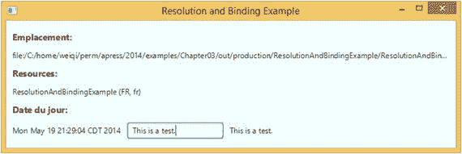

图 4-6。

The ResolutionAndBindingExample program

### 使用多个 FXML 文件

因为加载一个 FXML 文件的结果是一个可以在一个`Scene`中使用的 JavaFX `Node`，所以对于任何一个`Scene`，您并不局限于只使用一个 FXML 文件。例如，您可以将场景分成两个或更多部分，并用各自的 FXML 文件来表示每个部分。然后，您可以在每个部分的 FXML 文件上调用`FXMLLoader`的`load()`方法之一，并以编程方式将结果节点组装到您的场景中。

FXML 文件格式支持另一种将单独准备的 FXML 文件组合在一起的机制。一个 FXML 文件可以包含另一个带有`fx:include`元素的 FXML 文件。元素支持三个属性:`source`属性保存包含的 FXML 文件的位置；`resources`属性保存被包含的 FXML 文件使用的资源包的位置；而`charset`属性保存包含的 FXML 文件的字符集。如果`source`属性以“`/`”字符开头，则解释为类路径中的路径；否则，它被解释为相对于包含 FXML 文件的位置。`resource`和`charset`属性是可选的。如果未指定它们，则使用它们用于加载包含 FXML 文件的值。用于加载包含 FXML 文件的构建器工厂和控制器工厂也用于加载包含 FXML 文件。

可以为一个`fx:include`元素指定一个`fx:id`。当指定了一个`fx:id`时，可以指定包含的 FXML 文件的控制器中的一个相应字段，并且`FXMLLoader`将把加载包含的 FXML 文件的结果注入这个字段。此外，如果被包含的 FXML 文件在其根元素中指定了`fx:controller`，则该被包含的 FXML 文件的控制器也可以被注入到被包含的 FXML 文件的控制器中，只要在被包含的文件的控制器中有适当命名和类型化的字段可用于接收被注入的被包含的 FXML 文件的控制器。在本节的示例应用程序中，我们使用两个 FXML 文件来表示应用程序的 UI。包含的 FXML 文件包含如下行:

```java
<BorderPane maxHeight="-Infinity"
            ...
            fx:controller="IncludeExampleTreeController">
        <fx:include fx:id="details"
                    source="IncludeExampleDetail.fxml" />

```

包含的 FXML 有如下几行:

```java
<VBox maxHeight="-Infinity"
      ...
      fx:controller="IncludeExampleDetailController">

```

因此，加载包含的 FXML 文件将产生一个类型为`VBox`的根元素和一个类型为`IncludeExampleDetailController`的控制器。包含 FXML 文件的控制器，`IncludeExampleTreeController`有如下字段:

```java
@FXML
private VBox details;

@FXML
private IncludeExampleDetailController detailsController;

```

当包含 FXML 文件被加载时，这些字段将保存包含 FXML 文件的加载根和控制器。

本节示例的完整源代码如清单 4-20 到 4-25 所示。

```java
<?xml version="1.0" encoding="UTF-8"?>

<?import javafx.geometry.Insets?>
<?import javafx.scene.control.Label?>
<?import javafx.scene.control.TreeTableColumn?>
<?import javafx.scene.control.TreeTableView?>
<?import javafx.scene.layout.BorderPane?>
<?import javafx.scene.layout.VBox?>
<?import javafx.scene.text.Font?>
<BorderPane maxHeight="-Infinity"
            maxWidth="-Infinity"
            minHeight="-Infinity"
            minWidth="-Infinity"
            prefHeight="400.0"
            prefWidth="600.0"

            xmlns:fx="http://javafx.com/fxml/1"
            fx:controller="IncludeExampleTreeController">
    <top>
        <Label text="Product Details"
               BorderPane.alignment="CENTER">
            <font>
                <Font name="System Bold Italic" size="36.0"/>
            </font>
        </Label>
    </top>
    <left>
        <VBox spacing="10.0">
            <children>
                <Label text="List of Products:">
                    <font>
                        <Font name="System Bold" size="12.0"/>
                    </font>
                </Label>
                <TreeTableView fx:id="treeTableView"
                               prefHeight="200.0"
                               prefWidth="200.0"
                               BorderPane.alignment="CENTER"
                               VBox.vgrow="ALWAYS">
                    <columns>
                        <TreeTableColumn fx:id="category"
                                         editable="false"
                                         prefWidth="125.0"
                                         text="Category"/>
                        <TreeTableColumn fx:id="name"
                                         editable="false"
                                         prefWidth="75.0"
                                         text="Name"/>
                    </columns>
                </TreeTableView>
            </children>
            <BorderPane.margin>
                <Insets/>
            </BorderPane.margin>
        </VBox>
    </left>
    <center>
        <fx:include fx:id="details"
                    source="IncludeExampleDetail.fxml"/>
    </center>
    <padding>
        <Insets bottom="10.0" left="10.0" right="10.0" top="10.0"/>
    </padding>
</BorderPane>

Listing 4-20.
IncludeExampleTree.fxml

```

```java
<?xml version="1.0" encoding="UTF-8"?>

<?import javafx.geometry.Insets?>
<?import javafx.scene.control.Label?>
<?import javafx.scene.control.TextArea?>
<?import javafx.scene.layout.VBox?>
<?import javafx.scene.text.Font?>
<VBox maxHeight="-Infinity"
      maxWidth="-Infinity"
      minHeight="-Infinity"
      minWidth="-Infinity"
      prefHeight="346.0"
      prefWidth="384.0"
      spacing="10.0"

      xmlns:fx="http://javafx.com/fxml/1"
      fx:controller="IncludeExampleDetailController">
    <children>
        <Label text="Category:">
            <font>
                <Font name="System Bold" size="12.0"/>
            </font>
        </Label>
        <Label fx:id="category" text="[Category]"/>
        <Label text="Name:">
            <font>
                <Font name="System Bold" size="12.0"/>
            </font>
        </Label>
        <Label fx:id="name" text="[Name]"/>
        <Label text="Description:">
            <font>
                <Font name="System Bold" size="12.0"/>
            </font>
        </Label>
        <TextArea fx:id="description"
                  prefHeight="200.0"
                  prefWidth="200.0"
                  VBox.vgrow="ALWAYS"/>
    </children>
    <padding>
        <Insets bottom="10.0" left="20.0" right="10.0" top="30.0"/>
    </padding>
</VBox>

Listing 4-21.
IncludeExampleDetail.fxml

```

```java
import javafx.beans.property.ReadOnlyStringWrapper;
import javafx.fxml.FXML;
import javafx.scene.control.TreeItem;
import javafx.scene.control.TreeTableColumn;
import javafx.scene.control.TreeTableView;
import javafx.scene.layout.VBox;

public class IncludeExampleTreeController {
    @FXML
    private TreeTableView<Product> treeTableView;

    @FXML
    private TreeTableColumn<Product, String> category;

    @FXML
    private TreeTableColumn<Product, String> name;

    @FXML
    private VBox details;

    @FXML
    private IncludeExampleDetailController detailsController;

    @FXML
    public void initialize() {
        Product[] products = new Product[101];
        for (int i = 0; i <= 100; i++) {
            products[i] = new Product();
            products[i].setCategory("Category" + (i / 10));
            products[i].setName("Name" + i);
            products[i].setDescription("Description" + i);
        }
        TreeItem<Product> root = new TreeItem<>(products[100]);
        root.setExpanded(true);
        for (int i = 0; i < 10; i++) {
            TreeItem<Product> firstLevel =
                new TreeItem<>(products[i * 10]);
            firstLevel.setExpanded(true);
            for (int j = 1; j < 10; j++) {
                TreeItem<Product> secondLevel =
                    new TreeItem<>(products[i * 10 + j]);
                secondLevel.setExpanded(true);
                firstLevel.getChildren().add(secondLevel);
            }
            root.getChildren().add(firstLevel);
        }

        category.setCellValueFactory(param ->
            new ReadOnlyStringWrapper(param.getValue().getValue().getCategory()));
        name.setCellValueFactory(param ->
            new ReadOnlyStringWrapper(param.getValue().getValue().getName()));

        treeTableView.setRoot(root);

        treeTableView.getSelectionModel().selectedItemProperty()
            .addListener((observable, oldValue, newValue) -> {
                Product product = null;
                if (newValue != null) {
                    product = newValue.getValue();
                }
                detailsController.setProduct(product);
            });
    }
}

Listing 4-22.
IncludeExampleTreeController.java

```

```java
import javafx.beans.value.ChangeListener;
import javafx.fxml.FXML;
import javafx.scene.control.Label;
import javafx.scene.control.TextArea;

public class IncludeExampleDetailController {
    @FXML
    private Label category;

    @FXML
    private Label name;

    @FXML
    private TextArea description;

    private Product product;
    private ChangeListener<String> listener;

    public void setProduct(Product product) {
        if (this.product != null) {
            unhookListener();
        }
        this.product = product;
        hookTo(product);
    }

    private void unhookListener() {
        description.textProperty().removeListener(listener);
    }

    private void hookTo(Product product) {
        if (product == null) {
            category.setText("");
            name.setText("");
            description.setText("");
            listener = null;
        } else {
            category.setText(product.getCategory());
            name.setText(product.getName());
            description.setText(product.getDescription());
            listener = (observable, oldValue, newValue) ->
                product.setDescription(newValue);
            description.textProperty().addListener(listener);
        }
    }
}

Listing 4-23.
IncludeExampleDetailController.java

```

```java
import javafx.application.Application;
import javafx.fxml.FXMLLoader;
import javafx.scene.Scene;
import javafx.scene.layout.BorderPane;
import javafx.stage.Stage;

public class IncludeExample extends Application {
    @Override
    public void start(Stage primaryStage) throws Exception {
        FXMLLoader fxmlLoader = new FXMLLoader();
        fxmlLoader.setLocation(
            IncludeExample.class.getResource("IncludeExampleTree.fxml"));
        final BorderPane borderPane = fxmlLoader.load();
        Scene scene = new Scene(borderPane, 600, 400);
        primaryStage.setTitle("Include Example");
        primaryStage.setScene(scene);
        primaryStage.show();
    }

    public static void main(String[] args) {
        launch(args);
    }
}

Listing 4-24.
IncludeExample.java

```

```java
public class Product {
    private String category;
    private String name;
    private String description;

    public String getCategory() {
        return category;
    }

    public void setCategory(String category) {
        this.category = category;
    }

    public String getDescription() {
        return description;
    }

    public void setDescription(String description) {
        this.description = description;
    }

    public String getName() {
        return name;
    }

    public void setName(String name) {
        this.name = name;
    }
}

Listing 4-25.
Product.java

```

在这个 IncludeExample 程序中，我们在两个 FXML 文件中构建 UI，每个文件都有自己的控制器支持。UI 的特点是左边有一个`TreeTableView`，右边有一些`Label`和一个`TextArea`。`TreeTableView`加载有虚拟`Product`数据。当左边的一行`TreeTableView`被选中时，相应的`Product`会显示在右边。您可以使用右侧的`TextArea`编辑`Product`的描述字段。当您从左侧的旧行导航到新行时，右侧的`Product`会反映这一变化。但是，您对先前显示的`Product`所做的所有更改都会保留在模型中。当您导航回已修改的`Product`时，您的更改将再次显示。第六章中更详细地介绍了`TreeTableView`类。

我们使用了一个附加在`TextField`的`textProperty`上的`ChangeListener<String>`来同步`TextField`中的文本和`Product`中的`description`。JavaFX 属性和更改侦听器是 JavaFX 属性和绑定 API 的一部分。我们将在下一章讨论这个 API。

当 IncludeExample 运行时，显示如图 4-7 所示的 Include Example 窗口。

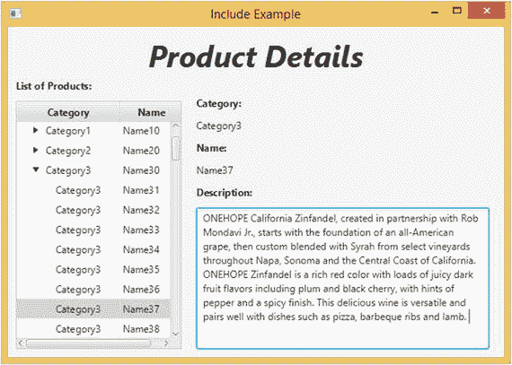

图 4-7。

The IncludeExample program

### 使用 fx:root 创建定制组件

元素允许我们将一个 FXML 文件附加到另一个 FXML 文件中。类似地，`fx:root`元素允许我们将 FXML 文件附加到代码中提供的`Node`上。`fx:root`元素必须是 FXML 文件中的顶级元素。必须为它提供一个`type`属性，该属性决定了需要在代码中创建的`Node`的类型，以便加载这个 FXML 文件。

最简单的形式是，您可以从

```java
<SomeType ...

```

到

```java
<fx:root type="some.package.SomeType" ...

```

在加载 FXML 文件之前，在代码中实例化`SomeType`并将其设置为`FXMLLoader`中的根，如下所示:

```java
SomeType someType = new SomeType();
fxmlLoader.setRoot(someType);
fxmlLoader.load();

```

下一个例子更进一步。它定义了一个扩展 FXML 文件的`fx:root`类型的类，并作为 FXML 文件的根和控制器。它在其构造器中加载 FXML 文件，并使用`initialize()`方法在 FXML 文件中构建的节点之间建立所需的关系。然后，可以像使用本地 JavaFX 节点一样使用该类。以这种方式构造的类称为自定义组件。

我们在这里定义的定制组件是一个简单的复合定制组件，这意味着它由几个节点组成，这些节点共同满足一些业务需求。我们在这个例子中创建的定制组件叫做`ProdId`。它旨在帮助产品 ID 的数据输入，产品 ID 必须具有“A-123456”的形式，其中破折号前只有一个字符，并且必须是“A”或“B”或“c”。破折号后最多可以有六个字符。该程序如清单 4-26 至 4-28 所示。

```java
<?xml version="1.0" encoding="UTF-8"?>

<?import javafx.scene.control.Label?>
<?import javafx.scene.control.TextField?>
<fx:root type="javafx.scene.layout.HBox"
         alignment="BASELINE_LEFT"
         maxHeight="-Infinity"
         maxWidth="-Infinity"
         minHeight="-Infinity"
         minWidth="-Infinity"

         xmlns:fx="http://javafx.com/fxml/1">
    <children>
        <TextField fx:id="prefix" prefColumnCount="1"/>
        <Label text="-"/>
        <TextField fx:id="prodCode" prefColumnCount="6"/>
    </children>
</fx:root>

Listing 4-26.
ProdId.fxml

```

```java
package projavafx.customcomponent;

import javafx.beans.property.SimpleStringProperty;
import javafx.beans.property.StringProperty;
import javafx.fxml.FXML;
import javafx.fxml.FXMLLoader;
import javafx.scene.control.TextField;
import javafx.scene.layout.HBox;

import java.io.IOException;

public class ProdId extends HBox {

    @FXML
    private TextField prefix;

    @FXML
    private TextField prodCode;

    private StringProperty prodId = new SimpleStringProperty();

    public ProdId() throws IOException {
        FXMLLoader fxmlLoader = new FXMLLoader(ProdId.class.getResource("ProdId.fxml"));
        fxmlLoader.setRoot(this);
        fxmlLoader.setController(this);
        fxmlLoader.load();
    }

    @FXML
    public void initialize() {
        prefix.textProperty().addListener((observable, oldValue, newValue) -> {
            switch (newValue) {
                case "A":
                case "B":
                case "C":
                    prodCode.requestFocus();
                    break;
                default:
                    prefix.setText("");
            }
        });
        prodCode.textProperty().addListener((observable, oldValue, newValue) -> {
            if (newValue.length() > 6) {
                prodCode.setText(newValue.substring(0, 6));
            } else if (newValue.length() == 0) {
                prefix.requestFocus();
            }
        });
        prodId.bind(prefix.textProperty().concat("-").concat(prodCode.textProperty()));
    }

    public String getProdId() {
        return prodId.get();
    }

    public StringProperty prodIdProperty() {
        return prodId;
    }

    public void setProdId(String prodId) {
        this.prodId.set(prodId);
    }
}

Listing 4-27.

ProdId.java

```

```java
package projavafx.customcomponent;

import javafx.application.Application;
import javafx.geometry.Insets;
import javafx.geometry.Pos;
import javafx.scene.Scene;
import javafx.scene.control.Label;
import javafx.scene.layout.HBox;
import javafx.scene.layout.VBox;
import javafx.scene.text.Font;
import javafx.stage.Stage;

public class CustomComponent extends Application {
    @Override
    public void start(Stage primaryStage) throws Exception {
        VBox vBox = new VBox(10);
        vBox.setPadding(new Insets(10, 10, 10, 10));
        vBox.setAlignment(Pos.BASELINE_CENTER);

        final Label prodIdLabel = new Label("Enter Product Id:");
        final ProdId prodId = new ProdId();

        final Label label = new Label();
        label.setFont(Font.font(48));
        label.textProperty().bind(prodId.prodIdProperty());

        HBox hBox = new HBox(10);
        hBox.setPadding(new Insets(10, 10, 10, 10));
        hBox.setAlignment(Pos.BASELINE_LEFT);
        hBox.getChildren().addAll(prodIdLabel, prodId);

        vBox.getChildren().addAll(hBox, label);
        Scene scene = new Scene(vBox);
        primaryStage.setTitle("Custom Component Example");
        primaryStage.setScene(scene);
        primaryStage.show();
    }

    public static void main(String[] args) {
        launch(args);
    }
}

Listing 4-28.
CustomComponent.

java

```

注意，在主程序`CustomComponent`类中，我们没有加载任何 FXML 文件。我们简单地实例化了`ProdId`，并继续使用它，就像它是一个本地 JavaFX 节点一样。FXML 文件只是将两个`TextField`和一个`Label`放在一个`HBox`类型`fx:root`中。没有设置`fx:controller`,因为我们想在`ProdId`类的构造器中设置它。除了两个注入的`TextField`之外，我们还有另一个名为`prodId`的`StringProperty`字段，为此我们定义了一个 getter `getProdId()`，一个 setter `setProdId()`和一个 property getter `prodIdProperty()`。

```java
private StringProperty prodId = new SimpleStringProperty();

public String getProdId() {
    return prodId.get();
}

public StringProperty prodIdProperty() {
    return prodId;
}

public void setProdId(String prodId) {
    this.prodId.set(prodId);
}

```

验证需求和便利功能在`initialize()`方法中，当`FXMLLoader`完成加载 FXML 文件时，将调用该方法。我们将`ChangeListener`连接到两个`TextField`的`textProperty`，只允许有效的变更发生。当`prefix`填充了正确的数据时，我们也将光标移动到`prodCode`。同样，当我们从`prodCode`字段后退时，光标会自然地跳到`prefix`文本字段。

```java
@FXML
public void initialize() {
    prefix.textProperty().addListener((observable, oldValue, newValue) -> {
        switch (newValue) {
            case "A":
            case "B":
            case "C":
                prodCode.requestFocus();
                break;
            default:
                prefix.setText("");
        }
    });
    prodCode.textProperty().addListener((observable, oldValue, newValue) -> {
        if (newValue.length() > 6) {
            prodCode.setText(newValue.substring(0, 6));
        } else if (newValue.length() == 0) {
            prefix.requestFocus();
        }
    });
    prodId.bind(prefix.textProperty().concat("-").concat(prodCode.textProperty()));
}

```

当 CustomComponent 程序运行时，显示如图 4-8 所示的自定义组件示例窗口。


图 4-8。

The CustomComponent program

### 使用脚本或控制器属性的事件处理

在上一节中，我们向您介绍了如何使用控制器的方法作为 FXML 文件中节点的事件处理程序。JavaFX 允许另外两种方式在 FXML 文件中设置事件处理程序。一种方法是使用脚本。可以使用任何基于 JSR-223 兼容`javax.script`的脚本引擎。必须在 FXML 文件的顶部指定用于编写脚本的语言。要使用 Oracle JDK 8 附带的 Nashorn JavaScript 引擎，以下处理指令必须出现在 FXML 文件的顶部:

```java
<?language javascript?>

```

元素用于引入脚本。支持内联脚本和外部文件脚本。以下是一个内联脚本:

```java
<fx:script>
    function actionHandler(event) {
        webView.getEngine().load(address.getText());
    }
</fx:script>

```

外部脚本采用以下形式:

```java
<fx:script source="myscript.js"/>

```

FXML 文件中具有`fx:id`的任何节点都可以通过它们的`fx:id`名称从脚本环境中访问。如果 FXML 文件有一个控制器，那么这个控制器就是一个名为`controller`的变量。在`fx:script`部分中声明的变量也可以用作 FXML 文件其余部分的属性中的变量。要使用`fx:script`部分定义的`actionHandler(event)`函数作为事件处理程序，可以指定如下:

```java
<TextField fx:id="address"
           onAction="actionHandler(event)"

```

Caution

如果您的事件处理程序不需要检查事件对象，您可以使用不带参数的函数，或者使用带一个参数作为事件处理程序属性值的函数，比如`onAction`。如果你调用一个只有一个参数的函数，那么你必须将系统提供的事件变量传递给它。

清单 4-29 和 4-30 中的脚本示例说明了使用脚本的事件处理。

```java
<?xml version="1.0" encoding="UTF-8"?>

<?language javascript?>

<?import javafx.geometry.Insets?>
<?import javafx.scene.control.Button?>
<?import javafx.scene.control.TextField?>
<?import javafx.scene.layout.HBox?>
<?import javafx.scene.layout.VBox?>
<?import javafx.scene.web.WebView?>
<VBox maxHeight="-Infinity"
      maxWidth="-Infinity"
      minHeight="-Infinity"
      minWidth="-Infinity"
      prefHeight="400.0"
      prefWidth="600.0"
      spacing="10.0"

      xmlns:fx="http://javafx.com/fxml/1">
    <fx:script>
        function actionHandler(event) {
            webView.getEngine().load(address.getText());
        }
         </fx:script>
    <children>
        <HBox spacing="10.0">
            <children>
                <TextField fx:id="address"
                           onAction="actionHandler(event)"
                           HBox.hgrow="ALWAYS">
                    <padding>
                        <Insets bottom="4.0" left="4.0" right="4.0" top="4.0"/>
                    </padding>
                </TextField>
                <Button fx:id="loadButton"
                        mnemonicParsing="false"
                        onAction="actionHandler(event)"
                        text="Load"/>
            </children>
        </HBox>
        <WebView fx:id="webView"
                 prefHeight="200.0"
                 prefWidth="200.0"
                 VBox.vgrow="ALWAYS"/>
    </children>
    <padding>
        <Insets bottom="10.0" left="10.0" right="10.0" top="10.0"/>
    </padding>
</VBox>

Listing 4-29.
ScriptingExample.

fxml

```

```java
import javafx.application.Application;
import javafx.fxml.FXMLLoader;
import javafx.scene.Scene;
import javafx.scene.layout.VBox;
import javafx.stage.Stage;

public class ScriptingExample extends Application {
    @Override
    public void start(Stage primaryStage) throws Exception {
        FXMLLoader fxmlLoader = new FXMLLoader();
        fxmlLoader.setLocation(
            ScriptingExample.class.getResource("/ScriptingExample.fxml"));
        final VBox vBox = fxmlLoader.load();
        Scene scene = new Scene(vBox, 600, 400);
        primaryStage.setTitle("Scripting Example");
        primaryStage.setScene(scene);
        primaryStage.show();
    }

    public static void main(String[] args) {
        launch(args);
    }
}

Listing 4-30.
ScriptingExample.

java

```

运行 ScriptingExample 时，将显示与图 4-4 非常相似的脚本示例窗口。

您还可以使用变量语法指定事件处理程序:

```java
<TextField fx:id="address"
           onAction="$controller.actionHandler"

```

这将把控制器的`actionHandler`属性设置为`onActionEvent`的事件处理程序。在控制器中，`actionHandler`属性应该有正确的事件处理程序类型。对于`onAction`事件，属性应该如下所示:

```java
@FXML
public EventHandler<ActionEvent> getActionHandler() {
    return event -> {
        // handle the event
    };
}

```

现在我们已经对 FXML 文件格式有了透彻的理解，我们可以有效地利用 GUI 编辑的便利来创建 FXML 文件。

## 使用 JavaFX 场景构建器

在前面的章节中，您学习了 FXML 文件格式的基础知识。在尝试使用和理解 JavaFX Scene Builder 工具时，这些知识会非常有用。在本章的最后一节，我们将深入探讨 JavaFX Scene Builder 的用法。

因为设计 UI 是非常主观的，有时是艺术的努力，所以很大程度上取决于手边的应用程序以及 UI 和用户体验团队的设计敏感度。我们并不假装知道做 UI 设计的最好方法。因此，在本节中，我们将向您介绍 JavaFX Scene Builder 2.0 本身，向您指出 UI 设计器的各个部分，并讨论如何转动旋钮和切换齿轮以实现所需的结果。

### JavaFX 场景构建器概述

当您启动 JavaFX Scene Builder 时，屏幕看起来如图 4-9 所示。


图 4-9。

The JavaFX Scene Builder program

首次启动时，JavaFX Scene Builder UI 顶部有一个菜单栏，屏幕左侧有两个名为 Library 和 Document 的折叠容器，屏幕中间有一个内容面板，屏幕右侧有一个名为 Inspector 的折叠容器。

### 了解菜单栏和菜单项

JavaFX Scene Builder 中有九个菜单。让我们一个一个地检查它们。

文件菜单如图 4-10 所示。

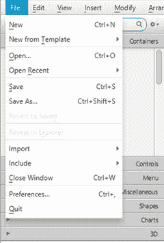

图 4-10。

The File menu

新的、打开、保存、另存为、恢复到已保存、在资源管理器(或 Finder，或桌面)中显示、关闭窗口和退出菜单项做了你认为它们应该做的事情。“从模板新建”菜单项从现有模板创建新的 FXML 文件。模板列表如图 4-11 所示。


图 4-11。

The templates

“导入”菜单项允许您将另一个 FXML 文件的内容复制到当前 FXML 文件中。它还允许您将图像和媒体文件添加到当前 FXML 文件中。这样导入的文件被包装在一个`ImageView`或`MediaView`节点中。“包含”菜单项允许您将一个`fx:include`元素添加到当前的 FXML 文件中。“关闭窗口”菜单项关闭当前窗口中正在编辑的 FXML 文件。“首选项”菜单项允许您设置某些控制 JavaFX Scene Builder 外观的首选项。“退出”菜单项允许您完全退出 JavaFX Scene Builder 应用程序。在关闭应用程序之前，它会要求您保存任何未保存的文件。

编辑菜单如图 4-12 所示。

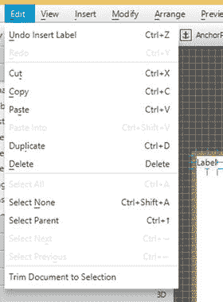

图 4-12。

The Edit menu

撤消、重做、剪切、复制、粘贴、粘贴到、复制、删除、全选、不选、选择父项、选择下一个和选择上一个菜单项都执行它们正常的功能。“根据所选内容裁剪文档”菜单项删除所有未选中的内容。

视图菜单如图 4-13 所示。

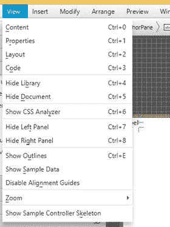

图 4-13。

The View menu

内容菜单项将焦点放在屏幕中间的内容面板上。“属性”、“布局”和“代码”菜单项将焦点放在屏幕右侧检查器面板中的属性、布局或代码部分。“隐藏库”命令隐藏屏幕左侧顶部的“库”面板。一旦库被隐藏，菜单项将改变为显示库。“隐藏文档”菜单项对屏幕左侧底部的“文档”面板执行相同的操作。“显示 CSS 分析器”菜单项显示 CSS 分析器，它最初是不显示的。“隐藏左面板”和“隐藏右面板”菜单项隐藏左面板(库面板和文档面板)或右面板(检查器面板)。“显示轮廓”菜单项显示项目的轮廓。“显示样本数据”菜单项将显示`TreeView`、`TableView`和`TreeTableView`节点的样本数据，以帮助您可视化工作中的节点。示例数据不与 FXML 文件一起保存。“禁用对齐参考线”菜单项禁用在内容面板的容器中移动节点时显示的对齐参考线。这些对齐准则帮助您将节点定位在屏幕上的正确位置。“缩放”菜单项允许您更改内容面板的放大率。Show Sample Controller Skeleton 菜单项将打开一个对话框，显示基于在文档面板中进行的控制器设置和为 FXML 文件中的节点声明的`fx:id`的框架控制器类声明。

图 4-14 显示了带有 CSS 分析器的 JavaFX 场景构建器屏幕。

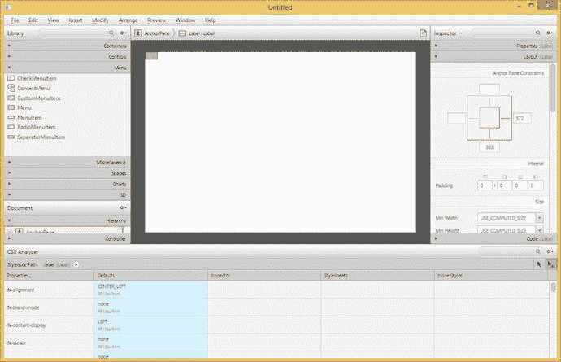

图 4-14。

The JavaFX Scene Builder screen with the CSS Analyzer shown

插入菜单如图 4-15 所示。

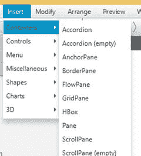

图 4-15。

The Insert menu

“插入”菜单包含子菜单和菜单项，允许您将不同种类的节点插入到内容面板中。子菜单及其菜单项表示与“库”面板中相同的层次结构。它们包括容器、控件、菜单、杂项、形状、图表和 3D 类别。我们将在后续章节中更详细地介绍这些节点。

修改菜单如图 4-16 所示。

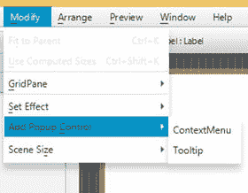

图 4-16。

The Modify menu

“适合父节点”菜单项将扩展所选节点以填充一个`AnchorPane`容器，并将节点锚定到父节点的所有边上。使用计算尺寸菜单项会将所选元素的尺寸调整为`USE_COMPUTED_SIZE`。GridPane 子菜单包含与`GridPane`容器一起工作的项目。“设置效果”子菜单包含可以在当前节点上设置的每个效果的项目。添加弹出控件允许您向选定的节点添加一个`ContextMenu`或一个`Tooltip`。场景大小子菜单允许您将场景的大小更改为一些常见的大小，包括 320×240 (QVGA)、640×480 (VGA)、1280×800 和 1920×1080。

排列菜单如图 4-17 所示。

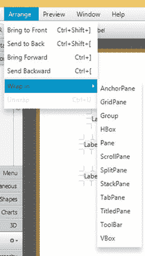

图 4-17。

The Arrange menu

“置于顶层”、“置于底层”、“置于顶层”和“置于底层”菜单项将选定节点移动到重叠节点的 z 顺序的前面、后面、上面或下面。“打包”子菜单包含每种容器类型的项目，并允许您将一组选定节点打包到容器中。例如，您可以选择将两个相邻的`Label`包装成一个`HBox`。“展开”菜单项从选定节点中移除容器。

预览菜单如图 4-18 所示。

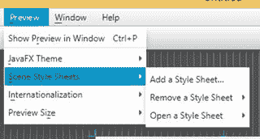

图 4-18。

The Preview menu

“在窗口中显示预览”菜单项允许您在活动窗口中预览场景，以查看它在现实生活中的效果。这是最有用的菜单项，因为你会多次使用它。JavaFX 主题子菜单包含各种主题，您可以使用这些主题预览场景。“场景样式表”子菜单包含允许您添加、移除或编辑在预览期间应用到场景中的样式表的项目。“国际化”子菜单包含允许您添加、移除或编辑在预览期间使用的资源包的项目。预览尺寸子菜单包含预览期间首选屏幕尺寸的项目。

“窗口”菜单允许您在同时编辑的多个 FXML 文件之间切换。

“帮助”菜单显示 JavaFX Scene Builder 的联机帮助和“关于”框。

### 了解库面板

“库”面板位于左侧面板的顶部，可以使用“查看➤”“隐藏库”菜单项隐藏。它包含可以用来构建 UI 的容器和节点。图 4-19 显示了打开容器抽屉的库面板，显示了一些容器。你可以点击其他抽屉，看看里面装的是什么。图 4-20 显示了控件抽屉打开的库面板，显示了一些控件。

“库”面板顶部有一个搜索框。你可以在搜索框中输入一个容器或控件的名称，或者其他抽屉的名称。当您键入时,“库”面板会将其显示从折叠排列更改为单个列表，其中包含名称与搜索框中输入的名称相匹配的所有节点。这使您可以通过名称快速找到一个节点，而不必逐一查看抽屉。图 4-21 显示了搜索模式下的库面板。要退出搜索模式，只需单击搜索框右端的 x 标记。

找到容器或节点后，可以将其拖动到内容面板，拖动到文档面板中的层次树，或者双击它。将容器带到内容面板，然后用控件和其他节点填充容器，这就是在 JavaFX Scene Builder 中构建 UI 的方式。

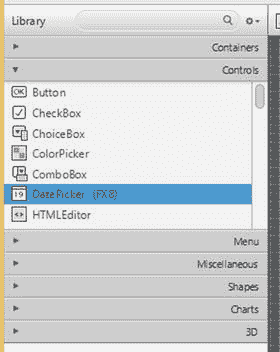

图 4-20。

The Library panel with its Controls drawer open


图 4-19。

The Library panel with its Containers drawer open

搜索框的右侧是一个菜单按钮，其中包含几个菜单项和一个改变“库”面板行为的子菜单。图 4-22 显示了该菜单按钮的可用内容。“以列表形式查看”菜单项将“库”面板从在几个部分中显示其节点更改为一起显示其节点，而不显示部分。“按节查看”将“库”面板从在一个列表中显示其节点更改为在几个节中显示其节点。“导入 JAR/FXML 文件”菜单项允许您将外部 JAR 文件或 FXML 文件作为自定义组件导入 JavaFX Scene Builder。“导入选择”菜单项允许您将当前选定的节点作为自定义组件导入到 JavaFX Scene Builder 中。“自定资源库文件夹”子菜单包含两个菜单项。“在资源管理器中显示”菜单项打开操作系统的文件资源管理器(或 Finder)中保存自定义组件的文件夹，允许您删除任何导入的自定义库。“显示 jar 分析报告”菜单项显示一个报告，该报告显示 JavaFX Scene Builder 对导入的 JAR 文件的评估。

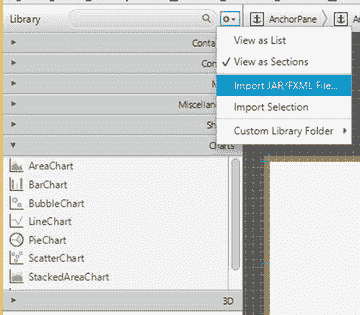

图 4-22。

The Library panel with its menu open

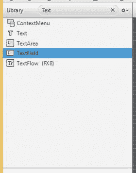

图 4-21。

The Library panel in search mode

为了说明如何将自定义组件导入 JavaFX Scene Builder，我们将上一节的 custom component 示例中的类文件和 FXML 文件打包到一个`CustomComponent.jar`文件中。然后我们调用 Import JAR/FXML File 菜单项，导航到目录，并选择要导入的`CustomComponent.jar`文件。我们一点击文件选择对话框中的打开按钮，JavaFX Scene Builder 就会打开导入对话框，如图 4-23 所示。


图 4-23。

The Import dialog for importing `CustomComponent.jar`

我们可以通过单击左侧列表中的定制组件名称来检查 jar 文件中包含的每个定制组件。关于所选定制组件的信息，包括定制组件的可视化表示，显示在屏幕的右侧。我们可以通过选择组件名称旁边的复选框来选择要导入的自定义组件。然后，我们单击 Import Component 按钮完成导入过程。导入后，ProdId 自定义组件将显示在“库”面板的“自定义”部分，并且可以添加到构建的任何其他 ui 中。

### 了解文档面板

文档面板位于左侧面板的底部，可以使用“查看➤”“隐藏文档”菜单项隐藏。它包含两个部分。“层次结构”部分显示添加到内容面板的所有节点的树视图，按包含关系组织。因为内容面板中节点的布局可能会使从内容面板中选择节点变得棘手，所以在“文档”面板的“层次结构”部分进行选择可能会更容易。

图 4-24 显示了清单 4-4 中 FXMLLoaderExample 中 FXML 文件的文档面板的层次结构部分。您可以看到选择 WebView 节点后展开的节点树。

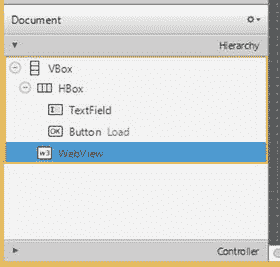

图 4-24。

The Hierarchy section of the Document panel for `FXMLLoaderExample.fxml`

控制器部分显示关于 FXML 文件控制器的信息。图 4-25 显示了清单 4-7 中 FXMLInjectionExample 中 FXML 文件的文档面板控制器部分。您可以在此部分设置控制器类的名称。在本节中，您还可以选择使用 FXML 文件的`fx:root`结构。您还会看到一个带有已经设置好的`fx:id`的节点列表，您可以通过单击 Assigned fx:id 表中的行来选择节点。

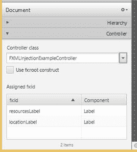

图 4-25。

The Controller section of the Document panel for `FXMLInjectionExample.fxml`

文档面板的右上角有一个菜单按钮。它包含一个层次显示子菜单，该子菜单有三个菜单项，如图 4-26 所示。Info 菜单项使 Hierarchy 部分显示每个节点及其一般信息，通常也显示在同一节点的内容面板中。fx:id 菜单项使 Hierarchy 部分显示每个节点及其 fx:id(如果已设置)。“节点 ID”菜单项使“层次”部分显示每个节点及其节点 Id(如果已设置)。CSS 使用节点 ID 来查找节点并操作节点的样式。

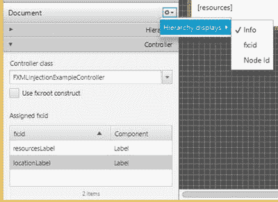

图 4-26。

The Document panel with its menu open

### 了解内容面板

内容面板是组成 UI 的地方。首先将一个容器拖动到内容面板。然后，将其他节点拖到内容面板上，并定位到容器节点上。当您拖动节点时，当您拖动的节点到达特定的对齐和间距位置时，会出现红色的指引线。在这些指导方针的帮助下，您应该能够创建视觉上令人愉悦的 ui。

在内容面板上方，有一个面包屑条，显示内容区域中所选节点的路径。这使您可以轻松导航到当前选定节点的包含节点。出现这种情况时，JavaFX Scene Builder 会在该栏中显示警告和错误消息。

JavaFX Scene Builder 的一个便利功能是，当您选择了几个节点时，您可以通过右键单击选定的节点，选择“包裹”子菜单，然后选择其中一种容器类型来进入上下文菜单。也可以通过这种方式展开节点，移除包含该节点的任何容器。

图 4-27 显示了清单 4-20 中的`IncludeExampleTree.fxml`文件正在 JavaFX 场景构建器中编辑。

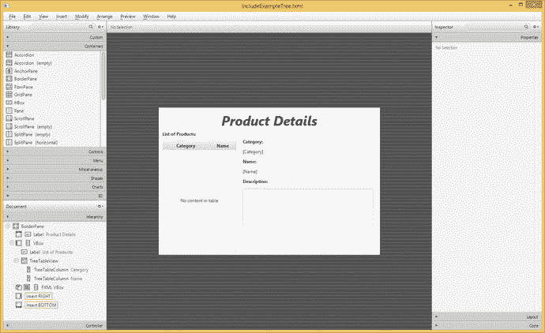

图 4-27。

The `IncludeExampleTree.fxml` file being edited in JavaFX Scene Builder

### 了解检查器面板

检查器面板位于右侧面板中，可以使用“查看➤”“隐藏右侧面板”菜单项隐藏。它包含属性、布局和代码部分。“属性”部分列出了内容面板中选定节点的所有常规属性。您可以通过更改此处显示的值来设置属性。您还可以通过调用属性右侧的小菜单按钮将属性改回默认值。您可以在 ID 属性编辑器的属性部分设置节点 ID。图 4-28 显示了检查器面板的属性部分。

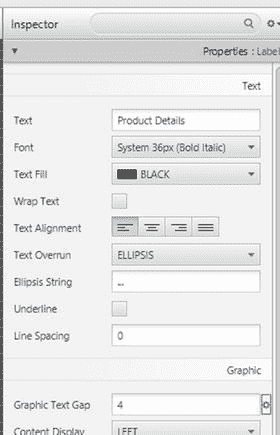

图 4-28。

The Properties section of the Inspector panel

布局部分列出了当前选定节点的所有与布局相关的属性。图 4-29 显示了检查器面板的布局剖面。

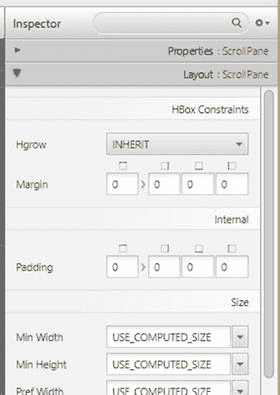

图 4-29。

The Layout section of the Inspector panel

代码部分列出了内容面板中选定节点可能拥有的所有事件处理程序。它还允许您设置所选节点的`fx:id`。您可以在代码部分以任何方式连接事件处理程序，但是提供事件处理程序最方便的方式是将它们设置为控制器中正确签名的方法。图 4-30 显示了检查面板的代码部分。

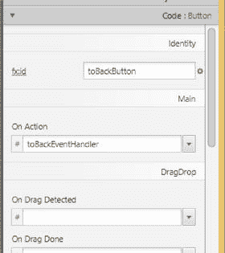

图 4-30。

The Code section of the Inspector panel

## 摘要

在本章中，您学习了在 JavaFX 中创建 UI 的声明式方法。您学习了以下重要工具和信息:

*   FXML 文件是声明性 UI 信息的载体，是 JavaFX 项目的核心资产。
*   FXML 文件由`FXMLLoader`加载到 JavaFX 应用程序中。加载的结果是一个可以合并到一个`Scene`中的节点。
*   FXML 文件可以有一个配套的控制器类，它在运行时代表 FXML 文件中声明的节点执行编程功能，如事件处理。
*   FXML 文件可以在您喜欢的 Java IDEs 中使用智能建议和补全功能轻松编辑。
*   FXML 文件也可以在 Gluon Scene Builder 9.0 中编辑，这是一个用于编辑 FXML 文件的开源工具。
*   JavaFX Scene Builder 是指定 JavaFX UIs 的高效工具。您可以将容器、控件和其他 JavaFX 节点添加到 FXML 文件的内容中。
*   您可以设置一个控制器，并定义场景中各个节点的`fx:ids`。
*   通过操作“文档”面板的“层次”部分中的容器、控件和其他节点，可以组织 FXML 文件中的层次信息。
*   通过使用“检查器”面板中的“属性”、“布局”和“代码”部分，可以操作 FXML 文件中节点的属性。
*   您可以在内容面板中直观地编写您的 UI。
*   你可以用 CSS 分析器分析用户界面的 CSS。

## 资源

*   胶子场景生成器信息站点: [`http://gluonhq.com/products/scene-builder`](http://gluonhq.com/products/scene-builder)
*   Jasper Pott 的博文宣布发布 JavaFX 场景构建器 2.0: [`http://fxexperience.com/2014/05/announcing-scenebuilder-2-0/`](http://fxexperience.com/2014/05/announcing-scenebuilder-2-0/)
*   展示 JavaFX Scene Builder 2.0 功能的九分钟视频(伴随 Jasper Pott 的发布): [`https://www.youtube.com/watch?v=ij0HwRAlCmo&feature=youtu.be`](https://www.youtube.com/watch%3Fv=ij0HwRAlCmo%26feature=youtu.be)
*   e(fx)clipse Eclipse 插件为 Eclipse IDEs 提供 JavaFX 支持: [`www.eclipse.org/efxclipse/install.html`](http://www.eclipse.org/efxclipse/install.html)