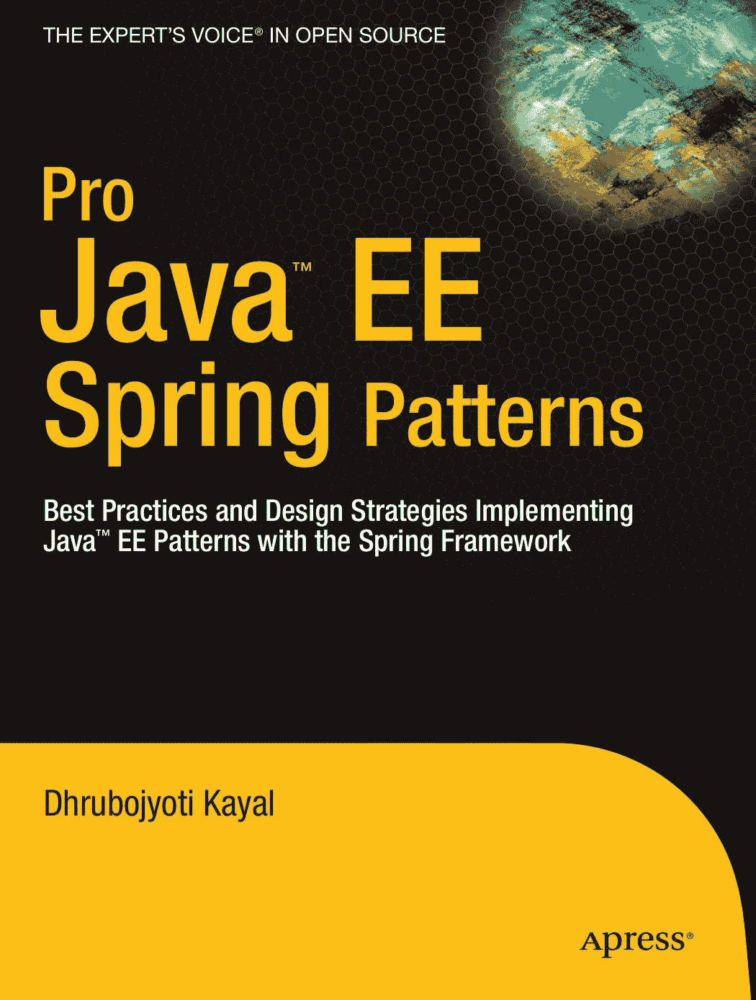


青色

黄色

品红

黑色

潘通 123 C

面向专业人士的书籍 由专业人士撰写®

开源领域的专家之声®

**配套**

**Pro Java**™ **EE Spring 模式：**

Pro Ja**电子书已提供**

**最佳实践与设计策略：使用 Spring 框架实现**

**Java**™ **EE 模式**

亲爱的读者们，

在撰写本文时，我已经使用 Spring 框架加速 Java™ EE 项目三年了。对于那些曾为复杂的 Java EE 编程模型（尤其是 EJB™ API）而苦恼的人来说，Spring 框架将是一个令人欣喜的改变。Spring 结合 Java EE 模式和 IDE 支持，为敏捷的 Java EE 应用程序开发铺平了道路。

我经常将 Spring 框架与 Java EE 设计模式结合使用，以简化应用程序的设计与开发，并且一直希望将这些解决方案记录下来并分享给 Java EE 社区，以便于参考。这本书给了我一个机会，来整理并与您分享这些 Spring Java™ EE 模式。

我相信您会发现这本手册在日常的应用程序设计与开发中非常有用。虽然本书主要关注设计，但您也会找到大量可运行的示例和可复用的代码，以便轻松掌握所介绍的概念。

阅读本书后，您将对使用 Java EE 模式和 Spring 框架进行应用程序设计有一个全新的视角。本书介绍的概念，以及基于 Spring 框架的示例，将帮助您快速上手敏捷的 Java EE 项目设计与开发。此外，您还可以结合 IDE 支持来补充这些知识，进一步提升您的项目效率。

祝阅读愉快，

Dhrubo

APRESS 路线图

配套电子书

Pro Spring 2.5

Beginning Spring

Pro Java™ EE

Spring 模式

详情请见末页，了解 $10 电子书版本

Spring Recipes

Kayal

ISBN 978-1-4302-1009-2

Dhrubojyoti Kayal

www.apress.com

5 4 4 9 9

**US $44.99**

分类：Java 编程

用户级别：

9 781430 210092

中级-高级

**此印刷品仅用于内容——尺寸和颜色不准确**

**书脊 = 0.802 英寸 344 页**

10092FM.qxd 2008 年 7 月 31 日 下午 3:30 第 i 页

Pro Java™ EE Spring

模式

最佳实践与设计策略

使用 Spring 框架实现

Java™ EE 模式

Dhrubojyoti Kayal

10092FM.qxd 2008 年 7 月 31 日 下午 3:30 第 ii 页

**Pro Java™ EE Spring 模式：使用 Spring 框架实现 Java™ EE 模式的最佳实践与设计策略**

**版权所有 © 2008 归 Dhrubojyoti Kayal 所有**

保留所有权利。未经版权所有者及出版人事先书面许可，不得以任何形式或任何方式（包括电子、机械、影印、录制或任何信息存储与检索系统）复制或传播本作品的任何部分。

ISBN-13（平装本）：978-1-4302-1009-2

ISBN-13（电子版）：978-1-4302-1010-8

在美国印刷装订 9 8 7 6 5 4 3 2 1

本书中可能出现商标名称。我们不在每次出现商标名称时都使用商标符号，仅以编辑方式使用这些名称，以利于商标所有者，无意侵犯商标权。

Java™ 及所有基于 Java 的标记是 Sun Microsystems, Inc. 在美国及其他国家的商标或注册商标。Apress, Inc. 与 Sun Microsystems, Inc. 无关联，且本书的编写未获得 Sun Microsystems, Inc. 的认可。

首席编辑：Steve Anglin, Tom Welsh

技术审校：Prosenjit Bhattacharyya

编辑委员会：Clay Andres, Steve Anglin, Ewan Buckingham, Tony Campbell, Gary Cornell, Jonathan Gennick, Matthew Moodie, Joseph Ottinger, Jeffrey Pepper, Frank Pohlmann, Ben Renow-Clarke, Dominic Shakeshaft, Matt Wade, Tom Welsh

项目经理：Kylie Johnston


文字编辑：Kim Wimpsett

副制作总监：Kari Brooks-Copony

制作编辑：Laura Cheu、Liz Berry

排版员：Dina Quan

校对员：Linda Seifert

索引编制：Ron Strauss

封面设计：Kurt Krames

制作总监：Tom Debolski

本书通过 Springer-Verlag New York, Inc. 在全球图书贸易中发行，地址：233 Spring Street, 6th Floor, New York, NY 10013。电话：1-800-SPRINGER，传真：201-348-4505，电子邮件：orders-ny@springer-sbm.com，或访问 [`www.springeronline.com`](http://www.springeronline.com)。

如需了解翻译相关信息，请联系 Apress，地址：2855 Telegraph Avenue, Suite 600, Berkeley, CA 94705。电话：510-549-5930，传真：510-549-5939，电子邮件：info@apress.com，或访问

[`www.apress.com`](http://www.apress.com)。

Apress 和 friends of ED 的书籍可批量购买，用于学术、企业或促销用途。

大多数图书也提供电子书版本和许可证。如需更多信息，请参考我们的特殊批量销售–电子书许可网页：[`www.apress.com/info/bulksales`](http://www.apress.com/info/bulksales)。

本书中的信息按“原样”分发，不提供任何担保。尽管在编写本书时已采取了一切预防措施，但作者和 Apress 均不对任何个人或实体因本书所含信息直接或间接导致的任何损失或损害承担任何责任。

本书的源代码可供读者在 [`www.apress.com`](http://www.apress.com) 获取。

10092FM.qxd 7/31/08 3:30 PM 第 iii 页

*献给我的父母和我的妻子。*

10092FM.qxd 7/31/08 3:30 PM 第 iv 页

10092FM.qxd 7/31/08 3:30 PM 第 v 页

内容概览

关于作者 . . . . . . . . . . . . . . . . . . . . . . . . . . . . . . . . . . . . . . . . . . . . . . . . . . . . . . . . . . . . . . . . . xiii

关于技术审校 . . . . . . . . . . . . . . . . . . . . . . . . . . . . . . . . . . . . . . . . . . . . . . . . . . . . . . . . . . . . . xv

致谢 . . . . . . . . . . . . . . . . . . . . . . . . . . . . . . . . . . . . . . . . . . . . . . . . . . . . . . . . . . . . . . . . . . . . . xvii

引言 . . . . . . . . . . . . . . . . . . . . . . . . . . . . . . . . . . . . . . . . . . . . . . . . . . . . . . . . . . . . . . . . . . . . . . xix

**■第 1 章**

企业级 Java 应用架构与设计介绍

. . . . . . . . . . . . . . . . . . . . . . . . . . . . . . . . . . . . . . . . . . . . . . . . . . . . . 1

**■第 2 章**

使用 Spring 框架简化企业级 Java 应用

. . . . . . . . . . . . . . . . . . . . . . . . . . . . . . . . . . . . . . . . . . . . . 21

**■第 3 章**

探索表示层设计模式 . . . . . . . . . . . . . . . . . . . . . . . . . . . . . . . . . . . . . . 41

**■第 4 章**

探索业务层设计模式 . . . . . . . . . . . . . . . . . . . . . . . . . . . . . . . . . . . . 135

**■第 5 章**

探索集成层设计模式 . . . . . . . . . . . . . . . . . . . . . . . . . . . . . . . . . . . . . 179

**■第 6 章**

探索横切设计模式 . . . . . . . . . . . . . . . . . . . . . . . . . . . . . . . . . . . . . . 223

**■第 7 章**

案例研究：构建订单管理系统 . . . . . . . . . . . . . . . . . . . . . . . . . . . . . 269

**■索引** . . . . . . . . . . . . . . . . . . . . . . . . . . . . . . . . . . . . . . . . . . . . . . . . . . . . . . . . . . . . . . . . . . . . . . . 311

**v**

10092FM.qxd 7/31/08 3:30 PM 第 vi 页

10092FM.qxd 7/31/08 3:30 PM 第 vii 页

目录

关于作者 . . . . . . . . . . . . . . . . . . . . . . . . . . . . . . . . . . . . . . . . . . . . . . . . . . . . . . . . . . . . . . . . . xiii

关于技术审校 . . . . . . . . . . . . . . . . . . . . . . . . . . . . . . . . . . . . . . . . . . . . . . . . . . . . . . . . . . . . . xv

致谢 . . . . . . . . . . . . . . . . . . . . . . . . . . . . . . . . . . . . . . . . . . . . . . . . . . . . . . . . . . . . . . . . . . . . . xvii

引言 . . . . . . . . . . . . . . . . . . . . . . . . . . . . . . . . . . . . . . . . . . . . . . . . . . . . . . . . . . . . . . . . . . . . . . xix

**■第 1 章**

**企业级 Java 应用架构与设计介绍**

. . . . . . . . . . . . . . . . . . . . . . . . . . . . . . . . . . . . . . . . . . . . . . . . . . . . . 1

分布式计算的演进 . . . . . . . . . . . . . . . . . . . . . . . . . . . . . . . . . . . . . . . . . . . . . . . . . . . 2

单层架构 . . . . . . . . . . . . . . . . . . . . . . . . . . . . . . . . . . . . . . . . . . . . . . . . . . . . . . . . . 2

双层架构 . . . . . . . . . . . . . . . . . . . . . . . . . . . . . . . . . . . . . . . . . . . . . . . . . . . . . . . . . . 3

三层架构 . . . . . . . . . . . . . . . . . . . . . . . . . . . . . . . . . . . . . . . . . . . . . . . . . . . . . . . . . . 4

N 层架构 . . . . . . . . . . . . . . . . . . . . . . . . . . . . . . . . . . . . . . . . . . . . . . . . . . . . . . . . . . 4

Java EE 架构 . . . . . . . . . . . . . . . . . . . . . . . . . . . . . . . . . . . . . . . . . . . . . . . . . . . . . . 5

Java EE 应用设计 . . . . . . . . . . . . . . . . . . . . . . . . . . . . . . . . . . . . . . . . . . . . . . . . . . . . . . . . . 11

使用模式简化应用设计 . . . . . . . . . . . . . . . . . . . . . . . . . . . . . . . . . . . . . . . . . . . . . 11

Java EE 设计模式目录 . . . . . . . . . . . . . . . . . . . . . . . . . . . . . . . . . . . . . . . . . . . . . . . . . . 12

使用 UML 进行 Java EE 架构与设计 . . . . . . . . . . . . . . . . . . . . . . . . . . . . . . . . . . . . . . 14

类图 . . . . . . . . . . . . . . . . . . . . . . . . . . . . . . . . . . . . . . . . . . . . . . . . . . . . . . . . . . . . . . . . 15

时序图 . . . . . . . . . . . . . . . . . . . . . . . . . . . . . . . . . . . . . . . . . . . . . . . . . . . . . . . . . . . . . . . . 18

小结 . . . . . . . . . . . . . . . . . . . . . . . . . . . . . . . . . . . . . . . . . . . . . . . . . . . . . . . . . . . . . . . . . . . 19

**■第 2 章**

**使用 Spring 框架简化企业级 Java 应用**

. . . . . . . . . . . . . . . . . . . . . . . . . . . . . . . . . . . . . . . . . . . . . . . . . . . . . 21

什么是 Spring？ . . . . . . . . . . . . . . . . . . . . . . . . . . . . . . . . . . . . . . . . . . . . . . . . . . . . . . . . 21

为什么 Spring 如此重要？ . . . . . . . . . . . . . . . . . . . . . . . . . . . . . . . . . . . . . . . . . . . . . . . . . . 22

Spring 框架的构建模块 . . . . . . . . . . . . . . . . . . . . . . . . . . . . . . . . . . . . . . . . . . . . . . . . . . 24

Spring Core . . . . . . . . . . . . . . . . . . . . . . . . . . . . . . . . . . . . . . . . . . . . . . . . . . . . . . . . . . . 25

Spring AOP . . . . . . . . . . . . . . . . . . . . . . . . . . . . . . . . . . . . . . . . . . . . . . . . . . . . . . . . . . . 34

**vii**

10092FM.qxd 7/31/08 3:30 PM 第 viii 页

**viii**

**■**目 录

Spring DAO . . . . . . . . . . . . . . . . . . . . . . . . . . . . . . . . . . . . . . . . . . . . . . . . . . . . . . . . . . . . 34

Spring ORM . . . . . . . . . . . . . . . . . . . . . . . . . . . . . . . . . . . . . . . . . . . . . . . . . . . . . . . . . . . 35


JEE . . . . . . . . . . . . . . . . . . . . . . . . . . . . . . . . . . . . . . . . . . . . . . . . . . . . . . . 35

Web MVC. . . . . . . . . . . . . . . . . . . . . . . . . . . . . . . . . . . . . . . . . . . . . . . . . . 35

使用 Spring 构建分层应用 . . . . . . . . . . . . . . . . . . . . . . . . . . . . . . . 35

表示层 . . . . . . . . . . . . . . . . . . . . . . . . . . . . . . . . . . . . . . . . . . . 36

业务层 . . . . . . . . . . . . . . . . . . . . . . . . . . . . . . . . . . . . . . . . . . . . . . 37

集成层 . . . . . . . . . . . . . . . . . . . . . . . . . . . . . . . . . . . . . . . . . . . . . 38

Spring 企业级 Java 设计模式指南 . . . . . . . . . . . . . . . . . . . . . . . . . . . 38

名称 . . . . . . . . . . . . . . . . . . . . . . . . . . . . . . . . . . . . . . . . . . . . . . . . . . . . . 38

问题 . . . . . . . . . . . . . . . . . . . . . . . . . . . . . . . . . . . . . . . . . . . . . . . . . . . 39

影响因素 . . . . . . . . . . . . . . . . . . . . . . . . . . . . . . . . . . . . . . . . . . . . . . . . . . . . 39

解决方案 . . . . . . . . . . . . . . . . . . . . . . . . . . . . . . . . . . . . . . . . . . . . . . . . . . . 39

影响 . . . . . . . . . . . . . . . . . . . . . . . . . . . . . . . . . . . . . . . . . . . . . . 39

总结. . . . . . . . . . . . . . . . . . . . . . . . . . . . . . . . . . . . . . . . . . . . . . . . . . . . . . . 39

**■第 3 章**

**探索表示层设计模式**. . . . . . . . . . . . . . . . . . . . . . . . . . . . . . . . . . . . . . . . . . . . . . . . . . . . . . . . . . . . . . . . . . . . . . . . . . . . . . . . . . . . . . . . . . . . . . . . . . . . . . . . . . . . . . . . . . . . . . . . . . . . . . . . . . . . . . . . . . . . . . . . . . . . . . . . . . . . . . . . . . . . . . . . . . . . . . . . . . . . . . . . . . . . . . . . . . . . . . . . . . . . . . . . . . . . . . . . . . . . . . . . . . . . . . . . . . . . . . . . . . . . . . . . . . . . . . . . . . . . . . . . . . . . . . . . . . . . . . . . . . . . . . . . . . . . . . . . . . . . . . . . . . . . . . . . . . . . . . . . . . . . . . . . . . . . . . . . . . . . . . . . . . . . . . . . . . . . . . . . . . . . . . . . . . . . . . . . . . . . . . . . . . . . . . . . . . . . . . . . . . . . . . . . . . . . . . . . . . . . . . . . . . . . . . . . . . . . . . . . . . . . . . . . . . . . . . . . . . . . . . . . . . . . . . . . . . . . . . . . . . . . . . . . . . . . . . . . . . . . . . . . . . . . . . . . . . . . . . . . . . . . . . . . . . . . . . . . . . . . . . . . . . . . . . . . . . . . . . . . . . . . . . . . . . . . . . . . . . . . . . . . . . . . . . . . . . . . . . . . . . . . . . . . . . . . . . . . . . . . . . . . . . . . . . . . . . . . . . . . . . . . . . . . . . . . . . . . . . . . . . . . . . . . . . . . . . . . . . . . . . . . . . . . . . . . . . . . . . . . . . . . . . . . . . . . . . . . . . . . . . . . . . . . . . . . . . . . . . . . . . . . . . . . . . . . . . . . . . . . . . . . . . . . . . . . . . . . . . . . . . . . . . . . . . . . . . . . . . . . . . . . . . . . . . . . . . . . . . . . . . . . . . . . . . . . . . . . . . . . . . . . . . . . . . . . . . . . . . . . . . . . . . . . . . . . . . . . . . . . . . . . . . . . . . . . . . . . . . . . . . . . . . . . . . . . . . . . . . . . . . . . . . . . . . . . . . . . . . . . . . . . . . . . . . . . . . . . . . . . . . . . . . . . . . . . . . . . . . . . . . . . . . . . . . . . . . . . . . . . . . . . . . . . . . . . . . . . . . . . . . . . . . . . . . . . . . . . . . . . . . . . . . . . . . . . . . . . . . . . . . . . . . . . . . . . . . . . . . . . . . . . . . . . . . . . . . . . . . . . . . . . . . . . . . . . . . . . . . . . . . . . . . . . . . . . . . . . . . . . . . . . . . . . . . . . . . . . . . . . . . . . . . . . . . . . . . . . . . . . . . . . . . . . . . . . . . . . . . . . . . . . . . . . . . . . . . . . . . . . . . . . . . . . . . . . . . . . . . . . . . . . . . . . . . . . . . . . . . . . . . . . . . . . . . . . . . . . . . . . . . . . . . . . . . . . . . . . . . . . . . . . . . . . . . . . . . . . . . . . . . . . . . . . . . . . . . . . . . . . . . . . . . . . . . . . . . . . . . . . . . . . . . . . . . . . . . . . . . . . . . . . . . . . . . . . . . . . . . . . . . . . . . . . . . . . . . . . . . . . . . . . . . . . . . . . . . . . . . . . . . . . . . . . . . . . . . . . . . . . . . . . . . . . . . . . . . . . . . . . . . . . . . . . . . . . . . . . . . . . . . . . . . . . . . . . . . . . . . . . . . . . . . . . . . . . . . . . . . . . . . . . . . . . . . . . . . . . . . . . . . . . . . . . . . . . . . . . . . . . . . . . . . . . . . . . . . . . . . . . . . . . . . . . . . . . . . . . . . . . . . . . . . . . . . . . . . . . . . . . . . . . . . . . . . . . . . . . . . . . . . . . . . . . . . . . . . . . . . . . . . . . . . . . . . . . . . . . . . . . . . . . . . . . . . . . . . . . . . . . . . . . . . . . . . . . . . . . . . . . . . . . . . . . . . . . . . . . . . . . . . . . . . . . . . . . . . . . . . . . . . . . . . . . . . . . . . . . . . . . . . . . . . . . . . . . . . . . . . . . . . . . . . . . . . . . . . . . . . . . . . . . . . . . . . . . . . . . . . . . . . . . . . . . . . . . . . . . . . . . . . . . . . . . . . . . . . . . . . . . . . . . . . . . . . . . . . . . . . . . . . . . . . . . . . . . . . . . . . . . . . . . . . . . . . . . . . . . . . . . . . . . . . . . . . . . . . . . . . . . . . . . . . . . . . . . . . . . . . . . . . . . . . . . . . . . . . . . . . . . . . . . . . . . . . . . . . . . . . . . . . . . . . . . . . . . . . . . . . . . . . . . . . . . . . . . . . . . . . . . . . . . . . . . . . . . . . . . . . . . . . . . . . . . . . . . . . . . . . . . . . . . . . . . . . . . . . . . . . . . . . . . . . . . . . . . . . . . . . . . . . . . . . . . . . . . . . . . . . . . . . . . . . . . . . . . . . . . . . . . . . . . . . . . . . . . . . . . . . . . . . . . . . . . . . . . . . . . . . . . . . . . . . . . . . . . . . . . . . . . . . . . . . . . . . . . . . . . . . . . . . . . . . . . . . . . . . . . . . . . . . . . . . . . . . . . . . . . . . . . . . . . . . . . . . . . . . . . . . . . . . . . . . . . . . . . . . . . . . . . . . . . . . . . . . . . . . . . . . . . . . . . . . . . . . . . . . . . . . . . . . . . . . . . . . . . . . . . . . . . . . . . . . . . . . . . . . . . . . . . . . . . . . . . . . . . . . . . . . . . . . . . . . . . . . . . . . . . . . . . . . . . . . . . . . . . . . . . . . . . . . . . . . . . . . . . . . . . . . . . . . . . . . . . . . . . . . . . . . . . . . . . . . . . . . . . . . . . . . . . . . . . . . . . . . . . . . . . . . . . . . . . . . . . . . . . . . . . . . . . . . . . . . . . . . . . . . . . . . . . . . . . . . . . . . . . . . . . . . . . . . . . . . . . . . . . . . . . . . . . . . . . . . . . . . . . . . . . . . . . . . . . . . . . . . . . . . . . . . . . . . . . . . . . . . . . . . . . . . . . . . . . . . . . . . . . . . . . . . . . . . . . . . . . . . . . . . . . . . . . . . . . . . . . . . . . . . . . . . . . . . . . . . . . . . . . . . . . . . . . . . . . . . . . . . . . . . . . . . . . . . . . . . . . . . . . . . . . . . . . . . . . . . . . . . . . . . . . . . . . . . . . . . . . . . . . . . . . . . . . . . . . . . . . . . . . . . . . . . . . . . . . . . . . . . . . . . . . . . . . . . . . . . . . . . . . . . . . . . . . . . . . . . . . . . . . . . . . . . . . . . . . . . . . . . . . . . . . . . . . . . . . . . . . . . . . . . . . . . . . . . . . . . . . . . . . . . . . . . . . . . . . . . . . . . . . . . . . . . . . . . . . . . . . . . . . . . . . . . . . . . . . . . . . . . . . . . . . . . . . . . . . . . . . . . . . . . . . . . . . . . . . . . . . . . . . . . . . . . . . . . . . . . . . . . . . . . . . . . . . . . . . . . . . . . . . . . . . . . . . . . . . . . . . . . . . . . . . . . . . . . . . . . . . . . . . . . . . . . . . . . . . . . . . . . . . . . . . . . . . . . . . . . . . . . . . . . . . . . . . . . . . . . . . . . . . . . . . . . . . . . . . . . . . . . . . . . . . . . . . . . . . . . . . . . . . . . . . . . . . . . . . . . . . . . . . . . . . . . . . . . . . . . . . . . . . . . . . . . . . . . . . . . . . . . . . . . . . . . . . . . . . . . . . . . . . . . . . . . . . . . . . . . . . . . . . . . . . . . . . . . . . . . . . . . . . . . . . . . . . . . . . . . . . . . . . . . . . . . . . . . . . . . . . . . . . . . . . . . . . . . . . . . . . . . . . . . . . . . . . . . . . . . . . . . . . . . . . . . . . . . . . . . . . . . . . . . . . . . . . . . . . . . . . . . . . . . . . . . . . . . . . . . . . . . . . . . . . . . . . . . . . . . . . . . . . . . . . . . . . . . . . . . . . . . . . . . . . . . . . . . . . . . . . . . . . . . . . . . . . . . . . . . . . . . . . . . . . . . . . . . . . . . . . . . . . . . . . . . . . . . . . . . . . . . . . . . . . . . . . . . . . . . . . . . . . . . . . . . . . . . . . . . . . . . . . . . . . . . . . . . . . . . . . . . . . . . . . . . . . . . . . . . . . . . . . . . . . . . . . . . . . . . . . . . . . . . . . . . . . . . . . . . . . . . . . . . . . . . . . . . . . . . . . . . . . . . . . . . . . . . . . . . . . . . . . . . . . . . . . . . . . . . . . . . . . . . . . . . . . . . . . . . . . . . . . . . . . . . . . . . . . . . . . . . . . . . . . . . . . . . . . . . . . . . . . . . . . . . . . . . . . . . . . . . . . . . . . . . . . . . . . . . . . . . . . . . . . . . . . . . . . . . . . . . . . . . . . . . . . . . . . . . . . . . . . . . . . . . . . . . . . . . . . . . . . . . . . . . . . . . . . . . . . . . . . . . . . . . . . . . . . . . . . . . . . . . . . . . . . . . . . . . . . . . . . . . . . . . . . . . . . . . . . . . . . . . . . . . . . . . . . . . . . . . . . . . . . . . . . . . . . . . . . . . . . . . . . . . . . . . . . . . . . . . . . . . . . . . . . . . . . . . . . . . . . . . . . . . . . . . . . . . . . . . . . . . . . . . . . . . . . . . . . . . . . . . . . . . . . . . . . . . . . . . . . . . . . . . . . . . . . . . . . . . . . . . . . . . . . . . . . . . . . . . . . . . . . . . . . . . . . . . . . . . . . . . . . . . . . . . . . . . . . . . . . . . . . . . . . . . . . . . . . . . . . . . . . . . . . . . . . . . . . . . . . . . . . . . . . . . . . . . . . . . . . . . . . . . . . . . . . . . . . . . . . . . . . . . . . . . . . . . . . . . . . . . . . . . . . . . . . . . . . . . . . . . . . . . . . . . . . . . . . . . . . . . . . . . . . . . . . . . . . . . . . . . . . . . . . . . . . . . . . . . . . . . . . . . . . . . . . . . . . . . . . . . . . . . . . . . . . . . . . . . . . . . . . . . . . . . . . . . . . . . . . . . . . . . . . . . . . . . . . . . . . . . . . . . . . . . . . . . . . . . . . . . . . . . . . . . . . . . . . . . . . . . . . . . . . . . . . . . . . . . . . . . . . . . . . . . . . . . . . . . . . . . . . . . . . . . . . . . . . . . . . . . . . . . . . . . . . . . . . . . . . . . . . . . . . . . . . . . . . . . . . . . . . . . . . . . . . . . . . . . . . . . . . . . . . . . . . . . . . . . . . . . . . . . . . . . . . . . . . . . . . . . . . . . . . . . . . . . . . . . . . . . . . . . . . . . . . . . . . . . . . . . . . . . . . . . . . . . . . . . . . . . . . . . . . . . . . . . . . . . . . . . . . . . . . . . . . . . . . . . . . . . . . . . . . . . . . . . . . . . . . . . . . . . . . . . . . . . . . . . . . . . . . . . . . . . . . . . . . . . . . . . . . . . . . . . . . . . . . . . . . . . . . . . . . . . . . . . . . . . . . . . . . . . . . . . . . . . . . . . . . . . . . . . . . . . . . . . . . . . . . . . . . . . . . . . . . . . . . . . . . . . . . . . . . . . . . . . . . . . . . . . . . . . . . . . . . . . . . . . . . . . . . . . . . . . . . . . . . . . . . . . . . . . . . . . . . . . . . . . . . . . . . . . . . . . . . . . . . . . . . . . . . . . . . . . . . . . . . . . . . . . . . . . . . . . . . . . . . . . . . . . . . . . . . . . . . . . . . . . . . . . . . . . . . . . . . . . . . . . . . . . . . . . . . . . . . . . . . . . . . . . . . . . . . . . . . . . . . . . . . . . . . . . . . . . . . . . . . . . . . . . . . . . . . . . . . . . . . . . . . . . . . . . . . . . . . . . . . . . . . . . . . . . . . . . . . . . . . . . . . . . . . . . . . . . . . . . . . . . . . . . . . . . . . . . . . . . . . . . . . . . . . . . . . . . . . . . . . . . . . . . . . . . . . . . . . . . . . . . . . . . . . . . . . . . . . . . . . . . . . . . . . . . . . . . . . . . . . . . . . . . . . . . . . . . . . . . . . . . . . . . . . . . . . . . . . . . . . . . . . . . . . . . . . . . . . . . . . . . . . . . . . . . . . . . . . . . . . . . . . . . . . . . . . . . . . . . . . . . . . . . . . . . . . . . . . . . . . . . . . . . . . . . . . . . . . . . . . . . . . . . . . . . . . . . . . . . . . . . . . . . . . . . . . . . . . . . . . . . . . . . . . . . . . . . . . . . . . . . . . . . . . . . . . . . . . . . . . . . . . . . . . . . . . . . . . . . . . . . . . . . . . . . . . . . . . . . . . . . . . . . . . . . . . . . . . . . . . . . . . . . . . . . . . . . . . . . . . . . . . . . . . . . . . . . . . . . . . . . . . . . . . . . . . . . . . . . . . . . . . . . . . . . . . . . . . . . . . . . . . . . . . . . . . . . . . . . . . . . . . . . . . . . . . . . . . . . . . . . . . . . . . . . . . . . . . . . . . . . . . . . . . . . . . . . . . . . . . . . . . . . . . . . . . . . . . . . . . . . . . . . . . . . . . . . . . . . . . . . . . . . . . . . . . . . . . . . . . . . . . . . . . . . . . . . . . . . . . . . . . . . . . . . . . . . . . . . . . . . . . . . . . . . . . . . . . . . . . . . . . . . . . . . . . . . . . . . . . . . . . . . . . . . . . . . . . . . . . . . . . . . . . . . . . . . . . . . . . . . . . . . . . . . . . . . . . . . . . . . . . . . . . . . . . . . . . . . . . . . . . . . . . . . . . . . . . . . . . . . . . . . . . . . . . . . . . . . . . . . . . . . . . . . . . . . . . . . . . . . . . . . . . . . . . . . . . . . . . . . . . . . . . . . . . . . . . . . . . . . . . . . . . . . . . . . . . . . . . . . . . . . . . . . . . . . . . . . . . . . . . . . . . . . . . . . . . . . . . . . . . . . . . . . . . . . . . . . . . . . . . . . . . . . . . . . . . . . . . . . . . . . . . . . . . . . . . . . . . . . . . . . . . . . . . . . . . . . . . . . . . . . . . . . . . . . . . . . . . . . . . . . . . . . . . . . . . . . . . . . . . . . . . . . . . . . . . . . . . . . . . . . . . . . . . . . . . . . . . . . . . . . . . . . . . . . . . . . . . . . . . . . . . . . . . . . . . . . . . . . . . . . . . . . . . . . . . . . . . . . . . . . . . . . . . . . . . . . . . . . . . . . . . . . . . . . . . . . . . . . . . . . . . . . . . . . . . . . . . . . . . . . . . . . . . . . . . . . . . . . . . . . . . . . . . . . . . . . . . . . . . . . . . . . . . . . . . . . . . . . . . . . . . . . . . . . . . . . . . . . . . . . . . . . . . . . . . . . . . . . . . . . . . . . . . . . . . . . . . . . . . . . . . . . . . . . . . . . . . . . . . . . . . . . . . . . . . . . . . . . . . . . . . . . . . . . . . . . . . . . . . . . . . . . . . . . . . . . . . . . . . . . . . . . . . . . . . . . . . . . . . . . . . . . . . . . . . . . . . . . . . . . . . . . . . . . . . . . . . . . . . . . . . . . . . . . . . . . . . . . . . . . . . . . . . . . . . . . . . . . . . . . . . . . . . . . . . . . . . . . . . . . . . . . . . . . . . . . . . . . . . . . . . . . . . . . . . . . . . . . . . . . . . . . . . . . . . . . . . . . . . . . . . . . . . . . . . . . . . . . . . . . . . . . . . . . . . . . . . . . . . . . . . . . . . . . . . . . . . . . . . . . . . . . . . . . . . . . . . . . . . . . . . . . . . . . . . . . . . . . . . . . . . . . . . . . . . . . . . . . . . . . . . . . . . . . . . . . . . . . . . . . . . . . . . . . . . . . . . . . . . . . . . . . . . . . . . . . . . . . . . . . . . . . . . . . . . . . . . . . . . . . . . . . . . . . . . . . . . . . . . . . . . . . . . . . . . . . . . . . . . . . . . . . . . . . . . . . . . . . . . . . . . . . . . . . . . . . . . . . . . . . . . . . . . . . . . . . . . . . . . . . . . . . . . . . . . . . . . . . . . . . . . . . . . . . . . . . . . . . . . . . . . . . . . . . . . . . . . . . . . . . . . . . . . . . . . . . . . . . . . . . . . . . . . . . . . . . . . . . . . . . . . . . . . . . . . . . . . . . . . . . . . . . . . . . . . . . . . . . . . . . . . . . . . . . . . . . . . . . . . . . . . . . . . . . . . . . . . . . . . . . . . . . . . . . . . . . . . . . . . . . . . . . . . . . . . . . . . . . . . . . . . . . . . . . . . . . . . . . . . . . . . . . . . . . . . . . . . . . . . . . . . . . . . . . . . . . . . . . . . . . . . . . . . . . . . . . . . . . . . . . . . . . . . . . . . . . . . . . . . . . . . . . . . . . . . . . . . . . . . . . . . . . . . . . . . . . . . . . . . . . . . . . . . . . . . . . . . . . . . . . . . . . . . . . . . . . . . . . . . . . . . . . . . . . . . . . . . . . . . . . . . . . . . . . . . . . . . . . . . . . . . . . . . . . . . . . . . . . . . . . . . . . . . . . . . . . . . . . . . . . . . . . . . . . . . . . . . . . . . . . . . . . . . . . . . . . . . . . . . . . . . . . . . . . . . . . . . . . . . . . . . . . . . . . . . . . . . . . . . . . . . . . . . . . . . . . . . . . . . . . . . . . . . . . . . . . . . . . . . . . . . . . . . . . . . . . . . . . . . . . . . . . . . . . . . . . . . . . . . . . . . . . . . . . . . . . . . . . . . . . . . . . . . . . . . . . . . . . . . . . . . . . . . . . . . . . . . . . . . . . . . . . . . . . . . . . . . . . . . . . . . . . . . . . . . . . . . . . . . . . . . . . . . . . . . . . . . . . . . . . . . . . . . . . . . . . . . . . . . . . . . . . . . . . . . . . . . . . . . . . . . . . . . . . . . . . . . . . . . . . . . . . . . . . . . . . . . . . . . . . . . . . . . . . . . . . . . . . . . . . . . . . . . . . . . . . . . . . . . . . . . . . . . . . . . . . . . . . . . . . . . . . . . . . . . . . . . . . . . . . . . . . . . . . . . . . . . . . . . . . . . . . . . . . . . . . . . . . . . . . . . . . . . . . . . . . . . . . . . . . . . . . . . . . . . . . . . . . . . . . . . . . . . . . . . . . . . . . . . . . . . . . . . . . . . . . . . . . . . . . . . . . . . . . . . . . . . . . . . . . . . . . . . . . . . . . . . . . . . . . . . . . . . . . . . . . . . . . . . . . . . . . . . . . . . . . . . . . . . . . . . . . . . . . . . . . . . . . . . . . . . . . . . . . . . . . . . . . . . . . . . . . . . . . . . . . . . . . . . . . . . . . . . . . . . . . . . . . . . . . . . . . . . . . . . . . . . . . . . . . . . . . . . . . . . . . . . . . . . . . . . . . . . . . . . . . . . . . . . . . . . . . . . . . . . . . . . . . . . . . . . . . . . . . . . . . . . . . . . . . . . . . . . . . . . . . . . . . . . . . . . . . . . . . . . . . . . . . . . . . . . . . . . . . . . . . . . . . . . . . . . . . . . . . . . . . . . . . . . . . . . . . . . . . . . . . . . . . . . . . . . . . . . . . . . . . . . . . . . . . . . . . . . . . . . . . . . . . . . . . . . . . . . . . . . . . . . . . . . . . . . . . . . . . . . . . . . . . . . . . . . . . . . . . . . . . . . . . . . . . . . . . . . . . . . . . . . . . . . . . . . . . . . . . . . . . . . . . . . . . . . . . . . . . . . . . . . . . . . . . . . . . . . . . . . . . . . . . . . . . . . . . . . . . . . . . . . . . . . . . . . . . . . . . . . . . . . . . . . . . . . . . . . . . . . . . . . . . . . . . . . . . . . . . . . . . . . . . . . . . . . . . . . . . . . . . . . . . . . . . . . . . . . . . . . . . . . . . . . . . . . . . . . . . . . . . . . . . . . . . . . . . . . . . . . . . . . . . . . . . . . . . . . . . . . . . . . . . . . . . . . . . . . . . . . . . . . . . . . . . . . . . . . . . . . . . . . . . . . . . . . . . . . . . . . . . . . . . . . . . . . . . . . . . . . . . . . . . . . . . . . . . . . . . . . . . . . . . . . . . . . . . . . . . . . . . . . . . . . . . . . . . . . . . . . . . . . . . . . . . . . . . . . . . . . . . . . . . . . . . . . . . . . . . . . . . . . . . . . . . . . . . . . . . . . . . . . . . . . . . . . . . . . . . . . . . . . . . . . . . . . . . . . . . . . . . . . . . . . . . . . . . . . . . . . . . . . . . . . . . . . . . . . . . . . . . . . . . . . . . . . . . . . . . . . . . . . . . . . . . . . . . . . . . . . . . . . . . . . . . . . . . . . . . . . . . . . . . . . . . . . . . . . . . . . . . . . . . . . . . . . . . . . . . . . . . . . . . . . . . . . . . . . . . . . . . . . . . . . . . . . . . . . . . . . . . . . . . . . . . . . . . . . . . . . . . . . . . . . . . . . . . . . . . . . . . . . . . . . . . . . . . . . . . . . . . . . . . . . . . . . . . . . . . . . . . . . . . . . . . . . . . . . . . . . . . . . . . . . . . . . . . . . . . . . . . . . . . . . . . . . . . . . . . . . . . . . . . . . . . . . . . . . . . . . . . . . . . . . . . . . . . . . . . . . . . . . . . . . . . . . . . . . . . . . . . . . . . . . . . . . . . . . . . . . . . . . . . . . . . . . . . . . . . . . . . . . . . . . . . . . . . . . . . . . . . . . . . . . . . . . . . . . . . . . . . . . . . . . . . . . . . . . . . . . . . . . . . . . . . . . . . . . . . . . . . . . . . . . . . . . . . . . . . . . . . . . . . . . . . . . . . . . . . . . . . . . . . . . . . . . . . . . . . . . . . . . . . . . . . . . . . . . . . . . . . . . . . . . . . . . . . . . . . . . . . . . . . . . . . . . . . . . . . . . . . . . . . . . . . . . . . . . . . . . . . . . . . . . . . . . . . . . . . . . . . . . . . . . . . . . . . . . . . . . . . . . . . . . . . . . . . . . . . . . . . . . . . . . . . . . . . . . . . . . . . . . . . . . . . . . . . . . . . . . . . . . . . . . . . . . . . . . . . . . . . . . . . . . . . . . . . . . . . . . . . . . . . . . . . . . . . . . . . . . . . . . . . . . . . . . . . . . . . . . . . . . . . . . . . . . . . . . . . . . . . . . . . . . . . . . . . . . . . . . . . . . . . . . . . . . . . . . . . . . . . . . . . . . . . . . . . . . . . . . . . . . . . . . . . . . . . . . . . . . . . . . . . . . . . . . . . . . . . . . . . . . . . . . . . . . . . . . . . . . . . . . . . . . . . . . . . . . . . . . . . . . . . . . . . . . . . . . . . . . . . . . . . . . . . . . . . . . . . . . . . . . . . . . . . . . . . . . . . . . . . . . . . . . . . . . . . . . . . . . . . . . . . . . . . . . . . . . . . . . . . . . . . . . . . . . . . . . . . . . . . . . . . . . . . . . . . . . . . . . . . . . . . . . . . . . . . . . . . . . . . . . . . . . . . . . . . . . . . . . . . . . . . . . . . . . . . . . . . . . . . . . . . . . . . . . . . . . . . . . . . . . . . . . . . . . . . . . . . . . . . . . . . . . . . . . . . . . . . . . . . . . . . . . . . . . . . . . . . . . . . . . . . . . . . . . . . . . . . . . . . . . . . . . . . . . . . . . . . . . . . . . . . . . . . . . . . . . . . . . . . . . . . . . . . . . . . . . . . . . . . . . . . . . . . . . . . . . . . . . . . . . . . . . . . . . . . . . . . . . . . . . . . . . . . . . . . . . . . . . . . . . . . . . . . . . . . . . . . . . . . . . . . . . . . . . . . . . . . . . . . . . . . . . . . . . . . . . . . . . . . . . . . . . . . . . . . . . . . . . . . . . . . . . . . . . . . . . . . . . . . . . . . . . . . . . . . . . . . . . . . . . . . . . . . . . . . . . . . . . . . . . . . . . . . . . . . . . . . . . . . . . . . . . . . . . . . . . . . . . . . . . . . . . . . . . . . . . . . . . . . . . . . . . . . . . . . . . . . . . . . . . . . . . . . . . . . . . . . . . . . . . . . . . . . . . . . . . . . . . . . . . . . . . . . . . . . . . . . . . . . . . . . . . . . . . . . . . . . . . . . . . . . . . . . . . . . . . . . . . . . . . . . . . . . . . . . . . . . . . . . . . . . . . . . . . . . . . . . . . . . . . . . . . . . . . . . . . . . . . . . . . . . . . . . . . . . . . . . . . . . . . . . . . . . . . . . . . . . . . . . . . . . . . . . . . . . . . . . . . . . . . . . . . . . . . . . . . . . . . . . . . . . . . . . . . . . . . . . . . . . . . . . . . . . . . . . . . . . . . . . . . . . . . . . . . . . . . . . . . . . . . . . . . . . . . . . . . . . . . . . . . . . . . . . . . . . . . . . . . . . . . . . . . . . . . . . . . . . . . . . . . . . . . . . . . . . . . . . . . . . . . . . . . . . . . . . . . . . . . . . . . . . . . . . . . . . . . . . . . . . . . . . . . . . . . . . . . . . . . . . . . . . . . . . . . . . . . . . . . . . . . . . . . . . . . . . . . . . . . . . . . . . . . . . . . . . . . . . . . . . . . . . . . . . . . . . . . . . . . . . . . . . . . . . . . . . . . . . . . . . . . . . . . . . . . . . . . . . . . . . . . . . . . . . . . . . . . . . . . . . . . . . . . . . . . . . . . . . . . . . . . . . . . . . . . . . . . . . . . . . . . . . . . . . . . . . . . . . . . . . . . . . . . . . . . . . . . . . . . . . . . . . . . . . . . . . . . . . . . . . . . . . . . . . . . . . . . . . . . . . . . . . . . . . . . . . . . . . . . . . . . . . . . . . . . . . . . . . . . . . . . . . . . . . . . . . . . . . . . . . . . . . . . . . . . . . . . . . . . . . . . . . . . . . . . . . . . . . . . . . . . . . . . . . . . . . . . . . . . . . . . . . . . . . . . . . . . . . . . . . . . . . . . . . . . . . . . . . . . . . . . . . . . . . . . . . . . . . . . . . . . . . . . . . . . . . . . . . . . . . . . . . . . . . . . . . . . . . . . . . . . . . . . . . . . . . . . . . . . . . . . . . . . . . . . . . . . . . . . . . . . . . . . . . . . . . . . . . . . . . . . . . . . . . . . . . . . . . . . . . . . . . . . . . . . . . . . . . . . . . . . . . . . . . . . . . . . . . . . . . . . . . . . . . . . . . . . . . . . . . . . . . . . . . . . . . . . . . . . . . . . . . . . . . . . . . . . . . . . . . . . . . . . . . . . . . . . . . . . . . . . . . . . . . . . . . . . . . . . . . . . . . . . . . . . . . . . . . . . . . . . . . . . . . . . . . . . . . . . . . . . . . . . . . . . . . . . . . . . . . . . . . . . . . . . . . . . . . . . . . . . . . . . . . . . . . . . . . . . . . . . . . . . . . . . . . . . . . . . . . . . . . . . . . . . . . . . . . . . . . . . . . . . . . . . . . . . . . . . . . . . . . . . . . . . . . . . . . . . . . . . . . . . . . . . . . . . . . . . . . . . . . . . . . . . . . . . . . . . . . . . . . . . . . . . . . . . . . . . . . . . . . . . . . . . . . . . . . . . . . . . . . . . . . . . . . . . . . . . . . . . . . . . . . . . . . . . . . . . . . . . . . . . . . . . . . . . . . . . . . . . . . . . . . . . . . . . . . . . . . . . . . . . . . . . . . . . . . . . . . . . . . . . . . . . . . . . . . . . . . . . . . . . . . . . . . . . . . . . . . . . . . . . . . . . . . . . . . . . . . . . . . . . . . . . . . . . . . . . . . . . . . . . . . . . . . . . . . . . . . . . . . . . . . . . . . . . . . . . . . . . . . . . . . . . . . . . . . . . . . . . . . . . . . . . . . . . . . . . . . . . . . . . . . . . . . . . . . . . . . . . . . . . . . . . . . . . . . . . . . . . . . . . . . . . . . . . . . . . . . . . . . . . . . . . . . . . . . . . . . . . . . . . . . . . . . . . . . . . . . . . . . . . . . . . . . . . . . . . . . . . . . . . . . . . . . . . . . . . . . . . . . . . . . . . . . . . . . . . . . . . . . . . . . . . . . . . . . . . . . . . . . . . . . . . . . . . . . . . . . . . . . . . . . . . . . . . . . . . . . . . . . . . . . . . . . . . . . . . . . . . . . . . . . . . . . . . . . . . . . . . . . . . . . . . . . . . . . . . . . . . . . . . . . . . . . . . . . . . . . . . . . . . . . . . . . . . . . . . . . . . . . . . . . . . . . . . . . . . . . . . . . . . . . . . . . . . . . . . . . . . . . . . . . . . . . . . . . . . . . . . . . . . . . . . . . . . . . . . . . . . . . . . . . . . . . . . . . . . . . . . . . . . . . . . . . . . . . . . . . . . . . . . . . . . . . . . . . . . . . . . . . . . . . . . . . . . . . . . . . . . . . . . . . . . . . . . . . . . . . . . . . . . . . . . . . . . . . . . . . . . . . . . . . . . . . . . . . . . . . . . . . . . . . . . . . . . . . . . . . . . . . . . . . . . . . . . . . . . . . . . . . . . . . . . . . . . . . . . . . . . . . . . . . . . . . . . . . . . . . . . . . . . . . . . . . . . . . . . . . . . . . . . . . . . . . . . . . . . . . . . . . . . . . . . . . . . . . . . . . . . . . . . . . . . . . . . . . . . . . . . . . . . . . . . . . . . . . . . . . . . . . . . . . . . . . . . . . . . . . . . . . . . . . . . . . . . . . . . . . . . . . . . . . . . . . . . . . . . . . . . . . . . . . . . . . . . . . . . . . . . . . . . . . . . . . . . . . . . . . . . . . . . . . . . . . . . . . . . . . . . . . . . . . . . . . . . . . . . . . . . . . . . . . . . . . . . . . . . . . . . . . . . . . . . . . . . . . . . . . . . . . . . . . . . . . . . . . . . . . . . . . . . . . . . . . . . . . . . . . . . . . . . . . . . . . . . . . . . . . . . . . . . . . . . . . . . . . . . . . . . . . . . . . . . . . . . . . . . . . . . . . . . . . . . . . . . . . . . . . . . . . . . . . . . . . . . . . . . . . . . . . . . . . . . . . . . . . . . . . . . . . . . . . . . . . . . . . . . . . . . . . . . . . . . . . . . . . . . . . . . . . . . . . . . . . . . . . . . . . . . . . . . . . . . . . . . . . . . . . . . . . . . . . . . . . . . . . . . . . . . . . . . . . . . . . . . . . . . . . . . . . . . . . . . . . . . . . . . . . . . . . . . . . . . . . . . . . . . . . . . . . . . . . . . . . . . . . . . . . . . . . . . . . . . . . . . . . . . . . . . . . . . . . . . . . . . . . . . . . . . . . . . . . . . . . . . . . . . . . . . . . . . . . . . . . . . . . . . . . . . . . . . . . . . . . . . . . . . . . . . . . . . . . . . . . . . . . . . . . . . . . . . . . . . . . . . . . . . . . . . . . . . . . . . . . . . . . . . . . . . . . . . . . . . . . . . . . . . . . . . . . . . . . . . . . . . . . . . . . . . . . . . . . . . . . . . . . . . . . . . . . . . . . . . . . . . . . . . . . . . . . . . . . . . . . . . . . . . . . . . . . . . . . . . . . . . . . . . . . . . . . . . . . . . . . . . . . . . . . . . . . . . . . . . . . . . . . . . . . . . . . . . . . . . . . . . . . . . . . . . . . . . . . . . . . . . . . . . . . . . . . . . . . . . . . . . . . . . . . . . . . . . . . . . . . . . . . . . . . . . . . . . . . . . . . . . . . . . . . . . . . . . . . . . . . . . . . . . . . . . . . . . . . . . . . . . . . . . . . . . . . . . . . . . . . . . . . . . . . . . . . . . . . . . . . . . . . . . . . . . . . . . . . . . . . . . . . . . . . . . . . . . . . . . . . . . . . . . . . . . . . . . . . . . . . . . . . . . . . . . . . . . . . . . . . . . . . . . . . . . . . . . . . . . . . . . . . . . . . . . . . . . . . . . . . . . . . . . . . . . . . . . . . . . . . . . . . . . . . . . . . . . . . . . . . . . . . . . . . . . . . . . . . . . . . . . . . . . . . . . . . . . . . . . . . . . . . . . . . . . . . . . . . . . . . . . . . . . . . . . . . . . . . . . . . . . . . . . . . . . . . . . . . . . . . . . . . . . . . . . . . . . . . . . . . . . . . . . . . . . . . . . . . . . . . . . . . . . . . . . . . . . . . . . . . . . . . . . . . . . . . . . . . . . . . . . . . . . . . . . . . . . . . . . . . . . . . . . . . . . . . . . . . . . . . . . . . . . . . . . . . . . . . . . . . . . . . . . . . . . . . . . . . . . . . . . . . . . . . . . . . . . . . . . . . . . . . . . . . . . . . . . . . . . . . . . . . . . . . . . . . . . . . . . . . . . . . . . . . . . . . . . . . . . . . . . . . . . . . . . . . . . . . . . . . . . . . . . . . . . . . . . . . . . . . . . . . . . . . . . . . . . . . . . . . . . . . . . . . . . . . . . . . . . . . . . . . . . . . . . . . . . . . . . . . . . . . . . . . . . . . . . . . . . . . . . . . . . . . . . . . . . . . . . . . . . . . . . . . . . . . . . . . . . . . . . . . . . . . . . . . . . . . . . . . . . . . . . . . . . . . . . . . . . . . . . . . . . . . . . . . . . . . . . . . . . . . . . . . . . . . . . . . . . . . . . . . . . . . . . . . . . . . . . . . . . . . . . . . . . . . . . . . . . . . . . . . . . . . . . . . . . . . . . . . . . . . . . . . . . . . . . . . . . . . . . . . . . . . . . . . . . . . . . . . . . . . . . . . . . . . . . . . . . . . . . . . . . . . . . . . . . . . . . . . . . . . . . . . . . . . . . . . . . . . . . . . . . . . . . . . . . . . . . . . . . . . . . . . . . . . . . . . . . . . . . . . . . . . . . . . . . . . . . . . . . . . . . . . . . . . . . . . . . . . . . . . . . . . . . . . . . . . . . . . . . . . . . . . . . . . . . . . . . . . . . . . . . . . . . . . . . . . . . . . . . . . . . . . . . . . . . . . . . . . . . . . . . . . . . . . . . . . . . . . . . . . . . . . . . . . . . . . . . . . . . . . . . . . . . . . . . . . . . . . . . . . . . . . . . . . . . . . . . . . . . . . . . . . . . . . . . . . . . . . . . . . . . . . . . . . . . . . . . . . . . . . . . . . . . . . . . . . . . . . . . . . . . . . . . . . . . . . . . . . . . . . . . . . . . . . . . . . . . . . . . . . . . . . . . . . . . . . . . . . . . . . . . . . . . . . . . . . . . . . . . . . . . . . . . . . . . . . . . . . . . . . . . . . . . . . . . . . . . . . . . . . . . . . . . . . . . . . . . . . . . . . . . . . . . . . . . . . . . . . . . . . . . . . . . . . . . . . . . . . . . . . . . . . . . . . . . . . . . . . . . . . . . . . . . . . . . . . . . . . . . . . . . . . . . . . . . . . . . . . . . . . . . . . . . . . . . . . . . . . . . . . . . . . . . . . . . . . . . . . . . . . . . . . . . . . . . . . . . . . . . . . . . . . . . . . . . . . . . . . . . . . . . . . . . . . . . . . . . . . . . . . . . . . . . . . . . . . . . . . . . . . . . . . . . . . . . . . . . . . . . . . . . . . . . . . . . . . . . . . . . . . . . . . . . . . . . . . . . . . . . . . . . . . . . . . . . . . . . . . . . . . . . . . . . . . . . . . . . . . . . . . . . . . . . . . . . . . . . . . . . . . . . . . . . . . . . . . . . . . . . . . . . . . . . . . . . . . . . . . . . . . . . . . . . . . . . . . . . . . . . . . . . . . . . . . . . . . . . . . . . . . . . . . . . . . . . . . . . . . . . . . . . . . . . . . . . . . . . . . . . . . . . . . . . . . . . . . . . . . . . . . . . . . . . . . . . . . . . . . . . . . . . . . . . . . . . . . . . . . . . . . . . . . . . . . . . . . . . . . . . . . . . . . . . . . . . . . . . . . . . . . . . . . . . . . . . . . . . . . . . . . . . . . . . . . . . . . . . . . . . . . . . . . . . . . . . . . . . . . . . . . . . . . . . . . . . . . . . . . . . . . . . . . . . . . . . . . . . . . . . . . . . . . . . . . . . . . . . . . . . . . . . . . . . . . . . . . . . . . . . . . . . . . . . . . . . . . . . . . . . . . . . . . . . . . . . . . . . . . . . . . . . . . . . . . . . . . . . . . . . . . . . . . . . . . . . . . . . . . . . . . . . . . . . . . . . . . . . . . . . . . . . . . . . . . . . . . . . . . . . . . . . . . . . . . . . . . . . . . . . . . . . . . . . . . . . . . . . . . . . . . . . . . . . . . . . . . . . . . . . . . . . . . . . . . . . . . . . . . . . . . . . . . . . . . . . . . . . . . . . . . . . . . . . . . . . . . . . . . . . . . . . . . . . . . . . . . . . . . . . . . . . . . . . . . . . . . . . . . . . . . . . . . . . . . . . . . . . . . . . . . . . . . . . . . . . . . . . . . . . . . . . . . . . . . . . . . . . . . . . . . . . . . . . . . . . . . . . . . . . . . . . . . . . . . . . . . . . . . . . . . . . . . . . . . . . . . . . . . . . . . . . . . . . . . . . . . . . . . . . . . . . . . . . . . . . . . . . . . . . . . . . . . . . . . . . . . . . . . . . . . . . . . . . . . . . . . . . . . . . . . . . . . . . . . . . . . . . . . . . . . . . . . . . . . . . . . . . . . . . . . . . . . . . . . . . . . . . . . . . . . . . . . . . . . . . . . . . . . . . . . . . . . . . . . . . . . . . . . . . . . . . . . . . . . . . . . . . . . . . . . . . . . . . . . . . . . . . . . . . . . . . . . . . . . . . . . . . . . . . . . . . . . . . . . . . . . . . . . . . . . . . . . . . . . . . . . . . . . . . . . . . . . . . . . . . . . . . . . . . . . . . . . . . . . . . . . . . . . . . . . . . . . . . . . . . . . . . . . . . . . . . . . . . . . . . . . . . . . . . . . . . . . . . . . . . . . . . . . . . . . . . . . . . . . . . . . . . . . . . . . . . . . . . . . . . . . . . . . . . . . . . . . . . . . . . . . . . . . . . . . . . . . . . . . . . . . . . . . . . . . . . . . . . . . . . . . . . . . . . . . . . . . . . . . . . . . . . . . . . . . . . . . . . . . . . . . . . . . . . . . . . . . . . . . . . . . . . . . . . . . . . . . . . . . . . . . . . . . . . . . . . . . . . . . . . . . . . . . . . . . . . . . . . . . . . . . . . . . . . . . . . . . . . . . . . . . . . . . . . . . . . . . . . . . . . . . . . . . . . . . . . . . . . . . . . . . . . . . . . . . . . . . . . . . . . . . . . . . . . . . . . . . . . . . . . . . . . . . . . . . . . . . . . . . . . . . . . . . . . . . . . . . . . . . . . . . . . . . . . . . . . . . . . . . . . . . . . . . . . . . . . . . . . . . . . . . . . . . . . . . . . . . . . . . . . . . . . . . . . . . . . . . . . . . . . . . . . . . . . . . . . . . . . . . . . . . . . . . . . . . . . . . . . . . . . . . . . . . . . . . . . . . . . . . . . . . . . . . . . . . . . . . . . . . . . . . . . . . . . . . . . . . . . . . . . . . . . . . . . . . . . . . . . . . . . . . . . . . . . . . . . . . . . . . . . . . . . . . . . . . . . . . . . . . . . . . . . . . . . . . . . . . . . . . . . . . . . . . . . . . . . . . . . . . . . . . . . . . . . . . . . . . . . . . . . . . . . . . . . . . . . . . . . . . . . . . . . . . . . . . . . . . . . . . . . . . . . . . . . . . . . . . . . . . . . . . . . . . . . . . . . . . . . . . . . . . . . . . . . . . . . . . . . . . . . . . . . . . . . . . . . . . . . . . . . . . . . . . . . . . . . . . . . . . . . . . . . . . . . . . . . . . . . . . . . . . . . . . . . . . . . . . . . . . . . . . . . . . . . . . . . . . . . . . . . . . . . . . . . . . . . . . . . . . . . . . . . . . . . . . . . . . . . . . . . . . . . . . . . . . . . . . . . . . . . . . . . . . . . . . . . . . . . . . . . . . . . . . . . . . . . . . . . . . . . . . . . . . . . . . . . . . . . . . . . . . . . . . . . . . . . . . . . . . . . . . . . . . . . . . . . . . . . . . . . . . . . . . . . . . . . . . . . . . . . . . . . . . . . . . . . . . . . . . . . . . . . . . . . . . . . . . . . . . . . . . . . . . . . . . . . . . . . . . . . . . . . . . . . . . . . . . . . . . . . . . . . . . . . . . . . . . . . . . . . . . . . . . . . . . . . . . . . . . . . . . . . . . . . . . . . . . . . . . . . . . . . . . . . . . . . . . . . . . . . . . . . . . . . . . . . . . . . . . . . . . . . . . . . . . . . . . . . . . . . . . . . . . . . . . . . . . . . . . . . . . . . . . . . . . . . . . . . . . . . . . . . . . . . . . . . . . . . . . . . . . . . . . . . . . . . . . . . . . . . . . . . . . . . . . . . . . . . . . . . . . . . . . . . . . . . . . . . . . . . . . . . . . . . . . . . . . . . . . . . . . . . . . . . . . . . . . . . . . . . . . . . . . . . . . . . . . . . . . . . . . . . . . . . . . . . . . . . . . . . . . . . . . . . . . . . . . . . . . . . . . . . . . . . . . . . . . . . . . . . . . . . . . . . . . . . . . . . . . . . . . . . . . . . . . . . . . . . . . . . . . . . . . . . . . . . . . . . . . . . . . . . . . . . . . . . . . . . . . . . . . . . . . . . . . . . . . . . . . . . . . . . . . . . . . . . . . . . . . . . . . . . . . . . . . . . . . . . . . . . . . . . . . . . . . . . . . . . . . . . . . . . . . . . . . . . . . . . . . . . . . . . . . . . . . . . . . . . . . . . . . . . . . . . . . . . . . . . . . . . . . . . . . . . . . . . . . . . . . . . . . . . . . . . . . . . . . . . . . . . . . . . . . . . . . . . . . . . . . . . . . . . . . . . . . . . . . . . . . . . . . . . . . . . . . . . . . . . . . . . . . . . . . . . . . . . . . . . . . . . . . . . . . . . . . . . . . . . . . . . . . . . . . . . . . . . . . . . . . . . . . . . . . . . . . . . . . . . . . . . . . . . . . . . . . . . . . . . . . . . . . . . . . . . . . . . . . . . . . . . . . . . . . . . . . . . . . . . . . . . . . . . . . . . . . . . . . . . . . . . . . . . . . . . . . . . . . . . . . . . . . . . . . . . . . . . . . . . . . . . . . . . . . . . . . . . . . . . . . . . . . . . . . . . . . . . . . . . . . . . . . . . . . . . . . . . . . . . . . . . . . . . . . . . . . . . . . . . . . . . . . . . . . . . . . . . . . . . . . . . . . . . . . . . . . . . . . . . . . . . . . . . . . . . . . . . . . . . . . . . . . . . . . . . . . . . . . . . . . . . . . . . . . . . . . . . . . . . . . . . . . . . . . . . . . . . . . . . . . . . . . . . . . . . . . . . . . . . . . . . . . . . . . . . . . . . . . . . . . . . . . . . . . . . . . . . . . . . . . . . . . . . . . . . . . . . . . . . . . . . . . . . . . . . . . . . . . . . . . . . . . . . . . . . . . . . . . . . . . . . . . . . . . . . . . . . . . . . . . . . . . . . . . . . . . . . . . . . . . . . . . . . . . . . . . . . . . . . . . . . . . . . . . . . . . . . . . . . . . . . . . . . . . . . . . . . . . . . . . . . . . . . . . . . . . . . . . . . . . . . . . . . . . . . . . . . . . . . . . . . . . . . . . . . . . . . . . . . . . . . . . . . . . . . . . . . . . . . . . . . . . . . . . . . . . . . . . . . . . . . . . . . . . . . . . . . . . . . . . . . . . . . . . . . . . . . . . . . . . . . . . . . . . . . . . . . . . . . . . . . . . . . . . . . . . . . . . . . . . . . . . . . . . . . . . . . . . . . . . . . . . . . . . . . . . . . . . . . . . . . . . . . . . . . . . . . . . . . . . . . . . . . . . . . . . . . . . . . . . . . . . . . . . . . . . . . . . . . . . . . . . . . . . . . . . . . . . . . . . . . . . . . . . . . . . . . . . . . . . . . . . . . . . . . . . . . . . . . . . . . . . . . . . . . . . . . . . . . . . . . . . . . . . . . . . . . . . . . . . . . . . . . . . . . . . . . . . . . . . . . . . . . . . . . . . . . . . . . . . . . . . . . . . . . . . . . . . . . . . . . . . . . . . . . . . . . . . . . . . . . . . . . . . . . . . . . . . . . . . . . . . . . . . . . . . . . . . . . . . . . . . . . . . . . . . . . . . . . . . . . . . . . . . . . . . . . . . . . . . . . . . . . . . . . . . . . . . . . . . . . . . . . . . . . . . . . . . . . . . . . . . . . . . . . . . . . . . . . . . . . . . . . . . . . . . . . . . . . . . . . . . . . . . . . . . . . . . . . . . . . . . . . . . . . . . . . . . . . . . . . . . . . . . . . . . . . . . . . . . . . . . . . . . . . . . . . . . . . . . . . . . . . . . . . . . . . . . . . . . . . . . . . . . . . . . . . . . . . . . . . . . . . . . . . . . . . . . . . . . . . . . . . . . . . . . . . . . . . . . . . . . . . . . . . . . . . . . . . . . . . . . . . . . . . . . . . . . . . . . . . . . . . . . . . . . . . . . . . . . . . . . . . . . . . . . . . . . . . . . . . . . . . . . . . . . . . . . . . . . . . . . . . . . . . . . . . . . . . . . . . . . . . . . . . . . . . . . . . . . . . . . . . . . . . . . . . . . . . . . . . . . . . . . . . . . . . . . . . . . . . . . . . . . . . . . . . . . . . . . . . . . . . . . . . . . . . . . . . . . . . . . . . . . . . . . . . . . . . . . . . . . . . . . . . . . . . . . . . . . . . . . . . . . . . . . . . . . . . . . . . . . . . . . . . . . . . . . . . . . . . . . . . . . . . . . . . . . . . . . . . . . . . . . . . . . . . . . . . . . . . . . . . . . . . . . . . . . . . . . . . . . . . . . . . . . . . . . . . . . . . . . . . . . . . . . . . . . . . . . . . . . . . . . . . . . . . . . . . . . . . . . . . . . . . . . . . . . . . . . . . . . . . . . . . . . . . . . . . . . . . . . . . . . . . . . . . . . . . . . . . . . . . . . . . . . . . . . . . . . . . . . . . . . . . . . . . . . . . . . . . . . . . . . . . . . . . . . . . . . . . . . . . . . . . . . . . . . . . . . . . . . . . . . . . . . . . . . . . . . . . . . . . . . . . . . . . . . . . . . . . . . . . . . . . . . . . . . . . . . . . . . . . . . . . . . . . . . . . . . . . . . . . . . . . . . . . . . . . . . . . . . . . . . . . . . . . . . . . . . . . . . . . . . . . . . . . . . . . . . . . . . . . . . . . . . . . . . . . . . . . . . . . . . . . . . . . . . . . . . . . . . . . . . . . . . . . . . . . . . . . . . . . . . . . . . . . . . . . . . . . . . . . . . . . . . . . . . . . . . . . . . . . . . . . . . . . . . . . . . . . . . . . . . . . . . . . . . . . . . . . . . . . . . . . . . . . . . . . . . . . . . . . . . . . . . . . . . . . . . . . . . . . . . . . . . . . . . . . . . . . . . . . . . . . . . . . . . . . . . . . . . . . . . . . . . . . . . . . . . . . . . . . . . . . . . . . . . . . . . . . . . . . . . . . . . . . . . . . . . . . . . . . . . . . . . . . . . . . . . . . . . . . . . . . . . . . . . . . . . . . . . . . . . . . . . . . . . . . . . . . . . . . . . . . . . . . . . . . . . . . . . . . . . . . . . . . . . . . . . . . . . . . . . . . . . . . . . . . . . . . . . . . . . . . . . . . . . . . . . . . . . . . . . . . . . . . . . . . . . . . . . . . . . . . . . . . . . . . . . . . . . . . . . . . . . . . . . . . . . . . . . . . . . . . . . . . . . . . . . . . . . . . . . . . . . . . . . . . . . . . . . . . . . . . . . . . . . . . . . . . . . . . . . . . . . . . . . . . . . . . . . . . . . . . . . . . . . . . . . . . . . . . . . . . . . . . . . . . . . . . . . . . . . . . . . . . . . . . . . . . . . . . . . . . . . . . . . . . . . . . . . . . . . . . . . . . . . . . . . . . . . . . . . . . . . . . . . . . . . . . . . . . . . . . . . . . . . . . . . . . . . . . . . . . . . . . . . . . . . . . . . . . . . . . . . . . . . . . . . . . . . . . . . . . . . . . . . . . . . . . . . . . . . . . . . . . . . . . . . . . . . . . . . . . . . . . . . . . . . . . . . . . . . . . . . . . . . . . . . . . . . . . . . . . . . . . . . . . . . . . . . . . . . . . . . . . . . . . . . . . . . . . . . . . . . . . . . . . . . . . . . . . . . . . . . . . . . . . . . . . . . . . . . . . . . . . . . . . . . . . . . . . . . . . . . . . . . . . . . . . . . . . . . . . . . . . . . . . . . . . . . . . . . . . . . . . . . . . . . . . . . . . . . . . . . . . . . . . . . . . . . . . . . . . . . . . . . . . . . . . . . . . . . . . . . . . . . . . . . . . . . . . . . . . . . . . . . . . . . . . . . . . . . . . . . . . . . . . . . . . . . . . . . . . . . . . . . . . . . . . . . . . . . . . . . . . . . . . . . . . . . . . . . . . . . . . . . . . . . . . . . . . . . . . . . . . . . . . . . . . . . . . . . . . . . . . . . . . . . . . . . . . . . . . . . . . . . . . . . . . . . . . . . . . . . . . . . . . . . . . . . . . . . . . . . . . . . . . . . . . . . . . . . . . . . . . . . . . . . . . . . . . . . . . . . . . . . . . . . . . . . . . . . . . . . . . . . . . . . . . . . . . . . . . . . . . . . . . . . . . . . . . . . . . . . . . . . . . . . . . . . . . . . . . . . . . . . . . . . . . . . . . . . . . . . . . . . . . . . . . . . . . . . . . . . . . . . . . . . . . . . . . . . . . . . . . . . . . . . . . . . . . . . . . . . . . . . . . . . . . . . . . . . . . . . . . . . . . . . . . . . . . . . . . . . . . . . . . . . . . . . . . . . . . . . . . . . . . . . . . . . . . . . . . . . . . . . . . . . . . . . . . . . . . . . . . . . . . . . . . . . . . . . . . . . . . . . . . . . . . . . . . . . . . . . . . . . . . . . . . . . . . . . . . . . . . . . . . . . . . . . . . . . . . . . . . . . . . . . . . . . . . . . . . . . . . . . . . . . . . . . . . . . . . . . . . . . . . . . . . . . . . . . . . . . . . . . . . . . . . . . . . . . . . . . . . . . . . . . . . . . . . . . . . . . . . . . . . . . . . . . . . . . . . . . . . . . . . . . . . . . . . . . . . . . . . . . . . . . . . . . . . . . . . . . . . . . . . . . . . . . . . . . . . . . . . . . . . . . . . . . . . . . . . . . . . . . . . . . . . . . . . . . . . . . . . . . . . . . . . . . . . . . . . . . . . . . . . . . . . . . . . . . . . . . . . . . . . . . . . . . . . . . . . . . . . . . . . . . . . . . . . . . . . . . . . . . . . . . . . . . . . . . . . . . . . . . . . . . . . . . . . . . . . . . . . . . . . . . . . . . . . . . . . . . . . . . . . . . . . . . . . . . . . . . . . . . . . . . . . . . . . . . . . . . . . . . . . . . . . . . . . . . . . . . . . . . . . . . . . . . . . . . . . . . . . . . . . . . . . . . . . . . . . . . . . . . . . . . . . . . . . . . . . . . . . . . . . . . . . . . . . . . . . . . . . . . . . . . . . . . . . . . . . . . . . . . . . . . . . . . . . . . . . . . . . . . . . . . . . . . . . . . . . . . . . . . . . . . . . . . . . . . . . . . . . . . . . . . . . . . . . . . . . . . . . . . . . . . . . . . . . . . . . . . . . . . . . . . . . . . . . . . . . . . . . . . . . . . . . . . . . . . . . . . . . . . . . . . . . . . . . . . . . . . . . . . . . . . . . . . . . . . . . . . . . . . . . . . . . . . . . . . . . . . . . . . . . . . . . . . . . . . . . . . . . . . . . . . . . . . . . . . . . . . . . . . . . . . . . . . . . . . . . . . . . . . . . . . . . . . . . . . . . . . . . . . . . . . . . . . . . . . . . . . . . . . . . . . . . . . . . . . . . . . . . . . . . . . . . . . . . . . . . . . . . . . . . . . . . . . . . . . . . . . . . . . . . . . . . . . . . . . . . . . . . . . . . . . . . . . . . . . . . . . . . . . . . . . . . . . . . . . . . . . . . . . . . . . . . . . . . . . . . . . . . . . . . . . . . . . . . . . . . . . . . . . . . . . . . . . . . . . . . . . . . . . . . . . . . . . . . . . . . . . . . . . . . . . . . . . . . . . . . . . . . . . . . . . . . . . . . . . . . . . . . . . . . . . . . . . . . . . . . . . . . . . . . . . . . . . . . . . . . . . . . . . . . . . . . . . . . . . . . . . . . . . . . . . . . . . . . . . . . . . . . . . . . . . . . . . . . . . . . . . . . . . . . . . . . . . . . . . . . . . . . . . . . . . . . . . . . . . . . . . . . . . . . . . . . . . . . . . . . . . . . . . . . . . . . . . . . . . . . . . . . . . . . . . . . . . . . . . . . . . . . . . . . . . . . . . . . . . . . . . . . . . . . . . . . . . . . . . . . . . . . . . . . . . . . . . . . . . . . . . . . . . . . . . . . . . . . . . . . . . . . . . . . . . . . . . . . . . . . . . . . . . . . . . . . . . . . . . . . . . . . . . . . . . . . . . . . . . . . . . . . . . . . . . . . . . . . . . . . . . . . . . . . . . . . . . . . . . . . . . . . . . . . . . . . . . . . . . . . . . . . . . . . . . . . . . . . . . . . . . . . . . . . . . . . . . . . . . . . . . . . . . . . . . . . . . . . . . . . . . . . . . . . . . . . . . . . . . . . . . . . . . . . . . . . . . . . . . . . . . . . . . . . . . . . . . . . . . . . . . . . . . . . . . . . . . . . . . . . . . . . . . . . . . . . . . . . . . . . . . . . . . . . . . . . . . . . . . . . . . . . . . . . . . . . . . . . . . . . . . . . . . . . . . . . . . . . . . . . . . . . . . . . . . . . . . . . . . . . . . . . . . . . . . . . . . . . . . . . . . . . . . . . . . . . . . . . . . . . . . . . . . . . . . . . . . . . . . . . . . . . . . . . . . . . . . . . . . . . . . . . . . . . . . . . . . . . . . . . . . . . . . . . . . . . . . . . . . . . . . . . . . . . . . . . . . . . . . . . . . . . . . . . . . . . . . . . . . . . . . . . . . . . . . . . . . . . . . . . . . . . . . . . . . . . . . . . . . . . . . . . . . . . . . . . . . . . . . . . . . . . . . . . . . . . . . . . . . . . . . . . . . . . . . . . . . . . . . . . . . . . . . . . . . . . . . . . . . . . . . . . . . . . . . . . . . . . . . . . . . . . . . . . . . . . . . . . . . . . . . . . . . . . . . . . . . . . . . . . . . . . . . . . . . . . . . . . . . . . . . . . . . . . . . . . . . . . . . . . . . . . . . . . . . . . . . . . . . . . . . . . . . . . . . . . . . . . . . . . . . . . . . . . . . . . . . . . . . . . . . . . . . . . . . . . . . . . . . . . . . . . . . . . . . . . . . . . . . . . . . . . . . . . . . . . . . . . . . . . . . . . . . . . . . . . . . . . . . . . . . . . . . . . . . . . . . . . . . . . . . . . . . . . . . . . . . . . . . . . . . . . . . . . . . . . . . . . . . . . . . . . . . . . . . . . . . . . . . . . . . . . . . . . . . . . . . . . . . . . . . . . . . . . . . . . . . . . . . . . . . . . . . . . . . . . . . . . . . . . . . . . . . . . . . . . . . . . . . . . . . . . . . . . . . . . . . . . . . . . . . . . . . . . . . . . . . . . . . . . . . . . . . . . . . . . . . . . . . . . . . . . . . . . . . . . . . . . . . . . . . . . . . . . . . . . . . . . . . . . . . . . . . . . . . . . . . . . . . . . . . . . . . . . . . . . . . . . . . . . . . . . . . . . . . . . . . . . . . . . . . . . . . . . . . . . . . . . . . . . . . . . . . . . . . . . . . . . . . . . . . . . . . . . . . . . . . . . . . . . . . . . . . . . . . . . . . . . . . . . . . . . . . . . . . . . . . . . . . . . . . . . . . . . . . . . . . . . . . . . . . . . . . . . . . . . . . . . . . . . . . . . . . . . . . . . . . . . . . . . . . . . . . . . . . . . . . . . . . . . . . . . . . . . . . . . . . . . . . . . . . . . . . . . . . . . . . . . . . . . . . . . . . . . . . . . . . . . . . . . . . . . . . . . . . . . . . . . . . . . . . . . . . . . . . . . . . . . . . . . . . . . . . . . . . . . . . . . . . . . . . . . . . . . . . . . . . . . . . . . . . . . . . . . . . . . . . . . . . . . . . . . . . . . . . . . . . . . . . . . . . . . . . . . . . . . . . . . . . . . . . . . . . . . . . . . . . . . . . . . . . . . . . . . . . . . . . . . . . . . . . . . . . . . . . . . . . . . . . . . . . . . . . . . . . . . . . . . . . . . . . . . . . . . . . . . . . . . . . . . . . . . . . . . . . . . . . . . . . . . . . . . . . . . . . . . . . . . . . . . . . . . . . . . . . . . . . . . . . . . . . . . . . . . . . . . . . . . . . . . . . . . . . . . . . . . . . . . . . . . . . . . . . . . . . . . . . . . . . . . . . . . . . . . . . . . . . . . . . . . . . . . . . . . . . . . . . . . . . . . . . . . . . . . . . . . . . . . . . . . . . . . . . . . . . . . . . . . . . . . . . . . . . . . . . . . . . . . . . . . . . . . . . . . . . . . . . . . . . . . . . . . . . . . . . . . . . . . . . . . . . . . . . . . . . . . . . . . . . . . . . . . . . . . . . . . . . . . . . . . . . . . . . . . . . . . . . . . . . . . . . . . . . . . . . . . . . . . . . . . . . . . . . . . . . . . . . . . . . . . . . . . . . . . . . . . . . . . . . . . . . . . . . . . . . . . . . . . . . . . . . . . . . . . . . . . . . . . . . . . . . . . . . . . . . . . . . . . . . . . . . . . . . . . . . . . . . . . . . . . . . . . . . . . . . . . . . . . . . . . . . . . . . . . . . . . . . . . . . . . . . . . . . . . . . . . . . . . . . . . . . . . . . . . . . . . . . . . . . . . . . . . . . . . . . . . . . . . . . . . . . . . . . . . . . . . . . . . . . . . . . . . . . . . . . . . . . . . . . . . . . . . . . . . . . . . . . . . . . . . . . . . . . . . . . . . . . . . . . . . . . . . . . . . . . . . . . . . . . . . . . . . . . . . . . . . . . . . . . . . . . . . . . . . . . . . . . . . . . . . . . . . . . . . . . . . . . . . . . . . . . . . . . . . . . . . . . . . . . . . . . . . . . . . . . . . . . . . . . . . . . . . . . . . . . . . . . . . . . . . . . . . . . . . . . . . . . . . . . . . . . . . . . . . . . . . . . . . . . . . . . . . . . . . . . . . . . . . . . . . . . . . . . . . . . . . . . . . . . . . . . . . . . . . . . . . . . . . . . . . . . . . . . . . . . . . . . . . . . . . . . . . . . . . . . . . . . . . . . . . . . . . . . . . . . . . . . . . . . . . . . . . . . . . . . . . . . . . . . . . . . . . . . . . . . . . . . . . . . . . . . . . . . . . . . . . . . . . . . . . . . . . . . . . . . . . . . . . . . . . . . . . . . . . . . . . . . . . . . . . . . . . . . . . . . . . . . . . . . . . . . . . . . . . . . . . . . . . . . . . . . . . . . . . . . . . . . . . . . . . . . . . . . . . . . . . . . . . . . . . . . . . . . . . . . . . . . . . . . . . . . . . . . . . . . . . . . . . . . . . . . . . . . . . . . . . . . . . . . . . . . . . . . . . . . . . . . . . . . . . . . . . . . . . . . . . . . . . . . . . . . . . . . . . . . . . . . . . . . . . . . . . . . . . . . . . . . . . . . . . . . . . . . . . . . . . . . . . . . . . . . . . . . . . . . . . . . . . . . . . . . . . . . . . . . . . . . . . . . . . . . . . . . . . . . . . . . . . . . . . . . . . . . . . . . . . . . . . . . . . . . . . . . . . . . . . . . . . . . . . . . . . . . . . . . . . . . . . . . . . . . . . . . . . . . . . . . . . . . . . . . . . . . . . . . . . . . . . . . . . . . . . . . . . . . . . . . . . . . . . . . . . . . . . . . . . . . . . . . . . . . . . . . . . . . . . . . . . . . . . . . . . . . . . . . . . . . . . . . . . . . . . . . . . . . . . . . . . . . . . . . . . . . . . . . . . . . . . . . . . . . . . . . . . . . . . . . . . . . . . . . . . . . . . . . . . . . . . . . . . . . . . . . . . . . . . . . . . . . . . . . . . . . . . . . . . . . . . . . . . . . . . . . . . . . . . . . . . . . . . . . . . . . . . . . . . . . . . . . . . . . . . . . . . . . . . . . . . . . . . . . . . . . . . . . . . . . . . . . . . . . . . . . . . . . . . . . . . . . . . . . . . . . . . . . . . . . . . . . . . . . . . . . . . . . . . . . . . . . . . . . . . . . . . . . . . . . . . . . . . . . . . . . . . . . . . . . . . . . . . . . . . . . . . . . . . . . . . . . . . . . . . . . . . . . . . . . . . . . . . . . . . . . . . . . . . . . . . . . . . . . . . . . . . . . . . . . . . . . . . . . . . . . . . . . . . . . . . . . . . . . . . . . . . . . . . . . . . . . . . . . . . . . . . . . . . . . . . . . . . . . . . . . . . . . . . . . . . . . . . . . . . . . . . . . . . . . . . . . . . . . . . . . . . . . . . . . . . . . . . . . . . . . . . . . . . . . . . . . . . . . . . . . . . . . . . . . . . . . . . . . . . . . . . . . . . . . . . . . . . . . . . . . . . . . . . . . . . . . . . . . . . . . . . . . . . . . . . . . . . . . . . . . . . . . . . . . . . . . . . . . . . . . . . . . . . . . . . . . . . . . . . . . . . . . . . . . . . . . . . . . . . . . . . . . . . . . . . . . . . . . . . . . . . . . . . . . . . . . . . . . . . . . . . . . . . . . . . . . . . . . . . . . . . . . . . . . . . . . . . . . . . . . . . . . . . . . . . . . . . . . . . . . . . . . . . . . . . . . . . . . . . . . . . . . . . . . . . . . . . . . . . . . . . . . . . . . . . . . . . . . . . . . . . . . . . . . . . . . . . . . . . . . . . . . . . . . . . . . . . . . . . . . . . . . . . . . . . . . . . . . . . . . . . . . . . . . . . . . . . . . . . . . . . . . . . . . . . . . . . . . . . . . . . . . . . . . . . . . . . . . . . . . . . . . . . . . . . . . . . . . . . . . . . . . . . . . . . . . . . . . . . . . . . . . . . . . . . . . . . . . . . . . . . . . . . . . . . . . . . . . . . . . . . . . . . . . . . . . . . . . . . . . . . . . . . . . . . . . . . . . . . . . . . . . . . . . . . . . . . . . . . . . . . . . . . . . . . . . . . . . . . . . . . . . . . . . . . . . . . . . . . . . . . . . . . . . . . . . . . . . . . . . . . . . . . . . . . . . . . . . . . . . . . . . . . . . . . . . . . . . . . . . . . . . . . . . . . . . . . . . . . . . . . . . . . . . . . . . . . . . . . . . . . . . . . . . . . . . . . . . . . . . . . . . . . . . . . . . . . . . . . . . . . . . . . . . . . . . . . . . . . . . . . . . . . . . . . . . . . . . . . . . . . . . . . . . . . . . . . . . . . . . . . . . . . . . . . . . . . . . . . . . . . . . . . . . . . . . . . . . . . . . . . . . . . . . . . . . . . . . . . . . . . . . . . . . . . . . . . . . . . . . . . . . . . . . . . . . . . . . . . . . . . . . . . . . . . . . . . . . . . . . . . . . . . . . . . . . . . . . . . . . . . . . . . . . . . . . . . . . . . . . . . . . . . . . . . . . . . . . . . . . . . . . . . . . . . . . . . . . . . . . . . . . . . . . . . . . . . . . . . . . . . . . . . . . . . . . . . . . . . . . . . . . . . . . . . . . . . . . . . . . . . . . . . . . . . . . . . . . . . . . . . . . . . . . . . . . . . . . . . . . . . . . . . . . . . . . . . . . . . . . . . . . . . . . . . . . . . . . . . . . . . . . . . . . . . . . . . . . . . . . . . . . . . . . . . . . . . . . . . . . . . . . . . . . . . . . . . . . . . . . . . . . . . . . . . . . . . . . . . . . . . . . . . . . . . . . . . . . . . . . . . . . . . . . . . . . . . . . . . . . . . . . . . . . . . . . . . . . . . . . . . . . . . . . . . . . . . . . . . . . . . . . . . . . . . . . . . . . . . . . . . . . . . . . . . . . . . . . . . . . . . . . . . . . . . . . . . . . . . . . . . . . . . . . . . . . . . . . . . . . . . . . . . . . . . . . . . . . . . . . . . . . . . . . . . . . . . . . . . . . . . . . . . . . . . . . . . . . . . . . . . . . . . . . . . . . . . . . . . . . . . . . . . . . . . . . . . . . . . . . . . . . . . . . . . . . . . . . . . . . . . . . . . . . . . . . . . . . . . . . . . . . . . . . . . . . . . . . . . . . . . . . . . . . . . . . . . . . . . . . . . . . . . . . . . . . . . . . . . . . . . . . . . . . . . . . . . . . . . . . . . . . . . . . . . . . . . . . . . . . . . . . . . . . . . . . . . . . . . . . . . . . . . . . . . . . . . . . . . . . . . . . . . . . . . . . . . . . . . . . . . . . . . . . . . . . . . . . . . . . . . . . . . . . . . . . . . . . . . . . . . . . . . . . . . . . . . . . . . . . . . . . . . . . . . . . . . . . . . . . . . . . . . . . . . . . . . . . . . . . . . . . . . . . . . . . . . . . . . . . . . . . . . . . . . . . . . . . . . . . . . . . . . . . . . . . . . . . . . . . . . . . . . . . . . . . . . . . . . . . . . . . . . . . . . . . . . . . . . . . . . . . . . . . . . . . . . . . . . . . . . . . . . . . . . . . . . . . . . . . . . . . . . . . . . . . . . . . . . . . . . . . . . . . . . . . . . . . . . . . . . . . . . . . . . . . . . . . . . . . . . . . . . . . . . . . . . . . . . . . . . . . . . . . . . . . . . . . . . . . . . . . . . . . . . . . . . . . . . . . . . . . . . . . . . . . . . . . . . . . . . . . . . . . . . . . . . . . . . . . . . . . . . . . . . . . . . . . . . . . . . . . . . . . . . . . . . . . . . . . . . . . . . . . . . . . . . . . . . . . . . . . . . . . . . . . . . . . . . . . . . . . . . . . . . . . . . . . . . . . . . . . . . . . . . . . . . . . . . . . . . . . . . . . . . . . . . . . . . . . . . . . . . . . . . . . . . . . . . . . . . . . . . . . . . . . . . . . . . . . . . . . . . . . . . . . . . . . . . . . . . . . . . . . . . . . . . . . . . . . . . . . . . . . . . . . . . . . . . . . . . . . . . . . . . . . . . . . . . . . . . . . . . . . . . . . . . . . . . . . . . . . . . . . . . . . . . . . . . . . . . . . . . . . . . . . . . . . . . . . . . . . . . . . . . . . . . . . . . . . . . . . . . . . . . . . . . . . . . . . . . . . . . . . . . . . . . . . . . . . . . . . . . . . . . . . . . . . . . . . . . . . . . . . . . . . . . . . . . . . . . . . . . . . . . . . . . . . . . . . . . . . . . . . . . . . . . . . . . . . . . . . . . . . . . . . . . . . . . . . . . . . . . . . . . . . . . . . . . . . . . . . . . . . . . . . . . . . . . . . . . . . . . . . . . . . . . . . . . . . . . . . . . . . . . . . . . . . . . . . . . . . . . . . . . . . . . . . . . . . . . . . . . . . . . . . . . . . . . . . . . . . . . . . . . . . . . . . . . . . . . . . . . . . . . . . . . . . . . . . . . . . . . . . . . . . . . . . . . . . . . . . . . . . . . . . . . . . . . . . . . . . . . . . . . . . . . . . . . . . . . . . . . . . . . . . . . . . . . . . . . . . . . . . . . . . . . . . . . . . . . . . . . . . . . . . . . . . . . . . . . . . . . . . . . . . . . . . . . . . . . . . . . . . . . . . . . . . . . . . . . . . . . . . . . . . . . . . . . . . . . . . . . . . . . . . . . . . . . . . . . . . . . . . . . . . . . . . . . . . . . . . . . . . . . . . . . . . . . . . . . . . . . . . . . . . . . . . . . . . . . . . . . . . . . . . . . . . . . . . . . . . . . . . . . . . . . . . . . . . . . . . . . . . . . . . . . . . . . . . . . . . . . . . . . . . . . . . . . . . . . . . . . . . . . . . . . . . . . . . . . . . . . . . . . . . . . . . . . . . . . . . . . . . . . . . . . . . . . . . . . . . . . . . . . . . . . . . . . . . . . . . . . . . . . . . . . . . . . . . . . . . . . . . . . . . . . . . . . . . . . . . . . . . . . . . . . . . . . . . . . . . . . . . . . . . . . . . . . . . . . . . . . . . . . . . . . . . . . . . . . . . . . . . . . . . . . . . . . . . . . . . . . . . . . . . . . . . . . . . . . . . . . . . . . . . . . . . . . . . . . . . . . . . . . . . . . . . . . . . . . . . . . . . . . . . . . . . . . . . . . . . . . . . . . . . . . . . . . . . . . . . . . . . . . . . . . . . . . . . . . . . . . . . . . . . . . . . . . . . . . . . . . . . . . . . . . . . . . . . . . . . . . . . . . . . . . . . . . . . . . . . . . . . . . . . . . . . . . . . . . . . . . . . . . . . . . . . . . . . . . . . . . . . . . . . . . . . . . . . . . . . . . . . . . . . . . . . . . . . . . . . . . . . . . . . . . . . . . . . . . . . . . . . . . . . . . . . . . . . . . . . . . . . . . . . . . . . . . . . . . . . . . . . . . . . . . . . . . . . . . . . . . . . . . . . . . . . . . . . . . . . . . . . . . . . . . . . . . . . . . . . . . . . . . . . . . . . . . . . . . . . . . . . . . . . . . . . . . . . . . . . . . . . . . . . . . . . . . . . . . . . . . . . . . . . . . . . . . . . . . . . . . . . . . . . . . . . . . . . . . . . . . . . . . . . . . . . . . . . . . . . . . . . . . . . . . . . . . . . . . . . . . . . . . . . . . . . . . . . . . . . . . . . . . . . . . . . . . . . . . . . . . . . . . . . . . . . . . . . . . . . . . . . . . . . . . . . . . . . . . . . . . . . . . . . . . . . . . . . . . . . . . . . . . . . . . . . . . . . . . . . . . . . . . . . . . . . . . . . . . . . . . . . . . . . . . . . . . . . . . . . . . . . . . . . . . . . . . . . . . . . . . . . . . . . . . . . . . . . . . . . . . . . . . . . . . . . . . . . . . . . . . . . . . . . . . . . . . . . . . . . . . . . . . . . . . . . . . . . . . . . . . . . . . . . . . . . . . . . . . . . . . . . . . . . . . . . . . . . . . . . . . . . . . . . . . . . . . . . . . . . . . . . . . . . . . . . . . . . . . . . . . . . . . . . . . . . . . . . . . . . . . . . . . . . . . . . . . . . . . . . . . . . . . . . . . . . . . . . . . . . . . . . . . . . . . . . . . . . . . . . . . . . . . . . . . . . . . . . . . . . . . . . . . . . . . . . . . . . . . . . . . . . . . . . . . . . . . . . . . . . . . . . . . . . . . . . . . . . . . . . . . . . . . . . . . . . . . . . . . . . . . . . . . . . . . . . . . . . . . . . . . . . . . . . . . . . . . . . . . . . . . . . . . . . . . . . . . . . . . . . . . . . . . . . . . . . . . . . . . . . . . . . . . . . . . . . . . . . . . . . . . . . . . . . . . . . . . . . . . . . . . . . . . . . . . . . . . . . . . . . . . . . . . . . . . . . . . . . . . . . . . . . . . . . . . . . . . . . . . . . . . . . . . . . . . . . . . . . . . . . . . . . . . . . . . . . . . . . . . . . . . . . . . . . . . . . . . . . . . . . . . . . . . . . . . . . . . . . . . . . . . . . . . . . . . . . . . . . . . . . . . . . . . . . . . . . . . . . . . . . . . . . . . . . . . . . . . . . . . . . . . . . . . . . . . . . . . . . . . . . . . . . . . . . . . . . . . . . . . . . . . . . . . . . . . . . . . . . . . . . . . . . . . . . . . . . . . . . . . . . . . . . . . . . . . . . . . . . . . . . . . . . . . . . . . . . . . . . . . . . . . . . . . . . . . . . . . . . . . . . . . . . . . . . . . . . . . . . . . . . . . . . . . . . . . . . . . . . . . . . . . . . . . . . . . . . . . . . . . . . . . . . . . . . . . . . . . . . . . . . . . . . . . . . . . . . . . . . . . . . . . . . . . . . . . . . . . . . . . . . . . . . . . . . . . . . . . . . . . . . . . . . . . . . . . . . . . . . . . . . . . . . . . . . . . . . . . . . . . . . . . . . . . . . . . . . . . . . . . . . . . . . . . . . . . . . . . . . . . . . . . . . . . . . . . . . . . . . . . . . . . . . . . . . . . . . . . . . . . . . . . . . . . . . . . . . . . . . . . . . . . . . . . . . . . . . . . . . . . . . . . . . . . . . . . . . . . . . . . . . . . . . . . . . . . . . . . . . . . . . . . . . . . . . . . . . . . . . . . . . . . . . . . . . . . . . . . . . . . . . . . . . . . . . . . . . . . . . . . . . . . . . . . . . . . . . . . . . . . . . . . . . . . . . . . . . . . . . . . . . . . . . . . . . . . . . . . . . . . . . . . . . . . . . . . . . . . . . . . . . . . . . . . . . . . . . . . . . . . . . . . . . . . . . . . . . . . . . . . . . . . . . . . . . . . . . . . . . . . . . . . . . . . . . . . . . . . . . . . . . . . . . . . . . . . . . . . . . . . . . . . . . . . . . . . . . . . . . . . . . . . . . . . . . . . . . . . . . . . . . . . . . . . . . . . . . . . . . . . . . . . . . . . . . . . . . . . . . . . . . . . . . . . . . . . . . . . . . . . . . . . . . . . . . . . . . . . . . . . . . . . . . . . . . . . . . . . . . . . . . . . . . . . . . . . . . . . . . . . . . . . . . . . . . . . . . . . . . . . . . . . . . . . . . . . . . . . . . . . . . . . . . . . . . . . . . . . . . . . . . . . . . . . . . . . . . . . . . . . . . . . . . . . . . . . . . . . . . . . . . . . . . . . . . . . . . . . . . . . . . . . . . . . . . . . . . . . . . . . . . . . . . . . . . . . . . . . . . . . . . . . . . . . . . . . . . . . . . . . . . . . . . . . . . . . . . . . . . . . . . . . . . . . . . . . . . . . . . . . . . . . . . . . . . . . . . . . . . . . . . . . . . . . . . . . . . . . . . . . . . . . . . . . . . . . . . . . . . . . . . . . . . . . . . . . . . . . . . . . . . . . . . . . . . . . . . . . . . . . . . . . . . . . . . . . . . . . . . . . . . . . . . . . . . . . . . . . . . . . . . . . . . . . . . . . . . . . . . . . . . . . . . . . . . . . . . . . . . . . . . . . . . . . . . . . . . . . . . . . . . . . . . . . . . . . . . . . . . . . . . . . . . . . . . . . . . . . . . . . . . . . . . . . . . . . . . . . . . . . . . . . . . . . . . . . . . . . . . . . . . . . . . . . . . . . . . . . . . . . . . . . . . . . . . . . . . . . . . . . . . . . . . . . . . . . . . . . . . . . . . . . . . . . . . . . . . . . . . . . . . . . . . . . . . . . . . . . . . . . . . . . . . . . . . . . . . . . . . . . . . . . . . . . . . . . . . . . . . . . . . . . . . . . . . . . . . . . . . . . . . . . . . . . . . . . . . . . . . . . . . . . . . . . . . . . . . . . . . . . . . . . . . . . . . . . . . . . . . . . . . . . . . . . . . . . . . . . . . . . . . . . . . . . . . . . . . . . . . . . . . . . . . . . . . . . . . . . . . . . . . . . . . . . . . . . . . . . . . . . . . . . . . . . . . . . . . . . . . . . . . . . . . . . . . . . . . . . . . . . . . . . . . . . . . . . . . . . . . . . . . . . . . . . . . . . . . . . . . . . . . . . . . . . . . . . . . . . . . . . . . . . . . . . . . . . . . . . . . . . . . . . . . . . . . . . . . . . . . . . . . . . . . . . . . . . . . . . . . . . . . . . . . . . . . . . . . . . . . . . . . . . . . . . . . . . . . . . . . . . . . . . . . . . . . . . . . . . . . . . . . . . . . . . . . . . . . . . . . . . . . . . . . . . . . . . . . . . . . . . . . . . . . . . . . . . . . . . . . . . . . . . . . . . . . . . . . . . . . . . . . . . . . . . . . . . . . . . . . . . . . . . . . . . . . . . . . . . . . . . . . . . . . . . . . . . . . . . . . . . . . . . . . . . . . . . . . . . . . . . . . . . . . . . . . . . . . . . . . . . . . . . . . . . . . . . . . . . . . . . . . . . . . . . . . . . . . . . . . . . . . . . . . . . . . . . . . . . . . . . . . . . . . . . . . . . . . . . . . . . . . . . . . . . . . . . . . . . . . . . . . . . . . . . . . . . . . . . . . . . . . . . . . . . . . . . . . . . . . . . . . . . . . . . . . . . . . . . . . . . . . . . . . . . . . . . . . . . . . . . . . . . . . . . . . . . . . . . . . . . . . . . . . . . . . . . . . . . . . . . . . . . . . . . . . . . . . . . . . . . . . . . . . . . . . . . . . . . . . . . . . . . . . . . . . . . . . . . . . . . . . . . . . . . . . . . . . . . . . . . . . . . . . . . . . . . . . . . . . . . . . . . . . . . . . . . . . . . . . . . . . . . . . . . . . . . . . . . . . . . . . . . . . . . . . . . . . . . . . . . . . . . . . . . . . . . . . . . . . . . . . . . . . . . . . . . . . . . . . . . . . . . . . . . . . . . . . . . . . . . . . . . . . . . . . . . . . . . . . . . . . . . . . . . . . . . . . . . . . . . . . . . . . . . . . . . . . . . . . . . . . . . . . . . . . . . . . . . . . . . . . . . . . . . . . . . . . . . . . . . . . . . . . . . . . . . . . . . . . . . . . . . . . . . . . . . . . . . . . . . . . . . . . . . . . . . . . . . . . . . . . . . . . . . . . . . . . . . . . . . . . . . . . . . . . . . . . . . . . . . . . . . . . . . . . . . . . . . . . . . . . . . . . . . . . . . . . . . . . . . . . . . . . . . . . . . . . . . . . . . . . . . . . . . . . . . . . . . . . . . . . . . . . . . . . . . . . . . . . . . . . . . . . . . . . . . . . . . . . . . . . . . . . . . . . . . . . . . . . . . . . . . . . . . . . . . . . . . . . . . . . . . . . . . . . . . . . . . . . . . . . . . . . . . . . . . . . . . . . . . . . . . . . . . . . . . . . . . . . . . . . . . . . . . . . . . . . . . . . . . . . . . . . . . . . . . . . . . . . . . . . . . . . . . . . . . . . . . . . . . . . . . . . . . . . . . . . . . . . . . . . . . . . . . . . . . . . . . . . . . . . . . . . . . . . . . . . . . . . . . . . . . . . . . . . . . . . . . . . . . . . . . . . . . . . . . . . . . . . . . . . . . . . . . . . . . . . . . . . . . . . . . . . . . . . . . . . . . . . . . . . . . . . . . . . . . . . . . . . . . . . . . . . . . . . . . . . . . . . . . . . . . . . . . . . . . . . . . . . . . . . . . . . . . . . . . . . . . . . . . . . . . . . . . . . . . . . . . . . . . . . . . . . . . . . . . . . . . . . . . . . . . . . . . . . . . . . . . . . . . . . . . . . . . . . . . . . . . . . . . . . . . . . . . . . . . . . . . . . . . . . . . . . . . . . . . . . . . . . . . . . . . . . . . . . . . . . . . . . . . . . . . . . . . . . . . . . . . . . . . . . . . . . . . . . . . . . . . . . . . . . . . . . . . . . . . . . . . . . . . . . . . . . . . . . . . . . . . . . . . . . . . . . . . . . . . . . . . . . . . . . . . . . . . . . . . . . . . . . . . . . . . . . . . . . . . . . . . . . . . . . . . . . . . . . . . . . . . . . . . . . . . . . . . . . . . . . . . . . . . . . . . . . . . . . . . . . . . . . . . . . . . . . . . . . . . . . . . . . . . . . . . . . . . . . . . . . . . . . . . . . . . . . . . . . . . . . . . . . . . . . . . . . . . . . . . . . . . . . . . . . . . . . . . . . . . . . . . . . . . . . . . . . . . . . . . . . . . . . . . . . . . . . . . . . . . . . . . . . . . . . . . . . . . . . . . . . . . . . . . . . . . . . . . . . . . . . . . . . . . . . . . . . . . . . . . . . . . . . . . . . . . . . . . . . . . . . . . . . . . . . . . . . . . . . . . . . . . . . . . . . . . . . . . . . . . . . . . . . . . . . . . . . . . . . . . . . . . . . . . . . . . . . . . . . . . . . . . . . . . . . . . . . . . . . . . . . . . . . . . . . . . . . . . . . . . . . . . . . . . . . . . . . . . . . . . . . . . . . . . . . . . . . . . . . . . . . . . . . . . . . . . . . . . . . . . . . . . . . . . . . . . . . . . . . . . . . . . . . . . . . . . . . . . . . . . . . . . . . . . . . . . . . . . . . . . . . . . . . . . . . . . . . . . . . . . . . . . . . . . . . . . . . . . . . . . . . . . . . . . . . . . . . . . . . . . . . . . . . . . . . . . . . . . . . . . . . . . . . . . . . . . . . . . . . . . . . . . . . . . . . . . . . . . . . . . . . . . . . . . . . . . . . . . . . . . . . . . . . . . . . . . . . . . . . . . . . . . . . . . . . . . . . . . . . . . . . . . . . . . . . . . . . . . . . . . . . . . . . . . . . . . . . . . . . . . . . . . . . . . . . . . . . . . . . . . . . . . . . . . . . . . . . . . . . . . . . . . . . . . . . . . . . . . . . . . . . . . . . . . . . . . . . . . . . . . . . . . . . . . . . . . . . . . . . . . . . . . . . . . . . . . . . . . . . . . . . . . . . . . . . . . . . . . . . . . . . . . . . . . . . . . . . . . . . . . . . . . . . . . . . . . . . . . . . . . . . . . . . . . . . . . . . . . . . . . . . . . . . . . . . . . . . . . . . . . . . . . . . . . . . . . . . . . . . . . . . . . . . . . . . . . . . . . . . . . . . . . . . . . . . . . . . . . . . . . . . . . . . . . . . . . . . . . . . . . . . . . . . . . . . . . . . . . . . . . . . . . . . . . . . . . . . . . . . . . . . . . . . . . . . . . . . . . . . . . . . . . . . . . . . . . . . . . . . . . . . . . . . . . . . . . . . . . . . . . . . . . . . . . . . . . . . . . . . . . . . . . . . . . . . . . . . . . . . . . . . . . . . . . . . . . . . . . . . . . . . . . . . . . . . . . . . . . . . . . . . . . . . . . . . . . . . . . . . . . . . . . . . . . . . . . . . . . . . . . . . . . . . . . . . . . . . . . . . . . . . . . . . . . . . . . . . . . . . . . . . . . . . . . . . . . . . . . . . . . . . . . . . . . . . . . . . . . . . . . . . . . . . . . . . . . . . . . . . . . . . . . . . . . . . . . . . . . . . . . . . . . . . . . . . . . . . . . . . . . . . . . . . . . . . . . . . . . . . . . . . . . . . . . . . . . . . . . . . . . . . . . . . . . . . . . . . . . . . . . . . . . . . . . . . . . . . . . . . . . . . . . . . . . . . . . . . . . . . . . . . . . . . . . . . . . . . . . . . . . . . . . . . . . . . . . . . . . . . . . . . . . . . . . . . . . . . . . . . . . . . . . . . . . . . . . . . . . . . . . . . . . . . . . . . . . . . . . . . . . . . . . . . . . . . . . . . . . . . . . . . . . . . . . . . . . . . . . . . . . . . . . . . . . . . . . . . . . . . . . . . . . . . . . . . . . . . . . . . . . . . . . . . . . . . . . . . . . . . . . . . . . . . . . . . . . . . . . . . . . . . . . . . . . . . . . . . . . . . . . . . . . . . . . . . . . . . . . . . . . . . . . . . . . . . . . . . . . . . . . . . . . . . . . . . . . . . . . . . . . . . . . . . . . . . . . . . . . . . . . . . . . . . . . . . . . . . . . . . . . . . . . . . . . . . . . . . . . . . . . . . . . . . . . . . . . . . . . . . . . . . . . . . . . . . . . . . . . . . . . . . . . . . . . . . . . . . . . . . . . . . . . . . . . . . . . . . . . . . . . . . . . . . . . . . . . . . . . . . . . . . . . . . . . . . . . . . . . . . . . . . . . . . . . . . . . . . . . . . . . . . . . . . . . . . . . . . . . . . . . . . . . . . . . . . . . . . . . . . . . . . . . . . . . . . . . . . . . . . . . . . . . . . . . . . . . . . . . . . . . . . . . . . . . . . . . . . . . . . . . . . . . . . . . . . . . . . . . . . . . . . . . . . . . . . . . . . . . . . . . . . . . . . . . . . . . . . . . . . . . . . . . . . . . . . . . . . . . . . . . . . . . . . . . . . . . . . . . . . . . . . . . . . . . . . . . . . . . . . . . . . . . . . . . . . . . . . . . . . . . . . . . . . . . . . . . . . . . . . . . . . . . . . . . . . . . . . . . . . . . . . . . . . . . . . . . . . . . . . . . . . . . . . . . . . . . . . . . . . . . . . . . . . . . . . . . . . . . . . . . . . . . . . . . . . . . . . . . . . . . . . . . . . . . . . . . . . . . . . . . . . . . . . . . . . . . . . . . . . . . . . . . . . . . . . . . . . . . . . . . . . . . . . . . . . . . . . . . . . . . . . . . . . . . . . . . . . . . . . . . . . . . . . . . . . . . . . . . . . . . . . . . . . . . . . . . . . . . . . . . . . . . . . . . . . . . . . . . . . . . . . . . . . . . . . . . . . . . . . . . . . . . . . . . . . . . . . . . . . . . . . . . . . . . . . . . . . . . . . . . . . . . . . . . . . . . . . . . . . . . . . . . . . . . . . . . . . . . . . . . . . . . . . . . . . . . . . . . . . . . . . . . . . . . . . . . . . . . . . . . . . . . . . . . . . . . . . . . . . . . . . . . . . . . . . . . . . . . . . . . . . . . . . . . . . . . . . . . . . . . . . . . . . . . . . . . . . . . . . . . . . . . . . . . . . . . . . . . . . . . . . . . . . . . . . . . . . . . . . . . . . . . . . . . . . . . . . . . . . . . . . . . . . . . . . . . . . . . . . . . . . . . . . . . . . . . . . . . . . . . . . . . . . . . . . . . . . . . . . . . . . . . . . . . . . . . . . . . . . . . . . . . . . . . . . . . . . . . . . . . . . . . . . . . . . . . . . . . . . . . . . . . . . . . . . . . . . . . . . . . . . . . . . . . . . . . . . . . . . . . . . . . . . . . . . . . . . . . . . . . . . . . . . . . . . . . . . . . . . . . . . . . . . . . . . . . . . . . . . . . . . . . . . . . . . . . . . . . . . . . . . . . . . . . . . . . . . . . . . . . . . . . . . . . . . . . . . . . . . . . . . . . . . . . . . . . . . . . . . . . . . . . . . . . . . . . . . . . . . . . . . . . . . . . . . . . . . . . . . . . . . . . . . . . . . . . . . . . . . . . . . . . . . . . . . . . . . . . . . . . . . . . . . . . . . . . . . . . . . . . . . . . . . . . . . . . . . . . . . . . . . . . . . . . . . . . . . . . . . . . . . . . . . . . . . . . . . . . . . . . . . . . . . . . . . . . . . . . . . . . . . . . . . . . . . . . . . . . . . . . . . . . . . . . . . . . . . . . . . . . . . . . . . . . . . . . . . . . . . . . . . . . . . . . . . . . . . . . . . . . . . . . . . . . . . . . . . . . . . . . . . . . . . . . . . . . . . . . . . . . . . . . . . . . . . . . . . . . . . . . . . . . . . . . . . . . . . . . . . . . . . . . . . . . . . . . . . . . . . . . . . . . . . . . . . . . . . . . . . . . . . . . . . . . . . . . . . . . . . . . . . . . . . . . . . . . . . . . . . . . . . . . . . . . . . . . . . . . . . . . . . . . . . . . . . . . . . . . . . . . . . . . . . . . . . . . . . . . . . . . . . . . . . . . . . . . . . . . . . . . . . . . . . . . . . . . . . . . . . . . . . . . . . . . . . . . . . . . . . . . . . . . . . . . . . . . . . . . . . . . . . . . . . . . . . . . . . . . . . . . . . . . . . . . . . . . . . . . . . . . . . . . . . . . . . . . . . . . . . . . . . . . . . . . . . . . . . . . . . . . . . . . . . . . . . . . . . . . . . . . . . . . . . . . . . . . . . . . . . . . . . . . . . . . . . . . . . . . . . . . . . . . . . . . . . . . . . . . . . . . . . . . . . . . . . . . . . . . . . . . . . . . . . . . . . . . . . . . . . . . . . . . . . . . . . . . . . . . . . . . . . . . . . . . . . . . . . . . . . . . . . . . . . . . . . . . . . . . . . . . . . . . . . . . . . . . . . . . . . . . . . . . . . . . . . . . . . . . . . . . . . . . . . . . . . . . . . . . . . . . . . . . . . . . . . . . . . . . . . . . . . . . . . . . . . . . . . . . . . . . . . . . . . . . . . . . . . . . . . . . . . . . . . . . . . . . . . . . . . . . . . . . . . . . . . . . . . . . . . . . . . . . . . . . . . . . . . . . . . . . . . . . . . . . . . . . . . . . . . . . . . . . . . . . . . . . . . . . . . . . . . . . . . . . . . . . . . . . . . . . . . . . . . . . . . . . . . . . . . . . . . . . . . . . . . . . . . . . . . . . . . . . . . . . . . . . . . . . . . . . . . . . . . . . . . . . . . . . . . . . . . . . . . . . . . . . . . . . . . . . . . . . . . . . . . . . . . . . . . . . . . . . . . . . . . . . . . . . . . . . . . . . . . . . . . . . . . . . . . . . . . . . . . . . . . . . . . . . . . . . . . . . . . . . . . . . . . . . . . . . . . . . . . . . . . . . . . . . . . . . . . . . . . . . . . . . . . . . . . . . . . . . . . . . . . . . . . . . . . . . . . . . . . . . . . . . . . . . . . . . . . . . . . . . . . . . . . . . . . . . . . . . . . . . . . . . . . . . . . . . . . . . . . . . . . . . . . . . . . . . . . . . . . . . . . . . . . . . . . . . . . . . . . . . . . . . . . . . . . . . . . . . . . . . . . . . . . . . . . . . . . . . . . . . . . . . . . . . . . . . . . . . . . . . . . . . . . . . . . . . . . . . . . . . . . . . . . . . . . . . . . . . . . . . . . . . . . . . . . . . . . . . . . . . . . . . . . . . . . . . . . . . . . . . . . . . . . . . . . . . . . . . . . . . . . . . . . . . . . . . . . . . . . . . . . . . . . . . . . . . . . . . . . . . . . . . . . . . . . . . . . . . . . . . . . . . . . . . . . . . . . . . . . . . . . . . . . . . . . . . . . . . . . . . . . . . . . . . . . . . . . . . . . . . . . . . . . . . . . . . . . . . . . . . . . . . . . . . . . . . . . . . . . . . . . . . . . . . . . . . . . . . . . . . . . . . . . . . . . . . . . . . . . . . . . . . . . . . . . . . . . . . . . . . . . . . . . . . . . . . . . . . . . . . . . . . . . . . . . . . . . . . . . . . . . . . . . . . . . . . . . . . . . . . . . . . . . . . . . . . . . . . . . . . . . . . . . . . . . . . . . . . . . . . . . . . . . . . . . . . . . . . . . . . . . . . . . . . . . . . . . . . . . . . . . . . . . . . . . . . . . . . . . . . . . . . . . . . . . . . . . . . . . . . . . . . . . . . . . . . . . . . . . . . . . . . . . . . . . . . . . . . . . . . . . . . . . . . . . . . . . . . . . . . . . . . . . . . . . . . . . . . . . . . . . . . . . . . . . . . . . . . . . . . . . . . . . . . . . . . . . . . . . . . . . . . . . . . . . . . . . . . . . . . . . . . . . . . . . . . . . . . . . . . . . . . . . . . . . . . . . . . . . . . . . . . . . . . . . . . . . . . . . . . . . . . . . . . . . . . . . . . . . . . . . . . . . . . . . . . . . . . . . . . . . . . . . . . . . . . . . . . . . . . . . . . . . . . . . . . . . . . . . . . . . . . . . . . . . . . . . . . . . . . . . . . . . . . . . . . . . . . . . . . . . . . . . . . . . . . . . . . . . . . . . . . . . . . . . . . . . . . . . . . . . . . . . . . . . . . . . . . . . . . . . . . . . . . . . . . . . . . . . . . . . . . . . . . . . . . . . . . . . . . . . . . . . . . . . . . . . . . . . . . . . . . . . . . . . . . . . . . . . . . . . . . . . . . . . . . . . . . . . . . . . . . . . . . . . . . . . . . . . . . . . . . . . . . . . . . . . . . . . . . . . . . . . . . . . . . . . . . . . . . . . . . . . . . . . . . . . . . . . . . . . . . . . . . . . . . . . . . . . . . . . . . . . . . . . . . . . . . . . . . . . . . . . . . . . . . . . . . . . . . . . . . . . . . . . . . . . . . . . . . . . . . . . . . . . . . . . . . . . . . . . . . . . . . . . . . . . . . . . . . . . . . . . . . . . . . . . . . . . . . . . . . . . . . . . . . . . . . . . . . . . . . . . . . . . . . . . . . . . . . . . . . . . . . . . . . . . . . . . . . . . . . . . . . . . . . . . . . . . . . . . . . . . . . . . . . . . . . . . . . . . . . . . . . . . . . . . . . . . . . . . . . . . . . . . . . . . . . . . . . . . . . . . . . . . . . . . . . . . . . . . . . . . . . . . . . . . . . . . . . . . . . . . . . . . . . . . . . . . . . . . . . . . . . . . . . . . . . . . . . . . . . . . . . . . . . . . . . . . . . . . . . . . . . . . . . . . . . . . . . . . . . . . . . . . . . . . . . . . . . . . . . . . . . . . . . . . . . . . . . . . . . . . . . . . . . . . . . . . . . . . . . . . . . . . . . . . . . . . . . . . . . . . . . . . . . . . . . . . . . . . . . . . . . . . . . . . . . . . . . . . . . . . . . . . . . . . . . . . . . . . . . . . . . . . . . . . . . . . . . . . . . . . . . . . . . . . . . . . . . . . . . . . . . . . . . . . . . . . . . . . . . . . . . . . . . . . . . . . . . . . . . . . . . . . . . . . . . . . . . . . . . . . . . . . . . . . . . . . . . . . . . . . . . . . . . . . . . . . . . . . . . . . . . . . . . . . . . . . . . . . . . . . . . . . . . . . . . . . . . . . . . . . . . . . . . . . . . . . . . . . . . . . . . . . . . . . . . . . . . . . . . . . . . . . . . . . . . . . . . . . . . . . . . . . . . . . . . . . . . . . . . . . . . . . . . . . . . . . . . . . . . . . . . . . . . . . . . . . . . . . . . . . . . . . . . . . . . . . . . . . . . . . . . . . . . . . . . . . . . . . . . . . . . . . . . . . . . . . . . . . . . . . . . . . . . . . . . . . . . . . . . . . . . . . . . . . . . . . . . . . . . . . . . . . . . . . . . . . . . . . . . . . . . . . . . . . . . . . . . . . . . . . . . . . . . . . . . . . . . . . . . . . . . . . . . . . . . . . . . . . . . . . . . . . . . . . . . . . . . . . . . . . . . . . . . . . . . . . . . . . . . . . . . . . . . . . . . . . . . . . . . . . . . . . . . . . . . . . . . . . . . . . . . . . . . . . . . . . . . . . . . . . . . . . . . . . . . . . . . . . . . . . . . . . . . . . . . . . . . . . . . . . . . . . . . . . . . . . . . . . . . . . . . . . . . . . . . . . . . . . . . . . . . . . . . . . . . . . . . . . . . . . . . . . . . . . . . . . . . . . . . . . . . . . . . . . . . . . . . . . . . . . . . . . . . . . . . . . . . . . . . . . . . . . . . . . . . . . . . . . . . . . . . . . . . . . . . . . . . . . . . . . . . . . . . . . . . . . . . . . . . . . . . . . . . . . . . . . . . . . . . . . . . . . . . . . . . . . . . . . . . . . . . . . . . . . . . . . . . . . . . . . . . . . . . . . . . . . . . . . . . . . . . . . . . . . . . . . . . . . . . . . . . . . . . . . . . . . . . . . . . . . . . . . . . . . . . . . . . . . . . . . . . . . . . . . . . . . . . . . . . . . . . . . . . . . . . . . . . . . . . . . . . . . . . . . . . . . . . . . . . . . . . . . . . . . . . . . . . . . . . . . . . . . . . . . . . . . . . . . . . . . . . . . . . . . . . . . . . . . . . . . . . . . . . . . . . . . . . . . . . . . . . . . . . . . . . . . . . . . . . . . . . . . . . . . . . . . . . . . . . . . . . . . . . . . . . . . . . . . . . . . . . . . . . . . . . . . . . . . . . . . . . . . . . . . . . . . . . . . . . . . . . . . . . . . . . . . . . . . . . . . . . . . . . . . . . . . . . . . . . . . . . . . . . . . . . . . . . . . . . . . . . . . . . . . . . . . . . . . . . . . . . . . . . . . . . . . . . . . . . . . . . . . . . . . . . . . . . . . . . . . . . . . . . . . . . . . . . . . . . . . . . . . . . . . . . . . . . . . . . . . . . . . . . . . . . . . . . . . . . . . . . . . . . . . . . . . . . . . . . . . . . . . . . . . . . . . . . . . . . . . . . . . . . . . . . . . . . . . . . . . . . . . . . . . . . . . . . . . . . . . . . . . . . . . . . . . . . . . . . . . . . . . . . . . . . . . . . . . . . . . . . . . . . . . . . . . . . . . . . . . . . . . . . . . . . . . . . . . . . . . . . . . . . . . . . . . . . . . . . . . . . . . . . . . . . . . . . . . . . . . . . . . . . . . . . . . . . . . . . . . . . . . . . . . . . . . . . . . . . . . . . . . . . . . . . . . . . . . . . . . . . . . . . . . . . . . . . . . . . . . . . . . . . . . . . . . . . . . . . . . . . . . . . . . . . . . . . . . . . . . . . . . . . . . . . . . . . . . . . . . . . . . . . . . . . . . . . . . . . . . . . . . . . . . . . . . . . . . . . . . . . . . . . . . . . . . . . . . . . . . . . . . . . . . . . . . . . . . . . . . . . . . . . . . . . . . . . . . . . . . . . . . . . . . . . . . . . . . . . . . . . . . . . . . . . . . . . . . . . . . . . . . . . . . . . . . . . . . . . . . . . . . . . . . . . . . . . . . . . . . . . . . . . . . . . . . . . . . . . . . . . . . . . . . . . . . . . . . . . . . . . . . . . . . . . . . . . . . . . . . . . . . . . . . . . . . . . . . . . . . . . . . . . . . . . . . . . . . . . . . . . . . . . . . . . . . . . . . . . . . . . . . . . . . . . . . . . . . . . . . . . . . . . . . . . . . . . . . . . . . . . . . . . . . . . . . . . . . . . . . . . . . . . . . . . . . . . . . . . . . . . . . . . . . . . . . . . . . . . . . . . . . . . . . . . . . . . . . . . . . . . . . . . . . . . . . . . . . . . . . . . . . . . . . . . . . . . . . . . . . . . . . . . . . . . . . . . . . . . . . . . . . . . . . . . . . . . . . . . . . . . . . . . . . . . . . . . . . . . . . . . . . . . . . . . . . . . . . . . . . . . . . . . . . . . . . . . . . . . . . . . . . . . . . . . . . . . . . . . . . . . . . . . . . . . . . . . . . . . . . . . . . . . . . . . . . . . . . . . . . . . . . . . . . . . . . . . . . . . . . . . . . . . . . . . . . . . . . . . . . . . . . . . . . . . . . . . . . . . . . . . . . . . . . . . . . . . . . . . . . . . . . . . . . . . . . . . . . . . . . . . . . . . . . . . . . . . . . . . . . . . . . . . . . . . . . . . . . . . . . . . . . . . . . . . . . . . . . . . . . . . . . . . . . . . . . . . . . . . . . . . . . . . . . . . . . . . . . . . . . . . . . . . . . . . . . . . . . . . . . . . . . . . . . . . . . . . . . . . . . . . . . . . . . . . . . . . . . . . . . . . . . . . . . . . . . . . . . . . . . . . . . . . . . . . . . . . . . . . . . . . . . . . . . . . . . . . . . . . . . . . . . . . . . . . . . . . . . . . . . . . . . . . . . . . . . . . . . . . . . . . . . . . . . . . . . . . . . . . . . . . . . . . . . . . . . . . . . . . . . . . . . . . . . . . . . . . . . . . . . . . . . . . . . . . . . . . . . . . . . . . . . . . . . . . . . . . . . . . . . . . . . . . . . . . . . . . . . . . . . . . . . . . . . . . . . . . . . . . . . . . . . . . . . . . . . . . . . . . . . . . . . . . . . . . . . . . . . . . . . . . . . . . . . . . . . . . . . . . . . . . . . . . . . . . . . . . . . . . . . . . . . . . . . . . . . . . . . . . . . . . . . . . . . . . . . . . . . . . . . . . . . . . . . . . . . . . . . . . . . . . . . . . . . . . . . . . . . . . . . . . . . . . . . . . . . . . . . . . . . . . . . . . . . . . . . . . . . . . . . . . . . . . . . . . . . . . . . . . . . . . . . . . . . . . . . . . . . . . . . . . . . . . . . . . . . . . . . . . . . . . . . . . . . . . . . . . . . . . . . . . . . . . . . . . . . . . . . . . . . . . . . . . . . . . . . . . . . . . . . . . . . . . . . . . . . . . . . . . . . . . . . . . . . . . . . . . . . . . . . . . . . . . . . . . . . . . . . . . . . . . . . . . . . . . . . . . . . . . . . . . . . . . . . . . . . . . . . . . . . . . . . . . . . . . . . . . . . . . . . . . . . . . . . . . . . . . . . . . . . . . . . . . . . . . . . . . . . . . . . . . . . . . . . . . . . . . . . . . . . . . . . . . . . . . . . . . . . . . . . . . . . . . . . . . . . . . . . . . . . . . . . . . . . . . . . . . . . . . . . . . . . . . . . . . . . . . . . . . . . . . . . . . . . . . . . . . . . . . . . . . . . . . . . . . . . . . . . . . . . . . . . . . . . . . . . . . . . . . . . . . . . . . . . . . . . . . . . . . . . . . . . . . . . . . . . . . . . . . . . . . . . . . . . . . . . . . . . . . . . . . . . . . . . . . . . . . . . . . . . . . . . . . . . . . . . . . . . . . . . . . . . . . . . . . . . . . . . . . . . . . . . . . . . . . . . . . . . . . . . . . . . . . . . . . . . . . . . . . . . . . . . . . . . . . . . . . . . . . . . . . . . . . . . . . . . . . . . . . . . . . . . . . . . . . . . . . . . . . . . . . . . . . . . . . . . . . . . . . . . . . . . . . . . . . . . . . . . . . . . . . . . . . . . . . . . . . . . . . . . . . . . . . . . . . . . . . . . . . . . . . . . . . . . . . . . . . . . . . . . . . . . . . . . . . . . . . . . . . . . . . . . . . . . . . . . . . . . . . . . . . . . . . . . . . . . . . . . . . . . . . . . . . . . . . . . . . . . . . . . . . . . . . . . . . . . . . . . . . . . . . . . . . . . . . . . . . . . . . . . . . . . . . . . . . . . . . . . . . . . . . . . . . . . . . . . . . . . . . . . . . . . . . . . . . . . . . . . . . . . . . . . . . . . . . . . . . . . . . . . . . . . . . . . . . . . . . . . . . . . . . . . . . . . . . . . . . . . . . . . . . . . . . . . . . . . . . . . . . . . . . . . . . . . . . . . . . . . . . . . . . . . . . . . . . . . . . . . . . . . . . . . . . . . . . . . . . . . . . . . . . . . . . . . . . . . . . . . . . . . . . . . . . . . . . . . . . . . . . . . . . . . . . . . . . . . . . . . . . . . . . . . . . . . . . . . . . . . . . . . . . . . . . . . . . . . . . . . . . . . . . . . . . . . . . . . . . . . . . . . . . . . . . . . . . . . . . . . . . . . . . . . . . . . . . . . . . . . . . . . . . . . . . . . . . . . . . . . . . . . . . . . . . . . . . . . . . . . . . . . . . . . . . . . . . . . . . . . . . . . . . . . . . . . . . . . . . . . . . . . . . . . . . . . . . . . . . . . . . . . . . . . . . . . . . . . . . . . . . . . . . . . . . . . . . . . . . . . . . . . . . . . . . . . . . . . . . . . . . . . . . . . . . . . . . . . . . . . . . . . . . . . . . . . . . . . . . . . . . . . . . . . . . . . . . . . . . . . . . . . . . . . . . . . . . . . . . . . . . . . . . . . . . . . . . . . . . . . . . . . . . . . . . . . . . . . . . . . . . . . . . . . . . . . . . . . . . . . . . . . . . . . . . . . . . . . . . . . . . . . . . . . . . . . . . . . . . . . . . . . . . . . . . . . . . . . . . . . . . . . . . . . . . . . . . . . . . . . . . . . . . . . . . . . . . . . . . . . . . . . . . . . . . . . . . . . . . . . . . . . . . . . . . . . . . . . . . . . . . . . . . . . . . . . . . . . . . . . . . . . . . . . . . . . . . . . . . . . . . . . . . . . . . . . . . . . . . . . . . . . . . . . . . . . . . . . . . . . . . . . . . . . . . . . . . . . . . . . . . . . . . . . . . . . . . . . . . . . . . . . . . . . . . . . . . . . . . . . . . . . . . . . . . . . . . . . . . . . . . . . . . . . . . . . . . . . . . . . . . . . . . . . . . . . . . . . . . . . . . . . . . . . . . . . . . . . . . . . . . . . . . . . . . . . . . . . . . . . . . . . . . . . . . . . . . . . . . . . . . . . . . . . . . . . . . . . . . . . . . . . . . . . . . . . . . . . . . . . . . . . . . . . . . . . . . . . . . . . . . . . . . . . . . . . . . . . . . . . . . . . . . . . . . . . . . . . . . . . . . . . . . . . . . . . . . . . . . . . . . . . . . . . . . . . . . . . . . . . . . . . . . . . . . . . . . . . . . . . . . . . . . . . . . . . . . . . . . . . . . . . . . . . . . . . . . . . . . . . . . . . . . . . . . . . . . . . . . . . . . . . . . . . . . . . . . . . . . . . . . . . . . . . . . . . . . . . . . . . . . . . . . . . . . . . . . . . . . . . . . . . . . . . . . . . . . . . . . . . . . . . . . . . . . . . . . . . . . . . . . . . . . . . . . . . . . . . . . . . . . . . . . . . . . . . . . . . . . . . . . . . . . . . . . . . . . . . . . . . . . . . . . . . . . . . . . . . . . . . . . . . . . . . . . . . . . . . . . . . . . . . . . . . . . . . . . . . . . . . . . . . . . . . . . . . . . . . . . . . . . . . . . . . . . . . . . . . . . . . . . . . . . . . . . . . . . . . . . . . . . . . . . . . . . . . . . . . . . . . . . . . . . . . . . . . . . . . . . . . . . . . . . . . . . . . . . . . . . . . . . . . . . . . . . . . . . . . . . . . . . . . . . . . . . . . . . . . . . . . . . . . . . . . . . . . . . . . . . . . . . . . . . . . . . . . . . . . . . . . . . . . . . . . . . . . . . . . . . . . . . . . . . . . . . . . . . . . . . . . . . . . . . . . . . . . . . . . . . . . . . . . . . . . . . . . . . . . . . . . . . . . . . . . . . . . . . . . . . . . . . . . . . . . . . . . . . . . . . . . . . . . . . . . . . . . . . . . . . . . . . . . . . . . . . . . . . . . . . . . . . . . . . . . . . . . . . . . . . . . . . . . . . . . . . . . . . . . . . . . . . . . . . . . . . . . . . . . . . . . . . . . . . . . . . . . . . . . . . . . . . . . . . . . . . . . . . . . . . . . . . . . . . . . . . . . . . . . . . . . . . . . . . . . . . . . . . . . . . . . . . . . . . . . . . . . . . . . . . . . . . . . . . . . . . . . . . . . . . . . . . . . . . . . . . . . . . . . . . . . . . . . . . . . . . . . . . . . . . . . . . . . . . . . . . . . . . . . . . . . . . . . . . . . . . . . . . . . . . . . . . . . . . . . . . . . . . . . . . . . . . . . . . . . . . . . . . . . . . . . . . . . . . . . . . . . . . . . . . . . . . . . . . . . . . . . . . . . . . . . . . . . . . . . . . . . . . . . . . . . . . . . . . . . . . . . . . . . . . . . . . . . . . . . . . . . . . . . . . . . . . . . . . . . . . . . . . . . . . . . . . . . . . . . . . . . . . . . . . . . . . . . . . . . . . . . . . . . . . . . . . . . . . . . . . . . . . . . . . . . . . . . . . . . . . . . . . . . . . . . . . . . . . . . . . . . . . . . . . . . . . . . . . . . . . . . . . . . . . . . . . . . . . . . . . . . . . . . . . . . . . . . . . . . . . . . . . . . . . . . . . . . . . . . . . . . . . . . . . . . . . . . . . . . . . . . . . . . . . . . . . . . . . . . . . . . . . . . . . . . . . . . . . . . . . . . . . . . . . . . . . . . . . . . . . . . . . . . . . . . . . . . . . . . . . . . . . . . . . . . . . . . . . . . . . . . . . . . . . . . . . . . . . . . . . . . . . . . . . . . . . . . . . . . . . . . . . . . . . . . . . . . . . . . . . . . . . . . . . . . . . . . . . . . . . . . . . . . . . . . . . . . . . . . . . . . . . . . . . . . . . . . . . . . . . . . . . . . . . . . . . . . . . . . . . . . . . . . . . . . . . . . . . . . . . . . . . . . . . . . . . . . . . . . . . . . . . . . . . . . . . . . . . . . . . . . . . . . . . . . . . . . . . . . . . . . . . . . . . . . . . . . . . . . . . . . . . . . . . . . . . . . . . . . . . . . . . . . . . . . . . . . . . . . . . . . . . . . . . . . . . . . . . . . . . . . . . . . . . . . . . . . . . . . . . . . . . . . . . . . . . . . . . . . . . . . . . . . . . . . . . . . . . . . . . . . . . . . . . . . . . . . . . . . . . . . . . . . . . . . . . . . . . . . . . . . . . . . . . . . . . . . . . . . . . . . . . . . . . . . . . . . . . . . . . . . . . . . . . . . . . . . . . . . . . . . . . . . . . . . . . . . . . . . . . . . . . . . . . . . . . . . . . . . . . . . . . . . . . . . . . . . . . . . . . . . . . . . . . . . . . . . . . . . . . . . . . . . . . . . . . . . . . . . . . . . . . . . . . . . . . . . . . . . . . . . . . . . . . . . . . . . . . . . . . . . . . . . . . . . . . . . . . . . . . . . . . . . . . . . . . . . . . . . . . . . . . . . . . . . . . . . . . . . . . . . . . . . . . . . . . . . . . . . . . . . . . . . . . . . . . . . . . . . . . . . . . . . . . . . . . . . . . . . . . . . . . . . . . . . . . . . . . . . . . . . . . . . . . . . . . . . . . . . . . . . . . . . . . . . . . . . . . . . . . . . . . . . . . . . .


问题 . . . . . . . . . . . . . . . . . . . . . . . . . . . . . . . . . . . . . . . . . . . . . . . . . . 130

驱动力 . . . . . . . . . . . . . . . . . . . . . . . . . . . . . . . . . . . . . . . . . . . . . . . . . . . 131

解决方案 . . . . . . . . . . . . . . . . . . . . . . . . . . . . . . . . . . . . . . . . . . . . . . . . . . 131

影响 . . . . . . . . . . . . . . . . . . . . . . . . . . . . . . . . . . . . . . . . . . . . . . . . . . 132

小结 . . . . . . . . . . . . . . . . . . . . . . . . . . . . . . . . . . . . . . . . . . . . . . . . . . . . . 133

10092FM.qxd 7/31/08 3:30 PM Page x

**x**

**■**目  录

**■第 4 章**

**探索业务层设计模式**. . . . . . . . . . . . . . . . . . . . . . . . . . . . . . . . . . . 135

服务定位器 . . . . . . . . . . . . . . . . . . . . . . . . . . . . . . . . . . . . . . . . . . . . . . . . 136

问题 . . . . . . . . . . . . . . . . . . . . . . . . . . . . . . . . . . . . . . . . . . . . . . . . . . 136

驱动力 . . . . . . . . . . . . . . . . . . . . . . . . . . . . . . . . . . . . . . . . . . . . . . . . . . . 139

解决方案 . . . . . . . . . . . . . . . . . . . . . . . . . . . . . . . . . . . . . . . . . . . . . . . . . . 139

影响 . . . . . . . . . . . . . . . . . . . . . . . . . . . . . . . . . . . . . . . . . . . . . . . . . . 150

业务委托 . . . . . . . . . . . . . . . . . . . . . . . . . . . . . . . . . . . . . . . . . . . . . . . . . . . . 151

问题 . . . . . . . . . . . . . . . . . . . . . . . . . . . . . . . . . . . . . . . . . . . . . . . . . . 151

驱动力 . . . . . . . . . . . . . . . . . . . . . . . . . . . . . . . . . . . . . . . . . . . . . . . . . . . 151

解决方案 . . . . . . . . . . . . . . . . . . . . . . . . . . . . . . . . . . . . . . . . . . . . . . . . . . 151

影响 . . . . . . . . . . . . . . . . . . . . . . . . . . . . . . . . . . . . . . . . . . . . . . . . . . 154

会话外观 . . . . . . . . . . . . . . . . . . . . . . . . . . . . . . . . . . . . . . . . . . . . . . . . . . . . . . 155

问题 . . . . . . . . . . . . . . . . . . . . . . . . . . . . . . . . . . . . . . . . . . . . . . . . . . 155

驱动力 . . . . . . . . . . . . . . . . . . . . . . . . . . . . . . . . . . . . . . . . . . . . . . . . . . . 156

解决方案 . . . . . . . . . . . . . . . . . . . . . . . . . . . . . . . . . . . . . . . . . . . . . . . . . . 156

影响 . . . . . . . . . . . . . . . . . . . . . . . . . . . . . . . . . . . . . . . . . . . . . . . . . . 162

应用服务 . . . . . . . . . . . . . . . . . . . . . . . . . . . . . . . . . . . . . . . . . . . . . . . . . . . . 162

问题 . . . . . . . . . . . . . . . . . . . . . . . . . . . . . . . . . . . . . . . . . . . . . . . . . . 162

驱动力 . . . . . . . . . . . . . . . . . . . . . . . . . . . . . . . . . . . . . . . . . . . . . . . . . . . 163

解决方案 . . . . . . . . . . . . . . . . . . . . . . . . . . . . . . . . . . . . . . . . . . . . . . . . . . 163

影响 . . . . . . . . . . . . . . . . . . . . . . . . . . . . . . . . . . . . . . . . . . . . . . . . . . 167

业务接口 . . . . . . . . . . . . . . . . . . . . . . . . . . . . . . . . . . . . . . . . . . . . . . . . . . . . 168

问题 . . . . . . . . . . . . . . . . . . . . . . . . . . . . . . . . . . . . . . . . . . . . . . . . . . 168

驱动力 . . . . . . . . . . . . . . . . . . . . . . . . . . . . . . . . . . . . . . . . . . . . . . . . . . . 169

解决方案 . . . . . . . . . . . . . . . . . . . . . . . . . . . . . . . . . . . . . . . . . . . . . . . . . . 169

影响 . . . . . . . . . . . . . . . . . . . . . . . . . . . . . . . . . . . . . . . . . . . . . . . . . . 176

小结 . . . . . . . . . . . . . . . . . . . . . . . . . . . . . . . . . . . . . . . . . . . . . . . . . . . . . 176

**■第 5 章**

**探索集成层设计模式**. . . . . . . . . . . . . . . . . . . . . . . . . . . . . . . . . . 179

数据访问对象 . . . . . . . . . . . . . . . . . . . . . . . . . . . . . . . . . . . . . . . . . . . . . 180

问题 . . . . . . . . . . . . . . . . . . . . . . . . . . . . . . . . . . . . . . . . . . . . . . . . . . 180

驱动力 . . . . . . . . . . . . . . . . . . . . . . . . . . . . . . . . . . . . . . . . . . . . . . . . . . . 183

解决方案 . . . . . . . . . . . . . . . . . . . . . . . . . . . . . . . . . . . . . . . . . . . . . . . . . . 183

影响 . . . . . . . . . . . . . . . . . . . . . . . . . . . . . . . . . . . . . . . . . . . . . . . . . . 194

10092FM.qxd 7/31/08 3:30 PM Page xi

**■**目  录

**xi**

过程访问对象 . . . . . . . . . . . . . . . . . . . . . . . . . . . . . . . . . . . . . . . . . . . . . 195

问题 . . . . . . . . . . . . . . . . . . . . . . . . . . . . . . . . . . . . . . . . . . . . . . . . . . 195

驱动力 . . . . . . . . . . . . . . . . . . . . . . . . . . . . . . . . . . . . . . . . . . . . . . . . . . . 195

解决方案 . . . . . . . . . . . . . . . . . . . . . . . . . . . . . . . . . . . . . . . . . . . . . . . . . . 195

影响 . . . . . . . . . . . . . . . . . . . . . . . . . . . . . . . . . . . . . . . . . . . . . . . . . . 199

服务激活器 . . . . . . . . . . . . . . . . . . . . . . . . . . . . . . . . . . . . . . . . . . . . . . . 199

问题 . . . . . . . . . . . . . . . . . . . . . . . . . . . . . . . . . . . . . . . . . . . . . . . . . . 199

驱动力 . . . . . . . . . . . . . . . . . . . . . . . . . . . . . . . . . . . . . . . . . . . . . . . . . . . 200

解决方案 . . . . . . . . . . . . . . . . . . . . . . . . . . . . . . . . . . . . . . . . . . . . . . . . . . 200

影响 . . . . . . . . . . . . . . . . . . . . . . . . . . . . . . . . . . . . . . . . . . . . . . . . . . 208

Web 服务代理 . . . . . . . . . . . . . . . . . . . . . . . . . . . . . . . . . . . . . . . . . . . . . 209

问题 . . . . . . . . . . . . . . . . . . . . . . . . . . . . . . . . . . . . . . . . . . . . . . . . . . 209

驱动力 . . . . . . . . . . . . . . . . . . . . . . . . . . . . . . . . . . . . . . . . . . . . . . . . . . . 209

解决方案 . . . . . . . . . . . . . . . . . . . . . . . . . . . . . . . . . . . . . . . . . . . . . . . . . . 210

影响 . . . . . . . . . . . . . . . . . . . . . . . . . . . . . . . . . . . . . . . . . . . . . . . . . . 221

小结 . . . . . . . . . . . . . . . . . . . . . . . . . . . . . . . . . . . . . . . . . . . . . . . . . . . . . 221

**■第 6 章**

**探索横切关注点设计模式**. . . . . . . . . . . . . . . . . . . . . . . . . . . . . 223


认证与授权执行器 . . . . . . . . . . . . . . . . . . . . . . . . . 224

问题 . . . . . . . . . . . . . . . . . . . . . . . . . . . . . . . . . . . . . . . . . . . . . . . . . . 224

影响因素 . . . . . . . . . . . . . . . . . . . . . . . . . . . . . . . . . . . . . . . . . . . . . . . . . . . 225

解决方案 . . . . . . . . . . . . . . . . . . . . . . . . . . . . . . . . . . . . . . . . . . . . . . . . . . 226

影响 . . . . . . . . . . . . . . . . . . . . . . . . . . . . . . . . . . . . . . . . . . . . . . . . . . . 247

审计拦截器 . . . . . . . . . . . . . . . . . . . . . . . . . . . . . . . . . . . . . . . . . . . . . . . 248

问题 . . . . . . . . . . . . . . . . . . . . . . . . . . . . . . . . . . . . . . . . . . . . . . . . . . 248

影响因素 . . . . . . . . . . . . . . . . . . . . . . . . . . . . . . . . . . . . . . . . . . . . . . . . . . . 249

解决方案 . . . . . . . . . . . . . . . . . . . . . . . . . . . . . . . . . . . . . . . . . . . . . . . . . . 249

影响 . . . . . . . . . . . . . . . . . . . . . . . . . . . . . . . . . . . . . . . . . . . . . . . . . . . 256

领域服务所有者事务 . . . . . . . . . . . . . . . . . . . . . . . . . . . . . . . 256

问题 . . . . . . . . . . . . . . . . . . . . . . . . . . . . . . . . . . . . . . . . . . . . . . . . . . 256

影响因素 . . . . . . . . . . . . . . . . . . . . . . . . . . . . . . . . . . . . . . . . . . . . . . . . . . . 257

解决方案 . . . . . . . . . . . . . . . . . . . . . . . . . . . . . . . . . . . . . . . . . . . . . . . . . . 257

影响 . . . . . . . . . . . . . . . . . . . . . . . . . . . . . . . . . . . . . . . . . . . . . . . . . . . 267

总结 . . . . . . . . . . . . . . . . . . . . . . . . . . . . . . . . . . . . . . . . . . . . . . . . . . . . . 267

10092FM.qxd 7/31/08 3:30 PM Page xii

**xii**

**■**目  录

**■第 7 章**

**案例研究：构建订单管理**

**系统** . . . . . . . . . . . . . . . . . . . . . . . . . . . . . . . . . . . . . . . . . . . . . . . . . . . . . . 269

需求 . . . . . . . . . . . . . . . . . . . . . . . . . . . . . . . . . . . . . . . . . . . . . . . . . . 270

故事卡：用户登录 . . . . . . . . . . . . . . . . . . . . . . . . . . . . . . . . . . . 270

故事卡：查找服务 . . . . . . . . . . . . . . . . . . . . . . . . . . . . . . . 270

故事卡：保存订单 . . . . . . . . . . . . . . . . . . . . . . . . . . . . . . . 271

迭代计划 . . . . . . . . . . . . . . . . . . . . . . . . . . . . . . . . . . . . . . . . . . . . . . . 271

架构 . . . . . . . . . . . . . . . . . . . . . . . . . . . . . . . . . . . . . . . . . . . . . . . . . . . 272

表示层 . . . . . . . . . . . . . . . . . . . . . . . . . . . . . . . . . . . . . . . . . . 273

业务层 . . . . . . . . . . . . . . . . . . . . . . . . . . . . . . . . . . . . . . . . . . . . . 274

集成层 . . . . . . . . . . . . . . . . . . . . . . . . . . . . . . . . . . . . . . . . . . . . 275

设计 . . . . . . . . . . . . . . . . . . . . . . . . . . . . . . . . . . . . . . . . . . . . . . . . . . . . . . . . 276


安全性 . . . . . . . . . . . . . . . . . . . . . . . . . . . . . . . . . . . . . . . . . . . . . . . . . . . . . . . 277

问题 . . . . . . . . . . . . . . . . . . . . . . . . . . . . . . . . . . . . . . . . . . . . . . . . . . 277

驱动力 . . . . . . . . . . . . . . . . . . . . . . . . . . . . . . . . . . . . . . . . . . . . . . . . . . . 277

解决方案 . . . . . . . . . . . . . . . . . . . . . . . . . . . . . . . . . . . . . . . . . . . . . . . . . . 277

Java Server Pages. . . . . . . . . . . . . . . . . . . . . . . . . . . . . . . . . . . . . . . . . . . . . . 277

问题 . . . . . . . . . . . . . . . . . . . . . . . . . . . . . . . . . . . . . . . . . . . . . . . . . . 277

驱动力 . . . . . . . . . . . . . . . . . . . . . . . . . . . . . . . . . . . . . . . . . . . . . . . . . . . 278

解决方案 . . . . . . . . . . . . . . . . . . . . . . . . . . . . . . . . . . . . . . . . . . . . . . . . . . 278

页面控制器 . . . . . . . . . . . . . . . . . . . . . . . . . . . . . . . . . . . . . . . . . . . . . . . . 278

问题 . . . . . . . . . . . . . . . . . . . . . . . . . . . . . . . . . . . . . . . . . . . . . . . . . . 278

驱动力 . . . . . . . . . . . . . . . . . . . . . . . . . . . . . . . . . . . . . . . . . . . . . . . . . . . 278

解决方案 . . . . . . . . . . . . . . . . . . . . . . . . . . . . . . . . . . . . . . . . . . . . . . . . . . 279

开发 . . . . . . . . . . . . . . . . . . . . . . . . . . . . . . . . . . . . . . . . . . . . . . . . . . 280

设置工作空间 . . . . . . . . . . . . . . . . . . . . . . . . . . . . . . . . . . . . . . . . . . . . . . . . . . 280

设置项目 . . . . . . . . . . . . . . . . . . . . . . . . . . . . . . . . . . . . . . . . . . . . . . . . . . 282

添加依赖 . . . . . . . . . . . . . . . . . . . . . . . . . . . . . . . . . . . . . . . . . . . . . . . . . . 285

构建项目 . . . . . . . . . . . . . . . . . . . . . . . . . . . . . . . . . . . . . . . . . . . . . . . . . . 287

部署项目 . . . . . . . . . . . . . . . . . . . . . . . . . . . . . . . . . . . . . . . . . . . . . . . . . . 297

总结 . . . . . . . . . . . . . . . . . . . . . . . . . . . . . . . . . . . . . . . . . . . . . . . . . . . . . . 309

**■索引** . . . . . . . . . . . . . . . . . . . . . . . . . . . . . . . . . . . . . . . . . . . . . . . . . . . . . . . . . . . . . . . . . . . . . . . 311


10092FM.qxd 7/31/08 3:30 PM Page xiii

关于作者

**■DHRUBOJYOTI KAYAL** 是一位敏捷开发架构师，拥有近十年使用 Java EE 的经验。在此期间，他积极运用企业级 Java 技术，为产品和应用的架构、设计与开发做出了贡献。他的兴趣领域包括 Spring 框架、JBoss SEAM、OSGi、重构与预重构、富互联网应用、Scrum 和 XP。他目前就职于 Capgemini Consulting，帮助项目团队为电信、媒体和娱乐领域的领先供应商进行 Java EE 项目的架构、设计与开发。在加入 Capgemini 之前，Dhrubojyoti 曾任职于 TATA Consultancy Services、Oracle 和 Cognizant Technology Solutions。

**xiii**

10092FM.qxd 7/31/08 3:30 PM Page xiv


10092FM.qxd 7/31/08 3:30 PM Page xv

关于技术审校者

**■PROSENJIT BHATTACHARYYA** 自早年求学时期接触计算机以来，一直从事软件工作。从 BASIC 和 Logo 开始，他很快便掌握了 C、C++ 和 Java。目前，他专注于基于 Java EE 平台设计企业级解决方案。作为开源软件的坚定支持者，Prosenjit 通过他在 SourceForge 上托管的开源项目——JavaTrace 和 Dissect Framework——为社区做出贡献。他对开源的热情为他赢得了“开源布道者”的称号。他曾任职于 BEA Systems、Oracle Corporation 和 IBM 等公司，这些经历丰富了他的经验，并使他成为一名出色的软件专业人士。Prosenjit 的爱好包括弹吉他和在业余赛车队担任维修站工作人员。他希望在不久的将来拥有自己的赛车队。可以通过 prosenjit.bhattacharyya@gmail.com 联系 Prosenjit。

**xv**

10092FM.qxd 7/31/08 3:30 PM Page xvi

10092FM.qxd 7/31/08 3:30 PM Page xvii

致谢

**我**想借此机会感谢一些人，他们的想法、灵感和勤奋为本书做出了重要贡献。首先，我要感谢 Steve Anglin 给我提供了撰写本书的机会。我们最初在 2007 年 9 月提出了一个完全不同的想法。后来是 Steve 提出了将 Spring 框架和 Java EE 设计模式结合起来的想法。

我非常感谢 Prosenjit Bhattacharyya 和 Tom Welsh 在技术审校上花费的时间。Prosenjit 是我大学时代的老朋友，他客观的反馈（尤其是对第 7 章）帮助本书的每一章都形成了完整的形态。

我从 Tom 那里学到了很多关于写作的知识。Tom 的指导对于以清晰简洁的方式正确呈现和阐述主题非常重要。

如果不提及 Kylie Johnston，这部分内容将是不完整的。Kylie 是最有耐心、最合作的项目经理。我必须承认，没有她，这本书可能无法问世。在整个项目期间，我多次错过了章节提交的截止日期。但 Kylie 总是通过反复提醒我截止日期来确保一切按计划进行，同时也保证了高质量交付物的产出。我还要感谢 Kim Wimpsett、Laura Cheu 和 Elizabeth Berry 在制作过程中的出色工作。

我还要感谢我在 Cognizant Technology Solutions 的前同事——Suman Ray 和 Somnath Chakraborty——他们引导并鼓励我走上技术职业道路。本书第 7 章中讨论的设计指令思想是由 Somnath 在 2005 年提出的，并立即获得了成功。

**xvii**

10092FM.qxd 7/31/08 3:30 PM Page xviii

10092FM.qxd 7/31/08 3:30 PM Page xix

引言

**本**书将 Java EE 设计模式与 Spring 框架相结合。Java EE 设计模式目录为任何 Java EE 应用的设计和架构提供了宝贵的参考。另一方面，Spring 框架是 Java EE 的事实标准。Spring 以其固有的简单编程模型和对对象设计最佳实践的强调，帮助复兴并提高了 Java EE 平台的采用率。

长期以来，我一直将 Spring 框架与设计模式结合使用来构建 Java EE 应用。本书旨在记录一份与最新 Java 5 EE 规范相关的、在 Spring 框架中常用的设计策略目录。我相信这本书将成为那些有兴趣使用 Java EE 和 Spring 框架构建企业应用的设计师和开发者的参考。

**本书读者对象**

本书主要面向 Java EE 应用设计师和架构师。具备 Java EE 设计模式和 Spring 框架知识的有经验的开发者也会发现本书非常有用。

**本书结构**


本书的结构非常简单。第 1 章首先介绍了企业应用架构中的基本概念，分析了分布式计算中的各种架构风格，并引入了 UML 作为应用设计可视化表示的工具。

第 2 章介绍了 Spring 框架及其在构建企业级 Java 应用中的作用。本章还重点介绍了将在后续四章中使用的设计模式模板。第 3 章阐述了表示层中的设计问题，并提出了使用 Spring MVC 框架的解决方案。第 4 章详细阐述了业务层设计模式，并展示了 Spring 对简化 EJB 开发的支持。

**xix**

10092FM.qxd 7/31/08 3:30 PM Page xx

**xx**

**■** 引言

第 5 章探讨了集成层设计模式。第 6 章审视了常被忽视的安全与事务设计策略领域。最后，在第 7 章中，将运用前面各章介绍的所有概念来开发一个订单管理系统。

**先决条件**

本书假定您熟悉 Java EE 设计模式、Spring 框架以及 Eclipse IDE。

**下载代码**

本书的源代码可在 [`www.apress.com`](http://www.apress.com) 上本书主页的下载部分获取。欢迎访问 Apress 网站并下载所有代码。您还可以在那里查看勘误表并查找 Apress 的相关书目。

**联系作者**

欢迎通过 dhrubo.kayal@gmail.com 联系作者。

10092ch01.qxd 7/29/08 12:02 PM Page 1

第 1 章

企业级 Java 应用架构与设计入门

长 期以来，Java 企业版（Java EE）一直是各行业（如银行、保险、零售、酒店、旅游和电信等）开发和部署企业级业务应用的首选平台。这是因为 Java EE 提供了一个基于标准构建健壮且高度可扩展分布式应用的平台，支持从核心银行操作到航空订票引擎等各种功能。

然而，成功开发 Java EE 应用可能是一项艰巨的任务。Java EE 平台提供的丰富选择起初会令人望而生畏。大量的框架、实用库、集成开发环境（IDE）和工具选项使得挑战更加严峻。因此，在开发基于 Java EE 的软件时，选择合适的技术至关重要。这些选择，加上合理的架构和设计原则，对于构建易于维护、重用和扩展的应用大有裨益。

本章将探讨 Java EE 应用架构与设计的基本方面。它们是整个应用开发的基础。

我们将从回顾分布式计算和多层应用架构的演变开始。然后，我将展示 Java EE 平台架构如何解决开发分布式应用中的难题。您还将了解模型-视图-控制器（MVC）架构原则。接着，我将把 MVC 原则与 Java EE 平台相结合，推导出多层 Java EE 应用架构。

在确立了应用架构之后，我将重点讨论基于面向对象原则的 Java EE 应用设计。我还将解释如何使用设计模式来简化应用设计并采纳最佳实践。我还会简要提及 Sun 公司 Java BluePrints 中记录的 Java EE 设计模式目录，以及随后在 Deepak Alur 等人所著的《Core J2EE Design Pattern》（Prentice Hall, 2003）一书中详细阐述的内容。

本章最后将介绍统一建模语言（UML）及其在可视化记录 Java EE 设计与架构中的作用。

**1**

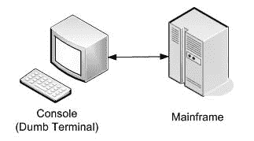


10092ch01.qxd 7/29/08 12:02 PM 第 2 页

**2**

第 1 章 **■** 企业 Java 应用程序架构与设计介绍

**分布式计算的演进**

在分布式计算中，应用程序被划分为更小的部分，这些部分在不同的计算机上同时运行。这也被称为*网络计算*，因为这些较小的部分通常使用基于 TCP/IP 或 UDP 构建的协议通过网络进行通信。这些较小的应用程序部分被称为*层*。每一层提供一组独立的服务，可供连接层或客户端层使用。这些层可以进一步划分为*子层*，它们提供更细粒度的功能。大多数应用程序具有三个不同的子层：

• *表示层*负责用户界面。

• *业务层*执行业务规则。在此过程中，它还与数据访问层进行交互。

• *数据访问层*负责检索和操作存储在企业信息系统（EIS）中的数据。

通过分析分布式应用程序架构的逐步演变，可以更好地理解网络计算的现代状态。在接下来的几节中，我将通过合适的示例来审视分布式架构的演变。

**单层架构**

单层架构可以追溯到由哑终端连接的大型主机的时代。整个应用程序，包括用户界面、业务规则和数据等子层，都部署在同一个物理主机上。用户通过终端或控制台与这些系统交互，这些终端或控制台的处理能力非常有限，且基于文本（见图 1-1）。

**图 1-1.** *单层架构*

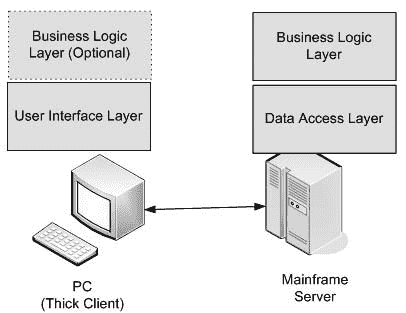

10092ch01.qxd 7/29/08 12:02 PM 第 3 页

第 1 章 **■** 企业 Java 应用程序架构与设计介绍

**3**

**双层架构**

在 20 世纪 80 年代早期，个人电脑（PC）变得非常流行。与哑终端相比，它们价格更低，处理能力更强。这为真正的分布式计算或*客户端-服务器*计算铺平了道路。客户端或 PC 现在运行用户界面程序。它还支持图形用户界面（GUI），允许用户输入数据并与大型机服务器交互。大型机服务器现在只托管业务规则和数据。数据输入完成后，GUI 应用程序可以选择性地执行验证，然后将数据发送到服务器以执行业务逻辑。基于 Oracle Forms 的应用程序是双层架构的一个很好的例子。表单提供加载在 PC 上的 GUI，而业务逻辑（编码为存储过程）和数据则保留在 Oracle 数据库服务器上。

随后出现了另一种形式的双层架构，其中不仅 UI，甚至业务逻辑也驻留在客户端层。这类应用程序通常连接到数据库服务器以运行各种查询。这些客户端被称为*胖客户端*，因为它们在客户端层拥有相当大比例的可执行代码（见图 1-2）。

**图 1-2.** *双层架构*

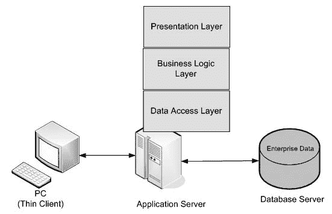

10092ch01.qxd 7/29/08 12:02 PM 第 4 页

**4**

第 1 章 **■** 企业 Java 应用程序架构与设计介绍

**三层架构**

双层胖客户端应用程序易于开发，但由于用户界面或业务逻辑的变更而进行的任何软件升级都必须推广到所有客户端。幸运的是，在 90 年代中期，硬件成本变得更低，CPU 的处理能力显著提高。这一点，加上互联网和基于 Web 的应用程序开发趋势的增长，导致了三层架构的出现。

在这种模型中，客户端 PC 只需要瘦客户端软件（如浏览器）来显示来自服务器的表示内容。服务器托管表示层、业务逻辑和数据访问逻辑。应用程序数据来自企业信息系统，例如关系型数据库。在此类系统中，业务逻辑可以被远程访问，因此可以通过 Java 控制台应用程序支持独立的客户端。业务层通常通过数据访问层与信息系统交互。由于整个应用程序驻留在服务器上，该服务器也被称为*应用服务器*或*中间件*（见图 1-3）。

**图 1-3.** *三层应用程序*

**多层架构**

随着互联网带宽的广泛增长，世界各地的企业都为其服务提供了 Web 支持。因此，应用服务器不再承担表示层的任务。这个任务现在被卸载到专门的 Web 服务器上，由它们生成表示内容。这些内容被传输到客户端层上的浏览器，

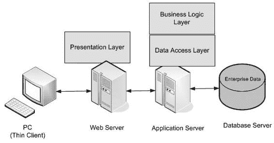

10092ch01.qxd 7/29/08 12:02 PM 第 5 页

第 1 章 **■** 企业 Java 应用程序架构与设计介绍

**5**

由浏览器负责渲染用户界面。多层架构中的应用服务器托管可远程访问的业务组件。表示层的 Web 服务器通过网络使用原生协议访问这些组件。图 1-4

展示了多层应用程序。

**图 1-4.** *多层应用程序*

**Java EE 架构**

开发多层分布式应用程序是一项复杂且具有挑战性的工作。将处理过程分布到不同的层中可以带来更好的资源利用率。它还允许将任务分配给最适合工作和开发特定层的专家。例如，网页设计师更适合在 Web 服务器上处理表示层。另一方面，数据库开发人员可以专注于开发存储过程和函数。然而，将这些层保持为孤立的孤岛毫无用处。它们必须被集成以实现更大的企业目标。必须利用最高效的协议来完成这项工作；否则，会导致严重的性能下降。

除了集成之外，分布式应用程序还需要各种服务。它必须能够在与不同的信息系统交互时创建、参与或管理事务。这对于确保企业数据的并发性是绝对必要的。

由于多层应用程序是通过互联网访问的，因此它们必须由强大的安全服务来支持，以防止恶意访问。

10092ch01.qxd 7/29/08 12:02 PM 第 6 页

**6**

第 1 章 **■** 企业 Java 应用程序架构与设计介绍

如今，像 CPU 和内存这样的硬件成本已经大幅下降。

但仍然存在限制，例如处理器支持的内存容量。因此，需要优化使用系统资源。现代分布式应用程序通常利用面向对象技术构建。因此，诸如对象缓存或对象池之类的服务非常有用。这些应用程序经常与关系型数据库和其他信息系统（如面向消息的中间件）交互。然而，打开与这些系统的连接成本很高，因为它会消耗大量进程资源，并可能成为性能的严重障碍。在这些场景中，连接池对于提高性能和优化资源利用非常有用。


分布式应用程序通常使用中间件服务器来利用事务、安全性和池化等系统服务。必须使用中间件服务器 API 才能访问这些服务。因此，应用程序代码会与专有 API 混杂在一起。这种对供应商 API 的锁定浪费了大量开发时间，使维护变得极其困难，并且限制了可移植性。

1999 年，Sun Microsystems 发布了 Java EE 2 平台，以解决分布式多层企业应用程序开发中的难题。该平台基于 Java 平台标准版 2，因此具有“一次编写，随处部署和运行”的优势。该平台得到了开源社区以及 IBM、Oracle、BEA 等主要商业供应商的巨大支持，因为它基于规范。只要符合规范中规定的约定，任何人都可以开发这些服务。规范和平台自此不断发展；该平台目前基于 Java 平台标准版 5，并被称为 Java 平台企业版 5。在本书中，我们将重点介绍这个最新版本，官方称为 Java EE 5。

Java EE 容器架构

Java EE 平台通过基于容器的架构提供基本的系统服务。容器为用 Java 编写的面向对象的应用程序组件提供运行时环境。它提供底层服务，例如安全性、事务、生命周期管理、对象查找和缓存、持久化以及网络通信。这允许清晰地分离角色。系统程序员可以负责开发底层服务，而应用程序程序员可以更专注于开发业务逻辑和表示逻辑。

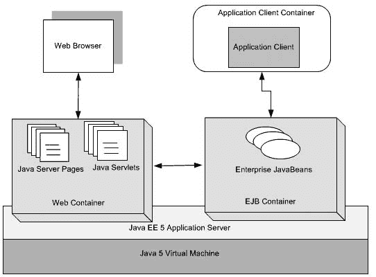

10092ch01.qxd 7/29/08 12:02 PM 第 7 页

第 1 章 **■** 企业 Java 应用程序架构与设计介绍

**7**

如图 1-5 所示，有两个服务器端容器：

• *Web 容器*托管表示组件，例如 Java Server Pages (JSP) 和 Servlet。这些组件还使用远程协议与 EJB 容器交互。

• *EJB 容器*管理 Enterprise JavaBeans (EJB) 组件的执行。

**图 1-5.** *Java EE 平台架构*

在客户端，应用程序客户端是一个核心 Java 应用程序，通过网络连接到 EJB 容器。另一方面，Web 浏览器通常使用 HTTP 协议与 Web 容器交互。EJB 和 Web 容器共同构成 Java EE 应用服务器。该服务器又托管在 Java 虚拟机 (JVM) 上。

10092ch01.qxd 7/29/08 12:02 PM 第 8 页

**8**

第 1 章 **■** 企业 Java 应用程序架构与设计介绍

不同的容器提供不同的底层服务集。Web 容器不提供事务支持，但 EJB 容器提供。这些服务可以使用标准的 Java EE API 访问，例如 Java 事务 API (JTA)、Java 消息服务 (JMS)、Java 命名和目录接口 (JNDI)、Java 持久化 API (JPA) 和 Java 事务 API (JTA)。然而，最大的好处是，只需通过配置，这些服务就可以透明地应用于应用程序组件。为了介入这些服务，应用程序组件应打包在预定义的归档文件中，并附带特定的基于 XML 的部署描述符。这有效地有助于减少开发时间并简化维护。

Java EE 应用程序架构

Java EE 平台使分布式 n 层应用程序的开发变得更加容易。

应用程序组件可以根据功能轻松划分并托管在不同的层上。不同层上的组件通常使用称为 MVC 的既定架构原则进行协作。

**MVC 小插曲**

Trygve Reenskaug 早在 1979 年就在一篇名为“Smalltalk-80™ 中的应用程序编程：如何使用模型-视图-控制器”的论文中首次描述了 MVC。它最初被设计为一种将用户界面逻辑与业务逻辑分离的策略。然而，将两者隔离并没有任何有用的目的。它还建议添加一个间接层来连接和协调表示层和业务逻辑层。

这个新层被称为*控制器层*。因此，简而言之，MVC 将应用程序分为三个不同但相互协作的组件：

• *模型*通过应用业务规则来管理应用程序的数据。

• *视图*负责显示应用程序数据并提供允许用户进一步与系统交互的控件。

• *控制器*负责模型和视图之间的协调。

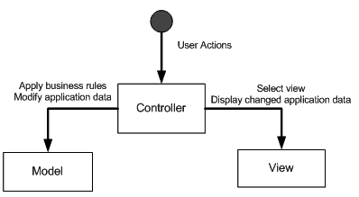

10092ch01.qxd 7/29/08 12:03 PM 第 9 页

第 1 章 **■** 企业 Java 应用程序架构与设计介绍

**9**

图 1-6 描述了这三个组件之间的关系。由任何用户操作触发的事件都会被控制器拦截。根据操作，控制器调用模型以应用适当的业务规则来修改应用程序数据。然后，控制器选择一个视图组件来向最终用户呈现修改后的应用程序数据。因此，您可以看到 MVC 为应用程序中职责的清晰分离提供了指导。由于这种分离，多个视图和控制器可以与同一个模型一起工作。

**图 1-6.** *模型-视图-控制器*

**采用 MVC 的 Java EE 架构**

MVC 概念可以很容易地应用于构成 Java EE 应用程序架构的基础。Java EE Servlet 技术非常适合作为控制器组件。任何浏览器请求都可以通过 HTTP 传输到 Servlet。然后，Servlet 控制器可以调用封装了业务规则并检索和修改应用程序数据的 EJB 模型组件。检索和/或更改的企业数据可以使用 JSP 显示。

正如您将在本书后面读到的，这是对现实世界企业 Java 架构的过度简化表示，尽管它适用于小型应用程序。但这对于应用程序开发具有巨大的意义。如果不同技术的专家能够协同工作，则可以降低风险并提高生产力。

此外，一个层可以被透明地替换，并且可以轻松添加新功能而不会对其他层产生不利影响（见图 1-7）。

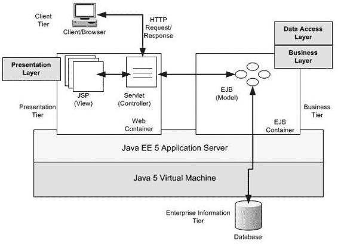

10092ch01.qxd 7/29/08 12:03 PM 第 10 页

**10**

第 1 章 **■** 企业 Java 应用程序架构与设计介绍

**图 1-7.** *基于 MVC 的分层多级 Java EE 应用程序架构*

**Java EE 应用程序中的层**

从图 1-7 可以明显看出，分层架构是 MVC 架构的扩展。在传统的 MVC 架构中，数据访问或集成层被认为是业务层的一部分。然而，在 Java EE 中，它已被重新定义为一个单独的层。这是因为企业 Java 应用程序与各种外部信息系统集成和通信以获取业务数据——关系数据库管理系统 (RDBMS)、大型机、SAP ERP 或 Oracle e-business suite，仅举几例。因此，将集成服务定位为一个单独的层有助于业务层专注于其执行业务规则的核心功能。


松散耦合的分层 Java EE 架构与 MVC 架构有着相似的优点。由于实现细节被封装在各个层内部，因此可以轻松修改，而不会对相邻层产生深远影响。这使得应用程序既灵活又易于维护。由于每个层都有其明确的角色和职责，管理起来更加简单，同时仍能提供重要的服务。

10092ch01.qxd 7/29/08 12:03 PM 第 11 页

第 1 章 **■** 企业 Java 应用程序架构与设计介绍

**11**

**Java EE 应用程序设计**

在前几节中，我为进一步详细探讨 Java EE 应用程序设计奠定了基础。然而，Java EE 软件设计本身就是一个庞大的主题，已有许多书籍对此进行论述。本书旨在通过 Spring Framework 应用模式和最佳实践，来简化 Java EE 应用程序的设计与开发。因此，为了契合主题并保持简洁，我将只涵盖与此上下文相关的主题。这将使我能够在后续章节中，专注于理解该主题所必需的内容。

一些开发者和设计师认为，Java EE 应用程序设计本质上就是面向对象设计。这没错，但 Java EE 应用程序设计涉及的内容远不止传统的对象设计。它需要找出问题域中的对象，然后确定它们之间的关系和协作。各个层中的对象被分配了职责，并定义了层间交互的接口。

然而，任务并未就此结束。事实上，它变得更加复杂。这是因为，与传统的对象设计不同，Java EE 支持诸如 EJB 之类的分布式对象技术，用于部署业务组件。业务组件被开发为可远程访问的会话型企业 JavaBean。JMS 和消息驱动 Bean（MDB）通过允许对象的分布式异步交互，使事情变得更加复杂。

即使对于经验丰富的专业人士来说，分布式对象的设计也是一项极其复杂的任务。在制定最终解决方案之前，你需要考虑诸如可伸缩性、性能、事务等关键问题。使用粗粒度还是细粒度的会话 EJB 外观的设计决策，会对 Java EE 应用程序的整体性能产生严重影响。同样，选择正确的方法来施加事务，也会对数据一致性产生关键影响。

**使用模式简化应用程序设计**

通过应用 Java EE 设计模式，可以极大地简化应用程序设计。

Java EE 设计模式已在 Sun 的 Java 蓝图（[`java.sun.com/reference/blueprints`](http://java.sun.com/reference/blueprints)）以及《*Core J2EE Design Pattern*》（Prentice Hall, 2003）一书中有所记录。它们基于著名的《*Design Patterns: Elements of Reusable Object-Oriented Software*》（Addison Wesley, 1994）一书中描述的基本对象设计模式。这些模式也被称为四人帮（GOF）模式，因为这本书由四位作者合著：Eric Gamma、Richard Helm、Ralph Johnson 和 John Vlissides。

Java EE 模式目录除了考虑核心对象设计原则外，还考虑了应对可远程访问分布式对象挑战的策略。

10092ch01.qxd 7/29/08 12:03 PM 第 12 页

**12**

第 1 章 **■** 企业 Java 应用程序架构与设计介绍

设计模式描述了针对常见设计问题的可重用解决方案。它们是由经验丰富的开发者和设计师积累并记录下来的经过验证的指南和最佳实践。一个模式具有三个主要特征：


• **上下文**是问题存在的周围条件。

• **问题**是领域中困难且不确定的主题区域。它受到所考虑上下文的限制。

• **解决方案**是针对所考虑问题的补救措施。

然而，并非每个问题的解决方案都能成为模式。问题必须频繁出现，才能拥有可复用的解决方案，并被视为一种模式。此外，模式必须建立一种通用词汇表，以便向开发人员和设计人员传达设计方案。例如，如果有人提到 GOF 单例模式，那么所有相关方都应理解，你需要设计一个在应用程序中只存在单个实例的对象。为了实现这种设计模式，其描述通常辅以结构图和交互图以及代码片段。最后但同样重要的是，每个模式描述通常都以收益和关注点分析作为结尾。当我在第 2 章讨论模式模板时，你将详细了解模式的组成部分。

**Java EE 设计模式目录**

如前所述，Java EE 作为主流的企业级开发平台已有近十年时间。在此期间，成千上万成功的应用程序和产品都是使用这项技术构建的。但也有一些努力失败了。失败的原因有多种，其中最主要的是设计和架构不完善。这是一个关键领域，因为设计和架构是从需求到构建阶段的桥梁。然而，Java EE 的设计师和架构师通过总结一系列有用的设计模式，从失败和成功中吸取了教训。这个 Java EE 模式目录为 Java EE 应用程序每一层中的对象交互提供了经过时间考验的解决方案指南和最佳实践。

与平台本身一样，Java EE 模式目录也随着时间的推移而演变。如前所述，该目录最初是作为 Sun 公司 Java BluePrints 的一部分形成的，后来在《*Core J2EE Design Pattern*》（Prentice Hall，2003）一书中得到了详细阐述。表 1-1 列出了这些模式，并附有简要说明及其关联层。我将在后续章节中更详细地讨论它们。

10092ch01.qxd 7/29/08 12:03 PM 第 13 页

第 1 章 **■** 企业 Java 应用程序架构与设计介绍

**13**

**表 1-1.** *Java EE 模式目录*

**层**

**模式名称**

**描述**

表示层

视图助手

将表示逻辑与业务逻辑分离

复合视图

从多个较小的子视图构建基于布局的视图

前端控制器

为表示层资源提供单一访问点

应用控制器

作为前端控制器的助手，负责协调页面控制器和视图组件

服务到工作

在控制权最终传递给下一个视图之前执行业务逻辑

调度器视图

执行最少或无需业务逻辑来准备对下一个视图的响应

页面控制器

管理页面上的每个用户操作并执行业务逻辑

拦截过滤器

对用户请求进行预处理和后处理

上下文对象

使应用程序控制器与特定协议解耦

业务层

业务委托

作为桥梁，解耦页面控制器和可能为复杂远程分布式对象的业务逻辑

服务定位器

提供对业务对象的句柄

会话外观

为远程客户端提供进入业务层的粗粒度接口

应用服务

以简单 Java 对象的形式提供业务逻辑实现

业务接口

整合业务方法并对 EJB 方法进行编译时检查

集成层

数据访问对象

将数据访问逻辑与业务逻辑分离

过程访问对象

封装对数据库存储过程和函数的访问

服务激活器

（又名消息外观）

异步处理请求

Web 服务代理

封装对以 Web 服务标准形式公开的外部应用程序的访问逻辑

10092ch01.qxd 7/29/08 12:03 PM 第 14 页

**14**

第 1 章 **■** 企业 Java 应用程序架构与设计介绍

表 1-1 根据 Java EE 的当前状态略有改动。例如，数据传输对象模式已不再出现在目录中，因此未列出。该模式曾用于跨层传输数据，尤其在使用远程实体 Bean 持久化组件时非常有用。但随着新的 Java 持久化 API（Java EE 5 平台的一部分）以及普通旧 Java 对象（POJO）编程模型的普遍趋势，该模式已不再相关。

此表远非完整。某些模式可以跨层应用。例如，安全设计模式可以应用于表示层，以限制对 JSP 等 Web 资源的访问。类似地，安全模式可用于控制对业务层 EJB 组件的方法调用。例如，事务模式可以应用于业务层和集成层。这些模式被归类为*横切*模式。我将在第 6 章详细探讨横切模式。

**使用 UML 进行 Java EE 架构与设计**

大多数现代应用程序都是迭代开发的。随着越来越多的需求变得可用，系统逐渐增长。此类系统的核心是通过迭代演进的高层设计和架构。为了开发团队和维护团队的利益，以文本和可视化形式记录设计和架构也是至关重要的。可视化表示非常有用，因为它有助于开发人员理解运行时交互和编译时依赖关系。

UML 是一种图形化语言，用于对复杂企业系统中的架构和详细设计进行建模和可视化。它基于对象管理组织（OMG）开发的规范。我将使用 UML 2.0 表示法（这是最新版本），可在 [`www.uml.org/`](http://www.uml.org) 获取。然而，UML 并不局限于架构和设计，它可用于软件开发的各个阶段。UML 提供了丰富的表示法集来描述类和对象以及各种关系和交互。

现代 UML 建模工具，如 IBM Rational XDE、Visual Paradigm、Sparx Systems Enterprise Architect 等，允许在系统设计期间应用设计模式和最佳实践。此外，使用这些工具，设计模型可用于生成应用程序源代码的很大一部分。

UML 图有多种类型。但对于 Java EE 设计模式的分析，我将主要关注类图和序列图，以及一种称为*构造型*的简单扩展机制。如果你是 UML 新手或渴望了解更多，最好的 UML 参考书是 Martin Fowler 所著的《*UML 精粹第三版*》（Addison Wesley，2005）。

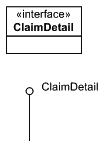

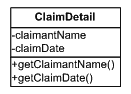

10092ch01.qxd 7/29/08 12:03 PM 第 15 页

第 1 章 **■** 企业 Java 应用程序架构与设计介绍

**15**

**类图**


类图描述了系统中一组类和接口之间存在的静态关系。我将讨论的不同关系类型包括泛化、聚合和继承。图 1-8 展示了用于表示保险理赔详细信息的类的 UML 表示法。它由一个带有三个分隔区的矩形表示。第一个分隔区是类的名称。第二个分隔区表示类中的属性，最后一个分隔区显示在这些属性上定义的操作。请注意，属性和方法名称前的+和-符号用于表示可见性。+符号表示公共可见性，而-符号表示私有可见性，即该属性在此类外部不可访问。另外，你也可以选择性地表示属性的数据类型、方法返回类型和参数。

**图 1-8.** *UML 类表示法*

接口规定了实现必须遵守的契约。换句话说，实现接口的类提供了一组有保证的行为。接口的表示方式与类相同，都是矩形框，但有一个区别。顶部分隔区显示类名，并附加了构造型`<<interface>>`。构造型是一种扩展现有表示法的机制。一些 UML 工具也使用圆圈来表示接口，而不明确提及方法。图 1-9 展示了这两种不同的形式。

**图 1-9.** *UML 接口表示法*

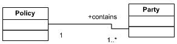

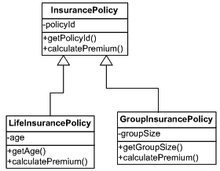

10092ch01.qxd 7/29/08 12:03 PM Page 16

**16**

第 1 章 **■** 企业 Java 应用程序架构与设计简介

关系

在接下来的几节中，我将探讨软件系统中类之间存在的重要关系。

**泛化**

*泛化*关系表示两个或多个类之间的继承。这是一种父子关系，其中子类继承父类的部分或全部属性和行为。子类也可以覆盖某些行为和属性。图 1-10 展示了泛化关系。

**图 1-10.** *泛化*

**关联**

*关联*表示两个类之间的一般关系。在实际的类中，这表现为一个类持有另一个类的实例。一份保险单总是涉及一个或多个参与方，其中最突出的是拥有此保单的投保人。可能还有一位代理人帮助并指导投保人购买此保单。

关联通常显示命名角色、基数（多重性）和约束，以详细描述关系，如图 1-11 所示。

**图 1-11.** *关联*

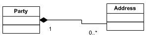

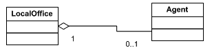

10092ch01.qxd 7/29/08 12:03 PM Page 17

第 1 章 **■** 企业 Java 应用程序架构与设计简介

**17**

**聚合**

*聚合*是一种关联形式，其中一个元素由其他更小的组成部分构成。这种关系由菱形空心箭头表示。在这种情况下，如果父对象被删除，子对象可能仍然继续存在。图 1-12 展示了保险代理人与其工作的本地保险办事处之间的聚合关系。本地保险办事处是保险代理人执行任务（如保单承保、为客户存入保费以及各种其他职能）的地方。因此，即使本地办事处关闭，代理人也可以向另一个办事处报告。同样，代理人可以从一个本地办事处注销，并转移到同一保险公司的另一个办事处。

**图 1-12.** *聚合*

**组合**

*组合*是一种更强的聚合形式；在这种情况下，如果父对象被删除，子对象也将不复存在。这种关系由菱形实心箭头表示。图 1-13 展示了参与某项保单或索赔的当事方与其地址之间的组合关系。如果该当事方从系统中删除，其地址也将被删除。

**图 1-13.** *组合*

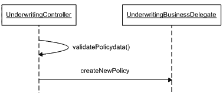

10092ch01.qxd 7/29/08 12:03 PM Page 18

**18**

第 1 章 **■** 企业 Java 应用程序架构与设计简介

**时序图**

*时序图*用于对系统的动态方面进行建模，它描述了在一段时间内系统中对象之间的消息交换。时序图用于展示为完成特定用例而在不同对象之间发生的交互序列。与表示整个应用程序领域模型的类图不同，时序图只能显示特定过程的交互细节。

对象与消息

在时序图中，对象以其名称在矩形框中并带有下划线的方式显示。消息由从一个对象开始并在另一个对象结束的箭头表示。一个对象可以调用自身的方法，这称为自消息，由起始和终止于同一对象的箭头表示，如图 1-14 所示。

**图 1-14.** *时序图中的生命线*

生命线

每个对象都有一条*生命线*，由从对象框向下延伸的虚线表示（如图 1-14 所示）。它代表了整个时序图的时间轴，时间流逝通过沿生命线向下移动来衡量。

返回值

时序图中的消息可以选择性地带有*返回值*，如图 1-15 所示。例如，`createNewPolicy`消息返回一个`PolicyDetail`对象。

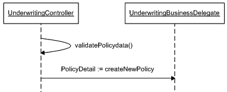

10092ch01.qxd 7/29/08 12:03 PM Page 19

第 1 章 **■** 企业 Java 应用程序架构与设计简介

**19**

**图 1-15.** *时序图中的可选返回值*

**总结**

开发分布式多层应用程序是一项艰巨的任务。Java EE 平台试图通过定义基于容器的架构来简化这项任务。它定义了应用程序代码运行时环境以及应提供的底层系统服务的规范。这使得应用程序开发人员能够专注于编写业务逻辑。Java EE 应用程序架构基于核心平台架构和既定的 MVC 原则。有了这一点，你可以在每一层中清晰地定义专门的组件层。例如，Web 层托管应用程序的表示层，而业务层和数据访问层通常位于应用服务器层。

另一方面，Java EE 设计是一种扩展的对象设计。Java EE 设计模式目录提供了在层内和跨层之间组合对象及其交互的指导和最佳实践。该设计模式目录记录了设计人员和开发人员在成功交付 Java EE 应用程序方面多年的经验。Java EE 设计和架构可以使用 UML 表示法进行文档化。这些是图形化的表示法，有助于提供领域对象静态结构和动态交互的图形化视图。

在下一章中，我将展示 Spring Framework 如何进一步简化 Java EE 应用程序的设计和架构。如果你已经熟悉 Spring Framework，可以直接跳到第 3 章。

10092ch01.qxd 7/29/08 12:03 PM Page 20

10092ch02.qxd 7/21/08 4:56 PM Page 21

第 2 章

使用 Spring Framework 简化企业

Java 应用程序


**本**书第一章讨论了 JavaEE 应用程序架构与设计的基本原则。在本章中，我将展示这些概念如何应用于 Spring 框架。我将首先简要概述 Spring 及其作为应用程序框架的重要性。接着，我会介绍构成该框架的构建模块，在此过程中你将看到框架的实际运作。在理解 Spring 框架的基本原理后，我将讨论它在企业级 Java 应用程序架构与设计中的作用。最后，我将以 Spring Java 设计模式指令作为本章的收尾，该指令将在本书接下来的三章中使用。如果你有兴趣运行本章中的代码，可以直接跳到第 7 章，那里提供了在基于 Eclipse 的 Blazon ezJEE Studio 中安装 Spring 框架插件的分步说明，同时还展示了如何创建开发和运行这些示例所需的示例项目结构。

**什么是 Spring？**

Spring 框架是一个开源应用程序框架，最初面向 Java 平台。最近它也被移植到了.NET 平台。该框架的理念和代码最初由 Rod Johnson 在其著作《*Expert One-on-One* *J2EE Design and Development*》（Wrox 出版社，2002 年）中描述。这个框架是 Rod 作为英国金融行业客户的独立软件顾问，在丰富的项目经验基础上取得的成果。

**21**

10092ch02.qxd 7/21/08 4:56 PM 第 22 页

**22**

第 2 章 **■** 使用 Spring 框架简化企业级 Java 应用程序

Spring 框架目前基于 Apache 2.0 开源许可证发布。它是一个高质量的软件产品，可用于构建简洁、灵活的企业级软件。这一点已通过 Headway Software 公司的 Structure101 工具（[`www.headwaysoftware.com`](http://www.headwaysoftware.com)）的测试得到证实。Headway 公司的创始人兼 CEO Chris Chedgey 在其博客（[`chris.headwaysoftware.com/2006/07/springs_structu.html`](http://chris.headwaysoftware.com/2006/07/springs_structu.html)）中报告称，Spring 框架代码“尽管规模合理，约 70KLOC（根据字节码估算），分为 139 个包，却没有包级别的依赖循环。”

这充分说明了 Spring 框架底层架构与设计的合理性。如果你希望了解更多信息，请参考[`www.springframework.org/node/310`](http://www.springframework.org/node/310)。

**为什么 Spring 如此重要？**

Java EE 平台旨在解决与分布式应用程序开发相关的复杂性。传统的 Java EE 平台通过 EJB、JTA 和 JMS 等各种 API，在标准化底层中间件服务方面取得了巨大成功。这之所以成为可能，是因为商业供应商和开源社区携手合作，共同认识到基于标准 Java 的平台所具有的巨大潜力。由于主要关注点在于标准化系统服务，因此简化编程模型这一根本问题被忽视了。因此，尽管在 20 世纪 90 年代末和 21 世纪初被广泛采用，但在 Java EE 平台上开发多层应用程序仍然需要付出巨大的努力。

Java EE 平台旨在基于组件模型构建应用程序。*组件*是一段自包含的代码，理想情况下可以在多个应用程序中重用。一个订单组件可以包含一个实体 Bean 来处理订单信息的持久化，以及一个会话 Bean 来对订单实体执行不同的工作流。理论上，这具有巨大的重用潜力。但现实情况却不同，因为在一个项目中开发的组件很少会在另一个项目中再次使用。Java EE 服务器特定的部署描述符也使得这些组件难以重用。Java EE 编程模型的复杂性还导致开发团队编写、测试和维护大量不必要的代码。这包括用于在 JNDI 树上查找 EJB 对象、获取数据库连接、准备和执行数据库查询，以及最终释放所有数据库资源的样板代码。用于规避实体 Bean API 限制的数据传输对象严重违反了面向对象的封装原则。即使是一个中等规模的项目，也需要开发和维护大量的传输对象。所有这些都导致了资源的严重消耗，而这些资源本应仅用于开发健全的业务逻辑。

10092ch02.qxd 7/21/08 4:56 PM 第 23 页

第 2 章 **■** 使用 Spring 框架简化企业级 Java 应用程序

**23**

EJB 旨在帮助简化事务性和分布式应用程序的开发。尽管即使是最小的数据库驱动应用程序也需要事务，但它可能不需要分布式。然而，过度使用 EJB，特别是使用会话 Bean 来简化业务逻辑，会导致将分布式特性内建到应用程序组件模型中。分布式应用程序异常复杂，因此会消耗更多的 CPU 周期进行处理。它们会导致大量重复的代码和元数据。访问分布式应用程序组件需要网络遍历，以及大数据集的编组和解组。对分布式对象的误用常常导致即使是简单的应用程序也无法达到预期的性能水平。

Java EE 包含了许多本质上就很复杂的技术和 API。例如，实体 Bean API 需要相当长的学习曲线，而给应用程序带来的好处却有限。由于 Java EE 组件在应用服务器容器内运行，因此它们很难进行单元测试。这阻碍了测试驱动开发（TDD）。

Java EE 应用程序开发中的困难迫使开发社区寻找替代方案。很快，基于不同 Java EE API 构建的框架迅速涌现。例如，Apache Struts 框架利用 Servlet API 帮助实现 MVC 原则。该框架实现了一个基于 Servlet 的前端控制器，并允许开发者为简单的页面控制器提供实现。另一方面，Hibernate 的出现是为了解决与实体 Bean 开发相关的巨大痛苦。它提供了 POJO 的持久化功能，且只需最少的配置元数据。这些 POJO 不像实体 Bean 那样是分布式对象，因此带来了更好的应用程序性能。Hibernate 不需要任何容器支持，从而使得对这些持久化对象进行单元测试变得容易。随后又出现了 HiveMind，用于开发基于 POJO 的简单业务服务。


Spring 框架也开始着手解决开发 Java EE 应用程序所固有的复杂性。然而，与 Struts、Hibernate 或 HiveMind 等单层框架不同，Spring 提供了一个全面的多层框架，可以在应用程序的所有层中使用。它通过开箱即用的组件来帮助构建整个应用程序，并与最佳的单层框架进行集成。与其单层框架的同类产品一样，它提供了一种基于 POJO 的简单编程模型，并且由于这些组件可以在服务器容器之外运行，因此使它们易于测试。

Spring 控制反转（IOC）容器（将在下一节讨论）是整个框架的核心。它有助于将应用程序的不同部分粘合在一起，从而形成一个连贯的架构。Spring MVC 组件可用于构建非常灵活的 Web 层。IOC 容器通过 POJO 简化了业务层的开发。

10092ch02.qxd 7/21/08 4:56 PM 第 24 页

**24**

第 2 章 **■** 使用 Spring 框架简化企业级 Java 应用程序

这些 POJO 业务组件可以通过 Spring 提供的各种远程处理选项作为分布式对象使用。它们也可以用于开发以及连接到分布式 EJB 组件。借助 Spring AOP，可以将事务、安全性和检测等系统服务透明地应用于 POJO 组件。Spring JDBC 和对象关系映射（ORM）组件允许简化与数据库的交互。作为一个应用程序框架，Spring 通过 Java 连接器架构（JCA）和 Web 服务提供了与不同信息系统的、基于标准的简易集成。最后但同样重要的是，Spring Security 是一个全面的解决方案，可以满足任何企业应用程序的安全需求。

**Spring 框架的构建模块**

Spring 是一个应用程序框架，被划分为多个模块或组件。

每个模块提供一组特定的功能，并且或多或少地独立于其他模块工作。毋庸置疑，这些模块可用于构建可扩展且灵活的企业级 Java 应用程序。这个系统非常灵活，因为开发人员可以选择只使用在特定问题上下文中最合适的模块。例如，开发人员可以只使用 Spring DAO 模块，并使用非 Spring 组件构建应用程序的其余部分。此外，Spring 提供了与其他框架和 API 协作的集成点。如果您认为 Spring 在特定场景中不合适，可以使用替代方案。例如，如果开发团队更精通 Struts，则可以使用它来代替 Spring MVC，而应用程序的其余部分则使用 Spring 组件和特性，如 JDBC 和事务。在这两种场景中，开发人员无需部署整个 Spring 框架。他们只需要相关的模块（如 Spring DAO）以及 Spring IOC 容器和 Struts 库。

图 2-1 展示了 Spring 框架的各种模块。

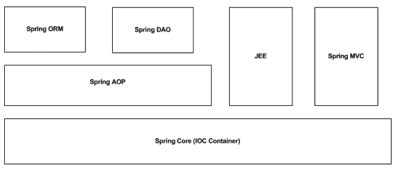

10092ch02.qxd 7/21/08 4:56 PM 第 25 页

第 2 章 **■** 使用 Spring 框架简化企业级 Java 应用程序

**25**

**图 2-1.** *Spring 框架的高级构建模块* **Spring Core**

Core 模块构成了整个 Spring 框架的支柱。所有其他 Spring 模块都依赖于这个模块。它也被称为 IOC 容器，是 Spring 支持依赖注入（DI）的核心。

控制反转

IOC 最好用“好莱坞原则”来描述，即“别打电话给我们，我们会打给你。”（在好莱坞，初级艺人经常从制片经理那里听到这句话。）然而，这在软件开发中对于控制应用程序流程，同时确保高内聚和低耦合也至关重要。为了更好地理解，让我们考虑一个简单的情况：您的应用程序执行一些计算，并使用像 log4j 这样的日志库打印最终结果。在这种情况下，应用程序代码负责控制流程，并在必要时调用 log4j API 上的方法。

另一方面，IOC 是任何框架的基础。使用 IOC，应用程序对象通常会向框架注册，框架负责在适当的时间或事件发生时调用注册对象上的方法。控制被反转了，因为不是应用程序代码调用框架 API，而是恰恰相反。因此，简而言之，IOC 是允许另一个对象或框架在适当事件发生时调用您的应用程序对象上的方法的原则。

10092ch02.qxd 7/21/08 4:56 PM 第 26 页

**26**

第 2 章 **■** 使用 Spring 框架简化企业级 Java 应用程序

IOC 并不是一个新概念，它已经存在很长时间了。例如，EJB 就支持 IOC。各种 EJB 组件，如会话 Bean、实体 Bean 和消息驱动 Bean，通过实现不同接口中定义的方法，与容器建立特定的契约。例如，会话 Bean 实现了 `javax.ejb.SessionBean` 接口中定义的 `ejbActivate` 和 `ejbPassivate` 生命周期方法。然而，这些方法永远不会从会话 Bean 的其他方法中调用；相反，容器会在 Bean 生命周期的不同时间点调用这些方法，从而反转了控制。例如，消息驱动 Bean 实现了 `javax.jms.MessageListener` 接口的 `onMessage` 方法。容器负责在消息到达事件发生时调用此方法。

依赖注入

开发人员普遍认为 IOC 和 DI 是同一回事。这是不正确的，我想从一开始就明确说明，它们是两个不同但相关的概念。正如 IOC 处理应用程序中控制流的反转一样，DI 描述了一个对象如何解析或找到它需要调用某些方法的其他对象。有几种方法可以实现 DI，其中一种策略就是 IOC。我将在接下来的几节中逐一解释不同的 DI 策略。

**直接实例化**

直接实例化是 DI 的最简单形式。依赖对象直接使用 `new` 运算符进行实例化，如清单 2-1 所示。

**清单 2-1.** FormulaOneDriver.java *：使用直接实例化* public class FormulaOneDriver{

public Car getCar(){

Car car = new FerrariCar();

return car;

}

}

F1 车手对象（`FormulaOneDriver`）需要一辆车来驾驶。因此，它直接创建了一个 `Car` 对象的实例并使用它。直接实例化增加了耦合度，并将对象创建代码分散到整个应用程序中，使其难以维护和进行单元测试。

10092ch02.qxd 7/21/08 4:56 PM 第 27 页

第 2 章 **■** 使用 Spring 框架简化企业级 Java 应用程序

**27**

**工厂辅助类**

工厂辅助类是一种常见且广泛使用的依赖注入策略。它基于 GOF 工厂方法设计模式。工厂方法整合了 `new` 运算符的使用，并根据某些输入提供适当的对象实例。

如清单 2-2 所示。

**清单 2-2.** FormulaOneDriver.java *：使用工厂辅助类* public class FormulaOneDriver{

public Car getCar(){

Car car = CarFactory.getInstance("FERARI");

return car;

}

}


使用工厂模式推广了一种名为*面向接口编程*（P2I）的最佳对象设计实践。该原则规定，具体对象必须实现一个接口，该接口在调用程序中使用，而非直接使用具体对象本身。因此，你可以轻松替换不同的实现，而对客户端代码影响甚微。换言之，不存在对具体实现的直接依赖，从而实现了低耦合。

清单 2-3 展示了 Car 接口。

**清单 2-3.** Car.java

public interface Car{

public Color getColor();

//其他方法

}

FerrariCar 提供了 Car 接口的具体实现，如清单 2-4 所示。

**清单 2-4.** FerrariCar.java

public class FerrariCar implements Car{

//...Car 中定义的方法的实现

// ...其他方法的实现

}

10092ch02.qxd 7/21/08 4:56 PM Page 28

**28**

第 2 章 **■** 使用 Spring 框架简化企业级 Java 应用

这种模式还将对象创建集中到少数工厂类中，使其易于维护。借助工厂辅助类，还可以使对象创建变得可配置。你可以在某些属性文件或 XML 配置文件中定义要提供的具体实现，从而使其能够动态切换。

**在注册表服务中定位**

第三种方法对于 EJB 开发者来说应该很熟悉。他们经常需要在 JNDI 注册表服务中查找 EJB 对象引用。在这种情况下，EJB 对象已经创建并注册到 JNDI 中，并带有特定的键。这些对象可能位于远程 JVM 中，但 JNDI 使用此键进行查找的方式与清单 2-2 非常相似。

所有这些策略通常被称为*拉取*依赖注入。这是因为依赖对象是由最终使用它的对象拉入的。我更倾向于将拉取方法归类为依赖解析，而非依赖注入。这是因为真正的依赖注入发生在 IOC 中，被称为*推送* DI。在这种方法中，外部容器或应用程序框架创建依赖对象并将其传递给需要它的对象。依赖对象通常通过构造函数或 setter 方法提供。然而，为此，应用程序框架必须知道要提供哪个依赖对象，以及要将依赖对象通知给哪个对象。

有趣的是，EJB 容器不仅支持拉取 DI（例如，一个会话 bean 在 JNDI 中查找另一个会话 bean），还支持推送 DI。这一点从 setSessionContext(javax.ejb.SessionContext ctx) 或 setEntityContext(javax.ejb.EntityContext ctx) 方法中可以看出，在这些方法中，上下文对象由容器创建、初始化并传递给 EJB 对象。这被称为*设值注入*。在后续章节中，当我谈到 Spring IOC 容器的 DI 特性时，你可以通过示例探索推送 DI 的不同变体。

**DI 的优势**

以下是 DI 的优势：

• 依赖注入促进了松耦合。例如，借助工厂辅助类，你可以通过 P2I 移除硬编码的依赖。可以在应用程序外部配置它们，并提供热插拔和热替换的实现。

• 它促进了测试驱动开发（TDD）。对象可以轻松测试，因为它们不需要任何特定容器来运行。只要依赖项通过某种机制注入，它们就可以被测试。

10092ch02.qxd 7/21/08 4:56 PM Page 29

第 2 章 **■** 使用 Spring 框架简化企业级 Java 应用

**29**

• 正如你稍后将在 Spring IOC 支持的推送 DI 中看到的那样，应用程序无需查找像 EJB 远程接口这样的对象。

• DI 促进了良好的面向对象设计和复用——对象组合而非通过继承复用。

**DI 的缺点**

以下是 DI 的缺点：


• 依赖关系通常硬编码在专有且非标准的 XML 配置文件中。
• 如果实例数量过多且需要处理的依赖关系复杂，将实例连接在一起可能会带来风险。
• 对基于 XML 的元数据的依赖，以及过度使用反射和字节码操作，可能会影响应用程序性能。

Bean 工厂

`org.springframework.beans.factory.BeanFactory` 接口为 Spring 的 IOC 容器或 bean 工厂提供了基础。它是 GOF 工厂方法设计模式的一种复杂实现，负责创建、缓存、连接和管理应用程序对象。这些对象被亲切地称为 *bean*，因为 Spring 推崇 POJO 编程模型。Spring 提供了多种开箱即用的 Bean 工厂实现。其中一种实现是 `XmlBeanFactory` 类。该类允许你在 XML 文件中配置各种应用程序类及其依赖关系。简而言之，像 JNDI 这样的 Bean 工厂就是一个应用程序对象的注册表。清单 2-5 展示了一个简单的 Spring Bean 配置文件。

**清单 2-5.** spring-config.xml

<?xml version="1.0" encoding="UTF-8"?>

<beans

[xsi:schemaLocation="http://www.springframework.org/schema/beans](http://www.w3.org/2001/XMLSchema-instance)

[`www.springframework.org/schema/beans/spring-beans-2.5.xsd"`](http://www.w3.org/2001/XMLSchema-instance)

>

10092ch02.qxd 7/21/08 4:56 PM Page 30

**30**

第 2 章 **■** 使用 Spring 框架简化企业级 Java 应用程序

<bean name="carService"

class="com.apress.simpleapp.service.CatServiceImpl" />

</beans>

现在我已经在 XML 配置文件中连接了 Bean，接下来就该启动 IOC 容器了，如清单 2-6 所示。

**清单 2-6.** SpringInitializer.java

Resource res = new FileSystemResource("spring-config.xml"); BeanFactory factory = new XmlBeanFactory(res);

由于 Spring 容器已经启动并运行，现在可以从 Bean 工厂中检索 Bean，然后使用这些 Bean 在应用程序中执行一些有用的工作。

清单 2-7 是使用 Spring 框架进行拉取式依赖注入的示例。应用程序代码使用 Spring Bean 工厂或 IOC 容器，通过指定的键来检索汽车服务对象。从清单 2-6 中也可以看出，根据汽车类型的不同，可以支持多种 `CarService` 变体。这是因为每辆汽车都不同，并提供不同的功能和选项集。然而，每次需要 Bean 时都调用 `getBean` 方法很繁琐。这与我之前用 Car 对象示例解释的拉取式依赖注入的工厂方法实现差不多。

**清单 2-7.** CarServiceLocator.java

CarService service = (CarService) factory.getBean("carService"); Spring 的一个主要目标是保持非侵入性，并尽量减少对框架的依赖。这是通过 Spring IOC 容器支持的不同形式的推送式依赖注入来实现的。

**Setter 注入**

在这种推送式依赖注入模式中，通过调用零参数构造函数在 Spring IOC 容器中创建一个对象。然后，依赖对象作为参数传递给 setter 方法。`CarService` 对象需要数据访问对象（DAO）来执行数据库操作。数据访问对象通过 setter 方法注入，如清单 2-8 所示。

10092ch02.qxd 7/21/08 4:56 PM Page 31

第 2 章 **■** 使用 Spring 框架简化企业级 Java 应用程序

**31**

**清单 2-8.** CarServiceImpl.java

public class CarServiceImpl implements CarService{

private CarDao carDao;

public void refuel(Car car){

carDao.updateFuelConsumed(car) ;

}

public void setCarDao(CarDao carDao){

this.carDao = carDao;

}

}

`CarDao` 对象由 Spring IOC 容器通过 `setCarDao` 方法传递。现在你必须进行配置，以便 Spring 知道如何解析和注入依赖关系。


通过一个简单的配置即可实现，如清单 2-9 所示。

**清单 2-9.** spring-config.xml *：设值注入*

<?xml version="1.0" encoding="UTF-8"?>

<beans

[xsi:schemaLocation="http://www.springframework.org/schema/beans](http://www.w3.org/2001/XMLSchema-instance)

[`www.springframework.org/schema/beans/spring-beans-2.5.xsd"`](http://www.w3.org/2001/XMLSchema-instance)

>

<bean name="carDao"

class="com.apress.simpleapp.dao.CatDaoImpl" />

<bean name="carService"

class="com.apress.simpleapp.service.CatServiceImpl">

<property name="carDao"

ref="carDao" />

</bean>

</beans>

10092ch02.qxd 7/21/08 4:56 PM 第 32 页

**32**

第 2 章 **■** 使用 Spring 框架简化企业级 Java 应用程序

**构造器注入**

在这种策略中，依赖对象作为构造器调用的一部分传入，如清单 2-10 所示。

**清单 2-10.** CarServiceImpl.java *使用构造器注入* public class CarServiceImpl implements CarService{

private CarDao carDao;

public void CarServiceImpl (CarDao carDao){

this.carDao = carDao;

}

public void refuel(Car car){

carDao.updateFuelConsumed(car) ;

}

}

要实现构造器注入，还需要修改配置，如清单 2-11 所示。

**清单 2-11.** spring-config.xml *使用构造器注入*

<?xml version="1.0" encoding="UTF-8"?>

<beans

[xsi:schemaLocation="http://www.springframework.org/schema/beans](http://www.w3.org/2001/XMLSchema-instance)

[`www.springframework.org/schema/beans/spring-beans-2.5.xsd"`](http://www.w3.org/2001/XMLSchema-instance)

>

<bean name="carDao"

class="com.apress.simpleapp.dao.CatDaoImpl" />

<bean name="carService"

class="com.apress.simpleapp.service.CarServiceImpl">

<constructor-arg>

<ref bean="carDao"/>

</constructor-arg>

</beans>

10092ch02.qxd 7/21/08 4:56 PM 第 33 页

第 2 章 **■** 使用 Spring 框架简化企业级 Java 应用程序

**33**

**应用上下文**

Bean 工厂仅仅是一个对象池，对象通过配置进行创建和管理。对于小型应用来说，这已经足够，但企业级应用需要更多功能。应用上下文建立在 Bean 工厂的基础之上，提供如下服务：

• 支持国际化所需的消息资源

• 支持面向切面编程（AOP），进而支持声明式事务、安全性和检测

• 在 Bean 工厂中注册事件监听器

• 创建应用层特定的上下文，例如用于 Web 应用的`WebApplicationContext`

Spring 应用上下文可以像 Bean 工厂一样创建，且无需对配置文件做任何修改，如清单 2-12 所示。

**清单 2-12.** SpringInitializer.java *：启动应用上下文* ApplicationContext context = new **➥**

ClassPathXmlApplicationContext("spring-config.xml");

`ClassPathXmlApplicationContext`会在类路径中查找`spring-config.xml`文件并初始化应用上下文。类似地，可以注册一个 Servlet 监听器来在 Web 应用中初始化应用上下文——通常称为*Web 应用上下文*。

该监听器会在 Web 应用归档文件中的特定位置查找配置文件，以启动 Web 应用上下文。

到目前为止，我对 Spring IOC 和 DI 特性做了一个非常基础且简单的介绍。关于该主题的详细讨论，请参考 Spring 2.5 文档，地址为 [`static.springframework.org/spring/docs/2.5.x/reference/beans.html。`](http://static.springframework.org/spring/docs/2.5.x/reference/beans.html)

10092ch02.qxd 7/21/08 4:56 PM 第 34 页

**34**

第 2 章 **■** 使用 Spring 框架简化企业级 Java 应用程序

**Spring AOP**

Spring AOP 是一个重要的模块，它提供了关键的系统级服务。它促进了松耦合，并允许以最优雅的方式分离横切关注点（例如业务服务和事务）。它允许通过声明方式透明地应用这些服务。借助 Spring AOP，可以编写自定义切面并以声明方式进行配置。Spring AOP 支持通过符合 AOP Alliance 规范的接口创建切面，同时也支持 AspectJ。Spring AOP 本身是一个复杂的主题，详细讨论超出了本书的范围。

不过，我将在后面的第 6 章中使用 AOP 主题来描述事务和安全模式。因此，你也可以考虑阅读《*Foundations of AOP for J2EE Development*》（Apress，2005）一书中关于 AOP 的内容，然后查阅 Spring AOP 文档，地址为 [`static.springframework.org/spring/docs/2.5.x/reference/aop.html。`](http://static.springframework.org/spring/docs/2.5.x/reference/aop.html)

**Spring DAO**

Java EE 应用程序使用 JDBC API 来连接关系数据库并执行操作。然而，这通常会导致编写大量通用代码，用于执行如下操作：

• 从连接池中获取连接

• 创建`PreparedStatement`对象

• 绑定 SQL 参数

• 执行`PreparedStatement`对象

• 从`ResultSet`对象中检索数据并填充数据容器对象

• 释放所有数据库资源

这类样板代码严重损害了可重用性。Spring JDBC/DAO 通过模板移除了通用代码，使开发变得非常轻松。这些模板实现了 GOF 模板方法设计模式，并提供了合适的扩展点来插入自定义代码。这使得数据访问代码非常简洁，并防止了诸如连接泄漏等恼人问题，因为 Spring 框架确保所有数据库资源都能被正确释放。

10092ch02.qxd 7/21/08 4:56 PM 第 35 页

第 2 章 **■** 使用 Spring 框架简化企业级 Java 应用程序

**35**

**Spring ORM**

ORM 解决方案提供了 POJO 对象在关系数据库中的简单持久化。Spring ORM 模块本质上是 DAO 模块的扩展。与基于 JDBC 的模板类似，Spring 提供了 ORM 模板来与大多数主流 ORM 产品（如 Hibernate、OpenJPA、TopLink、iBatis 等）协同工作并进行集成。

我将在第 5 章中介绍与 Spring DAO 和 ORM 相关的最佳实践和模式。

**JEE**

JEE 模块构成了 Spring 框架与各种 Java EE 技术（如 EJB、JTA、JCA 和 JavaMail）交互的基础。正如你将在本书后面读到的那样，与 Spring DAO 类似，JEE 模块提供了简化与 Java EE 技术（如 EJB）开发和交互的组件。

**Web MVC**

该模块有助于构建高度灵活的 Web 应用程序，充分利用 Spring IOC 容器的全部优势。它基于 MVC 架构模式，并与 Servlet API 无缝集成。Spring MVC 支持可插拔架构，并与多种视图技术协同工作，例如 JSP、FreeMarker、Velocity 和 Adobe Flex 等。如果 Spring MVC 不是首选框架，那么也可以与现有的 Web 框架（如 Struts、Webwork 和 JSF）集成，同时仍然享受 Spring 核心框架提供的优势，即 IOC 和 DI。

**使用 Spring 构建分层应用程序**

现在你已经熟悉了各个 Spring 模块的角色，并对它们的职责有了一定了解。接下来我将展示如何将这些模块组合在一起，使用 Spring 框架构建一个分层的 Web 应用程序。图 2-2 展示了该应用程序的高层架构。

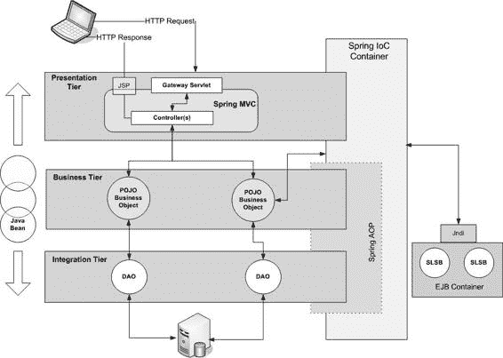

10092ch02.qxd 7/21/08 4:56 PM 第 36 页

**36**


第 2 章 **■** 使用 Spring 框架简化企业级 Java 应用

**图 2-2.** *使用 Spring 框架的轻量级应用架构* 图 2-2 展示了一个利用不同 Spring 框架模块的三层 Web 应用。我将逐一剖析每一层，以了解这些模块是如何被使用的，以及构建灵活、简单的企业级 Spring 应用有哪些不同的选择。

**表示层**

顾名思义，Spring MVC 提供了遵循 MVC 模式构建 Web 应用的一流组件。与任何优秀的 Web 框架一样，Spring MVC 有助于构建控制器层。它非常灵活，支持多种用于视图管理的组件，包括核心 Java EE 技术（如 JSP）以及其他技术（如可扩展样式表语言（XSL）和便携式文档格式（PDF））。

如图 2-2 所示，来自客户端 Web 浏览器的 HTTP 请求首先由控制器组件拦截。该组件包含一个作为应用单一入口点的网关 Servlet。然后，该 Servlet 将后续的用户请求委托给相应的处理器，这些处理器被称为*页面控制器*。页面控制器是简单的 Java 类，负责执行一个应用用例并调用业务服务。Spring

10092ch02.qxd 2008 年 7 月 21 日 下午 4:56 第 37 页

第 2 章 **■** 使用 Spring 框架简化企业级 Java 应用

**37**

MVC 还包含一个视图管理层（为简化起见未在图中显示），该层负责定位合适的视图（可能是另一个 JSP）。它还会绑定页面控制器在调用业务层模型对象后返回的数据对象，并最终将 HTTP 响应分派给客户端。所有负责视图管理、控制器管理的对象以及页面控制器本身，都注册在底层的 Spring IOC 容器中。因此，Spring MVC 模块可以享有该容器的所有优势。请注意，网关 Servlet 不属于 Spring IOC 容器的一部分；相反，它由 Web 服务器管理。

Spring MVC 是一个多功能的模块，几乎支持所有可用的视图和模型技术。例如，如果你的开发团队对 Java Server Faces（JSF）或 Struts 更有信心，那么将这些框架与 Spring MVC 集成是完全可行的。

你可以很好地使用基于模板的视图引擎，如 Velocity 和 FreeMarker；基于文档的视图，如 PDF、Microsoft Word 和 Microsoft Excel；以及 Adobe Flex 提供的丰富用户界面。就模型而言，Spring MVC 不仅与 POJO 业务组件完美融合，而且与分布式 EJB

组件也同样配合良好。

**业务层**

使用 Spring，你可以将业务组件开发为普通的 Java 类，而无需任何框架依赖。这与 EJB 编程模型完全相反，后者要求实现多个不同的接口以及部署描述符，使开发人员的生活变得复杂。

POJO 业务对象都像前面示例中显示的任何其他 Bean 一样，在 Spring IOC 容器中进行配置。它们负责执行业务规则，并在此过程中使用集成层中可用的数据访问 API 来操作应用数据。

Spring AOP 模块在业务层扮演着重要角色。它可以用于声明式地应用和控制 POJO 业务组件上的事务和安全性。

可以利用 Spring AOP 开发自定义切面，以收集审计跟踪信息或检测方法执行时间，而不会影响现有的应用代码。

可以开发一个混合解决方案，结合使用 Spring POJO 和 EJB。Spring IOC

实现了服务定位器模式（将在第 4 章讨论），用于查找（拉取式依赖注入）EJB 的 Home 接口，然后将这些对象注入到 POJO 业务对象中。

请注意，EJB 容器提供的系统级服务现在可供应用使用。在这种场景下，Spring 框架使用会话 Bean 扮演了 EJB 客户端的角色。Spring 还通过便捷的超类帮助实现 EJB。我们将在第 4 章作为 Spring 业务层模式的一部分更详细地探讨这一点。

10092ch02.qxd 2008 年 7 月 21 日 下午 4:56 第 38 页

**38**

第 2 章 **■** 使用 Spring 框架简化企业级 Java 应用

需要重点注意的是，Spring MVC 并不是连接到 Spring 业务层的唯一方式。可以将 Spring 业务对象暴露为 Web 服务。类似地，各种其他远程调用选项，如 Spring 远程调用、Burlap-Hessian 等，也可以用于连接到 Spring 组件，使其作为远程组件可用。我将在第 4 章结合集成层模式探讨一些远程调用解决方案。

**集成层**

大多数应用中的集成层通过 POJO 数据访问对象，使用 JDBC API 与关系型数据库管理系统（RDBMS）进行交互。数据访问对象为业务层对象提供了一致的 API，并封装了 JDBC API。Spring DAO 为简单灵活的数据访问对象提供了模板。数据访问对象更新关系型数据库，并从中检索数据。检索到的数据被封装在 JavaBean 对象中，并返回给上层。

与其他两层一样，即使在集成层，Spring 也提供了大量选择。Spring ORM 允许开发团队轻松使用对象关系桥接解决方案，例如 Hibernate 或 TopLink。Java EE 应用中的集成层并不局限于与关系型数据库通信。可能还需要连接到大型机或 ERP/CRM 系统。与业务层一样，在这里我们也可以利用 Spring JEE 模块，使用诸如 JCA 或 Web 服务等标准技术来连接这些系统和应用。

**Spring 企业级 Java 设计模式指南**

在上一章中，我讨论了 Java EE 架构和设计的基础。在此过程中，我提到设计中的最佳实践可以整理为设计指南或设计模式。这些为开发人员和设计人员之间交流设计思想提供了通用词汇。现在，我将把上一章学到的经验与本章的经验结合起来，以制定 Spring Java EE

应用设计模式指南。这个模式模板或指南将在接下来的四章中使用，以描述如何最好地使用 Spring 框架应用 Java EE 设计模式。

**名称**

这是用于标识模式的名称。

10092ch02.qxd 2008 年 7 月 21 日 下午 4:56 第 39 页

第 2 章 **■** 使用 Spring 框架简化企业级 Java 应用

**39**

**问题**

本节描述了你试图解决的一个或多个问题。我将使用本节来强调在使用现有 Java EE 技术设计解决方案时的复杂性。

**驱动力**

本节承接上一节，概述了模式的意图及其适用性。

**解决方案**

我将提供解决所考虑问题的详细解决方案。在本节中，我将讨论使用 Spring 框架的不同可能策略。我还会确定各种最佳实践，并提及构成解决方案基础的基本模式和对象设计原则。将广泛使用 UML 类图和时序图以及源代码示例来清晰地呈现解决方案。

**后果**


最后，我将通过分析所提供解决方案的优缺点来结束这个话题。

**总结**

本章建立在第 1 章奠定的基础之上。在本章中，我将 Spring 应用程序框架置于 Java EE 应用程序架构和设计的背景下。我重点指出了与 Java EE 应用程序开发相关的问题。Spring 框架的多层组件有助于解决这些常见问题。除此之外，Spring 框架还是最佳实践和有效对象设计的推动者。你现在可能已经意识到它有两个方面——一方面，它是一个 IoC 容器；另一方面，它是一组有助于简化 Java EE 开发的库和 API。与任何应用程序一样，Spring 应用程序框架的核心在于 IoC 容器。

Spring 框架的不同模块利用了这个核心框架，并有助于构建健壮、灵活的 Java EE 应用程序。这些模块可以按需使用，使 Spring 成为一个极其灵活的应用程序开发栈。

10092ch02.qxd 7/21/08 4:56 PM 第 40 页

**40**

第 2 章 **■** 使用 Spring 框架简化企业级 Java 应用程序

为了让您对 Spring 框架有扎实的理解，我展示了如何将不同的模块组合在一起，构建一个多层 Java EE 应用程序。在此过程中，我提到了 Spring 提供的不同选项，以便以最大的灵活性设计和开发不同的层。最后，我提出了将在接下来的四章中使用的设计指导原则，以解释不同的 Java EE 设计模式。在下一章中，您将真正开始使用不同的表示层模式，届时您将首先使用这个设计指导模板。

10092ch03.qxd 7/24/08 5:08 PM 第 41 页

第 3 章

探索表示层

设计模式

**几**年前，我加入了一个团队，该团队正在为保险行业开发一个名为 eInsure 的产品。目标是开发一个全面的在线电子商务解决方案，涵盖所有主要的保险流程，如承保、索赔管理、会计、客户关系、再保险等。在我加入时，这个应用程序已经发布了几个主要版本，并且有两个客户在生产环境中使用。但开发团队发现，处理任何新需求、增强功能或变更请求都非常繁琐且耗费精力。这总是导致不必要的冗长开发-测试-修复-发布-维护（DTFRM）周期。因此，我开始调查，并很快对该应用程序做出了一些关键性的观察。

问题的主要原因在于源代码。该应用程序非常庞大，拥有近 350 个 JSP、30 多个会话 Bean、600 多个 POJO 辅助类、300 多个表以及同等数量的实体 Bean。大部分现有源代码是由一个工具生成的，该工具有助于将用 Oracle PL/SQL 编写的遗留产品转换为 Java EE。生成的源代码基于企业级 Java 组件模型，但深层存在根本性的设计缺陷和坏味道。代码坏味道通常表明应用程序代码中的某些地方出了问题。这个术语由 Kent Beck 和 Martin Fowler 在《重构：改善既有代码的设计》（Addison-Wesley，1999）一书中推广开来。eInsure 中使用的数据结构模仿了 PL/SQL 表和数组。因此，开发人员必须首先掌握遗留代码和数据结构的行为。由于新代码是以相同的遗留风格添加的，因此没有任何改进的空间。

eInsure 团队缺乏设计和面向对象技能（团队中的大多数成员自身也在随着产品一起过渡，以掌握 Java EE 技术技能），这加剧了困境。完全没有设计指导或代码文档。一个好的软件应用程序应该有不同的配置参数来控制其运行时行为，而无需修改任何代码。这些配置参数通常存储在应用程序外部的 XML 或属性文件中。

**41**

10092ch03.qxd 7/24/08 5:08 PM 第 42 页

**42**

第 3 章 **■** 探索表示层设计模式

系统管理员可以根据定制需求修改此配置信息，以改变应用程序的运行时行为。不幸的是，eInsure 只有一小部分配置参数，使其容易受到代码更改的影响。

在本章及后续章节中，我将更详细地讨论所考虑应用程序中的一些问题。然后，我将通过应用 Spring 框架和设计模式并提供最佳实践，为这些问题提供解决方案。

本章建立在第 1 章和第 2 章奠定的基础之上。它首次展示了设计模式和 Spring 框架如何协同工作，以形成高质量软件应用程序的支柱。在本章中，我将只关注表示层。

**前端控制器**

**问题**

到目前为止，我一直在指出 eInsure 的缺点。现在，我将向您介绍该应用程序源代码的一个修改版本。为了专注于问题，源代码已经进行了大量清理。

清单 3-1 显示了一个用于创建和修改保单详情的 JSP 的简化版本。从 JavaScript 注释中可以明显看出，请求是在 URL 重写后提交的。由于同一个 JSP 用于不同的承保操作，JavaScript 总是传递一个事件代码和屏幕代码的组合。应用程序中 95%的 JSP 都是这种情况。

**清单 3-1.** Policy.jsp

<title>承保</title>

<script>

function eventValidateAndSubmit (){

//修改 URL

//提交表单

document.uwr.submit();

}

</script>

<body onLoad="displayError(<%=request.getAttribute("ERROR_MESSAGE")%>)">

<form name="uwr" action="UnderwritingController.jsp" method="post"> 被保险人姓名 <input type="text" value="" /><br/>

<input type="button" value="创建"

onClick="eventValidateAndSubmit('UWR001','SCR001')"/>

10092ch03.qxd 7/24/08 5:08 PM 第 43 页

第 3 章 **■** 探索表示层设计模式

**43**

<input type=" button" value="更新"

onClick=" eventValidateAndSubmit ('UWR002','SCR001')"/>

</form>

控制器使用事件代码和屏幕代码的组合来唯一标识要为每个用户操作执行的代码块，以及随后要渲染的下一个视图的选择。这个控制器是另一个 JSP，并且充斥着几个冗长的 if-else 块，如清单 3-2 所示。

**清单 3-2.** UnderwritingController.jsp

<%

String eventCode = request.getParameter("eventCode");

String screenCode = request.getParameter("screenCode");

String inputPage = request.getParameter("referrer");

Sting userCd = request.getParameter("userCode");

String nextView = "";

try{

**SecurityChecker.getInstance().check(userCd, eventCode);**

if(screenCode.equals("SCR001") && eventCode.equals("UWR002")){

//查找会话 Bean

//通过调用会话 Bean 方法创建保单

nextView = "Policy.jsp";

}

else if(screenCode.equals("UWR002") && eventCode.equals("SCR001")){

//类似于上面

nextView = "Policy.jsp";

}

else{

request.setAttribute("ERROR_MESSAGE",

"您尝试了一个不支持的功能");

nextView = "error.jsp";

}

}

catch(AppException appExp){

request.setAttribute("ERROR_MESSAGE",exp.getMessage());

nextView = inputPage;

}

catch(Throwable exp){

10092ch03.qxd 7/24/08 5:08 PM 第 44 页

**44**


第 3 章 **■** 探索表示层设计模式

request.setAttribute("ERROR_MESSAGE",exp.getMessage());

nextView = "error.jsp";

}

finally{

//最终重定向到正确的视图

RequestDispatcher requestDispatcher = request.getRequestDispatcher(nextView); requestDispatcher.forward(request,response);

}

%>

这个控制器效率低下，并且助长了过程式编程。每增加一个新功能，就不可避免地要添加一个 if-else 块。当时 eInsure 系统有数千个用例，其中承保模块占了很大比例。因此，控制器中充斥着大量的 if-else 块，变得臃肿不堪。这个控制器表现出“胖魔法 Servlet”反模式（[`wiki.java.net/bin/view/Javapedia/`](http://wiki.java.net/bin/view/Javapedia/AntiPattern)

[AntiPattern)](http://wiki.java.net/bin/view/Javapedia/AntiPattern) 的所有特征，试图执行过多的任务。它拦截请求，处理所有不同的服务请求，最后将响应转发给浏览器。

这个控制器非常庞大，很快就超出了可管理的范围。随后，开发团队采用典型的克隆-修改编程风格，创建了一个名为 `UnderwritingControllerNew.jsp` 的新控制器。但这个新控制器也很快变得臃肿，于是同样的步骤被重复，为又一个“新”控制器铺平了道路。其他模块，如会计、理赔等，情况也大同小异。每个模块都有多个控制器来处理该模块中可用功能的一个子集。

基于面向对象组件的应用程序开发的主要目标之一是可重用性。但拥有过多的 JSP/Servlet 控制器只会助长过程式编程，并最大限度地降低可重用性。此外，应用程序拥有多个入口点会使其容易受到安全威胁。复制粘贴式的重用方式看似简单，但只有短期效益。它表面上节省了时间，但任何应用程序的修复都必须在所有重复的点上实施。诸如授权检查之类的通用服务也需要在所有控制器中复制。为了修复错误和进行维护，开发人员需要花费数小时来首先定位正确的控制器，然后找到合适的 if-else 块，并理解遗留的数据结构和代码流程。结果是开发过程艰辛，并且浪费了不必要的精力。

10092ch03.qxd 7/24/08 5:08 PM Page 45

第 3 章 **■** 探索表示层设计模式

**45**

很明显，清单 3-2 中的 JSP 控制器试图执行三个主要任务：**1.** 拦截传入的请求。

**2.** 调用企业 JavaBeans 组件，在多个 if-else 块中执行业务操作。

**3.** 最后，选择要显示的下一个视图，并绑定由业务方法调用返回的模型对象。

这类似于前面讨论过的 MVC 架构模式。然而，JSP 控制器组件承担了过多的职责，从而偏离了*单一职责原则*（SRP）。SRP 规定每个类应该只有一个职责，并且其所有功能都应紧密围绕这个职责。遵循单一关注点使得类健壮，并且被修改的可能性有限。SRP 在 [`c2.com/cgi/`](http://c2.com/cgi)

wiki?SingleResponsibilityPrinciple 有更详细的解释。

你还应该考虑 JSP 是否是适合用作控制器的技术。这是因为 Java EE 平台中的每种技术都有其自身的角色。JSP 旨在成为一种动态视图技术。这使得用户界面代码可以由精通 HTML 和 JavaScript 并了解一些 JSP 标签、脚本元素和隐式对象的开发人员编写。这些开发人员不必是经验丰富的 Java 程序员，从而解放了后者，让他们可以专注于编写业务逻辑和数据访问逻辑。因此，建议你将 JSP 用作动态视图技术，而不是控制器。

**驱动因素**

•   过多的控制器使得维护和重用变得困难。
•   整个应用程序应该有一个单一的入口点。
•   控制器应遵循 SRP。它应该拦截请求，并将业务逻辑调用和视图选择委托给可插拔的组件。
•   JSP 不应被用作控制器。
•   在单一入口点周围以声明方式扩展功能。

10092ch03.qxd 7/24/08 5:08 PM Page 46

**46**

第 3 章 **■** 探索表示层设计模式

**解决方案**

部署一个 Servlet 作为所有 Web 请求的单一公共网关。这个 Servlet 被称为*前端控制器* Servlet。有时这种模式也被称为网关 Servlet。

Spring 框架中的策略

Spring MVC 框架提供了一个开箱即用的前端控制器 Servlet，名为 `DispatcherServlet`。这个中央 Servlet 构成了 Spring MVC 框架的骨干，并与 Spring IOC 容器集成。因此，可以获得 Spring IOC 容器提供的所有好处。

`DispatcherServlet` 拦截来自客户端的所有 Web 请求，并将它们路由到适当的页面控制器。页面控制器是简单的 POJO，负责与业务层组件交互。它们在 Spring 容器中注册，并实现了 GOF 命令模式。页面控制器将在本章后面详细讨论。简而言之，前端控制器 Servlet 和页面控制器协同工作，构成了事件驱动 Web 应用程序的核心。前端控制器没有任何 if-else 块。所有 if-else 块中的代码都被移到了页面控制器中。因此，前端控制器是一个可以在应用程序间重用的通用组件。

前端控制器 Servlet 将选择下一个视图和绑定模型对象的职责委托给专门的视图管理器。这使得 `DispatcherServlet` 可以专注于单一职责：拦截请求，然后将其余功能委托给专门的处理器。因此，通用的前端控制器有助于减少控制器的数量。整个应用程序使用一个控制器 Servlet 就足够了。这是可行的，因为可以通过简单的配置使页面控制器和视图管理器对前端控制器可访问。然而，一些设计者也倾向于每个模块使用一个前端控制器。这只是选择问题，但无论哪种情况，都要避免每个模块有多个控制器。

**使用前端控制器**

现在我将展示如何使用 Spring 的 `DispatcherServlet`。我还将讨论如何在此过程中重构有坏味道的 JSP。我倾向于为整个应用程序使用一个控制器，以最大限度地减少配置维护的开销。与所有 Servlet 一样，使用 `DispatcherServlet` 的第一步是在 `web.xml` 文件中配置它。

清单 3-3 中的代码将前端控制器 Servlet 注册到 Web 服务器。

10092ch03.qxd 7/24/08 5:08 PM Page 47

第 3 章 **■** 探索表示层设计模式

**47**

**清单 3-3.** web.xml

<web-app>

<servlet>

<servlet-name>insurance</servlet-name>

<servlet-class>

org.springframework.web.servlet.DispatcherServlet

</servlet-class>

<load-on-startup>1</load-on-startup>

</servlet>

<servlet-mapping>

<servlet-name>insurance</servlet-name>

<url-pattern>*.do</url-pattern>

</servlet-mapping>

</web-app>


清单 3-3 中值得关注的部分是 URL 映射。它表明该 Servlet 已被配置为处理所有以`.do`结尾的 URL 请求。如果您是一位经验丰富的 Java EE 开发者，并且曾使用过 Apache Struts 框架，您会立刻发现它与 ActionServlet 的相似之处。

在初始化时，`DispatcherServlet`会在 Web 应用程序的`WEB-INF`文件夹中查找一个遵循命名规范`<servlet-name>-servlet.xml`的配置文件。这个 XML 文件包含了所有 Bean 的配置信息，包括将由 Spring IOC 容器管理的页面控制器和视图管理器。前端控制器加载此文件以启动 Spring Web 应用程序上下文，并获取对 Spring IOC 容器的访问权限。在我们的案例中，该文件将被命名为`insurance-servlet.xml`。

清单 3-4 展示了仅包含页面控制器的配置。

**清单 3-4.** insurance-servlet.xml

<?xml version="1.0" encoding="UTF-8"?>

<beans

[xsi:schemaLocation="http://www.springframework.org/schema/beans](http://www.w3.org/2001/XMLSchema-instance)

[`www.springframework.org/schema/beans/spring-beans-2.5.xsd">`](http://www.w3.org/2001/XMLSchema-instance)

<bean name="/createPolicy.do"

class="com.apress.insuranceapp.web.CreatePolicyController"/>

<bean name="/updatePolicy.do"

class=" com.apress.insuranceapp.web.UpdatePolicyController"/>

</beans>

10092ch03.qxd 7/24/08 5:08 PM Page 48

**48**

第 3 章 **■** 探索表示层设计模式

`DispatcherServlet`使用`BeanNameUrlHandlerMapping`类将传入的请求 URL 映射到将要处理该请求的相应页面控制器。然而，清单 3-4 中并未配置处理映射 Bean。这是因为 Spring 将其视为一个合理的默认值。正如我们稍后将看到的，可以通过实现`HandlerMapping`接口，使用不同的逻辑将传入请求映射到其处理器。

我将在本章后面讨论 Spring 框架提供的其他`HandlerMapping`实现。

安装了中央请求处理网关后，是时候重构清单 3-1 中描述的 JSP，将所有请求路由到前端控制器了。这如清单 3-5 所示。

**清单 3-5.** Policy.jsp

<title>核保</title>

<script>

function eventSubmit(url){

document.uwr.action = url;

document.uwr.submit();

}

</script>

</head>

<body onLoad="displayError(<%=request.getAttribute("ERROR_MESSAGE")%>)">

<form action="" name="uwr">

被保险人姓名 <input type="text" value="" />

<br/>

<input type="submit" value="创建" onClick="eventSubmit('createPolicy.do')"/>

<input type="submit" value="更新" onClick="eventSubmit('updatePolicy.do')"/>

</form>

请注意，JSP 不再使用事件代码和屏幕代码。相反，它现在使用逻辑请求 URL。当对 URL `/createPolicy.do`的请求到达前端控制器时，它会使用处理映射来确定是否有页面控制器已注册来处理此请求。然后，如果已注册，处理过程将委托给相应的页面控制器；否则，将引发错误。在本例中，处理过程由`CreatePolicyController`执行。最简单的控制器将实现`org.springframework.web.servlet.mvc.Controller`接口的`handleRequest`方法。`handleRequest`方法应包含 JSP 控制器中`if-else`块的大部分代码。简单来说，该控制器将处理`if-else`块中的代码。在业务组件被调用且页面控制器返回后，

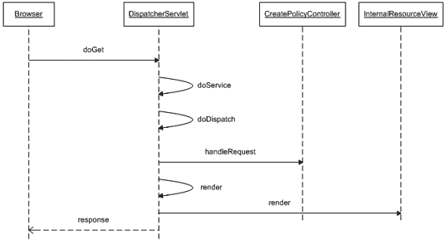

10092ch03.qxd 7/24/08 5:08 PM Page 49

第 3 章 **■** 探索表示层设计模式

**49**

下一个视图将在视图管理器的帮助下被选中。图 3-1 中的简化时序图展示了前端控制器、页面控制器和视图解析器之间的交互。我将在后续章节中更详细地解释此图。

**图 3-1.** *时序图：前端控制器请求流程* 从图 3-1 可以明显看出，`doDispatch`是`DispatcherServlet`中最重要的方法。它编排并调用页面控制器和视图。`InternalResourceView`类负责抽象基于 JSP 的视图。

**影响**

优点

• *开箱即用的前端控制器*：Spring MVC 提供了一个现成的前端控制器，只需通过配置即可在应用程序中使用。

• *集中控制*：前端控制器提供了一个中心入口点，用于整合和控制进入应用程序的请求流。这使得管理应用程序更加简单。

10092ch03.qxd 7/24/08 5:08 PM Page 50

**50**

第 3 章 **■** 探索表示层设计模式

• *简化设计*：前端控制器现在遵循单一职责原则，因为它只负责拦截请求并委托给专门的类。

• *促进可重用性*：引入前端控制器消除了模块控制器，并极大地提高了可重用性。

缺点

• *单点故障*：前端控制器也是任何应用程序的单点故障。

**应用程序控制器**

**问题**

在讨论前端控制器模式时介绍的 JSP 控制器，旨在执行以下与请求处理相关的任务：

**1.** 拦截传入请求。

**2.** 调用业务组件。

**3.** 识别并重定向到下一个视图。

前端控制器设计模式解决了第一个问题。与 JSP 控制器一样，完全可以在前端控制器中构建其他两个功能。但这将导致一个高度不灵活、臃肿、神奇的前端控制器，它承担了过多的职责。随着应用程序的增长，维护和使用如此复杂且特定的前端控制器将变得异常困难。这正是 eInsure 应用程序中基于 JSP 的控制器所遇到的问题。

一位新客户希望将他们基于 WebWork 2.0 框架构建的现有再保险产品与 eInsure 集成。集成很快就遇到了重重困难，因为控制器从未被设计来满足此类需求。eInsure 的另一位现有客户要求一项名为*保单报价*的新功能。此功能将使该保险公司的潜在客户能够估算他们需要为新保单支付的保费近似值。为此，他们将使用移动设备连接到系统，并提供生成报价（或暂定保费值）所需的最少信息。

10092ch03.qxd 7/24/08 5:08 PM Page 51

第 3 章 **■** 探索表示层设计模式

**51**

单一的 eInsure 控制器被编码为仅使用 JSP 作为视图技术。因此，它缺乏灵活性，并且支持适用于移动设备的新视图非常困难。

前两段讨论的新功能可以通过“分而治之”的策略更好地管理。这涉及在前端控制器中使用专门处理特定任务的可插拔组件。两个这样重要的组件如下：

• *动作处理器*：动作处理器定位并执行适当的页面控制器。页面控制器将业务逻辑调用与前端控制器解耦。因此，通过实现特定于 WebWork 的动作处理器组件，可以将 WebWork 2.0 页面控制器与前端控制器一起使用。


•   *视图处理器*：视图处理器负责查找视图，绑定页面控制器返回的模型，并为客户端准备响应。视图处理器使用逻辑视图名称（将在下一节解释），从而将实际视图对象与前端控制器解耦。通过使用视图处理器，可以轻松支持多种视图类型（如 HTML、JSP、PDF、Microsoft Excel 等）。因此，视图处理器组件可以被扩展，以帮助为移动设备部署视图。

这些组件通过配置连接到前端控制器。这使得前端控制器仅充当协调者的角色。这一点，加上解耦的操作和视图管理，使得前端控制器更加健壮、可重用且高度可扩展。

**驱动因素**

•   从前端控制器中移除操作和视图管理功能。

•   部署可插拔的操作和视图处理器，以支持不同类型的页面控制器和视图。

•   提高应用程序代码的可重用性、内聚性和模块化程度。

•   前端控制器应该是通用的，并且尽可能轻量。

•   通过支持在 Web 容器外部运行单元测试，来促进测试驱动开发。

10092ch03.qxd 7/24/08 5:08 PM 第 52 页

**52**

第 3 章 **■** 探索表示层设计模式

**解决方案**

使用*应用程序控制器*将操作和视图处理与前端控制器解耦。

Spring 框架中的策略

应用程序控制器是任何 Java EE Web 框架的重要内部组件。由于它静默地运行在网关 Servlet 之后，并且通常能满足应用程序的所有需求，开发者很少会关注这个组件。

例如，在 Struts 框架中，`RequestProcessor`类承担了应用程序控制器的工作。在内部，Struts 的前端控制器`ActionServlet`将视图和操作管理委托给这个类。可以扩展这个类来覆盖默认行为。但 Struts 开发者几乎从不这样做。

Spring MVC 为`DispatcherServlet`编排的操作-视图管理提供了类似的支持。与 Struts 一样，通常不需要开发者付出任何努力，可能除了某些可选配置。你在之前的示例中已经看到了这一点。你既没有编写任何代码，也没有为视图或操作处理进行任何配置。然而，对资源`createPolicy.do`的请求却由适当的页面控制器处理了。这是可能的，因为 Spring 为命令和视图处理提供了合理的默认值。在接下来的几节中，我将介绍 Spring 框架提供的各种应用程序控制器配置选项。Spring 框架高度灵活，它将应用程序控制器分为两个不同的部分，将在接下来的几节中讨论。

操作处理

Spring 的操作/命令处理起初可能会让人有些不知所措，因为涉及很多类。所以，我们将循序渐进地学习。图 3-2 展示了操作管理工作流的简化视图。我暂时有意省略了视图管理部分。

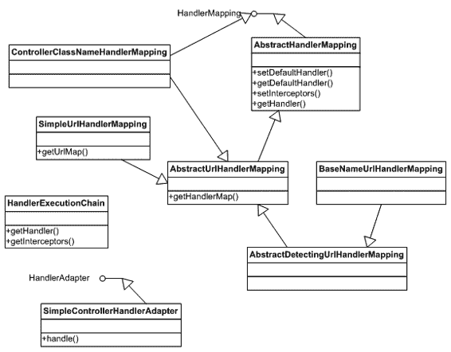

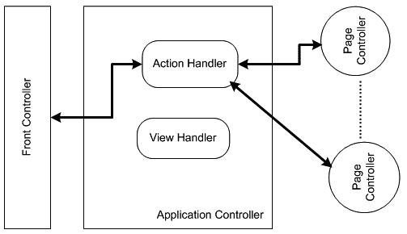

10092ch03.qxd 7/24/08 5:08 PM 第 53 页

第 3 章 **■** 探索表示层设计模式

**53**

**图 3-2.** *操作处理工作流*

如图 3-2 所示，前端控制器与操作处理器交互，操作处理器随后调用页面控制器。图 3-3 中的类图展示了构成 Spring MVC 操作处理器组件的各种类和接口。

**图 3-3.** *操作处理器类图*

10092ch03.qxd 7/24/08 5:08 PM 第 54 页

**54**

第 3 章 **■** 探索表示层设计模式

`HandlerMapping`接口是整个操作处理器组件的关键。在拦截到请求时，调度 Servlet 会查找适当的处理器映射对象，以在请求和请求处理对象之间建立映射。换句话说，处理器映射提供了一种抽象方式，将请求 URL 映射到最终的处理器或页面控制器。

顾名思义，`AbstractHandlerMapping`是一个抽象的处理器映射实现。它实现了`HandlerMapping`接口的`getHandler`方法。该方法返回一个`HandlerExecutionChain`，其中包含对以下内容的引用：

•   实现了`Controller`接口或`ThrowawayController`接口的单个页面控制器实现
•   一个可选的、实现了`HandlerInterceptor`接口的拦截器集合

`BeanNameUrlHandlerMapping`和`SimpleUrlHandlerMapping`提供了`HandlerMapping`接口的两个具体实现，足以满足大多数情况。`BeanNameUrlHandlerMapping`是前端控制器使用的默认处理器映射。如果你的应用程序只需要这个处理器映射，那么无需进行任何配置。在某些情况下，你的应用程序可能需要多个处理器映射。正如我将在后面章节中展示的，Spring MVC 允许多个处理器映射协同工作。在这种情况下，前端控制器必须决定处理器映射被调用的顺序。处理器映射实现了`Ordered`接口，允许前端控制器决定处理器映射链中的正确顺序。具有最低`order`值的处理器映射拥有最高优先级。

处理器映射仅持有页面控制器的引用。它不会调用其上的任何方法。处理器适配器负责调用页面控制器上的方法。所有处理器适配器都实现了`HandlerAdapter`接口。顾名思义，处理器适配器遵循 GOF 适配器设计模式，并且最了解如何调用适当的页面控制器。这开启了另一个 Spring 扩展点，并允许轻松集成来自其他框架（如 WebWork 或 Struts Action 类）的页面控制器。应实现`handle`方法来调用页面控制器上的方法。这正是具体实现类`SimpleControllerHandlerAdapter`所做的。它能够调用实现了`Controller`接口的页面控制器。换句话说，它知道如何调用`handleRequest`方法并处理返回值。

`HandlerExecutionChain`还包含一个可选的拦截器集合。这些拦截器提供了一种健壮的机制，用于在页面控制器处理请求之前和之后进行声明式处理。图 3-4 中的时序图是图 3-1 的扩展，展示了 Spring MVC 应用程序控制器组件中操作处理器部分内的完整消息交换。

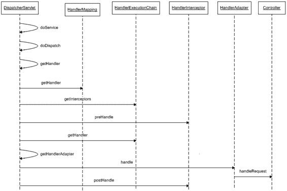

10092ch03.qxd 7/24/08 5:08 PM 第 55 页

第 3 章 **■** 探索表示层设计模式

**55**

**图 3-4.** *操作处理器时序图*

这是一个复杂的交互图，展示了 Spring 应用程序控制器组件的内部结构。图中不同的步骤如下：
**1.** 请求处理从`doService`方法开始。它保存一份请求属性的副本，并委托给`doDispatch`方法进行进一步处理。
**2.** `doDispatch`方法协调并控制应用程序控制器的工作流。
**3.** 在调度 Servlet 上调用`getHandler`方法，以获取针对给定请求的适当处理器映射。Spring MVC 运行时中可以安装一个处理器映射列表。此方法检查该列表以选择合适的处理器映射。


**4.** 一旦检测到针对给定请求的正确处理器映射，其 `getHandler` 方法将被调用，以返回一个 `HandlerExecutionChain` 实例。

**5.** `doDispatch` 方法会查找已在 Spring 容器中配置的拦截器列表。然而，请求并不强制要求配置拦截器；这完全取决于你的需求。

10092ch03.qxd 7/24/08 5:08 PM 第 56 页

**56**

第 3 章 **■** 探索表示层设计模式

**6.** 如果已配置一个或多个拦截器，则会依次调用每个拦截器的 `preHandle` 方法，对请求进行预处理。

**7.** `doDispatch` 方法通过调用 `HandlerExecutionChain` 上的 `getHandler` 方法，获取一个页面控制器实例。

**8.** 与处理器映射类似，Spring MVC 框架中可以注册多个处理器适配器。前端控制器 Servlet 的 `getHandlerAdapter()` 方法会查找处理器适配器列表，以找到最适合执行所选页面控制器的那个。

**9.** 一旦找到处理器适配器，请求处理就会被委托给它的 `handle()` 方法。

**10.** `handle()` 方法负责调用正确的页面控制器方法，并将返回值转换为 Spring MVC 框架能够理解的类型。

**11.** 最后，任何后处理任务都会借助拦截器来完成。

使用动作处理器

如前所述，`HandlerMapping` 与 `HandlerAdapter` 共同构成了健壮且高度灵活的 Spring 动作管理组件的核心。它们带来了面向接口编程（P2I）的灵活性，从而允许不同的具体实现。处理器映射和处理器适配器都为 Spring MVC 框架提供了扩展点。假设你需要根据 Cookie 中设置的值来映射一个页面控制器。你可以通过自定义的处理器映射实现来实现这一点。假设这个页面控制器是作为某个自研 Web 框架的一部分开发的。你可以创建一个处理器映射实现，来调用该控制器上的适当方法并消费返回的结果。使用自定义版本只需实现接口或任何抽象类，然后在 Spring 容器中进行配置即可。然而，在大多数情况下并不需要这样做。这是因为 Spring 提供了几种足以应对大多数情况的具体实现。到目前为止，我已经解释了很多理论内容，现在我将展示如何将这些实现类付诸实践。

**BeanNameUrlHandlerMapping**

此处理器映射用于将请求 URL 直接映射到 Spring IOC 容器中注册的 Bean 对象或页面控制器。换句话说，URL 会与应用程序上下文中 Bean 的名称进行匹配。

10092ch03.qxd 7/24/08 5:08 PM 第 57 页

第 3 章 **■** 探索表示层设计模式

**57**

考虑一个针对以下 URL 的请求：http://www.myinsuranceportal.com/insuranceapp/createPolicy.do。此请求会被调度器或前端控制器 Servlet 拦截，该 Servlet 会查找在 Spring Web 应用程序上下文中注册的处理器映射。你可以按照清单 3-6 所示进行操作。

**清单 3-6.** insurance-servlet.xml

<beans>

<bean name="beanNameUrlHandlerMapping"

class="org.springframework.web.servlet. **➥**

handler.BeanNameUrlHandlerMapping"/>

<bean name="/createPolicy.do" class="com.apress.insuranceapp. **➥**

web.CreatePolicyController"/>

</beans>

然而，如前所述，此配置是可选的，因为 `BeanNameUrlHandlerMapping` 是默认的处理器。如果在 Web 应用程序上下文中未找到处理器映射，Spring MVC 将创建一个 `BeanNameUrlHandlerMapping` 实例。现在，既然检测到了处理器映射，前端控制器将在 Spring 容器中查找名为 `/createPolicy.do` 的 Bean。它成功地将此解析为 `CreatePolicyController` 命令处理器 Bean。

此处理器映射相对于 Servlet 映射工作，并且不依赖于上下文路径。因此，上下文路径或 Servlet 映射的更改不会要求更改 Spring 容器中的 Bean 配置。但是，可以通过设置布尔标志 `alwaysUseFullPath` 来启用完整路径的使用，如清单 3-7 中的配置所示。

**清单 3-7.** insurance-servlet.xml

<beans>

<bean name="beanNameUrlHandlerMapping" class="org.springframework**➥**

.web.servlet.handler.BeanNameUrlHandlerMapping">

<property name="alwaysUseFullPath" value="true" />

</bean>

</beans>

10092ch03.qxd 7/24/08 5:08 PM 第 58 页

**58**

第 3 章 **■** 探索表示层设计模式

**SimpleUrlHandlerMapping**

`BeanNameUrlHandlerMapping` 类不支持使用通配符将请求 URL 解析为 Bean 名称。假设你希望 `UpdatePolicyController` 处理两个请求：`/createPolicy.do` 和 `/updatePolicy.do`。使用 `BeanNameUrlHandlerMapping`，你需要配置两个 `<bean />` 条目。这是冗余的，并且可以通过使用 `SimpleUrlHandlerMapping` 类进行 Apache Ant 风格的路径通配符映射来简化配置。由于这不是默认的处理器映射，因此必须在 Spring 配置文件中显式配置它，如清单 3-8 所示。

**清单 3-8.** insurance-servlet.xml

<beans>

<bean name="simpleUrlHandlerMapping"

class="org.springframework.web.servlet.handler.SimpleUrlHandlerMapping">

<property name="mappings">

<props>

<prop key="/*Policy.do">updatePolicyController</prop>

</props>

</property>

</bean>

<bean name="updatePolicyController" class="com.apress.insuranceapp**➥**

.web.UpdatePolicyController"/>

</beans>

如清单 3-8 所示，控制器就像 Spring 容器中的任何其他 Bean 一样进行配置。处理器映射的 `mappings` 属性非常重要。它通过一个 `java.util.Properties` 对象进行装配。该对象的每个键都是一个 URL 模式。`updatePolicyController` 的键是 URL 模式：`/*Policy.do`。它使用了 `*` 通配符。这意味着任何以 `Policy.do` 结尾的请求 URL 都将由此页面控制器处理。请注意，一旦调度器 Servlet 检测到此处理器映射，它将不再需要创建默认的 Bean 处理器映射实例。

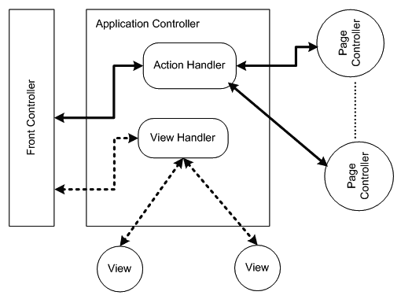

10092ch03.qxd 7/24/08 5:08 PM 第 59 页

**59**

第 3 章 **■** 探索表示层设计模式

视图处理器

现在，是时候仔细看看应用程序控制器拼图的另一块了——视图管理。图 3-5 展示了包含视图处理器组件的简单应用程序控制器工作流程。

**图 3-5.** *视图管理工作流程*

图 3-5 再次强调了调度器 Servlet 作为协调者的角色。请注意，视图处理器与动作管理组件是完全解耦的。这是通过 `View` 和 `ViewResolver` 接口实现的。`View` 接口是对任何可用表示技术的抽象。这使得任何表示技术（例如基于 HTML 的 JSP 或基于文档的 PDF）都可以集成并与 Spring MVC 一起使用。视图本质上负责显示业务对象调用的结果。


它们还提供了按钮、链接和输入框等控件，供用户与系统交互。但从应用程序控制器和视图管理的角度来看，`ViewResolver` 是最重要的接口。它负责实现视图与控制器的完全解耦。图 3-6 展示了基本的视图解析器类图。

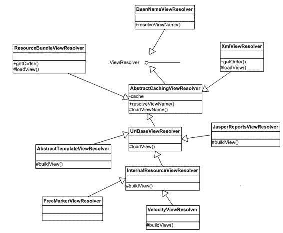

10092ch03.qxd 7/24/08 5:08 PM Page 60

**60**

第 3 章 **■** 探索表示层设计模式

**图 3-6.** *视图管理类图*

`ViewResolver` 接口定义了一个单一方法 `resolveViewName`，该方法尝试按名称解析视图。此方法还接受一个 `Locale` 对象作为参数，这使得实现类能够支持国际化的视图查找。`BeanNameViewResolver` 类通过在当前应用程序上下文中查找与视图名称同名的 bean 来解析视图。`AbstractCachingViewResolver` 提供了一个便利的基类来实现视图解析器。它会在视图对象被解析后对其进行缓存。与 Spring 框架中的许多其他类一样，该类实现了模板模式，子类需要实现抽象方法 `loadView`。

`ResourceBundleViewResolver` 和 `XmlViewResolver` 使用资源包和 XML 文件来加载视图定义。然而，这并非唯一的区别，我将在本章后面的示例中向您展示。`UrlBasedViewResolver` 非常有用，因为它可以将视图名称转换为 URL，而无需显式定义任何映射。它可以选择性地使用前缀和后缀。因此，视图名称为 `claimdetail` 且后缀为 `.jsp` 将生成 URL `claimdetail.jsp`。简而言之，该类有助于将逻辑视图名称映射到物理资源。`JasperReportsViewResolver` 专门用于将视图名称映射到

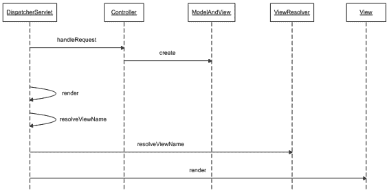

10092ch03.qxd 7/24/08 5:08 PM Page 61

第 3 章 **■** 探索表示层设计模式

**61**

基于 JasperReports 的视图。另一方面，`InternalResourceViewResolver` 将视图名称解析为位于 `WEB-INF` 文件夹中的 JSP 或基于 Apache Tiles 的视图组件。它是最广泛使用的视图解析器。`AbstractTemplateViewResolver` 是用于解析基于模板的视图的抽象基类。`FreeMarkerViewResolver` 和 `VelocityViewResolver` 是两个专门的类，分别用于确定基于 FreeMarker 和 Velocity 模板引擎的视图。现在您已经熟悉了重要的视图处理类，是时候通过探索视图处理子系统的序列图（见图 3-7）来关注其动态方面了。

**图 3-7.** *视图管理序列图*

这是对图 3-4 中讨论的工作流的扩展。参与对象之间的消息交换如下：

**1.** 处理器适配器组件负责调用 `Controller` 接口上的 `handleRequest` 方法。

**2.** 页面控制器创建 `ModelAndView` 对象，并将逻辑视图名称和要由视图渲染的数据传递给它。

**3.** 调度器 servlet 随后将视图渲染活动委托给 `render` 方法。

**4.** `render` 方法首先尝试通过调用 `resolveViewName` 方法来定位适当的视图对象。

10092ch03.qxd 7/24/08 5:08 PM Page 62

**62**

第 3 章 **■** 探索表示层设计模式

**5.** `resolveViewName` 方法尝试将给定的逻辑视图名称映射到具体的视图资源。为此，它会寻求应用程序上下文中所有已注册的 `ViewResolver` 类的帮助。

**6.** 当解析出适当的视图对象后，将调用其上的 `render` 方法来显示模型数据。

使用视图处理器

在下一节中，我将展示一些常用的具体视图解析器的实际应用。

**ResourceBundleViewResolver**

此视图解析器实现有两个优点：

• 它允许将逻辑视图名称到物理资源的映射配置在外部的属性文件或资源包文件中。
• 它为视图解析过程增加了国际化支持。如果我们想为不同的区域设置配置一组独立的物理资源，这个类使之成为可能。

eInsure 必须在一家领先的保险公司部署，该保险公司的业务遍及加拿大和澳大利亚。因此，eInsure 必须支持本地化视图：澳大利亚使用英语，加拿大使用法语。一种解决方案是开发两套用于表示层的 JSP，以支持不同的区域设置，并让 `ResourceBundleViewResolver` 在运行时找到适当的视图。为了实现此解决方案，eInsure 团队创建了两个 JSP：`PolicyDetails_en_AU.jsp` 和 `PolicyDetails_fr_CA.jsp`（清单 3-9）。第一个 JSP 支持澳大利亚用户，而第二个则服务于加拿大的法语用户。

**清单 3-9.** PolicyDetails_fr_CA.jsp

<html>

<head>

<title>核保</title>

<script>

**function eventSubmit(url){**

**document.policy.action = url;**

**document.policy.submit();**

10092ch03.qxd 7/24/08 5:08 PM Page 63

第 3 章 **■** 探索表示层设计模式

**63**

**}**

</script>

</head>

<body>

<form name="policy">

<table>

<tr>

<td>名字:</td>

<td><input name="firstName" type="text"/></td>

</tr>

<tr>

<td>姓氏:</td>

<td><input name="lastName" type="text"/></td>

</tr>

<tr>

<td>年龄:</td>

<td><input name="age" type="text"/></td>

</tr>

<tr>

<td colspan="3">

<input type="button" value="创建"

onClick="eventSubmit('createPolicy.do')" />

</td>

</tr>

</table>

</form>

</body>

</html>

接下来，创建了包含外部化信息的资源包文件，用于将逻辑视图名称映射到物理资源。清单 3-10 显示了加拿大法语区域设置的映射文件。该文件从类路径中获取，应放置在 Web 应用程序的 `/WEB-INF/classes` 文件夹中。

10092ch03.qxd 7/24/08 5:08 PM Page 64

**64**

第 3 章 **■** 探索表示层设计模式

**清单 3-10.** /WEB-INF/classes/insurance-views_fr_CA.properties policydetails.class=org.springframework.web.servlet.view.JstlView

policydetails.url=/WEB-INF/jsp/PolicyDetails_fr_CA.jsp

基础资源包文件名为 `views.properties`。根据区域设置，其他资源将命名为 `views_fr_CA.properties` 等。但这可以通过配置进行更改。因此，当请求名为 `policydetails` 的视图时，视图解析器会创建一个 `JstlView` 类的新实例。该类代表一个使用 JSP 标准标签库的基于 JSP 的视图。然后通过 setter 注入将 URL 详细信息传递给 `JstlView` 实例。逻辑视图名称通常由页面控制器提供，如清单 3-11 所示。

**清单 3-11.** PolicyDetailsController.java

public class PolicyDetailsController implements Controller {

public ModelAndView handleRequest(HttpServletRequest request,

HttpServletResponse response) throws Exception {

return new ModelAndView("policydetails");

}

}

最后，应在 Spring 应用程序上下文中配置页面控制器和视图解析器，以便调度器 servlet 可以使用它们。清单 3-12 显示了 Spring 配置。

**清单 3-12.** insurance-servlet.xml

<beans>

<bean name="/policydetails.do"

class="com.apress.insurance.web.controller.PolicyDetailsController"/>

<bean id="viewResolver" class="org.springframework.web.servlet. **➥**

view.ResourceBundleViewResolver">

<property name="basename" value="insurance-views"></property>

</bean>

</beans>

10092ch03.qxd 7/24/08 5:08 PM Page 65

第 3 章 **■** 探索表示层设计模式

**65**

请注意，在清单 3-12 中，资源包的基名称已被更改。


因此，在这种情况下，保存映射信息的资源包将被命名为 insurance-views.properties、insurance-views_fr_CA.properties 等。由于这种配置，许多操作在后台自动完成。我将在此处总结这些操作，以便您更好地理解：

**1.** 对 policydetails.do 的请求被调度器 servlet 拦截。

**2.** 该请求由 PolicyDetailsController 页面控制器处理。它设置应使用的逻辑视图名称，以呈现业务组件返回的数据。

**3.** 调度器 servlet 使用控制器返回的逻辑视图名称以及请求中可用的区域设置信息来调用视图解析器。

**4.** ResourceBundleViewResolver 首先根据区域设置检测相应的资源包。

**5.** 使用逻辑视图名称来检测资源包中配置的相应视图类。在本例中，即属性 policydetails.class 的值。

**6.** 最后，创建 JstlView 的一个实例，并将配置参数 policydetails.url 的值注入此对象，然后返回给调度器 servlet。

此处介绍的设计可用于支持两种区域设置的应用程序，但它可能产生严重的副作用。使用属性文件进行视图管理是一种繁琐的方法。维护此应用程序可能是一场噩梦，因为我们需要为每个区域设置添加 *n* 个 JSP。换句话说，如果我们支持 *m* 个区域设置，我们将拥有 *m** *n* 个 JSP 文件。

此外，每个区域设置还需要一个视图配置文件。因此，实际上我们将需要维护 *m**(1+ *n*) 个 JSP 和配置文件。更好的方法是为所有区域设置使用单个 JSP。该 JSP 由应用程序打算支持的各种区域设置的 *m* 个资源包支持。然后，可以在 JSP 中使用这些资源包，采用稍后描述的 View Helper 模式。因此，实际上我们只需要维护 ( *n* + 2 *m*) 个文件，这大大简化了工作。

**XmlViewResolver**

XmlViewResolver 不支持本地化视图解析，如果我们打算实现“一个 JSP 适用于所有区域设置”的解决方案，则应使用它来替换 ResourceBundleViewResolver。因此，使用 XmlViewResolver，只需一个 PolicyDetails.jsp 即可满足所有用户的需求，而本地化标签则存储在资源包中。大多数开发者发现，在 XML 文件中配置视图映射更加方便。

10092ch03.qxd 7/24/08 5:08 PM 第 66 页

**66**

第 3 章 **■** 探索表示层设计模式

要使用基于 XML 的视图解析器，需要将配置信息从属性文件迁移到 XML 文件中。此视图配置文件应位于 WEB-INF 文件夹中，默认名为 views.xml。与 Spring 中的大多数参数一样，其位置也是可配置的。清单 3-13 展示了 views.xml 文件。

**清单 3-13.** /WEB-INF/views.xml

<?xml version="1.0" encoding="UTF-8"?>

<beans

[xsi:schemaLocation="http://www.springframework.org/schema/beans](http://www.w3.org/2001/XMLSchema-instance)

[`www.springframework.org/schema/beans/spring-beans-2.5.xsd"`](http://www.w3.org/2001/XMLSchema-instance)

>

<bean name="policydetails" class="org.springframework.web. **➥**

servlet.view.JstlView">

<property name="url" value="/WEB-INF/jsp/PolicyDetails.jsp" />

</bean>

</beans>

请注意，所使用的配置与应用程序上下文配置非常相似。views.xml 中定义的 bean 实际上是主应用程序上下文工厂的扩展。最后，我们需要在应用程序上下文中配置 XmlViewResolver，以便前端控制器 servlet 可以使用它。清单 3-14 展示了修改后的应用程序上下文配置。

**清单 3-14.** insurance-servlet.xml

<?xml version="1.0" encoding="UTF-8"?>

<beans

[xsi:schemaLocation="http://www.springframework.org/schema/beans](http://www.w3.org/2001/XMLSchema-instance)


[`www.springframework.org/schema/beans/spring-beans-2.5.xsd"`](http://www.w3.org/2001/XMLSchema-instance)

>

<bean name="/policydetails.do" class="com.apress.insurance.web.controller. **➥**

PolicyDetailsController"/>

10092ch03.qxd 7/24/08 5:08 PM 第 67 页

第 3 章 **■** 探索表示层设计模式

**67**

<bean id="viewResolver" class="org.springframework.web.servlet.view. **➥**

XmlViewResolver" />

</beans>

**InternalResourceViewResolver**

如果应用程序仅使用 JSP，则无需维护外部视图映射配置。`InternalResourceViewResolver` 类可以根据逻辑视图名称确定 Web 应用程序归档中的物理视图。使用此视图解析器只需进行配置即可，如清单 3-15 所示。

**清单 3-15.** insurance-servlet.xml

<?xml version="1.0" encoding="UTF-8"?>

<beans

[xsi:schemaLocation="http://www.springframework.org/schema/beans](http://www.w3.org/2001/XMLSchema-instance)

[`www.springframework.org/schema/beans/spring-beans-2.5.xsd"`](http://www.w3.org/2001/XMLSchema-instance)

>

<bean name="viewResolver" class="org.springframework.web.servlet.view. **➥**

InternalResourceViewResolver">

<property name="viewClass" value="org.springframework.web.servlet.view**➥**

.JstlView"></property>

<property name="prefix" value="/WEB-INF/jsp/"></property>

<property name="suffix" value=".jsp"></property>

</bean>

<bean name="/policydetails.do" class="com.apress.insurance.web.controller**➥**

.PolicyDetailsController"/>

</beans>

请注意，`InternalResourceViewResolver` 也会返回 `JstlView`。它从 `UrlBasedViewResolver` 继承了**两个可选属性**——`prefix` 和 `suffix`——以完全解析物理资源。在此例中，视图名称 `policydetails` 将映射到物理资源 `/WEB-INF/jsp/policydetails.jps`。此视图解析器也可与使用 Apache Tiles 布局框架组合的视图一起使用。

10092ch03.qxd 7/24/08 5:08 PM 第 68 页

**68**

第 3 章 **■** 探索表示层设计模式

如果单个解析器无法满足应用程序需求，则可以**链式使用**视图解析器。视图解析器链的工作方式与处理器映射链类似，因为大多数视图解析器都实现了 `Ordered` 接口。

**影响**

**优点**

• ***增强的模块化***：将视图和命令管理划分为两个独立且解耦的子系统，使应用程序更具模块化和健壮性。

• ***提高的可重用性***：应用程序控制器使得控制器和视图的重用成为可能。

• ***增强的可扩展性***：Spring 应用程序控制器的各种接口和包含模板方法的抽象基类，使得扩展框架变得容易，支持多种命令控制器和视图。还可以将第三方基于动作的 Web 框架（如 WebWork、Struts 等）与 Spring MVC 集成，并与 OpenLaszlo 和 Flex 等视图协同工作。

**关注点**

• ***陡峭的学习曲线***：理想情况下，应用程序控制器应属于底层框架的关注点。对于大多数常见需求，由于 Spring 具有合理的默认值，通常不需要直接操作应用程序控制器。然而，它也为寻求可扩展性和灵活性的开发者完全开放了此组件。这增加了学习曲线，因为现在需要了解更多框架内部知识才能支持特殊需求。

**页面控制器**

**问题**

本章开头介绍的基于 JSP 的控制器通过执行 `if-else` 块中的代码来处理每个用户操作。每个 `if-else` 块主要负责

10092ch03.qxd 7/24/08 5:08 PM 第 69 页

第 3 章 **■** 探索表示层设计模式

**69**

调用会话 Bean 来执行不同的业务功能。然而，这是最不灵活的设计，并且降低了重用性。

我将指出两个简单的用例来详细说明上一段讨论的问题。在索赔最终获批之前，索赔人姓名可以修改。这种修改涉及对索赔记录的简单更新操作。现在考虑一个稍微复杂的情况：假设一个已提交的索赔因缺乏证据而被拒绝。很容易将其视为删除操作。然而，它必须通过向索赔记录附加一个有效结束日期来处理为软删除。这样做是因为一旦获得必要信息，被拒绝的索赔可以恢复。

此外，它还可以作为索赔人未来投保的参考。

JSP 前端控制器有两个不同的 `if-else` 块来处理这两种情况。这两个独立的代码块是不必要的，因为第一种情况是更新索赔记录中的姓名字段，而第二种情况需要修改同一条记录中的索赔状态和有效结束日期字段。因此，实际上只需要一个代码块，却存在两个。这只是 eInsure 所有 JSP 控制器中散布的多个此类块的一个例子。此外，正如我已经指出的，JSP 并不是容纳用户操作处理程序的合适控制器。每增加一个新功能，就需要添加一个代码块，这违背了面向对象原则——封装、继承和可重用性。

很容易考虑将这些块嵌入到前端控制器调度 Servlet 中。然而，调度 Servlet 很快就会像 JSP 控制器一样被污染，变得不灵活且不适合跨应用程序使用。

**驱动力**

• 将响应于用户操作而调用业务逻辑的代码提取到可重用组件中。

• 基于请求 URL 而非硬编码的事件和屏幕代码来识别可重用组件。

• 每个用户操作部署一个可重用组件。

**解决方案**

使用*页面控制器*来整合用户操作处理。

10092ch03.qxd 7/24/08 5:08 PM 第 70 页

**70**

第 3 章 **■** 探索表示层设计模式

Spring 框架中的策略

我已经在前端控制器和应用程序控制器设计模式中介绍了 Spring 页面控制器。我还讨论了识别适当页面控制器以及在 Spring 注册表中配置它们的工作流程。但是，我将实现细节留到了现在。在接下来的几节中，我将更详细地探讨页面控制器。

**使用 Controller**

清单 3-16 展示了我在前面示例中一直引用和使用的页面控制器实现类。

**清单 3-16.** CreatePolicyController.java

public class CreatePolicyController implements Controller {

private UnderwritingBusinessDelegate uwrBusinessDelegate;

public ModelAndView handleRequest(HttpServletRequest request,

HttpServletResponse response) throws Exception {

//将请求中的数据转换为适合业务层使用的格式

PolicyDetail policyDetail = new PolicyDetail();

policyDetail.setPolicyId(request.getParameter("policyId"));

//调用业务组件

this.uwrBusinessDelegate.createPolicy(policyDetail);

Map model = new HashMap();

model.put("POLICY_DETAIL", policyDetail);

//返回模型和下一个视图

return new ModelAndView("Success",model);

}

public void setUwrBusinessDelegate(

UnderwritingBusinessDelegate uwrBusinessDelegate) {

this.uwrBusinessDelegate = uwrBusinessDelegate;

}

}

10092ch03.qxd 7/24/08 5:08 PM 第 71 页

第 3 章 **■** 探索表示层设计模式

**71**


好的，作为一名高级文档工程师和翻译员，我将严格遵循您提供的注意事项和示例格式，将给定的英文文本翻译成中文。


如清单 3-16 所示，`CreatePolicyController` 类实现了 Spring 框架提供的 `Controller` 接口。因此，它实现了该接口的 `handleRequest` 方法。此方法使用 `HttpServletRequest` 中的数据来填充一个简单的 JavaBean 对象 `PolicyDetail`。然后，它调用业务操作来创建一个新的保单。业务逻辑通过客户端外观 `UnderwritingBusinessDelegate` 来调用，该类实现了第 4 章描述的业务委托模式。如清单 3-17 所示，业务委托对象由 Spring 容器注入。最后，包含逻辑视图名称和业务层返回数据的 `ModelAndView` 对象被传递给调用此页面控制器的处理器适配器。

**清单 3-17.** Spring-config.xml

<beans

[xsi:schemaLocation="http://www.springframework.org/schema/beans](http://www.w3.org/2001/XMLSchema-instance)

[`www.springframework.org/schema/beans/spring-beans-2.5.xsd">`](http://www.w3.org/2001/XMLSchema-instance)

<bean name="/createPolicy.do" class="com.apress.insuranceapp.web.controller**➥**

.CreatePolicyController">

<property name="uwrBusinessDelegate" ref="uwrBusinessDelegate"/>

</bean>

<bean name="uwrBusinessDelegate" class="com.apress.insuranceapp.business. **➥**

delegate.UnderwritingBusinessDelegateImpl"/>

</beans>

实现控制器接口的类必须是线程安全的，因为它们默认是单例的。控制器可以完全访问 `HttpServletRequest` 和 `HttpServletResponse` 对象，因此它们依赖于 HTTP 协议。

但这同时也使得这些组件可以被依赖于 HTTP 的远程调用机制所使用。如果目标独立于 Servlet API 并且控制器不需要是线程安全的，则可以使用 `ThrowawayController`。

**使用 AbstractController**

在大多数情况下，实现 `Controller` 接口就足够了。然而，Spring 提供了几个具体的以及抽象的控制器实现，可以根据需求进行扩展。图 3-8 中的类图展示了这样一个类。

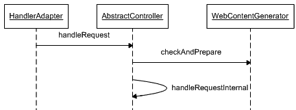

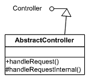

10092ch03.qxd 7/24/08 5:08 PM Page 72

**72**

第 3 章 **■** 探索表示层设计模式

**图 3-8.** *抽象控制器类图*

如图 3-8 所示，`AbstractController` 类实现了 `Controller` 接口，并定义了一个可供子类使用的、定义良好的工作流。该类实现了模板方法设计模式（GOF），以定义一个固定的工作流，并提供合适的扩展钩子来改变工作流。图 3-9 所示的时序图说明了该类定义的工作流。

**图 3-9.** *抽象控制器时序图*

处理器适配器调用 `handleRequest` 方法来触发工作流。然后，在父类 `WebContentGenerator` 上调用 `checkAndPrepare` 方法来执行以下活动：

**1.** 检查此请求的 HTTP 方法是否受支持。这可用于阻止不需要的 HTTP 方法请求，例如 `DELETE`。通过支持 `GET` 请求，它可以用于访问某些只读资源，例如帮助页面。

**2.** 检查 HTTP 会话是否已启动。如果应用程序在执行进一步处理之前需要会话中已存储的某些数据，这将非常有用。

**3.** 为客户端设置提示，指明由调度器 Servlet 发送的最终响应的缓存持续时间。

10092ch03.qxd 7/24/08 5:08 PM Page 73

第 3 章 **■** 探索表示层设计模式

**73**

所有这些任务都可以通过配置来开启或关闭。前两个任务在失败时会引发 `ServletException`。这里的扩展点由抽象的 `handleRequestInternal` 方法提供。所有子类都必须实现此模板方法以提供自定义实现。因此，`AbstractController` 是一个便利的基类，用于简化页面控制器的实现。

我将通过一个非常简单的用例来使用 `AbstractController`。eInsure 应用程序需要显示支持和帮助信息，以使用户能够轻松地处理应用程序的不同功能。清单 3-18 展示了其中一个场景的控制器。

**清单 3-18.** PolicyQuoteHelpController.java

public class PolicyQuoteHelpController extends AbstractController {

protected ModelAndView handleRequestInternal(HttpServletRequest request, HttpServletResponse response) throws Exception {

return new ModelAndView("policyquotehelp");

}

}

`PolicyQuoteHelpController` 不调用任何业务逻辑。相反，它充当一个只读控制器，仅将控制权转移到下一个视图。但在执行此操作之前，它会检查请求是否通过 HTTP GET 方法发出以及会话是否已存在。请注意，这两个选项是通过配置设置的，如清单 3-19 所示。

**清单 3-19.** spring-config.xml

<beans>

<bean name="/policyquotehelp.do" class="com.apress.insuranceapp. **➥**

web.controller.PolicyQuoteHelpController">

<property name="supportedMethods" value="GET"/>

<property name="requireSession" value="true"/>

</bean>

</beans>

10092ch03.qxd 7/24/08 5:08 PM Page 74

**74**

第 3 章 **■** 探索表示层设计模式

如果不需要前面提到的两个检查，那么可以将 `UrlFilenameView**➥**Controller` 类与视图解析器结合使用，以实现仅传递逻辑视图名称的页面控制器。我将在本章后面讨论 Dispatcher View 模式时更详细地介绍这种控制器。

**使用 AbstractCommandController**

Web 应用程序中的大多数用例都是通过收集 HTML 表单中提供的信息，然后基于这些表单数据执行业务操作来运行的。可以主要通过使用 `getParameter` 方法从 `HttpServletRequest` 对象中获取所有表单数据。将请求对象传递给业务层是一种不好的做法，因为这样会使业务层依赖于特定协议类型的客户端。因此，可以使用 `getParameter` 方法来检索所有必要的数据以填充 JavaBean 对象。这个 JavaBean 对象被传递给业务层。

将 JavaBean 创建逻辑放在控制器中违反了 SRP（单一职责原则）。对表单字段的任何更改都可能导致控制器的更改。一个灵活且清晰的设计是在控制器外部创建此 JavaBean 对象，并将其作为参数传递给控制器。实现 `AbstractCommand**➥**Controller` 类的控制器满足了这一要求。处理器适配器从 `HttpServletRequest` 对象中填充 POJO 对象，然后将其传递给控制器。它将表单字段名称映射到 POJO 的属性。

清单 3-20 中显示的 JSP 用于承保新保单。它呈现了一个简化的保单承保表单，只有三个字段。清单 3-21 显示了用于填充表单数据的 JavaBean 类。一些开发人员将这些类称为*命令类*。然而，这个名称是不恰当的，因为页面控制器是实现了命令设计模式（GOF）的命令对象。服务器上这些用于填充和存储通过 HTML 表单提交传递的值的持有数据的类，最好称为*表单 Bean*。

**清单 3-20.** WEB-INF/jsp/createPolicy.jsp

<html>

<head>

<title>承保</title>

<script>

function eventSubmit(url){

document.policy.action = url;

document.policy.submit();

}

10092ch03.qxd 7/24/08 5:08 PM Page 75


第 3 章 **■** 探索表示层设计模式

**75**

</script>

</head>

<body onLoad="displayError(<%=request.getAttribute("ERROR_MESSAGE")%>)">

<form name="policy" method="POST">

名字 <input type="text" name="firstName" value="" /><br/> 姓氏 <input type="text" name="lastName" value="" /><br/> 年龄 <input type="text" name="age" value="" /><br/>

<input type="button" value="保存" onClick="eventSubmit('saveNewPolicy.do')"/>

</form>

</body>

</html>

使用 Spring MVC 时，表单 Bean 除了创建过程外，与框架没有任何生命周期依赖关系。此外，表单 Bean 也无需实现任何框架特定的接口。因此，这些对象可以安全地用于应用程序的其他部分——业务层和集成层。

**清单 3-21.** PolicyFormBean.java

public class PolicyFormBean implements Serializable {

private String firstName;

private String lastName;

private int age;

public int getAge() {

return age;

}

public void setAge(int age) {

this.age = age;

}

public String getFirstName() {

return firstName;

}

public void setFirstName(String firstName) {

this.firstName = firstName;

}

10092ch03.qxd 7/24/08 5:08 PM 第 76 页

**76**

第 3 章 **■** 探索表示层设计模式

public String getLastName() {

return lastName;

}

public void setLastName(String lastName) {

this.lastName = lastName;

}

}

因此，表单 Bean 是一个 POJO，为每个字段提供了 get 和 set 方法。请注意，该类中的字段名称与 HTML 输入元素的 name 属性完全匹配。

清单 3-22 展示了控制器的实现。

**清单 3-22.** SaveNewPolicyController.java

public class SaveNewPolicyController extends AbstractCommandController {

private UnderWritingBusinessDelegate uwrBusinessDelegate;

public SaveNewPolicyController() {

this.setCommandClass(PolicyFormBean.class);

}

public void setUwrBusinessDelegate(

UnderWritingBusinessDelegate uwrBusinessDelegate) {

this.uwrBusinessDelegate = uwrBusinessDelegate;

}

protected ModelAndView handle(HttpServletRequest request,

HttpServletResponse res, Object formBean, BindException errors)

throws Exception {

PolicyFormBean policyBean = (PolicyFormBean) formBean;

log.info("名字--" + policyBean.getFirstName());

log.info("姓氏--" + policyBean.getLastName());

log.info("年龄 --" + policyBean.getAge());

this.uwrBusinessDelegate.createPolicy(policyBean);

return new ModelAndView("showPolicydetails","policydetails",policyBean);

}

}

10092ch03.qxd 7/24/08 5:08 PM 第 77 页

第 3 章 **■** 探索表示层设计模式

**77**

现在，策略控制器继承了 AbstractCommandContoller。通过重写 handle 方法，改变了 AbstractCommandController 的工作流程。

最后，清单 3-23 展示了将所有组件连接起来的 Spring 配置文件。

**清单 3-23.** insurance-servlet.xml

<?xml version="1.0" encoding="UTF-8"?>

<beans

[xsi:schemaLocation="http://www.springframework.org/schema/beans](http://www.w3.org/2001/XMLSchema-instance)

[`www.springframework.org/schema/beans/spring-beans-2.5.xsd"`](http://www.w3.org/2001/XMLSchema-instance)

>

<bean name="simpleUrlHandlerMapping"

class="org.springframework.web.servlet.handler.SimpleUrlHandlerMapping">

<property name="mappings">

<props>

<prop key="/create*.do">staticViewController</prop>

</props>

</property>

</bean>

<bean name="beanNameUrlHandlerMapping"

class="org.springframework.web.servlet.handler.BeanNameUrlHandlerMapping">

<property name="order" value="1" />

</bean>

<bean name="viewResolver"

class="org.springframework.web.servlet.view.InternalResourceViewResolver">

<property name="viewClass"

value="org.springframework.web.servlet.view.JstlView" />

<property name="prefix" value="/WEB-INF/jsp/" />

<property name="suffix" value=".jsp" />

</bean>

<bean name="staticViewController"

class="org.springframework.web.servlet.mvc.UrlFilenameViewController" >

</bean>

10092ch03.qxd 7/24/08 5:08 PM 第 78 页

**78**


第 3 章 **■** 探索表示层设计模式

<bean name="/saveNewPolicy.do"
     class="com.apress.insurance.web.controller.SaveNewPolicyController" >
    <property name="uwrBusinessDelegate"
              ref="underwritingBusinessDelegate" />
</bean>

<bean name="underwritingBusinessDelegate"
     class="com.apress.insurance.view.delegate.UnderWritingBusinessDelegate" />
</beans>

呈现给终端用户浏览器用于创建保单的网页不需要任何动态数据。因此，我配置了一个`UrlFilenameViewController`对象来处理此请求。它会将 URL 中的资源名称转换为逻辑视图名称。

因此，对`createPolicy.do`的请求将产生一个符号视图名称：`createPolicy`。带有通配符映射的`SimpleUrlHandlerMapping`会解析任何以`create`开头的请求（例如`createPolicy.do`），并调用`UrlFilenameViewController`，后者返回逻辑视图名称。最后，前端控制器调用视图解析器，将逻辑视图名称解析为物理资源`/WEB-INF/jsp/createPolicy.jsp`。

在`createPolicy.jsp`（清单 3-20）中，当用户点击“保存”按钮时，会向服务器发送一个请求，请求资源`saveNewPolicy.do`。现在，清单 3-23 中配置了一个处理器映射链。优先级更高的`BeanNameUrlHandlerMapping`能够解析此 URL 并调用`SaveNewPolicyController`。该控制器返回的逻辑视图名称最终被解析为资源`showPolicydetails.jsp`。

**使用 SimpleFormController**

典型的 Web 应用程序涉及显示表单以收集用户输入。用户填写此表单并将数据提交到 Web 服务器进行进一步处理。

`SimpleFormController`被广泛用于提供页面控制器实现，因为它协调和管理表单生命周期中两个最重要的方面——视图和提交。与许多其他 Spring MVC 类一样，该类也实现了模板设计模式，在工作流的适当点上是封闭修改但开放扩展的。工作流也可以通过设置各种可配置属性来改变。

**表单显示**

我将首先查看`SimpleFormController`类提供的表单显示功能。

图 3-10 展示了此功能的工作流程。

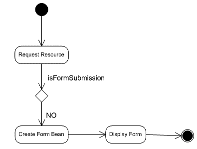

10092ch03.qxd 2008 年 7 月 24 日 下午 5:08 第 79 页

第 3 章 **■** 探索表示层设计模式

**79**

**图 3-10.** *SimpleFormController 中的表单显示工作流程*
这是一个过于简化的工作流程，因为我只想关注感兴趣的领域。

你可以在《Expert Spring MVC and Web Flow》（Apress，2006 年）一书中找到详细的工作流程和解释。如图 3-11 所示，Web 浏览器对资源的请求最终被委托给页面控制器。`SimpleFormController`检测到请求是通过 HTTP GET 方式到达的，因此这不是表单提交，而是表单显示请求。它创建一个表单 bean 的实例，并使表单准备好显示。

现在，我将以之前讨论的`AbstractCommandController`示例为例，尝试用`SimpleFormController`来实现它，因为后者提供了更大的灵活性。

作为第一步，我将简化 JSP，如清单 3-24 所示。请注意，不再使用 JavaScript 来提交表单。还要注意，表单的`action`属性没有指定值。这消除了与特定操作 URL 的任何耦合。除了这两处更改外，JSP 与清单 3-20 中呈现的相同。

**清单 3-24.** WEB-INF/jsp/createPolicy.jsp

<html>
<head>
    <title>核保</title>
</head>
<form action="" method="POST">

10092ch03.qxd 2008 年 7 月 24 日 下午 5:08 第 80 页

**80**

第 3 章 **■** 探索表示层设计模式


名字 <input type="text" name="firstName" value="" /><br/> 姓氏 <input type="text" name="lastName" value="" /><br/> 年龄 <input type="text" name="age" value="" /><br/>

<input type="submit" value="保存" />

</form>

</body>

</html>

现在，`SaveNewPolicyController` 扩展了 `SimpleFormController`，如清单 3-25 所示。请注意，此版本仅适用于表单显示。

**清单 3-25.** SaveNewPolicyController.java

public class SaveNewPolicyController extends SimpleFormController {

private UnderWritingBusinessDelegate uwrBusinessDelegate;

public SaveNewPolicyController() {

setCommandClass(PolicyFormBean.class);

}

public void setUwrBusinessDelegate(

UnderWritingBusinessDelegate uwrBusinessDelegate) {

this.uwrBusinessDelegate = uwrBusinessDelegate;

}

}

最后，我将在 Spring 配置文件中装配这些 bean，如清单 3-26 所示。这是一个非常简洁的配置。对 `/createPolicy.do` 的 GET 请求会被 `SaveNewPolicyController` 拦截，该控制器将其视为表单显示请求。

属性 `formView` 充当逻辑视图名称，它会被解析为物理视图 `/WEB-INF/jsp/createPolicy.jsp`，以向最终用户呈现表单。

**清单 3-26.** insurance-servlet.xml

<?xml version="1.0" encoding="UTF-8"?>

<beans

[xsi:schemaLocation="http://www.springframework.org/schema/beans](http://www.w3.org/2001/XMLSchema-instance)

10092ch03.qxd 7/24/08 5:08 PM Page 81

第 3 章 **■** 探索表示层设计模式

**81**

[`www.springframework.org/schema/beans/spring-beans-2.5.xsd"`](http://www.springframework.org/schema/beans/spring-beans-2.5.xsd)

>

<bean name="viewResolver"

class="org.springframework.web.servlet.view.InternalResourceViewResolver">

<property name="viewClass"

value="org.springframework.web.servlet.view.JstlView" />

<property name="prefix" value="/WEB-INF/jsp/" />

<property name="suffix" value=".jsp" />

</bean>

<bean name="/createPolicy.do"

class="com.apress.insurance.web.controller.SaveNewPolicyController" >

<property name="uwrBusinessDelegate"

ref="underwritingBusinessDelegate" />

<property name="formView"

value="createPolicy" />

</bean>

<bean name="underwritingBusinessDelegate"

class="com.apress.insurance.view.delegate.UnderWritingBusinessDelegate" />

</beans>

**表单提交**

使用 eInsure 应用程序的核保人员会填写此表单并提交，以核保新保单。控制器将此请求判定为表单提交，因为表单的 `method` 属性被设置为 `POST`。现在您可能会疑惑，这个表单是如何再次提交到 URL `/createPolicy.do` 的，因为表单中没有指定 `action` 属性。这实际上是一个技巧。如果 `action` 属性为空，表单将回发到自身，即呈现该表单的页面。这将导致一个新的 POST 请求到达 `SaveNewPolicyController`。图 3-11 展示了表单提交的工作流程。

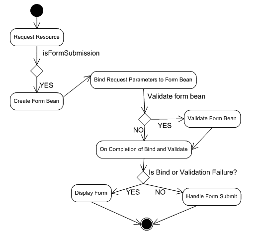

10092ch03.qxd 7/24/08 5:08 PM Page 82

**82**

第 3 章 **■** 探索表示层设计模式

**图 3-11.** *SimpleFormController 中的表单提交流程* 为了处理表单提交，控制器需要重写多个模板方法中的一个。由于目标只是在控制器中调用一个业务服务，您可以重写最简单的方法 `doSubmitAction`。使用此方法，您无需显式返回任何 `ModelAndView` 对象。框架会自动将表单 bean 设置到模型对象中，并使用命令名称作为标识符。如果需要传递更多数据，则需要重写 `onSubmit` 方法。此方法允许创建 `ModelAndView` 对象，与默认方法相比，它可以用来传递更多数据。

清单 3-27 展示了修改后的控制器。

**清单 3-27.** SaveNewPolicyController.java

public class SaveNewPolicyController extends SimpleFormController {

private UnderWritingBusinessDelegate uwrBusinessDelegate;

public SaveNewPolicyController() {

setCommandClass(PolicyFormBean.class);

}

10092ch03.qxd 7/24/08 5:08 PM Page 83

第 3 章 **■** 探索表示层设计模式

**83**

public void setUwrBusinessDelegate(

UnderWritingBusinessDelegate uwrBusinessDelegate) {

this.uwrBusinessDelegate = uwrBusinessDelegate;

}

/*

protected ModelAndView onSubmit(Object formbean) throws Exception {

PolicyFormBean policyBean = (PolicyFormBean)formbean;

uwrBusinessDelegate.createPolicy(policyBean);

return new ModelAndView(this.getSuccessView(),"policydetails",formbean);

}

*/

}

要使用 `SimpleFormController`，您必须设置一些配置参数。第一个属性是 `commandName` 属性。此名称用作设置在模型中的表单 bean 对象的键。下一个需要考虑的属性是 `successView`。它指定一个逻辑视图名称，就像属性 `formView` 一样。此视图将用于在表单提交成功时渲染响应。清单 3-28 显示了配置细节。

请注意，命令类/表单 bean 也已在 `insurance-servlet.xml` 中配置。因此，您无需在页面控制器的构造函数中注册表单 bean。

**清单 3-28.** insurance-servlet.xml

<?xml version="1.0" encoding="UTF-8"?>

<beans

[xsi:schemaLocation="http://www.springframework.org/schema/beans](http://www.w3.org/2001/XMLSchema-instance)

[`www.springframework.org/schema/beans/spring-beans-2.5.xsd"`](http://www.w3.org/2001/XMLSchema-instance)

>

<bean name="/createPolicy.do"

class="com.apress.insurance.web.controller.SaveNewPolicyController" >

<property name="uwrBusinessDelegate"

ref="underwritingBusinessDelegate" />

10092ch03.qxd 7/24/08 5:08 PM Page 84

**84**

第 3 章 **■** 探索表示层设计模式

<property name="formView"

value="createPolicy" />

<property name="commandName"

value="policydetails" />

<property name="successView"

value="policydetails" />

<property name="commandClass"

value="com.apress.insuranceapp.web.formbean.PolicyFormBean" />

</bean>

</beans>

最后，清单 3-29 显示了成功视图。它使用 JSTL 标签来检索模型数据。

**清单 3-29.** WEB-INF/jsp/policydetails.jsp

<%@ [taglib prefix="c" uri="http://java.sun.com/jsp/jstl/core" %>](http://java.sun.com/jsp/jstl/core)

<%@ [taglib prefix="fmt" uri="http://java.sun.com/jsp/jstl/fmt" %>](http://java.sun.com/jsp/jstl/fmt)

<html>

<head>

<title>核保</title>

</head>

<body>

<form >

<table>

<tr>

<td>名字:</td>

<td><c:out value="${policydetails.firstName}"/></td>

</tr>

10092ch03.qxd 7/24/08 5:08 PM Page 85

第 3 章 **■** 探索表示层设计模式

**85**

<tr>

<td>姓氏:</td>

<td><c:out value="${policydetails.lastName}"/></td>

</tr>

<tr>

<td>年龄 :</td>

<td><c:out value="${policydetails.age}"/></td>

</tr>

</table>

</form>

</body>

</html>

**表单验证**

在清单 3-24 所示的表单中，字段有一些限制。名字和姓氏字段是必填项，年龄必须是整数。可以使用客户端 JavaScript 来检查这些限制。然而，如今大多数应用程序都需要跨浏览器支持，而 JavaScript 是实现这一目标的最大障碍。

另一种选择是服务器端表单验证。如图 3-12 所示，`SimpleFormController` 支持服务器端表单验证。

Spring MVC 支持两种类型的验证器：

*   *编程式验证器*：这些验证器通过自定义逻辑实现验证。它们通常由实现 `Validator` 接口的类来执行。
    为简单起见，我将只关注这种类型。


•   *声明式验证器*：这些验证器通过配置实现验证功能。Spring MVC 集成了两个验证框架——Commons Validator 和 VALANG——来提供此功能。这两个框架的集成与使用是一个庞大的主题，超出了本书的范围。关于这两个框架的详细论述，请参考 *Expert Spring MVC and Web Flow*（Apress, 2006）。

表单验证的第一步是创建 Validator 接口的实现，如清单 3-30 所示。实现 supports 方法是必要的，因为它告知 Spring MVC 框架某个验证器是否适用于某个表单 bean 类型。然而，最重要的是 validate 方法，它包含了验证逻辑。对于必填字段验证，Spring 提供了一个包含静态方法的辅助类，名为 ValidationUtils。如清单 3-30 所示，Errors 对象引用、需要验证的字段名以及一个错误码被传递给 rejectIfEmpty 方法进行验证。如果验证失败，错误对象会填充错误消息。该消息根据提供的错误码从资源包中获取。

**清单 3-30.** PolicyFormbeanValidator.java

```java
public class PolicyFormbeanValidator implements Validator {

    public boolean supports(Class clazz) {
        return PolicyFormBean.class.equals(clazz);
    }

    public void validate(Object formBean, Errors errors) {
        PolicyFormBean policybean = (PolicyFormBean) formBean;
        ValidationUtils.rejectIfEmpty(errors, "firstName", "mandatoryfirstname");
    }
}
```

现在验证器已就绪，必须将其连接到控制器。这通过在 Spring 配置中进行装配来完成。除此之外，还必须配置资源包定位器。这在修改后的 Spring 配置（清单 3-31）中有所展示。

**清单 3-31.** insurance-servlet.xml

```xml
<?xml version="1.0" encoding="UTF-8"?>
<beans
    xsi:schemaLocation="http://www.springframework.org/schema/beans http://www.springframework.org/schema/beans/spring-beans-2.5.xsd"
>
    <bean name="viewResolver"
        class="org.springframework.web.servlet.view.InternalResourceViewResolver">
        <property name="viewClass"
            value="org.springframework.web.servlet.view.JstlView" />
        <property name="prefix" value="/WEB-INF/jsp/" />
        <property name="suffix" value=".jsp" />
    </bean>

    <bean name="/createPolicy.do"
        class="com.apress.insurance.web.controller.SaveNewPolicyController" >
        <property name="uwrBusinessDelegate"
            ref="underwritingBusinessDelegate" />
        <property name="formView"
            value="createPolicy" />
        <property name="commandName"
            value="policydetails" />
        <property name="successView"
            value="policydetails" />
        <property name="commandClass"
            value="com.apress.insuranceapp.web.formbean.PolicyFormBean" />
        <property name="validator"
            ref="policyUnderwriteValidtor" />
    </bean>

    <bean id="messageSource" class="org.springframework.context.support.ResourceBundleMessageSource">
        <property name="basename" value="messages"/>
    </bean>

    <bean name="policyUnderwriteValidtor"
        class="com.apress.insurance.web.validator.PolicyFormbeanValidator" />

    <bean name="underwritingBusinessDelegate"
        class="com.apress.insurance.view.delegate.UnderWritingBusinessDelegate" />
</beans>
```

保存错误消息的资源包文件的基本名称为 messages。清单 3-32 展示了一个示例资源包。

**清单 3-32.** WEB-INF/classes/messages_en_US.properties

```properties
mandatoryfirstname.policydetails.firstName=First name field is mandatory
mandatoryfirstname.policydetails.mandatorylastname=Last name field is mandatory
mandatoryfirstname.policydetails.mandatoryAge=Age field is mandatory and should be an integer(0-9)
```

请注意，消息键与错误键不同。这是因为 MessageCodesResolver 实现会转换错误键，以附加命令名称和字段名称。最后，我们还需要稍微修改 JSP，以便在相应字段旁边显示验证错误消息。为此，我将使用 Spring 提供的标签库来简化基于 JSP 的视图开发。清单 3-33 展示了修改后的 JSP。

**清单 3-33.** WEB-INF/jsp/createPolicy.jsp

```jsp
<%@ taglib prefix="form" uri="http://www.springframework.org/tags/form" %>
<%@ taglib prefix="c" uri="http://java.sun.com/jsp/jstl/core" %>
<%@ taglib prefix="fmt" uri="http://java.sun.com/jsp/jstl/fmt" %>
<html>
<head>
    <title>核保</title>
    <style>
        .error { color: red; }
    </style>
</head>
<body>
    <form:form action="" method="POST" commandName="policydetails">
        名字 <form:input path="firstName"/>
        <form:errors path="firstName" cssClass="error"/><br/>
        姓氏 <form:input path="lastName"/>
        <form:errors path="lastName" cssClass="error"/><br/>
        年龄 <form:input path="age"/> <form:errors path="age" cssClass="error"/><br/>
        <input type="submit" value="保存" />
    </form:form>
</body>
</html>
```

除了到目前为止讨论的控制器之外，Spring MVC 还针对特定需求提供了其他一些控制器（包括抽象实现和具体实现）。其中一些控制器列在表 3-1 中。它们仅在少数用例中偶尔需要。

**表 3-1.** *偶尔有用的页面控制器*

| **文件名** | **描述** |
| :--- | :--- |
| MultiActionController | 一些开发者认为将一组逻辑相关的操作分组到一个控制器实现类中是有用的。与保单创建页面相关的所有操作——保存、编辑等——都可以放在一个继承自 MultiActionController 的类中。这有助于减少大型应用中页面控制器的具体实现数量。Spring MVC 可以使用一个名为 MethodNameResolver 的类来确定要调用哪个方法。该类可以从 HttpServletRequest 中设置的参数来确定方法名。 |
| AbstractWizardFormController | 应用程序中的某些用例最好通过在执行最终操作前呈现多个页面来处理。这种多步骤用例在 Web 应用的注册或注册过程中很常见。eInsure 也部署了一个多步骤工作流来收集保单和索赔详情。Spring MVC 通过 AbstractWizardFormController 类为建模此类用例提供了开箱即用的支持。 |

**结论**

优点

*   **提高了可重用性**：将用例处理整合到页面控制器中实现了重用。
*   **提高了可扩展性**：借助 Spring 的支持，不仅可以实现自定义页面控制器，还可以与其他框架（如 Struts、WebWork 等）的页面控制器进行集成。
*   **生命周期支持**：如果没有 Spring MVC，支持表单处理生命周期将导致大量自定义代码，造成精力浪费和维护困难。然而，使用 Spring，与表单生命周期和命令管理相关的大部分样板代码都是开箱即用的。

关注点


• *陡峭的学习曲线*：使用 Spring 时，MVC 控制器支持提供了大量选项。因此，开发者需要了解众多接口和抽象类，才能做出恰当的设计决策。

• *难以维护*：现在，每个用例对应一个页面控制器。在大型应用中，这会导致控制器类数量庞大，难以管理和维护。

**上下文对象**

**问题**

eInsure 有一个产品工作台，供业务分析师和产品设计师设计并推出保险产品。简而言之，一个保险产品定义了一组规则，用于承保特定类别的保单。eInsure 的一位客户希望获得该产品工作台模块的离线版本。此应用程序将安装在业务分析师使用的笔记本电脑上。这将使他们即使在离线状态下也能制定产品细节，并在最终发布规则集之前，稍后与主数据库同步。

对于这个离线应用程序，有两种选择。一种是基于 Java Swing 的桌面软件，另一种是在嵌入式 Web 服务器上运行并带有同步功能的同一 eInsure 应用程序。我们的客户倾向于第一种方案。

由于 eInsure 正在重构以使用 Spring 框架，我们最初认为大部分代码库（除了表示层的视图组件）都是可重用的。

eInsure 团队对迁移到 Spring 感到高兴，因为这个 Swing 应用程序可以轻松地在容器外运行。

但很快，当我们发现甚至连页面控制器都无法重用时，我们的高期望变成了失望。原因是表示层代码与 HTTP 协议和 Servlet API 紧密耦合。页面控制器实现了 Controller 接口，并在此过程中大量使用了 `HttpServletRequest` 和 `HttpServletResponse` 对象。这些对象用于从表单提交中提取数据。结果导致一组页面控制器无法在 Web 应用程序之外重用。开发团队别无选择，只能从头构建应用程序，造成了不必要的精力消耗。

10092ch03.qxd 7/24/08 5:08 PM Page 91

第 3 章 **■** 探索表示层设计模式

**91**

**驱动力**

• 不要让特定于协议的 API 使用渗透到某一层的深处。这种侵入会降低可重用性，从而污染应用程序代码。

• 确定使用特定于协议代码的适当上下文。在这种情况下，特定于协议代码的使用应仅限于前端控制器，或最多是应用控制器。

• 提高页面控制器的可重用性。

• 使页面控制器成为易于测试的组件。

**解决方案**

使用*上下文对象*来封装和共享表单数据，而无需任何协议依赖。

Spring 框架中的策略

在讨论页面控制器模式时，我确实尝试过摆脱特定于协议代码的耦合。但由于 `SimpleFormController` 继承自与 `HttpServletRequest` 和 `HttpServletResponse` 对象关联的控制器，运行时依赖关系仍然存在。因此，无法在 Web 容器之外使用此控制器。

然而，Spring MVC 提供了一个独立于任何特定于协议细节的控制器。`ThrowawayController` 接口完全不了解特定于 Servlet 的 API。其实现类类似于 JSF 管理的 Bean，其属性映射到 HTML 表单字段。它还需要实现一个单一的 `execute` 方法，该方法应用于调用业务逻辑。仅当所有属性设置成功且没有数据转换错误时，处理程序适配器才会调用此方法。由于 `ThrowawayController` 属于与其他控制器不同的类层次结构，执行这些控制器需要一个名为 `ThrowawayControllerHandlerAdapter` 的特定处理程序适配器。但是，无需显式配置此处理程序适配器，因为它与 `SimpleControllerHandlerAdapter` 一起被假定为默认值。

10092ch03.qxd 7/24/08 5:08 PM Page 92

**92**

第 3 章 **■** 探索表示层设计模式

清单 3-34 展示了 `ThrowawayController` 的实现。它为每个属性定义了 getter/setter 组合来映射表单字段。处理程序适配器使用 Servlet API 提取表单字段值，并将它们映射到此控制器的属性。这使得控制器可重用且不受协议特定细节的影响。它完全可以与 Swing 组件以及适当的处理程序适配器一起使用。

**清单 3-34.** SaveClaimController.java

```java
public class SaveClaimController implements ThrowawayController {

private String claimantName;

private String policyNo;

private String productCd;

public ModelAndView execute() throws Exception {

//在此处调用业务逻辑

return new ModelAndView("claimDetails");

}

public String getClaimantName() {

return claimantName;

}

public void setClaimantName(String claimantName) {

this.claimantName = claimantName;

}

public String getPolicyNo() {

return policyNo;

}

public void setPolicyNo(String policyNo) {

this.policyNo = policyNo;

}

public String getProductCd() {

return productCd;

}

public void setProductCd(String productCd) {

this.productCd = productCd;

}

}
```

清单 3-35 展示了映射到刚才展示的一次性控制器的 JSP。

10092ch03.qxd 7/24/08 5:08 PM Page 93

第 3 章 **■** 探索表示层设计模式

**93**

**清单 3-35.** WEB-INF/jsp/createClaim.jsp

```jsp
<html>

<head>

<title>新建索赔</title>

</head>

<form action="saveClaim.do" method="POST"> 索赔人姓名 <input type="text" name="claimantName" value="" /><br/> 保单编号 <input type="text" name="policyNo" value="" /><br/> 产品代码<input type="text" name="productCd" value="" /><br/>

<input type="submit" value="保存" />

</form>

</body>

</html>
```

最后，需要将控制器添加到 Spring 配置中，如清单 3-36 所示。

**清单 3-36.** insurance-servlet.xml

```xml
<?xml version="1.0" encoding="UTF-8"?>

<beans

[xsi:schemaLocation="http://www.springframework.org/schema/beans](http://www.w3.org/2001/XMLSchema-instance)

[`www.springframework.org/schema/beans/spring-beans-2.5.xsd"`](http://www.w3.org/2001/XMLSchema-instance)

>

<!- - 其他 Bean - ->

<bean name="/saveClaim.do"

class="com.apress.insurance.web.controller.SaveClaimController" />

</beans>
```

10092ch03.qxd 7/24/08 5:08 PM Page 94

**94**

第 3 章 **■** 探索表示层设计模式

因此，一次性控制器是表单 Bean 和页面控制器的组合。

请注意，它独立于 Servlet API 提高了可重用性，并使此控制器更易于进行单元测试。但它也有一些缺点。由于这是一个有状态控制器，应为每个请求创建一个新实例。这反过来会浪费 JVM 堆上的空间，增加了垃圾回收的需求以及由此产生的暂停。

然而，对于现代调优良好的 JVM 来说，这不是一个主要问题。此控制器非常简单，没有任何详细的工作流。它不支持表单字段的验证。


此外，由于表单字段现在已成为此类的一部分，将数据从表示层传递到业务层会显得笨拙。

页面控制器中表单 bean 的紧耦合问题可以通过自定义解决方案来解决。为此，我将定义一个一次性控制器接口，与之前的接口一样，它不依赖于 Servlet API。如清单 3-37 所示。

**清单 3-37.** SimpleFormThrowawayController.java

package com.apress.insurance.web.controller.api;

import org.springframework.web.servlet.ModelAndView;

public interface SimpleFormThrowawayController {

public ModelAndView execute(Object formBean) throws Exception;

public Class getFormbeanClass();

}

请注意，一次性控制器现在需要实现这个新接口，如清单 3-37 所示。需要实现该接口的 `execute` 方法来调用业务逻辑。它从处理器适配器接收一个表单 bean 实例。

现在，我将展示新一次性控制器的实现，并将清单 3-34 中展示的功能迁移至此。

从清单 3-38 可以明显看出，这个一次性控制器是无状态的，因此在 Web 应用上下文中可以只有一个实例。

**清单 3-38.** SaveClaimController.java

public class SaveClaimController implements SimpleFormThrowawayController {

public ModelAndView execute(Object formBean) throws Exception {

ClaimFormbean formbean = (ClaimFormbean)formBean;

//在此处调用业务逻辑

return new ModelAndView("claimDetails");

10092ch03.qxd 7/24/08 5:08 PM Page 95

第 3 章 **■** 探索表示层设计模式

**95**

}

public Class getFormbeanClass() {

return ClaimFormbean.class;

}

}

清单 3-39 展示了表单 bean。

**清单 3-39.** ClaimFormbean.java

public class ClaimFormbean implements Serializable {

private String claimantName;

private String policyNo;

private String productCd;

public String getClaimantName() {

return claimantName;

}

public void setClaimantName(String claimantName) {

this.claimantName = claimantName;

}

public String getPolicyNo() {

return policyNo;

}

public void setPolicyNo(String policyNo) {

this.policyNo = policyNo;

}

public String getProductCd() {

return productCd;

}

public void setProductCd(String productCd) {

this.productCd = productCd;

}

}

10092ch03.qxd 7/24/08 5:08 PM Page 96

**96**

第 3 章 **■** 探索表示层设计模式

为了执行这个修改后的工作流，我需要在某个组件中将请求参数映射到表单 bean。您已经知道，最合适的组件是处理器适配器。清单 3-40 展示了执行 `SimpleFormThrowaway` 控制器的处理器适配器。

**清单 3-40.** SimpleFormThrowawayControllerHandlerAdapter.java package com.apress.insurance.web.handleradpter.api;

public class SimpleFormThrowawayControllerHandlerAdapter

extends ThrowawayControllerHandlerAdapter {

public boolean supports(Object handler) {

return (handler instanceof SimpleFormThrowawayController);

}

public ModelAndView handle(HttpServletRequest req, HttpServletResponse res, Object command) throws Exception {

SimpleFormThrowawayController throwaway = (SimpleFormThrowawayController) command;

Object formBean = throwaway.getFormbeanClass().newInstance();

ServletRequestDataBinder binder = createBinder(req, formBean);

binder.bind(req);

binder.closeNoCatch();

return throwaway.execute(formBean);

}

protected ServletRequestDataBinder createBinder(

HttpServletRequest request, Object formbean) throws Exception {

ServletRequestDataBinder binder = new ServletRequestDataBinder(formbean, getCommandName());

initBinder(request, binder);

return binder;

}

}

请注意，`createBinder` 方法负责将 HTTP 参数值绑定到表单 bean 的属性。处理器适配器处理所有

10092ch03.qxd 7/24/08 5:08 PM Page 97

第 3 章 **■** 探索表示层设计模式

**97**

协议相关的细节。最后，我将在 Spring 配置文件中将所有内容连接起来。

由于此处理器适配器不是默认的，我需要将其显式声明为配置信息的一部分。因为我使用了处理器适配器链，所以默认的处理器适配器也必须显式配置。清单 3-41 展示了所有这些内容。

**清单 3-41.** insurance-servlet.xml

<?xml version="1.0" encoding="UTF-8"?>

<beans

[xsi:schemaLocation="http://www.springframework.org/schema/beans](http://www.w3.org/2001/XMLSchema-instance)

[`www.springframework.org/schema/beans/spring-beans-2.5.xsd">`](http://www.w3.org/2001/XMLSchema-instance)

<bean name="throwawayHandlerAdapter"

class="com.apress.insurance.web.handleradpter.api. **➥**

SimpleFormThrowawayControllerHandlerAdapter" />

<bean name="simpleControllerHandlerAdapter"

class="org.springframework.web.servlet.mvc. **➥**

SimpleControllerHandlerAdapter" />

<bean name="viewResolver"

class="org.springframework.web.servlet.view.InternalResourceViewResolver">

<property name="viewClass"

value="org.springframework.web.servlet.view.JstlView" />

<property name="prefix" value="/WEB-INF/jsp/" />

<property name="suffix" value=".jsp" />

</bean>

<bean name="/createClaim.do"

class="com.apress.insurance.web.controller.DisplayNewClaimController" />

<bean name="/saveClaim.do"

class="com.apress.insurance.web.controller.SaveClaimController" />

<bean name="underwritingBusinessDelegate"

class="com.apress.insurance.view.delegate.UnderWritingBusinessDelegate" />

</beans>

10092ch03.qxd 7/24/08 5:08 PM Page 98

**98**

第 3 章 **■** 探索表示层设计模式

在前几节中，我尝试修改和扩展了一次性控制器的工作流。如果您有兴趣进一步增强此工作流以添加更多功能（例如验证），请查看扩展 `ValidatableThrowawayController` 及其对应的处理器适配器 `ValidatableThrowawayControllerHandlerAdapter`。

**结论**

优点

*   **提高了可重用性**：上下文对象不依赖于任何特定协议。
*   **支持多种客户端**：不依赖任何特定协议，使得使用同一代码库支持不同客户端变得容易。
*   **易于测试**：没有协议依赖，页面控制器易于测试，因为您可以在容器外部且无需任何 Servlet 相关对象的情况下运行测试。

关注点

*   **性能考量**：将 HTML 表单字段值映射到表单 bean 属性是通过反射完成的。这可能会降低性能。
*   **难以维护**：将表单 bean 与页面控制器一起使用增加了需要维护的类的数量。

**拦截过滤器**

**问题**

本章开头介绍的 JSP 控制器在 if-else 块中实际执行操作之前执行了授权检查。但是，由于 eInsure 应用程序有多个控制器，此代码在所有控制器中都被重复了。

如果将此代码提取到一个公共组件中，并以声明方式应用，对控制器透明，那将非常有用。这将增强应用程序的

10092ch03.qxd 7/24/08 5:08 PM Page 99

第 3 章 **■** 探索表示层设计模式

**99**

灵活性。否则，对此公共授权逻辑的任何更改都必须复制到所有 JSP 前端控制器中。

一位在生产环境中使用 eInsure 的客户提交了一些增强请求。他们希望阻止在预定办公时间（上午 9 点）之外对应用程序的访问。


到下午 6 点。这样他们就可以利用这段停机时间更高效地运行计划中的批处理程序。此外，他们还希望跟踪和分析网站的使用模式。最后但同样重要的是，他们需要一个可配置的监控器来跟踪各个页面控制器处理请求所花费的时间。这个监控器可以不时地开启以检查系统性能。

在这种情况下，典型的做法是创建一些新组件并修改一些现有组件。但这存在风险，因为可能会给现有代码库引入新的错误。对这些新需求的仔细分析表明，最好的解决方案是在现有代码的前后应用新的可重用组件。这些组件应该能够透明地进行配置和应用，而无需影响现有代码。如果必须修改现有组件，这将节省大量的时间和精力。

**动力**

• 您希望将通用处理集中到可重用的组件中。

• 预处理和后处理组件应与现有应用程序代码松散耦合。

• 以声明方式应用通用处理。

**解决方案**

使用*拦截过滤器*，在前端控制器和页面控制器实际执行请求之前和之后，透明地应用可重用处理。

与 Spring 框架配合使用的策略

**Servlet 过滤器**

使用 Servlet API 内置的过滤器可以解决前面提到的一些需求。所有现代 Web 服务器都支持过滤器——即在控制权传递给目标 Servlet 之前、离开 Servlet 之后，或两者兼有时执行的代码。

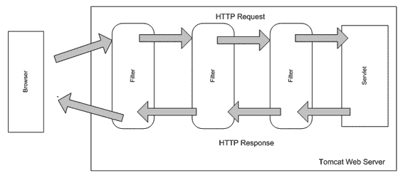

10092ch03.qxd 2008 年 7 月 24 日 下午 5:08 第 100 页

**100**

第三章 **■** 探索表示层设计模式

事实上，可以为每个请求配置一个要执行的过滤器链，如图 3-12 所示。

**图 3-12.** *Servlet 过滤器链*

过滤器是可插拔的组件，为 Servlet 提供预处理和后处理支持。这种技术也适用于 JSP，因为它们本质上是 Servlet。过滤器在 `web.xml` 中配置，无需影响现有应用程序代码。清单 3-42 展示了用于为生产应用程序添加基于时间的访问控制的 Servlet 过滤器。

**清单 3-42.** TimebasedAccessFilter.java

```java
public class TimebasedAccessFilter implements Filter {

    private int startHour;

    private int endHour;

    public void destroy() {}

    public void doFilter(ServletRequest request, ServletResponse response, FilterChain chain) throws IOException, ServletException {

        int currentHrofDay = Calendar.getInstance().get(Calendar.HOUR_OF_DAY); 
        if((startHour <= currentHrofDay) && (currentHrofDay <= endHour)){

            chain.doFilter(request, response);

        }

        else{

            10092ch03.qxd 2008 年 7 月 24 日 下午 5:08 第 101 页

            第三章 **■** 探索表示层设计模式

            **101**

            HttpServletResponse res = (HttpServletResponse)response;

            res.sendRedirect("html/downtimenotice.html");

        }

    }

    public void init(FilterConfig config) throws ServletException {

        startHour = Integer.parseInt(config.getInitParameter("starthour")); 
        endHour = Integer.parseInt(config.getInitParameter("endhour"));

    }

}
```

在清单 3-42 中，`doFilter` 实现了 eInsure 应用程序基于时间的访问控制逻辑。仅在此情况下，对传入请求进行预处理，以检查当天的预定办公时间窗口是否已过期。如果已过期，用户将被重定向到一个停机通知页面。否则，将执行链中的下一个过滤器（如果有）。最后，将执行目标 Servlet 和页面控制器。

请注意，官方工作时间是可配置的。该过滤器在 `web.xml` 中注册，如清单 3-43 所示，同时包含各种参数和 URL 映射。在此例中，此过滤器拦截所有以 `.do` 结尾并指向前端控制器的请求。

此解决方案具有高度可重用性，并基于 Java Servlet 标准。即使没有 Spring MVC 支持也可以使用，因为 Web 容器负责管理过滤器。

**清单 3-43.** web.xml

```xml
<?xml version="1.0" encoding="UTF-8"?>

[<web-app version="2.4"](http://java.sun.com/xml/ns/j2ee)

[xsi:schemaLocation="http://java.sun.com/xml/ns/j2ee](http://www.w3.org/2001/XMLSchema-instance)

[`java.sun.com/xml/ns/j2ee/web-app_2_4.xsd">`](http://www.w3.org/2001/XMLSchema-instance)

<filter>

    <filter-name>timebasedaccess</filter-name>

    <filter-class>

        com.apress.insurance.web.filter.TimebasedAccessFilter

    </filter-class>

    <init-param>

        <param-name>starthour</param-name>

        <param-value>9</param-value>

    </init-param>

    <init-param>

        10092ch03.qxd 2008 年 7 月 24 日 下午 5:08 第 102 页

        第三章 **■** 探索表示层设计模式

        **102**

        <param-name>endhour</param-name>

        <param-value>18</param-value>

    </init-param>

</filter>

<filter-mapping>

    <filter-name>timebasedaccess</filter-name>

    <url-pattern>*.do</url-pattern>

</filter-mapping>

<servlet>

    <servlet-name>insurance</servlet-name>

    <servlet-class>

        org.springframework.web.servlet.DispatcherServlet

    </servlet-class>

    <load-on-startup>1</load-on-startup>

</servlet>

<servlet-mapping>

    <servlet-name>insurance</servlet-name>

    <url-pattern>*.do</url-pattern>

</servlet-mapping>

<jsp-config>

    <taglib>

        <taglib-uri>/spring</taglib-uri>

        <taglib-location>

            /WEB-INF/tld/spring-form.tld

        </taglib-location>

    </taglib>

</jsp-config>

</web-app>
```

使用 Servlet 过滤器，可以在完全不影响现有代码的情况下实现客户的第一个增强功能。然而，收集使用情况跟踪所需的不同信息则需要一些编码工作。但是，您可以集成一个简单而强大的、开箱即用的开源解决方案——来自 OpenSymphony 的 Clickstream 来实现此目标。可以从 [`www.opensymphony.com/`](http://www.opensymphony.com) clickstream/ 下载。Clickstream 同样基于过滤器，提供了一种高度灵活的方式来跟踪网站的使用模式。

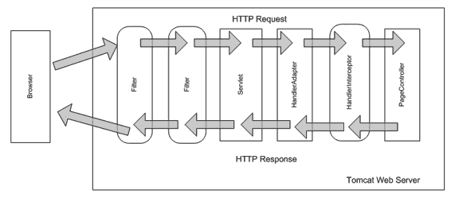

10092ch03.qxd 2008 年 7 月 24 日 下午 5:08 第 103 页

第三章 **■** 探索表示层设计模式

**103**

**Spring 拦截器**

前两个增强功能已高效解决，现在该关注最后一个需求了。

您猜对了——也可以部署过滤器来解决这个问题。但这意味着监控甚至在 Servlet 调用之前就开始了。尽管使用此解决方案，时间差异可以忽略不计；但实际意图是监控一个用例的总执行时间。因此，应用此处理的最佳位置是在页面控制器调用周围。这也能让我们获得比过滤器更多的信息（例如实际的控制器类名等）。此外，使用 Servlet 过滤器，您需要在同一个 `doFilter` 方法中编写预处理和后处理代码，这可能很繁琐。因此，对于此解决方案，我将求助于 Spring 页面控制器拦截器支持，如图 3-13 所示。

**图 3-13.** *Spring 处理器拦截器链*

在本章前面讨论应用程序控制器模式时，我简要提到了处理器拦截器。它们实现了 `HandlerInterceptor` 接口。正如您现在所期望的，Spring MVC 提供了该接口的一些具体实现以及便捷的抽象类，用于构建处理器拦截器功能，如图 3-14 所示。

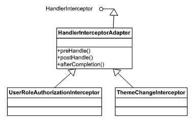

10092ch03.qxd 2008 年 7 月 24 日 下午 5:08 第 104 页

**104**

第三章 **■** 探索表示层设计模式

**图 3-14.** *处理器拦截器类图*


便捷的抽象基类 `HandlerInterceptorAdapter` 实现了 `HandlerInterceptor` 接口定义的所有三个方法。`preHandle` 方法在页面控制器处理请求之前执行预处理。同样地，`postHandle` 负责后处理。`afterCompletion` 是一个回调方法，在视图渲染完成后最终调用。`UserRoleAuthorizationInterceptor` 是一个具体实现，它基于用户角色，并利用 `HttpServletRequest` 对象的 `isUserInRole` 方法对当前用户执行授权检查。最后，当网站的当前主题（图像、样式表等的组合）发生更改时，会调用 `ThemeChangeInterceptor`。

现在，我将通过扩展 `HandlerInterceptorAdapter` 类来解决手头的问题。一旦请求被拦截，当前时间将作为预处理代码的一部分保存为请求属性。当页面控制器返回时，实际耗时将与任何其他需要监控的信息一起被记录。如清单 3-44 所示。

**清单 3-44.** ExecutionMonitorInterceptor.java

public class ExecutiontimeMonitorInterceptor extends HandlerInterceptorAdapter {

private final Log log = LogFactory.getLog(

ExecutiontimeMonitorInterceptor.class);

private static final String START_EXECUTION_TIME_KEY = "executionStartTime"; public void postHandle(HttpServletRequest request, HttpServletResponse response, Object handler, ModelAndView modelAndView) throws Exception {

long executionStartTime = (Long) request.getAttribute(

10092ch03.qxd 7/24/08 5:08 PM Page 105

C H A P T E R 3 **■** E X P L O R I N G P R E S E N TAT I O N T I E R D E S I G N PAT T E R N S

**105**

START_EXECUTION_TIME_KEY);

long executionEndTime = System.currentTimeMillis();

StringBuffer logTxt = new StringBuffer

("Execution completed for request - ");

logTxt.append(request.getRequestURI());

logTxt.append(", handler -");

logTxt.append(handler);

logTxt.append(", total execution time(ms) -");

logTxt.append((executionEndTime - executionStartTime));

log.info(logTxt.toString());

}

public boolean preHandle(HttpServletRequest request,

HttpServletResponse response, Object handler) throws Exception {

request.setAttribute(START_EXECUTION_TIME_KEY, System.currentTimeMillis()); return true;

}

}

使用便捷抽象类的优势在清单 3-44 中显而易见。我只需覆盖那些需要的方法。相反，如果使用 `HandlerInterceptor`，我需要实现三个方法，而回调方法 `afterCompletion` 将是多余的。要使用此拦截器，必须将其与一个处理器映射关联。这在 Spring 配置文件中有所展示（清单 3-45）。请注意，我使用了内部 bean 的配置风格，因为此 bean 仅在处理器映射 bean 的上下文中才相关。

**清单 3-45.** insurance-servlet.xml

<?xml version="1.0" encoding="UTF-8"?>

<beans

[xsi:schemaLocation="http://www.springframework.org/schema/beans](http://www.w3.org/2001/XMLSchema-instance)

[`www.springframework.org/schema/beans/spring-beans-2.5.xsd"`](http://www.w3.org/2001/XMLSchema-instance)

>

<! - - 其他 Bean - ->

10092ch03.qxd 7/24/08 5:08 PM Page 106

**106**

C H A P T E R 3 **■** E X P L O R I N G P R E S E N TAT I O N T I E R D E S I G N PAT T E R N S

<bean name="beanNamehandlerMapping"

class="org.springframework.web.servlet.handler.BeanNameUrlHandlerMapping">

<property name="interceptors">

<list>

<bean

class="com.apress.insurance.web.controller.interceptor. **➥**

ExecutiontimeMonitorInterceptor" />

</list>

</property>

</bean>

</beans>

此拦截器现在将应用于由 `beanNameHandlerMapping` 处理的所有页面控制器。

**结论**

优点

• *提高了可重用性*：通用代码现在集中在可插拔组件中，增强了复用性。
• *增加了灵活性*：通用的公共组件可以声明式地应用和移除，提高了灵活性。

关注点


• *性能下降*：不必要的长拦截器和过滤器链可能会影响性能。此外，这些组件不应执行任何长时间运行的操作。

10092ch03.qxd 7/24/08 5:08 PM 第 107 页

第 3 章 **■** 探索表示层设计模式

**107**

**视图助手**

**问题**

应用程序控制器和页面控制器与网关 Servlet 相结合，解决了请求处理中的三个重要问题：

• 请求拦截

• 从页面控制器调用业务组件

• 根据业务层返回的数据解析下一个要显示的视图

然而，在之前的所有讨论中，我刻意绕过了另一个关键问题——视图创建。页面控制器作为调用业务逻辑的结果所返回的数据，必须由视图组件消费，以提供最终的动态响应。

eInsure 主要使用 JSP 作为视图技术。业务组件返回的数据被设置为请求属性。随后，这些数据在 JSP 中使用脚本小程序进行检索、处理和使用。换句话说，动态数据通过嵌入的编程逻辑与 JSP 中的静态标记或模板文本相结合。这种脚本小程序的滥用显著降低了可重用性，并增加了维护工作量。

**驱动力**

• 从基于模板的视图（如 JSP）中移除编程逻辑。

• 实现 Java 开发人员与网页作者之间的分工。

• 创建可重用的组件，用于跨视图组合模型数据。

**解决方案**

使用*视图助手*在表示层中使模型数据适配视图组件。

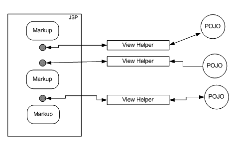

10092ch03.qxd 7/24/08 5:08 PM 第 108 页

**108**

第 3 章 **■** 探索表示层设计模式

使用 Spring 框架的策略

此模式将用于检索和处理模型数据的逻辑与 JSP 中的静态标记分离开来。它可以根据区域设置，选择性地格式化数据类型，例如日期和货币。如图 3-15 所示，它应作为一个薄层来将模型数据适配到视图中。请注意，视图助手不应负责调用业务逻辑或数据访问逻辑。

**图 3-15.** *视图助手的工作方式*

**JavaBeans 视图助手**

这是视图助手策略的最简单形式。JSP 提供了开箱即用的标签来支持 POJO 视图助手。清单 3-46 展示了 policydetails.jsp 如何使用 PolicyDetail POJO 作为 JavaBean 视图助手。

**清单 3-46.** policydetails.jsp

<jsp:useBean id="policydetails" scope="request"

class="com.apress.insurance.common.dataholder.PolicyDetail"/>

<html>

<head>

<title>核保</title>

<script>

function eventSubmit(url){

document.policy.action = url;

10092ch03.qxd 7/24/08 5:08 PM 第 109 页

第 3 章 **■** 探索表示层设计模式

**109**

document.policy.submit();

}

</script>

</head>

<body>

<form name="policy">

<table>

<tr>

<td>名字：</td>

<td><jsp:getProperty name="policydetails" property="firstName"/></td>

</tr>

<tr>

<td>姓氏：</td>

<td><jsp:getProperty name="policydetails" property="lastName"/></td>

</tr>

<tr>

<td>年龄：</td>

<td><jsp:getProperty name="policydetails" property="age"/></td>

</tr>

<tr>

<td colspan="3">

<input type="button" value="创建"

onClick="eventSubmit('createPolicy.do')" />

<input type="button" value="编辑"

onClick="eventSubmit('editPolicy.do')" />

</td>

</tr>

</table>

</form>

</body>

</html>

10092ch03.qxd 7/24/08 5:08 PM 第 110 页

**110**

第 3 章 **■** 探索表示层设计模式

页面控制器负责调用业务对象，该对象返回要填充到视图中的 POJO。清单 3-47 展示了将传输对象绑定到请求作用域中的控制器。

**清单 3-47.** PolicyDetailsController.java

public class PolicyDetailsController implements Controller {

//使用 setter 注入设置


private PolicyBusinessDelegate businessDelegate;

public ModelAndView handleRequest(HttpServletRequest request,

HttpServletResponse response) throws Exception {

//策略 ID 是请求的一部分，

PolicyDetail policyDetail = getBusinessDelegate()

.getPolicyDetails(policyId);

return new ModelAndView("policydetails","policydetails",policyDetail);

}

}

最后，清单 3-48 展示了 JavaBean 或 POJO 视图助手。该类包含一组字段以及所有这些字段的 getter/setter 方法。

**清单 3-48.** PolicyDetailsController.java

public class PolicyDetail implements Serializable {

private long policyId;

private String firstName;

private String lastName;

private int age;

public long getPolicyId() {

return policyId;

}

public void setPolicyId(long policyId) {

this.policyId = policyId;

}

public int getAge() {

return age;

10092ch03.qxd 7/24/08 5:08 PM 第 111 页

第 3 章 **■** 探索表示层设计模式

**111**

}

public void setAge(int age) {

this.age = age;

}

public String getFirstName() {

return firstName;

}

public void setFirstName(String firstName) {

this.firstName = firstName;

}

public String getLastName() {

return lastName;

}

public void setLastName(String lastName) {

this.lastName = lastName;

}

}

**标签库视图助手**

基于 JavaBean 的视图助手使用起来很简单。最棒的是，即使没有 Spring 框架的任何支持，它也能工作。然而，它仍然将编程逻辑混入了 JSP 中。它也不允许使用基于组件的视图助手。让我们考虑一个场景，你需要在 HTML 表格中分页显示搜索结果。如果我们有一个可重用的组件，能够根据搜索结果列表显示分页的搜索结果，那将非常方便。这个组件可以进一步扩展，以支持对任何列上的搜索结果进行排序。

eInsure 中的 JSP 页面混合了 HTML 和 JavaBean 来显示诸如选择框和下拉菜单之类的组件。这些最好作为可重用组件来处理。

所有这些组件都可以使用标签库轻松开发。标签库提供了通用的可重用组件，以满足直到现在为止使用 JavaBean 助手或脚本片段处理的不同需求。此外，还有高效的第三方基于组件的标签库可用，以简化灵活且健壮的视图组件的开发。

**使用 JSTL 标签**

JSP 标准标签库（JSTL）提供了一个简单而强大的标签库，它封装了任何基于 JSP 的视图所需的通用功能。JSTL 表达式

10092ch03.qxd 7/24/08 5:08 PM 第 112 页

**112**

第 3 章 **■** 探索表示层设计模式

语言（EL）使得访问 JavaBean 属性更加简单。条件标签和迭代标签提供了一致的语法来从集合对象（如 List、Map 和数组）中访问数据。JSTL 的另一个重要特性是支持国际化（i18n），包括区域敏感的消息和格式化标签。清单 3-49 展示了 JSTL 标签的实际应用，它遍历了作为 PolicyDetail 对象列表返回的策略搜索结果。

**清单 3-49.** policydetails.jsp

<%@ [taglib prefix="c" uri="http://java.sun.com/jsp/jstl/core" %>](http://java.sun.com/jsp/jstl/core)

<%@ [taglib prefix="fmt" uri="http://java.sun.com/jsp/jstl/fmt" %>](http://java.sun.com/jsp/jstl/fmt)

<html>

<head>

<title>核保</title>

</head>

<body>

<form name="policysearch" action="policysearch.do">

<%-- 为简洁起见，未显示搜索条件输入 --%>

<table>

<tr>

<td>策略 ID</td>

<td>名字</td>

<td>姓氏</td>

<td>年龄</td>

</tr>

<c:forEach var="policyDtl" items="${policyDtlList}" >

<tr>

<td><c:out value="${policyDtl.policyId}"/></td>

<td><c:out value="${policyDtl.firstName}"/></td>

<td><c:out value="${policyDtl.lastName}"/></td>

<td><c:out value="${policyDtl.age}"/></td>

</tr>

</c:forEach>

<tr>

10092ch03.qxd 7/24/08 5:08 PM 第 113 页

第 3 章 **■** 探索表示层设计模式

**113**

<td colspan="3">


<input type="submit" value="搜索" />

</td>

</tr>

</table>

</form:form>

</body>

</html>

清单 3-50 展示了调用业务组件来检索搜索结果，然后准备供 JSTL 标签检索和使用的列表的控制器。要使用 JSTL 标签，必须将 `jstl.jar` 和 `standard.jar` 放入 `WEB-INF/lib` 文件夹中。

**清单 3-50.** PolicySearchController.java

public class PolicySearchController implements Controller {

private UnderWritingBusinessDelegate businessDelegate;

public ModelAndView handleRequest(HttpServletRequest request,

HttpServletResponse response)

throws Exception {

List policyList = getBusinessDelegate().listPolicyByProduct(productCd); return new ModelAndView("policysearch","policyDtlList",policyList);

}

}

**使用 Spring 标签**

JSTL 标签有助于封装常见任务，使静态视图能够与动态模型数据交织。但它不支持基于组件的视图。Spring 表单标签在一定程度上提供了这种功能。你已经在清单 3-33 中使用 Spring 表单标签来显示输入文本字段和验证错误消息。现在，我将在用于承保保单的 JSP 中添加一个字段。承保保单需要强制性的产品代码信息。因此，在 `createPolicy.jsp` 文件中，我将添加一个新的下拉控件，使承保人能够选择产品代码。如清单 3-51 所示。

10092ch03.qxd 7/24/08 5:08 PM 第 114 页

**114**

第 3 章 **■** 探索表示层设计模式

**清单 3-51.** WEB-INF/jsp/createPolicy.jsp

< [%@ taglib prefix="form" uri="http://www.springframework.org/tags/form" %>](http://www.springframework.org/tags/form)

<%@ [taglib prefix="c" uri="http://java.sun.com/jsp/jstl/core" %>](http://java.sun.com/jsp/jstl/core)

<%@ [taglib prefix="fmt" uri="http://java.sun.com/jsp/jstl/fmt" %>](http://java.sun.com/jsp/jstl/fmt)

<html>

<head>

<title>承保</title>

<style>

.error { color: red; }

</style>

</head>

<form:form action="" method="POST" commandName="policydetails"> 名字 <form:input path="firstName"/> <form:errors path="firstName"

cssClass="error"/><br/>

姓氏 <form:input path="lastName"/> <form:errors path="lastName"

cssClass="error"/><br/>

年龄 <form:input path="age"/> <form:errors path="age" cssClass="error"/><br/> 产品代码 <form:select path="productCodeList" items="${productCodeList}"/>

<form:errors path="productCodeList" cssClass="error"/><br/>

<input type="submit" value="保存" />

</form:form>

</body>

</html>

产品代码列表在应用程序启动时预填充并缓存。控制器通过重写 `formBackingObject` 方法（见清单 3-52）检索该列表并将其提供给表单 bean。

**清单 3-52.** SaveNewPolicyController.java

public class SaveNewPolicyController extends SimpleFormController {

private UnderWritingBusinessDelegate uwrBusinessDelegate;

protected void doSubmitAction(Object formbean) throws Exception {

PolicyFormBean policyBean = (PolicyFormBean)formbean;

uwrBusinessDelegate.createPolicy(policyBean);

}

10092ch03.qxd 7/24/08 5:08 PM 第 115 页

第 3 章 **■** 探索表示层设计模式

**115**

protected Object formBackingObject(HttpServletRequest req) throws Exception {

PolicyFormBean policyBean = (PolicyFormBean)super.formBackingObject(req); List productList = (List) req.getSession(false).getServletContext()

.getAttribute("productCodeList");

policyBean.setProductCodeList(productList);

return policyBean;

}

}

由于我在 JSP 呈现的表单中添加了一个字段，因此必须在表单 bean 类中添加一个新字段。清单 3-53 展示了表单 bean 的修改版本。

**清单 3-53.** PolicyFormBean.java

public class PolicyFormBean implements Serializable {

private String firstName;

private String lastName;

private int age;

private List productCodeList;

public int getAge() {

return age;

}

public void setAge(int age) {

this.age = age;

}

public String getFirstName() {

return firstName;

}


public void setFirstName(String firstName) {

this.firstName = firstName;

}

10092ch03.qxd 7/24/08 5:08 PM 第 116 页

**116**

第 3 章 **■** 探索表示层设计模式

public String getLastName() {

return lastName;

}

public void setLastName(String lastName) {

this.lastName = lastName;

}

public List getProductCodeList() {

return productCodeList;

}

public void setProductCodeList(List productCodeList) {

this.productCodeList = productCodeList;

}

}

**使用第三方标签库**

Spring 标签和 JSTL 是互补的标签库，提供了丰富的可重用功能集。尽管 Spring 标签为常见的 HTML 控件提供了不错的组件支持，但有时您需要更复杂的控件，例如前面提到的分页表格。在这种情况下，可以将第三方标签库与 Spring 结合使用以简化开发。例如，Displaytag 是一个支持复杂分页和排序组件的开源标签库。可从 [`displaytag.sourceforge.net/11/`](http://displaytag.sourceforge.net/11) 下载和使用。

**结论**

优势

• *易于维护*：视图助手消除了脚本片段污染，从而清理了视图代码并提高了应用程序的可维护性。

• *角色分离清晰*：现在可以将应用程序开发任务明确划分为核心 Java 程序员和 Web 作者。

• *节省开发时间*：由于主要使用第三方视图助手标签库，您只需集成这些组件即可，因此可以加快开发速度。

10092ch03.qxd 7/24/08 5:08 PM 第 117 页

第 3 章 **■** 探索表示层设计模式

**117**

关注点

• *学习曲线陡峭*：由于此模式主要涉及使用第三方库，必须注意不要混入过多的库。这会增加学习曲线并增加维护开销。

**组合视图**

**问题**

开发和维护视图组件可能是一项艰巨的任务。它不仅需要在静态模板和动态数据之间进行适配，还需要使用较小的可重用子视图来构建视图。这促进了视图的可重用性，并使其易于管理和维护。

每个视图由三个元素组成：

• *组件*：UI 控件，例如按钮、文本框等

• *容器*：组件的集合

• *布局*：负责在容器中定位和调整不同组件的大小

通常，应用程序往往不会识别这些关键元素。例如，eInsure 从未识别组件或视图容器，即使该应用程序具有固定的布局（图 3-16）。JSP 使用标准的包含机制被包含在此布局中。这实现了一定的灵活性，但如果视图由包含组件和嵌入布局的容器的子视图组成，则可以实现更大的灵活性和重用性。

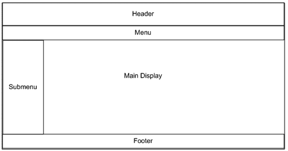

10092ch03.qxd 7/24/08 5:08 PM 第 118 页

**118**

第 3 章 **■** 探索表示层设计模式

**图 3-16.** *eInsure 主布局*

**驱动力**

• 使用可重用的子视图（如页眉、页脚、菜单和导航）组合成更大的视图。

• 识别并组合可重用的组件和容器。

• 将组件和容器放置在适当的布局中，以便能够灵活地进行更改。

**解决方案**

使用*组合视图*来分组和部署一组可插拔、动态的子视图组件，并配以适当的布局。

与 Spring 框架结合的策略

组合视图模式是两种著名的 GOF 设计模式的结合：组合模式和策略模式。布局提供了一种策略，用于形成由较小的组合子视图组成的更大视图组件。您已经在前文描述的视图助手模式中看到了组件和容器。我修改了 JSP


为了支持可重用的输入文本框和选择控件，并将其嵌入到表单容器中。

10092ch03.qxd 7/24/08 5:08 PM 第 119 页

第 3 章 **■** 探索表示层设计模式

**119**

然而，我并未关注将一切粘合在一起的布局方面。假设你希望在每页顶部显示一条重要通知。如果不使用带布局的子视图，你就必须在每个 JSP 文件中重复该通知。但使用布局后，你只需修改包含页头的 JSP 文件，并在该通知不再相关时恢复原状即可。

eInsure 通常使用表格来配置布局，并利用 JSP 包含机制动态引入子视图以组成主视图。尽管这种方案可行，但它是一种非常初级的方法，需要大量自定义代码才能使其成为一个灵活且可插拔的视图框架。Spring 提供了与两种视图布局框架的集成，以简化复合视图的开发与维护。

**使用 SiteMesh**

SiteMesh 是 OpenSymphony 提供的一个开源网页布局框架。可从 [`www.opensymphony.com/sitemesh/`](http://www.opensymphony.com/sitemesh/) 下载。使用 SiteMesh 的最大优势在于其非侵入性。由于它基于 Servlet 过滤器，使用它只需进行配置，即使没有 Spring MVC 也能正常工作。基于过滤器，它实现了 GOF 装饰器设计模式。它修改前端控制器 Servlet 的响应，在将最终响应发送到浏览器之前注入内容。

使用 SiteMesh 的第一步是创建一个具有所需布局的 JSP 文件，如清单 3-54 所示。

**清单 3-54.** WEB-INF/decorators/primaryLayout.jsp

<%@ taglib uri="sitemesh-decorator" prefix="decorator" %>

<%@ taglib uri="sitemesh-page" prefix="page" %>

<html>

<head>

<title>

eInsure - <decorator:title default="欢迎！" />

</title>

<decorator:head />

</head>

<body>

<table width="100%">

<tr id="header">

<h3>eInsure - 版本 3.0.1 </h3>

</tr>

10092ch03.qxd 7/24/08 5:08 PM 第 120 页

**120**

第 3 章 **■** 探索表示层设计模式

<tr id="body">

<decorator:body />

</tr>

<tr id="footer">

<h3>eInsure - 版权所有 </h3>

</tr>

</table>

</html>

请注意，我使用了 SiteMesh 特定的标签库来创建布局。`decorator:title` 标签从前端控制器发送的响应中获取标题信息。类似地，`decorator:head` 和 `decorator:body` 标签将原始响应中 `<head>` 和 `<body>` 标签内的信息包含进来，并将其放入布局中。页头和页脚信息在布局中的公共位置进行整合。要使用此布局框架及不同的标签，你必须在 `web.xml` 文件中包含 SiteMesh 过滤器和标签定义，如清单 3-55 所示。

**清单 3-55.** web.xml

<?xml version="1.0" encoding="UTF-8"?>

[<web-app version="2.4"](http://java.sun.com/xml/ns/j2ee)

[xsi:schemaLocation="http://java.sun.com/xml/ns/j2ee](http://www.w3.org/2001/XMLSchema-instance)

[`java.sun.com/xml/ns/j2ee/web-app_2_4.xsd">`](http://www.w3.org/2001/XMLSchema-instance)

<!-- SiteMesh 过滤器配置开始 -->

<filter>

<filter-name>sitemesh</filter-name>

<filter-class>

com.opensymphony.module.sitemesh.filter.PageFilter

</filter-class>

</filter>

<filter-mapping>

<filter-name>sitemesh</filter-name>

<url-pattern>*.do</url-pattern>

</filter-mapping>

10092ch03.qxd 7/24/08 5:08 PM 第 121 页

第 3 章 **■** 探索表示层设计模式

**121**

<!-- SiteMesh 过滤器配置结束 -->

<servlet>

<servlet-name>insurance</servlet-name>

<servlet-class>

org.springframework.web.servlet.DispatcherServlet

</servlet-class>

<load-on-startup>1</load-on-startup>

</servlet>

<servlet-mapping>

<servlet-name>insurance</servlet-name>

<url-pattern>*.do</url-pattern>

</servlet-mapping>

<jsp-config>

<taglib>

<taglib-uri>/spring</taglib-uri>

<taglib-location>

/WEB-INF/tld/spring-form.tld

</taglib-location>

</taglib>

<!-- SiteMesh 标签配置开始 -->

<taglib>

<taglib-uri>sitemesh-page</taglib-uri>

<taglib-location>

/WEB-INF/tld/sitemesh-page.tld

</taglib-location>

</taglib>

<taglib>

<taglib-uri>sitemesh-decorator</taglib-uri>

<taglib-location>

/WEB-INF/tld/sitemesh-decorator.tld

</taglib-location>

</taglib>

<!-- SiteMesh 标签配置结束 -->

10092ch03.qxd 7/24/08 5:08 PM 第 122 页

**122**

第 3 章 **■** 探索表示层设计模式

</jsp-config>

</web-app>

最后一步，我将把布局包含在装饰器配置中，以便过滤器正常工作。清单 3-56 展示了装饰器配置。

**清单 3-56.** WEB-INF/decorators.xml

<decorators defaultdir="/WEB-INF/decorators">

<decorator name="primaryLayout" page="primaryLayout.jsp">

<pattern>*</pattern>

</decorator>

</decorators>

`decorators.xml` 是管理布局的外部化类。`decorator` 标签中的 `page` 属性定义了应用于请求模式的布局。从 `pattern` 标签可以明显看出，`primaryLayout` 将应用于所有请求。因此，当对 `/createPolicy.do` 的请求由前端控制器处理，并将响应交给 SiteMesh 过滤器时，它会执行以下活动来操作并生成最终响应：

*   提取 `<title>` 标签的内容，并将其应用于主布局。
*   提取 `<head>` 标签，并在主布局中使用它。
*   提取 `<body>` 标签中的内容，并在主布局中使用它。

**使用 Apache Tiles**

Spring MVC 还提供了与 Apache Tiles 框架的集成。与 SiteMesh 一样，Tiles 也是一个灵活且高度可扩展的框架，早期主要与 Struts Web 框架配合使用。从 Tiles 2 开始，它作为一个功能丰富、灵活的布局框架独立运行。SiteMesh 和 Tiles 2 都是强大的布局框架，选择哪一个基本上取决于个人偏好和技术专长。Spring 文档中的以下链接提供了集成 Spring 和 Tiles 2 的分步指南：

[`static.springframework.org/spring/docs/2.5.x/reference/view.html#view-tiles`](http://static.springframework.org/spring/docs/2.5.x/reference/view.html#view-tiles)

10092ch03.qxd 7/24/08 5:08 PM 第 123 页

第 3 章 **■** 探索表示层设计模式

**123**

**结论**

优点

*   *提高了灵活性*：应用程序现在由更小的视图组件组成，例如嵌入在布局中的控件和容器。这使得视图易于配置，并且可以快速高效地推出应用程序外观以及组件定位的更改。
*   *提高了复用性*：使用此模式，同一个子视图可用于组成多个复合视图。

关注点

*   *性能*：在组合视图时，使用多个子视图可能会影响性能。因此，应审慎地将子视图数量控制在可接受的范围内。

**调度器视图**

**问题**


eInsure 有一个登录页面，其界面简洁，用于接收用户名和密码。该页面还包含一个按钮控件，点击后会触发身份验证操作。因此，该登录页面的呈现无需调用任何业务逻辑。系统中还有许多类似页面。例如，有几个页面用于显示输入条件，这些条件可在触发保单、理赔等搜索之前提供。此外，我们还有用于查询系统中各种代码的查找页面。所有用于查找的值都在启动时从数据库加载并缓存在服务器上。之所以能做到这一点，是因为这些静态数据在应用程序运行期间从未改变。同时，加载用于创建保单或理赔的 UI 页面所需的操作，仅需使用会话中缓存的用户信息。最后但同样重要的是，几乎每个页面都有一个打开帮助页面的链接。这些基于静态 HTML 的帮助页面提供了上下文相关的帮助，指导用户如何使用该特定页面中的不同功能（按钮、菜单、文本框等）。

10092ch03.qxd 7/24/08 5:08 PM 第 124 页

**124**

第 3 章 **■** 探索表示层设计模式

所有这些情况都不需要调用业务逻辑。尽管这些都是简单的场景，但我们基于 JSP 前端控制器的应用程序却无法以简单的方式处理这些情况。不同的开发人员创建了这些页面，并随意添加了 if-else 块来处理各自的情况。最简单的方法是直接处理这些静态内容的请求，绕过页面控制器。但这会破坏应用程序整体统一的结构。此外，保护这些资源以防止未经授权的访问（例如直接在浏览器地址栏中输入 URL）可能也很有用。

**驱动因素**

• 应用程序包含大量无需业务逻辑处理的静态视图。

• 半静态视图基于缓存数据呈现。

• 纯静态视图和半静态视图需要像其他动态视图一样得到一致的处理。

**解决方案**

使用*调度视图*来处理静态或半静态视图的呈现。

Spring 框架中的策略

调度视图实际上是结合其他表示层模式的最佳实践。它利用调度器将任务委托给视图。在这种情况下，调度器是控制器和视图解析器的组合。

对于静态视图和半静态视图，此模式可以有两种变体。半静态视图使用缓存数据，因此需要视图助手的支持。我将从纯静态资源开始。图 3-17 展示了调度视图模式的静态结构。

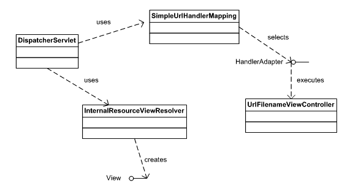

10092ch03.qxd 7/24/08 5:08 PM 第 125 页

第 3 章 **■** 探索表示层设计模式

**125**

**图 3-17.** *调度视图类图*

除了 `UrlFilenameViewController` 之外，您之前已经见过大部分类和接口。这是一个具体的控制器实现，它将请求的 URL 路径转换为逻辑视图名称。例如，对 `/PolicyCreateHelp.do` 的请求将被转换为视图名称 `PolicyCreateHelp`。然后，`InternalResourceViewResolver` 会获取此视图名称，并将其解析为实际资源——`PolicyCreateHelp.jsp`。使用此控制器只需进行配置，如清单 3-57 所示。

作为实现此模式的第一步，我们在 `/WEB-INF/jsp/help` 文件夹中创建 `PolicyCreateHelp.jsp` 文件。不建议使用静态 HTML 文件来提供帮助内容。这是因为将来可能需要支持国际化的帮助。此外，可以使用 FreeMarker 或 Velocity 模板将实际内容与 JSP 分离，从而便于维护和修改。使用调度视图的最后一步是设置 Spring 配置文件，如清单 3-57 所示。


**清单 3-57.** insurance-servlet.xml

<?xml version="1.0" encoding="UTF-8"?>

<beans

[xsi:schemaLocation="http://www.springframework.org/schema/beans](http://www.w3.org/2001/XMLSchema-instance)

[`www.springframework.org/schema/beans/spring-beans-2.5.xsd"`](http://www.w3.org/2001/XMLSchema-instance)

>

10092ch03.qxd 7/24/08 5:08 PM Page 126

**126**

第 3 章 **■** 探索表示层设计模式

<bean name="simpleUrlHandlerMapping"

class="org.springframework.web.servlet.handler.SimpleUrlHandlerMapping">

<property name="mappings">

<props>

<prop key="/*Help.do">urlFilenameViewController</prop>

</props>

</property>

<property name="order" value="2" />

</bean>

<bean name="beanNameUrlHandlerMapping"

class="org.springframework.web.servlet.handler.BeanNameUrlHandlerMapping">

<property name="order" value="1" />

</bean>

<bean name="viewResolver"

class="org.springframework.web.servlet.view.InternalResourceViewResolver">

<property name="viewClass"

value="org.springframework.web.servlet.view.JstlView" />

<property name="prefix" value="/WEB-INF/jsp/" />

<property name="suffix" value=".jsp" />

</bean>

<bean name="urlFilenameViewController"

class="org.springframework.web.servlet.mvc.UrlFilenameViewController" >

<property name="prefix" value="help/" />

</bean>

<bean name="/policydetails.do"

class="com.apress.insurance.web.controller.PolicyDetailsController" />

<bean name="underwritingBusinessDelegate"

class="com.apress.insurance.view.delegate.UnderWritingBusinessDelegate" />

<bean name="/policysearch.do"

class="com.apress.insurance.web.controller.PolicySearchController">

<property name="businessDelegate"

ref="underwritingBusinessDelegate" />

</bean>

</beans>

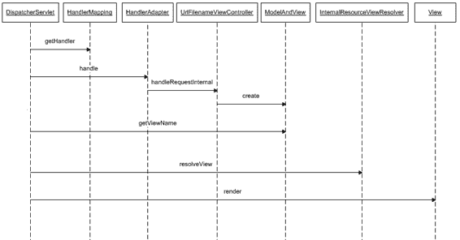

10092ch03.qxd 7/24/08 5:08 PM Page 127

第 3 章 **■** 探索表示层设计模式

**127**

清单 3-57 中在底层发生了很多事情。请注意，一个通用的视图解析器同时服务于动态和静态资源。你还可以看到处理器映射链。

优先级更高的 BeanNameUrlHandlerMapping 首先被选中。现在，对动态资源（如 /policysearch.do）的请求由此处理器映射解析。它会在应用程序上下文中查找名为 /policydetails.do 的 bean，并将处理委托给它。然而，BeanNameUrlHandlerMapping 无法处理对 URL ClaimCreateHelp.do 的请求。因此，会选取链中的下一个处理器映射 SimpleUrlHandlerMapping，将此 URL 解析到一个控制器。此处理器映射成功检测到了控制器。它使用通配符将传入的、以 Help.do 结尾的 URL 解析为 UrlFilenameViewController 的一个实例。因此，UrlFilenameViewController 处理所有静态请求，无需调用任何业务逻辑。这个具体的控制器实现会将请求 URL 转换为一个逻辑视图名称——ClaimCreateHelp。然后，它会使用前缀最终返回 /help/ClaimCreateHelp。最后，视图解析器在文件夹 /WEB-INF/jsp 中查找文件 /help/ClaimCreateHelp.jsp，并返回该静态物理资源。简化的流程如图 3-18 中的时序图所示。

**图 3-18.** *分发器视图时序图*

半静态视图的数据已经以某种形式缓存。要使用这些数据，你可以使用视图助手。要承保保险单，你必须选择一个产品。

系统中活跃的产品在应用程序启动时被缓存在 ServletContext 对象中。物理资源 ProductLoV.jsp 存储在 /WEB-INF/jsp/lookup 文件夹中

10092ch03.qxd 7/24/08 5:08 PM Page 128

**128**

第 3 章 **■** 探索表示层设计模式

，如清单 3-58 所示。此 JSP 从 servlet 上下文中检索活跃产品列表并显示它们。

**清单 3-58.** ProductLoV.jsp

<%@ [taglib prefix="c" uri="http://java.sun.com/jsp/jstl/core" %>](http://java.sun.com/jsp/jstl/core)


<%@ [taglib prefix="fmt" uri="http://java.sun.com/jsp/jstl/fmt" %>](http://java.sun.com/jsp/jstl/fmt)

<html>

<head>

<title>LoV - 产品</title>

</head>

<body>

<table>

<tr>

<td>产品 ID</td>

<td>产品名称</td>

</tr>

<c:forEach var="productDtl" items="${applicationScope.productDtlList}" >

<tr>

<td><c:out value="${productDtl.productId}"/></td>

<td><c:out value="${productDtl.productName}"/></td>

</tr>

</c:forEach>

</table>

</body>

</html>

如清单 3-58 所示，我们使用基于 JSTL 的视图助手来检索和展示存储在应用作用域中的数据。`applicationScope` 是 JSTL 表达式语言中可用的隐式对象，它提供了对 Servlet 上下文的访问句柄。在清单 3-58 中，它会在 Servlet 上下文中查找键为 `productDtlList` 的属性。

要使用这个半静态视图，你需要稍微修改配置，如清单 3-59 所示。请注意，`SimpleUrlHandlerMapping` 已被配置为处理 `UrlFilenameViewController`。

10092ch03.qxd 7/24/08 5:08 PM 第 129 页

第 3 章 **■** 探索表示层设计模式

**129**

**清单 3-59.** ProductLoV.jsp

<?xml version="1.0" encoding="UTF-8"?>

<beans

x[mlns:xsi="http://www.w3.org/2001/XMLSchema-instance"](http://www.w3.org/2001/XMLSchema-instance)

[xsi:schemaLocation="http://www.springframework.org/schema/beans](http://www.w3.org/2001/XMLSchema-instance)

[`www.springframework.org/schema/beans/spring-beans-2.5.xsd"`](http://www.w3.org/2001/XMLSchema-instance)

>

<!-- 其他 bean 如上所示 -->

<bean name="staticViewController"

class="org.springframework.web.servlet.mvc.UrlFilenameViewController" >

<property name="prefix" value="help/" />

</bean>

<bean name="semiStaticViewController"

class="org.springframework.web.servlet.mvc.UrlFilenameViewController" >

<property name="prefix" value="lookup/" />

</bean>

<bean

class="org.springframework.web.servlet.handler.SimpleUrlHandlerMapping">

<property name="mappings">

<props>

<prop key="/*Help.do">staticViewController</prop>

<prop key="/*LoV.do">semiStaticViewController</prop>

</props>

</property>

</bean>

</beans>

10092ch03.qxd 7/24/08 5:08 PM 第 130 页

**130**

第 3 章 **■** 探索表示层设计模式

**结论**

**优点**

*   *促进最佳实践*：这为组合表示层模式制定了清晰的指导方针。
*   *易于实现*：在 Spring 中实现此解决方案很容易，因为我们几乎不需要编写任何代码；所有内容都通过配置组合在一起。

**关注点**

*   *解决方案过于复杂*：分派到静态或半静态视图是一个简单的任务。但为了维护一致的应用程序架构，仍然依赖于分层和各种特定于框架的组件。这对于一个简单的任务来说是一个复杂的解决方案。

**服务到工作者**

**问题**

Dispatcher View 模式为将控制分派到静态视图设定了指导方针。在 eInsure 案例中，这些只构成了少数用例。然而，绝大多数用例需要根据动态数据准备动态视图。

但是，由于该产品是从遗留的 PL/SQL 迁移而来，因此页面控制器中调用了数据访问代码。由于该产品在多个客户端实施并需要快速周转，开发人员会采取快速修复的方法。他们会在页面控制器中混合业务逻辑和数据访问，导致设计不佳的解决方案。

10092ch03.qxd 7/24/08 5:08 PM 第 131 页

第 3 章 **■** 探索表示层设计模式

**131**

**驱动力**

*   应用程序主要需要处理使用动态数据生成的动态视图。
*   业务或数据访问代码混合在动作处理器中。
*   业务逻辑和数据访问代码应放置在不同的层中。

**解决方案**

使用*服务到工作者*模式，通过调用不同层中的组件来协调请求处理工作流。

**Spring 框架中的策略**


与 Dispatcher View 类似，Server to Worker 本质上也是构建分层 Java EE 应用程序的指导方针。它与 MVC 架构模式相似，并建议应用程序必须划分为与请求处理工作流中特定角色相对应的不同层。

Server to Worker 实际上是 Dispatcher View 模式的扩展。与 Dispatcher View 一样，它允许在表示层组织模式，但有两个不同之处。一方面，它允许使用动态视图。另一方面，它在将控制权传递给视图之前调用业务逻辑。必须访问业务逻辑以检索动态视图所需的数据。Server to Worker 为连接表示层和业务层铺平了道路。这两层之间的桥梁由 Business Delegate 模式提供，我们将在下一章中探讨。

页面控制器通常不会直接调用实际业务对象上的方法。相反，它调用桥接层或表示层代理（称为*业务委托对象*）上的方法。如前文列表所示，业务委托由 Spring 容器注入到控制器中。时序图（图 3-19）展示了 Server to Worker 模式的完整工作流程。

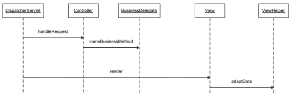

10092ch03.qxd 7/24/08 5:08 PM 第 132 页

**132**

第 3 章 **■** 探索表示层设计模式

**图 3-19.** *Service to worker 时序图*

**影响**

优点

• *促进最佳实践*：这为组合表示层模式制定了清晰的指导方针。它还提供了仅从页面控制器连接业务组件的指令。

• *易于实现*：在 Spring 中实现此解决方案很容易，因为一旦大多数自定义组件准备就绪，所有内容都通过配置粘合在一起。Spring 还为快速轻松地构建这些自定义组件提供了广泛支持。

• *角色分离*：通过明确设定指导方针，应用程序开发任务可以分配给负责视图的页面作者和专注于页面控制器及业务组件的应用程序开发人员。

关注点

• *性能问题*：过多的层和过多的委托会降低性能。因此，设计人员在决定要使用的层和组件时必须小心谨慎。

10092ch03.qxd 7/24/08 5:08 PM 第 133 页

第 3 章 **■** 探索表示层设计模式

**133**

**总结**

在本章中，我深入探讨了各种表示层模式。我们从一端开始，到另一端结束，为第 4 章的业务层模式奠定了基础。Front Controller 模式拦截所有请求并委托给 Application Controller 模式中的动作处理器。动作处理器与 Context Object 和 Page Controller 模式协作以调用业务逻辑。一旦页面控制器选择了逻辑视图并返回从业务逻辑调用中检索到的数据，控制权就会传回给应用程序控制器。应用程序控制器使用视图管理组件来解析适当的物理视图并绑定应用程序数据。View Helper 模式有助于在视图中适配应用程序数据，并构建复合视图以发送最终响应供最终用户显示。前端控制器和页面控制器的工作可以通过 Intercepting Filter 模式和处理器拦截器进行装饰。Dispatcher View 模式提供了组合所有表示层模式以高效委托给静态视图的指导方针。最后，Service to Worker 模式为使用 Business Delegate 模式与业务层交互铺平了道路。

10092ch03.qxd 7/24/08 5:08 PM 第 134 页

10092ch04.qxd 7/24/08 5:10 PM 第 135 页

第 4 章

探索业务层


设计模式

**保**险应用与大多数金融解决方案一样，具有复杂的业务规则。

eInsure 也不例外。它实现了非常复杂的数学和统计公式，用于计算保单保费、理赔金额以及其他多个属性的值。eInsure 应用的业务层是使用 EJB 技术构建的。该应用大量使用了无状态会话 Bean 和实体 Bean。

eInsure 还使用了消息驱动 Bean 进行异步处理。在本章中，我将重点讨论会话 Bean 和消息驱动 Bean。实体 Bean 属于集成层组件，它们也可以远程访问并提供持久化支持。根据当前的 EJB 3.0 规范，实体 Bean 已成为过去式。

因此，在本书中，我不会详细讨论它们。

在本章中，我将探讨一些关键的设计模式，这些模式可用于使用 Spring 框架构建一个灵活而简单的业务层。我将从服务定位器模式开始，该模式整合了查找注册在 JNDI 中的 EJB 组件所需的样板代码。然后，我将研究业务委托模式，该模式为业务对象提供了客户端代理。业务委托和服务定位器协同工作，可以有效地将表示层与业务层连接起来。

我将深入介绍业务层，并重点展示如何使用 EJB 会话外观构建可远程访问的业务逻辑。您还将看到 POJO 业务层组件与应用程序服务和 EJB 命令对象模式结合使用的好处。在本章的最后，我将讨论业务接口模式，该模式对会话 Bean 强制执行某些编译时检查，并简化了业务委托模式。

**135**

10092ch04.qxd 7/24/08 5:10 PM 第 136 页

**136**

第 4 章 **■** 探索业务层设计模式

**服务定位器**

**问题**

EJB 会话 Bean 和消息驱动 Bean 用于实现业务工作流。这些组件在部署时会注册到应用服务器的 JNDI 树上。JNDI 提供了一种目录服务，外部客户端可以使用该服务按名称发现和查找对象。因此，JNDI 使得远程客户端可以访问 EJB。除了 EJB 之外，JMS 队列、主题、连接工厂以及 JDBC 数据源也会绑定到 JNDI 中。清单 4-1 显示了 eInsure 应用的 magic JSP 控制器使用的 JNDI 查找代码。

**清单 4-1.** UnderwritingController.jsp

<%!

**final String JNDI_URL = "t3://localhost:7001";**

**public UnderwritingHome getEJBHome() {**

**UnderwritingHome home**

**= null;**

**try{**

**Hashtable h = new Hashtable();**

**h.put(Context.INITIAL_CONTEXT_FACTORY,"");**

**h.put(Context.INITIAL_CONTEXT_FACTORY,**

**"weblogic.jndi.WLInitialContextFactory");**

**h.put(Context.PROVIDER_URL, JNDI_URL);**

**Context ctx = new InitialContext(h);**

**Object homeObj = ctx.lookup("uwrbusinessslsb");**

**home = (UnderwritingHome)PortableRemoteObject.narrow(homeObj,**

**UnderwritingHome.class);**

**}**

**catch(Exception e){**

**e.printStackTrace();**

**home = null;**

**}**

**return home;**

**}**

%>

<%

String eventCode = request.getParameter("eventCode");

10092ch04.qxd 7/24/08 5:10 PM 第 137 页

第 4 章 **■** 探索业务层设计模式

**137**

String screenCode = request.getParameter("screenCode");

String inputPage = request.getParameter("referrer");

String userCd = request.getParameter("userCode");

String nextView = null;

try{

boolean userHasPrivilege = SecurityChecker.getInstance().isAuthorized(

userCd, eventCode);

if(userHasPrivilege){

if(eventCode.equals("UWR001") && screenCode.equals("SCR001")){

nextView = "Policy.jsp";

UnderwritingHome home = getEJBHome();

Underwriting remote = home.create();

remote.underwriteNewPolicy("GAP","Dhrubo",1);

}

else if(screenCode.equals("UWR002") && eventCode.equals("SCR001")){


// 查找会话 Bean

// 执行业务操作

}

}

else{

request.setAttribute("ERROR_MESSAGE",

"您没有执行此操作的权限");

nextView = inputPage;

}

}//try

catch(Throwable exp){

request.setAttribute("ERROR_MESSAGE",exp.getMessage());

nextView = "error.jsp";

}

finally{

// 最终重定向到正确的视图

RequestDispatcher requestDispatcher =

request.getRequestDispatcher(nextView);

requestDispatcher.forward(request,response);

}

%>

10092ch04.qxd 7/24/08 5:10 PM Page 138

**138**

第 4 章 **■** 探索业务层设计模式

清单 4-1 展示了 `getEJBHome` 方法，该方法用于通过 JNDI API 查找 EJB 本地接口。此方法在每个需要与业务组件交互的 `if-else` 块中被调用。查找方法在所有 JSP 控制器中重复出现，从而降低了可重用性。这种通过复制粘贴方式实现的重用延续了遗留问题。开发团队中没有人愿意进行重构，并将 JNDI 对象查找迁移到一个通用的、可重用的组件中，使其能够与任何服务器协同工作。当团队在为一位新客户将产品部署到 IBM WebSphere 上遇到诸多问题时，这一点显得尤为突出。从清单 4-1 可以清楚地看到，JNDI 查找使用了专有类，例如 `weblogic.jndi.WLInitialContextFactory`。这反过来又导致应用程序与供应商实现（本例中为 BEA WebLogic 应用服务器）紧密耦合。这增加了移植到另一个 Java EE 应用服务器的痛苦。

采用这种设计，每个 JSP 控制器只能支持单个会话 Bean。这也意味着，随着越来越多的承保用例被实现，会话 Bean 将增长到难以管理的大小。最终的结果是应用程序的设计和架构效率低下。

请注意，`getEJBHome` 方法使用了一个静态 URL 来连接 JNDI 服务。这样做是假设 JSP 和 EJB 部署在同一个 JVM 中。虽然这种系统架构本身没有错（实际上在中等规模的应用中很常见），但这引发了一个严重的问题：如果 JSP 和 EJB 将部署在一起，那么你真的需要 EJB 吗？开发和维护 EJB 的任务很艰巨。因此，除非你的应用程序需要 EJB 容器提供的系统服务（如远程调用、安全性、事务、对象池、故障转移等），否则使用 POJO 业务组件会更好。

为了充分利用 EJB 组件提供的优势，像 eInsure 这样的大型复杂应用程序应在生产环境中使用分布式部署架构。在这种部署场景下，表示层组件（如 JSP）将驻留在 Web 容器（如 Apache Tomcat 或 Jetty）中。表示层组件访问部署在应用服务器（如 BEA WebLogic 或 Red Hat JBoss）上的 EJB 业务对象。应用服务器运行在独立的机器上，并且可能处于不同的环境中。简而言之，表示层和业务层组件通常部署在不同机器上运行的 JVM 中。因此，eInsure 的分布式部署将要求在所有 JSP 控制器中编辑静态 URL。

清单 4-1 的缺点还不止于此。你可能已经注意到，这段代码为每次业务服务查找都创建了一个新的 `InitialContext` 对象实例。这是一个代价高昂的操作。JNDI 查找主要是从网络上的另一个 JVM 中搜索并检索对象代理。因此，JNDI 查找是企业级 Java 应用程序中性能瓶颈的一个可能原因。

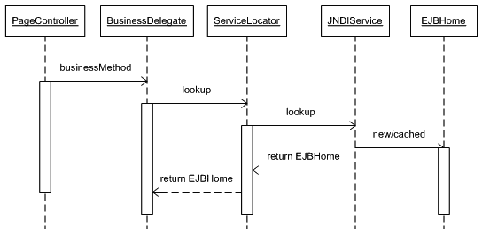

10092ch04.qxd 7/24/08 5:10 PM Page 139

第 4 章 **■** 探索业务层设计模式

**139**

**驱动因素**

• 将 EJB、JMS 或数据源对象查找整合到一个可重用的组件中，该组件封装了与 JNDI API 交互的复杂性。


• JNDI 查找应独立于供应商的 API 类和接口。实际上，只需更改配置参数，就应该能够在不同服务器之间切换。

• 服务查找代码应足够灵活，以支持不同类型的业务对象：EJB、POJO 甚至 Web 服务。

• 解决与 JNDI 查找相关的性能问题。

**解决方案**

使用*服务定位器*来封装 JNDI 对象查找，并消除任何性能开销。

Spring 框架的策略

正如我在第 3 章中所述，页面控制器是与业务层开始交互的最合适的组件。它们通过调用 POJO 业务委托对象上的方法来实现这一点。业务委托为业务层提供客户端接口，并负责访问远程 EJB 对象。它们反过来依赖服务定位器来检索 EJB 的 Home 对象。图 4-1 展示了这种交互。

**图 4-1.** *序列图：服务定位器交互*

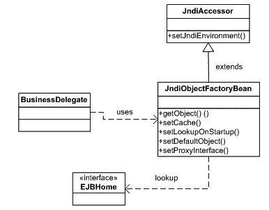

10092ch04.qxd 7/24/08 5:10 PM Page 140

**140**

第 4 章 **■** 探索业务层设计模式

Spring 框架提供了一套全面的类，用于从所有不同的应用服务器中检索 JNDI 绑定的对象。`JndiObjectFactoryBean` 是 Spring 框架中使用最广泛的服务定位器类。它是一个工厂 Bean，因此实现了 `FactoryBean` 接口。工厂 Bean 是 Spring Bean 工厂内的一个对象工厂。因此，Spring IOC 容器对工厂 Bean 的处理方式与普通 Bean 不同。它的配置方式与普通 Bean 相同，但 Spring 不会返回 `JndiObjectFactoryBean` 的新实例。相反，它暴露出来用于注入的对象始终是它创建或检索到的对象。对于 `JndiObjectFactoryBean`，这是通过 `getObject` 方法实现的，该方法返回从 JNDI 检索到的对象。因此，此服务定位器实现可用于查找和注入任何类型的 JNDI 对象。由于 `JndiObjectFactoryBean` 继承自 `JndiAccessor` 类，因此可以轻松配置各种与 JNDI 相关的属性。图 4-2 显示了 Spring JNDI 类图。

**图 4-2.** *类图：服务定位器*

**远程 EJB 2\. *x*** **查找**

现在我将使用 `JndiObjectFactoryBean`。在清单 3-27 中，我将页面控制器与业务委托结合使用，但为了简洁起见，故意没有显示代码。清单 4-2 显示了业务委托实现类。我将在本章后面详细介绍业务委托。因此，此处列出此业务委托的唯一目的是强调它如何与服务定位器相关联。如清单 4-2 所示，业务委托完全与服务定位器解耦。`JndiObjectFactoryBean` 服务定位器与 Spring 容器透明地协作，以

10092ch04.qxd 7/24/08 5:10 PM Page 141

第 4 章 **■** 探索业务层设计模式

**141**

注入 EJB Home 对象。虽然可以在此业务委托中注入任意数量的会话 Bean，但最佳实践是每个业务委托对应一个 EJB。

**清单 4-2.** UnderwritingBusinessDelegate.java

public class UnderWritingBusinessDelegate {

private UnderwritingHome underWritingHome;

public void createPolicy(PolicyFormBean policyBean) {

try {

Underwriting bean = this.underWritingHome.create();

bean.underwriteNewPolicy(policyBean.getProductCode(),

policyBean.getFirstName(), policyBean.getAge());

} catch (RemoteException e) {

throw new RuntimeException(e);

} catch (CreateException e) {

throw new RuntimeException(e);

}

}

public UnderwritingHome getUnderWritingHome() {

return underWritingHome;

}

public void setUnderWritingHome(UnderwritingHome underWritingHome) {

this.underWritingHome = underWritingHome;

}

}


服务定位器可以通过配置启用，如清单 4-3 所示。应用程序应对每个 JNDI 对象使用一个`JndiObjectFactoryBean`的单例实例。

**清单 4-3.** insurance-servlet.xml

<?xml version="1.0" encoding="UTF-8"?>

<beans

[xsi:schemaLocation="http://www.springframework.org/schema/beans](http://www.w3.org/2001/XMLSchema-instance)

[`www.springframework.org/schema/beans/spring-beans-2.5.xsd">`](http://www.w3.org/2001/XMLSchema-instance)

10092ch04.qxd 7/24/08 5:10 PM Page 142

**142**

第 4 章 **■** 探索业务层设计模式

<bean name="underwritingBusinessDelegate"

class="com.apress.insurance.view.delegate.UnderWritingBusinessDelegate">

<property name="underWritingHome" ref="uwrSlsbHome" />

</bean>

<bean name="uwrSlsbHome"

class="org.springframework.jndi.JndiObjectFactoryBean">

<property name="jndiName" value="uwrbusinessslsb" />

<property name="jndiEnvironment">

<props>

<prop key="java.naming.factory.initial">

weblogic.jndi.WLInitialContextFactory

</prop>

<prop key="java.naming.provider.url">

t3://localhost:7001

</prop>

</props>

</property>

</bean>

</beans>

你可以使用 Spring 的属性占位符功能进一步将配置外部化。在这种策略中，你将不同属性的值替换为占位符，然后将这些值移至一个外部的属性文件中。这样，在属性文件中更改特定于环境的值就变得很容易，同时保持 Spring XML 配置不受影响。关于 Spring 属性占位符支持的详细说明，请参考[`static.springframework.org/spring/docs/2.5.x/reference/`](http://static.springframework.org/spring/docs/2.5.x/reference)

beans.html#beans-factory-placeholderconfigurer。

因此，使用 Spring 框架，可以快速建立一个可配置的服务定位器。

现在，要支持不同的应用服务器，你只需修改配置文件。清单 4-4 中的代码使得查找部署在 JBoss 服务器上的同一个 EJB 成为可能。

**清单 4-4.** insurance-servlet.xml *用于 JBoss*

<?xml version="1.0" encoding="UTF-8"?>

<beans

[xsi:schemaLocation="http://www.springframework.org/schema/beans](http://www.w3.org/2001/XMLSchema-instance)

10092ch04.qxd 7/24/08 5:10 PM Page 143

第 4 章 **■** 探索业务层设计模式

**143**

[`www.springframework.org/schema/beans/spring-beans-2.5.xsd"`](http://www.springframework.org/schema/beans/spring-beans-2.5.xsd)

>

<!- - 其他 Bean - ->

<bean name="uwrSlsbHome"

class="org.springframework.jndi.JndiObjectFactoryBean">

<property name="jndiName" value="uwrbusinessslsb" />

<property name="jndiEnvironment">

**<props>**

**<prop key="java.naming.factory.initial">**

**org.jnp.interfaces.NamingContextFactory**

**</prop>**

**<prop key="java.naming.provider.url"> jnp://localhost:1099</prop>**

**<prop key=" java.naming.factory.url.pkgs">org.jboss.naming.client</prop>**

**</props>**

</property>

</bean>

</beans>

**本地 EJB 2\. *x*** **查找**

EJB 2.0 引入了本地企业 Bean 组件，它们与其它 Java EE 组件位于同一个 JVM 中。这消除了在 JNDI 树上查找对象所需的网络往返，从而提高了性能。这也极大地简化了 EJB 对象的查找。本地无状态会话 Bean 也可以通过配置使用`JndiObjectFactoryBean`来访问，如清单 4-5 所示。

**清单 4-5.** insurance-servlet.xml *：本地 EJB*

<?xml version="1.0" encoding="UTF-8"?>

<beans

[xsi:schemaLocation="http://www.springframework.org/schema/beans](http://www.w3.org/2001/XMLSchema-instance)

[`www.springframework.org/schema/beans/spring-beans-2.5.xsd"`](http://www.w3.org/2001/XMLSchema-instance)

>

10092ch04.qxd 7/24/08 5:10 PM Page 144

**144**

第 4 章 **■** 探索业务层设计模式

<!- - 其他 Bean - ->

<bean name="underwritingBusinessDelegate"


class="com.apress.insurance.view.delegate.UnderWritingBusinessDelegate">

**<property name="uwrLocalHome" ref="uwrSlsbLocalHome" />**

</bean>

**<bean name="uwrSlsbLocalHome"**

**class="org.springframework.jndi.JndiObjectFactoryBean">**

**<property name="jndiName" value="UnderwritingBeanLocal" />**

**</bean>**

</beans>

请注意，对于本地 EJB，与 JNDI 查找相关的各种属性是多余的。

**EJB 3 查找**

使用 EJB 3，你可以通过 Java EE 标准注解将 POJO 转变为会话 Bean。你不再需要处理 Home 接口和 XML 部署描述符。这些都极大地简化了 EJB 开发。然而，EJB 3 的这些变化并未改变 Spring 服务定位器的工作方式。你仍然可以通过配置使用 `JndiObjectFactoryBean` 作为服务定位器。如清单 4-6 所示，它被用于查找两个不同的会话 Bean。

**清单 4-6.** insurance-servlet.xml *：EJB 3 查找*

<?xml version="1.0" encoding="UTF-8"?>

<beans

[xsi:schemaLocation="http://www.springframework.org/schema/beans](http://www.w3.org/2001/XMLSchema-instance)

[`www.springframework.org/schema/beans/spring-beans-2.5.xsd"`](http://www.w3.org/2001/XMLSchema-instance)

>

<!- - 其他 Bean - ->

<!- - 远程 EJB 3 SLSB - ->

<bean id="uwrRemoteService"

class="org.springframework.jndi.JndiObjectFactoryBean">

<property name="jndiName" value="UwrRemoteServiceBean/Remote" />

10092ch04.qxd 7/24/08 5:10 PM Page 145

第 4 章 **■** 探索业务层设计模式

**145**

<property name="jndiEnvironment">

**<props>**

**<prop key="java.naming.factory.initial">**

**org.jnp.interfaces.NamingContextFactory**

**</prop>**

**<prop key="java.naming.provider.url"> jnp://localhost:1099</prop>**

**<prop key=" java.naming.factory.url.pkgs">org.jboss.naming.client</prop>**

**</props>**

</property>

</bean>

<!- - 本地 EJB 3 SLSB - ->

**<bean id="uwrLocalService"**

**class="org.springframework.jndi.JndiObjectFactoryBean">**

**<property name="jndiName" value=" UwrLocalServiceBean/Local " />**

**</bean>**

</beans>

**JMS 对象的查找**

服务定位器不仅限于 EJB 组件；它可用于任何 JNDI 绑定的对象，例如 JMS 队列和主题或 JDBC 数据源。它也可以与 Web 服务一起使用。

清单 4-7 查找了在 JBoss 中配置的一个本地 JMS 队列和主题。该清单还展示了在访问 JNDI 绑定对象时使用资源引用的两种方式。一种方式是在 `jndiName` 属性中直接添加前缀；另一种方式是启用 `resourceRef` 属性，该属性会自动将字符串 `java:comp/env/` 添加到 JNDI 名称之前。

**清单 4-7.** insurance-servlet.xml

<?xml version="1.0" encoding="UTF-8"?>

<beans

[xsi:schemaLocation="http://www.springframework.org/schema/beans](http://www.w3.org/2001/XMLSchema-instance)

[`www.springframework.org/schema/beans/spring-beans-2.5.xsd">`](http://www.w3.org/2001/XMLSchema-instance)

10092ch04.qxd 7/24/08 5:10 PM Page 146

**146**

第 4 章 **■** 探索业务层设计模式

<!- - 其他 Bean - ->

<bean id="testTopic"

class="org.springframework.jndi.JndiObjectFactoryBean">

<property name="jndiName" value="topic/testTopic" />

</bean>

<bean id="testQueue"

class="org.springframework.jndi.JndiObjectFactoryBean">

<property name="jndiName" value="queue/testQueue" />

</bean>

<bean id="resourceRefOnQueue"

class="org.springframework.jndi.JndiObjectFactoryBean">

<property name="jndiName" value="queue/resourceRefOnQueue" />

<property name="resourceRef" value="true" />

</bean>

<bean id="sampleQueue"

class="org.springframework.jndi.JndiObjectFactoryBean">

<property name="jndiName" value="java:comp/env/topic/resourceRefOnQueue"

</bean>

/>

</beans>

如清单 4-7 所示，你可以使用 `JndiObjectFactoryBean` 从 JNDI 中查找 JMS 对象。对于远程 JMS 对象，你只需像清单 4-3 中的 EJB 会话 Bean 一样，添加 `jndiEnvironment` 属性即可。


如前所述，从 JNDI 获取对象可能会影响性能。在高度事务性的应用中，JNDI 对象会被频繁使用。因此，客户端必须缓存并使用这些对象。这正是 `JndiObjectFactoryBean` 的默认行为。它在 Spring Web 应用上下文初始化时查找 JNDI 树，并加载 JNDI 绑定的对象。因此，在 Spring Web 应用开始初始化之前，必须确保 EJB 已加载并在 JNDI 中注册。

对于不常使用 JNDI 对象的应用来说，服务定位器的对象缓存功能并不重要。如果你通过应用服务器的热部署支持来更新应用，这也会引发问题。热部署允许在不关闭服务器的情况下重新加载整个 Java EE 应用。

这也会用新对象刷新 JNDI。因此，如果使用了服务定位器缓存，其中将包含不再存在的对象引用。随后对这些对象的任何访问都将导致运行时异常。

在 Spring IOC 容器中，可以延迟查找和加载 JNDI 对象。如果需要在启动时关闭 JNDI 对象检索及后续缓存，你必须指定代理接口。代理接口将生成一个代理对象来代表真实的 JNDI 对象。因此，代理接口必须与 JNDI 对象接口相同。如清单 4-8 所示，我将本地 Home 接口指定为代理接口。请注意，实际的 JNDI 对象将在首次使用时才可用。

**清单 4-8.** insurance-servlet.xml

```xml
<?xml version="1.0" encoding="UTF-8"?>

<beans

xsi:schemaLocation="http://www.springframework.org/schema/beans http://www.springframework.org/schema/beans/spring-beans-2.5.xsd">

<!- - 其他 Bean - ->

<bean name="underwritingBusinessDelegate"

class="com.apress.insurance.view.delegate.UnderWritingBusinessDelegate">

<property name="uwrLocalHome" ref="uwrSlsbLocalHome" />

</bean>

<bean id="uwrSlsbLocalHome"

class="org.springframework.jndi.JndiObjectFactoryBean">

<property name="jndiName" value="UnderwritingBeanLocal" />

<property name="cache" value="false" />

<property name="lookupOnStartup" value="false" />

<property name="proxyInterface"

value="com.apress.einsure.business.ejbfacade.UnderwritingLocalHome" />

</bean>

</beans>
```

eInsure 应用中有大量执行业务工作流的会话 Bean。但这导致了大量冗余的元数据信息，使 Spring 配置文件变得臃肿。你可以通过继承抽象模板定义来最小化配置信息的重复，如清单 4-9 所示。

**清单 4-9.** insurance-servlet.xml

```xml
<?xml version="1.0" encoding="UTF-8"?>

<beans

xsi:schemaLocation="http://www.springframework.org/schema/beans http://www.springframework.org/schema/beans/spring-beans-2.5.xsd">

<bean name="underwritingBusinessDelegate"

class="com.apress.insurance.view.delegate.UnderWritingBusinessDelegate">

<property name="uwrLocalHome" ref="uwrSlsbLocalHome" />

</bean>

<bean id="lazyJndiObjectFactoryBean" abstract="true"

class="org.springframework.jndi.JndiObjectFactoryBean">

<property name="cache" value="false" />

<property name="lookupOnStartup" value="false" />

</bean>

<bean id="uwrSlsbLocalHome" parent="lazyJndiObjectFactoryBean">

<property name="jndiName" value="UnderwritingBeanLocal" />

<property name="proxyInterface"


value="com.apress.einsure.business.ejbfacade.UnderwritingLocalHome" />

</bean>

<bean id="claimSlsbLocalHome" parent="lazyJndiObjectFactoryBean">

<property name="jndiName" value="ClaimBeanLocal" />

<property name="proxyInterface"

value="com.apress.einsure.business.ejbfacade.ClaimLocalHome" />

</bean>

</beans>

Spring 2\. *x* 引入了新的 `jee` 标签，使得查找 JNDI 对象更加简单。

清单 4-10 展示了如何使用这个新标签来查找无状态会话 Bean。请注意，要使用此标签，你需要修改配置文件以包含 `jee` 命名空间和模式位置。

**清单 4-10.** insurance-servlet.xml

<?xml version="1.0" encoding="UTF-8"?>

<beans

[](http://www.springframework.org/schema/jee)

**[xsi:schemaLocation="http://www.springframework.org/schema/beans](http://www.springframework.org/schema/jee)

[`www.springframework.org/schema/beans/spring-beans-2.5.xsd`](http://www.springframework.org/schema/jee)

[`www.springframework.org/schema/jee`](http://www.springframework.org/schema/jee)

[**http://www.springframework.org/schema/jee/spring-jee-2.5.xsd"**](http://www.springframework.org/schema/jee)

>

**<!- - 本地 EJB 查找 - ->**

10092ch04.qxd 7/24/08 5:10 PM Page 149

第 4 章 **■** 探索业务层设计模式

**149**

**<jee:jndi-lookup id="uwrSlsbLocalHome"**

**cache="false"**

**lookup-on-startup="false"**

**jndi-name="UnderwritingBeanLocal"**

**proxy-interface="com.apress.einsure.business.➥**

**ejbfacade.UnderwritingLocalHome"**

**/>**

<jee:jndi-lookup id="uwrSlsbRemoteHome" jndi-name=" UnderwritingBeanRemote ">

*<!-- 以换行分隔的环境键值对 -->*

<jee:environment>

java.naming.factory.initial=org.jnp.interfaces.NamingContextFactory

java.naming.provider.url=jnp://localhost:1099

java.naming.factory.url.pkgs=org.jboss.naming.client

</jee:environment>

</jee:jndi-lookup>

</beans>

`JndiObjectFactoryBean` 的另一个重要方面是对单元测试的支持。

它使得在容器外测试组件变得容易。你可以通过设置 `defaultObject` 属性来实现这一点。当 JNDI 服务或 JNDI 绑定的对象不可用时，它作为后备对象。清单 4-11 展示了如何使用后备对象。

**清单 4-11.** insurance-servlet.xml

<?xml version="1.0" encoding="UTF-8"?>

<beans

[xsi:schemaLocation="http://www.springframework.org/schema/beans](http://www.w3.org/2001/XMLSchema-instance)

[`www.springframework.org/schema/beans/spring-beans-2.5.xsd"`](http://www.w3.org/2001/XMLSchema-instance)

>

<!- - 其他 Bean - ->

<bean name="uwrbusinessPOJO"

class="com.apress.einsure.business.UwrBusinessServiceImpl"

<bean name="uwrSlsbHome"

class="org.springframework.jndi.JndiObjectFactoryBean">

<property name="jndiName" value="uwrbusinessslsb" />

10092ch04.qxd 7/24/08 5:10 PM Page 150

**150**

第 4 章 **■** 探索业务层设计模式

<property name=" defaultObject" ref="uwrbusinessPOJO" />

<property name="jndiEnvironment">

**<props>**

**<prop key="java.naming.factory.initial">**

**org.jnp.interfaces.NamingContextFactory**

**</prop>**

**<prop key="java.naming.provider.url"> jnp://localhost:1099</prop>**

**<prop key=" java.naming.factory.url.pkgs">org.jboss.naming.client</prop>**

**</props>**

</property>

</bean>

</beans>

必须指出，`JndiObjectFactoryBean` 是一种便捷的 JNDI 对象查找方式。但推荐的方法是使用一个代理工厂 Bean，它能有效地将服务定位器与依赖注入结合起来。你将在学习业务委托模式时了解这一策略。

**结论**

优点

• 服务定位器模式抽象了与服务对象相关的复杂查找机制。这增加了灵活性，因为服务客户端无需再编写查找代码。

• 使用 Spring 框架，仅通过配置即可实现 JNDI 查找。


• 基于 Spring 的服务定位器的缓存行为提升了性能。

• 服务对象的可测试性得到改善。借助 Spring，现在可以在容器外部测试 POJO 业务组件，而无需对应用程序代码库进行任何修改。

• 服务定位器的配置很容易外部化。

10092ch04.qxd 7/24/08 5:10 PM 第 151 页

第 4 章 **■** 探索业务层设计模式

**151**

关注点

• 开发人员需要了解并记住大量的配置参数和选项。

**业务委托**

**问题**

在任何 Java EE 应用程序中，页面控制器构成了表示层的边界类。页面控制器可以直接调用业务组件。这导致表示层代码与业务层代码紧密耦合。

在大多数情况下，业务服务组件以远程对象的形式提供，例如无状态会话 Bean (SLSB)。在这种情况下，页面控制器还需要处理基础设施服务，例如 JNDI 查找、处理远程异常等。

随着时间的推移，维护这些页面控制器变得越来越困难，因为它们承担了多项职责。

**驱动力**

• 最小化表示层和业务层之间的耦合。

• 对业务服务客户端隐藏基础设施问题。

**解决方案**

使用*业务委托*作为适配器，从表示层调用业务对象。

与 Spring 框架的策略

著名的计算机科学家 Butler W. Lampson（早在 1972 年就在施乐公司构想了现代个人计算机）曾说过：“计算机科学中的所有问题都可以通过增加一个间接层来解决。” 这个原则可以应用于在页面控制器和 EJB 业务层之间构建一个薄层。这个

10092ch04.qxd 7/24/08 5:10 PM 第 152 页

**152**

第 4 章 **■** 探索业务层设计模式

层的唯一目的是将表示层与业务层解耦。这个薄层由业务委托组成。

如清单 4-2 所示，业务委托是业务层的一个 POJO 客户端代理。它使用服务定位器来访问 EJB 对象。使用 Spring 框架，服务定位器对业务委托是透明工作的。由服务定位器查找的 EJB 对象由 Spring IOC 容器注入到业务委托中。这个 EJB 对象用于委托业务逻辑调用。因此，业务委托知道如何使用诸如 EJB 之类的远程 API。业务委托还处理在 EJB 方法调用期间引发的异常。它通常将这些异常转换为特定于应用程序的运行时异常。

业务委托的另一个关键职责是为页面控制器提供一致的 API。为了实现这个目标，它将应用“面向接口编程 (P2I)”这一对象设计最佳实践。清单 10-12 展示了业务委托接口。

如清单 4-12 所示，业务委托复制了与实际远程业务对象相同的方法。

**清单 4-12.** UnderwritingBusinessDelegate.java

public interface UnderwritingBusinessDelegate {

public void underwriteNewPolicy(String productCd,String name,int age);

}

清单 4-13 展示了业务委托实现类。业务委托拦截由分布式业务对象引发的任何异常，并将其转换为 RuntimeException，因为在大多数情况下，无法从这些异常中恢复。

**清单 4-13.** UnderwritingBusinessDelegateImpl.java

public class UnderwritingBusinessDelegateImpl

implements UnderwritingBusinessDelegate{

private UnderwritingRemoteHome uwrRemoteHome;

public UnderwritingRemoteHome getUwrRemoteHome() {

return uwrRemoteHome;

}

public void setUwrRemoteHome(UnderwritingRemoteHome uwrRemoteHome) {

this.uwrRemoteHome = uwrRemoteHome;

}

public void underwriteNewPolicy(String productCd, String name, int age) {

try {

UnderwritingRemote bean = this.uwrRemoteHome.create();

bean.underwriteNewPolicy(productCd, name, age);

10092ch04.qxd 7/24/08 5:10 PM 第 153 页

第 4 章 **■** 探索业务层设计模式

**153**

} catch (CreateException ex) {

throw new RuntimeException(ex);

} catch (RemoteException ex) {

throw new RuntimeException(ex);

}

}

}

现在，所有内容都需要在 Spring 配置文件中进行装配，如清单 4-14 所示。请注意，业务委托是由 Spring 容器注入到页面控制器中的。

**清单 4-14.** insurance-servlet.xml

<?xml version="1.0" encoding="UTF-8"?>

<beans

[xsi:schemaLocation="http://www.springframework.org/schema/beans](http://www.springframework.org/schema/jee)

[`www.springframework.org/schema/beans/spring-beans-2.5.xsd`](http://www.springframework.org/schema/jee)

[`www.springframework.org/schema/jee`](http://www.springframework.org/schema/jee)

[`www.springframework.org/schema/jee/spring-jee-2.5.xsd">`](http://www.springframework.org/schema/jee)

<!—other beans - ->

<bean name="/createPolicy.do"

class="com.apress.insuranceapp.web.controller.CreatePolicyController">

<property name="uwrBusinessDelegate" ref="uwrBusinessDelegate"/>

</bean>

<bean name="uwrBusinessDelegate"

class="com.apress.insurance.view.delegate. **➥**

UnderWritingBusinessDelegateImpl">

<property name="uwrRemoteHome" ref="uwrSlsbRemoteHome" />

</bean>

<bean id="uwrSlsbRemoteHome" class="org.springframework.jndi. **➥**

JndiObjectFactoryBean">

<property name="jndiName" value="UnderwritingBeanRemote" />

<property name="jndiEnvironment">

<props>

<prop key="java.naming.factory.initial">

org.jnp.interfaces.NamingContextFactory

10092ch04.qxd 7/24/08 5:10 PM 第 154 页

**154**

第 4 章 **■** 探索业务层设计模式

</prop>

<prop key="java.naming.provider.url">

jnp://localhost:1099

</prop>

<prop key="java.naming.factory.url.pkgs">

org.jboss.naming.client

</prop>

</props>

</property>

</bean>

</beans>

面向接口编程原则为业务委托设计增加了灵活性。可能会出现这样的情况：您决定从 EJB 切换到其他远程处理选项，例如 Burlap-Hessian 或 Web 服务。在这种情况下，您需要一个新的业务委托实现。但是，页面控制器（作为业务委托的客户端）将不受影响，因为它们使用的是业务委托接口。最后，您需要在 Spring 配置中装配这个 Bean 来替换 EJB。

**结果**

优点

• 中间的业务委托层将业务层与表示层解耦。因此，您将拥有更灵活、更易于维护的表示层。

• 业务委托向表示层公开统一的 API 以访问业务逻辑。它还处理异常并将其转换为表示层能够理解的类型。

• 借助 Spring 依赖注入支持，POJO 业务委托的开发和使用的复杂性大大降低。

10092ch04.qxd 7/24/08 5:10 PM 第 155 页

第 4 章 **■** 探索业务层设计模式

**155**

关注点

• 业务委托引入了一个额外的层，增加了应用程序中的类数量。这可能在维护期间引起关注。

• 如果远程业务对象接口发生变化，业务委托应处理这些变化。在理想情况下，页面控制器不会察觉到业务委托中的此类内部变化。然而，这种情况很少发生，页面控制器也会受到业务对象变化的影响。

**会话外观**

**问题**


eInsure 应用程序使用无状态会话 Bean（SLSB）来部署可远程访问的业务逻辑。这些 SLSB 从 JSP 控制器中被访问，如清单 4-1 所示。然而，正如我已经强调过的，业务对象应从业务委托中进行访问。

不久之后，eInsure 代码被重构，并采用了业务委托模式。但从 JSP 控制器迁移到业务委托的业务服务访问代码仍然存在原有的问题。其中一个问题是为了响应用户操作而调用多个远程业务方法。eInsure 中的“承保新保单”用例可分为四个子任务：保存保单详情、查询产品工作台以检索默认风险和保障列表、将这些风险和保障列表与保单关联，以及最终创建用于后续跟踪保费支付的会计记录。因此，为了完成这个用例，业务委托需要调用这四个远程业务方法。

上一段描述的方法立即产生了副作用。从业务委托进行细粒度的远程业务方法调用增加了网络往返次数。这也要求每次方法调用都要在网络上对大量数据集进行编组和解组。最终结果是应用程序性能下降。而 eInsure 中 SLSB 依赖实体 Bean 进行持久化这一事实，更是加剧了这一问题。每个子任务至少使用两个实体 Bean 来从关系数据库管理系统（RDBMS）中保存和检索数据。由于实体 Bean 是可远程访问的持久化组件，并且需要进行数据编组和解组，它们也加剧了网络拥堵。

10092ch04.qxd 7/24/08 5:10 PM 第 156 页

**156**

第 4 章 **■** 探索业务层设计模式

每个用户操作从业务委托调用多个会话 Bean 方法，增加了业务逻辑溢出到客户层的可能性。这也增加了客户端事务管理的可能性，而 EJB 组件模型本应消除这种可能性。由于涉及多个会话 Bean 方法，在使用声明式容器管理事务（CMT）支持时，设置适当的事务属性变得非常困难。使用本身即为事务性组件的实体 Bean 也无助于解决问题。很难决定是在会话 Bean 中处理事务还是在实体 Bean 中处理事务。

**驱动因素**

• 将业务工作流整合到可远程访问的组件中。

• 通过一次网络调用公开粗粒度的业务接口以访问实体 Bean。

• 防止业务逻辑和系统级服务（如事务管理）溢出到业务层的客户端。

• 通过整合业务方法来提高性能。

**解决方案**

公开一个可远程访问的*会话外观*，它将封装业务逻辑，同时向客户端公开一个粗粒度的 API。

Spring 框架中的策略

会话外观是将 GOF 外观模式应用于 EJB 会话 Bean 的一种实现。外观模式为子系统中的一组接口提供了一个统一的接口。换句话说，外观是一个更高级别的接口，使得子系统更易于使用。

在 EJB 的上下文中，这意味着会话 Bean 充当外观，并且每个用户操作只公开一个业务方法。该方法进而调用私有的会话 Bean 方法。另一种选择是将整个业务逻辑整合到一个会话外观方法中。然后，该方法提供对业务层的粗粒度访问。由于远程业务对象的单个方法即可执行与用例相关的工作流，因此很容易在此方法上应用容器管理事务。在本章后面，我将结合应用程序服务模式解释一个更灵活、更清晰的解决方案。


10092ch04.qxd 7/24/08 5:10 PM Page 157

第 4 章 **■** 探索业务层设计模式

**157**

EJB 2.0 引入了本地 EJB，旨在限制网络往返次数，从而提升性能。实现业务工作流的远程无状态会话 Bean 可以与本地实体 Bean 结合，仅通过一次网络往返即可完成特定用例。

即便使用现代集成开发环境，编写无状态会话 Bean 也是一项繁琐的工作。每个 EJB 2.*x* 或 1.*x* SLSB 至少需要创建三个 Java 文件：你需要两个 Java 文件分别用于 home 接口和远程接口，第三个文件用于 Bean 实现类。除此之外，还有两个 XML 部署描述符：标准的 `ejb-jar.xml` 和另一个提供运行时元数据的供应商特定 XML。在接下来的几节中，我将尝试通过 Spring EJB 支持类来简化会话外观的开发。

构建会话 Bean 的第一步是创建 home 接口，如清单 4-15 所示。

**清单 4-15.** UnderwritingRemoteHome.java

public interface UnderwritingRemoteHome extends EJBHome {

UnderwritingRemote create() throws CreateException, RemoteException;

}

home 接口负责管理远程 EJB 对象的生命周期。在此例中，home 接口的 `create` 方法充当工厂角色，负责创建远程对象。远程对象实现远程接口，如清单 4-16 所示。

**清单 4-16.** UnderwritingRemote.java

public interface UnderwritingRemote extends EJBObject {

public void underwriteNewPolicy(String productCd,String name,int age) throws RemoteException;

}

远程接口定义了 SLSB 将向其客户端暴露的所有业务方法。Bean 实现类负责为远程接口中定义的业务方法提供实现。Spring 提供了便捷的基类来简化 Bean 实现类的开发。

因此，在深入实现细节之前，理解这些类非常重要。

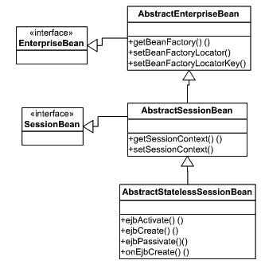

10092ch04.qxd 7/24/08 5:10 PM Page 158

**158**

第 4 章 **■** 探索业务层设计模式

如图 4-3 所示，`AbstractEnterpriseBean` 类构成了 Spring EJB 支持类的核心。此类可被子类化以支持不同形式的 EJB，例如会话 Bean、消息驱动 Bean 等。然而，在大多数情况下，你无需这样做，因为 Spring 已经提供了合适的子类。`AbstractEnterpriseBean` 类负责创建和加载 Spring Bean 工厂，并将其提供给 EJB。

**图 4-3.** *类图：Spring 无状态会话 Bean 支持* `AbstractEnterpriseBean` 是通用类，Spring 提供了专门的 `AbstractSessionBean` 类来开发会话 Bean 组件。该类实现了 `SessionBean` 接口，并负责保存由 EJB 容器注入的 `SessionContext` 对象。但是，不应扩展此类来支持 SLSB。相反，你的 Bean 实现应继承自更专门的 `AbstractStatelessSessionBean`。该类实现了所有 EJB 回调方法。这非常有用，因为在大多数情况下，你只需要这些回调的空实现。此特性简化了 Bean 实现类，促进了代码复用，并使其能够专注于业务逻辑。子类应重写 `onEjbCreate` 方法，以在加载 Bean 工厂后执行任何后初始化操作。最后，清单 4-17 展示了 Bean 实现类。

10092ch04.qxd 7/24/08 5:10 PM Page 159

第 4 章 **■** 探索业务层设计模式

**159**

**清单 4-17.** UnderwritingRemoteBean.java

public class UnderwritingRemoteBean extends AbstractStatelessSessionBean {


public void underwriteNewPolicy(String productCd, String name, int age) throws RemoteException {

//实现业务规则

//调用实体 Bean

}

protected void onEjbCreate() throws CreateException {

//用于后初始化任务

}

}

要注册为会话 Bean 并订阅容器服务，Java 类必须补充元数据信息。元数据信息以 XML 部署描述符的形式提供。第一个部署描述符是`ejb-jar.xml`，它描述了 Bean 及其所需的系统服务。在本例中，该 Bean 的所有方法都需要事务服务，如清单 4-18 所示。

**清单 4-18.** ejb-jar.xml

<?xml version="1.0" encoding="UTF-8"?>

[<ejb-jar version="2.1"](http://java.sun.com/xml/ns/j2ee)

[xsi:schemaLocation="http://java.sun.com/xml/ns/j2ee](http://www.w3.org/2001/XMLSchema-instance)

[`java.sun.com/xml/ns/j2ee/ejb-jar_2_1.xsd">`](http://www.w3.org/2001/XMLSchema-instance)

<enterprise-beans>

<session>

<display-name>UnderwritingRemoteSB</display-name>

<ejb-name>UnderwritingRemoteBean</ejb-name>

<home>com.apress.einsure.business. **➥**

ejbfacade.UnderwritingRemoteHome</home>

<remote>com.apress.einsure.business. **➥**

ejbfacade.UnderwritingRemote</remote>

<ejb-class>com.apress.einsure.business. **➥**

ejbfacade.UnderwritingRemoteBean</ejb-class>

<session-type>Stateless</session-type>

<transaction-type>Container</transaction-type>

10092ch04.qxd 7/24/08 5:10 PM Page 160

**160**

第 4 章 **■** 探索业务层设计模式

**<env-entry>**

**<env-entry-name>ejb/BeanFactoryPath</env-entry-name>**

**<env-entry-type>java.lang.String</env-entry-type>**

**<env-entry-value>**

**com/apress/einsure/business/ejbfacade/Underwriting-beans.xml**

**</env-entry-value>**

**</env-entry>**

</session>

</enterprise-beans>

<assembly-descriptor>

<container-transaction>

<method>

<ejb-name>UnderwritingRemoteBean</ejb-name>

<method-name>*</method-name>

</method>

<trans-attribute>Required</trans-attribute>

</container-transaction>

</assembly-descriptor>

</ejb-jar>

正如我之前提到的，借助 Spring EJB 支持，可以启动一个应用上下文。默认机制是从指定为 JNDI 环境变量的资源加载应用上下文：`java:comp/env/ejb/BeanFactoryPath`。清单 4-18 突出显示了该环境变量。此默认行为由`ContextJndiBeanFactoryLocator`类提供的`BeanFactoryLocator`实现提供支持。也可以提供自定义的`BeanFactoryLocator`实现，并通过在`setSessionContext`方法或无状态会话 Bean 实现类的默认构造函数中调用`setBeanFactoryLocator`方法进行注入。

`ContextJndiBeanFactoryLocator`的默认行为可能存在严重的性能限制。加载并初始化一个定义了多个 Bean 的应用上下文可能非常耗时。你可以通过为所有 EJB 使用共享的 Bean 工厂来克服这一问题。`ContextSingletonBeanFactoryLocator`类提供了此支持。不过，你需要谨慎使用单例上下文，并将其限制在应用程序的 EJB 范围内。在所有层（表示层、业务层和集成层）之间共享公共应用上下文可能会导致大量类加载问题。

清单 4-19 显示了启动 SLSB 应用上下文所需的 Spring 配置文件。目前，它不包含任何 Bean 定义。我将在后面讨论应用程序服务模式时将其投入有效使用。

10092ch04.qxd 7/24/08 5:10 PM Page 161

第 4 章 **■** 探索业务层设计模式

**161**

**清单 4-19.** Underwriting-beans.xml

<?xml version="1.0" encoding="UTF-8"?>

<beans

x[mlns:xsi="http://www.w3.org/2001/XMLSchema-instance"](http://www.w3.org/2001/XMLSchema-instance)

[xsi:schemaLocation="http://www.springframework.org/schema/beans](http://www.w3.org/2001/XMLSchema-instance)

[`www.springframework.org/schema/beans/spring-beans-2.5.xsd">`](http://www.w3.org/2001/XMLSchema-instance)

</beans>

最后，要完成 EJB，你还需要一个特定于应用服务器供应商的部署描述符，用于提供元信息，例如在 JNDI 树中绑定 EJB Home 对象的 JNDI 名称。清单 4-20 显示了特定于 JBoss 的部署描述符。

**清单 4-20.** jboss.xml

<?xml version="1.0" encoding="UTF-8"?>

<jboss>

<enterprise-beans>

<session>

<ejb-name>UnderwritingRemoteBean</ejb-name>

<jndi-name>UnderwritingBeanRemote</jndi-name>

<local-jndi-name>UnderwritingBeanLocal</local-jndi-name>

</session>

</enterprise-beans>

<resource-managers>

</resource-managers>

</jboss>

最后一步是在 JBoss 4.*x*应用服务器中编译、打包并部署此 EJB。客户端可以使用本章前面描述的服务定位器模式轻松查找此 EJB。

10092ch04.qxd 7/24/08 5:10 PM Page 162

**162**

第 4 章 **■** 探索业务层设计模式

**结论**

**优点**

• 会话外观为远程业务对象的客户端提供了粗粒度的 API。

• 它允许 Java EE 应用程序有效利用容器管理服务，如事务和安全。

• 将业务方法调用整合为单个粗粒度调用，减少了网络往返次数并提高了性能。

• 会话外观有助于明确划分 Java EE 应用程序中不同组件的职责。这也防止了业务逻辑溢出到客户端层。

**关注点**

• 会话外观涉及复杂概念，学习曲线陡峭。

• 除了不同的类和接口外，还需要大量配置信息。这增加了维护期间的开销。

**应用程序服务**

**问题**

eInsure 应用程序的业务逻辑完全编码在会话外观中。正如我在讨论会话外观时解释的那样，EJB 开发是一项非常复杂的任务。

你必须处理三个 Java 源文件。此外还有两个部署描述符和大量配置信息。EJB 开发需要经验丰富的程序员。与系统服务、配置和服务器特定设置相关的许多概念，只有经验丰富的开发人员才能有效管理。

容器管理 EJB 组件的生命周期。这些组件还订阅不同的容器服务，如安全、事务和对象池化。

开发人员需要清楚理解这些服务和生命周期阶段背后的概念和复杂性。

10092ch04.qxd 7/24/08 5:10 PM Page 163

第 4 章 **■** 探索业务层设计模式

**163**

这对于编写能够正确响应生命周期状态变化的代码至关重要。它还将帮助开发人员适当设置配置元数据，并防止出现意外结果。

由于整个业务逻辑现在都在 SLSB 中，在像 eInsure 这样的大型应用程序中，它很可能会迅速增长到难以管理的大小。会话外观不仅拦截业务逻辑调用，而且 SLSB 中的每个方法都负责执行业务规则。因此，它也违反了单一职责原则（SRP）。一个更简单的选择是将会话外观建模为前端控制器 Servlet。它只负责拦截业务方法执行请求。业务逻辑执行的实际任务则委托给辅助类。


会话外观在 EJB 容器中运行，因此难以进行单元测试。eInsure 的一位潜在客户无法承担商业应用服务器许可证的费用，希望将该应用部署在开源产品上。他们的团队已经在使用基于 Apache Tomcat 和 ObjectWeb JOTM 的平台运行一些应用，因此希望利用 Tomcat Web 服务器以及 JOTM 事务监控器基于 JDBC 的事务处理能力。然而，由于 eInsure 至关重要的业务层与 SLSB 紧密耦合，要在没有 EJB 容器支持的情况下成功运行 eInsure 将是一项痛苦且耗费精力的工作。

**驱动因素**

• 会话 Bean 的开发需要经验丰富的开发人员，他们需具备扎实的 EJB 和应用服务器知识。
• 会话外观应仅作为业务层的网关，并将实际业务逻辑执行委托给辅助类。它应以声明方式订阅容器服务。
• 会话外观不应增长到难以管理的规模。
• 业务逻辑应在 EJB 容器之外运行。
• 业务逻辑应易于进行单元测试。

**解决方案**

使用*应用服务*将业务逻辑集中在 POJO 类中。

10092ch04.qxd 7/24/08 5:10 PM 第 164 页

**164**

第 4 章 **■** 探索业务层设计模式

使用 Spring 框架的策略

虽然将业务逻辑代码放在会话外观中是合理的，但这并非最佳方法。更好的做法是将业务逻辑移至 POJO 组件，并让会话外观将这些逻辑委托给 POJO。这将解放会话外观，使其能够作为远程可访问业务层的网关。

由于业务逻辑现已移至 POJO，单元测试变得更加容易。POJO 应用服务位于 SLSB 网关之后，因此也能利用事务等强大的基础设施支持。换句话说，从会话外观调用的所有 POJO 方法都将属于同一事务范围。将业务逻辑移至 POJO 组件还能减少在 Web 容器中运行 eInsure 这类应用所需的工作量。

编写应用服务的第一步是按照 P2I 原则定义接口。清单 4-21 展示了 UnderwritingApplicationService 接口。

**清单 4-21.** UnderwritingApplicationService.java

package com.apress.einsure.business.api;

public interface UnderwritingApplicationService {

public void underwriteNewPolicy(String productCd,String name,int age);

}

清单 4-22 展示了应用服务的实现类。请注意，该类未使用实体 Bean 进行持久化，而是使用轻量级数据访问对象。你将在第 5 章中了解更多关于数据访问对象的内容。

**清单 4-22.** UnderwritingApplicationServiceImpl.java

package com.apress.einsure.business.impl;

public class UnderwritingApplicationServiceImpl implements

UnderwritingApplicationService{

private PolicyDetailDao policyDetailDao;

public void underwriteNewPolicy(String productCd, String name, int age) {

//业务验证 - 该产品是否允许此年龄

this.policyDetailDao.savePolicyDetails(productCd, name, age);

10092ch04.qxd 7/24/08 5:10 PM 第 165 页

第 4 章 **■** 探索业务层设计模式

**165**

}

public PolicyDetailDao getPolicyDetailDao() {

return policyDetailDao;

}

public void setPolicyDetailDao(PolicyDetailDao policyDetailDao) {

this.policyDetailDao = policyDetailDao;

}

}

PolicyDetailDao 由 Spring 容器注入到应用服务中。数据访问对象还需要一个数据源来保存数据。这在清单 4-23 的 EJB 应用上下文配置中有所体现。

**清单 4-23.** Underwriting-beans.xml

<?xml version="1.0" encoding="UTF-8"?>

<beans

[xsi:schemaLocation="http://www.springframework.org/schema/beans](http://www.w3.org/2001/XMLSchema-instance)

[`www.springframework.org/schema/beans/spring-beans-2.5.xsd">`](http://www.w3.org/2001/XMLSchema-instance)

<bean id="uwrBusinessService"

class="com.apress.einsure.business.impl.UnderwritingApplicationServiceImpl">

<property name="policyDetailDao" ref="policyDetailDao"/>

</bean>

<! - - 数据访问对象 - ->

<bean id="policyDetailDao"

class="com.apress.einusre.persistence.dao.impl.PolicyDetailDaoImpl"

>

<property name="dataSource" ref="datasource"/>

</bean>

<!- - 查找 JNDI 绑定的数据源 - - >

<bean id="datasource" class="org.springframework.jndi.JndiObjectFactoryBean">

<property name="jndiName" value="einsureDatasource" />

<property name="jndiEnvironment">

10092ch04.qxd 7/24/08 5:10 PM 第 166 页

**166**

第 4 章 **■** 探索业务层设计模式

<props>

<prop key="java.naming.factory.initial">

org.jnp.interfaces.NamingContextFactory

</prop>

<prop key="java.naming.provider.url">

jnp://localhost:1099

</prop>

<prop key="java.naming.factory.url.pkgs">

org.jboss.naming.client

</prop>

</props>

</property>

</bean>

</beans>

你需要修改会话外观（如前文清单 4-17 所示），使其委托给实现业务逻辑的应用服务。清单 4-24 展示了修改后的实现类。请注意，onEjbCreate 方法现在开始执行一些有用的操作：它从与该 EJB 关联的 Spring 应用上下文中检索 POJO 业务服务对象。业务接口中的常量提供了用于查找应用服务 Bean 的键值。

**清单 4-24.** UnderwritingRemoteBean.java

public class UnderwritingRemoteBean extends AbstractStatelessSessionBean {

private final String SERVICE_BEAN_KEY = "uwrAppService"; private UnderwritingApplicationService uwrAppService;

public void underwriteNewPolicy(String productCd, String name, int age) throws RemoteException {

//委托给应用服务

uwrAppService.underwriteNewPolicy(productCd, name, age);

}

10092ch04.qxd 7/24/08 5:10 PM 第 167 页

第 4 章 **■** 探索业务层设计模式

**167**

protected void onEjbCreate() throws CreateException {

//用于初始化

uwrAppService = (UnderwritingApplicationService) this.getBeanFactory().

getBean(SERVICE_BEAN_KEY);

}

}

请注意，应用服务为了整合复杂的业务规则，其规模可能会迅速增大。你可以像使用页面控制器那样，为每个用例使用一个单独的应用服务。但这会产生大量难以维护的小类。一个更平衡的解决方案是按逻辑对应用服务方法进行分组。例如，在 eInsure 中，某个特定的应用服务可以包含创建、更新、暂停、拒绝和批准索赔的方法。

**影响**

优势

• 业务逻辑现在封装在简单的 POJO 组件中。这些服务在从会话外观调用时，能够访问 EJB 容器服务。
• POJO 组件使应用更易于在容器外进行测试和运行。
• 性能得到提升，因为会话外观现在依赖于 POJO 应用服务和数据访问对象的组合，不再使用会增加网络通信量的实体 Bean。

关注点

• 应用服务模式为应用增加了一个额外的层，这增加了维护和开发的工作量。

10092ch04.qxd 7/24/08 5:10 PM 第 168 页

**168**

第 4 章 **■** 探索业务层设计模式

**业务接口**

**问题**


会话外观的远程接口定义了客户端可访问的业务方法。而 Bean 类则提供了这些业务方法的实现。然而，两者之间并没有直接关系。这会导致在运行时或部署时出现令人烦恼的错误，例如方法缺失、方法名称不一致、参数类型和数量不匹配以及异常。由于这些错误通常只在运行时才能被检测到，你可能会在“调试-修复-部署-测试”的循环中浪费大量精力。因此，远程接口与 Bean 实现的这种解耦，使得在编译时早期捕获错误变得不可能。

解决此问题的最简单方法是允许 Bean 类实现远程或本地接口。然而，EJB 规范并不允许这样做。虽然不常见，但有时会话 Bean 方法可能需要将其引用传递给被调用的方法。这在 Java 编程中很常见，你会传递`this`引用。但在 EJB 中情况有所不同。EJB 客户端应始终使用远程接口来调用业务方法。这有助于 EJB 容器拦截所有业务方法调用，并为这些方法注册以应用安全性和事务等系统服务。现在，由于 Bean 类没有实现远程接口，你被迫从`SessionContext`获取关联的`EJBObject`/`EJBLocalObject`，并将其传递给被调用的方法。如果 Bean 类实现了远程或本地接口，则有可能无意中将`this`引用从 Bean 类传递给调用方法。然而，在这种情况下，EJB 容器的行为无法得到保证，你可能会得到意想不到的结果。

Bean 类实现远程和本地接口还存在其他问题。

`EJBObject`和`EJBLocalObject`接口定义了两组不同的方法。容器应在部署期间提供这些方法的实现。容器实现的方法对于 EJB 的整体运行至关重要。

这些方法处理底层关注点，例如网络、参数和传递值的序列化，以及与容器协调系统服务。

它们还将业务方法调用代理到实际的 Bean 实现。但是，如果 Bean 类实现了这些方法，它就必须为这些类提供实现，这最终可能导致 EJB 无法使用。为了编译 Bean，实现需要实现这些接口中定义的方法。这反过来会用不必要的代码使 Bean 实现变得混乱。此外，如果远程接口由 Bean 实现实现，客户端只需通过强制转换远程接口即可访问实际的 Bean，这违背了 EJB 的核心目标，即位置透明性和分布式业务对象。

10092ch04.qxd 7/24/08 5:10 PM 第 169 页

第 4 章 **■** 探索业务层设计模式

**169**

**驱动力**

• 将业务方法整合到一个公共接口中。
• 强制执行编译时检查，以防止远程接口与 Bean 实现之间出现异常。
• 防止 EJB Bean 实现类实现远程或本地接口。

**解决方案**

实现一个*业务接口*来整合业务方法，并对 EJB 方法应用编译时检查。

与 Spring 框架的策略

业务接口是一个普通的 Java 接口，它整合了 Bean 类将要实现的方法。本地和远程接口也扩展了该业务接口。

因此，这个超级接口使方法签名和数量保持同步，并允许在编译时检测到任何差异。此外，由于业务接口不扩展`EJBObject`或`EJBLocalObject`，Bean 类无需实现不必要的方法。我现在将展示如何针对不同类型和版本的无状态会话 Bean 将业务接口付诸实践。

图 4-4 展示了远程 SLSB 的业务接口类图。

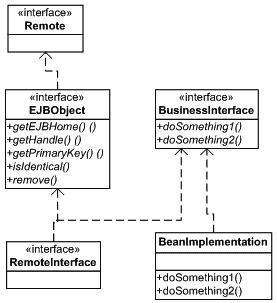

10092ch04.qxd 7/24/08 5:10 PM 第 170 页

**170**

第 4 章 **■** 探索业务层设计模式

**图 4-4.** *类图：远程业务接口*

对于远程 SLSB，业务接口方法必须为`RemoteException`声明一个`throws`子句。否则，每个应用服务器附带的 EJB 验证器工具将不允许部署此类 EJB。SLSB 的业务接口理想情况下应该是与应用服务关联的接口。然而，由于这种与`RemoteException`的依赖关系，我将创建一个单独的接口，如清单 4-25 所示。

**清单 4-25.** UnderwritingBusinessService.java

public interface UnderwritingBusinessService {

public void underwriteNewPolicy(String productCd,String name,int age) throws RemoteException;

}

现在，远程接口扩展了`UnderwritingBusinessService`，并且不再定义任何业务方法。如清单 4-26 所示。

**清单 4-26.** UnderwritingRemote

public interface UnderwritingRemote extends EJBObject, UnderwritingBusinessService {

}

10092ch04.qxd 7/24/08 5:10 PM 第 171 页

第 4 章 **■** 探索业务层设计模式

**171**

为了实现编译时一致性，Bean 实现类现在实现了业务服务接口，如清单 4-27 所示。请注意，我将继续按原样使用应用服务。

**清单 4-27.** UnderwritingRemoteBean.java

public class UnderwritingRemoteBean extends AbstractStatelessSessionBean implements UnderwritingBusinessService{

private final String SERVICE_BEAN_KEY = "uwrAppService"; private UnderwritingApplicationService uwrAppService;

public void underwriteNewPolicy(String productCd, String name, int age) throws RemoteException {

//将业务处理委托给应用服务

uwrAppService.underwriteNewPolicy(productCd, name, age);

}

protected void onEjbCreate() throws CreateException {

//用于初始化

uwrAppService = (UnderwritingApplicationService)

this.getBeanFactory().getBean(SERVICE_BEAN_KEY);

}

}

现在，远程接口与企业 Bean 类之间的编译时一致性得到了保证。在所有更改中，home 接口保持不变。

业务接口不仅限于提供编译时检查。它可以与基于 Spring 代理的服务定位器一起使用，以消除与业务委托相关的代码冗余。代理就像真实对象的替身。要移除业务委托层，你需要修改页面控制器，使其现在与业务接口一起工作，如清单 4-28 所示。

10092ch04.qxd 7/24/08 5:10 PM 第 172 页

**172**

第 4 章 **■** 探索业务层设计模式

**清单 4-28.** UnderwritingRemoteBean.java

public class SaveNewPolicyController extends SimpleFormController {

**private UnderwritingBusinessService uwrBusinessService;**

**public void setUwrBusinessService(**

**UnderwritingBusinessService uwrBusinessService) {**

**this.uwrBusinessService = uwrBusinessService;**

**}**

protected void doSubmitAction(Object formbean) throws Exception {

PolicyFormBean policyBean = (PolicyFormBean)formbean;

**uwrBusinessService.underwriteNewPolicy(policyBean.getProductCode()**

**, policyBean.getFirstName(), policyBean.getAge());**

}

protected Object formBackingObject(HttpServletRequest req) throws Exception {


```xml

PolicyFormBean policyBean = (PolicyFormBean)super.formBackingObject(req); return policyBean;

}

/*

protected ModelAndView onSubmit(Object formbean) throws Exception {

PolicyFormBean policyBean = (PolicyFormBean)formbean;

uwrBusinessDelegate.createPolicy(policyBean);

return new ModelAndView(this.getSuccessView(),"policydetails",formbean);

}

*/

}

清单 4-28 中的页面控制器实际上与业务接口代理协同工作。为了注入业务接口代理，我将使用 `SimpleRemoteStatelessSessionProxy`**➥**

`FactoryBean` 类。这个工厂 Bean 执行两项任务：它查找 EJB 本地接口并缓存它，同时创建一个实现业务接口的代理对象。该代理对象被注入到页面控制器中。对代理的第一次业务方法调用将导致通过调用缓存的本地接口上的 `create` 方法来创建远程对象，然后将业务处理委托给远程对象。这是可行的，因为远程对象也实现了业务接口。清单 4-29 展示了此服务定位器和页面控制器的配置。

10092ch04.qxd 7/24/08 5:10 PM 第 173 页

第 4 章 **■** 探索业务层设计模式

**173**

**清单 4-29.** insurance-servlet.xml

<?xml version="1.0" encoding="UTF-8"?>

<beans

x[mlns:xsi="http://www.w3.org/2001/XMLSchema-instance"](http://www.w3.org/2001/XMLSchema-instance)

[xsi:schemaLocation="http://www.springframework.org/schema/beans](http://www.springframework.org/schema/jee)

[`www.springframework.org/schema/beans/spring-beans-2.5.xsd`](http://www.springframework.org/schema/jee)

[`www.springframework.org/schema/jee`](http://www.springframework.org/schema/jee)

[`www.springframework.org/schema/jee/spring-jee-2.5.xsd">`](http://www.springframework.org/schema/jee)

<bean id="viewResolver"

class="org.springframework.web.servlet.view.InternalResourceViewResolver">

<property name="viewClass"

value="org.springframework.web.servlet.view.JstlView" />

<property name="prefix" value="/WEB-INF/jsp/" />

<property name="suffix" value=".jsp" />

</bean>

<bean id="uwrBusinessServiceProxy"

class="org.springframework.ejb.access. **➥**

SimpleRemoteStatelessSessionProxyFactoryBean">

<property name="jndiName" value="UnderwritingBeanRemote" />

<property name="businessInterface"

value="com.apress.einsure.business.api.UnderwritingBusinessService" />

<property name="jndiEnvironment">

<props>

<prop key="java.naming.factory.initial">

org.jnp.interfaces.NamingContextFactory

</prop>

<prop key="java.naming.provider.url">

jnp://localhost:1099

</prop>

<prop key="java.naming.factory.url.pkgs">

org.jboss.naming.client

</prop>

</props>

</property>

</bean>

<bean name="/createPolicy.do"

class="com.apress.insurance.web.controller.SaveNewPolicyController" >

10092ch04.qxd 7/24/08 5:10 PM 第 174 页

**174**

第 4 章 **■** 探索业务层设计模式

<property name="uwrBusinessService"

ref="uwrBusinessServiceProxy" />

<property name="formView"

value="createPolicy" />

<property name="commandName"

value="policydetails" />

<property name="successView"

value="policydetails" />

<property name="commandClass"

value="com.apress.insuranceapp.web.formbean.PolicyFormBean" />

</bean>

</beans>

你可能会想，由于业务委托不再存在，页面控制器将与 EJB 紧密耦合，并且需要处理 `RemoteException`。然而，这个任务由 `SimpleRemoteStatelessSessionProxyFactoryBean` 类处理。它将拦截 EJB 抛出的任何 `RemoteException`，并将其转换为 Spring 的非检查型异常 `RemoteAccessException`。

业务接口同样最适合与本地无状态会话 Bean 配合使用。在这种情况下，你无需定义任何额外的接口。你可以直接使用应用服务定义的接口，因为本地 EJB 不需要抛出 `RemoteException`。另一个区别是，对于本地 EJB，你需要使用 `LocalStatelessSessionProxy`**➥**

`FactoryBean` 作为代理服务定位器。清单 4-30 展示了此服务定位器的使用。

**清单 4-30.** insurance-servlet.xml

<?xml version="1.0" encoding="UTF-8"?>

<beans

[xsi:schemaLocation="http://www.springframework.org/schema/beans](http://www.springframework.org/schema/jee)

[`www.springframework.org/schema/beans/spring-beans-2.5.xsd`](http://www.springframework.org/schema/jee)

[`www.springframework.org/schema/jee`](http://www.springframework.org/schema/jee)

[`www.springframework.org/schema/jee/spring-jee-2.5.xsd">`](http://www.springframework.org/schema/jee)

10092ch04.qxd 7/24/08 5:10 PM 第 175 页

第 4 章 **■** 探索业务层设计模式

**175**

<bean id="viewResolver"

class="org.springframework.web.servlet.view.InternalResourceViewResolver">

<property name="viewClass"

value="org.springframework.web.servlet.view.JstlView" />

<property name="prefix" value="/WEB-INF/jsp/" />

<property name="suffix" value=".jsp" />

</bean>

<bean id="uwrBusinessServiceProxy"

class="org.springframework.ejb.access. **➥**

SimpleRemoteStatelessSessionProxyFactoryBean">

<property name="jndiName" value="UnderwritingBeanRemote" />

<property name="businessInterface"

value="com.apress.einsure.business.api.UnderwritingApplicationService" />

</bean>

<bean name="/createPolicy.do"

class="com.apress.insurance.web.controller.SaveNewPolicyController" >

<property name="uwrBusinessService"

ref="uwrBusinessServiceProxy" />

<property name="formView"

value="createPolicy" />

<property name="commandName"

value="policydetails" />

<property name="successView"

value="policydetails" />

<property name="commandClass"

value="com.apress.insuranceapp.web.formbean.PolicyFormBean" />

</bean>

</beans>

请注意，相同的代理服务定位器也可用于查找 EJB 3 会话 Bean。

10092ch04.qxd 7/24/08 5:10 PM 第 176 页

**176**

第 4 章 **■** 探索业务层设计模式

**结论**

**优点**

• 现在可以在编译阶段捕获远程接口与 Bean 实现之间的差异。

• 业务接口的实现确保了一致性。

• 由于页面控制器使用代理业务接口实现，因此消除了与业务委托相关的代码或层冗余。

• 由于现在通过实现简单 Java 接口的代理对象来调用 EJB，因此可以轻松移除 EJB 依赖，并将应用程序部署到像 Apache Tomcat 这样的 Web 服务器中。

**关注点**

• 业务接口无法在本地和远程无状态会话 Bean 之间复用。

• 它增加了你为 EJB 维护的类数量。

• 由于现在通过代理的反射机制调用 EJB 方法，因此增加了性能开销。

**总结**

在本章中，你探索了结合 Spring 和 EJB（具体来说是无状态会话 Bean）构建灵活业务层的不同方法。服务定位器和业务委托模式是作为远程对象暴露的业务逻辑的客户端扩展。会话外观模式为业务逻辑提供了粗粒度的访问，并使其能够访问容器提供的强大基础设施支持。应用服务模式描述了一种简单而灵活的机制，用于将业务逻辑封装在 POJO 组件中。业务接口模式允许对暴露的业务方法进行编译时检查，并减少对业务委托的依赖。

10092ch04.qxd 7/24/08 5:10 PM 第 177 页

第 4 章 **■** 探索业务层设计模式

**177**

```


在第 5 章中，我将介绍集成层模式。您已经对集成层模式有了初步了解：数据访问对象模式。集成层模式提供了多种策略，用于检索数据供业务组件使用。这些模式还有助于业务对象修改企业数据。除此之外，我将探讨如何将业务层功能暴露给外部客户端使用。

10092ch04.qxd 7/24/08 5:10 PM 第 178 页

10092ch05.qxd 7/24/08 5:15 PM 第 179 页

第 5 章

探索集成层

设计模式

**集**成层是一个边界层，它与不同的外部系统进行数据交换。eInsure 应用程序中的集成层访问关系型数据库，用于存储、检索和操作与保单、理赔、会计、客户和产品相关的数据。eInsure 使用实体 Bean 对数据库执行典型的创建、读取、更新和删除（CRUD）操作。eInsure 的旧版本遗留了大量存储过程。eInsure 应用程序大量使用这些存储过程来处理数据库密集型任务，特别是那些在常规工作时间之后每天运行，或按每月、每季度等特定间隔运行的批处理作业。

eInsure 的用户需要各种报告来了解业务状态的重要信息。为了满足报告需求，eInsure 系统连接到一个异步报告子系统。最后但同样重要的是，eInsure 提供的某些服务必须作为 Web 服务暴露出来。这些服务由第三方外部应用程序使用。

在本章中，我将从用于访问关系型数据库的数据访问对象（DAO）模式开始。我将探讨 DAO 的必要性，以及利用 Spring JDBC 支持来简化 DAO 实现的策略。Spring JDBC API 还可用于为存储过程提供面向对象风格的访问。在描述过程访问对象（PAO）模式时，我将详细解释这一点。此外，我还会结合服务激活器模式，介绍异步服务访问机制。最后，我将以 Web 服务代理设计策略作为本章的结尾，该策略可用于将现有服务暴露为 Web 服务。

**179**

10092ch05.qxd 7/24/08 5:15 PM 第 180 页

**180**

第 5 章 **■** 探索集成层设计模式

**数据访问对象**

**问题**

eInsure 应用程序严重依赖实体 Bean 进行数据库操作。早在 1999 年，当实体 Bean 首次出现（作为 EJB 1.*x* 规范的一部分）时，它们被认为是一种卓越的企业级组件，将彻底改变企业软件的开发、部署、维护和可移植性。

这种想法是有依据的。实体 Bean 提供了基于标准、容器管理、分布式、安全、事务性的持久化组件。它们提供了透明且自动的持久化功能，客户端无需担心底层数据存储。但这种流行只是昙花一现。随着开发人员、设计人员和架构师开始使用实体 Bean，问题逐渐显现。他们很快意识到，除了持久化之外，实体 Bean 提供的大多数功能在他们的应用程序中并不需要。实体 Bean 的分布式特性导致客户端进行细粒度的调用。这增加了网络流量，并对性能产生了不利影响。

第 4 章中描述的业务层外观模式是解决这种细粒度实体 Bean 访问问题的一种方案。会话 Bean 还负责处理安全性和事务性需求。

随着使用量的迅速下降，EJB 2.*x* 规范引入了本地接口的概念，至少是为了缓解网络往返的问题。但这仍然没有解决开发实体 Bean 所涉及的复杂性。开发实体 Bean 需要四个 Java 源文件，包括本地和远程接口、Bean 实现以及一个主键类。除了 Java 源文件之外，根据服务器供应商的不同，您还需要两到三个部署描述符。您已经从第 4 章的会话 Bean 中了解了两个部署描述符。一些应用服务器使用第三个部署描述符来将数据库表和列映射到 Bean 类及其属性。由于实体 Bean 在 EJB 容器内运行，因此很难进行测试。结果是开发周期长，维护开销大。

使用实体 Bean 的副作用加剧了开发人员的问题。由于访问实体 Bean 中的 getter/setter 是远程方法调用，因此设计了数据传输对象（DTO），以便仅通过一次方法调用就从实体 Bean 中提取所有数据。DTO 是简单的 POJO，包含 getter 和 setter，并实现了 Serializable 接口。在一个拥有多个 DTO 的大型或中型项目中，这些类增加了维护问题。任何 DTO 中的一个小字段更改通常会导致多个源文件编译失败。

开发社区别无选择，只能转向由 ORM 框架（如 Hibernate、Kodo、iBatis 等）提供的轻量级持久化解决方案。

这些产品专注于以最少的配置信息实现 POJO 的持久化。这对实体 Bean 来说是一个沉重的打击，并最终为 EJB 3.*x* 规范中的 JPA 铺平了道路。JPA 支持基于注解配置的 POJO 持久化。更重要的是，JPA 实体在 EJB 容器之外运行，并且易于测试。

eInsure 开发团队很快意识到，返回大型列表的搜索操作在使用实体 Bean 时效率极低，因为搜索列表中的每个对象本身就是一个实体 Bean。因此，访问此实体 Bean 中的属性会导致网络往返以及数据的编组和解组。团队很快转向了直接的 JDBC 方法。JDBC API 直接从会话 Bean 中使用，以执行 SQL 查询，如清单 5-1 所示。

**清单 5-1.** UnderwritingRemoteBean.java

public class UnderwritingRemoteBean implements SessionBean{

public List listPolicyByProductAndAgeLevel(String productCd, int age) throws RemoteException {

String SQL = "SELECT POLICY_ID,PRODUCT_CODE, NAME, AGE FROM T_POLICY_DETAILS

WHERE PRODUCT_CODE = ? AND AGE > ? ";

List policyList = new ArrayList();

Connection conn = null;

PreparedStatement pstmt = null;

ResultSet rs = null;

try{

pstmt = conn.prepareStatement(SQL);

pstmt.setString(0, productCd);

pstmt.setInt(1, age);

rs = pstmt.executeQuery();

while(rs.next()){

policyList.add(new PolicyDetail(rs.getInt("POLICY_ID"),

rs.getString("NAME")

,rs.getString("NAME"),rs.getInt("AGE")));

}

}

catch(SQLException sqlex){

throw new RuntimeException(sqlex);

}

finally{

10092ch05.qxd 7/24/08 5:15 PM 第 182 页

**182**

第 5 章 **■** 探索集成层设计模式

if(rs!=null){

try {

rs.close();

} catch (SQLException ex) {

throw new RuntimeException(ex);

}

}

if(pstmt!=null){

try {

pstmt.close();

} catch (SQLException ex) {

throw new RuntimeException(ex);

}

}

if(conn!=null){

try {

conn.close();

} catch (SQLException ex) {

throw new RuntimeException(ex);

}

}

}

return policyList;

}

}


eInsure 中混合使用的持久化方法（实体 Bean 与直接 JDBC）使得业务组件难以应对变更。如清单 5-1 所示，直接使用 JDBC API 意味着需要编写大量样板代码：建立连接、准备 SQL 语句、设置参数、执行 SQL、遍历结果集以生成 Java 对象列表，最后释放数据库资源。最后一步至关重要却常被忽略，导致连接泄漏和资源浪费。如果所有 DAO 方法都采用直接 JDBC 方式，将造成严重的代码重复。

10092ch05.qxd 7/24/08 5:15 PM 第 183 页

第 5 章 **■** 探索集成层设计模式

**183**

**驱动因素**

• 应避免将业务逻辑与持久化逻辑不必要地混合。

• 实体 Bean 已属过时技术。

• 业务层需要统一的 API 来访问集成层组件。

• 直接使用 JDBC API 会导致大量样板代码，降低可复用性并增加开发时间。

**解决方案**

实现*数据访问对象*（DAO）来封装数据访问逻辑，并为业务层组件提供一致的接口。

Spring 框架策略

顾名思义，DAO 是通用对象，理论上可支持任何类型的持久化存储。这些类的主要目标是从业务服务中抽象出底层数据访问机制。由于大多数应用程序与关系型数据库交互，我将重点讨论基于 JDBC 的数据访问对象。

Spring JDBC 模块实现了稳健的对象设计原则，使开发基于 JDBC 的 DAO 变得简单。它处理了通常与 JDBC API 使用相关的所有样板代码，并帮助提供一致的数据访问 API。

应用程序开发者不再需要直接使用 JDBC API，而是使用高级 API。

由于 eInsure 因历史原因对 Oracle 有依赖性，后续章节使用的 SQL 语法将与 Oracle 数据库兼容。但通用讨论和概念适用于任何数据库，使用时只需对 SQL 语句进行少量修改。清单 5-2 展示了创建 T_POLICY_DETAIL 表及对应序列的 Oracle 脚本。

**清单 5-2.** createTbl_T_Policy_Detail.sql

CREATE table "T_POLICY_DETAIL" (

"POLICY_ID" NUMBER,

"PRODUCT_CD" VARCHAR2(20) NOT NULL,

"POLICY_HOLDER" VARCHAR2(150) NOT NULL,

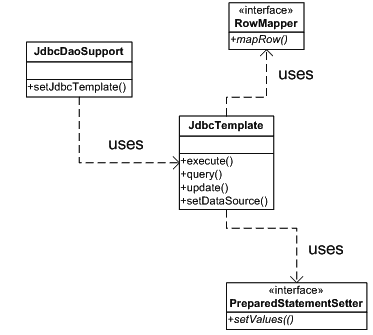

10092ch05.qxd 7/24/08 5:15 PM 第 184 页

**184**

第 5 章 **■** 探索集成层设计模式

"AGE" NUMBER,

constraint "T_POLICY_DETAIL_PK" primary key ("POLICY_ID") CREATE sequence "T_POLICY_DETAIL_SEQ"

/

使用 Spring 构建 DAO 的第一步是声明 DAO 接口。这遵循了前文所述的面向接口编程（P2I）这一对象设计最佳实践。

它向客户端定义了契约，客户端仅通过这些接口与具体实现交互。因此，可以轻松替换或修改实现类。

清单 5-3 展示了保单详情的 DAO 接口。

**清单 5-3.** PolicyDetailDao.java

package com.apress.einusre.persistence.dao.api;

public interface PolicyDetailDao {

String SAVE_POLICY_DETAILS_SQL = " insert into T_POLICY_DETAIL

values(T_POLICY_DETAIL_SEQ.nextval,?,?,?)";

public void savePolicyDetails(String productCd, String name, int age);

}

图 5-1 展示了 Spring JDBC 支持类。Spring 提供了一个便捷类 `JdbcDaoSupport` 来简化基于 JDBC 的 DAO 类开发。该类与数据源关联，并为 DAO 提供 `JdbcTemplate` 对象。

**图 5-1.** *类图：Spring JDBC 支持类*

10092ch05.qxd 7/24/08 5:15 PM 第 185 页


第 5 章 **■** 探索集成层设计模式

**185**

`JdbcTemplate` 是 Spring JDBC DAO 支持中最重要的类。该类实现了 GOF 模板方法设计模式。模板方法模式定义了特定操作的工作流或算法。它允许子类在不改变算法核心结构的前提下修改某些步骤。`JdbcTemplate` 整合了与 JDBC 工作流相关的所有常见重复代码块。

正如我稍后将展示的，`JdbcTemplate` 定义的工作流可以在适当的位置进行修改，以提供定制化处理。清单 5-4 展示了策略详情 DAO 的实现类。

**清单 5-4.** PolicyDetailDaoImpl.java

package com.apress.einusre.persistence.dao.impl;

public class PolicyDetailDaoImpl extends JdbcDaoSupport implements PolicyDetailDao{

public void savePolicyDetails(String productCd,String name,int age) {

Object args [] = {productCd,name,new Integer(age)};

this.getJdbcTemplate().update(PolicyDetailDao.

SAVE_POLICY_DETAILS_SQL, args);

}

}

从清单 5-4 的简化代码中可以清楚地看到，`JdbcTemplate` 促进了代码复用，这导致 DAO 实现中的代码量显著减少。与 JDBC 和集合包（如清单 5-1 所示）的紧耦合已被消除。

JDBC 资源泄漏不再是一个问题，因为 `JdbcTemplate` 方法确保数据库资源在使用后按正确顺序释放。此外，在使用 Spring DAO 时，你无需强制处理异常。`JdbcTemplate` 类处理 `SQLException` 并重新抛出一个运行时异常，因为在大多数情况下，无法从这些数据库错误中恢复。

DAO 实现将被注入到会话 Bean 使用的应用服务中。清单 5-5 展示了应用服务代码。

**清单 5-5.** UnderwritingApplicationServiceImpl.java

public class UnderwritingApplicationServiceImpl implements

UnderwritingApplicationService{

private PolicyDetailDao policyDetailDao;

public void underwriteNewPolicy(String productCd, String name, int age) {

//业务规则 - 此处

this.policyDetailDao.savePolicyDetails(productCd, name, age);

}

public PolicyDetailDao getPolicyDetailDao() {

10092ch05.qxd 7/24/08 5:15 PM Page 186

**186**

第 5 章 **■** 探索集成层设计模式

return policyDetailDao;

}

public void setPolicyDetailDao(PolicyDetailDao policyDetailDao) {

this.policyDetailDao = policyDetailDao;

}

}

请注意，会话外观调用应用服务，而应用服务又调用 DAO 方法。因此，DAO 方法自动进入与会话 Bean 方法相同的事务范围。所以，在 DAO 中无需任何编程式事务处理。

`JdbcDaoSupport` 对象需要一个数据源来连接并执行 SQL 查询。数据源对象通常注册在应用服务器的 JNDI 中。Spring 服务定位器（在第 4 章中解释）将用于从 JNDI 查找数据源并将其注入到 `JdbcDaoSupport` 对象中。

最后，所有内容都需要通过与无状态会话 Bean 关联的 Spring 应用上下文中的配置进行连接，如清单 5-6 所示。我将应用服务和 DAO 放在同一个配置中展示，以便你理解和可视化两者之间的耦合。然而，为了模块化，建议将它们放在单独的配置文件中。

**清单 5-6.** Underwriting-service.xml

<?xml version="1.0" encoding="UTF-8"?>

<beans

[xsi:schemaLocation="http://www.springframework.org/schema/beans](http://www.w3.org/2001/XMLSchema-instance)

[`www.springframework.org/schema/beans/spring-beans-2.5.xsd">`](http://www.w3.org/2001/XMLSchema-instance)

<bean id="uwrApplicationService"

class="com.apress.einsure.business.impl. **➥**

UnderwritingApplicationServiceImpl">


<property name="policyDetailDao" ref="policyDetailDao"/>

</bean>

<bean id="policyDetailDao"

class="com.apress.einusre.persistence.dao.impl.PolicyDetailDaoImpl"

>

<property name="dataSource" ref="datasource"/>

</bean>

10092ch05.qxd 7/24/08 5:15 PM Page 187

第 5 章 **■** 探索集成层设计模式

**187**

<bean id="datasource" class="org.springframework.jndi.JndiObjectFactoryBean">

<property name="jndiName" value="einsureDatasource" />

<property name="jndiEnvironment">

<props>

<prop key="java.naming.factory.initial">

org.jnp.interfaces.NamingContextFactory

</prop>

<prop key="java.naming.provider.url">

jnp://localhost:1099

</prop>

<prop key="java.naming.factory.url.pkgs">

org.jboss.naming.client

</prop>

</props>

</property>

</bean>

</beans>

**使用绑定变量**

清单 5-1 和 5-3 中的 SQL 查询使用了由`?`表示的位置绑定变量，这些变量是静态的。绑定变量位置的任何变化都会导致设置该变量值的代码发生变化。在清单 5-1 中，方法调用`PreparedStatement.setXXX`中的参数将受到影响。同样，在清单 5-3 中，数组元素的位置必须更改以适应查询的变化。

Spring JDBC 通过支持由`:variable_name`表示的命名绑定变量，为此提供了一种便捷的解决方案。要使用此功能，您应更改 SQL 查询，如清单 5-7 所示。请注意，`savePolicyDetails`方法的签名也已更改，现在它接受一个`Map`对象作为参数。

**清单 5-7.** PolicyDao.java

public interface PolicyDetailDao {

String SAVE_POLICY_DETAILS_SQL = " insert into T_POLICY_DETAIL

values(T_POLICY_DETAIL_SEQ.nextval,

:productCd,:name,:age)";

public void savePolicyDetails(Map policyDetailMap);

}

10092ch05.qxd 7/24/08 5:15 PM Page 188

**188**

第 5 章 **■** 探索集成层设计模式

由于接口已更改，您也必须更改实现。为了支持命名参数绑定变量，实现类继承自另一个便捷类`NamedParameterJdbcDaoSupport`，如清单 5-8 所示。

**清单 5-8.** PolicyDaoImpl.java

public class PolicyDetailDaoImpl extends NamedParameterJdbcDaoSupport implements PolicyDetailDao{

public void savePolicyDetails(Map policyDetailMap) {

this.getNamedParameterJdbcTemplate().update(SAVE_POLICY_DETAILS_SQL, policyDetailMap);

}

}

值得注意的是，我们的 DAO 代码进一步缩减了。在这种情况下，`Map`对象很重要；存储在映射中的对象的键必须与 SQL 中命名绑定变量的键匹配。因此，即使参数或绑定变量在 SQL 查询字符串中的位置发生变化，代码也不会出错。这是一个有用的特性，并且将`Map`从页面控制器中的`HttpServletRequest`一直传递到 DAO 是完全可行的。这将节省大量精力，因为我们不再需要开发和维护表单 bean。

**Spring DAO 回调**

正如我们已经知道的，`JdbcTemplate`实现了模板设计模式。因此，可以通过提供自定义逻辑在适当的位置更改此类实现的算法。在迄今为止讨论的示例中，我让模板类为我们设置 JDBC 绑定变量。在某些场景中，您可能希望控制这些变量的设置。一种情况是使用数据库特定的数据类型，例如 Oracle 的`XMLType`。清单 5-9 显示了修改后的 DAO 实现类。

**清单 5-9.** PolicyDaoImpl.java

public class PolicyDetailDaoImpl extends JdbcDaoSupport implements PolicyDetailDao{

public void savePolicyDetails(String productCd,String name,int age) {

this.getJdbcTemplate().update(PolicyDetailDao.SAVE_POLICY_DETAILS_SQL, new SavePolicyPreparedStatementSetter(productCd,name,age));

}

}

10092ch05.qxd 7/24/08 5:15 PM Page 189


第 5 章 **■** 探索集成层设计模式

**189**

如清单 5-9 所示，我使用了`update`方法的一个重载版本来提供预编译语句设置器。`PreparedStatementSetter`是 Spring JDBC 使用的一个回调接口，用于设置提交给数据库处理的 SQL 语句中的绑定变量。请注意，`setValues`方法抛出的`SQLException`将由框架处理并转换为名为`DataAccessException`的运行时异常。

清单 5-10 展示了`PreparedStatementSetter`的实现类。

**清单 5-10.** SavePolicyPreparedStatementSetter.java

public final class SavePolicyPreparedStatementSetter

implements PreparedStatementSetter{

private String productCd;

private String name;

private int age;

public SavePolicyPreparedStatementSetter(String productCd,String name,int age){

this.productCd = productCd;

this.name = name;

this.age = age;

}

public void setValues(PreparedStatement pstmt) throws SQLException {

pstmt.setString(0, productCd);

pstmt.setString(1, productCd);

pstmt.setInt(2, age);

}

}

现在，我将探讨另一个场景：需要列出某个给定产品代码的所有保单。作为第一步，我将在现有接口中添加一个新方法，如清单 5-11 所示。

**清单 5-11.** PolicyDetailDao.java

public interface PolicyDetailDao {

//其他 SQL 语句

String LIST_POLICY_BY_PRODUCT_SQL =

" select * from T_POLICY_DETAIL where PRODUCT_CD = ?";

//其他方法

public List listPolicyByProductCode(String productCode);

}

清单 5-12 展示了这个新方法的实现。

10092ch05.qxd 7/24/08 5:15 PM 第 190 页

**190**

第 5 章 **■** 探索集成层设计模式

**清单 5-12.** PolicyDetailDaoImpl.java

public class PolicyDetailDaoImpl extends JdbcDaoSupport implements PolicyDetailDao{

//其他实现方法

public List listPolicyByProductCode(String productCode) {

return this.getJdbcTemplate().queryForList

(PolicyDetailDao.LIST_POLICY_BY_PRODUCT_SQL,

new Object[]{productCode});

}

}

`queryForList`方法返回一个`Map`对象的列表，每个`Map`对象代表获取到的记录中的一行。这个`Map`对象中的键与结果集中检索到的列名相同。这是一个便捷的解决方案，但传递和检索`Map`对象会迫使代码了解`Map`中的键。因此，您可能需要为这些键声明大量常量。但是，如果您重命名任何列，所有这些都将发生变化，从而导致常量文件发生更改。更好的方法是使用回调对象从结果集中检索数据并返回一个 JavaBean。这个回调对象必须实现`RowMapper`接口，如清单 5-13 所示。

**清单 5-13.** ListPolicyByProductRowMapper.java

public class ListPolicyByProductRowMapper implements RowMapper{

public Object mapRow(ResultSet rs, int rowCount) throws SQLException {

long policyId = rs.getLong(1);

String productCode = rs.getString(2);

String name = rs.getString(3);

int age = rs.getInt(4);

PolicyDetail policyDetail = new PolicyDetail(policyId,

productCode,name,age);

return policyDetail;

}

}

您应该注意这个行映射器回调对象中的几点。行中的值是使用位置索引而不是列名来访问的。这在性能方面更有效，但行中列的位置发生变化会使代码容易受到影响。您也可以改用列名。从结果集行中检索到的数据用于填充一个 JavaBean。清单 5-14 展示了这个 JavaBean。

10092ch05.qxd 7/24/08 5:15 PM 第 191 页

第 5 章 **■** 探索集成层设计模式

**191**

**清单 5-14.** PolicyDetail.java

public class PolicyDetail implements Serializable {

private long policyId;

private String productCd;

private String name;

private int age;

public PolicyDetail() {

}

public PolicyDetailTo(long policyId, String productCd, String name, int age) {


this.policyId = policyId;

this.productCd = productCd;

this.name = name;

this.age = age;

}

public int getAge() {

return age;

}

public void setAge(int age) {

this.age = age;

}

public String getName() {

return name;

}

public void setName(String name) {

this.name = name;

}

public long getPolicyId() {

return policyId;

}

public void setPolicyId(long policyId) {

this.policyId = policyId;

}

10092ch05.qxd 7/24/08 5:15 PM Page 192

**192**

第 5 章 **■** 探索集成层设计模式

public String getProductCd() {

return productCd;

}

public void setProductCd(String productCd) {

this.productCd = productCd;

}

}

正如我在本章开头提到的，越来越多的 Java EE 应用程序正在转向 ORM，而不是直接使用 JDBC 方法。尽管 Spring JDBC 在很大程度上简化了操作，但在某些场景下，使用 ORM 会更好。ORM 更适合提供 POJO 持久化。它们提供了一种面向对象的方式来访问 RDBMS。ORM 对于像 eInsure 这样需要跨多种数据库移植的应用程序最为有用。Spring ORM 模块提供了广泛的支持，可以与所有主流的 ORM 解决方案（如 Hibernate、TopLink、JPOX 和 OpenJPA）集成。在接下来的几节中，我将带你了解如何将 Hibernate 3 与 Spring ORM 结合使用。在讨论中，我假设你已经熟悉 Hibernate。如果你是 Hibernate 新手，可以查看 [`www.hibernate.org`](http://www.hibernate.org) 上的产品文档。

将 Hibernate 与 Spring ORM 结合使用的第一步是使用数据源设置 Hibernate SessionFactory，如清单 5-15 所示。SessionFactory 负责创建会话对象。你可以将会话视为底层数据库连接的抽象。

**清单 5-15.** UnderwritingDao-config.xml

<?xml version="1.0" encoding="UTF-8"?>

<beans

[xsi:schemaLocation="http://www.springframework.org/schema/beans](http://www.w3.org/2001/XMLSchema-instance)

[`www.springframework.org/schema/beans/spring-beans-2.5.xsd">`](http://www.w3.org/2001/XMLSchema-instance)

<bean id="datasource" class="org.springframework.jndi.JndiObjectFactoryBean">

<property name="jndiName" value="einsureDatasource" />

<property name="jndiEnvironment">

<props>

<prop key="java.naming.factory.initial">

org.jnp.interfaces.NamingContextFactory

</prop>

10092ch05.qxd 7/24/08 5:15 PM Page 193

第 5 章 **■** 探索集成层设计模式

**193**

<prop key="java.naming.provider.url">

jnp://localhost:1099

</prop>

<prop key="java.naming.factory.url.pkgs">

org.jboss.naming.client

</prop>

</props>

</property>

</bean>

<bean id="hibernateSessionFactory"

class="org.springframework.orm.hibernate3.LocalSessionFactoryBean">

<property name="dataSource" ref="dataSource"/>

<property name="mappingResources">

<list>

<value>policydetail.hbm.xml</value>

</list>

</property>

<property name="hibernateProperties">

<value>

hibernate.dialect= org.hibernate.dialect.Oracle9Dialect

</value>

</property>

</bean>

</beans>

`LocalSessionFactoryBean` 是一个工厂 bean，它根据提供的配置参数和数据源对象创建 Hibernate SessionFactory。请注意，Hibernate ORM 通过映射资源 `policydetail.hbm.xml` 了解所有关于 PolicyDetail POJO 的信息。由于我目前打算支持 Oracle 数据库，因此配置了 `Oracle9Dialect`。因此，切换到另一个数据库只需更改配置即可。你需要更改数据源配置以及 SessionFactory 使用的方言。

不建议直接将 ORM 持久化 API 暴露给业务层对象。我将使用 DAO 来封装底层的 ORM 访问。Spring ORM 为此提供了便捷的基类 `HibernateDaoSupport`。清单 5-16 显示了修改后的 PolicyDetailDaoImpl（来自清单 5-12）。

10092ch05.qxd 7/24/08 5:15 PM Page 194

**194**

第 5 章 **■** 探索集成层设计模式


**清单 5-16.** PolicyDetailDaoImpl.java

public class PolicyDetailDaoImpl extends HibernateDaoSupport

implements PolicyDetailDao{

public List listPolicyByProductCode(String productCode) {

return getHibernateTemplate().find( "from ProductDetail where productCode = ?", productCode);

}

//其他方法

}

`HibernateDaoSupport` 的 `getHibernateTempate` 方法提供了一个 `HibernateTemplate` 对象。这与 `JdbcTemplate` 类类似。它也实现了 GOF 模板方法设计模式，并执行与 Hibernate ORM 相关的工作流，以与 RDBMS 进行交互。这里需要重点注意的是，即使你更改了底层的 ORM 持久化实现，业务层代码也不会受到影响。这是因为业务层对象通过接口访问 DAO。因此，你已经看到了 P2I 的价值。

**结论**

优点

• 高级的 Spring JDBC API 使得访问关系数据库变得容易。

• Spring JDBC 实现了样板式的底层代码、资源管理和异常处理。其结果是显著减少了代码量，从而减少了开发工作量。

• 使用命名参数支持使应用程序代码更加健壮。

• 基于 Spring 的 DAO 为业务层提供了用于数据访问的一致接口。

关注点

• 尽管 API 很简洁，但入门仍需要相当长的学习曲线。

10092ch05.qxd 7/24/08 5:15 PM 第 195 页

第 5 章 **■** 探索集成层设计模式

**195**

**过程访问对象**

**问题**

eInsure 的一个客户拥有一个两层架构的胖客户端潜在客户管理应用程序。eInsure 必须与这个现有的两层应用程序集成。该潜在客户管理应用程序大量使用了运行在 Oracle 数据库上的遗留存储过程。这些存储过程既包含业务逻辑，也包含持久化逻辑。重用使用 Visual Basic 构建的用户界面是不可能的。由于集成必须在短时间内完成，因此无法将业务逻辑移植到 Java 组件。

此外，eInsure 不被允许直接访问潜在客户管理应用程序的数据库表。

eInsure 的遗留版本也留下了一些通过直接 JDBC 访问的存储过程。但正如你在 DAO 中看到的，这涉及大量的代码冗余。持久化逻辑与业务逻辑的混合使得业务层成为频繁变更的候选对象。存储过程可以直接订阅 RDBMS 提供的事务服务。这使得应用服务器难以管理分布式事务。这通常会导致难以检测和修复的错误。使用存储过程限制了可移植性选项。换句话说，在不同的 RDBMS 上支持相同的应用程序需要进行大量的代码更改。

**影响因素**

• 使用 JDBC API 从会话外观访问存储过程会导致持久化逻辑与应用程序服务混杂在一起。

• 调用存储过程涉及大量针对 JDBC API 的底层编程。

• 使用底层 JDBC API 访问存储过程会导致大量代码重复。

• 存储过程使得应用事务等系统服务变得困难。

**解决方案**

使用*过程访问对象*（PAO）来调用存储过程，而无需直接与底层 JDBC API 交互。

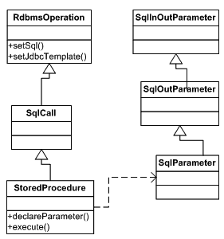

10092ch05.qxd 7/24/08 5:15 PM 第 196 页

**196**

第 5 章 **■** 探索集成层设计模式

使用 Spring 框架的策略

Spring JDBC 提供了方便的抽象类 `StoredProcedure` 来执行存储过程。这个类，像 Spring JDBC 中的其他支持类一样，实现了 GOF 模板设计模式，并提供了存储过程的面向对象抽象。使用这个类，可以执行存储过程操作，例如设置输入和输出变量、使用特定于数据库的数据类型以及返回游标。这个特定的类扩展自 `SqlCall` 类，该类可用于建模任何存储过程和函数的执行。`SqlCall` 类的根是 `RdbmsOperation`，可用于建模任何特定于数据库的操作，例如检索结果的 SQL 查询、更新或删除记录以及调用存储过程。图 5-2 显示了存储过程支持类的类图。

**图 5-2.** *类图：Spring 存储过程支持类* 为了探索 Spring JDBC 对存储过程的支持，我将展示一个需要将潜在客户信息保存到数据库中的案例。清单 5-17 显示了该存储过程的简化签名。此存储过程用于在数据库中创建新的潜在客户。它接受潜在客户名称和国家作为输入，并输出潜在客户 ID，该 ID 是数据库中的主键，由序列生成。

**清单 5-17.** *存储过程签名*

SaveNewLead (:pLeadId OUT NUMBER,:pName IN VARCHAR2,:pCountryCd VARCHAR2)

10092ch05.qxd 7/24/08 5:15 PM 第 197 页

第 5 章 **■** 探索集成层设计模式

**197**

过程访问对象类似于数据访问对象。它们封装了单个存储过程的执行。清单 5-18 显示了用于保存新潜在客户信息的 PAO。

**清单 5-18.** SaveNewLeadPao.java

public class SaveNewLeadPao extends StoredProcedure{

public SaveNewLeadPao(){

declareParameter(new SqlOutParameter("pLeadId", Types.INTEGER)); declareParameter(new SqlParameter("pName", Types.VARCHAR)); declareParameter(new SqlParameter("pCountryCd", Types.VARCHAR));

}

public Map execute(Map inParamMap){

return super.execute(inParamMap);

}

}

`declareParameter` 方法需要按照存储过程中声明参数的精确顺序进行调用。存储过程抽象支持输入和输出变量。过程的执行由 `execute` 方法触发，该方法接受一个 `Map` 参数。此 `Map` 对象包含要传递给存储过程的输入值。此 `Map` 的键与存储过程输入参数名称相同。`SaveNewLeadPao` 子类中的 `execute` 方法委托给父类的 `execute` 方法。`execute` 方法返回一个 `Map` 作为输出。输出映射包含从数据库返回的结果。此映射的键与存储过程声明的输出参数名称相同。

应用程序服务是 PAO 的客户端。所有内容都可以像清单 5-19 那样在 Spring 配置中进行配置。

**清单 5-19.** underwriting-service.xml

<?xml version="1.0" encoding="UTF-8"?>

<beans

[xsi:schemaLocation="http://www.springframework.org/schema/beans](http://www.w3.org/2001/XMLSchema-instance)

[`www.springframework.org/schema/beans/spring-beans-2.5.xsd"`](http://www.w3.org/2001/XMLSchema-instance)

>

<bean id="uwrApplicationService"

class="com.apress.einsure.business.impl. **➥**

UnderwritingApplicationServiceImpl">

10092ch05.qxd 7/24/08 5:15 PM 第 198 页

**198**

第 5 章 **■** 探索集成层设计模式

<property name="policyDetailDao" ref="policyDetailDao"/>

</bean>

<bean id="policyDetailDao"

class="com.apress.einusre.persistence.dao.impl.PolicyDetailDaoImpl"

>

<property name="dataSource" ref="datasource"/>

</bean>

<bean id="datasource" class="org.springframework.jndi.JndiObjectFactoryBean">

<property name="jndiName" value="einsureDatasource" />

<property name="jndiEnvironment">

<props>

<prop key="java.naming.factory.initial">

org.jnp.interfaces.NamingContextFactory

</prop>

<prop key="java.naming.provider.url">

jnp://localhost:1099

</prop>

<prop key="java.naming.factory.url.pkgs">


org.jboss.naming.client

</prop>

</props>

</property>

</bean>

<bean id="leadApplicationService"

class="com.apress.einsure.business.impl. **➥**

LeadManagementApplicationServiceImpl">

<property name="savelLeadPao" ref="savelLeadPao"/>

</bean>

<bean id="savelLeadPao"

class="com.apress.einsure.persistence.pao.SaveNewLeadPao">

<property name="dataSource" ref="datasource"/>

</bean>

</beans>

10092ch05.qxd 7/24/08 5:15 PM 第 199 页

第 5 章 **■** 探索集成层设计模式

**199**

**影响**

优势

• Spring JDBC 提供的高级 API 使得访问遗留存储过程变得简单。

• PAO 促进了面向对象设计，并最大限度地减少了代码冗余。

• PAO 管理了样板式的底层代码和资源管理。

关注点

• 使用遗留存储过程限制了应用程序的可移植性。

• 存在难以管理的系统服务，例如事务、安全性等。

• 调用远程数据库服务器上运行的存储过程会带来与远程过程调用相关的所有负担。因此，这可能会对性能产生不利影响。

**服务激活器**

**问题**

与大多数企业应用程序一样，eInsure 也需要支持报表。报表提供了对业务状况的宝贵洞察。例如，在 eInsure 中，有报表用于查明在一段时间内每个产品售出了多少保单、一段时间内收取了多少保费、一月份新增了多少潜在客户等等。报表的内容和数量因客户需求而异。

eInsure 支持两种类型的报表：计划报表和用户生成报表。计划报表由调度程序（如 Unix CRON）在特定时间间隔后触发。计划报表的一个示例是月度保费收取报表。用户生成报表由 eInsure 应用程序的用户通过其浏览器触发。用户通常会选择一个报表，提供必要的输入，然后开始生成报表。

10092ch05.qxd 7/24/08 5:15 PM 第 200 页

**200**

第 5 章 **■** 探索集成层设计模式

这种同步报表生成策略在安装 eInsure 的一些中大型公司中被发现存在不足。随着这些公司使用该应用程序添加新产品、保单、参与方和理赔，数据量迅速增长。这导致了令人沮丧的用户体验，因为同步报表在处理大量数据时大多会超时。用户已经因同步报表的阻塞特性而感到沮丧。大多数报表会生成大型数据集，将这些数据从数据库传输到应用服务器，然后再传输到客户端浏览器，会堵塞网络。

**驱动力**

• 应用程序需要支持长时间运行的用例。

• 有必要异步执行业务服务。

• 长时间运行的操作不应阻塞用户。

**解决方案**

使用*服务激活器*来接收并执行异步服务请求。

Spring 框架中的策略

您可以通过允许实际报表生成服务请求被异步处理来解决前面讨论的阻塞问题。JMS 消息监听器可用于异步处理此业务请求。然而，更稳健的方法是使用消息驱动 Bean（MDB）。这是因为 MDB 将消息监听器的异步行为与 EJB 容器提供的服务结合了起来。

Spring 支持构建 MDB 以及向 JMS 队列或主题发送消息。与无状态会话 Bean 类似，Spring 也提供了便捷的基类来开发 MDB，如图 5-3 所示。类层次结构的根是 AbstractEnterpriseBean 类，可用于加载 Spring 应用程序上下文。

子类 AbstractMessageDrivenBean 是用于开发 MDB 的便捷类。


`setMessageDrivenContext` 用于保存由 EJB 容器提供的 `MessageDrivenContext` 对象。子类可以重写 `onEjbCreate` 方法，以便从与 MDB 关联的 Spring 应用上下文中初始化或加载任何 Bean。`AbstractJmsMessageDrivenBean` 实现了 `MessageListener` 接口，从而使 MDB 能够兼容 JMS 消息。

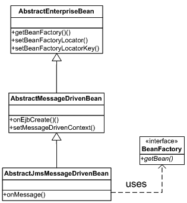

10092ch05.qxd 7/24/08 5:15 PM 第 201 页

第 5 章 **■** 探索集成层设计模式

**201**

**图 5-3.** *类图：Spring MDB 支持*

清单 5-20 展示了 eInsure 报告子系统中使用的 MDB。与 SLSB 相比，MDB 的开发不那么繁琐，因为你无需处理 home 接口和远程接口。

**清单 5-20.** ReportingMDB.java

public class ReportingMDB extends AbstractJmsMessageDrivenBean {

protected void onEjbCreate() {

//从 Spring Bean 工厂初始化应用服务组件

}

public void onMessage(Message msg) {

//在此处处理业务请求——生成报告

}

}

图 5-4 展示了 EJB 容器调用 MDB 时的消息流序列。触发异步处理的客户端在将消息发送到队列后立即返回。一旦消息到达队列，EJB 容器便通过调用 `onMessage` 方法将处理工作委托给一个 MDB 实例。此方法可用于调用 POJO 服务组件来生成报告。

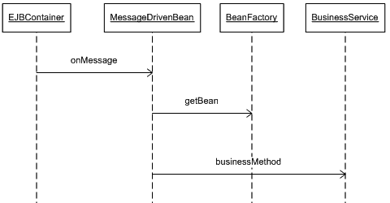

10092ch05.qxd 7/24/08 5:15 PM 第 202 页

**202**

第 5 章 **■** 探索集成层设计模式

**图 5-4.** *序列图：Spring MDB 执行*

清单 5-21 展示了 MDB 的部署描述符。

**清单 5-21.** ejb-jar.xml

<?xml version="1.0" encoding="UTF-8"?>

[<ejb-jar version="2.1"](http://java.sun.com/xml/ns/j2ee)

[xsi:schemaLocation="http://java.sun.com/xml/ns/j2ee](http://www.w3.org/2001/XMLSchema-instance)

[`java.sun.com/xml/ns/j2ee/ejb-jar_2_1.xsd">`](http://www.w3.org/2001/XMLSchema-instance)

<enterprise-beans>

<message-driven>

<display-name>ReportingMDB</display-name>

<ejb-name>ReportingMDB</ejb-name>

<ejb-class>com.apress.einsure.reports.aysync.activator.ReportingMDB

</ejb-class>

<transaction-type>Container</transaction-type>

<env-entry>

<env-entry-name>ejb/BeanFactoryPath</env-entry-name>

<env-entry-type>java.lang.String</env-entry-type>

<env-entry-value>com/apress/einsure/reports/aysync/activator**➥**

/Reporting-beans.xml</env-entry-value>

</env-entry>

<message-destination-type>javax.jms.Queue</message-destination-type>

<message-destination-link>reportQ</message-destination-link>

<activation-config>

<activation-config-property>

<activation-config-property-name>

10092ch05.qxd 7/24/08 5:15 PM 第 203 页

第 5 章 **■** 探索集成层设计模式

**203**

acknowledgeMode</activation-config-property-name>

<activation-config-property-value>

Auto-acknowledge</activation-config-property-value>

</activation-config-property>

<activation-config-property>

<activation-config-property-name>

destinationType</activation-config-property-name>

<activation-config-property-value>

javax.jms.Queue</activation-config-property-value>

</activation-config-property>

</activation-config>

</message-driven>

</enterprise-beans>

<assembly-descriptor>

<container-transaction>

<method>

<ejb-name>ReportingMDB</ejb-name>

<method-name>*</method-name>

</method>

<trans-attribute>Required</trans-attribute>

</container-transaction>

<message-destination>

<display-name>Destination for ReportingMDB</display-name>

<message-destination-name>reportQ</message-destination-name>

</message-destination>

</assembly-descriptor>

</ejb-jar>

要部署此 EJB，你还需要一个特定于 JBoss 的部署描述符，用于声明 JMS 队列的 JNDI 名称，如清单 5-22 所示。

**清单 5-22.** jboss.xml

<?xml version="1.0" encoding="UTF-8"?>

<jboss>

<enterprise-beans>

<message-driven>

<ejb-name>ReportingMDB</ejb-name>


<destination-jndi-name>queue/reportQ</destination-jndi-name>

</message-driven>

</enterprise-beans>

</jboss>

10092ch05.qxd 7/24/08 5:15 PM Page 204

**204**

第 5 章 **■** 探索集成层设计模式

ReportingMDB 关联了一个 Spring 应用上下文。它使用在此应用上下文中注册的 Bean 来执行长时间运行的报表生成任务。该 Spring 应用上下文的配置如清单 5-23 所示。

**清单 5-23.** Reporting-beans.xml

<?xml version="1.0" encoding="UTF-8"?>

<beans

[xsi:schemaLocation="http://www.springframework.org/schema/beans](http://www.w3.org/2001/XMLSchema-instance)

[`www.springframework.org/schema/beans/spring-beans-2.5.xsd"`](http://www.w3.org/2001/XMLSchema-instance)

>

<bean name="reportServiceProvider"

class="net.sf.reporting.ReportServiceProviderImpl">

</bean>

</beans>

到目前为止，我已经解释了服务器端的 Java 组件和配置。现在我将重点介绍触发异步报表处理的客户端。Spring 提供了 `JmsTemplate` 类来简化发送 JMS 消息的过程。它也基于 GOF 模板方法设计模式。要使用此类，您需要在 Spring 应用上下文中对其进行配置，并注入绑定到 JNDI 的 `ConnectionFactory` 和 `Destination` 对象。如清单 5-24 所示。

**清单 5-24.** insurance-servlet.xml

<?xml version="1.0" encoding="UTF-8"?>

<beans

[xsi:schemaLocation="http://www.springframework.org/schema/beans](http://www.w3.org/2001/XMLSchema-instance)

[`www.springframework.org/schema/beans/spring-beans-2.5.xsd">`](http://www.w3.org/2001/XMLSchema-instance)

<bean id="qConnectionFactory"

class="org.springframework.jndi.JndiObjectFactoryBean">

<property name="jndiName" value="ConnectionFactory" />

<property name="jndiEnvironment">

<props>

<prop key="java.naming.factory.initial">

10092ch05.qxd 7/24/08 5:15 PM Page 205

第 5 章 **■** 探索集成层设计模式

**205**

org.jnp.interfaces.NamingContextFactory

</prop>

<prop key="java.naming.provider.url">

jnp://localhost:1099

</prop>

<prop key="java.naming.factory.url.pkgs">

org.jboss.naming.client

</prop>

</props>

</property>

</bean>

<bean id="qReport" class="org.springframework.jndi.JndiObjectFactoryBean">

<property name="jndiName" value="queue/reportQ" />

<property name="jndiEnvironment">

<props>

<prop key="java.naming.factory.initial">

org.jnp.interfaces.NamingContextFactory

</prop>

<prop key="java.naming.provider.url">

jnp://localhost:1099

</prop>

<prop key="java.naming.factory.url.pkgs">

org.jboss.naming.client

</prop>

</props>

</property>

</bean>

<bean id="jmsTemplate" class="org.springframework.jms.core.JmsTemplate" >

<property name="connectionFactory" ref="qConnectionFactory"/>

<property name="defaultDestination" ref="qReport"/>

</bean>

<bean id="reportingDelegate"

class="com.apress.insurance.view.delegate.impl.ReportingDelegateImpl">

<property name="jmsTemplate" ref="jmsTemplate" />

</bean>

</beans>

10092ch05.qxd 7/24/08 5:15 PM Page 206

**206**

第 5 章 **■** 探索集成层设计模式

`JmsTemplate` 最终被注入到 `ReportingDelegate` 中，该委托由处理报表生成请求的页面控制器调用。实现类 `ReportingDelegateImpl` 遵循业务委托模式，并处理与 JMS 相关的细节，如清单 5-25 所示。

**清单 5-25.** ReportingDelegateImpl.java

public class ReportingDelegateImpl implements ReportingDelegate{

private JmsTemplate jmsTemplate;

public long triggerReportGeneration(Map reportDataMap) {

long reportId = ReportUtil.generateReportId(reportDataMap);

this.jmsTemplate.send(new ReportMessageCreatorImpl(reportDataMap)); return reportId;

}

public void setJmsTemplate(JmsTemplate jmsTemplate) {

this.jmsTemplate = jmsTemplate;

}

}


报告 ID 被传递给页面控制器，以便它能够向用户显示此令牌，供将来参考。用户可以使用此 ID 进行搜索，以查找其触发的报告生成状态。请注意，我还通过以`ReportMessageCreatorImpl`的形式传递`MessageCreator`接口的自定义实现，修改了`JmsTemplate`类的工作流程，如清单 5-26 所示。该类负责将传入的消息转换为与 JMS API 兼容的形式。

**清单 5-26.** ReportMessageCreatorImpl.java

public class ReportMessageCreatorImpl implements MessageCreator{

private Map reportData;

public ReportMessageCreatorImpl(Map reportData){

this.reportData = reportData;

}

public Message createMessage(Session jmsSession) throws JMSException {

MapMessage message = jmsSession.createMapMessage();

message.setObject("REPORT_DATA", reportData.get("REPORT_DATA")); return message;

}

}

10092ch05.qxd 7/24/08 5:15 PM 第 207 页

第 5 章 **■** 探索集成层设计模式

**207**

向请求报告的用户发送最终响应有多种策略。eInsure 中的异步报告通常根据特定条件从 RDBMS 获取记录，应用格式化（如日期和货币），并将这些数据保存为各种格式的文件，包括 Microsoft Word、PDF、Microsoft Excel 等。当报告文件生成完成后，会通过电子邮件通知用户。

**消息驱动的 POJO**

使用 Spring，即使没有任何应用服务器或 JMS 提供者，也可以支持异步消息监听器。事实上，可以将任何 POJO 类转变为消息监听器——即所谓的消息驱动 POJO（MDP）——而无需任何 EJB 容器支持。MDP 在 Spring 消息监听器容器中注册。消息监听器容器从 JMS 队列接收消息并调用已注册的 MDP。

清单 5-27 展示了 MDP。它不依赖于任何框架特定的接口或抽象类。由于消息监听器只是一个普通的 POJO，Spring 无法确定当消息到达队列时应调用哪个方法。`MessageListenerAdapter`负责处理此问题。

**清单 5-27.** ReportMessageListener.java

public class ReportMessageListener {

private void processReport(Map reportParams){

//生成报告

}

}

消息监听器容器在 Spring 应用容器初始化并启动时启动。您还需要注册消息监听器。这可以通过配置完成，如清单 5-28 所示。

**清单 5-28.** insurance-config.xml

<?xml version="1.0" encoding="UTF-8"?>

<beans

[xsi:schemaLocation="http://www.springframework.org/schema/beans](http://www.w3.org/2001/XMLSchema-instance)

[`www.springframework.org/schema/beans/spring-beans-2.5.xsd`](http://www.w3.org/2001/XMLSchema-instance)

["](http://www.springframework.org/schema/beanswww.springframework.org/schema/beans/spring-beans-2.5.xsd)

>

<!—其他 bean -->

10092ch05.qxd 7/24/08 5:15 PM 第 208 页

**208**

第 5 章 **■** 探索集成层设计模式

<bean id="messageListener"

class="com.apress.einsure.report.async.messagelistener.ReportMessageListener" />

<!-- 这是消息驱动 POJO (MDP) -->

<bean id="messageListener"

class="org.springframework.jms.listener.adapter.MessageListenerAdapter">

<constructor-arg>

<bean class=" com.apress.einsure.report.async.messagelistener. **➥**

ReportMessageListener "/>

</constructor-arg>

</bean>

<!-- 这是消息监听器容器 -->

<bean id="jmsContainer"

class="org.springframework.jms.listener.DefaultMessageListenerContainer">

<property name="connectionFactory" ref="qConnectionFactory"/>

<property name="destination" ref="qReport"/>

<property name="messageListener" ref="messageListener" />

</bean>

</beans>

请注意，在此配置中，您已将消息监听器适配器注册到容器中。此适配器知道如何执行消息驱动的 POJO。

`DefaultMessageListenerContainer`是使用最广泛的消息监听器容器。

**结论**

**优点**

• 在应用服务器和 Spring IOC 容器中，都为异步服务处理提供了强大的支持。

• 访问异步服务的客户端易于开发。

• 基于 Spring 的 MDB 构成了与外部系统进行基于 JMS 集成的骨干。

• 由于请求是异步处理的，用户不会因长时间运行的任务而被阻塞。

10092ch05.qxd 7/24/08 5:15 PM 第 209 页

第 5 章 **■** 探索集成层设计模式

**209**

**关注点**

• Spring MDP 易于开发和使用，但并非基于 Java EE 标准规范。使用 MDP 和 Spring 消息容器可能不适合大规模的企业需求。

**Web 服务代理**

**问题**

生成保单报价是 eInsure 应用程序提供的一项非常重要的服务。此服务仅接受最基本的信息：保单金额、保障年限（“期限”）、保费频率，当然还有承保该保单的保险产品。给定这些输入，输出将是客户需要支付的暂定保费。

此服务在在线 eInsure 应用程序中可用，并由核保人和支持主管在柜台大量使用。然而，使用 eInsure 但无法直接访问该应用程序的合作伙伴、经销商和代理商也希望使用此功能。还有其他关联方希望仅将此功能作为小部件集成到他们的实用网站中。保单报价服务可以通过会话外观进行远程访问。然而，实际功能是作为 POJO 应用程序服务实现的。这些外部应用程序大多运行在 PHP 上，其他则运行在 Microsoft .NET 平台上。可以为 EJB 提供非 Java 客户端，但这超出了开发这些外部应用程序的团队的技能范围。在这种情况下，另一种选择是以技术或平台无关的方式公开这些服务。Web 服务是一个完美的解决方案。将保单报价功能公开为 Web 服务将使任何外部应用程序都能使用它，而不会受到技术障碍的限制。

**驱动力**

• 需要将内部服务暴露给外部客户端。

• 服务应以技术中立的方式公开。

• 在与外部系统集成时，首选开放标准来公开服务。

10092ch05.qxd 7/24/08 5:15 PM 第 210 页

**210**

第 5 章 **■** 探索集成层设计模式

**解决方案**

使用*Web 服务代理*，基于开放的 Web 标准将业务服务暴露给外部客户端。

Spring 框架的策略

Web 服务通常涉及两个应用程序之间使用 XML 消息进行信息交换。这些 XML 消息遵循一种称为简单对象访问协议（SOAP）的标准。Web 服务提供的操作在 Web 服务描述语言（WSDL）文件中描述。XML SOAP 消息可以通过多种网络协议传输，例如 HTTP、SMTP 和 JMS。但是，我将仅介绍 HTTP 作为传输协议。

**使用 JAX-RPC 的 Web 服务**


JAX-RPC 是 Java 中开发 Web 服务最流行且最简单的机制之一。它可用于创建基于 SOAP 的服务，这些服务被称为*端点*。Spring 提供的便捷基类 `ServletEndpointSupport` 使得开发端点变得简单。该类非常有用，因为它提供了对 Spring 应用上下文的访问，并且充当 Web 服务中的首个接触点。在本节中，我将尝试利用 Spring 框架和 Apache Axis Web 服务框架来公开策略报价服务。Apache Axis 提供了完整的基于 SOAP 的 JAX-RPC 实现。

使用 Spring 开发基于 JAX-RPC 的 Web 服务的第一步是定义服务接口，如清单 5-29 所示。在此例中，我将使用由应用服务实现的同一个 `PolicyQuoteApplicationService` 接口。

**清单 5-29.** PolicyQuoteApplicationService.java

public interface PolicyQuoteApplicationService {

public String BEAN_KEY = "policyQuoteApplicationService"; public double calculatePolicyQuote(String productCd,int age,

double sumAssured,int term);

}

下一步是实现端点类，如清单 5-30 所示。该端点将实现服务接口，但其实现方法会委托给实际的应用服务。

10092ch05.qxd 7/24/08 5:15 PM 第 211 页

第 5 章 **■** 探索集成层设计模式

**211**

**清单 5-30.** PolicyQuoteServiceEndpoint.java

public class PolicyQuoteServiceEndpoint extends ServletEndpointSupport implements PolicyQuoteApplicationService{

private PolicyQuoteApplicationService policyQuoteService;

protected void onInit() {

this.policyQuoteService = (PolicyQuoteApplicationService)

getWebApplicationContext().

getBean(PolicyQuoteApplicationService.BEAN_KEY);

}

public double calculatePolicyQuote(String productCd, int age,

double sumAssured, int term) {

return policyQuoteService.calculatePolicyQuote(productCd, age,

sumAssured, term);

}

}

此清单的关键之处在于端点类提供了对 Spring 应用上下文的访问。`onInit` 方法被重写以获取应用服务对象。

由于我正尝试通过 SOAP 消息在 HTTP 上公开此服务，因此必须在 Web 容器中配置 Axis Servlet。该 Servlet 在协调来自外部客户端的 Web 服务调用并将其传递给端点方面起着关键作用。它还负责将 SOAP 消息映射到适当的端点方法，并将方法返回值作为 SOAP 响应返回。它负责创建 WSDL 文件，客户端使用该文件来访问策略报价 Web 服务。Axis Servlet 像其他任何 Servlet 一样在 Web 容器中注册，如清单 5-31 所示。建议将 Web 服务部署为独立的 Web 应用程序，以实现模块化和易于维护。

**清单 5-31.** web.xml

<?xml version="1.0" encoding="UTF-8"?>

[<web-app version="2.4"](http://java.sun.com/xml/ns/j2ee)

[xsi:schemaLocation="http://java.sun.com/xml/ns/j2ee](http://www.w3.org/2001/XMLSchema-instance)

[`java.sun.com/xml/ns/j2ee/web-app_2_4.xsd">`](http://www.w3.org/2001/XMLSchema-instance)

10092ch05.qxd 7/24/08 5:15 PM 第 212 页

**212**

第 5 章 **■** 探索集成层设计模式

**<listener>**

**<listener-class>org.springframework.web.context.➥**

**ContextLoaderListener</listener-class>**

**</listener>**

**<servlet>**

**<servlet-name>axis</servlet-name>**

**<servlet-class>org.apache.axis.transport.http.AxisServlet</servlet-class>**

**<!--<load-on-startup>1</load-on-startup>-->**

**</servlet>**

**<servlet-mapping>**

**<servlet-name>axis</servlet-name>**

**<url-pattern>/axis/*</url-pattern>**

**</servlet-mapping>**

</web-app>

Axis Servlet 还需要一个部署描述符来确定应在服务接口上向外部客户端公开哪些服务。清单 5-32 显示了该部署描述符。


**清单 5-32.** server-config.wsdd

<?xml version="1.0" encoding="UTF-8"?>

[<deployment](http://xml.apache.org/axis/wsdd)

[>](http://xml.apache.org/axis/wsdd/providers/java)

<globalConfiguration>

<parameter name="adminPassword" value="admin"/>

<parameter name="sendXsiTypes" value="true"/>

<parameter name="sendMultiRefs" value="true"/>

<parameter name="sendXMLDeclaration" value="true"/>

<parameter name="axis.sendMinimizedElements" value="true"/>

<requestFlow>

<handler type="java:org.apache.axis.handlers.JWSHandler">

<parameter name="scope" value="session"/>

</handler>

<handler type="java:org.apache.axis.handlers.JWSHandler">

10092ch05.qxd 7/24/08 5:15 PM 第 213 页

第 5 章 **■** 探索集成层设计模式

**213**

<parameter name="scope" value="request"/>

<parameter name="extension" value=".jwr"/>

</handler>

</requestFlow>

</globalConfiguration>

<handler name="Authenticate"

type="java:org.apache.axis.handlers.SimpleAuthenticationHandler"/>

<handler name="LocalResponder"

type="java:org.apache.axis.transport.local.LocalResponder"/>

<handler name="URLMapper" type="java:org.apache.axis.handlers.http.URLMapper"/>

<service name="AdminService" provider="java:MSG">

<parameter name="allowedMethods" value="AdminService"/>

<parameter name="enableRemoteAdmin" value="false"/>

<parameter name="className" value="org.apache.axis.utils.Admin"/>

[<namespace>http://xml.apache.org/axis/wsdd/</namespace>](http://xml.apache.org/axis/wsdd/%3C/namespace)

</service>

<service name="PolicyQuoteService" provider="java:RPC">

<parameter name="allowedMethods" value="*"/>

<parameter name="className"

value="com.apress.einsure.business.external. **➥**

PolicyQuoteServiceEndpoint"/> </service>

<service name="Version" provider="java:RPC">

<parameter name="allowedMethods" value="getVersion"/>

<parameter name="className" value="org.apache.axis.Version"/>

</service>

<transport name="http">

<requestFlow>

<handler type="URLMapper"/>

<handler type="java:org.apache.axis.handlers.http.HTTPAuthHandler"/>

</requestFlow>

</transport>

<transport name="local">

<responseFlow>

<handler type="LocalResponder"/>

</responseFlow>

</transport>

</deployment>

现在，应用程序服务需要能够从 Axis Servlet 管理的端点对象进行访问。为了实现这一目标，需要在由上下文加载器监听器启动的根 Web 应用程序上下文中配置这些应用程序服务。这个 Servlet

10092ch05.qxd 7/24/08 5:15 PM 第 214 页

**214**

第 5 章 **■** 探索集成层设计模式

监听器会加载 `WEB-INF/applicationContext.xml` 中定义的 Bean，并将它们绑定到与该 Web 应用程序关联的根应用程序上下文中。清单 5-33 展示了这一点。

**清单 5-33.** applicationContext.xml

<?xml version="1.0" encoding="UTF-8"?>

<beans

[xsi:schemaLocation="http://www.springframework.org/schema/beans](http://www.w3.org/2001/XMLSchema-instance)

[`www.springframework.org/schema/beans/spring-beans-2.5.xsd"`](http://www.w3.org/2001/XMLSchema-instance)

>

<bean name="policyQuoteApplicationService" class="com.apress.einsure. **➥**

business.impl.PolicyQuoteApplicationServiceImpl" />

</beans>

最后，清单 5-34 展示了实际的应用程序服务实现类。

**清单 5-34.** PolicyQuoteApplicationServiceImpl.java

public class PolicyQuoteApplicationServiceImpl implements

PolicyQuoteApplicationService{

public double calculatePolicyQuote(String productCd, int age,

double sumAssured, int term) {

//返回计算出的保单价值

}

}

现在服务器端组件已经就绪，我将展示如何构建一个示例客户端来访问该 Web 服务。如第 4 章所述，我将使用业务委托，因为它是处理远程服务最合适的组件。清单 5-35

展示了用于调用远程保单报价服务方法的业务委托。

10092ch05.qxd 7/24/08 5:15 PM 第 215 页

第 5 章 **■** 探索集成层设计模式

**215**

**清单 5-35.** PolicyQuoteBusinessDelegateImpl.java

public class PolicyQuoteBusinessDelegateImpl implements

PolicyQuoteBusinessDelegate {

private PolicyQuoteApplicationService service;

public void calculatePolicyQuote(){

this.service.calculatePolicyQuote("GNLIFE", 12, 1000, 10);

}

public PolicyQuoteApplicationService getService() {

return service;

}

public void setService(PolicyQuoteApplicationService service) {

this.service = service;

}

}

现在，你可以在 Spring 配置文件中将所有内容连接起来，如清单 5-36 所示。

**清单 5-36.** springws-config.xml

<?xml version="1.0" encoding="UTF-8"?>

<beans

[xsi:schemaLocation="http://www.springframework.org/schema/beans](http://www.w3.org/2001/XMLSchema-instance)

[`www.springframework.org/schema/beans/spring-beans-2.5.xsd"`](http://www.w3.org/2001/XMLSchema-instance)

>

<bean name="policyQuoteDelegate"

class="com.xpress.channel.PolicyQuoteBusinessDelegate" >

<property name="businessService"

ref="policyQuoteWebService" />

</bean>

10092ch05.qxd 7/24/08 5:15 PM 第 216 页

**216**

第 5 章 **■** 探索集成层设计模式

<bean id="policyQuoteWebService"

class="org.springframework.remoting.jaxrpc. **➥**

JaxRpcPortProxyFactoryBean" >

<property name="serviceInterface"

value="com.apress.einsure.business.api

.PolicyQuoteApplicationService"/>

<property name="wsdlDocumentUrl" [value="http://localhost:7001/](http://localhost:7001/eInsureWeb/axis/PolicyQuoteService?wsdl)

[eInsureWeb/axis/PolicyQuoteService?wsdl"/>](http://localhost:7001/eInsureWeb/axis/PolicyQuoteService?wsdl)

<property name="namespaceUri"

[value="http://localhost:7001/eInsureWeb/axis/PolicyQuoteService"/>](http://localhost:7001/eInsureWeb/axis/PolicyQuoteService)

<property name="serviceName" value="PolicyQuoteService"/>

<property name="portName" value="PolicyQuoteService"/>

<property name="serviceFactoryClass"

value="org.apache.axis.client.ServiceFactory" />

</bean>

</beans>

从清单 5-36 可以看出，Spring 框架使用了一个工厂 Bean：`JaxRpcPortProxyFactoryBean`。这个类从 Web 服务注册表中查找 Web 服务。它返回一个实现了业务服务接口的代理对象。最后，我将从一个独立的 Java 客户端中调用业务委托，如清单 5-37 所示。

**清单 5-37.** PolicyQuoteClient.java

public class PolicyQuoteClient {

public static void main(String[] args) throws ServiceException, AxisFault {

accessViaSpringClient();

accessViaNonSpringClient();

}

}

public static void accessViaSpringClient() {

String configFile = "com/xpress/channel/springws-config.xml"; ApplicationContext ctx = new ClassPathXmlApplicationContext(configFile); PolicyQuoteBusinessDelegate delegate = (PolicyQuoteBusinessDelegate) ctx.getBean("policyQuoteDelegate");

delegate.execute();

}

10092ch05.qxd 7/24/08 5:15 PM 第 217 页

第 5 章 **■** 探索集成层设计模式

**217**

public static void accessViaNonSpringClient() {

try {

URL url = new [URL("http://localhost:7001/eInsureWeb/axis/**➥**](http://localhost:7001/eInsureWeb/axis/�PolicyQuoteService)

[PolicyQuoteService");](http://localhost:7001/eInsureWeb/axis/�PolicyQuoteService)

Service service = new Service();

Call call = (Call) service.createCall();

call.setTargetEndpointAddress(url);

call.invoke("calculatePolicyQuote", new Object[]{"ff",1,2.5,4});

} catch (MalformedURLException ex) {

throw new RuntimeException(ex);

}

}

**使用 Burlap 进行远程处理**

Spring 提供了一些替代的远程处理策略，用于通过 HTTP 暴露服务。


其中一种替代方案是支持 Caucho 的 Burlap 和 Hessian 远程通信协议。Hessian 支持通过 HTTP 进行二进制数据交换。我将重点介绍 Burlap，它允许基于简单文本和 XML 的数据传输。只需进行配置，即可导出 Spring 服务以通过 Burlap 协议进行访问。为此，我需要确保 dispatcher servlet 能够处理 Burlap 远程通信。这需要对 Web 应用程序配置文件进行一些修改，如清单 5-38 所示。

**清单 5-38.** web.xml

<?xml version="1.0" encoding="UTF-8"?>

[<web-app version="2.4"](http://java.sun.com/xml/ns/j2ee)

[xsi:schemaLocation="http://java.sun.com/xml/ns/j2ee](http://www.w3.org/2001/XMLSchema-instance)

[`java.sun.com/xml/ns/j2ee/web-app_2_4.xsd">`](http://www.w3.org/2001/XMLSchema-instance)

<servlet>

<servlet-name>insurance</servlet-name>

<servlet-class>

org.springframework.web.servlet.DispatcherServlet

10092ch05.qxd 7/24/08 5:15 PM Page 218

**218**

第 5 章 **■** 探索集成层设计模式

</servlet-class>

<load-on-startup>1</load-on-startup>

</servlet>

<servlet-mapping>

<servlet-name>insurance</servlet-name>

<url-pattern>*.do</url-pattern>

</servlet-mapping>

**<servlet-mapping>**

**<servlet-name>insurance</servlet-name>**

**<url-pattern>/remoting/*</url-pattern>**

**</servlet-mapping>**

<welcome-file-list>

<welcome-file>WEB-INF/jsp/index.jsp</welcome-file>

</welcome-file-list>

<jsp-config>

<taglib>

<taglib-uri>/spring</taglib-uri>

<taglib-location>

/WEB-INF/tld/spring-form.tld

</taglib-location>

</taglib>

<taglib>

<taglib-uri>sitemesh-page</taglib-uri>

<taglib-location>

/WEB-INF/tld/sitemesh-page.tld

</taglib-location>

</taglib>

<taglib>

<taglib-uri>sitemesh-decorator</taglib-uri>

<taglib-location>

/WEB-INF/tld/sitemesh-decorator.tld

</taglib-location>

</taglib>

10092ch05.qxd 7/24/08 5:15 PM Page 219

第 5 章 **■** 探索集成层设计模式

**219**

</jsp-config>

</web-app>

下一步最为关键，因为我们要将基于 POJO 的策略报价服务导出为 Burlap 远程服务。同样，这只需通过配置即可完成，如清单 5-39 所示。在此例中，`BurlapServiceExporter` 充当服务端点。

**清单 5-39.** insurance-servlet.xml

<?xml version="1.0" encoding="UTF-8"?>

<beans

[xsi:schemaLocation="http://www.springframework.org/schema/beans](http://www.w3.org/2001/XMLSchema-instance)

[`www.springframework.org/schema/beans/spring-beans-2.5.xsd`](http://www.w3.org/2001/XMLSchema-instance)

["](http://www.springframework.org/schema/beanswww.springframework.org/schema/beans/spring-beans-2.5.xsd)

>

<bean name="policyQuoteServiceImpl"

class="com.apress.einsure.business.impl. **➥**

PolicyQuoteApplicationServiceImpl">

</bean>

<bean name="/PolicyQuoteService" class="org.springframework.remoting.caucho. **➥**

BurlapServiceExporter">

<property name="service" ref="policyQuoteServiceImpl"/>

<property name="serviceInterface" value="com.apress.einsure.business. **➥**

api.PolicyQuoteApplicationService"/>

</bean>

</beans>

现在我们已经使用 Burlap 远程通信暴露了策略报价服务，接下来该关注客户端了。同样，你只需配置一个代理工厂 bean，基本上就大功告成了，如清单 5-40 所示。

10092ch05.qxd 7/24/08 5:15 PM Page 220

**220**

第 5 章 **■** 探索集成层设计模式

**清单 5-40.** springburlap-config.xml

<?xml version="1.0" encoding="UTF-8"?>

<beans

x[mlns:xsi="http://www.w3.org/2001/XMLSchema-instance"](http://www.w3.org/2001/XMLSchema-instance)

[xsi:schemaLocation="http://www.springframework.org/schema/beans](http://www.w3.org/2001/XMLSchema-instance)

[`www.springframework.org/schema/beans/spring-beans-2.5.xsd"`](http://www.w3.org/2001/XMLSchema-instance)

>

<bean name="policyQuoteDelegate"

class="com.xpress.channel.PolicyQuoteBusinessDelegate" >

<property name="service"

ref="policyQuoteBurlapService" />


</bean>

<bean id="policyQuoteBurlapService"

class="org.springframework.remoting.caucho.BurlapProxyFactoryBean">

<property name="serviceUrl"

[value="http://localhost:7001/eInsureWeb/remoting/PolicyQuoteService"/>](http://localhost:7001/eInsureWeb/remoting/PolicyQuoteService)

<property name="serviceInterface"

value="com.apress.einsure.business.api.PolicyQuoteApplicationService"/>

</bean>

</beans>

需要注意的是，由于我使用了带有 P2I 的代理对象，业务委托无需更改。最后但同样重要的是，清单 5-41 展示了独立客户端。

**清单 5-41.** PolicyQuoteBurlapClient.java

public class PolicyQuoteBurlapClient {

public static void main(String[] args) {

accessViaSpringClient();

}

public static void accessViaSpringClient() {

String configFile = "com/xpress/channel/springburlap-config.xml"; ApplicationContext ctx = new ClassPathXmlApplicationContext(configFile); PolicyQuoteBusinessDelegate delegate =

(PolicyQuoteBusinessDelegate) ctx.getBean("policyQuoteDelegate");

10092ch05.qxd 7/24/08 5:15 PM Page 221

第 5 章 **■** 探索集成层设计模式

**221**

delegate.execute();

}

}

**结论**

优点

• 可以轻松地通过多种远程选项公开现有的 POJO 服务。
• 易于为远程 Web 服务开发基于 Spring 的客户端。
• 可以使用 Web 服务实现与技术和平台无关的服务访问。
• 现有服务现在可以参与更大的集成场景。

关注点

• Burlap-Hessian 相对于 JAX-RPC 和 JAX-WS 来说是非标准的。
• 通过网络访问服务可能会对应用程序性能产生不利影响。
• 随着越来越多的服务作为远程 Web 服务提供，有必要实现一个健壮的安全基础设施。

**总结**

Spring 提供了一个健壮的高级 API，使得编写数据访问代码变得非常简单。

这之所以成为可能，是因为该框架处理了直接 JDBC 通常所需的样板代码。该 API 还体现了健壮的对象设计原则和模式。Spring JDBC 还提供了一个面向对象的包装器，通过 PAO 模式访问遗留存储过程。Spring ORM 模块允许与 ORM 解决方案集成。

这还需要与数据访问对象模式结合，为业务层提供一致的持久化 API。

10092ch05.qxd 7/24/08 5:15 PM Page 222

**222**

第 5 章 **■** 探索集成层设计模式

借助 Spring 便捷的支持类，可以在 EJB 服务器或 Spring 容器中使用服务激活器支持异步处理。最后，现有的基于 POJO 的 Spring 服务可以通过配置，作为与技术无关的远程 Web 服务组件公开。

安全性和事务是任何 Java EE 应用程序中两个最重要的需求。不幸的是，关于它们的讨论和文献并不多。在第 6 章中，我将探讨 Java EE 应用程序中对安全性和事务的需求，并讨论一些与 Spring 框架相关的模式。

10092ch06.qxd 7/29/08 10:30 AM Page 223

第 6 章

探索横切

设计模式

**大**多数企业应用程序都应受到保护，以防止恶意访问。它们还需要事务支持来维护数据一致性。Java EE 平台容器为安全性和事务都提供了支持。然而，这些服务可以应用于任何应用程序层。例如，安全性可以应用于表示层，以防止对 Web 资源（如 Java Server Pages）的未授权访问。

EJB 业务层组件也需要保护，因为它们可以被不同的远程客户端访问。集成层中的 Web 服务也需要安全访问。类似地，事务服务可能由业务层或集成层的数据访问逻辑使用，具体取决于应用程序需求。

不幸的是，Sun 的 Java BluePrints 以及 Deepak Alur、Dan Malks 和 John Crupi 合著的《Core J2EE Design Patterns》（Prentice Hall，2003）一书并未记录任何关于事务和安全性的设计策略，而这些对企业应用程序至关重要。因此，开发人员和设计人员在决定应用这些应用程序关注点的适当层时常常陷入两难境地。结果，他们经常在代码中使用低级的 Java EE 平台安全 API 或 Java 事务 API。由于混合了事务和安全代码，诸如表示和业务逻辑等核心应用程序关注点很快就会变得臃肿。因此，我决定将本章专门用于讨论使用 Spring 框架应对这些横切关注点的设计策略。

Java EE 规范和 Java 授权与认证服务（JAAS）API 试图标准化安全服务。但它们功能有限，不适合大多数应用程序。服务器供应商以专有方式实现容器安全性，导致供应商锁定和可移植性受限。另一方面，JAAS 仅提供了一个标准接口。容器对 JAAS 的支持也缺乏一致性。因此，开发团队通常求助于自定义解决方案，这会消耗他们大量的开发时间。Spring Security（以前称为 Acegi Security）是一个易于使用且灵活的安全框架，它独立于任何容器工作。它基于 Spring IOC 容器，并

**223**

10092ch06.qxd 7/29/08 10:30 AM Page 224

**224**

第 6 章 **■** 探索横切设计模式

且严重依赖其 DI 和 AOP 特性。它为 Web 请求和业务方法提供声明式安全性。它具有高度可扩展性，并提供开箱即用的组件，几乎涵盖了所有自定义安全需求。在本章中，我将在 Christopher Steel、Ramesh Nagappan 和 Ray Lai 合著的《Core Security Patterns》（Prentice Hall，2005）一书中描述的一些常用 Java EE 安全模式的背景下应用 Spring Security。

与安全性不同，Java EE 容器为涉及各种中间件和数据库服务器的分布式事务提供了健壮的支持。Java EE 规范支持编程式和声明式两种事务控制模式。

声明式事务控制高度灵活，可以通过配置进行控制。另一方面，编程式事务管理可能非常繁琐，难以开发和维护。在本章中，我将更多地关注主要基于 Spring AOP 支持的事务策略，并在此过程中探讨 Mark Richards 所著《Java Transaction Design Strategies》（Lulu.com，2006）一书中讨论的一些模式。

在本章中，我将大量使用 AOP 概念。我还将在多个示例中调用 Spring 框架的 AOP 支持。如果您是 AOP 新手，请从 Renaud Pawlak、Jean-Philippe Retaillé 和 Lionel Seinturieris 合著的《Foundations of AOP for J2EE Development》（Apress，2006）一书开始。此外，您还应该阅读 [`static.springframework.org/spring/docs/2.5.x/reference/`](http://static.springframework.org/spring/docs/2.5.x/reference) 上的 Spring AOP 文档。

aop.html。

**认证与授权执行器**

**问题**

eInsure 应用程序处理与数千人购买的保单相关的敏感信息。它还管理着使用该产品的公司高级管理层可以访问的关键商业智能数据。因此，eInsure 只允许受信任方访问数据以防止任何形式的数据丢失或篡改至关重要。


企业应用与外部用户或系统建立信任的常用策略被称为*身份验证*。在身份验证过程中，系统会向用户提出一个简单的问题：“你是谁？”用户通过提供主体（用户名）和凭证（密码）来回应。系统会验证主体与凭证的组合，如果匹配成功，则允许用户访问系统。请注意，身份验证并不保证用户有权访问系统资源，它仅仅是打开了通往网络资源的大门。

10092ch06.qxd 7/29/08 10:30 AM 第 225 页

第 6 章 **■** 探索横切设计模式

**225**

决定已通过身份验证的用户是否有权访问资源的过程由另一个称为*授权*的流程控制。授权试图回答这个问题：“你能做什么？”换句话说，它试图找出已通过身份验证的用户可以在系统中执行哪些操作。在 Java EE 应用程序中，这主要涉及保护对 JSP 等网络资源的访问。用户的主体通常与一个或多个角色相关联，而每个角色又链接到一组资源或操作。

eInsure 应用程序有一个登录表单，供用户提供用户名和密码组合以进行身份验证。提供的信息会在数据库中进行核对，有效的用户将被授予执行不同操作的访问权限。

eInsure 中使用的基于数据库的身份验证机制是僵化的。它被深埋在应用程序内部，并横跨所有层级。换句话说，身份验证逻辑的实现方式与保单核保等任何常规操作无异。在重构后的 eInsure 系统中，这意味着对身份验证的请求将被前端控制器拦截，并传递给页面控制器。

随后将调用业务委托、会话外观和数据访问对象。

理想情况下，身份验证和安全代码应该透明地应用，无需跨越多个层级。eInsure 是由那些已经拥有企业级安全策略和软件的客户实施的。因此，在大多数情况下，基于数据库的方法并不奏效。相反，应用程序必须适应客户现有的安全实现，例如轻量级目录访问协议（LDAP）、单点登录（SSO）或 OpenID。这导致了大量代码变更以及在不同层级进行测试，以便与替代的身份验证实现集成。

如本章稍后的清单 4-1 所示，JSP 控制器使用用户信息以及事件代码来检查用户是否有权执行某个操作。这个检查也被深埋在表示层内部。对授权辅助方法的任何更改都将导致所有控制器的更改。

这种深度嵌入的授权检查导致了安全关注点与表示关注点的混杂。eInsure 中的授权代码会为每个请求查询数据库，以确定用户是否有权使用给定的事件代码执行该操作。这种为每个请求进行的数据库查询对性能产生了负面影响。最后但同样重要的是，事件代码在视图和控制器 JSP 中被硬编码，并在数据库中维护。对事件代码值的任何更改都意味着要修改所有 JSP。这常常会导致非常难以检测的小错误。

**驱动力**

• 只允许有效用户进入应用程序。

• 应用程序的所有不同入口点都应受到身份验证的保护。

10092ch06.qxd 7/29/08 10:30 AM 第 226 页

**226**

第 6 章 **■** 探索横切设计模式

• 所有已通过身份验证的用户都应拥有适当的角色/权限来访问安全的系统资源。

• 身份验证和授权机制应封装为独立的组件，并通过配置透明地应用。

**解决方案**

实现一个可插拔的*身份验证与授权执行器*，用于验证用户身份并允许访问受保护的资源。

Spring 框架中的策略

Spring Security 将身份验证与授权执行器模式实现为一组两个截然不同但又紧密关联的组件。身份验证执行器和授权执行器组件协同工作，并在 Java EE Web 应用程序的表示层和业务层透明地应用身份验证和授权支持。正如你将在后续章节中看到的，这些组件具有高度的可配置性和可扩展性。

身份验证执行器的主要职责是验证用户身份。它还会在任何请求到达 Web 应用程序时检查身份验证状态。如果用户已通过身份验证，则允许请求传递到授权执行器。如果身份验证失败，用户将被重定向到登录页面。

身份验证执行器通常是可插拔的，这有助于快速适应任何新的身份验证机制，例如 OpenID。核心组件位于与协议无关的拦截器之后，并使用辅助程序来委托实际的验证过程。所有用户操作都必须通过这些拦截器来应用身份验证。

一旦身份验证核心组件完成工作，授权执行器就会接手请求。它会检查发起此操作的用户是否有足够的权限来访问特定网页或执行某个方法。如果用户试图在未验证身份的情况下访问资源，授权执行器将强制其跳转到登录页面或访问被拒绝页面。图 6-1 展示了身份验证与授权执行器的基本架构。

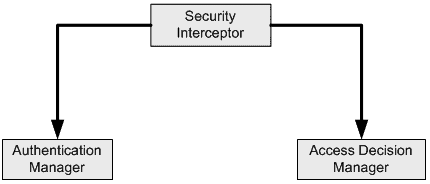

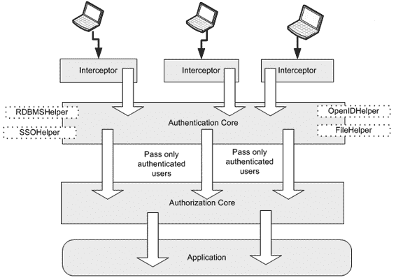

10092ch06.qxd 7/29/08 10:30 AM 第 227 页

第 6 章 **■** 探索横切设计模式

**227**

**图 6-1.** *身份验证与授权执行器高层组件* **Spring Security 的关键组件**

Spring Security 的基本架构与图 6-1 描述的类似。图 6-2 展示了 Spring Security 的高层组件。（该图仅显示了与本讨论相关的组件。）

**图 6-2.** *Spring Security 高层组件*

10092ch06.qxd 7/29/08 10:30 AM 第 228 页

**228**

第 6 章 **■** 探索横切设计模式

Spring Security 框架的不同组件如下：

• *安全拦截器*充当拦截资源请求的网关。它将安全执行职责委托给核心组件。如果某个 Web 资源受到保护，则 Spring Security 拦截器会以 Servlet 过滤器的形式提供。方法调用拦截器则作为切面实现。

• *身份验证管理器*验证用户身份。它是一个具有明确定义的服务提供者接口（SPI）的可插拔组件。因此，几乎可以集成任何身份验证机制。Spring Security 附带了几个具体的身份验证管理器实现，涵盖了大多数常见需求。

• *访问决策管理器*是另一个负责授权的可插拔组件。它允许已通过身份验证的请求基于特定角色访问系统资源。

Spring Security 基于核心 Spring 框架。因此，它拥有 Spring IOC 容器在安全子系统中可用的所有优势。

**使用 Spring Security 进行身份验证与授权**


Spring Security 对 Web 应用程序安全性的支持始于一个 Servlet 过滤器。该过滤器拦截传入的 Web 请求，并将其委托给认证管理器。要安装 Spring Security 网关，你需要在 `web.xml` 中安装特殊的 Servlet 过滤器类 `FilterToBeanProxy`，如清单 6-1 所示。

**清单 6-1.** web.xml *片段*

<filter>

<filter-name>springSecurityFilterGateway</filter-name>

<filter-class>org.springframework.security.util.FilterToBeanProxy

</filter-class>

<init-param>

<param-name>targetClass</param-name>

<param-value>org.springframework.security.util.FilterChainProxy

</param-value>

</init-param>

</filter>

10092ch06.qxd 7/29/08 10:30 AM 第 229 页

第 6 章 **■** 探索横切设计模式

**229**

<filter-mapping>

<filter-name>springSecurityFilterGateway</filter-name>

<url-pattern>/*</url-pattern>

</filter-mapping>

请注意，清单 6-1 中的过滤器使用了初始化参数 `targetClass`。该 Servlet 过滤器将实际处理委托给这个 `FilterChainProxy`。在初始化时，Spring Security 过滤器网关会在 Spring Web 应用程序上下文中查找类型为 `FilterChainProxy` 的 Bean。然后，它将所有处理委托给这个过滤器链代理。你可以配置多个过滤器链代理。在这种情况下，将使用最先找到的那个。

如果未找到过滤器链代理对象，则会引发异常。可以设置 `targetBean` 初始化参数来代替 `targetClass`。这将允许网关过滤器在应用程序上下文中查找具有给定名称的 Bean。但这可能导致难以检测的错误。如果你在 Spring 配置中重命名了这个 Bean，则必须在 `web.xml` 中也进行同样的重命名。清单 6-1 中的过滤器映射配置强制所有 Web 请求都通过此过滤器。

要使 Spring Security 正常工作，必须加载 Spring 应用程序上下文。由于我们的目标始终是将安全关注点与表示层关注点分离，因此 `ContextLoaderListener` 将加载 Spring Security 的应用程序上下文。这将加载父级 Spring Web 应用程序上下文。第 2 章中描述的 Dispatcher Servlet 将加载其自身的应用程序上下文，其中包含表示层的 Bean。此应用程序上下文是 Servlet 上下文监听器加载的上下文的子上下文，如清单 6-2 所示。父级 Web 应用程序上下文将从类路径资源 `applicationContext-security.xml` 中加载。请注意，Spring Web 应用程序上下文绑定到 Servlet 上下文，因此这里不存在性能问题，因为你不会为每个请求重新加载上下文。

**清单 6-2.** web.xml

<?xml version="1.0" encoding="UTF-8"?>

[<web-app version="2.4" xmlns=http://java.sun.com/xml/ns/j2ee](http://java.sun.com/xml/ns/j2ee)

[xmlns:xsi=http://www.w3.org/2001/XMLSchema-instance](http://www.w3.org/2001/XMLSchema-instance)

[xsi:schemaLocation="http://java.sun.com/xml/ns/j2ee](http://java.sun.com/xml/ns/j2ee)

[`java.sun.com/xml/ns/j2ee/web-app_2_4.xsd">`](http://www.w3.org/2001/XMLSchema-instance)

<context-param>

<param-name>contextConfigLocation</param-name>

<param-value>

classpath:/WEB-INF/applicationContext-security.xml

10092ch06.qxd 7/29/08 10:30 AM 第 230 页

**230**

第 6 章 **■** 探索横切设计模式

</param-value>

</context-param>

<filter>

<filter-name>springSecurityFilterChain</filter-name>

<filter-class>org.springframework.security.util.FilterToBeanProxy

</filter-class>

<init-param>

<param-name>targetClass</param-name>

<param-value>org.springframework.security.util.FilterChainProxy

</param-value>

</init-param>

</filter>

<filter-mapping>

<filter-name>springSecurityFilterChain</filter-name>

<url-pattern>/*</url-pattern>

</filter-mapping>

<listener>

<listener-class>org.springframework.web.context.ContextLoaderListener

</listener-class>

</listener>

<servlet>

<servlet-name>insurance</servlet-name>

<servlet-class>


org.springframework.web.servlet.DispatcherServlet

</servlet-class>

<load-on-startup>1</load-on-startup>

</servlet>

<servlet-mapping>

<servlet-name>insurance</servlet-name>

<url-pattern>*.do</url-pattern>

</servlet-mapping>

10092ch06.qxd 7/29/08 10:30 AM 第 231 页

第 6 章 **■** 探索横切设计模式

**231**

<jsp-config>

<taglib>

<taglib-uri>/spring</taglib-uri>

<taglib-location>

/WEB-INF/tld/spring-form.tld

</taglib-location>

</taglib>

</jsp-config>

</web-app>

现在我已经展示了如何设置 Web 应用程序的安全网关并将其注册到 Web 服务器，接下来该关注 Spring 方面的事情了。在 Spring 端，`FilterChainProxy` 从网关过滤器接收安全处理请求。然后，`FilterChainProxy` 可以将此请求传递通过一系列在 Spring 应用程序上下文中配置的过滤器。清单 6-3 展示了这个 `FilterChainProxy` 的配置。`ContextLoaderListener` 使用此配置文件来启动根 Spring 应用程序上下文。

**清单 6-3.** applicationContext-security.xml

<?xml version="1.0" encoding="UTF-8"?>

<!DOCTYPE beans PUBLIC "-//SPRING//DTD BEAN//EN"

["http://www.springframework.org/dtd/spring-beans.dtd">](http://www.springframework.org/dtd/spring-beans.dtd)

<beans>

<bean name="filterChainProxy"

class="org.springframework.security.util.FilterChainProxy">

<property name="filterInvocationDefinitionSource">

<value>

CONVERT_URL_TO_LOWERCASE_BEFORE_COMPARISON

PATTERN_TYPE_APACHE_ANT

/**=httpSessionContextIntegrationFilter,authenticationProcessingFilter, **➥**

anonymousProcessingFilter,exceptionTranslationFilter, **➥**

filterInvocationInterceptor

</value>

</property>

</bean>

</beans>

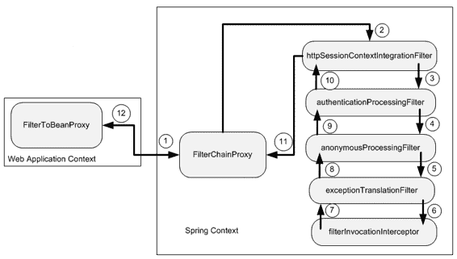

10092ch06.qxd 7/29/08 10:30 AM 第 232 页

**232**

第 6 章 **■** 探索横切设计模式

`filterInvocationDefinitionSource` 是 `FilterChainProxy` 的关键属性。它定义了调用过滤器的规则集。如清单 6-3 所示，它会在任何比较之前将传入的请求 URL 转换为小写。它将使用基于 Apache Ant 的模式匹配将传入请求映射到 Spring Security 过滤器。在此示例中，所有传入请求都将通过五个过滤器。（稍后我将深入探讨 Spring Security 的核心，并解释每个过滤器的功能。）Spring 还提供了其他几个具体的过滤器实现。你可以参考 [Spring Security 文档 http://static.springframework.org/spring-security/site/index.html](http://static.springframework.org/spring-security/site/index.html) 以获取更多详细信息。就本节而言，这五个过滤器已经足够。

当请求到达 `FilterChainProxy` 时，`httpSessionContextIntegrationFilter` 将是第一个被执行的过滤器。顺序很重要，因为一个过滤器可能依赖于前一个或后一个过滤器设置的值。换句话说，以不同的顺序设置过滤器可能会导致不可预测的结果。图 6-3 展示了过滤器链。

**图 6-3.** *Spring Security 中的过滤器链*

**会话上下文集成过滤器 (SCIF)**

这是 Spring Security 中执行的链中五个过滤器中的第一个。SCIF 检查 `HttpSession` 是否已启动，并且其中是否包含安全上下文对象。如果未找到 `SecurityContext` 对象，它会创建该对象的一个新实例。SCIF 将安全上下文对象放入一个名为*安全上下文持有者*的临时占位符中，供链中的其他过滤器访问和更新重要信息，例如

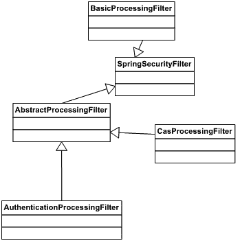

10092ch06.qxd 7/29/08 10:30 AM 第 233 页

第 6 章 **■** 探索横切设计模式

**233**


如用户身份和角色。然后它会调用过滤器链中的下一个过滤器。一旦控制权返回，SCIF 会将安全上下文放回 HTTP 会话中，并清除临时占位符。清单 6-4 展示了 SCIF 的配置。

**清单 6-4.** applicationContext-security.xml

<?xml version="1.0" encoding="UTF-8"?>

<!DOCTYPE beans PUBLIC "-//SPRING//DTD BEAN//EN"

["http://www.springframework.org/dtd/spring-beans.dtd">](http://www.springframework.org/dtd/spring-beans.dtd)

<beans>

<!—其他 bean -->

<bean id="httpSessionContextIntegrationFilter"

class="org.springframework.security.context.HttpSessionContextIntegrationFilter"/>

</beans>

**认证处理过滤器 (APF)**

APF 的主要职责是认证用户的身份。Spring 提供了多个此类过滤器，如图 6-4 中的类图所示。

**图 6-4.** *类图：认证处理过滤器*

10092ch06.qxd 7/29/08 10:30 AM 第 234 页

**234**

第 6 章 **■** 探索横切设计模式

Spring Security 提供了多种认证处理选择。BasicProcessingFilter 支持 HTTP 基本认证，用户信息存储在请求头中。CasProcessingFilter 用于通过 JA-SIG 的中央认证服务 (CAS) 单点登录解决方案进行身份验证。你可以在 [`www.ja-sig.org/products/cas/`](http://www.ja-sig.org/products/cas) 了解更多关于 CAS 的信息。还有其他选项，例如用于 HTTP 摘要认证的 DigestProcessingFilter，而 X509ProcessingFilter 则使用 X.509 证书处理认证。

在本书中，我将重点介绍由 AuthenticationProcessingFilter 支持的更简单的基于 HTTP 表单的认证。这将帮助你轻松掌握关键概念，并将其应用于不同场景。使用 Spring Security，这主要涉及配置。此过滤器的唯一职责是调用底层的认证提供者。它继承自 AbstractProcessingFilter，后者实现了与认证相关的核心工作流。SpringSecurityFilter 实现了 javax.servlet.Filter 接口。它实现了该接口定义的 doFilter 方法，并将实际处理委托给抽象方法 doFilterHttp，所有子类都应实现该方法。

在继续之前，我将介绍登录页面，如清单 6-5 所示。

**清单 6-5.** /WEB-INF/jsp/login.jsp

[<%@ taglib prefix="form" uri="http://www.springframework.org/tags/form" %>](http://www.springframework.org/tags/form)

<html>

<head>

<title>登录</title>

</head>

<body>

**<form action="j_spring_security_check" method="POST">**

<form:errors path="*" cssClass="errorBox" />

<table>

<tr>

<td>用户：</td>

<td> **<input type='text' name='j_username' />**

</td>

</tr>

<tr>

<td>密码：</td>

<td> **<input type='password' name='j_password' />** < **/**td>

</tr>

10092ch06.qxd 7/29/08 10:30 AM 第 235 页

第 6 章 **■** 探索横切设计模式

**235**

<tr><td colspan='2'> **<input name="submit" type="submit" />** </td></tr>

<tr><td colspan='2'><input name="reset" type="reset" /></td></tr>

</table>

</form>

</body>

</html>

此登录表单特定于该应用程序，因此我将对其进行配置，使其与前控制器 servlet 协同工作，如清单 6-6 所示。

**清单 6-6.** insurance-servlet.xml

<?xml version="1.0" encoding="UTF-8"?>

<beans

[xsi:schemaLocation="http://www.springframework.org/schema/beans](http://www.w3.org/2001/XMLSchema-instance)

[`www.springframework.org/schema/beans/spring-beans-2.5.xsd">`](http://www.w3.org/2001/XMLSchema-instance)

<bean id="viewResolver"

class="org.springframework.web.servlet.view.InternalResourceViewResolver">

<property name="viewClass"

value="org.springframework.web.servlet.view.JstlView" />

<property name="prefix" value="/WEB-INF/jsp/" />

<property name="suffix" value=".jsp" />

</bean>

**<bean name="/login.do"**


**class="org.springframework.web.servlet.mvc.UrlFilenameViewController">**

</bean>

<!-- 其他 bean 将在后续展示 -->

</beans>

如清单 6-5 所示，这是一个简单的登录表单。如果你填写两个文本字段并提交此表单，将产生以下 URL：[`localhost/eInsureWeb/`](http://localhost/eInsureWeb)

j_spring_security_check?j_username=value1&j_password=value2。

10092ch06.qxd 7/29/08 10:30 AM 第 236 页

**236**

第 6 章 **■** 探索横切设计模式

该请求将被 Spring Security 过滤器拦截，并委托给 Spring 管理的过滤器链。一旦 SCIF 完成请求的预处理，就轮到 APF 对其进行处理。APF 配置在根应用上下文中，如清单 6-7 所示。

**清单 6-7.** applicationContext-security.xml

<?xml version="1.0" encoding="UTF-8"?>

<!DOCTYPE beans PUBLIC "-//SPRING//DTD BEAN//EN"

["http://www.springframework.org/dtd/spring-beans.dtd">](http://www.springframework.org/dtd/spring-beans.dtd)

<beans>

<!—其他 bean -->

<bean id="authenticationProcessingFilter" class="org.springframework.security.ui. **➥**

webapp.AuthenticationProcessingFilter">

<property name="authenticationManager" ref="authenticationManager"/>

<property name="authenticationFailureUrl" value="/login.do?errorId=1"/>

<property name="defaultTargetUrl" value="/secure/app/createPolicy.do"/>

<property name="filterProcessesUrl" value="/j_spring_security_check"/>

</bean>

</beans>

APF 需要做出的第一个决定是，传入的请求是否需要身份验证。为此，它依赖于属性 filterProcessesUrl。APF 将使用 HttpServletRequest.getRequestURI 方法提取 URI。在本例中，该方法返回 /eInsureWeb/j_spring_security_check。然后将此返回值与上下文根和 filterProcessUrl 的组合进行比较，以确定是否需要对这个 URL 进行身份验证处理。你可能希望自定义清单 6-5 中两个文本字段的名称。我使用了默认值。要使用自定义值，你需要配置身份验证处理过滤器的 passwordParameter 和 usernameParameter 属性。

现在，在当前场景下，APF 确定传入的请求确实需要身份验证。因此，它将尝试执行实际的身份验证。为此，它将使用 authenticationManager 属性。身份验证管理器是可插拔的辅助组件，负责执行实际的身份验证；它们实现了 AuthenticationManager 接口。该接口定义了一个名为 authenticate 的单一方法。该方法接受一个包含用户主体和凭证的 Authentication 对象。

10092ch06.qxd 7/29/08 10:30 AM 第 237 页

第 6 章 **■** 探索横切设计模式

**237**

身份验证成功后，该方法返回包含用户角色列表的 Authentication 对象。这在后续的授权过程中将需要用到。

通过身份验证的用户会被重定向到属性 defaultTargetUrl 指定的 URL。在本例中，用户被引导至承保新保单的网页。如果身份验证失败，则会引发 AuthenticationException。在这种情况下，用户会被重定向到属性 authenticationFailureUrl 中设置的 URL。

在此示例中，用户被重定向到登录页面。authenticationFailureUrl 中指定的 errorId 会标记清单 6-5 中的 login.jsp 文件，以显示因身份验证失败而产生的错误消息。

Spring Security 通过 ProviderManager 类提供了一种自定义的身份验证管理器实现。该类又进一步委托给身份验证提供者。身份验证提供者是底层身份验证技术的适配器。通过这种策略，可以针对任何身份管理系统进行身份验证。


ProviderManager 类可配置为与多个认证提供者协同工作。它会遍历认证提供者列表，直到用户被其中一个提供者认证成功，或提供者集合耗尽为止。清单 6-8 展示了提供者管理器的配置。

**清单 6-8.** applicationContext-security.xml

<?xml version="1.0" encoding="UTF-8"?>

<!DOCTYPE beans PUBLIC "-//SPRING//DTD BEAN//EN"

["http://www.springframework.org/dtd/spring-beans.dtd">](http://www.springframework.org/dtd/spring-beans.dtd)

<beans>

<!—其他 bean -->

<bean id="authenticationManager"

class="org.springframework.security.providers.ProviderManager">

<property name="providers">

<list>

<ref local="daoAuthenticationProvider"/>

</list>

</property>

</bean>

</beans>

请注意，在清单 6-8 中，提供者管理器仅与一个认证提供者协同工作。Spring 提供了多个开箱即用的提供者，如图 6-5 所示。

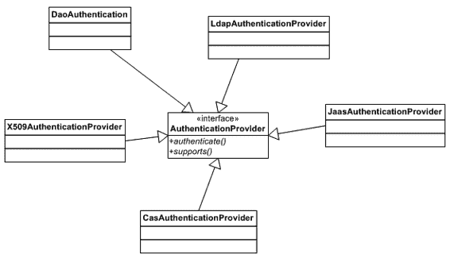

10092ch06.qxd 7/29/08 10:30 AM Page 238

**238**

第 6 章 **■** 探索横切设计模式

**图 6-5.** *类图：认证提供者*

这些提供者实现了 AuthenticationProvider 接口。该接口定义了两个方法。authenticate 方法用于触发实际的认证过程。认证管理器调用此方法，并传递一个指向 Authentication 对象的引用。supports 方法检查该认证提供者是否能处理给定的 Authentication 对象。如图 6-5 所示，Spring 提供了多个具体实现，以满足大多数安全需求。清单 6-9 展示了当前示例的认证提供者。

**清单 6-9.** applicationContext-security.xml

<?xml version="1.0" encoding="UTF-8"?>

<!DOCTYPE beans PUBLIC "-//SPRING//DTD BEAN//EN"

["http://www.springframework.org/dtd/spring-beans.dtd">](http://www.springframework.org/dtd/spring-beans.dtd)

<beans>

<!—其他 bean -->

<bean id="authenticationManager"

class="org.springframework.security.providers.ProviderManager">

<property name="providers">

<list>

<ref local="daoAuthenticationProvider"/>

</list>


10092ch06.qxd 7/29/08 10:30 AM Page 239

第 6 章 **■** 探索横切设计模式

**239**

</property>

</bean>

<bean name="daoAuthenticationProvider"

class="org.springframework.security.providers.dao.DaoAuthenticationProvider">

<property name="userDetailsService" ref="userDetailsService"/>

</bean>

</beans>

在此例中，我将使用一个基于数据访问对象的认证提供者：DaoAuthenticationProvider。该提供者假设用户的身份信息存储在关系型数据库中。为了检索这些信息，它使用了一个数据访问对象。该 DAO 通过 userDetailsService 属性进行配置。

从数据库中获取的主体和凭证组合，会与提供者管理器在 Authentication 对象中传递的组合进行匹配。如果匹配成功，一个包含用户角色列表的 Authentication 对象将被传递给提供者管理器。如果匹配失败，则会抛出一个 AuthenticationException，表示身份验证失败。

DaoAuthenticationProvider 使用的 DAO 应实现 UserDetailsService 接口。这同样是一个单方法接口，定义了 loadUserByUsername 方法。Spring Security 提供了该接口的两个现成实现，如图 6-6 所示。

**图 6-6.** *类图：用户详情服务*

InMemoryDaoImpl 适用于快速原型开发和测试。在实际应用中，你需要使用 JdbcDaoImpl 或提供自定义实现。UserDetailsService 也需要在 Spring 应用上下文中进行装配，如清单 6-10 所示。

10092ch06.qxd 7/29/08 10:30 AM Page 240

**240**

第 6 章 **■** 探索横切设计模式

**清单 6-10.** applicationContext-security.xml


<?xml version="1.0" encoding="UTF-8"?>

<!DOCTYPE beans PUBLIC "-//SPRING//DTD BEAN//EN"

["http://www.springframework.org/dtd/spring-beans.dtd">](http://www.springframework.org/dtd/spring-beans.dtd)

<beans>

<!—其他 bean -->

<bean id="authenticationManager"

class="org.springframework.security.providers.ProviderManager">

<property name="providers">

<list>

<ref local="daoAuthenticationProvider"/>

</list>

</property>

</bean>

<bean name="daoAuthenticationProvider" class="org.springframework. **➥**

security.providers.dao.DaoAuthenticationProvider">

<property name="userDetailsService" ref="authenticationDao "/>

</bean>

<bean name="authenticationDao"

class="org.springframework.security.userdetails.jdbc.JdbcDaoImpl">

<property name="dataSource" ref="dataSource"/>

</bean>

<bean id="datasource" class="org.springframework.jndi.JndiObjectFactoryBean">

<property name="jndiName" value="einsureDatasource" />

<property name="jndiEnvironment">

<props>

<prop key="java.naming.factory.initial">

org.jnp.interfaces.NamingContextFactory

</prop>

<prop key="java.naming.provider.url">

jnp://localhost:1099

</prop>

<prop key="java.naming.factory.url.pkgs">


10092ch06.qxd 7/29/08 10:30 AM Page 241

第 6 章 **■** 探索横切设计模式

**241**

org.jboss.naming.client

</prop>

</props>

</property>

</bean>

</beans>

如清单 6-10 所示，`JdbcDaoImpl` 需要一个 `DataSource` 引用来执行其查询。`JdbcDaoImpl` 假设你已在数据库中设置了如图 6-7 所示的两个表。

**图 6-7.** *Spring Security：数据库表*

要从这些表中检索数据，`JdbcDaoImpl` 使用清单 6-11 中所示的默认 SQL 语句。

**清单 6-11.** applicationContext-security.xml

<?xml version="1.0" encoding="UTF-8"?>

<!DOCTYPE beans PUBLIC "-//SPRING//DTD BEAN//EN"

["http://www.springframework.org/dtd/spring-beans.dtd">](http://www.springframework.org/dtd/spring-beans.dtd)

<beans>

<!—其他 bean -->

<bean name="daoAuthenticationProvider" class="org.springframework. **➥**

security.providers.dao.DaoAuthenticationProvider">

<property name="userDetailsService" ref="authenticationDao "/>

</bean>

10092ch06.qxd 7/29/08 10:30 AM Page 242

**242**

第 6 章 **■** 探索横切设计模式

<bean id="authenticationDao"

class="org.springframework.security.userdetails.jdbc.JdbcDaoImpl">

<property name="dataSource" ref="dataSource"/>

<property name="userByUserNameQuery" >

<value>

SELECT username, password, enabled

FROM users

WHERE username=?

</value>

</property>

<property name="authoritiesByUserNameQuery" >

<value>

SELECT username, authority

FROM authorities

WHERE username=?

</value>

</property>

</bean>

</beans>

如果你的表和列名不同，可以通过覆盖 `userByUserNameQuery` 和 `authoritiesByUserNameQuery` 属性来提供自定义查询。

你需要为那些名称与默认表不同的列使用正确的别名，因为 Spring 会使用默认列名从结果集中检索数据。

eInsure 使用了电子邮件地址代替用户名，并使用角色代替权限。清单 6-12 展示了带有别名的自定义查询配置。

**清单 6-12.** applicationContext-security.xml

<?xml version="1.0" encoding="UTF-8"?>

<!DOCTYPE beans PUBLIC "-//SPRING//DTD BEAN//EN"

["http://www.springframework.org/dtd/spring-beans.dtd">](http://www.springframework.org/dtd/spring-beans.dtd)

<beans>

10092ch06.qxd 7/29/08 10:30 AM Page 243

第 6 章 **■** 探索横切设计模式

**243**

<!—其他 bean -->

<bean name="daoAuthenticationProvider" class="org.springframework. **➥**

security.providers.dao.DaoAuthenticationProvider">

<property name="userDetailsService" ref="authenticationDao "/>

</bean>

<bean id="authenticationDao"

class="org.springframework.security.userdetails.jdbc.JdbcDaoImpl">

<property name="dataSource" ref="dataSource"/>

<property name="userByUserNameQuery" >


<value>

SELECT email as username, password, enabled

FROM t_users

WHERE email=?

</value>

</property>

<property name="authoritiesByUserNameQuery" >

<value>

SELECT email as username, role as authority

FROM t_user_role

WHERE email=?

</value>

</property>

</bean>

</beans>

因此，借助 Spring Security，只需几行配置即可搭建你的身份验证组件。一旦用户成功通过身份验证，请求就会被转发到 `defaultTargetURL` 指定的 URL，在本例中为 `/secure/app/createPolicy.do`。

**匿名处理过滤器 (ANPF)**

这是过滤器链中的第三个过滤器。其唯一目的是在安全上下文中设置一个匿名的 `Authentication` 对象。这将允许你浏览某些不安全的 URL，这些 URL 无需验证用户身份即可查看。ANPF 可以像清单 6-13 所示那样进行配置。

**清单 6-13.** applicationContext-security.xml

<?xml version="1.0" encoding="UTF-8"?>

<!DOCTYPE beans PUBLIC "-//SPRING//DTD BEAN//EN"

["http://www.springframework.org/dtd/spring-beans.dtd">](http://www.springframework.org/dtd/spring-beans.dtd)

<beans>

<!—其他 bean -->

<bean id="anonymousProcessingFilter" class="org.springframework**➥**

.security.providers.anonymous.AnonymousProcessingFilter">

<property name="key" value="changeThis"/>

<property name="userAttribute" value="anonymousUser,ROLE_ANONYMOUS"/>

</bean>

</beans>

**异常转换过滤器 (ETF)**

ETF 处理在身份验证或授权期间引发的任何异常。它在应用程序上下文中的配置如清单 6-14 所示。

**清单 6-14.** applicationContext-security.xml

<?xml version="1.0" encoding="UTF-8"?>

<!DOCTYPE beans PUBLIC "-//SPRING//DTD BEAN//EN"

["http://www.springframework.org/dtd/spring-beans.dtd">](http://www.springframework.org/dtd/spring-beans.dtd)

<beans>

<!—其他 bean -->

<bean id="exceptionTranslationFilter"

class="org.springframework.security.ui.ExceptionTranslationFilter">

<property name="authenticationEntryPoint" ref="authenticationEntryPoint" />

<property name="accessDeniedHandler" ref="accessDeniedHandler" />

</bean>

<bean name ="authenticationEntryPoint" class="org.springframework. **➥**

security.ui.webapp.AuthenticationProcessingFilterEntryPoint">

<property name="loginFormUrl" value="/login.do"/>

<property name="forceHttps" value="false"/>

</bean>

<bean name="accessDeniedHandler" class="org.springframework**➥**

.security.ui.AccessDeniedHandlerImpl">

<property name="errorPage" value="/denied.do"/>

</bean>

</beans>

这个过滤器的任务很简单。在发生身份验证异常的情况下，ETF 使用 `authenticationEntryPoint` 属性将用户重定向到登录页面。如果发生授权失败，用户将被重定向到访问被拒绝页面。

**过滤器安全拦截器 (FSI)**

这是 Spring Security 中与身份验证处理过滤器并列的另一个关键过滤器。FSI 的主要职责是协助授权。如果未通过身份验证的用户试图访问受保护的资源，FSI 应阻止该用户，并强制其进入访问被拒绝页面或登录页面。即使是已通过身份验证的用户，也可能只能访问资源的一个子集。FSI 确保有效用户只能访问其角色所允许的资源。它还允许用户匿名访问某些页面。例如，登录页面应对所有用户开放。FSI 在 Spring 应用程序上下文中的配置如清单 6-15 所示。

**清单 6-15.** applicationContext-security.xml

<?xml version="1.0" encoding="UTF-8"?>

<!DOCTYPE beans PUBLIC "-//SPRING//DTD BEAN//EN"

["http://www.springframework.org/dtd/spring-beans.dtd">](http://www.springframework.org/dtd/spring-beans.dtd)

<beans>

<!—其他 bean -->

<bean id="filterInvocationInterceptor"

class="org.springframework. **➥**

security.intercept.web.FilterSecurityInterceptor">

<property name="authenticationManager" ref="authenticationManager"/>

<property name="accessDecisionManager" name="accessDecisionManager" />

<property name="objectDefinitionSource">

<value>

CONVERT_URL_TO_LOWERCASE_BEFORE_COMPARISON

PATTERN_TYPE_APACHE_ANT

/secure/admin/**=ROLE_ADMIN

/secure/**=IS_AUTHENTICATED_REMEMBERED

/**=IS_AUTHENTICATED_ANONYMOUSLY

</value>

</property>

</bean>

</beans>

关于 FSI，我首先要关注的属性是 `objectDefinitionSource`。在 Spring Security 中，受保护的资源被称为*对象定义*。这个名称是通用的，因为 Spring Security 除了可以应用于 Web 应用程序外，还可以应用于方法调用和对象创建。`objectDefinitionSource` 由指令和 URL 模式到角色的映射组成。这些指令与清单 6-3 中用于过滤器链代理的指令相同。

拥有 `ROLE_ADMIN` 角色的用户可以访问所有以 `/secure/admin` 开头的 URL。只有经过身份验证的用户才允许进入所有以 `/secure` 开头的 URL。所有其他 URL 可以匿名访问，或者如果用户已经过身份验证也可以访问。请注意，URL 映射将按照它们定义的顺序进行处理。此外，你可以自由地为你的应用程序定义任何你想要的角色。

`authenticationManager` 属性使用了与 APF 相同的 Spring bean。它可以用于重新验证请求。这可能会影响应用程序性能，因此你需要谨慎设置，并且可以通过将 FSI 的 `alwaysReauthenticate` 属性设置为 `false` 来控制这一点。`accessDecisionManager` 属性的工作方式类似于身份验证管理器，负责做出实际的授权决策。访问决策管理器的连接方式如清单 6-16 所示。

**清单 6-16.** applicationContext-security.xml

<?xml version="1.0" encoding="UTF-8"?>

<!DOCTYPE beans PUBLIC "-//SPRING//DTD BEAN//EN"

["http://www.springframework.org/dtd/spring-beans.dtd">](http://www.springframework.org/dtd/spring-beans.dtd)

<beans>

<!—其他 bean -->

<bean name="accessDecisionManager"

class="org.springframework.security.vote.AffirmativeBased">

<property name="decisionVoters">

<list>

<bean class="org.springframework.security.vote.RoleVoter"/>

<bean class="org.springframework.security.vote.AuthenticatedVoter"/>

</list>

</property>

</bean>

</beans>

访问决策管理器实现了 `AccessDecisionManager` 接口。在这个例子中，我使用的是 `AffirmativeBased` 访问决策管理器。这个访问决策管理器由一个投票者列表控制。这类似于选举中的投票。这些投票者决定用户是否能够实际访问某个特定的受保护资源。访问决策管理器将向每个投票者征求投票。可能的值为 `ACCESS_DENIED`、`ACCESS_GRANTED` 和 `ACCESS_ABSTAIN`（当投票者不确定时）。投票完成后，`AffirmativeBased` 访问决策管理器执行一个简单的算法来得出结果。如果任何投票者投了 `ACCESS_GRANTED`，则授予用户访问权限。


访问决策管理器为每个投票者提供`Authentication`对象和`objectDefinitionSource`，以便他们做出决策。`RoleVoter`会扫描 URL 模式与角色映射的列表。对于匹配的 URL，它将检查角色。如果找到以`ROLE`前缀开头的角色，它就会投票。你可以通过设置`rolePrefix`属性来更改此值。如果找到匹配的角色，则投`ACCESS_GRANTED`；否则，投`ACCESS_DENIED`。`AuthenticatedVoter`会在任何匹配的 URL 到角色映射中找到预定义角色时进行投票。其中一个预定义值是`IS_AUTHENTICATED_ANONYMOUSLY`。它将探查`Authentication`对象，以确定用户是否已匿名认证。如果发现为肯定结果，则投`ACCESS_GRANTED`。

**影响**

优势

• 仅通过配置即可启用和修改 Spring Security。

• 只有拥有有效身份的用户才被允许访问系统。

10092ch06.qxd 7/29/08 10:30 AM 第 248 页

**248**

第 6 章 **■** 探索横切设计模式

• Spring Security 不会侵入应用程序代码。事实上，即使应用程序代码对此一无所知，也可以应用它。

• 经过身份验证的用户只能根据其角色访问应用程序资源的子集。

关注点

• 你需要了解大量的类、接口，尤其是配置项。这增加了开发和维护的开销。

**审计拦截器**

**问题**

在大多数企业应用程序中，审计业务层方法调用是一个常见需求。这涉及跟踪输入参数以及返回值。

审计跟踪信息日后可用于分析任何安全漏洞。由于这些数据可能用于将来参考，因此会存储在永久性存储中，例如文件系统或数据库。审计跟踪功能应用于业务层，因为它是业务逻辑的门户，并且可以被各种客户端访问。

由于 eInsure 处理敏感的财务数据，它也实现了审计跟踪功能。该功能用于 SLSB 中。审计跟踪 API 将方法参数和返回结果保存到数据库中。这同样缺乏灵活性，并将业务逻辑与安全问题混为一谈。这种耦合导致 eInsure 在尝试满足客户特定的审计跟踪需求时频繁更改代码。eInsure 应用程序中的 SLSB 内部调用了多个其他会话 Bean 方法，每个方法也都使用了审计跟踪 API。由于审计数据保存在数据库中，这增加了事务开销并降低了响应时间。

eInsure 的审计跟踪 API 几乎不可配置。因此，很难根据需要随时开启/关闭审计跟踪。它也不允许灵活地过滤被记录的内容。例如，在某些情况下，你可能只对记录作为参数传递给方法的值感兴趣，而对方法返回的值不感兴趣。此外，你可能不想记录返回对象中的所有值。eInsure 的审计跟踪还要求传入和传出的对象必须实现`toString`方法。虽然这是一个好习惯，但它常常会使代码充斥着冗长的`StringBuffer.append`调用或使用字符串拼接的代码行。

10092ch06.qxd 7/29/08 10:30 AM 第 249 页

第 6 章 **■** 探索横切设计模式

**249**

**驱动力**

• 透明地将审计跟踪应用于业务服务。

• 审计跟踪必须是可配置的。

• 允许对来自服务的请求、响应和引发的异常进行审计跟踪。

**解决方案**

实现一个集中的*审计拦截器*，可以声明式地用于对业务服务调用进行审计。

Spring 框架的策略


你可以借助 Spring AOP 支持轻松开发一个审计拦截器。通过 AOP，你可以将审计追踪组件构建为独立的可复用组件，然后通过配置透明地应用它。由于审计拦截器需要支持方法的前置处理、后置处理以及异常处理，构建拦截器的第一步是开发一个*通知（advice）*。通知代表一段可复用的代码，可以透明地应用到实际的应用代码上。由于 SLSB 是容器管理的组件，我将把拦截器应用于应用服务 POJO 上。

清单 6-17 展示了审计拦截器的通知。

**清单 6-17.** AuditAdviseInterceptor.java

public class AuditAdviseInterceptor implements MethodInterceptor {

private AuditRules rules;

private boolean auditOn = true;

private AuditLog auditLog;

public Object invoke(MethodInvocation invocation) throws Throwable {

Object returnVal = null;

String eventCode = "";

Object arguments[] = null;

try {

returnVal = invocation.proceed();

} catch (Exception exp) {

10092ch06.qxd 7/29/08 10:30 AM 第 250 页

**250**

第 6 章 **■** 探索横切设计模式

//处理异常

throw e;

} finally {

//后置处理

if (this.auditOn) {

eventCode = getEventCode();

arguments = invocation.getArguments();

AuditRule rule = rules.getRule(eventCode);

if(rule!=null && rule.isApplyRule()){

String thisMethod = invocation.getMethod().getName();

if(thisMethod.equals(rule.getRuleDefinition())){

AuditEvent ae = new AuditEvent(eventCode,arguments,

results,exp);

auditLog.log(ae);

}

}

}

}

}

return returnVal;

}

private String getEventCode() {

String eventCode = "";

StackTraceElement[] stack = Thread.currentThread().getStackTrace(); eventCode = stack[7].getMethodName();

return eventCode;

}

public AuditRules getRules() {

return rules;

}

public void setRules(AuditRules rules) {

this.rules = rules;

}

public boolean isAuditOn() {

return auditOn;

}

10092ch06.qxd 7/29/08 10:30 AM 第 251 页

第 6 章 **■** 探索横切设计模式

**251**

public void setAuditOn(boolean auditOn) {

this.auditOn = auditOn;

}

}

这个类中发生了很多事情。该类实现了 Spring AOP 的 MethodInterceptor 类，以提供环绕通知。关键在于 invoke 方法。该方法在你想要审计的目标业务方法调用前后被调用。审计追踪操作发生在 finally 块中。属性 auditOn 可用于全局停止审计追踪。

如果审计追踪标志设置为 true，则 invoke 方法会确定一个事件码。这里，为简单起见，我假设粗粒度的会话外观方法名作为事件码。该事件码应唯一，并用于从审计规则列表中查找审计规则。如果为该事件码找到了审计规则且该规则未被禁用，则会检查规则定义，看它是否适用于当前的应用服务方法。最后，审计事件中的数据由审计日志记录器追踪。清单 6-18 展示了如何在 Spring 配置中装配这个类。

**清单 6-18.** audit-config.xml

<?xml version="1.0" encoding="UTF-8"?>

<beans

[xsi:schemaLocation="http://www.springframework.org/schema/beans](http://www.w3.org/2001/XMLSchema-instance)

[`www.springframework.org/schema/beans/spring-beans-2.5.xsd">`](http://www.w3.org/2001/XMLSchema-instance)

<!--通知 -->

<bean name="auditAdvice"

class="com.apress.einsure.security.audit.AuditAdviseInterceptor">

<property name="rules" >

<bean class="com.apress.einsure.security.audit.AuditRules" >

<property name="ruleMap" >

<map>

<entry>

<key><value>underwriteNewPolicy</value></key>

<bean

class="com.apress.einsure.security.audit.AuditRule" >

<property name="ruleDefinition" value="com.apress**➥**

.einsure.business.impl.UnderwritingApplicationService.underwriteNewPolicy" />

<property name="applyRule" value="true"></property>

10092ch06.qxd 7/29/08 10:30 AM 第 252 页

**252**


第 6 章 **■** 探索横切设计模式

</bean>

</entry>

</map>

</property>

</bean>

</property>

</bean>

<!—其他 bean -->

</beans>

`rules` 属性用于外部化适用于特定审计事件的规则。`AuditRules` 类充当审计规则的容器，如清单 6-19 所示。

**清单 6-19.** AuditRules.java

public class AuditRules{

public Map ruleMap;

public AuditRule getRule(String key){

return (AuditRule)ruleMap.get(key);

}

public Map getRuleMap() {

return ruleMap;

}

public void setRuleMap(Map ruleMap) {

this.ruleMap = ruleMap;

}

}

每条规则都是 `AuditRule` 类的一个实例。在当前示例中，我使用了一个非常简单的规则。我只是检查当前被拦截的方法是否在规则定义中。此外，还有一个细粒度的控制来关闭此规则。你可以通过设置 `applyRule` 属性来实现这一点。清单 6-20 展示了 `AuditRule` 类。

10092ch06.qxd 7/29/08 10:30 AM 第 253 页

第 6 章 **■** 探索横切设计模式

**253**

**清单 6-20.** AuditRule.java

public class AuditRule {

private String ruleDefinition;

private boolean applyRule = true;

public boolean isApplyRule() {

return applyRule;

}

public void setApplyRule(boolean applyRule) {

this.applyRule = applyRule;

}

public String getRuleDefinition() {

return ruleDefinition;

}

public void setRuleDefinition(String ruleDefinition) {

this.ruleDefinition = ruleDefinition;

}

}

`AuditEvent` 类是一个简单的 bean，用于存储需要作为审计跟踪一部分进行记录的数据。它如清单 6-21 所示。`ToStringBuilder` 类是 Jakarta Commons-lang 项目的一部分，可用于简化 `toString` 方法。

**清单 6-21.** AuditEvent.java

public class AuditEvent {

private String eventCode;

private String fullMethodName;

private Object arguments[];

private Object result;

public String toString(){

return ToStringBuilder.reflectionToString(this);

}

}

10092ch06.qxd 7/29/08 10:30 AM 第 254 页

**254**

第 6 章 **■** 探索横切设计模式

现在你已经收集了审计数据，需要将其记录下来。你可以采用多种策略来存储这些数据。它可以存储在数据库、文件系统、Microsoft Windows 事件日志或 Unix syslog 中。因此，这个组件需要是可插拔的。为此，我将遵循面向接口编程的简单原则。`AuditLog` 接口仅定义了一个接受 `AuditEvent` 对象的 `log` 方法。你可以实现此接口以提供自定义实现。我使用了一个基于 Apache Commons Logger 的实现将消息记录到控制台，如清单 6-22 所示。

**清单 6-22.** CommonsLoggingAuditLogImplt.java

public class CommonsLoggingAuditLogImpl implements AuditLog{

private final Log _LOG = LogFactory.getLog(getClass());

public void log(AuditEvent event) {

_LOG.info(event);

}

}

此日志记录器的一个实例被注入到审计通知中，如清单 6-23 所示。

**清单 6-23.** audit-config.xml

<?xml version="1.0" encoding="UTF-8"?>

<beans

[xsi:schemaLocation="http://www.springframework.org/schema/beans](http://www.w3.org/2001/XMLSchema-instance)

[`www.springframework.org/schema/beans/spring-beans-2.5.xsd">`](http://www.w3.org/2001/XMLSchema-instance)

<!--通知 -->

<bean name="auditAdvice"

class="com.apress.einsure.security.audit.AuditAdviseInterceptor">

<property name="auditLog" ref="auditLogger" />

<!- - 其他属性

-->

</bean>

<bean name="auditLogger" class="com.apress.einsure.security.audit.AuditRule" />

<!—其他 bean -->

</beans>

10092ch06.qxd 7/29/08 10:30 AM 第 255 页

第 6 章 **■** 探索横切设计模式

**255**

要应用此审计通知，你需要一个*切入点*。在 AOP 中，切入点决定了在何处应用此通知。你可以将通知和切入点组合成一个顾问。清单 6-24 展示了此示例的顾问。

**清单 6-24.** audit-config.xml


<?xml version="1.0" encoding="UTF-8"?>

<beans

[xsi:schemaLocation="http://www.springframework.org/schema/beans](http://www.w3.org/2001/XMLSchema-instance)

[`www.springframework.org/schema/beans/spring-beans-2.5.xsd">`](http://www.w3.org/2001/XMLSchema-instance)

<!--顾问 -->

<bean id="auditAdvisor"

class="org.springframework.aop.aspectj.AspectJExpressionPointcutAdvisor">

<property name="advice" ref="auditAdvice" />

<property name="expression" value="execution(* *.underwrite*(..))" />

</bean>

<!—其他 bean -->

</beans>

如清单 6-24 所示，审计通知适用于任何以 `underwrite` 开头的方法。最后，你需要为与顾问的 `expression` 属性匹配的 bean 创建代理。清单 6-25 展示了自动代理创建器 bean。

**清单 6-25.** audit-config.xml

<?xml version="1.0" encoding="UTF-8"?>

<beans

[xsi:schemaLocation="http://www.springframework.org/schema/beans](http://www.w3.org/2001/XMLSchema-instance)

[`www.springframework.org/schema/beans/spring-beans-2.5.xsd">`](http://www.w3.org/2001/XMLSchema-instance)

<!--顾问 -->

<bean id="auditAdvisor"

class="org.springframework.aop.aspectj.AspectJExpressionPointcutAdvisor">

<property name="advice" ref="auditAdvice" />

<property name="expression" value="execution(* *.underwrite*(..))" />

</bean>

10092ch06.qxd 7/29/08 10:30 AM 第 256 页

**256**

第 6 章 **■** 探索横切设计模式

<bean class="org.springframework.aop.framework.autoproxy**➥**

.DefaultAdvisorAutoProxyCreator" />

<!—其他 bean -->

</beans>

请注意，此 bean 不需要名称或 ID 属性，因为它将由 Spring AOP 模块内部使用。它会检查 bean 中与顾问匹配的方法名称，并创建适当的代理来拦截对该方法的调用。

**结论**

**优点**

• 借助 Spring AOP 支持，审计追踪可以声明式地应用于 POJO 应用服务组件。

• 它支持多种记录审计追踪的选项。

• 基于 Spring AOP 的审计追踪对应用代码没有影响。

**关注点**

• 需要预先了解 AOP 知识，这对初级开发人员来说较为困难。

• Spring AOP 大量使用代理和字节码生成，这会增加性能开销。

**领域服务所有者事务**

**问题**

事务管理是任何企业应用的关键关注点。维护企业数据的一致性至关重要。事务管理是一个复杂的系统问题，因为它涉及与各种企业信息系统的交互。在 Java EE 服务器中，应用程序可以利用 EJB 容器对分布式事务的强大支持。所有不同类型的 EJB——会话 Bean、实体 Bean、

10092ch06.qxd 7/29/08 10:30 AM 第 257 页

第 6 章 **■** 探索横切设计模式

**257**

以及消息驱动 Bean——都可以声明式地参与事务。这常常使应用设计者在制定事务管理策略时陷入两难境地。考虑以下情况：你的会话 Bean 访问多个实体 Bean，或者消息驱动 Bean 在会话 Bean 上调用远程方法。即使有声明式 Java EE 事务支持，也难以做出关键决策，例如在哪里启动事务、如何传播事务以及在哪里结束事务。

有时，Java EE 应用程序需要支持非基于 Web 的客户端，例如基于 Java Swing 的桌面软件。这些客户端通常采用客户端管理的事务。这通常通过 JTA 以编程方式实现。然而，这削弱了 Swing 客户端仅作为视图层的核心目标，同时导致对服务器端业务逻辑的多次细粒度调用，从而引发网络流量激增。


这也大大降低了基于服务器的分布式计算的优势。使用客户端层编程式事务来开发、测试和维护应用程序是复杂的任务。

在第四章中，我提到 eInsure 的一个客户希望我们将整个应用程序部署在 Apache Tomcat 上，这是一个 Web 服务器和 Servlet 容器。Tomcat 没有 EJB 容器。因此，EJB 在 Tomcat 中无法工作，也没有事务管理支持。一个直接的选择是使用基于 JDBC 的事务支持。但这会很繁琐，并且需要编写和重构大量代码。另一个解决方案是使用开源事务监控器，例如 ObjectWeb JOTM 或 Atomikos Essentials。但使用它们会带来与客户端管理事务相同的问题。

**影响因素**

•   尽可能避免客户端管理的事务。

•   支持声明式事务管理，使其能够透明地应用。

•   声明式事务管理也应在 EJB 容器之外工作。

**解决方案**

部署一个*领域服务所有者事务*，以在 EJB 容器内外声明式地应用事务。

10092ch06.qxd 7/29/08 10:30 AM 第 258 页

**258**

第 6 章 **■** 探索横切设计模式

使用 Spring 框架的策略

在 Java EE 应用程序中，SLSB 为远程客户端实现领域服务。SLSB 是最有用的 EJB 组件，可广泛用于远程调用和事务支持。然而，如第四章所示，编写和维护 EJB 很繁琐，因为它涉及大量的类和元数据。此外，如果你的应用程序需要在 EJB 容器之外或 Web 容器中运行，它们的重要性就不大了。而且，会话外观只拦截远程业务逻辑请求，因此严格来说，应用程序服务实际上实现了领域服务。

使用 Spring 框架，即使对 POJO 应用程序服务组件，也可以提供声明式事务支持。这使得应用程序具有高度的可移植性。你现在只需更改少量配置，就可以将此应用程序部署在 Web 容器中。这个带有 POJO 领域服务的应用程序，也可以继续在 EJB 容器中运行，并订阅容器管理的事务。因此，使用 Spring 框架，你不需要 EJB 来支持事务。

Spring 框架既不实现任何事务监控器，也不尝试直接管理事务。相反，它通过一个名为*平台事务管理器*的抽象层，将事务委托给底层的事务实现。对于大多数广泛使用的平台——JDBC、对象关系映射（如 Hibernate 和 TopLink）、JTA、JCA 以及所有主流应用服务器——都有相应的事务管理器实现。在接下来的几节中，我将回顾一些常用的事务管理器。

**纯 JDBC 事务**

如果应用程序中直接使用 JDBC 或 Spring DAO，则 DataSourceTransactionManager 处理所有事务需求。它可以在 Spring 应用程序上下文中配置，如清单 6-26 所示。

**清单 6-26.** transaction-config.xml

<beans>

<bean id="datasourceTransactionManager" class="org.springframework. **➥**

jdbc.datasource.DataSourceTransactionManager">

<property name="dataSource" ref="dataSource"/>

</bean>

<beans>

10092ch06.qxd 7/29/08 10:30 AM 第 259 页

第 6 章 **■** 探索横切设计模式

**259**

DataSourceTransactionManager 与 javax.sql.DataSource 对象一起工作。它确保从 DataSource 中检索到相同的 Connection 对象并在事务中使用。如果事务成功，则在 Connection 对象上调用 commit 方法。如果事务失败，则将使用 rollback 方法。简而言之，此事务管理器将实际的事务处理委托给数据库。

**Hibernate 事务**

如果你的应用程序使用 Hibernate ORM 来管理持久化，则可以使用 HibernateTransactionManager 来管理事务。此事务管理器与 Hibernate SessionFactory 对象一起工作。它将事务处理委托给从 Hibernate Session 对象检索到的 org.hibernate.Transaction 对象。根据事务成功或失败，将分别在此 Transaction 对象上调用 commit 和 rollback 方法。HibernateTransactionManager 在 Spring 配置中装配，如清单 6-27 所示。

**清单 6-27.** transaction-config.xml

<beans>

<bean id="hibernateTransactionManager" class="org.springframework. **➥**

orm.hibernate.HibernateTransactionManager

">

<property name="sessionFactory

" ref="hibernateSessionFactory

"/>

</bean>

<beans>

**JPA 事务**

Java 持久化 API 是 EJB 3 中新的持久化标准，取代了广受诟病的实体 Bean。Spring 也通过 JpaTransactionManager 支持 JPA 事务。这在 Spring 应用程序上下文中配置，如清单 6-28 所示。

10092ch06.qxd 7/29/08 10:30 AM 第 260 页

**260**

第 6 章 **■** 探索横切设计模式

**清单 6-28.** transaction-config.xml

<beans>

<bean id="jpaTransactionManager"

class="org.springframework.orm.jpa.JpaTransactionManager">

<property name="entityManagerFactory"

ref="entityManagerFactory" />

</bean>

</beans>

请注意，此事务管理器需要一个实体管理器工厂，即 javax.persistence.EntityManagerFactory 的一个实现。此工厂提供 EntityManager。JpaTransactionManager 使用此 EntityManager 来协调事务。

**JTA 事务**

前面描述的事务管理器不太适合分布式 XA 事务。XA 描述了一种协调涉及多个事务和资源管理器的事务的协议。BEA WebLogic Server 和 JBoss 应用服务器 (AS) 是事务管理器的例子。它们管理涉及多个资源管理器的事务，例如数据库、消息提供者（如 IBM MQ Series）、大型机等。

在这种情况下，你将需要使用 JTATransactionManager。它通常将事务处理责任委托给由 BEA WebLogic Server、JBoss AS、ObjectWeb JOTM 或 Atomikos 提供的底层 JTA 实现。清单 6-29 显示了 JTATransactionManager 的配置。

**清单 6-29.** transaction-config.xml

<beans>

<bean id="transactionManager" class="org.springframework. **➥**

transaction.jta.JtaTransactionManager">

<property name="transactionManagerName"

value="java:/TransactionManager" />

</bean>

</beans>

JtaTransactionManager 与 javax.transaction.UserTransaction 和 javax.transaction.TransactionManager 对象一起工作，将事务管理的责任委托给这些对象。成功的事务将通过调用

10092ch06.qxd 7/29/08 10:30 AM 第 261 页

第 6 章 **■** 探索横切设计模式

**261**

UserTransaction.commit 方法提交。同样，如果事务失败，将调用 UserTransaction.rollback 方法。

**应用服务器事务**

JTATransactionManager 可以与应用服务器的事务支持一起工作。然而，不同应用服务器的事务管理实现差异很大。它们也提供不同程度的事务优化。为了利用这些特性，Spring 附带了一些特定于应用服务器的事务管理器：WeblogicJtaTransactionManager (BEA WebLogic)、WebsphereUowTransactionManager (IBM WebSphere) 和 OC4JtaTransactionManager (Oracle 应用服务器)。

**声明式事务**


声明式事务管理支持对应用程序极为有用，因为它对源代码的影响最小。它是非侵入式的，并允许将事务透明地应用于组件。Spring 框架通过其 AOP 模块支持声明式事务管理。在接下来的几节中，我将展示如何将 Spring 声明式事务应用于第 4 章讨论的应用程序服务类。

使用 Spring 声明式事务的第一步是创建一个通知。在事务管理的情况下，事务管理器应用一个通知，如清单 6-30 所示。

**清单 6-30.** transaction-config.xml

<?xml version="1.0" encoding="UTF-8"?>

<beans

xsi:schemaLocation="

[`www.springframework.org/schema/beans`](http://www.springframework.org/schema/tx)

[`www.springframework.org/schema/beans/spring-beans-2.5.xsd`](http://www.springframework.org/schema/tx)

[`www.springframework.org/schema/tx`](http://www.springframework.org/schema/tx)

[`www.springframework.org/schema/tx/spring-tx-2.5.xsd`](http://www.springframework.org/schema/tx)

[`www.springframework.org/schema/aop`](http://www.springframework.org/schema/tx)

[`www.springframework.org/schema/aop/spring-aop-2.5.xsd">`](http://www.springframework.org/schema/tx)

<!-- 这是需要应用事务的服务对象 -->

<bean name="uwrAppService"

10092ch06.qxd 7/29/08 10:30 AM Page 262

**262**

第 6 章 **■** 探索横切设计模式

class="com.apress.einsure.business.impl. **➥**

UnderwritingApplicationServiceImpl">

</bean>

<!-- 事务通知决定需要做什么 -->

<tx:advice id="txAdvice" transaction-manager="txManager">

<!- - 更多内容 - - >

</tx>

<!-- 数据源 -->

<bean id="dataSource" class="org.apache.commons. **➥**

dbcp.BasicDataSource" destroy-method="close">

<property name="driverClassName" value="oracle.jdbc.driver.OracleDriver"/>

<property name="url" value="jdbc:oracle:thin:@eInsureDev:1525:eInsure"/>

<property name="username" value="scott"/>

<property name="password" value="tiger"/>

</bean>

<!--

平台事务管理器，此处为直接 JDBC -->

<bean id="txManager" class="org.springframework.jdbc. **➥**

datasource.DataSourceTransactionManager">

<property name="dataSource" ref="dataSource"/>

</bean>

<!-- 其他 bean -->

</beans>

请注意，我引入了命名空间和模式以简化 AOP 和事务配置。在前面的示例中，我假设应用程序使用直接 JDBC 进行持久化，因此配置了 DataSourceTransactionManager。

这将用于对 POJO 应用程序服务应用事务通知。如果您想使用其他平台事务管理器，只需进行配置即可。

正如您之前在使用 AOP 时看到的，通知需要与切入点结合以形成顾问，如清单 6-31 所示。

10092ch06.qxd 7/29/08 10:30 AM Page 263

第 6 章 **■** 探索横切设计模式

**263**

**清单 6-31.** transaction-config.xml

<?xml version="1.0" encoding="UTF-8"?>

<beans

x[mlns:xsi="http://www.w3.org/2001/XMLSchema-instance"](http://www.w3.org/2001/XMLSchema-instance)

xsi:schemaLocation="

[`www.springframework.org/schema/beans`](http://www.springframework.org/schema/tx)

[`www.springframework.org/schema/beans/spring-beans-2.5.xsd`](http://www.springframework.org/schema/tx)

[`www.springframework.org/schema/tx`](http://www.springframework.org/schema/tx)

[`www.springframework.org/schema/tx/spring-tx-2.5.xsd`](http://www.springframework.org/schema/tx)

[`www.springframework.org/schema/aop`](http://www.springframework.org/schema/tx)

[`www.springframework.org/schema/aop/spring-aop-2.5.xsd">`](http://www.springframework.org/schema/tx)

<!-- 这是需要应用事务的服务对象 -->

<bean name="uwrAppService"

class="com.apress.einsure.business. **➥**


impl.UnderwritingApplicationServiceImpl">

</bean>

<!-- 事务性通知决定需要执行的操作 -->

<tx:advice id="txAdvice" transaction-manager="txManager">

<!- - 更多内容 -->

</tx>

<!-- 数据源 -->

<bean id="dataSource" class="org.apache.commons.dbcp.BasicDataSource"

destroy-method="close">

<property name="driverClassName" value="oracle.jdbc.driver.OracleDriver"/>

<property name="url" value="jdbc:oracle:thin:@eInsureDev:1525:eInsure"/>

<property name="username" value="scott"/>

<property name="password" value="tiger"/>

</bean>

<!--

平台事务管理器，此处为直接使用 JDBC -->

<bean id="txManager"

class="org.springframework.jdbc. **➥**

datasource.DataSourceTransactionManager">

<property name="dataSource" ref="dataSource"/>

</bean>

10092ch06.qxd 7/29/08 10:30 AM 第 264 页

**264**

第 6 章 **■** 探索横切设计模式

**<aop:config>**

**<aop:pointcut id="uwrServiceMethods" expression="execution➥**

**(* com.apress.einsure.business.*.Underwriting*.*(..))"/>**

**<aop:advisor advice-ref="txAdvice" pointcut-ref="uwrServiceMethods"/>**

**</aop:config>**

<!-- 其他 Bean -->

</beans>

最后，我将设置适用于应用服务方法的事务属性，如清单 6-32 所示。

**清单 6-32.** transaction-config.xml

<?xml version="1.0" encoding="UTF-8"?>

<beans

xsi:schemaLocation="

[`www.springframework.org/schema/beans`](http://www.springframework.org/schema/tx)

[`www.springframework.org/schema/beans/spring-beans-2.5.xsd`](http://www.springframework.org/schema/tx)

[`www.springframework.org/schema/tx`](http://www.springframework.org/schema/tx)

[`www.springframework.org/schema/tx/spring-tx-2.5.xsd`](http://www.springframework.org/schema/tx)

[`www.springframework.org/schema/aop`](http://www.springframework.org/schema/tx)

[`www.springframework.org/schema/aop/spring-aop-2.5.xsd">`](http://www.springframework.org/schema/tx)

<!-- 这是需要应用事务的服务对象 -->

<bean name="uwrAppService"

class="com.apress.einsure.business.impl. **➥**

UnderwritingApplicationServiceImpl">

</bean>

<!-- 事务性通知决定需要执行的操作 -->

<tx:advice id="txAdvice" transaction-manager="txManager">

**<tx:attributes>**

**<!-- 所有以 'list' 开头的方法从数据库获取数据，因此为只读 -->**

**<tx:method name="list*" read-only="true"/>**

10092ch06.qxd 7/29/08 10:30 AM 第 265 页

第 6 章 **■** 探索横切设计模式

**265**

**<!-- 其他方法使用默认的事务传播属性 REQUIRES -->**

**<tx:method name="underwrite*"/>**

**<tx:method name="update*" propagation=”REQUIRES_NEW”/>**

**</tx:attributes>**

</tx:advice>

<!-- 数据源 -->

<!--

平台事务管理器，此处为直接使用 JDBC -->

<bean id="txManager" class="org.springframework.jdbc**➥**

.datasource.DataSourceTransactionManager">

<property name="dataSource" ref="dataSource"/>

</bean>

<aop:config>

<aop:pointcut id="uwrServiceMethods" expression="execution(***➥**

com.apress.einsure.business.*.Underwriting*.*(..))"/>

<aop:advisor advice-ref="txAdvice" pointcut-ref="uwrServiceMethods"/>

</aop:config>

<!-- 其他 Bean -->

</beans>

事务属性已通过 AOP 通知设置。所有以 `list` 开头的方法均为只读，不参与事务。以 `underwrite` 开头的方法关联默认的事务传播属性 `REQUIRED`。

这与 EJB 事务设置类似。在 `UnderwritingApplicationService` 上调用 `underwriteNewpolicy` 方法将导致该方法要么启动一个新事务，要么加入一个现有事务。类似地，任何 `update` 方法都将在新的事务范围内运行。

与 EJB 不同，Spring 框架也支持声明式回滚配置。通常，如果从 POJO 应用服务方法中抛出 `Runtime` 异常（或其子类），Spring 将标记该事务进行回滚。可以指定哪些异常会导致回滚。您还可以配置哪些异常不会导致回滚，如清单 6-33 所示。

10092ch06.qxd 7/29/08 10:30 AM 第 266 页

**266**

第 6 章 **■** 探索横切设计模式

**清单 6-33.** transaction-config.xml

<?xml version="1.0" encoding="UTF-8"?>

<beans

x[mlns:xsi="http://www.w3.org/2001/XMLSchema-instance"](http://www.w3.org/2001/XMLSchema-instance)

xsi:schemaLocation="

[`www.springframework.org/schema/beans`](http://www.springframework.org/schema/tx)

[`www.springframework.org/schema/beans/spring-beans-2.5.xsd`](http://www.springframework.org/schema/tx)

[ttp://www.springframework.org/schema/tx](http://www.springframework.org/schema/tx)

[`www.springframework.org/schema/tx/spring-tx-2.5.xsd`](http://www.springframework.org/schema/tx)

[`www.springframework.org/schema/aop`](http://www.springframework.org/schema/tx)

[`www.springframework.org/schema/aop/spring-aop-2.5.xsd">`](http://www.springframework.org/schema/tx)

<!-- 这是需要应用事务的服务对象 -->

<bean name="uwrAppService"

class="com.apress.einsure.business.impl. **➥**

UnderwritingApplicationServiceImpl">

</bean>

<!-- 事务性通知决定需要执行的操作 -->

<tx:advice id="txAdvice" transaction-manager="txManager">

<tx:attributes>

<!-- 所有以 'list' 开头的方法从数据库获取数据，因此为只读 -->

<tx:method name="list*" read-only="true"/>

<!-- 其他方法使用默认的事务传播属性 REQUIRES -->

**<tx:method name="underwrite*" rollback-for="ProductRuleViolationException"/>**

**<tx:method name="update*" propagation="REQUIRES_NEW" ➥**

**no-rollback-for="TruncatedFirstNameException"/>**

</tx:attributes>

</tx:advice>

<!-- 其他 Bean -->

</beans>

10092ch06.qxd 7/29/08 10:30 AM 第 267 页

第 6 章 **■** 探索横切设计模式

**267**

**影响**

**优点**

• 声明式事务支持对现有源代码没有影响。

• 借助 Spring 声明式事务和不同的事务管理器支持，同一应用程序可以通过少量配置更改，从应用服务器切换到 Web 服务器。

• Spring 事务具有可配置的回滚支持。

• 独立应用程序不再需要使用编程式事务。这些应用程序现在也可以在容器外部利用 Spring 声明式事务支持。

**关注点**

• 对于经验较少的开发者来说，事务和 AOP 概念难以掌握。因此，使用 Spring 甚至 EJB 声明式事务需要相当长的学习曲线。

**总结**

在本章中，我讨论了一些通常被忽略或事后才考虑的 Java EE 关键应用方面。安全设计对于任何企业应用都至关重要，关于这个主题已有大量论述。这对于 Java EE 应用尤其重要，因为它们服务于各种客户端。可以使用身份验证和授权强制器模式来防止对系统资源的任何恶意访问。借助 Spring Security 的开箱即用支持，您只需通过配置即可设置安全层。


审计追踪是 Java EE 应用中另一个广泛使用但常被忽视的关注点。借助基于 Spring AOP 的拦截器支持，可以部署一个健壮、非侵入式且声明式的审计追踪系统。尽管 EJB 容器提供了全面的事务支持，但这是有代价的。你的代码库无法在 EJB 容器之外运行，从而严重限制了可移植性。而借助基于 Spring AOP 的声明式事务支持，领域服务对象几乎可以无缝地在 EJB 容器、Web 容器和独立组件中运行。

10092ch06.qxd 7/29/08 10:30 AM 第 268 页

**268**

第 6 章 **■** 探索横切设计模式

最后，通过横切模式，我将结束使用 Spring 框架探索 Java EE 模式的旅程。在下一章中，我将应用目前探索的概念来构建一个订单管理系统的架构和设计。那么，请继续阅读，因为我将在过程中介绍一些有趣的设计和架构产物。

10092ch07.qxd 7/29/08 10:38 AM 第 269 页

第 7 章

案例研究：构建订单

管理系统

**我**在前面的章节中探索了 Java EE 应用的架构和设计。我还解释了与 Spring 框架相关的 Java EE 设计模式。现在是时候将你目前学到的所有概念整合起来，构建一个基础应用了。在本章中，我将在订单管理系统（OMS）的背景下应用 Spring Java EE 模式。这是我曾为一家电信公司构建的 OMS 的简化版本，该公司的客户使用它来注册增值服务，例如彩铃、视频广播、语音邮件等。使用这个 OMS，用户可以登录，然后查找和订购服务。他们还可以搜索、取消和暂停订单。主要重点将放在构建轻量级架构和设计上。我还将演示开发、测试和部署此应用的步骤。

对于这个示例 OMS，我将大量借鉴极限编程（XP）原则。如果应用得当，与那些强调规划并在前期架构和设计上投入大量精力的其他方法论相比，XP 为项目团队提供了极大的灵活性。像 Spring 这样的应用框架，在 IDE 支持的支持下，最适合敏捷软件开发。如果你不熟悉 XP，可以访问

[`www.extremeprogramming.org`](http://www.extremeprogramming.org) 快速了解其特性和工作流程。在本章的其余部分，我将通过一个定制的 XP 迭代来开发订单管理系统的基础。当你继续阅读时，你会看到在本章的某些部分，我会将一些解决方案或开发任务留作练习。我这样做是为了让你思考在前几章中学到的内容。这也使阅读本章变得更有趣和更具互动性。如果你想验证你的解决方案和开发任务，请访问 [`www.opengarage.org`](http://www.opengarage.org)，我在那里发布了本章的完整解决方案和代码。

**269**

10092ch07.qxd 7/29/08 10:39 AM 第 270 页

**270**

第 7 章 **■** 案例研究：构建订单管理系统

**需求**

要启动任何软件开发项目，你都需要一些文档化的业务需求。XP 采用*用户故事*来记录需求。每个用户故事描述了系统将如何解决一个业务问题。每个故事都是对需求的非常简短的描述，并且通常附有验收测试用例。因此，从需求到测试有清晰的可追溯性。用户故事写在*故事卡*上。

使用敏捷流程，你不需要在启动项目之前就准备好所有需求。要开始第一次迭代，你只需要几个需求。在第一次迭代开始之后出现的用户故事会被添加到需求待办列表中。其中一些将根据其优先级从待办列表中选出，在未来的迭代中实施，直到待办列表被清空。对于本章中的 OMS，我为第一次迭代挑选了三个优先级最高的需求。优先级由客户设定，用于决定是否从待办列表中选取一个需求在下次迭代中实施。

这些需求的用户故事将在接下来的章节中描述。

**故事卡：用户登录**

系统只允许注册用户使用用户名和密码登录。如果登录失败，将向用户显示一条通用错误消息，并提示其再次登录。登录成功后，用户将进入主页，其中包含一个保存订单的链接。

*验收测试集*：AT-01

*优先级*：1

**故事卡：查找服务**

系统应提供一个功能，仅允许经过身份验证的用户查找可供订购的服务。此功能在一个新的弹出窗口中打开。当用户选择一项服务时，此弹出窗口关闭，并将相应的值提供给父页面。

*验收测试集*：AT-02

*优先级*：1


10092ch07.qxd 7/29/08 10:39 AM 第 271 页

第 7 章 **■** 案例研究：构建订单管理系统

**271**

**故事卡：保存订单**

系统允许经过身份验证的用户使用唯一的订单标识符保存订单。此标识符以后可用于搜索订单。用户需要使用查找功能来选择订单项。在第一个版本中，系统每个订单只允许一个项目。

*验收测试集*：AT-03

*优先级*：1

**迭代规划**

一旦确定了需求，就该进行*迭代规划*了。迭代规划通常为当前迭代要执行的编程和单元测试任务制定计划。你还应将架构、设计、编码标准合规性和重构添加到迭代计划中。每次迭代平均持续 14 到 21 个工作日。在最初的几次迭代中，更多时间花在架构和设计的演进上。你不应该花费超过两到三次迭代来建立架构和设计的基线，之后编程任务应优先进行。

你可以使用诸如 Microsoft Project 之类的先进软件来满足项目管理和规划需求。然而，为了遵循 XP 的简单性和灵活性理念，你可以使用诸如 Microsoft Excel 或 OpenOffice Calc 之类的电子表格软件进行快速规划和跟踪。图 7-1 显示了使用 Microsoft Excel 创建的示例 OMS 第一次迭代的计划和跟踪器。

**图 7-1.** *迭代 1 的计划和跟踪器*


10092ch07.qxd 7/29/08 10:39 AM 第 272 页

**272**

第 7 章 **■** 案例研究：构建订单管理系统

如图 7-1 所示，跟踪器中的每一行代表一个需要在迭代中执行的任务。作为规划和跟踪的一部分，你有通用属性，例如预估小时数、实际小时数、开始日期、结束日期等。你还可以看到被委托执行特定任务的资源或人员。这个规划器中一个值得注意的重要属性是*偏差*。偏差有助于跟踪迭代的“健康状况”。正偏差通常表示任务花费的时间比最初估计的要长。你还可以维护一个总体项目摘要跟踪器，如图 7-2 所示。这提供了项目整体进度的快速快照。

**图 7-2.** *总体项目摘要跟踪器*


**架构**

传统项目倾向于以计划周全的方式构建完整的应用程序架构。

然而，经验表明，这种“大爆炸”式的方法往往会导致失败。

应用程序架构取决于多种因素，包括功能性需求和非功能性需求。我们不可能总是提前考虑并整合所有影响架构的问题。随着客户业务需求的变化以及团队深入开发阶段，架构中的裂痕便会显现出来。

相反，极限编程（XP）信奉演进式架构。在最初的几次迭代中，与架构相关的任务会消耗大量时间。项目从一个基础架构开始，并通过迭代不断演进。图 7-3 展示了示例订单管理系统（OMS）的架构。


10092ch07.qxd 7/29/08 10:39 AM 第 273 页

第 7 章 **■** 案例研究：构建订单管理系统

**273**

**图 7-3.** *示例 OMS 的架构*

如图 7-3 所示，OMS 被划分为三个不同的层级。每个层级又进一步划分为具有不同职责的层次。

**表示层**

表示层主要负责处理传入的请求，并准备基于 HTML 的视图以在浏览器上呈现。它还负责调用业务逻辑。业务层返回的数据随后用于生成对客户端的响应。

10092ch07.qxd 7/29/08 10:39 AM 第 274 页

**274**

第 7 章 **■** 案例研究：构建订单管理系统

安全

该组件负责允许对表示层资源进行安全访问。

JSP

Java 服务器页面（JSP）提供了 OMS 应用程序的视图组件。

调度 Servlet

调度 Servlet 拦截所有穿过安全层的传入请求。

它为每个用户操作调用相应的页面控制器。它还负责选取合适的视图组件，并将其与模型合并以准备最终的响应。

页面控制器

对于用户触发的每个操作，调度 Servlet 都会调用一个页面控制器。页面控制器进而与业务层组件进行交互。它接收业务层返回的模型以及下一个视图的逻辑引用，并将它们传递给调度 Servlet。

代理工厂 Bean 和业务接口

代理工厂 Bean 和业务接口用于生成代理对象，以访问业务层组件。代理对象隐藏了访问远程业务对象的网络细节。页面控制器使用业务接口来调用业务对象代理上的方法。业务接口扮演的角色类似于 EJB 的 Home 接口。

**业务层**

业务层负责执行业务规则。分布业务逻辑组件是一个可以提前做出的重要决策。这将帮助你选择合适的远程处理技术。对于示例 OMS，客户希望仅通过某种形式的 HTTP 远程处理将业务逻辑暴露给外部零售门店。此外，团队并不熟悉 EJB。因此，我决定使用基于 HTTP 的快速、轻量级的 Hessian 远程处理。它可用于将

10092ch07.qxd 7/29/08 10:39 AM 第 275 页

第 7 章 **■** 案例研究：构建订单管理系统

**275**

POJO 导出为远程业务服务。之后，如果需要，这些 POJO 业务组件也可以作为 Web 服务暴露。

如果业务服务暴露给外部客户端（例如零售门店使用的基于 Java Swing 的桌面应用程序），它们也需要安全服务。这个考量可以在后续的架构中考虑，当客户对此做出最终决定时。由于远程处理是通过使用 Servlet 的 HTTP 进行的，因此表示层中使用的相同安全组件可以在业务层中重用。

远程调度 Servlet

该调度 Servlet 拦截所有通过 Hessian 协议进行的远程业务逻辑调用。它将实际调用分派给 POJO 业务组件。

业务服务实现

该层实现业务接口，并提供业务逻辑的实际实现。OMS 应用程序的业务服务层或应用服务层将作为 POJO 进行开发。

数据访问对象

数据访问对象（DAO）封装了与集成层的交互。在这种情况下，DAO 连接并操作存储在 Oracle RDBMS 中的数据。为此，它们使用 JDBC API。

**集成层**

集成层托管在 Oracle 10 *g* 数据库上。DAO 负责与此层交互。它们传递 SQL 命令来检索和操作存储在 RDBMS 中的数据。请注意，OMS 不会使用任何存储过程，因为应用程序不需要任何批量或长时间运行的数据库操作。

仔细观察图 7-3 会发现架构中缺少一些部分。例如，你可能注意到我没有包含任何关于事务或日志记录的描述。由于这只是项目的第一次迭代，我仍在斟酌这两个系统方面。对于事务，客户热衷于嵌入 ObjectWeb JOTM 事务管理器。但是，我确信在这种情况下，Spring 框架的数据源事务管理器实现就足够了。因此，我决定将第二个选项作为开发任务的一部分来实现。这将使我能够突出其优势，例如健壮性和


10092ch07.qxd 7/29/08 10:39 AM 第 276 页

**276**

第 7 章 **■** 案例研究：构建订单管理系统

易用性，以说服最终客户。所选的方法可以在后续迭代中应用，以重构演进式架构。请注意，在本书中，我将只讨论第一次迭代。感兴趣的读者可以将其作为架构重构的练习。你也可以访问 [`www.opengarage.org 查看此练习的`](http://www.opengarage.org)结果。

**设计**

在架构的第一次迭代中，我成功地将应用程序划分为多个层级。每个层级被分解为具有不同功能的更小的层次。现在我将着手进行 OMS 应用程序的设计。让项目开发团队了解应用程序的设计非常重要。这有助于加快开发速度，因为现在它基于最佳实践和既定的指南与模式。因此，在进入实际的设计方面之前，我将先介绍一种非常方便但功能强大的发布设计说明的方法。

我通常生成基于 HTML 的设计指令作为敏捷设计工件。

图 7-4 展示了一个以 Javadoc 风格编写的设计指令。

**图 7-4.** *设计指令：订单管理系统*

设计指令的编写方式与 Javadoc 类似。Javadoc 中的每个元素描述了一个设计关注点。由于设计旨在为手头的问题提供高级解决方案，因此每个设计关注点都使用第 2 章讨论的模式模板进行记录。在接下来的几节中，我将介绍其中一些设计关注点，并使用本书前面讨论的 Spring Java EE 模式来解决它们。

10092ch07.qxd 7/29/08 10:39 AM 第 277 页


第 7 章 **■** 案例研究：构建订单管理系统

**277**

**安全性**

**问题**

OMS 应用程序要求只有经过身份验证的用户才能搜索服务和下订单。应阻止匿名用户将 URL 粘贴到浏览器的地址栏中并访问应用程序中的页面。

**影响因素**

• 只允许有效用户进入应用程序。

• 应用程序的所有不同入口点都应受到身份验证的保护。

• 所有经过身份验证的用户都应具有适当的角色/权限来访问安全的系统资源。

**解决方案**

所有这些影响因素可能你都熟悉。你猜对了——你需要实现身份验证和授权强制器设计模式来解决这个问题。我不会深入探讨此解决方案的细节，因为整个问题都可以通过第 6 章中描述的这种模式来解决。

**Java 服务器页面**

**问题**

OMS 应用程序需要向最终用户显示动态数据。它还需要显示诸如文本字段和按钮之类的控件，以便用户与应用程序交互。动态数据和控件必须以特定的布局呈现。应该能够通过配置轻松地重新排列布局中数据和控件的位置。布局应足够灵活，以便添加或删除新内容。

10092ch07.qxd 7/29/08 10:39 AM 第 278 页

**278**

第 7 章 **■** 案例研究：构建订单管理系统

**影响因素**

• 用户需要在其浏览器中查看动态数据和不同的 HTML 控件。

• 需要灵活的布局支持。

**解决方案**

可以使用视图助手设计模式来显示动态数据。在订单管理应用程序的情况下，我将使用 JSTL 标签来检索和显示动态数据。要呈现不同的控件，你可以使用 Spring 表单标签。你可以在 [`static.springframework.org/spring/docs/2.5.x/reference/view.html#view-jsp-formtaglib`](http://static.springframework.org/spring/docs/2.5.x/reference/view.html#view-jsp-formtaglib) 阅读更多关于 Spring 表单标签的信息。

你可以应用复合视图模式将基于 JSP 的视图包含在灵活的布局中。示例 OMS 中的布局将使用 Apache Tiles 2 构建。Spring 文档提供了与 Tiles 布局框架集成的全面详细信息；你可以访问 [`static.springframework.org/spring/docs/2.5.x/reference/view.html#view-tiles`](http://static.springframework.org/spring/docs/2.5.x/reference/view.html#view-tiles)。如果你有兴趣了解有关布局和 Tiles 框架的更多信息，请访问 [`tiles.apache.org/`](http://tiles.apache.org) 阅读所有相关内容。

**页面控制器**

**问题**

每个用户操作生成的事件需要在前端控制器之外处理。

这将使前端控制器能够专注于作为应用程序单一入口点的核心任务，从而符合 SRP。一旦收到请求，前端控制器将实际的请求处理委托给其他组件。这些组件还应负责通过调用业务逻辑组件来检索模型。

**影响因素**

• 将响应于用户操作而调用业务逻辑的代码提取到可重用组件中。

• 根据请求 URL 识别可重用组件。

• 为每个用户操作部署一个可重用组件。


10092ch07.qxd 7/29/08 10:39 AM 第 279 页

第 7 章 **■** 案例研究：构建订单管理系统

**279**

**解决方案**

显然，你将使用第 3 章讨论的页面控制器模式来解决这个设计问题。OMS 应用程序将广泛使用扩展了 `SimpleFormController` 的页面控制器实现。然而，用于在成功身份验证后进行重定向的主页控制器将使用 `UrlFilenameViewController`。

这是因为该页面控制器没有定义完整的工作流，现在仅用于呈现一个简单的主页。图 7-5 显示了页面控制器类图。

**图 7-5.** *迭代 1 中页面控制器的 OMS 类图*

`ServiceLookupController` 根据用户提供的搜索输入生成匹配服务的列表。类似地，`SaveOrderController` 通过调用业务层组件来保存订单信息。

到现在，你一定已经观察到了本书前面介绍的设计指令与模式之间的相似性。我没有展示使用不同解决方案的后果。这是有意为之。我相信你可以从应用于特定设计问题的 Spring Java EE 模式中推断出后果。当你向开发团队或客户交付设计指令时，包含带有收益和关注点分析的后果部分是必须的。此外，我倾向于在我的设计指令中添加 UML 包图（除了类图和序列图之外），因为它有助于揭示应用程序中的耦合。

到现在，你应该对 OMS 应用程序设计有了清晰的认识。表 7-1

为你指出了其余设计问题的适当 Spring Java EE 设计模式。你可以尝试详细阐述这些设计指令，并为前面的示例添加“后果”部分。

10092ch07.qxd 7/29/08 10:39 AM 第 280 页

**280**

第 7 章 **■** 案例研究：构建订单管理系统

**表 7-1.** *设计指令要点*

**设计问题**

**Spring Java EE 模式**

调度器 Servlet

前端控制器

业务接口

业务接口

远程调度器 Servlet

Web 服务代理

业务服务

应用程序服务

数据访问对象

数据访问对象

**开发**

一旦设计就绪，下一步就是开始开发。不过，在开始之前，设置团队开发环境是至关重要的。对于示例 OMS，我决定使用基于 Eclipse Ganymede 版本的 Blazon ezJEE 1.0.0。它是一个全面的敏捷 Java EE 开发环境，并捆绑了所有必要的插件，包括对 Spring 框架的支持。如果你熟悉 Eclipse IDE，那么开始使用 Blazon ezJEE 将易如反掌。你可以通过 [`www.opengarage.org`](http://www.opengarage.org) 的下载链接获取 Blazon ezJEE。

下载完成后，请阅读快速入门指南以开始使用此 IDE。我将使用 Apache Maven（包含在 Blazon ezJEE 中）来构建和部署 Web 应用程序工件。Maven 是敏捷项目开发的有用工具。它使得以非常灵活和模块化的方式开发、构建和部署项目变得容易。它通过在构建过程中直接包含单元测试运行来促进测试驱动开发。

它还可以与 Continuum ([`continuum.apache.org/`](http://continuum.apache.org)) 一起使用以支持持续集成。在接下来的几节中，我将解释如何使用 Blazon ezJEE 在工作区中设置 OMS 应用程序所需的不同项目。

**设置工作区**

当你首次启动 Blazon ezJEE 时，它会提示你选择一个工作区。简单来说，*工作区* 是一个文件夹，你将在其中保存其他 Eclipse 项目目录。由于我是在 Windows 平台上开发此 OMS，我将提供完全限定的文件夹名称 `c:\omsworkspace`，如图 7-6 所示。


10092ch07.qxd 7/29/08 10:39 AM 第 281 页

第 7 章 **■** 案例研究：构建订单管理系统

**281**

**图 7-6.** *工作区选择*


好的，作为一名高级文档工程师和翻译员，我将严格遵循您提供的注意事项和示例，将给定的英文文本翻译成中文。


现在，ezJEE 已经准备好了一个干净的工作区，可以用来为 OMS 应用程序创建项目。因为我将使用 Apache Maven 2 来构建这个项目，你需要关闭自动构建选项，方法是选择 **Project** 菜单并取消选中 **Build Automatically**，如图 7-7 所示。如果你不熟悉 Maven，请访问 [`maven.apache.org`](http://maven.apache.org) 上的 [maven.apache.org/](http://maven.apache.org) 了解更多关于 Maven 的概念。Maven 是目前最好的构建工具之一，尤其适用于那些包含大量模块、需要进行增量构建和版本发布的大型项目。

**图 7-7.** *关闭自动构建*


10092ch07.qxd 7/29/08 10:39 AM Page 282

**282**

第 7 章 **■** 案例研究：构建订单管理系统

**设置项目**

我将演示如何设置的第一个项目是最简单的。该项目包含用于在层之间以及层与层之间传输数据的 JavaBean。以下是创建此项目的分步说明：

**1.** 在 ezJEE 中，通过选择 **File** **➤** **New** **➤** **Project** 来创建一个新项目。这将显示“新建项目向导”，如图 7-8 所示。

**图 7-8.** *启动新建项目向导*


10092ch07.qxd 7/29/08 10:39 AM Page 283

第 7 章 **■** 案例研究：构建订单管理系统

**283**

**2.** 在“新建项目向导”中，选择 **Maven Project**，然后单击 **Next** 进入“选择项目名称和位置”屏幕。在此屏幕上，不要做任何更改。只需单击 **Next** 进入“选择原型”屏幕，如图 7-9 所示。

**图 7-9.** *原型选择*


10092ch07.qxd 7/29/08 10:39 AM Page 284

**284**

第 7 章 **■** 案例研究：构建订单管理系统

**3.** 选择 `maven-archetype-quickstart`，然后单击 **Next**。这将带你进入可以指定原型参数的屏幕，如图 7-10 所示。

**图 7-10.** *指定原型参数*

**4.** 输入图 7-10 中所示的值，然后单击 **Finish**。

通过这四个步骤，你已经在 Blazon ezJEE 中创建了一个基于 Maven 的 Java 项目。

你需要重复这四个步骤来设置其他几个 Maven 2 项目，如表 7-2 所列。

**表 7-2.** *Maven 2 Java 项目设置*

**项目名称**

**描述**

**包名**

OMSJavabean

包含用作数据容器的 JavaBean 类

com.apress.oms.javabean

OMSBusinessAPI

包含业务服务接口

com.apress.oms.business.api

10092ch07.qxd 7/29/08 10:39 AM Page 285

第 7 章 **■** 案例研究：构建订单管理系统

**285**

**项目名称**

**描述**

**包名**

OMSBusinessImpl

包含实际的业务逻辑实现

com.apress.oms.business.impl

OMSPersistence

包含数据访问对象

com.apress.oms.persistence

OMSBusinessRemote

包含将业务服务导出为远程对象所需的组件

com.apress.oms.remoting

OMSWeb

包含表示层控制器

com.apress.oms.web.controller

表 7-2 中的最后两个项目应创建为 Maven 2 Web 项目。创建这些项目的步骤相同，只是原型选择不同。要使用 Maven 设置 Web 项目，你需要在“选择原型”屏幕上选择 `maven-archetype-webapp`。

**添加依赖项**

到目前为止，所有 Maven 项目都是独立设置的。但是，为了使这些项目能够编译并生成最终构建，你需要在项目之间以及其他框架之间添加依赖项。表 7-3 列出了这些依赖项。

**表 7-3.** *Maven 2 项目依赖项*

**项目**

**依赖项**

OMSJavabean

无

OMSBusinessAPI

OMSJavabean

OMSBusinessImpl

OMSBusinessAPI, OMSJavabean

OMSBusinessRemote

OMSBusinessAPI, OMSBusinessImpl, OMSJavabean, Spring Framework

OMSPersistence

OMSJavabean, Spring Framework

OMSWeb


OMSJavabean、OMSBusinessAPI、Spring Framework (2.5.4)、JSTL 1.1.2

我将向您展示在 Blazon ezJEE 中为 OMSWeb 项目添加 Maven 项目依赖所需遵循的步骤。您可以按照相同的步骤为其他项目添加依赖。要添加依赖，您必须首先使用 Maven 构建工作区中的所有项目。您可以通过选择单个 `pom.xml` 文件并运行 Maven 安装目标来实现，如图 7-11 所示。


10092ch07.qxd 7/29/08 10:39 AM 第 286 页

**286**

第 7 章 **■** 案例研究：构建订单管理系统

**图 7-11.** *运行 Maven 2 安装目标*

现在要添加依赖，请在 OMSWeb 项目中选择 `pom.xml`，然后点击“添加依赖”，如图 7-12 所示。

**图 7-12.** *添加 Maven 2 依赖*


10092ch07.qxd 7/29/08 10:39 AM 第 287 页

第 7 章 **■** 案例研究：构建订单管理系统

**287**

这将显示“添加依赖”对话框。在查询输入框中搜索 Spring，选择产品的适当版本，然后点击“确定”，如图 7-13 所示。这会将 Spring 项目依赖添加到 OMSWeb 项目中。

您选择的依赖项目版本可能至关重要。这是因为依赖项目（本例中为 Spring）本身可能依赖于其他项目。

**图 7-13.** *搜索并添加 Maven 2 项目作为依赖*
按照相同的步骤，您可以添加表 7-3 中列出的其他项目的依赖。现在，您可以开始为 OMS 应用程序进行编码和单元测试了。

**构建项目**

如图 7-1 中跟踪器的“资源”列所示，我现在将从登录服务和安全层的设置开始。安全层主要通过 OMSWeb 项目的配置添加，以便为经过身份验证的用户提供对系统资源的安全访问。除非另有说明，从现在开始的所有开发任务都在 OMSWeb 项目中。

设置 OMSWeb 项目的第一步是添加与其他项目的 Maven 依赖。您可以按照前面概述的步骤进行操作。清单 7-1 显示了添加 OMSWeb 的依赖项目后生成的 `pom.xml` 文件。

10092ch07.qxd 7/29/08 10:39 AM 第 288 页

**288**

第 7 章 **■** 案例研究：构建订单管理系统

**清单 7-1.** pom.xml

<?xml version= *"1.0"* encoding= *"UTF-8"* ?>

< project xsi:schemaLocation="http://maven.apache.org/POM/4.0.0

http://maven.apache.org/maven-v4_0_0.xsd"

[>](http://www.w3.org/2001/XMLSchema-instance)

<modelVersion>4.0.0</modelVersion>

<groupId>OMSWeb</groupId>

<artifactId>OMSWeb</artifactId>

<packaging>war</packaging>

<version>0.0.1-SNAPSHOT</version>

<name>OMSWeb Maven Webapp</name>

[<url>http://maven.apache.org</url>](http://maven.apache.org%3C/url)

<dependencies>

<dependency>

<groupId>junit</groupId>

<artifactId>junit</artifactId>

<version>3.8.1</version>

<scope>test</scope>

</dependency>

<dependency>

<groupId>org.springframework</groupId>

<artifactId>spring</artifactId>

<version>2.5.4</version>

</dependency>

<dependency>

<groupId>org.springframework.security</groupId>

<artifactId>spring-security-core</artifactId>

<version>2.0.3</version>

</dependency>

<dependency>

<groupId>org.springframework</groupId>

<artifactId>spring-webmvc</artifactId>

<version>2.5.4</version>

</dependency>

<dependency>

<groupId>OMSBusinessAPI</groupId>

<artifactId>OMSBusinessAPI</artifactId>

<version>0.0.1-SNAPSHOT</version>

</dependency>

10092ch07.qxd 7/29/08 10:39 AM 第 289 页

第 7 章 **■** 案例研究：构建订单管理系统

**289**

<dependency>

<groupId>OMSJavabean</groupId>

<artifactId>OMSJavabean</artifactId>

<version>0.0.1-SNAPSHOT</version>

</dependency>

<dependency>

<groupId>jstl</groupId>

<artifactId>jstl</artifactId>

<version>1.1.2</version>


</dependency>

</dependencies>

<build>

<finalName>OMSWeb</finalName>

</build>

</project>

如清单 7-1 中的 `pom.xml` 文件所示，运行 Maven 的 `install` 目标将生成一个 Web 应用程序归档（WAR）文件。接下来，我将展示如何修改 `web.xml` 以注册 Spring 调度器或前端控制器 Servlet。如第 3 章所述，该 Servlet 将从 `web.xml` 中以该 Servlet 名称开头的 XML 配置文件中加载 Spring 配置。此 Servlet 加载的 Spring 应用程序上下文将是 Spring 上下文监听器加载的父应用程序上下文的子上下文。

父应用程序上下文从类路径资源 `applicationContext-security.xml` 中加载。清单 7-2 展示了 `web.xml`。

**清单 7-2.** web.xml

<?xml version= *"1.0"* encoding= *"UTF-8"* ?>

[<web-app version="2.4"](http://java.sun.com/xml/ns/j2ee)

[xsi:schemaLocation="http://java.sun.com/xml/ns/j2ee](http://www.w3.org/2001/XMLSchema-instance)

[`java.sun.com/xml/ns/j2ee/web-app_2_4.xsd">`](http://www.w3.org/2001/XMLSchema-instance)

<context-param>

<param-name>contextConfigLocation</param-name>

<param-value>

/WEB-INF/applicationContext-security.xml

</param-value>

</context-param>

10092ch07.qxd 7/29/08 10:39 AM Page 290

**290**

第 7 章 **■** 案例研究：构建订单管理系统

<filter>

<filter-name>springSecurityFilterChain</filter-name>

<filter-class>org.springframework.security.util.FilterToBeanProxy

</filter-class>

<init-param>

<param-name>targetClass</param-name>

<param-value>org.springframework.security.util.FilterChainProxy

</param-value>

</init-param>

</filter>

<filter-mapping>

<filter-name>springSecurityFilterChain</filter-name>

<url-pattern>/*</url-pattern>

</filter-mapping>

<listener>

<listener-class>org.springframework.web.context.ContextLoaderListener

</listener-class>

</listener>

<servlet>

<servlet-name>oms</servlet-name>

<servlet-class>

org.springframework.web.servlet.DispatcherServlet

</servlet-class>

<load-on-startup>1</load-on-startup>

</servlet>

<servlet-mapping>

<servlet-name>oms</servlet-name>

<url-pattern>*.do</url-pattern>

</servlet-mapping>

<jsp-config>

<taglib>

<taglib-uri>/spring</taglib-uri>

10092ch07.qxd 7/29/08 10:39 AM Page 291

第 7 章 **■** 案例研究：构建订单管理系统

**291**

<taglib-location>

/WEB-INF/tld/spring-form.tld

</taglib-location>

</taglib>

</jsp-config>

</web-app>

如清单 7-2 所示，我已安装了 Spring Security 过滤器。该过滤器与 Spring 应用程序上下文中的安全组件进行交互。清单 7-3 展示了 Spring Security 应用程序上下文的配置。

**清单 7-3.** /WEB-INF/applicationContext-security.xml

<?xml version= *"1.0"* encoding= *"UTF-8"* ?>

<!DOCTYPE beans PUBLIC "-//SPRING//DTD BEAN//EN"

["http://www.springframework.org/dtd/spring-beans.dtd">](http://www.springframework.org/dtd/spring-beans.dtd)

<beans>

<bean id="filterChainProxy"

class="org.springframework.security.util.FilterChainProxy">

<property name="filterInvocationDefinitionSource">

<value>

CONVERT_URL_TO_LOWERCASE_BEFORE_COMPARISON

PATTERN_TYPE_APACHE_ANT

/**=httpSessionContextIntegrationFilter,authenticationProcessing**➥**

Filter,anonymousProcessingFilter,exceptionTranslationFilter, **➥**

filterInvocationInterceptor**➥**

</value>

</property>

</bean>

<bean id="httpSessionContextIntegrationFilter"

class="org.springframework.security.context**➥**

.HttpSessionContextIntegrationFilter"/>

<bean id="authenticationProcessingFilter" class="org.springframework. **➥**

security.ui.webapp.AuthenticationProcessingFilter">

10092ch07.qxd 7/29/08 10:39 AM Page 292

**292**

第 7 章 **■** 案例研究：构建订单管理系统

<property name="authenticationManager" ref="authenticationManager"/>

<property name="authenticationFailureUrl" value="/login.do?errorId=1"/>

<property name="defaultTargetUrl" value="/secure/home.do"/>

<property name="filterProcessesUrl" value="/j_spring_security_check"/>

</bean>


<bean id="anonymousProcessingFilter" class="org.springframework.security. **➥**

providers.anonymous.AnonymousProcessingFilter">

<property name="key" value="changeThis"/>

<property name="userAttribute" value="anonymousUser,ROLE_ANONYMOUS"/>

</bean>

<bean id="exceptionTranslationFilter" class="org.springframework.security. **➥**

ui.ExceptionTranslationFilter">

<property name="authenticationEntryPoint">

<bean class="org.springframework.security.ui.webapp. **➥**

AuthenticationProcessingFilterEntryPoint">

<property name="loginFormUrl" value="/login.do"/>

<property name="forceHttps" value="false"/>

</bean>

</property>

<property name="accessDeniedHandler">

<bean class="org.springframework.security.ui.AccessDeniedHandlerImpl">

<property name="errorPage" value="/denied.jsp"/>

</bean>

</property>

</bean>

<bean id="filterInvocationInterceptor" class="org.springframework.security. **➥**

intercept.web.FilterSecurityInterceptor">

<property name="authenticationManager" ref="authenticationManager"/>

<property name="accessDecisionManager" ref="accessDecisionManager" />

<property name="objectDefinitionSource">

<value>

CONVERT_URL_TO_LOWERCASE_BEFORE_COMPARISON

PATTERN_TYPE_APACHE_ANT

/secure/admin/**=ROLE_ADMIN

/secure/**=IS_AUTHENTICATED_REMEMBERED

10092ch07.qxd 7/29/08 10:39 AM Page 293

第 7 章 **■** 案例研究：构建订单管理系统

**293**

/**=IS_AUTHENTICATED_ANONYMOUSLY

</value>

</property>

</bean>

<bean name="accessDecisionManager"

class="org.springframework.security.vote.AffirmativeBased">

<property name="allowIfAllAbstainDecisions" value="false"/>

<property name="decisionVoters">

<list>

<bean class="org.springframework.security.vote.RoleVoter"/>

<bean class="org.springframework.security.vote.AuthenticatedVoter"/>

</list>

</property>

</bean>

<bean id="authenticationManager"

class="org.springframework.security.providers.ProviderManager">

<property name="providers">

<list>

<ref local="daoAuthenticationProvider"/>

</list>

</property>

</bean>

<bean id="daoAuthenticationProvider" class="org.springframework.security**➥**

.providers.dao.DaoAuthenticationProvider">

<property name="userDetailsService" ref="userDetailsService"/>

</bean>

<bean id="userDetailsService" class="org.springframework. **➥**

security.userdetails.memory.InMemoryDaoImpl">

<property name="userProperties">

<bean class="org.springframework.beans.factory.config**➥**

.PropertiesFactoryBean">

<property name="location" value="/WEB-INF/users.properties"/>

</bean>

</property>

</bean>

</beans>

10092ch07.qxd 7/29/08 10:39 AM Page 294

**294**

第 7 章 **■** 案例研究：构建订单管理系统

如清单 7-3 所示，我暂时使用了内存中的 DAO。这是因为客户当时对安全提供者还不确定。当第一个迭代开始时，他们仍在 OpenID 提供者和 LDAP 服务器之间做选择。然而，这并没有影响项目的进度。你可以轻松地设置一个内存中的 DAO 安全提供者用于测试目的。Spring Security 提供了支持，可以轻松切换到 OpenID 或 LDAP 认证提供者。请注意，为了使用内存中的 DAO，你需要在`WEB-INF`文件夹中创建`user.properties`文件。清单 7-4 展示了一个示例`user.properties`文件。该文件还以逗号分隔列表的形式存储了用户的角色或权限。

**清单 7-4.** /WEB-INF/users.properties

dhrubo=kayal,ROLE_USER

harry=potter,ROLE_ADMIN

peter=parker,ROLE_USER

你对清单 7-3 中显示的大部分配置应该已经从第 6 章中熟悉了。

应用程序特定的 Bean 在 Dispatcher Servlet 的应用程序上下文中进行配置。该应用程序上下文从配置文件中加载，如清单 7-5 所示。

**清单 7-5.** /WEB-INF/oms-servlet.xml

<?xml version="1.0" encoding="UTF-8"?>

<beans

[xsi:schemaLocation="http://www.springframework.org/schema/beans](http://www.w3.org/2001/XMLSchema-instance)

[`www.springframework.org/schema/beans/spring-beans-2.5.xsd`](http://www.w3.org/2001/XMLSchema-instance)

["](http://www.springframework.org/schema/beanswww.springframework.org/schema/beans/spring-beans-2.5.xsd)

>

<bean id="viewResolver"

class="org.springframework.web.servlet.view.InternalResourceViewResolver">

<property name="viewClass"

value="org.springframework.web.servlet.view.JstlView" />

<property name="prefix" value="/WEB-INF/jsp/" />

<property name="suffix" value=".jsp" />

</bean>

<bean name="/login.do"

class="org.springframework.web.servlet.mvc.UrlFilenameViewController">

10092ch07.qxd 7/29/08 10:39 AM Page 295

第 7 章 **■** 案例研究：构建订单管理系统

**295**

</bean>

<bean name="/secure/home.do"

class="org.springframework.web.servlet.mvc.UrlFilenameViewController">

</bean>

</beans>

如清单 7-5 所示，`UrlFileNameViewController`被用来显示登录页面和主页。根据需求变化，你可能稍后希望为主页或登录页面使用不同的控制器实现。例如，主页可能需要在用户登录时显示所有待处理订单的列表。

清单 7-6 所示的主页显示了一个用于下单的简单表单。它还包含一个链接，用于启动一个弹出窗口来搜索和选择服务。请注意，`home.jsp`已放置在`secure`文件夹中。

**清单 7-6.** /WEB-INF/jsp/secure/home.jsp

[<%@ taglib prefix="form" uri="http://www.springframework.org/tags/form" %>](http://www.springframework.org/tags/form)

<html>

<head>

<title>下单</title>

</head>

<body>

<form action="saveOrder.do" method="POST">

<form:errors path="*" />

<table>

<tr>

<td>物品 ID:</td>

<td><input type='text' name='itemId' readonly="readonly"/></td>

<td><input value="查找物品" name="FindItem"

type="button" onClick="openItemSearchWindow()"/></td>

</tr>

<tr>

<td>物品名称</td>

<td><input type= *'text'* name= *'ItemName'* /></td>

</tr>

<tr>

<td>物品描述</td>

10092ch07.qxd 7/29/08 10:39 AM Page 296

**296**

第 7 章 **■** 案例研究：构建订单管理系统

<td><input type= *'text'* name= *'ItemDesc'* /></td>

</tr>

<tr><td colspan= *'2'* ><input value= *"保存"* name= *"Save"*

type= *"submit"* /></td></tr>

</table>

</form>

</body>

</html>

由于安装了 Spring Security，任何未经授权或未认证的访问都会将用户重定向到登录页面。清单 7-7 显示了登录页面。

**清单 7-7.** /WEB-INF/jsp/login.jsp

[<%@ taglib prefix="form" uri="http://www.springframework.org/tags/form" %>](http://www.springframework.org/tags/form)

<html>

<head>

<title>登录</title>

</head>

<body>

<form action="j_spring_security_check" method="POST">

<form:errors path="*" cssClass="errorBox" />

<table>

<tr>

<td>用户:</td>

<td><input type='text' name='j_username' />

</td>

</tr>

<tr>

<td>密码:</td>

<td><input type='password' name='j_password' /></td>

</tr>

<tr><td colspan='2'><input value="登录" type="submit" /></td></tr>

</table>

</form>

</body>

</html>


10092ch07.qxd 7/29/08 10:39 AM Page 297

第 7 章 **■** 案例研究：构建订单管理系统

**297**

这个页面只是设置了基于表单的用户认证。请注意，这段代码还使用了 Spring 表单标签作为视图助手，来显示因登录失败而产生的错误消息。

现在代码已经就位，你需要在 Tomcat 5.5 Web 服务器上构建并测试这个应用程序。要构建 OMSWeb 应用程序，你需要选择该项目并运行 Maven 的`install`目标，如本章前面所示。`install`目标也会运行你可能编写的任何 JUnit 测试。默认情况下，Maven 使用 JUnit 进行单元测试。


你也可以使用任何其他测试框架，例如 TestNG。构建成功后，install 目标会生成一个 WAR 文件。在下一节中，我将逐步指导如何在 Tomcat 5.5 上安装此 WAR 文件。要学习下一节，你需要下载、安装并启动 Tomcat Web 服务器。你可以在 [`tomcat.apache.org/`](http://tomcat.apache.org) 获取详细说明。

**部署项目**

Maven 2 提供了一个插件，用于将生成的 WAR 文件部署到 Tomcat 5.5 服务器。你需要先安装此插件才能使用它。添加此插件的步骤与设置依赖项相同。要添加 Maven 2 Tomcat 插件，请右键单击 OMSWeb 项目以启动上下文菜单。在上下文菜单中，选择 Maven **➤** 添加插件。如图 7-14 所示。

**图 7-14.** *添加 Maven 2 插件*

在出现的“添加插件”屏幕上，在“查询”框中输入 **tomcat**。选择 Tomcat Maven 插件，如图 7-15 所示，然后单击“确定”。这将自动下载此插件所需的相应 JAR 文件。


10092ch07.qxd 7/29/08 10:39 AM 第 298 页

**298**

第 7 章 **■** 案例研究：构建订单管理系统

**图 7-15.** *搜索并添加 Maven 2 插件*

Maven 2 Tomcat 插件假定使用默认的 Tomcat Manager URL（[`localhost:8080/manager`](http://localhost:8080/manager)）来连接和部署 WAR 文件。对于身份验证，它假定管理员的用户名为 admin，且没有密码。因此，要使其正常工作，你可能需要修改 tomcat-users.xml 文件来更改 admin 用户的密码。此插件的 Maven 目标并非显式可用。因此，你需要创建一个新的运行配置，如图 7-16 所示，以执行 Tomcat Maven 插件目标。

**图 7-16.** *创建运行配置*


10092ch07.qxd 7/29/08 10:39 AM 第 299 页

第 7 章 **■** 案例研究：构建订单管理系统

**299**

这将打开创建新配置的屏幕，如图 7-17 所示。在此屏幕上，双击“Maven 构建”以创建新的 Maven 配置。填写如图 7-17 所示的值，但“目标”字段除外。

**图 7-17.** *Maven 构建的新运行配置*

对于目标，单击“选择”，在出现的目标搜索窗口中，查询 **tomcat**，如图 7-18 所示。你需要选择 deploy 任务并单击“确定”。这将使用 Tomcat 部署目标的适当值填充图 7-17 中的文本框。


10092ch07.qxd 7/29/08 10:39 AM 第 300 页

**300**

第 7 章 **■** 案例研究：构建订单管理系统

**图 7-18.** *搜索并选择目标*

选择目标后，单击“应用”保存此配置（以备将来使用），然后单击“运行”执行此目标并将 OMSWeb.war 文件安装到 Tomcat 服务器上。

为 Tomcat 设置和使用 Maven 插件是一项复杂的任务。此外，你可能对使用该插件的 alpha 版本有所保留。而且，你可能不喜欢更改 Tomcat 管理器用户密码并将其设置为空的想法。这个插件已经存在了一段时间，尽管是 alpha 状态，但一直运行良好。当你未使用持续集成，或者在无法访问 Eclipse 且需要从命令行执行所有 Maven 目标的暂存环境中，它尤其有用。


10092ch07.qxd 7/29/08 10:39 AM 第 301 页

第 7 章 **■** 案例研究：构建订单管理系统

**301**

简化部署

有一种更简单的方法来部署 OMSWeb 项目。我假设你已经执行了 Maven install 目标来创建 WAR 文件，并且已经下载并安装了 Tomcat 5.5。由于我使用的是 Windows，因此我将 Tomcat 安装在 c:\tomcat5.5。

请注意，你不应下载并使用 Tomcat Windows 服务安装程序；而应选择简单的压缩包分发版。

作为这种新部署策略的第一步，你需要为 OMSWeb 项目设置目标运行时（即 Web 应用程序将运行的服务器）。为此，请右键单击 OMSWeb 项目以启动上下文菜单，然后选择“属性”，如图 7-19 所示。

**图 7-19.** *选择 OMSWeb 项目属性*


10092ch07.qxd 7/29/08 10:39 AM 第 302 页

**302**

第 7 章 **■** 案例研究：构建订单管理系统

在 OMSWeb 的项目属性屏幕上，选择“目标运行时”。在“目标运行时”视图中，单击“新建”，如图 7-20 所示。

**图 7-20.** *新建目标运行时*

在“新建服务器运行时环境”屏幕上，选择“Apache Tomcat 5.5”，并选中“创建新的本地服务器”选项，如图 7-21 所示。然后单击“下一步”进入下一个屏幕以选择 Tomcat 安装目录。


10092ch07.qxd 7/29/08 10:39 AM 第 303 页

第 7 章 **■** 案例研究：构建订单管理系统

**303**

**图 7-21.** *新建服务器运行时：Apache Tomcat 5.5*

在 Tomcat 安装目录选择屏幕上，你需要浏览并选择 Tomcat 安装主目录。或者，你也可以在此屏幕选择下载并安装 Tomcat。由于我已经安装了 Tomcat 5.5，我将选择 c:\tomcat5.5，如图 7-22 所示。单击“完成”以完成 Tomcat 5.5 和本地服务器的安装。


10092ch07.qxd 7/29/08 10:39 AM 第 304 页

**304**

第 7 章 **■** 案例研究：构建订单管理系统

**图 7-22.** *Tomcat 目录选择*

完成后，你将返回到项目属性屏幕。新创建的 Tomcat 运行时现在显示在此屏幕中。你需要选择此新运行时并单击“确定”，如图 7-23 所示。


10092ch07.qxd 7/29/08 10:39 AM 第 305 页

第 7 章 **■** 案例研究：构建订单管理系统

**305**

**图 7-23.** *选择新的运行时*

你还没有完成。你需要从刚刚创建的本地服务器配置中创建一个新服务器。你可以在服务器控制面板中执行此操作。为此，你需要在 Blazon ezJEE IDE 中选择“窗口” **➤** “显示视图” **➤** “服务器”，如图 7-24 所示。


10092ch07.qxd 7/29/08 10:39 AM 第 306 页

**306**

第 7 章 **■** 案例研究：构建订单管理系统

**图 7-24.** *启用服务器视图*

启用“服务器”视图后，它将打开一个空白的服务器控制面板。服务器控制面板具有用于启动、停止和重启服务器的按钮。在服务器控制面板上，右键单击以启动上下文菜单，然后选择“新建” **➤** “服务器”，如图 7-25 所示。

**图 7-25.** *服务器控制面板：新建服务器设置*

在出现的“新建服务器”对话框中，选择“Apache Tomcat 5.5”，然后单击“完成”，如图 7-26 所示。


10092ch07.qxd 7/29/08 10:39 AM 第 307 页

第 7 章 **■** 案例研究：构建订单管理系统

**307**

**图 7-26.** *Tomcat 服务器设置*

Tomcat 服务器现在以停止状态显示在服务器控制面板中。右键单击它，然后选择“添加和删除项目”选项来添加 OMSWeb 项目，如图 7-27 所示。


**图 7-27.** *在 Tomcat 服务器上添加和移除 Web 项目*


10092ch07.qxd 7/29/08 10:39 AM 第 308 页

**308**

第 7 章 **■** 案例研究：构建订单管理系统

在“添加和移除项目”对话框中，选择 OMSWeb 项目，然后单击“完成”，如图 7-28 所示。

**图 7-28.** *在 Tomcat 服务器上添加 OMSWeb*

现在，您可以从 Blazon ezJEE 服务器控制面板启动 Tomcat 服务器。

这也会将 OMSWeb 项目部署到服务器上。您现在可以浏览到 [`localhost:8080/OMSWeb/login.do`](http://localhost:8080/OMSWeb/login.do) 查看登录界面，如图 7-29 所示。

**图 7-29.** *登录界面*


10092ch07.qxd 7/29/08 10:39 AM 第 309 页

第 7 章 **■** 案例研究：构建订单管理系统

**309**

现在，您可以通过提供在清单 7-4 的 `users.properties` 文件中设置的用户名和密码来测试登录界面。认证成功后，用户将被重定向到主页，如图 7-30 所示。

**图 7-30.** *下订单*

我将把跟踪器中剩余的任务留给您完成。任何敏捷 Java EE 项目都必须设置源代码控制、持续集成服务器，以及一些源代码分析和重构工具。您可以尝试 Blazon ezJEE 中的这些不同选项来推进此项目。我将在我的网站 [`www.opengarage.org`](http://www.opengarage.org) 上继续推进此项目。

**总结**

在本章中，我展示了如何以交互方式为订单管理系统构建基本结构。虽然我提供了大部分基础，但我留下了足够的内容供您尝试体验使用 Spring 框架和 Java EE 模式进行应用程序设计和开发。我还向您介绍了用于敏捷需求收集的用户故事。然后，我讨论了应采用的策略，通过以灵活的方式描述项目的架构和设计。最后，我提供了一个快速指南，帮助您开始使用 Blazon ezJEE（一个基于 Eclipse Ganymede 的敏捷开发环境）进行开发。

俗话说，天下没有不散的筵席。通过本章，我们完成了使用 Spring 框架进行 Java EE 设计模式的旅程。我将持续更新并扩充此目录，您可以在我的网站 [`www.opengarage.org`](http://www.opengarage.org) 上找到与 Java EE Spring 模式相关的有用补充信息。

10092ch07.qxd 7/29/08 10:39 AM 第 310 页

10092Index.qxd 7/31/08 3:19 PM 第 311 页

索引

- (减号) 在类图中, 15

AOP 模块 (Spring), 34, 37

* (星号) 作为通配符, 58

Apache Axis Web 服务框架, 210

? (问号) 用于位置绑定

Apache Maven, 280–285

变量, 187

Apache Struts 框架, 23

+ (加号) 在类图中, 15

Apache Tiles 框架, 122, 278

Apache Tomcat, 257

**■A**

APF (认证处理过滤器),

AbstractCachingViewResolver 类, 60

233–243

AbstractCommandController 类, 74–78

应用程序上下文 (Spring), 33

AbstractController 类, 71–74

应用程序控制器模式

AbstractEnterpriseBean 类, 158, 200

动作/命令处理, 52–56

AbstractHandlerMapping, 54

动作处理器, 使用, 56–58


AbstractMessageDrivenBean 类, 200

用于动作视图管理, 50–52

AbstractProcessingFilter, 234

背景, 50–51

AbstractStatelessSessionBean, 158

优势与关注点, 68

AbstractTemplateViewResolver 类,

使用 Spring 框架的策略, 52

60–61

视图处理器, 59–62, 62–68

AbstractWizardFormController 类, 89

应用服务器事务, 261

访问决策管理器 (Spring

应用服务器, 138

安全性), 228

应用服务实现类,

accessDecisionManager 属性,

164

246–247

应用服务模式

Acegi 安全, 223–224

优势与关注点, 167

动作/命令处理 (应用

将业务逻辑集中在 POJO

控制器), 52–56

类中, 162–163

动作处理器

使用 Spring 框架的策略,

页面控制器与, 51

164–167

顺序, 54

applicationContext-security.xml, 229

使用 (应用控制器), 56–58

applicationScope 对象, 128

通知, 审计拦截器, 249

架构

AffirmativeBased 访问决策

容器, 6–8

管理器, 247

分层, 10

afterCompletion 回调方法, 104

OMS 应用程序, 272–275

聚合关系 (UML), 17

架构, Java EE

Alur, Deepak, 1, 223

n 层, 4–5

ANPF (匿名处理过滤器),

概述, 5–6

243–244

单层, 2

**311**

10092Index.qxd 7/31/08 3:19 PM 第 312 页

**312**

**■**索 引

三层, 4

BeanNameUrlHandlerMapping, 54,

两层, 3

56–57, 127

面向切面编程 (AOP), 33

BeanNameUrlHandlerMapping 类,

关联关系 (UML), 16

48

异步报告处理, 204

BeanNameViewResolver 类, 60

异步服务请求, 199–200

定义, 29

审计拦截器

实体, 135

用于对业务服务调用进行审计

工厂 bean, 定义, 140

, 248–249

格式, 74–76

优势与关注点, 256

Beck, Kent, 41

使用 Spring 框架的策略,

绑定变量, 187–188

249–256

Blazon ezJEE 1.0.0 开发

AuditEvent 类, 253

环境, 280

AuditLog 接口, 254

Burlap 协议, 远程调用, 217–220](#index_split_003.html#p239)

AuditRules 类, 252–253

BurlapServiceExporter, 219

认证

认证处理过滤器 (APF),

业务

Authentication Processing Filter (APF),

接口, 274


233–243

layers, 2

authenticationEntryPoint 属性, 245

逻辑, 195

authenticationManager 属性, 246

服务层（OMS 应用）, 275](#index_split_004.html#p297)

AuthenticationProvider 接口, 238

业务委托模式

定义, 224

作为适配器调用业务对象,

管理器（Spring Security）, 228, 236–237](#index_split_003.html#p250)

151

认证与授权

优势与关注点, 154–155

强制执行器模式

业务委托对象, 131

高层组件, 226](#index_split_003.html#p248)

与 Spring 框架的策略,

OMS 应用与, 277

151–154

Spring Security 框架

业务接口模式

组件, 228

优势与关注点, 176

与 Spring 框架的策略, 226](#index_split_003.html#p248)

整合业务方法,

验证用户身份, 224–226

168–169

授权, 定义, 225](#index_split_003.html#p247)

与 Spring 框架的策略,

自动代理创建器 bean, 255–256](#index_split_003.html#p277)

169–175

业务层设计模式

**■B**

应用服务模式。参见

BasicProcessingFilter, 234

应用服务模式

BEA WebLogic Server, 260

业务委托模式。参见 业务

beans

委托模式

bean 工厂（Spring）, 29–32](#index_split_000.html#p51)

业务接口模式。参见 业务

BeanFactoryLocator 实现,

接口模式

160

业务层方法调用,

beanNameHandlerMapping, 106](#index_split_002.html#p128)

审计, 248

10092Index.qxd 7/31/08 3:19 PM Page 313

**■**索 引

**313**

业务层（Spring 应用）, 37–38](#index_split_000.html#p59)

控制器组件（MVC）, 8](#index_split_000.html#p30)

OMS 应用, 274–275

Controller 接口（Spring 框架）,

概述, 135

71–72

控制器层, 8

*Core J2EE Design Pattern*（Prentice Hall）, 1,](#index_split_000.html#p23)

会话门面模式。参见 会话

11–12, 223

门面模式

核心模块（Spring）

应用上下文, 33

**■C**

bean 工厂, 29–32

缓存, 服务定位器, 161

DI（依赖注入）, 26–29](#index_split_000.html#p48)

回调, Spring DAO, 188–194

IOC（控制反转）, 25–26](#index_split_000.html#p47)

CasProcessingFilter, 234

*Core Security Patterns*（Prentice Hall）,

目录, Java EE 设计模式, 12–14](#index_split_000.html#p34)

223–224

中央认证服务（CAS）单点登录

createBinder 方法, 96–97](#index_split_002.html#p118)

解决方案, 234

横切设计模式

Chedgey, Chris, 22

审计拦截器。参见 审计

类图, UML, 15–17

拦截器

点击流（Open Symphony）, 102](#index_split_002.html#p124)

认证与授权

命令类, 74

强制执行器模式。参见

编译时检查, 169–171

认证与授权

组件, 代码, 22

强制执行器模式

组合 GOF 设计模式, 118–119](#index_split_002.html#p140)


已定义, 14

复合视图

领域服务所有者事务。*参见*

Apache Tiles 框架，122

领域服务所有者事务

优势与关注点，123

概述，223–224

用于分组和部署子视图

Crupi, John，223

组件，117–118

带别名的自定义查询（安全性），242

OMS 应用程序，278

SiteMesh 网页布局，119

**■D**

使用 Spring 框架的策略，

DAO，Spring，38，34

118–122

DaoAuthenticationProvider，239

组合关系（UML），17

数据访问层，2

ConnectionFactory 对象，204

数据访问对象（DAO）模式

构造函数注入，32

优势与关注点，194

容器架构，6–8

绑定变量，187–188

上下文对象模式

用于封装数据访问逻辑，

优势与关注点，98

180–183

用于封装和共享表单数据，

OMS 应用程序，275

90–91

Spring DAO 回调，188–194

使用 Spring 框架的策略，91–98

使用 Spring 框架的策略，

ContextJndiBeanFactoryLocator 类，160

183–186

ContextLoaderListener，229，231

数据传输对象（DTOs），180

Continuum，280

DataSourceTransactionManager，258

10092Index.qxd 7/31/08 3:19 PM 第 314 页

**314**

**■**索 引

声明式容器管理

doFilter 方法，103，234

事务（CMT）支持，156

领域服务所有者事务

声明式事务，261–265

应用服务器事务，261

声明式验证器（Spring MVC），85

优势与关注点，267

declareParameter 方法，197

声明式事务，261–265

DefaultMessageListenerContainer，208

用于声明式地应用事务，

依赖项，添加（OMS 应用程序），

256–257

285–287

Hibernate 事务，259

依赖注入（DI）。*参见* DI

JDBC 事务，258–259

（依赖注入），Spring

JPA 事务，259–260

部署，OMS 应用程序，297–309

JTA 事务，260–261

设计模式

使用 Spring 框架的策略，258

业务层。*参见* 业务层设计

doSubmitAction 方法，82

模式

横切。*参见* 横切设计

**■E**

模式

Eclipse IDE，280

设计模式指令，Spring Java EE，

EJB（企业 Java Bean）

38–39

用于部署业务组件，

*可复用面向对象软件的基础*

11

（Addison Wesley），11

EJB 2.0，157

Java EE，11–14

EJB 3 查找，144

表示层。*参见* 表示层

EJB 容器，7

设计模式

ejb-jar.xml 部署描述符，


Destination object, 204

159–160

DI（依赖注入），Spring, 26–29

EJBObject/EJBLocalObject 接口，

图表，UML, 14–18

168

DigestProcessingFilter, 234

本地 EJB 2.x 查找, 143–144

direct instantiation, 26

remote EJB 2.x lookup, 140–142

Dispatcher View 模式

session beans, 136

benefits and concerns, 130

endpoints, SOAP-based, 210

to process static/semistatic views,

entity beans, 135

123–124

EntityManager, 260

strategies with Spring framework,

ETF（异常转换过滤器），

124–128

244–245

DispatcherServlet, 46–49, 274

evolutionary architecture, 272

display, form, 78–80

Exception Translation Filter (ETF),

Displaytag tag library, 116

244–245

distributed computing, 2–10

*Expert One-on-One J2EE Design and*

distributed objects, design of, 11

*Development* (Wrox), 21

documented business requirements (OMS

*Expert Spring MVC and Web Flow* (Apress),

application), 270–271

79

doDispatch method, 55

extreme programming (XP), 269

10092Index.qxd 7/31/08 3:19 PM Page 315

**■**索 引

**315**

**■F**

GOF（四人帮）

factory bean, defined, 140

command pattern, 46

factory helper, 27–28

Decorator design pattern, 119

filters

patterns, 11

filter chaining in Spring Security, 232

Strategy GOF design pattern, 118–119

Filter Security Interceptor (FSI),

Template Method design pattern, 204

245–247

**■H**

FilterChainProxy bean, 229, 231

filterInvocationDefinitionSource

HandlerAdapter interface, 54

property, 232

handleRequest method, 48–49

filterProcessesUrl property, 236

HandlerExecutionChain, 54

FilterToBeanProxy servlet filter class,

HandlerInterceptor interface, 103–106

228

HandlerInterceptorAdapter class, 104

servlet, 99–103

HandlerMapping interface, 48, 54

Spring Security, 291

Headway Software, 22

forms

Helm, Richard, 11

beans, 74–76

Hessian remoting protocol, 217, 274–275

display, 78–80

Hibernate

submission, 81–83

and container support, 23

tags, Spring, 278

HibernateDaoSupport base class,

validation, 85–89

193–194

*Foundations of AOP for J2EE Development*

HibernateTransactionManager, 259

(Apress), 34, 224

SessionFactory, 192

Fowler, Martin, 41


事务, 259

前端控制器模式

home 接口（会话 Bean）, 157](#index_split_002.html#p179)

优点与关注点, 49

HTTP（超文本传输协议）

前端控制器 Servlet, 42–46](#index_split_000.html#p64)

通过, 217 暴露服务

使用 Spring 框架的策略, 46–49](#index_split_001.html#p68)

HttpServletRequest, 71

FSI（过滤器安全拦截器）, 245–247](#index_split_003.html#p267)

HttpServletRequest 对象, 74

HttpServletRequest.getRequestURI

**■G**

方法, 236

Gamma, Eric, 11

httpSessionContextIntegrationFilter

四人帮（GOF）。*参见* GOF（四人帮）

过滤器, 232

**■I**

网关 Servlet 模式, 46

泛化关系（UML）, 16](#index_split_000.html#p38)

if-else 块, 68–69

GET 请求, 72

注入

getEJBHome 方法, 138

构造器, 32

getHandler 方法, 55

setter, 28, 30–31

getHibernateTemplate 方法, 194

InMemoryDaoImpl, 239

getObject 方法, 140

实例化，直接, 26](#index_split_000.html#p48)

getParameter 方法, 74

10092Index.qxd 7/31/08 3:19 PM Page 316

**316**

**■**索 引

集成层设计模式

Java EE

OMS 应用程序, 275–276

API, 8

概述, 179

应用服务器, 7

Spring 应用程序, 38](#index_split_000.html#p60)

设计模式指令（Spring）, 38–39](#index_split_000.html#p60)

拦截过滤器模式

Java EE 2 平台, 6](#index_split_000.html#p28)

应用可重用处理, 98–99](#index_split_002.html#p120)

Java EE 5, 6](#index_split_000.html#p27)

优点与关注点, 106

Java EE 应用架构

Servlet 过滤器, 99–102](#index_split_002.html#p121)

容器架构, 6–8

Spring 拦截器, 103–106](#index_split_002.html#p125)

分布式计算, 2–10](#index_split_000.html#p24)

使用 Spring 框架的策略,

分层架构, 10

99–106

MVC（模型-视图-控制器）, 8–9](#index_split_000.html#p30)

拦截器，Spring, 103–106](#index_split_002.html#p125)

概述, 1, 5–6

InternalResourceView 类, 49

使用 UML, 14–18

InternalResourceViewResolver, 60–61,

Java EE 应用设计

67–68

设计模式目录, 12–14](#index_split_000.html#p34)

invoke 方法, 251

概述, 11

IOC（控制反转），Spring, 25–26](#index_split_000.html#p47)

使用模式简化, 11–12](#index_split_000.html#p33)

迭代规划（OMS 应用程序），

使用 UML, 14–18

271–272

JAX-RPC

JaxRpcPortProxyFactoryBean, 216

**■J**

Web 服务与, 210–216](#index_split_003.html#p232)

Jakarta Commons-lang 项目, 253](#index_split_003.html#p275)

JBoss

JasperReportsViewResolver, 60–61

应用服务器（AS）, 260](#index_split_003.html#p282)

Java

服务器, 142

授权与认证服务（JAAS）API, 223–224](#index_split_003.html#p245)

特定部署描述符, 161,

203

蓝图（Sun）, 11, 223](#index_split_000.html#p33)


JDBC（Java 数据库连接）

JavaBean 视图助手，108–110

API，34, 38, 181–182, 275

Java 文档注释，276

JDBC/DAO 模块（Spring），34

javax.servlet.Filter 接口，234

JdbcDaoImpl，239, 241

对象（POJO）编程，14

JdbcDaoSupport 类，184

持久化 API。*参见* JPA（Java

JdbcTemplate 类，184–185

持久化 API）

事务，258–259

服务器界面（JSF），37

JEE 模块（Spring），35

服务器页面（JSP）。*参见* JSP（Java

jee 标签（Spring 2.x），148–149

服务器页面）

JMS（Java 消息服务）

事务 API（JTA）。*参见* JTA（Java

JmsTemplate 类，204, 206

事务 API）

对象，查找，145–150

事务设计策略

JNDI（Java 命名和目录

（Lulu.com），224

接口）

虚拟机（JVM），7

目录服务，136

JndiAccessor 类，140

10092Index.qxd 7/31/08 3:19 PM 第 317 页

**■**索 引

**317**

JndiObjectFactoryBean 服务定位器

本地 EJB 2.x，143–144

类，140–144, 146, 149

远程 EJB 2.x，140–142

对象查找，136–139

服务（OMS 应用程序），270

注册服务，28

Johnson, Ralph，11

**■M**

Johnson, Rod，21

Magic Servlet 反模式，44

JPA（Java 持久化 API）

Malks, Dan，223

JpaTransactionManager，259

Map 对象，188, 190, 197

事务，259–260

Maven, Apache，280, 297–300

JSP（Java 服务器页面）

消息驱动 Bean（MDB），135–136,

作为控制器，45

200–201

JSTL 表达式语言（EL），

消息驱动 POJO（MDP），207–208

111–112

消息监听器容器，207–208

OMS 应用程序，277–278

MessageCodesResolver 实现，

标准标签库（JSTL），64, 84,

88

111–113

MessageCreator 接口，182

OMS 应用程序中的视图组件，

MessageDrivenContext 对象，200

273–274

MessageListenerAdapter，207

JTA（Java 事务 API）

MethodInterceptor Spring AOP 类，251

JTATransactionManager，260–261

MethodNameResolver 类，89

事务，260–261

模型组件（MVC），8

ModelAndView 对象，71

**■L**

MultiActionController 类，89

Lai, Ray，223–224

MVC（模型-视图-控制器）

Lampson, Butler W.，151–152

基础知识，8–9

层

定义，2

Java EE 架构，9

分层应用程序，使用 Spring 构建，

Web MVC 模块（Spring），35

35–38

分层架构，10

**■N**

n 层架构，4–5


布局元素（视图），117

Nagappan, Ramesh，223–224

布局框架，119–122

NamedParameterJdbcDaoSupport 类，

生命线，对象，18

188

本地 EJB 2.x 查找，143–144

网络计算，2

LocalSessionFactoryBean，193

LocalStatelessSessionProxyFactoryBean，

**■O**

174

对象

日志方法，254

对象的生命线，18

Logger，Apache Commons，254

对象定义，246

登录表单，235，295–297

对象管理集团 (OMG)，14

查找

objectDefinitionSource 属性 (FSI)，

EJB 3，144

246

JMS 对象的，145–150

在序列图中，18

10092Index.qxd 7/31/08 3:19 PM 第 318 页

**318**

**■**索 引

OC4JtaTransactionManager (Oracle

AbstractWizardFormController 类，89

应用服务器)，261

优点与关注点，89

OMS（订单管理系统）。*参见*

用于整合用户操作处理，

订单管理系统 (OMS)

68–69

应用程序

实现类，70–71

Oracle 数据库，183

MultiActionController 类，89

订单管理系统 (OMS)

OMS 应用程序，278–279

应用程序

SimpleFormController 类，78–89

应用程序架构，272–275

与 Spring 框架的策略，70

业务层，274–275

页面控制器

依赖关系，添加，285–287

定义，36–37

设计，276

OMS 应用程序，274

开发概述，280

在表示层中，151

文档化的业务需求，

模式，Java EE 设计，11–14。*另请参阅*

270–271

Java EE，设计模式指令

集成层，275–276

(Spring)

迭代规划，271–272

Pawlak, Renaud，224

JSP，277–278

持久化逻辑，195

查找服务，270

平台事务管理器，258

订单保存，270

切入点 (AOP)，255

Page Controller 模式，278–279

POJO（普通 Java 对象）

表示层，273–274

业务组件，138，150

项目构建，287–297

业务对象，37

项目部署，297–309

组件，164，167

项目设置，282–285

消息驱动 (MDPs)，207–208

安全性，277

postHandle 方法，104

故事卡片，270–271

preHandle 方法，104

用户登录，270

PreparedStatementSetter 回调

工作区设置，280–281

接口，189

订单保存（OMS 应用程序），270


表示层, 2

有序接口, 54, 68

表示层设计模式

org.springframework.beans.factory.

应用程序控制器模式。*参见*

BeanFactory 接口, 29

应用程序控制器模式

org.springframework.web.servlet.mvc.

组合视图。*参见* 组合视图

控制器接口, 48–49

上下文对象模式。*参见* 上下文

ORM（对象关系映射）

对象模式

模块（Spring）, 35](#index_split_000.html#p57)

调度器视图模式。*参见* 调度器

视图模式

**■P**

eInsure 应用程序背景, 41–42

页面控制器模式

前端控制器模式。*参见* 前端

AbstractCommandController 类，

控制器模式

74–78

拦截过滤器模式。*参见*

AbstractController 类, 71–74

拦截过滤器模式

10092Index.qxd 7/31/08 3:19 PM 第 319 页

**■**索 引

**319**

OMS 应用程序, 273–274

ResourceBundleViewResolver, 60–65

页面控制器模式。*参见* 页面

Retaillé‚ Jean-Philippe, 224

控制器模式

序列图消息的返回值

服务到工作者。*参见* 服务到工作者

, 18

模式

可重用性, 44, 50, 68, 89, 98, 106, 123

Spring 应用程序, 36–37](#index_split_000.html#p58)

Richards, Mark, 224

视图助手模式。*参见* 视图助手

rolePrefix 属性, 247

模式

RowMapper 接口, 190

过程访问对象模式

运行时异常, 152, 265

优点与关注点, 199

调用存储过程, 195

**■S**

与 Spring 框架的策略,

SaveOrderController, 279

196–197

定时报告, 199

面向接口编程 (P2I), 27, 184](#index_split_000.html#p49)

SCIF（会话上下文集成过滤器），

编程式事务管理,

232–233

224

安全性。*另请参阅* Spring Security

编程式验证器（Spring MVC), 85](#index_split_001.html#p107)

框架

属性占位符支持（Spring），

上下文持有者, 232–233

142

设计模式, 14

ProviderManager 类, 237

过滤器, Spring, 291](#index_split_004.html#p313)

自动代理创建者 Bean, 255–256](#index_split_003.html#p277)

拦截器（Spring Security), 228](#index_split_003.html#p250)

代理工厂 Bean, 150, 219, 274

OMS 应用程序, 277

代理服务定位器, 174–175

Spring。*另请参阅* Spring Security 框架

拉取依赖注入, 28, 30](#index_split_000.html#p50)

Seinturieris, Lionel, 224

推送依赖注入, 28, 30](#index_split_000.html#p50)

序列图, UML, 18](#index_split_000.html#p40)

服务器

**■R**

Java EE 应用程序, 7](#index_split_000.html#p29)

RdbmsOperation, 196

Tomcat Web 服务器, 297–309

Reenskaug, Trygve, 8

服务激活器模式

*重构：改善既有代码的设计*

优点与关注点, 208–209

（Addison-Wesley 出版社), 41](#index_split_000.html#p63)

消息驱动 POJO（MDP），

注册表服务, JNDI, 28

207–208

远程处理

接收/执行异步

使用 Burlap 协议, 217–220](#index_split_003.html#p239)

服务请求, 199–200

远程调度器 Servlet（OMS


使用 Spring 框架的策略，

应用程序), 275

200–207

远程 EJB 2.x 查找, 140–142

服务定位器模式

远程接口（会话 Bean）, 157

优点与注意事项, 150–151

报告

EJB 3 查找, 144

生成, 199–200

用于封装 JNDI 对象查找，

ReportingMDB, 204

136–139

定时任务, 199

本地 EJB 2.x 查找, 143–144

同步, 200

JMS 对象查找, 145–150

10092Index.qxd 7/31/08 3:19 PM Page 320

**320**

**■**索 引

远程 EJB 2.x 查找, 140–142

简化部署（OMS 应用程序），

使用 Spring 框架的策略，

301–309

139–140

单一职责原则（SRP）, 45

服务请求，异步, 199–200

单层架构, 2

服务到工作者模式

SiteMesh 网页布局（Open

优点与注意事项, 132

Symphony）, 119

用于协调请求处理流程

Spring 框架

工作流, 130–131

动作管理组件, 56

使用 Spring 框架的策略, 131

AOP 文档, 224

ServiceLookupController, 279

AOP 模块, 34

Servlet

应用程序控制器策略与，

Apache Axis Servlet, 211–214

52

应用程序服务策略与，

控制器, 9

164–167

调度器, 274

审计拦截器策略与，

过滤器, 99–103, 228

249–256

前端控制器, 42–46

远程调度器（OMS 应用程序），

认证与授权强制器模式策略与，

275

ServletEndpointSupport 基类, 210

226

会话 Bean

使用 Spring 构建分层应用程序, 35–38

构建, 157

业务委托策略与，

订阅容器服务, 159

151–154

会话上下文集成过滤器（SCIF），

业务接口策略与，

232–233

169–175

会话外观模式

复合视图策略与, 118–122

优点与注意事项, 162

联系对象策略与, 91–98

用于远程封装业务逻辑，

核心模块。*参见* 核心模块（Spring）

155–156

DAO 回调, 188–194

使用 Spring 框架的策略，

数据访问对象（DAO）策略

156–161

与, 183–186

会话上下文对象, 158

调度器视图策略与, 124–128

SessionFactory, Hibernate, 192

领域服务所有者事务

SessionFactory 对象, Hibernate, 259

策略与, 258

setBeanFactoryLocator 方法, 160

表单标签, 278


setSessionContext 方法, 160

前端控制器策略, 46–49

setter 注入, 28, 30–31

重要性, 22–24

简单对象访问协议 (SOAP), 210

拦截过滤器策略,

SimpleControllerHandlerAdapter 类, 54

99–106

SimpleFormController 类, 78–89, 279

拦截器, 103–106

SimpleRemoteStatelessSessionProxy

Java EE 设计模式指令, 38–39

FactoryBean 类, 172, 174

JDBC/DAO 模块, 34

SimpleUrlHandlerMapping, 54, 58, 127

JEE 模块, 35

模块概述, 24

10092Index.qxd 7/31/08 3:19 PM 第 321 页

**■**索 引

**321**

ORM 模块, 35, 192

存储过程

概述, 21

用于调用的 PAO, 195

页面控制器策略, 70

StoredProcedure 抽象类, 196

模式目录, Java EE, 12

支持类, 196

过程访问对象策略,

故事卡片 (OMS 应用程序), 270–271

196–197

GOF 策略设计模式, 118–119

服务激活器策略,

Structure101 软件, 22

200–207

Struts 框架, 37, 52

服务定位器模式策略,

表单提交, 81–83

139–140

同步报告, 200

服务到工作者策略, 131

会话外观策略, 156–161

**■T**

Spring 2.x, 148

标签

标签, 113–115

JSP 标准标签库 (JSTL), 64,

视图助手策略, 108–116

111–113

Web MVC 模块, 35

库视图助手, 111

Web 服务代理策略,

Spring, 113–115

210–220

第三方库, 116

Spring Security 框架

测试驱动开发 (TDD), 28

ANPF (匿名处理过滤器),

ThemeChangeInterceptor, 104

243–244

胖客户端, 3

APF (认证处理过滤器),

第三方标签库, 116

233–243

三层架构, 4

认证与授权,

ThrowawayController, 71

228–232

ThrowawayController 接口, 91–97

优势与顾虑, 247–248

层, 定义, 2

Tiles 框架, 278

ETF (异常转换过滤器),

Tomcat Web 服务器, 297–309

244–245

toString 方法, 248

过滤器链, 232

ToStringBuilder 类, 253

FSI (过滤器安全拦截器),

事务管理。*参见* 领域

245–247

服务所有者事务

高层组件, 228


事务性设计模式，14

SCIF（会话上下文集成）

两层架构, 3

Filter), 232–233

安全过滤器, 234, 291

**■U**

SqlCall 类, 196

UML（统一建模语言）

SQLException, 185

Java 架构与设计，14–18

SRP（单一职责原则），45

包图，279

无状态会话 Bean (SLSBs)，135, 150,

*UML 精粹第三版*（Addison

155, 157

Wesley），14

Steel, Christopher, 223–224

UrlBasedViewResolver, 60–61

stereotypes (UML)，14

10092Index.qxd 7/31/08 3:19 PM 第 322 页

**322**

**■**索 引

UrlFilenameViewController 类, 74, 125,

**■W**

279, 295

web 应用上下文，33

用户

web 容器, 7

生成的报告, 199

WEB-INF/applicationContext.xml，

身份，验证，224–226, 233

213–214

登录（OMS 应用），270

web MVC 模块（Spring），35

userDetailsService 属性, 239

Web Service Broker 模式

user.properties 文件, 294

优点与注意事项, 221

UserRoleAuthorizationInterceptor, 104

向外部客户端暴露业务服务

, 209–210

**■V**

使用 Burlap 协议进行远程处理，217–220

验证

使用 Spring 框架的策略，

表单，85–89

210–220

ValidationUtils 类, 85–86

使用 JAX-RPC 的 Web 服务，210–216

Validator 接口, 85–86

Web 服务

验证器，编程式/声明式

使用 JAX-RPC，210–216

（Spring MVC），85

Web 服务描述语言

variance 属性，272

(WSDL)，210

视图组件（MVC），8, 117

网站，用于下载

视图处理器

Blazon ezJEE 1.0.0，280

应用控制器与，59–62, 62–68

Clickstream (Open Symphony)，102

页面控制器与，51

Continuum，280

View Helper 模式

Displaytag 标签库, 116

使用视图组件适配模型数据

Headway Software, 22

，107

SiteMesh 网页布局，119

优点与注意事项, 116

Tomcat Web 服务器, 297

JavaBean 视图助手, 108–110

UML 2.0，14

JSP 标准标签库 (JSTL)，

网站，用于获取更多信息

111–113

Apache Maven，281

OMS 应用，278

中央认证服务 (CAS)

Spring 标签, 使用，113–115

SSO 解决方案，234

使用 Spring 框架的策略，

Hibernate, 192

108–116

Magic Servlet 反模式, 44

标签库视图助手, 111

OMS 应用解决方案与代码，269

第三方标签库, 116

属性占位符支持 (Spring)，

View/ViewResolver 接口, 59

142

Vlissides, John，11

单一职责原则 (SRP)，45

10092Index.qxd 7/31/08 3:19 PM 第 323 页

**■**索 引

**323**

Spring 2.5 文档，33

**■X**

Spring AOP 文档，34, 224

X509ProcessingFilter, 234

Spring 文档，278

XML（可扩展标记语言）

Spring 表单标签, 278

部署描述符, 157

Spring Security 文档，232

消息, 210

Tiles 框架, 278

XmlBeanFactory 类, 29

XP, 269

XmlViewResolver, 60–61, 65–66

WebContentGenerator 超类, 72

XP（极限编程），269, 272

WeblogicJtaTransactionManager (BEA

WebLogic)，261

**■Z**

WebsphereUowTransactionManager (IBM

无参构造函数, 30

WebSphere)，261

web.xml，修改，289–291

工作区设置（OMS 应用），

280–281

# 文档大纲


*   Pro Java EE Spring Patterns
*   内容速览
*   目录
*   关于作者
*   关于技术审校
*   致谢
*   引言
    *   本书读者对象
    *   本书结构
    *   前置要求
    *   下载代码
    *   联系作者
*   企业级 Java 应用架构与设计简介
    *   分布式计算的演进
        *   单层架构
        *   双层架构
        *   三层架构
        *   N 层架构
        *   Java EE 架构
            *   Java EE 容器架构
            *   Java EE 应用架构
    *   Java EE 应用设计
        *   使用模式简化应用设计
    *   Java EE 设计模式目录
    *   使用 UML 进行 Java EE 架构与设计
        *   类图
            *   关系
        *   时序图
            *   对象与消息
            *   生命线
            *   返回值
    *   本章小结
*   使用 Spring 框架简化企业级 Java 应用
    *   什么是 Spring？
    *   为什么 Spring 如此重要？
    *   Spring 框架的构建模块
        *   Spring 核心
            *   控制反转
            *   依赖注入
            *   Bean 工厂
            *   应用上下文
        *   Spring AOP
        *   Spring DAO
        *   Spring ORM
        *   JEE
        *   Web MVC
    *   使用 Spring 构建分层应用
        *   表示层
        *   业务层
        *   集成层
    *   Spring 企业级 Java 设计模式指南
        *   名称
        *   问题
        *   影响因素
        *   解决方案
        *   效果
    *   本章小结
*   探索表示层设计模式
    *   前端控制器
        *   问题
        *   影响因素
        *   解决方案
            *   Spring 框架中的策略
        *   效果
            *   优势
            *   注意事项

*   应用控制器
        *   问题
        *   影响因素
        *   解决方案
            *   Spring 框架中的策略
            *   动作处理
            *   使用动作处理器
            *   视图处理器
            *   使用视图处理器
        *   效果
            *   优势
            *   注意事项
    *   页面控制器
        *   问题
        *   影响因素
        *   解决方案
            *   Spring 框架中的策略
        *   效果
            *   优势
            *   注意事项
    *   上下文对象
        *   问题
        *   影响因素
        *   解决方案
            *   Spring 框架中的策略
        *   效果
            *   优势
            *   注意事项
    *   拦截过滤器
        *   问题
        *   影响因素
        *   解决方案
            *   Spring 框架中的策略
        *   效果
            *   优势
            *   注意事项
    *   视图助手
        *   问题
        *   影响因素
        *   解决方案
            *   Spring 框架中的策略
        *   效果
            *   优势
            *   注意事项
    *   复合视图
        *   问题
        *   影响因素
        *   解决方案
            *   Spring 框架中的策略
        *   效果
            *   优势
            *   注意事项
    *   调度器视图
        *   问题
        *   影响因素
        *   解决方案
            *   Spring 框架中的策略
        *   效果
            *   优势
            *   注意事项
    *   服务到工作者
        *   问题
        *   影响因素
        *   解决方案
            *   Spring 框架中的策略
        *   效果
            *   优势
            *   注意事项
    *   本章小结
*   探索业务层设计模式


*   服务定位器
    *   问题
    *   驱动因素
    *   解决方案
        *   Spring 框架策略
    *   影响
        *   优势
        *   关注点
*   业务委托
    *   问题
    *   驱动因素
    *   解决方案
        *   Spring 框架策略
    *   影响
        *   优势
        *   关注点
*   会话外观
    *   问题
    *   驱动因素
    *   解决方案
        *   Spring 框架策略
    *   影响
        *   优势
        *   关注点
*   应用服务
    *   问题
    *   驱动因素
    *   解决方案
        *   Spring 框架策略
    *   影响
        *   优势
        *   关注点
*   业务接口
    *   问题
    *   驱动因素
    *   解决方案
        *   Spring 框架策略
    *   影响
        *   优势
        *   关注点
*   总结
*   探索集成层设计模式
    *   数据访问对象
        *   问题
        *   驱动因素
        *   解决方案
            *   Spring 框架策略
        *   影响
            *   优势
            *   关注点
    *   过程访问对象
        *   问题
        *   驱动因素
        *   解决方案
            *   Spring 框架策略
        *   影响
            *   优势
            *   关注点
    *   服务激活器
        *   问题
        *   驱动因素
        *   解决方案
            *   Spring 框架策略
        *   影响
            *   优势
            *   关注点
    *   Web 服务代理
        *   问题
        *   驱动因素
        *   解决方案
            *   Spring 框架策略
        *   影响
            *   优势
            *   关注点
    *   总结
*   探索横切设计模式
    *   认证与授权执行器
        *   问题
        *   驱动因素
        *   解决方案
            *   Spring 框架策略
        *   影响
            *   优势
            *   关注点
    *   审计拦截器
        *   问题
        *   驱动因素
        *   解决方案
            *   Spring 框架策略
        *   影响
            *   优势
            *   关注点
    *   领域服务所有者事务
        *   问题
        *   驱动因素
        *   解决方案
            *   Spring 框架策略
        *   影响
            *   优势
            *   关注点
    *   总结
*   案例研究：构建订单管理系统
    *   需求
        *   故事卡：用户登录
        *   故事卡：查找服务
        *   故事卡：保存订单
    *   迭代计划
    *   架构
        *   表示层
            *   安全
            *   JSP
            *   调度器 Servlet
            *   页面控制器
            *   代理工厂 Bean 与业务接口
        *   业务层
            *   远程调度器 Servlet
            *   业务服务实现
            *   数据访问对象
        *   集成层
    *   设计
    *   安全
        *   问题
        *   驱动因素
        *   解决方案
    *   Java 服务器页面
        *   问题
        *   驱动因素
        *   解决方案
    *   页面控制器
        *   问题
        *   驱动因素
        *   解决方案
    *   开发
        *   设置工作空间
        *   设置项目
        *   添加依赖
        *   构建项目
        *   部署项目


*   简化部署
    *   概述
*   索引**
