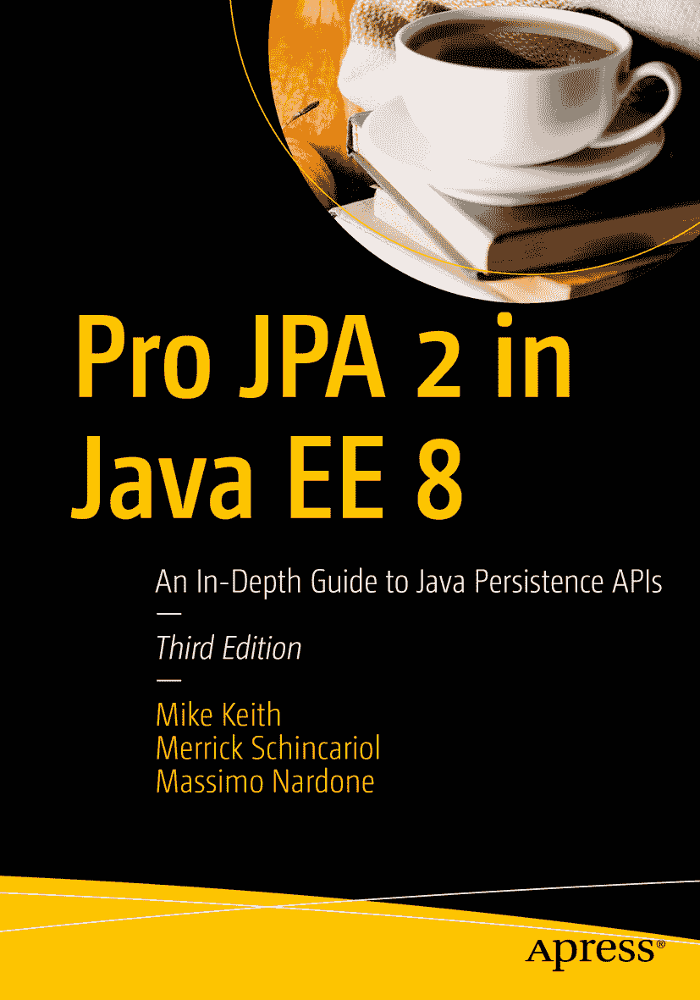

Mike Keith、Merrick Schincariol 与 Massimo Nardone 合著《Java EE 8 中的 Pro JPA 2 实战——Java 持久化 API 深度指南》第三版

本书作者引用的任何源代码或其他补充材料，读者均可通过本书在 GitHub 上的产品页面获取，网址为 [`www.apress.com/9781484234198`](http://www.apress.com/9781484234198)。如需更详细信息，请访问 [`www.apress.com/source-code`](http://www.apress.com/source-code)。ISBN 978-1-4842-3419-8（纸质版）e-ISBN 978-1-4842-3420-4 [`doi.org/10.1007/978-1-4842-3420-4`](https://doi.org/10.1007/978-1-4842-3420-4) 美国国会图书馆控制号：2018932342 © Mike Keith、Merrick Schincariol、Massimo Nardone 2018 本作品受版权保护。出版商保留所有权利，无论涉及全部或部分材料，特别是翻译权、重印权、插图复用权、朗诵权、广播权、缩微胶片复制权或任何其他物理形式的复制权，以及信息存储与检索、电子改编、计算机软件或目前已知或未来开发的任何类似或不同方法的传输权。本书中可能出现商标名称、标识和图像。对于商标名称、标识或图像的每次出现，我们并未使用商标符号，而是仅以编辑方式使用这些名称、标识和图像，以维护商标所有者的利益，且无意侵犯商标权。本出版物中使用的商品名称、商标、服务标志及类似术语，即使未被明确标识，也不应被视为对其是否受专有权利保护的立场表达。尽管本书中的建议和信息在出版时被认为是真实准确的，但作者、编辑和出版商均不对可能出现的任何错误或遗漏承担法律责任。出版商对本书所含内容不作任何明示或暗示的担保。本书采用无酸纸印刷。全球图书贸易由 Springer Science+Business Media New York 发行，地址：233 Spring Street, 6th Floor, New York, NY 10013。电话：1-800-SPRINGER，传真：(201) 348-4505，电子邮件：orders-ny@springer-sbm.com，或访问 www.springeronline.com。Apress Media, LLC 是一家加利福尼亚有限责任公司，其唯一成员（所有者）是 Springer Science + Business Media Finance Inc (SSBM Finance Inc)。SSBM Finance Inc 是一家特拉华州公司。谨以此书献给我的妻子 Darleen，一位完美的母亲；以及 Cierra、Ariana、Jeremy 和 Emma，你们点亮了我的生活，并激励我努力成为更好的人。——Mike 献给 Anthony，他无限的创造力持续激励着我。献给 Evan，他热烈的热情促使我迎接新的挑战。献给 Kate，她证明了只要拥有正确的态度，体型大小并非障碍。我爱你们所有人。——Merrick 谨以此书纪念我已故的挚爱母亲 Maria Augusta Ciniglio。感谢妈妈，感谢您教会我的一切美好事物，感谢您让我成为一个善良的人，感谢您让我努力学习成为一名计算机科学家，感谢您留给我的美好回忆。您将永远被爱戴和怀念。我爱您，妈妈。安息。——Massimo

致谢

衷心感谢我美好的家人——我的妻子 Pia，以及我的孩子 Luna、Leo 和 Neve——在我撰写本书期间给予我的支持。你们是我生命中最美好的部分。

我要感谢我已故的挚爱母亲 Maria Augusta Ciniglio，她始终如此深爱并支持着我。我将永远爱您、怀念您，我最亲爱的妈妈。

我还要感谢我亲爱的父亲 Giuseppe 以及我的兄弟 Mario 和 Roberto，感谢你们无尽的爱，你们是世界上最好的父亲和兄弟。

本书也献给 Antonio Catapano 医生，感谢您拥有如此宽广的胸怀，是一位伟大的人，并一直照顾着我和我的母亲。献给我的嫂子 Susanna Cennamo，我亲爱的表亲 Rosaria Scudieri、Pina 和 Elisa Franzese 以及 Francesco Ciniglio，感谢你们给予我和我母亲无与伦比的爱与支持。献给 Pertti 和 Marianna Kantola，感谢你们教导我如何成为一名优秀的程序员，照顾我，并待我如子。献给 Antti、Piia 和 Daniela Jalonen，你们是伟大且支持我的朋友，也献给 Anton Jalonen，他将来会成为一名出色的软件工程师。Anton，愿本书能激励你走向辉煌的 IT 未来。

我还要感谢 Steve Anglin 和 Matthew Moodie 给予我撰写本书的机会。像往常一样，特别感谢 Mark Powers 在编辑过程中所做的出色工作和对我的支持。

最后，我要感谢 Mario Faliero，一位好朋友，也是本书的技术审阅者，感谢他帮助我使本书更加完善。

目录 第 1 章：引言 1 关系数据库 2 对象关系映射 3 阻抗不匹配 4 Java 对持久化的支持 11 专有解决方案 11 JDBC 13 企业级 JavaBeans 13 Java 数据对象 15 为何需要另一个标准？ 16 Java 持久化 API 17 规范历史 17 概述 21 总结 24 第 2 章：入门 25 实体概述 25 持久性 26 标识 26 事务性 27 粒度 27 实体元数据 28 注解 28 XML 30 异常配置 30 创建实体 31 实体管理器 34 获取实体管理器 36 持久化实体 37 查找实体 38 移除实体 39 更新实体 40 事务 41 查询 42 综合运用 44 打包 47 持久化单元 47 持久化归档 48 总结 49 第 3 章：企业级应用 51 应用组件模型 54 会话 Bean 56 无状态会话 Bean 57 有状态会话 Bean 61 单例会话 Bean 65 Servlet 67 依赖管理与 CDI 69 依赖查找 70 依赖注入 72 声明依赖 74 CDI 与上下文注入 78 CDI Bean 78 注入与解析 79 作用域与上下文 80 限定注入 81 生产者方法与字段 82 在 JPA 资源中使用生产者方法 83 事务管理 85 事务回顾 85 Java 中的企业级事务 86 综合运用 95 定义组件 96 定义用户界面 97 打包 98 总结 99 第 4 章：对象关系映射 101 持久化注解 102 访问实体状态 103 字段访问 104 属性访问 105 混合访问 106 映射到表 108 映射简单类型 110 列映射 111 延迟加载 113 大对象 114 枚举类型 115 时间类型 118 瞬态状态 119 映射主键 120 覆盖主键列 120 主键类型 121 标识符生成 121 关系 129 关系概念 129 映射概述 132 单值关联 133 集合值关联 140 延迟关系 148 嵌入对象 149 总结 154 第 5 章：集合映射 157 关系与元素集合 157 使用不同的集合类型 161 集合或集合 162 列表 162 映射 167 重复项 185 空值 187 最佳实践 188 总结 189 第 6 章：实体管理器 191 持久化上下文 191 实体管理器 192 容器管理的实体管理器 192 应用管理的实体管理器 198 事务管理 201 JTA 事务管理 202 资源本地事务 218 事务回滚与实体状态 221 选择实体管理器 224 实体管理器操作 225 持久化实体 225 查找实体 227 移除实体 228 级联操作 229 清除持久化上下文 234 与数据库同步 234 分离与合并 238 分离 238 合并分离实体 241 处理分离实体 246 总结 267 第 7 章：使用查询 269 Java 持久化查询语言 270 入门 270 过滤结果 271 投影结果 272 实体间的连接 272 聚合查询 273 查询参数 273 定义查询 274 动态查询定义 275 命名查询定义 278 动态命名查询 280 参数类型 282 执行查询 285 处理查询结果 287 流式查询结果 288 查询分页 293 查询与未提交的更改 296 查询超时 299 批量更新与删除 300 使用批量更新与删除 301 批量删除与关系 304 查询提示 305 查询最佳实践 307 命名查询 307 报表查询 308 供应商提示 308 无状态 Bean 309 批量更新与删除 309 供应商差异 310 总结 310 第 8 章：查询语言 313 JP QL 简介 313 术语 314 示例数据模型 315 示例应用 316 选择查询 319 SELECT 子句 321 FROM 子句 325 WHERE 子句 336 继承与多态 344 标量表达式 347 ORDER BY 子句 353 聚合查询 354 聚合函数 356 GROUP BY 子句 357 HAVING 子句 358 更新查询 359 删除查询 360 总结 361 第 9 章：Criteria API 363 概述 363 Criteria API 364 参数化类型 365 动态查询 366 构建 Criteria API 查询 370 创建查询定义 370 基本结构 372 Criteria 对象与可变性 373 查询根与路径表达式 374 SELECT 子句 377 FROM 子句 382 WHERE 子句 384 构建表达式 385 ORDER BY 子句 401 GROUP BY 与 HAVING 子句 402 批量更新与删除 403 强类型查询定义 405 元模型 API 405 强类型 API 概述 407 规范元模型 409 选择合适的查询类型 412 总结 413 第 10 章：高级对象关系映射 415 表名与列名 416 转换实体状态 418 创建转换器 418 声明式属性转换 420 自动转换 423 转换器与查询 424 复杂嵌入对象 425 高级嵌入映射 425 覆盖嵌入关系 427 复合主键 429 ID 类 430 嵌入 ID 类 432 派生标识符 434 派生标识符的基本规则 435 共享主键 436 多个映射属性 439 使用 EmbeddedId 440 高级映射元素 443 只读映射 444 可选性 445 高级关系 446 使用连接表 446 避免连接表 447 复合连接列 449 孤儿移除 451 映射关系状态 453 多表 456 继承 461 类层次结构 461 继承模型 466 混合继承 477 总结 480 第 11 章：高级查询 483 SQL 查询 483 原生查询与 JDBC 484 定义与执行 SQL 查询 487 SQL 结果集映射 491 参数绑定 500 存储过程 500 实体图 505 实体图注解 507 实体图 API 516 管理实体图 519 使用实体图 522 总结 525 第 12 章：其他高级主题 527 生命周期回调 527 生命周期事件 528 回调方法 529 实体监听器 531 继承与生命周期事件 536 验证 542 使用约束 543 调用验证 545 验证组 546 创建新约束 548 JPA 中的验证 551 启用验证 552 设置生命周期验证组 553 并发 555 实体操作 555 实体访问 555 刷新实体状态 555 锁定 559 乐观锁定 560 悲观锁定 574 缓存 580 分层排序 580 共享缓存 582 工具类 589 PersistenceUtil 589 PersistenceUnitUtil 590 总结 591 第 13 章：XML 映射文件 593 元数据难题 595 映射文件 596 禁用注解 598 持久化单元默认值 601 映射文件默认值 606 查询与生成器 609 托管类与映射 617 转换器 652 总结 654 第 14 章：打包与部署 655 配置持久化单元 656 持久化单元名称 656 事务类型 657 持久化提供者 658 数据源 659 映射文件 662 托管类 663 共享缓存模式 667 验证模式 668 添加属性 668 构建与部署 669 部署类路径 669 打包选项 670 持久化单元作用域 676 服务器外部 677 配置持久化单元 678 运行时指定属性 680 系统类路径 681 模式生成 682 生成过程 683 部署属性 684 运行时属性 689 模式生成使用的映射注解 689 唯一约束 690 空值约束 691 索引 692 外键约束 692 基于字符串的列 694 浮点数列 695 定义列 696 总结 697 第 15 章：测试 699 测试企业级应用 699 术语 700 服务器外部测试 702 JUnit 703 单元测试 704 测试实体 704 在组件中测试实体 706 单元测试中的实体管理器 709 集成测试 713 使用实体管理器 714 组件与持久化 722 测试框架 736 最佳实践 738 总结 739 索引 741 关于作者与技术审校者 关于作者 关于技术审校者

