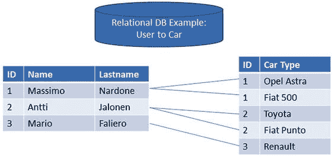
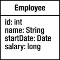
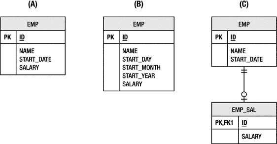
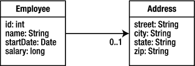
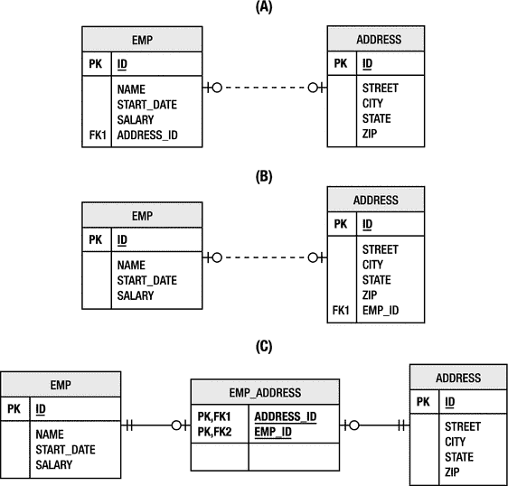
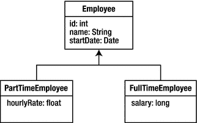
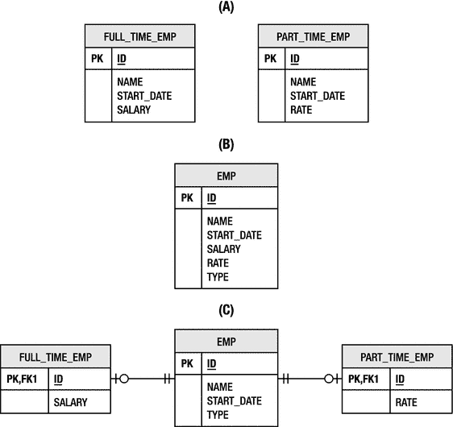
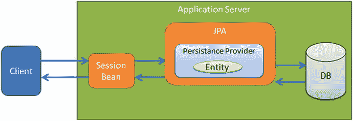

# 1. 引言

电子补充材料 本章的在线版本（[`​doi.​org/​10.​1007/​978-1-4842-3420-4_​1`](https://doi.org/10.1007/978-1-4842-3420-4_1)）包含补充材料，仅供授权用户使用。

企业应用程序的定义在于其需要收集、处理、转换和报告海量信息。当然，这些信息必须存储在某个地方。存储和检索数据是一个价值数十亿美元的行业，数据库市场的增长以及基于云的存储服务的兴起部分证明了这一点。尽管有各种可用的数据管理技术，应用程序设计人员仍然花费大量时间试图高效地将数据移入和移出存储设备。

尽管 Java 平台在处理数据库系统方面取得了成功，但长期以来，它一直受到困扰其他面向对象编程语言的相同问题的影响。在数据库系统和 Java 应用程序的对象模型之间来回移动数据比实际需要的要困难得多。Java 开发人员要么编写大量代码将行和列数据转换为对象，要么发现自己受限于试图向自己隐藏数据库的专有框架。幸运的是，一个标准解决方案——Java 持久化 API（JPA）被引入到该平台中，以弥合面向对象领域模型与关系数据库系统之间的差距。

本书介绍作为 Java EE 8 一部分的 Java 持久化 API 2.2 版本，并探讨它为开发人员提供的所有功能。

JPA 2.2 的维护版本于 2017 年在 JSR 338 下启动，并于 2017 年 6 月 19 日最终获得批准。

以下是官方的 Java 持久化 2.2 维护版本声明：

“Java 持久化 2.2 规范增强了 Java 持久化 API，增加了对重复注解的支持；对属性转换器的注入支持；对 `java.time.LocalDate`、`java.time.LocalTime`、`java.time.LocalDateTime`、`java.time.OffsetTime` 和 `java.time.OffsetDateTime` 类型映射的支持；以及将 `Query` 和 `TypedQuery` 的结果作为流检索的方法。”

其优势之一在于它可以被插入到应用程序所需的任何层、层级或框架中。无论您是在构建客户端-服务器应用程序以在 Swing 应用程序中收集表单数据，还是使用最新的应用程序框架构建网站，JPA 都可以帮助您更有效地实现持久化。

为了为 JPA 奠定基础，本章首先回顾一下我们走过的历程以及我们试图解决的问题。然后，我们将了解该规范的历史，并为您提供其功能的高级概述。

## 关系数据库

多年来，许多持久化数据的方法来了又去，但没有哪个概念比关系数据库更具持久力。即使在云时代，当“大数据”和“NoSQL”经常占据头条新闻时，关系数据库服务仍然持续需求旺盛，以支持当今在云中运行的企业应用程序。虽然键值型和面向文档的 NoSQL 存储有其用武之地，但关系型存储仍然是现存最流行的通用数据库，世界上绝大多数企业数据都存储在其中。它们是每个企业应用程序的起点，并且其生命周期通常比应用程序本身更长久。

理解关系数据是企业成功开发的关键。开发能够与数据库系统良好配合的应用程序是软件开发中公认的难题。Java 的成功在很大程度上可以归因于其在构建企业数据库系统中的广泛采用。从消费者网站到自动化网关，Java 应用程序是企业应用程序开发的核心。图 1-1 展示了一个用户与汽车的关系数据库示例。

图 1-1

用户与汽车关系数据库

## 对象-关系映射

“领域模型中有一个类，数据库中有一张表。它们看起来非常相似，应该可以简单地将一个自动转换为另一个。” 这可能是我们在编写又一个数据访问对象（DAO）来将 Java 数据库连接（JDBC）结果集转换为面向对象结构时，都曾有过的一个想法。领域模型与数据库的关系模型看起来足够相似，以至于它似乎在呼唤一种让这两个模型相互沟通的方式。

弥合对象模型与关系模型之间差距的技术被称为对象-关系映射，通常简称为 O-R 映射或 ORM。这个术语源于这样一种理念：我们以某种方式将一个模型中的概念映射到另一个模型上，目标是引入一个中介来管理两者之间的自动转换。

在深入探讨对象-关系映射的具体细节之前，让我们先简要阐述一下理想解决方案应具备的纲领。

*   **对象，而非表**：应用程序应基于领域模型来编写，而不是受限于关系模型。必须能够对领域模型进行操作和查询，而无需用表、列和外键这类关系语言来表达。
*   **便利，而非无知**：映射工具应仅由熟悉关系技术的人使用。O-R 映射并非旨在让开发者免于理解映射问题，或完全隐藏这些问题。它是为那些理解这些问题、知道自己需要什么，但又不想为解决一个已有解决方案的问题而编写数千行代码的人准备的。
*   **非侵入，而非透明**：期望持久化是透明的是不合理的，因为应用程序始终需要控制其正在持久化的对象，并了解实体的生命周期。然而，持久化解决方案不应侵入领域模型，并且领域类不应为了可持久化而必须扩展类或实现接口。
*   **遗留数据，新对象**：应用程序更有可能针对现有的关系数据库模式，而不是创建一个新的模式。对遗留模式的支持将是出现的最相关的用例之一，而且这些数据库很可能比我们所有人都活得久。
*   **足够，而非过多**：企业开发者有需要解决的问题，他们需要足够的功能来解决这些问题。他们不喜欢的是被迫采用一个重量级的持久化模型，该模型会引入巨大的开销，因为它解决的是许多人甚至不认为是问题的问题。
*   **本地，但可移动**：数据的持久化表示不需要被建模为一个功能完备的远程对象。分布式是作为应用程序的一部分而存在的，而不是持久化层的一部分。然而，包含持久化状态的实体必须能够移动到任何需要它们的层，这样如果应用程序是分布式的，实体就能支持而非阻碍特定的架构。
*   **标准 API，可插拔实现**：拥有大型应用程序的大公司不希望冒与特定产品库和接口耦合的风险。通过仅依赖定义好的标准接口，应用程序与专有 API 解耦，并且如果另一个实现更合适，可以切换实现。

这看起来是一组有些苛刻的要求，但它源于实践经验与必要性。企业应用程序有非常特定的持久化需求，这份需求清单相当具体地代表了企业社区的经验。

### 阻抗不匹配

对象-关系映射的倡导者经常将对象模型与关系模型之间的差异描述为两者之间的阻抗不匹配。这是一个恰当的描述，因为将两者相互映射的挑战不在于它们之间的相似性，而在于每个模型中那些在另一个模型中没有逻辑等价物的概念。

在接下来的章节中，我们将展示一些基本的面向对象领域模型，以及用于持久化同一组数据的各种关系模型。正如你将看到的，对象-关系映射的挑战与其说在于单个映射的复杂性，不如说在于存在如此多可能的映射。目标不是解释如何从一个点到达另一个点，而是理解为了到达预期目的地可能需要走的路。

#### 类的表示

让我们从一个简单的类开始讨论。图 1-2 展示了一个包含四个属性的 `Employee` 类：员工 ID、员工姓名、入职日期和当前薪资。

图 1-2

Employee 类

现在考虑图 1-3 中所示的关系模型。该类在数据库中的理想表示对应于场景 (A)。类中的每个字段直接映射到表中的一列。员工 ID 成为主键。除了一些细微的命名差异外，这是一个直接的映射。

图 1-3

存储员工数据的三种场景

在场景 (B) 中，我们看到员工的入职日期实际上存储为三个单独的列，分别对应日、月、年。回想一下，该类使用了一个 `Date` 对象来表示这个值。由于数据库模式更难更改，该类是否应该被迫采用相同的存储策略以保持与关系模型一致？也考虑一下问题的反面：类使用了三个字段，而表使用了一个单一的日期列。当数据库和对象模型的表示方式不同时，即使是单个字段的映射也会变得复杂。

薪资信息被视为商业敏感信息，因此将薪资值直接放在可能用于多种用途的 `EMP` 表中可能是不明智的。在场景 (C) 中，`EMP` 表被拆分，以便薪资信息存储在单独的 `EMP_SAL` 表中。这允许数据库管理员将对薪资信息的 `SELECT` 访问权限限制在真正需要它的用户。通过这样的映射，即使是 `Employee` 类的单个存储操作，现在也需要对两个不同的表进行插入或更新。

显然，即使是将单个类的数据存储在数据库中也可能是一项具有挑战性的工作。我们关注这些场景，是因为生产系统中的真实数据库模式在设计时从未考虑过对象模型。在企业应用程序中，经验法则是数据库的需求优先于应用程序的需求。事实上，通常有许多应用程序（有些是面向对象的，有些是基于结构化查询语言（SQL）的）从单个数据库中检索和存储数据。多个应用程序对同一个数据库的依赖意味着更改数据库会影响每一个应用程序，这显然是一个不受欢迎且可能代价高昂的选择。对象模型需要适应并找到与数据库模式协同工作的方法，同时不让物理设计压倒逻辑应用程序模型。

#### 关系

对象很少孤立存在。就像数据库中的关系一样，领域类依赖于其他领域类并与它们关联。考虑图 1-2 中引入的`Employee`类。有许多领域概念可以与员工关联，但现在我们先引入`Address`领域类，一个`Employee`最多可以拥有一个`Address`实例。在这种情况下，我们说`Employee`与`Address`具有一对一关系，在统一建模语言（UML）模型中用`0..1`表示法表示。图 1-4 展示了这种关系。

图 1-4

员工与地址的关系

我们在上一节讨论了表示`Employee`状态的不同场景，同样，在数据库模式中表示关系也有几种方法。图 1-5 展示了员工与地址之间一对一关系的三种不同场景。

数据库中关系的基本构建块是外键。每种场景都涉及各个表之间的外键关系，但要存在外键关系，目标表必须有一个主键。因此，在我们开始关联员工和地址之前，就遇到了一个问题。领域类`Address`没有标识符，但如果要参与关系，存储它的表必须有一个标识符。我们可以用`ADDRESS`表中的所有列构建一个主键，但这被认为是不良实践。因此，引入了`ID`列，对象关系映射必须以某种方式适应这一点。

图 1-5

关联员工和地址数据的三种场景

图 1-5 中的场景（A）展示了这种关系的理想映射。`EMP`表通过`ADDRESS_ID`列存储了指向`ADDRESS`表的外键。如果`Employee`类持有一个`Address`类的实例，那么在写入`EMPLOYEE`行时，可以在存储操作期间设置地址的主键值。

然而，考虑场景（B），它只有细微差别，却突然变得复杂得多。在领域模型中，`Address`实例并未持有拥有它的`Employee`实例，但员工主键必须存储在`ADDRESS`表中。对象关系映射要么必须解决领域类与表之间的这种不匹配，要么必须为每个地址添加一个指向员工的引用。

更糟糕的是，场景（C）引入了一个连接表来关联`EMP`和`ADDRESS`表。连接表不将外键直接存储在某个领域表中，而是持有一对键。现在，涉及这两个表的每个数据库操作都必须遍历连接表并保持其一致性。我们可以引入一个`EmployeeAddress`关联类到领域模型中进行补偿，但这违背了我们试图实现的逻辑表示。

关系在任何对象关系映射解决方案中都带来了挑战。这里只介绍了一对一关系，但我们已面临对象模型中不存在主键的需求，以及可能不得不向模型引入额外关系甚至关联类来补偿数据库模式的情况。

#### 继承

面向对象领域模型的一个定义性元素是能够在相似类之间引入泛化关系。继承是表达这些关系的自然方式，并允许在应用程序中实现多态。让我们重新审视图 1-2 中所示的`Employee`类，并设想一家公司需要区分全职和兼职员工。兼职员工按小时计薪，而全职员工则领取固定薪水。这是使用继承的好机会，将工资信息移至`PartTimeEmployee`和`FullTimeEmployee`子类。图 1-6 展示了这种安排。

图 1-6

全职与兼职员工之间的继承关系

继承给对象关系映射带来了一个真正的问题。我们不再处理类到表之间存在自然映射的情况。考虑图 1-7 中所示的关系模型。同样，展示了持久化同一组数据的三种不同策略。

图 1-7

关系模型中的继承策略

对于将继承结构映射到数据库的人来说，可以说最简单的解决方案是将每个类（包括父类）所需的所有数据放入单独的表中。图 1-7 中的场景（A）展示了这种策略。注意，这些表之间没有关系（即每个表独立于其他表）。这意味着，如果用户需要在一个步骤中同时操作全职和兼职员工，对这些表的查询现在会复杂得多。

一种高效但非规范化的替代方案是将模型中每个类所需的所有数据放入一个表中。这使得查询非常容易，但请注意图 1-7 场景（B）中所示表的结构。有一个新列`TYPE`，它在领域模型的任何部分都不存在。`TYPE`列指示员工是兼职还是全职。现在，对象关系映射解决方案必须解释此信息，以知道为表中的任何给定行实例化哪种领域类。

场景（C）更进一步，这次将数据规范化为全职和兼职员工的单独表。然而，与场景（A）不同，这些表通过一个公共的`EMP`表关联，该表存储了两种员工类型共有的所有数据。对于单个额外数据列来说，这似乎有些过度，但一个包含许多特定于每种员工类型的列的真实模式很可能会使用这种表结构。它以逻辑形式呈现数据，并通过允许表连接来简化查询。不幸的是，对数据库有效的方法不一定对映射到这种模式的对象模型有效。即使没有与其他类的关联，领域类的对象关系映射现在也必须考虑多个表之间的连接。当你开始考虑抽象超类或非持久化的父类时，继承在对象关系映射中迅速成为一个复杂问题。不仅类数据的存储存在挑战，复杂的表关系也难以高效查询。

## Java 对持久化的支持

从 Java 平台的早期开始，就存在编程接口来提供通往数据库的网关，并抽象掉业务应用程序的许多特定于领域的持久化需求。接下来的几节将讨论当前和过去的 Java 持久化解决方案及其在企业应用程序中的作用。

Java 持久化 API 包含四个领域：

*   Java 持久化 API
*   Java 持久化 Criteria API
*   查询语言
*   对象关系映射元数据

### 专有解决方案

令人惊讶的是，对象关系映射解决方案已经存在了很长时间，甚至比 Java 语言本身还要久。像 Oracle TopLink 这样的产品最初在 Smalltalk 领域起步，后来才转向 Java。Java 持久化解决方案历史上一个巨大的讽刺是，实体 Bean 的首批实现之一，实际上是通过在 TopLink 映射对象之上添加一个额外的实体 Bean 层来演示的。

最流行的两个专有持久化 API 是商业领域的 TopLink 和开源社区的 Hibernate。像 TopLink 这样的商业产品在 Java 早期就已出现并取得了成功，但这些技术从未在 Java 平台上实现标准化。后来，当像 Hibernate 这样的新兴开源对象关系映射解决方案变得流行时，Java 平台围绕持久化才发生了变革，最终促成了对象关系映射作为首选解决方案的趋同。

这两款产品以及其他类似产品可以与所有主流应用服务器集成，并为应用程序提供所需的所有持久化功能。应用开发者对于使用第三方产品来满足持久化需求是可以接受的，尤其是在当时缺乏通用且等效标准的情况下。

#### 数据映射器

解决对象关系问题的一种局部方法是使用数据映射器。¹ 数据映射器模式介于纯 JDBC（参见“JDBC”部分）和完整的对象关系映射解决方案之间，因为应用开发者需要负责创建原始的 SQL 字符串来将对象映射到数据库表，但通常会使用一个自定义或现成的框架来从数据映射器方法中调用 SQL。该框架还有助于处理其他事务，例如结果集映射和 SQL 语句参数。最流行的数据映射器框架是 Apache iBatis（现在名为 MyBatis，托管在 Google Code 上）。它拥有相当规模的社区，并且至今仍可在许多应用程序中找到。

使用像 MyBatis 这样的数据映射策略的最大优势在于，应用程序对发送到数据库的 SQL 拥有完全的控制权。存储过程以及驱动程序提供的所有 SQL 功能都可以自由使用，并且框架增加的开销比使用完整的 ORM 框架要小。然而，能够编写自定义 SQL 的主要缺点是它需要维护。对对象模型所做的任何更改都可能对数据模型产生影响，并可能在开发过程中导致大量的 SQL 变更。一个极简的框架也为开发者随着应用需求增长而创建新功能打开了大门，最终可能导致重新发明 ORM 轮子。如果应用程序确信其需求不会超出简单的映射范围，或者需要无法自动生成的非常明确的 SQL，那么数据映射器在某些应用中可能仍有一席之地。

### JDBC

Java 平台的第二个版本，即 1997 年发布的 Java 开发工具包 (JDK) 1.1，引入了 JDBC，这是对数据库持久化的首个主要支持。JDBC 是作为其更通用的前身——对象数据库连接 (ODBC) 规范的 Java 特定版本而创建的，ODBC 是一种从任何语言或平台访问任何关系数据库的标准。JDBC 提供了对数据库供应商提供的专有客户端编程接口的简单且可移植的抽象，允许 Java 程序与数据库进行完全交互。这种交互严重依赖于 SQL，为开发者提供了用数据库语言编写查询和数据操作语句的机会，但使用简单的 Java 编程模型来执行和处理。

JDBC 的讽刺之处在于，尽管编程接口是可移植的，但 SQL 语言却并非如此。尽管多次尝试对其进行标准化，但编写出能在两个主要数据库平台上不加修改地运行的任何复杂 SQL 仍然很少见。即使 SQL 方言相似，每个数据库的性能也会因查询结构而异，在大多数情况下都需要针对特定供应商进行调优。

此外，还存在 Java 源代码与 SQL 文本之间紧密耦合的问题。开发者常常被那些可以随时运行的 SQL 查询所诱惑，这些查询要么在运行时动态构建，要么简单地存储在变量或字段中。这是一种非常有吸引力的编程模型，直到有一天你发现应用程序必须支持一个新的数据库供应商，而该供应商不支持你一直在使用的 SQL 方言。

即使将 SQL 文本归入属性文件或其他应用程序元数据，当使用 JDBC 时，不仅会感觉不对劲，而且会变成一项繁琐的工作：获取表格形式的行和列数据，并不断地将其来回转换为对象。应用程序有一个对象模型——为什么与数据库一起使用就这么难呢？

### 企业级 JavaBeans

Java 2 企业版（J2EE）平台的首次发布引入了一种新的 Java 持久化解决方案，即实体 Bean，它是企业级 JavaBean（EJB）组件家族的一部分。该方案旨在让开发者完全不必直接处理持久化问题，它采用了一种基于接口的方法，客户端代码从不直接使用具体的 Bean 类。相反，一个专门的 Bean 编译器会生成 Bean 接口的实现，以处理持久化、安全性和事务管理等事宜，并将业务逻辑委托给实体 Bean 的实现。实体 Bean 通过结合使用标准 XML 部署描述符和供应商特定的 XML 部署描述符进行配置，这些描述符因其复杂性和冗长性而臭名昭著。

可以说，实体 Bean 对于它们试图解决的问题而言设计得过于复杂了，但讽刺的是，该技术的首个版本却缺乏实现实际业务应用程序所需的许多功能。实体之间的关系必须由应用程序来管理，这就要求在 Bean 类上存储和管理外键字段。实体 Bean 到数据库的实际映射完全使用供应商特定的配置来完成，查找器（实体 Bean 中用于查询的术语）的定义也是如此。最后，实体 Bean 被建模为使用 RMI 和 CORBA 的远程对象，这引入了网络开销和限制，而这些从一开始就不应该被添加到持久化对象上。实体 Bean 实际上是从解决分布式持久化组件问题开始的，这是一个“无病呻吟”的解决方案，却忽略了本地访问轻量级持久化对象的常见情况。

EJB 2.0 规范解决了早期版本中发现的许多问题。引入了容器管理实体 Bean 的概念，Bean 类变得抽象，服务器负责生成子类来管理持久化数据。引入了本地接口和容器管理的关系，允许在实体 Bean 之间定义关联，并由服务器自动保持一致性。该版本还引入了企业级 JavaBeans 查询语言（EJB QL），这是一种专为实体设计的查询语言，可以可移植地编译成任何 SQL 方言。

尽管 EJB 2.0 带来了诸多改进，但一个主要问题依然存在：过度复杂。该规范假设开发工具能够使开发者免于配置和管理每个 Bean 所需的众多构件的挑战。不幸的是，这些工具花了太长时间才出现，因此，即使 EJB 应用程序的规模和范围不断扩大，负担也完全落在了开发者的肩上。开发者感觉自己被遗弃在复杂的海洋中，而承诺的基础设施却未能让他们浮出水面。

### Java 数据对象

部分由于 EJB 持久化模型的一些失败，以及没有一个令人满意的标准化持久化 API 所带来的挫败感，人们尝试了另一种持久化规范。Java 数据对象（JDO）主要受到面向对象数据库（OODB）供应商的启发和支持，但从未真正被主流编程社区所采纳。它要求供应商增强领域对象的字节码，以生成在所有供应商之间二进制兼容的类文件，并且每个符合规范的供应商的产品都必须能够生成和使用这些文件。JDO 还拥有一种本质上完全是面向对象的查询语言，这并不受占绝大多数的关系型数据库用户的欢迎。

JDO 达到了成为 JDK 扩展的地位，但从未成为企业 Java 平台的集成部分。它有许多优秀特性，并被一小群忠实用户所采用，他们坚持使用并竭力推广它。不幸的是，主要的商业供应商对于如何实现持久化框架持有不同看法。很少有供应商支持该规范，因此 JDO 虽被谈论，却很少被使用。

有些人可能会争辩说，它超前于时代，并且对字节码增强的依赖使其受到了不公正的污名化。这可能是真的，如果它晚三年推出，可能会被一个现在对广泛使用字节码增强的框架习以为常的开发者社区更好地接受。然而，一旦 EJB 3.0 持久化运动启动，并且主要供应商都签约成为新的企业持久化标准的一部分，JDO 的命运就已注定。人们很快向 Sun 抱怨，他们现在有了两个持久化规范：一个既是其企业平台的一部分，也适用于 Java SE；另一个则仅针对 Java SE 进行标准化。此后不久，Sun 宣布 JDO 将降级为规范维护模式，而 JPA 将借鉴 JDO 和持久化供应商的经验，成为未来唯一受支持的标准。

## 为何需要另一个标准？

软件开发人员清楚自己的需求，但许多人无法在现有标准中找到答案，于是他们决定另寻出路。他们发现了一系列专有的持久化框架，既有商业产品也有开源项目。许多实现这些技术的产品采用了一种不侵入领域对象的持久化模型。对于这些产品而言，持久化对业务对象是非侵入式的——与实体 Bean 不同，业务对象无需感知正在持久化它们的技术。它们无需实现任何类型的接口或继承特殊类。开发者可以像对待普通 Java 对象一样处理持久化对象，然后将其映射到持久化存储，并使用持久化 API 进行持久化。由于这些对象是普通的 Java 对象，这种持久化模型逐渐被称为**普通 Java 对象（POJO）持久化**。

随着 Hibernate、TopLink 及其他持久化 API 在应用程序中站稳脚跟并完美满足需求，人们常常会问：“何必费心更新 EJB 标准来匹配这些产品已有的功能？为什么不继续使用这些已经运行多年的产品，甚至干脆将像 Hibernate 这样的开源产品标准化？”实际上，有很多理由表明这样做行不通——即便可行，也是个糟糕的主意。

标准的意义远不止于一个产品，单个产品（即便是像 Hibernate 或 TopLink 这样成功的产品）也无法体现一份规范，尽管它可以实现规范。规范的核心意图在于，它应由不同供应商实现，并提供标准接口和语义，使应用程序无需与任何特定产品耦合即可使用。

将标准绑定到像 Hibernate 这样的开源项目上，对标准本身而言问题重重，对 Hibernate 项目来说可能更糟。想象一下，一份基于开源项目特定版本或代码库检查点的规范，那将是多么混乱。再想象一个开源软件（OSS）项目，它无法随意更改，或者只能每两年由特殊委员会控制的离散版本中进行更改，而非由项目自身决定变更。Hibernate，乃至任何开源项目，都可能因此窒息。

尽管标准化可能不被顾问或五人规模的软件公司所看重，但对大企业而言却至关重要。对大多数企业 IT 部门来说，软件技术是一项重大投资，涉及大笔资金时必须衡量风险。使用标准技术能大幅降低风险，并允许企业在初始选择无法满足需求时更换供应商。

除了可移植性，技术标准化的价值还体现在其他诸多领域。教育、设计模式和行业交流，只是标准带来的众多好处中的一部分。

## Java 持久化 API

Java 持久化 API 是一个轻量级、基于 POJO 的 Java 持久化框架。虽然对象关系映射是该 API 的主要组成部分，但它也为将持久化集成到可扩展的企业应用程序中提供了架构层面的解决方案。以下章节将探讨该规范的演变过程，并概述这项技术的主要方面。

JPA 并非产品，而是一份规范，本身无法执行持久化操作。当然，JPA 需要一个数据库来进行持久化。

### 规范的历史

Java 持久化 API 之所以引人注目，不仅在于它为开发者提供的功能，还在于它的诞生方式。以下章节概述了对象关系持久化解决方案的前史以及 JPA 的起源。

#### EJB 3.0 与 JPA 1.0

在多年抱怨使用 Java 构建企业应用程序过于复杂之后，“简化开发”成为了 Java EE 5 平台发布的主题。EJB 3.0 率先行动，找到了让 Enterprise JavaBeans 更易用、更高效的方法。

对于会话 Bean 和消息驱动 Bean，解决方案是通过简单地移除一些繁琐的实现要求，让组件看起来更像普通的 Java 对象，从而解决了可用性问题。

然而，对于实体 Bean，存在一个更严重的问题。如果“易用性”的定义是让实现接口和描述符远离应用程序代码，并拥抱 Java 语言的自然对象模型，那么如何让粗粒度、接口驱动、容器管理的实体 Bean 看起来和用起来像一个领域模型呢？

答案是推倒重来，放弃实体 Bean，转而引入一种新的持久化模型。Java 持久化 API 的诞生，源于对实践者需求以及他们用来解决问题的现有专有解决方案的认可。忽视这些经验将是愚蠢的。

因此，领先的对象关系映射解决方案供应商们走到一起，将其产品所代表的最佳实践标准化。Hibernate 和 TopLink 率先与 EJB 供应商签约，随后 JDO 供应商也加入其中。

多年的行业经验，加上简化开发的使命，共同催生了第一个真正拥抱 Java SE 5 平台新编程模型的规范。特别是注解的使用，带来了一种前所未有的在应用程序中使用持久化的新方式。

最终于 2006 年发布的 EJB 3.0 规范被分成了三个独立的部分，并分散在三份独立的文档中。第一份文档包含了所有遗留的 EJB 组件模型内容，第二份描述了新的简化 POJO 组件模型。第三份则是 Java 持久化 API，这是一份独立的规范，描述了在 Java SE 和 Java EE 环境中的持久化模型。

图 1-8 展示了 JPA 在 Java EE 环境中的位置。

图 1-8

Java EE 环境中的 JPA

#### JPA 2.0

当 JPA 的第一个版本开始制定时，ORM 持久化已经发展了十年。不幸的是，在规范开发周期中，创建初始规范的时间相对较短（大约两年），因此并非所有遇到的可能特性都能包含在第一个版本中。尽管如此，仍有大量特性被纳入规范，其余的特性则留待后续版本发布，同时供应商在此期间以专有方式提供支持。

下一个版本 JPA 2.0 于 2009 年最终定稿，包含了第一个版本中缺失的许多特性，特别是那些用户最常要求的特性。这些新特性包括额外的映射能力、确定提供者访问实体状态的灵活方式，以及对 Java 持久化查询语言（JP QL）的扩展。其中最重要的特性可能是 Java Criteria API，这是一种以编程方式创建动态查询的方法。这主要使得框架能够利用 JPA 作为以编程方式构建代码来访问数据的手段。

#### JPA 2.1

2013 年发布的 JPA 2.1 使得几乎所有基于 JPA 的应用程序都能通过标准中包含的功能得到满足，而无需诉诸供应商的扩展。然而，无论规定了多少功能，总会有一些应用程序需要额外的能力来处理特殊情况。JPA 2.1 规范增加了一些更特殊的功能，例如映射转换器、存储过程支持，以及用于改进会话操作的非同步持久化上下文。它还增加了创建实体图并将其传递给查询的能力，这相当于对返回的对象集施加了通常所说的**抓取组约束**。

#### JPA 2.2 和 EJB 3.2

JPA 2.2 维护版本由 Oracle 于 2017 年 6 月发布。总的来说，变更日志文件中列出的 JPA 2.2 变更包括：

*   能够以流式方式处理查询执行结果
*   所有相关注解支持 `@Repeatable`
*   支持基本的 Java 8 日期和时间类型
*   允许 `AttributeConverters` 支持 CDI 注入
*   更新持久化提供者发现机制
*   允许所有 JPA 注解在元注解中使用

JPA 2.2 的变更日志文件可在此处找到：

[`https://jcp.org/aboutJava/communityprocess/maintenance/jsr338/ChangeLog-JPA-2.2-MR.txt`](https://jcp.org/aboutJava/communityprocess/maintenance/jsr338/ChangeLog-JPA-2.2-MR.txt)

由于 JPA 2.2 只是一个小的版本，在本书中，我们会注明何时描述 JPA 2.2 中新增的功能，而其余功能仍将是 JPA 2.1 的一部分。

自 2013 年以来，EJB 3.2 的最终版本也作为 Java EE 7 的一部分被开发出来。

Enterprise JavaBeans 3.2 版本（EJB 3.2）的新功能包括 JNDI 和 EJB Lite。

#### JPA 与你

最后，可能仍然有一些你或其他 JPA 用户希望在标准中找到但尚未包含的功能。如果有足够多的用户请求该功能，那么它最终很可能会成为标准的一部分，但这在一定程度上取决于开发者。如果你认为某个功能应该被标准化，你应该大声说出来并向你的 JPA 提供者提出请求；你还应该联系下一个 JPA 版本的专家组。社区有助于塑造和推动标准，而正是你们，社区成员，必须让你们的诉求被知晓。

然而，请注意，总会有一些很少使用的功能子集可能永远不会被纳入标准，仅仅是因为它们不够主流，不值得被包含在内。必须考虑众所周知的“多数人的需求”胜过“少数人的需求”的哲学（别假装你不知道这句哲学首次被表达的具体剧集），因为每个新功能都会给规范增加一些非零的复杂性，使其变得更大、更难理解、使用和实现。教训是，尽管我们征求你的意见，但并非所有意见都能被纳入规范。

### 概述

JPA 的模型简单而优雅，强大而灵活。它使用自然，易于学习，特别是如果你曾经使用过当今市场上任何现有的、作为该 API 基础的持久化产品。应用程序将接触到的主要操作 API 包含在少数几个类中。

注意

如果你对开源的 Java JPA 工具有兴趣，我在通过 [`www.apress.com/9781484234198`](http://www.apress.com/9781484234198) 提供的免费源代码下载中，简要描述了其中三个最流行的工具。

#### POJO 持久化

JPA 最重要的方面可能是对象是 POJO，这意味着任何被持久化的对象都没有什么特别之处。事实上，几乎所有具有默认构造函数的现有非 final 应用程序对象都可以被持久化，而无需更改一行代码。使用 JPA 进行对象关系映射完全是元数据驱动的。可以通过向代码添加注解或使用外部定义的 XML 来完成。被持久化的对象仅与其定义或映射的数据一样重。

#### 非侵入性

持久化 API 作为一个独立的层存在于持久化对象之外。应用程序业务逻辑调用持久化 API，向其传递持久化对象，并指示对其执行操作。因此，即使应用程序必须知道持久化 API 因为它需要调用它，持久化对象本身也不需要知道。由于 API 不会侵入持久化对象类的代码，因此它被称为非侵入式持久化。

有些人误以为非侵入式持久化意味着对象会神奇地被持久化，就像过去的事务提交时对象数据库所做的那样。这有时被称为透明持久化，这是一个错误的概念，当你考虑查询时，它甚至更加不合理。你需要某种方法从数据存储中检索对象。这需要一个单独的 API 对象，事实上，一些对象数据库要求用户调用特殊的 `Extent` 对象来发出查询。应用程序绝对需要以非常明确的方式管理其持久化对象，并且它们需要一个指定的 API 来做到这一点。

#### 对象查询

一个强大的查询框架提供了跨实体及其关系进行查询的能力，而无需使用具体的外键或数据库列。查询可以用 JP QL（一种模仿 SQL 以便于熟悉但不与数据库模式绑定的查询语言）表达，也可以使用条件 API 定义。查询使用基于实体模型（而非存储实体的列）的模式抽象。Java 实体及其属性被用作查询模式，因此不需要了解数据库映射信息。查询最终将由 JPA 实现转换为适合目标数据库的 SQL，并在数据库上执行。

通常，实体是一个轻量级的持久化领域对象。

在实践中，实体是关系数据库中的一个表，每个实体实例对应于该表中的某一行。

查询可以在元数据中静态定义，也可以在构建时通过传递查询条件动态创建。如果存在特殊查询需求，而持久化框架生成的 SQL 无法满足，也可以转义到 SQL。这些查询可以以实体、特定实体属性的投影、甚至聚合函数值等形式返回结果。JPA 查询是有价值的抽象，它允许跨 Java 领域模型进行查询，而不是跨具体的数据库表。

#### 移动实体

客户端/服务器和 Web 应用程序以及其他分布式架构显然是互联世界中最流行的应用程序类型。承认这一事实意味着承认持久化实体必须在网络中移动。对象必须能够从一个 Java 虚拟机（JVM）移动到另一个，然后再返回，并且应用程序仍然可以使用它们。

离开持久化层的对象被称为**分离的**。持久化模型的一个关键特性是能够更改分离的实体，然后在它们返回原始 JVM 时重新附加它们。分离模型提供了一种方法，用于协调正在重新附加的实体的状态与其分离之前的状态。这允许在离线状态下进行实体更改，同时在并发情况下仍保持实体一致性。

#### 简单配置

规范提供了大量持久化特性，我们将在本书各章节中逐一讲解。所有特性均可通过注解、XML 或两者结合的方式进行配置。注解提供了 Java 元数据史上无与伦比的易用性——它们易于编写、便于阅读，使初学者能够快速轻松地启动应用程序。对于喜欢 XML 或希望将元数据从代码中外部化的开发者，同样可以通过 XML 进行配置。

比元数据语言更重要的是，JPA 大量使用了默认值。这意味着无论选择哪种方法，启动运行所需的最少元数据量都是绝对最低的。在某些情况下，如果默认值足够适用，几乎完全不需要元数据。

#### 集成与可测试性

托管在应用服务器上的多层架构已成为应用程序架构的事实标准。在应用服务器上进行测试是一项鲜有人热衷的挑战。它可能带来痛苦和困难，并且常常阻碍单元测试和白盒测试的实践。

通过定义可在应用服务器内外工作的 API，这一问题得到了解决。虽然这不是常见用例，但运行在两层架构（应用程序直接与数据库层通信）中的应用程序，完全可以在没有应用服务器的情况下使用持久化 API。更常见的场景是单元测试和自动化测试框架，它们可以在 Java SE 环境中轻松便捷地运行。

借助 Java 持久化 API，现在可以编写服务器集成的持久化代码，并在服务器外部复用于测试。在服务器容器内运行时，可以享受容器支持和卓越易用性的所有优势；而只需少量修改和测试框架支持，同一应用程序也可配置为在容器外运行。

## 总结

本章介绍了 Java 持久化 API。我们首先阐述了开发者在使用面向对象领域模型配合关系数据库时面临的主要问题：阻抗不匹配。为演示弥合这一差距的复杂性，我们展示了三个小型对象模型和九种表示相同信息的不同方式。我们逐一探讨了每种方式，并讨论了将对象映射到不同表配置如何导致差异——不仅体现在数据库中数据的演变方式上，还体现在数据库操作的成本以及应用程序的性能表现上。

随后，我们概述了部分专有解决方案和当前持久化标准，包括 JDBC、EJB 和 JDO。针对每种方案，我们审视了标准的演进过程及其不足之处。在此过程中，您对持久化问题的特定方面获得了总体认识。

本章最后简要介绍了 JPA。我们回顾了规范的历史以及共同制定该规范的供应商。接着探讨了 JPA 在企业应用开发中的作用，并介绍了规范提供的部分特性。

下一章，您将通过快速了解基础知识并构建一个简单的 Java 企业应用程序，来亲身体验 JPA。

脚注 ¹

Fowler, Martin. 《企业应用架构模式》，Addison-Wesley，2003 年。

