5807fm.qxd 1/20/06 4:11 PM 第 i 页

**Pro JSF 与 Ajax：构建富互联网组件**

Jonas Jacobi 和 John R. Fallows 著

5807fm.qxd 1/20/06 4:11 PM 第 ii 页

**Pro JSF 与 Ajax：构建富互联网组件** **版权所有 © 2006，Jonas Jacobi 与 John R. Fallows** 保留所有权利。未经版权所有者及出版人事先书面许可，本书任何部分不得以任何形式或通过任何方式（电子或机械，包括影印、录制或任何信息存储与检索系统）进行复制或传播。

ISBN-13: 978-1-59059-580-0

ISBN-10: 1-59059-580-7

在美国印刷并装订 9 8 7 6 5 4 3 2 1

本书中可能出现商标名称。我们不在每次出现商标名称时使用商标符号，仅以编辑方式使用这些名称，以维护商标所有者的权益，无意侵犯商标权。

首席编辑：Tony Davis

技术审校：Peter Lubbers、Kito D. Mann、Matthias Wessendorf 编辑委员会：Steve Anglin、Dan Appleman、Ewan Buckingham、Gary Cornell、Jason Gilmore、Jonathan Hassell、James Huddleston、Chris Mills、Matthew Moodie、Dominic Shakeshaft、Jim Sumser、Matt Wade 项目经理：Beckie Stones、Elizabeth Seymour

文案编辑经理：Nicole LeClerc

文案编辑：Kim Wimpsett

助理制作总监：Kari Brooks-Copony

制作编辑：Laura Cheu

排版：Molly Sharp, ContentWorks

校对：Elizabeth Berry

索引编制：Carol Burbo

插图：Kinetic Publishing Services, LLC

封面设计：Kurt Krames

制造总监：Tom Debolski

全球图书发行由 Springer-Verlag New York, Inc. 负责，地址：233 Spring Street, 6th Floor, New York, NY 10013。电话：1-800-SPRINGER，传真：201-348-4505，电子邮件：orders-ny@springer-sbm.com，或访问 http://www.springeronline.com。

如需翻译相关信息，请直接联系 Apress，地址：2560 Ninth Street, Suite 219, Berkeley, CA 94710。电话：510-549-5930，传真：510-549-5939，电子邮件：info@apress.com，或访问 http://www.apress.com。

本书中的信息按“原样”提供，不提供任何担保。尽管在编写本书时已采取一切预防措施，但作者和 Apress 均不对因本书所含信息直接或间接造成的任何损失或损害向任何个人或实体承担责任。

5807fm.qxd 1/20/06 4:11 PM 第 iii 页

*献给我生命中的挚爱，Marianne，*

*以及我们的公主们，Emma 和 Isabelle，*

*感谢你们让我精神振奋。*

*——Jonas Jacobi*

*献给我的妻子 Nan，感谢她的爱、支持与耐心，*

*以及我们的儿子 Jack，感谢他带来的自然灵感。*

*——John R. Fallows*

5807fm.qxd 1/20/06 4:11 PM 第 iv 页

5807fm.qxd 1/20/06 4:11 PM 第 v 页

内容概览

前言 . . . . . . . . . . . . . . . . . . . . . . . . . . . . . . . . . . . . . . . . . . . . . . . . . . . . . . . . . . . . . . . . . . . . . . . . xiii 关于作者 . . . . . . . . . . . . . . . . . . . . . . . . . . . . . . . . . . . . . . . . . . . . . . . . . . . . . . . . . . . . . . . . . . . . . xv 关于技术审校 . . . . . . . . . . . . . . . . . . . . . . . . . . . . . . . . . . . . . . . . . . . . . . . . . . . . . . . . . . . . . . . . . xvii 致谢 . . . . . . . . . . . . . . . . . . . . . . . . . . . . . . . . . . . . . . . . . . . . . . . . . . . . . . . . . . . . . . . . . . . . . . . . . xix 引言 . . . . . . . . . . . . . . . . . . . . . . . . . . . . . . . . . . . . . . . . . . . . . . . . . . . . . . . . . . . . . . . . . . . . . . . . . xxi

第一部分 ■ ■ ■ 使用 JavaServer™ Faces 进行更智能的开发

■**第 1 章** JSF 的基础：组件 . . . . . . . . . . . . . . . . . . . . . . . . . . . . . . . . . . . . . . . . . . . . . . . . . . . . . . . . . . . . . . . . . . . . . . . . . . . . . . . . . . . . . . . . . . . . . . . . . . . . . . . . . . . . . . . . . . . . . . . . . . . . . . . . . . . . . . . . . . . . . . . . . . . . . . . . . . . . . . . . . . . . . . . . . . . . . . . . . . . . . . . . . . . . . . . . . . . . . . . . . . . . . . . . . . . . . . . . . . . . . . . . . . . . . . . . . . . . . . . . . . . . . . . . . . . . . . . . . . . . . . . . . . . . . . . . . . . . . . . . . . . . . . . . . . . . . . . . . . . . . . . . . . . . . . . . . . . . . . . . . . . . . . . . . . . . . . . . . . . . . . . . . . . . . . . . . . . . . . . . . . . . . . . . . . . . . . . . . . . . . . . . . . . . . . . . . . . . . . . . . . . . . . . . . . . . . . . . . . . . . . . . . . . . . . . . . . . . . . . . . . . . . . . . . . . . . . . . . . . . . . . . . . . . . . . . . . . . . . . . . . . . . . . . . . . . . . . . . . . . . . . . . . . . . . . . . . . . . . . . . . . . . . . . . . . . . . . . . . . . . . . . . . . . . . . . . . . . . . . . . . . . . . . . . . . . . . . . . . . . . . . . . . . . . . . . . . . . . . . . . . . . . . . . . . . . . . . . . . . . . . . . . . . . . . . . . . . . . . . . . . . . . . . . . . . . . . . . . . . . . . . . . . . . . . . . . . . . . . . . . . . . . . . . . . . . . . . . . . . . . . . . . . . . . . . . . . . . . . . . . . . . . . . . . . . . . . . . . . . . . . . . . . . . . . . . . . . . . . . . . . . . . . . . . . . . . . . . . . . . . . . . . . . . . . . . . . . . . . . . . . . . . . . . . . . . . . . . . . . . . . . . . . . . . . . . . . . . . . . . . . . . . . . . . . . . . . . . . . . . . . . . . . . . . . . . . . . . . . . . . . . . . . . . . . . . . . . . . . . . . . . . . . . . . . . . . . . . . . . . . . . . . . . . . . . . . . . . . . . . . . . . . . . . . . . . . . . . . . . . . . . . . . . . . . . . . . . . . . . . . . . . . . . . . . . . . . . . . . . . . . . . . . . . . . . . . . . . . . . . . . . . . . . . . . . . . . . . . . . . . . . . . . . . . . . . . . . . . . . . . . . . . . . . . . . . . . . . . . . . . . . . . . . . . . . . . . . . . . . . . . . . . . . . . . . . . . . . . . . . . . . . . . . . . . . . . . . . . . . . . . . . . . . . . . . . . . . . . . . . . . . . . . . . . . . . . . . . . . . . . . . . . . . . . . . . . . . . . . . . . . . . . . . . . . . . . . . . . . . . . . . . . . . . . . . . . . . . . . . . . . . . . . . . . . . . . . . . . . . . . . . . . . . . . . . . . . . . . . . . . . . . . . . . . . . . . . . . . . . . . . . . . . . . . . . . . . . . . . . . . . . . . . . . . . . . . . . . . . . . . . . . . . . . . . . . . . . . . . . . . . . . . . . . . . . . . . . . . . . . . . . . . . . . . . . . . . . . . . . . . . . . . . . . . . . . . . . . . . . . . . . . . . . . . . . . . . . . . . . . . . . . . . . . . . . . . . . . . . . . . . . . . . . . . . . . . . . . . . . . . . . . . . . . . . . . . . . . . . . . . . . . . . . . . . . . . . . . . . . . . . . . . . . . . . . . . . . . . . . . . . . . . . . . . . . . . . . . . . . . . . . . . . . . . . . . . . . . . . . . . . . . . . . . . . . . . . . . . . . . . . . . . . . . . . . . . . . . . . . . . . . . . . . . . . . . . . . . . . . . . . . . . . . . . . . . . . . . . . . . . . . . . . . . . . . . . . . . . . . . . . . . . . . . . . . . . . . . . . . . . . . . . . . . . . . . . . . . . . . . . . . . . . . . . . . . . . . . . . . . . . . . . . . . . . . . . . . . . . . . . . . . . . . . . . . . . . . . . . . . . . . . . . . . . . . . . . . . . . . . . . . . . . . . . . . . . . . . . . . . . . . . . . . . . . . . . . . . . . . . . . . . . . . . . . . . . . . . . . . . . . . . . . . . . . . . . . . . . . . . . . . . . . . . . . . . . . . . . . . . . . . . . . . . . . . . . . . . . . . . . . . . . . . . . . . . . . . . . . . . . . . . . . . . . . . . . . . . . . . . . . . . . . . . . . . . . . . . . . . . . . . . . . . . . . . . . . . . . . . . . . . . . . . . . . . . . . . . . . . . . . . . . . . . . . . . . . . . . . . . . . . . . . . . . . . . . . . . . . . . . . . . . . . . . . . . . . . . . . . . . . . . . . . . . . . . . . . . . . . . . . . . . . . . . . . . . . . . . . . . . . . . . . . . . . . . . . . . . . . . . . . . . . . . . . . . . . . . . . . . . . . . . . . . . . . . . . . . . . . . . . . . . . . . . . . . . . . . . . . . . . . . . . . . . . . . . . . . . . . . . . . . . . . . . . . . . . . . . . . . . . . . . . . . . . . . . . . . . . . . . . . . . . . . . . . . . . . . . . . . . . . . . . . . . . . . . . . . . . . . . . . . . . . . . . . . . . . . . . . . . . . . . . . . . . . . . . . . . . . . . . . . . . . . . . . . . . . . . . . . . . . . . . . . . . . . . . . . . . . . . . . . . . . . . . . . . . . . . . . . . . . . . . . . . . . . . . . . . . . . . . . . . . . . . . . . . . . . . . . . . . . . . . . . . . . . . . . . . . . . . . . . . . . . . . . . . . . . . . . . . . . . . . . . . . . . . . . . . . . . . . . . . . . . . . . . . . . . . . . . . . . . . . . . . . . . . . . . . . . . . . . . . . . . . . . . . . . . . . . . . . . . . . . . . . . . . . . . . . . . . . . . . . . . . . . . . . . . . . . . . . . . . . . . . . . . . . . . . . . . . . . . . . . . . . . . . . . . . . . . . . . . . . . . . . . . . . . . . . . . . . . . . . . . . . . . . . . . . . . . . . . . . . . . . . . . . . . . . . . . . . . . . . . . . . . . . . . . . . . . . . . . . . . . . . . . . . . . . . . . . . . . . . . . . . . . . . . . . . . . . . . . . . . . . . . . . . . . . . . . . . . . . . . . . . . . . . . . . . . . . . . . . . . . . . . . . . . . . . . . . . . . . . . . . . . . . . . . . . . . . . . . . . . . . . . . . . . . . . . . . . . . . . . . . . . . . . . . . . . . . . . . . . . . . . . . . . . . . . . . . . . . . . . . . . . . . . . . . . . . . . . . . . . . . . . . . . . . . . . . . . . . . . . . . . . . . . . . . . . . . . . . . . . . . . . . . . . . . . . . . . . . . . . . . . . . . . . . . . . . . . . . . . . . . . . . . . . . . . . . . . . . . . . . . . . . . . . . . . . . . . . . . . . . . . . . . . . . . . . . . . . . . . . . . . . . . . . . . . . . . . . . . . . . . . . . . . . . . . . . . . . . . . . . . . . . . . . . . . . . . . . . . . . . . . . . . . . . . . . . . . . . . . . . . . . . . . . . . . . . . . . . . . . . . . . . . . . . . . . . . . . . . . . . . . . . . . . . . . . . . . . . . . . . . . . . . . . . . . . . . . . . . . . . . . . . . . . . . . . . . . . . . . . . . . . . . . . . . . . . . . . . . . . . . . . . . . . . . . . . . . . . . . . . . . . . . . . . . . . . . . . . . . . . . . . . . . . . . . . . . . . . . . . . . . . . . . . . . . . . . . . . . . . . . . . . . . . . . . . . . . . . . . . . . . . . . . . . . . . . . . . . . . . . . . . . . . . . . . . . . . . . . . . . . . . . . . . . . . . . . . . . . . . . . . . . . . . . . . . . . . . . . . . . . . . . . . . . . . . . . . . . . . . . . . . . . . . . . . . . . . . . . . . . . . . . . . . . . . . . . . . . . . . . . . . . . . . . . . . . . . . . . . . . . . . . . . . . . . . . . . . . . . . . . . . . . . . . . . . . . . . . . . . . . . . . . . . . . . . . . . . . . . . . . . . . . . . . . . . . . . . . . . . . . . . . . . . . . . . . . . . . . . . . . . . . . . . . . . . . . . . . . . . . . . . . . . . . . . . . . . . . . . . . . . . . . . . . . . . . . . . . . . . . . . . . . . . . . . . . . . . . . . . . . . . . . . . . . . . . . . . . . . . . . . . . . . . . . . . . . . . . . . . . . . . . . . . . . . . . . . . . . . . . . . . . . . . . . . . . . . . . . . . . . . . . . . . . . . . . . . . . . . . . . . . . . . . . . . . . . . . . . . . . . . . . . . . . . . . . . . . . . . . . . . . . . . . . . . . . . . . . . . . . . . . . . . . . . . . . . . . . . . . . . . . . . . . . . . . . . . . . . . . . . . . . . . . . . . . . . . . . . . . . . . . . . . . . . . . . . . . . . . . . . . . . . . . . . . . . . . . . . . . . . . . . . . . . . . . . . . . . . . . . . . . . . . . . . . . . . . . . . . . . . . . . . . . . . . . . . . . . . . . . . . . . . . . . . . . . . . . . . . . . . . . . . . . . . . . . . . . . . . . . . . . . . . . . . . . . . . . . . . . . . . . . . . . . . . . . . . . . . . . . . . . . . . . . . . . . . . . . . . . . . . . . . . . . . . . . . . . . . . . . . . . . . . . . . . . . . . . . . . . . . . . . . . . . . . . . . . . . . . . . . . . . . . . . . . . . . . . . . . . . . . . . . . . . . . . . . . . . . . . . . . . . . . . . . . . . . . . . . . . . . . . . . . . . . . . . . . . . . . . . . . . . . . . . . . . . . . . . . . . . . . . . . . . . . . . . . . . . . . . . . . . . . . . . . . . . . . . . . . . . . . . . . . . . . . . . . . . . . . . . . . . . . . . . . . . . . . . . . . . . . . . . . . . . . . . . . . . . . . . . . . . . . . . . . . . . . . . . . . . . . . . . . . . . . . . . . . . . . . . . . . . . . . . . . . . . . . . . . . . . . . . . . . . . . . . . . . . . . . . . . . . . . . . . . . . . . . . . . . . . . . . . . . . . . . . . . . . . . . . . . . . . . . . . . . . . . . . . . . . . . . . . . . . . . . . . . . . . . . . . . . . . . . . . . . . . . . . . . . . . . . . . . . . . . . . . . . . . . . . . . . . . . . . . . . . . . . . . . . . . . . . . . . . . . . . . . . . . . . . . . . . . . . . . . . . . . . . . . . . . . . . . . . . . . . . . . . . . . . . . . . . . . . . . . . . . . . . . . . . . . . . . . . . . . . . . . . . . . . . . . . . . . . . . . . . . . . . . . . . . . . . . . . . . . . . . . . . . . . . . . . . . . . . . . . . . . . . . . . . . . . . . . . . . . . . . . . . . . . . . . . . . . . . . . . . . . . . . . . . . . . . . . . . . . . . . . . . . . . . . . . . . . . . . . . . . . . . . . . . . . . . . . . . . . . . . . . . . . . . . . . . . . . . . . . . . . . . . . . . . . . . . . . . . . . . . . . . . . . . . . . . . . . . . . . . . . . . . . . . . . . . . . . . . . . . . . . . . . . . . . . . . . . . . . . . . . . . . . . . . . . . . . . . . . . . . . . . . . . . . . . . . . . . . . . . . . . . . . . . . . . . . . . . . . . . . . . . . . . . . . . . . . . . . . . . . . . . . . . . . . . . . . . . . . . . . . . . . . . . . . . . . . . . . . . . . . . . . . . . . . . . . . . . . . . . . . . . . . . . . . . . . . . . . . . . . . . . . . . . . . . . . . . . . . . . . . . . . . . . . . . . . . . . . . . . . . . . . . . . . . . . . . . . . . . . . . . . . . . . . . . . . . . . . . . . . . . . . . . . . . . . . . . . . . . . . . . . . . . . . . . . . . . . . . . . . . . . . . . . . . . . . . . . . . . . . . . . . . . . . . . . . . . . . . . . . . . . . . . . . . . . . . . . . . . . . . . . . . . . . . . . . . . . . . . . . . . . . . . . . . . . . . . . . . . . . . . . . . . . . . . . . . . . . . . . . . . . . . . . . . . . . . . . . . . . . . . . . . . . . . . . . . . . . . . . . . . . . . . . . . . . . . . . . . . . . . . . . . . . . . . . . . . . . . . . . . . . . . . . . . . . . . . . . . . . . . . . . . . . . . . . . . . . . . . . . . . . . . . . . . . . . . . . . . . . . . . . . . . . . . . . . . . . . . . . . . . . . . . . . . . . . . . . . . . . . . . . . . . . . . . . . . . . . . . . . . . . . . . . . . . . . . . . . . . . . . . . . . . . . . . . . . . . . . . . . . . . . . . . . . . . . . . . . . . . . . . . . . . . . . . . . . . . . . . . . . . . . . . . . . . . . . . . . . . . . . . . . . . . . . . . . . . . . . . . . . . . . . . . . . . . . . . . . . . . . . . . . . . . . . . . . . . . . . . . . . . . . . . . . . . . . . . . . . . . . . . . . . . . . . . . . . . . . . . . . . . . . . . . . . . . . . . . . . . . . . . . . . . . . . . . . . . . . . . . . . . . . . . . . . . . . . . . . . . . . . . . . . . . . . . . . . . . . . . . . . . . . . . . . . . . . . . . . . . . . . . . . . . . . . . . . . . . . . . . . . . . . . . . . . . . . . . . . . . . . . . . . . . . . . . . . . . . . . . . . . . . . . . . . . . . . . . . . . . . . . . . . . . . . . . . . . . . . . . . . . . . . . . . . . . . . . . . . . . . . . . . . . . . . . . . . . . . . . . . . . . . . . . . . . . . . . . . . . . . . . . . . . . . . . . . . . . . . . . . . . . . . . . . . . . . . . . . . . . . . . . . . . . . . . . . . . . . . . . . . . . . . . . . . . . . . . . . . . . . . . . . . . . . . . . . . . . . . . . . . . . . . . . . . . . . . . . . . . . . . . . . . . . . . . . . . . . . . . . . . . . . . . . . . . . . . . . . . . . . . . . . . . . . . . . . . . . . . . . . . . . . . . . . . . . . . . . . . . . . . . . . . . . . . . . . . . . . . . . . . . . . . . . . . . . . . . . . . . . . . . . . . . . . . . . . . . . . . . . . . . . . . . . . . . . . . . . . . . . . . . . . . . . . . . . . . . . . . . . . . . . . . . . . . . . . . . . . . . . . . . . . . . . . . . . . . . . . . . . . . . . . . . . . . . . . . . . . . . . . . . . . . . . . . . . . . . . . . . . . . . . . . . . . . . . . . . . . . . . . . . . . . . . . . . . . . . . . . . . . . . . . . . . . . . . . . . . . . . . . . . . . . . . . . . . . . . . . . . . . . . . . . . . . . . . . . . . . . . . . . . . . . . . . . . . . . . . . . . . . . . . . . . . . . . . . . . . . . . . . . . . . . . . . . . . . . . . . . . . . . . . . . . . . . . . . . . . . . . . . . . . . . . . . . . . . . . . . . . . . . . . . . . . . . . . . . . . . . . . . . . . . . . . . . . . . . . . . . . . . . . . . . . . . . . . . . . . . . . . . . . . . . . . . . . . . . . . . . . . . . . . . . . . . . . . . . . . . . . . . . . . . . . . . . . . . . . . . . . . . . . . . . . . . . . . . . . . . . . . . . . . . . . . . . . . . . . . . . . . . . . . . . . . . . . . . . . . . . . . . . . . . . . . . . . . . . . . . . . . . . . . . . . . . . . . . . . . . . . . . . . . . . . . . . . . . . . . . . . . . . . . . . . . . . . . . . . . . . . . . . . . . . . . . . . . . . . . . . . . . . . . . . . . . . . . . . . . . . . . . . . . . . . . . . . . . . . . . . . . . . . . . . . . . . . . . . . . . . . . . . . . . . . . . . . . . . . . . . . . . . . . . . . . . . . . . . . . . . . . . . . . . . . . . . . . . . . . . . . . . . . . . . . . . . . . . . . . . . . . . . . . . . . . . . . . . . . . . . . . . . . . . . . . . . . . . . . . . . . . . . . . . . . . . . . . . . . . . . . . . . . . . . . . . . . . . . . . . . . . . . . . . . . . . . . . . . . . . . . . . . . . . . . . . . . . . . . . . . . . . . . . . . . . . . . . . . . . . . . . . . . . . . . . . . . . . . . . . . . . . . . . . . . . . . . . . . . . . . . . . . . . . . . . . . . . . . . . . . . . . . . . . . . . . . . . . . . . . . . . . . . . . . . . . . . . . . . . . . . . . . . . . . . . . . . . . . . . . . . . . . . . . . . . . . . . . . . . . . . . . . . . . . . . . . . . . . . . . . . . . . . . . . . . . . . . . . . . . . . . . . . . . . . . . . . . . . . . . . . . . . . . . . . . . . . . . . . . . . . . . . . . . . . . . . . . . . . . . . . . . . . . . . . . . . . . . . . . . . . . . . . . . . . . . . . . . . . . . . . . . . . . . . . . . . . . . . . . . . . . . . . . . . . . . . . . . . . . . . . . . . . . . . . . . . . . . . . . . . . . . . . . . . . . . . . . . . . . . . . . . . . . . . . . . . . . . . . . . . . . . . . . . . . . . . . . . . . . . . . . . . . . . . . . . . . . . . . . . . . . . . . . . . . . . . . . . . . . . . . . . . . . . . . . . . . . . . . . . . . . . . . . . . . . . . . . . . . . . . . . . . . . . . . . . . . . . . . . . . . . . . . . . . . . . . . . . . . . . . . . . . . . . . . . . . . . . . . . . . . . . . . . . . . . . . . . . . . . . . . . . . . . . . . . . . . . . . . . . . . . . . . . . . . . . . . . . . . . . . . . . . . . . . . . . . . . . . . . . . . . . . . . . . . . . . . . . . . . . . . . . . . . . . . . . . . . . . . . . . . . . . . . . . . . . . . . . . . . . . . . . . . . . . . . . . . . . . . . . . . . . . . . . . . . . . . . . . . . . . . . . . . . . . . . . . . . . . . . . . . . . . . . . . . . . . . . . . . . . . . . . . . . . . . . . . . . . . . . . . . . . . . . . . . . . . . . . . . . . . . . . . . . . . . . . . . . . . . . . . . . . . . . . . . . . . . . . . . . . . . . . . . . . . . . . . . . . . . . . . . . . . . . . . . . . . . . . . . . . . . . . . . . . . . . . . . . . . . . . . . . . . . . . . . . . . . . . . . . . . . . . . . . . . . . . . . . . . . . . . . . . . . . . . . . . . . . . . . . . . . . . . . . . . . . . . . . . . . . . . . . . . . . . . . . . . . . . . . . . . . . . . . . . . . . . . . . . . . . . . . . . . . . . . . . . . . . . . . . . . . . . . . . . . . . . . . . . . . . . . . . . . . . . . . . . . . . . . . . . . . . . . . . . . . . . . . . . . . . . . . . . . . . . . . . . . . . . . . . . . . . . . . . . . . . . . . . . . . . . . . . . . . . . . . . . . . . . . . . . . . . . . . . . . . . . . . . . . . . . . . . . . . . . . . . . . . . . . . . . . . . . . . . . . . . . . . . . . . . . . . . . . . . . . . . . . . . . . . . . . . . . . . . . . . . . . . . . . . . . . . . . . . . . . . . . . . . . . . . . . . . . . . . . . . . . . . . . . . . . . . . . . . . . . . . . . . . . . . . . . . . . . . . . . . . . . . . . . . . . . . . . . . . . . . . . . . . . . . . . . . . . . . . . . . . . . . . . . . . . . . . . . . . . . . . . . . . . . . . . . . . . . . . . . . . . . . . . . . . . . . . . . . . . . . . . . . . . . . . . . . . . . . . . . . . . . . . . . . . . . . . . . . . . . . . . . . . . . . . . . . . . . . . . . . . . . . . . . . . . . . . . . . . . . . . . . . . . . . . . . . . . . . . . . . . . . . . . . . . . . . . . . . . . . . . . . . . . . . . . . . . . . . . . . . . . . . . . . . . . . . . . . . . . . . . . . . . . . . . . . . . . . . . . . . . . . . . . . . . . . . . . . . . . . . . . . . . . . . . . . . . . . . . . . . . . . . . . . . . . . . . . . . . . . . . . . . . . . . . . . . . . . . . . . . . . . . . . . . . . . . . . . . . . . . . . . . . . . . . . . . . . . . . . . . . . . . . . . . . . . . . . . . . . . . . . . . . . . . . . . . . . . . . . . . . . . . . . . . . . . . . . . . . . . . . . . . . . . . . . . . . . . . . . . . . . . . . . . . . . . . . . . . . . . . . . . . . . . . . . . . . . . . . . . . . . . . . . . . . . . . . . . . . . . . . . . . . . . . . . . . . . . . . . . . . . . . . . . . . . . . . . . . . . . . . . . . . . . . . . . . . . . . . . . . . . . . . . . . . . . . . . . . . . . . . . . . . . . . . . . . . . . . . . . . . . . . . . . . . . . . . . . . . . . . . . . . . . . . . . . . . . . . . . . . . . . . . . . . . . . . . . . . . . . . . . . . . . . . . . . . . . . . . . . . . . . . . . . . . . . . . . . . . . . . . . . . . . . . . . . . . . . . . . . . . . . . . . . . . . . . . . . . . . . . . . . . . . . . . . . . . . . . . . . . . . . . . . . . . . . . . . . . . . . . . . . . . . . . . . . . . . . . . . . . . . . . . . . . . . . . . . . . . . . . . . . . . . . . . . . . . . . . . . . . . . . . . . . . . . . . . . . . . . . . . . . . . . . . . . . . . . . . . . . . . . . . . . . . . . . . . . . . . . . . . . . . . . . . . . . . . . . . . . . . . . . . . . . . . . . . . . . . . . . . . . . . . . . . . . . . . . . . . . . . . . . . . . . . . . . . . . . . . . . . . . . . . . . . . . . . . . . . . . . . . . . . . . . . . . . . . . . . . . . . . . . . . . . . . . . . . . . . . . . . . . . . . . . . . . . . . . . . . . . . . . . . . . . . . . . . . . . . . . . . . . . . . . . . . . . . . . . . . . . . . . . . . . . . . . . . . . . . . . . . . . . . . . . . . . . . . . . . . . . . . . . . . . . . . . . . . . . . . . . . . . . . . . . . . . . . . . . . . . . . . . . . . . . . . . . . . . . . . . . . . . . . . . . . . . . . . . . . . . . . . . . . . . . . . . . . . . . . . . . . . . . . . . . . . . . . . . . . . . . . . . . . . . . . . . . . . . . . . . . . . . . . . . . . . . . . . . . . . . . . . . . . . . . . . . . . . . . . . . . . . . . . . . . . . . . . . . . . . . . . . . . . . . . . . . . . . . . . . . . . . . . . . . . . . . . . . . . . . . . . . . . . . . . . . . . . . . . . . . . . . . . . . . . . . . . . . . . . . . . . . . . . . . . . . . . . . . . . . . . . . . . . . . . . . . . . . . . . . . . . . . . . . . . . . . . . . . . . . . . . . . . . . . . . . . . . . . . . . . . . . . . . . . . . . . . . . . . . . . . . . . . . . . . . . . . . . . . . . . . . . . . . . . . . . . . . . . . . . . . . . . . . . . . . . . . . . . . . . . . . . . . . . . . . . . . . . . . . . . . . . . . . . . . . . . . . . . . . . . . . . . . . . . . . . . . . . . . . . . . . . . . . . . . . . . . . . . . . . . . . . . . . . . . . . . . . . . . . . . . . . . . . . . . . . . . . . . . . . . . . . . . . . . . . . . . . . . . . . . . . . . . . . . . . . . . . . . . . . . . . . . . . . . . . . . . . . . . . . . . . . . . . . . . . . . . . . . . . . . . . . . . . . . . . . . . . . . . . . . . . . . . . . . . . . . . . . . . . . . . . . . . . . . . . . . . . . . . . . . . . . . . . . . . . . . . . . . . . . . . . . . . . . . . . . . . . . . . . . . . . . . . . . . . . . . . . . . . . . . . . . . . . . . . . . . . . . . . . . . . . . . . . . . . . . . . . . . . . . . . . . . . . . . . . . . . . . . . . . . . . . . . . . . . . . . . . . . . . . . . . . . . . . . . . . . . . . . . . . . . . . . . . . . . . . . . . . . . . . . . . . . . . . . . . . . . . . . . . . . . . . . . . . . . . . . . . . . . . . . . . . . . . . . . . . . . . . . . . . . . . . . . . . . . . . . . . . . . . . . . . . . . . . . . . . . . . . . . . . . . . . . . . . . . . . . . . . . . . . . . . . . . . . . . . . . . . . . . . . . . . . . . . . . . . . . . . . . . . . . . . . . . . . . . . . . . . . . . . . . . . . . . . . . . . . . . . . . . . . . . . . . . . . . . . . . . . . . . . . . . . . . . . . . . . . . . . . . . . . . . . . . . . . . . . . . . . . . . . . . . . . . . . . . . . . . . . . . . . . . . . . . . . . . . . . . . . . . . . . . . . . . . . . . . . . . . . . . . . . . . . . . . . . . . . . . . . . . . . . . . . . . . . . . . . . . . . . . . . . . . . . . . . . . . . . . . . . . . . . . . . . . . . . . . . . . . . . . . . . . . . . . . . . . . . . . . . . . . . . . . . . . . . . . . . . . . . . . . . . . . . . . . . . . . . . . . . . . . . . . . . . . . . . . . . . . . . . . . . . . . . . . . . . . . . . . . . . . . . . . . . . . . . . . . . . . . . . . . . . . . . . . . . . . . . . . . . . . . . . . . . . . . . . . . . . . . . . . . . . . . . . . . . . . . . . . . . . . . . . . . . . . . . . . . . . . . . . . . . . . . . . . . . . . . . . . . . . . . . . . . . . . . . . . . . . . . . . . . . . . . . . . . . . . . . . . . . . . . . . . . . . . . . . . . . . . . . . . . . . . . . . . . . . . . . . . . . . . . . . . . . . . . . . . . . . . . . . . . . . . . . . . . . . . . . . . . . . . . . . . . . . . . . . . . . . . . . . . . . . . . . . . . . . . . . . . . . . . . . . . . . . . . . . . . . . . . . . . . . . . . . . . . . . . . . . . . . . . . . . . . . . . . . . . . . . . . . . . . . . . . . . . . . . . . . . . . . . . . . . . . . . . . . . . . . . . . . . . . . . . . . . . . . . . . . . . . . . . . . . . . . . . . . . . . . . . . . . . . . . . . . . . . . . . . . . . . . . . . . . . . . . . . . . . . . . . . . . . . . . . . . . . . . . . . . . . . . . . . . . . . . . . . . . . . . . . . . . . . . . . . . . . . . . . . . . . . . . . . . . . . . . . . . . . . . . . . . . . . . . . . . . . . . . . . . . . . . . . . . . . . . . . . . . . . . . . . . . . . . . . . . . . . . . . . . . . . . . . . . . . . . . . . . . . . . . . . . . . . . . . . . . . . . . . . . . . . . . . . . . . . . . . . . . . . . . . . . . . . . . . . . . . . . . . . . . . . . . . . . . . . . . . . . . . . . . . . . . . . . . . . . . . . . . . . . . . . . . . . . . . . . . . . . . . . . . . . . . . . . . . . . . . . . . . . . . . . . . . . . . . . . . . . . . . . . . . . . . . . . . . . . . . . . . . . . . . . . . . . . . . . . . . . . . . . . . . . . . . . . . . . . . . . . . . . . . . . . . . . . . . . . . . . . . . . . . . . . . . . . . . . . . . . . . . . . . . . . . . . . . . . . . . . . . . . . . . . . . . . . . . . . . . . . . . . . . . . . . . . . . . . . . . . . . . . . . . . . . . . . . . . . . . . . . . . . . . . . . . . . . . . . . . . . . . . . . . . . . . . . . . . . . . . . . . . . . . . . . . . . . . . . . . . . . . . . . . . . . . . . . . . . . . . . . . . . . . . . . . . . . . . . . . . . . . . . . . . . . . . . . . . . . . . . . . . . . . . . . . . . . . . . . . . . . . . . . . . . . . . . . . . . . . . . . . . . . . . . . . . . . . . . . . . . . . . . . . . . . . . . . . . . . . . . . . . . . . . . . . . . . . . . . . . . . . . . . . . . . . . . . . . . . . . . . . . . . . . . . . . . . . . . . . . . . . . . . . . . . . . . . . . . . . . . . . . . . . . . . . . . . . . . . . . . . . . . . . . . . . . . . . . . . . . . . . . . . . . . . . . . . . . . . . . . . . . . . . . . . . . . . . . . . . . . . . . . . . . . . . . . . . . . . . . . . . . . . . . . . . . . . . . . . . . . . . . . . . . . . . . . . . . . . . . . . . . . . . . . . . . . . . . . . . . . . . . . . . . . . . . . . . . . . . . . . . . . . . . . . . . . . . . . . . . . . . . . . . . . . . . . . . . . . . . . . . . . . . . . . . . . . . . . . . . . . . . . . . . . . . . . . . . . . . . . . . . . . . . . . . . . . . . . . . . . . . . . . . . . . . . . . . . . . . . . . . . . . . . . . . . . . . . . . . . . . . . . . . . . . . . . . . . . . . . . . . . . . . . . . . . . . . . . . . . . . . . . . . . . . . . . . . . . . . . . . . . . . . . . . . . . . . . . . . . . . . . . . . . . . . . . . . . . . . . . . . . . . . . . . . . . . . . . . . . . . . . . . . . . . . . . . . . . . . . . . . . . . . . . . . . . . . . . . . . . . . . . . . . . . . . . . . . . . . . . . . . . . . . . . . . . . . . . . . . . . . . . . . . . . . . . . . . . . . . . . . . . . . . . . . . . . . . . . . . . . . . . . . . . . . . . . . . . . . . . . . . . . . . . . . . . . . . . . . . . . . . . . . . . . . . . . . . . . . . . . . . . . . . . . . . . . . . . . . . . . . . . . . . . . . . . . . . . . . . . . . . . . . . . . . . . . . . . . . . . . . . . . . . . . . . . . . . . . . . . . . . . . . . . . . . . . . . . . . . . . . . . . . . . . . . . . . . . . . . . . . . . . . . . . . . . . . . . . . . . . . . . . . . . . . . . . . . . . . . . . . . . . . . . . . . . . . . . . . . . . . . . . . . . . . . . . . . . . . . . . . . . . . . . . . . . . . . . . . . . . . . . . . . . . . . . . . . . . . . . . . . . . . . . . . . . . . . . . . . . . . . . . . . . . . . . . . . . . . . . . . . . . . . . . . . . . . . . . . . . . . . . . . . . . . . . . . . . . . . . . . . . . . . . . . . . . . . . . . . . . . . . . . . . . . . . . . . . . . . . . . . . . . . . . . . . . . . . . . . . . . . . . . . . . . . . . . . . . . . . . . . . . . . . . . . . . . . . . . . . . . . . . . . . . . . . . . . . . . . . . . . . . . . . . . . . . . . . . . . . . . . . . . . . . . . . . . . . . . . . . . . . . . . . . . . . . . . . . . . . . . . . . . . . . . . . . . . . . . . . . . . . . . . . . . . . . . . . . . . . . . . . . . . . . . . . . . . . . . . . . . . . . . . . . . . . . . . . . . . . . . . . . . . . . . . . . . . . . . . . . . . . . . . . . . . . . . . . . . . . . . . . . . . . . . . . . . . . . . . . . . . . . . . . . . . . . . . . . . . . . . . . . . . . . . . . . . . . . . . . . . . . . . . . . . . . . . . . . . . . . . . . . . . . . . . . . . . . . . . . . . . . . . . . . . . . . . . . . . . . . . . . . . . . . . . . . . . . . . . . . . . . . . . . . . . . . . . . . . . . . . . . . . . . . . . . . . . . . . . . . . . . . . . . . . . . . . . . . . . . . . . . . . . . . . . . . . . . . . . . . . . . . . . . . . . . . . . . . . . . . . . . . . . . . . . . . . . . . . . . . . . . . . . . . . . . . . . . . . . . . . . . . . . . . . . . . . . . . . . . . . . . . . . . . . . . . . . . . . . . . . . . . . . . . . . . . . . . . . . . . . . . . . . . . . . . . . . . . . . . . . . . . . . . . . . . . . . . . . . . . . . . . . . . . . . . . . . . . . . . . . . . . . . . . . . . . . . . . . . . . . . . . . . . . . . . . . . . . . . . . . . . . . . . . . . . . . . . . . . . . . . . . . . . . . . . . . . . . . . . . . . . . . . . . . . . . . . . . . . . . . . . . . . . . . . . . . . . . . . . . . . . . . . . . . . . . . . . . . . . . . . . . . . . . . . . . . . . . . . . . . . . . . . . . . . . . . . . . . . . . . . . . . . . . . . . . . . . . . . . . . . . . . . . . . . . . . . . . . . . . . . . . . . . . . . . . . . . . . . . . . . . . . . . . . . . . . . . . . . . . . . . . . . . . . . . . . . . . . . . . . . . . . . . . . . . . . . . . . . . . . . . . . . . . . . . . . . . . . . . . . . . . . . . . . . . . . . . . . . . . . . . . . . . . . . . . . . . . . . . . . . . . . . . . . . . . . . . . . . . . . . . . . . . . . . . . . . . . . . . . . . . . . . . . . . . . . . . . . . . . . . . . . . . . . . . . . . . . . . . . . . . . . . . . . . . . . . . . . . . . . . . . . . . . . . . . . . . . . . . . . . . . . . . . . . . . . . . . . . . . . . . . . . . . . . . . . . . . . . . . . . . . . . . . . . . . . . . . . . . . . . . . . . . . . . . . . . . . . . . . . . . . . . . . . . . . . . . . . . . . . . . . . . . . . . . . . . . . . . . . . . . . . . . . . . . . . . . . . . . . . . . . . . . . . . . . . . . . . . . . . . . . . . . . . . . . . . . . . . . . . . . . . . . . . . . . . . . . . . . . . . . . . . . . . . . . . . . . . . . . . . . . . . . . . . . . . . . . . . . . . . . . . . . . . . . . . . . . . . . . . . . . . . . . . . . . . . . . . . . . . . . . . . . . . . . . . . . . . . . . . . . . . . . . . . . . . . . . . . . . . . . . . . . . . . . . . . . . . . . . . . . . . . . . . . . . . . . . . . . . . . . . . . . . . . . . . . . . . . . . . . . . . . . . . . . . . . . . . . . . . . . . . . . . . . . . . . . . . . . . . . . . . . . . . . . . . . . . . . . . . . . . . . . . . . . . . . . . . . . . . . . . . . . . . . . . . . . . . . . . . . . . . . . . . . . . . . . . . . . . . . . . . . . . . . . . . . . . . . . . . . . . . . . . . . . . . . . . . . . . . . . . . . . . . . . . . . . . . . . . . . . . . . . . . . . . . . . . . . . . . . . . . . . . . . . . . . . . . . . . . . . . . . . . . . . . . . . . . . . . . . . . . . . . . . . . . . . . . . . . . . . . . . . . . . . . . . . . . . . . . . . . . . . . . . . . . . . . . . . . . . . . . . . . . . . . . . . . . . . . . . . . . . . . . . . . . . . . . . . . . . . . . . . . . . . . . . . . . . . . . . . . . . . . . . . . . . . . . . . . . . . . . . . . . . . . . . . . . . . . . . . . . . . . . . . . . . . . . . . . . . . . . . . . . . . . . . . . . . . . . . . . . . . . . . . . . . . . . . . . . . . . . . . . . . . . . . . . . . . . . . . . . . . . . . . . . . . . . . . . . . . . . . . . . . . . . . . . . . . . . . . . . . . . . . . . . . . . . . . . . . . . . . . . . . . . . . . . . . . . . . . . . . . . . . . . . . . . . . . . . . . . . . . . . . . . . . . . . . . . . . . . . . . . . . . . . . . . . . . . . . . . . . . . . . . . . . . . . . . . . . . . . . . . . . . . . . . . . . . . . . . . . . . . . . . . . . . . . . . . . . . . . . . . . . . . . . . . . . . . . . . . . . . . . . . . . . . . . . . . . . . . . . . . . . . . . . . . . . . . . . . . . . . . . . . . . . . . . . . . . . . . . . . . . . . . . . . . . . . . . . . . . . . . . . . . . . . . . . . . . . . . . . . . . . . . . . . . . . . . . . . . . . . . . . . . . . . . . . . . . . . . . . . . . . . . . . . . . . . . . . . . . . . . . . . . . . . . . . . . . . . . . . . . . . . . . . . . . . . . . . . . . . . . . . . . . . . . . . . . . . . . . . . . . . . . . . . . . . . . . . . . . . . . . . . . . . . . . . . . . . . . . . . . . . . . . . . . . . . . . . . . . . . . . . . . . . . . . . . . . . . . . . . . . . . . . . . . . . . . . . . . . . . . . . . . . . . . . . . . . . . . . . . . . . . . . . . . . . . . . . . . . . . . . . . . . . . . . . . . . . . . . . . . . . . . . . . . . . . . . . . . . . . . . . . . . . . . . . . . . . . . . . . . . . . . . . . . . . . . . . . . . . . . . . . . . . . . . . . . . . . . . . . . . . . . . . . . . . . . . . . . . . . . . . . . . . . . . . . . . . . . . . . . . . . . . . . . . . . . . . . . . . . . . . . . . . . . . . . . . . . . . . . . . . . . . . . . . . . . . . . . . . . . . . . . . . . . . . . . . . . . . . . . . . . . . . . . . . . . . . . . . . . . . . . . . . . . . . . . . . . . . . . . . . . . . . . . . . . . . . . . . . . . . . . . . . . . . . . . . . . . . . . . . . . . . . . . . . . . . . . . . . . . . . . . . . . . . . . . . . . . . . . . . . . . . . . . . . . . . . . . . . . . . . . . . . . . . . . . . . . . . . . . . . . . . . . . . . . . . . . . . . . . . . . . . . . . . . . . . . . . . . . . . . . . . . . . . . . . . . . . . . . . . . . . . . . . . . . . . . . . . . . . . . . . . . . . . . . . . . . . . . . . . . . . . . . . . . . . . . . . . . . . . . . . . . . . . . . . . . . . . . . . . . . . . . . . . . . . . . . . . . . . . . . . . . . . . . . . . . . . . . . . . . . . . . . . . . . . . . . . . . . . . . . . . . . . . . . . . . . . . . . . . . . . . . . . . . . . . . . . . . . . . . . . . . . . . . . . . . . . . . . . . . . . . . . . . . . . . . . . . . . . . . . . . . . . . . . . . . . . . . . . . . . . . . . . . . . . . . . . . . . . . . . . . . . . . . . . . . . . . . . . . . . . . . . . . . . . . . . . . . . . . . . . . . . . . . . . . . . . . . . . . . . . . . . . . . . . . . . . . . . . . . . . . . . . . . . . . . . . . . . . . . . . . . . . . . . . . . . . . . . . . . . . . . . . . . . . . . . . . . . . . . . . . . . . . . . . . . . . . . . . . . . . . . . . . . . . . . . . . . . . . . . . . . . . . . . . . . . . . . . . . . . . . . . . . . . . . . . . . . . . . . . . . . . . . . . . . . . . . . . . . . . . . . . . . . . . . . . . . . . . . . . . . . . . . . . . . . . . . . . . . . . . . . . . . . . . . . . . . . . . . . . . . . . . . . . . . . . . . . . . . . . . . . . . . . . . . . . . . . . . . . . . . . . . . . . . . . . . . . . . . . . . . . . . . . . . . . . . . . . . . . . . . . . . . . . . . . . . . . . . . . . . . . . . . . . . . . . . . . . . . . . . . . . . . . . . . . . . . . . . . . . . . . . . . . . . . . . . . . . . . . . . . . . . . . . . . . . . . . . . . . . . . . . . . . . . . . . . . . . . . . . . . . . . . . . . . . . . . . . . . . . . . . . . . . . . . . . . . . . . . . . . . . . . . . . . . . . . . . . . . . . . . . . . . . . . . . . . . . . . . . . . . . . . . . . . . . . . . . . . . . . . . . . . . . . . . . . . . . . . . . . . . . . . . . . . . . . . . . . . . . . . . . . . . . . . . . . . . . . . . . . . . . . . . . . . . . . . . . . . . . . . . . . . . . . . . . . . . . . . . . . . . . . . . . . . . . . . . . . . . . . . . . . . . . . . . . . . . . . . . . . . . . . . . . . . . . . . . . . . . . . . . . . . . . . . . . . . . . . . . . . . . . . . . . . . . . . . . . . . . . . . . . . . . . . . . . . . . . . . . . . . . . . . . . . . . . . . . . . . . . . . . . . . . . . . . . . . . . . . . . . . . . . . . . . . . . . . . . . . . . . . . . . . . . . . . . . . . . . . . . . . . . . . . . . . . . . . . . . . . . . . . . . . . . . . . . . . . . . . . . . . . . . . . . . . . . . . . . . . . . . . . . . . . . . . . . . . . . . . . . . . . . . . . . . . . . . . . . . . . . . . . . . . . . . . . . . . . . . . . . . . . . . . . . . . . . . . . . . . . . . . . . . . . . . . . . . . . . . . . . . . . . . . . . . . . . . . . . . . . . . . . . . . . . . . . . . . . . . . . . . . . . . . . . . . . . . . . . . . . . . . . . . . . . . . . . . . . . . . . . . . . . . . . . . . . . . . . . . . . . . . . . . . . . . . . . . . . . . . . . . . . . . . . . . . . . . . . . . . . . . . . . . . . . . . . . . . . . . . . . . . . . . . . . . . . . . . . . . . . . . . . . . . . . . . . . . . . . . . . . . . . . . . . . . . . . . . . . . . . . . . . . . . . . . . . . . . . . . . . . . . . . . . . . . . . . . . . . . . . . . . . . . . . . . . . . . . . . . . . . . . . . . . . . . . . . . . . . . . . . . . . . . . . . . . . . . . . . . . . . . . . . . . . . . . . . . . . . . . . . . . . . . . . . . . . . . . . . . . . . . . . . . . . . . . . . . . . . . . . . . . . . . . . . . . . . . . . . . . . . . . . . . . . . . . . . . . . . . . . . . . . . . . . . . . . . . . . . . . . . . . . . . . . . . . . . . . . . . . . . . . . . . . . . . . . . . . . . . . . . . . . . . . . . . . . . . . . . . . . . . . . . . . . . . . . . . . . . . . . . . . . . . . . . . . . . . . . . . . . . . . . . . . . . . . . . . . . . . . . . . . . . . . . . . . . . . . . . . . . . . . . . . . . . . . . . . . . . . . . . . . . . . . . . . . . . . . . . . . . . . . . . . . . . . . . . . . . . . . . . . . . . . . . . . . . . . . . . . . . . . . . . . . . . . . . . . . . . . . . . . . . . . . . . . . . . . . . . . . . . . . . . . . . . . . . . . . . . . . . . . . . . . . . . . . . . . . . . . . . . . . . . . . . . . . . . . . . . . . . . . . . . . . . . . . . . . . . . . . . . . . . . . . . . . . . . . . . . . . . . . . . . . . . . . . . . . . . . . . . . . . . . . . . . . . . . . . . . . . . . . . . . . . . . . . . . . . . . . . . . . . . . . . . . . . . . . . . . . . . . . . . . . . . . . . . . . . . . . . . . . . . . . . . . . . . . . . . . . . . . . . . . . . . . . . . . . . . . . . . . . . . . . . . . . . . . . . . . . . . . . . . . . . . . . . . . . . . . . . . . . . . . . . . . . . . . . . . . . . . . . . . . . . . . . . . . . . . . . . . . . . . . . . . . . . . . . . . . . . . . . . . . . . . . . . . . . . . . . . . . . . . . . . . . . . . . . . . . . . . . . . . . . . . . . . . . . . . . . . . . . . . . . . . . . . . . . . . . . . . . . . . . . . . . . . . . . . . . . . . . . . . . . . . . . . . . . . . . . . . . . . . . . . . . . . . . . . . . . . . . . . . . . . . . . . . . . . . . . . . . . . . . . . . . . . . . . . . . . . . . . . . . . . . . . . . . . . . . . . . . . . . . . . . . . . . . . . . . . . . . . . . . . . . . . . . . . . . . . . . . . . . . . . . . . . . . . . . . . . . . . . . . . . . . . . . . . . . . . . . . . . . . . . . . . . . . . . . . . . . . . . . . . . . . . . . . . . . . . . . . . . . . . . . . . . . . . . . . . . . . . . . . . . . . . . . . . . . . . . . . . . . . . . . . . . . . . . . . . . . . . . . . . . . . . . . . . . . . . . . . . . . . . . . . . . . . . . . . . . . . . . . . . . . . . . . . . . . . . . . . . . . . . . . . . . . . . . . . . . . . . . . . . . . . . . . . . . . . . . . . . . . . . . . . . . . . . . . . . . . . . . . . . . . . . . . . . . . . . . . . . . . . . . . . . . . . . . . . . . . . . . . . . . . . . . . . . . . . . . . . . . . . . . . . . . . . . . . . . . . . . . . . . . . . . . . . . . . . . . . . . . . . . . . . . . . . . . . . . . . . . . . . . . . . . . . . . . . . . . . . . . . . . . . . . . . . . . . . . . . . . . . . . . . . . . . . . . . . . . . . . . . . . . . . . . . . . . . . . . . . . . . . . . . . . . . . . . . . . . . . . . . . . . . . . . . . . . . . . . . . . . . . . . . . . . . . . . . . . . . . . . . . . . . . . . . . . . . . . . . . . . . . . . . . . . . . . . . . . . . . . . . . . . . . . . . . . . . . . . . . . . . . . . . . . . . . . . . . . . . . . . . . . . . . . . . . . . . . . . . . . . . . . . . . . . . . . . . . . . . . . . . . . . . . . . . . . . . . . . . . . . . . . . . . . . . . . . . . . . . . . . . . . . . . . . . . . . . . . . . . . . . . . . . . . . . . . . . . . . . . . . . . . . . . . . . . . . . . . . . . . . . . . . . . . . . . . . . . . . . . . . . . . . . . . . . . . . . . . . . . . . . . . . . . . . . . . . . . . . . . . . . . . . . . . . . . . . . . . . . . . . . . . . . . . . . . . . . . . . . . . . . . . . . . . . . . . . . . . . . . . . . . . . . . . . . . . . . . . . . . . . . . . . . . . . . . . . . . . . . . . . . . . . . . . . . . . . . . . . . . . . . . . . . . . . . . . . . . . . . . . . . . . . . . . . . . . . . . . . . . . . . . . . . . . . . . . . . . . . . . . . . . . . . . . . . . . . . . . . . . . . . . . . . . . . . . . . . . . . . . . . . . . . . . . . . . . . . . . . . . . . . . . . . . . . . . . . . . . . . . . . . . . . . . . . . . . . . . . . . . . . . . . . . . . . . . . . . . . . . . . . . . . . . . . . . . . . . . . . . . . . . . . . . . . . . . . . . . . . . . . . . . . . . . . . . . . . . . . . . . . . . . . . . . . . . . . . . . . . . . . . . . . . . . . . . . . . . . . . . . . . . . . . . . . . . . . . . . . . . . . . . . . . . . . . . . . . . . . . . . . . . . . . . . . . . . . . . . . . . . . . . . . . . . . . . . . . . . . . . . . . . . . . . . . . . . . . . . . . . . . . . . . . . . . . . . . . . . . . . . . . . . . . . . . . . . . . . . . . . . . . . . . . . . . . . . . . . . . . . . . . . . . . . . . . . . . . . . . . . . . . . . . . . . . . . . . . . . . . . . . . . . . . . . . . . . . . . . . . . . . . . . . . . . . . . . . . . . . . . . . . . . . . . . . . . . . . . . . . . . . . . . . . . . . . . . . . . . . . . . . . . . . . . . . . . . . . . . . . . . . . . . . . . . . . . . . . . . . . . . . . . . . . . . . . . . . . . . . . . . . . . . . . . . . . . . . . . . . . . . . . . . . . . . . . . . . . . . . . . . . . . . . . . . . . . . . . . . . . . . . . . . . . . . . . . . . . . . . . . . . . . . . . . . . . . . . . . . . . . . . . . . . . . . . . . . . . . . . . . . . . . . . . . . . . . . . . . . . . . . . . . . . . . . . . . . . . . . . . . . . . . . . . . . . . . . . . . . . . . . . . . . . . . . . . . . . . . . . . . . . . . . . . . . . . . . . . . . . . . . . . . . . . . . . . . . . . . . . . . . . . . . . . . . . . . . . . . . . . . . . . . . . . . . . . . . . . . . . . . . . . . . . . . . . . . . . . . . . . . . . . . . . . . . . . . . . . . . . . . . . . . . . . . . . . . . . . . . . . . . . . . . . . . . . . . . . . . . . . . . . . . . . . . . . . . . . . . . . . . . . . . . . . . . . . . . . . . . . . . . . . . . . . . . . . . . . . . . . . . . . . . . . . . . . . . . . . . . . . . . . . . . . . . . . . . . . . . . . . . . . . . . . . . . . . . . . . . . . . . . . . . . . . . . . . . . . . . . . . . . . . . . . . . . . . . . . . . . . . . . . . . . . . . . . . . . . . . . . . . . . . . . . . . . . . . . . . . . . . . . . . . . . . . . . . . . . . . . . . . . . . . . . . . . . . . . . . . . . . . . . . . . . . . . . . . . . . . . . . . . . . . . . . . . . . . . . . . . . . . . . . . . . . . . . . . . . . . . . . . . . . . . . . . . . . . . . . . . . . . . . . . . . . . . . . . . . . . . . . . . . . . . . . . . . . . . . . . . . . . . . . . . . . . . . . . . . . . . . . . . . . . . . . . . . . . . . . . . . . . . . . . . . . . . . . . . . . . . . . . . . . . . . . . . . . . . . . . . . . . . . . . . . . . . . . . . . . . . . . . . . . . . . . . . . . . . . . . . . . . . . . . . . . . . . . . . . . . . . . . . . . . . . . . . . . . . . . . . . . . . . . . . . . . . . . . . . . . . . . . . . . . . . . . . . . . . . . . . . . . . . . . . . . . . . . . . . . . . . . . . . . . . . . . . . . . . . . . . . . . . . . . . . . . . . . . . . . . . . . . . . . . . . . . . . . . . . . . . . . . . . . . . . . . . . . . . . . . . . . . . . . . . . . . . . . . . . . . . . . . . . . . . . . . . . . . . . . . . . . . . . . . . . . . . . . . . . . . . . . . . . . . . . . . . . . . . . . . . . . . . . . . . . . . . . . . . . . . . . . . . . . . . . . . . . . . . . . . . . . . . . . . . . . . . . . . . . . . . . . . . . . . . . . . . . . . . . . . . . . . . . . . . . . . . . . . . . . . . . . . . . . . . . . . . . . . . . . . . . . . . . . . . . . . . . . . . . . . . . . . . . . . . . . . . . . . . . . . . . . . . . . . . . . . . . . . . . . . . . . . . . . . . . . . . . . . . . . . . . . . . . . . . . . . . . . . . . . . . . . . . . . . . . . . . . . . . . . . . . . . . . . . . . . . . . . . . . . . . . . . . . . . . . . . . . . . . . . . . . . . . . . . . . . . . . . . . . . . . . . . . . . . . . . . . . . . . . . . . . . . . . . . . . . . . . . . . . . . . . . . . . . . . . . . . . . . . . . . . . . . . . . . . . . . . . . . . . . . . . . . . . . . . . . . . . . . . . . . . . . . . . . . . . . . . . . . . . . . . . . . . . . . . . . . . . . . . . . . . . . . . . . . . . . . . . . . . . . . . . . . . . . . . . . . . . . . . . . . . . . . . . . . . . . . . . . . . . . . . . . . . . . . . . . . . . . . . . . . . . . . . . . . . . . . . . . . . . . . . . . . . . . . . . . . . . . . . . . . . . . . . . . . . . . . . . . . . . . . . . . . . . . . . . . . . . . . . . . . . . . . . . . . . . . . . . . . . . . . . . . . . . . . . . . . . . . . . . . . . . . . . . . . . . . . . . . . . . . . . . . . . . . . . . . . . . . . . . . . . . . . . . . . . . . . . . . . . . . . . . . . . . . . . . . . . . . . . . . . . . . . . . . . . . . . . . . . . . . . . . . . . . . . . . . . . . . . . . . . . . . . . . . . . . . . . . . . . . . . . . . . . . . . . . . . . . . . . . . . . . . . . . . . . . . . . . . . . . . . . . . . . . . . . . . . . . . . . . . . . . . . . . . . . . . . . . . . . . . . . . . . . . . . . . . . . . . . . . . . . . . . . . . . . . . . . . . . . . . . . . . . . . . . . . . . . . . . . . . . . . . . . . . . . . . . . . . . . . . . . . . . . . . . . . . . . . . . . . . . . . . . . . . . . . . . . . . . . . . . . . . . . . . . . . . . . . . . . . . . . . . . . . . . . . . . . . . . . . . . . . . . . . . . . . . . . . . . . . . . . . . . . . . . . . . . . . . . . . . . . . . . . . . . . . . . . . . . . . . . . . . . . . . . . . . . . . . . . . . . . . . . . . . . . . . . . . . . . . . . . . . . . . . . . . . . . . . . . . . . . . . . . . . . . . . . . . . . . . . . . . . . . . . . . . . . . . . . . . . . . . . . . . . . . . . . . . . . . . . . . . . . . . . . . . . . . . . . . . . . . . . . . . . . . . . . . . . . . . . . . . . . . . . . . . . . . . . . . . . . . . . . . . . . . . . . . . . . . . . . . . . . . . . . . . . . . . . . . . . . . . . . . . . . . . . . . . . . . . . . . . . . . . . . . . . . . . . . . . . . . . . . . . . . . . . . . . . . . . . . . . . . . . . . . . . . . . . . . . . . . . . . . . . . . . . . . . . . . . . . . . . . . . . . . . . . . . . . . . . . . . . . . . . . . . . . . . . . . . . . . . . . . . . . . . . . . . . . . . . . . . . . . . . . . . . . . . . . . . . . . . . . . . . . . . . . . . . . . . . . . . . . . . . . . . . . . . . . . . . . . . . . . . . . . . . . . . . . . . . . . . . . . . . . . . . . . . . . . . . . . . . . . . . . . . . . . . . . . . . . . . . . . . . . . . . . . . . . . . . . . . . . . . . . . . . . . . . . . . . . . . . . . . . . . . . . . . . . . . . . . . . . . . . . . . . . . . . . . . . . . . . . . . . . . . . . . . . . . . . . . . . . . . . . . . . . . . . . . . . . . . . . . . . . . . . . . . . . . . . . . . . . . . . . . . . . . . . . . . . . . . . . . . . . . . . . . . . . . . . . . . . . . . . . . . . . . . . . . . . . . . . . . . . . . . . . . . . . . . . . . . . . . . . . . . . . . . . . . . . . . . . . . . . . . . . . . . . . . . . . . . . . . . . . . . . . . . . . . . . . . . . . . . . . . . . . . . . . . . . . . . . . . . . . . . . . . . . . . . . . . . . . . . . . . . . . . . . . . . . . . . . . . . . . . . . . . . . . . . . . . . . . . . . . . . . . . . . . . . . . . . . . . . . . . . . . . . . . . . . . . . . . . . . . . . . . . . . . . . . . . . . . . . . . . . . . . . . . . . . . . . . . . . . . . . . . . . . . . . . . . . . . . . . . . . . . . . . . . . . . . . . . . . . . . . . . . . . . . . . . . . . . . . . . . . . . . . . . . . . . . . . . . . . . . . . . . . . . . . . . . . . . . . . . . . . . . . . . . . . . . . . . . . . . . . . . . . . . . . . . . . . . . . . . . . . . . . . . . . . . . . . . . . . . . . . . . . . . . . . . . . . . . . . . . . . . . . . . . . . . . . . . . . . . . . . . . . . . . . . . . . . . . . . . . . . . . . . . . . . . . . . . . . . . . . . . . . . . . . . . . . . . . . . . . . . . . . . . . . . . . . . . . . . . . . . . . . . . . . . . . . . . . . . . . . . . . . . . . . . . . . . . . . . . . . . . . . . . . . . . . . . . . . . . . . . . . . . . . . . . . . . . . . . . . . . . . . . . . . . . . . . . . . . . . . . . . . . . . . . . . . . . . . . . . . . . . . . . . . . . . . . . . . . . . . . . . . . . . . . . . . . . . . . . . . . . . . . . . . . . . . . . . . . . . . . . . . . . . . . . . . . . . . . . . . . . . . . . . . . . . . . . . . . . . . . . . . . . . . . . . . . . . . . . . . . . . . . . . . . . . . . . . . . . . . . . . . . . . . . . . . . . . . . . . . . . . . . . . . . . . . . . . . . . . . . . . . . . . . . . . . . . . . . . . . . . . . . . . . . . . . . . . . . . . . . . . . . . . . . . . . . . . . . . . . . . . . . . . . . . . . . . . . . . . . . . . . . . . . . . . . . . . . . . . . . . . . . . . . . . . . . . . . . . . . . . . . . . . . . . . . . . . . . . . . . . . . . . . . . . . . . . . . . . . . . . . . . . . . . . . . . . . . . . . . . . . . . . . . . . . . . . . . . . . . . . . . . . . . . . . . . . . . . . . . . . . . . . . . . . . . . . . . . . . . . . . . . . . . . . . . . . . . . . . . . . . . . . . . . . . . . . . . . . . . . . . . . . . . . . . . . . . . . . . . . . . . . . . . . . . . . . . . . . . . . . . . . . . . . . . . . . . . . . . . . . . . . . . . . . . . . . . . . . . . . . . . . . . . . . . . . . . . . . . . . . . . . . . . . . . . . . . . . . . . . . . . . . . . . . . . . . . . . . . . . . . . . . . . . . . . . . . . . . . . . . . . . . . . . . . . . . . . . . . . . . . . . . . . . . . . . . . . . . . . . . . . . . . . . . . . . . . . . . . . . . . . . . . . . . . . . . . . . . . . . . . . . . . . . . . . . . . . . . . . . . . . . . . . . . . . . . . . . . . . . . . . . . . . . . . . . . . . . . . . . . . . . . . . . . . . . . . . . . . . . . . . . . . . . . . . . . . . . . . . . . . . . . . . . . . . . . . . . . . . . . . . . . . . . . . . . . . . . . . . . . . . . . . . . . . . . . . . . . . . . . . . . . . . . . . . . . . . . . . . . . . . . . . . . . . . . . . . . . . . . . . . . . . . . . . . . . . . . . . . . . . . . . . . . . . . . . . . . . . . . . . . . . . . . . . . . . . . . . . . . . . . . . . . . . . . . . . . . . . . . . . . . . . . . . . . . . . . . . . . . . . . . . . . . . . . . . . . . . . . . . . . . . . . . . . . . . . . . . . . . . . . . . . . . . . . . . . . . . . . . . . . . . . . . . . . . . . . . . . . . . . . . . . . . . . . . . . . . . . . . . . . . . . . . . . . . . . . . . . . . . . . . . . . . . . . . . . . . . . . . . . . . . . . . . . . . . . . . . . . . . . . . . . . . . . . . . . . . . . . . . . . . . . . . . . . . . . . . . . . . . . . . . . . . . . . . . . . . . . . . . . . . . . . . . . . . . . . . . . . . . . . . . . . . . . . . . . . . . . . . . . . . . . . . . . . . . . . . . . . . . . . . . . . . . . . . . . . . . . . . . . . . . . . . . . . . . . . . . . . . . . . . . . . . . . . . . . . . . . . . . . . . . . . . . . . . . . . . . . . . . . . . . . . . . . . . . . . . . . . . . . . . . . . . . . . . . . . . . . . . . . . . . . . . . . . . . . . . . . . . . . . . . . . . . . . . . . . . . . . . . . . . . . . . . . . . . . . . . . . . . . . . . . . . . . . . . . . . . . . . . . . . . . . . . . . . . . . . . . . . . . . . . . . . . . . . . . . . . . . . . . . . . . . . . . . . . . . . . . . . . . . . . . . . . . . . . . . . . . . . . . . . . . . . . . . . . . . . . . . . . . . . . . . . . . . . . . . . . . . . . . . . . . . . . . . . . . . . . . . . . . . . . . . . . . . . . . . . . . . . . . . . . . . . . . . . . . . . . . . . . . . . . . . . . . . . . . . . . . . . . . . . . . . . . . . . . . . . . . . . . . . . . . . . . . . . . . . . . . . . . . . . . . . . . . . . . . . . . . . . . . . . . . . . . . . . . . . . . . . . . . . . . . . . . . . . . . . . . . . . . . . . . . . . . . . . . . . . . . . . . . . . . . . . . . . . . . . . . . . . . . . . . . . . . . . . . . . . . . . . . . . . . . . . . . . . . . . . . . . . . . . . . . . . . . . . . . . . . . . . . . . . . . . . . . . . . . . . . . . . . . . . . . . . . . . . . . . . . . . . . . . . . . . . . . . . . . . . . . . . . . . . . . . . . . . . . . . . . . . . . . . . . . . . . . . . . . . . . . . . . . . . . . . . . . . . . . . . . . . . . . . . . . . . . . . . . . . . . . . . . . . . . . . . . . . . . . . . . . . . . . . . . . . . . . . . . . . . . . . . . . . . . . . . . . . . . . . . . . . . . . . . . . . . . . . . . . . . . . . . . . . . . . . . . . . . . . . . . . . . . . . . . . . . . . . . . . . . . . . . . . . . . . . . . . . . . . . . . . . . . . . . . . . . . . . . . . . . . . . . . . . . . . . . . . . . . . . . . . . . . . . . . . . . . . . . . . . . . . . . . . . . . . . . . . . . . . . . . . . . . . . . . . . . . . . . . . . . . . . . . . . . . . . . . . . . . . . . . . . . . . . . . . . . . . . . . . . . . . . . . . . . . . . . . . . . . . . . . . . . . . . . . . . . . . . . . . . . . . . . . . . . . . . . . . . . . . . . . . . . . . . . . . . . . . . . . . . . . . . . . . . . . . . . . . . . . . . . . . . . . . . . . . . . . . . . . . . . . . . . . . . . . . . . . . . . . . . . . . . . . . . . . . . . . . . . . . . . . . . . . . . . . . . . . . . . . . . . . . . . . . . . . . . . . . . . . . . . . . . . . . . . . . . . . . . . . . . . . . . . . . . . . . . . . . . . . . . . . . . . . . . . . . . . . . . . . . . . . . . . . . . . . . . . . . . . . . . . . . . . . . . . . . . . . . . . . . . . . . . . . . . . . . . . . . . . . . . . . . . . . . . . . . . . . . . . . . . . . . . . . . . . . . . . . . . . . . . . . . . . . . . . . . . . . . . . . . . . . . . . . . . . . . . . . . . . . . . . . . . . . . . . . . . . . . . . . . . . . . . . . . . . . . . . . . . . . . . . . . . . . . . . . . . . . . . . . . . . . . . . . . . . . . . . . . . . . . . . . . . . . . . . . . . . . . . . . . . . . . . . . . . . . . . . . . . . . . . . . . . . . . . . . . . . . . . . . . . . . . . . . . . . . . . . . . . . . . . . . . . . . . . . . . . . . . . . . . . . . . . . . . . . . . . . . . . . . . . . . . . . . . . . . . . . . . . . . . . . . . . . . . . . . . . . . . . . . . . . . . . . . . . . . . . . . . . . . . . . . . . . . . . . . . . . . . . . . . . . . . . . . . . . . . . . . . . . . . . . . . . . . . . . . . . . . . . . . . . . . . . . . . . . . . . . . . . . . . . . . . . . . . . . . . . . . . . . . . . . . . . . . . . . . . . . . . . . . . . . . . . . . . . . . . . . . . . . . . . . . . . . . . . . . . . . . . . . . . . . . . . . . . . . . . . . . . . . . . . . . . . . . . . . . . . . . . . . . . . . . . . . . . . . . . . . . . . . . . . . . . . . . . . . . . . . . . . . . . . . . . . . . . . . . . . . . . . . . . . . . . . . . . . . . . . . . . . . . . . . . . . . . . . . . . . . . . . . . . . . . . . . . . . . . . . . . . . . . . . . . . . . . . . . . . . . . . . . . . . . . . . . . . . . . . . . . . . . . . . . . . . . . . . . . . . . . . . . . . . . . . . . . . . . . . . . . . . . . . . . . . . . . . . . . . . . . . . . . . . . . . . . . . . . . . . . . . . . . . . . . . . . . . . . . . . . . . . . . . . . . . . . . . . . . . . . . . . . . . . . . . . . . . . . . . . . . . . . . . . . . . . . . . . . . . . . . . . . . . . . . . . . . . . . . . . . . . . . . . . . . . . . . . . . . . . . . . . . . . . . . . . . . . . . . . . . . . . . . . . . . . . . . . . . . . . . . . . . . . . . . . . . . . . . . . . . . . . . . . . . . . . . . . . . . . . . . . . . . . . . . . . . . . . . . . . . . . . . . . . . . . . . . . . . . . . . . . . . . . . . . . . . . . . . . . . . . . . . . . . . . . . . . . . . . . . . . . . . . . . . . . . . . . . . . . . . . . . . . . . . . . . . . . . . . . . . . . . . . . . . . . . . . . . . . . . . . . . . . . . . . . . . . . . . . . . . . . . . . . . . . . . . . . . . . . . . . . . . . . . . . . . . . . . . . . . . . . . . . . . . . . . . . . . . . . . . . . . . . . . . . . . . . . . . . . . . . . . . . . . . . . . . . . . . . . . . . . . . . . . . . . . . . . . . . . . . . . . . . . . . . . . . . . . . . . . . . . . . . . . . . . . . . . . . . . . . . . . . . . . . . . . . . . . . . . . . . . . . . . . . . . . . . . . . . . . . . . . . . . . . . . . . . . . . . . . . . . . . . . . . . . . . . . . . . . . . . . . . . . . . . . . . . . . . . . . . . . . . . . . . . . . . . . . . . . . . . . . . . . . . . . . . . . . . . . . . . . . . . . . . . . . . . . . . . . . . . . . . . . . . . . . . . . . . . . . . . . . . . . . . . . . . . . . . . . . . . . . . . . . . . . . . . . . . . . . . . . . . . . . . . . . . . . . . . . . . . . . . . . . . . . . . . . . . . . . . . . . . . . . . . . . . . . . . . . . . . . . . . . . . . . . . . . . . . . . . . . . . . . . . . . . . . . . . . . . . . . . . . . . . . . . . . . . . . . . . . . . . . . . . . . . . . . . . . . . . . . . . . . . . . . . . . . . . . . . . . . . . . . . . . . . . . . . . . . . . . . . . . . . . . . . . . . . . . . . . . . . . . . . . . . . . . . . . . . . . . . . . . . . . . . . . . . . . . . . . . . . . . . . . . . . . . . . . . . . . . . . . . . . . . . . . . . . . . . . . . . . . . . . . . . . . . . . . . . . . . . . . . . . . . . . . . . . . . . . . . . . . . . . . . . . . . . . . . . . . . . . . . . . . . . . . . . . . . . . . . . . . . . . . . . . . . . . . . . . . . . . . . . . . . . . . . . . . . . . . . . . . . . . . . . . . . . . . . . . . . . . . . . . . . . . . . . . . . . . . . . . . . . . . . . . . . . . . . . . . . . . . . . . . . . . . . . . . . . . . . . . . . . . . . . . . . . . . . . . . . . . . . . . . . . . . . . . . . . . . . . . . . . . . . . . . . . . . . . . . . . . . . . . . . . . . . . . . . . . . . . . . . . . . . . . . . . . . . . . . . . . . . . . . . . . . . . . . . . . . . . . . . . . . . . . . . . . . . . . . . . . . . . . . . . . . . . . . . . . . . . . . . . . . . . . . . . . . . . . . . . . . . . . . . . . . . . . . . . . . . . . . . . . . . . . . . . . . . . . . . . . . . . . . . . . . . . . . . . . . . . . . . . . . . . . . . . . . . . . . . . . . . . . . . . . . . . . . . . . . . . . . . . . . . . . . . . . . . . . . . . . . . . . . . . . . . . . . . . . . . . . . . . . . . . . . . . . . . . . . . . . . . . . . . . . . . . . . . . . . . . . . . . . . . . . . . . . . . . . . . . . . . . . . . . . . . . . . . . . . . . . . . . . . . . . . . . . . . . . . . . . . . . . . . . . . . . . . . . . . . . . . . . . . . . . . . . . . . . . . . . . . . . . . . . . . . . . . . . . . . . . . . . . . . . . . . . . . . . . . . . . . . . . . . . . . . . . . . . . . . . . . . . . . . . . . . . . . . . . . . . . . . . . . . . . . . . . . . . . . . . . . . . . . . . . . . . . . . . . . . . . . . . . . . . . . . . . . . . . . . . . . . . . . . . . . . . . . . . . . . . . . . . . . . . . . . . . . . . . . . . . . . . . . . . . . . . . . . . . . . . . . . . . . . . . . . . . . . . . . . . . . . . . . . . . . . . . . . . . . . . . . . . . . . . . . . . . . . . . . . . . . . . . . . . . . . . . . . . . . . . . . . . . . . . . . . . . . . . . . . . . . . . . . . . . . . . . . . . . . . . . . . . . . . . . . . . . . . . . . . . . . . . . . . . . . . . . . . . . . . . . . . . . . . . . . . . . . . . . . . . . . . . . . . . . . . . . . . . . . . . . . . . . . . . . . . . . . . . . . . . . . . . . . . . . . . . . . . . . . . . . . . . . . . . . . . . . . . . . . . . . . . . . . . . . . . . . . . . . . . . . . . . . . . . . . . . . . . . . . . . . . . . . . . . . . . . . . . . . . . . . . . . . . . . . . . . . . . . . . . . . . . . . . . . . . . . . . . . . . . . . . . . . . . . . . . . . . . . . . . . . . . . . . . . . . . . . . . . . . . . . . . . . . . . . . . . . . . . . . . . . . . . . . . . . . . . . . . . . . . . . . . . . . . . . . . . . . . . . . . . . . . . . . . . . . . . . . . . . . . . . . . . . . . . . . . . . . . . . . . . . . . . . . . . . . . . . . . . . . . . . . . . . . . . . . . . . . . . . . . . . . . . . . . . . . . . . . . . . . . . . . . . . . . . . . . . . . . . . . . . . . . . . . . . . . . . . . . . . . . . . . . . . . . . . . . . . . . . . . . . . . . . . . . . . . . . . . . . . . . . . . . . . . . . . . . . . . . . . . . . . . . . . . . . . . . . . . . . . . . . . . . . . . . . . . . . . . . . . . . . . . . . . . . . . . . . . . . . . . . . . . . . . . . . . . . . . . . . . . . . . . . . . . . . . . . . . . . . . . . . . . . . . . . . . . . . . . . . . . . . . . . . . . . . . . . . . . . . . . . . . . . . . . . . . . . . . . . . . . . . . . . . . . . . . . . . . . . . . . . . . . . . . . . . . . . . . . . . . . . . . . . . . . . . . . . . . . . . . . . . . . . . . . . . . . . . . . . . . . . . . . . . . . . . . . . . . . . . . . . . . . . . . . . . . . . . . . . . . . . . . . . . . . . . . . . . . . . . . . . . . . . . . . . . . . . . . . . . . . . . . . . . . . . . . . . . . . . . . . . . . . . . . . . . . . . . . . . . . . . . . . . . . . . . . . . . . . . . . . . . . . . . . . . . . . . . . . . . . . . . . . . . . . . . . . . . . . . . . . . . . . . . . . . . . . . . . . . . . . . . . . . . . . . . . . . . . . . . . . . . . . . . . . . . . . . . . . . . . . . . . . . . . . . . . . . . . . . . . . . . . . . . . . . . . . . . . . . . . . . . . . . . . . . . . . . . . . . . . . . . . . . . . . . . . . . . . . . . . . . . . . . . . . . . . . . . . . . . . . . . . . . . . . . . . . . . . . . . . . . . . . . . . . . . . . . . . . . . . . . . . . . . . . . . . . . . . . . . . . . . . . . . . . . . . . . . . . . . . . . . . . . . . . . . . . . . . . . . . . . . . . . . . . . . . . . . . . . . . . . . . . . . . . . . . . . . . . . . . . . . . . . . . . . . . . . . . . . . . . . . . . . . . . . . . . . . . . . . . . . . . . . . . . . . . . . . . . . . . . . . . . . . . . . . . . . . . . . . . . . . . . . . . . . . . . . . . . . . . . . . . . . . . . . . . . . . . . . . . . . . . . . . . . . . . . . . . . . . . . . . . . . . . . . . . . . . . . . . . . . . . . . . . . . . . . . . . . . . . . . . . . . . . . . . . . . . . . . . . . . . . . . . . . . . . . . . . . . . . . . . . . . . . . . . . . . . . . . . . . . . . . . . . . . . . . . . . . . . . . . . . . . . . . . . . . . . . . . . . . . . . . . . . . . . . . . . . . . . . . . . . . . . . . . . . . . . . . . . . . . . . . . . . . . . . . . . . . . . . . . . . . . . . . . . . . . . . . . . . . . . . . . . . . . . . . . . . . . . . . . . . . . . . . . . . . . . . . . . . . . . . . . . . . . . . . . . . . . . . . . . . . . . . . . . . . . . . . . . . . . . . . . . . . . . . . . . . . . . . . . . . . . . . . . . . . . . . . . . . . . . . . . . . . . . . . . . . . . . . . . . . . . . . . . . . . . . . . . . . . . . . . . . . . . . . . . . . . . . . . . . . . . . . . . . . . . . . . . . . . . . . . . . . . . . . . . . . . . . . . . . . . . . . . . . . . . . . . . . . . . . . . . . . . . . . . . . . . . . . . . . . . . . . . . . . . . . . . . . . . . . . . . . . . . . . . . . . . . . . . . . . . . . . . . . . . . . . . . . . . . . . . . . . . . . . . . . . . . . . . . . . . . . . . . . . . . . . . . . . . . . . . . . . . . . . . . . . . . . . . . . . . . . . . . . . . . . . . . . . . . . . . . . . . . . . . . . . . . . . . . . . . . . . . . . . . . . . . . . . . . . . . . . . . . . . . . . . . . . . . . . . . . . . . . . . . . . . . . . . . . . . . . . . . . . . . . . . . . . . . . . . . . . . . . . . . . . . . . . . . . . . . . . . . . . . . . . . . . . . . . . . . . . . . . . . . . . . . . . . . . . . . . . . . . . . . . . . . . . . . . . . . . . . . . . . . . . . . . . . . . . . . . . . . . . . . . . . . . . . . . . . . . . . . . . . . . . . . . . . . . . . . . . . . . . . . . . . . . . . . . . . . . . . . . . . . . . . . . . . . . . . . . . . . . . . . . . . . . . . . . . . . . . . . . . . . . . . . . . . . . . . . . . . . . . . . . . . . . . . . . . . . . . . . . . . . . . . . . . . . . . . . . . . . . . . . . . . . . . . . . . . . . . . . . . . . . . . . . . . . . . . . . . . . . . . . . . . . . . . . . . . . . . . . . . . . . . . . . . . . . . . . . . . . . . . . . . . . . . . . . . . . . . . . . . . . . . . . . . . . . . . . . . . . . . . . . . . . . . . . . . . . . . . . . . . . . . . . . . . . . . . . . . . . . . . . . . . . . . . . . . . . . . . . . . . . . . . . . . . . . . . . . . . . . . . . . . . . . . . . . . . . . . . . . . . . . . . . . . . . . . . . . . . . . . . . . . . . . . . . . . . . . . . . . . . . . . . . . . . . . . . . . . . . . . . . . . . . . . . . . . . . . . . . . . . . . . . . . . . . . . . . . . . . . . . . . . . . . . . . . . . . . . . . . . . . . . . . . . . . . . . . . . . . . . . . . . . . . . . . . . . . . . . . . . . . . . . . . . . . . . . . . . . . . . . . . . . . . . . . . . . . . . . . . . . . . . . . . . . . . . . . . . . . . . . . . . . . . . . . . . . . . . . . . . . . . . . . . . . . . . . . . . . . . . . . . . . . . . . . . . . . . . . . . . . . . . . . . . . . . . . . . . . . . . . . . . . . . . . . . . . . . . . . . . . . . . . . . . . . . . . . . . . . . . . . . . . . . . . . . . . . . . . . . . . . . . . . . . . . . . . . . . . . . . . . . . . . . . . . . . . . . . . . . . . . . . . . . . . . . . . . . . . . . . . . . . . . . . . . . . . . . . . . . . . . . . . . . . . . . . . . . . . . . . . . . . . . . . . . . . . . . . . . . . . . . . . . . . . . . . . . . . . . . . . . . . . . . . . . . . . . . . . . . . . . . . . . . . . . . . . . . . . . . . . . . . . . . . . . . . . . . . . . . . . . . . . . . . . . . . . . . . . . . . . . . . . . . . . . . . . . . . . . . . . . . . . . . . . . . . . . . . . . . . . . . . . . . . . . . . . . . . . . . . . . . . . . . . . . . . . . . . . . . . . . . . . . . . . . . . . . . . . . . . . . . . . . . . . . . . . . . . . . . . . . . . . . . . . . . . . . . . . . . . . . . . . . . . . . . . . . . . . . . . . . . . . . . . . . . . . . . . . . . . . . . . . . . . . . . . . . . . . . . . . . . . . . . . . . . . . . . . . . . . . . . . . . . . . . . . . . . . . . . . . . . . . . . . . . . . . . . . . . . . . . . . . . . . . . . . . . . . . . . . . . . . . . . . . . . . . . . . . . . . . . . . . . . . . . . . . . . . . . . . . . . . . . . . . . . . . . . . . . . . . . . . . . . . . . . . . . . . . . . . . . . . . . . . . . . . . . . . . . . . . . . . . . . . . . . . . . . . . . . . . . . . . . . . . . . . . . . . . . . . . . . . . . . . . . . . . . . . . . . . . . . . . . . . . . . . . . . . . . . . . . . . . . . . . . . . . . . . . . . . . . . . . . . . . . . . . . . . . . . . . . . . . . . . . . . . . . . . . . . . . . . . . . . . . . . . . . . . . . . . . . . . . . . . . . . . . . . . . . . . . . . . . . . . . . . . . . . . . . . . . . . . . . . . . . . . . . . . . . . . . . . . . . . . . . . . . . . . . . . . . . . . . . . . . . . . . . . . . . . . . . . . . . . . . . . . . . . . . . . . . . . . . . . . . . . . . . . . . . . . . . . . . . . . . . . . . . . . . . . . . . . . . . . . . . . . . . . . . . . . . . . . . . . . . . . . . . . . . . . . . . . . . . . . . . . . . . . . . . . . . . . . . . . . . . . . . . . . . . . . . . . . . . . . . . . . . . . . . . . . . . . . . . . . . . . . . . . . . . . . . . . . . . . . . . . . . . . . . . . . . . . . . . . . . . . . . . . . . . . . . . . . . . . . . . . . . . . . . . . . . . . . . . . . . . . . . . . . . . . . . . . . . . . . . . . . . . . . . . . . . . . . . . . . . . . . . . . . . . . . . . . . . . . . . . . . . . . . . . . . . . . . . . . . . . . . . . . . . . . . . . . . . . . . . . . . . . . . . . . . . . . . . . . . . . . . . . . . . . . . . . . . . . . . . . . . . . . . . . . . . . . . . . . . . . . . . . . . . . . . . . . . . . . . . . . . . . . . . . . . . . . . . . . . . . . . . . . . . . . . . . . . . . . . . . . . . . . . . . . . . . . . . . . . . . . . . . . . . . . . . . . . . . . . . . . . . . . . . . . . . . . . . . . . . . . . . . . . . . . . . . . . . . . . . . . . . . . . . . . . . . . . . . . . . . . . . . . . . . . . . . . . . . . . . . . . . . . . . . . . . . . . . . . . . . . . . . . . . . . . . . . . . . . . . . . . . . . . . . . . . . . . . . . . . . . . . . . . . . . . . . . . . . . . . . . . . . . . . . . . . . . . . . . . . . . . . . . . . . . . . . . . . . . . . . . . . . . . . . . . . . . . . . . . . . . . . . . . . . . . . . . . . . . . . . . . . . . . . . . . . . . . . . . . . . . . . . . . . . . . . . . . . . . . . . . . . . . . . . . . . . . . . . . . . . . . . . . . . . . . . . . . . . . . . . . . . . . . . . . . . . . . . . . . . . . . . . . . . . . . . . . . . . . . . . . . . . . . . . . . . . . . . . . . . . . . . . . . . . . . . . . . . . . . . . . . . . . . . . . . . . . . . . . . . . . . . . . . . . . . . . . . . . . . . . . . . . . . . . . . . . . . . . . . . . . . . . . . . . . . . . . . . . . . . . . . . . . . . . . . . . . . . . . . . . . . . . . . . . . . . . . . . . . . . . . . . . . . . . . . . . . . . . . . . . . . . . . . . . . . . . . . . . . . . . . . . . . . . . . . . . . . . . . . . . . . . . . . . . . . . . . . . . . . . . . . . . . . . . . . . . . . . . . . . . . . . . . . . . . . . . . . . . . . . . . . . . . . . . . . . . . . . . . . . . . . . . . . . . . . . . . . . . . . . . . . . . . . . . . . . . . . . . . . . . . . . . . . . . . . . . . . . . . . . . . . . . . . . . . . . . . . . . . . . . . . . . . . . . . . . . . . . . . . . . . . . . . . . . . . . . . . . . . . . . . . . . . . . . . . . . . . . . . . . . . . . . . . . . . . . . . . . . . . . . . . . . . . . . . . . . . . . . . . . . . . . . . . . . . . . . . . . . . . . . . . . . . . . . . . . . . . . . . . . . . . . . . . . . . . . . . . . . . . . . . . . . . . . . . . . . . . . . . . . . . . . . . . . . . . . . . . . . . . . . . . . . . . . . . . . . . . . . . . . . . . . . . . . . . . . . . . . . . . . . . . . . . . . . . . . . . . . . . . . . . . . . . . . . . . . . . . . . . . . . . . . . . . . . . . . . . . . . . . . . . . . . . . . . . . . . . . . . . . . . . . . . . . . . . . . . . . . . . . . . . . . . . . . . . . . . . . . . . . . . . . . . . . . . . . . . . . . . . . . . . . . . . . . . . . . . . . . . . . . . . . . . . . . . . . . . . . . . . . . . . . . . . . . . . . . . . . . . . . . . . . . . . . . . . . . . . . . . . . . . . . . . . . . . . . . . . . . . . . . . . . . . . . . . . . . . . . . . . . . . . . . . . . . . . . . . . . . . . . . . . . . . . . . . . . . . . . . . . . . . . . . . . . . . . . . . . . . . . . . . . . . . . . . . . . . . . . . . . . . . . . . . . . . . . . . . . . . . . . . . . . . . . . . . . . . . . . . . . . . . . . . . . . . . . . . . . . . . . . . . . . . . . . . . . . . . . . . . . . . . . . . . . . . . . . . . . . . . . . . . . . . . . . . . . . . . . . . . . . . . . . . . . . . . . . . . . . . . . . . . . . . . . . . . . . . . . . . . . . . . . . . . . . . . . . . . . . . . . . . . . . . . . . . . . . . . . . . . . . . . . . . . . . . . . . . . . . . . . . . . . . . . . . . . . . . . . . . . . . . . . . . . . . . . . . . . . . . . . . . . . . . . . . . . . . . . . . . . . . . . . . . . . . . . . . . . . . . . . . . . . . . . . . . . . . . . . . . . . . . . . . . . . . . . . . . . . . . . . . . . . . . . . . . . . . . . . . . . . . . . . . . . . . . . . . . . . . . . . . . . . . . . . . . . . . . . . . . . . . . . . . . . . . . . . . . . . . . . . . . . . . . . . . . . . . . . . . . . . . . . . . . . . . . . . . . . . . . . . . . . . . . . . . . . . . . . . . . . . . . . . . . . . . . . . . . . . . . . . . . . . . . . . . . . . . . . . . . . . . . . . . . . . . . . . . . . . . . . . . . . . . . . . . . . . . . . . . . . . . . . . . . . . . . . . . . . . . . . . . . . . . . . . . . . . . . . . . . . . . . . . . . . . . . . . . . . . . . . . . . . . . . . . . . . . . . . . . . . . . . . . . . . . . . . . . . . . . . . . . . . . . . . . . . . . . . . . . . . . . . . . . . . . . . . . . . . . . . . . . . . . . . . . . . . . . . . . . . . . . . . . . . . . . . . . . . . . . . . . . . . . . . . . . . . . . . . . . . . . . . . . . . . . . . . . . . . . . . . . . . . . . . . . . . . . . . . . . . . . . . . . . . . . . . . . . . . . . . . . . . . . . . . . . . . . . . . . . . . . . . . . . . . . . . . . . . . . . . . . . . . . . . . . . . . . . . . . . . . . . . . . . . . . . . . . . . . . . . . . . . . . . . . . . . . . . . . . . . . . . . . . . . . . . . . . . . . . . . . . . . . . . . . . . . . . . . . . . . . . . . . . . . . . . . . . . . . . . . . . . . . . . . . . . . . . . . . . . . . . . . . . . . . . . . . . . . . . . . . . . . . . . . . . . . . . . . . . . . . . . . . . . . . . . . . . . . . . . . . . . . . . . . . . . . . . . . . . . . . . . . . . . . . . . . . . . . . . . . . . . . . . . . . . . . . . . . . . . . . . . . . . . . . . . . . . . . . . . . . . . . . . . . . . . . . . . . . . . . . . . . . . . . . . . . . . . . . . . . . . . . . . . . . . . . . . . . . . . . . . . . . . . . . . . . . . . . . . . . . . . . . . . . . . . . . . . . . . . . . . . . . . . . . . . . . . . . . . . . . . . . . . . . . . . . . . . . . . . . . . . . . . . . . . . . . . . . . . . . . . . . . . . . . . . . . . . . . . . . . . . . . . . . . . . . . . . . . . . . . . . . . . . . . . . . . . . . . . . . . . . . . . . . . . . . . . . . . . . . . . . . . . . . . . . . . . . . . . . . . . . . . . . . . . . . . . . . . . . . . . . . . . . . . . . . . . . . . . . . . . . . . . . . . . . . . . . . . . . . . . . . . . . . . . . . . . . . . . . . . . . . . . . . . . . . . . . . . . . . . . . . . . . . . . . . . . . . . . . . . . . . . . . . . . . . . . . . . . . . . . . . . . . . . . . . . . . . . . . . . . . . . . . . . . . . . . . . . . . . . . . . . . . . . . . . . . . . . . . . . . . . . . . . . . . . . . . . . . . . . . . . . . . . . . . . . . . . . . . . . . . . . . . . . . . . . . . . . . . . . . . . . . . . . . . . . . . . . . . . . . . . . . . . . . . . . . . . . . . . . . . . . . . . . . . . . . . . . . . . . . . . . . . . . . . . . . . . . . . . . . . . . . . . . . . . . . . . . . . . . . . . . . . . . . . . . . . . . . . . . . . . . . . . . . . . . . . . . . . . . . . . . . . . . . . . . . . . . . . . . . . . . . . . . . . . . . . . . . . . . . . . . . . . . . . . . . . . . . . . . . . . . . . . . . . . . . . . . . . . . . . . . . . . . . . . . . . . . . . . . . . . . . . . . . . . . . . . . . . . . . . . . . . . . . . . . . . . . . . . . . . . . . . . . . . . . . . . . . . . . . . . . . . . . . . . . . . . . . . . . . . . . . . . . . . . . . . . . . . . . . . . . . . . . . . . . . . . . . . . . . . . . . . . . . . . . . . . . . . . . . . . . . . . . . . . . . . . . . . . . . . . . . . . . . . . . . . . . . . . . . . . . . . . . . . . . . . . . . . . . . . . . . . . . . . . . . . . . . . . . . . . . . . . . . . . . . . . . . . . . . . . . . . . . . . . . . . . . . . . . . . . . . . . . . . . . . . . . . . . . . . . . . . . . . . . . . . . . . . . . . . . . . . . . . . . . . . . . . . . . . . . . . . . . . . . . . . . . . . . . . . . . . . . . . . . . . . . . . . . . . . . . . . . . . . . . . . . . . . . . . . . . . . . . . . . . . . . . . . . . . . . . . . . . . . . . . . . . . . . . . . . . . . . . . . . . . . . . . . . . . . . . . . . . . . . . . . . . . . . . . . . . . . . . . . . . . . . . . . . . . . . . . . . . . . . . . . . . . . . . . . . . . . . . . . . . . . . . . . . . . . . . . . . . . . . . . . . . . . . . . . . . . . . . . . . . . . . . . . . . . . . . . . . . . . . . . . . . . . . . . . . . . . . . . . . . . . . . . . . . . . . . . . . . . . . . . . . . . . . . . . . . . . . . . . . . . . . . . . . . . . . . . . . . . . . . . . . . . . . . . . . . . . . . . . . . . . . . . . . . . . . . . . . . . . . . . . . . . . . . . . . . . . . . . . . . . . . . . . . . . . . . . . . . . . . . . . . . . . . . . . . . . . . . . . . . . . . . . . . . . . . . . . . . . . . . . . . . . . . . . . . . . . . . . . . . . . . . . . . . . . . . . . . . . . . . . . . . . . . . . . . . . . . . . . . . . . . . . . . . . . . . . . . . . . . . . . . . . . . . . . . . . . . . . . . . . . . . . . . . . . . . . . . . . . . . . . . . . . . . . . . . . . . . . . . . . . . . . . . . . . . . . . . . . . . . . . . . . . . . . . . . . . . . . . . . . . . . . . . . . . . . . . . . . . . . . . . . . . . . . . . . . . . . . . . . . . . . . . . . . . . . . . . . . . . . . . . . . . . . . . . . . . . . . . . . . . . . . . . . . . . . . . . . . . . . . . . . . . . . . . . . . . . . . . . . . . . . . . . . . . . . . . . . . . . . . . . . . . . . . . . . . . . . . . . . . . . . . . . . . . . . . . . . . . . . . . . . . . . . . . . . . . . . . . . . . . . . . . . . . . . . . . . . . . . . . . . . . . . . . . . . . . . . . . . . . . . . . . . . . . . . . . . . . . . . . . . . . . . . . . . . . . . . . . . . . . . . . . . . . . . . . . . . . . . . . . . . . . . . . . . . . . . . . . . . . . . . . . . . . . . . . . . . . . . . . . . . . . . . . . . . . . . . . . . . . . . . . . . . . . . . . . . . . . . . . . . . . . . . . . . . . . . . . . . . . . . . . . . . . . . . . . . . . . . . . . . . . . . . . . . . . . . . . . . . . . . . . . . . . . . . . . . . . . . . . . . . . . . . . . . . . . . . . . . . . . . . . . . . . . . . . . . . . . . . . . . . . . . . . . . . . . . . . . . . . . . . . . . . . . . . . . . . . . . . . . . . . . . . . . . . . . . . . . . . . . . . . . . . . . . . . . . . . . . . . . . . . . . . . . . . . . . . . . . . . . . . . . . . . . . . . . . . . . . . . . . . . . . . . . . . . . . . . . . . . . . . . . . . . . . . . . . . . . . . . . . . . . . . . . . . . . . . . . . . . . . . . . . . . . . . . . . . . . . . . . . . . . . . . . . . . . . . . . . . . . . . . . . . . . . . . . . . . . . . . . . . . . . . . . . . . . . . . . . . . . . . . . . . . . . . . . . . . . . . . . . . . . . . . . . . . . . . . . . . . . . . . . . . . . . . . . . . . . . . . . . . . . . . . . . . . . . . . . . . . . . . . . . . . . . . . . . . . . . . . . . . . . . . . . . . . . . . . . . . . . . . . . . . . . . . . . . . . . . . . . . . . . . . . . . . . . . . . . . . . . . . . . . . . . . . . . . . . . . . . . . . . . . . . . . . . . . . . . . . . . . . . . . . . . . . . . . . . . . . . . . . . . . . . . . . . . . . . . . . . . . . . . . . . . . . . . . . . . . . . . . . . . . . . . . . . . . . . . . . . . . . . . . . . . . . . . . . . . . . . . . . . . . . . . . . . . . . . . . . . . . . . . . . . . . . . . . . . . . . . . . . . . . . . . . . . . . . . . . . . . . . . . . . . . . . . . . . . . . . . . . . . . . . . . . . . . . . . . . . . . . . . . . . . . . . . . . . . . . . . . . . . . . . . . . . . . . . . . . . . . . . . . . . . . . . . . . . . . . . . . . . . . . . . . . . . . . . . . . . . . . . . . . . . . . . . . . . . . . . . . . . . . . . . . . . . . . . . . . . . . . . . . . . . . . . . . . . . . . . . . . . . . . . . . . . . . . . . . . . . . . . . . . . . . . . . . . . . . . . . . . . . . . . . . . . . . . . . . . . . . . . . . . . . . . . . . . . . . . . . . . . . . . . . . . . . . . . . . . . . . . . . . . . . . . . . . . . . . . . . . . . . . . . . . . . . . . . . . . . . . . . . . . . . . . . . . . . . . . . . . . . . . . . . . . . . . . . . . . . . . . . . . . . . . . . . . . . . . . . . . . . . . . . . . . . . . . . . . . . . . . . . . . . . . . . . . . . . . . . . . . . . . . . . . . . . . . . . . . . . . . . . . . . . . . . . . . . . . . . . . . . . . . . . . . . . . . . . . . . . . . . . . . . . . . . . . . . . . . . . . . . . . . . . . . . . . . . . . . . . . . . . . . . . . . . . . . . . . . . . . . . . . . . . . . . . . . . . . . . . . . . . . . . . . . . . . . . . . . . . . . . . . . . . . . . . . . . . . . . . . . . . . . . . . . . . . . . . . . . . . . . . . . . . . . . . . . . . . . . . . . . . . . . . . . . . . . . . . . . . . . . . . . . . . . . . . . . . . . . . . . . . . . . . . . . . . . . . . . . . . . . . . . . . . . . . . . . . . . . . . . . . . . . . . . . . . . . . . . . . . . . . . . . . . . . . . . . . . . . . . . . . . . . . . . . . . . . . . . . . . . . . . . . . . . . . . . . . . . . . . . . . . . . . . . . . . . . . . . . . . . . . . . . . . . . . . . . . . . . . . . . . . . . . . . . . . . . . . . . . . . . . . . . . . . . . . . . . . . . . . . . . . . . . . . . . . . . . . . . . . . . . . . . . . . . . . . . . . . . . . . . . . . . . . . . . . . . . . . . . . . . . . . . . . . . . . . . . . . . . . . . . . . . . . . . . . . . . . . . . . . . . . . . . . . . . . . . . . . . . . . . . . . . . . . . . . . . . . . . . . . . . . . . . . . . . . . . . . . . . . . . . . . . . . . . . . . . . . . . . . . . . . . . . . . . . . . . . . . . . . . . . . . . . . . . . . . . . . . . . . . . . . . . . . . . . . . . . . . . . . . . . . . . . . . . . . . . . . . . . . . . . . . . . . . . . . . . . . . . . . . . . . . . . . . . . . . . . . . . . . . . . . . . . . . . . . . . . . . . . . . . . . . . . . . . . . . . . . . . . . . . . . . . . . . . . . . . . . . . . . . . . . . . . . . . . . . . . . . . . . . . . . . . . . . . . . . . . . . . . . . . . . . . . . . . . . . . . . . . . . . . . . . . . . . . . . . . . . . . . . . . . . . . . . . . . . . . . . . . . . . . . . . . . . . . . . . . . . . . . . . . . . . . . . . . . . . . . . . . . . . . . . . . . . . . . . . . . . . . . . . . . . . . . . . . . . . . . . . . . . . . . . . . . . . . . . . . . . . . . . . . . . . . . . . . . . . . . . . . . . . . . . . . . . . . . . . . . . . . . . . . . . . . . . . . . . . . . . . . . . . . . . . . . . . . . . . . . . . . . . . . . . . . . . . . . . . . . . . . . . . . . . . . . . . . . . . . . . . . . . . . . . . . . . . . . . . . . . . . . . . . . . . . . . . . . . . . . . . . . . . . . . . . . . . . . . . . . . . . . . . . . . . . . . . . . . . . . . . . . . . . . . . . . . . . . . . . . . . . . . . . . . . . . . . . . . . . . . . . . . . . . . . . . . . . . . . . . . . . . . . . . . . . . . . . . . . . . . . . . . . . . . . . . . . . . . . . . . . . . . . . . . . . . . . . . . . . . . . . . . . . . . . . . . . . . . . . . . . . . . . . . . . . . . . . . . . . . . . . . . . . . . . . . . . . . . . . . . . . . . . . . . . . . . . . . . . . . . . . . . . . . . . . . . . . . . . . . . . . . . . . . . . . . . . . . . . . . . . . . . . . . . . . . . . . . . . . . . . . . . . . . . . . . . . . . . . . . . . . . . . . . . . . . . . . . . . . . . . . . . . . . . . . . . . . . . . . . . . . . . . . . . . . . . . . . . . . . . . . . . . . . . . . . . . . . . . . . . . . . . . . . . . . . . . . . . . . . . . . . . . . . . . . . . . . . . . . . . . . . . . . . . . . . . . . . . . . . . . . . . . . . . . . . . . . . . . . . . . . . . . . . . . . . . . . . . . . . . . . . . . . . . . . . . . . . . . . . . . . . . . . . . . . . . . . . . . . . . . . . . . . . . . . . . . . . . . . . . . . . . . . . . . . . . . . . . . . . . . . . . . . . . . . . . . . . . . . . . . . . . . . . . . . . . . . . . . . . . . . . . . . . . . . . . . . . . . . . . . . . . . . . . . . . . . . . . . . . . . . . . . . . . . . . . . . . . . . . . . . . . . . . . . . . . . . . . . . . . . . . . . . . . . . . . . . . . . . . . . . . . . . . . . . . . . . . . . . . . . . . . . . . . . . . . . . . . . . . . . . . . . . . . . . . . . . . . . . . . . . . . . . . . . . . . . . . . . . . . . . . . . . . . . . . . . . . . . . . . . . . . . . . . . . . . . . . . . . . . . . . . . . . . . . . . . . . . . . . . . . . . . . . . . . . . . . . . . . . . . . . . . . . . . . . . . . . . . . . . . . . . . . . . . . . . . . . . . . . . . . . . . . . . . . . . . . . . . . . . . . . . . . . . . . . . . . . . . . . . . . . . . . . . . . . . . . . . . . . . . . . . . . . . . . . . . . . . . . . . . . . . . . . . . . . . . . . . . . . . . . . . . . . . . . . . . . . . . . . . . . . . . . . . . . . . . . . . . . . . . . . . . . . . . . . . . . . . . . . . . . . . . . . . . . . . . . . . . . . . . . . . . . . . . . . . . . . . . . . . . . . . . . . . . . . . . . . . . . . . . . . . . . . . . . . . . . . . . . . . . . . . . . . . . . . . . . . . . . . . . . . . . . . . . . . . . . . . . . . . . . . . . . . . . . . . . . . . . . . . . . . . . . . . . . . . . . . . . . . . . . . . . . . . . . . . . . . . . . . . . . . . . . . . . . . . . . . . . . . . . . . . . . . . . . . . . . . . . . . . . . . . . . . . . . . . . . . . . . . . . . . . . . . . . . . . . . . . . . . . . . . . . . . . . . . . . . . . . . . . . . . . . . . . . . . . . . . . . . . . . . . . . . . . . . . . . . . . . . . . . . . . . . . . . . . . . . . . . . . . . . . . . . . . . . . . . . . . . . . . . . . . . . . . . . . . . . . . . . . . . . . . . . . . . . . . . . . . . . . . . . . . . . . . . . . . . . . . . . . . . . . . . . . . . . . . . . . . . . . . . . . . . . . . . . . . . . . . . . . . . . . . . . . . . . . . . . . . . . . . . . . . . . . . . . . . . . . . . . . . . . . . . . . . . . . . . . . . . . . . . . . . . . . . . . . . . . . . . . . . . . . . . . . . . . . . . . . . . . . . . . . . . . . . . . . . . . . . . . . . . . . . . . . . . . . . . . . . . . . . . . . . . . . . . . . . . . . . . . . . . . . . . . . . . . . . . . . . . . . . . . . . . . . . . . . . . . . . . . . . . . . . . . . . . . . . . . . . . . . . . . . . . . . . . . . . . . . . . . . . . . . . . . . . . . . . . . . . . . . . . . . . . . . . . . . . . . . . . . . . . . . . . . . . . . . . . . . . . . . . . . . . . . . . . . . . . . . . . . . . . . . . . . . . . . . . . . . . . . . . . . . . . . . . . . . . . . . . . . . . . . . . . . . . . . . . . . . . . . . . . . . . . . . . . . . . . . . . . . . . . . . . . . . . . . . . . . . . . . . . . . . . . . . . . . . . . . . . . . . . . . . . . . . . . . . . . . . . . . . . . . . . . . . . . . . . . . . . . . . . . . . . . . . . . . . . . . . . . . . . . . . . . . . . . . . . . . . . . . . . . . . . . . . . . . . . . . . . . . . . . . . . . . . . . . . . . . . . . . . . . . . . . . . . . . . . . . . . . . . . . . . . . . . . . . . . . . . . . . . . . . . . . . . . . . . . . . . . . . . . . . . . . . . . . . . . . . . . . . . . . . . . . . . . . . . . . . . . . . . . . . . . . . . . . . . . . . . . . . . . . . . . . . . . . . . . . . . . . . . . . . . . . . . . . . . . . . . . . . . . . . . . . . . . . . . . . . . . . . . . . . . . . . . . . . . . . . . . . . . . . . . . . . . . . . . . . . . . . . . . . . . . . . . . . . . . . . . . . . . . . . . . . . . . . . . . . . . . . . . . . . . . . . . . . . . . . . . . . . . . . . . . . . . . . . . . . . . . . . . . . . . . . . . . . . . . . . . . . . . . . . . . . . . . . . . . . . . . . . . . . . . . . . . . . . . . . . . . . . . . . . . . . . . . . . . . . . . . . . . . . . . . . . . . . . . . . . . . . . . . . . . . . . . . . . . . . . . . . . . . . . . . . . . . . . . . . . . . . . . . . . . . . . . . . . . . . . . . . . . . . . . . . . . . . . . . . . . . . . . . . . . . . . . . . . . . . . . . . . . . . . . . . . . . . . . . . . . . . . . . . . . . . . . . . . . . . . . . . . . . . . . . . . . . . . . . . . . . . . . . . . . . . . . . . . . . . . . . . . . . . . . . . . . . . . . . . . . . . . . . . . . . . . . . . . . . . . . . . . . . . . . . . . . . . . . . . . . . . . . . . . . . . . . . . . . . . . . . . . . . . . . . . . . . . . . . . . . . . . . . . . . . . . . . . . . . . . . . . . . . . . . . . . . . . . . . . . . . . . . . . . . . . . . . . . . . . . . . . . . . . . . . . . . . . . . . . . . . . . . . . . . . . . . . . . . . . . . . . . . . . . . . . . . . . . . . . . . . . . . . . . . . . . . . . . . . . . . . . . . . . . . . . . . . . . . . . . . . . . . . . . . . . . . . . . . . . . . . . . . . . . . . . . . . . . . . . . . . . . . . . . . . . . . . . . . . . . . . . . . . . . . . . . . . . . . . . . . . . . . . . . . . . . . . . . . . . . . . . . . . . . . . . . . . . . . . . . . . . . . . . . . . . . . . . . . . . . . . . . . . . . . . . . . . . . . . . . . . . . . . . . . . . . . . . . . . . . . . . . . . . . . . . . . . . . . . . . . . . . . . . . . . . . . . . . . . . . . . . . . . . . . . . . . . . . . . . . . . . . . . . . . . . . . . . . . . . . . . . . . . . . . . . . . . . . . . . . . . . . . . . . . . . . . . . . . . . . . . . . . . . . . . . . . . . . . . . . . . . . . . . . . . . . . . . . . . . . . . . . . . . . . . . . . . . . . . . . . . . . . . . . . . . . . . . . . . . . . . . . . . . . . . . . . . . . . . . . . . . . . . . . . . . . . . . . . . . . . . . . . . . . . . . . . . . . . . . . . . . . . . . . . . . . . . . . . . . . . . . . . . . . . . . . . . . . . . . . . . . . . . . . . . . . . . . . . . . . . . . . . . . . . . . . . . . . . . . . . . . . . . . . . . . . . . . . . . . . . . . . . . . . . . . . . . . . . . . . . . . . . . . . . . . . . . . . . . . . . . . . . . . . . . . . . . . . . . . . . . . . . . . . . . . . . . . . . . . . . . . . . . . . . . . . . . . . . . . . . . . . . . . . . . . . . . . . . . . . . . . . . . . . . . . . . . . . . . . . . . . . . . . . . . . . . . . . . . . . . . . . . . . . . . . . . . . . . . . . . . . . . . . . . . . . . . . . . . . . . . . . . . . . . . . . . . . . . . . . . . . . . . . . . . . . . . . . . . . . . . . . . . . . . . . . . . . . . . . . . . . . . . . . . . . . . . . . . . . . . . . . . . . . . . . . . . . . . . . . . . . . . . . . . . . . . . . . . . . . . . . . . . . . . . . . . . . . . . . . . . . . . . . . . . . . . . . . . . . . . . . . . . . . . . . . . . . . . . . . . . . . . . . . . . . . . . . . . . . . . . . . . . . . . . . . . . . . . . . . . . . . . . . . . . . . . . . . . . . . . . . . . . . . . . . . . . . . . . . . . . . . . . . . . . . . . . . . . . . . . . . . . . . . . . . . . . . . . . . . . . . . . . . . . . . . . . . . . . . . . . . . . . . . . . . . . . . . . . . . . . . . . . . . . . . . . . . . . . . . . . . . . . . . . . . . . . . . . . . . . . . . . . . . . . . . . . . . . . . . . . . . . . . . . . . . . . . . . . . . . . . . . . . . . . . . . . . . . . . . . . . . . . . . . . . . . . . . . . . . . . . . . . . . . . . . . . . . . . . . . . . . . . . . . . . . . . . . . . . . . . . . . . . . . . . . . . . . . . . . . . . . . . . . . . . . . . . . . . . . . . . . . . . . . . . . . . . . . . . . . . . . . . . . . . . . . . . . . . . . . . . . . . . . . . . . . . . . . . . . . . . . . . . . . . . . . . . . . . . . . . . . . . . . . . . . . . . . . . . . . . . . . . . . . . . . . . . . . . . . . . . . . . . . . . . . . . . . . . . . . . . . . . . . . . . . . . . . . . . . . . . . . . . . . . . . . . . . . . . . . . . . . . . . . . . . . . . . . . . . . . . . . . . . . . . . . . . . . . . . . . . . . . . . . . . . . . . . . . . . . . . . . . . . . . . . . . . . . . . . . . . . . . . . . . . . . . . . . . . . . . . . . . . . . . . . . . . . . . . . . . . . . . . . . . . . . . . . . . . . . . . . . . . . . . . . . . . . . . . . . . . . . . . . . . . . . . . . . . . . . . . . . . . . . . . . . . . . . . . . . . . . . . . . . . . . . . . . . . . . . . . . . . . . . . . . . . . . . . . . . . . . . . . . . . . . . . . . . . . . . . . . . . . . . . . . . . . . . . . . . . . . . . . . . . . . . . . . . . . . . . . . . . . . . . . . . . . . . . . . . . . . . . . . . . . . . . . . . . . . . . . . . . . . . . . . . . . . . . . . . . . . . . . . . . . . . . . . . . . . . . . . . . . . . . . . . . . . . . . . . . . . . . . . . . . . . . . . . . . . . . . . . . . . . . . . . . . . . . . . . . . . . . . . . . . . . . . . . . . . . . . . . . . . . . . . . . . . . . . . . . . . . . . . . . . . . . . . . . . . . . . . . . . . . . . . . . . . . . . . . . . . . . . . . . . . . . . . . . . . . . . . . . . . . . . . . . . . . . . . . . . . . . . . . . . . . . . . . . . . . . . . . . . . . . . . . . . . . . . . . . . . . . . . . . . . . . . . . . . . . . . . . . . . . . . . . . . . . . . . . . . . . . . . . . . . . . . . . . . . . . . . . . . . . . . . . . . . . . . . . . . . . . . . . . . . . . . . . . . . . . . . . . . . . . . . . . . . . . . . . . . . . . . . . . . . . . . . . . . . . . . . . . . . . . . . . . . . . . . . . . . . . . . . . . . . . . . . . . . . . . . . . . . . . . . . . . . . . . . . . . . . . . . . . . . . . . . . . . . . . . . . . . . . . . . . . . . . . . . . . . . . . . . . . . . . . . . . . . . . . . . . . . . . . . . . . . . . . . . . . . . . . . . . . . . . . . . . . . . . . . . . . . . . . . . . . . . . . . . . . . . . . . . . . . . . . . . . . . . . . . . . . . . . . . . . . . . . . . . . . . . . . . . . . . . . . . . . . . . . . . . . . . . . . . . . . . . . . . . . . . . . . . . . . . . . . . . . . . . . . . . . . . . . . . . . . . . . . . . . . . . . . . . . . . . . . . . . . . . . . . . . . . . . . . . . . . . . . . . . . . . . . . . . . . . . . . . . . . . . . . . . . . . . . . . . . . . . . . . . . . . . . . . . . . . . . . . . . . . . . . . . . . . . . . . . . . . . . . . . . . . . . . . . . . . . . . . . . . . . . . . . . . . . . . . . . . . . . . . . . . . . . . . . . . . . . . . . . . . . . . . . . . . . . . . . . . . . . . . . . . . . . . . . . . . . . . . . . . . . . . . . . . . . . . . . . . . . . . . . . . . . . . . . . . . . . . . . . . . . . . . . . . . . . . . . . . . . . . . . . . . . . . . . . . . . . . . . . . . . . . . . . . . . . . . . . . . . . . . . . . . . . . . . . . . . . . . . . . . . . . . . . . . . . . . . . . . . . . . . . . . . . . . . . . . . . . . . . . . . . . . . . . . . . . . . . . . . . . . . . . . . . . . . . . . . . . . . . . . . . . . . . . . . . . . . . . . . . . . . . . . . . . . . . . . . . . . . . . . . . . . . . . . . . . . . . . . . . . . . . . . . . . . . . . . . . . . . . . . . . . . . . . . . . . . . . . . . . . . . . . . . . . . . . . . . . . . . . . . . . . . . . . . . . . . . . . . . . . . . . . . . . . . . . . . . . . . . . . . . . . . . . . . . . . . . . . . . . . . . . . . . . . . . . . . . . . . . . . . . . . . . . . . . . . . . . . . . . . . . . . . . . . . . . . . . . . . . . . . . . . . . . . . . . . . . . . . . . . . . . . . . . . . . . . . . . . . . . . . . . . . . . . . . . . . . . . . . . . . . . . . . . . . . . . . . . . . . . . . . . . . . . . . . . . . . . . . . . . . . . . . . . . . . . . . . . . . . . . . . . . . . . . . . . . . . . . . . . . . . . . . . . . . . . . . . . . . . . . . . . . . . . . . . . . . . . . . . . . . . . . . . . . . . . . . . . . . . . . . . . . . . . . . . . . . . . . . . . . . . . . . . . . . . . . . . . . . . . . . . . . . . . . . . . . . . . . . . . . . . . . . . . . . . . . . . . . . . . . . . . . . . . . . . . . . . . . . . . . . . . . . . . . . . . . . . . . . . . . . . . . . . . . . . . . . . . . . . . . . . . . . . . . . . . . . . . . . . . . . . . . . . . . . . . . . . . . . . . . . . . . . . . . . . . . . . . . . . . . . . . . . . . . . . . . . . . . . . . . . . . . . . . . . . . . . . . . . . . . . . . . . . . . . . . . . . . . . . . . . . . . . . . . . . . . . . . . . . . . . . . . . . . . . . . . . . . . . . . . . . . . . . . . . . . . . . . . . . . . . . . . . . . . . . . . . . . . . . . . . . . . . . . . . . . . . . . . . . . . . . . . . . . . . . . . . . . . . . . . . . . . . . . . . . . . . . . . . . . . . . . . . . . . . . . . . . . . . . . . . . . . . . . . . . . . . . . . . . . . . . . . . . . . . . . . . . . . . . . . . . . . . . . . . . . . . . . . . . . . . . . . . . . . . . . . . . . . . . . . . . . . . . . . . . . . . . . . . . . . . . . . . . . . . . . . . . . . . . . . . . . . . . . . . . . . . . . . . . . . . . . . . . . . . . . . . . . . . . . . . . . . . . . . . . . . . . . . . . . . . . . . . . . . . . . . . . . . . . . . . . . . . . . . . . . . . . . . . . . . . . . . . . . . . . . . . . . . . . . . . . . . . . . . . . . . . . . . . . . . . . . . . . . . . . . . . . . . . . . . . . . . . . . . . . . . . . . . . . . . . . . . . . . . . . . . . . . . . . . . . . . . . . . . . . . . . . . . . . . . . . . . . . . . . . . . . . . . . . . . . . . . . . . . . . . . . . . . . . . . . . . . . . . . . . . . . . . . . . . . . . . . . . . . . . . . . . . . . . . . . . . . . . . . . . . . . . . . . . . . . . . . . . . . . . . . . . . . . . . . . . . . . . . . . . . . . . . . . . . . . . . . . . . . . . . . . . . . . . . . . . . . . . . . . . . . . . . . . . . . . . . . . . . . . . . . . . . . . . . . . . . . . . . . . . . . . . . . . . . . . . . . . . . . . . . . . . . . . . . . . . . . . . . . . . . . . . . . . . . . . . . . . . . . . . . . . . . . . . . . . . . . . . . . . . . . . . . . . . . . . . . . . . . . . . . . . . . . . . . . . . . . . . . . . . . . . . . . . . . . . . . . . . . . . . . . . . . . . . . . . . . . . . . . . . . . . . . . . . . . . . . . . . . . . . . . . . . . . . . . . . . . . . . . . . . . . . . . . . . . . . . . . . . . . . . . . . . . . . . . . . . . . . . . . . . . . . . . . . . . . . . . . . . . . . . . . . . . . . . . . . . . . . . . . . . . . . . . . . . . . . . . . . . . . . . . . . . . . . . . . . . . . . . . . . . . . . . . . . . . . . . . . . . . . . . . . . . . . . . . . . . . . . . . . . . . . . . . . . . . . . . . . . . . . . . . . . . . . . . . . . . . . . . . . . . . . . . . . . . . . . . . . . . . . . . . . . . . . . . . . . . . . . . . . . . . . . . . . . . . . . . . . . . . . . . . . . . . . . . . . . . . . . . . . . . . . . . . . . . . . . . . . . . . . . . . . . . . . . . . . . . . . . . . . . . . . . . . . . . . . . . . . . . . . . . . . . . . . . . . . . . . . . . . . . . . . . . . . . . . . . . . . . . . . . . . . . . . . . . . . . . . . . . . . . . . . . . . . . . . . . . . . . . . . . . . . . . . . . . . . . . . . . . . . . . . . . . . . . . . . . . . . . . . . . . . . . . . . . . . . . . . . . . . . . . . . . . . . . . . . . . . . . . . . . . . . . . . . . . . . . . . . . . . . . . . . . . . . . . . . . . . . . . . . . . . . . . . . . . . . . . . . . . . . . . . . . . . . . . . . . . . . . . . . . . . . . . . . . . . . . . . . . . . . . . . . . . . . . . . . . . . . . . . . . . . . . . . . . . . . . . . . . . . . . . . . . . . . . . . . . . . . . . . . . . . . . . . . . . . . . . . . . . . . . . . . . . . . . . . . . . . . . . . . . . . . . . . . . . . . . . . . . . . . . . . . . . . . . . . . . . . . . . . . . . . . . . . . . . . . . . . . . . . . . . . . . . . . . . . . . . . . . . . . . . . . . . . . . . . . . . . . . . . . . . . . . .


■**第 4 章**

使用富互联网技术 . . . . . . . . . . . . . . . . . . . . . . . . . . . . . . . . . . . . . . . . . . . . . . . . . . . . . . . . . . . . . . . . . . . . . . . . . . . . . . . . . . . . . . . . . . . . . . . . . . . . . . . . . . . . . . . . . . . . . . . . . . . . . . . . . . . . . . . . . . . . . . . . . . . . . . . . . . . . . . . . . . . . . . . . . . . . . . . . . . . . . . . . . . . . . . . . . . . . . . . . . . . . . . . . . . . . . . . . . . . . . . . . . . . . . . . . . . . . . . . . . . . . . . . . . . . . . . . . . . . . . . . . . . . . . . . . . . . . . . . . . . . . . . . . . . . . . . . . . . . . . . . . . . . . . . . . . . . . . . . . . . . . . . . . . . . . . . . . . . . . . . . . . . . . . . . . . . . . . . . . . . . . . . . . . . . . . . . . . . . . . . . . . . . . . . . . . . . . . . . . . . . . . . . . . . . . . . . . . . . . . . . . . . . . . . . . . . . . . . . . . . . . . . . . . . . . . . . . . . . . . . . . . . . . . . . . . . . . . . . . . . . . . . . . . . . . . . . . . . . . . . . . . . . . . . . . . . . . . . . . . . . . . . . . . . . . . . . . . . . . . . . . . . . . . . . . . . . . . . . . . . . . . . . . . . . . . . . . . . . . . . . . . . . . . . . . . . . . . . . . . . . . . . . . . . . . . . . . . . . . . . . . . . . . . . . . . . . . . . . . . . . . . . . . . . . . . . . . . . . . . . . . . . . . . . . . . . . . . . . . . . . . . . . . . . . . . . . . . . . . . . . . . . . . . . . . . . . . . . . . . . . . . . . . . . . . . . . . . . . . . . . . . . . . . . . . . . . . . . . . . . . . . . . . . . . . . . . . . . . . . . . . . . . . . . . . . . . . . . . . . . . . . . . . . . . . . . . . . . . . . . . . . . . . . . . . . . . . . . . . . . . . . . . . . . . . . . . . . . . . . . . . . . . . . . . . . . . . . . . . . . . . . . . . . . . . . . . . . . . . . . . . . . . . . . . . . . . . . . . . . . . . . . . . . . . . . . . . . . . . . . . . . . . . . . . . . . . . . . . . . . . . . . . . . . . . . . . . . . . . . . . . . . . . . . . . . . . . . . . . . . . . . . . . . . . . . . . . . . . . . . . . . . . . . . . . . . . . . . . . . . . . . . . . . . . . . . . . . . . . . . . . . . . . . . . . . . . . . . . . . . . . . . . . . . . . . . . . . . . . . . . . . . . . . . . . . . . . . . . . . . . . . . . . . . . . . . . . . . . . . . . . . . . . . . . . . . . . . . . . . . . . . . . . . . . . . . . . . . . . . . . . . . . . . . . . . . . . . . . . . . . . . . . . . . . . . . . . . . . . . . . . . . . . . . . . . . . . . . . . . . . . . . . . . . . . . . . . . . . . . . . . . . . . . . . . . . . . . . . . . . . . . . . . . . . . . . . . . . . . . . . . . . . . . . . . . . . . . . . . . . . . . . . . . . . . . . . . . . . . . . . . . . . . . . . . . . . . . . . . . . . . . . . . . . . . . . . . . . . . . . . . . . . . . . . . . . . . . . . . . . . . . . . . . . . . . . . . . . . . . . . . . . . . . . . . . . . . . . . . . . . . . . . . . . . . . . . . . . . . . . . . . . . . . . . . . . . . . . . . . . . . . . . . . . . . . . . . . . . . . . . . . . . . . . . . . . . . . . . . . . . . . . . . . . . . . . . . . . . . . . . . . . . . . . . . . . . . . . . . . . . . . . . . . . . . . . . . . . . . . . . . . . . . . . . . . . . . . . . . . . . . . . . . . . . . . . . . . . . . . . . . . . . . . . . . . . . . . . . . . . . . . . . . . . . . . . . . . . . . . . . . . . . . . . . . . . . . . . . . . . . . . . . . . . . . . . . . . . . . . . . . . . . . . . . . . . . . . . . . . . . . . . . . . . . . . . . . . . . . . . . . . . . . . . . . . . . . . . . . . . . . . . . . . . . . . . . . . . . . . . . . . . . . . . . . . . . . . . . . . . . . . . . . . . . . . . . . . . . . . . . . . . . . . . . . . . . . . . . . . . . . . . . . . . . . . . . . . . . . . . . . . . . . . . . . . . . . . . . . . . . . . . . . . . . . . . . . . . . . . . . . . . . . . . . . . . . . . . . . . . . . . . . . . . . . . . . . . . . . . . . . . . . . . . . . . . . . . . . . . . . . . . . . . . . . . . . . . . . . . . . . . . . . . . . . . . . . . . . . . . . . . . . . . . . . . . . . . . . . . . . . . . . . . . . . . . . . . . . . . . . . . . . . . . . . . . . . . . . . . . . . . . . . . . . . . . . . . . . . . . . . . . . . . . . . . . . . . . . . . . . . . . . . . . . . . . . . . . . . . . . . . . . . . . . . . . . . . . . . . . . . . . . . . . . . . . . . . . . . . . . . . . . . . . . . . . . . . . . . . . . . . . . . . . . . . . . . . . . . . . . . . . . . . . . . . . . . . . . . . . . . . . . . . . . . . . . . . . . . . . . . . . . . . . . . . . . . . . . . . . . . . . . . . . . . . . . . . . . . . . . . . . . . . . . . . . . . . . . . . . . . . . . . . . . . . . . . . . . . . . . . . . . . . . . . . . . . . . . . . . . . . . . . . . . . . . . . . . . . . . . . . . . . . . . . . . . . . . . . . . . . . . . . . . . . . . . . . . . . . . . . . . . . . . . . . . . . . . . . . . . . . . . . . . . . . . . . . . . . . . . . . . . . . . . . . . . . . . . . . . . . . . . . . . . . . . . . . . . . . . . . . . . . . . . . . . . . . . . . . . . . . . . . . . . . . . . . . . . . . . . . . . . . . . . . . . . . . . . . . . . . . . . . . . . . . . . . . . . . . . . . . . . . . . . . . . . . . . . . . . . . . . . . . . . . . . . . . . . . . . . . . . . . . . . . . . . . . . . . . . . . . . . . . . . . . . . . . . . . . . . . . . . . . . . . . . . . . . . . . . . . . . . . . . . . . . . . . . . . . . . . . . . . . . . . . . . . . . . . . . . . . . . . . . . . . . . . . . . . . . . . . . . . . . . . . . . . . . . . . . . . . . . . . . . . . . . . . . . . . . . . . . . . . . . . . . . . . . . . . . . . . . . . . . . . . . . . . . . . . . . . . . . . . . . . . . . . . . . . . . . . . . . . . . . . . . . . . . . . . . . . . . . . . . . . . . . . . . . . . . . . . . . . . . . . . . . . . . . . . . . . . . . . . . . . . . . . . . . . . . . . . . . . . . . . . . . . . . . . . . . . . . . . . . . . . . . . . . . . . . . . . . . . . . . . . . . . . . . . . . . . . . . . . . . . . . . . . . . . . . . . . . . . . . . . . . . . . . . . . . . . . . . . . . . . . . . . . . . . . . . . . . . . . . . . . . . . . . . . . . . . . . . . . . . . . . . . . . . . . . . . . . . . . . . . . . . . . . . . . . . . . . . . . . . . . . . . . . . . . . . . . . . . . . . . . . . . . . . . . . . . . . . . . . . . . . . . . . . . . . . . . . . . . . . . . . . . . . . . . . . . . . . . . . . . . . . . . . . . . . . . . . . . . . . . . . . . . . . . . . . . . . . . . . . . . . . . . . . . . . . . . . . . . . . . . . . . . . . . . . . . . . . . . . . . . . . . . . . . . . . . . . . . . . . . . . . . . . . . . . . . . . . . . . . . . . . . . . . . . . . . . . . . . . . . . . . . . . . . . . . . . . . . . . . . . . . . . . . . . . . . . . . . . . . . . . . . . . . . . . . . . . . . . . . . . . . . . . . . . . . . . . . . . . . . . . . . . . . . . . . . . . . . . . . . . . . . . . . . . . . . . . . . . . . . . . . . . . . . . . . . . . . . . . . . . . . . . . . . . . . . . . . . . . . . . . . . . . . . . . . . . . . . . . . . . . . . . . . . . . . . . . . . . . . . . . . . . . . . . . . . . . . . . . . . . . . . . . . . . . . . . . . . . . . . . . . . . . . . . . . . . . . . . . . . . . . . . . . . . . . . . . . . . . . . . . . . . . . . . . . . . . . . . . . . . . . . . . . . . . . . . . . . . . . . . . . . . . . . . . . . . . . . . . . . . . . . . . . . . . . . . . . . . . . . . . . . . . . . . . . . . . . . . . . . . . . . . . . . . . . . . . . . . . . . . . . . . . . . . . . . . . . . . . . . . . . . . . . . . . . . . . . . . . . . . . . . . . . . . . . . . . . . . . . . . . . . . . . . . . . . . . . . . . . . . . . . . . . . . . . . . . . . . . . . . . . . . . . . . . . . . . . . . . . . . . . . . . . . . . . . . . . . . . . . . . . . . . . . . . . . . . . . . . . . . . . . . . . . . . . . . . . . . . . . . . . . . . . . . . . . . . . . . . . . . . . . . . . . . . . . . . . . . . . . . . . . . . . . . . . . . . . . . . . . . . . . . . . . . . . . . . . . . . . . . . . . . . . . . . . . . . . . . . . . . . . . . . . . . . . . . . . . . . . . . . . . . . . . . . . . . . . . . . . . . . . . . . . . . . . . . . . . . . . . . . . . . . . . . . . . . . . . . . . . . . . . . . . . . . . . . . . . . . . . . . . . . . . . . . . . . . . . . . . . . . . . . . . . . . . . . . . . . . . . . . . . . . . . . . . . . . . . . . . . . . . . . . . . . . . . . . . . . . . . . . . . . . . . . . . . . . . . . . . . . . . . . . . . . . . . . . . . . . . . . . . . . . . . . . . . . . . . . . . . . . . . . . . . . . . . . . . . . . . . . . . . . . . . . . . . . . . . . . . . . . . . . . . . . . . . . . . . . . . . . . . . . . . . . . . . . . . . . . . . . . . . . . . . . . . . . . . . . . . . . . . . . . . . . . . . . . . . . . . . . . . . . . . . . . . . . . . . . . . . . . . . . . . . . . . . . . . . . . . . . . . . . . . . . . . . . . . . . . . . . . . . . . . . . . . . . . . . . . . . . . . . . . . . . . . . . . . . . . . . . . . . . . . . . . . . . . . . . . . . . . . . . . . . . . . . . . . . . . . . . . . . . . . . . . . . . . . . . . . . . . . . . . . . . . . . . . . . . . . . . . . . . . . . . . . . . . . . . . . . . . . . . . . . . . . . . . . . . . . . . . . . . . . . . . . . . . . . . . . . . . . . . . . . . . . . . . . . . . . . . . . . . . . . . . . . . . . . . . . . . . . . . . . . . . . . . . . . . . . . . . . . . . . . . . . . . . . . . . . . . . . . . . . . . . . . . . . . . . . . . . . . . . . . . . . . . . . . . . . . . . . . . . . . . . . . . . . . . . . . . . . . . . . . . . . . . . . . . . . . . . . . . . . . . . . . . . . . . . . . . . . . . . . . . . . . . . . . . . . . . . . . . . . . . . . . . . . . . . . . . . . . . . . . . . . . . . . . . . . . . . . . . . . . . . . . . . . . . . . . . . . . . . . . . . . . . . . . . . . . . . . . . . . . . . . . . . . . . . . . . . . . . . . . . . . . . . . . . . . . . . . . . . . . . . . . . . . . . . . . . . . . . . . . . . . . . . . . . . . . . . . . . . . . . . . . . . . . . . . . . . . . . . . . . . . . . . . . . . . . . . . . . . . . . . . . . . . . . . . . . . . . . . . . . . . . . . . . . . . . . . . . . . . . . . . . . . . . . . . . . . . . . . . . . . . . . . . . . . . . . . . . . . . . . . . . . . . . . . . . . . . . . . . . . . . . . . . . . . . . . . . . . . . . . . . . . . . . . . . . . . . . . . . . . . . . . . . . . . . . . . . . . . . . . . . . . . . . . . . . . . . . . . . . . . . . . . . . . . . . . . . . . . . . . . . . . . . . . . . . . . . . . . . . . . . . . . . . . . . . . . . . . . . . . . . . . . . . . . . . . . . . . . . . . . . . . . . . . . . . . . . . . . . . . . . . . . . . . . . . . . . . . . . . . . . . . . . . . . . . . . . . . . . . . . . . . . . . . . . . . . . . . . . . . . . . . . . . . . . . . . . . . . . . . . . . . . . . . . . . . . . . . . . . . . . . . . . . . . . . . . . . . . . . . . . . . . . . . . . . . . . . . . . . . . . . . . . . . . . . . . . . . . . . . . . . . . . . . . . . . . . . . . . . . . . . . . . . . . . . . . . . . . . . . . . . . . . . . . . . . . . . . . . . . . . . . . . . . . . . . . . . . . . . . . . . . . . . . . . . . . . . . . . . . . . . . . . . . . . . . . . . . . . . . . . . . . . . . . . . . . . . . . . . . . . . . . . . . . . . . . . . . . . . . . . . . . . . . . . . . . . . . . . . . . . . . . . . . . . . . . . . . . . . . . . . . . . . . . . . . . . . . . . . . . . . . . . . . . . . . . . . . . . . . . . . . . . . . . . . . . . . . . . . . . . . . . . . . . . . . . . . . . . . . . . . . . . . . . . . . . . . . . . . . . . . . . . . . . . . . . . . . . . . . . . . . . . . . . . . . . . . . . . . . . . . . . . . . . . . . . . . . . . . . . . . . . . . . . . . . . . . . . . . . . . . . . . . . . . . . . . . . . . . . . . . . . . . . . . . . . . . . . . . . . . . . . . . . . . . . . . . . . . . . . . . . . . . . . . . . . . . . . . . . . . . . . . . . . . . . . . . . . . . . . . . . . . . . . . . . . . . . . . . . . . . . . . . . . . . . . . . . . . . . . . . . . . . . . . . . . . . . . . . . . . . . . . . . . . . . . . . . . . . . . . . . . . . . . . . . . . . . . . . . . . . . . . . . . . . . . . . . . . . . . . . . . . . . . . . . . . . . . . . . . . . . . . . . . . . . . . . . . . . . . . . . . . . . . . . . . . . . . . . . . . . . . . . . . . . . . . . . . . . . . . . . . . . . . . . . . . . . . . . . . . . . . . . . . . . . . . . . . . . . . . . . . . . . . . . . . . . . . . . . . . . . . . . . . . . . . . . . . . . . . . . . . . . . . . . . . . . . . . . . . . . . . . . . . . . . . . . . . . . . . . . . . . . . . . . . . . . . . . . . . . . . . . . . . . . . . . . . . . . . . . . . . . . . . . . . . . . . . . . . . . . . . . . . . . . . . . . . . . . . . . . . . . . . . . . . . . . . . . . . . . . . . . . . . . . . . . . . . . . . . . . . . . . . . . . . . . . . . . . . . . . . . . . . . . . . . . . . . . . . . . . . . . . . . . . . . . . . . . . . . . . . . . . . . . . . . . . . . . . . . . . . . . . . . . . . . . . . . . . . . . . . . . . . . . . . . . . . . . . . . . . . . . . . . . . . . . . . . . . . . . . . . . . . . . . . . . . . . . . . . . . . . . . . . . . . . . . . . . . . . . . . . . . . . . . . . . . . . . . . . . . . . . . . . . . . . . . . . . . . . . . . . . . . . . . . . . . . . . . . . . . . . . . . . . . . . . . . . . . . . . . . . . . . . . . . . . . . . . . . . . . . . . . . . . . . . . . . . . . . . . . . . . . . . . . . . . . . . . . . . . . . . . . . . . . . . . . . . . . . . . . . . . . . . . . . . . . . . . . . . . . . . . . . . . . . . . . . . . . . . . . . . . . . . . . . . . . . . . . . . . . . . . . . . . . . . . . . . . . . . . . . . . . . . . . . . . . . . . . . . . . . . . . . . . . . . . . . . . . . . . . . . . . . . . . . . . . . . . . . . . . . . . . . . . . . . . . . . . . . . . . . . . . . . . . . . . . . . . . . . . . . . . . . . . . . . . . . . . . . . . . . . . . . . . . . . . . . . . . . . . . . . . . . . . . . . . . . . . . . . . . . . . . . . . . . . . . . . . . . . . . . . . . . . . . . . . . . . . . . . . . . . . . . . . . . . . . . . . . . . . . . . . . . . . . . . . . . . . . . . . . . . . . . . . . . . . . . . . . . . . . . . . . . . . . . . . . . . . . . . . . . . . . . . . . . . . . . . . . . . . . . . . . . . . . . . . . . . . . . . . . . . . . . . . . . . . . . . . . . . . . . . . . . . . . . . . . . . . . . . . . . . . . . . . . . . . . . . . . . . . . . . . . . . . . . . . . . . . . . . . . . . . . . . . . . . . . . . . . . . . . . . . . . . . . . . . . . . . . . . . . . . . . . . . . . . . . . . . . . . . . . . . . . . . . . . . . . . . . . . . . . . . . . . . . . . . . . . . . . . . . . . . . . . . . . . . . . . . . . . . . . . . . . . . . . . . . . . . . . . . . . . . . . . . . . . . . . . . . . . . . . . . . . . . . . . . . . . . . . . . . . . . . . . . . . . . . . . . . . . . . . . . . . . . . . . . . . . . . . . . . . . . . . . . . . . . . . . . . . . . . . . . . . . . . . . . . . . . . . . . . . . . . . . . . . . . . . . . . . . . . . . . . . . . . . . . . . . . . . . . . . . . . . . . . . . . . . . . . . . . . . . . . . . . . . . . . . . . . . . . . . . . . . . . . . . . . . . . . . . . . . . . . . . . . . . . . . . . . . . . . . . . . . . . . . . . . . . . . . . . . . . . . . . . . . . . . . . . . . . . . . . . . . . . . . . . . . . . . . . . . . . . . . . . . . . . . . . . . . . . . . . . . . . . . . . . . . . . . . . . . . . . . . . . . . . . . . . . . . . . . . . . . . . . . . . . . . . . . . . . . . . . . . . . . . . . . . . . . . . . . . . . . . . . . . . . . . . . . . . . . . . . . . . . . . . . . . . . . . . . . . . . . . . . . . . . . . . . . . . . . . . . . . . . . . . . . . . . . . . . . . . . . . . . . . . . . . . . . . . . . . . . . . . . . . . . . . . . . . . . . . . . . . . . . . . . . . . . . . . . . . . . . . . . . . . . . . . . . . . . . . . . . . . . . . . . . . . . . . . . . . . . . . . . . . . . . . . . . . . . . . . . . . . . . . . . . . . . . . . . . . . . . . . . . . . . . . . . . . . . . . . . . . . . . . . . . . . . . . . . . . . . . . . . . . . . . . . . . . . . . . . . . . . . . . . . . . . . . . . . . . . . . . . . . . . . . . . . . . . . . . . . . . . . . . . . . . . . . . . . . . . . . . . . . . . . . . . . . . . . . . . . . . . . . . . . . . . . . . . . . . . . . . . . . . . . . . . . . . . . . . . . . . . . . . . . . . . . . . . . . . . . . . . . . . . . . . . . . . . . . . . . . . . . . . . . . . . . . . . . . . . . . . . . . . . . . . . . . . . . . . . . . . . . . . . . . . . . . . . . . . . . . . . . . . . . . . . . . . . . . . . . . . . . . . . . . . . . . . . . . . . . . . . . . . . . . . . . . . . . . . . . . . . . . . . . . . . . . . . . . . . . . . . . . . . . . . . . . . . . . . . . . . . . . . . . . . . . . . . . . . . . . . . . . . . . . . . . . . . . . . . . . . . . . . . . . . . . . . . . . . . . . . . . . . . . . . . . . . . . . . . . . . . . . . . . . . . . . . . . . . . . . . . . . . . . . . . . . . . . . . . . . . . . . . . . . . . . . . . . . . . . . . . . . . . . . . . . . . . . . . . . . . . . . . . . . . . . . . . . . . . . . . . . . . . . . . . . . . . . . . . . . . . . . . . . . . . . . . . . . . . . . . . . . . . . . . . . . . . . . . . . . . . . . . . . . . . . . . . . . . . . . . . . . . . . . . . . . . . . . . . . . . . . . . . . . . . . . . . . . . . . . . . . . . . . . . . . . . . . . . . . . . . . . . . . . . . . . . . . . . . . . . . . . . . . . . . . . . . . . . . . . . . . . . . . . . . . . . . . . . . . . . . . . . . . . . . . . . . . . . . . . . . . . . . . . . . . . . . . . . . . . . . . . . . . . . . . . . . . . . . . . . . . . . . . . . . . . . . . . . . . . . . . . . . . . . . . . . . . . . . . . . . . . . . . . . . . . . . . . . . . . . . . . . . . . . . . . . . . . . . . . . . . . . . . . . . . . . . . . . . . . . . . . . . . . . . . . . . . . . . . . . . . . . . . . . . . . . . . . . . . . . . . . . . . . . . . . . . . . . . . . . . . . . . . . . . . . . . . . . . . . . . . . . . . . . . . . . . . . . . . . . . . . . . . . . . . . . . . . . . . . . . . . . . . . . . . . . . . . . . . . . . . . . . . . . . . . . . . . . . . . . . . . . . . . . . . . . . . . . . . . . . . . . . . . . . . . . . . . . . . . . . . . . . . . . . . . . . . . . . . . . . . . . . . . . . . . . . . . . . . . . . . . . . . . . . . . . . . . . . . . . . . . . . . . . . . . . . . . . . . . . . . . . . . . . . . . . . . . . . . . . . . . . . . . . . . . . . . . . . . . . . . . . . . . . . . . . . . . . . . . . . . . . . . . . . . . . . . . . . . . . . . . . . . . . . . . . . . . . . . . . . . . . . . . . . . . . . . . . . . . . . . . . . . . . . . . . . . . . . . . . . . . . . . . . . . . . . . . . . . . . . . . . . . . . . . . . . . . . . . . . . . . . . . . . . . . . . . . . . . . . . . . . . . . . . . . . . . . . . . . . . . . . . . . . . . . . . . . . . . . . . . . . . . . . . . . . . . . . . . . . . . . . . . . . . . . . . . . . . . . . . . . . . . . . . . . . . . . . . . . . . . . . . . . . . . . . . . . . . . . . . . . . . . . . . . . . . . . . . . . . . . . . . . . . . . . . . . . . . . . . . . . . . . . . . . . . . . . . . . . . . . . . . . . . . . . . . . . . . . . . . . . . . . . . . . . . . . . . . . . . . . . . . . . . . . . . . . . . . . . . . . . . . . . . . . . . . . . . . . . . . . . . . . . . . . . . . . . . . . . . . . . . . . . . . . . . . . . . . . . . . . . . . . . . . . . . . . . . . . . . . . . . . . . . . . . . . . . . . . . . . . . . . . . . . . . . . . . . . . . . . . . . . . . . . . . . . . . . . . . . . . . . . . . . . . . . . . . . . . . . . . . . . . . . . . . . . . . . . . . . . . . . . . . . . . . . . . . . . . . . . . . . . . . . . . . . . . . . . . . . . . . . . . . . . . . . . . . . . . . . . . . . . . . . . . . . . . . . . . . . . . . . . . . . . . . . . . . . . . . . . . . . . . . . . . . . . . . . . . . . . . . . . . . . . . . . . . . . . . . . . . . . . . . . . . . . . . . . . . . . . . . . . . . . . . . . . . . . . . . . . . . . . . . . . . . . . . . . . . . . . . . . . . . . . . . . . . . . . . . . . . . . . . . . . . . . . . . . . . . . . . . . . . . . . . . . . . . . . . . . . . . . . . . . . . . . . . . . . . . . . . . . . . . . . . . . . . . . . . . . . . . . . . . . . . . . . . . . . . . . . . . . . . . . . . . . . . . . . . . . . . . . . . . . . . . . . . . . . . . . . . . . . . . . . . . . . . . . . . . . . . . . . . . . . . . . . . . . . . . . . . . . . . . . . . . . . . . . . . . . . . . . . . . . . . . . . . . . . . . . . . . . . . . . . . . . . . . . . . . . . . . . . . . . . . . . . . . . . . . . . . . . . . . . . . . . . . . . . . . . . . . . . . . . . . . . . . . . . . . . . . . . . . . . . . . . . . . . . . . . . . . . . . . . . . . . . . . . . . . . . . . . . . . . . . . . . . . . . . . . . . . . . . . . . . . . . . . . . . . . . . . . . . . . . . . . . . . . . . . . . . . . . . . . . . . . . . . . . . . . . . . . . . . . . . . . . . . . . . . . . . . . . . . . . . . . . . . . . . . . . . . . . . . . . . . . . . . . . . . . . . . . . . . . . . . . . . . . . . . . . . . . . . . . . . . . . . . . . . . . . . . . . . . . . . . . . . . . . . . . . . . . . . . . . . . . . . . . . . . . . . . . . . . . . . . . . . . . . . . . . . . . . . . . . . . . . . . . . . . . . . . . . . . . . . . . . . . . . . . . . . . . . . . . . . . . . . . . . . . . . . . . . . . . . . . . . . . . . . . . . . . . . . . . . . . . . . . . . . . . . . . . . . . . . . . . . . . . . . . . . . . . . . . . . . . . . . . . . . . . . . . . . . . . . . . . . . . . . . . . . . . . . . . . . . . . . . . . . . . . . . . . . . . . . . . . . . . . . . . . . . . . . . . . . . . . . . . . . . . . . . . . . . . . . . . . . . . . . . . . . . . . . . . . . . . . . . . . . . . . . . . . . . . . . . . . . . . . . . . . . . . . . . . . . . . . . . . . . . . . . . . . . . . . . . . . . . . . . . . . . . . . . . . . . . . . . . . . . . . . . . . . . . . . . . . . . . . . . . . . . . . . . . . . . . . . . . . . . . . . . . . . . . . . . . . . . . . . . . . . . . . . . . . . . . . . . . . . . . . . . . . . . . . . . . . . . . . . . . . . . . . . . . . . . . . . . . . . . . . . . . . . . . . . . . . . . . . . . . . . . . . . . . . . . . . . . . . . . . . . . . . . . . . . . . . . . . . . . . . . . . . . . . . . . . . . . . . . . . . . . . . . . . . . . . . . . . . . . . . . . . . . . . . . . . . . . . . . . . . . . . . . . . . . . . . . . . . . . . . . . . . . . . . . . . . . . . . . . . . . . . . . . . . . . . . . . . . . . . . . . . . . . . . . . . . . . . . . . . . . . . . . . . . . . . . . . . . . . . . . . . . . . . . . . . . . . . . . . . . . . . . . . . . . . . . . . . . . . . . . . . . . . . . . . . . . . . . . . . . . . . . . . . . . . . . . . . . . . . . . . . . . . . . . . . . . . . . . . . . . . . . . . . . . . . . . . . . . . . . . . . . . . . . . . . . . . . . . . . . . . . . . . . . . . . . . . . . . . . . . . . . . . . . . . . . . . . . . . . . . . . . . . . . . . . . . . . . . . . . . . . . . . . . . . . . . . . . . . . . . . . . . . . . . . . . . . . . . . . . . . . . . . . . . . . . . . . . . . . . . . . . . . . . . . . . . . . . . . . . . . . . . . . . . . . . . . . . . . . . . . . . . . . . . . . . . . . . . . . . . . . . . . . . . . . . . . . . . . . . . . . . . . . . . . . . . . . . . . . . . . . . . . . . . . . . . . . . . . . . . . . . . . . . . . . . . . . . . . . . . . . . . . . . . . . . . . . . . . . . . . . . . . . . . . . . . . . . . . . . . . . . . . . . . . . . . . . . . . . . . . . . . . . . . . . . . . . . . . . . . . . . . . . . . . . . . . . . . . . . . . . . . . . . . . . . . . . . . . . . . . . . . . . . . . . . . . . . . . . . . . . . . . . . . . . . . . . . . . . . . . . . . . . . . . . . . . . . . . . . . . . . . . . . . . . . . . . . . . . . . . . . . . . . . . . . . . . . . . . . . . . . . . . . . . . . . . . . . . . . . . . . . . . . . . . . . . . . . . . . . . . . . . . . . . . . . . . . . . . . . . . . . . . . . . . . . . . . . . . . . . . . . . . . . . . . . . . . . . . . . . . . . . . . . . . . . . . . . . . . . . . . . . . . . . . . . . . . . . . . . . . . . . . . . . . . . . . . . . . . . . . . . . . . . . . . . . . . . . . . . . . . . . . . . . . . . . . . . . . . . . . . . . . . . . . . . . . . . . . . . . . . . . . . . . . . . . . . . . . . . . . . . . . . . . . . . . . . . . . . . . . . . . . . . . . . . . . . . . . . . . . . . . . . . . . . . . . . . . . . . . . . . . . . . . . . . . . . . . . . . . . . . . . . . . . . . . . . . . . . . . . . . . . . . . . . . . . . . . . . . . . . . . . . . . . . . . . . . . . . . . . . . . . . . . . . . . . . . . . . . . . . . . . . . . . . . . . . . . . . . . . . . . . . . . . . . . . . . . . . . . . . . . . . . . . . . . . . . . . . . . . . . . . . . . . . . . . . . . . . . . . . . . . . . . . . . . . . . . . . . . . . . . . . . . . . . . . . . . . . . . . . . . . . . . . . . . . . . . . . . . . . . . . . . . . . . . . . . . . . . . . . . . . . . . . . . . . . . . . . . . . . . . . . . . . . . . . . . . . . . . . . . . . . . . . . . . . . . . . . . . . . . . . . . . . . . . . . . . . . . . . . . . . . . . . . . . . . . . . . . . . . . . . . . . . . . . . . . . . . . . . . . . . . . . . . . . . . . . . . . . . . . . . . . . . . . . . . . . . . . . . . . . . . . . . . . . . . . . . . . . . . . . . . . . . . . . . . . . . . . . . . . . . . . . . . . . . . . . . . . . . . . . . . . . . . . . . . . . . . . . . . . . . . . . . . . . . . . . . . . . . . . . . . . . . . . . . . . . . . . . . . . . . . . . . . . . . . . . . . . . . . . . . . . . . . . . . . . . . . . . . . . . . . . . . . . . . . . . . . . . . . . . . . . . . . . . . . . . . . . . . . . . . . . . . . . . . . . . . . . . . . . . . . . . . . . . . . . . . . . . . . . . . . . . . . . . . . . . . . . . . . . . . . . . . . . . . . . . . . . . . . . . . . . . . . . . . . . . . . . . . . . . . . . . . . . . . . . . . . . . . . . . . . . . . . . . . . . . . . . . . . . . . . . . . . . . . . . . . . . . . . . . . . . . . . . . . . . . . . . . . . . . . . . . . . . . . . . . . . . . . . . . . . . . . . . . . . . . . . . . . . . . . . . . . . . . . . . . . . . . . . . . . . . . . . . . . . . . . . . . . . . . . . . . . . . . . . . . . . . . . . . . . . . . . . . . . . . . . . . . . . . . . . . . . . . . . . . . . . . . . . . . . . . . . . . . . . . . . . . . . . . . . . . . . . . . . . . . . . . . . . . . . . . . . . . . . . . . . . . . . . . . . . . . . . . . . . . . . . . . . . . . . . . . . . . . . . . . . . . . . . . . . . . . . . . . . . . . . . . . . . . . . . . . . . . . . . . . . . . . . . . . . . . . . . . . . . . . . . . . . . . . . . . . . . . . . . . . . . . . . . . . . . . . . . . . . . . . . . . . . . . . . . . . . . . . . . . . . . . . . . . . . . . . . . . . . . . . . . . . . . . . . . . . . . . . . . . . . . . . . . . . . . . . . . . . . . . . . . . . . . . . . . . . . . . . . . . . . . . . . . . . . . . . . . . . . . . . . . . . . . . . . . . . . . . . . . . . . . . . . . . . . . . . . . . . . . . . . . . . . . . . . . . . . . . . . . . . . . . . . . . . . . . . . . . . . . . . . . . . . . . . . . . . . . . . . . . . . . . . . . . . . . . . . . . . . . . . . . . . . . . . . . . . . . . . . . . . . . . . . . . . . . . . . . . . . . . . . . . . . . . . . . . . . . . . . . . . . . . . . . . . . . . . . . . . . . . . . . . . . . . . . . . . . . . . . . . . . . . . . . . . . . . . . . . . . . . . . . . . . . . . . . . . . . . . . . . . . . . . . . . . . . . . . . . . . . . . . . . . . . . . . . . . . . . . . . . . . . . . . . . . . . . . . . . . . . . . . . . . . . . . . . . . . . . . . . . . . . . . . . . . . . . . . . . . . . . . . . . . . . . . . . . . . . . . . . . . . . . . . . . . . . . . . . . . . . . . . . . . . . . . . . . . . . . . . . . . . . . . . . . . . . . . . . . . . . . . . . . . . . . . . . . . . . . . . . . . . . . . . . . . . . . . . . . . . . . . . . . . . . . . . . . . . . . . . . . . . . . . . . . . . . . . . . . . . . . . . . . . . . . . . . . . . . . . . . . . . . . . . . . . . . . . . . . . . . . . . . . . . . . . . . . . . . . . . . . . . . . . . . . . . . . . . . . . . . . . . . . . . . . . . . . . . . . . . . . . . . . . . . . . . . . . . . . . . . . . . . . . . . . . . . . . . . . . . . . . . . . . . . . . . . . . . . . . . . . . . . . . . . . . . . . . . . . . . . . . . . . . . . . . . . . . . . . . . . . . . . . . . . . . . . . . . . . . . . . . . . . . . . . . . . . . . . . . . . . . . . . . . . . . . . . . . . . . . . . . . . . . . . . . . . . . . . . . . . . . . . . . . . . . . . . . . . . . . . . . . . . . . . . . . . . . . . . . . . . . . . . . . . . . . . . . . . . . . . . . . . . . . . . . . . . . . . . . . . . . . . . . . . . . . . . . . . . . . . . . . . . . . . . . . . . . . . . . . . . . . . . . . . . . . . . . . . . . . . . . . . . . . . . . . . . . . . . . . . . . . . . . . . . . . . . . . . . . . . . . . . . . . . . . . . . . . . . . . . . . . . . . . . . . . . . . . . . . . . . . . . . . . . . . . . . . . . . . . . . . . . . . . . . . . . . . . . . . . . . . . . . . . . . . . . . . . . . . . . . . . . . . . . . . . . . . . . . . . . . . . . . . . . . . . . . . . . . . . . . . . . . . . . . . . . . . . . . . . . . . . . . . . . . . . . . . . . . . . . . . . . . . . . . . . . . . . . . . . . . . . . . . . . . . . . . . . . . . . . . . . . . . . . . . . . . . . . . . . . . . . . . . . . . . . . . . . . . . . . . . . . . . . . . . . . . . . . . . . . . . . . . . . . . . . . . . . . . . . . . . . . . . . . . . . . . . . . . . . . . . . . . . . . . . . . . . . . . . . . . . . . . . . . . . . . . . . . . . . . . . . . . . . . . . . . . . . . . . . . . . . . . . . . . . . . . . . . . . . . . . . . . . . . . . . . . . . . . . . . . . . . . . . . . . . . . . . . . . . . . . . . . . . . . . . . . . . . . . . . . . . . . . . . . . . . . . . . . . . . . . . . . . . . . . . . . . . . . . . . . . . . . . . . . . . . . . . . . . . . . . . . . . . . . . . . . . . . . . . . . . . . . . . . . . . . . . . . . . . . . . . . . . . . . . . . . . . . . . . . . . . . . . . . . . . . . . . . . . . . . . . . . . . . . . . . . . . . . . . . . . . . . . . . . . . . . . . . . . . . . . . . . . . . . . . . . . . . . . . . . . . . . . . . . . . . . . . . . . . . . . . . . . . . . . . . . . . . . . . . . . . . . . . . . . . . . . . . . . . . . . . . . . . . . . . . . . . . . . . . . . . . . . . . . . . . . . . . . . . . . . . . . . . . . . . . . . . . . . . . . . . . . . . . . . . . . . . . . . . . . . . . . . . . . . . . . . . . . . . . . . . . . . . . . . . . . . . . . . . . . . . . . . . . . . . . . . . . . . . . . . . . . . . . . . . . . . . . . . . . . . . . . . . . . . . . . . . . . . . . . . . . . . . . . . . . . . . . . . . . . . . . . . . . . . . . . . . . . . . . . . . . . . . . . . . . . . . . . . . . . . . . . . . . . . . . . . . . . . . . . . . . . . . . . . . . . . . . . . . . . . . . . . . . . . . . . . . . . . . . . . . . . . . . . . . . . . . . . . . . . . . . . . . . . . . . . . . . . . . . . . . . . . . . . . . . . . . . . . . . . . . . . . . . . . . . . . . . . . . . . . . . . . . . . . . . . . . . . . . . . . . . . . . . . . . . . . . . . . . . . . . . . . . . . . . . . . . . . . . . . . . . . . . . . . . . . . . . . . . . . . . . . . . . . . . . . . . . . . . . . . . . . . . . . . . . . . . . . . . . . . . . . . . . . . . . . . . . . . . . . . . . . . . . . . . . . . . . . . . . . . . . . . . . . . . . . . . . . . . . . . . . . . . . . . . . . . . . . . . . . . . . . . . . . . . . . . . . . . . . . . . . . . . . . . . . . . . . . . . . . . . . . . . . . . . . . . . . . . . . . . . . . . . . . . . . . . . . . . . . . . . . . . . . . . . . . . . . . . . . . . . . . . . . . . . . . . . . . . . . . . . . . . . . . . . . . . . . . . . . . . . . . . . . . . . . . . . . . . . . . . . . . . . . . . . . . . . . . . . . . . . . . . . . . . . . . . . . . . . . . . . . . . . . . . . . . . . . . . . . . . . . . . . . . . . . . . . . . . . . . . . . . . . . . . . . . . . . . . . . . . . . . . . . . . . . . . . . . . . . . . . . . . . . . . . . . . . . . . . . . . . . . . . . . . . . . . . . . . . . . . . . . . . . . . . . . . . . . . . . . . . . . . . . . . . . . . . . . . . . . . . . . . . . . . . . . . . . . . . . . . . . . . . . . . . . . . . . . . . . . . . . . . . . . . . . . . . . . . . . . . . . . . . . . . . . . . . . . . . . . . . . . . . . . . . . . . . . . . . . . . . . . . . . . . . . . . . . . . . . . . . . . . . . . . . . . . . . . . . . . . . . . . . . . . . . . . . . . . . . . . . . . . . . . . . . . . . . . . . . . . . . . . . . . . . . . . . . . . . . . . . . . . . . . . . . . . . . . . . . . . . . . . . . . . . . . . . . . . . . . . . . . . . . . . . . . . . . . . . . . . . . . . . . . . . . . . . . . . . . . . . . . . . . . . . . . . . . . . . . . . . . . . . . . . . . . . . . . . . . . . . . . . . . . . . . . . . . . . . . . . . . . . . . . . . . . . . . . . . . . . . . . . . . . . . . . . . . . . . . . . . . . . . . . . . . . . . . . . . . . . . . . . . . . . . . . . . . . . . . . . . . . . . . . . . . . . . . . . . . . . . . . . . . . . . . . . . . . . . . . . . . . . . . . . . . . . . . . . . . . . . . . . . . . . . . . . . . . . . . . . . . . . . . . . . . . . . . . . . . . . . . . . . . . . . . . . . . . . . . . . . . . . . . . . . . . . . . . . . . . . . . . . . . . . . . . . . . . . . . . . . . . . . . . . . . . . . . . . . . . . . . . . . . . . . . . . . . . . . . . . . . . . . . . . . . . . . . . . . . . . . . . . . . . . . . . . . . . . . . . . . . . . . . . . . . . . . . . . . . . . . . . . . . . . . . . . . . . . . . . . . . . . . . . . . . . . . . . . . . . . . . . . . . . . . . . . . . . . . . . . . . . . . . . . . . . . . . . . . . . . . . . . . . . . . . . . . . . . . . . . . . . . . . . . . . . . . . . . . . . . . . . . . . . . . . . . . . . . . . . . . . . . . . . . . . . . . . . . . . . . . . . . . . . . . . . . . . . . . . . . . . . . . . . . . . . . . . . . . . . . . . . . . . . . . . . . . . . . . . . . . . . . . . . . . . . . . . . . . . . . . . . . . . . . . . . . . . . . . . . . . . . . . . . . . . . . . . . . . . . . . . . . . . . . . . . . . . . . . . . . . . . . . . . . . . . . . . . . . . . . . . . . . . . . . . . . . . . . . . . . . . . . . . . . . . . . . . . . . . . . . . . . . . . . . . . . . . . . . . . . . . . . . . . . . . . . . . . . . . . . . . . . . . . . . . . . . . . . . . . . . . . . . . . . . . . . . . . . . . . . . . . . . . . . . . . . . . . . . . . . . . . . . . . . . . . . . . . . . . . . . . . . . . . . . . . . . . . . . . . . . . . . . . . . . . . . . . . . . . . . . . . . . . . . . . . . . . . . . . . . . . . . . . . . . . . . . . . . . . . . . . . . . . . . . . . . . . . . . . . . . . . . . . . . . . . . . . . . . . . . . . . . . . . . . . . . . . . . . . . . . . . . . . . . . . . . . . . . . . . . . . . . . . . . . . . . . . . . . . . . . . . . . . . . . . . . . . . . . . . . . . . . . . . . . . . . . . . . . . . . . . . . . . . . . . . . . . . . . . . . . . . . . . . . . . . . . . . . . . . . . . . . . . . . . . . . . . . . . . . . . . . . . . . . . . . . . . . . . . . . . . . . . . . . . . . . . . . . . . . . . . . . . . . . . . . . . . . . . . . . . . . . . . . . . . . . . . . . . . . . . . . . . . . . . . . . . . . . . . . . . . . . . . . . . . . . . . . . . . . . . . . . . . . . . . . . . . . . . . . . . . . . . . . . . . . . . . . . . . . . . . . . . . . . . . . . . . . . . . . . . . . . . . . . . . . . . . . . . . . . . . . . . . . . . . . . . . . . . . . . . . . . . . . . . . . . . . . . . . . . . . . . . . . . . . . . . . . . . . . . . . . . . . . . . . . . . . . . . . . . . . . . . . . . . . . . . . . . . . . . . . . . . . . . . . . . . . . . . . . . . . . . . . . . . . . . . . . . . . . . . . . . . . . . . . . . . . . . . . . . . . . . . . . . . . . . . . . . . . . . . . . . . . . . . . . . . . . . . . . . . . . . . . . . . . . . . . . . . . . . . . . . . . . . . . . . . . . . . . . . . . . . . . . . . . . . . . . . . . . . . . . . . . . . . . . . . . . . . . . . . . . . . . . . . . . . . . . . . . . . . . . . . . . . . . . . . . . . . . . . . . . . . . . . . . . . . . . . . . . . . . . . . . . . . . . . . . . . . . . . . . . . . . . . . . . . . . . . . . . . . . . . . . . . . . . . . . . . . . . . . . . . . . . . . . . . . . . . . . . . . . . . . . . . . . . . . . . . . . . . . . . . . . . . . . . . . . . . . . . . . . . . . . . . . . . . . . . . . . . . . . . . . . . . . . . . . . . . . . . . . . . . . . . . . . . . . . . . . . . . . . . . . . . . . . . . . . . . . . . . . . . . . . . . . . . . . . . . . . . . . . . . . . . . . . . . . . . . . . . . . . . . . . . . . . . . . . . . . . . . . . . . . . . . . . . . . . . . . . . . . . . . . . . . . . . . . . . . . . . . . . . . . . . . . . . . . . . . . . . . . . . . . . . . . . . . . . . . . . . . . . . . . . . . . . . . . . . . . . . . . . . . . . . . . . . . . . . . . . . . . . . . . . . . . . . . . . . . . . . . . . . . . . . . . . . . . . . . . . . . . . . . . . . . . . . . . . . . . . . . . . . . . . . . . . . . . . . . . . . . . . . . . . . . . . . . . . . . . . . . . . . . . . . . . . . . . . . . . . . . . . . . . . . . . . . . . . . . . . . . . . . . . . . . . . . . . . . . . . . . . . . . . . . . . . . . . . . . . . . . . . . . . . . . . . . . . . . . . . . . . . . . . . . . . . . . . . . . . . . . . . . . . . . . . . . . . . . . . . . . . . . . . . . . . . . . . . . . . . . . . . . . . . . . . . . . . . . . . . . . . . . . . . . . . . . . . . . . . . . . . . . . . . . . . . . . . . . . . . . . . . . . . . . . . . . . . . . . . . . . . . . . . . . . . . . . . . . . . . . . . . . . . . . . . . . . . . . . . . . . . . . . . . . . . . . . . . . . . . . . . . . . . . . . . . . . . . . . . . . . . . . . . . . . . . . . . . . . . . . . . . . . . . . . . . . . . . . . . . . . . . . . . . . . . . . . . . . . . . . . . . . . . . . . . . . . . . . . . . . . . . . . . . . . . . . . . . . . . . . . . . . . . . . . . . . . . . . . . . . . . . . . . . . . . . . . . . . . . . . . . . . . . . . . . . . . . . . . . . . . . . . . . . . . . . . . . . . . . . . . . . . . . . . . . . . . . . . . . . . . . . . . . . . . . . . . . . . . . . . . . . . . . . . . . . . . . . . . . . . . . . . . . . . . . . . . . . . . . . . . . . . . . . . . . . . . . . . . . . . . . . . . . . . . . . . . . . . . . . . . . . . . . . . . . . . . . . . . . . . . . . . . . . . . . . . . . . . . . . . . . . . . . . . . . . . . . . . . . . . . . . . . . . . . . . . . . . . . . . . . . . . . . . . . . . . . . . . . . . . . . . . . . . . . . . . . . . . . . . . . . . . . . . . . . . . . . . . . . . . . . . . . . . . . . . . . . . . . . . . . . . . . . . . . . . . . . . . . . . . . . . . . . . . . . . . . . . . . . . . . . . . . . . . . . . . . . . . . . . . . . . . . . . . . . . . . . . . . . . . . . . . . . . . . . . . . . . . . . . . . . . . . . . . . . . . . . . . . . . . . . . . . . . . . . . . . . . . . . . . . . . . . . . . . . . . . . . . . . . . . . . . . . . . . . . . . . . . . . . . . . . . . . . . . . . . . . . . . . . . . . . . . . . . . . . . . . . . . . . . . . . . . . . . . . . . . . . . . . . . . . . . . . . . . . . . . . . . . . . . . . . . . . . . . . . . . . . . . . . . . . . . . . . . . . . . . . . . . . . . . . . . . . . . . . . . . . . . . . . . . . . . . . . . . . . . . . . . . . . . . . . . . . . . . . . . . . . . . . . . . . . . . . . . . . . . . . . . . . . . . . . . . . . . . . . . . . . . . . . . . . . . . . . . . . . . . . . . . . . . . . . . . . . . . . . . . . . . . . . . . . . . . . . . . . . . . . . . . . . . . . . . . . . . . . . . . . . . . . . . . . . . . . . . . . . . . . . . . . . . . . . . . . . . . . . . . . . . . . . . . . . . . . . . . . . . . . . . . . . . . . . . . . . . . . . . . . . . . . . . . . . . . . . . . . . . . . . . . . . . . . . . . . . . . . . . . . . . . . . . . . . . . . . . . . . . . . . . . . . . . . . . . . . . . . . . . . . . . . . . . . . . . . . . . . . . . . . . . . . . . . . . . . . . . . . . . . . . . . . . . . . . . . . . . . . . . . . . . . . . . . . . . . . . . . . . . . . . . . . . . . . . . . . . . . . . . . . . . . . . . . . . . . . . . . . . . . . . . . . . . . . . . . . . . . . . . . . . . . . . . . . . . . . . . . . . . . . . . . . . . . . . . . . . . . . . . . . . . . . . . . . . . . . . . . . . . . . . . . . . . . . . . . . . . . . . . . . . . . . . . . . . . . . . . . . . . . . . . . . . . . . . . . . . . . . . . . . . . . . . . . . . . . . . . . . . . . . . . . . . . . . . . . . . . . . . . . . . . . . . . . . . . . . . . . . . . . . . . . . . . . . . . . . . . . . . . . . . . . . . . . . . . . . . . . . . . . . . . . . . . . . . . . . . . . . . . . . . . . . . . . . . . . . . . . . . . . . . . . . . . . . . . . . . . . . . . . . . . . . . . . . . . . . . . . . . . . . . . . . . . . . . . . . . . . . . . . . . . . . . . . . . . . . . . . . . . . . . . . . . . . . . . . . . . . . . . . . . . . . . . . . . . . . . . . . . . . . . . . . . . . . . . . . . . . . . . . . . . . . . . . . . . . . . . . . . . . . . . . . . . . . . . . . . . . . . . . . . . . . . . . . . . . . . . . . . . . . . . . . . . . . . . . . . . . . . . . . . . . . . . . . . . . . . . . . . . . . . . . . . . . . . . . . . . . . . . . . . . . . . . . . . . . . . . . . . . . . . . . . . . . . . . . . . . . . . . . . . . . . . . . . . . . . . . . . . . . . . . . . . . . . . . . . . . . . . . . . . . . . . . . . . . . . . . . . . . . . . . . . . . . . . . . . . . . . . . . . . . . . . . . . . . . . . . . . . . . . . . . . . . . . . . . . . . . . . . . . . . . . . . . . . . . . . . . . . . . . . . . . . . . . . . . . . . . . . . . . . . . . . . . . . . . . . . . . . . . . . . . . . . . . . . . . . . . . . . . . . . . . . . . . . . . . . . . . . . . . . . . . . . . . . . . . . . . . . . . . . . . . . . . . . . . . . . . . . . . . . . . . . . . . . . . . . . . . . . . . . . . . . . . . . . . . . . . . . . . . . . . . . . . . . . . . . . . . . . . . . . . . . . . . . . . . . . . . . . . . . . . . . . . . . . . . . . . . . . . . . . . . . . . . . . . . . . . . . . . . . . . . . . . . . . . . . . . . . . . . . . . . . . . . . . . . . . . . . . . . . . . . . . . . . . . . . . . . . . . . . . . . . . . . . . . . . . . . . . . . . . . . . . . . . . . . . . . . . . . . . . . . . . . . . . . . . . . . . . . . . . . . . . . . . . . . . . . . . . . . . . . . . . . . . . . . . . . . . . . . . . . . . . . . . . . . . . . . . . . . . . . . . . . . . . . . . . . . . . . . . . . . . . . . . . . . . . . . . . . . . . . . . . . . . . . . . . . . . . . . . . . . . . . . . . . . . . . . . . . . . . . . . . . . . . . . . . . . . . . . . . . . . . . . . . . . . . . . . . . . . . . . . . . . . . . . . . . . . . . . . . . . . . . . . . . . . . . . . . . . . . . . . . . . . . . . . . . . . . . . . . . . . . . . . . . . . . . . . . . . . . . . . . . . . . . . . . . . . . . . . . . . . . . . . . . . . . . . . . . . . . . . . . . . . . . . . . . . . . . . . . . . . . . . . . . . . . . . . . . . . . . . . . . . . . . . . . . . . . . . . . . . . . . . . . . . . . . . . . . . . . . . . . . . . . . . . . . . . . . . . . . . . . . . . . . . . . . . . . . . . . . . . . . . . . . . . . . . . . . . . . . . . . . . . . . . . . . . . . . . . . . . . . . . . . . . . . . . . . . . . . . . . . . . . . . . . . . . . . . . . . . . . . . . . . . . . . . . . . . . . . . . . . . . . . . . . . . . . . . . . . . . . . . . . . . . . . . . . . . . . . . . . . . . . . . . . . . . . . . . . . . . . . . . . . . . . . . . . . . . . . . . . . . . . . . . . . . . . . . . . . . . . . . . . . . . . . . . . . . . . . . . . . . . . . . . . . . . . . . . . . . . . . . . . . . . . . . . . . . . . . . . . . . . . . . . . . . . . . . . . . . . . . . . . . . . . . . . . . . . . . . . . . . . . . . . . . . . . . . . . . . . . . . . . . . . . . . . . . . . . . . . . . . . . . . . . . . . . . . . . . . . . . . . . . . . . . . . . . . . . . . . . . . . . . . . . . . . . . . . . . . . . . . . . . . . . . . . . . . . . . . . . . . . . . . . . . . . . . . . . . . . . . . . . . . . . . . . . . . . . . . . . . . . . . . . . . . . . . . . . . . . . . . . . . . . . . . . . . . . . . . . . . . . . . . . . . . . . . . . . . . . . . . . . . . . . . . . . . . . . . . . . . . . . . . . . . . . . . . . . . . . . . . . . . . . . . . . . . . . . . . . . . . . . . . . . . . . . . . . . . . . . . . . . . . . . . . . . . . . . . . . . . . . . . . . . . . . . . . . . . . . . . . . . . . . . . . . . . . . . . . . . . . . . . . . . . . . . . . . . . . . . . . . . . . . . . . . . . . . . . . . . . . . . . . . . . . . . . . . . . . . . . . . . . . . . . . . . . . . . . . . . . . . . . . . . . . . . . . . . . . . . . . . . . . . . . . . . . . . . . . . . . . . . . . . . . . . . . . . . . . . . . . . . . . . . . . . . . . . . . . . . . . . . . . . . . . . . . . . . . . . . . . . . . . . . . . . . . . . . . . . . . . . . . . . . . . . . . . . . . . . . . . . . . . . . . . . . . . . . . . . . . . . . . . . . . . . . . . . . . . . . . . . . . . . . . . . . . . . . . . . . . . . . . . . . . . . . . . . . . . . . . . . . . . . . . . . . . . . . . . . . . . . . . . . . . . . . . . . . . . . . . . . . . . . . . . . . . . . . . . . . . . . . . . . . . . . . . . . . . . . . . . . . . . . . . . . . . . . . . . . . . . . . . . . . . . . . . . . . . . . . . . . . . . . . . . . . . . . . . . . . . . . . . . . . . . . . . . . . . . . . . . . . . . . . . . . . . . . . . . . . . . . . . . . . . . . . . . . . . . . . . . . . . . . . . . . . . . . . . . . . . . . . . . . . . . . . . . . . . . . . . . . . . . . . . . . . . . . . . . . . . . . . . . . . . . . . . . . . . . . . . . . . . . . . . . . . . . . . . . . . . . . . . . . . . . . . . . . . . . . . . . . . . . . . . . . . . . . . . . . . . . . . . . . . . . . . . . . . . . . . . . . . . . . . . . . . . . . . . . . . . . . . . . . . . . . . . . . . . . . . . . . . . . . . . . . . . . . . . . . . . . . . . . . . . . . . . . . . . . . . . . . . . . . . . . . . . . . . . . . . . . . . . . . . . . . . . . . . . . . . . . . . . . . . . . . . . . . . . . . . . . . . . . . . . . . . . . . . . . . . . . . . . . . . . . . . . . . . . . . . . . . . . . . . . . . . . . . . . . . . . . . . . . . . . . . . . . . . . . . . . . . . . . . . . . . . . . . . . . . . . . . . . . . . . . . . . . . . . . . . . . . . . . . . . . . . . . . . . . . . . . . . . . . . . . . . . . . . . . . . . . . . . . . . . . . . . . . . . . . . . . . . . . . . . . . . . . . . . . . . . . . . . . . . . . . . . . . . . . . . . . . . . . . . . . . . . . . . . . . . . . . . . . . . . . . . . . . . . . . . . . . . . . . . . . . . . . . . . . . . . . . . . . . . . . . . . . . . . . . . . . . . . . . . . . . . . . . . . . . . . . . . . . . . . . . . . . . . . . . . . . . . . . . . . . . . . . . . . . . . . . . . . . . . . . . . . . . . . . . . . . . . . . . . . . . . . . . . . . . . . . . . . . . . . . . . . . . . . . . . . . . . . . . . . . . . . . . . . . . . . . . . . . . . . . . . . . . . . . . . . . . . . . . . . . . . . . . . . . . . . . . . . . . . . . . . . . . . . . . . . . . . . . . . . . . . . . . . . . . . . . . . . . . . . . . . . . . . . . . . . . . . . . . . . . . . . . . . . . . . . . . . . . . . . . . . . . . . . . . . . . . . . . . . . . . . . . . . . . . . . . . . . . . . . . . . . . . . . . . . . . . . . . . . . . . . . . . . . . . . . . . . . . . . . . . . . . . . . . . . . . . . . . . . . . . . . . . . . . . . . . . . . . . . . . . . . . . . . . . . . . . . . . . . . . . . . . . . . . . . . . . . . . . . . . . . . . . . . . . . . . . . . . . . . . . . . . . . . . . . . . . . . . . . . . . . . . . . . . . . . . . . . . . . . . . . . . . . . . . . . . . . . . . . . . . . . . . . . . . . . . . . . . . . . . . . . . . . . . . . . . . . . . . . . . . . . . . . . . . . . . . . . . . . . . . . . . . . . . . . . . . . . . . . . . . . . . . . . . . . . . . . . . . . . . . . . . . . . . . . . . . . . . . . . . . . . . . . . . . . . . . . . . . . . . . . . . . . . . . . . . . . . . . . . . . . . . . . . . . . . . . . . . . . . . . . . . . . . . . . . . . . . . . . . . . . . . . . . . . . . . . . . . . . . . . . . . . . . . . . . . . . . . . . . . . . . . . . . . . . . . . . . . . . . . . . . . . . . . . . . . . . . . . . . . . . . . . . . . . . . . . . . . . . . . . . . . . . . . . . . . . . . . . . . . . . . . . . . . . . . . . . . . . . . . . . . . . . . . . . . . . . . . . . . . . . . . . . . . . . . . . . . . . . . . . . . . . . . . . . . . . . . . . . . . . . . . . . . . . . . . . . . . . . . . . . . . . . . . . . . . . . . . . . . . . . . . . . . . . . . . . . . . . . . . . . . . . . . . . . . . . . . . . . . . . . . . . . . . . . . . . . . . . . . . . . . . . . . . . . . . . . . . . . . . . . . . . . . . . . . . . . . . . . . . . . . . . . . . . . . . . . . . . . . . . . . . . . . . . . . . . . . . . . . . . . . . . . . . . . . . . . . . . . . . . . . . . . . . . . . . . . . . . . . . . . . . . . . . . . . . . . . . . . . . . . . . . . . . . . . . . . . . . . . . . . . . . . . . . . . . . . . . . . . . . . . . . . . . . . . . . . . . . . . . . . . . . . . . . . . . . . . . . . . . . . . . . . . . . . . . . . . . . . . . . . . . . . . . . . . . . . . . . . . . . . . . . . . . . . . . . . . . . . . . . . . . . . . . . . . . . . . . . . . . . . . . . . . . . . . . . . . . . . . . . . . . . . . . . . . . . . . . . . . . . . . . . . . . . . . . . . . . . . . . . . . . . . . . . . . . . . . . . . . . . . . . . . . . . . . . . . . . . . . . . . . . . . . . . . . . . . . . . . . . . . . . . . . . . . . . . . . . . . . . . . . . . . . . . . . . . . . . . . . . . . . . . . . . . . . . . . . . . . . . . . . . . . . . . . . . . . . . . . . . . . . . . . . . . . . . . . . . . . . . . . . . . . . . . . . . . . . . . . . . . . . . . . . . . . . . . . . . . . . . . . . . . . . . . . . . . . . . . . . . . . . . . . . . . . . . . . . . . . . . . . . . . . . . . . . . . . . . . . . . . . . . . . . . . . . . . . . . . . . . . . . . . . . . . . . . . . . . . . . . . . . . . . . . . . . . . . . . . . . . . . . . . . . . . . . . . . . . . . . . . . . . . . . . . . . . . . . . . . . . . . . . . . . . . . . . . . . . . . . . . . . . . . . . . . . . . . . . . . . . . . . . . . . . . . . . . . . . . . . . . . . . . . . . . . . . . . . . . . . . . . . . . . . . . . . . . . . . . . . . . . . . . . . . . . . . . . . . . . . . . . . . . . . . . . . . . . . . . . . . . . . . . . . . . . . . . . . . . . . . . . . . . . . . . . . . . . . . . . . . . . . . . . . . . . . . . . . . . . . . . . . . . . . . . . . . . . . . . . . . . . . . . . . . . . . . . . . . . . . . . . . . . . . . . . . . . . . . . . . . . . . . . . . . . . . . . . . . . . . . . . . . . . . . . . . . . . . . . . . . . . . . . . . . . . . . . . . . . . . . . . . . . . . . . . . . . . . . . . . . . . . . . . . . . . . . . . . . . . . . . . . . . . . . . . . . . . . . . . . . . . . . . . . . . . . . . . . . . . . . . . . . . . . . . . . . . . . . . . . . . . . . . . . . . . . . . . . . . . . . . . . . . . . . . . . . . . . . . . . . . . . . . . . . . . . . . . . . . . . . . . . . . . . . . . . . . . . . . . . . . . . . . . . . . . . . . . . . . . . . . . . . . . . . . . . . . . . . . . . . . . . . . . . . . . . . . . . . . . . . . . . . . . . . . . . . . . . . . . . . . . . . . . . . . . . . . . . . . . . . . . . . . . . . . . . . . . . . . . . . . . . . . . . . . . . . . . . . . . . . . . . . . . . . . . . . . . . . . . . . . . . . . . . . . . . . . . . . . . . . . . . . . . . . . . . . . . . . . . . . . . . . . . . . . . . . . . . . . . . . . . . . . . . . . . . . . . . . . . . . . . . . . . . . . . . . . . . . . . . . . . . . . . . . . . . . . . . . . . . . . . . . . . . . . . . . . . . . . . . . . . . . . . . . . . . . . . . . . . . . . . . . . . . . . . . . . . . . . . . . . . . . . . . . . . . . . . . . . . . . . . . . . . . . . . . . . . . . . . . . . . . . . . . . . . . . . . . . . . . . . . . . . . . . . . . . . . . . . . . . . . . . . . . . . . . . . . . . . . . . . . . . . . . . . . . . . . . . . . . . . . . . . . . . . . . . . . . . . . . . . . . . . . . . . . . . . . . . . . . . . . . . . . . . . . . . . . . . . . . . . . . . . . . . . . . . . . . . . . . . . . . . . . . . . . . . . . . . . . . . . . . . . . . . . . . . . . . . . . . . . . . . . . . . . . . . . . . . . . . . . . . . . . . . . . . . . . . . . . . . . . . . . . . . . . . . . . . . . . . . . . . . . . . . . . . . . . . . . . . . . . . . . . . . . . . . . . . . . . . . . . . . . . . . . . . . . . . . . . . . . . . . . . . . . . . . . . . . . . . . . . . . . . . . . . . . . . . . . . . . . . . . . . . . . . . . . . . . . . . . . . . . . . . . . . . . . . . . . . . . . . . . . . . . . . . . . . . . . . . . . . . . . . . . . . . . . . . . . . . . . . . . . . . . . . . . . . . . . . . . . . . . . . . . . . . . . . . . . . . . . . . . . . . . . . . . . . . . . . . . . . . . . . . . . . . . . . . . . . . . . . . . . . . . . . . . . . . . . . . . . . . . . . . . . . . . . . . . . . . . . . . . . . . . . . . . . . . . . . . . . . . . . . . . . . . . . . . . . . . . . . . . . . . . . . . . . . . . . . . . . . . . . . . . . . . . . . . . . . . . . . . . . . . . . . . . . . . . . . . . . . . . . . . . . . . . . . . . . . . . . . . . . . . . . . . . . . . . . . . . . . . . . . . . . . . . . . . . . . . . . . . . . . . . . . . . . . . . . . . . . . . . . . . . . . . . . . . . . . . . . . . . . . . . . . . . . . . . . . . . . . . . . . . . . . . . . . . . . . . . . . . . . . . . . . . . . . . . . . . . . . . . . . . . . . . . . . . . . . . . . . . . . . . . . . . . . . . . . . . . . . . . . . . . . . . . . . . . . . . . . . . . . . . . . . . . . . . . . . . . . . . . . . . . . . . . . . . . . . . . . . . . . . . . . . . . . . . . . . . . . . . . . . . . . . . . . . . . . . . . . . . . . . . . . . . . . . . . . . . . . . . . . . . . . . . . . . . . . . . . . . . . . . . . . . . . . . . . . . . . . . . . . . . . . . . . . . . . . . . . . . . . . . . . . . . . . . . . . . . . . . . . . . . . . . . . . . . . . . . . . . . . . . . . . . . . . . . . . . . . . . . . . . . . . . . . . . . . . . . . . . . . . . . . . . . . . . . . . . . . . . . . . . . . . . . . . . . . . . . . . . . . . . . . . . . . . . . . . . . . . . . . . . . . . . . . . . . . . . . . . . . . . . . . . . . . . . . . . . . . . . . . . . . . . . . . . . . . . . . . . . . . . . . . . . . . . . . . . . . . . . . . . . . . . . . . . . . . . . . . . . . . . . . . . . . . . . . . . . . . . . . . . . . . . . . . . . . . . . . . . . . . . . . . . . . . . . . . . . . . . . . . . . . . . . . . . . . . . . . . . . . . . . . . . . . . . . . . . . . . . . . . . . . . . . . . . . . . . . . . . . . . . . . . . . . . . . . . . . . . . . . . . . . . . . . . . . . . . . . . . . . . . . . . . . . . . . . . . . . . . . . . . . . . . . . . . . . . . . . . . . . . . . . . . . . . . . . . . . . . . . . . . . . . . . . . . . . . . . . . . . . . . . . . . . . . . . . . . . . . . . . . . . . . . . . . . . . . . . . . . . . . . . . . . . . . . . . . . . . . . . . . . . . . . . . . . . . . . . . . . . . . . . . . . . . . . . . . . . . . . . . . . . . . . . . . . . . . . . . . . . . . . . . . . . . . . . . . . . . . . . . . . . . . . . . . . . . . . . . . . . . . . . . . . . . . . . . . . . . . . . . . . . . . . . . . . . . . . . . . . . . . . . . . . . . . . . . . . . . . . . . . . . . . . . . . . . . . . . . . . . . . . . . . . . . . . . . . . . . . . . . . . . . . . . . . . . . . . . . . . . . . . . . . . . . . . . . . . . . . . . . . . . . . . . . . . . . . . . . . . . . . . . . . . . . . . . . . . . . . . . . . . . . . . . . . . . . . . . . . . . . . . . . . . . . . . . . . . . . . . . . . . . . . . . . . . . . . . . . . . . . . . . . . . . . . . . . . . . . . . . . . . . . . . . . . . . . . . . . . . . . . . . . . . . . . . . . . . . . . . . . . . . . . . . . . . . . . . . . . . . . . . . . . . . . . . . . . . . . . . . . . . . . . . . . . . . . . . . . . . . . . . . . . . . . . . . . . . . . . . . . . . . . . . . . . . . . . . . . . . . . . . . . . . . . . . . . . . . . . . . . . . . . . . . . . . . . . . . . . . . . . . . . . . . . . . . . . . . . . . . . . . . . . . . . . . . . . . . . . . . . . . . . . . . . . . . . . . . . . . . . . . . . . . . . . . . . . . . . . . . . . . . . . . . . . . . . . . . . . . . . . . . . . . . . . . . . . . . . . . . . . . . . . . . . . . . . . . . . . . . . . . . . . . . . . . . . . . . . . . . . . . . . . . . . . . . . . . . . . . . . . . . . . . . . . . . . . . . . . . . . . . . . . . . . . . . . . . . . . . . . . . . . . . . . . . . . . . . . . . . . . . . . . . . . . . . . . . . . . . . . . . . . . . . . . . . . . . . . . . . . . . . . . . . . . . . . . . . . . . . . . . . . . . . . . . . . . . . . . . . . . . . . . . . . . . . . . . . . . . . . . . . . . . . . . . . . . . . . . . . . . . . . . . . . . . . . . . . . . . . . . . . . . . . . . . . . . . . . . . . . . . . . . . . . . . . . . . . . . . . . . . . . . . . . . . . . . . . . . . . . . . . . . . . . . . . . . . . . . . . . . . . . . . . . . . . . . . . . . . . . . . . . . . . . . . . . . . . . . . . . . . . . . . . . . . . . . . . . . . . . . . . . . . . . . . . . . . . . . . . . . . . . . . . . . . . . . . . . . . . . . . . . . . . . . . . . . . . . . . . . . . . . . . . . . . . . . . . . . . . . . . . . . . . . . . . . . . . . . . . . . . . . . . . . . . . . . . . . . . . . . . . . . . . . . . . . . . . . . . . . . . . . . . . . . . . . . . . . . . . . . . . . . . . . . . . . . . . . . . . . . . . . . . . . . . . . . . . . . . . . . . . . . . . . . . . . . . . . . . . . . . . . . . . . . . . . . . . . . . . . . . . . . . . . . . . . . . . . . . . . . . . . . . . . . . . . . . . . . . . . . . . . . . . . . . . . . . . . . . . . . . . . . . . . . . . . . . . . . . . . . . . . . . . . . . . . . . . . . . . . . . . . . . . . . . . . . . . . . . . . . . . . . . . . . . . . . . . . . . . . . . . . . . . . . . . . . . . . . . . . . . . . . . . . . . . . . . . . . . . . . . . . . . . . . . . . . . . . . . . . . . . . . . . . . . . . . . . . . . . . . . . . . . . . . . . . . . . . . . . . . . . . . . . . . . . . . . . . . . . . . . . . . . . . . . . . . . . . . . . . . . . . . . . . . . . . . . . . . . . . . . . . . . . . . . . . . . . . . . . . . . . . . . . . . . . . . . . . . . . . . . . . . . . . . . . . . . . . . . . . . . . . . . . . . . . . . . . . . . . . . . . . . . . . . . . . . . . . . . . . . . . . . . . . . . . . . . . . . . . . . . . . . . . . . . . . . . . . . . . . . . . . . . . . . . . . . . . . . . . . . . . . . . . . . . . . . . . . . . . . . . . . . . . . . . . . . . . . . . . . . . . . . . . . . . . . . . . . . . . . . . . . . . . . . . . . . . . . . . . . . . . . . . . . . . . . . . . . . . . . . . . . . . . . . . . . . . . . . . . . . . . . . . . . . . . . . . . . . . . . . . . . . . . . . . . . . . . . . . . . . . . . . . . . . . . . . . . . . . . . . . . . . . . . . . . . . . . . . . . . . . . . . . . . . . . . . . . . . . . . . . . . . . . . . . . . . . . . . . . . . . . . . . . . . . . . . . . . . . . . . . . . . . . . . . . . . . . . . . . . . . . . . . . . . . . . . . . . . . . . . . . . . . . . . . . . . . . . . . . . . . . . . . . . . . . . . . . . . . . . . . . . . . . . . . . . . . . . . . . . . . . . . . . . . . . . . . . . . . . . . . . . . . . . . . . . . . . . . . . . . . . . . . . . . . . . . . . . . . . . . . . . . . . . . . . . . . . . . . . . . . . . . . . . . . . . . . . . . . . . . . . . . . . . . . . . . . . . . . . . . . . . . . . . . . . . . . . . . . . . . . . . . . . . . . . . . . . . . . . . . . . . . . . . . . . . . . . . . . . . . . . . . . . . . . . . . . . . . . . . . . . . . . . . . . . . . . . . . . . . . . . . . . . . . . . . . . . . . . . . . . . . . . . . . . . . . . . . . . . . . . . . . . . . . . . . . . . . . . . . . . . . . . . . . . . . . . . . . . . . . . . . . . . . . . . . . . . . . . . . . . . . . . . . . . . . . . . . . . . . . . . . . . . . . . . . . . . . . . . . . . . . . . . . . . . . . . . . . . . . . . . . . . . . . . . . . . . . . . . . . . . . . . . . . . . . . . . . . . . . . . . . . . . . . . . . . . . . . . . . . . . . . . . . . . . . . . . . . . . . . . . . . . . . . . . . . . . . . . . . . . . . . . . . . . . . . . . . . . . . . . . . . . . . . . . . . . . . . . . . . . . . . . . . . . . . . . . . . . . . . . . . . . . . . . . . . . . . . . . . . . . . . . . . . . . . . . . . . . . . . . . . . . . . . . . . . . . . . . . . . . . . . . . . . . . . . . . . . . . . . . . . . . . . . . . . . . . . . . . . . . . . . . . . . . . . . . . . . . . . . . . . . . . . . . . . . . . . . . . . . . . . . . . . . . . . . . . . . . . . . . . . . . . . . . . . . . . . . . . . . . . . . . . . . . . . . . . . . . . . . . . . . . . . . . . . . . . . . . . . . . . . . . . . . . . . . . . . . . . . . . . . . . . . . . . . . . . . . . . . . . . . . . . . . . . . . . . . . . . . . . . . . . . . . . . . . . . . . . . . . . . . . . . . . . . . . . . . . . . . . . . . . . . . . . . . . . . . . . . . . . . . . . . . . . . . . . . . . . . . . . . . . . . . . . . . . . . . . . . . . . . . . . . . . . . . . . . . . . . . . . . . . . . . . . . . . . . . . . . . . . . . . . . . . . . . . . . . . . . . . . . . . . . . . . . . . . . . . . . . . . . . . . . . . . . . . . . . . . . . . . . . . . . . . . . . . . . . . . . . . . . . . . . . . . . . . . . . . . . . . . . . . . . . . . . . . . . . . . . . . . . . . . . . . . . . . . . . . . . . . . . . . . . . . . . . . . . . . . . . . . . . . . . . . . . . . . . . . . . . . . . . . . . . . . . . . . . . . . . . . . . . . . . . . . . . . . . . . . . . . . . . . . . . . . . . . . . . . . . . . . . . . . . . . . . . . . . . . . . . . . . . . . . . . . . . . . . . . . . . . . . . . . . . . . . . . . . . . . . . . . . . . . . . . . . . . . . . . . . . . . . . . . . . . . . . . . . . . . . . . . . . . . . . . . . . . . . . . . . . . . . . . . . . . . . . . . . . . . . . . . . . . . . . . . . . . . . . . . . . . . . . . . . . . . . . . . . . . . . . . . . . . . . . . . . . . . . . . . . . . . . . . . . . . . . . . . . . . . . . . . . . . . . . . . . . . . . . . . . . . . . . . . . . . . . . . . . . . . . . . . . . . . . . . . . . . . . . . . . . . . . . . . . . . . . . . . . . . . . . . . . . . . . . . . . . . . . . . . . . . . . . . . . . . . . . . . . . . . . . . . . . . . . . . . . . . . . . . . . . . . . . . . . . . . . . . . . . . . . . . . . . . . . . . . . . . . . . . . . . . . . . . . . . . . . . . . . . . . . . . . . . . . . . . . . . . . . . . . . . . . . . . . . . . . . . . . . . . . . . . . . . . . . . . . . . . . . . . . . . . . . . . . . . . . . . . . . . . . . . . . . . . . . . . . . . . . . . . . . . . . . . . . . . . . . . . . . . . . . . . . . . . . . . . . . . . . . . . . . . . . . . . . . . . . . . . . . . . . . . . . . . . . . . . . . . . . . . . . . . . . . . . . . . . . . . . . . . . . . . . . . . . . . . . . . . . . . . . . . . . . . . . . . . . . . . . . . . . . . . . . . . . . . . . . . . . . . . . . . . . . . . . . . . . . . . . . . . . . . . . . . . . . . . . . . . . . . . . . . . . . . . . . . . . . . . . . . . . . . . . . . . . . . . . . . . . . . . . . . . . . . . . . . . . . . . . . . . . . . . . . . . . . . . . . . . . . . . . . . . . . . . . . . . . . . . . . . . . . . . . . . . . . . . . . . . . . . . . . . . . . . . . . . . . . . . . . . . . . . . . . . . . . . . . . . . . . . . . . . . . . . . . . . . . . . . . . . . . . . . . . . . . . . . . . . . . . . . . . . . . . . . . . . . . . . . . . . . . . . . . . . . . . . . . . . . . . . . . . . . . . . . . . . . . . . . . . . . . . . . . . . . . . . . . . . . . . . . . . . . . . . . . . . . . . . . . . . . . . . . . . . . . . . . . . . . . . . . . . . . . . . . . . . . . . . . . . . . . . . . . . . . . . . . . . . . . . . . . . . . . . . . . . . . . . . . . . . . . . . . . . . . . . . . . . . . . . . . . . . . . . . . . . . . . . . . . . . . . . . . . . . . . . . . . . . . . . . . . . . . . . . . . . . . . . . . . . . . . . . . . . . . . . . . . . . . . . . . . . . . . . . . . . . . . . . . . . . . . . . . . . . . . . . . . . . . . . . . . . . . . . . . . . . . . . . . . . . . . . . . . . . . . . . . . . . . . . . . . . . . . . . . . . . . . . . . . . . . . . . . . . . . . . . . . . . . . . . . . . . . . . . . . . . . . . . . . . . . . . . . . . . . . . . . . . . . . . . . . . . . . . . . . . . . . . . . . . . . . . . . . . . . . . . . . . . . . . . . . . . . . . . . . . . . . . . . . . . . . . . . . . . . . . . . . . . . . . . . . . . . . . . . . . . . . . . . . . . . . . . . . . . . . . . . . . . . . . . . . . . . . . . . . . . . . . . . . . . . . . . . . . . . . . . . . . . . . . . . . . . . . . . . . . . . . . . . . . . . . . . . . . . . . . . . . . . . . . . . . . . . . . . . . . . . . . . . . . . . . . . . . . . . . . . . . . . . . . . . . . . . . . . . . . . . . . . . . . . . . . . . . . . . . . . . . . . . . . . . . . . . . . . . . . . . . . . . . . . . . . . . . . . . . . . . . . . . . . . . . . . . . . . . . . . . . . . . . . . . . . . . . . . . . . . . . . . . . . . . . . . . . . . . . . . . . . . . . . . . . . . . . . . . . . . . . . . . . . . . . . . . . . . . . . . . . . . . . . . . . . . . . . . . . . . . . . . . . . . . . . . . . . . . . . . . . . . . . . . . . . . . . . . . . . . . . . . . . . . . . . . . . . . . . . . . . . . . . . . . . . . . . . . . . . . . . . . . . . . . . . . . . . . . . . . . . . . . . . . . . . . . . . . . . . . . . . . . . . . . . . . . . . . . . . . . . . . . . . . . . . . . . . . . . . . . . . . . . . . . . . . . . . . . . . . . . . . . . . . . . . . . . . . . . . . . . . . . . . . . . . . . . . . . . . . . . . . . . . . . . . . . . . . . . . . . . . . . . . . . . . . . . . . . . . . . . . . . . . . . . . . . . . . . . . . . . . . . . . . . . . . . . . . . . . . . . . . . . . . . . . . . . . . . . . . . . . . . . . . . . . . . . . . . . . . . . . . . . . . . . . . . . . . . . . . . . . . . . . . . . . . . . . . . . . . . . . . . . . . . . . . . . . . . . . . . . . . . . . . . . . . . . . . . . . . . . . . . . . . . . . . . . . . . . . . . . . . . . . . . . . . . . . . . . . . . . . . . . . . . . . . . . . . . . . . . . . . . . . . . . . . . . . . . . . . . . . . . . . . . . . . . . . . . . . . . . . . . . . . . . . . . . . . . . . . . . . . . . . . . . . . . . . . . . . . . . . . . . . . . . . . . . . . . . . . . . . . . . . . . . . . . . . . . . . . . . . . . . . . . . . . . . . . . . . . . . . . . . . . . . . . . . . . . . . . . . . . . . . . . . . . . . . . . . . . . . . . . . . . . . . . . . . . . . . . . . . . . . . . . . . . . . . . . . . . . . . . . . . . . . . . . . . . . . . . . . . . . . . . . . . . . . . . . . . . . . . . . . . . . . . . . . . . . . . . . . . . . . . . . . . . . . . . . . . . . . . . . . . . . . . . . . . . . . . . . . . . . . . . . . . . . . . . . . . . . . . . . . . . . . . . . . . . . . . . . . . . . . . . . . . . . . . . . . . . . . . . . . . . . . . . . . . . . . . . . . . . . . . . . . . . . . . . . . . . . . . . . . . . . . . . . . . . . . . . . . . . . . . . . . . . . . . . . . . . . . . . . . . . . . . . . . . . . . . . . . . . . . . . . . . . . . . . . . . . . . . . . . . . . . . . . . . . . . . . . . . . . . . . . . . . . . . . . . . . . . . . . . . . . . . . . . . . . . . . . . . . . . . . . . . . . . . . . . . . . . . . . . . . . . . . . . . . . . . . . . . . . . . . . . . . . . . . . . . . . . . . . . . . . . . . . . . . . . . . . . . . . . . . . . . . . . . . . . . . . . . . . . . . . . . . . . . . . . . . . . . . . . . . . . . . . . . . . . . . . . . . . . . . . . . . . . . . . . . . . . . . . . . . . . . . . . . . . . . . . . . . . . . . . . . . . . . . . . . . . . . . . . . . . . . . . . . . . . . . . . . . . . . . . . . . . . . . . . . . . . . . . . . . . . . . . . . . . . . . . . . . . . . . . . . . . . . . . . . . . . . . . . . . . . . . . . . . . . . . . . . . . . . . . . . . . . . . . . . . . . . . . . . . . . . . . . . . . . . . . . . . . . . . . . . . . . . . . . . . . . . . . . . . . . . . . . . . . . . . . . . . . . . . . . . . . . . . . . . . . . . . . . . . . . . . . . . . . . . . . . . . . . . . . . . . . . . . . . . . . . . . . . . . . . . . . . . . . . . . . . . . . . . . . . . . . . . . . . . . . . . . . . . . . . . . . . . . . . . . . . . . . . . . . . . . . . . . . . . . . . . . . . . . . . . . . . . . . . . . . . . . . . . . . . . . . . . . . . . . . . . . . . . . . . . . . . . . . . . . . . . . . . . . . . . . . . . . . . . . . . . . . . . . . . . . . . . . . . . . . . . . . . . . . . . . . . . . . . . . . . . . . . . . . . . . . . . . . . . . . . . . . . . . . . . . . . . . . . . . . . . . . . . . . . . . . . . . . . . . . . . . . . . . . . . . . . . . . . . . . . . . . . . . . . . . . . . . . . . . . . . . . . . . . . . . . . . . . . . . . . . . . . . . . . . . . . . . . . . . . . . . . . . . . . . . . . . . . . . . . . . . . . . . . . . . . . . . . . . . . . . . . . . . . . . . . . . . . . . . . . . . . . . . . . . . . . . . . . . . . . . . . . . . . . . . . . . . . . . . . . . . . . . . . . . . . . . . . . . . . . . . . . . . . . . . . . . . . . . . . . . . . . . . . . . . . . . . . . . . . . . . . . . . . . . . . . . . . . . . . . . . . . . . . . . . . . . . . . . . . . . . . . . . . . . . . . . . . . . . . . . . . . . . . . . . . . . . . . . . . . . . . . . . . . . . . . . . . . . . . . . . . . . . . . . . . . . . . . . . . . . . . . . . . . . . . . . . . . . . . . . . . . . . . . . . . . . . . . . . . . . . . . . . . . . . . . . . . . . . . . . . . . . . . . . . . . . . . . . . . . . . . . . . . . . . . . . . . . . . . . . . . . . . . . . . . . . . . . . . . . . . . . . . . . . . . . . . . . . . . . . . . . . . . . . . . . . . . . . . . . . . . . . . . . . . . . . . . . . . . . . . . . . . . . . . . . . . . . . . . . . . . . . . . . . . . . . . . . . . . . . . . . . . . . . . . . . . . . . . . . . . . . . . . . . . . . . . . . . . . . . . . . . . . . . . . . . . . . . . . . . . . . . . . . . . . . . . . . . . . . . . . . . . . . . . . . . . . . . . . . . . . . . . . . . . . . . . . . . . . . . . . . . . . . . . . . . . . . . . . . . . . . . . . . . . . . . . . . . . . . . . . . . . . . . . . . . . . . . . . . . . . . . . . . . . . . . . . . . . . . . . . . . . . . . . . . . . . . . . . . . . . . . . . . . . . . . . . . . . . . . . . . . . . . . . . . . . . . . . . . . . . . . . . . . . . . . . . . . . . . . . . . . . . . . . . . . . . . . . . . . . . . . . . . . . . . . . . . . . . . . . . . . . . . . . . . . . . . . . . . . . . . . . . . . . . . . . . . . . . . . . . . . . . . . . . . . . . . . . . . . . . . . . . . . . . . . . . . . . . . . . . . . . . . . . . . . . . . . . . . . . . . . . . . . . . . . . . . . . . . . . . . . . . . . . . . . . . . . . . . . . . . . . . . . . . . . . . . . . . . . . . . . . . . . . . . . . . . . . . . . . . . . . . . . . . . . . . . . . . . . . . . . . . . . . . . . . . . . . . . . . . . . . . . . . . . . . . . . . . . . . . . . . . . . . . . . . . . . . . . . . . . . . . . . . . . . . . . . . . . . . . . . . . . . . . . . . . . . . . . . . . . . . . . . . . . . . . . . . . . . . . . . . . . . . . . . . . . . . . . . . . . . . . . . . . . . . . . . . . . . . . . . . . . . . . . . . . . . . . . . . . . . . . . . . . . . . . . . . . . . . . . . . . . . . . . . . . . . . . . . . . . . . . . . . . . . . . . . . . . . . . . . . . . . . . . . . . . . . . . . . . . . . . . . . . . . . . . . . . . . . . . . . . . . . . . . . . . . . . . . . . . . . . . . . . . . . . . . . . . . . . . . . . . . . . . . . . . . . . . . . . . . . . . . . . . . . . . . . . . . . . . . . . . . . . . . . . . . . . . . . . . . . . . . . . . . . . . . . . . . . . . . . . . . . . . . . . . . . . . . . . . . . . . . . . . . . . . . . . . . . . . . . . . . . . . . . . . . . . . . . . . . . . . . . . . . . . . . . . . . . . . . . . . . . . . . . . . . . . . . . . . . . . . . . . . . . . . . . . . . . . . . . . . . . . . . . . . . . . . . . . . . . . . . . . . . . . . . . . . . . . . . . . . . . . . . . . . . . . . . . . . . . . . . . . . . . . . . . . . . . . . . . . . . . . . . . . . . . . . . . . . . . . . . . . . . . . . . . . . . . . . . . . . . . . . . . . . . . . . . . . . . . . . . . . . . . . . . . . . . . . . . . . . . . . . . . . . . . . . . . . . . . . . . . . . . . . . . . . . . . . . . . . . . . . . . . . . . . . . . . . . . . . . . . . . . . . . . . . . . . . . . . . . . . . . . . . . . . . . . . . . . . . . . . . . . . . . . . . . . . . . . . . . . . . . . . . . . . . . . . . . . . . . . . . . . . . . . . . . . . . . . . . . . . . . . . . . . . . . . . . . . . . . . . . . . . . . . . . . . . . . . . . . . . . . . . . . . . . . . . . . . . . . . . . . . . . . . . . . . . . . . . . . . . . . . . . . . . . . . . . . . . . . . . . . . . . . . . . . . . . . . . . . . . . . . . . . . . . . . . . . . . . . . . . . . . . . . . . . . . . . . . . . . . . . . . . . . . . . . . . . . . . . . . . . . . . . . . . . . . . . . . . . . . . . . . . . . . . . . . . . . . . . . . . . . . . . . . . . . . . . . . . . . . . . . . . . . . . . . . . . . . . . . . . . . . . . . . . . . . . . . . . . . . . . . . . . . . . . . . . . . . . . . . . . . . . . . . . . . . . . . . . . . . . . . . . . . . . . . . . . . . . . . . . . . . . . . . . . . . . . . . . . . . . . . . . . . . . . . . . . . . . . . . . . . . . . . . . . . . . . . . . . . . . . . . . . . . . . . . . . . . . . . . . . . . . . . . . . . . . . . . . . . . . . . . . . . . . . . . . . . . . . . . . . . . . . . . . . . . . . . . . . . . . . . . . . . . . . . . . . . . . . . . . . . . . . . . . . . . . . . . . . . . . . . . . . . . . . . . . . . . . . . . . . . . . . . . . . . . . . . . . . . . . . . . . . . . . . . . . . . . . . . . . . . . . . . . . . . . . . . . . . . . . . . . . . . . . . . . . . . . . . . . . . . . . . . . . . . . . . . . . . . . . . . . . . . . . . . . . . . . . . . . . . . . . . . . . . . . . . . . . . . . . . . . . . . . . . . . . . . . . . . . . . . . . . . . . . . . . . . . . . . . . . . . . . . . . . . . . . . . . . . . . . . . . . . . . . . . . . . . . . . . . . . . . . . . . . . . . . . . . . . . . . . . . . . . . . . . . . . . . . . . . . . . . . . . . . . . . . . . . . . . . . . . . . . . . . . . . . . . . . . . . . . . . . . . . . . . . . . . . . . . . . . . . . . . . . . . . . . . . . . . . . . . . . . . . . . . . . . . . . . . . . . . . . . . . . . . . . . . . . . . . . . . . . . . . . . . . . . . . . . . . . . . . . . . . . . . . . . . . . . . . . . . . . . . . . . . . . . . . . . . . . . . . . . . . . . . . . . . . . . . . . . . . . . . . . . . . . . . . . . . . . . . . . . . . . . . . . . . . . . . . . . . . . . . . . . . . . . . . . . . . . . . . . . . . . . . . . . . . . . . . . . . . . . . . . . . . . . . . . . . . . . . . . . . . . . . . . . . . . . . . . . . . . . . . . . . . . . . . . . . . . . . . . . . . . . . . . . . . . . . . . . . . . . . . . . . . . . . . . . . . . . . . . . . . . . . . . . . . . . . . . . . . . . . . . . . . . . . . . . . . . . . . . . . . . . . . . . . . . . . . . . . . . . . . . . . . . . . . . . . . . . . . . . . . . . . . . . . . . . . . . . . . . . . . . . . . . . . . . . . . . . . . . . . . . . . . . . . . . . . . . . . . . . . . . . . . . . . . . . . . . . . . . . . . . . . . . . . . . . . . . . . . . . . . . . . . . . . . . . . . . . . . . . . . . . . . . . . . . . . . . . . . . . . . . . . . . . . . . . . . . . . . . . . . . . . . . . . . . . . . . . . . . . . . . . . . . . . . . . . . . . . . . . . . . . . . . . . . . . . . . . . . . . . . . . . . . . . . . . . . . . . . . . . . . . . . . . . . . . . . . . . . . . . . . . . . . . . . . . . . . . . . . . . . . . . . . . . . . . . . . . . . . . . . . . . . . . . . . . . . . . . . . . . . . . . . . . . . . . . . . . . . . . . . . . . . . . . . . . . . . . . . . . . . . . . . . . . . . . . . . . . . . . . . . . . . . . . . . . . . . . . . . . . . . . . . . . . . . . . . . . . . . . . . . . . . . . . . . . . . . . . . . . . . . . . . . . . . . . . . . . . . . . . . . . . . . . . . . . . . . . . . . . . . . . . . . . . . . . . . . . . . . . . . . . . . . . . . . . . . . . . . . . . . . . . . . . . . . . . . . . . . . . . . . . . . . . . . . . . . . . . . . . . . . . . . . . . . . . . . . . . . . . . . . . . . . . . . . . . . . . . . . . . . . . . . . . . . . . . . . . . . . . . . . . . . . . . . . . . . . . . . . . . . . . . . . . . . . . . . . . . . . . . . . . . . . . . . . . . . . . . . . . . . . . . . . . . . . . . . . . . . . . . . . . . . . . . . . . . . . . . . . . . . . . . . . . . . . . . . . . . . . . . . . . . . . . . . . . . . . . . . . . . . . . . . . . . . . . . . . . . . . . . . . . . . . . . . . . . . . . . . . . . . . . . . . . . . . . . . . . . . . . . . . . . . . . . . . . . . . . . . . . . . . . . . . . . . . . . . . . . . . . . . . . . . . . . . . . . . . . . . . . . . . . . . . . . . . . . . . . . . . . . . . . . . . . . . . . . . . . . . . . . . . . . . . . . . . . . . . . . . . . . . . . . . . . . . . . . . . . . . . . . . . . . . . . . . . . . . . . . . . . . . . . . . . . . . . . . . . . . . . . . . . . . . . . . . . . . . . . . . . . . . . . . . . . . . . . . . . . . . . . . . . . . . . . . . . . . . . . . . . . . . . . . . . . . . . . . . . . . . . . . . . . . . . . . . . . . . . . . . . . . . . . . . . . . . . . . . . . . . . . . . . . . . . . . . . . . . . . . . . . . . . . . . . . . . . . . . . . . . . . . . . . . . . . . . . . . . . . . . . . . . . . . . . . . . . . . . . . . . . . . . . . . . . . . . . . . . . . . . . . . . . . . . . . . . . . . . . . . . . . . . . . . . . . . . . . . . . . . . . . . . . . . . . . . . . . . . . . . . . . . . . . . . . . . . . . . . . . . . . . . . . . . . . . . . . . . . . . . . . . . . . . . . . . . . . . . . . . . . . . . . . . . . . . . . . . . . . . . . . . . . . . . . . . . . . . . . . . . . . . . . . . . . . . . . . . . . . . . . . . . . . . . . . . . . . . . . . . . . . . . . . . . . . . . . . . . . . . . . . . . . . . . . . . . . . . . . . . . . . . . . . . . . . . . . . . . . . . . . . . . . . . . . . . . . . . . . . . . . . . . . . . . . . . . . . . . . . . . . . . . . . . . . . . . . . . . . . . . . . . . . . . . . . . . . . . . . . . . . . . . . . . . . . . . . . . . . . . . . . . . . . . . . . . . . . . . . . . . . . . . . . . . . . . . . . . . . . . . . . . . . . . . . . . . . . . . . . . . . . . . . . . . . . . . . . . . . . . . . . . . . . . . . . . . . . . . . . . . . . . . . . . . . . . . . . . . . . . . . . . . . . . . . . . . . . . . . . . . . . . . . . . . . . . . . . . . . . . . . . . . . . . . . . . . . . . . . . . . . . . . . . . . . . . . . . . . . . . . . . . . . . . . . . . . . . . . . . . . . . . . . . . . . . . . . . . . . . . . . . . . . . . . . . . . . . . . . . . . . . . . . . . . . . . . . . . . . . . . . . . . . . . . . . . . . . . . . . . . . . . . . . . . . . . . . . . . . . . . . . . . . . . . . . . . . . . . . . . . . . . . . . . . . . . . . . . . . . . . . . . . . . . . . . . . . . . . . . . . . . . . . . . . . . . . . . . . . . . . . . . . . . . . . . . . . . . . . . . . . . . . . . . . . . . . . . . . . . . . . . . . . . . . . . . . . . . . . . . . . . . . . . . . . . . . . . . . . . . . . . . . . . . . . . . . . . . . . . . . . . . . . . . . . . . . . . . . . . . . . . . . . . . . . . . . . . . . . . . . . . . . . . . . . . . . . . . . . . . . . . . . . . . . . . . . . . . . . . . . . . . . . . . . . . . . . . . . . . . . . . . . . . . . . . . . . . . . . . . . . . . . . . . . . . . . . . . . . . . . . . . . . . . . . . . . . . . . . . . . . . . . . . . . . . . . . . . . . . . . . . . . . . . . . . . . . . . . . . . . . . . . . . . . . . . . . . . . . . . . . . . . . . . . . . . . . . . . . . . . . . . . . . . . . . . . . . . . . . . . . . . . . . . . . . . . . . . . . . . . . . . . . . . . . . . . . . . . . . . . . . . . . . . . . . . . . . . . . . . . . . . . . . . . . . . . . . . . . . . . . . . . . . . . . . . . . . . . . . . . . . . . . . . . . . . . . . . . . . . . . . . . . . . . . . . . . . . . . . . . . . . . . . . . . . . . . . . . . . . . . . . . . . . . . . . . . . . . . . . . . . . . . . . . . . . . . . . . . . . . . . . . . . . . . . . . . . . . . . . . . . . . . . . . . . . . . . . . . . . . . . . . . . . . . . . . . . . . . . . . . . . . . . . . . . . . . . . . . . . . . . . . . . . . . . . . . . . . . . . . . . . . . . . . . . . . . . . . . . . . . . . . . . . . . . . . . . . . . . . . . . . . . . . . . . . . . . . . . . . . . . . . . . . . . . . . . . . . . . . . . . . . . . . . . . . . . . . . . . . . . . . . . . . . . . . . . . . . . . . . . . . . . . . . . . . . . . . . . . . . . . . . . . . . . . . . . . . . . . . . . . . . . . . . . . . . . . . . . . . . . . . . . . . . . . . . . . . . . . . . . . . . . . . . . . . . . . . . . . . . . . . . . . . . . . . . . . . . . . . . . . . . . . . . . . . . . . . . . . . . . . . . . . . . . . . . . . . . . . . . . . . . . . . . . . . . . . . . . . . . . . . . . . . . . . . . . . . . . . . . . . . . . . . . . . . . . . . . . . . . . . . . . . . . . . . . . . . . . . . . . . . . . . . . . . . . . . . . . . . . . . . . . . . . . . . . . . . . . . . . . . . . . . . . . . . . . . . . . . . . . . . . . . . . . . . . . . . . . . . . . . . . . . . . . . . . . . . . . . . . . . . . . . . . . . . . . . . . . . . . . . . . . . . . . . . . . . . . . . . . . . . . . . . . . . . . . . . . . . . . . . . . . . . . . . . . . . . . . . . . . . . . . . . . . . . . . . . . . . . . . . . . . . . . . . . . . . . . . . . . . . . . . . . . . . . . . . . . . . . . . . . . . . . . . . . . . . . . . . . . . . . . . . . . . . . . . . . . . . . . . . . . . . . . . . . . . . . . . . . . . . . . . . . . . . . . . . . . . . . . . . . . . . . . . . . . . . . . . . . . . . . . . . . . . . . . . . . . . . . . . . . . . . . . . . . . . . . . . . . . . . . . . . . . . . . . . . . . . . . . . . . . . . . . . . . . . . . . . . . . . . . . . . . . . . . . . . . . . . . . . . . . . . . . . . . . . . . . . . . . . . . . . . . . . . . . . . . . . . . . . . . . . . . . . . . . . . . . . . . . . . . . . . . . . . . . . . . . . . . . . . . . . . . . . . . . . . . . . . . . . . . . . . . . . . . . . . . . . . . . . . . . . . . . . . . . . . . . . . . . . . . . . . . . . . . . . . . . . . . . . . . . . . . . . . . . . . . . . . . . . . . . . . . . . . . . . . . . . . . . . . . . . . . . . . . . . . . . . . . . . . . . . . . . . . . . . . . . . . . . . . . . . . . . . . . . . . . . . . . . . . . . . . . . . . . . . . . . . . . . . . . . . . . . . . . . . . . . . . . . . . . . . . . . . . . . . . . . . . . . . . . . . . . . . . . . . . . . . . . . . . . . . . . . . . . . . . . . . . . . . . . . . . . . . . . . . . . . . . . . . . . . . . . . . . . . . . . . . . . . . . . . . . . . . . . . . . . . . . . . . . . . . . . . . . . . . . . . . . . . . . . . . . . . . . . . . . . . . . . . . . . . . . . . . . . . . . . . . . . . . . . . . . . . . . . . . . . . . . . . . . . . . . . . . . . . . . . . . . . . . . . . . . . . . . . . . . . . . . . . . . . . . . . . . . . . . . . . . . . . . . . . . . . . . . . . . . . . . . . . . . . . . . . . . . . . . . . . . . . . . . . . . . . . . . . . . . . . . . . . . . . . . . . . . . . . . . . . . . . . . . . . . . . . . . . . . . . . . . . . . . . . . . . . . . . . . . . . . . . . . . . . . . . . . . . . . . . . . . . . . . . . . . . . . . . . . . . . . . . . . . . . . . . . . . . . . . . . . . . . . . . . . . . . . . . . . . . . . . . . . . . . . . . . . . . . . . . . . . . . . . . . . . . . . . . . . . . . . . . . . . . . . . . . . . . . . . . . . . . . . . . . . . . . . . . . . . . . . . . . . . . . . . . . . . . . . . . . . . . . . . . . . . . . . . . . . . . . . . . . . . . . . . . . . . . . . . . . . . . . . . . . . . . . . . . . . . . . . . . . . . . . . . . . . . . . . . . . . . . . . . . . . . . . . . . . . . . . . . . . . . . . . . . . . . . . . . . . . . . . . . . . . . . . . . . . . . . . . . . . . . . . . . . . . . . . . . . . . . . . . . . . . . . . . . . . . . . . . . . . . . . . . . . . . . . . . . . . . . . . . . . . . . . . . . . . . . . . . . . . . . . . . . . . . . . . . . . . . . . . . . . . . . . . . . . . . . . . . . . . . . . . . . . . . . . . . . . . . . . . . . . . . . . . . . . . . . . . . . . . . . . . . . . . . . . . . . . . . . . . . . . . . . . . . . . . . . . . . . . . . . . . . . . . . . . . . . . . . . . . . . . . . . . . . . . . . . . . . . . . . . . . . . . . . . . . . . . . . . . . . . . . . . . . . . . . . . . . . . . . . . . . . . . . . . . . . . . . . . . . . . . . . . . . . . . . . . . . . . . . . . . . . . . . . . . . . . . . . . . . . . . . . . . . . . . . . . . . . . . . . . . . . . . . . . . . . . . . . . . . . . . . . . . . . . . . . . . . . . . . . . . . . . . . . . . . . . . . . . . . . . . . . . . . . . . . . . . . . . . . . . . . . . . . . . . . . . . . . . . . . . . . . . . . . . . . . . . . . . . . . . . . . . . . . . . . . . . . . . . . . . . . . . . . . . . . . . . . . . . . . . . . . . . . . . . . . . . . . . . . . . . . . . . . . . . . . . . . . . . . . . . . . . . . . . . . . . . . . . . . . . . . . . . . . . . . . . . . . . . . . . . . . . . . . . . . . . . . . . . . . . . . . . . . . . . . . . . . . . . . . . . . . . . . . . . . . . . . . . . . . . . . . . . . . . . . . . . . . . . . . . . . . . . . . . . . . . . . . . . . . . . . . . . . . . . . . . . . . . . . . . . . . . . . . . . . . . . . . . . . . . . . . . . . . . . . . . . . . . . . . . . . . . . . . . . . . . . . . . . . . . . . . . . . . . . . . . . . . . . . . . . . . . . . . . . . . . . . . . . . . . . . . . . . . . . . . . . . . . . . . . . . . . . . . . . . . . . . . . . . . . . . . . . . . . . . . . . . . . . . . . . . . . . . . . . . . . . . . . . . . . . . . . . . . . . . . . . . . . . . . . . . . . . . . . . . . . . . . . . . . . . . . . . . . . . . . . . . . . . . . . . . . . . . . . . . . . . . . . . . . . . . . . . . . . . . . . . . . . . . . . . . . . . . . . . . . . . . . . . . . . . . . . . . . . . . . . . . . . . . . . . . . . . . . . . . . . . . . . . . . . . . . . . . . . . . . . . . . . . . . . . . . . . . . . . . . . . . . . . . . . . . . . . . . . . . . . . . . . . . . . . . . . . . . . . . . . . . . . . . . . . . . . . . . . . . . . . . . . . . . . . . . . . . . . . . . . . . . . . . . . . . . . . . . . . . . . . . . . . . . . . . . . . . . . . . . . . . . . . . . . . . . . . . . . . . . . . . . . . . . . . . . . . . . . . . . . . . . . . . . . . . . . . . . . . . . . . . . . . . . . . . . . . . . . . . . . . . . . . . . . . . . . . . . . . . . . . . . . . . . . . . . . . . . . . . . . . . . . . . . . . . . . . . . . . . . . . . . . . . . . . . . . . . . . . . . . . . . . . . . . . . . . . . . . . . . . . . . . . . . . . . . . . . . . . . . . . . . . . . . . . . . . . . . . . . . . . . . . . . . . . . . . . . . . . . . . . . . . . . . . . . . . . . . . . . . . . . . . . . . . . . . . . . . . . . . . . . . . . . . . . . . . . . . . . . . . . . . . . . . . . . . . . . . . . . . . . . . . . . . . . . . . . . . . . . . . . . . . . . . . . . . . . . . . . . . . . . . . . . . . . . . . . . . . . . . . . . . . . . . . . . . . . . . . . . . . . . . . . . . . . . . . . . . . . . . . . . . . . . . . . . . . . . . . . . . . . . . . . . . . . . . . . . . . . . . . . . . . . . . . . . . . . . . . . . . . . . . . . . . . . . . . . . . . . . . . . . . . . . . . . . . . . . . . . . . . . . . . . . . . . . . . . . . . . . . . . . . . . . . . . . . . . . . . . . . . . . . . . . . . . . . . . . . . . . . . . . . . . . . . . . . . . . . . . . . . . . . . . . . . . . . . . . . . . . . . . . . . . . . . . . . . . . . . . . . . . . . . . . . . . . . . . . . . . . . . . . . . . . . . . . . . . . . . . . . . . . . . . . . . . . . . . . . . . . . . . . . . . . . . . . . . . . . . . . . . . . . . . . . . . . . . . . . . . . . . . . . . . . . . . . . . . . . . . . . . . . . . . . . . . . . . . . . . . . . . . . . . . . . . . . . . . . . . . . . . . . . . . . . . . . . . . . . . . . . . . . . . . . . . . . . . . . . . . . . . . . . . . . . . . . . . . . . . . . . . . . . . . . . . . . . . . . . . . . . . . . . . . . . . . . . . . . . . . . . . . . . . . . . . . . . . . . . . . . . . . . . . . . . . . . . . . . . . . . . . . . . . . . . . . . . . . . . . . . . . . . . . . . . . . . . . . . . . . . . . . . . . . . . . . . . . . . . . . . . . . . . . . . . . . . . . . . . . . . . . . . . . . . . . . . . . . . . . . . . . . . . . . . . . . . . . . . . . . . . . . . . . . . . . . . . . . . . . . . . . . . . . . . . . . . . . . . . . . . . . . . . . . . . . . . . . . . . . . . . . . . . . . . . . . . . . . . . . . . . . . . . . . . . . . . . . . . . . . . . . . . . . . . . . . . . . . . . . . . . . . . . . . . . . . . . . . . . . . . . . . . . . . . . . . . . . . . . . . . . . . . . . . . . . . . . . . . . . . . . . . . . . . . . . . . . . . . . . . . . . . . . . . . . . . . . . . . . . . . . . . . . . . . . . . . . . . . . . . . . . . . . . . . . . . . . . . . . . . . . . . . . . . . . . . . . . . . . . . . . . . . . . . . . . . . . . . . . . . . . . . . . . . . . . . . . . . . . . . . . . . . . . . . . . . . . . . . . . . . . . . . . . . . . . . . . . . . . . . . . . . . . . . . . . . . . . . . . . . . . . . . . . . . . . . . . . . . . . . . . . . . . . . . . . . . . . . . . . . . . . . . . . . . . . . . . . . . . . . . . . . . . . . . . . . . . . . . . . . . . . . . . . . . . . . . . . . . . . . . . . . . . . . . . . . . . . . . . . . . . . . . . . . . . . . . . . . . . . . . . . . . . . . . . . . . . . . . . . . . . . . . . . . . . . . . . . . . . . . . . . . . . . . . . . . . . . . . . . . . . . . . . . . . . . . . . . . . . . . . . . . . . . . . . . . . . . . . . . . . . . . . . . . . . . . . . . . . . . . . . . . . . . . . . . . . . . . . . . . . . . . . . . . . . . . . . . . . . . . . . . . . . . . . . . . . . . . . . . . . . . . . . . . . . . . . . . . . . . . . . . . . . . . . . . . . . . . . . . . . . . . . . . . . . . . . . . . . . . . . . . . . . . . . . . . . . . . . . . . . . . . . . . . . . . . . . . . . . . . . . . . . . . . . . . . . . . . . . . . . . . . . . . . . . . . . . . . . . . . . . . . . . . . . . . . . . . . . . . . . . . . . . . . . . . . . . . . . . . . . . . . . . . . . . . . . . . . . . . . . . . . . . . . . . . . . . . . . . . . . . . . . . . . . . . . . . . . . . . . . . . . . . . . . . . . . . . . . . . . . . . . . . . . . . . . . . . . . . . . . . . . . . . . . . . . . . . . . . . . . . . . . . . . . . . . . . . . . . . . . . . . . . . . . . . . . . . . . . . . . . . . . . . . . . . . . . . . . . . . . . . . . . . . . . . . . . . . . . . . . . . . . . . . . . . . . . . . . . . . . . . . . . . . . . . . . . . . . . . . . . . . . . . . . . . . . . . . . . . . . . . . . . . . . . . . . . . . . . . . . . . . . . . . . . . . . . . . . . . . . . . . . . . . . . . . . . . . . . . . . . . . . . . . . . . . . . . . . . . . . . . . . . . . . . . . . . . . . . . . . . . . . . . . . . . . . . . . . . . . . . . . . . . . . . . . . . . . . . . . . . . . . . . . . . . . . . . . . . . . . . . . . . . . . . . . . . . . . . . . . . . . . . . . . . . . . . . . . . . . . . . . . . . . . . . . . . . . . . . . . . . . . . . . . . . . . . . . . . . . . . . . . . . . . . . . . . . . . . . . . . . . . . . . . . . . . . . . . . . . . . . . . . . . . . . . . . . . . . . . . . . . . . . . . . . . . . . . . . . . . . . . . . . . . . . . . . . . . . . . . . . . . . . . . . . . . . . . . . . . . . . . . . . . . . . . . . . . . . . . . . . . . . . . . . . . . . . . . . . . . . . . . . . . . . . . . . . . . . . . . . . . . . . . . . . . . . . . . . . . . . . . . . . . . . . . . . . . . . . . . . . . . . . . . . . . . . . . . . . . . . . . . . . . . . . . . . . . . . . . . . . . . . . . . . . . . . . . . . . . . . . . . . . . . . . . . . . . . . . . . . . . . . . . . . . . . . . . . . . . . . . . . . . . . . . . . . . . . . . . . . . . . . . . . . . . . . . . . . . . . . . . . . . . . . . . . . . . . . . . . . . . . . . . . . . . . . . . . . . . . . . . . . . . . . . . . . . . . . . . . . . . . . . . . . . . . . . . . . . . . . . . . . . . . . . . . . . . . . . . . . . . . . . . . . . . . . . . . . . . . . . . . . . . . . . . . . . . . . . . . . . . . . . . . . . . . . . . . . . . . . . . . . . . . . . . . . . . . . . . . . . . . . . . . . . . . . . . . . . . . . . . . . . . . . . . . . . . . . . . . . . . . . . . . . . . . . . . . . . . . . . . . . . . . . . . . . . . . . . . . . . . . . . . . . . . . . . . . . . . . . . . . . . . . . . . . . . . . . . . . . . . . . . . . . . . . . . . . . . . . . . . . . . . . . . . . . . . . . . . . . . . . . . . . . . . . . . . . . . . . . . . . . . . . . . . . . . . . . . . . . . . . . . . . . . . . . . . . . . . . . . . . . . . . . . . . . . . . . . . . . . . . . . . . . . . . . . . . . . . . . . . . . . . . . . . . . . . . . . . . . . . . . . . . . . . . . . . . . . . . . . . . . . . . . . . . . . . . . . . . . . . . . . . . . . . . . . . . . . . . . . . . . . . . . . . . . . . . . . . . . . . . . . . . . . . . . . . . . . . . . . . . . . . . . . . . . . . . . . . . . . . . . . . . . . . . . . . . . . . . . . . . . . . . . . . . . . . . . . . . . . . . . . . . . . . . . . . . . . . . . . . . . . . . . . . . . . . . . . . . . . . . . . . . . . . . . . . . . . . . . . . . . . . . . . . . . . . . . . . . . . . . . . . . . . . . . . . . . . . . . . . . . . . . . . . . . . . . . . . . . . . . . . . . . . . . . . . . . . . . . . . . . . . . . . . . . . . . . . . . . . . . . . . . . . . . . . . . . . . . . . . . . . . . . . . . . . . . . . . . . . . . . . . . . . . . . . . . . . . . . . . . . . . . . . . . . . . . . . . . . . . . . . . . . . . . . . . . . . . . . . . . . . . . . . . . . . . . . . . . . . . . . . . . . . . . . . . . . . . . . . . . . . . . . . . . . . . . . . . . . . . . . . . . . . . . . . . . . . . . . . . . . . . . . . . . . . . . . . . . . . . . . . . . . . . . . . . . . . . . . . . . . . . . . . . . . . . . . . . . . . . . . . . . . . . . . . . . . . . . . . . . . . . . . . . . . . . . . . . . . . . . . . . . . . . . . . . . . . . . . . . . . . . . . . . . . . . . . . . . . . . . . . . . . . . . . . . . . . . . . . . . . . . . . . . . . . . . . . . . . . . . . . . . . . . . . . . . . . . . . . . . . . . . . . . . . . . . . . . . . . . . . . . . . . . . . . . . . . . . . . . . . . . . . . . . . . . . . . . . . . . . . . . . . . . . . . . . . . . . . . . . . . . . . . . . . . . . . . . . . . . . . . . . . . . . . . . . . . . . . . . . . . . . . . . . . . . . . . . . . . . . . . . . . . . . . . . . . . . . . . . . . . . . . . . . . . . . . . . . . . . . . . . . . . . . . . . . . . . . . . . . . . . . . . . . . . . . . . . . . . . . . . . . . . . . . . . . . . . . . . . . . . . . . . . . . . . . . . . . . . . . . . . . . . . . . . . . . . . . . . . . . . . . . . . . . . . . . . . . . . . . . . . . . . . . . . . . . . . . . . . . . . . . . . . . . . . . . . . . . . . . . . . . . . . . . . . . . . . . . . . . . . . . . . . . . . . . . . . . . . . . . . . . . . . . . . . . . . . . . . . . . . . . . . . . . . . . . . . . . . . . . . . . . . . . . . . . . . . . . . . . . . . . . . . . . . . . . . . . . . . . . . . . . . . . . . . . . . . . . . . . . . . . . . . . . . . . . . . . . . . . . . . . . . . . . . . . . . . . . . . . . . . . . . . . . . . . . . . . . . . . . . . . . . . . . . . . . . . . . . . . . . . . . . . . . . . . . . . . . . . . . . . . . . . . . . . . . . . . . . . . . . . . . . . . . . . . . . . . . . . . . . . . . . . . . . . . . . . . . . . . . . . . . . . . . . . . . . . . . . . . . . . . . . . . . . . . . . . . . . . . . . . . . . . . . . . . . . . . . . . . . . . . . . . . . . . . . . . . . . . . . . . . . . . . . . . . . . . . . . . . . . . . . . . . . . . . . . . . . . . . . . . . . . . . . . . . . . . . . . . . . . . . . . . . . . . . . . . . . . . . . . . . . . . . . . . . . . . . . . . . . . . . . . . . . . . . . . . . . . . . . . . . . . . . . . . . . . . . . . . . . . . . . . . . . . . . . . . . . . . . . . . . . . . . . . . . . . . . . . . . . . . . . . . . . . . . . . . . . . . . . . . . . . . . . . . . . . . . . . . . . . . . . . . . . . . . . . . . . . . . . . . . . . . . . . . . . . . . . . . . . . . . . . . . . . . . . . . . . . . . . . . . . . . . . . . . . . . . . . . . . . . . . . . . . . . . . . . . . . . . . . . . . . . . . . . . . . . . . . . . . . . . . . . . . . . . . . . . . . . . . . . . . . . . . . . . . . . . . . . . . . . . . . . . . . . . . . . . . . . . . . . . . . . . . . . . . . . . . . . . . . . . . . . . . . . . . . . . . . . . . . . . . . . . . . . . . . . . . . . . . . . . . . . . . . . . . . . . . . . . . . . . . . . . . . . . . . . . . . . . . . . . . . . . . . . . . . . . . . . . . . . . . . . . . . . . . . . . . . . . . . . . . . . . . . . . . . . . . . . . . . . . . . . . . . . . . . . . . . . . . . . . . . . . . . . . . . . . . . . . . . . . . . . . . . . . . . . . . . . . . . . . . . . . . . . . . . . . . . . . . . . . . . . . . . . . . . . . . . . . . . . . . . . . . . . . . . . . . . . . . . . . . . . . . . . . . . . . . . . . . . . . . . . . . . . . . . . . . . . . . . . . . . . . . . . . . . . . . . . . . . . . . . . . . . . . . . . . . . . . . . . . . . . . . . . . . . . . . . . . . . . . . . . . . . . . . . . . . . . . . . . . . . . . . . . . . . . . . . . . . . . . . . . . . . . . . . . . . . . . . . . . . . . . . . . . . . . . . . . . . . . . . . . . . . . . . . . . . . . . . . . . . . . . . . . . . . . . . . . . . . . . . . . . . . . . . . . . . . . . . . . . . . . . . . . . . . . . . . . . . . . . . . . . . . . . . . . . . . . . . . . . . . . . . . . . . . . . . . . . . . . . . . . . . . . . . . . . . . . . . . . . . . . . . . . . . . . . . . . . . . . . . . . . . . . . . . . . . . . . . . . . . . . . . . . . . . . . . . . . . . . . . . . . . . . . . . . . . . . . . . . . . . . . . . . . . . . . . . . . . . . . . . . . . . . . . . . . . . . . . . . . . . . . . . . . . . . . . . . . . . . . . . . . . . . . . . . . . . . . . . . . . . . . . . . . . . . . . . . . . . . . . . . . . . . . . . . . . . . . . . . . . . . . . . . . . . . . . . . . . . . . . . . . . . . . . . . . . . . . . . . . . . . . . . . . . . . . . . . . . . . . . . . . . . . . . . . . . . . . . . . . . . . . . . . . . . . . . . . . . . . . . . . . . . . . . . . . . . . . . . . . . . . . . . . . . . . . . . . . . . . . . . . . . . . . . . . . . . . . . . . . . . . . . . . . . . . . . . . . . . . . . . . . . . . . . . . . . . . . . . . . . . . . . . . . . . . . . . . . . . . . . . . . . . . . . . . . . . . . . . . . . . . . . . . . . . . . . . . . . . . . . . . . . . . . . . . . . . . . . . . . . . . . . . . . . . . . . . . . . . . . . . . . . . . . . . . . . . . . . . . . . . . . . . . . . . . . . . . . . . . . . . . . . . . . . . . . . . . . . . . . . . . . . . . . . . . . . . . . . . . . . . . . . . . . . . . . . . . . . . . . . . . . . . . . . . . . . . . . . . . . . . . . . . . . . . . . . . . . . . . . . . . . . . . . . . . . . . . . . . . . . . . . . . . . . . . . . . . . . . . . . . . . . . . . . . . . . . . . . . . . . . . . . . . . . . . . . . . . . . . . . . . . . . . . . . . . . . . . . . . . . . . . . . . . . . . . . . . . . . . . . . . . . . . . . . . . . . . . . . . . . . . . . . . . . . . . . . . . . . . . . . . . . . . . . . . . . . . . . . . . . . . . . . . . . . . . . . . . . . . . . . . . . . . . . . . . . . . . . . . . . . . . . . . . . . . . . . . . . . . . . . . . . . . . . . . . . . . . . . . . . . . . . . . . . . . . . . . . . . . . . . . . . . . . . . . . . . . . . . . . . . . . . . . . . . . . . . . . . . . . . . . . . . . . . . . . . . . . . . . . . . . . . . . . . . . . . . . . . . . . . . . . . . . . . . . . . . . . . . . . . . . . . . . . . . . . . . . . . . . . . . . . . . . . . . . . . . . . . . . . . . . . . .


**定义日期字段组件** . . . . . . . . . . . . . . . . . . . . . . . . 49

日期字段组件的需求 . . . . . . . . . . . . . . . . . . . . . . . . . . . . . . . . . . . . . . . . . . . 49

输入日期组件 . . . . . . . . . . . . . . . . . . . . . . . . . . . . . . . . . . . . . . . . . . . . . . . . . . . . . . . . . . 51

使用蓝图设计输入日期组件 . . . . . . . . . . . . . . . . . . . . . . . . . . . . . . . . . . . . . . . . . . 52

步骤 1：创建 UI 原型 . . . . . . . . . . . . . . . . . . . . . . . . . . . . . . . . . . . . . . . . . . . . . . . . . 53

步骤 2：创建客户端特定的渲染器 . . . . . . . . . . . . . . . . . . . . . . . . . . . . . . . . . . . . . . 55

步骤 3：创建渲染器特定的子类 . . . . . . . . . . . . . . . . . . . . . . . . . . . . . . . . . . . . . . . . 77

步骤 4：注册 UIComponent 和 Renderer . . . . . . . . . . . . . . . . . . . . . . . . . . . . . . . . 82

步骤 5：创建 JSP 标签处理器和 TLD . . . . . . . . . . . . . . . . . . . . . . . . . . . . . . . . . . . 86

使用输入日期组件构建应用程序 . . . . . . . . . . . . . . . . . . . . . . . . . . . . . . . . . . . . . . . 103

总结 . . . . . . . . . . . . . . . . . . . . . . . . . . . . . . . . . . . . . . . . . . . . . . . . . . . . . . . . . . . . . . . . . . . . . . . 104

■**第 3 章**

**定义 Deck 组件** . . . . . . . . . . . . . . . . . . . . . . . . . . . . . . . . . . . . . . . . . . . . . . . . . . . . . . . . . . . . . . . . . . . . . . . . . . . . . . . . . . . . . . . . . . . . . . . . . . . . . . . . . . . . . . . . . . . . . . . . . . . . . . . . . . . . . . . . . . . . . . . . . . . . . . . . . . . . . . . . . . . . . . . . . . . . . . . . . . . . . . . . . . . . . . . . . . . . . . . . . . . . . . . . . . . . . . . . . . . . . . . . . . . . . . . . . . . . . . . . . . . . . . . . . . . . . . . . . . . . . . . . . . . . . . . . . . . . . . . . . . . . . . . . . . . . . . . . . . . . . . . . . . . . . . . . . . . . . . . . . . . . . . . . . . . . . . . . . . . . . . . . . . . . . . . . . . . . . . . . . . . . . . . . . . . . . . . . . . . . . . . . . . . . . . . . . . . . . . . . . . . . . . . . . . . . . . . . . . . . . . . . . . . . . . . . . . . . . . . . . . . . . . . . . . . . . . . . . . . . . . . . . . . . . . . . . . . . . . . . . . . . . . . . . . . . . . . . . . . . . . . . . . . . . . . . . . . . . . . . . . . . . . . . . . . . . . . . . . . . . . . . . . . . . . . . . . . . . . . . . . . . . . . . . . . . . . . . . . . . . . . . . . . . . . . . . . . . . . . . . . . . . . . . . . . . . . . . . . . . . . . . . . . . . . . . . . . . . . . . . . . . . . . . . . . . . . . . . . . . . . . . . . . . . . . . . . . . . . . . . . . . . . . . . . . . . . . . . . . . . . . . . . . . . . . . . . . . . . . . . . . . . . . . . . . . . . . . . . . . . . . . . . . . . . . . . . . . . . . . . . . . . . . . . . . . . . . . . . . . . . . . . . . . . . . . . . . . . . . . . . . . . . . . . . . . . . . . . . . . . . . . . . . . . . . . . . . . . . . . . . . . . . . . . . . . . . . . . . . . . . . . . . . . . . . . . . . . . . . . . . . . . . . . . . . . . . . . . . . . . . . . . . . . . . . . . . . . . . . . . . . . . . . . . . . . . . . . . . . . . . . . . . . . . . . . . . . . . . . . . . . . . . . . . . . . . . . . . . . . . . . . . . . . . . . . . . . . . . . . . . . . . . . . . . . . . . . . . . . . . . . . . . . . . . . . . . . . . . . . . . . . . . . . . . . . . . . . . . . . . . . . . . . . . . . . . . . . . . . . . . . . . . . . . . . . . . . . . . . . . . . . . . . . . . . . . . . . . . . . . . . . . . . . . . . . . . . . . . . . . . . . . . . . . . . . . . . . . . . . . . . . . . . . . . . . . . . . . . . . . . . . . . . . . . . . . . . . . . . . . . . . . . . . . . . . . . . . . . . . . . . . . . . . . . . . . . . . . . . . . . . . . . . . . . . . . . . . . . . . . . . . . . . . . . . . . . . . . . . . . . . . . . . . . . . . . . . . . . . . . . . . . . . . . . . . . . . . . . . . . . . . . . . . . . . . . . . . . . . . . . . . . . . . . . . . . . . . . . . . . . . . . . . . . . . . . . . . . . . . . . . . . . . . . . . . . . . . . . . . . . . . . . . . . . . . . . . . . . . . . . . . . . . . . . . . . . . . . . . . . . . . . . . . . . . . . . . . . . . . . . . . . . . . . . . . . . . . . . . . . . . . . . . . . . . . . . . . . . . . . . . . . . . . . . . . . . . . . . . . . . . . . . . . . . . . . . . . . . . . . . . . . . . . . . . . . . . . . . . . . . . . . . . . . . . . . . . . . . . . . . . . . . . . . . . . . . . . . . . . . . . . . . . . . . . . . . . . . . . . . . . . . . . . . . . . . . . . . . . . . . . . . . . . . . . . . . . . . . . . . . . . . . . . . . . . . . . . . . . . . . . . . . . . . . . . . . . . . . . . . . . . . . . . . . . . . . . . . . . . . . . . . . . . . . . . . . . . . . . . . . . . . . . . . . . . . . . . . . . . . . . . . . . . . . . . . . . . . . . . . . . . . . . . . . . . . . . . . . . . . . . . . . . . . . . . . . . . . . . . . . . . . . . . . . . . . . . . . . . . . . . . . . . . . . . . . . . . . . . . . . . . . . . . . . . . . . . . . . . . . . . . . . . . . . . . . . . . . . . . . . . . . . . . . . . . . . . . . . . . . . . . . . . . . . . . . . . . . . . . . . . . . . . . . . . . . . . . . . . . . . . . . . . . . . . . . . . . . . . . . . . . . . . . . . . . . . . . . . . . . . . . . . . . . . . . . . . . . . . . . . . . . . . . . . . . . . . . . . . . . . . . . . . . . . . . . . . . . . . . . . . . . . . . . . . . . . . . . . . . . . . . . . . . . . . . . . . . . . . . . . . . . . . . . . . . . . . . . . . . . . . . . . . . . . . . . . . . . . . . . . . . . . . . . . . . . . . . . . . . . . . . . . . . . . . . . . . . . . . . . . . . . . . . . . . . . . . . . . . . . . . . . . . . . . . . . . . . . . . . . . . . . . . . . . . . . . . . . . . . . . . . . . . . . . . . . . . . . . . . . . . . . . . . . . . . . . . . . . . . . . . . . . . . . . . . . . . . . . . . . . . . . . . . . . . . . . . . . . . . . . . . . . . . . . . . . . . . . . . . . . . . . . . . . . . . . . . . . . . . . . . . . . . . . . . . . . . . . . . . . . . . . . . . . . . . . . . . . . . . . . . . . . . . . . . . . . . . . . . . . . . . . . . . . . . . . . . . . . . . . . . . . . . . . . . . . . . . . . . . . . . . . . . . . . . . . . . . . . . . . . . . . . . . . . . . . . . . . . . . . . . . . . . . . . . . . . . . . . . . . . . . . . . . . . . . . . . . . . . . . . . . . . . . . . . . . . . . . . . . . . . . . . . . . . . . . . . . . . . . . . . . . . . . . . . . . . . . . . . . . . . . . . . . . . . . . . . . . . . . . . . . . . . . . . . . . . . . . . . . . . . . . . . . . . . . . . . . . . . . . . . . . . . . . . . . . . . . . . . . . . . . . . . . . . . . . . . . . . . . . . . . . . . . . . . . . . . . . . . . . . . . . . . . . . . . . . . . . . . . . . . . . . . . . . . . . . . . . . . . . . . . . . . . . . . . . . . . . . . . . . . . . . . . . . . . . . . . . . . . . . . . . . . . . . . . . . . . . . . . . . . . . . . . . . . . . . . . . . . . . . . . . . . . . . . . . . . . . . . . . . . . . . . . . . . . . . . . . . . . . . . . . . . . . . . . . . . . . . . . . . . . . . . . . . . . . . . . . . . . . . . . . . . . . . . . . . . . . . . . . . . . . . . . . . . . . . . . . . . . . . . . . . . . . . . . . . . . . . . . . . . . . . . . . . . . . . . . . . . . . . . . . . . . . . . . . . . . . . . . . . . . . . . . . . . . . . . . . . . . . . . . . . . . . . . . . . . . . . . . . . . . . . . . . . . . . . . . . . . . . . . . . . . . . . . . . . . . . . . . . . . . . . . . . . . . . . . . . . . . . . . . . . . . . . . . . . . . . . . . . . . . . . . . . . . . . . . . . . . . . . . . . . . . . . . . . . . . . . . . . . . . . . . . . . . . . . . . . . . . . . . . . . . . . . . . . . . . . . . . . . . . . . . . . . . . . . . . . . . . . . . . . . . . . . . . . . . . . . . . . . . . . . . . . . . . . . . . . . . . . . . . . . . . . . . . . . . . . . . . . . . . . . . . . . . . . . . . . . . . . . . . . . . . . . . . . . . . . . . . . . . . . . . . . . . . . . . . . . . . . . . . . . . . . . . . . . . . . . . . . . . . . . . . . . . . . . . . . . . . . . . . . . . . . . . . . . . . . . . . . . . . . . . . . . . . . . . . . . . . . . . . . . . . . . . . . . . . . . . . . . . . . . . . . . . . . . . . . . . . . . . . . . . . . . . . . . . . . . . . . . . . . . . . . . . . . . . . . . . . . . . . . . . . . . . . . . . . . . . . . . . . . . . . . . . . . . . . . . . . . . . . . . . . . . . . . . . . . . . . . . . . . . . . . . . . . . . . . . . . . . . . . . . . . . . . . . . . . . . . . . . . . . . . . . . . . . . . . . . . . . . . . . . . . . . . . . . . . . . . . . . . . . . . . . . . . . . . . . . . . . . . . . . . . . . . . . . . . . . . . . . . . . . . . . . . . . . . . . . . . . . . . . . . . . . . . . . . . . . . . . . . . . . . . . . . . . . . . . . . . . . . . . . . . . . . . . . . . . . . . . . . . . . . . . . . . . . . . . . . . . . . . . . . . . . . . . . . . . . . . . . . . . . . . . . . . . . . . . . . . . . . . . . . . . . . . . . . . . . . . . . . . . . . . . . . . . . . . . . . . . . . . . . . . . . . . . . . . . . . . . . . . . . . . . . . . . . . . . . . . . . . . . . . . . . . . . . . . . . . . . . . . . . . . . . . . . . . . . . . . . . . . . . . . . . . . . . . . . . . . . . . . . . . . . . . . . . . . . . . . . . . . . . . . . . . . . . . . . . . . . . . . . . . . . . . . . . . . . . . . . . . . . . . . . . . . . . . . . . . . . . . . . . . . . . . . . . . . . . . . . . . . . . . . . . . . . . . . . . . . . . . . . . . . . . . . . . . . . . . . . . . . . . . . . . . . . . . . . . . . . . . . . . . . . . . . . . . . . . . . . . . . . . . . . . . . . . . . . . . . . . . . . . . . . . . . . . . . . . . . . . . . . . . . . . . . . . . . . . . . . . . . . . . . . . . . . . . . . . . . . . . . . . . . . . . . . . . . . . . . . . . . . . . . . . . . . . . . . . . . . . . . . . . . . . . . . . . . . . . . . . . . . . . . . . . . . . . . . . . . . . . . . . . . . . . . . . . . . . . . . . . . . . . . . . . . . . . . . . . . . . . . . . . . . . . . . . . . . . . . . . . . . . . . . . . . . . . . . . . . . . . . . . . . . . . . . . . . . . . . . . . . . . . . . . . . . . . . . . . . . . . . . . . . . . . . . . . . . . . . . . . . . . . . . . . . . . . . . . . . . . . . . . . . . . . . . . . . . . . . . . . . . . . . . . . . . . . . . . . . . . . . . . . . . . . . . . . . . . . . . . . . . . . . . . . . . . . . . . . . . . . . . . . . . . . . . . . . . . . . . . . . . . . . . . . . . . . . . . . . . . . . . . . . . . . . . . . . . . . . . . . . . . . . . . . . . . . . . . . . . . . . . . . . . . . . . . . . . . . . . . . . . . . . . . . . . . . . . . . . . . . . . . . . . . . . . . . . . . . . . . . . . . . . . . . . . . . . . . . . . . . . . . . . . . . . . . . . . . . . . . . . . . . . . . . . . . . . . . . . . . . . . . . . . . . . . . . . . . . . . . . . . . . . . . . . . . . . . . . . . . . . . . . . . . . . . . . . . . . . . . . . . . . . . . . . . . . . . . . . . . . . . . . . . . . . . . . . . . . . . . . . . . . . . . . . . . . . . . . . . . . . . . . . . . . . . . . . . . . . . . . . . . . . . . . . . . . . . . . . . . . . . . . . . . . . . . . . . . . . . . . . . . . . . . . . . . . . . . . . . . . . . . . . . . . . . . . . . . . . . . . . . . . . . . . . . . . . . . . . . . . . . . . . . . . . . . . . . . . . . . . . . . . . . . . . . . . . . . . . . . . . . . . . . . . . . . . . . . . . . . . . . . . . . . . . . . . . . . . . . . . . . . . . . . . . . . . . . . . . . . . . . . . . . . . . . . . . . . . . . . . . . . . . . . . . . . . . . . . . . . . . . . . . . . . . . . . . . . . . . . . . . . . . . . . . . . . . . . . . . . . . . . . . . . . . . . . . . . . . . . . . . . . . . . . . . . . . . . . . . . . . . . . . . . . . . . . . . . . . . . . . . . . . . . . . . . . . . . . . . . . . . . . . . . . . . . . . . . . . . . . . . . . . . . . . . . . . . . . . . . . . . . . . . . . . . . . . . . . . . . . . . . . . . . . . . . . . . . . . . . . . . . . . . . . . . . . . . . . . . . . . . . . . . . . . . . . . . . . . . . . . . . . . . . . . . . . . . . . . . . . . . . . . . . . . . . . . . . . . . . . . . . . . . . . . . . . . . . . . . . . . . . . . . . . . . . . . . . . . . . . . . . . . . . . . . . . . . . . . . . . . . . . . . . . . . . . . . . . . . . . . . . . . . . . . . . . . . . . . . . . . . . . . . . . . . . . . . . . . . . . . . . . . . . . . . . . . . . . . . . . . . . . . . . . . . . . . . . . . . . . . . . . . . . . . . . . . . . . . . . . . . . . . . . . . . . . . . . . . . . . . . . . . . . . . . . . . . . . . . . . . . . . . . . . . . . . . . . . . . . . . . . . . . . . . . . . . . . . . . . . . . . . . . . . . . . . . . . . . . . . . . . . . . . . . . . . . . . . . . . . . . . . . . . . . . . . . . . . . . . . . . . . . . . . . . . . . . . . . . . . . . . . . . . . . . . . . . . . . . . . . . . . . . . . . . . . . . . . . . . . . . . . . . . . . . . . . . . . . . . . . . . . . . . . . . . . . . . . . . . . . . . . . . . . . . . . . . . . . . . . . . . . . . . . . . . . . . . . . . . . . . . . . . . . . . . . . . . . . . . . . . . . . . . . . . . . . . . . . . . . . . . . . . . . . . . . . . . . . . . . . . . . . . . . . . . . . . . . . . . . . . . . . . . . . . . . . . . . . . . . . . . . . . . . . . . . . . . . . . . . . . . . . . . . . . . . . . . . . . . . . . . . . . . . . . . . . . . . . . . . . . . . . . . . . . . . . . . . . . . . . . . . . . . . . . . . . . . . . . . . . . . . . . . . . . . . . . . . . . . . . . . . . . . . . . . . . . . . . . . . . . . . . . . . . . . . . . . . . . . . . . . . . . . . . . . . . . . . . . . . . . . . . . . . . . . . . . . . . . . . . . . . . . . . . . . . . . . . . . . . . . . . . . . . . . . . . . . . . . . . . . . . . . . . . . . . . . . . . . . . . . . . . . . . . . . . . . . . . . . . . . . . . . . . . . . . . . . . . . . . . . . . . . . . . . . . . . . . . . . . . . . . . . . . . . . . . . . . . . . . . . . . . . . . . . . . . . . . . . . . . . . . . . . . . . . . . . . . . . . . . . . . . . . . . . . . . . . . . . . . . . . . . . . . . . . . . . . . . . . . . . . . . . . . . . . . . . . . . . . . . . . . . . . . . . . . . . . . . . . . . . . . . . . . . . . . . . . . . . . . . . . . . . . . . . . . . . . . . . . . . . . . . . . . . . . . . . . . . . . . . . . . . . . . . . . . . . . . . . . . . . . . . . . . . . . . . . . . . . . . . . . . . . . . . . . . . . . . . . . . . . . . . . . . . . . . . . . . . . . . . . . . . . . . . . . . . . . . . . . . . . . . . . . . . . . . . . . . . . . . . . . . . . . . . . . . . . . . . . . . . . . . . . . . . . . . . . . . . . . . . . . . . . . . . . . . . . . . . . . . . . . . . . . . . . . . . . . . . . . . . . . . . . . . . . . . . . . . . . . . . . . . . . . . . . . . . . . . . . . . . . . . . . . . . . . . . . . . . . . . . . . . . . . . . . . . . . . . . . . . . . . . . . . . . . . . . . . . . . . . . . . . . . . . . . . . . . . . . . . . . . . . . . . . . . . . . . . . . . . . . . . . . . . . . . . . . . . . . . . . . . . . . . . . . . . . . . . . . . . . . . . . . . . . . . . . . . . . . . . . . . . . . . . . . . . . . . . . . . . . . . . . . . . . . . . . . . . . . . . . . . . . . . . . . . . . . . . . . . . . . . . . . . . . . . . . . . . . . . . . . . . . . . . . . . . . . . . . . . . . . . . . . . . . . . . . . . . . . . . . . . . . . . . . . . . . . . . . . . . . . . . . . . . . . . . . . . . . . . . . . . . . . . . . . . . . . . . . . . . . . . . . . . . . . . . . . . . . . . . . . . . . . . . . . . . . . . . . . . . . . . . . . . . . . . . . . . . . . . . . . . . . . . . . . . . . . . . . . . . . . . . . . . . . . . . . . . . . . . . . . . . . . . . . . . . . . . . . . . . . . . . . . . . . . . . . . . . . . . . . . . . . . . . . . . . . . . . . . . . . . . . . . . . . . . . . . . . . . . . . . . . . . . . . . . . . . . . . . . . . . . . . . . . . . . . . . . . . . . . . . . . . . . . . . . . . . . . . . . . . . . . . . . . . . . . . . . . . . . . . . . . . . . . . . . . . . . . . . . . . . . . . . . . . . . . . . . . . . . . . . . . . . . . . . . . . . . . . . . . . . . . . . . . . . . . . . . . . . . . . . . . . . . . . . . . . . . . . . . . . . . . . . . . . . . . . . . . . . . . . . . . . . . . . . . . . . . . . . . . . . . . . . . . . . . . . . . . . . . . . . . . . . . . . . . . . . . . . . . . . . . . . . . . . . . . . . . . . . . . . . . . . . . . . . . . . . . . . . . . . . . . . . . . . . . . . . . . . . . . . . . . . . . . . . . . . . . . . . . . . . . . . . . . . . . . . . . . . . . . . . . . . . . . . . . . . . . . . . . . . . . . . . . . . . . . . . . . . . . . . . . . . . . . . . . . . . . . . . . . . . . . . . . . . . . . . . . . . . . . . . . . . . . . . . . . . . . . . . . . . . . . . . . . . . . . . . . . . . . . . . . . . . . . . . . . . . . . . . . . . . . . . . . . . . . . . . . . . . . . . . . . . . . . . . . . . . . . . . . . . . . . . . . . . . . . . . . . . . . . . . . . . . . . . . . . . . . . . . . . . . . . . . . . . . . . . . . . . . . . . . . . . . . . . . . . . . . . . . . . . . . . . . . . . . . . . . . . . . . . . . . . . . . . . . . . . . . . . . . . . . . . . . . . . . . . . . . . . . . . . . . . . . . . . . . . . . . . . . . . . . . . . . . . . . . . . . . . . . . . . . . . . . . . . . . . . . . . . . . . . . . . . . . . . . . . . . . . . . . . . . . . . . . . . . . . . . . . . . . . . . . . . . . . . . . . . . . . . . . . . . . . . . . . . . . . . . . . . . . . . . . . . . . . . . . . . . . . . . . . . . . . . . . . . . . . . . . . . . . . . . . . . . . . . . . . . . . . . . . . . . . . . . . . . . . . . . . . . . . . . . . . . . . . . . . . . . . . . . . . . . . . . . . . . . . . . . . . . . . . . . . . . . . . . . . . . . . . . . . . . . . . . . . . . . . . . . . . . . . . . . . . . . . . . . . . . . . . . . . . . . . . . . . . . . . . . . . . . . . . . . . . . . . . . . . . . . . . . . . . . . . . . . . . . . . . . . . . . . . . . . . . . . . . . . . . . . . . . . . . . . . . . . . . . . . . . . . . . . . . . . . . . . . . . . . . . . . . . . . . . . . . . . . . . . . . . . . . . . . . . . . . . . . . . . . . . . . . . . . . . . . . . . . . . . . . . . . . . . . . . . . . . . . . . . . . . . . . . . . . . . . . . . . . . . . . . . . . . . . . . . . . . . . . . . . . . . . . . . . . . . . . . . . . . . . . . . . . . . . . . . . . . . . . . . . . . . . . . . . . . . . . . . . . . . . . . . . . . . . . . . . . . . . . . . . . . . . . . . . . . . . . . . . . . . . . . . . . . . . . . . . . . . . . . . . . . . . . . . . . . . . . . . . . . . . . . . . . . . . . . . . . . . . . . . . . . . . . . . . . . . . . . . . . . . . . . . . . . . . . . . . . . . . . . . . . . . . . . . . . . . . . . . . . . . . . . . . . . . . . . . . . . . . . . . . . . . . . . . . . . . . . . . . . . . . . . . . . . . . . . . . . . . . . . . . . . . . . . . . . . . . . . . . . . . . . . . . . . . . . . . . . . . . . . . . . . . . . . . . . . . . . . . . . . . . . . . . . . . . . . . . . . . . . . . . . . . . . . . . . . . . . . . . . . . . . . . . . . . . . . . . . . . . . . . . . . . . . . . . . . . . . . . . . . . . . . . . . . . . . . . . . . . . . . . . . . . . . . . . . . . . . . . . . . . . . . . . . . . . . . . . . . . . . . . . . . . . . . . . . . . . . . . . . . . . . . . . . . . . . . . . . . . . . . . . . . . . . . . . . . . . . . . . . . . . . . . . . . . . . . . . . . . . . . . . . . . . . . . . . . . . . . . . . . . . . . . . . . . . . . . . . . . . . . . . . . . . . . . . . . . . . . . . . . . . . . . . . . . . . . . . . . . . . . . . . . . . . . . . . . . . . . . . . . . . . . . . . . . . . . . . . . . . . . . . . . . . . . . . . . . . . . . . . . . . . . . . . . . . . . . . . . . . . . . . . . . . . . . . . . . . . . . . . . . . . . . . . . . . . . . . . . . . . . . . . . . . . . . . . . . . . . . . . . . . . . . . . . . . . . . . . . . . . . . . . . . . . . . . . . . . . . . . . . . . . . . . . . . . . . . . . . . . . . . . . . . . . . . . . . . . . . . . . . . . . . . . . . . . . . . . . . . . . . . . . . . . . . . . . . . . . . . . . . . . . . . . . . . . . . . . . . . . . . . . . . . . . . . . . . . . . . . . . . . . . . . . . . . . . . . . . . . . . . . . . . . . . . . . . . . . . . . . . . . . . . . . . . . . . . . . . . . . . . . . . . . . . . . . . . . . . . . . . . . . . . . . . . . . . . . . . . . . . . . . . . . . . . . . . . . . . . . . . . . . . . . . . . . . . . . . . . . . . . . . . . . . . . . . . . . . . . . . . . . . . . . . . . . . . . . . . . . . . . . . . . . . . . . . . . . . . . . . . . . . . . . . . . . . . . . . . . . . . . . . . . . . . . . . . . . . . . . . . . . . . . . . . . . . . . . . . . . . . . . . . . . . . . . . . . . . . . . . . . . . . . . . . . . . . . . . . . . . . . . . . . . . . . . . . . . . . . . . . . . . . . . . . . . . . . . . . . . . . . . . . . . . . . . . . . . . . . . . . . . . . . . . . . . . . . . . . . . . . . . . . . . . . . . . . . . . . . . . . . . . . . . . . . . . . . . . . . . . . . . . . . . . . . . . . . . . . . . . . . . . . . . . . . . . . . . . . . . . . . . . . . . . . . . . . . . . . . . . . . . . . . . . . . . . . . . . . . . . . . . . . . . . . . . . . . . . . . . . . . . . . . . . . . . . . . . . . . . . . . . . . . . . . . . . . . . . . . . . . . . . . . . . . . . . . . . . . . . . . . . . . . . . . . . . . . . . . . . . . . . . . . . . . . . . . . . . . . . . . . . . . . . . . . . . . . . . . . . . . . . . . . . . . . . . . . . . . . . . . . . . . . . . . . . . . . . . . . . . . . . . . . . . . . . . . . . . . . . . . . . . . . . . . . . . . . . . . . . . . . . . . . . . . . . . . . . . . . . . . . . . . . . . . . . . . . . . . . . . . . . . . . . . . . . . . . . . . . . . . . . . . . . . . . . . . . . . . . . . . . . . . . . . . . . . . . . . . . . . . . . . . . . . . . . . . . . . . . . . . . . . . . . . . . . . . . . . . . . . . . . . . . . . . . . . . . . . . . . . . . . . . . . . . . . . . . . . . . . . . . . . . . . . . . . . . . . . . . . . . . . . . . . . . . . . . . . . . . . . . . . . . . . . . . . . . . . . . . . . . . . . . . . . . . . . . . . . . . . . . . . . . . . . . . . . . . . . . . . . . . . . . . . . . . . . . . . . . . . . . . . . . . . . . . . . . . . . . . . . . . . . . . . . . . . . . . . . . . . . . . . . . . . . . . . . . . . . . . . . . . . . . . . . . . . . . . . . . . . . . . . . . . . . . . . . . . . . . . . . . . . . . . . . . . . . . . . . . . . . . . . . . . . . . . . . . . . . . . . . . . . . . . . . . . . . . . . . . . . . . . . . . . . . . . . . . . . . . . . . . . . . . . . . . . . . . . . . . . . . . . . . . . . . . . . . . . . . . . . . . . . . . . . . . . . . . . . . . . . . . . . . . . . . . . . . . . . . . . . . . . . . . . . . . . . . . . . . . . . . . . . . . . . . . . . . . . . . . . . . . . . . . . . . . . . . . . . . . . . . . . . . . . . . . . . . . . . . . . . . . . . . . . . . . . . . . . . . . . . . . . . . . . . . . . . . . . . . . . . . . . . . . . . . . . . . . . . . . . . . . . . . . . . . . . . . . . . . . . . . . . . . . . . . . . . . . . . . . . . . . . . . . . . . . . . . . . . . . . . . . . . . . . . . . . . . . . . . . . . . . . . . . . . . . . . . . . . . . . . . . . . . . . . . . . . . . . . . . . . . . . . . . . . . . . . . . . . . . . . . . . . . . . . . . . . . . . . . . . . . . . . . . . . . . . . . . . . . . . . . . . . . . . . . . . . . . . . . . . . . . . . . . . . . . . . . . . . . . . . . . . . . . . . . . . . . . . . . . . . . . . . . . . . . . . . . . . . . . . . . . . . . . . . . . . . . . . . . . . . . . . . . . . . . . . . . . . . . . . . . . . . . . . . . . . . . . . . . . . . . . . . . . . . . . . . . . . . . . . . . . . . . . . . . . . . . . . . . . . . . . . . . . . . . . . . . . . . . . . . . . . . . . . . . . . . . . . . . . . . . . . . . . . . . . . . . . . . . . . . . . . . . . . . . . . . . . . . . . . . . . . . . . . . . . . . . . . . . . . . . . . . . . . . . . . . . . . . . . . . . . . . . . . . . . . . . . . . . . . . . . . . . . . . . . . . . . . . . . . . . . . . . . . . . . . . . . . . . . . . . . . . . . . . . . . . . . . . . . . . . . . . . . . . . . . . . . . . . . . . . . . . . . . . . . . . . . . . . . . . . . . . . . . . . . . . . . . . . . . . . . . . . . . . . . . . . . . . . . . . . . . . . . . . . . . . . . . . . . . . . . . . . . . . . . . . . . . . . . . . . . . . . . . . . . . . . . . . . . . . . . . . . . . . . . . . . . . . . . . . . . . . . . . . . . . . . . . . . . . . . . . . . . . . . . . . . . . . . . . . . . . . . . . . . . . . . . . . . . . . . . . . . . . . . . . . . . . . . . . . . . . . . . . . . . . . . . . . . . . . . . . . . . . . . . . . . . . . . . . . . . . . . . . . . . . . . . . . . . . . . . . . . . . . . . . . . . . . . . . . . . . . . . . . . . . . . . . . . . . . . . . . . . . . . . . . . . . . . . . . . . . . . . . . . . . . . . . . . . . . . . . . . . . . . . . . . . . . . . . . . . . . . . . . . . . . . . . . . . . . . . . . . . . . . . . . . . . . . . . . . . . . . . . . . . . . . . . . . . . . . . . . . . . . . . . . . . . . . . . . . . . . . . . . . . . . . . . . . . . . . . . . . . . . . . . . . . . . . . . . . . . . . . . . . . . . . . . . . . . . . . . . . . . . . . . . . . . . . . . . . . . . . . . . . . . . . . . . . . . . . . . . . . . . . . . . . . . . . . . . . . . . . . . . . . . . . . . . . . . . . . . . . . . . . . . . . . . . . . . . . . . . . . . . . . . . . . . . . . . . . . . . . . . . . . . . . . . . . . . . . . . . . . . . . . . . . . . . . . . . . . . . . . . . . . . . . . . . . . . . . . . . . . . . . . . . . . . . . . . . . . . . . . . . . . . . . . . . . . . . . . . . . . . . . . . . . . . . . . . . . . . . . . . . . . . . . . . . . . . . . . . . . . . . . . . . . . . . . . . . . . . . . . . . . . . . . . . . . . . . . . . . . . . . . . . . . . . . . . . . . . . . . . . . . . . . . . . . . . . . . . . . . . . . . . . . . . . . . . . . . . . . . . . . . . . . . . . . . . . . . . . . . . . . . . . . . . . . . . . . . . . . . . . . . . . . . . . . . . . . . . . . . . . . . . . . . . . . . . . . . . . . . . . . . . . . . . . . . . . . . . . . . . . . . . . . . . . . . . . . . . . . . . . . . . . . . . . . . . . . . . . . . . . . . . . . . . . . . . . . . . . . . . . . . . . . . . . . . . . . . . . . . . . . . . . . . . . . . . . . . . . . . . . . . . . . . . . . . . . . . . . . . . . . . . . . . . . . . . . . . . . . . . . . . . . . . . . . . . . . . . . . . . . . . . . . . . . . . . . . . . . . . . . . . . . . . . . . . . . . . . . . . . . . . . . . . . . . . . . . . . . . . . . . . . . . . . . . . . . . . . . . . . . . . . . . . . . . . . . . . . . . . . . . . . . . . . . . . . . . . . . . . . . . . . . . . . . . . . . . . . . . . . . . . . . . . . . . . . . . . . . . . . . . . . . . . . . . . . . . . . . . . . . . . . . . . . . . . . . . . . . . . . . . . . . . . . . . . . . . . . . . . . . . . . . . . . . . . . . . . . . . . . . . . . . . . . . . . . . . . . . . . . . . . . . . . . . . . . . . . . . . . . . . . . . . . . . . . . . . . . . . . . . . . . . . . . . . . . . . . . . . . . . . . . . . . . . . . . . . . . . . . . . . . . . . . . . . . . . . . . . . . . . . . . . . . . . . . . . . . . . . . . . . . . . . . . . . . . . . . . . . . . . . . . . . . . . . . . . . . . . . . . . . . . . . . . . . . . . . . . . . . . . . . . . . . . . . . . . . . . . . . . . . . . . . . . . . . . . . . . . . . . . . . . . . . . . . . . . . . . . . . . . . . . . . . . . . . . . . . . . . . . . . . . . . . . . . . . . . . . . . . . . . . . . . . . . . . . . . . . . . . . . . . . . . . . . . . . . . . . . . . . . . . . . . . . . . . . . . . . . . . . . . . . . . . . . . . . . . . . . . . . . . . . . . . . . . . . . . . . . . . . . . . . . . . . . . . . . . . . . . . . . . . . . . . . . . . . . . . . . . . . . . . . . . . . . . . . . . . . . . . . . . . . . . . . . . . . . . . . . . . . . . . . . . . . . . . . . . . . . . . . . . . . . . . . . . . . . . . . . . . . . . . . . . . . . . . . . . . . . . . . . . . . . . . . . . . . . . . . . . . . . . . . . . . . . . . . . . . . . . . . . . . . . . . . . . . . . . . . . . . . . . . . . . . . . . . . . . . . . . . . . . . . . . . . . . . . . . . . . . . . . . . . . . . . . . . . . . . . . . . . . . . . . . . . . . . . . . . . . . . . . . . . . . . . . . . . . . . . . . . . . . . . . . . . . . . . . . . . . . . . . . . . . . . . . . . . . . . . . . . . . . . . . . . . . . . . . . . . . . . . . . . . . . . . . . . . . . . . . . . . . . . . . . . . . . . . . . . . . . . . . . . . . . . . . . . . . . . . . . . . . . . . . . . . . . . . . . . . . . . . . . . . . . . . . . . . . . . . . . . . . . . . . . . . . . . . . . . . . . . . . . . . . . . . . . . . . . . . . . . . . . . . . . . . . . . . . . . . . . . . . . . . . . . . . . . . . . . . . . . . . . . . . . . . . . . . . . . . . . . . . . . . . . . . . . . . . . . . . . . . . . . . . . . . . . . . . . . . . . . . . . . . . . . . . . . . . . . . . . . . . . . . . . . . . . . . . . . . . . . . . . . . . . . . . . . . . . . . . . . . . . . . . . . . . . . . . . . . . . . . . . . . . . . . . . . . . . . . . . . . . . . . . . . . . . . . . . . . . . . . . . . . . . . . . . . . . . . . . . . . . . . . . . . . . . . . . . . . . . . . . . . . . . . . . . . . . . . . . . . . . . . . . . . . . . . . . . . . . . . . . . . . . . . . . . . . . . . . . . . . . . . . . . . . . . . . . . . . . . . . . . . . . . . . . . . . . . . . . . . . . . . . . . . . . . . . . . . . . . . . . . . . . . . . . . . . . . . . . . . . . . . . . . . . . . . . . . . . . . . . . . . . . . . . . . . . . . . . . . . . . . . . . . . . . . . . . . . . . . . . . . . . . . . . . . . . . . . . . . . . . . . . . . . . . . . . . . . . . . . . . . . . . . . . . . . . . . . . . . . . . . . . . . . . . . . . . . . . . . . . . . . . . . . . . . . . . . . . . . . . . . . . . . . . . . . . . . . . . . . . . . . . . . . . . . . . . . . . . . . . . . . . . . . . . . . . . . . . . . . . . . . . . . . . . . . . . . . . . . . . . . . . . . . . . . . . . . . . . . . . . . . . . . . . . . . . . . . . . . . . . . . . . . . . . . . . . . . . . . . . . . . . . . . . . . . . . . . . . . . . . . . . . . . . . . . . . . . . . . . . . . . . . . . . . . . . . . . . . . . . . . . . . . . . . . . . . . . . . . . . . . . . . . . . . . . . . . . . . . . . . . . . . . . . . . . . . . . . . . . . . . . . . . . . . . . . . . . . . . . . . . . . . . . . . . . . . . . . . . . . . . . . . . . . . . . . . . . . . . . . . . . . . . . . . . . . . . . . . . . . . . . . . . . . . . . . . . . . . . . . . . . . . . . . . . . . . . . . . . . . . . . . . . . . . . . . . . . . . . . . . . . . . . . . . . . . . . . . . . . . . . . . . . . . . . . . . . . . . . . . . . . . . . . . . . . . . . . . . . . . . . . . . . . . . . . . . . . . . . . . . . . . . . . . . . . . . . . . . . . . . . . . . . . . . . . . . . . . . . . . . . . . . . . . . . . . . . . . . . . . . . . . . . . . . . . . . . . . . . . . . . . . . . . . . . . . . . . . . . . . . . . . . . . . . . . . . . . . . . . . . . . . . . . . . . . . . . . . . . . . . . . . . . . . . . . . . . . . . . . . . . . . . . . . . . . . . . . . . . . . . . . . . . . . . . . . . . . . . . . . . . . . . . . . . . . . . . . . . . . . . . . . . . . . . . . . . . . . . . . . . . . . . . . . . . . . . . . . . . . . . . . . . . . . . . . . . . . . . . . . . . . . . . . . . . . . . . . . . . . . . . . . . . . . . . . . . . . . . . . . . . . . . . . . . . . . . . . . . . . . . . . . . . . . . . . . . . . . . . . . . . . . . . . . . . . . . . . . . . . . . . . . . . . . . . . . . . . . . . . . . . . . . . . . . . . . . . . . . . . . . . . . . . . . . . . . . . . . . . . . . . . . . . . . . . . . . . . . . . . . . . . . . . . . . . . . . . . . . . . . . . . . . . . . . . . . . . . . . . . . . . . . . . . . . . . . . . . . . . . . . . . . . . . . . . . . . . . . . . . . . . . . . . . . . . . . . . . . . . . . . . . . . . . . . . . . . . . . . . . . . . . . . . . . . . . . . . . . . . . . . . . . . . . . . . . . . . . . . . . . . . . . . . . . . . . . . . . . . . . . . . . . . . . . . . . . . . . . . . . . . . . . . . . . . . . . . . . . . . . . . . . . . . . . . . . . . . . . . . . . . . . . . . . . . . . . . . . . . . . . . . . . . . . . . . . . . . . . . . . . . . . . . . . . . . . . . . . . . . . . . . . . . . . . . . . . . . . . . . . . . . . . . . . . . . . . . . . . . . . . . . . . . . . . . . . . . . . . . . . . . . . . . . . . . . . . . . . . . . . . . . . . . . . . . . . . . . . . . . . . . . . . . . . . . . . . . . . . . . . . . . . . . . . . . . . . . . . . . . . . . . . . . . . . . . . . . . . . . . . . . . . . . . . . . . . . . . . . . . . . . . . . . . . . . . . . . . . . . . . . . . . . . . . . . . . . . . . . . . . . . . . . . . . . . . . . . . . . . . . . . . . . . . . . . . . . . . . . . . . . . . . . . . . . . . . . . . . . . . . . . . . . . . . . . . . . . . . . . . . . . . . . . . . . . . . . . . . . . . . . . . . . . . . . . . . . . . . . . . . . . . . . . . . . . . . . . . . . . . . . . . . . . . . . . . . . . . . . . . . . . . . . . . . . . . . . . . . . . . . . . . . . . . . . . . . . . . . . . . . . . . . . . . . . . . . . . . . . . . . . . . . . . . . . . . . . . . . . . . . . . . . . . . . . . . . . . . . . . . . . . . . . . . . . . . . . . . . . . . . . . . . . . . . . . . . . . . . . . . . . . . . . . . . . . . . . . . . . . . . . . . . . . . . . . . . . . . . . . . . . . . . . . . . . . . . . . . . . . . . . . . . . . . . . . . . . . . . . . . . . . . . . . . . . . . . . . . . . . . . . . . . . . . . . . . . . . . . . . . . . . . . . . . . . . . . . . . . . . . . . . . . . . . . . . . . . . . . . . . . . . . . . . . . . . . . . . . . . . . . . . . . . . . . . . . . . . . . . . . . . . . . . . . . . . . . . . . . . . . . . . . . . . . . . . . . . . . . . . . . . . . . . . . . . . . . . . . . . . . . . . . . . . . . . . . . . . . . . . . . . . . . . . . . . . . . . . . . . . . . . . . . . . . . . . . . . . . . . . . . . . . . . . . . . . . . . . . . . . . . . . . . . . . . . . . . . . . . . . . . . . . . . . . . . . . . . . . . . . . . . . . . . . . . . . . . . . . . . . . . . . . . . . . . . . . . . . . . . . . . . . . . . . . . . . . . . . . . . . . . . . . . . . . . . . . . . . . . . . . . . . . . . . . . . . . . . . . . . . . . . . . . . . . . . . . . . . . . . . . . . . . . . . . . . . . . . . . . . . . . . . . . . . . . . . . . . . . . . . . . . . . . . . . . . . . . . . . . . . . . . . . . . . . . . . . . . . . . . . . . . . . . . . . . . . . . . . . . . . . . . . . . . . . . . . . . . . . . . . . . . . . . . . . . . . . . . . . . . . . . . . . . . . . . . . . . . . . . . . . . . . . . . . . . . . . . . . . . . . . . . . . . . . . . . . . . . . . . . . . . . . . . . . . . . . . . . . . . . . . . . . . . . . . . . . . . . . . . . . . . . . . . . . . . . . . . . . . . . . . . . . . . . . . . . . . . . . . . . . . . . . . . . . . . . . . . . . . . . . . . . . . . . . . . . . . . . . . . . . . . . . . . . . . . . . . . . . . . . . . . . . . . . . . . . . . . . . . . . . . . . . . . . . . . . . . . . . . . . . . . . . . . . . . . . . . . . . . . . . . . . . . . . . . . . . . . . . . . . . . . . . . . . . . . . . . . . . . . . . . . . . . . . . . . . . . . . . . . . . . . . . . . . . . . . . . . . . . . . . . . . . . . . . . . . . . . . . . . . . . . . . . . . . . . . . . . . . . . . . . . . . . . . . . . . . . . . . . . . . . . . . . . . . . . . . . . . . . . . . . . . . . . . . . . . . . . . . . . . . . . . . . . . . . . . . . . . . . . . . . . . . . . . . . . . . . . . . . . . . . . . . . . . . . . . . . . . . . . . . . . . . . . . . . . . . . . . . . . . . . . . . . . . . . . . . . . . . . . . . . . . . . . . . . . . . . . . . . . . . . . . . . . . . . . . . . . . . . . . . . . . . . . . . . . . . . . . . . . . . . . . . . . . . . . . . . . . . . . . . . . . . . . . . . . . . . . . . . . . . . . . . . . . . . . . . . . . . . . . . . . . . . . . . . . . . . . . . . . . . . . . . . . . . . . . . . . . . . . . . . . . . . . . . . . . . . . . . . . . . . . . . . . . . . . . . . . . . . . . . . . . . . . . . . . . . . . . . . . . . . . . . . . . . . . . . . . . . . . . . . . . . . . . . . . . . . . . . . . . . . . . . . . . . . . . . . . . . . . . . . . . . . . . . . . . . . . . . . . . . . . . . . . . . . . . . . . . . . . . . . . . . . . . . . . . . . . . . . . . . . . . . . . . . . . . . . . . . . . . . . . . . . . . . . . . . . . . . . . . . . . . . . . . . . . . . . . . . . . . . . . . . . . . . . . . . . . . . . . . . . . . . . . . . . . . . . . . . . . . . . . . . . . . . . . . . . . . . . . . . . . . . . . . . . . . . . . . . . . . . . . . . . . . . . . . . . . . . . . . . . . . . . . . . . . . . . . . . . . . . . . . . . . . . . . . . . . . . . . . . . . . . . . . . . . . . . . . . . . . . . . . . . . . . . . . . . . . . . . . . . . . . . . . . . . . . . . . . . . . . . . . . . . . . . . . . . . . . . . . . . . . . . . . . . . . . . . . . . . . . . . . . . . . . . . . . . . . . . . . . . . . . . . . . . . . . . . . . . . . . . . . . . . . . . . . . . . . . . . . . . . . . . . . . . . . . . . . . . . . . . . . . . . . . . . . . . . . . . . . . . . . . . . . . . . . . . . . . . . . . . . . . . . . . . . . . . . . . . . . . . . . . . . . . . . . . . . . . . . . . . . . . . . . . . . . . . . . . . . . . . . . . . . . . . . . . . . . . . . . . . . . . . . . . . . . . . . . . . . . . . . . . . . . . . . . . . . . . . . . . . . . . . . . . . . . . . . . . . . . . . . . . . . . . . . . . . . . . . . . . . . . . . . . . . . . . . . . . . . . . . . . . . . . . . . . . . . . . . . . . . . . . . . . . . . . . . . . . . . . . . . . . . . . . . . . . . . . . . . . . . . . . . . . . . . . . . . . . . . . . . . . . . . . . . . . . . . . . . . . . . . . . . . . . . . . . . . . . . . . . . . . . . . . . . . . . . . . . . . . . . . . . . . . . . . . . . . . . . . . . . . . . . . . . . . . . . . . . . . . . . . . . . . . . . . . . . . . . . . . . . . . . . . . . . . . . . . . . . . . . . . . . . . . . . . . . . . . . . . . . . . . . . . . . . . . . . . . . . . . . . . . . . . . . . . . . . . . . . . . . . . . . . . . . . . . . . . . . . . . . . . . . . . . . . . . . . . . . . . . . . . . . . . . . . . . . . . . . . . . . . . . . . . . . . . . . . . . . . . . . . . . . . . . . . . . . . . . . . . . . . . . . . . . . . . . . . . . . . . . . . . . . . . . . . . . . . . . . . . . . . . . . . . . . . . . . . . . . . . . . . . . . . . . . . . . . . . . . . . . . . . . . . . . . . . . . . . . . . . . . . . . . . . . . . . . . . . . . . . . . . . . . . . . . . . . . . . . . . . . . . . . . . . . . . . . . . . . . . . . . . . . . . . . . . . . . . . . . . . . . . . . . . . . . . . . . . . . . . . . . . . . . . . . . . . . . . . . . . . . . . . . . . . . . . . . . . . . . . . . . . . . . . . . . . . . . . . . . . . . . . . . . . . . . . . . . . . . . . . . . . . . . . . . . . . . . . . . . . . . . . . . . . . . . . . . . . . . . . . . . . . . . . . . . . . . . . . . . . . . . . . . . . . . . . . . . . . . . . . . . . . . . . . . . . . . . . . . . . . . . . . . . . . . . . . . . . . . . . . . . . . . . . . . . . . . . . . . . . . . . . . . . . . . . . . . . . . . . . . . . . . . . . . . . . . . . . . . . . . . . . . . . . . . . . . . . . . . . . . . . . . . . . . . . . . . . . . . . . . . . . . . . . . . . . . . . . . . . . . . . . . . . . . . . . . . . . . . . . . . . . . . . . . . . . . . . . . . . . . . . . . . . . . . . . . . . . . . . . . . . . . . . . . . . . . . . . . . . . . . . . . . . . . . . . . . . . . . . . . . . . . . . . . . . . . . . . . . . . . . . . . . . . . . . . . . . . . . . . . . . . . . . . . . . . . . . . . . . . . . . . . . . . . . . . . . . . . . . . . . . . . . . . . . . . . . . . . . . . . . . . . . . . . . . . . . . . . . . . . . . . . . . . . . . . . . . . . . . . . . . . . . . . . . . . . . . . . . . . . . . . . . . . . . . . . . . . . . . . . . . . . . . . . . . . . . . . . . . . . . . . . . . . . . . . . . . . . . . . . . . . . . . . . . . . . . . . . . . . . . . . . . . . . . . . . . . . . . . . . . . . . . . . . . . . . . . . . . . . . . . . . . . . . . . . . . . . . . . . . . . . . . . . . . . . . . . . . . . . . . . . . . . . . . . . . . . . . . . . . . . . . . . . . . . . . . . . . . . . . . . . . . . . . . . . . . . . . . . . . . . . . . . . . . . . . . . . . . . . . . . . . . . . . . . . . . . . . . . . . . . . . . . . . . . . . . . . . . . . . . . . . . . . . . . . . . . . . . . . . . . . . . . . . . . . . . . . . . . . . . . . . . . . . . . . . . . . . . . . . . . . . . . . . . . . . . . . . . . . . . . . . . . . . . . . . . . . . . . . . . . . . . . . . . . . . . . . . . . . . . . . . . . . . . . . . . . . . . . . . . . . . . . . . . . . . . . . . . . . . . . . . . . . . . . . . . . . . . . . . . . . . . . . . . . . . . . . . . . . . . . . . . . . . . . . . . . . . . . . . . . . . . . . . . . . . . . . . . . . . . . . . . . . . . . . . . . . . . . . . . . . . . . . . . . . . . . . . . . . . . . . . . . . . . . . . . . . . . . . . . . . . . . . . . . . . . . . . . . . . . . . . . . . . . . . . . . . . . . . . . . . . . . . . . . . . . . . . . . . . . . . . . . . . . . . . . . . . . . . . . . . . . . . . . . . . . . . . . . . . . . . . . . . . . . . . . . . . . . . . . . . . . . . . . . . . . . . . . . . . . . . . . . . . . . . . . . . . . . . . . . . . . . . . . . . . . . . . . . . . . . . . . . . . . . . . . . . . . . . . . . . . . . . . . . . . . . . . . . . . . . . . . . . . . . . . . . . . . . . . . . . . . . . . . . . . . . . . . . . . . . . . . . . . . . . . . . . . . . . . . . . . . . . . . . . . . . . . . . . . . . . . . . . . . . . . . . . . . . . . . . . . . . . . . . . . . . . . . . . . . . . . . . . . . . . . . . . . . . . . . . . . . . . . . . . . . . . . . . . . . . . . . . . . . . . . . . . . . . . . . . . . . . . . . . . . . . . . . . . . . . . . . . . . . . . . . . . . . . . . . . . . . . . . . . . . . . . . . . . . . . . . . . . . . . . . . . . . . . . . . . . . . . . . . . . . . . . . . . . . . . . . . . . . . . . . . . . . . . . . . . . . . . . . . . . . . . . . . . . . . . . . . . . . . . . . . . . . . . . . . . . . . . . . . . . . . . . . . . . . . . . . . . . . . . . . . . . . . . . . . . . . . . . . . . . . . . . . . . . . . . . . . . . . . . . . . . . . . . . . . . . . . . . . . . . . . . . . . . . . . . . . . . . . . . . . . . . . . . . . . . . . . . . . . . . . . . . . . . . . . . . . . . . . . . . . . . . . . . . . . . . . . . . . . . . . . . . . . . . . . . . . . . . . . . . . . . . . . . . . . . . . . . . . . . . . . . . . . . . . . . . . . . . . . . . . . . . . . . . . . . . . . . . . . . . . . . . . . . . . . . . . . . . . . . . . . . . . . . . . . . . . . . . . . . . . . . . . . . . . . . . . . . . . . . . . . . . . . . . . . . . . . . . . . . . . . . . . . . . . . . . . . . . . . . . . . . . . . . . . . . . . . . . . . . . . . . . . . . . . . . . . . . . . . . . . . . . . . . . . . . . . . . . . . . . . . . . . . . . . . . . . . . . . . . . . . . . . . . . . . . . . . . . . . . . . . . . . . . . . . . . . . . . . . . . . . . . . . . . . . . . . . . . . . . . . . . . . . . . . . . . . . . . . . . . . . . . . . . . . . . . . . . . . . . . . . . . . . . . . . . . . . . . . . . . . . . . . . . . . . . . . . . . . . . . . . . . . . . . . . . . . . . . . . . . . . . . . . . . . . . . . . . . . . . . . . . . . . . . . . . . . . . . . . . . . . . . . . . . . . . . . . . . . . . . . . . . . . . . . . . . . . . . . . . . . . . . . . . . . . . . . . . . . . . . . . . . . . . . . . . . . . . . . . . . . . . . . . . . . . . . . . . . . . . . . . . . . . . . . . . . . . . . . . . . . . . . . . . . . . . . . . . . . . . . . . . . . . . . . . . . . . . . . . . . . . . . . . . . . . . . . . . . . . . . . . . . . . . . . . . . . . . . . . . . . . . . . . . . . . . . . . . . . . . . . . . . . . . . . . . . . . . . . . . . . . . . . . . . . . . . . . . . . . . . . . . . . . . . . . . . . . . . . . . . . . . . . . . . . . . . . . . . . . . . . . . . . . . . . . . . . . . . . . . . . . . . . . . . . . . . . . . . . . . . . . . . . . . . . . . . . . . . . . . . . . . . . . . . . . . . . . . . . . . . . . . . . . . . . . . . . . . . . . . . . . . . . . . . . . . . . . . . . . . . . . . . . . . . . . . . . . . . . . . . . . . . . . . . . . . . . . . . . . . . . . . . . . . . . . . . . . . . . . . . . . . . . . . . . . . . . . . . . . . . . . . . . . . . . . . . . . . . . . . . . . . . . . . . . . . . . . . . . . . . . . . . . . . . . . . . . . . . . . . . . . . . . . . . . . . . . . . . . . . . . . . . . . . . . . . . . . . . . . . . . . . . . . . . . . . . . . . . . . . . . . . . . . . . . . . . . . . . . . . . . . . . . . . . . . . . . . . . . . . . . . . . . . . . . . . . . . . . . . . . . . . . . . . . . . . . . . . . . . . . . . . . . . . . . . . . . . . . . . . . . . . . . . . . . . . . . . . . . . . . . . . . . . . . . . . . . . . . . . . . . . . . . . . . . . . . . . . . . . . . . . . . . . . . . . . . . . . . . . . . . . . . . . . . . . . . . . . . . . . . . . . . . . . . . . . . . . . . . . . . . . . . . . . . . . . . . . . . . . . . . . . . . . . . . . . . . . . . . . . . . . . . . . . . . . . . . . . . . . . . . . . . . . . . . . . . . . . . . . . . . . . . . . . . . . . . . . . . . . . . . . . . . . . . . . . . . . . . . . . . . . . . . . . . . . . . . . . . . . . . . . . . . . . . . . . . . . . . . . . . . . . . . . . . . . . . . . . . . . . . . . . . . . . . . . . . . . . . . . . . . . . . . . . . . . . . . . . . . . . . . . . . . . . . . . . . . . . . . . . . . . . . . . . . . . . . . . . . . . . . . . . . . . . . . . . . . . . . . . . . . . . . . . . . . . . . . . . . . . . . . . . . . . . . . . . . . . . . . . . . . . . . . . . . . . . . . . . . . . . . . . . . . . . . . . . . . . . . . . . . . . . . . . . . . . . . . . . . . . . . . . . . . . . . . . . . . . . . . . . . . . . . . . . . . . . . . . . . . . . . . . . . . . . . . . . . . . . . . . . . . . . . . . . . . . . . . . . . . . . . . . . . . . . . . . . . . . . . . . . . . . . . . . . . . . . . . . . . . . . . . . . . . . . . . . . . . . . . . . . . . . . . . . . . . . . . . . . . . . . . . . . . . . . . . . . . . . . . . . . . . . . . . . . . . . . . . . . . . . . . . . . . . . . . . . . . . . . . . . . . . . . . . . . . . . . . . . . . . . . . . . . . . . . . . . . . . . . . . . . . . . . . . . . . . . . . . . . . . . . . . . . . . . . . . . . . . . . . . . . . . . . . . . . . . . . . . . . . . . . . . . . . . . . . . . . . . . . . . . . . . . . . . . . . . . . . . . . . . . . . . . . . . . . . . . . . . . . . . . . . . . . . . . . . . . . . . . . . . . . . . . . . . . . . . . . . . . . . . . . . . . . . . . . . . . . . . . . . . . . . . . . . . . . . . . . . . . . . . . . . . . . . . . . . . . . . . . . . . . . . . . . . . . . . . . . . . . . . . . . . . . . . . . . . . . . . . . . . . . . . . . . . . . . . . . . . . . . . . . . . . . . . . . . . . . . . . . . . . . . . . . . . . . . . . . . . . . . . . . . . . . . . . . . . . . . . . . . . . . . . . . . . . . . . . . . . . . . . . . . . . . . . . . . . . . . . . . . . . . . . . . . . . . . . . . . . . . . . . . . . . . . . . . . . . . . . . . . . . . . . . . . . . . . . . . . . . . . . . . . . . . . . . . . . . . . . . . . . . . . . . . . . . . . . . . . . . . . . . . . . . . . . . . . . . . . . . . . . . . . . . . . . . . . . . . . . . . . . . . . . . . . . . . . . . . . . . . . . . . . . . . . . . . . . . . . . . . . . . . . . . . . . . . . . . . . . . . . . . . . . . . . . . . . . . . . . . . . . . . . . . . . . . . . . . . . . . . . . . . . . . . . . . . . . . . . . . . . . . . . . . . . . . . . . . . . . . . . . . . . . . . . . . . . . . . . . . . . . . . . . . . . . . . . . . . . . . . . . . . . . . . . . . . . . . . . . . . . . . . . . . . . . . . . . . . . . . . . . . . . . . . . . . . . . . . . . . . . . . . . . . . . . . . . . . . . . . . . . . . . . . . . . . . . . . . . . . . . . . . . . . . . . . . . . . . . . . . . . . . . . . . . . . . . . . . . . . . . . . . . . . . . . . . . . . . . . . . . . . . . . . . . . . . . . . . . . . . . . . . . . . . . . . . . . . . . . . . . . . . . . . . . . . . . . . . . . . . . . . . . . . . . . . . . . . . . . . . . . . . . . . . . . . . . . . . . . . . . . . . . . . . . . . . . . . . . . . . . . . . . . . . . . . . . . . . . . . . . . . . . . . . . . . . . . . . . . . . . . . . . . . . . . . . . . . . . . . . . . . . . . . . . . . . . . . . . . . . . . . . . . . . . . . . . . . . . . . . . . . . . . . . . . . . . . . . . . . . . . . . . . . . . . . . . . . . . . . . . . . . . . . . . . . . . . . . . . . . . . . . . . . . . . . . . . . . . . . . . . . . . . . . . . . . . . . . . . . . . . . . . . . . . . . . . . . . . . . . . . . . . . . . . . . . . . . . . . . . . . . . . . . . . . . . . . . . . . . . . . . . . . . . . . . . . . . . . . . . . . . . . . . . . . . . . . . . . . . . . . . . . . . . . . . . . . . . . . . . . . . . . . . . . . . . . . . . . . . . . . . . . . . . . . . . . . . . . . . . . . . . . . . . . . . . . . . . . . . . . . . . . . . . . . . . . . . . . . . . . . . . . . . . . . . . . . . . . . . . . . . . . . . . . . . . . . . . . . . . . . . . . . . . . . . . . . . . . . . . . . . . . . . . . . . . . . . . . . . . . . . . . . . . . . . . . . . . . . . . . . . . . . . . . . . . . . . . . . . . . . . . . . . . . . . . . . . . . . . . . . . . . . . . . . . . . . . . . . . . . . . . . . . . . . . . . . . . . . . . . . . . . . . . . . . . . . . . . . . . . . . . . . . . . . . . . . . . . . . . . . . . . . . . . . . . . . . . . . . . . . . . . . . . . . . . . . . . . . . . . . . . . . . . . . . . . . . . . . . . . . . . . . . . . . . . . . . . . . . . . . . . . . . . . . . . . . . . . . . . . . . . . . . . . . . . . . . . . . . . . . . . . . . . . . . . . . . . . . . . . . . . . . . . . . . . . . . . . . . . . . . . . . . . . . . . . . . . . . . . . . . . . . . . . . . . . . . . . . . . . . . . . . . . . . . . . . . . . . . . . . . . . . . . . . . . . . . . . . . . . . . . . . . . . . . . . . . . . . . . . . . . . . . . . . . . . . . . . . . . . . . . . . . . . . . . . . . . . . . . . . . . . . . . . . . . . . . . . . . . . . . . . . . . . . . . . . . . . . . . . . . . . . . . . . . . . . . . . . . . . . . . . . . . . . . . . . . . . . . . . . . . . . . . . . . . . . . . . . . . . . . . . . . . . . . . . . . . . . . . . . . . . . . . . . . . . . . . . . . . . . . . . . . . . . . . . . . . . . . . . . . . . . . . . . . . . . . . . . . . . . . . . . . . . . . . . . . . . . . . . . . . . . . . . . . . . . . . . . . . . . . . . . . . . . . . . . . . . . . . . . . . . . . . . . . . . . . . . . . . . . . . . . . . . . . . . . . . . . . . . . . . . . . . . . . . . . . . . . . . . . . . . . . . . . . . . . . . . . . . . . . . . . . . . . . . . . . . . . . . . . . . . . . . . . . . . . . . . . . . . . . . . . . . . . . . . . . . . . . . . . . . . . . . . . . . . . . . . . . . . . . . . . . . . . . . . . . . . . . . . . . . . . . . . . . . . . . . . . . . . . . . . . . . . . . . . . . . . . . . . . . . . . . . . . . . . . . . . . . . . . . . . . . . . . . . . . . . . . . . . . . . . . . . . . . . . . . . . . . . . . . . . . . . . . . . . . . . . . . . . . . . . . . . . . . . . . . . . . . . . . . . . . . . . . . . . . . . . . . . . . . . . . . . . . . . . . . . . . . . . . . . . . . . . . . . . . . . . . . . . . . . . . . . . . . . . . . . . . . . . . . . . . . . . . . . . . . . . . . . . . . . . . . . . . . . . . . . . . . . . . . . . . . . . . . . . . . . . . . . . . . . . . . . . . . . . . . . . . . . . . . . . . . . . . . . . . . . . . . . . . . . . . . . . . . . . . . . . . . . . . . . . . . . . . . . . . . . . . . . . . . . . . . . . . . . . . . . . . . . . . . . . . . . . . . . . . . . . . . . . . . . . . . . . . . . . . . . . . . . . . . . . . . . . . . . . . . . . . . . . . . . . . . . . . . . . . . . . . . . . . . . . . . . . . . . . . . . . . . . . . . . . . . . . . . . . . . . . . . . . . . . . . . . . . . . . . . . . . . . . . . . . . . . . . . . . . . . . . . . . . . . . . . . . . . . . . . . . . . . . . . . . . . . . . . . . . . . . . . . . . . . . . . . . . . . . . . . . . . . . . . . . . . . . . . . . . . . . . . . . . . . . . . . . . . . . . . . . . . . . . . . . . . . . . . . . . . . . . . . . . . . . . . . . . . . . . . . . . . . . . . . . . . . . . . . . . . . . . . . . . . . . . . . . . . . . . . . . . . . . . . . . . . . . . . . . . . . . . . . . . . . . . . . . . . . . . . . . . . . . . . . . . . . . . . . . . . . . . . . . . . . . . . . . . . . . . . . . . . . . . . . . . . . . . . . . . . . . . . . . . . . . . . . . . . . . . . . . . . . . . . . . . . . . . . . . . . . . . . . . . . . . . . . . . . . . . . . . . . . . . . . . . . . . . . . . . . . . . . . . . . . . . . . . . . . . . . . . . . . . . . . . . . . . . . . . . . . . . . . . . . . . . . . . . . . . . . . . . . . . . . . . . . . . . . . . . . . . . . . . . . . . . . . . . . . . . . . . . . . . . . . . . . . . . . . . . . . . . . . . . . . . . . . . . . . . . . . . . . . . . . . . . . . . . . . . . . . . . . . . . . . . . . . . . . . . . . . . . . . . . . . . . . . . . . . . . . . . . . . . . . . . . . . . . . . . . . . . . . . . . . . . . . . . . . . . . . . . . . . . . . . . . . . . . . . . . . . . . . . . . . . . . . . . . . . . . . . . . . . . . . . . . . . . . . . . . . . . . . . . . . . . . . . . . . . . . . . . . . . . . . . . . . . . . . . . . . . . . . . . . . . . . . . . . . . . . . . . . . . . . . . . . . . . . . . . . . . . . . . . . . . . . . . . . . . . . . . . . . . . . . . . . . . . . . . . . . . . . . . . . . . . . . . . . . . . . . . . . . . . . . . . . . . . . . . . . . . . . . . . . . . . . . . . . . . . . . . . . . . . . . . . . . . . . . . . . . . . . . . . . . . . . . . . . . . . . . . . . . . . . . . . . . . . . . . . . . . . . . . . . . . . . . . . . . . . . . . . . . . . . . . . . . . . . . . . . . . . . . . . . . . . . . . . . . . . . . . . . . . . . . . . . . . . . . . . . . . . . . . . . . . . . . . . . . . . . . . . . . . . . . . . . . . . . . . . . . . . . . . . . . . . . . . . . . . . . . . . . . . . . . . . . . . . . . . . . . . . . . . . . . . . . . . . . . . . . . . . . . . . . . . . . . . . . . . . . . . . . . . . . . . . . . . . . . . . . . . . . . . . . . . . . . . . . . . . . . . . . . . . . . . . . . . . . . . . . . . . . . . . . . . . . . . . . . . . . . . . . . . . . . . . . . . . . . . . . . . . . . . . . . . . . . . . . . . . . . . . . . . . . . . . . . . . . . . . . . . . . . . . . . . . . . . . . . . . . . . . . . . . . . . . . . . . . . . . . . . . . . . . . . . . . . . . . . . . . . . . . . . . . . . . . . . . . . . . . . . . . . . . . . . . . . . . . . . . . . . . . . . . . . . . . . . . . . . . . . . . . . . . . . . . . . . . . . . . . . . . . . . . . . . . . . . . . . . . . . . . . . . . . . . . . . . . . . . . . . . . . . . . . . . . . . . . . . . . . . . . . . . . . . . . . . . . . . . . . . . . . . . . . . . . . . . . . . . . . . . . . . . . . . . . . . . . . . . . . . . . . . . . . . . . . . . . . . . . . . . . . . . . . . . . . . . . . . . . . . . . . . . . . . . . . . . . . . . . . . . . . . . . . . . . . . . . . . . . . . . . . . . . . . . . . . . . . . . . . . . . . . . . . . . . . . . . . . . . . . . . . . . . . . . . . . . . . . . . . . . . . . . . . . . . . . . . . . . . . . . . . . . . . . . . . . . . . . . . . . . . . . . . . . . . . . . . . . . . . . . . . . . . . . . . . . . . . . . . . . . . . . . . . . . . . . . . . . . . . . . . . . . . . . . . . . . . . . . . . . . . . . . . . . . . . . . . . . . . . . . . . . . . . . . . . . . . . . . . . . . . . . . . . . . . . . . . . . . . . . . . . . . . . . . . . . . . . . . . . . . . . . . . . . . . . . . . . . . . . . . . . . . . . . . . . . . . . . . . . . . . . . . . . . . . . . . . . . . . . . . . . . . . . . . . . . . . . . . . . . . . . . . . . . . . . . . . . . . . . . . . . . . . . . . . . . . . . . . . . . . . . . . . . . . . . . . . . . . . . . . . . . . . . . . . . . . . . . . . . . . . . . . . . . . . . . . . . . . . . . . . . . . . . . . . . . . . . . . . . . . . . . . . . . . . . . . . . . . . . . . . . . . . . . . . . . . . . . . . . . . . . . . . . . . . . . . . . . . . . . . . . . . . . . . . . . . . . . . . . . . . . . . . . . . . . . . . . . . . . . . . . . . . . . . . . . . . . . . . . . . . . . . . . . . . . . . . . . . . . . . . . . . . . . . . . . . . . . . . . . . . . . . . . . . . . . . . . . . . . . . . . . . . . . . . . . . . . . . . . . . . . . . . . . . . . . . . . . . . . . . . . . . . . . . . . . . . . . . . . . . . . . . . . . . . . . . . . . . . . . . . . . . . . . . . . . . . . . . . . . . . . . . . . . . . . . . . . . . . . . . . . . . . . . . . . . . . . . . . . . . . . . . . . . . . . . . . . . . . . . . . . . . . . . . . . . . . . . . . . . . . . . . . . . . . . . . . . . . . . . . . . . . . . . . . . . . . . . . . . . . . . . . . . . . . . . . . . . . . . . . . . . . . . . . . . . . . . . . . . . . . . . . . . . . . . . . . . . . . . . . . . . . . . . . . . . . . . . . . . . . . . . . . . . . . . . . . . . . . . . . . . . . . . . . . . . . . . . . . . . . . . . . . . . . . . . . . . . . . . . . . . . . . . . . . . . . . . . . . . . . . . . . . . . . . . . . . . . . . . . . . . . . . . . . . . . . . . . . . . . . . . . . . . . . . . . . . . . . . . . . . . . . . . . . . . . . . . . . . . . . . . . . . . . . . . . . . . . . . . . . . . . . . . . . . . . . . . . . . . . . . . . . . . . . . . . . . . . . . . . . . . . . . . . . . . . . . . . . . . . . . . . . . . . . . . . . . . . . . . . . . . . . . . . . . . . . . . . . . . . . . . . . . . . . . . . . . . . . . . . . . . . . . . . . . . . . . . . . . . . . . . . . . . . . . . . . . . . . . . . . . . . . . . . . . . . . . . . . . . . . . . . . . . . . . . . . . . . . . . . . . . . . . . . . . . . . . . . . . . . . . . . . . . . . . . . . . . . . . . . . . . . . . . . . . . . . . . . . . . . . . . . . . . . . . . . . . . . . . . . . . . . . . . . . . . . . . . . . . . . . . . . . . . . . . . . . . . . . . . . . . . . . . . . . . . . . . . . . . . . . . . . . . . . . . . . . . . . . . . . . . . . . . . . . . . . . . . . . . . . . . . . . . . . . . . . . . . . . . . . . . . . . . . . . . . . . . . . . . . . . . . . . . . . . . . . . . . . . . . . . . . . . . . . . . . . . . . . . . . . . . . . . . . . . . . . . . . . . . . . . . . . . . . . . . . . . . . . . . . . . . . . . . . . . . . . . . . . . . . . . . . . . . . . . . . . . . . . . . . . . . . . . . . . . . . . . . . . . . . . . . . . . . . . . . . . . . . . . . . . . . . . . . . . . . . . . . . . . . . . . . . . . . . . . . . . . . . . . . . . . . . . . . . . . . . . . . . . . . . . . . . . . . . . . . . . . . . . . . . . . . . . . . . . . . . . . . . . . . . . . . . . . . . . . . . . . . . . . . . . . . . . . . . . . . . . . . . . . . . . . . . . . . . . . . . . . . . . . . . . . . . . . . . . . . . . . . . . . . . . . . . . . . . . . . . . . . . . . . . . . . . . . . . . . . . . . . . . . . . . . . . . . . . . . . . . . . . . . . . . . . . . . . . . . . . . . . . . . . . . . . . . . . . . . . . . . . . . . . . . . . . . . . . . . . . . . . . . . . . . . . . . . . . . . . . . . . . . . . . . . . . . . . . . . . . . . . . . . . . . . . . . . . . . . . . . . . . . . . . . . . . . . . . . . . . . . . . . . . . . . . . . . . . . . . . . . . . . . . . . . . . . . . . . . . . . . . . . . . . . . . . . . . . . . . . . . . . . . . . . . . . . . . . . . . . . . . . . . . . . . . . . . . . . . . . . . . . . . . . . . . . . . . . . . . . . . . . . . . . . . . . . . . . . . . . . . . . . . . . . . . . . . . . . . . . . . . . . . . . . . . . . . . . . . . . . . . . . . . . . . . . . . . . . . . . . . . . . . . . . . . . . . . . . . . . . . . . . . . . . . . . . . . . . . . . . . . . . . . . . . . . . . . . . . . . . . . . . . . . . . . . . . . . . . . . . . . . . . . . . . . . . . . . . . . . . . . . . . . . . . . . . . . . . . . . . . . . . . . . . . . . . . . . . . . . . . . . . . . . . . . . . . . . . . . . . . . . . . . . . . . . . . . . . . . . . . . . . . . . . . . . . . . . . . . . . . . . . . . . . . . . . . . . . . . . . . . . . . . . . . . . . . . . . . . . . . . . . . . . . . . . . . . . . . . . . . . . . . . . . . . . . . . . . . . . . . . . . . . . . . . . . . . . . . . . . . . . . . . . . . . . . . . . . . . . . . . . . . . . . . . . . . . . . . . . . . . . . . . . . . . . . . . . . . . . . . . . . . . . . . . . . . . . . . . . . . . . . . . . . . . . . . . . . . . . . . . . . . . . . . . . . . . . . . . . . . . . . . . . . . . . . . . . . . . . . . . . . . . . . . . . . . . . . . . . . . . . . . . . . . . . . . . . . . . . . . . . . . . . . . . . . . . . . . . . . . . . . . . . . . . . . . . . . . . . . . . . . . . . . . . . . . . . . . . . . . . . . . . . . . . . . . . . . . . . . . . . . . . . . . . . . . . . . . . . . . . . . . . . . . . . . . . . . . . . . . . . . . . . . . . . . . . . . . . . . . . . . . . . . . . . . . . . . . . . . . . . . . . . . . . . . . . . . . . . . . . . . . . . . . . . . . . . . . . . . . . . . . . . . . . . . . . . . . . . . . . . . . . . . . . . . . . . . . . . . . . . . . . . . . . . . . . . . . . . . . . . . . . . . . . . . . . . . . . . . . . . . . . . . . . . . . . . . . . . . . . . . . . . . . . . . . . . . . . . . . . . . . . . . . . . . . . . . . . . . . . . . . . . . . . . . . . . . . . . . . . . . . . . . . . . . . . . . . . . . . . . . . . . . . . . . . . . . . . . . . . . . . . . . . . . . . . . . . . . . . . . . . . . . . . . . . . . . . . . . . . . . . . . . . . . . . . . . . . . . . . . . . . . . . . . . . . . . . . . . . . . . . . . . . . . . . . . . . . . . . . . . . . . . . . . . . . . . . . . . . . . . . . . . . . . . . . . . . . . . . . . . . . . . . . . . . . . . . . . . . . . . . . . . . . . . . . . . . . . . . . . . . . . . . . . . . . . . . . . . . . . . . . . . . . . . . . . . . . . . . . . . . . . . . . . . . . . . . . . . . . . . . . . . . . . . . . . . . . . . . . . . . . . . . . . . . . . . . . . . . . . . . . . . . . . . . . . . . . . . . . . . . . . . . . . . . . . . . . . . . . . . . . . . . . . . . . . . . . . . . . . . . . . . . . . . . . . . . . . . . . . . . . . . . . . . . . . . . . . . . . . . . . . . . . . . . . . . . . . . . . . . . . . . . . . . . . . . . . . . . . . . . . . . . . . . . . . . . . . . . . . . . . . . . . . . . . . . . . . . . . . . . . . . . . . . . . . . . . . . . . . . . . . . . . . . . . . . . . . . . . . . . . . . . . . . . . . . . . . . . . . . . . . . . . . . . . . . . . . . . . . . . . . . . . . . . . . . . . . . . . . . . . . . . . . . . . . . . . . . . . . . . . . . . . . . . . . . . . . . . . . . . . . . . . . . . . . . . . . . . . . . . . . . . . . . . . . . . . . . . . . . . . . . . . . . . . . . . . . . . . . . . . . . . . . . . . . . . . . . . . . . . . . . . . . . . . . . . . . . . . . . . . . . . . . . . . . . . . . . . . . . . . . . . . . . . . . . . . . . . . . . . . . . . . . . . . . . . . . . . . . . . . . . . . . . . . . . . . . . . . . . . . . . . . . . . . . . . . . . . . . . . . . . . . . . . . . . . . . . . . . . . . . . . . . . . . . . . . . . . . . . . . . . . . . . . . . . . . . . . . . . . . . . . . . . . . . . . . . . . . . . . . . . . . . . . . . . . . . . . . . . . . . . . . . . . . . . . . . . . . . . . . . . . . . . . . . . . . . . . . . . . . . . . . . . . . . . . . . . . . . . . . . . . . . . . . . . . . . . . . . . . . . . . . . . . . . . . . . . . . . . . . . . . . . . . . . . . . . . . . . . . . . . . . . . . . . . . . . . . . . . . . . . . . . . . . . . . . . . . . . . . . . . . . . . . . . . . . . . . . . . . . . . . . . . . . . . . . . . . . . . . . . . . . . . . . . . . . . . . . . . . . . . . . . . . . . . . . . . . . . . . . . . . . . . . . . . . . . . . . . . . . . . . . . . . . . . . . . . . . . . . . . . . . . . . . . . . . . . . . . . . . . . . . . . . . . . . . . . . . . . . . . . . . . . . . . . . . . . . . . . . . . . . . . . . . . . . . . . . . . . . . . . . . . . . . . . . . . . . . . . . . . . . . . . . . . . . . . . . . . . . . . . . . . . . . . . . . . . . . . . . . . . . . . . . . . . . . . . . . . . . . . . . . . . . . . . . . . . . . . . . . . . . . . . . . . . . . . . . . . . . . . . . . . . . . . . . . . . . . . . . . . . . . . . . . . . . . . . . . . . . . . . . . . . . . . . . . . . . . . . . . . . . . . . . . . . . . . . . . . . . . . . . . . . . . . . . . . . . . . . . . . . . . . . . . . . . . . . . . . . . . . . . . . . . . . . . . . . . . . . . . . . . . . . . . . . . . . . . . . . . . . . . . . . . . . . . . . . . . . . . . . . . . . . . . . . . . . . . . . . . . . . . . . . . . . . . . . . . . . . . . . . . . . . . . . . . . . . . . . . . . . . . . . . . . . . . . . . . . . . . . . . . . . . . . . . . . . . . . . . . . . . . . . . . . . . . . . . . . . . . . . . . . . . . . . . . . . . . . . . . . . . . . . . . . . . . . . . . . . . . . . . . . . . . . . . . . . . . . . . . . . . . . . . . . . . . . . . . . . . . . . . . . . . . . . . . . . . . . . . . . . . . . . . . . . . . . . . . . . . . . . . . . . . . . . . . . . . . . . . . . . . . . . . . . . . . . . . . . . . . . . . . . . . . . . . . . . . . . . . . . . . . . . . . . . . . . . . . . . . . . . . . . . . . . . . . . . . . . . . . . . . . . . . . . . . . . . . . . . . . . . . . . . . . . . . . . . . . . . . . . . . . . . . . . . . . . . . . . . . . . . . . . . . . . . . . . . . . . . . . . . . . . . . . . . . . . . . . . . . . . . . . . . . . . . . . . . . . . . . . . . . . . . . . . . . . . . . . . . . . . . . . . . . . . . . . . . . . . . . . . . . . . . . . . . . . . . . . . . . . . . . . . . . . . . . . . . . . . . . . . . . . . . . . . . . . . . . . . . . . . . . . . . . . . . . . . . . . . . . . . . . . . . . . . . . . . . . . . . . . . . . . . . . . . . . . . . . . . . . . . . . . . . . . . . . . . . . . . . . . . . . . . . . . . . . . . . . . . . . . . . . . . . . . . . . . . . . . . . . . . . . . . . . . . . . . . . . . . . . . . . . . . . . . . . . . . . . . . . . . . . . . . . . . . . . . . . . . . . . . . . . . . . . . . . . . . . . . . . . . . . . . . . . . . . . . . . . . . . . . . . . . . . . . . . . . . . . . . . . . . . . . . . . . . . . . . . . . . . . . . . . . . . . . . . . . . . . . . . . . . . . . . . . . . . . . . . . . . . . . . . . . . . . . . . . . . . . . . . . . . . . . . . . . . . . . . . . . . . . . . . . . . . . . . . . . . . . . . . . . . . . . . . . . . . . . . . . . . . . . . . . . . . . . . . . . . . . . . . . . . . . . . . . . . . . . . . . . . . . . . . . . . . . . . . . . . . . . . . . . . . . . . . . . . . . . . . . . . . . . . . . . . . . . . . . . . . . . . . . . . . . . . . . . . . . . . . . . . . . . . . . . . . . . . . . . . . . . . . . . . . . . . . . . . . . . . . . . . . . . . . . . . . . . . . . . . . . . . . . . . . . . . . . . . . . . . . . . . . . . . . . . . . . . . . . . . . . . . . . . . . . . . . . . . . . . . . . . . . . . . . . . . . . . . . . . . . . . . . . . . . . . . . . . . . . . . . . . . . . . . . . . . . . . . . . . . . . . . . . . . . . . . . . . . . . . . . . . . . . . . . . . . . . . . . . . . . . . . . . . . . . . . . . . . . . . . . . . . . . . . . . . . . . . . . . . . . . . . . . . . . . . . . . . . . . . . . . . . . . . . . . . . . . . . . . . . . . . . . . . . . . . . . . . . . . . . . . . . . . . . . . . . . . . . . . . . . . . . . . . . . . . . . . . . . . . . . . . . . . . . . . . . . . . . . . . . . . . . . . . . . . . . . . . . . . . . . . . . . . . . . . . . . . . . . . . . . . . . . . . . . . . . . . . . . . . . . . . . . . . . . . . . . . . . . . . . . . . . . . . . . . . . . . . . . . . . . . . . . . . . . . . . . . . . . . . . . . . . . . . . . . . . . . . . . . . . . . . . . . . . . . . . . . . . . . . . . . . . . . . . . . . . . . . . . . . . . . . . . . . . . . . . . . . . . . . . . . . . . . . . . . . . . . . . . . . . . . . . . . . . . . . . . . . . . . . . . . . . . . . . . . . . . . . . . . . . . . . . . . . . . . . . . . . . . . . . . . . . . . . . . . . . . . . . . . . . . . . . . . . . . . . . . . . . . . . . . . . . . . . . . . . . . . . . . . . . . . . . . . . . . . . . . . . . . . . . . . . . . . . . . . . . . . . . . . . . . . . . . . . . . . . . . . . . . . . . . . . . . . . . . . . . . . . . . . . . . . . . . . . . . . . . . . . . . . . . . . . . . . . . . . . . . . . . . . . . . . . . . . . . . . . . . . . . . . . . . . . . . . . . . . . . . . . . . . . . . . . . . . . . . . . . . . . . . . . . . . . . . . . . . . . . . . . . . . . . . . . . . . . . . . . . . . . . . . . . . . . . . . . . . . . . . . . . . . . . . . . . . . . . . . . . . . . . . . . . . . . . . . . . . . . . . . . . . . . . . . . . . . . . . . . . . . . . . . . . . . . . . . . . . . . . . . . . . . . . . . . . . . . . . . . . . . . . . . . . . . . . . . . . . . . . . . . . . . . . . . . . . . . . . . . . . . . . . . . . . . . . . . . . . . . . . . . . . . . . . . . . . . . . . . . . . . . . . . . . . . . . . . . . . . . . . . . . . . . . . . . . . . . . . . . . . . . . . . . . . . . . . . . . . . . . . . . . . . . . . . . . . . . . . . . . . . . . . . . . . . . . . . . . . . . . . . . . . . . . . . . . . . . . . . . . . . . . . . . . . . . . . . . . . . . . . . . . . . . . . . . . . . . . . . . . . . . . . . . . . . . . . . . . . . . . . . . . . . . . . . . . . . . . . . . . . . . . . . . . . . . . . . . . . . . . . . . . . . . . . . . . . . . . . . . . . . . . . . . . . . . . . . . . . . . . . . . . . . . . . . . . . . . . . . . . . . . . . . . . . . . . . . . . . . . . . . . . . . . . . . . . . . . . . . . . . . . . . . . . . . . . . . . . . . . . . . . . . . . . . . . . . . . . . . . . . . . . . . . . . . . . . . . . . . . . . . . . . . . . . . . . . . . . . . . . . . . . . . . . . . . . . . . . . . . . . . . . . . . . . . . . . . . . . . . . . . . . . . . . . . . . . . . . . . . . . . . . . . . . . . . . . . . . . . . . . . . . . . . . . . . . . . . . . . . . . . . . . . . . . . . . . . . . . . . . . . . . . . . . . . . . . . . . . . . . . . . . . . . . . . . . . . . . . . . . . . . . . . . . . . . . . . . . . . . . . . . . . . . . . . . . . . . . . . . . . . . . . . . . . . . . . . . . . . . . . . . . . . . . . . . . . . . . . . . . . . . . . . . . . . . . . . . . . . . . . . . . . . . . . . . . . . . . . . . . . . . . . . . . . . . . . . . . . . . . . . . . . . . . . . . . . . . . . . . . . . . . . . . . . . . . . . . . . . . . . . . . . . . . . . . . . . . . . . . . . . . . . . . . . . . . . . . . . . . . . . . . . . . . . . . . . . . . . . . . . . . . . . . . . . . . . . . . . . . . . . . . . . . . . . . . . . . . . . . . . . . . . . . . . . . . . . . . . . . . . . . . . . . . . . . . . . . . . . . . . . . . . . . . . . . . . . . . . . . . . . . . . . . . . . . . . . . . . . . . . . . . . . . . . . . . . . . . . . . . . . . . . . . . . . . . . . . . . . . . . . . . . . . . . . . . . . . . . . . . . . . . . . . . . . . . . . . . . . . . . . . . . . . . . . . . . . . . . . . . . . . . . . . . . . . . . . . . . . . . . . . . . . . . . . . . . . . . . . . . . . . . . . . . . . . . . . . . . . . . . . . . . . . . . . . . . . . . . . . . . . . . . . . . . . . . . . . . . . . . . . . . . . . . . . . . . . . . . . . . . . . . . . . . . . . . . . . . . . . . . . . . . . . . . . . . . . . . . . . . . . . . . . . . . . . . . . . . . . . . . . . . . . . . . . . . . . . . . . . . . . . . . . . . . . . . . . . . . . . . . . . . . . . . . . . . . . . . . . . . . . . . . . . . . . . . . . . . . . . . . . . . . . . . . . . . . . . . . . . . . . . . . . . . . . . . . . . . . . . . . . . . . . . . . . . . . . . . . . . . . . . . . . . . . . . . . . . . . . . . . . . . . . . . . . . . . . . . . . . . . . . . . . . . . . . . . . . . . . . . . . . . . . . . . . . . . . . . . . . . . . . . . . . . . . . . . . . . . . . . . . . . . . . . . . . . . . . . . . . . . . . . . . . . . . . . . . . . . . . . . . . . . . . . . . . . . . . . . . . . . . . . . . . . . . . . . . . . . . . . . . . . . . . . . . . . . . . . . . . . . . . . . . . . . . . . . . . . . . . . . . . . . . . . . . . . . . . . . . . . . . . . . . . . . . . . . . . . . . . . . . . . . . . . . . . . . . . . . . . . . . . . . . . . . . . . . . . . . . . . . . . . . . . . . . . . . . . . . . . . . . . . . . . . . . . . . . . . . . . . . . . . . . . . . . . . . . . . . . . . . . . . . . . . . . . . . . . . . . . . . . . . . . . . . . . . . . . . . . . . . . . . . . . . . . . . . . . . . . . . . . . . . . . . . . . . . . . . . . . . . . . . . . . . . . . . . . . . . . . . . . . . . . . . . . . . . . . . . . . . . . . . . . . . . . . . . . . . . . . . . . . . . . . . . . . . . . . . . . . . . . . . . . . . . . . . . . . . . . . . . . . . . . . . . . . . . . . . . . . . . . . . . . . . . . . . . . . . . . . . . . . . . . . . . . . . . . . . . . . . . . . . . . . . . . . . . . . . . . . . . . . . . . . . . . . . . . . . . . . . . . . . . . . . . . . . . . . . . . . . . . . . . . . . . . . . . . . . . . . . . . . . . . . . . . . . . . . . . . . . . . . . . . . . . . . . . . . . . . . . . . . . . . . . . . . . . . . . . . . . . . . . . . . . . . . . . . . . . . . . . . . . . . . . . . . . . . . . . . . . . . . . . . . . . . . . . . . . . . . . . . . . . . . . . . . . . . . . . . . . . . . . . . . . . . . . . . . . . . . . . . . . . . . . . . . . . . . . . . . . . . . . . . . . . . . . . . . . . . . . . . . . . . . . . . . . . . . . . . . . . . . . . . . . . . . . . . . . . . . . . . . . . . . . . . . . . . . . . . . . . . . . . . . . . . . . . . . . . . . . . . . . . . . . . . . . . . . . . . . . . . . . . . . . . . . . . . . . . . . . . . . . . . . . . . . . . . . . . . . . . . . . . . . . . . . . . . . . . . . . . . . . . . . . . . . . . . . . . . . . . . . . . . . . . . . . . . . . . . . . . . . . . . . . . . . . . . . . . . . . . . . . . . . . . . . . . . . . . . . . . . . . . . . . . . . . . . . . . . . . . . . . . . . . . . . . . . . . . . . . . . . . . . . . . . . . . . . . . . . . . . . . . . . . . . . . . . . . . . . . . . . . . . . . . . . . . . . . . . . . . . . . . . . . . . . . . . . . . . . . . . . . . . . . . . . . . . . . . . . . . . . . . . . . . . . . . . . . . . . . . . . . . . . . . . . . . . . . . . . . . . . . . . . . . . . . . . . . . . . . . . . . . . . . . . . . . . . . . . . . . . . . . . . . . . . . . . . . . . . . . . . . . . . . . . . . . . . . . . . . . . . . . . . . . . . . . . . . . . . . . . . . . . . . . . . . . . . . . . . . . . . . . . . . . . . . . . . . . . . . . . . . . . . . . . . . . . . . . . . . . . . . . . . . . . . . . . . . . . . . . . . . . . . . . . . . . . . . . . . . . . . . . . . . . . . . . . . . . . . . . . . . . . . . . . . . . . . . . . . . . . . . . . . . . . . . . . . . . . . . . . . . . . . . . . . . . . . . . . . . . . . . . . . . . . . . . . . . . . . . . . . . . . . . . . . . . . . . . . . . . . . . . . . . . . . . . . . . . . . . . . . . . . . . . . . . . . . . . . . . . . . . . . . . . . . . . . . . . . . . . . . . . . . . . . . . . . . . . . . . . . . . . . . . . . . . . . . . . . . . . . . . . . . . . . . . . . . . . . . . . . . . . . . . . . . . . . . . . . . . . . . . . . . . . . . . . . . . . . . . . . . . . . . . . . . . . . . . . . . . . . . . . . . . . . . . . . . . . . . . . . . . . . . . . . . . . . . . . . . . . . . . . . . . . . . . . . . . . . . . . . . . . . . . . . . . . . . . . . . . . . . . . . . . . . . . . . . . . . . . . . . . . . . . . . . . . . . . . . . . . . . . . . . . . . . . . . . . . . . . . . . . . . . . . . . . . . . . . . . . . . . . . . . . . . . . . . . . . . . . . . . . . . . . . . . . . . . . . . . . . . . . . . . . . . . . . . . . . . . . . . . . . . . . . . . . . . . . . . . . . . . . . . . . . . . . . . . . . . . . . . . . . . . . . . . . . . . . . . . . . . . . . . . . . . . . . . . . . . . . . . . . . . . . . . . . . . . . . . . . . . . . . . . . . . . . . . . . . . . . . . . . . . . . . . . . . . . . . . . . . . . . . . . . . . . . . . . . . . . . . . . . . . . . . . . . . . . . . . . . . . . . . . . . . . . . . . . . . . . . . . . . . . . . . . . . . . . . . . . . . . . . . . . . . . . . . . . . . . . . . . . . . . . . . . . . . . . . . . . . . . . . . . . . . . . . . . . . . . . . . . . . . . . . . . . . . . . . . . . . . . . . . . . . . . . . . . . . . . . . . . . . . . . . . . . . . . . . . . . . . . . . . . . . . . . . . . . . . . . . . . . . . . . . . . . . . . . . . . . . . . . . . . . . . . . . . . . . . . . . . . . . . . . . . . . . . . . . . . . . . . . . . . . . . . . . . . . . . . . . . . . . . . . . . . . . . . . . . . . . . . . . . . . . . . . . . . . . . . . . . . . . . . . . . . . . . . . . . . . . . . . . . . . . . . . . . . . . . . . . . . . . . . . . . . . . . . . . . . . . . . . . . . . . . . . . . . . . . . . . . . . . . . . . . . . . . . . . . . . . . . . . . . . . . . . . . . . . . . . . . . . . . . . . . . . . . . . . . . . . . . . . . . . . . . . . . . . . . . . . . . . . . . . . . . . . . . . . . . . . . . . . . . . . . . . . . . . . . . . . . . . . . . . . . . . . . . . . . . . . . . . . . . . . . . . . . . . . . . . . . . . . . . . . . . . . . . . . . . . . . . . . . . . . . . . . . . . . . . . . . . . . . . . . . . . . . . . . . . . . . . . . . . . . . . . . . . . . . . . . . . . . . . . . . . . . . . . . . . . . . . . . . . . . . . . . . . . . . . . . . . . . . . . . . . . . . . . . . . . . . . . . . . . . . . . . . . . . . . . . . . . . . . . . . . . . . . . . . . . . . . . . . . . . . . . . . . . . . . . . . . . . . . . . . . . . . . . . . . . . . . . . . . . . . . . . . . . . . . . . . . . . . . . . . . . . . . . . . . . . . . . . . . . . . . . . . . . . . . . . . . . . . . . . . . . . . . . . . . . . . . . . . . . . . . . . . . . . . . . . . . . . . . . . . . . . . . . . . . . . . . . . . . . . . . . . . . . . . . . . . . . . . . . . . . . . . . . . . . . . . . . . . . . . . . . . . . . . . . . . . . . . . . . . . . . . . . . . . . . . . . . . . . . . . . . . . . . . . . . . . . . . . . . . . . . . . . . . . . . . . . . . . . . . . . . . . . . . . . . . . . . . . . . . . . . . . . . . . . . . . . . . . . . . . . . . . . . . . . . . . . . . . . . . . . . . . . . . . . . . . . . . . . . . . . . . . . . . . . . . . . . . . . . . . . . . . . . . . . . . . . . . . . . . . . . . . . . . . . . . . . . . . . . . . . . . . . . . . . . . . . . . . . . . . . . . . . . . . . . . . . . . . . . . . . . . . . . . . . . . . . . . . . . . . . . . . . . . . . . . . . . . . . . . . . . . . . . . . . . . . . . . . . . . . . . . . . . . . . . . . . . . . . . . . . . . . . . . . . . . . . . . . . . . . . . . . . . . . . . . . . . . . . . . . . . . . . . . . . . . . . . . . . . . . . . . . . . . . . . . . . . . . . . . . . . . . . . . . . . . . . . . . . . . . . . . . . . . . . . . . . . . . . . . . . . . . . . . . . . . . . . . . . . . . . . . . . . . . . . . . . . . . . . . . . . . . . . . . . . . . . . . . . . . . . . . . . . . . . . . . . . . . . . . . . . . . . . . . . . . . . . . . . . . . . . . . . . . . . . . . . . . . . . . . . . . . . . . . . . . . . . . . . . . . . . . . . . . . . . . . . . . . . . . . . . . . . . . . . . . . . . . . . . . . . . . . . . . . . . . . . . . . . . . . . . . . . . . . . . . . . . . . . . . . . . . . . . . . . . . . . . . . . . . . . . . . . . . . . . . . . . . . . . . . . . . . . . . . . . . . . . . . . . . . . . . . . . . . . . . . . . . . . . . . . . . . . . . . . . . . . . . . . . . . . . . . . . . . . . . . . . . . . . . . . . . . . . . . . . . . . . . . . . . . . . . . . . . . . . . . . . . . . . . . . . . . . . . . . . . . . . . . . . . . . . . . . . . . . . . . . . . . . . . . . . . . . . . . . . . . . . . . . . . . . . . . . . . . . . . . . . . . . . . . . . . . . . . . . . . . . . . . . . . . . . . . . . . . . . . . . . . . . . . . . . . . . . . . . . . . . . . . . . . . . . . . . . . . . . . . . . . . . . . . . . . . . . . . . . . . . . . . . . . . . . . . . . . . . . . . . . . . . . . . . . . . . . . . . . . . . . . . . . . . . . . . . . . . . . . . . . . . . . . . . . . . . . . . . . . . . . . . . . . . . . . . . . . . . . . . . . . . . . . . . . . . . . . . . . . . . . . . . . . . . . . . . . . . . . . . . . . . . . . . . . . . . . . . . . . . . . . . . . . . . . . . . . . . . . . . . . . . . . . . . . . . . . . . . . . . . . . . . . . . . . . . . . . . . . . . . . . . . . . . . . . . . . . . . . . . . . . . . . . . . . . . . . . . . . . . . . . . . . . . . . . . . . . . . . . . . . . . . . . . . . . . . . . . . . . . . . . . . . . . . . . . . . . . . . . . . . . . . . . . . . . . . . . . . . . . . . . . . . . . . . . . . . . . . . . . . . . . . . . . . . . . . . . . . . . . . . . . . . . . . . . . . . . . . . . . . . . . . . . . . . . . . . . . . . . . . . . . . . . . . . . . . . . . . . . . . . . . . . . . . . . . . . . . . . . . . . . . . . . . . . . . . . . . . . . . . . . . . . . . . . . . . . . . . . . . . . . . . . . . . . . . . . . . . . . . . . . . . . . . . . . . . . . . . . . . . . . . . . . . . . . . . . . . . . . . . . . . . . . . . . . . . . . . . . . . . . . . . . . . . . . . . . . . . . . . . . . . . . . . . . . . . . . . . . . . . . . . . . . . . . . . . . . . . . . . . . . . . . . . . . . . . . . . . . . . . . . . . . . . . . . . . . . . . . . . . . . . . . . . . . . . . . . . . . . . . . . . . . . . . . . . . . . . . . . . . . . . . . . . . . . . . . . . . . . . . . . . . . . . . . . . . . . . . . . . . . . . . . . . . . . . . . . . . . . . . . . . . . . . . . . . . . . . . . . . . . . . . . . . . . . . . . . . . . . . . . . . . . . . . . . . . . . . . . . . . . . . . . . . . . . . . . . . . . . . . . . . . . . . . . . . . . . . . . . . . . . . . . . . . . . . . . . . . . . . . . . . . . . . . . . . . . . . . . . . . . . . . . . . . . . . . . . . . . . . . . . . . . . . . . . . . . . . . . . . . . . . . . . . . . . . . . . . . . . . . . . . . . . . . . . . . . . . . . . . . . . . . . . . . . . . . . . . . . . . . . . . . . . . . . . . . . . . . . . . . . . . . . . . . . . . . . . . . . . . . . . . . . . . . . . . . . . . . . . . . . . . . . . . . . . . . . . . . . . . . . . . . . . . . . . . . . . . . . . . . . . . . . . . . . . . . . . . . . . . . . . . . . . . . . . . . . . . . . . . . . . . . . . . . . . . . . . . . . . . . . . . . . . . . . . . . . . . . . . . . . . . . . . . . . . . . . . . . . . . . . . . . . . . . . . . . . . . . . . . . . . . . . . . . . . . . . . . . . . . . . . . . . . . . . . . . . . . . . . . . . . . . . . . . . . . . . . . . . . . . . . . . . . . . . . . . . . . . . . . . . . . . . . . . . . . . . . . . . . . . . . . . . . . . . . . . . . . . . . . . . . . . . . . . . . . . . . . . . . . . . . . . . . . . . . . . . . . . . . . . . . . . . . . . . . . . . . . . . . . . . . . . . . . . . . . . . . . . . . . . . . . . . . . . . . . . . . . . . . . . . . . . . . . . . . . . . . . . . . . . . . . . . . . . . . . . . . . . . . . . . . . . . . . . . . . . . . . . . . . . . . . . . . . . . . . . . . . . . . . . . . . . . . . . . . . . . . . . . . . . . . . . . . . . . . . . . . . . . . . . . . . . . . . . . . . . . . . . . . . . . . . . . . . . . . . . . . . . . . . . . . . . . . . . . . . . . . . . . . . . . . . . . . . . . . . . . . . . . . . . . . . . . . . . . . . . . . . . . . . . . . . . . . . . . . . . . . . . . . . . . . . . . . . . . . . . . . . . . . . . . . . . . . . . . . . . . . . . . . . . . . . . . . . . . . . . . . . . . . . . . . . . . . . . . . . . . . . . . . . . . . . . . . . . . . . . . . . . . . . . . . . . . . . . . . . . . . . . . . . . . . . . . . . . . . . . . . . . . . . . . . . . . . . . . . . . . . . . . . . . . . . . . . . . . . . . . . . . . . . . . . . . . . . . . . . . . . . . . . . . . . . . . . . . . . . . . . . . . . . . . . . . . . . . . . . . . . . . . . . . . . . . . . . . . . . . . . . . . . . . . . . . . . . . . . . . . . . . . . . . . . . . . . . . . . . . . . . . . . . . . . . . . . . . . . . . . . . . . . . . . . . . . . . . . . . . . . . . . . . . . . . . . . . . . . . . . . . . . . . . . . . . . . . . . . . . . . . . . . . . . . . . . . . . . . . . . . . . . . . . . . . . . . . . . . . . . . . . . . . . . . . . . . . . . . . . . . . . . . . . . . . . . . . . . . . . . . . . . . . . . . . . . . . . . . . . . . . . . . . . . . . . . . . . . . . . . . . . . . . . . . . . . . . . . . . . . . . . . . . . . . . . . . . . . . . . . . . . . . . . . . . . . . . . . . . . . . . . . . . . . . . . . . . . . . . . . . . . . . . . . . . . . . . . . . . . . . . . . . . . . . . . . . . . . . . . . . . . . . . . . . . . . . . . . . . . . . . . . . . . . . . . . . . . . . . . . . . . . . . . . . . . . . . . . . . . . . . . . . . . . . . . . . . . . . . . . . . . . . . . . . . . . . . . . . . . . . . . . . . . . . . . . . . . . . . . . . . . . . . . . . . . . . . . . . . . . . . . . . . . . . . . . . . . . . . . . . . . . . . . . . . . . . . . . . . . . . . . . . . . . . . . . . . . . . . . . . . . . . . . . . . . . . . . . . . . . . . . . . . . . . . . . . . . . . . . . . . . . . . . . . . . . . . . . . . . . . . . . . . . . . . . . . . . . . . . . . . . . . . . . . . . . . . . . . . . . . . . . . . . . . . . . . . . . . . . . . . . . . . . . . . . . . . . . . . . . . . . . . . . . . . . . . . . . . . . . . . . . . . . . . . . . . . . . . . . . . . . . . . . . . . . . . . . . . . . . . . . . . . . . . . . . . . . . . . . . . . . . . . . . . . . . . . . . . . . . . . . . . . . . . . . . . . . . . . . . . . . . . . . . . . . . . . . . . . . . . . . . . . . . . . . . . . . . . . . . . . . . . . . . . . . . . . . . . . . . . . . . . . . . . . . . . . . . . . . . . . . . . . . . . . . . . . . . . . . . . . . . . . . . . . . . . . . . . . . . . . . . . . . . . . . . . . . . . . . . . . . . . . . . . . . . . . . . . . . . . . . . . . . . . . . . . . . . . . . . . . . . . . . . . . . . . . . . . . . . . . . . . . . . . . . . . . . . . . . . . . . . . . . . . . . . . . . . . . . . . . . . . . . . . . . . . . . . . . . . . . . . . . . . . . . . . . . . . . . . . . . . . . . . . . . . . . . . . . . . . . . . . . . . . . . . . . . . . . . . . . . . . . . . . . . . . . . . . . . . . . . . . . . . . . . . . . . . . . . . . . . . . . . . . . . . . . . . . . . . . . . . . . . . . . . . . . . . . . . . . . . . . . . . . . . . . . . . . . . . . . . . . . . . . . . . . . . . . . . . . . . . . . . . . . . . . . . . . . . . . . . . . . . . . . . . . . . . . . . . . . . . . . . . . . . . . . . . . . . . . . . . . . . . . . . . . . . . . . . . . . . . . . . . . . . . . . . . . . . . . . . . . . . . . . . . . . . . . . . . . . . . . . . . . . . . . . . . . . . . . . . . . . . . . . . . . . . . . . . . . . . . . . . . . . . . . . . . . . . . . . . . . . . . . . . . . . . . . . . . . . . . . . . . . . . . . . . . . . . . . . . . . . . . . . . . . . . . . . . . . . . . . . . . . . . . . . . . . . . . . . . . . . . . . . . . . . . . . . . . . . . . . . . . . . . . . . . . . . . . . . . . . . . . . . . . . . . . . . . . . . . . . . . . . . . . . . . . . . . . . . . . . . . . . . . . . . . . . . . . . . . . . . . . . . . . . . . . . . . . . . . . . . . . . . . . . . . . . . . . . . . . . . . . . . . . . . . . . . . . . . . . . . . . . . . . . . . . . . . . . . . . . . . . . . . . . . . . . . . . . . . . . . . . . . . . . . . . . . . . . . . . . . . . . . . . . . . . . . . . . . . . . . . . . . . . . . . . . . . . . . . . . . . . . . . . . . . . . . . . . . . . . . . . . . . . . . . . . . . . . . . . . . . . . . . . . . . . . . . . . . . . . . . . . . . . . . . . . . . . . . . . . . . . . . . . . . . . . . . . . . . . . . . . . . . . . . . . . . . . . . . . . . . . . . . . . . . . . . . . . . . . . . . . . . . . . . . . . . . . . . . . . . . . . . . . . . . . . . . . . . . . . . . . . . . . . . . . . . . . . . . . . . . . . . . . . . . . . . . . . . . . . . . . . . . . . . . . . . . . . . . . . . . . . . . . . . . . . . . . . . . . . . . . . . . . . . . . . . . . . . . . . . . . . . . . . . . . . . . . . . . . . . . . . . . . . . . . . . . . . . . . . . . . . . . . . . . . . . . . . . . . . . . . . . . . . . . . . . . . . . . . . . . . . . . . . . . . . . . . . . . . . . . . . . . . . . . . . . . . . . . . . . . . . . . . . . . . . . . . . . . . . . . . . . . . . . . . . . . . . . . . . . . . . . . . . . . . . . . . . . . . . . . . . . . . . . . . . . . . . . . . . . . . . . . . . . . . . . . . . . . . . . . . . . . . . . . . . . . . . . . . . . . . . . . . . . . . . . . . . . . . . . . . . . . . . . . . . . . . . . . . . . . . . . . . . . . . . . . . . . . . . . . . . . . . . . . . . . . . . . . . . . . . . . . . . . . . . . . . . . . . . . . . . . . . . . . . . . . . . . . . . . . . . . . . . . . . . . . . . . . . . . . . . . . . . . . . . . . . . . . . . . . . . . . . . . . . . . . . . . . . . . . . . . . . . . . . . . . . . . . . . . . . . . . . . . . . . . . . . . . . . . . . . . . . . . . . . . . . . . . . . . . . . . . . . . . . . . . . . . . . . . . . . . . . . . . . . . . . . . . . . . . . . . . . . . . . . . . . . . . . . . . . . . . . . . . . . . . . . . . . . . . . . . . . . . . . . . . . . . . . . . . . . . . . . . . . . . . . . . . . . . . . . . . . . . . . . . . . . . . . . . . . . . . . . . . . . . . . . . . . . . . . . . . . . . . . . . . . . . . . . . . . . . . . . . . . . . . . . . . . . . . . . . . . . . . . . . . . . . . . . . . . . . . . . . . . . . . . . . . . . . . . . . . . . . . . . . . . . . . . . . . . . . . . . . . . . . . . . . . . . . . . . . . . . . . . . . . . . . . . . . . . . . . . . . . . . . . . . . . . . . . . . . . . . . . . . . . . . . . . . . . . . . . . . . . . . . . . . . . . . . . . . . . . . . . . . . . . . . . . . . . . . . . . . . . . . . . . . . . . . . . . . . . . . . . . . . . . . . . . . . . . . . . . . . . . . . . . . . . . . . . . . . . . . . . . . . . . . . . . . . . . . . . . . . . . . . . . . . . . . . . . . . . . . . . . . . . . . . . . . . . . . . . . . . . . . . . . . . . . . . . . . . . . . . . . . . . . . . . . . . . . . . . . . . . . . . . . . . . . . . . . . . . . . . . . . . . . . . . . . . . . . . . . . . . . . . . . . . . . . . . . . . . . . . . . . . . . . . . . . . . . . . . . . . . . . . . . . . . . . . . . . . . . . . . . . . . . . . . . . . . . . . . . . . . . . . . . . . . . . . . . . . . . . . . . . . . . . . . . . . . . . . . . . . . . . . . . . . . . . . . . . . . . . . . . . . . . . . . . . . . . . . . . . . . . . . . . . . . . . . . . . . . . . . . . . . . . . . . . . . . . . . . . . . . . . . . . . . . . . . . . . . . . . . . . . . . . . . . . . . . . . . . . . . . . . . . . . . . . . . . . . . . . . . . . . . . . . . . . . . . . . . . . . . . . . . . . . . . . . . . . . . . . . . . . . . . . . . . . . . . . . . . . . . . . . . . . . . . . . . . . . . . . . . . . . . . . . . . . . . . . . . . . . . . . . . . . . . . . . . . . . . . . . . . . . . . . . . . . . . . . . . . . . . . . . . . . . . . . . . . . . . . . . . . . . . . . . . . . . . . . . . . . . . . . . . . . . . . . . . . . . . . . . . . . . . . . . . . . . . . . . . . . . . . . . . . . . . . . . . . . . . . . . . . . . . . . . . . . . . . . . . . . . . . . . . . . . . . . . . . . . . . . . . . . . . . . . . . . . . . . . . . . . . . . . . . . . . . . . . . . . . . . . . . . . . . . . . . . . . . . . . . . . . . . . . . . . . . . . . . . . . . . . . . . . . . . . . . . . . . . . . . . . . . . . . . . . . . . . . . . . . . . . . . . . . . . . . . . . . . . . . . . . . . . . . . . . . . . . . . . . . . . . . . . . . . . . . . . . . . . . . . . . . . . . . . . . . . . . . . . . . . . . . . . . . . . . . . . . . . . . . . . . . . . . . . . . . . . . . . . . . . . . . . . . . . . . . . . . . . . . . . . . . . . . . . . . . . . . . . . . . . . . . . . . . . . . . . . . . . . . . . . . . . . . . . . . . . . . . . . . . . . . . . . . . . . . . . . . . . . . . . . . . . . . . . . . . . . . . . . . . . . . . . . . . . . . . . . . . . . . . . . . . . . . . . . . . . . . . . . . . . . . . . . . . . . . . . . . . . . . . . . . . . . . . . . . . . . . . . . . . . . . . . . . . . . . . . . . . . . . . . . . . . . . . . . . . . . . . . . . . . . . . . . . . . . . . . . . . . . . . . . . . . . . . . . . . . . . . . . . . . . . . . . . . . . . . . . . . . . . . . . . . . . . . . . . . . . . . . . . . . . . . . . . . . . . . . . . . . . . . . . . . . . . . . . . . . . . . . . . . . . . . . . . . . . . . . . . . . . . . . . . . . . . . . . . . . . . . . . . . . . . . . . . . . . . . . . . . . . . . . . . . . . . . . . . . . . . . . . . . . . . . . . . . . . . . . . . . . . . . . . . . . . . . . . . . . . . . . . . . . . . . . . . . . . . . . . . . . . . . . . . . . . . . . . . . . . . . . . . . . . . . . . . . . . . . . . . . . . . . . . . . . . . . . . . . . . . . . . . . . . . . . . . . . . . . . . . . . . . . . . . . . . . . . . . . . . . . . . . . . . . . . . . . . . . . . . . . . . . . . . . . . . . . . . . . . . . . . . . . . . . . . . . . . . . . . . . . . . . . . . . . . . . . . . . . . . . . . . . . . . . . . . . . . . . . . . . . . . . . . . . . . . . . . . . . . . . . . . . . . . . . . . . . . . . . . . . . . . . . . . . . . . . . . . . . . . . . . . . . . . . . . . . . . . . . . . . . . . . . . . . . . . . . . . . . . . . . . . . . . . . . . . . . . . . . . . . . . . . . . . . . . . . . . . . . . . . . . . . . . . . . . . . . . . . . . . . . . . . . . . . . . . . . . . . . . . . . . . . . . . . . . . . . . . . . . . . . . . . . . . . . . . . . . . . . . . . . . . . . . . . . . . . . . . . . . . . . . . . . . . . . . . . . . . . . . . . . . . . . . . . . . . . . . . . . . . . . . . . . . . . . . . . . . . . . . . . . . . . . . . . . . . . . . . . . . . . . . . . . . . . . . . . . . . . . . . . . . . . . . . . . . . . . . . . . . . . . . . . . . . . . . . . . . . . . . . . . . . . . . . . . . . . . . . . . . . . . . . . . . . . . . . . . . . . . . . . . . . . . . . . . . . . . . . . . . . . . . . . . . . . . . . . . . . . . . . . . . . . . . . . . . . . . . . . . . . . . . . . . . . . . . . . . . . . . . . . . . . . . . . . . . . . . . . . . . . . . . . . . . . . . . . . . . . . . . . . . . . . . . . . . . . . . . . . . . . . . . . . . . . . . . . . . . . . . . . . . . . . . . . . . . . . . . . . . . . . . . . . . . . . . . . . . . . . . . . . . . . . . . . . . . . . . . . . . . . . . . . . . . . . . . . . . . . . . . . . . . . . . . . . . . . . . . . . . . . . . . . . . . . . . . . . . . . . . . . . . . . . . . . . . . . . . . . . . . . . . . . . . . . . . . . . . . . . . . . . . . . . . . . . . . . . . . . . . . . . . . . . . . . . . . . . . . . . . . . . . . . . . . . . . . . . . . . . . . . . . . . . . . . . . . . . . . . . . . . . . . . . . . . . . . . . . . . . . . . . . . . . . . . . . . . . . . . . . . . . . . . . . . . . . . . . . . . . . . . . . . . . . . . . . . . . . . . . . . . . . . . . . . . . . . . . . . . . . . . . . . . . . . . . . . . . . . . . . . . . . . . . . . . . . . . . . . . . . . . . . . . . . . . . . . . . . . . . . . . . . . . . . . . . . . . . . . . . . . . . . . . . . . . . . . . . . . . . . . . . . . . . . . . . . . . . . . . . . . . . . . . . . . . . . . . . . . . . . . . . . . . . . . . . . . . . . . . . . . . . . . . . . . . . . . . . . . . . . . . . . . . . . . . . . . . . . . . . . . . . . . . . . . . . . . . . . . . . . . . . . . . . . . . . . . . . . . . . . . . . . . . . . . . . . . . . . . . . . . . . . . . . . . . . . . . . . . . . . . . . . . . . . . . . . . . . . . . . . . . . . . . . . . . . . . . . . . . . . . . . . . . . . . . . . . . . . . . . . . . . . . . . . . . . . . . . . . . . . . . . . . . . . . . . . . . . . . . . . . . . . . . . . . . . . . . . . . . . . . . . . . . . . . . . . . . . . . . . . . . . . . . . . . . . . . . . . . . . . . . . . . . . . . . . . . . . . . . . . . . . . . . . . . . . . . . . . . . . . . . . . . . . . . . . . . . . . . . . . . . . . . . . . . . . . . . . . . . . . . . . . . . . . . . . . . . . . . . . . . . . . . . . . . . . . . . . . . . . . . . . . . . . . . . . . . . . . . . . . . . . . . . . . . . . . . . . . . . . . . . . . . . . . . . . . . . . . . . . . . . . . . . . . . . . . . . . . . . . . . . . . . . . . . . . . . . . . . . . . . . . . . . . . . . . . . . . . . . . . . . . . . . . . . . . . . . . . . . . . . . . . . . . . . . . . . . . . . . . . . . . . . . . . . . . . . . . . . . . . . . . . . . . . . . . . . . . . . . . . . . . . . . . . . . . . . . . . . . . . . . . . . . . . . . . . . . . . . . . . . . . . . . . . . . . . . . . . . . . . . . . . . . . . . . . . . . . . . . . . . . . . . . . . . . . . . . . . . . . . . . . . . . . . . . . . . . . . . . . . . . . . . . . . . . . . . . . . . . . . . . . . . . . . . . . . . . . . . . . . . . . . . . . . . . . . . . . . . . . . . . . . . . . . . . . . . . . . . . . . . . . . . . . . . . . . . . . . . . . . . . . . . . . . . . . . . . . . . . . . . . . . . . . . . . . . . . . . . . . . . . . . . . . . . . . . . . . . . . . . . . . . . . . . . . . . . . . . . . . . . . . . . . . . . . . . . . . . . . . . . . . . . . . . . . . . . . . . . . . . . . . . . . . . . . . . . . . . . . . . . . . . . . . . . . . . . . . . . . . . . . . . . . . . . . . . . . . . . . . . . . . . . . . . . . . . . . . . . . . . . . . . . . . . . . . . . . . . . . . . . . . . . . . . . . . . . . . . . . . . . . . . . . . . . . . . . . . . . . . . . . . . . . . . . . . . . . . . . . . . . . . . . . . . . . . . . . . . . . . . . . . . . . . . . . . . . . . . . . . . . . . . . . . . . . . . . . . . . . . . . . . . . . . . . . . . . . . . . . . . . . . . . . . . . . . . . . . . . . . . . . . . . . . . . . . . . . . . . . . . . . . . . . . . . . . . . . . . . . . . . . . . . . . . . . . . . . . . . . . . . . . . . . . . . . . . . . . . . . . . . . . . . . . . . . . . . . . . . . . . . . . . . . . . . . . . . . . . . . . . . . . . . . . . . . . . . . . . . . . . . . . . . . . . . . . . . . . . . . . . . . . . . . . . . . . . . . . . . . . . . . . . . . . . . . . . . . . . . . . . . . . . . . . . . . . . . . . . . . . . . . . . . . . . . . . . . . . . . . . . . . . . . . . . . . . . . . . . . . . . . . . . . . . . . . . . . . . . . . . . . . . . . . . . . . . . . . . . . . . . . . . . . . . . . . . . . . . . . . . . . . . . . . . . . . . . . . . . . . . . . . . . . . . . . . . . . . . . . . . . . . . . . . . . . . . . . . . . . . . . . . . . . . . . . . . . . . . . . . . . . . . . . . . . . . . . . . . . . . . . . . . . . . . . . . . . . . . . . . . . . . . . . . . . . . . . . . . . . . . . . . . . . . . . . . . . . . . . . . . . . . . . . . . . . . . . . . . . . . . . . . . . . . . . . . . . . . . . . . . . . . . . . . . . . . . . . . . . . . . . . . . . . . . . . . . . . . . . . . . . . . . . . . . . . . . . . . . . . . . . . . . . . . . . . . . . . . . . . . . . . . . . . . . . . . . . . . . . . . . . . . . . . . . . . . . . . . . . . . . . . . . . . . . . . . . . . . . . . . . . . . . . . . . . . . . . . . . . . . . . . . . . . . . . . . . . . . . . . . . . . . . . . . . . . . . . . . . . . . . . . . . . . . . . . . . . . . . . . . . . . . . . . . . . . . . . . . . . . . . . . . . . . . . . . . . . . . . . . . . . . . . . . . . . . . . . . . . . . . . . . . . . . . . . . . . . . . . . . . . . . . . . . . . . . . . . . . . . . . . . . . . . . . . . . . . . . . . . . . . . . . . . . . . . . . . . . . . . . . . . . . . . . . . . . . . . . . . . . . . . . . . . . . . . . . . . . . . . . . . . . . . . . . . . . . . . . . . . . . . . . . . . . . . . . . . . . . . . . . . . . . . . . . . . . . . . . . . . . . . . . . . . . . . . . . . . . . . . . . . . . . . . . . . . . . . . . . . . . . . . . . . . . . . . . . . . . . . . . . . . . . . . . . . . . . . . . . . . . . . . . . . . . . . . . . . . . . . . . . . . . . . . . . . . . . . . . . . . . . . . . . . . . . . . . . . . . . . . . . . . . . . . . . . . . . . . . . . . . . . . . . . . . . . . . . . . . . . . . . . . . . . . . . . . . . . . . . . . . . . . . . . . . . . . . . . .


事件处理 . . . . . . . . . . . . . . . . . . . . . . . . . . . . . . . . . . . . . . . . . . . 206

附加组件 . . . . . . . . . . . . . . . . . . . . . . . . . . . . . . . . . . . . . . . . . . . 207

JSF——自切片面包以来最伟大的发明！ . . . . . . . . . . . . . . . . . . . . . 207

跨平台支持 . . . . . . . . . . . . . . . . . . . . . . . . . . . . . . . . . . . . . . . . . . 208

想象力是唯一的限制 . . . . . . . . . . . . . . . . . . . . . . . . . . . . . . . . . . . 209

一个支持 Ajax、XUL 和 HTC 的 JSF 应用 . . . . . . . . . . . . . . . . . . . . 209

总结 . . . . . . . . . . . . . . . . . . . . . . . . . . . . . . . . . . . . . . . . . . . . . . . . . . . . . 211

■**第 5 章**

**使用 Weblets 加载资源** . . . . . . . . . . . . . . . . . . . . . . . . . . . . . . . . . . . . . . . . . . . . . . . . . . . . . . . . . . . . . . . . . . . . . . . . . . . . . . . . . . . . . . . . . . . . . . . . . . . . . . . . . . . . . . . . . . . . . . . . . . . . . . . . . . . . . . . . . . . . . . . . . . . . . . . . . . . . . . . . . . . . . . . . . . . . . . . . . . . . . . . . . . . . . . . . . . . . . . . . . . . . . . . . . . . . . . . . . . . . . . . . . . . . . . . . . . . . . . . . . . . . . . . . . . . . . . . . . . . . . . . . . . . . . . . . . . . . . . . . . . . . . . . . . . . . . . . . . . . . . . . . . . . . . . . . . . . . . . . . . . . . . . . . . . . . . . . . . . . . . . . . . . . . . . . . . . . . . . . . . . . . . . . . . . . . . . . . . . . . . . . . . . . . . . . . . . . . . . . . . . . . . . . . . . . . . . . . . . . . . . . . . . . . . . . . . . . . . . . . . . . . . . . . . . . . . . . . . . . . . . . . . . . . . . . . . . . . . . . . . . . . . . . . . . . . . . . . . . . . . . . . . . . . . . . . . . . . . . . . . . . . . . . . . . . . . . . . . . . . . . . . . . . . . . . . . . . . . . . . . . . . . . . . . . . . . . . . . . . . . . . . . . . . . . . . . . . . . . . . . . . . . . . . . . . . . . . . . . . . . . . . . . . . . . . . . . . . . . . . . . . . . . . . . . . . . . . . . . . . . . . . . . . . . . . . . . . . . . . . . . . . . . . . . . . . . . . . . . . . . . . . . . . . . . . . . . . . . . . . . . . . . . . . . . . . . . . . . . . . . . . . . . . . . . . . . . . . . . . . . . . . . . . . . . . . . . . . . . . . . . . . . . . . . . . . . . . . . . . . . . . . . . . . . . . . . . . . . . . . . . . . . . . . . . . . . . . . . . . . . . . . . . . . . . . . . . . . . . . . . . . . . . . . . . . . . . . . . . . . . . . . . . . . . . . . . . . . . . . . . . . . . . . . . . . . . . . . . . . . . . . . . . . . . . . . . . . . . . . . . . . . . . . . . . . . . . . . . . . . . . . . . . . . . . . . . . . . . . . . . . . . . . . . . . . . . . . . . . . . . . . . . . . . . . . . . . . . . . . . . . . . . . . . . . . . . . . . . . . . . . . . . . . . . . . . . . . . . . . . . . . . . . . . . . . . . . . . . . . . . . . . . . . . . . . . . . . . . . . . . . . . . . . . . . . . . . . . . . . . . . . . . . . . . . . . . . . . . . . . . . . . . . . . . . . . . . . . . . . . . . . . . . . . . . . . . . . . . . . . . . . . . . . . . . . . . . . . . . . . . . . . . . . . . . . . . . . . . . . . . . . . . . . . . . . . . . . . . . . . . . . . . . . . . . . . . . . . . . . . . . . . . . . . . . . . . . . . . . . . . . . . . . . . . . . . . . . . . . . . . . . . . . . . . . . . . . . . . . . . . . . . . . . . . . . . . . . . . . . . . . . . . . . . . . . . . . . . . . . . . . . . . . . . . . . . . . . . . . . . . . . . . . . . . . . . . . . . . . . . . . . . . . . . . . . . . . . . . . . . . . . . . . . . . . . . . . . . . . . . . . . . . . . . . . . . . . . . . . . . . . . . . . . . . . . . . . . . . . . . . . . . . . . . . . . . . . . . . . . . . . . . . . . . . . . . . . . . . . . . . . . . . . . . . . . . . . . . . . . . . . . . . . . . . . . . . . . . . . . . . . . . . . . . . . . . . . . . . . . . . . . . . . . . . . . . . . . . . . . . . . . . . . . . . . . . . . . . . . . . . . . . . . . . . . . . . . . . . . . . . . . . . . . . . . . . . . . . . . . . . . . . . . . . . . . . . . . . . . . . . . . . . . . . . . . . . . . . . . . . . . . . . . . . . . . . . . . . . . . . . . . . . . . . . . . . . . . . . . . . . . . . . . . . . . . . . . . . . . . . . . . . . . . . . . . . . . . . . . . . . . . . . . . . . . . . . . . . . . . . . . . . . . . . . . . . . . . . . . . . . . . . . . . . . . . . . . . . . . . . . . . . . . . . . . . . . . . . . . . . . . . . . . . . . . . . . . . . . . . . . . . . . . . . . . . . . . . . . . . . . . . . . . . . . . . . . . . . . . . . . . . . . . . . . . . . . . . . . . . . . . . . . . . . . . . . . . . . . . . . . . . . . . . . . . . . . . . . . . . . . . . . . . . . . . . . . . . . . . . . . . . . . . . . . . . . . . . . . . . . . . . . . . . . . . . . . . . . . . . . . . . . . . . . . . . . . . . . . . . . . . . . . . . . . . . . . . . . . . . . . . . . . . . . . . . . . . . . . . . . . . . . . . . . . . . . . . . . . . . . . . . . . . . . . . . . . . . . . . . . . . . . . . . . . . . . . . . . . . . . . . . . . . . . . . . . . . . . . . . . . . . . . . . . . . . . . . . . . . . . . . . . . . . . . . . . . . . . . . . . . . . . . . . . . . . . . . . . . . . . . . . . . . . . . . . . . . . . . . . . . . . . . . . . . . . . . . . . . . . . . . . . . . . . . . . . . . . . . . . . . . . . . . . . . . . . . . . . . . . . . . . . . . . . . . . . . . . . . . . . . . . . . . . . . . . . . . . . . . . . . . . . . . . . . . . . . . . . . . . . . . . . . . . . . . . . . . . . . . . . . . . . . . . . . . . . . . . . . . . . . . . . . . . . . . . . . . . . . . . . . . . . . . . . . . . . . . . . . . . . . . . . . . . . . . . . . . . . . . . . . . . . . . . . . . . . . . . . . . . . . . . . . . . . . . . . . . . . . . . . . . . . . . . . . . . . . . . . . . . . . . . . . . . . . . . . . . . . . . . . . . . . . . . . . . . . . . . . . . . . . . . . . . . . . . . . . . . . . . . . . . . . . . . . . . . . . . . . . . . . . . . . . . . . . . . . . . . . . . . . . . . . . . . . . . . . . . . . . . . . . . . . . . . . . . . . . . . . . . . . . . . . . . . . . . . . . . . . . . . . . . . . . . . . . . . . . . . . . . . . . . . . . . . . . . . . . . . . . . . . . . . . . . . . . . . . . . . . . . . . . . . . . . . . . . . . . . . . . . . . . . . . . . . . . . . . . . . . . . . . . . . . . . . . . . . . . . . . . . . . . . . . . . . . . . . . . . . . . . . . . . . . . . . . . . . . . . . . . . . . . . . . . . . . . . . . . . . . . . . . . . . . . . . . . . . . . . . . . . . . . . . . . . . . . . . . . . . . . . . . . . . . . . . . . . . . . . . . . . . . . . . . . . . . . . . . . . . . . . . . . . . . . . . . . . . . . . . . . . . . . . . . . . . . . . . . . . . . . . . . . . . . . . . . . . . . . . . . . . . . . . . . . . . . . . . . . . . . . . . . . . . . . . . . . . . . . . . . . . . . . . . . . . . . . . . . . . . . . . . . . . . . . . . . . . . . . . . . . . . . . . . . . . . . . . . . . . . . . . . . . . . . . . . . . . . . . . . . . . . . . . . . . . . . . . . . . . . . . . . . . . . . . . . . . . . . . . . . . . . . . . . . . . . . . . . . . . . . . . . . . . . . . . . . . . . . . . . . . . . . . . . . . . . . . . . . . . . . . . . . . . . . . . . . . . . . . . . . . . . . . . . . . . . . . . . . . . . . . . . . . . . . . . . . . . . . . . . . . . . . . . . . . . . . . . . . . . . . . . . . . . . . . . . . . . . . . . . . . . . . . . . . . . . . . . . . . . . . . . . . . . . . . . . . . . . . . . . . . . . . . . . . . . . . . . . . . . . . . . . . . . . . . . . . . . . . . . . . . . . . . . . . . . . . . . . . . . . . . . . . . . . . . . . . . . . . . . . . . . . . . . . . . . . . . . . . . . . . . . . . . . . . . . . . . . . . . . . . . . . . . . . . . . . . . . . . . . . . . . . . . . . . . . . . . . . . . . . . . . . . . . . . . . . . . . . . . . . . . . . . . . . . . . . . . . . . . . . . . . . . . . . . . . . . . . . . . . . . . . . . . . . . . . . . . . . . . . . . . . . . . . . . . . . . . . . . . . . . . . . . . . . . . . . . . . . . . . . . . . . . . . . . . . . . . . . . . . . . . . . . . . . . . . . . . . . . . . . . . . . . . . . . . . . . . . . . . . . . . . . . . . . . . . . . . . . . . . . . . . . . . . . . . . . . . . . . . . . . . . . . . . . . . . . . . . . . . . . . . . . . . . . . . . . . . . . . . . . . . . . . . . . . . . . . . . . . . . . . . . . . . . . . . . . . . . . . . . . . . . . . . . . . . . . . . . . . . . . . . . . . . . . . . . . . . . . . . . . . . . . . . . . . . . . . . . . . . . . . . . . . . . . . . . . . . . . . . . . . . . . . . . . . . . . . . . . . . . . . . . . . . . . . . . . . . . . . . . . . . . . . . . . . . . . . . . . . . . . . . . . . . . . . . . . . . . . . . . . . . . . . . . . . . . . . . . . . . . . . . . . . . . . . . . . . . . . . . . . . . . . . . . . . . . . . . . . . . . . . . . . . . . . . . . . . . . . . . . . . . . . . . . . . . . . . . . . . . . . . . . . . . . . . . . . . . . . . . . . . . . . . . . . . . . . . . . . . . . . . . . . . . . . . . . . . . . . . . . . . . . . . . . . . . . . . . . . . . . . . . . . . . . . . . . . . . . . . . . . . . . . . . . . . . . . . . . . . . . . . . . . . . . . . . . . . . . . . . . . . . . . . . . . . . . . . . . . . . . . . . . . . . . . . . . . . . . . . . . . . . . . . . . . . . . . . . . . . . . . . . . . . . . . . . . . . . . . . . . . . . . . . . . . . . . . . . . . . . . . . . . . . . . . . . . . . . . . . . . . . . . . . . . . . . . . . . . . . . . . . . . . . . . . . . . . . . . . . . . . . . . . . . . . . . . . . . . . . . . . . . . . . . . . . . . . . . . . . . . . . . . . . . . . . . . . . . . . . . . . . . . . . . . . . . . . . . . . . . . . . . . . . . . . . . . . . . . . . . . . . . . . . . . . . . . . . . . . . . . . . . . . . . . . . . . . . . . . . . . . . . . . . . . . . . . . . . . . . . . . . . . . . . . . . . . . . . . . . . . . . . . . . . . . . . . . . . . . . . . . . . . . . . . . . . . . . . . . . . . . . . . . . . . . . . . . . . . . . . . . . . . . . . . . . . . . . . . . . . . . . . . . . . . . . . . . . . . . . . . . . . . . . . . . . . . . . . . . . . . . . . . . . . . . . . . . . . . . . . . . . . . . . . . . . . . . . . . . . . . . . . . . . . . . . . . . . . . . . . . . . . . . . . . . . . . . . . . . . . . . . . . . . . . . . . . . . . . . . . . . . . . . . . . . . . . . . . . . . . . . . . . . . . . . . . . . . . . . . . . . . . . . . . . . . . . . . . . . . . . . . . . . . . . . . . . . . . . . . . . . . . . . . . . . . . . . . . . . . . . . . . . . . . . . . . . . . . . . . . . . . . . . . . . . . . . . . . . . . . . . . . . . . . . . . . . . . . . . . . . . . . . . . . . . . . . . . . . . . . . . . . . . . . . . . . . . . . . . . . . . . . . . . . . . . . . . . . . . . . . . . . . . . . . . . . . . . . . . . . . . . . . . . . . . . . . . . . . . . . . . . . . . . . . . . . . . . . . . . . . . . . . . . . . . . . . . . . . . . . . . . . . . . . . . . . . . . . . . . . . . . . . . . . . . . . . . . . . . . . . . . . . . . . . . . . . . . . . . . . . . . . . . . . . . . . . . . . . . . . . . . . . . . . . . . . . . . . . . . . . . . . . . . . . . . . . . . . . . . . . . . . . . . . . . . . . . . . . . . . . . . . . . . . . . . . . . . . . . . . . . . . . . . . . . . . . . . . . . . . . . . . . . . . . . . . . . . . . . . . . . . . . . . . . . . . . . . . . . . . . . . . . . . . . . . . . . . . . . . . . . . . . . . . . . . . . . . . . . . . . . . . . . . . . . . . . . . . . . . . . . . . . . . . . . . . . . . . . . . . . . . . . . . . . . . . . . . . . . . . . . . . . . . . . . . . . . . . . . . . . . . . . . . . . . . . . . . . . . . . . . . . . . . . . . . . . . . . . . . . . . . . . . . . . . . . . . . . . . . . . . . . . . . . . . . . . . . . . . . . . . . . . . . . . . . . . . . . . . . . . . . . . . . . . . . . . . . . . . . . . . . . . . . . . . . . . . . . . . . . . . . . . . . . . . . . . . . . . . . . . . . . . . . . . . . . . . . . . . . . . . . . . . . . . . . . . . . . . . . . . . . . . . . . . . . . . . . . . . . . . . . . . . . . . . . . . . . . . . . . . . . . . . . . . . . . . . . . . . . . . . . . . . . . . . . . . . . . . . . . . . . . . . . . . . . . . . . . . . . . . . . . . . . . . . . . . . . . . . . . . . . . . . . . . . . . . . . . . . . . . . . . . . . . . . . . . . . . . . . . . . . . . . . . . . . . . . . . . . . . . . . . . . . . . . . . . . . . . . . . . . . . . . . . . . . . . . . . . . . . . . . . . . . . . . . . . . . . . . . . . . . . . . . . . . . . . . . . . . . . . . . . . . . . . . . . . . . . . . . . . . . . . . . . . . . . . . . . . . . . . . . . . . . . . . . . . . . . . . . . . . . . . . . . . . . . . . . . . . . . . . . . . . . . . . . . . . . . . . . . . . . . . . . . . . . . . . . . . . . . . . . . . . . . . . . . . . . . . . . . . . . . . . . . . . . . . . . . . . . . . . . . . . . . . . . . . . . . . . . . . . . . . . . . . . . . . . . . . . . . . . . . . . . . . . . . . . . . . . . . . . . . . . . . . . . . . . . . . . . . . . . . . . . . . . . . . . . . . . . . . . . . . . . . . . . . . . . . . . . . . . . . . . . . . . . . . . . . . . . . . . . . . . . . . . . . . . . . . . . . . . . . . . . . . . . . . . . . . . . . . . . . . . . . . . . . . . . . . . . . . . . . . . . . . . . . . . . . . . . . . . . . . . . . . . . . . . . . . . . . . . . . . . . . . . . . . . . . . . . . . . . . . . . . . . . . . . . . . . . . . . . . . . . . . . . . . . . . . . . . . . . . . . . . . . . . . . . . . . . . . . . . . . . . . . . . . . . . . . . . . . . . . . . . . . . . . . . . . . . . . . . . . . . . . . . . . . . . . . . . . . . . . . . . . . . . . . . . . . . . . . . . . . . . . . . . . . . . . . . . . . . . . . . . . . . . . . . . . . . . . . . . . . . . . . . . . . . . . . . . . . . . . . . . . . . . . . . . . . . . . . . . . . . . . . . . . . . . . . . . . . . . . . . . . . . . . . . . . . . . . . . . . . . . . . . . . . . . . . . . . . . . . . . . . . . . . . . . . . . . . . . . . . . . . . . . . . . . . . . . . . . . . . . . . . . . . . . . . . . . . . . . . . . . . . . . . . . . . . . . . . . . . . . . . . . . . . . . . . . . . . . . . . . . . . . . . . . . . . . . . . . . . . . . . . . . . . . . . . . . . . . . . . . . . . . . . . . . . . . . . . . . . . . . . . . . . . . . . . . . . . . . . . . . . . . . . . . . . . . . . . . . . . . . . . . . . . . . . . . . . . . . . . . . . . . . . . . . . . . . . . . . . . . . . . . . . . . . . . . . . . . . . . . . . . . . . . . . . . . . . . . . . . . . . . . . . . . . . . . . . . . . . . . . . . . . . . . . . . . . . . . . . . . . . . . . . . . . . . . . . . . . . . . . . . . . . . . . . . . . . . . . . . . . . . . . . . . . . . . . . . . . . . . . . . . . . . . . . . . . . . . . . . . . . . . . . . . . . . . . . . . . . . . . . . . . . . . . . . . . . . . . . . . . . . . . . . . . . . . . . . . . . . . . . . . . . . . . . . . . . . . . . . . . . . . . . . . . . . . . . . . . . . . . . . . . . . . . . . . . . . . . . . . . . . . . . . . . . . . . . . . . . . . . . . . . . . . . . . . . . . . . . . . . . . . . . . . . . . . . . . . . . . . . . . . . . . . . . . . . . . . . . . . . . . . . . . . . . . . . . . . . . . . . . . . . . . . . . . . . . . . . . . . . . . . . . . . . . . . . . . . . . . . . . . . . . . . . . . . . . . . . . . . . . . . . . . . . . . . . . . . . . . . . . . . . . . . . . . . . . . . . . . . . . . . . . . . . . . . . . . . . . . . . . . . . . . . . . . . . . . . . . . . . . . . . . . . . . . . . . . . . . . . . . . . . . . . . . . . . . . . . . . . . . . . . . . . . . . . . . . . . . . . . . . . . . . . . . . . . . . . . . . . . . . . . . . . . . . . . . . . . . . . . . . . . . . . . . . . . . . . . . . . . . . . . . . . . . . . . . . . . . . . . . . . . . . . . . . . . . . . . . . . . . . . . . . . . . . . . . . . . . . . . . . . . . . . . . . . . . . . . . . . . . . . . . . . . . . . . . . . . . . . . . . . . . . . . . . . . . . . . . . . . . . . . . . . . . . . . . . . . . . . . . . . . . . . . . . . . . . . . . . . . . . . . . . . . . . . . . . . . . . . . . . . . . . . . . . . . . . . . . . . . . . . . . . . . . . . . . . . . . . . . . . . . . . . . . . . . . . . . . . . . . . . . . . . . . . . . . . . . . . . . . . . . . . . . . . . . . . . . . . . . . . . . . . . . . . . . . . . . . . . . . . . . . . . . . . . . . . . . . . . . . . . . . . . . . . . . . . . . . . . . . . . . . . . . . . . . . . . . . . . . . . . . . . . . . . . . . . . . . . . . . . . . . . . . . . . . . . . . . . . . . . . . . . . . . . . . . . . . . . . . . . . . . . . . . . . . . . . . . . . . . . . . . . . . . . . . . . . . . . . . . . . . . . . . . . . . . . . . . . . . . . . . . . . . . . . . . . . . . . . . . . . . . . . . . . . . . . . . . . . . . . . . . . . . . . . . . . . . . . . . . . . . . . . . . . . . . . . . . . . . . . . . . . . . . . . . . . . . . . . . . . . . . . . . . . . . . . . . . . . . . . . . . . . . . . . . . . . . . . . . . . . . . . . . . . . . . . . . . . . . . . . . . . . . . . . . . . . . . . . . . . . . . . . . . . . . . . . . . . . . . . . . . . . . . . . . . . . . . . . . . . . . . . . . . . . . . . . . . . . . . . . . . . . . . . . . . . . . . . . . . . . . . . . . . . . . . . . . . . . . . . . . . . . . . . . . . . . . . . . . . . . . . . . . . . . . . . . . . . . . . . . . . . . . . . . . . . . . . . . . . . . . . . . . . . . . . . . . . . . . . . . . . . . . . . . . . . . . . . . . . . . . . . . . . . . . . . . . . . . . . . . . . . . . . . . . . . . . . . . . . . . . . . . . . . . . . . . . . . . . . . . . . . . . . . . . . . . . . . . . . . . . . . . . . . . . . . . . . . . . . . . . . . . . . . . . . . . . . . . . . . . . . . . . . . . . . . . . . . . . . . . . . . . . . . . . . . . . . . . . . . . . . . . . . . . . . . . . . . . . . . . . . . . . . . . . . . . . . . . . . . . . . . . . . . . . . . . . . . . . . . . . . . . . . . . . . . . . . . . . . . . . . . . . . . . . . . . . . . . . . . . . . . . . . . . . . . . . . . . . . . . . . . . . . . . . . . . . . . . . . . . . . . . . . . . . . . . . . . . . . . . . . . . . . . . . . . . . . . . . . . . . . . . . . . . . . . . . . . . . . . . . . . . . . . . . . . . . . . . . . . . . . . . . . . . . . . . . . . . . . . . . . . . . . . . . . . . . . . . . . . . . . . . . . . . . . . . . . . . . . . . . . . . . . . . . . . . . . . . . . . . . . . . . . . . . . . . . . . . . . . . . . . . . . . . . . . . . . . . . . . . . . . . . . . . . . . . . . . . . . . . . . . . . . . . . . . . . . . . . . . . . . . . . . . . . . . . . . . . . . . . . . . . . . . . . . . . . . . . . . . . . . . . . . . . . . . . . . . . . . . . . . . . . . . . . . . . . . . . . . . . . . . . . . . . . . . . . . . . . . . . . . . . . . . . . . . . . . . . . . . . . . . . . . . . . . . . . . . . . . . . . . . . . . . . . . . . . . . . . . . . . . . . . . . . . . . . . . . . . . . . . . . . . . . . . . . . . . . . . . . . . . . . . . . . . . . . . . . . . . . . . . . . . . . . . . . . . . . . . . . . . . . . . . . . . . . . . . . . . . . . . . . . . . . . . . . . . . . . . . . . . . . . . . . . . . . . . . . . . . . . . . . . . . . . . . . . . . . . . . . . . . . . . . . . . . . . . . . . . . . . . . . . . . . . . . . . . . . . . . . . . . . . . . . . . . . . . . . . . . . . . . . . . . . . . . . . . . . . . . . . . . . . . . . . . . . . . . . . . . . . . . . . . . . . . . . . . . . . . . . . . . . . . . . . . . . . . . . . . . . . . . . . . . . . . . . . . . . . . . . . . . . . . . . . . . . . . . . . . . . . . . . . . . . . . . . . . . . . . . . . . . . . . . . . . . . . . . . . . . . . . . . . . . . . . . . . . . . . . . . . . . . . . . . . . . . . . . . . . . . . . . . . . . . . . . . . . . . . . . . . . . . . . . . . . . . . . . . . . . . . . . . . . . . . . . . . . . . . . . . . . . . . . . . . . . . . . . . . . . . . . . . . . . . . . . . . . . . . . . . . . . . . . . . . . . . . . . . . . . . . . . . . . . . . . . . . . . . . . . . . . . . . . . . . . . . . . . . . . . . . . . . . . . . . . . . . . . . . . . . . . . . . . . . . . . . . . . . . . . . . . . . . . . . . . . . . . . . . . . . . . . . . . . . . . . . . . . . . . . . . . . . . . . . . . . . . . . . . . . . . . . . . . . . . . . . . . . . . . . . . . . . . . . . . . . . . . . . . . . . . . . . . . . . . . . . . . . . . . . . . . . . . . . . . . . . . . . . . . . . . . . . . . . . . . . . . . . . . . . . . . . . . . . . . . . . . . . . . . . . . . . . . . . . . . . . . . . . . . . . . . . . . . . . . . . . . . . . . . . . . . . . . . . . . . . . . . . . . . . . . . . . . . . . . . . . . . . . . . . . . . . . . . . . . . . . . . . . . . . . . . . . . . . . . . . . . . . . . . . . . . . . . . . . . . . . . . . . . . . . . . . . . . . . . . . . . . . . . . . . . . . . . . . . . . . . . . . . . . . . . . . . . . . . . . . . . . . . . . . . . . . . . . . . . . . . . . . . . . . . . . . . . . . . . . . . . . . . . . . . . . . . . . . . . . . . . . . . . . . . . . . . . . . . . . . . . . . . . . . . . . . . . . . . . . . . . . . . . . . . . . . . . . . . . . . . . . . . . . . . . . . . . . . . . . . . . . . . . . . . . . . . . . . . . . . . . . . . . . . . . . . . . . . . . . . . . . . . . . . . . . . . . . . . . . . . . . . . . . . . . . . . . . . . . . . . . . . . . . . . . . . . . . . . . . . . . . . . . . . . . . . . . . . . . . . . . . . . . . . . . . . . . . . . . . . . . . . . . . . . . . . . . . . . . . . . . . . . . . . . . . . . . . . . . . . . . . . . . . . . . . . . . . . . . . . . . . . . . . . . . . . . . . . . . . . . . . . . . . . . . . . . . . . . . . . . . . . . . . . . . . . . . . . . . . . . . . . . . . . . . . . . . . . . . . . . . . . . . . . . . . . . . . . . . . . . . . . . . . . . . . . . . . . . . . . . . . . . . . . . . . . . . . . . . . . . . . . . . . . . . . . . . . . . . . . . . . . . . . . . . . . . . . . . . . . . . . . . . . . . . . . . . . . . . . . . . . . . . . . . . . . . . . . . . . . . . . . . . . . . . . . . . . . . . . . . . . . . . . . . . . . . . . . . . . . . . . . . . . . . . . . . . . . . . . . . . . . . . . . . . . . . . . . . . . . . . . . . . . . . . . . . . . . . . . . . . . . . . . . . . . . . . . . . . . . . . . . . . . . . . . . . . . . . . . . . . . . . . . . . . . . . . . . . . . . . . . . . . . . . . . . . . . . . . . . . . . . . . . . . . . . . . . . . . . . . . . . . . . . . . . . . . . . . . . . . . . . . . . . . . . . . . . . . . . . . . . . . . . . . . . . . . . . . . . . . . . . . . . . . . . . . . . . . . . . . . . . . . . . . . . . . . . . . . . . . . . . . . . . . . . . . . . . . . . . . . . . . . . . . . . . . . . . . . . . . . . . . . . . . . . . . . . . . . . . . . . . . . . . . . . . . . . . . . . . . . . . . . . . . . . . . . . . . . . . . . . . . . . . . . . . . . . . . . . . . . . . . . . . . . . . . . . . . . . . . . . . . . . . . . . . . . . . . . . . . . . . . . . . . . . . . . . . . . . . . . . . . . . . . . . . . . . . . . . . . . . . . . . . . . . . . . . . . . . . . . . . . . . . . . . . . . . . . . . . . . . . . . . . . . . . . . . . . . . . . . . . . . . . . . . . . . . . . . . . . . . . . . . . . . . . . . . . . . . . . . . . . . . . . . . . . . . . . . . . . . . . . . . . . . . . . . . . . . . . . . . . . . . . . . . . . . . . . . . . . . . . . . . . . . . . . . . . . . . . . . . . . . . . . . . . . . . . . . . . . . . . . . . . . . . . . . . . . . . . . . . . . . . . . . . . . . . . . . . . . . . . . . . . . . . . . . . . . . . . . . . . . . . . . . . . . . . . . . . . . . . . . . . . . . . . . . . . . . . . . . . . . . . . . . . . . . . . . . . . . . . . . . . . . . . . . . . . . . . . . . . . . . . . . . . . . . . . . . . . . . . . . . . . . . . . . . . . . . . . . . . . . . . . . . . . . . . . . . . . . . . . . . . . . . . . . . . . . . . . . . . . . . . . . . . . . . . . . . . . . . . . . . . . . . . . . . . . . . . . . . . . . . . . . . . . . . . . . . . . . . . . . . . . . . . . . . . . . . . . . . . . . . . . . . . . . . . . . . . . . . . . . . . . . . . . . . . . . . . . . . . . . . . . . . . . . . . . . . . . . . . . . . . . . . . . . . . . . . . . . . . . . . . . . . . . . . . . . . . . . . . . . . . . . . . . . . . . . . . . . . . . . . . . . . . . . . . . . . . . . . . . . . . . . . . . . . . . . . . . . . . . . . . . . . . . . . . . . . . . . . . . . . . . . . . . . . . . . . . . . . . . . . . . . . . . . . . . . . . . . . . . . . . . . . . . . . . . . . . . . . . . . . . . . . . . . . . . . . . . . . . . . . . . . . . . . . . . . . . . . . . . . . . . . . . . . . . . . . . . . . . . . . . . . . . . . . . . . . . . . . . . . . . . . . . . . . . . . . . . . . . . . . . . . . . . . . . . . . . . . . . . . . . . . . . . . . . . . . . . . . . . . . . . . . . . . . . . . . . . . . . . . . . . . . . . . . . . . . . . . . . . . . . . . . . . . . . . . . . . . . . . . . . . . . . . . . . . . . . . . . . . . . . . . . . . . . . . . . . . . . . . . . . . . . . . . . . . . . . . . . . . . . . . . . . . . . . . . . . . . . . . . . . . . . . . . . . . . . . . . . . . . . . . . . . . . . . . . . . . . . . . . . . . . . . . . . . . . . . . . . . . . . . . . . . . . . . . . . . . . . . . . . . . . . . . . . . . . . . . . . . . . . . . . . . . . . . . . . . . . . . . . . . . . . . . . . . . . . . . . . . . . . . . . . . . . . . . . . . . . . . . . . . . . . . . . . . . . . . . . . . . . . . . . . . . . . . . . . . . . . . . . . . . . . . . . . . . . . . . . . . . . . . . . . . . . . . . . . . . . . . . . . . . . . . . . . . . . . . . . . . . . . . . . . . . . . . . . . . . . . . . . . . . . . . . . . . . . . . . . . . . . . . . . . . . . . . . . . . . . . . . . . . . . . . . . . . . . . . . . . . . . . . . . . . . . . . . . . . . . . . . . . . . . . . . . . . . . . . . . . . . . . . . . . . . . . . . . . . . . . . . . . . . . . . . . . . . . . . . . . . . . . . . . . . . . . . . . . . . . . . . . . . . . . . . . . . . . . . . . . . . . . . . . . . . . . . . . . . . . . . . . . . . . . . . . . . . . . . . . . . . . . . . . . . . . . . . . . . . . . . . . . . . . . . . . . . . . . . . . . . . . . . . . . . . . . . . . . . . . . . . . . . . . . . . . . . . . . . . . . . . . . . . . . . . . . . . . . . . . . . . . . . . . . . . . . . . . . . . . . . . . . . . . . . . . . . . . . . . . . . . . . . . . . . . . . . . . . . . . . . . . . . . . . . . . . . . . . . . . . . . . . . . . . . . . . . . . . . . . . . . . . . . . . . . . . . . . . . . . . . . . . . . . . . . . . . . . . . . . . . . . . . . . . . . . . . . . . . . . . . . . . . . . . . . . . . . . . . . . . . . . . . . . . . . . . . . . . . . . . . . . . . . . . . . . . . . . . . . . . . . . . . . . . . . . . . . . . . . . . . . . . . . . . . . . . . . . . . . . . . . . . . . . . . . . . . . . . . . . . . . . . . . . . . . . . . . . . . . . . . . . . . . . . . . . . . . . . . . . . . . . . . . . . . . . . . . . . . . . . . . . . . . . . . . . . . . . . . . . . . . . . . . . . . . . . . . . . . . . . . . . . . . . . . . . . . . . . . . . . . . . . . . . . . . . . . . . . . . . . . . . . . . . . . . . . . . . . . . . . . . . . . . . . . . . . . . . . . . . . . . . . . . . . . . . . . . . . . . . . . . . . . . . . . . . . . . . . . . . . . . . . . . . . . . . . . . . . . . . . . . . . . . . . . . . . . . . . . . . . . . . . . . . . . . . . . . . . . . . . . . . . . . . . . . . . . . . . . . . . . . . . . . . . . . . . . . . . . . . . . . . . . . . . . . . . . . . . . . . . . . . . . . . . . . . . . . . . . . . . . . . . . . . . . . . . . . . . . . . . . . . . . . . . . . . . . . . . . . . . . . . . . . . . . . . . . . . . . . . . . . . . . . . . . . . . . . . . . . . . . . . . . . . . . . . . . . . . . . . . . . . . . . . . . . . . . . . . . . . . . . . . . . . . . . . . . . . . . . . . . . . . . . . . . . . . . . . . . . . . . . . . . . . . . . . . . . . . . . . . . . . . . . . . . . . . . . . . . . . . . . . . . . . . . . . . . . . . . . . . . . . . . . . . . . . . . . . . . . . . . . . . . . . . . . . . . . . . . . . . . . . . . . . . . . . . . . . . . . . . . . . . . . . . . . . . . . . . . . . . . . . . . . . . . . . . . . . . . . . . . . . . . . . . . . . . . . . . . . . . . . . . . . . . . . . . . . . . . . . . . . . . . . . . . . . . . . . . . . . . . . . . . . . . . . . . . . . . . . . . . . . . . . . . . . . . . . . . . . . . . . . . . . . . . . . . . . . . . . . . . . . . . . . . . . . . . . . . . . . . . . . . . . . . . . . . . . . . . . . . . . . . . . . . . . . . . . . . . . . . . . . . . . . . . . . . . . . . . . . . . . . . . . . . . . . . . . . . . . . . . . . . . . . . . . . . . . . . . . . . . . . . . . . . . . . . . . . . . . . . . . . . . . . . . . . . . . . . . . . . . . . . . . . . . . . . . . . . . . . . . . . . . . . . . . . . . . . . . . . . . . . . . . . . . . . . . . . . . . . . . . . . . . . . . . . . . . . . . . . . . . . . . . . . . . . . . . . . . . . . . . . . . . . . . . . . . . . . . . . . . . . . . . . . . . . . . . . . . . . . . . . . . . . . . . . . . . . . . . . . . . . . . . . . . . . . . . . . . . . . . . . . . . . . . . . . . . . . . . . . . . . . . . . . . . . . . . . . . . . . . . . . . . . . . . . . . . . . . . . . . . . . . . . . . . . . . . . . . . . . . . . . . . . . . . . . . . . . . . . . . . . . . . . . . . . . . . . . . . . . . . . . . . . . . . . . . . . . . . . . . . . . . . . . . . . . . . . . . . . . . . . . . . . . . . . . . . . . . . . . . . . . . . . . . . . . . . . . . . . . . . . . . . . . . . . . . . . . . . . . . . . . . . . . . . . . . . . . . . . . . . . . . . . . . . . . . . . . . . . . . . . . . . . . . . . . . . . . . . . . . . . . . . . . . . . . . . . . . . . . . . . . . . . . . . . . . . . . . . . . . . . . . . . . . . . . . . . . . . . . . . . . . . . . . . . . . . . . . . . . . . . . . . . . . . . . . . . . . . . . . . . . . . . . . . . . . . . . . . . . . . . . . . . . . . . . . . . . . . . . . . . . . . . . . . . . . . . . . . . . . . . . . . . . . . . . . . . . . . . . . . . . . . . . . . . . . . . . . . . . . . . . . . . . . . . . . . . . . . . . . . . . . . . . . . . . . . . . . . . . . . . . . . . . . . . . . . . . . . . . . . . . . . . . . . . . . . . . . . . . . . . . . . . . . . . . . . . . . . . . . . . . . . . . . . . . . . . . . . . . . . . . . . . . . . . . . . . . . . . . . . . . . . . . . . . . . . . . . . . . . . . . . . . . . . . . . . . . . . . . . . . . . . . . . . . . . . . . . . . . . . . . . . . . . . . . . . . . . . . . . . . . . . . . . . . . . . . . . . . . . . . . . . . . . . . . . . . . . . . . . . . . . . . . . . . . . . . . . . . . . . . . . . . . . . . . . . . . . . . . . . . . . . . . . . . . . . . . . . . . . . . . . . . . . . . . . . . . . . . . . . . . . . . . . . . . . . . . . . . . . . . . . . . . . . . . . . . . . . . . . . . . . . . . . . . . . . . . . . . . . . . . . . . . . . . . . . . . . . . . . . . . . . . . . . . . . . . . . . . . . . . . . . . . . . . . . . . . . . . . . . . . . . . . . . . . . . . . . . . . . . . . . . . . . . . . . . . . . . . . . . . . . . . . . . . . . . . . . . . . . . . . . . . . . . . . . . . . . . . . . . . . . . . . . . . . . . . . . . . . . . . . . . . . . . . . . . . . . . . . . . . . . . . . . . . . . . . . . . . . . . . . . . . . . . . . . . . . . . . . . . . . . . . . . . . . . . . . . . . . . . . . . . . . . . . . . . . . . . . . . . . . . . . . . . . . . . . . . . . . . . . . . . . . . . . . . . . . . . . . . . . . . . . . . . . . . . . . . . . . . . . . . . . . . . . . . . . . . . . . . . . . . . . . . . . . . . . . . . . . . . . . . . . . . . . . . . . . . . . . . . . . . . . . . . . . . . . . . . . . . . . . . . . . . . . . . . . . . . . . . . . . . . . . . . . . . . . . . . . . . . . . . . . . . . . . . . . . . . . . . . . . . . . . . . . . . . . . . . . . . . . . . . . . . . . . . . . . . . . . . . . . . . . . . . . . . . . . . . . . . . . . . . . . . . . . . . . . . . . . . . . . . . . . . . . . . . . . . . . . . . . . . . . . . . . . . . . . . . . . . . . . . . . . . . . . . . . . . . . . . . . . . . . . . . . . . . . . . . . . . . . . . . . . . . . . . . . . . . . . . . . . . . . . . . . . . . . . . . . . . . . . . . . . . . . . . . . . . . . . . . . . . . . . . . . . . . . . . . . . . . . . . . . . . . . . . . . . . . . . . . . . . . . . . . . . . . . . . . . . . . . . . . . . . . . . . . . . . . . . . . . . . . . . . . . . . . . . . . . . . . . . . . . . . . . . . . . . . . . . . . . . . . . . . . . . . . . . . . . . . . . . . . . . . . . . . . . . . . . . . . . . . . . . . . . . . . . . . . . . . . . . . . . . . . . . . . . . . . . . . . . . . . . . . . . . . . . . . . . . . . . . . . . . . . . . . . . . . . . . . . . . . . . . . . . . . . . . . . . . . . . . . . . . . . . . . . . . . . . . . . . . . . . . . . . . . . . . . . . . . . . . . . . . . . . . . . . . . . . . . . . . . . . . . . . . . . . . . . . . . . . . . . . . . . . . . . . . . . . . . . . . . . . . . . . . . . . . . . . . . . . . . . . . . . . . . . . . . . . . . . . . . . . . . . . . . . . . . . . . . . . . . . . . . . . . . . . . . . . . . . . . . . . . . . . . . . . . . . . . . . . . . . . . . . . . . . . . . . . . . . . . . . . . . . . . . . . . . . . . . . . . . . . . . . . . . . . . . . . . . . . . . . . . . . . . . . . . . . . . . . . . . . . . . . . . . . . . . . . . . . . . . . . . . . . . . . . . . . . . . . . . . . . . . . . . . . . . . . . . . . . . . . . . . . . . . . . . . . . . . . . . . . . . . . . . . . . . . . . . . . . . . . . . . . . . . . . . . . . . . . . . . . . . . . . . . . . . . . . . . . . . . . . . . . . . . . . . . . . . . . . . . . . . . . . . . . . . . . . . . . . . . . . . . . . . . . . . . . . . . . . . . . . . . . . . . . . . . . . . . . . . . . . . . . . . . . . . . . . . . . . . . . . . . . . . . . . . . . . . . . . . . . . . . . . . . . . . . . . . . . . . . . . . . . . . . . . . . . . . . . . . . . . . . . . . . . . . . . . . . . . . . . . . . . . . . . . . . . . . . . . . . . . . . . . . . . . . . . . . . . . . . . . . . . . . . . . . . . . . . . . . . . . . . . . . . . . . . . . . . . . . . . . . . . . . . . . . . . . . . . . . . . . . . . . . . . . . . . . . . . . . . . . . . . . . . . . . . . . . . . . . . . . . . . . . . . . . . . . . . . . . . . . . . . . . . . . . . . . . . . . . . . . . . . . . . . . . . . . . . . . . . . . . . . . . . . . . . . . . . . . . . . . . . . . . . . . . . . . . . . . . . . . . . . . . . . . . . . . . . . . . . . . . . . . . . . . . . . . . . . . . . . . . . . . . . . . . . . . . . . . . . . . . . . . . . . . . . . . . . . . . . . . . . . . . . . . . . . . . . . . . . . . . . . . . . . . . . . . . . . . . . . . . . . . . . . . . . . . . . . . . . . . . . . . . . . . . . . . . . . . . . . . . . . . . . . . . . . . . . . . . . . . . . . . . . . . . . . . . . . . . . . . . . . . . . . . . . . . . . . . . . . . . . . . . . . . . . . . . . . . . . . . . . . . . . . . . . . . . . . . . . . . . . . . . . . . . . . . . . . . . . . . . . . . . . . . . . . . . . . . . . . . . . . . . . . . . . . . . . . . . . . . . . . . . . . . . . . . . . . . . . . . . . . . . . . . . . . . . . . . . . . . . . . . . . . . . . . . . . . . . . . . . . . . . . . . . . . . . . . . . . . . . . . . . . . . . . . . . . . . . . . . . . . . . . . . . . . . . . . . . . . . . . . . . . . . . . . . . . . . . . . . . . . . . . . . . . . . . . . . . . . . . . . . . . . . . . . . . . . . . . . . . . . . . . . . . . . . . . . . . . . . . . . . . . . . . . . . . . . . . . . . . . . . . . . . . . . . . . . . . . . . . . . . . . . . . . . . . . . . . . . . . . . . . . . . . . . . . . . . . . . . . . . . . . . . . . . . . . . . . . . . . . . . . . . . . . . . . . . . . . . . . . . . . . . . . . . . . . . . . . . . . . . . . . . . . . . . . . . . . . . . . . . . . . . . . . . . . . . . . . . . . . . . . . . . . . . . . . . . . . . . . . . . . . . . . . . . . . . . . . . . . . . . . . . . . . . . . . . . . . . . . . . . . . . . . . . . . . . . . . . . . . . . . . . . . . . . . . . . . . . . . . . . . . . . . . . . . . . . . . . . . . . . . . . . . . . . . . . . . . . . . . . . . . . . . . . . . . . . . . . . . . . . . . . . . . . . . . . . . . . . . . . . . . . . . . . . . . . . . . . . . . . . . . . . . . . . . . . . . . . . . . . . . . . . . . . . . . . . . . . . . . . . . . . . . . . . . . . . . . . . . . . . . . . . . . . . . . . . . . . . . . . . . . . . . . . . . . . . . . . . . . . . . . . . . . . . . . . . . . . . . . . . . . . . . . . . . . . . . . . . . . . . . . . . . . . . . . . . . . . . . . . . . . . . . . . . . . . . . . . . . . . . . . . . . . . . . . . . . . . . . . . . . . . . . . . . . . . . . . . . . . . . . . . . . . . . . . . . . . . . . . . . . . . . . . . . . . . . . . . . . . . . . . . . . . . . . . . . . . . . . . . . . . . . . . . . . . . . . . . . . . . . . . . . . . . . . . . . . . . . . . . . . . . . . . . . . . . . . . . . . . . . . . . . . . . . . . . . . . . . . . . . . . . . . . . . . . . . . . . . . . . . . . . . . . . . . . . . . . . . . . . . . . . . . . . . . . . . . . . . . . . . . . . . . . . . . . . . . . . . . . . . . . . . . . . . . . . . . . . . . . . . . . . . . . . . . . . . . . . . . . . . . . . . . . . . . . . . . . . . . . . . . . . . . . . . . . . . . . . . . . . . . . . . . . . . . . . . . . . . . . . . . . . . . . . . . . . . . . . . . . . . . . . . . . . . . . . . . . . . . . . . . . . . . . . . . . . . . . . . . . . . . . . . . . . . . . . . . . . . . . . . . . . . . . . . . . . . . . . . . . . . . . . . . . . . . . . . . . . . . . . . . . . . . . . . . . . . . . . . . . . . . . . . . . . . . . . . . . . . . . . . . . . . . . . . . . . . . . . . . . . . . . . . . . . . . . . . . . . . . . . . . . . . . . . . . . . . . . . . . . . . . . . . . . . . . . . . . . . . . . . . . . . . . . . . . . . . . . . . . . . . . . . . . . . . . . . . . . . . . . . . . . . . . . . . . . . . . . . . . . . . . . . . . . . . . . . . . . . . . . . . . . . . . . . . . . . . . . . . . . . . . . . . . . . . . . . . . . . . . . . . . . . . . . . . . . . . . . . . . . . . . . . . . . . . . . . . . . . . . . . . . . . . . . . . . . . . . . . . . . . . . . . . . . . . . . . . . . . . . . . . . . . . . . . . . . . . . . . . . . . . . . . . . . . . . . . . . . . . . . . . . . . . . . . . . . . . . . . . . . . . . . . . . . . . . . . . . . . . . . . . . . . . . . . . . . . . . . . . . . . . . . . . . . . . . . . . . . . . . . . . . . . . . . . . . . . . . . . . . . . . . . . . . . . . . . . . . . . . . . . . . . . . . . . . . . . . . . . . . . . . . . . . . . . . . . . . . . . . . . . . . . . . . . . . . . . . . . . . . . . . . . . . . . . . . . . . . . . . . . . . . . . . . . . . . . . . . . . . . . . . . . . . . . . . . . . . . . . . . . . . . . . . . . . . . . . . . . . . . . . . . . . . . . . . . . . . . . . . . . . . . . . . . . . . . . . . . . . . . . . . . . . . . . . . . . . . . . . . . . . . . . . . . . . . . . . . . . . . . . . . . . . . . . . . . . . . . . . . . . . . . . . . . . . . . . . . . . . . . . . . . . . . . . . . . . . . . . . . . . . . . . . . . . . . . . . . . . . . . . . . . . . . . . . . . . . . . . . . . . . . . . . . . . . . . . . . . . . . . . . . . . . . . . . . . . . . . . . . . . . . . . . . . . . . . . . . . . . . . . . . . . . . . . . . . . . . . . . . . . . . . . . . . . . . . . . . . . . . . . . . . . . . . . . . . . . . . . . . . . . . . . . . . . . . . . . . . . . . . . . . . . . . . . . . . . . . . . . . . . . . . . . . . . . . . . . . . . . . . . . . . . . . . . . . . . . . . . . . . . . . . . . . . . . . . . . . . . . . . . . . . . . . . . . . . . . . . . . . . . . . . . . . . . . . . . . . . . . . . . . . . . . . . . . . . . . . . . . . . . . . . . . . . . . . . . . . . . . . . . . . . . . . . . . . . . . . . . . . . . . . . . . . . . . . . . . . . . . . . . . . . . . . . . . . . . . . . . . . . . . . . . . . . . . . . . . . . . . . . . . . . . . . . . . . . . . . . . . . . . . . . . . . . . . . . . . . . . . . . . . . . . . . . . . . . . . . . . . . . . . . . . . . . . . . . . . . . . . . . . . . . . . . . . . . . . . . . . . . . . . . . . . . . . . . . . . . . . . . . . . . . . . . . . . . . . . . . . . . . . . . . . . . . . . . . . . . . . . . . . . . . . . . . . . . . . . . . . . . . . . . . . . . . . . . . . . . . . . . . . . . . . . . . . . . . . . . . . . . . . . . . . . . . . . . . . . . . . . . . . . . . . . . . . . . . . . . . . . . . . . . . . . . . . . . . . . . . . . . . . . . . . . . . . . . . . . . . . . . . . . . . . . . . . . . . . . . . . . . . . . . . . . . . . . . . . . . . . . . . . . . . . . . . . . . . . . . . . . . . . . . . . . . . . . . . . . . . . . . . . . . . . . . . . . . . . . . . . . . . . . . . . . . . . . . . . . . . . . . . . . . . . . . . . . . . . . . . . . . . . . . . . . . . . . . . . . . . . . . . . . . . . . . . . . . . . . . . . . . . . . . . . . . . . . . . . . . . . . . . . . . . . . . . . . . . . . . . . . . . . . . . . . . . . . . . . . . . . . . . . . . . . . . . . . . . . . . . . . . . . . . . . . . . . . . . . . . . . . . . . . . . . . . . . . . . . . . . . . . . . . . . . . . . . . . . . . . . . . . . . . . . . . . . . . . . . . . . . . . . . . . . . . . . . . . . . . . . . . . . . . . . . . . . . . . . . . . . . . . . . . . . . . . . . . . . . . . . . . . . . . . . . . . . . . . . . . . . . . . . . . . . . . . . . . . . . . . . . . . . . . . . . . . . . . . . . . . . . . . . . . . . . . . . . . . . . . . . . . . . . . . . . . . . . . . . . . . . . . . . . . . . . . . . . . . . . . . . . . . . . . . . . . . . . . . . . . . . . . . . . . . . . . . . . . . . . . . . . . . . . . . . . . . . . . . . . . . . . . . . . . . . . . . . . . . . . . . . . . . . . . . . . . . . . . . . . . . . . . . . . . . . . . . . . . . . . . . . . . . . . . . . . . . . . . . . . . . . . . . . . . . . . . . . . . . . . . . . . . . . . . . . . . . . . . . . . . . . . . . . . . . . . . . . . . . . . . . . . . . . . . . . . . . . . . . . . . . . . . . . . . . . . . . . . . . . . . . . . . . . . . . . . . . . . . . . . . . . . . . . . . . . . . . . . . . . . . . . . . . . . . . . . . . . . . . . . . . . . . . . . . . . . . . . . . . . . . . . . . . . . . . . . . . . . . . . . . . . . . . . . . . . . . . . . . . . . . . . . . . . . . . . . . . . . . . . . . . . . . . . . . . . . . . . . . . . . . . . . . . . . . . . . . . . . . . . . . . . . . . . . . . . . . . . . . . . . . . . . . . . . . . . . . . . . . . . . . . . . . . . . . . . . . . . . . . . . . . . . . . . . . . . . . . . . . . . . . . . . . . . . . . . . . . . . . . . . . . . . . . . . . . . . . . . . . . . . . . . . . . . . . . . . . . . . . . . . . . . . . . . . . . . . . . . . . . . . . . . . . . . . . . . . . . . . . . . . . . . . . . . . . . . . . . . . . . . . . . . . . . . . . . . . . . . . . . . . . . . . . . . . . . . . . . . . . . . . . . . . . . . . . . . . . . . . . . . . . . . . . . . . . . . . . . . . . . . . . . . . . . . . . . . . . . . . . . . . . . . . . . . . . . . . . . . . . . . . . . . . . . . . . . . . . . . . . . . . . . . . . . . . . . . . . . . . . . . . . . . . . . . . . . . . . . . . . . . . . . . . . . . . . . . . . . . . . . . . . . . . . . . . . . . . . . . . . . . . . . . . . . . . . . . . . . . . . . . . . . . . . . . . . . . . . . . . . . . . . . . . . . . . . . . . . . . . . . . . . . . . . . . . . . . . . . . . . . . . . . . . . . . . . . . . . . . . . . . . . . . . . . . . . . . . . . . . . . . . . . . . . . . . . . . . . . . . . . . . . . . . . . . . . . . . . . . . . . . . . . . . . . . . . . . . . . . . . . . . . . . . . . . . . . . . . . . . . . . . . . . . . . . . . . . . . . . . . . . . . . . . . . . . . . . . . . . . . . . . . . . . . . . . . . . . . . . . . . . . . . . . . . . . . . . . . . . . . . . . . . . . . . . . . . . . . . . . . . . . . . . . . . . . . . . . . . . . . . . . . . . . . . . . . . . . . . . . . . . . . . . . . . . . . . . . . . . . . . . . . . . . . . . . . . . . . . . . . . . . . . . . . . . . . . . . . . . . . . . . . . . . . . . . . . . . . . . . . . . . . . . . . . . . . . . . . . . . . . . . . . . . . . . . . . . . . . . . . . . . . . . . . . . . . . . . . . . . . . . . . . . . . . . . . . . . . . . . . . . . . . . . . . . . . . . . . . . . . . . . . . . . . . . . . . . . . . . . . . . . . . . . . . . . . . . . . . . . . . . . . . . . . . . . . . . . . . . . . . . . . . . . . . . . . . . . . . . . . . . . . . . . . . . . . . . . . . . . . . . . . . . . . . . . . . . . . . . . . . . . . . . . . . . . . . . . . . . . . . . . . . . . . . . . . . . . . . . . . . . . . . . . . . . . . . . . . . . . . . . . . . . . . . . . . . . . . . . . . . . . . . . . . . . . . . . . . . . . . . . . . . . . . . . . . . . . . . . . . . . . . . . . . . . . . . . . . . . . . . . . . . . . . . . . . . . . . . . . . . . . . . . . . . . . . . . . . . . . . . . . . . . . . . . . . . . . . . . . . . . . . . . . . . . . . . . . . . . . . . . . . . . . . . . . . . . . . . . . . . . . . . . . . . . . . . . . . . . . . . . . . . . . . . . . . . . . . . . . . . . . . . . . . . . . . . . . . . . . . . . . . . . . . . . . . . . . . . . . . . . . . . . . . . . . . . . . . . . . . . . . . . . . . . . . . . . . . . . . . . . . . . . . . . . . . . . . . . . . . . . . . . . . . . . . . . . . . . . . . . . . . . . . . . . . . . . . . . . . . . . . . . . . . . . . . . . . . . . . . . . . . . . . . . . . . . . . . . . . . . . . . . . . . . . . . . . . . . . . . . . . . . . . . . . . . . . . . . . . . . . . . . . . . . . . . . . . . . . . . . . . . . . . . . . . . . . . . . . . . . . . . . . . . . . . . . . . . . . . . . . . . . . . . . . . . . . . . . . . . . . . . . . . . . . . . . . . . . . . . . . . . . . . . . . . . . . . . . . . . . . . . . . . . . . . . . . . . . . . . . . . . . . . . . . . . . . . . . . . . . . . . . . . . . . . . . . . . . . . . . . . . . . . . . . . . . . . . . . . . . . . . . . . . . . . . . . . . . . . . . . . . . . . . . . . . . . . . . . . . . . . . . . . . . . . . . . . . . . . . . . . . . . . . . . . . . . . . . . . . . . . . . . . . . . . . . . . . . . . . . . . . . . . . . . . . . . . . . . . . . . . . . . . . . . . . . . . . . . . . . . . . . . . . . . . . . . . . . . . . . . . . . . . . . . . . . . . . . . . . . . . . . . . . . . . . . . . . . . . . . . . . . . . . . . . . . . . . . . . . . . . . . . . . . . . . . . . . . . . . . . . . . . . . . . . . . . . . . . . . . . . . . . . . . . . . . . . . . . . . . . . . . . . . . . . . . . . . . . . . . . . . . . . . . . . . . . . . . . . . . . . . . . . . . . . . . . . . . . . . . . . . . . . . . . . . . . . . . . . . . . . . . . . . . . . . . . . . . . . . . . . . . . . . . . . . . . . . . . . . . . . . . . . . . . . . . . . . . . . . . . . . . . . . . . . . . . . . . . . . . . . . . . . . . . . . . . . . . . . . . . . . . . . . . . . . . . . . . . . . . . . . . . . . . . . . . . . . . . . . . . . . . . . . . . . . . . . . . . . . . . . . . . . . . . . . . . . . . . . . . . . . . . . . . . . . . . . . . . . . . . . . . . . . . . . . . . . . . . . . . . . . . . . . . . . . . . . . . . . . . . . . . . . . . . . . . . . . . . . . . . . . . . . . . . . . . . . . . . . . . . . . . . . . . . . . . . . . . . . . . . . . . . . . . . . . . . . . . . . . . . . . . . . . . . . . . . . . . . . . . . . . . . . . . . . . . . . . . . . . . . . . . . . . . . . . . . . . . . . . . . . . . . . . . . . . . . . . . . . . . . . . . . . . . . . . . . . . . . . . . . . . . . . . . . . . . . . . . . . . . . . . . . . . . . . . . . . . . . . . . . . . . . . . . . . . . . . . . . . . . . . . . . . . . . . . . . . . . . . . . . . . . . . . . . . . . . . . . . . . . . . . . . . . . . . . . . . . . . . . . . . . . . . . . . . . . . . . . . . . . . . . . . . . . . . . . . . . . . . . . . . . . . . . . . . . . . . . . . . . . . . . . . . . . . . . . . . . . . . . . . . . . . . . . . . . . . . . . . . . . . . . . . . . . . . . . . . . . . . . . . . . . . . . . . . . . . . . . . . . . . . . . . . . . . . . . . . . . . . . . . . . . . . . . . . . . . . . . . . . . . . . . . . . . . . . . . . . . . . . . . . . . . . . . . . . . . . . . . . . . . . . . . . . . . . . . . . . . . . . . . . . . . . . . . . . . . . . . . . . . . . . . . . . . . . . . . . . . . . . . . . . . . . . . . . . . . . . . . . . . . . . . . . . . . . . . . . . . . . . . . . . . . . . . . . . . . . . . . . . . . . . . . . . . . . . . . . . . . . . . . . . . . . . . . . . . . . . . . . . . . . . . . . . . . . . . . . . . . . . . . . . . . . . . . . . . . . . . . . . . . . . . . . . . . . . . . . . . . . . . . . . . . . . . . . . . . . . . . . . . . . . . . . . . . . . . . . . . . . . . . . . . . . . . . . . . . . . . . . . . . . . . . . . . . . . . . . . . . . . . . . . . . . . . . . . . . . . . . . . . . . . . . . . . . . . . . . . . . . . . . . . . . . . . . . . . . . . . . . . . . . . . . . . . . . . . . . . . . . . . . . . . . . . . . . . . . . . . . . . . . . . . . . . . . . . . . . . . . . . . . . . . . . . . . . . . . . . . . . . . . . . . . . . . . . . . . . . . . . . . . . . . . . . . . . . . . . . . . . . . . . . . . . . . . . . . . . . . . . . . . . . . . . . . . . . . . . . . . . . . . . . . . . . . . . . . . . . . . . . . . . . . . . . . . . . . . . . . . . . . . . . . . . . . . . . . . . . . . . . . . . . . . . . . . . . . . . . . . . . . . . . . . . . . . . . . . . . . . . . . . . . . . . . . . . . . . . . . . . . . . . . . . . . . . . . . . . . . . . . . . . . . . . . . . . . . . . . . . . . . . . . . . . . . . . . . . . . . . . . . . . . . . . . . . . . . . . . . . . . . . . . . . . . . . . . . . . . . . . . . . . . . . . . . . . . . . . . . . . . . . . . . . . . . . . . . . . . . . . . . . . . . . . . . . . . . . . . . . . . . . . . . . . . . . . . . . . . . . . . . . . . . . . . . . . . . . . . . . . . . . . . . . . . . . . . . . . . . . . . . . . . . . . . . . . . . . . . . . . . . . . . . . . . . . . . . . . . . . . . . . . . . . . . . . . . . . . . . . . . . . . . . . . . . . . . . . . . . . . . . . . . . . . . . . . . . . . . . . . . . . . . . . . . . . . . . . . . . . . . . . . . . . . . . . . . . . . . . . . . . . . . . . . . . . . . . . . . . . . . . . . . . . . . . . . . . . . . . . . . . . . . . . . . . . . . . . . . . . . . . . . . . . . . . . . . . . . . . . . . . . . . . . . . . . . . . . . . . . . . . . . . . . . . . . . . . . . . . . . . . . . . . . . . . . . . . . . . . . . . . . . . . . . . . . . . . . . . . . . . . . . . . . . . . . . . . . . . . . . . . . . . . . . . . . . . . . . . . . . . . . . . . . . . . . . . . . . . . . . . . . . . . . . . . . . . . . . . . . . . . . . . . . . . . . . . . . . . . . . . . . . . . . . . . . . . . . . . . . . . . . . . . . . . . . . . . . . . . . . . . . . . . . . . . . . . . . . . . . . . . . . . . . . . . . . . . . . . . . . . . . . . . . . . . . . . . . . . . . . . . . . . . . . . . . . . . . . . . . . . . . . . . . . . . . . . . . . . . . . . . . . . . . . . . . . . . . . . . . . . . . . . . . . . . . . . . . . . . . . . . . . . . . . . . . . . . . . . . . . . . . . . . . . . . . . . . . . . . . . . . . . . . . . . . . . . . . . . . . . . . . . . . . . . . . . . . . . . . . . . . . . . . . . . . . . . . . . . . . . . . . . . . . . . . . . . . . . . . . . . . . . . . . . . . . . . . . . . . . . . . . . . . . . . . . . . . . . . . . . . . . . . . . . . . . . . . . . . . . . . . . . . . . . . . . . . . . . . . . . . . . . . . . . . . . . . . . . . . . . . . . . . . . . . . . . . . . . . . . . . . . . . . . . . . . . . . . . . . . . . . . . . . . . . . . . . . . . . . . . . . . . . . . . . . . . . . . . . . . . . . . . . . . . . . . . . . . . . . . . . . . . . . . . . . . . . . . . . . . . . . . . . . . . . . . . . . . . . . . . . . . . . . . . . . . . . . . . . . . . . . . . . . . . . . . . . . . . . . . . . . . . . . . . . . . . . . . . . . . . . . . . . . . . . . . . . . . . . . . . . . . . . . . . . . . . . . . . . . . . . . . . . . . . . . . . . . . . . . . . . . . . . . . . . . . . . . . . . . . . . . . . . . . . . . . . . . . . . . . . . . . . . . . . . . . . . . . . . . . . . . . . . . . . . . . . . . . . . . . . . . . . . . . . . . . . . . . . . . . . . . . . . . . . . . . . . . . . . . . . . . . . . . . . . . . . . . . . . . . . . . . . . . . . . . . . . . . . . . . . . . . . . . . . . . . . . . . . . . . . . . . . . . . . . . . . . . . . . . . . . . . . . . . . . . . . . . . . . . . . . . . . . . . . . . . . . . . . . . . . . . . . . . . . . . . . . . . . . . . . . . . . . . . . . . . . . . . . . . . . . . . . . . . . . . . . . . . . . . . . . . . . . . . . . . . . . . . . . . . . . . . . . . . . . . . . . . . . . . . . . . . . . . . . . . . . . . . . . . . . . . . . . . . . . . . . . . . . . . . . . . . . . . . . . . . . . . . . . . . . . . . . . . . . . . . . . . . . . . . . . . . . . . . . . . . . . . . . . . . . . . . . . . . . . . . . . . . . . . . . . . . . . . . . . . . . . . . . . . . . . . . . . . . . . . . . . . . . . . . . . . . . . . . . . . . . . . . . . . . . . . . . . . . . . . . . . . . . . . . . . . . . . . . . . . . . . . . . . . . . . . . . . . . . . . . . . . . . . . . . . . . . . . . . . . . . . . . . . . . . . . . . . . . . . . . . . . . . . . . . . . . . . . . . . . . . . . . . . . . . . . . . . . . . . . . . . . . . . . . . . . . . . . . . . . . . . . . . . . . . . . . . . . . . . . . . . . . . . . . . . . . . . . . . . . . . . . . . . . . . . . . . . . . . . . . . . . . . . . . . . . . . . . . . . . . . . . . . . . . . . . . . . . . . . . . . . . . . . . . . . . . . . . . . . . . . . . . . . . . . . . . . . . . . . . . . . . . . . . . . . . . . . . . . . . . . . . . . . . . . . . . . . . . . . . . . . . . . . . . . . . . . . . . . . . . . . . . . . . . . . . . . . . . . . . . . . . . . . . . . . . . . . . . . . . . . . . . . . . . . . . . . . . . . . . . . . . . . . . . . . . . . . . . . . . . . . . . . . . . . . . . . . . . . . . . . . . . . . . . . . . . . . . . . . . . . . . . . . . . . . . . . . . . . . . . . . . . . . . . . . . . . . . . . . . . . . . . . . . . . . . . . . . . . . . . . . . . . . . . . . . . . . . . . . . . . . . . . . . . . . . . . . . . . . . . . . . . . . . . . . . . . . . . . . . . . . . . . . . . . . . . . . . . . . . . . . . . . . . . . . . . . . . . . . . . . . . . . . . . . . . . . . . . . . . . . . . . . . . . . . . . . . . . . . . . . . . . . . . . . . . . . . . . . . . . . . . . . . . . . . . . . . . . . . . . . . . . . . . . . . . . . . . . . . . . . . . . . . . . . . . . . . . . . . . . . . . . . . . . . . . . . . . . . . . . . . . . . . . . . . . . . . . . . . . . . . . . . . . . . . . . . . . . . . . . . . . . . . . . . . . . . . . . . . . . . . . . . . . . . . . . . . . . . . . . . . . . . . . . . . . . . . . . . . . . . . . . . . . . . . . . . . . . . . . . . . . . . . . . . . . . . . . . . . . . . . . . . . . . . . . . . . . . . . . . . . . . . . . . . . . . . . . . . . . . . . . . . . . . . . . . . . . . . . . . . . . . . . . . . . . . . . . . . . . . . . . . . . . . . . . . . . . . . . . . . . . . . . . . . . . . . . . . . . . . . . . . . . . . . . . . . . . . . . . . . . . . . . . . . . . . . . . . . . . . . . . . . . . . . . . . . . . . . . . . . . . . . . . . . . . . . . . . . . . . . . . . . . . . . . . . . . . . . . . . . . . . . . . . . . . . . . . . . . . . . . . . . . . . . . . . . . . . . . . . . . . . . . . . . . . . . . . . . . . . . . . . . . . . . . . . . . . . . . . . . . . . . . . . . . . . . . . . . . . . . . . . . . . . . . . . . . . . . . . . . . . . . . . . . . . . . . . . . . . . . . . . . . . . . . . . . . . . . . . . . . . . . . . . . . . . . . . . . . . . . . . . . . . . . . . . . . . . . . . . . . . . . . . . . . . . . . . . . . . . . . . . . . . . . . . . . . . . . . . . . . . . . . . . . . . . . . . . . . . . . . . . . . . . . . . . . . . . . . . . . . . . . . . . . . . . . . . . . . . . . . . . . . . . . . . . . . . . . . . . . . . . . . . . . . . . . . . . . . . . . . . . . . . . . . . . . . . . . . . . . . . . . . . . . . . . . . . . . . . . . . . . . . . . . . . . . . . . . . . . . . . . . . . . . . . . . . . . . . . . . . . . . . . . . . . . . . . . . . . . . . . . . . . . . . . . . . . . . . . . . . . . . . . . . . . . . . . . . . . . . . . . . . . . . . . . . . . . . . . . . . . . . . . . . . . . . . . . . . . . . . . . . . . . . . . . . . . . . . . . . . . . . . . . . . . . . . . . . . . . . . . . . . . . . . . . . . . . . . . . . . . . . . . . . . . . . . . . . . . . . . . . . . . . . . . . . . . . . . . . . . . . . . . . . . . . . . . . . . . . . . . . . . . . . . . . . . . . . . . . . . . . . . . . . . . . . . . . . . . . . . . . . . . . . . . . . . . . . . . . . . . . . . . . . . . . . . . . . . . . . . . . . . . . . . . . . . . . . . . . . . . . . . . . . . . . . . . . . . . . . . . . . . . . . . . . . . . . . . . . . . . . . . . . . . . . . . . . . . . . . . . . . . . . . . . . . . . . . . . . . . . . . . . . . . . . . . . . . . . . . . . . . . . . . . . . . . . . . . . . . . . . . . . . . . . . . . . . . . . . . . . . . . . . . . . . . . . . . . . . . . . . . . . . . . . . . . . . . . . . . . . . . . . . . . . . . . . . . . . . . . . . . . . . . . . . . . . . . . . . . . . . . . . . . . . . . . . . . . . . . . . . . . . . . . . . . . . . . . . . . . . . . . . . . . . . . . . . . . . . . . . . . . . . . . . . . . . . . . . . . . . . . . . . . . . . . . . . . . . . . . . . . . . . . . . . . . . . . . . . . . . . . . . . . . . . . . . . . . . . . . . . . . . . . . . . . . . . . . . . . . . . . . . . . . . . . . . . . . . . . . . . . . . . . . . . . . . . . . . . . . . . . . . . . . . . . . . . . . . . . . . . . . . . . . . . . . . . . . . . . . . . . . . . . . . . . . . . . . . . . . . . . . . . . . . . . . . . . . . . . . . . . . . . . . . . . . . . . . . . . . . . . . . . . . . . . . . . . . . . . . . . . . . . . . . . . . . . . . . . . . . . . . . . . . . . . . . . . . . . . . . . . . . . . . . . . . . . . . . . . . . . . . . . . . . . . . . . . . . . . . . . . . . . . . . . . . . . . . . . . . . . . . . . . . . . . . . . . . . . . . . . . . . . . . . . . . . . . . . . . . . . . . . . . . . . . . . . . . . . . . . . . . . . . . . . . . . . . . . . . . . . . . . . . . . . . . . . . . . . . . . . . . . . . . . . . . . . . . . . . . . . . . . . . . . . . . . . . . . . . . . . . . . . . . . . . . . . . . . . . . . . . . . . . . . . . . . . . . . . . . . . . . . . . . . . . . . . . . . . . . . . . . . . . . . . . . . . . . . . . . . . . . . . . . . . . . . . . . . . . . . . . . . . . . . . . . . . . . . . . . . . . . . . . . . . . . . . . . . . . . . . . . . . . . . . . . . . . . . . . . . . . . . . . . . . . . . . . . . . . . . . . . . . . . . . . . . . . . . . . . . . . . . . . . . . . . . . . . . . . . . . . . . . . . . . . . . . . . . . . . . . . . . . . . . . . . . . . . . . . . . . . . . . . . . . . . . . . . . . . . . . . . . . . . . . . . . . . . . . . . . . . . . . . . . . . . . . . . . . . . . . . . . . . . . . . . . . . . . . . . . . . . . . . . . . . . . . . . . . . . . . . . . . . . . . . . . . . . . . . . . . . . . . . . . . . . . . . . . . . . . . . . . . . . . . . . . . . . . . . . . . . . . . . . . . . . . . . . . . . . . . . . . . . . . . . . . . . . . . . . . . . . . . . . . . . . . . . . . . . . . . . . . . . . . . . . . . . . . . . . . . . . . . . . . . . . . . . . . . . . . . . . . . . . . . . . . . . . . . . . . . . . . . . . . . . . . . . . . . . . . . . . . . . . . . . . . . . . . . . . . . . . . . . . . . . . . . . . . . . . . . . . . . . . . . . . . . . . . . . . . . . . . . . . . . . . . . . . . . . . . . . . . . . . . . . . . . . . . . . . . . . . . . . . . . . . . . . . . . . . . . . . . . . . . . . . . . . . . . . . . . . . . . . . . . . . . . . . . . . . . . . . . . . . . . . . . . . . . . . . . . . . . . . . . . . . . . . . . . . . . . . . . . . . . . . . . . . . . . . . . . . . . . . . . . . . . . . . . . . . . . . . . . . . . . . . . . . . . . . . . . . . . . . . . . . . . . . . . . . . . . . . . . . . . . . . . . . . . . . . . . . . . . . . . . . . . . . . . . . . . . . . . . . . . . . . . . . . . . . . . . . . . . . . . . . . . . . . . . . . . . . . . . . . . . . . . . . . . . . . . . . . . . . . . . . . . . . . . . . . . . . . . . . . . . . . . . . . . . . . . . . . . . . . . . . . . . . . . . . . . . . . . . . . . . . . . . . . . . . . . . . . . . . . . . . . . . . . . . . . . . . . . . . . . . . . . . . . . . . . . . . . . . . . . . . . . . . . . . . . . . . . . . . . . . . . . . . . . . . . . . . . . . . . . . . . . . . . . . . . . . . . . . . . . . . . . . . . . . . . . . . . . . . . . . . . . . . . . . . . . . . . . . . . . . . . . . . . . . . . . . . . . . . . . . . . . . . . . . . . . . . . . . . . . . . . . . . . . . . . . . . . . . . . . . . . . . . . . . . . . . . . . . . . . . . . . . . . . . . . . . . . . . . . . . . . . . . . . . . . . . . . . . . . . . . . . . . . . . . . . . . . . . . . . . . . . . . . . . . . . . . . . . . . . . . . . . . . . . . . . . . . . . . . . . . . . . . . . . . . . . . . . . . . . . . . . . . . . . . . . . . . . . . . . . . . . . . . . . . . . . . . . . . . . . . . . . . . . . . . . . . . . . . . . . . . . . . . . . . . . . . . . . . . . . . . . . . . . . . . . . . . . . . . . . . . . . . . . . . . . . . . . . . . . . . . . . . . . . . . . . . . . . . . . . . . . . . . . . . . . . . . . . . . . . . . . . . . . . . . . . . . . . . . . . . . . . . . . . . . . . . . . . . . . . . . . . . . . . . . . . . . . . . . . . . . . . . . . . . . . . . . . . . . . . . . . . . . . . . . . . . . . . . . . . . . . . . . . . . . . . . . . . . . . . . . . . . . . . . . . . . . . . . . . . . . . . . . . . . . . . . . . . . . . . . . . . . . . . . . . . . . . . . . . . . . . . . . . . . . . . . . . . . . . . . . . . . . . . . . . . . . . . . . . . . . . . . . . . . . . . . . . . . . . . . . . . . . . . . . . . . . . . . . . . . . . . . . . . . . . . . . . . . . . . . . . . . . . . . . . . . . . . . . . . . . . . . . . . . . . . . . . . . . . . . . . . . . . . . . . . . . . . . . . . . . . . . . . . . . . . . . . . . . . . . . . . . . . . . . . . . . . . . . . . . . . . . . . . . . . . . . . . . . . . . . . . . . . . . . . . . . . . . . . . . . . . . . . . . . . . . . . . . . . . . . . . . . . . . . . . . . . . . . . . . . . . . . . . . . . . . . . . . . . . . . . . . . . . . . . . . . . . . . . . . . . . . . . . . . . . . . . . . . . . . . . . . . . . . . . . . . . . . . . . . . . . . . . . . . . . . . . . . . . . . . . . . . . . . . . . . . . . . . . . . . . . . . . . . . . . . . . . . . . . . . . . . . . . . . . . . . . . . . . . . . . . . . . . . . . . . . . . . . . . . . . . . . . . . . . . . . . . . . . . . . . . . . . . . . . . . . . . . . . . . . . . . . . . . . . . . . . . . . . . . . . . . . . . . . . . . . . . . . . . . . . . . . . . . . . . . . . . . . . . . . . . . . . . . . . . . . . . . . . . . . . . . . . . . . . . . . . . . . . . . . . . . . . . . . . . . . . . . . . . . . . . . . . . . . . . . . . . . . . . . . . . . . . . . . . . . . . . . . . . . . . . . . . . . . . . . . . . . . . . . . . . . . . . . . . . . . . . . . . . . . . . . . . . . . . . . . . . . . . . . . . . . . . . . . . . . . . . . . . . . . . . . . . . . . . . . . . . . . . . . . . . . . . . . . . . . . . . . . . . . . . . . . . . . . . . . . . . . . . . . . . . . . . . . . . . . . . . . . . . . . . . . . . . . . . . . . . . . . . . . . . . . . . . . . . . . . . . . . . . . . . . . . . . . . . . . . . . . . . . . . . . . . . . . . . . . . . . . . . . . . . . . . . . . . . . . . . . . . . . . . . . . . . . . . . . . . . . . . . . . . . . . . . . . . . . . . . . . . . . . . . . . . . . . . . . . . . . . . . . . . . . . . . . . . . . . . . . . . . . . . . . . . . . . . . . . . . . . . . . . . . . . . . . . . . . . . . . . . . . . . . . . . . . . . . . . . . . . . . . . . . . . . . . . . . . . . . . . . . . . . . . . . . . . . . . . . . . . . . . . . . . . . . . . . . . . . . . . . . . . . . . . . . . . . . . . . . . . . . . . . . . . . . . . . . . . . . . . . . . . . . . . . . . . . . . . . . . . . . . . . . . . . . . . . . . . . . . . . . . . . . . . . . . . . . . . . . . . . . . . . . . . . . . . . . . . . . . . . . . . . . . . . . . . . . . . . . . . . . . . . . . . . . . . . . . . . . . . . . . . . . . . . . . . . . . . . . . . . . . . . . . . . . . . . . . . . . . . . . . . . . . . . . . . . . . . . . . . . . . . . . . . . . . . . . . . . . . . . . . . . . . . . . . . . . . . . . . . . . . . . . . . . . . . . . . . . . . . . . . . . . . . . . . . . . . . . . . . . . . . . . . . . . . . . . . . . . . . . . . . . . . . . . . . . . . . . . . . . . . . . . . . . . . . . . . . . . . . . . . . . . . . . . . . . . . . . . . . . . . . . . . . . . . . . . . . . . . . . . . . . . . . . . . . . . . . . . . . . . . . . . . . . . . . . . . . . . . . . . . . . . . . . . . . . . . . . . . . . . . . . . . . . . . . . . . . . . . . . . . . . . . . . . . . . . . . . . . . . . . . . . . . . . . . . . . . . . . . . . . . . . . . . . . . . . . . . . . . . . . . . . . . . . . . . . . . . . . . . . . . . . . . . . . . . . . . . . . . . . . . . . . . . . . . . . . . . . . . . . . . . . . . . . . . . . . . . . . . . . . . . . . . . . . . . . . . . . . . . . . . . . . . . . . . . . . . . . . . . . . . . . . . . . . . . . . . . . . . . . . . . . . . . . . . . . . . . . . . . . . . . . . . . . . . . . . . . . . . . . . . . . . . . . . . . . . . . . . . . . . . . . . . . . . . . . . . . . . . . . . . . . . . . . . . . . . . . . . . . . . . . . . . . . . . . . . . . . . . . . . . . . . . . . . . . . . . . . . . . . . . . . . . . . . . . . . . . . . . . . . . . . . . . . . . . . . . . . . . . . . . . . . . . . . . . . . . . . . . . . . . . . . . . . . . . . . . . . . . . . . . . . . . . . . . . . . . . . . . . . . . . . . . . . . . . . . . . . . . . . . . . . . . . . . . . . . . . . . . . . . . . . . . . . . . . . . . . . . . . . . . . . . . . . . . . . . . . . . . . . . . . . . . . . . . . . . . . . . . . . . . . . . . . . . . . . . . . . . . . . . . . . . . . . . . . . . . . . . . . . . . . . . . . . . . . . . . . . . . . . . . . . . . . . . . . . . . . . . . . . . . . . . . . . . . . . . . . . . . . . . . . . . . . . . . . . . . . . . . . . . . . . . . . . . . . . . . . . . . . . . . . . . . . . . . . . . . . . . . . . . . . . . . . . . . . . . . . . . . . . . . . . . . . . . . . . . . . . . . . . . . . . . . . . . . . . . . . . . . . . . . . . . . . . . . . . . . . . . . . . . . . . . . . . . . . . . . . . . . . . . . . . . . . . . . . . . . . . . . . . . . . . . . . . . . . . . . . . . . . . . . . . . . . . . . . . . . . . . . . . . . . . . . . . . . . . . . . . . . . . . . . . . . . . . . . . . . . . . . . . . . . . . . . . . . . . . . . . . . . . . . . . . . . . . . . . . . . . . . . . . . . . . . . . . . . . . . . . . . . . . . . . . . . . . . . . . . . . . . . . . . . . . . . . . . . . . . . . . . . . . . . . . . . . . . . . . . . . . . . . . . . . . . . . . . . . . . . . . . . . . . . . . . . . . . . . . . . . . . . . . . . . . . . . . . . . . . . . . . . . . . . . . . . . . . . . . . . . . . . . . . . . . . . . . . . . . . . . . . . . . . . . . . . . . . . . . . . . . . . . . . . . . . . . . . . . . . . . . . . . . . . . . . . . . . . . . . . . . . . . . . . . . . . . . . . . . . . . . . . . . . . . . . . . . . . . . . . . . . . . . . . . . . . . . . . . . . . . . . . . . . . . . . . . . . . . . . . . . . . . . . . . . . . . . . . . . . . . . . . . . . . . . . . . . . . . . . . . . . . . . . . . . . . . . . . . . . . . . . . . . . . . . . . . . . . . . . . . . . . . . . . . . . . . . . . . . . . . . . . . . . . . . . . . . . . . . . . . . . . . . . . . . . . . . . . . . . . . . . . . . . . . . . . . . . . . . . . . . . . . . . . . . . . . . . . . . . . . . . . . . . . . . . . . . . . . . . . . . . . . . . . . . . . . . . . . . . . . . . . . . . . . . . . . . . . . . . . . . . . . . . . . . . . . . . . . . . . . . . . . . . . . . . . . . . . . . . . . . . . . . . . . . . . . . . . . . . . . . . . . . . . . . . . . . . . . . . . . . . . . . . . . . . . . . . . . . . . . . . . . . . . . . . . . . . . . . . . . . . . . . . . . . . . . . . . . . . . . . . . . . . . . . . . . . . . . . . . . . . . . . . . . . . . . . . . . . . . . . . . . . . . . . . . . . . . . . . . . . . . . . . . . . . . . . . . . . . . . . . . . . . . . . . . . . . . . . . . . . . . . . . . . . . . . . . . . . . . . . . . . . . . . . . . . . . . . . . . . . . . . . . . . . . . . . . . . . . . . . . . . . . . . . . . . . . . . . . . . . . . . . . . . . . . . . . . . . . . . . . . . . . . . . . . . . . . . . . . . . . . . . . . . . . . . . . . . . . . . . . . . . . . . . . . . . . . . . . . . . . . . . . . . . . . . . . . . . . . . . . . . . . . . . . . . . . . . . . . . . . . . . . . . . . . . . . . . . . . . . . . . . . . . . . . . . . . . . . . . . . . . . . . . . . . . . . . . . . . . . . . . . . . . . . . . . . . . . . . . . . . . . . . . . . . . . . . . . . . . . . . . . . . . . . . . . . . . . . . . . . . . . . . . . . . . . . . . . . . . . . . . . . . . . . . . . . . . . . . . . . . . . . . . . . . . . . . . . . . . . . . . . . . . . . . . . . . . . . . . . . . . . . . . . . . . . . . . . . . . . . . . . . . . . . . . . . . . . . . . . . . . . . . . . . . . . . . . . . . . . . . . . . . . . . . . . . . . . . . . . . . . . . . . . . . . . . . . . . . . . . . . . . . . . . . . . . . . . . . . . . . . . . . . . . . . . . . . . . . . . . . . . . . . . . . . . . . . . . . . . . . . . . . . . . . . . . . . . . . . . . . . . . . . . . . . . . . . . . . . . . . . . . . . . . . . . . . . . . . . . . . . . . . . . . . . . . . . . . . . . . . . . . . . . . . . . . . . . . . . . . . . . . . . . . . . . . . . . . . . . . . . . . . . . . . . . . . . . . . . . . . . . . . . . . . . . . . . . . . . . . . . . . . . . . . . . . . . . . . . . . . . . . . . . . . . . . . . . . . . . . . . . . . . . . . . . . . . . . . . . . . . . . . . . . . . . . . . . . . . . . . . . . . . . . . . . . . . . . . . . . . . . . . . . . . . . . . . . . . . . . . . . . . . . . . . . . . . . . . . . . . . . . . . . . . . . . . . . . . . . . . . . . . . . . . . . . . . . . . . . . . . . . . . . . . . . . . . . . . . . . . . . . . . . . . . . . . . . . . . . . . . . . . . . . . . . . . . . . . . . . . . . . . . . . . . . . . . . . . . . . . . . . . . . . . . . . . . . . . . . . . . . . . . . . . . . . . . . . . . . . . . . . . . . . . . . . . . . . . . . . . . . . . . . . . . . . . . . . . . . . . . . . . . . . . . . . . . . . . . . . . . . . . . . . . . . . . . . . . . . . . . . . . . . . . . . . . . . . . . . . . . . . . . . . . . . . . . . . . . . . . . . . . . . . . . . . . . . . . . . . . . . . . . . . . . . . . . . . . . . . . . . . . . . . . . . . . . . . . . . . . . . . . . . . . . . . . . . . . . . . . . . . . . . . . . . . . . . . . . . . . . . . . . . . . . . . . . . . . . . . . . . . . . . . . . . . . . . . . . . . . . . . . . . . . . . . . . . . . . . . . . . . . . . . . . . . . . . . . . . . . . . . . . . . . . . . . . . . . . . . . . . . . . . . . . . . . . . . . . . . . . . . . . . . . . . . . . . . . . . . . . . . . . . . . . . . . . . . . . . . . . . . . . . . . . . . . . . . . . . . . . . . . . . . . . . . . . . . . . . . . . . . . . . . . . . . . . . . . . . . . . . . . . . . . . . . . . . . . . . . . . . . . . . . . . . . . . . . . . . . . . . . . . . . . . . . . . . . . . . . . . . . . . . . . . . . . . . . . . . . . . . . . . . . . . . . . . . . . . . . . . . . . . . . . . . . . . . . . . . . . . . . . . . . . . . . . . . . . . . . . . . . . . . . . . . . . . . . . . . . . . . . . . . . . . . . . . . . . . . . . . . . . . . . . . . . . . . . . . . . . . . . . . . . . . . . . . . . . . . . . . . . . . . . . . . . . . . . . . . . . . . . . . . . . . . . . . . . . . . . . . . . . . . . . . . . . . . . . . . . . . . . . . . . . . . . . . . . . . . . . . . . . . . . . . . . . . . . . . . . . . . . . . . . . . . . . . . . . . . . . . . . . . . . . . . . . . . . . . . . . . . . . . . . . . . . . . . . . . . . . . . . . . . . . . . . . . . . . . . . . . . . . . . . . . . . . . . . . . . . . . . . . . . . . . . . . . . . . . . . . . . . . . . . . . . . . . . . . . . . . . . . . . . . . . . . . . . . . . . . . . . . . . . . . . . . . . . . . . . . . . . . . . . . . . . . . . . . . . . . . . . . . . . . . . . . . . . . . . . . . . . . . . . . . . . . . . . . . . . . . . . . . . . . . . . . . . . . . . . . . . . . . . . . . . . . . . . . . . . . . . . . . . . . . . . . . . . . . . . . . . . . . . . . . . . . . . . . . . . . . . . . . . . . . . . . . . . . . . . . . . . . . . . . . . . . . . . . . . . . . . . . . . . . . . . . . . . . . . . . . . . . . . . . . . . . . . . . . . . . . . . . . . . . . . . . . . . . . . . . . . . . . . . . . . . . . . . . . . . . . . . . . . . . . . . . . . . . . . . . . . . . . . . . . . . . . . . . . . . . . . . . . . . . . . . . . . . . . . . . . . . . . . . . . . . . . . . . . . . . . . . . . . . . . . . . . . . . . . . . . . . . . . . . . . . . . . . . . . . . . . . . . . . . . . . . . . . . . . . . . . . . . . . . . . . . . . . . . . . . . . . . . . . . . . . . . . . . . . . . . . . . . . . . . . . . . . . . . . . . . . . . . . . . . . . . . . . . . . . . . . . . . . . . . . . . . . . . . . . . . . . . . . . . . . . . . . . . . . . . . . . . . . . . . . . . . . . . . . . . . . . . . . . . . . . . . . . . . . . . . . . . . . . . . . . . . . . . . . . . . . . . . . . . . . . . . . . . . . . . . . . . . . . . . . . . . . . . . . . . . . . . . . . . . . . . . . . . . . . . . . . . . . . . . . . . . . . . . . . . . . . . . . . . . . . . . . . . . . . . . . . . . . . . . . . . . . . . . . . . . . . . . . . . . . . . . . . . . . . . . . . . . . . . . . . . . . . . . . . . . . . . . . . . . . . . . . . . . . . . . . . . . . . . . . . . . . . . . . . . . . . . . . . . . . . . . . . . . . . . . . . . . . . . . . . . . . . . . . . . . . . . . . . . . . . . . . . . . . . . . . . . . . . . . . . . . . . . . . . . . . . . . . . . . . . . . . . . . . . . . . . . . . . . . . . . . . . . . . . . . . . . . . . . . . . . . . . . . . . . . . . . . . . . . . . . . . . . . . . . . . . . . . . . . . . . . . . . . . . . . . . . . . . . . . . . . . . . . . . . . . . . . . . . . . . . . . . . . . . . . . . . . . . . . . . . . . . . . . . . . . . . . . . . . . . . . . . . . . . . . . . . . . . . . . . . . . . . . . . . . . . . . . . . . . . . . . . . . . . . . . . . . . . . . . . . . . . . . . . . . . . . . . . . . . . . . . . . . . . . . . . . . . . . . . . . . . . . . . . . . . . . . . . . . . . . . . . . . . . . . . . . . . . . . . . . . . . . . . . . . . . . . . . . . . . . . . . . . . . . . . . . . . . . . . . . . . . . . . . . . . . . . . . . . . . . . . . . . . . . . . . . . . . . . . . . . . . . . . . . . . . . . . . . . . . . . . . . . . . . . . . . . . . . . . . . . . . . . . . . . . . . . . . . . . . . . . . . . . . . . . . . . . . . . . . . . . . . . . . . . . . . . . . . . . . . . . . . . . . . . . . . . . . . . . . . . . . . . . . . . . . . . . . . . . . . . . . . . . . . . . . . . . . . . . . . . . . . . . . . . . . . . . . . . . . . . . . . . . . . . . . . . . . . . . . . . . . . . . . . . . . . . . . . . . . . . . . . . . . . . . . . . . . . . . . . . . . . . . . . . . . . . . . . . . . . . . . . . . . . . . . . . . . . . . . . . . . . . . . . . . . . . . . . . . . . . . . . . . . . . . . . . . . . . . . . . . . . . . . . . . . . . . . . . . . . . . . . . . . . . . . . . . . . . . . . . . . . . . . . . . . . . . . . . . . . . . . . . . . . . . . . . . . . . . . . . . . . . . . . . . . . . . . . . . . . . . . . . . . . . . . . . . . . . . . . . . . . . . . . . . . . . . . . . . . . . . . . . . . . . . . . . . . . . . . . . . . . . . . . . . . . . . . . . . . . . . . . . . . . . . . . . . . . . . . . . . . . . . . . . . . . . . . . . . . . . . . . . . . . . . . . . . . . . . . . . . . . . . . . . . . . . . . . . . . . . . . . . . . . . . . . . . . . . . . . . . . . . . . . . . . . . . . . . . . . . . . . . . . . . . . . . . . . . . . . . . . . . . . . . . . . . . . . . . . . . . . . . . . . . . . . . . . . . . . . . . . . . . . . . . . . . . . . . . . . . . . . . . . . . . . . . . . . . . . . . . . . . . . . . . . . . . . . . . . . . . . . . . . . . . . . . . . . . . . . . . . . . . . . . . . . . . . . . . . . . . . . . . . . . . . . . . . . . . . . . . . . . . . . . . . . . . . . . . . . . . . . . . . . . . . . . . . . . . . . . . . . . . . . . . . . . . . . . . . . . . . . . . . . . . . . . . . . . . . . . . . . . . . . . . . . . . . . . . . . . . . . . . . . . . . . . . . . . . . . . . . . . . . . . . . . . . . . . . . . . . . . . . . . . . . . . . . . . . . . . . . . . . . . . . . . . . . . . . . . . . . . . . . . . . . . . . . . . . . . . . . . . . . . . . . . . . . . . . . . . . . . . . . . . . . . . . . . . . . . . . . . . . . . . . . . . . . . . . . . . . . . . . . . . . . . . . . . . . . . . . . . . . . . . . . . . . . . . . . . . . . . . . . . . . . . . . . . . . . . . . . . . . . . . . . . . . . . . . . . . . . . . . . . . . . . . . . . . . . . . . . . . . . . . . . . . . . . . . . . . . . . . . . . . . . . . . . . . . . . . . . . . . . . . . . . . . . . . . . . . . . . . . . . . . . . . . . . . . . . . . . . . . . . . . . . . . . . . . . . . . . . . . . . . . . . . . . . . . . . . . . . . . . . . . . . . . . . . . . . . . . . . . . . . . . . . . . . . . . . . . . . . . . . . . . . . . . . . . . . . . . . . . . . . . . . . . . . . . . . . . . . . . . . . . . . . . . . . . . . . . . . . . . . . . . . . . . . . . . . . . . . . . . . . . . . . . . . . . . . . . . . . . . . . . . . . . . . . . . . . . . . . . . . . . . . . . . . . . . . . . . . . . . . . . . . . . . . . . . . . . . . . . . . . . . . . . . . . . . . . . . . . . . . . . . . . . . . . . . . . . . . . . . . . . . . . . . . . . . . . . . . . . . . . . . . . . . . . . . . . . . . . . . . . . . . . . . . . . . . . . . . . . . . . . . . . . . . . . . . . . . . . . . . . . . . . . . . . . . . . . . . . . . . . . . . . . . . . . . . . . . . . . . . . . . . . . . . . . . . . . . . . . . . . . . . . . . . . . . . . . . . . . . . . . . . . . . . . . . . . . . . . . . . . . . . . . . . . . . . . . . . . . . . . . . . . . . . . . . . . . . . . . . . . . . . . . . . . . . . . . . . . . . . . . . . . . . . . . . . . . . . . . . . . . . . . . . . . . . . . . . . . . . . . . . . . . . . . . . . . . . . . . . . . . . . . . . . . . . . . . . . . . . . . . . . . . . . . . . . . . . . . . . . . . . . . . . . . . . . . . . . . . . . . . . . . . . . . . . . . . . . . . . . . . . . . . . . . . . . . . . . . . . . . . . . . . . . . . . . . . . . . . . . . . . . . . . . . . . . . . . . . . . . . . . . . . . . . . . . . . . . . . . . . . . . . . . . . . . . . . . . . . . . . . . . . . . . . . . . . . . . . . . . . . . . . . . . . . . . . . . . . . . . . . . . . . . . . . . . . . . . . . . . . . . . . . . . . . . . . . . . . . . . . . . . . . . . . . . . . . . . . . . . . . . . . . . . . . . . . . . . . . . . . . . . . . . . . . . . . . . . . . . . . . . . . . . . . . . . . . . . . . . . . . . . . . . . . . . . . . . . . . . . . . . . . . . . . . . . . . . . . . . . . . . . . . . . . . . . . . . . . . . . . . . . . . . . . . . . . . . . . . . . . . . . . . . . . . . . . . . . . . . . . . . . . . . . . . . . . . . . . . . . . . . . . . . . . . . . . . . . . . . . . . . . . . . . . . . . . . . . . . . . . . . . . . . . . . . . . . . . . . . . . . . . . . . . . . . . . . . . . . . . . . . . . . . . . . . . . . . . . . . . . . . . . . . . . . . . . . . . . . . . . . . . . . . . . . . . . . . . . . . . . . . . . . . . . . . . . . . . . . . . . . . . . . . . . . . . . . . . . . . . . . . . . . . . . . . . . . . . . . . . . . . . . . . . . . . . . . . . . . . . . . . . . . . . . . . . . . . . . . . . . . . . . . . . . . . . . . . . . . . . . . . . . . . . . . . . . . . . . . . . . . . . . . . . . . . . . . . . . . . . . . . . . . . . . . . . . . . . . . . . . . . . . . . . . . . . . . . . . . . . . . . . . . . . . . . . . . . . . . . . . . . . . . . . . . . . . . . . . . . . . . . . . . . . . . . . . . . . . . . . . . . . . . . . . . . . . . . . . . . . . . . . . . . . . . . . . . . . . . . . . . . . . . . . . . . . . . . . . . . . . . . . . . . . . . . . . . . . . . . . . . . . . . . . . . . . . . . . . . . . . . . . . . . . . . . . . . . . . . . . . . . . . . . . . . . . . . . . . . . . . . . . . . . . . . . . . . . . . . . . . . . . . . . . . . . . . . . . . . . . . . . . . . . . . . . . . . . . . . . . . . . . . . . . . . . . . . . . . . . . . . . . . . . . . . . . . . . . . . . . . . . . . . . . . . . . . . . . . . . . . . . . . . . . . . . . . . . . . . . . . . . . . . . . . . . . . . . . . . . . . . . . . . . . . . . . . . . . . . . . . . . . . . . . . . . . . . . . . . . . . . . . . . . . . . . . . . . . . . . . . . . . . . . . . . . . . . . . . . . . . . . . . . . . . . . . . . . . . . . . . . . . . . . . . . . . . . . . . . . . . . . . . . . . . . . . . . . . . . . . . . . . . . . . . . . . . . . . . . . . . . . . . . . . . . . . . . . . . . . . . . . . . . . . . . . . . . . . . . . . . . . . . . . . . . . . . . . . . . . . . . . . . . . . . . . . . . . . . . . . . . . . . . . . . . . . . . . . . . . . . . . . . . . . . . . . . . . . . . . . . . . . . . . . . . . . . . . . . . . . . . . . . . . . . . . . . . . . . . . . . . . . . . . . . . . . . . . . . . . . . . . . . . . . . . . . . . . . . . . . . . . . . . . . . . . . . . . . . . . . . . . . . . . . . . . . . . . . . . . . . . . . . . . . . . . . . . . . . . . . . . . . . . . . . . . . . . . . . . . . . . . . . . . . . . . . . . . . . . . . . . . . . . . . . . . . . . . . . . . . . . . . . . . . . . . . . . . . . . . . . . . . . . . . . . . . . . . . . . . . . . . . . . . . . . . . . . . . . . . . . . . . . . . . . . . . . . . . . . . . . . . . . . . . . . . . . . . . . . . . . . . . . . . . . . . . . . . . . . . . . . . . . . . . . . . . . . . . . . . . . . . . . . . . . . . . . . . . . . . . . . . . . . . . . . . . . . . . . . . . . . . . . . . . . . . . . . . . . . . . . . . . . . . . . . . . . . . . . . . . . . . . . . . . . . . . . . . . . . . . . . . . . . . . . . . . . . . . . . . . . . . . . . . . . . . . . . . . . . . . . . . . . . . . . . . . . . . . . . . . . . . . . . . . . . . . . . . . . . . . . . . . . . . . . . . . . . . . . . . . . . . . . . . . . . . . . . . . . . . . . . . . . . . . . . . . . . . . . . . . . . . . . . . . . . . . . . . . . . . . . . . . . . . . . . . . . . . . . . . . . . . . . . . . . . . . . . . . . . . . . . . . . . . . . . . . . . . . . . . . . . . . . . . . . . . . . . . . . . . . . . . . . . . . . . . . . . . . . . . . . . . . . . . . . . . . . . . . . . . . . . . . . . . . . . . . . . . . . . . . . . . . . . . . . . . . . . . . . . . . . . . . . . . . . . . . . . . . . . . . . . . . . . . . . . . . . . . . . . . . . . . . . . . . . . . . . . . . . . . . . . . . . . . . . . . . . . . . . . . . . . . . . . . . . . . . . . . . . . . . . . . . . . . . . . . . . . . . . . . . . . . . . . . . . . . . . . . . . . . . . . . . . . . . . . . . . . . . . . . . . . . . . . . . . . . . . . . . . . . . . . . . . . . . . . . . . . . . . . . . . . . . . . . . . . . . . . . . . . . . . . . . . . . . . . . . . . . . . . . . . . . . . . . . . . . . . . . . . . . . . . . . . . . . . . . . . . . . . . . . . . . . . . . . . . . . . . . . . . . . . . . . . . . . . . . . . . . . . . . . . . . . . . . . . . . . . . . . . . . . . . . . . . . . . . . . . . . . . . . . . . . . . . . . . . . . . . . . . . . . . . . . . . . . . . . . . . . . . . . . . . . . . . . . . . . . . . . . . . . . . . . . . . . . . . . . . . . . . . . . . . . . . . . . . . . . . . . . . . . . . . . . . . . . . . . . . . . . . . . . . . . . . . . . . . . . . . . . . . . . . . . . . . . . . . . . . . . . . . . . . . . . . . . . . . . . . . . . . . . . . . . . . . . . . . . . . . . . . . . . . . . . . . . . . . . . . . . . . . . . . . . . . . . . . . . . . . . . . . . . . . . . . . . . . . . . . . . . . . . . . . . . . . . . . . . . . . . . . . . . . . . . . . . . . . . . . . . . . . . . . . . . . . . . . . . . . . . . . . . . . . . . . . . . . . . . . . . . . . . . . . . . . . . . . . . . . . . . . . . . . . . . . . . . . . . . . . . . . . . . . . . . . . . . . . . . . . . . . . . . . . . . . . . . . . . . . . . . . . . . . . . . . . . . . . . . . . . . . . . . . . . . . . . . . . . . . . . . . . . . . . . . . . . . . . . . . . . . . . . . . . . . . . . . . . . . . . . . . . . . . . . . . . . . . . . . . . . . . . . . . . . . . . . . . . . . . . . . . . . . . . . . . . . . . . . . . . . . . . . . . . . . . . . . . . . . . . . . . . . . . . . . . . . . . . . . . . . . . . . . . . . . . . . . . . . . . . . . . . . . . . . . . . . . . . . . . . . . . . . . . . . . . . . . . . . . . . . . . . . . . . . . . . . . . . . . . . . . . . . . . . . . . . . . . . . . . . . . . . . . . . . . . . . . . . . . . . . . . . . . . . . . . . . . . . . . . . . . . . . . . . . . . . . . . . . . . . . . . . . . . . . . . . . . . . . . . . . . . . . . . . . . . . . . . . . . . . . . . . . . . . . . . . . . . . . . . . . . . . . . . . . . . . . . . . . . . . . . . . . . . . . . . . . . . . . . . . . . . . . . . . . . . . . . . . . . . . . . . . . . . . . . . . . . . . . . . . . . . . . . . . . . . . . . . . . . . . . . . . . . . . . . . . . . . . . . . . . . . . . . . . . . . . . . . . . . . . . . . . . . . . . . . . . . . . . . . . . . . . . . . . . . . . . . . . . . . . . . . . . . . . . . . . . . . . . . . . . . . . . . . . . . . . . . . . . . . . . . . . . . . . . . . . . . . . . . . . . . . . . . . . . . . . . . . . . . . . . . . . . . . . . . . . . . . . . . . . . . . . . . . . . . . . . . . . . . . . . . . . . . . . . . . . . . . . . . . . . . . . . . . . . . . . . . . . . . . . . . . . . . . . . . . . . . . . . . . . . . . . . . . . . . . . . . . . . . . . . . . . . . . . . . . . . . . . . . . . . . . . . . . . . . . . . . . . . . . . . . . . . . . . . . . . . . . . . . . . . . . . . . . . . . . . . . . . . . . . . . . . . . . . . . . . . . . . . . . . . . . . . . . . . . . . . . . . . . . . . . . . . . . . . . . . . . . . . . . . . . . . . . . . . . . . . . . . . . . . . . . . . . . . . . . . . . . . . . . . . . . . . . . . . . . . . . . . . . . . . . . . . . . . . . . . . . . . . . . . . . . . . . . . . . . . . . . . . . . . . . . . . . . . . . . . . . . . . . . . . . . . . . . . . . . . . . . . . . . . . . . . . . . . . . . . . . . . . . . . . . . . . . . . . . . . . . . . . . . . . . . . . . . . . . . . . . . . . . . . . . . . . . . . . . . . . . . . . . . . . . . . . . . . . . . . . . . . . . . . . . . . . . . . . . . . . . . . . . . . . . . . . . . . . . . . . . . . . . . . . . . . . . . . . . . . . . . . . . . . . . . . . . . . . . . . . . . . . . . . . . . . . . . . . . . . . . . . . . . . . . . . . . . . . . . . . . . . . . . . . . . . . . . . . . . . . . . . . . . . . . . . . . . . . . . . . . . . . . . . . . . . . . . . . . . . . . . . . . . . . . . . . . . . . . . . . . . . . . . . . . . . . . . . . . . . . . . . . . . . . . . . . . . . . . . . . . . . . . . . . . . . . . . . . . . . . . . . . . . . . . . . . . . . . . . . . . . . . . . . . . . . . . . . . . . . . . . . . . . . . . . . . . . . . . . . . . . . . . . . . . . . . . . . . . . . . . . . . . . . . . . . . . . . . . . . . . . . . . . . . . . . . . . . . . . . . . . . . . . . . . . . . . . . . . . . . . . . . . . . . . . . . . . . . . . . . . . . . . . . . . . . . . . . . . . . . . . . . . . . . . . . . . . . . . . . . . . . . . . . . . . . . . . . . . . . . . . . . . . . . . . . . . . . . . . . . . . . . . . . . . . . . . . . . . . . . . . . . . . . . . . . . . . . . . . . . . . . . . . . . . . . . . . . . . . . . . . . . . . . . . . . . . . . . . . . . . . . . . . . . . . . . . . . . . . . . . . . . . . . . . . . . . . . . . . . . . . . . . . . . . . . . . . . . . . . . . . . . . . . . . . . . . . . . . . . . . . . . . . . . . . . . . . . . . . . . . . . . . . . . . . . . . . . . . . . . . . . . . . . . . . . . . . . . . . . . . . . . . . . . . . . . . . . . . . . . . . . . . . . . . . . . . . . . . . . . . . . . . . . . . . . . . . . . . . . . . . . . . . . . . . . . . . . . . . . . . . . . . . . . . . . . . . . . . . . . . . . . . . . . . . . . . . . . . . . . . . . . . . . . . . . . . . . . . . . . . . . . . . . . . . . . . . . . . . . . . . . . . . . . . . . . . . . . . . . . . . . . . . . . . . . . . . . . . . . . . . . . . . . . . . . . . . . . . . . . . . . . . . . . . . . . . . . . . . . . . . . . . . . . . . . . . . . . . . . . . . . . . . . . . . . . . . . . . . . . . . . . . . . . . . . . . . . . . . . . . . . . . . . . . . . . . . . . . . . . . . . . . . . . . . . . . . . . . . . . . . . . . . . . . . . . . . . . . . . . . . . . . . . . . . . . . . . . . . . . . . . . . . . . . . . . . . . . . . . . . . . . . . . . . . . . . . . . . . . . . . . . . . . . . . . . . . . . . . . . . . . . . . . . . . . . . . . . . . . . . . . . . . . . . . . . . . . . . . . . . . . . . . . . . . . . . . . . . . . . . . . . . . . . . . . . . . . . . . . . . . . . . . . . . . . . . . . . . . . . . . . . . . . . . . . . . . . . . . . . . . . . . . . . . . . . . . . . . . . . . . . . . . . . . . . . . . . . . . . . . . . . . . . . . . . . . . . . . . . . . . . . . . . . . . . . . . . . . . . . . . . . . . . . . . . . . . . . . . . . . . . . . . . . . . . . . . . . . . . . . . . . . . . . . . . . . . . . . . . . . . . . . . . . . . . . . . . . . . . . . . . . . . . . . . . . . . . . . . . . . . . . . . . . . . . . . . . . . . . . . . . . . . . . . . . . . . . . . . . . . . . . . . . . . . . . . . . . . . . . . . . . . . . . . . . . . . . . . . . . . . . . . . . . . . . . . . . . . . . . . . . . . . . . . . . . . . . . . . . . . . . . . . . . . . . . . . . . . . . . . . . . . . . . . . . . . . . . . . . . . . . . . . . . . . . . . . . . . . . . . . . . . . . . . . . . . . . . . . . . . . . . . . . . . . . . . . . . . . . . . . . . . . . . . . . . . . . . . . . . . . . . . . . . . . . . . . . . . . . . . . . . . . . . . . . . . . . . . . . . . . . . . . . . . . . . . . . . . . . . . . . . . . . . . . . . . . . . . . . . . . . . . . . . . . . . . . . . . . . . . . . . . . . . . . . . . . . . . . . . . . . . . . . . . . . . . . . . . . . . . . . . . . . . . . . . . . . . . . . . . . . . . . . . . . . . . . . . . . . . . . . . . . . . . . . . . . . . . . . . . . . . . . . . . . . . . . . . . . . . . . . . . . . . . . . . . . . . . . . . . . . . . . . . . . . . . . . . . . . . . . . . . . . . . . . . . . . . . . . . . . . . . . . . . . . . . . . . . . . . . . . . . . . . . . . . . . . . . . . . . . . . . . . . . . . . . . . . . . . . . . . . . . . . . . . . . . . . . . . . . . . . . . . . . . . . . . . . . . . . . . . . . . . . . . . . . . . . . . . . . . . . . . . . . . . . . . . . . . . . . . . . . . . . . . . . . . . . . . . . . . . . . . . . . . . . . . . . . . . . . . . . . . . . . . . . . . . . . . . . . . . . . . . . . . . . . . . . . . . . . . . . . . . . . . . . . . . . . . . . . . . . . . . . . . . . . . . . . . . . . . . . . . . . . . . . . . . . . . . . . . . . . . . . . . . . . . . . . . . . . . . . . . . . . . . . . . . . . . . . . . . . . . . . . . . . . . . . . . . . . . . . . . . . . . . . . . . . . . . . . . . . . . . . . . . . . . . . . . . . . . . . . . . . . . . . . . . . . . . . . . . . . . . . . . . . . . . . . . . . . . . . . . . . . . . . . . . . . . . . . . . . . . . . . . . . . . . . . . . . . . . . . . . . . . . . . . . . . . . . . . . . . . . . . . . . . . . . . . . . . . . . . . . . . . . . . . . . . . . . . . . . . . . . . . . . . . . . . . . . . . . . . . . . . . . . . . . . . . . . . . . . . . . . . . . . . . . . . . . . . . . . . . . . . . . . . . . . . . . . . . . . . . . . . . . . . . . . . . . . . . . . . . . . . . . . . . . . . . . . . . . . . . . . . . . . . . . . . . . . . . . . . . . . . . . . . . . . . . . . . . . . . . . . . . . . . . . . . . . . . . . . . . . . . . . . . . . . . . . . . . . . . . . . . . . . . . . . . . . . . . . . . . . . . . . . . . . . . . . . . . . . . . . . . . . . . . . . . . . . . . . . . . . . . . . . . . . . . . . . . . . . . . . . . . . . . . . . . . . . . . . . . . . . . . . . . . . . . . . . . . . . . . . . . . . . . . . . . . . . . . . . . . . . . . . . . . . . . . . . . . . . . . . . . . . . . . . . . . . . . . . . . . . . . . . . . . . . . . . . . . . . . . . . . . . . . . . . . . . . . . . . . . . . . . . . . . . . . . . . . . . . . . . . . . . . . . . . . . . . . . . . . . . . . . . . . . . . . . . . . . . . . . . . . . . . . . . . . . . . . . . . . . . . . . . . . . . . . . . . . . . . . . . . . . . . . . . . . . . . . . . . . . . . . . . . . . . . . . . . . . . . . . . . . . . . . . . . . . . . . . . . . . . . . . . . . . . . . . . . . . . . . . . . . . . . . . . . . . . . . . . . . . . . . . . . . . . . . . . . . . . . . . . . . . . . . . . . . . . . . . . . . . . . . . . . . . . . . . . . . . . . . . . . . . . . . . . . . . . . . . . . . . . . . . . . . . . . . . . . . . . . . . . . . . . . . . . . . . . . . . . . . . . . . . . . . . . . . . . . . . . . . . . . . . . . . . . . . . . . . . . . . . . . . . . . . . . . . . . . . . . . . . . . . . . . . . . . . . . . . . . . . . . . . . . . . . . . . . . . . . . . . . . . . . . . . . . . . . . . . . . . . . . . . . . . . . . . . . . . . . . . . . . . . . . . . . . . . . . . . . . . . . . . . . . . . . . . . . . . . . . . . . . . . . . . . . . . . . . . . . . . . . . . . . . . . . . . . . . . . . . . . . . . . . . . . . . . . . . . . . . . . . . . . . . . . . . . . . . . . . . . . . . . . . . . . . . . . . . . . . . . . . . . . . . . . . . . . . . . . . . . . . . . . . . . . . . . . . . . . . . . . . . . . . . . . . . . . . . . . . . . . . . . . . . . . . . . . . . . . . . . . . . . . . . . . . . . . . . . . . . . . . . . . . . . . . . . . . . . . . . . . . . . . . . . . . . . . . . . . . . . . . . . . . . . . . . . . . . . . . . . . . . . . . . . . . . . . . . . . . . . . . . . . . . . . . . . . . . . . . . . . . . . . . . . . . . . . . . . . . . . . . . . . . . . . . . . . . . . . . . . . . . . . . . . . . . . . . . . . . . . . . . . . . . . . . . . . . . . . . . . . . . . . . . . . . . . . . . . . . . . . . . . . . . . . . . . . . . . . . . . . . . . . . . . . . . . . . . . . . . . . . . . . . . . . . . . . . . . . . . . . . . . . . . . . . . . . . . . . . . . . . . . . . . . . . . . . . . . . . . . . . . . . . . . . . . . . . . . . . . . . . . . . . . . . . . . . . . . . . . . . . . . . . . . . . . . . . . . . . . . . . . . . . . . . . . . . . . . . . . . . . . . . . . . . . . . . . . . . . . . . . . . . . . . . . . . . . . . . . . . . . . . . . . . . . . . . . . . . . . . . . . . . . . . . . . . . . . . . . . . . . . . . . . . . . . . . . . . . . . . . . . . . . . . . . . . . . . . . . . . . . . . . . . . . . . . . . . . . . . . . . . . . . . . . . . . . . . . . . . . . . . . . . . . . . . . . . . . . . . . . . . . . . . . . . . . . . . . . . . . . . . . . . . . . . . . . . . . . . . . . . . . . . . . . . . . . . . . . . . . . . . . . . . . . . . . . . . . . . . . . . . . . . . . . . . . . . . . . . . . . . . . . . . . . . . . . . . . . . . . . . . . . . . . . . . . . . . . . . . . . . . . . . . . . . . . . . . . . . . . . . . . . . . . . . . . . . . . . . . . . . . . . . . . . . . . . . . . . . . . . . . . . . . . . . . . . . . . . . . . . . . . . . . . . . . . . . . . . . . . . . . . . . . . . . . . . . . . . . . . . . . . . . . . . . . . . . . . . . . . . . . . . . . . . . . . . . . . . . . . . . . . . . . . . . . . . . . . . . . . . . . . . . . . . . . . . . . . . . . . . . . . . . . . . . . . . . . . . . . . . . . . . . . . . . . . . . . . . . . . . . . . . . . . . . . . . . . . . . . . . . . . . . . . . . . . . . . . . . . . . . . . . . . . . . . . . . . . . . . . . . . . . . . . . . . . . . . . . . . . . . . . . . . . . . . . . . . . . . . . . . . . . . . . . . . . . . . . . . . . . . . . . . . . . . . . . . . . . . . . . . . . . . . . . . . . . . . . . . . . . . . . . . . . . . . . . . . . . . . . . . . . . . . . . . . . . . . . . . . . . . . . . . . . . . . . . . . . . . . . . . . . . . . . . . . . . . . . . . . . . . . . . . . . . . . . . . . . . . . . . . . . . . . . . . . . . . . . . . . . . . . . . . . . . . . . . . . . . . . . . . . . . . . . . . . . . . . . . . . . . . . . . . . . . . . . . . . . . . . . . . . . . . . . . . . . . . . . . . . . . . . . . . . . . . . . . . . . . . . . . . . . . . . . . . . . . . . . . . . . . . . . . . . . . . . . . . . . . . . . . . . . . . . . . . . . . . . . . . . . . . . . . . . . . . . . . . . . . . . . . . . . . . . . . . . . . . . . . . . . . . . . . . . . . . . . . . . . . . . . . . . . . . . . . . . . . . . . . . . . . . . . . . . . . . . . . . . . . . . . . . . . . . . . . . . . . . . . . . . . . . . . . . . . . . . . . . . . . . . . . . . . . . . . . . . . . . . . . . . . . . . . . . . . . . . . . . . . . . . . . . . . . . . . . . . . . . . . . . . . . . . . . . . . . . . . . . . . . . . . . . . . . . . . . . . . . . . . . . . . . . . . . . . . . . . . . . . . . . . . . . . . . . . . . . . . . . . . . . . . . . . . . . . . . . . . . . . . . . . . . . . . . . . . . . . . . . . . . . . . . . . . . . . . . . . . . . . . . . . . . . . . . . . . . . . . . . . . . . . . . . . . . . . . . . . . . . . . . . . . . . . . . . . . . . . . . . . . . . . . . . . . . . . . . . . . . . . . . . . . . . . . . . . . . . . . . . . . . . . . . . . . . . . . . . . . . . . . . . . . . . . . . . . . . . . . . . . . . . . . . . . . . . . . . . . . . . . . . . . . . . . . . . . . . . . . . . . . . . . . . . . . . . . . . . . . . . . . . . . . . . . . . . . . . . . . . . . . . . . . . . . . . . . . . . . . . . . . . . . . . . . . . . . . . . . . . . . . . . . . . . . . . . . . . . . . . . . . . . . . . . . . . . . . . . . . . . . . . . . . . . . . . . . . . . . . . . . . . . . . . . . . . . . . . . . . . . . . . . . . . . . . . . . . . . . . . . . . . . . . . . . . . . . . . . . . . . . . . . . . . . . . . . . . . . . . . . . . . . . . . . . . . . . . . . . . . . . . . . . . . . . . . . . . . . . . . . . . . . . . . . . . . . . . . . . . . . . . . . . . . . . . . . . . . . . . . . . . . . . . . . . . . . . . . . . . . . . . . . . . . . . . . . . . . . . . . . . . . . . . . . . . . . . . . . . . . . . . . . . . . . . . . . . . . . . . . . . . . . . . . . . . . . . . . . . . . . . . . . . . . . . . . . . . . . . . . . . . . . . . . . . . . . . . . . . . . . . . . . . . . . . . . . . . . . . . . . . . . . . . . . . . . . . . . . . . . . . . . . . . . . . . . . . . . . . . . . . . . . . . . . . . . . . . . . . . . . . . . . . . . . . . . . . . . . . . . . . . . . . . . . . . . . . . . . . . . . . . . . . . . . . . . . . . . . . . . . . . . . . . . . . . . . . . . . . . . . . . . . . . . . . . . . . . . . . . . . . . . . . . . . . . . . . . . . . . . . . . . . . . . . . . . . . . . . . . . . . . . . . . . . . . . . . . . . . . . . . . . . . . . . . . . . . . . . . . . . . . . . . . . . . . . . . . . . . . . . . . . . . . . . . . . . . . . . . . . . . . . . . . . . . . . . . . . . . . . . . . . . . . . . . . . . . . . . . . . . . . . . . . . . . . . . . . . . . . . . . . . . . . . . . . . . . . . . . . . . . . . . . . . . . . . . . . . . . . . . . . . . . . . . . . . . . . . . . . . . . . . . . . . . . . . . . . . . . . . . . . . . . . . . . . . . . . . . . . . . . . . . . . . . . . . . . . . . . . . . . . . . . . . . . . . . . . . . . . . . . . . . . . . . . . . . . . . . . . . . . . . . . . . . . . . . . . . . . . . . . . . . . . . . . . . . . . . . . . . . . . . . . . . . . . . . . . . . . . . . . . . . . . . . . . . . . . . . . . . . . . . . . . . . . . . . . . . . . . . . . . . . . . . . . . . . . . . . . . . . . . . . . . . . . . . . . . . . . . . . . . . . . . . . . . . . . . . . . . . . . . . . . . . . . . . . . . . . . . . . . . . . . . . . . . . . . . . . . . . . . . . . . . . . . . . . . . . . . . . . . . . . . . .


我曾相当确信，答案只能是响亮的“不！”毕竟，如今市面上已有整整半打由众多网络名人撰写的书籍，而我甚至亲自担任了其中一半书籍的技术审阅人。那么，关于这个主题，还能有什么更多可说的呢？

但当我再仔细思考一番后，情况变得明朗起来：所有这些书籍都只触及了表面。它们会向你展示如何使用 JSF 开箱即用的功能，为你编写自己的组件和渲染器提供一些帮助，甚至可能再多给一点。但我所见过的书中，没有一本能触及 JSF 为何真正是一项酷炫且重要技术的核心；它们让 JSF 看起来就像是 HTML 领域的 YAMVCF（又一个模型-视图-控制器框架）——在某些地方更强大，在许多地方更容易使用，在其他地方则稍显困难，但本质上并无重大突破。当然，也没有任何内容能带领我们超越构建普通外观 Web 应用的那些枯燥基础。

本书则深入得多。它当然涵盖了基础知识，并向你展示了如何构建组件，但随后它继续深入：涉及 Ajax、HTC、XUL——以及如何将这些字母汤包裹在 JSF 的核心（即其组件模型）之下，以及如何利用它最终开发出无需在客户端技术风向转变时进行彻底重构的 Web 应用。在此过程中，你将学习到一系列开源工具包，即使你不是 JavaScript 专家，也能让 Web 魔法变得切实可行。

所以，见鬼，我被说服了。这个世界*确实*需要另一本 JSF 书。

Adam Winer

JSF 专家组成员及 Java 冠军

**xiii**

5807fm.qxd 1/20/06 4:11 PM 第 xiv 页


5807fm.qxd 1/20/06 4:11 PM 第 xv 页

关于作者

■**乔纳斯·雅各比** 是 Oracle 公司的 J2EE 和开源技术倡导者。

乔纳斯是瑞典人，在软件行业拥有超过 15 年的工作经验。在加入 Oracle 之前，乔纳斯曾在几家主要的瑞典软件公司担任管理、咨询、开发和项目管理等职务。

在过去三年中，乔纳斯在 Oracle JDeveloper 团队中负责 JavaServer Faces、Oracle ADF Faces 和 Oracle ADF Faces Rich Client 的产品管理工作。

乔纳斯是 Oracle OpenWorld、EclipseWorld 和 JavaPolis 等国际会议的热门演讲者，并为《*Java Developer's Journal*》、《*JavaPro*》和《*Oracle Magazine*》等领先 IT 杂志撰写了大量文章。乔纳斯还为 Kito D. Mann 所著的《*JavaServer Faces in Action*》（Manning, 2005）的在线附录做出了贡献，并担任了《*Oracle JDeveloper 10g Handbook*》（Avrom Roy-Faderman、Peter Koletzke 和 Paul Dorsey 著，McGraw-Hill Osborne, 2004）的技术审阅人。

除了在业余时间从事 Weblets、Mabon 和 D2 等开源项目外，他还喜欢高尔夫、帆船和快车（最好是驾驶它们）；他也喜欢与妻子 Marianne 以及女儿 Emma 和 Isabelle 共度时光。

■**约翰·R·法洛斯** 是 Oracle 公司的 JavaServer Faces 技术架构师。

约翰来自北爱尔兰，毕业于英国剑桥大学，在软件行业拥有超过十年的工作经验。在加入 Oracle 之前，约翰在英国电信公司担任研究科学家。

在过去四年中，约翰在 Oracle ADF Faces 团队中发挥了主导作用，影响了 JavaServer Faces 标准的架构，并扩展了该标准以在 ADF Faces 项目中提供 Ajax 功能。

约翰是开源社区的活跃参与者，为 Apache MyFaces 项目和 Apache Maven 项目都做出了贡献。约翰还在 Java.net 上领导着三个新的开源项目——Weblets、Mabon 和 D2——所有这些项目都是在研究本书的基础技术时演变而来的。

除了在业余时间撰写关于新奇刺激技术的文章外，约翰喜欢和朋友踢足球，也喜欢与他美丽的妻子 Nan 和他们出色的儿子 Jack 共度时光。

**xv**

*33faf4ff068d72f2adcfa053cf4f7274*

5807fm.qxd 1/20/06 4:11 PM 第 xvi 页


5807fm.qxd 1/20/06 4:11 PM 第 xvii 页

关于技术审阅人

■**彼得·卢伯斯** 是 Oracle 公司的信息架构师。彼得是荷兰人，曾在荷兰皇家绿扁帽部队担任特种部队突击队员。在加入 Oracle 之前，彼得设计并开发了国际化的 Microsoft Office 用户专家（MOUS）测试框架。在 Oracle，彼得开发了自动化帮助创作解决方案。

其中三项解决方案目前正在申请专利。他还是获奖作品《*Oracle Application Server Portal Configuration Guide*》（Oracle, 2005）的作者。

■**基托·D·曼** 是 JSF Central (http://www.jsfcentral.com) 的主编，也是《*JavaServer Faces in Action*》（Manning, 2005）的作者。他还是 JSF 1.2 和 JSP 2.1 专家组的成员，以及 Virtua 公司的首席顾问，专注于企业应用架构、开发、指导和 JSF 产品策略。基托曾为多家财富 500 强客户提供咨询，包括保德信金融集团和摩根大通公司，并且最近担任过一个教育应用服务提供商的首席架构师。他拥有约翰霍普金斯大学的计算机科学学士学位。

■**马蒂亚斯·韦森多夫** 是 Apache MyFaces 项目（一个著名的 JavaServer Faces 实现）的 PMC 成员。马蒂亚斯目前在德国担任 Java Web 开发人员，专注于 JSF、Struts、Ajax 和 XUL 等 Web 技术。

马蒂亚斯是两本开发者手册的作者，分别是《*Struts: Websites mit Struts 1.2 & 1.3 und Ajax effizient entwickeln*》和《*Web Services und mobile Clients: SOAP, WSDL, UDDI, J2ME, MIDlet, WAP & JSF*》，并为德国领先的 IT 杂志撰写了大量关于 JavaServer Faces 的文章。

马蒂亚斯是 ApacheCon 和 JAX 等国际会议的常客演讲者，并在德国多特蒙德应用科学大学计算机科学系授课。在他有限的业余时间里，他喜欢听电子舞曲和阅读好书。

**xvii**

5807fm.qxd 1/20/06 4:11 PM 第 xviii 页

5807fm.qxd 1/20/06 4:11 PM 第 xix 页 致谢

**完**成这本书后，我们发现自己想知道是否还会再做一次，当然，我们会！然而，任何认为写书项目是简单的单作者或小团队努力的人，都从未写过书。没有家人、朋友和同事的指导与巨大支持，任何初次作者（或作者们）都将一事无成。

Peter Zadrozny，非常感谢，非常感谢，非常感谢！你引荐我们认识了 Apress，说服 Apress 相信这将是年度之书，然后指导我们了解像我们这样的新手作者需要知道的一切。没有你和你的指导，我们永远不会迈出成为羽翼丰满的作者的第一步。

我们感谢 Apress 和 Tony Davis 给予我们撰写本书的机会，并信任 Peter Zadrozny 的直觉。

Peter Lubbers 不知疲倦地工作，帮助我们使这本书变得更好。我们欠你*一个大人情*！

Kito D. Mann，尽管他日程极其繁忙，还是从家庭生活中抽出时间为我们提供他的技术知识。Matthias Wessendorf 从初稿到最终成品一直陪伴着我们，教导我们关于 MyFaces 的知识，并在我们感觉永远无法完成时给予鼓励。我们的 ADF Faces 同事兼 Java 冠军 Adam Winer 回答了我们在 JSF 1.2 方面的问题，并确保我们保持领先优势。


伊丽莎白·西摩耐心地回答了我们所有关于书籍相关及非书籍相关的问题。金·温普塞特在全书语法、拼写和一致性方面给予了我们帮助，对此我们永远心怀感激。劳拉·邱耐心地让我们对文本、代码和图表进行了一次又一次的修改，并耐心地指导我们完成了 Apress 出版社的定稿流程。没有你们，我们可能还在第四章上打转。

我们还要感谢 Oracle 服务器技术部的同事们，感谢他们这一年来的支持，并鼓励我们做到最好。

乔纳斯·雅各比 与 约翰·R·法洛斯

**我**的致谢名单长得像任何一位奥斯卡获奖演员或女演员，但篇幅有限；如果我遗漏了谁，请接受我诚挚的歉意。我首先要感谢我的好友彼得·Z，他向我透露了“写书时如何让家人开心”的秘诀，并且在我对这个项目产生疑虑时，他总是给予支持。

致一位真正的朋友——约翰·R·法洛斯。我认为我的词汇量中找不到足够的赞美之词来形容我的合著者和同事。我将永远感激他，感激我在长时间里从他那里汲取的所有知识，以及他为这个项目带来的耐心和奉献；没有约翰，这一切都不可能实现。

致我生命中最重要的人，我出色的妻子玛丽安，没有她，我无法完成这本书！致我美丽的女儿们，艾玛和伊莎贝尔，感谢你们耐心等待我回家玩耍。

乔纳斯·雅各比

**xix**

5807fm.qxd 1/20/06 4:11 PM 第 xx 页

**xx**

■致谢

我首先要感谢我的好友兼合著者乔纳斯·雅各比，是他提议我们共同撰写这本书。乔纳斯能够吸收高度详细的架构知识，并以实用且有趣的方式将其简化给读者，对此我深表敬意。毫无疑问，没有乔纳斯，这本书根本不可能完成。

致我了不起的妻子南，她无尽的耐心和支持使我能够在怀上我们的儿子杰克期间以及他出生后的头六个月里，专注于这本书的写作。

致我的儿子杰克，感谢那些可爱的开怀大笑，无论我多么疲惫，它们总能让我微笑。

致我的父亲，他总是鼓励我追逐星辰。

约翰·R·法洛斯

5807fm.qxd 1/20/06 4:11 PM 第 xxi 页 引言

**自**从 JavaServer Faces 作为构建基于 Java 的 Web 应用的新标准登上互联网技术舞台以来，它便受到了 Java EE Web 开发社区的广泛关注。许多开发者兴奋地发现，他们可以使用标准的 JavaServer Faces HTML Basic RenderKit 来创建基于 HTML 的 Web 应用，就像过去使用 Apache Struts 等其他技术一样。然而，这只是冰山一角——JavaServer Faces 的真正力量在于其可扩展的组件模型，它允许你远远超越那些初级的 HTML 起点。

基于近期对提升 Web 应用可用性需求的激增，当前最热门的话题无疑是富互联网应用（RIA），以及它们如何提供具有丰富界面和桌面应用交互能力的分布式、基于服务器的 Web 应用，这完全可以理解。尽管 RIA 前景广阔，但它们仍然存在兼容性、可移植性、可用性和可重用性方面的问题。许多 Web 应用开发者正努力跟上市场上不断涌现的新 RIA 框架，无论是开源的还是厂商专有的。我们需要一种标准的方式来定义 RIA，无论使用的是哪种 RIA 框架。

关于开发和部署 RIA 最佳方式的争论不会因本书而终结，但纵观当今软件行业，越来越多的开发者正在使用 Web 来部署他们的应用。

这些 Web 应用的用户界面通常使用 HTML、CSS、JavaScript 和 DOM 等技术构建。这些技术并非为企业级应用而设计，随着消费者对提供这些技术无法完全描述或支持的功能的应用施加越来越大的压力，开发者们正在寻找替代解决方案或扩展这些标准。

JSF 不仅让你可以选择单一的 RIA 技术，如 Ajax、Mozilla XUL、Microsoft HTC、Macromedia Flash 等；它还允许你挑选并组合任何你想要的 RIA 技术，并在最合适的地方使用它们。与任何技术一样，每种 RIA 技术都有其自身的优缺点，但作为 JSF 组件编写者，你有机会利用每种 RIA 技术的最佳功能，为应用开发者提供一个极其强大的 RIA 解决方案。

在过去的五年里，我们深度参与了基于组件的框架的开发和使用，从 Oracle 自己的 UI 组件框架 ADF UIX 开始，到最近 Oracle 的 JSF 组件库 ADF Faces。

有一天，一位好友问我们：“你们为什么不分享一些经验，写一本关于这个的书呢？”令我们惊讶的是，竟然没有一本书是针对那些和我们有相同兴趣的开发者——即如何为 RIA 开发可重用的、基于标准的 JSF 组件。

所以，我们在这里，希望你们能像我们享受写作过程一样，享受阅读这本书。

**xxi**

5807fm.qxd 1/20/06 4:11 PM 第 xxii 页 **xxii**

■引言

**本书概述**

*《Pro JSF 与 Ajax：构建富互联网组件》* 旨在为你提供所有必要的方法，以便为你的 Web 应用开发者提供易于使用的富互联网组件（RIC）。

我们很早就决定，将重点放在建立一个清晰的蓝图，让你作为开发者可以遵循，从而在你自己的 JSF 组件开发中取得成功。我们还决定，本书不会局限于“仅仅”JSF 组件，而是会涵盖你在开发、打包和部署自己的 RIC 时所需了解的一切。

本书不是，我们想强调这一点，*不是*一本关于 JSF 或编写简单 JSF 组件的入门级书籍。当然，本书会介绍 JSF 并涵盖编写 JSF 组件的基础知识，但如果你在阅读本书之前尚未熟悉 JSF，我们强烈建议你参考几本优秀的书籍，它们将向你介绍 JSF，并为你充分理解本书提供必要的基础。我们推荐 Kito D. Mann 所著的《*JSF 实战*》（Manning 出版社，2005 年），这是一本关于 JSF 的出色且非常全面的书籍；以及 David Geary 和 Cay Horstmann 合著的《*核心 JavaServer Faces*》（Prentice 出版社，2004 年）。我们也期待 Ed Burns 和 Chris Schalk 合著的《*Java Server Faces：完全参考手册*》（McGraw-Hill Osborne 出版社，2006 年）在书店上架。

*《Pro JSF 与 Ajax：构建富互联网组件》* 包含十个章节，专注于编写 JSF 组件。书中的示例相当广泛，因此我们建议你从 Apress 网站下载示例源代码，以便更好地了解所讨论的示例（更多信息请参见下一节）。我们假设，作为一名经验丰富的 Web 开发者和 JSF 开发者，你能够将所演示的主题推广到你自己的环境中；因此，我们避免用用处不大的信息来充斥文本和示例。

第 1 章快速而深入地介绍了 JSF、其组件模型及其生命周期。你可能已经遵循了我们的建议，在购买本书之前阅读了关于 JSF 的资料，或者你已经是有经验的 JSF 开发者；无论哪种情况，本章都包含了关于 JSF 及其生命周期的关键信息，这些信息对于成功构建可扩展和可重用的 JSF 组件是必需的。


第 2 章介绍了第一个 JSF 组件：日期字段组件。我们曾尝试构建一个由三个输入字段（分别代表*日*、*月*和*年*）组成的组件，但这一设计在后续章节中无法提供足够的实践素材。因此，本章将重点聚焦于构建组件的核心要素，例如创建原型、管理资源、创建渲染器、控制子组件的渲染、处理转换以及理解回发过程中的机制。为了系统梳理创建 JSF 组件涉及的所有任务，本章首次引入了 JSF 组件设计蓝图的初步步骤。本章创建的日期字段组件还将为你介绍一些新概念和开源项目，这些内容将在第 7 章中用于提升其用户交互性。

第 3 章介绍第二个组件：卡片组件。卡片组件的工作原理类似于手风琴，用于显示和隐藏信息。本章将探讨 JSF 事件模型，并教你如何创建新的行为超类以及带有对应监听器接口的新事件类型。完成第 3 章的学习后，你将掌握足够的知识来开始编写自己的基础 HTML 组件。在本书后续内容中，你将不断优化卡片组件和日期字段组件，并利用 RIT 技术为它们提供极其丰富的用户交互功能。

5807fm.qxd 1/20/06 4:11 PM 第 xxiii 页

■引言

**xxiii**

第 4 章将向你介绍三种 RIT 技术（Ajax、Mozilla XUL 和 Microsoft HTC），并为你提供这些技术的高层次概述。你将在第 6、7、8 和 9 章中使用这些技术，为日期字段和卡片组件构建丰富的交互功能。当然，本章中的一些简单应用将突出展示每种技术的核心特性。

正如之前所承诺的，要成功构建和打包 JSF 组件，尤其是 RIC（富互联网组件），你需要一种能够轻松将 JavaScript 库、CSS 和图像等资源打包到与 JSF 基础设施（渲染器、行为超类等）相同的组件库中，并从同一个 JAR 文件中提供这些资源的解决方案。第 5 章将介绍一个新的开源项目——Weblets——它使得 Web 开发中的资源文件管理和版本控制变得像桌面 Java 开发一样简单。

第 6、7、8 和 9 章将解决用户在 JSF Web 应用中与组件交互时对更流畅、更丰富用户体验的需求。这四章将充分利用你迄今为止学到的所有知识，并指导你如何构建支持 Ajax 的、使用 HTML、XUL 和 HTC 的 JSF 组件。这些章节还将向你介绍一个成熟的开源项目以及两个新的开源项目：Dojo 工具包、Mabon 和 D2。

最后，第 10 章将所有内容整合在一起。在本章中，你将学习如何利用上述所有技术，为你的 Web 应用程序开发者（和用户）提供支持多客户端的企业级 JSF 组件。

**获取本书源代码**

本书中的所有示例均可从 Apress 网站源代码部分免费获取。请将浏览器指向 http://www.apress.com，点击“源代码”链接，找到*Pro JSF and Ajax: Building Rich Internet Components*一书。你可以从本书的主页下载 zip 格式的源代码。所有源代码均按章节组织。该 zip 文件包含一个使用 Oracle JDeveloper 10.1.3 构建的应用程序工作区，每章对应一个项目。每个项目都包含一个 WAR 文件，可直接部署到任何符合 J2EE 1.3 标准的应用服务器上。有关 Oracle JDeveloper 的更多信息，请访问 Oracle 网站 http://otn.oracle.com/products/jdev/。

**获取本书更新**

本书没有错误。开个玩笑！尽管我们竭尽全力避免任何错误，但您仍可能在书中发现一两个错误。对于文本或源代码中可能存在的错误，我们深表歉意。最新的勘误表可从 Apress 网站（http://www.apress.com）上本书的主页获取，同时该页面也提供了如何向我们报告您发现的任何错误的信息。

**联系我们**

我们非常欢迎您就本书内容和源代码示例提供任何反馈、提出任何问题或评论。您可以将您的问题和评论发送至 projsf@gmail.com。

我们会尽快回复您的问题和评论，但请记住，我们（和您一样！）可能无法立即回复。

最后，我们感谢您购买本书！我们希望您能发现本书是宝贵的信息和灵感来源，并祝您阅读愉快。

5807fm.qxd 1/20/06 4:11 PM 第 xxiv 页

5807ch01.qxd 1/3/06 4:47 PM 第 1 页

第 1 部分

■ ■ ■

使用 JavaServerTM Faces

进行更智能的开发

**JavaServer Faces (JSF) 是一个用于 Java 2 企业版 (J2EE) Web 应用程序的用户界面 (UI) 组件框架。一旦采用，它允许组织从旧技术（例如基于字符的虚拟终端 (VT) 平台）迁移到更现代的、基于标准的技术和平台，例如 JSF 和 Java。在过去的 15 年中，软件行业见证了众多技术和平台的兴衰。通常，特定技术的使用会因多种原因而减少，包括时尚潮流和竞争。某些技术衰落的另一个常见原因是，如果它们由一家公司设计和维护，那么这些技术的消费者将被迫依赖仅由创建者提供的支持。每当创建者决定弃用一种技术以支持更先进的解决方案时，消费者就会面临一个过时且不受支持的平台。JSF 允许组织和消费者在新技术出现时加以利用，同时对现有 JSF 应用程序的影响最小。JSF 还为软件行业带来了功能性和视觉外观的极致复用。本书的第 1 部分将教你 JSF 是什么，描述如何通过开发自己的组件来利用 JSF，并为你打开一扇通往新视野的大门。**

5807ch01.qxd 1/3/06 4:47 PM 第 2 页

5807ch01.qxd 1/3/06 4:47 PM 第 3 页

第 1 章

■ ■ ■

JSF 的基础：

组件

*JavaServer Faces (JSF) 是一个用于 Java Web 应用程序的用户界面 (UI) 框架。它旨在显著减轻编写和维护在 Java 应用服务器上运行并将其 UI 呈现给目标客户端的应用程序的负担。*

—JavaServer Faces 规范

**对**于那些在阅读本书之前还没有机会了解 JSF 的读者，本章将快速介绍其核心功能。如果你已经熟悉 JSF，你仍然可能会发现关于组件和生命周期架构的讨论很有价值，因为这些主题是理解本书其余内容的基础。本章将涵盖应用程序开发，概述 JSF 及其与其他类似框架的关系，并深入探讨 JSF 架构及其组件模型。到本章结束时，你应该理解 JSF 架构、其构建块及其请求生命周期。

在深入探讨 JSF 架构之前，我们先来定义 JSF（以及最终本书）的目标受众。JSF 规范定义了构成核心受众的开发者类型：页面作者、应用程序开发者、组件编写者、工具提供者和 JSF 实现者，如表 1-1 所示。

**表 1-1.** *JSF 开发者类型**

**类型**

**描述**

页面作者


页面作者负责创建用户界面，并掌握标记语言、脚本语言以及渲染技术（如 JavaServer Pages (JSP)）。根据 JSF 规范，这类开发者通常不熟悉 Java 或 Visual Basic 等编程语言。

**应用程序开发者**

根据 JSF 规范，应用程序开发者负责应用程序的服务器端功能，这些功能可能与用户界面相关，也可能不相关。应用程序开发者的技术技能通常包括 Java、Enterprise JavaBeans (EJB) 或其他服务器技术。

*续*

**3**

5807ch01.qxd 1/3/06 4:47 PM 第 4 页

**4**

第 1 章 ■ JSF 基础：组件

**表 1-1.** *续*

**类型**

**描述**

组件编写者

组件编写者是可重用组件的主要提供者。该开发者负责创建可供他人（如页面作者）使用的组件库。

工具提供者

顾名思义，工具提供者提供能够支持使用 JSF 构建应用程序的开发者的工具。

JSF 实现者

JSF 实现者是为此前定义的所有开发者提供运行时（或 JSF 规范的实现）的开发者。现有实现的例子包括 Sun 参考实现 (RI) (http://java.sun.com/j2ee/javaserverfaces/) 和 Apache MyFaces (http://myfaces.apache.org)。

**来源：JavaServer Faces 1.1 规范*

根据我们的经验，页面作者和应用程序开发者通常是同一个人，因此他们既精通 UI 设计，也熟悉 Java 或 Visual Basic 等编程语言。在本书中，我们将主要关注组件编写者。

**应用程序开发技术概述**

在计算机和软件相对短暂的历史中，应用程序开发经历了几个重大的演进阶段，每个阶段都承诺提高开发者的生产力和灵活性。自计算机首次问世以来，这些技术改进呈指数级增长，并且看起来计算机和软件技术在未来仍将以同样惊人的速度持续演进。

*没有指数增长是永恒的……但我们可以延缓“永恒”的到来。*

——戈登·摩尔（以摩尔定律闻名），

飞兆半导体与仪器公司

在这些演进过程中，应用程序的部署模式以及用于开发此类应用程序的计算机和软件技术都发生了变化。

**单层架构**

在 1970 年代末和 1980 年代初，发生了一个根本性的转变，从大型集中式计算机转向个人电脑 (PC)，这将控制权从少数人手中转移到了多数人（任何拥有 PC 的人）手中。尽管这一时期发布的大多数应用程序比以往开发的任何程序都更强大，但它们是为单用户任务而开发和设计的，

5807ch01.qxd 1/3/06 4:47 PM 第 5 页

第 1 章 ■ JSF 基础：组件

**5**

并且缺乏对公共数据的协作；当时，还没有中央数据库或电子邮件系统。以这种方式部署或安装的应用程序被称为*单层*应用程序。

从维护的角度来看，这种单层解决方案是一种驻留在个人机器上并控制与业务逻辑交互的应用程序。这些单层应用程序都集成了三个应用层（表示层、业务逻辑层和数据层），这使得维护变得困难，并且几乎无法共享和扩展信息。

**双层架构：客户端-服务器**

*双层*或*客户端-服务器*解决方案在 1980 年代占据了中心舞台，并将单层解决方案推入了历史档案。双层架构实现了数据共享，改变了应用程序的开发和部署方式。双层应用程序直接与最终用户交互；业务逻辑和表示逻辑存储在客户端，而数据驻留在远程服务器上。这种架构允许多个用户通过桌面电子邮件客户端（如 Microsoft Outlook 或 Mozilla Thunderbird）等应用程序访问集中式数据。

尽管双层解决方案解决了多个用户访问同一数据源的问题，但它也有其局限性，例如设计缺乏灵活性，难以进行后续修改或移植，这反过来又增加了维护成本。

**多层架构：Web 应用程序**

应用程序开发的下一阶段随着互联网和 Web 浏览器的出现而到来，并引入了*三层*或*多层*架构。在单层解决方案中，表示层、业务逻辑层和数据层都集成在一个单一的应用程序中。多层架构将这种类型的应用程序分解为三个层，允许开发者专注于特定的领域——模型（数据访问）、视图（表示）和控制器（逻辑）。这种代表各层分离的编程范式被称为模型-视图-控制器 (MVC) 架构，最初在 SmallTalk 中引入，并在 1980 年代传播到开发者社区。

将单层应用程序分解为多个层——结合标准客户端（例如 Web 浏览器）和标准通信协议（例如超文本传输协议 [HTTP]）——突然让用户能够普遍访问集中式且熟悉的应用程序，例如通过浏览器使用电子邮件（例如 Google 基于浏览器的 Gmail）。应用程序不再只是来自 CD 或下载的东西。多层解决方案为应用程序所有者提供了集中维护和管理的能力，这使得应用程序所有者能够为所有使用该应用程序的用户提供即时升级。

**探索当今的应用程序开发**

在这个多层应用程序的新世界中，开发者需要跟上通过万维网联盟 (W3C) 和 Java 社区进程 (JCP) 等组织提供的新兴技术和标准。行业正在发展，这是好事，但这也给应用程序开发者带来了压力，要求他们始终构建

5807ch01.qxd 1/3/06 4:47 PM 第 6 页

**6**

第 1 章 ■ JSF 基础：组件

具有竞争力的多层应用程序。如果你看一个典型的多层软件解决方案——例如，服务于一家零售公司——它可能包括对多种代理的支持，如 Web 浏览器、移动设备和基于字符的视频终端（VT，例如 VT100）。

图 1-1 展示了此类多层应用程序架构的简化示意图。

**图 1-1.** *服务于零售公司的典型多层软件解决方案的常见 J2EE 架构*

在这种场景下，应用程序开发者被迫提供三个应用程序，而不是一个。这种架构包含一个用于 Web 界面的应用程序，一个用于移动设备的应用程序，以及最后一个用于 Telnet 设备（例如 VT 终端或手持式基于字符的设备）的应用程序。这三个应用程序都使用自己的技术栈，对于管理员或应用程序开发者来说，这将是一场维护噩梦，并可能引发安全性和可扩展性问题。对于应用程序开发者来说，这一切都归结为一个问题：“为了成功地为我的项目构建一个完整的解决方案，我需要学习多少种技术？”

5807ch01.qxd 1/3/06 4:47 PM 第 7 页

第 1 章 ■ JSF 基础：组件

**7**

**框架**


与十年前相比，如今客户对新的 Web 应用程序项目提出了更高且更具体的要求。他们需要更丰富、更友好的 Web 应用程序，这些程序需内置安全性、可访问性、国际化、可移植性等特性。多层应用程序必须成功交付所有这些功能，尽管额外的故障场景增加了复杂性，并且可扩展性和安全性要求也更高了。

构建应用程序日益增长的复杂性催生了对简洁性的需求。到目前为止，在 J2EE 领域，Web 应用程序还没有一个明确的技术选择。传统的应用程序编程接口（API），如 JSP 和 Servlet，并未真正提供足够的抽象来摆脱实现多层应用程序的底层繁重工作。为了满足这些需求并提供一定程度的简洁性，行业的发展方向是，开源社区和软件公司为应用程序开发者提供框架，以保护他们免受多层应用程序带来的复杂性影响。

**Tapestry、Struts、Tiles、TopLink、Hibernate、ADF UIX……**

许多框架具有相同的基本思想，但在解决问题的方式上略有不同，并且作用于多层应用程序的不同层（视图层、控制器层和模型层）。框架的例子包括 Struts（一个开源控制器框架）；TopLink 和 Hibernate（模型框架）；以及 Tiles、Tapestry、XUL 和 ADF UIX（所谓的视图框架）。

应用程序框架的好处在于它们为开发者提供的模块化、可重用性和控制反转（IoC）。通过封装实现细节，框架增强了模块化，并通过集中设计和实现细节的影响来提高软件质量。得益于框架提供的稳定环境，它们还允许开发者创建可在新应用程序中重用的通用组件，从而增强了可重用性。这种框架组件的重用提高了应用程序开发者的生产力和应用软件的质量。通过利用 IoC，框架管理哪些特定于应用程序的方法被调用来响应用户事件。

■**注意** IoC 意味着你已将代码的某些部分注册到框架中，当客户端请求时，框架将调用此代码。这也被称为*好莱坞原则*。（“别打电话给我们。我们会打给你。”）

在之前的零售软件场景中（参见图 1-1），框架可以帮助提高开发者的生产力和易于维护性，但这些框架彼此之间也不兼容，这使得集成难以处理。相比之下，JSF 是一个旨在解决不兼容性问题的标准框架。

5807ch01.qxd 1/3/06 4:47 PM 第 8 页

**8**

第 1 章 ■ JSF 的基础：组件

**介绍 JSF**

简而言之，JSF 是一个用于 J2EE 应用程序的 UI 组件框架。在我们开始介绍 UI 组件（*UI 组件* 指的是应用程序开发者的构建块，而非框架本身的组件）之前，有必要详细说明为什么你还需要另一个框架。毕竟，JSF 试图解决与上述 Apache Tapestry 或 Oracle ADF UIX 相同的问题，这些框架已经存在相当长一段时间，并且已被证明是成功的。

JSF 带来的、其他类似框架所没有的差异化优势，是标准规范（JSR-127）的支持。由于 JSF 是 J2EE 标准规范的一部分，因此市场上每个主要的 J2EE 工具供应商（包括 Oracle、IBM、Borland 和 Sun）都优先支持它，这反过来将保证其广泛采用和良好的工具支持。

大多数 Web 应用程序仍停留在 1990 年代，那时太多精力投入在基础管道工程上，而不是高级组件上。基本上，当对标记语言缺乏抽象或没有抽象时，Web 应用程序的开发就会变得繁琐且难以维护。你可以投入大量时间，使用各种技术（如 applet、插件（Flex）、动态 HTML（DHTML）和 JavaScript）来使应用程序变得丰富和交互。这些技术结合使用，可以构建一个交互式且功能强大的 Web 应用程序，但你如何维护这样的应用程序？你如何重用已经构建好的内容？

组件模型

JSF 提供了一个一流的 J2EE 框架。JSF 旨在简化应用程序开发者的生活，使他们能够专注于视图，而无需了解底层的标记或脚本。他们将看到使用 JSF 的生产力提升，因为 UI 组件隐藏了将更丰富功能集成到 Web 应用程序中的大部分繁重工作。其目标是提供一种从一组可重用的 UI 组件构建 UI 的简便方法。

这些可重用组件具有不同的形状和功能，从布局组件（例如整个页面的布局）到简单的按钮。应用程序开发者可以使用这些组件来构建页面，并将 UI 组件相互嵌套以获得所需效果；例如，将文本字段和按钮嵌套在行布局组件中，将在客户端上以单行形式呈现嵌套的 UI 组件。这种嵌套组件的结构通常被称为*父子*关系，并可视化为 UI 组件层次结构。此 UI 组件层次结构在运行时表示一个 JSF 页面描述。

导航模型

JSF 提供了一个声明式导航模型，允许应用程序开发者设置导航规则，以定义 Web 应用程序中从一个视图到另一个视图的导航。JSF 中的导航规则在 JSF 配置文件 `faces-config.xml` 中定义，并且是基于页面的。代码示例 1-1 显示了在 `faces-config.xml` 中配置的导航规则。

5807ch01.qxd 1/3/06 4:47 PM 第 9 页

第 1 章 ■ JSF 的基础：组件

**9**

**代码示例 1-1.** *在* faces-config.xml *中配置的导航规则*

<navigation-rule>

**<from-view-id>/login.jspx</from-view-id>**

<navigation-case>

**<from-outcome>success</from-outcome>**

**<to-view-id>/result.jspx</to-view-id>**

</navigation-case>

</navigation-rule>

在代码示例 1-1 中，设置了一个导航规则，使得从视图 `login.jspx` 出发，在结果为 `success` 时，用户将被发送到名为 `result.jspx` 的页面。结果是应用程序中执行的操作（例如点击按钮）的返回值。在 JSF 中，操作附加到 `UIComponent` 上，这允许对页面进行细粒度控制。这些操作可以有自己的导航规则，也可以共享相同的导航规则。

应用程序生命周期

应用程序开发者在使用 JSF 时会发现的另一个好处是，该框架有助于跨服务器请求管理 UI 状态。无需处理用户选择并在页面之间传递这些选择，框架会为你处理这些。JSF 框架在生命周期中还有内置流程，用于辅助验证、转换和模型更新。作为额外的好处，JSF 提供了一个简单的模型，用于将客户端生成的事件传递给服务器端应用程序代码。

**使用 JSF 进行应用程序开发**


JSF 的一个关键差异化特性在于其架构设计独立于特定协议和标记语言，因此允许开发者将任意渲染技术附加到 JSF 应用程序中。在 JSF 中，**RenderKit** 负责通过向客户端渲染标记来呈现 JSF 应用程序。你可以为任何类型的标记（HTML、DHTML、Telnet/字符模式，以及最终的 SVG、Flash、XUL 等）定义 RenderKit，并用它来显示 JSF 页面。

页面描述（UI 组件层次结构）与标记渲染之间的这种分离是一个关键差异化特性，它为组件开发者提供了灵活性，同时保护应用程序开发者免受渲染层变更的影响。应用程序开发者无需为了解决常见问题（例如不同浏览器之间的可移植性，如 Netscape 与 Internet Explorer 的对比）而学习和实现不同的渲染技术，而是可以使用自定义 JSF 组件，通过统一的编程模型——JSF 和 Java——来构建针对不同浏览器、个人数字助理（PDA）等设备的应用程序。

将这一关于 JSF 的新知识应用于图 1-1 中的先前示例（零售解决方案），其架构可能类似于图 1-2。

5807ch01.qxd 1/3/06 4:47 PM 第 10 页

**10**

第 1 章 ■ JSF 的基础：组件

**图 1-2.** *使用 JSF 的 J2EE 架构，适用于典型的面向零售公司的多层软件解决方案*

在此架构中，只有一个应用程序通过三种不同的 RenderKit——超文本标记语言（HTML）、无线标记语言（WML）和 Telnet——服务于三种不同的代理。在实践中，该应用程序可能仍然包含三个不同的页面，但有一个主要区别：它们都将基于相同的技术——JSF 和 Java 构建。这将既节省开发时间，又减少维护成本。此外，或许最重要的是，JSF 建立了标准，这些标准旨在被工具（例如 Oracle JDeveloper、Sun Studio Creator 以及 Exadel Studio 等 Eclipse 插件）利用，从而为开发者提供 J2EE 开发者社区长期寻求的易用性。

**JSF 架构**

从宏观视角来看，JSF 实现了所谓的 Model 2 模式，该模式基于 MVC 架构。如果你观察 Model 2 模式在 JSF 应用程序中是如何应用的，可以看到它由三个元素组成——视图、导航模型和应用程序逻辑，如图 1-3 所示。

5807ch01.qxd 1/3/06 4:47 PM 第 11 页

第 1 章 ■ JSF 的基础：组件

**11**

**图 1-3.** *使用 JSF 的 MVC 架构（Model 2）* 模型

在 JSF 中，引入了托管 bean 的概念。托管 bean 是连接应用程序逻辑的粘合剂——即后端代码或后端 bean。托管 bean 在 `faces-config.xml` 文件中定义，并为应用程序开发者提供对所有映射后端 bean 方法的完全访问权限。这种 IoC 概念已成功应用于 Spring、Hive-Mind 和 Oracle ADF 模型绑定（JSR-227）等框架中。托管 bean 设施负责创建后端 bean 或其他 bean，例如数据访问对象（DAO）。在 JSF 中，后端 bean 是一个普通的旧 Java 对象（POJO），不依赖于特定实现的接口或类。前述的 JSF 控制器——`FacesServlet`——并不知晓已执行了哪个操作；它只知晓特定操作的结果，并将使用该结果来决定导航方向。在 JSF 中，是组件知晓在特定用户事件上调用哪个操作或方法。代码示例 1-2 展示了在 `faces-config.xml` 文件中定义的托管 bean。

**代码示例 1-2.** *在* faces-config.xml *文件中定义的托管 Bean*

<managed-bean>

**<managed-bean-name>sample</managed-bean-name>**

**<managed-bean-class>**


**com.apress.projsf.ch1.application.SampleBean**

**</managed-bean-class>**

**<managed-bean-scope>session</managed-bean-scope>**

</managed-bean>

5807ch01.qxd 1/3/06 4:47 PM 第 12 页

**12**

第 1 章 ■ JSF 基础：组件

代码示例 1-2 定义了一个名为 sample 的后台 bean，它指向一个名为 com.apress.projsf.ch1.applictaion.SampleBean 的类。<managed-bean-scope>指示该 bean 的实例在创建后将被存储在哪里——请求、会话或应用程序作用域。该代码示例还提供了一个选项，可以将作用域设置为 none，用于不应存储在任何作用域中，而是在每次访问时实例化的 bean。表 1-2 列出了所有可用的作用域。

**表 1-2.** *托管 Bean 作用域*

**托管 Bean 作用域**

**描述**

无

每次方法调用时创建实例

请求

每次请求时创建实例

会话

在初始请求时创建并存储在会话中

应用程序

在初始请求时创建并存储在 Web 应用程序中

视图

JSF 视图层描述了应用程序的预期布局、行为和渲染。

JSF 应用程序的基石之一是 UIComponent。UIComponent 是 JSF 视图层的基础，代表了应用程序的行为和结构。开发者可以通过将组件相互嵌套来构建应用程序。这种嵌套结构在运行时将表现为一个组件层次结构，如图 1-4 所示，该层次结构进而代表了视图或 UI，这与开发基于 Swing 的应用程序非常相似。

**图 1-4.** *从页面描述到 JSF 组件层次结构* JSF 规范定义的默认页面描述是 JSP，但 JSF 规范中没有任何内容阻止实现者提供替代的页面描述，例如基于可扩展标记语言（XML）、基于 WML 或基于纯 HTML 的页面描述。使用 JSP 作为页面描述有其优点和缺点。从好的方面来看，它是一种众所周知且广泛使用的解决方案；因此，对于大多数 J2EE 开发者来说，学习如何使用 JSF 和 JSP 构建应用程序的学习曲线相当平缓。此外，

5807ch01.qxd 1/3/06 4:47 PM 第 13 页

第 1 章 ■ JSF 基础：组件

**13**

作为额外的好处，JSF 被广泛采用为新的 Web 应用程序的首选视图技术。其结果是 JSF 依赖于 JSP，因此它需要处理部分基于 JSP、部分基于 JSF 的应用程序的不同生命周期。在本章后面（请参考“JSF 与 JSP”一节），我们将介绍这些差异以及它们对使用 JSP 语法和 JSF 组件构建的应用程序的影响。

控制器

JSF 附带了一个简单的控制器——FacesServlet。FacesServlet 充当看门人的角色，控制导航流程并将请求分派到适当的 JSF 页面。

**基于组件的 UI 框架**

我们已经为本书奠定了基础，现在是时候关注 JSF 与其他技术的区别所在了：UIComponent。JSF 是一个基于组件的 UI 框架，其中的组件（如 HtmlDataTable 和 HtmlPanelGrid）可以被视为预制模块，允许应用程序开发者使用可重用组件高效地构建复杂的应用程序。它还允许应用程序开发者专注于应用程序逻辑，而不是自己构建动态/丰富的功能。

■**注意** JSF 的核心就是组件——而且是可重用的组件！JSF 最初于 2004 年 3 月发布，随后在 2004 年 8 月发布了小版本 1.1。最初的 JSR（JSR-127）已被 JSR-252 取代，后者提供了 JSF 1.2 版本。

一个 JSF 组件由五个构建块组成：

• *UIComponent*：UIComponent 负责行为以及访问数据模型。


• *渲染器*：渲染器负责为特定组件族生成发送至客户端的标记语言。
• *渲染工具包*：这是一个采用通用渲染技术（例如 HTML）的渲染器库。
• *渲染器特定组件子类*：渲染器特定组件子类是一个便捷类，用于表示渲染器特有的方面和属性。
• *JSP 标签*：默认的页面描述语言是 JSP，因此 JSF 需要遵循 JSP 的约定，并提供代表每个 JSF 组件的 JSP 标签。

JSF 通过将 UI 与底层数据模型严格分离，实现了应用逻辑与视觉呈现清晰分离的理念。渲染器负责生成发送至客户端的标记语言，而 UIComponent 负责行为逻辑及数据模型访问。图 1-5 展示了 UI、行为和数据模型之间的分离关系。

5807ch01.qxd 1/3/06 4:47 PM 第 14 页

**14**

第 1 章 ■ JSF 基础：组件

**图 1-5.** *UI 与行为及数据模型的分离*
为了说明分离 UI 和数据模型的好处，我们来看一个常见 HTML 表单元素 `<select>` 的示例。该列表元素具有一个 `multiple` 属性，该属性可将行为从允许单选改为允许多选。这种模型没有将渲染和行为分离。对于应用开发者而言，要将元素行为从单选改为多选，只需进行微小调整——设置 `multiple` 属性即可。然而，这会对底层应用逻辑产生更大影响，因为从客户端传递的值现在将结构化为键值对列表，而不再是单个键值对。

UISelectOne 和 UISelectMany UI 组件是行为与外观清晰分离的典型示例。例如，UISelectOne 组件具有从多个可用选项中选择单个值的独特行为，而 UISelectMany 组件则具有从可用选项列表中选择多个值的行为。UISelectOne 组件有三种渲染器类型：列表框、单选按钮和菜单。将外观从单选按钮改为菜单不会影响底层行为。

但是，如果应用开发者想将行为改为多选组件，则必须将整个 UISelectOne JSF 组件替换为 UISelectMany JSF 组件，而不能像直接使用 `<select>` 元素时那样，仅通过设置页面标记中的属性来实现。这种改变 JSF 组件行为与改变其外观之间的清晰分离，使应用开发者在修改页面定义时能更清楚地了解变更带来的影响。图 1-6 展示了 UIComponent 及其三种不同外观的渲染器。

图 1-6 展示了 JSF 规范中的一个组件——UISelectOne——它附带了三种不同的渲染器：列表框、菜单和单选按钮。在某些情况下，可能需要创建新的 UIComponent 或渲染器。

应用逻辑

客户端

**图 1-6.** UISelectOne *及其渲染器*

5807ch01.qxd 1/3/06 4:47 PM 第 15 页

第 1 章 ■ JSF 基础：组件

**15**

一个值得遵循的良好准则是：在启动组件项目之前，先在网络上搜索已有的组件。大多数情况下，你或许只需为现有组件编写一个新的渲染器即可，而且已有相当数量的组件可供使用。如果找不到所需的组件，那么就该自行构建了。要构建新组件，应确保它引入了新的行为、功能或定义，并且该组件具有独特的服务器端行为。如果组件已存在，而你只需要新的外观，那么你需要创建一个新的渲染器（例如，为了启用 Ajax 或增强现有输入组件）。


现在让我们来看看构成 JSF 组件的各个部分。

**UIComponent**

所有 JSF 组件的基础是抽象的 UIComponent 和 UIComponentBase 类。UIComponent 类（javax.faces.component.UIComponent）定义了所有组件的行为协议和状态信息，而 UIComponentBase 类（javax.faces.component.UIComponentBase）是一个便捷子类，它实现了 UIComponent 类的几乎所有方法。对 UIComponent 的简化描述是：它是一个带有属性、事件和监听器的常规 JavaBean。

JSF 规范定义了一组标准的 UIComponent 子类，或称为行为*超类*（例如 UISelectOne 和 UISelectMany），它们都继承自 UIComponentBase 类。在大多数情况下，组件编写者会扩展这些标准的 UIComponent 子类。

不过，他们也可以直接继承 UIComponentBase 类。一个 JSF 组件由一个 UIComponent 和一个或多个渲染器组成。理解标准 UIComponent 子类仅定义非渲染器特定的行为（例如 UISelectOne）这一点非常重要。

表 1-3 概述了可用的标准行为 UIComponent，并列出了它们相关的便捷子类、渲染器类型和 JSP 标签。

**表 1-3.** *JSF 实现提供的组件**

**UI 组件**

**渲染器特定类**

**渲染器类型**

**语法/JSP 标签**

UIColumn

null**

<h:column>

UICommand

HtmlCommandButton

Button

<h:commandButton>

HtmlCommandLink

Link

<h:commandLink>

UIData

HtmlDataTable

Table

<h:dataTable>

UIForm

HtmlForm

Form

<h:form>

UIGraphic

HtmlGraphicImage

Image

<h:graphicImage>

UIInput

HtmlInputHidden

Hidden

<h:inputHidden>

HtmlInputSecret

Secret

<h:inputSecret>

HtmlInputText

Text

<h:inputText>

HtmlInputTextArea

Textarea

<h:inputTextarea>

UIMessage

HtmlMessage

Message

<h:message>

UIMessages

HtmlMessages

Messages

<h:messages>

UIOutput

HtmlOutputFormat

Format

<h:outputFormat>

HtmlOutputLabel

Label

<h:outputLabel>

*续*

5807ch01.qxd 1/3/06 4:47 PM 第 16 页

**16**

第 1 章 ■ JSF 基础：组件

**表 1-3.** *续*

**UI 组件**

**渲染器特定类**

**渲染器类型**

**语法/JSP 标签**

HtmlOutputLink

Link

<h:outputLink>

HtmlOutputText

Text

<h:outputText>

UIPanel

HtmlPanelGrid

Grid

<h:panelGrid>

HtmlPanelGroup

Group

<h:panelGroup>

UIParameter

null*

<h:parameter>

UISelectOneBoolean

HtmlSelectBooleanCheckbox

Checkbox

<h:selectBooleanCheckbox>

UISelectItem

null

<h:selectItem>

UISelectItems

null

<h:selectItems>

UISelectMany

HtmlSelectManyCheckbox

Checkbox

<h:selectManyCheckbox>

HtmlSelectManyListbox

Listbox

<h:selectManyListbox>

HtmlSelectManyMenu

Menu

<h:selectManyMenu>

UISelectOne

HtmlSelectOneListbox

Listbox

<h:selectOneListbox>

HtmlSelectOneMenu

Menu

<h:selectOneMenu>

HtmlSelectOneRadio

Radio

<h:selectOneRadio>

UIViewRoot

null

<f.view>

**来源：JavaServer Faces 规范 1.1*

***此组件没有关联的渲染器。*

对于每个 UIComponent 和渲染器的组合，都有一个渲染器特定的子类，或称便捷类。一个标准的 JSF 实现，例如 Sun RI 或 MyFaces 运行时，都附带一组 HTML 渲染器（通过标准 HTML RenderKit 提供）和一组 HTML 渲染器特定的子类，例如 HtmlSelectOneRadio。

渲染器特定组件子类

在大多数情况下，此子类在运行时创建组件的实例。顾名思义，此子类提供了对 JSF 组件上渲染器特定属性（例如 style、disabled、tooltip 等）的访问——为所有这些组件属性提供属性的 getter 和 setter 方法。结合 JSF JSP 标签上的 binding 属性，此子类允许应用程序开发人员使用 JavaBean 属性 setter 在运行时更改组件上的渲染器特定属性。


尽管这种方法确实可行，并且是原型开发的有用工具，但我们建议应用程序开发者在可能的情况下，避免直接从后台 Bean 应用逻辑修改特定于渲染器的属性，而应使用组件的行为超类。如果应用程序开发者使用父类而非便捷子类，那么当 JSF 组件在页面定义中更改为使用不同的特定于渲染器的组件时（例如从 `HtmlSelectOneRadio` 更改为 `HtmlSelectOneListbox`），他们无需修改后台 Bean 代码。只有当行为超类也发生更改时（例如从 `HtmlSelectOneRadio` 更改为 `HtmlSelectManyList`），后台 Bean 代码才需要更改。

此子类是可选的，但为 JSF 组件提供此子类是一种良好实践，因为有时应用程序开发者可能为了方便而使用它，并且对于组件编写者来说，很难知道应用程序开发者是否会尝试使用它。

5807ch01.qxd 1/3/06 4:47 PM 第 17 页

第 1 章 ■ JSF 基础：组件

**17**

由于此便捷类在运行时扩展了 `UIComponent` 和行为子类（例如 `UISelectOne`），组件实例不仅会包含此便捷类中可用的信息，还会包含来自扩展的 `UIComponent` 类的信息。如果你查看 JSF 用于创建组件实例的继承模型，它看起来类似于图 1-7。

**图 1-7.** UIComponent *继承*

此模型允许以编程方式访问构成组件的不同类所定义的所有属性和特性。如前所述，`UIComponentBase` 类包含所有组件的行为约定，`UISelectOne` 子类包含特定于其行为的属性和方法（例如，单选），而特定于渲染器的子类（例如 `HtmlSelectOneListbox`）包含所有特定于渲染器的属性的 getter 和 setter 方法，以及该特定组件的 `rendererType`。

使用特定于渲染器的组件子类

代码示例 1-3 说明了使用行为超类而非便捷类在运行时操作页面的好处。第一段代码展示了一个包含简单 `selectOneRadio` 组件（带有三个选项）和一个 `commandButton` 的页面。

**代码示例 1-3.** *JSF* selectOneRadio *绑定到特定于渲染器的子类*

<h:form>

**<h:selectOneRadio binding="#{sample.selectOneRadio}" >**

<f:selectItem itemLabel="Jonas" itemValue="jonas.jacobi" />

<f:selectItem itemLabel="John" itemValue="john.fallows" />

<f:selectItem itemLabel="Duke" itemValue="java.dude" />

</h:selectOneRadio>

<h:commandButton value="Select Duke"

actionListener="#{sample.onAction}" />

</h:form>

5807ch01.qxd 1/3/06 4:47 PM 第 18 页

**18**

第 1 章 ■ JSF 基础：组件

在 `selectOneRadio` JSP 标签或自定义操作中，`binding` 属性被设置为一个值绑定表达式——`#{sample.selectOneRadio}`。此表达式指向一个后端 JavaBean 属性——`selectOneRadio`——该属性又连接到由此 JSP 标签创建的 `UIComponent` 的组件实例。代码示例 1-4 展示了后端 JavaBean（即托管 Bean），它包含页面逻辑，该逻辑在运行时，每当用户点击命令按钮时，会将 `selectOneRadio` 组件的默认选项设置为 `java.dude`。

**代码示例 1-4.** *使用* HtmlSelectOneRadio *子类的后台 Bean* package com.apress.projsf.ch1.application;

import javax.faces.event.ActionEvent;

**import javax.faces.component.html.HtmlSelectOneRadio;** public class SampleBean

{

public void onAction(

ActionEvent event)

{

**_selectOneRadio.setValue("java.dude");**

}

public void setSelectOneRadio(

HtmlSelectOneRadio selectOneRadio)

{

_selectOneRadio = selectOneRadio;

}

public HtmlSelectOneRadio getSelectOneRadio()

{

return _selectOneRadio;

}

private HtmlSelectOneRadio _selectOneRadio;

}

在代码示例 1-4 中，托管 Bean 使用了特定于渲染器的子类 `HtmlSelectOneRadio`。如果应用程序开发者想要更改 UI，并在页面中将 `selectOneRadio` 组件替换为 `selectOneMenu` 组件，则会在运行时抛出类转换异常。应用程序开发者可以通过改用 `selectOneRadio` 组件的父类——`UISelectOne` 来避免这种情况。代码示例 1-5 展示了使用推荐方法时页面和托管 Bean 源代码的样子。

5807ch01.qxd 1/3/06 4:47 PM 第 19 页

第 1 章 ■ JSF 基础：组件

**19**

**代码示例 1-5.** *JSF* selectOneRadio *绑定到行为超类*

<body>

<h:form>

**<h:selectOneRadio binding="#{sample.selectOne}" >**

<f:selectItem itemLabel="Jonas" itemValue="jonas.jacobi" />

<f:selectItem itemLabel="John" itemValue="john.fallows" />

<f:selectItem itemLabel="Duke" itemValue="java.dude" />

</h:selectOneRadio>

<h:commandButton value="Select Duke"

actionListener="#{sample.onAction}" />

</h:form>

</body>

代码示例 1-5 包含相同的页面描述，只是对值绑定表达式做了一个小调整。为了更通用，托管 Bean 中的方法名称已从 `selectOneRadio` 更改为 `selectOne`，因此页面描述中的表达式必须更改以引用更通用的后台 Bean 属性名称，如代码示例 1-6 所示。

**代码示例 1-6.** *使用 UISelectOne 类的新后台 Bean* package com.apress.projsf.ch1.application;

import javax.faces.event.ActionEvent;

**import javax.faces.component.UISelectOne;**

public class SampleBean

{

public void onAction(

ActionEvent event)

{

**_selectOne.setValue("java.dude");**

}

public void setSelectOne(

UISelectOne selectOne)

{

_selectOne = selectOne;

}

public UISelectOne getSelectOne()

{

return _selectOne;

}

private UISelectOne _selectOne;

}

5807ch01.qxd 1/3/06 4:47 PM 第 20 页

**20**

第 1 章 ■ JSF 基础：组件

新的托管 Bean 现在利用组件的继承性，使其对 UI 的更改更加不可知。它使用了行为超类 `UISelectOne`，而不是便捷类 `HtmlSelectOneRadio`。应用程序开发者现在可以在同一组件族中更改为另一个组件，而无需担心破坏应用程序逻辑。

访问特定于渲染器的特性

在前面的示例中，我们以编程方式设置了 `UISelectOne` 组件上的 `value` 属性，这是由行为超类定义的属性。但是，如果没有提供特定于渲染器的子类，或者（如代码示例 1-6 中）没有使用它，应用程序开发者如何访问特定于渲染器的特性呢？所有特性和属性都通过一个集中的 `Map` 访问，该 `Map` 可以通过一个名为 `attributes` 的属性从任何 `UIComponent` 类及其子类访问，如代码示例 1-7 所示。

**代码示例 1-7.** *使用组件特性 Map 更新特定于渲染器的特性*

// 特定于渲染器的特性示例

Map attrs = selectOne.getAttributes();

attrs.put("style", "font-face:bold"); 代码示例 1-7 展示了开发者如何在不使用特定于渲染器的子类的情况下访问特性。组件编写者也可以为特定于渲染器的特性方法引入一个接口，由每个特定于渲染器的子类实现。

保存和恢复状态


构建 Web 应用的一个关键部分是状态保存。以传统的基于 HTML 的购物车为例，应用开发者必须存储用户选择的商品，并在用户完成购物前持续保存这些信息。大多数情况下，购物车应用由多个页面构成，因此每个页面的状态都必须保存，直到买家完成购物。状态被存储在隐藏表单字段、会话中，或作为请求传递给下一个页面。处理过这类问题的人都知道，这并非一项简单的任务。

状态管理是使用 JSF 构建应用的主要优势之一。

JSF 通过一个名为 `StateManager` 的类提供自动的 UI 状态处理，该类在服务器上的请求之间保存和恢复特定视图（UIComponent 层次结构）的状态。当 `StateManager` 请求时，每个 `UIComponent` 都会保存和恢复其自身的内部状态；`StateManager` 本身则保存和恢复与 `UIComponent` 层次结构相关的状态。如果某个 `UIComponent` 被标记为瞬态，则 `StateManager` 会将其从结构中排除，导致它在请求结束时从 `UIComponent` 树中移除。

存储视图状态有两种选择——客户端和服务器端。

默认情况下，状态保存在服务器端。服务器端实现由 JSP 和 Servlet 规范支持，但 JSF 隐藏了其所有工作细节。一个名为 `ResponseStateManager` 的类（由 `RenderKit` 创建和管理）负责管理客户端状态保存。客户端状态保存不仅依赖于 JSF 实现，还很大程度上取决于渲染给客户端的标记语言以及该客户端管理状态的方式。当使用 HTML 作为标记语言时，状态通常存储在隐藏表单字段中。

5807ch01.qxd 1/3/06 4:47 PM Page 21

第 1 章 ■ JSF 的基础：组件

**21**

■**注意** 虽然 JSF 1.1 将视图状态的名称保存在隐藏表单字段中作为私有实现细节，但 JSF 1.2 现在将该名称标准化为 `javax.faces.ViewState`，以便替代的回发机制（如 Ajax）能更轻松地与 JSF 生命周期集成。

在服务器上的用户会话中保存状态的缺点之一是内存消耗。如果可扩展性对应用开发者来说是个问题，那么客户端实现将防止内存消耗失控，并且在集群环境中具有优势。但是，由于状态现在必须在客户端和服务器之间来回发送，响应时间可能会增加。你可以配置状态保存方法，如代码示例 1-8 所示，在应用部署描述文件 `WEB-INF/web.xml` 中，通过将参数 `STATE_SAVING_METHOD` 设置为 `client` 或 `server`。

**代码示例 1-8.** *在部署描述文件中将状态保存方法设置为服务器端*

<context param>

<param-name>javax.faces.STATE_SAVING_METHOD</param-name>

<param-value>server</param-value>

</context param>

组件族和组件类型

组件族是一个表示组件行为（例如，输入组件或命令组件）的字符串。组件族在 JSF 配置文件 `faces-config.xml` 中声明，并用于为特定组件选择渲染器。代码示例 1-9 展示了如何将渲染器与特定组件族关联。

**代码示例 1-9.** *将渲染器关联到特定组件族*

<render-kit>

<renderer>

**<component-family>**

**javax.faces.Input**

**</component-family>**

<renderer-type>

com.apress.projsf.Date

</renderer-type>

<renderer-class>

com.apress.projsf.ch2.render.html.basic.HtmlInputDateRenderer

</renderer-class>

5807ch01.qxd 1/3/06 4:47 PM Page 22

**22**

第 1 章 ■ JSF 的基础：组件

■**注意** 前缀 `javax.faces` 保留给 JSF 规范中定义的组件族使用。本书中的所有示例都使用 `com.apress.projsf` 前缀作为自定义组件族。

组件类型是一个用作 `UIComponent` 子类标识符的字符串。你可以在 JSF 配置文件中找到关于组件类型和 `UIComponent` 子类之间关系的信息，如代码示例 1-10 所示。

**代码示例 1-10.** *组件类型与* UIComponent *子类的映射*

<component>

<component-type>

**com.apress.projsf.ProInputDate**

</component-type>

<component-class>

**com.apress.projsf.ch2.component.pro.ProInputDate**

</component-class>

在代码示例 1-10 中，一个 `UIComponent` 子类——`com.apress.projsf.component.pro.ProInputDate`——被分配了 `com.projsf.ProInputDate` 作为组件类型。按照惯例，组件类型也在 `UIComponent` 子类中声明为一个常量——`COMPONENT_TYPE`。这简化了开发者的工作，使他们无需记住每个组件的组件类型。

■**注意** 前缀 `javax.faces` 保留给 JSF 规范中定义的组件类型使用。本书中的所有示例都使用 `com.apress.projsf` 前缀作为自定义组件类型。

**转换器、验证器、事件和监听器**

除了提供 UIComponent 之外，JSF 实现还为这些 UIComponent 提供了辅助类。这些辅助类分为转换器、验证器以及事件和监听器模型。转换器在组件的提交值与模型层中对应的强类型对象之间提供双向类型转换。验证器对强类型对象执行验证；例如，它们可以确保日期不是过去的日期。代码示例 1-11 展示了一个带有日期转换器的 `inputText` 组件。

**代码示例 1-11.** inputText *组件与附加的日期转换器*

<h:inputText value="#{sample.date}" >

**<f:convertDateTime pattern="yyyy-MMM-dd" />**

</h:inputText>

5807ch01.qxd 1/3/06 4:47 PM Page 23

第 1 章 ■ JSF 的基础：组件

**23**

JSF 还提供了一种将监听器附加到组件并向这些监听器广播事件的方法，其工作方式与 AWT 和 Swing 非常相似。例如，`commandButton` 是 `ActionEvent` 的来源。当点击 `commandButton` 时，会发生回发，并且一个新的 `ActionEvent` 被存储到事件队列中。任何在 `commandButton` 上注册的事件监听器都会收到此事件的通知。代码示例 1-12 展示了一个带有附加监听器的 `commandButton`。

■**注意** JSF 关于注册监听器和广播事件的规范基于 JavaBean 规范 1.0.1 版的设计模式。

**代码示例 1-12.** commandButton *与附加的监听器*

<h:commandButton value="Login"

**action="success"**

**actionListener="#{sample.onLogin}" />**

在代码示例 1-12 中，一个 `commandButton` 组件有两个属性——`action` 和 `actionListener`。这两个属性都使用方法绑定表达式，区别在于 `action` 属性需要一个返回 `String` 对象的方法，而 `actionListener` 属性需要一个接受 `ActionEvent` 且返回类型为 `void` 的方法。`action` 属性的字符串值用于导航目的。

当排队等待的 `ActionEvent` 被处理时，这些方法绑定表达式将被用来执行由 `action` 和 `actionListener` 引用的后台 bean 方法。

**Facets**

一个 JSF 视图由组件层次结构组成，通过索引提供对每个父组件子组件的访问。有时，还需要提供一种替代方式来添加不属于此有序列表的子组件。


一个示例是 `dataTable` 组件，其子元素代表要在表格中渲染的列。在某些情况下，识别出代表整个表格页眉和/或页脚的组件可能会很有用，这些组件与代表各列的子元素集合是分开的。这些页眉和页脚子组件被称为*片段*，仅通过名称引用，且没有特定顺序。片段的名称代表了嵌套组件在父组件中将扮演的角色。需要注意的是，每个命名的片段，父组件只能包含一个子组件，但同一个父组件可以包含多个带索引的子组件。

代码示例 1-13 展示了如何为 `dataTable` 组件和 `column` 组件添加页眉片段。

**代码示例 1-13.** *`dataTable` 组件中的片段*

<h:dataTable value="#{sample.tableList}" var="rows" >

**<f:facet name="header" >**

<h:outputText value="Contact Information" />

</f:facet>

5807ch01.qxd 1/3/06 4:47 PM Page 24

**24**

第 1 章 ■ JSF 基础：组件

<h:column>

**<f:facet name="header" >**

<h:outputText value="Firstname" />

</f:facet>

<h:outputText value="#{rows.firstname}" />

</h:column>

…

</h:dataTable>

**渲染器**

JSF 规范概述了两种模型，用于说明 JSF 组件如何处理来自传入请求（*解码*）和传出响应（*编码*）的值。这两种模型——直接实现和委托实现——采用了两种不同的方法；直接实现依赖于 `UIComponent` 实例来处理解码和编码，而委托实现则将这些职责委托给一个 `Renderer`。正如你在图 1-5 中所见，委托方法允许应用程序开发人员独立于客户端将要渲染的内容来使用 `UIComponent`。在本书中，我们将只讨论委托实现方法，因为我们的目标是为每个行为组件提供多个渲染器。这种方法也是使 JSF 成为如此强大的 UI 框架的原因。

■**注意** 直接实现方法提供了稍好的性能，因为无需委托给渲染器，但它也严重限制了跨客户端的可扩展性和可移植性。

渲染器负责 JSF 组件的呈现，并且必须生成适当的客户端标记，例如 HTML 和 JavaScript，或 XUL。渲染器还负责将来自客户端的信息转换为组件可以理解的内容（例如，将 HTML 表单 POST 中的字符串值转换为强类型的 `Date` 对象）。

尽管渲染器引入了客户端属性，例如 `style`、`disabled`、`tooltip` 等，但这些属性实际上是在特定于渲染器的组件子类中公开的（例如，`HtmlSelectOneRadio`）。

`UIComponent` 和渲染器之间的一个主要区别是它们在运行时的定义方式。渲染器被定义为单例，因此对于每个特定渲染器类型，一个 `UIComponent` 的所有实例只有一个渲染器。

■**警告** 由于单个渲染器实例将在渲染过程中按需实例化，并在 Web 应用程序的整个生命周期中使用，因此理解每个实例可能同时被多个请求处理线程调用这一点非常重要。这要求渲染器必须以线程安全的方式进行编程。

5807ch01.qxd 1/3/06 4:47 PM Page 25

第 1 章 ■ JSF 基础：组件

**25**

**渲染器类型**

渲染器类型是由组件定义的标识符，它与组件族结合使用，可以唯一标识要与该组件一起使用的渲染器类。将渲染器类型和组件族结合起来非常强大，因为它允许为多个行为组件重用渲染器类型。


代码示例 1-14 展示了组件族如何与特定的渲染器及渲染器类型相关联。

**代码示例 1-14.** *JSF 配置文件中定义的渲染器类型*

<render-kit>

<renderer>

<component-family>

javax.faces.Input

</component-family>

**<renderer-type>**

**com.apress.projsf.Date**

**</renderer-type>**

<renderer-class>

com.apress.projsf.ch2.renderer.html.HtmlInputDateRenderer

</renderer-class>

表 1-4 包含了标准组件族的一个子集，以及它们关联的组件、组件类型和渲染器类型。

**表 1-4.** *所有标准组件族及其组件、组件类型和渲染器类型的子集*

**组件族***

**组件**

**组件类型**

**渲染器类型****

Command

UICommand

Command

HtmlCommandButton

HtmlCommandButton

Button

HtmlCommandLink

HtmlCommandLink

Link

Data

UIData

Data

HtmlDataTable

HtmlDataTable

Table

Form

UIForm

Form

HtmlForm

Form

Form

Graphic

UIGraphic

Graphic

HtmlGraphicImage

HtmlGraphicImage

Image

Input

UIInput

Input

HtmlInputHidden

HtmlInputHidden

Hidden

HtmlInputSecret

HtmlInputSecret

Secret

HtmlInputText

HtmlInputText

Text

HtmlInputTextArea

HtmlInputTextArea

Textarea

*续表*

5807ch01.qxd 1/3/06 4:47 PM 第 26 页

**26**

第 1 章 ■ JSF 的基础：组件

**表 1-4.** *续表*

**组件族***

**组件**

**组件类型**

**渲染器类型****

Output

UIOutput

Output

HtmlOutputFormat

HtmlOutputFormat

Format

HtmlOutputLabel

HtmlOutputLabel

Label

HtmlOutputLink

HtmlOutputLink

Link

HtmlOutputText

HtmlOutputText

Text

Panel

UIPanel

Panel

HtmlPanelGrid

HtmlPanelGrid

Grid

HtmlPanelGroup

HtmlPanelGroup

Group

** 组件族的完整限定名为* javax.faces.<表中的名称> *.*

*** 渲染器类型的完整限定名为* javax.faces.<表中的名称> *.*

表 1-4 显示，渲染器类型 Text 在多个地方被使用——既用于 HtmlInputText 组件，也用于 HtmlOutputText 组件。组件族 Output 与渲染器类型 Link 的组合，会使用一个渲染器类，该类会向客户端生成一个常规的 HTML 链接元素——<a href="...">some text</a>。

**渲染工具包**

RenderKit 的功能是支持那些采用委托实现方法、将渲染器委托给 UIComponent 的 UIComponent。RenderKit 将具有相似标记类型的渲染器实例分组，所有 JSF 实现提供的默认 RenderKit 是 HTML Basic RenderKit，它包含输出 HTML 4.0.1 的渲染器。其他可能的 RenderKit 可以包含支持诸如 SVG、WML、Ajax、XUL 等视图技术的渲染器。在本书中，你将了解针对微软的 DHTML/HTML 组件 (HTC) 和 Mozilla 的 XUL/XML 绑定语言 (XBL) 技术的其他 RenderKit。

RenderKit 不负责创建渲染器，因为它只会存储每种渲染器类型的单个实例。每个 RenderKit 在运行时作为 UIViewRoot 属性与一个视图（组件层次结构）相关联。如果没有设置 RenderKit，则将使用默认的 RenderKit。对于 RenderKit，很多时候你无需创建新的 RenderKit。

将自定义渲染器添加到已有的 RenderKit 只是一个配置操作。

如果省略了 RenderKit 标识符，则自定义渲染器会自动添加到默认的 HTML Basic RenderKit。如果你想添加一个带有自定义渲染器的 RenderKit，你可以做同样的事情——更新 JSF 配置文件。代码示例 1-15 展示了如何向 JSF 配置文件中添加一个新的渲染器。

**代码示例 1-15.** *添加到默认 HTML Basic RenderKit 的新渲染器*

<render-kit>

**<!-- 没有 render-kit-id，因此将此渲染器添加到 HTML_BASIC RenderKit -->**

<renderer>

5807ch01.qxd 1/3/06 4:47 PM 第 27 页

第 1 章 ■ JSF 的基础：组件

**27**

<component-family>

javax.faces.Input

</component-family>

<renderer-type>

com.apress..projsf.Date

</renderer-type>

<renderer-class>

**com.apress.projsf.ch2.renderer.html.HtmlInputDateRenderer**


</renderer-class>

...

</render-kit>

通过不在 RenderKit 配置中添加 RenderKit 标识符，代码示例 1-15 中的渲染器示例——`com.apress.projsf.ch2.renderer.html.HtmlInputDateRenderer`——会被自动添加到标准的默认 HTML 基础 RenderKit 中。

**自定义动作标签处理器**

由于默认的页面描述语言是 JSP，大多数 JSF 组件都会有一个 JSP 自定义动作。当 JSP 容器遇到自定义动作时，它会请求与该动作关联的 JSF 标签处理器。JSF 标签处理器的主要目的是使用特定于渲染器的子类创建组件实例，并在首次页面请求时将组件与渲染器关联起来。

**请求处理生命周期**

作为组件编写者，清晰理解 JSF 的生命周期至关重要。由 JSF 组件构建的页面会经历一个定义明确的请求处理生命周期。该生命周期包含六个阶段——恢复视图、应用请求值、处理验证、更新模型值、调用应用程序和渲染响应，如图 1-8 所示。

**图 1-8.** *JSF 的正式生命周期*

5807ch01.qxd 1/3/06 4:47 PM 第 28 页

**28**

第 1 章 ■ JSF 的基础：组件

以下是分解后的流程：

**1.** *恢复视图*：此阶段负责从上一个请求中恢复组件层次结构，并将其附加到 FacesContext。如果没有可用的保存状态，则恢复视图阶段负责创建一个新的 UIViewRoot（组件层次结构中的根节点），并将其存储在 FacesContext 上。

**2.** *应用请求值*：在此阶段，每个组件都有机会使用当前请求中包含的信息来更新其当前状态。

**3.** *处理验证*：此阶段负责处理组件层次结构中附加到组件上的任何验证器或转换器。

**4.** *更新模型值*：在此阶段，所有合适的模型数据对象的值将被更新，以匹配相应组件的本地值，并且组件的本地值将被清除。

**5.** *调用应用程序*：在此阶段，需要执行广播到应用程序的任何剩余事件（例如，由 HtmlCommandButton 执行的操作）。

**6.** *渲染响应*：此阶段负责向客户端渲染响应，并存储新状态以供处理后续请求。

为了将这些阶段置于实际场景中，我们将使用一个简单的示例，其中用户将访问一个使用 JSF 和 JSP 构建的应用程序。该应用程序包含一个简单的登录页面，带有用于输入用户名和密码的输入字段以及一个登录按钮。登录成功后，用户将被重定向到第二个页面，该页面将显示用户的用户名。

使用 JSF 构建应用程序

该应用程序包含三个基本部分——应用程序描述（JSP）、一个 JSF 配置文件和一个托管 Bean。该应用程序有两个 JSP 页面——`login.jspx` 和 `result.jspx`。代码示例 1-16 显示了登录页面。

**代码示例 1-16.** *登录页面*

<?xml version="1.0" encoding="utf-8"?>

<jsp:root version="2.0"

>

<jsp:output omit-xml-declaration="true" doctype-root-element="HTML"

doctype-system="http://www.w3.org/TR/html4/loose.dtd"

doctype-public="-//W3C//DTD HTML 4.01 Transitional//EN"/>

<jsp:directive.page contentType="text/html;charset=utf-8"/>

<f:view>

<html>

<body>

<h:form>

<h:outputText value="Application Login" />

<h:inputText value="#{credentials.username}" />

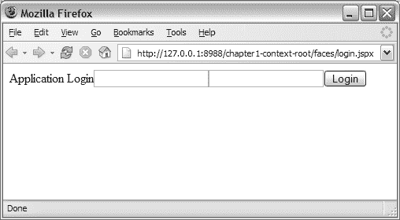

5807ch01.qxd 1/3/06 4:47 PM 第 29 页

第 1 章 ■ JSF 的基础：组件

**29**

<h:inputText value="#{credentials.password}" />

<h:commandButton value="Login"

action="success"

actionListener="#{credentials.onLogin}" />

</h:form>

</body>

</html>

</f:view>

</jsp:root>


页面结构简单，描述了一个包含用户名和密码两个输入字段以及一个登录按钮的页面。图 1-9 展示了该页面渲染后的效果。

**图 1-9.** *登录页面*

应用程序中的第二个页面，如代码示例 1-17 所示，结构简单，仅用于演示导航和生命周期的完成。该页面包含一个 `<h:outputText>` 组件，在成功登录后，该组件将渲染初始页面上用户名 `<h:inputText>` 组件中输入的值。

**代码示例 1-17.** *应用程序的导航规则和托管 Bean*

<?xml version="1.0" encoding="utf-8"?>

<jsp:root version="2.0"

>

<jsp:output omit-xml-declaration="true" doctype-root-element="HTML"

doctype-system="http://www.w3.org/TR/html4/loose.dtd"

doctype-public="-//W3C//DTD HTML 4.01 Transitional//EN"/>

<jsp:directive.page contentType="text/html;charset=utf-8"/>

<f:view>

<html>

5807ch01.qxd 1/3/06 4:47 PM Page 30

**30**

第 1 章 ■ JSF 基础：组件

<body>

<h:form>

<h:outputText value="#{credentials.username}" />

</h:form>

</body>

</html>

</f:view>

</jsp:root>

为了能够从一个页面导航到另一个页面，你必须在 JSF 配置文件 `faces-config.xml` 中定义一个导航案例。你还需要使用托管 Bean 创建一个到后端代码的映射。代码示例 1-18 展示了如何执行此操作。

**代码示例 1-18.** *应用程序的导航规则和托管 Bean*

<navigation-rule>

**<from-view-id>/login.jspx</from-view-id>**

<navigation-case>

**<from-outcome>success</from-outcome>**

**<to-view-id>/result.jspx</to-view-id>**

</navigation-case>

</navigation-rule>

<managed-bean>

**<managed-bean-name>credentials</managed-bean-name>**

**<managed-bean-class>**

**com.apress.projsf.ch1.application.CredentialsBean**

**</managed-bean-class>**

**<managed-bean-scope>session</managed-bean-scope>**

</managed-bean>

如你所见，代码示例 1-18 定义了从 `login.jspx` 页面出发，当结果为 `success` 时，应用程序的用户将被发送到 `result.jspx` 页面。它还定义了一个指向类 `CredentialsBean` 的托管 Bean，该类包含一些简单的应用程序逻辑。代码示例 1-19 展示了该应用程序逻辑。

**代码示例 1-19.** *应用程序逻辑*

package com.apress.projsf.ch1.application;

import javax.faces.event.AbortProcessingException;

import javax.faces.event.ActionEvent;

public class CredentialsBean

{

public void onLogin(

ActionEvent event)

5807ch01.qxd 1/3/06 4:47 PM Page 31

第 1 章 ■ JSF 基础：组件

**31**

{

**If (!"duke".equalsIgnoreCase(_username))**

throw new AbortProcessingException("Unrecognized username!");

// 为了稳妥起见，清除密码！

_password = null;

}

public void setUsername(

String username)

{

_username = username;

}

public String getUsername()

{

return _username;

}

public void setPassword(

String password)

{

_password = password;

}

public String getPassword()

{

return _password;

}

private String _username;

private String _password;

}

Web 应用程序启动

在接收到 JSF 请求时，JSF 实现必须*启动*或获取对多个进程/服务的引用，这些进程/服务对于在 Servlet 或 Portlet 环境中运行的 JSF Web 应用程序必须是可用的。为了访问这些引用，JSF 实现将调用多个工厂，这些工厂负责创建启动 JSF 应用程序所需的实例。

当 JSF Web 应用程序启动时，会实例化四个工厂；每个工厂负责 JSF Web 应用程序中的不同领域：*ApplicationFactory*：`ApplicationFactory` 类负责创建 `Application` 实例，该实例可被视为一项服务，例如，它允许 `Lifecycle` 实例为传入请求创建和恢复 JSF 视图（组件层次结构），并存储 JSF 视图的状态。

5807ch01.qxd 1/3/06 4:47 PM Page 32

**32**

第 1 章 ■ JSF 基础：组件


*LifecycleFactory*：LifecycleFactory 负责为生命周期标识符返回一个 Lifecycle 实例。默认的 Lifecycle 实例负责调用处理逻辑，以实现 JSF 请求处理生命周期中每个阶段所需的功能。

*RenderKitFactory*：RenderKitFactory 负责为 JSF Web 应用程序返回一个 RenderKit。RenderKit 是一个包含采用通用渲染技术的多个 Renderer 的库。

*FacesContextFactory*：FacesContextFactory 为 JSF 实现提供了一种创建 FacesContext 实例的方法，该实例用于表示与传入请求以及最终响应相关联的上下文信息。

图 1-10 展示了应用程序启动时涉及的角色。

**图 1-10.** *应用程序创建*

每个 JSF Web 应用程序都有一个 ApplicationFactory。这个工厂类负责创建和替换所有使用 JSF 的应用程序所需的 Application 实例。然后，Application 实例将利用该实例支持的服务为其他进程提供服务。同样，JSF 配置文件——`faces-config.xml`——在 Web 应用程序创建期间被读取一次，并存储在 Application 实例中。

RenderKitFactory 负责根据此 JSF Web 应用程序的 RenderKit 标识符返回一个 RenderKit 实例。对于每个 JSF 实现，必须有一个默认的 RenderKit——即由字符串常量 `RenderKitFactory.HTML_BASIC_RENDER_KIT` 标识的 HTML RenderKit。LifecycleFactory 负责创建（如果需要）并返回一个 Lifecycle。此 Lifecycle 实例负责调用处理逻辑，以实现请求处理生命周期中每个阶段（参见图 1-8）所需的功能。

5807ch01.qxd 1/3/06 4:47 PM 第 33 页

第 1 章 ■ JSF 基础：组件

**33**

最后一个工厂类——FacesContextFactory——为 JSF 实现提供了一种创建 FacesContext 实例的方法，该实例用于表示与传入请求相关联的上下文信息，并最终创建响应。

初始请求

当用户首次访问应用程序时，一个初始请求被发送到 FacesServlet，后者将该请求分派给 JSF Lifecycle 实例（参见图 1-10）。

**恢复视图阶段**

JSF 生命周期的第一个阶段是恢复视图阶段（见图 1-11），其职责是检查此页面之前是否已被请求过，或者这是一个新请求。

**图 1-11.** *初始请求期间的恢复视图阶段* 在图 1-11 中，您看到的是传入请求的处理过程，以及 JSF 生命周期中的第一个阶段——恢复视图——如何负责从服务器和客户端状态恢复视图。在对此视图的第一次请求期间，`ViewHandler.restoreView()` 方法将返回 `null`，因为没有存储的状态。

■**注意** JSF 生命周期阶段标识符是 PhaseId 类中 JSF 公共 API 的一部分。

5807ch01.qxd 1/3/06 4:47 PM 第 34 页

**34**

第 1 章 ■ JSF 基础：组件

如果返回值为 `null`，恢复视图阶段将在此请求的 FacesContext 上调用 `renderResponse()`。`renderResponse()` 方法将指示，当此阶段完成时，将调用 `render()` 方法来执行阶段 6——渲染响应——而不继续执行阶段 2 到阶段 5。随后，恢复视图阶段将调用 `ViewHandler.createView()` 方法来创建组件层次结构的根——`UIViewRoot`——并将其附加到 FacesContext。`UIViewRoot` 组件不执行渲染，但在回发请求期间的事件传递中扮演重要角色。

**渲染响应阶段**

当在恢复视图阶段调用 `renderResponse()` 方法时，生命周期直接跳转到 `render()` 方法，该方法负责执行渲染响应阶段，如图 1-12 所示。

**图 1-12.** *初始请求期间的渲染响应阶段* 在此阶段，调用 `ViewHandler.renderView()` 方法来执行 JSP 文档。`renderView()` 方法将从 `UIViewRoot` 节点获取的 `viewId` 属性值作为上下文相关路径，传递给与此请求关联的 `ExternalContext` 的 `dispatch()` 方法。`dispatch()` 方法会将 `viewId` 属性的值（例如，作为上下文相关路径的 `/login.jspx`）转发给 Web 容器。

由于 JSF 特定的映射不是转发请求的一部分，因此该请求被 FacesServlet 忽略，并传递给 JSP 容器，JSP 容器随后将根据上下文相关路径定位 JSP，并执行与 `viewId` 匹配的 JSP 页面（例如，`/login.jspx`）。图 1-13 展示了 JSF JSP 文档的处理过程。

5807ch01.qxd 1/3/06 4:47 PM 第 35 页

第 1 章 ■ JSF 基础：组件

**35**

**图 1-13.** *在 FacesContext 上设置* ResponseWriter **JSF 视图标识符：VIEW ID**

根据使用的映射类型——前缀或后缀——`UIViewRoot` 视图标识符的派生方式与请求统一资源标识符 (URI) 略有不同。如果对 FacesServlet 使用前缀映射，例如 `/faces/*`（这是最常见的），则 `viewId` 属性根据映射后的路径信息设置；例如，`/context-root/faces/login.jspx` 将设置一个等于 `/login.jspx` 的视图标识符。如果使用后缀映射，例如 `*.jsf`，则 `viewId` 属性根据请求 URI 的 servlet 路径信息设置，方法是将后缀替换为由符号常量 `ViewHandler.DEFAULT_SUFFIX_NAME` 命名的上下文初始化参数的值。例如，`/context-root/login.jsf` 默认将设置一个等于 `/login.jsp` 的视图标识符，但可以利用上下文初始化参数改用 `.jspx` 作为默认后缀。

在处理和执行 JSF JSP 文档之前，JSP 运行时首先确定要使用的内容类型和字符编码。为了使 JSF 与 JSP 生命周期协调工作，必须存在 `<f:view>` 标签。`<f:view>` 标签是一个 JSP 主体标签，它缓冲来自嵌套 JSF 组件的所有渲染输出。简而言之，`<f:view>` 标签充当所有其他 JSF 组件的容器。`<f:view>` 标签负责在 FacesContext 上创建并存储一个 `ResponseWriter` 实例。

`createResponseWriter()` 方法为指定的内容类型和字符编码创建一个新的 `ResponseWriter` 实例。`ResponseWriter` 负责将生成的标记写入请求客户端，在本例中即 `<f:view>` 主体内容缓冲区。

5807ch01.qxd 1/3/06 4:47 PM 第 36 页

**36**

第 1 章 ■ JSF 基础：组件

**内容类型和字符编码**

当服务器向 HTTP 浏览器客户端发送文档时，它还会在 Content-Type HTTP 标头中传递关于多用途互联网邮件扩展 (MIME) 类型（例如 `text/html`）和字符集（例如 `UTF-8` 或 `ISO-8859-1`）的信息。客户端使用此信息来正确处理来自服务器的传入字节。

可接受的内容类型和字符编码列表在 Accept HTTP 标头中从客户端发送到服务器。这可用于动态选择响应的适当内容类型，或者应用程序开发人员可以为文档指定静态内容类型。


在 JSF 中，`<f:view>` 标签向 `RenderKitFactory` 传递 `null` 作为可接受的内容类型列表，尽管 JSP 容器知道请求浏览器所接受的完整列表。因此，默认的 RenderKit（即标准 HTML Basic RenderKit）必须假定内容类型已设置为 `text/html`，因为它只渲染 HTML。RenderKit 利用内容类型和字符编码信息来创建一个 `ResponseWriter`，从而能够向客户端生成格式正确的标记。

在初始渲染期间，对于 `<f:view>` 内的每个 JSF JSP 标签，都会创建一个 JSF 组件并将其附加到组件层次结构中。如你所记，`UIViewRoot` 在第一阶段被创建并附加到 `FacesContext`，因此你可以安全地假设这些组件将被附加到组件层次结构中。图 1-14 展示了 `<h:form>` 开始标签的执行过程。

**图 1-14.** *将* `<form>` *开始元素写入* `<f:view>` *主体内容缓冲区*

5807ch01.qxd 1/3/06 4:47 PM 第 37 页

第 1 章 ■ JSF 的基础：组件

**37**

在登录 JSP 文档中，下一个要执行的 JSF JSP 标签是 `<h:form>` 标签。该 JSF JSP 标签调用 `Application.createComponent()` 方法，该方法接收一个表示组件类型的字符串，例如 `javax.faces.HtmlForm`（参见“组件族与组件类型”一节）。该组件类型映射到 `faces-config.xml` 文件中定义的类，然后创建 `HtmlForm` 组件的一个实例并将其附加到 `UIViewRoot`。

接下来，需要为新创建的组件查找一个 Renderer。Renderer 通过组件族和渲染器类型来定位，这两者共同定义了 Renderer 的唯一标识符（参见“渲染器类型”一节）。

■**注意** 让我们使用 `HtmlInputText` 组件来说明组件族与渲染器类型之间的关系。`HtmlInputText` 组件的组件族为 `javax.faces.Input`，渲染器类型为 `javax.faces.Text`。两者共同在 HTML Basic RenderKit 中唯一标识了适当的 Renderer 类——`javax.faces.renderer.html.HtmlInputText`。

渲染器类型已由 `<h:form>` 标签知晓，而组件族可以在组件的超类 `UIForm` 中找到。然后，该标签在组件上调用名为 `encodeBegin()` 的方法，该方法进而调用 `HtmlForm` 渲染器上的 `encodeBegin()` 方法。

Renderer 上的 `encodeBegin()` 方法调用 `ResponseWriter` 上的方法来编写 HTML 表单元素的标记——`<form method="" action="">`。所有来自 `ResponseWriter` 的标记输出最终都进入 `<f:view>` 主体内容缓冲区。图 1-15 展示了 `<h:form>` 标签的关闭过程。

**图 1-15.** *输出令牌并关闭* `</form>` *元素*

5807ch01.qxd 1/3/06 4:47 PM 第 38 页

**38**

第 1 章 ■ JSF 的基础：组件

该过程继续进行，`HtmlForm` 组件内的所有嵌套组件都被渲染并添加到 `<f:view>` 主体内容缓冲区。然后，执行 `<h:form>` 标签的结束标签。`<h:form>` 标签调用 Renderer（`HtmlFormRenderer`）上的 `encodeEnd()` 方法，该方法进而调用 `ViewHandler` 上的 `writeState()` 方法。`writeState()` 方法将一个令牌传递给 `ResponseWriter`，该令牌被添加到 `<f:view>` 主体内容缓冲区。然后，`encodeEnd()` 方法调用 `ResponseWriter` 上的方法来编写 HTML 表单元素的结束标签——`</form>`。图 1-16 展示了 `<f:view>` 标签的关闭过程。

■**注意** `ViewHandler` 代表视图技术，在本例中视图技术是 JSP。JSF 规范并不阻止任何人实现用于其他视图技术（例如 XML）的替代 `ViewHandler`。

**图 1-16.** *用序列化状态替换令牌并关闭* `</f:view>` 当到达 `</f:view>` 结束标签时，整个组件层次结构已经可用。只有拥有了完整的树，你才能存储代表应用程序此页面的组件层次结构的状态。`</f:view>` 结束标签调用 `StateManager` 上的 `writeState()` 方法。根据用于状态保存的初始化参数 `STATE_SAVING_METHOD`（参见“保存和恢复状态”一节），`StateManager` 将状态存储在服务器上的会话中，或者委托给 `ResponseStateManager` 将状态保存在客户端，并用序列化状态替换令牌。状态保存完成后，缓冲区内容被刷新到客户端，然后执行任何剩余的、非 JSF 的 JSP 标签。现在，登录页面已在浏览器中渲染完成。

5807ch01.qxd 1/3/06 4:47 PM 第 39 页

第 1 章 ■ JSF 的基础：组件

**39**

■**注意** 在 JSF 1.2 中，`<f:view>` 标签不再负责缓冲输出。相反，缓冲是通过使用 `ServletResponse` 包装器来实现的。此外，组件层次结构不再在渲染期间内联创建。相反，在 JSF 1.2 的“渲染响应”阶段，首先创建组件层次结构，然后进行渲染。因此，在渲染期间，完整的组件层次结构是可用的，所以状态被直接写入缓冲的响应中，而不需要使用占位符令牌，然后在 `</f:view>` 中被真实状态替换。

回传请求

到目前为止，用户所看到的只是第一个请求页面的初始渲染。收到页面后，用户输入用户名和密码并点击登录按钮。此时执行回传，现在你将了解 JSF 如何处理回传。某些部分与我们在初始请求中已经介绍的内容相似，但显然存在差异和新增内容，尤其是在 JSF 请求生命周期中。在回传时，JSF 请求生命周期的所有六个阶段都会被调用（除非在过程中的某处调用了 `FacesContext.renderResponse()` 方法，导致生命周期直接跳转到“渲染响应”阶段）。这与初始请求不同，初始请求只调用第一个和最后一个阶段。

**恢复视图阶段**

回传的第一部分与初始请求相同：“恢复视图”阶段执行，并调用 `ViewHandler` 上的 `restoreView()` 方法来恢复前一个请求中可用的任何状态。图 1-17 展示了恢复组件层次结构的已保存状态。

**图 1-17.** *恢复组件层次结构的已保存状态*

5807ch01.qxd 1/3/06 4:47 PM 第 40 页

**40**

第 1 章 ■ JSF 的基础：组件

相似之处到此为止；`restoreView()` 方法不再返回 `null`，而是从 `StateManager` 返回与特定 `viewId` 和 `FacesContext` 关联的组件层次结构的当前状态，并且如果初始化参数 `STATE_SAVING_METHOD` 设置为客户端状态保存，则调用 `ResponseStateManager` 从当前请求中检索状态。然后，“恢复视图”阶段将恢复后的组件层次结构传递给 `FacesContext`。

**应用请求值阶段**

在“应用请求值”阶段，每个输入组件从请求参数中建立提交的值，每个命令组件将一个事件排队，以便在“调用应用程序”阶段交付。图 1-18 展示了“应用请求值”阶段如何将新值传递给组件。


**图 1-18.** *将请求中传递的新值应用于组件* 此时，提交的值仅作为“已提交”状态存储在组件上，尚未推入底层模型。当“应用请求”阶段完成时，渲染器不再需要观察请求参数，因为所有值都已在每个组件上更新。

**处理验证阶段**

在处理验证阶段，通过调用 `UIViewRoot` 上的 `processValidators()` 方法来执行转换和验证。图 1-19 展示了转换和验证过程。

5807ch01.qxd 1/3/06 4:47 PM 第 41 页

第 1 章 ■ JSF 的基础：组件

**41**

**图 1-19.** *执行转换和验证* 此过程将继续递归调用组件层次结构中每个组件上的 `processValidators()` 方法。在每个 `HtmlInputText` 组件的验证过程中，首先会对组件的提交值进行类型转换（例如，将字符串转换为强类型对象）。新对象被设置为组件上的本地值，并清除提交值。然后验证新的强类型对象。如果没有错误，下一步是将一个 `ValueChangeEvent` 加入队列，该事件将在“应用请求值”阶段结束时传递。

如果发生转换或验证错误，则会使用组件客户端 ID 将相应的 JSF 消息附加到 `FacesContext`，然后调用 `renderResponse()` 方法，以指示生命周期在处理验证阶段完成后应直接跳转到“渲染响应”阶段。

**更新模型阶段**

在生命周期的这个阶段，所有提交的值都已成功转换和验证，因此可以安全地将它们推入底层数据模型。在更新模型阶段，JSF 生命周期遍历组件层次结构，在每个组件上调用 `processUpdates()` 方法。图 1-20 展示了更新模型阶段更新底层模型的过程。

为了确定新值的存储位置，`processUpdates()` 方法将使用值绑定，该绑定在组件的 `value` 属性中定义（例如，`#{credentials.username}`）。值绑定指向托管 Bean 上的一个属性（例如，`username`）。使用值绑定，组件上本地存储的值被推入数据模型，并且组件上本地存储的值被清除。

模型上的任何 JSF 消息和错误（例如，由模型实现的验证）都会使用组件的客户端 ID 附加到 `FacesContext`。然后调用 `renderResponse()` 方法，以指示生命周期在更新模型阶段完成后应直接跳转到“渲染响应”阶段。

5807ch01.qxd 1/3/06 4:47 PM 第 42 页

**42**

第 1 章 ■ JSF 的基础：组件

**图 1-20.** *更新底层模型*

**调用应用程序阶段**

在调用应用程序阶段，无需遍历组件层次结构，因为此阶段仅处理来自先前阶段排队的事件，并根据结果，要么继续到最后一个阶段——渲染响应，要么重定向到另一个页面。图 1-21 展示了为此阶段排队的事件的广播以及操作方法绑定的处理。

**图 1-21.** *执行应用程序逻辑*

5807ch01.qxd 1/3/06 4:47 PM 第 43 页

第 1 章 ■ JSF 的基础：组件

**43**

正如前面“转换器、验证器、事件和监听器”一节中提到的，当 `ActionEvent` 发生时，将处理两个方法。首先发生的是调用 `UIViewRoot` 上的 `processApplication()` 方法，该方法获取每个排队的事件并将其广播到事件的目标组件（例如，`commandButton.broadcast(FacesEvent)`）。`UICommand` 组件知道 `action` 和 `actionListener` 属性，以及附加到 `Application` 对象的默认 `ActionListener`。

首先调用所有先前注册的 `ActionListener`，然后执行 `actionListener` 方法绑定（例如，`#{credentials.onLogin}`），最后组件调用默认 `ActionListener` 上的 `processAction()` 方法来处理 `action` 方法绑定并处理导航。重要的是，`action` 方法绑定在此过程结束时被调用，因为它定义了可能的导航，并且您不希望在处理完所有事件之前进行导航。

**带导航的回传**

当默认的 `ActionListener` 处理 `ActionEvent` 时，它会调用 `action` 方法绑定并获取结果，该结果是一个 `String` 对象。如果结果返回 `null`，则默认的 `ActionListener` 将继续处理下一个排队的事件。在所有事件广播完毕后，调用应用程序阶段完成，生命周期处理继续到最后一个阶段——渲染响应。如果结果不为 `null`，则默认的 `ActionListener` 将 `FacesContext`、`fromAction`（即方法绑定表达式文本，例如 `credentials.doLogin`）和结果传递给 `NavigationHandler`。图 1-22 展示了回传时的导航。

**图 1-22.** *回传时的导航*

5807ch01.qxd 1/3/06 4:47 PM 第 44 页

**44**

第 1 章 ■ JSF 的基础：组件

导航规则在 `faces-config.xml` 中定义，该文件在启动时被读取，所有信息都存储在 `Application` 对象中（参见“导航模型”一节）。`NavigationHandler` 做的第一件事是检查是否存在与 `fromViewId`（它将从 `FacesContext` 获取）、`fromAction` 和结果组合匹配的导航规则。

您可以通过两种方式处理导航。重定向意味着一个新的请求（并且作为额外的好处，您可以收藏新页面），并重新开始 JSF 请求生命周期；您也可以让 `handleNavigation()` 方法创建一个新的 `UIViewRoot`，在 `FacesContext` 上设置新的 `UIViewRoot`，并让默认的 `ActionListener` 调用 `renderResponse()` 来启动渲染响应阶段。此解决方案复制了渲染响应阶段中初始请求的行为，但使用了新的视图标识符。图 1-23 展示了回传期间的 JSP 执行过程。

**图 1-23.** *回传时的渲染响应*

在回传期间，渲染响应阶段的第一部分与初始请求直到 `dispatch()` 方法调用之前的部分相同，不同之处在于您现在拥有一个完整的组件层次结构，而不仅仅是 `UIViewRoot`（参见图 1-13）。在调度之后，JSP 页面被执行，`<f:view>` 开始标签执行与初始请求时相同的操作——在 `FacesContext` 上创建并存储一个 `ResponseWriter` 实例，并充当组件渲染输出的缓冲区（参见图 1-14）。

与初始请求中创建新组件并将其附加到 `UIViewRoot` 不同，嵌套在 `<f:view>` 标签内的各个组件标签必须定位其已存在于组件层次结构中的对应组件。这发生在 JSP 页面执行期间，通过向上遍历标签树以找到最近的封闭父组件标签。从父组件标签，子组件标签可以通过组件标识符或 facet 名称找到其对应的组件（参见“Facets”一节）。

5807ch01.qxd 1/3/06 4:47 PM 第 45 页

第 1 章 ■ JSF 的基础：组件

**45**


除了将组件映射到组件标签而非创建新的组件实例外，处理过程与初始请求相同——将组件渲染到`<f:view>`主体内容缓冲区，将状态存储在客户端或服务器端的会话中，最后将缓冲的标记刷新到父级 JSP 容器进行渲染（参见图 1-15）。

JSF 与 JSP

在 JSF 中，组件编写者可以在组件上设置一个名为`rendersChildren`的布尔属性。该属性决定组件是否应渲染其子组件。对于 JSF 实现中的组件，`rendersChildren`的值设置为`false`。这意味着每个组件负责将正确的输出渲染到`ResponseWriter`并在`<f:view>`中缓冲，而不关心其子组件如何渲染。如果组件上的`rendersChildren`设置为`true`，则`encodeBegin()`方法将在结束标签中调用，而不是在开始标签中调用（参见图 1-14），以确保在父组件完成对其子组件的循环之前，没有子组件被渲染到缓冲区。一旦父组件了解其子组件，它们将被渲染到`<f:view>`主体内容缓冲区。使用此特性的一个组件是`dataTable`组件，因为它需要在生成任何渲染输出之前访问其所有子组件。

考虑到某些组件可能要求将`rendersChildren`设置为`true`，这将影响你构建页面描述的方式。还记得登录页面吗？让我们为输入字段添加一些标签，并调整布局，使组件垂直对齐而不是水平对齐，如代码示例 1-20 所示。

**代码示例 1-20.** *使用一些 JSP 标签修改后的登录页面*

```xml
<?xml version='1.0' encoding='windows-1252'?>

<jsp:root version="2.0"

>

<jsp:output omit-xml-declaration="true" doctype-root-element="HTML"

doctype-system="http://www.w3.org/TR/html4/loose.dtd"

doctype-public="-//W3C//DTD HTML 4.01 Transitional//EN"/>

<jsp:directive.page contentType="text/html;charset=windows-1252"/>

<f:view>

<html>

<body>

<h:form>

<h:outputText value="Application Login" />

**<h:panelGrid columns="2">**

**<jsp:text>Username</jsp:text>**

<h:inputText value="#{sample.username}" />


5807ch01.qxd 1/3/06 4:47 PM Page 46

**46**

C H A P T E R 1 ■ T H E F O U N D AT I O N O F J S F : C O M P O N E N T S

**<jsp:text>Password</jsp:text>**

<h:inputText value="#{sample.password}" />

**</h:panelGrid>**

<h:commandButton value="Submit" action="#{credentials.onLogin}" />

</h:form>

</body>

</html>

</f:view>

</jsp:root>
```

此示例使用`<h:panelGrid>`标签包裹组件。此标签创建的组件在一个两列的二维网格中渲染其子组件。`HtmlPanelGrid`组件将`rendersChildren`设置为`true`，因此它可以在为每列渲染标记之前观察所有子组件。它还添加了两个非 JSF 标签——`<jsp:text>`——将为每个输入字段添加标签。在运行时，页面看起来如图 1-24 所示。

**图 1-24.** *将`rendersChildren`设置为`true`时渲染非 JSF 内容*  
如你所见，用户名和密码标签被错误地放置在页面顶部。在执行此页面期间，`HtmlPanelGrid`组件内的任何 JSF 组件都将延迟渲染到缓冲区，直到`HtmlPanelGrid`的结束标签（例如`</h:panelGrid>`）。请注意，`HtmlPanelGrid`组件内嵌套的其他任意标签或文本不会延迟。因此，`<jsp:text>`会立即渲染到缓冲区。你可以通过将非 JSF 内容包裹在`<f:verbatim>`标签中来规避此行为，如代码示例 1-21 所示。

**代码示例 1-21.** *使用`<f:verbatim>`标签包裹非 JSF 内容的登录页面*

```xml
<h:form>
    <h:outputText value="Application Login"/>
    <h:panelGrid columns="2">

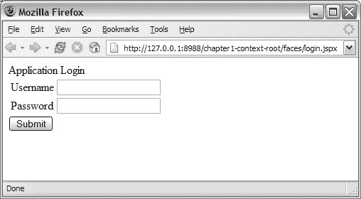

5807ch01.qxd 1/3/06 4:47 PM Page 47

C H A P T E R 1 ■ T H E F O U N D AT I O N O F J S F : C O M P O N E N T S

**47**

        <f:verbatim><jsp:text>Username</jsp:text></f:verbatim>
        <h:inputText value="#{credentials.username}" />
        <f:verbatim><jsp:text>Password</jsp:text></f:verbatim>
        <h:inputText value="#{credentials.password}" />
    </h:panelGrid>
    <h:commandButton value="Submit" action="#{credentials.onLogin}" />
</h:form>
```

`<f:verbatim>`标签获取非 JSF 内容并将其作为`UIOutput`组件添加到组件层次结构中。在运行时，更新后的页面看起来如图 1-25 所示。

**图 1-25.** *使用`<f:verbatim>`标签渲染非 JSF 内容*

■**注意** `rendersChildren`的问题已在 JSF 1.2 版本中由 JSF 专家组（EG）解决。新的内容交织特性适应了 JSF 和 JSP 渲染策略之间的差异，使得不再需要添加`<f:verbatim>`包装标签。

**总结**

本章作为本书其余部分的迷你指南；它也为你继续深入 JSF 世界提供了基础。

JSF 相对于其他视图技术的一个关键区别在于其开放性和采用新兴技术的能力，例如 XUL、HTC 和 Ajax，以及其他未来的视图技术。JSF 相对于其他技术具有明显的优势，因为使用 JSF 构建的应用程序可以在周围技术消亡和新技术出现时继续存在。JSF 可以降低应用程序开发的维护成本，因为只需要一种编程模型——JSF 和 Java——即使系统可能需要不同的用户代理，如 Telnet、即时消息、移动代理、浏览器和其他类型的代理（如条形码阅读器）。

5807ch01.qxd 1/3/06 4:47 PM Page 48

**48**

C H A P T E R 1 ■ T H E F O U N D AT I O N O F J S F : C O M P O N E N T S

本章涉及了构成 JSF 应用程序的细节——JSF 组件、导航模型以及通过托管 Bean 实现的后端逻辑。我们还探讨了 JSF 组件模型的来龙去脉及其在表示和行为之间的清晰分离，并讨论了 JSF 组件的结构——`UIComponent`、`Renderer`、特定于渲染器的子类`RenderKit`以及 JSP 标签处理器。本章还详细介绍了初始请求和回发时的 JSF 请求生命周期，包括导航。

理解表示和行为之间的分离对于掌握 JSF 组件的全部潜力至关重要。

5807ch02.qxd 12/30/05 4:27 PM Page 49

C H A P T E R 2

■ ■ ■

定义日期

字段组件

*通过允许开发者将解决方案的功能分离到组件中，* *并将其放置在解决方案最合理的位置，基于组件的设计消除了许多* *曾经阻碍解决方案部署和维护的约束。*

—微软开发者网络（MSDN）

**在**第一章介绍了 JSF 之后，本章将探讨组件设计的概念及其在 JSF 中的适用性。

本章的主要重点是让你快速掌握设计和创建可重用 JSF 组件所需的构建块。创建 JSF 组件并不难；你只需要遵循一个明确定义的蓝图，我们将在本章中提供。具体来说，我们将介绍如何创建`Renderer`，如何创建特定于渲染器的子类，如何创建 JSP 标签处理器，以及如何注册你的自定义 JSF 组件。

为了说明这个过程，我们将展示如何创建一个简单的日期字段组件，你将在本书中一直使用它。在后续章节中，我们将展示如何增强这个日期字段组件，直到你得到一个支持 Ajax、XUL 和 HTC 的丰富、成熟的 JSF 组件。尽管如此，在本章结束时，你应该拥有第一个功能组件，可以向你的朋友和开发者同行展示。

**日期字段组件的需求**


你可以通过多种方式构建自己的可复用组件，但对于 JSF 而言，最常见的方法是找到一个已具备所需行为的组件，并在此基础上进行扩展。那么，本章要构建的组件需要具备哪种类型的行为呢？例如，它是用于输入值、选择单个值、选择多个值，还是用于导航？

实际上，你将构建一个能够接收值、处理该值，然后将其作为强类型的 Date 对象推送回底层模型的组件。该组件应允许应用程序开发者附加一个转换器，以便设置最终用户必须遵循的所需日期格式（例如 mm/dd/yyyy）。基本上，你将构建一个简单的输入组件，该组件能够转换和验证用户输入的日期。

**49**

5807ch02.qxd 12/30/05 4:27 PM 第 50 页

**50**

第 2 章 ■ 定义日期字段组件

确认这就是你所需的功能后，很容易在现有组件中搜索这种特定行为。表 2-1 列出了 JSF 规范中所有可用的行为超类。

**表 2-1.** *JSF 规范：行为超类*

**名称****

**描述**

UIColumn

UIColumn（继承自 UIComponentBase）是一个组件，代表父组件 UIData 中的单列数据。UIColumn 的子组件将针对父组件 UIData 所管理数据中的每一行处理一次。

UICommand

UICommand（继承自 UIComponentBase；实现 ActionSource）是一个控件，当用户激活它时，会触发特定于应用程序的“命令”或“操作”。此类组件通常呈现为按钮、菜单项或超链接。

UIData

UIData（继承自 UIComponentBase；实现 NamingContainer）是一个组件，代表与 DataModel 实例所表示的数据对象集合的数据绑定。只有类型为 UIColumn 的子组件才应由与此组件关联的渲染器处理。

UIForm

UIForm（继承自 UIComponentBase；实现 NamingContainer）是一个组件，代表呈现给用户的输入表单，其子组件（以及其他内容）代表表单提交时要包含的输入字段。UIForm 的渲染器的 encodeEnd() 方法必须在写出表单结束标签的标记之前调用 ViewHandler.writeState()。这允许保存多个表单的状态。

UIGraphic

UIGraphic（继承自 UIComponentBase）是一个向用户显示图形图像的组件。用户无法操作此组件；它仅用于显示目的。

UIInput

UIInput（继承自 UIOutput；实现 EditableValueHolder）是一个组件，它既向用户显示组件的当前值（如 UIOutput 组件所做的那样），又在后续需要解码的请求中处理请求参数。

UIMessage

UIMessage（继承自 UIComponentBase）封装了与指定输入组件相关的错误消息的渲染。

UIMessages

UIMessages（继承自 UIComponentBase）封装了与指定输入组件无关的错误消息或所有排队消息的渲染。

UIOutput

UIOutput（继承自 UIComponentBase；实现 ValueHolder）是一个具有值的组件，该值可选地通过值绑定表达式从模型层 bean 中检索，并显示给用户。用户无法直接修改渲染后的值；它仅用于显示目的。

UIPanel

UIPanel（继承自 UIComponentBase）是一个管理其子组件布局的组件。

UIParameter

UIParameter（继承自 UIComponentBase）是一个组件，代表一个可选的命名配置参数，该参数会影响其父组件的渲染。UIParameter 组件通常没有自己的渲染行为。

UISelectBoolean

UISelectBoolean（继承自 UIInput）是一个代表单个布尔值（true 或 false）的组件。它最常呈现为复选框。


5807ch02.qxd 12/30/05 4:27 PM 第 51 页

**第 2 章 ■ 定义日期字段组件**

**51**

**名称****

**描述**

UISelectItem

UISelectItem（继承自 UIComponentBase）是一个可嵌套在 UISelectMany 或 UISelectOne 组件内部的组件，代表该父组件可用选项列表中的一个 SelectItem 实例。

UISelectItems

UISelectItems（继承自 UIComponentBase）是一个可嵌套在 UISelectMany 或 UISelectOne 组件内部的组件，代表零个或多个 SelectItem 实例，用于向该父组件的可用选项列表中添加选择项。

UISelectMany

UISelectMany（继承自 UIInput）是一个代表从可用选项列表中进行一项或多项选择的组件。它通常呈现为多选列表或一组复选框。

UISelectOne

UISelectOne（继承自 UIInput）是一个代表从可用选项列表中进行零项或一项选择的组件。它通常呈现为组合框或一组单选按钮。

** 来源：JSF 1.1 规范*

*** 该组件的完整类名为* javax.faces.component *.*

本章将要创建的日期字段组件的关键行为是让用户输入新日期。查看表 2-1，你会发现有一个组件描述了日期字段组件所需的行为——行为超类 UIInput。

无需创建引入现有行为的新组件，你可以直接使用 JSF 规范中的 UIInput 组件。因此，这个新组件将被称为*输入日期组件*，并遵循与标准 JSF 组件（如输入文本组件）相同的命名约定。

**使用 UIINPUT**

UIInput 组件定义了应用程序如何与你的组件或任何继承自该超类的组件进行交互的契约。UIInput 组件自带一个默认渲染器，该渲染器在运行时会将组件显示为一个文本输入字段，用户可在其中输入数据。其组件类型为 javax.faces.Input，默认渲染器类型为 javax.faces.Text。

UIInput 组件向客户端显示值的方式与 UIOutput 组件大致相同。事实上，UIInput 组件继承自 UIOutput 组件。UIInput 组件还会在回传时处理需要解码和管理的请求参数。如果请求中传递的值与之前的值不同，组件会触发一个 ValueChangeEvent 事件。你可以附加一个 ValueChangeListener，以便在 UIInput 组件广播 ValueChangeEvent 时接收通知。

**输入日期组件**

该输入日期组件的目的是为本书后续更高级的 JSF 工作打下坚实基础。在视觉上，该组件将是一个简单的输入文本字段，带有一个图标覆盖层以指示其为日期字段，并具备一些有用的类型转换和日期验证功能。

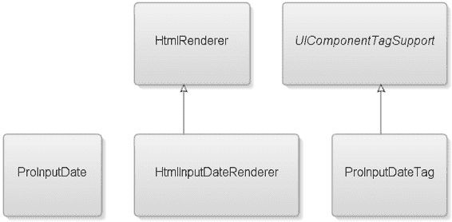

5807ch02.qxd 12/30/05 4:27 PM 第 52 页

**52**

第 2 章 ■ 定义日期字段组件

为满足这些新需求，本章将引入一个新的渲染器、一个渲染器特定子类以及一个新的标签处理器。输入日期组件还在组件设计中引入了一个非 Java 元素——样式表的使用。完成本章后，你应该理解 JSF 生命周期，并掌握足够的知识来创建新的渲染器、渲染器特定子类以及相应的 JSP 标签处理器。

图 2-1 展示了本章将要创建的五个类：HtmlInputDateRenderer、ProInputDate、UIComponentTagSupport 和 ProInputDateTag，以及你将扩展的两个类：Renderer 和 UIInput。

**图 2-1.** *本章创建的类图*

• ProInputDate 是渲染器特定子类。


• `HtmlRenderer` 超类提供了一些用于编码资源的便捷方法。

• `HtmlInputDateRenderer` 是你新建的自定义渲染器，负责生成发送给客户端的标记。

• `ProInputDateTag` 是标签处理器。

• 最后，抽象的 `UIComponentTagSupport` 标签处理器类是一个支持标签处理器的超类，提供了所有组件通用的功能。

**使用蓝图设计输入日期组件** 在创建第一个自定义 JSF 组件之前，你需要了解完成一个 JSF 组件所需的步骤。表 2-2 概述了成功实现自定义 JSF 组件所需的蓝图。在本书的后续内容中，我们将通过更多步骤来扩展这个蓝图，而这些初始步骤将成为你之后创建的所有自定义组件的基础。现在，你只需关注成功实现输入日期组件所需的步骤。

5807ch02.qxd 12/30/05 4:27 PM 第 53 页

第 2 章 ■ 定义日期字段组件

**53**

**表 2-2.** *创建新 JSF 组件蓝图的步骤* **步骤**

**任务**

**描述**

创建 UI 原型

使用适当的标记为你的组件创建 UI 及其预期行为的原型。

创建客户端特定的渲染器

创建你需要的渲染器，它将为你的 JSF 组件写出客户端标记。

创建渲染器特定的子类

（可选）创建一个渲染器特定的子类。虽然这是一个可选步骤，但实现它是一个好的实践。

注册 UIComponent 和 Renderer

在 `faces-config.xml` 文件中注册你的新 UIComponent 和 Renderer。

创建 JSP 标签处理器和 TLD

如果你使用 JSP 作为默认视图处理器，则需要此步骤。另一种解决方案是使用 Facelets (http://facelets.dev.java.net/)。

表 2-1 中的第一步可能是最重要的一步，因为在此你将进行原型设计和测试，以查看你的想法是否能在预期的客户端中生效。当原型工作正常后，你的下一个目标是在 JSF 中实现你的解决方案，在这种情况下，这意味着你需要提供一个新渲染器来向客户端写入预期的标记，并提供一个渲染器特定的子类，以便于应用程序开发者使用。最后，你必须注册自定义组件并提供一个 JSP 标签处理器。

你将按照蓝图的第一步开始定义新组件，用最终将发送给客户端的预期标记来实现它。

**步骤 1：创建 UI 原型**

在开发新组件时，一个好的实践是首先创建需要渲染到客户端的预期标记的原型。通过这样做，你不仅能找出组件需要生成哪些元素，还能确定需要哪些渲染器特定的属性来参数化生成的标记。

如代码示例 2-1 所示，原型标记包含一个 HTML 表单 `<input>` 元素、一个 `` 元素、一个 `<div>` 元素和一个 `<style>` 元素。通过检查代码示例 2-2 中的 HTML 原型，你可以看到需要三个 HTML 属性——`title`、`name` 和 `value`——来参数化生成的标记。

**代码示例 2-1.** *输入日期组件的 HTML 原型*

<style type="text/css" >

.overlay

{

position:relative;

left:-10px;

bottom:-10px;

}

</style>

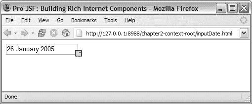

5807ch02.qxd 12/30/05 4:27 PM 第 54 页

**54**

第 2 章 ■ 定义日期字段组件

...

<div title="Date Field Component" >

<input name="dateField" value="26 January 2005" >


</div>

**代码示例 2-2.** *输入日期组件的参数化 HTML*

<style type="text/css" >

.overlay

{

position:relative;

left:-10px;

bottom:-10px;

}

</style>

...

**<div title="[title]">**

**<input name="[clientId]" value="[converted value]" >**


</div>


在代码示例 2-2 中，你将 HTML 属性映射到渲染期间使用的对应 UIComponent 属性。

■**注意** 关于 HTML 元素及其所有支持属性的更多信息，请访问 W3C 网站 http://www.w3.org/MarkUp/。

图 2-2 展示了你的原型结果，该原型显示了一个包含输入字段的简单页面，该输入字段带有一个图标，表明这是一个日期字段。

**图 2-2.** *使用 HTML 实现并带有图标叠加层的日期字段组件原型*

5807ch02.qxd 12/30/05 4:27 PM 第 55 页

第 2 章 ■ 定义日期字段组件

**55**

在创建输入日期组件之前，我们先预览一下最终结果以及如何在 JSP 页面中使用它。代码示例 2-3 使用了输入日期组件 `<pro:inputDate>`，并应用了一个 JSF 核心转换器 `<f:convertDateTime>`，该转换器将用户输入的字符串转换为强类型的 Date 对象。另一个 `<f:convertDateTime>` 则在提交按钮下方显示格式化后的日期。

**代码示例 2-3.** *包含日期字段组件的示例页面*

**<pro:inputDate id="dateField"**

**title="日期字段组件"**

**value="#{backingBean.date}" >**

<f:convertDateTime pattern="dd MMMMM yyyy" />

**</pro:inputDate>**

<br></br>

<h:message for="dateField" />

<br></br>

<h:commandButton value="提交" />

<br></br>

<h:outputText value="#{backingBean.date}" >

<f:convertDateTime pattern="dd MMMMM yyyy" />

</h:outputText>

加粗的代码是本章将要创建的输入日期组件。

**第 2 步：创建客户端特定的渲染器**

如第 1 章所述，渲染器负责向客户端输出（呈现），无论是针对移动设备的 WML 标记，还是针对浏览器客户端的传统 HTML 标记。渲染器还提供行为 UIComponent 类不支持的客户端属性，例如 style、width、height 和 disabled。

在不需要新行为的情况下，只需一个渲染器即可创建一个“新”组件。本章后面描述的渲染器特定组件子类（参见“第 3 步：创建渲染器特定子类”部分）仅仅是应用程序开发人员的一个便利类。虽然并非严格必要，但实现客户端特定组件子类以简化应用程序开发的某些方面是一种常见做法。

对于这个输入日期组件，你将重用 UIInput 组件超类，因为它提供了你所需的组件行为。现在，是时候专注于为 UIInput 组件提供一个自定义的输入日期渲染器了。基于之前的蓝图，你现在已经进入了第二步，是时候开始查看构成渲染器的代码了。

图 2-3 显示了本章将要创建的自定义渲染器 HtmlInputDateRenderer。该自定义渲染器扩展了 HtmlRenderer 工具超类，而 HtmlRenderer 又扩展了标准的 Renderer 类（javax.faces.render.Renderer）。

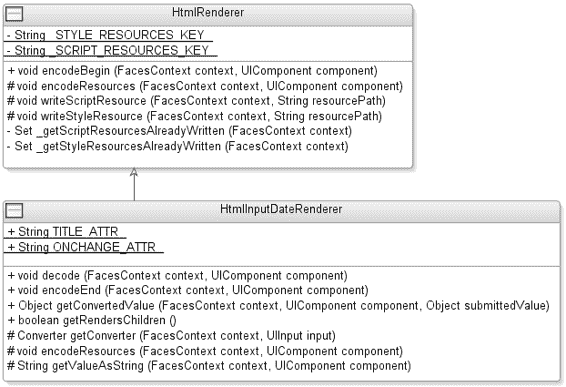

5807ch02.qxd 12/30/05 4:27 PM 第 56 页

**56**

第 2 章 ■ 定义日期字段组件

**图 2-3.** *本章创建的* HtmlInputDateRenderer *类的类图*
HtmlRenderer 超类

HtmlRenderer 超类提供了一些便捷方法，用于编码 HTML 渲染器所需的资源。应用程序开发人员可能会在页面中添加两个或更多输入日期组件；因此，如果不加以处理，输入日期组件使用的任何资源（例如样式表）都会被多次写入客户端。

HtmlRenderer 实现所提供的方法背后的语义将确保这些资源只被写入一次。在本章中，你将创建这些语义，以保证样式和脚本资源在渲染期间只被写入一次。

代码示例 2-4 展示了子类用于写出其资源的便捷方法。


**代码示例 2-4.** HtmlRenderer *为其他 HTML 渲染器提供便捷方法的超类*

*渲染器*

package com.apress.projsf.ch2.render.html;

import java.io.IOException;

import java.util.HashSet;

import java.util.Map;

import java.util.Set;

5807ch02.qxd 12/30/05 4:27 PM 第 57 页

第 2 章 ■ 定义日期字段组件

**57**

import javax.faces.application.ViewHandler;

import javax.faces.component.UIComponent;

import javax.faces.context.ExternalContext;

import javax.faces.context.FacesContext;

import javax.faces.context.ResponseWriter;

import javax.faces.render.Renderer;

/**

* HtmlRenderer 是所有输出 HTML 标记的渲染器的基类。

*/

public class HtmlRenderer extends Renderer

{

/**

* 开始此组件的编码输出。

*

* @param context Faces 上下文

* @param component Faces 组件

*

* @throws IOException 如果渲染期间发生 I/O 错误

*/

**public void encodeBegin(**

FacesContext context,

UIComponent component) throws IOException

{

// 写出资源

**encodeResources(context, component);**

}

/**

* 供子类重写以写出其资源的钩子方法。

*

* @param context Faces 上下文

* @param component Faces 组件

*/

**protected void encodeResources(**

FacesContext context,

UIComponent component) throws IOException

{

// 空的钩子，供子类根据需要重写

}

encodeResources() 方法会在 encodeBegin() 期间自动调用，并且可以由你的子类重写，以添加渲染此组件期间所需的任何 HTML 资源。接下来你将看到 writeStyleResource() 方法（见代码示例 2-5），该方法

5807ch02.qxd 12/30/05 4:27 PM 第 58 页

**58**

第 2 章 ■ 定义日期字段组件

本质上会检查此样式资源是否已写入客户端；如果已写入，则无需再次写入。

**代码示例 2-5.** *将样式资源写入客户端*

/**

* 在单个 RenderResponse 阶段内，最多将样式表资源写入一次。

*

* @param context Faces 上下文

* @param resourcePath 样式表资源路径

*

* @throws IOException 如果渲染期间发生错误

*/

protected void writeStyleResource(

FacesContext context,

String resourcePath) throws IOException

{

**Set styleResources = _getStyleResourcesAlreadyWritten(context);**

// Set.add() 仅在项目被添加到集合时返回 true

// 如果项目已存在于集合中则返回 false **if (styleResources.add(resourcePath))**

{

ViewHandler handler = context.getApplication().getViewHandler(); String resourceURL = handler.getResourceURL(context, resourcePath); ResponseWriter out = context.getResponseWriter();

out.startElement("style", null);

out.writeAttribute("type", "text/css", null); out.writeText("@import url(" + resourceURL + ");", null); out.endElement("style");

}

}

writeStyleResource() 方法首先调用 _getStyleResourceAlreadyWritten() 方法，该方法返回一个由键标识的资源集合，其中包含已写入客户端的资源（如果有）。如果样式资源已存在于资源集合中，则 styleResource.add() 返回 false，并且不会向客户端写入任何资源。

虽然本章未使用，但有一个类似的方法，即 writeScriptResource() 方法（见代码示例 2-6），它为脚本资源提供了相同的只写入一次保证。

**代码示例 2-6.** *将脚本资源写入客户端*

/**

* 在单个 RenderResponse 阶段内，最多将脚本库资源写入一次。

*

* @param context Faces 上下文

5807ch02.qxd 12/30/05 4:27 PM 第 59 页

第 2 章 ■ 定义日期字段组件

**59**

* @param resourcePath 脚本库资源路径

*

* @throws IOException 如果渲染期间发生错误

*/

protected void writeScriptResource(

FacesContext context,

String resourcePath) throws IOException

{

**Set scriptResources = _getScriptResourcesAlreadyWritten(context);**

// Set.add() 仅在项目被添加到集合时返回 true

// 如果项目已存在于集合中则返回 false **if (scriptResources.add(resourcePath))**

{

ViewHandler handler = context.getApplication().getViewHandler(); String resourceURL = handler.getResourceURL(context, resourcePath); ResponseWriter out = context.getResponseWriter();

out.startElement("script", null);

out.writeAttribute("type", "text/javascript", null); out.writeAttribute("src", resourceURL, null); out.endElement("script");

}

}

_getStyleResourceAlreadyWritten() 方法通过向请求作用域添加一个键（_STYLE_RESOURCE_KEY）及其关联的 Map 来实现最多一次语义。此 Map 由代码示例 2-7 中描述的 writeStyleResource() 方法填充。

**代码示例 2-7.** *为每个样式资源实现最多一次语义*

// 为当前渲染页面上的每个样式资源实现最多一次语义

private Set _getStyleResourcesAlreadyWritten(

FacesContext context)

{

ExternalContext external = context.getExternalContext(); Map requestScope = external.getRequestMap();

**Set written = (Set)requestScope.get(_STYLE_RESOURCES_KEY);** if (written == null)

{

written = new HashSet();

**requestScope.put(_STYLE_RESOURCES_KEY, written);**

}

return written;

}

5807ch02.qxd 12/30/05 4:27 PM 第 60 页

**60**

第 2 章 ■ 定义日期字段组件

代码示例 2-8 显示了一个类似的方法，即 _getScriptResourceAlreadyWritten() 方法，它创建了一个与前面提到的 _getStyleResourceAlreadyWritten() 方法类似的键-值对，并保证脚本资源只写入一次。

**代码示例 2-8.** *为每个脚本资源实现最多一次语义*

// 为当前渲染页面上的每个脚本资源实现最多一次语义

private Set _getScriptResourcesAlreadyWritten(

FacesContext context)

{

ExternalContext external = context.getExternalContext(); Map requestScope = external.getRequestMap();

**Set written = (Set)requestScope.get(_SCRIPT_RESOURCES_KEY);** if (written == null)

{

written = new HashSet();

**requestScope.put(_SCRIPT_RESOURCES_KEY, written);**

}

return written;

}

HtmlRenderer 的最后一部分是代码示例 2-9 中所示的资源键实现。你使用 HtmlRenderer 类的完全限定类名 com.apress.projsf.ch2.render.html.HtmlRenderer 创建键，并附加 STYLE_WRITTEN 或 SCRIPTS_WRITTEN 以区分样式资源和脚本资源。

**代码示例 2-9.** *用于标识资源的唯一键* static private final String _STYLE_RESOURCES_KEY =

HtmlRenderer.class.getName() + ".STYLES_WRITTEN"; static private final String _SCRIPT_RESOURCES_KEY =

HtmlRenderer.class.getName() + ".SCRIPTS_WRITTEN";

}

HtmlInputDateRenderer 类

在介绍完工具类之后，你将开始为 UIInput 组件编写 HTML 渲染器的基础工作，该渲染器需要能够处理输入日期字段的基本要求。代码示例 2-10 显示了渲染器包的导入语句。

**代码示例 2-10.** *import 语句*

package com.apress.projsf.ch2.renderer.html.basic;

import javax.faces.component.UIComponent;

5807ch02.qxd 12/30/05 4:27 PM 第 61 页

第 2 章 ■ 定义日期字段组件

**61**

import javax.faces.component.UIInput;

import javax.faces.context.ExternalContext;

import javax.faces.context.FacesContext;

import javax.faces.context.ResponseWriter;

import javax.faces.convert.Converter;

import javax.faces.convert.ConverterException;

import javax.faces.convert.DateTimeConverter;


import com.apress.projsf.ch2.render.html.HtmlRenderer; `UIComponent`类和`Renderer`类都是编写客户端特定渲染器时契约的一部分。`FacesContext`是创建`decode()`、`encodeBegin()`、`encodeChildren()`和`encodeEnd()`方法时契约的一部分，所有标记都通过`ResponseWriter`写入客户端。`FacesContext`包含与 JSF 请求处理过程及相应渲染响应相关的所有每请求状态信息。

`UIInput`类是你将为其提供新渲染器的行为超类。你还需要访问`ExternalContext`来获取请求参数。`ExternalContext`类允许基于 JSF 的应用程序在 Servlet 或 Portlet 环境中运行，并让你能够访问（例如）会话实例、响应对象和路径信息。

对于输入日期组件，你还希望使用`Converter`将请求中传递的实际字符串转换为强类型的`Date`对象，并可能对无效输入值抛出`ConverterException`。如果应用程序开发者未指定转换器，你必须提供默认的`DateTimeConverter`。

当你拥有输入日期组件所需的所有类时，就可以开始编码了。在本章中，你将创建一个特定于 HTML 的渲染器，其组件类型设置为`Input`，并指定其接受`Date`类型的值，因此该类的合适名称是`HtmlInputDateRenderer`。

**编码开始与编码结束**

在初始请求期间，只有两个阶段在运行——恢复视图和渲染响应——

因此渲染器的`decode()`方法不会被调用，因为它是在应用请求值阶段调用的。唯一被调用的方法是`encodeBegin()`、`getRendersChildren()`、`encodeChildren()`和`encodeEnd()`：

• `encodeBegin()`通常用于为`UIComponent`编写客户端标记的开始元素（例如，`<table>`）。

• `encodeEnd()`通常用于为`UIComponent`编写客户端标记的结束元素（例如，`</table>`）。

• `getRendersChildren()`用作一个标志，指示`UIComponent`/渲染器是否负责渲染其子组件。

• 仅当`rendersChildren`属性返回`true`时，才会调用`encodeChildren()`。在这种情况下，`UIComponent`（或其渲染器，如果存在）负责渲染其子组件。

5807ch02.qxd 12/30/05 4:27 PM 第 62 页

**62**

第 2 章 ■ 定义日期字段组件

**RENDERSCHILDREN 属性**

前面提到的方法——`encodeChildren()`——依赖于一个名为`rendersChildren`的只读`UIComponent`属性。如果组件有渲染器，则组件委托给渲染器来确定`rendersChildren`是否为`true`。如果渲染器需要访问其子组件以正确地向客户端渲染输出，则渲染器对`rendersChildren`返回`true`。JSF 标准中的一个例子是`h:dataTable`，其中需要预先知道列子组件的数量才能正确渲染 HTML 标记。

如果`rendersChildren`为`true`，则渲染器控制其整个组件子树的渲染。

这意味着当 JSP 引擎执行一个管理组件的标签且该组件的`rendersChildren`设置为`true`时，它不会继续遍历组件层次结构并请求每个组件进行渲染，而是必须先创建组件层次结构，以便子组件层次结构可供父组件及其渲染器使用。

应用程序开发者可以在 JSP 文档中为输入组件附加自定义的`Converter`或`Validator`。重要的是，在`encodeEnd()`之前，不要在渲染期间引用`Converter`或`Validator`，因为自定义的`Converter`或`Validator`只有在`encodeBegin()`完成后才会附加到组件上。因此，你将避免为你的`HtmlInputDateRenderer`使用`encodeBegin()`，而是将大部分渲染工作放在`encodeEnd()`中。代码示例 2-11 展示了`encodeEnd()`方法的两个参数。

**代码示例 2-11.** *`encodeEnd()`方法的参数* public class HtmlInputDateRenderer extends HtmlRenderer

{

**public void encodeEnd(**

**FacesContext context,**

**UIComponent component) throws IOException**

**{**

`encodeEnd()`方法接受两个参数——`FacesContext context`和`UIComponent component`。渲染响应阶段将在`UIComponent`上调用`encodeEnd()`方法，该方法又会委托给渲染器上的`encodeEnd()`方法，并传递`FacesContext`和`UIComponent`实例。在这种情况下，你保证会收到一个`UIInput`实例，但也可能收到一个特定于渲染器的`UIInput`子类。如果需要强制转换，你总是强制转换为行为超类，而不是特定于渲染器的子类。

**查找属性值**

像你正在创建的这样的组件通常包含一组特定于渲染器的属性，例如`title`、`width`和`height`。对于`inputDate`组件，你之前确定需要 HTML 属性——`value`、`title`和`name`。

这些 HTML 属性使用行为组件的`clientId`和转换后的`value`属性进行渲染。你还必须渲染特定于标记的属性，因此在代码示例 2-12 中，你在`UIComponent`属性的`Map`中查找特定于渲染器的`title`属性。

5807ch02.qxd 12/30/05 4:27 PM 第 63 页

第 2 章 ■ 定义日期字段组件

**63**

**为什么不在渲染器中强制转换为特定于渲染器的子类？**

你可以选择将组件强制转换为特定于渲染器的子类，并直接使用 getter 方法查找特定于渲染器的属性。然而，出于与第 1 章所述类似的原因，你需要确保你的渲染器即使在应用程序开发者以编程方式创建新的`UIInput`、设置渲染器类型并将其添加到组件层次结构时也能正常工作。

以下代码摘录自一个示例支持 bean，并说明了应用程序开发者如何以编程方式将`UIInput`组件添加到组件层次结构： public void setBinding(

UIPanel panel)

{

UIInput input = new UIInput();

input.setRendererType("com.apress.projsf.Date"); Map attrs = input.getAttributes();

attrs.put("title", "Programmatic Date Field"); panel.getChildren().add(input);

}

如果你在渲染器中总是强制转换为特定于渲染器的组件子类，而不是强制转换为`UIInput`行为超类，则此示例会导致`ClassCastException`。

**代码示例 2-12.** *从`UIComponent`获取属性值* Map attrs = component.getAttributes();

String title = (String)attrs.get(TITLE_ATTR);

String valueString = getValueAsString(context, component); `getAttributes()`方法返回与此`UIComponent`关联的可变属性（和属性）`Map`，以属性名称为键。然后你可以在`Map`上查找指定属性的值（例如，`title`）。在代码示例 2-12 中，你使用了值为`title`的`TITLE_ATTR`常量。`getValueAsString()`方法由`HtmlInputDateRenderer`定义，并返回组件在先前不成功的回发后的`submittedValue`属性，或组件的`value`属性，格式化为字符串。

**标识组件**


由于每个 Renderer 类只有一个 Renderer 实例（单例），你需要确保在回传时解码请求，并将用户输入的值应用到正确的组件上。为此，你必须在生成的组件标记中包含一个唯一标识符。因此，在编码时，在开始向客户端写入标记之前，你需要确定正在编码的是组件层次结构中的哪个 UIComponent。`clientId` 是组件标记的全局唯一标识符，它在回传过程中保持一致。

在代码示例 2-13 中，你计算了一个组件的 `clientId`。

5807ch02.qxd 12/30/05 4:27 PM 第 64 页

**64**

第 2 章 ■ 定义日期字段组件

**代码示例 2-13.** UIComponent clientId *查找*
```java
String clientId = input.getClientId(context);
```

`getClientId()` 方法通过向上遍历组件层次结构，直到找到第一个 NamingContainer 父组件（例如 UIForm），来计算组件的 `clientId`。

`getClientId()` 方法从实现了 NamingContainer 的 UIComponent 中获取 `clientId`。然后，该父组件的 `clientId` 会作为前缀附加到子组件的 ID 上（例如，`[NamingContainer clientId]:[id]`）。

■**注意** 如果应用程序开发人员没有在组件上定义 ID，`getClientId()` 方法将调用 `UIViewRoot` 上的 `createUniqueId()` 方法来创建一个唯一的 `clientId`。默认情况下，JSF 会生成以 `_` 开头的 `clientId`，以帮助避免与应用程序开发人员指定的 ID 冲突（例如，`_id1`、`_id2` 等）。

图 2-4 展示了图 2-1 中页面描述的简化版本。

**图 2-4.** *NamingContainer 内的唯一 ID* 基于图 2-4，写入客户端用于 `inputDate` 组件的标识符将是 `form:dateField`。由于其他组件不包含任何用户定义的 ID，因此 `UIViewRoot` 上的 `createUniqueId()` 方法将生成一个组件 ID（例如，`_id1`）。

5807ch02.qxd 12/30/05 4:27 PM 第 65 页

第 2 章 ■ 定义日期字段组件

**65**

**JSF NAMINGCONTAINER**

为了确保每个组件的唯一性，JSF 提供了一个 NamingContainer 标记接口。在实现了 NamingContainer 的组件内部，每个子组件都必须拥有一个局部唯一的标识符。

这一点由 `ViewHandler` 上的 `renderView()` 方法强制执行，在基于 JSP 的应用程序中，也由 `UIComponentTag` 强制执行。只有当你的组件以类似于 `HtmlDataTable` 组件的方式生成其子组件时，为自己的组件实现 NamingContainer 才会有用。

如果客户端标记无法理解 JSF 默认生成的客户端 ID（例如，`_id1`、`_id2` 等），组件编写者可以决定重写一个名为 `convertClientId()` 的方法。

如果 UIComponent 有一个 Renderer，那么 `getClientId()` 方法最后调用的就是 `convertClientId()` 方法。这确保了 Renderer 可以最终决定将哪个客户端 ID 发送给客户端。例如，XHTML 对片段标识符的规则比 HTML 严格得多，因为 XHTML 不允许标识符以下划线或冒号开头。（请参阅 http://www.w3.org/TR/xhtml1/#C_8 上的 XHTML 1.0 规范。）

■**注意** 作为良好实践，始终在 JSP 页面描述中的 `<h:form>` 组件上设置 ID。

**向客户端写入输出**

现在你已经验证了值、客户端 ID 以及其他特定于渲染器的属性，是时候通过 JSP 缓冲体标签将必要的标记和资源写回浏览器了。使用 `ResponseWriter` 类，你可以利用一些便捷方法来生成正确的标记。在此示例中，你将使用 `startElement()`、`writeAttribute()` 和 `endElement()` 方法。然而，这些并不是 `ResponseWriter` 类实现的唯一方法。表 2-3 列出了 JSF `ResponseWriter` 类提供的一些有用方法。


**表 2-3.** *有用的* ResponseWriter *方法**

**方法名称**

**描述**

getContentType()

返回用于创建此 ResponseWriter 的内容类型。

getCharacterEncoding()

返回用于创建此 ResponseWriter 的字符编码。

startDocument()

在当前响应开头写入适当的字符。

endDocument()

在当前响应末尾写入适当的字符。

startElement()

写入标记元素的起始部分，例如 `<` 字符，后跟元素名称（如 `table`），这会使 ResponseWriter 实现在内部记录该元素已打开。随后可以零次或多次调用 writeAttribute() 或 writeURIAttribute()，为当前打开的元素追加属性名称和值。该元素将在后续调用 startElement()、writeComment() 或 writeText() 时，通过添加尾部的 `>` 字符来闭合。

*续*

5807ch02.qxd 2005 年 12 月 30 日 下午 4:27 第 66 页

**66**

第 2 章 ■ 定义日期字段组件

**表 2-3.** *续*

**方法名称**

**描述**

endElement()

闭合指定的元素。元素名称必须与上一次调用 startElement 时一致。

writeComment()

在将注释对象转换为字符串后，写入一个用适当注释分隔符包裹的注释字符串。任何当前已打开的元素会先被闭合。

writeAttribute()

为之前通过调用 startElement() 打开的元素添加一个属性名-值对。writeAttribute() 方法执行的字符编码方式与 writeText() 方法相同。

writeURIAttribute()

假定属性值为 URI，并执行 URI 编码（例如 HTML 的百分号编码）。

writeText()

写入文本（如有必要，先将对象转换为字符串），执行适当的字符编码和转义。任何由调用 startElement() 创建的当前已打开的元素会先被闭合。

**来源：JSF 1.1 规范。有关这些方法的更详细信息，请参阅 JSF 规范。**

从上下文中，你可以获取此请求的 ResponseWriter——getResponseWriter()。

ResponseWriter 类扩展了 java.io.Writer 类，并添加了生成标记元素的方法，例如 HTML 和 XML 的起始与结束元素。

你可以忽略 ResponseWriter 提供的这些便捷方法，直接控制标记的输出。然而，出于几个原因，这不推荐。首先，如果你不必在内存中维护自己的对象来处理写入客户端的内容及时机，你将获得更好的性能。其次，你的代码在仅有细微差异的标记语言（如 HTML 和 XHTML）之间也将获得更好的可移植性。最后，通过使用 startElement() 和 endElement() API，可以通过验证所有 startElement() 和 endElement() 调用是否成对出现，更容易地检测和调试生成的标记。你可以通过使用装饰性的 ResponseWriter 类来实现这一点。

■**注意** 根据客户端浏览器支持的内容类型，JSF 1.2 将创建一个特定于内容的 ResponseWriter，用于格式化标记（如 XHTML）。通过使用 startElement() 方法和 endElement() 方法，组件编写者无需为 HTML 和 XHTML 内容类型提供多种解决方案；ResponseWriter 将处理此问题。

为客户端特定的元素和属性创建辅助类通常是一种良好实践。

例如，MyFaces 项目有一个工具类——org.apache.myfaces.renderkit.html.HTML——其中包含公共常量，例如用于 input 元素的 HTML.INPUT_ELEM。为清晰起见，你将直接输入元素名称，如代码示例 2-14 所示。

5807ch02.qxd 2005 年 12 月 30 日 下午 4:27 第 67 页

第 2 章 ■ 定义日期字段组件

**67**


**代码示例 2-14.** *向 JSP 缓冲体标签写入输出* ResponseWriter out = context.getResponseWriter();

**out.startElement("div", component);**

if (title != null)

out.writeAttribute("title", title, TITLE_ATTR); **out.startElement("input", component);**

out.writeAttribute("name", clientId, null);

if (valueString != null)

out.writeAttribute("value", valueString, null); **out.endElement("input");**

**ViewHandler handler = context.getApplication().getViewHandler();** **String overlayURL = handler.getResourceURL(context,**

**"/projsf-ch2/inputDateOverlay.gif");**

**out.startElement("img", null);**

out.writeAttribute("class", "ProInputDateOverlay", null); out.writeAttribute("src", overlayURL, null); **out.endElement("img");**

**out.endElement("div");**

}

startElement() 方法接受以下参数：name、UIComponent 和 componentForElement。name 参数是所生成元素的名称（例如 "div"），而 componentForElement 是该元素所代表的 UIComponent。在代码示例 2-14 中，这由渲染响应阶段传递给 encodeEnd() 方法的 UIInput 组件表示。在 encodeEnd() 方法的这一部分，你还会写入将用作输入日期组件叠加层的图像。

■**注意** componentForElement 参数是可选的，可以设置为 null，但该参数的存在允许可视化设计时环境跟踪特定组件生成的标记。这对于在运行时进行高级 Ajax 标记操作也很有用。第 4 章将介绍 Ajax 技术。

添加适用的属性后，你使用 ResponseWriter 上的 endElement() 方法关闭元素。至此，encodeEnd() 方法就完成了。

**写入资源**

你需要重写 encodeResources() 方法，如代码示例 2-15 所示，以写入此组件使用的 CSS 样式表的引用。该样式表定义了叠加层图像使用的 ProInputDateOverlay 样式。

5807ch02.qxd 12/30/05 4:27 PM 第 68 页

**68**

第 2 章 ■ 定义日期字段组件

**代码示例 2-15.** *encodeResources() 方法*

/**

* 写入 HtmlInputDate 资源。

*

* @param context Faces 上下文

* @param component Faces 组件

*/

protected void encodeResources(

FacesContext context,

UIComponent component) throws IOException

{

**writeStyleResource(context, "/projsf-ch2/inputDate.css");**

}

HtmlRenderer 超类提供的 writeStyleResource() 方法保证样式资源在渲染期间只写入一次，即使同一页面上出现多个 ProInputDate 组件也是如此。在代码示例 2-15 中，encodeResources() 方法写入了 HtmlInputDate 组件所需的 CSS 样式表资源——inputDate.css。

**查找值字符串**

getValueAsString() 方法（如代码示例 2-16 所示）将返回要编码的值的字符串表示形式。通过调用 UIInput 组件上的 getSubmittedValue() 方法，你可以获取已提交的值（如果有的话）。

**代码示例 2-16.** *getValueAsString() 方法*

/**

* 如果存在，则返回已提交的值，否则返回

* 转换为字符串的 value 属性。

*

* @param context Faces 上下文

* @param component Faces 组件

*

* @return 指定组件的值字符串

*

* @throws IOException 如果渲染期间发生 I/O 异常

*/

protected String getValueAsString(

FacesContext context,

UIComponent component) throws IOException

{

// 查找已提交的值

UIInput input = (UIInput)component;

**String valueString = (String)input.getSubmittedValue();**

5807ch02.qxd 12/30/05 4:27 PM 第 69 页

第 2 章 ■ 定义日期字段组件

**69**

// 在初始渲染（或成功回发后）

// 已提交的值将为 null

if (valueString == null)

{

// 查找此输入的强类型值

**Object value = input.getValue();**

if (value != null)

{


// 如果存在，则将强类型值转换为字符串以便渲染

**Converter converter = getConverter(context, input);** valueString = converter.getAsString(context, component, value);

}

}

return valueString;

}

对于你的 `HtmlInputDateRenderer`，提交的值属性代表用户输入的字符串值，该值需要转换为强类型的 `Date` 对象。如果提交的值为 `null`（在初始请求或成功回发后会出现这种情况），你需要调用 `UIInput` 组件上的 `getValue()` 方法。

如果 `getValue()` 方法返回了一个值，你需要将该值从强类型的 `Date` 对象转换为适合渲染的字符串表示形式。你可以通过使用 `getConverter()` 方法返回的 JSF `Converter` 对象来实现这一点。

如果回发不成功，提交的值将非空，并且应重新显示，以便用户有机会处理转换或验证错误。

**转换值**

对于 `inputDate` 组件，你决定确保用户输入的值始终被正确转换为 `Date` 对象，无论这是通过你实现的转换器还是应用程序开发者附加的 `Converter` 来完成。通过向 `HtmlInputDateRenderer` 类添加 `getConverter()` 方法，你将能够控制输入值的转换，如代码示例 2-17 所示。

**代码示例 2-17.** *`getConverter()` 方法* private Converter getConverter(

FacesContext context,

UIInput input)

{

**Converter converter = input.getConverter();**

if (converter == null)

{

// 默认转换器

**DateTimeConverter datetime = new DateTimeConverter();**

5807ch02.qxd 12/30/05 4:27 PM Page 70

**70**

第 2 章 ■ 定义日期字段组件

datetime.setLocale(context.getViewRoot().getLocale()); datetime.setTimeZone(TimeZone.getDefault());

converter = datetime;

}

**return converter;**

}

首先要执行的任务是检查应用程序开发者是否已向输入日期组件附加了一个 `Converter`（例如 `<f:convertDateTime>`）。如果没有，你将创建一个新的 `DateTimeConverter`，并从上下文中获取客户端的区域设置 `getLocale()`，然后将其设置到新的 `Converter` 上，即 `setLocale()`。接着，你设置新转换器的时区，并返回该 `Converter`。

**控制子组件的渲染**

你可以使用 `UIComponent` 或 `Renderer` 的 `rendersChildren` 属性作为标志，指示 `UIComponent`/`Renderer` 是否负责渲染其子组件。如果此标志为 `true`，则父组件或祖先组件必须渲染其子组件的内容。对于输入日期组件，在其内部嵌套其他组件是没有意义的，因为它是一个叶子组件。你可以通过两种方式解决这个问题：一种是什么都不做，让 `rendersChildren` 属性保持默认值（在 JSF 1.1 规范中为 `false`）。在这种情况下，如果应用程序开发者向此组件添加了一个子组件，它将被渲染在该组件下方。第二种解决方式是将 `rendersChildren` 设置为 `true`，并实现一个空的 `encodeChildren()` 方法，如代码示例 2-18 所示。

**代码示例 2-18.** *控制子组件的渲染* public boolean getRendersChildren()

{

return true;

}

public void encodeChildren(

FacesContext context,

UIComponent component) throws IOException

{

// 不渲染子组件

}

这样，任何附加的子组件都不会被渲染，因为你通过一个空的 `encodeChildren()` 方法忽略了它们。

**回发时的解码**

`UIInput` 组件渲染器还必须管理用户输入的新值。在回发期间，JSF 请求生命周期会经历所有六个阶段，从恢复视图阶段开始，然后是应用请求值阶段。

5807ch02.qxd 12/30/05 4:27 PM Page 71

第 2 章 ■ 定义日期字段组件

**71**

■**注意** 如果在任何生命周期阶段调用了 `renderResponse()` 方法，则生命周期将在当前阶段完成后直接跳转到渲染响应阶段。如果在任何生命周期阶段调用了 `responseComplete()` 方法，则生命周期在当前阶段完成后将不再执行任何后续阶段。

在应用请求值阶段，将调用组件层次结构顶部的 `UIViewRoot` 上的 `processDecodes()` 方法（见图 2-5）。

**图 2-5.** *应用请求值阶段*

`UIViewRoot` 上的 `processDecodes()` 方法负责递归调用组件层次结构中每个 `UIComponent` 上的 `processDecodes()`。

■**注意** `UIViewRoot` 是代表 `UIComponent` 树根的 `UIComponent`。此组件没有渲染器。

对于组件层次结构中的每个 `UIComponent`，`processDecodes()` 方法将首先检查是否有任何子组件附加到该组件。如果有，它会调用其子组件上的 `processDecodes()`。之后，它将调用 `UIComponent` 上的 `decode()` 方法（见图 2-6）。

5807ch02.qxd 12/30/05 4:27 PM Page 72

**72**

第 2 章 ■ 定义日期字段组件

**图 2-6.** *应用请求值阶段——* `processDecodes()` *和* `decode()` *方法* 如果这些组件中的任何一个存在 `Renderer`，则 `UIComponent` 会将解码的责任委托给 `Renderer`。`Renderer` 的 `decode()` 方法负责观察请求参数，并相应地在 `UIComponent` 上设置提交的值。

`processDecodes()` 方法完成后，JSF 生命周期继续进入处理验证阶段。代码示例 2-19 展示了 `HtmlInputDateRenderer` 类中的 `decode()` 方法。

**代码示例 2-19.** *`HtmlInputDateRenderer` 类中的* `decode()` *方法* public void decode(

FacesContext context,

UIComponent component)

{

**ExternalContext external = context.getExternalContext();** **Map requestParams = external.getRequestParameterMap();** UIInput input = (UIInput)component;

String clientId = input.getClientId(context);

String submittedValue = (String)requestParams.get(clientId); **input.setSubmittedValue(submittedValue);**

}

5807ch02.qxd 12/30/05 4:27 PM Page 73

第 2 章 ■ 定义日期字段组件

**73**

通过向 `HtmlInputDateRenderer` 类添加 `decode()` 方法，你可以控制 `inputDate` 组件的解码处理。要获取请求参数，你首先需要查找外部上下文。从外部上下文中，你可以查找包含请求中传递的参数的 `Map`。然后，你从 `UIComponent` 获取客户端 ID——`getClientId(context)`——并使用该客户端 ID 获取此组件提交的请求参数值。然后，使用 `setSubmittedValue()` 将此参数值存储在 `UIComponent` 上，以便在 JSF 生命周期的后续阶段进一步处理。

■**注意** `setSubmittedValue()` 方法应仅从组件 `Renderer` 的 `decode()` 方法中调用。一旦 `decode()` 方法完成，任何其他阶段都不应使用 `ExternalContext` 来观察与你的组件关联的任何请求参数值。`getSubmittedValue()` 方法应仅从组件 `Renderer` 的编码方法中调用。

**回发期间的处理验证和转换**

在应用请求值阶段之后，应用程序进入处理验证阶段（见图 2-7），在此阶段通过调用 `UIViewRoot` 上的 `processValidators()` 方法来执行转换和验证。`UIViewRoot` 上的 `processValidators()` 方法负责递归调用组件层次结构中每个 `UIComponent` 上的 `processValidators()`。

**图 2-7.** *处理验证阶段*

5807ch02.qxd 12/30/05 4:27 PM Page 74

**74**

第 2 章 ■ 定义日期字段组件


■**注意** 通常，如果 UIComponent 的 `rendered` 属性设置为 false，则不会对该组件或其任何子组件执行任何处理，例如调用 `processDecodes()` 或 `processValidators()`。

在验证 UIInput 期间，类型转换将首先发生在组件的已提交值上。例如，字符串会被转换为强类型对象，然后进行验证。

在 UIComponent 树中的每个 UIInput 上，`processValidators()` 方法也会调用 `validate()` 方法来对组件的已提交值进行类型转换和验证（见图 2-8）。`validate()` 方法首先会调用 UIComponent 上的 `getSubmittedValue()` 方法，如果返回 null（表示没有为 UIComponent 提交任何值），则直接退出，不进行后续处理。如果已提交值不为 null，则 `validate()` 方法会调用 `getConvertedValue()` 方法，并将解码过程中新提交的值传递给它。

**图 2-8.** *处理验证阶段——* processValidators() *和* validate() *方法*

5807ch02.qxd 12/30/05 4:27 PM 第 75 页

第 2 章 ■ 定义日期字段组件

**75**

`getConvertedValue()` 方法将已提交值转换为强类型对象（例如，Date）。如果 UIComponent 关联了 Renderer，则 UIComponent 会委托给 Renderer 的 `getConvertedValue()` 方法来返回转换后的值。默认情况下，基础 Renderer 实现会直接返回 `submittedValue`，不进行任何转换。代码示例 2-20 展示了 `HtmlInputDateRenderer` 中实现的 `getConvertedValue()` 方法。

**代码示例 2-20.** *Renderer 的* getConvertedValue() *方法* public Object getConvertedValue(

FacesContext context,

UIComponent component,

Object submittedValue) throws ConverterException

{

UIInput input = (UIInput)component;

**Converter converter = getConverter(context, input);** String valueString = (String)submittedValue;

**return converter.getAsObject(context, component, valueString);**

}

在 `HtmlInputDateRenderer` 类中，你将添加上述 `getConvertedValue()` 方法，以确保传递给底层模型的值是 Date 类型的强类型对象。这与你之前在 `encode` 方法中所做的类似（参见“编码开始与编码结束”部分），区别在于你现在是在逆向处理。首先，你为相关的 UIComponent 获取 Converter，然后使用 Converter 上的 `getAsObject()` 方法将已提交值转换为一个 Object。

由 `getConvertedValue()` 方法返回的新对象被设置为组件上的本地值，同时清除已提交值。然后，这个新的强类型对象会被验证。

如果没有错误，一个 `ValueChangeEvent` 将被排队，以便在处理验证阶段结束时传递。如果存在转换错误，`getConvertedValue()` 方法会抛出 `ConverterException`。

■**注意** 在更新模型值阶段将新的本地值推送到模型之前，你可以使用 `ValueChangeListener` 来捕获由 `ValueChangeEvent` 引发的事件。

**更新模型**

处理验证阶段之后，应用程序进入更新模型值阶段，在此阶段，通过调用 `UIViewRoot` 上的 `processUpdates()` 方法来执行转换和验证（见图 2-9）。`UIViewRoot` 上的 `processUpdates()` 方法负责递归地调用组件层次结构中每个 UIComponent 上的 `processUpdates()`。

5807ch02.qxd 12/30/05 4:27 PM 第 76 页

**76**

第 2 章 ■ 定义日期字段组件

`processUpdates()` 方法调用 `updateModel()` 方法，该方法负责更新与 UIComponent 关联的模型数据。

**图 2-9.** *更新模型值阶段——* processUpdates() *和* updateModel() *方法* 如果 UIComponent 上的 `value` 属性关联了一个 `ValueBinding`，则在更新模型值生命周期阶段会调用该 `ValueBinding` 的 `setValue()` 方法，将本地值从组件推送到底层模型。然后，本地值会被清除，以便后续任何 `getValue()` 调用都委托给 `ValueBinding`，从而从数据模型中检索最新的数据。

**回传期间的渲染响应阶段**

在初始请求的渲染响应阶段，`inputDate` 组件的唯一可能值来自 `getValue()` 方法。然而，在回传期间的渲染响应阶段，如果转换为强类型 Date 对象失败，则已提交值可能不是一个有效的日期。在这种情况下，`submittedValue` 不为 null

5807ch02.qxd 12/30/05 4:27 PM 第 77 页

第 2 章 ■ 定义日期字段组件

**77**

并且会直接作为标记中的值进行渲染。当没有 `submittedValue` 时，说明到 Date 的类型转换成功，代码的行为与初始请求相同。代码示例 2-21 展示了 `HtmlInputDateRenderer` 类的 `encodeEnd()` 方法。

**VALUEBINDING**

为了将组件的属性值绑定到 bean 的属性或另一个数据源的元素，JSF 利用了值绑定表达式。值绑定表达式可以指向 bean 上的读写属性。`ValueBinding` 类封装了值绑定的实际求值过程。

通过调用 `Application` 实例上的 `createValueBinding()` 方法，可以获取特定引用的 `ValueBinding` 实例。

**代码示例 2-21.** *收集用于渲染的数据* public void encodeEnd(

FacesContext context,

UIComponent component)

{

**String valueString = (String)input.getSubmittedValue();** **if (valueString == null)**

**{**

Object value = input.getValue();

if (value != null)

{

Converter converter = getConverter(context, input);

valueString = converter.getAsString(context, component, value);

}

**}**

...

}

通过将粗体代码添加到 `encodeEnd()` 方法中，你现在将能够为输入日期组件渲染 `submittedValue`，即使它是一个无效的日期字符串。

**步骤 3：创建特定于渲染器的子类**

基于之前的蓝图，现在是时候提供一个特定于渲染器的子类了。虽然这是一个可选步骤，但这是一个好的实践，因为有时应用程序开发者为了方便可能会使用它。该类为 JSF 组件上所有特定于渲染器的属性（例如 `style`、`disabled`、`readonly` 等）提供了 getter 和 setter 方法。

图 2-10 展示了你将创建的 `ProInputDate` 特定于渲染器的子类及其继承关系。代码示例 2-22 展示了这个特定于渲染器的子类的源代码。

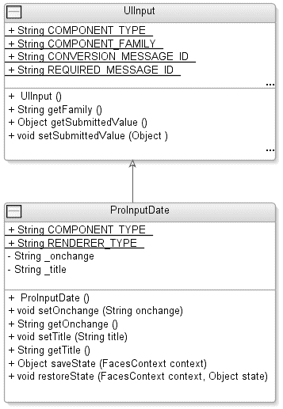

5807ch02.qxd 12/30/05 4:27 PM 第 78 页

**78**

第 2 章 ■ 定义日期字段组件

**图 2-10.** *ProInputDate* 特定于渲染器的子类的类图 **代码示例 2-22.** *创建新的特定于渲染器的子类* package com.apress.projsf.ch2.component.pro;

import javax.faces.component.UIInput;

import javax.faces.context.FacesContext;

import javax.faces.el.ValueBinding;

/**

* ProInputDate 组件。

*/

public class ProInputDate extends UIInput

{

/**

* 此组件的组件类型。

*/

**public static final String COMPONENT_TYPE = "com.apress.projsf.ProInputDate";**

/**

* 此组件的渲染器类型。

*/

public static final String RENDERER_TYPE = "com.apress.projsf.Date";

5807ch02.qxd 12/30/05 4:27 PM 第 79 页

第 2 章 ■ 定义日期字段组件

**79**

/**

* 创建一个新的 ProInputDate。

*/

public ProInputDate()

{

**setRendererType(RENDERER_TYPE);**

}


你首先要做的任务是确保能够访问输入日期组件所需的类，并扩展正确的组件超类，在本例中为 `UIInput`。之后，你需要定义一个名为 `COMPONENT_TYPE` 的 `public static final String` 常量，

以匹配 JSF 规范定义的标准 `UIComponent` 实现策略。

■**警告** 特定于渲染器的组件不得定义 `COMPONENT_FAMILY` 常量，也不得重写从其超类继承的 `getFamily()` 方法。

下一个常量是 `RENDERER_TYPE`，它将在创建 `UIComponent` 时用于关联正确的渲染器。如代码示例 2-22 所示，你在特定于渲染器的子类的构造函数中将 `RENDERER_TYPE` 传递给 `setRendererType()` 方法。

特定于渲染器的属性和 ValueBinding

在之前的“查找属性值”部分中，我们介绍了处理标记特定属性（例如 `title`）的渲染器部分。特定于渲染器的组件子类的目的是为每个渲染器特定属性提供便捷的 getter 和 setter 方法，如代码示例 2-23 所示。

**代码示例 2-23.** *为客户端属性创建属性和访问器*

/**

* title 属性值。

*/

private String _title;

/**

* 设置 title 属性值。

*

* @param title 新的 title 属性值

*/

public void setTitle(

String title)

{

_title = title;

}

5807ch02.qxd 12/30/05 4:27 PM Page 80

**80**

第 2 章 ■ 定义日期字段组件

/**

* 返回 title 属性值。

*

* @return title 属性值

*/

public String getTitle()

{

if (_title != null)

return _title;

**ValueBinding binding = getValueBinding("title");** if (binding != null)

{

**FacesContext context = FacesContext.getCurrentInstance();** **return (String)binding.getValue(context);**

}

return null;

}

为标记特定属性创建 getter 和 setter 类似于创建带有某些属性的常规 JavaBean。首先，你在 `ProInputDate` 子类上声明存储字段（例如 `private String _title`）。然后，为此属性创建公共访问器和修改器，即 `setTitle()` 和 `getTitle()`。

与常规 JavaBean 的主要区别在于属性访问器。方法的签名和用途（读取属性）是相同的。但是，组件属性访问器增加了对 `ValueBinding` 的支持。应用程序开发人员可以为属性分配一个 `ValueBinding`，以便从底层模型中检索信息。

为了正确处理这一点，你首先需要检查组件中是否直接存储了本地值。这将优先于为属性定义的任何 `ValueBinding`（例如 `#{sample.myAttribute}`）。如果没有可用的本地值，则必须在 `UIComponent` 上调用 `getValueBinding()` 方法并传递属性名称。如果存在 `ValueBinding`，则需要调用 `ValueBinding` 上的 `getValue()` 方法来解析实际值。如果组件中未直接存储本地属性值，并且该属性也不存在 `ValueBinding`，则返回 `null`。

保存和恢复状态

状态管理是使用 JSF 构建应用程序的主要优势之一。JSF 通过一个名为 `StateManager` 的类提供自动状态处理，该类在服务器上的请求之间保存和恢复特定视图（`UIComponent` 的层次结构）的状态。每个 `UIComponent` 控制要保存哪些内部状态，因此你需要在 `ProInputDate` 组件上执行一些工作来保存其内部状态。

5807ch02.qxd 12/30/05 4:27 PM Page 81

第 2 章 ■ 定义日期字段组件

**81**

■**注意** 默认情况下，`UIComponent` 的状态保存是开启的，但应用程序开发人员可以通过将标志 `transient` 设置为 `true` 来选择退出。当组件被标记为 `transient` 时，它将在下一次回发请求期间不会出现在组件层次结构中。


由于您正在使用客户端特定的子类扩展 UIInput 组件，因此需要在 ProInputDate 类的 saveState() 方法中管理状态保存，如代码示例 2-24 所示。

**代码示例 2-24.** *在* ProInputDate *组件中保存状态*

/**

* 返回此组件的已保存状态。

*

* @param context Faces 上下文

*/

public Object saveState(

FacesContext context)

{

Object values[] = new Object[2];

values[0] = super.saveState(context);

values[1] = _title;

return values;

}

务必包含来自 UIInput 超类的已保存状态，以及您特定于渲染器的属性值 _title。

同样，您还需要通过向 ProInputDate 类添加 restoreState() 方法，在后续的回传请求中恢复状态，如代码示例 2-25 所示。

**代码示例 2-25.** *在* ProInputDate *组件中恢复状态*

/**

* 恢复此组件的状态。

*

* @param context Faces 上下文

* @param state 已保存的状态

*/

public void restoreState(

FacesContext context,

Object state)

{

Object values[] = (Object[])state;

**super.restoreState(context, values[0]);**

_title = (String)values[1];

}

}

5807ch02.qxd 12/30/05 4:27 PM 第 82 页

**82**

第 2 章 ■ 定义日期字段组件

StateManager 会将存储的状态传递给 ProInputDate 实例上的 restoreState() 方法。这将允许您在恢复特定于渲染器的属性 title 的值之前，提取并恢复 UIInput 超类先前存储的状态。

**第 4 步：注册 UIComponent 和 Renderer**

如第 1 章所述，Application 实例会在应用程序启动时存储 JSF 配置文件（faces-config.xml）中定义的资源。JSF 实现会根据以下规则处理任何可用的配置文件——首先在此 Web 应用程序的 ClassLoader 资源路径中搜索所有名为 META-INF/faces-config.xml 的资源。

然后，它会检查是否存在名为 javax.faces.CONFIG_FILES 的上下文初始化参数。如果此参数存在，它将被视为一个以逗号分隔的 ServletContext 相对资源路径列表（以 / 开头），并将每个指定的资源加载到 Application 实例中。最后，JSF 实现会检查是否存在名为 /WEB-INF/faces-config.xml 的 Web 应用程序配置资源，如果存在则加载该资源。然后，JSF 会合并这些 faces-config.xml 文件中找到的元数据定义。

这种聚合方法的好处在于，它允许开发者将 faces-config.xml 文件与其自定义组件库打包在一起，这反过来又带来了将自定义组件库作为单个 JAR 文件进行更简单安装的好处。它还允许应用程序开发者在特定于应用程序的 WEB-INF/faces-config.xml 文件中覆盖特定于组件的配置，因为该文件的优先级高于所有其他 faces-config.xml 文件。

注册 Renderer

要注册您的新 HtmlInputDateRenderer 类作为 JSF 的渲染器，您需要添加 faces-config.xml 文件，如代码示例 2-26 所示，将其放置在资源路径上的某个 META-INF 目录中。

**代码示例 2-26.** *在* faces-config.xml *文件中注册* ProInputDateRenderer

<?xml version="1.0" encoding="UTF-8" ?>

<!DOCTYPE faces-config

PUBLIC "-//Sun Microsystems, Inc.//DTD JavaServer Faces Config 1.1//EN"

"http://java.sun.com/dtd/web-facesconfig_1_1.dtd">

<faces-config>

<render-kit>

<!-- 无 renderkit-id，因此这些渲染器被添加到默认的 renderkit 中 -->

<renderer>

<component-family>

**javax.faces.Input**

5807ch02.qxd 12/30/05 4:27 PM 第 83 页

第 2 章 ■ 定义日期字段组件

**83**

</component-family>

<renderer-type>

**com.apress.projsf.Date**

</renderer-type>

<renderer-class>

**com.apress.projsf.ch2.render.html.basic.HtmlInputDateRenderer**

</renderer-class>

<!-- 特定于渲染器的属性 -->
<attribute>


<attribute-name>title</attribute-name>

<attribute-class>java.lang.String</attribute-class>

</attribute>

</renderer>

</faces-config>

正如第 1 章所述，渲染器被分组到渲染工具包中。渲染工具包负责创建特定于标记语言的 ResponseWriter，用于向客户端写入标记。渲染工具包还负责存储和返回渲染器。默认情况下，对于每种渲染器类型和组件族的组合，它只存储一个渲染器实例。在你之前的配置中，你省略了 `<render-kit-id>` 元素，这将使你的客户端特定渲染器默认使用 JSF 实现提供的默认渲染工具包（标识符为 `RenderKitFactory.HTML_BASIC_RENDER_KIT`）。

你还设置了 `<component-family>`，它是一个字符串——`javax.faces.Input`——表示组件的行为（例如，一个输入组件），以及 `<renderer-type>`，它也是一个字符串——`com.apress.projsf.Date`——表示组件的呈现方式。结合组件族，渲染类型唯一标识了要与该组件一起使用的渲染器类——`HtmlInputDateRenderer` 类。有关更多信息，请参考第 1 章。

注册渲染器特定的子类

`ProInputDate` 组件在 `faces-config.xml` 文件中的注册方式如代码示例 2-27 所示。

**代码示例 2-27.** *定义组件类型和组件类*

<faces-config>

...

<component>

<component-type>

**com.apress.projsf.ProInputDate**

</component-type>

<component-class>

**com.apress.projsf.ch2.component.pro.ProInputDate**

</component-class>

5807ch02.qxd 12/30/05 4:27 PM Page 84

**84**

第 2 章 ■ 定义日期字段组件

粗体代码通过定义组件类型 `com.apress.projsf.ProInputDate` 和相应的组件类 `com.apress.projsf.ch2.component.pro.ProInputDate` 来注册你的新组件。你应该将这些元数据添加到之前为渲染器创建的 `faces-config.xml` 文件中，因为它们都将包含在同一个 JAR 中以便于安装。

请注意，你尚未关闭 `<faces-config>` 元素，因为你还需要为你的新组件添加更多元数据，如代码示例 2-28 所示。

**代码示例 2-28.** UIComponent *-继承的属性*

<!-- UIComponent attributes -->

<attribute>

<description>

此组件的组件标识符。该值在作为命名容器的最近父组件内必须唯一。

</description>

**<attribute-name>id</attribute-name>**

<attribute-class>java.lang.String</attribute-class>

</attribute>

<attribute>

<description>

指示此组件是否应被渲染（在渲染响应阶段）或在任何后续表单提交时被处理的标志。

</description>

**<attribute-name>rendered</attribute-name>**

<attribute-class>boolean</attribute-class>

<default-value>true</default-value>

</attribute>

<attribute>

<description>

将此组件链接到支持 bean 中属性的值绑定表达式。

</description>

**<attribute-name>binding</attribute-name>**

<attribute-class>javax.faces.el.ValueBinding</attribute-class>

</attribute>

虽然这是良好实践，但并非必须将这些属性添加到 `faces-config.xml` 文件中。如果不添加，工具将无法在设计时提供关于该组件的任何额外帮助或信息。这些元数据定义了从 `UIComponent` 基类继承的属性，这些属性将被应用程序开发者使用。

代码示例 2-29 显示了定义应用程序开发者可用的 `UIInput` 继承属性的元数据。

5807ch02.qxd 12/30/05 4:27 PM Page 85

第 2 章 ■ 定义日期字段组件

**85**

**代码示例 2-29.** UIInput *-继承的属性*

<!-- UIInput attributes -->

<attribute>

<description>

注册到此组件的转换器实例。

</description>

**<attribute-name>converter</attribute-name>**

<attribute-class>javax.faces.convert.Converter</attribute-class>

</attribute>

<attribute>

<description>

指示此组件的值必须立即转换和验证（即在应用请求值阶段）的标志，而不是等到处理验证阶段。

</description>

**<attribute-name>immediate</attribute-name>**

<attribute-class>boolean</attribute-class>

</attribute>

<attribute>

<description>

指示用户必须为此输入组件提供提交值的标志。

</description>

**<attribute-name>required</attribute-name>**

<attribute-class>boolean</attribute-class>

</attribute>

<attribute>

<description>

表示验证器方法的 MethodBinding，该方法将在处理验证期间被调用，以对此组件的值执行正确性检查。该表达式必须解析为一个公共方法，该方法接受 `FacesContext`、`UIComponent` 和 `Object` 参数，返回类型为 `void`。

</description>

**<attribute-name>validator</attribute-name>**

<attribute-class>javax.faces.validator.Validator</attribute-class>

</attribute>

<attribute>

<description>

此组件的当前值。

</description>

**<attribute-name>value</attribute-name>**

<attribute-class>java.lang.Object</attribute-class>

</attribute>

5807ch02.qxd 12/30/05 4:27 PM Page 86

**86**

第 2 章 ■ 定义日期字段组件

<attribute>

<description>

表示值更改监听器方法的 MethodBinding，当为此输入组件设置了新值时，该方法将被通知。该表达式必须解析为一个公共方法，该方法接受一个 `ValueChangeEvent` 参数，返回类型为 `void`。

</description>

**<attribute-name>valueChangeListener</attribute-name>**

<attribute-class>javax.faces.event.ValueChangeListener</attribute-class>

</attribute>

最后，在代码示例 2-30 中，你为 `ProInputDate` 组件添加了所需的渲染器特定属性 `title`。你还设置了该属性的对象类型 `java.lang.String`。

**代码示例 2-30.** ProInputDate *属性*

<!-- ProInputDate attributes -->

<attribute>

<description>

用于此组件渲染标记的标题或工具提示。

</description>

**<attribute-name>title</attribute-name>**

<attribute-class>java.lang.String</attribute-class>

</attribute>

</component>

...

</faces-config>

**第 5 步：创建 JSP 标签处理器和 TLD**

在初始蓝图中的最后一步是创建一个 JSP 标签处理器。要构建一个 JSF 应用程序，你需要某种方式来描述应用程序的结构，而任何 JSF 实现都必须提供的页面描述默认视图技术是 JSP。将 JSP 作为默认语言的好处之一是它在 Web 应用程序开发者中被广泛采用，通过利用开发者对 JSP 的广泛了解，使用 JSP 作为页面描述来构建 JSF 应用程序正在迅速增长。

■**注意** JSF 实现必须支持（尽管基于 JSF 的应用程序不需要使用）JSP 作为 JSF 页面的页面描述语言。你可以通过提供自定义操作来启用此 JSP 支持，以便通过在 JSP 页面中添加与 JSF UI 组件对应的标签来轻松定义 JSF 用户界面。对于 JSP 2.0 及更高版本，文件扩展名 `.jsf` 被保留，并且可以选择使用（通常由工具）来表示包含 JSF 内容的 JSP 页面。在 JSP 1.2 环境中运行时，根据 JSF 1.2 规范，JSP 作者必须将包含 JSF 内容的 JSP 页面命名为以 `.jsp` 结尾的文件名。

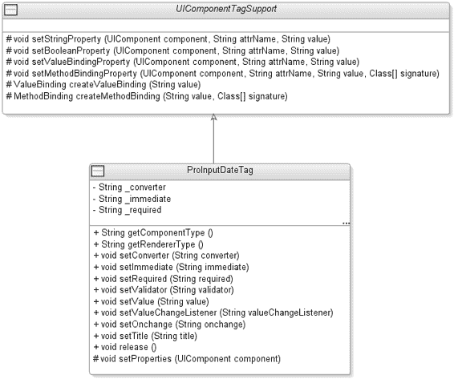

5807ch02.qxd 12/30/05 4:27 PM Page 87

第 2 章 ■ 定义日期字段组件

**87**


应用程序开发人员会在 JSP 页面描述中使用自定义操作（也称为*标签*）来指示应用程序所需的 JSF UIComponent。该自定义操作对应一个标签处理类，负责创建 UIComponent 并将每个声明式 JSP 标签属性传递给 UIComponent 实例。自定义操作的语法既包含行为属性，也包含特定于渲染器的属性。因此，每个此类自定义操作都与特定的组件系列和渲染器类型组合绑定。例如，JSF 实现提供的标准 HTML RenderKit 支持 UIInput 组件的三种渲染器类型（Text、TextArea 和 Secret），这需要三个独立的自定义操作（inputText、inputTextArea 和 inputSecret）。您正在扩展 UIInput 组件并添加一个新的渲染器类型——com.apress.projsf.Date，因此还必须提供一个新的 JSP 自定义操作 inputDate。

图 2-11 展示了您将要创建的标签处理程序及其支持类的类图。

**图 2-11.** *ProInputDate 标签处理程序及其支持类的类图* UIComponentTagSupport 类

在开始为自定义操作编写实际的标签处理程序之前，您将先了解抽象的 UIComponentTagSupport 标签处理程序类。如果您只计划创建一个组件，则不需要代码示例 2-31 中显示的支持标签处理程序类，但由于您计划向 JSF 组件库中添加更多组件，因此将各组件共有的功能分离到一个支持标签处理程序超类中是合理的。

5807ch02.qxd 12/30/05 4:27 PM 第 88 页

**88**

第 2 章 ■ 定义日期字段组件

**代码示例 2-31.** *UIComponentTagSupport 类* package com.apress.projsf.ch2.taglib;

import java.util.Map;

import javax.faces.application.Application;

import javax.faces.component.UIComponent;

import javax.faces.context.FacesContext;

import javax.faces.el.MethodBinding;

import javax.faces.el.ValueBinding;

import javax.faces.webapp.UIComponentTag;

/**

* UIComponentTagSupport 为 JavaServer Faces UIComponent 标签处理程序提供通用辅助方法。

*/

**abstract public class UIComponentTagSupport extends UIComponentTag**

{

UIComponentTagSupport 类扩展了 UIComponentTag，后者是所有与 JSF 渲染页面中的 UI 组件相对应的 JSP 自定义操作的基类。UIComponentTag 处理程序基类管理所有 UIComponent 都支持的组件属性（例如 id、rendered 和 binding）。UIComponentTagSupport 类为您的标签处理程序类提供辅助方法，这些处理程序类将在 TLD 中注册为自定义操作。

对于 UIComponent 上可用的每个属性，应用程序开发人员可以设置静态值，也可以设置类型为值绑定或方法绑定的 JSF 表达式语言 (EL) 表达式。为了确保能够处理组件的属性，您可以实现四个实用方法——setStringProperty()、setBooleanProperty()、setValueBindingProperty() 和 setMethodBindingProperty()。

代码示例 2-32 展示了处理字符串属性和属性的 setStringProperty() 方法。

**代码示例 2-32.** *处理字符串属性和属性的方法*

/**

* 将组件字符串属性设置为值绑定或字符串字面量。

*

* @param component Faces 组件

* @param attrName 属性名称

* @param value 属性值

*/

protected void setStringProperty(

UIComponent component,

String attrName,

String value)

{

if (value == null)

return;

5807ch02.qxd 12/30/05 4:27 PM 第 89 页

第 2 章 ■ 定义日期字段组件

**89**

if (isValueReference(value))

{

component.setValueBinding(attrName, createValueBinding(value));

}

else

{

component.getAttributes().put(attrName, value);

}

}


您可以使用 `setStringProperty()` 方法为任何组件属性赋值，该属性可以接受静态值或值绑定（例如，`#{sample.Date}`）。如果值为 `null`，则可以避免将值显式存储在组件中。要检查该值是否为 JSF EL 表达式，可以使用名为 `isValueReference()` 的方法。此方法由 `UIComponentTag` 类提供，如果指定的值符合值绑定表达式的语法要求，则返回 `true`。当字符串是有效的值绑定表达式时，您将创建并存储相应的 `ValueBinding` 实例作为属性值。

**JSF 1.2 SETPROPERTIES**

JSF 1.2 支持直接使用 JSP 2.1 的 `ValueExpression` 和 `MethodExpression`，而不是将字符串传递给标签处理器并要求其在内部解析表达式。因此，本章描述的 `UIComponentTagSupport` 类的 `setStringProperty()` 方法在 JSF 1.2 中会进行如下修改：

```java
protected void setStringProperty(
    UIComponent component,
    String attrName,
    ValueExpression value)
{
    if (value == null)
        return;
    if (!value.isLiteralText())
    {
        component.setValueExpression(attrName, value);
    }
    else
    {
        component.getAttributes().put(attrName, value.getExpressionString());
    }
}
```

如果 `ValueExpression` 实际上只是纯文本，则此文本会直接推入组件属性的映射中。否则，`ValueExpression` 会被设置到组件的该属性上，以便在 JSF 生命周期执行期间进行延迟求值。

5807ch02.qxd 12/30/05 4:27 PM 第 90 页

**90**

第 2 章 ■ 定义日期字段组件

如代码示例 2-33 所示，`setBooleanProperty()` 方法本质上执行与上述 `setStringProperty()` 方法相同的任务，但有一个区别：它处理的是布尔类型，而不是字符串对象类型。

**代码示例 2-33.** *处理布尔属性和属性的方法*

```java
/**
 * 将组件布尔属性设置为值绑定或布尔字面量。
 *
 * @param component Faces 组件
 * @param attrName  属性名称
 * @param value     属性值
 */
protected void setBooleanProperty(
    UIComponent component,
    String attrName,
    String value)
{
    if (value == null)
        return;
    if (isValueReference(value))
    {
        component.setValueBinding(attrName, createValueBinding(value));
    }
    else
    {
        component.getAttributes().put(attrName, Boolean.valueOf(value));
    }
}
```

如代码示例 2-34 所示，`setValueBindingProperty()` 方法的结构更简单，因为它仅用于那些不支持字面量值且只接受值绑定表达式的属性。如果传递的值不符合 EL 表达式语法，则会抛出 `IllegalArgumentException`。

**代码示例 2-34.** *处理* ValueBinding *属性和属性的方法*

```java
/**
 * 将组件属性设置为值绑定。
 *
 * @param component Faces 组件
 * @param attrName  属性名称
 * @param value     属性值
 */
```

5807ch02.qxd 12/30/05 4:27 PM 第 91 页

第 2 章 ■ 定义日期字段组件

**91**

```java
protected void setValueBindingProperty(
    UIComponent component,
    String attrName,
    String value)
{
    if (value == null)
        return;
    if (!isValueReference(value))
        throw new IllegalArgumentException();
    component.setValueBinding(attrName, createValueBinding(value));
}
```

对于 `ProInputDate` 组件，您希望为 `valueChangeListener` 属性提供支持，因此需要处理方法绑定表达式，如代码示例 2-35 所示。

**代码示例 2-35.** *处理* MethodBinding *属性和属性的方法*

```java
/**
 * 将组件属性设置为方法绑定。
 *
 * @param component Faces 组件
 * @param attrName  属性名称
 * @param value     属性值
 * @param signature 方法签名
 */
protected void setMethodBindingProperty(
    UIComponent component,
    String attrName,
    String value,
    Class[] signature)
{
    if (value == null)
        return;
    Map attrs = component.getAttributes();
    attrs.put(attrName, createMethodBinding(value, signature));
}
```

`MethodBinding` 和 `ValueBinding` 之间的一个主要区别是，您不仅需要提供方法表达式，还需要为方法表达式指定的方法提供签名。对于 `valueChangeListener` 方法，这意味着您需要将签名作为一个类数组传递，其中包含一个类——`ValueChangeEvent.class`。

5807ch02.qxd 12/30/05 4:27 PM 第 92 页

**92**

第 2 章 ■ 定义日期字段组件

**METHODBINDING**

`UICommand` 组件使用方法绑定表达式来引用，例如，一个 `Action` 方法或 `ActionListener` 方法。`MethodBinding` 类封装了方法绑定的实际求值过程。您可以通过调用 `createMethodBinding()` 方法从 `Application` 实例中获取特定引用的 `MethodBinding` 实例。请注意，`MethodBinding` 的实例是不可变的，并且不包含对 `FacesContext` 的引用（`FacesContext` 在评估引用绑定时作为参数传入）。

为了完善 `UIComponentTagSupport` 类，您需要添加两个方法，用于创建并返回 `ValueBinding` 和 `MethodBinding`。代码示例 2-36 展示了 `createValueBinding()` 和 `createMethodBinding()` 方法。

**代码示例 2-36.** *`createValueBinding()` 和 `createMethodBinding()` 方法*

```java
/**
 * 为字符串值返回一个 ValueBinding。
 *
 * @param value 属性字符串值
 *
 * @return 解析后的 ValueBinding
 */
protected ValueBinding createValueBinding(
    String value)
{
    FacesContext context = FacesContext.getCurrentInstance();
    Application application = context.getApplication();
    return application.createValueBinding(value);
}

/**
 * 为字符串值返回一个 MethodBinding。
 *
 * @param value     属性字符串值
 * @param signature 方法绑定签名
 *
 * @return 解析后的 MethodBinding
 */
protected MethodBinding createMethodBinding(
    String value,
    Class[] signature)
{
    FacesContext context = FacesContext.getCurrentInstance();
    Application application = context.getApplication();
    return application.createMethodBinding(value, signature);
}
```

5807ch02.qxd 12/30/05 4:27 PM 第 93 页

第 2 章 ■ 定义日期字段组件

**93**

`createMethodBinding()` 方法会评估指定的方法绑定表达式并创建一个 `MethodBinding` 实例。当 `MethodBinding` 被执行时，会调用表达式引用的方法。当方法被调用时，某些参数会传递给后台 bean 方法，例如，对于附加到 `valueChangeListener` 属性的 `MethodBinding`，会传递一个 `ValueChangedEvent`。`MethodBinding` 必须动态查找正确的方法签名，以确保调用正确的方法。

**JSF 1.2 VALUEEXPRESSION 和 METHODEXPRESSION**

JSF 1.2 现在直接利用 JSP 2.1 中的 JSP EL。JSP EL 原生支持即时 `${}` 语法表达式和延迟 `#{}` 语法表达式。因此，JSF 1.2 的标签处理器使用新的 JSP EL `ValueExpression` 和 `MethodExpression` 类型作为参数，让 JSP 容器负责解析表达式。JSF 1.2 引入了两个新的标签处理器基类 `UIComponentELTag` 和 `UIComponentELBodyTag`，以取代 JSF 1.1 中的 `UIComponentTag` 和 `UIComponentBodyTag`。

ProInputDateTag 类

您的新组件需要一个名为 `inputDate` 的新自定义操作，以及一个对应的标签处理器类 `ProInputDateTag`。在初始渲染时，`ProInputDateTag` 负责创建您新的特定于渲染器的组件子类——`ProInputDate`——并将所有 JSP 自定义操作属性从标签处理器传输到组件实例。


ProInputDateTag 通过定义组件类型 `com.apress.projsf.ProInputDate` 来使用 Application 创建组件。这将创建一个 ProInputDate 实例，其默认渲染器类型为 `com.apress.projsf.Date`。然而，本地 Web 应用程序的 `faces-config.xml` 可能会覆盖为此组件类型应创建的组件类。因此，标签处理器必须在新创建的组件实例上显式设置渲染器类型，而不能依赖 ProInputDate 构造函数中指定的默认渲染器类型。这将确保在使用默认 HTML 基本 RenderKit 时，由 ProInputDateTag 创建的组件实例会使用您的 HtmlProInputDateRenderer。

ProInputDateTag 类继承自您的 UIComponentTagSupport，后者是所有 JSP 自定义操作（对应于由 JSF 渲染的页面中的 UI 组件）的辅助类。如代码示例 2-37 所示，ProInputDateTag 管理组件的所有其他行为属性和渲染器特定属性，您必须确保此标签处理器使用正确的组件类型和渲染器类型。

**代码示例 2-37.** *ProInputDateTag* 类
```java
package com.apress.projsf.ch2.taglib.pro;

import javax.faces.component.UIComponent;

import javax.faces.event.ValueChangeEvent;

import com.apress.projsf.ch2.component.pro.ProInputDate; 
import com.apress.projsf.ch2.taglib.UIComponentTagSupport;

5807ch02.qxd 12/30/05 4:27 PM Page 94

**94**

第 2 章 ■ 定义日期字段组件

/**
 * ProInputDateTag 组件标签处理器。
 */

public class ProInputDateTag extends UIComponentTagSupport
{

    /**
     * 返回组件类型。
     *
     * @return 组件类型
     */
    public String getComponentType()
    {
        return ProInputDate.COMPONENT_TYPE;
    }

    /**
     * 返回渲染器类型。
     *
     * @return 渲染器类型
     */
    public String getRendererType()
    {
        return ProInputDate.RENDERER_TYPE;
    }
}
```

如代码示例 2-38 所示，您的 ProInputDateTag 为行为性 UIInput 组件的属性（例如，converter、validator、valueChangeListener、value、immediate 和 required）以及渲染器特定的 ProInputDate 属性（例如，title）提供了标签属性设置器和内部字段存储。

**代码示例 2-38.** *行为性和渲染器特定属性*

```java
/**
 * converter 属性。
 */
private String _converter;

/**
 * 设置 converter 属性值。
 *
 * @param converter converter 属性值
 */
public void setConverter(
    String converter)
{
    _converter = converter;
}

5807ch02.qxd 12/30/05 4:27 PM Page 95

第 2 章 ■ 定义日期字段组件

**95**

/**
 * immediate 属性。
 */
private String _immediate;

/**
 * 设置 immediate 属性值。
 *
 * @param immediate immediate 属性值
 */
public void setImmediate(
    String immediate)
{
    _immediate = immediate;
}

/**
 * required 属性。
 */
private String _required;

/**
 * 设置 required 属性值。
 *
 * @param required required 属性值
 */
public void setRequired(
    String required)
{
    _required = required;
}

/**
 * validator 属性。
 */
private String _validator;

/**
 * 设置 validator 属性值。
 *
 * @param validator validator 属性值
 */
public void setValidator(
    String validator)
{
    _validator = validator;
}

5807ch02.qxd 12/30/05 4:27 PM Page 96

**96**

第 2 章 ■ 定义日期字段组件

/**
 * value 属性。
 */
private String _value;

/**
 * 设置 value 属性值。
 *
 * @param value value 属性值
 */
public void setValue(
    String value)
{
    _value = value;
}

/**
 * valueChangeListener 属性。
 */
private String _valueChangeListener;

/**
 * 设置 valueChangeListener 属性值。
 *
 * @param valueChangeListener valueChangeListener 属性值
 */
public void setValueChangeListener(
    String valueChangeListener)
{
    _valueChangeListener = valueChangeListener;
}

/**
 * title 属性。
 */
private String _title;

/**
 * 设置 title 属性值。
 *
 */
```


* @param title 标题属性的值

*/

public void setTitle(

String title)

{

_title = title;

}

5807ch02.qxd 12/30/05 4:27 PM 第 97 页

第 2 章 ■ 定义日期字段组件

**97**

**IMMEDIATE 属性**

在某些情况下，您不希望走完整个请求处理生命周期，例如当用户决定取消当前事务时。immediate 属性为应用程序开发者提供了一种覆盖由 FacesEvent 实例定义的 PhaseId 的方法。该属性可设置在 UICommand 组件上，有效值为 true 或 false。通过将 immediate 属性设置为 true，应用程序开发者可以缩短处理生命周期、取消某个流程并导航到另一个视图。

immediate 属性也可用于 UIInput 组件。如果设置为 true，验证将在解码期间发生，并导致转换和验证处理（包括可能触发 ValueChangeEvent 事件）在“应用请求值”阶段发生，而不是在“处理验证”阶段。

setProperties() 方法，如代码示例 2-39 所示，如果此标签处理程序实例的相应属性被显式设置，则会将属性和特性从此标签传输到指定的组件。

**代码示例 2-39.** *setProperties()* 方法

/**

* 将属性值从此标签传输到组件。

*

* @param component 目标组件

*/

protected void setProperties(

UIComponent component)

{

super.setProperties(component);

// 行为属性

setValueBindingProperty(component, "converter", _converter); setBooleanProperty(component, "immediate", _immediate); setBooleanProperty(component, "required", _required); setValueBindingProperty(component, "validator", _validator); setStringProperty(component, "value", _value); setMethodBindingProperty(component, "valueChangeListener", _valueChangeListener,

new Class[] { ValueChangeEvent.class });

// 渲染器特定属性

setStringProperty(component, "title", _title);

}

}

5807ch02.qxd 12/30/05 4:27 PM 第 98 页

**98**

第 2 章 ■ 定义日期字段组件

任何支持 UIComponentTag 处理程序所提供属性之外的额外属性的 JSF 标签处理程序子类，都必须确保仍然调用基类的 setProperties() 方法——即 super.setProperties()。

代码示例 2-40 展示了 release() 方法，该方法重置所有内部存储，允许此标签处理程序实例在 JSP 页面执行期间被重用。

**代码示例 2-40.** *release()* 方法

/**

* 释放标签使用的内部状态。

*/

public void release()

{

_converter = null;

_immediate = null;

_required = null;

_validator = null;

_value = null;

_valueChangeListener = null;

_title = null;

}

标签库描述

现在您已经定义了 ProInputDateTag 处理程序类的行为，是时候注册自定义操作的名称并定义一些使用规则了。TLD 允许组件提供者将自定义操作分组，以构成一个 JSF 标签库。在为 JSF 自定义组件创建标签库时，TLD 文件为每个渲染器定义一个自定义操作。就本章而言，TLD 如代码示例 2-41 所示，将只定义一个自定义操作——<pro:inputDate>。

**代码示例 2-41.** *TLD*

<?xml version="1.0" encoding="UTF-8" ?>

<!DOCTYPE taglib

PUBLIC "-//Sun Microsystems, Inc.//DTD JSP Tag Library 1.2//EN"

"http://java.sun.com/dtd/web-jsptaglibrary_1_2.dtd" >

<taglib>

**<tlib-version>1.0</tlib-version>**

**<jsp-version>1.2</jsp-version>**

**<short-name>pro</short-name>**

**<uri>http://projsf.apress.com/tags</uri>**

<description>

此标签库包含 ProJSF 输入日期组件的 JavaServer Faces 组件标签。

</description>

5807ch02.qxd 12/30/05 4:27 PM 第 99 页

第 2 章 ■ 定义日期字段组件

**99**


TLD 必须声明标签库版本、该库所依赖的 JSP 版本、一个将用作此标签库中所有自定义操作默认命名空间前缀的短名称（例如 `pro`），以及一个应用程序开发者将用作 `taglib` 指令的唯一 URI（`http://projsf.apress.com/tags`）。

对于 TLD 中的每个自定义操作，你需要一个 `<tag>` 元素。代码示例 2-42 展示了如何在嵌套的 `name` 元素中定义自定义操作元素的名称（例如 `<name>inputDate</name>`），以及如何在 `<tag-class>` 元素中定义标签处理类。

`<body-content>` 元素描述了应如何处理此标签。

**代码示例 2-42.** *自定义操作*

<tag>

<name>inputDate</name>

<tag-class>com.apress.projsf.ch2.taglib.pro.ProInputDateTag</tag-class>

<body-content>JSP</body-content>

<description>

ProJSF 输入日期组件标签。

</description>

**JSP 2.0 ${} 表达式与 JSF 1.1 #{} 表达式**

JSP 已经拥有一种表达式语言，可以使用 `${}` 语法表达式为标签属性提供动态值。这些表达式在标签处理程序能够观察到它们之前，会被完全求值为字面量值。

因此，关于底层数据模型的所有信息都会丢失，导致 JSF 组件无法将值回传到数据模型。

因此，需要一种不同风格的表达式，即 JSF 的 `#{}` 语法。这种语法会被 JSP 引擎忽略，并作为字符串字面量传递给标签属性。JSF 标签处理程序有机会解析该表达式，并保留对底层数据模型的了解，以便在回传期间使用。如果该值是字面量，例如 `true`，那么 JSF 标签处理程序会将其转换为强类型的字面量值，例如 `Boolean.TRUE`，然后再将其存储为组件属性值。`<rtexprvalue>`（运行时表达式值）元数据始终设置为 `false`，因为 JSF 标签处理程序不支持 JSP 表达式语法，这将导致 JSP 运行时强制执行该要求。

如果自定义操作有属性，则必须使用 `<attribute>` 元素来定义这些属性。对于 TLD 中的每个属性，如代码示例 2-43 所示，`<rtexprvalue>` 元素必须设置为 `false`，并且属性类必须保持未指定状态，使其默认为 `String`。

**代码示例 2-43.** UIComponent *属性*

<!-- UIComponent 属性 -->

<attribute>

**<name>id</name>**

<required>false</required>

**<rtexprvalue>false</rtexprvalue>**

<description>

此组件的组件标识符。该值在最近的父组件（即命名容器）内必须是唯一的。

</description>

</attribute>

<attribute>

**<name>rendered</name>**

<required>false</required>

**<rtexprvalue>false</rtexprvalue>**

<description>

指示此组件是否应被渲染（在渲染响应阶段），或在任何后续表单提交时被处理的标志。

</description>

</attribute>

<attribute>

**<name>binding</name>**

<required>false</required>

**<rtexprvalue>false</rtexprvalue>**

<description>

将此组件链接到支持 bean 中属性的值绑定表达式。

</description>

</attribute>

前面列出的标签属性继承自父类 `UIComponentTag` 处理程序，并且必须在 TLD 中声明，以便与你的特定渲染器标签处理程序类一起使用。代码示例 2-44 中显示的标签属性是支持行为性 UIInput 属性所必需的。

**代码示例 2-44.** UIInput *属性*

<!-- UIInput 属性 -->

<attribute>

**<name>converter</name>**

<required>false</required>

<rtexprvalue>false</rtexprvalue>

<description>

注册到此组件的转换器实例。

</description>

</attribute>

<attribute>

**<name>immediate</name>**

<required>false</required>

<rtexprvalue>false</rtexprvalue>

<description>

5807ch02.qxd 12/30/05 4:27 PM 第 100 页

**100**

第 2 章 ■ 定义日期字段组件

指示此组件是否应在应用请求值阶段立即处理其值的标志。

</description>

</attribute>

<attribute>

**<name>required</name>**

<required>false</required>

<rtexprvalue>false</rtexprvalue>

<description>

指示此组件的值是否必须存在的标志。

</description>

</attribute>

<attribute>

**<name>validator</name>**

<required>false</required>

<rtexprvalue>false</rtexprvalue>

<description>

注册到此组件的验证器实例。

</description>

</attribute>

<attribute>

**<name>value</name>**

<required>false</required>

<rtexprvalue>false</rtexprvalue>

<description>

此组件的当前值。

</description>

</attribute>

<attribute>

**<name>valueChangeListener</name>**

<required>false</required>

<rtexprvalue>false</rtexprvalue>

<description>

当此组件的值发生变化时，将通知的值更改监听器。

</description>

</attribute>

5807ch02.qxd 12/30/05 4:27 PM 第 101 页


第 2 章 ■ 定义日期字段组件

**101**

标志，指示此组件的值必须立即进行转换和验证（即在应用请求值阶段），而不是等到流程验证阶段。

</description>

</attribute>

<attribute>

**<name>required</name>**

<required>false</required>

<rtexprvalue>false</rtexprvalue>

<description>

标志，指示用户必须为此输入组件提供提交的值。

</description>

</attribute>

<attribute>

**<name>validator</name>**

<required>false</required>

<rtexprvalue>false</rtexprvalue>

<description>

MethodBinding 表示一个验证器方法，该方法将在流程验证期间被调用，以对此组件的值执行正确性检查。表达式必须解析为一个公共方法，该方法接受 FacesContext、UIComponent 和 Object 参数，返回类型为 void。

</description>

</attribute>

<attribute>

**<name>value</name>**

<required>false</required>

<rtexprvalue>false</rtexprvalue>

<description>

此组件的当前值。

</description>

</attribute>

<attribute>

**<name>valueChangeListener</name>**

<required>false</required>

<rtexprvalue>false</rtexprvalue>

<description>

MethodBinding 表示一个值更改监听器方法，当为此输入组件设置了新值时，该方法将被通知。表达式必须解析为一个公共方法，该方法接受 ValueChangeEvent 参数，返回类型为 void。

</description>

</attribute>

5807ch02.qxd 2005 年 12 月 30 日 下午 4:27 第 102 页

**102**

第 2 章 ■ 定义日期字段组件

最后，在代码示例 2-45 中，你定义了 ProInputDate 渲染器特定的属性。

**代码示例 2-45.** ProInputDate *属性*

<!-- ProInputDate 属性 -->

<attribute>

**<name>title</name>**

<required>false</required>

<rtexprvalue>false</rtexprvalue>

<description>

关于为此组件生成的标记元素的建议性标题信息。

</description>

</attribute>

</tag>

</taglib>

**JSP 2.1 延迟值和延迟方法**

JSF 1.2 现在直接利用 JSP 2.1 中的 JSP EL。JSP EL 原生支持即时 ${} 语法表达式和延迟 #{} 语法表达式。JSF 1.2 标签库现在可以利用 JSP 2.1 标签库描述符中可用的 <deferred-value> 语法，例如以下内容，以指示此 JSP 2.1 标签属性支持 #{} 语法，并定义评估类型为 Boolean：

<deferred-value>

<type>java.lang.Boolean</type>

</deferred-value>

这将导致一个 ValueExpression 作为参数传递给此属性的 JSP 2.1 标签处理器的 setter 方法。你还可以对方法调用使用 <deferred-method> 语法，如下所示，以指示此 JSP 2.1 标签属性支持 #{} 语法，并定义延迟方法的签名：

<deferred-method>

<method-signature>

void doAction(javax.faces.event.ActionEvent)

</method-signature>

</deferred-method>

这将导致一个 MethodExpression 作为参数传递给此属性的 JSP 2.1 标签处理器的 setter 方法。

这种方法取代了 JSP 2.0 中经典的 JSF 1.1 <rtexprvalue>false</rtexprvalue> 和默认的 java.lang.String 标签属性类型。

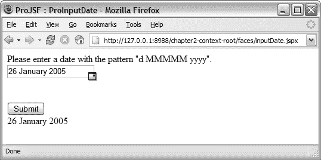

5807ch02.qxd 2005 年 12 月 30 日 下午 4:27 第 103 页

第 2 章 ■ 定义日期字段组件

**103**

**使用输入日期组件构建应用程序** 要在 JSP 文档中使用自定义组件，应用程序开发者必须使用标准的 JSP taglib 指令来声明标签库的 URI。为了标识标签库中要使用的自定义操作，应用程序开发者需要附加命名空间前缀。请注意，代码示例 2-46 中显示的 JSP 页面与本章开头描述的页面相同。

**代码示例 2-46.** *使用* <pro:inputDate> *标签的 JSF 文档*

<?xml version = '1.0' encoding = 'windows-1252'?>

<jsp:root version="1.2"

**>


<jsp:directive.page contentType="text/html"/>

<f:view>

<html>

...

<body>

<h:form>

**<pro:inputDate id="dateField"**

**title="日期字段组件"**

**value="#{backingBean.date}" >**

**<f:convertDateTime pattern="dd MMMMM yyyy" />**

**</pro:inputDate>**

<br></br>

<h:message for="dateField" />

...

</h:form>

</body>

</html>

</f:view>

</jsp:root>

运行此页面将在浏览器中渲染出如图 2-12 所示的页面。

**图 2-12.** *包含额外* commandButton *和* outputText *字段的日期字段组件*

5807ch02.qxd 12/30/05 4:27 PM Page 104

**104**

第 2 章 ■ 定义日期字段组件

**总结**

本章为你提供了编写 JSF 自定义组件所需的蓝图和理解。内容涵盖创建渲染器、创建特定于渲染器的子类、使用外部资源、注册组件对象，以及创建 JSP 标签处理器和 TLD。在后续章节中，你将以此知识为基础，构建更高级的 JSF 组件。

构建组件的结构将在本书中保持一致。首先，分析创建预期行为和用户界面所需的标记。然后，创建包含组件所需所有属性的客户端特定渲染器。可选但推荐的做法是，创建应用程序开发者可在运行时用于自定义组件的渲染器特定子类。最后，实现对所选页面描述语言（JSP）的支持。你现在还应了解如何使用 `ValueBinding` 和 `MethodBinding`，以及如何在自定义 JSF 标签处理器中支持这些概念。


5807ch03.qxd 1/13/06 11:06 AM Page 105

第 3 章

■ ■ ■

定义 Deck 组件

*大多数非平凡应用程序（尤其是 UI 类型应用）最重要的方面之一，是能够响应由应用程序各个组件生成的事件，这些事件既包括对用户交互的响应，也包括对其他系统组件的响应……*

——Terry Warren, SCOUG, 1999

**本**章将扩展前一章概述的构建组件蓝图。在本章中，我们将展示如何创建一个可充当手风琴式面板或 *deck* 的组件，这种组件常用于应用程序和集成开发环境（IDE）中，用于显示和隐藏信息，例如文件资源管理器中选中文件的信息，或组件面板中的 JSF 组件。图 3-1 展示了 Microsoft Windows 资源管理器中使用的一个可展开 deck。

**图 3-1.** *Microsoft Windows 资源管理器中使用的可展开 deck* Deck 组件具有可堆叠的优势，并且能够比传统 HTML 页面中同等空间存储更多信息。从组件编写者的角度来看，这类组件引入了组件设计的几个关键领域，例如处理事件、渲染子组件以及加载外部资源。

**105**

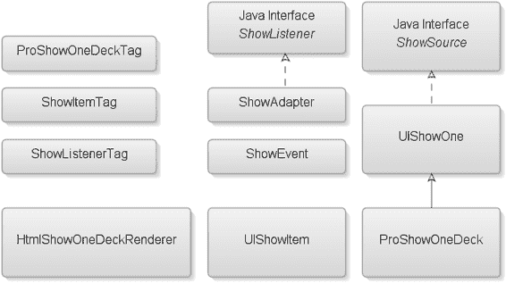

5807ch03.qxd 1/13/06 11:06 AM Page 106

**106**

第 3 章 ■ 定义 Deck 组件

**Deck 组件的需求**

Deck 组件的设计将允许用户通过点击某个显示的 deck，来暴露当前隐藏的特定信息，并显示与该点击 deck 关联的一组项目。这些子项目可以是任何内容，包括链接、文本，甚至图形。

该组件应足够智能，能够检测到已打开的 deck，并在打开用户请求的 deck 之前将其关闭。从应用程序开发者的角度来看，该组件需要是可扩展的，这意味着应用程序开发者可以根据需要添加任意数量的 deck，并在这些 deck 中包含任意数量的子项。应用程序开发者还应能够向页面添加任意数量的 deck 组。

**Deck 组件**

正如你在第一章中记得的，创建新的行为超类的唯一原因是该行为和定义之前未被引入过。根据上一节的需求，deck 组件应能够根据用户选择，有选择地显示嵌套组件或组件组，并且任何时候只显示一个组。为实现这一点，你必须创建一个新的渲染器来处理选择性显示，以及一个新的事件类型来处理用户选择，并附带一个针对该特定事件类型的监听器接口。由于显示和隐藏子组件的行为尚未被引入，我们将涵盖两个新的行为超类来处理“显示一项”的行为（参见第 2 章的表 2-1）。

完成本章后，你应该理解 JSF 事件模型，并知道如何创建新的行为超类以及你自己的事件类型和相应的监听器接口。图 3-2 展示了你将在本章中创建的 11 个类。

**图 3-2.** *展示本章所创建类的类图*

5807ch03.qxd 1/13/06 11:06 AM Page 107

第 3 章 ■ 定义 Deck 组件

**107**

这些类如下：

• `ProShowOneDeckTag` 类代表 `ProShowOneDeck` 组件。

• `ShowItemTag` 类代表 deck 组件的叶子节点。

• `ShowListenerTag` 类代表一个自定义动作，应用程序开发者将使用它向 `UIShowOne` 组件注册一个 `ShowListener` 实例。

• `HtmlShowOneDeckRenderer` 是新的自定义渲染器，负责渲染到客户端的标记。

• `ShowListener` 是一个监听器接口。

• `ShowAdapter` 支持将 `MethodBinding` 添加为 `ShowListener`。

• `ShowEvent` 是自定义事件类。

• `UIShowItem` 是一个行为超类，代表 `UIShowOne` 组件的每个子组件。

• `ShowSource` 类隔离了事件监听器管理方法。

• `UIShowOne` 类是一个行为超类，充当顶级容器，控制激活时显示其哪个子组件。

• 最后，`ProShowOneDeck` 类是你的渲染器特定子类。

**使用蓝图设计 Deck 组件**

当你设计一个需要新行为或新功能的组件时，明智的做法是在为此行为创建实际渲染器之前开始实现它，因此，这两个步骤在蓝图中先于客户端特定渲染器步骤，如表 3-1 所示。

**表 3-1.** *创建新 JSF 组件的蓝图步骤*

**#**

**步骤**

**描述**

创建 UI 原型

使用适当的标记为你的组件创建 UI 和预期行为的原型。

**2**

**创建事件和监听器**

（可选）如果 JSF 规范未涵盖你的特定需求，则创建自定义事件和监听器。

**3**

**创建行为超类**

（可选）如果找不到组件行为，则创建一个新的行为超类（例如 `UIShowOne`）。

创建客户端特定渲染器

创建所需的渲染器，它将为你的 JSF 组件写出客户端标记。

创建渲染器特定子类

（可选）创建渲染器特定子类。虽然这是一个可选步骤，但实现它是一个好习惯。

*续表*

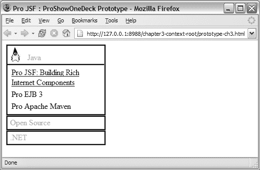

5807ch03.qxd 1/13/06 11:06 AM Page 108

**108**

第 3 章 ■ 定义 Deck 组件

**表 3-1.** *续表*

**#**

**步骤**

**描述**

注册 UIComponent 和 Renderer

在 `faces-config.xml` 文件中注册你的新 `UIComponent` 和 `Renderer`。

创建 JSP 标签处理器和 TLD

如果你使用 JSP 作为默认视图处理器，则需要此步骤。另一种解决方案是使用 Facelets (http://facelets.dev.java.net/)。


如您所见，蓝图新增了两个步骤：创建事件与监听器，以及创建行为超类。根据蓝图，您仍需首先使用目标标记语言实现组件。

**步骤 1：创建 UI 原型**

让我们花点时间思考一下您想要实现的目标，并为客户端（本例中为 Web 浏览器）所需的标记语言创建一个原型。请记住，通过这样做，您将发现渲染器需要生成哪些元素、应用程序开发者需要哪些渲染器专属属性，以及使用 deck 组件构建应用程序时预期需要哪些行为。

图 3-3 展示了用 HTML 实现的 deck 组件的最终效果。

**图 3-3.** *用 HTML 实现的 deck 组件，展示了 Java 项展开后的状态* 让我们首先关注原型的呈现。如图 3-3 所示，deck 有三个标签——Java、Open Source 和 .NET。每个标签代表一个可展开区域，在图 3-3 中，Java 区域当前已展开并显示其内容。这些标签是容器，因为它们可以容纳不止文本（例如，图片和文本的组合）。

5807ch03.qxd 1/13/06 11:06 AM 第 109 页

第 3 章 ■ 定义 DECK 组件

**109**

在展开的 Java 区域内，混合了纯文本和链接。样式控制着实际的外观和感觉。代码示例 3-1 展示了创建 deck 组件所需的 HTML。

**代码示例 3-1.** *Deck HTML 原型实现*

<html>

<head>

<title>Pro JSF : ProShowOneDeck 原型</title>

<style type="text/css" >

.ProShowOne { ... }

.ProShowItem { ... }

.ProShowItemHeader { ... }

.ProShowItemContent { ... }

</style>

</head>

<body>

<div style="width:200px;" >

**<div class="ProShowOne">**

**<div class="ProShowItem">**

<div class="ProShowItemHeader"

**onclick="alert('first')" >**

 Java

</div>

<div class="ProShowItemContent">

<table>

<tbody>

<tr>

<td>

<a href="http://www.apress.com/...">

Pro JSF: 构建富互联网组件

</a>

</td>

</tr>

<tr>

<td>Pro EJB 3</td>

</tr>

<tr>

<td>Pro Apache Maven</td>

</tr>

</tbody>

</table>

</div>

5807ch03.qxd 1/13/06 11:06 AM 第 110 页

**110**

第 3 章 ■ 定义 DECK 组件

**</div>**

**<div class="ProShowItem">**

<div class="ProShowItemHeader"

onclick="alert('second')" >

Open Source

</div>

**</div>**

**<div class="ProShowItem">**

<div class="ProShowItemHeader"

onclick="alert('third')">

.NET

</div>

**</div>**

**</div>**

</div>

</body>

</html>

如您所见，`<div ...>` 元素代表了标签容器及其内容。选择 `<div>` 元素而非锚点元素（`<a href>`）的原因是，您可以更轻松地控制 deck 节点的外观和感觉。如果使用锚点元素实现，您将需要处理浏览器特定的行为来管理链接，例如已访问链接、未访问链接的外观等。

除了明显的视觉方面，您无需识别用户激活了哪个标签，因为任何时候只能展开一个节点。在代码示例 3-1 的原型中，我们通过向代表可展开区域标签的 `<div>` 元素添加一个 alert（例如，`onclick="alert('first')"`）来模拟了这种行为。

通过检查代码示例 3-1 中的 HTML 源代码，您还可以看到需要为四个样式类——`ProShowOne`、`ProShowItem`、`ProShowItemHeader` 和 `ProShowItemContent`——暴露属性。代码示例 3-2 展示了如何将一些可见的 HTML 属性映射到它们对应的 `UIComponent` 属性。

**代码示例 3-2.** *用于* showOneDeck *渲染器的参数化 HTML*

<div class=[showOne.styleClass]>

<div class=[showOne.itemStyleClass]>

<div class=[showOne.itemHeaderStyleClass]

onclick="alert([showItem.id])" >

 Java

</div>


<div class=[showOne.itemContentStyleClass]>

<table>

<tbody>

5807ch03.qxd 1/13/06 11:06 AM Page 111

第 3 章 ■ 定义 DECK 组件

**111**

<tr>

<td>

<a href="http://www.apress.com/...">

Pro JSF：构建富互联网组件

</a>

</td>

</tr>

<tr>

<td>Pro EJB 3</td>

</tr>

<tr>

<td>Pro Apache Maven</td>

</tr>

</tbody>

</table>

</div>

</div>

<div class="[showOne.itemStyleClass]" > class="[showOne.itemHeaderStyleClass]"

onclick="alert([showItem.id])" >

开源

</div>

</div>

<div class="[showOne.itemStyleClass]" >

<div class="[showOne.itemHeaderStyleClass]"

onclick="alert([showItem.id])" >

.NET

</div>

</div>

</div>

该组件的设计部分要求它应允许用户一次只展开一个项目。为此，你需要首先识别用户激活的项目；这通过附加到每个项目上的 `alert()` 函数实现，而 `[showItem.id]` 则用于说明标识符。

此外，你需要一种方法来跟踪每个项目，并确保在任何时候只有一个项目被展开。

为了实现这一点，你需要一个父容器，它可以监听识别已激活项目的事件，然后展开该项目并关闭之前打开的项目。该原型使用 `<div class=[showOne.styleClass]>` 元素作为逻辑父容器。这种为多个项目设置逻辑容器的设计，是仿照 JSF 规范中的 `HtmlDataTable` 和 `UIColumn` 实现的。原型中的属性与这些组件之一（即父容器 `showOne`）或其子组件之一（`showItem`）相关联。

需要注意的是，尽管原型描述了用户界面需求，但在实际原型中，某些属性和功能可能仍然不可见或难以理解。对于代码示例 3-2 中的 HTML 源代码，有一个属性虽然不可见，但实现仍然需要它——`showOne.showItemId`。它将在初始请求时用于设置默认展开的项目。

5807ch03.qxd 1/13/06 11:06 AM Page 112

**112**

第 3 章 ■ 定义 DECK 组件

此外，你需要让应用程序开发者能够监听组件 `showOne.showListener` 上的事件，并在项目被激活时调用应用程序逻辑。

在开始创建 deck 组件之前，先预览一下最终结果以及它在 JSP 页面中的使用方式，如代码示例 3-3 所示。

**代码示例 3-3.** *在 JSF JSP 文档中使用的 Deck 组件*

<?xml version="1.0" encoding="UTF-8" ?>

<jsp:root ...>

<jsp:directive.page contentType="text/html" />

<f:view>

...

**<pro:showOneDeck showItemId="first"**

**showListener="#{backingBean.doShow}" >**

<pro:showItem id="first" >

**<f:facet name="header" >**

<h:panelGroup>

<h:graphicImage url="/resources/java_small.jpg"

alt="The Duke"

style="margin-right: 8px; vertical-align:bottom;" />

<h:outputText value="Java" />

</h:panelGroup>

**</f:facet>**

<h:panelGrid columns="1" >

<h:outputLink value="http://www.apress.com" >

<h:outputText value="Pro JSF：构建富互联网组件" />

</h:outputLink>

<h:outputText value="Pro EJB 3" />

<h:outputText value="Pro Apache Maven" />

</h:panelGrid>

**</pro:showItem>**

<pro:showItem id="second" >

**<f:facet name="header">**

<h:outputText value="开源" />

**</f:facet>**

<h:panelGrid columns="1" >

<h:outputText value="AJAX 基础" />

<h:outputText value="Pro Apache Ant" />

<h:outputText value="Pro PHP 安全" />

</h:panelGrid>

**</pro:showItem>**

<pro:showItem id="third" >

**<f:facet name="header">**

5807ch03.qxd 1/13/06 11:06 AM Page 113

第 3 章 ■ 定义 DECK 组件

**113**

<h:outputText value=".NET" />

**</f:facet>**

<h:panelGrid columns="1" >

<h:outputText value="Pro .NET 极限编程" />

<h:outputText value="Delphi 程序员的 .NET" />

</h:panelGrid>

**</pro:showItem>**

**<pro:showListener**

**type="com.apress.projsf.ch3.application.MyShowListener" />**

**</pro:showOneDeck>**

...

</f:view>

</jsp:root>


以粗体突出显示的标签代表本章将学习的 JSF 组件。如您所见，示例是一个相当简单的应用程序，包含一个父组件——<pro:showOneDeck ... >——它负责跟踪当前打开的是哪个项目以及默认展开的是哪个节点。在该页面中，父组件有三个子组件——<pro:showItem ... >。每个 <pro:showItem ... > 子组件都有其唯一的标识符（例如，first、second 和 third）。每个 <pro:showItem ... > 都有一个与之关联的 facet——<f:facet name="header">——代表该项目可点击区域的“标题”（有关 facet 的更多信息，请参见第 1 章）。

Deck 组件的部分要求是允许应用程序开发人员使用任何组件来表示实际的可点击标题，作为示例，我们使用了常规的

<h:outputText> 和 <h:panelGroup> 组件。嵌套在每个 <pro:showItem ... > 内部是一组子组件，当用户选择一个项目时，这些子组件将被显示。当用户选择任何 <pro:showItem ... > 组件时，一个事件将被传递到事件队列，以便在调用应用程序阶段进行处理。

为了能够响应此事件，一个新的监听器——<pro:showListener ... />——会监听前述事件。

**第 2 步：创建事件和监听器**

为了能够创建该组件，您需要理解两个新的行为超类——

`UIShowOne` 和 `UIShowItem`。`UIShowOne` 行为超类跟踪用户选择了哪个节点，而 `UIShowItem` 充当一个可点击的父容器，它将显示或隐藏其子组件。对于这些新的 `UIComponent`，您还需要一个新的事件类型 `ShowEvent`，以及相应的事件监听器接口 `ShowListener`，以便通知应用程序开发人员并将应用程序代码附加到组件上。新的事件实例需要跟踪用户选择了哪个项目。除此之外，您还需要创建一个新的 `Renderer` 来处理选择性渲染，并附带特定于渲染器的子类和 JSP 标签处理器。

图 3-4 显示了本章将学习创建的事件和监听器实现所需的类。

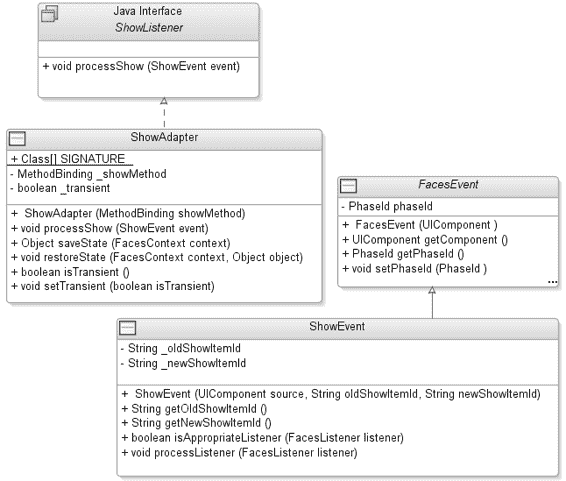

5807ch03.qxd 1/13/06 11:06 AM 第 114 页

**114**

第 3 章 ■ 定义 DECK 组件

**图 3-4.** *显示事件和监听器实现所需所有类的类图*
事件处理概述

在您看到 Deck 组件的事件和监听器实现的代码之前，本节将涵盖有关 JSF 事件模型的一些主题。

如果您有使用 Swing 工具包或 Oracle 的 ADF Swing 框架开发应用程序的经验，您会注意到 JSF 实现的事件模型与之类似。实际上，JSF 基于 JavaBeans 规范 1.0.1 版中的命名约定，实现了一个用于事件通知和监听器注册的模型。这基本上意味着应用程序开发人员可以编写应用程序代码并将其注册以监听特定事件。`UIComponent` 自身会传递事件（例如，当用户点击按钮时，这与其他 UI 工具包采用的方法类似）。应用程序开发人员会立即认识到这种模型的好处，因为它已被证明易于维护和开发。它允许应用程序开发人员为特定事件编写定义良好的代码块中的应用程序代码，就像 Microsoft Visual Basic 中使用的那样。

Swing 框架和 JSF 之间的主要区别在于，Swing 在有状态模式下运行，并且始终监听客户端触发的事件；相比之下，JSF 在无状态环境中工作。由于客户端和后端服务器之间没有永久连接，JSF 无法始终监听事件，必须依赖回传来获知客户端上可能导致事件传递的任何更改。HTTP 的这个限制

5807ch03.qxd 1/13/06 11:06 AM 第 115 页

第 3 章 ■ 定义 DECK 组件

**115**

迫使 JSF 实现一个严格的事件模型来处理客户端生成的事件，该模型基于第 1 章中描述的 JSF 请求处理生命周期。

在回传期间，JSF 请求生命周期的所有六个阶段都会被调用（除非在某个地方调用了 `renderResponse()`，在这种情况下，生命周期将直接跳转到渲染响应阶段）。当执行恢复视图阶段时，它会恢复来自先前请求的任何可用状态。在应用请求值阶段（见图 3-5），会建立来自请求参数的提交值并将其添加到每个输入组件，同时任何事件都会被排队。

应用程序作用域

***ART1***

**生命周期**

**2\. 应用**

**请求**

**execute()**

**值**

render()

**FacesServlet**

请求作用域

**FacesContext**

**UIViewRoot**

renderResponse()

**HtmlForm**

**ProShowOneDeck**

**ProShowItem**

**ProShowItem**

**ProShowItem**

**图 3-5.** *将请求中传递的新值应用于组件*
默认情况下，在每个阶段结束时，适当的 `UIViewRoot` 生命周期管理方法（`processDecodes()`、`processValidators()`、`processUpdates()` 和 `processApplication()`）将循环处理该阶段中排队的事件，并通知排队事件的组件上的任何已注册监听器（例如，`ProShowOneDeck`）。这些监听器中的应用程序逻辑也可以排队事件，并且 `UIViewRoot` 生命周期管理方法将继续循环处理排队的事件列表，直到列表为空，然后再继续下一个阶段。

■**注意** 理解事件可以在以下任何请求生命周期阶段中排队和传递非常重要：应用请求值、处理验证、更新模型值和调用应用程序。

5807ch03.qxd 1/13/06 11:06 AM 第 116 页

**116**

第 3 章 ■ 定义 DECK 组件

事件

应用程序开发人员可以使用事件实例来获知 UI 或底层模型的更改。JSF 规范定义了两种默认事件类型——`javax.faces.event.ActionEvent` 和 `javax.faces.event.ValueChangeEvent`。`ActionEvent` 通常在用户激活 `UICommand` 组件时传递，而 `ValueChangeEvent` 表示任何 `UIInput` 组件中的值已更改。

**FacesEvent 基类**

`javax.faces.event.FacesEvent` 类是 JSF 中可由 `UIComponent` 传递的 UI 和应用程序事件的抽象基类。`FacesEvent` 构造函数接受一个参数——`UIComponent` 事件源实例，它标识了事件将从哪个组件广播给感兴趣的监听器。JSF 中的所有组件事件类——默认的或自定义的——都必须扩展 `FacesEvent` 类，才能得到请求处理生命周期的支持。`FacesEvent` 扩展了 `java.util.EventObject`，后者是 Java 标准版中所有事件的基类。表 3-2 描述了 `FacesEvent` 基类的结构。

**表 3-2.** *FacesEvent 基类的方法摘要*

**方法**

**返回类型**

**描述**

getComponent()

javax.faces.component.UIComponent

返回传递此事件的源 UIComponent 实例

getPhaseId()

javax.faces.event.PhaseId

返回此事件将在哪个阶段传递的标识符——phaseId

setPhaseId

void

设置此事件将在哪个 PhaseId 期间传递

isAppropriateListener()

boolean

检查此监听器是否为此事件支持的监听器实例

processListener()

void

将此事件广播给指定的监听器

queue()

void

便捷方法，将此事件排队，以便在当前请求处理生命周期阶段结束时广播

** 来源：JSF 规范的 API Java 文档* **phaseId 属性**


默认情况下，事件在其被排入队列的阶段进行传递，但组件作者可以通过设置 `FacesEvent` 类的 `phaseId` 属性（其数据类型为 `PhaseId`）来决定事件在 JSF 请求处理生命周期的任意阶段进行传递。`PhaseId` 数据类型是一种类型安全的枚举，它存储一个值，用于表示应由哪个请求生命周期阶段来传递该事件。表 3-3 显示了有效的取值。

5807ch03.qxd 1/13/06 11:06 AM Page 117

第 3 章 ■ 定义 DECK 组件

**117**

**表 3-3.** *有效的* PhaseId *取值*

**PhaseId 取值**

**描述**

PhaseId.ANY_PHASE

如果组件作者未进行任何设置，此为默认值。事件将在其被排入队列的阶段进行传递。

PhaseId.APPLY_REQUEST_VALUES

在“应用请求值”阶段结束时传递事件。

PhaseId.PROCESS_VALIDATIONS

在“处理验证”阶段结束时传递事件。

PhaseId.UPDATE_MODEL_VALUES

在“更新模型值”阶段结束时传递事件。

PhaseId.INVOKE_APPLICATION

在“调用应用程序”阶段结束时传递事件。

PhaseId.RENDER_RESPONSE

在“渲染响应”阶段结束时传递事件。

在每个阶段结束时，`UIViewRoot` 组件将遍历队列中的所有事件，首先处理 `phaseId` 设置为 `ANY_PHASE` 的事件，然后处理 `phaseId` 设置为该特定阶段的事件。

**广播事件**

如前所述，在每个阶段结束时，`UIViewRoot` 组件将遍历已排入队列的事件列表，并将事件“广播”给为该特定事件注册的所有监听器。实际上，这意味着 `UIViewRoot` 将调用传递事件的 `UIComponent` 实例上的一个方法——`broadcast()`，如代码示例 3-4 所示。

**代码示例 3-4.** *`broadcast()` 方法签名* public abstract void broadcast(

FacesEvent event) throws AbortProcessingException;

此方法通知所有为特定事件类型注册的监听器，它接受一个 `FacesEvent` 类型的参数。

事件子类

在第 2 章中，蓝图的第二步是创建一个特定于客户端的渲染器。在本章中，你需要通过添加新事件类型和行为超类的创建来扩展自定义组件蓝图。

基于对 HTML 源代码的分析，你需要能够处理客户端用户事件，并跟踪哪些内容已被展开以及用户下一步想要展开什么。

在创建新的行为超类之前，你需要定义一个新的事件类和一个新的监听器接口，它们可用于执行特定于此新类型用户事件的应用程序代码。你还必须为新事件类确定一个名称；JavaBeans 规范中使用的约定是在名称前加上实际的事件行为，在本例中是显示某些内容（Show），后跟名称 Event（例如，ShowEvent）。代码示例 3-5 显示了新的事件类。

5807ch03.qxd 1/13/06 11:06 AM Page 118

**118**

第 3 章 ■ 定义 DECK 组件

**代码示例 3-5.** *`ShowEvent` 子类* package com.apress.projsf.ch3.event;

import javax.faces.component.UIComponent;

import javax.faces.event.FacesEvent;

import javax.faces.event.FacesListener;

import javax.faces.event.PhaseId;

/**

* ShowEvent 事件。

*/

**public class ShowEvent extends FacesEvent**

{

/**

* 创建一个新的 ShowEvent。

*

* @param source 事件的来源

* @param oldShowItemId 先前显示的项标识符

* @param newShowItemId 当前显示的项标识符

*/

public ShowEvent(

UIComponent source,

String oldShowItemId,

String newShowItemId)

{

**super(source);**

setPhaseId(PhaseId.INVOKE_APPLICATION);

_oldShowItemId = oldShowItemId;

_newShowItemId = newShowItemId;

}

**public String getOldShowItemId()**

{

return _oldShowItemId;

}

**public String getNewShowItemId()**

{

return _newShowItemId;

}

**public boolean isAppropriateListener(**

**FacesListener listener)**

{


return (listener instanceof ShowListener);

}

5807ch03.qxd 1/13/06 11:06 AM 第 119 页

第 3 章 ■ 定义 DECK 组件

**119**

**public void processListener(**

**FacesListener listener)**

{

((ShowListener) listener).processShow(this);

}

private String _oldShowItemId;

private String _newShowItemId;

}

当引入新的事件类时，需要确保它继承自 `javax.faces.event.FacesEvent`，以便该事件能够参与 JSF 请求处理生命周期。

`FacesEvent` 基类构造函数接受一个参数——传递事件的 `UIComponent` 实例来源。这意味着新的事件类 `ShowEvent` 必须将 `UIComponent` 实例来源作为参数，并将其传递给其父类——`super(source);`。

如果未设置，`phaseId` 的默认值为 `PhaseId.ANY_PHASE`，这意味着事件将在其入列的阶段被传递。为确保 deck 组件的 `ShowEvent` 事件不会在组件层次结构完全处理之前被传递，必须将 `phaseId` 设置为 `PhaseId.INVOKE_APPLICATION`。这一点很重要，因为 deck 节点需要了解其子节点，并允许它们被更新和验证，以便正确渲染。

为了让使用 `ShowEvent` 类的应用程序开发人员更轻松，还可以添加两个属性——`oldShowItemId` 和 `newShowItemId`，并附带相应的 getter 方法，这些并非 `FacesEvent` 基类所要求。这些访问器是为了方便而设，以便应用程序开发人员能够了解哪个项目已折叠，哪个项目当前已展开。

此外，还需重写 `FacesEvent` 基类中的两个方法——`isAppropriateListener()` 和 `processListener()`。如果监听器是 `ShowListener` 的实例（稍后将详细介绍此监听器），则 `isAppropriateListener()` 方法返回 `true`。`isAppropriateListener()` 方法允许组件编写者验证与组件关联的监听器签名是否与正在广播的事件兼容。如果监听器兼容，则在 `UIComponent.broadcast()` 期间调用 `processListener()` 方法，将此事件传递给 `ShowListener` 实例的 `processShow()` 方法，该方法由应用程序开发人员实现。

监听器

为了让应用程序对用户引发的事件做出响应，JSF 支持监听器。对于由 JSF 实现或自定义 `UIComponent` 定义的每种事件类型（例如 `ValueChangeEvent`），都必须有一个对应的监听器接口（例如 `ValueChangeListener`）。由应用程序开发人员实现的监听器实现一个或多个这些监听器接口，以及这些接口指定的事件处理方法，这些方法将在事件广播期间被调用。

**FacesListener 接口**

`javax.faces.event.FacesListener` 接口（继承自 `java.util.EventListener`）是 JSF 中所有默认和自定义监听器接口的基接口。`FacesListener` 接口（继承自 `java.util.EventListener`）是一个标记接口，仅用于类型安全。

通常，此监听器接口的大多数实现都接受一个参数，即正在为其创建监听器的事件类型（例如 `public void processShow(ShowEvent event);`）。

事件监听器接口

任何继承自 `FacesEvent` 基类的自定义事件类型都必须为该事件类型提供一个监听器接口，这是合理的，因为除非有办法对事件采取行动，否则传递事件毫无意义。

代码示例 3-6 扩展了 `FacesListener` 接口，并创建了一个监听器接口——`ShowListener`——该接口添加了 `processShow()` 方法，该方法接受一个 `ShowEvent` 实例作为参数。如您所见，这遵循了与 `ShowEvent` 类相同的命名约定，即以预期的事件名称作为前缀，以 `Listener` 作为后缀，以表明此类的用途。


**代码示例 3-6.** *ShowListener* 接口  
package com.apress.projsf.ch3.event;

import javax.faces.event.FacesListener;

/**

* ShowListener 监听器。

*/

public interface ShowListener extends FacesListener

{

/**

* 处理 ShowEvent。

*

* @param event 显示事件

*/

public void processShow(

ShowEvent event);

}

事件监听器适配器

如第 2 章所述，UIInput 组件会将 ValueChangeEvent 传递给所有已注册的事件监听器。此外，ValueChangeEvent 还会通过存储在 UIInput 的 valueChangeListener 属性中的 MethodBinding 传递给后台 bean。valueChangeListener 属性作为标签属性暴露在标准输入标签上，例如 `<h:inputText valueChangeListener="#{backingBean.doValueChange}" >`。在 JSF 1.2 中，valueChangeListener 属性在 UIInput 组件上已被弃用，但仍以 JSP 2.1 MethodExpression 的形式存在于 JSP 标签中，因此需要一个适配器类来将 MethodExpression 适配为 ValueChangeListener 实例。这样，当 ValueChangeEvent 发生时，后台 bean 仍能被调用，而无需在 UIInput 组件上单独设置 valueChangeListener 属性。这通过更严格地遵循 JavaBeans 规范，同时为应用程序开发保留 MethodBinding 支持，简化并明确了组件开发。

5807ch03.qxd 1/13/06 11:06 AM 第 121 页

第 3 章 ■ 定义 DECK 组件

**121**

我们将展示如何遵循此设计模式，将 JSF 1.1 的 MethodBinding 适配为 ShowListener 实例。代码示例 3-7 展示了此设计模式（ShowAdapter）的实现。

**代码示例 3-7.** *ShowAdapter* 类  
package com.apress.projsf.ch3.event;

import javax.faces.component.StateHolder;

import javax.faces.component.UIComponentBase;

import javax.faces.context.FacesContext;

import javax.faces.el.MethodBinding;

/**

* ShowAdapter 使用与 <code>processShow</code> 方法相同签名的 MethodBinding 进行调用。

*/

**public class ShowAdapter implements ShowListener,**

**StateHolder**

{

/**

* ShowListener 方法的 MethodBinding 签名。

*/

**public static Class[] SIGNATURE = new Class[] { ShowEvent.class };**

/**

* 创建一个新的 ShowAdapter。

*

* @param showMethod 要适配的 MethodBinding

*/

**public ShowAdapter(**

**MethodBinding showMethod)**

**{**

**_showMethod = showMethod;**

**}**

/**

* 处理 ShowEvent。

*

* @param event 显示事件

*/

**public void processShow(**

**ShowEvent event)**

{

FacesContext context = FacesContext.getCurrentInstance(); **_showMethod.invoke(context, new Object[]{event});**

}

5807ch03.qxd 1/13/06 11:06 AM 第 122 页

**122**

第 3 章 ■ 定义 DECK 组件

/**

* 保存此 ShowAdapter 的内部状态。

*

* @param context Faces 上下文

*

* @return 保存的状态

*/

**public Object saveState(**

**FacesContext context)**

**{**

**return UIComponentBase.saveAttachedState(context, _showMethod);**

}

/**

* 恢复此 ShowAdapter 的内部状态。

*

* @param context Faces 上下文

* @param object 要恢复的状态

*/

**public void restoreState(**

**FacesContext context,**

**Object object)**

{

_showMethod = (MethodBinding)

**UIComponentBase.restoreAttachedState(context, object);**

}

/**

* 如果此 ShowAdapter 是瞬态的且不应保存状态，则返回 true，否则返回 false。

*

* @return 瞬态值

*/

public boolean isTransient()

{

return _transient;

}

/**

* 指示此 ShowAdapter 是否为瞬态且不应保存状态。

*

* @param isTransient 瞬态的新值

*/

public void setTransient(

boolean isTransient)

{

5807ch03.qxd 1/13/06 11:06 AM 第 123 页

第 3 章 ■ 定义 DECK 组件

**123**

_transient = isTransient;

}

private MethodBinding _showMethod;

private boolean _transient;

}


ShowAdapter 实现了 processShow 方法，该方法使用 ShowEvent 参数调用指定的 MethodBinding。传递给 ShowAdapter 构造函数的 MethodBinding 必须与 processShow 方法的签名匹配，这一点非常重要。因此，ProShowOneDeckTag 使用 SIGNATURE 常量来创建具有正确签名的 MethodBinding。

在此适配器类上实现 StateHolder 接口非常重要，这样当实例作为组件层次结构中某个组件的监听器注册时，状态可以被正确保存和恢复。

你必须提供 saveState() 方法的实现，将 MethodBinding 状态存储为 UIShowAdapter 状态，因此你需要使用 UIComponentBase 中名为 saveAttachedState() 的静态方法。这个便捷方法负责保存可能实现也可能未实现 StateHolder 接口的附加对象的状态。

你还必须提供 restoreState() 方法的实现，该方法将 FacesContext 和状态对象作为参数。请注意，使用 saveAttachedState() 方法保存 MethodBinding 状态意味着你需要使用 restoreAttachedState() 方法来恢复 MethodBinding 状态。

实践中的事件传递

让我们使用与代码示例 3-3 相同的页面来逐步了解 JSF 提供的事件传递机制。现在我们将展示如何使用相同的代码深入 JSF 事件和监听器模型。该页面包含代码示例 3-8 中的源代码。

**代码示例 3-8.** *包含* showListener *标签的页面源代码*

<h:form>

...

<pro:showOneDeck showItemId="first"

**showListener="#{backingBean.doShow}" >**

<pro:showItem id="first" >

...

</pro:showItem>

**<pro:showListener**

**type="com.apress.projsf.ch3.application.MyShowListener" />**

</pro:showOneDeck>

...

</h:form>

<pro:showOneDeck ...> 包含一个与 ShowEvent 事件类型（ShowListener）关联的属性。此示例将 <pro:showOneDeck> 的 showListener 属性设置为

#{backingBean.doShow}。这是一种通过属性将监听器分配给组件的常见方法。MethodBinding 指向一个方法——doShow()——该方法遵循 ShowListener 接口的签名，但并未直接实现该接口。代码示例 3-9 展示了 ShowListener 方法——doShow() 的源代码。

**代码示例 3-9.** *一个* ShowListener *方法——* doShow() package com.apress.projsf.ch3.application;

import com.apress.projsf.ch3.event.ShowEvent;

/**

* ShowOneDeckBean 是 showOneDeck.jspx 文档的后台 bean。

*/

public class ShowOneDeckBean

{

/**

* ShowListener 方法绑定。

*

* @param event 显示事件

*/

**public void doShow(**

**ShowEvent event)**

{

String oldShowItemId = event.getOldShowItemId();

String newShowItemId = event.getNewShowItemId();

System.out.println("BackingBean [oldShowItemId=" + oldShowItemId + "," +

"newShowItemId=" + newShowItemId + "]");

}

}

这种实现监听器的方式是为应用程序开发者提供的便利。然而，它也有局限性，因为 <pro:showOneDeck /> 上的 showListener 属性只接受一个方法绑定；相比之下，使用特定的监听器标签（例如 <pro:showListener ...>）关联监听器，允许应用程序开发者根据需要关联任意数量的监听器（例如，记录事件信息），并关联一个监听器来实际处理事件。从应用程序开发者的角度来看，ShowListener 的实现可能类似于代码示例 3-10。

**代码示例 3-10.** *ShowListener 接口的实现* package com.apress.projsf.ch3.application;

import com.apress.projsf.ch3.event.ShowEvent;

import com.apress.projsf.ch3.event.ShowListener;

**public class MyShowListener implements ShowListener**

{

**public void processShow(**

**ShowEvent event)**

{

String oldShowItemId = event.getOldShowItemId();

String newShowItemId = event.getNewShowItemId();

System.out.println("MyShowListener [oldShowItemId=" + oldShowItemId + "," +

"newShowItemId=" + newShowItemId + "]");

}

}


**125**

{

String oldShowItemId = event.getOldShowItemId();

String newShowItemId = event.getNewShowItemId();

System.out.println("MyShowListener " +

"[oldShowItemId=" + oldShowItemId + "," +

"newShowItemId=" + newShowItemId + "]");

}

}

这个监听器——MyShowListener——实现了 ShowListener 接口，并将 ShowEvent 的实例作为参数，它从事件实例中获取在面板组件中使用的新旧项目的 ID，并将它们打印到系统日志窗口。

JSF 生命周期中的事件处理

当用户与面板组件交互时（例如，展开一个项目），一个包含所执行操作信息的请求会被发送到服务器。到目前为止，您已经知道第一个阶段，即恢复视图阶段，会在回传时恢复组件层次结构。第二个阶段是关键的阶段——应用请求值阶段（参见图 3-6）。

应用程序作用域

***ART1***

**生命周期**

**2\. 应用**

**请求**

**execute()**

**值**

render()

**FacesServlet**

请求作用域

**FacesContext**

**UIViewRoot**

renderResponse()

**HtmlForm**

**ProShowOneDeck**

**ProShowItem**

**ProShowItem**

**ProShowItem**

**图 3-6.** *应用请求值阶段中的事件处理* 在此阶段，传入的请求参数被解码并映射到组件层次结构中对应的 UIComponent。当组件的渲染器发现用户触发了某个事件时，该组件的渲染器会创建相应 FacesEvent 子类的实例，并将该事件排队到源组件中。

5807ch03.qxd 1/13/06 11:06 AM 第 126 页

**126**

第 3 章 ■ 定义面板组件

例如，当 UIShowOne 组件的渲染器发现用户在渲染后的标记中激活或点击了某个项目的标题时，UIShowOne 的渲染器会创建一个 ShowEvent 实例，将源 UIShowOne 组件实例传递给构造函数，并在新创建的事件实例上调用 queue() 方法。这会导致 ShowEvent 实例被 UIViewRoot 存储在事件队列中，直到在调用应用程序阶段（参见图 3-7）期间被传递。

■**注意** 如果没有渲染器与 UIComponent 关联，则由组件的 decode() 方法负责将事件排队，通常目标是在调用应用程序阶段进行传递。

应用程序作用域

***ART1***

**生命周期**

**2\. 应用**

**请求**

**execute()**

**值**

render()

**FacesServlet**

请求作用域

**FacesContext**

**UIViewRoot**

renderResponse()

**HtmlForm**

**ProShowOneDeck**

**ProShowItem**

**ProShowItem**

**ProShowItem**

**图 3-7.** *应用程序中的事件处理* 在您完成对此请求传递的任何事件的排队，并且所有请求值都已应用到其 UIComponent 之后，就该广播并处理那些 phaseId 设置为默认值 (PhaseId.ANY_PHASE) 或已为此阶段显式设置 phaseId (PhaseId.APPLY_REQUEST_VALUES) 的事件了——即应用请求值阶段。如果在此阶段有事件需要传递，则会首先调用 UIViewRoot 上的 processDecodes() 方法。此方法获取所有排队的事件并广播给组件层次结构中的每个组件。在应用程序中，此请求期间触发的唯一事件是由 UIShowOne 组件渲染器传递的 ShowEvent。

UIShowOne 组件将阶段标识符设置为 PhaseId.INVOKE_APPLICATION，这向请求处理生命周期指示此事件必须在调用应用程序阶段传递。在此阶段，会首先调用 UIViewRoot 上的 processApplication() 方法。此方法通过调用 UIShowOne.broadcast(ShowEvent) 方法来广播任何已排队等待请求处理生命周期中调用应用程序阶段的事件。

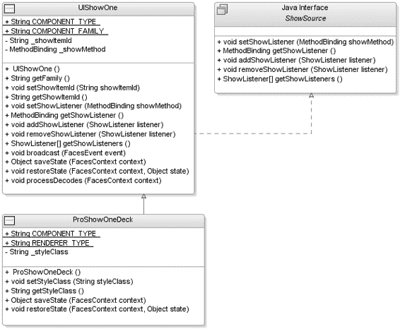

5807ch03.qxd 1/13/06 11:06 AM 第 127 页

第 3 章 ■ 定义面板组件

**127**

如果 UIShowOne 在广播 ShowEvent 时附加了监听器，则会依次调用每个已注册的 ShowListener 来传递事件。可以注册一个 ShowAdapter 作为监听器来执行方法绑定（例如，#{backingBean.doShow}），该方法绑定引用一个返回类型为 void 且具有单个 ShowEvent 类型参数的公共方法。

**第 3 步：创建行为超类**

您现在已完成事件和监听器的实现，是时候引入两个新的行为超类了——UIShowOne 和 UIShowItem。当您决定需要额外的行为超类时，还需要决定这些新类使用什么命名约定。JSF 规范使用的约定是，在任何顶级行为组件前加上 UI 前缀，后跟实际行为（例如，UIInput）。

内部组件，例如 UISelectItem，仅在特定父组件内部有用，通常使用其父组件名称的一部分和 Item 后缀来表示它们不是顶级行为组件。

在原型设计期间，决定面板组件需要两个新的 UIComponent。

第一个新组件充当顶级容器，控制激活时显示其哪个子组件。按照命名约定，这被称为 UIShowOne。

第二个组件代表每个子组件，这些子组件在未激活时以折叠形式显示，在激活时以展开形式显示。按照命名约定，这被称为 UIShowItem。

您现在将查看 UIShowOne 组件的实现；图 3-8 显示了您将为 UIShowOne 组件实现创建的类。

**图 3-8.** *显示* UIShowOne *实现的类图*

5807ch03.qxd 1/13/06 11:06 AM 第 128 页

**128**

第 3 章 ■ 定义面板组件

这些类如下：

• UIShowOne 类是行为超类。

• ProShowOneDeck 类是特定于客户端的子类。

• ShowSource 类隔离了事件监听器管理方法。

■**提示** JSF 社区中有几个很好的资源；特别是像 Apache MyFaces (http://myfaces.apache.org/) 这样的组织和像 JSF Central (http://jsfcentral.com/) 这样的社区网站是宝贵的信息来源。

ShowSource 接口

如果组件编写者想要创建一个使用 ShowEvent 和 ShowListener 的组件（例如，可能用于 UIShowMany 组件），您应该遵循最佳实践，将事件监听器管理方法隔离到一个接口中。此接口的命名约定基于事件和监听器名称，并带有 Source 后缀。在这种情况下，监听器管理接口被称为 ShowSource，如代码示例 3-11 所示。

**代码示例 3-11.** *ShowSource* *接口* import com.apress.projsf.ch3.event.ShowListener;

import javax.faces.el.MethodBinding;

/**

* ShowSource 是 ShowEvent 的源。

*/

public interface ShowSource

{

/**

* 向此 ShowSource 组件添加一个 ShowListener。

*

* @param listener 要添加的 show 监听器

*/

**public void addShowListener(**

**ShowListener listener);**

/**

* 从此 ShowSource 组件移除一个 ShowListener。

*

* @param listener 要移除的 show 监听器

*/

5807ch03.qxd 1/13/06 11:06 AM 第 129 页

第 3 章 ■ 定义面板组件

**129**

**public void removeShowListener(**

**ShowListener listener);**

/**

* 返回此 ShowSource 组件的所有 ShowListener。

*

* @return show 监听器数组

*/

**public ShowListener[] getShowListeners();**

}


ShowSource 接口将确保你遵循标准的 JavaBeans 设计模式进行 EventListener 注册——即 `add<ListenerType>(<ListenerType> listener)` 和 `remove<ListenerType>(<ListenerType> listener)`——从而允许应用程序开发者以编程方式，向任何需要传递 ShowEvents 的行为组件添加和移除监听器。最后一个方法——`public ShowListener[] getShowListeners();`——也被添加进来，以便任何有兴趣了解哪些监听器已附加到此组件的人（例如，通过 IDE）都能查看到。

UIShowOne 行为超类

UIShowOne 组件是一个行为超类，它定义了应用程序如何与该组件或任何扩展此超类的组件进行交互的契约。理解这一点很重要：行为性的 UIComponent 子类（例如 UISelectOne）并不定义任何与渲染器相关的内容，因此它们可以针对多种不同的客户端技术进行复用。

正如你在第 1 章中回忆的那样，由 `getFamily()` 方法返回的组件族是一个代表组件行为的字符串，用于为特定的 UIComponent 选择渲染器。由 `getComponentType()` 方法返回的组件类型是一个字符串，被 Application 对象用作 UIComponent 子类（例如 UIShowOne）的标识符。遵循前几章的命名约定，组件族和组件类型都被称为 `com.apress.projsf.ShowOne`。

代码示例 3-12 介绍了第一个行为超类——UIShowOne。

**代码示例 3-12.** *扩展* UIComponentBase *类* import java.util.Iterator;

import java.util.List;

import javax.faces.component.NamingContainer;

import javax.faces.component.UIComponentBase;

import javax.faces.context.FacesContext;

import javax.faces.el.MethodBinding;

import javax.faces.el.ValueBinding;

import javax.faces.event.AbortProcessingException;

import javax.faces.event.FacesEvent;

import com.apress.projsf.ch3.event.ShowEvent;

import com.apress.projsf.ch3.event.ShowListener;

5807ch03.qxd 1/13/06 11:06 AM Page 130

**130**

第 3 章 ■ 定义 DECK 组件

/**

* UIShowOne 行为组件。

*/

**public class UIShowOne extends UIComponentBase**

**implements ShowSource**

{

/**

* 此组件的组件类型。

*/

**public static final String COMPONENT_TYPE = "com.apress.projsf.ShowOne";**

/**

* 此组件的组件族。

*/

**public static final String COMPONENT_FAMILY = "com.apress.projsf.ShowOne";**

/**

* 创建一个新的 UIShowOne。

*/

public UIShowOne()

{

}

/**

* 返回此组件的组件族。

*

* @return 组件族

*/

**public String getFamily()**

{

return COMPONENT_FAMILY;

}

UIComponent 和 UIComponentBase 类是所有 JSF 组件的基础，它们定义了所有组件的行为契约和状态信息。UIComponentBase 类（`javax.faces.component.UIComponentBase`）是一个便捷子类，它实现了 UIComponent 类的几乎所有方法。UIShowOne 类扩展了 UIComponentBase 类，这是推荐的做法，因为它将保护 UIComponent 子类——UIShowOne——免受未来可能发生的 UIComponent 实现签名变更的影响。实现 ShowSource 接口是为了确保你遵守关于自定义监听器如何附加到组件的规则。

最后，你为 UIShowOne 组件设置了两个常量，一个用于组件族，一个用于组件类型。

■**注意** 你可以在第 1 章中找到关于组件族和组件类型的更多信息。

5807ch03.qxd 1/13/06 11:06 AM Page 131

第 3 章 ■ 定义 DECK 组件

**131**

接下来，添加 bean 属性来处理对行为属性 `showItemId` 的访问，如代码示例 3-13 所示。请记住，此组件的要求是每次只显示一个项目。

**代码示例 3-13.** *showItemId* 行为属性的访问器和修改器

/**

* 设置要显示的 show item 子项 ID。

*

* @param showItemId 新的要显示的 show item 子项 ID。

*/

**public void setShowItemId(**

**String showItemId)**

{

_showItemId = showItemId;

}

/**

* 返回要显示的 show item 子项 ID。

*

* @return 要显示的 show item 子项 ID

*/

**public String getShowItemId()**

{

if (_showItemId != null)

return _showItemId;

ValueBinding binding = getValueBinding("showItemId"); if (binding != null)

{

FacesContext context = FacesContext.getCurrentInstance(); return (String)binding.getValue(context);

}

return null;

}

UIShowOne 组件是父容器，它将控制显示哪些项目。`showItemId` bean 属性将设置用户选择的新项目（或在初始请求时设置默认标识符），并获取当前显示项目的 `showItemId`。

**关联监听器的处理**

UIShowOne 组件实现的一部分是提供一个 ShowEvent，该事件将作为用户在 deck 组件中选择一个项目的结果而被传递。你与 ShowSource 接口的契约的一部分是实现方法，以允许以编程方式向 UIShowOne 组件添加和移除监听器，如代码示例 3-14 所示。

5807ch03.qxd 1/13/06 11:06 AM Page 132

**132**

第 3 章 ■ 定义 DECK 组件

**代码示例 3-14.** *实现* ShowSource *接口*

/**

* 向此 UIShowOne 组件添加一个 ShowListener。

*

* @param listener 要添加的 show 监听器

*/

**public void addShowListener(**

ShowListener listener)

{

addFacesListener(listener);

}

/**

* 从此 UIShowOne 组件移除一个 ShowListener。

*

* @param listener 要移除的 show 监听器

*/

public void removeShowListener(

ShowListener listener)

{

removeFacesListener(listener);

}

/**

* 返回此 UIShowOne 组件的所有 ShowListeners。

*

* @return show 监听器数组

*/

public ShowListener[] getShowListeners()

{

return (ShowListener[])getFacesListeners(ShowListener.class);

}

在本章稍后部分（参见“ShowListenerTag 类”一节），我们将展示如何使用 `addShowListener()` 方法构建一个 ShowListener 标签处理器，你可以使用它将监听器关联到 deck 组件或任何实现了 ShowSource 接口的自定义组件。

**状态保存**

现在你应该知道，JSF 提供了存储应用程序开发者所使用的组件状态的功能。你有两种存储视图状态的替代方案——在客户端进行或在服务器端进行。服务器端实现利用了 JSP 和 Servlet 规范，并由一个名为 StateManager 的类管理。ResponseStateManager 类是 RenderKit 的一部分，它管理客户端状态保存。

5807ch03.qxd 1/13/06 11:06 AM Page 133

第 3 章 ■ 定义 DECK 组件

**133**

StateManager 在服务器上的请求之间保存和恢复特定视图（UIComponent 层次结构）的状态，如代码示例 3-15 所示。UIComponent（例如 UIShowOne）控制要保存哪些内部状态，因此组件编写者需要做一些工作。

**代码示例 3-15.** *管理状态保存*

public Object saveState(

FacesContext context)

{

Object values[] = new Object[2];

**values[0] = super.saveState(context);**

**values[1] = _showItemId;**

return values;

}

public void restoreState(

FacesContext context,

Object state)

{

Object values[] = (Object[])state;

**super.restoreState(context, values[0]);**

**_showItemId = (String)values[1];**

}

由于你扩展了 UIComponentBase 类，你需要管理行为属性的状态，并且需要确保存储了基础组件的任何状态。

**处理解码**


从实现 ProInputDate 组件（参见第 2 章）中，您应该已经了解到，在应用请求值阶段，`UIViewRoot` 组件会调用 `processDecodes()` 方法。`UIViewRoot` 上的 `processDecodes()` 方法负责递归调用组件层次结构中每个 `UIComponent` 的 `processDecodes()` 方法。因此，您需要确保在组件中实现了此方法，以便能够处理传递给 `UIShowOne` 组件的任何请求参数，如代码示例 3-16 所示。

**代码示例 3-16.** *处理解码*

public void processDecodes(

FacesContext context)

{

if (context == null)

throw new NullPointerException();

5807ch03.qxd 1/13/06 11:06 AM Page 134

**134**

第 3 章 ■ 定义 DECK 组件

**if (!isRendered())**

**return;**

String showItemId = getShowItemId();

if (showItemId != null && getChildCount() > 0)

{

List children = getChildren();

for (Iterator iter = children.iterator(); iter.hasNext();)

{

UIShowItem showItem = (UIShowItem)iter.next();

if (showItemId.equals(showItem.getId()))

showItem.processDecodes(context);

}

}

// 最后解码 showOne 组件

decode(context);

}

private String _showItemId;

private MethodBinding _showMethod;

}

之前未渲染到客户端的组件不应作为回传的一部分进行处理。因此，您在 `processDecodes()` 实现中使用 `isRendered()` 方法，以确保当 `rendered` 属性为 false 时，该组件不会参与回传。这可以防止恶意用户通过尝试在之前未渲染的组件上触发事件来攻击系统。如果 `UIShowOne` 的 `rendered` 属性为 true，则首先在当前活动的 `UIShowItem` 子组件（如果有）上调用 `processDecodes()`，然后在 `UIShowOne` 组件本身上调用 `decode()` 方法。如果 `UIShowOne` 组件存在渲染器，则 `decode()` 方法会委托给该渲染器。

UIShowItem 行为超类

需要 `UIShowItem` 组件来允许应用程序开发人员向 deck 组件添加带标签的项。`UIShowItem` 组件类似于 JSF 规范提供的 `UISelectItem` 组件，不同之处在于，`UIShowItem` 充当应用程序开发人员添加的其他 JSF 组件的容器。图 3-9 显示了行为性的 `UIShowItem` 超类。

`UIShowItem` 组件不渲染任何内容，因此您无需实现渲染器或特定于渲染器的子类。相反，父组件 `UIShowOne` 负责渲染每个 `UIShowItem` 子组件的 header 方面，以及当前活动的 `UIShowItem` 子组件的子组件，如代码示例 3-17 所示。

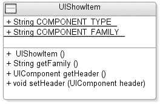

5807ch03.qxd 1/13/06 11:06 AM Page 135

第 3 章 ■ 定义 DECK 组件

**135**

**图 3-9.** *UIShowItem* 实现的类图 使用 header 方面而不是 `headerText` 属性，为应用程序开发人员提供了更大的灵活性，以决定如何最佳地可视化 header。例如，使用方面允许在 header 中同时使用图标和文本，而不仅仅是文本。

**代码示例 3-17.** UIShowItem *组件*

package com.apress.projsf.ch3.component;

import javax.faces.component.UIComponent;

import javax.faces.component.UIComponentBase;

public class UIShowItem extends UIComponentBase

{

/**

* 此组件的组件类型。

*/

**public static final String COMPONENT_TYPE = "com.apress.projsf.ShowItem";** **public static final String COMPONENT_FAMILY = "com.apress.projsf.ShowItem";**

/**

* 创建一个新的 UIShowItem。

*/

public UIShowItem()

{

}

/**

* 返回此组件的组件系列。

*

* @return 组件系列

*/

public String getFamily()

{

return COMPONENT_FAMILY;

}

5807ch03.qxd 1/13/06 11:06 AM Page 136

**136**

第 3 章 ■ 定义 DECK 组件

/**

* 返回 header 方面。

*

* @return header 方面

*/


public UIComponent getHeader()

{

return getFacet("header");

}

/**

* 设置一个新的头部区域。

*

* @param header 新的头部区域

*/

public void setHeader(UIComponent header)

{

getFacets().put("header", header);

}

}

如前所述，添加组件族和组件类型是为了能够选择渲染器，并作为`UIComponent`子类的标识符。在本例中，在`UIShowItem`组件中定义这些内容似乎有些冗余，但构建新行为组件时的约定之一是，新组件必须引入自己的组件族。基本上，每个新的行为组件都需要组件族，它指明了该组件的行为分组。此外，每个组件（无论是行为组件还是特定于渲染器的组件）都应在`faces-config.xml`中注册一个组件类型。

如你所见，你还通过继承自`UIComponentBase`的`getFacet()`方法，为头部区域添加了便捷的 getter 和 setter 方法。`getFacet()`方法返回指定名称的区域（例如，`header`），如果存在的话；否则返回`null`。通常，区域通过一个命名的用途（例如，`header`）将子组件与其父组件关联起来，而不暗示该区域相对于其他子组件的渲染位置。

**第 4 步：创建客户端特定渲染器**

现在，你已经为 JSF 卡片组件及其行为组件（包括事件和监听器支持）奠定了基础。接下来，我们开始研究如何渲染卡片组件。按照本章前面讨论的命名模式，`UIShowOne`组件渲染器的完全限定类名是`com.apress.projsf.ch3.render.html.basic.HtmlUIShowOneDeckRenderer`。

`HtmlShowOneDeckRenderer`类

图 3-10 展示了`HtmlShowOneDeckRenderer`继承自第 2 章介绍的`HtmlRenderer`。

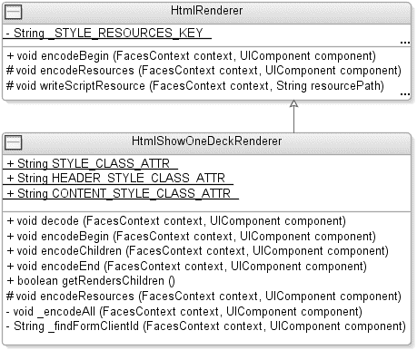

5807ch03.qxd 1/13/06 11:06 AM 第 137 页

第 3 章 ■ 定义卡片组件

**137**

**图 3-10.** *类图展示* HtmlShowOneDeckRenderer *继承自* HtmlRenderer

由于`UIShowOne`组件是一个容器组件，它需要渲染其子组件，因此你将在新的渲染器中实现`encodeBegin()`、`encodeChildren()`和`encodeEnd()`方法。

代码示例 3-18 展示了`HtmlShowOneDeckRenderer`的`encodeBegin()`方法。

**代码示例 3-18.** *encodeBegin()* 方法

package com.apress.projsf.ch3.render.html.basic;

import java.io.IOException;

import java.util.Iterator;

import java.util.List;

import java.util.Map;

import javax.faces.component.UIComponent;

import javax.faces.component.UIForm;

import javax.faces.context.ExternalContext;

import javax.faces.context.FacesContext;

import javax.faces.context.ResponseWriter;

import com.apress.projsf.ch2.render.html.HtmlRenderer; import com.apress.projsf.ch3.component.UIShowItem;

import com.apress.projsf.ch3.component.UIShowOne;

import com.apress.projsf.ch3.event.ShowEvent;

/**

* 将 UIShowOne 组件渲染为卡片。

*/

public class HtmlShowOneDeckRenderer extends HtmlRenderer

5807ch03.qxd 1/13/06 11:06 AM 第 138 页

**138**

第 3 章 ■ 定义卡片组件

{

/**

* styleClass 属性。

*/

public static String STYLE_CLASS_ATTR = "styleClass";

/**

* itemStyleClass 属性。

*/

public static String ITEM_STYLE_CLASS_ATTR = "itemStyleClass";

/**

* itemHeaderStyleClass 属性。

*/

public static String ITEM_HEADER_STYLE_CLASS_ATTR = "itemHeaderStyleClass";

/**

* itemContentStyleClass 属性。

*/

public static String ITEM_CONTENT_STYLE_CLASS_ATTR = "itemContentStyleClass"; **public void encodeBegin(**

FacesContext context,

UIComponent component) throws IOException

{

// 首先写入资源

**super.encodeBegin(context, component);**

**ResponseWriter out = context.getResponseWriter();**

out.startElement("div", component);

Map attrs = component.getAttributes();

**String styleClass = (String)attrs.get(STYLE_CLASS_ATTR);** if (styleClass != null)


out.writeAttribute("class", styleClass, STYLE_CLASS_ATTR);

}

`encodeBegin()` 方法接受两个参数——`FacesContext context` 和 `UIComponent component`。渲染响应阶段将调用 `UIShowOne` 组件上的 `encodeBegin()` 方法，该方法随后会委托给 `HtmlShowOneDeckRenderer` 上的 `encodeBegin()` 方法，并传递 `FacesContext` 和 `UIShowOne` 组件实例。

你获取 `ResponseWriter`，写出代表该组件的第一个 HTML `<div>` 元素，并附加由应用程序开发者定义的 `styleClass`（如果存在）。在继续向客户端写入任何内容之前，你还需要获取组件的唯一标识符——`clientId`。为此，你调用传递给 `Renderer` 的 `UIShowOne` 实例上的 `getClientId()` 方法。然后，你将此唯一标识符包含在生成的标记中，以确保在回传时能够解码请求并将任何值或事件应用于正确的组件。有关 `clientId` 的更多信息，请参见第 2 章。

5807ch03.qxd 1/13/06 11:06 AM 第 139 页

第 3 章 ■ 定义 DECK 组件

**139**

根据需求，`UIShowOne` 组件控制展开哪个项目——`UIShowItem`。这由 `encodeResources()` 方法写入响应的 JavaScript 资源管理，如代码示例 3-19 所示。

**代码示例 3-19.** *`encodeResources()` 方法*

/**

* 写出 HtmlShowOneDeck 资源。

*

* @param context Faces 上下文

* @param component Faces 组件

*/

protected void encodeResources(

FacesContext context,

UIComponent component) throws IOException

{

**writeScriptResource(context, "/projsf-ch3/showOneDeck.js");** writeStyleResource(context, "/projsf-ch3/showOneDeck.css");

}

`HtmlRenderer` 超类提供的 `writeScriptResource()` 方法确保脚本资源在渲染期间只被写入一次，即使同一页面上出现多个 `ProShowOneDeck` 组件也是如此。在代码示例 3-19 中，`encodeResources()` 方法写出了一个渲染 `ProShowOneDeck` 组件所需的 JavaScript 资源——`showOneDeck.js`。你还编码了一个 CSS 样式表资源——`showOneDeck.css`——来定义 `ProShowItem`、`ProShowItemHeader` 和 `ProShowItemContent` CSS 样式类，这些类由同一页面上的所有 `ProShowOneDeck` 组件共享。

■**注意** 使用 `ResponseWriter` 的 `startElement()` 和 `endElement()` 方法。这将提高你的性能，使你的代码在仅有细微差异的标记语言（例如，HTML 和 XHTML 之间）之间更具可移植性，并通过验证所有 `startElement()` 和 `endElement()` 调用是否平衡，使检测和调试生成的标记更容易。

**JavaScript 实现**

在继续编码 `UIShowOne` 组件的子组件之前，请仔细查看新的 JavaScript 文件 `showOneDeck.js`，如代码示例 3-20 所示。你只能在此文件中看到一个函数 `showOneDeck()`；它接受三个参数：

* `formClientId` 参数代表父级 `UIForm` 组件的 `clientId`。
* `showOneClientId` 参数代表包含它的 `UIShowOne` 组件的 `clientId`。
* `itemId` 参数是用户选择的节点。

5807ch03.qxd 1/13/06 11:06 AM 第 140 页

**140**

第 3 章 ■ 定义 DECK 组件

稍后在 `encodeChildren()` 方法中，你将看到如何将此 JavaScript 函数附加到生成的 HTML 并将这些值传递给它。使用 JavaScript 函数，你可以响应用户操作并通过提交表单触发对 `FacesServlet` 的回传。

**代码示例 3-20.** *`showOneDeck.js` 文件的源代码*

/**

* HtmlShowOneDeckRenderer 的 onclick 处理程序。

*

* @param formClientId 外部 UIForm 组件的 clientId

* @param clientId ProShowOneDeck 组件的 clientId

* @param itemId 被点击的 UIShowItem 的 id

*/

function _showOneDeck_click(

formClientId,

clientId,

itemId)

{

var form = document.forms[formClientId];

var input = form[clientId];

if (!input)

{

**input = document.createElement("input");**

**input.type = 'hidden';**

**input.name = clientId;**

**form.appendChild(input);**

}

**input.value = itemId;**

**form.submit();**

}

在渲染期间，HTML 文档被完全解析后，浏览器提供对页面中相关 HTML 元素的各种集合（例如，图像和表单）的数组访问。你可以使用 `document.forms` 数组来访问正在提交的表单。每个表单还提供对该表单管理的输入字段的数组访问。在 JavaScript 实现中，你将使用一个隐藏的表单字段来存储所选 `UIShowItem` 的 `clientId`。当表单提交时，此值将被传递到服务器，并在解码期间用于检测应展开哪个 `UIShowItem`，从而显示其子组件。

应用程序开发者可能会在页面上添加多个 `HtmlShowOneDeck` 组件，通过将隐藏表单字段命名为与 `HtmlShowOneDeck` 组件的 `clientId` 相同的名称，你可以确保展开正确的 `HtmlShowOneDeck` 组件。你首先获取表单——`document.forms[formClientId]`。然后，知道了表单，你可以访问隐藏的输入字段（如果存在），并设置所选 `UIShowItem` 组件的 `clientId`——`input.value = itemId`。你通过提交表单并将新值传递给服务器端组件层次结构进行处理来完成该函数。

5807ch03.qxd 1/13/06 11:06 AM 第 141 页

第 3 章 ■ 定义 DECK 组件

**141**

■**提示** 有关 JavaScript 和 DOM 的更多信息，请访问 http://www.w3.org/DOM/。如果你是 JavaScript 新手，另一个好的资源是 http://developer.mozilla.org/en/docs/Main_Page。

此函数仅在单独的 JavaScript 文件中为页面上的所有 `UIShowOneDeck` 组件定义一次。我们将在第 5 章中向你展示如何打包和利用资源，例如 JavaScript 文件、CSS 文件和图像。

**编码子组件**

编码 `UIShowOne` 组件的子组件是在创建可展开的 `UIComponent` 时真正进行繁重工作的地方。正是在 `encodeChildren()` 方法中，你将设置样式、设置图像，并决定哪个 `UIShowItem` 组件将显示为“已展开”，从而显示其子组件。在代码示例 3-21 中，我们用粗体突出显示了一些更重要的区域，因为这些是之前未涉及或需要额外解释的新区域。

**代码示例 3-21.** *获取 `UIForm` 和 `UIShowOne` 组件的 ID* public void encodeChildren(

FacesContext context,

UIComponent component) throws IOException

{

**if (component.getChildCount() > 0)**

{

UIShowOne showOne = (UIShowOne)component;

**String showItemId = showOne.getShowItemId();**

// 渲染器特定的属性

Map attrs = showOne.getAttributes();

String itemStyleClass = (String)attrs.get(ITEM_STYLE_CLASS_ATTR); if (itemStyleClass == null)

itemStyleClass = "ProShowItem";

String itemHeaderStyleClass = (String)

attrs.get(ITEM_HEADER_STYLE_CLASS_ATTR);

if (itemHeaderStyleClass == null)

itemHeaderStyleClass = "ProShowItemHeader";

String itemContentStyleClass = (String)

attrs.get(ITEM_CONTENT_STYLE_CLASS_ATTR);

if (itemContentStyleClass == null)

itemContentStyleClass = "ProShowItemContent"; **String formClientId = _findFormClientId(context, component);** **String showOneClientId = component.getClientId(context);**

5807ch03.qxd 1/13/06 11:06 AM 第 142 页

**142**

第 3 章 ■ 定义 DECK 组件


在 `encodeChildren()` 方法中，首先检查该 `UIShowOne` 组件是否包含任何子组件。如果应用开发者没有添加任何 `UIShowItem` 子组件，则无需在此方法中执行进一步操作。接着，收集用于显示项目的 CSS 样式类信息、要显示的默认 `UIShowItem` 标识符、实际父级 `UIForm` 组件的 `clientId`，以及 `UIShowOne` 组件实例的 `clientId`，如代码示例 3-21 所示。然后，收集 `UIShowOne` 组件的所有子组件，遍历子组件列表，并检查每个子组件是否为 `UIShowItem` 的实例（参见代码示例 3-22）。如果不是，则该子组件将不会被渲染。

**代码示例 3-22.** *渲染每个* `UIShowItem` *子组件的起始部分* **List children = component.getChildren();**

for (Iterator iter = children.iterator(); iter.hasNext();)

{

**UIComponent child = (UIComponent) iter.next();**

**if (child instanceof UIShowItem)**

{

UIShowItem showItem = (UIShowItem)child;

String id = showItem.getId();

Map attrs = showItem.getAttributes();

**boolean isActive = id.equals(showItemId);**

ResponseWriter out = context.getResponseWriter();

**out.startElement("div", showItem);**

out.writeAttribute("class", itemStyleClass,

ITEM_STYLE_CLASS_ATTR);

**out.startElement("div", null);**

out.writeAttribute("class", itemHeaderStyleClass, ITEM_HEADER_STYLE_CLASS_ATTR);

如果该子组件是 `UIShowItem` 组件实例，则收集 `clientId` 以及 `UIShowItem` 组件上所有可用的属性。然后使用 `clientId` 设置一个标志 `isActive`，将其设为 `true` 或 `false`，以确定即将渲染的 `UIShowItem` 组件的 `clientId` 是否与 `showItemId` 匹配。此标志稍后将指示该 `UIShowItem` 组件是否应渲染其子组件。代码示例 3-22 中展示的其余代码，用于渲染两个起始的 `<div>` 元素、设置样式类，并呈现 `UIShowItem` 容器和标题。

在向 `UIShowItem` 组件附加任何 JavaScript 函数之前，请检查是否存在 `UIForm`；如果不存在，则可以省略该 JavaScript 函数，以免向客户端渲染不必要的标记（参见代码示例 3-23）。

**代码示例 3-23.** *处理* `UIShowItem` *组件的 facet 和子组件* **if (formClientId != null)**

{

5807ch03.qxd 1/13/06 11:06 AM 第 143 页

第 3 章 ■ 定义 DECK 组件

**143**

**out.writeAttribute("onclick",**

**"_showOneDeck_click('" + formClientId + "'," +**

**"'" + showOneClientId + "'," +**

**"'" + id + "')",**

**null);**

}

**UIComponent header = showItem.getHeader();**

**if (header != null)**

{

**_encodeAll(context, header);**

}

else

{

**out.writeText("Header", null);**

}

out.endElement("div");

**if (isActive)**

{

out.startElement("div", null);

out.writeAttribute("class", itemContentStyleClass, ITEM_CONTENT_STYLE_CLASS_ATTR);

**List kids = showItem.getChildren();**

**Iterator it = kids.iterator();**

**while (it.hasNext())**

**{**

**UIComponent kid = (UIComponent)it.next();**

**_encodeAll(context, kid);**

**}**

out.endElement("div");

}

out.endElement("div");

}

}

}

}

该组件的要求是：在点击时激活项目。通过将 `_showOneDeck_click()` 函数附加到代表 `UIShowItem` 标题的 `<div>` 元素的 `onclick` 事件处理程序上，可以创建一个可点击的 `<div>` 元素。`_showOneDeck_click()` 函数接受三个参数，分别代表外围表单组件的标识符、父级 `UIShowOne` 组件的标识符，以及 `UIShowItem` 实例的 `clientId`。

然后，通过调用 `getHeader()` 方法从 `UIShowItem` 组件获取标题 facet。如果 `getHeader()` 方法返回非空的 facet，则调用 `_encodeAll()` 方法来渲染该 facet 及其子组件。

5807ch03.qxd 1/13/06 11:06 AM 第 144 页

**144**

第 3 章 ■ 定义 DECK 组件


■**注意** 您可以添加代码来限制哪些组件可以在 facet 内渲染，但最佳实践是允许应用程序开发人员在 facet 中嵌套任何组件（无论是标准组件还是自定义组件）。如果您需要向应用程序开发人员推荐特定类型的组件，可以使用 `faces-config.xml` 通过 JSR-276 定义的元数据列出任何推荐的组件。

渲染 header facet 后，您使用 `isActive` 标志来确定这是否是当前展开的 `UIShowItem` 组件。如果是，则使用 `_encodeAll()` 方法渲染每个 `UIShowItem` 的子组件。

**编码结束**

对于输入日期组件的实现，处理子组件没有意义，因此您可以将所有渲染输出合并到一个 `encodeEnd()` 方法中，如代码示例 3-24 所示。对于 `UIShowOne` 组件，Renderer 负责使用 `encodeChildren()` 方法渲染其子组件。这带来的后果是，您还需要实现 `encodeEnd()` 方法来写出组件的闭合元素。

**代码示例 3-24.** *`HtmlShowOneDeckRenderer` 的 `encodeEnd()` 方法* public void encodeEnd(

FacesContext context,

UIComponent component) throws IOException

{

ResponseWriter out = context.getResponseWriter();

**out.endElement("div");**

}

如果您仔细查看 deck 组件所需的实际输出，您会发现所有添加的子组件都位于生成的标记的末尾。因此，对于 `UIShowOne` 组件的 Renderer 来说，除了关闭生成的标记之外，不需要做太多工作。

**渲染子组件**

在 JSF 1.1 规范中，`rendersChildren` 属性的默认值为 `false`。

对于 `UIShowOne` 组件，Renderer 负责渲染其子组件，因此需要将此标志设置为 `true`，如代码示例 3-25 所示。

**代码示例 3-25.** *将 `rendersChildren` 设置为 `true`* public boolean getRendersChildren()

{

return true;

}

5807ch03.qxd 1/13/06 11:06 AM Page 145

第 3 章 ■ 定义 DECK 组件

**145**

**定位表单 ClientId**

`_findFormClientId` 方法在 `encodeChildren()` 方法中使用，用于返回最近封闭的 `UIForm` 组件的 `clientId`，如代码示例 3-26 所示。

**代码示例 3-26.** *`_findFormClientId` 方法* private String _findFormClientId(

FacesContext context,

UIComponent component)

{

while (component != null &&

!(component instanceof UIForm))

{

component = component.getParent();

}

return (component != null) ? component.getClientId(context) : null;

}

在 `_findFormClientId()` 方法中，您首先检查该组件是否是 `UIForm` 的实例；如果不是，则通过调用 `component.getParent()` 遍历组件层次结构以找到父级 `UIForm` 组件。当您找到父级 `UIForm` 组件时，返回 `clientId`。如果没有找到，则返回 `null`。

**编码子组件**

在 `encodeChildren()` 方法中，您调用 `_encodeAll()` 方法来渲染 header facet 以及每个活动的 `UIShowItem` 的子组件，如代码示例 3-27 所示。此方法接受两个参数——当前请求的 `FacesContext` 和要渲染的 `UIComponent`。

**代码示例 3-27.** *`_encodeAll()` 方法*

/**

* 编码一个组件及其所有子组件。

*

* @param context Faces 上下文

* @param component Faces 组件

*

* @throws IOException 如果渲染期间发生 I/O 错误

*/

private void _encodeAll(

FacesContext context,

UIComponent component) throws IOException

{

**component.encodeBegin(context);**

**if (component.getRendersChildren())**

5807ch03.qxd 1/13/06 11:06 AM Page 146

**146**

第 3 章 ■ 定义 DECK 组件

{

component.encodeChildren(context);

}

else

{

**List kids = component.getChildren();**

**Iterator it = kids.iterator();**

while (it.hasNext())

{

UIComponent kid = (UIComponent)it.next();

**_encodeAll(context, kid);**

}

}

component.encodeEnd(context);

}

}


deck 组件的要求是使其足够灵活，能够处理应用开发者添加到 UIShowItem 组件的任何类型的子组件。UIShowItem 组件本身不负责渲染其子组件，但有时应用开发者会添加一个子容器组件来渲染其子组件（例如，一个 HtmlPanelGrid 组件）。

为了实现这一点，你首先调用 `encodeBegin()` 来开始为当前组件渲染生成的标记。然后检查该组件是否负责渲染其子组件。如果是，则在该组件上调用 `encodeChildren()` 来渲染其所有子组件。然而，如果该组件不负责渲染其子组件，则遍历子组件并递归地为每个子组件调用 `_encodeAll()`。最后，通过调用组件上的 `encodeEnd()` 方法来完成生成的标记。

■**注意** JSF 1.2 版本新增了一个方法 `UIComponent.encodeAll(FacesContext)`，它实现了与代码示例 3-27 中所示的 `_encodeAll(FacesContext, UIComponent)` 方法等效的功能。

**解码**

在应用请求值阶段，组件层次结构顶部的 `UIViewRoot` 上会调用一个方法——`processDecodes()`。`UIViewRoot` 上的 `processDecodes()` 方法会递归地调用组件层次结构中每个 `UIComponent` 上的 `processDecodes()`。如果这些组件中的任何一个存在 `Renderer`，那么 `UIComponent` 会将解码的责任委托给该 `Renderer`。有关 `processDecodes()` 的更多信息，请参考第 2 章。代码示例 3-28 展示了如何在解码期间管理请求中传递的信息。

5807ch03.qxd 1/13/06 11:06 AM Page 147

第 3 章 ■ 定义 DECK 组件

**147**

**代码示例 3-28.** *解码请求*

public void decode(

FacesContext context,

UIComponent component)

{

ExternalContext external = context.getExternalContext(); **Map requestParams = external.getRequestParameterMap();** String clientId = component.getClientId(context);

String newShowItemId = (String)requestParams.get(clientId); **if (newShowItemId != null && newShowItemId.length() > 0)**

{

UIShowOne showOne = (UIShowOne)component;

String oldShowItemId = showOne.getShowItemId();

**if (!newShowItemId.equals(oldShowItemId))**

{

**showOne.setShowItemId(newShowItemId);**

**ShowEvent event = new ShowEvent(showOne, oldShowItemId, newShowItemId);** **event.queue();**

}

}

}

从外部上下文中，你可以获取包含此请求中传递的所有参数的 `Map`。在 JavaScript 函数中，你将代表 `UIShowOne` 组件的隐藏输入表单字段的值设置为所选 `UIShowItem` 组件的 ID。因此，通过使用 `UIShowOne` 组件的 `clientId`，你可以检索请求中传递的隐藏输入表单字段中存储的值——`String newShowItemId = (String)requestParams.get(clientId)`。该值代表在渲染响应阶段要展开的 `UIShowItem` 组件的新标识符。

需求规定，应用开发者应该能够向页面添加任意数量的 `UIShowOneDeck` 组件。潜在情况下，应用开发者可以在一个页面中拥有任意数量的包含 `UIShowOneDeck` 组件的表单，或者在同一个表单中拥有多个 `UIShowOneDeck` 组件。当你将第二个 deck 放入一个表单并点击其中一个项目标题时，第一个 `UIShowOneDeck` 将没有隐藏字段；因此，`newShowItemId` 将包含 `null`，并且根据需要会跳过 `newShowItemId != null` 的代码路径。当任何其他组件导致同一表单提交时，你会得到 `""`（一个空字符串），并且通过额外的非空字符串检查 `(newShowItemId.length() > 0)`，即使在单个表单中也能正常工作。如果该值为 `null` 或空字符串 `""`，则不会执行任何操作。

通过这个控制，你将新 ID——`newShowItemId`——与存储在 `showItemId` 属性中的值进行比较；如果匹配，则用户点击了已经展开的同一项目，除了返回之外你无需做任何事。如果请求中传递的值是一个新 ID，则将 `UIShowOne` 组件上的 `showItemId` 属性设置为这个新值，以存储当前打开的 `UIShowItem` 组件。设置新标识符后，你创建一个新的 `ShowEvent` 事件实例，传递 `UIShowOne` 组件实例、旧的 `UIShowItem` ID 和新的 `UIShowItem` ID。最后，你将 `ShowEvent` 事件实例排队，以便在调用应用阶段稍后处理。如果应用开发者使用了 `ShowListener`，他们将能够基于此用户操作调用一些应用逻辑。

**步骤 5：创建特定于渲染器的子类**

为了遵循最佳实践，你现在将学习如何为 deck 组件创建特定于渲染器的子类——`com.apress.projsf.ch3.component.pro.ProShowOneDeck`（见图 3-11）。

该类为 JSF 组件上的一个特定于渲染器的属性——`styleClass`——提供了 getter 和 setter 方法。

**图 3-11.** *显示* ProShowOneDeck *类的类图* 你现在可以开始看到用于构建这些组件的模式；例如，代码示例 3-29 遵循与第 2 章中创建的 `ProInputDate` 子类相同的设计。

**代码示例 3-29.** *`ProShowOneDeck` 客户端特定子类* package com.apress.projsf.ch3.component.pro;

import javax.faces.context.FacesContext;

import javax.faces.el.ValueBinding;

import com.apress.projsf.ch3.component.UIShowOne;

/**

* ProShowOneDeck 渲染器特定组件。

*/

5807ch03.qxd 1/13/06 11:06 AM Page 149

第 3 章 ■ 定义 DECK 组件

**149**

public class ProShowOneDeck extends UIShowOne{

**public static final String COMPONENT_TYPE = "com.apress.projsf.ProShowOneDeck";** **public static final String RENDERER_TYPE = "com.apress.projsf.Deck";**

/**

* 创建一个新的 ProShowOneDeck。

*/

public ProShowOneDeck()

{

setRendererType(RENDERER_TYPE);

}

/**

* styleClass 属性值。

*/

private String _styleClass;

/**

* 设置 CSS 样式类。

*

* @param styleClass 新的样式类

*/

**public void setStyleClass(**

String styleClass)

{

_styleClass = styleClass;

}

/**

* 返回 CSS 样式类。

*

* @return 样式类

*/

**public String getStyleClass()**

{

if (_styleClass != null)

return _styleClass;

ValueBinding binding = getValueBinding("styleClass"); if (binding != null)

{

FacesContext context = FacesContext.getCurrentInstance(); return (String)binding.getValue(context);

}

5807ch03.qxd 1/13/06 11:06 AM Page 150

**150**

第 3 章 ■ 定义 DECK 组件

return null;

}

**public Object saveState(**

**FacesContext context)**

{

Object values[] = new Object[2];

values[0] = super.saveState(context);

**values[1] = _styleClass;**

return values;

}

**public void restoreState(**

**FacesContext context,**

**Object state)**

{

Object values[] = (Object[])state;

super.restoreState(context, values[0]);

**_styleClass = (String)values[1];**

}

}

你首先要确保扩展正确的组件超类，即 `UIShowOne`。然后为组件类型和渲染器类型定义常量，以便在创建 `UIComponent` 时关联正确的 `Renderer`。`UIShowOne` 组件仅是 `UIShowItem` 组件的容器，并且只有一个特定于渲染器的属性——`styleClass`。

`UIShowItem` 组件没有 `Renderer`，因此它没有特定于渲染器的方面或属性，也不需要特定于渲染器的组件子类。

**步骤 6：注册 UIComponent 和 Renderer**


注册行为超类与注册特定渲染器的子类遵循相同的规则（参见第 2 章）。`UIShowOne`和`UIShowItem`组件在`faces-config.xml`中注册，如代码示例 3-30 所示。

**代码示例 3-30.** *注册* UIShowOne *和* UIShowItem

<?xml version="1.0" encoding="UTF-8" ?>

<!DOCTYPE faces-config

PUBLIC "-//Sun Microsystems, Inc.//DTD JavaServer Faces Config 1.1//EN"

"http://java.sun.com/dtd/web-facesconfig_1_1.dtd">

<faces-config>

...

5807ch03.qxd 1/13/06 11:06 AM Page 151

第 3 章 ■ 定义 DECK 组件

**151**

<component>

**<component-type>com.apress.projsf.ShowOne</component-type>**

**<component-class>com.apress.projsf.ch3.component.UIShowOne</component-class>**

<!-- UIComponent 属性 -->

<attribute>

<description>

此组件的组件标识符。该值在最近的命名容器父组件内必须唯一。

</description>

<attribute-name>id</attribute-name>

<attribute-class>java.lang.String</attribute-class>

</attribute>

<attribute>

<description>

指示此组件是否应在（响应渲染阶段）渲染，或在后续任何表单提交时处理的标志。

</description>

<attribute-name>rendered</attribute-name>

<attribute-class>boolean</attribute-class>

<default-value>true</default-value>

</attribute>

<attribute>

<description>

将此组件链接到支持 Bean 中属性的值绑定表达式。

</description>

<attribute-name>binding</attribute-name>

<attribute-class>javax.faces.el.ValueBinding</attribute-class>

</attribute>

<!-- UIShowOne 属性 -->

<attribute>

<description>

当前活动的 showItem 标识符。

</description>

<attribute-name>showItemId</attribute-name>

<attribute-class>java.lang.String</attribute-class>

</attribute>

</component>

<component>

**<component-type>com.apress.projsf.ShowItem</component-type>**

**<component-class>com.apress.projsf.ch3.component.UIShowItem</component-class>**

5807ch03.qxd 1/13/06 11:06 AM Page 152

**152**

第 3 章 ■ 定义 DECK 组件

<!-- UIShowItem 方面 -->

**<facet>**

**<description>showItem 组件的页眉。</description>**

**<display-name>header</display-name>**

**<facet-name>header</facet-name>**

**<facet-extension>**

**<facet-metadata>**

**<preferred-children>h:outputText h:graphicImage</preferred-children>**

**</facet-metadata>**

**</facet-extension>**

**</facet>**

<!-- UIComponent 属性 -->

<attribute>

<description>

此组件的组件标识符。该值在最近的命名容器父组件内必须唯一。

</description>

<attribute-name>id</attribute-name>

</attribute>

<attribute>

<description>

指示此组件是否应在（响应渲染阶段）渲染，或在后续任何表单提交时处理的标志。

</description>

<attribute-name>rendered</attribute-name>

<attribute-class>boolean</attribute-class>

<default-value>true</default-value>

</attribute>

<attribute>

<description>

将此组件链接到支持 Bean 中属性的值绑定表达式。

</description>

<attribute-name>binding</attribute-name>

</attribute>

</component>

</faces-config>

粗体代码通过定义组件类型和相应的组件类（`com.apress.projsf.ch3.component.UIShowOne` 和 `com.apress.projsf.ch3.component.UIShowItem`）来注册新组件（`com.apress.projsf.ShowOne` 和 `com.apress.projsf.ShowItem`）。该代码示例还为 `UIShowItem` 的方面（facet）——`header`——添加了元数据，任何支持 JSF 的 IDE 都可以获取这些元数据，以帮助应用程序开发者向页眉方面添加组件。该代码示例还定义了从 `UIComponentBase` 类继承的属性的元数据，这些元数据将被应用程序开发者使用。

5807ch03.qxd 1/13/06 11:06 AM Page 153

第 3 章 ■ 定义 DECK 组件

**153**


■**注意** 目前正在制定一项 JSR（JSR-276：JavaServer Faces 组件的设计时元数据），其重点在于定义一种标准机制，用于将设计时信息与 JSF 组件关联起来。

注册 HtmlShowOneDeckRenderer

HtmlShowOneDeckRenderer 类在 `faces-config.xml` 中注册，如代码示例 3-31 所示。

**代码示例 3-31.** *注册* HtmlShowOneDeckRenderer

<?xml version="1.0" encoding="UTF-8" ?>

<!DOCTYPE faces-config

PUBLIC "-//Sun Microsystems, Inc.//DTD JavaServer Faces Config 1.1//EN"

"http://java.sun.com/dtd/web-facesconfig_1_1.dtd">

<faces-config>

**<render-kit>**

**<!-- 未指定 renderkit-id，因此这些渲染器将被添加到默认的 renderkit 中 -->**

**<renderer>**

**<component-family>**

**com.apress.projsf.ShowOne**

**</component-family>**

**<renderer-type>**

**com.apress.projsf.Deck**

**</renderer-type>**

**<renderer-class>**

**com.apress.projsf.ch3.render.html.basic.HtmlShowOneDeckRenderer**

**</renderer-class>**

**</renderer>**

**</render-kit>**

</faces-config>

要将新的 HtmlShowOneDeckRenderer 类注册为 JSF 的渲染器，你需要将上述以粗体显示的元数据添加到之前用于注册 UIShowOne 和 UIShowItem 组件的同一个 `faces-config.xml` 文件中。代码示例 3-31 还省略了 `<render-kit-id>` 元素，这将使特定于客户端的渲染器使用 JSF 实现提供的默认 RenderKit（标识符为 `RenderKitFactory.HTML_BASIC_RENDER_KIT`）。

你还需要将 `<component-family>` 设置为 `com.apress.projsf.ShowOne`，它代表了 UIShowOne 组件的行为；并将 `<renderer-type>` 设置为 `com.apress.projsf.Deck`，它代表了 UIShowOne 组件的呈现方式。组件族与渲染器类型的组合唯一地标识了要与该组件一起使用的渲染器类——`com.apress.projsf.ch3.render.html.basic.HtmlShowOneDeckRenderer`。有关此内容的更多信息，请参考第 1 章。

注册 ProShowOneDeck 渲染器特定子类

渲染器特定的 ProShowOneDeck 子类在 `faces-config.xml` 中注册，如代码示例 3-32 所示。

**代码示例 3-32.** *注册* ProShowOneDeck *渲染器特定子类*

<?xml version="1.0" encoding="UTF-8" ?>

<!DOCTYPE faces-config

PUBLIC "-//Sun Microsystems, Inc.//DTD JavaServer Faces Config 1.1//EN"

"http://java.sun.com/dtd/web-facesconfig_1_1.dtd">

<faces-config>

<component>

<component-type>

**com.apress.projsf.ProShowOneDeck**

</component-type>

<component-class>

**com.apress.projsf.ch3.component.pro.ProShowOneDeck**

</component-class>

<!-- UIComponent 属性 -->

<attribute>

<attribute-name>id</attribute-name>

<description>

此组件的组件标识符。该值在最近的父组件（即命名容器）内必须唯一。

</description>

</attribute>

<attribute>

<attribute-name>rendered</attribute-name>

<attribute-class>boolean</attribute-class>

<default-value>true</default-value>

<description>

指示此组件是否应被渲染（在渲染响应阶段），或在任何后续表单提交时被处理的标志。

</description>

</attribute>

<attribute>

<attribute-name>binding</attribute-name>

<description>

将此组件链接到支持 bean 中属性的值绑定表达式。

</description>

</attribute>

<!-- UIShowOne 属性 -->

<attribute>

<description>

当前活动的 showItem 标识符。

</description>

<attribute-name>showItemId</attribute-name>

<attribute-class>java.lang.String</attribute-class>

</attribute>

<attribute>

<description>

MethodBinding 表示一个 show 监听器方法，当此 UIShowOne 组件的活动 UIShowItem 发生变化时，该方法将收到通知。该表达式必须求值为一个公共方法，该方法接受一个 ShowEvent 参数，返回类型为 void。

</description>


<attribute-name>showListener</attribute-name>

<attribute-class>com.apress.projsf.ch3.event.ShowListener</attribute-class>

</attribute>

<!-- ProShowOneDeck 组件属性 -->

<attribute>

<description>

此 ProShowOneDeck 组件的样式类。

</description>

<attribute-name>styleClass</attribute-name>

<attribute-class>java.lang.String</attribute-class>

</attribute>

</component>

</faces-config>

加粗代码通过定义组件类型（com.apress.projsf.ProShowOneDeck）和对应的组件类（com.apress.projsf.ch3.component.pro.ProShowOneDeck）来注册新组件。元数据定义了从 `UIComponent` 基类继承的属性，这些属性将被应用程序开发者使用。

**第 7 步：创建 JSP 标签处理器和 TLD**

回顾上一章，自定义操作有一个对应的标签处理器类，该类负责创建 `UIComponent` 并将每个声明式 JSP 标签属性传递给 `UIComponent` 实例。deck 组件的设计是一个特定于渲染器的父组件（`ProShowOneDeck`），它管理向用户显示哪个子组件，以及一个行为子组件（`UIShowItem`），该子组件具有一个 header 面（facet）并包含应用程序开发者可能添加的任何子组件。您还拥有自定义事件（`ShowEvent`）及其关联的监听器接口（`ShowListener`）。图 3-12 展示了这三个标签处理器。

**图 3-12.** *显示三个标签处理器的类图* 您需要为特定于渲染器的 `ProShowOneDeck` 组件和行为组件 `UIShowItem` 创建自定义操作；此外，还需要创建一个自定义操作用于向 `ProShowOneDeck` 组件添加 `ShowListener`。

ProShowOneDeckTag 类

`ProShowOneDeck` 组件需要一个自定义操作 `showOneDeck`，以及一个对应的标签处理器类 `ProShowOneDeckTag`。在初始渲染时，`ProShowOneDeckTag` 负责创建新的特定于渲染器的组件子类（`ProShowOneDeck`）实例，并将所有 JSP 自定义操作属性在标签处理器和组件实例之间进行传递（参见代码示例 3-33）。

**代码示例 3-33.** *ProShowOneDeckTag* 类 package com.apress.projsf.ch3.taglib.pro;

import javax.faces.component.UIComponent;

import javax.faces.el.MethodBinding;

import com.apress.projsf.ch2.taglib.UIComponentTagSupport; import com.apress.projsf.ch3.component.UIShowOne;

import com.apress.projsf.ch3.component.pro.ProShowOneDeck; import com.apress.projsf.ch3.event.ShowAdapter;

5807ch03.qxd 1/13/06 11:06 AM Page 157

第 3 章 ■ 定义 DECK 组件

**157**

/**

* ProShowOneDeckTag 组件标签处理器。

*/

**public class ProShowOneDeckTag extends UIComponentTagSupport**

{

/**

* 返回组件类型。

*

* @return 组件类型

*/

public String getComponentType()

{

return ProShowOneDeck.COMPONENT_TYPE;

}

/**

* 返回渲染器类型。

*

* @return 渲染器类型

*/

public String getRendererType()

{

return ProShowOneDeck.RENDERER_TYPE;

}

/**

* 设置 showItemId 属性值。

*

* @param showItemId 当前显示的项标识符

*/

public void setShowItemId(

String showItemId)

{

_showItemId = showItemId;

}

/**

* 设置 showListener 属性值。

*

* @param showListener showListener 属性值

*/

public void setShowListener(

String showListener)

{

_showListener = showListener;

}

5807ch03.qxd 1/13/06 11:06 AM Page 158

**158**

第 3 章 ■ 定义 DECK 组件

/**

* 设置 CSS 样式类。

*

* @param styleClass 新的样式类

*/

public void setStyleClass(String styleClass)

{

_styleClass = styleClass;

}

/**

* 设置项的 CSS 样式类。

*

* @param itemStyleClass 新的项样式类

*/

public void setItemStyleClass(

String itemStyleClass)

{

_itemStyleClass = itemStyleClass;

}

/**

* 设置项 header 面的 CSS 样式类。

*


* @param itemHeaderStyleClass 项目标题的新样式类

*/

public void setItemHeaderStyleClass(

String itemHeaderStyleClass)

{

_itemHeaderStyleClass = itemHeaderStyleClass;

}

/**

* 设置项目内容的 CSS 样式类。

*

* @param itemContentStyleClass 项目内容的新样式类

*/

public void setItemContentStyleClass(

String itemContentStyleClass)

{

_itemContentStyleClass = itemContentStyleClass;

}

/**

* 释放标签使用的内部状态。

*/

public void release()

{

5807ch03.qxd 1/13/06 11:06 AM Page 159

第 3 章 ■ 定义 DECK 组件

**159**

_showItemId = null;

_showListener = null;

_styleClass = null;

_itemStyleClass = null;

_itemHeaderStyleClass = null;

_itemContentStyleClass = null;

}

**protected void setProperties(**

UIComponent component)

{

**super.setProperties(component);**

// 行为属性

setStringProperty(component, "showItemId", _showItemId);

// 行为监听器

if (_showListener != null)

{

UIShowOne showOne = (UIShowOne) component;

**MethodBinding showMethod = createMethodBinding(_showListener,** **ShowAdapter.SIGNATURE);**

**showOne.addShowListener(new ShowAdapter(showMethod));**

}

// 渲染器特定属性

setStringProperty(component, "styleClass", _styleClass); setStringProperty(component, "itemStyleClass", _itemStyleClass); setStringProperty(component, "itemHeaderStyleClass", _itemHeaderStyleClass); setStringProperty(component, "itemContentStyleClass", _itemContentStyleClass);

}

private String _showItemId;

private String _showListener;

private String _styleClass;

private String _itemStyleClass;

private String _itemHeaderStyleClass;

private String _itemContentStyleClass;

}

首先，你扩展了第 2 章中介绍的 `UIComponentTagSupport` 标签处理程序类。这使你能够访问 `setStringProperty()` 方法，该方法可用于分配任何接受静态值或值绑定的组件属性。它还使你能够访问 `createMethodBinding()` 方法，该方法用于根据字符串表达式和描述所引用的支持 bean 方法签名的 `Class` 数组来创建 `MethodBinding` 实例。

`ProShowOneDeckTag` 还为 `ProShowOneDeck` 组件的属性（例如 `showItemId`）提供了标签属性设置器和内部字段存储。`setProperties()` 方法将属性和特性从此标签传输到指定的组件，前提是此标签处理程序实例的相应属性已被显式设置。请注意，你使用 `ShowAdapter` 将 `showListener` 的 `MethodBinding` 作为 `ShowListener` 添加到 `UIShowOne` 组件。

任何在 `UIComponentTag` 处理程序提供的功能之上支持额外属性的 JSF 标签处理程序子类，都必须确保仍然调用基类的 `setProperties()` 方法——即 `super.setProperties()`。

ShowItemTag 类

如果自定义操作的语法同时包含行为属性和渲染器特定属性，那么它就与特定的组件系列和渲染器类型组合绑定，这意味着每个渲染器需要一个自定义操作。在大多数情况下确实如此；然而，对于 `UIShowItem` 组件，没有可用的渲染器。`UIShowOne` 组件的渲染器管理渲染过程，但你仍然需要为 `UIShowItem` 组件提供一个自定义操作，以便应用程序开发人员可以将其作为子组件添加到 `UIShowOne` 组件中（参见代码示例 3-34）。

**代码示例 3-34.** *ShowItemTag* 类 package com.apress.projsf.ch3.taglib;

import com.apress.projsf.ch2.taglib.UIComponentTagSupport; import com.apress.projsf.ch3.component.UIShowItem;

/**

* ShowItemTag 是 UIShowItem 组件的标签处理程序。

*/

public class ShowItemTag extends UIComponentTagSupport

{

/**

* 返回组件类型。

*

* @return 组件类型

*/

public String getComponentType()

{

return ProShowItem.COMPONENT_TYPE;

}

/**

* 返回渲染器类型。

*


* @return 渲染器类型

*/

**public String getRendererType()**

**{**

**return null;**

**}**

}

5807ch03.qxd 1/13/06 11:06 AM 第 161 页

第 3 章 ■ 定义 DECK 组件

**161**

需要注意的是，在代码示例 3-34 中，你仍然需要遵循 JSF 自定义操作的约定，并为组件类型和渲染类型提供访问器。在 ShowItemTag 的情况下，你将渲染类型的返回值设置为 null，因为该组件没有附带渲染器。在初始渲染时，ShowItemTag 负责创建行为型 UIShowItem 组件的实例。

ShowListenerTag 类

ShowListenerTag 标签处理类代表自定义操作 showListener，应用程序开发者将使用它将 ShowListener 实例注册到 UIShowOne 组件，如代码示例 3-35 所示。同样重要的是，忽略应用程序开发者尝试在此新的 ShowListenerTag 内嵌套子元素的任何行为，因为它无法处理子元素。

你还需要建立监听器标签的完全限定类名——com.apress.projsf.ch3.taglib.ShowListenerTag。

**代码示例 3-35.** *ShowListenerTag* 类 package com.apress.projsf.ch3.taglib;

import javax.faces.application.Application;

import javax.faces.component.UIComponent;

import javax.faces.context.FacesContext;

import javax.faces.el.ValueBinding;

import javax.faces.webapp.UIComponentTag;

import javax.servlet.jsp.JspException;

import javax.servlet.jsp.tagext.TagSupport;

import com.apress.projsf.ch3.component.ShowSource;

import com.apress.projsf.ch3.event.ShowListener;

/**

* ShowListenerTag 监听器标签处理类。

*/

**public class ShowListenerTag extends TagSupport**

{

/**

* 要创建的 {@link ShowListener} 实例的完全限定类名。

*/

private String _type;

/**

* 设置要创建的 {@link ShowListener} 实例的完全限定类名。

*

* @param type 类名

*/

5807ch03.qxd 1/13/06 11:06 AM 第 162 页

**162**

第 3 章 ■ 定义 DECK 组件

public void setType(

String type)

{

_type = type;

}

ShowListenerTag 类扩展了 TagSupport 类，这是一个旨在用作新标签处理类基类的工具类。TagSupport 类实现了 Tag 接口，并添加了便捷方法，包括 Tag 中属性的 getter 方法。

type 属性表示要创建的 ShowListener 实例的完全限定类名。

■**提示** 有关 TagSupport 和 Tag 类的更多信息，请参考 J2EE 1.4 API 规范。

doStartTag() 方法，如代码示例 3-36 所示，是与 TagSupport 类约定的一部分，并在所有属性设置完毕后由 JSP 页面实现调用。

**代码示例 3-36.** *doStartTag()* 方法 public int doStartTag() throws JspException

{

**UIComponentTag tag = UIComponentTag.getParentUIComponentTag(pageContext);** if (tag == null)

throw new JspException("Not inside UIComponentTag"); **if (tag.getCreated())**

{

**UIComponent component = tag.getComponentInstance();** if (component == null)

throw new JspException("Component instance is null"); **String className = _type;**

**if (UIComponentTag.isValueReference(_type))**

{

FacesContext context = FacesContext.getCurrentInstance(); Application application = context.getApplication();

ValueBinding vb = application.createValueBinding(_type); className = (String)vb.getValue(context);

}

**ShowListener listener = createShowListener(className);**

5807ch03.qxd 1/13/06 11:06 AM 第 163 页

第 3 章 ■ 定义 DECK 组件

**163**

**if (!(component instanceof ShowSource))**

throw new JspException("Component is not a ShowSource"); **showSource.addShowListener(listener);**

}

**return (SKIP_BODY);**

}

在这种情况下，type 属性是必需的，因此预期它非空。你首先使用 getParentUIComponentTag() 方法检索 ShowListener 自定义操作的父级 UIComponentTag。此方法将返回最近的封闭 UIComponentTag（如果有）；如果没有可用的 UIComponentTag，则返回 null。

■**注意** UIComponentTag 是 javax.servlet.jsp.tagext.Tag 的一个实现，并且必须是任何对应于 JSF UIComponent 的 JSP 自定义操作的基类。有关 UIComponentTag 的更多信息，请参考 JSF 1.1 规范。

你通过调用 getCreated() 方法来评估父级 UIComponentTag 是否具有匹配的 UIComponent。如果父级 UIComponentTag 在其执行期间创建了一个 UIComponent 实例（在本例中为 UIShowOne 组件），则此方法返回 true。

实现此语句是为了避免 UIComponentTag 未创建 UIComponent 新实例的情况，这种情况发生在回传时，因为组件层次结构已经存在。

doStartTag() 方法的下一个重要部分是查看属性 _type 是完全限定类名（例如，com.apress.projsf.ch3.application.MyShowListener）还是 ValueBinding 引用（例如，#{myBean.returnListener}）。此类名作为参数传递给 createShowListener() 方法，该方法返回此 ShowListener 类的新实例。

■**注意** JSF 1.2 为所有标准转换器、验证器和监听器标签添加了一个 binding 属性。你可以在监听器标签上使用 binding 属性来引用一个同时也是相应监听器接口实例的受管 bean。

之后，你检查 UIComponentTag 创建的组件是否是 ShowSource 的实例。你可以检查该组件是否是 UIShowOne 的实例，但请记住 UIShowOne 实现了 ShowSource，并且你希望确保可以重用诸如 ShowListener 之类的标签，用于你可能将来创建的其他组件（例如，UIShowMany）。最后，也是很重要的一点，你总是返回 SKIP_BODY。

5807ch03.qxd 1/13/06 11:06 AM 第 164 页

**164**

第 3 章 ■ 定义 DECK 组件

此时，关于由应用程序开发者定义的监听器，你只知道一个字符串，它表示完全限定类名——com.apress.projsf.ch3.application.MyShowListener。为了能够使用这个类，你首先需要从类路径加载字符串中定义的类，然后创建并返回这个类的新实例。在 createShowListener() 方法中，你首先需要获取此线程的 ClassLoader，以便能够从类路径加载类，如代码示例 3-37 所示。然后你在 ClassLoader 实例上调用 loadClass() 方法，传入在 String 对象中定义的完全限定类名。当你获得该类后，可以通过调用 newInstance() 方法创建它的一个新实例。然后，在返回监听器实例之前，你将这个新实例强制转换为 ShowListener。

**代码示例 3-37.** *createShowListener* 方法 protected ShowListener createShowListener(

String className) throws JspException

{

try

{

**ClassLoader loader = Thread.currentThread().getContextClassLoader();** **Class clazz = loader.loadClass(className);**

**return ((ShowListener) clazz.newInstance());**

}

catch (Exception e)

{

throw new JspException(e);

}

}

}

■**注意** 有关 java.lang.Thread 和 java.lang.ClassLoader 类的更多信息，请参考 J2SE 1.4 API 规范 (http://java.sun.com/j2se/1.4.2/docs/api/index.html)。

release() 方法（见代码示例 3-37）是标签处理约定的一部分，因此不是 JSF 特有的功能，但由于 ShowListener 标签处理类直接扩展了标签处理子类 TagSupport，因此现在讨论 release() 方法是合理的。


**代码示例 3-38.** *释放已存储状态*

/**

* 释放该标签所使用的内部状态。

*/

public void release()

{

_type = null;

}

5807ch03.qxd 1/13/06 11:06 AM 第 165 页

第 3 章 ■ 定义 DECK 组件

**165**

此方法在标签处理器上被调用，用于释放状态。页面编译器保证 JSP 页面实现对象会在所有标签处理器上调用此方法，以释放当前存储的任何状态，在本例中，这意味着将 `_type` 属性设置为 null。

标签库描述符

现在你已经实现了三个标签处理器类——`ProShowOneDeckTag`、`ShowItemTag` 和 `ShowListenerTag`——与所有 JSP 标签处理器类一样，你需要在 TLD 中声明它们，如代码示例 3-39 所示。这三个新标签处理器的自定义动作将被添加到同一个 TLD 中，并遵循与第 2 章中声明的 `ProInputDateTag` 标签处理器相同的模式。

**代码示例 3-39.** *TLD*

<?xml version="1.0" encoding="UTF-8" ?>

<!DOCTYPE taglib

PUBLIC "-//Sun Microsystems, Inc.//DTD JSP Tag Library 1.2//EN"

"http://java.sun.com/dtd/web-jsptaglibrary_1_2.dtd" >

<taglib>

<tlib-version>1.0</tlib-version>

<jsp-version>1.2</jsp-version>

<short-name>pro</short-name>

<uri>http://projsf.apress.com/tags</uri>

<description>

此标签库包含用于 ProJSF ShowOne Deck 渲染器和 ShowOne 监听器的 JavaServer Faces 组件标签。

</description>

<tag>

**<name>showOneDeck</name>**

**<tag-class>com.apress.projsf.ch3.taglib.pro.ProShowOneDeckTag</tag-class>**

<body-content>JSP</body-content>

<description>

ProShowOneDeck 组件标签处理器。

</description>

<!-- UIComponent 属性 -->

<attribute>

<name>id</name>

<required>false</required>

<rtexprvalue>false</rtexprvalue>

5807ch03.qxd 1/13/06 11:06 AM 第 166 页

**166**

第 3 章 ■ 定义 DECK 组件

<description>

此组件的组件标识符。该值在作为命名容器的最近父组件内必须唯一。

</description>

</attribute>

<attribute>

<name>rendered</name>

<required>false</required>

<rtexprvalue>false</rtexprvalue>

<description>

指示此组件是否应被渲染（在渲染响应阶段），或在任何后续表单提交时被处理的标志。

</description>

</attribute>

<attribute>

<name>binding</name>

<required>false</required>

<rtexprvalue>false</rtexprvalue>

<description>

将此组件链接到支持 bean 中属性的值绑定表达式。

</description>

</attribute>

<!-- UIShowOne 属性 -->

<attribute>

<name>showItemId</name>

<required>false</required>

<rtexprvalue>false</rtexprvalue>

<description>

要显示的初始项。

</description>

</attribute>

<!-- ProShowOneDeck 属性 -->

<attribute>

<name>styleClass</name>

<required>false</required>

<rtexprvalue>false</rtexprvalue>

<description>

ProShowOneDeck 组件的 CSS 样式类。

</description>

</attribute>

5807ch03.qxd 1/13/06 11:06 AM 第 167 页

第 3 章 ■ 定义 DECK 组件

**167**

<attribute>

<name>itemStyleClass</name>

<required>false</required>

<rtexprvalue>false</rtexprvalue>

<description>

UIShowItems 的 CSS 样式类。

</description>

</attribute>

<attribute>

<name>itemHeaderStyleClass</name>

<required>false</required>

<rtexprvalue>false</rtexprvalue>

<description>

UIShowItems 的 header 方面的 CSS 样式类。

</description>

</attribute>

<attribute>

<name>itemContentStyleClass</name>

<required>false</required>

<rtexprvalue>false</rtexprvalue>

<description>

UIShowItems 内容的 CSS 样式类。

</description>

</attribute>

</tag>

<tag>

**<name>showItem</name>**

**<tag-class>com.apress.projsf.ch3.taglib.ShowItemTag</tag-class>**

<body-content>JSP</body-content>

<description>

UIShowItem 组件标签处理器。

</description>

<!-- UIComponent 属性 -->

<attribute>

<name>id</name>

<required>false</required>

<rtexprvalue>false</rtexprvalue>

<description>


此组件的组件标识符。该值必须在作为命名容器的最近父组件内保持唯一。

</description>

</attribute>

5807ch03.qxd 1/13/06 11:06 AM 第 168 页

**168**

第 3 章 ■ 定义 DECK 组件

<attribute>

<name>rendered</name>

<required>false</required>

<rtexprvalue>false</rtexprvalue>

<description>

指示此组件是否应在（渲染响应阶段）渲染，或在后续任何表单提交时进行处理的标志。

</description>

</attribute>

<attribute>

<name>binding</name>

<required>false</required>

<rtexprvalue>false</rtexprvalue>

<description>

将此组件链接到后台 Bean 中属性的值绑定表达式。

</description>

</attribute>

<!-- UIShowItem 属性（无） -->

</tag>

<tag>

**<name>showListener</name>**

**<tag-class>com.apress.projsf.ch3.taglib.ShowListenerTag</tag-class>**

<body-content>JSP</body-content>

<description>

ShowListener 标签处理器。

</description>

<attribute>

<name>type</name>

<required>false</required>

<rtexprvalue>false</rtexprvalue>

<description>

show 监听器的完全限定类名。

</description>

</attribute>

</tag>

</taglib>

回顾第 2 章，TLD 中的每个自定义操作都需要一个 `<tag>` 元素。自定义操作元素的名称在嵌套的 name 元素中定义（例如，`<name>showListener</name>`），而标签处理器类则在 `<tag-class>` 元素中定义。

如果自定义操作有属性，则必须使用 `<attribute>` 元素来定义它们。

同时请记住，运行时表达式值——`<rtexprvalue>`——必须设置为 false，并且属性类必须保持未指定状态，以避免与 Java 或 JSP EL 表达式产生任何冲突，并允许标签处理器将表达式转换为 `ValueBinding` 或 `MethodBinding`。

5807ch03.qxd 1/13/06 11:06 AM 第 169 页

第 3 章 ■ 定义 DECK 组件

**169**

这是 deck 组件 HTML 版本的最终润色。我们意识到这个 deck 组件的复杂性，但我们认为有必要展示从零开始设计可复用新组件的各个方面，从新事件 ShowEvent 及其对应的监听器接口 ShowListener 开始，接着是两个新的行为超类 UIShowOne 和 UIShowItem。我们还引入了 facet 的概念，并利用 JavaScript 让您了解 JSF 的强大功能和灵活性。

您可以复用为此组件所做的大部分工作（例如，UIShowOne、UIShowItem、ShowListener 和 ShowEvent）。接下来，我们将展示如何使用新的渲染器扩展这些行为超类，以便您能够支持更丰富的功能。

**总结**

本章扩展了第 2 章为您提供的蓝图。该蓝图现在包含七个步骤，涵盖了从分析 UI 原型到编写 JSP TLD 的所有内容。

请记住，在大多数情况下，您只需要使用这七个步骤中的五个，因为最常见的场景是扩展现有的行为 UIComponent，而不是创建一个新的。

作为蓝图的一部分，您还创建了一个特定于客户端的渲染器（HtmlShowOneDeckRenderer），其中包含了组件所需的所有属性，以及一个特定于渲染器的子类（ProShowOneDeck）。最后，您实现了对所选页面描述方式——JSP 的支持。所有这些都遵循了第 2 章中介绍的模式；正如您可能注意到的，如果有蓝图可循，创建组件并不困难，尽管存在一定程度的重复。

通过本章，您还了解了 JSF 事件模型，以及如何在您自己的 JSF 标签处理器中实现对自定义事件和监听器的支持。

5807ch03.qxd 1/13/06 11:06 AM 第 170 页

5807ch04.qxd 1/13/06 2:50 PM 第 171 页

第 2 部分

■ ■ ■

设计富互联网

组件


**尽管 Web 已成为企业级应用的默认部署方案，但用户对更具交互性的浏览器体验以及更广泛支持各类互联网设备的需求日益增长。本书本部分将教你如何使用 JSF 交付可复用的富互联网组件。这些组件为应用程序开发者提供了一套构建模块，使其能够在创建基于 JSF 的富互联网应用时无需牺牲生产力，并且可以部署到任何平台上。**

5807ch04.qxd 1/13/06 2:50 PM 第 172 页

5807ch04.qxd 1/13/06 2:50 PM 第 173 页

第 4 章

■ ■ ■

使用富互联网技术

*Ajax——在希腊神话中，Ajax 是一位在特洛伊战争中作战的强大勇士，据称其战斗力仅次于希腊最优秀的战士阿喀琉斯。尽管被描述为反应迟钝，但 Ajax 是希腊人中最出色的战士之一，并以面对逆境时坚定不移的勇气而闻名。*

——弗拉斯卡蒂国家实验室 (http://www.lnf.infn.it)

感受到你所选技术影响的永远是用户，任何 Web 或桌面应用程序开发者的首要任务都应是用户体验。用户不关心使用了什么技术，也不关心应用程序是传统的桌面应用还是 Web 应用。用户需要的是功能丰富且具有交互性的界面。

传统上，桌面应用能够提供满足用户需求的丰富性，但越来越多的桌面应用正在迁移到 Web 上。因此，Web 应用开发者必须提供更丰富的 Web 界面。

为了让您充分理解 JSF 及其为互联网社区带来的价值，您需要了解富互联网应用的当前状况。如今的 Web 应用开发者面临着使用 HTML、CSS、JavaScript 和 DOM 等技术实现更丰富功能的需求。然而，这些技术在设计之初并未考虑企业级应用。消费者对具备这些技术无法完全支持的功能的应用需求日益增长，正推动 Web 应用开发者探索替代方案。

从这些消费者需求中，演变出了增强传统 Web 应用静态内容的新型 Web 技术。这些技术通常被称为*富互联网技术*（RITs）。

由于缺乏标准定义，且传统 Web 技术可扩展性不足，涌现出了诸如 Mozilla 的 XUL、微软的 HTC、Java applets、Flex 和 OpenLaszlo 等新技术。这些技术在利用将应用部署到中央服务器的优势的同时，支持对传统 HTML 标记进行特定于应用的扩展。另一个以新品牌名回归的解决方案是 Ajax（最近成为异步 JavaScript 和 XML 的缩写，以前称为 XMLHTTP）。使用这些技术构建的应用通常被称为*富互联网应用*（RIAs）。

**173**

5807ch04.qxd 1/13/06 2:50 PM 第 174 页

**174**

第 4 章 ■ 使用富互联网技术

在本章中，我们将介绍三种 RIT：Ajax、Mozilla XUL 和微软 HTC。本章将对这些技术进行高层概述，并通过一些简单示例来突出每种技术的核心特性。在后续章节中，您将深入了解每种技术的细节，以改进两个 JSF 组件——ProInputDate 和 ProShowOneDeck 的用户体验。

以下是本章涉及的四个主要角色：*Ajax1*：Ajax 是一套已有技术套件（DOM、JavaScript 和 XMLHttpRequest）的新名称。Ajax 用于创建动态网站，并实现客户端与服务器之间的异步通信。

*XUL*：XML 用户界面语言（XUL），发音为*zuul*，由 Mozilla 组织（Mozilla.org）于 1998 年作为开源项目创建。使用 XUL，开发者可以构建丰富的用户界面，这些界面既可以作为“瘦客户端”Web 应用部署，也可以在桌面上本地部署，或作为支持互联网的“胖客户端”桌面应用部署。

*XBL*：可扩展绑定语言（XBL）是 XUL 用于定义新组件的语言。XBL 还用于弥合 XUL 与 HTML 之间的差距，使得将行为附加到传统 HTML 标记变得容易。

*HTC*：在微软 Internet Explorer 5 中引入，HTC 提供了一种机制，将组件作为 DHTML 行为在脚本中实现。HTC 文件以.htc 扩展名保存，是一个包含脚本和一组定义组件的 HTC 特定元素的 HTML 文件。

阅读本章后，您应理解这些 RIT 是什么、它们提供了什么，以及如何使用它们创建丰富的用户界面组件。

**介绍 Ajax**

*Ajax*已被定义为一个术语，用于描述一种创建更丰富、更友好的 Web 应用的 Web 开发技术。本章将为您概述 Ajax。Ajax 一词最早于 2005 年 2 月被提出，此后迅速席卷了软件行业。

Ajax 获得动力和普及的原因之一是 XMLHttpRequest 对象，以及该对象使开发者能够与底层服务器和 Web 应用使用的任何业务服务进行异步通信的方式。像 Google GMail 和 Google Suggest 这样的流行网站正在使用 Ajax 技术为用户提供丰富的界面，这提高了人们对 Ajax 的认识。

尽管*Ajax*这个名称是新的，但作为该技术基础的技术——JavaScript、XMLHttpRequest 和 DOM——已经存在了一段时间。事实上，这套技术套件的最新成员——XMLHttpRequest 对象——是由微软于 1999 年随 Internet Explorer 5.0 的发布而引入的，并作为 ActiveX 组件实现。

XMLHttpRequest 对象虽然被广泛使用，但并非标准；它最多只能被称为“事实上的”标准，因为大多数现代浏览器，包括 Firefox、Internet Explorer、1 该术语最早由 Adaptive Path 的 James Garrett 在一篇文章中提出。

5807ch04.qxd 1/13/06 2:50 PM 第 175 页

第 4 章 ■ 使用富互联网技术

**175**

Opera 和 Safari，都支持它。然而，已经有一个标准提案涵盖了 XMLHttpRequest 对象提供的部分功能——DOM Level 3 加载和保存规范。

■**注意** XMLHttpRequest 对象并非 W3C 标准。W3C DOM Level 3 加载和保存规范包含一些类似的功能，但尚未在任何浏览器中实现。因此，目前，如果您需要从浏览器发送 HTTP 请求，则必须使用 XMLHttpRequest 对象。

借助 XMLHttpRequest 对象，开发者现在可以向 Web 服务器发送请求以检索特定数据，并使用 JavaScript 处理响应。这种在客户端和 Web 服务器之间发送数据的能力将带宽降至最低，并节省了服务器上的时间，因为更新用户界面的大部分处理工作是在客户端使用 JavaScript 完成的。

**XMLHttpRequest 对象**


由于 `XMLHttpRequest` 对象并非标准，每个浏览器对其支持的方式可能略有不同；因此，其行为在不同浏览器间可能存在差异。在本章创建示例应用程序时，你会注意到微软的 Internet Explorer 将 `XMLHttpRequest` 对象实现为 ActiveX 对象，而 Mozilla Firefox 则将其视为原生 JavaScript 对象。不过，大多数实现都支持相同的方法和属性集。这减轻了应用程序开发人员的负担，因为唯一的区别在于创建 `XMLHttpRequest` 对象的实例。创建 `XMLHttpRequest` 对象的实例可以如代码示例 4-1 或代码示例 4-2 所示。

**代码示例 4-1.** *创建* XMLHttpRequest *对象的实例* var xmlhttp = new XMLHttpRequest();

**代码示例 4-2.** *使用* ActiveXObject *创建* XMLHttpRequest *对象的实例* var xmlhttp = new ActiveXObject("Microsoft.XMLHTTP"); 同样值得注意的是，`XMLHttpRequest` 对象并非标准 HTML 所独有。

`XMLHttpRequest` 对象可能被任何基于 HTML/XML 的 Web 技术（如 XUL 或 HTC）使用。

方法

`XMLHttpRequest` 对象实例提供了可用于与 Web 服务器异步通信的方法（见表 4-1）。

5807ch04.qxd 1/13/06 2:50 PM 第 176 页

**176**

第 4 章 ■ 使用富互联网技术

**表 4-1.** XMLHttpRequest *对象方法*

**方法**

**描述**

open("method", "URL")

为待处理请求分配目标 URL、方法及其他可选属性

send(content)

发送请求，可选地附带一个可被提交的字符串或 DOM 对象数据

abort()

停止当前请求

getResponseHeader("headerLabel")

返回单个标头标签的字符串值

getAllResponseHeaders()

返回一组完整的标头（标签和值）作为字符串

setRequestHeader("label", "value") 为将要随请求发送的标头分配一个标签/值对

在表 4-1 中，`open()` 和 `send()` 方法是最常用的。`open("method", "URL"[, "asynch"[, "username"[, "password"]]])` 方法为请求和即将进行的操作做好准备。需要两个参数：一个是请求的 HTTP 方法（GET 或 POST），另一个是连接的 URL。可选的 `asynch` 参数定义了此请求的性质——`true` 为默认值，表示这是一个异步请求。另外两个可选参数——`username` 和 `password`——允许应用程序开发人员在需要时提供用户名和密码。

`send()` 方法向服务器发出请求，并在你通过调用 `open()` 方法设置好阶段后调用。传递给此方法的任何内容都将作为请求体的一部分发送。

属性

一旦 `XMLHttpRequest` 被发送，脚本可以查看所有实现共有的几个属性（见表 4-2）。

**表 4-2.** XMLHttpRequest *对象属性* **属性**

**描述**

onreadystatechange

每次状态改变时触发的事件的事件处理程序 readyState

对象状态整数：0 = 未初始化，1 = 加载中，2 = 已加载，3 = 交互中，4 = 完成

responseText

从服务器进程返回的数据的字符串版本

responseXML

从服务器进程返回的数据的 DOM 兼容文档对象

status

服务器返回的数字代码，例如 404 表示“未找到”或 200 表示“成功”

statusText

伴随状态代码的字符串消息

5807ch04.qxd 1/13/06 2:50 PM 第 177 页

第 4 章 ■ 使用富互联网技术

**177**

与 `XMLHttpRequest` 对象方法一样，有两个属性会比其他的更常用——`responseText` 和 `responseXML`。你可以使用这两个属性来访问随响应返回的数据。`responseText` 属性提供数据的字符串表示形式，这在请求的数据以纯文本或 HTML 形式返回时非常有用。根据上下文，`responseXML` 属性提供了更广泛的数据表示形式。

`responseXML` 属性将返回一个 XML 文档对象，可以使用 W3C DOM 节点树方法和属性进行检查。

**传统 Web 应用程序开发**

在深入了解 Ajax 的细节之前，你需要首先了解传统 Web 应用程序是如何工作的，以及当 Web 应用程序包含表单元素时，用户和应用程序开发人员面临哪些问题。HTML 表单用于将数据传递到底层 Web 服务器。你可能遇到过带有表单的 Web 应用程序，例如当你填写调查问卷、从 eBay (http://www.ebay.com) 等网站在线订购产品，或使用公司的人力资源应用程序填写费用报告时。

传统 Web 应用程序中的表单由一个特殊的 HTML 标签（`<form>`）定义，该标签具有一组参数——`action`、`method`、`enctype` 和 `target`。`action` 参数定义传递表单数据的目标 URL，`method` 参数定义用于表单回发的 HTTP 方法，`enctype` 参数定义用于编码数据的内容类型，`target` 参数定义应接收响应的框架。

常规回发

提交表单时可以使用两种方法——POST 和 GET。使用 HTTP GET 方法时，表单数据集会附加到由 `action` 属性指定的 URL 上（例如，http://forums.oracle.com/forums/forum.jspa?forumID=83），然后将这个新 URL 发送到服务器。在 JSF 中，`action` 属性的值在渲染期间由 `ViewHandler.getActionURL(viewId)` 提供。

■**注意** JSF 规范定义的 `<h:form>` 标签没有 `method` 和 `action` 属性。

使用 HTTP POST 方法时，表单数据集包含在发送到服务器的请求体中。GET 方法便于添加书签，但仅应在你不期望表单提交产生副作用（如 W3C HTTP 规范 (http://www.w3.org/Protocols/) 中所定义）时使用。如果与表单处理相关的服务会产生副作用（例如，如果表单修改了数据库行或订阅了服务），则应使用 POST 方法。

选择 POST 方法而非 GET 方法的另一个原因是，它允许浏览器通过将数据作为 HTTP 请求中请求标头之后的消息体添加，向 Web 服务器发送无限量的数据。GET 方法受限于 URL 长度，不能超过 2,048 个字符。POST 方法消除了对传输数据长度的任何限制。

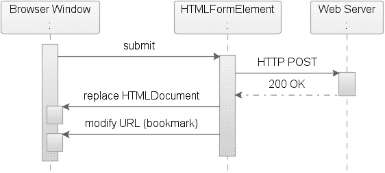

5807ch04.qxd 1/13/06 2:50 PM 第 178 页

**178**

第 4 章 ■ 使用富互联网技术

■**注意** GET 方法将表单数据集的值限制为 ASCII 字符。只有 POST 方法（使用 `enctype="multipart/form-data"`）被指定为覆盖整个 [ISO10646] 字符集。

当用户提交表单时（例如，通过单击提交按钮），如图 4-1 所示，浏览器会处理提交表单中的控件并构建一个表单数据集。表单数据集是由表单中的控件构建的一系列控件名称/当前值对。然后，根据 `<form>` 元素的 `enctype` 属性指定的内容类型（例如，`application/x-www-form-urlencoded`）对表单数据集进行编码。

**图 4-1.** *常规回发的序列图* 编码后的数据随后作为 url-formencoded 流发送回服务器（HTTP


POST）。服务器响应包含指示请求已成功的状态信息（HTTP 状态码 200 “OK”），并发送一个完整页面响应。浏览器随后会将响应中发送的 HTML 解析为 HTML DOM，并在浏览器窗口中渲染页面。页面所需的任何资源都将被重新验证，并可能再次从服务器下载。HTML 文档在浏览器窗口中被替换后，浏览器地址栏中的 URL 也会被修改，以反映来自上一页面表单操作的页面。

或者，服务器响应可以包含指示请求失败的信息（例如，HTTP 状态码 404 “Not Found”）。

常规回发的副作用

常规回发一个明显的副作用是，当页面在浏览器窗口中重新加载时会导致页面闪烁，最糟糕的情况下，用户将不得不等待页面再次将所有所需资源下载到客户端浏览器。其他不太明显但仍然令人烦恼的副作用包括滚动位置和光标焦点的丢失。

■**注意** 如今大多数浏览器都拥有出色的客户端缓存功能，可以很好地防止页面从 Web 服务器重新加载资源，除非缓存被关闭，或者应用程序使用 HTTPS，在这种情况下，内容可能无法在客户端缓存。

作为页面设计的一部分，可能需要在页面上包含多个表单。当页面上有多个表单时，回发期间只会处理其中一个表单，而其他表单中输入的数据将被丢弃。

一个好处是，使用常规回发可以添加书签。然而，用户常常被地址栏中设置的 URL 所迷惑，因为它反映的是最后请求的内容，而不是响应返回的内容。当用户选择书签时，它将返回到之前提交的页面。常规回发还允许用户点击浏览器后退按钮返回到上一页面，唯一的副作用是会出现表单提交警告。

**Ajax Web 应用程序开发**

开发复杂的支持 Ajax 的应用程序并非普通应用程序开发人员所能胜任，正如特洛伊人在战场上畏惧 Ajax 一样，即使是最有经验的 Web 设计师也对攻克 Ajax 感到畏惧。Ajax 框架的一个主要部分是客户端脚本语言 JavaScript。正如许多 Web 设计师所经历的那样，JavaScript 并非一种工业级语言，许多人声称它在专业开发工具中缺乏支持。

然而，在我们看来，至少有两种真正优秀的 JavaScript 工具可用——微软的 Visual Studio 和 Mozilla 的 Venkman。不过，事实是，维护 Ajax 应用程序很困难；JavaScript 实现中缺乏浏览器一致性，使得维护特定于浏览器的代码成为一项挑战。

**MOZILLA 的 VENKMAN 调试器**

Venkman 是 Mozilla 的 JavaScript 调试器的代号（http://www.mozilla.org/projects/venkman/）。Venkman 旨在为基于 Mozilla 的浏览器（包括 Netscape 7.*x* 系列浏览器和 Mozilla 里程碑版本）提供强大的 JavaScript 调试环境。它不包括仅支持 Gecko 的浏览器，如 K-Meleon 和 Galeon。该调试器以 XPI 格式的附加组件包形式提供，自 2001 年 10 月 3 日起已成为 Mozilla 安装发行版的一部分。

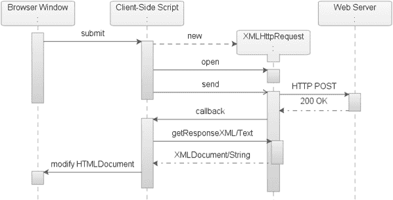

**180**

第 4 章 ■ 使用富互联网技术

Ajax 回发

现在你已经熟悉了常规回发，是时候看看 Ajax 了。本节将概述如何使用 Ajax 回发来处理事件。你可以使用 Ajax 来控制表单提交操作，而不是使用常规的表单提交操作，而是使用 `XMLHttpRequest` 对象异步地将你的请求提交到 Web 服务器。一个副作用是，当用户提交表单时（例如，通过点击提交按钮），没有浏览器会帮助你处理提交表单中的控件。你现在需要处理任何需要作为回发一部分的表单字段，并使用它们构建一个表单数据集——控件名称/当前值对。然后，你获取该表单数据集并模拟编码（url-formencoded），以提供与常规回发相同的语法（见图 4-2）。

**图 4-2.** *一个* XMLHttpRequest *回发的序列图* 创建 `XMLHttpRequest` 对象后，你使用 `open()` 方法设置请求的 HTTP 方法——GET 或 POST——以及连接的 URL。为 `XMLHttpRequest` 操作设置好阶段后，你使用 `XMLHttpRequest` 对象将编码后的数据作为 url-formencoded 流发送回服务器（HTTP POST）。对于 Web 服务器而言，该请求将看起来像传统的 HTTP POST，这意味着 Web 服务器无法区分常规回发和你的 Ajax 回发。对于 JSF 解决方案，这意味着 Ajax 请求可以像常规回发请求一样被接收，从而允许服务器代码（例如，JSF 请求生命周期）不受影响。

如果请求成功，你的 `XMLHttpRequest` 对象上的就绪状态将设置为 4，表示响应加载完成。然后，你可以使用两个属性来访问随响应返回的数据——`responseText` 和 `responseXML`。

`responseText` 属性提供数据的字符串表示形式，这在请求数据以纯文本或 HTML 形式出现时非常有用。根据上下文，`responseXML` 属性提供更广泛的数据表示形式。

`responseXML` 属性将返回一个 XML 文档对象，这是一个完整的文档节点对象（DOM nodeType 为 9），可以使用 W3C DOM 节点树方法和属性进行检查。在这种传统的 Ajax 方法中，Ajax 处理程序负责发送数据、管理响应以及修改 `HTMLDocument` 对象节点树。

■**注意** DOM 元素可以是不同类型。元素的类型存储在 `nodeType` 的整数字段中（例如，`COMMENT_NODE = 8` 和 `DOCUMENT_NODE = 9`）。有关不同 nodeType 的更多信息，请访问 http://www.w3.org/。

Ajax 回发的副作用

与常规回发一样，使用 Ajax 进行回发时也存在期望和不期望的副作用。最显著且期望的副作用是 `XMLHttpRequest` 对象的能力，它可以设置或获取页面的部分内容。这将消除数据重新加载时的闪烁，并提高应用程序的性能，因为无需重新加载整个页面及其所有资源。这种做法的副作用是，用户通常将无法再为页面添加书签，或使用后退按钮导航到上一页面/状态。

在应用程序中使用 `XMLHttpRequest` 的另一个重要但不太明显的含义是，诸如手机、PDA、屏幕阅读器和即时通讯客户端等客户端缺乏对此技术的支持。此外，Ajax 需要额外的工作才能使应用程序可访问；例如，屏幕阅读器期望完整的页面刷新才能正常工作。


■**注意** 使用 XMLHttpRequest 时，应用程序中不需要表单元素，但有一个功能无论采用常规回发还是 Ajax 回发都需要表单——文件上传。如果应用程序需要文件上传功能，则必须使用 form.submit()。在 Ajax 环境中，可以通过使用隐藏的 `<iframe>` 标签、form.submit() 函数并设置 target 来实现。

Ajax 并非万能魔杖

如你所知，XMLHttpRequest 对象是 Ajax 中的重要角色，因为它能在客户端和服务器之间异步传输数据。需要理解的是，XMLHttpRequest 并非能自动解决所有问题的万能魔杖。使用 XMLHttpRequest 对象时，仍需密切关注性能和可扩展性。如果你意识到这一点，就很容易理解：真正影响性能的是你在请求中发送的内容、响应中接收的内容以及在客户端管理的内容。

**构建 Ajax 应用程序**

传统 Web 应用程序在大多数情况下比桌面应用程序慢。借助 Ajax，你现在可以向 Web 服务器发送请求，仅检索所需数据，并使用 JavaScript 处理响应，从而创建响应更快的 Web 应用程序。

图 4-3 展示了一个使用 Ajax 与后端异步通信的页面

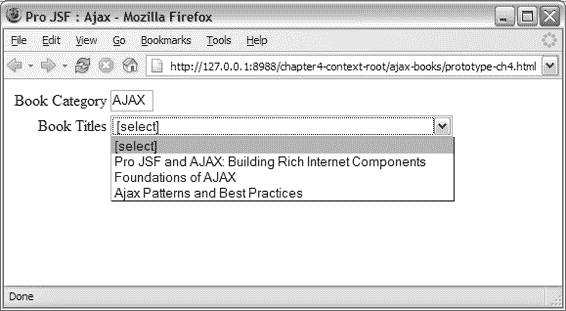

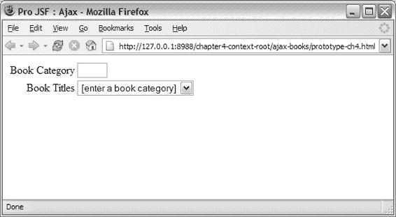

5807ch04.qxd 1/13/06 2:50 PM 第 182 页

**182**

第 4 章 ■ 使用富互联网技术

并提供一个“图书标题”下拉列表，其中包含基于用户输入类别筛选出的特定图书。

**图 4-3.** *使用 Ajax 根据类别筛选图书列表的 HTML 页面* 当用户跳出“图书类别”字段时，下拉列表会根据输入的类别填充图书，无需刷新页面。

图 4-4 显示了输入 *Ajax* 作为类别并跳出“图书类别”字段后的结果。

**图 4-4.** *使用 Ajax 根据类别筛选图书列表的 HTML 页面* 如图所示，“图书标题”下拉列表已填充了相关主题的图书。

传统的 Ajax 应用程序利用标准 HTML/XHTML 作为表示层，并使用 JavaScript 动态更改 DOM，从而在用户界面中营造出“丰富”的效果，且不依赖特定的运行时环境。代码示例 4-3 展示了这个简单应用程序背后的实际 HTML 源代码。

**代码示例 4-3.** *利用 Ajax 更新* <select> *元素的 HTML 页面*

<!DOCTYPE HTML PUBLIC "-//W3C//DTD HTML 4.01 Transitional//EN">

<html>

<head>

**<script type="text/javascript"**

**src="projsf-ch4/dynamicBookList.js" >**

</script>

<title>选择一本书</title>

</head>

<body>

<form name="form" method="get">

<table>

<tr>

<td align="right">图书类别</td>

<td>

<input type="text" size="3" maxlength="8"

**onchange="populateBookList('/chapter4-context-root/projsf-ch4',**

**'bookListId', this.value);" />**

</td>

</tr>

<tr>

<td align="right">图书标题</td>

<td >

**<select id="bookListId" >**

**<option value="[none]">**

**[输入图书类别]**

**</option>**

**</select>**

</td>

</tr>

</table>

</form>

</body>

</html>

在此页面顶部，引用了你的 Ajax 实现——dynamicBookList.js。这段代码为 `<input>` 元素添加了一个 onchange 事件处理程序，该处理程序将调用一个 JavaScript 函数 populateBookList()，当光标离开输入字段时触发。populateBookList() 函数接受三个参数——用于检索图书列表数据的服务 URL、输入字段中输入的图书类别 this.value，以及要填充图书的 select 元素的 ID（'bookListId'）。

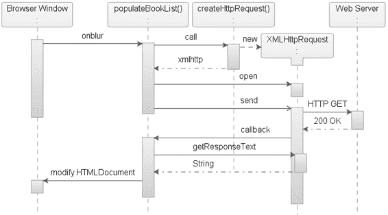

5807ch04.qxd 1/13/06 2:50 PM 第 184 页

**184**

第 4 章 ■ 使用富互联网技术

Ajax 图书筛选实现


Ajax 图书筛选器的实现包含三个 JavaScript 函数——
`populateBookList()`、`createHttpRequest()` 和 `transferListItems()`——以及一个包含图书信息的数据源。当光标离开图书类别字段时，会立即调用 `getBookList()` 函数（参见图 4-5）。

**图 4-5.** *图书筛选器的时序图* XMLHttpRequest `populateBookList()` 函数将调用 `createHttpRequest()` 函数，该函数会创建一个新的 `XMLHttpRequest` 对象实例。然后，你使用这个 `XMLHttpRequest` 对象来为你的请求做好准备，并将编码后的数据以 URL 表单编码流的形式发送回服务器（HTTP GET）。如果请求成功，`XMLHttpRequest` 对象会调用你的回调函数。该函数将从 `XMLHttpRequest` 对象获取响应文本，并使用传递的内容（例如，图书列表）来修改 HTML 文档，并用数据填充 `<select>` 元素。代码示例 4-4 展示了这个图书筛选器背后的实际代码。

**代码示例 4-4.** *`populateBookList()` 函数*

```javascript
/**
 * 用特定图书类别中的图书列表填充 select 元素。
 *
 * @param serviceURL 用于检索 JSON 数据文件的服务 URL
 * @param selectId 要填充的目标 select 元素的 id
 * @param category 用于填充的图书类别
 */
function populateBookList(
    serviceURL,
    selectId,
    category)
{
    var xmlhttp = createHttpRequest();

    // 你可以使用任何类型的数据源，但在此示例中，
    // 我们将使用一个包含数据的简单 JSON 文件。
    var requestURL = serviceURL + '/booklist-' + category.toLowerCase() + '.json';
    xmlhttp.open("GET", requestURL);
    xmlhttp.onreadystatechange = function()
    {
        if (xmlhttp.readyState == 4)
        {
            if (xmlhttp.status == 200)
            {
                transferListItems(selectId, eval(xmlhttp.responseText));
            };
        };
    };
    xmlhttp.send(null);
};
```

使用这段代码，你首先通过调用名为 `createHttpRequest()` 的函数来创建一个新的 `XMLHttpRequest` 对象实例。然后，你通过在 `XMLHttpRequest` 对象实例上调用 `open("GET", requestURL)` 方法并传递两个参数来发起请求。字符串 `GET` 指明了该请求的 HTTP 方法，而 `requestURL` 变量代表你的数据源的 URL，在本例中是一个简单的文本文件。如果请求成功，`XMLHttpRequest` 对象的 `readyState` 会被设置为 4，`status` 被设置为 200。你使用 `onreadystatechange` 事件处理器，在 `readyState` 被设置为 4 时调用 `transferListItems()` 函数，并将 `XMLHttpRequest` 对象的 `responseText` 属性传递给它。`transferListItems()` 函数将获取返回的字符串，并用数据填充 `<select>` 元素。

创建 `XMLHttpRequest` 对象的实例很简单，尽管如代码示例 4-5 所示，你需要注意一些事项。

**代码示例 4-5.** *创建 `XMLHttpRequest` 对象的 `createHttpRequest()` 函数*

```javascript
/**
 * 创建一个新的 XMLHttpRequest 对象。
 */
function createHttpRequest()
{
    var xmlhttp = null;
    if (window.ActiveXObject)
    {
        xmlhttp = new ActiveXObject("Microsoft.XMLHTTP");
    }
    else if (window.XMLHttpRequest)
    {
        xmlhttp = new XMLHttpRequest();
    }
    return xmlhttp;
};
```

代码示例 4-5 创建了 `XMLHttpRequest` 对象，并且与许多支持 JavaScript 的浏览器一样，不同的浏览器对 `XMLHttpRequest` 对象的支持略有不同。这意味着你需要在你的 `createHttpRequest()` 函数中实现对不同浏览器的支持。对于 Microsoft Internet Explorer，你必须使用 `new ActiveXObject("Microsoft.XMLHTTP")` 来创建 `XMLHttpRequest` 对象。对于任何支持 Mozilla GRE 的浏览器，你可以使用原生调用 `new XMLHttpRequest()` 来创建 `XMLHttpRequest` 对象的实例。


`transferListItems()` 函数（如代码示例 4-6 所示）会返回用户请求的数据，并用这些数据填充 `<select>` 元素。

**代码示例 4-6.** *用于填充* `<select>` *元素的* `transferListItems()` *函数*

/**

* 将 JSON 数组中的列表项传输到

* select 元素的选项中。

*

* @param selectId 要填充的目标 select 元素的 id

* @param listArray 检索到的书籍列表

*/

function transferListItems (

selectId,

listArray)

{

**var select = document.getElementById(selectId);**

// 重置 select 选项

select.length = 0;

select.options[0] = new Option('[select]');

// 传输书籍列表项

for(var i=0; i < listArray.length; i++)

{

// 创建新的 Option

var option = new Option(listArray[i]);

// 将 Option 添加到 select 选项列表的末尾 select.options[select.length] = option;

};

};

`transferListItems()` 函数接受两个参数——`selectId` 和 `listArray`。`listArray` 代表请求返回的数据，而 `selectId` 代表正在被这些数据填充的 `<select>` 元素。

5807ch04.qxd 1/13/06 2:50 PM 第 187 页

第 4 章 ■ 使用富互联网技术

**187**

代码示例 4-7 仅展示了你的简单数据源（采用 JavaScript 对象表示法 JSON 语法），以便你可以复制这个示例应用程序。

**代码示例 4-7.** *你的 Ajax 标题的数据源——* ajax.json

['Pro JSF and Ajax: Building Rich Internet Components',

'Foundations of Ajax',

'Ajax Patterns and Best Practices']

该文件包含一个 JavaScript 表达式，用于定义一个与 Ajax 相关的新书籍数组。

■**注意** JSON 是一种轻量级的数据交换格式。它基于 JavaScript 编程语言（标准 ECMA-262，第三版）的一个子集。JSON 是一种完全与语言无关的文本格式，但使用了 C 语言家族（包括 C、C++、C#、Java、JavaScript、Perl、Python 等）程序员所熟悉的约定。

**Ajax 总结**

现在，你应该已经理解了什么是 Ajax，并熟悉了 XMLHttpRequest 对象（它是 Ajax 技术的关键部分）以及常规 XMLHttpRequest 的生命周期。你还应具备足够的知识来创建简单的 Ajax 解决方案。在接下来的章节中，你将更深入地学习 Ajax。

**Mozilla XUL 简介**

什么是 Mozilla XUL？它是恐龙与邪恶的捉鬼敢死队精神的混血儿吗？

不，Mozilla XUL 是一个开源项目，被称为 Mozilla Firefox 浏览器和 Mozilla Thunderbird 电子邮件客户端的开发平台。在本章的以下部分，你将获得对 Mozilla XUL 及其子组件的高层概述。1998 年，Mozilla 组织（Mozilla.org）创建了一个名为 XUL 的开源项目，它是一种基于 XML 的可扩展 UI 语言，因此可以利用现有标准，包括 XSLT、XPath、DOM，甚至 Web 服务（SOAP）。

使用 XUL，开发人员可以构建丰富的用户界面，这些界面可以部署为 Web 应用程序、本地桌面应用程序，或部署在其他支持互联网的设备上的桌面应用程序。XUL 利用 Mozilla Gecko 运行时环境（GRE）的支持，以便为用户提供丰富的用户界面。Firefox 浏览器和 Thunderbird 电子邮件客户端，以及众多插件，都是基于 XUL 和 Mozilla GRE 的应用程序的两个很好的例子。

XUL 的一大特性是其可扩展性。通过使用 XBL，XUL 提供了一种声明式方法来创建新的 XUL 组件并扩展现有的 XUL 组件。XBL 还可以弥合 XUL 与 HTML 之间的差距，因为无法将 XUL 组件直接嵌入到 HTML 页面中。

5807ch04.qxd 1/13/06 2:50 PM 第 188 页

**188**

第 4 章 ■ 使用富互联网技术

下一节将介绍如何构建 XUL 应用程序以及构建 XUL 应用程序时使用的一些组件。


■**提示** 要了解 XUL 能实现哪些功能，一个绝佳的参考示例是 Mozilla Amazon 浏览器（MAB），网址为 http://www.faser.net/mab/。

**构建 XUL 应用程序**

XUL 背后的理念是提供一种用于构建用户界面的标记语言，类似于 HTML，同时利用 CSS 等技术实现外观和感觉，利用 JavaScript 处理事件和行为。此外，还提供了 API，使开发者能够通过网络读写文件系统，并访问 Web 服务。作为一种基于 XML 的语言，开发者还可以将 XUL 与其他 XML 语言（如 XHTML 和 SVG）结合使用。你可以通过三种方式加载使用 XUL 构建的应用程序：

•   你可以通过传统方式从本地文件系统加载 XUL 页面。
•   你可以使用 HTTP URL 远程加载，以访问 Web 服务器上的内容。
•   你可以使用 Mozilla GRE 提供的 chrome URL 进行加载。

XUL 组件

XUL 附带了一组基础组件（见表 4-3），这些组件可通过 Mozilla GRE 获得，因此 XUL 无需下载组件即可在浏览器中绘制应用程序。你也可以使用 XUL 设计自己的组件；这些组件*将*需要按需下载并缓存在浏览器中。

**MOZILLA XUL 的 CHROME 系统**

除了从本地文件系统或 Web 服务器加载文件外，Mozilla 引擎还有一种特殊的方式，可以将应用程序安装并注册为其 *chrome 系统*的一部分。chrome 系统允许开发者打包应用程序，并将其作为插件安装到支持 Mozilla GRE 的客户端中。以这种方式部署的 XUL 应用程序可以获得对本地文件系统的读写权限等。在传统的 Web 应用程序中，这种访问权限很难实现，除非应用程序已使用数字证书签名，并且最终用户授予了访问权限。

通过 HTTP URL (http://) 访问应用程序和通过 chrome URL (chrome://) 访问应用程序之间存在一个重要区别。chrome URL 始终指向安装在 Mozilla 引擎 chrome 系统中的包或扩展。一个可以通过 chrome URL 访问的应用程序示例是 chrome://browser/content/bookmarks/bookmarksManager.xul。此 chrome URL 将打开 Firefox 浏览器中可用的书签管理器。

5807ch04.qxd 1/13/06 2:50 PM 第 189 页

第 4 章 ■ 使用富互联网技术

**189**

**表 4-3.** *可用 XUL 组件子集*

**组件名称**

**描述**

<button>

一个可由用户点击的按钮。可以使用事件处理程序来捕获鼠标、键盘和其他事件。按钮通常呈现为灰色的凸起矩形。你可以使用 label 属性或通过在按钮内部放置内容来指定按钮的标签。

<window>

描述顶级窗口的结构。它是 XUL 文档的根节点，默认是一个水平方向的盒子。因为它是一个盒子，所以它接受所有盒子属性。默认情况下，窗口周围会有一个特定于平台的边框。

<menubar>

一个通常包含 menu 元素的容器。在 Mac 上，菜单栏显示在屏幕顶部，菜单栏内所有与菜单无关的元素都将被忽略。

<menu>

一个类似于按钮的元素，放置在菜单栏上。当用户点击 <menu> 元素时，该菜单的子元素 <menupopup> 将会显示。此元素也用于创建子菜单。

<menupopup>

用于显示菜单的容器。它应放置在 menu、menu list 或 menu-type button 元素内部。它可以包含任何元素，但通常包含 <menuitem> 元素。它是一种默认方向为垂直的盒子。

<menuitem>

<menupopup> 元素中的一个单项选择。它的行为很像一个按钮，但它在菜单上呈现。

<radio>


一种可以打开和关闭的元素。单选按钮几乎总是成组出现。同一 `<radiogroup>` 中一次只能选中一个单选按钮。用户可以通过鼠标或键盘选择来切换哪个单选按钮被打开。同一组中的其他单选按钮会被关闭。可以使用 `label` 属性指定一个标签，放在单选按钮旁边，向用户指示其功能。

<radiogroup>

一组单选按钮。该组内一次只能选中一个单选按钮。这些单选按钮可以是 `<radiogroup>` 的直接子元素，也可以是其后代元素。如果你希望为该组添加边框或标题，请将 `<radiogroup>` 放在 `<groupbox>` 内部。

`<radiogroup>` 默认为垂直方向。

<checkbox>

一种可以打开和关闭的元素。用户可以通过鼠标点击复选框来切换其状态。可以使用 `label` 属性指定一个标签，放在复选框旁边，向用户指示其功能。

<box>

一个容器元素，可以包含任意数量的子元素。

如果该 box 的 `orient` 属性设置为 `horizontal`，则子元素按照它们在 box 中出现的顺序从左到右排列。如果 `orient` 设置为 `vertical`，则子元素从上到下排列。子元素之间不会重叠。默认方向为水平。

<splitter>

一个应出现在容器内某个元素之前或之后的元素。当拖动分隔条时，分隔条的兄弟元素会调整大小。

<image>

一个显示图像的元素，与 HTML 的 `` 元素非常相似。

`src` 属性可用于指定图像的 URL。

**来源：** http://xulplanet.com/references/elemref/

5807ch04.qxd 1/13/06 2:50 PM 第 190 页

**190**

第 4 章 ■ 使用富互联网技术

我们稍后将详细介绍 XBL，但代码示例 4-8 中的 XUL 示例文件演示了如何将标准的、带命名空间的 HTML 元素嵌入到基础的 XUL 控件中。

**代码示例 4-8.** *一个嵌入了 HTML 元素的简单 XUL 文件*

<?xml version="1.0"?>

<?xml-stylesheet href="chrome://global/skin/" type="text/css" ?>

<xul:window title="Pro JSF and AJAX: Mozilla XUL" align="start"

**>**

<xul:groupbox>

<xul:caption label="搜索" />

<xul:hbox>

**<html:input id="find-text" />**

<xul:button label="搜索" />

</xul:hbox>

</xul:groupbox>

</xul:window>

代码示例 4-8 展示了如何使用一个带命名空间的 HTML 输入元素——`<html:input id="find-text"/>`——将其嵌入到 XUL 页面中，并与常规的 XUL 组件混合使用。

为了能够在远程服务器上部署和运行 XUL 应用程序，需要将 Web 服务器配置为发送内容类型为 `application/vnd.mozilla.xul+xml` 的文件。使用 Mozilla GRE（即 Netscape 和 Firefox）的浏览器将使用此内容类型来确定请求应用程序所使用的标记语言。除非文件是从文件系统读取的，否则带有 GRE 的浏览器不会使用文件扩展名。

事件、状态和数据

根据所开发的客户端类型（胖客户端或瘦客户端）的不同，事件处理会略有不同。然而，本节展示的是用于 Web 部署的 XUL，并且您使用 JavaScript 来处理事件和应用程序逻辑。

使用 XUL 事件处理与使用 HTML 事件处理并没有太大区别。GRE 实现支持 DOM Level 2（以及部分 DOM Level 3），这对于 HTML 和 XUL 来说几乎是相同的。状态和事件的更改通过一系列 DOM 调用进行传播。XUL 元素带有预定义的事件处理程序，这与标准 HTML 元素提供的事件处理程序非常相似。

代码示例 4-9 展示了一个简单的用例，其中按钮将触发一个警告框，该警告框将显示用户在输入字段中输入的值。

**代码示例 4-9.** *一个事件和预定义事件处理程序的简单用例*

<?xml version="1.0"?>

<?xml-stylesheet href="chrome://global/skin/" type="text/css"?>

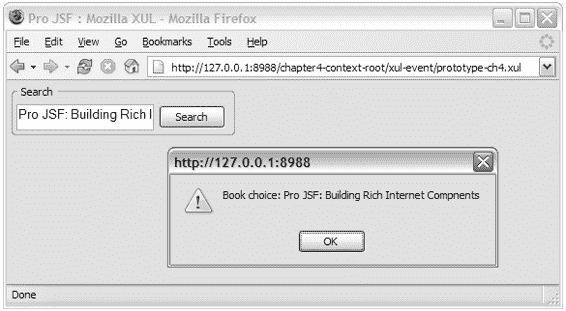


5807ch04.qxd 1/13/06 2:50 PM 第 191 页

第 4 章 ■ 使用富互联网技术

**191**

<xul:window title="Pro JSF and AJAX : Mozilla XUL" align="start"

>

<xul:groupbox>

<xul:caption label="搜索" />

<xul:hbox>

<html:input id="find-text" />

**<xul:button label="搜索"**

**oncommand="alert('图书选择: ' +**

**document.getElementById('find-text').value)" />**

</xul:hbox>

</xul:groupbox>

</xul:window>

图 4-6 展示了上述代码在 Mozilla Firefox 中的运行情况。

**图 4-6.** *在 Firefox 浏览器中渲染的一个简单 XUL 文件* 与 HTML 一样，开发者可以使用位于外部文件（如 myScript.js）中的 JavaScript 函数。可以通过在`<script>`元素上使用`src`属性来访问这些方法和函数，或者将它们嵌入到页面中。开发者可以使用`http://` URL 引用远程服务器，如代码示例 4-10 所示。

**代码示例 4-10.** *使用* http:// *的脚本引用*

<script type="text/javascript" src="http://www.apress.com/projsf/js/myScript.js">

5807ch04.qxd 1/13/06 2:50 PM 第 192 页

**192**

第 4 章 ■ 使用富互联网技术

有大量的事件处理属性可用，其中一些仅适用于特定的 XUL/HTML 元素。一个例子是监听 DOM 事件（例如，load）的 XUL `<window>`元素。表 4-4 列出了可用预定义事件处理程序的一个子集。

**表 4-4.** *GRE DOM 实现提供的预定义事件处理程序列表*

**事件处理程序**

**描述**

onload

用于窗口加载的事件处理属性。当窗口元素加载完成且文档中的所有对象在 DOM 树中可用时，会发送此事件。此事件处理程序也可用于图像元素。

oncommand

此事件替代 onclick 事件处理程序，并在元素被激活时调用。激活方式因元素而异，但本质上可以通过不同的用户交互（如点击、按回车键或快捷键）来调用，而 onclick 事件处理程序则不然。

onblur

当元素失去焦点时，会触发 blur 事件。

onfocus

与 onblur 事件相反。当元素获得焦点时，会触发此事件。

**来源：** http://www.xulplanet.com

**使用 XBL 创建自定义 XUL 组件**

要完全理解 Mozilla XUL 如何为 JSF 提供一种使用 XUL 作为渲染技术的机制，你必须了解 XBL。XBL 是一种基于 XML 的语言，允许开发者扩展 XUL，并向已经非常丰富的 XUL 元素集中添加“自定义”组件。在 XUL 中，开发者可以使用 CSS 更改外观和感觉，并可以附加皮肤，但他们无法在 XUL 本身中更改 XUL 元素的行为。

为此，开发者必须使用另一种语言——XBL。开发者可以将 XUL 视为附带一组基础组件的“实现”，或视为可用于构建用户界面的标签库，这与 JSF 参考实现非常相似。XBL 是开发者用来扩展 XUL 组件并实现与 HTML 集成的语言，类似于使用 Java 扩展 JSF 组件的方式。

创建 XBL 绑定

XBL 是一种 XML 语言，使用 XBL 创建的文件包含一组绑定。每个绑定描述了一个 XUL 组件的行为。除了描述行为外，这些绑定还描述了构成该组件的 XUL 元素以及该组件的属性和方法。在代码示例 4-11 中，根元素显示`<bindings>`元素包含一个`<binding>`元素。

5807ch04.qxd 1/13/06 2:50 PM 第 193 页

第 4 章 ■ 使用富互联网技术

**193**

**代码示例 4-11.** *包含一个绑定的 XBL 文件——* projsf-bindings.xml

<?xml version="1.0"?>

**<xbl:bindings**

>

**<xbl:binding id="welcome" >**

<xbl:content>

<xul:text value="欢迎, " />

<xul:text value="访客" xbl:inherits="value=name" />

<xul:text value="!" />

</xbl:content>

</xbl:binding>

</xbl:bindings>

一个`<bindings>`元素可以包含无限数量的`<binding>`元素。`<bindings>`元素中的命名空间定义了将使用的语法，在代码示例 4-11 中，它是 XBL——xmlns=http://www.mozilla.org/xbl。该文件还包含一些 XUL 元素：`<xul:text/>`。这对于通过封装多个组件（这些组件之后可以作为一个组件引用）来简化开发非常有用。

其中一个`<xul:text>`元素上的`xbl:inherits`属性允许`<xul:text>`元素通过定义一个变量名（在此例中，将其赋值给`value`属性）来从绑定元素继承值。如果使用此组件的页面中的绑定元素未定义任何值，则文本字段将默认为“访客”。

`<xbl:binding>`元素上的`id`属性（在代码示例 4-11 中为 welcome）将标识该绑定。

使用 XBL 绑定

要将 XBL 组件或行为附加到 XUL 应用程序，XUL 使用 CSS。使用 CSS，开发者可以通过将`-moz-binding`属性设置为指向 XBL 文档的 URI 来为元素分配绑定。

■**注意** Netscape 已向 W3C 提交了一份提案，旨在“为 XML 和 HTML 定义行为的模块化方式”（http://www.w3.org/TR/NOTE-AS）中定义如何将自定义行为附加到 HTML 元素。

代码示例 4-12 展示了一个 CSS 文件，该文件将一个绑定附加到`<pro:welcome>`元素。

5807ch04.qxd 1/13/06 2:50 PM 第 194 页

**194**

第 4 章 ■ 使用富互联网技术

**代码示例 4-12.** *一个设置了* -moz-binding *属性的示例 CSS 文件——* projsf.css

@namespace pro url('http://projsf.apress.com/tags');

pro|welcome

{

**-moz-binding: url('projsf-bindings.xml#welcome');**

}

在代码示例 4-12 中，选择器将`-moz-binding`设置为指向名为`projsf-bindings.xml`的 XBL 文件，并使用`#welcome`来引用 XBL 文件中的特定绑定。这类似于 HTML 文件中锚点的引用方式。

■**注意** 为了在本章的示例中提供一致的示例标签，代码示例 4-12 使用了 CSS3 标准语法来模拟示例元素——`<pro:welcome>`。

如果分配给元素时省略了绑定 id，XUL 将默认使用列出的第一个绑定。在代码示例 4-12 中，`welcome`绑定已被声明为 id，而被分配了此绑定的元素是`<pro:welcome>`。

在代码示例 4-13 中，`projsf-bindings.css`样式表已附加到 XUL 文档，并且页面中插入了两个元素（`<pro:welcome id="guest" />`和`<pro:welcome id="duke" name="Duke" />`）。第一个元素为指定用户“Duke”显示欢迎问候语。第二个元素显示 XBL 文件中定义的“欢迎, ”字符串加上默认用户值“访客”。使用 XBL 提供的封装行为的一个很酷的特性是，它在自定义组件的范围内创建了一个与 XUL 页面分离的文档树。这意味着 XBL 组件的内容不会“展开”到主文档中，从而保持了封装性。图 4-7 显示了使用 DOM 检查器查看的 DOM。

**代码示例 4-13.** *包含 XUL 组件的示例 HTML 文件——* prototype-ch4.xul

<?xml version="1.0"?>

<?xml-stylesheet href="chrome://global/skin/" type="text/css" ?>

**<?xml-stylesheet href="projsf-bindings.css" type="text/css" ?>**

<xul:window title="Pro JSF : Mozilla XBL" align="start"

>

<xul:groupbox>

<xul:caption label="问候" />

**<pro:welcome id="duke" name="Duke" />**

**<pro:welcome id="guest" />**

</xul:groupbox>

</xul:window>

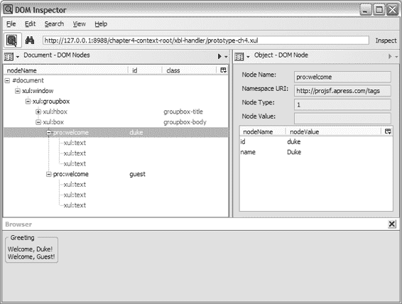

5807ch04.qxd 1/13/06 2:50 PM 第 195 页

第 4 章 ■ 使用富互联网技术

**195**


**图 4-7.** *包含 XBL 组件的页面 DOM 树* 封装带来的直接好处是，组件作者可以完全控制其行为、外观和感觉，并且组件不会暴露内部实现细节。在图 4-7 中，嵌套的 `<xul:text>` 元素在 DOM 检查器中可见，但从未在实际的主文档中暴露。

扩展 XBL 绑定

除了创建由一个或多个 XUL 元素组成的部件（如前面章节所示），你还可以使用 XBL 来添加新的属性和方法。XBL 有三种类型的项可以添加到绑定中——字段、属性和方法：

• 字段项是一个简单的容器，可以存储一个值，该值可以被获取和设置。

• 属性项稍微复杂一些，用于验证存储在字段中的值或从 XBL 定义的元素属性中获取的值。由于属性项不能保存值，如果不使用 `onset` 处理程序或 `onget` 处理程序，就无法直接在属性项上设置值。使用这些处理程序，你可以对获取或修改的值进行预计算或验证。

• 方法是对象函数，例如 `window.open()`，允许开发者为自定义元素添加自定义函数。

在代码示例 4-14 中，这三个项定义在 `<implementation>` 元素中，该元素是 `<binding>` 元素的子元素。

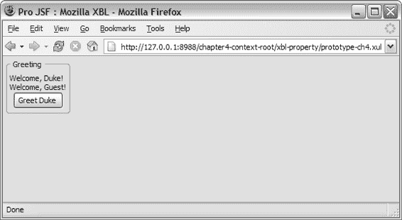

5807ch04.qxd 1/13/06 2:50 PM 第 196 页

**196**

第 4 章 ■ 使用富互联网技术

**代码示例 4-14.** *添加属性和方法——* pro-bindings.xml

<?xml version="1.0"?>

<xbl:bindings

>

<xbl:binding id="welcome" >

<xbl:content>

<xul:text id="greeting" value="Welcome, " />

<xul:text value="Guest" xbl:inherits="value=name" />

<xul:text value="!" />

</xbl:content>

**<xbl:implementation>**

**<xbl:constructor>**

<![CDATA[

this._greetingNode = document.getElementById('greeting');

]]>

**</xbl:constructor>**

**<xbl:property name="greeting"**

**onget="return this._greetingNode.getAttribute('value');"**

**onset="this._greetingNode.setAttribute('value', val);" />**

**</xbl:implementation>**

</xbl:binding>

</xbl:bindings>

在代码示例 4-14 中，你添加了一个方法和一个属性。代码示例 4-14 中使用的方法是 XBL 支持的一种特殊方法，称为 `constructor`。每当绑定被附加到一个元素时，就会调用构造函数。它用于初始化内容，例如加载首选项或设置字段的默认值。该属性定义了一个 `onget` 处理程序和一个 `onset` 处理程序，用于获取和设置 `<pro:welcome>` 标签上的 `value` 属性。为了访问这些属性并在自定义元素上调用方法，开发者可以使用 `getElementById()` 函数。在图 4-8 中，添加了一个 XUL 按钮，用于触发 `oncommand` 事件处理程序。

**图 4-8.** *使用 welcome XBL 组件的页面*

5807ch04.qxd 1/13/06 2:50 PM 第 197 页

第 4 章 ■ 使用富互联网技术

**197**

当点击“Greet Duke”按钮时，第一个 `<pro:welcome>` 标签的文本会发生变化，显示一条新的欢迎消息，而不是之前在 `projsf-bindings.xml` 文件中定义的默认消息。代码示例 4-15 展示了此页面背后的代码。

**代码示例 4-15.** *包含 XBL 组件的示例 XUL 文件——* prototype-ch4.xul

<?xml version="1.0"?>

<?xml-stylesheet href="chrome://global/skin/" type="text/css" ?>

<?xml-stylesheet href="projsf-bindings.css" type="text/css" ?>

<xul:window title="Pro JSF : Mozilla XBL" align="start"

>

<xul:groupbox>

<xul:caption label="Greeting" />

**<pro:welcome id="duke" name="Duke" />**

<pro:welcome id="guest" />

**<xul:button label="Greet Duke"**

**oncommand="var duke = document.getElementById('duke');** **duke.greeting = 'Howdy, ';" />**

</xul:groupbox>

</xul:window>


在代码示例 4-15 中，添加了一个 XUL 按钮，用于触发 `oncommand` 事件处理器。`oncommand` 事件处理器将执行封装的脚本——`var duke = document.getElementById('duke'); duke.greeting = 'Howdy, ';`。这会将绑定中定义的标识符为 `greeting` 的 XUL 元素的值设置为“Howdy, ”，而不是默认问候语“Welcome, ”，从而导致 Duke 的问候语变为“Howdy, Duke!”，而 Guest 的问候语保持不变。

事件处理与 XBL 绑定

在 XBL 中，开发者可以直接将事件处理器添加到列为 `content` 元素子元素的 XUL 元素上（例如，`<xul:button label="Press me!" oncommand="alert('welcome')" />`）。有时，开发者需要为 `content` 元素中的所有子元素添加一个事件处理器。

在 XBL 中，可以通过添加 `<handler>` 元素来实现这一点。`<handler>` 元素是 `<handlers>` 元素的子元素，它可以包含一个或多个事件处理器。每个处理器定义了在其定义的绑定作用域内，针对特定事件所采取的动作。如果某个事件未被捕获，它将直接传递给内部元素。

在代码示例 4-15 中，你在实际页面源代码中有一个按钮和一个事件处理器。

代码示例 4-16 展示了如何将此功能移入一个 XBL 组件。

**代码示例 4-16.** *添加事件处理器——* projsf-bindings.xml

<?xml version="1.0"?>

<xbl:bindings

>

<xbl:binding id="welcome" >

<xbl:content>

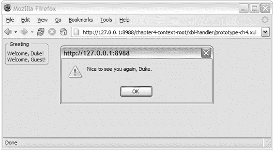

5807ch04.qxd 1/13/06 2:50 PM 第 198 页

**198**

第 4 章 ■ 使用富互联网技术

<xul:text value="Welcome, " />

<xul:text value="Guest" xbl:inherits="value=name" />

<xul:text value="!" />

</xbl:content>

**<xbl:handlers>**

**<xbl:handler event="click" >**

**if (this.hasAttribute('name'))**

**alert('Nice to see you again, ' + this.getAttribute('name') + '.');**

**</xbl:handler>**

**</xbl:handlers>**

</xbl:binding>

</xbl:bindings>

在代码示例 4-16 中，添加了一个处理器来捕获 `welcome` 绑定上下文中的所有点击事件。仅当 `<pro:welcome>` 标签上设置了 `name` 属性时，该处理器才会显示一个警告框。现在，你拥有一个简单但定义明确且封装良好的 XUL 组件。代码示例 4-17 展示了一个使用这个新的 `<pro:welcome>` 标签的简单 XUL 页面。

**代码示例 4-17.** *一个使用带有附加事件处理器的 XBL 绑定的简单 XUL 页面*

<?xml version="1.0"?>

<?xml-stylesheet href="chrome://global/skin/" type="text/css" ?>

<?xml-stylesheet href="projsf-bindings.css" type="text/css" ?>

<xul:window align="start"

>

<xul:groupbox>

<xul:caption label="Greeting" />

**<pro:welcome id="duke" name="Duke" />**

<pro:welcome id="guest" />

</xul:groupbox>

</xul:window>

在这个页面中，只有一个 `<pro:welcome>` 标签定义了 `name` 属性。因此，当页面在浏览器（兼容 Mozilla GRE 的浏览器）中启动时，只有当点击“Welcome, Duke!”文本时，点击事件才会触发一个警告框，如图 4-9 所示。

**图 4-9.** *使用带有附加事件处理器的自定义 XBL 绑定的简单 XUL 页面*

5807ch04.qxd 1/13/06 2:50 PM 第 199 页

第 4 章 ■ 使用富互联网技术

**199**

**XUL 总结**

阅读完前面的章节后，你应该理解了 XUL 和 XBL 之间的关系。你还应该知道如何使用 XBL 创建自定义的 XUL 组件，以及如何在构建 XUL 应用程序的上下文中使用它们。在接下来的章节中，你将看到如何通过利用 XUL 和 XBL 提供的组件模型，为你的 JSF 组件构建一个新的 RenderKit。

**介绍 Microsoft 动态 HTML 和 HTC**

在你持续探索富互联网组件框架的过程中，本章的重点现在转向了微软的解决方案。微软通过 DHTML 和 HTC 提供了与 Mozilla XUL 技术类似的方案。这些技术依赖于底层平台（即 Internet Explorer）来为扩展 HTML 元素提供基础。


使用这些微软技术构建的应用程序可通过网络部署和下载。微软的 DHTML 旨在提供一种简便的标记语言，用于构建富互联网应用程序。

使用 DHTML 构建应用程序时，开发者将使用常规 HTML 页面来描述其 Web 应用程序，但能够动态更改 HTML 页面的渲染和内容。HTC 文件可以创建封装动态行为的可重用组件，其工作方式与 XUL 中的 XBL 类似。以下章节将为您概述微软的 DHTML 解决方案，并展示如何使用 HTC 构建可重用组件。

**为何选择 HTC 而非 XAML？**

不选择 XAML 有几个原因。原因之一是 XAML 需要 .NET 2.0/Avalon，该框架随微软的 Vista 版本一同发布，并计划于 2006 年底推出。另一个项目 XAMLON 提供了 Avalon 的预览实现，Avalon 是构建 XAML 应用程序所需的运行时引擎。该实现提供了在 .NET 1.1 运行时上预览类 XAML 技术的机会。XAML 的 XAMLON 预览实现有两个主要缺点。首先，它需要 Internet Explorer 的 .NET 1.1 运行时插件。其次，它无法（很好地）与 HTML 页面集成。如果您想要一个插件，您会选择像 Macromedia Flash 这样成熟且可跨平台工作的方案，然后就此了事。

**HTC 结构**

DHTML 在 Internet Explorer 5.0 中引入，是微软首次尝试提供一种构建 RIA 的媒介。DHTML 使得通过使用 CSS 条目的 behavior 属性或脚本中的 addBehavior 方法来改变标准 HTML 元素的行为成为可能。

5807ch04.qxd 1/13/06 2:50 PM 第 200 页

**200**

第 4 章 ■ 使用富互联网技术

■**注意** 微软已提交一份提案，建议使用 CSS 作为桥梁来添加和扩展 HTML 元素。该提案基于微软为 HTML 添加行为的解决方案，该方案类似于 XUL 解决方案。该提案已提交给 W3C，名为“组件化 Web 应用程序”(http://www.w3.org/TR/1998/NOTE-HTMLComponents-19981023)，并与 Netscape 合作，以定义如何最好地添加行为和扩展 HTML 元素——请参阅 http://www.w3.org/TR/1999/WD-becss-19990804 上的“CSS 的行为扩展”。

如前所述，HTC 提供了一种将动态行为封装到独立文档中的方法。通过 DHTML 和 HTC，微软采取了扩展 HTML 标记的方法，而不是为 RIA 提出另一种标记语言。HTC 利用 HTML 标记这一事实意味着您可以专注于 HTC，因为阅读本书的开发者应该熟悉 HTML 标记。

HTC 文件结构和元素

简单来说，HTC 只是一个文件扩展名为 .htc 的 HTML 页面。代码示例 4-18 中显示的文件包含一组 HTC 特定元素，例如 `<public:property>`、`<public:event>` 和 `<public:method>`，这些元素列出了定义 HTC 组件的属性、事件和方法。

**代码示例 4-18.** *HTC 文件结构*

<html>

<head>

<public:component>

<public:property ... />

<public:event ... />

<public:method ... />

...

</public:component>

<script language=" ">

...

</script>

</head>

<body>

...

</body>

</html>

`<public:component>` 用于定义两种行为类型——元素行为和附加行为。代码示例 4-19 演示了一种附加行为，它将通过将颜色设置为绿色来修改现有元素。`<public:attach>` 元素将客户端触发的事件与底层函数耦合在一起。在代码示例 4-19 中，函数 onColor() 被附加到 mouseover 事件上。

5807ch04.qxd 1/13/06 2:50 PM 第 201 页

第 4 章 ■ 使用富互联网技术

**201**

**代码示例 4-19.** *一个简单的 HTC 文件*

<html>

<head>

<public:component>

<public:attach event="onmouseover" onevent="onColors()" />

</public:component>

<script>

function onColors()

{


runtimeStyle.color = "green";

}

</script>

</head>

<body>

</body>

</html>

HTC 附带一组可用于定义组件的公共元素。

表 4-5 描述了部分可用的预定义元素 *。*

**表 4-5.** *HTC 公共元素**

**名称**

**描述**

COMPONENT

将文件内容标识为 HTC

PROPERTY

定义 HTC 的一个属性，以暴露给包含文档 DEFAULT

为 HTC 设置默认属性

ATTACH

将函数绑定到事件，以便在指定对象上触发事件时调用该函数

METHOD

定义 HTC 的一个方法，以暴露给包含文档 EVENT

定义 HTC 的一个事件，以暴露给包含文档

**来源：Microsoft MSDN (* http://msdn.microsoft.com/workshop/author/behaviors/behaviors_node_entry.asp *)* 事件处理与 HTC

Microsoft 对 DOM 的实现并非标准，但它提供了一种类似于 DOM Level 2 事件处理的实现，例如包含事件冒泡和取消。HTC 支持以下脚本语言：Visual Basic Scripting Edition (VBScript)、Microsoft JScript、JavaScript 以及支持 Microsoft ActiveX Scripting 接口的第三方脚本语言。

脚本以与常规 HTML 页面相同的方式封装在 `<script>` 元素中。

通过这些脚本，开发者可以使用 HTC 元素的 `id` 属性值作为脚本变量的名称，将每个 HTC 元素作为脚本对象进行访问。这使得 HTC 元素的所有属性和方法都可以作为这些对象的属性和方法进行动态修改。

5807ch04.qxd 1/13/06 2:50 PM 第 202 页

**202**

第 4 章 ■ 使用富互联网技术

在 DHTML 对象模型中，开发者可以声明一个事件处理函数并分配对该函数的调用，或者反过来，声明事件处理代码以将函数与事件关联。

开发者可以通过三种方式使用 HTC 分配对函数的调用。代码示例 4-20 和代码示例 4-21 展示了传统的 HTML 和 JavaScript 分配方式，而代码示例 4-22 展示了 HTC 中的另一种解决方案。

**代码示例 4-20.** *分配对函数的调用*

<script>

function onColor()

{

...

}

</script>

...

<input type="button" value="按我！" onclick="onColor();" /> 在代码示例 4-20 中，分配是通过实际按钮使用 `onclick` 事件处理程序完成的。代码示例 4-21 将 `<script>` 元素中的函数分配给 `proButton` 按钮。

**代码示例 4-21.** *将函数与事件关联*

<script for="proButton" event="onclick" > function onColor()

{

...

}

</script>

...

<input id="proButton" type="button" value="按我！" /> 开发者还可以使用 `<public:attach>` 元素在组件中全局关联事件并将其分配给函数，如代码示例 4-22 所示。

**代码示例 4-22.** *全局分配的事件处理程序*

<public:attach event="onclick" onevent="onColors()" /> 此事件处理程序将在此组件内的所有点击事件上触发。

**构建 DHTML 应用程序**

1999 年，Netscape 和 Microsoft 向 W3C 提交了一份提案，要求将行为扩展添加到 CSS 规范中。这些提案尚未被纳入 CSS 标准（并且仍然是 CSS 3 的工作草案），因此 Microsoft 和 Mozilla 已经实现了各自提出的解决方案，以向 HTML 元素添加行为——Microsoft 通过 HTC，Mozilla 通过 XBL。

当 Microsoft 随 Internet Explorer 5.0 引入 DHTML 概念时，它使用 CSS 将

5807ch04.qxd 1/13/06 2:50 PM 第 203 页

第 4 章 ■ 使用富互联网技术

**203**

行为直接附加到现有的 HTML 元素上。这种将行为附加到 HTML 元素的方式被称为*附加行为*，并且可以通过编程方式更改。

随着 Internet Explorer 5.5 的发布，Microsoft 引入了所谓的*元素行为*。通过元素行为，开发者可以构建自定义组件，这些组件可以像常规 HTML 元素一样使用，但能够通过脚本添加更丰富的功能。定义元素行为的默认方式是使用 HTC 文件。重要的是不要将 Internet Explorer 5.0 中引入的 DHTML 行为（附加行为）与元素行为混淆。元素行为使用不同的方法绑定到元素，并具有其他独特的特性。

从 HTC 解决方案来看，元素行为通过导入处理指令应用于绑定的元素。导入处理指令从元素行为导入标签定义。代码示例 4-23 说明了如何使用此指令将行为绑定到元素。

**代码示例 4-23.** *一个带有附加行为的简单 HTML 文件*

<!DOCTYPE HTML PUBLIC "-//W3C//DTD HTML 4.01 Transitional//EN" >

<html xmlns:pro >

**<?import namespace="pro" implementation="pro.htc" ?>**

<head>

<title>Pro JSF : Microsoft HTC</title>

</head>

<body>

**<div><pro:welcome name="Duke" /></div>**

**<div><pro:welcome/></div>**

</body>

</html>

元素行为定义了一个自定义标签，该标签可以像标准 HTML 标签一样在网页中使用。通过在 `<public:component>` 元素上设置 `tagName` 属性，开发者可以将 HTC 文件转换为自定义标签。`<?import namespace="pro" implementation="pro.htc" ?>` 元素导入 `pro.htc` 实现，并将 `.htc` 文件中提供的自定义标签的标识符或前缀设置为声明的命名空间——`pro`。

如代码示例 4-24 所示，`tagName` 属性指定了自定义标签的名称，该名称在 HTC 文件中定义。

**代码示例 4-24.** *定义元素行为*

<html>

<head>

**<public:component tagName="welcome" >**

<public:property name="name" value="Guest" />

<public:attach event="oncontentready" handler="_constructor" />

</public:component>

<script type="text/javascript" >

function _constuctor()

{


5807ch04.qxd 1/13/06 2:50 PM 第 204 页

**204**

第 4 章 ■ 使用富互联网技术

nameSpan.innerText = element.name;

}

</script>

</head>

<body>

欢迎, <span id="nameSpan"

onclick="if (element.name != 'Guest')

{

alert('很高兴再次见到你, ' + element.name);

}" ></span>!

</body>

</html>

图 4-10 显示了在 Internet Explorer 中运行的页面，可以看到只有当用户点击 Duke 的问候语时，才会显示额外的消息。

**图 4-10.** *一个使用 welcome HTC 组件的页面* 将 HTC 元素行为导入 HTML 页面会使自定义元素成为 DOM 层次结构中的一等成员，并且元素行为会永久绑定到自定义元素。元素行为和附加行为之间的一个关键区别在于，附加行为是异步绑定到元素的，允许通过编程方式附加和分离，而元素行为是同步绑定到自定义元素的，被视为常规 HTML 元素，并且不能从其自定义元素上分离。

组件封装

使用 HTC 时，开发者可以将文档树封装在 HTC 组件内部，或者他们可以决定将内容展开到 HTML 页面中，从而暴露内部实现。在 HTC 中，您可以通过将 HTC 声明 `<public:defaults>` 设置为 `<public:defaults viewLinkContent>` 来将 DOM 树封装在 HTC 组件内部。默认情况下，作为 HTC 文件一部分的文档片段会被展开到 HTML 页面中，因此开发者需要手动在 defaults 声明上设置 `viewlink` 属性。

5807ch04.qxd 1/13/06 2:50 PM 第 205 页

第 4 章 ■ 使用富互联网技术

**205**


在 `<public:defaults>` 声明上设置 viewlink 属性（不展开）后，初始页面解析的浏览器性能应更快，但由于间接引用，与组件的一般交互可能会稍慢。如果交互性能可接受，我们建议使用 viewlink 属性，因为它可以实现封装并带来相关好处。

在代码示例 4-25 中，`viewLinkContent` 已被添加到 defaults 声明中，因此 welcome 组件的内容将不会展开到主 HTML 页面中。

**代码示例 4-25.** *设置了* viewlink *的 HTC 文件*

<html>

<head>

<public:component tagName="welcome" >

**<public:defaults viewlinkcontent="true" />**

<public:property name="name" value="Guest" />

<public:attach event="oncontentready" handler="_constuctor" />

</public:component>

<script type="text/javascript" >

function _constuctor()

{

nameSpan.innerText = element.name;

}

</script>

</head>

<body>

Welcome, <span id="nameSpan"

onclick="if (element.name != 'Guest')

{

alert('Nice to see you again, ' + element.name);

}" ></span>!

</body>

</html>

■**注意** 部署 Microsoft DHTML 应用程序除了依赖 Microsoft 的浏览器 Internet Explorer 5.0 及以上版本外，没有特殊要求。

**HTC 总结**

与 XUL 一样，HTC 拥有定义良好的组件模型，允许应用程序开发者将行为封装到可重用的实体中。通过前面关于 Microsoft DHTML 和 HTC 的章节，你现在已经了解了 HTC 的结构、元素和事件处理。你知道了元素行为和附加行为之间的区别。在本书的后续章节（参见第 9 章）中，你将利用这些知识为支持 HTC 的 JSF 组件构建一组渲染器。

5807ch04.qxd 1/13/06 2:50 PM 第 206 页

**206**

第 4 章 ■ 使用富互联网技术

**比较 XBL 和 HTC**

到目前为止，我们了解到，尽管几种技术的实现方式完全不同，但它们提供了几乎相同的功能。如果你查看 XBL 和 HTC 的语义，会发现许多相似之处：

• 两者都使用 CSS 将组件或行为附加到 HTML 元素上。
• 两者都提供了组件内文档树的封装，不暴露内部实现细节。
• 两者都依赖于底层浏览器平台。

关键区别如下：

• XBL 基于 XML，而 HTC 基于 HTML。
• 它们支持不同的平台——XBL 需要 Mozilla GRE，而 HTC 需要 Microsoft 的 Internet Explorer。

如果你比较创建和使用组件所必需的部分，它们将分为以下几类——定义组件、实现事件处理、添加内容以及将组件附加到页面。

**定义组件**

尽管两者相似，但它们定义组件的方式不同。在 HTC 中，规则是一个 HTC 文件对应一个组件，而在 XBL 中，建议将所有相关的自定义组件放在一个文件中。这影响了组件的定义方式。在 HTC 的情况下，开发者在 `<public:component tagName="welcome" >` 上设置 `tagName` 属性，以指定该特定 HTC 组件的标签名称。

在 XBL 文件中，绑定 ID 将标识要与特定元素一起使用的组件——`<binding id="welcome" >`。然后，通过在 CSS 文件中使用锚点将元素与正确的 XBL 绑定/组件耦合起来，从而定义该元素。

**添加内容**

在 HTC 中，组件内容封装在 `<body>` 元素中；在 XBL 中，内容封装在 `<content>` 元素中。

**事件处理**

这两种技术都支持 DOM，尽管同样存在一些细微差别。

XBL 支持 DOM Level 2（以及部分 Level 3），而 HTC 仅支持 DOM Level 1，因此仅支持事件冒泡和取消，不支持捕获或目标阶段。（这是因为在过去四年中没有发布新版本的 Internet Explorer。）

■**注意** 当前版本的 Internet Explorer 是 6.0。Microsoft 目前正在开发其浏览器 Internet Explorer 的 7.0 版本，代号为 Rincon。当它最终上市时，距离上次发布已超过四年。

5807ch04.qxd 1/13/06 2:50 PM 第 207 页

第 4 章 ■ 使用富互联网技术

**207**

如果你查看 HTC 和 XBL 中事件处理的方式，会发现一些更明显的区别：

• HTC 有三种不同的事件处理方法——开发者可以使用 `<public:attach>` 为组件声明一个全局事件处理器，使用 HTML 元素 `<script for="proButton" event="onclick">` 定义一个函数并将其分配给特定元素和事件，最后声明一个事件处理函数并分配对该函数的调用（例如，`onclick="proButton()"`）。
• XBL 有两种定义事件处理器的方式——一种是在元素上使用预定义的事件处理器，如 `onclick` 或 `onmouseover`，另一种是使用 `<handler>` 元素为组件全局定义事件处理器。要添加自定义方法，开发者可以使用 `<method>` 元素为组件定义自定义事件处理器。

**附加组件**

两种技术都利用 CSS 将行为附加到元素上。使用 XBL 将组件附加到 HTML 页面时，开发者必须使用 `-moz-binding: url()` 属性；使用 HTC 时，他们必须使用 `behavior: url()` 属性。这两种方法看起来相似，但最终结果却大相径庭。在 XBL 中，样式类名（例如 `pro\:welcome`）将成为标签 `<pro:welcome>`，并在 DOM 树中被解释为一等元素，从而隐藏任何内部实现。

HTC 则不同，因为 CSS 方法用于将行为附加到已有的 HTML 元素上（例如，`H1 {behavior:url(projsf.htc)}`），这不会在 DOM 中声明一等元素，因此会暴露该组件的内部实现。要创建一等元素，开发者必须使用 `<?import namespace="pro" implementation="pro.htc" ?>` 元素和命名空间 `<html xmlns:pro >` 来唯一标识导入的组件，并且如前所述，标签的名称在 HTC 文件中使用 `tagName` 属性声明。

**JSF——有史以来最伟大的发明！**

在本章描述的技术中，只有 XUL 和 HTC 允许开发者在 Web 应用程序中重用组件。它们允许将 HTML、CSS 和脚本封装到组件中，供应用程序开发者重用。另一方面，Ajax 提供了与服务器的异步通信，可用于为用户提供响应式 UI。

这些技术解决了消费者的大部分需求，但它们仍然缺乏对应用程序开发者的支持。

市场需要一种标准的方式来定义 RIA，使其能够部署在 Web 上而无需受限于特定供应商。一个名为 Web 超文本应用技术工作组（WHAT）的工作组正试图通过利用 Mozilla 的 XBL 等技术，创建一套适用于所有浏览器的 HTML 扩展标准标签库来实现这一目标。像 Mozilla 的 XBL 这样的技术允许将 HTML、CSS 和脚本封装到组件中，供应用程序开发者重用，但这些并非标准。

5807ch04.qxd 1/13/06 2:50 PM 第 208 页

**208**

第 4 章 ■ 使用富互联网技术

■**注意** WHAT 工作组（http://www.whatwg.org/）正在解决对扩展标准 HTML 元素的合理且理性的开发环境的需求。这将通过一套技术规范来实现，这些规范可以在 Firefox、Mozilla 和 Internet Explorer 等 Web 浏览器中使用和实现。


与此同时，开发者们正退回到最低公分母——HTML——并使用 Ajax 等技术来构建动态 Web 应用。这种开发 Web 应用的方法有一个严重缺陷——它缺乏良好的复用模型。目前，这种方法没有标准方式让开发者定义可复用且易于集成的 HTML 组件，这些组件需具备丰富的功能并能与现有服务器端逻辑协同工作。当前开发者使用 JSP 标签库来创建可访问服务器端逻辑的可复用 HTML 组件，但这仍然处于低级且繁琐的层面。

我们需要的是一个标准，它能够使用组件而非标记语言，以一种有效的模型封装这些 RIT（富互联网技术），让应用开发者能够使用预制功能块构建 Web 应用，而无需关心实现细节。预制功能块，即组件，允许应用开发者使用可复用组件构建复杂应用。这也让应用开发者能够专注于实际的应用结构，而非自行构建动态功能。

JSF 正是关于这类可复用组件的！

**跨平台支持**

开发者和他们的管理者在构建应用时需要考虑的一个重要方面是跨平台支持。消费者需求日益支持手持设备、Telnet 客户端、桌面电脑等。对于能完全控制消费者群体和基础设施的开发者来说，这可能并不重要，但在大多数情况下，它至关重要。

最初，*跨平台*一词指的是应用运行的操作系统（例如 Windows、Linux、Mac OS、Unix 等），但随着支持互联网的设备的进步，跨平台支持矩阵已变得复杂得多。

有几种跨平台解决方案可用，例如 Java。

在大多数情况下，应用需要被设计为利用特定平台的功能，而这反过来又耗时且成本高昂。对于开发者来说，要在一个平台上完全支持一个应用，需要漫长的编译和调试生命周期。如果加入更多平台，开发跨平台应用所花费的时间可能会呈指数级增长。

对于本章中使用的技术——Ajax、XUL 和 HTC——Mozilla 的 XUL 声称具有跨平台支持。这在一定程度上是正确的；你可以将 XUL 应用部署到 Mozilla 平台（GRE）支持的任何操作系统上。

■**注意** XBL 已可用于 Mac 上的 Firefox，并且即将支持 Safari 1.3/2.0。

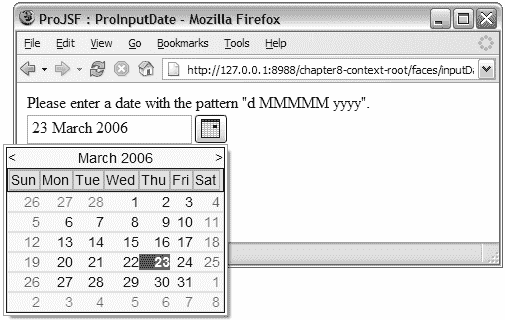

5807ch04.qxd 1/13/06 2:50 PM 第 209 页

第 4 章 ■ 使用富互联网技术

**209**

你也可以说 Ajax 提供了跨平台支持，但需要 Ajax 解决方案的提供者确保支持每个浏览器特有的怪癖。

因此，尽管你有许多部署环境，但没有一个真正的解决方案能提供完全的跨平台支持。

**想象力是唯一的限制**

JSF 为应用开发者标准化了服务器端，但你仍需等待浏览器中的表示层为组件开发者实现标准化。JSF 通过将用户界面与应用分离，为应用开发者带来了平台独立性，这使得组件作者能够在不篡改应用的情况下更改表示层。

这并没有解决浏览器不一致性问题、维护难题，或前述技术的跨平台问题，但它将帮助应用开发者以标准方式构建 RIA。

本章描述的三种技术——Ajax、XUL 和 HTC——各有优缺点，那么，如果你能将它们的优点结合到一个可复用的标准组件中，岂不是很好？

JSF 组件开发者可以使用 XUL 或 HTC 进行表示，使用 Ajax 进行通信，然后在客户端不支持这三种技术中的任何一种时，动态回退到传统的 HTML 解决方案。应用开发者将能够使用一个通用的编程模型——JSP 和 Java——构建一个支持多种渲染技术的应用。

**一个支持 Ajax、XUL 和 HTC 的 JSF 应用**

为了结束本章并回顾之前介绍的技术，图 4-11 中展示的 JSF 示例展示了一个包含你的 JSF 输入日期组件的页面。在后续章节中，你将实现本节中展示的支持。此版本的组件已扩展为包含一个弹出式日历，用户可以从其中选择日期。

这个改进后的组件利用 Ajax 进行通信，并利用 XUL 和 HTC 作为渲染技术。

**图 4-11.** *一个使用 XUL 作为渲染技术、由 JSF 组件构建的页面*

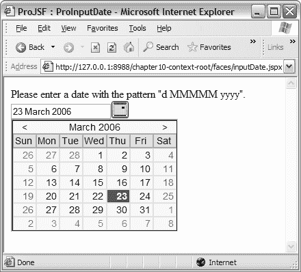

5807ch04.qxd 1/13/06 2:50 PM 第 210 页

**210**

第 4 章 ■ 使用富互联网技术

图 4-11 显示了一个 JSF 页面——inputDate.jspx——它包含你的 ProInputDate 组件，该组件正在向 Mozilla Firefox 浏览器渲染 XUL 内容。

图 4-12 显示了同一个页面——inputDate.jspx——在 Internet Explorer 中运行的情况。这个简单应用的有趣之处在于，你为每个浏览器使用了最佳的渲染技术，并且虽然不可见，但 ProInputDate 组件正在使用 Ajax 与服务器异步通信，以接收可选择的日期。

**图 4-12.** *在 Internet Explorer 中使用 HTC 作为渲染技术的同一个页面* 该页面的源代码（参见代码示例 4-26）与你之前看到的 XUL 和 HTC 示例没有太大不同，但主要区别在于，应用开发者无需学习两种甚至三种在当今浏览器中支持 RIA 的方法。

**代码示例 4-26.** *匹配 XUL 和 HTC 示例的 JSF 页面*

<?xml version="1.0" encoding="UTF-8" ?>

<jsp:root version="1.2"

**>

<jsp:directive.page contentType="application/x-javaserver-faces" />

<f:view>

<pro:document title="ProJSF : ProInputDate" >

<h:form>

请输入一个符合模式 "d MMMMM yyyy" 的日期。

<br/>

**<pro:inputDate id="dateField"**

**title="日期字段组件"**

**value="#{inputDateBean.date}" >**

5807ch04.qxd 1/13/06 2:50 PM 第 211 页

第 4 章 ■ 使用富互联网技术

**211**

<f:convertDateTime pattern="d MMMMM yyyy" />

**<pro:validateDate availability="#{inputDateBean.getAvailability}" />**

</pro:inputDate>

<br/>

<h:message for="theDate" />

<br/>

<h:commandButton value="提交" />

<br/>

<h:outputText value="#{inputDateBean.date}" >

<f:convertDateTime pattern="d MMMMM yyyy" />

</h:outputText>

</h:form>

</pro:document>

</f:view>

</jsp:root>

除了明显的命名空间之外，该示例包含一个映射到自定义组件库的命名空间（）和一个自定义组件（<pro:inputDate ..."/>）。请耐心等待——你将在接下来的章节中看到实际的 JSF 实现。

**总结**

本章让你深入了解了市场上三种领先的 RIA 视图技术：XUL、HTC 和 Ajax。这些技术已证明它们完全能够为用户提供丰富且响应迅速的界面。本章还触及了这些技术存在的问题，例如缺乏标准、平台支持和维护。

展望未来，JSF 作为一种技术的潜力是无限的。组件开发者可以为社区提供广泛的组件，支持从 HTML 到 XUL 的各种技术，包括无线甚至基于字符的解决方案；你的想象力是唯一的限制。


本章展示了如何使用 XBL 和 HTC 构建可复用组件，以及如何实现事件处理、封装，并利用不同技术提供的支持实现（CSS 和 import）在页面中嵌入自定义组件。你还了解了 Ajax 及其关键角色 XMLHttpRequest 对象。有关这些技术的更多信息，请访问 Mozilla 网站 (http://www.mozilla.org)、Microsoft MSDN 网站 (http://msdn.microsoft.com/) 和 Wikipedia.org (http://en.wikipedia.org/wiki/AJAX)。

5807ch04.qxd 1/13/06 2:50 PM Page 212

5807ch05.qxd 1/13/06 2:56 PM Page 213

第 5 章

■ ■ ■

使用 Weblets 加载资源

*如果说我们从发明和发现的历史中学到了一件事，那就是从长远来看——通常也是在短期内——最大胆的预言似乎都保守得可笑。*

——阿瑟·C·克拉克（1917–），《太空探索》，1951 年

Web 应用程序通常使用许多不同的资源文件，例如图像、样式表或脚本，以改善用户界面的呈现和交互性。希望呈现吸引人用户界面的 JSF 组件库也会利用资源文件。

为 JSF 组件库提供资源文件的标准方法是直接从 Web 应用程序根文件系统提供这些文件。这些资源通常打包在归档文件（例如 ZIP 文件）中，并与 JSF 组件库分开分发。

本章将介绍一个新的开源项目——Weblets。该项目（位于 http://weblets.dev.java.net）的目标是为组件编写者提供从 Java 归档文件（JAR）提供资源文件的能力，而不是从 Web 应用程序根文件系统提供。与在 web.xml 中定义静态配置 URL 映射的传统 Web 应用程序不同，JSF 应用程序需要基于组件库 JAR 文件的存在来动态配置 URL 映射。

阅读本章后，你应该理解什么是 weblets、如何使用 weblets 加载资源，以及如何在你自己的 JSF 组件库中利用 weblets。我们将展示如何为自定义 JSF 组件库打包资源，以确保你为应用程序开发者提供一种简单的方法来成功安装你的自定义 JSF 组件库，包括组件库所需的任何资源。

**介绍资源加载**

你可能还记得第 2 章和第 3 章，我们创建了两个组件——ProShowOneDeck 和 ProInputDate——它们需要向客户端提供资源。我们将在本章中使用这两个组件来说明如何使用 weblets。

**213**

5807ch05.qxd 1/13/06 2:56 PM Page 214

**214**

第 5 章 ■ 使用 Weblets 加载资源

在此示例中，HtmlShowOneDeckRenderer 组件使用一个 JavaScript 文件 showOneDeck.js，当用户点击渲染后的组件时，该文件用于展开 UIShowItem。如第 3 章所述，此 JavaScript 文件传统上由 Web 应用程序通过硬编码到实际 HtmlShowOneDeckRenderer 代码中的相对路径来提供。这要求应用程序开发者部署额外的资源，这些资源以单独的归档文件（例如 ZIP 文件）交付和打包，通常称为 *installables* 归档文件。

■**注意** JSF HTML Basic RenderKit 没有任何图像、样式或脚本，因此对于 JSF 资源打包问题，没有标准的解决方案。

代码示例 5-1 展示了 HtmlShowOneDeckRenderer 类中的 encodeResources() 方法，该方法说明了可安装的 JavaScript 资源文件——/projsf-ch3/showOneDeck.js 和 /projsf-ch3/showOneDeck.css——是从 Web 应用程序根文件系统提供的。

**代码示例 5-1.** *HtmlShowOneDeckRenderer 代码中的* encodeResources() *方法*

/**

* 写出 ProShowOneDeck 资源。

*

* @param context Faces 上下文


* @param component  Faces 组件

*/

protected void encodeResources(

FacesContext context,

UIComponent component) throws IOException

{

**writeScriptResource(context, "/projsf-ch3/showOneDeck.js");** **writeStyleResource(context, "/projsf-ch3/showOneDeck.css");**

}

尽管这种可安装的方法对 JSF 组件编写者来说很方便，但它增加了应用程序开发者的安装负担，开发者必须记得在每次组件库升级到新版本时解压可安装归档文件。因此，你需要一种方法将额外的资源打包到包含 Renderer 类的同一个 JAR 文件中，从而为使用你的组件库的应用程序开发者简化部署。

**使用现有解决方案**

目前一些更高级的 JSF 组件库，例如 Apache MyFaces 和 Oracle ADF Faces，提供了自定义的 servlet 或 filter 解决方案，用于提供其特定渲染器所需的资源。然而，每个组件库往往以略微不同的方式解决同一个问题。因此，缺乏任何官方的标准解决方案会导致每个组件库都需要额外的配置和安装负担。

5807ch05.qxd 1/13/06 2:56 PM 第 215 页

第 5 章 ■ 使用 WEBLET 加载资源

**215**

**使用 Weblets**

开源 Weblets 项目旨在以一种通用且可扩展的方式解决资源打包问题，以便所有 JSF 组件编写者都能利用它，并且不会给应用程序开发者增加额外的安装负担。

*weblet* 充当一个中介，拦截来自客户端的请求，并使用短 URL 从 JAR 文件中提供资源。与 servlet 或 filter 方法不同，weblet 可以在 JAR 文件内部注册和配置，因此组件库的 Renderer、它们的资源文件以及 weblet 配置文件（weblets-config.xml）都可以打包在同一个 JAR 文件中。当组件库升级到新版本时，你无需单独部署额外的可安装文件。对于应用程序开发者来说，也无需任何配置步骤。

需要注意的是，所有由 weblets 提供的资源都是*内部*资源，仅供 Renderer 使用。任何由应用程序提供的资源（如图像）都作为组件属性值提供，并从上下文根目录作为*外部*资源加载。

**探索 Weblet 架构**

尽管 weblets 被设计为可供任何 Web 客户端使用，但 weblet 实现已通过一个名为 WebletsViewHandler 的自定义 ViewHandler 与 JSF 集成，如图 5-1 所示。在渲染主 JSF 页面期间，WebletsViewHandler 负责将 weblet 特定的资源 URL 转换为浏览器用于请求 weblet 管理资源的实际 URL。

**图 5-1.** *weblet 架构的高级概述*

5807ch05.qxd 1/13/06 2:56 PM 第 216 页

**216**

第 5 章 ■ 使用 WEBLET 加载资源

在接收到主页面渲染后的标记后，浏览器使用单独的请求下载每个额外的资源。每个对 weblet 管理资源的请求都会被 WebletsPhaseListener 拦截，然后它要求 WebletContainer 从组件库 JAR 文件中流式传输 weblet 管理的资源文件。

weblet 容器被设计为尽可能利用浏览器缓存。这通过最小化对 weblet 管理资源文件的请求总数来提高整体渲染性能。

为了确保灵活性、优化性能并避免与现有 Web 应用程序资源冲突，应用程序开发者可以配置 weblets 来覆盖组件编写者提供的任何默认设置。

**在你的组件库中使用 Weblets**

你可以使用 weblets-config.xml 文件配置 weblets，该文件必须存储在组件库 JAR 文件的 /META-INF 目录中。配置 weblet 类似于配置 servlet 或 filter。weblets-config.xml 文件中的每个 weblet 条目都有一个 weblet 名称、一个实现类和初始化参数。weblet 映射将特定的 URL 模式与特定的 weblet 名称关联起来，例如 com.apress.projsf.ch5。weblet 名称和默认 URL 模式定义了 weblet 管理资源的公共 API，并且为了保持向后兼容性，在组件库的不同版本之间不应修改。

如代码示例 5-2 所示，示例组件库将资源打包在 com.apress.projsf.ch5.renderer.html.basic.resources Java 包中，并使用默认的 URL 映射 /projsf-ch5/* 使其对浏览器可用。

**代码示例 5-2.** *Weblets 配置文件——* weblets-config.xml

<?xml version="1.0" encoding="UTF-8" ?>

<weblets-config >

<weblet>

**<weblet-name>com.apress.projsf.ch5</weblet-name>**

**<weblet-class>**

**net.java.dev.weblets.packaged.PackagedWeblet**

**</weblet-class>**

<init-param>

**<param-name>package</param-name>**

**<param-value>com.apress.projsf.ch5.render.html.basic.resources</param-value>**

</init-param>

</weblet>

<weblet-mapping>

<weblet-name>com.apress.projsf.ch5</weblet-name>

**<url-pattern>/projsf-ch5/*</url-pattern>**

</weblet-mapping>

</weblets-config>

PackagedWeblet 是一个内置的 weblet 实现，它可以使用 ClassLoader 从特定的 Java 包中读取数据，然后将结果流式传输到浏览器。package 初始化参数告诉 PackagedWeblet 在解析 weblet 管理的资源请求时，将哪个 Java 包用作根目录。

5807ch05.qxd 1/13/06 2:56 PM 第 217 页

第 5 章 ■ 使用 WEBLET 加载资源

**217**

指定 Weblet MIME 类型

当使用 weblets 提供 JSF 组件资源文件时，重要的是让浏览器正确获知相应的 MIME 类型，以便资源文件能被正确处理。默认情况下，weblets 内置了许多常见 MIME 类型的知识，例如对于常见的文件扩展名（如 .txt）使用 text/plain。然而，在某些情况下，JSF 组件可能需要打包 weblets 先前未知的资源，或者必须使用不同的扩展名来提供资源，这导致 weblets 无法自动识别要使用的正确 MIME 类型。

代码示例 5-3 展示了如何为 weblet 提供的资源定义自定义 MIME 类型映射。

**代码示例 5-3.** *定义自定义 MIME 类型的 Weblets 配置文件*

<?xml version="1.0" encoding="UTF-8" ?>

<weblets-config >

<weblet>

<weblet-name>com.apress.projsf.ch5</weblet-name>

<weblet-class>

net.java.dev.weblets.packaged.PackagedWeblet

</weblet-class>

<init-param>

<param-name>package</param-name>

<param-value>com.apress.projsf.ch5.render.html.basic.resources</param-value>

</init-param>

**<mime-mapping>**

**<extension>htc</extension>**

**<mime-type>text/x-component</mime-type>**

**</mime-mapping>**

</weblet>

<weblet-mapping>

<weblet-name>com.apress.projsf.ch5</weblet-name>

<url-pattern>/projsf-ch5/*</url-pattern>

</weblet-mapping>

</weblets-config>

代码示例 5-3 为由此 weblet 提供的所有具有 .htc 扩展名的资源定义了一个自定义 MIME 类型映射 text/x-component。

指定 Weblet 版本控制

Weblets 还内置了对组件库版本控制的支持。这允许浏览器在可能的情况下缓存打包的资源（例如 showOneDeck.js），从而防止不必要的往返 Web 服务器。

5807ch05.qxd 1/13/06 2:56 PM 第 218 页

**218**

第 5 章 ■ 使用 WEBLET 加载资源


每次浏览器渲染页面时，都会确保该页面使用的所有资源均可用。在页面初次渲染期间，浏览器会从 Web 服务器下载每个资源 URL 的新副本，从而用这些资源内容填充其缓存。在此过程中，浏览器会记录响应头中的 Last-Modified 和 Expires 时间戳。如果当前时间晚于过期时间戳，或者不存在过期时间戳信息，则称缓存内容已过期。

在下次渲染同一页面时，浏览器会检查本地缓存的资源是否已过期。如果未过期，则直接重用本地缓存的副本。否则，会向 Web 服务器发起新请求，并在请求头 If-Modified-Since 中包含上次修改信息。Web 服务器的响应要么指示浏览器缓存仍然是最新的，要么将新的资源内容流式传输给浏览器，并在响应头中附带更新后的 Last-Modified 和 Expires 时间戳。

Weblets 利用版本控制来充分利用浏览器缓存行为，从而尽可能高效地下载和缓存打包资源。只有当缓存被清空，或者 Web 服务器上的组件库已升级时，浏览器才需要检查新的更新。

代码示例 5-4 通过向 `com.apress.projsf.ch5` weblet 添加 1.0 版本，展示了此版本控制功能。

**代码示例 5-4.** *用于生产环境的 Weblets 配置文件，使用* 1.0 *版本控制*

<?xml version="1.0" encoding="UTF-8" ?>

<weblets-config >

<weblet>

<weblet-name>com.apress.projsf.ch5</weblet-name>

<weblet-class>net.java.dev.weblets.packaged.PackagedWeblet</weblet-class>

**<weblet-version>1.0</weblet-version>**

<init-param>

<param-name>package</param-name>

<param-value>com.apress.projsf.ch5.render.html.basic.resources</param-value>

</init-param>

</weblet>

<weblet-mapping>

<weblet-name>com.apress.projsf.ch5</weblet-name>

<url-pattern>/projsf-ch5/*</url-pattern>

</weblet-mapping>

</weblets-config>

通过指定 weblet 版本，你表明打包资源在版本号更改之前不会发生变化。因此，版本号会作为资源 URL 的一部分，该 URL 由 WebletsViewHandler 在运行时确定（例如，`/projsf-ch5$1.0/showOneDeck.js`）。当 WebletContainer 处理此请求时，它会从 URL 中提取版本号，并确定该资源应被缓存且永不过期。一旦新版本的组件库部署到 Web 应用程序，由 WebletsViewHandler 在运行时创建的资源 URL 就会发生变化（例如，`/projsf-ch5$2.0/showOneDeck.js`）；因此，浏览器缓存的 1.0 版本的 `showOneDeck.js` 副本将不再有效，因为 URL 已经不同了。

5807ch05.qxd 1/13/06 2:56 PM 第 219 页

第 5 章 ■ 使用 WEBLETS 加载资源

**219**

在开发过程中，打包资源的内容可能会频繁更改，因此浏览器需要持续与 Web 服务器核对，以检测最新的资源 URL 内容，这一点至关重要。如果在 `weblets-config.xml` 中省略了 weblet 版本，则每次渲染主 Web 页面时，默认都会进行此检查。

或者，weblet 配置允许组件编写者将 `-SNAPSHOT` 附加到版本号后面。例如，如代码示例 5-5 所示，`1.0-SNAPSHOT` 表示此文件正在开发中，其行为应与省略版本号时相同。

**代码示例 5-5.** *用于开发环境的 Weblets 配置文件，使用* SNAPSHOT *版本控制*

<?xml version="1.0" encoding="UTF-8" ?>

<weblets-config >

<weblet>

<weblet-name>com.apress.projsf.ch5</weblet-name>

<weblet-class>net.java.dev.weblets.packaged.PackagedWeblet</weblet-class>

**<weblet-version>1.0-SNAPSHOT</weblet-version>**

...

</weblet>

...

</weblets-config>

设置安全性

从 JAR 文件提供打包资源时，必须格外小心，确保 Java 类文件或其他敏感信息不能通过 URL 访问。在桌面 Java 应用程序中，资源文件通常存储在 Java 实现类下方的 `resources` 子包中，这些实现类会使用这些资源文件。同样的策略也适用于 JSF 组件库中的打包资源，其安全优势在于确保只有资源文件可以通过 URL 访问。JAR 文件中的所有其他内容，包括 Java 实现类，都无法通过 URL 访问，因为 `resources` 包或其任何子包中都不存在 Java 类。

使用 Weblet 协议

了解了如何配置 weblets 之后，现在来看看如何在两个自定义渲染器（`HtmlInputDateRenderer` 和 `HtmlShowOneDeckRenderer`）中引用由 weblet 定义的资源。代码示例 5-6 展示了由 weblet 契约定义的语法，用于向 JSF 页面返回正确的 URL。

**代码示例 5-6.** *Weblet 协议语法* weblet://<weblet 名称><资源>

`weblet://` 前缀表示这是一个由 weblet 管理的资源，其后跟随着 weblet 名称和请求的资源。

5807ch05.qxd 1/13/06 2:56 PM 第 220 页

**220**

第 5 章 ■ 使用 WEBLETS 加载资源

在 HtmlInputDateRenderer 中使用 Weblets

之前，在 `HtmlInputDateRenderer` 类中，你看到了如何将 URL `/projsf-ch2/inputDate.css` 作为参数传递给 `writeStyleResource()` 方法。在代码示例 5-7 中，你将看到如何修改此代码以改用 weblet 协议。

**代码示例 5-7.** *使用 Weblet 协议提供资源*

/**

* 写出 HtmlInputDate 资源。

*

* @param context Faces 上下文

* @param component Faces 组件

*/

protected void encodeResources(

FacesContext context,

UIComponent component) throws IOException

{

**writeStyleResource(context, "weblet://com.apress.projsf.ch5/inputDate.css");**

}

weblet 协议语法方便且易于理解。该语法以 `weblet://` 开头，后跟 weblet 名称（例如 `com.apress.projsf.ch5`），最后是路径信息或资源文件（例如 `/inputDate.css`）。

■**注意** 尽管 Weblets 项目使用类似协议的语法以公开方式描述资源，但这并非真正的协议处理器，因此 `new URL("weblet:://...").openStream()` 在 Java 代码中无法工作。不过，你也不需要它工作，因为客户端并非 Java 代码。

在 HtmlShowOneDeckRenderer 中使用 Weblets

与 `HtmlInputDateRenderer` 类似，在 `HtmlShowOneDeckRenderer` 类中，你看到我们将 URL `/projsf-ch3/showOneDeck.js` 和 `/projsf-ch3/showOneDeck.css` 作为参数传递给 `writeStyleResource()` 方法（参见代码示例 5-1）。在代码示例 5-8 中，你将看到如何修改此代码以改用 weblet 协议。

**代码示例 5-8.** *使用 Weblet 协议提供资源*

/**

* 写出 HtmlShowOneDeck 资源。

*

* @param context Faces 上下文

* @param component Faces 组件

*/

5807ch05.qxd 1/13/06 2:56 PM 第 221 页

第 5 章 ■ 使用 WEBLETS 加载资源

**221**

protected void encodeResources(

FacesContext context,

UIComponent component) throws IOException

{

**writeScriptResource(context, "weblet://com.apress.projsf.ch5/showOneDeck.js");** **writeStyleResource(context, "weblet://com.apress.projsf.ch5/showOneDeck.css");**

}

请注意，URL 映射和版本号都未包含在 weblet 资源语法中。WebletsViewHandler 会使用 weblet URL 映射和版本号来创建 weblet 将服务的资源 URL。


当您未使用 weblets 时，则不会使用 `weblet://` 资源路径语法，而是分发一个独立的可安装 ZIP 文件。当您迁移到 weblets 后，您将在渲染器（Renderer）中开始使用 `weblet://` 资源路径语法，并将资源包含在 JAR 文件中。在同一组件库的同一版本中混合使用这两种方法处理资源，不会带来任何好处。

**在 JSF 应用程序中使用 Weblets**

为简化应用程序开发人员的设置，组件编写者应为其组件库选择一个默认的 URL 映射。应用程序开发人员无需在 `web.xml` 文件中添加*任何* weblet 特定的配置，因为 `WebletsPhaseListener` 将自动被调用来处理针对 weblet 管理资源的传入请求。

**使用 Weblet 过滤器优化 Weblets**

（可选）应用程序开发人员可以在 `/WEB-INF/web.xml` 文件中注册 `WebletsFilter`。

通过执行这一简单步骤，他们可以确保基于 weblet 的 URL 更短，例如 `/projsf-ch5/showOneDeck.js` 而非 `/faces/weblets/projsf-ch5/showOneDeck.js`。

使用 `WebletsFilter` 还能减少处理请求的开销，因为不再需要调用 JSF 生命周期来通过 `WebletsPhaseListener` 服务 weblet 管理的资源。

代码示例 5-9 将 weblet 容器映射到以 `/projsf-ch5` 为前缀的过滤器 URL，该前缀位于上下文根目录下。为 `WebletsFilter` 映射使用此特定 URL 模式，可以防止 weblet 容器为非 weblet 请求引入不必要的开销。如果一个 weblet 服务于特定模式，例如 `/projsf-ch5/*`，那么它将服务于所有 `/projsf-ch5/*` 的请求，而不会回退到上下文根目录。

**代码示例 5-9.** *web.xml 文件中的 Weblet 容器配置*

<web-app>

<filter>

<filter-name>Weblet Container</filter-name>

**<filter-class>net.java.dev.weblets.WebletsFilter</filter-class>**

</filter>

<filter-mapping>

<filter-name>Weblet Container</filter-name>

**<url-pattern>/projsf-ch5/*</url-pattern>**

5807ch05.qxd 1/13/06 2:56 PM Page 222

**222**

第 5 章 ■ 使用 Weblets 加载资源

</filter-mapping>

...

</web-app>

weblet 容器负责解析所有 weblet 配置文件（`weblet-config.xml`）。它定位这些文件的方式与 JSF 定位 `faces-config.xml` 文件的方式相同。

weblet 容器首先搜索存储在每个组件库 `META-INF/` 目录中的配置文件，然后在 Web 应用程序根目录中搜索 `/WEB-INF/weblets-config.xml`。

这种设计允许应用程序开发人员在 URL 模式已被 Web 应用程序资源（如 Servlet 或过滤器）占用时，覆盖组件编写者定义的默认 URL 映射。例如，代码示例 5-10 覆盖了组件库中打包的默认 `<url-pattern>`，并定义了一个自定义映射（例如 `/projsf-chapter5-resources/*`）。

**代码示例 5-10.** *覆盖 Weblets 映射*

<?xml version="1.0" encoding="UTF-8" ?>

<weblets-config >

<weblet-mapping>

<weblet-name>com.apress.projsf.ch5</weblet-name>

**<url-pattern>/projsf-chapter5-resources/*</url-pattern>**

</weblet-mapping>

</weblets-config>

渲染器会自动适应此 URL 映射的更改，无需任何代码更改或重新编译。

**总结**

作为一个新的开源项目，Weblets 拥有巨大潜力，有望成为事实上的标准，为 Web 客户端和 JSF 组件社区提供通用且可配置的资源加载功能。与可安装方法的关键区别在于，它简化了 JSF 组件及其资源的打包，并最大程度地减少了为特定 Web 应用程序项目安装和设置 JSF 组件库的开销。

本章探讨了一种将资源与 JSF 组件打包的新方法。现在，您应该能够通过包含合适的 `weblets-config.xml` 文件并使用 `weblet://` 协议风格的语法来引用 weblet 管理的资源，从而在自己的组件库中利用 weblets。

您现在应该理解 weblets 如何与 JSF 集成，理解用于打包额外资源的概念，并知道如何设置和优化应用程序以使用这些资源。

5807ch06.qxd 1/13/06 11:18 AM Page 223

第 6 章

■ ■ ■

为 Deck 组件启用 Ajax

*今天，能让我快乐或不快乐的，不是事件，而是我自己。我可以选择成为哪一种。昨天已逝，明天未至。我只有一天，就是今天，我要在今天过得快乐。*

——朱利叶斯·亨利·马克思，人称格劳乔·马克思

**在**本章和第 7 章中，我们将探讨如何在 JSF Web 应用程序中与组件交互时，实现更流畅、更丰富的用户体验。按照当前的设计，您的组件在传统的 HTML Web 应用程序中可以完美运行，并执行传统的有效表单 POST。您可能已经注意到，这种构建 Web 应用程序的传统方式有一个不良副作用：当响应返回客户端浏览器时，表单 POST 会导致 Web 应用程序执行全页刷新。页面重新加载时产生的额外闪烁不仅令人烦恼，还会影响应用程序的性能。其他副作用可能包括数据丢失、滚动位置丢失和焦点丢失。

正是在这里，Ajax 挺身而出，它提供了与底层服务器以及 Web 应用程序使用的任何业务服务进行异步通信的功能，而无需强制重新加载页面及其资源。这反过来减少了闪烁，并允许页面保持滚动位置和焦点。通过利用 JavaScript 中名为 `XMLHttpRequest` 的通信通道，开发人员可以超越在浏览器中调整 DOM 表示，提供一些动态的丰富功能。实现 Ajax 技术的优秀应用示例包括 Google Gmail、Oracle Collaboration Suite 和 Google Suggest；这些应用证明了 Ajax 是为当前互联网平台提供丰富功能的可行解决方案。

随着消费者对 RIA 解决方案可能性的认识不断提高，对更流畅、更丰富交互的需求已不再是可选项。

**Deck 组件 Ajax 实现的需求**

首先，您需要确保您的 deck 组件的 Ajax 实现能够在回传时执行完整的 JSF 生命周期（从而利用 JSF 的所有优势）。您还 **223**

5807ch06.qxd 1/13/06 11:18 AM Page 224

**224**

第 6 章 ■ 为 Deck 组件启用 Ajax

需要弄清楚在 JSF 生命周期期间发生了什么变化，并仅用这些变化更新客户端 DOM 表示。

其次，您需要防止客户端事件不必要地返回服务器，确保只有影响业务逻辑的事件才执行到服务器的往返。这意味着您需要在浏览器本地短路用户界面交互性，以便诸如分割器、表格列重排、日期选择器和颜色弹出窗口等潜在组件不会往返到服务器。

最后，也是最重要的，您希望通过抽象化呈现细节（例如 HTML、JavaScript、XUL 和 HTC），让应用程序开发人员的工作变得简单。

**启用 Ajax 的 Deck 组件**


在本章中，你将学习如何为你的 ProShowOneDeck 组件启用 Ajax 功能，从而改善用户与该组件交互时的体验。如第 2 章所述，如果所需行为已经存在，则无需创建新的 UIComponents。在本例中，你已经在 UIShowOne 组件中实现了 ProShowOneDeck 组件的行为层面，因此只需创建一个新的 Renderer，其中包含你的客户端 DHTML/Ajax 实现以及启用 Ajax 所需的所有资源。

为此，你将使用 Ajax 和两个开源框架——Delta DOM (D2) 和 Dojo 工具包：

*Ajax*：Ajax 是一个新术语，描述了一种 Web 开发技术，它使用已有的技术套件——DOM、JavaScript 和 XMLHttpRequest——来创建更丰富、更友好的 Web 应用程序。

*D2*：D2（发音为 *D-squared*）是一个托管在 Java.net（http://d2.dev.java.net/）上的开源项目。Delta DOM 在将 DOM 差异合并到 DOM 树中时非常有用。

*Dojo 工具包*：Dojo 是一个由 Alex Russel（http://www.dojotoolkit.org）用 JavaScript 编写的开源 DHTML 工具包。Dojo 工具包包含支持后退按钮、书签和文件上传的 Ajax 功能。

Ajax 和这两个开源框架是互补的，在本章中，你将学习如何使用它们来处理 ProShowOneDeck 组件的回发事件。你还将提供一个公共 API，所有启用 Ajax 的 JSF 组件都可以使用该 API 来开启或关闭“完整”回发。

阅读本章后，你应该理解 Ajax 解决了什么问题，以及在使用此技术创建丰富的用户界面组件时可能遇到哪些问题。你将学习 D2 以及如何使用它来构建你自己的*富互联网组件*。最后，你将了解出色的 Dojo 工具包，以及如何在 JSF 和组件设计的上下文中使用它。

图 6-1 显示了本章将要创建的 12 个类。

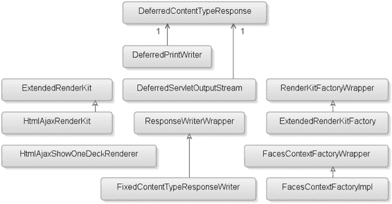

5807ch06.qxd 1/13/06 11:18 AM 第 225 页

第 6 章 ■ 为 DECK 组件启用 AJAX

**225**

**图 6-1.** *本章创建的类图* 这些类如下：

• ExtendedRenderKit 扩展了现有的 RenderKit，无需在 faces-config.xml 中重复注册公共 Renderer。

• HtmlAjaxRenderKit 可以动态选择默认的 ResponseWriter 或自定义的 FixedContentTypeResponseWriter。

• HtmlAjaxShowOneDeckRenderer 是你的新自定义 Renderer，它扩展了第 3 章的 HtmlShowOneDeckRenderer，并添加了包含 Ajax 支持的 JavaScript 库。

• DeferredContentTypeResponse 负责包装 HttpServletResponse 对象，以检测 JSP 页面指令是否指示 ResponseWriter 应定义 contentType。

• DeferredPrintWriter 在流式传输负载的第一个字符之前，在响应上设置 contentType 标头。

• DeferredServletOutputStream 在流式传输负载的第一个字节之前，在响应上设置 contentType 标头。

• ResponseWriterWrapper 类仅进行委托，而不对标准 ResponseWriter 进行装饰。

• FixedContentTypeResponseWriter 负责在由启用 Ajax 的组件执行的任何后续回发上写出文档（内容类型 text/plain）。

5807ch06.qxd 1/13/06 11:18 AM 第 226 页

**226**

第 6 章 ■ 为 DECK 组件启用 AJAX

• RenderKitFactoryWrapper 扩展了 JSF 实现的抽象 RenderKitFactory 类，以提供与底层 JSF 实现的松散耦合。

• ExtendedRenderKitFactory 通过添加对创建 ExtendedRenderKit 的支持来增强 RenderKitFactory。

• FacesContextFactoryWrapper 仅进行委托，而不对标准 FacesContextFactory 进行装饰，并提供了与底层 JSF 实现的松散耦合。


• `FacesContextFactoryImpl` 类拦截 `HttpServletResponse` 并创建一个新的 Servlet 响应——`DeferredContentTypeResponse`。

**使用蓝图设计支持 Ajax 的 Deck 组件** 第 3 章中创建自定义 JSF 组件的蓝图包含七个步骤。

这七个步骤涵盖了设计组件时最常见的使用场景。然而，正如你在表 6-1 中看到的，有时你需要做的比这七个步骤所涵盖的更多。

**表 6-1.** *创建新 JSF 组件的蓝图步骤*

**#**

**步骤**

**描述**

1

创建 UI 原型

使用适当的标记语言为你的组件创建 UI 原型及其预期行为。

2

创建事件和监听器

（可选）当 JSF 规范未涵盖你的特定需求时，创建自定义事件和监听器。

3

创建行为超类

（可选）如果找不到所需的组件行为，则创建一个新的行为超类（例如，`UIShowOne`）。

4

创建特定于客户端的渲染器

创建你需要的渲染器，该渲染器将为你的 JSF 组件写出客户端标记。

5

创建特定于渲染器的子类

（可选）创建一个特定于渲染器的子类。虽然这是一个可选步骤，但实现它是一个好习惯。

6

注册 UIComponent 和 Renderer

在 `faces-config.xml` 文件中注册你的新 `UIComponent` 和 `Renderer`。

7

创建 JSP 标签处理器和 TLD

如果你使用 JSP 作为默认视图处理器，则需要此步骤。另一种解决方案是使用 Facelets (http://facelets.dev.java.net/)。

**8**

**创建 RenderKit 和 ResponseWriter**

（可选）如果你计划支持替代标记语言，例如 Mozilla XUL，那么你需要创建一个新的 `RenderKit` 及其关联的 `ResponseWriter`。默认的 `RenderKit` 是 `HTML_BASIC`，其 `contentType` 设置为 `text/html`。

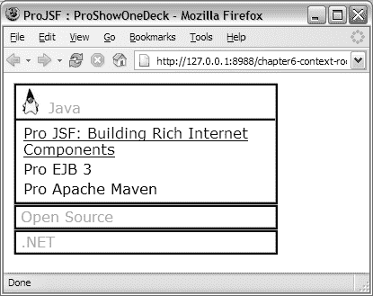

5807ch06.qxd 1/13/06 11:18 AM 第 227 页

第 6 章 ■ 为 DECK 组件启用 AJAX

**227**

**#**

**步骤**

**描述**

**9**

**扩展 JSF 实现**

（可选）当你必须为 JSF 实现提供扩展时（例如，扩展 JSF 工厂类或提供自定义 JSF 生命周期实现），需要此步骤。

**10**

**注册 RenderKit 和 JSF 扩展**

（可选）注册你的自定义 `RenderKit` 和/或对 JSF 实现的扩展。

**11**

**使用 Weblets 注册资源**

（可选）使用 Weblets 注册你的资源，例如图像、JavaScript 库和 CSS 文件，以便它们可以直接从组件库 JAR 文件中打包和加载。

本章在蓝图中增加了四个步骤——创建 RenderKit、扩展 JSF 实现、注册 RenderKit 和 JSF 扩展，以及使用 Weblets 注册资源。幸运的是，JSF 具有足够的可扩展性，即使不是标准实现的一部分，也能找到实现目标的方法。

在进入步骤 8、9、10 和 11 之前，你需要完成其他步骤以确保没有遗漏任何内容；同样，根据第一步，你需要定义新组件，并使用最终将发送给客户端的预期标记语言来实现它，那么让我们看看你想要实现什么。

**步骤 1：创建 UI 原型**

遵循蓝图，你首先需要创建预期标记语言的原型。请记住，创建原型将帮助你找出你的渲染器需要生成哪些元素、应用程序开发者需要哪些特定于渲染器的属性，以及需要哪些资源（例如，JavaScript、图像等）。

图 6-2 显示了你的 deck 组件在 HTML 中实现的最终结果。

**图 6-2.** *用 HTML 实现的 Decks*

5807ch06.qxd 1/13/06 11:18 AM 第 228 页

**228**

第 6 章 ■ 为 DECK 组件启用 AJAX

代码示例 6-1 显示了使用你的新 DHTML/Ajax deck 组件创建图 6-2 所示页面所需的 HTML。


**代码示例 6-1.** *Deck HTML 实现*

<html>

<head>

<title>Pro JSF : ProShowOneDeck 原型</title>

<style type="text/css" >

.ProShowOne { ... }

.ProShowItem { ... }

.ProShowItemHeader { ... }

.ProShowItemContent { ... }

</style>

</head>

<body>

<div style="width:200px;" >

**<div class="ProShowOne">**

**<div class="ProShowItem">**

<div class="ProShowItemHeader"

**onclick="alert('first')" >**

 Java

</div>

<div class="ProShowItemContent">

<table>

<tbody>

<tr>

<td>

<a href="http://www.apress.com/...">

Pro JSF: 构建富互联网组件

</a>

</td>

</tr>

<tr>

<td>Pro EJB 3</td>

</tr>

<tr>

<td>Pro Apache Maven</td>

</tr>

</tbody>

</table>

</div>

**</div>**

**<div class="ProShowItem">**

<div class="ProShowItemHeader"

5807ch06.qxd 1/13/06 11:18 AM Page 229

第 6 章 ■ 为 Deck 组件启用 Ajax

**229**

onclick="alert('second')" >

开源

</div>

**</div>**

**<div class="ProShowItem">**

<div class="ProShowItemHeader"

onclick="alert('third')">

.NET

</div>

</div>

</div>

</div>

</body>

</html>

你并没有改变组件的 UI，正如你所见，这个 HTML 文档与你在第 3 章创建的页面完全相同，该页面利用了你的 UIShowOne 组件渲染器的 HTML 版本——HtmlShowOneDeckRenderer。

代码示例 6-2 中展示的 JSF 页面源码使用了你已完成的 Ajax 启用组件实现。如你所见，页面源码中不包含任何 Ajax “代码”，这意味着应用开发者无需承担额外负担来为页面或应用中的元素启用 Ajax。这正是你想要实现的目标——为应用开发者提供简洁性。幸运的是，使用 JSF 是可以做到的！

**代码示例 6-2.** *JSF 页面源码*

<?xml version = '1.0' encoding = 'windows-1252'?>

<jsp:root ...>

**<jsp:directive.page contentType="application/x-javaserver-faces"/>**

<f:view>

...

<pro:showOneDeck showItemId="first"

showListener="#{showOneDeckBean.doShow}">

<pro:showItem id="first" >

<f:facet name="header">

<h:panelGroup>

<h:graphicImage url="/resources/java_small.jpg" alt="The Duke"

style="margin-right: 8px; vertical-align:bottom;" />

<h:outputText value="Java"/>

</h:panelGroup>

</f:facet>

<h:panelGrid columns="1">

<h:outputLink value="http://apress.com/book/bookDisplay.html?bID=10044">

<h:outputText value="Pro JSF: 构建富互联网组件"/>

...

</f:view>

</jsp:root>

5807ch06.qxd 1/13/06 11:18 AM Page 230

**230**

第 6 章 ■ 为 Deck 组件启用 Ajax

如你所见，代码与最初的 JSF 实现（参见第 3 章）相比没有太大区别，但当用户点击某个未展开的节点时，你将向服务器发送一个 `XMLHttpRequest`，而不是常规的表单回传。

请注意与常规表单提交的区别。这种 JSF 组件的实现将防止不必要地重新加载那些不应受用户展开 deck 组件节点操作影响的页面内容。它还消除了在展开新节点及其内容并折叠先前打开节点时页面的任何闪烁。

应用开发者启用 Ajax 的唯一步骤是设置正确的 `contentType`，在本例中为 `application/x-javaserver-faces`。你需要以不同于后续 Ajax 回传的方式处理初始请求，以便在初始请求中使用 `text/html` 作为 `contentType`，而在后续请求中使用 `text/plain`。通过像代码示例 6-2 那样指定一个自定义的 `contentType`，你可以拦截它，并让 JSF 决定在响应中设置什么 `contentType`。请放心，我们稍后会讨论 `contentType` 及其对组件开发的影响。目前，你只需要了解这些。

**FIREFOX 中的 DOM 突变支持**

如果你是 Mozilla Firefox 用户，并且当前使用的版本低于 Mozilla Firefox 1.5，那么在使用启用 Ajax 的 ShowOneDeck 组件时，可能会遇到一些闪烁现象。这是 Mozilla Firefox 浏览器实现中的一个 bug。更多信息，请参阅 https://bugzilla.mozilla.org/show_bug.cgi?id=238493。你可以从 http://www.mozilla.org/projects/firefox/ 下载更新版本的 Mozilla Firefox。

**第 4 步：创建客户端特定的渲染器**

在你的 UIShowOne 组件解决方案中，大部分工作已经在第 3 章完成，因此你只需要扩展 `HtmlShowOneDeckRenderer`。由于本章没有引入任何新行为，你可以跳过蓝图中的第 2 步和第 3 步，直接进入第 4 步——创建客户端特定的渲染器。

Ajax 与 JSF 架构

在客户端-服务器环境（例如 JSF）中，存在多种架构可能性来提供 Ajax 支持。在所有情况下，Ajax 的一个部分会影响架构决策，那就是 Ajax 解决方案在处理 Ajax 响应时如何管理对 DOM 的更新。

你必须在当前 HTML 文档和基于用户交互从服务器返回的内容之间应用更改，以便在不重新加载页面的情况下将更改应用到当前 HTML 文档。以下是两种可能的架构解决方案：

*部分页面渲染 (PPR)*：这是 Ajax 在 JSF 中的首次成功实现，目前被一个名为 ADF Faces 的组件库所使用。这种架构依赖于常规的表单提交。响应以片段形式包含有关更改所需内容的信息。然后，PPR 处理器会确定将这些更改插入到何处。这种方法给应用开发者带来了负担，需要他们弄清楚哪些内容发生了变化（例如，应用开发者必须设置部分目标来定义哪些组件参与了这次部分更新）。在这种架构中，更新的单位是一个 `UIComponent` 子树，因此每个部分目标的 `UIComponent` 子树的标记都会被替换。PPR 还依赖 `iframes`（而不是 `XMLHttpRequest`）来提供异步通信，其好处是支持旧版本的浏览器。

*Delta DOM 渲染 (D2R)*：这种方法不会给应用开发者带来额外负担，更新的单位是增量数据（例如，元素节点上的属性）。D2R 模拟常规的 `form POST`，并使用 `XMLHttpRequest` 对象向服务器发送表单数据集。服务器不会注意到这个 `POST` 与常规 `POST` 之间的任何区别，并将返回一个完整的页面响应。一个 Ajax 处理器将处理该响应，将其与当前 HTML 文档进行比较，然后将任何更改合并到 HTML 文档中。你可以通过两种方式实现 D2R——在客户端或服务器端。在客户端实现中，Ajax 处理器将在客户端检测并应用 DOM 增量。在服务器端实现中，在 `ResponseWriter` 将标记写入客户端之前，标记会被缓存在服务器上。在后续回传时，在 `ResponseWriter` 将新标记写入客户端之前，服务器端实现会将缓存的版本与新的页面响应进行比较，并将差异作为增量数据发送到客户端，在那里 Ajax 处理器会将其与 HTML 文档合并。

**DOM 突变**


使用 DR2 客户端实现时，依赖修改 DOM 的 Ajax 组件会丢失自上次表单 POST 以来所做的任何更改，但这些 DOM 更改在完整页面刷新时也会丢失。在应用请求值阶段，任何未由组件层次结构表示的额外信息都将被丢弃，当页面渲染时，客户端 Ajax 处理器会执行 DOM 差异比较，替换响应中与 DOM 不匹配的任何内容。这具有提供额外安全性的好处，并防止通过修改浏览器中的 DOM 表示来恶意篡改应用程序。

使用服务器端实现时，安全性仍然在 JSF 组件级别应用，但在这种情况下，恶意脚本不会作为响应的一部分在客户端被移除。这是因为服务器拥有攻击发生前的页面缓存版本，因此服务器不知道 DOM 被篡改。当合并缓存标记和新标记时，你只将增量数据发送回服务器，而不会隐式地“移除”客户端上的任何恶意代码。

**选择 Ajax 架构**

尽管 PPR 为组件作者减少了工作量，并为应用程序开发者提供了一些控制，但本书将重点介绍 D2R 方法。在不深入比较客户端和服务器端 D2R 解决方案细节的情况下，两种实现是相似的。基本上，你需要计算初始 HTML 文档与目标 HTML 文档之间的差异。在页面提交之前，起点仅在客户端已知；提交之后，终点仅在服务器已知。因此，需要传输某些信息，以便将起点和终点都置于服务器端或都置于客户端。

我们决定使用客户端 D2R，因为它提供了最大的灵活性。此解决方案在客户端应用初始 HTML 文档与目标 HTML 文档之间的差异

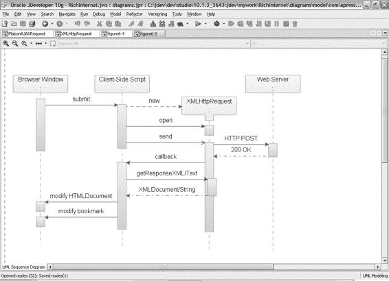

5807ch06.qxd 1/13/06 11:18 AM Page 232

**232**

第 6 章 ■ 为 DECK 组件启用 AJAX

，并允许客户端 JavaScript 在客户端执行任何修改。

如果其他组件不允许修改，那么可以通过记住先前渲染的内容，并将该内容用作下次提交的起点，将差异比较移至服务器端。

使用客户端 D2R 解决方案，你可以利用 `XMLHttpRequest` 对象的 `responseXML` 属性或 `responseText` 属性（见图 6-3）。`responseText` 属性返回一个表示从服务器发送的文档的字符串。`responseXML` 属性返回一个表示文档的、正确的 XML DOM 对象。它是一个完全可访问的 DOM，可以像操作 HTML 文档一样对其进行操作和遍历。

**图 6-3.** *Ajax 回发实现的时序图*
当用户点击一个设计为使用 Ajax 的组件（例如，提交按钮）时，常规的表单提交将被覆盖，并创建一个新的 `XMLHttpRequest` 对象实例。然后，你可以使用此 `XMLHttpRequest` 对象打开一个到服务器的通道，并将编码后的数据作为 URL 表单编码流发送回服务器（HTTP POST）。

由于 Web 服务器不会检测到你的 Ajax 回发与常规回发之间的区别，因此这不会影响你的服务器端代码。

你的实现是让改变状态的交互式 UIComponent 始终执行 `XMLHttpRequest`，并让 UICommand 组件在页面上存在文件上传时执行表单回发。

5807ch06.qxd 1/13/06 11:18 AM Page 233

第 6 章 ■ 为 DECK 组件启用 AJAX

**233**

提供文件上传功能

出于安全原因，开发者能够提供允许用户从客户端文件系统上传文件的实现的唯一标准方式是使用表单元素或 `form.submit()`。这意味着在 Ajax 中，文件上传需要使用 `form.submit()` 和一个隐藏的 `<iframe>`，而不是 `XMLHttpRequest`。通常，JSF 的 `ResponseWriter` 会提供完整页面（HTML）响应，但接收 HTML 或 XHTML 的隐藏 `<iframe>` 也会接收 `<script>` 元素。这些 `<script>` 元素会立即执行！同样重要的是要理解，这些 `<script>` 元素将在隐藏的 `<iframe>` 的上下文中执行，而不是在完整页面响应时通常执行的主页面中。

我们选择使用 `XMLHttpRequest` 对象上的 `responseText` 属性，其有效负载包含纯文本格式的 HTML 文档，这有一个积极的副作用：在存在文件上传的情况下，返回的文档不会作为 HTML 或 XHTML 执行。这也会阻止任何 `<script>` 元素在错误的上下文中执行。另一方面，这要求你处理这些 `<script>` 元素，以便脚本的预期行为在正确的上下文中执行，而不是在隐藏的 `<iframe>` 中。

因此，如果你解决了之前提到的文件上传和 `<iframe>` 响应问题，你还有一件事要做。在初始请求中，你仍然期望内容类型是 `text/html`。使用刚刚概述的解决方案，你需要支持动态内容类型（例如，在初始请求或常规表单回发时，提供 `text/html`；在由你的 Ajax 组件执行的任何后续请求时，提供 `text/plain`）。

**使用 DOJO 工具包进行文件上传**

不幸的是，提供的实现往往只涵盖了基本用法，而难以实现的部分则留给了消费应用程序开发者去解决。经过一些研究，我们发现 Dojo 工具包为大多数提到的 Ajax 不良副作用——后退按钮支持、书签和文件上传——提供了开箱即用的优秀解决方案。

Ajax 资源

正如你现在所知，在任何 Web 应用程序中实现 Ajax 都意味着编写 JavaScript，这可能很可怕，尤其是在跨浏览器支持和可访问性方面。

另一方面，借助 Ajax，开发者可以构建更具吸引力的 JavaScript 应用程序，例如 Google 地图，但通常这意味着需要在客户端编写更多代码来实现这种丰富性。作为组件作者，你可以自由选择任何方向，要么提供你自己的客户端 Ajax JavaScript，要么（正如我们推荐的）寻找已有的 Ajax JavaScript 库。有几个开源和商业 JavaScript 库可以帮助你处理核心的 JavaScript/Ajax 实现，让你专注于重要的部分——设计你的 JSF 组件。

我们决定使用名为 Dojo 的开源 JavaScript 工具包来处理 `XMLHttpRequest` 传输机制，并使用 D2 开源项目来解析和合并源文档与目标文档。

5807ch06.qxd 1/13/06 11:18 AM Page 234

**234**

第 6 章 ■ 为 DECK 组件启用 AJAX

**介绍 DOJO 工具包**


Dojo 开源项目提供了一个现代化、功能强大、“符合 Web 特性”且易于使用的 DHTML 工具包。其部分工作包括平滑 DHTML 编程和用户体验中的许多尖锐问题。在 Google Maps 和 Google Suggest 等成功案例的推动下，Ajax 和 XMLHttpRequest 对象获得了大量关注。尽管备受瞩目，但应用开发者在解决 Ajax 带来的可用性问题时，仍需独自摸索。Dojo 开源项目提供了一个用 JavaScript 编写的 DHTML 工具包，旨在解决 DHTML 中长期存在的一些历史问题，这些问题曾阻碍了动态 Web 应用开发的广泛采用。

Dojo 工具包允许你在 Web 应用以及任何支持 JavaScript 的环境中构建动态功能。使用 Dojo 工具包，你可以让 Web 应用更易用、响应更迅速、功能更强大。该工具包的其他优点和特性还包括：提供底层 API 和兼容层，用于编写可移植的 JavaScript 并简化复杂脚本、事件系统、I/O API 以及通用语言增强功能。

Dojo 工具包通过在一个仅提供包系统而几乎不包含其他功能的小型核心上分层添加功能，来提供所有这些特性。当你使用 Dojo 工具包编写脚本时，可以根据需要包含尽可能少或尽可能多的可用 API。

**介绍 D2 开源项目**

D2 是一个托管在 d2.dev.java.net 上的开源项目。D2 项目提供了“分层结构信息中的变更检测”研究项目（有关此项目的更多信息，请参见侧边栏）的一个实现。该研究项目专注于寻找一种最小成本的编辑脚本，用于将一个数据树转换为另一个数据树，并包含计算此类编辑脚本的高效算法。D2 项目包含两个实现——一个客户端 JavaScript 实现和一个服务器端 Java 实现——它们都是基于这项研究构建的。这支持通过在客户端或服务器上执行算法，对任何由 JSF 渲染的 HTML DOM 进行增量转换。

**分层结构信息中的变更检测¹**

检测和表示数据变更对于主动数据库、数据仓库、视图维护以及版本和配置管理至关重要。以往变更管理方面的工作大多处理平面文件和关系型数据；而我们则专注于分层结构数据。由于在许多情况下，必须根据数据的旧版本和新版本计算变更，我们将分层变更检测问题定义为寻找一个“最小成本编辑脚本”的问题，该脚本将一个数据树转换为另一个数据树，并提出了计算此类编辑脚本的高效算法。我们的算法利用了一些关键领域特征，从而实现了比以往通用算法显著更好的性能。我们从分析和经验两方面研究了算法的性能，并描述了我们的技术在分层结构文档中的应用。

1. 来源：“分层结构信息中的变更检测”，作者：Sudarshan S. Chawathe、Anand Rajaraman、Hector Garcia-Molina 和 Jennifer Widom；斯坦福大学计算机科学系。

5807ch06.qxd 1/13/06 11:18 AM 第 235 页

第 6 章 ■ 使用 AJAX 启用 DECK 组件

**235**

d2.js 库还包含传递用户选择信息、提交表单以及处理来自服务器响应所需的函数。d2.js 库反过来利用 Dojo 工具包内置的 Ajax 支持，使用 XMLHttpRequest 对象提交表单，而不是常规的表单 POST，如代码示例 6-3 所示。

**代码示例 6-3.** *来自* d2.js *库的摘录* var d2 = new Object();

**d2.submit = function (form, content)**

{

var targetDocument = form.ownerDocument;

var contentType = targetDocument.contentType;

// IE 不支持 document.contentType

if (contentType == null)

contentType = 'text/html';

**dojo.io.bind(**

{

**formNode: form,**

**headers: { 'X-D2-Content-Type': contentType },**

content: content,

**mimetype: "text/plain",**

**load: d2._loadtext,**

error: d2._error

});

}

代码示例 6-3 是 d2.js 库的一个摘录，展示了你将在 Ajax 实现中使用的 submit 函数。如你所见，d2.js 库引用了 dojo.io 包，该包为 XMLHttpRequest 和其他更复杂的传输机制提供了可移植代码。dojo.io 包的大部分魔力通过 bind() 方法展现出来。dojo.io.bind() 方法是一个通用的异步请求 API，它封装了多个传输层（iframe 队列、XMLHttpRequest、mod_pubsub、LivePage 等）。

Dojo 会尝试为当前请求选择最佳可用的传输方式，默认情况下，由于没有集成其他传输方式，只会选择 XMLHttpRequest。

d2.submit() 函数调用 dojo.io.bind() 方法，传递关于要提交哪个表单、内容（将作为请求参数发送到服务器的名称/值对映射）、接受的请求头以及此请求的 MIME 类型等信息。

D2 库还定义了一个回调函数——d2._loadtext——用于从服务器获取响应数据。d2._loadtext 函数用响应返回文档中的 inner HTML 替换目标文档的 inner HTML。

■**注意** D2 开源项目还提供了一个出色的工具，用于比较和合并两个 DOM 文档。

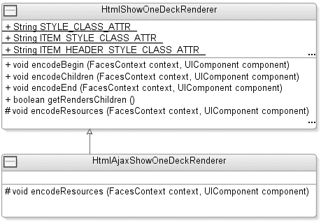

5807ch06.qxd 1/13/06 11:18 AM 第 236 页

**236**

第 6 章 ■ 使用 AJAX 启用 DECK 组件

HtmlAjaxShowOneDeckRenderer 类

使用 Ajax，你可以认为是在实现新的行为；然而，这仅仅是客户端行为，而非 JSF 服务器端行为，因此你无需提供新的服务器端行为超类。对于应用开发者而言，使用 HtmlShowOneDeckRenderer 在服务器上触发的组件事件，与你新的支持 Ajax 的 HtmlAjaxShowOneDeckRenderer 之间没有区别。图 6-4 显示了 HtmlAjaxShowOneDeckRenderer 扩展了在第 3 章中创建的 HtmlShowOneDeckRenderer。

**图 6-4.** *类图，显示* HtmlAjaxShowOneDeckRenderer *扩展了在第 3 章中创建的* HtmlShowOneDeckRenderer

你只需要为新的 HtmlAjaxShowOneDeckRenderer 添加执行 Ajax 回发所需的 JavaScript 库，如代码示例 6-4 所示。

**代码示例 6-4.** *扩展* HtmlShowOneDeckRenderer package com.apress.projsf.ch6.render.html.ajax;

import java.io.IOException;

import javax.faces.component.UIComponent;

import javax.faces.context.FacesContext;

import com.apress.projsf.ch3.render.html.basic.HtmlShowOneDeckRenderer; **public class HtmlAjaxShowOneDeckRenderer extends HtmlShowOneDeckRenderer**

{

protected void encodeResources(

FacesContext context,

UIComponent component) throws IOException

{

5807ch06.qxd 1/13/06 11:18 AM 第 237 页

第 6 章 ■ 使用 AJAX 启用 DECK 组件

**237**

**writeScriptResource(context, "weblet://org.dojotoolkit.browserio/dojo.js");** **writeScriptResource(context, "weblet://net.java.dev.d2/d2.js");** **writeScriptResource(context, "weblet://com.apress.projsf.ch6/showOneDeck.js");**

}

}


如您所见，您扩展了 `com.apress.projsf.ch3.render.html.HtmlShowOneDeckRenderer` 及其 `encodeResources()` 方法，新增了对 `dojo.js` 工具包库、`d2.js` 库以及您为此新渲染器更新的 `showOneDeck.js` 的三个调用。应用程序开发者可能会在页面中添加两个或更多 `ProShowOneDeck` 组件，但由您的渲染器实现提供并在第 3 章中描述的 `writeScriptResource()` 方法背后的语义，将确保这些资源仅被写入一次。

**ShowOneDeck Ajax 实现**

`showOneDeck.js` 库首次在第 3 章中引入，本章将对此库进行一些修改，以完成您的客户端 Ajax 实现。代码示例 6-5 展示了该库的 HTML 版本，代码示例 6-6 展示了其 Ajax 版本。

**代码示例 6-5.** *ShowOneDeck.js 库的 HTML 版本*
```javascript
function _showOneDeck_click(formClientId, clientId, itemId)
{
    var form = document.forms[formClientId];
    var input = form[clientId];
    if (!input)
    {
        input = document.createElement("input");
        input.name = clientId;
        form.appendChild(input);
    }
    input.value = itemId;
    **form.submit();**
}
```

**代码示例 6-6.** *ShowOneDeck.js 库的 Ajax 版本*
```javascript
function _showOneDeck_click(formClientId, clientId, itemId)
{
    var form = document.forms[formClientId];
    var content = new Object();
    content[clientId] = itemId;
    **d2.submit(form, content);**
}
```

如您所见，`_showOneDeck_click()` 函数（代码示例 6-5）与用于传统 HTML 渲染器（代码示例 6-6）的函数类似，但有一个例外。您现在调用的是 `d2.submit()` 函数，而不是传统的 `form.submit()` 函数。在这种情况下，您将激活的表单 ID 和所选节点的 ID 传递给 `d2.submit()` 函数。`d2.submit()` 函数调用底层的 `dojo.io.bind()` 方法，传递关于要提交哪个表单、内容（即所选组件的 ID）、接受的请求头（`'X-D2-Content-Type': 'text/html'`）以及此请求的 MIME 类型（`text/plain`）的信息。这些信息将决定展开哪个项目以及为此请求使用哪个 `ResponseWriter`。

**步骤 6：注册 UIComponent 和 Renderer**

本章不包含任何行为超类，但您仍然需要注册您特定于客户端的渲染器。`HtmlAjaxShowOneDeckRenderer` 在 `faces-config.xml` 中注册，如代码示例 6-7 所示。

**代码示例 6-7.** *注册支持 Ajax 的* Renderer *和* RenderKit

```xml
<?xml version="1.0" encoding="UTF-8" ?>
<!DOCTYPE faces-config
    PUBLIC "-//Sun Microsystems, Inc.//DTD JavaServer Faces Config 1.1//EN"
    "http://java.sun.com/dtd/web-facesconfig_1_1.dtd">
<faces-config >
    ...
    <render-kit>
        <render-kit-id> ... </render-kit-id>
        <render-kit-class> ... </render-kit-class>
        <renderer>
            <component-family>com.apress.projsf.ShowOne</component-family>
            <renderer-type>com.apress.projsf.Deck</renderer-type>
            <renderer-class>
                **com.apress.projsf.ch6.render.html.ajax.HtmlAjaxShowOneDeckRenderer**
            </renderer-class>
        </renderer>
    </render-kit>
</faces-config>
```

组件系列和渲染器类型与第 3 章中为常规 HTML 版本的 `ProShowOneDeck` 组件定义的相同。这允许您重用第 3 章中定义的 `ProShowOneDeckTag` 处理器和 TLD。

**步骤 8：创建 RenderKit 和 ResponseWriter**

如前所述，希望在 JSF 应用程序中包含 Ajax 支持的开发者有多种策略可供选择。我们在本章中决定采用的策略——D2R——不仅仅需要一个新的渲染器来提供 Ajax 功能。正如在“提供文件上传功能”一节中所讨论的，您需要控制输出到客户端的内容，以便在初始请求或常规表单回发时，以 `contentType` 设置为 `text/html` 的方式写出请求的文档，并在任何后续的 Ajax 回发时，以 `contentType` 设置为 `text/plain` 的方式进行响应。

写入客户端的标记由 `ResponseWriter` 控制，而 `ResponseWriter` 又由 `RenderKit` 创建。JSF 实现提供的默认 `RenderKit` 是标准的 HTML `RenderKit`，它附带一个默认的 `ResponseWriter`，仅支持 `text/html` 类型的内容。为了能够支持您的 Ajax 渲染器所需的 `text/plain` 内容类型，您必须使用一个功能来装饰默认的 `ResponseWriter`，以便在 Ajax 请求的情况下修正 `contentType`——即 `FixedContentTypeResponseWriter`。使用这个新的 `ResponseWriter`，您还必须提供一个自定义的 `RenderKit`——`HtmlAjaxRenderKit`——它可以动态地选择默认的 `ResponseWriter` 或自定义的 `FixedContentTypeResponseWriter`。图 6-5 展示了如何创建正确的 `ResponseWriter`。

**图 6-5.** *创建正确的* ResponseWriter
这就够了吗？不，创建您自己的 `RenderKit` 时的一个问题是，应用程序开发者每个 Web 应用程序只允许设置一个默认的 `RenderKit`。因此，除非您想重新实现所有标准的 HTML `RenderKit` 渲染器（或者更糟，重新实现应用程序开发者可能使用的每个组件库），否则您必须找到一种方法，从您的自定义 `RenderKit` 提供对 `HTML_BASIC` 渲染器的访问。这也是大多数组件作者避免创建新的 `RenderKit` 而默认使用标准 HTML `RenderKit` 的原因之一。但是，为了实现此策略，您需要一个能够处理 `text/plain` 的新 `ResponseWriter`，因此您也需要一个新的 `RenderKit`。

您需要一种方法，将您的自定义 `RenderKit` 包装在标准 HTML `RenderKit` 周围，以避免实现应用程序开发者可能使用的所有渲染器。

**注册要包装的 RenderKit**

每个 JSF 应用程序都必须有一个默认的 `RenderKit`，这意味着您需要想出一种注册您的 `RenderKit` 的方法，以便您可以在应用程序启动时识别要包装哪个 `RenderKit`。

代码示例 6-8 提供了一个示例，展示了您将用于注册您的 `RenderKit`（`your.render.kit.id`）和您将要包装的 `RenderKit` 的标识符（`[wrapped.render.kit.id]`）的语法。

**代码示例 6-8.** *替代的* RenderKit *注册*

```xml
<render-kit>
    **<render-kit-id>your.render.kit.id[wrapped.render.kit.id]</render-kit-id>**
    <render-kit-class>your.render.kit.Class</render-kit-class>
    <renderer>
        ...
    </renderer>
</render-kit>
```

图 6-6 展示了 `ExtendedRenderKitFactory` 如何包装标准 HTML `RenderKit`。`RenderKitFactory` 负责根据此 JSF Web 应用程序的 `RenderKit` ID 返回一个 `RenderKit` 实例。

**图 6-6.** *扩展* RenderKitFactory *并包装标准 HTML* RenderKit
现在，当您有一种方法可以识别涉及哪些 `RenderKit` 时，您需要用过滤功能来装饰默认的 `RenderKitFactory` 类，以处理与您的语法匹配的 `RenderKit` ID。任何在 `faces-config.xml` 中定义但与您的语法不匹配的 `RenderKit` ID 都将被委托给标准的 `RenderKitFactory`。如果 `RenderKit` ID 与您的语法匹配——`your.render.kit.id[wrapped.render.kit.id]`——您就将由实现的第一部分（`your.render.kit.id`）定义的 `RenderKit` 包装在由方括号（`[wrapped.render.kit.id]`）内定义的 `RenderKit` 周围。

**ExtendedRenderKitFactory 类**


为确保您的解决方案与应用程序开发者所使用的 JSF 实现无关，您需要为应用程序开发者以及组件作者提供通用 API。为此，我们决定提供一个`RenderKitFactoryWrapper`，它扩展了 JSF 实现的抽象`RenderKitFactory`类，使您能够与底层 JSF 实现实现松散耦合。

在图 6-7 中，您可以看到 JSF 实现提供的默认`RenderKitFactory`、您的`RenderKitFactoryWrapper`以及装饰类`ExtendedRenderKitFactory`之间的关系。`RenderKitFactoryWrapper`的唯一目的是通过委托给底层的`RenderKitFactory`实现，为您提供所需的与底层实现的松散耦合。

**图 6-7.** *DecoratingRenderKitFactory 的类图* `ExtendedRenderKitFactory`是您装饰 JSF 实现提供的`RenderKitFactory`的类，其功能是将一个`RenderKit`包装在另一个`RenderKit`周围，前提是组件作者提供的`RenderKit` ID 符合先前定义的语法——

`your.render.kit.id[wrapped.render.kit.id]`，如代码示例 6-9 所示。

**代码示例 6-9.** *ExtendedRenderKitFactory 类* `package com.apress.projsf.ch6.render;`

`import java.util.regex.Matcher;`

`import java.util.regex.Pattern;`

`import javax.faces.render.RenderKit;`

`import javax.faces.render.RenderKitFactory;`

`/**`

`* ExtendedRenderKitFactory 支持动态扩展`
`* RenderKit，而无需重新注册基础 RenderKit 中的所有渲染器。`
`*`
`* 必须使用以下语法来注册扩展的 RenderKit。`
`*`
`* <render-kit-id>extended-render-kit-id[base-render-kit-id]</render-kit-id>`
`*`
`* 并且 RenderKit 实现类必须是 ExtendedRenderKit 类型。`
`*/`

`**public class ExtendedRenderKitFactory extends RenderKitFactoryWrapper**`

`{`

`/**`
`* 创建一个新的 ExtendedRenderKitFactory。`
`*`
`* @param delegate RenderKitFactory 委托对象`
`*/`

`public ExtendedRenderKitFactory (`

`RenderKitFactory delegate)`

`{`

`**super(delegate);**`

`}`

`/**`
`* 向此 RenderKitFactory 添加一个新的 RenderKit。`
`*`
`* 如果 renderKitId 语法格式为`
`* extended-render-kit-id[base-render-kit-id]且 RenderKit 是`
`* ExtendedRenderKit 的实例，则使用 extended-render-kit-id`
`* 注册 RenderKit，并使用 base-render-kit-id`
`* 作为 ExtendedRenderKit 的基础 RenderKit。`
`*`
`* @param renderKitId RenderKit 标识符`
`* @param renderKit RenderKit 实现`
`*/`

`public void addRenderKit(`

`String renderKitId,`

`RenderKit renderKit)`

`{`

`**Matcher matcher = _EXTENDED_RENDERKIT_ID.matcher(renderKitId);**` `if (matcher.matches() &&`

`renderKit instanceof ExtendedRenderKit)`

`{`

`**renderKitId = matcher.group(1);**`

`**String baseRenderKitId = matcher.group(2);**`

`**ExtendedRenderKit extension = (ExtendedRenderKit)renderKit;**` `**RenderKit base = getRenderKit(null, baseRenderKitId);**` `**extension.setRenderKit(base);**`

`}`

``

`**super.addRenderKit(renderKitId, renderKit);**`

`}`

`static final private Pattern _EXTENDED_RENDERKIT_ID =`

`Pattern.compile("([^\\[]+)\\[([^\\]]+)\\]");`

`}`

如果组件作者提供的语法与您为标识扩展`RenderKit`而定义的模式匹配，那么您将表示`RenderKit` ID 的字符串分成两组。组 1 表示您将用于注册`RenderKit`的`RenderKit` ID，组 2 是基础`RenderKit`的 ID。如果`RenderKit` ID 语法与用于定义扩展`RenderKit`的模式不匹配，则 ID 不会被修改，并且仍然会传递给被包装的`RenderKitFactory`来注册`RenderKit`——`super.addRenderKit(renderKitId, renderKit)`。

■**注意** 我们实现了一个仅包装一个`RenderKit`的解决方案，但这个装饰性的`RenderKitFactory`类理论上可以支持包装多个`RenderKit`。为简单起见，我们决定只包装一个`RenderKit`（例如，`HTML_BASIC`）。

### ExtendedRenderKit 类

`ExtendedRenderKit`类提供了与`RenderKitFactoryWrapper`类相同的好处（即与底层 JSF 实现的`RenderKit`类松散耦合）。如前所述，`RenderKit`负责在请求时提供`ResponseWriter`，并且还代表一组`Renderer`实例，这些实例共同知道如何为特定的客户端用户代理渲染`UIComponent`实例。

在图 6-8 中，您可以看到默认的`RenderKit`类与`ExtendedRenderKit`以及代码示例 6-10 中显示的自定义`HtmlAjaxRenderKit`类之间的关系。

**图 6-8.** *HtmlAjaxRenderKit 的类图*

**代码示例 6-10.** *ExtendedRenderKit 类* `package com.apress.projsf.ch6.render;`

`import java.io.OutputStream;`

`import java.io.Writer;`

`import java.util.Map;`

`import java.util.TreeMap;`

`import javax.faces.context.ResponseStream;`

`import javax.faces.context.ResponseWriter;`

`import javax.faces.render.RenderKit;`

`import javax.faces.render.Renderer;`

`import javax.faces.render.ResponseStateManager;`

`/**`

`* ExtendedRenderKit 支持动态扩展另一个 RenderKit`
`* 而无需重新注册基础 RenderKit 中的所有渲染器。`
`*/`

`**public class ExtendedRenderKit extends RenderKit**`

`{`

`/**`
`* 向此 RenderKit 添加一个 Renderer。`
`*`
`* @param componentFamily 组件族`
`* @param rendererType 渲染器类型`
`* @param renderer 渲染器实现`
`*/`

`public void addRenderer(String componentFamily,`

`String rendererType,`

`Renderer renderer)`

`{`

`Map map = _getRendererTypeMap(componentFamily, true);`

`map.put(rendererType, renderer);`

`}`

`/**`
`* 返回指定组件族和渲染器类型的 Renderer。`
`* 如果 Renderer 是直接在此 ExtendedRenderKit 上注册的，则`
`* 返回它；否则，Renderer 查找将委托给基础`
`* RenderKit。`
`*`
`* @param componentFamily 组件族`
`* @param rendererType 渲染器类型`
`*`
`* @return 先前注册的渲染器实现`
`*/`

`**public Renderer getRenderer(**`

`**String componentFamily,**`

`**String rendererType)**`

`**{**`

`**Map map = _getRendererTypeMap(componentFamily, false);**` `**Renderer renderer = (map != null) ? (Renderer)map.get(rendererType) : null;**` `**if (renderer == null)**`

`**renderer = _base.getRenderer(componentFamily, rendererType);**` `**return renderer;**`

`**}**`

`private Map _getRendererTypeMap(`

`String componentFamily,`

`boolean createIfNull)`

`{`

`Map componentFamilyMap = (Map)_renderers.get(componentFamily);` `if (componentFamilyMap == null && createIfNull)`

`{`

`componentFamilyMap = new TreeMap();`

`_renderers.put(componentFamily, componentFamilyMap);`

`}`

`return componentFamilyMap;`

`}`

`...`

`/**`
`* 设置基础 RenderKit，因为它在构造此实例时`
`* 不可用。`
`*`
`* @param base 基础 RenderKit`
`*/`

`**void setRenderKit(**`

`RenderKit base)`

`{`

`**_base = base;**`

`}`

`**private RenderKit _base;**`

`private final Map _renderers = new TreeMap();`

`}`

`ExtendedRenderKit`不仅提供了与底层实现（抽象`RenderKit`类）的松散耦合，而且还提供了在您的`HtmlAjaxRenderKit`中查找渲染器的方法，并且如果请求的`Renderer`在基础`RenderKit`中不可用，则返回`null`。


HtmlAjaxRenderKit 在基础 RenderKit 上调用 getRenderer() 方法。前述的 ExtendedRenderKitFactory 类在应用启动时使用 setRenderKit() 方法设置基础 RenderKit（例如标准的 HTML_BASIC RenderKit）。

HtmlAjaxRenderKit 类

现在到了 RenderKit 拼图的最后一块——您的自定义 RenderKit，即 HtmlAjaxRenderKit 类。HtmlRenderKit 类负责根据来自客户端的传入请求提供正确的 ResponseWriter，如代码示例 6-11 所示。

**代码示例 6-11.** *HtmlAjaxRenderKit* 类 package com.apress.projsf.ch6.render.html.ajax;

import java.io.Writer;

import java.util.Map;

import javax.faces.context.ExternalContext;

import javax.faces.context.FacesContext;

import javax.faces.context.ResponseWriter;

import com.apress.projsf.ch6.render.ExtendedRenderKit; import com.apress.projsf.ch6.render.FixedContentTypeResponseWriter;

/**

* HtmlAjaxRenderKit 是一个扩展的 RenderKit，使用 HTML_BASIC 作为

* 基础 RenderKit。

*/

public class HtmlAjaxRenderKit extends ExtendedRenderKit

{

/**

* 创建 ResponseWriter，将内容类型固定为

* "text/plain" 以处理 D2 Ajax 请求。

*

* @param writer 写入器

* @param contentTypeList 可接受的内容类型（q 值）

* @param charset 写入器的字符编码

*

* @return 新创建的 ResponseWriter

*/

public ResponseWriter createResponseWriter(

Writer writer,

String contentTypeList,

String charset)

{

FacesContext context = FacesContext.getCurrentInstance(); ExternalContext external = context.getExternalContext();

5807ch06.qxd 1/13/06 11:18 AM 第 247 页

第 6 章 ■ 为 DECK 组件启用 AJAX

**247**

Map requestHeaders = external.getRequestHeaderMap();

if (contentTypeList == null)

{

contentTypeList = (String)requestHeaders.get("Accept");

// IE 发送一个模糊的 Accept 头 "*/*"

contentTypeList = contentTypeList.replaceFirst("(\\*/\\*)", "text/html");

}

**ResponseWriter out =**

**super.createResponseWriter(writer, contentTypeList, charset);**

// 检测 D2 请求

String d2ContentType = (String)requestHeaders.get("X-D2-Content-Type"); **if ("text/html".equals(d2ContentType))**

{

**out = new FixedContentTypeResponseWriter(out, "text/plain");**

}

return out;

}

为了能够知道选择哪个 ResponseWriter，您需要判断这是初始请求、常规表单回发还是 Ajax 回发。如果用户点击了 ProShowOneDeck 组件，您会在 XMLHttpRequest 上传递一个自定义头——X-D2-Content-Type。在您的自定义 createResponseWriter() 方法中，您检查这个自定义请求头；如果设置为 true，则创建一个新的 FixedContentTypeResponseWriter 实例。在初始请求或常规表单回发（例如点击了 h:commandButton）时，您的自定义请求头不会出现；因此，您将创建 ResponseWriter 的责任委托给 super（即默认的 RenderKit）。

FixedContentTypeResponseWriter 类

FixedContentTypeResponseWriter 负责在您的启用 Ajax 的组件执行的任何后续回发中写出文档（内容类型为 text/plain）。这将允许您利用 XMLHttpRequest 的响应功能，通过 responseText 属性检索文档。为了处理响应并修改目标文档中的 DOM，您将使用 D2 开源项目。

写出代表文档的纯文本字符串的好处之一是，在存在文件上传功能的情况下，返回文档的 innerHTML 将被正确插入到目标 <iframe> 中，但不会作为 HTML 执行；这可以防止任何 <script> 元素在错误的上下文中执行。

图 6-9 显示了在 JSF 生命周期的渲染响应阶段，<f:view> 标签会在自定义的 HtmlAjaxRenderKit 上调用 createResponseWriter() 方法，并根据是初始请求还是后续回发，将默认的 ResponseWriter 或自定义的 FixedContentTypeResponseWriter 传递给 FacesContext。

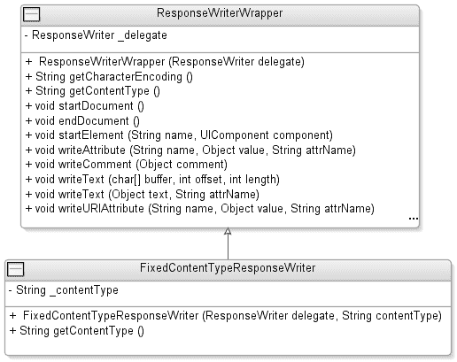

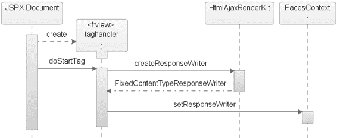

5807ch06.qxd 1/13/06 11:18 AM 第 248 页

**248**

第 6 章 ■ 为 DECK 组件启用 AJAX

**图 6-9.** *在 Ajax 回发期间创建* FixedContentTypeResponseWriter 图 6-10 展示了 FixedContentTypeResponseWriter 类的结构和依赖关系。ResponseWriterWrapper 类仅委托给标准的 ResponseWriter，而不进行装饰，如代码示例 6-12 所示。

**图 6-10.** *FixedContentTypeResponseWriter* 的类图 **代码示例 6-12.** *FixedContentTypeResponseWriter* 类 package com.apress.projsf.ch6.render;

import javax.faces.context.ResponseWriter;

/**

5807ch06.qxd 1/13/06 11:18 AM 第 249 页

第 6 章 ■ 为 DECK 组件启用 AJAX

**249**

* FixedContentTypeResponseWriter 用于在传递响应时覆盖内容类型。

*/

**public class FixedContentTypeResponseWriter extends ResponseWriterWrapper**

{

/**

* 创建一个新的 FixedContentTypeResponseWriter。

*

* @param delegate 被委托的 ResponseWriter

* @param contentType 要使用的固定内容类型

*/

public FixedContentTypeResponseWriter(

**ResponseWriter delegate,**

**String contentType)**

{

super(delegate);

_contentType = contentType;

}

/**

* 返回此 ResponseWriter 的固定内容类型。

*

* @return 固定内容类型

*/

**public String getContentType()**

{

return _contentType;

}

private final String _contentType;

}

FixedContentTypeResponseWriter 接受两个参数——将被包装的 ResponseWriter 和此请求的 contentType（例如 text/plain）。由于您无法直接在默认的 ResponseWriter 上设置 contentType，因此覆盖 super（被委托的 ResponseWriter）的 getContentType() 方法，确保您定义的内容类型将用于向客户端生成正确的输出。

**第 9 步：扩展 JSF 实现**

到目前为止，您一直专注于如何包装现有的 RenderKit，以及如何根据执行的回发类型为请求提供正确的 ResponseWriter。

这确保了 ResponseWriter 具有正确的内容类型。不幸的是，JSP 通常会忽略这一点，因此您需要控制设置在 HttpServletResponse 对象上的 contentType。

默认情况下，JSP 引擎会将 HttpServletResponse 对象上的 contentType 设置为应用程序开发人员在 JSP 页面指令中定义的任何值（例如

<jsp:directive.page contentType="text/html" />）或 JSP 引擎的默认值，即

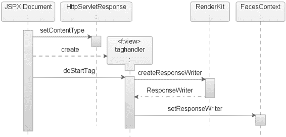

5807ch06.qxd 1/13/06 11:18 AM 第 250 页

**250**

第 6 章 ■ 为 DECK 组件启用 AJAX

对于经典 JSP 是 text/html，对于 JSP 文档是 text/xml。这对于大多数传统的 JSP 应用程序来说是可以接受的，因为它们的目标是支持 HTML 的 Web 客户端；然而，对于可能支持多种 contentType（例如 HTML 和 XML）的 JSF 应用程序来说，这过于严格了。

■**注意** 有关 HttpServletResponse 对象的更多信息，请参考 Servlet 规范 (http://java.sun.com/products/servlet/2.1/servlet-2.1.pdf)。

内容类型的情况

您面临的情况是：在 <f:view> 标签调用 createResponseWriter() 方法之前，您不知道需要哪种 contentType——text/html 还是 text/plain，但在 <f:view> 标签创建 ResponseWriter 之前，contentType 默认已经设置在 HttpServletResponse 对象上了。图 6-11 显示了 JSP 文档的默认处理过程。


**图 6-11.** *JSP 文档的默认处理流程* 在初始请求中，你需要了解 `ResponseWriter` 是否应控制通过 `HttpServletResponse` 对象发送给客户端的内容类型。你可以通过 JSP 页面指令提供自定义内容类型来实现这一点——`<jsp:directive.page contentType="application/x-javaserver-faces" />`。如果应用程序开发者在 JSP 页面指令中省略了特殊的 `contentType`，则实现将按照传统方式工作，由 JSP 引擎默认设置 `contentType`。

如果 JSP 页面指令设置为 `application/x-javaserver-faces`，则需要延迟在 `HttpServletResponse` 对象上设置 `contentType`，直到创建 `ResponseWriter` 之后。这确保了在 `HttpServletResponse` 上设置的 `contentType` 与 `ResponseWriter` 为此请求编写的标记相匹配。延迟设置

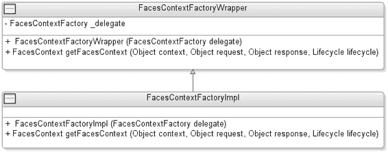

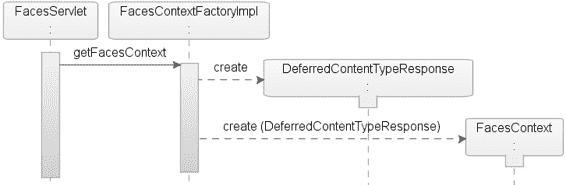

5807ch06.qxd 1/13/06 11:18 AM 第 251 页

第 6 章 ■ 使 DECK 组件支持 AJAX

**251**

`contentType` 的方法是用你自己的延迟 Servlet 响应包装 `HttpServletResponse`——`DeferredContentTypeResponse`。

扩展 FacesContextFactory

你需要将 Servlet 响应传递给 `FacesContext`，最便捷的方式是在为传入请求创建 `FacesContext` 之前，用你自己的响应对象包装 `HttpServletResponse` 对象。这避免了使用 Servlet 过滤器的需要，并且也适用于 Portlet。图 6-12 显示了请求的初始处理流程。

**图 6-12.** *请求的初始处理流程* 首先，你需要扩展 `FacesContextFactory`，使其能够创建自定义的 `ServletResponse` 并包装 `HttpServletResponse`，然后将自定义的 `ServletResponse` 传递给 `FacesContext`。这样，你将拥有对 `ServletResponse` 的控制权，并且可以在 JSP 引擎设置 `contentType` 时进行拦截，如果需要，可以延迟设置 `contentType`，直到你能够访问 `ResponseWriter` 所使用的 `contentType`。

查看初始处理流程的顺序，`FacesServlet` 将首先在你的 `FacesContextFactory` 实现——`FacesContextFactoryImpl` 上调用 `getFacesContext`。`FacesContextFactoryImpl` 将首先创建一个新的 Servlet 响应 `DeferredContentTypeResponse`；这将包装标准的 `HttpServletResponse`。然后你将 `DeferredContentTypeResponse` 传递给 `FacesContext`。图 6-13 详细展示了 `FacesContextFactory` 的实现。

**图 6-13.** *`FacesContext` 实现示意图*

5807ch06.qxd 1/13/06 11:18 AM 第 252 页

**252**

第 6 章 ■ 使 DECK 组件支持 AJAX

首先，你创建一个 `FacesContextFactoryWrapper` 包装类，它仅委托给标准的 `FacesContextFactory`，而不进行装饰，这将为你提供与应用程序开发者所使用的 JSF 实现之间的松散耦合。然后，你用 `FacesContextFactoryImpl` 类扩展你的包装类，以添加一些装饰。这个类拦截 `HttpServletResponse` 并创建一个新的 Servlet 响应 `DeferredContentTypeResponse`；如果需要，这将延迟设置 `contentType`，直到创建 `ResponseWriter`。

FacesContextFactoryImpl 类

另一方面，`FacesContextFactoryImpl` 类支持对 Servlet 响应对象的额外处理，如代码示例 6-13 所示。

**代码示例 6-13.** *`FacesContextFactoryImpl` 类* `package com.apress.projsf.ch6.context;`

`import javax.faces.FacesException;`

`import javax.faces.context.FacesContext;`

`import javax.faces.context.FacesContextFactory;`

`import javax.faces.lifecycle.Lifecycle;`

`import javax.servlet.http.HttpServletResponse;`

`import com.apress.projsf.ch6.external.servlet.DeferredContentTypeResponse;`

`/**`

`* FacesContextFactoryImpl 支持对响应的额外处理。`

`*/`

`public class FacesContextFactoryImpl extends FacesContextFactoryWrapper`

`{`

`/**`


* 创建一个新的 FacesContextFactoryImpl。

*

* @param delegate FacesContextFactory 委托对象

*/

public FacesContextFactoryImpl(

FacesContextFactory delegate)

{

super(delegate);

}

/**

* 返回新的 FacesContext 实例。

*

* @param context Servlet 或 Portlet 上下文

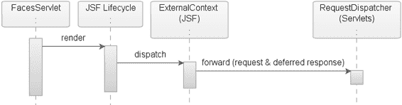

5807ch06.qxd 1/13/06 11:18 AM Page 253

第 6 章 ■ 使用 AJAX 增强 DECK 组件

**253**

* @param request Servlet 或 Portlet 请求

* @param response Servlet 或 Portlet 响应

* @param lifecycle Faces 生命周期

*

* @return 新的 FacesContext 实例

*

* @throws FacesException 如果发生错误

*/

public FacesContext getFacesContext(Object context,

Object request,

Object response,

Lifecycle lifecycle) throws FacesException

{

**if (response instanceof HttpServletResponse)**

**{**

**response = new DeferredContentTypeResponse((HttpServletResponse)response);**

**}**

return super.getFacesContext(context, request, response, lifecycle);

}

}

如果响应对象是 `HttpServletResponse` 类型的实例，你将创建一个新的 `DeferredContentTypeResponse` 实例，并将 `HttpServletResponse` 作为参数传递。如果响应不匹配 `HttpServletResponse`，则直接将其传递给父类，不做进一步处理。（请注意，你可以使用类似的技术支持 Portlet，但我们在示例中省略了这一点。）

重写 HttpServletResponse

`DeferredContentTypeResponse` 不仅负责包装 `HttpServletResponse` 对象，还负责检测 JSP 页面指令是否指示应由 `ResponseWriter`（*JSF 主导*）设置 `contentType`。如果请求是 JSF 主导的，你将在 `ResponseWriter` 创建之后，并且最重要的是，在首次将响应输出流通过网络写回浏览器时设置 `contentType`。图 6-14 展示了在渲染响应阶段对响应对象的处理过程。

**图 6-14.** *在渲染响应阶段对响应对象的处理*

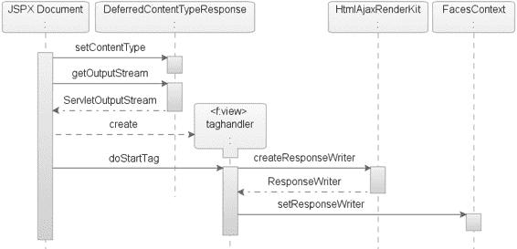

5807ch06.qxd 1/13/06 11:18 AM Page 254

**254**

第 6 章 ■ 使用 AJAX 增强 DECK 组件

在渲染响应阶段的初始处理中，你的 `DeferredContentTypeResponse` 被传递给 Servlet 的 `RequestDispatcher`。`RequestDispatcher` 将此请求的 JSF `viewId`（例如 `/projsf.jspx`）转发给 JSP 引擎进行处理，如图 6-15 所示。

**图 6-15.** *JSP 文档的处理*

由于你已经用延迟的 Servlet 响应包装了默认的 `HttpServletResponse`，现在你可以拦截 `contentType`，以确定是应该由 `ResponseWriter` 决定此请求的 `contentType`（JSF 主导），还是应该让 JSP 引擎立即设置 `contentType`（*JSP 主导*）。

当处理 JSP 文档时，它会首先尝试在 `ServletResponse` 上设置内容类型并获取输出流。如果这是一个 JSF 主导的响应，`DeferredContentTypeResponse` 对象将延迟设置 `contentType`，直到 `ResponseWriter` 创建之后。接下来，创建 `<f:view>` 标签处理器，该处理器会在 `HtmlAjaxRenderKit` 上调用 `createResponseWriter`，并将返回的 `ResponseWriter` 设置到 `FacesContext` 上。`contentType` 将在缓冲的 JSP 标签 `<f:view>` 首次通过网络将内容写出到浏览器时被设置。

图 6-16 展示了延迟内容类型的实现。如你所见，有两个类挂接在 `DeferredContentTypeResponse` 之下——`DeferredPrintWriter` 和 `DeferredServletOutputStream`。为了通过网络向浏览器写入任何内容，Java 规范和 Servlet API 定义了两个类——`ServletOutputStream` 和 `PrintWriter`。这两个类基本上提供相似的功能，并且都是必需的，因为 JSP 规范没有定义是使用 JSP 容器还是 Servlet 容器来将字符转换为字节并通过网络将数据发送到浏览器——字符流（`PrintWriter`）或字节流（`ServletOutputStream`）输出。

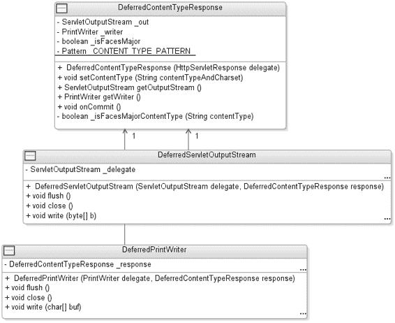

5807ch06.qxd 1/13/06 11:18 AM Page 255

第 6 章 ■ 使用 AJAX 增强 DECK 组件

**255**

**图 6-16.** *DeferredContentType 实现示意图*

在首次尝试写入浏览器时，你需要在 `ServletResponse` 上设置 `contentType`。为了实现这一点，你需要装饰默认的 `ServletOutputStream`（`DeferredServletOutputStream`）和 `PrintWriter`（`DeferredPrintWriter`），使其具备在首次写入时设置 `contentType` 的功能，并确保此操作只执行一次。

**DeferredContentTypeResponse 类**

`DeferredContentTypeResponse` 为 JSP 的 `HttpServletResponse` 装饰了支持设置 JSF 主导内容类型的功能。代码示例 6-14 展示了延迟的 `HttpServletResponse`。

**代码示例 6-14.** *DeferredContentTypeResponse*

package com.apress.projsf.ch6.external.servlet;

import java.io.IOException;

import java.io.PrintWriter;

import java.util.regex.Matcher;

import java.util.regex.Pattern;

import javax.faces.context.FacesContext;

import javax.faces.context.ResponseWriter;

5807ch06.qxd 1/13/06 11:18 AM Page 256

**256**

第 6 章 ■ 使用 AJAX 增强 DECK 组件

import javax.servlet.ServletOutputStream;

import javax.servlet.http.HttpServletResponse;

import javax.servlet.http.HttpServletResponseWrapper;

/**

* DeferredContentTypeResponse 管理 JSF 主导内容类型的设置。

*/

public class DeferredContentTypeResponse extends HttpServletResponseWrapper

{

/**

* 创建一个新的 DeferredContentTypeResponse。

*

* @param delegate HttpServletResponse 委托对象

*/

public DeferredContentTypeResponse(

HttpServletResponse delegate)

{

super(delegate);

}

/**

* 尝试将内容类型设置为延迟设置。

*

* @param contentTypeAndCharset 此响应的内容类型和字符集

*/

**public void setContentType(**

String contentTypeAndCharset)

{

**Matcher matcher = _CONTENT_TYPE_PATTERN.matcher(contentTypeAndCharset);** if (matcher.matches())

{

**String contentType = matcher.group(1);**

**String charset = (matcher.groupCount() > 1) ? matcher.group(2) : null;**

// 记住 _isFacesMajor 供稍后在 onCommit 中使用，

// 此时 Faces ResponseWriter 已创建

**_isFacesMajor = isFacesMajorContentType(contentType);** **if (_isFacesMajor)**

{

// 虽然我们会在 onCommit 时设置内容类型，

// 但你现在需要设置字符集

// <f:view> 在创建 ResponseWriter 时需要字符集 **super.setCharacterEncoding(charset);**

}

5807ch06.qxd 1/13/06 11:18 AM Page 257

第 6 章 ■ 使用 AJAX 增强 DECK 组件

**257**

**else**

{

// 内容类型不会在 onCommit 时设置，

// 所以现在同时设置内容类型和字符集

**super.setContentType(contentTypeAndCharset);**

}

}

}

/**

* 如果指定的内容类型匹配 "application/x-javaserver-faces"，则返回 true。

*

* @param contentType 响应内容类型

*

* @return 如果内容类型是 "application/x-javaserver-faces"，则返回 true

*/

private boolean isFacesMajorContentType(

String contentType)

{

**return ("application/x-javaserver-faces".equals(contentType));**

}

当 JSP 引擎在你的 JSP `HttpServletResponseWrapper` 上调用 `setContentType()` 方法时，它会传递一个字符串，该字符串同时表示由应用程序开发者在 JSP 页面指令中定义的内容类型和字符编码。`setContentType()` 方法将检查该字符串是否匹配 Servlet 规范定义的模式。如果匹配，你将字符串分成两组——一组用于内容类型（`contentType`），一组用于字符编码（`charset`）。


你可以使用提取出的 contentType 来测试这是否是一个 JSF 主请求。`isFacesMajorContentType()` 方法会根据 JSP 页面指令中定义的 contentType（例如 `application/x-javaserver-faces`）返回 true 或 false。如果是 JSF 主请求，你仍然需要在 `ServletResponse` 上设置字符集——charset，因为 `<f:view>` 在创建 `ResponseWriter` 时需要字符集。代码示例 6-15 展示了 `DeferredContentTypeResponse` 类。

**代码示例 6-15.** DeferredContentTypeResponse *类* **public ServletOutputStream getOutputStream() throws IOException**

{

if (_out == null)

{

**_out = new DeferredServletOutputStream(super.getOutputStream(), this);**

}

return _out;

}

5807ch06.qxd 1/13/06 11:18 AM 第 258 页

**258**

第 6 章 ■ 使用 AJAX 增强 DECK 组件

**public PrintWriter getWriter() throws IOException**

{

if (_writer == null)

{

**_writer = new DeferredPrintWriter(super.getWriter(), this);**

}

return _writer;

}

**public void onCommit() throws IOException**

{

**if (_isFacesMajor)**

{

FacesContext context = FacesContext.getCurrentInstance(); ResponseWriter out = context.getResponseWriter();

**String contentType = out.getContentType();**

// 通过 super.setContentType 设置真实的内容类型

**super.setContentType(contentType);**

}

}

private ServletOutputStream _out;

private PrintWriter _writer;

private boolean _isFacesMajor;

**static private final Pattern _CONTENT_TYPE_PATTERN =**

**Pattern.compile("([^;]+)(?:;charset=(.*))?");**

}

在你的 `DeferredContentTypeResponse` 类中，有两个方法——`getWriter()` 和 `getOutputStream()`——根据 J2EE 容器的实现，它们将被用来将代表标记的字节写入网络。我们将在“DeferredServletOutputStream 类”和“DeferredPrintWriter 类”部分介绍这些延迟写入器。

`onCommit()` 方法将在数据首次通过 `ServletOutputStream` 或 `PrintWriter` 写入浏览器时被调用。如果请求是 JSF 主请求，`onCommit()` 方法将从 `ResponseWriter` 获取 contentType，并将其设置在 `HttpServletResponse` 对象上。

**DeferredServletOutputStream 类**

最终，缓冲的 JSP 标签将被填满，标记将被写入客户端。如果这是一个 JSF 主请求，contentType 尚未设置，因此你需要确保在首次调用 `ServletOutputStream` 对象上的 `write()` 方法时，在 `HttpServletResponse` 上设置内容类型。图 6-17 显示了请求的初始处理过程。

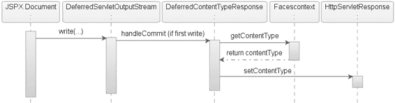

5807ch06.qxd 1/13/06 11:18 AM 第 259 页

第 6 章 ■ 使用 AJAX 增强 DECK 组件

**259**

**图 6-17.** *请求的初始处理*

如果这是一个 JSF 主请求，contentType 已被延迟，尚未在 `ServletResponse` 上设置。确保在数据写入浏览器之前在响应对象上设置 contentType 非常重要，因为它需要 contentType 来解析通过输出流发送的内容。你可以通过覆盖默认的 `ServletOutputStream` 并提供一种方法来调用前述的 `DeferredContentTypeResponse` 上的 `onCommit()` 方法，并设置一个标志来指示 contentType 是否已在 `ServletResponse` 上设置，从而实现这一点。

`DeferredServletOutputStream` 通过一个方法——`handleCommit()`——装饰了 `ServletOutputStream`，该方法设置一个标志来指示 contentType 已设置，并调用 `DeferredContentTypeResponse` 上的 `onCommit()` 方法（参见代码示例 6-16）。这确保了由 `ResponseWriter` 写入客户端的内容类型现在与响应对象上设置的 contentType 相匹配。

**代码示例 6-16.** *DeferredServletOutputStream* *类* package com.apress.projsf.ch6.external.servlet;

import java.io.IOException;

import javax.servlet.ServletOutputStream;

/**

* DeferredServletOutputStream 在第一个字节写入时提供回调


* 被写入输出流。

*/

public class DeferredServletOutputStream extends ServletOutputStream

{

/**

* 创建一个新的 DeferredServletOutputStream。

*

* @param delegate ServletOutputStream 委托对象

* @param response 回调目标

*/

5807ch06.qxd 1/13/06 11:18 AM Page 260

**260**

第 6 章 ■ 使 DECK 组件支持 AJAX

public DeferredServletOutputStream(

ServletOutputStream delegate,

DeferredContentTypeResponse response)

{

_delegate = delegate;

_response = response;

}

...

public void write(

byte[] b,

int off,

int len) throws IOException

{

**if (!_committed)**

**_handleCommit();**

_delegate.write(b, off, len);

}

...

/**

* _handleCommit() 方法仅被调用一次，即当

* 对此 ServletOutputStream 首次调用 write()、print()、println()、flush() 或 close() 方法时。

*/

**private void _handleCommit() throws IOException**

**{**

**_committed = true;**

**_response.onCommit();**

**}**

private final ServletOutputStream _delegate; private final DeferredContentTypeResponse _response;

private boolean _committed;

}

扩展的 ServletOutputStream 类是一个由 Servlet 容器实现的抽象类，它提供了一个用于向客户端发送二进制数据的输出流。请注意，handleCommit() 方法仅被调用一次，即当对此 ServletOutputStream 首次调用 write() 方法时。

5807ch06.qxd 1/13/06 11:18 AM Page 261

第 6 章 ■ 使 DECK 组件支持 AJAX

**261**

**DeferredPrintWriter 类**

DeferredPrintWriter 执行与 DeferredServletOutputStream 相同的职责——向客户端写入标记，只不过此类提供了一个用于发送字符数据的写入器（参见代码示例 6-17）。底层的 Servlet 实现负责将基于字符的流转换为字节。

**代码示例 6-17.** *DeferredPrintWriter* 类 package com.apress.projsf.ch6.external.servlet;

import java.io.IOException;

import java.io.PrintWriter;

/**

* DeferredPrintWriter 在首次向写入器写入字符时提供回调。

*/

public class DeferredPrintWriter extends PrintWriter

{

/**

* 创建一个新的 DeferredPrintWriter。

*

* @param delegate PrintWriter 委托对象

* @param response 回调目标

*/

public DeferredPrintWriter(

PrintWriter delegate,

DeferredContentTypeResponse response)

{

super(delegate);

_response = response;

}

...

public void write(

char[] buf,

int off,

int len)

{

**if (!_committed)**

**_handleCommit();**

super.write(buf, off, len);

}

private void handleCommit()

5807ch06.qxd 1/13/06 11:18 AM Page 262

**262**

第 6 章 ■ 使 DECK 组件支持 AJAX

{

try

{

**_committed = true;**

**_response.onCommit();**

}

**catch (IOException e)**

{

setError();

}

}

private boolean _committed;

private final DeferredContentTypeResponse _response;

}

如您所见，此类与 ServletOutputStream 几乎相同，只有两点区别——方法调用的签名使用 char 而非 byte，并且此类中的方法从不抛出 I/O 异常。由于方法不能抛出 I/O 异常，您必须采用与 DeferredServletOutputStream 类中略有不同的方式来实现 handleCommit() 方法。这确保了您能处理可能抛出的任何 IOException。除此之外，handleCommit() 方法仅被调用一次，即当对此 PrintWriter 首次调用 write() 方法时。

**第 10 步：注册 RenderKit 和 JSF 扩展** 如第 1 章所述，Application 实例会在应用程序启动时存储 JSF 配置文件 faces-config.xml 中定义的资源。对于您的 JSF Ajax 实现，您需要确保不仅注册了自定义的 Renderer 及其 RenderKit，还要注册您的 JSF 扩展（例如，自定义的 FacesContextFactory 和 RenderKitFactory），如代码示例 6-18 所示。

**代码示例 6-18.** *注册支持 Ajax 的* Renderer *和* RenderKit

<?xml version="1.0" encoding="UTF-8" ?>

<!DOCTYPE faces-config


PUBLIC "-//Sun Microsystems, Inc.//DTD JavaServer Faces Config 1.1//EN"

"http://java.sun.com/dtd/web-facesconfig_1_1.dtd">

<faces-config >

<factory>

**<faces-context-factory>**

**com.apress.projsf.ch6.context.FacesContextFactoryImpl**

**</faces-context-factory>**

**<render-kit-factory>**

**com.apress.projsf.ch6.render.ExtendedRenderKitFactory**

**</render-kit-factory>**

</factory>

5807ch06.qxd 1/13/06 11:18 AM 第 263 页

第 6 章 ■ 为 DECK 组件启用 AJAX

**263**

...

<render-kit>

**<render-kit-id>com.apress.projsf.html.ajax[HTML_BASIC]</render-kit-id>**

<render-kit-class>

**com.apress.projsf.ch6.render.html.ajax.HtmlAjaxRenderKit**

</render-kit-class>

<renderer>

<component-family>com.apress.projsf.ShowOne</component-family>

<renderer-type>com.apress.projsf.Deck</renderer-type>

<renderer-class>

com.apress.projsf.ch6.render.html.ajax.HtmlAjaxShowOneDeckRenderer

</renderer-class>

</renderer>

</render-kit>

</faces-config>

在 `faces-config.xml` 文件的顶部，你注册了 `FacesContextFactoryImpl` 类和 `ExtendedRenderKitFactory` 类，接着是你的新 RenderKit——`HtmlAjaxRenderKit`。

如你所见，你使用了新模式（请参阅“注册 RenderKit 以进行包装”一节）将你的新 RenderKit 包装在标准 HTML RenderKit 周围（例如，`com.apress.projsf.html.ajax[HTML_BASIC]`）。

**第 11 步：使用 Weblets 注册资源**

对于 `HtmlAjaxShowOneDeckRenderer`，你需要注册两个额外的 JavaScript 库——Dojo 工具包和 D2 库——作为 weblets；这将使你能够将这些库打包为你自定义 JSF 组件库的一部分。

■**注意** 有关 weblets 的更多信息，请参阅第 5 章，或访问 Weblets 项目网站：http://weblets.dev.java.net。

注册 Dojo 工具包

代码示例 6-19 展示了 Dojo 工具包的 weblet 配置，我们将 Dojo 工具包 JavaScript 重新打包到了 Java 包 `org.dojotoolkit.browserio` 中。

**代码示例 6-19.** *Dojo 工具包的 Weblet 配置*

<?xml version="1.0" encoding="UTF-8" ?>

<weblets-config >

<weblet>

**<weblet-name>org.dojotoolkit.browserio</weblet-name>**

**<weblet-class>net.java.dev.weblets.packaged.PackagedWeblet</weblet-class>**

5807ch06.qxd 1/13/06 11:18 AM 第 264 页

**264**

第 6 章 ■ 为 DECK 组件启用 AJAX

<weblet-version>0.1</weblet-version>

<init-param>

<param-name>package</param-name>

<param-value>org.dojotoolkit.browserio</param-value>

</init-param>

</weblet>

<weblet-mapping>

<weblet-name>org.dojotoolkit.browserio</weblet-name>

**<url-pattern>/dojo/*</url-pattern>**

</weblet-mapping>

</weblets-config>

注册 D2 库

代码示例 6-20 展示了 D2 库的 weblet 配置。将来，D2 库将自动包含此 weblet 配置。

**代码示例 6-20.** *D2 库的 Weblet 配置*

<?xml version="1.0" encoding="UTF-8" ?>

<weblets-config >

<weblet>

**<weblet-name>net.java.dev.d2</weblet-name>**

**<weblet-class>net.java.dev.weblets.packaged.PackagedWeblet</weblet-class>**

<init-param>

<param-name>package</param-name>

<param-value>net.java.dev.d2</param-value>

</init-param>

</weblet>

<weblet-mapping>

<weblet-name>net.java.dev.d2</weblet-name>

**<url-pattern>/d2/*</url-pattern>**

</weblet-mapping>

</weblets-config>

`PackagedWeblet` 是一个内置的 weblet 实现，它可以使用 `ClassLoader` 从特定的 Java 包中读取内容，并将结果流式传输到浏览器。`package` 初始化参数告诉 `PackagedWeblet` 在解析 weblet 管理的资源请求时，将哪个 Java 包用作根目录。

5807ch06.qxd 1/13/06 11:18 AM 第 265 页

第 6 章 ■ 为 DECK 组件启用 AJAX

**265**

**总结**

在本章中，我们讨论了如何以通用方式以及作为 JSF 的一部分使用 Ajax，并探讨了它带来的优缺点。我们还介绍了在 JSF 中实现 Ajax 支持的不同架构方法——PPR 和 D2R。此外，我们讨论了 Ajax 的潜在陷阱，例如文件上传支持，以及如何在 JSF 上下文中解决这些问题。

我们探索了如何使用两个开源项目——Dojo 工具包和 D2 项目——为你的 `ProShowOneDeck` 组件启用 Ajax，并证明了在定义良好且易于使用的 JSF 组件中提供更丰富的功能并不困难。通过使用像 Dojo 和 D2 这样丰富的工具包，资源文件的数量正在增加，而 weblet 功能提供了一种简单的方法，可以将你的额外资源打包到与组件相同的库中。

通过本章，你了解了如何使用可用资源为 JSF 组件启用 Ajax，并且现在对 JSP 和 JSF 之间的 `contentType` 问题有了更深入的理解。你还掌握了如何解决 `contentType` 问题并允许 JSF 控制 `contentType` 的知识，这将使你在需要时能够支持多种内容类型。

5807ch06.qxd 1/13/06 11:18 AM 第 266 页

5807ch07.qxd 1/19/06 7:24 PM 第 267 页

第 7 章

■ ■ ■

为日期字段组件启用 Ajax

*当你创新时，你必须准备好让每个人都告诉你你疯了。*

——拉里·埃里森，甲骨文公司创始人兼首席执行官

**第**6 章介绍了使用 Ajax 和 `XMLHttpRequest` 与 Web 服务器进行异步通信的概念，而 Web 服务器无需知道常规回发和 Ajax 回发之间的区别。其直接好处是它保持 JSF 生命周期不变，从而允许应用程序开发者将启用 Ajax 的组件与常规的 JSF 事件和监听器一起使用。

本章将解决使用 Ajax 获取数据的需求。使用 Ajax 获取数据最常见的用例是填充下拉列表和在文本字段中添加输入提示功能。与使用 Ajax 回发处理事件相比，获取数据不应影响页面上的其他组件。并且，如果获取数据不影响 DOM 树的其他部分，那么你就不需要仅仅为了获取数据而经历 JSF 的完整生命周期，对吧？

当今网络上有大量示例展示了获取数据如何提高 Web 应用程序的可用性。异步数据传输最突出的例子是 Google Suggest 的自动建议功能和 Google Gmail 的文件上传功能。

**日期组件 Ajax 实现的需求**

`ProInputDate` 组件的需求是提供一个可用于选择日期的可视化日历。为了支持这个可视化日历，你需要提供一个用于实际日历的弹出窗口，并异步获取代表可显示日期的数据。

该可视化日历将允许用户仅选择可用日期（例如，工作日）。所有其他日期（例如，节假日和周末）应显示但不可选择。当选择一个日期时，应使用正确的日期格式将其复制到输入字段。当值被提交回服务器时，仅当它是可用日期（例如，工作日）时，它才能成功通过验证。

**267**


5807ch07.qxd 1/19/06 7:24 PM 第 268 页

**268**

第 7 章 ■ 为日期字段组件启用 Ajax

**启用 Ajax 的日期组件**

在本章中，你将增强在第 2 章中创建的 `ProInputDate` 组件。基于新的需求，你需要在本章中实现三个目标。首先，你需要为 `ProInputDate` 组件提供一个可视化日历。其次，你需要创建一个验证器，应用程序开发者可以使用它来提供可用日期列表。


这些日期随后可以与 ProInputDate 文本字段中的用户输入进行验证。第三，如果验证器已附加到 ProInputDate 组件，你希望能够重用为验证器定义的同一个托管 Bean，以获取可视化日历中的可用日期列表。

为此，你将使用 Ajax、两个开源框架（Dojo 工具包和 Mabon）以及 JSON 数据交换格式。你之前已经使用过 Ajax 和 Dojo 工具包，但以下是新的内容：

*JSON*：JSON 是一种轻量级的数据交换格式。它基于 JavaScript 编程语言（标准 ECMA-262，第三版）的一个子集。JSON 是一种完全与语言无关的文本格式，但使用了 C 语言家族（包括 C、C++、C#、Java、JavaScript、Perl、Python 等）程序员所熟悉的约定。

*Mabon*：Mabon 是一个托管在 Java.net 网站（http://mabon.dev.java.net）上的开源项目，代表托管 Bean 对象符号。Mabon 允许支持 Ajax 的组件作者通过使用 JSON 语法通信通道，在标准 JSF 生命周期范围之外访问 JSF 托管 Bean。

在本章中，你将了解如何利用 Ajax、Mabon、JSON 和 Dojo 工具包来提供一个可视化日历，并为 ProInputDate 组件异步获取数据。

阅读完本章后，你应该能够理解 Ajax 事件与数据获取之间的区别，以及在使用此技术创建富用户界面组件时可能遇到的问题。你还将了解一个名为 Mabon 的开源项目，以及如何使用它来构建你自己的富互联网组件。

图 7-1 显示了本章将要创建的三个类。

**图 7-1.** *本章创建的类图*

5807ch07.qxd 1/19/06 7:24 PM 第 269 页

第 7 章 ■ 为日期字段组件启用 Ajax

**269**

这些类如下：

• HtmlAjaxInputDateRenderer 是新的自定义渲染器，它扩展了第 2 章中的 HtmlInputDateRenderer，并添加了包含 Ajax 支持的资源。

• DateValidator 根据某些规则检查日期值是否可用。

• ValidateDateTag 类表示应用程序开发者将用于向 ProInputDate 组件注册 DateValidator 实例的自定义操作。

**使用蓝图设计 JSF 组件**

第 3 章中创建自定义 JSF 组件的蓝图包含七个步骤。这七个步骤涵盖了设计组件的大多数常见用例。但是，如表 7-1 所示，本章在上一章不断演进的蓝图中增加了一个步骤——创建转换器和验证器——总共十二个步骤。

**表 7-1.** *创建新 JSF 组件蓝图的步骤*

**#**

**步骤**

**描述**

创建 UI 原型

使用适当的标记创建组件的 UI 原型和预期行为。

创建事件和监听器

（可选）如果 JSF 规范未涵盖你的特定需求，则创建自定义事件和监听器。

创建行为超类

（可选）如果找不到组件行为，则创建一个新的行为超类（例如，UIShowOne）。

**4**

**创建转换器和验证器**

（可选）如果 JSF 规范未涵盖你的特定需求，则创建自定义转换器和验证器。

创建客户端特定渲染器

创建你需要的渲染器，该渲染器将为你的 JSF 组件写出客户端标记。

创建渲染器特定子类

（可选）创建渲染器特定子类。虽然这是一个可选步骤，但实现它是一个好习惯。

注册 UIComponent 和 Renderer

在 faces-config.xml 文件中注册你的新 UIComponent 和 Renderer。

创建 JSP 标签处理器和 TLD

如果你使用的是 JSP，则需要此步骤。


使用 JSP 作为默认视图处理器。

另一种解决方案是使用 Facelets

(http://facelets.dev.java.net/)。

创建 RenderKit 和 ResponseWriter

（可选）如果你计划支持

其他标记语言，例如 Mozilla XUL，

那么你需要创建一个新的 RenderKit

并关联一个 ResponseWriter。默认的

RenderKit 是 HTML_BASIC，其

contentType 设置为 text/html。

*续表*

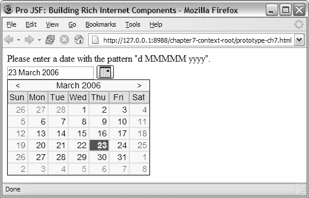

5807ch07.qxd 1/19/06 7:24 PM 第 270 页

**270**

第 7 章 ■ 使用 AJAX 使日期字段组件可用

**表 7-1.** *续表*

**#**

**步骤**

**描述**

扩展 JSF 实现

（可选）当你需要为 JSF 实现提供扩展时（例如，扩展 JSF 工厂类或提供自定义的 JSF 生命周期实现），需要执行此步骤。

注册 RenderKit 和 JSF 扩展

（可选）向 JSF 实现注册你的自定义 RenderKit 和/或扩展。

使用 weblets 注册资源

（可选）使用 weblets 注册你的资源，例如图片、JavaScript 库和 CSS 文件，以便它们可以直接从组件库 JAR 文件中打包和加载。

你在第 2 章中已经完成了大部分工作，因此你只需要用 DHTML/Ajax 功能扩展 ProInputDate 组件。由于你不需要任何新行为，你可以从步骤 1 开始，跳过蓝图中的步骤 2 和 3，然后继续执行步骤 4、5、7、8 和 12。

**步骤 1：创建 UI 原型**

回到蓝图！让我们创建原型，它将帮助你找出为日期组件创建 UI 所需的元素、渲染器特定属性以及其他资源（例如图片）。

图 7-2 显示了原型的结果，并展示了一个包含输入字段、带有日历图标的按钮以及一个表示弹出日历的表格的页面。

**图 7-2.** *用 DHTML/Ajax 实现的 ProInputDate*

5807ch07.qxd 1/19/06 7:24 PM 第 271 页

第 7 章 ■ 使用 AJAX 使日期字段组件可用

**271**

图 7-2 显示了原型实现的最终结果。如你所见，我们对 ProInputDate 组件（来自第 2 章）进行了一些工作，并添加了一个弹出日历，该日历会在点击按钮时出现。不可选择的日期标记为红色，当前月份范围之外的日期显示为灰色。

代码示例 7-1 显示了创建图 7-2 所示的 DHTML/Ajax 日期组件原型所需的标记。

**代码示例 7-1.** *日历的输入和按钮标记*

<html>

<head>

<meta http-equiv="Content-Type"

content="text/html; charset=windows-1252" ></meta>

<title>Pro JSF: 构建丰富的互联网组件</title>

**<style type="text/css" >@import url(projsf-ch7/inputDate.css);</style>**

</head>

<body>

<form name="form" method="post

enctype="application/x-www-form-urlencoded" > 请输入日期，格式为 "d MMMMM yyyy"。

<br>

<div title="日期字段组件" >

**<input type="text" name="dateField" value="2006 年 3 月 23 日" />**

**<button type="button" name="button" class="ProInputDateButton" >**


</button>

</div>

</form>

**<table id="calendar" cellspacing="0" cellpadding="0"**

class="ProInputDateCalendar"

style="position: absolute; visibility: visible; top: 53px; left: 8px;" >

<thead>

<tr class="toolbar" >

<td>&lt;</td>

<td colspan="5" >2006 年 3 月</td>

<td>&gt;</td>

</tr>

<tr class="headings" >

<td>周日</td>

<td>周一</td>

<td>周二</td>

<td>周三</td>

<td>周四</td>

<td>周五</td>

<td>周六</td>

</tr>

5807ch07.qxd 1/19/06 7:24 PM 第 272 页

**272**

第 7 章 ■ 使用 AJAX 使日期字段组件可用

</thead>

<tbody>

...

<tr>

<td class="noselect">19</td>

<td class="">20</td>

<td class="">21</td>

<td class="">22</td>

**<td class="selected">23</td>**

<td class="">24</td>

**<td class="noselect">25</td>**

</tr>

...

</tbody>

</table>

</body>

</html>


如你所见，这是一个简单的原型，包含一个用于输入日期的输入字段，以及一个用于启动日历弹出窗口的常规按钮。最后，一个表格展示了你的日历弹出窗口在全新的 Ajax 渲染器中实现后的外观。

在代码清单的顶部，你可以看到我们引用了 `inputDate.css` 文件。这个样式表包含用于显示日历中每个日期可用性的信息。

**@IMPORT 规则**

你可能已经注意到，我们在原型中使用了这条规则来导入样式表。与 `<link>` 元素类似，`@import` 规则将外部样式表链接到文档。不同之处在于，`<link>` 元素定义在页面的 head 部分，并通过其 `href` 属性指定要导入的样式表名称。在实践中，你可以在文档 body 中使用 `@import` 规则，这允许你将样式封装在样式表中，并在渲染页面的任何 `<style>` 元素中导入它们。

在创建你的输入日期组件之前，先看看最终结果以及它如何在 JSP 页面中使用。代码示例 7-2 展示了如何将输入日期组件与 Ajax 渲染器一起使用。

**代码示例 7-2.** *JSF 页面源码*

<?xml version = '1.0' encoding = 'windows-1252'?>

<jsp:root version="1.2"

5807ch07.qxd 1/19/06 7:24 PM Page 273

第 7 章 ■ 使用 AJAX 增强日期字段组件

**273**

>

<jsp:directive.page contentType="text/html"/>

<f:view>

...

<h:form id="form" >

<pro:inputDate id="dateField"

title="日期字段组件"

value="#{backingBean.date}" >

**<f:convertDateTime pattern="d MMMMM yyyy" />**

**<pro:validateDate availability="#{backingBean.getAvailability}" />**

</pro:inputDate>

<br/>

<h:message for="theDate" />

<br/>

**<h:commandButton value="提交" />**

</h:form>

...

</f:view>

</jsp:root>

如你所见，JSF 页面的源码中没有 Ajax “代码”，这意味着应用开发者无需额外负担即可在页面中启用 Ajax 元素。我们之前说过，现在再说一遍——让应用开发者的工作变得简单！

此页面与第 2 章创建的页面唯一的不同是增加了一个验证器——`<pro:validateDate .. />`。该验证器将在常规回传期间使用，以将输入字段中输入的日期与后台 bean 中的可用信息进行比较。这个后台 bean 还将用于设置弹出日历中可选或不可选的日期。还记得第 2 章中的 `<f:convertDateTime pattern="d MMMMM yyyy" >` 转换器吗？这个转换器确保用户输入的任何内容都遵循一种你可以将其转换为服务器端 Date 对象的格式。

使用 Ajax 获取数据

在第 6 章中，你已经熟悉了处理事件时常规回传与 Ajax 回传之间的区别。传统方式获取数据与使用 Ajax 获取数据有类似的区别，只是它不应有改变周围组件状态的副作用。

图 7-3 与第 6 章中的 Ajax 时序图（图 6-3）唯一的区别在于 HTTP 方法。W3C 建议，当用户请求没有副作用时（例如 Google Suggest），应使用 HTTP GET 方法获取数据。

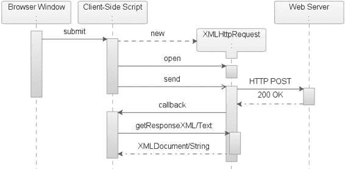

5807ch07.qxd 1/19/06 7:24 PM Page 274

**274**

第 7 章 ■ 使用 AJAX 增强日期字段组件

**图 7-3.** *使用 HTTP* GET *方法的* XMLHttpRequest *时序图* 不同的 JSF Ajax 方法

如果没有副作用，那么 JSF 组件层次结构就不会发生变化；因此，无需经历 JSF 生命周期。但是，如果你想重用验证器引用的托管 bean，访问它的唯一途径是通过 JSF 的 MethodBinding 机制。有三种解决方案可以满足你的需求——向渲染器添加功能、使用 PhaseListener，以及提供一个新的 JSF 生命周期。

**渲染器方法**


这种方法为渲染器增加了检测 Ajax 请求的功能。JSF 默认生命周期首先在恢复视图阶段恢复组件层次结构，而渲染器在应用请求值阶段接管控制。Ajax 请求处理完毕后，渲染器会在 `FacesContext` 上调用 `responseComplete()` 方法，以终止生命周期中剩余阶段的处理。表面上看，这似乎是首选方法，但它存在一些严重缺陷。

需要组件层次结构，这会给每个请求带来额外开销，尤其是在使用客户端状态保存时。调用 `responseComplete()` 方法仅在该阶段处理完成后才会生效。应用请求值阶段会调用视图中所有渲染器的 `decode()` 方法，这可能导致你无法控制的意外副作用，例如应用程序开发者将 `commandButton` 设置为 `immediate="true"`。这会导致在应用请求值阶段完成之前就调用应用程序逻辑。

此外，这种方法通常需要 HTTP POST 将状态字符串发送回服务器。

5807ch07.qxd 1/19/06 7:24 PM 第 275 页

第 7 章 ■ 为日期字段组件启用 Ajax

**275**

**PhaseListener 方法**

这种方法添加了一个 PhaseListener（`PhaseId.RESTORE_VIEW`），它会短路生命周期，并在 PhaseListener 自身内部完成所有处理。处理完成后，它会在 `FacesContext` 上调用 `responseComplete()` 方法。

要使这种方法生效，它必须在初始请求中渲染一个引用，该引用包含验证器所使用的受管 Bean 的信息。PhaseListener 在回传期间使用此信息创建一个 `MethodBinding`，然后可以调用验证器背后的逻辑并将数据返回给客户端。由于没有创建组件层次结构，因此也没有渲染器，所以不存在将 `immediate` 设置为 `true` 的命令组件导致任何副作用的风险。

但是，这种方法有一个问题：无法阻止应用程序开发者在同一阶段附加额外的 PhaseListener，这可能会导致意外的副作用。

此外，你无法知道这些 PhaseListener 的执行顺序。

**Lifecycle 方法**

这种方法添加了一个新的 Lifecycle，它映射到 Ajax 请求，仅包含处理请求所需的生命周期阶段，调用由 `MethodBinding` 定义的应用程序逻辑，并渲染响应。这消除了创建和恢复组件树的额外开销，因此也不需要渲染器。你也不会遇到 `immediate="true"` 带来的任何问题。

使用自定义 Lifecycle 的另一个积极副作用是，应用程序开发者添加的任何 PhaseListener 都不会影响此解决方案；应用程序开发者甚至可以向这个自定义 Lifecycle 添加 PhaseListener。但是，如果使用自定义 PhaseListener 将额外的受管 Bean 放入请求中，你可能会遇到问题，除非这些 PhaseListener 也注册到了自定义 Lifecycle 上。

选择 JSF Ajax 方法

在本书中，我们决定采用 Lifecycle 方法，因为它没有应用程序逻辑副作用且开销较低。正是基于此，Mabon 开源项目可以帮助你专注于 Ajax 日历组件的设计。

**相对变量的问题**

定义 `MethodBinding` 的一种有效方法是在 `MethodBinding` 表达式中使用相对变量。这会对 PhaseListener 方法和 Lifecycle 方法都产生不利影响。要使数据获取与这两种方法配合使用，你需要在 `MethodBinding` 表达式中使用绝对变量（例如，`#{ backingBean.getValidDates}`）。

使用相对变量的 `MethodBinding` 表达式的一个例子是 `UIData` 组件（例如 `<h:dataTable ...>`），它正在输出关于员工的信息。


每个标记行代表一个 Employee 对象。对于每个 Employee 对象，可以使用可用日期列表来验证所选日期。每个标记组件都有一个 EL 表达式，该表达式以父级 `<h:dataTable ...>` 定义的相对变量开头（例如 `var="row"`），如代码示例 7-3 所示。

5807ch07.qxd 1/19/06 7:24 PM 第 276 页

**276**

第 7 章 ■ 使用 AJAX 增强日期字段组件

**代码示例 7-3.** *数据绑定表组件*

<h:dataTable var="row" value="#{managedBean.employeeList}">

<h:column>

<pro:inputDate id="dateField"

title="日期字段组件"

value="#{row.date}" >

<pro:validateDate availability="#{row.getValidDates}" />

</pro:inputDate>

</h:column>

`var` 属性定义了一个相对变量 `row`，每个标记组件都使用该变量来检索每行的唯一数据。只要在回传期间能够访问组件层次结构，这种方法就能正常工作。在客户端，每行的表达式看起来都一样，因此任何依赖此表达式来调用底层托管 Bean 方法的客户端 Ajax 实现都无法正常工作。任何附加的托管 Bean 在常规回传期间都能正常工作，但使用 PhaseListener 或 Lifecycle 方法的 Ajax 请求将无法定位到正确的数据行。因此，当使用相对变量设置时，依赖托管 Bean 提供数据（例如，获取特定员工的可用日期）的 Ajax 组件将无法正常工作。

**相对变量的可能解决方案**

你可以尝试通过实现对 UIData 组件的支持来解决此问题，但无法保证父组件是 UIData 类型，因为组件作者完全可以在不继承 UIData 组件的情况下提供用于标记对象的组件。此类组件的示例包括 Oracle 的 ADF Faces 表格和 treeTable 组件。

最好的解决方案是让 JSF 规范支持将相对表达式转换为绝对表达式。这样，组件编写者就可以在初始渲染期间将相对变量转换为绝对变量。渲染后的表达式可以采用以下形式：

#{managedBean.employeeList[1].getValidDates}，表示这是标记集合中的第一行。

**第 4 步：创建转换器和验证器**

如第 1 章所述，JSF 实现为任何类型的 UIComponent 提供了辅助类。这些辅助类分为转换器、验证器以及事件和监听器模型，每个类都有其专长领域。在本节中，你将构建自己的验证器，对强类型的 Date 对象执行验证，以确保所选日期确实可用（例如，不是周末或节假日）。

代码示例 7-4 使用了你将设计的验证器。其目的是验证输入的值，并将其与标记为“不可用”的日期列表进行比较。提供给应用程序开发人员支持 Bean 的约定是返回一个布尔数组——`#{managedBean.getValidDates}`。该数组指示某个日期是否可用（true）或不可用（false）。支持 Bean 提供的这个数组也用于浏览器，以显示哪些日期可供选择。

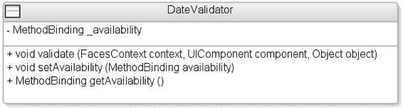

5807ch07.qxd 1/19/06 7:24 PM 第 277 页

第 7 章 ■ 使用 AJAX 增强日期字段组件

**277**

**代码示例 7-4.** *带有附加日期验证器的 ProInputDate 组件*

<pro:inputDate id="dateField"

title="日期字段组件"

value="#{managedBean.date}" >

**<pro:validateDate availability="#{managedBean.getValidDates}" />**

</pro:inputDate>

图 7-4 显示了 DateValidator 类。

**图 7-4.** *显示 DateValidator 的类图* DateValidator 类

DateValidator 类（见代码示例 7-5）根据应用程序开发人员定义的支持 Bean 中的某些规则，检查 Date 值是否可用。


**代码示例 7-5.** *validate()* 方法  
package com.apress.projsf.ch7.validate;

import java.util.Date;

import javax.faces.application.FacesMessage;

import javax.faces.component.UIComponent;

import javax.faces.context.FacesContext;

import javax.faces.el.MethodBinding;

import javax.faces.validator.Validator;

import javax.faces.validator.ValidatorException;

/**

* DateValidator 根据托管 Bean 的方法绑定，检查 Date 值是否可用。

*/

public class DateValidator implements Validator

{

/**

* 验证对象值，确保其为 Date 类型且可用。

*

* @param context Faces 上下文

5807ch07.qxd 1/19/06 7:24 PM Page 278

**278**

第 7 章 ■ 为日期字段组件启用 AJAX

* @param component Faces 组件

* @param object 待验证的对象

*/

**public void validate(**

FacesContext context,

UIComponent component,

Object object)

{

if (_availability != null)

{

Date date = (Date)object;

long millis = date.getTime();

long millisPerDay = 1000 * 60 * 60 * 24;

Integer days = new Integer((int)(millis / millisPerDay)); **Object[] args = new Object[] {days, days};**

**boolean[] result = (boolean[])_availability.invoke(context, args);** if (!result[0])

{

FacesMessage message = new FacesMessage("日期不可用"); throw new ValidatorException(message);

}

}

}

在输入的字符串成功转换为 Date 后，会调用 validate() 方法。传递 new Object[]{days, days} 的目的是为了后续能够复用该对象。Validator 只有一个值，因此范围覆盖单一天（从 days 到 days，包含两端）。随后，它会调用后台 Bean，并传入所需的参数 context 和 args。后台 Bean 返回一个 boolean[] 数组，指示自 1970 年 1 月 1 日起范围内每一天（包含两端）的可用性。

代码示例 7-6 展示了可用日期方法绑定的访问器，其签名为 (int, int)。

**代码示例 7-6.** *setAvailability()* 和 *getAvailability()* 方法  
public void setAvailability(

MethodBinding availability)

{

_availability = availability;

}

public MethodBinding getAvailability()

{

return _availability;

}

private MethodBinding _availability;

}

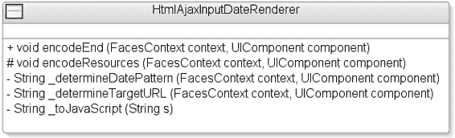

5807ch07.qxd 1/19/06 7:24 PM Page 279

第 7 章 ■ 为日期字段组件启用 AJAX

**279**

尽管你在设计此 Validator 时已考虑到启用 Ajax 的组件，但它同样完全适用于基本的 HTML RenderKit。

**步骤 5：创建客户端专用渲染器**

现在你已经知道如何创建新的、启用 Ajax 的 ProInputDate 组件。由于该组件已有 HtmlInputDateRenderer，因此扩展它以添加丰富功能是合理的。扩展组件客户端功能的好处之一是，你只需重写 Renderer 的 encodeBegin() 方法，其余部分保持不变。

在上一章中，你*仅*为 HtmlShowOneDeckRenderer 添加了 Ajax 功能，因为标记已经存在。而在本例中，你需要提供一些额外的标记来支持弹出式日历。

你还需要确定 DateTimeConverter 使用的日期格式模式，以及验证器托管 Bean 的目标 URL（如果有）。组件模型的一个积极副作用是，组件作者可以扩展组件的初始功能。对于应用程序开发者而言，使用“简单”的 HtmlInputDateRenderer 与使用启用 Ajax 的 HtmlAjaxInputDateRenderer 并无区别。

图 7-5 展示了包含 HtmlAjaxInputDateRenderer 的类图。

**图 7-5.** *展示 HtmlAjaxInputDateRenderer 的类图*  
在开始处理有趣的部分（即开发新的 Ajax 渲染器）之前，你需要了解 Mabon 是什么，以及它能为对 Ajax 数据获取感兴趣的组件编写者提供什么。

什么是 Mabon？


Mabon 是一个托管于 http://mabon.dev.java.net 网站的开源项目。Mabon 提供了一种便捷的方式来接入一个专门设计的生命周期，该生命周期非常适合那些需要直接从后台 Bean 获取数据、且无需完整 JSF 生命周期开销的 Ajax 组件。它还提供了一个 Mabon 协议——`mabon:/`——用于引用后台 Bean，以及一个 JavaScript 便捷函数，用于发送目标 URL 和所需的任何参数，然后从受管 Bean 异步接收数据。

5807ch07.qxd 1/19/06 7:24 PM 第 280 页

**280**

第 7 章 ■ 使日期字段组件支持 AJAX

Mabon 与 JSON

如您所知，`XMLHttpRequest` 提供了两种响应类型——`responseText` 和 `responseXML`——可用于获取数据。需要问的问题是，何时应该使用哪一种？这个问题的答案可能因人而异，但我们推荐一条规则：问问自己是否控制响应的语法。

`responseXML` 类型返回一个完整的 DOM 对象（这为您提供了多种遍历 DOM 树的方式），允许您找到所需的信息，并对当前文档应用更改。当您的组件会影响周围元素，并且您不控制响应时（例如，当您与 Web 服务通信时），这非常有用。

对于日期组件，您确实控制响应，并且您只关注为您的组件获取数据，而不是修改整个页面的 DOM 结构。

`responseText` 类型返回纯文本，这允许您利用 JSON 语法来处理响应。对于利用 Ajax 的组件来说，JSON 是一种极其有用的数据交换格式，因为它可以通过 `eval()` 函数轻松解析。

`eval()` 函数接受一个参数（一个 JavaScript 代码字符串），并一次性解析和执行该字符串，而不是尝试分别处理每个部分。这比任何其他类型的解析（例如 XML DOM 解析）都要快得多。

这就是 Mabon 实现 JSON 的原因——您控制响应，并且 JSON 语法易于解析且解析速度快。

■**注意** 组件编写者向应用程序开发者明确说明，连接到组件的任何受管 Bean 都需要返回 JSON 支持的数据类型，这一点也很重要。

**JSON 中的有效数据类型**

JSON (http://www.json.org) 具有简单的数据结构——对象和数组。对象是名称/值对的集合，数组是值的有序列表。在 JSON 中，它们采用以下形式：

*   对象是一个无序的名称/值对集合。对象以左花括号 (`{`) 开头，以右花括号 (`}`) 结尾。每个名称后面跟一个冒号 (`:`)，名称/值对之间用逗号 (`,`) 分隔。
*   数组是一个有序的值集合。数组以左方括号 (`[`) 开头，以右方括号 (`]`) 结尾。逗号 (`,`) 分隔值。
*   值可以是双引号括起来的字符串、数字、`true`、`false`、`null`、对象或数组。

这些结构可以嵌套。

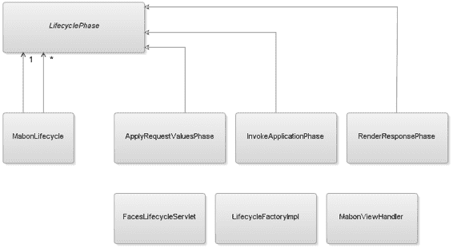

5807ch07.qxd 1/19/06 7:24 PM 第 281 页

第 7 章 ■ 使日期字段组件支持 AJAX

**281**

Mabon 的结构

Mabon 包含一个用于处理 Ajax 数据获取请求的自定义 JSF 生命周期，以及一个用于写出数据获取 URL 的自定义 JSF ViewHandler（见图 7-6）。

**图 7-6.** *Mabon 的类图*

**MabonLifecycle 类**

MabonLifecycle 包含三个阶段——ApplyRequestValuesPhase、InvokeApplicationPhase 和 RenderResponsePhase。MabonLifecycle 负责执行这三个阶段。此外，它还负责处理任何附加到 MabonLifecycle 上的 PhaseListener。

**LifecyclePhase 类**

Mabon LifecyclePhase 是所有生命周期阶段的基类。

**ApplyRequestValuesPhase、InvokeApplicationPhase 和 RenderResponsePhase 类**

由于您只是获取数据，而不以任何方式修改组件层次结构或底层模型，因此您不需要包含 Restore View、Process Validations 和 Update Model 阶段。Mabon 的阶段执行与默认生命周期等效阶段类似的操作，例如解码传入请求、调用应用程序逻辑和渲染响应。稍后我们将更详细地介绍这三个阶段。

**FacesLifecycleServlet 类**

这是一个可重用的 Servlet，它将在其第一个请求中初始化 `FacesContextFactory` 并查找 `MabonLifecycle`。它将创建 `FacesContext`，然后调用属于 `MabonLifecycle` 的三个生命周期阶段。Web 应用程序定义的 Servlet 映射将把 Mabon 请求定向到此 `FacesLifecycleServlet`。

5807ch07.qxd 1/19/06 7:24 PM 第 282 页

**282**

第 7 章 ■ 使日期字段组件支持 AJAX

**JSF 1.2 规范**

在 JSF 1.2 规范发布后，将不再需要 Mabon FacesLifecycleServlet。使用 Mabon 项目为支持 Ajax 的组件提供数据的组件开发者，可以将 Mabon 的 Servlet 条目更改为使用 JSF 1.2 的 `javax.faces.webapp.FacesServlet` 类，而不是 `net.java.dev.mabon.webapp.FacesLifecycleServlet` 类。Mabon 提供的 `FacesLifecycleServlet` 使用与 JSF 1.2 `FacesServlet` 相同的语法来自定义 Lifecycle，从而简化了应用程序开发者向 JSF 1.2 的升级路径。

**LifecycleFactoryImpl 类**

此类的唯一目的是添加第二个生命周期——MabonLifecycle。

**MabonViewHandler 类**

在初始渲染期间，自定义 Renderer 需要提供一个指向后台 Bean 的路径，该路径可以被 `FacesLifecycleServlet` 拦截，并在 `InvokeApplicationPhase` 期间用于调用引用的后台 Bean。通过使用 Mabon 协议，组件作者可以从 `MabonViewHandler` 获取一个可以渲染到客户端的唯一路径。如果组件编写者将代码示例 7-7 中所示的字符串与 `ViewHandler.getResourceURL()` 方法的 `path` 参数一起传递，`MabonViewHandler` 将返回代码示例 7-8 中所示的字符串，该字符串可以写入客户端。

**代码示例 7-7.** *Mabon 协议*

`mabon:/managedBean.getValidDates`

**代码示例 7-8.** *Mabon 评估 Mabon 协议后返回的字符串*

`/<context-root>/<mabon-servlet-mapping>/managedBean.getValidDates`

在 Ajax 请求期间，此 URL 随请求一起发送，并被 `FacesLifecycleServlet` 拦截。

Mabon：初始请求

Mabon 实现是专门为 Ajax 请求设计的，并使用 JSON 语法实现了一个通信通道。此解决方案允许使用受管 Bean 的 Ajax 组件获取数据并与服务器通信，而无需经历完整的 JSF 生命周期。那么它是如何工作的呢？在应用程序启动时（见图 7-7），Mabon 会将 `MabonLifecycle` 添加为 JSF `LifecycleFactory` 上下文的一部分。

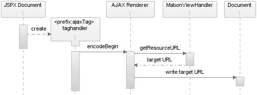

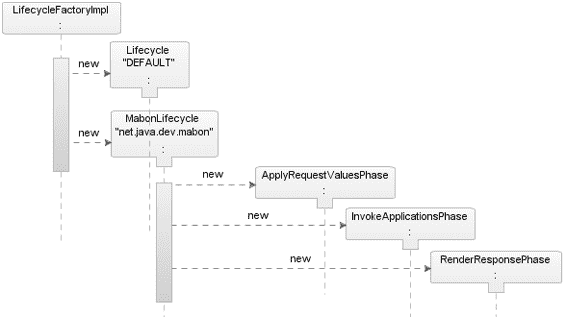

5807ch07.qxd 1/19/06 7:24 PM 第 283 页

第 7 章 ■ 使日期字段组件支持 AJAX

**283**

**图 7-7.** *Mabon 在应用程序启动时的序列图*

在初始请求时（如图 7-8 所示），Mabon 仅委托给底层的 JSF 实现，并且仅在需要时在 Render Response 阶段处于活动状态。


**图 7-8.** *Mabon 初始请求的时序图* 在图 7-8 的时序图中，执行了一个包含自定义 Ajax 组件的页面。为了正常工作，该 Ajax 组件需要从底层支持 bean 中获取数据。在 `encodeBegin()` 阶段，该组件的 Ajax 渲染器将使用 Mabon 协议——`mabon:/`——来写出一个指向支持 bean 的目标 URL。为了获取此 URL，渲染器将调用 `MabonViewHandler` 上的 `getResourceURL()` 方法。它会传入一个与支持 bean 的方法绑定表达式相匹配的字符串（例如，`mabon:/managedBean.getValidDates`）。`getResourceURL()` 方法将返回一个完整路径——`/<context-root>/<mabon-servlet-mapping>/managedBean.getValidDates`——该路径可以被写出到文档中。

Mabon：数据获取请求

页面被渲染到客户端后，其中包含一个指向支持 bean 的目标 URL，Ajax 组件需要该 URL 来获取数据（例如，`/<context-root>/<mabon ➥

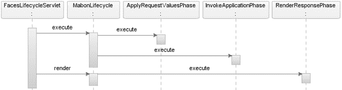

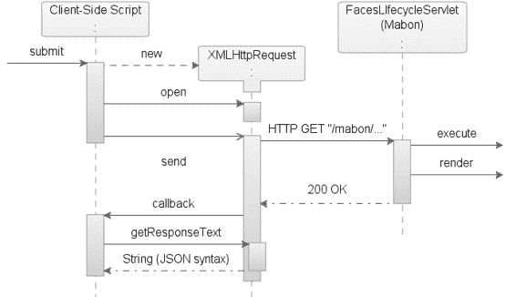

5807ch07.qxd 1/19/06 7:24 PM 第 284 页

**284**

第 7 章 ■ 使日期字段组件支持 AJAX

mapping>/managedBean.getValidDates`）。在后续的 Ajax 请求中，此字符串将被 Mabon 实现拦截，并用于调用支持 bean，然后将结果返回给客户端（见图 7-9）。

**图 7-9.** *Mabon/Ajax 数据获取请求的时序图* 提交时，启用 Ajax 的组件会创建一个新的 `XMLHttpRequest` 对象，该对象与服务器异步通信，以从受管 bean 获取数据。此请求由 `FacesLifecycleServlet` 拦截，该 Servlet 将请求路由到 Mabon 生命周期，而不是默认的 JSF 生命周期（见图 7-10）。

**图 7-10.** *回传期间 Mabon 生命周期的时序图* 当 `FacesLifecycleServlet` 拦截到请求时，请求的处理会从依次调用每个 Mabon 生命周期阶段开始。首先，执行

5807ch07.qxd 1/19/06 7:24 PM 第 285 页

第 7 章 ■ 使日期字段组件支持 AJAX

**285**

`ApplyRequestValuesPhase`，它将解码请求，并从请求中获取受管 bean 引用以及受管 bean 所需的方法参数。其次，执行 `InvokeApplicationPhase`，它将基于受管 bean 引用创建一个 `MethodBinding`，调用此 `MethodBinding` 并传入任何参数，然后返回结果。第三，`RenderResponsePhase` 获取结果并将其写回客户端。

Mabon API

以下章节涵盖了可用的 API 以及如何将 Mabon 注册到应用程序中。

**Mabon Servlet 配置**

如果你计划为你的 Ajax 启用组件使用 Mabon，你应该意识到这会为使用你的 JSF 组件库的应用程序开发者增加一个额外步骤。应用程序开发者需要将代码示例 7-9 中所示的条目添加到 Web 应用程序配置文件——`web.xml` 中。

**代码示例 7-9.** *Mabon Servlet 配置*

<servlet>

<servlet-name>Mabon Servlet</servlet-name>

**<servlet-class>net.java.dev.mabon.webapp.FacesLifecycleServlet</servlet-class>**

<init-param>

**<param-name>javax.faces.LIFECYCLE_ID</param-name>**

**<param-value>net.java.dev.mabon</param-value>**

</init-param>

</servlet>

...

<servlet-mapping>

<servlet-name>Mabon Servlet</servlet-name>

**<url-pattern>/mabon/*</url-pattern>**

</servlet-mapping>

Servlet 类——`net.java.dev.mabon.webapp.FacesLifecycleServlet`——和初始化参数（例如，`net.java.dev.mabon`）是 Mabon 约定的一部分。

应用程序开发者可以决定将映射设置为与默认定义的相同 `url-pattern`（例如，`/mabon/*`），或者在默认 URL 映射与 Web 应用程序使用的资源冲突时覆盖它。Mabon 会自动适应此 URL 映射的更改，无需任何代码修改。

**Mabon JavaScript API**


Mabon 项目提供了一个便捷的 JavaScript 库，可用于向服务器发送请求。Mabon 的 `send()` 函数利用 Dojo 工具包的 `bind()` 函数与服务器进行异步通信。我们在第 6 章中讨论过 Dojo 工具包。

代码示例 7-10 展示了 Mabon JavaScript 库的源代码。

5807ch07.qxd 1/19/06 7:24 PM 第 286 页

**286**

第 7 章 ■ 使用 AJAX 增强 DATEFIELD 组件

**代码示例 7-10.** *mabon.js* 库
var mabon = new Object();

mabon.send = function (

kvparams)

{

var content = {args:'[' + kvparams.args.join(',') + ']'}; **dojo.io.bind(**

{

url: kvparams.url,

method: 'get',

content: content,

mimetype: "text/javascript",

load: function(type, data, evt) { kvparams.callback(eval(data)); }, error: function(type, data, evt)

{

alert('哎呀！服务器返回了一个错误，请重试。');

}

});

}

Mabon 的 `send()` 函数接受一个参数——一个 Map。要从你的 Ajax 实现中调用 `mabon.send()` 函数，你需要使用 JavaScript Map 语法来构造这个 Map，如代码示例 7-11 所示。

**代码示例 7-11.** *向 Mabon* send() *函数传递参数*
mabon.send(

**{ url: targetURL,**

**args: [item1, item2],**

**callback: callback_function }**

);

**Mabon 协议**

现在你已经知道如何配置 Mabon，接下来看看如何引用获取数据所需的受管 bean。

Mabon 类协议语法既便捷又易于理解。该语法以 `mabon:/` 开头，后跟受管 bean 名称，最后是方法名，如代码示例 7-12 所示。

**代码示例 7-12.** *使用* mabon:/ *语法*
ViewHandler.getResourceURL(context, "mabon:/<受管 bean 名称>.<方法>");

5807ch07.qxd 1/19/06 7:24 PM 第 287 页

第 7 章 ■ 使用 AJAX 增强 DATEFIELD 组件

**287**

该语法使用一个前缀来指示这是一个由 Mabon 管理的请求，以及所需的受管 bean 名称和方法。这个由 Mabon 契约定义的语法——`<mabon 前缀><受管 bean><方法>`——用于返回一个引用该受管 bean 的目标 URL。该目标 URL 将被 `FacesLifecycleServlet` 拦截，并由 Mabon 的“应用请求值”阶段进行解析。

■**注意** 尽管 Mabon 项目使用类协议语法来引用受管 bean，但这并非真正的协议处理器，因此 `new URL("mabon:/...").openStream()` 在 Java 代码中无法工作——但你也不需要它，因为客户端并非 Java 代码。

HtmlAjaxInputDateRenderer 类

`HtmlAjaxInputDateRenderer`（见代码示例 7-13）扩展了 `HtmlInputDateRenderer`，以添加一个弹出式日历和基于 Ajax 的可用日期数据获取功能。

**代码示例 7-13.** *确定日期模式并启动日历弹出*
package com.apress.projsf.ch7.render.html.ajax;

import java.io.IOException;import java.text.DateFormat; import java.text.SimpleDateFormat;

import java.util.Map;

import javax.faces.application.Application;

import javax.faces.application.ViewHandler;

import javax.faces.component.UIComponent;

import javax.faces.component.UIInput;

import javax.faces.context.FacesContext;

import javax.faces.context.ResponseWriter;

import javax.faces.convert.Converter;

import javax.faces.convert.DateTimeConverter;

import javax.faces.el.MethodBinding;

import javax.faces.validator.Validator;

import com.apress.projsf.ch2.render.html.basic.HtmlInputDateRenderer; import com.apress.projsf.ch7.validate.DateValidator;

/**

* HtmlAjaxInputDateRenderer 扩展了 HtmlInputDateRenderer

* 以添加一个弹出式日历和基于 Ajax 的可用日期数据获取功能。

*/

public class HtmlAjaxInputDateRenderer extends HtmlInputDateRenderer

{

5807ch07.qxd 1/19/06 7:24 PM 第 288 页

**288**

第 7 章 ■ 使用 AJAX 增强 DATEFIELD 组件

/**

* 编码此组件的内容，包括一个用于触发弹出式日历的按钮。

*

* @param context Faces 上下文

* @param component Faces 组件

*


* @throws IOException 如果渲染过程中发生 I/O 异常

*/

public void encodeBegin(

FacesContext context,

UIComponent component) throws IOException

{

String valueString = getValueAsString(context, component); **String clientId = component.getClientId(context);**

**String pattern = _determineDatePattern(context, component);** **String targetURL = _determineTargetURL(context, component);** Map attrs = component.getAttributes();

String title = (String)attrs.get(TITLE_ATTR);

String onchange = (String)attrs.get(ONCHANGE_ATTR);

ResponseWriter out = context.getResponseWriter();

out.startElement("div", component);

if (title != null)

out.writeAttribute("title", title, TITLE_ATTR);

// <input id="[clientId]" name="[clientId]"

// value="[converted-value]" onchange="[onchange]" /> **out.startElement("input", component);**

out.writeAttribute("style", "vertical-align:bottom;", null); out.writeAttribute("id", clientId, null);

out.writeAttribute("name", clientId, null);

if (valueString != null)

out.writeAttribute("value", valueString, null); if (onchange != null)

out.writeAttribute("onchange", onchange, ONCHANGE_ATTR); out.endElement("input");

// <button type="button" >

// 

// </button>

ViewHandler handler = context.getApplication().getViewHandler(); **String overlayURL = handler.getResourceURL(context,**

**"weblet://com.apress.projsf.ch7/inputDateButton.gif");** **out.startElement("button", null);**

5807ch07.qxd 1/19/06 7:24 PM Page 289

第 7 章 ■ 使用 AJAX 增强日期字段组件

**289**

out.writeAttribute("type", "button", null); out.writeAttribute("class", "ProInputDateButton", null); **out.writeAttribute("onclick",**

**"new HtmlInputDate(" + _toJavaScript(clientId) + "," +**

**_toJavaScript(pattern) + "," +**

**_toJavaScript(targetURL) +**

**").showPopup()",**

**null);**

out.startElement("img", null);

out.writeAttribute("style", "vertical-align:middle;", null); out.writeAttribute("src", overlayURL, null); out.endElement("img");

out.endElement("button");

out.endElement("div");

}

private String _toJavaScript(

String s)

{

if (s == null)

return "null";

return "'" + s + "'";

}

首先，你在 `HtmlAjaxInputDateRenderer` 上调用 `encodeBegin()` 方法，以获取 `ProInputDate` 组件的客户端 ID，该 ID 稍后将用于确定将所选日期返回至何处。其次，你调用两个方法——`_determineDatePattern` 和 `_determineTargetURL`。这些方法获取日期格式模式以及绑定到 `DateValidator` 的管理 Bean 的目标 URL。然后，你写出响应的标记。如代码示例 7-14 所示，你使用 weblet 加载一个将用作按钮图标的图像。然后，你写出带有该图像和 `onclick` 事件处理程序的按钮，该事件处理程序将用于从管理 Bean 获取数据并弹出日历。

**代码示例 7-14.** *`encodeResources()` 方法* protected void encodeResources(

FacesContext context,

UIComponent component) throws IOException

{

writeScriptResource(context, "weblet://org.dojotoolkit.browserio/dojo.js"); writeScriptResource(context, "weblet://net.java.dev.mabon/mabon.js"); writeScriptResource(context, "weblet://com.apress.projsf.ch7/inputDate.js"); writeStyleResource(context, "weblet://com.apress.projsf.ch7/inputDate.css");

}

5807ch07.qxd 1/19/06 7:24 PM Page 290

**290**

第 7 章 ■ 使用 AJAX 增强日期字段组件

通过重写 `HtmlRenderer` 基类的 `encodeResources()` 方法，你使用对 `dojo.js`、`mabon.js` 和你自己的 `inputDate.js` 库的三个新调用来扩展了 `HtmlInputDateRenderer`。应用程序开发者可能会在页面上添加两个或更多 `ProInputDate` 组件，但 `writeScriptResource()` 方法（由你的 Renderer 实现提供，并在第 3 章中描述）背后的语义，`HtmlRenderer`，将确保这些资源只被写入一次。

为了使你的 Ajax 实现能够工作，你需要知道应用程序开发者在 `DateTimeConverter` 上设置了什么日期模式。代码示例 7-15 中所示的 `_determineDatePattern()` 方法将返回由 `DateTimeConverter` 设置的日期模式。

**代码示例 7-15.** *`_determineDatePattern()` 方法* private String _determineDatePattern(

FacesContext context,

UIComponent component)

{

UIInput input = (UIInput)component;

Converter converter = getConverter(context, input);

**if (converter instanceof DateTimeConverter)**

{

DateTimeConverter dateTime = (DateTimeConverter)converter; **return dateTime.getPattern();**

}

else

{

SimpleDateFormat dateFormat = (SimpleDateFormat)

DateFormat.getDateInstance(DateFormat.SHORT);

return dateFormat.toPattern();

}

}

此日期模式将在两个地方使用。首先，它将解析用户在输入元素中输入的日期。然后，这个解析后的日期将用于设置日历中的选定日期。其次，它将确保日历中选择的日期在添加到输入元素时遵循正确的日期格式。

代码示例 7-16 中所示的方法对你的 Ajax 解决方案至关重要，因为它为你提供了对支持 Bean 所需的绑定引用。你首先获取附加到此输入组件的所有验证器。然后，你检查这些验证器中是否有任何一个是 `DateValidator` 的实例。

**代码示例 7-16.** *`_determineTargetURL()` 方法* private String _determineTargetURL(

FacesContext context,

UIComponent component)

{

5807ch07.qxd 1/19/06 7:24 PM Page 291

第 7 章 ■ 使用 AJAX 增强日期字段组件

**291**

UIInput input = (UIInput)component;

**Validator[] validators = input.getValidators();**

for (int i=0; i < validators.length; i++)

{

**if (validators[i] instanceof DateValidator)**

{

DateValidator validateDate = (DateValidator)validators[i]; MethodBinding binding = validateDate.getAvailability(); **if (binding != null)**

{

**String expression = binding.getExpressionString();**

**// #{backingBean.methodName} -> backingBean.methodName** **String bindingRef = expression.substring(2, expression.length()-1);** Application application = context.getApplication();

ViewHandler handler = application.getViewHandler();

**return handler.getResourceURL(context, "mabon:/" + bindingRef);**

}

}

}

return null;

}

}

如果它是 `DateValidator` 的实例，你检查是否有一个 `MethodBinding`。如果你有一个 `MethodBinding`，你获取表达式（例如，`#{managedBean.methodName}`）并去掉 `#{}`。这给你留下 `managedBean.methodName`，你将其与 `mabon:/` 连接起来。`MabonViewHandler` 将识别该字符串并返回一个将被写入客户端的资源 URL（例如，`/context-root/mabon-servlet-mapping/managedBean.methodName`）。

Ajax 资源

由于你决定使用 Mabon，你无需担心从支持 Bean 获取数据。你可以将此留给 Mabon。然而，你需要关心的是如何处理 `XMLHttpRequest` 对象上的返回数据，如何弹出实际的日历，以及如何处理用户交互（例如，下一个月和上一个月）。

**面向对象的 JavaScript**

你可以利用几个优秀的 Web 资源和书籍来提供良好的 JavaScript 解决方案。在以下部分中，我们将为你提供 `HtmlInputDate` Ajax 解决方案的概述。

你创建了一个自定义的 `HtmlInputDate` JavaScript 对象，它使用 JavaScript 的原型特性来正确隔离组件在浏览器中所需的所有内部状态。

5807ch07.qxd 1/19/06 7:24 PM Page 292

**292**

第 7 章 ■ 使用 AJAX 增强日期字段组件


■**注意** 基于原型的编程是面向对象编程的一种风格和子集，其中不存在类，行为复用（在基于类的语言中称为*继承*）通过克隆现有对象来实现，这些对象作为新对象的原型。它也被称为*无类*、*面向原型*或*基于实例*的编程（http://en.wikipedia.org）。

在组件的可视化规范中，你需要考虑三种主要的用户交互：能够弹出日历、导航到相关的年月，然后选择一个可用日期。

**inputDate.css 资源**

在我们的 ProInputDate Ajax 渲染器中，我们决定利用 CSS 来提供一个外观精美的日历，同时提供设置和检测哪些日期可选的能力。代码示例 7-17 展示了 inputDate.css 文件的一个片段。

**代码示例 7-17.** *inputDate.css* 文件

**.ProInputDateCalendar {…}**

.ProInputDateCalendar tbody .other

{

color: rgb(128,128,128);

}

.ProInputDateCalendar tbody .noselect

{

color: rgb(208,64,64);

}

.ProInputDateCalendar tbody .selected

{

background-color: rgb(32,80,255);

color: white;

font-weight: bold;

}

.ProInputDateCalendar tbody .today

{

font-weight: bold;

}

这些样式使用了相对于类名为 ProInputDateCalendar 的元素的*后代选择器*。后代选择器是一种将样式应用于页面特定区域的方法，以减少在元素中嵌入类的需求。它由两个或多个用空格分隔的选择器组成，将样式应用于包含在其他元素中的元素。对于代码示例 7-17 中定义的选择器，定义了一些样式类（例如，.other、.noselect、.selected 和 .today）。这些类名将设置日历 tbody 元素中单元格的样式，指示某个单元格是否可选。稍后在 Ajax 实现中，你将看到如何使用这些类名来确定用户是否点击了有效日期。

■**注意** CSS 1 于 1996 年首次引入了后代选择器（当时称为*上下文选择器*）。

**HtmlInputDate.prototype.showPopup 方法**

showPopup 方法负责在用户点击按钮时启动日历（见图 7-11）。它首先会创建一个 HtmlInputDate JavaScript 对象的实例，该实例将存储日历的内部状态。然后，它会从输入字段中读取用户定义的日期字符串，并将该日期字符串解析为 Date 对象。如果解析成功，则使用该 Date 对象；否则，使用今天的日期。接下来，它确保在调用 _scroll 方法之前没有之前的选中项，并传递零作为参数，以确保日历日期单元格完全填充，但停留在当前月份（零导航）。最后，如代码示例 7-18 所示，showPopup 方法将选择一个初始日期（如果可能），除非日历被关闭。

**图 7-11.** HtmlInputDate.prototype.showPopup *方法* **代码示例 7-18.** *HtmlInputDate.prototype.showPopup* 方法

/**

* 显示弹出日历。

*/

HtmlInputDate.prototype.showPopup = function()

{

**var tableNode = this._tableNode;**

**if (tableNode.style.visibility == 'hidden')**

{

var dateString = this._input.value;

var parsedDate = this._parseDate(dateString, this._pattern); **var activeDate = (parsedDate != null) ? parsedDate : new Date();** **this._deselect();**

var month = activeDate.getMonth();

var year = activeDate.getFullYear();

this._currentMonth = month;

this._currentYear = year;

**this._scroll(0);**

if (parsedDate)

**this._select(parsedDate.getDate());**

}

else

{

this._hidePopup();

}

}

**HtmlInputDate.prototype._scroll 方法**


该方法如代码示例 7-19 所示，允许用户使用日历中的箭头控件（见图 7-12）向前或向后导航一个月。在此处，您还可以使用 Mabon 来确定由附加到 ProInputDate 组件的托管 bean 所定义的日期的可用性。

**图 7-12.** HtmlInputDate.prototype._scroll *方法*

5807ch07.qxd 1/19/06 7:24 PM 第 295 页

第 7 章 ■ 为日期字段组件启用 AJAX

**295**

**代码示例 7-19.** *HtmlInputDate.prototype._scroll 方法*

/**

* 将可见月份滚动 +/- offset 个月。

*

* @param offset 要滚动的月数

* @private

*/

HtmlInputDate.prototype._scroll = function(offset)

{

this._currentMonth = this._currentMonth + offset;

this._currentYear += Math.floor(this._currentMonth / 12); this._currentMonth = (this._currentMonth + 12) % 12;

**if (this._targetURL)**

{

var startDate = this._calculateDate(1);

var endDate = this._calculateDate(31);

var millisPerDay = 1000 * 60 * 60 * 24;

var startDay = Math.floor(startDate.getTime() / millisPerDay); var endDay = Math.floor(endDate.getTime() / millisPerDay); var self = this;

**mabon.send(**

**{**

**url: this._targetURL,**

**args: [startDay, endDay],**

**callback: function(result) { self._display(result); }**

**});**

}

else

{

var available = [];

for (var i=0; i < 32; i++)

{

available.push(true);

}

this._display(available);

}

}

**HtmlInputDate.prototype._clickCell 方法**

该方法如代码示例 7-20 所示，当用户单击日历中代表某个日期的单元格时被调用。该方法（见图 7-13）将检查用户是否单击了

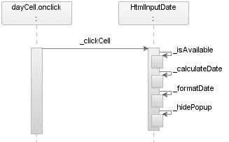

5807ch07.qxd 1/19/06 7:24 PM 第 296 页

**296**

第 7 章 ■ 为日期字段组件启用 AJAX

一个超出所显示月份范围的单元格，如果是，则导航到该选定日期所在的月份——this._scroll(1) 或 this._scroll(-1)。如果选择在月份范围内，则需要检查该日期是否实际可用，如果可用，则可以将选定的日期添加到输入元素中。

**图 7-13.** HtmlInputDate.prototype._clickCell *方法* **代码示例 7-20.** *HtmlInputDate.prototype._clickCell 方法*

/**

* 单击时选择单元格。

*

* @param event 单击事件

* @private

*/

HtmlInputDate.prototype._clickCell = function(event)

{

**var cellNode = (event.target || event.srcElement);**

var rowNode = cellNode.parentNode;

var row = rowNode.sectionRowIndex;

var col = cellNode.cellIndex;

var day = Number(cellNode.firstChild.nodeValue);

if (row == 0 && day > 7)

{

**this._scroll(-1);**

}

else if (row > 3 && day < 15)

{

**this._scroll(1);**

}

else

{

**if (this._isAvailable(day))**

5807ch07.qxd 1/19/06 7:24 PM 第 297 页

第 7 章 ■ 为日期字段组件启用 AJAX

**297**

{

var selectedDate = this._calculateDate(day);

**this._input.value = this._formatDate(selectedDate, this._pattern);** **this._hidePopup();**

}

}

}

您可以通过调用 event.target 来获取触发事件的目标节点，但 Internet Explorer 的实现略有不同——使用 event.srcElement。因此，您会看到 (event.target || event.srcElement) 这种语法，它会计算为 event.target 或 event.srcElement，具体取决于哪个已定义。

**步骤 7：注册 UIComponent 和 Renderer**

对于您的 JSF Ajax ProInputDate 实现，您需要确保将自定义的 Renderer 注册到第 6 章创建的 Ajax RenderKit 中，如代码示例 7-21 所示。

**代码示例 7-21.** *注册 HtmlAjaxInputDateRenderer*

<faces-config >

...

<render-kit>

**<render-kit-id>com.apress.projsf.ajax[HTML_BASIC]</render-kit-id>**

<render-kit-class>

**com.apress.projsf.ch6.render.html.ajax.HtmlAjaxRenderKit**

</render-kit-class>

...

<renderer>

**<component-family>javax.faces.Input</component-family>**

**<renderer-type>com.apress.projsf.Date</renderer-type>**

<renderer-class>

**com.apress.projsf.ch7.render.html.ajax.HtmlAjaxInputDateRenderer**

</renderer-class>


</renderer>

</render-kit>

</faces-config>

新的 `HtmlAjaxInputDateRenderer` 仍然属于同一个组件家族，并且与第 2 章中创建的 `HtmlInputDateRenderer` 具有相同的渲染器类型。

**第 8 步：创建 JSP 标签处理器和 TLD**

你需要为验证器定义一个自定义操作，以便应用程序开发者可以将其作为子元素添加到 `ProInputDate` 组件中。`ValidateDateTag` 标签处理器类代表了自定义操作 `validateDate`，应用程序开发者将使用它来向 `ProInputDate` 组件注册一个 `DateValidator` 实例。

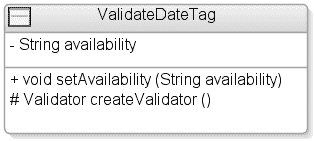

5807ch07.qxd 1/19/06 7:24 PM 第 298 页

**298**

第 7 章 ■ 使用 AJAX 增强日期字段组件

`ValidateDateTag` 类

图 7-14 展示了你的 `ValidateDateTag` 的类图。

**图 7-14.** *显示三个标签处理器的类图* 代码示例 7-22 展示了 `ValidateDateTag` 类背后的实际代码。

**代码示例 7-22.** *`ValidateDateTag` 类* `package com.apress.projsf.ch7.taglib;`

`import javax.faces.application.Application;`

`import javax.faces.component.UIComponent;`

`import javax.faces.context.FacesContext;`

`import javax.faces.el.MethodBinding;`

`import javax.faces.validator.Validator;`

`import javax.faces.webapp.ValidatorTag;`

`import javax.servlet.jsp.JspException;`

`import com.apress.projsf.ch7.validate.DateValidator;`

`/**`

`* ValidateDateTag 监听器标签处理器。`

`*/`

`public class ValidateDateTag extends ValidatorTag`

`{`

`/**`

`* 设置可用性方法绑定，其签名为 (int, int)`

`* 返回 boolean[]，指示自 1970 年 1 月 1 日以来`

`* 范围内（包含）每一天的可用性。`

`*`

`* @param availability 可用性方法绑定`

`*/`

`public void setAvailability(`

`String availability)`

`{`

`_availability = availability;`

`}`

5807ch07.qxd 1/19/06 7:24 PM 第 299 页

第 7 章 ■ 使用 AJAX 增强日期字段组件

**299**

`/**`

`* 创建并返回一个新的 {@link DateValidator}，`

`* 该验证器将被注册到外层的 {@link UIComponent} 上。`

`*`

`* @throws JspException 如果无法创建新的验证器实例`

`*/`

`protected Validator createValidator() throws JspException`

`{`

`DateValidator validator = new DateValidator();`

`if (_availability != null)`

`{`

`FacesContext context = FacesContext.getCurrentInstance();` `Application application = context.getApplication();`

`**MethodBinding binding = application.createMethodBinding(_availability,**` `**new Class[]**`

`**{**`

`**int.class,**`

`**int.class**`

`**});**`

`validator.setAvailability(binding);`

`}`

`return validator;`

`}`

`private String _availability;`

`}`

`setAvailability()` 方法设置了由应用程序开发者定义的方法绑定，其签名为 `(int, int)`，并返回一个 `boolean[]` 数组，指示自 1970 年 1 月 1 日以来范围内（包含）每一天的可用性。代码示例 7-23 展示了一个支持 bean 的片段，该 bean 可以绑定到你的日期验证器。

**代码示例 7-23.** *遵循验证器契约的支持 Bean 片段* `**public boolean[] getAvailability(**`

`**int startDays,**`

`**int endDays)**`

`{`

`...`

`boolean[] availability = new boolean[totalDays];`

`...`

`return availability;`

`}`

5807ch07.qxd 1/19/06 7:24 PM 第 300 页

**300**

第 7 章 ■ 使用 AJAX 增强日期字段组件

标签库描述符

你已经定义了 `ValidateDateTag` 标签处理器类的行为。现在是时候注册自定义操作的名称并定义一些使用规则了，如代码示例 7-24 所示。

**代码示例 7-24.** *标签库描述符*

`<?xml version="1.0" encoding="UTF-8" ?>`

`<!DOCTYPE taglib`

`PUBLIC "-//Sun Microsystems, Inc.//DTD JSP Tag Library 1.2//EN"`

`"http://java.sun.com/dtd/web-jsptaglibrary_1_2.dtd" >`

`<taglib>`

`<tlib-version>1.0</tlib-version>`

`<jsp-version>1.2</jsp-version>`

`<short-name>pro</short-name>`

`<uri>http://projsf.apress.com/tags</uri>`

`<description>`

此标签库包含 ProJSF 组件库的 JavaServer Faces 标签处理器。

`</description>`

`...`

`<tag>`

`**<name>validateDate</name>**`


**<tag-class>com.apress.projsf.ch7.taglib.ValidateDateTag</tag-class>**

<body-content>JSP</body-content>

<description>

</description>

<attribute>

**<name>availability</name>**

<required>false</required>

<rtexprvalue>false</rtexprvalue>

<description>

可用性方法绑定，签名格式为 (Int, Int)，返回 boolean[]，表示指定范围内每一天的可用性（包含边界）

</description>

</attribute>

</tag>

</taglib>

如你所见，该标签只有一个属性——availability。需要强调的是，任何定义的方法绑定都必须遵循 DateValidator 所设定的契约。

5807ch07.qxd 1/19/06 7:24 PM 第 301 页

第 7 章 ■ 为日期字段组件启用 Ajax

**301**

**第 12 步：使用 Weblets 注册你的 Ajax 资源** 对于 HtmlAjaxInputDateRenderer，你需要将两个文件——inputDate.js 和 inputDate.css——注册为 weblets，这样就能将它们打包为自定义 JSF 组件库的一部分（参见代码示例 7-25）。

■**注意** 关于 weblets 的更多信息，请参阅第 5 章，或访问 Weblets 项目网站：http://weblets.dev.java.net。

**代码示例 7-25.** *HtmlAjaxInputDateRenderer 资源的 Weblet 配置*

<?xml version="1.0" encoding="UTF-8" ?>

<weblets-config >

...

<weblet>

<weblet-name>com.apress.projsf.ch7</weblet-name>

<weblet-class>net.java.dev.weblets.packaged.PackagedWeblet</weblet-class>

<init-param>

<param-name>package</param-name>

**<param-value>com.apress.projsf.ch7.render.html.ajax.resources</param-value>**

</init-param>

</weblet>

...

<weblet-mapping>

**<weblet-name>com.apress.projsf.ch7</weblet-name>**

<url-pattern>/projsf-ch7/*</url-pattern>

</weblet-mapping>

</weblets-config>

PackagedWeblet 是一个内置的 weblet 实现，它可以通过 ClassLoader 从特定的 Java 包中读取资源，并将结果流式传输到浏览器。package 初始化参数告诉 PackagedWeblet 在解析 weblet 管理的资源请求时，将哪个 Java 包作为根目录。

**总结**

本章讨论了如何使用 Ajax 获取数据，以及如何利用 JSF 托管 Bean 机制作为数据源。

本章还涵盖了不同的 XMLHttpRequest 响应类型——responseText 和 responseXML——你可以用它们从服务器返回结果。我们还展示了如何使用 eval() 函数高效地解析 JSON 语法响应。

5807ch07.qxd 1/19/06 7:24 PM 第 302 页

**302**

第 7 章 ■ 为日期字段组件启用 Ajax

我们介绍了一个名为 Mabon 的新开源项目，它扩展了 JSF，提供了一种自定义生命周期，可以远程调用托管 Bean 方法，然后使用 JSON 语法将结果传输到客户端。

通过本章的学习，我们希望你已经理解了如何为你的 JSF 组件启用 Ajax 数据获取；此外，你现在应该对面向对象的 JavaScript 编程技术有了更深入的理解。现在，你也应该能够创建自己的自定义验证器了。

5807ch08.qxd 1/19/06 7:21 PM 第 303 页

第 8 章

■ ■ ■

提供 Mozilla

XUL 渲染器

*这里原本什么都没有。那是一个巨大的空间，里面有生物，它们在咆哮，我听到一个声音说“zuul”。它就在这里！*

——达娜·巴雷特，《捉鬼敢死队》

**随**着 Web 应用变得越来越高级，它们在外观和体验上也越来越像桌面应用。随着互联网技术的飞速发展，我们很快将面临一种新型的互联网应用——单页面界面（SPIF）应用。这些 RIA 应用的行为类似于桌面应用，使得传统的页面流转成为过去。传统页面流转应用的一个例子是购物车。在 SPIF 应用中，用户在浏览在线商店时无需导航到新页面。SPIF 应用的典型例子包括 Mozilla Amazon 浏览器（http://www.faser.net/mab/）和 OpenLaszlo 的 Amazon 商店（http://www.laszlosystems.com/lps/sample-apps/amazon/）


amazon2.lzx?lzt=html）。两者都为用户提供了丰富、直观的用户界面，并且无需强制用户逐页导航。

除非你是一位资深的 JavaScript 或 Ajax 黑客，否则在选择 Ajax 构建 SPIF 应用程序之前，你应该三思。在上下文中，基于纯 Ajax 解决方案构建的 SPIF 应用程序无疑意味着更多的客户端代码。更多的客户端代码意味着浏览器端的工作量更大，这也意味着代码密集型的 SPIF 应用程序需要强大的处理器才能为用户提供所需的响应速度。尽管计算机已经变得更快，但过去 JavaScript 功能中的处理器问题并未完全消失——更不用说维护所有这些 JavaScript 代码绝非易事！

如果你将 Ajax 提供的异步通信通道与功能丰富的客户端组件模型结合起来，那将非常完美。正如你在第 4 章中学到的，RIT、Mozilla XUL 和 Microsoft HTC 为开发者提供了构建可重用组件的良好封闭环境。借助 JSF，可以提供一种结合 Ajax 和 XUL，或结合 Ajax 和 HTC 的解决方案，从而使组件编写者能够两全其美，并为应用程序开发者提供一个轻量级且响应迅速的框架。

本章将重点介绍如何使用 XUL，并展示如何利用 XUL 的可扩展性和声明式组件模型来增强你的 JSF 组件。你将为此前创建的 ProInputDate 和 ProShowOneDeck 组件提供一个新的 XUL RenderKit。

**303**

5807ch08.qxd 1/19/06 7:21 PM 第 304 页

**304**

第 8 章 ■ 提供 Mozilla XUL 渲染器

**Deck 和 Date 组件的 XUL 实现需求**

本章中 ProInputDate 和 ProShowOneDeck 组件的需求很简单——你需要利用 Mozilla GRE 提供的声明式组件模型。为了支持这一点，你需要为 deck 和 date 组件提供特定于 XUL 的 Renderer 类。与第 6 章和第 7 章创建的 deck 和 date 组件所提供的功能相比，支持此客户端特定组件模型不应有任何功能损失。

**Mozilla XUL 为 JSF 带来的优势**

由于 XUL 组件是 Mozilla GRE 的一部分，因此在将标记发送到客户端之前，无需在服务器端将 JSF 页面结构“展开”为适当的标记。这反过来将减少网络负载，因为渲染由客户端负责，而不是由实际的服务器实现负责。

XUL 的另一个伟大特性是其可扩展性，它提供了一种声明式的方式来创建新组件和扩展现有的 XUL 组件。为了实现这一特性，XUL 使用了 XBL。你可以使用 CSS 选择器将这些行为化的 XBL 组件附加到标记上。

当然，XUL 提供了开箱即用的丰富客户端交互性，而无需强制组件作者在诸如 JavaScript 之类的替代方案中实现这一点。

我们将展示如何将 Ajax 异步通信通道——XMLHttpRequest——与 XUL 提供的高度交互式组件结合起来，基于 JSF 标准设计可重用且极具交互性的组件。

**JSF 为 XUL 带来的优势**

JSF 为 XUL 带来的一个要素是通用的编程模型——JSP 和 Java。你可能会争辩说，对 XUL 感兴趣的开发者可以直接使用 XUL，但我们在此要指出的是，JSF 不仅提供了熟悉的编程模型（至少对大多数 J2EE 开发者而言），还提供了一个服务器端组件模型，该模型隐藏了 XUL 的细节，而应用程序开发者无需知道或需要了解这些实现细节。

JSF 带来的另一个要素是标准的请求生命周期，包括自动状态保存和状态恢复、验证、数据模型和事件处理。

**Deck 和 Date 组件的 XUL 实现**


使用诸如 XUL 这类组件模型配合标准 JSF 组件的一个显著优势在于，它提供了一套 HTML 所不具备的 UI 控件，例如菜单、工具栏、弹出窗口和树形控件。这意味着组件编写者无需使用传统的浏览器技术来“创建”这些控件，而这并非一项简单的任务。这些 XUL 控件可通过 Mozilla GRE 获得，因此它们具有无需下载组件即可在浏览器中绘制应用程序的优势。您还可以使用 XUL 设计自己的

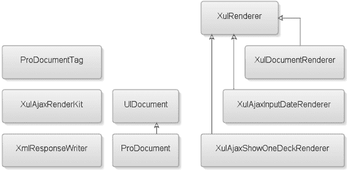

5807ch08.qxd 1/19/06 7:21 PM 第 305 页

第 8 章 ■ 提供 Mozilla XUL 渲染器

**305**

组件；浏览器会在首次请求时下载这些组件，并将其缓存在浏览器中。

以下是本章涉及的主要技术：XUL、XBL、Ajax、Dojo Toolkit、D2 和 Mabon。虽然这份技术列表相当广泛，但我们在前面的章节中已经介绍了其中的大部分技术；此外，在本章中，它们将更多地扮演辅助角色，类似于 weblets（在第 5 章中介绍过）。学完本章后，您应该能够使用 Mozilla XUL 和 XBL 技术创建丰富的用户界面组件。

图 8-1 展示了您将在本章中创建的九个类。

**图 8-1.** *显示本章中创建的所有类的类图* 这些类如下：

• ProDocumentTag 是代表 ProDocument 组件的标签处理类。

• XulAjaxRenderKit 是新的自定义 RenderKit，负责根据传入请求动态选择正确的 ResponseWriter。

• XmlResponseWriter 扩展了默认的 ResponseWriter，增加了对 XML 文档的支持。

• UIDocument 是代表文档组件的行为超类。

• ProDocument 是 UIDocument 类的特定于渲染器的子类。

• XulRenderer 是第 2 章中创建的 HtmlRenderer 的移植版本。

• XulDocumentRenderer 是负责在 XUL 文档中写入根元素的渲染器。

• XulAjaxInputDateRenderer 是日期组件的新自定义渲染器，它扩展了 XulRenderer 并添加了资源以支持 XUL 和 Ajax。

• 最后，XulAjaxShowOneDeckRenderer 是 deck 组件的新自定义渲染器，它扩展了 XulRenderer 并添加了资源以支持 XUL 和 Ajax。

5807ch08.qxd 1/19/06 7:21 PM 第 306 页

**306**

第 8 章 ■ 提供 Mozilla XUL 渲染器

**使用蓝图设计 JSF XUL 组件**

为基于 HTML 的 JSF 组件定义的蓝图同样适用于基于 XUL 的 JSF 组件。XUL 实现并未引入任何新行为，因此您只需提供一组新的 XUL 渲染器。每当您引入一个支持 HTML 替代标记的新渲染器时，都必须提供一个新的 RenderKit（即 XUL RenderKit）。在本章中，您将简单地遵循蓝图（见表 8-1），从步骤 1 开始，并跳过步骤 2、4 和 10。

**表 8-1.** *创建新 JSF 组件的蓝图步骤*

**#**

**步骤**

**描述**

创建 UI 原型

使用适当的标记为您的组件创建 UI 和预期行为的原型。

创建事件和监听器

（可选）如果 JSF 规范未涵盖您的特定需求，请创建自定义事件和监听器。

创建行为超类

（可选）如果找不到组件行为，请创建一个新的行为超类（例如 UIShowOne）。

创建转换器和验证器

（可选）如果 JSF 规范未涵盖您的特定需求，请创建自定义转换器和验证器。

创建特定于客户端的渲染器

创建您需要的渲染器，它将为您的 JSF 组件写出客户端标记。

创建特定于渲染器的子类

（可选）创建一个特定于渲染器的子类；虽然这是一个可选步骤，但实现它是一个良好的实践。


注册 UIComponent 和 Renderer

在 `faces-config.xml` 文件中注册新的 UIComponent 和 Renderer。

创建 JSP 标签处理器和 TLD

如果你使用 JSP 作为默认视图处理器，则需要执行此步骤。另一种解决方案是使用 Facelets (http://facelets.dev.java.net/)。

创建 RenderKit 和 ResponseWriter

（可选）如果你计划支持其他标记语言（例如 Mozilla XUL），则需要创建一个新的 RenderKit 并关联一个 ResponseWriter。默认的 RenderKit 是 HTML_BASIC，其 contentType 设置为 text/html。

扩展 JSF 实现

（可选）如果你需要为 JSF 实现提供扩展（例如，扩展 JSF 工厂类或提供自定义的 JSF 生命周期实现），则需要执行此步骤。

注册 RenderKit 和 JSF 扩展

（可选）注册自定义的 RenderKit 和/或对 JSF 实现的扩展。

使用 Weblets 注册资源

（可选）使用 Weblets 注册你的资源，例如图像、JavaScript 库和 CSS 文件，以便它们可以直接从组件库 JAR 文件中打包和加载。


5807ch08.qxd 1/19/06 7:21 PM Page 307

第 8 章 ■ 提供 Mozilla XUL 渲染器

**307**

为了提供 XUL 实现，需要覆盖十二个步骤中的九个，这看起来工作量很大，但你在前面的章节中已经完成了大部分工作；因此，每个步骤都相当简单。让我们从步骤 1 开始，看看新组件的标记。

**步骤 1：创建 UI 原型**

为了能够在本章中对你想要实现的目标进行原型设计，你必须使用 XUL 来找出所需的 XUL 元素、渲染器特定属性以及其他资源（例如 JavaScript、图像等）。由于你要为日期组件和卡片组件提供 XUL 实现，因此还必须提供两个原型，每个组件一个。

■**注意** 在我们研究 XUL 和 XBL 相关信息的过程中，我们在互联网上找到了两个非常好的资源：Mozilla (http://www.mozilla.org/projects/xul/) 和 XULPlanet (http://www.xulplanet.com/)。

XUL 日期实现原型

图 8-2 显示了在 XUL 中实现的 `<pro:inputDate>` 原型的最终结果。

**图 8-2.** *在 XUL 页面中实现的* `<pro:inputDate>` *组件* 代码示例 8-1 显示了使用图 8-2 中所示的 XUL `<pro:inputDate>` 原型的页面的 XUL 标记。

**代码示例 8-1.** *创建 XUL 原型页面所需的标记*

**<?xml version="1.0" ?>**

<?xml-stylesheet href="projsf-ch8/document.css" type="text/css"?>

<?xml-stylesheet href="projsf-ch8/pro.css" type="text/css"?>

**<xul:window**

**5807ch08.qxd 1/19/06 7:21 PM Page 308**

**308**

第 8 章 ■ 提供 Mozilla XUL 渲染器

****orient="horizontal" align="start"**

**title="Pro JSF : ProInputDate">**

<xul:hbox align="center" flex="1">

<xul:script type="text/javascript" src="/.../faces/weblets/mabon/mabon.js"/>

<xul:script type="text/javascript">

var djConfig={preventBackButtonFix: true,

libraryScriptUri:'/.../faces/weblets/dojo/dojo.js'};

</xul:script>

<xul:script type="text/javascript" src="/.../faces/weblets/dojo/dojo.js"/>

**<pro:inputDate id="dateField"**

**value="31 October 2005"**

**pattern="d MMMMM yyyy"**

**targetURL="projsf-ch8/sample-availability.json"/>**

</xul:hbox>

</xul:window>

一个有效的 XUL 文档需要两个元素：第一行标识文件为 XML 的 XML 处理指令（`<?xml version="1.0"?>`）和一个定义 XUL 网页的 `<window>` 元素（类似于 HTML 中的 `<html>`）。

■**警告** 在撰写本文时，Dojo 工具包需要配置才能与 XUL 一起使用，因此你需要使用 `preventBackButtonFix` 变通方法。这个问题应该在 Dojo 工具包的未来版本中消失。


相较于传统 HTML，使用 XUL 的优势之一在于，渲染器无需提供所有标记，XUL 只关注一个元素——<pro:inputDate>。

你还可以看到，该原型在语法上与 JSF 组件实现类似。

从源码中可以看出，渲染器必须提供的 XUL 元素是

<pro:inputDate> 元素，它至少包含两个属性——`pattern` 和 `targetURL`。

XUL 的一大特色是其丰富的组件库，该组件库是 Mozilla GRE 的一部分。与许多优秀的框架一样，XUL 也提供了一种模型，允许在需要时扩展组件集。如第 4 章所述，开发者用来扩展 XUL 的语言是 XBL。XBL 允许开发者向现有的 XUL 元素集中添加“自定义”组件。在本例中，你所需的功能并非开箱即用，因此你必须使用 XBL 创建自己的自定义 XUL 组件（例如 <pro:inputDate ...>）。

XBL 日期组件原型

与 XUL 一样，XBL 也是一种 XML 语言，因此具有相似的语法规则。<bindings> 元素是 XBL 文件的根元素，包含一个或多个 binding 元素。每个 binding 元素声明一个单独的绑定。你可以使用 `id` 属性来标识该绑定。代码示例 8-2 展示了 XBL 文件（bindings.xml）及其第一个绑定（inputDate）。

5807ch08.qxd 1/19/06 7:21 PM 第 309 页

第 8 章 ■ 提供 Mozilla XUL 渲染器

**309**

**代码示例 8-2.** *bindings.xml* 文件

<?xml version="1.0"?>

**<bindings**

>

**<binding id="inputDate">**

<resources>

**<stylesheet src="styles.css" />**

</resources>

<content>

<xul:hbox>

<xul:textbox id="input"

style="margin-left:0px;margin-right:0px;"

xbl:inherits="value"

onchange="this.parentNode.parentNode.flushChanges();" />

**<xul:button popup="calendar"**

**image="/.../projsf-ch8/inputDateButton.gif"**

**style="margin-left:0px;margin-right:0px;min-width:2em;"/>**

</xul:hbox>

代码示例 8-2 中的 XBL 组件原型展示了包含一个 <binding> 元素的根元素 <bindings>。<bindings> 元素中的命名空间定义了将要使用的语法，在代码示例 8-2 的原型中，该命名空间是 XBL——xmlns=http://www.mozilla.org/xbl。<binding> 元素上的 `id` 属性（即 inputDate）标识了该绑定。使用 CSS，你可以通过将 `-moz-binding` URI 属性设置为引用 XBL 文档内的绑定（例如 `-moz-binding: url('[filename].xml#inputDate')`）来为元素分配一个绑定。

该原型还包含一组 XUL 元素，如表 8-2 所示。

**表 8-2.** *本章使用的 XUL 元素*

**XUL 元素 [xul:]**

**描述**

hbox

一个容器元素，可以包含任意数量的子元素，并将其子元素水平渲染。

vbox

一个容器元素，可以包含任意数量的子元素，并将其子元素垂直渲染。

textnode

使用 <textnode> 元素时，整个节点将被替换为与 `value` 属性结果相对应的文本。

label

该元素为控件元素提供标签。如果用户点击该标签，焦点将移动到由 `control` 属性指定的关联控件。

textbox

一个文本输入字段，用户可以在其中输入文本。它类似于 HTML 的 <input> 元素。默认情况下只显示一行文本。你可以指定 `multiline` 属性来显示一个多行字段。

*续*

5807ch08.qxd 1/19/06 7:21 PM 第 310 页

**310**

第 8 章 ■ 提供 Mozilla XUL 渲染器

**表 8-2.** *续*

**XUL 元素 [xul:]**

**描述**

button

一个可由用户点击的按钮。你可以使用事件处理器来捕获鼠标事件、键盘事件和其他事件。它通常被渲染为一个灰色的凸起矩形。本章中使用的 `popup` 属性是所有 XUL 元素的通用属性。

popupset


一个用于容纳 <popup> 元素的容器。你应该将所有 <popup> 元素声明为 <popupset> 的子元素。此元素不会直接显示在屏幕上。当其他元素请求显示时，子弹出窗口将会被显示。

popup

一个显示在子窗口中的容器。弹出窗口没有任何特殊边框。当某个元素被点击时，通过将该 <popup> 元素的 ID 赋值给该元素的 `popup`、`context` 或 `tooltip` 属性，即可显示弹出窗口。弹出窗口是一种默认采用垂直方向的盒子类型。

grid

一个 <grid> 元素同时包含 <rows> 和 <columns> 元素。

它用于创建一个元素网格。行和列会同时显示，尽管通常只有一方包含内容，而另一方可能提供尺寸信息。在网格中最后出现的元素会显示在最上层。

columns

定义网格的列。<columns> 元素的每个子元素都应为 <column> 元素。

column

<columns> 元素中的单个列。<column> 元素的每个子元素都会被放置在网格的连续单元格中。拥有最多子元素的列决定了每列的行数。

rows

定义网格的行。<rows> 元素的每个子元素都应为 <row> 元素。

row

<rows> 元素中的单行。<row> 元素的每个子元素都会被放置在网格的连续单元格中。拥有最多子元素的行决定了每行的列数。

**来源：XULPlanet (* http://www.xulplanet.com *)* 能够组合 XUL 组件（和 HTML 元素）对于简化开发极为有用，因为你可以创建单一、复杂且可复用的组件。

使用 XUL 组件模型的另一个巧妙特性是内置的弹出窗口支持。

无需编写客户端脚本来支持弹出窗口，你只需在 XBL 绑定中创建一组弹出窗口，如代码示例 8-3 所示，并使用通用的 XUL `popup` 属性在 Mozilla 浏览器中启动一个弹出窗口。在你的场景中，此弹出功能将用于 <pro:inputDate> 组件的日历。

XUL `popup` 元素拥有一组预定义的事件处理器（例如，`onpopupshowing`），你可以使用它们在用户请求显示日历时动态设置内容。在此例中，你调用了一个名为 `popup()` 的方法。

你使用一个 <vbox> 元素作为父容器，并使用一个 <hbox> 元素来容纳工具栏，从而构建弹出日历，如代码示例 8-3 所示。工具栏包含两个用于导航到上一个月和下个月的 <text> 元素。

5807ch08.qxd 1/19/06 7:21 PM 第 311 页

第 8 章 ■ 提供 Mozilla XUL 渲染器

**311**

**代码示例 8-3.** *bindings.xml* 文件

**<xul:popupset>**

**<xul:popup id="calendar" position="after_end"**

**onpopupshowing="document.popupNode.parentNode.parentNode.popup()">**

**<xul:vbox class="calendar" >**

**<xul:hbox class="toolbar" >**

<xul:text value="&lt;"

**onclick="document.popupNode.parentNode.parentNode.scroll(-1)" />**

<xul:label id="title" flex="1"

style="text-align:center;padding: 1px;" />

<xul:text value="&gt;"

**onclick="document.popupNode.parentNode.parentNode.scroll(1)" />**

**</xul:hbox>**

**<xul:grid id="grid"**

**onclick="document.popupNode.parentNode.parentNode.clickCell(event)" >**

<xul:columns>

<xul:column/>

<xul:column/>

<xul:column/>

<xul:column/>

<xul:column/>

<xul:column/>

<xul:column/>

</xul:columns>

<xul:rows>

<xul:row class="headings" >

<xul:label value="Sun" />

<xul:label value="Mon" />

<xul:label value="Tue" />

<xul:label value="Wed" />

<xul:label value="Thu" />

<xul:label value="Fri" />

<xul:label value="Sat" />

</xul:row>

<xul:row class="cells" >

<xul:label/>

... //六个空行，每行有七个空标签。

<xul:label/>

</xul:row>

</xul:rows>

</xul:grid>

</xul:vbox>

**</xul:popup>**

**</xul:popupset>**

</content>

5807ch08.qxd 1/19/06 7:21 PM 第 312 页

**312**

第 8 章 ■ 提供 Mozilla XUL 渲染器

该日历还包含一个 XUL <grid> 元素，用于在浏览器中显示日历时展示该月的所有日期。此实现还支持通过点击单元格来选择日期（例如，`onclick="... clickCell(event)"`）。

该原型还包含一组 XBL 元素，如表 8-3 所示。

**表 8-3.** *在* <pro:inputDate> *组件中使用的 XBL 元素**

**XBL 元素**

**描述**

children

<children> 元素选择特定的子元素，将其包含在 XBL 组件标记的预定义位置，类似于 JSF 中的 facet。

implementation

在 <implementation> 元素内部，你为每个需要的元素分别定义 <field>、<property> 和 <method> 元素。

field

<field> 元素是一个简单的值持有者。

property

<property> 元素声明一个 JavaScript 属性，该属性会被添加到元素的对象中。<property> 元素可以有一个 <getter> 子元素和一个 <setter> 子元素，分别用于获取和设置属性的值。

method

这声明了一个 JavaScript 方法，该方法会被添加到元素的对象中。该方法可以接受参数，参数通过 <parameter> 元素声明。

constructor

当绑定被附加到一个元素时，会调用此元素内部的代码。你可以用它来初始化绑定所使用的內容。<constructor> 元素应放置在 <implementation> 元素内部。

parameter

这声明了方法的一个参数。每个参数都有一个 `name` 属性，该属性成为一个在方法体中声明的变量，其值为传递给方法的值。

body

<body> 元素的内容应为调用该方法时要执行的 JavaScript 代码。

** 来源：XULPlanet (* http://www.xulplanet.com *)* 你在 <implementation> 元素中定义任何特定于组件的逻辑，例如日期选择以及滚动到上一个月和下一个月。<implementation> 元素包含所有日历逻辑，包括一个字段、一个构造函数以及用于 inputDate 绑定的方法。<field> 是一个简单的值容器，代码示例 8-4 定义了四个字段：`currentMonth`、`currentYear`、`selectedMillis` 和 `monthNames`。

**代码示例 8-4.** *bindings.xml* 文件中的 <implementation> 元素

<implementation>

<field name="currentMonth"/>

<field name="currentYear"/>

<field name="selectedMillis"/>

<field name="monthNames"/>

<constructor> 元素内的脚本（如代码示例 8-5 所示）在绑定被附加到一个元素时被调用。通过在 <implementation> 元素中使用 <constructor>，你可以初始化绑定所使用的內容。在此例中，你使用月份名称预填充了 `monthNames` 字段。

**代码示例 8-5.** *bindings.xml* 文件的构造函数

<constructor>

<![CDATA[

this.monthNames = ['January','February', 'March', 'April', 'May',

'June', 'July', 'August', 'September',

'October', 'November', 'December'];

var currentNode = this;

while (currentNode != null)

{

if (currentNode.localName == 'form' &&

currentNode.namespaceURI == 'http://www.w3.org/1999/xhtml')

{

var formNode = currentNode;

var clientId = this.getAttribute('id');

var inputNode = formNode.elements[clientId];

if (inputNode == null)

{

**inputNode = document.createElementNS('http://www.w3.org/1999/xhtml',**

**'input');**

**inputNode.type = 'hidden';**

inputNode.name = clientId;

formNode.appendChild(inputNode);

}

this.inputNode = inputNode;

break;

}

currentNode = currentNode.parentNode;

}

]]>

</constructor>


XUL 没有提交表单的机制，因为 XUL 使用了一种不同的 UI 模型，在这种模型中表单提交很少适用。不过，将 XHTML 元素与 XUL 应用程序混合使用是合法的，在这种情况下，使用 JSF 构建应用程序的开发人员不一定能区分 JSF HTML 组件（例如 `<h:commandButton>`）和 JSF XUL 组件。为了确保 JSF XUL 组件支持常规的表单提交，你必须添加一个隐藏的输入字段，如代码示例 8-5 所示，该字段将包含来自 `<pro:inputDate>` 的数据。

与 HTML Ajax 解决方案相比，弹出方法（如代码示例 8-6 所示）是在日历启动时调用的，而不是由按钮的 `onclick` 处理程序调用。另一个区别是，你不需要像在 HTML Ajax 解决方案中那样跟踪日历的状态。图 8-3 展示了弹出式实现的时序图。


5807ch08.qxd 1/19/06 7:21 PM 第 314 页

**314**

第 8 章 ■ 提供 Mozilla XUL 渲染器

**图 8-3.** *XBL* inputDate *绑定的* popup *方法时序图*
**代码示例 8-6.** *bindings.xml 文件中的* popup *方法*

<method name="popup">

<body>

<![CDATA[

var dateString = document.getElementById('input').value; var parsedDate = this.parse(dateString, this.getAttribute('pattern')); **var activeDate = (parsedDate != null) ? parsedDate : new Date();** **this.deselect();**

var month = activeDate.getMonth();

var year = activeDate.getFullYear();

this.currentMonth = month;

this.currentYear = year;

**this.scroll(0);**

if (parsedDate != null)

**this.select(parsedDate.getDate());**

}

]]>

</body>

</method>

`popup` 方法首先从输入字段读取用户定义的日期字符串，然后将该日期字符串解析为一个 `Date` 对象。如果解析成功，则使用该 `Date` 对象；否则，使用今天的日期。接下来，在调用 `scroll` 方法之前，它确保没有先前的选择，通过传递零作为参数来确保日历日期单元格完全填充，但停留在当前月份（零导航）。最后，`popup` 方法将选择一个初始日期（如果可能的话）。

5807ch08.qxd 1/19/06 7:21 PM 第 315 页

第 8 章 ■ 提供 Mozilla XUL 渲染器

**315**

`scroll` 方法（如代码示例 8-7 所示）允许用户使用日历中的箭头控件向前或向后导航一个月。你可以使用 Mabon 来确定由附加到增强型 `DateValidator` 上的托管 bean 所定义的日期的可用性。

**代码示例 8-7.** *bindings.xml 文件中的* scroll *方法*

<method name="scroll">

**<parameter name="offset"/>**

<body>

<![CDATA[

var gridNode = document.getElementById('grid');

**var month = this.currentMonth + offset;**

var year = this.currentYear;

year += Math.floor(month / 12);

month = (month + 12) % 12;

this.currentMonth = month;

this.currentYear = year;

**var targetURL = this.getAttribute('targetURL');**

if (targetURL)

{

var startDate = new Date(year, month, 1);

var endDate = new Date(year, month, 31);

var millisPerDay = 1000 * 60 * 60 * 24;

var startDay = Math.floor(startDate.getTime() / millisPerDay); var endDay = Math.floor(endDate.getTime() / millisPerDay);

// 使用 Mabon 确定可用性

var self = this;

**mabon.send(**

**{**

**url: targetURL,**

**args: [startDay, endDay],**

**result: function(result) { self.display(result); }**

**});**

}

else

{

var available = [];

for (var i=0; i < 32; i++)

{

available.push(true);

}

this.display(available);

}

]]>

</body>

</method>

5807ch08.qxd 1/19/06 7:21 PM 第 316 页

**316**

第 8 章 ■ 提供 Mozilla XUL 渲染器

`clickCell` 方法（如代码示例 8-8 所示）在用户单击日历中代表日期的单元格时被调用。该方法将检查用户是否单击了超出所显示月份范围的单元格，如果是，则导航到该选定日期所在的月份——`this.scroll(1)` 或 `this.scroll(-1)`。如果选择在月份边界内，你需要查看该日期是否可用，如果可用，则将选定的日期添加到 `<input>` 元素中。

**代码示例 8-8.** *bindings.xml 文件中的* clickCell *方法*

<method name="clickCell">

<parameter name="event"/>

<body>

<![CDATA

var cellNode = event.target;

var rowNode = cellNode.parentNode;

var row = this.getChildIndex(rowNode) - 1;

var col = this.getChildIndex(cellNode);

var day = Number(cellNode.value);

// 检测其他月份的单元格

if (row == -1)

{

// 表头单元格

return;

}

else if (row == 0 && day > 7)

{

**this.scroll(-1);**

}

else if (row > 3 && day < 15)

{

**this.scroll(1);**

}

else

{

if (this.isAvailable(day))

{

// 将值传输到输入字段

var input = document.getElementById('input');

var selectedDate = this.calculateDate(day);

**input.value = this.format(selectedDate,**

**this.getAttribute('pattern'));**

// 隐藏弹出窗口

document.getElementById('calendar').hidePopup();

}

}

![图 71

5807ch08.qxd 1/19/06 7:21 PM 第 317 页

第 8 章 ■ 提供 Mozilla XUL 渲染器

**317**

]]>

</body>

</method>

...

</implementation>

</binding>

</bindings>

XUL Deck 实现原型

下一个原型是 `<pro:showOneDeck>` XUL 组件，如图 8-4 所示。

**图 8-4.** *在 XUL 页面中实现的* `<pro:showOneDeck>` *组件*
为了能够在激活 deck 时与服务器进行异步通信，你必须将一组 JavaScript 库——`dojo.js` 和 `d2.js`——下载到页面。这些库需要成为组件的一部分，并应在初始请求时自动下载到客户端。除了渲染的标记更少以及使用了 XUL 元素之外，这个 XUL 页面（如代码示例 8-9 所示）与你在第 6 章中创建的页面类似，后者利用了 ProShowOneDeck 渲染器的 HTML 版本 `HtmlAjaxShowOneDeckRenderer`。

**代码示例 8-9.** *创建 XUL 原型页面所需的标记*

<?xml version="1.0" encoding="UTF-8" ?>

<?xml-stylesheet href="projsf-ch8/document.css" type="text/css"?>

<?xml-stylesheet href="projsf-ch8/pro.css" type="text/css"?>

<?xml-stylesheet href="resources/stylesheet.css" type="text/css"?>

<xul:window

orient="horizontal"

align="start"

title="Pro JSF : ProShowOneDeck">

5807ch08.qxd 1/19/06 7:21 PM 第 318 页

**318**

第 8 章 ■ 提供 Mozilla XUL 渲染器

<xul:hbox align="center" flex="1">

<table width="300px">

<tbody>

<tr>

<td>

<xul:script type="application/x-javascript"> var djConfig={preventBackButtonFix: true,

libraryScriptUri:'/faces/weblets/dojo$0.1/dojo.js'};

</xul:script>

**<xul:script type="application/x-javascript"**

**src="/.../faces/weblets/dojo$0.1/dojo.js"/>**

**<xul:script type="application/x-javascript"**

**src="/.../faces/weblets/d2/d2.js"/>**

**<pro:showOneDeck showItemId="first">**

**<pro:showItem itemId="first"**

active="true">

**<pro:showItemHeader>**

 Java

**</pro:showItemHeader>**

<table>

<tbody>

<tr>

<td>

<a href="http://apress.com/book/bookDisplay.html?bID=10044"> Pro JSF: 构建丰富的互联网组件

</a>

</td>

</tr>

...

</xul:hbox>

</xul:window>

XBL Deck 组件原型

`<pro:showOneDeck>` XUL 组件的结构与 `<pro:inputDate>` 略有不同，因为它具有复合性质，包含的不是一个而是四个 `<binding>` 元素——`showOneDeck`、`showItem`、`showItemActive` 和 `showItemHeader`。

`showOneDeck` 绑定在运行时将显示为一个 XUL `<vbox>` 元素。


好的，作为一名高级文档工程师和翻译员，我将严格遵循您提供的注意事项和示例，将给定的英文文本翻译成中文。


`<children>` 元素用于在预定义位置选择要包含的子元素，这与 JSF 中的 facet 非常相似。代码示例 8-10 中的原型添加了 `includes` 属性。该属性只允许特定元素出现在 `<pro:showOneDeck>` 组件的内容中（例如 `<pro:showItem>`）。

5807ch08.qxd 1/19/06 7:21 PM 第 319 页

第 8 章 ■ 提供 Mozilla XUL 渲染器

**319**

**代码示例 8-10.** *showOneDeck* 绑定

**<binding id="showOneDeck" display="xul:vbox" >**

<resources>

<stylesheet src="styles.css" />

</resources>

<content>

<xul:vbox class="showOneDeck"

xbl:inherits="className=styleClass" >

**<children includes="showItem" />**

</xul:vbox>

</content>

</binding>

如代码示例 8-11 所示，`<pro:showItem>` 组件是 `<pro:showOneDeck>` 实现的一部分，当用户与其交互时，该部分会展开。此绑定包含一个方法 `expand`，当点击标题时会调用该方法。

如您所见，您正在使用 `d2.js` 库，将激活的表单 ID 和所选节点的 ID 传递给 `d2.submit()` 函数。`d2.submit()` 函数调用 `dojo.io.bind()` 方法，传递关于要提交哪个表单、内容（例如所选组件的 ID）、接受的请求头（`'X-D2-Content-Type'`：`<contentType>`）以及此请求的 MIME 类型（`text/xml`）的信息。这些信息将决定展开哪个节点以及为此请求使用哪个 `ResponseWriter`。

**代码示例 8-11.** *showItem* 绑定和 *expand* 方法

**<binding id="showItem" display="xul:vbox" >**

<resources>

<stylesheet src="styles.css" />

</resources>

<content>

<xul:vbox class="showItem" flex="1" >

<xul:hbox id="showItemHeader"

**onclick="this.parentNode.parentNode.expand()"**

class="showItemHeader"

**xbl:inherits="className=headerStyleClass" >**

**<children includes="showItemHeader" />**

</xul:hbox>

<xul:hbox style="display:none;" >

<children/>

</xul:hbox>

</xul:vbox>

</content>

<implementation>

**<method name="expand" >**

<body>

<![CDATA[

var showOneNode = this.parentNode;

5807ch08.qxd 1/19/06 7:21 PM 第 320 页

**320**

第 8 章 ■ 提供 Mozilla XUL 渲染器

var showOneClientId = showOneNode.getAttribute('id');

var currentNode = this;

while (currentNode != null)

{

if (currentNode.localName == 'form' &&

currentNode.namespaceURI == 'http://www.w3.org/1999/xhtml')

{

var formNode = currentNode;

var content = new Object();

content[showOneClientId] = this.getAttribute('itemId'); **d2.submit(formNode, content);**

break;

}

currentNode = currentNode.parentNode;

}

]]>

</body>

</method>

</implementation>

</binding>

D2 库还定义了一个回调函数 `d2._loadxml`，用于从服务器获取响应数据。`d2._loadxml` 函数将用响应返回的文档中的 XML 节点替换目标文档的 XML 节点。

如代码示例 8-12 所示，`<pro:showItemActive>` 组件负责显示标题（`<children includes="showItemHeader" />`）以及所有子元素（`<children/>`），这些子元素是展开后的 `showOneDeck` 节点的一部分。

**代码示例 8-12.** *showItemActive* 绑定

<binding id="showItemActive" display="xul:vbox" >

<resources>

<stylesheet src="styles.css" />

</resources>

<content>

<xul:vbox class="showItem" flex="1" >

<xul:hbox id="showItemHeader"

class="showItemHeader"

xbl:inherits="className=headerStyleClass" >

**<children includes="showItemHeader" />**

</xul:hbox>

<xul:hbox class="showItemContent"

xbl:inherits="className=contentStyleClass" >

**<children/>**

</xul:hbox>

</xul:vbox>

</content>

</binding>


5807ch08.qxd 1/19/06 7:21 PM 第 321 页

第 8 章 ■ 提供 Mozilla XUL 渲染器

**321**

如代码示例 8-13 所示，`<pro:showItemHeader>` 组件是一个容器，负责容纳代表 `showOneDeck` 组件标题的任何子元素。

**代码示例 8-13.** *showItemHeader* 绑定

<binding id="showItemHeader" display="xul:hbox" >

<content>

**<children/>**

</content>

</binding>

</bindings>

图 8-5 显示了 `bindings.xml` 文件的完整结构。

**图 8-5.** *Oracle JDeveloper 10.1.3 结构窗口中显示的* bindings.xml *结构*
使用样式表定义绑定元素

绑定元素上的 `id` 属性（`#inpuDate`）标识了绑定。使用 CSS，开发人员可以通过将 `-moz-binding` URI 属性设置为引用 XBL 文档中的绑定，从而将绑定分配给一个元素，如代码示例 8-14 所示。

5807ch08.qxd 1/19/06 7:21 PM 第 322 页

**322**

第 8 章 ■ 提供 Mozilla XUL 渲染器

**代码示例 8-14.** *pro.css* 文件

@namespace pro url(http://projsf.apress.com/tags);

**pro|inputDate**

**{**

**-moz-binding: url('bindings.xml#inputDate');**

**}**

pro|showOneDeck

{

-moz-binding: url('bindings.xml#showOneDeck');

display: -moz-box;

-moz-box-orient: vertical;

}

pro|showItem

{

-moz-binding: url('bindings.xml#showItem');

display: -moz-box;

}

**pro|showItem[active='true']**

{

-moz-binding: url('bindings.xml#showItemActive');

display: -moz-box;

}

pro|showItemHeader

{

-moz-binding: url('bindings.xml#showItemHeader');

display: -moz-box;

}

在代码示例 8-14 中，`<pro:inputDate>` 元素的 CSS 选择器将 `-moz-binding` 设置为指向 XBL 原型文件 `bindings.xml`，并引用 XBL 文件中 ID 为 `inputDate` 的特定绑定。这类似于 HTML 文件中锚点的使用方式。CSS 中还有两个 `pro|showItem` 选择器。其中一个附加了 `[active='true']`，这意味着任何 `active` 属性设置为 `true` 的 `<pro:showItem>` 元素都应使用此 XBL 绑定。这样，您可以拥有一个 XUL 元素并提供多个绑定。

**第 3 步：创建行为超类**

在展示如何设计第一个 JSF XUL 组件之前，我们需要介绍一个重要事实——XUL 不是 HTML。尽管 HTML 和 XUL 之间共享了许多功能，但理解它们是不同的文档对象这一点很重要。XUL 是一种 XML 语言，XUL 文档是更通用的 XML 文档的子类型。这两种文档对象之间的区别很重要。

5807ch08.qxd 1/19/06 7:21 PM 第 323 页

第 8 章 ■ 提供 Mozilla XUL 渲染器

**323**

一个常规的 HTML 文档通常如代码示例 8-15 所示。

**代码示例 8-15.** *HTML 文档结构*

<html>

<head>

<title>Pro JSF : HTML Document</title>

</head>

<body>

</body>

</html>

一个有效的 XUL 文档如代码示例 8-16 所示。

**代码示例 8-16.** *XUL 文档结构*

<?xml version="1.0" encoding="ISO-8859-1" ?>

<xul:window

title="Pro JSF : XUL Document">

</xul:window>

现在，您拥有了一种不同于 HTML 的文档类型，并且需要另一种内容类型——`application/vnd.mozilla.xul+xml`——而不是常规的 `text/html`。这不可避免地让您回到了 JSP 拥有内容类型所有权以及默认的 JSF `ResponseWriter` 仅支持 HTML 文档的问题（更多信息请参见第 6 章）。要支持 XUL，您需要以下内容：

*   一个能够处理 XML 的 `ResponseWriter`
*   一个用于创建 `ResponseWriter` 并传递 XUL `contentType` 的 XUL `RenderKit`
*   一个能够为 XUL 页面写出正确头部（例如 `window`）的文档组件
*   JSP 文档中的一个自定义内容类型，用于以不同于后续 Ajax 回发的方式处理初始请求（例如 `application/x-javaserver-faces`）

UIDocument 类


从一开始我们就强调，如果你没有引入新的行为，就不需要创建行为超类；然而，规则多了，必然存在例外，对吧？创建一个代表页面外壳的文档组件，很可能是客户端渲染，并且没有引入新的服务器端行为。但是，如果不将渲染器附加到行为超类上，就无法使用它。因此，为了让 XUL 文档渲染器正常工作，你必须引入一个 UIDocument 组件，如图 8-6 所示。


5807ch08.qxd 1/19/06 7:21 PM 第 324 页

**324**

第 8 章 ■ 提供 MOZILLA XUL 渲染器

**图 8-6.** *展示* UIDocument *类的类图* 使用文档组件，应用程序开发者可以在不知道将向客户端交付何种文档类型的情况下设计 JSF 应用程序。由于不存在行为，这个“特殊的”行为超类（见代码示例 8-17）仅作为文档渲染器的占位符。将来，你可能会添加事件支持，但目前来说，这已经足够了。

**代码示例 8-17.** *UIDocument 类* package com.apress.projsf.ch8.component;

import javax.faces.component.UIComponentBase;

/**

* UIDocument 组件。

*/

public class UIDocument extends UIComponentBase

{

public static final String COMPONENT_TYPE = "com.apress.projsf.Document"; public static final String COMPONENT_FAMILY = "com.apress.projsf.Document";

/**

* 创建一个新的 UIDocument。

*/

public UIDocument()

{

}

public String getFamily()

{

return COMPONENT_FAMILY;

}

}

**步骤 5：创建客户端特定的渲染器**

XUL 解决方案包含四个渲染器类——XulRenderer、XulDocumentRenderer、XulAjaxInputDateRenderer 和 XulAjaxShowOneDeckRenderer——以及 XUL 资源。

图 8-7 展示了你将创建的渲染器类的概览。


5807ch08.qxd 1/19/06 7:21 PM 第 325 页

第 8 章 ■ 提供 MOZILLA XUL 渲染器

**325**

**图 8-7.** *展示 XUL* 渲染器 *的类图* XulRenderer 基本上是你在第 2 章中创建的 HtmlRenderer 的一个移植。通过将 HtmlRenderer 代码移植到 XUL 版本，你现在对当前渲染的 XUL 页面上的每个脚本资源都拥有了“至多一次”的语义。

XulDocumentRenderer 类

一个 XUL 文档需要两个实体才能有效：第一行中标识文件为 XML 的 XML 处理指令，以及定义 XUL 网页的 window 元素。window 元素是 XUL 文档中的根元素，并包含所有其他元素。XML 处理指令属于 ResponseWriter，因为它不是 XUL 特有的。另一方面，window 元素是 XUL 特有的，属于 XUL RenderKit 及其组件。图 8-8 展示了类图中显示的 XulDocumentRenderer 类。

**图 8-8.** *展示* XulDocumentRenderer *类的类图*

5807ch08.qxd 1/19/06 7:21 PM 第 326 页

**326**

第 8 章 ■ 提供 MOZILLA XUL 渲染器

代码示例 8-18 展示了 encodeBegin() 方法，它接受两个参数——FacesContext context 和 UIComponent component。从组件中，你可以获取包含所有可用属性的 Map。在这种情况下，这个 UIDocument 组件上只有三个属性——窗口标题、styleClass 和 stylesheetURI。这些都是渲染器特定的属性，因为 UIDocument 组件没有行为属性。这个 Map 是必需的，因为渲染器不能强制转换为渲染器特定的子类 ProDocument，因为当使用行为性的 UIDocument 实例时，这将会失败。根据 JSF 规范，行为类实例不得导致 ClassCastException。

**代码示例 8-18.** *XulDocumentRenderer encodeBegin() 方法* package com.apress.projsf.ch8.render;

import java.io.IOException;

import java.util.Map;


import javax.faces.application.ViewHandler;

import javax.faces.component.UIComponent;

import javax.faces.context.FacesContext;

import javax.faces.context.ResponseWriter;

import com.apress.projsf.ch8.component.UIDocument;

import com.apress.projsf.ch8.render.xul.XulRenderer;

**public class XulDocumentRenderer extends XulRenderer**

{

/**

* title 属性。

*/

public static String TITLE_ATTR = "title";

/**

* styleClass 属性。

*/

public static String STYLE_CLASS_ATTR = "styleClass";

/**

* stylesheetURI 属性。

*/

public static String STYLESHEET_URI_ATTR = "stylesheetURI"; public void encodeBegin(

FacesContext context,

UIComponent component) throws IOException

{

ResponseWriter out = context.getResponseWriter();

ViewHandler handler = context.getApplication().getViewHandler();

5807ch08.qxd 1/19/06 7:21 PM Page 327

第 8 章 ■ 提供 MOZILLA XUL 渲染器

**327**

**Map attrs = component.getAttributes();**

String title = getTitle(attrs);

String styleClass = getStyleClass(attrs);

String stylesheetURI = getStylesheetURI(context, attrs); **out.write("<?xml-stylesheet href=\"");** **out.writeText(handler.getResourceURL(context,**

**"weblet://com.apress.projsf.ch8/document.css"), null);** **out.write("\" type=\"text/css\"?>\n");** **out.write("<?xml-stylesheet href=\"");** **out.writeText(handler.getResourceURL(context,**

**"weblet://com.apress.projsf.ch8/pro.css"), null);** **out.write("\" type=\"text/css\"?>\n");** if (stylesheetURI != null)

{

out.write("<?xml-stylesheet href=\""); out.writeText(handler.getResourceURL(context, stylesheetURI), STYLESHEET_URI_ATTR);

out.write("\" type=\"text/css\"?>");

}

**out.startElement("xul:window", component);** out.writeAttribute("xmlns", "http://www.w3.org/1999/xhtml", null); out.writeAttribute("xmlns:xul",

"http://www.mozilla.org/keymaster/gatekeeper/there.is.only.xul", null);

**out.writeAttribute("xmlns:pro", "http://projsf.apress.com/tags", null);** out.writeAttribute("orient", "horizontal", null); out.writeAttribute("align", "start", null); if (title != null)

out.writeAttribute("title", title, TITLE_ATTR); super.encodeBegin(context, component);

**out.startElement("xul:hbox", null);**

if (styleClass != null)

out.writeAttribute("class", styleClass, STYLE_CLASS_ATTR); out.writeAttribute("align", "center", null); out.writeAttribute("flex", "1", null);

}

pro.css 文件（参见代码示例 8-14）看起来可能很小；然而，它比初看时更为重要。pro.css 文件实际上是 XUL 文档中的元素与实际的定制 XBL 组件之间的粘合剂。XUL 的另一个好处是，如果需要，你可以使用这个文件来添加更多组件。因此，你无需修改实际的 XulDocumentRenderer。

5807ch08.qxd 1/19/06 7:21 PM Page 328

**328**

第 8 章 ■ 提供 MOZILLA XUL 渲染器

`startElement()` 方法接受参数 `name` 和 `component`。`name` 参数是所生成元素的名称（例如，`xul:window`），而 `component` 参数是该元素所代表的 `UIComponent`。在代码示例 8-18 中，这由 `UIDocument` 组件表示。

`XulDocumentRenderer` 的 `encodeEnd()` 方法（参见代码示例 8-19）基本上只是关闭 XUL “body” 标签和 XUL 窗口标签。“body” 标签——`<xul:hbox>`——并非 XUL 所必需；它是我们为了将 XUL 基础文档变得类似于常规 HTML 文档而添加的。

**代码示例 8-19.** *encodeEnd()* 方法 public void encodeEnd(

FacesContext context,

UIComponent component) throws IOException

{

ResponseWriter out = context.getResponseWriter();

**out.endElement("xul:hbox");**

**out.endElement("xul:window");**

}

`getTitle()`、`getStyleClass()` 和 `getStylesheetURI()` 方法，如代码示例 8-20 所示，分别返回 `title`、`styleClass` 和 `stylesheetURI` 属性的值。

**代码示例 8-20.** *UIDocument* 属性的 Getter 方法 protected String getTitle(

Map attrs)

{

return (String)attrs.get(TITLE_ATTR);

}

protected String getStyleClass(

Map attrs)

{


return (String)attrs.get(STYLE_CLASS_ATTR);

}

protected String getStylesheetURI(

FacesContext context,

Map attrs)

{

String stylesheetURI = (String)attrs.get(STYLESHEET_URI_ATTR); if (stylesheetURI != null)

{

Application application = context.getApplication();

ViewHandler handler = application.getViewHandler();


5807ch08.qxd 1/19/06 7:21 PM Page 329

第 8 章 ■ 提供 MOZILLA XUL 渲染器

**329**

**stylesheetURI = handler.getResourceURL(context, stylesheetURI);**

}

return stylesheetURI;

}

}

XulAjaxInputDateRenderer 类

XUL 将如何简化你的工作？尽管 XUL/XBL 减少了构建原型所需的部分工作，但你仍有一些任务要完成。不过，你仍需看到使用定义良好的组件模型来设计 JSF 组件所带来的真正好处。因此，闲话少叙，图 8-9 展示了 JSF XUL 的实现。

**图 8-9.** *展示* XulAjaxInputDateRenderer *类的类图*  
XulAjaxInputDateRenderer 实际上包含了所有酷炫的实现。这个渲染器的有趣之处在于，你可以识别出前几章的大部分代码，而实际输出到客户端的内容却显著减少。XUL 允许你通过将功能性的 `bindings.xml` 和 `pro.css` 原型文件添加到资源中来重用原型。对于这个 JSF XUL 组件，你需要写入客户端的唯一元素是

<pro:inputDate ...> 及其属性。

通过重写 XulRenderer 基类的 `encodeResources()` 方法（见代码示例 8-21），你为 XulAjaxInputDateRenderer 扩展了对 `dojo.js` 和 `mabon.js` 库的新调用。应用程序开发者可能会在页面中添加两个或更多 ProInputDate 组件，但 XulRenderer 实现提供的 `writeScriptResource()` 方法背后的语义将确保这些资源只被写入一次。

**代码示例 8-21.** *XulAjaxInputDateRenderer*  
package com.apress.projsf.ch8.render.xul.ajax;

import java.io.IOException;

import java.text.DateFormat;

import java.text.SimpleDateFormat;

5807ch08.qxd 1/19/06 7:21 PM Page 330

**330**

第 8 章 ■ 提供 MOZILLA XUL 渲染器

import java.util.Map;

import java.util.TimeZone;

import javax.faces.application.Application;

import javax.faces.application.ViewHandler;

import javax.faces.component.UIComponent;

import javax.faces.component.UIInput;

import javax.faces.context.FacesContext;

import javax.faces.context.ResponseWriter;

import javax.faces.convert.Converter;

import javax.faces.convert.DateTimeConverter;

import javax.faces.el.MethodBinding;

import javax.faces.validator.Validator;

import com.apress.projsf.ch8.render.xul.XulRenderer;

import com.apress.projsf.ch7.validate.DateValidator;

public class XulAjaxInputDateRenderer extends XulRenderer

{

protected void encodeResources(

FacesContext context,

UIComponent component) throws IOException

{

**writeScriptResource(context, "weblet://net.java.dev.mabon/mabon.js");** **writeScriptResource(context, "weblet://org.dojotoolkit.browserio/dojo.js");**

}

根据设计，`<pro:inputDate>` 组件可以通过 JSP 标签添加转换器。在初始渲染期间，组件层次结构创建时，自定义的 JSP 转换器标签尚未执行，因此转换器尚未附加到组件上，这意味着 `encodeBegin()` 方法无法获取转换器。相反，渲染器使用 `encodeEnd()` 方法（见代码示例 8-22）来写出标记并获取转换器（有关 `getConverter()` 方法的更多信息，请参见第 2 章）。

**代码示例 8-22.** *encodeEnd() 方法*  
public void encodeEnd(

FacesContext context,

UIComponent component) throws IOException

{

**String pattern = _determineDatePattern(context, component);** **String targetURL = _determineTargetURL(context, component);** UIInput input = (UIInput)component;

String valueString = (String)input.getSubmittedValue(); if (valueString == null)

5807ch08.qxd 1/19/06 7:21 PM Page 331


第 8 章 ■ 提供 Mozilla XUL 渲染器

**331**

{

Object value = input.getValue();

if (value != null)

{

**Converter converter = getConverter(context, input);** valueString = converter.getAsString(context, component, value);

}

}

String clientId = input.getClientId(context);

ResponseWriter out = context.getResponseWriter();

**out.startElement("pro:inputDate", component);** **out.writeAttribute("id", clientId, null);** **out.writeAttribute("value", valueString, null);** **out.writeAttribute("pattern", pattern, null);** **out.writeAttribute("targetURL", targetURL, null);** **out.endElement("pro:inputDate");**

}

在 encodeEnd() 方法中，你调用了两个方法——_determinePattern() 和 _determineTargetURL()。

这两个方法分别检索日期格式模式以及绑定到 Validator 的管理 Bean 的目标 URL。最后，你将包含属性的 <pro:inputDate> 元素写入客户端。就是这样！

通过将 decode() 方法（见代码示例 8-23）添加到 XulAjaxInputDateRenderer 中，你可以控制 ProInputDate 组件的解码处理。

**代码示例 8-23.** *decode() 方法* public void decode(

FacesContext context,

UIComponent component)

{

UIInput input = (UIInput)component;

**String clientId = input.getClientId(context);**

**ExternalContext external = context.getExternalContext();** Map requestParams = external.getRequestParameterMap(); String submittedValue = (String)requestParams.get(clientId); **input.setSubmittedValue(submittedValue);**

}

你从 UIComponent 获取客户端 ID——getClientId(context)——并使用该客户端 ID 获取此组件提交的请求参数值。要获取请求参数，你需要查找外部上下文。从外部上下文中，你可以查找包含请求中传递参数的 Map。然后，通过 setSubmittedValue() 将此参数值存储在 UIComponent 上，以便在生命周期的后续阶段进一步处理。

5807ch08.qxd 1/19/06 7:21 PM 第 332 页

**332**

第 8 章 ■ 提供 Mozilla XUL 渲染器

getConvertedValue() 方法（如代码示例 8-24 所示）将提交的值转换为强类型对象（例如，Date）。这与你之前在 HtmlInputDateRenderer 中所做的类似（参见第 2 章）。

**代码示例 8-24.** *getConvertedValue() 方法* public Object getConvertedValue(

FacesContext context,

UIComponent component,

Object submittedValue) throws ConverterException

{

UIInput input = (UIInput)component;

Converter converter = getConverter(context, input);

String valueString = (String)submittedValue;

return converter.getAsObject(context, component, valueString);

}

你首先获取相关 UIComponent 的 Converter，然后使用 Converter 上的 getAsObject() 方法将提交的值转换为一个 Object。getConvertedValue() 方法返回的新对象被设置为组件上的本地值，并清除提交的值。然后验证新的强类型对象。如果没有错误，下一步是排队一个 ValueChangeEvent，该事件将在“处理验证”阶段结束时传递。当发生转换错误时，getConvertedValue() 方法会抛出 ConverterException。

getConverter() 方法（如代码示例 8-25 所示）始终返回一个 Converter。如果应用程序开发者附加了一个 Converter，则会使用它；否则，getConverter() 方法将使用默认的 DateTimeConverter。

**代码示例 8-25.** *getConverter() 方法* private final Converter getConverter(

FacesContext context,

UIInput input)

{

Converter converter = input.getConverter();

if (converter == null)

{

DateTimeConverter datetime = new DateTimeConverter();

datetime.setLocale(context.getViewRoot().getLocale()); datetime.setTimeZone(TimeZone.getDefault());

converter = datetime;

}

return converter;

}

代码示例 8-26 展示了 _determineDatePattern() 方法。此方法与你在 Ajax 解决方案中使用的方法相同，从 Java 纯粹主义者的角度来看，我们可能应该为任何可能需要此方法的自定义 Renderer 创建一个基类或工具类。但是，出于教学目的，我们认为以这种方式解释更容易让你理解。

5807ch08.qxd 1/19/06 7:21 PM 第 333 页

第 8 章 ■ 提供 Mozilla XUL 渲染器

**333**

**代码示例 8-26.** *_determineDatePattern() 方法* private String _determineDatePattern(

FacesContext context,

UIComponent component)

{

UIInput input = (UIInput)component;

Converter converter = getConverter(context, input);

if (converter instanceof DateTimeConverter)

{

DateTimeConverter dateTime = (DateTimeConverter)converter; return dateTime.getPattern();

}

else

{

SimpleDateFormat dateFormat = (SimpleDateFormat)

DateFormat.getDateInstance(DateFormat.SHORT);

return dateFormat.toPattern();

}

}

为了使 XUL 实现能够工作，你需要知道应用程序开发者在 DateTimeConverter 上设置了什么日期模式。此日期模式将在两个地方使用——首先用于解析用户在 <input> 元素中输入的日期。然后，这个解析后的日期将设置日历中选定的日期。其次，它将确保日历中选择的日期在添加到 <input> 元素时遵循正确的日期格式。

代码示例 8-27 展示了 _determineTargetURL()，你在前一章中见过它，但我们将再次介绍它，因为它对 XUL 解决方案同样至关重要。它为你提供了对管理 Bean 的绑定引用。

**代码示例 8-27.** *_determineTargetURL() 方法* private String _determineTargetURL(

FacesContext context,

UIComponent component)

{

UIInput input = (UIInput)component;

Validator[] validators = input.getValidators();

for (int i=0; i < validators.length; i++)

{

if (validators[i] instanceof DateValidator)

{

DateValidator validateDate = (DateValidator)validators[i]; MethodBinding binding = validateDate.getAvailability(); if (binding != null)

{


5807ch08.qxd 1/19/06 7:21 PM 第 334 页

**334**

第 8 章 ■ 提供 Mozilla XUL 渲染器

String expression = binding.getExpressionString();

// #{backingBean.methodName} -> backingBean.methodName String bindingRef = expression.substring(2, expression.length() - 1); Application application = context.getApplication();

ViewHandler handler = application.getViewHandler();

return handler.getResourceURL(context, "mabon:/" + bindingRef);

}

}

}

return null;

}

}

你首先获取附加到此输入组件的所有验证器。然后检查这些验证器中是否有一个或多个是 DateValidator 的实例。（DateValidator 是在第 7 章中创建的。）

如果是 DateValidator 的实例，则检查是否有一个 MethodBinding。如果有一个 MethodBinding，则获取表达式 #{managedBean.methodName} 并去掉 #{}。这样你就得到了 managedBean.methodName，然后将其与 mabon:/ 连接起来。MabonViewHandler 将识别该字符串并返回一个资源 URL，该 URL 将被写入客户端（例如，/context-root/mabon-servlet-mapping/managedBean.methodName）。

XulAjaxShowOneDeckRenderer 类

由于 UIShowOne 组件是一个容器组件，它需要渲染其子组件；因此，你必须在新的 Renderer——XulAjaxShowOneDeckRenderer 中实现 encodeBegin()、encodeChildren() 和 encodeEnd()。图 8-10 以类图的形式展示了 XulAjaxShowOneDeckRenderer。

**图 8-10.** *展示 XulAjaxShowOneDeckRenderer 类的类图*

5807ch08.qxd 1/19/06 7:21 PM 第 335 页

第 8 章 ■ 提供 Mozilla XUL 渲染器

**335**

让我们从 XulAjaxShowOneDeckRenderer 类的 encodeBegin() 方法开始，如代码示例 8-28 所示。


**代码示例 8-28.** *XulAjaxShowOneDeckRenderer 的* encodeBegin() *方法* package com.apress.projsf.ch8.render.xul.ajax;

import java.io.IOException;

import java.util.Iterator;

import java.util.List;

import java.util.Map;

import javax.faces.component.UIComponent;

import javax.faces.context.ExternalContext;

import javax.faces.context.FacesContext;

import javax.faces.context.ResponseWriter;

import com.apress.projsf.ch3.component.UIShowItem;

import com.apress.projsf.ch3.component.UIShowOne;

import com.apress.projsf.ch3.event.ShowEvent;

import com.apress.projsf.ch8.render.xul.XulRenderer;

public class XulAjaxShowOneDeckRenderer extends XulRenderer

{

/**

* styleClass 属性。

*/

public static String STYLE_CLASS_ATTR = "styleClass";

/**

* itemStyleClass 属性。

*/

public static String ITEM_STYLE_CLASS_ATTR = "itemStyleClass";

/**

* itemHeaderStyleClass 属性。

*/

public static String ITEM_HEADER_STYLE_CLASS_ATTR = "itemHeaderStyleClass";

/**

* itemContentStyleClass 属性。

*/

public static String ITEM_CONTENT_STYLE_CLASS_ATTR = "itemContentStyleClass"; **public void encodeBegin(**

FacesContext context,

UIComponent component) throws IOException

5807ch08.qxd 1/19/06 7:21 PM Page 336

**336**

第 8 章 ■ 提供 MOZILLA XUL 渲染器

{

**UIShowOne showOne = (UIShowOne)component;**

String clientId = showOne.getClientId(context);

**String showItemId = showOne.getShowItemId();**

ResponseWriter out = context.getResponseWriter();

**out.startElement("pro:showOneDeck", component);** out.writeAttribute("id", clientId, null);

out.writeAttribute("showItemId", showItemId, "showItemId"); Map attrs = component.getAttributes();

String styleClass = (String)attrs.get(STYLE_CLASS_ATTR); if (styleClass != null)

out.writeAttribute("class", styleClass, STYLE_CLASS_ATTR); super.encodeBegin(context, component);

}

encodeBegin() 方法接受两个参数——FacesContext context 和 UIComponent component。渲染响应阶段将调用 UIShowOne 组件上的 encodeBegin() 方法，该方法进而会委托给 XulAjaxShowOneDeckRenderer 上的 encodeBegin() 方法，并传递 FacesContext 和 UIShowOne 组件实例。

在向客户端写入任何内容之前，您还需要获取组件的唯一标识符——clientId。您可以通过调用传递给渲染器的 UIShowOne 实例上的 getClientId() 方法来实现这一点。然后，您将此唯一标识符包含在生成的标记中，以确保能够解码请求，并在回发时将任何值或事件应用于正确的组件。有关 clientId 的更多信息，请参见第 2 章。showItemId 是初始请求时默认展开的节点的属性。

您获取 ResponseWriter 并写出第一个 XUL 元素——<pro:showOneDeck>——该元素代表该组件。

<pro:showOneDeck> 组件依赖 Dojo 工具包和 D2 项目来实现与服务器的异步通信。为确保这些资源只被写入一次，您将使用 writeScriptResource() 方法背后的语义（参见代码示例 8-29）。

**代码示例 8-29.** *XulAjaxShowOneDeckRenderer 的* encodeResources() *方法* protected void encodeResources(

FacesContext context,

UIComponent component) throws IOException

{

**writeScriptResource(context, "weblet://org.dojotoolkit.browserio/dojo.js");** **writeScriptResource(context, "weblet://net.java.dev.d2/d2.js");**

}

5807ch08.qxd 1/19/06 7:21 PM Page 337

第 8 章 ■ 提供 MOZILLA XUL 渲染器

**337**

代码示例 8-30 展示了 encodeChildren() 方法。在 encodeChildren() 方法中，您检查 UIShowOne 组件是否有任何子组件。

**代码示例 8-30.** *encodeChildren() 方法* public void encodeChildren(

FacesContext context,

UIComponent component) throws IOException

{

**if (component.getChildCount() > 0)**

{

UIShowOne showOne = (UIShowOne)component;

**String showItemId = showOne.getShowItemId();**


Map attrs = showOne.getAttributes();

String styleClass = getItemStyleClass(attrs);

String headerStyleClass = getItemHeaderStyleClass(attrs); String contentStyleClass = getItemContentStyleClass(attrs); 如果应用程序开发者没有添加任何子组件，则无需将 UIShowOne 组件的此实例渲染到客户端。

如果应用程序开发者已向 UIShowOne 组件添加了子组件，则需要检查每个子组件是否为 UIShowItem 的实例（参见代码示例 8-31）。如果不是，则该子组件将不会被渲染。

**代码示例 8-31.** *encodeChildren()* *方法* **List children = component.getChildren();**

for (Iterator iter = children.iterator(); iter.hasNext();)

{

UIComponent child = (UIComponent) iter.next();

if (child instanceof UIShowItem)

{

**UIShowItem showItem = (UIShowItem)child;**

String id = showItem.getId();

**boolean active = (id.equals(showItemId));**

ResponseWriter out = context.getResponseWriter();

**out.startElement("pro:showItem", showItem);** out.writeAttribute("itemId", id, null);

if (styleClass != null)

out.writeAttribute("styleClass", styleClass, ITEM_STYLE_CLASS_ATTR); if (headerStyleClass != null)

out.writeAttribute("headerStyleClass", headerStyleClass, ITEM_HEADER_STYLE_CLASS_ATTR);

5807ch08.qxd 1/19/06 7:21 PM Page 338

**338**

第 8 章 ■ 提供 Mozilla XUL 渲染器

if (contentStyleClass != null)

out.writeAttribute("contentStyleClass", contentStyleClass, ITEM_CONTENT_STYLE_CLASS_ATTR);

if (active)

out.writeAttribute("active", Boolean.toString(active), null); 如果该子组件是一个 UIShowItem 组件实例，你需要收集 clientId 以及 UIShowItem 组件上所有可用的属性。然后将 showItemId 与当前 UIShowItem 组件的 ID 进行比较，并根据比较结果将 active 变量设置为 true 或 false。active 变量用于设置 `<pro:showItem>` 元素上的 active 属性，并指示此 UIShowItem 组件是否应渲染其子组件。

之后，你写出起始元素 `<pro:showItem>`，如代码示例 8-32 所示，以及应用程序开发者定义的任何属性。

**代码示例 8-32.** *encodeChildren()* *方法*

// 头部 facet

**UIComponent header = showItem.getHeader();**

if (header != null)

{

**out.startElement("pro:showItemHeader", null);** **processEncodes(context, header);**

**out.endElement("pro:showItemHeader");**

} // 展开的项目内容

**if (active)**

{

**_encodeAll(context, showItem);**

}

**out.endElement("pro:showItem");**

}

}

}

}

然后，你通过调用 getFacet() 方法从 UIShowItem 组件获取头部 facet。这个便捷方法会返回指定的 facet（例如，header），如果存在的话；否则，它将返回 null。如果 getFacet() 方法返回了一个 facet，你调用 _encodeAll() 方法来处理该 facet 的任何子组件。你使用 active 标志来确定这是否是“活跃的”UIShowItem 组件。如果是，你调用 _encodeAll() 方法来启动对 UIShowItem 组件任何子组件的编码过程。

如果你仔细查看 deck 组件所需的实际输出，你会发现任何添加的子组件都位于生成的标记的末尾。因此，UIShowOne 组件的 Renderer 不需要太多操作来关闭生成的标记（参见代码示例 8-33）。

5807ch08.qxd 1/19/06 7:21 PM Page 339

第 8 章 ■ 提供 Mozilla XUL 渲染器

**339**

**代码示例 8-33.** *encodeEnd()* *方法* public void encodeEnd(

FacesContext context,

UIComponent component) throws IOException

{

ResponseWriter out = context.getResponseWriter();

**out.endElement("pro:showOneDeck");**

}

代码示例 8-34 展示了 getRendersChildren() 方法。对于 UIShowOne 组件，Renderer 负责渲染其子组件，因此此标志需要设置为 true。

**代码示例 8-34.** *getRendersChildren()* *方法* public boolean getRendersChildren()

{

return true;

}


代码示例 8-35 展示了 `_encodeAll()` 方法。自我们首次引入 deck 组件以来，该需求未曾改变。它必须足够灵活，以处理应用程序开发者添加到 `UIShowItem` 组件的任何类型的子组件。`UIShowItem` 组件本身不负责渲染其子组件，但有时应用程序开发者会添加一个负责渲染其子组件的子容器组件（例如，一个 `HtmlPanelGroup` 组件）。

**代码示例 8-35.** *`_encodeAll()` 方法* private void _encodeAll(

FacesContext context,

UIComponent component) throws IOException

{

component.encodeBegin(context);

if (component.getRendersChildren())

{

component.encodeChildren(context);

}

else

{

**List kids = component.getChildren();**

Iterator it = kids.iterator();

while (it.hasNext())

{

UIComponent kid = (UIComponent)it.next();

**_encodeAll(context, kid);**

}

}

component.encodeEnd(context);

}

5807ch08.qxd 1/19/06 7:21 PM Page 340

**340**

第 8 章 ■ 提供 Mozilla XUL 渲染器

为了实现这一点，你首先将此 `UIComponent` 当前状态的起始部分渲染到指定 `FacesContext` 所包含的响应中。然后，你检查该组件是否负责渲染其子组件。如果是，则在该组件上调用 `encodeChildren()` 以开始渲染其子组件。如果该组件不负责渲染其子组件，则在该组件上调用 `getChildren()`。`getChildren()` 方法返回一个包含此 `UIComponent` 所有子组件的 `List`。如果此组件没有子组件，则返回一个空的 `List`，然后通过在该组件上调用 `encodeEnd()` 方法来关闭生成的标记。如果它有子组件，则递归调用 `_encodeAll()`，直到所有子组件都被渲染完毕。

■**注意** JSF 1.2 版本新增了一个方法 `UIComponent.encodeAll(FacesContext)`，它实现了与代码示例 8-35 中所示的 `_encodeAll(FacesContext, UIComponent)` 方法等效的功能。

代码示例 8-36 与第 3 章中首次引入的 `HtmlShowOneDeckRenderer` 中的 `decode()` 方法相同。在“应用请求值”阶段，将调用组件树顶部 `UIViewRoot` 上的 `processDecodes()` 方法。`UIViewRoot` 上的 `processDecodes()` 方法会递归地为组件树中的每个 `UIComponent` 调用 `processDecodes()`。如果这些组件中的任何一个存在 `Renderer`，则 `UIComponent` 会将解码职责委托给该 `Renderer`。有关 `processDecodes()` 的更多信息，请参考第 2 章。

**代码示例 8-36.** *`decode()` 方法* public void decode(

FacesContext context,

UIComponent component)

{

ExternalContext external = context.getExternalContext(); Map requestParams = external.getRequestParameterMap(); String clientId = component.getClientId(context);

String newShowItemId = (String)requestParams.get(clientId); if (newShowItemId != null && newShowItemId.length() > 0)

{

UIShowOne showOne = (UIShowOne)component;

String oldShowItemId = showOne.getShowItemId();

if (!newShowItemId.equals(oldShowItemId))

{

showOne.setShowItemId(newShowItemId);

ShowEvent event = new ShowEvent(showOne, oldShowItemId, newShowItemId); event.queue();

}

}

}

代码示例 8-37 展示了 `XulAjaxShowOneDeckRenderer` 支持的不同样式类的所有 getter 方法。


5807ch08.qxd 1/19/06 7:21 PM Page 341

第 8 章 ■ 提供 Mozilla XUL 渲染器

**341**

**代码示例 8-37.** *`XulAjaxShowOneDeckRenderer` 属性的 Getter 方法* protected String getStyleClass(

Map attrs)

{

return (String)attrs.get(STYLE_CLASS_ATTR);

}

protected String getItemStyleClass(

Map attrs)

{

return (String)attrs.get(ITEM_STYLE_CLASS_ATTR);

}

protected String getItemHeaderStyleClass(

Map attrs)

{

return (String)attrs.get(ITEM_HEADER_STYLE_CLASS_ATTR);

}

protected String getItemContentStyleClass(

Map attrs)

{

return (String)attrs.get(ITEM_CONTENT_STYLE_CLASS_ATTR);

}

}


**第 6 步：创建特定于渲染器的子类**

为了遵循最佳实践，您将为文档组件创建一个特定于渲染器的子类——`com.apress.projsf.ch8.component.pro.ProDocument`。该类为 JSF 组件上的三个特定于渲染器的属性（`stylesheetURI`、`styleClass`和`title`）提供了 getter 和 setter 方法。图 8-11 展示了包含`ProDocument`类的类图。

**图 8-11.** *展示* `ProDocument` *类的类图*

5807ch08.qxd 1/19/06 7:21 PM 第 342 页

**342**

第 8 章 ■ 提供 Mozilla XUL 渲染器

如您所见，您正在使用相同的模式来构建此组件；例如，代码示例 8-38 遵循了与您在第 2 章中创建的`ProInputDate`子类相同的设计。

**代码示例 8-38.** *`ProDocument`* *类* package com.apress.projsf.ch8.component.pro;

import javax.faces.context.FacesContext;

import javax.faces.el.ValueBinding;

import com.apress.projsf.ch8.component.UIDocument;

**public class ProDocument extends UIDocument**

{

/**

* 此组件的组件类型。

*/

**public static final String COMPONENT_TYPE = "com.apress.projsf.ProDocument";**

/**

* 此组件的渲染器类型。

*/

**public static final String RENDERER_TYPE = "com.apress.projsf.Document";** public ProDocument()

{

setRendererType(RENDERER_TYPE);

}

public void setStyleClass(

String styleClass)

{

_styleClass = styleClass;

}

public String getStyleClass()

{

if (_styleClass != null)

return _styleClass;

ValueBinding binding = getValueBinding("styleClass"); if (binding != null)

{

FacesContext context = FacesContext.getCurrentInstance(); return (String)binding.getValue(context);

5807ch08.qxd 1/19/06 7:21 PM 第 343 页

第 8 章 ■ 提供 Mozilla XUL 渲染器

**343**

}

return null;

}

public void setTitle(

String title)

{

_title = title;

}

public String getTitle()

{

if (_title != null)

return _title;

ValueBinding binding = getValueBinding("title"); if (binding != null)

{

FacesContext context = FacesContext.getCurrentInstance(); return (String)binding.getValue(context);

}

return null;

}

public void setStylesheetURI(

String stylesheetURI)

{

_stylesheetURI = stylesheetURI;

}

public String getStylesheetURI()

{

if (_stylesheetURI != null)

return _stylesheetURI;

ValueBinding binding = getValueBinding("stylesheetURI"); if (binding != null)

{

FacesContext context = FacesContext.getCurrentInstance(); return (String)binding.getValue(context);

}

return null;

}

5807ch08.qxd 1/19/06 7:21 PM 第 344 页

**344**

第 8 章 ■ 提供 Mozilla XUL 渲染器

/**

* 返回此组件的已保存状态。

*

* @param context Faces 上下文

*/

**public Object saveState(**

**FacesContext context)**

**{**

**Object values[] = new Object[4];**

**values[0] = super.saveState(context);**

**values[1] = _title;**

**values[2] = _styleClass;**

**values[3] = _stylesheetURI;**

**return values;**

**}**

/**

* 恢复此组件的状态。

*

* @param context Faces 上下文

* @param state 已保存的状态

*/

**public void restoreState(**

**FacesContext context,**

**Object state)**

**{**

**Object values[] = (Object[])state;**

**super.restoreState(context, values[0]);**

**_title = (String)values[1];**

**_styleClass = (String)values[2];**

**_stylesheetURI = (String)values[3];**

**}**

private String _stylesheetURI;

private String _styleClass;

private String _title;

}

您要做的第一件事是确保扩展正确的组件超类，即`UIDocument`。然后，您为组件类型和渲染器类型定义常量，以便在创建组件时将正确的渲染器与之关联。这个便捷的子类提供了 getter 和 setter 方法，并为三个特定于渲染器的属性（`styleSheetURI`、`styleClass`和`title`）提供了状态保存功能。

5807ch08.qxd 1/19/06 7:21 PM 第 345 页

第 8 章 ■ 提供 Mozilla XUL 渲染器

**345**

**第 7 步：注册 UIComponent 和 Renderer**


你需要确保在 `faces-config.xml` 文件中注册渲染器特定的子类 `ProDocument`、`XulDocumentRenderer` 类、`XulAjaxInputDateRenderer` 类和 `XulAjaxShowOneDeckRenderer` 类，如代码示例 8-39 所示。

**代码示例 8-39.** *在* faces-config.xml *中注册 JSF XUL 实现*

<?xml version="1.0" encoding="UTF-8" ?>

<!DOCTYPE faces-config

PUBLIC "-//Sun Microsystems, Inc.//DTD JavaServer Faces Config 1.1//EN"

"http://java.sun.com/dtd/web-facesconfig_1_1.dtd">

<faces-config >

<component>

<component-type>

**com.apress.projsf.ProDocument**

</component-type>

<component-class>

**com.apress.projsf.ch8.component.pro.ProDocument**

</component-class>

<!-- UIComponent 属性 -->

<attribute>

<description>

此组件的组件标识符。该值必须在最近的父组件（即命名容器）内唯一。

</description>

<attribute-name>id</attribute-name>

<attribute-class>java.lang.String</attribute-class>

</attribute>

<attribute>

<description>

指示此组件是否应被渲染（在渲染响应阶段）或在后续任何表单提交时被处理的标志。

</description>

<attribute-name>rendered</attribute-name>

<attribute-class>boolean</attribute-class>

<default-value>true</default-value>

</attribute>

5807ch08.qxd 1/19/06 7:21 PM Page 346

**346**

第 8 章 ■ 提供 MOZILLA XUL 渲染器

<attribute>

<description>

将此组件链接到后台 Bean 中属性的值绑定表达式。

</description>

<attribute-name>binding</attribute-name>

<attribute-class>javax.faces.el.ValueBinding</attribute-class>

</attribute>

<!-- ProDocument 属性 -->

<attribute>

<attribute-name>title</attribute-name>

<attribute-class>java.lang.String</attribute-class>

</attribute>

<attribute>

<attribute-name>stylesheetURI</attribute-name>

<attribute-class>java.lang.String</attribute-class>

</attribute>

</component>

...

<renderer>

<component-family>com.apress.projsf.Document</component-family>

<renderer-type>com.apress.projsf.Document</renderer-type>

<renderer-class>

**com.apress.projsf.ch8.render.xul.basic.XulDocumentRenderer**

</renderer-class>

</renderer>

<renderer>

<component-family>javax.faces.Input</component-family>

<renderer-type>com.apress.projsf.Date</renderer-type>

<renderer-class>

**com.apress.projsf.ch8.render.xul.ajax.XulAjaxInputDateRenderer**

</renderer-class>

</renderer>

<renderer>

<component-family>com.apress.projsf.ShowOne</component-family>

<renderer-type>com.apress.projsf.Deck</renderer-type>

<renderer-class>

**com.apress.projsf.ch8.render.xul.ajax.XulAjaxShowOneDeckRenderer**

</renderer-class>

</renderer>

</render-kit>

</faces-config>


5807ch08.qxd 1/19/06 7:21 PM Page 347

第 8 章 ■ 提供 MOZILLA XUL 渲染器

**347**

**步骤 8：创建 JSP 标签处理器和 TLD**

`UIDocument` 组件需要一个自定义动作 `<pro:document>`，以及对应的标签处理器类 `ProDocumentTag`。在初始渲染时，`ProDocumentTag` 负责将所有 JSP 自定义动作属性从标签处理器传输到组件实例。

ProDocumentTag 类

如代码示例 8-40 所示，`ProDocumentTag` 使用定义的组件类型 `com.apress.projsf.Document` 创建组件，这将创建一个 `ProDocument` 实例，其默认渲染器类型为 `com.apress.projsf.Document`。但是，Web 应用程序的 `faces-config.xml` 可能会覆盖为此组件类型应创建的组件类。因此，标签处理器必须在新创建的组件实例上显式设置渲染器类型。这将保证由 `ProDocumentTag` 创建的组件实例使用 `XulDocumentRenderer`。图 8-12 显示了类图中的 `ProDocumentTag`。

**图 8-12.** *显示* ProDocumentTag *类的类图* **代码示例 8-40.** *JSP 标签处理器*

package com.apress.projsf.ch8.taglib.pro

import javax.faces.component.UIComponent;

import com.apress.projsf.ch8.component.pro.ProDocument; import com.apress.projsf.ch2.taglib.UIComponentTagSupport;

/**

* ProDocumentTag 组件标签处理器。

*/

public class ProDocumentTag extends UIComponentTagSupport

{

5807ch08.qxd 1/19/06 7:21 PM Page 348

**348**

第 8 章 ■ 提供 MOZILLA XUL 渲染器

/**

* 返回组件类型。

*

* @return 组件类型

*/

public String getComponentType()

{

return ProDocument.COMPONENT_TYPE;

}

/**

* 返回渲染器类型。

*

* @return 渲染器类型

*/

public String getRendererType()

{

return ProDocument.RENDERER_TYPE;

}

public void setStylesheetURI(String stylesheetURI)

{

_stylesheetURI = stylesheetURI;

}

public void setTitle(String title)

{

_title = title;

}

public void setStyleClass(String styleClass)

{

_styleClass = styleClass;

}

public void release()

{

_title = null;

_styleClass = null;

_stylesheetURI = null;

}

protected void setProperties(

UIComponent component)

{

super.setProperties(component);

5807ch08.qxd 1/19/06 7:21 PM Page 349

第 8 章 ■ 提供 MOZILLA XUL 渲染器

**349**

// 渲染器特定属性

setStringProperty(component, "title", _title); setStringProperty(component, "styleClass", _styleClass); setStringProperty(component, "stylesheetURI", _stylesheetURI);

}

private String _title;

private String _styleClass;

private String _stylesheetURI;

}

`ProDocumentTag` 为渲染器特定的 `XulDocumentRenderer` 属性（`title`、`styleClass` 和 `stylesheetURI`）提供了标签属性设置器和内部字段存储。

`setProperties()` 方法将属性和特性从该标签传输到指定的组件，前提是该标签处理器实例的相应属性被显式设置。

标签库描述符

现在你已经定义了 `ProDocumentTag` 处理器的行为。是时候注册自定义动作的名称并设置一些关于其使用方式的规则了。在为 JSF 自定义组件创建标签库时，TLD 文件为每个渲染器定义一个自定义动作。在本章中，你只需要定义一个自定义动作——`document`——如代码示例 8-41 所示。

**代码示例 8-41.** *TLD*

<?xml version="1.0" encoding="UTF-8" ?>

<!DOCTYPE taglib

PUBLIC "-//Sun Microsystems, Inc.//DTD JSP Tag Library 1.2//EN"

"http://java.sun.com/dtd/web-jsptaglibrary_1_2.dtd" >

<taglib>

...

<uri>http://projsf.apress.com/tags</uri>

...

<tag>

**<name>document</name>**

**<tag-class>com.apress.projsf.ch8.taglib.pro.ProDocumentTag</tag-class>**

<body-content>JSP</body-content>

<description>

文档标签处理器代表一个 ProDocument 组件，该组件用作层次结构中的顶层组件，直接位于 UIViewRoot 之下。

</description>

<!-- UIComponent 属性 -->

<attribute>

<name>id</name>

<required>false</required>

**<rtexprvalue>false</rtexprvalue>**

5807ch08.qxd 1/19/06 7:21 PM Page 350

**350**

第 8 章 ■ 提供 MOZILLA XUL 渲染器

<description>

此组件的组件标识符。该值必须在最近的父组件（即命名容器）内唯一。

</description>

</attribute>

...

<!-- ProDocument 属性 -->

<attribute>

<name>title</name>

<required>false</required>

<rtexprvalue>false</rtexprvalue>

<description>

关于为此组件生成的标记元素的建议性标题信息。

</description>

</attribute>

<attribute>

<name>stylesheetURI</name>

<required>false</required>

<rtexprvalue>false</rtexprvalue>

<description>

用户定义的样式表。

</description>

</attribute>

</tag>

...

</taglib>


对于 TLD 中的每个自定义操作，都需要一个 `<tag>` 元素。自定义操作元素的名称在嵌套的 `<name>` 元素中定义（例如 `<name>document</name>`），而标签处理类则在 `<tag-class>` 元素中定义。`<body-content>` 元素描述了该标签应如何处理。如果自定义操作包含属性，则必须使用 `<attribute>` 元素来定义它们。对于 TLD 中的每个属性，`<rtexprvalue>` 元素必须设置为 `false`，并且属性类必须保持未指定状态，使其默认为 `String`。有关 `<rtexprvalue>` 元素的更多信息，请参见第 2 章。

**第 9 步：创建 RenderKit 和 ResponseWriter**

为了使解决方案生效，你需要控制发送给客户端的输出，以便在初始请求和常规表单回发时，以 `contentType` 设置为 `application/vnd.mozilla.xul+xml` 的方式写出请求的 XML 文档；在任何后续的 Ajax 回发中，则以 `contentType` 设置为 `application/xml` 的方式进行响应。

为了能够支持 XUL 渲染器类所需的 `application/vnd.mozilla.xul+xml` 内容类型，你必须扩展默认的 `ResponseWriter`——`XMLResponseWriter`——以支持 XML 文档。这个 `XMLResponseWriter` 将在初始请求和常规表单回发期间使用。


5807ch08.qxd 1/19/06 7:21 PM 第 351 页

第 8 章 ■ 提供 Mozilla XUL 渲染器

**351**

XulAjaxRenderKit 类

对于 XUL Ajax 回发，你会遇到与第 6 章讨论的相同的 `contentType` 问题。

好消息是，你在第 6 章中通过提供 `FixedContentTypeResponseWriter` 解决了这个问题，并且由于在 XUL 中使用 Ajax 并无特殊之处，你可以为 XUL Ajax 解决方案重用这个 `FixedContentTypeResponseWriter`。唯一的要求是应用程序开发者需要设置正确的内容类型，以便 `ResponseWriter` 有机会为响应定义内容类型。

有了新的 `XMLResponseWriter`，你还必须提供一个自定义的 `RenderKit`——`XulAjaxRenderKit`——它能够动态选择 `XMLResponseWriter` 或自定义的 `FixedContentTypeResponseWriter`（见图 8-13）。

**图 8-13.** *为响应创建正确* ResponseWriter *的序列图* 你可能会问自己：我是否需要重新实现应用程序开发者可能使用的每一个组件库？答案是否定的！你使用第 6 章中采用的策略，将 `XulAjaxRenderKit` 包装在标准 HTML `RenderKit` 周围，以避免所有额外的工作。

图 8-14 以类图的形式展示了 `XulAjaxRenderKit`。

**图 8-14.** *展示* XulAjaxRenderKit *类的类图* 在 `XulAjaxRenderKit` 类中，如代码示例 8-42 所示，你将 `CONTENT_TYPE` 变量设置为接受的 XUL `contentType`——`application/vnd.mozilla.xul+xml`。要确定选择哪个 `ResponseWriter`，你需要知道这是初始请求、常规表单回发还是 Ajax 回发。如果用户点击 `pro:showOneDeck` 组件，`d2.submit` 函数会向 `XMLHttpRequest` 传递一个自定义头部——`X-D2-Content-Type`。

5807ch08.qxd 1/19/06 7:21 PM 第 352 页

**352**

第 8 章 ■ 提供 Mozilla XUL 渲染器

你检查自定义请求头部，如果它被设置了，你就创建一个新的 `FixedContentTypeResponseWriter` 实例。在初始请求或常规表单回发（例如，点击了 `h:commandButton`）时，自定义请求头部不会出现，你将返回 `XMLResponseWriter`。

**代码示例 8-42.** *XulAjaxRenderKit* 类

```java
package com.apress.projsf.ch8.render.xul.ajax;

import java.io.Writer;

import java.util.Map;

import javax.faces.context.ExternalContext;

import javax.faces.context.FacesContext;

import javax.faces.context.ResponseWriter;
```


import com.apress.projsf.ch6.render.ExtendedRenderKit; import com.apress.projsf.ch6.render.FixedContentTypeResponseWriter; import com.apress.projsf.ch8.render.XmlResponseWriter; public class XulAjaxRenderKit extends ExtendedRenderKit

{

**public static final String CONTENT_TYPE = "application/vnd.mozilla.xul+xml";** public ResponseWriter createResponseWriter(

Writer writer,

String contentTypeList,

String charset)

{

**ResponseWriter out = new XmlResponseWriter(writer, charset, CONTENT_TYPE);** FacesContext context = FacesContext.getCurrentInstance(); ExternalContext external = context.getExternalContext(); Map requestHeaders = external.getRequestHeaderMap();

// 检测 D2 请求

**String d2ContentType = (String)requestHeaders.get("X-D2-Content-Type");** if (d2ContentType != null)

{

**out = new FixedContentTypeResponseWriter(out, "application/xml");**

}

return out;

}

}


5807ch08.qxd 1/19/06 7:21 PM 第 353 页

第 8 章 ■ 提供 Mozilla XUL 渲染器

**353**

XMLResponseWriter 类

XMLResponseWriter 是拼图中的关键部分，负责将所需的 XML 标记写入请求客户端（见图 8-15）。如果你没有为 XUL 解决方案创建新的 ResponseWriter，它将产生错误的输出，因为输出会是 HTML 语法，而非 XML（XUL）语法。

**图 8-15.** *展示* XMLResponseWriter *类的类图*  
如代码示例 8-43 所示，这个 XMLResponseWriter 与默认的 HTML ResponseWriter 之间唯一的真正区别在于，该 ResponseWriter 会写出正确的 XML 处理指令，并始终确保使用闭合标签来关闭元素（例如 `<br></br>`）。该 ResponseWriter 并非 XUL 专用，也可用于支持其他 XML 语言。

**代码示例 8-43.** *XMLResponseWriter* 包 com.apress.projsf.ch8.render;

import java.io.IOException;

import java.io.PrintWriter;

import java.io.Writer;

import javax.faces.component.UIComponent;

import javax.faces.context.ResponseWriter;

public class XmlResponseWriter extends ResponseWriter

5807ch08.qxd 1/19/06 7:21 PM 第 354 页

**354**

第 8 章 ■ 提供 Mozilla XUL 渲染器

{

public XmlResponseWriter(

Writer writer,

String encoding,

String contentType)

{

this(writer, encoding, contentType, null);

}

...

public String getCharacterEncoding()

{

return _encoding;

}

public void startDocument() throws IOException

{

...

String charset = this.getCharacterEncoding();

if (charset != null)

{

_out.write("<?xml version=\"1.0\" "); _out.write("encoding=\"");

_out.write(charset);

_out.write("\" ?>\n");

}

else

{

_out.write("<?xml version=\"1.0\" ?>\n");

}

}

...

}

**第 11 步：注册 RenderKit**

对于 XUL Ajax 实现，你需要确保将自定义的 Renderer 注册到 XulAjaxRenderKit 中，如代码示例 8-44 所示。

**代码示例 8-44.** *在* faces-config.xml *中的 XUL 注册*

<?xml version="1.0" encoding="UTF-8" ?>

<!DOCTYPE faces-config

PUBLIC "-//Sun Microsystems, Inc.//DTD JavaServer Faces Config 1.1//EN"

"http://java.sun.com/dtd/web-facesconfig_1_1.dtd">

<faces-config >

...

5807ch08.qxd 1/19/06 7:21 PM 第 355 页

第 8 章 ■ 提供 Mozilla XUL 渲染器

**355**

**<render-kit>**

**<render-kit-id>com.apress.projsf.xul.ajax[HTML_BASIC]</render-kit-id>**

**<render-kit-class>**

**com.apress.projsf.ch8.render.xul.ajax.XulAjaxRenderKit**

**</render-kit-class>**

<renderer>

<component-family>com.apress.projsf.Document</component-family>

<renderer-type>com.apress.projsf.Document</renderer-type>

<renderer-class>

com.apress.projsf.ch8.render.xul.basic.XulDocumentRenderer

</renderer-class>

</renderer>

<renderer>

<component-family>javax.faces.Input</component-family>

<renderer-type>com.apress.projsf.Date</renderer-type>

<renderer-class>

com.apress.projsf.ch8.render.xul.ajax.XulAjaxInputDateRenderer

</renderer-class>

</renderer>

<renderer>

<component-family>com.apress.projsf.ShowOne</component-family>

<renderer-type>com.apress.projsf.Deck</renderer-type>

<renderer-class>


com.apress.projsf.ch8.render.xul.ajax.XulAjaxShowOneDeckRenderer

</renderer-class>

</renderer>

</render-kit>

</faces-config>

**第 12 步：使用 Weblets 注册资源**

首先，你需要将 XUL 资源（pro.css、bindings.xml、styles.css）注册为 weblets，这样就能将这些资源打包为自定义 JSF 组件库的一部分（参见代码示例 8-45）。其次，你需要确保使用 weblets 来加载 ProInputDate 组件按钮的图像（参见代码示例 8-46）。

■**注意** 关于 weblets 的更多信息，请参见第 5 章，或访问 Weblets 项目网站：http://weblets.dev.java.net。

**代码示例 8-45.** *Weblets 配置文件*

<?xml version="1.0" encoding="UTF-8" ?>

<weblets-config >

...

5807ch08.qxd 1/19/06 7:21 PM Page 356

**356**

第 8 章 ■ 提供 Mozilla XUL 渲染器

<weblet>

<weblet-name>com.apress.projsf.ch8</weblet-name>

<weblet-class>net.java.dev.weblets.packaged.PackagedWeblet</weblet-class>

<init-param>

<param-name>package</param-name>

<param-value>com.apress.projsf.ch8.render.xul.ajax.resources</param-value>

</init-param>

</weblet>

...

<weblet-mapping>

<weblet-name>com.apress.projsf.ch8</weblet-name>

<url-pattern>/projsf-ch8/*</url-pattern>

</weblet-mapping>

</weblets-config>

在代码示例 8-46 中，你使用 weblets 从 JAR 文件中提供资源。请注意 `style.css` 文件和 `inputDateButton.gif` 文件之间的区别。`styles.css` 文件由 XBL 运行时相对于 `bindings.xml` 文件自动处理，但 XUL 按钮的图像 URL 是相对于主文档处理的。这会导致图像 URL 无法渲染，因为图像是相对于 `bindings.xml` 文件存储的，而不是相对于主文档。为了解决这个问题，你使用了 `weblet:/` 相对协议语法，使其在运行时变为绝对路径，而在设计时保持相对路径。

**代码示例 8-46.** *使用相对* weblet:/ *协议语法*

<?xml version="1.0"?>

<bindings

>

<binding id="inputDate">

<resources>

<stylesheet src="styles.css" />

</resources>

<content>

<xul:hbox>

<xul:textbox id="input"

style="margin-left:0px;margin-right:0px;"

xbl:inherits="value"

onchange="this.parentNode.parentNode.flushChanges();" />

<xul:button pop-up="calendar"

**image="weblet:/inputDateButton.gif"**

style="margin-left:0px;margin-right:0px;min-width:2em;"/>

</xul:hbox>


5807ch08.qxd 1/19/06 7:21 PM Page 357

第 8 章 ■ 提供 Mozilla XUL 渲染器

**357**

**使用 JSF XUL 组件构建应用程序**

图 8-16 展示了 JSF XUL 实现的最终结果，以及它如何在 JSP 页面中使用。第一个页面包含 `<pro:inputDate>` 组件标签，看起来与你之前创建的页面相同（参见第 7 章），不同之处在于此页面使用了 XUL RenderKit。此 XUL 实现提供了与 Ajax 实现相同的功能：不可选择的日期标记为红色，当前月份范围之外的日期被禁用。当用户输入日期并点击提交按钮时，将发生完整的回发，并且如果附加了验证器，则会调用它。代码示例 8-47 展示了如何将输入日期组件与 XUL 渲染器一起使用。

**图 8-16.** *使用 XUL* RenderKit *和* ProInputDate *组件渲染的 JSF 页面* **代码示例 8-47.** *XUL 实现的 JSF 页面源代码*

<?xml version="1.0" encoding="UTF-8" ?>

<jsp:root version="1.2"

>

**<jsp:directive.page contentType="application/x-javaserver-faces"/>**

<f:view>

**<pro:document title="Pro JSF : ProInputDate" >**

<h:form id="form" >

**<pro:inputDate id="dateField"**

**title="Date Field Component"**

**value="#{inputDateBean.date}" >**

**<f:convertDateTime pattern="d MMMMM yyyy" />**

**<pro:validateDate availability="#{inputDateBean.getAvailability}" />**

**</pro:inputDate>**

<br/>


5807ch08.qxd 1/19/06 7:21 PM Page 358

**358**

第 8 章 ■ 提供 Mozilla XUL 渲染器

<h:message for="dateField" />

<br/>

<h:commandButton value="Submit" />

<br/>

<h:outputText value="#{inputDateBean.date}" >

<f:convertDateTime pattern="d MMMMM yyyy" />

</h:outputText>

</h:form>

**</pro:document>**

</f:view>

</jsp:root>

应用程序开发者启用 Ajax 的唯一步骤是确保设置正确的 `contentType`，在本例中为 `application/x-javaserver-faces`。通过指定像代码示例 8-47 和代码示例 8-48 中那样的自定义 `contentType`，你可以拦截它，并允许 `ResponseWriter` 决定在响应中设置什么 `contentType`。

图 8-17 显示了第二个页面的结果。代码示例 8-48 显示了第二个页面的源代码，其中包含 `showOneDeck` 组件源代码。该页面看起来与之前 `showOneDeck` 组件的实现相同（参见第 6 章），不同之处在于此页面使用了 XUL RenderKit。

**图 8-17.** *使用 XUL* RenderKit *和* ProShowOneDeck *组件渲染的 JSF 页面* **代码示例 8-48.** *XUL 实现的 JSF 页面源代码*

<?xml version="1.0" encoding="UTF-8" ?>

<jsp:root ...>

**<jsp:directive.page contentType="application/x-javaserver-faces"/>**

<f:view>

...

5807ch08.qxd 1/19/06 7:21 PM Page 359

第 8 章 ■ 提供 Mozilla XUL 渲染器

**359**

**<pro:showOneDeck showItemId="first"**

**showListener="#{showOneDeckBean.doShow}">**

**<pro:showItem id="first" styleClass="showItem" >**

<f:facet name="header">

<h:panelGroup>

<h:graphicImage url="/resources/java_small.jpg" alt="The Duke"

style="margin-right: 8px; vertical-align:bottom;" />

<h:outputText value="Java"/>

</h:panelGroup>

</f:facet>

<h:panelGrid columns="1">

<h:outputLink value="http://apress.com/book/bookDisplay.html?bID=10044">

<h:outputText value="Pro JSF: Building Rich Internet Components"/>

...

</f:view>

</jsp:root>

你可能会问自己：“这有什么了不起的？我在另外两个解决方案中已经看到完全相同的页面源代码了。” 你说得对，而这正是 JSF 的美妙之处！在不影响应用程序开发者的前提下，你可以更改 RenderKit ID，以使用其他支持客户端特定标记（本例中为 XUL）的渲染器，从而在 Mozilla 浏览器中获得优化的性能和响应速度。

**总结**

Mozilla 网站说得最好：XUL 很酷！我们强烈建议组件开发者将 XUL 视为富 Web 客户端的替代渲染技术。虽然最初使用 XUL 创建 JSF 组件可能看起来令人望而生畏，但只要遵循一个定义明确的蓝图，实际上是非常直接的。

使用 XUL 的一个直接好处是你拥有声明式组件模型。XUL 还提高了性能，并减少了需要创建和维护的 JavaScript 代码量。

我们希望本章能让你清楚地认识到，HTML 并非终点，而我们在 J2EE 框架中能做的事情的局限性，有时只存在于我们自己的头脑中！

5807ch08.qxd 1/19/06 7:21 PM Page 360

5807ch09.qxd 1/19/06 6:02 PM Page 361

第 9 章

■ ■ ■

提供 Microsoft HTC

渲染器

*如果我们珍视对知识的追求，就必须自由地追随探索的指引。自由的思想不是一条拴在十英尺链条上的吠犬。*

——阿德莱·E·史蒂文森二世（1900–1965）

**在**上一章中，我们介绍了 SPIF 应用程序的概念，以及组件编写者如何利用 XUL 快速轻松地为任何支持 Mozilla GRE 的浏览器（如 Firefox 和 Netscape）构建标准 JSF 组件。这提供了一个极好的解决方案；然而，Firefox 在浏览器市场中的份额不到 20%1，而该市场由微软 Internet Explorer 主导。


微软在非微软开发者中常被视为邪恶帝国，但你应该认识到，微软曾向 W3C 等标准组织贡献过若干卓越创意。微软还引入了如今广为人知的 XMLHttpRequest 对象。Ajax 的所有组成部分——DHTML、JavaScript 和 XMLHttpRequest——在微软 Internet Explorer 中均可使用，而微软 Outlook Web Access 解决方案自 1998 年起就已运用这些技术来提供更丰富的浏览器体验。

为了让应用程序开发者能够自由地在两大浏览器平台（微软和 Mozilla）上部署，你必须同时提供对微软 Internet Explorer 的支持。

当然，你可能会辩称，之前创建的 HTML Ajax 解决方案已经提供了对 Internet Explorer 的支持，但该方案仍未充分发挥 Internet Explorer 作为客户端平台的潜力。

在本章中，你将利用微软的组件模型，该模型与 Mozilla XUL 提供的模型类似。微软的组件模型被称为 DHTML *行为*，它允许开发者将常规 DHTML 封装到一种独立的文件类型中：即 HTC 文件。这种文件类型使开发者能够创建封装动态行为的可重用组件，其工作方式与 XBL 之于 XUL 非常相似。需要注意的是，每个 HTC 文件仅定义一个元素行为。

1\. 这是本书撰写时浏览器市场占有率的近似百分比。

**361**

5807ch09.qxd 1/19/06 6:02 PM 第 362 页

**362**

第 9 章 ■ 提供微软 HTC 渲染器

**Deck 和 Date 组件的 HTC 实现需求**

本章中 ProInputDate 和 ProShowOneDeck 组件的需求很简单——你需要利用微软 Internet Explorer 提供的声明式组件模型。为此，你需要为 deck 和 date 组件提供特定于 HTC 的 Renderer 类。与第 6 章和第 7 章创建的 deck 和 date 组件所提供的功能相比，支持这种特定于客户端的组件模型不应有任何功能损失。

学完本章后，你应该理解 DHTML 行为与 HTC 之间的区别，了解使用这些技术创建丰富用户界面组件时能获得哪些好处，以及可能遇到哪些问题。

**HTC 为 JSF 带来的价值**

HTC 为组件编写者带来的好处与 XUL 类似。然而，Internet Explorer 并未提供任何内置的 HTC 可视化组件。HTC 组件模型是 Internet Explorer 运行时引擎的一部分，因此无需在将 JSF 页面结构发送到客户端之前，在服务器上将其“展开”为适当的标记。这反过来会减少网络负载，因为渲染是由客户端而非实际的服务器实现来完成的。

当然，HTC 还提供了开箱即用的丰富客户端交互性，例如弹出功能，从而消除了组件编写者通过 Ajax 等替代方案来实现此功能的需求。

在本章中，你将学习如何将 Ajax 异步通信通道——XMLHttpRequest——与 HTC 提供的组件模型相结合，以设计可重用且高度交互的标准 JSF 组件。

**JSF 为 HTC 带来的价值**

JSF 为 HTC 带来的好处与它为 XUL 带来的好处相同：即 JSP 和 Java 的通用应用程序编程模型。而且，你可以将关于 XUL 的相同论点应用于 HTC；对 HTC 感兴趣的开发者可以直接使用 HTC，但关键在于，JSF 提供了一种熟悉的编程模型和一个标准的请求生命周期，其中包括自动状态保存与恢复、验证、数据模型和事件处理。

**Deck 和 Date 组件的 HTC 实现**

对于 JSF 组件编写者而言，微软在其 HTC 组件模型中利用 HTML 标记这一事实，为他们提供了一种简单的封装技术——一个扩展名为.htc 的常规 HTML 文件。因此，本章的主角是 HTC。


5807ch09.qxd 1/19/06 6:02 PM 第 363 页

第 9 章 ■ 提供微软 HTC 渲染器

**363**

HTC 在微软 Internet Explorer 5 中引入，它提供了一种机制，可以在脚本中将组件实现为 DHTML 行为。HTC 文件以.htc 扩展名保存，是一个包含脚本和一组特定于 HTC 的元素的 HTML 文件，这些元素将 HTML 文档发布为一个组件。

学完本章后，你应该能够使用微软的 DHTML 行为技术创建丰富的用户界面组件。

图 9-1 显示了本章将要创建的三个类。

**图 9-1.** *显示本章创建的所有类的类图* 这些类如下：

• HtmlDocumentRenderer 是负责在 HTML 文档中写入根元素的 Renderer。
• HtcAjaxInputDateRenderer 是 date 组件的一个新的自定义 Renderer，它扩展了第 2 章创建的 HtmlInputDateRenderer，并添加了资源以包含 HTC 和 Ajax 支持。
• HtcAjaxShowOneDeckRenderer 是 deck 组件的一个新的自定义 Renderer，它扩展了第 2 章创建的 HtmlRenderer 超类，并添加了资源以包含 HTC 和 Ajax 支持。

**使用蓝图设计 JSF HTC 组件**

蓝图，蓝图，还是蓝图！创建 JSF 组件的蓝图设计方式使其适用于任何标记语言。由于 HTC 利用了 HTML 标记，因此它可以使用 JSF 实现提供的默认 HTML RenderKit。或者，你也可以利用第 6 章创建的 HtmlAjaxRenderKit。使用 HtmlAjaxRenderKit 的原因是它已经为 HTML 设计并支持 Ajax 回发。在本章中，你将简单地遵循第 7 章最终确定的相同蓝图，特别是步骤 1、5、7、11 和 12。

我们将展示如何通过将新组件实现为最终将发送到客户端的预期标记来定义它。

**步骤 1：创建 UI 原型**

为了能够在本章中对你想要实现的目标进行原型设计，你必须使用 HTML、DHTML 行为和 HTC 文件类型，以找出需要哪些元素、渲染器特定属性以及其他资源（例如 JavaScript、图像等）。


5807ch09.qxd 1/19/06 6:02 PM 第 364 页

**364**

第 9 章 ■ 提供微软 HTC 渲染器

■**注意** 有关 DHTML 行为和 HTC 的更多信息，请访问微软 MSDN 网站：http://msdn.microsoft.com。

HTML Date 实现原型

图 9-2 显示了包含在 HTC 中实现的<pro:inputDate>原型的页面。

**图 9-2.** *在 HTML 和 HTC 中实现的* <pro:inputDate> *组件*

代码示例 9-1 显示了使用图 9-2 所示的 HTC <pro:inputDate>原型创建页面所需的标记。

**代码示例 9-1.** *<pro:inputDate> HTC 实现所需的 HTML 标记*

**<html >**

<head>

<title>Pro JSF : ProInputDate</title>

</head>

<body>

<form method="post">

请输入符合模式 "d MMMMM yyyy" 的日期。
<br></br>

**<script type="text/javascript"**

**src="/.../faces/weblets/mabon/mabon.js" >**

**</script>**

5807ch09.qxd 1/19/06 6:02 PM 第 365 页

第 9 章 ■ 提供微软 HTC 渲染器

**365**

**<script type="text/javascript"**

**src="/.../faces/weblets/dojo/dojo.js" >**

**</script>**

**<?import namespace="pro"**

**implementation="/.../projsf-ch9/inputDate.htc" ?>**

**<pro:inputDate id="dateField"**

**value="2006 年 1 月 26 日"**

**pattern="d MMMMM yyyy"**

**targetURL="/.../projsf-ch9/sample-availability.json">**

**</pro:inputDate>**

</form>

</body>

</html>


与 XUL 相比，HTC 最显著的变化是使用 HTML 而非 XML 作为交付载体。你还需要在 `<html>` 元素中定义命名空间前缀 `pro`。然后，你可以导入并绑定 HTC 组件（即所谓的*元素行为*）到 `pro` 命名空间中的特定标签名。你在 HTC 组件内部定义标签名，一旦导入该 HTC 组件，就可以在页面中使用带有前缀 `pro` 的元素行为（例如 `<pro:inputDate>`）。

当 HTC 仅需一个元素 `<pro:inputDate>` 时，你也能看到使用 HTC 相比传统 HTML 的优势。HTML 会显得冗长得多。这意味着渲染器只需提供 `<pro:inputDate>` HTC 元素及其附带属性：`id`、`value`、`pattern` 和 `targetURL`。

■**注意** 在代码示例 9-1 中，`<pro:inputDate>` 元素代表一个 HTC 组件，而非 JSF 组件。

为了在 `<pro:inputDate>` 元素被激活时能够与服务器进行异步通信，你需要在页面中下载两个 JavaScript 库——`dojo.js` 和 `mabon.js`。

HTC 日期元素行为

与 XBL 类似，开发者可以将文档层次结构封装在 HTC 组件内部，或者决定将内容展开到 HTML 页面中，从而暴露内部实现。

除了封装性，使用 HTC 的另一个明显好处是语法熟悉，因为 Internet Explorer 将文件解析为 HTML 文档。部署 Microsoft DHTML 应用程序没有特殊要求，除了依赖 Microsoft Internet Explorer 5.0 及更高版本。你还应记住，使用 HTC 时，每个 HTC 文件只能定义一个元素行为。

5807ch09.qxd 1/19/06 6:02 PM 第 366 页

**366**

第 9 章 ■ 提供 Microsoft HTC 渲染器

一个典型的 HTC 文件通常结构化为一个包含 `<html>`、`<head>` 和 `<body>` 元素的 HTML 文档。它还包含脚本和定义组件的 HTC 特定元素（见表 9-1）。

**表 9-1.** *HTC 特定元素*

| **名称** | **描述** |
| --- | --- |
| document | 表示给定浏览器窗口中的 HTML 文档 |
| element | 返回主文档中附加了元素行为的标签的引用 |
| public:component | 将文件内容标识为 HTC 组件 |
| public:property | 定义 HTC 组件的一个属性，该属性将暴露给包含文档 |
| public:default | 设置 HTC 组件的默认属性 |
| public:attach | 将函数绑定到事件，以便在指定对象上触发事件时调用该函数 |
| public:method | 定义 HTC 组件的一个方法，该方法将暴露给包含文档 |
| public:event | 定义 HTC 组件的一个事件，该事件将暴露给包含文档 |

**来源：** http://msdn.microsoft.com/workshop/author/behaviors/behaviors_node_entry.asp

当你创建元素行为时，它通常包含一个封闭的 `<public:component>` 元素和 `<head>` 元素中的脚本，并包含一个定义元素行为实际标记的 `<body>` 元素。文件本身以 `.htc` 扩展名保存。代码示例 9-2 展示了 HTC 文件 `inputDate.htc` 的 `<body>` 部分，这将帮助你理解该组件的构建方式。

**代码示例 9-2.** *`<pro:inputDate>` HTC 组件的 `<body>` 元素*

```html
<html>
...
<body>
**<input id="input" type="text" style="margin:0px"**
**onchange="_flushChanges()" >**
**<button type="button" style="margin:0px;width:2em;"**
**onclick="_popup()" >**
****
**</button>**
```

`<body>` 元素定义了两个表单元素：`<input>` 和 `<button>`。由于 Internet Explorer 将 HTC 文件解析为封装的 HTML 文档，HTC 文档中的任何输入字段都不会参与父文档的表单提交。这意味着你需要提供一种方法，将输入字段的值传输到父文档上的占位符（例如 `_flushChanges()`）。按钮负责启动实际的弹出日历。

5807ch09.qxd 1/19/06 6:02 PM 第 367 页

第 9 章 ■ 提供 Microsoft HTC 渲染器

**367**

■**警告** 在 HTML 文档中嵌套 `<form>` 元素是非法的，并且由于你无法控制该组件最终会出现在哪里，明智的做法是不要在元素行为中添加任何 `<form>` 元素。

Internet Explorer 中一个有用的功能是 XML *数据岛*。你可以通过 `id` 属性访问 XML 数据岛，并使用它们将数据“岛”嵌入到 HTML 页面中，或者像本例中一样，嵌入到 HTC 文件中。更准确地说，你将使用此技术来嵌入弹出日历的标记，如代码示例 9-3 所示，这样你就不必使用脚本动态创建日历。

**代码示例 9-3.** *`<pro:inputDate>` 日历的 XML 数据岛*

```html
<!-- IE XML 数据岛 -->
**<xml id="inputDatePopup" >**
<style type="text/css" >
@import url("/.../projsf-ch9/inputDate.css");
</style>
<table id="tableNode"
class="inputDate"
cellspacing="0px"
cellpadding="0px" >
<thead>
**<tr class="toolbar">**
<td id="prevNode" >&lt;</td>
<td id="titleNode" colspan="5" ></td>
<td id="nextNode" >&gt;</td>
</tr>
**<tr class="headings" >**
<td>Sun</td>
<td>Mon</td>
<td>Tue</td>
<td>Wed</td>
<td>Thu</td>
<td>Fri</td>
<td>Sat</td>
</tr>
</thead>
<tbody>
<tr><td></td><td></td><td></td><td></td><td></td><td></td><td></td></tr>
<tr><td></td><td></td><td></td><td></td><td></td><td></td><td></td></tr>
<tr><td></td><td></td><td></td><td></td><td></td><td></td><td></td></tr>
<tr><td></td><td></td><td></td><td></td><td></td><td></td><td></td></tr>
<tr><td></td><td></td><td></td><td></td><td></td><td></td><td></td></tr>
<tr><td></td><td></td><td></td><td></td><td></td><td></td><td></td></tr>
</tbody>
```

5807ch09.qxd 1/19/06 6:02 PM 第 368 页

**368**

第 9 章 ■ 提供 Microsoft HTC 渲染器

```html
</table>
**</xml>**
</body>
```

代码示例 9-3 中创建的 XML 数据岛包含定义日历组件内部 HTML 的标记。该日历是一个普通的 HTML `<table>` 元素，包含一个标题行、一个导航控件行，以及构成实际日历月份的多个行和单元格。

在 HTC 文件的 `<head>` 部分，如代码示例 9-4 所示，你使用 HTC 特定的 `<public:component>` 元素定义了元素行为原型。

**代码示例 9-4.** *`<pro:inputDate>` HTC 组件中的 `<head>` 元素*

```html
<head>
**<public:component tagName="inputDate" >**
**<public:defaults viewlinkcontent="true" />**
<public:property name="value" />
<public:property name="pattern" />
<public:property name="targetURL" />
**<public:attach event="ondocumentready" handler="_constuctor" />**
</public:component>
```

封闭的 `<public:component>` 元素将 `name` 和 `tagName` 属性设置为 `inputDate`。`name` 属性标识元素行为，`tagName` 属性指定自定义标签的名称。代码还将 `<public:default>` 元素的 `viewlinkcontent` 属性设置为 `true`。这意味着元素行为的内容不会展开到 HTML 文档中。此外，还在元素行为上定义了三个公共属性（`value`、`pattern` 和 `targetURL`），在 HTC 中称为*属性*。

虽然不像 XUL 那样存在 `<constructor>` 元素，但其他设施会初始化元素行为使用的内容。在代码示例 9-4 中，你使用 `<public:attach>` 元素将事件处理程序（`_constructor`）绑定到 HTC 特定事件（`oncontentready` 或 `ondocumentready`）。在此例中，我们选择 `ondocumentready` 以规避 Internet Explorer 中的一个错误。表 9-2 列出了 HTC 特定事件。


■**警告** 通常我们更倾向于使用 `oncontentready` 来在浏览器解析完 HTC 组件的定义后立即初始化它。但在某些情况下，我们必须改用 `ondocumentready`，这会导致 HTC

组件延迟初始化，直到浏览器完全解析完主 HTML 文档。

如果在主文档加载完成之前操作了主 HTML DOM，那么 Internet Explorer 将显示一个空白页面，并弹出“操作已中止”错误对话框。我们发现，在同一页面上有多个 HTC 组件，且其中一个 HTC 组件响应 `oncontentready` 而操作私有 HTC viewLink DOM 时，也会产生相同的“操作已中止”错误对话框。将 HTC 行为改为使用 `ondocumentready` 可以解决此问题。

5807ch09.qxd 1/19/06 6:02 PM 第 369 页

第 9 章 ■ 提供 Microsoft HTC 渲染器

**369**

**表 9-2.** *HTC 特定事件*

**名称**

**描述**

oncontentready

当附加了行为的内容元素被完全解析时触发

oncontentsave

在附加到元素行为的内容元素被保存或复制之前触发

ondetach

在行为从元素上分离之前触发

ondocumentready

当行为所在的文档被完全解析时触发

**来源：MSDN (* http://msdn.microsoft.com/library/default.asp?url=/workshop/components/htc/

reference/htcref.asp *)**

**局部变量与 _constructor() 函数**

在 `<script>` 元素中，如代码示例 9-5 所示，你首先为这个 `<pro:inputDate>` 实例声明了一些局部变量，用于存储一周中每天的名称和一年中每月的名称。你还声明了一个变量 `internalState`，用于存储此弹出日历的内部状态，例如当前日期和表格标题。

`_constructor()` 函数在内容交付后立即被调用（例如，当 `<pro:inputDate>` 元素被写入客户端浏览器时）。在这种情况下，`_constructor()` 函数初始化弹出日历的内容，并为“上一个”和“下一个”节点的点击事件设置事件处理程序；此外，实际的表格单元格包含当前选中月份的日期。

**代码示例 9-5.** *_constructor() 函数*

<script>

var _DAY_NAMES = ['Sun', 'Mon', 'Tue',

'Wed', 'Thu', 'Fri', 'Sat'];

var _MONTH_NAMES = ['January', 'February', 'March',

'April', 'May', 'June',

'July', 'August', 'September',

'October', 'November', 'December'];

**var internalState = [];**

var popup = window.createPopup();

**function _constuctor()**

{

popup.document.open();

popup.document.writeln('<html>');

// 消除滚动条和边缘空白

popup.document.writeln('<body style="margin:0px;padding:0px;overflow:auto;" >'); **popup.document.writeln(inputDatePopup.innerHTML);**

popup.document.writeln('</body>');

5807ch09.qxd 1/19/06 6:02 PM 第 370 页

**370**

第 9 章 ■ 提供 Microsoft HTC 渲染器

popup.document.writeln('</html>');

popup.document.close();

var prevNode = popup.document.getElementById('prevNode'); var nextNode = popup.document.getElementById('nextNode'); var tableNode = popup.document.getElementById('tableNode'); var titleNode = popup.document.getElementById('titleNode'); **prevNode.onclick = _scollPrev;**

**nextNode.onclick = _scrollNext;**

**tableNode.tBodies[0].onclick = _clickCell;**

internalState.tableNode = tableNode;

internalState.titleNode = titleNode;

if (element.value)

input.value = element.value;

if (element.id)

{

input.name = element.id;

var currentNode = this;

while (currentNode != null)

{

if (currentNode.tagName.toLowerCase() == 'form' && currentNode.scopeName == 'HTML')

{

var formNode = currentNode;

var clientId = element.id;

var inputNode = formNode.elements[clientId];

**if (inputNode == null)**

**{**

**inputNode = document.createElement('input');**

**inputNode.type = 'hidden';**

**inputNode.name = clientId;**


**formNode.appendChild(inputNode);**

**}**

internalState.inputNode = inputNode;

break;

}

currentNode = currentNode.parentNode;

}

}

}


5807ch09.qxd 1/19/06 6:02 PM Page 371

第 9 章 ■ 提供 Microsoft HTC 渲染器

**371**

**_popup() 函数**

该 `_popup()` 函数与 HTML Ajax 解决方案中使用的函数基本相同，只有一处细微差别——使用 HTC 时，您无需处理弹出窗口的关闭（参见图 9-3）。Internet Explorer 的实现会处理此操作。

**图 9-3.** *HTC* `<pro:inputDate>` _popup *函数*  
`_popup()` 函数，如代码示例 9-6 所示，负责在用户点击按钮时启动日历。它首先从输入字段读取用户定义的日期字符串，然后将该日期字符串解析为 `Date` 对象。如果解析成功，则使用该 `Date` 对象；否则，使用今天的日期。

接下来，确保没有先前的选择正在调用 `_deselect()` 函数。从 `Date` 对象中，获取活动月份和年份，并将其存储在此 `<pro:inputDate>` 实例的内部状态中。最后，调用 `_scroll()` 函数，并传入零作为参数，以确保填充完整的日历日期单元格，但停留在当前月份（零导航）。

**代码示例 9-6.** *HTC 文件中的* `_popup` *函数*  
function _popup()

{

var dateString = input.value;

var parsedDate = _parseDate(dateString, element.pattern);  
**var activeDate = (parsedDate != null) ? parsedDate : new Date();**  
**_deselect();**

var month = activeDate.getMonth();

var year = activeDate.getFullYear();

**internalState._currentMonth = month;**

**internalState._currentYear = year;**


5807ch09.qxd 1/19/06 6:02 PM Page 372

**372**

第 9 章 ■ 提供 Microsoft HTC 渲染器

**_scroll(0);**

if (parsedDate != null)

_select(parsedDate.getDate());

}

**_scroll() 函数**

`_scroll()` 函数，如代码示例 9-7 所示，允许用户使用日历中的箭头控件向前或向后导航一个月。同样在此处，您使用 Mabon 来确定由附加到 `HtcAjaxInputDate` 组件的托管 bean 定义的日期的可用性。图 9-4 显示了 `_scroll()` 函数中的函数调用序列。

**图 9-4.** *HTC* `<pro:inputDate>` _scroll() *函数*  
**代码示例 9-7.** *HTC 文件中的* `_scroll` *函数*  
function _scroll(offset)

{

// 滚动月份，必要时更新年份

internalState._currentMonth = internalState._currentMonth + offset;  
internalState._currentYear += Math.floor(internalState._currentMonth / 12);  
internalState._currentMonth = (internalState._currentMonth + 12) % 12;

// 使用 Mabon 检索可用性

if (element.targetURL)

{

var startDate = _calculateDate(1);

var endDate = _calculateDate(31);


5807ch09.qxd 1/19/06 6:02 PM Page 373

第 9 章 ■ 提供 Microsoft HTC 渲染器

**373**

var millisPerDay = 1000 * 60 * 60 * 24;

var startDay = Math.floor(startDate.getTime() / millisPerDay);  
var endDay = Math.floor(endDate.getTime() / millisPerDay);

// 使用 Mabon 确定可用性

**mabon.send(**

**{**

**url: element.targetURL,**

**args: [startDay, endDay],**

**callback: function(result) { _display(result); }**

**});**

}

else

{

var available = [];

for (var i=0; i < 32; i++)

{

available.push(true);

}

_display(available);

}

}

**_clickCell() 函数**

`_clickCell()` 函数，如代码示例 9-8 所示，在用户点击表示日历中日期的单元格时被调用。图 9-5 显示了 `_clickCell()` 函数中的函数调用序列。

**图 9-5.** *HTC* `<pro:inputDate>` _clickCell *函数*

5807ch09.qxd 1/19/06 6:02 PM Page 374

**374**

第 9 章 ■ 提供 Microsoft HTC 渲染器

您可以通过调用 `event.srcElement` 来获取触发事件的目标节点（参见代码示例 9-8）。获取目标节点后，您可以检查用户点击的单元格是否超出了所显示月份的范围，如果是，则导航到该选定日期所在的月份：`_scrollNext()` 或 `_scrollPrev()`。如果选择在月份范围内，则需要查看该日期是否可用；如果可用，则将选定的日期添加到输入元素中。

**代码示例 9-8.** *`_clickCell()` 函数*  
function _clickCell()

{

var event = popup.document.parentWindow.event

**var cellNode = event.srcElement;**

var rowNode = cellNode.parentNode;

var row = rowNode.sectionRowIndex;

var col = cellNode.cellIndex;

var day = Number(cellNode.innerText);

if (row == -1)

{

return;

}

else if (row == 0 && day > 7)

{

**_scrollPrev();**

}

else if (row > 3 && day < 15)

{

**_scrollNext();**

}

else

{

**if (_isAvailable(day))**

{

var selectedDate = _calculateDate(day);

**input.value = _formatDate(selectedDate, element.pattern);**

// 刷新更改以供下次回发

_flushChanges();

popup.hide();

}

}

}


5807ch09.qxd 1/19/06 6:02 PM Page 375

第 9 章 ■ 提供 Microsoft HTC 渲染器

**375**

HTML Deck 实现原型

图 9-6 显示了一个包含在 HTC 中实现的 `<pro:showOneDeck>` 原型的页面。

**图 9-6.** *用 HTML 和 HTC 实现的* `<pro:showOneDeck>` *组件*

代码示例 9-9 显示了使用图 9-6 所示的 HTC `<pro:showOneDeck>` 原型创建页面所需的标记。

**代码示例 9-9.** *使用* `<pro:showOneDeck>` *HTC 原型创建页面的标记*

**<html >**

<head>

<title>ProJSF : ProShowOneDeck</title>

<link rel="stylesheet" href="/.../resources/stylesheet.css"/>  
</head>

<body>

<form id="form" method="post" >

...

**<?import namespace="pro"**

**implementation="/.../projsf-ch9/showItem.htc" ?>**

**<pro:showOneDeck id="form:showOneDeck" style="display:block;">**

**<pro:showItem itemId="first"**

**active="true"**

**style="display:block;">**

**<pro:headerFacet>**

 Java

**</pro:headerFacet>**

5807ch09.qxd 1/19/06 6:02 PM Page 376

**376**

第 9 章 ■ 提供 Microsoft HTC 渲染器

<table>

<tbody>

<tr>

<td>

<a href="http://apress.com/book/bookDisplay.html?bID=10044"> Pro JSF: 构建丰富的互联网组件

</a>

</td>

</tr>

...

</form>

</body>

</html>

首先，您需要在 `<html>` 元素中定义命名空间前缀 `pro`，这允许您导入元素行为 (`showItem.htc`) 并将其绑定到 `pro` 命名空间中的特定标签名称。标签名称在 HTC 组件内部定义；一旦导入了 HTC 组件，您就可以在页面中使用前缀 `pro` 来使用该元素行为（例如，`<pro:showItem>`）。

HTC Deck 元素行为

`<pro:showOneDeck>` 组件的结构与 `<pro:inputDate>` 组件略有不同，因为它具有复合性质。如果您查看在 JSP 页面中创建 deck 组件所需的内容，您需要三个 JSP 标签处理器：`<pro:showOneDeck>`、`<pro:showItem>` 和 `<f:facet name="header">`。`<pro:showOneDeck>` 是 `<pro:showItem>` 的容器，并定义默认应展开哪个 `<pro:showItem>`。`<pro:showItem>` 也是一个容器，并定义交互时应显示的内容。`<f:facet name="header">` 定义了 `<pro:showItem>` 的可点击标题。

您面临的问题是 HTC 无法识别 JSF 方面（facets），因此您必须想出一种方法来使用 HTC 语法定义方面。此外，HTC 组件被视为封装的文档；例如，一个 HTC 文件基本上是一个由 Internet Explorer 解析的 HTML 文件。


第一种显而易见的方法是为每个 JSF 标签定义一个 HTC 元素行为（即 showOneDeck.htc、showItem.htc 和 headerFacet.htc），但从 HTC 的角度来看，只有一个会包含实际行为——showItem。执行展开和折叠操作的是 `<pro:showItem>` 组件，而不是 `<pro:showOneDeck>` 或 `<pro:headerFacet>`；因此，你应该只创建一个 HTC 元素行为：showItem.htc。

代码示例 9-10 展示了 HTC 文件 showItem.htc 的 `<body>` 部分，这将帮助你理解该组件的构建方式。

**代码示例 9-10.** `<pro:showItem>` *组件的* `<body>` *部分*

**<html>**

...

<body style="display:block" class="showItem" >

**<div id="header" ></div>**

**<div id="content" style="display:none;" ></div>**

5807ch09.qxd 1/19/06 6:02 PM Page 377

第 9 章 ■ 提供 MICROSOFT HTC 渲染器

**377**

</body>

</html>

这是一个结构简单的组件。它只包含两个 `<div>` 元素：一个用于 `<pro:showItem>` 的头部，另一个用于 `<pro:showItem>` 的实际内容。你利用 CSS 将 `<body>` 元素的 style 属性设置为 `display:block`，以确保 `<pro:showItem>` 外部的元素能够正确换行；换句话说，其他 `<pro:showItem>` 组件将堆叠在其上方或下方。你还可以将内容 `<div>` 元素的 style 默认设置为 `display:none`。此值会导致该 `<div>` 元素在浏览器中不占据任何空间。

■**注意** 有关使用块级框进行可视化格式的更多信息，请访问 W3C 网站：http://www.w3.org/TR/REC-CSS2/visuren.html#initial-containing-block。

在 HTC 文件的 `<head>` 部分，如代码示例 9-11 所示，你使用 HTC 特有的 `<public:component>` 元素定义了元素行为原型。

**代码示例 9-11.** `<pro:showItem>` *HTC 组件中的* `<head>` *元素*

<head>

**<public:component tagName="showItem" >**

<public:property name="itemId" />

<public:property name="styleClass" />

<public:property name="headerStyleClass" />

<public:property name="contentStyleClass" />

<public:property name="active" />

**<public:attach event="oncontentready" handler="_constructor" />**

**</public:component>**

外层的 `<public:component>` 元素将其 `tagName` 属性设置为 `showItem`。`tagName` 属性指定了自定义标签的名称。

此外，在元素行为上定义了五个公共属性（`itemId`、`styleClass`、`headerStyleClass`、`contentStyleClass` 和 `active`）。前面的代码示例使用 `<public:attach>` 元素将一个事件处理器 `_constructor` 绑定到 HTC 特有的事件 `oncontentready` 上。`_constructor()` 函数将初始化元素行为的内部状态。

**_constructor() 函数**

如代码示例 9-12 所示，`_constructor()` 函数是 HTC 元素行为的核心部分。当所附加行为的 `<pro:showItem>` 元素的内容被完全解析后，`oncontentready` 事件将被触发。这将调用 `_constructor()` 函数，该函数将根据写入浏览器的内容来设置 `<pro:showItem>` 标签的内部状态。

5807ch09.qxd 1/19/06 6:02 PM Page 378

**378**

第 9 章 ■ 提供 MICROSOFT HTC 渲染器

**代码示例 9-12.** `_constructor()` *函数*

**<script type="text/javascript" >**

function _constructor()

{

header.className = (element.headerStyleClass || 'showItemHeader'); **header.onclick = _expand;**

for (var i=0; i < childNodes.length; i++)

{

var childNode = childNodes[i];

**if (childNode.scopeName == 'pro' &&**

**childNode.nodeName == 'headerFacet')**

{

// 在 showItem 上设置头部

**header.innerHTML = childNode.innerHTML;**

}

else

{

// 在 showItem 内部设置内容

switch (childNode.nodeType)

{

**case 1: // 元素**

**content.insertAdjacentHTML("beforeEnd", childNode.outerHTML);** break;

case 3: // 文本

content.insertAdjacentHTML("beforeEnd", childNode.nodeValue); break;

}

}

}

// 如果 active 为 true，则显示内容

**if (element.active == 'true')**

{

content.className = (element.contentStyleClass || 'showItemContent'); **content.style.display = 'block';**

}

**defaults.viewLink = document;**

}

`_constructor()` 函数的源码很简单。你首先将 HTC 组件头部的 `onclick` 事件处理器设置为使用 `_expand` 函数，这样每当点击头部时就会调用此函数。然后，你遍历父文档中列出的 `<pro:showItem>` 标签的所有子元素。如果某个子节点是 `<pro:headerFacet>`，则将其 `innerHTML` 添加到 HTC 组件主体中的 `header` 元素；否则，将其添加到 `content` 元素。如果子节点被添加到 `content` 元素，你需要检查它是另一个元素还是纯文本。

如果 `<pro:showItem>` 标签上的 `active` 属性设置为 `true`，则会显示 `<pro:showItem>` 元素行为的内容。在 `_constructor()` 执行完毕且 HTC 元素行为的内容显示在浏览器中之前，你必须在 HTC 文件中文档片段的根元素与主文档中的主元素 `<pro:showItem>` 之间创建一个 `viewLink`。你可以使用前面显示的脚本定义 `viewLink`，或者通过在 HTC 文件的组件部分插入适当的声明来定义（参见代码示例 9-4）。

■**注意** `insertAdjacentHTML` 方法是 Internet Explorer 特有的，它将给定的 HTML 附加到 DOM 元素的 HTML 内容中。`insertAdjacentHTML` 方法的第一个参数接受四个字符串值之一：`beforeBegin`、`afterBegin`、`beforeEnd` 和 `afterEnd`。`beforeEnd` 字符串告诉该方法在 DOM 元素结束之前、该 DOM 元素中所有其他内容之后立即插入 HTML 标记。

**_expand() 函数**

如图 9-7 所示，当元素行为绑定到 `pro` 命名空间并附加到 `<pro:showItem ...>` 标签时，一个 `_expand()` 函数（如代码示例 9-13 所示）被添加为事件处理器，并在点击头部时被调用。

**图 9-7.** *HTC* `<pro:showItem>` `_expand` *函数* **代码示例 9-13.** `_expand()` *函数* function _expand()

{

var showOneNode = element.parentNode;

var showOneClientId = showOneNode.id;

var currentNode = element;

while (currentNode != null)

5807ch09.qxd 1/19/06 6:02 PM Page 380

**380**

第 9 章 ■ 提供 MICROSOFT HTC 渲染器

{

var method = currentNode.method;

if (method != null &&

(method.toLowerCase() == 'get' ||

method.toLowerCase() == 'post'))

{

// 当在 JSF HTC ProShowOneDeck 组件中实现时，需要调用以下 d2 函数来执行 Ajax 回发。

var formNode = currentNode;

var content = new Object();

content[showOneClientId] = element.itemId;

d2.submit(formNode, content);

break;

}

currentNode = currentNode.parentNode;

}

}

</script>

在原型中，你只构建了 UI，但对于代码示例 9-13，已添加了 `d2.submit()` 函数，将激活的表单 ID 和所选节点的 ID 传递给 `d2.submit()` 函数。`d2.submit()` 函数调用 `dojo.io.bind()` 方法，传递关于要提交哪个表单、内容（即所选组件的 ID）、接受的请求头（`'X-D2-Content-Type': <contentType>`）以及此请求的 MIME 类型（`text/plain`）的信息。

在 JSF HTC 卡片组件的 JSF 实现中，这些信息将决定展开哪个节点以及为此请求使用哪个 `ResponseWriter`。


D2 库还定义了一个回调函数 `d2._loadtext`，用于从服务器获取响应数据。`d2._loadtext` 函数会用响应中返回的文档替换目标文档。这将导致 HTC `<pro:showItem>` 组件再次调用 `_constructor()` 方法，并使用服务器发送的新内容更新 `<pro:showItem>`。

为了在激活面板时能够与服务器进行异步通信，您还需要将一组 JavaScript 库（`dojo.js` 和 `d2.js`）下载到页面中。这些库需要成为您组件的一部分，并应在初始请求时自动下载到客户端。

**第 5 步：创建客户端特定的渲染器**

您的 HTC 解决方案包含三个新的渲染器类：`HtmlDocumentRenderer`、`HtcAjaxInputDateRenderer` 和 `HtcAjaxShowOneDeckRenderer`。让我们从查看 `HtmlDocumentRenderer` 类开始。


5807ch09.qxd 1/19/06 6:02 PM 第 381 页

第 9 章 ■ 提供 MICROSOFT HTC 渲染器

**381**

HtmlDocumentRenderer 类

`HtmlDocumentRenderer` 类（见图 9-8）基本上是您在第八章中创建的 `XulDocumentRenderer` 的一个移植。通过将 `XulDocumentRenderer` 代码移植到 HTML 版本，您现在可以为应用程序开发者提供一个完整的解决方案，允许组件编写者无需更改实际应用程序页面描述即可切换 RenderKit。

**图 9-8.** *显示* HtmlDocumentRenderer *类的类图* 另一个额外的好处是，当您扩展 `HtmlRenderer` 时，脚本资源具有“至多一次”的语义。

HTML 文档渲染器的唯一要求是支持在不同客户端上运行应用程序，而无需强制应用程序开发者为每个客户端提供不同的解决方案。`HtmlDocumentRenderer` 是一个控制渲染到客户端的根元素的顶级组件，它提供了巨大的可能性，并为组件编写者提供了对标记的完全控制。

您可以将 `HtmlDocumentRenderer` 作为任何以 HTML 为默认标记的渲染器（例如 `HtmlInputDateRenderer`、`HtmlAjaxInputDateRenderer` 和 `HtcAjaxInputDateRenderer`）的根组件。代码示例 9-14 展示了 `HtmlDocumentRenderer` 的 `encodeBegin()` 方法。

**代码示例 9-14.** *HtmlDocumentRenderer* encodeBegin() *方法* `package com.apress.projsf.ch9.render.html.basic;

import java.io.IOException;

import java.util.Map;

import javax.faces.application.Application;

import javax.faces.application.ViewHandler;

import javax.faces.component.UIComponent;

import javax.faces.context.FacesContext;

import javax.faces.context.ResponseWriter;

import com.apress.projsf.ch2.render.html.HtmlRenderer;

5807ch09.qxd 1/19/06 6:02 PM 第 382 页

**382**

第 9 章 ■ 提供 MICROSOFT HTC 渲染器

public class HtmlDocumentRenderer extends HtmlRenderer

{

/**

* The title attribute.

/

public static String TITLE_ATTR = "title";

/*

* The styleClass attribute.

/

public static String STYLE_CLASS_ATTR = "styleClass";

/*

* The stylesheetURI attribute.

*/

public static String STYLESHEET_URI_ATTR = "stylesheetURI"; public void encodeBegin(

FacesContext context,

UIComponent component) throws IOException

{

ResponseWriter out = context.getResponseWriter();

Map attrs = component.getAttributes();

String styleClass = getStyleClass(attrs);

out.startElement("html", component);

out.startElement("head", null);

encodeHead(context, out, attrs);

out.endElement("head");

out.startElement("body", null);

if (styleClass != null)

out.writeAttribute("class", styleClass, STYLE_CLASS_ATTR);

}

`encodeBegin()` 方法接受两个参数：`FacesContext context` 和 `UIComponent component`。从组件中，您可以获取一个包含所有可用属性的 `Map`。

在这种情况下，应用程序开发者可以在其 JSP 文档或 backing bean 中设置三个属性（`title`、`styleClass` 和 `stylesheetURI`），并且属性映射作为参数传递给 `encodeHead()` 方法。

`startElement()` 方法接受以下参数：`name` 和 `component`。`name` 参数是生成的元素名称（例如 `html`），`component` 参数是该元素所代表的 `UIComponent`。在代码示例 9-14 中，这由组件 `UIDocument` 表示。

`encodeEnd()` 方法，如代码示例 9-15 所示，基本上只是关闭 HTML 的 `<body>` 和 `<html>` 标签。

5807ch09.qxd 1/19/06 6:02 PM 第 383 页

第 9 章 ■ 提供 MICROSOFT HTC 渲染器

**383**

**代码示例 9-15.** *encodeEnd()* *方法* `public void encodeEnd(

FacesContext context,

UIComponent component) throws IOException

{

ResponseWriter out = context.getResponseWriter();

out.endElement("body");

out.endElement("html");

}

`encodeHead()` 方法，如代码示例 9-16 所示，负责写出 `<head>` 元素。`<head>` 元素包含有关文档的信息，在本例中是标题和样式表。

**代码示例 9-16.** *encodeHead()* *方法* `protected void encodeHead(

FacesContext context,

ResponseWriter out,

Map attrs) throws IOException

{

String title = getTitle(attrs);

String stylesheetURI = getStylesheetURI(context, attrs); if (title != null)

{

out.startElement("title", null);

**out.writeText(title, TITLE_ATTR);**

out.endElement("title");

}

if (stylesheetURI != null)

{

out.startElement("link", null);

**out.writeAttribute("rel", "stylesheet", null);** **out.writeAttribute("href", stylesheetURI, STYLESHEET_URI_ATTR);** out.endElement("link");

}

}

`getTitle()` 和 `getStylesheetURI()` 方法，如代码示例 9-17 所示，返回 `title` 和 `stylesheetURI` 属性的值。

**代码示例 9-17.** *UIDocument* *属性的 Getter 方法* `protected String getTitle(

Map attrs)


5807ch09.qxd 1/19/06 6:02 PM 第 384 页

**384**

第 9 章 ■ 提供 MICROSOFT HTC 渲染器

{

return (String)attrs.get(TITLE_ATTR);

}

protected String getStyleClass(

Map attrs)

{

return (String)attrs.get(STYLE_CLASS_ATTR);

}

protected String getStylesheetURI(

FacesContext context,

Map attrs)

{

String stylesheetURI = (String)attrs.get(STYLESHEET_URI_ATTR); if (stylesheetURI != null)

{

Application application = context.getApplication();

ViewHandler handler = application.getViewHandler();

**stylesheetURI = handler.getResourceURL(context, stylesheetURI);**

}

return stylesheetURI;

}

}

HtcAjaxInputDateRenderer 类

您已经知道 XUL 可以让 JSF 组件编写者的工作更轻松，但 HTC 呢？微软的 HTC 组件提供了与 Mozilla 的 XUL/XBL 类似的抽象级别。那么，闲话少说，让我们来看看 JSF HTC 的实现（见图 9-9）。

**图 9-9.** *显示* HtcAjaxInputDateRenderer *类的类图*

5807ch09.qxd 1/19/06 6:02 PM 第 385 页

第 9 章 ■ 提供 MICROSOFT HTC 渲染器

**385**

即使在 `HtcAjaxInputDateRenderer` 中，您也会认出大部分来自前几章的代码，不同之处在于实际输出到客户端的内容是常规 HTML 和 HTC 的混合体。

与 XUL 一样，HTC 允许您重用 UI 原型。通过将元素行为——`inputDate.htc` 原型文件——添加到您的资源中，您需要为这个 JSF HTC 组件写出的唯一元素是 `<pro:inputDate ...>` 及其属性。

通过扩展 `HtmlInputDateRenderer`，您可以访问 `writeScriptInline()` 方法，如代码示例 9-18 所示。`writeScriptInline()` 方法提供了相同的


对于内联脚本而言，`writeScriptResource()` 方法为外部资源提供的“至多一次”语义同样适用。应用开发者可能会在页面中添加两个或更多 `ProInputDate` 组件，但由 `Renderer` 实现提供的 `writeScriptInline()` 方法背后的语义将确保此内联脚本仅被写入一次。

`writeScriptInline()` 方法会写出一个脚本，该脚本将添加一个命名空间（http://projsf.apress.com/tags）并将命名空间前缀设置为 `pro`。添加命名空间后，您可以导入元素行为（`inputDate.htc`）并将其附加到命名空间前缀上。

**代码示例 9-18.** *HtcAjaxInputDateRenderer* 包 com.apress.projsf.ch9.render.htc.ajax；

import java.io.IOException；

import java.text.DateFormat；

import java.text.SimpleDateFormat；

import javax.faces.application.Application；

import javax.faces.application.ViewHandler；

import javax.faces.component.UIComponent；

import javax.faces.component.UIInput；

import javax.faces.context.FacesContext；

import javax.faces.context.ResponseWriter；

import javax.faces.convert.Converter；

import javax.faces.convert.DateTimeConverter；

import javax.faces.el.MethodBinding；

import javax.faces.validator.Validator；

import com.apress.projsf.ch5.render.html.basic.HtmlInputDateRenderer； import com.apress.projsf.ch7.validate.DateValidator；

public class HtcAjaxInputDateRenderer extends HtmlInputDateRenderer

{

protected void encodeResources(FacesContext context,

UIComponent component) throws IOException

{

super.encodeResources(context, component);

5807ch09.qxd 1/19/06 6:02 PM 第 386 页

**386**

第 9 章 ■ 提供 MICROSOFT HTC 渲染器

ViewHandler handler = context.getApplication().getViewHandler(); **String behaviorURL = handler.getResourceURL(context,**

**"weblet://com.apress.projsf.ch9/inputDate.htc");** **writeScriptInline(context,**

**"document.namespaces**

**.add('pro','http://projsf.apress.com/tags');\n" +**

**"document.namespaces**

**.item('pro').doImport('" + behaviorURL + "');**

**");**

}

根据设计，`<pro:inputDate>` 组件可以通过 JSP 标签添加一个 `Converter`。在初始渲染期间，即在创建组件层次结构时，自定义的 JSP 转换器标签尚未执行，因此 `Converter` 尚未在 `encodeBegin()` 方法内部附加到组件上。相反，渲染器使用 `encodeEnd()` 方法（如代码示例 9-19 所示）来写出标记并获取 `Converter`。

**代码示例 9-19.** *encodeEnd()* 方法 public void encodeEnd(

FacesContext context,

UIComponent component) throws IOException

{

**String pattern = _determineDatePattern(context, component);** **String targetURL = _determineTargetURL(context, component);** UIInput input = (UIInput)component；

String valueString = (String)input.getSubmittedValue()； if (valueString == null)

{

Object value = input.getValue()；

if (value != null)

{

**Converter converter = getConverter(context, input);** valueString = converter.getAsString(context, component, value)；

}

}

String clientId = input.getClientId(context)；

ResponseWriter out = context.getResponseWriter()；

**out.startElement("pro:inputDate", component);** **out.writeAttribute("id", clientId, null);** **if (valueString != null)**

**out.writeAttribute("value", valueString, null);** **if (pattern != null)**

5807ch09.qxd 1/19/06 6:02 PM 第 387 页

第 9 章 ■ 提供 MICROSOFT HTC 渲染器

**387**

**out.writeAttribute("pattern", pattern, null);** **if (targetURL != null)**

**out.writeAttribute("targetURL", targetURL, null);** **out.endElement("pro:inputDate");**

}

在 `encodeEnd()` 中，您调用了两个方法——`_determineDatePattern()` 和 `_determineTargetURL()`。这些方法获取日期格式模式，以及绑定到 `Validator` 的管理 Bean 的目标 URL。最后，您将 `<pro:inputDate>` 组件及其属性写出到客户端。

`_determineDatePattern()` 方法（如代码示例 9-20 所示）与您在 XUL Ajax 和 HTML Ajax 解决方案中使用的方法相同，并且您本可以为任何可能需要此方法的自定义 `Renderer` 创建一个基类或工具类。但出于教学目的，我们认为以这种方式解释更容易理解。

为了使 HTC 实现正常工作，您需要知道应用开发者在 `DateTimeConverter` 上设置了什么日期模式。此日期模式将在两个地方使用。首先，它解析用户在 `<input>` 元素中输入的日期。然后，此解析后的日期将用于设置日历中选定的日期。其次，它确保日历中选定的日期在添加到 `<input>` 元素时遵循正确的日期格式。

**代码示例 9-20.** *_determineDatePattern()* 方法 private String _determineDatePattern(

FacesContext context,

UIComponent component)

{

UIInput input = (UIInput)component；

Converter converter = getConverter(context, input)；

if (converter instanceof DateTimeConverter)

{

DateTimeConverter dateTime = (DateTimeConverter)converter； return dateTime.getPattern()；

}

else

{

SimpleDateFormat dateFormat = (SimpleDateFormat)

DateFormat.getDateInstance(DateFormat.SHORT)；

return dateFormat.toPattern()；

}

}

您可能在前面的章节中已经见过 `_determineTargetURL()` 方法（如代码示例 9-21 所示）。它为您提供了所需的管理 Bean 绑定引用。您首先获取附加到此输入组件的所有验证器。然后检查这些验证器中是否有一个或多个是 `DateValidator` 的实例。（`DateValidator` 是在第 7 章中创建的。）

5807ch09.qxd 1/19/06 6:02 PM 第 388 页

**388**

第 9 章 ■ 提供 MICROSOFT HTC 渲染器

**代码示例 9-21.** *_determineTargetURL()* 方法 private String _determineTargetURL(

FacesContext context,

UIComponent component)

{

UIInput input = (UIInput)component；

**Validator[] validators = input.getValidators();**

for (int i=0; i < validators.length; i++)

{

**if (validators[i] instanceof DateValidator)**

{

DateValidator validateDate = (DateValidator)validators[i]； MethodBinding binding = validateDate.getAvailability()； **if (binding != null)**

{

String expression = binding.getExpressionString()；

// #{backingBean.methodName} -> backingBean.methodName String bindingRef = expression.substring(2, expression.length(): 1)； Application application = context.getApplication()；

ViewHandler handler = application.getViewHandler()；

**return handler.getResourceURL(context, "mabon:/" + bindingRef)；**

}

}

}

return null；

}

}

如果它是 `DateValidator` 的实例，您检查是否有一个 `MethodBinding`。如果存在 `MethodBinding`，您获取表达式（例如，`#{managedBean.methodName}`）并去掉 `#{}`。这将得到 `managedBean.methodName`，您将其与 `mabon:/` 连接起来。`MabonViewHandler` 将识别该字符串并返回一个资源 URL，该 URL 将被写入客户端（例如，`/context-root/mabon-servlet-mapping/managedBean.methodName`）。

HtcAjaxShowOneDeckRenderer 类

您已经接近完成了！由于 `UIShowOne` 组件是一个容器组件，它需要渲染其子组件，因此您必须在新渲染器中实现 `encodeBegin()`、`encodeChildren()` 和 `encodeEnd()`（见图 9-10）。


5807ch09.qxd 1/19/06 6:02 PM 第 389 页

第 9 章 ■ 提供 MICROSOFT HTC 渲染器

**389**


**图 9-10.** *展示* HtcAjaxShowOneDeckRenderer *类的类图* 我们首先介绍 HtcAjaxShowOneDeckRenderer 的 encodeBegin() 方法，如代码示例 9-22 所示。encodeBegin() 方法接受两个参数：FacesContext 和 UIComponent。渲染响应阶段会在 UIShowOne 组件上调用 encodeBegin()，而该组件又会将 FacesContext 和 UIShowOne 组件实例传递给 HtcAjaxShowOneDeckRenderer 的 encodeBegin() 方法。

**代码示例 9-22.** *HtcAjaxShowOneDeckRenderer 的* encodeBegin() *方法* package com.apress.projsf.ch9.render.htc.ajax;

import java.io.IOException;

import java.util.Iterator;

import java.util.List;

import java.util.Map;

import javax.faces.application.ViewHandler;

import javax.faces.component.UIComponent;

import javax.faces.context.ExternalContext;

import javax.faces.context.FacesContext;

import javax.faces.context.ResponseWriter;

import com.apress.projsf.ch2.render.html.HtmlRenderer; import com.apress.projsf.ch3.component.UIShowItem;

import com.apress.projsf.ch3.component.UIShowOne;

import com.apress.projsf.ch3.event.ShowEvent;

public class HtcAjaxShowOneDeckRenderer extends HtmlRenderer

{

5807ch09.qxd 1/19/06 6:02 PM Page 390

**390**

第 9 章 ■ 提供 MICROSOFT HTC 渲染器

/**

* styleClass 属性。

*/

public static String STYLE_CLASS_ATTR = "styleClass";

/**

* itemStyleClass 属性。

*/

public static String ITEM_STYLE_CLASS_ATTR = "itemStyleClass";

/**

* itemHeaderStyleClass 属性。

*/

public static String ITEM_HEADER_STYLE_CLASS_ATTR = "itemHeaderStyleClass";

/**

* itemContentStyleClass 属性。

*/

public static String ITEM_CONTENT_STYLE_CLASS_ATTR = "itemContentStyleClass"; public void encodeBegin(

FacesContext context,

UIComponent component) throws IOException

{

super.encodeBegin(context, component);

UIShowOne showOne = (UIShowOne)component;

String clientId = showOne.getClientId(context);

ViewHandler handler = context.getApplication().getViewHandler(); **String showItemURL = handler.getResourceURL(context,**

**"weblet://com.apress.projsf.ch9/showItem.htc");** ResponseWriter out = context.getResponseWriter();

**writeScriptInline(context, "document.namespaces.add('pro',**

**'http://projsf.apress.com/tags');");**

**out.write("<?import namespace=\"pro\"**

**implementation=\"" + showItemURL + "\" ?>");** **out.startElement("pro:showOneDeck", component);** out.writeAttribute("id", clientId, null);

out.writeAttribute("style", "display:block;", null);

}

在向客户端写入任何内容之前，你需要获取组件的唯一标识符：clientId。你可以通过调用传递给渲染器的 UIShowOne 实例上的 getClientId() 方法来实现这一点。你将这个唯一标识符包含在生成的标记中，以确保能够解码请求，并在回发时将任何值或事件应用到正确的组件上。有关 clientId 的更多信息，请参见第 2 章。

然后，你使用 weblet 来获取 <pro:showItem> HTC 组件的资源 URL，该 URL 将用于设置 <?import> 处理指令上的 implementation 属性。这是对 HtcAjaxInputDateRenderer（参见代码示例 9-18）中用于导入元素行为的 doImport() 方法的替代方案。

你获取 ResponseWriter 并写出代表该组件的第一个元素（<pro:showOneDeck>）。

<pro:showOneDeck> 组件依赖于 Dojo 工具包和 D2 项目来实现与服务器的异步通信。为了确保这些资源被加载到客户端并且只写入一次，你将使用 writeScriptResource() 方法背后的语义，如代码示例 9-23 所示。

**代码示例 9-23.** *HtcAjaxShowOneDeckRenderer 的* encodeResources() *方法* protected void encodeResources(

FacesContext context,

UIComponent component) throws IOException

{


super.encodeResources(context, component);

**writeScriptResource(context, "weblet://org.dojotoolkit.browserio/dojo.js");** **writeScriptResource(context, "weblet://net.java.dev.d2/d2.js");**

}

在 `encodeChildren()` 方法中，如代码示例 9-24 所示，你需要检查该 `UIShowOne` 组件是否包含任何子组件。如果应用开发者没有添加任何子组件，则无需向客户端渲染此 `UIShowOne` 组件实例。

接着，你需要收集关于要显示哪个默认 `UIShowItem` ID 以及为子项使用哪些样式类的信息。

**代码示例 9-24.** *`encodeChildren()` 方法* public void encodeChildren(

FacesContext context,

UIComponent component) throws IOException

{

if (component.getChildCount() > 0)

{

UIShowOne showOne = (UIShowOne)component;

**String showItemId = showOne.getShowItemId();**

Map attrs = showOne.getAttributes();

String styleClass = getItemStyleClass(attrs);

String headerStyleClass = getItemHeaderStyleClass(attrs); String contentStyleClass = getItemContentStyleClass(attrs);

5807ch09.qxd 1/19/06 6:02 PM Page 392

**392**

第 9 章 ■ 提供 Microsoft HTC 渲染器

之后，如代码示例 9-25 所示，你需要收集 `UIShowOne` 组件的所有子组件，遍历子组件列表，并检查每个子组件是否为 `UIShowItem` 的实例。

如果不是，则该子组件不会被渲染。如果子组件是 `UIShowItem` 组件实例，你需要收集 `clientId` 以及 `UIShowItem` 组件上所有可用的属性。然后将 `showItemId` 与当前 `UIShowItem` 组件的 id 进行比较，并根据比较结果，将 `active` 变量用作 true 或 false 标志。此标志稍后将用于在 `<pro:showItem>` 标签上设置 `active` 属性，以指示此 `UIShowItem` 组件是否应渲染其子组件。

**代码示例 9-25.** *`encodeChildren()` 方法* List children = component.getChildren();

for (Iterator iter = children.iterator(); iter.hasNext();)

{

UIComponent child = (UIComponent) iter.next();

if (child instanceof UIShowItem)

{

**UIShowItem showItem = (UIShowItem)child;**

**Map attrs = showItem.getAttributes();**

String id = showItem.getId();

**boolean active = (id.equals(showItemId));**

ResponseWriter out = context.getResponseWriter();

**out.startElement("pro:showItem", showItem);** out.writeAttribute("itemId", id, null);

if (styleClass != null)

out.writeAttribute("styleClass", styleClass, ITEM_STYLE_CLASS_ATTR); if (headerStyleClass != null)

out.writeAttribute("headerStyleClass", headerStyleClass, ITEM_HEADER_STYLE_CLASS_ATTR);

if (contentStyleClass != null)

out.writeAttribute("contentStyleClass", contentStyleClass, ITEM_CONTENT_STYLE_CLASS_ATTR);

if (active)

**out.writeAttribute("active", Boolean.toString(active), null);** **out.writeAttribute("style", "display:block;", null);** 在代码示例 9-26 中，你通过调用 `getHeader()` 方法从 `UIShowItem` 组件获取 header 方面（facet）。这个便捷方法会返回名为 `header` 的方面（如果存在）；否则返回 null。如果 `getHeader()` 方法返回了一个方面，你调用 `_encodeAll()` 方法来处理该方面的任何子组件。在方面处理之后，你使用 `active` 标志来确定这是否是“活动”的 `UIShowItem` 组件。如果是，你调用 `_encodeAll()` 方法来启动对 `UIShowItem` 组件任何子组件的编码过程。

5807ch09.qxd 1/19/06 6:02 PM Page 393

第 9 章 ■ 提供 Microsoft HTC 渲染器

**393**

**代码示例 9-26.** *`encodeChildren()` 方法*

// header 方面

**UIComponent header = showItem.getHeader();**

if (header != null)

{

**out.startElement("pro:headerFacet", null);** **_encodeAll(context, header);**

**out.endElement("pro:headerFacet");**

}

// 展开的项目内容

**if (active)**

{

**_encodeAll(context, showItem);**

}

**out.endElement("pro:showItem");**

}

}

}

}


如果你仔细查看 deck 组件所需的实际输出，任何添加的子元素都会位于生成的标记末尾。这样，UIShowOne 组件的渲染器就能快速关闭生成的标记，如代码示例 9-27 所示。

**代码示例 9-27.** *encodeEnd()* 方法 public void encodeEnd(

FacesContext context,

UIComponent component) throws IOException

{

ResponseWriter out = context.getResponseWriter();

**out.endElement("pro:showOneDeck");**

}

对于 UIShowOne 组件，Renderer 负责渲染其子元素，因此需要将此标志设置为 true，如代码示例 9-28 所示。

**代码示例 9-28.** *getRendersChildren()* 方法 public boolean getRendersChildren()

{

return true;

}

自我们首次引入 deck 组件以来，需求并未改变。它必须足够灵活，能够处理应用程序开发者添加到 UIShowItem 组件的任何类型的子组件。UIShowItem 组件本身不负责渲染其子元素，但应用程序开发者可以添加一个负责渲染其子元素的子容器组件（例如，一个 HtmlPanelGroup 组件）。

为了实现这一点，你首先需要将此 UIComponent 当前状态的起始部分渲染到附加到指定 FacesContext 的 ResponseWriter 上。然后，检查该组件是否负责渲染其子元素。如果是，则调用组件上的 encodeChildren() 方法开始渲染其子元素。如果该组件不负责渲染其子元素，则调用组件上的 getChildren() 方法。getChildren() 方法返回一个包含 UIComponent 所有子元素的 List。如果该组件没有子元素，则返回一个空的 List，然后通过调用组件上的 encodeEnd() 方法来关闭生成的标记。如果它有子元素，则递归调用 _encodeAll() 方法，如代码示例 9-29 所示，直到所有子元素都被渲染完毕，然后通过调用组件上的 encodeEnd() 方法来关闭生成的标记。

**代码示例 9-29.** *_encodeAll()* 方法 private void _encodeAll(

FacesContext context,

UIComponent component) throws IOException

{

component.encodeBegin(context);

if (component.getRendersChildren())

{

component.encodeChildren(context);

}

else

{

List kids = component.getChildren();

Iterator it = kids.iterator();

while (it.hasNext())

{

UIComponent kid = (UIComponent)it.next();

_encodeAll(context, kid);

}

}

component.encodeEnd(context);

}

请记住，在应用请求值阶段，组件层次结构顶部的 UIViewRoot 上会调用一个名为 processDecodes() 的方法。UIViewRoot 上的这个 processDecodes() 方法会递归调用组件层次结构中每个 UIComponent 的 processDecodes() 方法。如果这些组件中的任何一个存在 Renderer，UIComponent 会将解码的责任委托给该 Renderer。代码示例 9-30 与第 3 章中首次引入的 HtmlShowOneDeckRenderer 中的 encode() 方法相同。有关 processDecodes() 的更多信息，请参考第 2 章。

**代码示例 9-30.** *decode()* 方法 public void decode(

FacesContext context,

UIComponent component)

{

ExternalContext external = context.getExternalContext(); Map requestParams = external.getRequestParameterMap(); String clientId = component.getClientId(context);

String newShowItemId = (String)requestParams.get(clientId); if (newShowItemId != null && newShowItemId.length() > 0)

{

UIShowOne showOne = (UIShowOne)component;

String oldShowItemId = showOne.getShowItemId();

if (!newShowItemId.equals(oldShowItemId))

{

showOne.setShowItemId(newShowItemId);

ShowEvent event = new ShowEvent(showOne, oldShowItemId, newShowItemId); event.queue();

}

}

}


代码示例 9-31 展示了`HtcAjaxShowOneDeckRenderer`所支持的不同样式类的所有 getter 方法。

**代码示例 9-31.** *`HtcAjaxShowOneDeckRenderer`属性的 getter 方法*
protected String getStyleClass(

Map attrs)

{

return (String)attrs.get(STYLE_CLASS_ATTR);

}

protected String getItemStyleClass(

Map attrs)

{

return (String)attrs.get(ITEM_STYLE_CLASS_ATTR);

}

protected String getItemHeaderStyleClass(

Map attrs)

{

return (String)attrs.get(ITEM_HEADER_STYLE_CLASS_ATTR);

}

protected String getItemContentStyleClass(

Map attrs)

{

5807ch09.qxd 1/19/06 6:02 PM Page 396

**396**

第 9 章 ■ 提供微软 HTC 渲染器

return (String)attrs.get(ITEM_CONTENT_STYLE_CLASS_ATTR);

}

}

**步骤 7：注册 UIComponent 和 Renderer**

要使 HTC-Ajax 实现正常工作，你需要注册自定义的 Renderer，如代码示例 9-32 所示。

**代码示例 9-32.** *在`faces-config.xml`文件中注册 HTC*

<?xml version="1.0" encoding="UTF-8" ?>

<!DOCTYPE faces-config

PUBLIC "-//Sun Microsystems, Inc.//DTD JavaServer Faces Config 1.1//EN"

"http://java.sun.com/dtd/web-facesconfig_1_1.dtd">

<faces-config >

<render-kit>

<renderer>

<component-family>com.apress.projsf.Document</component-family>

<renderer-type>com.apress.projsf.Document</renderer-type>

<renderer-class>

**com.apress.projsf.ch9.render.html.basic.HtmlDocumentRenderer**

</renderer-class>

</renderer>

</render-kit>

<render-kit>

...

<renderer>

<component-family>javax.faces.Input</component-family>

<renderer-type>com.apress.projsf.Date</renderer-type>

<renderer-class>

**com.apress.projsf.ch9.render.htc.ajax.HtcAjaxInputDateRenderer**

</renderer-class>

</renderer>

<renderer>

<component-family>com.apress.projsf.ShowOne</component-family>

<renderer-type>com.apress.projsf.Deck</renderer-type>

<renderer-class>

**com.apress.projsf.ch9.render.htc.ajax.HtcAjaxShowOneDeckRenderer**

</renderer-class>

</renderer>

</render-kit>

</faces-config>

**步骤 11：注册 RenderKit 和 JSF 扩展**

虽然你不需要为 HTC 解决方案创建新的 RenderKit，但你仍然需要使用唯一的 RenderKit ID 来注册一个 RenderKit，如代码示例 9-33 所示。你需要这样做

5807ch09.qxd 1/19/06 6:02 PM Page 397

第 9 章 ■ 提供微软 HTC 渲染器

**397**

以确保你不会将 HTC 组件与跨浏览器工作的常规 HTML 组件混淆。

**代码示例 9-33.** *在`faces-config.xml`文件中注册 HTC*

<?xml version="1.0" encoding="UTF-8" ?>

<!DOCTYPE faces-config

PUBLIC "-//Sun Microsystems, Inc.//DTD JavaServer Faces Config 1.1//EN"

"http://java.sun.com/dtd/web-facesconfig_1_1.dtd">

<faces-config >

**<render-kit>**

**<!-- 没有 renderkit-id，因此这些渲染器将被添加到默认的 renderkit 中 -->**

<renderer>

<component-family>com.apress.projsf.Document</component-family>

<renderer-type>com.apress.projsf.Document</renderer-type>

<renderer-class>

com.apress.projsf.ch9.render.html.basic.HtmlDocumentRenderer

</renderer-class>

</renderer>

**</render-kit>**

**<render-kit>**

**<render-kit-id>com.apress.projsf.htc.ajax[HTML_BASIC]</render-kit-id>**

<render-kit-class>

**com.apress.projsf.ch6.render.html.ajax.HtmlAjaxRenderKit**

</render-kit-class>

<renderer>

<component-family>javax.faces.Input</component-family>

<renderer-type>com.apress.projsf.Date</renderer-type>

<renderer-class>

com.apress.projsf.ch9.render.htc.ajax.HtcAjaxInputDateRenderer

</renderer-class>

</renderer>

<renderer>

<component-family>com.apress.projsf.ShowOne</component-family>

<renderer-type>com.apress.projsf.Deck</renderer-type>

<renderer-class>

com.apress.projsf.ch9.render.htc.ajax.HtcAjaxShowOneDeckRenderer

</renderer-class>

</renderer>

**</render-kit>**

</faces-config>

5807ch09.qxd 1/19/06 6:02 PM Page 398

**398**

第 9 章 ■ 提供微软 HTC 渲染器

如你所见，`HtmlDocumentRenderer`默认使用基本的 HTML


RenderKit 本身是一个基础的 HTML 渲染器，而 `HtcAjaxInputDateRenderer` 和 `HtcAjaxShowOneDeckRenderer` 则被添加到了 `HtmlAjaxRenderKit` 中。请注意，你复用了第 6 章创建的 `HtmlAjaxRenderKit`，但为其分配了一个新的 RenderKit ID（即 `com.apress.projsf.htc.ajax[HTML_BASIC]`），以确保不会将 HTC 特定的渲染器与纯 HTML 渲染器混用。

**第 12 步：使用 Weblets 注册资源**

你需要将 HTC 资源（`inputDate.css`、`inputDate.htc`、`showOneDeck.css` 和 `showOneDeck.htc`）注册为 weblets，如代码示例 9-34 所示，这将使你能够将这些资源打包为自定义 JSF 组件库的一部分。

**代码示例 9-34.** *Weblets 配置文件*

```xml
<?xml version="1.0" encoding="UTF-8" ?>

<weblets-config >

<weblet>

<weblet-name>com.apress.projsf.ch9</weblet-name>

<weblet-class>net.java.dev.weblets.packaged.PackagedWeblet</weblet-class>

<init-param>

<param-name>package</param-name>

<param-value>com.apress.projsf.ch9.render.htc.ajax.resources</param-value>

</init-param>

<mime-mapping>

<extension>htc</extension>

<mime-type>text/x-component</mime-type>

</mime-mapping>

</weblet>

<weblet-mapping>

<weblet-name>com.apress.projsf.ch9</weblet-name>

<url-pattern>/projsf-ch9/*</url-pattern>

</weblet-mapping>

</weblets-config>
```

**使用 JSF HTC 组件构建应用程序**

图 9-11 展示了 JSF HTC ProInputDate 实现的最终结果。如你所见，该页面看起来与你在前几章创建的页面相同，只是此页面使用了 HTC 渲染器。此 HTC Ajax 实现提供了与 HTML Ajax 和 XUL Ajax 实现相同的功能，其中不可选择的日期标记为红色，当前月份范围之外的日期显示为灰色。当用户输入日期并单击提交按钮时，将发生完整的回发，并且附加的验证器（如果有）将被调用。


5807ch09.qxd 1/19/06 6:02 PM 第 399 页

第 9 章 ■ 提供微软 HTC 渲染器

**399**

**图 9-11.** *在 HTC 中实现的* <pro:inputDate> *组件*

代码示例 9-35 显示了此 JSF 页面背后的实际代码。

**代码示例 9-35.** *HTC 实现的 JSF 页面源代码*

```xml
<?xml version="1.0" encoding="UTF-8" ?>

<jsp:root version="1.2"

>

<jsp:directive.page contentType="application/x-javaserver-faces"/>

<f:view>

**<pro:document title="Pro JSF : ProInputDate" >**

<h:form>

**<pro:inputDate id="dateField"**

**title="Date Field Component"**

**value="#{inputDateBean.date}" >**

**<f:convertDateTime pattern="d MMMMM yyyy" />**

**<pro:validateDate availability="#{inputDateBean.getAvailability}" />**

**</pro:inputDate>**

<br/>

<h:message for="dateField" />

<br/>

<h:commandButton value="Submit" />

<br/>

<h:outputText value="#{inputDateBean.date}" >

<f:convertDateTime pattern="d MMMMM yyyy" />

</h:outputText>

</h:form>

**</pro:document>**

</f:view>

</jsp:root>
```


5807ch09.qxd 1/19/06 6:02 PM 第 400 页

**400**

第 9 章 ■ 提供微软 HTC 渲染器

应用程序逻辑无需任何更改！这与你在 XUL 解决方案中使用的页面相同。

图 9-12 展示了 JSF HTC <pro:showOneDeck> 实现的最终结果。它看起来与 <pro:showOneDeck> 组件的先前实现相同，只是此页面使用了 HTC 渲染器。

**图 9-12.** *在 HTC 中实现的* <pro:showOneDeck>

代码示例 9-36 显示了此 JSF 页面背后的实际代码。

**代码示例 9-36.** *HTC 实现的 JSF 页面源代码*

```xml
<?xml version="1.0" encoding="UTF-8" ?>

<jsp:root ...>

<jsp:directive.page contentType="application/x-javaserver-faces"/>

<f:view>

...

<pro:showOneDeck showItemId="first"

showListener="#{backingBean.doShow}">

<pro:showItem id="first" >

<f:facet name="header">

<h:panelGroup>

<h:graphicImage url="/resources/java_small.jpg" alt="The Duke"

style="margin-right: 8px; vertical-align:bottom;" />

<h:outputText value="Java"/>

</h:panelGroup>

</f:facet>

<h:panelGrid columns="1">

<h:outputLink value="http://apress.com/book/bookDisplay.html?bID=10044">

<h:outputText value="Pro JSF: Building Rich Internet Components"/>

...

</f:view>

</jsp:root>
```

5807ch09.qxd 1/19/06 6:02 PM 第 401 页

第 9 章 ■ 提供微软 HTC 渲染器

**401**

你现在可能正在对自己说：“这太酷了！我在其他三个解决方案中使用了相同的页面源代码！” 你说得对，这正是 JSF 的美妙之处！正如我们多次提到的，在不影响应用程序开发人员的情况下，你可以创建支持特定客户端标记的富互联网组件，以实现优化的性能和响应能力。

**总结**

你现在已经为 ProInputDate 和 ProShowOneDeck 组件完成了四种不同的解决方案。你使用了传统的 HTML 渲染器、HTML Ajax 渲染器、XUL Ajax 渲染器和 HTC Ajax 渲染器。谁说 JSF 不是一个富客户端开发平台？

根据你目前获得的经验，重要的是要记住，应用程序开发人员可能会将你的组件与你甚至没有考虑过的其他技术结合使用。你需要为应用程序开发人员保持抽象层，虽然很诱人，但你不应该设计依赖于客户端渲染标记的组件，因为你无法控制其他组件生成的标记。

你希望从本章学到的一点是，你应该对新颖且有争议的建议保持开放态度；不要因为某个技术栈是你所了解的，或者别人告诉你它是最新最好的，就固守其中。永远问自己：“这如何能解决我的问题？”

阅读本章后，你应该清楚地了解什么是 HTC，以及如何在组件设计中利用它。

5807ch09.qxd 1/19/06 6:02 PM 第 402 页

5807ch10.qxd 1/19/06 6:16 PM 第 403 页

第 1 0 章

■ ■ ■

动态切换 RenderKit

*习惯于只使用组件和组件，你的代码将经得起未来考验。*

*坚持使用 JSF 加 HTML 的混合体，五年内就会有人讨厌你……*

——Duncan Mills，Java 布道师，Oracle

欢迎来到《Pro JSF and Ajax: Building Rich Internet Components》的最后一章。本书涵盖了 JSF 如何让组件编写者混合搭配技术，以简化打包并增加其组件的丰富性和用户交互性。我们已经证明，JSF 的组件模型可以在底层特定于客户端的标记之上提供一个抽象层，从而提高应用程序开发人员的生产力。我们还向你展示了组件编写者可以*手动*切换 RenderKit，而不会影响应用程序开发人员或实际的应用程序逻辑。

现在，你拥有了一套支持多种客户端技术的富互联网组件，只剩下一个问题：如何自动选择 RenderKit 以向任何用户代理传递正确的标记？

本章涵盖的主要技术是 Oracle ADF Faces，它是一套于 2004 年秋季推出的丰富的标准 JSF 组件。Oracle ADF Faces 组件库提供了各种具有内置功能的用户界面组件，例如数据表、分层表以及颜色和日期选择器。ADF Faces 还包含当今 JSF 开发人员最需要的许多框架特性。

阅读本章后，你应该能够动态切换 RenderKit，并知道如何设置它们以检测不同的用户代理，例如 Mozilla GRE 和 Microsoft Internet Explorer。


■**注意** 在撰写本章时，Oracle 已完成将 ADF Faces 源代码捐赠给 Apache 软件基金会的第一步。待本书上架时，Apache MyFaces 社区应已积极推动 Oracle ADF Faces 源代码捐赠的演进。有关 Apache MyFaces 开源项目的更多信息，请访问 http://myfaces.apache.org。

**403**

5807ch10.qxd 1/19/06 6:16 PM 第 404 页

**404**

第 10 章 ■ 动态切换渲染套件

**动态切换渲染套件的需求**

需求很明确——应用程序开发者希望能够在运行时根据用户代理动态切换渲染套件。例如，如果请求页面的是 Firefox 浏览器，解决方案应向客户端提供 XUL 标记。

渲染套件的功能是协助将渲染器委托给 UIComponent。渲染套件将相似标记类型的渲染器实例分组，在本书中，你为 HTML Ajax、微软的 DHTML/HTC 以及 Mozilla 的 XUL/XBL 技术创建了渲染套件。

每个渲染套件在运行时作为 UIViewRoot 属性与视图（组件层次结构）关联。如果应用程序开发者希望向应用程序添加带有自定义渲染器的渲染套件，则必须将渲染套件 ID 添加到应用程序的 JSF 配置文件中，如代码示例 10-1 所示。

**代码示例 10-1.** *设置默认* RenderKit *ID*

<?xml version="1.0" encoding="utf-8"?>

<!DOCTYPE faces-config PUBLIC

"-//Sun Microsystems, Inc.//DTD JavaServer Faces Config 1.1//EN"

"http://java.sun.com/dtd/web-facesconfig_1_1.dtd">

<faces-config >

<application>

**<default-render-kit-id>com.apress.projsf.xul.ajax</default-render-kit-id>**

</application>

...

</faces-config>

此代码示例展示了 faces-config.xml 文件，其中 <default-render-kit-id> 设置为你的自定义 XUL 渲染套件。faces-config.xml 文件在 Web 应用程序创建时被读取一次，并存储在 Application 实例中。ViewHandler 负责为当前及后续来自客户端的请求返回 renderKitId。理解每个 Web 应用程序只能有一个默认渲染套件这一点很重要，该渲染套件通过字符串（例如 com.apress.projsf.xul.ajax）标识。

为了满足允许任何浏览器访问应用程序并为每个浏览器提供不同渲染套件实现的需求，本章你需要完成三项任务。首先，你需要在 faces-config.xml 文件中以能够在运行时动态设置的方式定义默认渲染套件 ID。其次，你需要检测请求应用程序的用户代理。第三，你需要使用 ViewHandler 设置渲染套件 ID。如果你希望为同一应用程序拥有多个渲染套件实例，则需要自定义 ViewHandler。

■**注意** JSF 1.1 应用程序需要自定义 javax.faces.application.ViewHandler 实例来动态选择渲染套件。然而，JSF 1.2 增加了对直接在 Web 应用程序中单个页面的 <f:view> 标签上指定渲染套件 ID 的支持。


5807ch10.qxd 1/19/06 6:16 PM 第 405 页

第 10 章 ■ 动态切换渲染套件

**405**

**动态渲染套件实现**

图 10-1 展示了动态渲染套件解决方案。

**图 10-1.** *动态* RenderKit *实现的结构* 动态渲染套件解决方案包含三个类：

• ViewHandlerWrapper 是一个包装类，提供解决方案与 JSF 实现之间的松散耦合。

• ApplicationBean 是一个托管 Bean，包含检测用于请求应用程序的代理的逻辑，并包含有关使用哪个 renderKitId 的信息。

• DynamicRenderKitViewHandler 重写默认 ViewHandler 的 calculateRenderKitId() 方法，以便从 ApplicationBean 获取正确的 ID。

**动态渲染套件 ID 的语法**


JSF 中一个常被低估的功能是托管 Bean 机制。该机制不仅可用于提供应用程序逻辑，还能在实际应用启动前初始化设置。在此场景下，你可以在 `faces-config.xml` 文件中使用 JSF EL 语法设置指向托管 Bean（例如 `ApplicationBean`）的指针，该 Bean 将被调用并返回正确的 `renderKitId` 给 `ViewHandler`（参见代码示例 10-2）。

**代码示例 10-2.** *设置默认* RenderKit *ID*

<?xml version="1.0" encoding="utf-8"?>

<!DOCTYPE faces-config PUBLIC

"-//Sun Microsystems, Inc.//DTD JavaServer Faces Config 1.1//EN"

"http://java.sun.com/dtd/web-facesconfig_1_1.dtd">

<faces-config >


5807ch10.qxd 1/19/06 6:16 PM 第 406 页

**406**

第 10 章 ■ 动态切换渲染套件

<application>

**<default-render-kit-id>#{[managedBean].[property]}</default-render-kit-id>**

</application>

...

</faces-config>

使用代码示例 10-2 中所示的显式语法，你可以让 `ViewHandler` 首先检查字符串的模式，然后利用该字符串为表达式定义的托管 Bean 创建一个 `ValueBinding`。在此场景下，完整的配置将类似于代码示例 10-3。

**代码示例 10-3.** *使用托管 Bean 设置默认* RenderKit *ID*

<?xml version="1.0" encoding="utf-8"?>

<!DOCTYPE faces-config PUBLIC

"-//Sun Microsystems, Inc.//DTD JavaServer Faces Config 1.1//EN"

"http://java.sun.com/dtd/web-facesconfig_1_1.dtd">

<faces-config >

<application>

**<default-render-kit-id>#{projsf.renderKitId}</default-render-kit-id>**

</application>

...

</faces-config>

在此场景下，`renderKitId` 是 `ApplicationBean` 的一个 JavaBean 属性，它为发起请求的用户代理返回正确的 `RenderKit` 标识符。

**动态 RenderKit 托管 Bean**

让我们看看实际的 `ApplicationBean` 类。图 10-2 以类图形式展示了 `ApplicationBean`，在代码示例 10-4 中，你可以看到如何检查 `User-Agent` 请求头以选择合适的 `RenderKit`。

**图 10-2.** *展示* ApplicationBean *类的类图* **代码示例 10-4.** *包含* User-Agent *请求头的* getRenderKitId() *方法* package com.apress.projsf.ch10.application;

import java.util.Map;

5807ch10.qxd 1/19/06 6:16 PM 第 407 页

第 10 章 ■ 动态切换渲染套件

**407**

import javax.faces.render.RenderKitFactory;

import javax.faces.context.FacesContext;

import javax.faces.context.ExternalContext;

/**

* ApplicationBean 基于 User-Agent 请求头的值返回一个动态的 RenderKit 标识符。

*/

public class ApplicationBean

{

public String getRenderKitId()

{

FacesContext context = FacesContext.getCurrentInstance(); ExternalContext external = context.getExternalContext(); Map requestHeaders = getRequestHeaderMap();

String userAgent = (String) requestHeaders.get("User-Agent");

// Mozilla Firefox 1.0.7

// Mozilla/5.0 (Windows; U; Windows NT 5.0; en-US; rv:1.7.12)

// Gecko/20050915 Firefox/1.0.7

**if (userAgent.indexOf("Gecko/") != -1)**

{

**return "com.apress.projsf.xul.ajax";**

}

// MS Internet Explorer 6.0

// Mozilla/4.0 (compatible; MSIE 6.0; Windows NT 5.0)

else if (userAgent.startsWith("Mozilla") && userAgent.indexOf("MSIE") != -1)

{

return "com.apress.projsf.htc.ajax";

}

// Safari

// Mozilla/5.0 (Macintosh; U; PPC Mac OS X; en-us)

// AppleWebKit/XX (KHTML, like Gecko) Safari/YY

else if ((userAgent.indexOf("AppleWebKit") != -1) ||

(userAgent.indexOf("Safari") != -1))

{

return "com.apress.projsf.html.ajax";

}

else

{

// 默认为标准 HTML Basic，适用于 PDA 等设备

**return RenderKitFactory.HTML_BASIC_RENDER_KIT;**

}

}

}

5807ch10.qxd 1/19/06 6:16 PM 第 408 页

**408**

第 10 章 ■ 动态切换渲染套件


在代码示例 10-4 中，你直接将 User-Agent 请求头与已知的用户代理标识符进行比对，以决定在响应中使用哪个 RenderKit。请注意，某些用户代理的语法可能存在重叠，例如 Firefox、Internet Explorer 和 Safari 的用户代理头中都出现了 Mozilla。鉴于准确解析各种可能的 User-Agent 头相当复杂，最好复用通用实现，而不是在每次需要时重复编写代理检测代码。

Oracle ADF Faces 提供了一个 User-Agent 抽象层来处理这种情况。在代码示例 10-5 中，我们通过利用一些 Oracle ADF Faces 的公共 API 来获取用户代理，从而简化了 ApplicationBean。

**代码示例 10-5.** *getRenderKitId()* *方法* package com.apress.projsf.ch10.application;

import javax.faces.render.RenderKitFactory;

**import oracle.adf.view.faces.context.AdfFacesContext;** **import oracle.adf.view.faces.context.Agent;**

/**

* ApplicationBean 基于 ADF Faces 的 Agent 名称返回动态的 RenderKit 标识符。

*/

public class ApplicationBean

{

public String getRenderKitId()

{

**AdfFacesContext afc = AdfFacesContext.getCurrentInstance();** **Agent agent = afc.getAgent();**

**if (Agent.AGENT_GECKO.equals(agent.getAgentName()))**

{

**return "com.apress.projsf.xul.ajax";**

}

else if (Agent.AGENT_IE.equals(agent.getAgentName()) && Agent.TYPE_DESKTOP.equals(agent.getType()))

{

return "com.apress.projsf.htc.ajax";

}

else if (Agent.AGENT_WEBKIT.equals(agent.getAgentName()))

{

return "com.apress.projsf.html.ajax";

}

else

{

// 默认为标准 HTML Basic，适用于 PDA 等设备


5807ch10.qxd 1/19/06 6:16 PM Page 409

第 10 章 ■ 动态切换 RenderKit

**409**

**return RenderKitFactory.HTML_BASIC_RENDER_KIT;**

}

}

}

通过 AdfFacesContext，你可以调用 getAgent() 方法来获取用户代理。

ADF Faces 还为每个可用的 Web 客户端（例如 Microsoft Internet Explorer、Mozilla GRE 等）提供了一组预定义的键。通过将代理名称与这些键进行比较，你可以确定要返回哪个 renderKitId。

**DynamicRenderKitViewHandler 类**

现在让我们来看 DynamicRenderKitViewHandler 类。图 10-3 以类图的形式展示了 DynamicRenderKitViewHandler，在代码示例 10-6 中，你可以看到它如何使用默认的 RenderKit 标识符作为基础，为传入的请求定位特定于代理的 RenderKit。

**图 10-3.** *展示* DynamicRenderKitViewHandler *实现的类图* **代码示例 10-6.** *DynamicRenderKitViewHandler* *类* package com.apress.projsf.ch10.application;

import java.util.regex.Matcher;

import java.util.regex.Pattern;

import javax.faces.application.Application;

import javax.faces.application.ViewHandler;

import javax.faces.context.FacesContext;

import javax.faces.el.ValueBinding;

5807ch10.qxd 1/19/06 6:16 PM Page 410

**410**

第 10 章 ■ 动态切换 RenderKit

/**

* DynamicRenderKitViewHandler 为 faces-config.xml 中的

* <default-render-kit-id> 元素提供 EL 支持。

*/

public class DynamicRenderKitViewHandler extends ViewHandlerWrapper

{

public DynamicRenderKitViewHandler(

ViewHandler handler)

{

super(handler);

}

public String calculateRenderKitId(

FacesContext context)

{

**String renderKitId = super.calculateRenderKitId(context);** **Matcher matcher = _DYNAMIC_RENDER_KIT_ID.matcher(renderKitId);** if (matcher.matches())

{

String expression = matcher.group(1);

Application application = context.getApplication();

**ValueBinding binding = application.createValueBinding(expression);** if (binding.getType(context) == String.class)

**renderKitId = (String)binding.getValue(context);**

}

// 返回计算出的或动态的 RenderKit ID

**return renderKitId;**

}

// 匹配形如 "#{...}" 的 RenderKit 标识符

static private final Pattern _DYNAMIC_RENDER_KIT_ID =

Pattern.compile("(\\Q#{\\E[^\\}]+\\Q}\\E)");

}


DynamicRenderKitViewHandler 仅重写了一个方法：calculateRenderKitId()，该方法用于计算当前请求应使用的 RenderKit 标识符。首先，通过调用父类方法计算 RenderKit 标识符。然后，检测该标识符是否为一个可用于评估动态 RenderKit 标识符的表达式。如果它符合类似 EL 的语法，则使用该表达式创建一个 ValueBinding，该绑定返回代表当前请求 renderKitId 的值。实际上，这将通过遵循 ApplicationBean 中的动态 RenderKit 选择逻辑，为访问应用程序的浏览器选择正确的 RenderKit。

5807ch10.qxd 1/19/06 6:16 PM 第 411 页

第 10 章 ■ 动态切换 RenderKit

**411**

**注册动态 RenderKit 解决方案**

你需要将 DynamicRenderKitViewHandler 和受管 Bean ApplicationBean 注册到组件库中，以便动态切换能够正常工作（参见代码示例 10-7）。

**代码示例 10-7.** *注册动态* RenderKit *实现*

<?xml version="1.0" encoding="UTF-8" ?>

<!DOCTYPE faces-config

PUBLIC "-//Sun Microsystems, Inc.//DTD JavaServer Faces Config 1.1//EN"

"http://java.sun.com/dtd/web-facesconfig_1_1.dtd">

<faces-config >

<factory>

...

</factory>

<application>

**<view-handler>**

**com.apress.projsf.ch10.application.DynamicRenderKitViewHandler**

**</view-handler>**

</application>

<managed-bean>

<managed-bean-name>projsf</managed-bean-name>

<managed-bean-class>

**com.apress.projsf.ch10.application.ApplicationBean**

</managed-bean-class>

**<managed-bean-scope>application</managed-bean-scope>**

</managed-bean>

...

<faces-config>

首先，将 <view-handler> 设置为指向自定义的 ViewHandler——DynamicRenderKitViewHandler。然后，以大多数应用程序开发者定义自己受管 Bean 的相同方式定义 ApplicationBean。请注意，你将受管 Bean 设置为应用程序作用域，这样所有 Web 应用程序将只有一个实例。

至此，你已经到达本章的结尾——也是本书的结尾。现在，你应该能够在运行时动态切换 RenderKit。这种切换 RenderKit 的解决方案并非专属于本书创建的组件；任何组件库都可以使用相同的技术配合多个 RenderKit。图 10-4 展示了本书创建的 deck 组件在三种不同设备上的显示效果。


5807ch10.qxd 1/19/06 6:16 PM 第 412 页

**412**

第 10 章 ■ 动态切换 RenderKit

**图 10-4.** *ProShowOneDeck* 在多个客户端上运行，使用客户端特定的标记

**总结**

在本章中，我们向你展示了使用 JSF 提供动态 RenderKit 切换是多么简单。通过采用组件驱动的设计，应用程序开发者可以为任何类型的用户代理构建应用程序，而不会受到底层客户端标记的影响。

在前面的章节中，我们演示了如何编写支持常规 HTML、Ajax、XUL 和 HTC 的 Renderer。一些组件编写者已经在关注更多的客户端技术，以便为应用程序开发者提供通用的编程模型，无论用户代理是什么。Oracle ADF Faces 组件库就是一个很好的例子。它内置了对 HTML、RIA、基于字符的解决方案、即时通讯客户端（如 Gaim 和 Yahoo）、PDA 等的支持。MyFaces 开源项目也提供了另一种替代 HTML 的 RenderKit——WML RenderKit。

既然你已经知道如何使用 JSF 创建可重用的富互联网组件以及如何使用多个 RenderKit，我们希望你能运用本书中学到的技术，创建自己的自定义组件，并使用 JSF 构建 RIA。

5807index.qxd 1/22/06 4:50 PM 第 413 页

索引

■**A**

ApplicationBean 类

“为 XML 定义行为的模块化方式”

类图显示，第 406 页

和 HTML”（Netscape），网站

功能，第 405 页

地址，第 193 页

Application.createComponent() 方法，


abort() 方法，XMLHttpRequest 对象，176

其功能，37

action 参数，与 `<form>` 标签配合时的功能，

ApplicationFactory 类，其功能，31–32

应用请求值阶段

addShowListener() 方法，用于将

应用请求中传递的新值

监听器关联到 deck 组件，132

到组件，115

ADF UIX，作为 JSF 组件，7

其中的事件处理，125–127

Ajax（异步 JavaScript 和 XML）

其功能，71–72

使用 Ajax 获取数据，273–274

如何将新值传递给组件，

曾被称为 XMLHTTP，173–174

概述，174–187

在 Ajax 中提供文件上传功能，233

processDecodes() 和 decode() 方法，72

跨平台支持问题，209

在请求处理生命周期中，27–28

资源，233–235

ApplyRequestValuesPhase 类，在 Mabon 中，281

回发实现的序列图，232

数组，在 JSON 中的功能，280

异步 JavaScript 和 XML。*参见* Ajax

Web 开发技术，224

Ajax 和 JSF 架构，架构

应用变更的解决方案，

230–232

ATTACH 元素，在 HTC 中，201

附加行为，随 Internet Explorer 5.0 发布，203

属性值，查找，62–63

■

**B**

支持 bean，在 JSF 中作为普通 Java 对象 (POJO)，11–12

Ajax 应用

构建，181–187

书籍过滤器实现，184–187

与传统 Web 应用对比，181

Ajax 架构，选择，231–232

Ajax 书籍过滤器，实现，184–187

“CSS 的行为扩展”，网站地址，200

Ajax 实现，对 deck 组件的要求，223–224

行为超类，创建，127–136，322–324

Ajax 回发，概述，180–181

行为超类，在 JSF 规范中可用，50–51

Ajax 渲染器，创建，279–297

绑定元素，使用样式表定义，321–322

Ajax 资源

介绍 Dojo 工具包，234

`<bindings>` 元素，包含一个 `<binding>` 元素，192–193

面向对象的 JavaScript，291–292

使用 Weblets 注册，301

Ajax 资源和 Weblets，注册，263–264

bindings.xml 文件

Ajax Web 应用开发，179–181

以 `<vbox>` 元素作为父容器，`<hbox>` 元素用于容纳工具栏，311

支持 Ajax 的 deck 组件，使用蓝图设计，226–227

XBL 日期组件原型的代码示例，309

Apache MyFaces，网站地址，128

Apache MyFaces 开源项目，信息网站地址，403

`<implementation>` 元素的代码示例，312

应用程序开发者，3

clickCell 方法的代码示例，316–317

应用开发，探索当今，5–7

popup 方法的代码示例，314

应用开发技术，概述，4–5

scroll 方法的代码示例，315

应用生命周期，使用 JSF 时，9

结构，如 Oracle JDeveloper 10.1.3 结构窗口所示，321

应用管理 Bean 作用域，12

**413**

5807index.qxd 1/22/06 4:50 PM 第 414 页

**414**

■索引

块级盒子，关于使用视觉格式化的信息网站地址，377

蓝图

显示 HtmlDocumentRenderer 类，341

成功实现自定义 JSF 组件所需，53

显示 HtmlShowOneDeckRenderer 扩展 HtmlRenderer，137

创建新 JSF 组件的步骤，269–270

显示 ProDocument 类，341

`<body>` HTC 元素，功能，366

显示 ProDocumentTag 类，347

`<body>` XBL 元素，功能，312

显示 ProShowOneDeck 类，148

`<box>` 组件，Mozilla XUL，189

显示 UIDocument 类，324

广播事件，功能，117

显示 UIShowOne 实现，353

broadcast() 方法签名，代码示例，117

显示 XMLResponseWriter 类，353

`<button>` 组件，Mozilla XUL，189

显示 XulAjaxInputDateRenderer 类，329

显示 XulAjaxRenderKit 类，351

■**C**

显示 XulDocumentRenderer 类，325

日历弹出，输入和按钮标记所需的代码示例，271–272

显示 XUL 渲染器，325

分层结构信息中的变更检测研究项目，功能，234

显示 deck 组件的三个标签处理器，156


UIShowItem 实现的第 135 页

<checkbox> 组件，Mozilla XUL，第 189 页

用于 ValidateDateTag 类，第 298 页

子组件，控制其渲染，第 70 页

用于 XulAjaxShowOneDeckRenderer 类，

<children> XBL 元素，功能，第 312 页

chrome 系统，Mozilla XUL 的，第 188 页

无类编程。*参见* 基于原型的

chrome URL 与 HTTP URL，第 188 页

编程

类图

_clickCell() 函数，功能，第 373–374 页

创建

clientId

FixedContentTypeResponseWriter

调用 createUniqueId() 方法以

在 Ajax 回发期间，第 248 页

创建，第 64 页

用于 DecoratingRenderKitFactory 类，第 241 页

获取

用于 DynamicRenderKitViewHandler 类，第 409 页

HtcAjaxShowOneDeckRenderer 类，

用于 HtmlAjaxRenderKit，第 243 页

第 390–391 页

用于 Mabon，第 281 页

使用 _findFormClientId 方法以

用于在第 2 章中创建的 HtmlInputDateRenderer，

定位，第 145 页

第 56 页

客户端属性，由 Renderer 提供，

用于 ProInputDate 标签处理器及其

第 87 页

支持类，

客户端特定渲染器

展示 HtcAjaxShowOneDeckRenderer

为支持 Ajax 的 deck 组件创建，

类，第 389 页

第 230–238 页

展示在“提供 Microsoft HTC 渲染器”一章中

创建 HtmlInputDate，第 55–77 页

创建的所有类，第 363 页

创建以提供一些额外标记来

展示在“提供 Mozilla XUL 渲染器”一章中

支持弹出日历，

创建的所有类，第 305 页

第 279–297 页

展示事件和监听器实现所需的

创建 XulAjaxInput，D

所有类，第 114 页

创建 XulAjaxShowOneDeckRenderer

展示为支持 Ajax 的日期组件创建的

类，第 324–341 页

类，第 268 页

提供 Microsoft HTC，第 380–396 页

展示为支持 Ajax 的 deck 组件创建的

代码示例

类，第 225 页

_clickCell() 函数，第 374 页

展示在第 2 章中创建的日期字段组件

_constructor() 函数，第 369–370 页，第 378 页

类，第 52 页

_determineDatePattern() 方法，第 290 页

展示在第 3 章中创建的 deck 组件

_determineTargetURL() 方法，

类，第 106 页

第 290–291 页

展示 ApplicationBean 类，第 406 页

_expand() 函数，第 379–380 页

展示 DateValidator，第 277 页

HTC 文件中的 _popup() 函数，

展示 HtcAjaxInputDateRenderer

第 371–372 页

类，第 384 页

HTC 文件中的 _scroll() 函数，第 372–373 页

展示 HtmlAjaxInputDateRenderer，

<pro:inputDate> 的 <body> 元素，

第 366 页

HTC 组件，第 366 页

5807index.qxd 1/22/06 4:50 PM 第 415 页

■索引

**415**

<pro:showItem> 的 <body> 元素，

使用 <vbox> 元素作为父容器构建弹出日历，

HTC 文件的组件，第 376–377 页

第 310–311 页

bindings.xml 文件中 <constructor> 元素的，

用于控制子组件的渲染，

第 313 页

第 70 页

<pro:inputDate> HTC 组件中的 <head> 元素，

用于将客户端引发的事件与底层函数

第 368 页

耦合，第 201 页

<pro:showItem> HTC 组件中的 <head> 元素，

创建 XMLHttpRequest 对象的

第 377 页

createHttpRequest() 函数，

bindings.xml 文件中的 <implementation> 元素，

第 185–186 页

第 312 页

用于 createShowListener 方法，第 164 页

用于 showItemId 行为属性的访问器和

创建 XMLHttpRequest 对象的实例，

修改器，第 131 页

第 175 页

ValidateDateTag 类背后的实际代码，

使用 ActiveXObject 创建 XMLHttpRequest

第 298–299 页

对象的实例，第 175 页

用于将 JSF 1.1 MethodBinding 适配为

创建客户端属性的属性和访问器，

ShowListener 实例，第 121–123 页

第 79–80 页

在 dataTable 组件中添加头部 facet，

创建 ShowListener 接口，第 120 页

第 23–24 页

数据绑定表格组件，第 276 页

将事件处理器——projsf-bindings.xml 添加到

deck 组件在 JSF JSP 文档中的使用方式，

XBL 组件中，第 197–198 页

第 112–113 页

添加属性和方法——pro-

deck HTML 实现，第 228–229 页

bindings.xml，第 196 页

decode() 方法，第 395 页

为 XulAjaxInputDateRenderer 添加

HtmlInputDateRenderer 类中的 decode() 方法，

decode() 方法，第 331 页

第 72–73 页

showOneDeck.js 库的 Ajax 版本，

解码请求，第 147 页

第 237 页

用于 DeferredContentTypeResponse，

替代 RenderKit 注册，第 240 页


JSF 应用程序的应用逻辑，

255–257

30–31

`DeferredContentTypeResponse` 类，

通过 HTC 分配对函数的调用，202

257–258

在 HTC 中将函数与事件关联，

针对 `DeferredPrintWriter` 类，261–262

`DeferredServletOutputStream` 类，

将渲染器关联到特定的

259–260

x.apr

组件系列，21

在 JSF 配置文件中定义导航规则，30

ess.com/

用于将 `onColor()` 函数附加到

鼠标悬停事件，201

定义元素行为，203–204

使用 `HtmlSelectOneRadio` 子类的

定义组件类型和组件类，83–84

后台 bean，18

行为和渲染器特定属性

用于定义 `ProInputDate` 渲染器

针对 `ProInputDateTag` 类，94–96

特定属性，102

`bindings.xml` 文件，311

确定日期模式并启动日历弹出窗口，287–289

`broadcast()` 方法签名，117

构建 JSF 应用程序的登录页面，28–29

`_determineDatePattern()` 方法，387

针对 `doShow()` `ShowListener` 方法，124

构建 `ProDocument` 类，342–344

针对 `doStartTag()` 方法，162–163

调用 `encodeAll()` 方法直到所有子元素

`DynamicRenderKitViewHandler` 类，

都被渲染完毕，394

409–410

`encodeChildren()` 方法用于从

对 `UIComponentTagSupport` 的更改

`UIShowItem` 组件获取头部方面，

JSF 1.2 中的 `setStringProperty()` 方法，89

392–393

用于检查每个子元素是否为

`encodeChildren()` 方法用于遍历

`UIShowItem` 的实例，337–338

子元素列表，392

`bindings.xml` 文件中 `clickCell` 方法的

`encodeChildren()` 方法用于检查

内容，316–317

`UIShowOne` 是否有任何子元素，391

收集用于渲染的数据，77

`encodeEnd()` 方法用于关闭

将所有渲染输出合并到单个

HTML `<body>` 和 `<html>` 标签，383

`encodeEnd()` 方法中，144

`encodeEnd()` 方法用于关闭

带有附加监听器的 `commandButton`，23

`UIShowOne` 组件的渲染器，393

5807index.qxd 1/22/06 4:50 PM Page 416

**416**

■索引

代码示例 *(续)*

`encodeEnd()` 方法用于写出标记并

利用 Ajax 更新 `<select>` 元素的

获取转换器，386–387

HTML 页面，183

`encodeHead()` 方法，383

输入日期组件的 HTML 原型，53–54

`encodeResources()` 方法用于为日期字段

`showOneDeck.js` 库的 HTML 版本，237

组件启用 Ajax，289–290

`HtmlAjaxRenderKit` 类，246–247

`encodeResources()` 方法用于 deck 组件，139

`HtmlInputDate.prototype._clickCell`

`HtmlShowOneDeckRenderer` 代码中的

方法，296–297

`encodeResources()` 方法，214

`HtmlInputDate.prototype._scroll` 方法，

`encodeResources()` 方法用于写入对

CSS 样式表的引用，68

`HtmlInputDate.prototype.showPopup`

来自 `d2.js` 库的摘录，235

方法，293–294

来自 `inputDate.css` 文件的摘录，292

`HtmlRenderer` 超类为其他 HTML

遵循验证器契约的后台 bean 摘录，299

渲染器提供便捷方法，56–57

`ExtendedRenderKit` 类，244–245

`ShowListener` 接口的实现，124–125

`ExtendedRenderKitFactory` 类，241–243

为每个脚本资源实现最多一个

扩展 `HtmlShowOneDeckRenderer` 类，

语义，60

235–236

为每个样式资源实现最多一个

扩展 `UIComponentBase` 类，129–130

语义，59

实现 `ShowSource` 接口，132

`FacesContextFactoryImpl` 类，252–253

渲染器包的导入语句，60–61

`_findFormClientId` 方法，145

日历弹出窗口所需的输入和按钮标记，

`FixedContentTypeResponseWriter`，

271–272

248–249

带有附加日期转换器的 `inputText` 组件，22

`getConverter()` 方法，69–70

引入 `UIShowOne` 行为超类，129–130

`getRenderKitId()` 方法用于获取动态

使用 `<pro:inputDate>` 标签的 JSF 文档，103

RenderKit ID，408–409

匹配 XUL 和 HTC 示例的 JSF 页面，

`getRenderKitId()` 方法与用户代理

210–211

请求头，406–407

JSF 页面源代码，272–273

`HTCAjaxShowOneDeckRenderer` 的

getter 方法


属性，395–396

用于 HTC 实现的 JSF 页面源码，

UIDocument 属性的 getter 方法，

399, 400

328–329, 383–384

用于 Ajax 功能面板的 JSF 页面源码

getter 方法用于

组件，229

XulAjaxShowOneDeckRenderer

用于 XUL 实现的 JSF 页面源码，

属性，340–341

357–358, 358–359

用于从

绑定到行为超类的 JSF selectOneRadio 获取属性值，

UIComponent，63

19

获取 UIForm 和

绑定到渲染器特定子类的 JSF selectOneRadio 的 ID，

UIShowOne 组件，141

17–18

getValueAsString() 方法，68–69

用于 JSP 标签处理器，347–349

HTC 中全局分配的事件处理器，

使用某些 JSP 标签修改的登录页面，

45–46

用于处理添加到

使用 <f:verbatim> 标签包裹非 JSF 内容的登录页面，

UIShowOne 组件的子组件，339

46–47

HTC 文件结构，200

Mabon 协议，282

设置了 viewlink 的 HTC 文件，205

Mabon Servlet 配置，285

faces-config.xml 文件中的 HTC 注册，

mabon.js 库，286

396, 397

faces-config.xml 文件中定义的托管 Bean，

HtcAjaxInputDateRenderer 类，

11

385–386

管理状态保存，133

<pro:inputDate> HTC 实现所需的 HTML 标记，

组件类型与 UIComponent 子类的映射，

364–365

22

5807index.qxd 1/22/06 4:50 PM 第 417 页

■索引

**417**

创建 XUL 日期实现原型页面所需的标记，

注册动态 RenderKit 实现，

307–308

411

创建 XUL 面板实现原型页面所需的标记，

注册 HtmlAjaxInputDateRenderer，

317–318

用于注册 ProDocument 类的 JSF XUL 实现，

使用 <pro:showOneDeck> HTC 原型创建页面的标记，

345–346

375–376

注册 UIShowOne 和 UIShowItem，

处理布尔属性和属性的方法，

150–152

90

在 faces-config.xml 文件中注册 ProInputDateRenderer，

处理 MethodBinding 属性和属性的方法，

82–83

91

常规 HTML 文档结构，323

处理字符串属性和属性的方法，

release() 方法，98

88–89

Renderer getConvertedValue() 方法，

处理 ValueBinding 属性和属性的方法，

25

90–91

JSF 配置文件中定义的渲染器类型，

关闭 UIShowOne 组件渲染器生成的标记的方法，

渲染每个 UIShowItem 子组件的起始部分，142

81–82

在 ProInputDate 组件中恢复状态，

更快地查找

faces-config.xml 中配置的导航规则，

一个设置了 -moz-binding 属性的示例 CSS 文件——projsf.css，194

9

一个包含 XUL 组件的示例 HTML 文件——prototype-ch4.xul，194

JSF 应用程序的导航规则和托管 Bean，

使用 UISelectOne 类的新支持 Bean，

29–30

19

添加到默认 HTML 基本 RenderKit 的新渲染器，

包含日期字段组件的示例页面，

26–27

t http://superinde

在 ProInputDate 组件中保存状态，

覆盖 weblets 映射，222

使用 http:// 的脚本引用，191

包含 showListener 标签的页面源码，123

输入日期组件的参数化 HTML，

bindings.xml 文件中 scroll 方法的参数，

54

用于 setAvailability() 和 getAvailability() 方法，

showOneDeck 渲染器的参数化 HTML，

278

110–111

setProperties() 方法，97

向 Mabon send() 函数传递参数，

将 rendersChildren 属性标志设置为 true，

286

184–185

populateBookList() 函数，

将 CONTENT_TYPE 变量设置为接受的 XUL contentType，

bindings.xml 文件中的 popup 方法，

352

用于设置默认 RenderKit ID，404

处理解码，133–134

设置默认 RenderKit ID，405–406

处理 UIShowItem 组件的 facet 和子组件，

使用托管 Bean 设置默认 RenderKit ID，

142–143

406

用于定义绑定元素的 pro.css 文件，

在部署描述符中将状态保存方法设置为服务器端，

322

21

ProInputDate 属性，86

ShowEvent 子类，118–119

带有附加日期验证器的 ProInputDate 组件，

展示自定义操作的名称如何，
277


ProInputDateTag 类，第 93–94 页

元素已定义，第 99 页

ProShowOneDeck 客户端特定

展示 createValueBinding() 和

子类，第 148–150 页

createMethodBinding() 方法，

ProShowOneDeckTag 类，第 156–159 页

第 92–93 页

用于引用使用

展示 deck HTML 原型

http:// URL 的远程服务器，第 191 页

实现，第 109–110 页

注册支持 Ajax 的 Renderer 和

展示 HtmlShowOneDeckRenderer 的

RenderKit，第 238 页

encodeBegin() 方法，第 137–138 页

注册支持 Ajax 的 Renderer 和

展示 XBL 文件 (bindings.xml) 和第一个

RenderKit，第 262–263 页

绑定 (inputDate)，第 309 页

注册 ProShowOneDeck 渲染器

showItem 绑定和 expand

特定类，第 154–155 页

方法，第 319–320 页

5807index.qxd 1/22/06 4:50 PM 第 418 页

**418**

■索引

代码示例 *(续)*

使用 getConvertedValue() 方法，第 332 页

showItemActive 绑定，第 320–321 页

使用 getConverter() 方法，第 332 页

showItemHeader 绑定，第 321 页

使用 UIShowOne 组件的

用于 ShowItemTag 类，第 160–161 页

getRendersChildren() 方法，第 339 页

用于 ShowListenerTag 类，第 161–162 页

将 input date 组件与 Ajax Renderer

showOneDeck 绑定组件，第 319 页

一起使用，第 272–273 页

ShowSource 接口，第 128–129 页

将 input date 组件与 XUL Renderer

一个简单的 HTC 文件，第 201 页

一起使用，第 357–358 页

一个带有附加行为的简单 HTML 文件，

使用 mabon:/ 语法，第 286 页

第 203 页

使用 release() 方法释放存储的

一个事件和预定义事件处理器的

状态，第 164 页

简单用例，第 190–191 页

使用 weblet 协议提供

一个带有嵌入 HTML 元素的简单 XUL 文件，

资源，第 220 页

第 190 页

使用 weblets 从 JAR 文件提供

一个使用带有附加事件处理器的 XBL 绑定的

资源，第 356 页

简单 XUL 页面，第 198 页

一个有效的 XUL 文档结构，第 323 页

你的 Ajax 标题的源文件<em

validate() 方法，第 277–278 页

dash>ajax.json，第 187 页

D2 库的 Weblet 配置，第 264 页

showOneDeck.js 文件的源代码，第 140 页

Dojo 工具包的 Weblet 配置，

Mabon 评估 Mabon 协议后返回的

第 263–264 页

字符串，第 282 页

HtmlAjaxInputDateRenderer 资源的

支持行为 UIInput 属性的

Weblet 配置，第 301 页

标签属性，第 100–101 页

web.xml 文件中的 weblet 容器配置，

标签库描述符 (TLD)，第 165–168 页，第 300 页

第 221–222 页

_determineTargetURL() 方法，第 388 页

用于 weblet 协议语法，第 219 页

用于仅定义一个自定义操作的 TLD，

定义自定义 MIME 类型的 weblets 配置

第 98–99 页

文件，第 217 页

填充 `<select>` 元素的

用于 HTC 资源的 weblets 配置文件，

transferListItems() 函数，第 186 页

第 398 页

将 HTC 文件转换为自定义标签，

用于打包 XUL 资源的 weblets 配置文件，

第 203–204 页

第 355–356 页

UIComponent 属性，第 99–100 页

使用 1.0 版本用于生产的 weblets 配置

UIComponent clientId 查找，第 64 页

文件，第 218 页

UIComponent 继承的属性，第 84 页

使用 SNAPSHOT 版本用于开发的 weblets

UIComponentTagSupport 类，第 88 页

配置文件，第 219 页

UIDocument 类，第 324 页

weblets 配置文件，weblets-

UIInput 继承的属性，第 85–86 页

config.xml，第 216 页

UIShowItem 组件，第 135–136 页

将输出写入 JSP 缓冲 body 标签，

用于标识资源的唯一键，

第 60 页

第 102 页

将样式资源写入客户端，第 58 页

使用 `<deferred-method>` 语法，第 102 页

一个包含一个绑定——projsf-

使用 `<deferred-value>` 语法，第 102 页

bindings.xml 的 XBL 文件，第 193 页

使用托管 Bean 创建和映射到

`<pro:inputDate>` 日历的 XML 数据岛，

后端代码，第 30 页

第 367–368 页

使用 UIShowOne 组件的

XmlResponseWriter，第 353–354 页

getRendersChildren() 方法，第 393 页

一个带有 XBL 组件的 XUL 文件——

使用相对 weblet:/ 协议语法，第 356 页

prototype-ch4.xul，第 197 页

使用 _determineDatePattern() 方法，

faces-config.xml 中的 XUL 注册，

第 333–334 页

第 354–355 页

使用 _determineTargetURL() 方法，

扩展 XulRenderer 的

第 333–334 页

XulAjaxInputDateRenderer，第 329–330 页

使用组件属性映射来更新

用于 XulAjaxShowOneDeckRenderer 类的

渲染器特定属性，第 20 页

encodeBegin() 方法，第 335–336 页

使用 decode() 方法，第 340 页


使用 encodeChildren() 方法，337

用于 XulDocumentRenderer

使用 encodeChildren() 方法

encodeBegin() 方法，326–327

写出起始元素和任何

用于 XulDocumentRenderer 的 encodeEnd()

属性，338

方法，328

使用 encodeEnd() 方法获取

com.apress.projsf 前缀，在书中示例中的使用

Converter，330–331

22

5807index.qxd 1/22/06 4:50 PM 第 419 页

■索引

**419**

commandButton 组件，属性，23

跨平台支持，在开发 RIA 中的重要性

组件，在 XBL 与 HTC 中定义，206

208–209

COMPONENT 元素，在 HTC 中，201

CSS（层叠样式表），将 XBL 组件或行为附加到

组件封装，在 HTC 中，204–205

XUL 应用程序，193–195

组件族，所有标准组件及其组件类型的子集，

CSS（层叠样式表）文件

以及渲染类型，25–26

一个具有 -moz-binding 属性集的示例，194

组件族，将渲染器关联到特定的一个，21

用于定义绑定元素，321–322

组件库，weblets 对版本控制的内置支持，

自定义动作元素，显示名称如何定义的代码，99

217–219

自定义动作标签处理器，功能，27

组件模型，JSF（JavaServer Faces），8

组件类型，映射及其 UIComponent 子类，22

■**D**

组件类型和组件类，定义示例代码，85–86

D2（D-squared）框架，在支持 Ajax 的 deck 组件中的功能，224

组件编写器，4

D2 库，注册，264

基于组件的 UI 框架，JSF 作为，13–15

D2 开源项目

componentForElement 参数，功能，介绍，234–235

用于处理响应并修改目标文档中的 DOM，247–248

更快找到它

“Componentizing Web Applications”，提交给 W3C 的提案网址，200

d2_loadtext 回调函数，由 D2 库定义，235

组件

d2.js 库

在 XBL 与 HTC 中附加，207

代码摘录，235

作为 JSF 的基础，3–48

函数，235

JSF 实现提供的组件概述，15–16

d2.submit() 函数，dojo.io.bind() 方法

_constructor() 函数

调用，235

作为 HTC 元素行为的核心部分，377–379

数据获取请求，Mabon/Ajax 的序列图，284

局部变量和，369–370

数据岛。*参见* XML 数据岛

构造函数方法，由 XBL 支持，196

数据绑定表格组件，代码示例，x.apr

<constructor> XBL 元素

dataTable 组件，添加页眉 facet，23–24

bindings.xml 文件中的代码示例，313

日期组件

功能，312

HTC 实现的要求，362

内容类型

XUL 实现，304–359

处理，250–251

日期字段组件

通过 JSP 页面指令提供自定义，250–251

启用 Ajax，267–302

内容类型和字符编码，36

定义，49–104

控制器，JSF 自带的 FacesServlet，13

要求，49–51

转换错误，getConvertedValue() 方法抛出的 ConverterException，75

示例页面，55

转换器，功能，22

DateValidator 类

转换器和验证器，创建，276–279

功能，269，277–279

转换器、验证器、事件和监听器，在 HTC 渲染器中的功能，387–388

JSF 实现提供的辅助类，22–23

deck 组件

createHttpRequest() 函数，创建 XMLHttpRequest 对象，185–186

启用 Ajax，223–265

createMethodBinding() 方法

创建 UI 原型，108–113

代码示例，92

为启用 Ajax 的组件创建 UI 原型，227–230

功能，93

定义，105–169

createResponseWriter() 方法，功能，35

使用蓝图设计启用 Ajax 的组件，226–227

createShowListener 方法，代码示例，227–230

使用蓝图设计，107–169

显示第 3 章中创建的类图，106

createUniqueId() 方法，调用以创建 clientId，64

事件处理概述，114–115

createValueBinding() 方法，代码示例，在 HTML 中实现，227

5807index.qxd 1/22/06 4:50 PM 第 420 页

**420**

■索引

deck 组件 *(续)*

用于获取日期格式模式


以 HTML 实现，展示绑定到验证器的 Java 托管 Bean，

展开的项目，第 108 页

如同在 JSF JSP 文档中使用，

_determinePattern() 方法，调用位置

112–113

encodeEnd() 方法，第 331 页

类列表，第 107 页

_determineTargetURL() 方法

要求，第 106 页

在 encodeEnd() 方法中调用，第 331 页

Ajax 实现的要求，

代码示例，第 290–291 页

223–224

展示用于 XUL 解决方案的代码，

HTC 实现的要求，第 362 页

333–334

代表叶节点的 ShowItemTag 类

用于获取绑定到验证器的托管 Bean 的目标 URL，

第 107 页

第 387 页

每个项目上附加的 alert() 函数的使用，

DHTML（动态 HTML）。*另请参阅* Microsoft

第 111 页

动态 HTML 和 HTC

XUL 实现，第 304–359 页

用于构建富互联网应用程序，第 199 页

decode() 方法

DHTML 应用程序，构建，第 202–205 页

添加到 XulAjaxInputDateRenderer，

DHTML 行为，第 361 页

DHTML 行为和 HTC，网站地址

代码示例

有关信息，请参见第 364–365 页

HtcAjaxShowOneDeckRenderer 类，

DHTML（动态 HTML）工具包，Dojo 工具包

作为，第 234 页

直接和委托实现，用于

代码示例，第 340 页

处理解码和编码，第 24 页

解码，处理，第 133–134 页

DecoratingRenderKitFactory 类，类图

dispatch() 方法，在 JSF 生命周期中的恢复视图阶段的功能，

第 241 页

第 34 页

DEFAULT 元素，在 HTC 中，第 201 页

Dojo 工具包

默认页面描述，由 JSF 规范定义，

Weblet 配置的代码示例，

第 12–13 页

第 263–264 页

DeferredContentType 实现，

在 Ajax 中提供文件上传功能，

类图，第 255 页

第 233 页

DeferredContentTypeResponse

注册，第 263–264 页

代码示例，第 255–257 页

网站地址，第 224 页

创建，第 252 页

dojo.io.bind() 方法，功能，第 235 页

DeferredContentTypeResponse 类

DOM 检查器，页面的 DOM 树及 XBL 组件，

代码示例，第 257–258 页

第 195 页

用其装饰 JSP HttpServletResponse，

DOM 突变，自上次表单 POST 以来所做更改的丢失，

第 255–258 页

第 231 页

功能，第 225 页

doShow() 方法，用于 ShowListener 接口，

<deferred-method> 语法，功能，第 102 页

DeferredPrintWriter 类

doStartTag() 方法，代码示例，第 162–163 页

代码示例，第 261–262 页

动态 HTML (DHTML)。*参见* Microsoft

功能，第 225, 261–262 页

动态 HTML 和 HTC

DeferredServletOutputStream 类

动态 RenderKit ID，语法，第 405–406 页

代码示例，第 259–260 页

动态 RenderKit 实现，结构，

功能，第 225, 258–260 页

第 405 页

初始处理请求以在 HttpServletResponse 上设置内容类型，

动态 RenderKit 托管 Bean，功能，

第 406–409 页

<deferred-value> 语法，功能，第 102 页

动态 RenderKit 解决方案，注册，

Delta DOM (D2) 框架，在启用 Ajax 的 deck 组件中的功能，

第 411–412 页

第 224 页

DynamicRenderKitViewHandler 类

Delta DOM 渲染 (D2R)，作为在 Ajax 中应用更改的架构解决方案，

类图，第 409 页

功能，第 405 页

后代选择器，功能，第 292–293 页

■**E**

_determineDatePattern() 方法

元素行为，随 Internet Explorer 5.5 发布，

代码示例，第 290 页

第 203 页

展示用于 XUL 实现的代码，

_encodeAll() 方法

第 333 页

调用以渲染 header 方面，第 145–146 页

5807index.qxd 1/22/06 4:50 PM 第 421 页

■索引

**421**

用于处理添加到 UIShowOne 组件的任何子组件，

在 XulAjaxShowOneDeckRenderer 类中的使用代码，

encodeAll() 方法，递归调用直到所有子组件都被渲染，

第 394 页

用于 HtcAjaxShowOneDeckRenderer 类，

encodeBegin() 方法

第 214 页

接受的参数，第 138 页

覆盖以写入对 CSS 样式表的引用，

XulDocumentRenderer 接受的参数，

第 67 页

第 326–327 页

enctype 参数，与 <form> 标签一起使用的功能，

功能，第 37, 45 页

第 61 页

在客户端特定渲染器中的功能，

endDocument() 方法，由 JSF ResponseWriter 类提供，

用于 HtcAjaxShowOneDeckRenderer 类，

第 65 页

第 389–391 页

endElement() 方法

HtmlDocumentRenderer 类的，

由 JSF ResponseWriter 类提供，

第 381–382 页

第 65–66 页

用于 HtmlShowOneDeckRenderer，

使用 ResponseWriter 改进

第 137–138 页


性能，139

获取包含所有可用内容的 Map

eval() 函数，功能，280

来自 UIComponent 的属性，382

事件和监听器实现，类

用于 XulAjaxShowOneDeckRenderer 类，

显示所有所需类的图表，

更快地找到它

335–336

encodeChildren() 方法

事件传递，实践中，123–125

调用 _encodeAll() 方法进行渲染

EVENT 元素，在 HTC 中，201

页眉 facet，145–146

事件处理器，由 GRE 提供的预定义

用于检查 UIShowOne

DOM 实现，192

组件是否有任何子元素，337

事件处理

用于检查每个子元素是否为

在 XBL 和 HTC 中比较，206–207

UIShowItem 的实例，337–338

以及 HTC，201–202

用于写出起始元素和

概述，114–115

任何属性的代码，338

在特定客户端渲染器中的功能，61

用于 HtcAjaxShowOneDeckRenderer 类，

事件监听器适配器，功能，120–123

391–393

事件监听器接口，功能，120

渲染每个 UIShowItem 子组件的起始部分，142

事件子类，创建，117–119

遵循标准 JavaBeans 设计模式进行

EventListener 注册，129

UIShowOne 组件的渲染，141–144

事件，用于接收 UI 或底层模型变更通知，116

encodeEnd() 方法

为 deck 组件创建事件和监听器，113–127

参数，62

用于关闭 UIShowOne 组件 Renderer 生成的标记，

_expand() 函数，功能，379–380

338–339

ExtendedRenderKit 类

用于关闭 HTML <body> 和 <html> 标签，382–383

代码示例，244–245

用于获取 Converter 的代码示例，330–331

功能，225

将所有渲染输出合并为一个，

ExtendedRenderKitFactory 类

功能，38

代码示例，241–243

在特定客户端渲染器中的功能，61

功能，226，241–246

■**F**

HtmlInputDateRenderer 类的功能，77

faces-config.xml 文件

用于检索日期格式模式和目标 URL 的方法，331

HTC 注册的代码示例，396，

encodeHead() 方法，负责写出 <head> 元素，383

在 faces-config.xml 中定义的受管 bean，11

encodeResources() 方法

XUL Ajax 实现的 XUL 注册，354–355

在 encodeBegin() 期间自动调用，

FacesContext context 参数，用于

encodeEnd() 方法，62

FacesContextFactory

代码示例，68

扩展，251–252

代码示例，139，289–290

功能，32–33

5807index.qxd 1/22/06 4:50 PM Page 422

**422**

■索引

FacesContextFactory 实现，图示

getAllResponseHeaders() 方法，

覆盖 FacesContext 实现，

XMLHttpRequest 对象，176

getAttributes() 方法，用于从 UIComponent 获取属性值，63

FacesContextFactoryImpl 类

getAvailability() 方法，与 setAvailability() 方法一起的代码示例，278

功能，226

支持对 servlet 响应对象进行额外处理，252–253

getCharacterEncoding() 方法，由 JSF ResponseWriter 类提供，65

FacesContextFactoryWrapper 类，功能，

getClientId() 方法

用于获取组件的唯一标识符，

FacesEvent 基类，结构和方法摘要，116

用于从实现 NamingContainer 的 UIComponent 获取 clientId，64

FacesLifecycleServlet 类，在 Mabon 中，281

用于获取 HtcAjaxShowOneDeckRenderer 类的 clientId，390–391

FacesListener 接口，作为 JSF 中所有默认和自定义监听器接口的基接口，119–120

getComponent() 方法，属于 FacesEvent 基类，116

FacesServlet

getContentType() 方法，由 JSF ResponseWriter 类提供，65

JSF 的控制器，13

在 JSF 生命周期中的功能，33–34

getConvertedValue() 方法

facets

用于将提交的值转换为强类型对象，332

在 dataTable 组件内部，23–24

如果存在转换错误则抛出异常，75

处理 UIShowItem 组件的 facet 和子元素，142–143

工厂。*参见* ApplicationFactory 类；FacesContextFactory；LifecycleFactory；RenderKitFactory

字段项，可以添加到绑定中，195


<field> XBL 元素，功能，312

功能，74–75

文件上传，在 Ajax 中提供功能，

getConverter() 方法

添加到 HtmlInputDateRenderer 类

_findFormClientId 方法，代码示例，145

用于控制值转换，69–70

Firefox，DOM 变更支持，230

功能，332

FixedContentTypeResponseWriter 类

getCreated() 方法，用于评估父类

在 Ajax 期间创建的类图

UIComponentTag 是否具有匹配的

回发，248

UIComponent，163

图示说明结构和

getFacet() 方法

依赖关系，248

为

添加 getter 和 setter 方法

功能，225

header facet，使用

getFacet() 方法，136

职责，247

调用以从

<form> 元素，在

UIShowItem 组件中获取 header facet，338

HTML 文档中嵌套的非法性，367

getHeader() 方法

<form> 标签，传统 Web

用于从

应用程序中的参数，177

UIShowItem 组件获取 header facet，392–393

formClientId 参数，用于 showOneDeck()，139

从

框架，作为 JSF 组件，7

UIShowItem 组件获取 header facet，使用

<f:verbatim> 标签

getHeader() 方法，143

用于渲染非 JSF 内容，47

getOutputStream() 方法，在

包裹非 JSF 内容，46–47

DeferredContentTypeResponse 类中，

<f:view> 标签

getPhaseId() 方法，FacesEvent 基类的

功能，35–36

方法，116

图示显示其闭合，38

getRenderKitId() 方法，代码示例与

User-Agent 请求头，406–407

■**G**

getRendersChildren() 方法

GET 方法

使用代码示例，393

长度限制，177

在客户端特定渲染器中的功能，61

提交表单时使用，177–178

用于为

getAgent() 方法，从

UIShowOne 组件渲染子元素，339

AdfFacesContext 调用以获取用户

getResponseHeader(“headerLabel”) 方法，

代理，408–409

XMLHttpRequest 对象，176

5807index.qxd 1/22/06 4:50 PM Page 423

■索引

**423**

_getScriptResourceAlreadyWritten() 方法，

HTC <pro:inputDate> _popup() 函数，

用于为每个脚本资源实现最多一次

负责在用户点击按钮时启动日历，

语义，60

371–372

_getStyleResourceAlreadyWritten() 方法，用于

HTC <pro:inputDate> _scroll() 函数，

为每个样式资源实现最多一次

函数调用序列，372

语义，59

HTC <pro:showItem> _expand() 函数，

getStylesheetURI() 方法，用于返回

图示，379

stylesheetURI 属性的值，

HTC 组件，使用 oncontentready 与

383–384

ondocumentready 进行初始化，368

getTitle() 方法，用于返回

HTC 日期元素行为，365–374

title 属性的值，383–384

HTC 面板元素行为，376–380

getValueAsString() 方法，用于返回

HTC 文件结构

要编码的值的字符串表示，

和元素，200–201

68–69

典型结构，366

getWriter() 方法，在

HTC 实现

DeferredContentTypeResponse 类中，

面板和日期组件，362–401

JSF 页面源代码，399

HTC 实现，面板和日期

■**H**

组件的要求，362

handleCommit() 方法，功能，259–260

HTC 公共元素，HTC 用于定义

更快查找

handleNavigation() 方法，在调用

组件，201

应用阶段的使用，44–45

HTC 渲染器，提供，361–401

<handler> 元素，作为 <handlers> 元素的子元素，

HTC 资源，使用 weblets 注册，398

197–198

HTC 结构，199–202

<handlers> 元素，功能，197–198

HtcAjaxDateRenderer 类，功能，

<head> 元素，使用 <public:component> 元素

384–388

定义元素行为原型，368

HtcAjaxInputDateRenderer 类

header facet

类图，384

同时添加到 dataTable 组件和

功能，363

列组件，23–24

HtcAjaxShowOneDeckRenderer 类

从 UIShowItem 组件获取，

类图显示，389

使用 getHeader() 方法，136

encodeBegin() 方法，389–391

使用 headerText 属性而不是，135

encodeResources() 方法，391

<h:form> 标签

功能，363, 388–396

执行，36–37

HTC 特定元素，表格，366

HTC 特定事件，表格，369


output token 和 closing process，37–38

HTML date 实现原型，

Hibernate，作为 JSF 组件，7

在 HTC 中实现，364–365

*好莱坞原则*，含义，7

HTML deck 实现原型，

<h:panelGrid> 标签，在 Invoke Application 中的使用

在 HTC 中实现，375–376

阶段，46–47

HTML 文件，包含 XUL 组件的示例，194

HTC。*另请参阅* Microsoft HTC

HTML 页面，使用 Ajax 过滤书籍列表

与 XBL 相比，添加内容，206

基于类别，182

使用函数调用赋值，202

HtmlAjaxInputDateRenderer

将函数与事件关联，202

类图显示，279

与 XBL 相比，附加组件，207

注册，297

比较 XBL 和，206–207

HtmlAjaxInputDateRenderer 类

与 XBL 相比，定义组件，206

扩展 HtmlInputDateRenderer 以添加

以及事件处理，201–202

弹出日历，287–289

与 XBL 相比，事件处理，207

功能，269

全局分配的事件处理器，202

HtmlAjaxInputDateRenderer 资源，代码

在 Internet Explorer 中使用 HTC 作为

用于 Weblet 配置的页面，301

渲染技术，210

HtmlAjaxRenderKit 类

支持的脚本语言，201

类图，243

总结，205

代码示例，246–247

它为 JSF 带来的价值，362

功能，225，246–247

与 XAML 对比，199

HtmlAjaxShowOneDeckRenderer 类

HTC <pro:inputDate> _clickCell() 函数，

类图显示其扩展

函数调用序列，373

HtmlShowOneDeckRenderer，235

功能，225

5807index.qxd 1/22/06 4:50 PM 第 424 页

**424**

■索引

HtmlDocumentRenderer 类

使用蓝图设计，52–53

encodeBegin() 方法，381–382

HTML 原型，53–54

功能，363

意图，51–52

XulDocumentRenderer 的一个端口，381–382

与 XUL 渲染器一起使用，357–358

HtmlInputDate.prototype._clickCell 方法

InputDate 组件，控制

图表，296

解码过程，73

功能，295–297

inputDate.css 文件，代码摘录，292

HtmlInputDate.prototype._scroll 方法，

inputDate.css 资源，292–293

允许用户在日历中导航

insertAdjacentHTML 方法，特定于

加或减一个月，294–295

Internet Explorer，379

HtmlInputDate.prototype.showPopup 方法，

基于实例的编程。*参见* 基于原型的

功能，293–294

编程

HtmlInputDateRenderer，在其中使用 weblet，220

互联网技术。*参见* 富互联网

HtmlInputDateRenderer 类

技术 (RIT)

负责渲染给客户端的标记，220

Invoke Application 阶段

在应用程序中处理事件，126

在应用程序中执行逻辑，42–43

代码示例显示 encodeEnd()

在请求处理生命周期中，27–28

方法，77

InvokeApplicationPhase 类，在 Mabon 中，281

import 语句，60–61

IoC，含义，7

注册为 JSF 的渲染器，82–83

isActive 标志，设置，142

HtmlInputText 组件，说明组件

isAppropriateListener() 方法，属于

系列与渲染器类型之间的关系，37

FacesEvent 基类，116

HtmlRenderer 类

isValueReference() 方法，用于检查

提供的便捷方法，56–60

值是否为 JSF EL 表达式，89

为编码资源创建，52

itemId 参数，用于 showOneDeck()，139

图表显示

■**J**

HtmlShowOneDeckRenderer

J2EE 1.4 API 规范，更多信息

扩展，137

关于 TagSupport 和 Tag 类，

HtmlShowOneDeckRenderer 类

负责渲染给客户端的标记，107

J2EE 架构，典型的

类图显示

多层软件解决方案，服务于

HtmlAjaxShowOneDeckRenderer 类

零售公司，6，10

扩展，235

Java Community Process (JCP)，保持

代码示例扩展，235–236

了解新兴技术和标准，5–7

encodeBegin() 方法，137–138

Java Web 应用程序，JavaServer Faces 作为用户

扩展 HtmlRenderer，136–148

界面框架，3

在 faces-config.xml 中注册，153

JavaScript 和 DOM，网站地址

在其中使用 weblet，220–221

相关信息，141

HTTP GET 方法。*参见* GET 方法

JavaScript 调试器，Mozilla 的 Venkman，179


HTTP POST 方法。*参见* POST 方法

JavaServer Faces (JSF)。*参见* JSF (JavaServer

HttpServletResponse，重写，253–262

Faces)

JavaServer Faces 1.1 规范，列表

■**I**

来自的开发者类型，3–4

IllegalArgumentException，如果传递给的值

javax.faces，保留供组件系列和组件类型

不符合 EL 表达式语法，则抛出该异常，90–91

使用，22

JSF (JavaServer Faces)

<image> 组件，Mozilla XUL，189

使用其进行应用程序开发，9–10

immediate 属性，在 UICommand 组件上设置，97

支持 bean 作为普通 Java 对象 (POJO)

<implementation> XBL 元素

在 JSF 中，11–12

bindings.xml 文件中的代码示例，312

组件模型，8

功能，312

声明式导航模型，8–9

@import 规则，功能，272

开发者类型，3–4

input date 组件

更智能地开发，1–48

使用其构建应用程序，103

FacesServlet 控制器，13

与 Ajax Renderer 一起使用的代码，272–273

正式生命周期，27

基础，3–48

5807index.qxd 1/22/06 4:50 PM 第 425 页

■索引

**425**

有史以来最伟大的发明，207–211

JSF HTC 组件

介绍，8–47

使用其构建应用程序，398–401

使用 XUL 作为渲染技术构建的页面，209

使用蓝图设计，363–398

JSF 实现

与 Swing 框架对比，114–115

扩展，249–262

用于构建应用程序，28–31

为 UIComponents 提供的辅助类，22–23

HTC 为其带来的价值，362

提供的组件概述，15–16

JSF 为其带来的价值，362

JSF 实现者，4

Mozilla XUL 为其带来的价值，304

JSF JSP 文档，其中使用的 deck 组件，112–113

JSF 1.1 #{} 表达式和 JSF 2.0 ${} 表达式，99

JSF 生命周期，事件处理，125–127

JSF 1.1 规范，有关 UIComponentTag 的更多信息，163

JSF NamingContainer 标记接口。*参见*

JSF 1.2

NamingContainer 标记接口

binding 属性被添加到所有标准转换器、

JSF 页面，启用 JSP 支持，86

验证器和监听器标签，163

JSF 页面源码，用于 HTC 实现，399–400

UIComponentTagSupport 中的变更

JSF 规范

setStringProperty() 方法，89

可用的行为超类，50–51

规范变更，282

定义的默认页面描述，12–13

更快地查找

UIComponent.encodeAll(FacesContext)

JSF 标签处理器，主要目的，27

方法被添加，146

JSF 视图标识符，viewID，35

JSF 1.2 标签处理器，使用 JSP ValueExpression

JSF 视图层，功能，12–13

和 MethodExpression 类型作为参数，93

JSF Web 应用程序

JSF Ajax

启动时实例化的工厂类，31–33

不同的方法，274–275

初始请求，33–39

选择方法，275–276

应用程序启动时涉及的参与者，32

JSF 和 JSP，45–47

JSF XUL 组件

JSF 应用程序

使用其构建应用程序，357–359

在其中包含 Ajax 支持，238–249

使用蓝图设计，306–307

在其中使用 weblet，221–222

JSON (JavaScript Object Notation)

JSF (JavaServer Faces) 架构，Model 2 模式，10–11

定义，268

JSF Central，网站地址，128

和 Mabon，280

JSF 社区，可用资源，128

显示简单数据源的语法，187

JSF 组件

有效的数据类型，280

创建新日期字段组件的蓝图，53

JSP 2.0 ${} 表达式和 JSF 1.1 #{} 表达式，99

创建新 deck 组件的蓝图，107–108

JSP 2.1，<deferred-value> 和 <deferred-method>，102

构建块，13

JSP 文档

使用蓝图设计，269–270

默认处理，250

创建新的支持 Ajax 的 deck 组件的步骤，226–227

显示处理过程的图表，254

创建新组件的蓝图步骤，306–307

JSP 页面指令，通过其提供自定义内容类型，250–251

JSF 组件库，由自定义 servlet 或过滤器提供的解决方案，214

JSP 标签，作为 JSF 组件构建块，13

JSF 配置文件

JSP 标签处理器

向其中添加新的渲染器，26–27

代码示例，347–349

其中定义的渲染器类型的代码示例，28

JSP 标签处理器和 TLD

用于定义日期字段组件的创建，86–102


为日期字段组件创建，

JSF 中定义的导航规则，8–9

297–300

JSF 开发者类型，表格，3–4

为卡片组件创建，155–169

JSF EL 语法，在 faces-config.xml 文件中使用

为 ProDocument 类创建，347–350

设置指向受管 bean 的指针，

<jsp:text> 标签，用于为每个输入添加标签 405–406

字段，46

JSF 表达式语言 (EL) 表达式，使用，

JSR-276：JavaServer 的设计时元数据

88–89

Faces 组件，目前正在

开发中，153

5807index.qxd 1/22/06 4:50 PM 第 426 页

**426**

■索引

■**L**

Mabon/Ajax 数据获取请求，序列

生命周期方法，在 Ajax 启用中的功能

图表，284

日期字段组件，275

mabon.js 库，代码示例，286

生命周期阶段

MabonLifecycle 类，阶段及其功能

在任何阶段调用 renderResponse() 方法的效果，71

281

在任何阶段调用 responseComplete() 方法的效果，71

MabonViewHandler 类，功能，282

LifecycleFactory，功能，32–33

受管 bean，在 faces-config.xml 文件中定义，11

LifecycleFactoryImpl 类，用于添加

受管 bean 作用域，表格，12

MabonLifecycle，282

标记元素，利用一些

LifecyclePhase 类，在 Mabon 中，281

便捷方法来生成

listArray 参数，用于 transferListItems()

正确的，65–67

函数，186–187

菜单渲染器类型，用于 UISelectOne

Listbox 渲染器类型，用于 UISelectOne

组件，14

组件，14

<menu> 组件，Mozilla XUL，189

监听器管理接口，ShowSource

<menubar> 组件，Mozilla XUL，189

接口，128–129

<menuitem> 组件，Mozilla XUL，189

监听器，由 JSF 支持，119–120

<menupopup> 组件，Mozilla XUL，189

监听器和事件，为卡片组件创建，113–127

METHOD 元素，在 HTC 中，201

登录页面

方法参数，与 <form> 标签一起使用的功能，

为 JSF 应用程序构建的代码示例，28–29

登录页面

示例，29

<method> XBL 元素，功能，312

login.jspx 页面，构建，28–29

MethodBinding 类

由 UICommand 组件使用，92

■**M**

与 ValueBinding 类对比，91

方法，可以添加到绑定中，195

Mabon（受管 Bean 对象表示法）

Microsoft 动态 HTML 和 HTC。*另请参阅*

类，281–282

DHTML；HTC

数据获取请求，283–285

介绍，199–205

定义，268

Microsoft HTC。*请参阅* HTC

初始请求，282–283

Microsoft HTC 渲染器。*请参阅* HTC 渲染器

和 JSON，280

Microsoft Internet Explorer，所有 Ajax

应用程序启动时的序列图，

组件在，361

282

Microsoft Windows Explorer，可展开的卡片

初始请求的序列图，283

在其中使用，105

Mabon 生命周期期间回发时的序列图，284

MIME 类型，weblets 配置文件定义

结构，281–282

自定义，217

网站地址，268

模型 2 模式，元素，10–11

它是什么，279

模型-视图-控制器 (MVC) 架构，

Mabon API 以及如何将 Mabon 注册到

定义，5

应用程序，285–291

Moore, Gordon（飞兆相机与仪器公司），

Mabon JavaScript API，285–286

引述，

Mabon 生命周期，回发期间的序列图，284

Mozilla Amazon 浏览器，作为 SPIF

Mabon 协议

应用程序的示例，303

代码示例，282

Mozilla Firefox 浏览器，Mozilla XUL 作为

显示 Mabon 评估后返回的字符串的代码，282

开发平台，187–199

用于引用后台 bean 和

Mozilla Thunderbird 电子邮件客户端，Mozilla XUL

JavaScript 便捷函数，279

作为开发平台，187–199

使用，286–287

Mozilla XUL（XML 用户界面语言）。

Mabon send() 函数，传递参数，

*另请参阅* XUL 应用程序；XUL

286–287

组件

Mabon servlet 配置，添加到 Web

chrome 系统，188

应用程序配置文件，285

创建，174

Mabon 数据获取请求，序列

卡片实现原型，317–318

图表，284

介绍，187–199

mabon.js 库，代码示例，286

支持所需的内容，323

MabonLifecycle 类，阶段及其功能

JSF 为其带来的价值，304

281

Mozilla XUL 渲染器，提供，303–359

MabonViewHandler 类，功能，282

5807index.qxd 1/22/06 4:50 PM 第 427 页

■索引

**427**

Mozilla 的 Venkman JavaScript 调试器，Web

phaseId 属性，设置，116–117

网站地址，179


PhaseId 值，有效值表，117

`<select>` 元素的 multiple 属性，14

PhaseListener 方法，在 Ajax 中的功能

MVC 架构，与 JSF Model 2 结合，10–11

日期字段组件的启用，

■**N**

POJO（普通旧式 Java 对象），作为后台 bean，

命名空间化的 HTML 元素，如何嵌入

11–12

到基础 XUL 控件中，190

populateBookList() 函数，在 Ajax 书籍过滤器

NamingContainer，唯一 ID 的示例

实现中，184–185

内部，64

_popup() 函数，功能，371–372

NamingContainer 标记接口，功能，

POST 方法

长度限制，177

导航模型，JSF（JavaServer Faces），8–9

提交表单时使用，177–178

newInstance() 方法，用于创建新的

回发。*另请参阅* Ajax 回发；常规

类实例，164

回发

nodeTypes，网站地址，用于获取

Ajax，180–181

相关信息，181

解码，70–73

表单，文件上传功能所需，

■**O**

F

对象，在 JSON 中的功能，280

在调用应用阶段进行导航，

快速查找

onblur 事件处理程序，功能，192

43–45

oncommand 事件处理程序，功能，192

处理验证和转换，

onCommit() 方法

73–75

在 DeferredContentTypeResponse 上调用，

常规，在传统 Web 应用开发中，

259–260

177–178

功能，258

渲染响应，44

oncontentready HTC 特定事件，功能，

回发请求，JSF 如何处理，39–45

369

带导航的回发，在调用应用阶段，

oncontentsave HTC 特定事件，功能，

43–45

369

preventBackButtonFix 解决方法，用于配置

ondetach HTC 特定事件，功能，369

Dojo 工具包以与 XUL 配合使用，

ondocumentready HTC 特定事件，功能，

308

369

pro-bindings.xml，添加属性和方法的

单层应用，历史，4–5

代码示例，196

onfocus 事件处理程序，功能，192

处理验证和转换，在

onget 事件处理程序，用于获取

回发期间，73–75

`<pro:welcome>` 标签上的 value 属性，

Process Validations 阶段

转换和验证，40–41

onload 事件处理程序，功能，192

在应用请求值阶段之后进入，73

onreadystatechange 属性，XMLHttpRequest

在请求处理生命周期中，27–28

对象，176

使用 processValidators() 和 validate()

onset 事件处理程序，用于设置

方法，74

`<pro:welcome>` 标签上的 value 属性，

processApplication() 方法

在调用应用阶段的功能，

open(“method”, “URL”) 方法，

126–127

XMLHttpRequest 对象，176

在调用应用阶段的使用，42–43

OpenLaszlo 的 Amazon Store，作为 SPIF

processDecodes() 方法

应用的示例，303

在应用请求值阶段对 UIViewRoot 调用，

Oracle ADF Faces

71–72

获取关于 Apache MyFaces 开源项目的

在调用应用阶段的功能，126

信息，403

用于处理 UIViewRoot 上的解码，

提供的 User-Agent 抽象，408

133–134

递归调用组件层次结构中的每个

■**P**

UIComponent，394

在应用请求值阶段的使用，

PackagedWeblet，功能，216–217

146–148

页面作者，3

processListener() 方法，属于 FacesEvent

`<parameter>` XBL 元素，功能，312

基类，116

局部页面渲染 (PPR)，作为 Ajax 在 JSF 中的

processUpdates() 方法

首次成功实现，230–231

对组件层次结构中的每个 UIComponent

5807index.qxd 1/22/06 4:50 PM 第 428 页

**428**

■索引

调用，75–76

属性项，可以添加到绑定中，

在更新模型阶段的功能，41–42

`<property>` XBL 元素，功能，312

processValidators() 方法

`<pro:showDeckOne>` 组件，使用 XUL RenderKit

对 UIViewRoot 调用，40–41

渲染的 JSF 页面，

由 processValidators() 方法执行的转换和验证

`<pro:showItem>` 组件，作为

对 UIViewRoot 调用，73

`<pro:showOneDeck>` 组件的一部分，319

ProDocument 类

`<pro:showItemActive>` 组件，功能，

类图，341

320–321

构建代码示例，342–344

`<pro:showItemHeader>` 组件，功能，

ProDocument 组件，由 ProDocumentTag 类

321

表示，305


ProShowOneDeck 类

ProDocument 渲染器特定子类，用于

类图展示，第 148 页

UIDocument 类，第 305 页

客户端特定子类，第 128 页

ProDocumentTag 类

渲染器特定子类，第 107 页

类图展示，第 347 页

ProShowOneDeck 客户端特定子类，代码

用于创建将生成

示例的组件，第 148–150 页

ProDocument 实例，第 347–350 页

ProShowOneDeck 组件

表示 ProDocument 组件，

研究如何启用 Ajax，第 224–264 页

表示该组件的 ProShowOneDeckTag 类，

标签库描述符 (TLD)，第 349–350 页

ProDocumentTag 处理器，用于注册的代码

HTC 实现的要求，第 362 页

并为其设置规则，第 349–350 页

XUL 实现的要求，第 304 页

ProInputDate 属性，代码示例，第 86 页

使用客户端特定标记在多个客户端中运行，

ProInputDate 类，作为渲染器特定子类，第 52 页

第 412 页

ProShowOneDeck 渲染器特定类，

ProInputDate 组件

注册，第 154–155 页

带有附加的日期验证器，第 277 页

<pro:showOneDeck> 组件

在 DHTML/Ajax 中实现，第 270 页

在 HTC 中实现，第 400 页

提供对 valueChangeListener 属性的支持，

在 XUL 中实现，第 317 页

第 91 页

在 HTML 和 HTC 中实现的原型，

Ajax 实现的要求，第 362 页

第 364 页

HTC 实现的要求，第 362 页

ProShowOneDeckTag 类

XUL 实现的要求，第 304 页

代码示例，第 156–159 页

在其中恢复和保存状态，第 81–82 页

表示 ProShowOneDeck 组件，第 107 页

ProInputDate 渲染器特定属性，用于定义

基于原型的编程，定义，第 292 页

的代码，第 102 页

prototype-ch4.xul

ProInputDate 渲染器特定子类，其类图，

一个包含 XBL 组件的 XUL 文件代码示例，

第 78 页

第 197 页

<pro:inputDate> 组件

一个包含 XUL 组件的示例 HTML 文件，

使用 HTC <body> 元素的代码，第 366 页

第 197 页

HTC 实现所需的 HTML 标记，

基于原型的编程。*参见*

第 364–365 页

基于原型的编程

在 HTC 中实现，第 398–401 页

<public:attach> 元素，将客户端触发的事件

在 HTML 和 HTC 中实现，第 364 页

与底层函数耦合，第 200–201 页

使用 XUL RenderKit 渲染的 JSF 页面

<public:component>，用于定义元素和附加

以及，第 357 页

行为类型，第 200 页

<pro:inputDate> 标签，展示使用该标签的

<public:event> HTC 特定元素，用于列出

JSF 文档的代码，第 103 页

定义 HTC 组件的事件，第 200 页

ProInputDateTag 类

<public:method> HTC 特定元素，用于列出

代码示例，第 93–94 页

定义 HTC 组件的方法，第 200 页

日期字段组件的标签处理器，第 52 页

<public:property> HTC 特定元素，用于列出

projsf-bindings.xml，展示包含一个绑定的

定义 HTC 组件的属性，第 200 页

XBL 文件的代码，第 193 页

PROPERTY 元素，在 HTC 中，第 201 页

projsf.css，一个包含 -moz-binding 属性集的

示例 CSS 文件，第 194 页

5807index.qxd 1/22/06 4:50 PM 第 429 页

■索引

**429**

■**Q–R**

渲染器特定组件子类

queue() 方法，FacesEvent 基类的方法，

创建，第 77–82 页

第 81 页

创建新的，第 78–79 页

为文档组件创建，第 341–344 页

Radio 渲染器类型，用于 UISelectOne 组件，

功能，第 16–17 页

第 14 页

作为 JSF 组件构建块，第 13 页

<radio> 组件，Mozilla XUL，第 189 页

使用，第 17–20 页

<radiogroup> 组件，Mozilla XUL，第 189 页

渲染器特定子类，为 deck 组件创建，

readyState 属性，XMLHttpRequest 对象，

第 148–150 页

第 81 页

注册

注册以包装的 RenderKit，第 239–240 页

HtmlInputDateRenderer 类作为 JSF 的渲染器，

RenderKit 和 JSF 扩展

第 82–83 页

注册，第 262–263 页

在 faces-config.xml 中注册

为 HTC 解决方案注册，第 396–398 页

HtmlShowOneDeckRenderer 类，第 153 页

RenderKit 和 Renderer，用于注册启用 Ajax 的

ProShowOneDeck 渲染器特定类，

代码示例，第 262–263 页

第 154–155 页

RenderKit 和 ResponseWriter

在 faces-config.xml 文件中注册

创建以提供 Ajax 功能，第 238–249 页

渲染器特定子类，第 83–86 页

创建以提供对 XML 文档的支持，

一个 UIComponent 和 Renderer，第 82–86 页

第 350–354 页

UIShowOne 和 UIShowItem，第 150–155 页

RenderKit ID

常规回发

明显的非预期副作用，第 178–179 页


设置默认值的代码，第 405–406 页

序列图，第 178 页

使用托管 Bean 设置默认值，

在传统 Web 应用程序开发中，

第 177–178 页

RenderKit 标识符，以默认值为基础

http://superinde

相对变量

定位特定于代理的 RenderKit

相关问题，第 275–276 页

传入请求，第 409–410 页

可能的解决方案，第 276 页

RenderKitFactory 类

release()方法

扩展并包装标准 HTML

用于释放标签使用的内部状态，

RenderKit，第 240 页

功能，第 32 页

用于重置所有内部存储，第 98 页

RenderKitFactoryWrapper 类，功能，第 226 页

x.apr

render()方法，在恢复视图中的功能

RenderKits

JSF 生命周期中的阶段，第 34 页

功能，第 404 页

ess.com/

渲染响应阶段

功能，第 26–27 页

JSF 生命周期中的初始请求期间，第 34 页

作为 JSF 组件构建块，第 13 页

回发期间，第 76–77 页

注册，第 354–355 页

处理响应对象期间，

注册动态 RenderKit 解决方案，

第 411–412 页

在请求处理生命周期中，第 27–28 页

动态切换的要求，第 404 页

Renderer

在 JSF 中的职责，第 9–10 页

添加功能以检测 Ajax

动态实现的结构，第 405 页

请求，第 274 页

动态切换，第 403–412 页

由提供的客户端属性，第 55 页

renderResponse()方法

注册 UIComponent 和，第 82–86 页

调用以直接跳转到渲染

Renderer 和 RenderKit，代码示例

响应阶段，第 41–42 页

注册支持 Ajax 的，第 262–263 页

在任何生命周期阶段调用的效果，

渲染器类型，功能，第 25–26 页

RENDERER_TYPE，传递给

在 JSF 生命周期恢复视图阶段的功能，

setRendererType()方法，第 78–79 页

第 34 页

Renderers

RenderResponsePhase 类，在 Mabon 中，第 281 页

功能，第 24 页

rendersChildren 属性

作为 JSF 组件构建块，第 13 页

在组件上调用，第 45 页

与 UIComponents 对比，第 24 页

控制子组件的渲染

渲染器特定属性

使用，第 70 页

访问，第 20 页

在客户端特定渲染器中的功能，第 62 页

为每个属性提供便捷的 getter 和 setter，

设置后渲染非 JSF 内容

第 79–80 页

设置为 true，第 46 页

设置标志为 true，第 144 页

5807index.qxd 1/22/06 4:50 PM 第 430 页

**430**

■索引

渲染特定子类，在

_scroll()函数，允许用户导航

faces-config.xml 文件中注册，第 83–86 页

日历中向前或向后一个月，

renderView()方法，在恢复视图中的功能

第 372–373 页

JSF 生命周期中的阶段，第 34 页

安全性，为 weblets 设置，第 219 页

请求托管 Bean 作用域，第 12 页

<select>元素，multiple 属性的功能

请求处理生命周期

第 14 页

JSF 的，第 27–47 页

selectId 参数，用于 transferListItems()

导航和完成，第 29–30 页

函数，第 186–187 页

阶段，第 27 页

send(content)方法，XMLHttpRequest

资源加载，介绍，第 213–215 页

对象，第 176 页

资源，用于标识唯一键的代码，

序列图

第 60 页

常规回发，第 178 页

responseComplete()方法，在任何生命周期

书籍过滤器 XMLHttpRequest，第 184 页

阶段调用的效果，第 71 页

XMLHttpRequest 回发，第 180–181 页

ResponseStateManager 类，客户端状态保存

Servlet 规范，网站地址，第 250 页

的管理，第 132–133 页

会话托管 Bean 作用域，第 12 页

responseText 属性，XMLHttpRequest

setAvailability()方法

对象，第 176–177 页

与 getAvailability()方法的代码示例，

responseText 类型，功能，第 280 页

第 278 页

ResponseWriter

用于设置方法绑定，第 299 页

创建正确的以提供 Ajax 功能，

setBooleanProperty()方法

第 239 页

处理布尔属性和属性的代码示例方法，

创建正确响应写入器的序列图，

第 90 页

第 351 页

为 UIComponents 实现，第 88 页

ResponseWriter（JSF 主要），确定何时

setMethodBindingProperty()方法，

应设置 contentType，第 254 页

为 UIComponents 实现，第 88 页

ResponseWriter 类

setPhaseId 方法，FacesEvent 基类的方法，

在 FacesContext 上创建并存储实例，

第 116 页

第 35 页

setProperties()方法，代码示例，第 97 页

有用方法表，第 65–66 页

setRendererType()方法，传递

利用一些便捷方法


RENDERER_TYPE 至，78–79

用于生成正确的标记，65–67

setRequestHeader(“label”, “value”) 方法，

使用该方法将输出写入客户端，65–67

XMLHttpRequest 对象，176

ResponseWriterWrapper 类，功能，225

setStringProperty() 方法，为以下内容实现

responseXML 属性，XMLHttpRequest

UIComponents，88–89

对象，176–177

setSubmittedValue() 方法，仅从以下位置调用

responseXML 类型，功能，280

组件的 decode() 方法

恢复视图阶段

Renderer，73

在 JSF 生命周期中的初始请求期间，

setValueBindingProperty() 方法

33–34

处理 ValueBinding 的代码示例

在请求处理生命周期中，27–28

属性和特性，90–91

恢复组件层次结构的已保存状态，

为 UIComponents 实现，88

39–40

购物车应用程序，保存和恢复状态，

restoreView() 方法，在恢复视图阶段使用，

20–21

39–40

ShowAdapter 类

result.jspx 页面，28–29

用于将 JSF 1.1 MethodBinding 适配为

富互联网应用程序 (RIA)，173–174

ShowListener 实例，121–123

在开发中跨平台支持的重要性，

支持将 MethodBinding 添加为

208–209

ShowListener，107

富互联网技术 (RIT)，使用，

ShowEvent 类

173–211

自定义事件类，107

RIT。*参见* 富互联网技术 (RIT)

为 deck 组件的新 UIComponents 所需，

Russel, Alex，由他编写的 Dojo 工具包（JavaScript），

113

224

showItemId 行为属性，代码用于

访问器和修改器，131

■**S**

ShowItemTag 类

<script> 元素，脚本的封装，

代码示例，160–161

201

表示 deck 组件的叶节点，

脚本语言，受 HTC 支持，201

107

5807index.qxd 1/22/06 4:50 PM 第 431 页

■索引

**431**

ShowListener 类

status 属性，XMLHttpRequest 对象，176

一个监听器接口，107

statusText 属性，XMLHttpRequest 对象，

为 deck 组件的新 UIComponents 所需，

113

Struts，作为 JSF 组件，7

ShowListener 接口

样式表，用于定义绑定元素，

代码示例，120

321–322

实现，124–125

Swing 框架 vs. JSF，114–115

showListener 标签，包含该标签的页面源码，123

ShowListenerTag 类

■**T**

代码示例，161–162

标签库描述符 (TLD)

表示用于注册 ShowListener 实例的自定义操作，

用于注册和设置 ProDocumentTag 处理程序规则的代码，

107

349–350

showOneClientId 参数，传递给

代码示例，165–168，300

showOneDeck()，139

用于对自定义操作进行分组以组成

showOneDeck()，接受的参数，139

JSF 标签库，98–99

showOneDeck Ajax 实现，237–238

Tapestry，Struts，Tiles，TopLink，Hibernate，ADF

showOneDeck 绑定组件，代码

UIX，作为 JSF 组件，7

示例，319

target 参数，与 <form> 标签一起使用的功能，

showOneDeck 渲染器，参数化 HTML 的代码，

110–111

三层或多层（Web）应用程序，

showOneDeck.js 文件，其源码，140

开发，5

showOneDeck.js 库

Tiles，作为 JSF 组件，7

Ajax 版本，237

工具提供商，4

HTML 版本，237

TopLink，作为 JSF 组件，7

ShowSource 类

transferListItems() 函数，返回请求的数据并填充

隔离事件监听器管理

<select> 元素，186

方法，128–129

两层或客户端-服务器应用程序，历史

用于隔离事件监听器管理

和局限性，5

方法，107

■**U**

ShowSource 接口，实现代码，

单页界面 (SPIF) 应用程序。*参见* UI 原型

SPIF 应用程序

创建，53–55，108–113，270–276

使用 HTML、DHTML 行为和 HTC 文件类型创建，

SmallTalk，在其中引入模型-视图-控制器 (MVC) 架构，5

363–380

SPIF 应用程序

UIColumn 组件

示例，303

在 JSF 规范中可用，50

行为类似于桌面应用程序的 RIA，

由 JSF 实现提供，15

UICommand 组件

<splitter> 组件，Mozilla XUL，189

在 JSF 规范中可用，50

startDocument() 方法，由 JSF 实现提供，

由 JSF 实现提供，15


ResponseWriter 类，第 65 页

在其上设置 immediate 属性，第 97 页

startElement()方法

使用方法绑定表达式来

其接受的参数，第 328、382 页

参考，第 92 页

由 JSF ResponseWriter 类提供，第 65 页

UIComponent

使用 ResponseWriter 来改进

作为 JSF 组件构建块，第 13 页

性能，第 139 页

将行为与数据模型分离，

状态，保存与恢复，第 20–21 页，第 80–82 页

状态管理，作为使用 JSF 构建应用程序的好处之一，

UIComponent 与 Renderer，注册，

第 20–21 页，第 80–82 页

第 150–155 页，第 238 页

状态保存

UIComponent 与渲染器

在服务器端保存的缺点，第 21 页

注册，第 297 页

管理，第 132–133 页

注册 JSF XUL 实现，

与恢复，第 80–82 页

第 345–346 页

StateManager 类

UIComponent 属性，代码示例，第 99–100 页

通过其进行自动状态处理，第 80–82 页

UIComponent 组件参数，用于

功能，第 20–21 页

encodeEnd()方法，第 62 页

管理服务器端状态保存，由

UIComponent 继承，示例，第 17 页

第 132–133 页

5807index.qxd 1/22/06 4:50 PM 第 432 页

**432**

■索引

UIComponentBase 类

UIPanel 组件

代码示例，第 129–130 页

在 JSF 规范中可用，第 50 页

实现了 UIComponent 类几乎所有方法的子类，

由 JSF 实现提供，第 16 页

第 15 页

UIParameter 组件

UIComponent.encodeAll(FacesContext)

在 JSF 规范中可用，第 50 页

方法，已添加到 JSF 1.2 版本中，

由 JSF 实现提供，第 16 页

第 146、340 页

UISelectBoolean 组件，在 JSF 规范中可用，

UIComponent 继承的属性，代码

第 50 页

示例，第 84 页

UISelectItem 组件

UIComponents

在 JSF 规范中可用，第 51 页

作为 JSF 应用程序的基石，第 12–13 页

由 JSF 实现提供，第 16 页

识别，第 63–64 页

UISelectItems 组件

注册，第 82–86 页

在 JSF 规范中可用，第 51 页

与渲染器对比，第 24 页

由 JSF 实现提供，第 16 页

使 JSF 区别于其他技术的特点，

UISelectMany 组件

第 13–15 页

在 JSF 规范中可用，第 51 页

用于处理其属性的实用方法，第 88 页

行为，第 14 页

UIComponentTagSupport 类，代码示例

由 JSF 实现提供，第 16 页

第 88 页

UISelectOne 组件

UIComponentTagSupport setStringProperty()

在 JSF 规范中可用，第 51 页

方法，在 JSF 1.2 中的变更，第 89 页

行为，第 14 页

UIComponentTagSupport 标签处理器类

及其渲染器，第 14 页

创建，第 87–98 页

由 JSF 实现提供，第 16 页

用于提供所有组件通用的功能，

渲染器类型，第 14 页

第 52 页

UISelectOneBoolean 组件，由 JSF 实现提供，

UIData 组件

第 16 页

在 JSF 规范中可用，第 50 页

UIShowItem 行为超类

作为使用相对变量的 MethodBinding 表达式示例，

充当可点击的父容器，

第 275–276 页

用于显示或隐藏其子项，第 113 页

由 JSF 实现提供，第 15 页

用于向 deck 组件添加带标签的项目，

UIDocument 属性，代码示例，其 getter 方法，

第 134–136 页

第 328–329 页

实现的类图，第 135 页

UIDocument 类

向 UIShowOne 组件表示每个子组件，

功能，第 305 页

第 107 页

介绍，第 323–324 页

UIShowItem 组件

UIForm 组件

处理其 facet 和子项的代码，

在 JSF 规范中可用，第 50 页

第 142–143 页

获取其 ID，第 141 页

处理 facet 和子项，第 142–143 页

由 JSF 实现提供，第 15 页

UIShowOne 行为超类

UIGraphic 组件

充当控制显示哪个子组件的顶级容器，

在 JSF 规范中可用，第 50 页

第 107 页

由 JSF 实现提供，第 15 页

显示实现类图，

UIInput 组件

第 129–134 页

在 JSF 规范中可用，第 50 页

功能，第 129–134 页

由 JSF 实现提供，第 15 页

处理关联的监听器，第 131–132 页

在其上设置 immediate 属性，第 97 页

用于跟踪用户选择了哪个节点，

使用，第 51 页

第 113 页

UIInput 继承的属性，代码示例，

UIShowOne 组件

第 85–86 页

编码其子项，第 141–144 页

UIMessage 组件

获取其 ID，第 141 页

在 JSF 规范中可用，第 50 页

JavaScript 实现，第 139–141 页

由 JSF 实现提供，第 15 页

UIViewRoot 组件

UIMessages 组件


处理解码的方法，第 133–134 页

在 JSF 规范中可用，第 50 页

由 JSF 实现提供，第 16 页

由 JSF 实现提供，第 15 页

负责在 UIOutput 组件上调用 processDecodes()方法

每个 UIComponent，第 71–72 页

在 JSF 规范中可用，第 50 页

UIViewRoot 视图标识符，第 35 页

由 JSF 实现提供，第 15–16 页

更新模型阶段，更新底层模型，第 41–42 页

5807index.qxd 1/22/06 4:50 PM 第 433 页

■索引

**433**

更新模型值阶段

网站地址

在处理验证阶段之后输入，

关于“为 XML 和 HTML 定义行为的模块化方式”（Netscape），第 75–76 页

第 193 页

processUpdates()和 updateModel()方法，第 76 页

关于 Apache MyFaces，第 128 页

在请求处理生命周期中，第 27–28 页

关于“CSS 的行为扩展”，第 200 页

UxlAjaxShowOneDeckRenderer 类，功能，第 305 页

关于“组件化 Web 应用程序”提案提交给 W3C，第 200 页

validate()方法，代码示例，第 277–278 页

关于 Alex Russel 用 JavaScript 编写的 Dojo 工具包，第 224 页

ValidateDateTag 类

关于 HttpServletResponse 对象的 Servlet 规范，第 250 页

实际代码，第 298–299 页

关于 DHTML 行为和 HTC 的信息，第 364 页

类图，第 298 页

关于 HTML 元素及其支持属性的信息，第 54 页

功能，第 269 页

关于 JavaScript 和 DOM 的信息，第 141 页

验证器

关于 JSON 的信息，第 280 页

创建用于对强类型 Date 对象执行验证，第 276–279 页

关于 Mabon 开源项目的信息，第 279 页

用于启用日期字段组件的 Ajax 功能，第 273 页

关于 nodeTypes 的信息，第 181 页

验证器，功能，第 22 页

关于使用块框进行视觉格式化的信息，第 377 页

验证器和转换器，创建，第 276–279 页

关于 JSF Central，第 128 页

ValueBinding 类

关于 Mabon 的信息，第 268 页

功能，第 77 页

关于 Mozilla Amazon 浏览器，第 303 页

vs. MethodBinding 类，第 91 页

关于 Mozilla 的 Venkman JavaScript 调试器，第 179 页

与渲染器特定属性，第 79–80 页

关于 OpenLaszlo 的 Amazon 商店，第 303 页

valueChangeListener 属性，提供支持，第 91 页

关于可用 XUL 组件的子集，第 189 页

值

关于 W3C HTTP 规范，第 177 页

转换，第 69–70 页

关于 weblets 开源项目，第 213 页

在 JSON 中，第 280 页

关于 Weblets 项目，第 263 页

Venkman JavaScript 调试器，Mozilla 的，第 179 页

关于 WHAT，第 208 页

视频终端（VT），第 6 页

关于维基百科，第 292 页

视图层。*参见* JSF 视图层

关于 XHTML 1.0 规范，第 65 页

viewHandler，功能，第 38 页

关于 XULPlanet，第 312 页

ViewHandler.renderView()方法，功能

Web 技术，新兴的，第 173–174 页

在 JSF 生命周期的恢复视图阶段，第 38 页

weblet 架构，探索，第 215–222 页

ViewHandlerWrapper 类，功能，第 405 页

Weblet 配置

viewlink 属性，手动设置

对于 D2 库，第 264 页

用于 ProInputDate 组件的 Ajax 实现

对于 Dojo 工具包，第 264 页

的可视日历，要求，第 267 页

weblet 过滤器，用于优化 weblets，第 221–222 页

VT（视频终端），第 6 页

weblet 协议

语法，第 219 页

■**W**

用于提供资源，第 220 页

W3C HTTP 规范，网站地址，第 177 页

WebletContainer，功能，第 216 页

Web 应用程序。*参见* JSF Web 应用程序

weblets

Web 应用程序，传统开发，第 177–179 页

使用 1.0 版本的生产配置文件，第 218 页

Web 应用程序启动，收到 JSF 请求时，第 31–33 页

使用 SNAPSHOT 版本的开发配置文件，第 219 页

Web 超文本应用技术工作组（WHAT），致力于为 HTML 扩展创建标准标签库，第 207–208 页

探索其架构，第 215–222 页

使用资源加载，第 213–222 页

注册 HTC 资源，第 398 页

注册 XUL 资源，第 355–356 页

注册 Ajax 资源，第 301 页

设置安全性，第 219 页

指定 MIME 类型，第 217 页

5807index.qxd 1/22/06 4:50 PM 第 434 页

**434**

■索引

weblets *(续)*

与 HTC 相比，定义组件，第 206 页

指定组件库的版本，第 217–219 页

<pro:inputDate>组件中使用的元素，第 312 页

用作拦截客户端请求的中介，第 215 页

与 HTC 相比，事件处理，第 207 页


函数，174

在 HtmlInputDateRenderer 中使用，220

inputDate 绑定的序列图

在 HtmlShowOneDeckRenderer 中使用，

弹出方法，314

220–221

可添加到绑定中的项目类型

在组件库中使用，216–221

绑定，195

使用 weblet 协议，219

用于添加新属性和方法，

关于其信息的网站地址，213，

195–197

用于创建自定义 XUL 组件，

weblets 映射

192–198

覆盖，222

XBL 绑定

Weblets 项目，关于其信息的网站地址，

创建，192–193

263

事件处理与，197–198

WebletsPhaseListener，函数，216

扩展，195–197

WebletsViewHandler，函数，215

一个使用附加事件处理器的简单 XUL 页面，

web.xml 文件，其中的 weblet 容器配置，

198

221–222

使用，193–195

welcome HTC 组件，一个使用它的页面示例，

XBL 组件，一个页面的 DOM 树与，195

204

XBL Date 组件原型，函数，

welcome XBL 组件，一个使用它的页面示例，

308–318

196

XHTML 1.0 规范，网站地址，

WHAT。参见 Web 超文本应用

技术 (WHAT)

XML 数据岛，在 Internet Explorer 中，367–368

维基百科，网站地址，292

XMLHTTP。参见 Ajax（异步 JavaScript

<window> 组件，Mozilla XUL，189

和 XML）

万维网联盟 (W3C)，通过其保持

XMLHttpRequest 对象

与新兴技术和标准的同步，

在 Ajax 中，174–187

5–7

创建，185–186

writeAttribute() 方法，由 JSF ResponseWriter 类提供，

创建其实例，175

65, 66

由微软引入，361

writeComment() 方法，由 JSF ResponseWriter 类提供，

其提供的方法，175–176

66

所有实现共有的属性，

writeScriptInline() 方法，函数，386

176–177

writeScriptResource() 方法

使用 HTTP GET 方法的序列图，

函数，386

274

用于确保脚本资源在渲染期间

XMLHttpRequest 对象方法，其所需的参数，

仅被写入一次，139

176

用于将脚本资源写入客户端，58–59

XMLHttpRequest 回发，序列图结束，

writeState() 方法，由 </f:view> 结束标签调用，

180–181

38

XMLResponseWriter，代码示例，353–354

writeStyleResource() 方法

XMLResponseWriter 类

确保样式资源在渲染期间仅被写入一次，

函数，305

68

用于将所需的 XML 标记写入

用于将样式资源写入客户端，58

请求客户端，353–354

writeText() 方法，由 JSF ResponseWriter 类提供，

XUL。参见 Mozilla XUL（XML 用户界面

66

语言）

writeURIAttribute() 方法，由 JSF ResponseWriter 类提供，

XUL 应用程序。另请参见 Mozilla XUL（XML

66

用户界面语言）

构建，188–192

■**X**

在远程服务器上部署和运行，

XAML 与 HTC 对比，199

199

XBL（可扩展绑定语言）

XUL 按钮。另请参见 Mozilla XUL（XML

与 HTC 相比，添加内容，206

用户界面语言）

与 HTC 相比，附加组件，207

添加一个触发 oncommand 事件处理器的按钮，

比较 HTC 与，206–207

196–197

deck 组件原型，318–321

XUL 组件。另请参见 Mozilla XUL（XML

定义，192

用户界面语言）

5807index.qxd 1/22/06 4:50 PM 第 435 页

■索引

**435**

通过 Mozilla GRE 可用的基本集合，

XulAjaxRenderKit 类

188–189

显示其类图，351

使用 XBL 创建自定义组件，192–198

函数，305, 351–352

XUL 日期实现原型。另请参见

将 CONTENT_TYPE 变量设置为

Mozilla XUL（XML 用户界面语言）

接受的 XUL contentType，352

<pro:inputDate> 组件

XulAjaxShowOneDeckRenderer 类

在 XUL 中实现，307

encodeBegin() 方法接受的参数，336

XUL 元素。另请参见 Mozilla XUL（XML

其类图，334

用户界面语言）

encodeResources() 方法，336

在“提供 Mozilla XUL 渲染器”章节中使用，

函数，334–341

309–310

其支持的不同样式类的 getter 方法，

XUL 事件处理。另请参见 Mozilla XUL（XML

340–341

用户界面语言）

<xul:button> 元素，函数，310

事件、状态和数据，190–192

<xul:column> 元素，函数，310

XUL 文件。另请参见 Mozilla XUL（XML

<xul:columns> 元素

用户界面语言）

函数，310

一个在 Firefox 浏览器中渲染的简单文件，191

XulDocumentRenderer 类

一个包含嵌入式 HTML 元素的简单文件，

startElement() 方法接受的参数，328

Find it faster a

XUL 用于 Web 开发。另请参见 Mozilla XUL

显示其类图，325

（XML 用户界面语言）

encodeBegin() 方法，326–327

事件、状态和数据，190–192

函数，305, 325–329

XUL 实现。另请参见 Mozilla XUL（XML

<xul:grid> 元素，函数，310

用户界面语言）

<xul:hbox> 元素，函数，309

Deck 和 Date 组件的需求，

<xul:label> 元素，函数，309

t http://superinde

304

<xul:popup> 元素，函数，310

XUL 渲染器，显示其类图，325

<xul:popupset> 元素，函数，310

XUL 资源，使用 Weblets 注册，

XulRenderer 类，函数，305

355–356

<xul:row> 元素，函数，310

XulAjaxInputDateRenderer 类

<xul:rows> 元素，函数，310

显示其类图，329

<xul:textnode> 元素，函数，309

扩展 XulRenderer 的代码示例，

<xul:vbox> 元素，函数，309

x.apr

329–330

函数，305

ess.com/

5807index.qxd 1/22/06 4:50 PM 第 436 页

5807index.qxd 1/22/06 4:50 PM 第 437 页


5807index.qxd 1/22/06 4:50 PM 第 438 页

快速查找

使用 Apress *SuperIndex* ™

快速找到专家所知的内容

Apress 以创新为引领，现在为您提供其 *SuperIndex*™，这是本书精细索引的强力伴侣。Apress *SuperIndex*™ 是一个基于关键词和短语的搜索工具，让您可以搜索整个 Apress 库。

由 dtSearch™ 提供支持，即时呈现结果。

无需翻阅书籍或 PDF，您就可以从大量 Apress 图书中电子化访问您选择的主题。Apress *SuperIndex*™ 是查找关键代码片段或晦涩引用的完美工具。Apress *SuperIndex*™ 使所有用户能够从技术领域最优秀的思想中获取关键信息和数据。

无需注册，Apress *SuperIndex*™ 免费使用。

**1** 对超过 300 种图书进行彻底全面的搜索 **2** 无需注册

**3** 即时结果

**4**

查找所需内容的单一目的地

**5** 为速度和准确性而设计

**6** 节省您的时间、精力和焦虑程度

立即搜索：***http://superindex.apress.com***

5807index.qxd 1/22/06 4:50 PM 第 439 页

您需要配套电子书

购买本书后，您只需 10 美元即可获得其配套电子书。

**我**们相信这本 Apress 图书将证明如此不可或缺，以至于您会想随身携带，这就是为什么我们向现在购买本书的客户提供 10 美元的配套电子书。方便且可完全搜索，任何内容丰富、页数繁多的 Apress 图书的电子书版本都是您编程库的宝贵补充。您可以轻松查找、复制和应用代码——然后通过在说明和应用程序之间快速切换来执行示例。

甚至同时处理甜甜圈、无糖汽水和复杂代码，使用免提电子书也变得简单！

购买本书后，获得 10 美元配套电子书很简单：**1** 访问 **www.apress.com/promo/tendollars/**。

**2** 填写基本注册表格，接收一个关于本书的随机生成问题。

**3** 在 60 秒内正确回答问题，您将收到一个促销代码，用于兑换 10 美元的电子书。

2560 Ninth Street • Suite 219 • Berkeley, CA 94710


所有 Apress 电子书均受版权保护。未经版权所有者及出版者事先书面许可，不得以任何形式或通过任何方式（电子或机械方式，包括影印、录制或任何信息存储检索系统）复制或传播本书的任何部分。购买者可为个人非商业用途打印本书的全部或部分内容。购买者可将电子书标题放置于其任何个人电脑上，供个人阅读和参考。

**优惠有效期至 2006 年 8 月 20 日。**

5807index.qxd 1/22/06 4:50 PM 第 440 页

forums.apress.com

由专业人士为专业人士打造™

加入 APRESS 论坛，成为我们社区的一员。您将找到涵盖 IT 专业人士、程序员和爱好者（如您一样）感兴趣话题的讨论。如果您在我们的某个论坛上发布问题，可以期待业内最优秀的人才——尤其是 Apress 的作者，他们均以 *专家之声*™ 写作——会为您提供帮助。何不努力成为我们最有价值的参与者（MVP）并赢取酷炫奖品？以下是您将发现的部分内容示例：**数据库**

**编程/商业**

数据驱动一切。

不幸的是，确实如此。

分享信息、交流想法，并讨论任何数据库管理问题。讨论 Apress 系列中涵盖软件编程或管理问题的书籍。

方法论、最佳实践，以及程序员如何与“管理层”互动。

**互联网技术与网络**

**Web 开发/设计**

尝试没有管道的生活（以及最终的 IPv6）。

丑陋已不再适用，CGI 也显得荒谬。

讨论网络相关主题，包括协议、设计、管理、无线、有线、存储、备份、认证、趋势和新技术。为您的网站提供帮助。为您的项目寻找设计方案，并获取构建交互式网站的想法。

**JAVA**

**安全**

我们从古老的 Oak 树时代已走了很长的路。

外面坏人很多——好人需要帮助。

畅谈您选择的任何 Java 版本：J2SE、J2EE、J2ME、Jakarta 等。在此讨论计算机和网络安全问题。只是别让其他人知道答案！

**MAC OS X**

**技术实战**

关于 OS X 的禅意。

酷炫的事物。有趣的事物。

OS X 既是 Mac 应用的现在，也是未来。提出建议、分享想法，或炫耀您的新硬件。这是下班后的时间。这是玩乐的时间。无论您是喜欢 LEGO® MINDSTORMS™ 还是将旧 PC 变成 DVR，这里都是技术转化为乐趣的地方。

**开源**

**WINDOWS**

源代码很好；理解（开源）源代码更好。

这里没有窗户坠落事件。

讨论开源技术及相关主题，如 PHP、MySQL、Linux、Perl、Apache、Python 等。提出关于 Windows 编程各个方面的问题，获取 Apress 书籍中涵盖的 Microsoft 技术帮助，或对任何 Apress Windows 书籍提供反馈。

如何参与：

访问 Apress 论坛网站：**http://forums.apress.com/**。

点击“新用户”链接。

