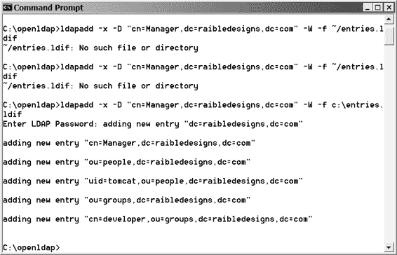
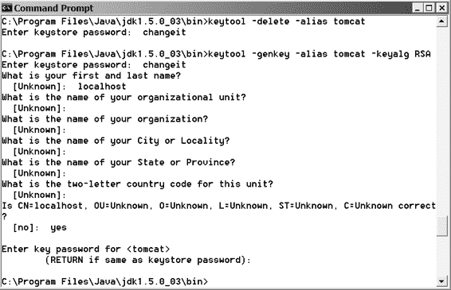
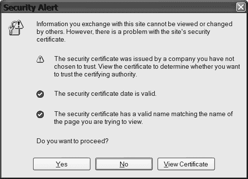
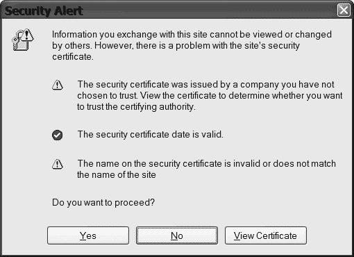

# 定义“developer”角色的条目

dn: cn=developer,ou=groups,dc=raibledesigns,dc=com

objectClass: groupOfUniqueNames

cn: developer

uniqueMember: uid=tomcat,ou=people,dc=raibledesigns,dc=com

513-0 ch12.qxd 11/17/05 4:15 PM 第 487 页

第 12 章 ■ WEB 应用程序的安全性

**487**

我们将此文件命名为 entries.ldif，放在 root 用户的主目录下，并使用 ldapadd 命令导入：

ldapadd -x -D "cn=Manager,dc=raibledesigns,dc=com" -W -f ~/entries.ldif 按照此步骤操作后，控制台窗口应会显示多条“添加新条目”的信息，如图 12-9 所示。

**图 12-9.** *当 LDAP 服务器处理 LDIF 文件中的每个条目时，会向控制台显示一条消息。*

如果遇到任何错误，我们发现可以通过停止 LDAP（使用 kill 命令）并删除 usr\local\var\openldap-data 目录的内容来轻松重新开始。

本例中使用的 slapd.conf 和 entries.ldif 文件可在本书的代码下载中找到；这些文件位于本章代码的 jndi 目录中。要启用 JNDIRealm（代替 JDBCRealm），请将之前的领域配置替换为以下内容：

<Realm className="org.apache.catalina.realm.JNDIRealm" debug="99"

connectionName="cn=Developer,dc=raibledesigns,dc=com"

connectionPassword="secret"

connectionURL="ldap://localhost:389"

userPassword="userPassword"

userPattern="uid={0},ou=people,dc=raibledesigns,dc=com"

roleBase="ou=groups,dc=raibledesigns,dc=com"

roleName="cn"

roleSearch="(uniqueMember={0})"

/>

513-0 ch12.qxd 11/17/05 4:15 PM 第 488 页

**488**

第 12 章 ■ WEB 应用程序的安全性

为此，您需要在 CLASSPATH 中包含用于 LDAP 的 JNDI 驱动程序。您可以从 http://java.sun.com/products/jndi/downloads/index.html 下载最新的 LDAP 服务提供程序（版本 1.2.4）。下载后，将 ldap.jar 解压到 %TOMCAT_HOME%\common\lib 目录中。

与 JDBC 领域类似，您可以通过将 <Realm> 元素嵌套在应用程序 META-INF 目录下 context.xml 文件的 <Context> 元素中，来保护单个应用程序。或者，您也可以将整个服务器的默认领域设置为 JNDI 领域。为此，请编辑 Tomcat 的 server.xml 文件（位于 %TOMCAT_HOME%\conf），并将默认领域（如下所示）替换为您所需领域的信息。请注意，如果您仍想使用 Tomcat Manager 或 Admin 应用程序，您的 LDAP 服务器需要包含相应的用户和角色条目以允许此操作。

如果一切安装和配置正确，那么当您尝试访问受保护的网页时，将看到相同的登录对话框或表单（取决于您指定的是基本认证还是表单认证）。输入用户名和密码后，Tomcat 将向 LDAP 服务器发起 JNDI 调用来验证用户名。

**JAASRealm**

Tomcat 也支持 JAASRealm。我们将在本章后面的“Java 认证与授权服务”部分向您展示如何配置 JAASRealm。就本章及其相关示例应用程序而言，我们将主要使用 JDBCRealm。

**使用安全套接字层**

到目前为止，我们已经讨论了设置基于表单的登录并将其配置为与领域通信。目前示例的一个问题是浏览器与服务器之间的通信并不安全。如果有人使用密码嗅探器进行监听，您的安全性将受到威胁。此外，这些嗅探器很容易获得——尝试在 Google 中搜索“password sniffer”即可。

根据开放 Web 应用程序安全项目（http://www.owasp.org）发布的《构建安全 Web 应用程序指南，版本 1.1.1》，“保护 HTTP 协议最常用的方法是使用 SSL。**安全套接字层**协议，或称 **SSL**，由 Netscape 设计，并于 1994 年在 Netscape Communicator 浏览器中引入。”

它很可能是全球使用最广泛的安全协议，并内置于所有商业网络浏览器和网络服务器中。当前版本为第 2 版。由于 SSL 的原始版本在技术上是专有协议，**互联网工程任务组（IETF）** 接管了升级 SSL 的职责，并将其重新命名为**传输层安全协议（TLS）**。TLS 的第一个版本是 3.1 版，与原始规范相比仅有微小改动。

SSL 是一种允许网络浏览器和网络服务器通过安全通道进行通信的技术。在 SSL 中，数据在浏览器端（传输前）进行加密，然后在服务器端读取数据前进行解密。当服务器向客户端返回数据时，也会经历同样的过程。这个过程被称为**SSL 握手**。该协议目前支持三种加密级别：40 位、56 位和 128 位。

所需的安全性越高，应使用的位数就越多。有关 SSL 握手的更多信息，请访问 http://medialab.di.unipi.it/doc/JNetSec/jns_ch11.htm。

深入理解 SSL 的最佳方式是实践它。在您的网络服务器（本例中为 Tomcat）上设置 SSL 的第一步是生成一个证书。请记住

513-0 ch12.qxd 11/17/05 4:15 PM 第 489 页

第 12 章 ■ 网络安全

**489**

如果您通过传统网络服务器（如 Apache 或 IIS）代理 JSP/Servlet 请求，则需要在那些服务器上设置 SSL。Tomcat 的 SSL 支持文档非常出色，但我们仍将在此处进行介绍，以便您熟悉它。

Tomcat 上的安全套接层

如果您使用的是 Java 1.4 或 Java 5 标准版，Java 安全套接字扩展（JSSE）已集成到其核心中，因此无需额外下载。

■**注意** 有关 JSSE 的更多信息，请访问 http://java.sun.com/products/jsse/。

通过执行以下命令创建证书密钥库：$JAVA_HOME/bin/keytool -genkey -alias tomcat -keyalg RSA 指定密码值为 changeit。此过程应类似于图 12-10 所示的会话。

**图 12-10.** *为 Tomcat 创建证书密钥库时 keytool 程序的输出*
keytool 应用程序将提示您输入信息，例如名字和姓氏、城市、州等。我们使用了**localhost**作为名字和姓氏的值，因为这是您的浏览器在验证证书真实性时匹配的值。它实际上会显示

513-0 ch12.qxd 11/17/05 4:15 PM 第 490 页

**490**

第 12 章 ■ 网络安全

为最终证书中的*认证路径*。出于测试目的，您可以接受大多数其他提示的默认值。当工具提示您验证数据时，输入**yes**并按 Enter 键。最后，按 Enter 键接受密钥库密码作为用户密码。

这仍然不是一个有效的证书，因为它是您自己生成的。要获得有效证书，您必须从**证书颁发机构（CA）**（例如 VeriSign）购买一个。在此示例中，使用 localhost 将导致用户浏览器中少出现一个警告。

现在，编辑%TOMCAT_HOME%/conf/server.xml 并移除 SSL HTTP/1.1 连接器条目周围的注释。设置完成后，您应该能够通过 https://localhost:8443 访问 Tomcat。不要忘记 http 后面的 s。必须指定端口，因为它不是 HTTPS 的默认端口（端口 443）。

Tomcat 期望密钥库工具创建的.keystore 文件位于特定位置（用户的主目录）。如果您在通过 SSL 访问 Tomcat 时遇到问题（特别是错误日志中包含无法访问.keystore 文件的消息），您可以通过在 server.xml 的 SSL <Connector>元素中添加以下属性来告诉 Tomcat.keystore 文件的位置：

keystoreFile="path_to_keystore\.keystore"

如果您在使用 Tomcat 时不想在 URL 中指定端口号，可以轻松地在 server.xml 文件中更改它们。首次通过 SSL 端口访问 Tomcat 时，系统应提示您一个安全警报（见图 12-11）。

**图 12-11.** *当使用非 CA 创建的证书通过 SSL 访问安全站点时，浏览器将显示一个安全警报，告知您这一事实。*

如果您在生成此证书时使用了真实姓名而不是 localhost，安全警报将警告您证书名称与您尝试查看的页面名称不匹配（见图 12-12）。

513-0 ch12.qxd 11/17/05 4:15 PM 第 491 页

第 12 章 ■ 网络安全

**491**

**图 12-12.** *如果证书上的名称有问题，安全警报也会显示该信息。*

■**警告** 我们在 Windows 机器上同时运行 Tomcat（80/443 端口）和 IIS 时遇到过问题。关闭 IIS 后，我们才能在 443 端口上运行 Tomcat。奇怪的是，IIS 当时运行在 81 端口，并且我们没有运行安全端口。当您看到 Tomcat 启动后立即关闭时，端口冲突通常是问题的原因。

设置完成后，您可能会注意到浏览器会警告您有关证书的信息。这是因为证书的颁发者是未知的（您自己），并且浏览器不将您识别为 CA。CA，例如 VeriSign (http://www.verisign.com)、Thawte (http://thawte.com) 和 TC TrustCenter (http://www.trustcenter.de/set_en.htm)，是受信任的组织，它们验证并证明服务器确实是其所声称的身份。此外，如果您想同时设置客户端和服务器证书，还可以获取客户端证书。这在高度安全、绝密的、类似《X 档案》风格的应用中可能是必要的，但对于大多数 Web 应用来说并非必需。

在 Web 应用中使用 SSL 的一个缺点是它往往会显著降低服务器的吞吐量。这主要是由于连接两端的加密和解密过程造成的。因此，我们建议仅在应用真正需要的部分使用 SSL——例如，当用户登录或用户提交信用卡号时。

■**注意** 您可以在 http://www.computerworld.com/securitytopics/security/story/0,10801,58978,00.html 找到更多关于 SSL 性能下降的信息。该文章还包含指向其他文章和 SSL 加速选项的链接。

513-0 ch12.qxd 11/17/05 4:15 PM 第 492 页

**492**

第 12 章 ■ 网络安全

在本章后面，我们将向您展示如何在用户登录时以及用户登录前进行 SSL 切换。

**Java 认证和授权服务**

您可能想知道**Java 认证和授权服务（JAAS）** 如何融入这一切。JAAS 提供了一个用于认证用户和分配权限的框架和标准编程接口。结合 Java 2，应用程序可以提供以代码为中心的访问控制、以用户为中心的访问控制，或两者的组合。JAAS 的发明是为了使登录服务独立于认证技术，并允许**可插拔认证模块（PAM）**。大多数现代应用服务器在底层使用 JAAS 来配置容器管理的安全性——您甚至可能在使用它而自己并未察觉！

当您需要使用复杂的身份验证方案，或向用户授予特定资源的权限（例如，在数据库中插入一行或分配文件的写入权限）时，JAAS 会很有帮助。JAAS 的核心本质上是一种安全机制，允许您通过策略文件指定身份验证和授权。从 J2SE 1.4 开始，它已成为 Java 不可或缺的一部分。当您使用安全管理器运行应用程序服务器时，会检查策略文件，然后允许用户运行您的应用程序，或提示用户输入凭据。正如我们提到的，JAAS 确实支持复杂的登录方案，例如 Windows NT 域或智能卡（例如 RSA SecurID）。

■**注意** 您可以在 http://java.sun.com/j2se/1.4/docs/guide/security/jaas/JAASRefGuide.html#AppendixB 找到有关支持的登录方案的更多信息。

要为您的应用程序设置应用程序服务器以专门使用 JAAS（而不是其自身的身份验证机制），您通常必须选择一个 JAAS 自定义域，然后执行一些额外的步骤。以下步骤在 Tomcat 5（在 Windows 机器上）上设置一个 JAASRealm，以使用 NT 域进行身份验证。

最简单的方法是从 http://free.tagish.net/jaas/ 下载 Andy Armstrong 的 JAAS 登录模块。这些模块是专门为使用 Windows NT 域进行身份验证而编写的，类似于使 JDBCRealm 在后台工作的辅助类。下载 ZIP 文件后，将下载文件的内容解压到 jaas-modules 目录。在撰写本文时，1.0.3 版本是最新的可用下载版本。

下载登录模块后，将 NTSystem.dll 文件复制到 Tomcat 的 bin 目录。将 tagishauth.jar 复制到 Tomcat 的 common\lib 目录。

在 Tagish JAAS 发行版的 Samples config 文件夹中，您会找到 tagish.login 文件和 java.security.sample 文件。从 java.security.sample 复制最后几行，并将其放在 java.security 文件（位于 $JAVA_HOME\jre\lib\security）的末尾。该行内容如下：

