# Login configs

login.config.url.1=file:${java.home}/lib/security/tagish.login

513-0 ch12.qxd 11/17/05 4:15 PM Page 493

C H A P T E R 1 2 ■ S E C U R I T Y I N W E B A P P L I C AT I O N S

**493**

将标记 ${java.home} 替换为您系统上 Java 主目录的实际路径。例如，如果 ${java.home} 解析为 C:\Program Files\Java\jre1.5.0_03\，则该条目应如下所示：

login.config.url.1=file:C:/Program Files/Java/jre1.5.0_03/lib/security/tagish.login 然后将 tagish.login 文件移动到同一目录（$JAVA_HOME\jre\lib\security）。

如果您的用户始终登录到同一个域（这是我们在此处配置的），只需按如下方式设置 tagish.login 中的 defaultDomain 属性：

NTLogin

{

com.tagish.auth.win32.NTSystemLogin required returnNames=true returnSIDs=false defaultDomain=NT_DOMAIN_OR_WORKGROUP;

};

其中 NT_DOMAIN_OR_WORKGROUP 是您登录的 NT 域，或您登录的 Windows 工作组。

■**提示** 确保将 defaultDomain 值从 NT_DOMAIN_OR_WORKGROUP 更改为您要与之通信的域。

完成这些设置步骤后，您需要更改上下文以包含以下领域配置：

<Realm className="org.apache.catalina.realm.JAASRealm" debug="10"

appName="NTLogin"

userClassNames="com.tagish.auth.win32.typed.NTUserPrincipal"

roleClassNames="com.tagish.auth.win32.typed.NTGroupPrincipal" /> 清单 12-7 显示了 Tomcat 5.5 的 context.xml 文件。如果您使用的是 Tomcat 5.0，请将 <Realm> 元素放在 server.xml 文件中。如果您使用的是 Tomcat 5.5，请将 <Realm> 元素嵌套在文件 META-INF\context.xml 的 <Context> 元素中。

**清单 12-7.** *context.xml*

<Context path="/5130ch12_jaas" docBase="5130ch12_jaas" debug="99">

<Realm className="org.apache.catalina.realm.JAASRealm" debug="10"

appName="NTLogin"

userClassNames="com.tagish.auth.win32.typed.NTUserPrincipal"

roleClassNames="com.tagish.auth.win32.typed.NTGroupPrincipal" />

</Context>

接下来，将清单 12-8 中的条目添加到部署描述符中。

513-0 ch12.qxd 11/17/05 4:15 PM Page 494

**494**

C H A P T E R 1 2 ■ S E C U R I T Y I N W E B A P P L I C AT I O N S

**清单 12-8.** *web.xml 的 <security-constraint> 和 <login-config> 元素*

<security-constraint>

<web-resource-collection>

<web-resource-name>Security Example</web-resource-name>

<url-pattern>/*</url-pattern>

</web-resource-collection>

<auth-constraint>

<role-name>*</role-name>

</auth-constraint>

</security-constraint>

<login-config>

<auth-method>FORM</auth-method>

<form-login-config>

<form-login-page>/login.jsp</form-login-page>

<form-error-page>/loginError.jsp</form-error-page>

</form-login-config>

</login-config>

文件 login.jsp 已在清单 12-1 中展示；我们已将 loginError.jsp 留给您自行编写。

■**警告** Tagish 发行版中似乎存在一个错误，会导致基本身份验证失败。这就是我们在此示例中使用表单身份验证的原因。有关更多信息，请参见 http://blog.cmaeda.com/?p=22。

我们在 Windows XP 机器上测试了此设置和配置，一切运行顺利。我们能够使用登录 Windows XP 时使用的相同用户名/密码组合进行登录。此外，我们没有域，只有一个工作组，一切在那里也完美运行。

如果您不想使用 Andy Armstrong 的 JAAS 登录模块，您可以按照以下步骤创建自己的基于文件的 JAAS LoginModule。

首先，创建一个如清单 12-9 所示的 LoginModule 类，该类实现 javax.security.auth.login.LoginContext。

**清单 12-9.** *MyLoginModule.java*

package com.apress.projsp;

import java.io.IOException;

import java.security.Principal;

import java.util.Map;

import javax.security.auth.Subject;

513-0 ch12.qxd 11/17/05 4:15 PM Page 495

C H A P T E R 1 2 ■ S E C U R I T Y I N W E B A P P L I C AT I O N S

**495**

import javax.security.auth.callback.*;

import javax.security.auth.login.*;

import javax.security.auth.spi.LoginModule;

public class MyLoginModule implements LoginModule

{


protected CallbackHandler callbackHandler = null;

protected boolean committed = false;

protected boolean debug = false;

protected Map options = null;

protected Principal principal = null;

protected Map sharedState = null;

protected Subject subject = null;

protected void log(String message) {

System.out.print("MyLoginModule: ");

System.out.println(message);

}

public boolean abort() throws LoginException {

log("abort");

return (true);

}

public boolean commit() throws LoginException {

log("commit phase");

// 如果认证未成功，则直接返回 false
if (principal == null) {

log("no principal commit fails");

return (false);

}

if (!subject.getPrincipals().contains(principal))

subject.getPrincipals().add(principal);

// 添加角色主体

subject.getPrincipals().add(new MyRolePrincipal("admin")); committed = true;

log("commit successful");

return (true);

}

public void initialize(Subject subject,

CallbackHandler callbackHandler,

Map sharedState, Map options)

{

513-0 ch12.qxd 11/17/05 4:15 PM Page 496

**496**

第 12 章 ■ WEB 应用程序中的安全性

// 保存配置值

this.subject = subject;

this.callbackHandler = callbackHandler;

this.sharedState = sharedState;

this.options = options;

}

public boolean login() throws LoginException {

log("login phase");

// 设置我们的 CallbackHandler 请求

if (callbackHandler == null)

throw new LoginException("No CallbackHandler specified"); Callback callbacks[] = new Callback[2];

callbacks[0] = new NameCallback("Username: "); callbacks[1] = new PasswordCallback("Password: ", false);

// 与用户交互以检索用户名和密码
String username = null;

String password = null;

try {

callbackHandler.handle(callbacks);

username = ((NameCallback) callbacks[0]).getName();

password = new String(((PasswordCallback) callbacks[1])

.getPassword());

} catch (IOException e) {

throw new LoginException(e.toString());

} catch (UnsupportedCallbackException e) {

throw new LoginException(e.toString());

}

if (!authenticate(username, password))

return false;

principal = new MyPrincipal(username);

return true;

}

public boolean logout() throws LoginException {

subject.getPrincipals().remove(principal);

committed = false;

principal = null;

return (true);

}

boolean authenticate(String s, String p) {

if (s == null || p == null)

return false;

return (s.compareTo("jaas") == 0) && (p.compareTo("jaas") == 0);

}

513-0 ch12.qxd 11/17/05 4:15 PM Page 497

第 12 章 ■ WEB 应用程序中的安全性

**497**

static public void main(String args[]) throws Exception {

LoginContext ctx = new LoginContext("TomCatAdminApplication"); ctx.login();

}

}

请注意，有效的用户名和密码是硬编码在 `authenticate()` 方法中的。显然，在实际的应用程序中，该类会使用更健壮的技术来验证用户名和密码。

现在我们需要编写一个类来表示用户和用户角色。清单 12-10 显示了实现 `java.security.Principal` 的 `MyPrincipal` 类。

**清单 12-10.** *MyPrincipal.java*

package com.apress.projsp;

public class MyPrincipal implements java.security.Principal

{

String m_Name = new String("");

public MyPrincipal(String name) {

m_Name = name;

}

public boolean equals(Object another) {

try {

MyPrincipal pm = (MyPrincipal) another;

return pm.m_Name.equalsIgnoreCase(m_Name);

} catch (Exception e) {

return false;

}

}

public String getName() {

return m_Name;

}

public int hashCode() {

return m_Name.hashCode();

}

public String toString() {

return m_Name;

}

}

清单 12-11 显示了一个角色类（它扩展了清单 12-10 中的 `MyPrincipal` 类）。

513-0 ch12.qxd 11/17/05 4:15 PM Page 498

**498**

第 12 章 ■ WEB 应用程序中的安全性

**清单 12-11.** *MyRolePrincipal.java*

package com.apress.projsp;

public class MyRolePrincipal extends MyPrincipal

{

/** 创建 MyRolePrincipal 的新实例 */
public MyRolePrincipal(String s) {

super(s);

}

}

编译这三个类，并使它们对你的 Web 应用程序可访问。你可以通过将它们放在 `WEB-INF\classes` 中，或者将它们放入一个 JAR 文件中，然后将该 JAR 文件复制到应用程序的 `WEB-INF\lib` 或 Tomcat 的 `common\lib` 来实现这一点。现在，你需要配置应用程序的上下文以使用这些新创建（当然，也已编译）的类。

<Realm className="org.apache.catalina.realm.JAASRealm" debug="99"

appName="ProJSP"

userClassNames="com.apress.projsp.MyPrincipal"

roleClassNames="com.apress.projsp.MyRolePrincipal" /> 如果你使用的是 Tomcat 5.0，请将 `<Realm>` 元素放在 `server.xml` 文件中。如果你使用的是 Tomcat 5.5，请将 `<Realm>` 元素嵌套在文件 `META-INF\context.xml` 的 `<Context>` 元素中。

为 `MyLoginModule` 创建一个登录配置文件。（有关登录配置文件的更多信息，请参见 http://java.sun.com/j2se/1.4.2/docs/guide/security/jaas/JAASRefGuide.html。）Tagish 发行版将其文件命名为 `tagish.login`；如清单 12-12 所示，我们将我们的文件命名为 `projsp.login`。

**清单 12-12.** *projsp.login*

ProJSP {

com.apress.projsp.MyLoginModule required;

};

这里需要注意几点。首先，`<Realm>` 元素中的 `appName` 属性必须与登录配置文件中的应用程序名称匹配。其次，配置文件可以列出多个登录模块。只需依次添加每个额外的登录模块，并使用分号分隔每个条目。

最后，我们需要告诉 JVM 在哪里找到这个登录配置文件。与 `tagish.login` 文件一样，我们在 `java.security` 配置文件 `jre\lib\security\java.security` 中执行此操作：

login.config.url.n=file:${path/to/projsp.login}

安全配置文件由一组你可以配置的安全属性组成。上面一行中的 `n` 被替换为一个唯一的整数，以便你可以列出多个配置 URL。`login.config.url.n` 属性的值是登录配置文件的路径。

513-0 ch12.qxd 11/17/05 4:15 PM Page 499

第 12 章 ■ WEB 应用程序中的安全性

**499**

因此，如果 `JAVA_HOME` 是 `c:\java`，那么 `java.security` 文件中针对 `projsp.login` 的条目将如下所示：

login.config.url.1=file:c:/java/jre/lib/security/projsp.login 最后，编辑或创建部署描述符中的 `<security-constraint>` 和 `<login-config>` 元素。

**基于表单的身份验证技巧与诀窍**

既然我们已经讨论了如何将基于表单的身份验证与服务器的域一起使用，我们想分享一些技巧和诀窍。其中许多是客户请求或可用性增强，我们认为它们将使开发安全应用程序变得更加容易。

使用欢迎文件

在 Web 应用程序中，配置用户将看到的起始页面非常重要。将以下 `<welcome-file-list>` 元素添加到你的 `web.xml` 文件中可以实现这一点：

<welcome-file-list>

<welcome-file>index.jsp</welcome-file>

</welcome-file-list>

在某些应用服务器中，默认的欢迎文件已经配置为 `index.html` 和 `index.jsp`，但指定这一点并提高应用程序的可移植性并无坏处。另外，请注意你的欢迎文件可以使用任意名称命名；你不必将其命名为 `index.jsp` 或 `index.html`。配置好欢迎文件后，很容易添加几行简单的代码将用户转发到受保护的资源：

<% response.sendRedirect("/welcome.do"); %> Servlet 2.4 规范的一个不错的补充是，你实际上可以将欢迎文件设置为使用一个 servlet；这在早期版本中是无法做到的。也就是说，当使用兼容 Servlet 2.4 或 Servlet 2.5 的容器时，以下配置将生效：

<welcome-file>/welcome.do</welcome-file>


当您使用基于表单的身份验证并转发到受保护资源时，您将看到 web.xml 文件中指定的页面——在本章的示例应用中，该页面是 login.jsp。为了让这个页面比单纯的登录表单更友好，我们通常会采取以下措施之一：

• 在此页面上包含欢迎信息

• 通过使用 `<jsp:include>` 从另一个 JSP 页面包含欢迎信息

• 使用诸如 Tiles 或 SiteMesh 之类的模板机制，将两个页面以及重定向值中的适当 URL 组合起来

513-0 ch12.qxd 11/17/05 4:15 PM 第 500 页

**500**

第 12 章 ■ WEB 应用安全

■**注意** 您可以在 http://jakarta.apache.org/struts/userGuide/dev_tiles.html 和 http://www.opensymphony.com/sitemesh/ 分别找到关于 Tiles 和 SiteMesh 的更多信息。

在错误页面上允许登录

使用 HTTP 基本身份验证时，用户可能会在登录失败时感到沮丧。如果您在使用某些浏览器（例如 Mac 上的 Internet Explorer）时输入了无效凭据，则会返回一个 HTTP 状态码（401 – 未授权），并在屏幕上显示一条错误消息。Mozilla 通过再次提示您输入有效凭据来处理得更好。这是理想的情况，也是大多数可用性专家所推荐的。基于表单的身份验证的默认行为与前面描述的不良行为类似。

不过，别担心——有几种技术可以帮助解决这个问题。第一种是使用一个 JSP 页面同时提供登录页面和错误页面。第二种是使用 cookie 来捕获请求的 URL 并重复使用它。

将同一个页面用作表单登录页面和表单错误页面，只需配置 web.xml 来处理即可：

<form-login-config>

<form-login-page>/login.jsp</form-login-page>

<form-error-page>/login.jsp</form-error-page>

</form-login-config>

这种方法的一个问题是，如果登录失败，用户将再次看到同一个页面——没有任何错误信息。因此，让我们在表单错误页面中添加一个小指示器，以表明登录失败：

<form-error-page>/login.jsp?error=true</form-error-page> 现在，可以在您的 JSP 页面中获取此参数，并在身份验证失败时显示错误消息：

<c:if test="${param.error != null}">

<div class="error">

用户名和/或密码无效，请重试。

</div>

</c:if>

虽然这看起来很简单，但已知在某些容器上会失败。当这种情况发生时，容器仍然符合规范。但是，您可以施展一点小魔法，尝试从错误页面再次登录。

在使用 iPlanet Application Server 6.x 时，该服务器要求在 `<login-config>` 中使用两个独立的页面，我们在浏览器中查看 login.jsp 的源代码时偶然发现了这个解决方案。HTML 源代码显示了各种有用的信息，特别是作为隐藏字段的原始请求 URL。利用这个隐藏字段，我们能够将此值设置为 cookie，并在登录错误页面的表单操作中重复使用它。

513-0 ch12.qxd 11/17/05 4:15 PM 第 501 页

第 12 章 ■ WEB 应用安全

**501**

■**注意** 您可以在 http://husted.com/struts/resources/fb-auth.htm 找到此过程的详细信息。

不幸的是，没有可移植的机制来获取最初请求的 URL，而且甚至无法保证这是可能的。您只知道容器检测到请求了一个受保护的 URL，并且当前没有用户通过身份验证。一种解决方案可能是使用过滤器来跟踪所有最近请求的 URL，并从中获取最后请求的 URL。您需要确保您的登录表单是一个 `*.jspf`（JSP 片段）文件，这样您就可以将其同时包含在表单登录页面和表单错误页面中。

仅对登录使用安全套接字层

如前所述，使用 SSL 会降低应用程序的性能，因此明智的做法是仅在需要时使用它。SSL 的一个良好用途是在用户登录时。这意味着，当用户名和密码通过网络发送时，使用 HTTP 协议（http://）访问登录页面的用户将被切换到 HTTPS（https://）。在此示例中，您将使用一个 Login servlet 来处理初始登录请求，切换到 SSL，然后重定向到容器的身份验证机制。

本书的代码下载附带了一个功能齐全的应用程序，用于演示安全技术。不幸的是，它太长了，无法在此完整列出。在接下来的页面中解释应用程序时，我们会提供摘录。这个应用程序，为简单起见我们称之为 security-example.war，旨在包含本章描述的所有安全机制。该应用程序的源代码和二进制版本均可下载。您可以通过使用二进制版本并调整 security-example.xml 文件和应用程序的 web.xml 文件来完成大部分练习。

**使用 Servlet**

该应用程序提供的第一个功能是基于 SSL 的登录。为了提供这种基于 SSL 的登录，应用程序有一个 servlet 来拦截登录请求。这个 servlet 被称为 LoginServlet，它映射到一个 `/auth/*` 的 `<url-pattern>`。然后，您将使用 `auth/`，而不是在登录表单的 action 属性中使用 `j_security_check`。以下是登录页面上的表单样式：

<form id="loginForm" method="post" action="auth/"> 要启用安全登录，您需要编辑此应用程序附带的 web.xml 文件，将 isSecure 初始化参数设置为 true：

<servlet>

<servlet-name>login</servlet-name>

<display-name>Login Servlet</display-name>

<servlet-class>org.appfuse.webapp.action.LoginServlet</servlet-class>

<init-param>

<param-name>authURL</param-name>

<param-value>j_security_check</param-value>

</init-param>

513-0 ch12.qxd 11/17/05 4:15 PM 第 502 页

**502**

第 12 章 ■ WEB 应用安全

<init-param>

<param-name>isSecure</param-name>

<param-value>true</param-value>

</init-param>

<init-param>

<param-name>encrypt-password</param-name>

<param-value>false</param-value>

</init-param>

<init-param>

<param-name>algorithm</param-name>

<param-value>SHA</param-value>

</init-param>

<load-on-startup>3</load-on-startup>

</servlet>

如果您是从源代码构建 security-example 项目，则登录 servlet 的参数是在构建时指定的。默认设置包含在 app-settings.xml 文件中，可以通过命令行使用 `-Dname=<value>`（在这种情况下意味着 `-Dsecure.login=true`）进行覆盖。`secure.login` 默认是关闭的，因此您需要将 `secure.login=true` 添加到您的 build.properties 文件中，或者在命令行中传递它。

现在让我们深入研究这个 servlet，看看它是如何工作的。首先，我们必须承认，我们实现这一功能的一些魔法来自于 Steve Ditlinger 在 *JavaWorld* 上发表的一篇文章。我们使用了这篇文章中的两个类：`SslUtil` 和 `RequestUtil`。

■**注意** 您可以在线找到 Steve Ditlinger 的文章，标题为“在 Web 应用中透明地混合协议”，网址为 http://www.javaworld.com/javaworld/jw-02-2002/jw-0215-ssl.html。

如果您的 HTTP 和 HTTPS 端口与默认的 80 和 443 不同，您需要更改 web.xml 中用于 HTTP 和 HTTPS 端口的两个上下文参数。在源代码分发中，您可以在 `web\WEB-INF` 文件夹中编辑 web.xml。目前，这些值设置如下：

<context-param>

<param-name>listenPort_http</param-name>

<param-value>8080</param-value>

</context-param>

<context-param>

<param-name>listenPort_https</param-name>

<param-value>8443</param-value>

</context-param>

这些值以及 servlet 的初始化参数在 servlet 启动时加载。我们在此不提供代码，因为我们猜测您已经理解了。


513-0 ch12.qxd 11/17/05 4:15 PM 第 503 页

第 12 章 ■ Web 应用程序中的安全性

**503**

如何检索上下文和初始化参数。以下是 LoginServlet.init()方法，它从 web.xml 中检索这些值：

public void init() throws ServletException

{

// 获取基于表单认证的容器认证 URL

// J2EE 规范规定应为 j_security_check

authURL = getInitParameter(Constants.AUTH_URL);

// 获取在存储到数据库前用于加密密码的加密算法

algorithm = getInitParameter(Constants.ENC_ALGORITHM);

/* 确定登录是否使用 SSL */

secure = Boolean.valueOf(getInitParameter("isSecure"));

/* 确定是否应以编程方式加密密码 */

encrypt = Boolean.valueOf(getInitParameter("encrypt-password")); if (log.isDebugEnabled()) {

log.debug("认证 URL: " + authURL);

log.debug("登录使用 SSL? " + secure);

log.debug("以编程方式加密密码? " + encrypt); log.debug("加密算法: " + algorithm);

}

// 确保授权 URL 参数存在

if (authURL == null) {

throw new ServletException(

"web.xml 中未提供'authURL'上下文参数");

}

initializeSchemePorts(getServletContext());

getServletContext().setAttribute(Constants.HTTP_PORT, httpPort); getServletContext().setAttribute(Constants.HTTPS_PORT, httpsPort); getServletContext().setAttribute(Constants.SECURE_LOGIN, secure); getServletContext().setAttribute(Constants.ENC_ALGORITHM, algorithm); if (log.isDebugEnabled()) {

log.debug("HTTP 端口: " + httpPort);

log.debug("HTTPS 端口: " + httpsPort);

}

}

在该 servlet 的 execute()方法中——doGet()和 doPost()都会调用它——有以下代码用于判断当前协议是否正确，如果不正确则切换协议：

String redirectString = SslUtil.getRedirectString(request, getServletContext(), secure.booleanValue());

if (redirectString != null) {

// 将页面重定向到所需 URL

response.sendRedirect(response.encodeRedirectURL(redirectString));

513-0 ch12.qxd 11/17/05 4:15 PM 第 504 页

**504**

第 12 章 ■ Web 应用程序中的安全性

if (log.isDebugEnabled()) {

log.debug("切换协议，重定向用户");

}

}

在上述代码中，secure.booleanValue()是由 servlet 的 isSecure <init-param>设置的值。在获得正确协议（本例中为 HTTPS）后，再次执行 servlet，此时 redirectString 将为 null。因此，其余代码将执行：

/* 调用 URLEncoder.encode 将任何不允许的字符转换为其 URL 安全等效字符
* - response.encodeURL 仅添加会话 ID
* URLEncoder.encode 方法在 J2SE 1.3.1 和 1.4 之间更改了签名，
* 因此我们使用 Struts 中的 org.apache.struts.util.RequestUtils 类。
* 该类使用反射来确定适当的编码。
*/

String req = authURL + "?j_username=" + RequestUtils.encodeURL(username)

+ "&j_password=" + RequestUtils.encodeURL(encryptedPassword); if (redirectString == null) {

// 表示已使用正确协议

if (log.isDebugEnabled()) {

log.debug("正在认证用户'" + username + "'");

}

response.sendRedirect(response.encodeRedirectURL(req));

}

**使用标签库**

如果您的应用程序运行在默认 HTTP（80）和 HTTPS（443）端口上，您可以使用标签库强制在该特定页面上使用某种协议。HTTPS 的非标准端口会在 Internet Explorer 中导致问题，并出现“服务器未找到”错误。前面的“使用 Servlet”部分描述了解决此问题的一个巧妙方法。

在示例应用程序中，我们有一个 Secure.java 标签库（由 Jon Lipsky 编写，http://www.javablogs.com/views/ViewBlog.action?id=13055），可用于强制特定 JSP 页面使用 SSL 或非 SSL。其语法如下：


<security-example:secure mode="secured"/> 此处，mode 可设置为 secured、unsecured 或 either。此外，如果省略 mode 属性，则默认采用 secured 模式。

基于 Servlet 示例，其中变量 secureLogin 已在应用作用域中设置，你可以在 login.jsp 页面中检索并使用它来强制启用 SSL：

<c:if test="${applicationScope.secureLogin == 'true'}">

<security-example:secure />

</c:if>

513-0 ch12.qxd 11/17/05 4:15 PM 第 505 页

第 12 章 ■ Web 应用安全

**505**

**安全套接层总结**

希望本节内容能让你了解如何在应用中为特定 Servlet 控制 SSL。如果需要为整个应用保证 SSL，我们建议将 web.xml 文件中的 `<transport-guarantee>` 元素设置为 INTEGRAL 或 CONFIDENTIAL。

该值用于指定客户端与服务器之间数据的发送方式。在示例应用中，该值设置如下：

<user-data-constraint>

<description>

应用通常不需要加密。

</description>

<transport-guarantee>NONE</transport-guarantee>

</user-data-constraint>

表 12-2 展示了 Servlet 规范对每个值的定义。

**表 12-2.** *<transport-guarantee> 值的含义* **值**

**描述**

NONE

应用不需要任何传输保证。这与在 web.xml 中不包含 `<user-data-constraint>` 元素效果相同。

INTEGRAL

应用要求客户端与服务器之间发送的数据在传输过程中不可被更改。

CONFIDENTIAL

应用要求数据传输方式能防止其他实体观察传输内容。

大多数 Servlet 容器会在该值设置为 INTEGRAL 或 CONFIDENTIAL 时将客户端切换到 SSL。虽然这种切换对需要它的应用来说很好，但在实现时必须小心。在大多数 Servlet 容器中，如果将该值设置为 INTEGRAL 或 CONFIDENTIAL，你的应用将*仅*在 SSL 端口上可用。巧妙之处在于，当你尝试访问应用时，服务器会自动将你重定向到 https://serverName:443。然而，如果你的安全服务器运行在 443 以外的端口上，在 Internet Explorer 中将会收到“服务器未找到”错误。这引出了我们的下一个技巧：使用过滤器检查对受保护资源的请求。

对受保护资源使用过滤器

当过滤受保护资源时，可以使用相同的 SSL 切换使整个应用在任何端口上都安全，同时还能检索用户信息。用户通过应用认证后，你可能希望获取该用户的更多信息。容器管理安全的一个限制是，你只能知道用户的用户名及其所属角色。为解决此问题，我们建议使用一个过滤器，检查会话中是否存在 User 对象，如果为 null 则填充它。为了演示这一点，你需要创建一个 User 对象、数据库访问代码以及一个与之通信的数据库。

513-0 ch12.qxd 11/17/05 4:15 PM 第 506 页

**506**

第 12 章 ■ Web 应用安全

■**注意** 在安全项目中，你可以通过使用 setup-db Ant 任务来创建一个已填充数据的 MySQL 数据库。

下载文件中包含一个 security-example.sql 文件，你也可以用它来创建并填充数据库。

现在数据库已填充数据，你可以通过过滤器从中获取信息。我们创建了一个名为 ActionFilter.java 的过滤器，它映射到与受保护资源相同的 `<url-pattern>` (*.do)。这样，它只会在用户成功认证后被调用。我们喜欢使用一个辅助类来调用持久层——这个类名为 UserManager.java，它使用了**业务委托**模式。

■**注意** 你可以在 http://java.sun.com/blueprints/corej2eepatterns/Patterns/BusinessDelegate.html 找到关于业务委托模式的更多信息。

通过使用业务委托来隐藏过滤器的实现细节非常重要，这样你就可以随时切换到新的持久层（例如 EJB）。我们不深入探讨 UserManager 及其工作原理的细节，因此请相信我们，UserManager.getUser() 方法会返回一个填充了用户属性的 JavaBean。来看一下这个过滤器的部署描述符：

<filter>

<filter-name>actionFilter</filter-name>

<display-name>Action Filter</display-name>

<filter-class>com.apress.projsp.filter.ActionFilter</filter-class>

<init-param>

<!-- 如果希望保护整个应用，请将此值改为 true。 -->

<param-name>isSecure</param-name>

<param-value>false</param-value>

</init-param>

</filter>

...

<filter-mapping>

<filter-name>actionFilter</filter-name>

<url-pattern>*.do</url-pattern>

</filter-mapping>

在 doFilter() 方法中，调用 chain.doFilter() 之前执行以下代码：UserForm userForm = (UserForm) session.getAttribute(Constants.USER_KEY); ServletContext ctx = filterConfig.getServletContext();

String username = request.getRemoteUser();

// 用户已认证，用户对象为空

if (username != null && userForm == null) {

513-0 ch12.qxd 11/17/05 4:15 PM 第 507 页

第 12 章 ■ Web 应用安全

**507**

try {

ses = getSession(); // 获取持久化会话

UserManager mgr =

new UserManagerImpl((String) ctx.getAttribute(Constants.DAO_TYPE)); UserForm user = mgr.getUser(ses, username);

session.setAttribute(Constants.USER_KEY, user);

} catch (Exception e) {

log.error("获取用户信息时出错 " + e); e.printStackTrace();

RequestDispatcher dispatcher =

request.getRequestDispatcher("/error.jsp");

dispatcher.forward(request, response);

return;

}}

UserManager 检索用户信息，并向客户端隐藏了脏活（在此例中即过滤器）。在本例中，当未找到用户时，getUser(ses, username) 方法调用会抛出异常。catch 块获取一个 RequestDispatcher 并转发到一个解释问题的 JSP 页面。

隐藏用户详细信息检索的实现非常重要，这样你将来就能切换到 LDAP 或其他类型的用户数据库。要使用 LDAP，你只需创建一个实现 UserManager 并与 LDAP 通信的新类，而不是与数据库通信。更妙的是，你可以在 web.xml 中添加一个上下文参数，以便在数据库和 LDAP 之间切换。使用 LDAP 这样的目录服务器的好处是，你可以将加密密码作为数据存储的一部分。对于文件和数据库领域，你必须通过编程方式加密密码，或者配置 Servlet 容器为你完成。

加密密码

在 Tomcat 中，通过向领域定义添加 digest 属性可以轻松加密密码。该值必须是 java.security.MessageDigest 类支持的摘要算法之一（SHA、MD2 或 MD5）。扩展前面的示例，下面的 XML 片段为基于文件的领域添加了 SHA 加密：

<Realm className="org.apache.catalina.realm.UserDatabaseRealm"

debug="0" resourceName="UserDatabase" digest="SHA" /> 现在要登录应用，你需要将存储在 tomcat-users.xml 中的密码加密为其加密形式。可以通过执行以下命令来完成：

java org.apache.catalina.realm.RealmBase -a SHA {明文密码}

其中 catalina.jar 位于 CLASSPATH 中。然后，将此新密码复制并粘贴到 %TOMCAT_HOME%\conf\tomcat-users.xml 文件中。

这种密码加密方法的问题在于它可能不可移植。


让我们来看看程序化加密。好消息是，你已经创建了一个 `LoginServlet`，因此可以用它来加密密码。由于该功能默认是关闭的，你需要

513-0 ch12.qxd 11/17/05 4:15 PM 第 508 页

**508**

第 12 章 ■ **Web 应用程序的安全性**

在 `build.properties` 文件中添加 `encrypt.password=true`，或者通过命令行使用 `ant –Dencrypt.password=true` 传入该参数，也可以编辑 `app-settings.xml` 中的默认设置。如果你使用的是本应用程序的二进制版本（`.war` 文件），只需编辑 `web.xml` 文件中 `LoginServlet` 的以下 `<init-param>` 配置：

<init-param>

<param-name>encrypt-password</param-name>

<param-value>true</param-value>

</init-param>

接下来，你需要在你的 Servlet 中实际加密密码。为此，请在 `StringUtil.java` 类中创建一个 `encodePassword(String password, String algorithm)` 方法。该方法使用 JSSE 中的 `MessageDigest` 类来加密字符串：`import java.security.MessageDigest;`

public static String encodePassword(String password, String algorithm) {

byte[] unencodedPassword = password.getBytes();

MessageDigest md = null;

try {

// 首先，根据给定的提供者创建一个实例

md = MessageDigest.getInstance(algorithm);

} catch (Exception e) {

log.error("Exception: " + e);

return password;

}

md.reset();

// 调用 update 方法一次或多次

// （当你不知道数据大小时很有用，例如流） md.update(unencodedPassword);

// 现在计算哈希值

byte[] encodedPassword = md.digest();

StringBuffer buf = new StringBuffer();

for (int i = 0; i < encodedPassword.length; i++) {

if (((int) encodedPassword[i] & 0xff) < 0x10) {

buf.append("0");

}

buf.append(Long.toString((int) encodedPassword[i] & 0xff, 16));

}

return buf.toString();

}

此方法根据你传入的算法对字符串进行加密。该算法在 `LoginServlet` 中定义，并且在构建时可通过 `${encrypt-algorithm}` 变量进行配置。默认设置为 SHA。

■**注意** 有关这些算法及其工作原理的更多信息，请访问 http://theory.lcs.mit.edu/~rivest/crypto-security.html#Algorithms。

513-0 ch12.qxd 11/17/05 4:15 PM 第 509 页

第 12 章 ■ **Web 应用程序的安全性**

**509**

如果你正在使用密码加密，并且还提供了“找回密码”功能，你可能需要在用户存储中添加一个 `password_hint` 列。记住所有密码已经够难了，而当你不得不创建一个新密码时更是令人烦恼，因此“发送提示”策略非常有用。

**Servlet 2.5 安全变更**

Servlet 2.5 规范有一整章关于安全的内容，但变化不大。JSP 2.1 规范不包含任何与安全相关的信息。它只是指出了通过 `HttpServletRequest` 接口进行安全编程的有用信息，为你提供了以下方法：

• `getRemoteUser()`

• `isUserInRole(String roleName)`

• `getUserPrincipal()`

`getRemoteUser()` 方法返回已验证用户的登录名，如果不存在已验证用户则返回 `null`。`isUserInRole()` 方法有助于确定某个角色对特定资源的授权。

关于角色，如果你将它们硬编码到 Servlet 中，需要记住一件重要的事情：使用 `web.xml` 中的 `<security-role-ref>` 元素来创建链接。示例如下：

<security-role-ref>

<role-name>admin</role-name>

<role-link>accounting</role-name>

</security-role-ref>

这样，你就可以编写 Servlet 代码，而无需担心 admin 角色是否会从会计部门变更为 IT 部门。你只需使用 `admin` 进行配置/编码，并知道你的代码将安全地应对变更。当然，我们建议将此值放在 `Constants.java` 文件中，以便在确实需要时能够轻松更改。

`HttpSession` 接口提供了 `session.invalidate()` 方法用于用户登出。这对我们来说一直很好用。当你调用 `session.invalidate()` 时，它会使会话失效，然后解绑所有绑定到该会话的对象。


**其他身份验证选项与注意事项**

如果你对容器管理的身份验证在开发便捷性方面不满意，或者有更严格的安全要求，还有其他替代方案。最常见的做法是构建自定义身份验证机制。如果决定采用此方案，我们强烈建议你研究 JAAS 并尝试使用其 API。

安全过滤器

安全过滤器（http://securityfilter.sourceforge.net/）是一个模仿容器管理安全机制的开源项目。它看起来与容器管理安全机制完全一致，并支持 `HttpServletRequest` 的程序化安全方法。但遗憾的是，它无法自动将用户的 `Principal` 对象传播到 EJB 调用中。

513-0 ch12.qxd 11/17/05 4:15 PM 第 510 页

**510**

第 12 章 ■ Web 应用程序中的安全性

Struts 的 SSL 扩展

Struts 的 SSL 扩展（http://sslext.sourceforge.net/）适用于 HTTP/HTTPS 切换。这是一个开源项目，允许你通过修改后的 Struts 标签库以及 Struts 配置文件中的配置设置，来实现 HTTP/HTTPS 切换。该项目由 Steve Ditlinger 编写，他也是前面提到的 SSL 切换文章的作者。

记住密码

你可能在许多门户网站（如 Yahoo!）上见过“记住我的密码”功能。通常，这是通过将用户名和密码组合存储在 cookie 中来实现的。如果你的应用程序需要登录，并且你想添加此功能，实现起来相当简单，尤其是在 Servlet 2.5 环境下。你可以使用一个 servlet 作为欢迎文件，并检查 cookie 是否存在。当然，你也可以使用 JSP 来模拟相同的行为，获取用户名和密码的 cookie，并将这些 cookie 作为参数重定向到 `LoginServlet`。大多数现代浏览器的优点在于它们会主动提供记住密码的功能，这通常比使用 cookie 更安全。

“记住我”功能

作为此功能实现方式的示例，你将为代码下载附带的示例应用程序添加一个“记住我”功能。具体做法是使用 cookie 记住用户名和密码，并在用户首次访问应用程序时查找这些信息。如果 cookie 存在，则尝试对用户进行身份验证。此过程涉及三个 cookie；前两个已在前面提及。第三个 cookie 用于指示用户希望使用“记住我”功能。然后，你使用一个过滤器来检测这些 cookie 是否存在，如果存在，则尝试登录用户。

首先，在 `login.jsp` 页面中添加一个复选框，允许用户指示他希望应用程序记住其密码：

```html
<input type="checkbox" name="rememberMe" id="rememberMe" /> 记住我
```

如果选中此框，则设置一个 cookie 来指示用户希望使用此功能。同时，设置一个 cookie 来记住用户的用户名和密码。由于你使用 `LoginServlet` 将登录请求转发到 `j_security_check`，因此需要在 `execute()` 方法中添加设置这些 cookie 的代码：

```java
if (request.getParameter("rememberMe") != null) {

    response =

        RequestUtil.setCookie(response, "rememberMe", "true", false); response =

        RequestUtil.setCookie(response, "password",

            StringUtil.encodeString(encryptedPassword),

            false);

}
```

513-0 ch12.qxd 11/17/05 4:15 PM 第 511 页

第 12 章 ■ Web 应用程序中的安全性

**511**

对于密码 cookie，你使用了 `StringUtil.java` 类中的 `encodeString()` 方法。这是一个简单的方法，通过使用 `sun.misc.BASE64Encoder()` 来加密密码 cookie 的值：

```java
public static String encodeString(String str) throws IOException {

    sun.misc.BASE64Encoder encoder = new sun.misc.BASE64Encoder(); String encodedStr = new String(encoder.encodeBuffer(str.getBytes())); return (encodedStr.trim());

}
```


Base64 编码非常适合此功能，因为它可以被解码（自动登录时需要用到），并且能确保客户的密码不以明文形式存储。

如果你没有使用 `LoginServlet`，而只是在表单中将 `j_security_check` 作为 action 属性，你仍然可以使用此功能。只需使用少量 JavaScript 代码，在表单的 `onsubmit()` 处理程序中设置这些 cookie 即可。这样会失去加密密码的功能，但此功能仍然有效。

此功能的核心部分位于 `BreadCrumbFilter.java` 类中。如果存在所需的 cookie，该类会执行检查并自动登录。在该类的 `doFilter()` 方法中，以下代码处理了此逻辑：

```java
// 获取与“记住我”功能相关的 cookie
Cookie rememberMe = RequestUtil.getCookie(request, "rememberMe");
Cookie passCookie = RequestUtil.getCookie(request, "password");
String password =

(passCookie != null)

? URLDecoder.decode(passCookie.getValue(), "UTF-8") : null;

// 检测认证是否失败 - 由 web.xml 中 <form-error-page> 的 error=true 参数指示
// StringUtils.equals 是 commons-lang 中的一个便捷方法，能优雅地处理 null 值
boolean authFailed =

StringUtils.equals(request.getParameter("error"), "true");

// 检查用户是否正在注销，如果是，则删除 rememberMe cookie 和 password cookie
if ((authFailed ||

(request.getRequestURL().indexOf("logout") != -1)) && (rememberMe != null)) {

if (log.isDebugEnabled()) {

log.debug("正在删除与 rememberMe 相关的 cookie");

}

response =

RequestUtil.deleteCookie(response,

RequestUtil.getCookie(request,

"rememberMe"));

response = RequestUtil.deleteCookie(response, passCookie);

}

// 检查用户是否正在登录。如果是，则检查他/她是否启用了 rememberMe 功能。
// 仅在请求“login”时尝试进行认证
if ((request.getRequestURL().indexOf("login") != -1)) {

// 检查是否应自动登录用户
// 容器正在将用户路由到登录页面，检查 remember me cookie
Cookie userCookie = RequestUtil.getCookie(request, "username");
String username =

(passCookie != null)

? URLDecoder.decode(userCookie.getValue(), "UTF-8") : null;
if ((rememberMe != null) && (password != null)) {

// 无需显示登录页面即可认证用户

String route =

request.getContextPath() +

"/auth?j_username=" + username +

"&j_password=" + StringUtil.decodeString(password);
if (log.isDebugEnabled()) {

log.debug("我记得你 '" + username +

"'，正在尝试认证...");

}

response.sendRedirect(response.encodeRedirectURL(route));
return;

}

}
```

就是这样！它甚至通过检查 `error` 参数来处理域中的密码更改——这是我们添加到最近大多数应用程序中的一个巧妙功能。

**授权**

用户登录到应用程序后，你可能对用户能做什么或看到什么有要求。使用容器管理的安全性会简单得多，因为你可以获取用户的角色。使用你自己的认证架构，你或许也能得到类似的结果，但你可能无法利用大量可用的插件。我们所说的**插件**，指的是允许进行角色配置的标签库和其他与 Java 相关的包。例如，Struts Logic 标签库有一个 `<logic:present>` 标签，允许你根据用户的角色执行逻辑。Tiles 模板框架也允许你根据角色配置模板中部分的显示/隐藏。

在本节中，我们将提供一些关于在 Web 应用程序中控制*谁看到什么*的建议和技巧。如果你使用容器管理的认证，这些技术中的大多数实现起来会容易得多，但这并非必需。

你首先需要考虑的是，用户登录后应该有哪些选择。通常这些选择以链接的形式出现，但也可能是其他菜单类型的系统，例如选择列表或 DHTML 下拉菜单。控制用户可能看到哪些链接的一种简单方法是根据用户的角色显示或隐藏链接。然而，这仅仅是隐藏了链接，用户仍然可以通过输入 URL 来访问它。

一个推荐的做法是，在部署应用程序时，将你的 JSP 文件和片段放在 `WEB-INF` 目录下。这样做可以防止浏览器通过 URL 直接访问 JSP 页面，同时也迫使你（作为开发者）遵循 MVC 模式。你的 JSP 页面将受到保护，因为 `WEB-INF` 下的所有资源都是隔离的，无法通过 URL 访问。Servlet 规范规定必须在 `WEB-INF` 内部提供安全性，并且通过强制每个请求都经过一个 Servlet 控制器，确保了控制器和视图的良好分离。然而，我们见过一些容器不支持这一点——它们要么允许通过浏览器访问 `WEB-INF`，要么不允许你渲染位于 `WEB-INF` 下的 JSP 页面。如果你的 Servlet 容器符合 Java EE 规范，它应该允许你这样做。

如果你使用的框架允许配置 Servlet 到 JSP 的映射，这做起来相当容易。我们通常在一个目录中开发 JSP 页面，旁边是样式表、JavaScript 文件和图片的目录。然后在部署时，我们将包含 JSP 页面的目录（`pages`）移动到 `WEB-INF` 下的一个目录中。

通过将 JSP 页面放在 `WEB-INF` 下，你可以确保在显示它们之前会执行必要的应用程序逻辑。毕竟，用户必须通过这个逻辑才能到达你的 JSP。

在保护了页面位置之后，你需要保护对它们的访问，以便未经授权的用户无法执行访问它们的逻辑。你可以通过几种方式做到这一点。

Servlet 内置的方法是为你想要保护的每个 Servlet（或 Servlet 组）使用不同的 `<security-constraint>`。要做到这一点，你必须为每个 Servlet 或组创建 Servlet 映射——如果你有很多 Servlet，你的 `web.xml` 可能会变得相当庞大。一种更简单的方法是通过一个初始 Servlet 代理所有请求，该 Servlet 检查权限并适当地转发，或者更好的方法是使用一个过滤器。我们还见过另一种替代方案，即在每个 JSP 文件的顶部放置一个标签库。这个标签库会检查用户是否有权访问该页面。

以编程方式检查用户角色并相应地分发请求，或者在 JSP 页面的情况下显示错误消息，其问题在于它可能变成维护的噩梦。我们参与过一些使用这种架构的项目，在转向容器管理的认证后，维护变得容易多了。

**总结**

我们希望我们已经说服你，为 Web 应用程序添加安全性是相当容易的。添加之后，它带来了许多好处：基于角色的定制、审计日志和密码加密。根据我们的经验，使用容器管理的安全性让我们的开发体验更加愉快。我们曾通过编程方式使用 LDAP 和大量应用程序逻辑来显示或隐藏链接，以及允许或拒绝访问页面。尽管它有效，而且效果不错，但初始编程花费的时间要长得多，并且维护起来相当麻烦。另一方面，如果你已经有一个能提供所有这些好处的认证和授权框架，那么你完全应该使用它，并且如果它是可移植且运行良好的，请分享它！


我们在容器管理安全性方面遇到的最大问题，与 Servlet 容器对 Servlet 规范的实现有关。如果在配置安全性时遇到问题，我们建议您在 Tomcat 上测试应用程序。如果您的应用程序能在 Tomcat 上运行，那么您的容器可能存在问题，此时需要进行一些研究或编写变通方案，甚至可以考虑迁移到其他容器（如果可行的话）。开发中

513-0 ch12.qxd 11/17/05 4:15 PM 第 514 页

513-0 ch13.qxd 11/16/05 12:07 PM 第 515 页

第 13 章

■ ■ ■

提升 Web 应用的

性能与可扩展性

**W**eb 应用的分布式和多用户特性使得性能和可扩展性成为重要关注点。Web 应用是分布式系统。用户通过网络从远程客户端访问 Web 应用，而 Web 应用通常依赖于数据库、企业信息系统和 Web 服务等远程系统。网络连接开销、缓慢的网络连接以及远程系统的低效都可能导致您的 Web 应用性能不佳。

Web 应用常常需要扩展以满足日益增长的用户需求。一旦 Web 应用投入生产，由于除了无处不在的 Web 浏览器外，访问无需客户端软件，因此增加用户似乎非常容易。增加用户很容易，但要确保您的应用在这些新增用户下仍能良好运行，则需要付出一些努力。

在本章中，您将了解一些可以采取的步骤和可以使用的技术，以提升 Web 应用的性能和可扩展性。在开始之前，我们先澄清本章中使用的术语：

• **性能：** 每个应用对性能都有自己的定义。对于 Web 应用，一个常见的性能指标是**响应时间**——即应用完成来自最终用户的任何给定请求所花费的时间。因此，您可能要求应用的最大响应时间为 3 秒。然而，为了完整起见，任何此类指标都必须考虑在任意给定时间可能与应用交互的用户数量。因此，一个更完整的性能描述可能是：*应用必须支持 100 个并发用户，且最大响应时间为 3 秒*。

• **可扩展性：** 凭借合理的编码技能和足够的硬件，您可能会发现达到上述性能目标相当容易。但是，假设您的应用取得了成功，因此突然需要支持 200 个用户。如果您将处理能力加倍，例如在每个服务器上增加 Java 虚拟机或增加服务器计算机，您的应用是否能够（大致）支持双倍的用户数量，同时继续满足性能要求？如果答案是肯定的，那么您的应用就是可扩展的。

**515**

513-0 ch13.qxd 11/16/05 12:07 PM 第 516 页

**516**

第 13 章 ■ 提升 Web 应用的性能与可扩展性

那么，如何确保您的 JSP 应用满足其性能和可扩展性要求呢？作为一名软件开发人员，您可能熟悉以下引用自唐纳德·克努特（Donald Knuth）的经典性能名言：

*我们应当忘记微小的效率提升，大约 97% 的情况下：过早优化是万恶之源。*

在本章中，我们不会关注微小的效率提升，也会避免过早优化；相反，我们将专注于您可以采取的更大步骤，以确保达到 JSP 应用的性能目标。我们将首先介绍两种能够显著增强 JSP 应用性能和可扩展性特性的具体技术：**页面缓存**和**数据库连接池**。接着，我们将讨论更通用的性能技巧和最佳实践，最后讨论如何实际测试应用的性能和可扩展性，以确保您确实满足了要求。

**通用原则**

以下内容适用于高性能 Web 应用的开发，因此是您 JSP 应用设计的指导原则：

• **不要执行不必要的代码。** 提升代码性能的最佳方法之一就是简单地避免执行它。除非绝对必要，否则不要执行代码。我们将讨论页面缓存如何在这方面提供帮助。

• **不要创建不必要的对象。** 创建新对象是一项昂贵的操作，无论是创建它们所需的处理时间，还是存储它们所需的内存。在编写代码时，尽量最小化创建对象的数量。尽可能重用您创建的对象。JSP 应用中最昂贵的对象之一是数据库连接对象。在本章中，我们将讨论如何使用数据库连接池来避免重复创建数据库连接对象。

• **当必须创建对象时，在正确的范围内创建它们。** 在 Web 应用中，有三个作用域级别：**请求**、**会话**和**应用**。为了扩展 Web 应用以满足大量用户的需求，请仔细考虑哪些内容应存储在会话作用域中。我们将讨论这一点以及其他确保应用准备好扩展的方法。

现在我们已经介绍了通用原则，接下来将详细讨论如何将页面缓存和数据库连接池的概念应用于 JSP 应用。

**页面缓存**

在典型的 JSP 应用中，网页由 Java 代码动态生成，这些代码从数据库提取数据并格式化数据以供显示。此处理过程需要时间，会导致 Java 对象的创建，并消耗网络资源。如果我们能找到一种方法，避免为每个传入的页面请求重新生成页面，那么不仅可以加快页面响应时间，还能提升 JSP 应用的整体性能和可扩展性。我们真正想做的是将每个动态生成的页面保存在缓存内存中。当收到一个我们已经生成过的页面的请求时，我们可以直接从缓存中取出该页面并发送给浏览器。这种技术称为**页面缓存**，它可以显著提升 JSP 应用的性能。

**何时应使用页面缓存？**

您可能以前使用过缓存，也许是通过编写自己的简单缓存。如果您使用的是像 Struts 这样的 MVC 框架，您可以为从数据库数据构建的对象使用简单缓存，而很少需要页面缓存。那么何时需要页面缓存呢？

当您无法在负责输出页面的 JSP 页面或 Servlet 被调用之前，将网页所需的所有数据放入上下文中时，页面缓存就很有用。此外，当您的 JSP 页面由多个 JSP 标签或其他组件组成，而这些组件本身负责执行诸如获取数据或渲染复杂 HTML 等昂贵操作时，页面缓存也很有用。

**数据应缓存多久？**


为了减轻服务器负载，您应尽可能长时间地缓存页面。那么，这个时间是多长呢？答案取决于应用程序的性质。当然，对于高度交互的页面，您可能完全无法使用缓存，或者只能缓存页面中一些较小且相对静态的部分。您可能会决定将某些页面缓存很长时间，但每次网站数据库更新时，会刷新部分或全部缓存。

为了更好地理解页面缓存技术，让我们仔细研究一个最流行的开源 Java 缓存包：OSCache。

**OSCache**

**OSCache** 是一个开源缓存库，可从 OpenSymphony 组织免费获取（下载和安装说明可在 http://www.opensymphony.com/oscache 找到）。OSCache 包含一组 JSP 标签，可让您在 JSP 应用程序中轻松实现页面缓存，同时还提供了一个基于 ServletFilter 的缓存实现，以便您可以缓存由任何 Servlet（不仅仅是 JSP 页面）生成的内容。

OSCache 应用了以下通用的页面缓存概念：

**• 缓存条目**：存储在页面缓存中的对象称为缓存条目。在 JSP 应用程序中，缓存条目通常是 JSP 页面、JSP 页面的一部分或 Servlet 的输出。

**• 缓存键**：页面缓存类似于哈希表。当您在页面缓存中保存一个缓存条目时，必须提供一个缓存键来标识该条目。在 JSP 应用程序中，您可以将多个请求参数组合在一起形成一个缓存键，或者使用页面的请求 URI 作为其缓存键。

**• 缓存持续时间**：这是缓存条目在过期之前保留在页面缓存中的时间段。当缓存条目过期时，它会从缓存中移除，并且将其放入缓存的应用程序将被迫重新生成它。对于显示频繁更新数据的 JSP 页面，您应该设置较短的缓存持续时间，以便缓存频繁更新，用户不会看到过时信息。对于显示不常更新数据的 JSP 页面，您可以设置较长的缓存持续时间。

**• 缓存作用域**：这是缓存存储的作用域。在 JSP 应用程序中，将缓存条目存储在应用程序作用域（以便所有用户共享缓存条目）或会话作用域（以便按用户存储缓存条目）是合理的。

**OSCache JSP 标签**

使用 OSCache 标签很简单。假设您已经安装并配置了 OSCache，您需要做的就是在希望缓存的 JSP 页面部分周围放置 `<os:cache>` 标签。清单 13-1 中的示例 JSP 页面说明了如何执行此操作。

**清单 13-1.** *longop-cached.jsp*

<%@ page language="java" %>

<%@ taglib uri="/WEB-INF/oscache.tld" prefix="os" %>

<!DOCTYPE HTML PUBLIC "-//w3c//dtd html 4.0 transitional//en">

<html>

<head><title>长时间操作 - 已缓存</title></head>

<body>

<h1>长时间操作 - 已缓存</h1>

<os:cache time="60">

<% Thread.sleep(10000); %>

<p>唤醒时间：<%= new java.util.Date().toString() %></p>

</os:cache>

<p>

这个 JSP 页面加载时间长的原因是它包含一个 10 秒的休眠。

</p>

<p>

此页面使用超时时间为 60 秒的页面缓存，

因此，如果您在接下来的 60 秒内再次运行此页面，

其运行时间将不到一秒钟。

</p>

</body>

</html>

在上面的示例中，您有一个 JSP 页面，它会休眠 10 秒，然后显示唤醒时间和其他一些文本。如您所见，对 `sleep()` 方法的调用和唤醒时间消息被包含在缓存时间为 60 秒的 `<os:cache>` 标签内。


该页面首次执行时，需要耗时 10 秒。然而，它会在`<os:cache>`标签内缓存一份输出副本。如果你在 60 秒内再次运行该页面，执行时间将缩短至不到 1 秒，因为它会从缓存中返回输出结果，而无需重新执行`<os:cache>`标签内的代码。如果你等待 60 秒后再运行该页面，则必须等待 10 秒的休眠时间完成，因为缓存条目已超时，输出结果需要重新生成。

在此示例中，你未指定缓存键，因此默认情况下，OSCache 将使用请求 URI 作为缓存键。你同样未指定缓存范围，因此默认情况下将使用应用程序范围。

**OSCache Servlet 过滤器**

你还可以使用 OSCache 的 Servlet 过滤器类`com.opensymphony.module.oscache.web.filter.CacheFilter`来缓存 Servlet 的输出。你只需将此过滤器添加到应用程序的`web.xml`文件中，并为所有希望缓存的 URL 模式添加过滤器映射即可。

例如，本章的代码下载中包含一个需要 10 秒才能运行的 Servlet。这个`LongOpServlet`产生的输出与上一节讨论的`longop.jsp`页面几乎相同。为了像缓存 JSP 页面一样缓存`LongOpServlet`的输出，你需要将 OSCache 的`CacheFilter`添加到你的 Web 应用程序中。清单 13-2 展示了一个包含 OSCache `CacheFilter`条目的示例部署描述符。

**清单 13-2.** *web.xml*

```xml
<?xml version="1.0" encoding="UTF-8"?>

<web-app

xsi:schemaLocation="http://java.sun.com/xml/ns/javaee/web-app_2_5.xsd"

version="2.5">

<context-param>

<param-name>debug</param-name>

<param-value>true</param-value>

</context-param>

<filter>

<filter-name>CacheFilter</filter-name>

<filter-class>

com.opensymphony.module.oscache.web.filter.CacheFilter

</filter-class>

<init-param>

<param-name>time</param-name>

<param-value>60</param-value>

</init-param>

</filter>

<filter-mapping>

<filter-name>CacheFilter</filter-name>

<url-pattern>/servlets/*</url-pattern>

</filter-mapping>

<servlet>

<servlet-name>LongOpServlet</servlet-name>

<servlet-class>

com.apress.projsp.servlets.LongOpServlet

</servlet-class>

</servlet>

<servlet-mapping>

<servlet-name>LongOpServlet</servlet-name>

<url-pattern>/servlets/longop</url-pattern>

</servlet-mapping>

</web-app>
```

`<filter>`元素配置了`CacheFilter`本身。它指定了过滤器的类名并设置了一个参数：缓存时间。与上一节的`longop.jsp`示例一样，缓存时间设置为 60 秒。其他参数，如缓存键和缓存范围，已被省略，因此将使用默认值。`<filter-mapping>`元素配置了`CacheFilter`，使其能够缓存所有匹配模式`/servlets/*`的请求 URL 的响应输出。这对于`LongOpServlet`非常适用，因为它映射到了 URL `/servlets/longop`。

有关 Servlet 过滤器的更多信息，请参考第 10 章和第 11 章。有关 OSCache 的更多信息，请访问以下 URL：

*   **OpenSymphony 网站：** http://www.opensymphony.com
*   **OSCache 网站：** http://www.opensymphony.com/oscache
*   **OSCache WIKI：** http://www.opensymphony.com:8668/space/OSCache

**数据库连接池**

页面缓存有助于减少 JSP 应用程序中数据库访问的频率，但无法完全消除数据库访问。最终，应用程序仍需打开数据库连接来查询、创建、更新和删除数据库中的记录。不幸的是，打开数据库连接是一项昂贵的操作，会消耗处理时间、内存和网络资源。

提升 JSP 应用程序性能最有效的方法之一是使用一种称为**数据库连接池**的技术。通过使用此技术，你可以始终保持一个打开的数据库连接池。当需要连接时，从池中获取；使用完毕后，将其归还到池中。

数据库连接池是一项非常成熟的技术，几乎在所有 Java EE 应用服务器中都可使用。它也被内置到许多 JDBC 驱动程序和某些持久化框架中。例如，第 9 章讨论的 Hibernate 持久化框架就包含一个易于使用的数据库连接池。

数据库连接池的替代方案有很多，我们在此不一一讨论。相反，我们将讨论常见的数据库连接池配置参数，然后给出一个示例。大多数数据库连接池允许你设置以下配置参数：

*   **最大活动连接数：** 这是池中允许同时打开的最大连接数。如果池中所有连接都已被占用时收到连接请求，那么对`getConnection()`方法的调用将会阻塞，直到另一个线程释放连接或达到可配置的最大等待时间。
*   **最大空闲连接数：** 这是池中允许保持打开但未使用的最大连接数。如果将此参数设置为零，则不设置最大限制。
*   **最大等待时间：** 这是调用`getConnection()`方法在等待连接释放时阻塞的最长时间。如果等待时间超过此时间，`getConnection()`调用将抛出异常，或者你可以使用其他技术来指示连接不可用。
*   **废弃连接超时：** 在某些情况下，应用程序可能无法正确释放数据库连接。这被称为废弃连接，是一个严重的问题，因为在连接被释放之前，它不会返回池中供重用。一些数据库连接池会监控未释放的连接，如果某个连接空闲时间超过废弃连接超时时间，则被视为已废弃，并自动释放回池中。

**Jakarta Commons 数据库连接池**

我们不可能涵盖所有数据库连接池的选项，因此我们将重点介绍 Jakarta Commons 数据库连接池（DBCP）。DBCP 是内置于流行的开源 Tomcat Servlet 引擎中的数据库连接池技术。由于它随 Tomcat 一起提供，你无需下载或安装任何文件或库。

通常，要将应用程序部署到 Tomcat Servlet 引擎，只需将应用程序的 WAR 文件或部署目录复制到 Tomcat 的`webapps`目录即可。但是，要为你的应用程序配置 DBCP，你需要多做一点工作：你需要将应用程序添加到 Tomcat 服务器配置文件`conf/server.xml`中。

为此，你需要在 Tomcat 的`server.xml`文件中添加一个新的`<Context>`条目。使用你喜欢的编辑器打开`server.xml`文件，并找到 Tomcat 根上下文。你需要将`<Context>`条目添加到`server.xml`文件的正确位置。例如，你可以将其添加到 ROOT 上下文之后、examples 上下文之前，如下面的代码片段所示：

```xml
<!-- Tomcat Root Context -->

<!--

<Context path="" docBase="ROOT" debug="0"/>

-->

<Context path="/myapp" docBase="roller" debug="0">

<Resource name="jdbc/mydb" auth="Container" type="javax.sql.DataSource" />

<ResourceParams name="jdbc/mydb">

<parameter>

<name>factory</name>
```


<!-- 以下值适用于 Tomcat 5.0：

<value>org.apache.commons.dbcp.BasicDataSourceFactory</value>

-->

<!-- 以下值适用于 Tomcat 5.5： -->

<value>org.apache.tomcat.dbcp.dbcp.BasicDataSourceFactory</value>

</parameter>

<parameter><name>maxActive</name><value>100</value></parameter>

<parameter><name>maxWait</name><value>100</value></parameter>

<parameter><name>username</name><value>scott</value></parameter>

<parameter><name>password</name><value>tiger</value></parameter>

<parameter>

<name>driverClassName</name>

<value>org.gjt.mm.mysql.Driver</value>

</parameter>

<parameter>

<name>url</name>

<value>jdbc:mysql://localhost:3306/mydb?autoReconnect=true</value>

</parameter>

</ResourceParams>

</Context>

<!-- Tomcat 示例上下文 -->

<Context path="/examples" docBase="examples" debug="0"

reloadable="true" crossContext="true">

<Logger className="org.apache.catalina.logger.FileLogger"

prefix="localhost_examples_log." suffix=".txt" timestamp="true"/> 前面的示例展示了如何为一个名为 myapp 的应用程序配置 DBCP。

<Context> 元素内的第一个条目是 <Resource> 声明。<Resource> 声明声明了一个 javax.sql.DataSource，并将其绑定到 JNDI 名称 jdbc/mydb。<ResourceParams> 元素及其嵌套的 <parameter> 元素指定了应用程序数据库连接池的 DBCP 参数。我们已经讨论过 maxActive 和 maxWait 参数。driverClassName 和 url 参数是标准的 JDBC 连接参数。（更多关于 JDBC 的信息请参见第 9 章。）

■**注意** factory 参数的值会根据 Tomcat 发行版的不同而变化。Tomcat 5.0 及更早版本使用了 Jakarta Commons DBCP 库。从 Tomcat 5.5 开始，DBCP 库已从 Commons 版本更改为 Tomcat 专用库。如果您想再次确认所使用的值是否正确，请检查 Tomcat 的 common\lib 目录中的 Tomcat JAR 文件，找到 BasicDataSourceFactory 类，并使用您找到的类的完全限定类名。

513-0 ch13.qxd 11/16/05 12:07 PM 第 523 页

第 13 章 ■ 提升 Web 应用程序的性能和可扩展性

**523**

接下来的代码片段展示了如何从前面的连接池中获取连接。首先，您使用 JNDI 查找 javax.sql.DataSource 接口，然后向该接口请求一个连接。使用完连接后，您将其关闭并返回到池中以供重用。关闭连接实际上并不会关闭底层的物理连接；它只是将连接返回到池中。

javax.naming.InitialContext context = new InitialContext();

// 查找数据源

javax.sql.DataSource dataSource =

(javax.sql.DataSource)context.lookup ("java:comp/env/jdbc/mydb");

// 从池中获取连接

java.sql.Connection conn = dataSource.getConnection();

// ...使用连接...

// 关闭连接以将其返回到池中

conn.close();

有关使用 DBCP 的工作示例，请参见第 9 章中的“在 Web 应用程序中获取 JDBC 连接”一节。

**为可扩展性而设计**

Java 应用服务器旨在支持可扩展性。通过使用应用服务器的管理控制台或编辑配置文件，您可以增加分配给每个服务器进程的内存量，增加每个进程内的请求处理线程数，添加额外的服务器进程，并配置额外的服务器机器来运行服务器进程。

无论您如何设计应用程序，通过将其运行在更强大的计算机上，您可能都能使其运行得更快并为更多用户提供服务。如果您的服务器是多处理器机器，您可以配置应用服务器使用更多线程来处理请求。如果您的服务器有大量内存，您可以配置应用服务器为每个服务器进程分配更多内存。您的应用服务器文档应提供一些指导原则，帮助您决定如何配置这些线程和内存设置。

在一台服务器机器上运行一个服务器进程所能做的事情是有限的。您的 Java 应用服务器将允许您扩展到单台机器上的单个进程之外，但要利用这一点，您需要在开发 JSP 应用程序时遵循一些简单的指导原则：

• **最小化每个会话中存储的数据。** 在典型的 JSP 应用程序中，会为每个用户创建一个类型为 javax.servlet.HttpSession 的会话对象。随着每个会话存储的数据量增加，每个服务器能够支持的用户数量就会减少。这只是简单的算术。例如，假设应用服务器运行在一个配置了 100 MB 堆的 Java 虚拟机中。如果应用服务器本身使用 10 MB 内存，并且每个用户会话消耗 1 MB 内存，那么每个应用服务器实例最多可以支持 90 个并发用户。

513-0 ch13.qxd 11/16/05 12:07 PM 第 524 页

**524**

第 13 章 ■ 提升 Web 应用程序的性能和可扩展性

• **尽可能避免创建会话。** 每个创建的会话都会使用一些内存，因此，尽可能尝试在不创建会话的情况下处理请求。

• **仅在会话对象中存储可序列化的对象。** Java EE 应用服务器通过跨多个服务器并行运行 JSP 应用程序来支持可扩展性。当创建一个会话时，它会被分配给一个服务器。一种称为**负载均衡**的技术用于确保会话在所有参与的服务器之间均匀分布。一些 Java EE 应用服务器，例如 IBM WebSphere，支持一种称为**会话迁移**的特殊负载均衡技术。如果启用了会话迁移并且某个服务器过载，则该服务器上的会话可能会被迁移到另一个负载较轻的服务器。会话迁移通常通过序列化来实现，因此，为了使 JSP 应用程序能够与会话迁移一起工作，您需要确保存储在会话中的每个对象都实现了 java.io.Serializable 接口。

• **不要写入文件系统。** 如果 JSP 应用程序跨多个服务器运行，则不能使用文件系统进行存储。您写入一个服务器的文件可能无法在运行该应用程序的所有其他服务器上使用。在这种情况下，请使用数据库而不是文件系统进行存储。

**其他性能提示和资源**

有关性能和可扩展性最佳实践的一个良好信息来源是 IBM 网站。在 WebSphere 和 developerWorks 网站 (http://www.ibm.com/developerworks) 上搜索“performance”，会找到一系列关于 WebSphere 开发的白皮书和最佳实践指南。关于 WebSphere 的大部分信息也适用于其他 Java EE 应用服务器以及一般的 JSP 应用程序。

白皮书“WebSphere Application Server Development Best Practices for Performance and Scalability”（http://www-306.ibm.com/software/webservers/appserv/ws_bestpractices.pdf）尤其有用。同样，这份白皮书中的大多数最佳实践都适用于任何 Java EE 应用服务器。许多建议仅适用于 EJB 应用程序，但也有相当多的建议适用于 JSP 应用程序，例如：


• **避免线程同步与单线程化。** 同步方法和代码块会使 JSP 应用表现得如同单线程，从而导致吞吐量降低。JSP 页面和 Servlet 必须保证线程安全，因此切勿使用 `isThreadSafe=false` 页面指令。编写 Servlet 时，也不要实现 `javax.servlet.SingleThreadModel` 接口。

（实际上，自 Servlet 2.4 起，`SingleThreadModel` 接口已被弃用。）

• **避免使用** System.out.println()**。** 看似无害的 `System.out.println()` 方法实际上相当有害。根据 IBM 白皮书所述：“由于 `System.out.println()` 语句及类似结构会在磁盘 I/O 期间同步处理，因此会显著降低吞吐量。”建议使用如 log4j 等日志系统，而非 `System.out` 和 `System.err`。

513-0 ch13.qxd 11/16/05 12:07 PM 第 525 页

第 13 章 ■ 提升 Web 应用性能与可扩展性

**525**

• **避免字符串拼接。** 这一点广为人知，但仍需重申。使用 `+` 和 `+=` 运算符拼接字符串速度缓慢，且会创建不必要的临时对象。建议改用 `java.lang.StringBuffer` 类进行字符串拼接。

**衡量 JSP 应用性能**

除了实施我们一直在讨论的最佳实践设计建议外，你还需要能够证明你的应用能够满足客户设定的性能标准。你需要能够对应用进行性能剖析，找出并修复任何占用过多资源或内存的代码，或导致争用问题从而降低可扩展性的代码。

市面上有多种 Web 应用性能测试工具和产品可供选择，它们均可用于衡量 JSP 应用性能。通常，性能测试工具会支持以下功能：

• **可定制的测试计划**，用于模拟用户使用特定 JSP 应用时的操作
• **响应时间统计**，用于测量并收集每个页面的最小、最大和平均响应时间
• **负载测试**，用于模拟任意数量的用户访问网站
• **错误检测**，用于检测并记录任何页面发生错误时的信息

性能测试的一个选择是开源产品 **Apache JMeter**。JMeter 允许你开发测试计划，用于测试可通过 HTTP、FTP 和 JDBC 访问的数据库服务器。

JMeter 能够通过 Cookie 和 URL 重写处理 Servlet 认证，因此非常适合测试 JSP 应用。JMeter 最大的优势在于它是免费的。你可以下载并试用它，学习性能测试知识，如果喜欢可以继续使用。如果发现它不满足需求，可以评估其他性能测试工具。本节末尾列出了一些流行的性能测试产品。

■**注意** 你可以从 Apache Jakarta 网站 (http://jakarta.apache.org/jmeter) 下载 JMeter。

让我们来看看 JMeter，并用它来测试本节前面讨论过的一项性能建议。你将使用一个非常简单的 JSP 页面，其运行时间为 3 秒，如清单 13-3 所示。

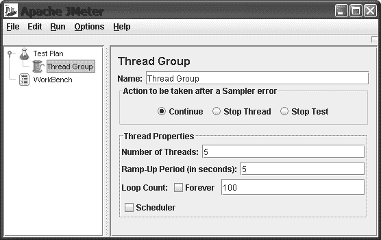

513-0 ch13.qxd 11/16/05 12:07 PM 第 526 页

**526**

第 13 章 ■ 提升 Web 应用性能与可扩展性

**清单 13-3.** *threesec.jsp*

<%@ page language="java" %>

<!DOCTYPE HTML PUBLIC "-//w3c//dtd html 4.0 transitional//en">

<html>

<head><title>三秒操作</title></head>

<body>

<h1>三秒操作</h1>

<p>

此 JSP 页面加载耗时 3 秒的原因在于它包含一个 3 秒的休眠。

</p>

<% Thread.sleep(3000); %>

</body>

</html>


该页面运行需要 3 秒，因为它包含一个 3 秒的休眠。要在 JMeter 中测试此页面，首先创建一个包含五个线程且循环次数为 100 的线程组。这将模拟五个浏览器各自执行测试计划 100 次的效果。具体操作是：右键点击树形结构中的“测试计划”图标，然后选择“添加 ➤ 线程组”菜单选项来添加一个线程组。图 13-1 展示了 JMeter 工具中的线程组页面。

**图 13-1.** *JMeter 应用程序允许你创建任意数量的线程，这些线程可以按需多次执行你的 Web 应用程序。*

你只需要测试一个页面，因此在线程组下创建一个 HTTP 请求，并将其配置为访问你的`threesec.jsp`页面。接着，添加一个聚合报告，以便查看运行测试页面时的最小、最大和平均响应时间。

图 13-2 展示了测试计划，其中 HTTP 请求编辑器已加载到右侧面板中。

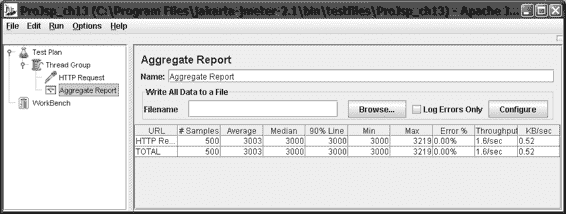

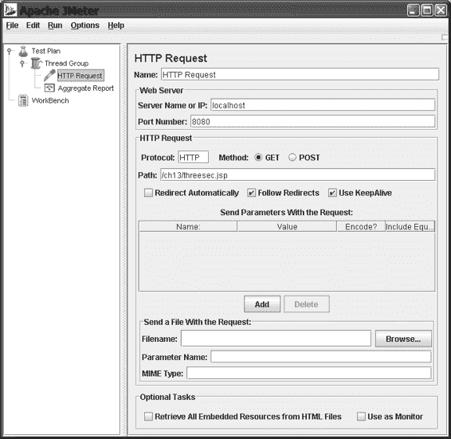

513-0 ch13.qxd 11/16/05 12:07 PM 第 527 页

第 13 章 ■ 提升 Web 应用程序性能与可扩展性

**527**

**图 13-2.** *配置线程后，JMeter 会显示一个页面，让你配置将要测试的资源。*

下一步是运行测试计划。使用 JMeter 的“运行 ➤ 启动”菜单项来执行此操作。

测试应该需要几分钟才能完成。在测试运行期间，你可以在聚合报告窗口中观察结果，当测试完成时，该窗口应如图 13-3 所示。你的结果会因硬件、操作系统和 Servlet 引擎的不同而有所差异。

**图 13-3.** *运行测试后，你可以在 JMeter 中查看结果。*

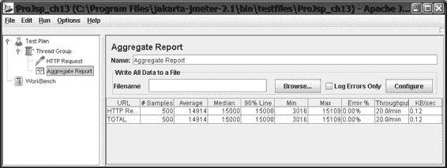

513-0 ch13.qxd 11/16/05 12:07 PM 第 528 页

**528**

第 13 章 ■ 提升 Web 应用程序性能与可扩展性

查看聚合报告窗口的结果，你可以看到处理了 500 个请求，平均响应时间为 3024 毫秒。这很合理，因为页面包含一个 3 秒的休眠，几乎没有其他内容。你可以看到没有发生错误，并且达到了每秒 1.7 个请求（即每分钟 102 个请求）的吞吐率。

我们的性能建议之一是避免单线程。有时你可能觉得有必要对 JSP 页面中的某个调用进行串行化访问。但是，你应该意识到，如果这个调用很频繁，可能会对性能产生严重影响。让我们看看在相同测试下，使用单线程 JSP 页面会发生什么。为此，你需要对`threesec.jsp`页面做一个简单的修改。你将为该类添加一个锁，以便所有对`Thread.sleep()`的调用都是同步的。清单 13-4 展示了新的`threesec-single.jsp`页面。

**清单 13-4.** *threesec-single.jsp*

<%@ page language="java" %>

<!DOCTYPE HTML PUBLIC "-//w3c//dtd html 4.0 transitional//en">

<html>

<head><title>三秒操作：单线程</title></head>

<body>

<%! static String lock = new String(); %>

<h1>三秒操作：单线程</h1>

<p>

此 JSP 页面加载需要 3 秒的原因是其包含一个 3 秒的休眠。

</p>

<% synchronized (lock)

{

Thread.Sleep(3000);

}

%>

</body>

</html>

现在再次运行测试。这次大约需要 20 分钟，而不是 5 分钟。结果如图 13-4 所示。

**图 13-4.** *对 JSP 进行同步会导致其性能显著下降。*

513-0 ch13.qxd 11/16/05 12:07 PM 第 529 页

第 13 章 ■ 提升 Web 应用程序性能与可扩展性

**529**

正如预期的那样，单线程页面的性能远差于多线程页面。单线程页面的吞吐率为每分钟 20.1 个请求，而线程安全的 JSP 为每分钟 102 个请求。


有关 Web 应用程序性能测试的更多信息，请访问以下产品网站：

• **Apache JMeter：** http://jakarta.apache.org/jmeter/

• **Mercury LoadRunner：** http://www.mercury.com/us/products/performance-center/

loadrunner/

• **Web Performance Inc.：** http://www.webperformanceinc.com/

其中，Web Performance Inc. 网站是一个很好的资源。它包含性能测试术语表、性能测试演示文稿，以及一份比较 Java EE Servlet 引擎（包括 Tomcat、WebSphere、Orion、Jetty 和 Resin）性能的报告。

**测试性能技术**

现在，你将通过将本章介绍的技术应用于一个实际的示例程序来付诸实践。你将使用第 9 章中数据访问示例的增强版本，因为它是一个简单但相当典型的数据库驱动型 Web 应用程序。

你可能还记得，第 9 章的示例是一个名为 Ag 的基于 Web 的 RSS 新闻阅读器程序。Ag 允许你通过输入用户名登录，维护 RSS 新闻源的订阅列表，获取订阅的新闻条目，并查看每个新闻源的标题。

出于本案例研究的目的，我们为 Ag 添加了一个新的首页。这个新首页显示来自所有用户的最新新闻源条目，并允许访问者按时间倒序或按每条新闻的点击次数来查看条目。有了这个新首页，Ag 与流行的社区新闻源聚合网站 JavaBlogs.com (http://javablogs.com) 和 ASP.NET 的 Weblogs (http://weblogs.asp.net) 非常相似。

图 13-5 显示了新首页的屏幕截图。

当少量用户访问新的 Ag 首页时，性能似乎还不错。页面在一秒或更短时间内显示。然而，当你使用 JMeter 模拟大量用户访问该网站时，性能会下降到不可接受的水平。页面需要 5 到 10 秒才能显示，服务器负载也上升到不可接受的水平（见图 13-6）。

每个页面平均需要 4 秒才能运行。除此之外，在此测试期间，CPU 使用率为 100%。Ag 拖慢了整个服务器。为什么 Ag 的性能如此糟糕？

对于每个传入的请求，Ag 必须获取一个数据库连接，执行一次数据库查询，并将结果渲染为 HTML。如何减少每个请求的工作量？让我们从应用数据库连接池开始。

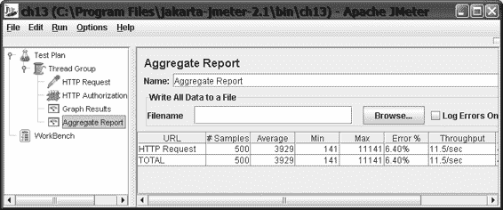

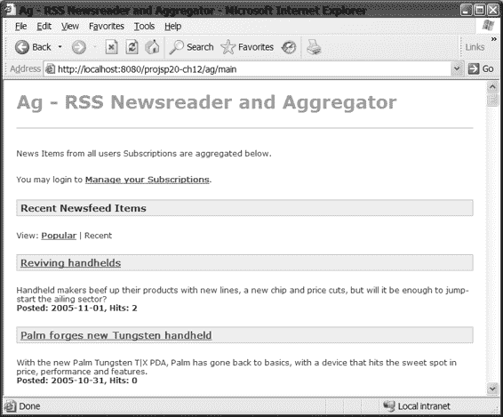

513-0 ch13.qxd 11/16/05 12:07 PM 第 530 页

**530**

第 13 章 ■ 提升 Web 应用程序的性能和可扩展性

**图 13-5.** *第 9 章中新闻阅读器应用程序的首页*

**图 13-6.** *JMeter 显示了新闻阅读器应用程序在负载下的糟糕性能。*

513-0 ch13.qxd 11/16/05 12:07 PM 第 531 页

第 13 章 ■ 提升 Web 应用程序的性能和可扩展性

**531**

**应用数据库连接池**

数据库连接池应该有助于提高性能，因为它将消除打开和关闭数据库连接所带来的开销。当应用程序需要数据库连接时，它将从已打开的数据库连接池中获取一个连接。

那么，如何将数据库连接池应用到 Ag 应用程序中呢？

事实证明，由于 Ag 使用 Hibernate 进行所有数据库访问，Ag 已经在使用数据库连接池了。Hibernate 内置了连接池。Hibernate 连接池在 Hibernate 配置文件 `hibernate.properties` 中配置，你可以在其中指定应用程序的数据库连接参数。以下是 Ag 应用程序的 Hibernate 配置文件：

hibernate.connection.driver_class=org.hsqldb.jdbcDriver hibernate.connection.url=jdbc:hsqldb:hsql://localhost

hibernate.connection.username=sa

hibernate.connection.password=

hibernate.connection.pool_size=30

hibernate.statement_cache.size=6

hibernate.dialect=net.sf.hibernate.dialect.HSQLDialect

毫无疑问，Hibernate 内置的连接池很方便，但它并不总是正确的答案。你的应用程序服务器管理员可能更希望你配置应用程序以使用应用程序服务器或 JDBC 驱动程序的数据库连接池功能。那么，该怎么做呢？

如果你使用 Hibernate，你需要在 Hibernate 配置文件中指定由应用程序服务器管理员提供的 JNDI 数据源名称。你还必须指定数据库方言。以下示例配置用于访问绑定到 JNDI 名称 `java:comp/env/jdbc/oracle` 的 Oracle 数据源。无需指定 JDBC 驱动类、连接 URL 或其他任何内容，因为这些已由你的服务器管理员在配置数据源时指定。有关数据源使用和配置的更多信息，请参见第 9 章中的“在 Web 应用程序中获取 JDBC 连接”一节。

hibernate.connection.datasource=java:comp/env/jdbc/oracle hibernate.dialect=net.sf.hibernate.dialect.Oracle9Dialect 添加数据库连接池对你没有任何好处，因为你已经在使用它了，所以让我们继续应用页面缓存。

**应用页面缓存**

新的 Ag 首页由 JSP 文件 `main.jsp` 渲染，因此你将在此处添加缓存。你将使用本章前面讨论过的 OSCache JSP 标签。

你的应用程序的 `WEB-INF\lib` 目录中已经有 OSCache JAR 文件，`WEB-INF\classes` 目录中也有 `oscache.properties` 文件，因此你只需将 OSCache JSP 标签库声明添加到 `main.jsp` 的顶部，并将 OSCache 标签包裹在你希望缓存的那部分页面周围。清单 13-5 显示了添加了新的 OSCache 代码后的 `main.jsp` 代码。

513-0 ch13.qxd 11/16/05 12:07 PM 第 532 页

**532**

第 13 章 ■ 提升 Web 应用程序的性能和可扩展性

**清单 13-5.** *main.jsp*

<%@ page language="java" %>

<%@ taglib uri="/WEB-INF/c-rt.tld" prefix="c" %>

<%@ taglib uri="/WEB-INF/oscache.tld" prefix="os"%>

<!DOCTYPE HTML PUBLIC "-//w3c//dtd html 4.0 transitional//en"><html>

<head>

<style type="text/css"><jsp:include page="/ag.jsp" /></style>

<title>Ag - RSS 新闻阅读器和聚合器</title>

</head>

<body bgcolor="#FFFFFF">

<h1>Ag - RSS 新闻阅读器和聚合器</h1>

<hr />

<p>以下聚合了所有用户订阅的新闻条目。</p>

<p>您可以登录 <a href="subs">管理您的订阅</a>。</p>

<os:cache time="3600" key="${param.mode}">

<c:choose>

<c:when test="${param.mode == 'popular'}" >

<h2>最受欢迎的新闻源条目</h2>

视图：热门 | <a href="main?mode=recent">最近</a>

<c:set var="items" value="${ag.popularItems}" />

</c:when>

<c:otherwise>

<h2>最近的新闻源条目</h2>

视图：<a href="main?mode=popular">热门</a> | 最近

<c:set var="items" value="${ag.recentItems}" />

</c:otherwise>

</c:choose>

<c:forEach var="item" items="${items}">

<c:url var="url" value="/ag/link">

<c:param name="link" value="${item.link}"/>

</c:url>

<h3><a href="${url}">${item.title}</a></h3> ${item.description} <br />

<b>发布时间：${item.time}，点击量：${item.hits}</b>

</c:forEach>

</os:cache>

<hr />

</body>

</html>

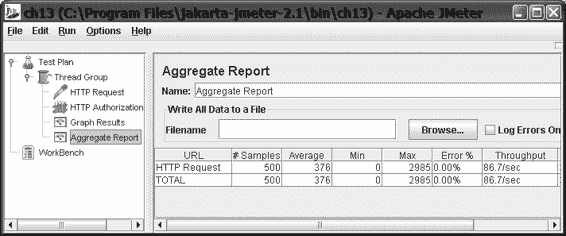

513-0 ch13.qxd 11/16/05 12:07 PM 第 533 页

第 13 章 ■ 提升 Web 应用程序的性能和可扩展性

**533**

OSCache 标签被添加在负责获取要显示的条目以及显示这些条目的页面部分周围。让我们关注一下 OSCache 标签：

<os:cache time="3600" key="${mode.param}"> . . .

</os:cache>


缓存时间设置为 3600 秒，即 1 小时。这意味着主页将每小时刷新一次新数据。缓存键设置为使用请求参数`mode`，因为页面有两种操作模式。在“热门”模式下，页面优先显示点击量最高的项目。在“最新”模式下，页面优先显示最近的项目。通过将参数值作为缓存键，可以确保页面的两个版本都被缓存。

现在，你已经对页面应用了页面缓存，接下来将重新运行完全相同的 JMeter 测试。

结果如图 13-7 所示，性能有了显著提升。页面现在运行速度提高了 10 倍，平均响应时间从 4 秒降至 0.391 秒。测试期间，服务器 CPU 占用率从 100%降至约 5%。

**图 13-7.** *通过使用缓存，新闻阅读器应用程序运行速度显著提升。*

**总结**

在本章中，我们介绍了多种提升 JSP 应用程序性能的技术。我们讨论了如何使用 OSCache 页面缓存系统来避免为每个页面请求重新生成页面。考虑到数据库连接是一种消耗处理时间、内存和网络资源的昂贵操作，我们探讨了使用连接池来最小化 JSP 应用程序中该操作成本的方法。

性能和可扩展性是任何 JSP 应用程序的首要关注点。当 JSP 应用程序部署到企业内网或互联网后，其受欢迎程度可能超出最初的预期。如果应用本章讨论的设计实践，你将更有把握满足客户的性能需求，并在用户群扩大时持续满足这些需求。我们向你展示了一个具体的性能测试工具——Apache JMeter，你可以在开发过程中使用它来验证性能和可扩展性需求是否得到满足。

在后续章节阅读关于 JSP 应用程序框架的内容时，请牢记你学到的关于性能和可扩展性设计的内容。

513-0 ch13.qxd 11/16/05 12:07 PM 第 534 页

513-0 ch14.qxd 11/17/05 8:44 PM 第 535 页

第 14 章

■ ■ ■

Web 应用程序设计

与最佳实践

**前**几章涵盖了 JSP 规范提供的大量功能。现在，你已经具备了利用这些知识开始构建基于 Java 的 Web 应用程序的良好基础。那么，为什么还需要阅读本章呢？虽然了解类和 API 对于充分利用 JSP 和 Servlet 至关重要，但还有一些其他关键因素能真正帮助你取得成功。本章将整合本书前面介绍的技术，并向你展示如何构建可维护、可扩展的基于 Java 的 Web 应用程序。

在本章中，你将了解良好设计的重要性，以及它如何帮助你构建高质量、易于维护和未来易于扩展的 Web 应用程序。为此，你将学习一些已被证明有助于实现这些目标的标准架构。延续良好设计的主题，我们将从更底层的角度探讨如何使用设计模式来实现这些架构。具体来说，我们将展示一些构建基于 Java 的 Web 应用程序的最佳实践是如何被记录为模式的，并解释如何将它们应用到你自己的 Web 应用程序中。

当然，拥有良好的设计至关重要，但这并不意味着可以忽视 Web 应用程序的实际实现工作。因此，我们将介绍一些开发和测试的最佳实践。内容涵盖从日志记录和调试的使用，到如何实际测试 Web 应用程序并使其具备可测试性。最后，我们将讨论一些通用指南，包括如何增强用户在使用你的 Web 应用程序时的体验等主题。到本章结束时，你将能够以更有条理的方式运用已有的知识，从而构建出更好的 Web 应用程序。

**设计的重要性**

当我们谈论**设计**时，无论它是在软件工程还是其他领域的语境下，本质上我们指的是在创建某物之前所进行的思考过程。这种前置思考有助于我们找到实现最终目标的最佳途径。例如，你通常不会在未考虑水管、电源插座、窗户、门等物品位置的情况下，就直接去建造一个新厨房。虽然你可以直接动手建造厨房，但如果没有一些前置思考，你可能无法得出最佳方案。这一点同样适用于软件。你可以直接投入开发，但确实需要一些预先规划。

软件行业常被比作许多其他形式的行业，不过最广为人知的类比可能是建筑业。虽然这种比较在许多层面上都成立，但制作软件和建造建筑之间存在几个关键差异。建筑是为特定目的而设计的，并且必须设计成能够承受环境造成的已知公差。而软件则更具动态性。毕竟，总的来说，目前软件开发并不像建造房屋那样精确。这并不是说它不应该如此——只是这个行业尚未达到那个阶段。你上次看到没有缺陷的软件是什么时候？这里要指出的另一点是，软件在其生命周期中通常会发生变化。有时这些变化只是简单的缺陷修复；但更多时候，它们是重大的功能变更或新增。正是软件行业的这一特性使得设计变得重要。为了量化设计的重要性，让我们看看它能够直接影响的一些特性。

**可维护性**

**可维护性**是指维护一个软件的能力。它在多个层面上发挥作用。在最基本的层面上，可维护性涉及保持该特定软件正常运行所需的工作（清理日志、归档旧数据等）。在另一个层面上，维护应用程序可以包括修复报告的缺陷，以及进行性能优化以应对业务日益增长的需求。可维护性虽然不易衡量，但它与软件设计和实现的好坏程度相关。设计良好的软件更容易让任何维护它的人理解，并且这些人可以在确信不会破坏不相关功能的前提下进行所需的小改动。而对于设计糟糕的软件，情况则截然不同。

**可扩展性**


系统设计影响的另一个方面是**可扩展性**，即扩展和增强软件的能力。同样，设计良好的软件通常具有明确的结构，以便能够轻松修改现有功能并添加新功能，而不会对系统的其余部分产生副作用。特别是对于关键任务型业务系统，可扩展性非常重要，因为它允许软件以最低的成本和开销来跟上其所实现的业务流程。

**Web 应用程序架构**

既然您已经理解设计——即使只是少量设计——的重要性，那么让我们来看看两种常见且经过验证的、基于 Java 的 Web 应用程序架构。

513-0 ch14.qxd 11/17/05 8:44 PM 第 537 页

第 14 章 ■ WEB 应用程序设计与最佳实践

**537**

**以页面为中心（模型 1）**

构建 Web 应用程序的第一种常见架构是**以页面为中心**，在 Java Web 应用程序圈子中，它更常被称为**模型 1 架构**（见图 14-1）。我们在本书中多次提到过这种架构。这种架构提供了构建 Web 应用程序最简单的方法。它只是将应用程序构建为一组 JSP 页面。

**图 14-1.** *在模型 1 架构中，所有请求都在应用程序的单个层中处理。*

*例如，所有显示逻辑、业务逻辑和数据都包含在 JSP 页面中。*

当然，应用程序通常是为了与用户共享信息（通常来自某种数据库）而构建的，而在以页面为中心的应用程序中，信息通常以几种方式表示。

第一种方式是，页面所需的任何信息都通过使用嵌入式结构化查询语言（SQL）语句直接从数据库访问。通常，这些 SQL 代码与建立数据库连接和检索结果的代码一起直接写入页面。作为这种模式的一种变体，处理数据库连接的代码通常被推送到可重用的 Java 类或自定义标签（例如 JSTL 中的标签）中。在各种构建 Web 应用程序的方法中，这可能是最不可维护的，因为所有访问数据的逻辑都嵌入在 JSP 页面内部。对数据库模式的任何更改都意味着可能需要打开应用程序中的每个页面进行修复。

在以页面为中心的应用程序中访问数据的另一种机制是使用 JavaBean 来表示系统中的持久化实体。例如，您可能有一个名为 `Customer` 的 JavaBean 来表示系统中的客户。通过采用这种方法，数据访问代码被从各个页面中分离出来，并可以推回到可重用的 Java 类中（见图 14-2）。您可以立即在整个应用程序中获得更高程度的代码重用，同时提高应用程序的可维护性。例如，当数据访问被移到一个单独的层时，对数据库模式的更改只需要修改少数几个 Java 类。

513-0 ch14.qxd 11/17/05 8:44 PM 第 538 页

**538**

第 14 章 ■ WEB 应用程序设计与最佳实践

**图 14-2.** *即使是对应用程序进行简单的更改，例如将数据访问移到一个单独的层，也可以提高应用程序的可重用性和可维护性。*

因此，尽管您可以采取措施来提高以页面为中心的应用程序的可维护性，但真正的限制在于您更改或修改系统提供的端到端功能的能力。在以页面为中心的应用程序中，用户看到的页面都是作为独立的 JSP 实现的。实际上，您也可以使用 Servlet，但原理是相同的：以这种方式构建应用程序存在局限性。如果您想为每个页面添加一些功能（例如日志记录），您必须打开每个页面并进行编辑。想要在应用程序中添加新的功能流程？您很可能需要打开大量页面来编辑链接，并确保所需的数据对页面可用。主要问题在于应用程序的页面承担了过多的职责。它们包含了收集适当信息（并对这些信息进行更改）的业务逻辑，以及向用户显示这些信息的表示逻辑。理想情况下，对业务逻辑的更改应该独立于表示逻辑，反之亦然。

**模型-视图-控制器（模型 2）**

用于构建 Web 应用程序的另一种主要架构基于经典的**模型-视图-控制器（MVC）**架构，有时也被称为**模型 2**。在以页面为中心的 Web 应用程序中，单个请求通常由包含业务逻辑和表示逻辑的单个页面处理。然而，MVC 在处理请求时使用了三个主要组件，如图 14-3 所示。

第一个是**控制器**，所有请求都通过它进行路由以得到处理。它充当 Web 应用程序所提供功能的网关，通常作为 Java Servlet 实现。为系统中的所有请求设置一个单一的访问点有几个好处。首先，它为系统级方面（如安全性、日志记录等）提供了一个公共位置。其次，控制器负责查找并执行业务逻辑，这些逻辑将用于处理请求。这个职责范围可以从简单地定位要显示的信息，到处理更新请求并修改数据库中存储的数据。关于控制器需要注意的重要一点是，它与向用户呈现信息无关。

513-0 ch14.qxd 11/17/05 8:44 PM 第 539 页

第 14 章 ■ WEB 应用程序设计与最佳实践

**539**

**图 14-3.** *在 MVC 应用程序中，不同的层处理显示逻辑（视图）、数据访问（模型）以及业务逻辑（控制器和模型）。*

MVC 架构使用的下一个组件或组件集代表**模型**。对于模型组件，有几种广泛接受的定义，但我们倾向于将它们视为控制器用来执行其处理的信息。换句话说，控制器包含业务逻辑，而模型代表该逻辑所操作的业务/领域对象。如果您做过任何 Swing 编程，可以将模型视为 Swing 模型组件，它们仅提供正在操作和显示的数据的表示。与 Swing 一样，模型组件通常作为 JavaBean 实现。

MVC 架构中的最后一个组件是**视图**组件。它们仅负责向用户呈现信息。由于所有业务逻辑都由控制器执行，视图组件只需将模型提供的信息呈现给用户。因此，视图组件通常使用 JSP 页面实现，因为这些页面最易于向用户呈现信息（例如，使用 HTML 等标记语言）。


尽管这种关注点分离的方式看起来确实比简单的以页面为中心的设计要复杂一些，但它使您能够独立地修改这三个组件中的每一个。您可以分别修改数据模式、业务逻辑或表示层。这不仅因为每种特定类型的代码都有集中存放的位置而使得应用程序更易于维护，而且整个系统现在也更具可扩展性。需要添加新的功能流程？只需将逻辑添加到控制器组件中，并添加一个新视图来向用户显示相关信息即可。当然，仍然有可能构建出难以维护的 MVC Web 应用程序，因此，在设计开发过程中可以使用一系列经过验证的模式。

**设计模式**

对**设计模式**的一个简单描述是：它们是在特定上下文中针对常见问题的可复用解决方案。除此之外，通过其记录方式，模式还提供了一种通用的语言来理解和运用它们。

513-0 ch14.qxd 11/17/05 8:44 PM 第 540 页

**540**

第 14 章 ■ WEB 应用程序设计与最佳实践

模式真正进入公众视野是在“四人组”（Erich Gamma、Richard Helm、Ralph Johnson 和 John Vlissides）出版了《设计模式：可复用面向对象软件的基础》（Addison-Wesley，1995 年）之后。这本书详细介绍了大量针对结构、行为和创建上下文中常见的、与语言无关的设计问题的可复用解决方案。以这些原始设计模式为基础，许多人扩展了这项工作，为 Java EE 系统的设计和实现记录了新的模式，其中包括许多与构建基于 Java 的 Web 应用程序相关的模式。

乍一看，模式似乎会使系统的设计复杂化，在某种程度上确实如此。毕竟，当一个类就能解决问题时，为什么要用一组相关的类来实现一个功能呢？嗯，好处体现在多个层面。使用模式及其通用的语言，使我们作为软件开发人员能够轻松地交流应用程序特定部分的工作原理。例如，如果我们有一个负责按需创建其他类型类的类，使用这个模式的通用名称（在这种情况下是“工厂”）就提供了一定程度的共同理解。这很有用，因为它有助于项目团队的其他成员或任何查看代码的人轻松掌握它。

使用模式的能力也有助于确保在应用程序中解决重复出现的问题时具有一定的一致性。这种做法随后促进了代码复用（因此也提高了质量）和可维护性，同样是因为设计更容易理解。此外，由于模式能够为设计引入一定程度的组织结构，因此该设计的可扩展性通常比使用单个类构建相同功能时要大。

**Java EE 模式与 Web 应用程序**

**组件**

迄今为止最著名的 Java EE 模式集合可能是 Sun Java Center 在 http://java.sun.com/blueprints/corej2eepatterns 上编录的那些。该目录中包含的模式涵盖了 Java EE 5 架构的所有层，如果您正在构建多层企业应用程序，它们非常值得一看。就本章而言，您只对与构建 Java EE 应用程序的 Web 层相关的那些模式感兴趣。让我们来看看其中的一些模式，看看它们如何帮助您构建设计良好的 Web 应用程序。

**前端控制器**

正如您在 MVC 架构的讨论中所了解到的，控制器组件充当 Web 应用程序的网关，是所有请求得到服务的中心位置。就其本身而言，MVC 架构是与编程语言无关的，在将其转化为基于 Java 的 Web 应用程序世界时，Sun Java Center 提出了**前端控制器**模式，这是 MVC 中控制器的 Java EE 特定版本。

清单 14-1 展示了此模式的一个原型实现。

513-0 ch14.qxd 11/17/05 8:44 PM 第 541 页

第 14 章 ■ WEB 应用程序设计与最佳实践

**541**

**清单 14-1.** *FrontController.java*

```java
package com.apress.projsp;

import java.io.IOException;

import javax.servlet.RequestDispatcher;

import javax.servlet.ServletException;

import javax.servlet.http.*;

public class FrontController extends HttpServlet {

    protected void processRequest(HttpServletRequest request, HttpServletResponse response)
            throws ServletException, IOException {

        // 步骤 1 – 执行业务逻辑并操作模型
        // someObject.someBusinessLogic();

        // 步骤 2 – 分派到适当的视图组件
        RequestDispatcher dispatcher =
                getServletContext().
                getRequestDispatcher("视图组件的名称");
        dispatcher.forward(request, response);
    }

    protected void doGet(HttpServletRequest req, HttpServletResponse res)
            throws ServletException, IOException {
        processRequest(req, res);
    }

    protected void doPost(HttpServletRequest req, HttpServletResponse res)
            throws ServletException, IOException {
        processRequest(req, res);
    }
}
```

正如这个示例实现所示，前端控制器可以简单到只是一个响应 HTTP GET 和 POST 请求的 Servlet。尽管代码实际上没有显示任何被调用的真实业务逻辑，但它确实展示了处理请求的步骤。首先，通过执行一些业务逻辑来处理请求，然后重定向到或分派到将向用户呈现信息的视图组件。此实现的主要问题是，如果应用程序的所有业务逻辑都封装在一个单一的控制器中，那么该控制器很快就会变得臃肿并承担大量职责。为了克服这个问题，您可以使用命令与控制器策略。

命令与控制器策略

实现前端控制器模式的方法有很多种，每种方法都称为一种**策略**。例如，在前面的示例中，前端控制器是作为 Java Servlet 实现的，尽管这并不妨碍该实现可以是一个 JSP 页面。为了克服控制器因包含特定系统的所有应用程序逻辑而变得臃肿的问题，命令与控制器策略将控制器 Servlet 与实现**命令**设计模式的类结合起来。（命令模式是一种更通用的面向对象设计模式。）本质上，命令模式指出，执行特定任务所需的逻辑被封装到一个具有标准接口的单个类中，以执行该代码。例如，您可以将查找客户详细信息的逻辑封装到一个单独的类中，放在一个名为 `execute()` 的方法内。首先，您可以为前端控制器将要使用的所有命令定义一个标准接口。清单 14-2 展示了一个实现此功能的接口。

**清单 14-2.** *Action.java*

```java
package com.apress.projsp;

import javax.servlet.ServletException;

import javax.servlet.http.HttpServletRequest;

import javax.servlet.http.HttpServletResponse;

public interface Action {

    public String execute(HttpServletRequest request,
                          HttpServletResponse response)
            throws ServletException;
}
```


该接口包含一个单一方法，用于执行将封装在该接口具体实现中的逻辑。本质上，您要做的就是将请求的处理委托给一个 Action 实例，而不是将该代码放在控制器内部。因此，方法签名被定义为接收与使用 Servlet 处理 HTTP 请求时相同的 request 和 response 对象引用。通过使用此接口，您可以提供一个实现，该实现根据给定的客户 ID 查找该客户，并将相应的领域对象放入 HTTP 请求中，以供视图组件显示（参见清单 14-3）。

**清单 14-3.** *ViewCustomerAction.java*

package com.apress.projsp;

import javax.servlet.http.HttpServletRequest;

import javax.servlet.http.HttpServletResponse;

import javax.servlet.ServletException;

public class ViewCustomerAction implements Action {

public String execute(HttpServletRequest request,

HttpServletResponse response)

throws ServletException {

String id = request.getParameter("id");

Customer customer = CustomerFactory.getInstance().getCustomer(id); request.setAttribute("customer", customer);

return "/view-customer.jsp";

}

}

假设所有必要的客户查找代码都已编写完成，当找到一个 Customer 实例时，您可以使用 request 对象作为一个区域，通过 `setAttribute()` 方法放置在此请求生命周期内相关的任何对象。关于此实现最后需要注意的一点是，`execute()` 方法返回的值是代表视图组件的 JSP 页面的名称。换句话说，这就是

513-0 ch14.qxd 11/17/05 8:44 PM 第 543 页

第 14 章 ■ WEB 应用程序设计与最佳实践

**543**

将用于渲染或向用户呈现信息的 JSP 页面的名称。

当所有业务逻辑都封装在 Action 实例中后，前端控制器本身变得非常小巧，因此内聚性更强，如清单 14-4 所示。

**清单 14-4.** *FrontController.java*

package com.apress.projsp;

import java.io.IOException;

import javax.servlet.http.*;

import javax.servlet.ServletException;

import javax.servlet.RequestDispatcher;

public class FrontController extends HttpServlet {

private ActionFactory actionFactory = new ActionFactory(); protected void processRequest(HttpServletRequest request, HttpServletResponse response)

throws ServletException, IOException {

Action action;

try {

action = actionFactory.getAction(request);

} catch (ActionNotFoundException anfe) {

throw new ServletException(anfe);

}

// 现在处理 action，找出接下来要向用户显示的视图 String nextView = action.execute(request, response);

// 最后重定向到适当的视图，

// 记得添加路径前缀

try {

if (nextView != null) {

RequestDispatcher dispatcher =

getServletContext().getRequestDispatcher(nextView);

dispatcher.forward(request, response);

}

} catch (Exception e) {

e.printStackTrace();

throw new ServletException(e);

}

}

protected void doGet(HttpServletRequest req, HttpServletResponse res) throws ServletException, IOException {

processRequest(req, res);

}

protected void doPost(HttpServletRequest req, HttpServletResponse res) throws ServletException, IOException {

processRequest(req, res);

}

}

513-0 ch14.qxd 11/17/05 8:44 PM 第 544 页

**544**

第 14 章 ■ WEB 应用程序设计与最佳实践

在这个版本的前端控制器中，您只是使用一个辅助类来查找应该使用哪个 Action 实现来处理这个特定的请求。控制器如何知道使用哪个 action？嗯，有多种方式可以将 action 的名称传递给控制器。这些方式包括在查询字符串中使用命名参数，以及在特殊映射的 URL 中编码 action 的名称。一个示例如下：

http://www.mycompany.com/controller/ViewCustomer?id=123456

使用命令和控制器策略的主要好处是，它允许您维护一个接受请求的中心位置，同时将实际处理单个请求的逻辑与处理其他类型请求所需的逻辑分离开来。

视图组件

在我们继续讨论其他模式之前，我们需要花一点时间讨论 Java EE 模式中的**视图组件**。当控制器负责与处理请求相关的业务逻辑时，您可能会问如何实现视图组件。在最简单的情况下，视图被实现为由控制器组件转发的 JSP 页面。控制器（或者如果您使用该策略，则是 action 类）的工作是执行任何处理并为视图呈现信息设置环境。在第 9 章中，您看到 JSP 页面完全可以包含数据库代码，以便它们能够找到应该显示的数据。然而，MVC 架构颠覆了这一点，因为现在查找数据是控制器的责任。正如您在前面的示例 action 实现中看到的，可以使用 request 对象来存储当前请求生命周期内所需的信息：request.setAttribute("customer", customer);

在这里，您只是将一个 Customer 实例放入由 request 维护的对象映射中。当从视图呈现信息时，您可以使用 JSP EL 来定位该 Customer 实例并显示它。例如，您可以使用以下表达式来显示客户的名称（假设存在一个名为 getName() 的方法）：${customer.name}

这种业务逻辑和表示逻辑的分离使您能够在必要时轻松地独立更改其中之一。如果您需要更改向用户呈现客户信息的方式，这没有问题。您可以只修改 JSP 页面，而不会破坏查找该客户的现有业务逻辑。

**视图助手**

尽管前端控制器负责（可能通过委托给命令）执行为处理给定请求所需的业务逻辑，但通常仍然存在仅与该信息表示相关的逻辑。像 JSP 页面这样的视图组件非常擅长显示信息，但有时还需要一些额外的代码。也许对象列表在显示之前需要排序，或者信息需要以某种特定方式格式化。虽然这些代码可以简单地嵌入到视图组件中，但**视图助手**模式描述了一种封装这些代码并使其在多个视图中可重用的方法。

您已经看到了许多视图助手的例子。回顾第 7 章，您看到的一个标签过滤了电子邮件地址的域名，使垃圾邮件发送者更难获取地址。虽然非常有用，但这种逻辑实际上并不属于业务逻辑。

相反，这是表示逻辑——帮助视图向用户呈现信息的代码。当然，这样的代码可以编写并嵌入到 JSP 页面中，但出于质量、可维护性等原因，这被认为是不良实践。相反，该代码被封装在一个自定义标签中，以便可以在 Web 应用程序的各个页面中使用和重用。实际上，这个自定义标签就是视图助手模式的一个实现。在这种情况下，标签是视图用来帮助其执行任务的组件。

**服务到工作者**


到目前为止，我们介绍的每种模式都解决了 Web 应用程序设计中的不同问题。前端控制器为请求提供了单一访问点以集中业务逻辑，而视图和视图助手则将信息呈现过程与信息查找和操作过程分离开来。为了将这些模式整合在一起，Java EE 模式目录定义了一个名为“服务到工作者”的宏模式，如图 14-4 所示。所谓“宏模式”，是指它实际上只是其他模式的组合——在本例中，即前端控制器、视图和视图助手。

**图 14-4.** *“服务到工作者”模式是其他模式的组合。*

将这些模式整合在一起是扩展 MVC 架构的基础，并为 Web 应用程序的设计和易于理解提供了共同基础。它还有助于强调各个模式的优势，并表明如果将它们结合使用，会更加有用。稍后您将看到，“服务到工作者”模式构成了当前许多 Web 应用程序框架的基础。

513-0 ch14.qxd 11/17/05 8:44 PM 第 546 页

**546**

第 14 章 ■ Web 应用程序设计与最佳实践

**过滤器**

另一个有用但未被广泛使用的模式值得简要提及，它被称为**过滤器**。

您在之前章节中看到的过滤器 API 就是此模式的一种实现，因此，我们不再探讨如何实现过滤器，而是看看它如何在 Web 应用程序设计中使用，并讨论一些更典型的用途。

过滤器在 Web 应用程序设计中可以发挥重要作用，因为它们可以承担与任何特定 JSP 或 Servlet 无关的职责。过滤器可以被视为所有请求和响应都可以通过的通道。

我在 Web 应用程序中使用过滤器的一种方式是解释用户友好的 URL。为了帮助我保持网站更新，我构建了一些网络日志软件——一个简单的基于日期的内容管理系统，我每天在上面发布简短条目。然后，网络日志（缩写为“博客”）会在首页按日期倒序显示最新的条目。此外，当读者想要查找更早的条目时，他们可以直接跳转到包含某一天所有条目的页面。过去，这类网站由静态页面构建，其组织方式便于查找特定日期的页面。例如，2003 年 6 月 10 日的博客条目可以在 http://www.simongbrown.com/blog/2003/06/10.html 找到。

由于 JSP 和 Servlet 等技术比编写静态页面有更多优势，我决定将我的网络日志编写为基于 Java 的 Web 应用程序。所有条目都单独存储在文件系统中，并借助前端控制器模式，使用几个 JSP 页面将各个条目组装成一个页面呈现给用户。然而，我没有向用户显示诸如 http://www.simongbrown.com/blog/servlet/ViewDailyBlog?year=2003&month=6&day=10 这样的 URL，而是决定让之前显示的 URL 仍然有效。为了实现这一点，我使用了过滤器。

因为可以设置过滤器来查看发送到 Web 应用程序的所有传入请求，所以过滤器需要做的就是查找匹配 yyyy/mm/dd.html 的请求，并通过前端控制器将请求转发到相应的操作。过滤器用于通过用户友好的 URL 捕获这些看似静态内容的请求，并将这些请求转换为通过前端控制器对内容的动态请求。这是过滤器模式的一个简单而强大的实现，它对传入请求执行过滤。

过滤器也可以用于传出的响应。一个经常被引用的例子是，在处理完请求后，使用压缩技术压缩传出流，以尝试更有效地利用可用带宽。另一个例子是突出显示页面中搜索词用法的过滤器。通过 Servlet API 提供的接口，可以找到用户访问您网站时来自的完整 URL。例如，有人可能会点击 Google 中的链接来到您的网站。利用这些信息，您可以编写一个过滤器来检查来自 Google 的引荐，并在响应随后发送回用户之前突出显示所使用的搜索词的出现。同样，这是您可以使用过滤器来增强用户对 Web 应用程序体验的另一种方式。

**其他 Web 应用程序模式**

除了我们刚刚介绍的 Java EE 模式之外，还有其他模式或最佳实践可以帮助您构建 Web 应用程序。此外，JSP 2.1 提供了一种更好且通常更简单的方法来实现其中一些模式，我们将在本节中描述。

513-0 ch14.qxd 11/17/05 8:44 PM 第 547 页

第 14 章 ■ Web 应用程序设计与最佳实践

**547**

包含标准页眉和页脚

在构建基于 JSP 的 Web 应用程序时，最常用的最佳实践之一可能是将页眉和页脚中使用的公共代码分离到 JSP 页面或片段中，并在必要时包含它们。此类文件可能包括所有用于定义格式良好的 HTML 页眉的 HTML 标签、用于导入公共标签库的 <%@ taglib %> 指令、定义要在页面中使用的对象等。无论您要实现什么目标，通常都会通过使用 JSP include 指令在每个页面上静态包含页眉来实现此实践：

<%@ include file="header.jspf" %>

在将 JSP 转换为 Servlet 时，JSP 编译器会将包含的文件内联到生成的 Servlet 类的源代码中。这是使某些内容可重用的有用方法，尽管它确实依赖于页面作者记住在可能的地方包含页眉。此外，Web 应用程序的不同部分通常需要不同的页眉。例如，当 JSP 页面来自站点的安全部分时，您可能会包含一个不同的文件。

为了解决这个问题，JSP 和 Servlet 新规范背后的团队提出了**前奏**和**尾声**的概念。基本思想是，对于任何一组一个或多个 JSP 页面，都可以定义一个或多个前奏或尾声。前奏是在匹配给定 URL 模式的 JSP 页面的主体之前包含的文件；尾声是在这些 JSP 页面的主体之后包含的文件。因此，您无需在每个页面上包含页眉和页脚，而是可以通过在 web.xml 部署描述符中使用以下片段来实现相同的结果：

<jsp-property-group>

<url-pattern>*.jsp</url-pattern>

<include-prelude>/header.jspf</include-prelude>

<include-coda>/footer.jspf</include-coda>

</jsp-property-group>

这是进一步提高 Web 应用程序可维护性并减少其中重复内容量的好方法。

模板化

模板化是 Web 应用程序中另一种常见的实现技术。**模板**是一个预定义的骨架，您可以在运行时通过使用参数对其进行自定义。回顾第 6 章，用于演示标签文件的一个示例是一个在主页上包含多个促销通知的网页。虽然每个标签中包含的内容不同，但构建它们的实际结构和代码是相同的。这些实际上就是被使用和自定义的模板。

在引入标签文件之前，使用 JSP 实现模板化相当困难。


由于缺乏表达模板定制方式的简便方法，过去曾有一些可选方案，例如使用简短的脚本片段甚至自定义标签，来指示动态内容应插入模板主体的位置。然而，这些方法的问题在于，使用它们时往往会在页面中引入一些 Java 代码。也许需要设置对象，或者需要一些表示逻辑。一旦引入了代码，许多人就不再称那些页面为模板了。毕竟，你不再仅仅是指示动态内容应插入何处，而是基本上完全控制了模板的工作方式。另一种选择是使用特定的模板框架，例如 Velocity（将在接下来的“构建 Web 应用程序的框架”部分讨论）。

随着 JSP 2.0 中 EL（表达式语言）的引入，开发者获得了执行模板化的能力。由于 EL 是 JSP 规范的一个组成部分，现在构建模板要容易得多。只需在 JSP 文件中编写静态内容，然后在需要插入动态内容的地方插入 EL 表达式即可。这些表达式本身功能相当强大，同时仍然足够简单易懂，并且不会暴露模板的内部工作机制。

**构建 Web 应用程序的框架**

到目前为止，你已经了解了一些经过验证的构建 Web 应用程序的方法，以及许多将这些想法转化为可运行代码的模式。你真的需要在每次构建应用程序时都编写所有这些代码吗？

**定制框架**

通过结合前面讨论的 Java EE 模式的实现，你基本上就拥有了一个用于构建基于 MVC 的 Web 应用程序的定制框架。事实上，我们参与过的许多 Web 应用程序（无论是开源项目还是为客户开发的）都使用这些简单的实现作为轻量级 MVC 框架的基础，用于处理应用程序中的所有请求。我们信奉“保持简单”的软件设计方法，使用这种轻量级框架有几个好处。该框架易于学习、易于维护，并且在必要时易于扩展，例如处理用户提交的 HTML 表单中的验证错误。

然而，编写定制框架并不总是最佳选择。这里展示的前端控制器模式的实现相当简单直接，但还可以进行许多改进。例如，包括构建 HTML 表单和执行验证的标准方法，用于显示模型信息的更复杂的组件，等等。尽管这类工作并非特别复杂，但却非常耗时。因此，有多个第三方框架可供开发者用作其 Web 应用程序的起点。

**Struts**

来自 Jakarta 项目（http://jakarta.apache.org）的 Struts 是一个开源框架，它不仅提供了前端控制器的实现，还提供了 MVC 架构的完整实现（或框架）。其关键组件与这里介绍的类似，例如，包括一个控制器 Servlet（称为 ActionServlet）、用于放置处理请求功能的 Action 类，以及用于封装来自请求的数据的 ActionBean 类。此外，Struts 还包含一个全面的 JSP 标签库集合，用于方便地组装基于 HTML 的表单和 JSP 页面。

Struts 最重要的特性之一是，它的几乎所有方面都通过 struts-config.xml 文件进行外部配置。这包括动作名称与 Action 类之间的映射（称为 ActionMappings），以及一个称为 ActionForwards 的概念。对于清单 14-3 中展示的简单实现，Action 类返回一个表示接下来应显示的 JSP 页面 URI 的字符串。然而，在 Struts 中，Action 类返回一个符号名称（封装在 ActionForward 实例中），表示接下来应显示哪个视图组件。例如，考虑一个包含用户名和密码的登录表单。提交表单后，登录要么成功，要么失败。在这种情况下，Action 类可以返回诸如 success 或 failure 之类的符号名称。这些符号名称随后在 struts-config.xml 文件中进行配置，并在此处指定指向相应 JSP 页面的物理 URI。以下代码片段展示了如何处理登录动作的两种不同流程：

<action path="/login" type="com.mycompany.myapp.LoginAction">

<forward name="success" path="/index.jsp"/>

<forward name="failure" path="/login-failed.jsp"/>

</action>

这里，我们声明登录动作有两种可能的结果。第一种是登录成功，如果是这种情况，用户将被重定向到 index 页面。或者，登录失败会将用户带到一个解释登录失败的页面。通常，这种逻辑和页面名称必须硬编码到动作中。借助 Struts 及其配置文件，应用程序的流程可以轻松更改，这也是将 Web 应用程序的流程和结构从代码中分离出来以提高可维护性的另一种方式。毕竟，如果站点结构发生变化，只需更改配置文件即可。你将在下一章更详细地了解 Struts。

**Spring**

Spring 框架（http://www.springframework.org）旨在做到轻量级但功能强大，且易于使用。Spring 是一个分层式的 Java EE 应用程序框架，由 Rod Johnson 开发。Spring 拥有许多特性，可以使企业级开发对你来说更加容易。

■**注意** 如果你想了解更多关于 Spring 的信息（超出此处简短描述的范围），我们推荐 Rod Johnson 的《Expert One-on-One J2EE Design and Development》（Wrox Press, 2002）、Rob Harrop 和 Jan Machacek 的《Pro Spring》（Apress, 2005），或 Rod Johnson 等人合著的《Professional Java Development with the Spring Framework》（Wrox Press, 2005）。

Spring 可以单独使用，以提供一个完整的企业级应用程序框架。

该框架简化了构建和集成 Web 应用程序的表示层、业务层和数据层所需的工作。尽管 Spring 足够强大，可以用于企业级应用程序，但它并不强制你使用 Java EE。你可以从普通的 Java 对象（POJO）开发 Spring 组件，并使用 Spring 轻松地将这些对象集成到一个可运行的应用程序中。你构建的对象可以轻松地在 Java EE 环境中使用，或作为独立应用程序的一部分使用。

另一方面，Spring 也足够灵活，可以与其他框架协同工作以提供企业级解决方案。

Spring 拥有自己的数据抽象层用于数据持久化。但它也可以与其他数据抽象技术集成，例如 Oracle TopLink、Hibernate 和 Java 数据对象（JDO）。有关这些及其他数据抽象技术的更多信息，请参见第 9 章。

Spring 不仅与数据层集成良好，还与表示层的其他技术（如 JSP、Velocity 和 Tiles）集成良好。因此，你可以使用 Spring 开发业务对象，并使用你最喜欢的表示层框架在 MVC 应用程序中提供视图。

最后，Spring 与其他 MVC 框架（如 Struts、WebWork 或 Tapestry）也能很好地协同工作。

**WebWork**


WebWork（http://www.opensymphony.com/webwork/）是另一个常与 Struts 相提并论的 MVC 框架。它也采用了实现命令模式的类这一概念，不过 Struts 与 WebWork 的关键区别之一在于，WebWork 构建在另一个框架（XWork）之上，而 XWork 实际上并不与 Web 以及 HTTP 请求和响应等概念绑定。因此，可以在 Web 应用与其他 Java 实现（如 Swing 客户端）之间共享实现。本质上，动作类只是 JavaBean，在 Web 环境中，参数会被简单地映射到 Bean 的属性上。

在构建视图的用户界面组件、可定制的验证、用于从模型访问信息的表达式语言等方面，WebWork 提供了与 Struts 类似的功能。然而，WebWork 不仅仅是 Struts 的翻版，其独特之处在于它并不只依赖 JSP 来构建表示层。视图组件*可以*是 JSP，但也可以使用其他技术编写，包括 XML 和 Velocity（关于 Velocity 的更多信息，请参见下一节）。

WebWork 的一个独特功能是支持拦截器，可用于在动作调用之前和/或之后执行逻辑。这类似于使用过滤器来拦截传入请求和传出响应的方式。如同面向切面编程（AOP），WebWork 的拦截器让你能够在不打开每个动作类并编辑的情况下，将横切关注点插入整个代码库。所谓“横切关注点”，指的是那些并非特定于系统提供的业务功能的逻辑，例如日志记录、安全性、缓存等。通常，业务逻辑可以被视为垂直的，因为在任何应用中，你都会有一组提供业务逻辑的垂直切片。借助拦截器，你可以构建能够跨越所有这些垂直切片工作的代码，并且在 WebWork 中，你可以声明式地配置这一点。

总而言之，WebWork 是 Struts 的一个更简单（尽管可以说更强大）的替代方案，它提供了一种快速构建基于 MVC 的 Web 应用的方法。此外，动作类提供的简单接口使得测试 WebWork 动作比测试 Struts 容易得多，无需使用像 Cactus 这样的测试框架。使用 WebWork 的唯一缺点是，目前其用户社区规模较小，且现成的信息不多。希望这种情况会开始改变。

**Velocity**

Velocity（http://jakarta.apache.org/velocity/）是一个基于 Java 的模板引擎，为构建 Web 应用的视图组件提供了另一种方式。事实上，Velocity 的能力远不止于此，它还可以在 Web 应用之外使用，例如用于帮助生成报告或 XML。Velocity 有自己的模板语言（Velocity 模板语言，简称 VTL），它提供了一种访问几乎任何可以通过常规 Java 方法调用访问的内容的方式。在 Velocity 创建之时，JSP 还没有自己的表达式语言，Velocity 试图填补这一空白，并为开发者提供一种构建真正模板的简便方法。

尽管 JSP 现在包含了 EL，但 Velocity 仍拥有大量追随者，并已部署在许多应用中，尤其是 Web 应用。随着像 WebWork 这样的框架提供了与 Velocity 的轻松集成，对于严重依赖易于模板化的动态内容的 Web 应用来说，它仍将是一个受欢迎的选择。

**测试**

测试在软件开发生命周期中扮演着重要角色，尽管当时间紧迫、截止日期临近时，测试往往得不到应有的重视。幸运的是，像极限编程（http://www.xprogramming.com/）这样的新开发方法正在大力推广使用 JUnit 等工具进行自动化测试，其中单元测试实际上是用 Java 编写的。那么，这些原则如何应用于测试 Web 应用，以及你到底可以测试什么呢？Web 应用本质上通常很复杂，这可能导致对究竟可以且应该测试什么产生混淆。从自动化测试的角度来看，通常进行两种类型的测试：单元测试和功能测试。有许多工具可以帮助你执行单元测试和功能测试，例如 JUnit、JUnitEE、Cactus、TagUnit 和 HttpUnit。在了解了这些工具之后，你将学习如何为测试设计你的 Web 应用，测试策略的指导原则是什么，以及为什么要进行兼容性测试。

**Web 应用的单元测试**

**单元测试** 是从你知道软件如何工作的角度来测试软件的过程。它也被称为**白盒测试**，因为你可以看到软件是如何工作的——你可以看到盒子内部。与此相反的是**黑盒测试**，我们稍后会讨论。

单元测试背后的理念是确保单元内的所有（或大部分）路径都得到充分测试，包括诸如循环和方法调用的边界条件、方法调用的正确和错误（例如，null）参数等。通过这样做，你可以确保被测试的单元是正确的，能够完成其预期功能，并且在接收到它不期望的输入时不会崩溃。

那么，如何将单元测试应用于 Web 应用呢？简单的答案是，你对构成 Web 应用的所有类和组件进行单元测试——从代表业务对象的 JavaBean 到处理请求的 Servlet。虽然这在理论上听起来不错，但在实践中，由于许多存在于服务器内部的 Java EE 组件所需的支撑基础设施，这很难实现。对于独立的 Java 类，使用 JUnit 框架编写自动化单元测试是直接的。通常，此类测试可能会创建被测试类的新实例，调用该实例上的方法，然后对结果进行断言以确保其正确。然而，对于像 Servlet 和 JSP 页面（它们会被编译成 Servlet）这样的组件，就无法以同样的方式进行测试了。毕竟，这些组件需要在支持这些技术的服务器上下文中执行。本质上，这些组件严重依赖于此类服务器提供的支撑基础设施、基础架构和服务。幸运的是，人们已经意识到了这一点，并提出了一些使此类组件的单元测试更容易的方法。然而，通常会有一个临界点，超过该点单元测试就变得不可行，必须使用其他测试方法。

带着这些想法，让我们继续看看你可以测试什么，以及可以使用的工具。

JUnit


JUnit（http://www.junit.org）如今已成为 Java 语言中构建自动化测试的事实标准，广泛应用于从桌面应用程序到企业级分布式服务器等各类项目。JUnit 提供了一个轻量级框架用于编写测试。从高层来看，你只需扩展其中一个提供的类，并编写一个或多个方法来测试目标类（或类集合）的每个方面。编译测试类后，通过 JUnit 测试运行器之一运行测试，该运行器会统计通过和失败的数量，并在过程结束时输出结果。

清单 14-5 展示了使用 JUnit 编写自动化单元测试的简便性，通过测试一个代表客户且包含两个属性（firstName 和 lastName）的简单 JavaBean 来演示。在此示例中，该类还有一个名为 getFullName() 的额外方法，该方法仅将名字和姓氏用空格连接起来。使用 JUnit，你可以通过设置相应属性并对访问这些属性的结果进行断言，来测试各个 get 方法是否按预期工作。

**清单 14-5.** *CustomerTest.java*

import junit.framework.TestCase;

public class CustomerTest extends TestCase {

public void testFirstName() {

Customer customer = new Customer();

customer.setFirstName("Simon");

assertEquals("Simon", customer.getFirstName());

}

public void testLastName() {

Customer customer = new Customer();

customer.setLastName("Brown");

assertEquals("Brown", customer.getLastName());

}

public void testFullName() {

Customer customer = new Customer();

customer.setFirstName("Simon");

customer.setLastName("Brown");

assertEquals("Simon Brown", customer.getFullName());

}

}

这里你所做的只是扩展 JUnit 提供的其中一个类，并为想要测试的各种功能实现 testXXX() 方法。在这个例子中，你正在测试设置/获取名字、姓氏和全名的能力。当然，这是一个

513-0 ch14.qxd 11/17/05 8:44 PM 第 553 页

第 14 章 ■ 网络应用程序设计与最佳实践

**553**

简单的示例，并未涵盖诸如空值之类的特殊情况。然而，它确实展示了使用 JUnit 编写单元测试是多么容易，并显示了其潜力。

开始使用 JUnit 有时可能会有些棘手，尤其是在最初找到编写测试的动力方面。然而，一旦他们克服了学习曲线并体验到 JUnit 的好处，大多数人就会上瘾，或者用 JUnit 团队创造的一个术语来说，就是“测试感染”。

第一次看到 JUnit 可能会让人有些畏惧，尤其是当你开始思考需要为你正在构建的每个类编写多少额外的 Java 代码时。

然而，根据我们使用 JUnit 的经验，我们发现使用 JUnit 一段时间后，你会开始欣赏自动化单元测试的强大功能，以及它在重构或重新设计系统部分时带给你的信心。当你进行重大的设计更改而测试仍然通过时，所获得的信心感是惊人的！

使用 JUnit 时，你可以测试的类类型包括代表业务领域、业务逻辑、MVC 风格的动作类、辅助类等。本质上，任何独立的类都可以使用 JUnit 进行测试。在许多 Web 应用程序中，这组类将涵盖正在开发的大部分代码，并有望带来对代码正确运行的良好信心。然而，有时你可能有一些独立的类仍然需要在 Java EE 容器环境中运行并进行测试。对于这些情况，JUnitEE 就很有用。

JUnitEE

JUnitEE（http://www.junitee.org）提供了一种在 Java EE 容器内运行常规 JUnit 测试的方法。为什么要这样做呢？嗯，也许你有一些类需要使用通过容器的 JNDI 树设置并提供给这些类的数据库连接。或者这些类需要访问其他企业资源才能正常运行。使用 JUnitEE，你可以将所有类及其测试打包成一个 WAR 文件，然后将其部署到诸如 Tomcat 之类的 Java EE Web 容器上。要执行这些测试，你只需将 Web 浏览器指向新部署的 Web 应用程序，一个 servlet 会在后台运行以执行 JUnit 测试，并将结果呈现给你。

JUnitEE 实际上是一个轻量级的测试运行器，允许你在服务器环境中执行测试。然而，它并不能比 JUnit 更容易地测试诸如 servlet 和 JSP 之类的组件。为此，你需要考虑其他选项，例如 Cactus。

Cactus

Cactus（http://jakarta.apache.org/cactus/）是 JUnit 的一个扩展，提供了一种在运行的 Java EE 容器内运行单元测试的机制。虽然使用 JUnitEE 时你可以在服务器环境中运行常规的 JUnit 测试，但你仍然没有完整的必要基础设施来测试那些依赖于逐个请求传递信息的类。例如，要真正测试一个 servlet，你需要有一个实时的请求和响应对象可用，因为 servlet 内部的代码可能会从请求中提取参数或将信息推送到响应中。Cactus 使你能够测试这些类型的组件，并确信它们在其真实环境中运行。

在 Cactus 中，测试功能分为两部分。首先是客户端部分。这看起来就像一个普通的 JUnit 测试，用于启动测试。Cactus 的第二部分位于

513-0 ch14.qxd 11/17/05 8:44 PM 第 554 页

**554**

第 14 章 ■ 网络应用程序设计与最佳实践

服务器上。在这里，你可以使用 Cactus 提供的测试类来实例化你想要测试的组件并调用它们的方法。例如，你可以选择创建一个新的 servlet 类实例并调用 doGet() 方法。当然，要实际调用此方法，你需要访问 HTTP 请求和响应对象，那么它们从何而来呢？

关键在于一个位于客户端和服务器端测试类之间的测试重定向器组件。当客户端启动测试时，会向 Java EE 容器发出一个请求，该请求被一个也必须在服务器上运行的 Cactus 提供的 servlet 拦截。然后，这个 servlet（测试重定向器）确定需要运行哪个服务器端测试，并启动相应的测试类。由于已经向 Java EE 容器发出了一个实际的 HTTP 请求，Cactus 只需将其封装并传递给服务器端测试类以供其按需使用。代表 HTTP 响应的对象也被封装起来供测试类使用。有了这些访问权限，服务器端测试类和被测试的类就可以提取参数、将输出写入响应等。然后可以断言被测试的类按预期工作，这些断言的结果会传回客户端进行报告。

作为示例，考虑我们在本章前面讨论 MVC 时介绍的 ViewCustomerAction 类。由于此类依赖于服务器获取真实请求，因此它是使用 Cactus 进行测试的理想候选。清单 14-6 展示了如何实现这一点。

**清单 14-6.** *ViewCustomerTest.java*

import javax.servlet.ServletException;

import junit.framework.Test;

import junit.framework.TestSuite;

import org.apache.cactus.ServletTestCase;

import org.apache.cactus.WebRequest;


public class ViewCustomerTest extends ServletTestCase {

public ViewCustomerTest(String theName) {

super(theName);

}

public static Test suite() {

return new TestSuite(ViewCustomerTest.class);

}

public void beginExecute(WebRequest webRequest) {

webRequest.addParameter("id", "123");

}

public void testExecute() {

Customer customer = CustomerFactory.getInstance().getCustomer("123"); ViewCustomerAction action = new ViewCustomerAction();

try {

action.execute(this.request, this.response);

assertEquals(customer, request.getAttribute("customer"));

} catch (ServletException e) {

fail();

}

}

}

513-0 ch14.qxd 11/17/05 8:44 PM Page 555

第 14 章 ■ 网络应用程序设计与最佳实践

**555**

从很多方面来看，这个类与你在上一节中看到的 JUnit 测试类似，不同之处在于这次你继承了一个 Cactus 特定的类。同样，你编写一个 `testXXX()` 方法来测试功能，但 Cactus 允许你编写一个对应的 `beginXXX()` 方法，该方法会在你的测试方法之前被调用。正是在这里，你可以初始化请求参数等。你所继承的类（`ServletTestCase`）为你提供了访问真实请求/响应的能力，正是因为这个原因，测试服务器端动作变得如此直接。

Cactus 提供了一种灵活的方式来测试那些确实需要在 Java EE 容器内部进行测试的组件，并且它目前支持对 Servlet、JSP、自定义标签和过滤器的测试。Cactus 最大的问题在于，它一开始可能看起来很复杂，尤其是在框架的设置方面。Cactus 的伟大之处在于，它提供了一种方法来实际测试所有那些如果单独使用 JUnit 就会未经测试的组件。另一方面，Cactus 测试确实要求你编写一些通常由容器自动执行的代码。如果你创建了一个 Servlet 实例，理想情况下你也应该调用诸如 `init()` 和 `destroy()` 这样的容器管理方法。通常来说，这不会造成太大问题，因为 Servlet 和过滤器的生命周期是直接的。然而，自定义标签的情况则略有不同。

**TagUnit**

自定义标签最复杂的部分之一（当然是在 JSP 2.0 出现之前）是标签处理程序实例的生命周期看起来神秘且难以理解。JSP 2.0 通过新的 `SimpleTag` 接口解决了这些问题，但在此之前，JSP 规范对标签处理程序实例的生命周期和池化设置了一些非常严格的规则，这些规则从未被广泛理解。由于实现这些生命周期需求的代码通常是 Java EE 容器的职责，所以这通常不是问题。然而，为了使用 Cactus 测试自定义标签，开发者必须编写代码来精确模拟标签在页面上的使用方式。不幸的是，这个过程容易出错，因此 TagUnit 测试框架应运而生。

TagUnit (http://tagunit.sourceforge.net/) 是一个用于测试自定义标签的框架。它与其他测试工具的不同之处在于，它允许在标签最终将被使用的相同环境中进行测试。换句话说，测试本身是使用常规 JSP 语法编写为 JSP 页面的。为了实现这一点，TagUnit 提供了自己的标签库，其中包含模拟 JUnit 中 `assertXXX()` 方法的测试和断言标签。因此，测试自定义标签变得非常容易。你只需在页面上使用你的标签，并将它们包裹在 TagUnit 标签内即可。断言的示例包括将生成的内容与某些预期内容进行比较、查找作用域变量/属性的存在，以及检查异常是否被正确处理。

清单 14-7 是一个测试你在第 7 章中看到的电子邮件地址过滤器标签所生成内容的示例，在该示例中，你测试了自定义标签是否确实过滤掉了电子邮件地址的域名部分。

**清单 14-7.** *TestEmailAddressFilter.jsp*

<%@ taglib uri="http://www.tagunit.org/tagunit/core" prefix="tagunit" %>

<%@ taglib prefix="x" uri="/WEB-INF/tlds/myTags.tld" %>

<tagunit:assertEquals name="简单过滤器测试">

<tagunit:actualResult>

513-0 ch14.qxd 11/17/05 8:44 PM Page 556

**556**

第 14 章 ■ 网络应用程序设计与最佳实践

<x:emailAddressFilter>simon.brown@somedomain.com</x:emailAddressFilter>

</tagunit:actualResult>

<tagunit:expectedResult>simon.brown@...</tagunit:expectedResult>

</tagunit:assertEquals>

与 JUnit 和 Cactus 不同，TagUnit 的测试是编写为 JSP 的，断言使用 TagUnit 特定的自定义标签编写。

TagUnit 测试被打包成一个 WAR 文件，因此可以部署在任何兼容的 Java EE 容器中。另一个好处是，这使得将测试轻松部署到另一台服务器上成为可能，这使得跨供应商测试变得非常容易，特别是当每个测试可能以略微不同的方式实现标签生命周期和池化的各个方面时。尽管 Cactus 为测试服务器端组件提供了更丰富的框架，但 TagUnit 非常适合测试自定义标签，尤其是那些将被其他人重用的自定义标签。

**其他单元测试工具**

我们在本章中提到的工具只是众多可用测试工具中的一小部分。有关用于单元测试 Web 应用程序的更多工具信息，请查看 JUnit Web 扩展页面：http://www.junit.org/news/extension/web/index.htm。

既然我们已经介绍了如何对 Web 应用程序执行单元测试，现在让我们换个角度，看看功能测试。

**Web 应用程序的功能/验收测试**

测试 Web 应用程序的另一个关键方法是**功能测试**。与单元测试相反，功能测试将应用程序视为一个黑盒（你无法看到其内部），并测试在给定一组输入的情况下输出是否正确。例如，这可能包括在在线商店中向购物车添加商品的请求。在这里，你并不关心请求是如何工作的——你只想知道它确实有效，并且达到了预期的结果。

功能测试通常分为两类，测试由两类人员编写。第一类由开发人员编写，作为他们可能为其编写的类和组件所编写的单元测试的补充。孤立地测试单元类无疑是有用的，但有时开发人员希望运行一些跨越多个类和组件的功能测试。通常，这些测试会考虑到应用程序的内部流程，并且确实有助于支持单元测试，以证明软件对于给定的输入集是有效的。第二类包含由专门的测试团队编写的功能测试。他们的职责范围从系统测试（其中端到端的流程在整个系统中得到执行）到编写将用于正式声明功能满足需求并将被项目发起人或最终用户接受的测试。

与验收相关的一个问题是，传统的验收测试（有时称为用户验收测试）是遵循文本脚本手动执行的。


尽管这种方法行之有效且被广泛使用，但每当软件发布新版本时，无论出于何种原因，这些手动测试都必须重新执行。虽然确实存在一些工具允许测试人员捕获手动测试应用程序的过程以实现自动回放，但其中许多工具可能价格昂贵且使用繁琐。另一方面，现在有许多开源选项可供选择，尽管这些工具往往更面向开发者社区。

513-0 ch14.qxd 2005 年 11 月 17 日 下午 8:44 第 557 页

第 14 章 ■ 网络应用程序设计与最佳实践

**557**

并且要求使用编程语言、脚本语言或 XML 来编写测试。这是一个目前处于变动中的领域，在最终选择工具之前，值得考虑你的测试受众。让我们看看如何使用另一个广泛使用的开源框架 HttpUnit 来自动化功能级测试。

HttpUnit

HttpUnit (http://www.httpunit.org) 是 JUnit 的另一个扩展，但它与我们讨论过的其他扩展不同，因为它允许你在略有不同的层面上编写测试。

你可以使用 JUnit 和 Cactus 等工具来测试单个类和组件是否正常工作，而 HttpUnit 是一个可用于测试 Web 应用程序所提供功能的框架。正如你所见，对类进行单元测试很容易，但如何测试 Web 应用程序的功能呢？

答案在于 HttpUnit 为你提供的工具。该框架提供了一系列类，允许你模拟用户使用 Web 浏览器连接并使用网站的过程。在底层，它通过向网站发出 HTTP 请求，并传递用户通常需要手动输入的信息来实现这一点。就通过该框架可用的功能而言，HttpUnit 允许你访问单个网页，并对网页是否包含特定元素执行断言。例如，如果你正在测试一个在线商店，你可能想测试所有页面是否都包含购物车的当前总价。除了这些基本功能外，HttpUnit 还提供了一种方法来查找页面上的 HTML 表单，并通过编程方式填写这些表单以发送回服务器，然后可以检查服务器的响应。同样，对于在线商店，你可能想测试用户能否将商品添加到购物车，以及后续页面是否向用户显示更新后的购物车状态。

HttpUnit 提供了一种使用 Java 代码以编程方式测试网站功能的方法，其真正的好处在于，当新版本可用时，可以重新运行这些测试来对 Web 应用程序进行回归测试。事实上，由于 HttpUnit 使用 HTTP 协议，它可以用于测试任何其他基于 HTML 的 Web 应用程序，包括使用 Active Server Pages (ASP)、Perl、PHP 等编写的应用程序。

其他功能测试工具

为了完善你对功能测试工具的了解，还有几个其他框架值得一提。第一个是 jWebUnit (http://jwebunit.sourceforge.net)，它实际上是 HttpUnit 的一个扩展。jWebUnit 背后的团队在一个项目中使用 HttpUnit 时，意识到许多测试都包含重复的代码来设置请求对象和执行断言。因此，该团队为 HttpUnit 构建了一套包装类，以简化其 API 的用途。这经过不断改进并已发布到开源社区。有些人喜欢 HttpUnit 提供的控制力，而另一些人则更喜欢 jWebUnit 提供的更简单的接口。归根结底，这完全取决于个人偏好。

另一个值得一提的框架是 Jameleon (http://jameleon.sourceforge.net)。该框架提供了一种对应用程序进行功能测试的方法，但它是从应用程序所提供的功能角度出发的。Jameleon 与 HttpUnit 和 jWebUnit 的不同之处在于，它将功能的测试与实际测试用例分离开来。一个功能可以是像登录这样粒度很细的操作，也可能是每次测试前都必须执行的操作。使用 Jameleon，你可以单独编写功能测试，然后将它们组合成一个可重用的测试用例。这些测试用例可以通过在运行时与特定数据集关联来实现数据驱动，这提供了一种在特定环境中轻松运行特定测试的方法。Jameleon 本身并非专门为测试 Web 应用程序而设计；相反，它采用插件架构，可以将测试代码插入并执行。在撰写本文时，Jameleon 提供了 HttpUnit/jWebUnit 的插件；因此，它可以用于对 Web 应用程序进行功能测试。这是一个很棒的想法，而且通常是商业测试工具才具备的功能。一如既往，开源测试领域值得关注，因为新的工具和增强功能会定期发布。

现在我们已经介绍了测试 Web 应用程序的各种方法，接下来让我们看看设计如何影响测试 Web 应用程序的能力。

**为测试而设计 Web 应用程序**

尽管对单个类进行单元测试很简单，但正如我们所暗示的，有时对 Web 应用程序中的类进行单元测试可能会很棘手。当各种业务逻辑和表示逻辑与需要在 Web 服务器内执行的组件（如 Servlet）混杂在一起时，尤其如此。为了解决这些问题，我们必须再次求助于架构和设计。

架构分层

虽然我们没有明确讨论架构分层，但我们讨论过 MVC 架构以及它如何帮助实现各个组件之间的关注点分离。例如，控制器是负责管理请求的总体组件，模型表示正在被操作的领域信息，而视图则将信息呈现给用户。将其与模型 1 架构（其中所有这些职责都嵌入在单个组件中）进行比较，你就可以开始看到分离这些职责如何能够简化测试。

我们已经说过，Web 应用程序单元测试中最困难的部分是测试那些依赖于 Java EE Web 服务器上下文的组件，而你可以采取的一项有助于测试的措施是，尽量使这些组件变得小巧轻量。通过将这些组件作为封装在 Java 类中的功能的轻量级包装器，你就有更大的机会对应用程序进行单元测试。例如，回想一下 MVC 架构，特别是命令和控制器策略，其中处理传入请求的功能被拆分到各个命令对象中。由于每个命令对象只是一个独立的 Java 类，你现在可以使用与普通 Java 类相同的单元测试技术——你可以使用 JUnit 创建新实例并调用这些实例上的方法。


能够对 Web 应用程序进行单元测试的关键之一，在于确保每个类都有明确的角色。在 MVC 架构中，这涉及将类划分为主要组件类别之一：控制器/动作、模型和视图/表示。此外，无论你是否采用 MVC 架构，某些类型的类比其他类更容易测试。我们已经提到过这一点，但再总结一下：能够独立存在的类通常更容易测试——在 Java EE Web 应用程序中，这通常意味着代表业务/领域对象的类，以及那些封装了一定级别业务逻辑和处理的类。

513-0 ch14.qxd 11/17/05 8:44 PM 第 559 页

第 14 章 ■ WEB 应用程序设计与最佳实践

**559**

在我们参与过的项目中，测试 Web 应用程序组件一直是反复出现的难点之一。归根结底，将组件分解为不同的架构层确实能提高测试这些组件的能力。此外，试图实现 Web 应用程序中所有组件的完全测试覆盖往往需要付出过多努力。如果你已将大部分功能分解为能够独立于 Web 服务器环境运行的类，那么测试这些类应该能让你对正在编写的代码产生令人满意的信心。测试的全部意义在于为你提供一定程度的信心，确保代码能按预期执行，而不是追求完全覆盖。

**测试策略**

当你编写常规 Java 代码（非 Java EE 相关）时，像 JUnit 这样的测试工具通常能满足大部分需求。然而，对于 Java EE 应用程序，仅靠单一工具是不可行的。例如，使用 JUnit 和 Cactus，只能测试独立类。使用 TagUnit，只能测试自定义标签。使用 HttpUnit，只能测试应用程序提供的端到端功能。由于这些工具各自从不同角度测试软件，你不能只依赖一个工具。测试的目的是提供软件能正常工作的信心，而这仅靠单一工具是无法实现的。

测试可以在多个层面进行，Web 应用程序测试也是如此。

在最底层，你可以使用 JUnit 和 Cactus 等工具进行单元测试。再往上，你会遇到稍大一些的交互类或组件组。这些也可以用 JUnit 和 Cactus 进行测试，尽管 TagUnit 等其他工具也开始发挥作用。再往上，你开始测试系统的更多功能，这时功能测试工具就派上用场了。测试其中一层固然很好，但这并不能保证整个系统能正常工作。毕竟，单元测试往往更详细、更侧重于健壮性。而功能测试则更倾向于检查功能是否按预期工作。你应该将所有测试工具视为互补的，由你来选择那些能让你对软件正常工作有信心的工具。

**Web 应用程序兼容性测试**

作为额外的测试层级，许多开发者会测试其应用程序在不同服务器之间的兼容性。通过编写符合 Java EE 平台的代码，你（至少在理论上）可以保证应用程序能在任何其他兼容或符合 Java EE 规范的实现上运行。对许多人来说，这并非问题，因为他们只会在单一类型的 Java EE 服务器上运行应用程序。但对其他人，尤其是那些构建产品（无论是商业产品还是开源产品）的人来说，测试兼容性对其 Web 应用程序的成功至关重要。

几年前，Java EE 兼容性仍然是服务器供应商们正在努力解决的问题。尤其是在规范仍在成熟的过程中，这一点尤为突出。幸运的是，这种情况已大为改善，现在大多数 Web 应用程序都能在任何兼容 Java EE 的服务器上直接运行。然而，如果你正在构建产品，那么测试你的 Web 应用程序是否能在某些可用的不同实现上按预期运行，仍然是有价值的。例如，某个供应商实现中的小错误

513-0 ch14.qxd 11/17/05 8:44 PM 第 560 页

**560**

第 14 章 ■ WEB 应用程序设计与最佳实践

可能会完全阻止你的应用程序运行。其他时候，你可能在不知不觉中依赖了某个特定的实现特性，或者仅仅是规范点的实现方式。例如，Tomcat 团队最近更改了一些与通过 Servlet 分发器直接调用 Servlet 方式相关的默认安全设置。在升级到更新版本的 Tomcat 时，许多开发者发现他们的 Web 应用程序不再工作，因为他们曾在 JSP 页面中使用这种方法调用 Servlet。

我们曾参与一个项目，负责为一家大型投资银行的企业应用程序构建 Web 层。我们团队使用的应用服务器 BEA WebLogic 的许可证尚未到位，因此我们开始使用 Tomcat 构建 Web 层。当许可证最终到位时，由于不同供应商在 JSP/Servlet 规范实现上的不兼容性，我们不得不将部分代码在服务器之间进行移植。值得庆幸的是，这些实现已经成熟了很多，大多数代码现在可以在不同的 Java EE 服务器上直接运行。

这个故事的寓意是：即使你不打算使用其他供应商的服务器，在其他兼容 Java EE 的服务器上运行你的 Web 应用程序也是有益的。对于任何基于 Java EE 构建商业产品的人，Sun 公司有一个验证程序，包含一套兼容性测试套件，可以测试你的应用程序是否正确且标准地使用了 Java EE 规范提供的 API。详情请参见 http://java.sun.com/j2ee/verified/avk_enterprise.html。

**安全性**

虽然我们在第 12 章中已经涵盖了安全性，但在本章关于 Web 应用程序设计与最佳实践的背景下，仍有一些安全最佳实践值得回顾。

**使用标准安全模型**

如果可能，尽量使用标准安全模型。许多 Web 应用程序使用自定义的安全模型进行身份验证和授权。虽然有时这是必要的，可能是因为标准模型无法满足你的需求，但许多 Web 应用程序甚至没有与标准安全模型集成。除了利用现有技术外，使用标准安全模型还有很多理由。


第一个原因与你的 Web 应用程序的安全性有关。如果没有标准的安全模型，Web 应用程序根目录下的每个 JSP 页面、Servlet 和资源实际上都是公开的。当使用定制框架时，开发者通常必须在 JSP 页面顶部插入脚本代码，通过会话变量（例如指示用户是否已登录的值）来判断请求应被允许还是拒绝。但如果这段代码被遗漏，未登录的用户就能访问这些资源，会发生什么情况呢？

我们曾为一个项目提供咨询，该项目实现了自己的安全模型。尽管资源授权很复杂，但用户的实际身份验证并无特别之处。整个系统没有采用标准模型，而是为身份验证和授权都实现了定制解决方案。该系统主要基于 MVC 架构构建，尽管部分模块只是以页面为中心。因此，为了确保安全，他们构建了一个自定义标签，插入到每个页面的顶部，以判断当前用户是否应该看到页面内容。

513-0 ch14.qxd 11/17/05 8:44 PM 第 561 页

第 14 章 ■ WEB 应用程序设计与最佳实践

**561**

虽然这种方法有效，但通过审查应用程序我们发现，有些页面没有插入这个自定义标签，导致这些页面处于不安全状态。其中最糟糕的可能是某个页面允许任何人获取系统内所有数据的报告。如果使用了标准安全模型，每个 JSP 页面都可以轻松地限制为仅允许已认证用户访问。

使用标准安全模型不仅能简化 Web 应用程序的设计，还能为你的 Web 应用程序安全性提供额外的信心保障。

**保护视图组件**

即使你的 Web 应用程序不需要用户登录和身份验证这种意义上的安全性，仍然需要确保应用程序安全且仅按预期方式运行。例如，以一个基于 MVC 的 Web 应用程序为例。通常，请求由控制器组件处理，然后转发给视图组件，将信息呈现给用户。如果视图组件是简单的 JSP 页面，用户发现了该 JSP 页面的名称和位置并尝试直接访问，会发生什么？在很多情况下，他们可能会看到一个不包含任何信息的页面，或者一个令人头疼的堆栈跟踪信息。也许你的 JSP 页面包含对系统有其他副作用的代码。如果你正在对用户进行身份验证，他们可能会看到其他人的信息，因为他们的请求没有经过控制器。

为了解决这个潜在问题，一个解决方案是确保视图组件（JSP 页面）遵循标准安全模型。例如，如果所有视图组件都放在一个名为 `view-components` 的目录中，你可以在 `web.xml` 文件中放置以下代码来禁止所有直接访问：

<security-constraint>

<web-resource-collection>

<web-resource-name>禁止直接访问</web-resource-name>

<url-pattern>/view-components/*</url-pattern>

</web-resource-collection>

<auth-constraint>

<role-name>某个不存在的角色</role-name>

</auth-constraint>

</security-constraint>

这段代码指定该目录下的任何内容只能由指定角色的用户访问。因此，如果你没有将该角色映射到任何用户，就没有人能直接访问这些页面。当然，控制器组件仍然可以转发到 JSP 页面，因为它不受相同规则的约束。类似地，另一个选择是将所有视图组件放在 Web 应用程序的 `WEB-INF` 目录下，该目录根据定义不允许直接访问。无论哪种方式，保护视图组件都能让你的 Web 应用程序更安全、更具弹性。

**故障排除**

在基于 JSP 和 Servlet 的应用程序中，可能会发生一些常见问题。在本节中，我们将回顾其中一些问题，并提供快速指导来帮助你调试。

513-0 ch14.qxd 11/17/05 8:44 PM 第 562 页

**562**

第 14 章 ■ WEB 应用程序设计与最佳实践

**Servlet 引擎内存耗尽**

如果 Servlet 引擎或应用服务器停止响应请求，并且你在日志文件中发现 `OutOfMemoryError` 消息，那么很可能是你的应用程序消耗了所有可用内存。这可能是应用程序代码中存在内存泄漏的结果。也许应用程序持有大量对象的引用，从而阻止它们被垃圾回收。如果是这种情况，你需要进行仔细的代码审查，以了解问题出在哪里。一些应用服务器为此问题提供了一种变通方法：一个称为**服务器回收**的功能，它会定期重启空闲的 Servlet 引擎。重启 JVM 是清理泄漏对象的可靠方法。

即使代码中没有内存泄漏，仍然可能耗尽内存。通常，JSP 应用程序会为每个并发用户创建一个会话对象。会话对象会消耗内存，而内存是有限的资源。因此，过多的并发用户可能导致 Servlet 引擎内存耗尽。当服务器内存耗尽时，需要重启。解决这个问题的一种方法是将 Servlet 引擎配置为更短的超时时间。设置更短的会话超时时间通常会导致并发会话减少，从而降低内存耗尽的可能性。其他解决方案如下：

*   增加更多内存，使每台服务器能支持更多用户。
*   增加更多应用服务器实例，以处理更大的用户总数。
*   将会话中存储的对象数量和大小保持在最低限度。

除了这些解决方案，如果你有一个完全无状态的应用程序，你可以使用以下 JSP 页面指令告诉容器不要使用会话，从而节省大量内存：

<%@ page session="false" %>

商业性能调优产品（如 Borland 的 Optimizeit (http://www.borland.com/optimizeit) 和 Quest Software 的 JProbe (http://www.quest.com/jprobe/)）内置的内存调试工具有助于追踪内存泄漏，尽管这类工具价格不菲。当你在这类工具下运行应用程序时，可以暂停应用程序，检查内存中每个对象类的内存使用统计信息，列出负责最多对象分配的方法，并确定当前内存中的对象是在哪里分配的。

**数据库连接耗尽**

如果应用程序开始出现异常行为，抛出“数据库连接耗尽”或“无法获取数据库连接”的错误，那么它已经消耗了所有数据库连接。


原因可能是数据库连接泄漏，即数据库连接在使用后未能正确释放。如果应用程序使用了数据库连接池，你可以启用连接池的相关功能，以便定位那些占用连接却不归还的错误代码。如果这还不行，那么仔细的代码审查和日志文件可能是唯一的选择。

513-0 ch14.qxd 11/17/05 8:44 PM 第 563 页

第 1 4 章 ■ W E B 应用程序设计与最佳实践

**563**

即使应用程序没有泄漏数据库连接，它仍然可能耗尽所有连接。在使用数据库连接池时，你可以通过简单配置数据库连接池，允许更大的最大连接数来解决这个问题。如果这不起作用，请与数据库管理员沟通，增加数据库服务器上允许的数据库连接数。

**Servlet 引擎停止响应**

如果 Servlet 引擎或应用服务器停止响应 HTTP 请求，并且日志文件中没有出现 OutOfMemoryError 消息，那么问题可能有两个其他原因：

• 存在**线程死锁**。在多线程的 JSP 中，当两个或多个线程因各自等待对方持有的锁而无法继续执行时，就会发生死锁。

• 应用程序代码中存在**无限循环**。当线程陷入一个编写不当的 for、while 或 do 循环时，就会发生无限循环的情况。

精确定位问题的根源可能很困难。通常，仔细的代码审查和检查日志文件是唯一的选择。在这种情况下，详细的调试日志会非常有帮助。

**遇到 ClassCastException**

Servlet 引擎使用特殊的类加载器来隔离各个 Web 应用程序，并将它们与 Servlet 引擎内部使用的类隔离开。这些类加载器可能会导致一些看似难以理解的问题。例如，你可能会遇到一个 ClassCastException，提示存在同一类的不兼容版本。通常，这类问题是由于将与 Servlet 引擎提供的 JAR 包冲突的 JAR 包放入了应用程序的 WEB-INF\lib 目录中引起的，尽管理论上类加载机制应该为你处理这个问题。另外，重新部署应用程序也可能导致此问题。在幕后，虽然 Web 应用程序会重新加载所有类，但如果你持有会话中对象的引用（并且使用同一个浏览器实例），当 JSP 容器尝试将这些带有旧类定义的对象转换为新定义时，就会失败，并抛出 ClassCastException。简单地重启容器就能解决大部分此类问题。

**页面运行过慢**

如果 JSP 页面或 Servlet 运行过慢，并且本章描述的性能优化技术未能找出问题原因，那么可以尝试使用**性能分析器**。性能分析器会生成一份报告，显示应用程序中每个方法所花费的时间，从而帮助你缩小性能问题的排查范围。我们之前讨论过的商业性能调优工具 Optimizeit 和 JProbe 都包含性能分析器。此外，在撰写本文时，一个名为 Eclipse Profiler 的性能分析插件正在为 Eclipse IDE 开发中。你可以通过以下网址关注该项目的进展：http://eclipsecolorer.sourceforge.net/index_profiler.html。

513-0 ch14.qxd 11/17/05 8:44 PM 第 564 页

**564**

第 1 4 章 ■ W E B 应用程序设计与最佳实践

**调试**

调试通常是编程中最困难、最令人沮丧的方面。基于 JSP 和 Servlet 的应用程序通常相当复杂，因此调试起来尤其困难。为什么 JSP 应用程序如此复杂？以下是一些原因：


• **JSP 应用程序是分布式的：** 在生产环境中部署时，一个 JSP 应用程序可能涉及多个分布式系统，包括负载均衡路由器、Web 服务器、应用服务器、数据库以及其他后端系统。

• **JSP 应用程序混合了多种编程语言：** JSP 应用程序可以包含 HTML、JavaScript、Java 代码、SQL、XML 以及其他编程和标记语言。当你阅读一个 JSP 页面时，通常很难分辨页面的哪些部分在服务器端执行，哪些在客户端执行。

• **JSP 应用程序运行在多线程环境中：** JSP 应用程序需要是线程安全的，以达到最佳性能。对许多程序员来说，线程是一个复杂且令人困惑的话题，而且线程问题可能很难调试。

• **JSP 应用程序包含许多组件：** 一个 JSP 应用程序的技术栈通常包括一个 Servlet 引擎、一个 JSP 编译器、一个 MVC 框架、一个持久化框架、一个 JDBC 驱动程序、一个数据库以及其他后端系统。

学习如何在复杂、分布式和多线程的程序中解决问题需要时间，并且通常需要大量的深入思考，所以请做好思考的准备。如果出现特别棘手的问题，先睡一觉，然后再思考。向另一位更有经验的程序员解释这个问题。如果身边没有人，就向你显示器上的那个塑料恐龙解释。通常，仅仅详细地解释一个问题就能激发灵感，从而找到解决方案。

如果你能设法用简单的术语解释你的问题，或者能将问题隔离在一个简单的代码示例中，你或许可以从新闻组、邮件列表或其他在线论坛获得帮助。在向这些论坛发布消息之前，你应该先阅读论坛存档中的历史帖子，看看你的问题或疑问是否已经被问过。使用像 Google 这样的搜索引擎也可能对解决某些问题有帮助。

**日志记录**

日志记录是任何 JSP 应用程序的最佳实践，它受到 Servlet API、应用服务器以及各种日志记录工具的支持。执行日志记录的方法有很多，从使用简单的 `System.out.println()` 语句到使用功能完备的日志记录 API。

使用 Servlet API 进行日志记录

Servlet API 在 `javax.servlet.ServletContext` 接口中包含了日志记录方法。`ServletContext` 接口的 `log()` 方法使得将日志消息和异常堆栈跟踪写入应用服务器的日志系统变得容易。使用 Servlet API 内置日志记录方法的优点如下：

• 日志消息会自动添加时间戳前缀并写入日志文件。这意味着即使在它们从控制台滚动消失之后，甚至在服务器关闭之后，你仍然可以访问它们。

• 应用服务器管理日志文件，并确保它们永远不会变得过大而消耗所有磁盘空间。

• 应用服务器通常提供一个管理程序，即使日志文件被写入多个远程服务器，你也可以轻松地查看和搜索日志文件。

所有这些听起来都不错，但实际上，Servlet API 只提供了最基本的日志记录支持。你可以记录字符串消息，也可以记录异常。但是，如果你想启用和禁用日志记录，你需要添加配置属性，并通过例如向 `web.xml` 文件添加参数来实现条件逻辑。然而，像前面那样实现你自己的临时日志记录并不是最佳方法。使用像 log4j 或 Java 日志记录 API 这样的功能完备的日志记录系统有很多好处。

功能完备的日志记录系统

一个功能完备的日志记录系统，例如开源的 log4j 框架（http://logging.apache.org/log4j/docs/），相比使用 `System.out.println()` 调用或使用 Servlet API 中的日志记录方法，提供了几个优势：

• **对日志级别的控制：** 你可以按不同的严重级别记录消息。例如，log4j 支持 DEBUG、INFO、WARN、ERROR 和 FATAL 日志级别（按严重性递增顺序列出）。当你设置一个日志级别时，系统将输出该日志级别以及所有高于该级别的消息。因此，例如，INFO 级别的日志记录将包括 INFO、WARN、ERROR 和 FATAL 级别的消息。只需更改 log4j 属性文件中的一个配置参数，你就可以启用 DEBUG 级别的日志记录来帮助你调试问题。当你找到并修复问题后，你可以将日志级别设置回 ERROR，这样只有 ERROR 和 FATAL 级别的日志消息会被记录。

• **多个日志记录器：** 你可以在应用程序的不同部分使用不同的逻辑日志记录器。例如，你可以在表示层使用一个名为 `com.mydomain.ui` 的日志记录器，在数据访问层使用另一个名为 `com.mydomain.db` 的日志记录器。这允许你仅控制应用程序中出现 bug 的那一部分的日志级别。

• **多个日志目标：** 你可以配置日志记录系统，将日志消息发送到文件、操作系统日志、数据库、消息队列、通过 TCP/IP 连接的远程系统以及其他目标。这在生产环境中可能很有帮助，因为应用程序可能运行在异构和分布式环境中。

• **更好的日志文件管理：** 日志文件可能会迅速增长到很大的尺寸，尤其是在启用 DEBUG 级别日志记录时。你可以配置日志记录系统，在当前日志文件变得过大时开始一个新的日志文件。你可以配置日志记录系统删除或归档旧的日志文件，这样就不会消耗你的磁盘空间。

• **对日志格式的控制：** 你可以配置日志记录系统生成的日志消息的格式，以满足特定需求。

Java 现在在其 `java.util.logging` 包下包含了它自己的日志记录 API。这个新的日志记录 API 是对 Java 的一个受欢迎的补充，并且在许多方面与 log4j API 相似，但它不如 log4j 强大和灵活。例如，log4j 可以将日志消息定向到 Unix 系统日志、Microsoft Windows 事件日志、Java 消息服务（JMS）消息队列和电子邮件。而 Java 日志记录 API 只能记录到控制台、文件和套接字。就像在开发的许多方面一样，人们会对自己喜欢的日志记录框架产生依赖，这在决定使用哪个框架时常常是个问题。此外，选择其中一个而不是另一个也有一些技术原因。也许你需要特定 API 中可用的功能，或者你的 Java EE 服务器自带了 log4j。无论哪种方式，为了确保你保留在两者之间自由切换的能力，Jakarta Commons Logging 提供了一个解决方案。

Jakarta Commons Logging

Jakarta Commons Logging（JCL，位于 http://jakarta.apache.org/commons/logging/）是围绕 log4j 和 J2SE 1.4 日志记录的一个轻量级封装，其唯一目的是在两者之间提供一个通用接口。将 Commons Logging 的 JAR 文件放在你的 CLASSPATH 中后，该框架会自动定位这两个日志记录框架中的任何一个，并使用它在你的 CLASSPATH 中找到的那个。它会首先查找 log4j，如果没有找到 log4j，它会检查 J2SE 1.4 日志记录是否可用。这是一个简单的技巧，但效果确实很好。如果你需要在应用程序中使用 log4j，只需确保它在 CLASSPATH 中即可。

无论你使用哪个日志记录框架，实际使用 JCL 都很容易，如下面的代码片段所示：

```java
Log log = LogFactory.getLog(MyClass.class);
```

之后，在初始化了 `log` 之后，你可以通过以下方法调用在各个级别写入消息：


log.fatal("这里有一些有用的信息！"); log.error("这里有一些有用的信息！"); log.warn("这里有一些有用的信息！"); log.info("这里有一些有用的信息！"); log.debug("这里有一些有用的信息！"); log.trace("这里有一些有用的信息！"); 与其最终委托的框架类似，JCL 拥有多种严重级别，这些级别映射到底层日志框架所使用的级别。如果你需要更多控制，也许 JCL 并不适合你。对许多人来说，控制上的牺牲很容易被 JCL 提供的简洁性所抵消。

Jakarta Commons Logging 在我们使用过的项目中表现良好，尤其是在我们的开源工作中。毕竟，你永远无法确定用户更喜欢哪个日志库，或者他们的 Java EE 服务器是否随附了 log4j，亦或是否不支持 J2SE 1.4。JCL 为你提供了额外的灵活性。

**通用指南**

在本章结束之前，你将了解一些构建 Web 应用程序的通用指南。

尽管这些指南并非专门与设计相关，但它们对于构建一个成功的网站同样重要。

513-0 ch14.qxd 11/17/05 8:44 PM 第 567 页

第 14 章 ■ WEB 应用程序设计与最佳实践

**567**

**错误报告**

作为开发者，当错误发生时，我们喜欢看到的东西之一是堆栈跟踪。

毕竟，它们对于追踪问题的来源和原因非常有用。另一方面，用户可能并不想看到它们；它们肯定不会提升用户体验。

在网站上看到堆栈跟踪或其他形式的技术错误消息，往往会让我不想再访问那个网站。例如，我经常访问的一个特定电子商务网站会向我显示一些关于某个 Visual Basic 组件无法连接到其数据库的消息。虽然我承认自己对 Visual Basic 一无所知，但看到这样的消息确实让我在从该网站订购时三思。

不幸的是，即使是最经过测试的网站，错误也难免会发生，因此 JSP 规范提供了 JSP 错误页面。你在第 2 章已经看到过这些页面，回顾一下，它们就是当容器遇到未捕获的异常时被转发到的页面。设置你的 Web 应用程序使用这些页面是确保你拥有处理错误的标准方式，并且用户不会在过程中看到令人不快的堆栈跟踪的好方法。

与此相关，另一个建议是使用一致的异常处理策略，并确保你处理并记录所有异常。这将帮助你理解当错误发生时出了什么问题以及在哪里出的问题。在适当的地方使用 JSP 内置的异常处理机制——它们就是为了帮助你而存在的。如果你正在使用像 Struts 这样的 MVC 框架，也要利用其异常处理机制。

**国际化与本地化**

国际化（I18n）和本地化（l10n）是内置于 Java 平台的功能，没有什么能阻止你在 Web 应用程序中使用它们，特别是如果你打算面向国际受众。通常，尤其是在公共网站上，会投入大量精力使网站功能正确且外观良好。然而，往往很少投入精力来最大化对国际受众的吸引力。毕竟，互联网是一个全球网络，你永远无法确切知道谁会使用你的网站。

添加这些功能不一定是一项艰巨的工作，像 JSTL 这样的工具支持国际化与本地化 Web 应用程序所需的大部分功能。例如，这可以涵盖从简单地本地化日期和时间到提供国际化文本和/或内容。这里最重要的指导原则是考虑你的受众。

**采用新技术和标准**

Web 在过去几年中发生了巨大变化，一些 Web 应用程序比其他应用程序更好地跟上了这些变化。虽然有一种观点认为不应总是采用最新、最伟大的技术，但在采用最有意义的功能和从不采用之间有一条微妙的界限。随着技术几乎每月都在变化，这为你提供了在你参与的每个新 Web 应用程序上尝试新技术和标准的机会。大多数 Web 开发人员现在已经采用了像层叠样式表（CSS）这样的标准，但你不会发现很多网站（相对而言）使用像 XHTML 这样的较新标准。这在很大程度上与保持现有网站更新的成本有关，但当你开始一个新的 Web 应用程序时，环顾四周看看行业内正在发生什么，并利用这一点来判断是否有任何新技术或标准可以帮助你实现目标。

我们参与的一个项目涉及帮助一家客户公司内部的团队构建一个内部使用的 Web 应用程序。该系统本身正在取代一个“绿屏”应用程序，这是该团队第一次使用 Java，更不用说构建 Web 应用程序了。虽然系统的第一个原型功能正常，但其用户界面与原始大型机应用程序上的界面非常相似。在与团队一起摆弄视图组件仅仅一天左右后，我们提出了一个与公司企业形象相匹配，并且更接近你在互联网上找到的那种 Web 应用程序的方案。我们向他们展示了 CSS，并指导他们了解互联网上一些最受欢迎的网站是如何工作的。结果呢？不仅应用程序的外观和感觉好多了，而且系统的业务赞助商和用户突然对这个项目变得更加热情。一点点 HTML 和 CSS 能做的事情真是令人惊叹！

总而言之，让你以前构建 Web 应用程序的经验帮助你，但不要让它们限制你。

**采用现有组件**

最后一个值得讨论的指南是使用第三方组件，特别是那些开源的组件。在过去几年中，开源社区在采用率和当前正在进行的项目数量方面确实取得了长足进步。快速浏览一下像 Jakarta 项目 (http://jakarta.apache.org)、SourceForge (http://sourceforge.net) 和 java.net (http://java.net) 这样的网站就能证实这一点。随着项目预算和时间表的缩减，这里有一个机会可以获取许多已经构建好的东西，并在你自己的项目中使用它们。

正如我在本章前面提到的，我决定构建一个基于 Java 的 Web 应用程序实现的博客系统。在构建该应用程序时，我使用了几个开源项目，包括用于日志记录的 Jakarta Commons Logging 和 log4j、用于向网站上传文件的 Jakarta Commons FileUpload、用于访问 Web 服务的 Apache XML-RPC，以及用于为用户提供搜索功能的 Lucene。自己实现所有这些功能将花费极其漫长的时间。而实际上，这些开源工具每一个最多只需要几个小时就能集成，这意味着我可以专注于 Web 应用程序的真正目的。

让我们快速浏览一下当前一些流行的开源工具。

Jakarta Commons


Jakarta Commons (http://jakarta.apache.org/commons/) 是一个伞式项目，涵盖了开发者反复构建的各种通用功能。你已经见过其中一个组件（Jakarta Commons Logging）。其他组件还包括基于 Servlet 的文件上传组件、对象池实现、表达式语言、JavaBean 工具等等。这是一个极其有用的项目，新的组件和功能一直在不断添加。

Lucene

Lucene (http://lucene.apache.org/) 是一个完整搜索引擎的开源实现。它在整个 Java 开源社区中备受推崇，因为它非常健壮、功能全面且速度极快。其 API 易于上手，只需几行代码就能为你的数据创建索引。同样，只需几行代码就能实际搜索该索引。如果你希望在网站上集成搜索功能，Lucene 就是你的不二之选。

**总结**

本章涵盖了与 Web 应用程序设计和最佳实践相关的几个主题，将你在前几章中探讨的许多内容融合在一起。首先，我们讨论了设计为何重要，并回顾了构建 Web 应用程序的两种主要架构：以页面为中心（模型 1）和模型-视图-控制器（模型 2）。然后，我们展示了设计模式如何帮助你设计应用程序，并描述了如何使用一些 Java EE 模式来构建基于 MVC 架构的 Web 应用程序。这些模式包括：

• 前端控制器

• 视图

• 视图助手

• 服务到工作者

• 过滤器

接着，我们讨论了一些第三方框架，例如 Struts、WebWork 和 Velocity。

之后，我们展示了测试是 Web 应用程序开发的重要组成部分，并介绍了单元测试和功能（或验收）测试。自动化测试在 Web 应用程序领域现已真正兴起，为了说明这一点，我们讨论了一些目前可用的测试工具。然后，我们通过展示 Web 应用程序的设计如何影响其可测试性，将测试与本章前面介绍的设计方面联系起来。

最后，我们涵盖了一些实现主题，包括日志记录、故障排除以及构建 Web 应用程序的一些通用指南。

513-0 ch14.qxd 11/17/05 8:44 PM 第 570 页

513-0 ch15.qxd 11/14/05 5:38 PM 第 571 页

第 15 章

■ ■ ■

使用 Struts、XDoclet

及其他工具

**从**前面几章可以看出，构建 Web 应用程序有很多选择。如果你从头开始开发一个 Web 应用程序，你会成为一名更强大的程序员，但这（很可能）将是一个漫长而费力的过程。在本章中，我们将介绍用于 Web 开发的工具，以及如何在开发本章的简历构建应用程序中使用它们。通过分享我们的经验和知识，希望你不必经历我们曾经忍受过的同样痛苦的记忆-学习-开发过程。为了让你对本章中涉及的大量主题有所准备，让我们先看看我们将要介绍的各种开源工具和技术：

• **Ant**：一个基于 Java 的构建工具，用于快速编译、部署和测试基于 Java 的应用程序。

• **XDoclet**：一个用于创建 Java 类和部署描述符的代码生成引擎。它要求用户向 Javadoc 语句中添加 @tags，并通过 Ant 生成文件。

• **Struts**：一个使用基于 Servlet 的模型-视图-控制器（MVC）架构的 Web 应用程序框架。

• **Validator**：一个与 Struts 集成的验证框架。支持客户端（JavaScript）和服务器端验证。

• **Tiles**：一个与 Struts 集成的基于 JSP 的模板框架。

• **JUnit**：一个基于 Java 的回归测试框架。

• **Cactus**：一个用于测试 Web 应用程序的基于 Java 的测试框架。

• **StrutsTestCase**：Cactus 的一个扩展，用于测试 Struts 的 Action 类。

你在前一章中已经了解了 Struts，并且你可能已经在整本书中看到过对它的引用。这是因为自 2001 年 6 月 1.0 版本发布以来，它在 Java 社区中获得了广泛的接受和赞誉。在撰写本文时，Struts 的版本是 1.2.7，并且发展势头强劲。

使用 Struts 作为 Web 应用程序基础的最大优势在于，它提供了一套现成的服务，并鼓励你按照已发布的标准和经过验证的设计模式来构建应用程序，这将使你的应用程序具有高度的可扩展性、灵活性和可维护性。

**571**

513-0 ch15.qxd 11/14/05 5:38 PM 第 572 页

**572**

第 15 章 ■ 使用 Struts、XDoclet 及其他工具

然而，在本章中，我们不会从头教你 Struts：市面上有很多好书，它们从头开始教你使用 Struts 的基础知识，其深度远超我们一章所能涵盖的内容！如果你想免费获得一个很棒的 Struts 快速入门教程（谁不想要免费的好东西呢？！），请查看 Ted Husted 的 Struts 网站 (http://husted.com/struts/) 上的资源。

相反，在本章中，我们将假设你对如何使用 Struts 有基本的了解，并重点介绍如何通过使用第三方工具（包括 Ant、XDoclet、Validator、Tiles、StrutsGen、Struts Menu、Struts Console、Easy Struts、Hibernate 和 StrutsTestCase）来增强基于 Struts 的开发。其理念是向你展示如何使用这些工具更快、更轻松、更经济高效地创建基于 Struts 的应用程序。为此，你将使用它们来创建一个可以构建和查看简历的示例应用程序。

■**注意** 我们这里没有篇幅来介绍它，但另一个你可能觉得对 Struts 开发有用的第三方工具是 Struts Builder，它是一个基于 Java Swing 的开发环境，用于协助快速创建基于 Struts 的 Web 应用程序。可以在 http://sourceforge.net/projects/rivernorth/ 找到它。

在本章的过程中，你将学习 XDoclet 如何生成 web.xml 部署描述符和 struts-config.xml 文件。我们还将讨论 Struts 的 IDE 工具、异常处理、内置动作、模块、DynaFormBeans 和 Struts 标签（包括 JSTL 和 JSP 2.1）。我们将使用 JSP 页面作为视图层，因为这是我们熟悉的（毕竟这本书是关于 JSP 的！）。我们还将涉及使用 XHTML 和层叠样式表（CSS）的良好实践。

然而，让我们先从 Struts 架构的闪电式快速回顾开始。

**Struts 快速回顾**

**Web 框架**提供了一套可以在许多不同的 Web 应用程序中使用和重用的服务。Struts 是一个基于久经考验的 MVC 设计模式的开源 Web 框架。其核心由 Java Servlet、JavaBean、资源包、XML 和标签库组成。

Struts 提供以下服务：

• 一个控制器 Servlet

• 现成的标签库

• 一个用于国际化消息的框架

• 一个通用的错误和异常处理机制

• XML 解析

• 文件上传和日志记录工具

513-0 ch15.qxd 11/14/05 5:38 PM 第 573 页

第 15 章 ■ 使用 Struts、XDoclet 及其他工具

**573**

Craig McClanahan 最初编写了 Struts 框架，大部分工作是在 2000 年的阵亡将士纪念日假期完成的！该框架随后由 Craig 捐赠给了 Apache 软件基金会。它主要是在一个周末内编写完成的，这应该能让你明白它是一个非常简单的框架。根据我们的经验，它不仅简单，而且一旦你熟悉了它，就很容易使用。


■**注意** 如果您想了解更多关于 Web 应用程序框架的信息，最佳起点之一是 Craig McClanahan 的博客，网址为 http://blogs.sun.com/roller/page/craigmcc。

您还应该注意，任何可以用 JSP 页面和 Servlet 完成的事情，仍然可以用 Struts 完成。因此，您仍然可以在应用程序中编写扩展 HttpServlet 的常规 Servlet，或者使用包含任意嵌入式脚本代码的 JSP 页面。

另一方面，Struts 确实试图鼓励某些更好的 Web 应用程序编码实践，并且它确实使编写和部署它们变得更加容易。例如，使用 Struts 时，您无需在 Servlet 中编写一大堆 `request.getParameter()` 调用来获取表单的所有值。Struts 通过 ActionForm 为您完成这项工作，它负责处理 HTML 表单值的填充和获取。

**Struts 架构**

那么，这些 ActionForm 是如何融入整个 Struts 架构的呢？图 15-1 展示了一个简单 Struts 应用程序的总体示意图。

**图 15-1.** *这个 Struts 应用程序的 UML 视图展示了主要组件如何协同工作。*

让我们快速回顾一下此图的特点。

513-0 ch15.qxd 11/14/05 5:38 PM 第 574 页

**574**

第 15 章 ■ 使用 Struts、XDOCLET 和其他工具

首先，您可以看到我们假设您使用 JSP 页面作为视图，并且这些页面是使用 Struts 标签库构建的。每个客户端请求应用程序执行特定**操作**时，该请求都会被传递给控制器 Servlet（称为 ActionServlet），然后由它分派给一个 Action 类。

每个 Action 类都继承自 `org.apache.struts.action.Action`。每个 Action 通过重写 `execute()` 方法来提供特定于应用程序的实现。执行每个操作（处理每种类型的请求）所需的业务逻辑都位于相应 Action 类的 `execute()` 方法中。Action 类代表了应用程序的控制器逻辑。它们控制向用户呈现哪些视图元素。例如，如果发生错误，操作负责在输入页面上显示错误信息。

每个操作也可能有一个对应的 ActionForm JavaBean 类。ActionForm 类继承自 `org.apache.struts.action.ActionForm` 并重写 `validate()` 方法。每个 ActionForm 验证用户数据，并且 Action 类可以使用它来检索用户数据。ActionForm 类代表了模型的数据。模型是您的数据以及您为检索、保存或删除这些数据而编写的代码。

因此，正如您对控制器的期望，ActionServlet 提供了视图与 Action 和 ActionForm 模型组件之间的链接。为此，它需要根据客户端请求的操作，将请求数据映射到适当的 Action 和 ActionForm 类。请求操作到 Action 和 ActionForm 类的正确映射在配置文件 `struts-config.xml`（由 http://struts.apache.org/dtds/struts-config_1_2.dtd 定义）中定义。该文件定义了一组 ActionMapping 对象，每个对象代表一个操作到相应模型类的映射。因此，ActionServlet 会检查这个 `struts-config.xml` 文件，以找到当前请求的适当映射。

最后，如果 Action 类正确处理了请求，它会通过向 ActionServlet 传递一个 ActionForward 对象，指示 ActionServlet 应将用户转发到何处（通常是一个 JSP 页面）。

有关 Struts 框架架构和实现的更深入信息，您可以参考本章引言中提到的书籍和文章，或者将浏览器指向以下链接：

• http://jakarta.apache.org/struts/：Struts 主页（您可以从此处下载最新版本）
• http://struts.apache.org/userGuide/index.html：Struts 用户指南

正如您可能已经注意到的，使用 Struts 的一大好处是，您可以在不知不觉中实现许多经过验证的 Java EE 设计模式。前端控制器（ActionServlet 和 Action）、视图助手（Action）、复合视图（我们稍后将讨论的 Tiles 框架）、服务到工作者（ActionServlet 到 actions）以及调度器视图（ActionForward）都集成到了 Struts 框架中。根据《Core J2EE Patterns》1 一书，这些都是“表示层模式”一章中提到的所有模式，除了拦截过滤器。

Struts 没有整合拦截过滤器模式的唯一原因是为了保持与 Servlet 2.2 规范的向后兼容性（对于 Struts 2.0，有讨论用过滤器替换 ActionServlet）。

1\. Alur, Deepak, John Crupi, 和 Dan Malks, *Core J2EE Patterns: Best Practices and Design Strategies*.
(Upper Saddle River, NJ: Prentice Hall, 2001)

513-0 ch15.qxd 11/14/05 5:38 PM 第 575 页

第 15 章 ■ 使用 Struts、XDOCLET 和其他工具

**575**

**Struts 标签库**

大多数 Struts 应用程序似乎都使用 JSP 页面作为应用程序的视图组件。这很可能是因为 Struts 开发人员可以使用丰富的标签库。这些标签使许多事情变得更加容易。如果您曾经开发过纯 JSP 或 Servlet 应用程序，您可能会记得使用 JavaBeans、`<useBean>` 标签，或者甚至编写大量 `request.getParameter()` 调用。Struts 基本上消除了这种需求，并使用其控制器和标签库架构轻松地填充表单。当然，也可以使用其他架构，例如 Velocity 和 XML。但由于我们迄今为止从未在项目中使用过它们，我们认为对其有用性进行评论是不公平的。

■**注意** 有关使用 Velocity 和 XML 或 XSL 渲染视图的更多信息，请访问 http://jakarta.apache.org/velocity/index.html。

在撰写本文时（Struts 1.2.7），Struts 框架内有六个可用的标签库。这些库列在表 15-1 中，并附有对其功能的高级定义。

**表 15-1.** *Struts 标签库*

**库**

**功能**

Bean 标签

用于与任何给定范围内的 Bean 进行交互的标签。用途包括创建和渲染 ActionForm 的属性。也用于通过 `<bean:message>` 标签进行国际化。其中许多标签可以用 JSTL 标签替代。

HTML 标签

用于在表单上渲染 HTML 元素的标签。还包含用于渲染上下文相关 URL 的有用标签。JSTL 中没有替代品。不过，使用常规 HTML 标签和 JSP 2.1 语法可能更简单。

逻辑标签

用于执行逻辑的标签，例如检查角色是否存在、遍历 Bean 列表以及转发或重定向。其中许多标签可以用 JSTL 标签替代。

嵌套标签

这些标签扩展了前面提到的基本 Struts 标签，但允许它们以嵌套的方式相互关联。JSTL 中没有等效项。

Tiles 标签

用于对您的站点执行 JSP“模板化”的标签。对于使用小的、可重用的组件创建应用程序非常有用。我们稍后将更深入地讨论这一点。

Struts EL 标签

一个最近创建的子项目，用于使用 JSTL 中的表达式语言评估引擎。一些 Struts 标签没有被移植，因为其功能已存在于 JSTL 中。

这些标签的在线 API 文档非常出色（请参阅 Struts 用户指南页面 http://struts.apache.org/userGuide/index.html 上的链接）。此外，最近的书籍（如前所述）在彻底记录这些标签方面做得非常出色。

Struts HTML 标签的一个重要特性是能够渲染符合 XHTML 的标签。这意味着如果您在 JSP 或 Tiles 布局定义的顶部添加 `xhtml="true"`，所有 HTML 标签都将成为格式良好的 XML（即，使用结束标签或尾随 `/>` 闭合）。要


513-0 ch15.qxd 11/14/05 5:38 PM Page 576

**576**

第 15 章 ■ 使用 STRUTS、XDOCLET 及其他工具

为了演示，你只需在页面顶部添加以下标签，然后在浏览器中查看源代码：

<html:html xhtml="true"/>

如果你使用 JSP 包含或 Tiles，则可能需要在所包含页面的顶部使用 `<html:xhtml />` 标签来强制渲染 XHTML 语法。在撰写本文时，仅支持 XHTML 1.0 Transitional 作为 DOCTYPE。这是因为表单上仍会渲染 name 属性。XHTML 1.0 Strict 要求仅存在 id 属性。

在将 Struts 标签导入 JSP 页面时，你可以为它们指定任意前缀。例如，以下文件的内容：

<%@ taglib uri="http://jakarta.apache.org/struts/tags-bean" prefix="bean" %>

<%@ taglib uri="http://jakarta.apache.org/struts/tags-html" prefix="html" %>

<%@ taglib uri="http://jakarta.apache.org/struts/tags-logic" prefix="logic" %>

<%@ taglib uri="http://jakarta.apache.org/struts/tags-tiles" prefix="tiles" %>

<%@ taglib uri="http://java.sun.com/jstl/core" prefix="c" %>

你可能已经见过这种 Struts 前缀的事实标准。不过，实际上没有理由使用这些冗长的前缀，如果你愿意，也可以像 JSTL 那样使用单字母前缀，例如：

<%@ taglib uri="http://jakarta.apache.org/struts/tags-bean" prefix="b" %>

<%@ taglib uri="http://jakarta.apache.org/struts/tags-html" prefix="h" %>

<%@ taglib uri="http://jakarta.apache.org/struts/tags-logic" prefix="l" %>

<%@ taglib uri="http://jakarta.apache.org/struts/tags-tiles" prefix="t" %>

我们还了解并喜爱另外几个能让 Web UI 开发更轻松的标签库。第一个是 **display 标签库**（http://displaytag.sourceforge.net/），最初由 Ed Hill 编写，它支持数据列排序和分页，并能与 Struts 良好集成。你只需创建一个 ActionForm 的 List（或其他集合），然后在 JSP 中将其传递给标签即可。该标签库还支持将表格数据导出为 Excel、CSV 和 XML 格式。

第二个是 **Struts 菜单标签库**。该组件是一个菜单框架，可用于在 XML 文件中声明菜单项。它作为插件与 Struts 集成，支持流行的菜单样式（例如 CoolMenus 和符合标准的 DHTML 菜单），并允许根据角色隐藏和显示菜单及菜单项。目前，它支持绝对链接、上下文相关链接以及 Struts 转发。

这两个标签库都将在本章的应用程序中使用。

要引用 Struts 标签库，你只需将 `struts.jar` 文件放入 `/WEB-INF/lib` 目录，并匹配每个标签库的标签描述符（TLD）文件中指定的 URI。我们发现某些 Servlet 容器要求你在 `web.xml` 中声明 TLD 的位置。如果你的 TLD 文件没有声明要映射的 URI，这也是必要的。在我们的示例 `struts-resume` 应用程序中，`struts-resume.tld` 和 `struts-menu.tld` 因此需要在 `web.xml` 中添加条目。

JSP 2.1 允许在 JSP 页面中直接访问 JavaBean 的属性，从而有助于保持代码简洁。以前，你必须使用 `<c:out value="${beanName.propertyName}"/>`，而现在，JSP 2.1 允许你直接使用 `${beanName.propertyName}`。我们预计 JSTL 类型的语法以及 Struts 标签仍会存在一段时间，哪怕只是为了向后兼容。

513-0 ch15.qxd 11/14/05 5:38 PM Page 577

第 15 章 ■ 使用 STRUTS、XDOCLET 及其他工具

**577**

**示例 struts-resume 应用程序概述**

我们将在本章中用作示例的 `struts-resume` 应用程序，使用 Ant（一个开源构建工具）和 XDoclet（一个开源代码生成工具）作为其核心引擎。它们将为你生成应用程序的很大一部分，并运行你可能拥有的任何 JUnit 和 Cactus 测试。


**屏幕流程与需求**

让我们来探索项目的初始需求和屏幕流程。这个应用的一个好处是我们自己就是客户，因为我们希望开发一种更好的方式来在线发布简历。然而，我们并非唯一使用此应用的人，因此我们将包含管理员和用户角色。

我们正在寻找一个基于 Web 的系统，它支持传统的简历板块：用户联系信息、个人简介、求职目标、技能类别、技能、教育背景、培训经历和课外活动。尽管在撰写本文时我们尚未完成所有这些板块，但这是我们希望应用最终能够实现的功能。我们希望能够在 XML 中渲染简历，并使用 XSL 生成 HTML、纯文本、Word 的富文本格式以及 PDF 文件。为了演示角色和安全性，我们将使其成为一个多用户系统，其中包含管理员和用户。管理员可以查看和操作所有内容，而用户只能查看或修改自己的简历。图 15-2 展示了应用流程。

主菜单
上传
登录
菜单
简历
编辑
编辑
查看
创建
个人资料
简历
简历
简历

**图 15-2.** *从简历应用的主菜单中，您可以上传、创建、编辑和查看简历。*

用户登录后，可以选择创建、编辑、查看和上传简历。他们还可以编辑自己的用户详细信息。让我们通过快速浏览应用来了解每个屏幕的样貌。

当您首次访问应用时，会看到登录页面，如图 15-3 所示。


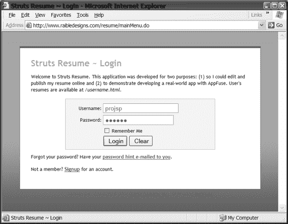

513-0 ch15.qxd 11/14/05 5:38 PM 第 578 页

**578**

第 15 章 ■ 使用 STRUTS、XDOCLET 和其他工具

**图 15-3.** *登录页面是简历应用的入口点。*

填写正确的用户名和密码并点击“登录”后，会进入主菜单页面（图 15-4），这是跳转到其他页面的起点。

**图 15-4.** *主菜单页面提供了访问应用各功能的入口。*

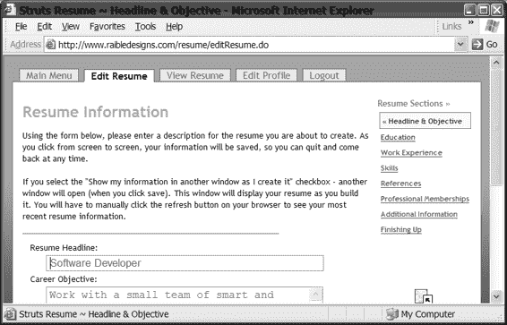

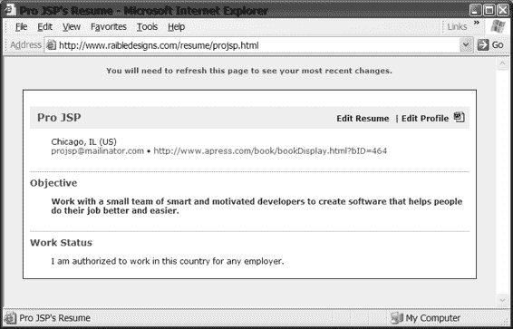

513-0 ch15.qxd 11/14/05 5:38 PM 第 579 页

第 15 章 ■ 使用 STRUTS、XDOCLET 和其他工具

**579**

如果您点击“查看简历”链接，您将看到“查看简历”页面，如图 15-5 所示。

**图 15-5.** *“查看简历”页面显示用户的简历。*

此页面允许您查看自己的简历。该页面包含用于编辑简历或编辑个人资料的链接。尝试点击“编辑简历”链接，您将看到如图 15-6 所示的页面。

**图 15-6.** *当您点击“编辑简历”链接时，您将被引导至“编辑简历”页面。*

*现有简历。*

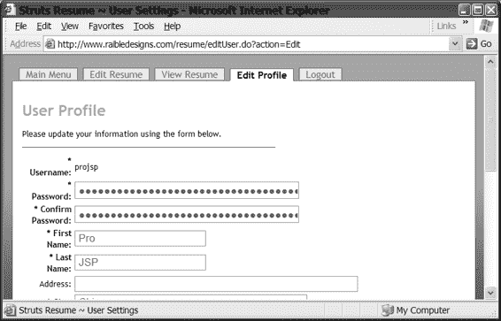

513-0 ch15.qxd 11/14/05 5:38 PM 第 580 页

**580**

第 15 章 ■ 使用 STRUTS、XDOCLET 和其他工具

最后，返回主菜单页面。您会看到此页面上还有其他各种选项。首先，页面中间有两个链接：“编辑个人资料”和“编辑简历”。“编辑个人资料”允许您更改您的用户资料，包括登录名、密码和联系详情（见图 15-7）。“编辑简历”允许您编辑您的简历。页面顶部还有其他各种链接；每个链接的用途应该一目了然。

**图 15-7.** *“编辑个人资料”页面允许您修改您的个人资料。*

**目录结构**

为了让您熟悉 struts-resume 的架构，我们将从图 15-8 所示的目录结构开始。

■**注意** struts-resume 的代码也可以从 http://raibledesigns.com/wiki/Wiki.jsp?page=Downloads 下载。CVS 版本可在 http://sourceforge.net/projects/struts 获取。代码下载中附带了一个 README.txt 文件，其中提供了完整的应用部署说明。

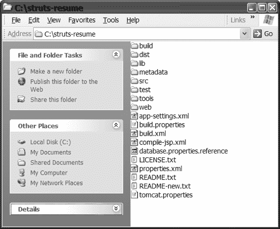

513-0 ch15.qxd 11/14/05 5:38 PM 第 581 页


第 15 章 ■ 使用 Struts、XDoclet 及其他工具

**581**

**图 15-8.** *简历应用程序的目录结构（非部署环境）* 下面我们来逐一说明根目录下每个文件的用途以及各子目录中的内容。

app-settings.xml 文件允许你轻松自定义应用程序。Ant 工具允许你通过命令行使用 `-DpropertyName=propertyValue` 语法设置属性。为了便于阅读，我们将这些属性从主构建文件中分离出来。主 Ant 构建脚本 build.xml 在执行时会包含此 app-settings.xml 文件。build.properties 文件包含应用程序名称设置和构建目录设置。database.properties 文件允许你配置要通过 Hibernate 连接的数据库。大多数数据库都受支持。

lib 目录包含项目使用的所有第三方库（JAR 文件）。我们使用了几个大型第三方库，因此该目录大小约为 11 MB。

XDoclet、Cactus、Struts 和其他库都包含在此目录中。此目录下的 lib.properties 文件允许你更改包的版本号。

metadata 目录下有一个 web 子目录，其中包含的 XML 文件共同构成了 web.xml 和 struts-config.xml。这在 XDoclet 术语中被称为**合并目录**。

如果你要向此项目添加 EJB，可以将任何相关的 XML 片段放置在一个新目录中。

properties.xml 文件加载所有 .properties 文件和环境变量。然后使用这些值来设置类路径属性、数据库属性和 Tomcat 部署属性。

src 目录（显然）是存放所有 Java 源文件的地方。其下有三个子目录：common、ejb 和 web。此外，为持久层设置一个 ejb 目录是合理的，因为这使得目录结构在未来具有可扩展性。XDoclet 用于从普通的旧式 Java 对象（POJO）生成 ValidatorForm 和 Hibernate 映射 XML 文件。ValidatorForm 进一步使用 `@struts.validator` XDoclet 标签进行标记

513-0 ch15.qxd 11/14/05 5:38 PM 第 582 页

**582**

第 15 章 ■ 使用 Struts、XDoclet 及其他工具

并用于生成 validation.xml 文件。我们之所以这样做，是因为它允许我们轻松地向表中添加新列。在我们上一个项目中，我们使用了验证器表单、值对象和 DAO，如果向表中添加新列，我们必须在两个地方（表单和 POJO）添加 getter 和 setter，并且还要更改 DAO 中的 SQL。

使用 XDoclet 和 Hibernate 消除了这个麻烦——尤其是因为 Hibernate 可以生成模式并为你构建数据库。我们编写了一个 db-create Ant 任务来自动执行此表创建操作。

tools 目录包含由 Erik Hatcher 编写的 StrutsGen 工具。该工具使用 Ant 和 XDoclet 从 ActionForm 生成一个 JSP 骨架和一个关联的属性文件，极大地加速了应用程序开发。

web 目录包含所有与 Web 相关的文件：图片、JavaScript 文件、CSS 文件、属性文件和 XML 配置文件。它包含这些文件的大部分独立目录，以及一个 WEB-INF/classes 目录。pages 目录中的 JSP 文件在部署时会被复制到 WEB-INF 目录。

■**提示** 顺便提一下，此应用程序是使用 AppFuse (http://raibledesigns.com/wiki/Wiki.jsp?page=Downloads) 作为基线创建的，我们建议你在开发自己的基于 Struts 的应用程序时也使用它。它已经内置了目录布局、用于编译、测试和部署的构建脚本，以及用于生成 XML 文件的 XDoclet 片段。下载后，只需执行 `ant new -Dapp.name=yourAppName -Ddb.name=yourDBName`。请随意删除你认为不必要的文件。

**Struts 开发技巧与工具**


好的，作为一名高级文档工程师和翻译员，我将严格遵循您提供的注意事项和示例，将给定的英文文本翻译成中文。


现在，我们已经回顾了典型 Struts 应用程序的架构，并概述了一个示例 struts-resume 应用程序，接下来让我们审视一些您可能尚未了解的技术、工具和框架，它们可以增强或加速您的 Struts 应用程序开发。我们将重点关注 Struts 1.2 版本及其高级特性。

Struts 为开发者提供了许多出色的特性、扩展和插件。其中一些插件起初可能看起来令人生畏，因为它们功能非常强大且配置极其灵活。当我们初次发现其中一些插件时，我们不禁自问：“这是谁把厨房水槽都搬来了？” 然而，如果您只需要它们的一小部分功能，那么只使用那一小部分也完全没问题。

我们将首先介绍两个可用于构建和生成代码的开源工具：Ant 和 XDoclet。然后，我们将探讨一系列在编写代码时可以使用的技术或工具。

**使用 Ant 构建 Struts 应用程序**

Apache Ant（可从 http://ant.apache.org/ 获取）是一个基于 Java 的强大构建工具。

使用 Ant 将使您的编译、组装或部署过程变得更加容易。

Ant 是我们迄今为止最喜欢的、与 Struts 和整个 Java 配合使用的工具。然而，我们遇到过太多开发者要么没听说过它，要么没有使用它。*JavaWorld* 的读者将其评为

513-0 ch15.qxd 11/14/05 5:38 PM Page 583

第 15 章 ■ 使用 Struts、XDoclet 及其他工具

**583**

2002 年“最有用的 Java 社区开发技术”。此外，在 2003 年，它赢得了 *JavaPro* 读者选择奖的“最有价值的 Java 部署技术”奖项。在 2003 年和 2004 年，它获得了 *Java Developer's Journal* 编辑选择奖。最后，在 2003 年，它赢得了 *JavaWorld* 编辑选择奖的“最有用的 Java 社区开发技术”奖项。

如果它未来继续获奖，我们也不会感到惊讶。我们过去曾受困于 IDE 的局限来编译代码，而现在使用了 Ant，我们感觉像是被解放了一样。

Ant 本质上是一种技术，其核心是使用构建文件（通常命名为 build.xml）将您的 .java 文件编译成 .class 文件。使用 Ant，配置用于编译文件的类路径要容易得多，如下例所示：

<!-- 设置一个指向所有 Struts JAR 文件的路径引用 -->

<path id="web.compile.classpath">

<fileset dir="/lib/jakarta-struts-1.1" includes="*.jar"/>

</path>

<target name="compile" description="将 .java 文件编译成 .class 文件">

<mkdir dir="${build.dir}/web/classes"/>

<javac srcdir="src/web"

destdir="${build.dir}/web/classes"

debug="false"

deprecation="true"

optimize="true"

classpathref="web.compile.classpath"

/>

</target>

上述代码片段中的 `<path>` 元素告诉 Ant 构建一个名值对，名称为 `web.compile.classpath`；其值被构建为 `/lib/Jakarta-struts-1.1` 目录中所有 JAR 文件的列表。通过一个简单的声明性语句，Ant 就为您创建了编译类路径。

对于本章的示例应用程序，需要 Ant 1.5.1（或更高）版本。下载后，您需要将其解压到硬盘上的某个位置（例如，Windows 上的 `c:\Tools\jakarta-ant-1.5.1`，或 Linux 和 Unix 上的 `/usr/local/jakarta-ant-1.5.1`）。解压后，您需要将 `ANT_HOME` 设置为指向此解压位置的环境变量，并将 `$ANT_HOME/bin` 添加到您的 `$PATH` 环境变量中。

Ant 任务

执行 `ant -projecthelp` 将显示基本的 Ant 任务，但以下是您最常使用的任务：

*   `ant deploy`：生成并编译所有内容，然后部署到 Tomcat（如果您已安装）。
*   `ant compile-module`：其中 `module` 是 `ejb`、`web` 或 `common`。
*   `ant ejbdoclet`：生成 ValidatorForms 和 Hibernate 的基于 XML 的映射文件。
*   `ant webdoclet`：生成 `web.xml`、`struts-config.xml`、`validation.xml` 和 TLD。

513-0 ch15.qxd 11/14/05 5:38 PM Page 584

**584**

第 15 章 ■ 使用 Struts、XDoclet 及其他工具

*   `ant test-module`：其中 `module` 的值可能与前面提到的 `compile` 选项的值相同。这会递归运行 `test/module` 目录中的所有测试。我们建议使用 `ant test-module -Dtestcase=ClassName`，其中 `ClassName` 是您的测试类的名称。
*   `ant test-cactus -Dtestcase=ClassName`：在运行测试之前启动 Tomcat，并在测试完成后停止它。如果 Tomcat 已经在运行，请使用 `ant test-web -Dtestcase=ClassName`。

struts-resume 中的许多第三方库要求您为它们定义一个*任务定义*，以便与 Ant 集成。例如，要使用 XDoclet 生成 Struts 配置文件 `struts-config.xml`，您必须定义 `"webdoclet"` 任务：

<taskdef name="webdoclet"

classname="xdoclet.modules.web.WebDocletTask">

<classpath>

<path refid="xdoclet.classpath"/>

<path refid="web.compile.classpath"/>

</classpath>

</taskdef>

定义此任务后，它就可以像使用 `<javac>` 任务（参见前面的示例）一样，在您的 `build.xml` 文件中使用。您可以在“使用 XDoclet 生成配置文件”一节中看到此任务的可用属性。

在示例应用程序中使用 Ant

在 struts-resume 中，Ant 执行以下所有任务：

*   生成 Java 代码和 XML 文件（通过 XDoclet）
*   构建（编译）整个源代码树（.java 文件）
*   将组件组装成 JAR 和 Web 归档（WAR）文件
*   将 WAR 文件部署到 Tomcat
*   运行单元测试和容器内测试（通过 Cactus）

Ant 是我们钟爱的技术之一，因为它*就是能正常工作*。我们在 struts-resume 应用程序中建模了 `build.xml` 文件，以符合 Erik Hatcher 在其著作 *Java Development with Ant*² 中推荐的 Ant 最佳实践。我们大量借鉴了他书中示例应用程序的架构，并就此与他交换了许多电子邮件。将测试源代码目录（`test/src`）与常规源代码目录（`src`）分开所带来的灵活性，使得在生产部署中排除测试类变得非常容易。

最后，对我们来说，Struts 一直是一个非常稳定的框架——即使是每日构建版本也是如此。当您查看示例应用程序的 Ant 构建文件时，您会发现我们创建它的方式使得您可以轻松切换任何第三方库（包括 Struts）的版本。您所需要做的就是下载一个新版本并将其解压到 `lib` 目录，然后更改 `lib/lib.properties` 中给出的版本号。这确实使得测试库的新版本并查看您的应用程序是否仍然正常工作变得非常容易。您还可以使用类似 `ant -Dstruts-dir=/path/to/struts/jars` 的命令从命令行覆盖库目录。

**使用 XDoclet 生成配置文件**

XDoclet 是一个代码生成引擎。它为 Java 实现了**面向属性的编程**。简而言之，这意味着您可以通过向 Java 源代码添加元数据（属性）来为代码增加更多意义。这是通过特殊的 JavaDoc 标签完成的。XDoclet 将解析您的源文件，并从中生成许多工件，例如 XML 描述符和/或源代码。

这些文件是根据模板生成的，这些模板使用了源代码及其 Javadoc 标签中提供的信息。在撰写本文时，XDoclet 只能作为利用 Ant 的构建过程的一部分来使用。XDoclet 的文档和下载可从 http://xdoclet.sourceforge.net/ 获取。


在构建过程中，你将利用 Ant 和 XDoclet 的强大功能来生成部署描述符（web.xml）、Struts 配置文件（struts-config.xml），甚至表单验证配置文件（validation.xml）。为了加速开发过程，你还会使用 XDoclet 从 POJO 生成 ValidatorForms 的 Java 代码。此外，你将生成 Hibernate 基于 XML 的映射文件，以将 POJO 映射到数据库表。

哇，听起来我们要做很多事情，不是吗？！事实上，在我们发现 XDoclet 之前，我们手动完成所有这些活动，那*确实*是一项繁重的工作。使用 XDoclet（它依赖于 Ant）使得为 Web 应用程序创建所有必需的 XML 工件变得*非常*容易，并且大大节省了时间。

我们喜欢使用 XDoclet，因为在开发应用程序时，我们无需过多担心编辑 XML 文件。只需在类（或方法）的 Javadoc 中添加一些标签，然后 XDoclet 就会为你生成这些文件。例如，我们在 UserAction 类的顶部有以下普通的 Javadoc 代码：

/**

* Implementation of <strong>Action</strong> that interacts with the {@link

* UserForm} to retrieve/persist values to the database.

*

* @author Matt Raible

* @version $Revision: 1.5 $ $Date: 2003/06/26 13:48:46 $

*

*/

通过向此 Javadoc 头部添加一些 XDoclet 标签，你可以为 struts-config.xml 文件生成 <action-mappings> 定义：

/**

* Implementation of <strong>Action</strong> that interacts with the {@link

* UserForm} and retrieves values. It interacts with the {@link

* BusinessManager} to retrieve/persist values to the database.

*

* @author Matt Raible

* @version $Revision: 1.5 $ $Date: 2003/06/26 13:48:46$

*

* @struts.action name="userForm" path="/editUser" scope="session"

* validate="false" parameter="action" input="mainMenu"

513-0 ch15.qxd 11/14/05 5:38 PM Page 586

**586**

第 15 章 ■ 使用 STRUTS、XDOCLET 和其他工具

当由 XDoclet 处理时，@struts.action 标签将被转换为一个 <action> 元素。在你的 Ant 构建文件（build.xml）的 webdoclet 任务中，你使用以下 XML 来生成 struts-config.xml 文件：

<target name="webdoclet" description="Generate web and Struts descriptors">

<taskdef name="webdoclet"

classname="xdoclet.modules.web.WebDocletTask">

<classpath>

<path refid="xdoclet.classpath"/>

<path refid="web.compile.classpath"/>

</classpath>

</taskdef>

<webdoclet destdir="${webapp.target}/WEB-INF"

force="${xdoclet.force}"

mergedir="metadata/web"

excludedtags="@version,@author"

verbose="true">

<fileset dir="src/web"/>

<fileset dir="${build.dir}/web/gen"/>

<configParam name="cactusOn" value="${enable.cactus}"/>

<deploymentdescriptor validatexml="true"

servletspec="2.3" sessiontimeout="30"

destdir="${build.dir}/web/WEB-INF"

distributable="false">

<configParam name="security" value="${security.mode}"/>

</deploymentdescriptor>

<jsptaglib validatexml="true"

description="Tag Libraries for Security and Labels"

validateXML="true"

shortName="struts-resume"

filename="struts-resume.tld"

/>

<strutsconfigxml validatexml="true" version="1.1"/>

<strutsvalidationxml/>

</webdoclet>

</target>

只需这些步骤，就能在生成的 struts-config.xml 文件中生成以下映射（为了节省空间，我们对 XML 进行了美化，但文本内容未变）：

<action path="/editUser" type="org.appfuse.webapp.action.UserAction"

name="userForm" scope="session" input="mainMenu"

parameter="action" unknown="false" validate="false">

</action>

当然，你仍然可以手动编写配置文件，通过生成特定命名的文件（称为**合并点**）来添加自定义数据。这些文件在生成项目时会被包含在主文件中。在 struts-resume 的目录（也称为**合并目录**）中，有一个 README.txt 文件列出了 web.xml 的可用合并点，

513-0 ch15.qxd 11/14/05 5:38 PM Page 587

第 15 章 ■ 使用 STRUTS、XDOCLET 和其他工具

**587**


`struts-config.xml` 和 `validation.xml`。例如，要为应用程序指定全局转发，可以创建一个 `global-forwards.xml` 文件，其中包含一个或多个 `<forward>` 元素。全局转发文件允许你配置模块中多个动作使用的转发，从而方便配置多个页面共用的转发。

<global-forwards>

<forward name="mainMenu" path="/mainMenu.do"/>

</global-forwards>

然后，该文件将被包含在生成的文件中。XDoclet 通过检查 `webdoclet` 任务的 `mergedir` 属性来知道在此目录中查找这些文件：

<webdoclet destdir="${webapp.target}/WEB-INF"

force="${xdoclet.force}"

mergedir="metadata/web"

excludedtags="@version,@author"

verbose="true">

XDoclet 还可以用于在 `struts-config.xml` 中生成 `form-bean` 条目，以及为 Validator 生成 `validation.xml` 文件。对于表单 Bean，你只需在类的 Javadoc 中添加以下内容：

* @struts.form name="UserForm"

你也可以使用此标签，通过简单地使用 `@struts.form` 从 POJO（或实体 Bean）生成 ActionForm。但是，如果你想包含实体 Bean 的所有字段，则需要添加 `include-all="true"`。你还可以添加一个可选的 `extends` 属性来指定它继承自 `ValidatorForm` 或你自己的基类。例如，在 `struts-resume` 中，`User.java` 文件的 Javadoc 头部包含以下内容：

/**

* User class

*

* This class is used to generate the Struts Validator Form

* as well as the Hibernate persistence later.

*

* @author Matt Raible

* @version $Revision: 1.6 $ $Date: 2003/06/27 03:27:44$

*

* @struts.form include-all="true"

* extends="org.appfuse.webapp.form.BaseForm"

*

* @hibernate.class table="app_user"

*/

然后，你可以添加方法级别的标签来生成 `validation.xml` 文件。如果你正在向现有的 ValidatorForm 添加 XDoclet 标签，请确保将这些标签放在你的 **setter** 方法上，否则不会生成任何内容！

* @struts.validator type="required" msgkey="errors.required"

513-0 ch15.qxd 11/14/05 5:38 PM Page 588

**588**

第 15 章 ■ 使用 STRUTS、XDoclet 和其他工具

如果你正在从 POJO 或实体 Bean 生成 ValidatorForm，则需要将 `@struts.validator` 标签放在类的 get 方法上。在 `struts-resume` 中，我们设置了一个自定义的 XDoclet 模板来生成 Struts 的表单（位于 `metadata/templates/struts_form.xdt`），该模板将生成一个 ValidatorForm，并在 setter 上附带 `@struts.validator` 标签。

由于在撰写本文时这并非 XDoclet 的核心功能，我们受到启发创建了一个自定义模板来实现它。

我们不确定是否推荐将动作转发编码到你的类中。我们两种方式都尝试过，感觉都挺方便。当然，我们最近一直在很多单人开发团队中工作，这可能会稍微影响我们的看法。如果你想将全局转发外部化，可以将它们放在一个名为 `global-forwards.xml` 的合并点文件中。

如果你想在类本地实现，可以在类的开头使用以下语法：

* @struts.action-forward name="list" path=".resumeList"

XDoclet 与 Ant 集成的一个很棒的地方是，你还可以在源代码中指定 Ant 属性，这些属性将在构建时被替换。因此，你可以通过 Ant 配置所有值，而不是硬编码它们。例如，在 `LoginServlet` 中，我们在 Javadoc 头部有以下 XDoclet 标签：

* @web.servlet-init-param

* name="encrypt-password"

* value="${encrypt-password}"

该值在 `app-settings.xml` 文件中默认设置：

<property name="secure-login" value="false"/> 然而，通过执行带有指定参数的 Ant 命令可以轻松覆盖它：`ant -Dsecure-login=true`

这会导致在 `LoginServlet` 的部署描述符（`web.xml`）中生成以下内容：

<init-param>

<param-name>encrypt-password</param-name>

<param-value>true</param-value>

</init-param>

如果你已经有一个数据库模式，并希望开发基于 Java EE 的应用程序，你可以使用 Middlegen (http://boss.bekk.no/boss/middlegen/)。Middlegen 是一个基于 JDBC、Velocity、Ant 和 XDoclet 的数据库驱动代码生成引擎。它可以直接从数据库生成容器管理持久化（CMP）、企业 JavaBean（EJB）、Java 数据库对象（JDO）以及 JSP 或 Struts 的代码！这是一个用于快速原型开发的绝佳工具。一个缺点是它对 Struts 的支持似乎非常薄弱。当我们第一次接触 Middlegen 时，它只支持 Struts 1.0。在撰写本文时，Middlegen 网站仍然将 Struts 插件标识为 alpha 状态。

513-0 ch15.qxd 11/14/05 5:38 PM Page 589

第 15 章 ■ 使用 STRUTS、XDoclet 和其他工具

**589**

StrutsGen 工具

在 `struts-resume` 应用程序中有一个小巧但灵活的工具，Erik Hatcher 最初为他在《*Java Development with Ant*》中的示例应用程序编写了它。它使用 Ant 和 XDoclet，通过检查表单的属性文件来生成 JSP 页面和 ResourceBundle。这两个文件使用的模板简单且可定制。该工具可以在 `struts-resume` 应用程序的 `tools/strutsgen` 目录中找到。要使用它，你首先需要运行命令 `ant webdoclet` 在 `build/gen/web` 目录中生成你的表单。然后导航到 `tools/strutsgen` 并运行 `ant "-Dform.name=MyForm"`，其中 `MyForm` 是你想要为其生成文件的表单名称。

这将在 `tool/strutsgen/build` 目录中生成两个文件，一个名为 `UserForm.jsp`，另一个名为 `UserForm.properties`。你也可以在不指定表单名称的情况下运行该工具，它将为你的所有表单生成这些文件。

该工具使用 TreeMap 从表单中获取属性，这意味着新文件将按字母顺序包含这些属性。在大多数情况下，你可能仍然需要自定义字段的顺序以使其对用户友好；这个工具只是稍微加快了速度。目前它也只支持生成 `<html:text>` 字段，但既然你无论如何都需要进入 JSP 重新排列字段顺序，这也不是什么大问题。我们发现它在开发此应用程序期间非常有用。

**在 Struts 中处理持久化**

在我们看来，Struts 在为你（开发者）提供实现视图和控制器的绝佳方式方面做得非常出色，但它对模型的支持并不多。ActionForm 很好，ValidatorForm 甚至更好，但如果你希望应用程序有一个数据库后端，Struts 并没有提供太多简化编码的方法。表单为后端提供了一个良好的接口，但 Struts 不负责提供数据访问，因此它不提供任何用于检索数据的类。虽然有很多不同的方法可以编写控制器到数据库的逻辑，但我们将告诉你我们是如何做的，以及哪些方法对我们有效。

当我们刚开始使用 Struts 进行开发时，我们的架构已经预先确定，我们只需要接入它。我们在项目中使用 EJB，并使用 RowSet 来处理列表屏幕。这对我们来说相当容易，因为我们只需要为每个动作调用特定的会话 Bean 并与之适当交互即可。我们实际上发现，在每个表单上为我们的数据对象（或值对象或数据传输对象）创建访问器和修改器（getter 和 setter）非常容易。后来我们才发现这不是推荐的“设计模式”——我们的数据对象永远不应该到达表示层。然而，它确实有效，而且效果很好——我们对此很满意。

关于持久化选项的话题似乎几乎每周都会出现在 Struts 用户邮件列表中。


我们认为这是因为选择太多了。实际上，你几乎可以将任何基于 Java 的持久化框架与 Struts 配合使用。毕竟它们都是 Java 技术。当没有一个框架被证明是占主导地位且广泛使用的框架时，选择起来确实很困难。这也是 Struts 的一个优势，它允许你选择任何框架——但我们猜测这对许多开发者来说也是一个令人头疼的问题。

不过，如果你坚持使用自己熟悉的技术，为 Struts 应用选择持久化框架也可以很简单。如果你打算选择开源实现，请确保文档质量良好、开发邮件列表活跃，并且有示例应用。复制现有示例比从头开发要容易得多。花时间研究现有的数据库代码生成工具是值得的，因为从长远来看这会节省大量时间。最重要的是，学习并使用 XDoclet（我们稍后会讨论）来辅助你的持久化层。我们相信你会对它非常满意。

持久化选项

在第 9 章中，你已经花了大量时间评估各种可用的持久化选项，因此我们不再赘述。这里我们只想告诉你，在 struts-resume 示例项目中我们选择了使用 Hibernate。到目前为止，我们对它非常满意。

它似乎拥有出色的文档，并且支持 XDoclet。XDoclet 支持对我们来说是一个很大的卖点，因为我们希望生成大部分数据库访问代码。

■**注意** struts-resume 中的示例借鉴了 Dave Johnson（第 9 章作者）在其示例应用中的范例，以及我们从 Hibernate 开发邮件列表中获得的帮助。

**增强 Struts ActionForm 开发**

Struts 有一些经常被忽视的特性，但在你开发 ActionForm 时可能会很有用。让我们来看看它们。

使用 DynaActionForm

DynaActionForm 是作为 Struts 1.1 的一部分添加的。它基本上允许你通过 XML 声明表单的属性，而不是用 Java 编写表单。对开发者来说，好处是不必编写和编译 ActionForm。然而，如果你使用 XDoclet 生成 ActionForm，那么可能就用不到 DynaActionForm。它们对于提供不需要持久化的简单表单非常方便——例如用于发送电子邮件的 MessageForm。让我们以此为例，看看它的设置：

<form-bean name="messageForm"

type="org.apache.struts.action.DynaActionForm">

<form-property name="name" type="java.lang.String"/>

<form-property name="email" type="java.lang.String"/>

<form-property name="subject" type="java.lang.String"/>

<form-property name="content" type="java.lang.String"/>

</form-bean>

就像 ActionForm 一样，为了与 Web 层交互，你所有的属性都应该是字符串类型。

只有对象类型（String、Integer 或 Boolean）可以用作 `<form-property>` 元素的类型。不允许使用基本类型。指定表单属性后，你可以像使用常规 ActionForm 或 ValidatorForm 一样，在动作映射中引用该表单。DynaActionForm 也可以通过使用 `org.apache.struts.action.DynaValidatorActionForm` 类型来利用 Validator。

然后，你可以在 Action 类中使用以下代码获取该表单：`DynaActionForm msgForm = (DynaActionForm) form;`

要从表单中获取值，你必须使用 `form.get(propertyName)` 语法（类似于从 HashMap 中获取值的方式）：

`String subject = (String) theForm.get("subject");` 你还可以在 Action 类中创建并初始化一个 DynaActionForm（或 DynaValidatorActionForm）：

`DynaActionForm msgForm = (DynaActionForm) DynaActionFormClass`


`.getDynaActionFormClass("messageForm").newInstance();` 然后可以使用 `form.set("propertyName", object)` 在表单上设置值。就像普通的 ActionForm 一样，在填充完数据后，你需要将其放入指定的作用域中。

如果你打算在表单上频繁地获取和设置属性，由于需要进行大量的类型转换，而不是简单的 `form.getProperty()`，DynaActionForm 可能会有些麻烦。我们建议在使用 DynaActionForm 之前，先使用 XDoclet 生成你的 ActionForms 和 ValidatorForms。同时，它也有很好的用途，比如在消息表单中。

**在 Struts 中使用带索引属性的表单**

索引属性是 Struts 从一开始就提供的功能。如果你使用过它，你可能会非常喜欢它，因为它允许你获取和设置对象列表（例如，父表单上的子表单的 ArrayList）。在 struts-resume 应用程序中，这可能类似于在 ResumeForm 上获取/设置一个 SkillForms 的 ArrayList。基本上，其语法涉及像 `<logic:iterate>` 和 `<c:forEach>` 这样的标签，并在表单元素的名称上设置索引：

`<logic:iterate id="skill" name="userSkills" indexId="index">` 然后，你需要在你的表单中添加 get 和 set 访问器，以便能够根据索引检索和修改这些值。以下是一个如何在 struts-resume 的 SkillGroup 表单上实现此功能的示例，用户在该表单中分配多个 SkillForms：

```java
/**
 * 技能属性。
 */
private ArrayList skill;

/**
 * 技能的 Getter。用于迭代器标签和对象的索引。
 */
public SkillForm getSkill(int index) {
    return (SkillForm) skill.get(index);
}

/**
 * 上述 getter 的 Setter。
 */
public void setSkill(int index, SkillForm skill) {
    this.skill.set(index, skill);
}

/**
 * 技能 ArrayList 的 Getter
 */
public ArrayList getSkills() {
    return skill;
}

/**
 * 技能 ArrayList 的 Setter
 */
public void setSkills(ArrayList skills) {
    this.skill = skills;
}
```

我们尚未实现索引属性，尽管我们计划这样做，并且在你阅读本文时可能已经实现了。

**表单验证**

我们首选的表单验证方法是使用 Struts Validator。Validator 最初由 David Winterfeldt 编写，旨在克服在 ActionForms 中编写验证逻辑的繁琐。它可以执行基本验证，以检查字段是否为必填项，或是否匹配正则表达式、电子邮件或信用卡，以及服务器端类型检查和日期验证。你可以在任何 JSP 和 Servlet 应用程序中使用 Validator，但它最初是为 Struts 设计的，因此在 Struts 中使用最为简便。自 Struts 1.1 起，验证框架已集成到核心 Struts 库（struts.jar）中。

有关 Validator 的详细在线信息，请访问 http://struts.apache.org/userGuide/building_view.html#validator。

**使用 Validator**

Validator 框架依赖于一个 `validator-rules.xml` 文件，该文件定义了所有可插拔的 Validator 定义。这些定义本质上是用于服务器端验证的 Java 类和用于客户端验证的 JavaScript 函数。让我们以“required”可插拔 Validator 为例：

```xml
<validator name="required"
    classname="org.apache.struts.validator.FieldChecks"
    method="validateRequired"
    methodParams="java.lang.Object,
        org.apache.commons.validator.ValidatorAction,
        org.apache.commons.validator.Field,
        org.apache.struts.action.ActionErrors,
        javax.servlet.http.HttpServletRequest"
    msg="errors.required">
    <javascript>
        <![CDATA[
            ... 在此插入 JavaScript 函数 ...
        ]]>
    </javascript>
</validator>
```

我们省略了 JavaScript 函数，因为它有 40 行，而你来这里是为了学习 JSP，而不是 JavaScript，对吧？在上面的定义中，`FieldChecks` 是 Validator 框架中的一个类，它有一个名为 `validateRequired()` 的方法，该方法接收列出的参数。

`<javascript>` 元素定义了用于执行客户端验证的 JavaScript 函数。在此文件中定义这些内容使得 Validator 框架易于配置。

要在 Struts 应用程序中启用 Validator，你首先需要将以下 XML 添加到 `struts-config.xml` 文件中。根据 Struts DTD，`<plug-in>` 元素应出现在该文件的末尾附近。如果你使用 XDoclet，可以将此 XML 放入合并目录中的文件中：

```xml
<plug-in className="org.apache.struts.validator.ValidatorPlugIn">
    <set-property property="pathnames"
        value="/WEB-INF/validator-rules.xml,/WEB-INF/validation.xml"/>
</plug-in>
```

从这个例子中可以看出，Validator 加载了两个文件。这些文件可以重命名为你喜欢的任何名称；你只需确保 `<plug-in>` 配置正确即可。由于这些文件名是 Validator 的事实标准，我们将在示例中使用它们。Validator 还允许扩展，例如以下用于验证两个字段是否匹配的扩展：

```java
public static boolean validateTwoFields(Object bean, ValidatorAction va, Field field, ActionErrors errors, HttpServletRequest request, ServletContext application) {
    String value = ValidatorUtil.getValueAsString(bean, field.getProperty());
    String sProperty2 = field.getVarValue("secondProperty");
    String value2 = ValidatorUtil.getValueAsString(bean, sProperty2);
    if (!GenericValidator.isBlankOrNull(value)) {
        try {
            if (!value.equals(value2)) {
                errors.add(field.getKey(), ValidatorUtil.getActionError(
                    application, request, va, field));
                return false;
            }
        } catch (Exception e) {
            errors.add(field.getKey(), ValidatorUtil.getActionError(
                application, request, va, field));
            return false;
        }
    }
    return true;
}
```

然后，你可以通过添加以下元素将此 class 添加到 `validator-rules.xml` 文件中：

```xml
<validator name="twofields"
    classname="com.mysite.StrutsValidator"
    method="validateTwoFields"
    msg="errors.twofields"/>
```

然后，在 `validation.xml` 中，你可以配置一个字段来使用此验证规则：

```xml
<field property="password"
    depends="required,twofields">
    <arg0 key="typeForm.password.displayname"/>
    <var>
        <var-name>secondProperty</var-name>
        <var-value>password2</var-value>
    </var>
</field>
```

你也可以轻松地向 `validator-rules.xml` 添加一个 JavaScript 函数以进行客户端验证。这只需在 `<validator>` 元素内部添加一个 `<javascript>` 元素即可。

如果没有 Validator，在应用程序中编写验证逻辑的最简单方法是覆盖 ActionForm 中的 `validate()` 方法。其签名如下：
`public ActionErrors validate(ActionMapping mapping, HttpServletRequest request);`
这个 ActionForm 方法返回 null，就像 ActionForm 的 `reset()` 方法一样，类似地，如果你不想覆盖它，也不是必须的。

`public void reset(ActionMapping mapping, HttpServletRequest request);`
`reset()` 方法旨在将所有属性重置回其默认状态。它在控制器 Servlet 重新填充 bean 之前被调用，并且在你的视图表单上使用复选框时非常有用。这是因为当复选框未被选中时，其值和名称都不会在请求中传递。这就是 `reset()` 方法存在的主要原因——设置复选框的默认状态，使它们像其他表单元素一样，始终作为名称-值对在请求中传递。


老实说，我们只在验证索引属性时，在 ActionForm 中使用了 `validate()` 方法，也只在表单有复选框时使用了 `reset()` 方法。我们在开始使用 Struts 大约一个月后发现了 Validator 框架，之后就再也没回头。Validator 非常适合执行基本的必填字段验证，以及更高级的功能，例如正则表达式匹配、电子邮件地址语法（并非实际验证地址）、信用卡和类型检查（字符串、数字、日期）。此外，可以为不同的区域设置定义不同的验证规则。然而，要充分利用 Validator，你确实需要相当好地理解正则表达式语法。

要配置一个 Action 以调用 ActionForm 上的 `validate()` 方法，或使用 ValidatorForm 的声明式验证，你不需要做任何额外操作，因为验证默认是**开启**的。就个人而言，我们喜欢在 `<action-mappings>` 元素中明确指定 `validate="true"` 或 `validate="false"` 以避免混淆。此外，你需要为 `<action-mappings>` 指定一个 `input` 属性，否则 Validator 将不知道返回何处进行服务器端验证。这一点非常重要，尤其是在使用我们稍后将讨论的 Tiles 框架时——如果你不添加 `input` 属性，你将得到一个空白的屏幕。

在 XDoclet 中配置此内容如下例所示：

* @struts.action name="userForm" path="/saveUser" scope="session"
* validate="true" parameter="action" input="editProfile"

这将产生以下 action 映射：

<action path="/saveUser" type="org.appfuse.webapp.action.UserAction"
name="userForm" scope="session" input="editProfile" parameter="action"
unknown="false" validate="true">
</action>

我们在 struts-resume 应用程序中使用了 `inputForwards`，因此值 `editProfile` 实际上引用了一个全局转发。

我们非常喜欢 Validator，因为它既执行客户端验证（通过 JavaScript），也执行服务器端验证。根据我们的经验，大多数客户和开发人员一样更喜欢客户端验证。如果必填字段未填写，浏览器为何还要尝试提交表单呢？有些大型组织出于兼容性考虑不鼓励使用 JavaScript，这很可惜，因为它可以帮助你的 Web 应用程序表现得更像传统的桌面应用程序。然而，有些 HTML 元素需要服务器端验证——例如 `<input type="file" ... />` 元素。它不允许 JavaScript 操作或访问，因此无法检查是否已输入值。这是出于安全原因，因为你不会希望脚本在未经你同意的情况下从你的硬盘驱动器获取文件。

在使用 JavaScript 开发富 Web 客户端时，需要记住的最重要的事情是无障碍标准。目前有两个标准。在美国，有联邦政府的第 508 条倡议。第 508 条要求联邦机构的电子和信息技术应对残障人士可访问。更多信息请访问 http://www.section508.gov。

第二个标准更具全球性，是 W3C 的 Web 无障碍倡议（WAI）。万维网联盟（W3C）致力于引领 Web 发挥其全部潜力，其中包括促进残障人士的高度可用性。WAI 与全球各地的组织协调，通过五个主要工作领域追求 Web 的无障碍性：技术、指南、工具、教育和推广，以及研究与开发。更多信息请访问 http://www.w3.org/WAI/。

这些无障碍标准建立在其他标准之上，例如 XHTML 和 CSS。如果在开发 Web 应用程序时遵循这些标准，你会发现使应用程序易于访问会容易得多。我们发现无障碍标准不鼓励使用 JavaScript 在 `<select>` 的 `onchange` 事件上更改页面，但像 Validator 使用的弹出式 JavaScript 警报是可以的。大多数屏幕阅读器可以理解并读取它们——与客户端 JavaScript 相关的主要无障碍问题是：1) 消息易于理解，2) 当 JavaScript 关闭时仍能给出消息。由于 Validator 同时提供客户端和服务器端验证，它满足了许多无障碍要求。

**使用 XDoclet 生成 validation.xml**

在 struts-resume 应用程序中，XDoclet 从 ActionForm 及其子类（包括 ValidatorForm）生成 `validation.xml` 文件。我们创建了一个扩展 ValidatorForm 并实现 Serializable（用于集群环境）的 BaseForm，然后我们所有的表单都扩展它。UserForm 和 `validation.xml` 的生成过程如图 15-9 所示，其中箭头代表 Ant 目标或任务的名称。

ejbdoclet/
User.htm.xml
User.java
（由 hibernatedoclet 使用的 XML）
ejbdoclet
strutsfor /
m
webdoclet/
Validation.xml
UserForm.java
strutsvalidationxml

**图 15-9.** *XDoclet 可以生成表单以及这些表单的验证描述符。*

有三个方法级别的 XDoclet 标签可用于生成值：

• `@struts.validator`
• `@struts-validator.args`
• `@struts.validator-var`

最简单的例子是使用 required Validator 生成一个条目。我们将使用在 UserForm 上生成的 `username` 属性来说明。如前面的图表所示，它从 User.java 文件开始，这些标签被转移到生成的 ActionForm 上。在 `username` 的 getter 字段上，你会找到以下标签：

/**
* 返回用户名。
* @return String
*
* @struts.validator type="required" msgkey="errors.required"
* @struts.validator type="email" msgkey="errors.email"
* @hibernate.property
* column="username" type="string" not-null="true" unique="true"
*/
public String getUsername() {
return username;
}

为了使表单生成正常工作，此代码必须位于 getter 上。在撰写本文时，`strutsform` 任务是 `ejbdoclet` 的一个子任务，因此我们仍然将其作为 `ejbdoclet` 任务运行。当运行 `ejbdoclet` 任务时，其中的 `<strutsform>` 子任务将在 `validation.xml` 中生成以下条目：

<formset>
<form name="userForm">
...
<field property="username"
depends="required,email">
<msg name="required"
key="errors.required"/>
<msg name="email"
key="errors.email"/>
<arg0 key="userForm.username"/>
</field>
...
</form>
</formset>

我们应该指出，`<msg>` 元素不是必需的；因此你不需要在 XDoclet 标签中指定 `msgkey` 属性。如果你选择省略此元素，将应用来自 `validation-rules.xml` 文件的 Validator 默认消息。该值在 `validation-rules.xml` 中由 `msg` 属性表示。例如，required Validator 具有 `msg="errors.required"`。XDoclet 在 `validation.xml` 中为我们创建了 `msg` 条目，从长远来看提供了更大的灵活性。

既然你已经知道如何生成 `validation.xml`，让我们检查一下这些部分实际意味着什么。在前面的摘录中有四个不同的元素：`<form>`、`<field>`、`<msg>` 和 `<arg>`。


`<form>` 元素的 name 属性定义了 ActionForm 的名称，该名称应与 `struts-config.xml` 中定义的名称一致。由于你使用 XDoclet 来生成表单和 `struts-config.xml` 文件，因此可以确保这些名称是匹配的。

`<field>` 元素有两个属性：`property` 和 `depends`。`property` 属性定义了 `UserForm.java` 中待验证变量的名称，而 `depends` 属性则指定了要应用的验证规则。

有两个 `<msg>` 元素，用于指明从 `ApplicationResources.properties` 文件（或 `struts-config.xml` 中定义的任何 ResourceBundle）中使用的消息。在 `struts-resume` 中，这些消息定义如下：`errors.required={0} is required.`

`errors.email={0} is an invalid e-mail address.`

最后一个元素 `<arg0>` 指定了每条消息中 `{0}` 替换值的消息键。在 `struts-resume` 中，它被定义为：`userForm.username=Username`

如果你希望在错误消息中替换多个参数，可以在 `ApplicationResources` 中通过递增数字来添加更多参数，例如 `{1}` 表示第二个参数。要在表单中添加此参数的替换值，你可以在原始表单中添加另一个 XDoclet 标签：

`@struts.validator-args arg1resource="username.lastName" arg1value="My Surname"`

当然，你绝不会同时使用这两个属性，因为第一个（`arg1resource`）用于查找资源键，而第二个（`arg2value`）用于在 `validation.xml` 中放置字面字符串。通过 webdoclet 任务运行上述代码会生成以下 XML：

`<arg0 key="username.lastName"/>`

`<arg0 key="My Last Name" resource="false"/>`

现在你已经配置了表单的验证，接下来应该在 JSP 中添加一些 JavaScript 来强制执行客户端验证。第一步是使用 `<html:messages/>` 标签库来捕获任何服务器端验证错误：

`<logic:messagesPresent>`

`<div class="error">`

`<html:messages id="error">`

`<bean:write name="error" filter="false"/><br/>`

`</html:messages>`

`</div>`

`</logic:messagesPresent>`

在 `struts-resume` 应用程序中，上述代码出现在 `messages.jsp` 文件中。该文件还包含捕获常规消息（非错误消息）的代码，并位于 `web/common` 文件夹中。它被包含在 Tiles 模板中，因此我们不必将其添加到每个需要使用验证的页面中。

其次，你需要在表单中添加一个 `onsubmit` 事件处理器：

`<html:form action="/userSave" method="post" styleId="userForm"`

`focus="password" onsubmit="return validateUserForm(this)">`

在检查此表单语法时，我们还想指出其他几点。

默认情况下，如果你在表单上未使用 `method` 属性，`<html:form>` 标签会为你生成一个。但它生成的问题在于不符合 XHTML 规范。也就是说，它生成为 `method="POST"`，而 XHTML 要求预定义的属性值必须是小写。

我们通常为所有表单和表单元素（例如 `<html:text>` 或 `<html:password>`）添加一个 `styleId` 属性，以便可以通过文档对象模型（DOM）使用 `document.getElementById(elementId)` 来访问它们。需要注意的一点是，每个 Id 在页面内必须是唯一的。最后，为了提高应用程序的可用性，你应该尝试在表单上使用 `focus` 属性，但要谨慎使用：如果你根据用户角色或其他逻辑隐藏了字段，这可能会导致 JavaScript 错误。

配置完表单后，你需要为表单的“提交”和“取消”按钮添加一个 `onclick` 处理器，以调用 Validator 的 `validateForm` JavaScript 函数。这样做是为了确保点击“取消”按钮时不会触发任何验证：

`<html:cancel styleClass="button" onclick="bCancel=true">`

`<bean:message key="button.cancel">`

`</html:cancel>`

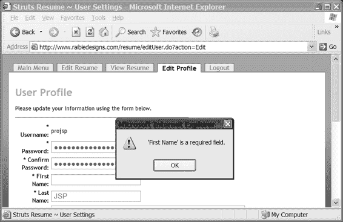


513-0 ch15.qxd 11/14/05 5:38 PM 第 599 页

第 15 章 ■ 使用 STRUTS、XDOCLET 及其他工具

**599**

<bean:message key="button.submit">

</html:submit>

在前面的示例中，我们添加了 `styleClass` 属性来为按钮指定 CSS 规则。最后，添加以下代码以引入执行实际验证所需的 JavaScript：

<html:javascript formName="userForm" cdata="false"

dynamicJavascript="true" staticJavascript="false"/>

<script type="text/javascript"

src="<html:rewrite page="/scripts/validator.jsp"/>">

</script>

我们始终建议在引用 JavaScript 或 CSS 文件时使用 `<html:rewrite />`，因为它会生成包含应用程序上下文的 URL。也就是说，它会创建一个相对于 Web 服务器根目录（`/`）的 URL。`validation.jsp` 包含以下代码，用于从 `validation-rules.xml` 文件中渲染所有 JavaScript 函数：

<%@ page language="java" contentType="javascript/x-javascript" %>

<%@ taglib uri="http://jakarta.apache.org/struts/tags-html"

prefix="html" %>

<html:javascript dynamicJavascript="false" staticJavascript="true"/> **测试验证**

现在一切已配置完毕，让我们来测试一下！为此，您需要登录到 `struts-resume` 应用程序，并点击“编辑个人资料”链接。这将显示您的用户信息。如果您清空用户名字段，将会出现如图 15-10 所示的错误对话框。

*或显示对话框。*

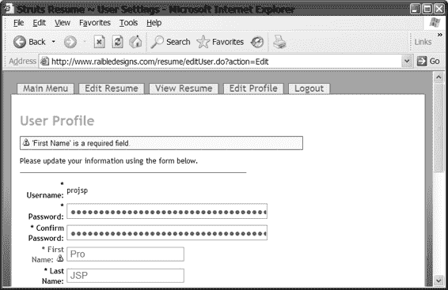

513-0 ch15.qxd 11/14/05 5:38 PM 第 600 页

**600**

第 15 章 ■ 使用 STRUTS、XDOCLET 及其他工具

当您在浏览器中禁用 JavaScript 时，验证器会在服务器端捕获错误，您将看到如图 15-11 所示的消息。因此，如果您不想在应用程序中使用 JavaScript，除了 XDoclet 标签外，几乎无需编写任何代码。如果您不使用 XDoclet，则需要手动配置 `validation.xml`——我们喜欢将其称为*声明式验证*。

**图 15-11.** *即使在客户端浏览器中禁用了 JavaScript，验证仍会在服务器端进行，并且错误消息仍会显示。*

您还可以使用验证器基于变量进行验证，例如验证邮政编码是否与正则表达式匹配。这可以通过一个包含正则表达式作为其值的掩码来实现。对于可能多次使用的正则表达式，最好将它们定义为 `validation.xml` 文件中的常量。由于我们使用 XDoclet，这可以在位于合并目录中的 `validation-global.xml` 文件中完成。在 `struts-resume` 应用程序中，该目录为 `metadata/web/`。

<constant>

<constant-name>zip</constant-name>

<constant-value>^\d{5}\d*$</constant-value>

</constant>

这个正则表达式表示邮政编码必须为五位字符，且所有字符必须为数字。要验证 `userForm` 中的邮政编码，您需要像这样配置 `validation.xml`：

<field property="postalCode" depends="required,mask">

<msg name="required" key="errors.required"/>

513-0 ch15.qxd 11/14/05 5:38 PM 第 601 页

第 15 章 ■ 使用 STRUTS、XDOCLET 及其他工具

**601**

<msg name="mask" key="errors.zip"/>

<arg0 key="userForm.postalCode"/>

<var>

<var-name>mask</var-name>

<var-value>${zip}</var-value>

</var>

</field>

如前所述，如果您想使用验证器的默认值，可以省略 `<msg>` 元素。然而，掩码的默认错误消息键是 `errors.invalid`，它只是简单的 `{0}` 无效。为了增强应用程序的可用性，使用包含更多信息的键（例如 `errors.zip`）可能更好（例如 `{0} 字段必须是一个 5 位数字`）。使用 XDoclet 为 `postalCode` 字段配置这一点很容易。您只需添加一个标签来指定规则和变量的名称-值对：

* @struts.validator type="mask" msgkey="errors.zip"

* @struts.validator-var name="mask" value="${zip}"

**高级验证器特性**

我们尚未提及的验证器其他特性包括多页验证、索引属性验证、条件验证和 DynaFormValidation。多页验证允许您将表单的验证规则分布在多个页面上。当您的应用程序中有类似向导的表单用于收集信息时，这非常有用。要配置此功能，您需要在 JSP 中添加一个隐藏字段来指定页码：

<html:hidden property="page" value="1"/> 这通过在 `validation.xml` 中为字段的验证规则添加 `page` 属性来补充。在您目前看到的示例中，字段具有 `property` 和 `depends` 属性。添加 `page` 属性后，您的表单现在可以包含跨不同 JSP 页面调用的验证！

<field property="firstName" depends="required,mask" page="1"> 我们非常喜欢这个特性，因为它配置起来非常简单。

索引属性验证允许您拥有包含在表单内的表单或子表单。

例如，在您的应用程序中，一个 `ResumeForm` 可以包含一对多的 `SkillGroupForms`。`SkillGroups` 描述一组技能。在技术简历上，一个好的 `SkillGroup` 可能是“Java”，或者更高级别的“编程语言”。此外，`SkillGroupForms` 可以包含一对多的 `SkillForms`。以 Java 为例，您可能有诸如“Swing”、“JDBC”和“XML”等 `SkillForms`。一个用于编辑这些内容的良好用户界面应允许您查看简历的所有 `SkillGroups` 及其后续的 `SkillForms`。显示所有这些内容并不困难，因为您可以使用 `<logic:iterate>` 标签或 `<c:forEach>`。然而，要保存它们，您必须知道用户编辑了哪一行（或哪个表单）。这就是索引属性发挥作用的地方。您基本上可以在表单中添加一个 getter/setter，用于设置/获取嵌套的表单值。更多信息请参阅“在 Struts 中将索引属性与表单一起使用”一节。要配置验证器

513-0 ch15.qxd 11/14/05 5:38 PM 第 602 页

**602**

第 15 章 ■ 使用 STRUTS、XDOCLET 及其他工具

以验证索引属性，您需要在 `<field>` 元素中添加一个 `indexedListProperty` 属性：

<field property="groupName" depends="required" indexedListProperty="skills">

<var>

<var-name>field[0]</var-name>

<var-value>name</var-value>

</var>

<var>

<var-name>field-indexed[0]</var-name>

<var-value>true</var-value>

</var>

<var>

<var-name>field-test[0]</var-name>

<var-value>NOTNULL</var-value>

</var>

</field>

这表明 `skills` 属性包含一个列表，并且此 `skills` 列表中的必填字段是 `name` 属性。

验证器最近新增的一个特性是能够根据其他字段的值有条件地要求验证字段。它允许您定义诸如“仅当字段 X 非空且字段 Y 包含 'male' 时才验证此字段”的逻辑。验证器支持验证索引属性，如前面示例中的 `[0]` 指示符所示。然而，在撰写本文时，它不支持动态索引属性。也就是说，您必须知道子（索引）属性的数量并相应地配置验证器。条件验证可能非常有用，但由于我们在 `struts-resume` 中未使用它，我们建议查阅在线文档以获取更多信息。

**将验证器与 DynaActionForms 一起使用**


我们想提及的 Validator 的最后一个特性是，它也可以与 DynaActionForms 一起使用。正如您之前所见，DynaActionForms 是通过在 `struts-config.xml` 中指定表单属性来创建的表单。这可以在为应用程序开发具体表单时节省时间。就个人而言，我们更倾向于为表单使用具体的 Java 类，而不是用表单属性把配置文件弄得杂乱无章。DynaActionForms 背后的主要动机是加速和简化 Struts 开发，以便开发者能够快速创建新表单。使用 XDoclet 生成表单甚至更快，因为（在我们的示例中）它还会创建持久层。使用 XDoclet 还会为您创建 `form-bean` 条目和 `validation.xml`，而如果您使用 DynaActionForms，您仍然需要手动创建 `validation.xml`。也就是说，创建一个使用 Validator 的 DynaActionForm 就像指定它是哪种类型的 bean 一样简单。一个作为 DynaActionForm 创建的常规 UserForm 可能如下所示：

<form-bean name="userForm"

type="org.apache.struts.action.DynaActionForm">

...

</form-bean>

513-0 ch15.qxd 11/14/05 5:38 PM Page 603

第 15 章 ■ 使用 STRUTS、XDOCLET 和其他工具

**603**

要使此表单支持 Validator，您只需更改 `type` 属性：

<form-bean name="userForm"

type="org.apache.struts.validator.DynaValidatorForm">

...

</form-bean>

配置 Validator 看起来可能工作量很大；毕竟，您确实需要在 JSP 页面中添加三段不同的代码：表单的 `onsubmit` 处理程序、按钮的 `onclick` 处理程序以及表单底部的 JavaScript 声明。然而，使用 StrutsGen 工具可以轻松地自动化这个过程。我们只需修改 `ActionForm_jsp.xdt` 文件（位于 `tools/strutsgen/src`），使其包含所有这些 Validator 特定的代码，现在我们的初始表单将在生成时就支持 Validator！这有多棒？

**对索引标签执行验证**

Validator 也能够对索引标签执行验证。您只需在 `validation.xml` 中为您想要验证的字段添加一个 `[#]`。例如，如果您想配置 ResumeForm 以要求第一个 SkillForm 的 name 字段，您可以在 `validation.xml` 文件中配置如下内容：

<form name="resumeForm">

...

<field property="skills[0]name"

depends="required">

<msg name="required"

key="errors.required"/>

<arg0 key="skillForm.name"/>

</field>

**使用内置的 Struts Actions**

如果您已经构建了一个 Struts 应用程序，您可能会发现您开发了一些遵循 MVC 模式的 action，但实际上并不需要它们。或者您可能直接链接到 JSP 页面，绕过了推荐的“每个链接都应通过控制器”的模型。我们知道我们以前就是这样做的——直到我们发现了 Struts 内置的 actions。我们现在把它们看作是一群热切的板凳球员，在说：“让我们上场吧，教练，我们保证会让您骄傲！”

然而，您可能没有意识到它们的存在。因此，我们现在就来介绍这些状态良好的 actions，让您领略一下它们的潜力，甚至可能让它们上场参赛。

Struts 有五个内置的 actions，前三个（ForwardAction、IncludeAction 和 SwitchAction）完全不需要编码。最后两个，DispatchAction 和 LookupDispatchAction，旨在促进代码精简和重用。

ForwardAction

ForwardAction 可用于重定向到 JSP 页面，同时仍然利用控制器的内置功能——例如使用 `roles` 属性保护 actions。在将模型 1 架构（即仅使用 JSP 页面）迁移到 Struts 时，它也非常有用。在示例简历

513-0 ch15.qxd 11/14/05 5:38 PM Page 604

**604**

第 15 章 ■ 使用 STRUTS、XDOCLET 和其他工具

应用程序中，使用 ForwardAction 将用户引导至主菜单页面。要配置 ForwardAction，您只需将 `org.apache.struts.actions.ForwardAction` 类指定为 `type`，并将 JSP 页面（或 Tiles 定义）指定为 `parameter`。

<action path="/mainMenu"

type="org.apache.struts.actions.ForwardAction"

parameter=".mainMenu"/>

我们还创建了一个全局转发来调用此 action：

<forward name="mainMenu"

path="/mainMenu.do"/>

配置好 action 和转发后，就可以在应用程序的起始页面（`index.jsp`）中调用它：

<logic:redirect forward="mainMenu"/>

您还应该注意，前面的 action 和转发定义分别位于 `metadata/web` 目录下的 `struts-actions.xml` 和 `global-forwards.xml` 文件中。当执行 `strutsconfigxml` 任务时，XDoclet 会抓取这些片段并将它们合并到主 `struts-config.xml` 文件中。对于所有这三个“无需编码”的 actions，您都需要在这些文件中定义您的 actions 和 forwards。

IncludeAction

IncludeAction 的开发原因与 ForwardAction 相同。它允许您集成使用 `RequestDispatcher.include()` 的基于 servlet 的组件。与 ForwardAction 一样，它只需要您指定 `name`、`parameter` 和 `type` 属性。就个人而言，我们从未使用过它，也从未见过它被使用，但以下是您可能配置它的方式：

<action path="/resumeComments"

type="org.apache.struts.actions.IncludeAction"

parameter="/path/to/servlet"/>

SwitchAction

SwitchAction 旨在允许切换应用程序模块。请稍后参考“在团队开发环境中使用模块”一节以获取完整描述和配置方法。

DispatchAction

DispatchAction 和 LookupDispatchAction 是 Struts 框架的两个重要补充。

对于我们开发的第一个应用程序，我们最终为每个实体的创建、检索、更新和删除（CRUD）类创建了一个 Edit 和 Save action。编写完这些类后，我们注意到 Edit（用于检索和搜索）和 Save 类中存在大量重复代码。DispatchAction 及其友好的兄弟 LookupDispatchAction 允许您在 action 中创建不同的方法，这些方法根据一个参数进行“调度”。

513-0 ch15.qxd 11/14/05 5:38 PM Page 605

第 15 章 ■ 使用 STRUTS、XDOCLET 和其他工具

**605**

这意味着，您不必在 action 中编写一个 `execute()` 方法，而是可以编写详细说明您业务逻辑的方法（例如 `add()`、`save()`、`remove()`、`search()`）。这两个 dispatch action 类都是 `Action` 的子类，因此仍然可以使用 `execute()` 方法，但如果您想要调度行为，则必须在此方法中构建自己的调度机制。这些 actions 使用反射来选择并调用适当的方法。因此，您的方法必须具有 `public` 修饰符，否则您将看到 Struts 的白屏死机（或您浏览器设置的任何背景色！）。

要使用 dispatch action，您只需在您的 Action 类中继承它而不是 `Action`。我们通常为应用程序创建一个 `BaseAction`，并使用它来扩展适当的 `Action` 类。这提供了什么优势？通过使用 `BaseAction`，您只需在一个位置扩展 Struts 的 `Action` 类，并且您可以随时选择切换到 `DispatchAction` 或 `LookupDispatchAction`。此外，我们见过开发者使用 `BaseAction` 来处理或调度的情况，但我们从未需要那样做。也就是说，`BaseAction` 类上有一个 `execute()` 方法，并且在 `web.xml` 中它被配置为 Struts 的 servlet。要在 `struts-resume` 中做到这一点，您可以简单地更改 `metadata/web/servlets.xml` 中的以下行

<servlet-class>org.apache.struts.action.ActionServlet</servlet-class> 为


<servlet-class>org.appfuse.webapp.action.BaseAction</servlet-class> 如果希望在分派到方法之前执行逻辑，最佳做法是深入研究 Struts 代码（优秀的开源项目！），并使用 `DispatchAction` 或 `LookupDispatchAction` 作为基类。你也可以在基类（或每个类）中使用 `preExecute()` 方法，并在每个方法的开头调用它。我们通过简单地使用 `BaseAction` 来存放公共操作方法，取得了良好的效果。例如，我们使用 `BaseAction` 实现了一个便捷方法，并通过 `getUserForm(session)` 从会话中获取用户信息。

编写完 action 后，你需要在 `<action-mappings>` 中配置一个参数，适当地命名为 `method` 或 `action`——我们使用 `method` 以保持与文档一致，尽管我们更倾向于使用 `action`：

<action path="/test" type="org.example.MyAction" name="MyForm" scope="request"

input="/test.jsp" parameter="method"/> 然后，你需要在调用此 action 的表单中添加一个隐藏字段。例如：

<html:hidden property="method" value="add"/> 如果你不想从表单中获取 `method` 属性，也可以使用普通的 HTML 标签来实现：

<input type="hidden" name="method" id="method" value="add" /> 此外，你并不总是需要通过表单来调用 dispatch action，例如从列表中编辑某个项目时。为此，你可以使用已定义方法所指定的 forward：

<forward name="editUser" path="/editUser.do?method=edit"/>

513-0 ch15.qxd 11/14/05 5:38 PM Page 606

**606**

第 15 章 ■ 使用 STRUTS、XDOCLET 及其他工具

然而，`DispatchAction` 也存在一些问题。例如，如果你的表单中有多个按钮（如添加、复制、保存、删除）来执行不同的操作，你就必须使用 JavaScript 来操作 `method` 隐藏字段。虽然 JavaScript 是一种完全可以接受的方式，但还有一种更简单的方法——`LookupDispatchAction`。

LookupDispatchAction

`LookupDispatchAction` 类是 `DispatchAction` 的子类，它允许你将按钮标题映射到方法名。此外，它会从你的 Struts ResourceBundle（`ApplicationResources.properties`）中读取按钮标题。这意味着你可以轻松地将键 `button.save` 映射到 `save()` 方法。

要在项目中实现 `LookupDispatchAction`，你首先必须在你的类中继承 `LookupDispatchAction`。同样，我们建议在 `BaseAction` 类中完成此操作，然后让你的项目中的 action 继承自这个基类。你需要在 `<action-mappings>` 中添加一个参数，这与 `DispatchAction` 非常相似：

<action path="/test"

type="org.example.MyAction"

name="MyForm"

scope="request"

input="/test.jsp"

parameter="action"/>

你可以将参数设置为 `method`，但 `action` 在 `LookupDispatchAction` 的 Javadoc 中已有演示，因此我们在这里使用它以避免混淆。`action` 请求参数将用于在 `ApplicationResources` 中定位对应的键。在适当配置 `struts-config.xml` 或 action 类中的 XDoclet 标签后，你需要在子类中实现 `getKeyMethodMap()` 方法，如下所示：protected Map getKeyMethodMap() {

Map map = new HashMap();

map.put("button.add", "add");

map.put("button.delete", "delete"); return map;

}

你的 `ApplicationResources.properties` 文件决定了按钮上显示的文本，因此应包含这两个键的条目：button.add=添加记录

button.delete=删除记录

最后，你需要将表单提交按钮的 `property` 属性设置为 `action`，以便将按钮的标题传递给 action：

<html:submit property="action">

<bean:message key="button.add"/>

</html:submit>

513-0 ch15.qxd 11/14/05 5:38 PM Page 607

第 15 章 ■ 使用 STRUTS、XDOCLET 及其他工具

**607**

<html:submit property="action">

<bean:message key="button.delete"/>

</html:submit>

在 `struts-resume` 应用程序中，`BaseAction` 继承了 `LookupDispatchAction`。我们还对 `getKeyMethodMap()` 方法进行了自己的小改进，使得键值对可以从另一个属性文件中加载。这样可以在不重新编译的情况下将新方法映射到按钮。这看起来可能有些过度设计，但实现起来只需几分钟。我们遇到的一个问题是，如果你使用 JavaScript 在点击后禁用提交按钮，`action` 参数将不会被发送。

■**注意** 有关这些内置 action 的更多信息，可以在 Struts Javadocs 中找到，网址为 http://struts.apache.org/javadoc.html。

**使用 Tiles 框架组装视图**

**Tiles** 是一个复合视图框架，用于从组件部分组装展示页面。每个部分（或称为 tile）可以在整个应用程序中根据需要重复使用。你可以在任何 JSP 或 Servlet 应用程序中使用 Tiles，但它最初是为 Struts 设计的，因此在 Struts 中使用最为方便。自 Struts 1.1 起，Tiles 框架已集成到核心 Struts 库（`struts.jar`）中。Tiles 常被视为一个重量级、配置密集型的插件，但实际上它提供了与（现已弃用的）struts-template 标签库相同的简单功能。

Tiles 由 Cedric Dumoulin 开发，在我们看来，这是 JSP 开发者遇到的最好的事情之一。像 CSS 和 XHTML 这样的标准也很棒（并且为开发跨浏览器工作的 Web 应用程序提供了更多结构），但 Tiles 让这一切变得*更加容易*。Tiles 将减少你构建 Web 应用程序的开发时间，并且还能让你相对轻松地更改整个应用程序的外观。它提供了我们所知的最佳布局框架，尽管还有其他框架拥有热情的拥护者，例如 OpenSymphony 的 SiteMesh (http://www.opensymphony.com/sitemesh)。

在过去的几年里，我们开发了几个 JSP 应用程序，并使用了多种不同的技术进行布局。第一种技术类似于开发静态网站的方式，即每个 JSP 页面都包含典型 HTML 页面的所有布局元素。

这包括 `<html>` 声明、`<head>` 元素、`<body>`，以及 `<body>` 内的任何 `<div>` 或 `<table>` 元素，还有实际内容。虽然这对于 HTML 开发者来说通常更容易掌握，但这绝对是困难的方式。如果你需要进行网站重新设计，很可能需要修改每个 JSP 文件。当然，HTML 编辑器（如 Dreamweaver、BBEdit 和 HomeSite）通过其全局搜索和替换功能可以使这变得更容易，但同时也可能轻易搞乱你的 HTML。

一种更简单的方法是*包含*所有页面共有的元素。这些元素包括包含 CSS 和 JavaScript 引用的 `<head>` 元素，或者所有页面共有的菜单。

513-0 ch15.qxd 11/14/05 5:38 PM Page 608

**608**

第 15 章 ■ 使用 STRUTS、XDOCLET 及其他工具

虽然这种方法比第一种方法容易得多，但你仍然需要在所有页面中重复代码来包含这些外部元素。可能只有三四行代码，但无论如何，如果你忘记包含页眉，很可能直到你（或你的用户）通过浏览器运行页面时才会发现。


如果你正在使用 Struts，我们推荐使用 Tiles，因为它提供了许多与 Struts 的内置互操作特性。与 Validator 类似，只需在你的应用程序的 `web.xml` 中添加一个 Servlet 条目，它就可以独立使用。不过，我们不会探讨这种配置，因为本章重点介绍基于 Struts 的解决方案。我们将说明示例简历应用程序中使用的模板系统，以及我们如何在这个特定应用程序中实现 Tiles。我们将使用的架构和技术已经在生产应用程序中得到验证和证明。Tiles 可以以多种不同方式用于构建门户网站、菜单系统以及定制化。

Tiles 的详细在线文档可以在 http://www.lifl.fr/~dumoulin/tiles/ 找到。

**在示例应用程序中使用 Tiles**

首先，让我们看看如何将 Tiles 集成到 Struts 应用程序中。对于 Struts，这与 Validator 非常相似，只需在 `struts-config.xml` 文件中将其注册为插件即可：

<plug-in className="org.apache.struts.tiles.TilesPlugin" >

<set-property property="definitions-config"

value="/WEB-INF/tiles-config.xml" />

<set-property property="moduleAware" value="true" />

<set-property property="definitions-parser-validate" value="true" />

</plug-in>

如果你正在使用 XDoclet，这需要放在合并目录中的 `struts-plugins.xml` 文件中。使用 Tiles 基本上有两种方式：

• 第一种是通过一个 JSP 页面，该页面将其他页面作为模板包含进来。
• 第二种是使用 XML 文件来定义给定页面中的不同组件，也称为**定义**。

我们强烈推荐使用 XML 配置的方式，因为它允许你在一个位置更改页面定义，而不是逐个页面进行修改。它还支持继承，因此你可以定义一个包含相同页眉和页脚的基础定义，然后在子定义中无需再指定这些内容。第一个属性 `definitions-config` 指向你用来定义定义的文件。它还支持以逗号分隔的文件路径列表，如果你的应用程序中有许多页面或定义，这会很方便。第二个属性 `moduleAware` 允许 Tiles 识别模块（以前称为子应用程序）。

我们将在接下来的章节中进一步描述这些内容。

Tiles 的基础在于它允许你为整个应用程序定义一个“模板”，或者根据你的需要定义多个模板。这个模板通常看起来像一个普通的 HTML 文件，包含所有基本元素，例如 `<html>`、`<head>`、`<body>`，以及任何布局元素，例如 `<div>` 或 `<table>`。如果你仍然在使用表格来布局你的 Web 应用程序，我们恳请你尝试使用 `<div>` 和 CSS 的无表格布局，因为它会使你的页面更轻量、更小巧，对客户端更友好。XHTML 和 CSS，当然还有现代浏览器，使得这变得容易得多。清单 15-1 展示了一个非常简单的 Tiles 模板。

513-0 ch15.qxd 11/14/05 5:38 PM 第 609 页

第 15 章 ■ 使用 STRUTS、XDOCLET 和其他工具

**609**

**清单 15-1.** *template.jsp*

<!DOCTYPE html PUBLIC "-//W3C//DTD XHTML 1.0 Strict//EN"

"http://www.w3.org/TR/xhtml1/DTD/xhtml1-strict.dtd">

<%@ taglib uri="http://jakarta.apache.org/struts/tags/struts-tiles"

prefix="tiles" %>

<%@ taglib uri="http://jakarta.apache.org/struts/tags/struts-bean"

prefix="bean" %>

<html:html xhtml="true" locale="true">

<head>

<%-- 将 tiles 属性推入页面上下文 --%>

<tiles:importAttribute />

<title><bean:message name="title.key"/></title>

</head>

<body>

<div id="header">

<tiles:insert attribute="header"/>

</div>

<div id="menu">

<tiles:insert attribute="menu" ignore="true"/>

</div>

<div id="content">

<%@ include file="/common/messages.jsp" %>

<h1><bean:message name="heading.key"/></h1>

<tiles:insert attribute="content"/>

</div>

<div id="footer">

<tiles:insert attribute="footer"/>

</div>

</body>

</html:html>


在前一个模板中，您可以看到有些属性是导入的，有些则是插入的。基本上，`<tiles:importAttribute>` 用于 `<bean:message/>` 标签。当您配置应用程序使用此模板时，实际上可以告诉它使用 `ApplicationResources.properties` 文件中的哪个键作为 `title.key` 和 `heading.key`。`<tiles:insert />` 标签用于插入或包含一个 JSP 页面，但这也可以是应用程序中任何组件的 URL。

如果您要将 JSP 页面插入到 Tiles 模板中，则需要配置这些 JSP 页面，使其能够独立于其他页面执行。这意味着，它们可以通过动态包含（`<jsp:include>`）而非静态包含（`<%@ include %>`）来引用。因此，您必须在每个页面的顶部引用相应的标签库。为了更快速、更轻松地进行开发，我们通常会创建一个包含所有标签库声明的 JSP 文件，然后使用静态包含将其包含在每个页面中。您可以在 struts-resume 应用程序中看到这样一个示例。清单 15-1 中的模板将呈现一个类似于图 15-12 所示的布局。

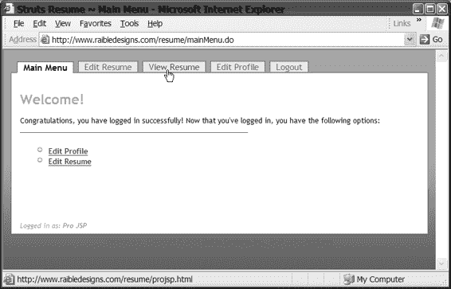

513-0 ch15.qxd 11/14/05 5:38 PM 第 610 页

**610**

第 15 章 ■ 使用 STRUTS、XDOCLET 和其他工具

**图 15-12.** *前面展示的 Tiles 模板渲染出的这个网页。*

Tiles 模板（也称为布局）可以通过两种不同的技术进行引用。

第一种是使用 JSP 页面。例如，您可以将所有 JSP 页面放在一个 pages 目录中。

当使用 JSP 页面来组合 Tiles 页面时，这种技术非常有用。您只需将所有不同的页面部分（或 **tiles**）放在 pages 目录中，然后从根目录引用它们即可。例如，根目录中的一个页面可能如下所示：

<%@ include file="/common/taglibs.jsp"%>

<tiles:insert page="/layouts/simpleLayout.jsp" flush="true">

<tiles:put name="title.key" value="login.title"/>

<tiles:put name="heading.key" value="login.heading"/>

<tiles:put name="header" value="/common/header.jsp "/>

<tiles:put name="menu" value="/menu.html"/>

<tiles:put name="content" value="/WEB-INF/pages/login.jsp"/>

<tiles:put name="footer" value="/common/footer.jsp "/>

</tiles:insert>

第二种选择是使用 XML 文件并为每个页面创建**定义**。这样做的好处是，定义可以相互继承，并且可以为页面组合信息提供一个中央存储库。此外，定义仍然可以从 JSP 页面（使用 `/do/*` 映射时）或作为 `struts-config.xml` 中的 `ActionForward` 路径进行引用。让我们看看前面的 JSP 代码在 `tiles-config.xml` 文件中可能是什么样子：

<definition name=".login" path="/layouts/simpleLayout.jsp">

<put name="title.key" value="login.title"/>

<put name="heading.key" value="login.heading"/>

513-0 ch15.qxd 11/14/05 5:38 PM 第 611 页

第 15 章 ■ 使用 STRUTS、XDOCLET 和其他工具

**611**

<put name="header" value="/common/header.jsp"/>

<put name="menu" value="/menu.html"/>

<put name="content" value="/WEB-INF/pages/welcome.jsp"/>

<put name="footer" value="/common/footer.jsp"/>

</definition>

使用定义的主要优势之一是，您可以相互继承属性。这样，您可以创建一个所有定义都继承的 `baseLayout` 定义，子定义就不需要再定义某些属性，例如 header 和 footer。前面的定义可以重构为如下形式：

<definition name="baseLayout" path="/layouts/baseLayout.jsp">

<put name="title.key"/>

<put name="heading.key"/>

<put name="header" value="/common/header.jsp"/>

<put name="footer" value="/common/footer.jsp"/>

</definition>

<definition name=".login" extends="baseLayout">

<put name="title.key" value="login.title"/>

<put name="heading.key" value="login.heading"/>

<put name="menu" value="/menu.html"/>


<put name="content" value="/WEB-INF/pages/welcome.jsp"/>

</definition>

在之前的 `.login` 定义中，你会注意到我们在 tile 名称前加了一个句点（`.`）。这种点号表示法是命名 tile 的推荐做法。由于 Tiles 的定义可以在 forward 的 `path` 属性中被引用，这个前缀使它们更容易被识别。

如果你不想从 action 转发到某个定义，可以在 JSP 页面中直接引用它。在 struts-resume 项目中，我们在 login.jsp 页面中就是这样做的。我们使用 `<security-constraint>` 保护了所有 `*.do` 映射，因此未经身份验证无法访问任何 action。

login.jsp 页面的内容简短明了：

```
<%@ include file="/common/taglibs.jsp"%>

<tiles:insert definition=".login" flush="true"/>
```

在提供的示例中，你会注意到标题和页眉设置的消息来自 `ApplicationResources.properties`，但还有另一种选择。这可能就是为什么 Tiles 对某些人来说显得如此令人生畏——因为选项太多了！

然而，我们确实想向你展示一些可能更适合你的其他选项。

你可以直接在定义或 JSP 中对字符串进行硬编码，而不是使用 `ApplicationResources.properties` 文件来表示标题或页眉：

```
<put name="title" value="Login to Struts Resume"/>
```

你可以使用 `<tiles:getAsString name="title"/>`，而不是使用 `<tiles:importAttributes/>` 和 `<bean:message key="title.key"/>`。你可能会认为在这个过程中失去了国际化（I18n）支持，但 Tiles 提供了另一种实现 I18n 的方式：为每个区域创建单独的 XML 定义文件。使用这种策略，你会有一个用于英语的 `tiles_config_en.xml`，用于俄语的 `tiles_config_ru.xml`，依此类推。使用

513-0 ch15.qxd 11/14/05 5:38 PM 第 612 页

**612**

第 15 章 ■ 使用 STRUTS、XDOCLET 和其他工具

`ApplicationResources.properties` 文件是国际化应用程序的一种更简单的方法，因为所有语言更改都可以在一个文件中完成。

之前我们提到，CSS 样式表可以极大地提高布局的灵活性。我们在许多项目中都使用过不同的样式表，用于不同的页面，甚至不同的用户。我们使用过两种切换样式表的方法：第一种是基于页面，第二种是针对用户。第一种方法使用 Tiles 定义为任何给定页面设置样式表。既然你已经在做这件事，不妨也添加同样的功能来包含 JavaScript 文件。首先，你可以在 `baseLayout` 定义中添加你想要包含的文件：

```
<definition name="baseLayout" path="/layouts/baseLayout.jsp">
    <put name="title.key"/>
    <put name="heading.key"/>
    <put name="header" value="/common/header.jsp"/>
    <put name="footer" value="/common/footer.jsp"/>
    <!-- 默认 JavaScript 文件 -->
    <putList name="scripts">
        <add value="/scripts/global.js"/>
    </putList>
    <!-- 默认样式表文件 -->
    <putList name="styles">
        <add value="/styles/default.css"/>
    </putList>
</definition>
```

然后，在 `baseLayout.jsp` 文件中，你可以使用 Tiles 标签和 JSTL 来获取这些属性并按如下方式渲染它们：

```
<%-- 获取 JavaScript 列表 --%>
<tiles:useAttribute id="scriptList" name="scripts"
    classname="java.util.List" ignore="true"/>
<c:forEach var="js" items="${scriptList}">
    <script type="text/JavaScript"
        src="<%=request.getContextPath()%><c:out value="${js}"/>">
    </script>
</c:forEach>

<%-- 获取样式表列表 --%>
<tiles:useAttribute id="styleList" name="styles"
    classname="java.util.List" ignore="true"/>
<c:forEach var="css" items="${styleList}">
    <link rel="stylesheet" type="text/css" media="all"
        href="<%=request.getContextPath()%><c:out value="${css}"/>" />
</c:forEach>
```

我们必须添加 scriptlet `<%=request.getContextPath()%>`，因为 `putList` 中的 `add value` 只渲染字面值。我们不想在

513-0 ch15.qxd 11/14/05 5:38 PM 第 613 页

第 15 章 ■ 使用 STRUTS、XDOCLET 和其他工具

**613**

定义文件中硬编码 `contextPath`，所以这是一个简单的解决方案。如果你使用的是 JSP 2.1，可以将 `<c:out value="${variable}"/>` 替换为 `${variable}`。你还可以将样式表的 `<link>` 标签替换为更现代的导入样式表的方法，即使用 `@import`。使用这种语法，样式表导入将如下所示：

```
<style type="text/css" media="all">
    <c:forEach var="css" items="${styleList}">
        @import url(<%=request.getContextPath()%><c:out value="${css}"/>);
    </c:forEach>
</style>
```

这种技术可以用来减少编写的 HTML 量，也可以为旧版浏览器（例如 Netscape 4.x）禁用样式表。这听起来可能有些愚蠢，但为什么要为旧版浏览器禁用样式表呢？原因很简单。如果你的网站是使用 CSS 和 `<div>` 元素进行布局的，那么在没有样式表的情况下查看你的网站可能仍然可读，但它只是纯文本，黑白的，没有花哨的布局。

这允许旧版浏览器仍然可以看到你的内容，而且你不必担心让你的 CSS 与旧版浏览器兼容。当然，这种奢侈完全取决于你的客户。我们的建议是放弃对旧版浏览器的支持——我们保证仅此一项就能提高你的生产力。如果你愿意使用符合标准的服务器（Java EE），为什么不对客户端也提出符合标准的要求呢？可以肯定的是，大多数用户现在已经升级到了更新的浏览器。

**浏览器——另一种观点**

然而，本书至少有一位作者不同意随意放弃对旧版浏览器支持的建议。截至 2005 年 7 月，68% 的网络用户在使用 Internet Explorer 6（http://www.w3schools.com/browsers/browsers_stats.asp）。但从另一个角度来看，32% 的潜在用户正在使用 Internet Explorer 6 以外的浏览器。而当 Internet Explorer 7 发布时，可以预计许多人会在升级前继续使用版本 6 好几个月。

除了使用旧版浏览器之外，你的网站的大量用户可能正在使用拨号连接（根据 http://www.websiteoptimization.com/bw/0506/ 的数据，比例为 41%）。

正如 W3Schools 在其网站上所说：

“全球平均值可能并不总是与你的网站相关。不同的网站吸引不同的受众。
一些网站吸引使用专业硬件的专业开发人员，其他网站则吸引使用老旧低端电脑的爱好者。”

你的应用程序设计的一部分应该考虑你网站用户的特征。
如果你确定有足够多的用户将使用尖端技术，那么你的设计决策将与如果你认为许多用户是使用 56K 拨号调制解调器连接的老旧电脑的老年用户时不同。

在 struts-resume 应用程序中，我们使用 `<link>` 语法，以便将来可以使用样式表切换器。我们实现的是 Paul Sowden 开发的样式表切换器，

513-0 ch15.qxd 11/14/05 5:38 PM 第 614 页

**614**

第 15 章 ■ 使用 STRUTS、XDOCLET 和其他工具

其实现说明记录在 http://www.alistapart.com/stories/alternate/。基本上，它使用 JavaScript 和 cookie 来禁用或启用你偏好的样式表。我们在几个项目中使用过它，发现它非常有用。

在你设置好模板和 `baseLayout` 定义以渲染多个样式表之后，你可以在子定义中覆盖该列表。需要注意的一点是，`<putList>` 不允许扩展，所以你必须替换整个列表。这意味着，如果你只想添加一个额外的样式表，你也必须包含原始的（`default.css`）样式表。在 `mainMenu` 定义中，你正在使用 **Struts Menu**（http://www.sourceforge.net/projects/）


struts-menu) 作为您的菜单系统。该菜单需要额外的样式表文件和 JavaScript 文件。因此，您应该用新的列表替换原有的列表：

<putList name="scripts">

<add value="/scripts/global.js"/>

<add value="/scripts/menuExpandable.js"/>

</putList>

<putList name="styles">

<add value="/styles/default.css"/>

<add value="/styles/menuExpandable.css"/>

</putList>

相当巧妙，对吧？过去一年我们一直使用这项技术，效果非常好。

**Tiles、XDoclet 和 Forwards**

使用 Tiles 来组装和定义页面非常方便，但如何调用这些定义呢？引用 Tiles 定义最简单的方法是使用 ActionForward。

当您在 Struts 配置文件中添加 Tiles 插件时，会使用一个智能的、支持 Tiles 的处理器来执行请求。这个名为 TilesRequestProcessor 的处理器继承自 Struts 默认的 RequestProcessor，用于拦截对 includes 和 forwards 的调用，以检查指定的 URI（路径）是否是一个定义名称。

要在应用程序中配置 Tiles 定义转发，您只需将 `<forward>` 的 `path` 属性与定义的 `name` 属性匹配即可。例如，在 struts-resume 中，ResumeAction 的 `search()` 方法返回一个指向本地 `<forward>` 的 ActionForward，该 forward 名为 `list`：

return mapping.findForward("list");

这个 forward 在 struts-config.xml 中为 ResumeAction 类定义如下：

<action path="/editResume" type="org.appfuse.webapp.action.ResumeAction"

name="resumeForm" scope="request" input="viewResumes"

parameter="action" unknown="false" validate="false">

<forward name="edit" path=".resumeDetail" redirect="false"/>

<forward name="list" path=".resumeList" redirect="false"/>

</action>

513-0 ch15.qxd 11/14/05 5:38 PM Page 615

第 15 章 ■ 使用 STRUTS、XDoclet 和其他工具

**615**

在 tiles-config.xml 中，`.resumeList` 定义是一个简单的定义，它定义了标题、页眉和内容页面。

<definition name=".resumeList" extends=".mainMenu">

<put name="title.key" value="resumeList.title" />

<put name="heading.key" value="resumeList.heading" />

<put name="content" value="/WEB-INF/pages/resumeList.jsp"/>

</definition>

在 struts-resume 中，BaseAction 类继承自 LookupDispatchAction，并且广泛使用 Tiles 定义来组装页面。从 JSP 的 URL 到 action 的方法，再到 Tiles 定义的逻辑流程有时会令人困惑，尤其是当您引入 XDoclet 来定义 action 的映射和本地 forwards 时。图 15-13 展示了这一切的逻辑流程。

**MainMenu** (JSP)

链接“查看我的简历”与全局转发 `viewResumes` 相关联，而 `viewResumes` 又与路径 `/viewResumes.do?action=search` 相关联。因此，流程通过 ActionServlet(*.do) 到达路径 */viewResumes.do。

**ResumeAction** (Action)

ResumeAction.java 的 JavaDoc 中的 Xdoclet 标签定义了一个名为 `action` 的参数。之前指定的路径表明 `action=search`，因此流程传递到 `search()` 方法。

**search()** 方法

该方法包含一行代码 `return mapping.findForward("list");`。这个 `list` 转发是使用 Xdoclet 定义的：

* @struts.action-forward

*

name= list

*

path= .resumeList

**.resumeList** 定义

来自 **tiles-config.xml**

**图 15-13.** *从 JSP 到 Tiles 的控制逻辑流程*
在上图中，ResumeAction 类继承自 LookupDispatchAction。基本上，它允许您使用一个参数（action）来指定在 Action 类中调用哪个方法。

该图显示了用于在 Struts 配置文件中创建 ResumeAction 映射及其本地 forward 的 XDoclet 标签。所有这些标签都写在类的头部 Javadoc 注释中。

513-0 ch15.qxd 11/14/05 5:38 PM Page 616

**616**

第 15 章 ■ 使用 STRUTS、XDoclet 和其他工具

**Tiles 控制器**

Tiles 控制器对于改进支持 Tiles 的应用程序的架构非常有帮助。它们在当前的出版物中并未得到太多关注，但却是一个非常实用的特性。其核心思想是，Tiles 控制器旨在为在 tile 上呈现数据做准备。您可以将其视为一个微型 action。然而，这些控制器并非用于确定应用程序流程；那是 ActionServlet 的职责。如果您正在开发一个门户网站，或者您的 tiles 需要它们自己的自定义数据，那么您绝对应该考虑使用一个。

当然，通过一个例子会更容易理解。因此，我们为 struts-resume 创建了一个功能，用于统计当前活动的会话数，并将其显示为“当前用户”。我们首先创建了一个实现 ServletContextListener 和 HttpSessionListener 的 UserCounterListener。这个监听器在新会话创建时递增一个应用程序范围的变量，并在会话销毁时递减同一个变量。该源文件位于 struts-resume 的 src/web/org/appfuse/webapp/listener 目录下。我们使用了 XDoclet 的 `@web:listener` 标签在 web.xml 中为这个类创建了一个 `<listener>` 条目。

为了实现一个 Tiles 控制器，我们创建了一个实现 Controller 接口及其方法的 UserCounterController 类：

public final class UserCounterController implements Controller {

/**

* 此方法演示了使用 Tiles 控制器获取此应用程序“当前用户”计数器的简单示例。

*

* @param tileContext 当前 tile 上下文

* @param request 当前请求

* @param response 当前响应

* @param servletContext 当前 Servlet 上下文

*/

public void perform(ComponentContext tilesContext,

HttpServletRequest request,

HttpServletResponse response,

ServletContext servletContext)

throws ServletException, IOException {

// 从应用程序上下文中获取当前用户数

String userCounter =

(String) servletContext.getAttribute(UserCounterListener.COUNT_KEY);

// 将此数字添加到请求中以供显示

request.setAttribute(UserCounterListener.COUNT_KEY, userCounter);

}

}

您可以看到 `perform()` 方法的签名与 Action 类的签名类似——只是没有 ActionMapping 或 ActionForm。ComponentContext 是一个类似于请求或会话作用域的作用域；然而，它特定于 Tiles，用于存储其配置信息。

513-0 ch15.qxd 11/14/05 5:38 PM Page 617

第 15 章 ■ 使用 STRUTS、XDoclet 和其他工具

**617**

UserCounterController 只是从应用程序作用域中获取一个属性并将其放入请求作用域。但是，您可以轻松地在此方法中添加更复杂的逻辑。在此示例中，为简单起见，我们将属性存储在请求属性中，但也可以使用以下代码将其存储在 ComponentContext 中：`tilesContext.putAttribute(UserCounterListener.COUNT_KEY, userCounter);` 这将确保该属性仅对此 tile 可用。

为了配置 struts-resume 使用此控制器，我们编辑了 tiles-config.xml 文件（位于 web/WEB-INF 目录下）。我们决定在页面的页眉中显示这个“当前用户”计数器——并且由于我们只在 `baseLayout` 定义中定义了页眉，所以这是一个简单的更改。

更改前，页眉 tile 只是指向 header.jsp 文件：

<definition name="baseLayout" path="/layouts/baseLayout.jsp">

...

<put name="header" value="/common/header.jsp"/>

...

</definition>

为了使 *header* tile 支持控制器，我们为其创建了一个新的定义，并从 baseLayout 定义中指向它：

<definition name="baseLayout" path="/layouts/baseLayout.jsp">

...

<put name="header" value=".header.userCount"/>

...

</definition>

<definition name=".header.userCount" path="/common/header.jsp"


controllerClass="org.appfuse.webapp.action.UserCounterController" /> 这意味着，每当出现 ".header.userCount" 磁贴的页面时，都会调用 `UserCounterController.perform()` 方法。为了在 header.jsp 中显示计数器，我们随后添加了以下 JSP 代码：

<%-- 检查以确保 "userCounter" 存在于请求中，如果不存在，则不显示 --%>

<c:if test="${requestScope.userCounter != null}">

<div id="activeUsers">

<bean:message key="mainMenu.activeUsers"/>:

<c:out value="${userCounter}" />

</div>

</c:if>

为了测试它，我们使用两个不同的浏览器登录了 struts-resume 应用程序，这创建了两个不同的会话。会话创建后，头部中的用户计数器文本（见图 15-14）显示当前有两个用户处于活动状态。我们意识到这可能不是一个精确的计数，但这已经是 Web 应用程序所能达到的最准确程度了。

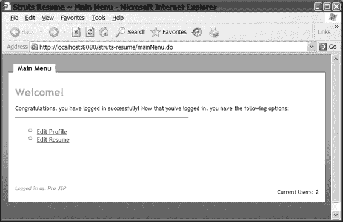

513-0 ch15.qxd 11/14/05 5:38 PM 第 618 页

**618**

第 1 5 章 ■ 使用 STRUTS、XDOCLET 和其他工具

**图 15-14.** *使用 Tiles 控制器，应用程序可以跟踪会话数量，并在头部显示该数字。*

您可以看到，Tiles 控制器可以成为您 Struts 工具箱中非常有价值的资产。

您可以减少操作中所需的代码量，并将特定的逻辑移动到特定的磁贴中。您甚至可能无需再链式调用多个操作，而是使用多个磁贴和控制器的组合。我们鼓励您考虑使用控制器，因为它们可以极大地帮助您组织代码和视图逻辑。通过使用控制器，操作可以专注于页面流程，而不是准备视图。

如果您正在开发一个非常小且简单的应用程序，可能不需要 Tiles。Tiles 的难点在于找到一个好的示例来操作和扩展。我们希望这些示例，结合 struts-resume 应用程序，能让您的 Struts 开发之旅更加轻松。您应该能够使用 `basicLayout.jsp` 和 `tiles-config.xml` 文件来快速上手。如果您已经了解 Struts 但尚未使用 Tiles，那么为了您自己（以及您的项目截止日期），您应该尝试一下。

**使用 IDE 和 Struts 开发环境**

我们过去一直使用 Macromedia 的 HomeSite 和 vi 进行所有 Java 编辑，因为我们讨厌 IDE 的臃肿和内存浪费。此外，IDE 似乎总是把事情复杂化，而不是简化。随着 IDEA 和 Eclipse 等工具的成熟，使用 IDE 再次变得有趣起来——并且值得我们投入时间（1GB 的内存也没什么坏处）。

我们从未觉得需要使用 IDE 来帮助我们配置 `struts-config.xml` 或 `web.xml` 文件。然而，这可能是因为当我们刚开始使用 Struts 和 Web 应用程序时，这些工具还不存在。现在我们很庆幸学习了 DTD，并且我们觉得

513-0 ch15.qxd 11/14/05 5:38 PM 第 619 页

第 1 5 章 ■ 使用 STRUTS、XDOCLET 和其他工具

**619**

有了这些知识，工作起来更容易。如果手动编辑 XML 文件，我们推荐使用 XMLSpy (http://www.xmlspy.com)。这是一个适用于任何 XML 相关开发的出色工具，因为它能根据 DTD 或 XML Schema 验证您的 XML，并在您输入时执行自动补全。学习 DTD 或 XML Schema 的另一个原因是，像 XDoclet 这样的工具会从多个 XML 片段组装 `struts-config.xml` 文件，而大多数 IDE 工具只支持编辑完全组装好的 `struts-config.xml` 文件。

还有一些应用程序被创建出来，专门为 Struts 应用程序开发提供开发环境。现在让我们来看其中的几个。

Struts Console

Struts Console（可在 http://www.jamesholmes.com/struts/ 找到）是一个用于管理基于 Struts 的应用程序的免费工具。Struts Console 是一个用于 JSP 标签库、Struts、Tiles 和验证器配置文件的可视化编辑器。它可以作为独立的 Swing 应用程序使用，也可以作为您喜爱的 IDE 的插件使用。支持的 IDE 包括 JBuilder (v4.0+)、Eclipse (v1.0+)、IBM

WebSphere Appl. Dev. (v4.0.3+)、IDEA (v3.0, build 668+)、NetBeans (v3.2)、Sun ONE/Forte (v3.0+) 和 JDeveloper (v9i+)。它支持管理所有与 Struts 相关的 XML 文件，例如 `struts-config.xml`、`tiles-config.xml` 和 `validation.xml`。与许多其他工具一样，使用此工具时，您应用到文档的任何格式都会丢失。但是，它确实允许在工具内部进行格式化，以使您的 XML 看起来更“漂亮”。它还有一个向导，用于将 JSP 和 HTML 页面转换为 Struts JSP 页面——如果您正在将现有应用程序转换为 Struts，这是一个非常方便的功能。

Easy Struts

Easy Struts 项目（参见 http://easystruts.sourceforge.net/）提供了一套用于 Struts 开发的工具，包括一个 `struts-config.xml` 编辑器、XSLT 生成、来自 Struts DTD 的工具提示、模块支持以及一个输入助手。Easy Struts 仅作为 IDE

插件提供；没有独立的应用程序可用。支持的 IDE 包括 Eclipse (v2.0+) 和 JBuilder (v5.0+)。

**在团队开发环境中使用模块**

您是否曾参与过许多开发人员处理相同代码库的项目？许多开发团队在这种环境中工作，而其他团队则将开发角色分配给单个人员。让我们想象两种类型的团队；第一个有十五名开发人员，第二个有三名成员。我们假设两个团队都在开发类似的应用程序，这些应用程序使用 Struts 和 EJB 为一家大型银行处理信用卡支付。大型团队可能会按层划分工作，每层有五个人——EJB、ActionServlet 和业务层，以及包含 JSP 页面或 Velocity 模板的 Web 层。第二个（较小的）团队将简单地为每一层分配一个人。

在多人配置和操作部署描述符的团队环境中，保持 `web.xml` 和 `struts-config.xml` 同步可能很困难。我们找到的最简单的解决方案是使用 XDoclet 生成这些配置文件，但还有另一种选择——**模块**。最初由 Struts 开发团队开发时，它们被称为子应用程序，这是一个更具描述性的名称。模块允许您将应用程序的不同区域分离到不同的模块中。模块是 Struts 1.1 的核心功能，对于大型项目以及创建可插拔功能非常有用。

513-0 ch15.qxd 11/14/05 5:38 PM 第 620 页

**620**

第 1 5 章 ■ 使用 STRUTS、XDOCLET 和其他工具

由于模块的开发与开发标准 Struts 应用程序非常相似，我们将向您展示如何设置它们，并且我们实际上在 struts-resume 应用程序中实现了一个使用它们的“上传”功能。设置相当简单，包括以下三个步骤：

**1.** 为您的模块准备一个配置文件。

**2.** 通知控制器有关模块的信息。

**3.** 使用转发或操作切换到您的新模块。

我们不会在这里详细说明第一步，因为这和创建一个新的 Struts 应用程序是一样的。您可能可以使用 XDoclet 为不同的模块创建配置文件，但您必须调整您的 Ant webdoclet 任务，使其将 `struts-config.xml` 输出到不同的目录。当然，子模块的目的是使开发和配置更容易，而 XDoclet 已经为您做到了这一点！

第二步涉及在应用程序的部署描述符 `web.xml` 中，向 `ActionServlet` 的定义添加一个新的初始化参数。在 struts-resume 应用程序中，此配置位于 `metadata/web/servlets.xml`：


<servlet>

<servlet-name>action</servlet-name>

<servlet-class>org.apache.struts.action.ActionServlet</servlet-class>

<init-param>

<param-name>config</param-name>

<param-value>/WEB-INF/struts-config.xml</param-value>

</init-param>

<init-param>

<param-name>config/upload</param-name>

<param-value>/WEB-INF/struts-upload.xml</param-value>

</init-param>

<init-param>

<param-name>debug</param-name>

<param-value>2</param-value>

</init-param>

<init-param>

<param-name>detail</param-name>

<param-value>2</param-value>

</init-param>

<load-on-startup>2</load-on-startup>

</servlet>

该配置表明此应用程序包含两个模块——默认模块（其名称中不含正斜杠 /）和第二个模块，即我们的“上传”功能。两个模块的配置文件均位于 WEB-INF 目录下。命名模块配置文件的推荐标准格式为 struts-module.xml。

在查看 ActionServlet 的配置时，我们想指出 1.0 版本与 1.1/1.2 版本之间的一些变化。在 1.0 版本中，通常的做法是将 ResourceBundle 指定为“application”初始化参数。我们曾使用过此设置以及“nocache”初始化参数。在 Struts 1.1 中，这些设置已被弃用，并移至 struts-config.xml 文件中的 <controller> 元素内。以下设置可在 metadata/web/struts-controller.xml 中找到：

<controller nocache="true"

inputForward="true"

maxFileSize="2M" />

nocache 设置指示控制器添加 HTTP 头以防止内容缓存——默认情况下该功能是关闭的。您还可以指定一个 forwardPattern 属性，例如 WEB-INF/pages/$M$P，其中 $M 变量表示模块前缀，$P 表示所选 <forward> 元素的路径属性，不过此处并未使用该属性。inputForward 属性允许您在动作映射的 input 属性中使用本地或全局转发。这是一个非常实用且备受期待的功能。

■**注意** 有关可选值及其含义的更多信息，可在线查阅 http://struts.apache.org/userGuide/configuration.html。

现在，应用程序的 ResourceBundle 在 struts-config.xml 文件的 <message-resources> 元素中指定。如果您使用 XDoclet，可以将其放在 struts-message-resources.xml 文件中。在 struts-resume 应用程序中，该文件与其他 Struts 配置片段位于同一位置：

<message-resources parameter="ApplicationResources"/> 由于我们将此文件（ApplicationResources.properties）保存在 WEB-INF/classes 目录下，因此无需指定包名。您还可以通过添加第二个 <message-resources> 元素并指定 key 属性，为应用程序指定备用的资源包：

<message-resources parameter="CustomResources" key="custom"/> 例如，如果您正在使用 Struts 构建一个产品，并且只想暴露客户可能更改的最少选项，这将非常有用。要配合 <bean:message> 标签使用此 ResourceBundle，您只需指定一个与 key 匹配的 bundle 属性：

<bean:message key="webapp.title.prefix" bundle="custom"/> 现在您已经了解了如何为应用程序设置模块，接下来让我们看看如何在模块之间切换。为了演示，我们在 struts-resume 中添加了一个用于上传简历的“upload”模块。该模块主要演示文件上传和模块切换功能。它可以发展成一个允许简单上传现有简历的功能，但功能不止于此。在撰写本文时，有两种基本技术可用于切换模块。第一种是使用一个设置了 contextRelative 属性为 true 的转发（全局或本地）。这将指示控制器和请求分发器对模块敏感，而不仅仅是上下文敏感：

<forward name="toUpload"

contextRelative="true"

path="/upload/index"

redirect="true">

在此示例中，index 是 tiles-upload.xml 文档中的一个定义。需要添加 redirect="true" 才能确保切换正确执行。第二种方法是使用内置的 SwitchAction。使用 SwitchAction 会产生如下所示的 <action-mappings>：

<action-mappings>

<action path="/switchModule"

type="org.apache.struts.actions.SwitchAction"/>

...

</action-mappings>

然后，要切换到上传模块，您可以使用类似 http://localhost:8080/struts-resume/switchAction.do?prefix=upload&page=index 的 URL。我们认为使用全局转发技术更简单、更清晰，因此我们在 metadata/web/global-forwards.xml 中配置了以下转发：

<forward name="uploadResume" contextRelative="true"

path="/upload/index.do" redirect="true" /> 在为 struts-resume 构建“upload”模块时，我们注意到可以在应用程序之间共享配置设置。例如，我们共享了用于 Tiles 的同一个 basicLayout.jsp 模板。我们遇到的一个问题是，子模块中包含的任何消息（在 ApplicationResources 中）和任何转发都必须在其各自的文件中定义。例如，我们必须定义错误页面消息、按钮标签和验证器消息。我们预料到了这一点，所以这不成问题。很高兴看到模块之间有清晰的分离，但同时也允许共享每个模块的部分内容。

希望您觉得这足够简单，如果您认为应用程序中需要模块，可以考虑使用。目前模块的一个限制是，它们仅在您使用 ActionServlet 的扩展映射时才受支持。也就是说，支持 *.do，但不支持 /do/*；但请查阅 Struts 网站 (http://struts.apache.org/) 或邮件列表以了解此问题的当前状态。

**测试 Struts 应用程序**

像任何优秀的 Java 程序员一样，您一定听说过测试框架，并且可能使用过 **JUnit**。JUnit 3.8.1 版本（struts-resume 所需）可从 http://www.junit.org 下载。Ant 可以成为运行 JUnit 测试的非常强大的工具。要运行它们，您需要将 JUnit 的 JAR 文件 (junit.jar) 放在 $ANT_HOME/lib 目录中。

JUnit 非常适合测试 Servlet 容器外部的类，但无法提供测试用户实际行为所需的结构。为此，您有幸拥有来自 Jakarta 项目的 **Cactus**。Cactus 是一个用于单元测试服务器端代码的简单测试框架。它通过*模拟对象*支持容器内测试和容器外测试。它非常巧妙，您可以运行一个测试（例如，针对 struts-resume 应用程序运行 ant test-cactus -Dtestcase=ActionFilterTest），它会启动 Tomcat，运行测试，然后停止 Tomcat。它还与 **HttpUnit** 集成，用于测试您的 JSP 页面并验证生成的 HTML 是否正确。有关 Cactus 的更多信息，请访问 http://jakarta.apache.org/cactus。您可以在 http://httpunit.sourceforge.net 找到 HttpUnit 网站。

struts-resume 示例使用一个名为 **JUnitDoclet** (http://www.junitdoclet.org) 的工具来生成基于 JUnit 的骨架测试用例和所有 Java 源文件的测试套件。您只需执行 ant gen-test-module 命令，其中 module 可以是 common、web 或 ejb。


JUnitDoclet 是一款相当精巧的工具，它能在你添加新方法时自动更新测试用例，并且不会覆盖你已添加到测试用例中的任何自定义代码。我们在此提醒你，有些测试用例可能“方法中缺乏实质内容”。大多数情况下，这是因为我们之前使用过该类并确认其功能正常，因此不打算对其进行测试。这是否是一种不良实践？或许吧，但这无疑能加快我们的开发进度。

我们为测试用例使用了不同的源代码树，这种方法效果很好。不幸的是，一旦你将某个测试用例改为继承 JUnit 以外的类（例如 Cactus 的 `ServletTestCase`），该工具就不会再更新那个类了。它会直接忽略它，这对我们来说也无妨。

另一个专门针对 Struts 的测试框架于 2001 年底推出。它被称为 **StrutsTestCase for JUnit**（参见 http://strutstestcase.sourceforge.net/），是标准 JUnit 测试用例的一个扩展。通过提供模拟对象和基于 Cactus 的方法来运行 `ActionServlet`，StrutsTestCase 允许在有无运行中 Servlet 引擎的情况下测试 Struts 代码。由于它使用控制器来测试代码，因此不仅能测试 `Action` 对象的实现，还能测试映射、`ActionForms` 和 `ActionForwards`。

StrutsTestCase 兼容 Java Servlet 2.5 规范，并支持 Struts 1.2、Cactus 1.6.1 和 JUnit 3.8.1。

StrutsTestCase 已经提供了验证方法，因此创建单元测试用例非常简单，如下面的代码片段所示：

public void testEditUser() {

setRequestPathInfo("/editUser");

setRequestParameter("action", "edit"); addRequestParameter("email","tomcat"); actionPerform();

verifyForward("success");

assertTrue(getSession().getAttribute(Constants.USER_KEY) != null);

}

你可以使用 Cactus 和 HttpUnit 对你的应用程序进行非常全面的测试，以验证你的 action 类以及你在渲染 UI（JSP、XML 或 Velocity）时使用的任何视图技术。HttpUnit 测试也非常简单，如下例所示：

WebConversation wc = new WebConversation();

WebResponse resp = wc.getResponse(

"http://www.httpunit.org/doc/Cookbook.html"); WebLink link = resp.getLinkWith("response");

link.click();

WebResponse jdoc = wc.getCurrentPage();

513-0 ch15.qxd 11/14/05 5:38 PM Page 624

**624**

第 15 章 ■ 使用 STRUTS、XDOCLET 和其他工具

HttpUnit 还支持测试 JavaScript，其网站带有警告，称其“目前非常基础”（参见 http://www.httpunit.org/doc/javascript-support.html）。

如果你正在寻找一个更强大的 JavaScript 测试框架，我们推荐 **JsUnit**（http://www.jsunit.net）。JsUnit 是一个用于客户端 JavaScript 测试的单元测试框架。

JsUnit 测试是用 JavaScript 编写的：它本质上是 JUnit 的 JavaScript 移植版，因此你需要相应地命名你的方法等。需要注意的是，这些语言差异巨大，编写 JavaScript 的人很可能也应该编写这些测试。

我们要介绍的最后一个测试框架是来自 Canoo 的 **WebTest** 工具（http://webtest.canoo.com）。这是一个更易于开发的测试框架，因为所有内容都只需在 XML 文件中配置即可。与其他测试框架类似，WebTest 通过 Ant 运行。然而，主要区别在于整个测试都在一个 Ant 任务中配置。例如，以下是你如何为用户登录应用程序创建测试的方法：

<target name="login">

<testSpec name="tomcat-login">

<config host="${tomcat.server}" port="${tomcat.port}"

protocol="http" basepath="${webapp.name}" verbose="true"

resultpath="." resultfile="web-test-result.xml" summary="true"

saveresponse="true"/>

<steps>

<invoke stepid="get Login Page" url="/"/>

<verifytitle stepid="we should see the login title" text="Login"/>

<setinputfield stepid="set user name"

name="j_username" value="tomcat"/>

<setinputfield stepid="set password"

name="j_password" value="tomcat"/>

<clickbutton label="Login" stepid="Click the submit button"/>

<verifytitle text="Main Menu"

stepid="Home Page follows if login ok"/>

</steps>

</testSpec>

<loadfile property="web-test.result"

srcFile="web-test-result.xml"/>

<echo>${web-test.result}</echo>

</target>

WebTest 是一个非常适合 Web 开发人员的框架，因为你无需编写任何代码，只需使用 XML 即可轻松测试用户所走的路径。它似乎也使用了 HttpUnit，因此并非重新发明轮子，而是提供了一种更简单的开发方式。

为了测试你的应用程序与数据库的交互，你可能想看看 **Dbunit**（http://www.dbunit.org）。Dbunit 是一个 JUnit 扩展，它可以将你的数据库设置到一个已知状态，以便你使用预期的数据执行测试。它使用 XML 数据集（即数据表的集合），并在每个测试前后执行数据库操作。当然，你也可以在你的测试用例中执行此操作，例如插入、更新或删除对象，但由于这些操作的执行顺序无法保证，因此使用 Dbunit 可能是个好主意。

我们曾成功地将测试按特定顺序放在一个类中，然后让这些方法按该顺序执行，但理想的测试方法应该是自治的。

513-0 ch15.qxd 11/14/05 5:38 PM Page 625

第 15 章 ■ 使用 STRUTS、XDOCLET 和其他工具

**625**

我们提供了 Cactus 测试、Struts Action 测试、HttpUnit 测试，甚至一个简单的 Canoo WebTest 示例。表 15-2 指出了你可以使用哪些类进行这些测试以及如何运行它们。如果你想在 Tomcat 已经运行的情况下运行这些测试，请运行 `test-cactus` 而不是 `test-web`。

**表 15-2.** *使用各种测试框架测试 struts-resume* **测试类型**

**文件位置**

**Ant 命令**

Cactus

test/org/appfuse/webapp/action/UserAction

ant test-web

-Dtestcase=LoginActionTest

Struts

test/org/appfuse/webapp/action/ResumeAction

ant test-web

-Dtestcase=ResumeActionTest

HttpUnit

test/org/appfuse/webapp/action/MainMenuTest

ant test-web

-Dtestcase=MainMenuTest

Canoo

web-tests.xml

ant test-canoo

-Dtestcase=login

使用像 StrutsTestCase 和 Cactus 这样的 Servlet 测试框架将使测试你的 action 变得容易得多。要么使用它们，要么通过浏览器进行测试，而浏览器测试可能需要你点击五次才能到达目标。如果你真的只想访问一个 Servlet，则无需等待 JSP 页面编译。struts-resume 应用程序使得开发和运行新测试变得容易。我们鼓励你使用它并向它学习。

JSP 开发中一个真正节省时间的方法是，在将 JSP 页面部署到 Servlet 容器之前对其进行预编译。这可以通过 Ant 的 `<jspc>` 任务来完成，该任务使用 Tomcat 的 Jasper 编译器生成 `.java` 源文件。虽然它对于测试来说很棒，但你也希望使用此工具为生产环境预编译 JSP 页面，对吧？不幸的是，要做到这一点，你需要在 `web.xml` 文件中为每个 JSP 添加一个条目，而这将是一个非常漫长且费力的过程。如果你不执行此步骤，Tomcat 将重新编译你已经编译过的页面。某些应用服务器，如 WebLogic 和 SunONE，允许你在应用程序部署后配置 JSP 页面的预编译。

我们希望其他供应商也能复制这个功能。


开发 JSP 页面时，另一个好习惯是检查 CSS 和 HTML 是否正确。当然，在 JSP 编译并显示之前，你无法进行此项检查。如果你使用 WebTest，它会为每次请求生成一个 HTML 文件，从而记录最后查看的请求。在 struts-resume 示例应用中，这些文件可以在 build/test/data 目录下找到。如果你不使用 WebTest，可以直接在浏览器中查看源代码，并将 HTML 保存到某个目录。然后你可以将其上传到 W3C 的验证器（http://validator.w3.org）以确保 HTML 符合指定的 DOCTYPE。我们通常会在项目目录中创建一个“沙盒”目录，用于存放这些 HTML 文件以进行验证和其他快速修复。有时使用静态 HTML 版本会更方便。我们的做法是更改所有样式表、JavaScript 和图片的绝对路径，改用相对路径。在 struts-resume 项目中，这需要将

/struts-resume/ 改为 ../web/。

一旦验证了应用程序并进行了彻底测试，你会对其运行效果更有信心，从而更有可能产出高质量的软件。希望借助我们提供的示例，编写测试的艰巨工作已经完成。编写测试看似麻烦，但这仅在你先编写实际代码时才会如此。下次尝试先编写测试

513-0 ch15.qxd 11/14/05 5:38 PM 第 626 页

**626**

第 15 章 ■ 使用 STRUTS、XDOCLET 和其他工具

用例，我们相信你会发现它们非常有趣。没有什么比编写一个在浏览器中首次运行就能正常工作的应用程序更令人愉悦的了（当然，这要归功于单元测试）。

**在 Struts 应用程序中处理异常**

Struts 1.1 使得在 Struts 应用程序中处理异常变得更加容易。软件开发中一个流行的规则是：“如果出现问题，你应该告知用户。”在使用 MVC 和业务对象与数据库通信的 Web 应用程序中，这可能会变得相当复杂。异常可能在任何层级抛出，包括数据访问代码、Action 类、业务对象，甚至 JSP 页面。

我们过去采用的方法是在 Action 类和业务对象中都使用 try...catch，然后将任何异常“冒泡”到顶层。这种做法很不优雅，并且可能导致用户看到诸如“列 street_address 未找到”之类的消息。

此外，在 Action 类中，我们捕获了业务层异常，将其包装在 ServletException 中，然后抛给客户端。我们在 web.xml 以及 JSP 页面中都配置了错误页面，当发生错误时，客户端会被重定向到该页面。

尽管我们将向你展示一种使用 Struts 处理异常的更好方法，但我们仍然认为配置 JSP 页面和 web.xml 以处理未捕获的异常非常重要。你应该在 web.xml 中添加一个条目，用于处理服务器抛出 HTTP 状态码 500（即可怕的“内部服务器错误”）的情况：

<error-page>

<error-code>500</error-code>

<location>/error.jsp</location>

</error-page>

或者，你也可以使用 <exception-type> 而不是 HTTP 状态码或错误码：

<error-page>

<exception-type>java.lang.Throwable</exception-type>

<location>/error.jsp</location>

</error-page>

为了安全起见，你也可以同时添加两者。使用 XDoclet 时，你可以在合并目录的 error-pages.xml 文件中指定这些条目。我们通常也会在 JSP 页面中声明 errorPage：

<%@ page language="java" errorPage="/error.jsp" %> 在 struts-resume 示例应用中，这一行仅存在于 common/taglibs.jsp 文件中。添加这些条目基本上可以防止用户看到异常的堆栈跟踪——前提是你已经恰当地编写了 error.jsp。对于高级错误页面，你甚至可以配置它在显示给用户时向管理员发送电子邮件（或使用 log4j 的 SMTP Logger）。近年来，我们看到 500 内部服务器错误的次数比经典的 404 错误还要多。为这些错误添加一个友好的界面可以让每个人的生活都更愉快一些。

真正的期望是错误页面永远不会被显示。作为一个精明的网络用户，如果它确实被显示了，我们希望确切地知道哪里出了问题——比如 SQL 的详细信息。当然，这取决于

513-0 ch15.qxd 11/14/05 5:38 PM 第 627 页

第 15 章 ■ 使用 STRUTS、XDOCLET 和其他工具

**627**

你的应用程序的安全要求。如果你的应用程序容易受到攻击（位于互联网而非内网上），你可能希望抑制任何泄露数据库信息的消息。同时，并非所有用户都想看到异常的细枝末节，因此，我们建议你提供更友好的用户消息。

**链式异常**

在我们看来，一个开发良好的应用程序应该捕获错误消息，将其转化为友好的消息，然后将用户返回到他们最后成功查看的页面。同时，最好也能添加一条技术性消息，供那些希望了解问题确切原因并可能避免它的精明的用户（或开发者）查看。为了实现这一点，你首先可以做的就是使用**链式异常**。传统的 Java 异常机制只允许你抛出一个异常。这在分层架构中会带来问题，因为异常可能发生在每一层。

当然，你可以像我们使用 ServletException 那样包装异常，但这最终可能导致细节丢失。Ted Husted 在他的一篇 Struts 技巧中最好地描述了解决方案。与其试图改写他的话来显得像是我们想出的主意，不如直接引用他（参见 http://husted.com/struts/tips/015.html）：*我们真正需要做的是“堆叠”或“链接”异常，这样每一层都可以为事件添加自己的视角。然后，在最后，将它们全部显示出来，并将原始异常放在列表的底部。*

*这种方法在分层架构中效果出奇地好。“最顶层”最“接近”用户，因此抛出最“用户友好”的异常。“最底层”抛出解决* *问题所需的“极客友好”错误。当我们通过链接将异常串联起来时，用户友好的消息在前，更详细的消息在后。用户首先被告知他们需要知道的内容，其余部分可以留给系统管理员处理。*

从 JDK 1.4 开始，java.lang.Exception 类提供了 getCause() 方法，允许你找到每个异常的原始原因。要正确使用这一点，你需要抛出每一层发生的异常，而不是仅仅捕获异常并附带一条消息抛出。我们的意思是，这样做更好： try {

...

} catch (Exception e) {

throw new DAOException("连接数据库时发生错误", e);

}

而不是仅仅抛出消息：

try {

...

} catch (Exception e) {

throw new DAOException("连接数据库时发生错误");

}

513-0 ch15.qxd 11/14/05 5:38 PM 第 628 页

**628**

第 15 章 ■ 使用 STRUTS、XDOCLET 和其他工具


我们在 struts-resume 应用程序的 `ActionFilter.java` 类中使用了此功能，准确地说是在该类中。如果您使用的 JDK 版本低于 1.4，我们建议您查看 Scaffold 包，其中包含一个适用于旧版 JDK 的 `ChainedException` 类。以下代码片段说明了我们如何在 `ActionFilter.java` 类（位于 `src/web/org/appfuse/webapp/filters`）中实现此功能：

```java
// 用户已认证，用户对象为空

if (username != null && userForm == null) {

try {

UserManager mgr =

new UserManagerImpl(

(String) ctx.getAttribute(Constants.DAO_TYPE));

UserForm user = mgr.getUser(username);

session.setAttribute(Constants.USER_KEY, user);

} catch (Exception e) {

// 记录日志，以便我们能够查看日志并了解

// 出了什么问题

log.error("获取用户信息时出错 " + e);

// 打印堆栈跟踪，这始终是个好习惯

e.printStackTrace();

// 创建一个空的 ActionErrors 集合，用于添加所有

// 异常消息

ActionErrors errors = new ActionErrors();

// 添加一条通用消息，内容为“进程未完成。”

errors.add(ActionErrors.GLOBAL_ERROR,

new ActionError("errors.general"));

StringBuffer sb = new StringBuffer();

// 仅限 JDK 1.4 - 如果存在原因，则遍历它们并获取

// 它们的所有消息

if (e.getCause() == null) {

sb.append(e.getMessage());

} else {

while (e.getCause() != null) {

sb.append(e.getMessage());

sb.append("\n");

e = (Exception) e.getCause();

}

}

// 将所有错误添加到一个资源包键中，定义如下：

// errors.detail={0}

errors.add(

ActionErrors.GLOBAL_ERROR,

new ActionError("errors.detail", sb.toString()));

// 将错误添加到请求中，以便我们可以为用户显示它们

request.setAttribute(Globals.ERROR_KEY, errors);

// 分派到错误消息页面

RequestDispatcher dispatcher =

request.getRequestDispatcher("/error.jsp");

dispatcher.forward(request, response);

return;

}

}
```

最终结果是一系列错误消息，如下所示：

*   所需资源不可用。
*   进程未完成。详情如下。
*   无法连接到 MySQL 服务器 localhost:3307。您尝试连接的机器/端口上是否运行着 MySQL 服务器？(java.net.ConnectException)

很容易看出，链式异常如何为您提供能够满足所有用户需求的消息。甚至可能可以在 Struts 的声明式异常中使用前面的错误循环代码，但我们尚未尝试过。在构建完所有错误后，您需要将用户引导到一个友好的页面。在 Action 类中使用此代码时，您很可能将他们引导回他们来自的页面。

```java
return (new ActionForward(mapping.getInput()));
```

如果您从多个不同的页面访问同一个 `ActionMapping`，这可能会出现问题。我们见过几种不同的解决方式。第一种方式是在调用该 action 的表单或 URL 中添加一个额外参数，然后使用该值进行适当的转发。另一种方法是 Roller Weblogger 开源项目 (http://www.rollerweblogger.org) 使用的方法。它使用一个 `BreadCrumbFilter` 来保存应用程序访问过的最后 URL 的堆栈。这样做的好处是，您可以简单地从堆栈中获取最后一个 URL，从而转发回最后查看的页面。

### 声明异常

Struts 1.1 引入了可配置异常的概念。也就是说，您可以在 `struts-config.xml` 的全局级别以及 `ActionMapping` 级别声明式地指定异常。

此概念类似于您在全局转发和局部转发中看到的概念。注册异常很容易——唯一必需的属性是 `type`，它指定了异常的类型。您还可以选择指定一个 `key`（指向资源包中的消息）和用于定向响应的 `path`。以下是一个可用于处理 `UserNotFoundException` 的示例：

```xml
<exception key="missing.user"

type="org.appfuse.webapp.services.UserNotFoundException"

path="addUser"/>
```

在此示例中，`addUser` 是一个转发，其路径引用了一个 tile 的定义（在 `tiles-config.xml` 中）。您可以轻松地将其更改为重定向到一个 JSP 页面（例如，`/addUser.jsp` 或 `/editUser?action=add`）。异常最好在 `ActionMapping` 级别使用，而不定义路径。如果您不定义路径，Struts 足够智能，会重定向到您的 `ActionMapping` 的 `input` 值。当然，如果您没有定义 `input`，您可能应该为您的异常指定 `path`，否则您将看到 Struts 那令人恐惧的空白屏幕。此示例中的 `key` 用于覆盖异常本身使用的键。

Struts 使开发异常变得更加容易，并提供了内置的国际化支持。

让我们看一下 `UserNotFoundException` 的代码：

```java
import org.apache.struts.util.ModuleException;

public class UserNotFoundException extends ModuleException {

/**

* 为此异常构造一个新实例，用于指定的用户名。

* @param username 未找到的用户名

*/

public UserNotFoundException(String username) {

super("error.user.missing", username);

}

}
```

字符串 `error.user.missing` 引用了默认 `ResourceBundle` 中的一个键，该键在 `struts-config.xml` 中定义。在 struts-resume 应用程序中，这个 bundle 是 `ApplicationResource.properties`，其中该键定义如下：

```properties
error.user.missing=Could not find user information for username '{0}'
```

当然，您可以更改异常的构造函数，以处理消息键中拥有的任意数量的参数。如果您在 `struts-config.xml` 中为此异常指定了一个 `key`，它将覆盖异常输出的消息。这样做的一个缺点是，您会失去替换参数的能力，但对于不使用 Struts 消息 bundle 的异常来说，这可能很有用。

Struts 异常处理的一个不错的功能是，消息可以很容易地在 properties 文件中外部化。也就是说，您可以在异常处理中直接获得 I18n 支持。此外，您可以通过在异常上指定 `bundle` 属性，为您的错误消息指定一个单独的 `ResourceBundle`。当然，您可以在业务层和持久化层使用带有 properties 文件的 `ResourceBundle`，但如果这些异常从未冒泡到 UI 层，则可能不需要这样做。

在应用程序中使用声明式异常的美妙之处在于，您不必在 Action 类中捕获它们。Struts 的 `execute()` 方法会抛出一个顶级 `Exception`。由于所有异常最终都继承自 `Exception`，这使得编写和抛出异常变得容易：

```java
public ActionForward execute(ActionMapping mapping,

ActionForm form,

HttpServletRequest request,

HttpServletResponse response)

throws Exception {
```

当 Struts 捕获到一个已注册的异常时，它会为您创建一个 errors 对象，然后可以使用 `<html:errors/>` 或类似 struts-resume 中的语法来显示该对象。

以下是 `messages.jsp` 文件使用的内容，该文件包含在 struts-resume 应用程序的主 Tiles 模板中：

```jsp
<%-- 错误消息 --%>
<logic:messagesPresent>

<div class="error">

<html:messages id="error">

<bean:write name="error" filter="false"/><br />

</html:messages>

</div>

</logic:messagesPresent>

<%-- 成功消息 --%>
<logic:messagesPresent message="true">

<div class="message">

<html:messages id="message" message="true">

<bean:write name="message" filter="false"/><br />

</html:messages>

</div>

</logic:messagesPresent>
```


虽然使用 JSTL 也能实现此功能，但我们更倾向于采用输入更少的简洁方法，因此这里使用了 Struts 标签。你会注意到，本页的后半部分用于显示成功消息。我们认为，了解如何在应用程序中创建并显示成功消息非常重要，因此我们将向你展示其简便性。本质上，你只需创建一个新的消息对象，并向其中添加一条或多条消息即可。这与 `ActionErrors` 类非常相似（实际上它是其超类），因此创建过程几乎相同：`ActionMessages messages = new ActionMessages();`

// 执行业务逻辑以添加新记录

// 向请求中添加成功消息

`messages.add(ActionMessages.GLOBAL_MESSAGE, new ActionMessage("record.added"));` 虽然我们尚未在任何实际项目中使用 Struts 的声明式异常处理，但我们在 struts-resume 应用程序中实现了它，并且效果显著。如果你有一个适用于基于 Struts 的应用程序的异常框架，我们也欢迎你加入 struts-dev 邮件列表，提出改进建议。struts-resume 应用程序提供了使用声明式异常的示例，你也可以在 Struts 自带的 struts-example 应用程序中找到相关示例。

**总结**

在软件开发中，我们遇到的最令人沮丧的事情之一就是阅读了关于如何做某事的说明，却没有找到任何示例。设计模式只有在实现时有效才有价值。我们信奉保持简单，并且相信 Struts 简化了 JSP 和 Servlet 的开发。我们知道 Struts 一开始可能让人望而生畏，但它的回报是巨大的。使用 Struts 最终会让你更好地理解 Web 应用程序，并且随着你使用得越多，你的开发时间也会随之减少。

513-0 ch15.qxd 11/14/05 5:38 PM 第 632 页

**632**

第 15 章 ■ 使用 Struts、XDoclet 及其他工具

Struts 提供的工具和示例应用程序同样可能让人感到不知所措。

真正了解什么是最好的方法的唯一途径就是亲自尝试，并找出最适合你的方案。如果你向 Struts 用户邮件列表发送关于非 Struts 相关（例如 HTML、JavaScript、持久化）的问题，你很可能会收到各种不同的回复和意见。然而，这是一个非常活跃的社区，你的问题很可能会得到解答。希望我们为你提供了一些关于如何与 Struts 良好配合的指导，也许我们的示例应用程序会向你展示 XDoclet 如何使代码生成和其他工作变得更加容易。我们也邀请你下载并使用 Dave Johnson 的 Roller Weblogger 软件——它是开源的，并且包含大量优秀的 Struts 代码。它还使用了 XDoclet，是一个相当健壮的应用程序。更多关于 Roller 的信息，请访问 http://www.rollerweblogger.org。

最重要的是，我们建议不要试图在 Web 应用程序相关的事情上重复造轮子。很可能已经有人尝试过你正在做的事情。花时间研究你的问题和解决方案，可能会为你节省大量时间。使用邮件列表存档和 Google 可以解决大量问题。开源项目非常棒，因为你有一个完整的开发团队与你合作，并帮助你使用他们的框架。参与你所使用的技术也很有帮助。如果你正在使用 Struts，请订阅 struts-user 邮件列表，看着你的收件箱被填满，或者订阅摘要列表，每天只接收几封邮件。请记住，在简单的 JSP 和 Servlet 应用程序中可能实现的任何功能，在使用 Struts 时同样可以实现。Struts 只是让它变得更容易，我们相信任何基于 Web 的 MVC 框架都是如此。同样，在 HTML 页面或 Servlet 中可能实现的任何功能，在 JSP 页面中同样可以实现。

我们非常喜欢使用 Struts 的另一个原因是，出现了许多用于自动化开发过程的工具。我们已经足够熟练地开发所有组件，可以检查生成的代码以确保一切正常。你肯定不想使用一个生成意大利面条式代码的代码生成器！Struts 路线图包括对这些工具的增强支持，并拥抱 JSF 和 JSTL 等新技术。

这里我们仅列出几点提示，作为本章内容的简要回顾：

• 如果你的 Struts 应用程序需要验证，请使用 Validator。如果你正在使用 Validator，请使用 XDoclet 生成你的 `validation.xml`。

• 如果你的 Struts 应用程序需要模板，请使用 Tiles。如果你正在使用 Tiles，请使用定义，并将它们用作 `struts-config.xml` 中的转发。

• 使用容器管理的身份验证进行登录——这样你就可以使用角色来显示或隐藏磁贴，并限制对某些操作和链接的访问。

• 使用 CSS 而非表格进行页面布局。这将减小页面的大小，并且从长远来看更易于开发。

513-0 appa.qxd 11/16/05 9:10 PM 第 633 页

附录 A

■ ■ ■

JavaServer Pages

语法参考

**本**附录描述了 JavaServer Pages 2.1 的语法。其目的是为你提供一个完整且有用的参考，但比规范更简洁。JSP 规范可通过访问 http://java.sun.com/products/jsp/ 获取。

本附录将依次探讨以下内容：

• 各种预备细节：我们使用的符号、如何在 JSP 代码中指定 URL，以及你可以使用的各种注释类型。

• JSP **指令**：page、taglib 和 include 指令。

• JSP **脚本元素**：声明、脚本片段和表达式。

• JSP 的**标准动作**，包括 `<jsp:useBean>`、`<jsp:setProperty>`、`<jsp:getProperty>`、`<jsp:include>` 和 `<jsp:forward>` 动作。

• 简要回顾使用**标签库**的语法。

• JSP 中可用的**隐式对象**，例如 request、response、session 和 application。你将在附录 B 中更详细地研究这些对象。

• 各种你可能觉得有用的预定义请求和应用程序**属性**。

**预备知识**

在深入细节之前，这里有一些杂项观察。

**符号**

关于本附录中使用的符号的说明：

• 属性名称以常规文本显示。这些名称完全按所示使用。

• **粗体**显示属性的默认值。具有默认值的属性是可选的，如果你使用默认值的话。有时，当默认值有点复杂时，我们使用 **default** 来表示默认值在后续文本中描述。

**633**

513-0 appa.qxd 11/16/05 9:10 PM 第 634 页

**634**

附录 A ■ JAVASERVER PAGES 语法参考

• 当一个属性有一组可能的值时，这些值用“|”分隔显示。

• 非默认属性值以常规文本显示。通常，如果显示了几个可能的值，这些就是你在 JSP 中要使用的值。在以下片段中，`true` 或 `false` 是 `session` 唯一有效的值。在其他情况下，显示的值是一个示例，你需要将其替换为适当的值。例如，与 `import` 一起使用的示例值将被替换为要导入的实际类，例如 `java.util.Vector` 或 `java.io.*`。你应该不难区分哪些值是实际值，哪些是示例值。

`import="package.class, package.*, ..."`

`session=" **true**|false"`

**URL 规范**

在 JSP 标签内指定的 URL 可以分为两种：

**• 上下文相关**路径以“/”开头；基础 URL 由 JSP 所属的 Web 应用程序提供。例如，在托管于 http://localhost:8080/projsp-appendixA/ 的 Web 应用程序中，URL `/pageurl.jsp` 等同于 http://localhost:8080/projsp-appendixA/pageurl.jsp。


**• 页面相对**路径是相对于它们所在的 JSP 页面的路径。与上下文相对路径不同，页面相对路径不以“/”开头。例如，托管在 http://localhost:8080/projsp-appendixA/morespecs/urlspec.jsp 的页面应用可能会给出一个页面路径为 subfolder/urlspec.jsp，这相当于 http://localhost:8080/projsp-appendixA/morespecs/subfolder/urlspec.jsp。

**注释**

JSP 代码中允许两种注释——JSP 注释和 HTML 注释：

<!-- HTML 注释会保留在最终的客户端页面中。

它们可以包含 JSP 表达式，这些表达式会被 JSP 容器忽略。

-->

<%-- JSP 注释对最终的客户端页面隐藏 --%> 还要记住，在脚本元素（在 `<% %>`、`<%! %>` 或 `<%= %>` 标签内）中，你可以使用标准的 Java 注释：

<%

/* 这个 Java 注释以斜杠星号开头，一直持续到遇到结束的星号斜杠为止。

*/

// 以双斜杠开头的注释会持续到行尾。

%>

513-0 appa.qxd 11/16/05 9:10 PM 第 635 页

附 录 A ■ J AVA 服 务 器 页 面 语 法 参 考

**635**

**指令**

指令是向 JSP 容器发出的关于页面属性、导入标签库以及在 JSP 中包含内容的指令。由于指令是指导性信息而非输入输出过程，它们不能通过输出流产生任何输出。

**page 指令**

page 指令为页面指定属性——所有属性都是可选的，因为基本属性都有默认值，以粗体显示。

<%@ page language=" **java**"

extends="package.class"

import="package.class, package.*, ..."

session=" **true**|false"

buffer="none|**default**|sizekb"

autoFlush=" **true**|false"

isThreadSafe=" **true**|false"

info="展示标签的示例 JSP"

isErrorPage="true|**false**"

errorPage="ErrorPage.jsp"

contentType="TYPE|

TYPE; charset=CHARSET|

**text/html; charset=ISO-8859-1**"

pageEncoding=" **default**"

isELIgnored="true|**false**"

deferredSyntaxAllowedAsLiteral="true|**false**"

trimDirectiveWhitespaces="true|**false**"

%>

• 默认缓冲区大小至少定义为 8 KB。

• errorPage 属性包含错误页面的相对 URL，如果当前页面出现未处理的错误，将跳转到该错误页面。

• 指定的错误页面文件必须声明 isErrorPage="true" 才能访问 Exception 对象。以下是可用于错误页面的代码示例：

<%@ page language="java"

isErrorPage="true" %>

<html>

<body>

<!-- 显示异常的完全限定名称 -->

<%= exception.toString() %>

<br>

<!-- 显示异常的描述性消息 -->

<%= exception.getMessage() %>

</body>

</html>

该页面将打印出接收到的错误消息。

513-0 appa.qxd 11/16/05 9:10 PM 第 636 页

**636**

附 录 A ■ J AVA 服 务 器 页 面 语 法 参 考

• contentType 属性设置响应的 MIME 类型和字符集。定义 JSP 页面标准语法时，默认值为 text/html；以 XML 格式实现 JSP 文档时，默认值为 text/xml。

• pageEncoding 属性定义 JSP 页面的字符编码。默认值为 contentType 属性中指定的编码，如果未指定，则为 "ISO-8859-1"。

• isELIgnored：设置 EL 支持。默认值为 false，表示页面中启用 EL。此属性的值会覆盖 web.xml 中指定的值。

• deferredSyntaxAllowedAsLiteral 属性配置是否将 #{ 视为延迟 EL 语句的开头或字面量。

• trimDirectiveWhitespaces 属性配置是否从模板文本中修剪空白。

**taglib 指令**

标签库是用于扩展 JSP 容器功能模型的标签集合。taglib 指令为页面定义一个标签库命名空间，将标签库描述符（TLD）的 URI 映射到一个前缀，该前缀可用于引用此页面中来自该库的标签。

<%@ taglib uri|tagdir="/WEB-INF/taglib.tld" prefix="tagPrefix" %>


<tagPrefix:tagName attributeName="attributeValue" > JSP 内容

</tagPrefix:tagName>

<tagPrefix:tagName attributeName="attributeValue" /> 您应假设标签库描述符定义了一个名为 tagName 的元素。tagdir 属性表示此前缀用于标识安装在 /WEB-INF/tags/ 目录或其子目录中的标签扩展。如果指定目录中存在 tld 文件，则使用该文件；否则，将使用隐式标签库。如果 tagdir 属性的值不以 /WEB-INF/tags/ 开头，则必须发生翻译错误。如果该值指向一个不存在的目录，则必须发生翻译错误。如果与 uri 属性一起使用，则必须发生翻译错误。

**include 指令**

有两种 include 标签——include 指令和 jsp:include 动作。include 指令在翻译时包含一个静态文件，将该文件中的任何 JSP 内容添加到此页面以进行运行时处理：

<%@ include file="header.html" %>

513-0 appa.qxd 11/16/05 9:10 PM 第 637 页

附录 A ■ Java 服务器页面语法参考

**637**

**标签文件**

标签文件中可用的指令与 JSP 页面中使用的指令不同。page 指令不允许在标签文件中使用。taglib 和 include 指令可以在标签文件中使用。有三个指令仅在标签文件中有效，如下所列：

• tag

• attribute

• variable

tag 指令

请注意，page 指令本身不在标签文件中使用，而是使用 tag 指令，该指令只能在标签文件中使用。tag 指令如下所示：

<%@ tag

display-name="display-name"

body-content="**scriptless**|tagdependent|empty"

dynamic-attributes="name"

small-icon="small-icon"

large-icon="large-icon"

description="description"

example="example"

language="scriptingLanguage"

import="importList"

pageEncoding="peinfo"

isELIgnored="true|**false**"

deferredSyntaxAllowedAsLiteral="true|**false**"

trimDirectiveWhitespaces="true|**false**"

%>

以下是一个 tag 指令示例：

<%@ tag name="msg"

display-name="Message"

body-content="scriptless"

dynamic-attributes="true"

small-icon="/WEB-INF/small-icon.jpg"

large-icon="/WEB-INF/large-icon.jpg"

description="标签指令的简单用法"

%>

513-0 appa.qxd 11/16/05 9:10 PM 第 638 页

**638**

附录 A ■ Java 服务器页面语法参考

attribute 指令

attribute 指令类似于标签库描述符中的 `<attribute>` 元素，允许声明自定义动作属性。

<%@ attribute

name="attribute-name"

required="true|**false**"

fragment="true|**false**"

rtexprvalue=" **true**|false"

type="type"

description="description"

deferredValue="true|false"

deferredValueType="type"

deferredMethod="true|false"

deferredMethodSignature="signature"

%>

variable 指令

variable 指令类似于标签库描述符中的 `<variable>` 元素，定义了标签处理器向调用页面公开的变量的详细信息。

<%@ variable

( name-given="output-name" |

(name-from-attribute="attr-name" alias="local-name" ) ) variable-class="output-type|**String**"

declare=" **true**|false"

scope="AT_BEGIN|AT_END|**NESTED**"

description="description"

%>

**脚本元素**

脚本元素用于在 JSP 中包含 Java 代码片段：声明变量和方法、执行任意 Java 代码以及显示 Java 表达式的结果。

**声明**

以下语法允许您为页面声明变量和方法。这些声明被放置在生成的 servlet 中 _jspService() 方法之外；换句话说，此处声明的变量将成为 servlet 的实例变量，此处声明的方法将成为 servlet 的实例方法。声明不会产生任何输出。

以下是声明变量的示例：

<%! String message; %>

以下代码声明一个变量并初始化它：

<%! String message = "variable declared"; %>

513-0 appa.qxd 11/16/05 9:10 PM 第 639 页


附录 A ■ Java 服务器页面语法参考

**639**

你可以像这样在全局页面上定义一个方法以供使用：

<%! public String showMessage() { return message; } %> 声明标签主要与脚本片段结合使用。

**脚本片段**

脚本片段包含 Java 代码（不限行数），这些代码在生成的 servlet 的 `_jspService()` 方法中被求值，以生成动态内容：

<%

// Java 代码

%>

使用相邻的脚本片段块时要小心；以下代码

<% if(user.isLoggedIn) { %>

<p>你好！</p>

<% } %>

<% else { %>

<p>请先登录...</p>

<% } %>

是不合法的，因为我们将 else 块分成了两个脚本片段，并在它们之间插入了空白。

**表达式**

表达式将脚本代码中的值作为字符串返回到页面：

<p>你好，

<%= userName %>

很高兴见到你。</p>

表达式不是完整的 Java 语句，因此你不需要像在脚本片段中那样用分号结束表达式。

**标准动作**

标准动作提供了各种操作 JavaBeans 组件的功能，包括在请求时包含和转发控制权给其他资源，以及生成 HTML 以使用 Java 插件。

**<jsp:useBean>**

`<jsp:useBean>` 标签检查给定类和作用域的 bean 实例。如果指定类的 bean 存在，则使用 id 引用它；否则，它会实例化该 bean。该 bean 在其作用域内可通过其 id 属性使用。

513-0 appa.qxd 11/16/05 9:10 PM 第 640 页

**640**

附录 A ■ Java 服务器页面语法参考

你可以在 `<jsp:useBean>` 标签之间包含代码，如第二个示例所示——这段代码仅在 `<jsp:useBean>` 标签成功实例化 bean 时才会运行：

<jsp:useBean id="aBeanName"

scope=" **page**|request|session|application"

typeSpecification

/>

或

<jsp:useBean id="anotherBeanName"

scope=" **page**|request|session|application"

typeSpecification>

<jsp.setProperty name="anotherBeanName"

property="*|propertyName" />

</jsp:useBean>

在指定 bean 的类型（由 typeSpecification 表示）方面有很大的灵活性。你可以使用

• class="class_name"

• type="typeName"

• class="package.class" type="typeName"（以及术语顺序颠倒）

• beanName="beanName" type="typeName"（以及术语顺序颠倒）

其中

• typeName 是由 id 属性定义的脚本变量的类；也就是说，bean 实例被转换成的类（无论是该类、父类还是该类实现的接口）。

• beanName 是 bean 的名称，如同在 `java.beans.Beans` 类的 `instantiate()` 方法中使用的那样。

**<jsp:setProperty>**

你之前使用的 `<jsp:setProperty>` 标签使用 value 设置由 name 引用的 bean 的属性：

<jsp:setProperty name="anotherBeanName"

propertyExpression

/>

propertyExpression 可以是以下任意一种：

• property="*"

• property="propertyName"

• property="propertyName" param="parameterName"

• property="propertyName" value="propertyValue"

513-0 appa.qxd 11/16/05 9:10 PM 第 641 页

附录 A ■ Java 服务器页面语法参考

**641**

其中

• * 设置告诉标签遍历页面的请求参数，为 bean 中名称与参数名匹配的属性设置任何值。

• param 属性指定用于设置此属性的参数名称。

• value 属性可以接受一个请求时属性表达式。

• 省略属性的 value 和 param 属性意味着 bean 属性与请求参数名称匹配。

• value 属性的字符串可以自动转换为 boolean、byte、char、double、int、float、long 及其对应的包装类。其他转换将需要在 bean 的 `setPropertyName()` 方法中显式处理。

**<jsp:getProperty>**

最后一个 bean 处理动作是 `<jsp:getProperty>`，它获取命名的属性并输出其值以包含在页面中。


<jsp:getProperty name="anotherBeanName" property="propertyName" />

**<jsp:include>**

`<jsp:include>` 动作在运行时包含一个静态或动态引用的文件：

<jsp:include page="relativeURL" flush="true|false" /> 或

<jsp:include page="relativeURL"

flush="true" >

<jsp:param name="parameterName" value="parameterValue"/>

</jsp:include>

其中

• `page` 属性可以是请求时表达式的结果。

• 可选的 `flush` 属性决定在包含指定资源之前是否刷新输出缓冲区。默认值为 `"false"`。

• `jsp:param` 标签允许将参数附加到原始请求中，如果参数名已存在，则新参数值在以逗号分隔的列表中具有优先权。

**<jsp:forward>**

要将客户端请求转发到静态资源（无论是 HTML 文件、JSP 页面还是与页面处于同一上下文中的 Servlet 类），请使用以下语法：

<jsp:forward page="relativeURL" />

513-0 appa.qxd 11/16/05 9:10 PM 第 642 页

**642**

附录 A ■ Java 服务器页面语法参考

或

<jsp:forward page="relativeURL" >

<jsp:param name="parameterName" value="parameterValue" />

</jsp:forward>

其中

• `<jsp:forward>` 的 `page` 属性可以是请求时表达式。

• `jsp:param` 标签允许将参数附加到原始请求中，如果参数名已存在，则新参数值在以逗号分隔的列表中具有优先权。

**<jsp:param>**

`<jsp:param>` 动作在 `<jsp:forward>`、`<jsp:include>` 和 `<jsp:plugin>` 的主体内部使用，以提供额外的名称-值参数对。其语法如下：

<jsp:param name="parameterName" value="parameterValue" />

**<jsp:plugin>**

`<jsp:plugin>` 动作使 JSP 能够在客户端页面中包含一个 Bean 或 Applet。其语法如下：

<jsp:plugin type="bean|applet"

code="objectCode"

codebase="objectCodebase"

name="instanceName"

title="title"

archive="archiveURI"

align="bottom|top|middle|left|right"

height="inPixels"

width="inPixels"

hspace="leftRightPixels"

vspace="topBottomPixels"

jreversion=" **1.2**|number"

nspluginurl="pluginURL"

iepluginurl="pluginURL"

mayscript="true|false" >

<jsp:params>

<jsp:param name="parameterName" value="parameterValue">

</jsp:params>

<jsp:fallback>任意文本</jsp:fallback>

</jsp:plugin>

这些属性大多直接来自 HTML 规范（http://www.w3.org/TR/html4/），但 `type`、`jreversion`、`nspluginurl` 和 `iepluginurl` 属性除外。

513-0 appa.qxd 11/16/05 9:10 PM 第 643 页

附录 A ■ Java 服务器页面语法参考

**643**

• `name`、`archive`、`align`、`height`、`width`、`hspace`、`vspace`、`jreversion`、`nspluginurl` 和 `iepluginurl` 属性是可选的。

• `<jsp:param>` 标签的 `value` 属性可以接受运行时表达式。

• `jreversion` 是组件所需的 Java 运行时环境规范版本。

• `nspluginurl` 和 `iepluginurl` 分别是针对 Netscape Navigator 和 Internet Explorer 下载 Java 插件的 URL。

**<jsp:params>**

仅作为 `<jsp:plugin>` 动作的一部分有效。包含零个或多个 `<jsp:param>` 动作。

**<jsp:fallback>**

仅作为 `<jsp:plugin>` 动作的一部分有效。如果插件无法启动，则为客户端浏览器提供内容。

**<jsp:attribute>**

用于为标准动作或自定义动作定义一个或多个属性。也可用作 `<jsp:element>` 标准动作主体的一部分。其语法如下：

<jsp:attribute

name="attributeName"

trim=" **true**|false"

</jsp:attribute>

• `name` 是必需的，表示正在定义的属性名称。

• `trim` 是可选的，指定是否应从动作主体中修剪空白字符。

• 动作的主体是正在定义的属性的值。

例如，以下对 `<jsp:attribute>` 动作的使用：

<jsp:getProperty>

<jsp:attribute name="name">anotherBeanName</jsp:attribute>

<jsp:attribute name="property">propertyName</jsp:attribute>

</jsp:getProperty>

等价于


<jsp:getProperty name="anotherBeanName" property="propertyName" />

**<jsp:body>**

定义自定义或标准动作的主体。如果标签主体中出现一个或多个 <jsp:attribute> 元素，则必须使用此动作。该动作没有属性。

513-0 appa.qxd 11/16/05 9:10 PM 第 644 页

**644**

附录 A ■ J AVA S E R V E R PA G E S S Y N TA X R E F E R E N C E

**<jsp:invoke>**

此标签仅在标签文件中有效。它接受一个片段属性的名称，调用该片段，并将结果输出发送到 `JspWriter`，或发送到一个可被检查和操作的作用域属性。如果指定名称的片段为 `null`，

<jsp:invoke> 的行为将如同传入了一个不产生任何输出的片段。其语法如下：

<jsp:invoke

fragment="fragmentName"

var="varName"

varReader="varReaderName"

scope=" **page**|request|session|application"

</jsp:invoke>

• fragment 是被调用的片段的名称。

• var 是可选的，是存储结果的属性名称。`var` 和 `varReader` 只能使用其中一个。

• varReader 是可选的，是类型为 `java.io.Reader` 的存储结果的属性名称。`var` 和 `varReader` 只能使用其中一个。

• scope 是可选的，是 `var` 或 `varReader` 存储的作用域。

假设你有一个如下所示的标签：

<projsp:copyright>

<jsp:attribute name="frag">

片段模板文本 ${var1}

</jsp:attribute>

</projsp:copyright>

你可以在标签文件中这样访问该片段：

<%-- /WEB-INF/tags/copyright.tag --%>

<%@ attribute name="frag" fragment="true" %> 一些模板文本。

<jsp:invoke fragment="frag" />

**<jsp:doBody>**

<jsp:doBody> 标准动作只能在标签文件中使用。它调用标签的主体，并将结果输出发送到 `JspWriter`，或发送到一个可被检查和操作的作用域属性。其语法如下：

<jsp:doBody

var="varName"

varReader="varReaderName"

scope=" **page**|request|session|application"

</jsp:doBody>

513-0 appa.qxd 11/16/05 9:10 PM 第 645 页

附录 A ■ J AVA S E R V E R PA G E S S Y N TA X R E F E R E N C E

**645**

• var 是可选的，是存储结果的属性名称。`var` 和 `varReader` 只能使用其中一个。

• varReader 是可选的，是类型为 `java.io.Reader` 的存储结果的属性名称。`var` 和 `varReader` 只能使用其中一个。

• scope 是可选的，是 `var` 或 `varReader` 存储的作用域。

**<jsp:element>**

<jsp:element> 动作用于动态定义 XML 元素的标签值。此动作可在 JSP 页面、标签文件和 JSP 文档中使用。此动作有一个可选的主体；主体可以使用 <jsp:attribute> 和 <jsp:body> 动作。一个 <jsp:element> 动作有一个必需属性 `name`，类型为 `String`。该属性的值用作所生成元素的标签。其语法为：

<jsp:element name="elementName"

<jsp:attribute name="attributeName">属性值</jsp:attribute>

<jsp:body>任意文本</jsp:body>

</jsp:element>

例如，这个 <jsp:element> 标签：

<jsp:element name="projsp:copyright"

<jsp:attribute name="year">2005</jsp:attribute>

<jsp:body>版权主体</jsp:body>

</jsp:element>

等价于：

<projsp:copyright year="2005" >

版权主体

</projsp:copyright>

**<jsp:text>**

<jsp:text> 动作可用于在 JSP 页面、JSP 文档或标签文件中包裹模板数据。<jsp:text> 动作没有属性，可以出现在任何模板数据可以出现的位置。其语法为：

<jsp:text>任意文本</jsp:text>

**<jsp:output>**

<jsp:output> 动作只能在 JSP 文档和 XML 语法的标签文件中使用；如果在标准语法的 JSP 或标签文件中使用，则必须产生翻译错误。此动作用于修改 JSP 文档或标签文件输出的某些属性。其语法为：

<jsp:output omit-xml-declaration="yes|no|true|false" doctypeDecl />

513-0 appa.qxd 11/16/05 9:10 PM 第 646 页

**646**


附录 A ■ Java 服务器页面语法参考

其中 docTypeDecl 可以是

doctype-root-element="rootElement"

doctype-public="PubidLiteral"

doctype-system="SystemLiteral"

或

doctype-root-element="rootElement"

doctype-system="SystemLiteral"

• omit-xml-declaration 是可选的，它指示是否省略 XML 声明的生成。可接受的值有 true、yes、false 和 no。

• doctype-root-element 是可选的，它指示要在生成的 DOCTYPE 声明中输出的名称。

• doctype-system 是可选的，它指定要生成一个 DOCTYPE 声明，并给出系统标识符的值。

• doctype-public 是可选的，它为生成的 DOCTYPE 提供公共标识符的值。

**标签库**

使用标签库的语法与标准操作非常相似，当然，标签名称和属性是在标签库本身中定义的，而不是由 JSP 标准定义的。每个标签库通过使用 taglib 指令将一个**前缀**映射到标识该标签库的 URI 来关联。例如，要使用 Jakarta Taglibs 项目 (http://jakarta.apache.org/taglibs/doc/io-doc/intro.html) 中的 IO 标签库，你需要在页面顶部插入以下 taglib 指令：

<%@ taglib uri="http://jakarta.apache.org/taglibs/io-1.0"

prefix="io" %>

在 JSP 中，可以通过包含 taglib 指令中定义的前缀和标签名称来使用该库中的标签。例如，可以使用 <request> 标签来访问一个 Web 资源并将其包含在 JSP 页面中：

<io:request url="http://www.apress.com">

</io:request>

特定 URI（如 taglib 指令中所用）与 TLD 之间的映射可以通过两种方式之一进行设置。在 JSP 2.1 中，可以打包标签库，使得映射基于 TLD 文件中包含的设置自动进行。或者，可以在 web.xml 文件中添加一个条目，将 URI 映射到 TLD 文件：

<taglib>

<taglib-uri>http://jakarta.apache.org/taglibs/io-1.0</taglib-uri>

<taglib-location>/WEB-INF/request.tld</taglib-location>

</taglib>

513-0 appa.qxd 11/16/05 9:10 PM Page 647

附录 A ■ Java 服务器页面语法参考

**647**

**隐式对象**

JSP 定义了许多 JSP 脚本元素可以使用的隐式对象：

• request，类型为 javax.servlet.http.HttpServletRequest

• response，类型为 javax.servlet.http.HttpServletResponse

• out，类型为 javax.servlet.jsp.JspWriter

• session，类型为 javax.servlet.http.HttpSession

• application，类型为 javax.servlet.ServletContext

• exception，类型为 java.lang.Throwable

• config，类型为 javax.servlet.ServletConfig

• page，对实现 JSP 的 servlet 类的引用

• pageContext，类型为 javax.servlet.jsp.PageContext

附录 B 详细介绍了这些对象以及每个对象可用的方法。

JSP 和 Servlet 规范还定义了许多其他的类和接口。

**预定义属性**

Servlet 和 JSP 规范定义了许多特殊的请求和上下文（应用程序）属性。你可以通过 request 对象的 getAttribute() 和 getAttributeNames() 方法来访问这些属性。

**SSL 协议属性**

这些属性仅在通过安全套接字层 (SSL) 发出请求时可用。SSL 允许你在服务器和客户端之间建立安全通信。

javax.servlet.request.cipher_suite

javax.servlet.request.cipher_suite 是一个 String 类型的请求属性，包含用于 SSL 请求的**密码套件**。

javax.servlet.request.key_size

javax.servlet.request.key_size 是一个 Integer 类型的请求属性，包含用于 SSL 请求的位大小。示例如下：

public boolean isOver128bit(HttpServletRequest request) {

Integer reqSize = (Integer) request.getAttribute(

"javax.servlet.request.key_size");

if(reqSize != null) {

if (reqSize.intValue() < 128) {

return false;


513-0 appa.qxd 11/16/05 9:10 PM Page 648

**648**

附录 A ■ JavaServer Pages 语法参考

} else {

return true;

}

}

}

javax.servlet.request.X509Certificate

javax.servlet.request.X509Certificate 是一个请求属性，包含一个类型为 java.security.cert.X509Certificate 的对象数组，其中包含与 SSL 请求关联的任何证书。

**包含与转发相关属性**

当通过 <jsp:include>、RequestDispatcher.include() 或 RequestDispatcher.forward() 访问 Servlet 或 JSP 时，这些属性适用，例如：

request.getRequestDispatcher("servlet_path/myservlet").forward(req, res); javax.servlet.include.request_uri

javax.servlet.include.request_uri 是一个类型为 String 的请求属性，包含正在访问的此被包含 Servlet 或 JSP 的 URI。

String reqURI = (String) request.getAttribute(

"javax.servlet.include.request_uri");

javax.servlet.include.context_path

javax.servlet.include.context_path 是一个类型为 String 的请求属性，包含正在访问的此被包含 Servlet 或 JSP 的 URI 的上下文路径。

String contextPath = (String) req.getAttribute(

"javax.servlet.include.context_path");

javax.servlet.include.path_info

javax.servlet.include.path_info 是一个类型为 String 的请求属性，包含正在访问的此被包含 Servlet 或 JSP 的 URI 的路径信息。

String pathInfo = (String) req.getAttribute(

"javax.servlet.include.path_info");

javax.servlet.include.servlet_path

javax.servlet.include.servlet_path 是一个类型为 String 的请求属性，包含正在访问的此被包含 Servlet 或 JSP 的 URI 的 Servlet 路径。

513-0 appa.qxd 11/16/05 9:10 PM Page 649

附录 A ■ JavaServer Pages 语法参考

**649**

String pathInfo;

if(req.getAttribute("javax.servlet.include.servlet_path") != null) {

pathInfo = (String)req.getAttribute("javax.servlet.include.path_info");

}

javax.servlet.include.query_string

javax.servlet.include.query_string 是一个类型为 String 的请求属性，包含正在访问的此被包含 Servlet 或 JSP 的 URI 的查询字符串。

String reqQueryString = req.getAttribute(

"javax.servlet.include.query_string");

**Servlet 错误页面属性**

这些属性仅在 web.xml 中声明的错误页面内可用。

javax.servlet.error.status_code

javax.servlet.error.status_code 是一个类型为 Integer 的请求属性，包含导致错误的 Servlet 或 JSP 的状态码。

Integer statusCode = (Integer) req.getAttribute(

"javax.servlet.error.status_code");

String error = "HTTP Status Code - " + statusCode.intValue(); return error;

javax.servlet.error.exception_type

javax.servlet.error.exception_type 是一个类型为 Class 的请求属性，包含 Servlet 或 JSP 抛出的异常类型。随着 javax.servlet.error.exception 属性的引入，此属性现已冗余。

Exception e = (Exception) req.getAttribute(

"javax.servlet.error.exception_type");

javax.servlet.error.message

javax.servlet.error.message 是一个类型为 String 的请求属性，包含 Servlet 或 JSP 抛出的异常中包含的消息。随着 javax.servlet.error.exception 属性的引入，此属性现已冗余。

String statusCode = (String) req.getAttribute(

"javax.servlet.error.status_code");

String message= (String)req.getAttribute("javax.servlet.error.message"); if message == null) {

message = "Unknown error";

}

513-0 appa.qxd 11/16/05 9:10 PM Page 650

**650**

附录 A ■ JavaServer Pages 语法参考

javax.servlet.error.exception

javax.servlet.error.exception 是一个类型为 Throwable 的请求属性，包含 Servlet 或 JSP 抛出的异常。

public void doGet(HttpServletRequest req, HttpServletResponse res) throws ServletException, IOException {

PrintWriter out = res.getWriter();

Throwable throwable = (Throwable) req.getAttribute(

"javax.servlet.error.exception");


```markdown

if (throwable != null)

throwable.printStackTrace(out);

}

javax.servlet.error.request_uri

`javax.servlet.error.request_uri` 是一个 `String` 类型的请求属性，包含导致 Servlet 或 JSP 抛出异常的请求的 URI。

String reqErrorUri = (String) req.getAttribute("

javax.servlet.error.request_uri");

javax.servlet.error.servlet_name

`javax.servlet.error.servlet_name` 是一个 `String` 类型的请求属性，包含发生错误的 Servlet 的逻辑名称。

**JavaServer Pages 错误页面属性**

该属性在 JSP 页面指令声明的错误页面中可用。

javax.servlet.jsp.jspException

`javax.servlet.jsp.jspException` 是一个 `Throwable` 类型的请求属性，包含 JSP 页面抛出的异常。

<%

try {

InputStream in = pageContext.getServletContext()

.getResourceAsStream(fileName);

if(in == null) {

throw new JspException( "打开文件时出错: '"+ fileName + "'");

}

} catch(Exception ex ) {

//处理异常

}

%>

513-0 appa.qxd 11/16/05 9:10 PM Page 651

附 录 A ■ J AVA 服 务 器 页 面 语 法 参 考

**651**

**临时文件目录属性**

该属性允许 Web 应用程序使用一个临时工作目录。

javax.servlet.context.tempdir

`javax.servlet.context.tempdir` 是一个 `java.io.File` 类型的上下文属性，引用一个可供 Web 应用程序使用的临时工作目录。

File tempDir = (File) getServletContext()

.getAttribute("javax.servlet.context.tempdir");

513-0 appa.qxd 11/16/05 9:10 PM Page 652

513-0 appb.qxd 11/17/05 4:14 PM Page 653

附 录 B

■ ■ ■

JSP 隐式对象

**J**SP 定义了许多脚本元素可以使用的隐式对象。这些隐式对象是实现了 Servlet 和 JSP API 中接口的 Java 对象，JSP 容器在每个页面中为开发者提供这些对象。这些对象可以通过脚本元素作为内置变量访问，也可以通过自定义和标准操作以编程方式访问。本附录详细介绍了这些对象及其公开的方法。JSP 和 Servlet 规范定义了更多的类和接口。

■**注意** 除了 page、pageContext 和 exception 隐式对象外，本附录列出了每个对象可用的所有方法（`java.lang.Object` 中定义的方法除外），无论这些方法是由哪个类或接口定义的。

隐式对象如下：

• request

• response

• out

• session

• application

• exception

• config

• page

• pageContext

**653**

513-0 appb.qxd 11/17/05 4:14 PM Page 654

**654**

附 录 B ■ J S P 隐 式 对 象

**request 对象**

request 对象是实现了 `javax.servlet.http.HttpServletRequest` 接口的类的实例。request 对象最常见的用途是获取请求参数、请求属性和查询字符串值。它代表客户端发出的请求，并提供以下方法：

public Object **getAttribute**(String name)

`getAttribute()` 返回指定请求属性名称的值。如果该属性对调用的 `ServletRequest` 对象可用，则返回值是一个 `Object` 或子类；如果属性不可用，则返回 `null`。

public java.util.Enumeration **getAttributeNames**()

`getAttributeNames()` 返回一个 `Enumeration`，其中包含对调用的 `ServletRequest` 对象可用的属性名称。

public String **getAuthType**()

`getAuthType()` 返回请求中使用的身份验证方案的名称，如果未使用身份验证方案，则返回 `null`。它返回常量 `BASIC_AUTH`、`FORM_AUTH`、`CLIENT_CERT_AUTH` 或 `DIGEST_AUTH` 之一，如果请求未经过身份验证，则返回 `null`。

public String **getCharacterEncoding**()

`getCharacterEncoding()` 返回一个 `String` 对象，其中包含请求正文中使用的字符编码，如果没有编码，则返回 `null`。

public int **getContentLength**()

```


`getContentLength()` 返回请求正文的长度（以字节为单位），如果长度未知则返回 –1。

public String **getContentType**()

`getContentType()` 返回一个包含请求正文 MIME 类型（如 `text/plain`、`text/html`、`image/gif` 等）的字符串对象，如果类型未知则返回 null。

public String **getContextPath**()

`getContextPath()` 返回请求 URI 中指示上下文路径的部分。上下文路径是 URI 的第一部分，始终以“/”字符开头。对于在根上下文中运行的 servlet，此方法返回一个空字符串。例如，如果传入的请求是 `http://localhost/guide/suburbs/index.jsp`，那么 `getContextPath()` 将返回 `/guide`。

public Cookie[] **getCookies**()

`getCookies()` 返回一个包含随请求发送的所有 Cookie 对象的数组，如果没有发送任何 Cookie 则返回 null。

513-0 appb.qxd 11/17/05 4:14 PM Page 655

附 录 B ■ J S P 隐 式 对 象

**655**

public long **getDateHeader**(String name)

`getDateHeader()` 返回一个 long 值，该值将指定标头中的日期转换为自 1970 年 1 月 1 日午夜（格林威治标准时间）以来的毫秒数。此方法用于包含日期的标头，如果请求不包含指定的标头，则返回 –1。

public String **getHeader**(String name)

`getHeader()` 返回指定标头的值（以字符串对象形式表示），如果请求不包含指定的标头，则返回 null。（另请参见下面的 `getHeaderNames()` 方法。）以下是一个 HTTP 请求示例：

GET /search?index=servlets+jsp HTTP/1.1

Accept: image/gif, image/jpg, */*

Accept-Encoding: gzip

Connection: Keep-Alive

Cookie: userID=id66589

Host: www.mycompany.com

Referer: http://www.mycompany.com/getproducts.html

User-Agent: Mozilla/4.6 [en] (WinXP; U)

例如，如果用法是 `getRequest("Connection")`，它将返回 `Keep-Alive`：public java.util.Enumeration **getHeaderNames**()

`getHeaderNames()` 返回一个包含请求使用的所有标头名称的枚举。

public java.util.Enumeration **getHeaders**(String name)

`getHeaders()` 返回一个包含与指定标头名称关联的所有值的枚举。如果请求不包含指定的标头，则此方法返回一个空枚举。

public ServletInputStream **getInputStream**() throws java.io.IOException

`getInputStream()` 返回一个 `ServletInputStream` 对象，可用于将请求正文作为二进制数据读取。

public int **getIntHeader**(String name)

`getIntHeader()` 将指定标头的值作为 int 返回。如果请求不包含指定的标头，则返回 –1；如果标头值无法转换为 int，则抛出 `NumberFormatException`。当已知标头类型为整数时，此方法是为了方便而设计的。

public String **getLocalAddr**()

`getLocalAddress()` 返回接收请求的接口的互联网协议（IP）地址。

513-0 appb.qxd 11/17/05 4:14 PM Page 656

**656**

附 录 B ■ J S P 隐 式 对 象

public java.util.Locale **getLocale**()

`getLocale()` 返回发起请求的客户端的首选区域设置。

public java.util.Enumeration **getLocales**()

`getLocales()` 返回一个枚举，其中包含客户端机器可接受的区域设置，按偏好降序排列。

public String **getLocalName**()

`getLocalName()` 返回接收请求的 IP 接口的主机名。

public int **getLocalPort**()

`getLocalPort()` 返回接收请求的接口的 IP 端口号。

public String **getMethod**()

`getMethod()` 返回用于发起请求的 HTTP 方法的名称。典型的返回值是 `"GET"`、`"POST"` 或 `"PUT"`。

public String **getParameter**(String name)

`getParameter()` 返回一个包含指定参数值的字符串对象，如果参数不存在则返回 null。


public java.util.Map **getParameterMap**()

`getParameterMap()` 返回一个包含请求参数的 Map 对象。每个参数名作为 Map 中的键；参数值以字符串数组形式存储。

public java.util.Enumeration **getParameterNames**() `getParameterNames()` 返回一个包含当前请求中所有参数名称的 String 对象枚举。

public String[] **getParameterValues**(String name)

`getParameterValues()` 用于处理可能具有多个关联值的参数。该方法返回一个包含指定参数值的字符串数组，如果参数不存在则返回 null。

public String **getPathInfo**()

`getPathInfo()` 返回请求 URL 中包含的任何附加路径信息。

该附加信息将出现在 Servlet 路径之后、查询字符串之前。如果没有附加路径信息则返回 null。例如，如果请求 URL 的格式为 http://localhost/guide/suburbs/innersuburbs/，其中 guide 是上下文路径，suburbs 标识应用程序中的资源，那么 `getPathInfo()` 将返回 /innersuburbs。

513-0 appb.qxd 11/17/05 4:14 PM 第 657 页

附录 B ■ JSP 隐式对象

**657**

public String **getPathTranslated**()

`getPathTranslated()` 返回与 `getPathInfo()` 方法相同的信息，但会转换为实际路径。

public String **getProtocol**()

`getProtocol()` 返回请求所使用的协议名称和版本。典型的返回字符串为 "HTTP/1.1"。

public String **getQueryString**()

`getQueryString()` 返回请求 URL 中包含的查询字符串（未经容器解码），如果没有查询字符串则返回 null。

public java.io.BufferedReader **getReader**() throws java.io.IOException `getReader()` 返回一个 BufferedReader 对象，可用于以字符数据形式读取请求体。

public String **getRemoteAddr**()

`getRemoteAddr()` 返回一个包含发起请求的客户端机器 IP 地址的 String 对象。

public String **getRemoteHost**()

`getRemoteHost()` 返回一个包含客户端机器名称的 String 对象，如果无法确定名称则返回 IP 地址。

public int **getRemotePort**()

`getRemotePort()` 返回发送请求的客户端或最后一个代理的 IP 源端口。

public String **getRemoteUser**()

`getRemoteUser()` 返回发起请求的用户的登录名，如果用户未通过身份验证则返回 null。

public RequestDispatcher **getRequestDispatcher**(String path) `getRequestDispatcher()` 返回一个 RequestDispatcher 对象，该对象作为指定路径下资源的包装器。路径必须以 "/" 开头，并且可以是相对路径。

public String **getRequestedSessionId**()

`getRequestedSessionId()` 返回客户端指定的会话 ID，如果请求未指定 ID 则返回 null。

public String **getRequestURI**()

`getRequestURI()` 返回请求 URL 的一部分，范围从协议名称到查询字符串。

513-0 appb.qxd 11/17/05 4:14 PM 第 658 页

**658**

附录 B ■ JSP 隐式对象

public StringBuffer **getRequestURL**()

`getRequestURL()` 重构用于发起请求的 URL，包括协议、服务器名称、端口号和路径，但不包括查询字符串。

public String **getScheme**()

`getScheme()` 返回用于发起请求的方案（"http"、"https"、"ftp" 等）。

public String **getServerName**()

`getServerName()` 返回一个包含接收请求的服务器名称的 String 对象。

public int **getServerPort**()

`getServerPort()` 返回接收请求的端口号。

public String **getServletPath**()

`getServletPath()` 返回请求 URL 中用于调用 Servlet 的部分，不包含任何附加信息或查询字符串。

public HttpSession **getSession**(boolean create)

public HttpSession **getSession**()


`getSession()` 和 `getSession(true)` 返回与请求关联的 `HttpSession` 对象。如果当前请求没有会话，调用任一方法都会创建一个。

将布尔参数 `create` 设置为 `false` 可以覆盖此行为。

public Principal **getUserPrincipal**()

`getUserPrincipal()` 返回一个 `java.security.Principal` 对象，其中包含当前已认证用户的名称。如果用户未通过认证，该方法返回 `null`。

public boolean **isRequestedSessionIdFromCookie**()

如果会话 ID 来自 cookie，`isRequestedSessionIdFromCookie()` 返回 `true`。

public boolean **isRequestedSessionIdFromURL**()

如果会话 ID 作为请求 URL 的一部分传入，`isRequestedSessionIdFromURL()` 返回 `true`。

public boolean **isRequestedSessionIdValid**()

如果客户端请求的会话 ID 仍然有效，`isRequestedSessionIdValid()` 返回 `true`。

public boolean **isSecure**()

如果请求是通过安全通道（例如 HTTPS）发出的，`isSecure()` 返回 `true`。

513-0 appb.qxd 11/17/05 4:14 PM Page 659

附 录 B ■ J S P 隐 式 对 象

**659**

public boolean **isUserInRole**(String role)

如果已认证用户具有指定的逻辑角色，`isUserInRole()` 返回 `true`；如果用户未通过认证，则返回 `false`。

public void **removeAttribute**(String name)

`removeAttribute()` 使指定的属性对调用它的 `ServletRequest` 对象不可用。随后对该属性的 `getAttribute()` 方法调用将返回 `null`。

public void **setAttribute**(String name, Object o)

`setAttribute()` 将一个值绑定到指定的属性名称。请注意，属性将在请求处理完毕后被重置。

public void **setCharacterEncoding**(String env) ➥

throws java.io.UnsupportedEncodingException

`setCharacterEncoding()` 覆盖此请求正文中使用的字符编码。

public static final String **BASIC_AUTH**

public static final String **FORM_AUTH**

public static final String **CLIENT_CERT_AUTH**

public static final String **DIGEST_AUTH**

这些字符串常量用于标识可能用于保护 servlet 的不同类型的认证。它们的值分别为 `BASIC`、`FORM`、`CLIENT_CERT` 和 `DIGEST`。

public String **getRealPath**(String path)

public boolean **isRequestedSessionIdFromUrl**()

这些方法已弃用，不应在新代码中使用——它们的存在是为了与现有代码兼容。请使用 `ServletContext.getRealPath(java.lang.String)` 代替 `getRealPath(String path)`，并使用 `isRequestedSessionIdFromURL()` 代替 `isRequestedSessionIdFromUrl()`。

**response 对象**

response 对象是实现了 `javax.servlet.http.HttpServletResponse` 接口的类的实例。它表示将要发送给客户端的响应，并提供以下方法：

public void **addCookie**(Cookie cookie)

`addCookie()` 将指定的 cookie 添加到响应中。可以多次调用以设置多个 cookie。

513-0 appb.qxd 11/17/05 4:14 PM Page 660

**660**

附 录 B ■ J S P 隐 式 对 象

public void **addDateHeader**(String name, long date) `addDateHeader()` 添加一个响应头，其中包含指定的标头名称和自 1970 年 1 月 1 日午夜 GMT 以来的毫秒数。此方法可用于为给定的标头名称分配多个值。

public void **addHeader**(String name, String value) `addHeader()` 添加一个具有指定名称和值的响应头。此方法可用于为给定的标头名称分配多个值。

public void **addIntHeader**(String name, int value) `addIntHeader()` 添加一个具有指定名称和 int 值的响应头。此方法可用于为给定的标头名称分配多个值。

public boolean **containsHeader**(String name)

如果响应头包含指定的标头名称，`containsHeader()` 返回 `true`。此方法可在调用某个 `set()` 方法之前使用，以确定标头值是否已设置。

public String **encodeRedirectURL**(String url)

`encodeRedirectURL()` 使用会话跟踪数据对指定的 URL 进行编码，如果不需要编码，则原样返回。此方法用于在将 URL 发送到 `sendRedirect()` 方法之前对其进行处理。

public String **encodeURL**(String url)

`encodeURL()` 通过包含会话 ID 对指定的 URL 进行编码，如果不需要编码，则原样返回。servlet 生成的所有 URL 都应通过此方法处理，以确保与不支持 cookie 的浏览器兼容。

public void **flushBuffer**() throws java.io.IOException `flushBuffer()` 导致存储在缓冲区中的任何内容被写入客户端。调用此方法也将提交响应，这意味着状态码和标头将被写入。

public int **getBufferSize**()

`getBufferSize()` 返回用于响应的缓冲区大小，如果未使用缓冲，则返回 0。

public String **getCharacterEncoding()**

`getCharacterEncoding()` 返回一个 `String` 对象，其中包含响应正文中使用的字符编码。默认值为 `"ISO-8859-1"`，对应于 Latin-1。

public String **getContentType()**

`getContentType()` 返回此响应中发送的 MIME 正文使用的内容类型。

513-0 appb.qxd 11/17/05 4:14 PM Page 661

附 录 B ■ J S P 隐 式 对 象

**661**

public java.util.Locale **getLocale**()

`getLocale()` 返回已分配给响应的区域设置。默认情况下，这将是服务器的默认区域设置。

public ServletOutputStream **getOutputStream**() throws java.io.IOException `getOutputStream()` 返回一个 `ServletOutputStream` 对象，可用于将响应作为二进制数据写入。

public java.io.PrintWriter **getWriter**() throws java.io.IOException `getWriter()` 返回一个 `PrintWriter` 对象，可用于将响应作为字符数据写入。

public boolean **isCommitted**()

如果响应已提交（意味着状态码和标头已被写入），`isCommitted()` 返回 `true`。

public void **reset**()

`reset()` 清除状态码、标头以及缓冲区中存在的任何数据。如果响应已提交，调用此方法将抛出异常。

public void **resetBuffer**()

`resetBuffer()` 清除响应缓冲区的内容，但不清除标头或状态码。如果响应已提交，它将抛出 `IllegalStateException`。

public void **sendError**(int sc, String msg) throws java.io.IOException public void **sendError**(int sc) throws java.io.IOException `sendError()` 使用指定的错误状态码向客户端机器发送错误响应。也可以提供描述性消息。此方法必须在响应提交之前（换句话说，在状态码和标头被写入之前）调用。

public void **sendRedirect**(String location) throws java.io.IOException `sendRedirect()` 将客户端机器重定向到由 `location` 参数指定的 URL。此方法必须在响应提交之前（换句话说，在发送给客户端之前）调用。

public void **setBufferSize**(int size)

`setBufferSize()` 请求用于响应的缓冲区大小。实际缓冲区大小至少会这么大。

public void **setCharacterEncoding**(String charset) 设置发送给客户端的响应的字符编码（MIME 字符集），例如，设置为 UTF-8。

513-0 appb.qxd 11/17/05 4:14 PM Page 662

**662**

附 录 B ■ J S P 隐 式 对 象

public void **setContentLength**(int len)

`setContentLength()` 设置响应正文的长度。

public void **setContentType**(String type)


`setContentType()` 设置发送给服务器的响应的内容类型。字符串参数指定一个 MIME 类型，也可以包含字符编码类型，例如 `"text/plain; charset=ISO-8859-1"`。

public void **setDateHeader**(String name, long date) `setDateHeader()` 为指定的标头名称设置响应标头的时间值。

该时间是自 1970 年 1 月 1 日午夜（格林威治标准时间）以来的毫秒数。如果之前已为指定标头设置了时间值，则传递给此方法的值将覆盖它。

public void **setHeader**(String name, String value) `setHeader()` 使用指定的名称和值设置响应标头。如果之前已为指定标头设置了值，则传递给此方法的值将覆盖它。

public void **setIntHeader**(String name, int value) `setIntHeader()` 使用指定的名称和整数值设置响应标头。如果之前已为指定标头设置了整数值，则传递给此方法的值将覆盖它。

public void **setLocale**(java.util.Locale loc)

`setLocale()` 指定将用于响应的区域设置。

public void **setStatus**(int sc)

`setStatus()` 设置状态码，该状态码应为 `SC_ACCEPTED`、`SC_OK`、`SC_CONTINUE`、`SC_PARTIAL_CONTENT`、`SC_CREATED`、`SC_SWITCHING_PROTOCOLS` 或 `SC_NO_CONTENT` 之一。

public static final int **SC_CONTINUE**

public static final int **SC_SWITCHING_PROTOCOLS**

public static final int **SC_OK**

public static final int **SC_CREATED**

public static final int **SC_FOUND**

public static final int **SC_ACCEPTED**

public static final int **SC_NON_AUTHORITATIVE_INFORMATION**

public static final int **SC_NO_CONTENT**

public static final int **SC_RESET_CONTENT**

public static final int **SC_PARTIAL_CONTENT**

public static final int **SC_MULTIPLE_CHOICES**

public static final int **SC_MOVED_PERMANENTLY**

public static final int **SC_MOVED_TEMPORARILY**

public static final int **SC_SEE_OTHER**

public static final int **SC_NOT_MODIFIED**

public static final int **SC_USE_PROXY**

513-0 appb.qxd 11/17/05 4:14 PM Page 663

附 录 B ■ JSP 隐式对象

**663**

public static final int **SC_TEMPORARY_REDIRECT**

public static final int **SC_BAD_REQUEST**

public static final int **SC_UNAUTHORIZED**

public static final int **SC_PAYMENT_REQUIRED**

public static final int **SC_FORBIDDEN**

public static final int **SC_NOT_FOUND**

public static final int **SC_METHOD_NOT_ALLOWED**

public static final int **SC_NOT_ACCEPTABLE**

public static final int **SC_PROXY_AUTHENTICATION_REQUIRED**

public static final int **SC_REQUEST_TIMEOUT**

public static final int **SC_CONFLICT**

public static final int **SC_GONE**

public static final int **SC_LENGTH_REQUIRED**

public static final int **SC_PRECONDITION_FAILED**

public static final int **SC_REQUEST_ENTITY_TOO_LARGE**

public static final int **SC_REQUEST_URI_TOO_LONG**

public static final int **SC_UNSUPPORTED_MEDIA_TYPE**

public static final int **SC_REQUESTED_RANGE_NOT_SATISFIABLE**

public static final int **SC_EXPECTATION_FAILED**

public static final int **SC_INTERNAL_SERVER_ERROR**

public static final int **SC_NOT_IMPLEMENTED**

public static final int **SC_BAD_GATEWAY**

public static final int **SC_SERVICE_UNAVAILABLE**

public static final int **SC_GATEWAY_TIMEOUT**

public static final int **SC_HTTP_VERSION_NOT_SUPPORTED**

这些常量表示 HTTP 规范中定义的状态码。（更多信息请访问 http://www.w3.org/TR/html401/。）

public String **encodeUrl**(String url)

public String **encodeRedirectUrl**(String url)

public void **setStatus**(int sc, String sm)

这些方法已弃用，不应在新代码中使用——它们的存在是为了与现有代码兼容。

**out 对象**

out 对象是 `javax.servlet.jsp.JspWriter` 类的一个实例。它用于创建返回给客户端的内容，并具有以下可用的有用方法： public abstract void **clear**() throws java.io.IOException `clear()` 清除缓冲区的内容；如果已有一些数据写入输出流，则会抛出异常。

public abstract void **clearBuffer**() throws java.io.IOException `clearBuffer()` 清除缓冲区的内容，但如果已有一些数据写入输出流，则不会抛出异常。

513-0 appb.qxd 11/17/05 4:14 PM Page 664

**664**

附 录 B ■ JSP 隐式对象

public abstract void **close**() throws java.io.IOException `close()` 刷新并关闭输出流。

public abstract void **flush**() throws java.io.IOException `flush()` 刷新输出缓冲区，并将缓冲区中包含的任何字节发送到其预期目的地。`flush()` 将刷新 Writer 和 OutputStream 链中的所有缓冲区。

public int **getBufferSize**()

`getBufferSize()` 返回输出缓冲区的大小（以字节为单位）。

public abstract int **getRemaining**()

`getRemaining()` 返回缓冲区中仍包含的字节数。如果输出未缓冲，则返回 0。

public boolean **isAutoFlush**()

`isAutoFlush()` 如果缓冲区在发生溢出条件时自动刷新，则返回 true。

public abstract void **newLine**() throws java.io.IOException `newLine()` 向输出流写入一个换行符。

public abstract void **print**(boolean b) throws java.io.IOException public abstract void **print**(char c) throws java.io.IOException public abstract void **print**(int i) throws java.io.IOException public abstract void **print**(long l) throws java.io.IOException public abstract void **print**(float f) throws java.io.IOException public abstract void **print**(double d) throws java.io.IOException public abstract void **print**(char[] s) throws java.io.IOException public abstract void **print**(String s) throws java.io.IOException public abstract void **print**(Object obj) throws java.io.IOException `print()` 方法将指定的原始数据类型、指定的 Object 或指定的 String 打印到客户端。

try {

boolean b = false;

out.print(b);

JspWriter out = pageContext.getOut();

out.print(b);

} catch(IOException ioe) {

// 捕获错误。

}

上述代码的输出如下：

false

513-0 appb.qxd 11/17/05 4:14 PM Page 665

附 录 B ■ JSP 隐式对象

**665**

public abstract void **println**() throws java.io.IOException public abstract void **println**(boolean x) throws java.io.IOException public abstract void **println**(char x) throws java.io.IOException public abstract void **println**(int x) throws java.io.IOException public abstract void **println**(long x) throws java.io.IOException public abstract void **println**(float x) throws java.io.IOException public abstract void **println**(double x) throws java.io.IOException public abstract void **println**(char[] x) throws java.io.IOException public abstract void **println**(String x) throws java.io.IOException public abstract void **println**(Object x) throws java.io.IOException `println()` 将指定的原始数据类型、Object 或 String 打印到客户端，并在末尾附加一个换行符。无参数版本仅写入一个换行符。例如：

try {

JspWriter out = pageContext.getOut();

out.println("<html><title>Page Title</title></html>");

} catch(IOException ioe) {

// 捕获错误。

}

public void **write**(char[] cbuf)

public abstract void **write**(char[] cbuf, int off, int len) public void **write**(int c)

public void **write**(String str)

public void **write**(String str, int off, int len)

`write()` 方法将给定的数据写入客户端。

**session 对象**

session 对象是一个实现了 `javax.servlet.http.` 接口的类的实例。


HttpSession 接口。它可用于存储用户的会话状态，并提供以下方法：

public Object **getAttribute**(String name)

getAttribute() 返回此会话中绑定到指定名称的对象，如果不存在则返回 null。

public java.util.Enumeration **getAttributeNames**() getAttributeNames() 返回一个包含 String 对象的 Enumeration，这些对象是绑定到此会话的所有对象的名称。

public long **getCreationTime**()

getCreationTime() 返回会话创建的时间，以自 1970 年 1 月 1 日格林威治标准时间午夜以来的毫秒数表示。

513-0 appb.qxd 11/17/05 4:14 PM Page 666

**666**

附 录 B ■ J S P 隐 式 对 象

public String **getId**()

getId() 返回一个包含此会话唯一标识符的 String 对象。

public long **getLastAccessedTime**()

getLastAccessedTime() 返回与此会话关联的客户端请求最后一次发送的时间。返回值是自 1970 年 1 月 1 日格林威治标准时间午夜以来的毫秒数。

public int **getMaxInactiveInterval**()

getMaxInactiveInterval() 返回服务器在使会话失效之前等待客户端请求的间隔秒数。负返回值表示会话永不过期。

public ServletContext **getServletContext**()

getServletContext() 返回此会话所属的 ServletContext。

public void **invalidate**()

invalidate() 使会话失效，并解除绑定到该会话的所有对象。

public boolean **isNew**()

isNew() 如果服务器已创建了一个尚未被客户端访问的会话，则返回 true。

public void **removeAttribute**(String name)

removeAttribute() 从此会话中移除绑定到指定名称的对象。

public void **setAttribute**(String name, Object value) setAttribute() 在此会话中将一个对象绑定到指定的属性名称。如果该属性名称已存在，则传递给此方法的对象将替换之前的对象。

public void **setMaxInactiveInterval**(int interval) setMaxInactiveInterval() 指定服务器在使会话失效之前等待客户端请求的间隔秒数。如果向此方法传递负值，则会话永不过期。

public HttpSessionContext **getSessionContext**()

public Object **getValue**(String name)

public String[] **getValueNames**()

public void **putValue**(String name, Object value)

public void **removeValue**(String name)

这些方法已弃用，不应在新代码中使用——它们的存在是为了与现有代码兼容。

513-0 appb.qxd 11/17/05 4:14 PM Page 667

附 录 B ■ J S P 隐 式 对 象

**667**

**application 对象**

application 对象是实现了 javax.servlet.ServletContext 接口的类的实例，它允许页面获取和设置关于其正在运行的 Web 应用程序的信息。它提供以下方法：

public Object **getAttribute**(String name)

getAttribute() 返回指定属性名称的值。如果该属性对调用 ServletContext 对象可用，则返回值是一个 Object 或其子类；如果属性不可用，则返回 null。

public java.util.Enumeration **getAttributeNames**() getAttributeNames() 返回一个包含对调用 ServletContext 对象可用的属性名称的 Enumeration。

public ServletContext **getContext**(String uripath) getContext() 返回服务器上指定路径资源的 ServletContext 对象。路径参数是一个以“/”开头的绝对 URL。

public String **getInitParameter**(String name)

getInitParameter() 返回一个包含指定初始化参数值的 String 对象，如果参数不存在则返回 null。

public java.util.Enumeration **getInitParameterNames**() getInitParameterNames() 返回一个包含与调用 ServletContext 对象关联的初始化参数名称的 Enumeration。


public int **getMajorVersion**()

**getMajorVersion**() 返回服务器所支持的 Java Servlet API 的主版本号。对于支持 Servlet 规范 2.5 版本的服务器，此方法将返回 2。

public String **getMimeType**(String file)

**getMimeType**() 返回指定文件的 MIME 类型，如果无法确定 MIME 类型则返回 null。典型的返回值包括 "text/plain"、"text/html" 或 "image/jpg"。

public int **getMinorVersion**()

**getMinorVersion**() 返回服务器所支持的 Java Servlet API 的次版本号。对于支持 Servlet 规范 2.5 版本的服务器，此方法将返回 5。

public RequestDispatcher **getNamedDispatcher**(String name) **getNamedDispatcher**() 返回一个 RequestDispatcher 对象，该对象将包装指定的命名 Servlet。

513-0 appb.qxd 11/17/05 4:14 PM Page 668

**668**

附 录 B ■ JSP 隐式对象

public String **getRealPath**(String path)

**getRealPath**() 返回一个 String 对象，其中包含与给定虚拟路径相对应的实际路径，其格式适用于 Servlet 运行所在的平台。虚拟路径的一个示例是 "/blah.html"。

public RequestDispatcher **getRequestDispatcher**(String path) **getRequestDispatcher**() 返回一个 RequestDispatcher 对象，该对象充当位于指定路径的资源的包装器。路径必须以 "/" 开头，并相对于当前上下文根进行解释。

public java.net.URL **getResource**(String path)

throws java.net.MalformedURLException

**getResource**() 返回一个映射到指定路径的 URL 对象，如果没有资源映射到该路径则返回 null。路径必须以 "/" 开头，并相对于当前上下文根进行解释。

public java.io.InputStream **getResourceAsStream**(String path) **getResourceAsStream**() 将指定路径的资源作为 InputStream 对象返回。

public java.util.Set **getResourcePaths**()

**getResourcePaths**() 返回 Web 应用程序中所有资源的路径，这些路径以 "/" 开头的字符串形式表示。

public String **getServerInfo**()

**getServerInfo**() 返回一个 String 对象，其中包含有关 Servlet 运行所在服务器的信息。该字符串至少会包含 Servlet 容器名称和版本号。

<% out.print(application.getServerInfo()); %>

输出如下：

Apache Tomcat/5.5.9

public String **getServletContextName**()

**getServletContextName**() 返回 Web 应用程序的名称，该名称在 web.xml 的 `<display-name>` 元素中指定。

public void **log**(String msg)

public void **log**(String message, Throwable throwable) **log**() 用于将消息写入 Servlet 引擎的日志文件。第二个版本会将解释性消息和指定 Throwable 异常的堆栈跟踪都写入日志文件。

513-0 appb.qxd 11/17/05 4:14 PM Page 669

附 录 B ■ JSP 隐式对象

**669**

public void **removeAttribute**(String name)

**removeAttribute**() 使指定的属性对调用它的 ServletContext 对象不可用。随后对该属性调用 getAttribute() 方法将返回 null。

public void **setAttribute**(String name, Object object) **setAttribute**() 将一个值绑定到指定的属性名称。

public Servlet **getServlet**(String name) throws ServletException public java.util.Enumeration **getServlets**()

public java.util.Enumeration **getServletNames**()

public void **log**(Exception exception, String msg) 这些方法已弃用，不应在新代码中使用——它们的存在是为了与现有代码兼容。

**exception 对象**

exception 对象是 java.lang.Throwable 类的一个实例。它仅在错误页面中可用，表示导致控制权传递给错误页面的异常。其最有用的方法如下：

public String **getLocalizedMessage**()


`getLocalizedMessage()` 返回此 `Throwable` 对象的本地化描述。在许多情况下，其返回结果与 `getMessage()` 相同。

public String **getMessage**()

`getMessage()` 返回此 `Throwable` 对象的错误消息字符串。

public void **printStackTrace**()

public void **printStackTrace**(PrintStream ps)

public void **printStackTrace**(PrintWriter pw)

`printStackTrace()` 打印此 `Throwable` 对象的信息，以及导致错误情况发生的方法调用列表。输出可以定向到标准错误流，或指定的 `PrintStream` 或 `PrintWriter` 对象。

public String **toString**()

`toString()` 返回此 `Throwable` 对象的简短描述。如果在创建对象时提供了错误消息，则结果为 `Throwable` 类的名称，后跟冒号和空格，再跟该消息。例如：

<%

try {

throw new Exception("Here's my Exception");

} catch(Exception e) {

out.print(e.toString());

}

%>

513-0 appb.qxd 11/17/05 4:14 PM Page 670

**670**

附 录 B ■ J S P 隐 式 对 象

输出如下：

java.lang.Exception: Here's my Exception

**config 对象**

`config` 对象是 `javax.servlet.ServletConfig` 接口的一个实例。它用于提供初始化参数，并具有以下方法： public String **getInitParameter**(String name)

`getInitParameter()` 返回指定初始化参数的值，如果参数不存在则返回 `null`。

public java.util.Enumeration **getInitParameterNames**() `getInitParameterNames()` 返回一个 `Enumeration` 对象，其中包含 `String` 对象，这些对象包含了所有 Servlet 初始化参数的名称。

public ServletContext **getServletContext**()

`getServletContext()` 返回与调用 Servlet 关联的 `ServletContext` 对象。`ServletContext` 对象包含有关 Servlet 运行环境的信息。

public String **getServletName**()

`getServletName()` 返回 Servlet 的名称。如果 Servlet 未命名，该方法将返回 Servlet 的类名。

**page 对象**

`page` 对象的类型是 `java.lang.Object`，它是对实现此 JSP 页面的 Servlet 对象的引用。JSP 页面作者不常使用此对象，因为它非常消耗内存。

**pageContext 对象**

`pageContext` 对象是 `javax.servlet.jsp.PageContext` 类的一个实例，由容器为你的 JSP 页面生成的 Servlet 代码使用，用于访问 JSP 页面内可用的各种作用域。JSP 页面作者不常使用此对象，因为它旨在由容器生成；但在编写标签库时它很重要。

513-0 index.qxd 11/18/05 2:25 PM Page 671

索引

**符号**

Apache Struts 项目。*参见* Struts

[]（方括号）运算符，表达式语言，

AppFuse 构建工具，582

应用程序架构，8

应用程序设计。*参见* 设计

■**A**

应用程序开发框架 (ADF)，

绝对 URI，32–33

Accept 标头，HTTP，60

application 隐式对象，24，667–669

Accept-Encoding 标头，HTTP，60

应用程序作用域，12，204，516

访问控制，470

应用服务器

可访问性标准，595

连接池，531

Action 类，574

客户端请求流程，400

动作元素，34

可扩展性和，523

自定义动作，42

应用请求值阶段，JSF 生命周期，186

JSTL 动作元素，42–43

架构分层，558–559

标准动作，35–41

架构，8

Action 接口

数据访问，373–380

命令与控制器策略，542

设计模式和，545

Web 商店应用程序，80

模型 1，9–10，537–538

动作监听器，244–246

模型-视图-控制器（模型 2），10–12，

action-mappings 元素，Struts

46，142，185，460–462，538–540，554

配置文件，585，622

单层，374–375

ActionForms，573–574

Struts，573–576

开发，590–603

三层，377–380

DynaActionForms，590–591，602–603

双层，375–377

表单验证，592–603

Web 应用程序，536–539

索引属性，591–592


archive 属性，JSP 插件标签，643

ActionForward 类，614

算术运算，103–107

动作，574

数组属性类型，JavaBeans，206–207

*另请参阅* 标准动作

面向切面编程 (AOP)，550

addCookie 方法，659

属性指令，261，637–638

addDateHeader 方法，62，660

属性元素，TLD 文件标签描述，

addHeader 方法，62，660

addIntHeader 方法，62，660

属性标签，JSP，262–263，277，338，643

ADF（应用程序开发框架），

面向属性编程，585

属性，255

AdHocAuthenticate 过滤器，456–460

自动转换方法，276

ADO（ActiveX 数据对象），370

`<c:forEach>` 标签，152–153

AggregationAction 类 392

`<c:forTokens>` 标签，153

AggregatorDAO 接口，379–381，386–387，

经典标签，297–305

使用其自定义模板，258–260

AggregatorImpl 类 380，389

自定义标签，262–264

align 属性，JSP 插件标签，643

使用其自定义简单标签，274–282

Ant (Apache)，571，582–585

动态属性，264，305–311

示例应用程序，584–585

函数中的，131–132

任务，583–584

标识，299

AOP（面向切面编程），550

JspFragment 属性，277

Apache Jakarta Tomcat，2

对象属性，277

Apache JMeter。*参见* JMeter 工具

可选属性，264，281

**671**

513-0 index.qxd 11/18/05 2:25 PM Page 672

**672**

■索引

请求时表达式，264，281–282，

自定义标签，355–357

可维护性，8

必需属性，264，281

可读性，8

setter 方法，274–275，280，284，301，

可重用性，7–8

黑盒测试，551

指定为嵌套标签，263–264

正文内容，254，331

在标签内指定，263

评估，282–286，313–314，317

静态属性，264

过滤，320–324

标签文件，261

重用，256–258

TLD 文件定义，281

与表示层分离，283–286

类型，276–277

设置，268，319

AuditFilter 类（示例），407，426–428

简单标签，272

auth-method 元素，472

标签相关，324

认证，11，470

正文标签，262–263，317–324，643

替代方案，509–512

过滤内容，320–324

基本认证，475

生命周期，317–319

客户端认证，475–476

body-content 元素，TLD 文件标签

容器管理，470–475

描述，272

定义，469

BodyTag 接口，317

摘要认证，475–476

BodyTagSupport 类，319–320，341

过滤器，505–507

布尔字面量，97

基于表单的认证，475–480

框标签，JSP，262

错误页面上的登录，500–501

括号表示法，205

选项，475–488

浏览器，对旧版的支持，613

密码加密，507–510

buffer 属性，页面指令，26

过程，456–457

错误。*参见* 调试，错误页面

领域，474，480–488

内置动作，Struts，603–607

记住我功能，510–512

业务委托模式，506

角色，474

业务层，375，378–380，389–391

安全套接字层，488，490，492

安全过滤器项目，509

■**C**

Struts 的 SSL 扩展，501–505，510

CA（证书颁发机构），490

提示与技巧，499–505，507–509

缓存，516–520

Tomcat，471

Cactus 测试工具 (Jakarta)，553，555，571，

使用，471–512

欢迎文件，499–500

Calendar 类，149

认证过滤器，456–460

CalendarBean 类，18

授权，512–513

CartAction 类，网上商店应用程序，

定义，469

84–87

Java 认证和授权服务，492–499

Castor O/R 持久化框架，369，396

授权过滤器，446–450

`<c:catch>` 动作，147–148

安装和配置，449–450

`<c:choose>` 动作，150–151

响应生成，446–448

证书颁发机构 (CA)，490

线程安全考虑，448–449

证书，安全，489

autoFlush 属性，页面指令，27

认证路径，490

自动化测试，551–560

`<c:forEach>` 动作，151–153，169

链式表达式，205

`<c:forTokens>` 动作，153–155

过滤器链，436

■**B**

链式异常，627–629

后备 bean，235

过滤器链式调用，414–419，424–426，430

向后兼容性，328

CheckOutAction 类，网上商店

Barracuda 项目，183

应用程序，87–88

基本认证，475

`<c:if>` 动作，148–149

bean 标签，Struts，575

`<c:import>` 动作，156，173

bean。*参见* JavaBeans；受管 bean

定制框架，548


cipher_suite 请求属性，647

最佳实践，7–8

class 属性，259，640

513-0 index.qxd 11/18/05 2:25 PM 第 673 页

■索引

**673**

ClassCastExceptions，563

连接池，数据库，520–521，523，

类。*请参见具体类*

经典标签，251，289

连接

属性，297–305

连接耗尽，562

体标签，317–324

JDBC，364–368

动态，305–311

容器管理认证，470–471，

示例，295–297

474–475，492，505

执行功能，292–294

替代方案，509–512

过滤内容，320–324

容器，4–5

迭代标签，311–317

containsHeader 方法，response 隐式

生命周期，290–294，317–319

对象，660

嵌套，292

内容。*请参见* 体内容

概述，289–291

Content-Length 头，HTTP，60，63

释放状态，294

Content-Type 头，HTTP，63

与简单标签对比，255–256，290–291

contentType 属性，页面指令，27，

标签处理类，290–291，300–305

Tag 接口，291

上下文，Web 应用程序，15

TLD 文件描述，296–297，302–303

上下文元素，配置 DBCP，521

clear 方法，out 隐式对象，663

context-param 元素，web.xml 文件，72

clearBuffer 方法，out 隐式对象，663

上下文相关路径，634

客户端认证，475–476

context_path 请求属性，包含，648

客户端验证，595

Controller 接口，Struts，616

close 方法，out 隐式对象，664

控制器 Servlet，10–11，79–81，89

CocoBase O/R 持久化框架，369

控制器，MVC，538

尾码，547

转换器

代码

自定义，232–236

可维护性，8

标准，231–232

最小化执行，516

Cookie 类，330

可读性，8

Cookie 头，HTTP，61

可重用性，7–8

cookie 隐式对象，EL，122

Collection 接口，301

Cookie 标签处理程序

命令与控制器策略，541–544

构建，329–330

Command 设计模式，541

描述，330–332

注释

记住我功能，510–512

HTML，19，634

使用，332

Java，634

协作标签，336–344

比较运算符，EL，107–110

信息共享，336–337

兼容性测试，559–560

标签处理类，337–344

组件，第三方，568–569

核心动作

复合视图框架，Tiles，607–618

JSF，189

字符串拼接，525

XML 处理标签库，JSTL，172–174

条件标签，JSTL，148–151

Core 标签库，JSTL，142

XML 流程控制动作，174–178

条件标签，148–151

条件验证，602

功能区域，144

机密性，470

循环与迭代标签，151–155

config 隐式对象，24，670

作用域变量操作，144–148

getInitParameter 方法，670

URL 相关动作，156–157

getInitParameterNames 方法，670

使用，143–149，151–157

getServletContext 方法，670

<c:otherwise> 动作，150–151

getServletName 方法，670

<c:out> 动作，144

可配置异常，629–631

<c:param> 动作，157

配置文件，使用 XDoclet 生成，

<c:redirect> 动作，157

585–588

<c:remove> 动作，146–147

配置设置，472

<c:set> 动作，145–146

ConfirmAction 类，Web 商店应用程序，

CSV（逗号分隔值）文件，154

<c:url> 动作，156–157

Connection 头，HTTP，60

货币格式化，167

513-0 index.qxd 11/18/05 2:25 PM 第 674 页

**674**

■索引

自定义动作元素，1，42

比较，372

自定义转换器，232–236

创建数据库表，385

自定义响应包装，437–445

DAO（数据访问对象）模式，378

自定义标签，1

EJB 实体 Bean，371–372

优点，252

示例，380–396

作为脚本元素的替代方案，135

Java 数据对象，370

属性，255，262–264

JDBC，363–365，368

使用自定义标签进行定制，274–282

与 JSF 结合，228–229

最佳实践，355–357

用于 SQL 的 JSP 标签，360–363

体内容，评估，282–286

实现对象模型，381，383

常见使用模式与粒度，

选项，359

355–356

O/R 持久化框架，368–369，

协作标签，336–344

383–385

简单标签与自定义标签的区别，255–256

包组织，380–381

显示缩略图，277–282

以页面为中心的架构，537

缺点，135

SQL 标签库，JSTL，142，168

异常处理，348–351

Web 用户界面，391，393–396

与表达式语言函数对比，

数据访问对象模式，378


133–134

数据完整性，470

函数，131–132

数据隐私，470

导入与使用，253–254

数据层，378, 381

信息共享，336–337

数据转换，使用过滤器，400

与 JavaBeans 对比，255

数据验证，236–240

JSF，188–189

数据库连接池，516, 520–523

可维护性，253

应用程序，531

命名，356–357

Jakarta Commons，521–523

必要性，252–253

数据库连接，364–368

嵌套标签，267

资源耗尽，562

视图助手，545

首选数据访问技术，359

可读性，253

关系型，359

可重用性，252

安全数据库，483

脚本变量，327–336

表，385–386

简单标签，265, 267–2674

DataSource 类，java.sql 包，168, 521

标签处理类，337–344

DataSource 接口，JDBC，365–366, 368

TagUnit 测试工具，555–556

日期和时间信息，格式化

术语与概念，253–255

动作，164–166

TLD 文件描述，272, 280–281,

Date 类，java.util 包，164–166

285–286, 308, 315–316, 321–322

Date 头，HTTP，60

在其中使用表达式语言，98

DateTime 标签（示例），295–297

验证器，237–239

Dbunit 工具，624

可定制模板，260–263

调试，562–566

<c:when> 动作，150–151

声明，19–20, 29, 638–639

声明式安全，469

■**D**

声明式验证，Struts ActionForms，

DAO（数据访问对象）模式，378

DAOException 类，381

declare 元素，TLD 文件变量

数据

定义，331

转换，使用 JSF，229–236

默认值，EL，98

自定义转换器，232–236

DeferredSyntaxAllowedAsLiteral 属性，

标准转换器，231–232

页面指令，28, 636

数据访问

定义

AggregatorDAO，386–389

Tiles，614

架构，373–380

过滤器，404–406

可用技术，359–372

Servlet，70–71

业务层接口，389–391

Struts，608–611

Castor，396

拒绝服务（DoS）攻击，470

选择，360

513-0 index.qxd 11/18/05 2:25 PM 第 675 页

■索引

**675**

部署，12–17

StrutsGen 工具，589

Servlet，57–58

Tiles 框架，607–618

WAR 文件，91–93

XDoclet，585–588

Web 应用程序，58–59, 68–78, 88–93

摘要认证，475–476

部署描述符，14, 68, 70

指令，635–638

*另请参阅* web.xml 文件

属性，261, 638

创建，436

include，28–31, 636

description 标签，70

page，25, 28, 635–636

display-name 标签，70

tag，637–638

错误页面，73–75

taglib，31–34, 636

HTTP Servlet，66

variable，638

JSP 配置元素，76–78

目录

Servlet 上下文初始化参数，

禁止访问，561

72–73

展开目录格式，12

Servlet 定义，70–71

展开目录格式，14

Servlet 映射，71–72

结构，91

Servlet 标签，70–71

web-store 应用程序，88–90

DispatchAction 类，Struts，604, 606

部署，标签库，273–274, 351–355

调度器元素，过滤器映射，411–14,

用于开发，351–352

460, 462–467

JAR 文件，352

display 标签库，Struts，576

用于复用，352–355

display-name 元素，web.xml 文件，70

description 元素，web.xml 文件，70

doAfterBody 方法，迭代标签处理

设计

类，311–315

架构分层，558–559

主体标签，319

可扩展性，536

doBody 标签，JSP，261, 644

通用指南，566–569

doCatch 方法，TryCatchFinally 接口，

通用原则，516

可维护性，536

文档类型定义（DTD）TLD，271

管道模型，460–462

doEndTag 方法，292–296, 301–302, 321,

可扩展性设计，523–524

可测试性设计，558–559

主体标签，319

Web 应用程序，516, 536, 539–540,

迭代标签，313

547–551

doFilter 方法

设计模式，539–540

Filter 接口，404, 406, 422

Command，541

FilterChain 接口，414–416

Filter 模式，546

doFinally 方法，349–351

前端控制器模式，540, 542–544

doGet 方法，59

包含标准页眉和页脚，

doHead 方法，59

集成到 Struts，574

doInitBody 方法，319

J2EE 模式，540–546

doOptions 方法，60

.（点）运算符，113

宏模式，545

doPost 方法，60

Service to Worker 模式，545

doPut 方法，60

模板化，547–548

doStartTag 方法，292–295, 301, 308

视图组件，544

主体标签，318

视图助手模式，544–545

迭代标签，312, 315


destroy 方法

doTag 方法，第 268–269、275、280、284、341 页

filter 接口，第 404–407 页

doTrace 方法，第 60 页

servlet，第 55–56、59 页

Dreamweaver，第 304 页

destruction，JSP 页面，第 6 页

DriverManager 类，JDBC，第 364–365 页

开发者，第 356 页

重复，第 430 页

开发技术与工具，第 582 页

持续时间，页面缓存，第 518 页

ActionForms 开发，第 590–603 页

DynaActionForms，第 590–591、602–603 页

Ant，第 582–585 页

动态属性，第 264、305–311 页

内置 Struts 动作，第 603–607 页

动态内容，第 17 页

IDE，第 618–619 页

动态导航，第 218–227 页

513-0 index.qxd 11/18/05 2:25 PM 第 676 页

**676**

■索引

动态 Web 内容，第 1 页

声明，第 629–631 页

dynamic-attributes 元素，TLD 文件标签

错误报告与，第 567 页

描述，第 308 页

处理，第 348–351、626–631 页

DynamicAttributes 接口，第 305–306 页

在 Struts 应用程序中，第 626–631 页

exception_type 请求属性，错误

■**E**

页面，第 649 页

Easy Struts 项目，第 619 页

执行阶段，第 6 页

Eclipse Profiler，第 563 页

展开的目录格式，第 12 页

EJB（实体 JavaBean）实体 Bean，第 371–372 页。

分解的目录格式，第 14 页

*另请参阅* JavaBean

表达式语言（EL），第 1、21–23、95–96 页

EL。*参见* 表达式语言

算术运算，第 103–107 页

EL 标签，Struts，第 575 页

比较运算符，第 107–110 页

el-ignored 元素，web.xml 文件，第 76 页

vs. 自定义标签，第 133–134 页

元素标签，第 645 页

默认值，第 98 页

电子邮件，过滤，第 555 页

禁用，第 102–103 页

空主体内容，第 254 页

.（点）运算符，第 113 页

空运算符，表达式语言，第 113 页

empty 运算符，第 113 页

encodeRedirectURL 方法

求值，第 76 页

HttpServletResponse 接口，第 65 页

响应隐式对象，第 660 页

函数，第 125–134 页

隐式对象，第 122–124 页

encodeURL 方法

信息共享与，第 337 页

HttpServletResponse 接口，第 156 页

JavaBean 与，第 113–122 页

响应隐式对象，第 660 页

字面量，第 97 页

加密

逻辑运算符，第 111–112 页

*另请参阅* 身份验证；安全性

命名变量，第 114 页

密码，第 507–509 页

嵌套，第 132–133 页

SSL，第 488 页

保留字，第 100–101 页

引擎。*参见* JSP 引擎

与 JavaScript 的相似之处，第 95 页

错误过滤器，第 414 页

语法，第 96–97、193 页

错误处理，<c:catch> 动作，第 147 页

模板，第 98–100、548 页

错误页面，第 73–75、626 页

使用，第 98–100 页

*另请参阅* 异常

视图组件与，第 544 页

属性，第 649–650 页

在自定义标签内，第 98 页

基于表单的身份验证，第 500–501 页

基于表达式语言的标签库，

错误报告，第 567 页

第 142–143 页

error-code 元素，web.xml 文件，第 75 页

表达式，第 21–22、639 页

error-page 元素，第 74、90 页

请求时，第 261、264、281–282、303 页

errorPage 属性，页面指令，第 27、635 页

extends 属性，页面指令，第 26 页

errors 标签，Struts HTML 库，第 630 页

可扩展标记语言。*参见* XML

事件处理器

可扩展性

动作监听器，第 244–245 页

设计与，第 536 页

调用多个监听器，第 245–246 页

Model 2 架构，第 12 页

JSF，第 240–246 页

ExternalContext 对象，第 228–229 页

值变更监听器，第 240–244 页

极限编程（XP），第 551 页

eventHandler 标签，第 341 页

Exception 类，第 627 页

■**F**

exception 隐式对象，第 25、669–670 页

faces-config.xml，第 195–196 页

getLocalizedMessage 方法，第 669 页

FacesContext 对象，第 228–229 页

getMessage 方法，第 669 页

fallback 标签，JSP，第 643 页

printStackTrace 方法，第 669 页

file 属性，include 指令，第 29 页

toString 方法，第 669 页

过滤器应用模式，第 434 页

exception 请求属性，错误页面，第 650 页

过滤器链，第 436 页

exception-type 元素，web.xml 文件，第 74、

过滤器定义，第 404–407、422 页

过滤器设计模式，第 546 页

异常

过滤器元素

链式，第 627–629 页

过滤器定义，第 407 页

ClassCastException，第 563 页

页面缓存，第 520 页

513-0 index.qxd 11/18/05 2:25 PM 第 677 页

■索引

**677**

Filter 接口，第 404、422 页

flush 方法，第 64、664 页

过滤器映射，第 404 页

flushBuffer 方法，第 64、660 页

过滤器标签，第 320–324 页

<fmt:bundle> 动作，第 159–160 页

filter-class 元素，过滤器定义，第 407 页

<fmt:formatDate> 动作，第 164–166 页

filter-mapping 元素，第 417、520 页

<fmt:formatNumber> 动作，第 167 页

filter-name 元素，过滤器定义，第 407 页

<fmt:message> 动作，第 160–162 页

FilterChain 接口，第 414–415 页

<fmt:parseDate> 动作，第 164–166 页

FilterConfig 接口，第 406–407、420–421 页

<fmt:parseNumber> 动作，第 167 页

过滤电子邮件地址，第 555 页

<fmt:setBundle> 动作，第 159–160 页

过滤器

<fmt:setLocale> 动作，第 158–159 页

用于适配遗留资源，第 451–452 页，


<fmt:setTimeZone> 动作，164

455–456

<fmt:timeZone> 动作，164

替代技术，428

<fmt:timeZone> 动作，164

AuditFilter 类（示例），426–428

<fmt:parseDate> 动作，166

身份验证，456–460

页脚。*参见* 页眉和页脚

授权，446–450

forEach 标签，JSTL，267，313，363

最佳实践，428–430

表单标签，Struts HTML 库，598

链式调用，414–419，424–426，430

表单验证，592–603

编码，421–422

基于表单的身份验证，475–480

常见应用，400

过滤器，505–507

配置与部署，404，

错误页面上的登录，500–501

422–423

密码加密，507–509

声明，422–423

Servlet，501–504

开发环境搭建，434–436

SSL，501–505

开发，420–428

标签库，504

dispatcher 元素，413–414

技巧与提示，499–509

下游（入站）请求，436

欢迎文件，499–500

错误，414

格式化标签

Filter 接口，404，422

国际化与格式化标签库，JSTL，157–167

FilterConfig 接口，406–407

格式化动作，163–167

基于表单的身份验证，505–507

表单，HTML，298–305

初始参数，419–420

插入请求流程，409–414

HttpUnit 测试工具与，557

实例，419–420

Struts 框架与，548

生命周期，405–406，420

forward 动作元素，41，641

映射，404，407–413，430

仅 FORWARD 过滤，466–467

概述，400–403

forward 相关属性，648–649

问题领域介绍，433–434

ForwardAction 类，Struts，603–604

请求分发器与，409

forwards，Tiles 框架，614–615

在请求处理管道中，401，403，

框架

460–467

*另请参见特定框架*

状态信息与，429

定制的，548

技术，434

用于构建 Web 应用，548–551

术语，436

Jakarta Struts，548–549

测试，423–424

Spring，549–550

线程安全，429

Velocity，550–551

上游（出站）请求，436

WebWork，550

用途，399，403

前端控制器设计模式，540，542–544

可视化审计，437–446

FrontController Servlet，Web 商店

最终阶段，6–7

应用，79–81

findAncestorWithClass 方法，342

函数签名元素，TLD 文件，126

FindProd JSP 页面（示例），427–428，435，

函数

与自定义标签对比，133–134

浮点字面量，97

表达式语言，125–134

示例，126–130

流程控制动作，174

嵌套的，132–133

flush 属性，include 动作元素，35，

513-0 index.qxd 11/18/05 2:25 PM Page 678

**678**

■索引

■**G**

getInitParameterNames 方法

GenericServlet 类，54，56

application 隐式对象，667

get 方法，JavaBeans，200

config 隐式对象，670

getAsString 标签，Struts tiles 库，611

FilterConfig 接口，406

getAttribute 方法

ServletContext 接口，72

application 隐式对象，667

getInputStream 方法，request 隐式对象，655

request 隐式对象，654

getIntHeader 方法

ServletContext 接口，421

HttpServletRequest 接口，61

session 隐式对象，665

request 隐式对象，655

getAttributeNames 方法

getLastAccessedTime 方法，session 隐式对象，666

application 隐式对象，667

getLocalAddr 方法，request 隐式对象，655

request 隐式对象，654

getLocale 方法

ServletContext 接口，421

request 隐式对象，656

session 隐式对象，665

getLocalizedMessage 方法，exception 隐式对象，669

getAuthType 方法，request 隐式对象，655

getLocalName 方法，request 隐式对象，656

getBufferSize 方法

getLocalPort 方法，request 隐式对象，656

out 隐式对象，664

getMajorVersion 方法，application 隐式对象，667

response 隐式对象，661

getMaxInactiveInterval 方法，session 隐式对象，666

getCause 方法，Exception 类，627

getMessage 方法，exception 隐式对象，669

getCharacterEncoding 方法

getMethod 方法

request 隐式对象，654

HttpServletRequest 接口，61

response 隐式对象，660

getContextPath 方法

getContentLength 方法，request 隐式对象，654

HttpServletRequest 接口，62

getContentType 方法

request 隐式对象，654

response 隐式对象，660

getContext 方法，application 隐式对象，667


request 隐式对象，656

request 隐式对象，612，654

getMimeType 方法，application 隐式对象

getCookies 方法，request 隐式对象

对象，667

getMinorVersion 方法，application 隐式对象

getCreationTime 方法，session 隐式对象

隐式对象，667

对象，665

getNamedDispatcher 方法，application 隐式对象

getDateHeader 方法

隐式对象，667

HttpServletRequest 接口，61

getOut 方法，269

request 隐式对象，655

getOutputStream 方法，response 隐式对象

getFilterName 方法，FilterConfig

对象，661

接口，406

getParameter 方法

getHeader 方法

request 隐式对象，656

HttpServletRequest 接口，61

ServletRequest 接口，53

request 隐式对象，655

getParameterMap 方法

getHeaderNames 方法

request 隐式对象，656

HttpServletRequest 接口，61

ServletRequest 接口，53

request 隐式对象，655

getParameterNames 方法

getHeaders 方法

request 隐式对象，656

HttpServletRequest 接口，61

ServletRequest 接口，53

request 隐式对象，655

getParameterValues 方法

getId 方法，session 隐式对象，666

request 隐式对象，656

getInitParameter 方法

ServletRequest 接口，53

application 隐式对象，667

getParent 方法，342

config 隐式对象，670

getPathInfo 方法

FilterConfig 接口，406，420

HttpServletRequest 接口，62

ServletConfig 接口，71，72

request 隐式对象，656

513-0 index.qxd 11/18/05 2:25 PM Page 679

■索引

**679**

getPathTranslated 方法，request 隐式对象

getServletName 方法，config 隐式对象

对象，657

对象，670

getPreviousOut 方法，经典标签处理器类

getServletPath 方法

类，321

HttpServletRequest 接口，62

getProperty 动作元素，39，641

request 隐式对象，658

name 属性，39

getSession 方法，request 隐式对象

property 属性，39

getProtocol 方法，request 隐式对象

getUserPrincipal 方法，request 隐式对象

对象，658

getQueryString 方法

getVariableInfo 方法，334

HttpServletRequest 接口，61

getWriter 方法，response 隐式对象

request 隐式对象，657

getReader 方法，request 隐式对象

■**H**

getRealPath 方法

HashMap，340

application 隐式对象，668

header 隐式对象，表达式语言

request 隐式对象，659

ServletContext 接口，659

页眉和页脚

getRemaining 方法，out 隐式对象

前奏和尾声，547

静态包含，547

getRemoteAddr 方法，request 隐式对象

Web 商店应用，83，90

对象，657

headers，HTTP，60–62

getRemoteHost 方法，request 隐式对象

headerValues 隐式对象，表达式语言，123

对象，657

height 属性，JSP 插件标签，643

getRemotePort 方法，request 隐式对象

HibeAggregatorDAO 类，381

对象，657

Hibernate 持久化框架，369，

getRemoteUser 方法

383–385，590

HttpServletRequest 接口，509

连接池，520，531

request 隐式对象，657

Host 标头，HTTP，61

getRequestDispatcher 方法

hspace 属性，JSP 插件标签，643

application 隐式对象，668

HTML 注释，19，634

request 隐式对象，657

HTML 自定义动作，JSF，188–189

getRequestedSessionId 方法，request

HTML 表单，193

隐式对象，657

构建，301–305

getRequestURI 方法

构建列表，298–299

HttpServletRequest 接口，62

HTML 标签，Struts，575

request 隐式对象，657，658

HTTP

getResource 方法，application 隐式对象

标头，60–62

对象，668

状态码，75

getResourceAsStream 方法，application

HTTP 请求，重定向机制，64–65

隐式对象，668

HTTP Servlet，59–67

getResourcePaths 方法，application

示例，65–67

隐式对象，668

路径信息，61–62

getScheme 方法，request 隐式对象

响应和请求，60–65

对象，658

HttpServlet 类

getServerInfo 方法，application 隐式对象

doGet 方法，59

对象，668

doHead 方法，59

getServerName 方法，request 隐式对象

doOptions 方法，60

对象，658

doPost 方法，60

getServerPort 方法，request 隐式对象

doPut 方法，60

对象，658

doTrace 方法，60

getServletContext 方法

HttpServletRequest 类，61，509，654

config 隐式对象，670

gFilterConfig 接口，406，421


getContextPath 方法，第 62 页

session 隐式对象，第 666 页

getDateHeader 方法，第 61 页

application 隐式对象，第 668 页

getHeader 方法，第 61 页

getHeaderNames 方法，第 61 页

513-0 index.qxd 11/18/05 2:25 PM Page 680

**680**

■索引

getHeaders 方法，第 61 页

include-coda 元素，web.xml 文件，第 78、83、90、547 页

getIntHeader 方法，第 61 页

include 指令，第 28–31、636 页

getMethod 方法，第 61 页

仅包含（INCLUDE-only）过滤，第 465–466 页

getPathInfo 方法，第 62 页

include-prelude 元素，web.xml 文件，第 78、83、90、547 页

getQueryString 方法，第 61 页

IncludeAction 类，Struts，第 604 页

getRemoteUser 方法，第 509 页

被包含资源，过滤，第 410、412 页

getRequestURI 方法，第 62 页

包含相关属性，第 648–649 页

getRequestURL 方法，第 62 页

web-store 应用，第 86 页

getServletPath 方法，第 62 页

索引属性

HttpServletRequestWrapper 类，第 453 页

Struts，第 591–592 页

HttpServletResponse 类，第 62–65、659 页

验证，第 601–603 页

addDateHeader 方法，第 62 页

无限循环，第 563 页

addHeader 方法，第 62 页

info 属性，page 指令，第 27 页

addIntHeader 方法，第 62 页

init 方法，第 6 页

encodeRedirectURL 方法，第 65 页

过滤器接口，第 404、406 页

encodeURL 方法，第 156 页

FrontController Servlet，第 81 页

sendRedirect 方法，第 64 页

Servlet，第 55–56、58 页

setContentLength 方法，第 63 页

init-param 元素

setContentType 方法，第 63 页

过滤器定义，第 407、419 页

setDateHeader 方法，第 63 页

Servlet 声明，第 71 页

setHeader 方法，第 63 页

初始化参数，Servlet，第 71–73 页

setIntHeader 方法，第 63 页

初始化阶段，第 5–6 页

setLocale 方法，第 63 页

initParam 隐式对象，表达式语言，第 123 页

HttpSession 接口，第 480、665 页

insert 标签，Struts Tiles 库，第 609 页

HttpUnit 测试工具，第 557、623 页

安装，JSTL，第 136–141 页

■**I**

实例，过滤器，第 419–420 页

I10n，第 567 页

整数字面量，第 97 页

I18n，第 157、567 页

拦截器，第 428 页

IBM 白页，第 524 页

内部服务器错误，第 626 页

IDE，Struts 开发，第 618–619 页

国际化，第 246、249、567 页

iepluginurl 属性，JSP 插件标签，第 642 页

Tiles 模板框架，第 611 页

实现类，第 3–5、29 页

国际化与格式化标签库，JSTL，第 142、157–167 页

jspDestroy 方法，第 6 页

格式化操作，第 163–167 页

jspInit 方法，第 6 页

消息操作，第 159–162 页

jspService 方法，第 6、21 页

设置区域设置，第 158–159 页

jspService 方法，第 6 页

互联网工程任务组（IETF），第 488 页

线程模型，第 5 页

invalidate 方法，session 隐式对象，第 666 页

隐式对象，第 23、653–670 页

调用应用阶段，JSF 生命周期，第 186 页

application 对象，第 24、667–669 页

invoke 方法，第 285、311 页

config 对象，第 24、670 页

invoke 标签，JSP，第 644 页

exception 对象，第 25、669–670 页

isAutoFlush 方法，out 隐式对象，第 664 页

表达式语言，第 122–124 页

isCommitted 方法，response 隐式对象，第 661 页

out 对象，第 23、663–665 页

isELEnabled 属性，page 指令，第 636 页

page 对象，第 24、670 页

isELIgnored 属性，page 指令，第 28、102 页

pageContext 对象，第 24、670 页

isErrorPage 属性，page 指令，第 27、635 页

request 对象，第 23、654–659 页

isNew 方法，session 隐式对象，第 666 页

response 对象，第 23、659–663 页

isRequestedSessionIdFromCookie 方法，request 隐式对象，第 658 页

session 对象，第 24、665–666 页

isRequestedSessionIdFromURL 方法，request 隐式对象，第 658–659 页

语法，第 647 页

isRequestedSessionIdValid 方法，request 隐式对象，第 658 页

import 属性，page 指令，第 26 页

importAttribute 标签，Struts Tiles 库，第 609 页

串联资源处理器，第 430 页

include 动作元素，第 35、641 页

flush 属性，第 35 页

page 属性，第 35 页

513-0 index.qxd 11/18/05 2:25 PM Page 681

■索引

**681**

isSecure 方法，request 隐式对象，第 658 页

JavaScript

isThreadSafe 属性，page 指令，第 5–6 页

可访问性标准，第 595 页

isUserInRole 方法，request 隐式对象，第 658 页

使用 JavaScript 进行客户端验证，第 593、595、598 页

表达式语言与 JavaScript 的相似之处，第 95 页

iterate 标签，第 332–335、591、601 页

JavaServer Faces (JSF)，第 1、22、183 页

迭代标签，第 311–317 页

访问上下文数据，第 228–229 页

生命周期，第 311、313 页

添加页面导航，第 220–227 页

循环与迭代标签，JSTL，第 151–155 页

核心自定义操作，第 189 页

标签处理类，第 313–317 页

数据转换，第 229–236 页

<x:forEach> 操作，第 176–178 页

数据验证，第 236–240 页

IterationTag 接口，第 311–313 页

部署，第 196–197 页

Iterator 接口，第 315 页


设计模式，185

流量引导，195–196

■**J**

事件处理器，240–246

J2EE 模式，作为框架组合，548

目标，183

J2SE 1.4，日志记录设施，566

HTML 自定义操作，188–189

JAASRealm，Tomcat，488

安装，187–188

Jakarta Commons 数据库连接池

JavaBean 实现，190, 192

(JCDCP)，521–523, 568

生命周期，199–200

Jakarta Commons 日志记录 (JCL)，566

消息包，246–249

Jakarta OJB O/R 持久化框架，369

页面导航，217–227

Jakarta Struts。*参见* Struts

请求处理生命周期，185–187

Jakarta Taglibs，136

运行应用程序，197–199

Jameleon 测试工具 (Sourceforge)，557

示例应用程序，189, 207–217

JAR (Java 归档) 文件，33–34, 352

其辅助性，184

Java 认证与授权

用户界面开发，184

服务 (JAAS)，492–99

使用托管 Bean，200–204, 207,

Java 注释，634

210–217

Java 数据对象 (JDO)，370

与 JSP 页面一起使用，188–200

Java EE 5

与其他 Java EE 技术一起使用，

集成到 Struts 中，574

184–185

模式，540–546

视图组件实现，

表示层组件，9

192–195

Java Servlet 规范，5

JavaServer Pages (JSP)，1–2, 17

Java Servlet。*参见* servlet

最佳实践，7–8

Java 标准标签库。*参见* JSTL

主体内容，254

java.servlet 包，59

注释，634

java.sql.DriveManager，364–365

配置元素，76–78

java.util.logging 包，566

指令，635–636

JavaBean

隐式对象，647, 653–670

配置，200–204

预定义属性，647–651

与自定义标签对比，255

脚本元素，638–639

定义，200

规范，633

表达式语言与，113–122

标准动作，639–646

getProperty 动作元素，641

语法参考，633

托管 Bean，200–204, 207, 210–217

标签文件，637–638

方法绑定表达式，207

标签库，646

嵌套属性，117–122

URL 规范，634

以页面为中心的架构与，537

JavaServer Pages (JSP) SQL 标签，360,

属性，114

362–363

setProperty 动作元素，39–40, 337,

JavaServer Pages 标准标签库。*参见*

640–641

JSTL

useBean 动作元素，36–40, 337,

javax.servlet 包，45–46

639–640

类，54, 58

值绑定表达式，205–207

接口，49–53

javax.servlet.http 包，59–60

513-0 index.qxd 11/18/05 2:25 PM 第 682 页

**682**

■索引

javax.servlet.Servlet 接口，54

jspService 方法，21

javax.sql.DataSource，365–366, 368

<jsp:setProperty>标签，39

JCL (Jakarta Commons 日志记录)，566

JspTagException 类，296

JCP (Java 社区进程)，168

jsp-version 元素，TLD 文件，271

JDBC (Java 数据库连接)，363–368

JspWriter 类，663

连接，364–368

JSTL (Java 标准标签库)，21, 32, 135,

驱动程序，连接池，531

O/R 框架相对于其的优势，368

动作，42–43

JDBCRealm，Tomcat，481–485

核心标签库，143–157

JMeter 工具 (Apache)，525–529, 533

基于表达式语言的标签库，

JNDI (Java 命名和目录接口)，

142–143

功能领域，141

JNDIRealm，Tomcat，485–488

安装，136–141

JProbe 工具 (Quest Software)，562–563

国际化与格式化标签库，142, 157–167

jreversion 属性，JSP 插件标签，642

JSP 标签，360–363

JSF。*参见* Java Server Faces

循环与迭代标签，155

JSP。*参见* JavaServer Pages

基于请求时表达式的标签库，

JSP 应用程序

143

通用设计原则，516

规范，135–136

性能测量，525–529

SQL 标签库，142, 168–170

测试，529–533

孪生标签库，142–143

JSP 容器，4–5

与 URL 相关的动作，157

JSP 引擎，4–5

XML 处理标签库，142, 171–182

JSP 错误页面属性，650

JsUnit 工具，571, 624

JSP 文件，包含的

JUnit 工具，552–553, 622

使用其重用内容，256–257

JUnitDoclet 工具，623

使用其进行模板化，259

JUnitEE 测试工具，553

JSP 实现 servlet。*参见*

JWSDP (Java Web 服务开发

实现 servlet

包)，136

JSP 生命周期，4–7

执行阶段，6

■**K–L**

终结阶段，6–7

key_size 请求属性，647

初始化阶段，5–6

翻译阶段，5

l10n。*参见* 本地化

JSP 页面

可维护性，46


language 属性，页面指令，21，26

从其中移除 Java 代码，193

LDAP 数据交换格式（LDIF），486

可重用性，46

遗留资源过滤器，451–452，455–456

转换为 Servlet，47，49

LegacyAdapterFilter 类，454–456

与 JSF 一起使用，188–200

LegacyAdapterRequestWrapper 类，

在其中使用方法绑定表达式，207

452–454

使用值绑定表达式，

生命周期

205–207

属性，274–275

jsp-api.jar 文件，270

主体标签，317–319

jsp-config 元素，web.xml 文件，76

经典标签，290–294

JspContext 类，267，280，292

过滤器，405–406，420

迭代标签，311–313

jspDestroy 方法，实现 Servlet，

JSF，199–200

jspException 请求属性，错误页面，

JSP 页面，4

方法，54–55

<jsp:forward>动作，41

请求处理，185–187

JspFragment 类，277，284–285

Servlet，54–55

<jsp:getProperty>动作，39

简单标签，266–268

<jsp:include>标签，35–36，260

List 属性类型，JavaBeans，206–207

jspInit 方法，实现 Servlet，6

字面量，表达式语言，97

<jsp:param>标签，36

负载均衡，524

jsp-property-group 元素，web.xml 文件，76

513-0 index.qxd 11/18/05 2:25 PM 第 683 页

■索引

**683**

Locale 类，java.util 包，158

McClanahan, Craig，573

区域设置，国际化与

内存问题，562

格式化标签库，JSTL，158–159

MemoryRealm，Tomcat，480–481

localhost，489

Mercury LoadRunner，529

本地化，567

合并目录，XDoclet，581，586

localizationContext 变量，160

合并点，586

location 元素，web.xml 文件，74

消息资源包，246–249

log 方法

消息请求属性，错误页面，649

application 隐式对象，668

消息标签，598，609，621

GenericServlet 类，56

message-resources 元素，621

ServletContext 接口，421–422，564

MessageDigest 类，507

Log4J 系统（Jakarta），565

消息传递动作，JSTL，159–162

日志记录，564–566

META-INF/tags 目录，352–354

逻辑，模型，9

方法绑定表达式，207

逻辑标签，Struts，575

方法，19，29

逻辑运算符，表达式语言，

Middlegen 代码生成器，588

111–112

模型 1 架构，9–10，537–538

登录

可维护性，10

在错误页面上，500–501

可重用性，10

模式，492

安全问题，10

安全套接层，501–505

模型 2 架构。*参见* 模型-视图-

Struts 框架，549

控制器（MVC）架构

login-config 元素，web.xml 文件，472

模型-视图-控制器（MVC）架构，

LoginAction 类，392

10–12，46，142，185，460–462，538–540

棒棒糖符号，46

过滤器与，430

LookupDispatchAction 类，Struts，606–607

可扩展性，12

循环与迭代标签，JSTL，151–155

前端控制器设计模式，540

Lucene 搜索引擎（Jakarta），568

可维护性，11

安全性，11–12

■**M**

模型，9

MainAction 类，Web 商店应用，

模型，MVC，539

82–84

模块，Struts，619–622

可维护性，8，95

多页验证，601

自定义标签，253

多线程模型，5

设计与，536

MVC。*参见* 模型-视图-控制器（MVC）

设计模式与，540

架构

模型 2 架构，11

模型 1 架构，10

■**N**

单层架构，374

name 属性，36

以页面为中心的架构，538

getProperty 动作元素，39

问题，使用脚本元素，135

JSP 插件标签，643

受管 Bean

setProperty 动作元素，39

配置，200–204

name-from-attribute 元素，TLD 文件

获取和设置属性，205–206

变量定义，331

标识，201

name-given 元素，TLD 文件变量

初始化属性，202，204

定义，331

方法绑定表达式，207

命名变量，表达式语言，114

作用域，204

命名空间，253

在 JSF 中使用，200–204，207，210–217

命名，自定义标签，356–357

值绑定表达式，205–207

嵌套函数

managed-bean 元素，201

表达式语言，132–133

managed-property 元素，202，204

JavaBeans，117–122

Map 属性类型，JavaBeans，206–207

嵌套标签，267

映射

将属性指定为，263–264

过滤器，404，407–413，430

Struts，575

配置，422–423

新技术，采用，567

通过过滤器链，417–419

newLine 方法，out 隐式对象，664


513-0 index.qxd 11/18/05 2:25 PM 第 684 页

**684**

■索引

no-argument constructors, 200

isELEnabled 属性, 636

none scope, 204

isELIgnored 属性, 28, 102

nspluginurl 属性, JSP 插件标签, 642

isErrorPage 属性, 27, 635

nulls, 97

isThreadSafe 属性, 5–6, 27

数字格式化, 167

language 属性, 21, 26

pageEncoding 属性, 27, 636

■**O**

session 属性, 26

O/R（对象/关系）持久化

trimDirectiveWhitespaces 属性, 28,

框架, 368–369, 383–385

对象属性, 277

页面实现 Servlet。*参见*

对象

实现 Servlet

*另请参阅* 隐式对象

page 隐式对象, 670

最小化创建, 516

页面级变量, 20

单层架构, 374–375

页面导航, 217–227

OpenLDAP, 485

动态导航, 218–227

Optimizeit 工具（Borland）, 562–563

规则, 218–220

可选属性, 264, 281

静态导航, 218

OSCache 库（OpenSymphony）, 517–520

page 对象, 24

JSP 标签, 518–519

以页面为中心（模型 1）架构, 537–538

RSS 新闻阅读器示例, 531–533

page-encoding 元素, web.xml 文件, 77

Servlet 过滤器类, 519–520

页面相对路径, 634

OSCache 标签, 533

PageContext 类, 267, 328, 670

out 隐式对象, 663–665

removeAttribute 方法, 145, 147

clear 方法, 663

pageContext 隐式对象, 24, 123–124,

clearBuffer 方法, 663

129, 280, 670

close 方法, 664

PageContext 实例, 292

flush 方法, 664

pageEncoding 属性, 页面指令, 27,

getBufferSize 方法, 664

getRemaining 方法, 664

pageScope 隐式对象, 表达式语言, 123

isAutoFlush 方法, 664

param 动作元素, 41, 169, 181–182

newLine 方法, 664

param 属性, JavaBeans setProperty 标签,

print 方法, 664

println 方法, 524, 665

out 对象, 23

param 隐式对象, 表达式语言,

out 标签, JSTL, 363

OutOfMemoryExceptions, 562

param 标签, JSP, 641–643

输出标签, JSP, 645–646

param-name 元素

过滤器定义, 407

■**P**

web.xml 文件, 71

page 属性

param-value 元素

include 动作元素, 35, 641

过滤器定义, 407

JSP forward 标签, 642

web.xml 文件, 71

页面缓存, 516–520

初始参数, 用于过滤器, 419–420

持续时间, 517

paramValues 隐式对象, 表达式语言, 123

OSCache, 517–520

密码

RSS 新闻阅读器（示例）, 531, 533

加密, 507–509

实用性, 517

记住, 510

页面指令, 25–28, 635–637

path_info 请求属性, includes, 648

autoFlush 属性, 27

模式, URL, 408–409

buffer 属性, 26

性能

contentType 属性, 27, 636

数据库连接池, 520–523

DeferredSyntaxAllowedAsLiteral 属性,

定义, 515

28, 636

通用原则, 516

errorPage 属性, 27, 635

测量, 525–529

extends 属性, 26

页面缓存, 516–520

import 属性, 26

测试资源, 529

info 属性, 27

513-0 index.qxd 11/18/05 2:25 PM 第 685 页

■索引

**685**

SSL（安全套接字层）, 491

MemoryRealm, 480–481

测试, 529–533

Tomcat, 480–488

提示和资源, 524–525

重定向机制, HTTP 请求, 64–65

持久化框架

Referrer 头, HTTP, 61

连接池, 520

正则表达式, 600

Struts 框架, 589–590

关系数据库, 359

管道模型。*参见* 请求处理

相对 URI, 33

管道

release 方法, 294

插件, 512

记住我功能, 510–512

可插拔认证模块（PAM）,

removeAttribute 方法

application 隐式对象, 669

plugin 标签, JSP, 642

PageContext 类, 145, 147

优先级, 表达式语言运算符,

request 隐式对象, 659

ServletContext 接口, 421

预定义属性

session 隐式对象, 666

转发相关属性, 648–649

渲染响应阶段, JSF 生命周期, 187

包含相关属性, 648–649

渲染器, 460

JSP 错误页面属性, 650

ReplaceContentOutputStream 类, 440,

Servlet 错误页面属性, 649–650

443–445

SSL 协议属性, 647–648

请求分发器, 409, 436, 462–465

语法, 647–651

请求头, 使用过滤器拦截,

临时文件目录属性, 651

前缀, 253

prefix 属性, taglib 指令, 32, 273

request 隐式对象, 23, 654–659

getAttribute 方法, 654


前缀，标签库，646

getAttributeNames 方法，654

前奏与尾声，547

getAuthType 方法，654

表示层，283–284, 286, 375, 381, 391

getCharacterEncoding 方法，654

print 方法，out 隐式对象，524

getContentLength 方法，654

664–665

getContextPath 方法，612, 654

printStackTrace 方法，exception 隐式对象

getContentType 方法，654

669

getCookies 方法，654

PrintWriter 类，java.io 类，63, 661

getDateHeader 方法，655

处理验证阶段，JSF 生命周期，186

getHeader 方法，655

处理管道。*参见* 请求处理管道

getHeaderNames 方法，655

分析器，563

getHeaders 方法，655

属性，JavaBean 组件，114

getInputStream 方法，655

property 属性

getIntHeader 方法，655

getProperty 动作元素，39

getLocalAddr 方法，655

setProperty 动作元素，39, 640

getLocale 方法，656

PropertyDescriptor 类，JavaBeans，302

getLocales 方法，656

受保护资源，过滤器用于，505–507

getLocalName 方法，656

公钥证书 (PKCs)，476

getLocalPort 方法，656

拉模型，460

getMethod 方法，656

推模型。*参见* 请求处理管道

getParameter 方法，656

getParameterMap 方法，656

■**Q–R**

getParameterNames 方法，656

查询标签，SQL JSTL，362–363

getParameterValues 方法，656

query_string 请求属性，包含，649

getPathInfo 方法，656

getPathTranslated 方法，657

RAD 原型开发，168

getProtocol 方法，657

可读性，8, 253

getQueryString 方法，657

realm-name 元素，web.xml 文件，474

getReader 方法，657

领域，471, 474

getRealPath 方法，659

JAASRealm，488

getRemoteAddr 方法，657

JDBCRealm，481–485

getRemoteHost 方法，657

JNDIRealm，485–488

getRemotePort 方法，657

513-0 index.qxd 11/18/05 2:25 PM 第 686 页

**686**

■索引

getRemoteUser 方法，657

addHeader 方法，660

getRequestDispatcher 方法，657

addIntHeader 方法，660

getRequestedSessionId 方法，657

containsHeader 方法，660

getRequestURI 方法，657

自定义包装，437–445

getRequestURL 方法，658

encodeRedirectURL 方法，660

getScheme 方法，658

encodeURL 方法，660

getServerName 方法，658

flushBuffer 方法，660

getServerPort 方法，658

getBufferSize 方法，660

getServletPath 方法，658

getCharacterEncoding 方法，660

getSession 方法，658

getContentType 方法，660

getUserPrincipal 方法，658

getLocale 方法，661

isRequestedSessionIdFromCookie

getOutputStream 方法，661

方法，658

getWriter 方法，661

isRequestedSessionIdFromURL 方法，

isCommitted 方法，661

658–659

reset 方法，661

isRequestedSessionIdValid 方法，658

resetBuffer 方法，661

isSecure 方法，658

sendError 方法，661

isUserInRole 方法，659

sendRedirect 方法，661

removeAttribute 方法，659

setBufferSize 方法，661

setAttribute 方法，659

setContentLength 方法，662

setCharacterEncoding 方法，659

setContentType 方法，662

包装，452–454

setDateHeader 方法，662

请求作用域，204, 516

setHeader 方法，662

仅 REQUEST 过滤，464–465

setIntHeader 方法，662

请求处理管道 185–187

setLocale 方法，662

过滤器在其中的位置，401–403

setStatus 方法，662

将过滤器插入其流程中，409–414

响应时间，515

过滤器在管道中，402–403, 460–467

恢复视图阶段，JSF 生命周期，186

基于请求时表达式的标签库，

ResumeAction 类，Struts，614

请求时表达式，261, 264, 281–282,

可重用性，7–8, 378

自定义标签，252, 286

RequestDispatcher 接口，javax.servlet

Model I 架构，10

包，52, 667

单层架构，374

请求，通过过滤器链映射，417,

标签库，274

三层架构，378

requestScope 隐式对象，表达式语言，123

重写标签，Struts HTML 库，599

request_uri 请求属性

丰富站点摘要，373

错误页面，650

role-name 元素，472

包含，648

角色，474

必需属性，264, 281

RSS 新闻阅读器（示例），373–375, 380–396

保留字，表达式语言，

AggregationAction 类，392

100–101

Aggregator 类，376, 380–381, 389

reset 方法，response 隐式对象，594,

AggregatorDAO 类，379–381, 386–387,

AggregatorImpl 类，380, 389


resetBuffer 方法，response 隐式对象，

业务层，380，389–391

DAOException 类，381

弹性，378

数据库表，385–386

单层架构，374

HibeAggregatorDAO 类，381，386

三层架构，378

LoginAction 类，392

资源包，159–160

对象模型，381，383

资源处理器，436

页面缓存，531，533

ResourceBundle 类，java.util 包，159

表示层，381，391

使用过滤器进行响应定制，400

subs（管理订阅）JSP 页面，

response 隐式对象，23，659–663

addCookie 方法，659

代码，394–396

addDateHeader 方法，660

SubscriptionAction 类，392

513-0 index.qxd 11/18/05 2:25 PM 第 687 页

■索引

**687**

测试性能，529，531，533

领域，474，480–488

用户界面，391，393–396

角色，474

rtexprvalue 属性，261，303

安全套接字层，488–492

Servlet 2.4 规范，509

■**S**

Servlet 容器，470

可伸缩性，515

安全数据库，483

数据库连接池，520–523

安全过滤器项目，509

定义，515

security-constraint 元素，472–474

为……进行设计，523–524

security-role 元素，web.xml 文件，474

页面缓存，516–520

security-role-ref 元素，web.xml 文件，509

会话作用域，516

select 标签，300–305

提示与资源，524–525

动态属性，306，308

SchemaExport 工具，385

selectWithDynamicAttributes 标签，306–311

scope 元素，TLD 文件变量定义，

sendError 方法，response 隐式对象，

作用域变量操作，JSTL，144–148

sendRedirect 方法

作用域

HttpServletResponse 接口，64

对象创建与性能，516

response 隐式对象，661

页面缓存，518

服务器回收，562

XML 处理标签库的使用，172

ServerResponse 接口，flushBuffer

脚本片段，639

方法，64

脚本元素，638–639

服务器

注释，19

兼容性测试，559–560

声明，19–20，638–639

JUnitEE 测试工具，553

启用，77

service 方法，Servlet，52，55–56

Service to Worker 设计模式，545

表达式语言表达式，22–23

服务，JSP 页面，6

表达式，21–22，639

Servlet 2.3 兼容容器过滤，

脚本片段，20–21，639

409–410

脚本变量，327–336

Servlet 2.5 规范

在 TagExtraInfo 类中定义，332–336

兼容容器过滤，411，413

在 TLD 文件中定义，328–332

安全性，509

VariableInfo 类，334

Servlet API 类，58

scripting-invalid 元素，web.xml 文件，77

Servlet 容器，2，4–5，470

无脚本主体内容，254

Servlet 定义，部署描述符，70–71

无脚本页面，22

servlet 元素，web.xml 文件，70，89

脚本片段，20–21，95

Servlet 引擎（Servlet 控制器）

禁用，101

内存问题，562

局限性，135

停止响应，563

问题，95

Servlet 错误页面属性，649–650

搜索引擎，568

Servlet 接口，45–46，49，54

第 508 条倡议，595

Servlet 映射，71–72

安全套接字层（SSL），488–492

Servlet 规范，安全要求，469

基于表单的身份验证，501–505

Struts 扩展，510

性能，491

标签库，504

Servlet，501–504

安全性，469，560–561

servlet-class 元素，web.xml 文件，71

*另请参阅* 身份验证

servlet-mapping 元素，web.xml 文件，71，

应用层，470

servlet-name 元素，web.xml 文件，71

授权，469，512–513

ServletConfig 类，50，71，670

证书，489

ServletContext 接口，50–51，421–422，

容器管理安全，471，492，505

564，667

声明式安全，469

getInitParameter 方法，72

模型 2 架构，10–12

getInitParameterNames 方法，72

模型 1 架构，9

getRealPath 方法，659

概述，469，471

javax.servlet 包，667，669–670

513-0 index.qxd 11/18/05 2:25 PM 第 688 页

**688**

■索引

ServletContextAttributeEvent 类，54

会话管理，可伸缩性与，523

ServletContextAttributeListener 类，52

会话迁移，524

ServletContextEvent 类，54

session 对象，24

ServletContextListener 类，51

会话作用域，213，204，516

ServletFilter 类，页面缓存，517

会话跟踪，156

ServletInputStream 类，54

会话，内存使用与，562


ServletOutputStream 类，54, 64, 444

sessionScope 隐式对象，Expression

ServletRequest 类，46, 52–53

Language，123

getParameter 方法，53

set 方法，JavaBeans，200

getParameterMap 方法，53

setAttribute 方法

getParameterNames 方法，53

application 隐式对象，669

getParameterValues 方法，53

request 隐式对象，659

ServletRequestAttributeEvent 类，54

ServletContext 接口，421

ServletRequestEvent 类，54

session 隐式对象，666

ServletRequestWrapper 类，54

setBodyContent 方法，body 标签处理器

ServletResponse 类，46, 63–64

classes，319

ServletResponseWrapper 类，54, 64

setBufferSize 方法，response 隐式

servlets，1–3, 10

对象，661

优点，2

setCharacterEncoding 方法，request

类，46

隐式对象，659

上下文初始化参数，72–73

setContentLength 方法

控制器，10–11

HttpServletResponse 接口，63

定义，45

response 隐式对象，662

部署，57

setContentType 方法

destroy 方法，55–56, 59

HttpServletResponse 接口，63

目录结构，57

response 隐式对象，662

基于表单的身份验证，501–504

ServletResponse 接口，64

通用，56–59

setDateHeader 方法

HTTP，59–67

HttpServletResponse 接口，63

实现，5–6, 21, 29

response 隐式对象，662

init 方法，55–56, 58

setDynamicAttribute 方法，305, 308

初始化参数，71

setHeader 方法

转换为 servlet 的 JSP 页面，47, 49

HttpServletResponse 接口，63

生命周期，54–55

response 隐式对象，662

OSCache servlet 过滤器类，519–520

setIntHeader 方法

service 方法，52, 55–56

HttpServletResponse 接口，63

标准安全模型，560–561

response 隐式对象，662

线程模型，5

setJspBody 方法，简单标签处理器

用途，46

类，268, 285

servlet_name 请求属性，错误页面，

setJspContext 方法，简单标签处理器

类，267

servlet_path 请求属性，包含，648

setLocale 方法

session 属性，页面指令，26

HttpServletResponse 接口，63

避免创建 session，524

response 隐式对象，662

session 隐式对象，665–666

setMaxInactiveInterval 方法，session

getAttribute 方法，665

隐式对象，666

getAttributeNames 方法，665

setPageContext 方法，经典标签处理器

getCreationTime 方法，665

类，292

getId 方法，666

setParent 方法

getLastAccessedTime 方法，666

经典标签处理器类，292

getMaxInactiveInterval 方法，666

简单标签处理器类，268

getServletContext 方法，666

标签处理器类，337

invalidate 方法，666

setProperty 操作元素，39–40, 337,

isNew 方法，666

640–641

removeAttribute 方法，666

name 属性，39

setAttribute 方法，666

property 属性，39

setMaxInactiveInterval 方法，666

value 属性，39

513-0 index.qxd 11/18/05 2:25 PM 第 689 页

■索引

**689**

setStatus 方法，response 隐式对象，

<jsp:include> 操作，35–36

<jsp:setProperty> 操作，39–40

setter 方法，标签处理器类

<jsp:useBean> 操作，36–38

经典标签，301, 308

标准操作，639–646

对象属性，277

attribute，643

简单标签，274–275, 280, 284

body，643

setter，587

doBody，644

简单标签，256, 289

element，645

属性 vs. 经典标签，255–256,

fallback，643

290–291

forward，641

使用自定义，274–282

getProperty，641

定义，251

include，641

目录列表标签，283–286

invoke，644

动态属性，306

output，645–646

示例，268–274

param，642–643

生命周期，266–268

plugin，642

可选属性，281

setProperty，640–641

必需属性，281

text，645

可重用性，286

useBean，639–640

SimpleTag 类，265

标准转换器，231–232

SimpleTagSupport 类，268

标准安全模型，560–561

标签处理器类，265, 267, 269–272

标准验证器，236–237

缩略图，278–282

采用标准，567

类型，276–277

状态信息，过滤器和，429

使用，265–274

静态属性，264

SimpleFilter 类（示例），421–422,

静态导航，218

462–463

状态码，HTTP，75

SimpleTag 类，265, 329, 342

status_code 请求属性，错误页面，

TagUnit 测试工具和，555–556

SimpleTagSupport 类，268, 278, 283


策略、命令与控制，541–544

单线程处理，5, 524, 528

字符串属性，自动转换

单层架构。*参见* 单层

方法，276

架构，

字符串拼接，525

SingleThreadModel 接口，524

字符串，97

SiteMesh 框架（OpenSymphony），499，

StringTokenizer 类，java.util 包，153，

运行缓慢问题，563

Struts，183, 548–549, 571

规范

ActionForms 开发，590–603

JSP，633

使用优势，571

URL，634

Ant，582–585

Spring 框架，549–550

架构，573–576

SQL

bean 标签，575

JSP 标签，360–363

内置动作，603–607

JSTL 标签，142, 168–170

配置文件，574, 584–588, 608, 614，

查询字符串，363

<sql:dateParam> 动作，169

Controller 接口，616

<sql:param> 动作，169

定义，608–611

<sql:query> 动作，168, 170

开发技术与工具，582

<sql:setDataSource> 动作，168

目录结构，580–582

<sql:transaction> 动作，169–170

DispatchAction，604, 606

<sql:update> 动作，169–170

DynaActionForms，590–591

SSL。*参见* 安全套接字层

EL 标签，575

SSL 握手，488

异常处理，626–631

SSL 协议属性，647–648

表单验证，592–603

标准动作元素，35–41

ForwardAction，603–604

<jsp:forward> 动作，41

处理持久化，589–590

<jsp:getProperty> 动作，39

主页，574

513-0 index.qxd 11/18/05 2:25 PM 第 690 页

**690**

■索引

HTML 标签，575

标签元素，TLD 文件，272, 281

IDE，618–619

标签扩展，251, 257

IncludeAction，604

*另请参见* 自定义标签

索引属性，591–592

标签文件，34, 256

逻辑标签，575

优势，265

LookupDispatchAction，606–607

属性，263–264

模块，619–622

定义内容于，257

嵌套标签，575

定义，251

概述，572–573, 577, 580–582

指令，637–638

示例页面，577, 580

重用内容，256–258

SSL 扩展，510

使用模板，260–263

StrutsGen 工具，589

使用，256–265

SwitchAction，604

标签处理器，255, 265, 289–290

标签库，575–576

构建，338–342

测试，599–600, 622–626

经典标签，291, 295–305

第三方工具增强，572

编译，270

Tiles 控制器，616–618

Cookie，329–332

Tiles 框架，575, 607–618

协作标签，337–344

用户指南，574

创建，267, 291

XDoclet，585–588

描述，342–343

Struts Builder，572

目录列表标签，283–284, 286

Struts Console，619

doAfterBody 方法，311–315, 319

Struts Menu，576, 614

doEndTag 方法，292–296, 301–302, 313，

struts-plugins.xml 文件，Struts，593, 608

319, 321, 341

struts-resume 示例应用

doInitBody 方法，319

目录结构，580–582

doStartTag 方法，292–295, 301, 308，

概述，577, 580–582

312, 315, 318

示例页面，577, 580

doTag 方法，268–269, 275, 280, 284

使用 Ant，584–585

getPreviousOut 方法，321

struts-template 标签库，607

迭代标签，313–317

StrutsGen 工具，589

生命周期，555–556

StrutsTestCase for JUnit，571, 623

release 方法，294

样式表

select 标签，300, 302–303, 305

CSS，切换，612

selectWithDynamicAttributes 标签，306–311

XSLT，179

setBodyContent 方法，319

subs.jsp 页面，394–396

setDynamicAttribute 方法，305, 308

SubscriptionAction 类，392–394

setJspBody 方法，268, 285

Sun Java System Application Framework，183

setJspContext 方法，267

SwitchAction 类，Struts，604

setPageContext 方法，292

同步，线程，524

setParent 方法，268, 292, 337

语法参考，633

setParent 方法，292

注释，634

setter 方法，274–275, 280, 284, 301, 308

指令，635–636

缩略图，278–282

隐式对象，647

未打包，272

预定义属性，647–651

使用，344

脚本元素，638–639

编写，269–270

标准动作，639–646

Tag 接口，291, 329

标签文件，637–638

标签库（taglib），7–8, 31–34, 253

标签库，646

最佳实践，357

URL 规范，634

自定义，32, 42

部署，273–274, 351–355

■**T**

用于开发，351–352

表，数据库，385–386

基于表单的身份验证，504

标签依赖的正文内容，341

导入与使用，253–254

标签描述，272

JSTL，32, 135

标签指令，637

513-0 index.qxd 11/18/05 2:25 PM 第 691 页

■索引

**691**

前缀，646

功能测试，556–558


可重用性，274，352–355

性能，529–533

Struts，575–576

策略，559

语法，646

Struts 应用程序，622–626

编写，270–273

单元测试，551–556

标签库描述文件。*参见* TLD 文件

Web 应用程序，551–560

标签验证，344–348

文本标签

与 TagExtraInfo 类一起使用，345–348

JSP，645

与 TagLibraryValidation 类一起使用，344–345

Struts HTML 库，589

标签依赖的正文内容，254，324

第三方组件，568–569，572

标签文件元素，TLD 文件，355

线程死锁，563

tagdir 属性，taglib 指令，32，258

线程安全与性能，524

TagExtraInfo (TEI) 类，345–348

授权过滤器，448–449

构建，345–346

过滤器线程安全，429

使用标签，347–348

三层架构，377–380

TagExtraInfo 类，332，334–336，347

示例，380–396

taglib 指令，31–32，193，257，262，273，

Throwable 类，669

351，354，636，646

Throwable 异常，<c:catch> 动作与，

prefix 属性，32，273

147–148

tagdir 属性，32，258

缩略图，使用标签显示，277，

uri 属性，32，34，273，351

279–282

<taglib> 元素，33

层，架构

<taglib-uri> 元素，33

业务层，375，378，380，389–391

TagLibraryValidator (TLV) 类，344–345

数据层，378，381

标签

表示层，375，381，391

*另请参阅* 经典标签；自定义标签；简单

Tiles 控制器，616–618

标签

Tiles 框架，499，571，607–618

属性，255

定义，614

正文，317–320

示例应用程序，608–614

正文内容，254

转发，614–615

协作标签，336–338，340–342，344

tiles 标签，Struts，575

过滤器，320–324

tiles-config.xml 文件，Struts，610，615

格式化，157–167

TilesRequestProcessor，614

导入和使用，253–254

时区设置，164–165

OSCache，518–519

TLD（标签库描述符）文件，32–33

TagSupport 类，295，300，306，313，329–330

属性定义，281

TagUnit 测试工具，555–556

在其中定义变量，328，330–332

Tapestry 项目，183

函数签名元素，126

团队开发环境，在其中使用

jsp-version 元素，271

模块，619–622

位置，138–139

TEI 类。*参见* TagExtraInfo 类，

引用 Struts 标签库，576

tempdir 上下文属性，651

脚本变量定义，331

模板，3，18，547–548

标签描述，272，280–281，285–286，

使用属性自定义，258–263

296–297，302–303，308，315–316，

定义，259

321–322

其中的表达式语言，98，100

标签库，143

包含的 JSP 文件和，259

标签文件元素，355

使用标签文件，260–263

tlib-version 元素，271

使用，260

uri 元素，272

VTL（Velocity 模板语言），551

编写，270–273

临时文件目录属性，651

tlib-version 元素，TLD 文件，271

测试

TLS。*参见* 传输安全层

验收测试，556–558

TLV 类。*参见* TagLibraryValidator (TLV) 类

兼容性测试，559–560

Tomcat，13，421

为测试设计应用程序，558–559

应用程序部署，92–93

过滤器，423–424

认证，471

513-0 index.qxd 11/18/05 2:25 PM Page 692

**692**

■索引

安装，13

用户界面

拦截器，428

自定义，258

领域，480–488

实现示例，391，393–396

Servlet 调用过程变更，560

JSF 和，184

Servlet 部署，58

User-Agent 头，HTTP，61

SSL 在，489–492

使用 getServletContext 方法，

启动，15–16

FilterConfig 接口，421

tomcat-users.xml 文件，473

TopLink O/R 持久化框架，369

■**V**

toString 方法，异常隐式对象，

validate 方法，594

验证

事务隔离级别，170

数据，236–240

事务，<sql:transaction> 动作和，

在索引标签上，603

验证，表单，592–603

转换动作，179

条件验证，602

转换阶段，5，18

声明式验证，600

传输层安全（TLS），488

索引属性，601

transport-guarantee 元素，web.xml 文件，

多页验证，601

测试，599–600

trimDirectiveWhitespaces 属性，page

validation.xml，596–599

指令，28，636

Validator，Struts，571，592

故障排除，561–563

高级特性，601–602

ClassCastException，563

索引标签，603

连接耗尽，562


测试验证，599–600

内存问题，562

使用，592–595

Servlet 引擎，563

与 DynaActionForms 配合使用，602–603

运行缓慢问题，563

validation.xml，596–599

TryCatchFinally 接口，349, 351

验证器

doCatch 方法，349

自定义，237–239

doFinally 方法，349, 351

标准，236–237

两层架构，375–377

value 属性，36

type 属性

JSP 插件标签，643

JavaBeans useBean 标签，640

setProperty 动作元素，39, 640

JSP 插件标签，642

值变更监听器，240–246

useBean 标签，640

值绑定表达式，247

在 JSP 页面中使用，205–207

■**U**

阀，428

UAT（用户验收测试），556

variable-class 元素，TLD 文件变量

UML（统一建模语言），46, 373,

定义，331

变量指令，637–638

单元测试，551–556

variable 元素，TLD 文件标签描述，

更新模型值阶段，JSF 生命周期，186

331–332

uri 属性，taglib 指令，32, 34, 273, 351

VariableInfo 类，334

uri 元素，TLD 文件，272

变量，19, 29

URI

命名变量，114

绝对 URI，32–33

页面级变量，20

相对 URI，33

作用域变量操作，JSTL，

URL 模式，408–409

144–148

URL 规范，634

脚本变量，327–336

url-pattern 元素，72, 101, 472

在 TLD 文件中定义，328–332

URL 相关动作，JSTL，156–157

Velocity 框架（Jakarta），550–551, 575

URL 重写，156

视图组件，460

useBean 动作元素，36–40, 337,

设计模式，544

639–640

安全保护，561

用户验收测试（UAT），556

视图助手模式，544–545

XML 用户界面（UIX），183

ViewCustomerAction 类，542, 554

513-0 index.qxd 11/18/05 2:25 PM 第 693 页

■索引

**693**

视图，MVC，539

web.xml（部署描述符）文件，57,

VisAuditFilter 类，442–443

67–68, 88–91, 101, 472

VisAuditOutStream 类，440–441

context-param 元素，72

VisAuditResponseWrapper 类，441–442

description 元素，70

可视化审计过滤器，437, 439–446

display-name 元素，70

配置与测试，445–446

error-page 元素，74, 90

自定义响应包装，437, 439–445

过滤器定义，407

ReplaceContentOutputStream 类，

过滤器映射，407–409

443–445

login-config 元素，76, 472

VisAuditFilter 类，442–443

security-constraint 元素，472

VisAuditOutStream 类，440–441

security-role 元素，474

VisAuditResponseWrapper 类，441–442

Servlet 声明，70

vspace 属性，JSP 插件标签，643

servlet-mapping 元素，71

VTL（Velocity 模板语言），551

welcome-file-list 元素，499

WebTest 工具，624

■**W**

WebUnit 工具（Sourceforge），557

WAR（Web 归档）文件，12, 91–93

WebWork 框架（OpenSymphony），

Web 可访问性倡议（WAI），595

Web 应用

欢迎文件，499–500

兼容性测试，559–560

welcome-file-list 元素，web.xml 文件，499

上下文，15

白盒测试，551–556

调试，564–566

width 属性，JSP 插件标签，643

部署，58–59, 68–78, 91–93

万维网联盟（W3C），595

设计模式，539–540

设计原则，516, 535–536

■**X**

为测试而设计，558–559

X509Certificate 请求属性，648

示例，78–93

Xalan 库，171

可扩展性，536

<x:choose> 动作，175–176

构建框架，548–551

XDoclet，571

功能/验收测试，556–558

转发，615

通用指南，566–569

使用 XDoclet 生成配置文件，585–588

国际化，246–247

生成 validation.xml，596–599

可维护性，536

合并目录，581

页面缓存，516–520

<x:forEach> 动作，176–178

性能，515

<x:if> 动作，174–175

可扩展性，515, 523–524

xhtml 标签，Struts HTML 库，576

安全性，560–561

XML，575

会话作用域，516

XML 处理库，JSTL，142, 171–182

测试策略，559

示例说明，177

模板，547–548

功能区域，171

测试，551–560

XML 核心动作，172–174

故障排除，561–563

XML 流程控制动作，174–178

单元测试，551–556

XML 转换动作，179–182

Web 应用架构，536, 538–539

XMLSpy 工具，619

Web 应用组件，Java EE

<x:otherwise> 动作，175–176

模式与，540–54546

<x:out> 动作，173–174

Web 应用结构，展开

XP（极限编程），551

目录格式，14

<x:param> 动作，181–182

Web 归档文件（WAR），12, 91–93

<x:parse> 动作，172

Web 浏览器，对旧版的支持，613

XPath 表达式，XML 处理标签

Web 设计师，356

库使用，171–172, 174, 177

Web 框架。*参见* Struts

<x:set> 动作，173–174

Web Performance Inc.，529

XSLT 转换，179

WEB-INF 目录，57, 67, 91, 351, 512

<x:transform> 动作，179–181

web-resource-collection 元素，472

<x:when> 动作，175–176

513-0 index.qxd 11/18/05 2:25 PM 第 694 页

513-0 index.qxd 11/18/05 2:25 PM 第 695 页

BOB_Forums7x925 8/18/03 第 696 页

forums.apress.com

为专业人士打造™

加入 Apress 论坛，成为我们社区的一员。您将找到涵盖 IT 专业人士、程序员和爱好者感兴趣主题的讨论。如果您在我们的某个论坛上发布问题，可以期待业内一些最优秀的人才——尤其是 Apress 的作者，他们都以 *专家之声*™ 写作——会来帮助您。何不努力成为我们最有价值的参与者（MVP）并赢取酷炫奖品？以下是一些您会发现的内容示例：**数据库**

**编程/商业**

数据驱动一切。

不幸的是，确实如此。

分享信息、交流想法，并讨论任何有关数据库编程或管理的问题。

讨论 Apress 系列书籍，内容涵盖软件编程方法论、最佳实践，以及程序员如何与“管理层”互动。

**互联网技术与网络**

**Web 开发/设计**

尝试没有管道的生活（最终还有 IPv6）。

丑陋已经行不通了，CGI 也荒谬可笑。

讨论网络相关主题，包括协议、设计、管理、无线、有线、存储、备份、认证、趋势和新技术。

您的网站有救了。为您的项目寻找设计方案，并获得构建交互式网站的想法。

**Java**

**安全**

我们从古老的 Oak 树一路走来，已经走了很远。

外面坏人很多——好人需要帮助。

在这里畅谈您喜欢的任何 Java 版本：J2SE、J2EE、J2ME、Jakarta 等等。

在这里讨论计算机和网络安全问题。只是别让其他人知道答案！

**Mac OS X**

**技术实践**

关于 OS X 的禅意。

酷炫的东西。有趣的东西。

OS X 既是 Mac 应用的现在，也是未来。提出建议、分享想法，或炫耀您的新硬件。

这是业余时间。是时候玩了。无论您是喜欢 LEGO® MINDSTORMS™ 还是想把旧 PC 变成 DVR，这里都是技术变成乐趣的地方。

**开源**

**Windows**

源代码很好；理解（开放）源代码更好。

这里没有窗户被扔出去。

讨论开源技术及相关主题，如 PHP、MySQL、Linux、Perl、Apache、Python 等。

提出关于 Windows 编程各个方面的问题，获取 Apress 书籍中涵盖的 Microsoft 技术的帮助，或对任何 Apress Windows 书籍提供反馈。

如何参与：

访问 Apress 论坛网站：**http://forums.apress.com/**。

点击“新用户”链接。


