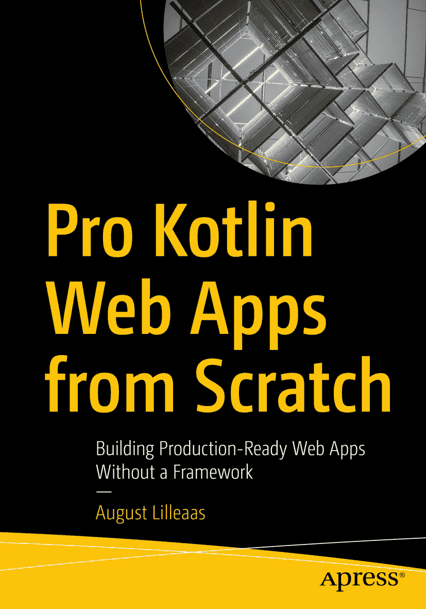

ISBN 978-1-4842-9056-9e-ISBN 978-1-4842-9057-6 [`doi.org/10.1007/978-1-4842-9057-6`](https://doi.org/10.1007/978-1-4842-9057-6) © August Lilleaas 2023 本作品受版权保护。所有权利均由出版商独家许可，无论涉及材料的全部或部分，特别是翻译、重印、重用插图、朗诵、广播、以缩微胶片或任何其他物理方式复制，以及传输或信息存储与检索、电子改编、计算机软件，或采用目前已知或未来开发的类似或不同方法。在本出版物中使用通用描述性名称、注册商标名称、商标、服务标志等，即使未作明确声明，也不意味着这些名称不受相关保护法律和法规的约束，因此可自由使用。出版商、作者和编辑可以假定，本书中的建议和信息在出版之日是真实和准确的。出版商、作者或编辑均不对本文所含材料或可能存在的任何错误或遗漏提供明示或暗示的保证。出版商对已出版地图中的管辖权主张和机构隶属关系保持中立。

本 Apress 印记由注册公司 APress Media, LLC（Springer Nature 的一部分）出版。

注册公司地址为：1 New York Plaza, New York, NY 10004, U.S.A.

*谨以此书献给我的父母，是他们成就了一切，*

*以及*

*深切怀念 Ann-Cecilie Saltnes（1980 年 3 月 11 日–2022 年 7 月 4 日）*

引言

欢迎阅读《*从零开始构建专业 Kotlin Web 应用*》！在本书中，你将学习如何完全从零开始构建专业级和生产级的 Web 应用，而无需使用庞大笨重的框架。

我个人的 Web 应用之旅始于框架，但当我更深入地了解底层原理，并厌倦了与框架的 bug 和局限性作斗争后，我开始自学如何从零开始构建 Web 应用。事实证明，框架并非必需！

得益于像 Kotlin 这样的现代编程语言和出色的第三方开源库，当你从零开始构建时，一切尽在掌握。在过去，你需要数千行样板代码和 XML 配置才能搭建一个无框架的 Web 应用。难怪人们更喜欢框架！然而如今，你只需要少量显式代码，完全摆脱臃肿和魔法，只执行你指定的操作。

在第一部分中，你将完全从零开始搭建一个 Web 应用骨架。这个代码库构成了第二部分的基础，在第二部分中，你将学习一些基于第一部分骨架构建的模式和实用解决方案。第三部分涵盖如何选择合适的库，以及我在前面部分未能涵盖的 Kotlin 技巧和窍门。最后，三个附录解释了如何替换第一和第二部分中选择的一些库，以证明你可以自由选择与我不同的库，仍然可以从零开始编写专业的 Kotlin Web 应用。

我特意将关于 Kotlin 技巧和窍门的章节控制在尽可能短的篇幅内。相反，你将在第一和第二部分中学习 Kotlin 的技巧和窍门，并在学习如何使用各种 Kotlin 语言结构的同时，学习如何从零开始构建 Web 应用。

致谢

感谢我的未婚妻 Tina，她相信我并让我知道这一点。感谢 Jonathan Gennick 给我成为技术作家的机会。感谢 Apress 的所有其他同事，与他们共事非常愉快。感谢 Marius Mårnes Mathisen，在我完全没有编程教育和专业经验的情况下，极大地推动了我的职业生涯。感谢 Kolbjørn Jetne，在我完全没有咨询经验的情况下，进一步推动了我的职业生涯。感谢 Magnar Sveen、Christian Johansen 和 Alf Kristian Støyle 多年来的讨论、输入和灵感。特别感谢 Finn Johnsen，他帮助形成了本书中的大部分模式，并且是我最初逃离框架、弥合新旧之间鸿沟的重要旅伴。

最后，感谢我的儿子 Tobias 和女儿 Lone，他们非常棒。而且，应我女儿的要求/命令，“爸爸是一本书。”

关于作者 关于技术审校者

