# 1. 搭建开发环境

在本章中，你将搭建一个 Kotlin 开发环境。你将安装 IntelliJ IDEA、Java 开发工具包（JDK），编写一个小型 Kotlin 程序，并使用 Gradle 构建系统编译和运行它。

本章将解释如何使用 IntelliJ IDEA 完成所有操作。不过，对于本书的其他章节，使用 IntelliJ IDEA 并非必需。例如，Eclipse IDE（集成开发环境）和 Visual Studio Code 都有由 Kotlin 社区提供的 Kotlin 插件。如果你选择使用其他编辑器，请确保它支持*自动补全*和*自动导入*。扩展函数在 Kotlin 中很常见，你必须先导入它们才能使用。如果你的编辑器能够搜索并匹配所有可用的扩展函数（自动补全），并在你选择其中一个自动补全选项时自动添加导入语句（自动导入），你将避免大量繁琐的手动工作。

## 开始使用 IntelliJ IDEA 社区版

你需要一个编辑器来编写代码，以及一种编译和运行代码的方式。IntelliJ IDEA 为你提供了这两者。

IntelliJ IDEA 是 Java 平台上静态语言的经典集成开发环境（IDE）。免费的 IntelliJ IDEA 社区版拥有你所需的一切，无论是对于本书还是对于生产级 Kotlin 开发。此外，JetBrains 同时开发了 Kotlin 和 IntelliJ IDEA，这使得 IntelliJ IDEA 特别适合 Kotlin 开发工作。

### 下载并运行 IntelliJ IDEA

你可以从 JetBrains 免费下载并使用 IntelliJ IDEA 社区版。访问 IntelliJ IDEA 下载页面，如图 1-1 所示，地址为[`www.jetbrains.com/idea/download/`](http://www.jetbrains.com/idea/download/)，并从那里下载社区版。JetBrains 为 macOS 提供了.dmg 文件，为 Windows 提供了.exe 文件，为 Linux 提供了包含 shell 脚本（位于*bin/idea.sh*）的压缩包。

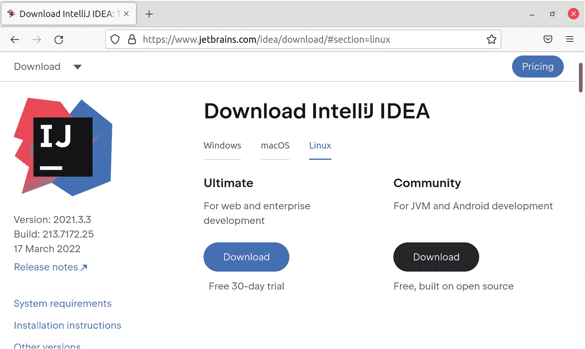

标题为“下载 IntelliJ IDEA”的网页截图。其中提到了版本、构建号和日期。文字显示为“Ultimate，适用于 Web 和企业开发”以及“Community，适用于 JVM 和 Android 开发”。

图 1-1

为你的平台下载 IntelliJ IDEA 社区版

有关如何安装和运行 IntelliJ IDEA 的更多详细信息，请参考 JetBrains 网站。例如，如图 1-1 所示，下载页面的左侧边栏中有一个包含安装说明的链接。


### 使用 IntelliJ IDEA 创建新的 Kotlin 项目

创建新的 Kotlin 项目有多种方法。本书将使用 IntelliJ IDEA 来完成。如果你不熟悉 Kotlin 和/或 JVM，通过图形用户界面（GUI）引导你完成整个过程会非常方便。

启动 IntelliJ IDEA 后，你应该会看到如图 1-2 所示的启动画面。

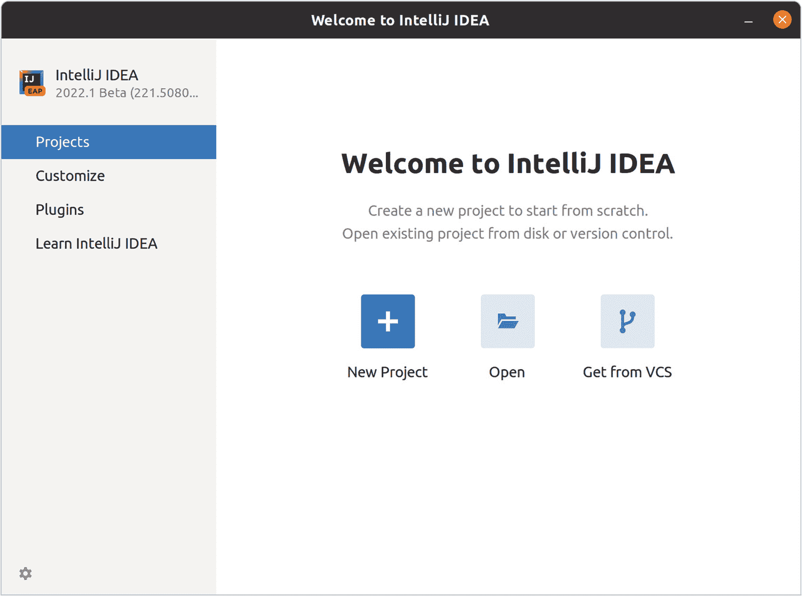

IntelliJ IDEA 主页的截图。在右侧列中，提到了“项目”、“自定义”、“插件”和“学习 IntelliJ IDEA”选项。

图 1-2

IntelliJ IDEA 的初次见面

点击“新建项目”，使用 IntelliJ IDEA 内置的向导创建一个新的 Kotlin 项目，如图 1-3 所示。

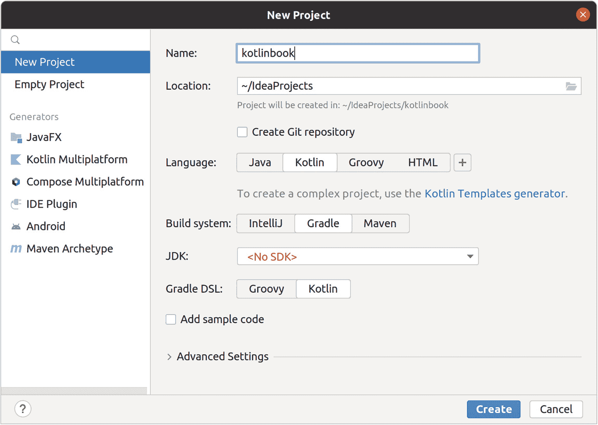

一个标题为“新建项目”的对话框截图。在左侧列中，选中了“新建项目”选项。需要输入名称、位置、语言、构建系统以及 JDK 和 Gradle DSL 的详细信息。下方突出显示了“创建”选项。

图 1-3

IntelliJ IDEA 中的“新建项目”界面

请根据你的良好判断来命名项目，并按如下方式调整选项：

*   确保在左侧边栏中选中了“新建项目”。
*   将*语言*设置为 *Kotlin*。
*   将*构建系统*设置为 *Gradle*。
*   将 *Gradle DSL* 设置为 *Kotlin*。
*   取消勾选*添加示例代码*。

你需要一个 JDK，获取它的最简单方法是让 IntelliJ IDEA 为你下载一个。点击图 1-3 所示“新建项目”对话框中的红色“<无 SDK>”下拉菜单，并从弹出的窗口中选择一个合适的 JDK，如图 1-4 所示。JDK 17 或 JDK 11 是不错的选择，因为它们都是稳定的长期支持（LTS）版本。

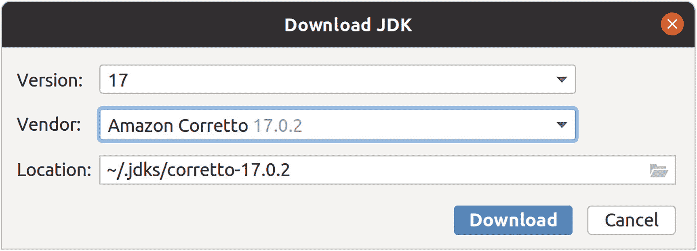

一个标题为“下载 JDK”的对话框截图。有一个用于选择版本和供应商的下拉菜单。可以看到“位置”选项。已选中“下载”选项。

图 1-4

使用 IntelliJ IDEA 下载 JDK

有多个供应商可供选择。它们都是符合 JDK 规范的、功能完备的 JDK。在大多数情况下，选择哪一个并不重要。差异仅存在于少数边缘情况和不同的默认设置中。对于大多数 Web 应用来说，你可以在不同供应商之间切换而不会注意到任何差异。我个人偏好 Amazon Corretto，主要是出于习惯。但我也在实际的 Web 应用中使用过其他供应商的产品，例如 Azul Zulu。我倾向于选择在我使用的平台上最方便的供应商，例如在 Azure 上使用 Azul Zulu，在 AWS 上使用 Amazon Corretto，等等。

请确保你选择的 JDK 版本是 11 或更高。版本 11 和 17 都是长期支持（LTS）版本，这意味着它们获得安全更新的时间比其他版本更长。在本书的后续部分，你将使用到至少需要版本 11 才能运行的库。

如果你已经安装了 JDK，也可以选择现有的 JDK。或者，你也可以自行管理 JDK 安装，例如在 macOS 和 Linux 上使用 sdkman ([`https://sdkman.io/`](https://sdkman.io/))，在 Windows 上使用 Jabba ([`https://github.com/shyiko/jabba`](https://github.com/shyiko/jabba))。

提示

你可能会运气不佳，选择了一个与 IntelliJ IDEA 使用的 Gradle 版本不兼容的 JDK 版本。例如，2021 版本的 IntelliJ 使用 Gradle 7.1，它仅适用于低于 16 的 JDK 版本。如果发生这种情况，请删除你的项目，并使用不同的 JDK 或 Gradle 版本重新开始。

IntelliJ IDEA 完成 JDK 下载后，点击图 1-3 所示“新建项目”对话框底部的“创建”按钮，你的全新项目就会出现，如图 1-5 所示。

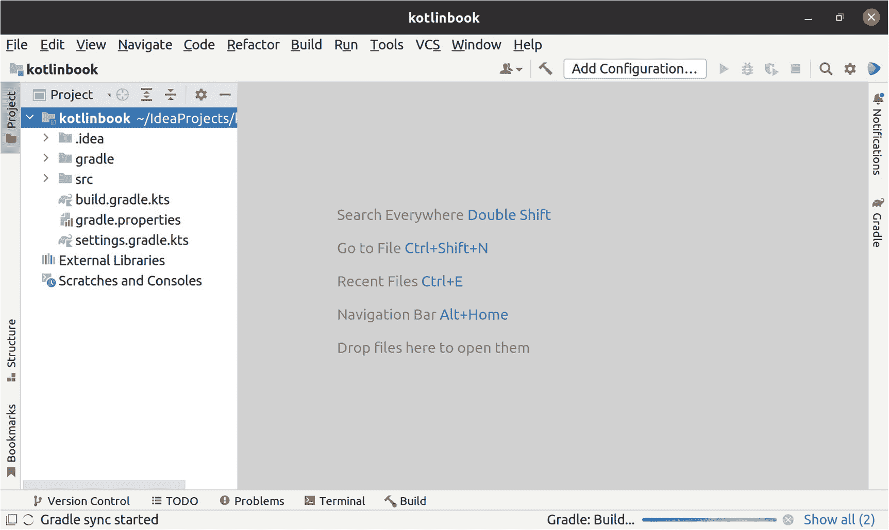

一个标题为“kotlinbook”的对话框截图。在“项目”下，选中了“kotlinbook”选项。文本显示“随处搜索，双击 Shift”、“转到文件，Ctrl+Shift+N”、“最近文件，Ctrl+E”、“导航栏，Alt+Home”、“将文件拖放到此处以打开”。

图 1-5

IntelliJ IDEA 完成项目初始化后的界面

通过此设置，IntelliJ IDEA 除了创建一个 Gradle 构建系统骨架外，不会创建示例代码或预生成文件。你现在拥有的只是一个编译和运行 Kotlin 代码的方法。而这正是本书所需要的全部内容。这里没有需要先运行成千上万行代码才能做任何事情的框架。

提示

Gradle 是 Java 平台的构建系统。你可以在这里添加第三方代码作为依赖项、配置生产构建、设置自动化测试等。Maven 也是构建生产级 Kotlin Web 应用的绝佳选择。不过，你在书籍和在线文档中看到的大多数示例都使用 Gradle，而且我在实际的 Kotlin 应用中也只使用过 Gradle，这就是我在本书中使用它的原因。

## Kotlin Hello, World!

学习一门新语言时，通常第一个程序是输出“Hello, World!”。这可以确保一切就绪，你可以编译 Kotlin 代码，运行它并看到它输出内容。

### Kotlin 命名约定

在创建第一个文件之前，你需要知道把它放在哪里以及如何命名。

Kotlin 在文件和文件夹的命名上非常灵活，并不强制要求特定的结构。然而，遵循 Java 约定是常见的做法，这也是官方 Kotlin 风格指南所推荐的。这在团队协作中尤其有帮助，这样每个人都知道在哪里查找和放置文件。

约定如下：

*   将 Kotlin 代码放在 *src/main/kotlin* 目录下。
*   创建一个以项目本身命名的*包*，并将所有文件放入其中。包是一个命名空间，用于区分代码。这有助于避免与第三方代码发生名称冲突。
*   目录结构与包名匹配。包 `myapp.foo` 存在于 *src/main/kotlin/myapp/foo* 目录下。
*   文件名采用大驼峰命名法，也称为 `PascalCase`，与 Java 相同。请注意，在实际应用中，使用下划线（`underscore_case`）的情况也相对常见。本书通篇使用 `PascalCase`。

在本书中，你将把所有代码放在 `kotlinbook` 包中。


### 编写一些代码

现在你已经准备好创建第一个 Kotlin 文件了。考虑到前面的约定，要使用的文件名是 *src/main/kotlin/kotlinbook/Main.kt*。

要在 IntelliJ IDEA 中创建该文件，请遵循以下步骤：

*   在 IntelliJ 左侧边栏中展开 *src/main/kotlin*。

*   右键点击 *src/main/kotlin*，然后选择 *新建 ➤* *包*。

*   将其命名为 `kotlinbook`，然后按键盘上的回车键。

*   右键点击新创建的包/文件夹 *kotlinbook*，然后选择 *新建 ➤ Kotlin 类/文件*。

*   选择“文件”，选择名为“文件”的文件模板，将其命名为 *Main*（IDEA 会自动添加 *.kt* 扩展名），然后按键盘上的回车键。

现在，IntelliJ IDEA 应该看起来如图 1-6 所示。

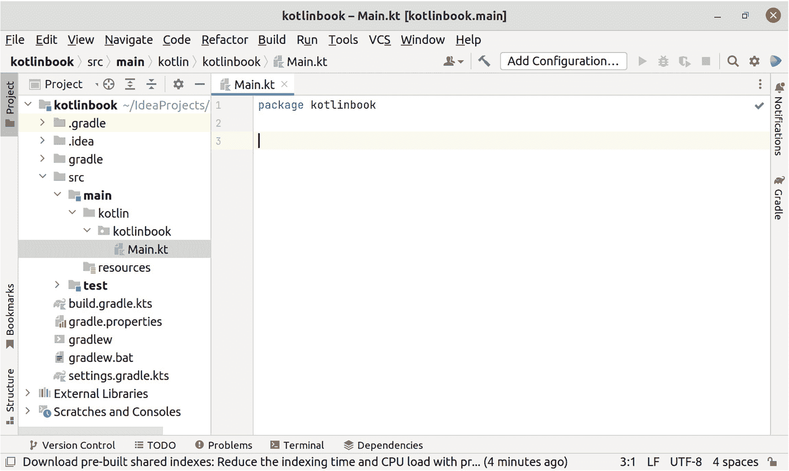

一个标题为 kotlinbook, Main.kt 的窗口截图。在 kotlinbook 选项下选中了 main.kt 选项。在右侧选项卡中，文本显示为 package kotlinbook。

图 1-6

IntelliJ IDEA 中包内的一个 Kotlin 文件

Kotlin 是一种多范式语言，支持面向对象、函数式和面向数据的编程（Sharvit, 2022, Manning）。本书将尽可能多地使用函数式和面向数据风格，仅在第三方库要求时才使用面向对象风格。

在你的第一个文件中，编写一个名为 `main` 的顶层函数，如代码清单 1-1 所示。这是一个特殊的函数名，它告诉 Kotlin 编译器和 Java 运行时将该函数作为程序的入口点进行调用。

```
package kotlinbook
fun main() {
println("Hello, World!")
}
代码清单 1-1
在 src/main/kotlinbook/Main.kt 中打印 “Hello, World!”
```

提示

如果你想读取传递给应用程序的命令行参数，也可以将函数声明为 `fun main(args: Array<String>) { ... }`。Java 要求你的 main 函数接受一个字符串数组，但 Kotlin 没有这个要求。

### 使用 IntelliJ IDEA 运行代码

IntelliJ IDEA 可以直接运行你的代码。这是运行代码最快的方式，并且能最大限度地利用你正在使用 IDE 这一优势。

函数旁边的小绿色箭头，如图 1-7 所示，表示 IntelliJ IDEA 可以直接运行该函数。点击它，IntelliJ IDEA 就会按你的指令运行该函数。

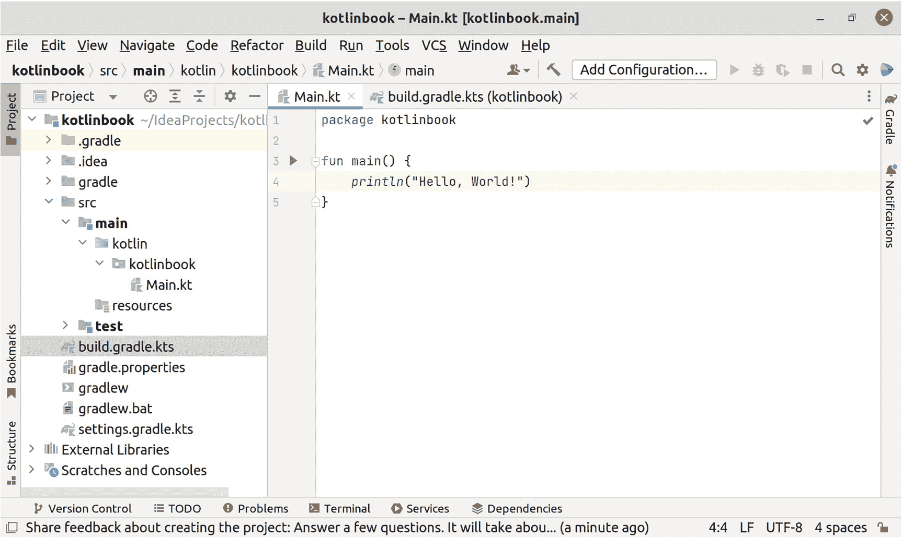

一个标题为 kotlinbook, Main.kt 的窗口截图。在 kotlinbook 选项下选中了 build.gradle.kts 选项。在右侧选项卡中，文本显示为 package kotlinbook，并观察到两行代码。

图 1-7

IntelliJ IDEA 中函数名称旁边的绿色播放按钮表示一个可运行的函数

### 使用 Gradle 运行代码

你也可以配置 Gradle 来运行你的代码。稍后，你将使用 Gradle 来构建可部署的 JAR（Java 归档）文件，而 Gradle 需要知道你的 main 函数在哪里才能构建它们。此外，即使你不打算用 Gradle 运行代码，不熟悉该项目的开发者也可以查看 Gradle 配置来找到 main 函数。这有助于理解项目中的主入口点在哪里，并且是开始阅读代码以熟悉它的好地方。

你将在 Gradle 中使用 *application* 插件来指定一个带有主入口点的可运行应用程序。在文件 *build.gradle.kts* 中，添加 `application` 插件：

```
plugins {
kotlin("jvm") version "..."
application
}
```

`application` 插件需要知道在哪里找到 main 函数。在 *build.gradle.kts* 的顶层（不在 `plugins` 块内），声明主类的名称：

```
application {
mainClass.set("kotlinbook.MainKt")
}
```

提示

你注意到这个抽象泄漏了吗？`application` 插件并不了解 Kotlin，它需要知道编译后的 Java 类文件的名称。为了与 Java 平台兼容并可互操作，Kotlin 编译器将 `Main` 转换为 `MainKt`。一个只声明了类 `Foo` 的文件 *Foo.kt* 会被编译成 *Foo.class*。任何其他情况都会生成 `FooKt.class`。

要使用 Gradle 运行该函数，请使用以下两种方法之一：

*   在终端中（独立终端或 IntelliJ 底部的“终端”选项卡），输入 `./gradlew application`。

*   在 IntelliJ 的 Gradle 面板中（位于最右侧的侧边栏），点击 *Tasks ➤ application ➤ run*。

现在，你应该能在终端或 IntelliJ 的“运行”输出面板中看到应用程序的输出。

## IntelliJ IDEA 提示与技巧

IntelliJ IDEA 是一个功能丰富的庞大工具。本书并非关于 IntelliJ IDEA，你可能也选择了完全不同的编辑器。但这里有一些提示可以帮助你熟悉 IntelliJ IDEA，并避免专业 IntelliJ IDEA 用户知道如何避免的常见新手错误。

如果你想更深入地了解 IntelliJ IDEA 的广阔世界，你应该查阅 Ted Hagos 所著的《Beginning IntelliJ IDEA》一书（[`www.amazon.com/dp/1484274458`](http://www.amazon.com/dp/1484274458)）。

### 留意进度条

IntelliJ IDEA 有时会在底部工具栏的右侧显示一个进度条，如图 1-8 所示。当这个进度条可见时，IntelliJ IDEA 正在后台执行一些重要的操作。

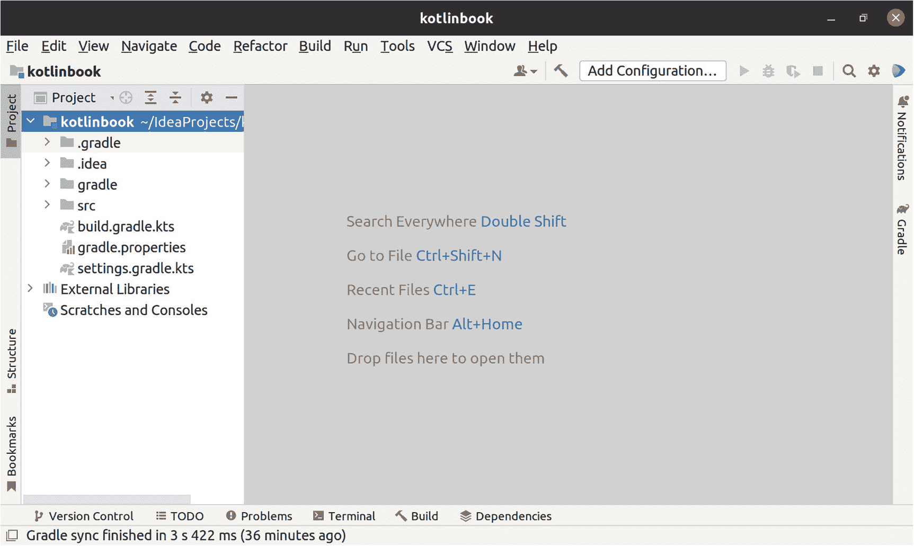

一个标题为 kotlinbook 的对话框截图。在项目下，选中了 kotlinbook 选项。文本显示为：搜索任意位置，双击 Shift。转到文件，Ctrl+Shift+N。最近文件，Ctrl+E。导航栏，Alt+Home。将文件拖放到此处以打开它们。

图 1-8

IntelliJ IDEA 正在运行项目的后台分析，底部工具栏右侧的蓝色进度条显示了这一点

当你看到这个进度条时，应该等到它消失后再开始编辑代码。

IntelliJ IDEA 对你的代码了解很多。为了获得这些知识，它需要先分析你的代码。当你输入新代码时，这会自动发生（而且速度很快，你可能注意不到）。但是，当你创建新项目或首次打开现有项目时，IntelliJ IDEA 可能会花费数分钟在后台运行分析。

分析运行时，编辑器仍然处于活动状态，因此你可能会认为 IntelliJ IDEA 已经准备就绪。但许多核心功能在分析完成之前是不可用的。

当进度条消失后，IntelliJ IDEA 就准备就绪了，你现在可以使用 IntelliJ IDEA 提供的所有功能来编辑代码了。


### 记得在 IntelliJ IDEA 中刷新 Gradle 项目

随着项目不断扩展，你会对 *build.gradle.kts* 进行修改，例如添加第三方代码作为依赖项、配置如何构建用于生产的 JAR 文件等。

IntelliJ IDEA 对 *build.gradle.kts* 的内容有深入的了解。例如，IntelliJ IDEA 会自动补全 Gradle 项目中所有作为依赖项添加的第三方代码中的函数。

当你修改 *build.gradle.kts* 时，IntelliJ IDEA 需要你刷新其对 Gradle 项目的认知。如果你修改了 *build.gradle.kts* 但没有执行刷新，很容易陷入抓狂的境地，因为 IntelliJ IDEA 对项目的认知与你的预期不符。

幸运的是，IntelliJ IDEA 会提供帮助。当存在尚未刷新的更改时，IntelliJ IDEA 会显示一个虽小但至关重要的按钮，如图 1-9 所示。该按钮显示 Gradle 徽标和一个小的刷新箭头。点击此图标即可执行 Gradle 刷新。

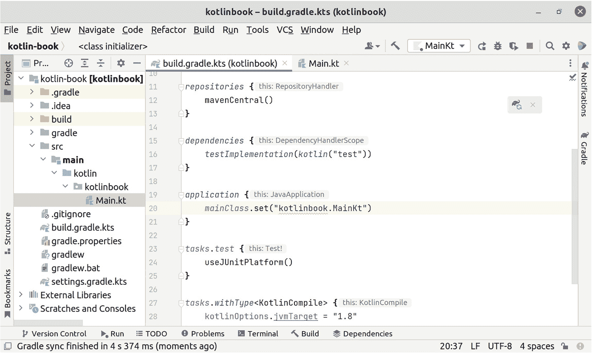

一个标题为 kotlinbook 的窗口截图，显示 Main.kt。在 kotlinbook 选项下选中了 main.kt 选项。在右侧选项卡中，文本显示为 package kotlinbook，并观察到四行代码。

图 1-9

用于刷新 Gradle 项目设置的弹出窗口

仅当 *build.gradle.kts* 发生了 IntelliJ IDEA 尚未感知的更改时，该图标才会可见。但它很容易被忽略，因此请确保每次修改 *build.gradle.kts* 后，都在 IntelliJ IDEA 中刷新你的 Gradle 项目。

### 善用 IntelliJ IDEA 的自动补全功能

IntelliJ IDEA 拥有强大的自动补全功能。也许你在之前输入 `main` 函数时已经注意到了。当你用键盘输入代码时，光标附近会出现一个下拉菜单。此下拉菜单包含你可以在当前编写位置添加的所有可行符号，并且仅限于与你当前输入内容匹配的符号。

当自动补全与自动导入结合使用时尤其有用，如图 1-10 和 1-11 所示。如果你在 IntelliJ IDEA 中选择了一个自动补全项，而你的选择尚未导入到正在编辑的文件中，IntelliJ IDEA 会自动为你导入它。

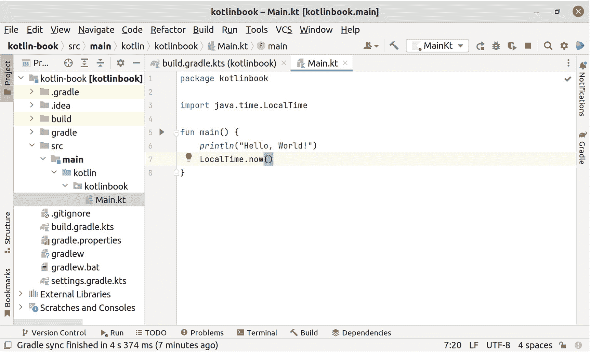

一个标题为 kotlinbook 的窗口截图，显示 Main.kt。在 kotlinbook 选项下选中了 main.kt 选项。在右侧选项卡中，文本显示为 package kotlinbook，并观察到四行代码。

图 1-11

按下 Enter 键，自动补全将添加完整的类名并自动添加导入

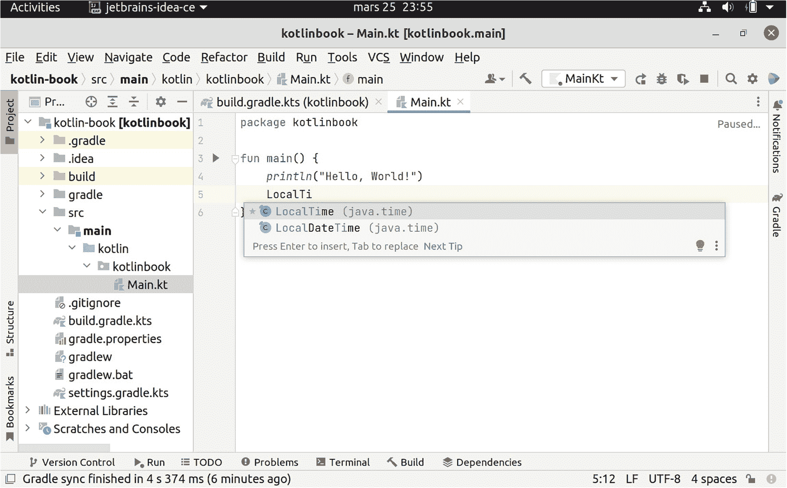

一个标题为 kotlinbook 的窗口截图，显示 Main.kt。在 kotlinbook 选项下选中了 main.kt 选项。在右侧选项卡中，文本显示为 package kotlinbook，并观察到五行代码。

图 1-10

在 IntelliJ IDEA 中部分输入 `LocalTime` 并获取自动补全

通过善用自动补全，你将免于手动输入所有内容，也无需手动为其他包中的代码添加 import 语句，无论是来自标准库、第三方代码还是你自己的模块。

