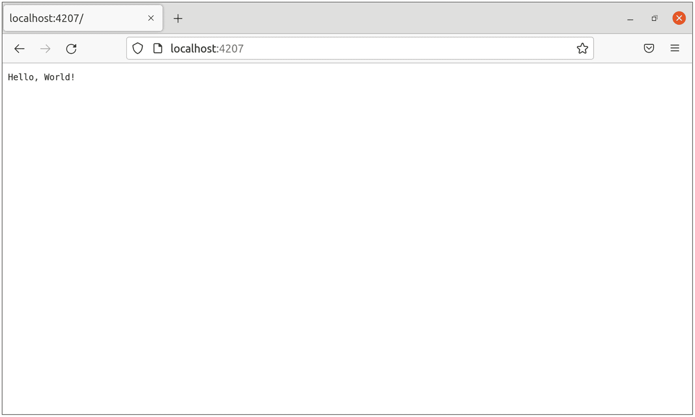
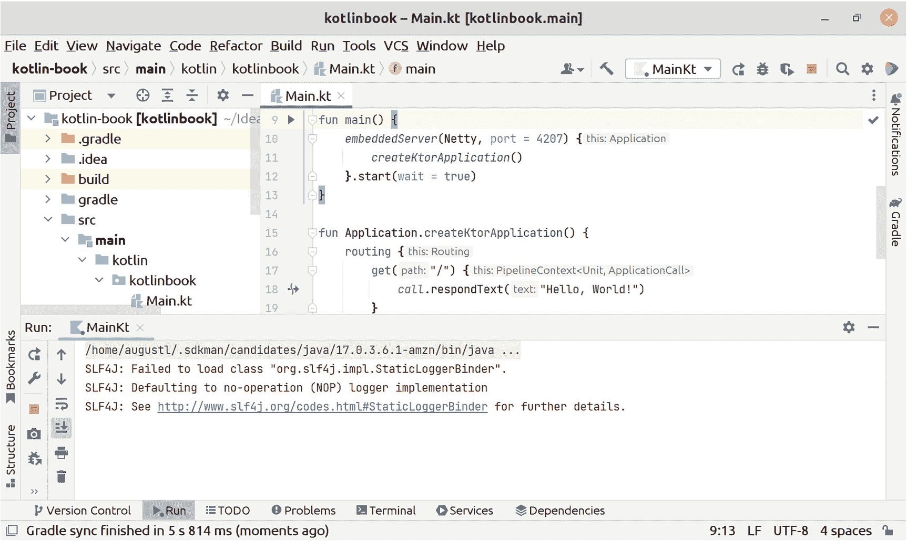
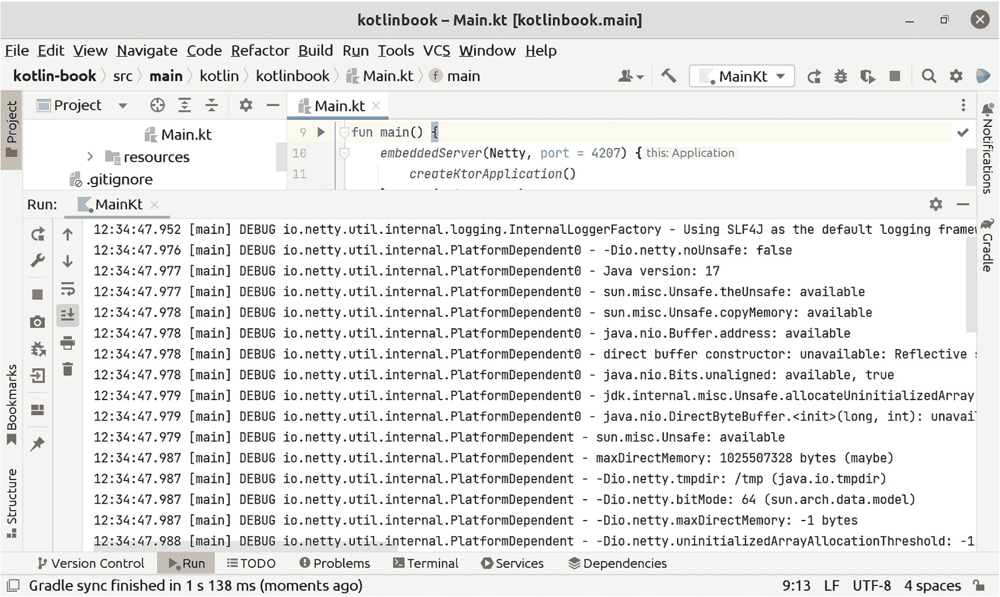
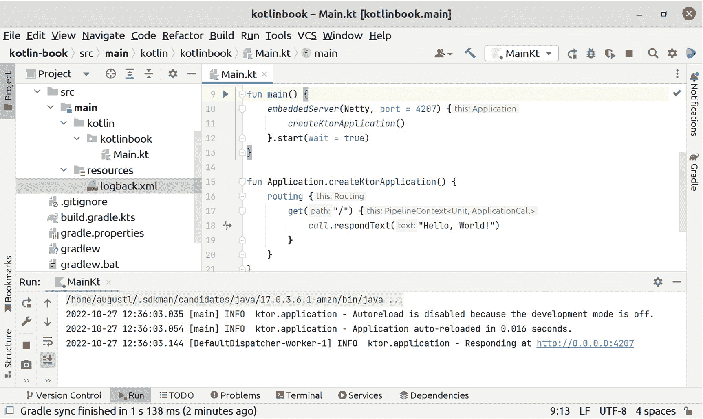
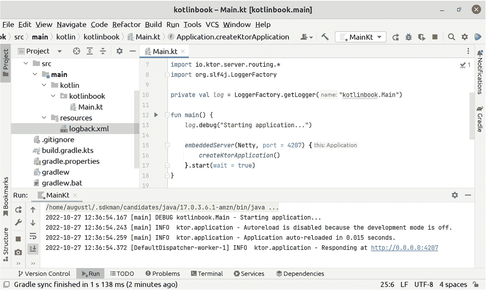

# 2. 搭建 Web 应用骨架

> *看看我所有没在做的事情！*
> 
> —David Heinemeier Hansson

本章将赋予你超能力。你将完整地构建一个可运行的 Web 应用，包含路由、视图/模板和日志记录。你将为此后章节的内容奠定基础。只有你和你的 IDE，没有入门套件或框架。

如果你是 Kotlin 新手，以下是本章中你会看到的语言特性示例：

*   Lambda 表达式

*   命名参数

此外，在本章中，你将学习以下关于创建 Web 应用的知识：

*   搭建一个由 Ktor 驱动、监听 4207 端口的 Web 服务器

*   使用 SLF4J 和 Logback 进行日志设置，可通过标准的 *logback.xml* 配置

*   调整 Ktor，使其在应用程序抛出意外错误时显示有用的错误信息

你将亲手连接所有这些组件，而不是让框架为你代劳。如果你以前只使用过框架，我真羡慕你。准备好迎接惊喜吧，你会发现完成这些工作所需的手动连接工作少得惊人。

## Web 服务器版 Hello, World！

在第一章中，你编写了一个打印“Hello, World!”的小程序。现在是时候将其提升到新高度了：一个功能完备的 Web 应用，能够启动服务器、设置 URL 路由，并通过 HTTP 输出“Hello, World!”。

### 选择 Ktor

你需要一个库来处理 URL 路由并启动 Web 服务器来托管你的 Web 应用。本书将使用 Ktor。如果你愿意，以后可以将 Ktor 替换为其他库，在附录 A 中你将学习如何使用 Jooby 替代 Ktor。但在本书的其余部分，你编写的所有代码都将使用 Ktor。

Ktor 是 Kotlin 中最流行的 Web 应用路由库之一。它拥有构建生产级 Web 应用所需的一切，并且是用 Kotlin 编写的，因此使用起来既方便又强大，并能充分利用 Kotlin 为构建 Web 应用提供的所有相关特性。它还旨在实现高度可扩展和高性能，并已在大量真实世界的 Web 应用中经过实战检验。

最重要的是，Ktor 是一个库，而不是框架。像 Spring Boot 这样的框架通常会自动启动 Web 服务器，并使用控制反转在数万行框架代码的深处调用你的代码。本书的重点是学习如何从头开始，亲手完成所有工作。

有趣的是，Ktor 将自己标榜为框架。对于库与框架的定义，并没有广泛接受的标准。我在本书中使用的定义是：框架会自动且隐式地为你做事，而库则在你明确指示之前不会做任何事情。Ktor 恰好符合这个库的定义。

### 添加 Ktor 库

在 *build.gradle.kts* 的 `dependencies` 块中，将 Ktor 添加为依赖项。Ktor 需要两个依赖项才能工作：服务器核心和特定的服务器实现（此处为 Netty）：

```
dependencies {
implementation("io.ktor:ktor-server-core:2.1.2")
implementation("io.ktor:ktor-server-netty:2.1.2")
}
```

提示

更新 `build.gradle.kts` 后，记得在 IntelliJ 中刷新 Gradle 项目。使用当 Gradle 尚未刷新更改时出现的小弹出窗口，或打开 Gradle 选项卡并点击刷新按钮。

Gradle 会自动下载这些依赖项，并使它们可用于你的代码。


### 启动 Web 服务器

你需要在应用程序的入口点——`main` 函数中手动启动 Web 服务器。我们将不再仅仅打印“Hello, World!”，而是改为启动一个 Ktor Web 服务器。

在代码清单 2-1 中，你可以看到启动一切所需的完整 `main` 函数。

```
package kotlinbook
import io.ktor.server.application.*
import io.ktor.server.engine.*
import io.ktor.server.netty.*
import io.ktor.server.response.*
import io.ktor.server.routing.*
fun main() {
embeddedServer(Netty, port = 4207) {
routing {
get("/") {
call.respondText("Hello, World!")
}
}
}.start(wait = true)
}
Listing 2-1
在 src/main/kotlinbook/Main.kt 的应用程序 main 函数中启动 Web 服务器
```

这段代码简洁明了。你创建了一个内嵌的 Ktor 服务器，它在底层使用 Netty 作为服务器实现，并在 4207 端口启动。你设置了路由，即 HTTP 动词和路径匹配。每个路由都有一个生成 HTTP 响应的实现。最后，你启动了内嵌服务器。

你不需要手动编写 `import` 语句。例如，当你输入 `embeddedSe` 并暂停时，IntelliJ IDEA 会建议 `embeddedServer`。如果你从下拉菜单中选择自动补全，IntelliJ IDEA 还会自动添加 `import` 语句。

为清晰起见，代码清单 2-1 包含了编译代码所需的所有 import 语句。在本书的剩余部分，除非存在歧义（例如，有两个同名的扩展函数但位于不同的包中），否则我将省略它们。

提示

在 Java 平台上，即使你使用框架，内嵌 HTTP 服务器也是一种标准做法。像 Nginx 这样的代理，或者 Azure Web Apps、Amazon Application Load Balancer 这样的云服务，会位于你应用程序中的内嵌 HTTP 服务器之前，负责处理 SSL、负载均衡和其他 Web 服务器任务。在第 14 章中，你将学习如何构建一个不启动自身服务器，而是嵌入到 Tomcat 等应用服务器容器中的 servlet 风格的 WAR 文件。

### 提取到单独的函数

目前，将路由提取到单独的函数并非绝对必要。但在本书后续部分，你将在多个不同的地方使用 Ktor 路由定义。因此，你需要将其作为一个可以从任何地方调用的独立函数，而不是将其锁定在 `embeddedServer` 调用中。

在开源应用和 Ktor 文档本身中，将 Ktor 服务器配置分离到单独的函数也是一种常见做法，因此在自己的 Web 应用中遵循这些约定，可以使你的代码更具可读性。

代码清单 2-2 展示了如何进行设置。

```
fun main() {
embeddedServer(Netty, port = 4207) {
createKtorApplication()
}.start(wait = true)
}
fun Application.createKtorApplication() {
routing {
get("/") {
call.respondText("Hello, World!")
}
}
}
Listing 2-2
在独立的隔离函数中配置 Ktor
```

`createKtorApplication` 函数是一个扩展函数。你将在第 3 章中了解更多关于扩展函数的内容，但其要点是：`embeddedServer` lambda 内部的 `"this"` 是 `io.ktor.server.application.Application` 的一个实例。通过将 `createKtorApplication()` 设为 `Application` 的扩展函数，当它作为独立函数时，将拥有与内联在 `embeddedServer` lambda 内部时相同的 `"this"` 可用。

### 使用 Lambda 表达式

Lambda 表达式在 Kotlin 中无处不在。事实上，你已经编写了几个。`embeddedServer`、`routing` 和 `get` 这些函数都将 lambda 表达式作为参数。

Lambda 表达式是代码块，就像函数一样。它们使用花括号 `{` 和 `}` 创建。Lambda 表达式与常规函数的主要区别在于，lambda 表达式没有名称，而函数有。

提示

Lambda 表达式的另一个名称是*匿名函数*。Lambda 表达式和函数在语法上有一些差异（你将在本书中看到更多相关内容），但在逻辑上它们是相同的。

Kotlin 中有一个约定，适用于将 lambda 表达式作为最后一个参数的函数。让我们以函数 `get` 为例进行说明。它接受两个参数：一个字符串，表示触发路由的路径；以及一个 lambda 表达式，其中包含当 Web 应用处理该路径上的请求时应执行的代码。调用 `get` 的一种方式如下：

```
get("/", { ... })
```

因为在 Kotlin 中，函数将 lambda 表达式作为最后一个参数非常常见，所以有一种更方便的方式将它们传递给函数。你可以将 lambda 表达式放在函数括号的后面，而不是放在括号内：

```
get("/") { ... }
```

这对于*仅*接受一个 lambda 表达式的函数特别有用。`routing` 函数就是一个例子。能够完全省略括号是很方便的。

Kotlin 程序员通常将 lambda 表达式放在括号外面。事实上，如果你将尾随 lambda 表达式放在括号内，IntelliJ IDEA 会默认显示警告。如果你愿意，可以禁用此警告，但如果你希望代码对其他程序员尽可能易读，遵循此约定是个好主意。

### 使用具名参数代替魔法数字和布尔值

`start()` 函数只接受一个布尔值作为参数。`embeddedServer()` 函数接受服务器应使用的端口号。你可以像这样调用它们：

```
embeddedServer(Netty, 4207) {
createKtorApplication()
}.start(true)
```

以这种方式传递给函数的布尔值和数字通常被称为*魔法布尔值*和*魔法数字*。读者很难一眼看出传递给 `start()` 函数的布尔值是什么意思，以及传递给 `embeddedServer()` 的第二个参数中的数字代表什么。

为了更容易理解这些数字和布尔值的含义，你可以将它们作为*具名参数*传递：

```
embeddedServer(Netty, port = 4207) {
createKtorApplication()
}.start(wait = true)
```

你不能随意命名它们。它必须与函数实现中参数的名称相同。

### 运行你的 Web 应用

使用 IntelliJ IDEA 或 Gradle 运行你的应用程序。在浏览器中打开 *http://localhost:4207*，你的代码将礼貌地向你问好。你应该会看到如图 2-1 所示的结果。看！你已经拥有一个可以运行的 Web 应用了。



一个 localhost 网页的截图。文本显示 Hello world!

图 2-1

你的 Web 应用已启动并运行，正在响应你代码中定义的端口

## 日志记录

高质量的日志记录是生产级 Web 应用的关键组成部分。它可能决定你在生产环境中发生错误时能否找出问题所在。

当你运行应用程序时，控制台会打印如图 2-2 所示的错误消息。



一个标题为 kotlinbook- main.kt 的窗口截图。在 kotlin-book 下，.gradle 和 build 选项被高亮显示。右侧可以看到 8 行代码。下方，在 MainKt 下，显示了 4 行。

图 2-2

应用程序运行时，SLF4J 发出错误消息

在本节中，你将学习日志记录，并配置你的应用程序以输出来自第三方代码的有用信息，以及来自你自己代码的日志。


### Java 平台上的日志记录器

在 Java 平台上进行日志记录时，有几个术语和概念需要了解。

图 2-2 中的错误信息提到了一个叫做“SLF4J”的东西。SLF4J 是一个*日志门面*。SLF4J 是 Simple Logging Façade for Java（Java 简单日志门面）的缩写。日志门面本身无法产生任何实际的日志输出；它只能接收日志语句。当你启动一个 Ktor 服务器时，Ktor 会尝试使用 SLF4J 日志记录器的实例来记录启动过程的信息。但因为你尚未配置日志记录，所以 SLF4J 会打印出图 2-2 中看到的错误信息，以告知你 SLF4J 已收到日志语句但无法输出它们。

Java 平台已标准化使用 SLF4J，各种库和框架都会引入 SLF4J 库并使用它来执行日志记录。

要看到实际的日志输出，你需要添加一个*日志实现*。有许多不同的实现可供选择。最广泛使用的是 Logback 和 Log4j。

SLF4J 会在*类路径*中搜索日志实现。类路径是 Java 平台运行时可以找到来自你自己源代码以及第三方依赖项的所有编译代码的地方。SLF4J 会扫描类路径，查找类文件 *org/slf4j/impl/StaticLoggerBinder.class*。你选择的日志实现会提供这个文件，以便 SLF4J 能够找到它并进行连接。然后，SLF4J 会将其接收到的所有日志语句转发给日志实现，以便日志实现能够显示日志消息。

*日志级别*是一个严重性级别的层次结构。一条日志语句总是有一个日志级别。可用的日志级别有：trace、debug、info、warning、error 和 fatal。日志级别将调试输出和关于系统运行状态的信息与重要的警告和严重错误区分开来。

你可以使用日志级别来区分代码不同部分的输出。例如，你可以告诉日志实现为某个特定模块使用 warning 级别。然后，日志级别层次结构会规定，它将隐藏 warning 级别以下的所有级别（trace、debug 和 info），唯一可见的日志消息将是 warning 级别及以上的消息（warning、error 和 fatal）。

### 在你的 Web 应用中配置日志记录

为了让你自己的代码以及第三方依赖项能够输出日志，你需要添加一个日志实现。在本书中，你将使用 Logback。你还需要配置 Logback，使其输出尽可能有用。

要将 Logback 添加到你的 Web 应用，请将 Logback 和 SLF4J 添加为依赖项。在 *build.gradle.kts* 中，将以下内容添加到已有的 `dependencies` 块中：

```
dependencies {
implementation("ch.qos.logback:logback-classic:1.4.4")
implementation("org.slf4j:slf4j-api:2.0.3")
```

提示

你不必手动将 SLF4J 添加为依赖项。Ktor 已经依赖于 SLF4J，并且 Gradle 构建系统会使所有*传递性依赖*（即依赖项的依赖项）也对你的代码可用。但是，稍后你将直接调用 SLF4J 中的代码，并且良好的实践是在 *build.gradle.kts* 中为你直接调用的所有代码添加直接依赖项。

当你重新启动 Web 应用时，你将不再看到来自 SLF4J 的警告。相反，你会看到实际的日志输出，就像你在图 2-3 中看到的那样。



一张网页截图显示了实际的日志输出。

图 2-3

Logback 用冗长的信息填充了你的日志，因为你尚未配置 Logback

图 2-3 中可见的日志输出来自 Netty，即 Ktor 使用的服务器实现。换句话说，你看到的是来自依赖项的依赖项的日志输出，距离你自己的代码有好几层。能够调查系统*所有*部分的运行状态，正是日志记录如此有用的原因。

设置日志实现最常见的方式是：对所有第三方代码使用 info 级别，对你自己的代码使用 debug 级别。来自第三方代码的 debug 级别日志语句通常不相关，除非你正在修改该代码，或者正在调试一个原因不明的问题。对于你自己的代码，debug 级别的日志输出是真正相关的，因为你实际上正在积极地修改该代码。

要配置 Logback，你需要将一个 XML 配置文件添加到 *src/main/resources/logback.xml*。清单 2-3 展示了一个有效的 Logback 配置文件示例。

```

%d{YYYY-MM-dd HH:mm:ss.SSS} [%thread] %-5level %logger{36} - %msg%n

清单 2-3
Logback 配置，存储在 src/main/resources/logback.xml 中
```

清单 2-3 中的 `<appender>` 告诉 Logback 将日志输出写到哪里。你可以告诉 Logback 写入文件，甚至发送电子邮件。在这里，你配置 Logback 简单地将日志输出写入控制台。这也是生产环境中最常见的配置，因为大多数生产环境都具备将控制台输出提供给开发人员的设施。

清单 2-3 中的 `<root>` 记录器是 Logback 将用于所有没有特定记录器配置的代码（包括你自己的代码和第三方依赖项）的默认记录器。它被设置为 info 级别，这意味着 Logback 只会显示 info、warn、error 和 fatal 级别的语句。

清单 2-3 中的语句 `<logger name="kotlinbook" level="DEBUG"/>` 为所有来自 `kotlinbook` 的日志语句覆盖了 `<root>` 记录器的设置。这意味着 Logback 将为你自己的代码显示 debug 级别及以上的所有日志语句。

图 2-4 展示了在你添加了 Logback XML 配置文件后，日志输出的样子。



一个 kotlinbook 窗口的截图。logback.xml 选项被高亮显示。右侧展示了 8 行代码。下方展示了输出日志。

图 2-4

当你配置 Logback 仅显示第三方依赖项的 info 级别日志时，其输出会简洁得多

添加配置文件极大地减少了写入控制台的日志语句数量。现在，你不再看到来自 Netty 的冗长实现细节，而只看到两条关于 Ktor 启动的消息，以及一条告知你 Web 服务器已启动并正在运行的信息消息。为了方便起见，它甚至包含了你的网站可访问的完整 URL。


### 从你自己的代码写入日志

你已经为第三方代码以及你自己的代码设置了一个可用的日志系统。但你还没有从自己的代码中记录过日志。要写入日志，你需要做的正是 Ktor、Netty 和其他第三方代码所做的——创建 SLF4J 日志门面实例。

你可以通过调用 SLF4J 的 `LoggerFactory` 类来创建日志记录器实例。

```
import org.slf4j.LoggerFactory
private val log = LoggerFactory.getLogger("kotlinbook.Main")
log.debug("Testing my logger")
清单 2-4
创建日志记录器实例并写入日志
```

在 *logback.xml* 配置文件中，你指定了对于名称以 `kotlinbook` 开头的日志记录器，希望输出调试级别的日志。你将你自己的日志记录器命名为 `kotlinbook.Main`，并且你的日志语句处于调试级别。因此，当你将清单 2-4 中的代码添加到 `Main.kt` 并重新运行你的 Web 应用时，你应该会在控制台中看到打印出的日志语句，就像你在图 2-5 中看到的那样。



一个 kotlinbook 窗口的截图。logback.xml 选项被高亮显示。右侧展示了 9 行代码。下方展示了输出日志。

图 2-5

你的日志配置和日志语句已设置好，以便你可以在日志输出中看到日志文本

你应该始终将你的日志记录器命名为包名加上你创建该日志记录器的文件名。名称 `kotlinbook.Main` 遵循此规则。

你通常会在你想要写入日志的文件顶部，在 import 语句之后、任何函数或类声明之前，创建一个单一的日志记录器。

在清单 2-5 中，你可以看到一个完整的示例，展示了在你现有的 main 函数中，从你自己的代码进行日志记录可能的样子。

```
package kotlinbook
import ...
import org.slf4j.LoggerFactory
val log = LoggerFactory.getLogger("kotlinbook.Main")
fun main() {
log.debug("Starting application...")
embeddedServer(Netty, port = 8080) {
// ...
清单 2-5
在 src/main/kotlin/kotlinbook/Main.kt 中创建一个日志记录器并从你的 main 函数写入日志
```

### 关于“魔法”XML 配置文件的一点说明

你在 *src/main/resources/logback.xml* 创建了 Logback 配置文件。Logback 不知何故自动检测到了这个文件的存在，这似乎是利用了 Java 平台的魔法。这是如何工作的？而且，从头开始编写 Web 应用的目的不就是为了不惜一切代价避免这种魔法吗？

在底层，Logback 会扫描类路径以查找 *logback.xml* 文件。类路径不仅仅包含编译后存储为 class 文件的代码。它可以包含任何类型的任何文件，并且是 Java 代码在不了解代码运行所在文件系统和操作系统环境的情况下访问文件的一种方式。

Gradle 负责用必要的文件填充类路径。当 Gradle 构建你的 Web 应用时，它会将 *src/main/resources* 中的所有文件放入类路径。这就是让 Logback 能够找到 *logback.xml* 配置文件的原因。Logback 只是向类路径请求 *logback.xml* 文件，并从 Java 运行时接收它。

总的来说，我的目标是将本书中的魔法保持在绝对最低限度。日志配置是我愿意接受的极限。完全避免它是不切实际的。Ktor 及其依赖项已经在使用它了。如果你不配置 SLF4J 和 Logback，你就无法访问它创建的日志语句，并且你将始终看到你在配置 SLF4J 和 Logback 之前在图 2-2 中看到的那个警告。

提示

如果你出于某种原因不想访问来自使用 SLF4J 的依赖项的日志，你可以完全禁用 SLF4J，并抑制它在启动时因找不到日志实现而记录的错误。在 *build.gradle.kts* 中添加对 `org.slf4j:slf4j-nop:1.7.36` 的依赖，你将不会再收到 SLF4J 的消息。

根据我的经验，SLF4J 和 Logback 非常稳定和成熟，你永远不会遇到它们的问题。当魔法停止工作时可能会令人恼火，但当你按照我在本章中描述的方式设置日志系统时，你很难搞砸它。日志记录也是大多数程序员认为有点魔法且不透明的事情之一。即使是 Clojure 社区的开发者（这可能是 Java 平台上最不倾向于魔法的社区），也经常在他们的项目中使用 Logback 和 XML 配置文件。

现在，你的 Web 应用中已经有了一个完整的日志设置，除了在每个你想要记录日志的文件中调用 `LoggerFactory` 之外，没有任何样板代码，并且你正在使用 Java 社区其他人使用的所有工具。如今，无需框架就能实现这些，真是令人惊叹。

## 有用的错误页面

开箱即用，当你的代码抛出异常时，Ktor 会显示一个空白的 HTML 页面。让 Ktor 显示一些信息（例如来自异常的实际错误消息）要实用得多。

为了在 Ktor 中处理异常，你可以使用 `StatusPages` 插件。这个插件允许你挂钩到 Ktor 生命周期的各个部分，例如当你的代码抛出未处理的异常时。

要添加 `StatusPages` 插件，你首先需要将其作为依赖项添加到 *build.gradle.kts* 中。像往常一样，将其添加到已经存在的 `dependencies` 块中：

```
dependencies {
implementation("io.ktor:ktor-server-status-pages:2.1.2")
```

你在 `createKtorApplication` 函数内部配置 Ktor 插件，与已经存在的路由配置放在一起：

```
fun Application.createKtorApplication() {
install(StatusPages) {
// 在此处配置插件
}
routing {
// 现有的路由在此处...
```

清单 2-6 展示了一个完整的示例，说明如何使用 `StatusPages` 插件中的异常处理钩子来告诉 Ktor，当你的代码抛出未处理的异常时，你希望发生什么。

```
install(StatusPages) {
exception { call, cause ->
kotlinbook.log.error("发生未知错误", cause)
call.respondText(
text = "500: $cause",
status = HttpStatusCode.InternalServerError
)
}
}
清单 2-6
使用 StatusPages 插件让 Ktor 显示关于错误的有用信息，而不是空白页面
```

Java 平台有一个异常类层次结构，`Throwable` 位于该层次结构的顶部。指定 `exception<Throwable>` 意味着 `StatusPages` 插件将为*所有*可能发生的错误调用异常处理器。如果你希望为不同的错误显示不同的输出，可以添加多个 `exception` 处理器块。Ktor 将为抛出的错误使用它能找到的最具体的那个。

传递给异常处理器 lambda 的 `call` 参数与路由处理器内部的 `call` 类型相同。这意味着你的错误页面拥有 Ktor 的全部能力，你可以以任何你喜欢的方式响应。不过，最好尽可能保持异常处理简单。如果你的异常处理代码过于复杂，它最终可能会失败并自行抛出异常。如果发生这种情况，你的异常处理器将无法显示任何输出，Ktor 将只显示一个空白页面，就像你没有配置异常处理器一样。

`cause` 参数是表示所发生异常的错误对象。请注意清单 2-6 中的日志语句。让日志包含关于可能发生的任何错误的信息是很有用的。SLF4J 日志记录器有一个特殊的错误日志级别实现，它接受正常的消息文本以及所抛出异常的实际错误对象。日志实现将打印消息文本以及一个格式良好的错误对象版本，其中包含错误消息和完整的堆栈跟踪。


