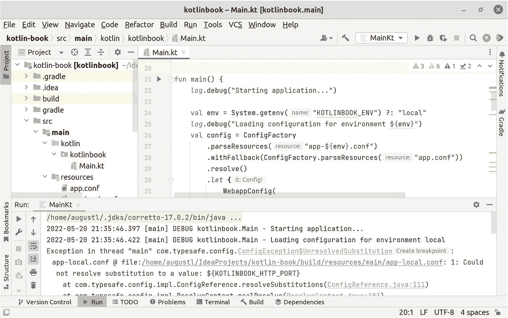

# 3. 配置文件

所有 Web 应用都需要配置文件。配置文件让你能够将数据库凭据、API 密钥以及 HTTP 服务器运行端口等内容从源代码中移出，放到一个独立的配置文件中。

你的应用至少会在三种不同的环境中运行：本地开发、自动化测试和生产环境。配置文件使得每个环境都能拥有不同的默认值，所有这些都纳入版本控制，并且易于复现。

即使没有配置文件，你也可以完成本书中的示例，但这样你就无法学会如何从零开始构建可用于生产环境的 Web 应用。

如果你刚接触 Kotlin，本章将展示以下语言特性的示例：

*   使用构造函数定义类
*   数据类
*   `let` 代码块
*   单参数 lambda 表达式的 `it` 简写
*   空安全与可空类型
*   元编程
*   正则表达式
*   Elvis 操作符
*   单表达式函数

此外，在本章中，你将学习如何在 Web 应用中使用配置文件：

*   使属性可配置，而非硬编码
*   将配置存储在纳入版本控制的配置文件中
*   为不同环境设置不同的默认配置值
*   通过环境变量提供生产密码和 API 密钥等机密信息，而不将其纳入版本控制
*   在应用启动时记录配置，以提高透明度和便于调试

你将把值放在配置文件中，而不是在源代码中硬编码。你将使用 Typesafe Config 库来管理配置。在附录 B 中，你将学习如何用 Hoplite 替换 Typesafe Config。

## 创建配置文件

正如本章标题所示，你将把配置存储在配置文件中。第一步是创建这个文件，在其中存储一些配置，并使用配置文件中的值，而不是在源代码中硬编码。

### 配置文件结构

什么是配置文件？它应该包含什么内容？如何编写？

配置文件是一个键/值查找系统。你将在文件中编写配置属性，为其赋值，将配置文件加载到 Web 应用中，然后获取这些赋值后的值。

配置文件使用一种通常称为 HOCON 的格式。这种格式是 JSON 的超集，支持类型化值和嵌套属性。虽然 JSON 非常适合解析和输出 API 数据，但在手动输入配置值时，它是一种比较繁琐的格式。

在 *src/main/resources/app.conf* 中创建你的配置文件。目前，你只需在其中放入 Web 应用绑定的 HTTP 端口。在清单 3-1 中，你可以看到这样一个配置文件的完整工作示例。

```
httpPort = 4207
清单 3-1
app.conf 配置文件，指定 Web 应用将使用的 HTTP 端口
```

HOCON 文件格式非常直观且易读。每一行由一个配置属性名（`httpPort`）、一个等号（`=`）以及要赋给该配置属性的值（`4207`）组成。

### 从配置文件中读取值

为了加载和访问配置文件中的值，你将使用一个名为 Typesafe Config 的库。这是一个简单的库，用于读取配置文件，并提供编程接口来读出配置文件中的值。

你需要将 Typesafe Config 作为依赖项添加到你的 Web 应用中。如前面章节所示，将以下内容添加到 *build.gradle.kts* 的 `dependencies` 代码块中：

```
implementation("com.typesafe:config:1.4.2")
```

为了读取你的配置文件，你将使用 Typesafe Config 提供的 `ConfigurationFactory` 类。它有一个 `load()` 方法，可以连接你的配置并使其在代码中可访问：

```
ConfigFactory
.parseResources("app.conf")
.resolve()
```

这会给你一个 `Config` 对象，它拥有访问你在配置文件中定义的属性所需的一切。例如，要获取配置的 HTTP 端口的值，你可以调用 `config.getInt("httpPort")`。

Config 对象有多个方法可用于获取特定类型的配置值。`getInt`、`getLong`、`getString`、`getBoolean` 等都会返回你在方法调用中指定类型的配置值。

提示

使用自动补全功能查看 `Config` 对象上有哪些可用的 getter 方法。在代码中输入 `config.get`，然后稍等片刻，你会看到一个弹出窗口，显示 Config 上所有以 `get` 开头的方法。

Typesafe Config 还会执行验证，如果无法转换为你要的类型，则会抛出异常。例如，`config.getBoolean("httpPort")` 会失败，因为 Typesafe Config 不知道如何将 `4207` 转换为布尔值。

清单 3-2 展示了一个完整的示例，说明如何在应用中加载和访问配置文件，以及如何使用 *app.conf* 中的 `httpPort`，而不是在 Kotlin 源代码中硬编码端口号。

```
val config = ConfigFactory
.parseResources("app.conf")
.resolve()
embeddedServer(Netty, port = config.getInt("httpPort")) {
// ...你现有的代码在这里
清单 3-2
使用 Typesafe Config 加载配置文件并将其用于向代码提供配置值的示例
```

## 使配置尽早失败且类型安全

直接使用 Typesafe Config 的原始 `Config` 对象是可以的。但使用它有两个需要解决的问题。

第一个问题是 Config 对象是*延迟失败*的，但它应该是*尽早失败*的。尽早失败是一种编程模式，即失败应尽可能靠近失败原因发生的位置。例如，如果你传递一个 `Config` 对象，并且某个属性缺失或类型设置错误，那么直到你在代码深处访问配置属性时才会失败。相反，你希望它尽可能早地失败，理想情况下是在你将配置文件读取并加载到 Web 应用时。

第二个问题是配置属性名的类型安全性有限。当你使用字符串来引用配置属性的名称时，例如 `config.getInt("httpPort")`，即使属性名中有拼写错误，你的代码也能正常编译。为了让 Kotlin 编译器在你拼错配置属性时抛出错误，你应该能够写出类似 `config.httpPort` 这样的代码。

你可以通过使用 Kotlin *数据类*来表示你的配置文件来解决这些问题。


### 在数据类中存储配置

通常，将系统中的数据纯粹作为数据来表示是很好的做法——而不是作为带有行为和错误状态的不透明对象。数据是透明且不可变的，除了数据本身之外，不携带任何额外的含义或行为。

Kotlin 中的*数据类*弥合了对象与不可变数据之间的鸿沟。你可以将数据类视为受限且类型化的哈希映射。数据类仅存储数据，没有与之关联的行为。它内置了*值语义*：它是不可变的，并且实现了相等性，使得 Java 平台认为包含相同数据的同一数据类的两个实例是相等的。

列表 3-3 展示了配置文件的初始数据类表示。目前它只有一个属性，但稍后当你向配置文件添加更多属性时，你将对其进行扩展。

```
data class WebappConfig(
val httpPort: Int
)
列表 3-3
用于表示配置文件的数据类
```

这看起来就像一个普通的 Kotlin 类，只是它以关键字 `data` 开头，表明它是一个数据类，而不是一个普通类。

括号内的代码是构造函数参数。通过在参数名称前添加 `val`，你向 Kotlin 表明，除了将 `httpPort` 作为第一个构造函数参数外，你还希望将其作为属性存储在类实例上。`val` 表示不可变属性，而 `var` 使其可变。

要创建此数据类的实例，你可以像在 Kotlin 中构造任何其他类一样构造它：

```
WebappConfig(4207)
```

正如你在第 2 章中看到的，你可以使用命名参数，以便阅读此代码的人能够理解数字 `4207` 的含义。事实上，在 Kotlin 中，对数据类始终使用命名参数是一种约定。这使代码更具可读性，并且当你拥有多个构造函数参数时，你不必按照它们在数据类中定义的顺序传递它们：

```
WebappConfig(
httpPort = 4207
)
```

### 将配置加载到数据类中

下一步是将 `Config` 对象从 Typesafe Config 转换为你自己的 `WebappConfig` 实例。

最简单的方法是完全手动进行映射：

```
WebappConfig(
httpPort = config.getInt("httpPort")
)
```

你的配置现在将尽早失败。当你加载配置并创建 `WebappConfig` 实例时，你将立即在 config 上调用 `getInt`，如果 Typesafe Config 无法将其转换为整数，则会失败。

它在访问时也是类型安全的。Kotlin 知道你命名了配置属性 `httpPort`。输入 `config.getInt("http proot")` 会导致运行时错误，但 `config.httpProot` 会在你编译代码时失败。

### Kotlin 空安全

Kotlin 对空安全要求严格。如果你将 null 传递给不处理 null 的内容，Kotlin 将抛出编译错误。

`WebappConfig` 对 `httpPort` 属性使用了*非空*类型 `Int`。这意味着如果你尝试执行类似 `WebappConfig(httpPort = null)` 的操作，你将收到编译错误。

如果你希望能够将某些内容设置为 null，则应改用*可空类型*。列表 3-4 展示了添加可空类型 `String?` 以在配置中存储数据库密码的示例。

```
data class WebappConfig(
val httpPort: Int,
val dbPassword: String?
)
列表 3-4
包含可空和非空类型的数据类
```

如果你尝试将 `httpPort` 设置为 `null`，你仍然会收到编译错误。但你可以将 `dbPassword` 设置为 `null`，例如 `WebappConfig(httpPort = 4207, dbPassword = null)`。数据类还允许你通过 `WebappConfig(httpPort = 4207)` 省略可空属性，作为将它们设置为 null 的便捷快捷方式。

### Kotlin 平台类型

Kotlin 有一个称为*平台类型*的概念。Java 的类型系统比 Kotlin 弱，尤其是在 null 方面。Java 允许任何对象引用随时为 `null`。Typesafe Config 是用 Java 编写的，这意味着 Kotlin 编译器无法在编译时保证返回对象的 Java 方法不为 `null`。

Java 方法 `config.getInt("...")` 的 Java 返回类型是 `int`（一个原始整数类型），而不是对象类型 `Integer`。Java 中的原始类型永远不能为 null，因此 Kotlin 将其转换为非空类型 `Int`。

然而，Java 方法 `config.getString("...")` 的 Java 返回类型是 `String`，它是一个对象，并且*可以*为 null。但是，Kotlin *不会*将其转换为可空类型 `String?`。相反，它被转换为*平台类型* `String!`。

平台类型本质上意味着“我允许你将这个可能为 `null` 的东西传递给非空类型”。列表 3-5 展示了如何将平台类型传递给非空类型，即使 Kotlin 编译器在编译时不知道该值是否为 null。

```
data class WebappConfig(
val httpPort: Int,
val dbUsername: String,
val dbPassword: String?
)
WebappConfig(
httpPort = 4207,
dbUsername = config.getString("dbUsername")
)
列表 3-5
将平台类型 String! 传递给非空类型 String
```

如果 Kotlin 允许创建 `dbUsername` 设置为 `null` 的 `WebappConfig`，那么 Kotlin 类型系统的所有保证都将失效，并且任何读取 `dbUsername` 的代码都容易出现空指针异常。

值得庆幸的是，Kotlin 在这里也会尽早失败。Kotlin 为所有类型为非空的变量和属性赋值添加了运行时检查。你会得到一个空指针异常，但会在你的代码尝试创建 `dbUsername` 设置为 `null` 的 `WebappConfig` 实例的那一刻得到它。这意味着你的代码中所有操作非空类型的地方仍将继续安全地运行，因为 Kotlin 不允许在运行时创建无效类型。

### 在你的 Web 应用中使用数据类

当你的 Web 应用启动时，你应该尽快加载配置文件并创建 `WebappConfig` 的实例。稍后，当你添加更多功能时，它可能需要配置属性易于访问，以便你可以使用它们来连接你的 Web 应用。因此，连接配置通常是 Web 应用做的第一件事，然后它才会启动。

列表 3-6 展示了如何创建一个函数，该函数首先加载配置文件，然后创建 `WebappConfig` 的实例，以便你可以使用配置。

```
fun createAppConfig(): WebappConfig {
val rawConfig = ConfigFactory
.parseResources("app.conf")
.resolve()
return WebappConfig(
httpPort = rawConfig.getInt("httpPort")
)
}
列表 3-6
创建一个用于在 Web 应用中加载配置的函数
```

你现在拥有与之前相同的 `WebappConfig`，但你是将值存储在配置文件中，而不是硬编码到源代码中。


### 使用 `let` 块避免中间变量

清单 3-6 存在一个需要修复的问题。在创建 `WebappConfig` 时，你只是临时使用了 `rawConfig` 这个值。现在，`rawConfig` 对该作用域内的所有其他代码都是可用的。这引入了一个你的大脑需要理解和跟踪的额外名称，使得代码更难阅读。

更好的做法是使用 `let` 块。清单 3-7 展示了一个示例，说明如何使用 `let` 块来避免额外的命名变量 `rawConfig`，并直接在一个语句中返回 `WebappConfig` 实例。

```
fun createAppConfig() =
ConfigFactory
.parseResources("app.conf")
.resolve()
.let {
WebappConfig(
httpPort = it.getInt("httpPort")
)
}
清单 3-7
使用 let 语句创建 WebappConfig
```

`let` 块并非特殊或神奇的语法。它只是一个函数，你可以在所有类型上调用 `let`。`let` 接收一个 lambda 表达式，并返回该 lambda 表达式返回的任何内容。在此例中，`let` 返回一个 `WebappConfig` 实例，因为 Lambda 表达式会返回其中的最后一条语句。你无需为 lambda 表达式显式编写 `return` 来返回内容。

`let` 中的 lambda 表达式还会接收一个参数，即你调用 `let` 的对象或值。在此例中，你在 `ConfigFactory.load()` 上调用了 `let`，它返回一个来自 Typesafe Config 的 `Config` 对象。因此，`let` 中的 lambda 表达式会接收到这个 `Config` 对象。

只有一个参数的 lambda 表达式非常常见，因此 Kotlin 提供了一个引用该参数的快捷方式：`it`。你可以写成 `.let { myThing -> doSomething(myThing) }`，但为了减少输入并拥有一个易于识别的通用名称，你也可以写成 `.let { doSomething(it) }`。

另外请注意，当函数体是单个语句时，你无需指定函数的返回类型，并且可以用等号和构成函数体的单个语句来替换花括号和 `return`。Kotlin 将此称为*单表达式函数*。

## 为不同环境提供不同的默认值

目前，你的配置文件可以定义你希望 Web 应用启动的 `httpPort`。但是，如果你在生产环境中需要不同的 `httpPort` 该怎么办？你的配置文件需要一种方法来为不同环境指定不同的默认值。

理想的设置是拥有一组适用于大多数环境的默认配置值。然后，你应该能够为特定环境覆盖特定的配置值，例如在本地和生产环境中绑定不同的 HTTP 端口。

### 特定于环境的配置文件

为了对不同环境的配置属性进行分组，你可以为你需要支持的每个环境创建一个单独的文件，并使用这些文件来覆盖 `app.conf` 中的值。

通常，你至少需要两个额外的配置文件：

*   `app-local.conf`

*   `app-production.conf`

这些文件分别覆盖本地开发环境和线上生产环境的值。

这种分离让你可以完全控制如何覆盖 `app.conf` 中的默认值。

例如，假设你可以在 Web 应用中启用或禁用实际发送短信的功能。你可以在 `app.conf` 中将其默认设置为禁用，并在 `app-production.conf` 中启用它。这可以确保你不会在本地测试环境中意外发送短信，并且如果你以后添加了其他环境，短信发送功能默认是关闭的。

相反，假设你有一种繁琐但非常安全的登录 Web 应用的方式。你可以在 `app.conf` 中将其默认设置为启用，并在 `app-local.conf` 中禁用它。这让你可以为本地开发实现更方便的登录方式，但不会在生产环境中意外关闭安全认证。

### 定义 Web 应用环境

为了支持在不同的环境中使用不同的配置值运行 Web 应用，你需要一种方法来指定 Web 应用应该在哪个环境中运行。

你可以使用操作系统环境变量来实现这一点。默认环境应设置为 `"local"`，然后可以通过设置环境变量将其覆盖为环境变量指定的任何值，例如 `"production"`。清单 3-8 中的代码展示了如何读取环境变量，如果未设置，则使用 `"local"` 作为替代。为了便于调试 Web 应用，清单 3-8 还会记录 Web 应用正在使用的 `env` 的实际值。

```
val env = System.getenv("KOTLINBOOK_ENV") ?: "local"
log.debug("Application runs in the environment ${env}")
清单 3-8
使用环境变量指定 Web 应用运行的环境
```

这段代码使用了 *Elvis 操作符*，这是一种在值为 `null` 或 `false` 时指定默认值的便捷方式。语句 `System.getenv("KOTLINBOOK_ENV") ?: "local"` 意味着如果对 `System.getenv()` 的调用返回 `null`，则该语句将返回 `"local"`，即 Elvis 操作符右侧的值。这样设置你的配置加载，使得你的代码无需设置环境变量 `KOTLINBOOK_ENV` 也能工作。

### 使用特定于环境的配置覆盖默认值

目前，你的代码只从 `app.conf` 读取值。你需要更新它，以便用 `app-[你的环境].conf` 中的值覆盖 `app.conf` 中的值。

在 Typesafe Config 中，你可以通过*回退配置*来实现这一点。在清单 3-8 中，你将变量 `env` 设置为 Web 应用运行的环境。你将加载 `"app-${env}.conf"`，而不是加载 `app.conf`。

在清单 3-9 中，你可以看到如何使用 `withFallback()` 来告诉 Typesafe Config，当你向 `Config` 对象请求一个在 `"app-${env}.conf"` 中不存在的值时，从 `app.conf` 加载该值。

```
fun createAppConfig(env: String) =
ConfigFactory
.parseResources("app-${env}.conf")
.withFallback(ConfigFactory.parseResources("app.conf"))
.resolve()
.let {
WebappConfig(
httpPort = it.getInt("httpPort")
)
}
// 在你的 main 函数中：
val env = System.getenv("KOTLINBOOK_ENV") ?: "local"
val config = createAppConfig(env)
清单 3-9
加载特定于环境的配置文件，并回退到 app.conf 以获取默认值
```

在运行此代码之前，请确保你创建了一个空的 `app-local.conf`。默认环境是 `"local"`，代码将始终尝试加载特定于环境的配置文件。如果你指定的文件不在类路径上，Typesafe Config 将会失败。

## 机密配置值

你应该将配置文件检入版本控制。已检入的配置文件应包含系统中的大部分配置值。但是，你还需要一种方法来处理不应检入版本控制的机密配置值，例如数据库密码。


### 不要在版本控制中存储机密信息

首先，我们来详细说明为什么不在版本控制中存储机密信息很重要。

起初，将所有内容保存在一个文件中并检入版本控制似乎很方便。你的源代码可能不对外公开，并且你已经对谁有权访问源代码和配置文件实施了严格的管理。

不过，我想强调两个大问题。

第一个问题是意外的源代码泄露。只需点击一个按钮，就能让 GitHub 等托管网站上的仓库对公众可见。如果发生这种情况，泄露给公众的不仅是你的源代码，还有你检入版本控制的所有机密信息。这可能包括用于向第三方系统验证真实性的 API 密钥和签名密钥，以及数据库访问密码等等。

第二个问题是，所有有权访问源代码的人也同样有权访问你检入版本控制的所有机密信息。在某些情况下，例如欧洲的 GDPR 或 PSD2 等法规要求，只有经过认证和审查的开发者子集才能访问个人身份信息（PII）或金融交易数据。并且出于一般安全原因，限制对实时生产数据的访问可能是个好主意。如果你不在版本控制中存储机密信息，就无需审查和认证每个有权访问源代码的开发者。这些开发者可以转而针对包含虚假 PII 且无法转移真实资金的预发布环境进行开发和测试。

请注意，我不是律师。所有法律问题你都应咨询自己的律师。不要从软件开发者那里获取法律建议。

你需要一种机制来为你的 Web 应用提供机密信息，而不是通过配置文件。操作系统环境变量非常适合这个用途。

Typesafe Config 内置了对从环境变量读取的支持，因此你无需更改加载配置文件的代码。Typesafe Config 有一个*替换*的概念。这意味着你的配置文件可以包含你想要读取的环境变量的名称，而不是实际的原始值。

例如，如果你想从环境变量中读取 Web 应用的 HTTP 端口，你可以将 `httpPort = 4207` 替换为 `httpPort = ${KOTLINBOOK_HTTP_PORT}`。通常，环境变量名使用大写字母和下划线，并且为你使用的环境变量添加系统名称作为前缀。这使得 `KOTLINBOOK_HTTP_PORT` 成为一个不错的环境变量名。

清单 3-10 展示了 `app.conf` 如何将 `httpPort` 的值设置为 `4207`，就像你在本章前面看到的那样。清单 3-11 展示了 `app-production.conf` 如何覆盖 `httpPort` 属性，并将其设置为环境变量的值。

```
httpPort = ${KOTLINBOOK_HTTP_PORT}
清单 3-11
app-production.conf 将 httpPort 设置为环境变量 KOTLINBOOK_HTTP_PORT 的值
```

```
httpPort = 4207
清单 3-10
app.conf 明确指定了 httpPort 的值
```

这个解决方案使得推理如何将环境变量映射到配置属性变得容易——它就在配置文件中。它还有一个好处是，如果你在生产环境中不小心忘记设置环境变量 `KOTLINBOOK_HTTP_PORT`，它会提前失败。如果环境变量由于某种原因对你的 Web 应用进程不可用，Typesafe Config 不会回退到你的默认设置，而是会崩溃并显示有用且信息丰富的错误消息，如图 3-1 所示。



一个标题为 kotlinbook 的窗口截图。选项 .gradle 和构建选项被高亮显示。左侧显示了 10 行代码。下方显示了日志输出。

图 3-1

如果 Typesafe Config 找不到指定的环境变量，它会抛出一个错误

请注意，虽然这不是技术上的要求，但通常环境变量名使用大写字母和下划线。你还应该为环境变量添加系统名称作为前缀，以避免与其他环境变量发生命名冲突。这使得 `KOTLINBOOK_HTTP_PORT` 成为一个不错的环境变量名。

## 在 Web 应用启动时记录配置

当你在生产环境中运行应用程序时，你可能会问自己：“但配置值*实际上*设置成了什么？”当你结合使用配置文件和环境变量，并且在生产环境中摸索，试图找出为什么某个配置属性没有设置成你预想的值时，这一点尤其有用。

通过在 Web 应用启动时记录配置，你可以轻松地查阅日志，查看所有配置属性的实际值。

### 格式化输出

记录你的配置可以简单到只记录整个 `WebappConfig` 数据类。数据类有一个内置的 `toString()` 方法，它会打印所有配置属性的名称及其值。然而，这会将所有配置打印在一行上，当你的数据类很大且包含许多配置属性时，可读性不佳。

为了解决这个问题，你可以为 `WebappConfig` 数据类编写自己的字符串表示形式。

Kotlin 有许多*元编程*特性。元编程指的是针对你自己的代码编写代码。例如，Kotlin 有标准的 API 用于获取数据类上定义的所有属性列表。

清单 3-12 展示了一个示例，说明如何获取 `WebappConfig` 上定义的属性列表，按名称排序，创建名称和值的字符串表示形式，最后创建一个每个配置属性占一行的字符串。

```
WebappConfig::class.declaredMemberProperties
.sortedBy { it.name }
.map { "${it.name} = ${it.get(config)}" }
.joinToString(separator = "\n")
清单 3-12
WebappConfig 数据类更易读的字符串表示形式
```

这是 Kotlin 中函数式编程的一个好例子。你从一个属性列表开始，调用一个函数对它们进行排序并返回排序后的列表，映射该列表以创建其新版本，最后连接起来创建一个字符串表示形式。

### 屏蔽机密信息

你不想记录数据库密码和 API 密钥之类的内容。将机密信息打印到日志中会增加黑客利用的攻击面，你应该从一开始就认真对待安全问题。

清单 3-12 包含了你 `WebappConfig` 的自定义字符串表示形式。你可以修改它，使得可能包含机密信息的属性值被屏蔽掉，而不是原样打印出来。

清单 3-13 展示了如何使用正则表达式匹配配置属性名称，并避免打印包含机密信息的配置属性的完整配置值。

```
val secretsRegex = "password|secret|key"
.toRegex(RegexOption.IGNORE_CASE)
WebappConfig::class.declaredMemberProperties
.sortedBy { it.name }
.map {
if (secretsRegex.containsMatchIn(it.name)) {
"${it.name} = ${it.get(config).toString().take(2)}*****"
} else {
"${it.name} = ${it.get(config)}"
}
}
.joinToString(separator = "\n")
清单 3-13
从 WebappConfig 的字符串表示形式中过滤掉机密信息
```

如果你的配置文件包含属性 `databasePassword`，你的输出将是 `"databasePassword = 12*****"`，而不是 `"databasePassword = 1234"`。

这里的正则表达式是有限的，你应该确保随着应用程序的增长而更新和维护它。


### 写入日志

你已拥有一个来自 Typesafe Config 的 Config 对象，创建了一个 `WebappConfig` 数据类，并在打印时屏蔽了机密信息。现在，你只需执行日志记录即可。

清单 3-14 展示了在你的 Web 应用中可能呈现的最终版本。

```
val config = createAppConfig(env)
val secretsRegex = "password|secret|key"
.toRegex(RegexOption.IGNORE_CASE)
log.debug("配置加载成功: ${
WebappConfig::class.declaredMemberProperties
.sortedBy { it.name }
.map {
if (secretsRegex.containsMatchIn(it.name)) {
"${it.name} = ${it.get(config).toString().take(2)}*****"
} else {
"${it.name} = ${it.get(config)}"
}
}
.joinToString(separator = "\n")
}")
embeddedServer(Netty, port = config.httpPort) {
// ...你现有的代码
清单 3-14
一个完整的示例，展示了加载、记录日志以及使用配置文件
```

就是这样！你现在拥有了一套完整的配置：用于读取配置文件、为不同环境设置不同配置，并在启动时打印已屏蔽机密信息的配置。

