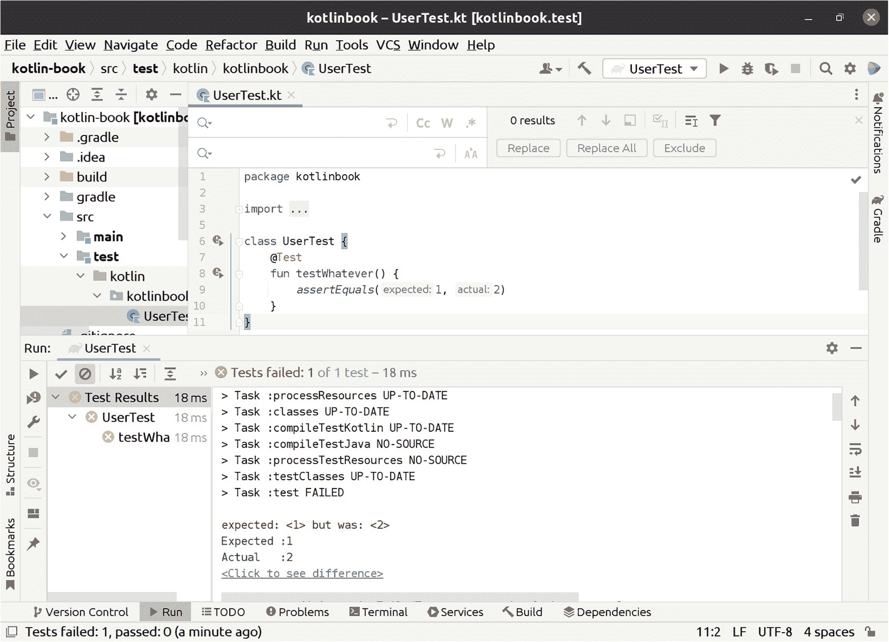
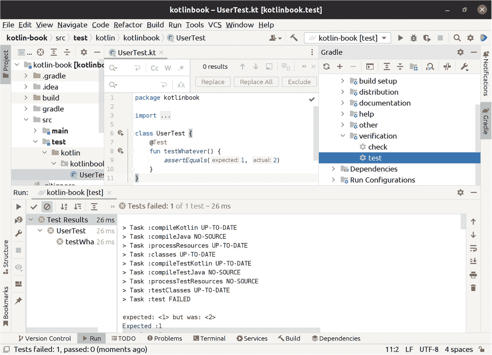
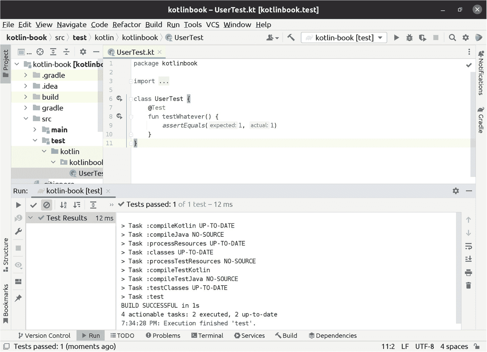
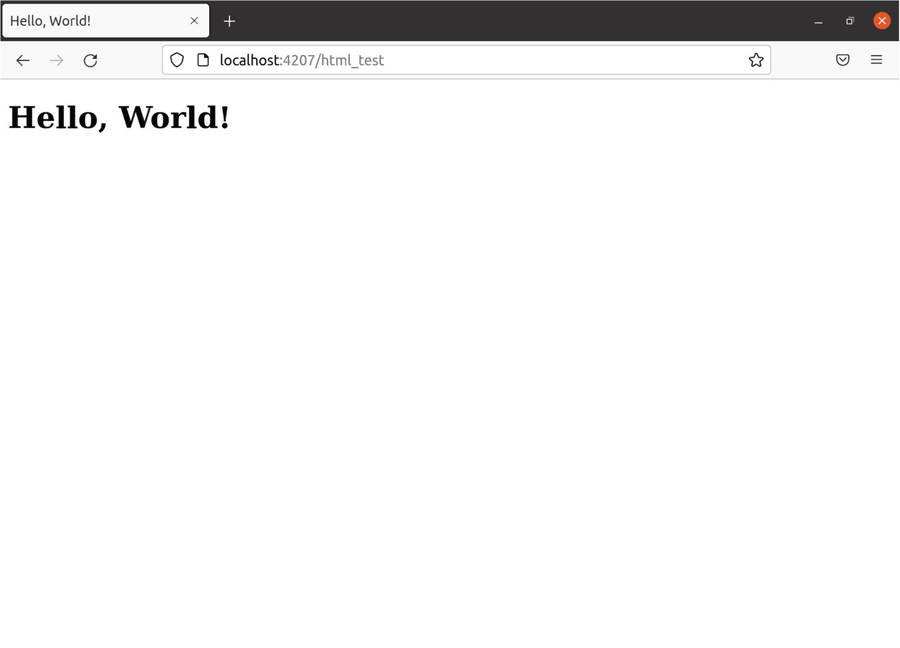
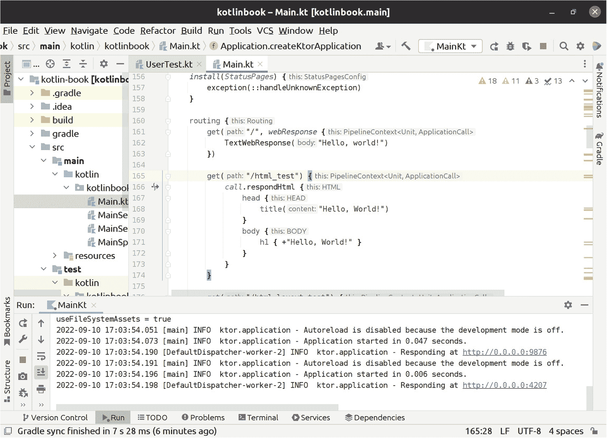
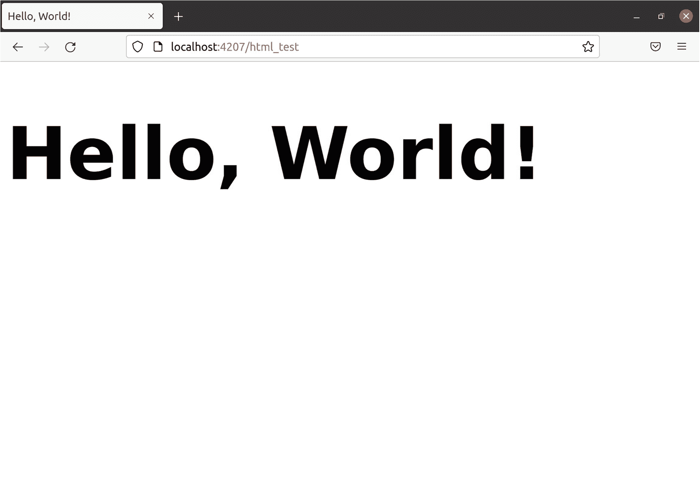

# 5. 连接和迁移 SQL 数据库

你的 Web 应用程序需要一个地方来存储和读取数据。迄今为止，最常见的地方是 SQL 数据库。本章将介绍使用连接池连接到数据库所需的所有配置，如何设置初始模式，以及如何随着需求的必然变化来维护数据库模式的变更。

如果你是 Kotlin 新手，以下是本章中你会看到的示例所涉及的一些语言特性：

*   使用 `use` 关闭和清理资源

*   `AutoCloseable` 和 `Closeable` 对象

*   使用 `also` 避免中间变量

*   使用函数引用将函数用作 lambda

此外，在本章中，你将学习以下关于迁移和查询 SQL 数据库的内容：

*   使用 Flyway 管理初始模式以及随时间变化的模式变更

*   使用 JDBC 连接池连接到 SQL 数据库

*   生成种子数据以使用所需数据预填充数据库

在第 6 章中，你将学习更多关于对数据库执行查询的知识。


## 连接到 SQL 数据库

除非你连接到 SQL 数据库，否则你无法对它进行任何操作。当然也有一些例外，比如 AWS Aurora Serverless 这类托管云数据库。但那是例外，而非普遍情况。因此，第一步是弄清楚如何管理数据库的连接。

### 连接池

从 Web 应用连接到 SQL 数据库的第一步是设置一个连接池。你的 Web 应用很可能需要处理数十、数百甚至数千个并发请求。连接池是一种管理多个并发连接的工具。PostgreSQL 是目前最流行且可扩展性最强的 SQL 数据库之一，但开箱即用时，PostgreSQL 最多支持 100 个并发连接。

手动创建连接是可行的。例如，你可以只创建一个连接，然后让 Web 应用的所有操作都使用这个连接。但一个连接无法同时处理多个事务。因此，你应该从一开始就让 Web 应用创建多个并发数据库连接。

相反，你应该使用连接池。设置连接池时，你需要提供连接数据库的凭证。在你的 Web 应用中，当你想执行数据库查询时，你向连接池请求一个连接。如果池中有可用连接，你会立即获得。如果池中所有连接都处于忙碌状态，它会创建一个新连接。如果连接池已达到允许的最大并发连接数，连接池会等待，直到当前并发连接数低于最大值，然后才会给你一个连接。

你还可以通过连接池优化性能。这里我不打算深入探讨扩展 SQL 数据库的诸多复杂细节。但基准测试和实际经验表明，在某些情况下，如果你将允许的最大并发连接数限制为数据库支持最大值的一半左右，数据库的性能反而会更好。

此外，在部署场景中，如果你运行着 Web 应用的多个实例，你可以告诉连接池最多只创建 25 个连接。这样，你可以同时运行四个 Web 应用实例，而你的数据库在所有运行实例中的并发连接总数不会超过 100 个。

除了对你自己的代码有用之外，你经常会遇到一些第三方库，它们期望接收一个连接池而不是直接连接。从一开始就使用连接池，能让你的代码为这种情况做好准备。

### 安装数据库驱动

要连接数据库，你需要一个针对你所连接数据库的数据库驱动。有很多 SQL 数据库可供选择，比如 PostgreSQL、MariaDB、Oracle DB 等等。为了方便起见，本书将使用 H2，这是一个用于 Java 平台的嵌入式 SQL 数据库。H2 是一个功能完备的 SQL 数据库，并且由于它是嵌入式的，你无需额外花时间安装和配置它。

提示

如果你愿意，也可以使用 H2 以外的其他数据库。请确保同时修改 SQL 以匹配你的数据库。本书中的大部分 SQL 都很直接，应该能在 H2 之外的环境中使用，但像 `CREATE TABLE` 语句和数据类型这类内容，在不同的 SQL 数据库之间通常是不同的。

你还需要一个用于创建连接池的库，我们将要使用的是 HikariCP。它是一个通用库，实现了用于连接池的 JDBC `DataSource` 接口，是一个久经考验的生产级库，我在 Clojure、Groovy 和 Kotlin 的许多实际项目中都使用过它。

要安装 H2 和 HikariCP，请将它们作为依赖项添加到 *build.gradle.kts* 的 dependencies 块中：

```
implementation("com.zaxxer:HikariCP:5.0.1")
implementation("com.h2database:h2:2.1.214")
```

H2 依赖项包含了数据库驱动，以及 H2 数据库的实际实现。通常，数据库驱动只包含连接外部数据库所必需的内容。但 H2 是一个嵌入式数据库，因此它将驱动和服务器都包含在一个便捷的包中。

### 设置 H2

当你连接任何数据库时，你都会给连接池一个它要连接的 URL。H2 是一个嵌入式数据库，因此连接 URL 也是你配置 H2 及其运行方式的地方。

H2 有两种主要的运行模式：内存模式和文件系统持久化模式。内存模式意味着当你重启 Web 应用时，H2 会完全清除数据库。要让 H2 使用内存模式，你可以使用 URL `jdbc:h2:mem:mydbname` 进行设置。

不过，本书将使用文件系统模式。虽然内存模式很方便，但我们的目标是学习如何使用像 PostgreSQL 和 MariaDB 这样的数据库来设置真实的 Web 应用，这些数据库的数据在重启后仍然存在。文件系统模式使 H2 的行为更接近这些数据库。要让 H2 使用文件系统模式，你可以使用 URL `jdbc:h2:path/to/file` 进行设置。

在文件系统中放置 H2 数据库的一个好位置是 `./build/local`。这会将数据库文件放在 `build` 文件夹中，而 Gradle 已经使用该目录来存储其构建输出。如果你运行 Gradle 的 `clean` 任务，它会清除整个 `build` 目录，包括你的数据库。如果你想确保 Gradle 永远不会触及你的数据库，请将其放在其他地方。但无论如何，你都不应该在本地开发数据库中存储重要数据。

你还需要在连接 URL 中设置两个标志：`MODE=PostgreSQL` 和 `DATABASE_TO_LOWER=TRUE`。设置这两个标志可以使 H2 更易于使用，并且让 H2 不关心你使用大写还是小写来拼写表名和列名等。


### 更新 WebappConfig

从第 3 章开始，你已经建立了一个用于存储 Web 应用配置的系统，而配置文件正是存储数据库连接凭证的理想位置。

你还需要设置配置文件，使其包含连接池用于连接数据库的凭证。H2 不需要用户名和密码。但为了模拟真实 Web 应用中的做法，你仍会为其配置完整的凭证。

首先，将所需的属性添加到配置文件中。位于 *src/main/resources/app.conf* 的主配置文件应包含系统中所有配置属性的默认值或空值。代码清单 5-1 展示了需要添加的属性。

```
httpPort = 4207
dbUser = null
dbPassword = null
dbUrl = null
代码清单 5-1
在 src/main/resources/app.conf 中添加默认空值
```

你还需要在本地开发环境中指定将要使用的值，这需要在配置文件 *src/main/resources/app-local.conf* 中完成。H2 接受数据库用户名和密码为空字符串。如代码清单 5-2 所示，你只需设置数据库 URL，让 HikariCP 知道它应该使用 H2。

```
dbUser = ""
dbPassword = ""
dbUrl = "jdbc:h2:./build/local;MODE=PostgreSQL;DATABASE_TO_LOWER=TRUE;"
代码清单 5-2
在 src/main/resources/app-local.conf 中配置本地开发环境以使用 H2
```

最后，你需要更新配置数据类，以提取并存储数据库连接值。代码清单 5-3 展示了如何将所需属性添加到数据类，并从配置文件中提取它们。

```
data class WebappConfig(
val httpPort: Int,
val dbUser: String,
val dbPassword: String,
val dbUrl: String
)
// 读取配置文件时的实例化
WebappConfig(
httpPort = it.getInt("httpPort"),
dbUser = it.getString("dbUser"),
dbPassword = it.getString("dbPassword"),
dbUrl = it.getString("dbUrl")
)
代码清单 5-3
从配置文件中提取数据库配置并存储在配置数据类中
```

这样，你就拥有了一个填充了连接所需数据库连接凭证的 `WebappConfig`。

### 设置连接池

要创建连接，你需要使用数据库凭证设置一个 HikariCP 连接池，然后从该连接池中获取一个连接。

提示

*数据源*和*连接池*这两个术语指的是同一事物。Java 平台将使用连接池的 API 命名为 `javax.sql.DataSource`。任何时候，当你看到需要数据源才能工作的 API 时，都可以将你的 HikariCP 连接池传递给它。

在本书的后续部分，你将在多个地方使用连接池，因此你将创建一个用于设置连接池的函数。代码清单 5-4 展示了如何调用 HikariCP 并传递 `WebappConfig` 中的相关细节。

```
fun createDataSource(config: WebappConfig) =
HikariDataSource().apply {
jdbcUrl = config.dbUrl
username = config.dbUser
password = config.dbPassword
}
代码清单 5-4
设置 HikariCP 连接池
```

### 创建连接

为了测试一切是否正常工作，在你的 Web 应用初始化时创建一个连接池，并尝试运行一个查询。代码清单 5-5 展示了如何使用 JDBC API 执行一个简单的测试查询。

```
val dataSource = createDataSource(config)
dataSource.getConnection().use { conn ->
conn.createStatement().use { stmt ->
stmt.executeQuery("SELECT 1")
}
}
代码清单 5-5
用于测试数据库连接是否正常的查询
```

`SELECT 1` 是一个很好的测试查询，用于检查一切是否正常运行。它适用于没有任何表的空数据库。如果 `executeQuery` 运行且未抛出任何异常，则意味着 HikariCP 能够创建连接，并且查询在 H2 数据库引擎内成功执行。

`getConnection()` 是连接池上的 API，用于获取一个可用于执行查询的连接。`createStatement()` 是连接上的函数，用于创建 JDBC 查询语句。最后，`executeQuery()` 是用于对数据库执行任意 SQL 查询的函数。

数据库连接实现了 `java.lang.AutoCloseable` 接口。`AutoCloseable` 及其同类 `Closeable` 代表了 Java 平台上持有外部资源并拥有 `close()` 方法的对象。该对象可能会永久持有外部资源，直到你调用 `close()`，因此务必记得在所有可关闭对象上调用该方法。对于原始数据库连接，调用 `close()` 会断开连接。对于连接池提供的连接，调用 `close()` 仅意味着你不再在代码中使用该连接，并将其释放回连接池。连接池是否关闭实际的数据库连接，取决于连接池的实现。

`use()` 是 `java.lang.AutoCloseable` 上的一个作用域函数，它会在 lambda 执行完毕后自动调用对象的 `close()` 方法。你可以手动调用连接的 `close()` 方法，但使用 `use()` 还有一个额外的好处，即它将整个操作包装在 try/catch 块中，这样即使由于代码抛出异常导致控制流中断，你也能关闭连接。

## 初始模式

要对 SQL 数据库进行任何有用的操作，你需要设置并维护一个数据库模式。

你*可以*直接使用 SQL 控制台手动运行 `CREATE TABLE` 语句。但这很快就会退化为冲突不断且缺乏可追溯性的混乱局面。相反，你应该从一开始就设置一个模式迁移库。

当你使用模式迁移库时，你会将所有对 SQL 数据库的更改作为文件存储起来，并纳入版本控制。模式迁移库会自动运行你添加的新迁移文件，这样你就永远不会忘记运行重要的 SQL 迁移，从而避免数据库和代码处于不一致的状态。

### 安装 Flyway

你将用于管理数据库模式迁移的库是 Flyway（[`https://flywaydb.org/`](https://flywaydb.org/)）。Flyway 是一个行业标准库，被世界各地的 JVM 开发者广泛使用。在过去十年左右的实际项目中，我一直都在使用它。就像 HikariCP 一样，我不仅在 Kotlin 中使用它，也在 Gradle 和 Clojure 中使用它。

还有其他可用的库，例如 Liquibase（[`www.liquibase.org/`](http://www.liquibase.org/)）。我在实际项目中也使用过 Liquibase，它是一个稳定可靠的库。我偏爱 Flyway 的原因是，你可以使用纯 SQL 文件进行迁移，无需任何样板代码和 XML 配置文件。我不喜欢那些试图封装 SQL 以使其与数据库无关的 DSL；我更喜欢编写特定于我的 Web 应用所使用的数据库引擎的 SQL。我还喜欢 Flyway 基于简单文件命名约定支持版本化和可重复迁移的方式，而无需设置配置标志和编写 XML。

要安装 Flyway，将其作为依赖项添加到 *build.gradle.kts* 的 `dependencies` 块中：

```
implementation("org.flywaydb:flyway-core:9.5.1")
```


### 在启动时运行 Flyway

运行 Flyway 迁移的理想时机是在应用程序启动时。这是因为你的数据库模式（Schema）和代码是紧密耦合的。你的代码会引用迁移脚本所添加的表和列，因此，你需要确保在 Flyway 完成模式迁移并添加新字段和新表之后，你的代码才开始执行。

就像 `createDataSource()` 一样，你需要在本书后续章节中运行 Flyway。因此，你将创建两个独立的函数来运行它。清单 5-6 展示了如何创建这些函数。

```
fun migrateDataSource(dataSource: DataSource) {
Flyway.configure()
.dataSource(dataSource)
.locations("db/migration")
.table("flyway_schema_history")
.load()
.migrate()
}
fun createAndMigrateDataSource(config: WebappConfig) =
createDataSource(config).also(::migrateDataSource)
清单 5-6
用于创建已迁移数据源以及运行实际迁移的函数
```

在你的 `main()` 函数中尽早调用此函数，最好是在创建 `WebappConfig` 之后立即调用。如果你已经调用了 `createDataSource`，请将其替换为 `createAndMigrateDataSource`。

使用 Flyway 时，你需要向其传递数据源、数据库迁移文件的位置，以及 Flyway 存储自身元数据的表名。Flyway 使用元数据表来跟踪其内部状态。你将在本章后面部分了解更多关于该状态的信息。

提示

你可以省略清单 5-6 中的 `locations` 和 `table` 方法调用，因为它们会被设置为默认值。我在清单中包含它们，是因为它们是理解 Flyway 运作方式所需了解的重要属性。

`also` 函数是另一个作用域函数，类似于 `let`、`use` 和 `apply`。清单 5-6 中 `createAndMigrateDataSource()` 的目标是创建数据源、运行迁移，然后最终返回新创建的数据源。这正是 `also` 所做的。`also` 首先运行 lambda 表达式，并将你调用 `also` 的对象（此处为 `dataSource`）传递给该 lambda。当 lambda 执行完毕后，`also` 返回你最初调用它的那个对象。这省去了你创建中间变量的步骤，并让你能够将整个操作写成一个单独的语句。

语法 `::migrateDataSource` 被称为*函数引用*。你也可以写成 `.also { migrateDataSource(it) }`，这会将 `migrateDataSource` 函数包装在一个 lambda 中。但你可以跳过这个额外步骤，直接传入函数。Kotlin 不关心你是将 lambda 还是函数引用传递给一个函数类型的参数，并且具有相同参数和返回类型的函数引用与 lambda 在逻辑上是等价的。

### 创建初始模式

现在，当你启动 Web 应用时，Flyway 就会执行。但你还没有添加任何迁移脚本，因此 Flyway 会在警告级别记录日志 *未找到迁移。你的位置设置正确吗？*。

要创建初始模式，你需要将第一个迁移脚本添加到 Flyway。在 Flyway 中，将数据库初始化为基本模式并非特殊操作。初始模式只是你系统中的第一个（也是目前唯一的）迁移。

Flyway 迁移文件是编号的。Flyway 按升序运行迁移，从编号最低到最高。你可以自行决定使用递增序列、时间戳或其他方式作为编号。

Flyway 还有一个迁移文件应遵循的命名约定。格式为 *V{编号}__{我的文件名}.sql*。即大写字母 V、迁移版本号、两个下划线、迁移名称以及 *.sql* 后缀。

在本书中，我将使用递增的数字。这意味着你应该将初始迁移文件放在 *src/main/resources/db/migration/V1__initial.sql* 中。清单 5-7 展示了你将在此文件中放入的内容。

```
CREATE TABLE user_t (
id BIGSERIAL PRIMARY KEY,
created_at TIMESTAMP WITH TIME ZONE DEFAULT now(),
updated_at TIMESTAMP WITH TIME ZONE DEFAULT now(),
email VARCHAR(255) NOT NULL UNIQUE,
password_hash BYTEA NOT NULL
);
清单 5-7
位于 src/main/resources/db/migration/V1__initial.sql 中的初始模式设置内容
```

如果你运行 Web 应用，你将看到 Flyway 输出的日志，内容为 *正在将模式“PUBLIC”迁移到版本“1 - initial”*。这意味着 Flyway 已成功运行该 SQL 文件，并将该迁移注册为已成功完成。如果你重新运行 Web 应用，Flyway 现在将记录日志 *模式“PUBLIC”的当前版本：1* 和 *模式“PUBLIC”已是最新。无需迁移*，这表明你创建的迁移文件已成功运行，并且 Flyway 未向数据库写入任何更改。

## 管理模式变更

随着你的 Web 应用不断发展，你将向数据库添加更多的表和列。并且随着需求的变化以及你对 Web 应用及其细节的了解加深，你将希望对数据库模式进行更改。Flyway 拥有实现这一切所需的一切功能。

### 运行后请勿编辑迁移

当你希望对数据库模式进行额外更改时，不能编辑已经运行过的迁移。如果你尝试这样做，Flyway 将抛出一个错误：

```
Exception in thread "main" org.flywaydb.core.api.exception.FlywayValidateException: Validate failed: Migrations have failed validation
Migration checksum mismatch for migration version 1
-> Applied to database : 299127514
-> Resolved locally    : -1989839469
Either revert the changes to the migration, or run repair to update the schema history.
```

Flyway 将对已运行迁移文件的更改视为严重错误。这就是它抛出异常而不是仅仅在日志中通知的原因。你不应该捕获此异常；最好保持原样，这样当你的迁移文件处于无效状态时，你的 `main()` 函数会抛出异常并阻止 Web 应用启动。

Flyway 会跟踪哪些迁移已成功运行，哪些尚未运行。Flyway 在迁移文件版本级别执行此操作。Flyway 无法检测你对迁移文件做了哪些更改，并仅运行这些更改。

这是合理的，因为 Flyway 无法知道如何自动处理更改。假设你更改了列的名称。Flyway 应该删除旧列并创建一个新列吗？应该重命名该列吗？还是做其他事情？

Flyway 并没有对这些情况采用“魔法”处理，而是选择放弃，并将更改已成功执行的迁移文件视为用户错误。

### 添加更多模式

在清单 5-7 中，你创建了一个表。如果你想向 Web 应用添加更多表，只需创建另一个迁移文件即可。

要创建新的迁移，只需在 *src/main/resources/db/migration* 目录内创建一个新的迁移文件。你已经在初始迁移中使用了版本号 1，因此你应该将其命名为类似 *V2__add_name_to_user.sql* 的名称。清单 5-8 展示了一个示例。

```
ALTER TABLE user_t ADD COLUMN name VARCHAR(255);
清单 5-8
第二个迁移，向现有的 user_t 表添加一个新列
```

如果你重新运行应用，Flyway 将看到新的 V2 文件，检测到它尚未执行，然后执行它。


### 添加非空列

向 `user_t` 表添加 name 列很容易，因为你没有用 `NOT NULL` 标记它。当你运行清单 5-8 中的 `V2` 迁移时，表中任何现有的行都会将新的 name 列设置为 NULL。如果你想向 `user_t` 表添加一个新的 `NOT NULL` 列，该怎么办？

如果你的数据库是空的，添加一个 `NOT NULL` 列可以正常工作。但是，如果 `user_t` 表中已有数据，并且你创建了一个新的 *V3* 迁移，在其中放入类似 `ALTER TABLE user_t ADD COLUMN tos_accepted BOOLEAN NOT NULL` 的语句，那么 Flyway 会报错，提示迁移失败，同时 H2 数据库也会报错，提示 `NULL not allowed for column "TOS_ACCEPTED"`。

这是因为 SQL 数据库不知道如何处理表中现有的行。它不能将这些行设置为 `NULL`，因为你禁止了该列使用 `NULL`。

有两种方法可以解决这个问题。第一种是为该列设置一个默认值。这意味着当你向该表插入新行且未设置该列时，它会被自动设置为指定的默认值。此外，这也会告诉 SQL 数据库，在创建该列时，可以将数据库中现有行的该列设置为默认值。清单 5-9 展示了该迁移文件的内容。

```
ALTER TABLE user_t
ADD COLUMN tos_accepted BOOLEAN
NOT NULL
DEFAULT false;
清单 5-9
添加 V3 迁移，包含一个带有默认值的非空列
```

第二种解决方法（也是我更倾向的方法）是分多个步骤进行更改。如果你不想设置默认值怎么办？我倾向于在业务逻辑中设置默认值，而不是在数据库中。如果我忘记在代码中设置 `tos_accepted`，我希望操作失败。

你可以通过将操作拆分为三个步骤来实现：添加列并允许空值，运行 `UPDATE` 语句将该列设置为期望的值，然后使用 `NOT NULL` 约束更新该列。清单 5-10 展示了如何编写该迁移。

```
ALTER TABLE user_t
ADD COLUMN tos_accepted BOOLEAN;
UPDATE user_t SET tos_accepted = false;
ALTER TABLE user_t
ALTER COLUMN tos_accepted
SET NOT NULL;
清单 5-10
添加 V3 迁移，分多个步骤添加非空列，且无默认值
```

这样，你的数据库最终会达到期望的状态。如果你没有设置 `tos_accepted`，新的插入操作将会失败。而现有的记录会将新的 `tos_accepted` 列设置为 `false`。

### 向后兼容的迁移

在蓝绿部署中运行 Web 应用是很常见的做法。这意味着当你部署最新版本的代码时，你会保持上一个版本继续运行，直到新代码的进程启动并完全初始化。然后，你的部署设置会将所有传入的请求导向最新版本，之后才关闭上一个版本。

这样做的后果是，在一段时间内，上一个版本的代码仍在运行，而最新版本的代码正在启动并运行数据库迁移。因此，上一个版本的代码现在是在最新版本的数据库模式下运行。

如果你不小心，可能会对数据库模式做出与上一个版本代码不兼容的更改。因此，编写与上一个版本代码向后兼容的数据库迁移是很有帮助的。

清单 5-10 中的迁移就不是向后兼容的。它虽然成功运行，但对数据库所做的更改会导致上一个版本的代码失败。如果上一个版本的代码尝试插入新用户，操作将会失败，因为它不知道新的 `tos_accepted` 列，也不会设置它。

你可以利用蓝绿部署的特性以及部署最新版本代码不会导致系统停机这一事实来解决这个问题。清单 5-11 展示了 `V3` 迁移的更新版本，其中只做了添加新列这一件事。

```
ALTER TABLE user_t
ADD COLUMN tos_accepted BOOLEAN;
清单 5-11
一个向后兼容的更新版 V3 迁移
```

首先部署这个版本，并等待其完成。请记住，在蓝绿环境中部署时，上一个版本的代码只是临时运行，蓝绿部署会在部署完成前关闭旧代码。下一步是创建一个新的 *V4* 迁移，来完成剩余的工作。此时，上一个版本的代码已不再生产环境中运行，而生产环境中的当前代码已经知道 `tos_accepted` 列。清单 5-12 展示了新的 *V4* 迁移，其中包含了将新列标记为 `NOT NULL` 的剩余更改。

```
UPDATE user_t SET tos_accepted = false;
ALTER TABLE user_t
ALTER COLUMN tos_accepted
SET NOT NULL;
清单 5-12
一个 V4 迁移，将 V3 中的新列标记为非空

如果你查看清单 5-11 和 5-12 中的 V3 和 V4 迁移，你会发现它们的内容与清单 5-10 中一步完成所有操作的原始 V3 迁移完全相同。因此，你唯一做的更改就是将其分两步运行，而不是一步，以确保你的迁移始终与生产环境中运行的当前版本和上一个版本的代码兼容。

不过要注意，这个迁移很容易做到向后兼容。但情况并非总是如此。与编写非向后兼容的迁移相比，你的更改越大，向后兼容的迁移就可能变得越复杂。你应该根据具体情况，逐一考虑是否要使迁移向后兼容。如果成本过高，那么在生产环境中冒一些停机或异常的风险也许是可以接受的。

## 插入种子数据

你也可以使用 Flyway 来生成*种子数据*。种子数据是你的 Web 应用期望始终存在于数据库中的数据。例如，如果你构建一个用于安排和递送包裹的 Web 应用，你可能会将系统支持的包裹类型存储在一个表中。但这个表不应包含任意的包裹类型。你的代码只支持该表中列出的包裹类型，并且你不提供任何用于添加更多包裹类型的用户界面。


### 可重复迁移

静态种子数据的一个好去处是*可重复迁移*。这是一种特殊类型的迁移，每次你要求 Flyway 执行迁移时，它都会运行。Flyway 在所有 schema 变更迁移完成后运行它们，因此它们将始终在最新版本的 schema 上操作。

可重复迁移与普通迁移类似——它们是一个在你的数据库上执行某些操作的 SQL 文件。要创建可重复迁移，你需将其与普通迁移一起放在 *src/main/resources/db/migration* 目录下。但文件命名不是 *V{number}__{myFileName).sql*，而是 *R__{myFileName}.sql*。可重复迁移没有版本号，因为 Flyway 不需要。该迁移始终会运行。

你还需要确保实际的 SQL 脚本是可重复的。Flyway 在运行可重复迁移时不会做任何智能或神奇的事情。如果你的可重复迁移中充满了 `INSERT INTO` 语句，那么每次 Flyway 运行你的可重复迁移时，数据库中都会出现重复的行。

如何处理这个问题因数据库而异。PostgreSQL 有 upsert 语句，Oracle 有 merge 语句，等等。清单 5-13 展示了一个如何在 H2 中编写 merge 语句的示例，该语句要么插入新行，要么更新现有行，从而使该 SQL 语句可以安全地放入可重复迁移中。

```
MERGE INTO user_t
(email, password_hash, name, tos_accepted)
KEY (email)
VALUES
('august@crud.business', '456def', 'August Lilleaas', true);
清单 5-13
一个可以多次运行但只会插入一行的 SQL 语句，使其对于可重复迁移是安全的
```

H2 会检查是否存在具有所提供 email 的行。如果 H2 找不到，它将插入一个新行。如果 H2 找到匹配项，它将更新该行而不是插入新行。

### 更新可重复迁移

在 Flyway 运行之后，你不能更改普通的版本化迁移。但你可以随意更改可重复迁移。并且每次运行迁移时，Flyway 都会运行最新的更新版本。

可重复迁移的全部意义在于，它包含将数据库置于所需状态的 SQL 语句。这个所需状态可能会（并且很可能会）随时间变化。因此，你可以更新你的可重复迁移，Flyway 将运行最新版本，确保你的数据库始终与你的 Web 应用所需的最新种子数据保持同步。

请注意，如果你删除了一个 SQL 语句，Flyway 不会尝试智能地删除可重复迁移中不再存在的数据。如何解决这个问题取决于你。如果需要，你可以自由地在可重复迁移中添加 `DELETE` 语句。或者，你也可以直接删除插入数据的语句，并手动删除数据。

## 处理失败的迁移

尽管你尽了最大努力，迁移在生产环境中仍然可能并且确实会失败。希望这种情况很少发生。但当它们发生时，你需要知道如何处理。

### 本地迁移失败

如果迁移在本地失败，你有更多的选择。本地开发环境中的数据对任何人来说都不是关键性的，并且是（或者应该是）完全可有可无的。

当迁移在本地失败时，我通常的做法是直接清除整个本地数据库并创建一个新的。当你使用 H2 时，只需删除 *build/* 文件夹中的数据库文件即可，即 *build/local.mv.db* 和 *build/local.trace.db*。

你系统中的所有核心数据都应该放在可重复迁移中，如果你重启 Web 应用，迁移将从头开始运行，并创建一个包含你使用 Web 应用所需的所有表和数据的新数据库。

### 生产环境迁移失败

如果迁移在生产环境中失败，你需要更加谨慎地处理问题。

理想情况下，你失败的迁移是向后兼容的。因此，即使它失败了，并且最新版本的代码没有部署，现在仍在生产环境中的先前版本的代码也能正常工作。

如果它不是向后兼容的，你可能已经额头冒汗、心跳加速了，因为生产环境现在*宕机*了，而你是罪魁祸首。

我不会深入讨论修复损坏的迁移所需执行的具体操作类型。修复它需要做什么完全取决于你的业务逻辑、迁移的内容以及错误发生在迁移的哪个步骤。

### 重新运行失败的迁移

通常，有两种解决方法。第一种是让 Flyway 相信它从未尝试执行新的迁移。

第一步是通过手动向数据库输入 SQL 命令，对数据库进行任何必要的手动更改。然后，对失败的迁移文件进行任何必要的更改。

完成后，重启你的 Web 应用，这将使 Flyway 再次运行失败的迁移。

要让 Flyway 相信迁移从未运行过，你需要更新 Flyway 用于记账的 `flyway_schema_history` 表（在清单 5-6 中配置）。假设失败的迁移是 *V5*，你可以运行 `DELETE FROM flyway_schema_history WHERE version = 5`，以便下次启动 Web 应用时让 Flyway 从头开始重新运行该迁移。

### 手动执行迁移

解决失败迁移的第二种方法是完全手动完成迁移，并让 Flyway 相信迁移已经运行。

第一步是手动对你的数据库运行 SQL 命令，使数据库达到理想状态。确保你真正考虑清楚了你正在做的事情，并仔细编写你的 SQL，因为你的数据库最终可能处于与 Flyway 迁移指定的状态不同的状态。

要让 Flyway 相信迁移已成功执行，你需要更新 `flyway_schema_history` 表并将该迁移标记为成功。假设失败的迁移仍然是 *v5*，你可以运行 `UPDATE flyway_schema_history SET success = true WHERE version = 5`。

下次运行你的 Web 应用时，Flyway 将看到根据其自己的表，迁移是成功的，因此它不会尝试重新运行它。

# 6. 查询 SQL 数据库

在第 5 章中，你设置了一个用于管理数据库连接的数据源，并配置了 Flyway 来管理你的数据库 schema，这样你就拥有了一些可以执行查询的表。在本章中，你将学习如何执行这些查询。

如果你是 Kotlin 新手，以下是本章示例中会用到的一些语言特性：

*   动态数据的空安全转换和类型检查

*   数据类中的伴生对象

*   普通 Kotlin 函数中的泛型类型

同样在本章中，你将学习以下关于查询 SQL 数据库的内容：

*   如何直接使用 SQL，而不是使用数据库映射库

*   在生产级 Web 应用中执行查询的最佳实践

*   如何构建你的 Web 应用以获得最高程度的类型安全性和便利性

*   如何管理事务

我很难想象一个不使用数据库的 Web 应用。市面上有很多数据库，SQL 并非在所有情况下都是最佳选择。但大多数 Web 应用都使用 SQL 数据库，因此这就是你将在本书中学到的内容。

## 设置查询

在第 5 章的连接池和 schema 管理能力的基础上，你还需要一些东西才能舒适地执行查询。在第 5 章中，你直接使用 JDBC 运行了一个小查询。但是 JDBC API 充满了样板代码，使用起来并不那么舒适。因此，你需要一个位于你和 JDBC 之间的库，让你的工作更轻松。


### 直接使用 SQL

要执行查询，你需要直接编写 SQL。在开始设置之前，我想先解释一下原因。

有些开发者更喜欢使用映射库，这样就能用 Kotlin 代码来表达查询。Exposed ([`https://github.com/JetBrains/Exposed`](https://github.com/JetBrains/Exposed)) 和 Ktorm ([`www.ktorm.org/`](http://www.ktorm.org/)) 是流行的 Kotlin 库，你也可以使用 Hibernate ([`https://hibernate.org/`](https://hibernate.org/)) 和 MyBatis ([`https://mybatis.org/mybatis-3/`](https://mybatis.org/mybatis-3/)) 等 Java 库。它们的共同点是，允许你创建代表表的类，并在代码与数据库表之间建立一个类型安全的映射层。你可以设置对象图（因此得名对象关系映射，简称 ORM）来定义表之间的关系。你无需编写任何 SQL 查询，而是与映射类交互，并用它们来表达插入、查询、分组等操作。

这一切听起来不错。我们行业中最聪明的人创建了这些库和框架，许多开发者都在小型和大型项目中使用它们。那么，问题出在哪里呢？

我认为数据库是任何 Web 应用不可或缺的一部分。我希望我的代码能尽可能接近我在构建的 Web 应用中所使用的实际数据库。无论我使用哪种语言，无论是 Node.js、Groovy、Clojure，当然也包括 Kotlin，情况都是如此。我的代码与数据库交互的复杂细节最终总是变得很重要，尤其是当应用不断增长时。ORM 的设计初衷就是向你隐藏这些细节。因此，对于你在本书中编写 Web 应用的方式而言，ORM 反而成了一种反模式。

能够使用 SQL 数据库的所有功能，而无需担心是否能用 ORM 映射或用 SQL 封装器来表达，这是一个优势。

ORM 的一个好处是它们可以自动生成高效的 SQL 查询。但 ORM 也可能生成低效的查询。因此，如果你使用 ORM，就需要对 SQL 有深入的理解，才能处理这些情况。掌握 SQL 知识是绕不开的。考虑到这一点，我更倾向于直接编写 SQL。

我并不是说你永远不应该使用 ORM。但出于上述原因，我个人从不使用它们，因此在本书中我也会避免使用。

### 安装 Kotliquery

你将使用 Kotliquery 来执行查询。Kotliquery 是一个围绕 JDBC 的小型封装库，它帮助你解决 JDBC 中样板代码和 API 不友好等问题。

请注意，使用 Kotliquery 并不会限制你以后在需要时直接调用 JDBC。像 Kotliquery 这样的库的好处在于，你可以混合搭配使用，不存在锁定问题。

要安装 Kotliquery，请将其作为依赖项添加到 *build.gradle.kts* 的 `dependencies` 块中：

```
implementation("com.github.seratch:kotliquery:1.9.0")
```

Kotliquery 是一个设计精良的库，拥有构建生产级 Web 应用所需的所有功能。如果以 GitHub 星标数来衡量，它并不是一个流行的库。但流行度只是一个虚荣指标。我已在大型生产系统中成功使用了 Kotliquery。

### 映射查询结果

行映射器是一个函数，Kotliquery 用它来提取行数据并将其转换为你喜欢的数据结构。这个行映射器函数接收一个原始的 Kotliquery Row 对象，并将其转换为有用的数据。

清单 6-1 展示了如何创建一个行映射器函数，以便稍后在使用 Kotliquery 执行查询时使用。

```
import kotliquery.Row
fun mapFromRow(row: Row): Map {
return row.underlying.metaData
.let { (1..it.columnCount).map(it::getColumnName) }
.map { it to row.anyOrNull(it) }
.toMap()
}
清单 6-1
一个将 Kotliquery Row 对象映射为普通 Map 的函数
```

这段代码中有几个有趣的地方。在 let 块内部，你创建了一个从 1 到查询结果 `metaData.columnCount` 的*范围*。你可以将范围视为该范围内数字的列表，因此 `1..5` 等同于 `listOf(1, 2, 3, 4, 5)`。然后，你遍历该范围，并使用一个*函数引用*来获取列名。`map(it::getColumnName)` 等同于 `map { colIdx -> it.getColumnName(colIdx) }`。这就像你在 `metaData` 对象（`it`）上调用了 `getColumnName`，并将范围中的列索引作为第一个参数传入。接着，遍历列名列表，通过 `row.anyOrNull(it)` 返回列名与该列值组成的键值对。此时，你只是在提取查询的原始数据，没有进行任何类型检查或转换。最后，你使用 `toMap()` 将键值对列表转换为一个 Map。结果就是，你将 Kotliquery 的 `Row` 对象转换成了一个从列名到列值的普通 Map。

## 执行 SQL 查询

Kotliquery 已经设置好并准备就绪。是时候执行一些查询了！

### 创建会话

要使用 Kotliquery 执行查询，你需要刚刚创建的行映射器和一个 Kotliquery 会话。

你可以通过调用 Kotliquery 的 `sessionOf` 函数并传入你的连接池来创建一个会话。Kotliquery 会话是对原始数据库连接的一个小型封装。该会话包含一些方法，你可以调用它们来执行查询。清单 6-2 展示了如何使用 `single` 来获取单行数据。

```
import kotliquery.sessionOf
sessionOf(dataSource).use { dbSess ->
dbSess.single(queryOf("SELECT 1", ::mapFromRow))
// {?column?=1}
}
清单 6-2
创建一个 Kotliquery 会话并执行查询
```

就像上一章清单 5-5 中一样，Kotliquery 会话实现了 `java.io.Closeable`，你必须记得在使用完毕后调用 `close()`。`use` 会为你调用 `close()`，而 Kotliquery 随后会关闭它在创建会话时从数据源获取的底层连接。

### 查询单行数据

在清单 6-2 中，你已经看到了如何在 Kotliquery 会话上使用 `single()` 来获取单行数据。`single()` 是一种优化，它只会从查询中返回一行数据。这使得 Kotliquery 可以在底层做一些假设，例如甚至不会尝试从数据库获取多行数据。其返回类型（通过行映射器）是 `Map<String, Any?>?`，意味着它会返回 `null` 或单行数据。清单 6-3 提供了一些 `single()` 输出的额外示例。

```
dbSess.single(queryOf("SELECT 1"), ::mapFromRow)
// {?column?=1}
dbSess.single(queryOf("SELECT 1 as foo"), ::mapFromRow)
// {foo=1}
dbSess.single(queryOf(
"SELECT * from (VALUES (1, 'a'), (2, 'b')) t1 (x, y)"
), ::mapFromRow)
// {x=1, y=a}
清单 6-3
single() 的输出示例
```

最后一个查询从两行数据中进行选择，但你只从 `single()` 中获取了第一行。这里没有什么特别的魔法；它只是依赖于数据库引擎返回的结果集的任何排序方式。


### 查询多行

你可以像使用 `single()` 一样使用 `list()`，区别在于 `list()` 会返回查询结果中的所有行。`list()` 的返回类型（通过行映射器）是 `List<Map<String, Any?>>`。清单 6-4 展示了一些查询多行的示例。

```
dbSess.list(queryOf("SELECT 1 as foo"), ::mapFromRow)
// [{foo=1}]
dbSess.list(queryOf(
"SELECT * from (VALUES (1, 'a'), (2, 'b')) t1 (x, y)"
), ::mapFromRow)
// [{x=1, y=a}, {x=2, y=b}]
dbSess.list(queryOf(
"""
SELECT * from (VALUES (1, 'a'), (2, 'b')) t1 (x, y)
WHERE x = 42
"""
), ::mapFromRow)
// []
清单 6-4
list() 的输出示例
```

你始终会得到一个行列表作为返回值，即使查询只匹配到单行也是如此。如果匹配到零行，你也会得到一个空列表。你永远不需要检查 `list()` 的返回值是否为 `null`（Kotlin 类型系统也会告诉你这一点）。

当你的查询加载大量数据时，你也可以使用 `forEach()`。`forEach()` 会逐行产生数据，而 `list()` 则会在将数据交给你的代码之前，将所有结果累积到一个列表中。如果你预期查询会返回大量行，或者行中包含二进制大对象（blob）或其他大小不定的列，那么使用 `forEach()` 在内存使用和性能方面会好得多。清单 6-5 展示了如何使用 `forEach()` 的示例。

```
dbSess.forEach(queryOf(
"SELECT * from (VALUES (1, 'a'), (2, 'b')) t1 (x, y)"
)) { rowObject ->
val row = mapFromRow(rowObject)
println(row)
}
// {x=1, y=a}
// {x=2, y=b}
清单 6-5
使用 forEach 避免将整个结果集加载到内存中的示例
```

`forEach()` 会为查询产生的每一行调用一次 lambda 表达式。传递给 lambda 的是原始的 Kotliquery `Row` 对象。你可以使用与 `single()` 和 `list()` 相同的 `mapFromRow()` 函数，将此结构转换为普通映射。

### 插入行

要插入行，你需要在 Kotliquery 会话上使用 `updateAndReturnGeneratedKey()` 函数。你还需要通过将 `returnGeneratedKey` 标志设置为 `true` 来正确创建会话。清单 6-6 展示了如何正确创建会话并执行插入操作。如果设置不正确，你将无法访问数据库在插入行时自动生成的 ID。

```
sessionOf(dataSource, returnGeneratedKey = true)
.use { dbSess ->
dbSess.updateAndReturnGeneratedKey(queryOf(
"""
INSERT INTO user_t
(email, password_hash, name, tos_accepted)
VALUES
(?, ?, ?, ?)
""",
"august@augustl.com",
"123abc",
"August Lilleaas",
true)
)
// 2
}
清单 6-6
创建一个允许你获取插入行 ID 的会话
```

如果你一直按顺序跟随本书的示例，那么运行此插入操作时获得的 ID 将是 `2`。这是因为你在上一章中已经使用可重复迁移创建了一个用户，如清单 5-13 所示。

### 更新和删除

要执行更新和删除 SQL 语句，你将使用 `update()` 函数。此函数实际上并不关心实际 SQL 语句执行了什么操作。但它会返回查询所影响的行数。这对于进行完整性检查特别有用，可以检查查询是否影响了多于零行。清单 6-7 展示了执行 `UPDATE` 和 `DELETE` SQL 语句的示例。

```
dbSess.update(queryOf(
"UPDATE user_t SET name = ? WHERE id = ?",
"August Lilleaas",

))
// 1
dbSess.update(queryOf("DELETE FROM user_t"))
// 2
清单 6-7
执行 UPDATE 和 DELETE 语句的示例
```

`UPDATE` 语句返回 1，因为它更新了由行 ID 匹配到的特定行。`DELETE` 语句返回 2，因为它删除了 `user_t` 表中的两行用户数据。

### 位置参数 vs. 命名参数

到目前为止，你的代码使用问号符号来引用 SQL 查询参数。Kotliquery 为这些参数提供了另一种语法，允许你为它们命名。

命名参数有两个好处：如果你的查询包含许多参数，它能使代码更具可读性；并且它允许你多次重用同一个参数，而无需传递两次或更多次。清单 6-8 展示了清单 6-7 中 update 语句的示例，这次使用了命名参数而不是位置参数。

```
dbSess.update(queryOf(
"UPDATE user_t SET name = :name WHERE id = :id",
mapOf(
"name" to "August Lilleaas",
"id" to 2
)))
清单 6-8
使用命名参数传递查询参数
```

这允许你通过名称引用参数，并且还有一个额外的好处，即命名了输入，这样你就不必通过计算参数在参数列表中的位置来确定哪个参数对应哪个位置。

### 其他操作

如你所见，Kotliquery 拥有执行查询和插入所需的一切功能。与直接使用 JDBC 相比，Kotliquery API 简单得多，并且可以轻松地将查询转换为数据并将参数传递给查询。

你可以在项目 GitHub 页面找到 Kotliquery 中可用参数和方法的详细文档和 API 参考：[`https://github.com/seratch/kotliquery`](https://github.com/seratch/kotliquery)*。*

## 从 Web 处理器查询

你将在 Web 处理器中执行大部分查询。拥有一个辅助函数会很方便，你可以使用它让 Web 处理器自动准备和管理 Kotliquery 会话。

### 创建辅助函数

为了便于在 Web 处理器中进行查询，你将创建一个名为 `webResponseDb` 的 `webResponse` 版本（来自第 4 章）。此函数执行 `webResponse` 的所有功能，但还会创建和管理一个 Kotliquery 会话。这使得在 Web 处理器中运行查询变得简单方便。清单 6-9 展示了 `webResponseDb` 的实现。

```
import kotliquery.Session
fun webResponseDb(
dataSource: DataSource,
handler: suspend PipelineContext.(
dbSess: Session
) -> WebResponse
) = webResponse {
sessionOf(
dataSource,
returnGeneratedKey = true
).use { dbSess ->
handler(dbSess)
}
}
清单 6-9
webResponseDb – 包装 webResponse 并添加数据库查询能力
```

`webResponseDb` 的签名类似于 `webResponse`，只是它添加了一个指向 Kotliquery 会话的 `dbSess` 参数。调用它时，你还必须传递一个数据源。此外，`returnGeneratedKey` 始终设置为 `true`，以确保你的 Web 处理器能够访问数据库自动生成的行 ID。清单 6-10 展示了如何从 Ktor 路由映射中调用 `webResponseDb` 的示例。

```
get("/db_test", webResponseDb(dataSource) { dbSess ->
JsonWebResponse(
dbSess.single(queryOf("SELECT 1"), ::mapFromRow)
)
})
清单 6-10
创建执行数据库查询的 Ktor 路由的示例
```

在真实的 Web 应用中，大多数 Web 处理器都需要数据库连接。因此，拥有像 `webResponseDb` 这样的辅助函数来创建 Web 处理器，并将所有数据库连接相关事宜和资源管理集中处理，是非常方便的。


### 关于架构的一点说明

许多框架和架构都包含用于分离和隔离 Web 应用中不同关注点的模式。例如，典型的六边形架构旨在松散耦合 Web 应用的各个组件，并使它们可互换。

对于 Web 处理器（例如清单 6-10 中的那个），我并没有做太多分离。Web 处理器的目的是与数据库交互并围绕它实现业务逻辑。我认为数据库是这种交互的核心部分。你可以将其分离出来，并对业务逻辑隐藏数据库，但这会带来一个权衡：增加了理解系统运行情况的模糊性和难度。

如果我确实要将 Web 处理器拆分为多个部分，我会采用**功能核心、命令式外壳**模式。打个比方，你可以将其想象为一位总统决定做什么并签署文件（功能核心），以及一个执行命令的行政部门（命令式外壳）。大约 90% 的代码最终会进入功能数据驱动核心，所有业务逻辑都驻留在那里。然后，命令式外壳是“哑”的，它根据功能核心生成的数据执行命令，不包含任何业务逻辑。

在合理的情况下，我会使用队列来分离操作关注点。如果系统的一部分写入队列，而另一部分从队列读取，那么它们在架构和操作上都是分离且完全解耦的。

我坚决主张将业务逻辑与用户界面渲染逻辑分开。用户界面代码的顶层负责获取数据并对其进行处理，以渲染一个不包含业务逻辑的“哑”图形用户界面，该界面仅根据接收到的数据进行渲染。

总的来说，我尽量避免过度设计代码。我更喜欢“哑”的普通函数、SQL 以及易于追踪和理解的数据，而不是在 Web 应用的所有组件之间建立防火墙式的隔离。

### 避免长时间运行的连接

当你将整个 Web 处理器包装在一个 Kotliquery 会话中时，你需要意识到，如果你的 Web 处理器包含对外部 API 的调用，你应该考虑其他替代方案。

Kotliquery 会话只是数据库连接的一个小型包装器。如前所述，数据库连接是一种昂贵的资源。如果你的 Web 处理器在执行与数据库无关的长时间运行操作（例如调用外部 API）时保持 Kotliquery 会话打开，那么你就是在浪费资源。该连接无法从连接池中供其他 Web 处理器使用。而且，在你并未真正使用它时，数据库服务器也在维护着该连接。

有时，这种情况无法避免。例如，你可能需要打开一个事务，该事务首先向数据库写入一些数据，然后执行一个可能长时间运行的外部 API 调用，然后在同一个事务中再向数据库写入更多数据。如果是这种情况，那么你只能接受这样一个事实：你需要在外部 API 调用期间保持一个空闲的数据库连接。

不过，在许多情况下，你也可以通过重新设计业务逻辑来避免这种情况。例如，你可以向数据库写入一个带有标记的临时条目，以便你的应用程序知道在查询中忽略它。然后，你可以执行外部 API 调用。最后，你可以向 Kotliquery 请求一个新的会话，并通过取消临时条目的标记并执行你需要对数据库执行的任何额外操作来完成该操作。这样，你就避免了在外部 API 调用期间一直占用数据库连接。

另外请注意，如果你预计你的 Web 应用只处理较低流量的请求，那么保持数据库连接打开不会造成问题。但是，如果你预计你的 Web 应用每秒要处理数百或数千个请求，那么你就需要考虑这一点。

## 映射 vs. 数据类

当你执行查询时，行映射器会将行数据转换为普通映射。为什么它不直接将查询结果转换为类型更安全的数据类呢？为了理解原因，让我们看看你可以用当前使用的行映射器返回的映射做些什么。

无论你最终做什么，最好坚持将原始查询数据作为映射返回，然后编写代码检查数据的形状，并根据你的业务逻辑和要求相应地对其进行转换。

### 传递映射

迟早，你会需要将查询结果中的数据传递给实现业务逻辑的 Web 应用函数。处理这个问题的一种方法是直接将查询结果中得到的映射传递给业务逻辑，不对数据进行额外处理。清单 6-11 展示了一个示例。

```
def sendEmailToUser(userRow: Map) {
deliverEmail(
"欢迎, ${user["name"] ?: user["email"]}",
user["email"] as String
)
}
def handleSignup() {
val userRow = createUser(...)
sendEmailToUser(userRow)
}
清单 6-11
将原始映射传递给业务逻辑
```

我在实际的 Web 应用中很少这样做。如果你拼错了某个属性，你会得到 `null` 而不是实际值。你可以使用 `as` 进行强制转换，如果类型错误或值为 `null`，则会抛出错误。但这样你就不得不在业务逻辑中到处进行这种类型的强制转换。而且，你会在系统中远离从数据库获取数据的代码的某个深处得到错误。

### 传递单个属性

将查询结果中的数据传递给业务逻辑的另一种选择是，从普通映射中提取属性，并将它们作为单独的参数传递给各种业务逻辑函数。清单 6-12 展示了一个示例。

```
def sendEmailToUser(userName: String?, userEmail: String) {
deliverEmail(
"欢迎, ${userName)}",
userEmail
)
}
def handleSignup() {
val userRow = createUser(...)
sendEmailToUser(
userRow.get("name") as? String,
userRow.get("email") as String
)
}
清单 6-12
将单个属性传递给业务逻辑
```

这是我更常做的事情。这样，业务逻辑就不依赖于数据库结构。所有强制转换都发生在你从查询中提取数据的位置附近，因此你不必在业务逻辑中到处放置类型转换。而且，这种强制转换现在是“快速失败”的，这意味着你会在更早、更接近执行数据库查询的代码的位置得到转换错误。


### 映射到数据类

你也可以将查询结果行表示为数据类。对于较简单的查询（例如选择表的所有列），我通常会这样做，这样可以在多个输出相似的查询中复用同一个数据类。清单 6-13 展示了一个数据类的示例，它将来自 `user_t` 表的查询结果进行映射。

```
data class User(
val id: Long,
val createdAt: ZonedDateTime,
val updatedAt: ZonedDateTime,
val email: String,
val tosAccepted: Boolean,
val name: String?,
val passwordHash: ByteBuffer
) {
companion object {
fun fromRow(row: Map) = User(
id = row["id"] as Long,
createdAt = (row["created_at"] as OffsetDateTime)
.toZonedDateTime(),
updatedAt = (row["updated_at"] as OffsetDateTime)
.toZonedDateTime(),
email = row["email"] as String,
name = row["name"] as? String,
tosAccepted = row["tos_accepted"] as Boolean,
passwordHash = ByteBuffer.wrap(
row["password_hash"] as ByteArray
)
)
}
}
dbSess.single(
queryOf("SELECT * FROM user_t"),
::mapFromRow
)?.let(User::fromRow)
// User(
//   id=1,
//   createdAt=2022-07-27T16:40:44.410258+02:00,
//   updatedAt=2022-07-27T16:40:44.410258+02:00,
//   email=august@crud.business,
//   tosAccepted=true,
//   name=August Lilleaas,
//   passwordHash=java.nio.HeapByteBuffer[pos=0 lim=6 cap=6]
// )
清单 6-13
将查询结果映射到数据类
```

该数据类使用 `companion object` 定义了 `fromRow` 函数，该函数根据查询结果行创建 `User` 实例。你也可以将 `fromRow` 定义为独立函数，但能够编写 `User.fromRow(...)` 会更方便。在 Kotlin 中，将各种辅助函数和构造函数放在伴生对象中是一种常见模式。你可以将其视为 Kotlin 版本的 Java 静态方法。

你在 `single()` 的返回值上调用 `User.fromRow`。这是一个很好的例子，展示了如何结合使用 `let` 作用域函数和函数引用，从而减少一些输入和中间变量的创建。通过调用 `?.let()` 而不是 `.let()`，你可以处理 `single()` 在未找到匹配行时返回 `null` 的情况。`User.fromRow(...)` 接受一个参数，即行数据。作用域函数 `let` 也接受一个参数，即你调用 `let` 的对象。因此，在这种情况下，你可以使用函数引用 `User::fromRow` 来代替 lambda 表达式。

将表映射到数据类是我很少做的事情，但这取决于具体情况。通常，我会采用混合方法。清单 6-14 展示了两种替代方案的示例。

```
def sendEmailToUserA(user: User) {
deliverEmail(
"Welcome, ${user["name"] ?: user["email"]}",
user["email"] as String
)
}
def sendEmailToUserB(userName: String?, userEmail: String) {
deliverEmail(
"Welcome, ${userName)}",
userEmail
)
}
def handleSignup() {
val user = createUser(...).let(User::fromRow)
sendEmailToUserA(user)
sendEmailToUserB(user.name, user.email)
}
清单 6-14
如何将查询结果数据类与业务逻辑结合
```

`sendEmailToUserA` 的问题在于，任何想要调用该函数的人都必须构造一个包含所有属性的完整 `User` 对象，而调用 `sendEmailToUserA` 实际只需要姓名和电子邮件。你可以将 `User` 数据类的大部分属性设为可空，但这样它就不再代表一个有效的用户，因为一个没有 ID 的用户是没有意义的。

相反，我更喜欢编写像 `sendEmailToUserB` 这样的函数。这样，该函数不关心聚合体，只对其执行所需的单个数据点进行操作。

不过，请根据你的判断来使用。有时，传递完整的数据类是有利的，而且很难制定一个通用规则来决定何时该做什么。

## 数据库事务

事务是 SQL 数据库的一个标志性特性。我假设你具备一些先验知识，并且不会深入探讨围绕事务建模业务逻辑的许多复杂细节。不过，你需要学习如何创建、提交和回滚事务。

### 创建事务

Kotliquery 会话本身不是事务性的。当你希望在事务中执行数据库操作时，必须手动显式创建一个事务。

要创建事务，你可以在 Kotliquery 会话上调用 `transaction` 函数，并向其传递一个 lambda 表达式。该 lambda 表达式在事务内部执行。当 lambda 表达式执行完毕时，Kotliquery 会提交事务；如果 lambda 中的代码抛出了异常，则会回滚事务。清单 6-15 展示了其工作原理。

```
dbSess.transaction { txSess ->
txSess.update(queryOf("INSERT INTO ..."))
txSess.update(queryOf("INSERT INTO ..."))
}
清单 6-15
创建事务并执行 SQL 语句
```

`txSess` 代表打开的事务，它具有与普通 Kotliquery 会话完全相同的方法，例如 `single`、`list`、`update`、`forEach` 等。如果清单 6-15 中的两个 `INSERT` 语句都成功执行，则事务被提交。另一方面，如果其中一个失败，`update` 函数将抛出异常，Kotliquery 的事务处理代码会捕获该异常，并回滚事务而不是提交它。

`ByteBuffer` 来自 `java.nio.ByteBuffer`。密码哈希是一个原始字节数组，在 Java 平台上，字节数组不实现相等性比较。因此，如果你尝试将 `ByteArray` 值直接存储在数据类上，Kotlin 编译器会发出警告。通过将字节数组包装在 `ByteBuffer` 中，Kotlin 数据类可以正确地比较两个单独的字节值，以判断它们是否相等。

如果你想回滚，也可以手动抛出异常。或者，你也可以直接调用 `txSess.connection.rollback()`。

### Web 处理器中的事务

根据我的经验，大多数 Web 应用会要求大部分或所有与数据库相关的代码在事务中运行。因此，创建一个用于创建 Web 处理器并同时创建事务的辅助函数会很方便。

你可以通过创建 `webResponse` 的另一个版本（称为 `webResponseTx`）来实现这一点。该函数与 `webResponseDb` 类似，但除了创建 Kotliquery 会话外，它还会启动一个包裹整个 Web 处理器的事务。清单 6-16 包含了 `webResponseTx` 函数的实现。

```
fun webResponseTx(
dataSource: DataSource,
handler: suspend PipelineContext.(
dbSess: TransactionalSession
) -> WebResponse) = webResponseDb(dataSource) { dbSess ->
dbSess.transaction { txSess ->
handler(txSess)
}
}
清单 6-16
webResponseTx，一个同样会创建事务的 webResponseDb 版本
```

提示

最初，Kotliquery 不支持在挂起函数内部使用事务。`transaction` 本身不是一个 `suspend` 函数，因此 lambda 内部的处理器无法访问 `suspend` 作用域。我提交了一个拉取请求来修复这个问题，包含该修复的 1.9 版本已发布。开源万岁！请在此处查看拉取请求：[`https://github.com/seratch/kotliquery/pull/57`](https://github.com/seratch/kotliquery/pull/57)*。*

你调用此函数的方式与你在清单 6-9 中创建的 `webResponseDb` 相同。`webResponseTx` 和 `webResponseDb` 之间的唯一区别在于会话的类型分别是 `TransactionalSession` 和 `Session`。


### 类型安全的事务性业务逻辑

部分业务逻辑需要事务才能正常工作。例如，你可能有一个执行两次插入操作的函数，对于你的 Web 应用来说，要么全部成功，要么全部失败至关重要。你可以通过将该函数包装在事务中来解决这个问题。

但如果你忘记创建事务了呢？

你可以通过确保业务逻辑需要正确类型的 Kotliquery 会话来缓解此问题。如前所述，Kotliquery 为非事务会话生成 `Session`，为事务会话生成 `TransactionalSession`。因此，如果你编写的业务逻辑函数接受 `TransactionalSession` 作为类型，那么当你尝试从没有可用事务的上下文中调用需要事务才能正确运行的业务逻辑时，就会收到编译错误。清单 6-17 展示了如何以这种方式构建业务逻辑的示例。

```
fun createUserAndProfile(
txSess: TransactionalSession,
userName: String,
bio: String
) {
txSess.update(queryOf("INSERT INTO user_t ..."))
txSess.update(queryOf("INSERT INTO profile_t ..."))
}
sessionOf(dataSource).use { dbSess ->
// 这段代码无法编译 – dbSess 类型错误
createUserAndProfile(
dbSess,
"augustl",
"重要作者")
dbSess.transaction { txSess ->
// 这段代码编译正常 – txSess 类型正确
createUserAndProfile(
dbSess,
"augustl",
"重要作者")
}
}
清单 6-17
在业务逻辑中要求事务
```

这看起来可能是一个小细节，但它确实能派上大用场。很容易犯错，最终将非事务性的 Kotliquery 会话传递给需要事务才能正确运行的函数。通过确保业务逻辑中那些需要事务的函数接受 `TransactionalSession`，你将获得类型系统的帮助，从而避免此类错误（双关语）。

### 嵌套事务

SQL 数据库不支持嵌套事务。但你可以使用*保存点*来模拟它们。

Kotliquery 没有内置的保存点功能，但很容易创建自己的小型包装器。这也是一个很好的机会，可以了解 Kotliquery 如何实现 `transaction` 函数，因为你用于创建保存点的函数将具有类似的行为。清单 6-18 展示了如何实现一个 `dbSavePoint` 函数，该函数创建一个保存点并使其像事务一样工作。

```
fun dbSavePoint(dbSess: Session, body: () -> A): A {
val sp = dbSess.connection.underlying.setSavepoint()
return try {
body().also {
dbSess.connection.underlying.releaseSavepoint(sp)
}
} catch (e: Exception) {
dbSess.connection.underlying.rollback(sp)
throw e
}
}
sessionOf(dataSource).use { dbSess ->
dbSess.transaction { txSess ->
// 创建一个保存点
dbSavePoint(txSess) {
txSess.update(queryOf("INSERT INTO ..."))
}
// 在此处执行更多数据库操作
}
}
清单 6-18
受 Kotliquery 创建事务方式的启发，创建一个保存点
```

`dbSavePoint` lambda 内部的代码将表现得如同在其自己的嵌套事务中运行一样。

保存点是一个命名实体。如果你调用 `setSavePoint` 而不提供自己的名称，JDBC 将自动生成一个名称。你将 lambda `body` 的执行包装在 try/catch 中。如果 lambda 抛出异常，你将回滚保存点。如果 lambda 没有抛出任何异常，你将释放保存点。你使用作用域函数 `also` 来实现这一点。`also` 将返回你调用它的对象，但在返回之前，它会执行 lambda 中的代码。这使得 `also` 成为一种便捷的方式，可以避免为 `body` lambda 的返回值创建和命名中间变量。

你还看到了如何在普通 Kotlin 函数中使用泛型的示例。`A` 泛型表示 lambda `body` 的返回值。这意味着 `dbSavePoint` 将传递 `body` lambda 的返回值，以便你可以在将代码包装在 lambda 中的同时保持函数式编码风格。

# 7. 使用 jUnit 5 进行自动化测试

现在，你已经组装好了 Web 应用拼图的所有部分。但在自己实现业务逻辑之前，你将学习如何编写自动化测试。

如果你是 Kotlin 新手，以下是本章中将看到的一些语言特性示例：

*   使用 `kotlin.test` 实现测试用例和断言
*   使用不安全转换运算符 `!!` 实现空安全
*   内联函数

此外，在本章中，你将学习以下关于使用 jUnit 5 编写自动化测试的内容：

*   测试驱动开发（TDD）的基础知识
*   编写与数据库交互的测试
*   隔离单个测试用例以避免测试间依赖

在附录 C 中，你将学习如何使用 Kotlin 测试框架，而不是 `kotlin.test`。

## 设置环境

jUnit 5 是用于编写和运行自动化测试的行业标准库，也是本书将使用的库。大多数 Kotlin 自动化测试库底层都使用 jUnit 5，因为 jUnit 5 包含了在你自己的机器上以及自动化 CI（持续集成）构建环境中高效运行测试所需的一切。

有许多可用的替代库。Kotlin 社区中一个流行的替代方案是 Kotest（[`https://kotest.io/`](https://kotest.io/)），它包含许多有用的功能，甚至还有诸如基于属性的测试等高级功能，这些功能会根据边界和规范自动生成测试。不过，我倾向于使用“简单”的测试库，标准的 `kotlin.test` 和 jUnit 5 风格的断言使用起来简单且熟悉。此外，我实际上从未在实际项目中使用过 Kotest。因此，在本书中你将学习如何使用 jUnit 5 和 `kotlin.test`。

### 添加 jUnit 5 和 kotlin.test

你的项目中需要两样东西来运行测试：用于执行测试的 jUnit 5 和用于编写测试用例的 `kotlin.test`。

`kotlin.test` 是一个包装库，你将使用它来编写测试用例本身。它包含用于将某些内容定义为测试类的注解、用于比较值的断言等。`kotlin.test` 包含到 jUnit 5 的映射。jUnit 5 会识别 `kotlin.test` 测试用例并执行它们。

到目前为止，你已经在 *build.gradle.kts* 的 `dependencies` 块中添加了第三方依赖项。你也可以为 jUnit 和 `kotlin.test` 这样做。但对于测试运行，你需要的不仅仅是依赖项——你还需要告诉 Gradle 如何执行你的测试，以及 jUnit 5 和 `kotlin.test` 之间的映射。完成所有这些的最简单方法是使用安装了 Kotlin 插件的 Gradle 自带的测试运行内置支持。清单 7-1 显示了需要添加到 Gradle 配置中的内容，以添加对 jUnit 5、`kotlin.test` 以及用于执行测试的 Gradle 任务的支持。

```
dependencies {
// ...
testImplementation(kotlin("test"))
}
tasks.test {
useJUnitPlatform()
}
清单 7-1
在 build.gradle.kts 中添加对 kotlin.test 和 jUnit 5 的支持
```

请注意，如果你按照本书的指导使用 IntelliJ IDEA 创建了 Kotlin 项目，你可能已经设置了这些属性，因为 IntelliJ IDEA 会生成预配置了 jUnit 5 支持的项目。


### 编写一个会失败的测试

为了检查你的配置是否正确，你需要实现一个自动化测试，其作用相当于打印 `Hello, World`。

错误通知是正确配置的自动化测试环境的关键组成部分。因此，第一步是故意编写一个会失败的测试，并验证你的编程环境是否会向你发出测试失败的提示。清单 7-2 展示了如何编写一个会失败的测试。

```
package kotlinbook
import kotlin.test.Test
import kotlin.test.assertEquals
class UserTest {
@Test
fun testHelloWorld() {
assertEquals(1, 2)
}
}
清单 7-2
位于 src/test/kotlin/kotlinbook/UserTest.kt 的测试类，其中包含一个故意会失败的测试用例
```

你的测试使用了 `assertEquals` 并传入两个不同的值来确保测试失败。1 永远不等于 2，因此你的测试应该会失败。

另外，请记住将所有测试放在 *src/test/*… 目录下，而不是 *src/main/…* 目录下。

### 运行一个会失败的测试

现在你已经有了一个包含故意失败测试的测试用例，下一步就是运行你的测试。

运行测试主要有两种方式。第一种是直接从 IntelliJ IDEA 中运行单个测试。为此，请点击测试类名称旁边的绿色箭头，IntelliJ IDEA 就会执行它，如图 7-1 所示。



一个标题为“kotlin book-User test.kt”的窗口截图。其中高亮显示了“.gradle”和“build”选项。右侧面板显示了 8 行代码和测试结果。

图 7-1

使用 IntelliJ IDEA 运行单个测试类的输出

像这样运行单个测试类，在你的测试套件增长到成百上千个测试时特别有用，因为你可能只想运行当前正在处理的那个特定测试。

另外请注意，你也可以通过点击单个测试函数旁边的绿色箭头来运行它，从而对要运行的测试进行完全精细的控制。

了解如何一次性运行所有测试也至关重要。在将代码推送到生产环境之前，你应该先运行所有测试，以验证你没有破坏任何东西。自动化构建环境通常也会在有人推送新代码时运行所有测试。

要一次性运行所有测试，请打开右侧边栏中的 Gradle 控制面板，然后导航到 *kotlinbook ➤ Tasks ➤ verification ➤ test*。双击运行该任务，即可执行测试套件中的所有测试，如图 7-2 所示。



一个标题为“kotlin book-User test dot kt”的窗口截图。右侧面板显示了代码行和测试结果。在 Gradle 面板中选中了“Test”选项。

图 7-2

使用 Gradle 运行整个测试套件的输出

如图 7-1 和 7-2 所示，你现在已经成功验证了你的设置能够在测试失败时通知你。

### 让测试通过

下一步是让测试通过。你之前断言 1 等于 2，虽然时不时地重新思考基本原理是有用的，但罗素和怀特海在《数学原理》中，经过 379 页密集的数学符号推导后，谨慎地得出结论：1 + 1 = 2，并指出“上述命题偶尔有用”。因此，我们这次就让 Kotlin 获胜，并基于 1 确实不等于 2 的假设继续前进。

为了让测试通过，将其更新为包含两个相等的值。清单 7-3 展示了如何做到这一点。

```
class UserTest {
@Test
fun testHelloWorld() {
assertEquals(1, 1)
}
}
清单 7-3
更新 UserTest 中的 testHelloWorld 使其通过
```

再次运行测试，你会看到 IntelliJ IDEA 告诉你所有测试都已成功通过，如图 7-3 所示。



一个标题为“kotlinbook-Usertest.kt”的窗口截图。高亮显示了“.gradle”和“build”选项。右侧展示了 8 行代码。下方显示了测试结果。

图 7-3

运行测试套件且无任何断言失败的输出

IntelliJ IDEA 让你很容易就能看到没有测试失败，因为它只列出失败的测试。因此，当测试输出面板只显示“Test Results”和一个绿色对勾时，你就知道一切正常，所有测试都已成功运行，没有任何断言错误。

## 编写 Web 应用测试

在编写 Web 应用的上下文中，验证 1 确实等于 1 的价值有限。你现在将编写一些测试，以确保你的 Web 应用能正常工作。

### 设置基础环境

自动化测试的目标是使用特定的给定参数和特定的给定上下文调用你的业务逻辑，并断言你的系统最终处于期望的状态。要使你的大部分业务逻辑正常工作，你需要两样东西：一个 `WebappConfig` 对象和一个数据库连接池。

让你的配置和数据库连接池对测试可用的最简单方法是将它们声明为顶级变量。在 Kotlin 中，你可以将 `val` 语句放在类外部和函数实现之外，即顶层。这些值将对文件中所有上下文的所有函数可用，甚至对其他文件也可用，除非你明确将它们标记为 `private`。清单 7-4 展示了如何以这种方式创建配置对象和数据库连接池。

```
val testAppConfig = createAppConfig("test")
val testDataSource = createAndMigrateDataSource(testAppConfig)
清单 7-4
用于自动化测试的配置和数据库连接池的顶层声明
```

由于你已经有了用于创建配置和连接池新实例的函数，因此在为测试创建它们时无需做任何特殊处理。只需调用它们，就能得到你需要的东西。

在运行此代码之前，你需要添加一个缺失的配置文件。当你使用 `"test"` 参数调用 `createAppConfig` 时，它会期望找到文件 *src/main/resources/app-test.conf*，并使用它来加载配置值。清单 7-5 展示了此文件应包含的内容，以便你的测试能正确运行。

```
dbUser = ""
dbPassword = ""
dbUrl = "jdbc:h2:mem:kotlinbook;MODE=PostgreSQL;DATABASE_TO_LOWER=TRUE;"
清单 7-5
文件 src/main/resources/app-test.conf 的内容
```

请注意，使用 PostgreSQL 模式的目的不是为了完美地模拟 PostgreSQL。H2 无法做到这一点，你也不能期望你的 H2 SQL 语句能在 PostgreSQL 中完美运行。设置 PostgreSQL 模式的目的是一次性设置一组属性，使 H2 比默认的普通模式更方便使用。

此配置文件包含与 `app-local.conf` 相同的内容，后者是数据库配置，用于将你的数据源设置为使用内存中的 H2 数据库。在真实的 Web 应用中，你很可能需要针对真实数据库运行，因此能够将本地开发数据库的配置与自动化测试将使用的数据库配置分开是很有用的。


### 编写一个会失败的测试

你的第一个测试用例将测试一个用于创建用户的函数。这个测试会尽可能简单：它会创建一个用户，并检查我们是否成功获取了新创建用户的 ID。

第一步是编写一个会失败的测试。为了避免因缺少函数而导致编译失败，你需要先创建一个空实现。稍后，你将回到这个函数并完成它的实现。清单 7-6 展示了函数签名和空实现。

```
fun createUser(
dbSession: Session,
email: String,
name: String,
passwordText: String,
tosAccepted: Boolean = false
): Long {
return -1
}
清单 7-6
创建用户的新函数的空实现
```

有了这个空实现，你现在可以编写一个测试用例了。你可以编写一个测试来创建用户，并使用 `assertNotNull` 来检查是否返回了一个有效的用户 ID 而非 null。但类型系统已经验证了这一点，因为返回类型是 `Long`，而不是 `Long?`。相反，一个更有用的测试可以是创建两个不同的用户，并检查它们是否获得了不同的 ID。清单 7-7 展示了这个测试用例的样子。

```
@Test
fun testCreateUser() {
sessionOf(
testDataSource,
returnGeneratedKey = true)
.use { dbSess ->
val userAId = createUser(dbSess,
email = "augustlilleaas@me.com",
name = "August Lilleaas",
passwordText = "1234"
)
val userBId = createUser(dbSess,
email = "august@augustl.com",
name = "August Lilleaas",
passwordText = "1234"
)
assertNotEquals(userAId, userBId)
}
}
清单 7-7
位于 src/test/kotlinbook/UserTest.kt 中的测试用例，用于检查 createUser 是否正常工作并返回不同的用户 ID
```

尝试运行这个测试，并观察它是如何失败的。你将 `createUser` 硬编码为返回 `-1`，这意味着你创建的两个用户的 ID 都是 `-1`。而你的测试期望的是，当你创建两个用户时，它们各自会被分配一个独立且不同的 ID。

### 让测试通过

要让测试通过，唯一需要做的就是实现 `createUser`，让它与数据库交互，创建用户并返回所创建用户的 ID。

你已经知道如何创建用户了，因为在第 6 章中你编写了一个函数，用于插入用户并返回生成的用户 ID。清单 7-8 展示了一个 `createUser` 的实现，它完成了所有你需要它做的事情。

```
fun createUser(
dbSession: Session,
email: String,
name: String,
passwordText: String,
tosAccepted: Boolean = false
): Long {
val userId = dbSession.updateAndReturnGeneratedKey(
queryOf(
"""
INSERT INTO user_t
(email, name, tos_accepted, password_hash)
VALUES (:email, :name, :tosAccepted, :passwordHash)
""",
mapOf(
"email" to email,
"name" to name,
"tosAccepted" to tosAccepted,
"passwordHash" to passwordText
.toByteArray(Charsets.UTF_8)
)
)
)
return userId!!
}
清单 7-8
createUser 的一个可工作实现
```

再次运行你的测试，它们应该会通过。之前，你在测试中创建的两个用户的 ID 是相同的，因为 `createUser` 被硬编码为返回 `-1`。但现在有了一个真实的实现，它会创建用户并返回它们各自的 ID，测试就通过了。

双感叹号是一个不安全的类型转换运算符。Kotliquery 中 `updateAndReturnGeneratedKey` 的返回类型是 `Long?`。这是因为从技术上讲，可以编写一条不插入任何行的 SQL 语句，所以 Kotliquery 必须将该可能性编码到类型系统中。然而，在这种情况下，一个成功执行且没有抛出任何异常的普通插入操作，总是会返回一个 `Long`。因此，使用 `!!` 将其从 `Long?` 转换为 `Long` 是安全的。

如果由于某些特殊原因，它最终真的变成了 null，Kotlin 会在你使用不安全类型转换运算符 `!!` 的地方抛出一个 `NullPointerException`。因此，你程序的其余部分仍然是类型安全的，因为 Kotlin 永远不会从一个具有非空返回类型的函数中返回 null。

## 避免测试泄漏

目前，你只有一个测试用例。但随着测试套件的增长，你需要确保每个单独的测试用例都能隔离运行，并且数据不会在它们之间泄漏。

### 测试泄漏

为了演示测试泄漏的问题，你可以编写另一个也会创建用户的测试 `testCreateAnotherUser()`：

```
@Test
fun testCreateAnotherUser() {
sessionOf(
testDataSource,
returnGeneratedKey = true)
.use { dbSess ->
val userId = createUser(dbSess,
email = "augustlilleaas@me.com",
name = "August Lilleaas",
passwordText = "1234"
)
// ... 在这里编写一些断言 ...
}
}
```

如果你现在尝试运行这个测试，你会因为你在清单 7-7 中编写的测试 `testCreateUser` 和你刚刚添加的新测试之间的冲突而得到一个错误。这两个测试都使用邮箱 *augustlilleaas@me.com* 创建了一个用户。`user_t` 表对 email 列添加了唯一性约束，因此其中一个测试会失败，并显示以下错误信息：

```
Unique index or primary key violation: "public.CONSTRAINT_CE_INDEX_1 ON public.user_t(email NULLS FIRST) VALUES ( /* 2 */ 'augustlilleaas@me.com' )"
```

你的测试是针对一个内存数据库运行的，但这个数据库在整个测试运行期间都保持存活。因此，你所有的测试都针对同一个数据库运行，并且一个测试在运行后留在数据库中的任何数据，对后续的测试都是可见的。

另外请注意，目前你使用的是一个在每次测试运行之间都会重置的内存数据库。在一个真实世界的项目中，你很可能连接到一个数据会被持久化的实际数据库。在这种情况下，即使只有一个测试用例，你也会遇到问题，因为上一次测试运行的数据仍然存在于数据库中，并会在后续的测试运行中导致冲突。


### 使用事务避免数据泄露

为了避免测试用例之间的数据泄露，你可以使用数据库事务。通过将每个测试用例包裹在事务中，可以确保数据库在测试用例运行结束后回滚其所有更改。

实现这一目标最简单的方法是创建一个可在测试中使用的辅助函数，用它替换当前使用的 `sessionOf` 调用。该函数需要完成两件事：像你现在手动操作一样，针对 `testDataSource` 创建一个会话；同时启动一个事务，并在测试执行完毕后回滚该事务。清单 7-9 展示了该函数的实现。

```
fun testTx(handler: (dbSess: TransactionalSession) -> Unit) {
sessionOf(
testDataSource,
returnGeneratedKey = true
).use { dbSess ->
dbSess.transaction { dbSessTx ->
try {
handler(dbSessTx)
} finally {
dbSessTx.connection.rollback()
}
}
}
}
清单 7-9
一个将测试用例包裹在数据库事务中的辅助函数
```

通过将 `rollback()` 调用放在 `finally` 块中，可以确保无论测试中发生什么，数据库始终会回滚你在测试用例中对数据库所做的任何更改。

你还需要更新测试用例，以使用新的 `testTx` 辅助函数。清单 7-10 展示了如何编写测试并将其包裹在 `testTx` 中，从而避免测试之间的数据泄露。

```
@Test
fun testCreateUser() {
testTx { dbSess ->
val userAId = createUser(dbSess,
email = "augustlilleaas@me.com",
name = "August Lilleaas",
passwordText = "1234"
)
val userBId = createUser(dbSess,
email = "august@augustl.com",
name = "August Lilleaas",
passwordText = "1234"
)
assertNotEquals(userAId, userBId)
}
}
@Test
fun testCreateAnotherUser() {
testTx { dbSess ->
val userId = createUser(dbSess,
email = "augustlilleaas@me.com",
name = "August Lilleaas",
passwordText = "1234"
)
// ... 在此处编写一些断言 ...
}
}
清单 7-10
在 src/test/kotlinbook/UserTest.kt 中将测试用例包裹在 testTx 中，以避免单个测试用例之间的数据泄露
```

再次运行测试，你将不会遇到错误。这是因为 `testTx` 会在每个测试运行之前回滚其写入操作，因此即使你使用相同的邮箱创建了两个用户，也不会产生冲突。

此外，我倾向于为每个需要该功能的测试显式编写 `testTx`，而不是想方设法地自动将所有测试用例包裹在数据库事务中。这虽然增加了一些样板代码，但你也获得了轻松查看测试运行过程以及测试与数据库交互方式的能力。另外，在实际项目中，你可能会遇到希望编写不包裹在事务中的测试的情况。例如，你可能想测试两个不同事务在业务逻辑中如何相互影响。在这些情况下，你只需不使用 `testTx`，而是针对该特定测试用例采取适当的方式即可。

### 使用相对断言避免问题

为了演示自动化测试的另一个问题——绝对断言，你将实现一个列出 Web 应用中所有用户的函数。

对于某些类型的测试，使用绝对断言可能是有意义的。例如，接下来你将实现并测试一个列出系统中所有用户的函数。清单 7-11 展示了该列表函数的实现。

```
fun listUsers(dbSession: Session) =
dbSession
.list(queryOf("SELECT * FROM user_t"), ::mapFromRow)
.map(User::fromRow)
清单 7-11
一个列出系统中所有用户的函数
```

然后你可以编写一个测试，如清单 7-12 所示，该测试向系统中插入两个用户，并断言返回结果包含你创建的两个用户，且用户数量为 2。

```
@Test
fun testListUsers() {
testTx { dbSess ->
val userAId = createUser(dbSess,
email = "augustlilleaas@me.com",
name = "August Lilleaas",
passwordText = "1234")
val userBId = createUser(dbSess,
email = "august@augustl.com",
name = "August Lilleaas",
passwordText = "1234")
val users = listUsers(dbSess)
assertEquals(2, users.size)
assertNotNull(users.find { it.id == userAId })
assertNotNull(users.find { it.id == userBId })
}
}
清单 7-12
一个使用绝对断言测试创建和列出用户的测试
```

你可能会惊讶地发现这个测试无法通过。在第 6 章中，你编写了一个可重复执行的迁移，向 `user_t` 表中插入了一个用户。因此，在你插入两个用户后，系统中的用户数量是 3，而不是 2。

解决这个问题的一种方法是直接删除 `assertEquals(2, users.size)`。你断言 `userAId` 和 `userBId` 都出现在 `listUsers()` 的结果中，可以认为这已经足够了。

另一种解决方法是使用相对断言。你可以认为你并不关心 `listUsers()` 是否恰好返回两个结果。`listUsers()` 的另一个正确定义是：在创建两个用户后，返回的用户数量应增加 2。清单 7-13 更新了清单 7-12 中的测试，增加了对创建用户前后相对差异的检查。

```
@Test
fun testListUsers() {
testTx { dbSess ->
val usersBefore = listUsers(dbSess)
val userAId = createUser(dbSess,
email = "augustlilleaas@me.com",
name = "August Lilleaas",
passwordText = "1234")
val userBId = createUser(dbSess,
email = "august@augustl.com",
name = "August Lilleaas",
passwordText = "1234")
val users = listUsers(dbSess)
assertEquals(2, users.size - usersBefore.size)
assertNotNull(users.find { it.id == userAId })
assertNotNull(users.find { it.id == userBId })
}
}
清单 7-13
一个使用相对断言测试创建和列出用户的测试
```

通过这一改动，测试只关心它对系统所做的更改，而不依赖于测试开始运行前系统的特定状态。

## 测试驱动开发

在本章中，到目前为止你一直在使用测试驱动开发（TDD）编写测试。这意味着你首先编写了一个失败的测试，然后更新了实现代码，最终使测试成功通过。

### 设计与验证

测试驱动开发有两个主要好处：它有助于系统的设计，并验证你的测试是否在做有用的事情。

通过先编写测试，再编写实现代码，你获得了一个额外的工具来确保代码结构良好。测试的设计直接指导了实现代码的设计。如果必须在与类和函数交互之前连接过多的依赖项和状态，编写测试就会变得繁琐。因此，通过先编写测试，在实现代码的过程中，你几乎被迫使代码变得模块化和可复用，从而降低复杂性并提高可维护性。

测试还有一个根本性问题：“谁来测试我的测试？”有测试来验证系统工作正常固然好，但你怎么知道你的测试在做有用的事情呢？先编写一个失败的测试有助于解决这个问题。这样，你可以确保所有测试用例都有一个有效的失败状态，并且如果实现代码未按预期工作，测试将会失败。如果你的测试在第一次运行时通过，你就知道这个测试并没有验证任何东西。

关于 TDD 方法论，已有整本书籍论述，因此我在此不再赘述。如果你有兴趣了解更多，我推荐 Kent Beck 的著作《测试驱动开发：实战与模式解析》，该书最初于 2002 年出版。这是一本永恒的经典，通过阅读它或 Kent Beck 的其他作品，你将学到很多关于软件开发实践的知识。


### 编写一个会失败的测试

为了让 TDD 模式易于识别，你将通过添加一个根据 ID 获取用户的函数来执行另一个 TDD 周期。

第一步是编写一个会失败的测试和一个空的初始实现。如果没有空的实现，你的测试代码根本无法编译，这样你实际上就无法测试你的测试了。清单 7-14 展示了测试以及空的实现。

```
// 代码
fun getUser(dbSess: Session, id: Long): User? {
return null
}
// 测试
@Test
fun testGetUser() {
testTx { dbSess ->
val userId = createUser(dbSess,
email = "augustlilleaas@me.com",
name = "August Lilleaas",
passwordText = "1234",
tosAccepted = true
)
assertNull(getUser(dbSess, -9000))
val user = getUser(dbSess, userId)
assertNotNull(user)
assertEquals(user.email, "augustlilleaas@me.com")
}
}
清单 7-14
一个带有空实现的失败测试
```

请确保将代码放在 *src/main/kotlin/kotlinbook* 目录下，并将测试放在 *src/test/kotlin/kotlinbook/UserTest.kt* 文件中。

这个测试将会失败。初始的 `assertNull` 会成功运行。你的系统中不存在 ID 为 `-9000` 的用户。实际上，你永远不会有 ID 为负数的用户。因此，这个测试成功验证了使用不存在的用户 ID 调用 `getUser` 会返回 null。但随后的 `assertNotNull` 将会失败。你的最终目标是让这个测试成功通过，因为 `createUser` 返回的用户 ID 应该始终与 `getUser` 获取到的用户相对应。但 `getUser` 目前被硬编码为返回 `null`。

### 让测试通过

为了让测试通过，你需要实现 `getUser` 函数。

你已经拥有了实现它所需的所有工具。你已经配置好了 Kotliquery 来运行查询，你的测试将一个 Kotliquery 会话传递给了 `getUser`，并且你有一个数据类，用于将表数据映射到 `getUser` 返回的 `User?` 类型。清单 7-15 展示了如何正确实现它。

```
fun getUser(dbSess: Session, id: Long): User? {
return dbSess
.single(
queryOf("SELECT * FROM user_t WHERE id = ?", id),
::mapFromRow
)
?.let(User::fromRow)
}
清单 7-15
getUser 的一个可行实现
```

如果你重新运行测试，它应该不会出现任何断言错误。你现在已经验证了，如果你没有正确实现 `getUser`，测试将会失败。并且通过先编写测试，你确保了在除了数据库状态和一个 Kotliquery 会话之外没有任何上下文的情况下，可以轻松地调用 `getUser`。

## 关于方法论的说明

你现在已经拥有了编写和运行测试所需的一切，这些测试可以执行你的业务逻辑代码，并断言它们产生了预期和必需的输出。在本章的剩余部分，你将学习更多关于测试方法论的知识，以及你为什么要这样做背后的思考。

### 前端测试怎么办？

本书不会深入探讨 JavaScript 和前端开发的世界。

在第 9 章中，你将学习如何使用 HTML 和 CSS 构建传统的 Web 应用。在第 10 章中，你将学习如何搭建由 Kotlin 后端 API 驱动的前端。但前端的具体实现超出了本书的范围，本书专注于使用 Kotlin 编写生产级 Web 应用的服务器端方面。

### 真实数据库写入 vs. 模拟对象

在你的测试中，你正在对真实数据库进行真实的写入操作。那么模拟对象（mocks）、桩（stubs）和其他模式呢？

模拟对象和桩允许你隔离地运行业务逻辑代码，而无需依赖像数据库和其他外部系统这样的大型有状态系统。就我个人而言，我几乎从不使用模拟对象和桩。我更喜欢尽可能在接近系统“边缘”的地方进行测试——也就是说，直接在我的 Web 处理器中调用业务逻辑。这样，你的测试将反映你的 Web 处理器在生产环境中如何调用你的代码，但你无需启动一个完整的 Web 服务器并执行 HTTP 请求——你只需调用构成你业务逻辑的函数即可。这种测试的另一个名称是“黑盒测试”，意味着你的测试对被测系统的内部工作原理知之甚少。

桩和模拟对象最大的问题在于，你最终会在测试中包含大量逻辑，这些逻辑复制了代码其他部分或第三方系统的逻辑。这会产生很高的长期维护成本，用于协调你的模拟对象与实际实现。它还可能导致误报，即你的代码在测试中与模拟对象配合良好，但在生产环境中运行 Web 应用时却无法正常工作。

请注意，有很多聪明且富有成效的开发者是模拟对象和桩的支持者。但如果你想了解更多相关信息，你应该去听他们的意见，而不是我的。

如果你想根据我的经验来判断，我在实际项目中合作过的大多数人，那些以前使用过模拟对象的人，都把它搞得一团糟，现在大多避免使用模拟对象和桩。

### 单元测试 vs. 集成测试

你很可能会遇到关于单元测试、集成测试以及它们之间区别的讨论。所以我将在这里简要讨论一下这个话题，让你知道该如何看待它。

我见过在会议上有人花整场演讲来讨论单元测试与集成测试的定义，所以我无法在这里详细展开。例如，Martin Fowler 在 2021 年的一篇博客文章中对此进行了深入讨论：[*https://martinfowler.com/articles/2021-test-shapes.xhtml*](https://martinfowler.com/articles/2021-test-shapes.xhtml)。根据我的估计，你在本书中编写的测试属于单元测试。你的测试调用业务逻辑中的各种函数（单元），并断言它们返回了什么，以及它们导致系统最终处于何种状态。

但什么是集成测试呢？

当你测试用户界面代码时，单元测试与集成测试的区别会更加清晰。在那里，单元测试是一个小型且隔离的测试，通常只测试用户界面的底层数据模型和业务逻辑，而不测试实际的渲染。集成测试是“全功能”测试，它会在模拟器或浏览器中打开你的 iPhone 应用或网站，并执行类似用户的操作，比如点击按钮和填写表单，以测试一切是否“真正”工作。

在我从事实际 Web 应用开发的经验中，我发现单元测试和集成测试之间的区别并不重要，你可以像本章一样编写测试，并将其称为单元测试（或仅称为测试），你团队中的每个人都会对此感到满意。

# 8. 使用协程并行化服务调用

在本章中，你将学习如何执行服务调用（即调用外部 API）以及如何高效地执行这些调用。很少有 Web 应用是孤立运行的，大多数实际的 Web 应用都结合使用数据库和对外部服务的调用来完成工作。

如果你是 Kotlin 新手，以下是一些你将在本章中看到示例的语言特性：

*   从不同上下文使用协程

*   `kotlin.coroutines` 与 `kotlinx.coroutines` 的区别

同样在本章中，你将学习以下关于使用协程并行化服务调用的知识：

*   阻塞代码与非阻塞代码的区别

*   处理竞态条件

如果你的 Web 应用运行在微服务架构的环境中，高效地调用外部服务会格外有用。在这种情况下，你很快就会遇到需要执行数百个并行调用的情况，使用某些调用的输出作为其他调用的输入，依此类推。


## 准备你的 Web 应用

本章的目标是编写使用协程对外部服务进行并行调用的 Web 处理器。这些处理器将使用 HTTP 客户端执行实际调用。因此，你需要一个可以执行调用的实际 HTTP 服务器。

### 实现一个模拟服务

市面上有很多可用的公共和开放 API。但你永远不知道某个公共 API 何时会关闭，或者以破坏向后兼容性的方式更新。大多数 API 通常还需要个人 API 密钥，以便 API 所有者能够限制滥用行为。

为了确保本书的时效性并尽可能使其独立运行，你将创建自己的可调用模拟服务。

为了使模拟服务尽可能逼真，你将创建一个独立的 HTTP API，运行在独立的 HTTP 服务器上，并使用独立的端口。这样，你就可以像调用外部 HTTP API 一样调用你的模拟服务。从技术上讲，你可以直接调用它，因为它与你的主 Web 应用运行在同一个进程中。但由于它也可以通过 HTTP 访问，因此你在调用它时也会使用 HTTP。

### 添加第二个服务器

你将把模拟服务作为一个独立的 HTTP 服务器运行，与运行实际 Web 应用的 HTTP 服务器并行。

使用库的好处之一是，你可以轻松地跳出固有思维模式。这是因为没有所谓的“框框”。你可以完全访问所有内容，并完全控制所有内容的启动方式。你已经知道如何从 Kotlin 代码启动 HTTP 服务器，因为你的现有 Web 应用就是这么做的。添加第二个服务器就像在现有的 `main()` 函数中某处添加对 Ktor 的 `embeddedServer()` 的第二次调用一样简单。

该服务器的实际实现将包含三个路由：一个路由在 200 到 2000 之间随机选择一个数字，等待该毫秒数后返回该数字；另一个路由仅返回文本 `"pong"`；还有一个路由返回你向其 POST 的任何内容并将其反转。清单 8-1 包含了设置所有这些内容所需的代码。

```
embeddedServer(Netty, port = 9876) {
routing {
get("/random_number", webResponse {
val num = (200L..2000L).random()
delay(num)
TextWebResponse(num.toString())
})
get("/ping", webResponse {
TextWebResponse("pong")
})
post("/reverse", webResponse {
TextWebResponse(call.receiveText().reversed())
})
}
}.start(wait = false)
清单 8-1
一个包含一些路由处理器的模拟服务，你将用它来演示协程
```

`200L..2000L` 是一个区间，你在第 6 章实现 `mapFromRow()` 时已经使用过区间（参见清单 6-1）。`Range` 上的内置扩展函数 `random()` 是获取有界随机数的一种便捷方式。

请注意，你的新“模拟”服务器是通过 `.start(wait = false)` 启动的。请确保将其放在对“真实” `embeddedServer()` 的现有调用之前。“真实”服务器设置为等待（`.start(wait = true)`），这意味着它将导致 `main()` 函数永久阻塞，监听新的传入连接。如果没有“真实” Web 应用的这种阻塞/等待，`main()` 函数会立即退出。其后果是，在“真实” `embeddedServer()` 启动之后放置的任何代码，在服务器关闭之前都不会运行。因此，请先启动你的“模拟”服务器，并将其设置为不等待/阻塞。这样，你的“模拟”服务器将启动，然后你的“真实”服务器将启动，并且你的 `main()` 函数将阻塞并监听两个服务器上的传入连接。

## 理解协程

在开始实现协程的并行化服务调用之前，你应该对协程的作用及其运行机制有所了解。

### `delay` 协程

你已经编写了你的第一个协程。注意到了吗？

在清单 8-1 中，你编写了一个生成随机数的 Web 处理器，在将该数字作为文本返回之前，它使用该随机数调用了函数 `delay()`。`delay()` 就是一个协程！

`delay()` 是一个特殊函数，只能在协程上下文中工作。如果你尝试在顶层或仅在 `main()` 函数内部调用 `delay()`，将会收到错误，如清单 8-2 所示。

```
挂起函数 'delay' 只能从协程或其他挂起函数中调用
清单 8-2
尝试从非协程上下文调用协程时收到的错误消息
```

为什么你可以在 Web 处理器内部编写 `delay()`，而不能在代码的其他任何地方？为什么你首先使用 `delay()`，而不是更熟悉的函数（如 `Thread.sleep()`）？

### 线程的问题

Kotlin 中挂起函数和协程的全部意义在于限制和控制线程的使用，特别是休眠线程。

在 Java 平台 Web 应用的旧时代，典型的架构是每个 HTTP 请求在其处理的整个持续时间内占用一个完整的线程。如果在另一个请求正在运行时收到一个新的传入请求，Web 服务器将创建第二个线程来处理该请求，依此类推。Web 服务器会使用一个线程池，以避免为每个请求从头创建新线程。但根本上，一个线程处理一个请求。

其后果是，在某些（甚至大多数）时间里，线程处于空闲状态，不执行任何工作。例如，如果你的 Web 服务器查询数据库，处理该请求的线程在等待数据库服务器响应时会休眠。

这是一个问题，因为线程在底层的工作方式。Java 中的线程会在底层操作系统中创建一个线程。操作系统线程是一种相对昂贵的资源。每个线程都需要自己完整的调用栈，并且在线程之间切换也会产生开销。

在现代操作系统上，你可以走得很远，因为与 21 世纪初 Java 平台流行时相比，它们现在处理数万个线程的能力要强得多。但通常最好避免创建近乎无限数量的线程，而是依赖其他并发机制。

### 挂起而非锁定

为了避免空闲和休眠线程，Kotlin 引入了*挂起*的概念。

简而言之，挂起意味着 Kotlin 知道如何在特定点挂起代码的执行，并在稍后继续执行。当你的代码到达挂起点时，Kotlin 知道它可以使用运行你代码的线程来做其他事情。稍后，当挂起的代码准备好继续运行时，执行将继续，可能会在另一个线程上。

这就是 `delay()` 函数的作用。一旦你调用 `delay()`，Kotlin 就会挂起你的函数执行。稍后，当内部调度器在所需的毫秒数后触发时（在 Java 平台上，Kotlin 使用 `ScheduledThreadPoolExecutor` 来实现），Kotlin 会恢复你的函数执行。

如果你调用 `Thread.sleep()`，Java 运行时会在你指定的持续时间内阻塞整个线程。如果你使用 `delay()`，你就让 Kotlin 接管了线程管理。你应该尽可能使用 `delay()` 和协程，让 Kotlin 运行时接管线程管理。


### 协程上下文

你只能在两种地方调用挂起函数：协程上下文或标记了 `suspend` 的函数中。

从清单 8-2 中得到的错误信息指出了这一要求。Kotlin 无法在代码的任意位置挂起执行，因为 Java 平台不允许这样做。清单 8-3 展示了如何创建一个挂起函数并在其中调用 `delay()`。

```
suspend fun myCoroutineFunction() {
println("Hello, ...")
delay(500)
println("...world!")
}
清单 8-3
挂起函数示例
```

然而，这个函数引出了一个问题：如何在现有的 `main()` 函数中调用*那个*函数？如果你尝试在其中调用它，如清单 8-4 所示，你会再次得到与清单 8-2 相同的错误信息。

```
fun main() {
log.debug("Starting application...")
myCoroutineFunction()
// 错误：挂起函数 'myCoroutineFunction'
// 只能从协程或另一个挂起函数中调用
清单 8-4
从 main 函数内部调用挂起函数并得到错误信息
```

解决这个问题的一种方法是将 `main()` 函数本身标记为 `suspend`。Kotlin 编译器会在底层完成必要的工作，将一个普通的 Java 平台 main 函数与一个独立的、协程作用域的 main 函数桥接起来，后者将由 Kotlin 在底层调用。

另一种方法是自己显式创建一个协程上下文。Kotlin 提供了 `runBlocking` 函数来桥接普通执行与协程之间的鸿沟。清单 8-5 展示了一个示例，说明如何从非协程上下文中调用挂起函数。

```
suspend fun myFancyCoroutineFunction(): Number {
val num = (100L..500L).random()
delay(num)
return num
}
fun main() {
log.debug("Starting application...")
val waitedFor = runBlocking {
myFancyCoroutineFunction()
}
println("Waited ${waitedFor}ms")
// Waited 427ms
清单 8-5
使用 runBlocking 从 main() 函数中调用协程
```

`runBlocking` 会阻塞调用线程，直到协程执行完毕。`runBlocking` 的目的是桥接线程世界与协程世界之间的鸿沟，这就是它会阻塞调用线程的原因。`runBlocking` 将协程上下文中运行的 lambda 表达式的返回值返回给非协程上下文，在这个例子中，这意味着 `waitedFor` 代表了 `myFancyCoroutineFunction()` 内部的 `num`。

### Ktor 中的协程

在解释了这么多之后，你现在可以回到你在清单 8-1 中编写的“假”外部服务中的 `delay()` 了。

你可以在 Web 处理器内部编写 `delay()` 的原因是 Ktor 处理器已经在协程上下文中运行了。Ktor 从一开始就是为 Kotlin 编写的，并在底层广泛使用协程。由于 Ktor 中的大部分代码已经在协程上下文中运行，它会将这个协程上下文暴露给你的 Web 处理器，这样你就可以在 Ktor 中开始使用协程，而无需任何额外设置。

在底层，Ktor 支持多种不同的服务器实现。在本书中，你使用了 Netty，它构建在非阻塞 NIO（新 I/O）API 之上，该 API 早在 Java 1.4 时就已添加到 Java 平台。Netty 和 Ktor 之间的映射在很大程度上依赖于 Netty 的非阻塞特性，从而形成了一种高效的配对，几乎不需要发生线程阻塞。

此外，当你在第 4 章实现 `webResponse` 时，你在构建和返回 `WebResponse` 实例的 `handler` lambda 表达式中包含了 `suspend` 关键字。作为 `handler` lambda 表达式接收者类型的 Ktor 类型 `PipelineContext<Unit, ApplicationCall>` 实现了内置接口 `coroutineScope`，这告诉 Kotlin 你的 Web 响应处理器 lambda 表达式拥有一个可用的协程作用域。并且由于 `handler` lambda 函数类型包含了 `suspend`，你就拥有了从 `webHandler` 包装的 Ktor 处理器内部调用协程所需的一切。

## 并行化服务调用

你现在有了一个“假”的 Web 服务器，可以将其当作外部服务来使用，并且你理解了协程的基本原理以及它们为何有用。现在你已经准备好编写一些并行化的服务调用了。

### 添加依赖项

在执行外部服务调用之前，你需要两个依赖项：一个用于调用“假”服务器的 HTTP 客户端，以及一个对 Kotlin 协程库本身的依赖。

Java 平台上有许多可用的 HTTP 客户端。在本书中，你将使用 Ktor 自己的 HTTP 客户端。Ktor HTTP 客户端与 Ktor HTTP 服务器没有直接耦合。你使用它的原因是它从根本上基于协程。因此，它非常适合使用协程的 Ktor Web 应用程序。

清单 8-6 显示了使一切正常工作所需添加的内容。

```
implementation("io.ktor:ktor-client-core:2.1.2")
implementation("io.ktor:ktor-client-cio:2.1.2")
清单 8-6
在 build.gradle.kts 中将协程库添加为依赖项
```

与 Ktor 服务器一样，Ktor 客户端支持多种不同的后端。CIO（协程 I/O）后端是基于协程的，你将在本书中使用它。


### 执行并行调用

要执行并行化的服务调用，你需要编写一个新的 Ktor Web 处理器，该处理器会混合搭配并行调用，并利用并行调用的结果来执行额外的并行调用。

如果没有像协程这样的工具可用，这种按需定制的并行化编写起来会非常棘手。协程的一大优势在于，编写并行化的服务调用几乎和编写同步、顺序的服务调用一样简单。

在代码清单 8-7 中，你可以看到一个几乎无所不包的示例。其中发生了好几件事，我将在下文详细解释。

```
suspend fun handleCoroutineTest(
dbSess: Session
) = coroutineScope {
val client = HttpClient(CIO)
val randomNumberRequest = async {
client.get("http://localhost:9876/random_number")
.bodyAsText()
}
val reverseRequest = async {
client.post("http://localhost:9876/reverse") {
setBody(randomNumberRequest.await())
}.bodyAsText()
}
val queryOperation = async {
val pingPong = client.get("http://localhost:9876/ping")
.bodyAsText()
dbSess.single(
queryOf(
"SELECT count(*) c from user_t WHERE email != ?",
pingPong
),
::mapFromRow)
}
TextWebResponse("""
Random number: ${randomNumberRequest.await()}
Reversed: ${reverseRequest.await()}
Query: ${queryOperation.await()}
""")
}
代码清单 8-7
一个对外部服务执行多个并行调用的函数
```

核心上，这和其他任何 Web 处理器函数一样。你传入一些参数，即一个 Kotliquery 数据库会话，并返回一个 `WebResponse`。主要区别在于它是一个 `suspend` 函数，并且被包裹在 `coroutineScope` 中。

当你想要执行多个并行化的服务调用时，`async()` 是主力工具。你包裹在 `async()` 中的代码会立即异步执行。当你向 `/random_number` 发起请求时，你的代码不会暂停并等待返回值。相反，它会继续执行下一条语句，该语句会启动一个对 `/reverse` 的请求。类似地，代码不会等待该请求完成，而是直接进入下一条语句，该语句会启动另一个异步块，执行对 `/ping` 的请求，并将该返回值用作数据库查询的输入。

当你调用 `await()` 时，异步魔法就发生了。`async()` 的返回值是 `Deferred<T>`，在 `Deferred<T>` 上调用 `await()` 会导致该代码挂起（而非阻塞）。当结果准备好时，你的代码将继续执行，而 `Deferred<T>` 的值就是 `T`——换句话说，就是 `async()` 块返回的原始值。

`async()` 还需要一个协程作用域才能运行。将函数体包裹在 `coroutineScope` 中可确保协程作用域可用。当你从 Ktor Web 处理器调用 `handleCoroutineTest()` 时，它会继承已有的上下文。因此，像这样将函数包裹在 `coroutineScope` 中不会产生额外的开销。

### 处理竞态条件

编写非阻塞和并行化代码的主要难点之一在于，你无法控制所启动操作的完成顺序。当你启动操作 A、B 和 C 时，它们可能按该顺序完成，也可能 C 先完成，然后 B 完成，或者 B 先完成，或者其他任何排列顺序。

例如，代码清单 8-7 并行发起了 `randomNumberRequest`、`reverseRequest` 和 `queryOperation`。因此它们都立即开始执行，互不等待。但 `reverseRequest` 依赖于 `randomNumberRequest` 的返回值。这里存在潜在的*竞态条件*。竞态条件是指一种很少发生的意外事件顺序。也许由于底层实现细节，`randomNumberRequest` 通常会在 `reverseRequest` 实际执行之前完成。但在某些罕见情况下，`reverseRequest` 先执行，并可能因为 `randomNumberRequest` 的返回值尚不可用而失败。

当你使用协程时，像这样的竞态条件就不是问题了。`reverseRequest` 中的代码使用了 `randomNumberRequest.await()`，这意味着协程运行时将始终等待 `randomNumberRequest` 完成，然后才继续执行 `reverseRequest`。将 `async()` 和 `await()` 结合使用的能力，正是协程实现并行化如此强大的原因。你无需管理请求发生的顺序，也无需手动处理异步操作完成的所有组合情况。你只需启动异步操作，然后对所需的值简单地调用 `await()`，一切就会按预期工作。

### 添加到 Ktor

要测试此函数，你可以创建一个新的 Ktor 路由处理器，并调用代码清单 8-7 中的 `handleCoroutineTest()` 函数。

为此，你只需在 Ktor 的 `routes` 块中添加一个新的路由处理器，并像代码清单 8-8 所示那样调用该函数。

```
get("/coroutine_test", webResponseDb(dataSource) { dbSess ->
handleCoroutineTest(dbSess)
})
代码清单 8-8
在 Web 处理器中调用 handleCoroutineTest()
```

现在就去测试吧！实际得到的数字是随机设计的，所以这是我在写这本书时运行代码得到的随机输出：

```
Random number: 1599
Reversed: 9951
Query: {c=1}
```

## 混合协程与阻塞调用

在 Java 平台上有大量调用会在等待异步操作完成时阻塞当前线程。你应该避免将这些阻塞调用直接放在协程中，而是适当地包装它们，让 Kotlin 更高效地管理资源。

### 包装阻塞调用

在代码清单 8-7 中，你已经违反了包装阻塞调用的规则。Ktor HTTP 客户端基于协程，不会阻塞。但 JDBC 和 Kotliquery 在等待数据库返回时确实会阻塞：

```
val queryOperation = async {
val pingPong = client.get("http://localhost:9876/ping")
.bodyAsText()
dbSess.single(
queryOf(
"SELECT count(*) c from user_t WHERE email != ?",
pingPong
),
::mapFromRow)
}
```

要解决此问题，你应该使用 `withContext` 包装所有阻塞调用，并确保阻塞调用在内置的 `Dispatchers.IO` 上下文中运行。代码清单 8-9 演示了如何让代码清单 8-7 中的代码在协程中正确处理阻塞调用。

```
val queryOperation = async {
val pingPong = client.get("http://localhost:9876/ping")
.bodyAsText()
withContext(Dispatchers.IO) {
dbSess.single(
queryOf(
"SELECT count(*) c from user_t WHERE email != ?",
pingPong
),
::mapFromRow)
}
}
代码清单 8-9
在协程中正确处理阻塞调用
```

通过这个小小的改动，你允许协程运行时在一个单独的线程池中执行阻塞调用，该线程池专为长时间运行的阻塞 I/O 操作（如数据库查询）而设计。

在你的主要 Web 处理器中，包装数据库访问调用并不那么重要。典型的 Web 处理器会执行一个或几个顺序的数据库查询，并不会真正进行任何并行化。但对于高度并行化的协程代码，你应该牢记这一点，并尽量记得将所有阻塞调用包装在 `withContext(Dispatchers.IO)` 中。

## 协程内部原理

在本章中，你已经了解了一些关于协程底层运作的细节。在本节中，我将解释协程工作原理中一些更深入的细节。让我们深入探究其内部机制！


### Kotlin 与 KotlinX 的对比

为避免混淆，我此前在术语上故意有所含糊。实际上，Kotlin 中有两种协程：内置的 `kotlin.coroutines` 和不在标准库中的 `kotlinx.coroutines` 库，后者需要作为依赖添加到 *build.gradle.kts* 中。

到目前为止，你编写的协程都是 `kotlinx.coroutines`。你并没有在 *build.gradle.kts* 中添加对该库的依赖，但也不需要这样做。Ktor 会以传递依赖的方式添加它，你也可以在自己的代码中使用 Ktor 自带的 `kotlinx.coroutines` 版本。

`kotlinx.coroutines` 构建于内置且底层的 `kotlin.coroutines` 之上。底层的 `kotlin.coroutines` 库是核心语言语法的一部分，它为函数添加了 `suspend` 关键字，并且当你尝试从非协程上下文中调用 `suspend` 函数时，会导致编译错误。一个 `suspend` 函数会返回一个*续体（continuation）*，这是一个 Kotlin 运行时非常熟悉的内置状态机。Kotlin 利用续体挂起函数，使其能够运行代码直到遇到挂起点，随后再使用该续体从同一挂起点继续执行。

### 与 Arrow 的对比

使用 `kotlinx.coroutines` 进行并行化只是 Kotlin 中 `kotlin.coroutines` 和续体的用途之一。续体的另一个显著用途是 Arrow 库。

在本章中，你将使用 Arrow 来进一步学习协程，但在后续章节中，你也会用它来验证数据。因此，请将其作为依赖添加到 *build.gradle.kts* 中：

```
implementation("io.arrow-kt:arrow-fx-coroutines:1.1.2")
implementation("io.arrow-kt:arrow-fx-stm:1.1.2")
```

Arrow 实现了复杂的函数式编程结构，类似于你在 Scala 和 Haskell 等语言中能找到的那些。Arrow 并*不*使用协程和续体来实现异步编程和服务调用的并行化。相反，Arrow 利用它们来实现深度非尾递归、计算 DSL（如 `Either` 和 `Effect`）等。

解释如何使用 Arrow 进行带有强类型的单子函数式编程超出了本书的范围。但 Arrow 为展示续体对库开发者而言有多么有用，提供了一个很好的基础。

Arrow 提供的众多特性之一是完全函数式的错误处理。当发生错误时，Arrow 不是抛出异常来中断执行流程，而是使用 `kotlin.coroutines` 和续体来短路你的代码执行，使得错误之后的代码不会运行。清单 8-10 展示了如何使用 Arrow 进行此类数据验证的完整示例。

```
data class ValidationError(val error: String) {}
data class MyUser(val email: String, val password: String)
fun validateEmail(email: Any?): Either {
if (email !is String) {
return ValidationError("E-mail must be set").left()
}
if (!email.contains("@")) {
return ValidationError("Invalid e-mail").left()
}
return email.right()
}
fun validatePassword(password: Any?): Either {
if (password !is String) {
return ValidationError("Password must be set").left()
}
if (password == "1234") {
return ValidationError("Insecure password").left()
}
return password.right()
}
suspend fun signUpUser(
email: String,
password: String
): Either =
either {
val validEmail = validateEmail(email).bind()
val validPassword = validatePassword(password).bind()
MyUser(
email = validEmail,
password = validPassword
)
}
清单 8-10
使用 Arrow 编写函数式错误处理
```

魔法发生在 `signUpUser` 中的 `either` 块里。`validateEmail` 和 `validatePassword` 的返回类型都是 `Either<ValidationError, MyUser>`，而 `left()` 和 `right()` 是扩展函数，它们解析为 `Either` 的左侧或右侧（双关语，指 Either 类型）。当你在 `Either` 实例上调用 `bind()` 时，就启用了短路机制。如果 `Either` 返回一个左值，Arrow 会在底层使用续体进行短路，并停止执行 `either` 块。同时，它会在执行被短路的地方返回那个左值。另一方面（同样双关），如果它返回一个右值，该值会被绑定到语句中，并继续执行下一行代码。

要从 Either 中提取实际值，你可以使用 `fold`，它会根据结果调用不同的 lambda 表达式。清单 8-11 展示了对 `signUpUser()` 进行几次不同调用的输出结果。

```
signUpUser("foo@bar.com", "test")
.fold({ err -> println(err)}, { user -> println(user)})
// MyUser(email=foo@bar.com, password=test)
signUpUser("foo", "test")
.fold({ err -> println(err)}, { user -> println(user)})
// ValidationError(error=Invalid e-mail)
signUpUser("foo@bar.com", "1234")
.fold({ err -> println(err)}, { user -> println(user)})
// ValidationError(error=Insecure password)
清单 8-11
使用 fold 从 Either 中提取值
```

通过利用底层的 Kotlin 续体，Arrow 可以控制代码的执行，并在其 API 中认为合适的任何点，随心所欲地暂停和继续执行。

### 使用底层续体

为了进一步展示 `kotlinx.coroutines` 和 Arrow 在底层做了什么，你可以直接调用 Kotlin 中最低层级的协程和续体 API。

`kotlin.coroutines` 的 API 是公开、稳定且有文档的，你可以使用它们来构建强大的语言扩展。它们通常对编写 Web 应用没什么用，更适合第三方 Kotlin 库的作者。但了解底层原理总是好的。清单 8-12 展示了一个示例，演示如何使用 `kotlin.coroutines` 中原始的底层续体 API 来手动管理代码的挂起和执行。

```
import kotlin.coroutines.intrinsics.*
suspend fun haltHere() =
suspendCoroutineUninterceptedOrReturn { cont ->
COROUTINE_SUSPENDED
}
fun createContinuation(): suspend () -> Unit {
return {
println("a")
haltHere()
println("b")
println("c")
haltHere()
println("d")
}
}
val cont = createContinuation()
.createCoroutineUnintercepted(
Continuation(EmptyCoroutineContext, {}))
cont.resume(Unit)
// a
cont.resume(Unit)
// b
// c
cont.resume(Unit)
// d
cont.resume(Unit)
// d
清单 8-12
使用底层续体控制代码执行
```

注意，第一次调用 `resume` 续体时，只打印了“a”，而没有其他内容。这是因为 `haltHere` 使用了底层续体 API 来向 Kotlin 指示它应该在此处挂起执行。执行完这第一步后，是否继续执行协程完全是可选的。

当你第二次调用 `cont.resume(Unit)` 时，代码的第二部分会运行，并打印出“b”和“c”。然后，仅仅由于 Kotlin 中续体的工作方式，对该协程的任何后续调用都会重复最后一步，导致它一次又一次地打印“d”。

归根结底，这并没有什么魔法。所有看似神奇的地方都源于 `suspend` 关键字。Kotlin 会将 `suspend` 函数的主体编译成一个状态机，该状态机包含代码，并在任何可能发生挂起的地方（即调用另一个 `suspend` 函数时）返回一个带有状态机标志的返回值。


### Java 平台实现细节

如果你*真的*想深入探究，可以查看生成的字节码。

如果你使用 IntelliJ IDEA，可以在 *build/classes/kotlin/main* 文件夹中打开一个类文件，并使用 *Tools ➤ Kotlin ➤ Decompile to Java* 功能。这段代码可能不太易读，但你能确切看到 Kotlin 编译器是如何从挂起函数生成兼容 Java 平台的代码的。代码清单 8-13 展示了代码清单 8-12 中 `createContinuation` 函数编译输出的完整示例。

```
Int label;
public final Object invokeSuspend(@NotNull Object $result) {
label17: {
Object var2 = IntrinsicsKt.getCOROUTINE_SUSPENDED();
Continuation var10000;
switch (this.label) {
case 0:
ResultKt.throwOnFailure($result);
System.out.println("a");
var10000 = (Continuation)this;
this.label = 1;
if (ContinuationTestKt.haltHere(var10000) == var2) {
return var2;
}
break;
case 1:
ResultKt.throwOnFailure($result);
break;
case 2:
ResultKt.throwOnFailure($result);
break label17;
default:
throw new IllegalStateException("call to 'resume' before 'invoke' with coroutine");
}
System.out.println("b");
System.out.println("c");
var10000 = (Continuation)this;
this.label = 2;
if (ContinuationTestKt.haltHere(var10000) == var2) {
return var2;
}
}
System.out.println("d");
return Unit.INSTANCE;
}
代码清单 8-13
createContinuation 函数编译输出的完整示例
```

这段代码充满了你在普通 Java 代码中通常看不到的东西，比如标签块和带标签的 break（`label17` 这类东西）。但它很好地演示了 Kotlin 如何设法不阻塞线程。它将 `createContinuation` 中线性的 Kotlin 代码编译成一个硬编码的状态机。初始的 `case 0` 首先打印 `"a"`，将 `label` 状态从 `0` 步进到 `1`，然后返回一个 continuation 对象 `var2`。下次 Kotlin 调用该 continuation 时，`case 1` 运行，它什么都不做，然后继续执行 case 语句下面的代码，即打印 `"b"` 和 `"c"`，并将 `label` 状态设置为 `2`。在下一次调用时，`case 2` 运行，它只是跳出整个 `label17` 块，然后继续执行其下方的代码，即打印 `"d"`。Kotlin 在这种情况下不会改变状态机，这就是为什么在 continuation “完成”后多次调用它时，会反复打印出 "d"，如代码清单 8-12 末尾所示。

这段代码并非地道的 Java 代码，但这并不重要。地道的 Java 是为人类设计的，而不是为计算机。你将阅读和编写的是 Kotlin 代码，而这个编译输出只是为了能让 Kotlin 自动将你看起来同步的代码转换为异步代码，使得运行时可以在代码中预编译的点中断和恢复（或继续）执行。

我发现，深入理解协程底层真正发生的事情确实很有帮助。将同步语句转换为 Kotlin 可以中断和恢复的状态机，正是实现高性能异步 `kotlinx.coroutines` 以及 Arrow 能够在某些状态发生后暂停代码执行而无需诉诸异常的关键。

通过将你看起来线性的 Kotlin 代码编译成状态机，你可以编写出漂亮的代码，既无需阻塞线程，也无需自己编写像代码清单 8-13 那样的代码。

# 9. 使用 HTML 和 CSS 构建传统 Web 应用

在本章中，你将学习如何在服务器端生成 HTML，以及如何设置你的 Web 应用以提供 CSS、图片和其他静态内容。

你还将设置身份验证和登录表单，并增强现有的 `user_t` 表以支持生产级密码安全和加密。

如果你是 Kotlin 新手，以下是你将在本章中看到的一些语言特性示例：

*   安全调用运算符

*   运算符重载

*   使用领域特定语言（DSL）

*   关于扩展函数优先级规则的细节

*   对象表达式

此外，在本章中，你将学习以下关于使用 HTML 和 CSS 构建传统 Web 应用的内容：

*   使用 `kotlinx.xhtml` ([*https://github.com/Kotlin/kotlinx.xhtml*](https://github.com/Kotlin/kotlinx.xhtml)) DSL 构建 HTML

*   制作可复用的布局

*   用户登录和身份验证

*   加密和签名会话 Cookie

*   对用户密码进行哈希处理和安全存储

完成后，你将拥有一个完全可用的基于 HTML 的设置，其中包含构建生产级 Web 应用所需的所有组件。

## 模式与组织

有许多框架和库可用于制作传统的服务器端 Web 应用，也有许多组织和构建它们的方式。

我预先假设你想在服务器端生成静态 HTML，而不需要任何额外功能。例如，JavaScript 框架 Next.js ([*https://nextjs.org/*](https://nextjs.org/)) 的设置方式是，你基于 React 的 Web 应用会自动在服务器端渲染并*水合*，这意味着预先生成的服务器端 HTML 会被“更新”成一个功能完备的 JavaScript 单页应用（SPA）。在本章中，你只会从一个 Kotlin 驱动的 Web 应用后端生成“哑”HTML。

还有一些框架，比如 Vaadin ([*https://vaadin.com/*](https://vaadin.com/))，它是一个全栈解决方案，捆绑了 UI 组件、内置 CMS 等。这是一个框架，而不是一个库，因此不适合本书。而且，本书也不会构建任何复杂的用户界面；你只会学习如何设置基础知识，因此不需要 UI 组件。

至于代码结构，我认为这超出了本书的范围。主要目标是教你如何使用库，并在此过程中学习大量 Kotlin 知识。代码组织这个话题很快就会变得主观且基于个人观点，我认为我从未参与过一个现实世界的 Web 应用，其结构总是合理的，并且代码库的每个组件都有合适的位置。事实上，我经常有一个名为 `myapp.homeless` 之类的命名空间，故意把那些难以找到合适归属的东西放进去。

## 生成 HTML

在本节中，你将学习生成 HTML 的基本知识，以及如何从 Kotlin 和 Ktor 中生成 HTML。

### 使用 `kotlinx.xhtml` DSL

你将使用 `kotlinx.xhtml` *DSL*（领域特定语言）来生成 HTML。Ktor HTML DSL 插件在 `kotlinx.xhtml` 周围添加了一个小的封装层，使其易于从 Ktor Web 处理器中使用。

DSL 是一种语言中的语言。Kotlin 拥有构建 DSL 的强大功能，使用 `kotlin.xml` DSL 意味着你可以将所有 HTML 表达为纯 Kotlin 代码。如果你需要循环、条件判断、变量和其他功能，你可以直接编写纯 Kotlin 代码。在编写 HTML 时拥有 Kotlin 的全部功能是一个巨大的优势。Ktor 也支持各种模板引擎，如 Mustache、FreeMarker 等。但所有这些引擎的缺点是需要为循环、条件判断等使用单独的模板语言。

此外，`kotlinx.xhtml` 易于在 Ktor 之外使用，这在后续章节中当你需要在各种上下文中运行 Web 处理器时会派上用场。


### 使用 Ktor HTML DSL

Ktor HTML DSL 是 Ktor 的一个插件，你需要将其作为依赖项添加到项目的 *build.gradle.kts* 文件中：

```
implementation("io.ktor:ktor-server-html-builder:2.1.2")
```

Ktor HTML DSL 包含对 Ktor 路由处理器中 `call` 对象的扩展函数，用于响应使用 `kotlinx.xhtml` 构建的 HTML 内容。

最基本的函数是 `call.respondHtml`。代码清单 9-1 演示了如何使用此函数，它允许在 Web 处理器中直接内联 HTML 内容。

```
get("/html_test") {
call.respondHtml {
head {
title("Hello, World!")
}
body {
h1 { +"Hello, World!" }
}
}
}
代码清单 9-1
在 Ktor Web 处理器中使用 call.respondHtml
```

现在，你可以在浏览器中打开 *http://localhost:4207/html_test*，欣赏图 9-1 中展示的精美网页。



网页截图。文本显示为 Hello, world，并带有一个感叹号。

图 9-1

浏览器中的 HTML 输出

只需这些步骤，就能为你的 Web 应用添加基本的 HTML 输出！在本章后面，你将学习如何在多个 Web 处理器之间共享 HTML 布局。

### DSL 的强大之处

`kotlinx.xhtml` 大量使用了扩展函数，以实现类型安全的 HTML 生成 DSL。这是如何实现的呢？

DSL 最便捷的特性之一是利用类型系统来确保只生成有效的 HTML 输出。例如，`h1` 函数只能在 `body` 内部使用。你不能将 `h1` 放在 `head` 内部。也不能在顶层将 `h1` 作为 `head` 和 `body` 的同级元素使用。Ktor 确实提供了“逃生舱”，允许在任意位置使用任意标签，因此你并不会受到限制。但开箱即用，DSL 能帮助你生成有效的 HTML 输出。

如果你使用 IntelliJ IDEA，应该已经看到了其工作原理的提示。图 9-2 显示了每个 lambda 开头的灰色块，指示了 lambda 内部隐式接收者的类型。



标题为“kotlin book-Main dot k t”的窗口截图。打开的主题“main dot k t”包含 17 行代码，并显示了运行结果。

图 9-2

IntelliJ IDEA 显示灰色框，指示 lambda 内部的接收者类型

你传递给 `generateHtml`、`head` 和 `body` 的 lambda 分别具有 `HTML`、`HEAD` 和 `BODY` 类型的接收者。然后，DSL 将各种函数（如 `head` 和 `h1`）定义为相应标签类型的扩展函数。因此，DSL 内部将 `h1` 定义为 `fun BODY.h1(...) { ... }`。（实际上，它被定义为更抽象类型 `FlowOrHeadingContent` 的扩展函数，而 `BODY` 是该类型的子类型。）

### 运算符重载

`kotlinx.xhtml` 在其 DSL 中利用了运算符重载。你已经使用过其中一个重载运算符：使用 `+` 向 HTML 标签添加文本内容。

在 Kotlin 中，运算符重载允许自定义内置运算符（例如 `+` 号）的定义。你无法覆盖 `+` 对数字等类型的含义，但可以覆盖 `+` 在你自己的类型上被调用时的含义。

在编写 `kotlinx.xhtml` 模板时，你可以使用 `text` 代替 `+`。因此，`h1 { text("Hello, World!") }` 等同于 `h1 { +"Hello, World" }`。`text` 的实现包含了添加文本的实际代码。然后，`kotlinx.xhtml` 在 `Tag` 接口中定义了一个名为 `unaryPlus` 的特殊运算符函数：

```
package kotlinx.xhtml
interface Tag {
operator fun String.unaryPlus(): Unit {
text(this)
}
}
```

通过在 `Tag` 内部定义扩展函数，该函数仅在 `Tag` 实例的上下文中可用。通过添加特殊的 `operator` 关键字和特殊的 `unaryPlus` 名称，Kotlin 编译器就知道，当在 `Tag` 的上下文中遇到 `+"some string"` 时，它会调用该函数，并且 `this` 绑定到你对其调用 `+` 的字符串上。

*一元加号*这个名称指的是通常以 `+i` 形式用于数字的运算符，以及其兄弟运算符 `-i`，它们分别是对数字的恒等运算符和取反运算符。但 Kotlin 允许你定义这些运算符，以便在任何类型上使用它们。

### 添加自定义标签

如果你需要插入任意标签，DSL 提供了两种选择。

你可以使用 `unsafe` 函数将原始 HTML 输出写入模板。在 DSL 中的任何位置，添加 `unsafe { +"""<my-tag class="foo"></my-tag>""" }`，你的模板输出将包含该原始 HTML。顾名思义，`unsafe` 不会对输出进行转义，因此使用它会使你的 Web 应用面临 HTML 注入攻击的风险。

相反，你应该为你想要添加到 DSL 的新标签创建自定义扩展函数。代码清单 9-2 展示了如何将名为 `<my-tag>` 的自定义标签写入 `kotlinx.xhtml` DSL 本身。

```
class MY_TAG(consumer: TagConsumer): HTMLTag(
"my-tag", consumer, emptyMap(),
inlineTag = true,
emptyTag = false
)
fun FlowOrHeadingContent.myTag(
block: MY_TAG.() -> Unit = {}
) {
MY_TAG(consumer).visit(block)
}
代码清单 9-2
向 kotlinx.xhtml DSL 添加自定义标签
```

DSL 中的这个自定义标签是完全安全的，并且会自动正确处理 HTML 输入的转义。

`MY_TAG` 类定义了 `kotlinx.xhtml` 在生成实际 HTML 时应如何写入输出。`myTag` 函数是 `FlowOrHeadingContent` 的扩展函数，这使得它可以在模板的 `body` 部分以及 `body` 中的大多数子元素中使用。

如果你想限制或更改可以调用 `myTag` 的上下文，请相应地更改扩展函数的接收者类型。例如，要仅使 `myTag` 在 `head` 内部可用，请使用接收者类型 `HEAD` 而不是 `FlowOrHeadingContent`。

## CSS 和资源文件

提供 HTML 内容是一个好的开始，但你很可能还需要一些 CSS 和其他资源文件，例如图片文件。


### 提供静态文件服务

Ktor 内置了对提供静态文件服务的支持。Ktor 可以处理任何静态文件，例如图片、JavaScript 和视频文件，而不仅仅是 CSS 文件。

要为你的 Web 应用添加静态文件服务功能，需要在 Ktor 配置中添加一个 `static` 路由。代码清单 9-3 演示了如何添加。

```
fun Application.createKtorApplication(
dataSource: DataSource
) {
// ...
routing {
static("/") {
resources("public")
}
代码清单 9-3
在 createKtorApplication 中添加静态路由，用于提供文件服务
```

这里，静态路由被设置为处理路径 */*。这意味着 Java 运行时类路径下 *public* 文件夹中的所有文件，都可以通过你嵌入的 Ktor Web 服务器访问。例如，如果你在类路径下有一个文件 *public/app.css*，你可以通过 *http://localhost:4207/app.css* 访问它。

在文件系统中存放资源的最佳位置是 *src/main/resources*。你的 Gradle 配置已经将该文件夹下的所有文件添加到了 Java 运行时类路径中。你可以在资源文件夹中随意添加任意数量的子文件夹。*src/main/resources/public* 下的所有文件都可以在你的 Web 应用中通过对应的路径递归访问。

现在尝试创建一个 CSS 文件，并在你的 Web 处理器的 HTML 输出中引用它！代码清单 9-4 展示了如何更新代码清单 9-1 中的 HTML 输出，以使用 `kotlinx.xhtml` DSL 包含一个样式表。

```
get("/html_test") {
call.respondHtml {
head {
title("Hello, World!")
styleLink("/app.css")
}
body {
h1 { +"Hello, World!" }
}
}
}
代码清单 9-4
在 kotlinx.xhtml DSL 中链接 CSS 文件
```

路由本身没有变化，只是在 `head` 块中添加了 `styleLink` 调用。

这个例子展示了使用 DSL 而非纯 HTML 的好处之一。DSL 提供了便捷的快捷方式，因此你无需记住如何完整地写出一个有效的样式表 `<link>` 标签。（是 `href="/app.css"` 还是 `src="/app.css"`？是否需要记住设置 `rel="stylesheet"`？等等。）请注意，如果你需要完全控制 CSS 链接的属性，或者需要将 `<link>` 标签用于其他目的，例如链接到 RSS 源或为多语言网站设置带有 `hrefLang` 的备用 `rel="alternate"` 链接，也可以使用 `link` DSL 方法。

重启你的 Web 应用，然后刷新浏览器，你应该会看到你的网站如图 9-3 所示，并且 `app.css` 中的 CSS 样式已生效。在这个例子中，CSS 文件包含 `body { font-family: sans-serif; font-size: 50px; }`，用于将浏览器的默认字体更改为另一种字体。



一张网页截图。文本显示为 Hello, world，并带有一个感叹号。

图 9-3

应用了 CSS 样式的 HTML 输出

编写不切实际的 CSS 是轻松验证一切是否正常运作以及你的配置是否正确应用了 CSS 文件的有效方法。我个人喜欢的一个小技巧是使用 `body { background-color; red; }`，这在任何平台上的任何浏览器中看起来都会很糟糕。

### 即时重载

这种设置的一个问题是，每次对 CSS 文件进行更改时，都必须重新启动并重新编译你的 Web 应用。

这是因为 Java 运行时是从类路径加载文件的。而且，当你的 Web 应用在本地运行时，类路径上的实际上并不是 *src/main/resources* 文件夹。作为编译步骤的一部分，Gradle 会将类路径上的所有内容移动到 *build/* 文件夹中，所有编译后的输出都存放在那里。Gradle 不会编译 *src/main/resources* 中的文件，但会将其复制到 *build/resources/main*。你的 Web 应用加载的正是这些文件。

这在生产环境中是可以的，实际上也是推荐的做法。但它并不真正适合开发环境。

为了解决这个问题，你需要做两件事：添加一个用于切换类路径加载和文件系统加载的配置属性，并设置 Ktor，使其在配置为从文件系统加载时，从 *src/main/resources* 加载。

你之前已经添加过配置属性，所以我这里只做总结：在 *app.conf* 中，添加 `useFileSystemAssets = false`。你希望它默认是关闭的，这样就不会在之后意外破坏你的生产环境配置。在 *app-local.conf* 中，通过设置 `useFileSystemAssets = true` 来启用文件系统加载。然后，用一个新的属性 `val useFileSystemAssets: Boolean` 更新 `WebappConfig` 数据类。最后，更新 `createAppConfig`，将 `useFileSystemAssets` 设置为 `it.getBoolean("useFileSystemAssets")` 的值。

接下来，你需要更新你在代码清单 9-3 中添加到 Ktor 的 `static` 路由。你还需要更新 `createKtorApplication` 以接收你的应用配置。代码清单 9-5 展示了如何扩展它，使其在配置为从文件系统加载时从文件系统加载文件，否则像现在一样从类路径加载。

```
fun Application.createKtorApplication(
appConfig: WebappConfig,
dataSource: DataSource
) {
// ...
routing {
static("/") {
if (appConfig.useFileSystemAssets) {
files("src/main/resources/public")
} else {
resources("public")
}
}
代码清单 9-5
在 createKtorApplication 中接收应用配置，并在本地运行 Web 应用时直接从文件系统加载资源
```

这样，当你在本地运行 Web 应用时，Ktor 将直接从你的源代码加载静态文件，而不是从 *build/* 文件夹加载副本。

你本可以将这个配置属性命名为更通用的名称，比如 `isDevMode`，并使用“开发模式”的概念来决定做什么。但根据我的经验，更具体的配置属性比通用且可复用的属性更好。如果你对多个不同的事情使用同一个配置属性，你将失去在不同环境中对 Web 应用进行精细控制的能力。此外，你将不得不在整个代码库中搜索 `isDevMode` 来弄清楚它的作用，而 `useFileSystemAssets` 则更具描述性。

## 可复用的布局

在大多数 Web 应用中，你都需要一个在多个路由之间共享的布局。布局添加了共享的默认设置，例如在所有页面上加载哪个样式表、设置哪些元标签、页眉和页脚等等。

与其复制粘贴相同的 HTML DSL 代码，你可以创建一个可复用的布局，并在多个 Web 处理器中以编程方式复用它。

你还需要将其设置为完全可选使用布局，以防你的 Web 应用中有需要完全控制输出、而不希望强制应用布局的路由。


### 添加布局

Ktor HTML DSL 内置了对布局的支持。布局的基本结构是创建 `Template<HTML>` 的子类并实现所需的方法。清单 9-6 展示了一个基础但实用的模板示例。

```
class AppLayout(
val pageTitle: String? = null
): Template {
val pageBody = Placeholder()
override fun HTML.apply() {
val pageTitlePrefix = if (pageTitle == null) {
""
} else {
"${pageTitle} - "
}
head {
title {
+"${pageTitlePrefix}KotlinBook"
}
styleLink("/app.css")
}
body {
insert(pageBody)
}
}
}
清单 9-6
一个基础的 Ktor HTML DSL 模板
```

该模板只是一个普通的 Kotlin 类。该类有一个构造函数参数 `pageTitle`。它只是一个普通类，因此你可以根据需要设置任意数量的构造函数参数。你可以像使用普通类的普通属性一样使用 `pageTitle`，在 `head` 块内插入页面标题。纯 Kotlin 代码将其设置为始终包含应用名称 `"KotlinBook"`，并且如果设置了 `pageTitle`，则在其前面添加前缀，从而得到 `"My page title - KotlinBook"`。这展示了使用 `kotlinx.xhtml` DSL 的另一个好处：你不需要特殊的模板语言来为模板添加逻辑；这一切都可以用纯 Kotlin 代码表达。

该类还设置了一个类型为 `Placeholder<BODY>` 的 `pageBody` 属性。你可以根据需要设置任意数量的此类占位符，因为它们也只是模板类的普通属性，你可以使用它们来插入在调用模板时提供给模板的 `kotlinx.xhtml` DSL 代码。由于它是 `BODY` 类型，因此你可以在 `body` 块内调用 `insert(pageBody)`，因为所有类型都匹配。当你使用模板时，类型系统知道该占位符只能使用 `kotlinx.xhtml` 在 `BODY` 内允许的标签。

### 使用布局

要在 Web 处理器中使用此布局，你可以使用 `call.respondHtmlTemplate`。清单 9-7 展示了如何正确调用你的模板。

```
call.respondHtmlTemplate(AppLayout("Hello, world!")) {
pageBody {
h1 {
+"Hello, World!"
}
}
}
清单 9-7
在 Ktor Web 处理器中加载可重用模板
```

lambda 内部的隐式 `this` 是你的模板实例。这就是为什么你可以调用 `pageBody`，因为它只是 `this.pageBody` 的快捷方式。`pageBody` 块内的所有 `kotlinx.xhtml` DSL 代码都会被添加到 `AppLayout` 模板的相应位置，正如你在清单 9-6 中设置的那样。

## 为 HTML 添加 `WebResponse`

到目前为止，你一直在直接使用 Ktor API 与 `kotlinx.xhtml` 协作。但是，当你使用 `webResponse` 和 `webResponseDb` 辅助函数时，也需要能够编写 HTML。

### 实现 `HtmlWebResponse`

`webResponse` 及其同名函数被设计为处理 `WebResponse` 抽象类的任何子类。为了能够处理 `kotlinx.xhtml`，你需要添加一个 `WebResponse` 的新子类来保存所需的 HTML 输出，并在 `webResponse` 内部添加一个映射，以将该 HTML 输出写入你的 Ktor Web 处理器（以及本书后面介绍的其他 Web 框架和服务器环境）。清单 9-8 展示了第一步，即实现这个新的数据类。

```
data class HtmlWebResponse(
val body: Template,
override val statusCode: Int = 200,
override val headers: Map> = mapOf(),
) : WebResponse() {
override fun copyResponse(
statusCode: Int,
headers: Map>
) =
copy(body, statusCode, headers)
}
清单 9-8
在 WebResponse 中实现 HTML 响应
```

这里没有太多内容，因为 `WebResponse` 类的目的仅仅是保存代表响应的数据。

下一步是在 Ktor 和 `WebResponse` 之间的映射代码中为这个新类型添加映射。你需要更新 `webResponse` 函数，并为新的 `HtmlWebResponse` 类添加一个单独的分支。清单 9-9 展示了如何做到这一点。

```
when (resp) {
is TextWebResponse -> {
...
}
is JsonWebResponse -> {
...
}
is HtmlWebResponse -> {
call.respondHtml(statusCode) {
with(resp.body) { apply() }
}
}
}
清单 9-9
在 webResponse 中实现 HtmlWebResponse 并将其映射到 Ktor
```

你不需要在此映射中使用 `respondHtmlLayout`，因为你仍然可以在没有任何特殊映射的情况下使用布局，本章后面会看到这一点。

### 扩展函数优先级

要使 `HtmlWebResponse` 和 Ktor 之间的映射正常工作，需要一点 Kotlin 技巧，即清单 9-9 中的代码 `with(resp.body) { apply() }`。

问题在于遮蔽（shadowing），这意味着两个不同的东西具有相同的名称。`resp.body` 的类型是 `Template<HTML>`。该类声明了一个名为 `apply` 的方法。但 Kotlin *也* 有一个名为 `apply` 的内置函数，它是作用域函数套件的一部分，与 `let`、`also` 等并列。因此，你需要确保调用的是正确的那个。

如果你编写 `resp.body.apply()`，将会出现编译错误。这是因为 Kotlin 编译器认为你试图调用内置的作用域函数 `apply`。该作用域函数需要一个 lambda 作为必需参数，而你没有传递，从而导致编译错误。

`with` 是另一个内置的作用域函数，它被用来解决这个问题。`with` 接受一个对象，并以该对象作为默认接收者来调用 lambda。在具有默认接收者的块中，该接收者及其方法具有更高的优先级。因此，`with` 块内部的 `apply` 会定位到 `Template<HTML>` 上的 `apply` 方法。

这有点棘手，但清单 9-10 中的示例单独演示了这个优先级规则，这可能有助于你更好地理解发生了什么。

```
class MyThing {
fun String.testMe() {
println("MyThing testMe")
}
}
fun String.testMe() {
println("Top level testMe")
}
"Hello!".testMe()
// Top level testMe
with(MyThing()) { "Hello!".testMe() }
// MyThing testMe
清单 9-10
演示扩展函数优先级
```

如果你想详细了解这一点，Kotlin 规范包含了 Kotlin 编译器所有行为的完整定义：[*https://kotlinlang.org/spec/kotlin-spec.xhtml*](https://kotlinlang.org/spec/kotlin-spec.xhtml)。

### 使用 `HtmlWebResponse` 进行响应

要从 `webResponse` 处理器响应 HTML，你只需要在 Web 处理器中返回一个 `HtmlWebResponse` 实例。

在 `webResponse` 中，你无法使用 `call.respondHtmlTemplate` 辅助函数，但你可以通过调用模板上的 `apply` 并在 `apply` 块内使用你已经熟悉的模板占位符，来很好地使用布局。清单 9-11 演示了如何做到这一点。

```
get("/html_webresponse_test", webResponse {
HtmlWebResponse(AppLayout("Hello, world!").apply {
pageBody {
h1 {
+"Hello, readers!"
}
}
})
})
清单 9-11
带有布局的 HtmlWebResponse
```

不使用布局进行响应稍微复杂一些，因为 `HtmlWebResponse` 类期望一个完整的 `Template<HTML>` 实例。你可以使用 Kotlin 的*对象表达式*来动态创建类的实现，用 `object` 关键字表示。清单 9-12 展示了如何做到这一点。

```
get("/html_webresponse_test", webResponse {
HtmlWebResponse(object : Template {
override fun HTML.apply() {
head {
title { + "Plain HTML here! "}
}
body {
h1 { +"Very plan header" }
}
}
})
})
清单 9-12
不带布局的 HtmlWebResponse
```

这会创建一个仅使用一次的内联模板，实际上等同于该 Web 处理器不使用模板的情况。


### 关于抽象的一点说明

在这个设置中，你可能没有注意到的一个微小但重要的细节是，`webResponse` 抽象是多么不引人注目。在本章前面，你编写了普通的 Ktor Web 处理器，使用了 Ktor 调用 API，而没有受到 `webResponse` 辅助函数和数据类的任何干扰。通过不过度智能，并且通过显式地“选择加入”`webResponse` API（通过调用其上的方法），你无需寻找或发明逃生舱口来避免在某些情况下使用自己的抽象——你只需不使用它们，仅此而已。

## 用户安全

为了允许用户登录，你将构建一个系统，用于通过用户名和密码对用户进行身份验证，并替换第 5 章中当前硬编码的系统，在该系统中，密码以纯文本形式存储。

### 密码哈希

目前，你有一个包含 `password_hash` 列的 `user_t` 表。你还有一个 `createUser` 函数，该函数写入 `user_t` 表，并将提供的密码以纯文本形式存储（通过将其转换为 UTF-8 编码的字节）。

将密码存储为纯文本是非常不可取的，你之前这样做只是为了简洁，并且因为你没有将密码用于任何用途。你应该始终对密码进行单向哈希。你甚至不应该加密密码。加密意味着你也可以解密，而你永远不需要解密密码。

如果你无法解密用户的密码，如何让他们登录？这可以通过密码哈希来解决。哈希是一种单向算法，对于相同的输入总是会产生相同的输出，但输出与提供的输入没有相关性，并且无法用于确定原始输入是什么。SHA256 和 MD5 是哈希算法的例子。过程如下：

*   当你创建用户时，对密码进行单向哈希，并存储该哈希值。
*   当你想要验证用户身份时，对输入的密码进行单向哈希，并将其与数据库中的哈希值进行比较。

这样，你绝对无法知道用户的密码是什么，但当你稍后验证密码输入时，你拥有所需的一切。

### 使用 Bcrypt 进行哈希

你需要一个密码哈希算法，在本书中，你将使用 bcrypt。我在多个项目中使用过 bcrypt，它是一种广泛可用的算法，拥有适用于所有平台和语言的库。Bcrypt 还内置了密码加盐功能，简而言之，这意味着如果两个用户拥有相同的密码，他们不会得到相同的哈希值，因为会在哈希过程中添加一个未哈希的随机数据块。

你需要一个 bcrypt 库，我在生产环境中多次使用过的一个库是由 Patrick Favre-Bulle 编写的，名称就是“bcrypt”（[*https://github.com/patrickfav/bcrypt*](https://github.com/patrickfav/bcrypt)）。将其作为依赖项添加到你的 *build.gradle.kts* 中：

```
implementation("at.favre.lib:bcrypt:0.9.0")
```

第一步是为存储和验证用户密码编写一个会失败的测试。清单 9-13 展示了该测试可能的样子。

```
@Test
fun testVerifyUserPassword() = testTx { dbSess ->
val userId = createUser(
dbSess,
email = "a@b.com",
name = "August Lilleaas",
passwordText = "1234",
tosAccepted = true
)
assertEquals(
userId,
authenticateUser(dbSess, "a@b.com", "1234")
)
assertEquals(
null,
authenticateUser(dbSess, "a@b.com", "incorrect")
)
assertEquals(
null,
authenticateUser(dbSess, "does@not.exist", "1234")
)
}
@Test
fun testUserPasswordSalting() = testTx { dbSess ->
val userAId = createUser(
dbSess,
email = "a@b.com",
name = "A",
passwordText = "1234",
tosAccepted = true
)
val userBId = createUser(
dbSess,
email = "x@b.com",
name = "X",
passwordText = "1234",
tosAccepted = true
)
val userAHash = dbSess.single(
queryOf("SELECT * FROM user_t WHERE id = ?", userAId),
::mapFromRow
)!!["password_hash"] as ByteArray
val userBHash = dbSess.single(
queryOf("SELECT * FROM user_t WHERE id = ?", userBId),
::mapFromRow
)!!["password_hash"] as ByteArray
assertFalse(Arrays.equals(userAHash, userBHash))
}
清单 9-13
UserTests.kt 中用于存储和验证密码的自动化测试
```

第一个测试 `testVerifyUserPassword` 检查你是否可以通过提供正确的电子邮件和密码组合来获取用户的用户 ID。它还检查如果你传递了错误的密码或一个不存在的用户，`authenticateUser` 是否会返回 `null`。

第二个测试 `testUserPasswordSalting` 创建了两个密码相同的用户，并查询数据库以检查原始存储数据在 `password_hash` 列中是否具有不同的内容。此测试验证了两个重要事项：你已经对密码进行了哈希和加盐处理，而不是将其存储为纯文本；并且加盐设置正确，因此无法通过查看原始数据来确定两个用户是否拥有相同的密码。

下一步是实现新的 `authenticateUser` 函数，并在 `createUser` 中实现哈希功能。清单 9-14 展示了第一步，即实现 `authenticateUser` 并创建用于验证和哈希的 bcrypt 对象实例。

```
val bcryptHasher = BCrypt.withDefaults()
val bcryptVerifier = BCrypt.verifyer()
fun authenticateUser(
dbSession: Session,
email: String,
passwordText: String
): Long? {
return dbSession.single(
queryOf("SELECT * FROM user_t WHERE email = ?", email),
::mapFromRow
)?.let {
val pwHash = it["password_hash"] as ByteArray
if (bcryptVerifier.verify(
passwordText.toByteArray(Charsets.UTF_8),
pwHash
).verified)
{
return it["id"] as Long
} else {
return null
}
}
}
清单 9-14
authenticateUser 的实现
```

此函数根据提供的电子邮件获取用户行。如果数据库中不存在这样的用户，则可选的链式 `let` 扩展函数会导致整个函数返回 `null`。然后，你使用 bcrypt 库来验证数据库中存储的哈希值是否与 `passwordText` 中提供的哈希值相同。如果相同，你将获得匹配用户的 ID。如果不同，你将得到 `null`。

你还需要更新 `createUser`，以便在将密码存储到数据库之前使用 bcrypt 对其进行哈希。将当前的 `passwordText.toByteArray(Charsets.UTF_8)` 替换为清单 9-15 中的代码。

```
bcryptHasher.hash(
10,
passwordText.toByteArray(Charsets.UTF_8)
)
清单 9-15
使用 bcrypt 对密码字符串进行哈希的代码
```

第一个参数，数字 10，是 bcrypt 中的*难度系数*。这个数字决定了执行哈希所需的计算能力。太低，密码容易被破解。太高，你的服务器将花费数秒时间以 100% 的 CPU 容量来验证密码。我使用 10 已经很多年了，对我来说效果很好。但在确定这个数字之前，请咨询你本地的密码学和安全专家，不要仅凭我的建议。

运行你的测试，一切应该都能通过。现在，你的用户拥有了真实且安全存储的密码！


### 更新你的迁移脚本

你的 Web 应用有一个可重复执行的迁移脚本，用于插入（upsert）一个用户行，该脚本位于 *src/main/resources/db/migration/R__insert_user.sql*。这个迁移脚本写入了一个硬编码的密码文本，bcrypt 将无法解密该密码。因此，你需要更新迁移脚本，插入一个真实的密码，以便能够对你在此迁移中创建的用户进行身份验证。

我本可以在这里直接提供一个完整的 120 字符加密版本的密码 `1234`，你可以手动从书中复制并粘贴到你的迁移文件中。但你可能在最初几次尝试时无法完全正确地输入所有这些字符。相反，你将编写一些代码来生成该字符串，然后将其粘贴到可重复执行的迁移脚本中。

`password_hash` 列是一个 BYTEA 类型列，因此它期望的是原始字节。要在 SQLite 中将其放入 SQL 语句，最简单的方法是使用 HEX 编码的字符串，并用 `x''` 进行转义。例如，`x'2e744c21'` 就是编码一个 4 字节十六进制序列的方式。清单 9-16 展示了如何为任意密码生成 HEX 字符串，这里利用了清单 9-14 中的 `bcryptHasher`。

```
hex(
bcryptHasher.hash(
12,
"1234".toByteArray(Charsets.UTF_8)
)
)
清单 9-16
一个用于生成十六进制编码的 bcrypt 加密密码的工具函数
```

该语句将生成一个正确格式的字符串，你可以使用 `x'<此处为十六进制字符串>'` 的格式将其复制/粘贴到可重复执行的迁移脚本中。

## 添加登录表单

对于基于 HTML 的 Web 应用，常见的登录方式是使用 `<form>` 标签将用户名和密码提交到后端，后端根据是否接受凭据来设置 cookie 或显示错误。Ktor 提供了实现此功能所需的所有工具。

### 配置你的 Web 应用

你需要做好几项准备，以便你的 Web 应用能够通过登录表单对用户进行身份验证。

首先，在你的 *build.gradle.kts* 中安装处理用户身份验证所需的两个插件：

```
implementation("io.ktor:ktor-server-auth:2.1.2")
implementation("io.ktor:ktor-server-sessions:2.1.2")
```

这些插件处理会话存储，你的 Web 应用通过会话存储来访问当前登录用户的信息，并能够将 Web 应用中的路由进行隔离，使其仅对登录用户可访问。

接下来，你需要更新配置文件。你将添加三个不同的属性：`useSecureCookie`（`Boolean` 类型）将切换你的会话 cookie 是否仅能通过 HTTPS 工作。`cookieEncryptionKey` 和 `cookieSigningKey`（`String` 类型）将设置会话 cookie 使其被加密，从而阻止黑客伪造虚假 cookie。清单 9-17 展示了你需要添加到配置文件中的内容。

```
// app.conf
useSecureCookie = true
cookieEncryptionKey = ""
cookieSigningKey = ""
// app-local.conf
useSecureCookie = false
cookieEncryptionKey = ""
cookieSigningKey = ""
清单 9-17
新配置属性在各个配置文件中的默认值
```

同时，记得将这些属性添加到你的 `WebappConfig` 数据类中，方法是在数据类本身中添加与配置文件中属性同名的属性，并更新 `createAppConfig` 以加载这些值。

默认情况下，你的 Web 应用设置为使用安全 cookie，这意味着 cookie 只能通过 HTTPS 访问，而不能通过 HTTP。但是，你的本地开发环境是通过 HTTP 运行应用的，因此你需要在此处禁用安全 cookie。

你需要为 `cookieEncryptionKey` 和 `cookieSigningKey` 提供实际的随机密钥。要生成这些密钥，你可以使用以下工具函数：

```
fun getRandomBytesHex(length: Int) =
ByteArray(length)
.also { SecureRandom().nextBytes(it) }
.let(::hex)
```

你可以通过临时在 `main()` 函数中添加对该函数的调用来调用它，并将输出打印或记录到控制台。使用 `getRandomBytes(16)` 运行此函数以生成 `cookieEncryptionKey`，使用 `getRandomBytes(32)` 运行以生成 `cookieSigningKey`。将这些调用的输出粘贴到 *app-local.conf* 中。

这些值在每次重启 Web 应用时保持一致非常重要，这就是为什么它们被存储在配置文件中。如果这些密钥发生变化，所有当前已登录且浏览器中存有 cookie 的用户都必须重新登录，因为你的 Web 应用将无法使用更改后的密钥来解密和验证 cookie。

就像你的数据库密码一样，你应该将生产环境中使用的实际值保密，并且不要将其检入版本控制系统。因此，在生产环境中，你的配置文件被设置为从环境变量加载这些值。

### 不同类型的会话

会话是存储当前登录用户信息的地方。访问这些信息对于使 Web 应用身份验证正常工作至关重要。你将使用会话作为数据库查询的参数，以检查传入请求是否首先附带了已登录用户，等等。

会话存储主要有两种选择：基于 cookie 的存储和服务器端存储。

从技术上讲，你总是会使用 cookie。当用户登录时，你将设置一个 cookie，用于验证用户是否确实已登录。该 cookie 将包含已登录用户的 ID。你还会对 cookie 进行加密签名，这样攻击者就无法通过将其内容设置为任意值来伪造它。

你可以使用此 cookie 来存储关于当前登录用户所需的其他状态。但是，所有浏览器都强制规定 cookie 的大小有严格限制，即 4 KB。如果你尝试设置超过此限制的 cookie，浏览器将忽略它，从而导致错误和意外行为。

为了解决这个问题，你可以设置服务器端会话存储。有许多可用的会话存储类型。你应该始终避免将其存储在 RAM 中，因为一旦你同时运行多个服务器，这就会失效。

你可以将会话数据存储在分布式缓存或数据库中。但是，我工作过的所有生产级 Web 应用都使用了基于 cookie 的会话存储，完全没有使用服务器端会话存储。如果你需要在某处存储关于当前登录用户的额外信息，我建议使用 Web 应用中已有的用于缓存任意值的任何机制来存储，或者如果你没有缓存，则设置一个缓存。没有必要专门为存储登录用户信息而设置一个特定的缓存。例如，如果你设置了像 Memcached ([*https://memcached.org/*](https://memcached.org/)) 或 Redis ([*https://redis.io/*](https://redis.io/)) 这样的分布式缓存，你可以将当前会话的信息存储在那里，并像检索任何其他缓存信息一样检索它。


### 添加新的 Ktor 扩展函数

为了将身份验证设置与其余路由分离，你将在 `Application` 上创建一个新的扩展函数，而不是将其放在现有的 `createKtorApplication` 中。

例如，在本章后面，你将使用 Spring Security（[*https://spring.io/projects/spring-security*](https://spring.io/projects/spring-security)）设置身份验证。通过将主 Web 应用程序与身份验证配置分离，你将能够同时运行这两个设置。

在现有函数 `createKtorApplication` 的上方或下方，你将创建一个名为 `setUpKtorCookieSecurity` 的新函数。清单 9-18 展示了该函数应有的样子。

```
fun Application.setUpKtorCookieSecurity(
appConfig: WebappConfig,
dataSource: DataSource
) {
}
清单 9-18
空的骨架函数 setUpKtorCookieSecurity，你的安全配置将驻留在此处
```

在本章后面，你将用身份验证设置填充此函数。

为了使你的 Ktor Web 应用程序使用此安全设置，请记得在调用 `embeddedServer` 时调用它，你已经在其中调用了现有的 `createKtorApplication`。清单 9-19 展示了如何正确调用它。

```
embeddedServer(Netty, port = config.httpPort) {
setUpKtorCookieSecurity(config, dataSource)
createKtorApplication(config, dataSource)
}.start(wait = true)
清单 9-19
在 embeddedServer 中添加对新安全设置函数的调用
```

### 配置会话 Cookie

下一步是使用基于 Cookie 的会话设置 Ktor。你已经拥有了实现此功能所需的依赖项和配置属性。

`Sessions` 插件是此设置的核心。你将像设置 `StatusPages` 插件一样设置此插件，只不过你要将其添加到新的 `setUpKtorCookieSecurity` 函数中。清单 9-20 展示了如何执行此操作。

```
data class UserSession(val userId: Long): Principal
fun Application.setUpKtorCookieSecurity (
appConfig: WebappConfig,
dataSource: DataSource
) {
install(Sessions) {
cookie("user-session") {
transform(
SessionTransportTransformerEncrypt(
hex(appConfig.cookieEncryptionKey),
hex(appConfig.cookieSigningKey)
)
)
cookie.maxAge = Duration.parse("30d")
cookie.httpOnly = true
cookie.path = "/"
cookie.secure = appConfig.useSecureCookie
cookie.extensions["SameSite"] = "lax"
}
}
}
清单 9-20
向 setUpKtorCookieSecurity 添加基于 Cookie 的会话设置
```

此代码配置了基于 Cookie 的会话存储的几个重要方面。

`UserSession` 数据类保存会话 Cookie 将包含的数据。你可以在此处放置任意多的数据——但不要太过分。请记住，浏览器将 Cookie 输出限制为 4 KB。

`transform` 函数设置实际 Cookie 的加密。如果没有此步骤，Cookie 将以纯文本形式存储会话信息。这意味着任何人都可以将会话 Cookie 设置为任何值，因此攻击者可以将 Cookie 的用户 ID 设置为他们想要的任何 ID，从而有效地使任何人都能够以他们能猜到 ID 的任何用户身份登录到你的 Web 应用程序。但是，使用 `transform` 后，Cookie 既被签名又被加密。签名意味着对其内容的任何更改都会破坏签名。加密意味着你存储在 Cookie 中的任何秘密对黑客都是不可见的——Ktor 使用你提供的密钥加密 Cookie 的实际内容。

你设置的各种 Cookie 标志也很重要。

你可以自由地将 `maxAge` 设置为你想要的任何值。`maxAge` 的效果是 Cookie 将在给定时间后过期，从而导致你的用户必须重新登录。

`path` 也必须设置为 `/`，以便 Cookie 适用于你的 Web 应用程序的所有页面。如果你不设置它，Cookie 将仅在你设置 Cookie 时所在的路径上生效。

`secure` 意味着 Cookie 仅适用于 HTTPS，从而保护 Cookie 免受中间人攻击。你使用在清单 9-17 中创建的配置标志，以便 Cookie 默认是安全的，但在本地开发时除外，因为你在本地通过 HTTP（而非 HTTPS）运行 Web 应用程序。

最后，`SameSite` 设置为 `lax`，以保护你的 Cookie 免受跨源攻击。浏览器只会为源自你自己 Web 应用程序的请求发送 Cookie。如果攻击者试图从另一个网页向你的 Web 应用程序提交表单，浏览器将不会随请求发送该 Cookie。


### 登录

完成身份验证和会话存储的设置后，就可以添加登录表单了。

你的登录表单将位于独立的路由 `/login` 上。它不会很美观，但能正常工作。美化工作就交给你了。清单 9-21 展示了登录页面的代码。

```
get("/login", webResponse {
HtmlWebResponse(AppLayout("Log in").apply {
pageBody {
form(method = FormMethod.post, action = "/login") {
p {
label { +"E-mail" }
input(type = InputType.text, name = "username")
}
p {
label { +"Password" }
input(type = InputType.password, name = "password")
}
button(type = ButtonType.submit) { +"Log in" }
}
}
})
})
清单 9-21
登录表单的路由处理器
```

这个登录表单是一个直接的 HTML 表单，它会将用户名和密码提交到另一个路由。这两个路由的路径都是 `/login`，但使用不同的 HTTP 动词。`GET /login` 会显示登录表单，而 `POST /login` 则会执行实际的登录操作并设置会话。

下一步是实现 `POST /login` 请求，以便在用户提交表单时执行登录。清单 9-22 展示了登录处理器的代码。

```
post("/login") {
sessionOf(dataSource).use { dbSess ->
val params = call.receiveParameters()
val userId = authenticateUser(
dbSess,
params["username"]!!,
params["password"]!!
)
if (userId == null) {
call.respondRedirect("/login")
} else {
call.sessions.set(UserSession(userId = userId))
call.respondRedirect("/secret")
}
}
}
清单 9-22
setUpKtorCookieSecurity 内部用于处理已提交登录表单的路由处理器
```

请记住，要将此路由处理器添加到 `setUpKtorCookieSecurtity` 中，而不是 `createKtorApplication`。

我倾向于只在会话 cookie 中存储用户的 ID。你也可以将电子邮件存储在那里。但如果用户更改了电子邮件，会话 cookie 中会显示旧的、缓存的电子邮件，直到用户注销并重新登录。

请注意，你没有将此路由处理器包装在 `webResponse` 或其任何变体中。你还没有实现用于执行重定向的 `WebResponse` 数据类。而且你实际上也不需要这样做。从任何 Ktor 处理器手动启动一个 Kotliquery 会话，并使用 Ktor API 进行重定向，这已经足够简单了。与会话相关的代码处理非常依赖于 Ktor，因此没有充分的理由将其与 Ktor 解耦。

为了读取提交的表单数据，你将使用 `call.receiveParameters()`。这会使 Ktor 加载并解析请求体，并将表单数据以 `Map` 结构的形式提供给你。你已经有了一个 `authenticateUser` 函数，因此你可以使用提供的参数调用该函数。类型系统不知道你的 Web 应用运行时接收到了哪些参数，因此用户名和密码参数的类型是 `String?`。你通过使用双感叹号（`!!`）非空断言运算符将其转换为 `String`。如果它们是 `null`，你的代码将抛出异常。在这种情况下这没问题，因为当用户在 `GET /login` 上提交表单时，浏览器总是会将它们作为字符串传递。因此，只有当有人手动尝试使用无效参数调用 `POST /login` 时，你才会收到异常。

如果你找到了与表单中的用户名和密码匹配的用户，你将使用 `call.sessions` 设置会话 cookie，并重定向到希望用户在登录后看到的页面。这会使 Ktor 设置一个 `Set-Cookie` 头部，其中包含加密和签名后的 cookie 内容，以及你在清单 9-20 中配置的标志。

如果没有找到用户，你会将用户重定向回 `GET /login` 页面（重定向始终是 GET 请求），用户可以再次尝试登录。

### 使用身份验证保护路由

当用户成功登录后，你的代码会将他们重定向到 `/secret`。接下来，你将实现该路由，并将其设置为仅对已登录用户可访问。

第一步是设置 `Authentication` 插件。你将像之前设置 `Sessions` 和 `StatusPages` 一样设置它。清单 9-23 展示了正确设置它所需调用的代码。

```
install(Authentication) {
session("auth-session") {
validate { session ->
session
}
challenge {
call.respondRedirect("/login")
}
}
}
清单 9-23
向 setUpKtorCookieSecurity 添加身份验证设置

`validate` 块提供了一个使会话失效的机会。目前，你不需要在此处进行任何失效操作。这是一个检查用户是否仍存在于数据库中、是否已在数据库中标记为禁用以及其他检查的好地方。Ktor 会在每次需要身份验证的请求中执行此验证。（本章稍后你将向路由添加身份验证。）

当未认证的用户尝试访问受保护的路由时，Ktor 会调用 `challenge` 块。发生这种情况时，你将重定向到 `/login` 页面。不过，你可以自由地使用 Ktor 的 `call` API 在此处执行任何操作，例如渲染错误消息。

为了使特定路由仅对已登录用户可用，你需要将它们包装在从 Ktor 身份验证插件获得的 `authenticate` 拦截器中。清单 9-24 展示了如何保护特定路由。

```
authenticate("auth-session") {
get("/secret", webResponseDb(dataSource) { dbSess ->
val userSession = call.principal()!!
val user = getUser(dbSess, userSession.userId)!!
HtmlWebResponse(
AppLayout("Welcome, ${user.email}").apply {
pageBody {
h1 {
+"Hello there, ${user.email}"
}
p { +"You're logged in." }
p {
a(href = "/logout") { +"Log out" }
}
}
}
)
})
}
清单 9-24
在 setUpKtorCookieSecurity 中包装路由，使其仅在用户登录后可访问
```

函数 `getUser` 来自第 7 章（关于编写测试）的清单 7-9。

名称 `"auth-session"` 来自清单 9-23，你在其中配置了会话并将其命名为 `"auth-session"`。Ktor 支持在 Web 应用中同时运行多个会话机制，通过它们的名称进行标识。

根据清单 9-23 中 `"auth-session"` 的设置，所有你包装在 `authenticate("auth-session")` 中的路由，如果用户未登录，都将重定向到 `/login` 页面。

受保护的路由 `/secret` 使用 `call.principal<UserSession>()!!` 来检索代表当前登录用户的会话。此函数返回你之前存储在会话 cookie 中的数据。Ktor 会自动在 `UserSession` 数据类之间进行解码和编码。

然而，Kotlin 类型系统并不知道会话在已认证的路由中始终存在。`principal` 函数在所有 `call` 实例上都可用，即使是不在 `authenticate` 拦截器中的路由也是如此。但由于你知道它在已认证的路由中始终存在，因此使用双感叹号将其转换为非空类型是安全的。

会话 cookie 通过 `UserSession` 数据类包含用户 ID。因此，你将使用该 ID 从数据库中获取实际的用户。你使用数据库中的用户行来显示已登录用户的电子邮件。图 9-4 展示了此页面在浏览器中的显示效果。


一个网页的截图。文本显示：你好，august@crud.business。你已登录。

图 9-4

用户登录后的 Web 应用


要亲自验证这一点，请在浏览器中打开 *http://localhost:4207/secret*。这应该会将你重定向到登录页面，你可以使用在可重复迁移中创建的用户凭据登录。登录后，你会被再次重定向回 `/secret`。

### 登出

`/secret` 路由包含一个指向你尚未实现的路由 `/logout` 的链接。接下来你将实现这个路由，以便用户能够登出你的 Web 应用。

登出路由除了执行登出操作并将用户重定向到未登录用户可访问的页面之外，不应做太多其他事情。在本示例中，你将把用户重定向回 `/login` 页面。清单 9-25 展示了如何实现该路由。

```
authenticate("auth-session") {
get("/logout") {
call.sessions.clear()
call.respondRedirect("/login")
}
// ...
清单 9-25
在 setUpKtorCookieSecurity 中添加用于用户登出的路由
```

从代码中可以看出，你将登出页面包裹在了 `authenticate` 拦截器中。这对安全性来说并不重要，但让未登录的用户访问登出页面确实没有意义。

该处理器本身会清除会话 cookie 并重定向回登录页面。请注意，实际上无法取消设置 cookie。设置 cookie 的唯一方法是使用 `Set-Cookie` 头并将其设置为某个值。因此，Ktor 和会话插件会将 cookie 设置为 `""`（空字符串）。这会导致后续命中 `authenticate` 拦截器的请求将该请求视为未经过身份验证。

