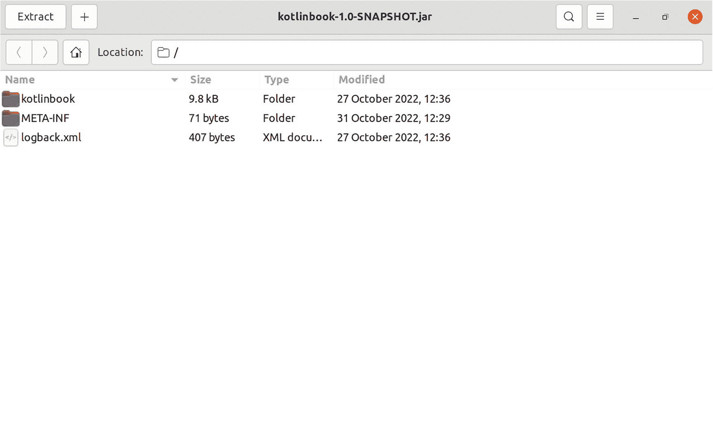
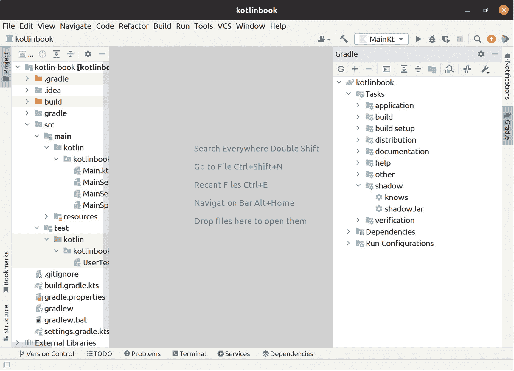

# 11. 部署到传统服务器环境

如今，部署生产级 Web 应用最常见的方式是在传统的服务器环境中。本章介绍如何打包你的 Web 应用，以便你可以将其部署到多种类型的环境中，无论是单节点专用服务器还是分布式多服务器 Kubernetes 集群。

## 打包为自包含的 JAR 文件

对于任何类型的部署设置，你都需要将你的 Web 应用打包为一个自包含的 *Java 归档*（JAR）文件。


### 什么是 JAR 文件

JAR 文件是一种采用 Zip 包格式的文件，其中包含你的代码，以及一些指向包含 `main` 函数的类的元数据。

当你编译 Web 应用时，Gradle 会将编译后的输出写入 *build/classes/kotlin/main*，并将你的资源文件复制到 *build/resources/main*，如图 11-1 所示。JAR 文件的本质就是将这两个文件夹的内容放入一个单一的 Zip 文件中——仅此而已。



一个标题为 kotlinbook-1.0-SNAPSHOT.jar 的窗口截图。列出的文件包括 Kotlinbook、META-INF 和 logback.xml。

图 11-1

在 Ubuntu Linux 上通过归档工具以普通 Zip 文件形式打开的 **.jar** 文件内容

此外，JAR 文件还将包含文件 *META-INF/MANIFEST.MF*，这是一个文本文件，包含一些关于构建的元数据以及 Main-Class 行，该行指向 Java 运行时应加载并调用其 `main` 函数的特定类。

### 自包含 JAR 文件

自包含 JAR 文件与普通 JAR 文件类似，但它还将你的第三方依赖项也包含在同一个文件中。

要运行你的 Web 应用，你需要有可用的第三方依赖项。第三方依赖项也打包为 JAR 文件。当你在本地运行 Web 应用时，Gradle 会下载并管理这些 JAR 文件，并将它们添加到运行你代码的 Java 进程的类路径中。

当你为服务器环境构建 JAR 文件时，你可以设置 Gradle 将所有第三方依赖项也添加到 JAR 文件本身中。这样，你最终会得到一个自包含的 JAR 文件，其中包含你自己的所有代码以及所有第三方依赖项的代码。

Java 社区通常使用 *fat jars* 和 *uberjars* 这两个名称来指代包含第三方依赖项的自包含 JAR 文件。

### 使用 Gradle 打包

你将使用 Gradle 来构建自包含的 JAR 文件。Gradle 本身并不内置支持构建自包含 JAR 文件（即 fat jars）。因此，你需要将 Shadow Gradle 插件（[*https://github.com/johnrengelman/shadow*](https://github.com/johnrengelman/shadow)）添加到你的 *build.gradle.kts* 文件中：

```
plugins {
id("com.github.johnrengelman.shadow") version "7.1.2"
}
```

请注意，这次你不仅仅是添加一个依赖项。实际上，你根本没有添加依赖项，并且应该保持 `dependencies` 块不变。你正在安装一个插件并为其配置一个任务。

你的 *build.gradle.kts* 中已经有一个用于安装 Kotlin 插件本身的 `plugins` 块，因此你可以将 Shadow 插件添加到现有的 plugins 块中，而不是重复 `plugins` 块语句。不过，两种方式都能正常工作。

Shadow 插件需要知道它应该在哪个类上执行 main 函数，以便它能在生成的 JAR 文件中的 *META-INF/MANIFEST.MF* 里写入正确的主类名。不过，你无需为此添加任何额外配置，因为 Shadow 插件会复用 Gradle 已经知道如何构建的普通 JAR 文件，而该 JAR 文件会从你在第 1 章中已经配置好的 application 插件中获取主类名。

### 构建 JAR 文件

安装好 Shadow 插件并配置好 Gradle 后，你现在可以执行 Gradle 任务 `shadowJar` 来构建实际的 fat jar 文件。

你可以在终端中运行 `./gradlew shadowJar`，或者使用 IntelliJ 的侧边栏找到该 Gradle 任务。它位于“shadow”类别下，如图 11-2 所示。



一个标题为 kotlinbook 的窗口截图。文本显示：搜索所有位置，双击 Shift。转到文件，Ctrl + Shift + N。最近文件，Ctrl + E。导航栏，Alt + Home。将文件拖到此处以打开它们。

图 11-2

`shadowJar` Gradle 任务

当 `shadowJar` 任务完成后，你的 fat jar 文件位于 *build/libs/kotlinbook-1.0-SNAPSHOT-all.jar*。该文件包含你自己的所有代码，以及你在 *build.gradle.kts* 中指定的所有第三方依赖项。

### 执行 JAR 文件

稍后，你将设置 JAR 文件，以便你的生产服务器环境能够执行它。但首先，你将在自己的开发环境中本地执行它，以测试其是否正常工作。

运行 JAR 文件的本质是执行命令 `java -jar myfile.jar`。现在尝试一下，但将 JAR 文件的名称替换为你使用 `shadowJar` Gradle 任务构建的实际 JAR 文件的路径：

```
java -jar build/libs/kotlinbook-1.0-SNAPSHOT-all.jar
```

瞧！你的 Web 应用已经启动并运行了！

它正在 `"local"` 环境中运行。这是因为你的 main 函数通过语句 `val env = System.getenv("KOTLINBOOK_ENV") ?: "local"` 设置了运行 Web 应用的环境。而你构建的 JAR 文件包含了来自 *src/main/resources* 的所有配置文件。因此，你的 Web 应用在这个新的运行环境中能够立即启动。

你可以通过设置 `KOTLINBOOK_ENV` 来更改 Web 应用的运行环境。如果你使用的是 Windows，请使用 `$Env:KOTLINBOOK_ENV = production` 进行设置。在 Linux 或 macOS 上，请使用 `export KOTLINBOOK_ENV production` 进行设置。再次尝试使用 `java -jar` 运行你的 Web 应用，看看会发生什么。

它崩溃了！这是因为你配置文件的结构方式导致的：

```
Exception in thread "main" com.typesafe.config.ConfigException$UnresolvedSubstitution: app-production.conf @ jar:file:/home/augustl/IdeaProjects/kotlin-book/build/libs/kotlinbook-1.0-SNAPSHOT-all.jar!/app-production.conf: 2: Could not resolve substitution to a value: ${KOTLINBOOK_COOKIE_ENCRYPTION_KEY}
```

对于本地环境，你已经在系统中为所有配置属性硬编码了默认值。但正如第 3 章所解释的，生产环境的密钥应该是保密的。因此，在生产模式下，你的 Web 应用期望设置多个环境变量。Typesafe Config 会提前失败，因此当它尝试加载 *app-production.conf* 但无法找到你指定的、应从中加载配置值的环境变量的值时，它会立即崩溃。

## 为生产环境打包

现在，你的代码已打包成一个 JAR 文件，你可以独立执行它，其中包含了你的所有代码和第三方依赖项。接下来，你将学习如何打包这个 JAR 文件，以便你能够在生产环境中轻松运行它。


### 构建 Docker 镜像

为将在服务器上运行的任何软件打包的标准方法是构建 Docker 镜像，其中包含你的 Web 应用 JAR 文件以及所有运行时依赖项。

像 Docker (*/*[*www.docker.com/*](http://www.docker.com/)) 这样的容器的好处在于，它们包含了绝对所有内容，从你使用的操作系统，到 Java 运行时的确切版本，再到用于启动 Web 应用的确切 `java` 命令。此外，几乎所有现有的生产环境都以某种形式支持 Docker 镜像。因此，无论你使用哪种生产环境，将 Web 应用打包到 Docker 镜像中都应该能正常工作。

Docker 镜像的核心是 *Dockerfile*。这是一个规范文件，它告诉 Docker 如何构建你的容器镜像，以及如何启动运行你已打包的软件。清单 11-1 展示了如何为你的 Web 应用编写一个 *Dockerfile*。

```
FROM amazoncorretto:17.0.4
RUN mkdir /app
COPY build/libs/kotlinbook-1.0-SNAPSHOT-all.jar /app/
CMD exec java -jar /app/kotlinbook-1.0-SNAPSHOT-all.jar
清单 11-1
你的 Web 应用的 Dockerfile
```

就是这样。第一行指定了你要继承哪个 Docker 镜像。`amazoncoretto:17.0.4` 是亚马逊团队提供的一个镜像，它包含一个完整的 Linux 发行版，并预装了 Java 17 Corretto，与你用来运行本书中编写的代码的 Java 版本相同。你可以在 Docker Hub 上 `amazoncoretto` 镜像的页面 [*https://hub.docker.com/_/amazoncorretto*](https://hub.docker.com/_/amazoncorretto) 查看所有可用的 Amazon Corretto Java 版本。

还有许多其他可用的 Docker 基础镜像，你可以根据不同的 Java 版本和构建版本选择使用。例如，Azure 和 Microsoft 提供的 Zulu Java 发行版可在 [*https://hub.docker.com/r/azul/zulu-openjdk*](https://hub.docker.com/r/azul/zulu-openjdk) 获取。Open JDK 基于 Alpine Linux 的镜像（[*https://hub.docker.com/_/openjdk*](https://hub.docker.com/_/openjdk)）曾经是热门选择，但你应该避免使用它们，因为 Open JDK 已弃用其自有镜像，并且不会发布任何更新。现在还有其他与供应商无关的替代方案，例如 Eclipse Temurin 构建版本（[*https://hub.docker.com/_/eclipse-temurin*](https://hub.docker.com/_/eclipse-temurin)）。

你设置 Docker 镜像来创建一个名为 */app* 的文件夹，并将你使用 `shadowJar` 构建的 fat jar 从你的机器复制到 Docker 镜像容器中。然后，你使用 `CMD` 来精确指定如何加载你的 Web 应用。你也可以使用 `CMD` 为 Java 命令指定额外的标志，例如配置内存限制、使用哪个垃圾回收器、JMX 设置等标志。

要构建 Docker 镜像，请运行 `docker build`：

```
docker build -f Dockerfile -t kotlinbook:latest .
```

这会将一个 Docker 镜像构建到本地 Docker 仓库中。`-f` 指定了 *Dockerfile* 的路径。`-t` 指定了标签。你可以根据需要设置任意数量的标签。按照惯例，`myimagename:latest` 用于指向名为 `myimagename` 的镜像的最新版本，因此你应该始终包含该标签。最后，`.` 指向工作目录，`docker build` 通过它知道在哪里找到你告诉它要 `COPY` 的文件。

请注意，随着你的应用程序增长，并且你的 Docker 构建命令开始花费太长时间，你可以将 Docker 镜像拆分为多个层。例如，你可以将外部依赖项放在一个层中，将自己的代码放在另一个层中。这样，你的生产环境就不必在每次部署最新版本时重新下载你的第三方依赖项，因为该层没有变化，并且已经缓存在生产服务器上。在我实际的 Web 应用开发中，我还没有遇到过需要这样做的情况，但无论如何都值得提及。如果你需要创建分层 Docker 镜像，可以考虑使用 Google 的 Jib 等工具（[*https://github.com/GoogleContainerTools/jib*](https://github.com/GoogleContainerTools/jib)）来代替 Shadow 插件。

### 在本地运行 Docker 镜像

当你构建好一个 Docker 镜像后，你可以轻松地在自己的机器上运行它。

要运行你刚刚构建的 Docker 镜像，请使用以下命令：

```
docker run -p 9000:4207 --name kotlinbook kotlinbook:latest
```

`-p` 标志指定了端口映射。这里，你指定希望将你机器上的端口 9000 绑定到 Docker 镜像内部的端口 4207。然后，你将正在运行的 Docker 镜像命名为 `kotlinbook`。而你想要运行的 Docker 镜像是 `kotlinbook:latest`，它引用了你之前在 `docker build` 构建镜像时使用的标签。

当你运行此命令时，你将看到 Docker 镜像执行的 Java -jar 命令的所有控制台输出。如果你在浏览器中打开 *http://localhost:9000*，你将看到你的 Web 应用正在运行！

就像你之前使用 `java -jar` 直接在机器上运行它一样，你的 Web 应用会以默认模式启动，即本地环境模式，这会导致它加载 *app-local.conf* 中的开发默认配置值。

你也可以向 `docker run` 传递额外的 `-d` 标志，让 Docker 在后台运行镜像，而不是占用整个终端并显示所有日志输出。

如果你想重建并重新运行你的 Docker 镜像，你需要先通过运行以下命令来移除名为 `kotlinbook` 的镜像：

```
docker rm -f kotlinbook
```

如果你尝试再次运行 `docker run` 而没有先移除 `kotlinbook` 镜像，你将收到一条错误消息，提示名为 `kotlinbook` 的镜像已存在。


### 部署到生产环境

当你拥有一个可运行的 Docker 镜像后，下一步就是使用该镜像并将其部署到生产环境中。

如何搭建一个完整可用的生产环境超出了本书的讨论范围。相反，我将为你概述所有生产环境通用的必要组件。

在你自己的服务器上运行 Docker 镜像最常见的方式是使用 Docker Swarm ([*https://dockerswarm.rocks/*](https://dockerswarm.rocks/))、Kubernetes ([*https://kubernetes.io/*](https://kubernetes.io/)) 或 Apache Mesos ([*https://mesos.apache.org/*](https://mesos.apache.org/))。所有这些解决方案都可以并行运行多个实例，前端通过负载均衡器动态地将流量分发到你的多个实例，自动终止不健康的实例，等等。

你需要为生产环境设置一组环境变量。你需要将 `KOTLINBOOK_ENV` 设置为 `production`，以便你的 Web 应用加载基于环境变量的 *app-production.conf* 配置。如果你想使用不同于 *app.conf* 中默认 `4207` 的 HTTP 端口，可以设置 `KOTLINBOOK_HTTP_PORT`。然后，你需要更新 *app-production.conf*，使其所有配置属性都指向环境变量，而不是指向 *app.conf* 中的默认空值。例如，`dbUrl` 应指向类似 `KOTLINBOOK_DB_URL` 的环境变量，`dbPassword` 应指向 `KOTLINBOOK_DB_PASSWORD`，以此类推。

你还需要某种方式来设置环境变量和管理机密信息。如果你使用 Kubernetes，可以使用 Helm 和 Helm Secrets ([*https://github.com/jkroepke/helm-secrets*](https://github.com/jkroepke/helm-secrets)) 来加密静态机密信息，并在你的 Kubernetes 集群中管理环境变量。

你还需要一个 Docker 镜像仓库。例如，如果你在 Azure 上使用托管 Kubernetes，你将能够访问位于 *myapp.azurecr.io* 的托管仓库。当你构建将要部署到 Kubernetes 的 Docker 镜像时，你将运行 `docker push kotlinbook:latest`，其中名称 `kotlinbook:latest` 指的是你在运行 `docker build` 时分配的标签。然后，你将配置你的 Kubernetes 集群，使其从位于 *myapp.azurecr.io* 的 Azure 容器仓库拉取镜像，并在你运行 `kubectl rollout restart` 以重新创建正在运行的 Pod 时，始终部署标签为 `kotlinbook:latest` 的镜像。

如果你不需要多节点集群设置，你也可以使用 Docker 在单个虚拟或物理服务器上运行镜像的单个实例。如果你通过 SSH 连接到你的服务器，并使用命令 `docker run –restart=always -d kotlinbook` 启动你的 Docker 镜像，那么当你的服务器重启时，Docker 将自动启动你的 Docker 镜像。如果通过 *Dockerfile* 中的 `CMD` 启动的 `java -jar` 进程崩溃，此命令也会重启该进程。

