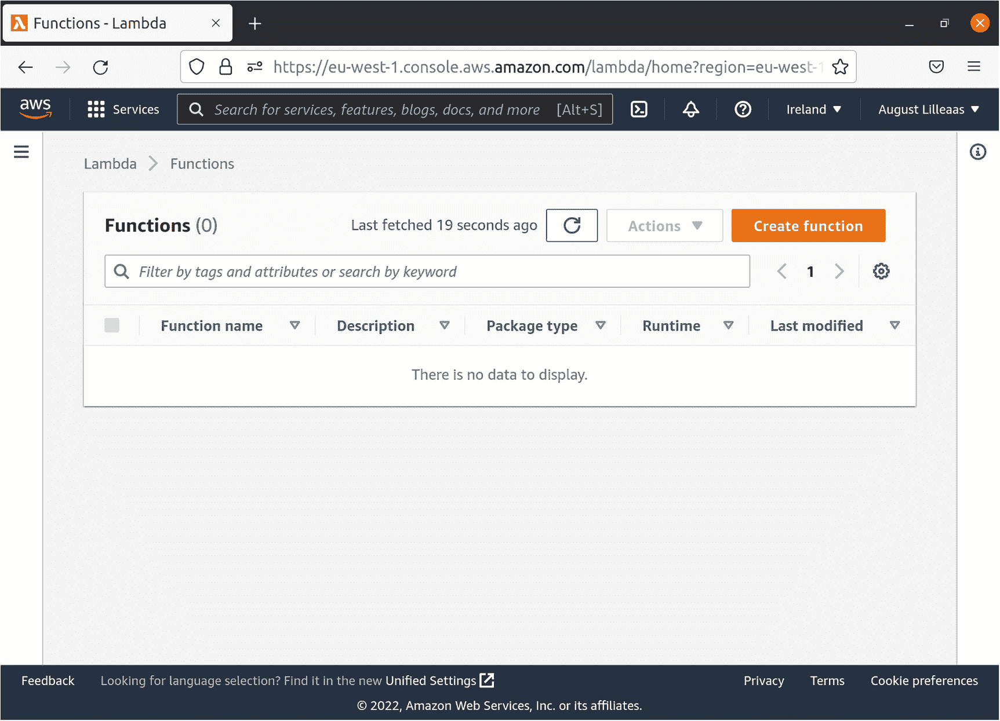
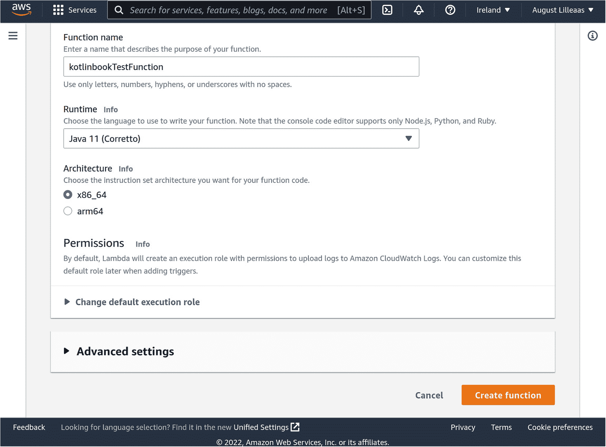
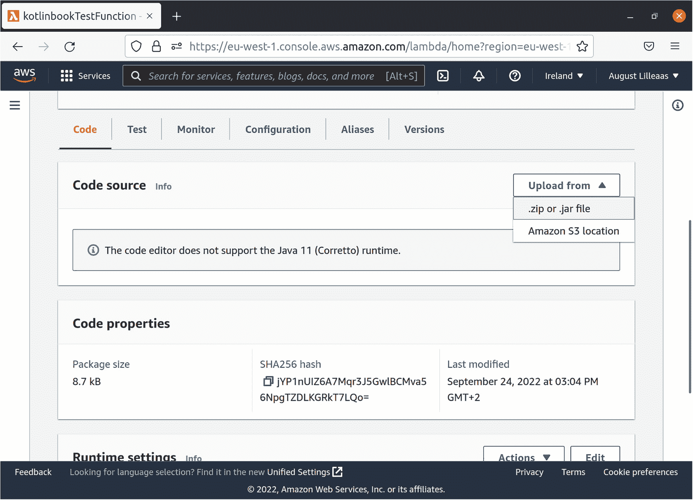
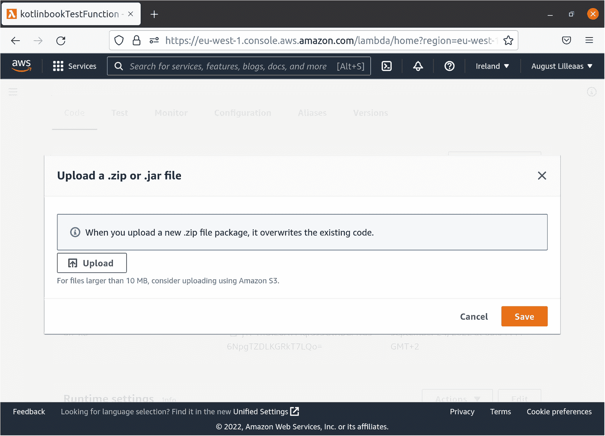
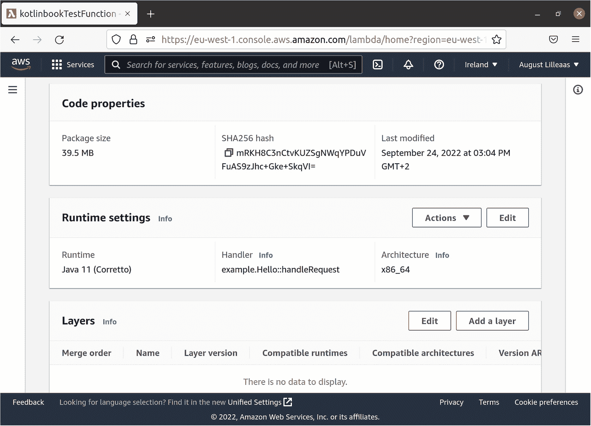
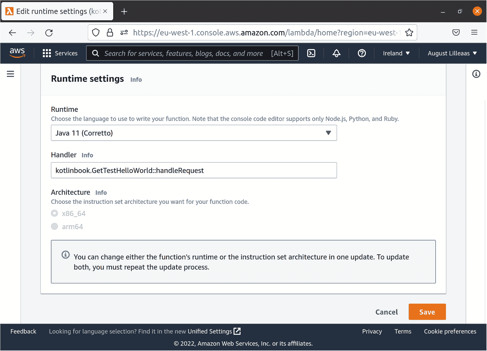
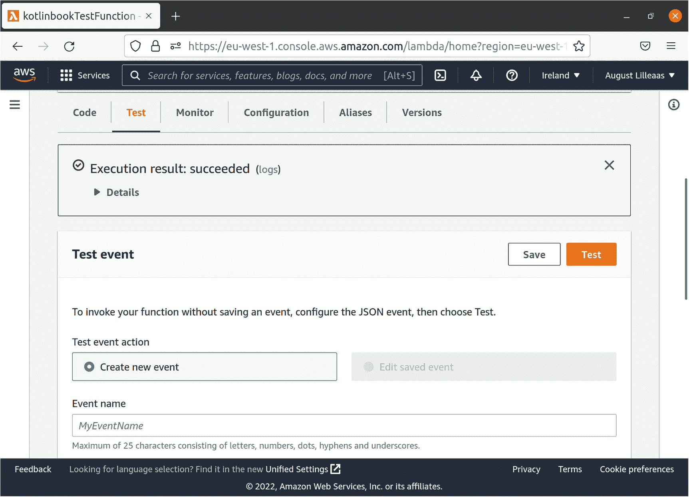
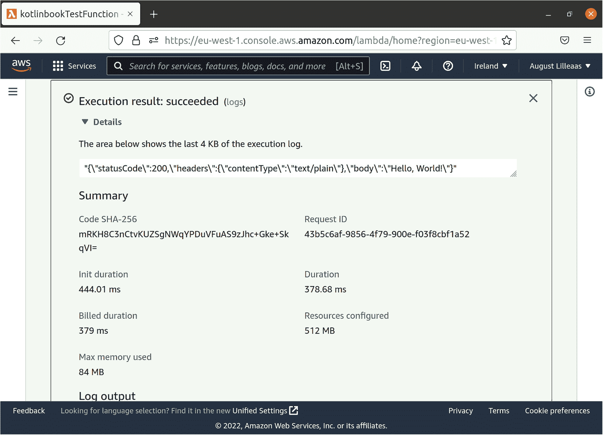
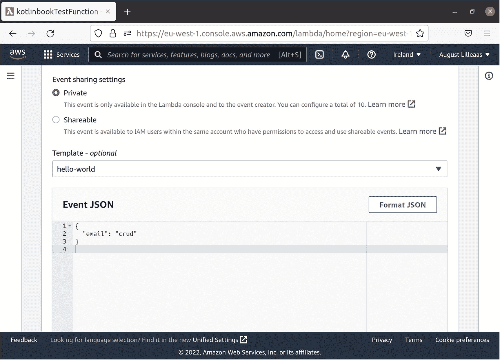

# 12. 构建并部署到无服务器环境

在本章中，你将学习如何获取当前在 Ktor 中运行的现有处理器，并在无服务器环境中（无需 Ktor）调用它们。

在本章中，你将学习以下关于构建和部署到无服务器环境的内容：

*   设置 Java 运行时标志以优化启动时间
*   Java 运行时类加载和性能特性的复杂细节
*   AWS Lambda 如何执行你的代码
*   无服务器环境中重要的成本节约技巧

关于整章的一个重要声明是：我在使用 AWS 和 Node.js 的无服务器架构方面拥有丰富的经验。同时，我在生产环境中运行基于 Java 平台的 Web 应用方面也拥有丰富的经验。但我从未真正将基于 Java 的 Web 应用部署到无服务器环境中。所以请记住这一点，并将本章作为入门指南，而非来自经验丰富的 Java + 无服务器专家的精炼建议。

## 解耦你的代码

当你在无服务器环境中运行代码时，你将完全不会使用 Ktor。考虑到本书前面的章节都在介绍如何设置 Ktor 的各个方面以使你的 Web 应用按预期工作，那么这该如何实现呢？

### 将处理器与 Ktor 分离

到目前为止，在本书中，你编写的大多数 Web 处理器都将 Ktor 特定的路由定义和该 Web 处理器的实际实现放在了同一个代码块中：

```
get("/foo", webResponse {
// 执行某些操作 ...
JsonWebResponse(mapOf("success" to true))
})
```

不过，有一个明显的例外。在第 8 章中，你将 `handleCoroutineTest` 编写为一个独立的函数，并从 Ktor 处理器中调用它：

```
get("/coroutine_test", webResponseDb(dataSource) { dbSess ->
handleCoroutineTest(dbSess)
})
suspend fun handleCoroutineTest(
dbSess: Session
) = coroutineScope {
// ...
TextWebResponse("...")
}
```

在实际的 Web 应用中，你会将大部分 Web 处理器分离到独立的函数中。

本书有意忽略了代码组织，除了没有将路由定义与处理器实现分离之外，你还将所有内容都写在一个庞大且无组织的 `Main.kt` 文件中。这对于一本书来说是可以接受的，因为其主要目标是避免试图通过文字解释哪个文件应该包含什么内容所带来的摩擦和困惑。但是，当你编写自己的 Web 应用时，你应该将代码拆分到多个文件中。


### 基本结构

我通常遵循的结构是，`Main.kt` 负责所有引导工作、加载配置文件以及启动服务器，就像本书中一样。它还将所有 Web 处理程序的路由声明放在一个文件中，但不包含这些路由的*实现*。因此，它通常看起来像这样：

```
fun main() {
val config = createConfig(...)
val dataSource = createAndMigrateDataSource(config)
val stuff = createStuff(config)
embeddedServer(Netty, port = config.httpPort) {
createKtorApplication()
}
}
fun Application.createKtorApplication(
dataSource: DataSource
) {
routing {
get("/foo", webResponse(::handleGetFoo))
get("/bars", webResponseDb(dataSource, ::handleGetBars))
get("/bars/{id}", webResponseDb(dataSource) { dbSess ->
handleGetBar(dbSess, call.parameters["id"])
})
post("/bars", webResponseTx(dataSource) { txSess ->
handleCreateBar(
txSess,
Gson().fromJson(call.receiveText(), Map::class.java)
)
})
// ...
}
}
```

各个处理函数对 Ktor 一无所知，它们只处理普通数据的组合，例如来自 JSON 解析的 `Map` 和来自 Ktor 的、与 ID 路径参数对应的 `String`。

将所有路由放在一个文件中可以使代码更易于阅读。调试 Web 应用程序的过程通常是，你看到一个发往某个 URL 的请求，而你需要做的第一件事就是弄清楚，当给定 URL 被调用时，Web 应用程序中运行的是哪段代码。

出于这个原因，无论我使用的是 Ktor 还是其他完全不同的路由库（或编程语言），我都倾向于避免使用我所谓的“路径前缀包装器”。例如，Ktor 允许你像这样用路径前缀包装路由：

```
routing {
get("/foo", webResponse(::handleGetFoo))
route("/api") {
get("/version", webResponse(::handleGetApiVersion))
post("/order", webResponseTx(dataSource) { txSess ->
handleCreateOrder(txSess, call.receiveText())
})
}
}
```

如果你的路由集合很小，这种方法没问题。但随着你的 Web 应用程序的增长，能够在项目中搜索 `"/api/order"` 并立即找到与该路径对应的代码，可以节省时间。因此，我更喜欢使用声明所有 Web 处理程序完整路径的样板代码：

```
routing {
get("/foo", webResponse(::handleGetFoo))
get("/api/version", webResponse(::handleGetApiVersion))
post("/api/order", webResponseTx(dataSource) { txSess ->
handleCreateOrder(txSess, call.receiveText())
})
}
```

在这里，你的 Web 应用程序支持的所有路径都存在于代码库中，这使得你的代码更加明确和可读，代价是需要手动重复嵌套的路径段。

### 解耦的 Web 处理程序

我在关于部署到无服务器环境的章节中讨论这个问题的原因是，将你的处理程序分离为普通函数，正是使你能够在无服务器环境中轻松运行 Web 处理程序的关键。

当你以函数式风格编写 Web 处理程序时，即作为接收输入作为参数并返回 `WebResponse` 的普通 Kotlin 函数，你就拥有了在任何环境中运行业务逻辑的灵活性，而不仅仅是 Ktor。

在前面的示例中，函数 `handleCreateOrder` 和 `handleGetFoo` 都是对数据进行操作、返回数据且对 Ktor 一无所知的普通 Kotlin 函数。

唯一知道 Ktor 的地方是你的 `Main.kt` 文件和你的路由。这很合理，因为你无论如何都会在该文件中大量使用 Ktor。`Main.kt` 充当了你选择的路由库和你的业务逻辑之间的映射层，而业务逻辑对其运行的环境一无所知。

## 在 AWS Lambda 上运行 Web 处理程序

要在无服务器环境中运行你的 Web 处理程序，你将使用 AWS Lambda。这里的大多数步骤在逻辑上与其他云提供商（如 Google Cloud Platform 和 Azure）相同。主要区别仅在于系统各个组件的连接方式和命名。所以，不要将此视为对 AWS Lambda 优于其他云提供商的认可；这主要只是基于我最熟悉的云提供商而做出的随机选择。

### 创建 AWS Lambda Web 处理程序

目前，你从 Ktor 路由定义中调用你的 Web 处理程序。为了在 AWS Lambda 上运行它们，你需要将你的 Web 处理程序包装在 AWS Lambda 知道如何执行的东西中。

在本章中，你唯一要做的事情就是在 AWS Lambda 上调用你的 Web 处理程序。通常，你会使用 AWS API Gateway 进行路由和身份验证，并设置单独的 API Gateway 路由来调用运行实际处理程序代码的正确 Lambda 函数。不过，设置这些内容超出了本书的范围。

第一步是将所需的依赖项添加到 *build.gradle.kts* 中：

```
implementation("com.amazonaws:aws-lambda-java-core:1.2.1")
```

这个库包含了编写 AWS Lambda 可以调用的 Kotlin 代码所需的包装代码。AWS Lambda 和 Java 平台的本质是，你像为传统的基于服务器的环境打包一样，将代码打包成 JAR 文件。然后，你的 JAR 文件包含代表各个 Lambda 处理程序的特殊类。这些类继承自 `com.amazonaws.services.lambda.runtime.RequestHandler`，这赋予了它们 AWS Lambda 知道如何调用和处理返回值的签名。

为了将你现有的代码与 AWS Lambda 环境分离，你将创建一个新文件 *MainServerless.kt*。在这个文件中，你将包含所有 AWS Lambda 处理程序，以及在 AWS Lambda 环境中引导代码运行所需的代码。清单 12-1 展示了如何做到这一点。

```
import com.amazonaws.services.lambda.runtime.Context
import com.amazonaws.services.lambda.runtime.RequestHandler
class GetTestHelloWorld :
RequestHandler
{
override fun handleRequest(
input: Any?,
context: Context
): String {
return Gson().toJson(mapOf(
"statusCode" to 200,
"headers" to mapOf("contentType" to "text/plain"),
"body" to "Hello, World!"
))
}
}
清单 12-1
使用基本的 AWS Lambda 处理程序设置 MainServerless.kt
```

你的 AWS Lambda 处理程序类实现了 `RequestHandler` 接口，并返回一个包含 JSON 内容的 `String`。AWS Lambda 本身不对其输出进行任何验证。你在 `GetTestHelloWorld` 中使用的 JSON 格式是 AWS API Gateway 在调用 Lambda 处理 Web 请求时所期望的格式。因此，如果你设置了 API Gateway 来调用你的 Lambda，但忘记包含 `"statusCode"` 或返回非 JSON 输出，API Gateway 会报错。但是，稍后当你手动调用 Lambda 处理程序进行测试时，对 Lambda 处理程序的输出格式没有要求。


### 部署到 AWS Lambda

要在 AWS Lambda 上运行你的 `GetTestHelloWorld` 处理函数，你需要将其打包并上传到你的 AWS 环境。

打包过程本身与第 11 章中将 Web 应用部署到传统服务器环境时的设置完全相同。因此，第一步是运行 `shadowJar` Gradle 任务，为你的代码构建一个自包含的 fat jar。

接下来，你需要将 JAR 文件上传到 AWS Lambda。对于这一步，我假设你已经设置好了 AWS 账户，因为本书主要关注的是让你的代码在无服务器环境中运行的概念，而不是专门介绍 AWS。

在 AWS 控制台 [*https://console.aws.amazon.com*](https://console.aws.amazon.com) 登录，并打开 Lambda 控制台，如图 12-1 所示。



浏览器窗口截图显示 AWS Lambda 控制台。在函数页面上，显示了函数名称、描述、包类型、运行时和上次修改时间。一个“创建函数”选项被高亮显示。

图 12-1

AWS Lambda 控制台

点击标有“创建函数”的橙色大按钮。这将带你进入如图 12-2 所示的页面。



浏览器窗口截图显示 AWS Lambda 控制台。函数名称显示为 kotlinbooktestfunction，运行时显示为 Java 11，架构下选择了 x86_64 选项。

图 12-2

在 AWS Lambda 控制台中创建新函数

保持选中“从头开始创作”选项，将你的函数命名为 `kotlinbookTestFunction`，选择“Java 11 (Corretto)”作为运行时，然后点击屏幕底部的“创建函数”按钮。

当 AWS 完成创建你的函数后，你需要上传你的代码。你将上传之前用 `shadowJar` Gradle 任务打包的整个 fat jar。点击标有“从以下位置上传”的白色按钮，然后点击标有“.zip 或 .jar 文件”的选项，如图 12-3 所示。



浏览器窗口截图显示 kotlinbooktestfunction 页面。代码选项被选中。一个“从以下位置上传”的下拉菜单提供了“.zip 或 .jar 文件”和“Amazon S3 位置”选项。文本显示：代码编辑器不支持 Java 11 运行时。

图 12-3

将代码上传到新的 AWS Lambda 函数

在弹出的对话框中，点击标有“上传”的白色按钮，在出现的文件查找器窗口中选择你的 fat jar 文件，然后点击标有“保存”的橙色按钮，如图 12-4 所示。

请注意，你应该上传到 AWS Lambda 的 fat jar 文件位于 *build/libs/kotlinbook-1.0-SNAPSHOT-all.jar* 文件夹中，与你的源代码和 Web 应用项目中的 Gradle 配置在同一目录下。



浏览器窗口截图显示 kotlinbooktestfunction 页面。一个标题为“上传 .zip 或 .jar 文件”的对话框。文本显示：当你上传新的 .zip 文件包时，它将覆盖现有代码。“保存”选项被高亮显示。

图 12-4

在 AWS Lambda 中选择文件并执行上传

当你的浏览器完成将该文件上传到 AWS Lambda 后，你会返回到与图 12-3 相同的屏幕。停留在该屏幕并向下滚动一点。你会看到一个名为“运行时设置”的部分。点击白色的“编辑”按钮，如图 12-5 所示。



浏览器窗口截图显示 kotlinbooktestfunction 页面。页面上的副标题包括代码属性、运行时设置和层。

图 12-5

编辑 AWS Lambda 函数的运行时设置

在弹出的对话框中，你需要更改 AWS Lambda 将要调用的类名。它当前设置为 `example.Hello`，这不是你的 Web 应用中存在的类。你需要将其更改为实际处理程序类的名称 `kotlinbook.GetTestHelloWorld`，如图 12-6 所示。函数名称 `handleRequest` 应保持不变，因为这是你在刚刚上传的代码中为该函数命名的名称。点击标有“保存”的橙色大按钮继续。



浏览器窗口截图显示编辑运行时设置。在运行时设置下，可以看到运行时、处理程序和架构选项。“保存”选项被高亮显示。

图 12-6

将 AWS Lambda 指向代码中正确的处理程序类

现在，你可以调用你的函数，看看一切是否正常工作！向上滚动到选项卡，当前激活的是“代码”选项卡，然后选择“测试”选项卡。在该页面上，点击标有“测试”的橙色大按钮。接下来，你也可以更改传递给 lambda 的参数。但你的测试处理程序不会对 AWS Lambda 传递给它的输入做任何处理，因此你无需更改任何内容。图 12-7 显示了此过程的样子。



浏览器窗口截图显示 kotlinbooktestfunction 页面。测试选项被选中。文本显示：执行结果，成功。测试选项被高亮显示。文本显示：要调用函数而不保存事件，请配置 JSON 事件，然后选择测试。已选择“创建新事件”选项。

图 12-7

你已成功测试了你的函数！

如果你点击图 12-7 中绿色框内的“详细信息”，你将看到关于 AWS Lambda 处理程序执行的更多信息，如图 12-8 所示。



浏览器窗口截图显示 kotlinbooktestfunction 页面。文本显示：执行结果，成功。下方列出了摘要信息。

图 12-8

关于 AWS Lambda 处理程序执行的详细信息

这就是你代码的输出！如前所述，AWS Lambda 本身不会以任何方式解释输出；它只是将其转发给调用者，在本例中是 AWS Lambda 测试控制台。如何解释输出取决于调用者，如果你设置了 API Gateway 来调用你的 lambda，它将使用此 JSON 输出来决定如何响应传入的 HTTP 请求。


### 调用现有处理器

接下来，你将运行一个目前在 Ktor 中使用的实际处理器。

目前，你只有一个从 Ktor 中提取的处理器 `handleCoroutineTest`。遗憾的是，你无法从 AWS Lambda 处理器中调用该函数。这并不是因为协程在无服务器环境中无法工作——让它们工作其实很容易，只需将调用包装在 `runBlocking` 中即可。唯一无法从 AWS Lambda 调用 `handleCoroutineTest` 的原因是，它需要与一个运行在本地机器上的服务器通信，该服务器嵌入在你的主 Ktor 服务器中。因此，你只会收到无法连接到 *http://localhost:9876* 的错误信息。

正如本章前面提到的，在真实的 Web 应用中，你会将所有处理器代码编写为独立的函数，但为了本书的简洁性，你将它们嵌入到了 Ktor 中。因此，为了让某个 Ktor 处理器能在 Ktor 外部使用，你需要为本章创建一个新的 Ktor 路由，并使其能够从 AWS Lambda 处理器中调用。清单 12-2 展示了如何实现这一点。

```
post("/db_test", webResponseDb(dataSource) { dbSess ->
val input = Gson().fromJson(
call.receiveText(), Map::class.java
)
handleUserEmailSearch(dbSess, input["email"])
})
fun handleUserEmailSearch(
dbSess: Session,
email: Any?
): WebResponse {
return JsonWebResponse(dbSess.single(
queryOf(
"SELECT count(*) c FROM user_t WHERE email LIKE ?",
"%${email}%"
),
::mapFromRow)
)
}
清单 12-2
创建一个可复用的 Ktor 处理器
```

这里，你创建了一个 Ktor 处理器，它在 Ktor 端解析 JSON 输入，并将数据库会话以及解析后的 JSON 中的用户名属性传递给一个独立函数。

接下来，你将从这个独立函数 `handleUserEmailSearch` 中调用 AWS Lambda。首先，你需要一种将 `WebResponse` 数据映射到 AWS Lambda 的方法。清单 12-3 展示了如何实现这一点。

```
fun getAwsLambdaResponse(
contentType: String,
rawWebResponse: WebResponse,
body: String
): String {
return rawWebResponse.header("content-type", contentType)
.let { webResponse ->
Gson().toJson(mapOf(
"statusCode" to webResponse.statusCode,
"headers" to webResponse.headers,
"body" to body
))
}
}
fun serverlessWebResponse(
handler: suspend () -> WebResponse
): String {
return runBlocking {
val webResponse = handler()
when (webResponse) {
is TextWebResponse -> {
getAwsLambdaResponse(
"text/plain; charset=UTF-8",
webResponse,
webResponse.body
)
}
is JsonWebResponse -> {
getAwsLambdaResponse(
"application/json; charset=UTF-8",
webResponse,
Gson().toJson(webResponse.body)
)
}
is HtmlWebResponse -> {
getAwsLambdaResponse(
"text/html; charset=UTF-8",
webResponse,
buildString {
appendHTML().xhtml {
with(webResponse.body) { apply() }
}
}
)
}
}
}
}
fun serverlessWebResponseDb(
dataSource: DataSource,
handler: suspend (dbSess: Session) -> WebResponse)
= serverlessWebResponse {
sessionOf(
dataSource,
returnGeneratedKey = true
).use { dbSess ->
handler(dbSess)
}
}
清单 12-3
将 WebResponse 映射到 AWS Lambda
```

函数 `serverlessWebResponse` 对于你当前的需求来说略显过度设计。它支持在处理器函数中使用协程。你刚刚编写的函数 `handleUserEmailSearch` 并未使用协程。但由于真实世界的处理器很可能包含协程，因此映射代码对其提供了支持，以便在实际场景中尽可能有用。

`serverlessWebResponse` 接收一个 `WebResponse` 并将其转换为兼容 AWS API Gateway 的 JSON。`TextWebResponse` 和 `JsonWebResponse` 的处理很直接。最复杂的转换是针对 `HtmlWebResponse` 的，因为它需要将 `kotlinx.xhtml` DSL 代码转换为 `String`。幸运的是，`kotlinx.xhtml` 提供了一些便捷的辅助函数，使这项工作变得简单。清单 12-3 中的 `buildString` 来自 Kotlin 标准库，它是 Java 平台 `StringBuilder` API 的一个便捷封装，用于将字符串和字节块转换为一个大的 `String`。`appendHTML` 来自 `kotlinx.xhtml`，它需要一个 `Appender`（`StringBuilder` 就是其中之一），并分块将 HTML 追加到其中。这样，`kotlinx.xhtml` 就不必先创建整个 HTML 字符串再返回给调用者。最后，你使用了之前用过的技巧，通过 `with` 在 `webResponse.body` 对象上调用 `apply()`，以避免调用内置的作用域函数 `apply`。

请注意，你可以将 `getAwsLambdaResponse` 实现为单表达式函数，即函数名后直接跟 `=`，无需指定返回类型等。但你返回的值是 `Gson().toString()` 的结果，这是一个返回平台类型 `String!` 的 Java 类。因此，为了避免在代码中传递平台类型，你显式声明其为 `String`，以便 Kotlin 能在编译时更好地自动检测潜在的空指针异常。

为了创建实际的 AWS Lambda 处理器函数，你还需要一个数据库连接。清单 12-4 展示了如何正确设置两者。

```
private val dataSource = HikariDataSource()
.apply {
jdbcUrl = "jdbc:h2:mem:test;MODE=PostgreSQL;DATABASE_TO_LOWER=TRUE;DEFAULT_NULL_ORDERING=HIGH"
}.also {
migrateDataSource(it)
}
class UserEmailSearch :
RequestHandler, String>
{
override fun handleRequest(
input: Map,
context: Context
): String {
return serverlessWebResponseDb(dataSource) { dbSess ->
handleUserEmailSearch(dbSess, input["email"])
}
}
}
清单 12-4
MainServerless.kt 中 AWS Lambda 处理器的实现及数据库初始化代码
```

你的数据库初始化代码直接设置了 H2，并使用 Flyway ([*https://flywaydb.org/*](https://flywaydb.org/)) 迁移来迁移该 H2 数据库。如果需要，你可以使用配置文件系统来配置 H2，但在无服务器和 AWS Lambda 的世界中，更常见的做法是使用特定于该处理器的环境变量，而不是使用与代码一起打包的配置文件。因此，为了使代码更贴近实际，你完全跳过了 `WebappConfig`。

此 Lambda 的 `RequestHandler` 类型略有不同，它接收 `Map<String, String>` 而不是 `Any?`。你实际获得的输入始终是 `Map<String, String>` 类型，因此在清单 12-1 的 `GetTestHelloWorld` 处理器中之前使用 `Any?` 只是为了节省一些输入，因为你实际上并未使用那里的输入参数。

使用 Gradle 的 `shadowJar` 任务重新构建代码，按照图 12-3 的描述将新的 JAR 文件上传到 AWS Lambda 控制台，并将处理器类的名称从 `kotlinbook.GetTestHelloWorld::handleRequest` 更改为 `kotlinbook.UserEmailSearch::handleRequest`，如图 12-5 所示。在点击图 12-7 中“Test”选项卡下的橙色“Test”按钮运行代码之前，请记得更新参数。将键 `"email"` 设置为与你可重复迁移中插入的用户相匹配的值，如图 12-9 所示。




浏览器窗口截图显示 kotlinbooktestfunction 页面。在事件共享设置下，已选中私有选项。有一个格式化 JSON 的选项。下方显示了三行代码。

图 12-9

运行 AWS Lambda 函数时指定输入参数

如果一切运行正常，你应该会看到一个绿色框，与你首次运行 AWS Lambda 函数时在图 12-7 中看到的完全一致。展开绿色框的“详细信息”部分，你将看到包含数据库查询结果的 JSON 输出。

## 提升性能

你可以采取多种措施来提升 AWS Lambda 处理程序的性能，这有助于节省成本，并减少 Web 应用的延迟和执行时间。

### 性能与冷启动

无服务器运行时存在一个特定问题，使得处理代码必须尽可能快地完成初始化：冷启动。

尽管被称为“无服务器”，但服务器*确实存在*。无服务器运行时需要先将代码加载到实际服务器中，才能执行。你只需为代码的实际执行时间付费，因此为了节省成本，如果代码在一段时间内未被执行，无服务器环境会将其卸载。

当无服务器运行时尚未加载你的代码，而你尝试执行它时，就会遇到冷启动。

当你执行图 12-8 中的测试调用时，这是你上传代码后首次执行。这意味着 AWS Lambda 无服务器运行时尚未加载并准备好你的代码。在图 12-8 中，有更多关于运行处理函数所涉及时间的详细信息。它显示*初始化持续时间*为 444.01 毫秒，*持续时间*为 378.68 毫秒，总计 822.69 毫秒。这个数字就是你的 AWS Lambda 处理程序的*冷启动时间*。

如果你多次尝试运行 Lambda 的测试执行，后续调用将比首次调用快得多。这被称为热启动。AWS Lambda 已将你的代码加载到其无服务器运行时中，无需花费任何时间进行初始化。在我对 `GetTestHelloWorld` Lambda 的测试中，后续调用仅需约 2-3 毫秒。这很合理——在已启动并运行的 Java 进程上调用函数速度很快，并且与其他运行时环境相比，几乎没有额外开销。

### 初始化时间 vs. 执行时间

为了进一步优化性能，你需要研究 AWS Lambda 中初始化时间与执行时间的分离。

初始化时间仅指冷启动，具体来说，是从 AWS Lambda 开始加载你的代码，到代码加载完成并调用你的处理函数（`handleRequest`）之间的时间。

在这个特殊的初始化阶段，AWS Lambda 会为运行时分配最大量的 RAM 和 CPU，以便你的代码尽可能快地加载，并获得尽可能低的冷启动时间。初始化阶段完成后，AWS Lambda 会降低运行时的性能，以匹配你配置的使用量。你按 RAM-秒付费，因此分配给 AWS Lambda 处理程序的 RAM 越多，运行成本就越高。

此外，你无需为初始化时间付费。你只需为处理函数的首次及后续调用的执行时间付费。

因此，你应该充分利用高性能且免费的初始化阶段，尽可能多地在处理函数执行之前运行的代码部分中，以静态方式完成工作。

### 懒加载

在你执行 `GetTestHelloWorld` 时获得的时间数据中，有一个危险信号。对于冷启动调用，初始化时间为 444.01 毫秒，执行时间为 378.68 毫秒。在后续调用中，由于无服务器运行时已加载了你的代码，因此没有初始化时间，但执行时间仅为 2-3 毫秒。

为什么冷启动的执行时间与后续热启动的执行时间差异如此之大？

这有力地证明了你的处理函数中存在初始化操作。当你首次执行处理函数时，无服务器运行时由于某种原因尚未完全加载某些内容。

原因是 Java 运行时对所有类进行懒初始化。这是一件好事。你的 JAR 文件包含了 Ktor 以及你在 *build.gradle.kts* 中指定的所有依赖项。Java 运行时仅在运行代码使用到已编译的类文件时，才会解析并加载它们。如果没有这个特性，你很快就会达到 AWS Lambda 初始化时间的 10 秒硬性限制，因为加载和解析所有这些代码工作量巨大，而 Java 运行时通过懒加载跳过了这些工作。

但这会产生一个副作用：导致无服务器运行时在执行期间（而非初始化期间）加载 Lambda 类的所有依赖项！H2、HikariCP、*Main.kt* 等所有代码都在执行阶段加载，因为这是运行代码首次引用这些类。

这也适用于你在 `UserEmailSearch` 中的顶层 `private val dataSource` 声明。当你查看 Kotlin 代码时，这行代码看起来像是静态运行的。但由于 Kotlin 编译器编写 Java 类文件的实现细节，事实并非如此。在底层，Kotlin 将 *MainServerless.kt* 中的顶层声明编译成一个名为 `MainServerlessKt` 的 Java 类。该类有一个包含初始化 `dataSource` 属性代码的 `static` 初始化块。但你的代码首次引用该类是在 `handleRequest` 函数内部。Kotlin 将 `dataSource` 编译为 `MainServerlessKt.getDataSource()`。当 Java 运行时遇到该调用时，它发现尚未加载 `MainServerlessKt`。因此它会加载该类，导致相应的静态块运行。但这已经太晚了——此时你已处于执行阶段，而非初始化阶段。


### 正确初始化

要解决此问题，你需要在初始化阶段以某种方式调用 `MainServerlessKt` 中的代码，以便 Java 运行时在初始化期间加载该类，而不是在首次冷启动执行期间加载。

在优化之前，我的初始化时间为 354.8 毫秒，执行时间为 5678.15 毫秒。后续调用仅需大约 3-4 毫秒。这非常糟糕，表明初始化阶段几乎什么都没做，并且这段代码需要大量初始化时间才能工作，因为它在首次调用时花费了近 6 秒进行自我初始化。

漫长的初始化时间是有道理的。`GetTestHelloWorld` 几乎不做任何工作，因此它不需要那么长的初始化时间。但 `UserEmailSearch` 加载了 Gson、你的 `WebResponse` 处理代码、HikariCP、Flyway 以及整个 H2，这是一个完整的嵌入式数据库引擎。

解决此问题的最简单方法是为你的 `UserEmailSearch` 处理程序类添加一个带有初始化块的伴生对象。Kotlin 编译器会将该 `init` 块编译为底层 `UserEmailSearch` Java 类中的 `static` 初始化块。这个静态初始化块将在你的 AWS Lambda 处理程序运行时的初始化阶段执行，因为 `UserEmailSearch` 是你指定 AWS Lambda 执行以运行代码的类。清单 12-5 展示了如何使用静态初始化更新你的处理程序。

```
class UserEmailSearch :
RequestHandler, String>
{
companion object {
init {
runBlocking {
serverlessWebResponseDb(dataSource) { dbSess ->
dbSess.single(queryOf("SELECT 1"), ::mapFromRow)
JsonWebResponse("")
}
}
}
}
override fun handleRequest(
input: Map,
context: Context
): String {
return serverlessWebResponseDb(dataSource) { dbSess ->
handleUserEmailSearch(dbSess, input["email"])
}
}
}
清单 12-5
向你的 UserEmailSearch 处理程序添加 dataSource 的静态初始化
```

`init` 块尽可能多地模拟实际处理程序代码所做的事情。这是为了确保 Java 运行时尽可能多地加载你在执行期间使用的类。它使用 `runBlocking` 初始化 Kotlin 协程类，初始化整个 `WebResponse` 处理代码，并对 H2 运行一个实际的虚拟查询，从而导致所有与数据库相关的代码也被加载。

通过这个小小的调整，我的初始化时间从 354.8 毫秒增加到了 1298.85 毫秒，但执行时间从 5678.15 毫秒下降到了仅 22.12 毫秒。这是一个巨大的胜利！现在冷启动的总时间降到了 1320.77 毫秒，而之前是 6032.95 毫秒。因此，AWS Lambda 不再向你收取包含加载该 Lambda 中所有运行代码的 5679 毫秒执行处理程序时间，而是仅向你收取 23 毫秒的处理程序代码执行时间。

如果你将首次调用的执行时间（22.12 毫秒）与后续的温调用进行比较，你会发现仍然存在差异。后续的温调用仍然只需要 3-4 毫秒即可完成。因此，在初始执行期间仍然至少存在一些初始化。但 23 毫秒已经足够低，不值得深入探究如何进一步降低这个数字。

### 迁移与 H2

请注意，导致初始化时间接近 1300 毫秒的原因之一是，你在每次冷启动时都加载了整个 H2（一个完整的数据库引擎），并且还运行了你的 Flyway 迁移。

这对于现实世界的 Web 应用来说是一个不切实际的场景。在无服务器世界中，通常甚至不使用像 HikariCP 这样的连接池库，因为无服务器函数永远不需要管理多个并发连接。事实上，如果你使用像 AWS Aurora ([*https://aws.amazon.com/rds/aurora/*](https://aws.amazon.com/rds/aurora/)*)* 这样的无服务器数据库，你可以通过 HTTP 请求对其运行查询，这样你就不需要管理任何连接，而是运行低延迟的即发即弃查询。

此外，如果你从无服务器处理程序使用外部 SQL 数据库，则不应在每次冷启动时运行迁移。你甚至不应该将迁移包含在为无服务器执行环境构建的 JAR 文件中。相反，你应该在构建管道中运行数据库迁移，或者创建一个专用的无服务器函数来运行迁移，当你的构建管道部署新版本的代码时，会调用该函数。

### Java 运行时标志

为了进一步优化性能，你可以研究设置 Java 运行时编译器标志的领域。

例如，你可以将环境变量 `JAVA_TOOL_OPTIONS` 设置为 `-XX:+TieredCompilation -XX:TieredStopAtLevel=1`，这会禁用*分层编译*。分层编译是 Java 运行时在代码运行时对其进行分析的一项功能。运行时根据分析结果动态优化你的代码。这是 Java 平台中即时（JIT）编译器的一部分，Java 运行时通过它动态地将 Java 字节码编译为本机机器码。

分层编译对于传统上运行数小时或数天而不关闭的基于服务器的进程是有意义的，但在启动时间很重要的环境中可能没有意义。当我使用本章中编写的 Lambda 进行测试时，初始化持续时间从大约 450 毫秒稳定地下降到仅约 330 毫秒。但本书并非关于优化 Java 运行时性能，因此我不会在这方面深入探讨。


### GraalVM、Kotlin/JS 与 Kotlin Native

提升 Java 平台 AWS Lambda 处理程序冷启动性能的另一种方法是使用 GraalVM 编译 Java 平台代码，或者使用 Kotlin 编译器的 JS 和 Native 输出选项。

GraalVM（*/*[*www.graalvm.org/*](http://www.graalvm.org/)）是一种替代性 Java 编译器，它将 Java 字节码（以及扩展的 Kotlin）编译为原生可执行文件。这意味着你不会产生任何运行时开销，代码可以立即开始执行，无需等待 Java 运行时加载。使用 GraalVM 需要注意的一个权衡是编译时间会增加，这很合理，因为 GraalVM 将 Java 运行时的大量工作转移到了自身的编译时。

Kotlin 也可以直接开箱即用地编译为 JavaScript 和原生代码。以 Node.js 作为运行时的 JavaScript 非常适合无服务器环境，因为 Node.js 针对快速启动时间进行了超优化，这将导致冷启动速度大大加快。

有两个原因导致我不会在本书中向你展示如何做到这一点。

首先，我自己从未做过这件事。我或许可以在谷歌搜索和研究之后，写出一段还算可用的关于 GraalVM 的内容，但我希望本书尽可能多地涉及我在真实场景中实际做过的事情。正如我在引言中提到的，本章在这方面已经处于边缘地带。而使用 GraalVM 编译和运行 Java 平台代码远远超出了我的实际经验范围。Kotlin/JS 和 Kotlin Native 也是如此。我没有任何使用这些 Kotlin 编译输出目标的经验，所以如果我来教你如何操作，那将是不诚实的。

其次，在为本书对 GraalVM 进行一些基础研究时，我成功让 `GetTestHelloWorld` 运行了起来，但 `UserEmailSearch` 在执行时立即崩溃了。问题出在 HikariCP 和 H2 的交互方式上，导致 HikariCP 无法加载 H2 的类，并以 `ClassNotFound` 异常崩溃。

如果我要在 AWS Lambda 上使用 Kotlin 搭建一个真实的 Web 应用，我会谨慎引入 GraalVM。你可以让它工作，但一旦你向 Web 应用添加了一个因某种原因与 GraalVM 不兼容的依赖，整个设置就会崩溃。

Kotlin/JS 听起来是一个更可行的替代方案。但 Kotlin/JS 出于显而易见的原因，无法调用 Java 依赖。你编写的所有纯 Kotlin 代码都支持 Kotlin/JS。但你必须将 Gson、HikariCP、Flyway 和 H2 替换为其他东西。令人惊讶的是，大量 Kotlin 代码可以编译为 JavaScript。例如，像 `Appendable` 和字符串构建器这样的类 Java 结构在 Kotlin/JS 中也可用，因此你用于将 `HtmlWebResponse` 转换为 `String` 的代码可以正常工作。但我不会对此进行更详细的讨论。Kotlin/JS 专家可能会就如何让 Kotlin 代码在 AWS Lambda 的 Node.js 运行时中运行提供很好的建议。但我的专长，以及本书的重点，在于 Kotlin 的 Java 平台方面。

