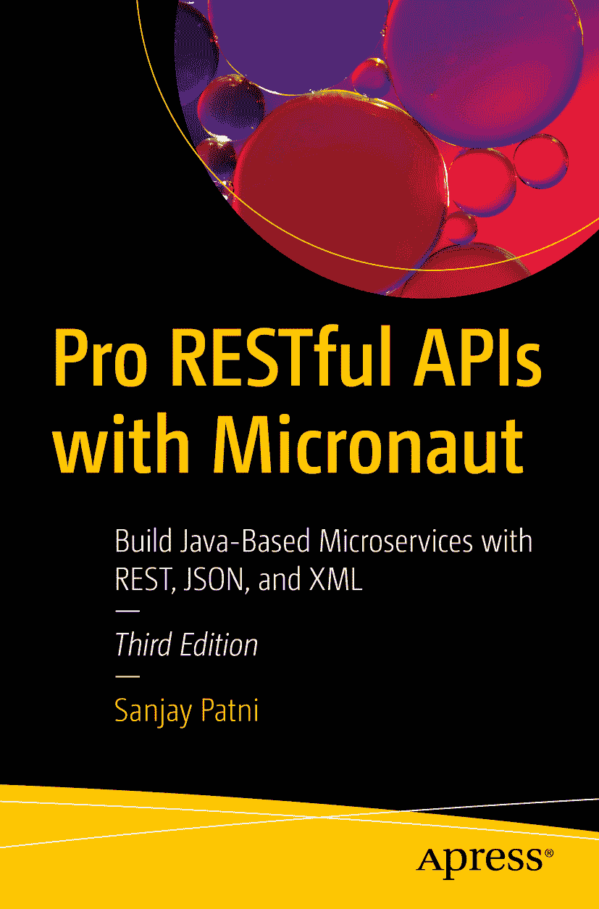

ISBN 979-8-8688-1242-2（电子版）ISBN 979-8-8688-1243-9 [`doi.org/10.1007/979-8-8688-1243-9`](https://doi.org/10.1007/979-8-8688-1243-9) © Sanjay Patni 2017, 2023, 2025 本作品受版权保护。所有权利均独家授权给出版商，无论涉及材料的全部或部分，具体包括翻译、重印、重用插图、朗诵、广播、微缩胶片复制或任何其他物理形式的复制权，以及传输或信息存储与检索、电子改编、计算机软件，或现在已知或未来开发的类似或不同方法的权利。在本出版物中使用通用描述性名称、注册商标名称、商标、服务标志等，即使未作明确声明，也不意味着这些名称不受相关保护性法律和法规的约束，因此可自由通用。出版商、作者和编辑假定本书中的建议和信息在出版之日是真实准确的。出版商、作者或编辑均不对本文所含材料或可能存在的任何错误或遗漏提供明示或暗示的保证。出版商对已出版地图和机构归属中的管辖权主张保持中立。

本 Apress 印记由注册公司 APress Media, LLC（Springer Nature 的一部分）出版。

注册公司地址为：1 New York Plaza, New York, NY 10004, U.S.A.

*我要感谢 Apress 中与我密切合作的每一位同事。感谢审稿人，他们深入的审阅提升了本书的质量。衷心感谢我的妻子 Veena，她不懈且无条件的支持帮助我完成了本书的写作。非常感谢我的父亲 Ajit Kumar Patni 和已故的母亲 Basantidevi，他们无私的支持帮助我取得了今天的成就。*

引言

数据库、网站和业务应用程序需要交换数据。这通过定义标准数据格式（如可扩展标记语言（XML）或 JavaScript 对象表示法（JSON））以及传输协议或 Web 服务（如简单对象访问协议（SOAP）或更流行的表述性状态转移（REST））来实现。开发人员通常需要设计自己的应用程序编程接口（API），以便在集成围绕操作系统或服务器的特定业务逻辑时使应用程序正常工作。本书将介绍这些概念，并重点关注 RESTful API。

本书介绍了数据交换机制和常见数据格式。对于 Web 交换，您将学习 HTTP 协议，包括如何使用 XML。本书比较了 SOAP 和 REST，然后介绍了无状态传输的概念。它介绍了软件 API 设计和最佳设计实践。本书后半部分重点介绍遵循 Micronaut 和用于 RESTful Web 服务的 Java API 的 RESTful API 设计与实现。您将学习如何使用 JSON 和 XML 构建和使用 Micronaut 服务，并通过动手练习将 RESTful API 与关系数据库和 NoSQL 数据库等不同数据源集成。您将应用这些最佳实践，通过一个小型软件系统对公开可用的 API 完成设计审查，以设计和实现 RESTful API。

本书面向在项目中使用数据的软件开发人员。它对于需要了解数据交换方法以及如何与业务应用程序交互的数据专业人员也很有用。练习需要具备 Java 编程经验。

本书涵盖的主题包括

*   数据交换与 Web 服务

*   SOAP 与 REST 对比，有状态与无状态对比

*   XML 与 JSON 对比

*   API 设计简介：REST 与 Micronaut

*   API 设计实践

*   设计 RESTful API

*   构建 RESTful API

*   与 RDBMS（MySQL）交互

*   使用 RESTful API（即 JSON 和 XML）

关于作者 关于技术审稿人

