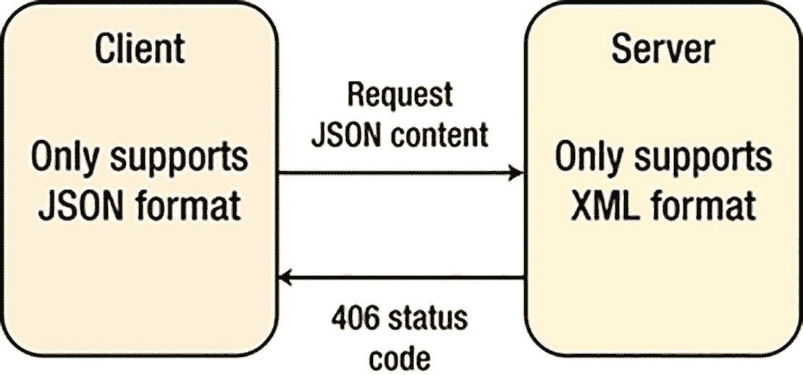

# 1. RESTful API 基础

API 并非新鲜事物。几十年来，它们一直作为接口，使应用程序能够相互通信。但在过去几年中，API 的角色发生了巨大变化。创新型公司发现，API 可以作为业务接口，使其能够将数字资产货币化，通过合作伙伴交付的能力扩展其价值主张，并跨渠道和设备与客户建立连接。当你创建一个 API 时，你是在允许组织内外的其他人利用你的服务或产品来创建新的应用程序、吸引客户或拓展业务。内部 API 通过最大化可重用性并在新应用程序中强制执行一致性，从而提升开发团队的生产力。公共 API 可以通过允许第三方开发者增强你的服务或将他们的客户引荐给你，从而为你的业务增加价值。当开发者为你的服务和数据找到新的应用时，会产生网络效应，带来显著的底线业务影响。例如，Expedia 通过 API 向合作伙伴开放其旅行预订服务，推出了 Expedia 联盟网络，建立了一个新的收入流，目前每年贡献 20 亿美元的收入。Salesforce 发布了 API，使合作伙伴能够扩展其平台功能，现在其年收入的一半是通过这些 API 产生的，这些 API 可以是基于 SOAP 的（JAX-WS），以及更近期的 RESTful（JAX-RS）、Spring Boot，以及现在的 Micronaut。

SOAP Web 服务依赖于多种技术（如 UDDI、WSDL、SOAP 和 HTTP）和协议来在服务提供者和消费者之间传输和转换数据，并且可以使用 JAX-WS 创建。

后来，Roy Fielding（在 2000 年）发表了他的博士论文《架构风格与基于网络的软件架构设计》。他创造了术语“REST”，这是一种用于分布式超媒体系统的架构风格。简单来说，REST（Representational State Transfer 的缩写）是一种被定义用来帮助创建和组织分布式系统的架构风格。该定义中的关键词应该是“风格”，因为 REST 的一个重要方面（这也是像本书这样的书籍存在的主要原因之一）在于它是一种架构风格——不是指南，不是标准，也不是任何暗示存在一套硬性规则需要遵循才能最终拥有 RESTful 架构的东西。

在本章中，我将介绍 REST 基础、SOAP 与 REST 的对比以及 Web 架构风格，以提供坚实的基础，并让你为后续章节的内容做好更充分的准备。

REST 背后的主要思想是，一个以 RESTful 方式组织的分布式系统将在以下方面得到改进：

*   **性能**：REST 提出的通信风格旨在高效且简单，从而允许采用该风格的系统提升性能。

*   **组件交互的可扩展性**：任何分布式系统都应能很好地处理这一方面，而 REST 提出的简单交互极大地促进了这一点。

*   **接口的简单性**：简单的接口允许系统之间进行更简单的交互，这反过来又可以带来诸如前面提到的那些好处。

*   **组件的可修改性**：系统的分布式特性以及 REST 提出的关注点分离（稍后会详细介绍），允许组件以最小的成本和风险相互独立地进行修改。

*   **可移植性**：REST 与技术无关且与语言无关，这意味着它可以被任何类型的技术实现和消费（有一些约束我稍后会介绍，但不强制使用特定技术）。

*   **可靠性**：REST 提出的无状态约束（稍后会详细介绍）允许系统在故障后更容易恢复。

*   **可见性**：同样，所提出的无状态约束具有所述请求的完整状态（一旦我谈到约束，这一点就会变得清晰）。从这个列表中，可以推断出一些直接的好处。以组件为中心的设计允许你构建容错性很强的系统。一个组件的故障不会影响整个系统的稳定性，这对任何系统来说都是一个巨大的好处。互连组件非常容易，从而在添加新功能或进行扩展或缩减时最大限度地降低风险。由于 REST 的可移植性（如前所述），以 REST 为理念设计的系统将能够被更广泛的受众访问。通过通用接口，该系统可以被更广泛的开发者使用。为了实现这些属性和好处，REST 添加了一组约束来帮助定义统一的连接器接口。当你需要在客户端和服务器之间强制执行严格的契约，以及执行涉及多个调用的事务时，不建议使用 REST。

## SOAP 与 REST 对比

表 1-1 提供了 SOAP 和 REST 之间的对比，并附带了各自支持的用例示例。

**表 1-1**

**SOAP 与 REST 对比**

| 主题 | SOAP | REST |
| --- | --- | --- |
| 起源 | SOAP（简单对象访问协议）由 Dave Winer 等人于 1998 年与微软合作创建。由一家大型软件公司开发，该协议旨在满足企业市场的需求 | REST（表述性状态传递）由 Roy Fielding 于 2000 年在加州大学尔湾分校创建。在学术环境中开发，该协议秉承开放网络的理念 |
| 基本概念 | 将数据作为服务提供（动词 + 名词），例如，“getUser”或“PayInvoice” | 将数据作为资源提供（名词），例如，“user”或“invoice” |
| 优点 | 遵循正式的企业方法<br>可在任何通信协议之上工作，甚至异步工作<br>对象信息会传达给客户端<br>安全性和授权是协议的一部分<br>可以使用 WSDL 完全描述 | 秉承开放网络的理念<br>相对易于实现和维护<br>清晰分离客户端和服务器实现<br>通信不受单一实体控制<br>信息可由客户端存储以防止多次调用<br>可以以多种格式返回数据（JSON、XML 等） |
| 缺点 | 在通信元数据上消耗大量带宽<br>难以实现，在 Web 和移动开发者中不受欢迎 | 仅能在 HTTP 协议之上工作<br>难以在其上强制执行授权和安全性 |
| 何时使用 | 当客户端需要访问服务器上的对象时<br>当你想在客户端和服务器之间强制执行正式契约时 | 当客户端和服务器在 Web 环境中运行时<br>当对象信息不需要传达给客户端时 |
| 何时不使用 | 当你希望大多数开发者能轻松使用你的 API 时<br>当你的带宽非常有限时 | 当你需要在客户端和服务器之间强制执行严格契约时<br>当执行涉及多个调用的事务时 |
| 用例 | 金融服务<br>支付网关<br>电信服务 | 社交媒体服务<br>社交网络<br>网络聊天服务<br>移动服务 |
| 示例 | [`https://www.salesforce.com/developer/docs/api/`](https://www.salesforce.com/developer/docs/api/) - Salesforce SOAP API<br>[`https://developer.paypal.com/docs/classic/api/PayPalSOAPAPIArchitecture/`](https://developer.paypal.com/docs/classic/api/PayPalSOAPAPIArchitecture/) -Paypal SOAP API | [`https://dev.twitter.com/`](https://dev.twitter.com/)<br>[`https://developer.linkedin.com/apis`](https://developer.linkedin.com/apis) |
| 结论 | 如果你正在处理事务性操作，并且你的受众已经对该技术感到满意，请使用 SOAP | 如果你专注于大规模 API 采用，或者你的 API 面向移动应用，请使用 REST |


## Web 架构风格

根据菲尔丁的观点，定义系统有两种方式。

*   一种是从一张白纸——空白的白板——开始，在需求得到满足之前，对正在构建的系统或使用的熟悉组件没有任何初始认知。

*   第二种方法是从系统的全部需求集合开始，然后向各个组件添加约束，直到影响系统的各种力量能够和谐地相互作用。

REST 遵循第二种方法。为了定义 REST 架构，首先定义一个空状态——一个没有任何约束、组件区分纯属虚构的系统——然后逐一添加约束。以下小节涵盖了 Web 架构风格的约束。每一个约束都定义了 REST API 框架应该如何架构和设计。在向最终用户推出 RESTful API 时，安全性是作为该框架的一部分需要独立考虑的另一个方面。

### 客户端-服务器

关注点分离是 Web 客户端-服务器约束的核心主题。

Web 是一个基于客户端-服务器的系统，其中客户端和服务器扮演着不同的角色。

只要它们遵循 Web 的统一接口，就可以使用任何语言或技术独立地实现和部署。

### 统一资源接口

Web 组件（即其客户端、服务器和基于网络的中间件）之间的交互依赖于它们接口的统一性。

Web 组件在统一接口的四个约束下保持一致地互操作，菲尔丁将其确定为：

*   资源标识

*   通过表述对资源进行操作

*   自描述消息

*   超媒体作为应用状态的引擎 (HATEOAS)

### 分层系统

一般来说，基于网络的中间件会出于特定目的拦截客户端-服务器通信。

基于网络的中间件通常用于实施安全策略、响应缓存和负载均衡。

分层系统约束使得诸如代理和网关之类的基于网络的中间件能够使用 Web 的统一接口透明地部署在客户端和服务器之间。

### 缓存

缓存是 Web 架构最重要的约束之一。缓存约束指示 Web 服务器声明每个响应数据的可缓存性。

缓存响应数据有助于减少客户端感知的延迟，提高应用程序的整体可用性和可靠性，并控制 Web 服务器的负载。总之，缓存降低了 Web 的整体成本。

### 无状态

无状态约束规定 Web 服务器无需记住其客户端应用的状态。因此，每个客户端在与 Web 服务器的每次交互中，都必须包含其认为相关的所有上下文信息。

Web 服务器要求客户端管理传达其应用状态的复杂性，以便 Web 服务器能够服务更多的客户端。这种权衡是 Web 架构风格可扩展性的关键因素。

### 按需代码

Web 大量使用按需代码，这一约束使 Web 服务器能够临时将可执行程序（例如脚本或插件）传输给客户端。

按需代码倾向于在 Web 服务器及其客户端之间建立技术耦合，因为客户端必须能够理解并执行其从服务器按需下载的代码。因此，按需代码是 Web 架构风格中唯一被视为可选的约束。

### HATEOAS

REST 的最后一个原则是使用超媒体作为应用状态的引擎 (HATEOAS) 的思想。在使用 HATEOAS 开发客户端-服务器解决方案时，服务器端的逻辑可以独立于客户端进行更改。

超媒体是一种以文档为中心的方法，并增加了在文档格式中嵌入指向其他服务和信息的链接的支持。

超媒体和超链接的用途之一是从不同的来源组合复杂的信息集。这些信息可以位于公司私有云内，也可以来自不同来源的公共云。

示例：

```
http://customers.myintranet.com/customers/1
http://podcast.com/myfirstpodcast
This is my first podcast 

```

这些 Web 架构风格中的每一种都为 Web 系统增加了有益的特性。

通过采用这些约束，团队可以构建简单、可见、可用、可访问、可演化、灵活、可维护、可靠、可扩展且高性能的系统，如表 1-2 所示。

表 1-2

约束与系统属性

| 遵循的约束 | 获得的系统属性 |
| 客户端-服务器交互 | 简单、可演化、可扩展 |
| 无状态通信 | 简单、可见、可维护、可演化、可靠 |
| 可缓存数据 | 可见、可扩展、高性能 |
| 统一接口 | 简单、可用、可见、可访问、可演化、可靠 |
| 分层系统 | 灵活、可扩展、可靠、高性能 |
| 按需代码 | 可演化 |

注意

本章未将安全性作为 REST 基础的一部分进行介绍，但安全性对于推出 RESTful API 非常重要。

## 什么是 REST？

我们在上一节中简要介绍了 REST 和 REST API 基础知识。本节将进一步介绍 REST 概念的入门细节。

“REST”一词由 Roy Fielding 在其博士论文中提出，用于描述实现网络系统的设计模式。REST 是表述性状态转移，一种用于设计分布式系统的架构风格。它不是标准，而是一组约束。它不绑定于 HTTP，但最常与 HTTP 关联。

### REST 基础

与 SOAP 和 XML-RPC 不同，REST 实际上不需要新的消息格式。HTTP API 是 CRUD（创建、检索、更新和删除）。

*   **GET**：“给我一些信息”（检索）。

*   **POST**：“这里有一些更新信息”（更新）。

*   **PUT**：“这里有一些新信息”（创建）。

*   **DELETE**：“删除一些信息”（删除）。

*   以及更多….

*   **PATCH**：HTTP 方法 PATCH 可用于更新部分资源。例如，当你只需要更新资源的某个字段时，PUT 一个完整的资源表示可能很繁琐且占用更多带宽。

*   **HEAD**：**HEAD** 方法与 GET 方法相同，只是服务器不得在响应中返回消息体。此方法通常用于测试超文本链接的有效性、可访问性和最近修改情况。

*   **OPTIONS**：此方法允许客户端确定与资源关联的选项和/或要求，或服务器的能力，而无需暗示资源操作或启动资源检索。

*   **“幂等性”概念**：其思想是，当向系统发送 GET、DELETE 或 PUT 时，无论命令发送一次还是多次，效果都应该是相同的，但 POST 会在集合中创建一个实体，因此不是幂等的。


### REST 基础

提醒一下，根据 ProgrammableWeb.com 的数据，2016 年约有 8,356 个 API 是使用 REST 编写的。REST 是一种基于资源的架构。资源通过基于 HTTP 标准方法的通用接口进行访问。REST 要求开发者显式地使用 HTTP 方法，并且使用方式要与协议定义保持一致。每个资源都由一个 URL 标识。每个资源都应支持 HTTP 的常见操作，并且 REST 允许资源拥有不同的表示形式，例如文本、XML 和 JSON。REST 客户端可以通过 HTTP 协议（内容协商）请求特定的表示形式。表 1-3 描述了 REST 中使用的数据元素。

表 1-3

REST 的结构

| 数据元素 | 描述 |
| --- | --- |
| 资源 | 超文本引用的概念目标，例如，customer/order |
| 资源标识符 | 用于标识特定资源的统一资源定位符 (URL) 或统一资源名称 (URN)，例如，[`http://myrest.com/customer/3435`](http://myrest.com/customer/3435) |
| 资源元数据 | 描述资源的信息，例如，标签、作者、来源链接、备用位置和别名 |
| 表示形式 | 资源内容——JSON 消息、HTML 文档、JPEG 图像 |
| 表示形式元数据 | 描述如何处理表示形式的信息，例如，媒体类型和最后修改时间 |
| 控制数据 | 描述如何优化响应处理的信息，例如，if-modified-since 和 cache-control-expiry |

让我们看一些例子。

#### 资源

首先，一个用于获取播客列表的 REST 资源：

*   `http://prorest/podcasts`

接下来，一个用于获取 id 为 1 的播客详细信息的 REST 资源：

*   `http://prorest/podcasts/1`

#### 表示形式

这是一个响应的 XML 表示形式——根据 id 获取客户信息。

```

John

```

接下来，一个响应的 JSON 表示形式——根据 id 获取客户信息：

```
{"Customer":{"id":"123","name":"John"}}
```

#### 内容协商

HTTP 原生支持一种基于头部（headers）的机制，用于告知服务器你期望并能处理的内容。基于这些提示，服务器负责以正确的格式返回相应的内容。图 1-1 展示了一个例子。



图示说明了客户端和服务器之间的通信问题。客户端仅支持 JSON 格式并请求 JSON 内容。服务器仅支持 XML 格式，由于内容类型不兼容，导致返回 406 状态码。

图 1-1

内容协商

如果服务器不支持请求的格式，它将根据规范返回一个 406 状态码（不可接受），以通知发起请求的客户端（“请求的资源只能生成根据请求中发送的 Accept 头部不可接受的内容”）。

## 总结

REST 指出了 Web 为何如此普及且可扩展的关键架构原则。Web 发展的下一步是将这些原则应用于语义网和 Web 服务领域。REST 提供了一种简单、可互操作且灵活的方式来编写 Web 服务，这与你们许多人接受过培训的 WS-* 方式可能大相径庭。在下一章中，我们将介绍 **Micronaut**——一个现代的、基于 JVM 的全栈框架，用于构建模块化、易于测试的微服务和无服务器应用。我们还将把它与类似的框架 Spring Boot 进行比较。

