# 3. 引言：XML 与 JSON

本章介绍 XML 和 JSON 的基本概念。在本章末尾，有一个练习，演示如何从 Micronaut 应用返回 XML 和 JSON 响应。


## 什么是 XML？

可**扩**展**标**记**语**言（XML）是一种基于文本的标记语言，是 Web 上数据交换的标准。与 HTML 类似，你可以使用[标签](https://www2.informatik.hu-berlin.de/~xing/Lib/Docs/jaxp/docs/tutorial/glossary.html%25252525252525252525252525252525252525252525252525252523tag)（用尖括号括起来的标识符，例如：`<...>`）来标识数据。这些标签统称为“标记”。它给一段数据贴上标签以标识其身份（例如：`<message>...</message>`）。就像你可以为数据结构定义字段名一样，你也可以自由使用任何对特定应用有意义的 XML 标签。当然，为了让多个应用能使用同一份 XML 数据，它们必须就打算使用的标签名称达成一致。以下是一个你可能用于消息传递应用的 XML 数据示例：

```
you@yourAddress.com
me@myAddress.com
XML 真的很酷>

让我数数 XML 酷在哪些方面...

```

标签还可以在其尖括号内包含[属性](https://www2.informatik.hu-berlin.de/~xing/Lib/Docs/jaxp/docs/tutorial/glossary.html%25252525252525252525252525252525252525252525252525252523attribute)（作为标签本身一部分的附加信息）。如果你认为所讨论的信息是 XML 中表达或传达的核心内容的一部分，则应将其放入元素中。对于人类可读的文档，这通常意味着向读者传达的核心内容。对于面向机器的记录格式，这通常意味着直接来自问题领域的数据。如果你认为该信息是主要通信内容的次要或附带信息，或者纯粹是为了帮助应用程序处理主要通信内容，则应使用属性。以下示例展示了一个电子邮件消息结构，其中对 `to`、`from` 和 `subject` 字段使用了属性：

```

让我数数 XML 酷在哪些方面...

```

XML 与 HTML 的一个重大区别在于，XML 文档始终必须保持[格式良好](https://www2.informatik.hu-berlin.de/~xing/Lib/Docs/jaxp/docs/tutorial/overview/4_design.html)。有若干规则决定文档是否格式良好，但其中最重要的一条是每个标签都有对应的结束标签。因此，在 XML 中，`</to>` 标签是不可省略的。`<to>` 元素绝不会被除 `</to>` 之外的任何标签终止。

注意

格式良好文档的另一个重要方面是所有标签必须完全嵌套。因此，你可以有 `<message>..<to>..</to>..</message>`，但绝不能出现 `<message>..<to>..</message>..</to>`。

XML Schema 是一种用于表达对 XML 文档约束的语言。目前有几种广泛使用的不同模式语言，但最主要的是文档类型定义（DTD）。它定义了 XML 文档的合法构建块。它还通过一系列合法的元素和属性来定义文档结构。

### XML 注释

XML 注释看起来与 HTML 注释完全相同：

```

让我数数 XML 酷在哪些方面...

```

为了完成对 XML 的简要介绍，请注意 XML 文件总是以[序言](https://www2.informatik.hu-berlin.de/~xing/Lib/Docs/jaxp/docs/tutorial/glossary.html%25252525252525252525252525252525252525252525252525252523prolog)开头。最小的序言包含一个[声明](https://www2.informatik.hu-berlin.de/~xing/Lib/Docs/jaxp/docs/tutorial/glossary.html%25252525252525252525252525252525252525252525252525252523declaration)，用于标识该文档为 XML 文档，如下所示：

```

该声明还可能包含附加信息，如下所示：

*   **版本**：标识数据中使用的 XML 标记语言的版本。此属性不可省略。

*   **编码**：标识用于编码数据的字符集。“ISO-8859-1”即“Latin-1”，是西欧和英语语言字符集。（默认是压缩的 Unicode：UTF-8。）

*   **独立**：告知此文档是否引用了外部实体或外部数据类型规范。如果没有外部引用，则使用“yes”。

```

为什么 XML 很重要？

它之所以重要，是因为它允许灵活地开发用户自定义的文档类型，这意味着它提供了一种持久、健壮、非专有且可验证的文件格式，可用于在 Web 上及 Web 之外存储和传输数据。此外，XML

*   **提供纯文本**：纯文本使其具有可读性。

*   **提供数据标识**：通过使用标签，可以标识数据。

*   **提供样式化能力**：使用 XSLT（可扩展样式表语言转换），数据可以呈现为可展示的形式。

*   易于处理（XML 解析器以及格式良好的解析器）。

*   是层次化的（通过嵌套标签）。

如何使用 XML？

有几种基本方式可以利用 XML：

*   **文档驱动编程**：其中 XML 文档是容器，用于从现有组件构建界面和应用程序。

*   **归档**：文档驱动编程的基础，其中组件的定制版本被保存（归档）以便以后使用。

*   **绑定**：其中定义 XML 数据结构的 DTD 或模式被用于自动生成最终将处理该数据的应用程序的很大一部分。

XML 的优缺点

XML 的一些优缺点说明如下：

*   优点

*   开发者可读可编辑。

*   通过 schema 和 DTD 进行错误检查。

*   可以表示复杂的数据层次结构。

*   Unicode 为国际化操作提供了灵活性。

*   所有计算机语言中都有大量用于创建和解析的工具。

*   缺点

*   文本冗长，有效载荷/格式比率低（但可以压缩）。

*   创建和客户端解析都需要大量 CPU 资源。

*   常见的文字处理字符是非法的（例如 MS Word 的“智能”标点）。

*   图像和其他二进制数据需要额外编码。

什么是 JSON？

JSON 或 JavaScript 对象表示法是一种轻量级的基于文本的开放标准，专为人类可读的数据交换而设计。JSON 使用的约定为程序员所熟知，包括那些了解 C、C++、Java、Python、Perl 等语言的程序员。

*   该格式由 Douglas Crockford 制定。

*   它专为人类可读的数据交换而设计。

*   它从 JavaScript 脚本语言扩展而来。

*   文件扩展名是 `.json`。

*   JSON 的互联网媒体类型是 `application/json`。

*   JSON 易于读写。

*   JSON 与语言无关。

JSON 语法

在本节中，我们将讨论 JSON 的基本数据类型及其语法。图 3-1 展示了 JSON 的基本数据类型。

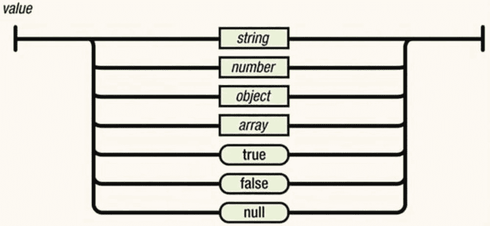


图示说明“值”类别下的 JSON 数据类型。这些类型包括字符串、数字、对象、数组、true、false 和 null，每种类型都通过线条与顶层的“值”标签相连。

图 3-1
基本数据类型

该图展示了可在各种数据类型中使用的值。这些数据类型包括字符串、数字、对象、数组、true、false 和 null。

字符串
字符串用双引号括起来，可以包含常见的转义字符序列。

数字
数字采用常见的 C/C++/Java 语法，包括指数（E）表示法。所有数字都是十进制——没有八进制或十六进制。

对象
对象是一个无序的名称/值对集合。这些值对用花括号（`{ }`）括起来。

示例：

```
{ "name": "html", "years": 5 }
```

值对之间用逗号分隔。名称和值之间有一个冒号。

JSON 对象的语法如图 3-2 所示。

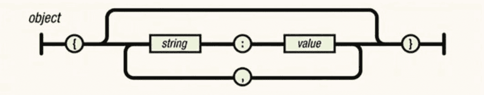

图示说明 JSON 对象的结构。它以左花括号开始，后跟一系列键值对。每个键值对由一个“字符串”键、一个冒号和一个“值”组成。多个值对之间用逗号分隔。对象以右花括号结束。

图 3-2
JSON 对象

该图描绘了 JSON 的对象、字符串和值结构。

数组

数组是一个有序的值集合。这些值用方括号括起来。JSON 数组的语法如图 3-3 所示。

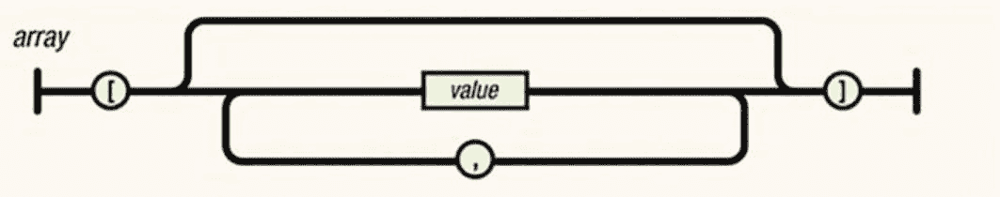

图示说明带有循环的数组结构。数组在左侧标记，一个循环连接标记为“i”和“j”的两个点，中间有一个标记为“值”的方框。该循环表示对数组元素的迭代。

图 3-3
JSON 数组

该图描绘了 JSON 的数组和值结构。

布尔值
它可以有 true 或 false 值。

Null
其值为空。

为什么 JSON 很重要？

JSON 作为一种数据交换格式正变得非常流行（比它比 XML 更简洁更重要），这是有原因的：程序员厌倦了编写解析器！但“等等，”你可能会说。“肯定有现成的 XML 解析器可供使用，这样你就不必自己动手了。”是的，确实有。但是，虽然 XML 解析器处理 XML 标签、属性等的底层语法解析，你仍然需要遍历 DOM 树，或者更糟的是，仅凭一个 SAX 解析器自己构建一个 DOM 树（说的就是你，Objective-C iPhone SDK！）。而你编写的代码当然取决于你需要理解的 XML 看起来像这样：

```

```

还是这样：

```

2 John
3 Smith

```

或者这样：

```

2 John
3 Smith

```

或者任何其他无数种表达同一概念的方式（而且有很多）。标准的 XML 解析器在这方面帮不了你。你仍然需要对解析树做一些工作。

使用 JSON 是一种不同的、更优越的体验。首先，更简单的语法帮助你避免在多种不同的数据表示方式之间做选择（就像我们之前看到的 XML 那样），更不用说选择哪种方式会让自己陷入困境了。通常，只有一种直接的方式来表示某些内容：

```
1 { "first-name" : "John",
2 "last-name" : "Smith" }
```

如何使用 JSON？

以下讨论如何使用 JSON：

*   在编写包含浏览器扩展和网站的基于 JavaScript 的应用程序时使用。

*   JSON 格式用于通过网络连接序列化和传输结构化数据。它主要用于在服务器和 Web 应用程序之间传输数据。

*   Web 服务和 API 使用 JSON 格式提供公共数据。

JSON 的优缺点
以下是 JSON 的优缺点：

优点

*   易于读/写/解析

*   相当简洁（例如，与 XML 相比）

*   通用的“标准”，有许多可用的库

缺点

*   不如二进制格式轻量。

*   不能使用注释。

*   它是“封装的”，意味着你不能轻易地流式传输/追加数据，而必须将其分解成单个对象。XML 也有同样的问题，而 CSV 则没有。

*   难以描述你正在呈现的数据（使用 XML 更容易）。

*   无法强制执行或验证结构/模式。

XML 与 JSON 比较

本节基于不同属性比较 XML 和 JSON。

表 3-1
XML 与 JSON 比较

属性 |
 XML |
 JSON |

| --- | --- | --- | --- | --- | --- | --- |

简单性 |
 XML 简单且人类可读 |
 JSON 比 XML 更简单，且人类可读 |

自描述性 |
 是 |
 是 |

处理 |
 XML 易于处理 |
 JSON 更易于处理，因为其结构更简单 |

性能 |
 由于标签，未针对性能进行优化 |
 由于体积小，比 XML 更快 |

开放性 |
 XML 是开放的 |
 JSON 至少与 XML 一样开放，甚至可能更开放，因为它不在企业/政治标准化斗争的中心 |

面向对象 |
 XML 面向文档 |
 JSON 面向数据。JSON 可以更容易地映射到面向对象系统 |

互操作性 |
 XML 可互操作 |
 JSON 具有与 XML 相同的互操作性潜力 |

国际化 |
 支持 Unicode |
 支持 Unicode |

可扩展性 |
 XML 是可扩展的 |
 JSON 不可扩展，因为它不需要扩展。JSON 不是文档标记语言，因此无需定义新标签或属性来表示其中的数据 |

采用率 |
 XML 被业界广泛采用 |
 JSON 刚刚开始为人所知。其简单性以及将 XML 转换为 JSON 的便利性使得 JSON 最终更易于被采用 |

实现返回 XML 和 JSON 消息的 API
[`https://micronaut.io/launch/`](https://micronaut.io/launch/)
根据屏幕显示，选择：
应用程序类型：Micronaut Application
Java 版本：21
名称：message
包：com.rest
构建工具：maven
点击“Generate Project”
一张 Micronaut 应用程序的图片。Java 版本为 21，名称为 message，基础包为 com.rest。Micronaut 版本为 4.7.1，语言为 Java，构建工具为 Maven，测试框架为 JUnit。

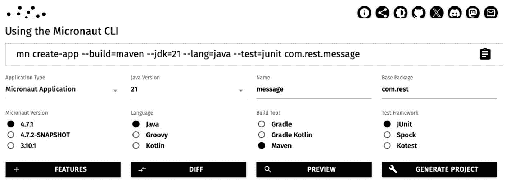

该图片显示了一个使用 CLI 创建 Micronaut 应用程序的用户界面。显示的命令是 "mn create-app --build=maven --jdk=21 --lang=java --test=junit com.rest.message"。选择的选项包括 Micronaut Application 类型、Java 版本 21、应用程序名称 "message" 和基础包 "com.rest"。Micronaut 版本为 4.7.1，语言选项包括 Java、Groovy 和 Kotlin。选择的构建工具是 Maven，测试框架是 JUnit。底部的按钮包括 Features、Diff、Preview 和 Generate Project。

图 3-4
创建应用程序代码的命令行选项截图

代码生成后，切换到 message 文件夹。以下代码创建了一个带有属性 message 的域对象 Message。

```
package com.rest.model;
import javax.validation.constraints.NotNull;
public class Message {
@NotNull
private String message;
public String getMessage() {
return message;
}
public void setMessage(String message) {
this.message = message;
}
}
~
```

现在，在导航到 Micronaut 生成的 message 代码后，在 src/main/java/com/rest 文件夹中创建一个新的控制器文件夹。

以下代码暴露了两个端点：

1.  message/xml 用于以 XML 格式获取消息属性值

2.  message/json 用于以 JSON 格式获取消息属性值


```
package com.rest.controllers;
import com.rest.model.Message;
import io.micronaut.http.annotation.Get;
import io.micronaut.http.annotation.Controller;
import io.micronaut.http.HttpResponse;
import io.micronaut.http.MediaType;
import io.micronaut.http.annotation.Produces;
@Controller("/message")  // 
public class MessageController {
@Produces(MediaType.TEXT_XML)
@Get("/xml")
public HttpResponse messageXml() {
Message message = new Message();
message.setMessage("Hello from Micronaut");
final String xml = encodeAsXml(message);
return HttpResponse.ok(xml).contentType(MediaType.APPLICATION_XML_TYPE);
}
@Produces(MediaType.TEXT_JSON)
@Get("/json")
public HttpResponse messageJson() {
Message message = new Message();
message.setMessage("Hello from Micronaut");
return HttpResponse.ok(message);
}
private String encodeAsXml(final Message message) {
return String.format("%s", message.getMessage());
}
}
```

你可以使用以下命令在 `message` 文件夹中运行代码：

```
./mvnw mn:run
```

*使用* *POSTMAN* *按照截图查看消息的 JSON 和 XML 响应*

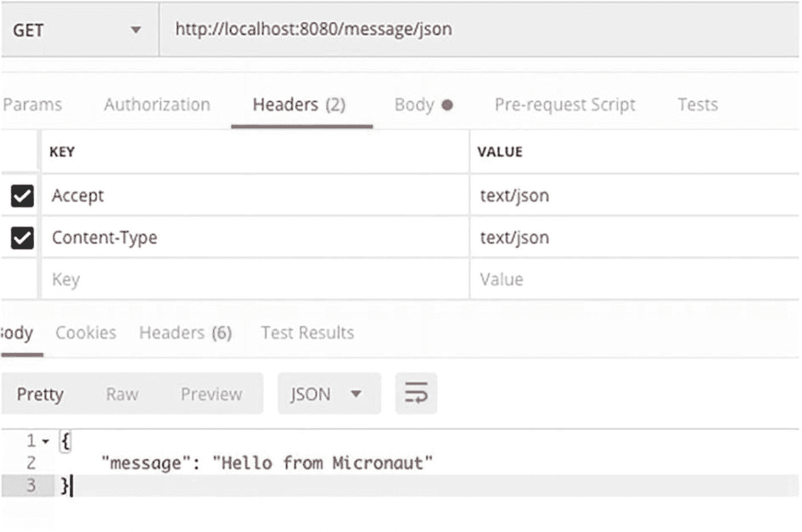

REST 客户端界面中 GET 请求的截图。URL 为
"http://localhost:8080/message/json"。Headers 选项卡处于激活状态，显示
两个标头："Accept" 和 "Content-Type"，均设置为 "text/json"。响应
体显示一个包含消息 "Hello from Micronaut" 的 JSON 对象。

图 3-5.
在 POSTMAN 中为消息服务调用 REST API 以获取 JSON 响应

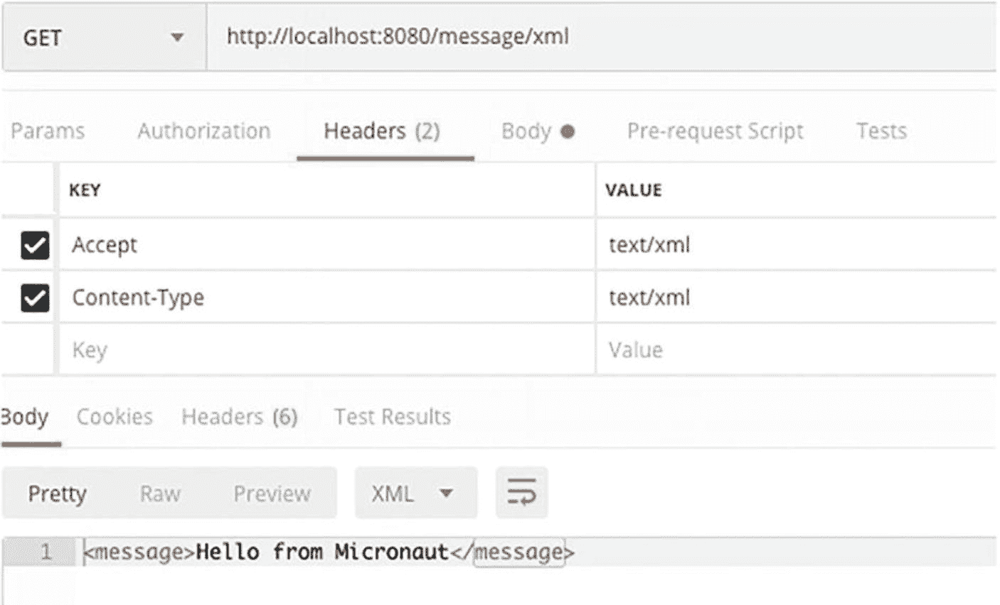

使用工具向 "http://localhost:8080/message/xml" 发送 HTTP GET 请求的截图。Headers 部分
显示两个键值对："Accept" 和 "Content-Type"，均设置为 "text/xml"。响应体显示一条 XML 消息：
"<message>Hello from Micronaut</message>。"

图 3-6.
在 POSTMAN 中为消息服务调用 REST API 以获取 XML 响应

总结
在本章中，我们回顾了使用 XML 和 JSON 格式的消息传递，并对它们进行了
比较。然后，我们开发了 API，用于从 Micronaut 应用返回 XML 和 JSON 响应。

4. API 设计与建模

本章从 API 设计策略开始，然后进入 API
创建过程和建模。讨论了 REST API 设计的最佳实践，随后是 API 解决方案架构。在练习中，
为播客订阅设计了一个简单的 API，然后使用 OpenAPI 进行建模。

API 设计策略

正如 UI 之于 UX（用户体验），API 之于
APX（应用程序编程体验）。在 APX 中，回答以下问题至关重要：

*   应该暴露什么？

*   暴露数据的最佳方式是什么？

*   应如何调整和改进 API？

此外，我们来讨论一下为什么应该开发良好的应用程序编程体验。
良好的 API 会鼓励开发者使用它并与他人分享，
从而形成一个良性循环：每一次额外的成功实施都会带来更多的参与和来自开发者的更多贡献，
这些开发者会为你的服务增加价值。首先我要说的是，API 设计
很难。
同时，良好的 API 将有助于发展一个由员工、客户和合作伙伴组成的生态系统，他们能够使用你的 API 并以互惠互利的方式帮助其持续演进。

API 设计有四种策略：

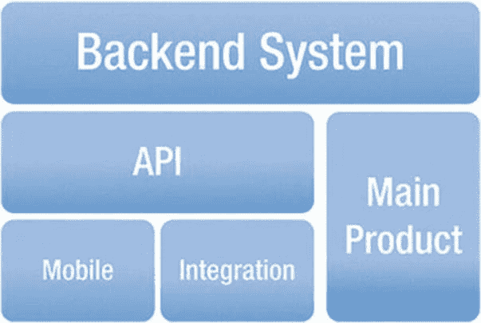

说明后端系统架构的图表。顶部块标记为
"后端系统"，下方连接到三个块："API"、"主要产品"以及两个较小的块，标记为"移动"和"集成"。该布局暗示了一种层次结构，后端系统支持各种组件。

图 4-1
附加策略

*   **附加策略**：这是指你拥有一个
    现有应用程序，并在事后添加 API。这利用了现有代码和系统的优势（图 4-1）。

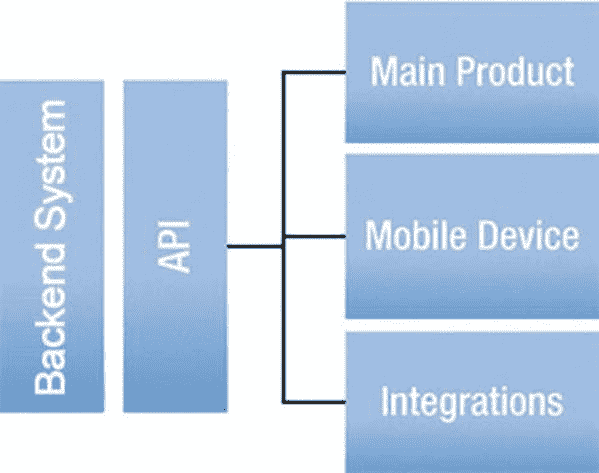

说明系统架构的图表。后端系统
连接到 API，API 分支到三个组件：主要产品、移动设备和集成。

图 4-2
绿地策略

*   **绿地策略**：这是另一个极端。
    这是"API 优先"或"移动优先"背后的策略，也是开发 API 最简单的情况。由于你是从零开始，
    你可以利用以前可能没有的技术和概念（图 4-2）。

绿地或 API 优先策略是一种基于模拟的设计实现。

后端系统的模拟是在无需完全实现的后端系统的情况下开发后端系统。通过 API 的模拟，消费者可以在没有完全开发的 API 的情况下开始应用程序的开发。

*   **敏捷设计策略**：敏捷性基于
    这样一个前提：你可以在没有完整规格的情况下开始。你总是可以
    在后续过程中，随着学习和了解的深入，调整和更改规格。通过
    多次迭代，架构设计可以收敛到正确的解决方案。敏捷方法只应在 API 发布之前应用。

*   最后，还有外观策略，这是绿地策略和附加策略之间的中间地带。
    在这种情况下，你可以利用现有的业务系统，同时根据你的偏好和需求对其进行塑造。这使你能够在保持现有工作系统正常运行的同时，改进底层架构。

API 创建过程与方法论
在本节中，我们将回顾 API 创建过程和方法论。为了交付优秀的 API，设计必须成为首要关注点。正如优化 UX（用户体验）已成为 UI 开发的主要关注点一样，优化 APX（API 用户体验）也应成为 API 开发的主要关注点。

过程
首先，确定你的业务价值。在思考业务价值时，请考虑关于为什么需要 API 的"电梯演讲"。开发者参与度不是一个很好的目标；你需要一个切实的目标：提高用户参与度，将活动从主要产品转移到 API，吸引并留住合作伙伴等。

选择你的指标，例如：

*   正在使用的开发者密钥数量

*   开发的应用程序数量

*   通过 API 进行交互的用户数量

*   合作伙伴集成数量

*   API 如何增强公司的整体目标，而不仅仅是确定有多少人开始集成

API 方法论

在敏捷策略的情况下，它包含五个阶段：

*   领域分析或 API 描述

*   架构设计

*   原型设计

*   构建用于生产的 API

*   发布 API

领域分析或 API 描述
为领域分析定义你的用例。参与者是谁？他们是外部还是内部？消费者希望使用 API 构建哪些 API 解决方案？使用该 API 还可能实现哪些其他 API 解决方案？
消费者想要使用的 API 应该是什么样子？消费者想要构建什么应用程序？消费者希望在其应用程序中使用哪些数据或领域对象？

将活动分解为步骤或写下使用场景：

*   依赖资源不能脱离另一个资源而存在。

*   例如，播客与其消费者的关联无法确定，除非播客及其消费者已被创建。

*   独立资源可以脱离另一个资源而存在。

*   例如，播客资源可以存在而没有任何依赖关系。

*   关联资源独立存在，但仍具有某种关系，即，它可能通过引用连接。

*   如前所述


下一步是识别资源状态之间可能的转换。状态之间的转换提供了需要支持的 HTTP 方法的指示。以可以添加到播放列表的播客为例，我们来分析不同的状态（表 4-1）。

表 4-1
领域分析示例

状态 | 操作 | 领域对象 | 描述
--- | --- | --- | ---
CREATE | POST | PODCAST | 创建播客
READ | GET | PODCAST | 读取播客
READ | GET/{podcast_id} | PODCAST | 读取播客
UPDATE | PUT/{playlist_id} | PODCAST | 更新播客

此外，通过构建一个简单的演示应用进行验证。这个演示应用不仅仅是 curl 调用，它还为 API 提供了一个展示平台，并可在后续阶段重复使用。

**架构设计**

在此阶段，API 描述或分析阶段被进一步细化。架构设计应就以下方面做出决策：

*   协议
*   端点
*   URI 设计
*   安全性
*   性能或可用性

详细设计描述：

*   资源
*   表示
*   内容类型
*   参数
*   HTTP 方法
*   HTTP 状态码
*   一致的命名

此外，通过查看 API 组合中的通用 API 来关注可重用性。设计决策应与 API 组合中的 API 保持一致。API 组合是企业中 API 的集合，如第 5 章所述。

作为设计验证的一部分，可以在此处根据设计决策进一步扩展演示应用。需要验证的问题如下：

*   API 仍然易于使用。
*   API 简单且支持用例。
*   API 遵循架构风格。

**原型设计**
原型设计是为生产实现做准备。选取复杂的用例，并以高保真度端到端地实现。原型是不完整的，并且使用了捷径。如果在构建原型时后端功能不可用，它可以包含 API 的模拟。原型制作完成后，会与试点消费者进行验收测试，作为对 API 的验证。试点消费者是来自 API 提供方团队的内部客户。

**实现**
实现需要符合 API 描述，并需要尽快交付。此外，API 需要完全集成到后端系统和 API 组合中。这应具备所有期望的功能以及 API 的非功能性方面，如性能、安全性和可用性。在此阶段，由于已经历多次迭代，API 描述应保持稳定。为了进行验证，可以在本阶段挑选出特定的 API 消费者。

**发布**
API 的发布不需要大量工作，但这对 API 来说是一个重要的里程碑。从组织的角度来看，API 的责任从开发部门转移到运维部门。发布后，开发过程不再具有敏捷性。任何变更都需要传统的变更管理流程。作为验证的一部分，需要对成功与失败的 API 调用进行分析，并识别由维护团队支持的文档缺口。

**API 建模**

为你的 API 建模模式意味着创建一个设计文档，该文档可以与其他团队、客户或高管共享。模式模型是你的组织与将要使用它的客户端之间的契约。模式模型本质上是一个契约，描述了 API 是什么、它如何工作以及端点具体是什么。可以将其视为 API 的地图，是对每个端点的用户可读描述，可以在编写任何代码之前用于讨论 API。图 4-3 展示了 API 建模框架，在该框架中，你定义了 API 规范并生成 API 文档。同时，还会生成服务器和客户端源代码。

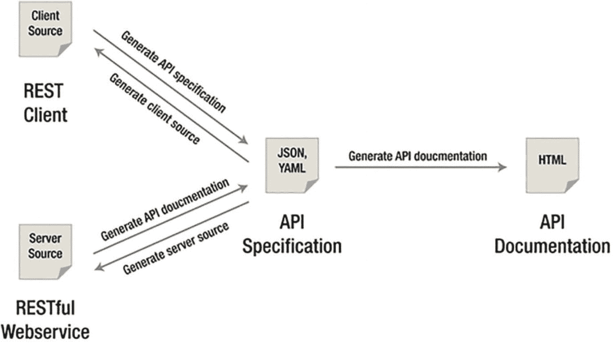


此图展示了从 RESTful Web 服务生成 API 文档的流程。REST 客户端和服务器源码生成 JSON 或 YAML 格式的 API 规范。该规范用于生成客户端和服务器端源码，以及 HTML 格式的 API 文档。箭头指示了从客户端和服务器源码到 API 规范，以及从 API 规范到 API 文档的流向。

图 4-3
API 建模

在开始开发之前创建此模型，有助于确保您创建的 API 能够满足已识别用例所描述的需求。所使用的三种模式建模系统及其标记语言如下：

*   **RAML**：Markdown，相对较新。优秀的在线建模工具：RESTful API 建模语言

*   **OpenAPI (Swagger)**：JSON，社区庞大

*   **Blueprint**：Markdown，采用率低

本章中的 OpenAPI (Swagger)练习展示了为播客资源完成的建模。
每种模式建模语言都有可用的工具，用于根据您创建的模式自动进行测试或代码生成，但即使没有此功能，模式模型也能帮助您在编写一行代码之前就对 API 有扎实的理解。

图 4-4 展示了 API 建模工具。


该图像采用深色背景，顶部写着“一次编写。多次使用。鼓励创造性懒惰。”下方有五个六边形图标，每个代表流程的不同阶段：设计（带代码符号）、构建（带扳手）、测试（带实验室烧瓶）、文档（带清单）和共享（带网络图）。每个图标都用不同的颜色勾勒出轮廓。

图 4-4
API 建模工具

API 建模对比

表 4-2
API 建模工具对比

类别 |
 属性 |
 RAML |
 API Blueprint |
 Swagger |

| --- | --- | --- | --- | --- | --- | --- | --- | --- | --- | --- |

名称背后是什么？ |
 格式 |
 YAML |
 Markdown (MOSN) |
 JSON |

|
 获取地址 |
 GitHub |
 GitHub |
 GitHub |

|
 赞助方 |
 MuleSoft |
 Apiary |
 SmartBear |

|
 初始提交 |
 2013 年 9 月 |
 2013 年 4 月 |
 2011 年 7 月 |

|
 商业产品 |
 是 |
 是 |
 是 |

如何建模 REST？ |
 资源 |
 X |
 X |
 X (“api”) |

|
 方法/动作 |
 X (“methods”) |
 X (“actions”) |
 X (“operations”) |

|
 查询参数 |
 X |
 X |
 X |

|
 路径/URL 参数 |
 X |
 X |
 X |

|
 表示 |
 X |
 X |
 X |

|
 头部参数 |
 X |
 X |
 X |

|
 文档 |
 X |
 X |
 X |

|
 参考链接 |
 [`http://raml.org`](http://raml.org) |
 [`https://apiblueprint.org`](https://apiblueprint.org) |
 [`http://swagger.io`](http://swagger.io) |

|
 设计理念 |
 API 优先 |
 设计优先 |
 现有 API |

|
 代码生成 |
 X |
   |
 X |

客户是谁？ |
   |
   |
   |
 Apigee, Microsoft, PayPal |

总结

*   Swagger 拥有非常强大的建模语言，可以精确定义系统的预期行为——对于测试和为一系列 API 创建代码存根非常有用。

*   RAML 旨在支持设计优先的开发流程，并专注于一致性。

*   API Blueprint 更侧重于文档，其首要任务是提供用户可读的模型和文档。

每个项目都带来了不同的优势和劣势，最终，这取决于您需要哪些优势，以及您无法容忍哪些劣势。总体而言，RAML 在这些不同类别中表现最佳，虽然其开发者社区不如其他社区庞大，但我认为可以肯定地说它将继续增长。总体赢家是 RAML。

最佳实践
REST 是一种架构风格而非严格标准；它允许很大的灵活性。由于这种灵活性和结构自由，对设计最佳实践的需求也很大。本节将讨论这些最佳实践。

保持基础 URL 简单直观

基础 URL 是 API 最重要的设计启示。简单直观的基础 URL 设计使您的 API 易于使用。启示是一种设计属性，它无需文档就能传达应如何使用某物。门把手的设计应传达是拉还是推。对于 Web API 设计，每个资源应只有两个基础 URL。让我们围绕一个简单的对象或资源（客户）来建模一个 API，并为其创建一个 Web API。第一个 URL 用于集合；第二个用于集合中的特定元素：

*   **/customers**：集合

*   **/customers/1**：特定元素

将其简化到这一层也将迫使动词从您的基础 URL 中消失。如表 4-3 所示，请将动词排除在 URL 之外。

表 4-3
名词与动词

资源 |
 POST 创建 |
 GET 读取 |
 PUT 更新 |
 DELETE 删除 |

| --- | --- | --- | --- | --- | --- | --- | --- | --- | --- | --- |

`/customers` |
 新客户 |
 客户列表 |
 批量更新 |
 删除所有 |

`/customers/12` |
 – |
 显示客户 12 |
 如果存在则更新
如果不存在则报错 |
 删除客户 12 |

总结

*   每个资源使用两个基础 URL。将动词排除在基础 URL 之外。使用 HTTP 动词对集合和元素进行操作。

*   抽象级别取决于您的场景。您还需要公开数量可控的资源。

*   力求具体命名，并将资源数量保持在 12 到 24 个之间。

*   直观的 API 使用复数名词而非单数名词，使用具体名词而非抽象名词。

*   资源几乎总是与其他资源存在关系。在 Web API 中表达这些关系的简单方法是什么？让我们再次看看我们建模的 API——名词是好东西，动词是坏东西——即与我们的播客资源交互的 API。记住，我们有两个基础 URL：/podcasts 和 /podcasts/1234。我们使用 HTTP 动词对资源和集合进行操作。我们的播客属于客户。要获取属于特定客户的所有播客或为该客户创建新播客，请执行 GET 或 POST：

*   GET /customers/5678/podcasts

*   POST /customers/5678/podcasts

*   将复杂性隐藏在“?”后面。通过将可选状态和属性放在 HTTP 问号后面，使开发人员能够轻松使用基础 URL。要获取`usa`国家`ca`州`sfo`城市的所有客户，请使用 GET：

*   GET /customers?country=usa&state=ca&city=so

错误处理
许多软件开发人员（包括我自己）并不总是喜欢考虑异常和错误处理，但对于任何软件开发人员，尤其是 API 设计者来说，这是拼图中非常重要的一块。为什么良好的错误设计对 API 设计者尤其重要？从使用您 Web API 的开发者的角度来看，该接口另一侧的一切都是一个黑盒。因此，错误成为提供上下文和了解如何使用 API 的关键工具。首先，开发者通过错误来学习编写代码。极限编程模型中的“测试优先”概念以及较新的“测试驱动开发”模型代表了一套不断演变的最佳实践，因为这是开发者工作的一种重要且自然的方式。其次，除了在开发应用程序时，开发者在关键时期（即当他们使用您的 API 构建的应用程序交付给用户后，需要进行故障排除和解决问题时）也依赖于设计良好的错误。

**处理错误**：让我们看看三个顶级 API 是如何处理的

*   Facebook

HTTP 状态码：200

```
    {"type" : "OauthException", "message":"(#803) 您请求的某些别名不存在: foo.bar"}
    ```

*   Twilio

HTTP 状态码：401


```
    {"status" : "401", "message":"Authenticate","code": 20003, "more info": "http://www.twilio.com/docs/errors/20003"}
    ```

*   SimpleGeo 提供的另一个错误消息示例

HTTP 状态码：401

```
{"code" : 401, "message": "Authentication Required"}
```

归根结底，应用与 API 之间的交互实际上只有三种结果：

*   **一切正常**：成功

*   **应用操作有误**：客户端错误

*   **API 操作有误**：服务器错误

错误码

首先使用以下三个与上述三种结果对应的状态码。如果需要更多，可以添加，但通常不需要超出以下范围：

*   **200**：OK（成功）

*   **400**：Bad request（错误请求）

*   **500**：Internal server error（服务器内部错误）

如果你觉得将所有错误情况缩减为这三种不太合适，可以尝试从以下五个额外状态码中选择：

*   **201**：Created（已创建）

*   **304**：Not modified（未修改）

*   **404**：Not found（未找到）

*   **401**：Unauthorized（未授权）

*   **403**：Forbidden（禁止访问）

查看维基百科上关于所有 HTTP 状态码的优质条目：[`https://en.wikipedia.org/wiki/List_of_HTTP_status_codes`](https://en.wikipedia.org/wiki/List_of_HTTP_status_codes)。

版本管理

切勿发布不带版本的 API。

*   强制要求版本号。

*   使用“`v`”前缀指定版本。将其放在 URL 的最左侧，使其具有最高作用域（例如，`/v1/dogs`）。

*   使用简单的序数。不要使用像 v1.2 这样的点分表示法，因为它暗示了 API 无法良好支持的版本粒度——API 是接口，而非实现。坚持使用 `v1`、`v2` 等。

*   应该维护多少个版本？至少维护一个旧版本。

*   一个版本应该维护多久？在废弃一个版本之前，至少给开发者一个周期来做出反应。

*   有一种主流观点认为应将格式（XML 或 JSON）和版本放在请求头中。我们遵循的简单规则是：如果它改变了你处理响应的逻辑，就将其放在 URL 中以便于查看；如果它不改变每个响应的逻辑（如 OAuth 信息），则将其放在请求头中。

部分响应

部分响应允许你只向开发者提供他们所需的信息。例如，向 Twitter API 请求一条推文。你得到的数据通常比一个典型的 Twitter 应用所需的要多得多，包括用户名、推文文本、时间戳、转发次数以及大量元数据。让我们看看几个主流 API 如何仅向开发者提供他们所需的响应信息，包括率先提出部分响应概念的 Google：

*   LinkedIn

```
    /people:(id,first-name,last-name,industry)此请求针对一个人返回其 ID、名字、姓氏和行业
    ```

*   Facebook

*   Google

```
/joe.smith/friends?fields=id,name,picture
```

```
?fields=title,media
```

Google 和 Facebook 采用了类似的方法，效果很好。它们都有一个名为“fields”的可选参数，后面跟上你想要返回的字段名称。如本例所示，你还可以在响应中包含子对象，以从其他资源中获取更多信息。

分页

让开发者能够轻松地对数据库中的对象进行分页。让我们看看 Facebook、Twitter 和 LinkedIn 如何处理分页。Facebook 使用 offset 和 limit。Twitter 使用 page 和 rpp（每页记录数）。LinkedIn 在语义上使用 start 和 count。Facebook 和 LinkedIn 的做法本质相同，即 LinkedIn 的 start 和 count。

要从每个系统中获取第 50 到第 75 条记录，你可以使用以下参数：

*   **Facebook**：`offset` 为 50，`limit` 为 25

*   **Twitter**：`page` 为 3，`rpp` 为 25（每页记录数）

*   **LinkedIn**：`start` 为 50，`count` 为 25

多种格式

我们建议你支持多种格式——以一种格式输出，并尽可能多地接受其他格式。你通常可以自动完成格式之间的映射。以下是几个关键 API 的语法示例：

*   **Google Data**：`?alt=json`

*   **Foursquare**：`/venue.json`

*   **LinkedIn**：`Accept: application/json`

API 外观模式

当你希望为复杂的子系统提供简单接口时，可以使用外观模式。子系统在演进过程中通常会变得越来越复杂。

实现 API 外观模式包含三个基本步骤：

1.  设计理想的 API——设计 URL、请求参数和响应、请求头、查询参数等。API 设计应保持自洽。这意味着你要向开发者提供他们所需的信息。

2.  使用数据桩实现该设计。这允许应用开发者在你的 API 连接到内部系统之前就能使用它并提供反馈。

3.  在外观与系统之间进行中介或集成。

API 解决方案架构

开发者和架构师通常将 API 视为企业 IT 中长期使用的基于集成架构的延续。但这种观点是狭隘的。为了理解 API 的需求和要求，让我们讨论一下由 API 实现的典型解决方案。

图 4-5 展示了 API 解决方案架构。

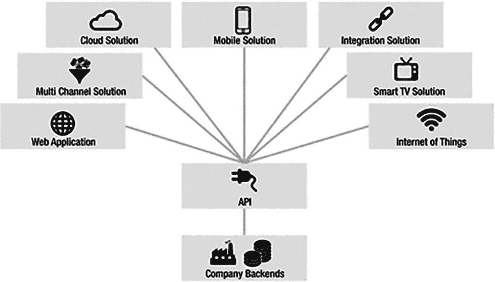

图示：API 作为连接各种解决方案的中心枢纽：云解决方案、移动解决方案、集成解决方案、智能电视解决方案、物联网、Web 应用和多渠道解决方案。这些解决方案连接到公司后端，突显了 API 在集成不同技术中的作用。

图 4-5
API 解决方案架构

API 解决方案通常包含两个组成部分：

*   暴露 API

*   暴露的 API 位于服务器端，例如云端或本地。

*   消费 API

*   Web 或移动应用以及物联网上的嵌入式设备。

移动解决方案

移动应用需要连接到互联网上的服务器才能使用，或者至少才能充分发挥其潜力——应用上运行部分业务逻辑，云端服务器上运行繁重的处理逻辑。这些服务器上托管的功能可以通过 API 调用来访问。移动设备上捕获的数据通过 API 调用发送到服务器，API 再将数据交给服务，最后存入数据库。API 提供的数据需要轻量化。这确保了处理能力有限的设备也能消费 API。通常，移动应用提供商为其移动应用提供 API。

云解决方案

SaaS 云解决方案通常包含一个 Web 应用和 API。Web 应用对消费者可见。在底层，云解决方案通常也提供 API，例如 Dropbox、Salesforce、Workday 和 Oracle Cloud。

Web 解决方案

Web 应用根据用户请求显示动态网页；网页是使用后端提供的数据实时创建的。Web 应用从 API 中提取原始数据，处理数据（JSON、XML），并以 HTML 格式显示，例如播客或客户 API。

集成解决方案

API 提供了连接、扩展和集成软件所必需的功能。通过集成软件 API，企业可以与其他企业建立连接。企业可以通过与合作伙伴建立联系来扩展业务。集成不仅在外部有意义，在内部集成系统也同样重要。

多渠道解决方案

如今，电子商务系统为客户提供在多个平台（移动端、Web 端、平板端）上购物的体验。当消费者从一个平台切换到另一个平台时，需要提供无缝的体验。这可以通过提供一个支持多渠道并维护用户体验状态的通用 API 来实现。


智能电视解决方案
智能电视不仅提供电视频道，还具备交互功能。这些功能均通过向服务器发送 API 调用来实现。

物联网
物联网由具备互联网连接的物理设备组成。设备连接至通过 API 暴露在互联网上的智能功能（例如传感器、扫描仪等）。

API 解决方案中的利益相关者
在 API 解决方案中，利益相关者包括 API 提供者、API 消费者和最终用户。本节将讨论各方的角色。

API 提供者
API 提供者负责开发、设计、部署和管理 API。他们定义 API 组合、路线图和产品模式。API 提供者的职责是决定 API 暴露哪些功能。在解决方案驱动的方法中，仅构建消费者所需的 API。在自上而下的方法中，API 提供者从内部视角（例如可复用性角度）提供有益的 API。

API 消费者
消费者需要了解如何调用 API 并构建 API 客户端。API 提供者应为消费者提供演示应用以使用其 API。

最终用户
最终用户不直接调用 API，而是使用由 API 消费者开发的应用。

API 建模

OpenAPI（Swagger）
MICRONAUT LAUNCH 页面截图，包含四个标题：应用类型、Java 版本、名称和基础包。
本教程将引导您完成使用 Swagger（针对航班乘客 API 的 Micronaut）创建 OpenAPI 规范的步骤：
切换到项目目录。
创建模型文件夹。
创建控制器文件夹。
创建服务文件夹。
在模型文件夹中使用您选择的编辑器创建 Flight 类。粘贴以下 Flight 类属性的定义，然后选中粘贴的代码并生成 getter 和 setter 方法。

在模型文件夹中创建 Passenger 类。粘贴乘客属性代码，然后生成 getter 和 setter 方法：

```
package com.rest.domain;
import io.swagger.v3.oas.annotations.media.Schema;
@Schema(description="Passenger")
public class Passenger {
private String id;
private String name;
public String getId() {
return id;
}
public void setId(String id) {
this.id = id;
}
public String getName() {
return name;
}
public void setName(String name) {
this.name = name;
}
}
```

在服务文件夹中创建 FlightService 类并粘贴以下代码。在此代码中，我们创建 flightRepo 用于在内存中存储航班。将实现 get 方法以获取航班详情和所有航班列表。

```
package com.rest.service;
import com.rest.domain.Flight;
import java.util.Map;
import java.util.List;
import java.util.ArrayList;
import java.util.HashMap;
import java.util.concurrent.atomic.AtomicInteger;
public class FlightService {
static private Map flightRepo = new HashMap();
static private AtomicInteger idCounter = new AtomicInteger();
public Flight getFlight(String id) {
Flight flight = flightRepo.get(id);
return flight;
}
public  List getFlightsByPassenger(String passengerId) {
return new ArrayList(flightRepo.values());
}
}
```

在服务文件夹中创建 PassengerService 类并粘贴以下代码：

```
package com.rest.service;
import com.rest.domain.Passenger;
import java.util.Map;
import java.util.List;
import java.util.ArrayList;
import java.util.HashMap;
import java.util.concurrent.atomic.AtomicInteger;
public class PassengerService {
static private Map passengerRepo = new HashMap();
static private AtomicInteger idCounter = new AtomicInteger();
public Passenger getPassenger(int id) {
Passenger passenger = passengerRepo.get(id);
return passenger;
}
public  List getPassengers() {
return new ArrayList(passengerRepo.values());
}
}
```

在控制器文件夹中创建 FlightController 类并粘贴以下代码：

```
package com.rest.controller;
import com.rest.domain.Flight;
import com.rest.service.FlightService;
import io.micronaut.http.annotation.Get;
import io.micronaut.http.annotation.Controller;
import io.micronaut.http.HttpHeaders;
import io.micronaut.http.HttpResponse;
import io.micronaut.http.MediaType;
import io.micronaut.http.annotation.Produces;
import io.micronaut.http.annotation.Controller;
import io.micronaut.http.annotation.Delete;
import io.micronaut.http.annotation.Get;
import io.micronaut.http.annotation.Post;
import io.micronaut.http.annotation.Put;
import io.micronaut.http.annotation.Body;
import java.util.List;
@Controller("/flight")  // 
public class FlightController {
FlightService flightService;
public FlightController(FlightService flightService) { // 
this.flightService = flightService;
}
@Get("/{id}")
public Flight getFlight(String id)    {
Flight flight = flightService.getFlight(id);
return flight;
}
@Get("/passenger/{id}")
public List getFlightsByPassenger(String id) {
List flights = flightService.getFlightsByPassenger(id);
return flights;
}
}
```

使用 VSC 在控制器文件夹中创建 PassengerController 类并粘贴以下代码：

```
package com.rest.controller;
import com.rest.domain.Passenger;
import com.rest.service.PassengerService;
import io.micronaut.http.annotation.Get;
import io.micronaut.http.annotation.Controller;
import io.micronaut.http.HttpHeaders;
import io.micronaut.http.HttpResponse;
import io.micronaut.http.MediaType;
import io.micronaut.http.annotation.Produces;
import io.micronaut.http.annotation.Controller;
import io.micronaut.http.annotation.Delete;
import io.micronaut.http.annotation.Get;
import io.micronaut.http.annotation.Post;
import io.micronaut.http.annotation.Put;
import io.micronaut.http.annotation.Body;
import java.util.List;
@Controller("/passenger")  // 
public class PassengerController {
PassengerService passengerService;
public PassengerController(PassengerService passengerService) { // 
this.passengerService = passengerService;
}
@Get("/{id}")
public Passenger getPassenger (int id)    {
Passenger passenger = passengerService.getPassenger(id);
return passenger;
}
@Get
public List getPassengers() {
List passengers = passengerService.getPassengers();
return passengers;
}
}
```

首先，将 Micronaut 的 OpenAPI 添加到 pom.xml 文件中构建配置的注解处理器作用域：

```
io.micronaut.openapi
micronaut-openapi
${micronaut.version}

```

对于 Swagger 注解，将以下内容添加到 pom.xml 文件：

```
io.swagger.core.v3
swagger-annotations

```

配置依赖项后，最低要求是将以下内容添加到 Application 类：

```
import io.swagger.v3.oas.annotations.OpenAPIDefinition;
import io.swagger.v3.oas.annotations.info.Contact;
import io.swagger.v3.oas.annotations.info.Info;
import io.swagger.v3.oas.annotations.info.License;
@OpenAPIDefinition(
info = @Info(
title = “Flight",
version = "0.1",
description = "Flight API",
license = @License(name = "Apache 2.0", url = "https://foo.bar"),
contact = @Contact(url = "https://gigantic-server.com", name = "Fred", email = "Fred@gigagantic-server.com")
))
使用命令"mvn package"编译应用程序。
cd target/classes/META-INF/swagger
在文件 flight-0.1.yml 中生成 OpenAPI YAML。
```

完成 API 建模后，您可以生成文档并与 API 消费者共享。Swagger 允许在浏览器中更易读地访问 API。接下来，我们将配置 Swagger。

在 application.yml 文件中配置以下内容以启用 Swagger。您可以在 src/main/resources 文件夹中找到 application.yml 文件：

```
micronaut:
router:
static-resources:
swagger:
paths: classpath:META-INF/swagger
mapping: /swagger/**
```

完成上述配置后，运行应用程序时，您可以通过`http://localhost:8080/swagger/flight-0.1.yml`访问 Swagger 文档。


摘要
本章从 API 设计策略入手，接着探讨了 API 的创建流程与建模。讨论了 REST API 设计的最佳实践，随后介绍了 API 解决方案架构。我们对比了多种 API 建模工具，并使用 Micronaut 为航班乘客开发了一个 API。

5. JAX-RS 简介

本章介绍 JAX-RS 的基本概念及其在 Micronaut 中的实现。

JAX-RS 概述

Java API for RESTful Web Services（JAX-RS）是一个 Java 编程语言 API 规范，为按照 REST 架构模式创建 Web 服务提供支持。JAX-RS 究竟是什么？JAX-RS 是一个基于 POJO、注解驱动的框架，用于构建符合 RESTful 原则的 Web 服务。想象一下，需要编写所有底层代码来解析 HTTP 请求，并编写逻辑将这些请求连接到相应的 Java 类/方法。JAX-RS API 的精妙之处在于，它将开发者从这种复杂性中解放出来，使其能够专注于业务逻辑。这正是 POJO 和注解发挥作用的地方！JAX-RS 提供了注解，用于将特定的 URI 模式和 HTTP 操作绑定到 Java 类的各个方法上。JAX-RS 是一组接口和 Java 注解的集合，简化了服务端 REST 应用程序的开发。与其他类型的分布式系统相比，使用 JAX-RS 技术开发的 REST 应用程序更易于开发和消费。以下是 JAX-RS 提供的主要特性：

*   基于 POJO 的资源类
*   以 HTTP 为中心的编程模型
*   实体格式无关性
*   容器无关性
*   包含在 Java EE 中
*   是用于构建和消费 RESTful Web 服务的标准化 API
*   **Application**：指定哪些 Java 类处理哪些请求
*   **Resources**：用于构建 RESTful 服务的基础 Java 代码和注解
*   **Providers**：用于数据编组和解组（POJO Customer）的工具
*   **Client API**：用于构建 RESTful 服务客户端的基础 Java 代码和注解
*   **Filters and interceptors**：用于在请求-响应调用链中插入执行代码的工具
*   **Validation**：为传入数据提供基于注解的验证。例如：

@NotNull @FormParam ( “firstname” ) String firstname, @NotNull
@FormParam ( “lastname” ) String lastname, @Email @FormParam ( “email” )
String email)

*   **Asynchronous processing**：为客户端和服务端处理长时间运行的请求提供异步请求支持（@Suspended）
*   **@Context**：为客户端和提供者实现类提供访问运行时环境中有用对象的途径，例如，header

输入与输出内容类型

以下是 JAX-RS 支持的媒体类型。这些类型应在 REST 资源生成或消费内容的请求和响应注解中使用。

*   **APPLICATION_JSON**：application/json
*   **APPLICATION_XML**：application/xml（使用编码）
*   **TEXT_HTML**：text/html
*   **TEXT_PLAIN**：text/plain
*   **TEXT_XML**：text/xml
*   application 和 text 媒体类型的区别在于国际化。application 类型支持国际化编码。

示例：@Produces(“application/json”), @Consumes(“text/xml”)

JAX-RS 注入
JAX-RS 的许多功能涉及从 HTTP 请求中提取信息并将其注入到 Java 方法中。你可能只对传入 URI 的某一部分感兴趣。你可能对 URI 查询字符串的值感兴趣。客户端可能正在发送你的服务处理请求所需的关键 HTTP 头或 cookie 值。JAX-RS 允许你通过一组注入注解和 API 按需获取这些信息。

JAX-RS 注解可以注入许多不同的内容。以下是规范提供的列表：


*   你需要使用 JAX-RS 中的 `@Path` 注解来为传入的 HTTP 请求定义 URI 匹配模式。你可以将其放在类上或一个或多个方法上。如果你希望一个类接收 HTTP 请求，你必须至少使用 `@Path(“/”)` 对其进行注解。这个被注解的类随后被称为 JAX-RS 根资源。

*   要使用 `@Path` 注解，你需要提供一个相对于 JAX-RS 应用上下文根的 URI 表达式。

`@javax.ws.rs.Path`

*   `@PathParam` 允许你从 URI 模板参数中提取值。

`@javax.ws.rs.PathParam`

*   `@QueryParam` 允许你从 URI 查询参数中提取值。

`@javax.ws.rs.QueryParam`

*   `@FormParam` 允许你从提交的表单数据中提取值。

`@javax.ws.rs.FormParam`

*   `@HeaderParam` 允许你从 HTTP 请求头中提取值。

`@javax.ws.rs.HeaderParam`

*   `@CookieParam` 允许你从客户端设置的 HTTP Cookie 中提取值。

`@javax.ws.rs.CookieParam`

*   `@MatrixParam` 允许你从 URI 矩阵参数中提取值。

`@javax.ws.rs.MatrixParam`

*   `@Context` 类是一个通用的注入注解。它允许你注入由 JAX-RS API 提供的各种辅助和信息对象。

`@javax.ws.rs.core.Context`
以下是 JAX-RS 注入的几个示例。

路径参数

单个参数：

```
@Path("/customers/{id}")
public String getCustomer(@PathParam("id") int id);
```

多个参数：

```
@Path("/products/{name}-{version}")
public String getProduct(@PathParam("name") String name, @PathParam("version") String version)
```

查询参数

通过查询参数限定来请求子集：

```
http://restapi/products?start=0&count=10
@GET
@Produces("application/json")
public String getProducts(@QueryParam("start") int start, @QueryParam("count") int count);
public String getProducts(@Context Uriinfo info)
String info.getQueryParameters().getFirst("start");
```

Cookie 参数

使用 `@CookieParam` 来检索单个值：

```
public string get(@CookieParam("userId") String userId)
```

请求头参数

用于注入 HTTP 请求头的值：

```
public String get(@HeaderParam("Accept") String accept)
```

表单参数

`@FormParam` 用于从 HTML 的请求体中检索信息：

```
@Path("/product")
@POST
createProduct( @FormParam("name") String productName, @FormParam("description") String description,...
```

矩阵参数

矩阵参数用于限定单个路径段，而不是完整的 URI：

```
Response getBooks(@PathParam("year") String year, @MatrixParam("author") String author, @MatrixParam("country") String country) {
考虑以下请求，该请求要求获取 2016 年由作者 bill 在美国出版的所有书籍。
"/books/2016;author=bill;country=usa"
getBooks 被调用时，year 设置为 2016，author 设置为 bill，country 设置为 usa。
```

Micronaut 对 JAX-RS 的实现
默认情况下，Micronaut 用户使用 Micronaut 的 `@Controller` 注解和其他内置的[路由注解](https://docs.micronaut.io/latest/guide/#_routing_annotations)来定义他们的 [HTTP 路由](https://docs.micronaut.io/latest/guide/#routing)。然而，[Micronaut JAX-RS](https://micronaut-projects.github.io/micronaut-jaxrs/latest/guide/) 允许你使用 JAX-RS 注解来定义你的 Micronaut 端点。Micronaut JAX-RS 增加了在 Micronaut 应用中使用 JAX-RS 注解和类型的支持，旨在帮助迁移现有的 JAX-RS 应用或支持偏好 JAX-RS 注解的团队。该项目并非 JAX-RS 规范的实现，旨在让熟悉 JAX-RS API 的用户能够在 Micronaut 应用的上下文中使用该 API 最常用的部分。

要使用此项目，你需要将以下注解处理器添加到任何 Micronaut 项目中：

```
io.micronaut.jaxrs
micronaut-jaxrs-processor
```

Micronaut JAX-RS 支持使用 JAX-RS 注解来定义控制器。

包含以下服务器依赖：

```
io.micronaut.jaxrs
micronaut-jaxrs-server
```

支持的注解

Micronaut JAX-RS 的工作原理是在编译时将 JAX-RS 注解定义转换为等效的 Micronaut 版本。

表 5-1
支持的 JAX-RS 注解

JAX-RS 注解 | 目标注解 | 示例

| --- | --- | --- |

[**@Path**](https://jakarta.ee/specifications/restful-ws/3.0/apidocs/jakarta/ws/rs/Path.html) | [**@Controller**](https://docs.micronaut.io/latest/api/io/micronaut/http/annotation/Controller.html) | `@Path("/foo")` // 在类型上

[**@Path**](https://jakarta.ee/specifications/restful-ws/3.0/apidocs/jakarta/ws/rs/Path.html) | [**@UriMapping**](https://docs.micronaut.io/latest/api/io/micronaut/http/annotation/UriMapping.html) | `@Path("/foo")` // 在方法上

[**@HttpMethod**](https://jakarta.ee/specifications/restful-ws/3.0/apidocs/jakarta/ws/rs/HttpMethod.html) | [**@HttpMethodMapping**](https://docs.micronaut.io/latest/api/io/micronaut/http/annotation/HttpMethodMapping.html) | `@HttpMethod("TRACE")`

[**@GET**](https://jakarta.ee/specifications/restful-ws/3.0/apidocs/jakarta/ws/rs/GET.html) | [**@Get**](https://docs.micronaut.io/latest/api/io/micronaut/http/annotation/Get.html) | `@GET @Path("/foo/bar")`

[**@POST**](https://jakarta.ee/specifications/restful-ws/3.0/apidocs/jakarta/ws/rs/POST.html) | [**@Post**](https://docs.micronaut.io/latest/api/io/micronaut/http/annotation/Post.html) | `@POST @Path("/foo/bar")`

[**@DELETE**](https://jakarta.ee/specifications/restful-ws/3.0/apidocs/jakarta/ws/rs/DELETE.html) | [**@Delete**](https://docs.micronaut.io/latest/api/io/micronaut/http/annotation/Delete.html) | `@DELETE @Path("/foo/bar")`

[**@OPTIONS**](https://jakarta.ee/specifications/restful-ws/3.0/apidocs/jakarta/ws/rs/OPTIONS.html) | [**@Options**](https://docs.micronaut.io/latest/api/io/micronaut/http/annotation/Options.html) | `@OPTIONS @Path("/foo/bar")`

[**@HEAD**](https://jakarta.ee/specifications/restful-ws/3.0/apidocs/jakarta/ws/rs/HEAD.html) | [**@Head**](https://docs.micronaut.io/latest/api/io/micronaut/http/annotation/Head.html) | `@HEAD @Path("/foo/bar")`

[**@Consumes**](https://jakarta.ee/specifications/restful-ws/3.0/apidocs/jakarta/ws/rs/Consumes.html) | [**@Consumes**](https://docs.micronaut.io/latest/api/io/micronaut/http/annotation/Consumes.html) | `@Consumes("application/json")`

[**@Produces**](https://jakarta.ee/specifications/restful-ws/3.0/apidocs/jakarta/ws/rs/Produces.html) | [**@Produces**](https://docs.micronaut.io/latest/api/io/micronaut/http/annotation/Produces.html) | `@Produces("application/json")`

[**@PathParam**](https://jakarta.ee/specifications/restful-ws/3.0/apidocs/jakarta/ws/rs/PathParam.html) | [**@PathVariable**](https://docs.micronaut.io/latest/api/io/micronaut/http/annotation/PathVariable.html) | `@PathParam("foo")`

[**@CookieParam**](https://jakarta.ee/specifications/restful-ws/3.0/apidocs/jakarta/ws/rs/CookieParam.html) | [**@CookieValue**](https://docs.micronaut.io/latest/api/io/micronaut/http/annotation/CookieValue.html) | `@CookieParam("myCookie")`

[**@HeaderParam**](https://jakarta.ee/specifications/restful-ws/3.0/apidocs/jakarta/ws/rs/HeaderParam.html) | [**@Header**](https://docs.micronaut.io/latest/api/io/micronaut/http/annotation/Header.html) | `@HeaderParam("Content-Type")`

[**@QueryParam**](https://jakarta.ee/specifications/restful-ws/3.0/apidocs/jakarta/ws/rs/QueryParam.html) | [**@QueryValue**](https://docs.micronaut.io/latest/api/io/micronaut/http/annotation/QueryValue.html) | `@QueryParam("myParam")`

[**@DefaultValue**](https://jakarta.ee/specifications/restful-ws/3.0/apidocs/jakarta/ws/rs/DefaultValue.html) | [**@Bindable(defaultValue="..")**](https://docs.micronaut.io/latest/api/io/micronaut/http/annotation/Bindable.html) | `@DefaultValue("example")`


[**@Context**](https://jakarta.ee/specifications/restful-ws/3.0/apidocs/jakarta/ws/rs/core/Context.html) |
 无等效项。将 Bean 注入参数 |
 `@Context` |

可注入参数类型

除了受支持的 JAX-RS 注解外，你还可以使用以下 JAX-RS 类型作为资源或客户端定义的参数类型：

*   [jakarta.​ws.​rs.​core.​HttpHeaders](https://jakarta.ee/specifications/restful-ws/3.0/apidocs//jakarta/ws/rs/core/HttpHeaders.html)

*   [jakarta.​ws.​rs.​core.​CacheControl](https://jakarta.ee/specifications/restful-ws/3.0/apidocs//jakarta/ws/rs/core/CacheControl.html)

*   [jakarta.​ws.​rs.​core.​Cookie](https://jakarta.ee/specifications/restful-ws/3.0/apidocs//jakarta/ws/rs/core/Cookie.html)

*   [jakarta.​ws.​rs.​core.​EntityTag](https://jakarta.ee/specifications/restful-ws/3.0/apidocs//jakarta/ws/rs/core/EntityTag.html)

*   [jakarta.​ws.​rs.​core.​Link](https://jakarta.ee/specifications/restful-ws/3.0/apidocs//jakarta/ws/rs/core/Link.html)

*   [jakarta.​ws.​rs.​core.​MediaType](https://jakarta.ee/specifications/restful-ws/3.0/apidocs//jakarta/ws/rs/core/MediaType.html)

*   [jakarta.​ws.​rs.​core.​SecurityContext](https://jakarta.ee/specifications/restful-ws/3.0/apidocs//jakarta/ws/rs/core/SecurityContext.html)

你还可以使用 [@Context](https://jakarta.ee/specifications/restful-ws/3.0/apidocs//jakarta/ws/rs/core/Context.html) 注解将任何 Bean 注入到资源类型的方法参数中。

SecurityContext 与 Micronaut Security
默认情况下，当注入 [SecurityContext](https://jakarta.ee/specifications/restful-ws/3.0/apidocs//jakarta/ws/rs/core/SecurityContext.html) 时，注入的实例无法感知 [Micronaut Security](https://micronaut-projects.github.io/micronaut-security/latest/guide/)，并且像 `isUserInRole` 这样的方法始终返回 false。

要将 JAX-RS 支持与 Micronaut Security 集成，请添加以下依赖项：

```
io.micronaut.jaxrs
micronaut-jaxrs-server-security

```

添加上述依赖项后，如果在 Micronaut Security 的 [Authentication.​getRoles()](https://micronaut-projects.github.io/micronaut-security/latest/api/io/micronaut/security/authentication/Authentication.html#getRoles%252D%252D) 方法中找到了该角色，则 `SecurityContext.isUserInRole` 方法将返回 true。更多信息请参阅[检索已认证用户](https://micronaut-projects.github.io/micronaut-security/latest/guide/#retrievingAuthenticatedUser)。

总结
我们回顾了 JAX-RS，这是一个基于 POJO、注解驱动的框架，用于构建符合 RESTful 原则的 Web 服务，并介绍了其在 Micronaut 中的实现。

6. API 组合与框架

本章首先介绍 API 组合架构，然后深入探讨 API 开发的框架。讨论了从客户端到数据的 API 框架概述，然后重点转向通过一个实现服务层的练习来审视服务层。

API 组合架构
通常，一个组织不会只有一个 API，而是有多个 API。组合中的所有 API 需要彼此保持一致、可重用、可发现且可定制。

需求
API 组合设计是不同 API 利益相关者关注的问题。设计良好的 API 组合对 API 消费者和生产者都有显著优势，双方都会就一致性、重用性、定制性、可发现性和长期稳定性提出对 API 组合的需求。

一致性
一个 API 解决方案（例如移动应用）可能会使用组合中的多个 API，并且一个 API 的输出是另一个 API 的输入。因此，在数据结构、表示形式、URI、错误消息和 API 行为方面需要保持一致性。如果 API 的行为与上一个类似，并传递类似的错误消息，API 消费者会更容易使用。

重用性

一个一致的组合包含 API 之间的许多共性。这些共性可以被提取、共享和重用。重用可以加快开发速度。通过重用公共元素，每次构建 API 时无需重新发明轮子。相反，可以共享和重用通用的模式和知识库。重用可以通过以下几种方式实现：

*   多个应用重用同一个 API
*   多个 API 重用同一个 API
*   重用 API 的某些部分

API 不应为特定消费者开发。API 应始终被多个消费者、解决方案或项目使用。

定制性
如果 API 的消费者不是一个同质群体，那么可能会有消费者对 API 有特定需求。在这种情况下，需要对 API 进行定制以满足消费者的个性化需求。这与重用需求相矛盾，但两者可以同时实现。

可发现性
为了扩大 API 的使用范围，API 消费者应该能够轻松地找到并发现 API 组合中的所有 API。API 组合设计需要确保 API 能够被找到，并且所有正确使用所需的信息都是可用的。

长期稳定性
这意味着 API 的重要方面不会改变，并在很长一段时间内保持稳定。需要稳定的是 API 的签名，即面向客户端的接口。签名的更改将破坏 API 消费者构建的应用。例如，对于“硬件设备”上的物联网，更改并不容易。

我们如何强制执行这些需求——治理？
API 计划通常被视为企业的创新实验室。施加治理可能会与创新相矛盾。因此，为了管理这些相互冲突的需求，API 组合可以拆分为两个组合。一个组合专门用于创新和实验。该组合需要轻量级的治理流程。另一个组合专门用于稳定、生产级的 API，这些 API 提供给外部 API 消费者。

一致性
每个企业都可以实现自己的一套一致性规则。定义一致性规则后，一致性检查可以手动或自动执行。轻量级的一致性检查可以通过手动质量检查或同事审查来实现。一种补充方法是基于 API 描述进行自动代码生成。

重用性
API 平台提供两种类型的构建块，例如安全、日志记录和错误处理程序。任何其他功能共性或可重用的解决方案模式都可以作为构建块的组合来实现。你可以拥有“自己的”API 或第三方 API。第三方 API 可以通过在其“自己的”平台上创建 API 代理来集成到 API 平台中。这有助于消费者实现同质化的安全。API 代理和 API 平台架构将在下一章讨论。

定制性
API 消费者关心的是数据格式化和数据交付。然而，数据收集不是 API 消费者关心的问题。因此，这些可以分成两部分：一个我们称之为“工具 API”的 API 负责数据收集；另一个根据消费者需求交付数据和格式的 API 称为“消费者 API”。消费者不能直接调用工具 API；只有消费者 API 才能调用它们。

可发现性
这可以是手动的或自动的。手动：通过 API 目录或黄页发现。自动：基于 SOAP 的通过 UDDI 和 WSDL 发现。REST：通过 HTTP 的 OPTIONS 动词实现有限的可发现性。

变更管理


从创新或业务角度来看，存在尽早发布 API 的驱动力。从 IT 治理角度来看，API 则应尽可能晚发布。作为一种折衷方案，API 可以早期发布，但仅限试点消费者使用，并预期会存在变更，且 API 将导致应用中断。变更分为三类：向后兼容、向前兼容和不兼容。如果旧客户端能够与新 API 交互，则视为向后兼容（例如，添加可选的查询参数、标头参数或表单参数；在 JSON 或 XML 中添加可选的新字段；添加端点，如新的 REST 资源；为现有端点添加新操作，如在 SOAP 中；向请求接口添加可选字段；将现有 API 中的必填字段改为可选字段）。如果新客户端能够与旧 API 交互，则视为向前兼容。这很难实现，通常属于锦上添花的功能。

*   **不兼容的变更**：如果 API 的变更导致客户端中断，则该变更为不兼容变更。

*   **移除**：重命名数据结构中的字段或请求/响应中的参数。

*   **更改 URI**：例如，主机名和端口。

*   **更改数据结构**：将一个字段设为另一个字段的子字段。在数据结构中添加新的必填字段。

API 框架
正如我们所讨论的，API 有多种解决方案，例如，Web 应用程序、移动应用程序等。每种解决方案都与通过使用设计模式的多层架构实现的 API 进行通信。**设计模式**是针对软件**设计**中特定上下文中常见问题的通用可重用解决方案。**设计模式**并非可以直接转换为源代码或机器代码的成品**设计**。

多层框架如图 6-1 所示。

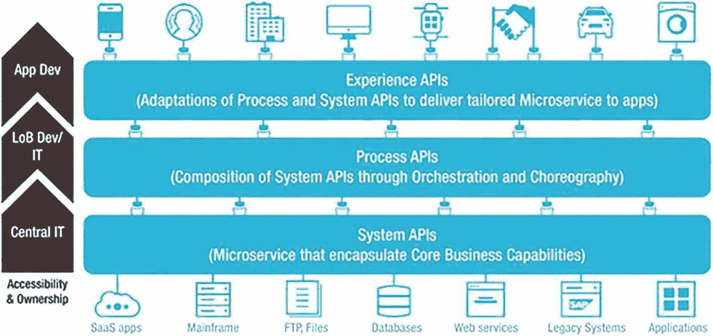

图示说明分层 API 架构。顶层是“体验 API”，它将流程和系统 API 适配为针对应用程序定制的微服务。中间层是“流程 API”，通过编排和编舞组合系统 API。底层是“系统 API”，封装了核心业务能力。左侧的垂直箭头表示从“中央 IT”到“应用开发”的可访问性和所有权逐渐增加。图标代表各种技术，包括 SaaS 应用、大型机、FTP 文件、数据库、Web 服务、遗留系统和应用程序。

图 6-1
API 多层框架

该框架描述了 API 的类型及其组件。应用开发拥有体验 API。业务线开发和 IT 拥有流程 API。中央 IT 拥有系统 API。可访问性和所有权涵盖 SaaS 应用、大型机、FTP 文件、数据库、Web 服务、遗留系统和应用程序。

*   流程 API 通过服务设计模式实现
*   系统 API 通过数据访问对象设计模式实现
*   体验 API 通过 API 外观层设计模式实现

每一层都使用软件工程设计模式实现。

流程 API：服务层
服务层实现应用程序的业务逻辑：可重用逻辑、特定于流程的逻辑，以及通过编排和编舞与系统 API 交互的逻辑。此处的编排（直接调用）涉及将业务线开发/IT 请求与应用程序、数据和基础设施对齐。相比之下，编舞不依赖中央协调器。相反，参与编舞的每个 API 都确切知道何时执行其操作以及与谁交互。

系统 API：数据访问对象
这些系统 API 或系统级服务符合自治服务的概念，该服务经过设计，具有足够的抽象性，以隐藏底层记录系统，例如，数据库、遗留系统和 SaaS 应用程序。
通常，数据访问对象 (DAO) 是一个[对象](https://en.wikipedia.org/wiki/Object_(computer_science)%25252525252525252525252525252525252525252525252525252523Object%252525252525252525252525252525252525252525252525252525252520(computer%252525252525252525252525252525252525252525252525252525252520science))，它为某种类型的[数据库](https://en.wikipedia.org/wiki/Database%25252525252525252525252525252525252525252525252525252523Database)或其他持久化机制提供抽象[接口](https://en.wikipedia.org/wiki/Interface_(computer_science)%25252525252525252525252525252525252525252525252525252523Interface%252525252525252525252525252525252525252525252525252525252520(computer%252525252525252525252525252525252525252525252525252525252520science))。通过将应用程序调用映射到持久化层，DAO 提供特定的数据操作，而无需暴露系统的细节。

体验 API：API 外观
流程 API 和系统 API 都应进行定制和公开，以满足解决方案架构的每个业务渠道和数字接触点的需求。这种适配由期望的数字体验塑造，我们称之为体验 API。这通过 API 外观实现。API 外观模式的目标是阐明内部系统，并通过提供良好的 APX（API 体验）使其对应用开发者有用。

服务层实现
服务层实现应用程序的业务逻辑：可重用逻辑、特定于流程的逻辑以及与遗留系统交互的逻辑。在服务层的实现中，使用了依赖注入设计模式。依赖注入背后的通用概念称为控制反转。如果类 `A` 将类 `B` 用作变量，则类 `A` 依赖于类 `B`。如果使用依赖注入，则类 `B` 通过类 `A` 的构造函数提供给类 `A`。这称为“构造器注入”。如果使用 setter，则称为“setter 注入”。
一个类不应自行配置，而应从外部进行配置。基于独立类/组件的设计可提高可重用性。基于依赖注入的软件设计可以使用标准 Java 实现。用于练习实现的 Micronaut 框架通过提供标准的配置方式和管理对已创建对象的引用来简化依赖注入的使用。Micronaut 提供的基本功能是依赖注入。Micronaut 为依赖注入 (DI) 提供了一个轻量级容器。此容器允许您将所需的对象注入到其他对象中。这导致了一种 Java 类非硬耦合的设计。

框架：服务

在上一章中，我们实现了一个用于读取操作的航班乘客 API。本练习使用消息域对象来实现 CRUD（创建、读取、更新和删除）操作。消息域对象结构非常简单。有一个标识消息的 id，以及我们可以在以下 JSON 表示中看到的其他几个字段：

```
{ "id":1,
"message":"Welcome",
"from":"James",
"to":"John",
"creationDate":1388213547000
}
```

**Pom.xml**

将以下内容添加到 pom.xml：

```
javax.inject
javax.inject

```

**消息**

以下是定义消息属性的 POJO：


```
package com.rest.model;
public class Message {
private int id;
private String message;
private String from;
private String to;
private String creationDate;
public String getMessage() {
return message;
}
public void setMessage(String message) {
this.message = message;
}
public String getFrom() {
return from;
}
public void setFrom(String from) {
this.from = from;
}
public String getTo() {
return to;
}
public void setTo(String to) {
this.to = to;
}
public String getCreationDate() {
return creationDate;
}
public void setCreationDate(String creationDate) {
this.creationDate = creationDate;
}
public int getId() {
return id;
}
public void setId(int id) {
this.id = id;
}
}
```

**MessageController**

在消息控制器中，我们实现了消息的 CRUD 操作：

```
package com.rest.controller;
import com.rest.model.Message;
import com.rest.service.MessageService;
import io.micronaut.http.annotation.Get;
import io.micronaut.http.annotation.Controller;
import io.micronaut.http.HttpHeaders;
import io.micronaut.http.HttpResponse;
import io.micronaut.http.MediaType;
import io.micronaut.http.annotation.Produces;
import io.micronaut.http.annotation.Controller;
import io.micronaut.http.annotation.Delete;
import io.micronaut.http.annotation.Get;
import io.micronaut.http.annotation.Post;
import io.micronaut.http.annotation.Put;
import io.micronaut.http.annotation.Body;
import java.util.List;
@Controller("/message")  // 
public class MessageController {
MessageService messageService;
public MessageController(MessageService messageService) { // 
this.messageService = messageService;
}
@Produces(MediaType.TEXT_XML)
@Get("/xml")
public HttpResponse messageXml() {
Message message = new Message();
message.setMessage("Hello from Micronaut");
final String xml = encodeAsXml(message);
return HttpResponse.ok(xml).contentType(MediaType.APPLICATION_XML_TYPE);
}
@Produces(MediaType.TEXT_JSON)
@Get("/json")
public Message messageJson() {
Message message = new Message();
message.setMessage("Hello from Micronaut");
return message;
}
private String encodeAsXml(final Message message) {
return String.format("%s", message.getMessage());
}
@Post
public Message createMessage(@Body Message message) {
messageService.createMessage(message);
return message;
}
@Get("/{id}")
public Message getMessage (int id)    {
Message message = messageService.getMessage(id);
return message;
}
@Get
public List getMessages() {
List messages = messageService.getMessages();
return messages;
}
@Put("/{id}")
public void updateMessage (int id, @Body Message update) {
messageService.updateMessage(id, update);
}
@Delete("/{id}")
public void deleteMessage(int id) {
messageService.deleteMessage(id);
}
}
```

**MessageService**

所有用于 CRUD（创建、读取、更新和删除）操作的方法，这些操作在内存中处理消息，都被移到了这里：

```
package com.rest.service;
import com.rest.model.Message;
import java.util.Map;
import java.util.List;
import java.util.ArrayList;
import java.util.HashMap;
import java.util.concurrent.atomic.AtomicInteger;
Import javax.inject.Singleton;
@Singleton
public class MessageService {
static private Map messageRepo = new HashMap();
static private AtomicInteger idCounter = new AtomicInteger();
public Message getMessage(int id) {
Message message = messageRepo.get(id);
return message;
}
// 添加消息
public void createMessage(Message message) {
message.setId(idCounter.incrementAndGet());
messageRepo.put(message.getId(), message);
}
// 更新消息
public void updateMessage(int id, Message update) {
Message current = messageRepo.get(id);
current.setMessage(update.getMessage());
current.setFrom(update.getFrom());
current.setTo(update.getTo());
current.setCreationDate(update.getCreationDate());
messageRepo.put(current.getId(), current);
}
// 删除消息
public void deleteMessage(int id) {
Message current = messageRepo.remove(id);
}
public  List getMessages() {
return new ArrayList(messageRepo.values());
}
```

**API 测试（Curl）**


```curl -d '{ "id":1, "message":"test", "from":"test", "to":"test", "creationDate":"12/12//2012" }' -H 'Content-Type: application/json' http://localhost:8080/message
{"id":1,"message":"test","from":"test","to":"test","creationDate":"12/12//2012"}
curl -d '{ "id":2, "message":"test2", "from":"test", "to":"test", "creationDate":"12/12//2012" }' -H 'Content-Type: application/json' http://localhost:8080/message
{"id":2,"message":"test2","from":"test","to":"test","creationDate":"12/12//2012"}
curl http://localhost:8080/message
[{"id":1,"message":"test","from":"test","to":"test","creationDate":"12/12//2012"},{"id":2,"message":"test2","from":"test","to":"test","creationDate":"12/12//2012}
curl http://localhost:8080/message/1
{"id":1,"message":"test","from":"test","to":"test","creationDate":"12/12//2012"}
curl http://localhost:8080/message/2
{"id":2,"message":"test2","from":"test","to":"test","creationDate":"12/12//2012"}
curl -X "DELETE" http://localhost:8080/message/2
curl http://localhost:8080/message/2
{"message":"Not Found","_links":{"self":{"href":"/message/2","templated":false}},"_embedded":{"errors":[{"message":"Page Not Found"}]}}
curl http://localhost:8080/message
[{"id":1,"message":"test","from":"test","to":"test","creationDate":"12/12//2012"}]
```

总结
现在，我们的产品组合中有两个 API：一个用于消息服务，另一个用于航班乘客。航班状态 API 实现了 Flight 和 Passenger 两个对象之间的关系，而消息服务除了读取功能外，还支持消息的创建和删除。两个 API 遵循相同的设计非常重要。

7. API 平台与数据处理程序

本章从 API 平台架构开始，然后深入探讨数据处理程序模式，该模式用于将 RESTful API 与企业内部的实际数据源集成，从而通过 API 为消费者提供更有意义的价值。

API 平台架构

API 提供者使用 API 平台来高效地实现 API。我们将探讨以下内容：

*   为什么需要 API 平台？
*   什么是 API 平台？
*   API 平台具备哪些能力？
*   API 平台是如何组织的？其架构是怎样的？
*   API 架构如何融入企业周边的技术架构？

为什么需要 API 平台？
当然，在没有平台或框架的情况下构建 API 在技术上是可行的。但何必如此呢？让我们暂时思考一下数据库，它为构建应用程序提供了平台。你当然可以在没有数据库的情况下构建应用程序，并编写自己的数据存储库。但我们通常不会这样做。我们使用现有的数据库作为平台。这是有充分理由的最佳实践。它使我们能够专注于构建服务于业务场景的应用程序，因为我们可以重用现有的、经过验证的组件，从而更快地构建应用程序。同样的道理也适用于 API 平台：API 平台使我们能够专注于构建消费者喜爱的 API，因为我们可以重用现有的、经过验证的 API 构建块，从而更快地构建 API。

那么什么是 API 平台？

API 平台由以下三个组件之一组成：

*   **API 开发平台**
    *   它提供工具，以便更快地设计和开发 API。
    *   它提供经过验证、可重用且可配置的构建块。
*   **API 运行时平台**
    *   它主要负责执行 API。
    *   它处理消费者的传入 API 请求，并以高吞吐量和低延迟等非功能性属性返回 API 响应。
*   **API 交互平台**
    *   该平台允许 API 提供者管理与 API 消费者的交互。它为消费者提供 API 文档、凭证和费率计划。

那么 API 平台具备哪些能力？

以下是 API 平台的三个组件所提供的能力。

API 开发平台


API 开发平台为 API 提供商中的 API 开发者提供了一套用于 API 设计与开发的工具箱。该工具箱包含经过验证、可复用且可配置的 API 构建模块。在构建 API 时，某些功能会反复用到，这些功能可以通过构建模块来实现。构建模块可以复用，且经过测试，因此没有缺陷，并且它们是可配置的，能够适应多种用途。API 开发平台提供的构建模块至少涵盖以下功能：

*   处理 HTTP 请求和响应

*   标头

*   查询

*   **HTTP**：状态码

*   方法

*   **安全**：基于 IP 的访问限制、基于位置的访问限制、基于时间的访问限制、前端认证与授权、OAuth、基本授权、API 密钥、后端认证与授权（使用 LDAP 和 SAML）

*   **前端协议**：HTTP (REST)、SOAP、RPC 和 RMI

*   **数据格式转换**：XML 转 JSON 和 JSON 转 XML

*   **结构转换**：XLST 和 XPATH

*   **数据完整性与保护**：加密

*   路由到一个或多个后端

*   聚合多个 API 和/或多个后端

*   限流以保护后端速率限制和吞吐量限制

*   对发往 API 平台的入站请求和发往后端的出站请求进行负载均衡

*   用于日志记录的钩子

*   用于分析的钩子

*   货币化能力

*   **实现 API 的语言**：Java、JavaScript 等（Jersey、Restlet 和 Spring）

*   **用于 API 开发的 IDE（包含编辑器、调试器和部署工具）**：Eclipse、JDeveloper 和 NetBeans

*   **设计 API 的语言**：YAML、RAML 等

*   **用于创建 API 接口设计的设计工具**：RAML、Swagger 和 Blueprint

*   **用于根据设计生成文档和 API 代码骨架的工具**：RAML 和 Swagger

API 运行时平台

API 运行时平台主要负责执行 API。它使 API 能够接收来自 API 消费者的入站请求并返回响应。

*   它应提供非功能性属性，例如

*   高可用性、高安全性和高吞吐量

*   为满足这些属性，该平台提供

*   负载均衡

*   连接池

*   缓存

*   它还应为 API 监控、日志记录和分析提供能力，以检查所需的非功能性属性是否得到满足。

API 参与平台

API 提供商使用 API 参与平台与其 API 消费者社区进行互动。API 提供商使用 API 参与平台的以下能力：

*   **API 管理**：无需部署即可配置和重新配置 API

*   **API 发现**：客户端获取 API 信息的机制

*   **消费者入驻**：应用密钥生成和 API 控制台

*   **社区管理**：博客

*   文档

*   版本管理

*   货币化管理和服务级别 SLA 管理

API 消费者使用参与平台进行：

*   API 组合概览

*   API 文档

*   交互式试用 API 的可能性

*   用于集成的示例源代码

*   自助获取 API 访问权限

*   客户端工具，例如客户端的代码生成

API 平台是如何组织的？API 平台的架构是什么？

通常，API 不仅部署在生产系统上，还需要部署在不同成熟度的阶段。这些阶段有时也称为环境。每个阶段都有特定的目的，并与其他阶段隔离以隔离潜在的错误：

*   **模拟**：用于尝试接口设计，提供 API 的模拟或仿真

*   **开发**：用于开发，最终将进入生产环境

*   **测试**：用于手动黑盒测试和集成测试

*   **预生产**：用作生产演练和验收测试

*   **生产**：用作消费者的真实系统

如图 7-1 所示，API 开发平台用于设计和开发。API 运行时平台用于部署。API 参与平台用于发布 API。

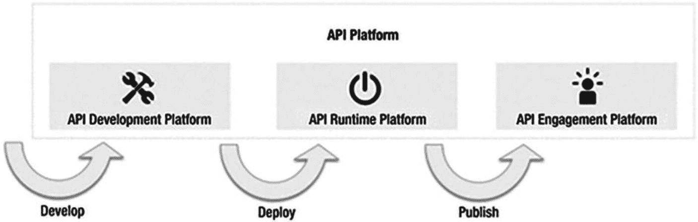

图示说明 API 平台生命周期包含三个阶段：API 开发平台、API 运行时平台和 API 参与平台。每个阶段用一个图标表示：开发用扳手，运行时用电源按钮，参与用带光线的人。下方箭头指示顺序流程：开发、部署和发布。

图 7-1
API 平台架构

流程图说明了 API 平台的工作方式。第一步是在 API 开发平台上进行开发。第二步是在 API 运行时平台上进行部署。最后一步是在 API 参与平台上进行发布。

API 架构如何融入企业的周边技术架构？

API 平台并非孤立存在，它需要集成到企业现有的架构中。防火墙用于提高安全性。负载均衡器用于提高性能，通常放置在互联网和 API 平台之间。IAM（身份与访问管理）系统用于管理身份信息以及 LDAP 或 Active Directory，如图 7-2 所示。

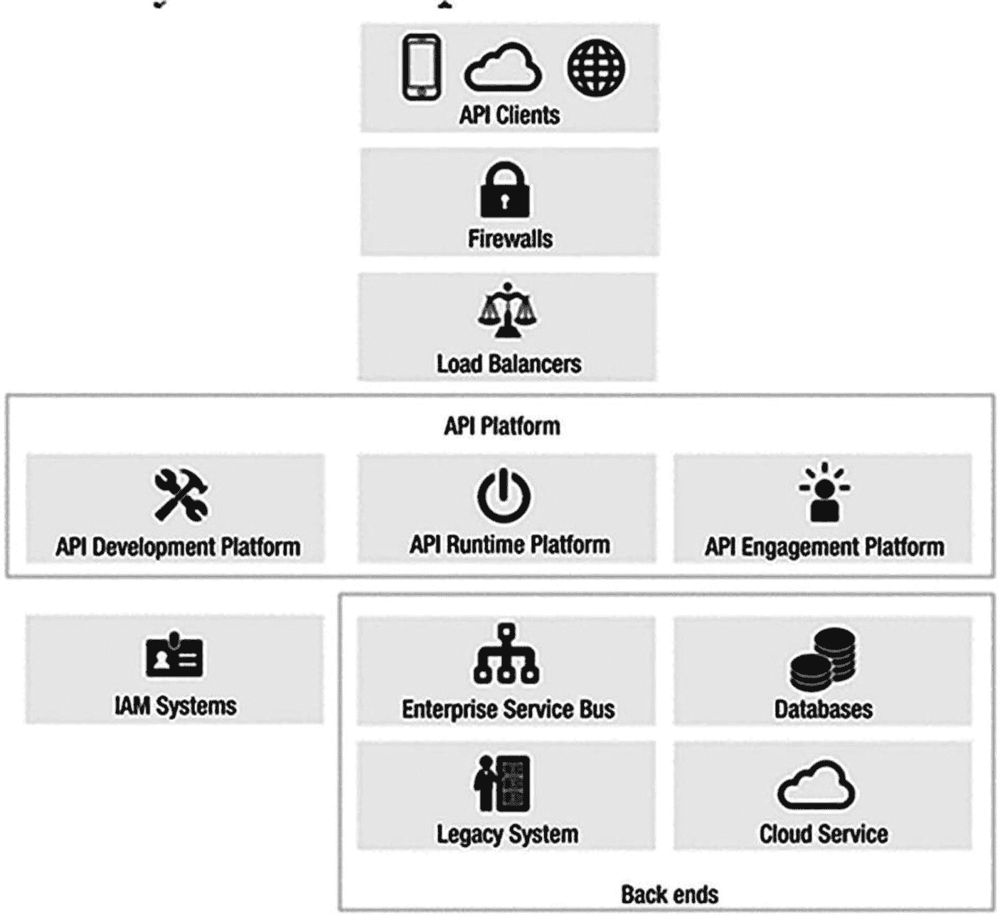

图示说明 API 架构。顶部显示 API 客户端、防火墙和负载均衡器。下方，API 平台包括 API 开发平台、运行时平台和参与平台。底部，后端组件包括 IAM 系统、企业服务总线、数据库、遗留系统和云服务。

图 7-2
企业中的 API 架构

企业内 API 实施的流程示意图。从 API 客户端、防火墙、负载均衡器和包含三个阶段的 API 平台开始。最终流程是后端，由数据库、企业服务总线、遗留系统和云服务组成。
提供企业核心功能的后端系统：后端可以是数据库、应用程序、企业服务总线、使用 SOAP 的 Web 服务、消息队列和 REST 服务。

数据处理器

如前所述，我们使用现有数据库作为平台。数据处理器、数据访问对象 (DAO) 和命令查询职责分离 (CQRS) 都为某种类型的数据库或任何其他持久化机制提供了抽象接口。数据处理器是框架中处理数据的层。数据访问对象是一种设计模式，用于在数据处理器内部实现从数据库的访问。另一方面，CQRS 模式提供了一种机制，用于在数据处理器中分离查询数据和事务数据。


数据访问对象（DAO）
通过将应用程序调用映射到持久化层，DAO 提供了特定的数据操作，同时隐藏了数据库的细节。使用数据访问对象的优势在于其相对简单性，并且它实现了应用程序中两个重要部分之间的分离——这两部分彼此不应了解对方，且预计会频繁且独立地演变。业务逻辑的变更可以依赖同一个 DAO 接口，而持久化逻辑的变更只要接口实现正确，就不会影响 DAO 的客户端。所有存储细节对应用程序的其他部分都是隐藏的（参见信息隐藏）。因此，对持久化机制的潜在变更只需修改一个 DAO 实现即可完成，而应用程序的其他部分不受影响。DAO 充当应用程序与数据库之间的中介，在对象与数据库记录之间来回传输数据。
在访问数据库时，有多种可用的 API（例如，JPA，将在课堂实验中使用）。

命令查询职责分离（CQRS）
每天都有新的需求摆在 IT 组织面前，要求交付敏捷、高性能的集成移动和 Web 应用程序。与此同时，随着 REST、NoSQL 和云等新技术的出现，技术格局日益复杂，而 SOAP 和 SQL 等现有技术仍在日常工作中占据主导地位。与其在争论中偏执一方，NoSQL 可以在这个数据存储和格式的“`多语言`”环境中与 SQL 成功共存。然而，这种集成也在架构和实现层面增加了另一层复杂性。我们将讨论以下内容。

SQL 开发流程

应用程序开发生命周期意味着首先更改数据库模式，然后是绑定，接着是内部模式映射，最后是 SOAP 或 JSON 服务，以及最终的客户端代码。这一切都会耗费项目的时间和金钱。这也意味着“代码”（在此处选择你的语言）和业务逻辑也需要修改，以处理模型的变化。图 7-3 展示了传统的 CRUD 架构。

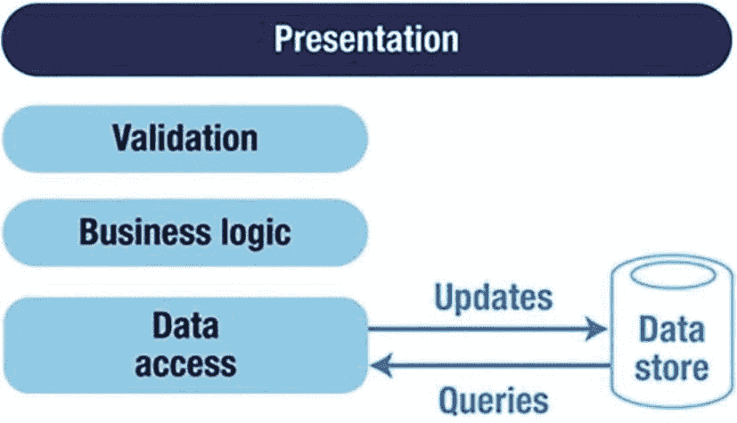

图示说明了一个软件架构模型。顶部是“表示层”，其后依次是“验证层”、“业务逻辑层”和“数据访问层”。“数据访问层”通过“更新”和“查询”箭头与“数据存储”交互，表示组件之间的数据流。

图 7-3
传统 CRUD 架构

CRUD 架构的图示包含一个由验证、业务逻辑和数据访问组成的表示层。数据访问向数据存储进行更新，数据存储则向数据访问返回查询结果。

NoSQL 流程
出于多种原因，NoSQL 正在许多 SQL 商店中赢得支持者，这些原因包括低成本、处理非结构化数据的能力、可扩展性和性能。数据库人员首先注意到的是没有模式。这些文档式存储引擎可以处理海量的结构化、半结构化和非结构化数据。无模式文档的本质允许在不经过正式变更管理流程（或数据架构师）的情况下更改文档结构。

我必须在 SQL 和 NoSQL 之间做出选择吗？
关键在于，两者各有其用武之地，并适用于特定类型的数据——SQL 适用于结构化数据，NoSQL 适用于非结构化数据。NoSQL 数据库比 SQL 数据库更具可扩展性。那么，为什么不能根据应用程序来混合搭配这些数据呢？这可以通过在 SQL 和 NoSQL 数据库之上创建一个统一的 REST API 来实现。

为什么需要一个统一的 REST API？
答案很简单——新的敏捷和移动世界要求将数据“混搭”成文档风格的 JSON 响应。


Martin Fowler 描述了一种名为“`CQRS`”的模式，该模式在当今由服务器、数据、服务和连接构成的“`多语言`”环境中更具相关性（图 7-4）。

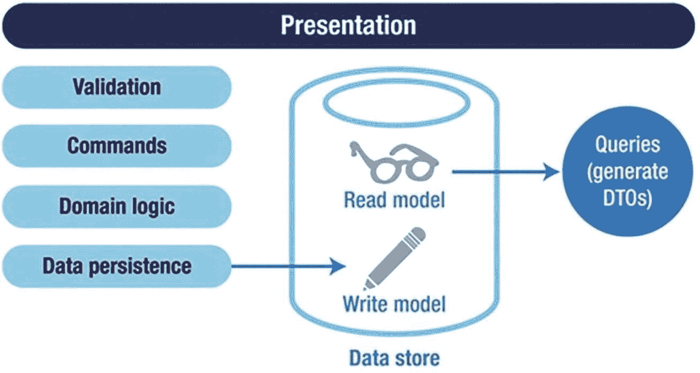

图示说明了一个软件架构模型。左侧列出了四个组件：验证、命令、领域逻辑和数据持久化。这些组件连接到一个中央“数据存储”圆柱体，该圆柱体包含一个由眼镜图标表示的“读取模型”和一个由铅笔图标表示的“写入模型”。从读取模型出发，有一个箭头指向标有“查询（生成 DTO）”的圆圈。顶部区域标有“表示层”。

图 7-4
基本 CQRS 架构

CQRS 架构的示意图包含一个表示层，该层由验证、命令、领域逻辑和数据持久化组成。数据持久化将数据写入数据存储。在读取数据存储时，数据流向查询，查询生成 DTO。

在这种设计模式中，REST API 请求（GET）从多个来源（例如，混搭应用）返回文档。在更新过程中，数据会经历业务逻辑推导、验证、事件处理和数据库事务。然后，这些数据可能会通过异步事件被推送回 NoSQL 数据库。在这方面，NoSQL 数据库相对于 SQL 的优势在于，NoSQL 为非结构化数据提供了动态模式。此外，NoSQL 数据库是水平可扩展的，这意味着可以通过增加资源池中的数据库服务器数量来扩展 NoSQL 数据库以减轻负载，而 SQL 数据库则是通过增加托管数据库的服务器的性能来进行扩展。图 7-5 展示了具有独立读取和写入存储的 CQRS 架构。当您需要处理非常、非常大量的数据时，您会选择使用独立的存储。

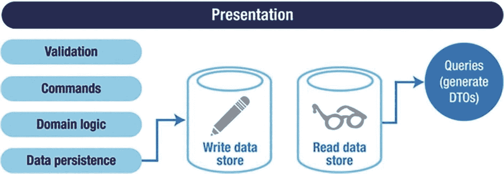

图示说明了一个数据处理流程。顶部显示了一个“表示层”。下方列出了四个垂直步骤：验证、命令、领域逻辑和数据持久化。一个箭头从这些步骤指向一个带有铅笔图标的圆柱体，代表“写入数据存储”。随后是另一个标有“读取数据存储”并带有眼镜图标的圆柱体。一个箭头从读取数据存储指向标有“查询（生成 DTO）”的圆圈。

图 7-5
具有独立读取和写入存储的 CQRS 架构

CQRS 架构的示意图包含一个表示层，该层由验证、命令、领域逻辑和数据持久化组成。数据持久化将数据写入数据存储。在读取数据存储时，数据流向查询，查询生成 DTO。

框架：数据处理器

本练习将使用 Java 持久化 API (JPA) 为报价领域对象实现一个数据处理器或数据访问对象。JPA 是一个 Java 规范，用于在 Java 对象/类和关系数据库之间访问、持久化和管理数据。我们将使用我们的领域对象消息，并在 DAO 中使用 JPA 实现 CRUD 操作。
**Pom.xml**

使用以下依赖项更新 `pom.xml`：

```xml

4.0.0
com.rest
quote
0.1
${packaging}

io.micronaut
micronaut-parent
3.4.3

jar

3.4.3
3.3.0
com.rest.Application
netty

central
https://repo.maven.apache.org/maven2

io.micronaut
micronaut-inject
compile

io.micronaut
micronaut-validation
compile

org.junit.jupiter
junit-jupiter-api
test

org.junit.jupiter
junit-jupiter-engine
test

io.micronaut.test
micronaut-test-junit5
test

io.micronaut
micronaut-http-client
compile

io.micronaut
micronaut-http-server-netty
compile

io.micronaut
micronaut-jackson-databind
compile

io.micronaut
micronaut-http-server-netty
compile

io.micronaut
micronaut-jackson-databind
compile

io.micronaut
micronaut-runtime
compile

io.micronaut.data
micronaut-data-jdbc
compile

io.micronaut.reactor
micronaut-reactor
compile

mysql
mysql-connector-java

io.micronaut.reactor
micronaut-reactor-http-client
compile

io.micronaut.sql
micronaut-jdbc-hikari
compile

io.micronaut.data
micronaut-data-hibernate-jpa

io.micronaut.sql
micronaut-hibernate-jpa

io.swagger.core.v3
swagger-annotations

jakarta.annotation
jakarta.annotation-api
compile

ch.qos.logback
logback-classic
runtime

com.h2database
h2
runtime

io.micronaut.build
micronaut-maven-plugin

org.apache.maven.plugins
maven-compiler-plugin

false -->

io.micronaut
micronaut-http-validation
${micronaut.version}

io.micronaut.data
micronaut-data-processor
${micronaut.data.version}

-Amicronaut.processing.group=com.rest
-Amicronaut.processing.module=quote

```

**产品**

这是一个定义产品或目录属性的 POJO：

```java
package com.rest.domain;
import io.swagger.v3.oas.annotations.media.Schema;
import javax.persistence.*;
import javax.validation.constraints.Size;
@Schema(description="Product")
@Entity
public class Product {
@Id
@GeneratedValue(strategy = GenerationType.IDENTITY)
@Column(name="ID")
private Long id;
@Column(name="NAME")
@Size(max = 20)
private String name;
@Column(name="DESCRIPTION")
@Size(max = 50)
private String description;;
@Column(name="CREATE_DATE")
@Size(max = 40)
private String createDate;;
@Column(name="CHANGE_DATE")
@Size(max = 40)
private String changeDate;;
@Column(name="UNIT_PRICE")
@Size(max = 20)
private float unitPrice;;
@Column(name="CREATOR")
private String creator;
public Long getId() {
return id;
}
public void setId(Long id) {
this.id = id;
}
public String getName() {
return name;
}
public void setName(String name) {
this.name = name;
}
public String getDescription() {
return description;
}
public void setDescription(String description) {
this.description = description;
}
public String getCreateDate() {
return createDate;
}
public void setCreateDate(String createDate) {
this.createDate = createDate;
}
public String getChangeDate() {
return changeDate;
}
public void setChangeDate(String changeDate) {
this.changeDate = changeDate;
}
public float getUnitPrice() {
return unitPrice;
}
public void setUnitPrice(float unitPrice) {
this.unitPrice = unitPrice;
}
public String getCreator() {
return creator;
}
public void setCreator(String creator) {
this.creator = creator;
};
}
```

**报价**

这是一个报价 POJO，包含报价属性并映射到报价行：


```java
package com.rest.domain;
import io.swagger.v3.oas.annotations.media.Schema;
import javax.persistence.*;
import javax.validation.constraints.Size;
import java.util.List;
@Schema(description="报价单")
@Entity
public class Quote {
@Id
@GeneratedValue(strategy = GenerationType.IDENTITY)
@Column(name="ID")
private Long id;
@Column(name="CUSTOMER_ID")
private Long customerId;
@Column(name="QUOTE_DATE")
@Size(max = 50)
private String quoteDate;;
@Column(name="BILLING_ADDRESS")
@Size(max = 20)
private String billingAddress;
@Column(name="BILLING_CITY")
@Size(max = 20)
private String billingCity;;
@Column(name="BILLING_STATE")
@Size(max = 20)
private String billingState;;
@Column(name="BILLING_COUNTRY")
@Size(max = 20)
private String billingCountry;;
@Column(name="BILLING_POSTAL_CODE")
@Size(max = 20)
private String billingPostalCode;;
@Column(name="TOTAL")
@Size(max = 20)
private float total;
@OneToMany (fetch = FetchType.EAGER, cascade = CascadeType.ALL)
@JoinTable(name = "Quote_Line_Mapping",
joinColumns = @JoinColumn(name = "quote_id"),
inverseJoinColumns = @JoinColumn(name = "id"))
private List quoteLines;
public void setQuoteLines(List quoteLines) {
this.quoteLines = quoteLines;
}
public List getQuoteLines() {
return quoteLines;
}
public Long getId() {
return id;
}
public void setId(Long id) {
this.id = id;
}
public Long getCustomerId() {
return customerId;
}
public void setCustomerId(Long customerId) {
this.customerId = customerId;
}
public String getQuoteDate() {
return quoteDate;
}
public void setQuoteDate(String quoteDate) {
this.quoteDate = quoteDate;
}
public String getBillingAddress() {
return billingAddress;
}
public void setBillingAddress(String billingAddress) {
this.billingAddress = billingAddress;
}
public String getBillingCity() {
return billingCity;
}
public void setBillingCity(String billingCity) {
this.billingCity = billingCity;
}
public String getBillingState() {
return billingState;
}
public void setBillingState(String billingState) {
this.billingState = billingState;
}
public String getBillingCountry() {
return billingCountry;
}
public void setBillingCountry(String billingCountry) {
this.billingCountry = billingCountry;
}
public String getBillingPostalCode() {
return billingPostalCode;
}
public void setBillingPostalCode(String billingPostalCode) {
this.billingPostalCode = billingPostalCode;
}
public float getTotal() {
return total;
}
public void setTotal(float total) {
this.total = total;
};
```

**报价单行项**

以下是报价单行项的 POJO，包含行项属性及与产品的映射关系：

```java
package com.rest.domain;
import io.swagger.v3.oas.annotations.media.Schema;
import javax.persistence.*;
@Schema(description="报价单行项")
@Entity
public class QuoteLine {
@Id
@GeneratedValue(strategy = GenerationType.IDENTITY)
@Column(name="ID")
private Long id;
@Column(name="QUOTE_ID")
private Long quoteId;
@OneToOne(cascade = CascadeType.ALL)
@JoinColumn(name = "product_id", referencedColumnName = "id")
private Product product;
@Column(name="UNIT_PRICE")
private float unitPrice;
@Column(name="QUANTITY")
private Long  quantity;
public Product getProduct() {
return product;
}
public void setProduct(Product product) {
this.product = product;
}
public Long getId() {
return id;
}
public void setId(Long id) {
this.id = id;
}
public void setId(Long id) {
this.id = id;
}
public Long getQuoteId() {
return quoteId;
}
public void setQuoteId(Long quoteId) {
this.quoteId = quoteId;
}
public float getUnitPrice() {
return unitPrice;
}
public void setUnitPrice(float unitPrice) {
this.unitPrice = unitPrice;
}
public Long getQuantity() {
return quantity;
}
public void setQuantity(Long quantity) {
this.quantity = quantity;
};
}
```

接下来，我们将为产品、报价单和报价单行项创建用于 CRUD 操作的仓库。

**产品仓库**

```java
package com.rest.repository;
import io.micronaut.data.annotation.Repository;
import io.micronaut.data.repository.CrudRepository;
import com.rest.domain.Product;
@Repository
public interface ProductRepo extends CrudRepository {
}
```

**报价单仓库**

```java
package com.rest.repository;
import io.micronaut.data.annotation.Repository;
import io.micronaut.data.repository.CrudRepository;
import com.rest.domain.Quote;
@Repository
public interface QuoteRepo extends CrudRepository {
}
```

**报价单行项仓库**

```java
package com.rest.repository;
import io.micronaut.data.annotation.Repository;
import io.micronaut.data.repository.CrudRepository;
import com.rest.domain.QuoteLine;;
@Repository
public interface QuoteLineRepo extends CrudRepository {
}
```

接下来，我们将创建一个报价单控制器，为报价单 API 实现 Get、Post、Put 和 Delete 端点。

**报价单控制器**

```java
package com.rest.controller;
import com.rest.domain.Quote;
import com.rest.repository.QuoteRepo;
import io.micronaut.http.annotation.Get;
import io.micronaut.http.annotation.Controller;
import io.micronaut.http.annotation.Delete;
import io.micronaut.http.annotation.Post;
import io.micronaut.http.annotation.Put;
import io.micronaut.http.annotation.Body;
import java.util.List;
import java.util.ArrayList;
@Controller("/quote")  // 
public class QuoteController {
QuoteRepo quoteRepo;
public QuoteController(QuoteRepo quoteRepo) { // 
this.quoteRepo = quoteRepo;
}
@Post
public Quote createQuote(@Body Quote quote) {
return quoteRepo.save(quote);
}
@Get("/{id}")
public Quote getQuote (Long id)    {
Quote quote = quoteRepo.findById(id).get();
return quote;
}
@Get
public List getQuotes() {
Iterable quotes =  quoteRepo.findAll();
List result = new ArrayList();
quotes.forEach(result::add);
return result;
}
@Put("/{id}")
public void updateQuote (Long id, Quote update) {
Quote quote = quoteRepo.findById(id).get();
quoteRepo.delete(quote);
quoteRepo.save(update);
}
@Delete("/{id}")
public void deleteQuote(Long id) {
Quote quote = quoteRepo.findById(id).get();
quoteRepo.delete(quote);
}
}
```

**创建报价单**

```bash
curl -d '{  "customerId":"123", "quoteDate":"11/07/2022", "billingAddress":"722 Main St", "billingCity":"San Jose", "billingState": "CA", "billingCountry": "USA", "billingPostalCode": "95035", "total" : 123, "quoteLines" : [{"quoteId" : 1, "product" : {"name":"test", "description":"test", "createDate":"test", "changeDate":"12/12//2012", "unitPrice": 1.0, "creator": "creat" }, "unitPrice": 12, "quantity" : 1}]}' -H 'Content-Type: application/json' http://localhost:8080/quote
```

**读取报价单**

```bash
curl http://localhost:8080/quote/1
```

**总结**
在本章中，我们从 API 平台架构入手，然后深入探讨了用于将 RESTful API 与实际数据源集成的数据处理器模式。在练习中，我们演示了如何使用 JPA 实现数据处理器。

**8. API 管理与 CORS**

在本章中，我们将从外观模式入手，回顾可用的 API 管理需求/解决方案。

**外观模式**
在本节中，我们将首先回顾外观设计模式，然后在第二部分中详细探讨外观模式如何应用于 API。

**外观模式**
在讨论外观模式之前，我们先思考一下现实世界中的外观是什么。最明显的例子是建筑物，它们都有外部结构来保护和装饰，隐藏内部的运作机制。这个外部结构就是外观。
现在，我们可以通过考虑操作系统来更贴近 API。就像建筑物一样，操作系统为计算机的内部功能提供了一个外部外壳。这个简化的接口使操作系统更易于使用，并保护核心免受粗心用户的干扰。

这正是设计模式中外观模式定义的精髓所在：

*为子系统中的一组接口提供一个统一的接口。外观定义了一个更高级别的接口，使子系统更易于使用。*


请参考图 8-1；你可以看到外观模式如何在应用程序的各个包与任何想要与之交互的客户端之间放置一个中间层。

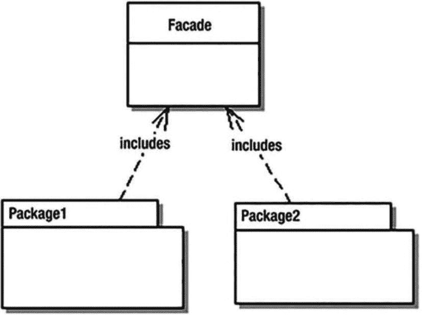

说明外观设计模式的图表。顶部标有“外观”的框通过标有“包含”的虚线箭头连接到下方标有“包 1”和“包 2”的两个框，表示外观包含了这两个包。

图 8-1
外观模式

该图说明了外观模式。外观包含两个包，即包 1 和包 2。

API 外观

与所有外观模式的实现一样，API 外观是面向复杂问题的简单接口。图 8-2 展示了企业中的内部子系统。如图所示，每个内部子系统本身都很复杂：例如，JDBC 隐藏了数据库连接的内在机制。


该图展示了一系列代表不同技术组件的彩色 3D 方块。从左到右，方块依次标记为：蓝色的“大型系统”、紫色的“数据库”、橙色的“内容管理”、绿色的“SOAP”、红色的“JDBC”和青色的“RSS”。每个方块代表技术基础设施中使用的不同系统或协议。

图 8-2
内部子系统

内部子系统图表由大型系统、数据库、内容管理、SOAP、JDBC 和 RSS 等层级组成。

图 8-3 展示了位于企业内部子系统顶层的 API 外观层，为应用程序提供了统一的接口。

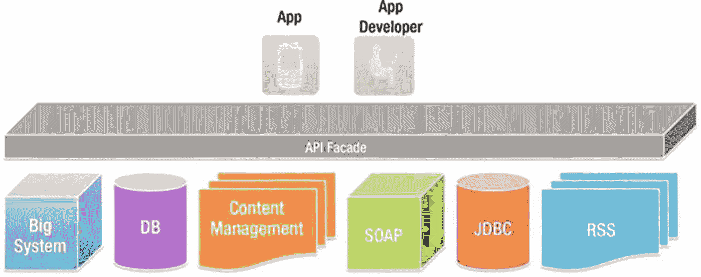

说明 API 外观架构的图表。顶部是代表应用程序和应用程序开发者的图标。下方，一个标有“API 外观”的水平条连接到各种后端系统，包括大型系统、数据库、内容管理、SOAP、JDBC 和 RSS，每个系统都用彩色方块表示。此设置展示了 API 外观如何充当应用程序与各种后端服务之间的中介。

图 8-3
API 外观——高层视图

API 过程的图示。顶部是应用程序和应用程序开发者。中间是 API 外观。底部是大型系统、数据库、内容管理、SOAP、JDBC 和 RSS 的层级。

实现 API 外观模式涉及三个基本步骤：

*   **设计 API**：确定 URL、请求参数和响应、负载、头部、查询参数等。

*   **使用模拟数据实现设计**：这样，在 API 连接到内部子系统（及其所有随之而来的复杂性）之前，应用程序开发者就可以测试 API。

*   将外观与内部系统连接起来，以创建实时的 API。

图 8-4 展示了这些层级。

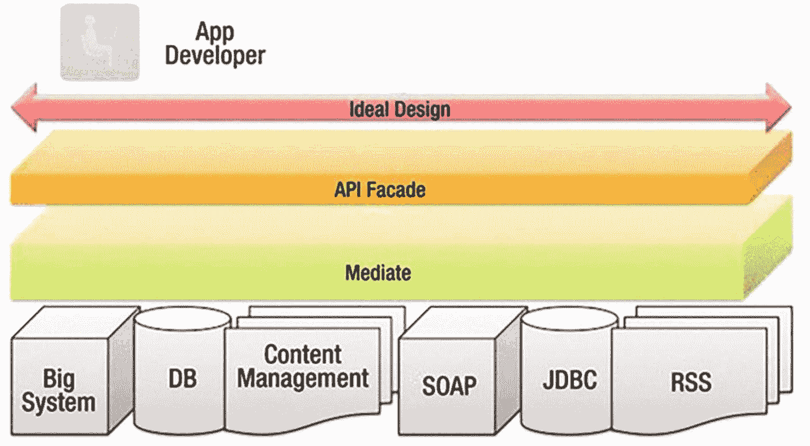

说明 API 架构的图表。顶部，一个标有“理想设计”的红色箭头指向“应用程序开发者”。下方，一个橙色的“API 外观”层位于一个绿色的“中介”层之上。底部描绘了各种系统，包括“大型系统”、“数据库”、“内容管理”、“SOAP”、“JDBC”和“RSS”，代表后端组件。

图 8-4
API 外观——层级

用于开发的 API 过程包括顶部的应用程序开发者，接着是一个标有“理想设计”的双向箭头，以及两个标有“API 外观”和“中介”的矩形金字塔。底部由大型系统、数据库、内容管理、SOAP、JDBC 和 RSS 的层级组成。

API 管理
API 管理工具提供了一种以简单且经济的方式向外部开发者公开你的 API 的方法。

以下是 API 管理服务的特性：

*   文档

*   分析与统计

*   部署

*   开发者参与

*   沙盒环境

*   流量管理与缓存能力

*   安全性

*   可用性

*   货币化

*   API 生命周期管理

*   API 管理供应商通过三种不同的方式实现其解决方案：

*   **代理**：所有流量都经过 API 管理工具，该工具作为一层放置在应用程序和用户之间。

*   **代理程序**：这些是服务器的插件。它们不像代理那样拦截 API 调用。

*   **混合**：此方法选取代理和代理程序的特性并将其集成。然后你可以选择你需要的特性。

API 生命周期

默认的 API 生命周期包含以下阶段：

*   **分析**：对 API 进行分析，并为有限的消费者群体创建模拟响应，以便他们试用 API 并提供反馈。同时，还会对其货币化潜力进行分析，如下一节所述。

*   **创建/开发中**：正在创建 API：设计、开发和保护。API 元数据已保存，但尚不可见也未部署。

*   **已发布/运维中**：API 可见并最终发布，现在进入维护阶段，在此阶段进行扩展和监控。

此外，还有两个阶段：

*   **已弃用**：API 仍处于部署状态（对现有用户在运行时可用），但对新用户不可见。当新版本发布时，API 会自动弃用。

*   **已退役**：API 被取消发布并删除。

这些将在下一节讨论。

图 8-5 展示了 API 生命周期。


一个说明软件开发生命周期的循环图，包含七个阶段。从顶部开始顺时针方向：设计（带锤子和扳手图标）、开发（带齿轮图标）、安全（带挂锁图标）、发布（带箭头图标）、扩展（带图表图标）、监控（带图表图标）和分析（带条形图图标）。最后一个阶段是货币化，由美元符号图标表示。每个阶段都由一个带有相关图标的橙色圆圈标记。

图 8-5
API 生命周期

API 生命周期包括设计、开发、安全、发布、扩展、监控、分析和货币化。

API 退役

如同人到暮年需要退休一样，API 也是如此。随着时间的推移，由于以下原因，API 会被退役或弃用：

*   缺乏合作伙伴或第三方开发者的创新

*   因 API 暴露数据而失去市场份额

*   技术栈的变化，例如 REST 取代 SOAP

*   **安全问题**：由于 API 所暴露信息或数据的安全要求，将公共 API 变为私有

*   **版本管理**：因功能变更而最常见的原因

API 退役的一些例子包括 Netflix、Google Earth、Twitter V1.0 等。

API 货币化
数字资产或服务为客户、合作伙伴和最终用户提供了真正的价值，因此，它们应该成为你公司的收入来源，以及你商业模式的重要组成部分。

有三种用于 API 货币化的商业模式：

*   收入分成模式，即 API 消费者因其为 API 提供商带来的增量业务而获得报酬。

*   收费模式，即 API 消费者向提供商支付 API 使用费用。

*   第三种也是最后一种商业模式是免费增值模式。免费增值模式可以基于多种因素，例如数量、时间或某种组合；它们可以作为独立模式或混合模式（与收入分成或收费模式结合）实施。


跨域资源共享（CORS）
“跨域资源共享”（CORS）是一种机制，允许网页上的 TypeScript 或 JavaScript 向另一个域（而非 JavaScript 来源域）发起 XMLHttpRequest 请求。根据同源安全策略，此类“跨域”请求通常会被网页浏览器禁止。CORS 定义了一种浏览器与服务器交互的方式，以决定是否允许跨域请求。它比仅允许同源请求更有用，但比简单允许所有此类跨域请求更安全。跨域资源共享标准通过添加新的 HTTP 头部来工作，这些头部允许服务器描述允许使用网页浏览器读取该信息的源集合。

如何实现 CORS？例如：

```
return Response.ok() //200
.entity(quote)
.header("Access-Control-Allow-Origin", "*")
.header("Access-Control-Allow-Methods", "GET, POST, DELETE, PUT").
allow("OPTIONS").build();
```

总结
在本章中，我们回顾了 API 管理需求/解决方案，并讨论了跨域资源共享（CORS）以支持客户端实现。

9. API 安全

在本章中，我们将首先回顾用于保护 RESTful API 安全的 OAuth 2 标准，然后回顾 JWT 实现，并练习使用 Micronaut 实现基本安全。

API 安全——OAuth 2
OAuth 2 是一种通过 HTTP 委托资源访问授权的标准。
使用 OAuth，我们可以授予移动应用访问权限，而无需提供密码。取而代之的是，一个令牌被移交给应用程序。令牌代表对部分数据在短时间内的访问权限。有关 OAuth 2 的通用信息，请参考 [`https://oauth.net/2/`](https://oauth.net/2/)。
要获取令牌，用户首先登录 OAuth 服务器的网站。生成的令牌可以是授权码、访问令牌或刷新令牌。OAuth 被许多现代云服务在底层使用。
OAuth 提供商列表：[`https://en.wikipedia.org/wiki/List_of_OAuth_providers`](https://en.wikipedia.org/wiki/List_of_OAuth_providers)
OAuth 由 IETF 在 RFC6749 [`http://tools.ietf.org/html/rfc6749`](http://tools.ietf.org/html/rfc6749) 中规定并标准化。
OAuth 1 已过时。

有两个术语：身份验证和授权。

*   **身份验证**是一个概念，回答的问题是：你是谁？

*   **授权**是一个概念，回答的问题是：你被允许做什么？

角色

OAuth 2 定义了四个角色：

*   **资源所有者**：通常是你自己。

*   **资源服务器**：托管受保护数据的服务器（例如，托管你的个人资料和个人信息的 Google）。

*   **客户端**：请求访问资源服务器的应用程序（可以是你的 PHP 网站、JavaScript 应用程序或移动应用程序）。

*   **授权服务器**：向客户端颁发访问令牌的服务器。此令牌将用于客户端请求资源服务器。该服务器可以与授权服务器相同（同一物理服务器和同一应用程序），这通常是常见情况。

令牌
令牌是由授权服务器生成的随机字符串，并在客户端请求时颁发。

有两种类型的令牌：

*   **访问令牌**：这是最重要的，因为它允许第三方应用程序访问用户数据。此令牌由客户端作为参数或请求头发送给资源服务器。它具有由授权服务器定义的有限生命周期。它必须尽快保密，但我们会看到这并不总是可能的，尤其是当客户端是通过 JavaScript 向资源服务器发送请求的网页浏览器时。通常，访问令牌被设计为对客户端不透明，但当它用于用户身份验证时，客户端需要能够从令牌中推导出一些信息。

*   **刷新令牌**：此令牌与访问令牌一起颁发，但与后者不同，它不会在客户端向资源服务器的每个请求中发送。它仅用于在访问令牌过期时发送给授权服务器以续期访问令牌。出于安全原因，并不总是能够获取此令牌。我们稍后将讨论在什么情况下。

图 9-1 展示了基于 OAuth 的交互。

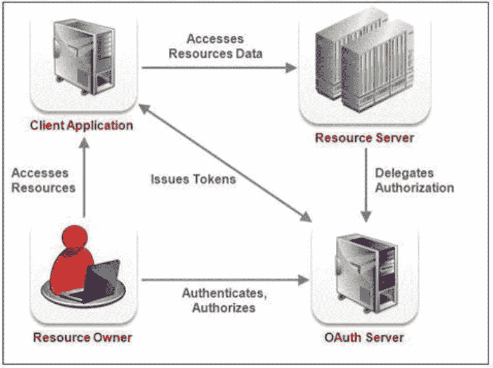

说明 OAuth 2.0 授权流程的图表。“资源所有者”通过“客户端应用程序”访问资源，而“客户端应用程序”又从“资源服务器”访问资源数据。“OAuth 服务器”对客户端进行身份验证和授权，颁发令牌并将授权委托给资源服务器。箭头指示组件之间数据和授权流程的方向。

图 9-1
基于 OAuth 的交互

注册为客户端
由于你想使用 OAuth 2 从资源服务器检索数据，你必须注册为授权服务器的客户端。
每个提供商都可以自由选择其方法来实现这一点。该协议仅定义了客户端必须指定的参数以及授权服务器必须返回的参数。
以下是参数（可能因提供商而异）：

客户端注册
**应用程序名称**：应用程序名称
**重定向 URL**：用于接收授权码和访问令牌的客户端 URL
**授权类型**：客户端将使用的授权类型
**JavaScript 源（可选）**：将被允许通过 `XMLHttpRequest` 请求资源服务器的主机名

授权服务器响应
**客户端 ID**：唯一的随机字符串
**客户端密钥**：必须保密的密钥
**更多信息**：RFC 6749——客户端注册

授权授权类型
OAuth 2 定义了四种授权类型，具体取决于获取访问令牌所涉及的客户端的位置和性质。

授权码授权
我们将在本节中回顾授权码授权及其流程。这种授权类型用于登录 Google 和 Facebook。

何时使用？
当客户端是 Web 服务器或网站时，应使用此类型。它允许你获取长期有效的访问令牌，因为可以使用刷新令牌续期（如果授权服务器启用）。
**示例**：
**资源所有者**：你
**资源服务器**：一个服务器
**客户端**：任何网站
**授权服务器**：一个服务器

**场景：**

1.  一个网站想要获取关于你个人资料的信息。
2.  你被客户端（该网站）重定向到授权服务器。
3.  如果你授权访问，授权服务器会在回调响应中向客户端（该网站）发送一个授权码。
4.  然后，客户端和授权服务器之间用此授权码交换访问令牌。
5.  该网站现在可以使用此访问令牌查询资源服务器并检索你的个人资料数据。


你永远不会看到访问令牌；它会被网站存储（例如，存储在会话中）。服务器还会随访问令牌发送其他信息，例如令牌的生命周期，以及可能的刷新令牌。
**序列图：**

图 9-2 展示了授权码许可流程的序列图。

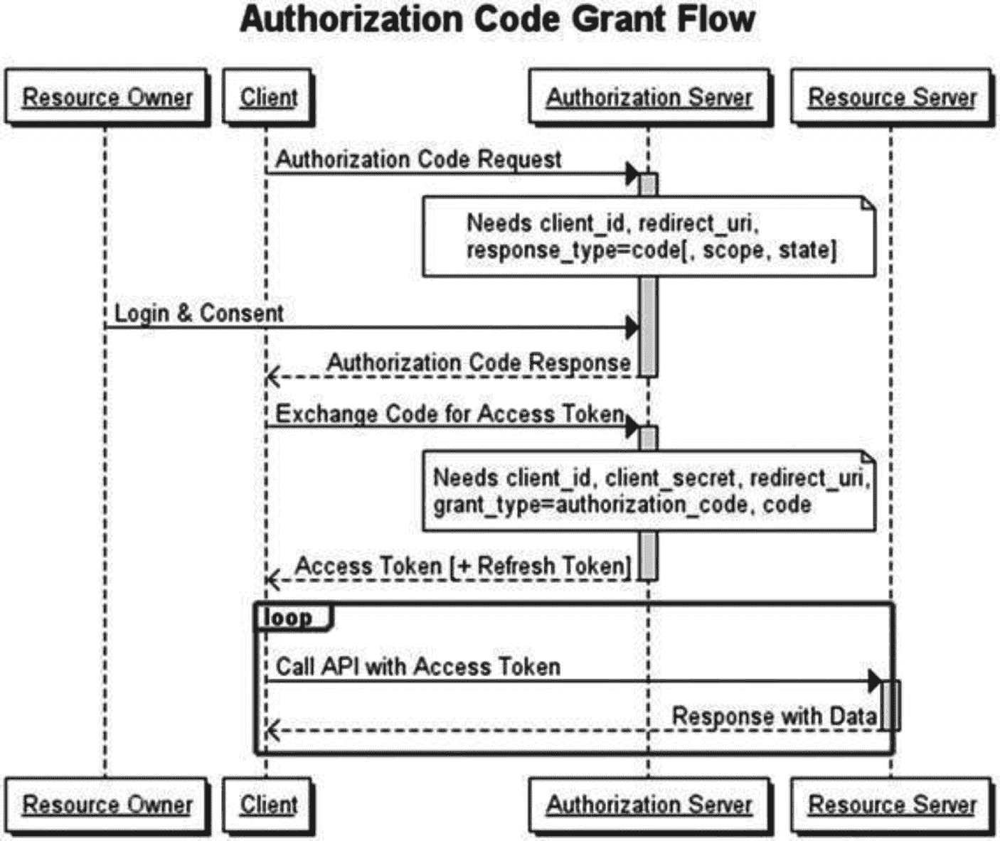

该图展示了 OAuth 2.0 中的授权码许可流程。它涉及四个实体：资源所有者、客户端、授权服务器和资源服务器。流程从客户端向授权服务器请求授权码开始，需要提供 client_id 和 redirect_uri 等参数。在登录和同意授权后，授权服务器会响应一个授权码。客户端用此授权码交换访问令牌，需要提供 client_id、client_secret 和 redirect_uri。访问令牌（可能附带刷新令牌）用于调用资源服务器上的 API，资源服务器则响应数据。该流程包含一个使用访问令牌重复调用 API 的循环。

图 9-2
授权码许可流程

隐式许可流程
在本节中，我们将回顾隐式许可及其流程。

何时使用？
它通常用于客户端在浏览器中运行并使用诸如 JavaScript 等脚本语言的情况。此授权类型不允许颁发刷新令牌。
**示例**：
**资源所有者**：你
**资源服务器**：一个服务器
**客户端**：例如，一个使用 AngularJS 的网站
**授权服务器**：一个服务器

**场景**：

1.  客户端（AngularJS）想要获取关于你 Facebook 个人资料的信息。

2.  浏览器将你重定向到授权服务器（Facebook）。

3.  如果你授权访问，授权服务器会将你重定向到网站，并在 URI 片段中附带访问令牌（不会发送到 Web 服务器）。回调示例：[`http://example.com/oauthcallback#access_token=MzJmNDc3M2VjMmQzN`](http://example.com/oauthcallback%252523access_token=MzJmNDc3M2VjMmQzN)。

4.  现在，客户端（AngularJS）可以检索并使用此访问令牌来查询资源服务器（Facebook）。查询示例：[`https://graph.facebook.com/me?access_token=MzJmNDc3M2VjMmQz`](https://graph.facebook.com/me?access_token=MzJmNDc3M2VjMmQz)。

也许你会好奇，客户端如何能够使用 JavaScript 调用 Facebook API 而不被同源策略阻止？嗯，这种跨域请求之所以可能，是因为 Facebook 通过在其响应中包含一个名为 `Access-Control-Allow-Origin` 的头部来授权它。
**注意**
只有在没有其他授权类型可用时，才应使用此授权类型。实际上，它是最不安全的，因为访问令牌在客户端侧是暴露的（因此是脆弱的）。
**序列图**

图 9-3 展示了隐式许可流程的序列图。

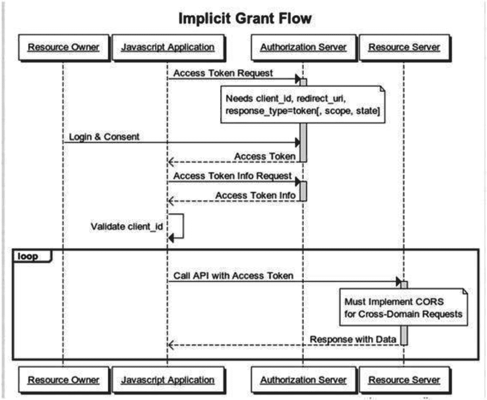

该图展示了 OAuth 2.0 中的隐式许可流程。它展示了四个实体之间的交互：资源所有者、JavaScript 应用程序、授权服务器和资源服务器。流程包括访问令牌请求、登录与同意以及访问令牌信息请求等步骤。JavaScript 应用程序向授权服务器请求访问令牌，需要提供客户端 ID、重定向 URI 和响应类型。验证成功后，应用程序使用访问令牌调用 API，资源服务器则响应数据。对于跨域请求，必须实现跨源资源共享（CORS）。

图 9-3
隐式许可流程的序列图

资源所有者密码凭据许可
在本节中，我们将回顾资源所有者密码凭据许可及其流程。

何时使用？
使用这种授权类型时，凭据（以及密码）会被发送到客户端，然后再发送到授权服务器。因此，这两个实体之间必须存在绝对的信任。它主要用于客户端与授权服务器由同一机构开发的情况。例如，我们可以设想一个名为“example.com”的网站，它需要访问其子域名“api.example.com”上的受保护资源。用户在“example.com”网站上输入其登录名/密码并不会感到意外，因为他的账户就是在这个网站上创建的。
**示例**：
**资源所有者**：你在 Acme 公司的 acme.com 网站上拥有一个账户。
**资源服务器**：Acme 公司在 api.acme.com 上公开其 API。
**客户端**：Acme 公司的 acme.com 网站。
**授权服务器**：一个 Acme 服务器。

**场景**：

1.  Acme 公司做事周到，考虑向第三方应用程序提供一个 RESTful API。

2.  该公司认为使用自己的 API 会很方便，可以避免重复造轮子。

3.  该公司需要一个访问令牌来调用其自身 API 的方法。

4.  为此，该公司要求你像往常一样通过标准的 HTML 表单输入你的登录凭据。

5.  服务器端应用程序（网站“acme.com”）将用你的凭据向授权服务器交换一个访问令牌（当然，前提是你的凭据是有效的）。

6.  现在，该应用程序可以使用访问令牌来查询其自身的资源服务器（api.acme.com）。

**序列图**

图 9-4 展示了此流程的序列图。

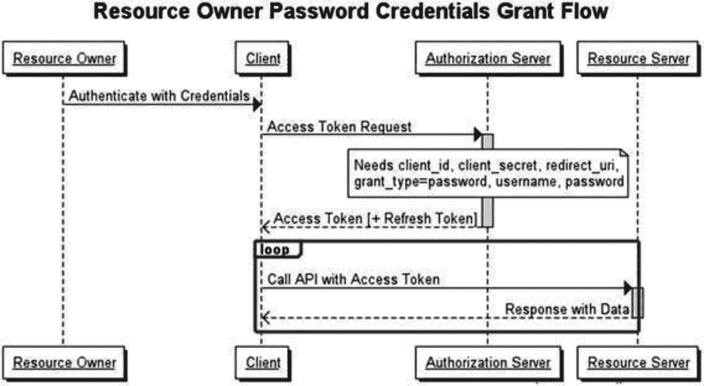

资源所有者密码凭据许可流程图。它展示了四个实体之间的交互：资源所有者、客户端、授权服务器和资源服务器。流程从资源所有者向客户端提供凭据进行身份验证开始。客户端向授权服务器发送访问令牌请求，需要提供 client_id、client_secret、redirect_uri、grant_type=password、username 和 password。授权服务器响应一个访问令牌和可选的刷新令牌。客户端进入一个循环，使用访问令牌调用 API，并从资源服务器接收包含数据的响应。

图 9-4
资源所有者密码凭据许可流程

客户端凭据许可
这种授权类型在客户端本身就是资源所有者时使用。无需从最终用户那里获取授权。
**示例**：
**资源所有者**：任何网站
**资源服务器**：Google Cloud Storage
**客户端**：资源所有者
**授权服务器**：一个 Google 服务器

**场景**：

1.  一个网站将其各种类型的文件存储在 Google Cloud Storage 上。

2.  该网站必须通过 Google API 来检索或修改文件，并且必须向授权服务器进行身份验证。

3.  一旦通过身份验证，该网站就会获得一个访问令牌，现在可以用它来查询资源服务器（Google Cloud Storage）。

在这里，最终用户无需为访问资源服务器而提供授权。
**序列图**

图 9-5 展示了此流程的序列图。

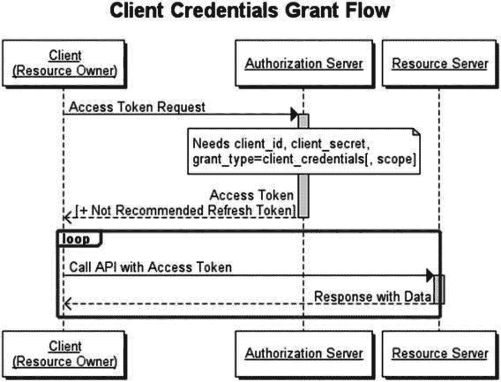

该图展示了 OAuth 2.0 中的客户端凭据许可流程。该过程涉及客户端（资源所有者）向授权服务器发送访问令牌请求，需要提供客户端 ID、客户端密钥和授权类型。授权服务器响应一个访问令牌。然后，客户端使用此令牌调用资源服务器上的 API，资源服务器返回包含数据的响应。该图包含一个注释，说明在此流程中不建议使用刷新令牌。

图 9-5
客户端凭据许可流程


API 安全——JSON Web Token
JWT 是 JSON Web Token 的缩写，它是一种常用的无状态用户认证标准，用于在客户端和服务器之间以 JSON 格式安全地传输信息。JWT 默认是编码而非加密的。它使用仅服务器知晓的密钥进行数字签名。

一个 JSON Web Token 由三部分组成，各部分以句点分隔：头部、载荷和签名。每个部分都经过 base64 编码。

典型的 JWT 授权流程包含以下步骤：

1.  **认证**：用户使用用户名和密码登录，或通过 Google 或 Facebook 等方式登录。服务器验证所提供的凭据。

2.  **生成令牌并发送给客户端**：服务器生成 JWT 并将其发送给客户端，客户端将其存储以备将来使用。

3.  **将令牌发送给服务器**：当客户端想要访问服务器上的受保护资源时，它会在 HTTP 请求的 Authorization 头部中发送 JWT。

4.  **验证令牌**：服务器接收请求，并使用签署 JWT 时所用的密钥检查其签名来验证 JWT。如果 JWT 有效，服务器会提取其中包含的信息，并据此确定用户有权执行哪些操作。

5.  **授权请求**：如果用户有权访问该资源，服务器将返回请求的数据。如果用户未获授权，服务器将返回一条错误消息。

**优点**

*   轻量级。

*   **可移植性**：可在多种平台（Web 和移动端）上处理。

*   JSON 解析器在大多数编程语言中都很常见。

*   由于密钥存储在服务器端，因此可防止篡改。

*   由于 JWT 令牌的无状态特性，服务器无需存储任何会话信息。

**缺点**

*   如果被截获，可能提供完全访问权限。这就是为什么客户端上的 JWT 应存储在安全位置，例如浏览器中的 HttpOnly cookie 中。

*   在服务器端，应在注销时手动将未过期的 JWT 标记为无效。即使 JWT 已从客户端删除，它仍然可能有效。

练习——基础安全

使用 [Micronaut 命令行界面](https://docs.micronaut.io/latest/guide/%2523cli) 或 [Micronaut Launch](https://launch.micronaut.io/) 创建一个应用程序。

```
mn create-app example.micronaut.micronautguide \
--features=security,graalvm \
--build=maven \
--lang=java \
--test=junit
```

为简单起见，创建一个简单的 AuthenticationProvider 来模拟用户认证。

```
src/main/java/example/micronaut/AuthenticationProviderUserPassword.java
package example.micronaut;
import io.micronaut.core.annotation.NonNull;
import io.micronaut.core.annotation.Nullable;
import io.micronaut.http.HttpRequest;
import io.micronaut.security.authentication.AuthenticationFailureReason;
import io.micronaut.security.authentication.AuthenticationRequest;
import io.micronaut.security.authentication.AuthenticationResponse;
import io.micronaut.security.authentication.provider.HttpRequestAuthenticationProvider;
import jakarta.inject.Singleton;
@Singleton
class AuthenticationProviderUserPassword implements HttpRequestAuthenticationProvider {
public AuthenticationResponse authenticate(
@Nullable HttpRequest httpRequest,
@NonNull AuthenticationRequest authenticationRequest
) {
return authenticationRequest.getIdentity().equals("sherlock") && authenticationRequest.getSecret().equals("password")
? AuthenticationResponse.success(authenticationRequest.getIdentity())
: AuthenticationResponse.failure(AuthenticationFailureReason.CREDENTIALS_DO_NOT_MATCH);
}
}
```

创建解析根 URL / 的 HomeController：


```
package example.micronaut;
import io.micronaut.http.MediaType;
import io.micronaut.http.annotation.Controller;
import io.micronaut.http.annotation.Get;
import io.micronaut.http.annotation.Produces;
import io.micronaut.security.annotation.Secured;
import io.micronaut.security.rules.SecurityRule;
import java.security.Principal;
@Secured(SecurityRule.IS_AUTHENTICATED)
@Controller
public class HomeController {
@Produces(MediaType.TEXT_PLAIN)
@Get
String index(Principal principal) {
return principal.getName();
}
}
```

运行应用程序

```
curl -v -u sherlock:password localhost:8080
```

如果在浏览器中打开 http://localhost:8080，由于 `WWW-Authenticate` 标头，会弹出一个登录对话框。
详情请参考以下内容：
[`https://guides.micronaut.io/latest/micronaut-security-basicauth-maven-java.html`](https://guides.micronaut.io/latest/micronaut-security-basicauth-maven-java.html)
**练习——JSON Web 令牌**
有关 Micronaut 中 JWT 的实现，请参考以下内容：
[`https://guides.micronaut.io/latest/micronaut-security-jwt-gradle-java.html`](https://guides.micronaut.io/latest/micronaut-security-jwt-gradle-java.html)

总结
在本章中，我们回顾了用于保护 RESTful API 安全的 OAuth 2 标准，并完成了一个关于实现基本 Spring Security 的练习。我们还回顾了有关 HTTP、服务器和 JWT 实现的概念。
总而言之，本书从架构、设计和编码三个层面回顾了 REST API 的概念。
架构方面涵盖的主题包括：Web 架构风格、API 解决方案架构、API 组合架构、API 平台架构、API 管理和 Security-OAuth。
设计方面涵盖的主题包括：REST API 基础、数据交换格式、SOAP 与 REST 对比、XML 与 JSON 对比、API 设计简介（REST 和 JAX-RS）、API 设计最佳实践、建模 RESTful API、构建 RESTful API 框架、与 RDBMS（MySQL）和 NoSQL 数据库交互、消费 RESTful API（即 JSON 和 XML）以及安全性。
我们还在编码方面完成了练习，以理解每个概念如何在每章末尾实现。

索引

A

Apache Karaf

API 框架

API 类型/组件

DAO

façade

服务层

服务层实现

API 平台

架构

能力

开发平台

交互平台

企业级

重要性

运行时平台

阶段

API 组合

消息

在线航班应用

在线报价应用

API 组合架构

变更管理

一致性

一致性规则

定制化

可发现性

治理流程

长寿性

需求

复用

API

参见应用程序编程接口 (API)

API 安全

授权码授权

图示

用途

授权类型

授权服务器响应

客户端凭证授权

客户端注册

创建应用

HomeController

隐式授权流程

图示

用途

JWT

OAuth 2

基于 OAuth 的交互

资源所有者密码凭证授权流程

运行应用

令牌

Application 类

应用程序编程体验 (APX)

应用程序编程接口 (API)

架构设计

蓝图

消费者

消费者与生产者

创建过程

描述

设计者

设计策略

领域分析

错误码

错误处理

体验 API

façade

façade 模式

格式

实现

XML/JSON 消息

生命周期

管理

方法论

建模

货币化

分页

部分响应

流程 API

原型设计

提供者

发布

资源

退役

解决方案架构

云解决方案

组件

集成解决方案

物联网

移动解决方案

多渠道解决方案

智能电视解决方案

Web 解决方案

利益相关者

系统 API

版本控制

APX

参见应用程序编程体验 (APX)

认证

Authentication.getRoles() 方法

授权

授权服务器

B

后端系统

业务模型

C

缓存

变更管理

客户端

客户端-服务器

按需代码

命令查询职责分离 (CQRS)

架构

CORS

参见跨域资源共享 (CORS)

CQRS

参见命令查询职责分离 (CQRS)

创建、读取、更新和删除 (CRUD) 操作

API 测试 (curl)

架构

JSON 表示

消息

消息控制器

MessageService

pom.xml

跨域资源共享 (CORS)

CURL

D

DAO

参见数据访问对象 (DAO)

数据访问对象 (DAO)

创建报价

pom.xml

产品属性

ProductRepo

QuoteController

报价行属性

QuoteLineRepo

报价属性

QuoteRepo

读取报价

数据库

数据处理器

依赖注入 (DI)

设计模式

开发者

DI

参见依赖注入 (DI)

数字资产

DropWizard

E

Expedia

可扩展标记语言 (XML)

API 实现

注释

数据

定义

电子邮件消息结构

端点

*vs*. HTML

人类可读文档

重要性

*vs*. JSON

面向机器的记录格式

消息

POSTMAN

优缺点

标签

用途

F

Façade 设计模式

Facebook

Flight 类

FlightController 类

FlightService 类

G

Google

H

HATEOAS

参见超媒体作为应用状态引擎 (HATEOAS)

HTML

超媒体

超媒体作为应用状态引擎 (HATEOAS)

I

IAM

参见身份与访问管理 (IAM)

IDE

身份与访问管理 (IAM)

IntelliJ

内部 API

物联网 (IoT)

IoT

参见物联网 (IoT)

J, K

用于 RESTful Web 服务的 Java API (JAX-RS)

注解

Cookie 参数

定义

开发者

特性

表单参数

HTTP 参数

可注入参数类型

注入

矩阵参数

媒体类型

Micronaut 实现

路径参数

查询参数

SecurityContext

Java 持久化 API (JPA)

JavaScript

JavaScript 对象表示法 (JSON)

API 实现

基本数据类型

约定

端点

重要性

消息

POSTMAN

优缺点

用途

JAX-RS

参见用于 RESTful Web 服务的 Java API (JAX-RS)

JDK 21

Jersey

JPA

参见 Java 持久化 API (JPA)

JSON

参见 JavaScript 对象表示法 (JSON)

JSON Web 令牌 (JWT)

JWT

参见 JSON Web 令牌 (JWT)

L

LinkedIn

M

Maven

Micronaut

特性

框架

安装

JAX-RS

JWT 实现

安全性

*vs*. Spring Boot

缓存提供者

云特定特性

配置

安装

管理

消息系统

监控

安全机制

无服务器架构

微服务

移动应用

N

NoSQL

O

OAuth 2

OpenAPI (Swagger)

注解

Application 类

application.yml 文件

Flight 类

FlightController 类

FlightService 类

Passenger 类

PassengerController 类

PassengerService 类

P, Q

Passenger 类

PassengerController 类

PassengerService 类

POSTMAN

程序员

原型设计

公共 API

R

RAML

表述性状态转移 (REST)

基础

基础 URL

内容协商

数据元素

定义

基础知识

改进领域

表示

资源

*vs*. SOAP

Web 服务

资源所有者

资源服务器

REST

参见表述性状态转移 (REST)

REST API

S

SecurityContext.isUserInRole 方法

Setter 注入

简单对象访问协议 (SOAP)

SOAP

参见简单对象访问协议 (SOAP)

软件开发者

Spring Boot

缓存提供者

局限性

消息系统

属性位置

安全机制

Spring Tool Suite (STS)

SQL

数据库

开发过程

*vs*. NoSQL

利益相关者

STS

参见 Spring Tool Suite (STS)

T

技术

测试优先概念

令牌

TypeScript

U

统一资源接口

用户体验 (UX)

UX

参见用户体验 (UX)

V

Visual Studio Code

W

Web

Web 应用

Web 架构风格

方法

缓存

客户端-服务器

按需代码

约束与系统属性

HATEOAS

分层系统

无状态

统一资源接口

Web 服务器

X, Y, Z

XML

参见可扩展标记语言 (XML)

XMLHttpRequests

```