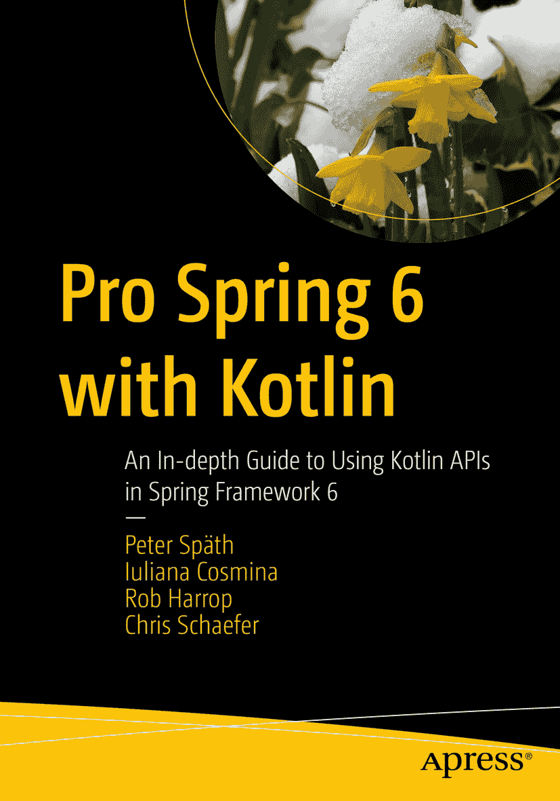

ISBN 978-1-4842-9556-4e-ISBN 978-1-4842-9557-1 [`doi.org/10.1007/978-1-4842-9557-1`](https://doi.org/10.1007/978-1-4842-9557-1) © Peter Späth, Iuliana Cosmina, Rob Harrop, Chris Schaefer 2023 本作品受版权保护。所有权利均由出版商独家许可，无论涉及材料的全部或部分，特别是翻译、重印、重用插图、朗诵、广播、以缩微胶卷或任何其他物理方式复制，以及传输或信息存储与检索、电子改编、计算机软件，或使用目前已知或今后开发的类似或不同方法。本出版物中使用通用描述性名称、注册商标名称、商标、服务标志等，即使没有明确声明，也不意味着这些名称不受相关保护法律和法规的约束，因此可自由用于一般用途。出版商、作者和编辑可以安全地假设，本书中的建议和信息在出版之日被认为是真实和准确的。出版商、作者或编辑均不对本文所含材料或可能存在的任何错误或遗漏提供明示或暗示的保证。出版商对已出版地图中的管辖权主张和机构归属保持中立。

本书通过 Apress Media, LLC 在全球图书贸易中发行，地址：1 New York Plaza, New York, NY 10004, U.S.A. 电话：1-800-SPRINGER，传真：(201) 348-4505，电子邮件：`orders-ny@springer-sbm.com`，或访问 [`www.springeronline.com`](https://www.springeronline.com)。Apress Media, LLC 是一家加利福尼亚有限责任公司，其唯一成员（所有者）是 Springer Science + Business Media Finance Inc. (SSBM Finance Inc.)。SSBM Finance Inc. 是一家特拉华州公司。本 Apress 印记由注册公司 APress Media, LLC（Springer Nature 的一部分）出版。

注册公司地址为：1 New York Plaza, New York, NY 10004, U.S.A.

*献给 Alina*

*——Peter*

引言

本书涵盖 Spring Framework 6 版本，是迄今为止最全面的 Spring 参考和实践指南，旨在帮助您充分利用这一领先的企业级 Java 应用开发框架的强大功能。

本版涵盖了核心 Spring 及其与其他领先 Java 技术（如 Hibernate、JPA 3、Thymeleaf、Kafka、GraphQL 和 WebFlux）的集成，并使用 Kotlin 作为编程语言。本书的重点是使用 Kotlin 配置类、lambda 表达式、Spring Boot 和响应式编程。我们分享了在企业应用开发方面的见解和实际经验，包括远程处理、事务、Web 和表示层等等。

通过阅读 *Pro Spring 6 with Kotlin*，您将学习如何执行以下操作：

*   使用控制反转（IoC）和依赖注入（DI）

*   了解 Spring Framework 6 的新特性

*   使用 Spring MVC 和 WebSocket 构建基于 Spring 的 Web 应用程序

*   使用 Spring WebFlux 构建 Spring Web 响应式应用程序

*   使用 JUnit 5 测试 Spring 应用程序

*   真正使用 Kotlin 构造

*   将 Spring Boot 提升到高级水平，以便快速启动和运行任何类型的 Spring 应用程序

*   使用 Cloud Native Buildpacks 将您的 Spring Native 应用程序打包成 Docker 镜像

本书附带一个使用 Gradle 8 配置的多模块项目。该项目可在 Apress 官方仓库中找到：[`https://github.com/apress/pro-spring-6-kotlin`](https://github.com/apress/pro-spring-6-kotlin)。克隆后，可根据其 README.adoc 文件中的说明立即构建项目。如果您本地未安装 Gradle，可以依赖 IntelliJ IDEA 通过使用 Gradle Wrapper ([`https://docs.gradle.org/current/userguide/gradle_wrapper.html`](https://docs.gradle.org/current/userguide/gradle_wrapper.html)) 来下载并使用它构建项目。

在本书编写过程中，Spring 6 和 Spring Boot 3 发布了新版本，IntelliJ IDEA 发布了新版本，书中使用的 Gradle 和其他技术也更新了版本。我们升级到了新版本，以提供最新信息，并使本书与官方文档保持同步。多位审阅者检查了本书的技术准确性，但如果您发现任何不一致之处，请发送电子邮件至 editorial@apress.com，我们将创建勘误表。

您可以在 [`https://github.com/apress/pro-spring-6-kotlin`](https://github.com/apress/pro-spring-6-kotlin) 访问本书的示例源代码。该代码将得到维护，与新技术版本同步，并根据使用它学习 Spring 的开发者的建议进行丰富。

我们真诚希望您能像我们享受编写本书一样，享受使用本书学习 Spring 的过程。

关于作者 关于技术审阅者

