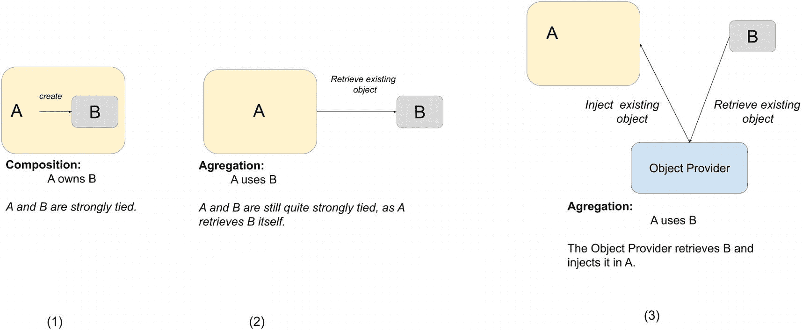

# 1. Spring 简介

每年都会有推文和博客文章宣称 Java 已不再重要，并且有闪亮的新技术取而代之。但每年这些都被证明只是行业谣言。Java 是一种不断发展的技术，自 1995 年首次发布以来，它一直位列公司构建软件解决方案最常用的十大技术之中。许多库和框架都是基于 Java 构建的，其中一些作为开源项目提供给开发者，另一些则因其管理的敏感信息（例如银行应用程序）而被安全地锁定在私有云中。

用 Java 编写的最流行的框架之一是 Spring Framework。Spring 的第一个版本于 2002 年 10 月发布，包含一个易于配置和使用的小型核心以及一个控制反转容器。多年来，Spring Framework 已成为 Java 企业版（JEE）服务器的主要替代品，并发展成为一个由许多不同项目组成的成熟技术体系，每个项目都有其特定用途。无论您是想构建微服务应用程序、构建经典的企业资源规划（ERP）系统，还是将您的应用程序编译成本地镜像以在 GraalVM 上运行，Spring 都有相应的项目。

在本书中，您将看到许多不同开源技术的应用，所有这些技术都统一在 Spring Framework 之下。使用 Spring 时，应用程序开发者可以使用大量开源工具，而无需编写大量代码，也无需将应用程序与任何特定工具过度耦合。

这是一个介绍性章节，涵盖了本书的重要细节，向您介绍 Spring Framework，解释为什么深入理解 Spring 对开发者如此有用，并描述正确使用 Spring 时其强大的功能。如果您已经熟悉 Spring，可以跳过本章，直接进入**第 2 章**。

## 关于本书

本书涵盖 Spring Framework 6 版本，是使用 Kotlin 作为编程语言时，驾驭这一领先企业级 Java 应用开发框架的最全面的 Spring 参考与实践指南。

本版涵盖了核心 Spring 及其与其他领先 Java 技术（如 Hibernate、JPA 2、Thymeleaf、Apache Kafka 等）的集成。本书的重点是使用 Kotlin 作为 Spring 的编程语言、Java/Kotlin 配置类、Spring Boot 以及响应式编程。我们分享了在企业应用开发方面的见解和实际经验，包括远程处理、事务、Web 和表示层等等。

通过《Pro Spring 6 with Kotlin》，你将学习如何完成以下任务：

*   使用并理解控制反转（IoC）和依赖注入（DI）
*   了解 Spring Framework 6 的新特性
*   使用 Spring MVC 和 WebSocket 构建基于 Spring 的 Web 应用
*   使用 JUnit 5 和其他 Java/Kotlin 测试库测试 Spring 应用
*   利用 Kotlin 1.8 的功能
*   高级使用 Spring Boot，同时也学习如何在不使用它的情况下进行开发
*   保护 Spring 应用
*   监控 Spring 应用
*   使用 Spring 编写响应式应用
*   构建你的 Spring 应用，并使用 Spring Native 将其作为紧凑的原生镜像运行

为了确保本书的重点是 Spring 和 Kotlin，书中提到的其他技术的安装说明，都提供在本书仓库中每个项目的文档文件中。当然，在必要时本书会向你指出这一点。

## 什么是 Spring？

解释 Spring 最困难的部分之一，或许就是准确地对它进行分类。**Spring** 从一开始就被描述为用于构建 Java 应用的*轻量级框架*，但这个描述引出了两个有趣的观点：

*   你可以使用 Spring 构建任何 Java/Kotlin 应用（例如，独立应用、Web 应用、移动应用或 JEE 应用），这与许多其他框架（例如仅限于 Web 应用的 Apache Struts）不同。
*   描述中的*轻量级*部分与类的数量或发行版的大小无关，而是从整体上定义了 Spring 哲学的原则——即*最小影响*。Spring 的轻量级体现在，你几乎不需要（如果需要的话）更改应用代码就能获得 Spring Core 的好处，并且如果你决定在任何时候停止使用 Spring，你会发现这样做非常简单。

请注意，我们限定最后一句仅指 Spring Core——许多额外的 Spring 组件，例如数据访问，需要与 Spring Framework 更紧密地耦合。然而，这种耦合的好处是显而易见的，并且在整本书中，我们都会介绍一些技术来最小化这对你的应用的影响。此外，如果将你的代码与框架耦合能带来开发速度和更好的依赖管理，从而减少升级期间的构建失败次数，那么这个代价难道不值得吗？而且，借助 Spring Native，Spring 应用现在可以在原生镜像（例如 GraalVM）上运行，这提供了各种优势，例如即时启动和减少内存消耗，所以 JavaScript 或 .NET 开发者可以诋毁 Spring 说它是*重量级*的日子已经一去不复返了。

### Spring Framework 的演进

Spring Framework 起源于 Rod Johnson 所著的《Expert One-on-One: J2EE Design and Development》（Wrox, 2002）一书。在他的书中，Johnson 展示了他自己的框架，称为 Interface 21 Framework，他开发该框架是为了在自己的应用中使用。这个框架被发布到开源世界，构成了我们今天所知的 Spring Framework 的基础。在过去的十年中，Spring Framework 在核心功能、相关项目和社区支持方面都取得了巨大的发展。Spring 0.9 最初是一个社区项目，由几个核心模块组成，没有官方文档。VMware 接管了它，并在 **2.5** 版本中开始了从 XML 到 Java Config（使用注解）的过渡。

2012 年，Pivotal Software 从 VMware 分离出来，接管了 Spring，并将其从一个框架发展成为一个项目集合。在 Pivotal 旗下有两个主要版本：**4.x**，这是第一个完全支持 Java 8 的版本，以及 **5.x**，它完全放弃了对 XML 配置的支持。

与 Spring 4.x 一起，Spring Boot 发布并成为最常用的 Spring 项目之一。Spring Boot 对构建 Spring 应用采取了“约定优于配置”的观点。Pivotal 的开发者们识别出了几种正在构建的应用类型，并使用一组默认的组件依赖关系和组件的自动配置为它们创建了模板。这些应用模板由一组 Spring Boot starter 项目建模。例如，如果你想创建一个 Spring Web 应用，只需将 `spring-boot-starter-web` 依赖添加到你的项目中，你就拥有了一个带有默认配置的最小化 Spring Web 应用。这是可能的，因为 Spring Boot 有一些很酷的特性，比如嵌入式应用服务器（Jetty/Tomcat）、基于 Groovy 的命令行界面以及健康/指标监控。

Spring Boot 提供了基于一组稳定、精选的依赖关系快速开发应用的能力，所有必需的 Spring Framework 组件都已正确配置。这很好，因为它减少了开发者的设置工作量。然而，这也降低了对 Spring Framework 进行更深入理解的需求，这可能会诱使开发者对其在 Spring Framework 方面的知识和理解产生虚假的信心。

注意

在本书的上一版中，本章包含一个列表，列出了所有曾经发布过的 Spring 版本及其最重要的特性。由于这些信息在互联网上公开可用，我们决定跳过这部分以减小本书的篇幅，并将这些空间用于更有趣的内容，例如 Project Reactor^(¹) 和 Spring Native^(²)。

2019 年底，VMware 收购了 Pivotal Software 并再次接管了 Spring，因此到 2021 年底，Spring **6.x** 将发布，这是 VMware 旗下的第一个主要 Spring 版本。在撰写本章时，第一个里程碑版本已经发布，其中最重要的是代码库已升级到 JDK 17。这个版本被认为是 Oracle 生产的第一个 JDK^(³)，它提供了足够的性能和安全改进，使得对于（仍然）不愿从 1.8 迁移的公司来说，迁移是值得的。

许多为已弃用的第三方技术提供支持的已弃用类和包已被移除，现有类也已更新，以与某些技术的更新版本（例如：Tomcat 10、Jetty 11 或 Undertow 2.2.14）协同工作。

### Spring 项目

当前 Spring 项目已列在官方 Spring 网站上^(⁴)，但为了方便起见，此处列出各项目及其简要说明。

*   **Spring Boot** 包含一组库（称为 *starters*），这些库提供可轻松定制的默认应用程序模板，用于快速开发多种类型的独立、生产级基于 Spring 的应用程序。

*   **Spring Framework** 包含一组库，为任何类型的应用程序提供依赖注入、事务管理、数据访问、消息传递及其他核心功能的支持。Spring Framework 现在包含 Spring WebFlux 框架，它代表了 Spring 响应式栈，旨在构建完全非阻塞、支持背压的响应式应用程序，可运行于 Netty、Undertow 和 Servlet 3.1+ 容器等服务器上。

*   **Spring Data** 包含一组库，为访问各种数据库（包括关系型数据库如 MySQL 和 Oracle，以及非关系型数据库如 MongoDB 和 CouchBase）提供一致的编程模型。它还支持内存数据库（如 H2 和 MongoDB），这对于在没有具体数据库拖累的情况下测试应用程序非常有用。此外，Spring Data R2DBC 使得访问响应式数据库变得简单。

*   **Spring Security** 通过简单的认证和授权模型，提供轻松保护应用程序的能力。

*   **Spring Cloud** 提供一组通用工具，用于编写旨在分布式系统中运行的微服务应用程序。

*   **Spring Cloud Data Flow** 提供一组通用工具，用于在 Cloud Foundry 和 Kubernetes 中运行的微服务之间进行数据的流式处理和批处理。

*   **Spring Integration** 支持构建利用轻量级消息传递并通过声明式适配器与外部系统集成的 Spring 应用程序。

*   **Spring Session** 提供用于管理用户会话信息的 API 和实现。

*   **Spring HATEOAS** 提供一些 API，以便在使用 Spring（尤其是 Spring MVC）时，轻松创建遵循 HATEOAS 原则的 REST 表示。一些开发者/架构师认为超媒体^(⁵)会污染 REST 数据，更好的解决方案是使用 Swagger^(⁶) 来暴露（并记录）应用程序的 API，或使用 Spring REST Docs。

*   **Spring for GraphQL** 提供在 GraphQL Java 上构建 Spring 应用程序的工具。GraphQL^(⁷) 是一种从服务器检索数据的查询语言。

*   **Spring REST Docs** 提供暴露和记录 Spring 应用程序 API 的工具。

*   **Spring Batch** 是一个框架，提供构建处理海量数据的轻量级且健壮的 Spring 应用程序的工具。

*   **Spring AMQP** 提供使用 Spring 构建基于 AMQP 的消息传递解决方案的工具。

*   **Spring CredHub** 是 Spring Cloud 项目家族的一部分，提供客户端支持，用于在 CloudFoundry 平台上运行的 CredHub 服务器中存储、检索和删除凭证。

*   **Spring Flo** 是一个 JavaScript 库，为管道和简单图形提供基本的可嵌入 HTML5 可视化构建器。Spring Cloud Data Flow 是该项目的扩展。

*   **Spring for Apache Kafka** 提供使用 Spring 构建基于 Kafka 的消息传递解决方案的工具。

*   **Spring LDAP** 是一个简化 Java 中 LDAP 编程的库，构建于与 Spring JDBC 相同的原则之上。

*   **Spring Shell** 提供通过依赖 Spring Shell jar 并添加自定义命令（作为 Spring Bean 上的方法）来构建功能齐全的 shell（即命令行）应用程序的工具。

*   **Spring Statemachine** 是一个框架，供应用程序开发者将状态机概念与 Spring 应用程序结合使用。

*   **Spring Vault** 提供熟悉的 Spring 抽象和客户端支持，用于访问、存储和撤销密钥。它为与 HashiCorp 的 Vault^(⁸) 交互提供了低级和高级抽象，使用户免于基础设施方面的顾虑。

*   **Spring Web Flow** 扩展了 Spring MVC，提供实现 Web 应用程序“流程”的工具。一个流程封装了一系列步骤，引导用户执行业务任务。它跨越多个 HTTP 请求，具有状态，处理事务性数据，可重用，并且可能具有动态和长时间运行的性质。

*   **Spring Web Services** (Spring-WS) 是 Spring 社区的一个产品，专注于创建文档驱动的 Web 服务。Spring Web Services 旨在促进契约优先的 SOAP 服务开发，允许使用多种操作 XML 负载的方式之一创建灵活的 Web 服务。

*   **Spring Native**（目前仍被视为实验性，但在业界正迅速被采用）支持使用 GraalVM native-image 编译器将 Spring 应用程序编译为原生可执行文件。

*   **Spring Initializr**（实际上不是一个项目，但值得了解），可通过 [`https://start.spring.io`](https://start.spring.io) 访问，为创建完全可根据开发者需求配置的自定义 Spring Boot 项目提供快速启动：编程语言、构建工具、Spring Boot 版本以及项目需求（数据库访问、Web 访问、事件消息传递、安全性等）。

有几个项目多年来已失去开发者社区的兴趣（例如 Spring Scala），目前处于称为 *in the attic* 的状态。如果开发者的兴趣持续下降，这些项目将被归档，其他项目肯定会取而代之。如果你想随时了解 Spring 项目生态系统的最新情况，请不时查看 [`https://spring.io/projects`](https://spring.io/projects)。

关于 Spring 项目的介绍足以激发你的兴趣；接下来让我们更深入地讨论 Spring。

## 控制反转还是依赖注入？

Spring 框架的核心基于**控制反转（IoC）**原则。IoC 是一种将组件依赖关系的创建和管理外部化的技术。任何程序（不仅是 Java）所执行的操作，都是其相互依赖的组件（通常称为对象）之间交互的结果。解释 IoC 还需要解释**依赖注入（DI）**，这是一个描述依赖对象如何在运行时由外部方连接起来的概念。请看图 1-1，它描绘了对象之间的两种关系类型以及这些对象如何“相遇”。

三个图表展示了对象之间的关系类型。1. 包含 A 和 B 的方块表示 A 拥有 B。2. 两个方块 A 和 B 表示 A 自行获取 B。3. 三个方块表示对象提供者获取 B 并将其注入到 A 中。

图 1-1

对象关系及其“相遇”方式

对象 A 需要一个类型为 B 的对象来执行其功能，因此 *A 依赖于 B*。图 1-1 中展示的这两个对象交互的方式可以解释如下：

*   **组合**：对象 A 直接创建对象 B。这会将它们紧密耦合在一起，基本上只要对象 A 存在，对象 B 就存在。这种情况如图 1-1 中的第 (1) 部分所示。

*   **聚合**：对象 A 自行获取已经存在的对象 B。这同样会将它们耦合在一起，并且只要对象 A 需要，对象 B 就必须存在。此外，对象 A 必须包含能够获取对象 B 的逻辑。这种情况如图 1-1 中的第 (2) 部分所示。

依赖注入允许切断这种耦合，如图 1-1 中的第 (3) 部分所示，它通过使用外部方将对象 B 提供给对象 A，这仍然是聚合，但没有直接耦合，并且有所变化。

**控制反转**是一种设计原则，它使用通用的可重用组件来控制特定问题代码的执行，例如在获取依赖关系时。因此，可以说 Spring 是一个用于执行依赖注入的**依赖处理器**，它是遵循 IoC 原则设计的，该原则也被称为好莱坞原则：*别找我们，我们会找你*。

Spring 的 DI 实现基于两个核心的 Java/Kotlin 概念：JavaBeans（也称为 POJO，即普通 Java 对象）和接口。当您使用 Spring 作为 DI 提供者时，您可以灵活地以不同方式在应用程序中定义依赖配置。直到 Spring 2.5，XML 是唯一的方式。Spring 2.5 引入了一些注解来支持代码内的配置。Spring 3 引入了 Java/Kotlin 配置类，这成为了标准做法，尽管如果您确实需要，XML 仍然受支持。从版本 4 开始，Spring 提供了对基于 Groovy 的配置的支持。这意味着 Groovy 类可以成为合法的 Spring Bean。

JavaBeans（POJO）提供了一种标准机制来创建可通过多种方式（例如构造器和 setter 方法）进行配置的 Java/Kotlin 资源。在**第 3 章**中，您将看到 Spring 如何使用 JavaBean 规范来形成其 DI 配置模型的核心；实际上，任何由 Spring 管理的资源都被称为 *bean*。如果您不熟悉 JavaBeans，我们将在**第 3 章**开头提供一个快速入门指南。

接口和 DI 是相辅相成的技术。显然，针对接口设计和编码应用程序可以使应用程序更加灵活，但将使用接口设计的应用程序各部分连接起来的复杂性相当高，并且给开发人员带来了额外的编码负担。通过使用 DI，您可以将应用程序中基于接口设计所需的代码量减少到几乎为零。同样，通过使用接口，您可以充分利用 DI，因为您的 Bean 可以利用任何接口实现来满足其依赖关系。接口的使用还允许 Spring 利用 JDK 动态代理（代理模式）来提供强大的概念，例如用于横切关注点的面向切面编程（AOP）。

在 DI 的上下文中，Spring 更像是一个容器而非框架——它为应用程序类提供它们所需的所有依赖项的实例——但它的实现方式侵入性要小得多。使用 Spring 进行 DI 仅仅依赖于在您的类中遵循 JavaBeans 命名约定——无需继承任何特殊类，也无需遵循专有的命名方案。如果说有什么变化，那就是在使用 DI 的应用程序中，您唯一需要做的就是在 JavaBeans 上暴露更多的属性，从而允许在运行时注入更多的依赖项。

### 依赖注入的演进

过去几年，得益于 Spring 及其他 DI 框架的普及，依赖注入在 Java 开发者社区中获得了广泛认可。与此同时，开发者们确信使用 DI 是应用程序开发的最佳实践，其优势也已被充分理解。当 Java 社区进程（JCP）于 2009 年采纳 JSR-330（“Java 依赖注入”）时，DI 的普及性得到了正式确认。JSR-330 成为了一项正式的 Java 规范请求，正如你所料，该规范的负责人之一正是 Spring 框架的创始人 **Rod Johnson**。

在 JEE 6 中，JSR-330 成为整个技术栈所包含的规范之一。与此同时，EJB 架构（从 3.0 版本开始）也经历了重大革新；它采用了 DI 模型，以简化各种企业级 JavaBean 应用的开发。

虽然我们将对 DI 的全面讨论留到第 3 章，但值得先看看使用 DI 相比传统方法的一些优势。

*   **减少胶水代码**：DI 极大地减少了为粘合应用程序各组件而必须编写的代码量。用于粘合组件的代码通常琐碎且重复，大量此类代码会增加解决方案的整体复杂性。当需要在 Java 命名和目录接口（JNDI）仓库中查找依赖项，或当依赖项无法直接调用（如远程资源）时，情况会变得更加棘手。在这些情况下，DI 通过提供自动的 JNDI 查找和远程资源的自动代理，能够真正简化胶水代码。

*   **简化应用程序配置**：有多种方式可用于配置可注入到其他类中的类。你可以使用相同的技术向“注入器”表达依赖需求，以注入合适的 Bean 实例或属性。此外，DI 使得替换依赖的某个实现变得非常简单。例如，使用 DI，一个针对 PostgreSQL 数据库执行数据操作的 DAO 组件，可以轻松地通过配置切换为在 Oracle 数据库上执行相同操作（正如你将在**第** **6** **章**中看到的那样）。

*   **能够在单一仓库中管理公共依赖**：使用传统方法管理公共服务的依赖（例如数据源连接、事务和远程服务），你需要在需要的地方（在依赖类内部）创建依赖实例（或从某些工厂类中查找）。这会导致依赖项分散在应用程序的各个类中，修改它们可能会带来问题。当你使用 DI 时，所有关于这些公共依赖的信息都包含在一个单一的仓库中，使得依赖管理更加简单且不易出错。

*   **提升可测试性**：为 DI 设计的类易于测试，因为依赖项可以轻松替换。例如，如果你想测试一个 DAO 组件，可以通过配置将具体的数据库替换为内存数据库。这样做的好处是测试执行速度更快，并且是在一个尽可能模拟生产环境的适当上下文中进行的。这种机制可以扩展到测试应用程序的任何层，对于测试 Web 组件尤其有用，你可以为 `HttpServletRequest` 和 `HttpServletResponse` 创建模拟实现。

*   **促进良好的应用程序设计**：典型的面向注入的应用程序设计方式是，所有主要组件都被定义为接口，然后创建这些接口的具体实现，并通过 DI 容器将它们连接起来。在 DI 及基于 DI 的容器（如 Spring）出现之前，这种设计在 Java 中也是可行的，但通过使用 Spring，你可以免费获得一整套 DI 特性，并能够专注于构建应用程序逻辑，而不是构建一个支持它的框架。

从这份列表可以看出，DI 为你的应用程序带来了许多好处，但它并非没有缺点。特别是，DI 可能会让不熟悉代码的人难以看清某个特定依赖的哪个实现被注入到了哪些对象中。通常，这只是在开发者对 DI 缺乏经验时才会出现的问题。我听过很多处于这种情况的同事提到 Spring *自动魔法般地* 注入 Bean，或者抱怨他们不理解 Bean 来自何处，更糟的是，他们会问“为什么 Spring 找不到我的 Bean？”。随着经验的积累并遵循良好的 DI 编码实践（例如，将每个应用层中所有可注入的类放在同一个包中），开发者将能够轻松地看清全局。在大多数情况下，DI 的巨大优势远远超过了这个小小的缺点，但在规划应用程序时，你应该考虑到这一点。

### 超越依赖注入

仅凭其先进的依赖注入（DI）能力，Spring Core 本身就是一个有价值的工具，但 Spring 真正卓越之处在于其众多附加功能，这些功能都基于 DI 原则进行了优雅的设计和构建。Spring 为应用程序的所有层级提供了功能，从用于数据访问的辅助应用程序编程接口（API），到高级的模型-视图-控制器（MVC）能力。Spring 中这些功能的伟大之处在于，尽管 Spring 通常提供自己的方法，但你可以轻松地将它们与 Spring 中的其他工具集成，使这些工具成为 Spring 家族的一等公民。

以下列表描述了最重要的 Spring 功能，并指出了本书中介绍这些功能的章节：

*   *面向切面编程*：AOP 提供了实现横切逻辑的能力——即应用于应用程序许多部分的逻辑——并将其集中在一处，然后自动应用到整个应用程序中。Spring 的 AOP 方法（在**第** **5** **章**中介绍）是为目标对象创建动态代理，并将对象与配置的通知编织在一起以执行横切逻辑。由于 JDK 动态代理的特性，目标对象必须实现一个接口，该接口声明了将应用 AOP 通知的方法。

*   *Spring 表达式语言*：表达式语言（EL）是一种允许应用程序在运行时操作 Java/Kotlin 对象的技术。然而，EL 的问题在于不同的技术提供了各自的 EL 实现和语法。例如，Java 服务器页面（JSP）和 Java 服务器面（JSF）都有各自的 EL，并且它们的语法不同。为了解决这个问题，统一表达式语言（EL）被创建出来。*Spring 表达式语言（SpEL）* 是在 Spring 3.0 中引入的，它提供了强大的功能，用于在运行时评估表达式以及访问 Java/Kotlin 对象和 Spring Bean。

*   *验证*：应用程序管理的数据必须遵守特定的验证规则。理想的情况是，包含业务数据的 JavaBean 中属性的验证规则能够以一致的方式应用，无论数据操作请求是来自前端、批处理作业还是远程（例如，通过 Web 服务、RESTful Web 服务或远程过程调用 [RPC]）。为了解决这些问题，Spring 通过 `Validator` 接口提供了一个内置的验证 API。该接口提供了一种简单而简洁的机制，允许你将验证逻辑封装到一个负责验证目标对象的类中。除了目标对象之外，验证方法还接受一个 `Errors` 对象，用于收集可能发生的任何验证错误。验证主题及其所有方面在**第** **11** **章**中有详细讨论。

*   *访问数据*：数据访问和持久化似乎是 Java 世界中讨论最多的话题。Spring 与精选的数据访问工具提供了出色的集成。此外，Spring 通过围绕标准 API 的简化包装器 API，使普通的 JDBC 成为许多项目的可行选择。Spring 的数据访问模块为 JDBC（**第** **6** **章**）、Hibernate（**第** **7** **章**）、JDO 和 JPA（**第** **8** **章**）以及各种 NoSQL 数据库（**第** **10** **章**）提供了开箱即用的支持。当使用 Spring API 通过任何工具访问数据时，你都可以利用 Spring 出色的事务支持。你将在**第** **9** **章**中找到对此的完整讨论。

*   *管理事务*：Spring 为事务管理提供了一个出色的抽象层，允许进行编程式和声明式事务控制。通过使用 Spring 的事务抽象层，你可以轻松地更改底层的事务协议和资源管理器。你可以从简单的、本地的、特定资源的事务开始，然后迁移到全局的、多资源的事务，而无需更改代码。事务在**第** **9** **章**中有完整详细的介绍。

*   *对象映射*：大多数应用程序需要集成其他应用程序或为其提供服务。一个常见的要求是与其他系统交换数据，无论是定期还是实时。就数据格式而言，XML 曾经是最常用的，但如今 JSON 和 YAML 已经取而代之，这主要归功于 Jackson 项目^(⁹) 提供的出色支持。从**第** **13** **章**开始，我们将讨论如何以各种格式远程访问 Spring 应用程序以获取业务数据，你将看到如何在应用程序中使用 Spring 的对象映射支持。

*   *作业调度支持*：大多数重要的应用程序都需要某种调度能力。无论是向客户发送更新还是执行维护任务，能够按预定义时间调度代码运行对开发人员来说都是一个宝贵的工具。Spring 提供了可以满足大多数常见场景的调度支持。任务可以按固定间隔调度，也可以使用 Unix cron 表达式调度。另一方面，对于任务执行和调度，Spring 也与其他调度库集成。例如，在应用服务器环境中，Spring 可以将执行委托给许多应用服务器使用的 CommonJ 库。对于作业调度，Spring 还支持包括 JDK Timer API 和 Quartz（一个常用的开源调度库）在内的库。Spring 中的调度支持在**第** **12** **章**中有完整介绍。

*   *Web 层的 MVC*：尽管 Spring 几乎可以用于任何环境（从桌面到 Web），但它提供了丰富的类来支持基于 Web 的应用程序的创建。使用 Spring，你在选择如何实现 Web 前端时拥有最大的灵活性。对于开发 Web 应用程序，MVC 模式是最流行的实践。在最近的版本中，Spring 已从一个简单的 Web 框架逐渐演变为一个成熟的 MVC 实现。首先，Spring MVC 中的视图支持非常广泛。除了对 JSP 和 Java 标准标签库（JSTL）的标准支持（这得益于 Spring 标签库的大力增强）之外，你还可以利用对 Apache Velocity、FreeMarker、Thymeleaf、XSLT、React 和 Mustache 模板的完全集成支持。此外，你还会发现一组基础视图类，可以轻松地将 Microsoft Excel、PDF 和 JasperReports 输出添加到你的应用程序中。从**第** **15** **章**开始，我们将讨论如何使用 Spring MVC 开发 Web 应用程序。

*   *远程支持*：在 Java 中，以及后来的 Kotlin 中，访问或暴露远程组件从来都不是一件简单的事情。使用 Spring，你可以利用对各种远程处理技术的广泛支持，快速暴露和访问远程服务：JMS、高级消息队列协议（AMQP）和 REST。如今，访问远程服务通常涉及实时流数据，应用程序必须适应数据流；这正是 Apache Kafka 的用武之地。Spring 如何与这些技术集成将在**第** **13** **章**中介绍，但 REST 除外，它将在**第** **16** **章**中介绍。

*   *简化异常处理*：Spring 真正能帮助减少大量重复样板代码的一个领域是异常处理。Spring 在这方面哲学的核心是，Java 中过度使用了受检异常，框架不应强制你捕获任何你不太可能恢复的异常——我们完全赞同这一观点。实际上，许多框架的设计都是为了减少编写代码处理受检异常所带来的影响。然而，其中许多框架采取的方法是坚持使用受检异常，但人为地降低了异常类层次结构的粒度。使用 Spring 时你会注意到一点，由于使用非受检异常为开发者带来的便利，其异常层次结构非常精细。在本书中，你将看到许多示例，展示 Spring 的异常处理机制如何减少你必须编写的代码量，同时提高你在应用程序中识别、分类和诊断错误的能力。

*   *WebSocket 支持*：从 Spring Framework 4.0 开始，提供了对 JSR-356（“Java WebSocket API”）的支持。WebSocket 定义了一个用于在客户端和服务器之间创建持久连接的 API，通常实现在 Web 浏览器和服务器中。WebSocket 风格的开发为高效的全双工通信打开了大门，能够实现实时消息交换，从而构建高度响应的应用程序。WebSocket 支持的使用将在**第 19 章**中进一步详述。Spring Framework 提供了一个响应式 WebSocket API，你可以用它编写处理 WebSocket 消息的客户端和服务器端应用程序，这将在**第 20 章**中简要介绍。

*   *响应式编程*：响应式编程描述了一种设计范式，它依赖异步编程逻辑来处理原本静态内容的实时更新。它提供了一种高效的手段——使用自动化数据流——在用户发起查询时处理内容的数据更新。当 JDK 的响应式支持被推迟时，Spring 团队创建了自己的响应式流实现 Project Reactor，以便 Spring 能够抢先一步为使用 Spring 构建响应式应用程序提供支持。如何开发响应式 Spring 应用程序将在**第 20 章**中介绍。

 一个灯泡的插图。 Kotlin 有自己的响应式编程理念：协程。为了避免混淆两种不同的技术，本书仅介绍 Spring 的方式。

*   *保护应用程序安全*：在几乎所有商业交易都通过互联网进行的当今世界，保护数据安全并确保对其的访问已不再是可选项，而是必需项。Spring Security 项目^(¹⁰)，原名 *Acegi Security System for Spring*，是 Spring 产品组合中的另一个重要项目。Spring Security 为 Web 应用程序和方法级安全提供了全面支持。它与 Spring Framework 及其他常用身份验证机制紧密集成，例如 HTTP 基本认证、基于表单的登录、X.509 证书、OAuth2 和单点登录（SSO）产品（例如 CA SiteMinder）。它为应用程序资源提供基于角色的访问控制（RBAC），并且在具有更复杂安全需求（例如数据隔离）的应用程序中，它支持使用访问控制列表（ACL）。Spring Security 主要用于保护 Web 应用程序，这将在**第 17 章**中介绍。响应式安全将在**第 20 章**中简要提及。

*   *监控应用程序*：一个由多个组件构成的应用程序，应该有一套在投入生产后能确保其众多组件平稳运行的设置。你需要监控其性能——资源使用情况、用户流量、请求速率、响应时间、瓶颈、内存问题等——以便能够克服这些限制，确保良好的最终用户体验。Spring Actuator 用于公开运行中应用程序的操作信息——健康状态、指标、信息、转储、环境等。它使用 HTTP 端点或 JMX bean 使您能够与之交互。Actuator 使用 Micrometer，这是一个以维度优先的指标收集门面，其目标是允许你使用供应商中立的 API 对代码进行计时、计数和测量。尽管专注于维度指标，Micrometer 确实会映射到分层名称，以继续服务于像 Ganglia 这样的旧式监控解决方案或像 JMX 这样范围更窄的工具。转向 Micrometer 源于更好地服务于一波维度监控系统（想想 Prometheus、Datadog、Wavefront、SignalFx、Influx 等）的愿望。这种灵活性是 Spring 为依赖注入（DI）而设计的一个优势，它也允许轻松地切换监控系统。使用 Actuator 将在**第 18 章**中介绍。

*   *随处运行*：长期以来，技术演进让我们能够“做大”——我们找到了在提高 CPU 频率的同时保持其冷却的新方法，并且我们设法用更小的芯片提供更多的内存，但最近出现了一个新趋势。在私有云上部署应用程序让人们开始担心云成本，因此一个新兴趋势是构建需要更小 CPU 和更少内存来运行的紧凑型应用程序。用更少的资源消耗获得更好的性能意味着更低的云成本，这就是紧凑型原生镜像时代到来的原因。实验性的（目前）Spring Native 项目提供了使用 GraalVM 原生镜像编译器将 Spring 应用程序编译为原生可执行文件的支持。GraalVM 是一个高性能运行时，能显著提升应用程序的性能和效率，非常适合微服务。这意味着应用程序启动更快，运行时需要的资源更少。这使得它们适合以合理的成本部署在私有云（Amazon、GCP、Hetzner 等）上。如何使用 Spring Native 和其他好东西构建一个可通过 GraalVM 原生镜像运行的 Spring 项目，将在**第 14 章**中介绍。

## Spring 社区

Spring 社区是我们所遇到的所有开源项目中最好的社区之一。邮件列表和论坛始终活跃，新功能的开发进度通常也很快。开发团队真正致力于让 Spring 成为所有 Java 应用框架中最成功的一个，这一点从其所产出的代码质量中可见一斑。正如我们之前提到的，Spring 还受益于与其他开源项目的良好关系，考虑到完整的 Spring 发行版所依赖的大量项目，这一事实极为有利。从用户的角度来看，Spring 最好的特性之一或许是随发行版附带的优秀文档和测试套件。

Spring 几乎为其所有功能都提供了文档，这使得新用户能够轻松上手该框架。Spring 提供的测试套件非常全面——开发团队为所有内容编写测试。如果他们发现了一个 bug，他们会先编写一个能突出该 bug 的测试，然后让测试通过，以此来修复这个 bug。修复 bug 和创建新功能并不仅限于开发团队！你可以通过官方 GitHub 仓库^(¹¹)，针对任何 Spring 项目组合提交拉取请求来贡献代码。或者，你也可以通过官方实验性 GitHub 仓库^(¹²)贡献代码，帮助实验性项目成长壮大。

这一切对你意味着什么？简单来说，这意味着你可以对 Spring 框架的质量充满信心，并且可以确信，在可预见的未来，Spring 开发团队将继续改进这个本已卓越的框架。

## Spring 的替代方案

回到我们之前关于开源项目数量的评论，当你了解到 Spring 并不是唯一提供依赖注入功能或构建应用程序的完整端到端解决方案的框架时，你不应该感到惊讶。

一个流行的 DI 框架是 **Google Guice**^(¹³)。由搜索引擎巨头 Google 主导，Guice 是一个轻量级框架，专注于为应用程序配置管理提供 DI。它也是 JSR-330（Java 依赖注入）的参考实现。

**Vaadin**^(¹⁴) 是一个用于 Java 的开源 Web 应用程序开发平台。Vaadin 包含一组 Web 组件、一个 Java Web 框架以及一组工具，使开发人员能够仅使用 Java 编程语言、仅使用 TypeScript 或两者结合来实现现代 Web 图形用户界面。它的范围仅限于 Web 应用程序，但对于更复杂的应用程序，它可以轻松地与 Spring 集成，并利用 Spring IoC 容器的强大功能。

现已停用的 **JBoss Seam 框架**^(¹⁵) 曾经是 Spring 的一个不错的替代方案。当我在 2012 年第一次参加 Spring 培训时，我非常确信其用于配置 bean 的 Spring 注解模型是受其启发的。

现已停用的 **PicoContainer**^(¹⁶) 是一个异常小巧的 DI 容器，它允许你在应用程序中使用 DI，而无需引入除 PicoContainer 之外的任何依赖。由于它仅仅是一个 DI 容器，编写更复杂的应用程序需要添加额外的框架，例如 Spring，在这种情况下，你从一开始就使用 Spring 会更好。然而，如果你只需要一个微型的 DI 容器，那么 PicoContainer 是一个不错的选择。

## 总结

在本章中，你获得了对 Spring 框架及其演变为一个项目集合的宏观概述，这些项目可用于构建你可能需要的任何类型的应用程序，并讨论了所有重要特性。本章提供了本书中详细讨论这些特性的相关章节的指南，以及将在本书中使用的其他技术的参考。

阅读本章后，你应该了解 Spring 能为你做什么；剩下的就是看看它是如何做到的。在下一章中，你将获得准备开发环境以启动并运行一个基本 Spring 应用程序所需的所有信息。**第** **2****章**介绍了一些基本的 Spring 代码和配置，包括一个历史悠久的 *Hello World* 示例，充分展示了其基于 DI 的魅力。

脚注 1   2   3   4   5   6   7   8   9   10   11   12   13   14   15   16

