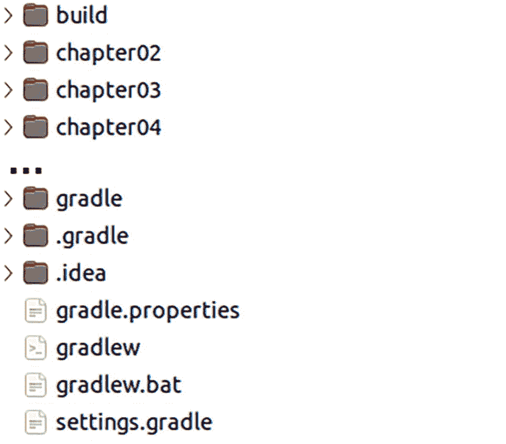
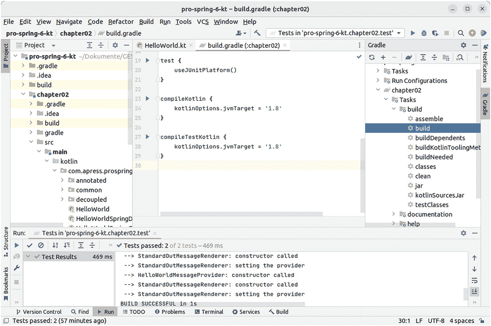
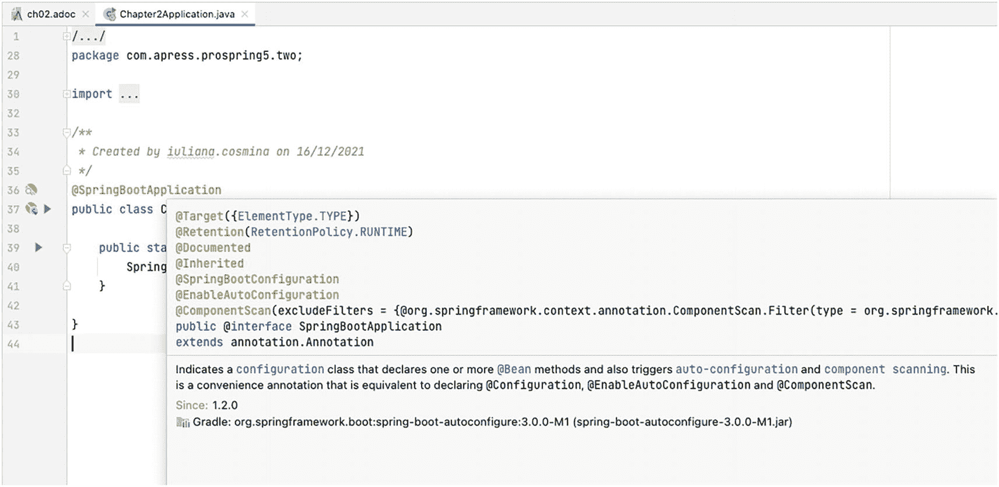
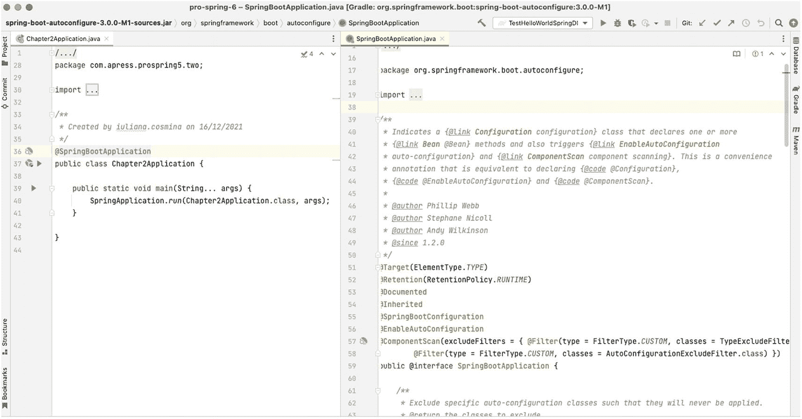
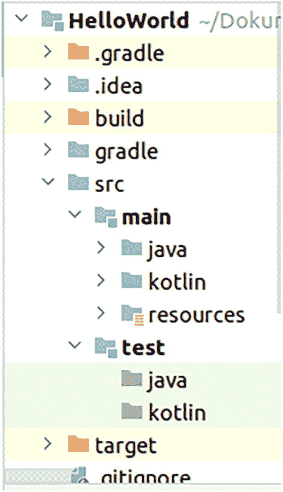
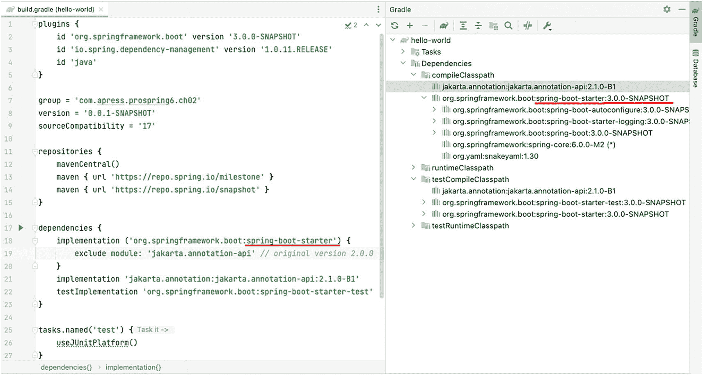
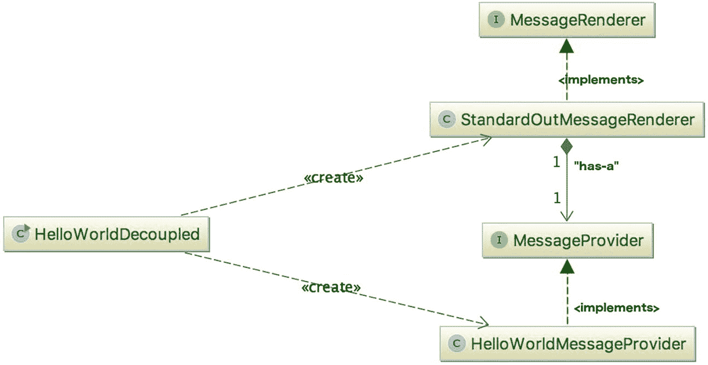
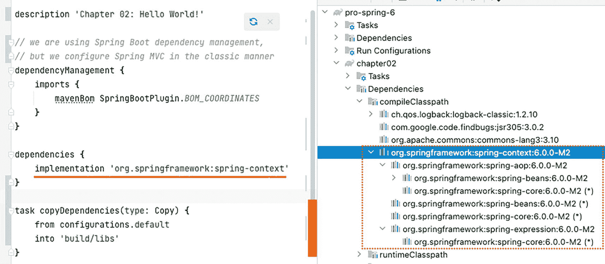

# 2. 开始入门

启动一个新项目时最困难的部分是建立一个开发流程，包括选择和优化工具，以便你可以专注于编写代码。幸运的是，本书旨在让这一切变得更容易。本书的项目是一个使用 Spring 组件的 Kotlin 项目，这意味着在编辑器、构建工具甚至 JDK 方面都有相当多的选择。

本章提供了你快速上手所需的所有基础知识，但首先让我们来看一些约定。


## 约定

本书采用了几种排版约定，旨在让阅读更轻松。为此，书中使用了以下约定：

表 2-1

特殊段落图标及其含义

| 标签 | 含义 |
| --- | --- |
|  图标。它展示了一个带阴影圆圈中的字母 i。 | 你可能会觉得这很有用。 |
|  图标。它展示了一个灯泡。 | 你绝对会觉得这很有用。 |
|  图标。它展示了一个螺旋方向图案，底部有一条水平线。 | 这非常有用。 |
|  图标。它展示了一个带阴影圆圈中的感叹号。 | 使用此功能时请小心。 |
|  图标。它展示了一个带阴影三角形中的感叹号。 | 无论这是什么，都建议不要这样做。 |
|  图标。它展示了一个停止标志。其结构为带阴影的六边形。 | 无论这是什么，都不要这样做。 |

*   段落中的代码或概念名称显示如下：`java.util.List`

*   代码清单和配置显示如下：

    ```
    fun main(args: Array) {
    println("Hello World!")
    }
    ```

*   控制台输出中的日志显示如下：

    ```
    01:24:07.809 [main] INFO c.a.Application - Starting Application
    01:24:07.814 [main] DEBUG c.a.p.c.Application - Running in debug mode
    ```

*   `{xx}` 是一个占位符，其中 `xx` 值是一个伪值，提示了在命令或语句中应使用的真实值。例如，`{name_of_your_bean}` 表示在具体示例中，整个结构应替换为你 bean 的名称。

*   *斜体*字体用于幽默的比喻、表达方式，以及需要与周围文本有所区分的文本片段。例如，在第 1 章中，好莱坞原则被介绍为*别打电话给我们，我们会打给你*。

*   **粗体**字体用于章节引用和重要术语。

*   `(..)` 用于替换方法和构造函数中的参数声明和参数集，以避免分散你对实际代码的注意力。

*   `…`​ 用于替换与上下文无关的代码、配置和日志。

*   包导入语句被精简到最少，只显示与所讨论组件相关的部分。这是为了减少书中代码占用的空间，以便更好地用于更深入的解释。无论如何，你都可以在项目中找到完整的代码！

*   每章都有一些脚注和链接，指向文档、工具和博客文章。不查阅这些内容也能阅读本书，因此可以忽略它们，但你可能会觉得它们很有用。

*   某些段落会显示在一个矩形框中，并标有表 2-1 中的某个图标。该表也显示了每个图标的含义。

至于我的写作风格，我喜欢以与同事和朋友进行技术交流的方式来写书，穿插一些笑话，提供生产环境示例，并与非编程场景进行类比。因为编程不过是模拟现实世界的另一种方式。

## 本书读者对象

本书假设你对 Java、Kotlin 以及 Java/Kotlin 应用开发中涉及的工具有一定了解。如果你不熟悉，那可能也不是什么大问题，因为项目设置得非常清晰，即使你对 Gradle 一无所知也能构建它。此外，如果你使用推荐的编辑器 IntelliJ IDEA，你应该能够直接克隆仓库、构建项目并立即开始工作。

## 本书所需环境

你显然需要**一台电脑**，台式机或笔记本电脑均可，只要它是最新的，运行 Windows、Linux 或 macOS，并且连接到**互联网**，具体选择并不重要。

你需要在本地安装 **JDK 17**（或 OpenJDK 17）。在任何操作系统上如何安装的说明都可以在 Oracle 官方页面上找到^(¹⁷,¹⁸)。

 图标。它展示了一个灯泡。 对于任何基于 Unix 的系统，SDKMAN!^(¹⁹) 非常有用。SDKMAN! 是一个在大多数基于 Unix 的系统上管理多个软件开发工具包并行版本的工具。它提供了一个便捷的命令行界面（CLI）和 API，用于安装、切换、移除和列出候选版本。它适用于 JDK、Gradle 以及更多工具。

如前所述，推荐的**编辑器**是 IntelliJ IDEA^(²⁰)；你可以免费使用企业版 30 天，或者你可以帮助测试早期访问版本。IntelliJ IDEA 是 Spring 应用程序的绝佳编辑器，因为它附带了一套强大的插件，可以帮助你非常清楚地了解你的 bean 是否配置正确。如果你更熟悉 Eclipse IDE，可以尝试 Spring Tools 4^(²¹) 来简化 Spring 开发。

 图标。它展示了一个灯泡。 IntelliJ IDEA 还有一个社区版，可以免费使用（基于 Apache 2.0 许可）。它缺少一些对 Spring 的扩展支持，但你仍然可以将其用于本书的所有 Kotlin 源码。

你需要**源代码**，书中引用的所有代码示例都来自这些源代码。根据你获取本书相关项目的方式，你可能需要安装 **Git**^(²²)。你可以使用命令行中的 Git 来克隆仓库，也可以使用 IDE，或者从仓库页面将源代码下载为 zip 文件。

 图标。它展示了一个带阴影圆圈中的感叹号。 这是项目仓库页面：[`​github.​com/​Apress/​pro-spring-6-kotlin`](https://github.com/Apress/pro-spring-6-kotlin)

任何比 Java/Kotlin 库更复杂、需要运行 Spring 应用程序与之交互的服务的项目依赖项，都通过 Docker 容器提供；因此，你需要在计算机上安装 Docker^(²³)。如何下载镜像并启动它们的说明在相应章节的 `README.adoc` 文件中提供。

总结一下你成为 Spring 专业人士所需的条件：本书、一台电脑、互联网、Java 17、`Git`、源代码、Docker，以及一点点时间和决心。


## 准备开发环境

以下是运行本书相关代码所需完成的步骤列表：

*   舒适地坐在电脑前。

*   安装 JDK 17（或 OpenJDK 17）。更高版本可能也可以。

 一个图标。顶部显示一个螺旋符号。底部有一条水平条。 如果你安装了旧版本，请打开终端（Windows 系统上的命令提示符或 PowerShell）并运行 `java -version`，确保 JDK 17 是系统使用的默认版本。预期输出会提到 Java 版本 17，如代码清单 2-1 所示。



一张截图。它展示了 build、chapter 2、3、4、gradle、dot gradle 和 dot idea 按行排列。下半部分展示了 gradle properties、gradlew、gradlew dot bat 和 settings dot gradle。

图 2-1

`pro-spring-6` 项目及其模块

*   克隆项目仓库，或从 Apress 官方页面下载源码并在电脑上解压。确保选择源码的 Kotlin 变体。你应该会得到一个名为 `pro-spring-6` 的目录，其中包含如图 2-1 所示的模块。

```
> java -version
java version "17.0.1" 2021-10-19 LTS
Java(TM) SE Runtime Environment (build 17.0.1+12-LTS-39)
Java HotSpot(TM) 64-Bit Server VM (build 17.0.1+12-LTS-39, mixed mode, sharing)
代码清单 2-1
命令 java -version 的输出，显示 JDK 17 被设置为默认版本
```

*   打开 IntelliJ IDEA 编辑器，在主菜单中选择 File ➤ Open，在打开的文件选择器窗口中，选择 `pro-spring-6` 目录。稍等片刻后，在左侧（本书中称为*项目视图*的窗格中），你应该能看到 `pro-spring-6` 项目及其列出的模块。在窗口右侧，你应该能看到一个显示 Gradle 配置的区域（本书中称为*Gradle 视图*）。这些视图如图 2-2 所示。

 一个图标。它展示了一个灯泡。 对于本书的 Kotlin 变体，构建过程侧重于使用 Gradle 作为构建工具。与 Maven 设置相比，Gradle 设置要简洁得多。如果你确实需要使用 Maven，源码的 Java 变体以及 [`​kotlinlang.​org/​docs/​maven.​html`](https://kotlinlang.org/docs/maven.html) 提供的信息应该能帮到你。



一张截图。标题为 pro spring 6 k t build gradle chapter 2。它展示了一段代码。标签显示为 test、compile kotlin 和 compile test kotlin。

图 2-2

`pro-spring-6` 项目，Gradle 视图

该项目由一个主 Gradle 项目和多个子项目组成，每个子项目代表一个 Kotlin 项目。每个模块的名称都包含其内容被引用的章节编号。每个项目都依赖于许多库，这些库将在你首次在编辑器中打开项目时自动下载。

项目可以在克隆后根据其 `README.adoc` 文件中的说明进行构建。该项目不需要在本地安装 Gradle，因为它被配置为使用包装器或 IDE 插件。

在编写本章时，用于构建项目的 Gradle 版本是 7.4。本书发布时版本可能会发生变化，但版本号会在主 `README.adoc` 文件和 Gradle 包装器配置文件 `gradle/wrapper/gradle-wrapper.properties` 中提及。

IntelliJ IDEA 会识别包装器配置并据此构建你的项目。如果你想从界面显式触发任何操作，只需单击 Gradle 视图左上角可见的  一个可逆符号。符号。

 一个图标。它展示了一个灯泡。 IntelliJ IDEA 会在内部保存项目状态，有时会……*嗯*……感到困惑。如果你的项目显示类名红色并提示缺少依赖项，请尝试按照 `README.adoc` 文件中的说明从命令行构建它。如果这样可行，你可以尝试 File 菜单下的以下选项之一：Invalidate Caches、Reload All from Disk、Restart IDE、Repair IDE。

现在，你已经成功在电脑上加载并构建了项目，在解释 `pro-spring-6` 项目的 Gradle 配置之前，我们将向你介绍更多关于 Spring 内部机制的内容。

## 理解 Spring 打包

Spring 打包是模块化的；它允许你挑选要在应用程序中使用的组件，并在分发应用程序时仅包含这些组件。Spring 有许多模块，但根据应用程序的需求，你只需要这些模块的一个子集。每个模块都有其编译后的二进制代码（位于 JAR 文件中），以及相应的 Javadoc 和源码 JAR。IntelliJ IDEA 会扫描项目的依赖项，并可以根据请求下载源码和 Javadoc。这意味着你可以在编辑器中查看代码并阅读关于 Spring 类的信息。

当鼠标悬停在类名上时，会显示一个矩形框，其中包含该类的 Javadoc，如图 2-3 中 `@SpringBootApplication` 注解所示（该图显示的是 Java 变体；对于 Kotlin，视图类似）。



一张截图。标题为 chapter 2 application java。标记显示为 package、import 和 public class。

图 2-3

IntelliJ IDEA 显示 `@SpringBootApplication` 注解的 Javadoc

你也可以选择按住 Ctrl（macOS 为 Command）键并单击类名，IntelliJ IDEA 将下载其源码并在新标签页中打开。在图 2-4 中，你可以在右侧看到 `@SpringBootApplication` 注解的源码（同样，该图显示的是 Java 变体，Kotlin 的视图类似）。



一张截图。标题为 pro spring 6 spring boot application java。它展示了 spring boot application。标记显示为 package、import、public class 和 public static void main。

图 2-4

IntelliJ IDEA 显示 `@SpringBootApplication` 注解的源码

回到 Spring 模块。*Spring 模块* 就是打包了该模块所需代码的 JAR 文件。Spring 框架的代码库在 GitHub 上公开可用。如果你对 Spring 框架的代码长什么样感到好奇，并希望处于 Spring 开发的前沿，请从 Spring 的 GitHub 仓库查看最新版本的源代码^(²⁴)。

在理解了每个模块的用途之后，你可以选择项目中所需的模块并将其包含在代码中。根据 GitHub 上最新的标签，Spring Framework 6.0 似乎包含 22 个模块。表 2-2 描述了这些 JAR 文件及其对应的模块。实际的 JAR 文件名例如 `spring-aop-6.0.0.jar`，但为简单起见，我们只包含了特定的模块部分（例如 `aop`）。

表 2-2

Spring 模块


| 模块 | 描述 |
| --- | --- |
| `aop` | 此模块包含在应用程序中使用 Spring 的 AOP 功能所需的所有类。如果你计划使用 Spring 中其他利用 AOP 的功能（例如声明式事务管理），也需要将此 JAR 包含在你的应用程序中。此外，支持与 AspectJ 集成的类也打包在此模块中。 |
| `aspects` | 此模块包含用于与 AspectJ AOP 库进行高级集成的所有类。例如，如果你使用 Java 类进行 Spring 配置，并且需要 AspectJ 风格的注解驱动事务管理，则需要此模块。 |
| `beans` | 此模块包含支持 Spring 操作 Spring Bean 的所有类。此模块中的大部分类支持 Spring 的 Bean 工厂实现。例如，处理 Spring XML 配置文件和 Java 注解所需的类都打包在此模块中。 |
| `context` | 此模块包含为 Spring Core 提供许多扩展的类。你会发现所有需要使用 Spring 的 `ApplicationContext` 功能的类（在**第** 5 章中介绍），以及用于企业 JavaBeans (EJB)、Java 命名和目录接口 (JNDI) 和 Java 管理扩展 (JMX) 集成的类。此模块还包含 Spring 远程调用类、与动态脚本语言（例如 JRuby、Groovy 和 BeanShell）集成的类、JSR-303（“Bean 验证”）、调度和任务执行等。 |
| `context-indexer` | 此模块包含一个索引器实现，用于访问在 `META-INF/spring.components` 中定义的候选组件。核心类 `CandidateComponentsIndex` 不供外部使用。 |
| `context-support` | 此模块包含对 `spring-context` 模块的进一步扩展。在用户界面方面，有用于邮件支持以及与模板引擎（如 Velocity、FreeMarker 和 JasperReports）集成的类。此外，与各种任务执行和调度库（包括 CommonJ 和 Quartz）的集成也打包在此处。 |
| `core` | 这是每个 Spring 应用程序都需要的主要模块。在此 JAR 文件中，你将找到所有其他 Spring 模块共享的所有类（例如，用于访问配置文件的类）。此外，在此 JAR 中，你还会找到一些非常有用的工具类，这些类在整个 Spring 代码库中使用，你也可以在自己的应用程序中使用它们。 |
| `expression` | 此模块包含 Spring 表达式语言 (SpEL) 的所有支持类。 |
| `instrument` | 此模块包含用于 JVM 引导的 Spring 检测代理。在 Spring 应用程序中使用 AspectJ 进行加载时织入时需要此 JAR 文件。 |
| `jcl` | 此模块仅用于与现有的 Apache Commons Logging 用法（例如在 Apache Commons Configuration 中）保持二进制兼容性。 |
| `jdbc` | 此模块包含 JDBC 支持的所有类。所有需要数据库访问的应用程序都需要此模块。用于支持数据源、JDBC 数据类型、JDBC 模板、原生 JDBC 连接等的类都打包在此模块中。 |
| `jms` | 此模块包含 Java 消息服务 (JMS) 支持的所有类。 |
| `messaging` | 此模块包含从 Spring Integration 项目中提取的关键抽象，作为基于消息的应用程序的基础，并增加了对 STOMP 消息的支持。 |
| `orm` | 此模块通过支持流行的 ORM 工具（包括 Hibernate、JDO 和 JPA）来扩展 Spring 的标准 JDBC 功能集。此 JAR 中的许多类依赖于 `spring-jdbc` JAR 文件中包含的类，因此你的应用程序中也必须包含该文件。 |
| `oxm` | 此模块提供对对象/XML 映射 (OXM) 的支持。用于抽象 XML 编组和解组的类，以及对流行工具（如 Castor、JAXB、XMLBeans 和 XStream）的支持都打包在此模块中。 |
| `r2dbc` | 此模块使 R2DBC 更易于使用，并降低了常见错误发生的可能性。它提供了简单的错误处理以及一系列与底层 RDBM（响应式数据库管理器）无关的、简洁的非受检异常。 |
| `test` | Spring 提供了一组模拟类来帮助测试你的应用程序，其中许多模拟类在 Spring 测试套件中使用，因此它们经过了良好的测试，并使测试你的应用程序变得更加简单。当然，我们在 Web 应用程序的单元测试中发现了模拟 `HttpServletRequest` 和 `HttpServletResponse` 类的巨大用途。另一方面，Spring 与 JUnit 单元测试框架紧密集成，此模块提供了许多支持开发 JUnit 测试用例的类；例如，`SpringExtension` 将 *Spring TestContext Framework* 集成到 JUnit 5 的 *Jupiter* 编程模型中。 |
| `tx` | 此模块提供支持 Spring 事务基础设施的所有类。你将找到从事务抽象层到支持 Java 事务 API (JTA) 以及与主要供应商的应用服务器集成的类。 |
| `web` | 此模块包含在 Web 应用程序中使用 Spring 的核心类，包括用于自动加载 `ApplicationContext` 功能的类、文件上传支持类，以及用于执行重复性任务（例如从查询字符串中解析整数值）的一系列有用类。 |
| `webflux` | 此模块包含 Spring Web Reactive 模型的核心接口和类。 |
| `webmvc` | 此模块包含 Spring 自己的 MVC 框架的所有类。如果你的应用程序使用单独的 MVC 框架，则不需要此 JAR 文件中的任何类。Spring MVC 在**第** 15 章中有更详细的介绍。 |
| `websocket` | 此模块提供对 JSR-356（“Java API for WebSocket”）的支持。 |


如果你使用 Spring Boot，则无需显式选择要添加为依赖项的 Spring 模块，因为会根据所使用的 Spring Boot 启动器依赖项自动配置相应的 Spring 依赖项集。Spring Boot 的代码库也在 GitHub 上公开。如果你对 Spring Boot 代码的样子感到好奇，并希望处于 Spring Boot 开发的最前沿，请查看 Spring 的 GitHub 仓库中的最新版本源代码^(²⁵)。在 `spring-boot-project/spring-boot-starters` 下，有一系列 Spring Boot 启动器模块，这些模块可以作为 Spring 项目的依赖项，用于构建特定类型的 Spring 应用程序，并带有默认配置和精选的依赖项集。这些模块本质上就是依赖描述符，可以添加到 `build.gradle` 中的 `dependencies { }` 部分。目前有超过 30 个这样的模块，表 2-3 列出了最常用的一些模块以及它们为你的应用程序配置的依赖项。

表 2-3

Spring Boot 启动器模块

| 模块 | 描述 |
| --- | --- |
| `spring-boot-starter` | 这是最简单的 Spring Boot 启动器，它将 `spring-core` 模块作为依赖项添加到你的项目中。可用于创建一个非常简单的 Spring 应用程序。主要用于学习目的和创建基础项目，这些项目封装了项目中其他模块共享的通用功能。 |
| `spring-boot-starter-aop` | 将 `spring-aop` 作为依赖项添加到你的项目中。 |
| `spring-boot-starter-data-*` | 这种类型的启动器为你的项目添加了用于处理数据的各种 Spring 依赖项。`*` 代表数据来源的技术。例如，`spring-boot-starter-data-jdbc` 添加了用于创建 Spring Repository Bean 的类，以处理来自支持 JDBC 驱动程序的数据库（如 MySQL、PostgreSQL、Oracle 等）的数据。 |
| `spring-boot-starter-web` | 配置用于创建 Web 应用程序的最小依赖项集。 |
| `spring-boot-starter-security` | 配置用于保护 Spring Web 应用程序安全的最小依赖项集。 |
| `spring-boot-starter-webflux` | 配置用于创建响应式 Web 应用程序的最小依赖项集。 |
| `spring-boot-starter-actuator` | 配置 Spring Boot Actuator，它启用一组用于监控 Spring Web 应用程序的端点。 |
| `spring-boot-starter-test` | 配置以下库集：Spring Test、JUnit、Hamcrest 和 Mockito。 |

## 为你的应用程序选择模块

如果没有 Maven 或 Gradle 这样的依赖管理工具，为你的应用程序选择要使用的模块可能会有点棘手。例如，如果你只需要 Spring 的 Bean 工厂和 DI 支持，你仍然需要多个模块，包括 `spring-core`、`spring-beans`、`spring-context` 和 `spring-aop`。如果你需要 Spring 的 Web 应用程序支持，那么你还需要进一步添加 `spring-web` 等等。得益于 Gradle 的传递依赖支持等构建工具特性，所有必需的第三方库都会被自动包含。

### 在 Maven 仓库中访问 Spring 模块

由 Apache 软件基金会创立的 Maven^(²⁶) 已成为从开源到企业环境中管理 Java 应用程序依赖项最流行的工具之一。Maven 是一个强大的应用程序构建、打包和依赖管理工具。它管理应用程序的整个构建周期，从资源处理和编译到测试和打包。还存在大量用于各种任务的 Maven 插件，例如更新数据库和将打包的应用程序部署到特定服务器（例如：Tomcat、WildFly 或 WebLogic）。在撰写本文时，当前的 Maven 版本是 3.8.4。

几乎所有开源项目都支持通过 Maven 仓库分发库。最流行的是托管在 Apache 上的 Maven 中央仓库，你可以在 Maven 中央仓库网站^(²⁷)上访问和搜索某个构件是否存在及其相关信息。

对 Maven 的详细讨论不在本书的范围内，你随时可以参考在线文档或书籍来获取关于 Maven 的详细参考。

### 使用 Gradle 访问 Spring 模块

Maven 项目的标准结构如图 2-5 所示。



一张截图。标题为 Hello World。它展示了标有 dot gradle、dot idea、build、gradle、s r c、main、test 和 target 的分支行。它展示了项目结构。

图 2-5

Gradle 典型项目结构

`main` 目录包含 `kotlin` 目录中的应用程序代码库和 `resources` 目录中的应用程序配置文件。`test` 目录包含 `kotlin` 目录中的应用程序测试代码和 `resources` 目录中的应用程序测试配置文件（图中未显示——你可以轻松添加）。

Maven 源码和其他构件的分类和组织很重要，因为 Gradle^(²⁸) 遵循相同的规则，甚至使用 Maven 中央仓库来检索构件。也可以配置各种其他仓库。Gradle 是一个强大的构建工具，它放弃了臃肿的 XML 配置，转而采用 Groovy 的简洁性和灵活性。这非常好，并提供了很大的灵活性，直到开发人员对他们的配置过于有创意为止。在撰写本文时，Gradle 的当前版本是 7.3.3。从 4.x 版本开始，Spring 团队已转而使用 Gradle 来配置每个 Spring 产品。这就是为什么本书的源代码可以使用 Gradle 构建和执行的原因。项目的 Gradle 配置文件的默认名称是 `build.gradle`。该文件的示例如清单 2-2 所示。

```
plugins {
id 'org.jetbrains.kotlin.jvm' version '1.8.10'
id 'application' // 使其可通过 Gradle 运行
}
group 'com.apress.prospring6.ch02'
version '6.0-SNAPSHOT'
repositories {
mavenCentral()
}
tasks.withType(JavaCompile) {
options.encoding = "UTF-8"
}
dependencies {
implementation group: 'org.apache.logging.log4j', name: 'log4j-core', version: '2.17.1'
}
application {
// 用于从 Gradle 运行。请注意，文件名是
// HelloApplication.kt – 编译器会添加 "Kt"。
mainClass = 'book.spring6.helloworld.HelloApplicationKt'
}
清单 2-2
build.gradle 片段
```

这相当易读，对吧？正如你所见，构件使用 *group*、*artifact* 和 *version* 来标识。Gradle 本身不在本书的讨论范围内，因此对其的详细讨论到此为止。


### 使用 Spring Boot 依赖管理

由于 Gradle 没有类似 Maven 的父级概念，因此依赖管理是通过 `io.spring.dependency-management` 插件完成的。清单 2-3 展示了一个 Gradle 配置。

```
plugins {
id 'org.springframework.boot' version '3.0.0-SNAPSHOT'
id 'io.spring.dependency-management' version '1.0.11.RELEASE'
id 'org.jetbrains.kotlin.jvm' version '1.8.10'
}
group = 'com.apress.prospring6.ch02'
version = '6.0-SNAPSHOT'
sourceCompatibility = '17'
repositories {
mavenCentral()
maven { url 'https://repo.spring.io/milestone' }
maven { url 'https://repo.spring.io/snapshot' }
}
dependencies {
implementation 'org.springframework.boot:spring-boot-starter'
testImplementation 'org.springframework.boot:spring-boot-starter-test'
}
...
清单 2-3
简单的 Spring Boot 项目 Gradle 配置
```

通过调整 `build.gradle` 文件，可以覆盖 Spring Boot 管理的依赖版本。图 2-6 展示了 IntelliJ IDEA 的 Gradle 视图，其中显示了 Spring Boot 依赖管理引入的依赖项以及用于覆盖版本的 Gradle 配置语法。



一张截图。标题为“build gradle hello world”。它展示了插件、组、版本、源代码兼容性、仓库、依赖项和命名任务。

图 2-6

为 `jakarta.annotation-api` 定制了版本的 Gradle Spring Boot 项目

由于 Gradle 中的 Spring Boot 依赖管理是通过插件实现的，因此配置使用依赖管理的经典 Spring 项目是可能的，无需对配置进行任何额外更改，只需移除 starter 依赖并将其替换为所需的 Spring 依赖即可。

## 使用 Spring 文档

Spring 之所以成为构建真实应用程序的开发者的一个如此有用的框架，其一方面在于它拥有大量编写精良、准确无误的文档。在每个版本中，Spring 框架的文档团队都努力确保所有文档都由开发团队完成并打磨。这意味着 Spring 的每个特性不仅在 Javadoc 中有完整记录，而且在每个发行版附带的 Spring 参考手册中也有涵盖。如果你尚未熟悉 Spring Javadoc 和参考手册，请现在就去熟悉。本书不能替代这些资源；相反，它是一本补充性的参考书，演示了如何从头开始构建一个基于 Spring 的应用程序。

你可以像之前提到的那样通过 IntelliJ IDEA 编辑器访问 Spring Javadoc，但如果你更喜欢在浏览器中访问，可以将此 URL 加入书签：[`​docs.​spring.​io/​spring-framework/​docs/​current/​javadoc-api`](https://docs.spring.io/spring-framework/docs/current/javadoc-api)。

要更深入地了解 Spring 框架，你还可以将官方参考文档的 URL 加入书签：[`​docs.​spring.​io/​spring-framework/​docs/​current/​reference/​html`](https://docs.spring.io/spring-framework/docs/current/reference/html)。

## 将 Spring 注入 Hello World

在本书的这个阶段，我们乐观地认为你已经确信 Spring 是一个坚实、支持良好的项目，具备成为优秀应用程序开发工具的所有要素，并且深入理解它不仅能让你成为更好的开发者，还能促进你的职业发展。然而，还缺少一样东西——我们还没有向你展示任何 Spring 6 代码。我们确信你渴望看到 Spring 的实际应用，既然我们不能再不深入代码了，那就让我们开始吧。如果你不完全理解本节中的所有代码，请不要担心；随着本书的深入，我们会对所有主题进行更详细的讲解。

### 构建示例 Hello World 应用程序

现在，我们确信你对传统的 Hello World 示例很熟悉，但以防你在过去 30 年里一直生活在月球上，清单 2-4 中的代码片段展示了其 Kotlin 版本的完整风采。

```
package com.apress.prospring6.two
object HelloWorld {
@JvmStatic
fun main(args: Array) {
println("Hello World!")
}
}
清单 2-4
经典的 Hello World Kotlin 应用程序
```

就示例而言，这个非常简单——它能完成任务，但扩展性不强。如果我们想更改消息呢？如果我们想以不同的方式输出消息，比如输出到标准错误而不是标准输出，或者用 HTML 标签包裹而不是纯文本呢？我们将重新定义示例应用程序的需求，并说明它必须支持一种简单、灵活的机制来更改消息，并且必须易于更改渲染行为。在基本的 *Hello World* 示例中，你可以通过适当更改代码来快速轻松地进行这两项更改。然而，在更大的应用程序中，重新编译需要时间，并且要求应用程序再次进行全面测试。更好的解决方案是将消息内容外部化，并在运行时读取它，也许是从命令行参数中读取，如清单 2-5 所示。

```
package com.apress.prospring6.two
object HelloWorldWithCommandLine {
@JvmStatic
fun main(args: Array) {
if (args.size > 0) {
println(args[0])
} else {
println("Hello World!")
}
}
}
清单 2-5
带参数的经典 Hello World Kotlin 应用程序
```

这个示例实现了我们想要的目标——我们现在可以在不更改代码的情况下更改消息。然而，这个应用程序仍然存在一个问题：负责渲染消息的组件也负责获取消息。更改消息的获取方式意味着要更改渲染器中的代码。再加上我们仍然无法轻松更改渲染器；这样做意味着要更改启动应用程序的类。

如果我们把这个应用程序再推进一步（脱离 Hello World 的基础），更好的解决方案是将渲染和消息检索逻辑重构为独立的组件。此外，如果我们真的想让应用程序变得灵活，我们应该让这些组件实现接口，并使用这些接口定义组件与启动器之间的相互依赖关系。通过重构消息检索逻辑，我们可以定义一个简单的 `MessageProvider` 接口，其中包含一个属性 `message`，如清单 2-6 所示。

```
package com.apress.prospring6.two.decoupled
interface MessageProvider {
val message: String?
}
清单 2-6
MessageProvider 接口
```

所有能够渲染消息的组件都实现了 `MessageRenderer` 接口，清单 2-7 展示了这样一个组件。

```
package com.apress.prospring6.two.decoupled
interface MessageRenderer {
fun render()
var messageProvider: MessageProvider?
}
清单 2-7
MessageRenderer 接口
```

如你所见，`MessageRenderer` 接口声明了一个方法 `render()`，以及一个 JavaBean 风格的属性 `messageProvider`。任何 `MessageRenderer` 的实现都与消息检索解耦，并将该职责委托给提供给它们的 `MessageProvider` 实例。

在这里，`MessageProvider` 是 `MessageRenderer` 的一个依赖项。创建这些接口的简单实现很容易，如清单 2-8 所示。

```
package com.apress.prospring6.two.decoupled
class HelloWorldMessageProvider : MessageProvider {
init {
println(" --> HelloWorldMessageProvider: constructor called")
}
override val message: String
get() = "Hello World!"
}
清单 2-8
MessageProvider 实现
```


好的，作为一名高级文档工程师和翻译员，我将严格遵循您提供的注意事项和示例，将给定的英文文本翻译成中文。


可以看到，我们创建了一个简单的 `MessageProvider`，它总是返回“Hello World!”作为消息。清单 2-9 中展示的 `StandardOutMessageRenderer` 类也同样简单。

```
package com.apress.prospring6.two.decoupled
class StandardOutMessageRenderer() : MessageRenderer {
override var messageProvider: MessageProvider? = null
set(value) {
field = value
println(" --> StandardOutMessageRenderer: setting the provider")
}
init {
println(" --> StandardOutMessageRenderer: constructor called")
}
override fun render() {
println(messageProvider?.message?:throw RuntimeException(
"You must set the property messageProvider of class:"
+ StandardOutMessageRenderer::class.java.name
) )
}
}
清单 2-9
MessageRenderer 实现
```

现在，剩下的就是重写入口类的 `main(..)` 方法，如清单 2-10 所示。

```
package com.apress.prospring6.two.decoupled
object HelloWorldDecoupled {
@JvmStatic
fun main(args: Array) {
val mr: MessageRenderer = StandardOutMessageRenderer()
val mp: MessageProvider = HelloWorldMessageProvider()
mr.messageProvider = mp
mr.render()
}
}
清单 2-10
新的 main(..) 方法
```

图 2-7 描绘了到目前为止所构建应用程序的抽象模式。



一个流程图。Hello world message provider 指向 message provider。另一个标记为 standard out message renderer，它指向 message renderer。Hello world decoupled 指向 standard out message renderer 和 hello world message provider。

图 2-7

一个更加解耦的 Hello World 应用程序

这里的代码相当简单：

*   我们实例化了 `HelloWorldMessageProvider` 和 `StandardOutMessageRenderer` 的实例，尽管声明的类型分别是 `MessageProvider` 和 `MessageRenderer`。这是因为在编程逻辑中，我们只需要与接口提供的方法进行交互，而 `HelloWorldMessageProvider` 和 `StandardOutMessageRenderer` 已经分别实现了这些接口。

*   然后，我们将 `MessageProvider` 传递给 `MessageRenderer`，并调用 `MessageRenderer#render()`。

如果我们编译并运行这个程序，会得到预期的“Hello World!”输出。现在，这个例子更接近我们想要的效果，但有一个小问题。更改 `MessageRenderer` 或 `MessageProvider` 接口的实现意味着要更改代码。

为了解决这个问题，我们需要将获取两个实现类型并实例化它们的责任委托给其他人。最*手动*的方法是创建一个简单的工厂类，该类从属性文件中读取实现类名，并代表应用程序实例化它们，如清单 2-11 所示。

```
package com.apress.prospring6.two.decoupled
import java.util.*
object MessageSupportFactory {
var renderer: MessageRenderer? = null
var provider: MessageProvider? = null
init {
val props = Properties()
try {
props.load(this.javaClass.getResourceAsStream("/msf.properties"))
val rendererClass = props.getProperty("renderer.class")
val providerClass = props.getProperty("provider.class")
renderer = Class.forName(rendererClass).getDeclaredConstructor().newInstance() as
MessageRenderer
provider = Class.forName(providerClass).getDeclaredConstructor().newInstance() as
MessageProvider
} catch (ex: Exception) {
ex.printStackTrace()
}
}
}
清单 2-11
负责获取两个实现类型并实例化它们的实例工厂类
```

这里的实现是琐碎且幼稚的，错误处理过于简单，配置文件的名称是硬编码的，但我们已经有了大量的代码。这个类的配置文件非常简单，如清单 2-12 所示。

```
renderer.class=com.apress.prospring5.ch2.decoupled.StandardOutMessageRenderer
provider.class=com.apress.prospring5.ch2.decoupled.HelloWorldMessageProvider
清单 2-12
MessageSupportFactory 类的配置文件内容，即 msf.properties 文件的内容
```

配置文件必须位于项目的类路径中。当从 IntelliJ IDEA 运行时，该文件位于 `chapter02/src/main/resources` 目录中，并在运行代码时被添加到类路径。

为了将获取 `MessageProvider` 和 `MessageRenderer` 实例的责任委托给 `MessageSupportFactory`，`main(..)` 方法必须更改，如清单 2-13 所示。

```
package com.apress.prospring6.two.decoupled
object HelloWorldDecoupledWithFactory {
@JvmStatic
fun main(args: Array) {
val mr: MessageRenderer = MessageSupportFactory.renderer?:
throw IllegalArgumentException(
"Service of type 'MessageRenderer' was not found!")
val mp: MessageProvider = MessageSupportFactory.provider?:
throw IllegalArgumentException(
"Service of type 'MessageProvider' was not found!")
mr.messageProvider = mp
mr.render()
}
}
清单 2-13
使用 MessageSupportFactory 的 HelloWorld 版本
```

然而，还有另一种使用纯 Kotlin 的方法，无需创建 `MessageSupportFactory` 类，因为在 `java.util` 包中已经有一个名为 `ServiceLoader` 的类可以完成完全相同的事情。这个类是在 Java 6 中引入的，用于方便地发现和加载与给定接口匹配的实现。这个类为其检索实现的接口被称为*服务提供者接口 (SPI)*。

这种方法与 `MessageSupportFactory` 类似，只是配置文件的名称必须遵守三条规则：

*   必须位于项目类路径中名为 `META-INF/services` 的目录下。
*   文件名是 SPI 的完全限定名。
*   其内容是 SPI 实现的完全限定名。

这意味着需要在 `src/main/resources` 中创建如清单 2-14 所示的目录和文件结构。

```
└── resources
└── META-INF
└── services
├── com.apress.prospring6.two.decoupled.MessageProvider
└── com.apress.prospring6.two.decoupled.MessageRenderer
清单 2-14
ServiceLoader 的配置文件位置
```

`com.apress.prospring6.two.decoupled.MessageProvider` 文件包含 SPI 实现的完全限定名，在本例中是 `com.apress.prospring6.two.decoupled.HelloWorldMessageProvider`。

`com.apress.prospring6.two.decoupled.MessageRenderer` 文件包含 SPI 实现的完全限定名，在本例中是 `com.apress.prospring6.two.decoupled.StandardOutMessageRenderer`。

清单 2-15 展示了使用 `ServiceLoader` 的 `main(..)` 方法。

```
package com.apress.prospring6.two.decoupled
import java.util.*
object HelloWorldWithServiceLoader {
@JvmStatic
fun main(args: Array) {
val slr: ServiceLoader =
ServiceLoader.load(MessageRenderer::class.java)
val slp: ServiceLoader =
ServiceLoader.load(MessageProvider::class.java)
val mr: MessageRenderer = slr.findFirst().orElseThrow {
IllegalArgumentException(
"Service of type 'MessageRenderer' was not found!"
)
}
val mp: MessageProvider = slp.findFirst().orElseThrow {
IllegalArgumentException(
"Service of type 'MessageProvider' was not found!"
)
}
mr.messageProvider = mp
mr.render()
}
}
清单 2-15
使用 ServiceLoader 的 HelloWorld 版本
```


 一个图标，描绘了一个灯泡。对于这个示例来说，使用 `ServiceLoader` 有些大材小用，它在配置了 Java 模块的多模块项目中才能真正展现其威力。提供实现的模块在其 `module.java` 文件中声明：`provides {SPI} with {SPI-Implementation}`。使用该服务的模块无需知道实现来自何处或其完全限定名，只需在其 `main.java` 文件中声明 `uses {SPI}`，`ServiceLoader` 就会自动选取类路径上找到的任何实现。你可以在 Apress 于 2022 年出版的 *《Java 17 入门指南》* 中找到更多相关细节。

在我们继续探讨如何将 Spring 引入此应用程序之前，先快速回顾一下我们已经完成的工作：

*   我们从简单的 Hello World 应用程序开始。
*   我们定义了应用程序必须满足的两个额外需求：
    *   更改消息应该很简单。
    *   更改渲染机制也应该很简单。
*   为了满足这些需求，我们使用了两个接口：`MessageProvider` 和 `MessageRenderer`。
*   `MessageRenderer` 接口依赖于 `MessageProvider` 接口的实现，以便能够获取要渲染的消息。
*   最后，我们添加了一个简单的工厂类来获取实现类的名称，并在适用时实例化它们。这仅仅是为了展示，因为 `ServiceLoader` 已经存在。

### 使用 Spring 进行重构

前面展示的 `MessageSupportFactory` 示例满足了为示例应用程序设定的目标，但其主要问题在于，在保持组件松散耦合的同时，需要大量的胶水代码来拼凑应用程序。使用 `SpringLoader` 是在应用程序中使用依赖注入的 Java 方式，它消除了编写所有胶水代码的必要性。然而，还有一个问题：我们仍然需要在 `main(..)` 方法的代码中手动且显式地为 `MessageRenderer` 的实现提供一个 `MessageProvider` 实例。这最后一个问题可以通过 Spring 来解决。

#### 使用 Spring XML 配置

由于我们使用 Spring 来实现完整的解决方案，`SpringLoader` 不再必要，取而代之的是一个名为 `ApplicationContext` 的 Spring 接口。暂时不必过于担心这个接口；目前，只需知道 Spring 使用此接口来存储与由 Spring 管理的应用程序相关的所有环境信息即可。该接口扩展了另一个接口 `ListableBeanFactory`，后者充当任何 Spring 管理的 bean 实例的提供者。请看清单 2-16 中的代码片段。

```
package com.apress.prospring6.two
import com.apress.prospring6.two.decoupled.MessageRenderer
import org.springframework.context.ApplicationContext
import org.springframework.context.support.ClassPathXmlApplicationContext
object HelloWorldSpringDI {
@JvmStatic
fun main(args: Array) {
val ctx: ApplicationContext =
ClassPathXmlApplicationContext("spring/app-context.xml")
val mr = ctx.getBean("renderer", MessageRenderer::class.java)
mr.render()
}
}
清单 2-16
使用 Spring 的 HelloWorld 版本
```

在上面的代码片段中，你可以看到 `main(..)` 方法获取了一个 `ClassPathXmlApplicationContext` 实例（应用程序配置信息从项目类路径下的 `spring/app-context.xml` 文件中加载），类型为 `ApplicationContext`，并从中通过 `ApplicationContext#getBean()` 方法获取 `MessageRenderer` 实例。暂时不必过于担心 `getBean()` 方法；只需知道此方法会读取应用程序配置（本例中为 XML 文件），初始化 Spring 的 `ApplicationContext` 环境，然后返回配置好的 bean 实例。这个 `app-context.xml` XML 文件的作用与用于 `MessageSupportFactory` 或 `ServiceLoader` 的文件相同。该文件的内容如清单 2-17 所示。

```

清单 2-17
Spring XML 配置文件
```

清单 2-17 展示了一个典型的 Spring `ApplicationContext` 配置。首先，声明了 Spring 的命名空间，默认命名空间是 `beans`。`beans` 命名空间用于声明需要由 Spring 管理的 bean，并声明它们的依赖需求（对于前面的示例，`renderer` bean 的 `messageProvider` 属性引用了 `provider` bean）。Spring 将解析并注入这些依赖。

之后，我们声明了 ID 为 `provider` 的 bean 及其对应的实现类。当 Spring 在 `ApplicationContext` 初始化期间看到这个 bean 定义时，它会实例化该类，并使用指定的 ID 存储它。

然后声明了 `renderer` bean 及其对应的实现类。请记住，这个 bean 依赖于 `MessageProvider` 接口来获取要渲染的消息。为了告知 Spring 这个 DI 需求，我们使用了 `p` 命名空间属性。标签属性 `p:messageProvider-ref="provider"` 告诉 Spring，bean 的属性 `messageProvider` 应该被注入另一个 bean。要注入到该属性的 bean 应引用 ID 为 `provider` 的 bean。当 Spring 看到这个定义时，它会实例化该类，查找名为 `messageProvider` 的 bean 属性，并将 ID 为 `provider` 的 bean 实例注入其中。


如你所见，在 Spring 的 `ApplicationContext` 初始化后，`main(..)` 方法现在只需通过类型安全的 `getBean()` 方法（传入 ID 和期望的返回类型，即 `MessageRenderer` 接口）获取 `MessageRenderer` Bean，并调用 `render()`。Spring 已经创建了 `MessageProvider` 实例，并将其注入到 `MessageRenderer` 实例中。请注意，我们无需对使用 Spring 进行装配的类做任何修改。事实上，这些类没有引用 Spring，也完全不知道它的存在。然而，情况并非总是如此。你的类可以实现 Spring 指定的接口，以多种方式与 DI 容器交互。

有了新的 Spring 配置和修改后的 `main(..)` 方法，让我们看看它的实际效果。使用 Gradle，通过执行 `pro-spring-6/README.adoc` 文件中的任意命令来构建整个项目。

配置文件中唯一需要声明的 Spring 模块是 `spring-context`。Gradle 会自动引入该模块所需的任何依赖项。在图 2-8 中，你可以在 Gradle 视图中看到 `spring-context.jar` 的传递依赖项。



一张截图。标题为“第 2 章 Hello World 描述”。它展示了依赖管理、导入、依赖项和任务复制依赖项。

图 2-8

显示 `spring-context` 及其依赖项的 Gradle 视图

对于 `chapter02` 模块，构建将生成一个可执行的 JAR 文件。

 一个图标。它展示了阴影圆圈内的感叹号。Gradle 将构建产生的工件存储在 `{module_name}/build/libs` 下。

你可以在终端中使用清单 2-18 中的命令运行任何可执行的 JAR 文件。

```
cd pro-spring-6/chapter02/build/libs
java -jar  chapter02-6.0-SNAPSHOT.jar
清单 2-18
运行 Gradle 为模块 chapter02 生成的可执行 JAR 的命令
```

运行任何一个 JAR 文件都会产生清单 2-19 中的输出。

```
--> HelloWorldMessageProvider: constructor called
--> StandardOutMessageRenderer: constructor called
--> StandardOutMessageRenderer: setting the provider
Hello World!
清单 2-19
运行 Gradle 为模块 chapter02 生成的可执行 JAR 产生的输出
```

 一个图标。它展示了阴影三角形内的感叹号。   本书保留此部分是为了向你展示 Spring 配置的演变过程。Spring 5 已放弃对 XML 配置的支持。这种配置 Spring 应用程序的方式可能仍会在遗留项目中使用，因此如果你最终参与此类项目，请随时查阅本书的先前版本。

#### 使用注解进行 Spring 配置

从 Spring 3.0 开始，开发 Spring 应用程序时不再需要 XML 配置文件。它们可以被**注解**和 **Java/Kotlin 配置类**所取代。配置类是使用 `@Configuration` 注解的 Java/Kotlin 类，其中包含 Bean 定义（使用 `@Bean` 注解的方法），或者通过使用 `@ComponentScanning` 注解自身来配置以识别应用程序中的 Bean 定义。前面介绍的 `app-context.xml` 文件的等效内容如清单 2-20 所示。

```
package com.apress.prospring6.two.annotated
import com.apress.prospring6.two.decoupled.HelloWorldMessageProvider
import com.apress.prospring6.two.decoupled.MessageProvider
import com.apress.prospring6.two.decoupled.MessageRenderer
import com.apress.prospring6.two.decoupled.StandardOutMessageRenderer
import org.springframework.context.annotation.Bean
import org.springframework.context.annotation.Configuration
@Configuration
open class HelloWorldConfiguration {
@Bean // 等同于 
open fun provider(): MessageProvider {
return HelloWorldMessageProvider()
}
@Bean // 等同于 
open fun renderer(): MessageRenderer {
val renderer: MessageRenderer = StandardOutMessageRenderer()
renderer.messageProvider = provider()
return renderer
}
}
清单 2-20
Spring Java/Kotlin 配置类
```

`main(..)` 方法必须修改，并且必须用另一个知道如何从配置类读取 Bean 定义的 `ApplicationContext` 实现来替换 `ClassPathXmlApplicationContext`。这个类是 `AnnotationConfigApplicationContext`。该方法的此版本如清单 2-21 所示。

```
package com.apress.prospring6.two.annotated
import com.apress.prospring6.two.decoupled.MessageRenderer
import org.springframework.context.ApplicationContext
import org.springframework.context.annotation.AnnotationConfigApplicationContext
object HelloWorldSpringAnnotated {
@JvmStatic
fun main(args: Array) {
val ctx: ApplicationContext =
AnnotationConfigApplicationContext(HelloWorldConfiguration::class.java)
val mr: MessageRenderer = ctx.getBean("renderer", MessageRenderer::class.java)
mr.render()
}
}
清单 2-21
启动使用 Java 配置的 Spring 应用程序的 main(..) 方法
```

这只是使用注解和配置类进行配置的一个版本。没有 XML，Spring 配置变得非常灵活。你将在本书后面了解更多相关内容，但配置方面的重点在于 Java/Kotlin 配置和注解。

 一个图标。它展示了阴影三角形内的感叹号。   Hello World 示例中定义的一些接口和类可能会在后续章节中使用。尽管我们在本例中展示了完整的源代码，但后续章节可能会展示精简版的代码以避免冗长，尤其是在增量代码修改的情况下。代码的组织方式允许模块之间的代码重用。所有可在未来 Spring 示例中使用的类都放置在 `com.apress.prospring6.two.decoupled` 和 `com.apress.prospring6.two.annotated` 包下。


## 摘要

在本章中，我们为你提供了启动并运行 Spring 所需的所有背景信息。我们展示了如何通过依赖管理系统以及直接从 GitHub 获取当前开发版本来开始使用 Spring。我们描述了 Spring 的打包方式以及使用每个 Spring 特性所需的依赖项。利用这些信息，你可以明智地决定你的应用程序需要哪些 Spring JAR 文件，以及需要随应用程序一起分发哪些依赖项。Spring 的文档、指南和测试套件为 Spring 用户提供了一个理想的起点来开始他们的 Spring 开发，因此我们花了一些时间来探究 Spring 提供了哪些资源。

最后，我们通过一个示例展示了如何使用 Spring DI 将传统的 Hello World 示例变成一个松散耦合、可扩展的消息渲染应用程序。需要认识到的重要一点是，我们在本章中仅仅触及了 Spring DI 的皮毛，对于整个 Spring 来说也只是浅尝辄止。在下一章中，我们将深入探讨 Spring 中的 IoC 和 DI。

脚注 1   2   3   4   5   6   7   8   9   10   11   12

