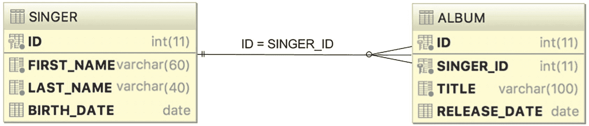
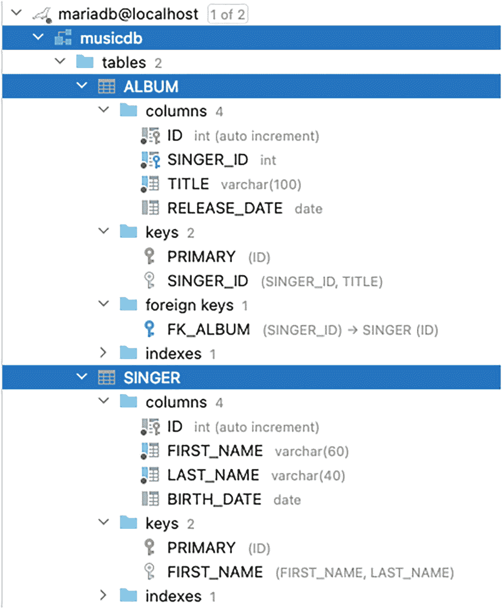
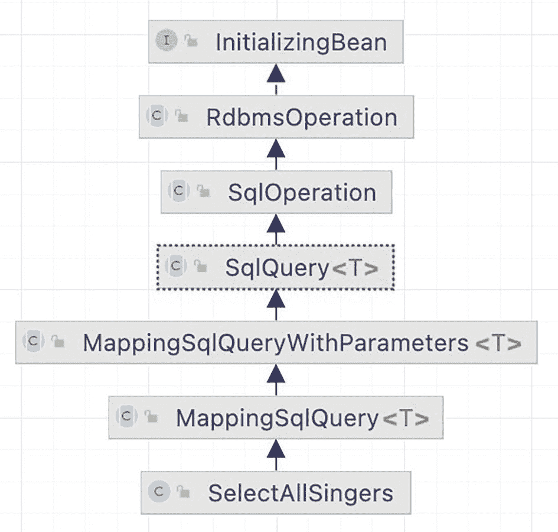
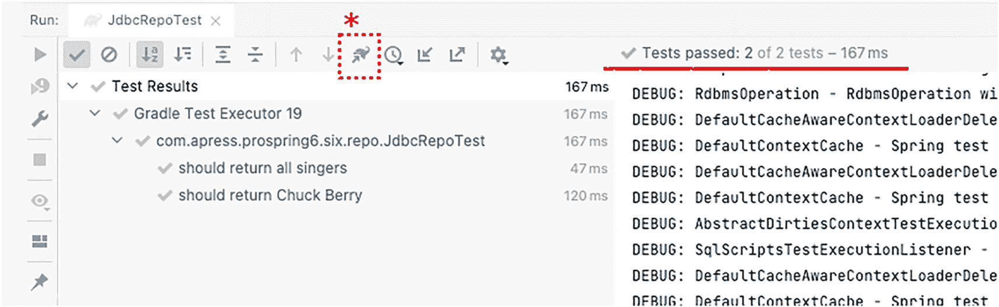
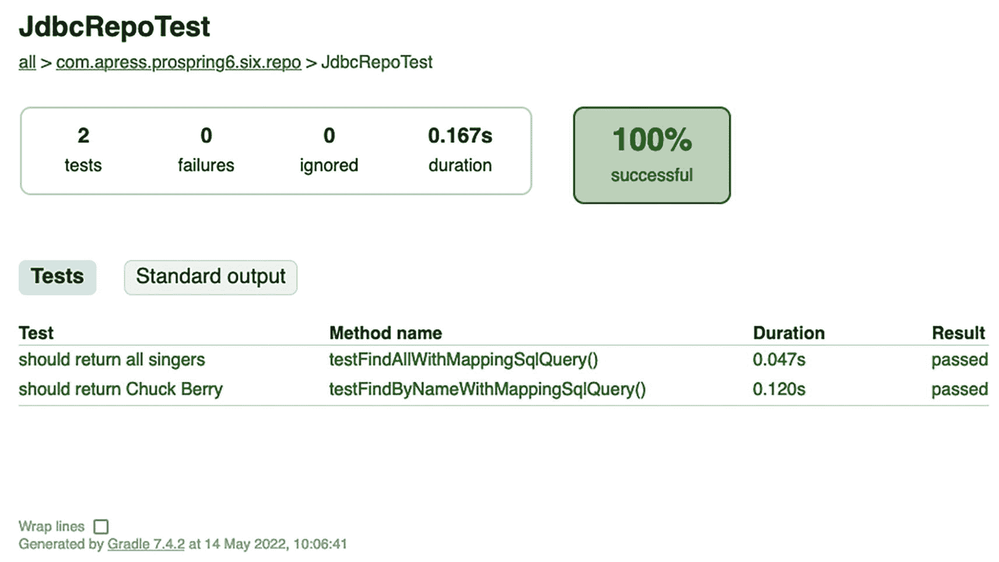
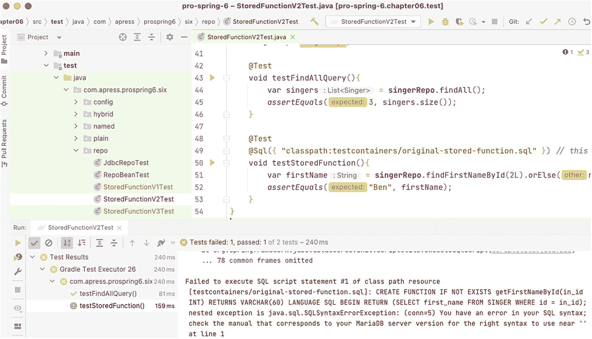
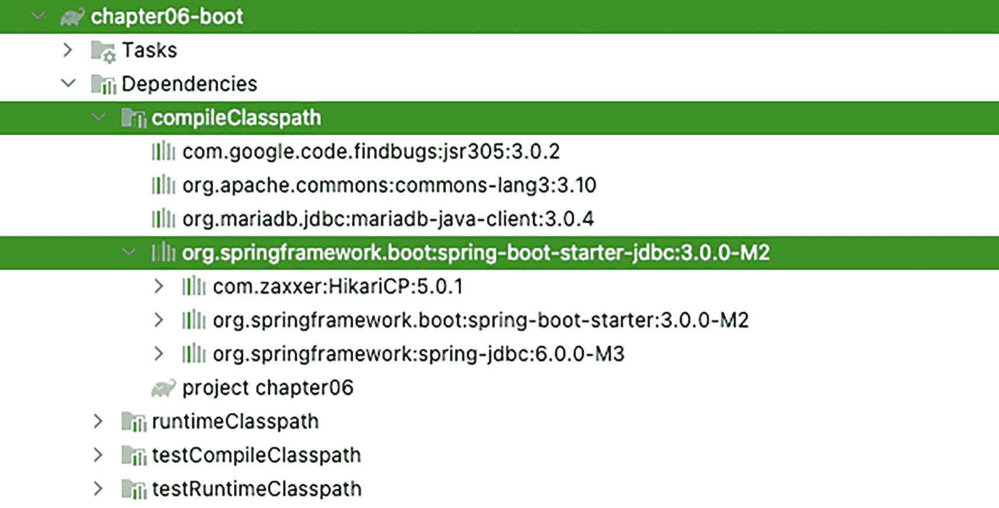

# 6. 使用 JDBC 进行 Spring 数据访问

到目前为止，你已经看到构建一个完全由 Spring 管理的应用程序是多么容易。你对 Bean 配置和面向切面编程（AOP）有了扎实的理解。然而，拼图中还缺少一块：如何获取驱动应用程序的数据？

除了简单的、一次性的命令行工具外，几乎每个应用程序都需要将数据持久化到某种数据存储中。最常用且最便捷的数据存储就是数据库。

以下是 2023 年排名前七的企业级数据库：

*   *MariaDB*：Web 应用程序中最流行的数据库之一（所有 WordPress 博客都将数据存储在 MariaDB 数据库中）。
*   *Oracle Database*：使用最广泛的商业关系数据库管理系统（尤其在金融应用中）。
*   *PostgreSQL*：用 C 语言编写的数据库管理系统，被处理海量数据的企业所使用。
*   *Microsoft SQL Server*：金融公司的另一个宠儿，既可用于本地部署，也可用于云端。
*   *MongoDB*：最流行的 NoSQL 数据库，一种面向文档的数据库，可通过自愈集群以服务形式在云端使用，称为 MongoDB Atlas。
*   *Redis*：一个分布式内存键值存储，具有出色的可扩展性。
*   *Elasticsearch*：基于 Lucene 的全文检索引擎。

此外，Oracle 正在大力推动用 MySQL 取代 MariaDB。如果你不为能够负担企业级数据库或数据库云实例（如 GCP Managed SQL 实例、Amazon RDS 或 Aurora）许可证的大公司工作，那么你可能正在使用 MariaDB、PostgreSQL 或此处未列出的其他免费数据库。MariaDB 在 Web 应用程序开发中通常更广泛使用，尤其是在 Linux 平台上；另一方面，PostgreSQL 对 Oracle 开发者更友好，因为其过程化语言 PL/pgSQL 与 Oracle 的 PL/SQL 语言非常接近。

即使你选择了最快、最可靠的数据库，也不能因为使用设计不佳、实现糟糕的数据访问层而损失其速度和灵活性。应用程序往往会非常频繁地使用数据访问层；因此，数据访问代码中任何不必要的瓶颈都会影响整个应用程序，无论其设计得多么好。本章是一个由五部分组成的系列文章的第一篇，将向你展示如何使用 SQL 和 NoSQL 数据库、如何管理事务以及如何使用诸如 Hibernate 之类的持久化工具。具体来说，我们将讨论以下内容：

*   *比较传统 JDBC 代码和 Spring JDBC 支持*：我们将探讨 Spring 如何在保持相同功能的同时简化老式 JDBC 代码。你还将看到 Spring 如何访问底层 JDBC API，以及这个底层 API 如何被映射到诸如 `JdbcTemplate` 之类的便捷类中。
*   *连接到数据库*：尽管我们不会深入探讨数据库连接管理的每一个细节，但我们确实会向你展示简单 Connection 和 DataSource 之间的根本区别。自然地，我们会讨论 Spring 如何管理数据源，以及你可以在应用程序中使用哪些数据源。我们还将介绍各种用于连接池的库——这是一种重用连接，而不是每次请求连接时都创建新连接的过程。
*   *检索数据并将其映射到 Kotlin 对象*：我们将向你展示如何检索数据，以及如何有效地将选中的数据映射到 Kotlin 对象。你还会了解到，Spring JDBC 是对象关系映射（ORM）工具（在**第** **7** **章**中介绍）的一个可行替代方案。
*   *插入、更新和删除数据*：我们将讨论如何通过使用 Spring 执行这些类型的查询来实现插入、更新和删除操作。
*   *使用内存数据库测试 JDBC 代码*：我们将讨论测试 JDBC 代码的方法，解释为什么内存数据库适合测试，并介绍 `@Sql*` 注解系列，它们为编写简洁的 JDBC 代码测试提供了支持。我们还将向你介绍一个非常实用的库，名为 Testcontainers，它允许在测试或测试类的生命周期内启动和销毁 Docker 容器。
*   *使用 Spring Boot JDBC*：我们将展示使用 Spring Boot JDBC 启动器库为生产环境和测试环境配置不同数据库是多么容易。

让我们从涉及数据库的最简单场景开始：编写代码以使用 SQL 数据库和 JDBC。


## 示例代码的样本数据模型

在开始讨论之前，我们先介绍一个简单的数据模型，该模型将用于本章以及后续几章中讨论其他数据访问技术时的示例（我们将根据需要扩展该模型，以满足每个主题的需求）。

该模型是一个简单的音乐数据库，包含两个表。第一个是 `SINGER` 表，用于存储歌手信息；另一个是 `ALBUM` 表，用于存储该歌手发行的专辑详情。每位歌手可以有零个或多个专辑；换句话说，`SINGER` 和 `ALBUM` 之间是一对多的关系。歌手信息包括其名、姓和出生日期。图 6-1 展示了该数据库的实体关系（ER）图。



该图展示了 SINGER 和 ALBUM 之间的一对多关系。Singer 列包括 ID、名和出生日期，Album 列包括 ID、Singer ID、标题和发行日期。

图 6-1
示例代码的简单数据模型

如您所见，两个表都有一个 `ID` 列，该列将在插入时由数据库自动分配。对于 `ALBUM` 表，存在一个指向 `SINGER` 表的外键关系，该关系通过 `SINGER_ID` 列与 `SINGER` 表的主键（即 `ID` 列）相链接。

 信息图标。圆圈内包含字母 i。 在本章中，我们将使用开源数据库 MariaDB^(⁴⁴) 来展示一些示例中与真实数据库的交互。MariaDB 是 MySQL^(⁴⁵) 的一个真正开源的分支，是为了应对 Oracle 收购 MySQL 而发布的。您应该注意的一个有趣点是，与 MySQL 相比，MariaDB 在速度上有所提升。特别是，MariaDB 在处理视图以及通过其 RocksDB^(⁴⁶) 引擎处理闪存存储时，提供了更好的性能。

 警告图标。圆圈内包含感叹号。 本章以及数据访问系列中可能接下来的几章，要求您有一个可用的 MariaDB 实例。我们不介绍如何安装 MariaDB，但 `chapter06` 模块中有一个 `CHAPTER06.adoc` 文件，指导您如何在 Docker 容器中启动 MariaDB。您也可以使用其他数据库，但可能需要修改模式（schema）和函数定义。我们还会介绍嵌入式数据库的使用，这不需要 MariaDB 数据库。

如果您想在本地安装 MariaDB，可以在官方网站上找到关于安装和配置 MariaDB 的非常好的教程。下载并安装 MariaDB^(⁴⁷) 后，您可以使用 root 账户访问它。通常，在开发应用程序时，您需要一个新的模式（schema）和用户。对于本章的代码示例，模式名为 `musicdb`，访问它的用户名为 `prospring6`。用于创建它们的 SQL 代码位于 `chapter06` 项目目录下的 `docker-build/scripts/CreateTable.sql` 中。用于填充表的 SQL 代码位于 `chapter06` 项目目录下的 `docker-build/scripts/InsertData.sql` 中。

 创意图标。灯泡符号。 使用 Docker MariaDB 容器时，您无需手动执行脚本，因为它们在容器启动时会自动执行。如果您对此方法感兴趣（您应该感兴趣，因为如今容器无处不在），请遵循 `CHAPTER06.adoc` 中的说明。

按照 `CHAPTER06.adoc` 中的说明操作，应该会生成一个名为 `local-mariadb` 的 MariaDB 容器。如果您使用智能编辑器（如本书推荐的 IntelliJ IDEA），您可以使用 `Database` 视图来检查您的模式（schema）和表。在图 6-2 中，您可以看到 IntelliJ IDEA 中显示的 `musicdb` 模式的内容。



截图列出了 Music d b、Album 和 Singer 文件夹下的文件。

图 6-2
`musicdb` 模式的内容

 关键字工具 dot i o 软件的标志。 IntelliJ IDEA 社区版不提供 SQL 工具。即使您不想购买 IntelliJ IDEA Ultimate，您仍然可以运行本章的所有代码。只需使用您选择的任何 SQL 管理客户端来调查和维护数据库实例即可。SQuirreL 是一个您可以尝试的强大工具示例（[`http://www.squirrelsql.org/`](http://www.squirrelsql.org/)）。

如您所见，`SINGER` 和 `ALBUM` 表之间存在一对多关系，并且两者都有一个名为 `ID` 的主键。用于将 `ALBUM` 中的记录链接到 `SINGER` 中父记录的外键名为 `SINGER_ID`。

在本章的后续部分，您将看到通过 JDBC 从数据库检索数据，并将结果集直接映射到 Kotlin 对象（即 POJO）的示例。这些映射到表中记录的类也称为 **pojos**。对于 `SINGER` 表，`Singer` 类就是一个 pojo，该类的实例映射到 `SINGER` 表中的行。

在《我爱露西》的“终于到巴黎”一集中，露西通过她丈夫里基、两名巴黎警察和另一名帮忙的男子^(⁴⁸) 精心安排的翻译工作，才得以免于被捕。这一集主要讲述了露西惹上麻烦并被法国警察逮捕的故事。两名警察不会说英语，但一人会说法语和德语；里基和露西不会说法语，但里基会说西班牙语；而第三名男子只会说德语和西班牙语。这就导致在只会说英语的露西和只会说法语的警长之间，形成了一条由三名翻译组成的链条。

类似地，Kotlin 应用程序和数据库无法直接通信，因此它们需要一个翻译器，在软件中这被称为**驱动程序**。在《我爱露西》那一集中，他们需要三名翻译才能完成任务。对于 Kotlin 和大多数数据库而言，我们有以下几种选择：

*   我们通常只需要一个翻译器，即驱动程序。

*   如果我们想引入像 Hibernate 这样的持久化层，可能会用到两个。

*   如果我们添加 Spring Data 以轻松地将记录映射到 POJO 并方便地处理事务，可能会用到三个。

在本书中，我们将向您展示如何实现这三种方式。让我们从最基本的方式开始，定义我们的 POJO。清单 6-1 展示了分别映射到 `SINGER` 和 `ALBUM` 表中记录的 `Singer` 和 `Album` 类。


```
package com.apress.prospring6.six.plain.pojos
import java.io.Serializable
import java.time.LocalDate
import java.util.HashSet
import java.util.Set
// maps to table SINGER
class Singer() : Serializable {
var id: Long? = null
var firstName: String? = null
var lastName: String? = null
var birthDate: LocalDate? = null
var albums: MutableSet? = null
constructor(id: Long?, firstName: String?, lastName: String?, birthDate: LocalDate?,
albums: MutableSet?) : this() {
this.id = id
this.firstName = firstName
this.lastName = lastName
this.birthDate = birthDate
this.albums = albums
}
fun addAlbum(album: Album): Boolean {
if (albums == null) {
albums = mutableSetOf(album)
return true
} else {
if (albums!!.contains(album)) {
return false
}
}
albums!!.add(album)
return true
}
override fun toString(): String {
return "Singer[id=" + id +
",firstName=" + firstName +
",lastName=" + lastName +
",birthDate=" + birthDate +
"]"
}
companion object {
private const val serialVersionUID = 1L
}
}
清单 6-1
用于 JDBC 驱动操作的 POJO
```

让我们从一个简单的 `SingerDao` 接口开始，它封装了所有针对 `Singer` 信息的数据访问方法。DAO 是 *数据访问对象*（data access object）的缩写，在 Spring 世界中则使用术语 `repository`。代码如清单 6-2 所示。

```
package com.apress.prospring6.six.plain.dao.pojos
import com.apress.prospring6.six.plain.dao.CoreDao
import com.apress.prospring6.six.plain.pojos.Singer
/**
* Created by iuliana.cosmina on 03/05/2022
*/
interface SingerDao : CoreDao {
fun findAll(): Set
fun findByFirstName(firstName: String): Set
fun findNameById(id: Long): String?
fun findLastNameById(id: Long): String?
fun findFirstNameById(id: Long): String?
fun insert(singer: Singer): Singer?
fun update(singer: Singer)
fun delete(singerId: Long)
fun findAllWithAlbums(): Set
fun insertWithAlbum(singer: Singer)
}
清单 6-2
SingerDao 接口
```

在 `SingerDao` 接口中，我们分别定义了两个查找方法，以及 `insert()`、`update()` 和 `delete()` 方法。它们对应 CRUD 术语（创建、读取、更新、删除）。

Kotlin 应用程序需要一个连接实例来与数据库通信，并检索或发送数据。`SingerDao` 所扩展的 `CoreDao` 接口是一个简单的接口，它汇集了与连接管理相关的方法：获取连接和关闭连接。该接口和 JDBC 基础设施将在下一节中讨论（如清单 6-4 所示）。

最后，为了方便测试，让我们修改 `logback.xml` 配置文件，将所有类的日志级别设置为 `DEBUG`。在 `DEBUG` 级别下，应用程序将输出所有发送到数据库的底层 SQL 语句，这样你就能确切了解正在发生的事情；这对于排查 SQL 语句语法错误尤其有用。清单 6-3 展示了包含第 6 章代码源文件的项目中 `logback.xml` 文件的内容。

```

true

%-5level: %class{0} - %msg%n

清单 6-3
logback.xml 内容
```

## 探索 JDBC 基础设施

JDBC 为 Java/Kotlin 应用程序提供了一种访问数据库中存储数据的标准方式。JDBC 基础设施的核心是每个数据库特有的驱动程序；正是这个驱动程序允许 Kotlin 代码访问数据库。

一旦驱动程序被加载，它就会向 `java.sql.DriverManager` 类注册自己。该类管理一个驱动程序列表，并提供用于建立数据库连接的静态方法。`DriverManager` 的 `getConnection()` 方法返回一个由驱动程序实现的 `java.sql.Connection` 接口。该接口允许你对数据库运行 SQL 语句。

JDBC 框架相当复杂且经过充分测试；然而，这种复杂性也带来了开发上的困难。第一层复杂性在于确保你的代码管理好数据库连接。连接是一种稀缺资源，建立连接的成本非常高。通常，数据库会为每个连接创建一个线程或派生一个子进程。此外，并发连接的数量通常是有限的，打开过多的连接会拖慢数据库。

我们将向你展示 Spring 如何帮助管理这种复杂性，但在进一步深入之前，我们需要向你展示如何在纯 JDBC 中执行选择、删除和更新数据操作。

如前所述，Kotlin 应用程序需要一个连接实例来与数据库通信并检索或发送数据。该实例的类型由项目类路径上的驱动程序提供。在我们的案例中，通过在 Gradle 配置中将 `mariadb-java-client.jar` 声明为依赖项，已将 MariaDB 驱动程序添加到类路径中。清单 6-4 展示了 `CoreDao` 代码，其中包含两个默认方法，一个用于获取连接，另一个用于关闭连接，任何直接或间接实现此接口的类型都会继承这两个方法。

```
package com.apress.prospring6.six.dao
import java.sql.Connection
import java.sql.DriverManager
import java.sql.SQLException
interface CoreDao {
@get:Throws(SQLException::class)
val connection: Connection?
get() = DriverManager.getConnection(
"jdbc:mariadb://localhost:3306/musicdb?useSSL=false",
"prospring6", "prospring6"
)
@Throws(SQLException::class)
fun closeConnection(connection: Connection?) {
if (connection == null) {
return
}
connection.close()
}
}
清单 6-4
CoreDao 接口
```

 一个警告图标。圆圈内有一个感叹号。   再次强调，除非是遗留代码或框架代码，否则不鼓励在接口中使用默认实现。我们在这里使用它只是为了简单起见。使用时请务必小心。

考虑到我们已经了解的关于数据库连接的知识，我们将采取谨慎且成本高昂（就性能而言）的方法，为每条语句创建一个连接。这会极大地降低 Kotlin 的性能，并给数据库带来额外的压力，因为每次查询都必须建立一个连接。然而，如果我们保持连接打开，又可能导致数据库服务器停止响应。

如你所见，连接的引用类型是 JDK 的一部分 `java.sql.Connection` 接口。任何充当 Kotlin 应用程序和 SQL 数据库之间翻译角色的 JDBC 驱动程序，都必须有一个实现此接口的类。MariaDB 的实现是 `org.mariadb.jdbc.Connection`。为了检查类路径上是否存在驱动程序，大多数应用程序会声明一个 `static` 块，该块使用反射来查找该驱动程序的核心驱动类，即 `java.sql.Driver` 的实现。清单 6-5 展示了为 MariaDB 驱动程序执行此操作的静态块。


```
package com.apress.prospring6.six.plain
import org.slf4j.Logger
import org.slf4j.LoggerFactory
// 其他导入语句已省略
object PlainJdbcDemo {
init {
try {
Class.forName("org.mariadb.jdbc.Driver")
} catch (ex: ClassNotFoundException) {
LOGGER.error("加载数据库驱动程序时出现问题！", ex)
}
}
// 其他代码已省略
}
清单 6-5
用于检查类路径上是否存在 JDBC 驱动程序的静态块
```

这段代码远未完成，但它让你了解管理 JDBC 连接所需步骤的概念。这段代码甚至没有涉及连接池，而连接池是更有效管理数据库连接的常用技术。我们在此不讨论连接池（连接池将在本章后面的“数据库连接与数据源”部分讨论）；相反，清单 6-6 中的代码片段展示了使用纯 JDBC 实现 `SingerDao` 接口的 `findAll()`、`insert()` 和 `delete()` 方法。

```
package com.apress.prospring6.six.plain.dao.pojos
import java.sql.Connection
import java.sql.PreparedStatement
import java.sql.ResultSet
import java.sql.SQLException
import java.sql.Statement
// 其他导入语句已省略
class PlainSingerDao : SingerDao {
override fun findAll(): Set {
val result: MutableSet = HashSet()
try {
connection.use { connection ->
connection!!.prepareStatement(ALL_SELECT).use { statement ->
statement.executeQuery().use { resultSet ->
while (resultSet.next()) {
val singer = Singer().apply {
id = resultSet.getLong("id")
firstName = resultSet.getString("first_name")
lastName = resultSet.getString("last_name")
birthDate = resultSet.getDate("birth_date").toLocalDate()
}
result.add(singer)
}
}
}
}
} catch (ex: SQLException) {
LOGGER.error("执行 SELECT 时出现问题！", ex)
}
return result
}
override fun insert(singer: Singer): Singer? {
try {
connection.use { connection ->
val statement =
connection!!.prepareStatement(SIMPLE_INSERT,
Statement.RETURN_GENERATED_KEYS)
statement.setString(1, singer.firstName)
statement.setString(2, singer.lastName)
statement.setDate(3, Date.valueOf(singer.birthDate))
statement.execute()
val generatedKeys = statement.generatedKeys
if (generatedKeys.next()) {
singer.id = generatedKeys.getLong(1)
}
return singer
}
} catch (ex: SQLException) {
LOGGER.error("执行 INSERT 时出现问题", ex)
}
return null
}
override fun delete(singerId: Long) {
try {
connection.use { connection ->
connection!!.prepareStatement(SIMPLE_DELETE).use { statement ->
statement.setLong(1, singerId!!)
statement.execute()
}
}
} catch (ex: SQLException) {
LOGGER.error("执行 DELETE 时出现问题", ex)
}
}
// 其他方法已省略
companion object {
private val LOGGER = LoggerFactory.getLogger(PlainSingerDao::class.java)
}
}
清单 6-6
PlainSingerDao 实现
```

请注意每个方法所需的代码量。我们总是需要确保数据库连接可用，而使用连接又要求我们处理可能抛出的受检异常 `SQLException`。在早期版本的 Java 中，当 `java.sql.Connection` 和其他需要处理与数据库通信的类型未实现 `java.lang.AutoCloseable` 且没有 *try-with-resources* 语句时，代码看起来甚至更丑陋。

用于测试 `PlainSingerDao` 中方法的类如清单 6-7 所示。

```
package com.apress.prospring6.six.plain
// 导入语句已省略
object PlainJdbcDemo {
private val LOGGER = LoggerFactory.getLogger(PlainJdbcDemo::class.java)
private val singerDao: SingerDao = PlainSingerDao()
init {
try {
Class.forName("org.mariadb.jdbc.Driver")
} catch (ex: ClassNotFoundException) {
LOGGER.error("加载数据库驱动程序时出现问题！", ex)
}
}
@JvmStatic
fun main(args: Array) {
LOGGER.info("列出初始歌手数据：")
listAllSingers()
LOGGER.info("-------------")
LOGGER.info("插入一位新歌手")
val singer = Singer()
singer.firstName = "Ed"
singer.lastName = "Sheeran"
singer.birthDate = LocalDate.of(1991, 2, 17)
singerDao.insert(singer)
LOGGER.info("该歌手现在的 ID 为：{}", singer.id)
LOGGER.info("-------------")
LOGGER.info("创建新歌手后列出歌手数据：")
listAllSingers()
LOGGER.info("-------------")
LOGGER.info("删除之前创建的歌手")
singer.id?.run { singerDao.delete(this) }
LOGGER.info("删除新歌手后列出歌手数据：")
listAllSingers()
}
private fun listAllSingers() {
val singers = singerDao.findAll()
for (singer in singers) {
LOGGER.info(singer.toString())
}
}
}
清单 6-7
测试 PlainSingerDao 中方法的 PlainJdbcDemo 类
```

在示例中大量使用了日志记录器，以便在每次调用方法后打印数据库的内容。运行此程序将产生如清单 6-8 所示的结果（假设你本地安装了一个名为 `musicdb` 的 MariaDB 数据库，其用户名和密码设置为 `prospring6`，并且已加载示例数据）。

```
INFO : PlainJdbcDemo - 列出初始歌手数据：
INFO : PlainJdbcDemo - Singer[id=1,firstName=John,lastName=Mayer,birthDate=1977-10-16]
INFO : PlainJdbcDemo - Singer[id=2,firstName=Ben,lastName=Barnes,birthDate=1981-08-20]
INFO : PlainJdbcDemo - Singer[id=3,firstName=John,lastName=Butler,birthDate=1975-04-01]
INFO : PlainJdbcDemo - -------------
INFO : PlainJdbcDemo - 插入一位新歌手
INFO : PlainJdbcDemo - 该歌手现在的 ID 为：19
INFO : PlainJdbcDemo - -------------
INFO : PlainJdbcDemo - 创建新歌手后列出歌手数据：
INFO : PlainJdbcDemo - Singer[id=1,firstName=John,lastName=Mayer,birthDate=1977-10-16]
INFO : PlainJdbcDemo - Singer[id=2,firstName=Ben,lastName=Barnes,birthDate=1981-08-20]
INFO : PlainJdbcDemo - Singer[id=3,firstName=John,lastName=Butler,birthDate=1975-04-01]
INFO : PlainJdbcDemo - Singer[id=19,firstName=Ed,lastName=Sheeran,birthDate=1996-08-11]
INFO : PlainJdbcDemo - -------------
INFO : PlainJdbcDemo - 删除之前创建的歌手
INFO : PlainJdbcDemo - 删除新歌手后列出歌手数据：
INFO : PlainJdbcDemo - Singer[id=1,firstName=John,lastName=Mayer,birthDate=1977-10-16]
INFO : PlainJdbcDemo - Singer[id=2,firstName=Ben,lastName=Barnes,birthDate=1981-08-20]
INFO : PlainJdbcDemo - Singer[id=3,firstName=John,lastName=Butler,birthDate=1975-04-01]
清单 6-8
PlainJdbcDemo 输出
```

如输出所示，第一组行显示初始数据。第二组行显示新记录已添加。最后一组行显示新创建的歌手 *Ed Sheeran* 已被删除。

正如你在前面的代码示例中所见，大量代码需要移入辅助类，或者更糟的是，在每个 DAO 类中重复。从应用程序开发人员的角度来看，这是 JDBC 的主要缺点；你根本没有时间在每个 DAO 类中编写重复的代码。相反，你希望专注于编写实际完成 DAO 类所需功能的代码：选择、更新和删除数据。你需要编写的辅助代码越多，需要处理的受检异常就越多，代码中可能引入的错误也就越多。这就是 DAO 框架和 Spring 发挥作用的地方。框架消除了那些不执行任何自定义逻辑的代码，让你可以忘记所有需要执行的日常维护工作。此外，Spring 广泛的 JDBC 支持让你的工作轻松许多。

 一个信息图标。圆圈内有一个字母 i。 本节中展示的纯 JDBC 代码也可以使用 Kotlin 数据类而不是 POJO 来编写。本书的项目包含此代码，但由于本书的重点是 Spring，因此不会在书中详细讨论。


## Spring JDBC 基础设施

我们在本章第一部分讨论的代码并不复杂，但相当繁琐，而且由于需要编写大量代码，出现编码错误的可能性很高。现在，是时候看看 Spring 如何让事情变得更简单、更优雅了。

### 概述与使用的包

Spring 中的 JDBC 支持分为五个包，详见表 6-1；每个包处理 JDBC 访问的不同方面。

表 6-1

Spring JDBC 包

| 包 | 描述 |
| --- | --- |
| `org.springframework.jdbc.core` | 该包包含 Spring 中 JDBC 类的基础。它包括核心 JDBC 类 `JdbcTemplate`，它简化了使用 JDBC 进行数据库操作的编程。几个子包提供了更具特定目的（例如，支持命名参数的 `JdbcTemplate` 类）的 JDBC 数据访问支持以及相关的支持类。 |
| `org.springframework.jdbc.datasource` | 该包包含辅助类和 `DataSource` 实现，可用于在 JEE 容器之外运行 JDBC 代码。几个子包为嵌入式数据库、数据库初始化以及各种数据源查找机制提供支持。 |
| `org.springframework.jdbc.object` | 该包包含帮助将数据库返回的数据转换为对象或对象列表的类。这些对象和列表是普通的 Java/Kotlin 对象，因此与数据库断开连接。 |
| `org.springframework.jdbc.support` | 该包中最重要的类是 `SQLException` 转换支持。这允许 Spring 识别数据库使用的错误代码，并将其映射到更高级别的异常。 |
| `org.springframework.jdbc.config` | 该包包含支持在 Spring 的 `ApplicationContext` 中进行 JDBC 配置的类。例如，它包含用于处理嵌入式数据库的类。 |

让我们从查看最低级别的功能开始讨论 Spring JDBC 支持。在运行 SQL 查询之前，你需要做的第一件事是建立与数据库的连接。

### 数据库连接与数据源

你可以使用 Spring 通过提供一个实现 `javax.sql.DataSource` 的 Bean 来为你管理数据库连接。`DataSource` 和 `Connection` 之间的区别在于，`DataSource` 提供并管理连接。

`org.springframework.jdbc.datasource` 包中的 `DriverManagerDataSource` 是最简单的 `DataSource` 实现。通过查看类名，你可以猜到它只是调用 `DriverManager` 来获取连接。`DriverManagerDataSource` 不支持数据库连接池，这使得该类仅适用于测试。`DriverManagerDataSource` 的配置非常简单，如清单 6-9 所示；你只需提供驱动程序类名、连接 URL、用户名和密码。

```
driverClassName=org.mariadb.jdbc.Driver
url=jdbc:mariadb://localhost:3306/musicdb?useSSL=false
username=prospring6
password=prospring6
清单 6-9
jdbc.Properties 的内容
```

你很可能认识清单中的这些属性。它们代表通常传递给 JDBC 以获取 `Connection` 接口的值。数据库连接信息通常存储在属性文件中，以便在不同部署环境中易于维护和替换。`jdbc.properties` 中的属性由 Spring 注入到 Kotlin 配置类的属性中。这样的配置类看起来与清单 6-10 中显示的非常相似。

```
package com.apress.prospring6.six.config
import org.springframework.beans.factory.annotation.Value
import org.springframework.context.annotation.Bean
// 更多导入语句已省略
@Configuration
@PropertySource("classpath:db/jdbc.properties")
open class SimpleDataSourceCfg {
@Value("\${jdbc.driverClassName}")
private val driverClassName: String? = null
@Value("\${jdbc.url}")
private val url: String? = null
@Value("\${jdbc.username}")
private val username: String? = null
@Value("\${jdbc.password}")
private val password: String? = null
@Bean
open fun dataSource(): DataSource? {
return try {
val dataSource = SimpleDriverDataSource()
val driver = Class.forName(driverClassName) as Class
dataSource.setDriverClass(driver)
dataSource.url = url
dataSource.username = username
dataSource.password = password
dataSource
} catch (e: Exception) {
LOGGER.error("无法创建 Simple DataSource Bean！", e)
null
}
}
companion object {
private val LOGGER = LoggerFactory.getLogger(SimpleDataSourceCfg::class.java)
}
}
清单 6-10
数据库配置类
```

测试这样的配置类很容易；只需基于它创建一个应用程序上下文并检查其中的 Bean 即可。清单 6-11 展示了一个测试类，其中包含一个检查 `DataSource` Bean 是否存在并使用它执行简单 SQL 检查语句的方法。


```
package com.apress.prospring6.six.plain
// import statements omitted
class DataSourceConfigTest {
//@Disabled("needs MariaDB running, set up container, comment this to run")
@Test
@Throws(
SQLException::class
)
fun testSimpleDataSource() {
val ctx = AnnotationConfigApplicationContext(
SimpleDataSourceCfg::class.java
)
val dataSource = ctx.getBean("dataSource", DataSource::class.java)
Assertions.assertNotNull(dataSource)
testDataSource(dataSource)
ctx.close()
}
@Throws(SQLException::class)
private fun testDataSource(dataSource: DataSource) {
try {
dataSource.connection.use { connection ->
connection.prepareStatement("SELECT 1").use { statement ->
statement.executeQuery().use { resultSet ->
while (resultSet.next()) {
val mockVal = resultSet.getInt("1")
Assertions.assertEquals(1, mockVal)
}
}
}
}
} catch (e: Exception) {
LOGGER.debug("Something unexpected happened.", e)
}
}
companion object {
private val LOGGER = LoggerFactory.getLogger(DataSourceConfigTest::class.java)
}
}
清单 6-11 验证 SimpleDataSourceCfg 类有效性的测试类
```

之所以使用测试类，是因为这样更便于复用部分代码，同时也能教你如何使用 JUnit 为所编写的任何代码快速编写测试。`testSimpleDataSource()`方法用于测试`SimpleDataSourceCfg`配置类。从任意配置中获取`DataSource` bean 后，使用模拟查询`SELECT 1`来测试与 MariaDB 数据库的连接。

在实际应用中，你可以使用 Apache Commons BasicDataSource^(⁴⁹)或由 JEE 应用服务器（例如 JBoss、WildFly、WebSphere、WebLogic 或 GlassFish）实现的`DataSource`，这可以进一步提升应用程序的性能。你可以在纯 JDBC 代码中使用`DataSource`并获得相同的连接池优势；然而，在大多数情况下，你仍然需要一个中心位置来配置`DataSource`。另一方面，Spring 允许你声明一个`dataSource` bean，并在`ApplicationContext`定义文件中设置连接属性。清单 6-12 中的配置示例演示了使用`org.apache.commons.dbcp2.BasicDataSource`实现来代替`SimpleDriverDataSource`。

```
package com.apress.prospring6.six.config
import org.apache.commons.dbcp2.BasicDataSource
// other import statements omitted
@Configuration
@PropertySource("classpath:db/jdbc.properties")
open class BasicDataSourceCfg {
// code omitted for duplication, same as in 6-10
@Bean(destroyMethod = "close")
open fun dataSource(): DataSource? {
return try {
val dataSource = BasicDataSource()
dataSource.driverClassName = driverClassName
dataSource.url = url
dataSource.username = username
dataSource.password = password
dataSource
} catch (e: Exception) {
LOGGER.error("DBCP DataSource bean cannot be created!", e)
null
}
}
companion object {
private val LOGGER = LoggerFactory.getLogger(BasicDataSourceCfg::class.java)
}
}
清单 6-12 BasicDataSourceCfg 类
```

这个由 Spring 管理的特定`DataSource`是在`org.apache.commons.dbcp2.BasicDataSource`中实现的。最重要的一点是，该 bean 类型实现了`javax.sql.DataSource`，你可以立即在你的数据访问类中使用它。

另一种配置`dataSource` bean 的方法是使用 JNDI。如果你正在开发的应用程序将在 JEE 容器中运行，你可以利用容器管理的连接池。要使用基于 JNDI 的数据源，你需要更改`dataSource` bean 的声明，如清单 6-13 所示。

```
package com.apress.prospring6.six.config
import org.springframework.jndi.JndiTemplate
// other import statements omitted
@Configuration
open class JndiDataSourceCfg {
@Bean
open fun dataSource(): DataSource? {
return try {
JndiTemplate().lookup("java:comp/env/jdbc/musicdb") as DataSource
} catch (e: Exception) {
LOGGER.error("JNDI DataSource bean cannot be created!", e)
null
}
}
companion object {
private val LOGGER = LoggerFactory.getLogger(JndiDataSourceCfg::class.java)
}
}
清单 6-13 JndiDataSourceCfg 类
```

在这个例子中，`JndiTemplate`被用来通过 JNDI 查找获取数据源。这是一个非常有用的辅助类，它简化了 JNDI 操作。它提供了查找和绑定对象的方法，并允许`JndiCallback`接口的实现利用提供的 JNDI 命名上下文执行任何它们想要的操作。

如你所见，Spring 允许你以几乎任何你喜欢的方式配置`DataSource`，并且它对应用程序的其余代码隐藏了数据源的实际实现或位置。换句话说，你的 DAO 类不知道也不需要知道`DataSource`指向哪里。

连接管理也被委托给了`dataSource` bean，该 bean 要么自行管理，要么使用 JEE 容器来完成所有工作。

### 嵌入式数据库支持

从 3.0 版本开始，Spring 还提供了嵌入式数据库支持，它可以自动启动一个嵌入式数据库，并将其作为`DataSource`暴露给应用程序。嵌入式数据库支持对于本地开发或单元测试极为有用。在后续涉及数据访问的章节中，我们将使用嵌入式数据库来运行示例代码，这样你的机器就不需要安装数据库来运行示例，但如果你想要真正的开发者体验，可以考虑设置一个 Docker 容器。

清单 6-14 中的配置类展示了在 Spring 应用程序上下文中设置嵌入式 H2 数据库所需的最小配置。

```
package com.apress.prospring6.six.config
import org.springframework.jdbc.datasource.embedded.EmbeddedDatabaseBuilder
import org.springframework.jdbc.datasource.embedded.EmbeddedDatabaseType
// other import statements omitted
@Configuration
open class EmbeddedJdbcConfig {
@Bean
open fun dataSource(): DataSource? {
return try {
val dbBuilder = EmbeddedDatabaseBuilder()
dbBuilder.setType(EmbeddedDatabaseType.H2)
.addScripts("classpath:h2/create-schema.sql",
"classpath:h2/test-data.sql").build()
} catch (e: Exception) {
LOGGER.error("Embedded DataSource bean cannot be created!", e)
null
}
}
companion object {
private val LOGGER = LoggerFactory.getLogger(EmbeddedJdbcConfig::class.java)
}
}
清单 6-14 EmbeddedJdbcConfig 类
```

`EmbeddedDatabaseBuilder`类使用数据库创建和加载数据脚本作为参数，来创建一个实现了`DataSource`的`EmbeddedDatabase`实例。

 一个警告图标。它有一个圆圈内带感叹号。   注意，脚本的顺序很重要，包含数据定义语言（DDL）的文件应始终放在前面，随后是包含数据操作语言（DML）的文件。对于`type`属性，我们指定要使用的嵌入式数据库类型。从 4.0 版本开始，Spring 支持 HSQL（默认）、H2 和 DERBY。


### 在 DAO 类中使用 DataSource

数据访问对象（DAO）模式用于将底层的数据访问 API 或操作与高层业务服务分离。数据访问对象模式需要以下组件：

*   *DAO 接口*：定义要对一个（或多个）模型对象执行的标准操作。

*   *DAO 实现*：该类为 DAO 接口提供具体实现。通常，它使用 JDBC 连接或数据源来处理模型对象。

*   *模型对象*（也称为*数据对象*或*实体*）：这些是映射到表记录的简单 POJO。

让我们创建一个 `SingerDao` 接口作为示例进行实现，如清单 6-15 所示。

```
interface SingerDao {
fun findNameById(Long id:Long):String?
}
清单 6-15
SingerDao 接口
```

对于名为 `JdbcSingerDao` 的简单实现类，我们首先添加一个 `dataSource` 属性。我们想要将 `dataSource` 属性添加到实现类而不是接口中的原因应该很明显：接口不需要知道数据将如何被检索和更新。通过向接口添加 `DataSource` 的修改方法，最好的情况是这会强制实现类声明 getter 和 setter 存根。显然，这不是一个很好的设计实践。请查看清单 6-16 中所示的简单 `JdbcSingerDao` 类。

```
package com.apress.prospring6.six.plain
internal class JdbcSingerDao : SingerDao, InitializingBean {
var dataSource: DataSource? = null
@Throws(Exception::class)
override fun afterPropertiesSet() {
if (dataSource == null) {
throw BeanCreationException("Must set dataSource on SingerDao")
}
}
override fun findNameById(id: Long?): String {
val result = ""
try {
dataSource!!.connection.use { connection ->
connection.prepareStatement(FIND_NAME + id).use { statement ->
statement.executeQuery().use { resultSet ->
while (resultSet.next()) {
return resultSet.getString("first_name") + " " +
resultSet.getString("last_name")
}
}
}
}
} catch (ex: SQLException) {
LOGGER.error("Problem when executing SELECT!", ex)
}
return result
}
companion object {
private val LOGGER = LoggerFactory.getLogger(JdbcSingerDao::class.java)
}
}
清单 6-16
JdbcSingerDao 类
```

现在，我们可以指示 Spring 使用 `JdbcSingerDao` 实现来配置我们的 `singerDao` bean，并设置 `dataSource` 属性，如 `SpringDatasourceCfg` 配置类所示，该类在清单 6-17 中展示。（请注意，我们导入了上一节介绍的 `BasicDataSourceCfg` 类，以避免代码重复。）

```
package com.apress.prospring6.six.plain
import org.springframework.context.annotation.Configuration
import org.springframework.context.annotation.Import
import org.springframework.beans.factory.annotation.Autowired
import org.springframework.context.annotation.Bean
// 其他 import 语句已省略
@Import(BasicDataSourceCfg::class)
@Configuration
open class SpringDatasourceCfg {
@Autowired
var dataSource: DataSource? = null
@Bean
open fun singerDao(): SingerDao {
val dao = JdbcSingerDao()
dao.dataSource = dataSource
return dao
}
}
清单 6-17
SpringDatasourceCfg 配置类
```

现在，Spring 通过实例化 `JdbcSingerDao` 类来创建 `singerDao` bean，并将 `dataSource` 属性设置为 `dataSource` bean。确保 bean 上所有必需的属性都已设置是一个好习惯。最简单的方法是实现 `InitializingBean` 接口并为 `afterPropertiesSet()` 方法提供实现。这样，我们就能确保 `JdbcSingerDao` 上所有必需的属性都已设置。关于 bean 初始化的进一步讨论，请参考**第** **4****章**。

我们目前看到的代码使用 Spring 来管理数据源，并引入了 `SingerDao` 接口及其 JDBC 实现。我们还在 Spring 的 `ApplicationContext` 文件中设置了 `JdbcSingerDao` 类的 `dataSource` 属性。

`SpringDatasourceCfg` 可以用与 `BasicDataSourceCfg` 相同的方式进行测试，但测试还可以检查 `findNameById(..)` 方法的行为。测试方法如清单 6-18 所示。

```
package com.apress.prospring6.six
import static org.junit.jupiter.api.Assertions.assertEquals
import static org.junit.jupiter.api.Assertions.assertNotNull
// 其他 import 语句已省略
class DataSourceConfigTest {
//@Disabled("需要运行 MariaDB，设置容器，取消注释以运行此测试")
@Test
@Throws(
SQLException::class
)
fun testSpringJdbc() {
val ctx = AnnotationConfigApplicationContext(
SpringDatasourceCfg::class.java
)
val dataSource = ctx.getBean("dataSource", DataSource::class.java)
Assertions.assertNotNull(dataSource)
testDataSource(dataSource)
val singerDao = ctx.getBean(
"singerDao",
SingerDao::class.java
)
Assertions.assertEquals("John Mayer", singerDao.findNameById(1L))
ctx.close()
}
// 其他代码因重复而省略
companion object {
private val LOGGER = LoggerFactory.getLogger(DataSourceConfigTest::class.java)
}
}
清单 6-18
测试 SpringDatasourceCfg 配置类
```


### 异常处理

Spring 提倡使用运行时异常而非受检异常，因此我们需要一种机制将受检的 `SQLException` 转换为 Spring JDBC 运行时异常。由于 Spring 的 SQL 异常是运行时异常，它们可以比受检异常粒度更细。从定义上讲，这并非运行时异常的特性，但若不得不在 `throws` 子句中声明一长串受检异常会很不方便；因此，受检异常往往比其对应的运行时异常粒度更粗。

 一个想法图标，包含一个灯泡符号。 与 Java 相比，Kotlin 对异常的处理更为宽松。因此在这方面，我们已经与 Spring 的做法很接近了。

Spring 提供了 `SQLExceptionTranslator` 接口的默认实现，负责将通用的 SQL 错误码转换为 Spring JDBC 异常。在大多数情况下，这个实现已经足够，但你可以扩展 Spring 的默认实现，并设置新的 `SQLExceptionTranslator` 实现用于 `JdbcTemplate`，如代码清单 6-19 所示。

```
package com.apress.prospring6.six
import org.springframework.dao.DataAccessException
import org.springframework.dao.DeadlockLoserDataAccessException
import org.springframework.jdbc.support.SQLErrorCodeSQLExceptionTranslator
import java.sql.SQLException
class MariaDBErrorCodesTranslator : SQLErrorCodeSQLExceptionTranslator() {
override fun customTranslate(task: String, @Nullable sql: String?, sqlex: SQLException):
DataAccessException? {
return if (sqlex.errorCode == -12345) {
CannotAcquireLockException(task, sqlex)
} else null
}
}
代码清单 6-19
SQLExceptionTranslator 自定义实现
```

 一个警告图标，圆圈内有一个感叹号。 此时，可以明确的是，`SQLErrorCodeSQLExceptionTranslator`（Spring 提供的 `SQLExceptionTranslator` 实用实现）是 `spring-jdbc.jar` 库的一部分，因此需要将此库添加到类路径中。是的，本节我们将告别纯 JDBC，引入 Spring，使我们在与数据库通信时的开发体验不再那么令人头疼。

`org.springframework.dao.DataAccessException` 代表了运行时数据访问异常层次结构的 Spring 根类。该类的扩展对应特定的数据访问异常，并在访问数据库时提供关于异常真实原因的更多信息。完整的层次结构将在本书后面讨论。

要使用 `MariaDBErrorCodesTranslator`，我们必须放弃直接使用连接与数据库通信，而是将 `DataSource` 包装在 Spring 的 `JdbcTemplate` 中，如代码清单 6-20 所示。

```
package com.apress.prospring6.six.hybrid
import org.springframework.jdbc.core.JdbcTemplate
// 其他导入语句已省略
internal class JdbcSingerDao : SingerDao, InitializingBean {
private var jdbcTemplate: JdbcTemplate? = null
var dataSource: DataSource? = null
set(value) {
field = value
val errorTranslator = MariaDBErrorCodesTranslator().apply {
setDataSource(value!!)
}
this.jdbcTemplate = JdbcTemplate().apply {
dataSource = value
exceptionTranslator = errorTranslator
}
}
// 其他代码已省略
companion object {
private val LOGGER = LoggerFactory.getLogger(JdbcSingerDao::class.java)
}
}
代码清单 6-20
引入 Spring 的 JdbcTemplate
```

有了自定义的 SQL 异常转换器，当针对数据库执行 SQL 语句检测到 SQL 异常时，Spring 将调用它，并且当错误码为 `-12345` 时，将发生自定义异常转换。对于其他错误，Spring 将回退到其默认的异常转换机制。显然，没有什么能阻止你将 `SQLExceptionTranslator` 创建为 Spring 管理的 bean，并在 DAO 类中使用 `JdbcTemplate` bean。如果你不记得读过关于 `JdbcTemplate` 类的内容，请不要担心；我们马上会更详细地讨论它。

### `JdbcTemplate` 类

该类代表了 Spring JDBC 支持的核心。它可以执行所有类型的 SQL 语句。从最简化的角度来看，你可以将数据定义语句和数据操作语句进行分类。数据定义语句涵盖创建各种数据库对象（表、视图、存储过程等）。数据操作语句则操作数据，可分为查询语句和更新语句。查询语句通常返回一组行；每行具有相同的列集。更新语句修改数据库中的数据，但不返回任何结果。

`JdbcTemplate` 类允许你向数据库发出任何类型的 SQL 语句，并返回任何类型的结果。在本节中，我们将通过 `JdbcTemplate` 类介绍 Spring 中 JDBC 编程的几个常见用例。


#### 在 DAO 类中初始化 JdbcTemplate

在讨论如何使用 `JdbcTemplate` 之前，我们先来看看如何在 DAO 类中准备 `JdbcTemplate` 以供使用。这很简单；大多数情况下，你只需通过传入数据源对象（该对象应由 Spring 注入到 DAO 类中）来构造该类即可。上一节清单 6-20 中的最后一个代码片段展示了如何初始化 `JdbcTemplate` 对象。通常的做法是在 Spring 注入数据源对象的同一方法/构造函数中初始化 `JdbcTemplate`。这可以确保 `JdbcTemplate` 也被初始化并准备就绪。

一旦配置完成，`JdbcTemplate` 就是线程安全的。这意味着你也可以选择在 Spring 的配置中初始化一个 `JdbcTemplate` 单例实例，并将其注入到所有 DAO bean 中。清单 6-21 展示了这样的配置。

```
package com.apress.prospring6.six.template
import org.springframework.jdbc.core.JdbcTemplate
// 其他导入语句已省略
@Import(BasicDataSourceCfg::class)
@Configuration
open class SpringJdbcTemplateCfg {
@Autowired
var dataSource: DataSource? = null
@Bean
open fun jdbcTemplate(): JdbcTemplate {
return JdbcTemplate().apply {
dataSource = this@SpringJdbcTemplateCfg.dataSource
}
}
@Bean
open fun singerDao(): SingerDao {
return JdbcSingerDao().apply {
setJdbcTemplate(jdbcTemplate())
}
}
}
清单 6-21
将 JdbcTemplate 配置为 Bean
```

现在我们有了一个 `JdbcTemplate` bean，让我们重写 `JdbcSingerDao` 来使用它。清单 6-22 清楚地表明，使用 `JdbcTemplate` bean 与数据库通信要容易得多，尤其是在检索单个值时。

```
package com.apress.prospring6.six.template
class JdbcSingerDao : SingerDao {
private var jdbcTemplate: JdbcTemplate? = null
fun setJdbcTemplate(jdbcTemplate: JdbcTemplate?) {
this.jdbcTemplate = jdbcTemplate
}
override fun findNameById(id: Long): String {
return jdbcTemplate!!.queryForObject(PARAMETRIZED_FIND_NAME,
String::class.java, id)
}
}
清单 6-22
使用 JdbcTemplate Bean
```

在清单 6-22 中，我们使用 `JdbcTemplate` 的 `queryForObject(..)` 方法来检索由 `id` 标识的记录中 first name 的值。第一个参数是 SQL 字符串，最后一个参数是以 `varargs` 格式传递给 SQL 进行参数绑定的参数。第二个参数是要返回的类型，在本例中是 `String`。除了 `String`，你还可以查询其他类型，例如 `Long` 和 `Int`。让我们看看结果。清单 6-23 展示了测试程序。同样，这里使用了 JUnit 测试类，因为这样我们可以单独运行测试方法，并且由于在执行 gradle build 时会运行测试，我们也能确保构建保持稳定。

```
package com.apress.prospring6.six.template
import com.apress.prospring6.six.config.EmbeddedJdbcConfig
// 其他导入语句已省略
class JdbcTemplateConfigTest {
// @Disabled("需要运行 MariaDB，取消注释以运行")
@Test
fun testSpringJdbc() {
val ctx = AnnotationConfigApplicationContext(
SpringDatasurceCfg::class.java
)
val singerDao = ctx.getBean(
"singerDao",
SingerDao::class.java
)
Assertions.assertEquals("John Mayer", singerDao.findNameById(1L))
ctx.close()
}
}
清单 6-23
测试使用 JdbcTemplate Bean 的 JdbcSingerDao
```

当执行测试方法 `testSpringJdbcWithH2Db()` 时，我们期望 `singerDao.findNameById(1L)` 调用返回 *John Mayer* 字符串，并且我们使用 `assertTrue` 方法来测试这个假设。该测试可以使用原始配置类 `SpringJdbcTemplateCfg` 运行，但这意味着其数据源是 MariaDB，除非运行测试的机器上安装并正确配置了 MariaDB 数据库，否则测试将无法通过。因此，在测试类的主体中声明了静态类 `TestDbCfg`，以注入一个嵌入式数据库，而不是真实的数据库。这个测试类与 `SpringJdbcTemplateCfg` 类相同，但它没有导入配置实际数据库的 `BasicDataSourceCfg` 类，而是导入了配置内存中 H2 数据库的 `EmbeddedJdbcConfig` 类，这更适合测试环境。

当然，这个例子本可以使用 profile，但本章前面我们暗示过可以在测试上下文中声明一个静态配置类，所以我们想涵盖这个场景。

#### 使用 `NamedParameterJdbcTemplate` 的命名参数

在之前的示例中，作为 `jdbcTemplate.queryForObject(..)` 方法参数的 SQL 查询使用普通占位符（`?` 字符）作为查询参数，并且参数值通过 varargs 传递：

```
select CONCAT(first_name , ' ' , last_name) from SINGER where id = ?
```

使用普通占位符时，顺序很重要，并且你将参数放入 varargs 的顺序必须与查询中参数的顺序相同。

一些开发者更喜欢使用命名参数来确保每个参数都能精确地按预期绑定。在 Spring 中，`JdbcTemplate` 类的一个扩展 `NamedParameterJdbcTemplate`（位于包 `org.springframework.jdbc.core.namedparam` 下）提供了对此的支持。

`NamedParameterJdbcTemplate` 的初始化与 `JdbcTemplate` 相同，因此我们只需要声明一个 `NamedParameterJdbcTemplate` 类型的 bean 并将其注入到 DAO 类中。在清单 6-24 中，你可以看到与 `JdbcSingerDao` 等效的 `NamedTemplateDao`，它使用了 `NamedParameterJdbcTemplate`。

```
package com.apress.prospring6.six.named
import org.springframework.jdbc.core.namedparam.NamedParameterJdbcTemplate
// 其他导入语句已省略
internal class NamedTemplateDao : SingerDao {
var namedTemplate: NamedParameterJdbcTemplate? = null
override fun findNameById(id: Long?): String {
return namedTemplate!!.queryForObject(
NAMED_FIND_NAME, mapOf("singerId" to id),
String::class.java
)!!
}
}
清单 6-24
使用 NamedParameterJdbcTemplate Bean 的 NamedTemplateDao
```

这里使用命名参数（以冒号为前缀）代替了 `?` 占位符：`:singerId`。测试 `NamedTemplateDao` 与测试 `JdbcSingerDao` 相同，因此本书省略了相关代码，但它包含在项目中。


#### 使用 `RowMapper<T>` 检索领域对象

到目前为止，所展示的关于 `JdbcTemplate` 及相关类的示例都相当简单：查询返回的是单一类型的单个值，例如 `String`。当查询返回多行，且需要将这些行转换为 POJO（就像我们在纯 JDBC 部分所做的那样）时，事情就变得稍微复杂一些。不过，Spring 通过其 `RowMapper<T>` 接口来提供帮助。顾名思义，实现了 `RowMapper<T>` 接口的类型的实例仅适用于将行映射到单个领域对象。Spring 的 `RowMapper<T>` 接口（位于 `org.springframework.jdbc.core` 包中）为您提供了一种简单的方法，用于执行从 JDBC 结果集到 POJO 或记录的映射。让我们通过使用 `RowMapper<T>` 接口实现 `SingerDao` 的 `findAll()` 方法来实际看看它的作用。在清单 6-25 中，您可以看到返回 `Singer` 记录列表的 `findAll()` 方法的实现。

```
package com.apress.prospring6.six.plain.records
import java.time.LocalDate
// in file Singer.kt
data class Singer( val id:Long?,
val firstName:String,
val lastName:String,
val birthDate:LocalDate,
val albums: MutableSet
)
// in file RowMapperCfg.kt
package com.apress.prospring6.six.rowmapper
import org.springframework.jdbc.core.RowMapper
// other imports statements omitted
interface SingerDao {
fun findAll(): Set
}
class RowMapperDao : SingerDao {
var namedTemplate: NamedParameterJdbcTemplate? = null
override fun findAll(): Set {
return namedTemplate!!.query(
ALL_SELECT, SingerMapper()
).toSet()
}
class SingerMapper : RowMapper {
override
fun  mapRow(rs:ResultSet, rowNum:Int):Singer {
return Singer(rs.getLong("id"),
rs.getString("first_name"),
rs.getString("last_name"),
rs.getDate("birth_date").toLocalDate(),
mutableSetOf())
}
}
}
清单 6-25
使用 RowMapper 的 findAll() 方法
```

在清单 6-25 中，我们定义了一个名为 `SingerMapper` 的内部类，它实现了 `RowMapper<Singer>` 接口。该类需要提供 `mapRow()` 的实现，该方法将 `ResultSet` 中特定记录的值转换为您想要的领域对象。在这个例子中使用了记录，因为它们存在且适合此示例。将其设为内部类允许您在同一个 DAO 类中的多个查找方法之间共享 `RowMapper<Singer>`。如果不需要共享该类，则可以使用 lambda 表达式完全跳过 `SingerMapper` 的显式实现；因此，`findAll()` 方法可以重构，如清单 6-26 所示。

```
package com.apress.prospring6.six.rowmapper
// other import statements omitted
class RowMapperDao : SingerDao {
var namedTemplate: NamedParameterJdbcTemplate? = null
override fun findAll(): Set {
return namedTemplate!!.query(
ALL_SELECT
) { rs: ResultSet, rowNum: Int ->
Singer(
rs.getLong("id"),
rs.getString("first_name"),
rs.getString("last_name"),
rs.getDate("birth_date").toLocalDate(),
mutableSetOf()
)
}.toSet()
}
// other code omitted
}
清单 6-26
使用 Lambda 避免显式实现 RowMapper
```

测试 `findAll()` 方法的方式与迄今为止所有测试的方式相同。配置 MariaDB 数据源的配置类名为 `RowMapperCfg`，并且与之前使用 `JdbcTemplate`（或相关实现）的类几乎相同，因此此处不再赘述，但测试总是有用的，所以清单 6-27 展示了使用内存 H2 数据库测试 `findAll()` 方法的测试方法和静态测试类。

```
package com.apress.prospring6.six.rowmapper
import org.junit.jupiter.api.Test
import static org.junit.jupiter.api.Assertions.assertEquals
// other import statements omitted
class JdbcNamedTemplateConfigTest {
@Test
fun testSpringJdbc() {
val ctx = AnnotationConfigApplicationContext(
TestDbCfg::class.java
)
val namedTemplate = ctx.getBean(
"namedTemplate",
NamedParameterJdbcTemplate::class.java
)
Assertions.assertNotNull(namedTemplate)
val singerDao = ctx.getBean(
"singerDao",
SingerDao::class.java
)
Assertions.assertEquals("John Mayer", singerDao.findNameById(1L))
ctx.close()
}
@Import(EmbeddedJdbcConfig::class)
@Configuration
open class TestDbCfg {
@Autowired
var dataSource: DataSource? = null
@Bean
open fun namedTemplate(): NamedParameterJdbcTemplate {
return NamedParameterJdbcTemplate(dataSource)
}
@Bean
open fun singerDao(): SingerDao {
val dao = NamedTemplateDao()
dao.namedTemplate = namedTemplate()
return dao
}
}
}
# 测试方法结果
INFO : JdbcNamedTemplateConfigTest - Singer[id=1, firstName=John, lastName=Mayer, birthDate=1977-10-16, albums=[]]
INFO : JdbcNamedTemplateConfigTest - Singer[id=2, firstName=Ben, lastName=Barnes, birthDate=1981-08-20, albums=[]]
INFO : JdbcNamedTemplateConfigTest - Singer[id=3, firstName=John, lastName=Butler, birthDate=1975-04-01, albums=[]]
清单 6-27
测试 findAll() 的方法及其输出
```

专辑没有被打印出来，因为 `RowMapper<Singer>` 的实现实际上并没有在返回的 `Singer` 记录上设置它们。这是因为它们实际上并未从数据库中加载；为此，我们需要一个更复杂的查询以及比 `RowMapper<Singer>` 更强大的东西。


#### 使用 `ResultSetExtractor` 检索嵌套领域对象

接下来我们看一个稍微复杂的例子，在这个例子中，我们需要通过连接查询从父表（`SINGER`）和子表（`ALBUM`）中检索数据，然后将数据相应地转换回嵌套对象（`Singer` 中的 `Set<Album>`）。

对于更复杂的场景，我们需要使用 `ResultSetExtractor<T>` 接口。为了演示其用法，让我们在 `SingerDao` 接口中实现 `findAllWithAlbums()` 方法。该方法应填充歌手列表及其专辑信息。清单 6-28 展示了在接口中添加 `findAllWithAlbums()` 方法，以及使用 `ResultSetExtractor<T>` 实现该方法的过程。

```
package com.apress.prospring6.six.rowmapper
import org.springframework.jdbc.core.ResultSetExtractor
// 其他导入语句已省略
interface SingerDao {
fun findAllWithAlbums(): Set
}
class RowMapperDao : SingerDao {
var namedTemplate: NamedParameterJdbcTemplate? = null
override
fun findAllWithAlbums():Set {
return namedTemplate!!.query(ALL_JOIN_SELECT,
SingerWithAlbumsExtractor())!!.toSet()
}
class SingerWithAlbumsExtractor : ResultSetExtractor> {
override
fun extractData(rs:ResultSet):Set {
val map = mutableMapOf()
while (rs.next()) {
val id = rs.getLong("id")
var singer = map[id];
if (singer == null) {
singer = Singer(id,
rs.getString("first_name"),
rs.getString("last_name"),
rs.getDate("birth_date").toLocalDate(),
mutableSetOf())
map[id] = singer
}
val albumId = rs.getLong("album_id")
if (albumId > 0) {
val album = Album(albumId,id,rs.getString("title"),
rs.getDate("release_date").toLocalDate()
);
singer.albums.add(album);
}
}
return map.values.toSet()
}
}
}
清单 6-28
使用 ResultSetExtractor> 的 findAllWithAlbums() 方法
```

这段代码看起来与 `RowMapper<T>` 示例非常相似，但这次我们声明了一个实现 `ResultSetExtractor<T>` 的内部类。然后我们实现 `extractData(..)` 方法，将结果集相应地转换为 `Singer` 记录列表。对于 `findAllWithDetail()` 方法，查询使用了 `left join` 来连接两个表，这样也能检索到没有专辑的歌手。结果就是两个表的连接结果。最后，我们使用 `namedTemplate.query()` 方法，传入查询字符串和结果集提取器。

当然，`SingerWithDetailExtractor` 内部类实际上并非必需，因为我们可以选择使用 lambda 表达式。在清单 6-29 中，你可以看到使用 lambda 表达式的 `findAllWithAlbums()` 版本。

```
package com.apress.prospring6.six.rowmapper
// 其他导入语句已省略
internal class RowMapperDao : SingerDao {
var namedTemplate: NamedParameterJdbcTemplate? = null
override fun findAllWithAlbums(): Set {
return namedTemplate!!.query>(
ALL_JOIN_SELECT
) { rs: ResultSet ->
val map: MutableMap =
HashMap()
var singer: Singer?
while (rs.next()) {
val id = rs.getLong("id")
singer = map[id]
if (singer == null) {
singer = Singer(
id, rs.getString("first_name"), rs.getString("last_name"),
rs.getDate("birth_date").toLocalDate(),
HashSet()
)
map[id] = singer
}
val albumId = rs.getLong("album_id")
if (albumId > 0) {
val album =
Album(
albumId, id, rs.getString("title"),
rs.getDate("release_date").toLocalDate()
)
singer.albums.add(album)
}
}
map.values.toSet()
}!!
}
}
清单 6-29
使用 Lambda 表达式的 findAllWithAlbums() 方法
```

测试 `findAllWithAlbums()` 方法需要编写一个类似清单 6-27 所示的方法，唯一的不同之处在于，这次专辑也作为输出的一部分，如清单 6-30 所示。

```
INFO : JdbcNamedTemplateConfigTest - Singer[id=1, firstName=John, lastName=Mayer, birthDate=1977-10-16,
albums=[Album[id=1, singerId=1, title=The Search For Everything, date=2017-01-20], Album[id=2, singerId=1, title=Battle Studies, date=2009-11-17]]]
INFO : JdbcNamedTemplateConfigTest - Singer[id=2, firstName=Ben, lastName=Barnes, birthDate=1981-08-20,
albums=[Album[id=3, singerId=2, title= 11:11 , date=2021-09-18]]]
INFO : JdbcNamedTemplateConfigTest - Singer[id=3, firstName=John, lastName=Butler, birthDate=1975-04-01, albums=[]]
清单 6-30
测试 findAllWithAlbums() 方法的输出
```

你可以看到歌手及其专辑详情被相应地列出。这些数据基于数据填充脚本，你可以在每个 JDBC 示例项目的 `resources/h2/test-data.sql` 中找到该脚本。到目前为止，你已经了解了如何使用 `JdbcTemplate` 执行一些常见的查询操作。`JdbcTemplate`（以及 `NamedParameterJdbcTemplate` 类）提供了许多重载的 `update()` 方法，用于支持数据更新操作，包括插入、更新、删除等。不过，`update()` 方法本身不言自明，因此我们将其留作练习供你自行探索。另一方面，正如你将在后续章节中看到的，我们将使用 Spring 提供的 `SqlUpdate` 类来执行数据更新操作。


### 模拟 JDBC 操作的 Spring 类

在前一节中，你了解了 `JdbcTemplate` 及相关数据映射工具类如何极大地简化了使用 JDBC 开发数据访问逻辑的编程模型。基于 `JdbcTemplate`，Spring 还提供了一些有用的类来模拟 JDBC 数据操作，并允许开发者以更面向对象的方式维护从 `ResultSet` 到领域对象的查询和转换逻辑。具体来说，本节将介绍以下类：

*   `MappingSqlQuery<T>`：这个抽象类允许你将查询 `String` 与 `mapRow()` 方法封装到单个类中。

*   `SqlUpdate`：这个类允许你将任何 SQL 更新语句封装到其中。它还提供了许多有用的功能，用于绑定 SQL 参数、在插入新记录后检索 RDBMS 生成的键等。

*   `BatchSqlUpdate`：顾名思义，这个类允许你执行批量更新操作。例如，你可以遍历一个 `List` 对象，让 `BatchSqlUpdate` 将记录排队，并批量提交更新语句。你可以设置批量大小并随时刷新操作。

*   `SqlFunction<T>`：这个类允许你使用参数和返回类型调用数据库中的存储函数。另一个类 `StoredProcedure` 也帮助你调用存储过程。

首先，让我们看看如何使用注解设置 DAO 实现类。清单 6-31 展示了 `SingerRepo` 接口类及其提供的数据访问服务的完整列表。

```
package com.apress.prospring6.six.repo
import com.apress.prospring6.six.plain.records.Singer
import com.apress.prospring6.six.plain.records.Singer
interface SingerRepo {
fun findAll(): List
fun findByFirstName(firstName: String): List
fun findNameById(id: Long): String?
fun findLastNameById(id: Long): String?
fun findFirstNameById(id: Long): String?
fun findAllWithAlbums(): List
fun insert(singer: Singer)
fun update(singer: Singer)
fun delete(singerId: Long)
fun insertWithAlbum(singer: Singer)
}
清单 6-31
SingerRepo 完整 DAO 接口
```

**第** **3** 章介绍了构造型注解，包括 `@Repository`，它是 `@Component` 注解的一个特化，设计用于处理数据库操作的 Bean^(⁵⁰)。清单 6-32 展示了使用 JSR-250 注解将数据源属性初始声明并注入到一个带有 `@Repository` 注解的 DAO 类中。

```
package com.apress.prospring6.six.repo
import jakarta.annotation.Resource
import org.springframework.stereotype.Repository
// 其他导入语句已省略
@Repository("singerRepo")
class SingerJdbcRepo : SingerRepo {
@set:Autowired
var dataSource: DataSource? = null
set(dataSource) {
field = dataSource ?: throw java.lang.IllegalArgumentException()
}
...
}
清单 6-32
实现 SingerRepo 的 SingerJdbcRepo 类
```

在清单 6-32 中，我们使用 `@Repository` 声明了一个名为 `singerRepo` 的 Spring Bean，并且由于该类包含数据访问代码，`@Repository` 还指示 Spring 将特定于数据库的 SQL 异常转换为更面向应用程序的 Spring `DataAccessException` 层次结构。

本章前面介绍的 `BasicDataSourceCfg` 配置类声明了一个 MariaDB 可池化的 `BasicDataSource` Bean，它也适用于这种类型的 Bean。你在本章开头已经了解了如何安装和设置 MariaDB 数据库并创建 `musicdb` 模式。基础设施就绪后，你现在可以继续编写 JDBC 操作的实现了。

#### 使用 MappingSqlQuery<T> 查询数据

Spring 提供了 `MappingSqlQuery<T>` 抽象类来模拟查询操作。基本上，我们通过使用数据源和查询字符串来构造一个 `MappingSqlQuery<T>` 类。然后，我们实现 `mapRow()` 方法，将每个 `ResultSet` 记录映射到相应的领域对象。让我们从创建 `SelectAllSingers` 类（表示选择所有歌手的查询操作）开始，该类扩展了 `MappingSqlQuery<T>` 抽象类。`SelectAllSingers` 类如清单 6-33 所示。

```
package com.apress.prospring6.six.repo
import com.apress.prospring6.six.plain.records.Singer
import org.springframework.jdbc.object.MappingSqlQuery
// 其他导入语句已省略
class SelectAllSingers(dataSource: DataSource) :
MappingSqlQuery(dataSource, ALL_SELECT) {
@Throws(SQLException::class)
override fun mapRow(rs: ResultSet, rowNum: Int): Singer {
return Singer(
rs.getLong("id"),
rs.getString("first_name"),
rs.getString("last_name"),
rs.getDate("birth_date").toLocalDate(),
mutableSetOf()
)
}
}
清单 6-33
SelectAllSingers 实现
```

在 `SelectAllSingers` 类中，声明了用于选择所有歌手的 SQL。在类构造函数中，我们提供了 `DataSource` 以及 SQL 语句。此外，还实现了 `MappingSqlQuery<T>.mapRow()` 方法，以提供结果集到 `Singer` 记录的映射。

有了 `SelectAllSingers` 类，我们可以在 `SingerJdbcRepo` 类中实现 `findAll()` 方法。清单 6-34 展示了 `SingerJdbcRepo` 类的一部分。

```
package com.apress.prospring6.six.repo
// 导入语句已省略
@Repository("singerRepo")
class SingerJdbcRepo : SingerRepo {
@set:Autowired
var dataSource: DataSource? = null
set(dataSource) {
field = dataSource ?: throw java.lang.IllegalArgumentException()
selectAllSingers = SelectAllSingers(dataSource)
}
private var selectAllSingers: SelectAllSingers? = null
// 其他代码已省略
override fun findAll(): List {
return selectAllSingers!!.execute().requireNoNulls()
}
// 其他代码已省略
companion object {
private val LOGGER = LoggerFactory.getLogger(SingerJdbcRepo::class.java)
}
}
清单 6-34
SingerJdbcRepo.findAll() 实现
```

在 `set()` 访问器中，注入 `DataSource` 后，会构造一个 `SelectAllSingers` 类的实例。在 `findAll()` 方法中，我们只需调用 `execute()` 方法，该方法间接继承自 `SqlQuery<T>` 抽象类。这就是我们需要做的全部工作。

图 6-3 显示了完整的 `SelectAllSingers` 类层次结构，其中 `SqlQuery<T>` 类用红色虚线矩形标出，以突出其在层次结构中的位置。



一个流程图，从下到上依次为：选择所有歌手、映射 SQL 查询、带参数的映射 SQL 查询、SQL 查询、SQL 操作、RDBMS 操作和初始化 Bean。

图 6-3

`SelectAllSingers` 类层次结构

通过这种方式实现的 `findAll()` 方法可以在 MariaDB 数据库上运行，方法是创建一个可执行类，该类使用 `BasicDataSourceCfg` 类创建 Spring 应用程序上下文，或者可以在测试上下文中针对嵌入式数据库进行测试。

清单 6-35 展示了 `RepoDemo` 类及其输出。


```
package com.apress.prospring6.six.repo
import com.apress.prospring6.six.config.BasicDataSourceCfg
// 其他导入语句已省略
object RepoDemo {
private val LOGGER = LoggerFactory.getLogger(RepoDemo::class.java)
@JvmStatic
fun main(args: Array) {
val ctx = AnnotationConfigApplicationContext(
BasicDataSourceCfg::class.java,
SingerJdbcRepo::class.java
)
val singerRepo = ctx.getBean("singerRepo", SingerRepo::class.java)
LOGGER.info("--------------------------")
val singers = singerRepo.findAll()
singers.forEach { singer -> LOGGER.info(singer.toString()) }
ctx.close()
}
}
# 输出
INFO : RepoDemo - Singer[id=1, firstName=John, lastName=Mayer, birthDate=1977-10-16, albums=[]]
INFO : RepoDemo - Singer[id=2, firstName=Ben, lastName=Barnes, birthDate=1981-08-20, albums=[]]
INFO : RepoDemo - Singer[id=3, firstName=John, lastName=Butler, birthDate=1975-04-01, albums=[]]
清单 6-35
RepoDemo 类及其输出
```

测试该方法需要基于我们之前用于声明嵌入式内存 H2 数据库的 `EmbeddedJdbcConfig` 类创建一个测试上下文（参见清单 6-14）。`main()` 方法中的代码与测试方法中的代码几乎相同，但在清单 6-36 中展示出来，是为了直观地说明测试 Spring JDBC 方法有多么简单（因此我们有时可以省略对测试的提及）。

```
package com.apress.prospring6.six.repo
import com.apress.prospring6.six.config.EmbeddedJdbcConfig
// 其他导入语句已省略
class RepoBeanTest {
@Test
fun testFindAllWithMappingSqlQuery() {
val ctx = AnnotationConfigApplicationContext(
EmbeddedJdbcConfig::class.java,
SingerJdbcRepo::class.java
)
val singerRepo = ctx.getBean("singerRepo", SingerRepo::class.java)
Assertions.assertNotNull(singerRepo)
val singers = singerRepo.findAll()
Assertions.assertEquals(3, singers.size)
singers.forEach{ singer: Singer ->
LOGGER.info(
singer.toString()
)
}
ctx.close()
}
companion object {
private val LOGGER = LoggerFactory.getLogger(RepoBeanTest::class.java)
}
}
# 输出
DEBUG: RdbmsOperation - SQL operation not compiled before execution - invoking compile
DEBUG: RdbmsOperation - RdbmsOperation with SQL [select * from SINGER] compiled
INFO : RepoBeanTest - Singer[id=1, firstName=John, lastName=Mayer, birthDate=1977-10-16, albums=[]]
INFO : RepoBeanTest - Singer[id=2, firstName=Ben, lastName=Barnes, birthDate=1981-08-20, albums=[]]
INFO : RepoBeanTest - Singer[id=3, firstName=John, lastName=Butler, birthDate=1975-04-01, albums=[]]
清单 6-36
SingerJdbcRepo 测试方法及其输出
```

如果为 `org.springframework.jdbc` 启用了调试日志记录，你还可以看到 Spring 提交的查询。

`findByFirstName()` 方法的实现与 `findAll()` 的实现非常相似，但它还涉及一个参数。为了保持一致性，为此操作创建了 `SelectSingerByFirstName` 类，代码如清单 6-37 所示。

```
package com.apress.prospring6.six.repo
import com.apress.prospring6.six.plain.records.Singer
import org.springframework.jdbc.core.SqlParameter
import org.springframework.jdbc.object.MappingSqlQuery
// 其他导入语句已省略
class SelectSingerByFirstName(dataSource: DataSource) :
MappingSqlQuery(dataSource, FIND_BY_FIRST_NAME) {
init {
super.declareParameter(SqlParameter("first_name", Types.VARCHAR))
}
@Throws(SQLException::class)
override fun mapRow(rs: ResultSet, rowNum: Int): Singer {
return Singer(
rs.getLong("id"), rs.getString("first_name"),
rs.getString("last_name"),
rs.getDate("birth_date").toLocalDate(),
mutableSetOf()
)
}
}
清单 6-37
SelectSingerByFirstName 实现
```

`SelectSingerByFirstName` 类与 `SelectAllSingers` 类类似。一个区别是 SQL 语句不同，并且带有一个名为 `first_name` 的命名参数。此外，在构造函数方法中，调用了 `declareParameter()` 方法（该方法间接继承自 `org.springframework.jdbc.object.RdbmsOperation` 抽象类）。接下来，我们在 `SingerJdbcRepo` 类中实现 `findByFirstName(..)` 方法。更新后的代码如清单 6-38 所示。

```
package com.apress.prospring6.six.repo
// 导入语句已省略
@Repository("singerRepo")
class SingerJdbcRepo : SingerRepo {
@set:Autowired
var dataSource: DataSource? = null
set(dataSource) {
field = dataSource ?: throw java.lang.IllegalArgumentException()
selectAllSingers = SelectAllSingers(dataSource)
selectSingerByFirstName = SelectSingerByFirstName(dataSource)
...
}
private var selectAllSingers: SelectAllSingers? = null
private var selectSingerByFirstName: SelectSingerByFirstName? = null
...
override fun findAll(): List {
return selectAllSingers!!.execute().requireNoNulls()
}
override fun findByFirstName(firstName: String): List {
return selectSingerByFirstName!!.executeByNamedParam(
mapOf( "first_name" to firstName)).toList().requireNoNulls()
}
...
companion object {
private val LOGGER = LoggerFactory.getLogger(SingerJdbcRepo::class.java)
}
}
清单 6-38
SingerJdbcRepo.findByFirstName(..) 实现
```

在数据源注入时，会构造一个 `SelectSingerByFirstName` 实例。之后，在 `findByFirstName(..)` 方法中，会使用命名参数和值构造一个 `Map<K,V>`。最后，调用 `executeByNamedParam(..)` 方法（继承自 `SqlQuery<T>` 抽象类）。测试此方法需要一个提供数据库的配置类，而 `EmbeddedJdbcConfig` 非常适合此目的。清单 6-39 展示了测试方法及其输出。

```
package com.apress.prospring6.six.repo
// 导入语句已省略
class RepoBeanTest {
@Test
fun testFindByNameWithMappingSqlQuery() {
val ctx = AnnotationConfigApplicationContext(
EmbeddedJdbcConfig::class.java,
SingerJdbcRepo::class.java
)
val singerRepo = ctx.getBean("singerRepo", SingerRepo::class.java)
Assertions.assertNotNull(singerRepo)
val singers = singerRepo.findByFirstName("Ben")
Assertions.assertEquals(1, singers.size)
LOGGER.info("Result: {}", singers[0])
ctx.close()
}
...
companion object {
private val LOGGER = LoggerFactory.getLogger(RepoBeanTest::class.java)
}
}
# 输出
DEBUG: RdbmsOperation - SQL operation not compiled before execution - invoking compile
DEBUG: RdbmsOperation - RdbmsOperation with SQL [select id, first_name, last_name, birth_date from singer where first_name = :first_name] compiled
INFO : RepoBeanTest - Result: Singer[id=2, firstName=Ben, lastName=Barnes, birthDate=1981-08-20, albums=[]]
清单 6-39
SingerJdbcRepo.findByFirstName(..) 测试方法及其输出
```


#### 使用 SqlUpdate 更新数据

对于数据更新操作，Spring 提供了 `SqlUpdate` 类。清单 6-40 展示了 `UpdateSinger` 类，它扩展了 `SqlUpdate` 类，用于对 `Singer` 记录执行更新操作。

```
package com.apress.prospring6.six.repo
import org.springframework.jdbc.core.SqlParameter
import org.springframework.jdbc.object.SqlUpdate
import java.sql.Types
// 其他导入语句已省略
class UpdateSinger(dataSource: DataSource) : SqlUpdate(dataSource, UPDATE_SINGER) {
init {
super.declareParameter(SqlParameter("first_name", Types.VARCHAR))
super.declareParameter(SqlParameter("last_name", Types.VARCHAR))
super.declareParameter(SqlParameter("birth_date", Types.DATE))
super.declareParameter(SqlParameter("id", Types.INTEGER))
}
}
清单 6-40
用于更新歌手数据库条目的 SqlUpdate 扩展
```

`UpdateSinger` 是 `SqlUpdate` 类的定制化实现，它包含自定义查询和自定义命名参数。清单 6-41 展示了 `SingerJdbcRepo` 类中 `update()` 方法的实现。

```
package com.apress.prospring6.six.repo
// 导入语句已省略
@Repository("singerRepo")
class SingerJdbcRepo : SingerRepo {
@set:Autowired
var dataSource: DataSource? = null
set(dataSource) {
field = dataSource ?: throw java.lang.IllegalArgumentException()
updateSinger = UpdateSinger(dataSource)
...
}
private var updateSinger: UpdateSinger? = null
...
override fun update(singer: Singer) {
updateSinger!!.updateByNamedParam(
mapOf(
"first_name" to singer.firstName,
"last_name" to singer.lastName,
"birth_date" to singer.birthDate,
"id" to singer.id
)
)
LOGGER.info("已更新现有歌手，id: " + singer.id)
}
...
companion object {
private val LOGGER = LoggerFactory.getLogger(SingerJdbcRepo::class.java)
}
}
清单 6-41
在 Repo 类中使用 SqlUpdate
```

在数据源注入时，会构造一个 `UpdateSinger` 实例。在 `update()` 方法中，根据传入的 `Singer` 记录构建一个包含参数名及其值的 `Map<K,V>` 实例，然后调用 `updateByNamedParam()` 来更新 `Singer` 数据库条目。测试该操作与之前的操作一样简单，测试方法（及输出）如清单 6-42 所示。

```
@Test
fun testUpdateWithSqlUpdate() {
val ctx = AnnotationConfigApplicationContext(
EmbeddedJdbcConfig::class.java,
SingerJdbcRepo::class.java
)
val singerRepo = ctx.getBean("singerRepo", SingerRepo::class.java)
Assertions.assertNotNull(singerRepo)
val singer = Singer(
1L, "John Clayton", "Mayer",
LocalDate.of(1977, 10, 16),
mutableSetOf()
)
singerRepo.update(singer)
val singers = singerRepo.findByFirstName("John Clayton")
Assertions.assertEquals(1, singers.size)
LOGGER.info("结果: {}", singers[0])
ctx.close()
}
# 输出
DEBUG: RdbmsOperation - RdbmsOperation with SQL [update SINGER set first_name=:first_name, last_name=:last_name, birth_date=:birth_date where id=:id] compiled
INFO : SingerJdbcRepo - 已更新现有歌手，id: 1
DEBUG: RdbmsOperation - RdbmsOperation with SQL [select id, first_name, last_name, birth_date from SINGER where first_name = :first_name] compiled
INFO : RepoBeanTest - 结果: Singer[id=1, firstName=John Clayton, lastName=Mayer, birthDate=1977-10-16, albums=[]]
清单 6-42
用于测试 UpdateSinger 实现及其输出的方法
```

如您所见，我们使用一个已有的 ID 和新的 `firstName` 构造了一个 `Singer` 记录，并将其传递给 `update(..)` 方法。`id` 字段用于标识数据库记录，所有其他字段则用作匹配列的新值。

#### 插入数据并检索生成的主键

插入数据同样通过扩展 `SqlUpdate` 来实现。在我们看来，插入新记录本质上也是对表中数据的更新，对吧？

一个有趣的点是主键（通常是 `ID` 列）是如何生成的。这个值通常只有在插入语句完成后才能获取；这是因为，根据所使用的 RDBMS 类型和配置，ID 在插入之前并不会生成。也许 `ID` 列被声明为具有 `AUTO_INCREMENT` 属性并且是主键，这个值将在插入操作期间由 RDBMS 分配。如果您使用的是 Oracle，您可能首先需要从 Oracle 序列中获取一个唯一的 `ID`，然后使用查询结果执行插入语句。

在旧版本的 JDBC 中，生成唯一 ID 有点棘手。例如，如果我们使用 MariaDB，我们需要执行 SQL `select last_insert_id()` 函数。对于 Microsoft SQL Server，我们执行 `select @@IDENTITY` 语句。幸运的是，从 JDBC 3.0 版本开始，增加了一项新功能，允许以统一的方式检索 RDBMS 生成的键。在清单 6-44 中，您可以看到 `insert()` 方法的实现，它还会检索插入的联系人记录所生成的主键。它适用于大多数（如果不是全部）数据库；只需确保您使用的是与 JDBC 3.0 或更新版本兼容的 JDBC 驱动程序。

我们首先为插入操作创建 `InsertSinger` 类，它扩展了 `SqlUpdate` 类。代码如清单 6-43 所示。

```
package com.apress.prospring6.six.repo
import org.springframework.jdbc.object.SqlUpdate
import java.sql.Types
// 更多导入语句已省略
class InsertSinger(dataSource: DataSource) :
SqlUpdate(dataSource, INSERT_SINGER) {
init {
super.declareParameter(SqlParameter("first_name", Types.VARCHAR))
super.declareParameter(SqlParameter("last_name", Types.VARCHAR))
super.declareParameter(SqlParameter("birth_date", Types.DATE))
super.setGeneratedKeysColumnNames("id")
super.setReturnGeneratedKeys(true)
}
}
清单 6-43
用于插入歌手数据库条目的 SqlUpdate 扩展
```

`InsertSinger` 类与 `UpdateSinger` 类几乎相同；我们只需要多做两件事。在构造 `InsertSinger` 类时，我们调用 `SqlUpdate`.`setGeneratedKeysColumnNames()` 方法来声明 `ID` 列的名称。然后，`SqlUpdate`.`setReturnGeneratedKeys()` 方法指示底层的 JDBC 驱动程序检索生成的主键。在清单 6-44 中，您可以看到 `SingerJdbcRepo` 类中 `insert()` 方法的实现。

```
package com.apress.prospring6.six.repo
import org.springframework.jdbc.support.GeneratedKeyHolder
import org.springframework.jdbc.support.KeyHolder
// 其他导入语句已省略
@Repository("singerRepo")
class SingerJdbcRepo : SingerRepo {
@set:Autowired
var dataSource: DataSource? = null
set(dataSource) {
field = dataSource ?: throw java.lang.IllegalArgumentException()
insertSinger = InsertSinger(dataSource)
...
}
private var insertSinger: InsertSinger? = null
...
override fun insert(singer: Singer) {
val keyHolder: KeyHolder = GeneratedKeyHolder()
insertSinger!!.updateByNamedParam(
mapOf(
"first_name" to singer.firstName,
"last_name" to  singer.lastName,
"birth_date" to singer.birthDate
), keyHolder
)
val generatedId = keyHolder.key!!.toLong()
LOGGER.info("新歌手 {} {} 已插入，id 为 {}  ",
singer.firstName, singer.lastName, generatedId)
}
// 其他代码已省略
companion object {
private val LOGGER = LoggerFactory.getLogger(SingerJdbcRepo::class.java)
}
}
清单 6-44
在 Repo 类中使用 SqlUpdate 插入歌手条目
```


在数据源注入后，会构造一个 `InsertSinger` 实例。在 `insert(..)` 方法中，我们还使用了 `SqlUpdate.updateByNamedParam()` 方法。此外，我们向该方法传入了一个 `KeyHolder` 实例，生成的 `ID` 将存储在其中。数据插入完成后，我们可以从 `KeyHolder` 中检索生成的键。测试 `insert(..)` 方法在此处并未引入任何新内容，但为了确认，测试方法及其输出如代码清单 6-45 所示。

```
@Test
fun testInsertWithSqlUpdate() {
val ctx = AnnotationConfigApplicationContext(
EmbeddedJdbcConfig::class.java,
SingerJdbcRepo::class.java
)
val singerRepo = ctx.getBean("singerRepo", SingerRepo::class.java)
Assertions.assertNotNull(singerRepo)
val singer = Singer(
null, "Ed", "Sheeran",
LocalDate.of(1991, 2, 17),
mutableSetOf()
)
singerRepo.insert(singer)
val singers = singerRepo.findByFirstName("Ed")
Assertions.assertEquals(1, singers.size)
LOGGER.info("Result: {}", singers[0])
ctx.close()
}
# output
DEBUG: RdbmsOperation - RdbmsOperation with SQL [insert into singer (first_name, last_name, birth_date) values (:first_name, :last_name, :birth_date)] compiled
INFO : SingerJdbcRepo - New singer  Ed Sheeran inserted with id 4
DEBUG: RdbmsOperation - RdbmsOperation with SQL [select id, first_name, last_name, birth_date from SINGER where first_name = :first_name] compiled
INFO : RepoBeanTest - Result: Singer[id=4, firstName=Ed, lastName=Sheeran, birthDate=1991-02-17, albums=[]]
代码清单 6-45
用于测试 InsertSinger 实现及其输出的方法
```

#### 使用 BatchSqlUpdate 进行批量操作

对于批量操作，我们使用 `BatchSqlUpdate` 类。新的 `insertWithAlbum()` 方法会将歌手及其发行的专辑同时插入数据库。为了能够插入专辑记录，我们需要创建 `InsertSingerAlbum` 类，如代码清单 6-46 所示。

```
package com.apress.prospring6.six.repo
import org.springframework.jdbc.core.SqlParameter
import org.springframework.jdbc.object.BatchSqlUpdate
import java.sql.Types
// 其他导入语句已省略
class InsertSingerAlbum(dataSource: DataSource) :
BatchSqlUpdate(dataSource, INSERT_SINGER_ALBUM) {
init {
declareParameter(SqlParameter("singer_id", Types.INTEGER))
declareParameter(SqlParameter("title", Types.VARCHAR))
declareParameter(SqlParameter("release_date", Types.DATE))
setBatchSize(BATCH_SIZE)
}
companion object {
private const val BATCH_SIZE = 10
}
}
代码清单 6-46
用于在数据库中插入带有专辑集合的歌手信息的 BatchSqlUpdate 扩展
```

请注意，在构造函数中，我们调用了 `BatchSqlUpdate.setBatchSize()` 方法来设置 JDBC 插入操作的批量大小。代码清单 6-47 展示了 `SingerJdbcRepo` 类中 `insertWithAlbum()` 方法的实现。

```
package com.apress.prospring6.six.repo
import com.apress.prospring6.six.plain.records.Album
import com.apress.prospring6.six.plain.records.Singer
// 其他导入语句已省略
@Repository("singerRepo")
class SingerJdbcRepo : SingerRepo {
@set:Autowired
var dataSource: DataSource? = null
set(dataSource) {
field = dataSource ?: throw java.lang.IllegalArgumentException()
insertSinger = InsertSinger(dataSource)
insertSingerAlbum = InsertSingerAlbum(dataSource)
...
}
private var insertSinger: InsertSinger? = null
private var insertSingerAlbum: InsertSingerAlbum? = null
...
override fun insertWithAlbum(singer: Singer) {
val keyHolder = GeneratedKeyHolder()
insertSinger!!.updateByNamedParam(
mapOf(
"first_name" to singer.firstName,
"last_name" to singer.lastName,
"birth_date" to singer.birthDate
), keyHolder
)
val newSingerId = keyHolder.key!!.toLong()
LOGGER.info("New singer  {} {} inserted with id {}  ",
singer.firstName, singer.lastName, newSingerId)
val albums = singer.albums
for (album in albums) {
insertSingerAlbum!!.updateByNamedParam(
mapOf(
"singer_id" to newSingerId,
"title" to album.title,
"release_date" to album.releaseDate
)
)
}
insertSingerAlbum!!.flush()
}
...
companion object {
private val LOGGER = LoggerFactory.getLogger(SingerJdbcRepo::class.java)
}
}
代码清单 6-47
使用 InsertSingerAlbum 类的 insertWithAlbum() 实现
```

每次调用 `insertWithAlbum()` 方法时，都会构造一个新的 `InsertSingerAlbum` 实例，因为 `BatchSqlUpdate` 类不是线程安全的。然后我们像使用 `SqlUpdate` 一样使用它。主要区别在于 `BatchSqlUpdate` 类会将插入操作排队，并以批量方式提交给数据库。每当记录数达到批量大小时，Spring 就会对挂起的记录执行一次批量插入操作。另一方面，在操作完成后，我们调用 `BatchSqlUpdate.flush()` 方法来指示 Spring 刷新所有挂起的操作（即仍在排队且尚未达到批量大小的插入操作）。最后，我们遍历 `Singer` 对象中的 `Album` 对象列表，并调用 `BatchSqlUpdate.updateByNamedParam()` 方法。为了方便测试，`insertWithAlbum()` 方法也已实现。由于这个实现相当庞大，可以通过使用 Java 8 lambda 表达式和 records 来简化，如代码清单 6-48 所示。


```
override fun findAllWithAlbums(): List {
val jdbcTemplate = JdbcTemplate(dataSource!!)
val map: MutableMap = mutableMapOf()
jdbcTemplate.query(FIND_SINGER_ALBUM) { rs ->
while (rs.next()) {
val singerID = rs.getLong("id")
val singer = map.computeIfAbsent(singerID) { s: Long? ->
Singer(
singerID,
rs.getString("first_name"),
rs.getString("last_name"),
rs.getDate("birth_date").toLocalDate(),
mutableSetOf()
)
}
val albumID = rs.getLong("album_id")
if (albumID > 0) {
singer.albums.add(
Album(
albumID, singerID, rs.getString("title"),
rs.getDate("release_date").toLocalDate()
)
)
}
}
}
return map.values.toList()
}
代码清单 6-48
使用 JdbcTemplate 实例实现 findAllWithAlbum() 方法
```

测试该方法并无特殊挑战。测试方法及输出如代码清单 6-49 所示。

```
@Test
fun testInsertAlbumsWithBatchSqlUpdate() {
val ctx = AnnotationConfigApplicationContext(
EmbeddedJdbcConfig::class.java,
SingerJdbcRepo::class.java
)
val singerRepo = ctx.getBean("singerRepo", SingerRepo::class.java)
Assertions.assertNotNull(singerRepo)
val singer = Singer(
null, "BB", "King",
LocalDate.of(1940, 9, 16),
HashSet()
)
var album = Album(null, null, "My Kind of Blues", LocalDate.of(1961, 8, 18))
singer.albums.add(album)
album = Album(
null, null, "A Heart Full of Blues",
LocalDate.of(1962, 4, 20)
)
singer.albums.add(album)
singerRepo.insertWithAlbum(singer)
val singers = singerRepo.findAllWithAlbums()
Assertions.assertEquals(4, singers.size)
singers.forEach { s: Singer ->
LOGGER.info(
s.toString()
)
}
ctx.close()
}
# 输出
DEBUG: RdbmsOperation - RdbmsOperation with SQL [insert into SINGER (first_name, last_name, birth_date) values (:first_name, :last_name, :birth_date)] compiled
INFO : SingerJdbcRepo - New singer  BB King inserted with id 4
DEBUG: RdbmsOperation - RdbmsOperation with SQL [insert into ALBUM (singer_id, title, release_date) values (:singer_id, :title, :release_date)] compiled
INFO : RepoBeanTest - Singer[id=1, firstName=John, lastName=Mayer, birthDate=1977-10-16, albums=[Album[id=1, singerId=1, title=The Search For Everything, releaseDate=2017-01-20], Album[id=2, singerId=1, title=Battle Studies, releaseDate=2009-11-17]]]
INFO : RepoBeanTest - Singer[id=2, firstName=Ben, lastName=Barnes, birthDate=1981-08-20, albums=[Album[id=3, singerId=2, title= 11:11 , releaseDate=2021-09-18]]]
INFO : RepoBeanTest - Singer[id=3, firstName=John, lastName=Butler, birthDate=1975-04-01, albums=[]]
INFO : RepoBeanTest - Singer[id=4, firstName=BB, lastName=King, birthDate=1940-09-16, albums=[Album[id=4, singerId=4, title=My Kind of Blues, releaseDate=1961-08-18], Album[id=5, singerId=4, title=A Heart Full of Blues, releaseDate=1962-04-20]]]
代码清单 6-49
测试方法 insertWithAlbum() 和 findAllWithAlbum() 及其输出
```

#### 使用 `SqlFunction` 调用存储函数

Spring 还提供了一些类来简化使用 JDBC 执行存储过程/函数的过程。在本节中，我们将展示如何使用 `SqlFunction` 类执行一个简单的函数。我们将演示如何使用 MariaDB 作为数据库，创建一个存储函数，并通过 `SqlFunction<T>` 类调用它。我们假设您有一个 MariaDB 数据库，其模式名为 `musicdb`，用户名和密码均为 `prospring6`（与“探索 JDBC 基础设施”一节中的示例相同）。让我们创建一个名为 `getFirstNameById(..)` 的存储函数，该函数接受歌手的 ID 并返回歌手的名字。代码清单 6-50 显示了在 MariaDB 中创建该存储函数的脚本（`resources/stored-function.sql`）。请针对 MariaDB 数据库运行该脚本（单行）。

```
CREATE FUNCTION IF NOT EXISTS getFirstNameById (in in_id INT) RETURNS VARCHAR(60) RETURN (SELECT first_name FROM SINGER WHERE ID = in_id);
代码清单 6-50
MariaDB 存储函数
```

该存储函数简单地接受 ID 并返回具有该 ID 的歌手记录的名字。接下来，我们创建一个 `StoredFunctionFirstNameById` 类来表示存储函数操作，该类继承自 `SqlFunction<String>` 类。泛型类型是存储函数返回的结果类型。您可以在代码清单 6-51 中看到该类的具体内容。

```
package com.apress.prospring6.six.repo
import org.springframework.jdbc.object.SqlFunction
// 其他导入语句已省略
class StoredFunctionFirstNameById(dataSource: DataSource) :
SqlFunction(dataSource, SQL_CALL) {
init {
declareParameter(SqlParameter(Types.INTEGER))
compile()
}
companion object {
private const val SQL_CALL = "select getfirstnamebyid(?)"
}
}
代码清单 6-51
StoredFunctionFirstNameById，继承自 SqlFunction 类
```

在 MariaDB 中调用存储函数的 SQL 非常简单：`select getfirstnamebyid(?)`。请注意，它需要一个参数。随后，在构造函数中声明该参数，并编译该操作。现在，该类已准备好用于实现类中。代码清单 6-52 显示了更新后的 `SingerJdbcRepo` 类，以使用该存储函数。

```
package com.apress.prospring6.six.repo
// 导入语句已省略
@Repository("singerRepo")
class SingerJdbcRepo : SingerRepo {
@set:Autowired
var dataSource: DataSource? = null
set(dataSource) {
field = dataSource ?: throw java.lang.IllegalArgumentException()
storedFunctionFirstNameById = StoredFunctionFirstNameById(dataSource)
...
}
private var storedFunctionFirstNameById: StoredFunctionFirstNameById? = null
...
override fun findFirstNameById(id: Long): String? {
return storedFunctionFirstNameById!!.execute(id)[0]
}
...
companion object {
private val LOGGER = LoggerFactory.getLogger(SingerJdbcRepo::class.java)
}
}
代码清单 6-52
修改后的 SingerJdbcRepo，用于调用存储函数
```

在数据源注入时，会构造一个 `StoredFunctionFirstNameById` 实例。然后在 `findFirstNameById()` 方法中，调用其 `execute()` 方法，并传入联系人 ID。该方法将返回一个 `Strings` 列表，我们只需要第一个元素，因为结果集中应该只返回一条记录。由于轻量级内存数据库 H2 没有存储函数或过程的概念，因此无法使用 H2 测试此功能。我们将在 `RepoDemo.main(..)` 方法中调用该方法来进行测试。代码清单 6-53 展示了 `RepoDemo` 类及其输出。


```
package com.apress.prospring6.six.repo
// import statements omitted
object RepoDemo {
private val LOGGER = LoggerFactory.getLogger(RepoDemo::class.java)
@JvmStatic
fun main(args: Array) {
val ctx = AnnotationConfigApplicationContext(
BasicDataSourceCfg::class.java,
SingerJdbcRepo::class.java
)
val singerRepo = ctx.getBean("singerRepo", SingerRepo::class.java)
LOGGER.info("--------------------------")
val singers = singerRepo.findAll()
singers.forEach { singer -> LOGGER.info(singer.toString()) }
LOGGER.info("--------------------------")
val firstName = singerRepo.findFirstNameById(2L)
LOGGER.info("Retrieved {} ", firstName) // expect 'Ben'
ctx.close()
}
}
# output
INFO : RepoDemo - --------------------------
DEBUG: RdbmsOperation - RdbmsOperation with SQL [select * from SINGER] compiled
INFO : RepoDemo - Singer[id=1, firstName=John, lastName=Mayer, birthDate=1977-10-16, albums=[]]
INFO : RepoDemo - Singer[id=2, firstName=Ben, lastName=Barnes, birthDate=1981-08-20, albums=[]]
INFO : RepoDemo - Singer[id=3, firstName=John, lastName=Butler, birthDate=1975-04-01, albums=[]]
INFO : RepoDemo - --------------------------
DEBUG: RdbmsOperation - RdbmsOperation with SQL [select getfirstnamebyid(?)] compiled
INFO : RepoDemo - Retrieved Ben
列表 6-53
RepoDemo 类及其输出
```

可以看到，名字被正确检索出来了。这里展示的只是一个简单的示例，用于演示 Spring JDBC 模块的功能。Spring 还提供了其他类（例如 `StoredProcedure`），供你调用返回复杂数据类型的复杂存储过程。如果你需要通过 JDBC 访问存储过程，我们建议你参考 Spring 的参考手册。

### Spring Data 项目：JDBC 扩展

近年来，随着众多专用数据库的兴起，数据库技术发展迅速，如今关系型数据库管理系统（RDBMS）已不再是应用程序后端数据库的唯一选择。为了应对这种数据库技术的演进以及开发者社区的需求，Spring 创建了 Spring Data 项目^(⁵¹)。该项目的主要目标是在 Spring 核心数据访问功能之上提供有用的扩展，以便与传统 RDBMS 之外的数据库进行交互。

Spring Data 项目提供了多种扩展。我们在此要介绍的是 JDBC 扩展^(⁵²)。顾名思义，该扩展提供了一些高级特性，以简化使用 Spring 开发 JDBC 应用程序的过程。JDBC 扩展提供的主要功能如下：

*   *QueryDSL 支持*：QueryDSL^(⁵³) 是一种领域特定语言，为开发类型安全的查询提供了框架。Spring Data 的 JDBC 扩展提供了 `QueryDslJdbcTemplate`，以便使用 `QueryDSL` 而非 SQL 语句来开发 JDBC 应用程序。

*   *对 Oracle 数据库的高级支持*：该扩展为 Oracle 数据库用户提供了高级特性。在数据库连接方面，它支持 Oracle 特定的会话设置，以及在使用 Oracle RAC 时的快速连接故障转移技术。它还提供了与 Oracle 高级队列集成的类。在数据类型方面，它为 Oracle 的 XML 类型、`STRUCT` 和 `ARRAY` 等提供了原生支持。

如果你正在使用 Spring 和 Oracle 数据库开发 JDBC 应用程序，那么 JDBC 扩展确实值得一看。

### Spring JDBC 测试注解

在**第** **4** **章**中，你已经了解了一些测试注解。其中一些显然与数据访问上下文相关。`@Sql`、`@SqlConfig`、`@SqlGroup` 和 `@SqlMergeMode` 属于 `org.springframework.test.context.jdbc` 包，适用于测试纯 Spring JDBC 实现。在本章中，所有测试方法都设计为构建自己的应用程序上下文，以保持配置清晰。所有使用内存数据库的测试方法都可以编写为共享相同的测试上下文，并使用这些专门的注解为每个测试方法进行定制。

让我们从 `@Sql` 开始。此注解用于标注测试类或测试方法，以配置在集成测试期间针对给定数据库执行的 SQL 脚本和语句。此注解可用于纯 JDBC，也可用于使用持久化或事务的更复杂应用程序。`@Sql` 可用于测试类，这意味着使用它配置的语句或脚本将应用于该类中的每个测试方法。列表 6-54 展示了一个测试类，其中包含一个针对 `findAll()` 方法的测试方法。

```
package com.apress.prospring6.six.repo
import org.junit.jupiter.api.DisplayName
import org.junit.jupiter.api.Test
import org.springframework.jdbc.datasource.embedded.EmbeddedDatabaseBuilder
import org.springframework.jdbc.datasource.embedded.EmbeddedDatabaseType
import org.springframework.test.context.jdbc.Sql
import org.springframework.test.context.jdbc.SqlMergeMode
import org.springframework.test.context.junit.jupiter.SpringJUnitConfig
// other imports omitted
@SqlMergeMode(SqlMergeMode.MergeMode.MERGE)
@Sql("classpath:h2/drop-schema.sql", "classpath:h2/create-schema.sql")
@SpringJUnitConfig(classes = [EmptyEmbeddedJdbcConfig::class, SingerJdbcRepo::class])
class JdbcRepoTest {
@Autowired
var singerRepo: SingerRepo? = null
@Test
@DisplayName("should return all singers")
@Sql(
value = ["classpath:h2/test-data.sql"],
config = SqlConfig(encoding = "utf-8", separator = ";", commentPrefix = "--")
)
fun testFindAllWithMappingSqlQuery() {
val singers = singerRepo!!.findAll()
Assertions.assertEquals(3, singers.size)
singers.forEach(Consumer { singer: Singer ->
LOGGER.info(
singer.toString()
)
})
}
@Configuration
open class EmptyEmbeddedJdbcConfig {
@Bean
open fun dataSource(): DataSource? {
return try {
val dbBuilder = EmbeddedDatabaseBuilder()
dbBuilder.setType(EmbeddedDatabaseType.H2).setName("musicdb").build()
} catch (e: Exception) {
LOGGER.error("Embedded DataSource bean cannot be created!", e)
null
}
}
companion object {
private val LOGGER =
LoggerFactory.getLogger(EmptyEmbeddedJdbcConfig::class.java)
}
}
companion object {
private val LOGGER = LoggerFactory.getLogger(RepoBeanTest::class.java)
}
}
列表 6-54
使用 @Sql* 注解的 JdbcRepoTest 类
```

测试 `ApplicationContext` 是使用 `@SpringJUnitJupiterConfig` 注解创建的。这是一个组合注解，它将 JUnit Jupiter 的 `@ExtendWith(SpringExtension.class)` 与 Spring TestContext 框架的 `@ContextConfiguration` 结合在一起。出于实际原因，`EmptyEmbeddedJdbcConfig` 配置类被声明为测试类主体中的一个内部类：它很小，并且仅与此测试类相关。生成的测试 `ApplicationContext` 包含定义数据源的 bean，该数据源指向一个名为 `musicdb` 的空内存 H2 数据库。由于测试类针对的是 `SingerJdbcRepo` bean 的方法，因此该类也被添加到上下文中。

包含 `SINGER` 和 `ALBUM` 表的数据库模式是通过使用以下注解标注测试类来初始化的：`@Sql({ "classpath:h2/drop-schema.sql", "classpath:h2/create-schema.sql" })`。这两个脚本包含的 SQL 代码正如其名称所示——删除并创建数据库模式中的表。


注解 `@Sql(value = "classpath:h2/test-data.sql")` 用于标注测试方法，默认在测试方法执行前运行，以准备测试所需的数据库内容。如果找不到任何歌手，执行 `findAll()` 就没有意义了，对吧？

这个注解功能非常强大，可以通过 `@SqlConfigure` 进行配置，以提供关于所执行脚本的更多细节，例如编码、用作语句分隔符的字符、用作注释前缀的字符等等。`@Sql` 还提供了一个 `executionPhase` 属性，用于指定脚本或语句应在测试方法之前还是之后执行，这对于清理工作非常有用，可以避免污染上下文并防止其他测试失败。

这意味着 `testFindAllWithMappingSqlQuery`() 测试方法上的注解也可以写成：

```
@Sql(value = "classpath:h2/test-data.sql",
config = @SqlConfig(encoding = "utf-8", separator = ";", commentPrefix = "--"),
executionPhase = Sql.ExecutionPhase.BEFORE_TEST_METHOD)
```

`@SqlMergeMode(SqlMergeMode.MergeMode.MERGE)` 注解表示方法级别的 `@Sql` 声明应与类级别的 `@Sql` 声明合并，类级别的 SQL 脚本和语句会在方法级别的脚本和语句之前执行。另一个选项是使用 `@SqlMergeMode(SqlMergeMode.MergeMode.OVERRIDE)`，它允许方法上的 `@Sql` 声明注解覆盖类级别的注解。

当 `@Sql` 注解在类级别使用时，如果没有指定 `@SqlMergeMode`，则它们配置的声明将被忽略，这几乎肯定会导致测试失败。

如前所述，`@Sql` 不仅可以指定脚本，还可以指定语句。清单 6-55 展示了 `testFindByNameWithMappingSqlQuery()` 方法，用于验证 `findByFirstName(..)` 方法是否按预期工作。

```
package com.apress.prospring6.six.repo
import org.springframework.test.context.jdbc.SqlGroup
// 其他导入语句已省略
@SqlMergeMode(SqlMergeMode.MergeMode.MERGE)
@Sql("classpath:h2/drop-schema.sql", "classpath:h2/create-schema.sql")
@SpringJUnitConfig(classes = [EmptyEmbeddedJdbcConfig::class, SingerJdbcRepo::class])
class JdbcRepoTest {
@Autowired
var singerRepo: SingerRepo? = null
@Test
@DisplayName("应该返回 Chuck Berry")
@SqlGroup(
Sql(
statements = arrayOf("insert into SINGER (first_name, last_name, birth_date) values ('Chuck', 'Berry', '1926-09-18')"),
executionPhase = Sql.ExecutionPhase.BEFORE_TEST_METHOD
),
Sql(
statements = arrayOf("delete from  SINGER where first_name = 'Chuck'"),
executionPhase = Sql.ExecutionPhase.AFTER_TEST_METHOD
)
)
fun testFindByNameWithMappingSqlQuery() {
val singers = singerRepo!!.findByFirstName("Chuck")
Assertions.assertEquals(1, singers.size)
LOGGER.info("结果: {}", singers[0])
}
...
companion object {
private val LOGGER =
LoggerFactory.getLogger(EmptyEmbeddedJdbcConfig::class.java)
}
}
companion object {
private val LOGGER = LoggerFactory.getLogger(RepoBeanTest::class.java)
}
}
清单 6-55
JdbcRepoTest.testFindByNameWithMappingSqlQuery() 测试方法
```

清单 6-55 展示了如何使用 `@SqlGroup` 注解对 `@Sql` 注解进行分组。允许在同一个测试方法（或类）上使用多个 `@Sql` 注解，但 `@SqlGroup` 是一种更优雅的分组方式，可以清晰地表明它们都与所标注的元素相关。

对于同一个方法，请注意如何使用 `executionPhase` 属性：通过将其中一个 `@Sql` 注解设置为 `Sql.ExecutionPhase.BEFORE_TEST_METHOD` 来插入测试方法的目标数据；对于另一个注解，则将 `executionPhase` 设置为 `Sql.ExecutionPhase.AFTER_TEST_METHOD` 以从数据库中删除该数据。这确保了测试上下文保持干净，并且测试类中的方法可以按任意顺序运行，并且仍然能通过测试。

`@DisplayName` 注解是典型的 JUnit Jupiter 注解，用于为被注解的测试类或测试方法声明自定义显示值。在支持 JUnit 5 的编辑器中，这可以看起来非常美观，如图 6-4 所示。



JDBC 仓库测试的截图。工具栏垂直位于左侧。主菜单中的一个图标用方框和星号标记。右侧列出了调试信息。

图 6-4

具有漂亮名称的测试

在图 6-4 中，IntelliJ IDEA 使用 Gradle 运行测试，通过点击用方框和星号标记的图标，会在浏览器中打开一个选项卡，以 HTML 格式显示测试结果。请注意，显示名称得以保留，这为测试方法检查的假设提供了大量上下文。测试结果的 HTML 格式如图 6-5 所示。



JDBC 仓库测试的截图。它显示了 100% 的结果，测试 2 个，失败 0 个，忽略 0 个，耗时 0.167 秒。底部给出了测试的详细信息、方法名称、耗时和结果。

图 6-5

Gradle 生成的 HTML 测试结果

可以配置测试的日志级别以显示更多细节。我们建议使用 `<logger name="com.apress.prospring6.six" level="debug"/>`。这样，查询、参数和结果都会变得可见。此外，您可能会看到报告了以下异常：

```
DEBUG: TestContextTransactionUtils - Caught exception while retrieving PlatformTransactionManager for test context
[
DefaultTestContext@2320fa6f testClass = JdbcRepoTest, testInstance = com.apress.prospring6.six.repo.JdbcRepoTest@7c1e2a2d,
testMethod = testFindByNameWithMappingSqlQuery@JdbcRepoTest,
testException = [null],
mergedContextConfiguration = [MergedContextConfiguration@7a560583 testClass = JdbcRepoTest, locations = '{}',
classes = {
'class com.apress.prospring6.six.repo.JdbcRepoTest$EmptyEmbeddedJdbcConfig, '
'class com.apress.prospring6.six.repo.SingerJdbcRepo',
},
contextInitializerClasses = '[]',
activeProfiles = '{}',
propertySourceLocations = '{}',
propertySourceProperties = '{}',
contextCustomizers = set[[empty]],
contextLoader = 'org.springframework.test.context.support.DelegatingSmartContextLoader',
parent = [null]],
attributes = map['org.springframework.test.context.event.ApplicationEventsTestExecutionListener.recordApplicationEvents' -> false]
]
org.springframework.beans.factory.NoSuchBeanDefinitionException: No bean named 'transactionManager' available
...
```

此异常表明 `@Sql*` 注解系列也适用于使用事务的应用程序（这将在**第** **7** **章**中介绍）。


### 介绍 Testcontainers

如前所述，使用 H2 无法测试存储函数和存储过程，因为这种轻量级内存数据库不具备这些概念。然而，我们并不鼓励您*不*测试所编写的代码。在生产环境中，代码运行在真实的数据库上；在日常构建中，测试可以运行在测试数据库或容器中的数据库上。由于准备测试数据库可能仍然是一项成本高昂的操作，最合适的替代方案是在容器中的数据库里运行测试。为了简化这一过程，Testcontainers^(⁵⁴) 库应运而生。

Testcontainers 是一个支持 JUnit 测试的 Java 库，它提供了常用数据库、Selenium Web 浏览器或任何可以在 Docker 容器中运行的其他组件的轻量级、一次性实例。使用这个库，我们可以启动一个基于轻量级 MariaDB 镜像的容器，并为我们的存储函数编写测试。这显然要求您的计算机上安装了 Docker。好消息是，您不必手动创建容器或运行 Docker 命令，因为 Testcontainers 提供了所有必要的组件，可以通过代码来完成这些操作。这些组件与目前介绍的 JUnit Jupiter 和 Spring JDBC 测试注解能够很好地集成。

这种方法与使用嵌入式数据库进行测试类似，但区别在于，不是使用 `EmbeddedDatabaseBuilder` 创建 `DataSource` bean，而是使用 `org.testcontainers.containers.MariaDBContainer` 实例。测试配置类如代码清单 6-56 所示。

```
package com.apress.prospring6.six.repo
import org.testcontainers.containers.MariaDBContainer
// 其他 import 语句已省略
// 注解已省略
class StoredFunctionV1Test {
@Autowired
var singerRepo: SingerRepo? = null
// 测试方法已省略，因与当前内容无关
@Configuration
open class TestContainersConfig {
var mariaDB: MariaDBContainer = MariaDBContainer("mariadb:latest")
@PostConstruct
open fun initialize() {
mariaDB.start()
}
@PreDestroy
open fun tearDown() {
mariaDB.stop()
}
@Bean
open fun dataSource(): DataSource? {
return try {
val dataSource = BasicDataSource()
dataSource.driverClassName = mariaDB.driverClassName
dataSource.url = mariaDB.jdbcUrl
dataSource.username = mariaDB.username
dataSource.password = mariaDB.password
dataSource
} catch (e: Exception) {
LOGGER.error("无法创建 MariaDB TestContainers DataSource bean！", e)
null
}
}
companion object {
private val LOGGER = LoggerFactory.getLogger(TestContainersConfig::class.java)
}
}
}
代码清单 6-56
使用 MariaDBContainer 的 TestContainersConfig
```

任何可能分散您对 Testcontainers 核心配置注意力的代码都已从 `StoredFunctionV1TestTest` 类中剥离，该类是声明 `TestContainersConfig` 的地方。它被声明在测试类内部，因为这是唯一使用它的地方。

如您所见，`MariaDBContainer` 类提供了创建 `DataSource` bean 所需的所有属性。实例化时，`MariaDBContainer` 构造函数需要一个 `String` 参数，该参数代表 Docker 容器镜像以及一个代表 MariaDB 版本的标签。为了确保容器优雅地启动，我们在配置中添加了一个使用 `@PostConstruct` 注解的 `initialize()` 方法，该方法调用 `mariaDB.start()` 来启动容器。为了确保容器优雅地停止，我们添加了一个使用 `@PreDestroy` 注解的 `tearDown()` 方法，该方法调用 `mariaDB.stop()` 来停止容器。这两个方法是必需的，因为容器被视为一个 bean，因此我们必须确保当上下文被销毁时，容器也能被优雅地关闭并终止。

尽管这种方法可以完成任务，但推荐的方式是依赖 JUnit Jupiter 的生命周期管理来启动和停止容器。这允许我们重用 `BasicDataSourceCfg` 配置类。实际的好处在于，可以使用在 `BasicDataSourceCfg` 中声明的同一个 `DataSource` bean，并且由于只有数据库位置发生了变化，数据库与生产环境声明的数据库相同，即 MariaDB。为了实现这一点，我们需要做以下三件事：

*   将我们的 `MariaDBContainer` 声明为一个伴生对象字段。同时，我们添加 `@Testcontainers` 注解，这是一个 JUnit Jupiter 扩展，用于激活测试用例中使用的容器的自动启动和停止。

*   使用 `@Container` 注解容器字段，让 JUnit Jupiter 知道这是我们想要管理的容器实例。（`@Testcontainers` 和此注解都是添加到项目类路径中的 `junit-jupiter.jar` Testcontainers 库的一部分。）

*   在一个方法上使用 `@DynamicPropertySource`，将容器属性注册为 `DataSource` bean 的配置属性。此注解在**第** **4** **章**中提到过，而本测试用例是本书中第一个适合使用它的地方。此处使用它来动态地向 `Environment` 的 `PropertySources` 集合中添加属性。

通过此配置，容器被创建，MariaDB 被安装并启动，但测试所需的模式、数据和存储函数尚不存在。执行这些操作的 SQL 脚本仍需使用各种 `@Sql*` 注解进行配置。代码清单 6-57 展示了 `StoredFunctionV2Test` 的完整实现，其中包含两个方法：一个测试 `singerRepo.findAll()` 查询，另一个测试 `singerRepo.findFirstNameById(..)` 存储函数。

```
package com.apress.prospring6.six.repo
import org.testcontainers.containers.MariaDBContainer
import org.testcontainers.junit.jupiter.Container
import org.testcontainers.junit.jupiter.Testcontainers
// import 语句已省略
@Testcontainers
@SqlMergeMode(SqlMergeMode.MergeMode.MERGE)
@Sql("classpath:testcontainers/drop-schema.sql",
"classpath:testcontainers/create-schema.sql") // 此方式有效
@SpringJUnitConfig(classes = [BasicDataSourceCfg::class, SingerJdbcRepo::class])
class StoredFunctionV2Test {
@Autowired
var singerRepo: SingerRepo? = null
@Test
fun testFindAllQuery() {
val singers = singerRepo!!.findAll()
Assertions.assertEquals(3, singers.size)
}
@Test
//@Sql({ "classpath:testcontainers/original-stored-function.sql" })
// 此方式无效！
// Testcontainers 根本无法 100% 支持所有 SQL 方言。
@Sql("classpath:testcontainers/stored-function.sql") // 不同的 SQL 语法
fun testStoredFunction() {
val firstName = singerRepo!!.findFirstNameById(2L)
Assertions.assertEquals("Ben", firstName)
}
companion object {
@Container
var mariaDB: MariaDBContainer = MariaDBContainer("mariadb:latest")
@DynamicPropertySource // 这就是魔法所在
fun setUp(registry: DynamicPropertyRegistry) {
with(registry) {
add("jdbc.driverClassName") { mariaDB.driverClassName }
add("jdbc.url") { mariaDB.jdbcUrl }
add("jdbc.username") { mariaDB.username }
add("jdbc.password") { mariaDB.password }
}
}
}
}
代码清单 6-57
使用 MariaDBContainer 测试 JDBC 方法的 StoredFunctionV2Test
```

使用 Testcontainers 简化了测试，但 Testcontainers 并非完美无缺，它根本无法 100% 支持所有 SQL 方言。有时，完全有效的 SQL 语法无法被识别，必须进行一些调整，或者将文件复制到容器中并在其中执行。例如，代码清单 6-50 中展示的 `getFirstNameById(..)` 存储函数的初始版本导致 `testStoredFunction()` 测试方法失败，如图 6-6 所示。




Pro Spring 6 存储函数 V 2 dot java 的截图。左侧展示了 main 和 test 文件夹的内容，右侧显示了一些编程代码。

图 6-6

使用 MariaDB 测试容器进行的失败测试

为了使 `StoredFunctionV1Test` 和 `StoredFunctionV2Test` 完全通过，`getFirstNameById(..)` 存储函数的声明需要更改为 `testcontainers/stored-function.sql` 中所示的声明，如下所示：

```
CREATE FUNCTION getFirstNameById (in_id INT) RETURNS VARCHAR(60)
RETURN (SELECT first_name FROM SINGER WHERE id = in_id);
```

然而，当无法确定正确的 SQL 更改时，可以通过将 SQL 脚本复制到容器中，并在创建容器时让 Docker 执行它们来克服此类问题。当然，这意味着我们不再需要 `@Sql*` 注解，并且需要 `initialization()` 方法将脚本复制到容器中并执行它们。清单 6-58 展示了 `StoredFunctionV3Test` 的完整实现，该实现实际上使用了存储函数的原始 SQL 语法。需要一个 `TestContainersConfig` 类来声明 `initialization()` 方法。

```
package com.apress.prospring6.six.repo
import org.testcontainers.ext.ScriptUtils
import org.testcontainers.jdbc.JdbcDatabaseDelegate
import org.testcontainers.shaded.com.google.common.io.Resources
import java.nio.charset.StandardCharsets
import javax.script.ScriptException
import java.io.IOException
// 其他导入语句已省略
@Testcontainers
@SpringJUnitConfig(classes = [TestContainersConfig::class, SingerJdbcRepo::class])
class StoredFunctionV3Test {
@Autowired
var singerRepo: SingerRepo? = null
@Test
fun testFindAllQuery() {
val singers = singerRepo!!.findAll()
Assertions.assertEquals(3, singers.size)
}
@Test
fun testStoredFunction() {
val firstName = singerRepo!!.findFirstNameById(2L)
Assertions.assertEquals("Ben", firstName)
}
@Configuration
@Import(
BasicDataSourceCfg::class
)
open class TestContainersConfig {
@PostConstruct
@Throws(ScriptException::class, IOException::class)
open fun initialize() {
val script1 =
Resources.toString(Resources.getResource("testcontainers/create-schema.sql"), StandardCharsets.UTF_8)
val script2 = Resources.toString(
Resources.getResource("testcontainers/original-stored-function.sql"),
StandardCharsets.UTF_8
)
mariaDB.start()
ScriptUtils.executeDatabaseScript(
JdbcDatabaseDelegate(mariaDB, ""),
"schema.sql",
script1,
false,
false,
ScriptUtils.DEFAULT_COMMENT_PREFIX,
ScriptUtils.DEFAULT_STATEMENT_SEPARATOR,
"$$",
"$$$"
)
ScriptUtils.executeDatabaseScript(
JdbcDatabaseDelegate(mariaDB, ""),
"schema.sql",
script2,
false,
false,
ScriptUtils.DEFAULT_COMMENT_PREFIX,
ScriptUtils.DEFAULT_STATEMENT_SEPARATOR,
"$$",
"$$$"
)
}
}
companion object {
@Container
var mariaDB: MariaDBContainer = MariaDBContainer("mariadb:latest")
@DynamicPropertySource // 这就是魔法所在
fun setUp(registry: DynamicPropertyRegistry) {
with(registry) {
add("jdbc.driverClassName") { mariaDB.driverClassName }
add("jdbc.url") { mariaDB.jdbcUrl }
add("jdbc.username") { mariaDB.username }
add("jdbc.password") { mariaDB.password }
}
}
}
}
清单 6-58
GoodStoredFunctionTest 使用 MariaDBContainer 测试 JDBC 方法
```

将文件复制到容器中可以通过多种方式完成，但我们发现的唯一一种适用于本例中使用的 MariaDB 镜像的方式是清单 6-58 中所示的方式。代码并非最优雅，但能完成任务。

要为项目添加 Testcontainers 支持，你需要添加特定于所需容器镜像类型的库。对于本书，已将 `org.testcontainers:mariadb:1.17.2` 库添加到 Gradle 配置中。

为了利用 JUnit Jupiter 的集成能力（由 `@Testcontainers` 和 `@Container` 注解提供），已将 `org.testcontainers:junit-jupiter:1.17.2` 库添加到 Gradle 配置中。

还有其他可用的库，你可以在 Maven 仓库^(⁵⁵)中找到它们。

### 使用 JDBC 的注意事项

借助 Spring 提供的丰富功能集，你可以看到在使用 JDBC 与底层 RDBMS 交互时，Spring 如何让你的工作变得更加轻松。然而，你仍然需要开发相当多的代码，尤其是在将结果集转换为相应的领域对象时。

在 JDBC 之上，已经开发了许多开源库来帮助缩小关系数据结构与 Java 面向对象模型之间的差距。例如，iBATIS 是一个流行的 DataMapper 框架，它也基于 SQL 映射。iBATIS 允许你将对象与存储过程或查询映射到 XML 描述符文件。与 Spring 一样，iBATIS 提供了一种声明式的方式来查询对象映射，极大地节省了你维护可能分散在各个 DAO 类中的 SQL 查询所需的时间。还有许多其他 ORM 框架专注于对象模型而非查询。流行的包括 Hibernate、EclipseLink（也称为 TopLink）和 OpenJPA。它们都符合 JCP 的 JPA 规范。

近年来，这些 ORM 工具和映射框架已经变得非常成熟，以至于大多数开发者会选择其中之一，而不是直接使用 JDBC。然而，在出于性能原因需要对提交给数据库的查询进行绝对控制的情况下（例如，在 Oracle 中使用层次查询），Spring JDBC 是一个可行的选择。而且，使用 Spring 的一大优势是你可以混合搭配不同的数据访问技术。例如，你可以将 Hibernate 作为主要的 ORM，然后将 JDBC 作为某些复杂查询逻辑或批量操作的补充；你可以在单个业务操作中混合搭配它们，然后将它们包装在同一个数据库事务下。Spring 将帮助你轻松处理这些情况。


### Spring Boot JDBC

既然我们已经介绍了用于简单控制台应用的 Spring Boot，那么本书中介绍一个用于 JDBC 的 Spring Boot 启动器库也是顺理成章的事。它能帮助你移除样板配置，直接进入实现环节。

当 `spring-boot-starter-jdbc` 作为依赖项添加到项目中时，一组库会被添加到项目的类路径中。但数据库驱动并不会被添加进来，这个决定必须由开发者来做。在本例中，`mysql-java-client` 被添加为依赖项，就像非 Spring Boot 项目一样。同样，为了运行测试，必须显式配置 `h2` 库。本节将要介绍的项目是 `chapter06-boot`。自动配置的库如图 6-7 所示，位于 IntelliJ IDEA 的 Gradle 项目视图中。



一张截图展示了文件夹的内容：chapter 06 boot、compile class path 以及 org dot spring frame wor dot boot colon spring boot starter j d b c 3 dot 0 dot 0 M 2。

图 6-7

Spring Boot JDBC 启动器依赖项

`spring-boot-starter-jdbc` 库使用 `HikariCP`^(⁵⁶) 来配置 `DataSource` bean，这是一个快速、可靠且简单的、可用于生产环境的连接池库。因此，如果没有显式配置 `DataSource` bean，并且类路径中存在嵌入式数据库驱动，Spring Boot 将自动使用内存数据库设置来注册 `DataSource` bean。Spring Boot 还会自动注册以下 bean：

*   一个 `JdbcTemplate` bean
*   一个 `NamedParameterJdbcTemplate` bean
*   一个 `PlatformTransactionManager`（`DataSourceTransactionManager`）bean

`PlatformTransactionManager` bean 目前不相关，因为它将在**第** **7** **章**中介绍，但前两个 bean 值得注意，因为我们之前手动配置过它们，而现在不再需要了。

另一个值得注意的有趣之处是，为了确保在运行应用时使用 MariaDB 数据源，而在测试时使用 H2 数据源，这里使用了两个应用配置文件：`"dev"` 和 `"test"`。

以下是一些可能有助于减少环境设置工作量的其他事项：

*   Spring Boot 数据库连接详情在 `application-{profileName}.properties`/`application-{profileName}.yaml` 文件中配置，该文件位于 `src/main/resources` 下。清单 6-59 展示了本章推荐的本地容器化 MariaDB 数据库的配置，以及用于测试的内存 H2 配置。

*   Spring Boot 会在 `src/main/resources` 下查找嵌入式数据库初始化文件。它期望找到一个包含 SQL DDL 语句（例如 `CREATE TABLE` 语句）的 `schema.sql` 文件，以及一个包含 DML 语句（例如 `INSERT` 语句）的 `data.sql` 文件。它使用这些文件在启动时初始化数据库。

*   这些文件的位置和名称可以在同样位于 `src/main/resources` 下的 `application.properties`/`application.yaml` 文件中配置。清单 6-60 展示了一个允许 Spring Boot 应用使用 SQL 文件的示例配置文件。

```
# application-dev.yaml
spring:
datasource:
driverClassName: org.mariadb.jdbc.Driver
url: jdbc:mariadb://localhost:3306/musicdb?useSSL=false
username: prospring6
password: prospring6
# application-test.yaml
spring:
datasource:
url: "jdbc:h2:mem:mydb"
username: "sa"
清单 6-59
Spring Boot 应用的 MariaDB 和 H2 数据库连接详情
```

*   默认情况下，Spring Boot 会在启动时初始化数据库（除非数据库已存在），但也可以通过向 `application-{profileName}.properties`/`application-{profileName}.yaml` 文件中添加属性 `spring.datasource.initialize=false` 来更改此行为。

```
# application-{profileName}.properties
spring.datasource.schema=db/schema.sql
spring.datasource.data=db/test-data.sql
# application-{profileName}.yml
spring:
datasource:
schema: db/schema.sql
data: db/test-data.sql
清单 6-60
Spring Boot 数据库初始化配置
```

除了上述所有内容，使用 Spring Boot 还需要提供一些领域类和一个 DAO bean。如前所述，Spring Boot 会自动配置一个 `JdbcTemplate` bean，因此我们只需要创建一个简单的 `SingerJdbcRepo`。这个 bean 会被自动注入，我们可以用它来管理数据。至于领域类，本章前面介绍的 `Signer` 和 `Album` 记录就足够了。清单 6-61 展示了一个简单的 `SingerRepo` 接口及其实现 `SingerJdbcRepo`。

```
// SingerDao.kt
package com.apress.prospring6.six.repo
import com.apress.prospring6.six.records.Singer
import java.util.stream.Stream
interface SingerRepo {
fun findAll():Stream
}
// SingerJdbcRepo.java
package com.apress.prospring6.six.repo
import com.apress.prospring6.six.records.Singer
import org.springframework.jdbc.core.JdbcTemplate
import java.util.List
import java.util.stream.Stream
// 其他 import 语句已省略
open class SingerJdbcRepo : SingerRepo {
private var jdbcTemplate: JdbcTemplate? = null
private var storedFunctionFirstNameById: StoredFunctionFirstNameById? = null
@Autowired
open fun setJdbcTemplate(jdbcTemplate: JdbcTemplate) {
this.jdbcTemplate = jdbcTemplate
storedFunctionFirstNameById =
StoredFunctionFirstNameById(jdbcTemplate.dataSource)
}
override fun findAll(): Stream {
return jdbcTemplate!!.queryForStream(
ALL_SELECT
) { rs: ResultSet, rowNum: Int ->
Singer(
rs.getLong("id"),
rs.getString("first_name"),
rs.getString("last_name"),
rs.getDate("birth_date"),
mutableListOf()
)
}
}
override fun findFirstNameById(id: Long): String? {
return storedFunctionFirstNameById!!.execute(id)[0]
}
internal class StoredFunctionFirstNameById(dataSource: DataSource?) :
SqlFunction(dataSource!!, SQL_CALL) {
init {
declareParameter(SqlParameter(Types.INTEGER))
compile()
}
companion object {
private const val SQL_CALL = "select getfirstnamebyid(?)"
}
}
companion object {
const val ALL_SELECT = "select * from SINGER"
}
}
清单 6-61
通过 Spring Boot 配置实现的仓库接口及其实现
```

回想一下，Spring Boot 入口类是一个可执行类。运行其主类时创建的 `ApplicationContext` 可用于检索 `singerRepo` bean 并调用 `findAll()` 方法。使用清单 6-59 中 `application-dev.yaml` 的配置，`findAll()` 方法将在 MariaDB `musicdb` 数据库的 `SINGER` 表上执行。该类的代码及其执行时的输出如清单 6-62 所示。


```
package com.apress.prospring6.six
import org.springframework.boot.SpringApplication
import org.springframework.boot.autoconfigure.SpringBootApplication
//其他导入语句已省略
@SpringBootApplication
open class Chapter6Application {
companion object {
private val LOGGER = LoggerFactory.getLogger(Chapter6Application::class.java)
@JvmStatic
fun main(args: Array) {
System.setProperty(
AbstractEnvironment.ACTIVE_PROFILES_PROPERTY_NAME, "dev")
val ctx = SpringApplication.run(
Chapter6Application::class.java, *args
)
val repo = ctx.getBean(
SingerRepo::class.java
)
repo.findAll().forEach { singer -> LOGGER.info(singer.toString()) }
}
}
}
# 输出
INFO : StartupInfoLogger - 正在使用 Java 17 在 IulianasPrimary 上启动 Chapter6Application，PID 为 95259 ...
INFO : SpringApplication - 以下 1 个配置文件处于活动状态："dev"
INFO : StartupInfoLogger - Chapter6Application 在 2.027 秒内启动完成（JVM 运行了 3.023 秒）
INFO : HikariDataSource - HikariPool-1 - 正在启动...
INFO : HikariPool - HikariPool-1 - 已添加连接 org.mariadb.jdbc.Connection@2301b75  # (2)
INFO : HikariDataSource - HikariPool-1 - 启动完成。
INFO : Chapter6Application - Singer[id=1, firstName=John, lastName=Mayer, birthDate=1977-10-16, albums=[]]
INFO : Chapter6Application - Singer[id=2, firstName=Ben, lastName=Barnes, birthDate=1981-08-20, albums=[]]
INFO : Chapter6Application - Singer[id=3, firstName=John, lastName=Butler, birthDate=1975-04-01, albums=[]]
INFO : HikariDataSource - HikariPool-1 - 正在关闭...
INFO : HikariDataSource - HikariPool-1 - 关闭完成。
清单 6-62
Chapter6Application Spring Boot 主类及其执行输出示例
```

末尾标记为 (1) 的行将配置文件设置为 `dev`，这允许我们直接运行该类并获得预期行为，而无需将配置文件作为程序参数提供。标记为 (2) 的行显示了日志中打印的连接类型。这清楚地表明了记录的来源。

可以轻松编写一个 Spring Boot 测试类，并且嵌入式数据库会根据清单 6-59（`application-test.yaml`）中的配置自动创建，因此我们只需使用本章前面介绍的 `@Sql*` 注解来装饰类和测试方法，以确保测试数据可用。清单 6-63 展示了这个测试类及其执行结果。

```
package com.apress.prospring6.six
import com.apress.prospring6.six.repo.SingerRepo
import org.springframework.boot.test.context.SpringBootTest
import org.springframework.test.context.jdbc.Sql
import org.springframework.test.context.jdbc.SqlConfig
import org.springframework.test.context.jdbc.SqlMergeMode
import org.springframework.test.context.ActiveProfiles
//其他导入语句已省略
@ActiveProfiles("test")
@SqlMergeMode(SqlMergeMode.MergeMode.MERGE)
@Sql("classpath:h2/drop-schema.sql", "classpath:h2/create-schema.sql")
@SpringBootTest(classes = [Chapter6Application::class])
open class Chapter6ApplicationTest {
@Autowired
var singerRepo: SingerRepo? = null
@Test
@DisplayName("应返回所有歌手")
@Sql(
value = ["classpath:h2/test-data.sql"],
config = SqlConfig(encoding = "utf-8", separator = ";", commentPrefix = "--"),
executionPhase = Sql.ExecutionPhase.BEFORE_TEST_METHOD
)
open fun testFindAllWithJdbcTemplate() {
val singers: List = singerRepo!!.findAll().toList()
Assertions.assertEquals(3, singers.size)
singers.forEach{ singer: Singer ->
LOGGER.info(
singer.toString()
)
}
}
companion object {
private val LOGGER = LoggerFactory.getLogger(Chapter6ApplicationTest::class.java)
}
}
# 输出
INFO : StartupInfoLogger - 正在使用 Java 17 在 IulianasPrimary 上启动 Chapter6ApplicationTest，PID 为 95805 ...
INFO : SpringApplication - 以下 1 个配置文件处于活动状态："test"
INFO : HikariDataSource - HikariPool-1 - 正在启动...
INFO : HikariPool - HikariPool-1 - 已添加连接 conn0: url=jdbc:h2:mem:mydb user=SA
INFO : HikariDataSource - HikariPool-1 - 启动完成。
INFO : Chapter6ApplicationTest - Singer[id=1, firstName=John, lastName=Mayer, birthDate=1977-10-16, albums=[]]
INFO : Chapter6ApplicationTest - Singer[id=2, firstName=Ben, lastName=Barnes, birthDate=1981-08-20, albums=[]]
INFO : Chapter6ApplicationTest - Singer[id=3, firstName=John, lastName=Butler, birthDate=1975-04-01, albums=[]]
INFO : HikariDataSource - HikariPool-1 - 正在关闭...
INFO : HikariDataSource - HikariPool-1 - 关闭完成。
清单 6-63
Chapter6ApplicationTest Spring Boot 测试类及其执行输出示例
```

那么 Testcontainers 呢？它能与 Spring Boot 配合使用吗？答案是*可以*，而且设置甚至更简单，因为它极大地受益于 Spring Boot 的自动配置。在 Spring Boot 测试中使用 Testcontainers 的方法可以类似于我们对经典 Spring 应用程序所做的操作，但还有另一种方法，即每个测试类都会创建一个数据库实例。

将本章前面提到的 Testcontainers 库添加到 Spring Boot 应用程序类路径后，可以在配置文件中将 `spring.datasource.url` 属性设置为 `jdbc:tc:mariadb:10.7.4-focal:///testdb`。`jdbc:` 前缀后的 `tc:` 将使 Testcontainers 无需任何代码更改即可实例化数据库实例。主机名、端口和数据库名称将被忽略；你可以将它们设置为自定义值，或者保持原样。`///` 用于强调 `host:port` 对的不重要性。

为了保持测试上下文分离，我们在项目中引入了 `testcontainers` 配置文件及其对应的 `application-testcontainers.yaml` 配置文件，如清单 6-64 所示。

```
spring:
datasource:
url: "jdbc:tc:mariadb:10.7.4-focal:///musicdb"
# 日志配置
logging:
pattern:
console: " %-5level: %class{0} - %msg%n"
level:
root: INFO
org.springframework.boot: DEBUG
com.apress.prospring6.six: DEBUG
org.testcontainers: DEBUG
清单 6-64
application-testcontainers.yaml 配置文件的内容
```


使用此配置文件和配置文件，编写了一个 Spring Boot 测试类，该类与清单 6-63 中的测试类几乎相同。唯一的区别在于使用了 `testcontainers` 配置文件，并且为测试准备数据库的脚本是 MariaDB 脚本。该测试类如清单 6-65 所示。

```
package com.apress.prospring6.six
import org.springframework.boot.test.context.SpringBootTest
import org.springframework.test.context.ActiveProfiles
import org.springframework.test.context.jdbc.Sql
import org.springframework.test.context.jdbc.SqlConfig
import org.testcontainers.junit.jupiter.Testcontainers
// other imports omitted
@ActiveProfiles("testcontainers")
/*@Sql(value = "classpath:testcontainers/create-schema.sql",
config = @SqlConfig(encoding = "utf-8", separator = ";", commentPrefix = "--"),
executionPhase = Sql.ExecutionPhase.BEFORE_TEST_METHOD)*/
@SpringBootTest(classes = [Chapter6Application::class])
class Chapter6ApplicationV2Test {
@Autowired
var singerRepo: SingerRepo? = null
@Test
@DisplayName("should return all singers")
fun testFindAllWithJdbcTemplate() {
val singers: List = singerRepo!!.findAll()
.toList()
Assertions.assertEquals(3, singers.size)
singers.forEach{ singer: Singer ->
LOGGER.info(
singer.toString()
)
}
}
@Test
@DisplayName("find singer by name")
@Sql("classpath:testcontainers/stored-function.sql")
fun testStoredFunction() {
val firstName = singerRepo!!.findFirstNameById(2L)
Assertions.assertEquals("Ben", firstName)
}
companion object {
private val LOGGER = LoggerFactory.getLogger(Chapter6ApplicationV2Test::class.java)
}
}
清单 6-65
Chapter6ApplicationV2Test 配置文件的内容
```

请注意，无需使用 `@DynamicPropertySource` 为 `spring.datasource.*` 属性组注册动态属性。在 `Chapter6ApplicationV2Test` 中，用于初始化数据库的脚本是通过 `@Sql` 注解在测试类上配置的，但测试脚本也可以通过 `spring.datasource.url` 值中的 `TC_INITSCRIPT` 变量进行配置。

因此，在 `application-testcontainers.yaml` 文件中，可以将 `spring.datasource.url` 属性设置为：

```
jdbc:tc:mariadb:10.7.4-focal:///testdb?TC_INITSCRIPT=testcontainers/create-schema.sql
```

此外，可以从 `Chapter6ApplicationV2Test` 类中移除 `@Sql` 注解，测试仍然会通过，因为 Testcontainers 会在类路径上查找该初始化脚本。你也可以使用 `file:` 指向相对于工作目录（通常是项目根目录）的位置。

我们鼓励你阅读更多关于 Testcontainers 的内容；它提供了一种非常实用的方式来编写集成测试，这些测试在非常接近生产环境的设置上运行，并证明所编写的代码在生产环境中也能产生预期的结果。在本书中，只要运行测试需要数据库，就推荐使用 Testcontainers。

## 总结

本章向你展示了如何使用 Spring 来简化 JDBC 编程。你学习了如何连接数据库并执行查询、更新、删除和插入操作，以及调用数据库存储函数。在生产环境中，很少需要使用 `DataSource` Bean 或 `JdbcTemplate`。只有在执行非常复杂的查询、存储过程或函数时才可能需要。无论如何，我们涵盖了 `JdbcTemplate` 以及其他基于 `JdbcTemplate` 构建、帮助你建模各种 JDBC 操作的 Spring 类。我们还展示了如何在适当的地方使用新的 lambda 表达式。并且，由于代码是由人编写的，而人非圣贤，孰能无过，我们还向你展示了如何在 Spring Classic 和 Spring Boot 应用程序中测试你的 JDBC 代码。

此外，还涵盖了 Spring Boot JDBC，因为任何能帮助你更专注于应用程序业务逻辑的实现、减少对配置关注度的工具，都是值得了解的好工具。在接下来的几章中，我们将讨论在开发数据访问逻辑时如何将 Spring 与流行的 ORM 技术结合使用，以及如何与 NoSQL 数据库进行交互。

脚注 1   2   3   4   5   6   7   8   9   10   11   12   13


