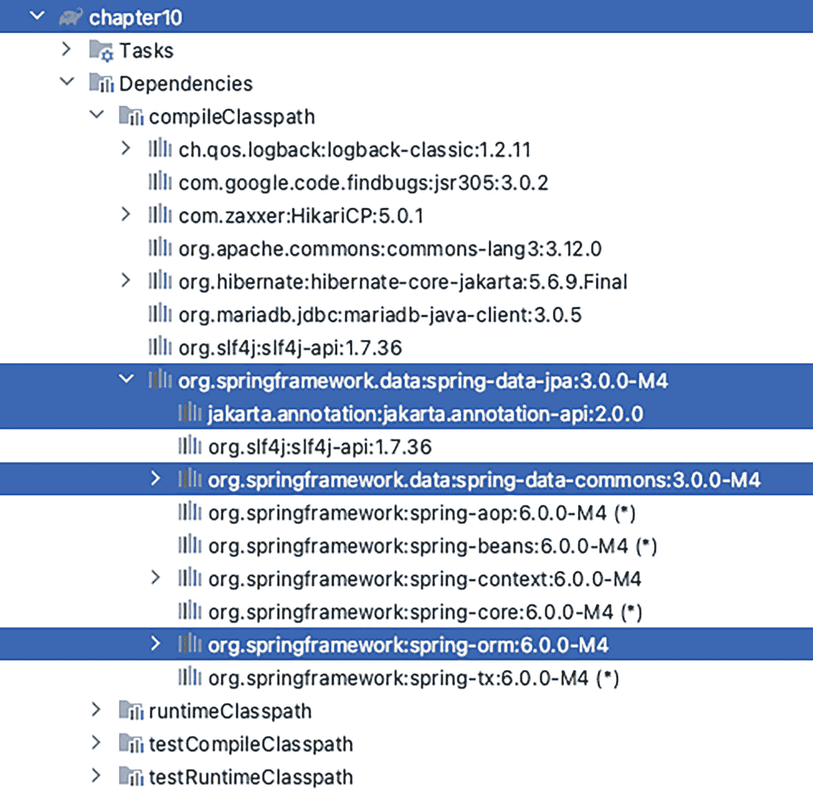
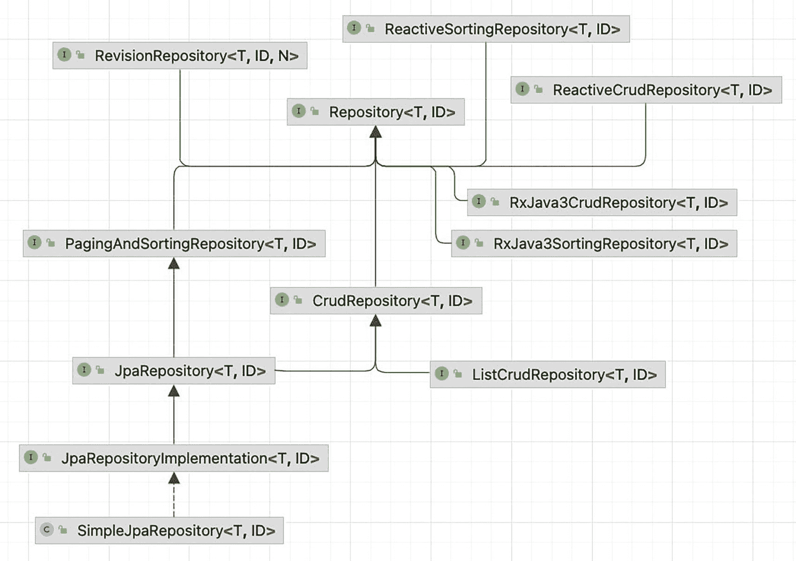
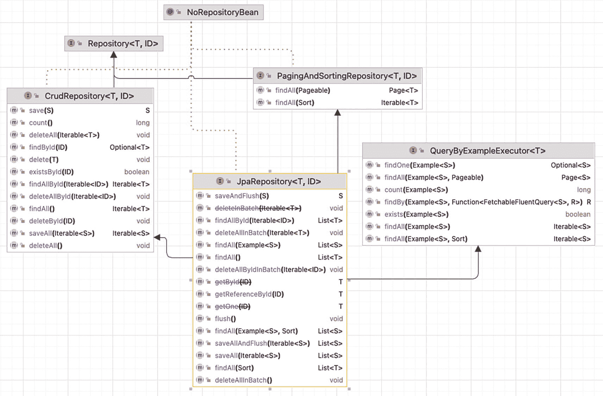
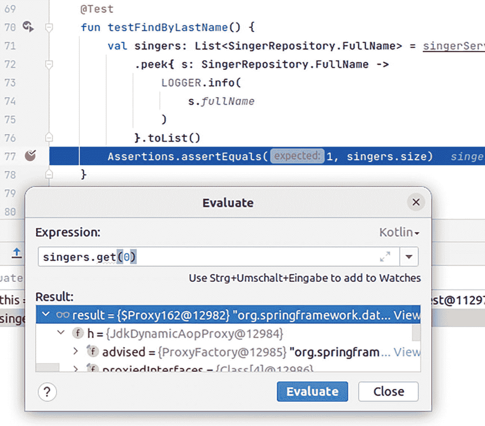
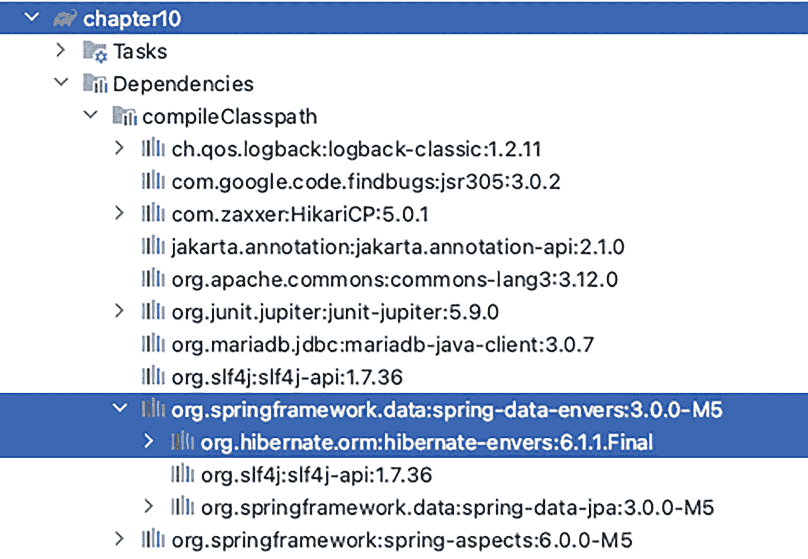
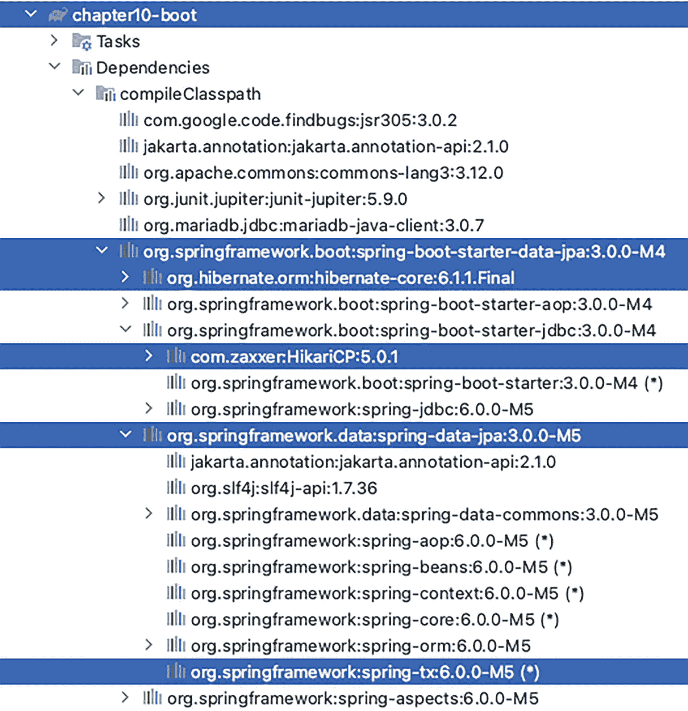

# 10. Spring Data 与 SQL 及 NoSQL 数据库

现在，你已经了解了数据访问的多个方面，例如连接数据库、使用 JDBC 执行原生查询、将表映射到实体类以便在 Kotlin 代码中将数据库记录视为对象、使用 Hibernate 会话和 `EntityManagerFactory` 创建用于数据管理的仓库类，然后在同一个 Spring 管理的事务中执行多个数据库操作。是时候向你展示如何避免编写所有这些代码，并让 Spring 使用 Spring Data 为你完成工作了。

Spring Data JPA 项目是 Spring Data 总项目^(⁸⁴)下的一个子项目。Spring Data 项目的主要目标是提供附加功能，以简化使用各种数据源的应用程序开发。Spring Data 项目包含多个子项目，用于与 SQL 和 NoSQL 数据库（包括经典和响应式数据库）进行交互。它提供了强大的仓库和自定义对象映射抽象、基于配置的仓库查询生成、对透明审计的支持、扩展仓库代码的可能性，以及与 Spring MVC 控制器的轻松集成。

Spring Data 提供了大量旨在简化数据访问的功能，本章将重点介绍几个方面，而不会深入探讨细节，因为那会使本书的篇幅增加一倍。

在本章中，我们将讨论以下内容：

*   *介绍 Spring Data Java 持久化 API (JPA)*：我们将讨论 Spring Data JPA 项目，并演示它如何帮助简化数据访问逻辑的开发。由于 JPA 适用于 SQL 数据库，代码示例中将使用 MariaDB。

*   *跟踪实体变更和审计*：在数据库更新操作中，跟踪实体的创建日期或最后更新日期以及谁进行了更改是一个常见需求。此外，对于客户等关键信息，通常需要一个存储每个实体版本的历史表。我们将讨论 Spring Data JPA 和 Hibernate Envers 如何帮助简化此类逻辑的开发。

*   *用于 NoSQL 数据库的 Spring Data*：我们将讨论什么是 NoSQL 数据库，它们为何如此引人注目，它们擅长什么，以及如何通过 Spring Data 更轻松地从 Spring 应用程序访问其数据。代码示例中，我们将使用 MongoDB。

*   *使用 Spring Boot 进行 Spring Data 配置*：Spring Data 使经典 Spring 应用程序中的操作更简单，但在 Spring Boot 应用程序中，配置变得更加容易，因为有一个包含大量自动配置选项的特殊启动器。

除了向你介绍所有这些出色的技术之外，我们还将向你展示如何使用 Testcontainers 作为数据库访问提供程序来测试你的仓库和服务。

## 介绍 Spring Data JPA

Spring Data JPA 简化了需要访问 JPA 数据源的应用程序的开发。这显然意味着 Hibernate 和 Jakarta Persistence API 组件。使用 Spring Data JPA 的起点是将 `spring-data-jpa` 作为依赖项添加到项目中。将此依赖项添加到项目后，所有必需的 Spring 依赖项都会被添加到应用程序类路径中。剩下的唯一事情就是将 Hibernate Core Jakarta 添加到配置中，并在需要不同（更新）版本时覆盖 `jakarta.annotation-api`。在图 10-1 中，你可以看到 `chapter10` 项目的依赖项列表，这是一个使用 Spring Data JPA 的 Spring 经典项目，如 IntelliJ IDEA 中的 Gradle 视图所示。



第 10 章的依赖项列表从上到下突出显示了 4 个库，如下所示：Spring Data JPA、jakarta.annotation-api、Spring Data Commons 和 Spring ORM。

图 10-1

显示 `chapter10` 项目依赖项的 Gradle 视图


### 使用 Spring Data JPA 仓库抽象进行数据库操作

在之前的数据访问章节中，仓库类（用于与数据库交互的类）是由开发者显式创建的，并围绕 Hibernate 组件（`Session`、`EntityManager`）或 Spring（`JdbcTemplate`）构建。我们必须显式地配置它们，将它们注入到仓库类中，然后调用它们的各种方法来完成任务。添加事务行为也是如此；如果仓库需要支持事务，我们必须显式地在与数据库通信的方法上添加 `@Transactional` 注解。

Spring Data 及其所有子项目的主要概念之一是 `Repository` 抽象，它属于 Spring Data Commons^(⁸⁵) 项目，是依赖项之一。在 Spring Data JPA 中，仓库抽象封装了底层的 JPA `EntityManager`，并为基于 JPA 的数据访问提供了更简单的接口。这意味着您不必编写使用 `EntityManager` 访问数据的代码，除非您确实有一些 Spring Data 无法根据您的配置为您生成的**自定义查询**。

Spring Data 中的核心接口是 `org.springframework.data.repository.Repository<T,ID>` 接口，它是一个标记接口（注意不要将其与 `@Repository` 原型注解混淆）。Spring Data 提供了 `Repository<T, ID>` 接口的各种扩展；其中之一是 `org.springframework.data.repository.CrudRepository<T, ID>` 接口（也属于 Spring Data Commons 项目），我们将在本节中讨论。直接扩展 `Repository<T, ID>` 或通过扩展其子接口之一的接口被称为*领域仓库*，因为它们用具体的领域对象类型替换了泛型 `T`。这些接口公开了用于管理领域对象的 CRUD 方法。

在解释 `CrudRepository<T, ID>` 接口及其重要性之前，请先查看图 10-2，该图展示了 Spring `Repository<T, ID>` 接口的层次结构。



一个流程图，从下到上包含以下块：Simple JPA repository、JPA repository implementation、JPA repository、PagingAndSorting repository 和 Repository。JPA repository 和 ListCrudRepository 指向 CrudRepository。CrudRepository 指向 Repository。

图 10-2

Spring Data `Repository` 接口层次结构

此时，您可能会挠头问道：*嘿，这些大多是接口，它们怎么能完成你之前提到的所有事情呢？* 嗯，我们在这个项目中使用的是 Java 17，所以从技术上讲，默认方法可能是一个答案，但并非如此。我们使用的是 Spring，所以最简单的答案是*代理*。当您开始编写自己的仓库时，一切都会变得清晰，但在此之前，让我们回到 `CrudRepository<T, ID>` 接口。

`CrudRepository<T, ID>` 接口^(⁸⁶) 在处理数据时提供了一些常用的方法。清单 10-1 展示了一个代表该接口声明的代码片段，该片段摘自 Spring Data Commons 项目源代码。

```
package org.springframework.data.repository;
import java.util.Optional;
@NoRepositoryBean
public interface CrudRepository extends Repository {
    <S extends T> S save(S entity);
    <S extends T> Iterable<S> saveAll(Iterable<S> entities);
    Optional<T> findById(ID id);
    boolean existsById(ID id);
    Iterable<T> findAll();
    Iterable<T> findAllById(Iterable<ID> ids);
    long count();
    void deleteById(ID id);
    void delete(T entity);
    void deleteAllById(Iterable<? extends ID> ids);
    void deleteAll(Iterable<? extends T> entities);
    void deleteAll();
}
清单 10-1
CrudRepository 源代码
```

查看这个接口，您可能会认出我们之前添加到仓库接口中并在仓库类中实现的方法签名。`CrudRepository<T, ID>` 接口声明了一组您可能期望仓库类为数据访问提供的完整方法。这些名称不言自明，而且——别担心——您不必为它们提供实现！为了让您放心，让我们看一个例子。

 一个圆圈内感叹号的符号。 本章中使用的实体类与第 6 章到第 9 章中使用的实体类相同。如果您需要回顾，请查阅之前的任何章节或查看之前章节的代码。如果您已经阅读了其他章节，那么像 `Singer` 和 `Album` 这样的实体类现在应该已经很熟悉了。

清单 10-2 展示了一个名为 `SingerRepository` 的经典仓库接口，它只声明了几个查找方法。

```
package com.apress.prospring6.ten
import com.apress.prospring6.ten.entities.Singer
interface SingerRepository {
    fun findAll():List<Singer>
    fun findByFirstName(firstName:String):List<Singer>
    fun findByFirstNameAndLastName(firstName:String,
                                   lastName:String):List<Singer>
}
清单 10-2
经典的 SingerRepository 接口
```

现在可以修改此接口，通过将其扩展为 `CrudRepository<T, ID>` 来将其转换为 Spring Data 领域仓库接口，如清单 10-3 所示。

```
package com.apress.prospring6.ten
// 其他导入语句已省略
import org.springframework.data.repository.CrudRepository
interface SingerRepository : CrudRepository<Singer, Long> {
    fun findByFirstName(firstName:String)
    :Iterable<Singer>
    fun findByFirstNameAndLastName(firstName:String, lastName:String)
    :Iterable<Singer>
}
清单 10-3
Spring Data 领域仓库 SingerRepository 接口

请注意，我们只需要在此接口中声明两个方法，因为 `findAll()` 方法已由 `CrudRepository<T, ID>` 接口提供。`SingerRepository` 接口扩展了 `CrudRepository<T, ID>` 接口，传入了实体类（`Singer`）和 `ID` 类型（`Long`）。

Spring Data 仓库抽象的一个奇妙之处在于，当您使用常见的命名约定 `findBy{fieldName}`（例如 `findByFirstName` 和 `findByFirstNameAndLastName`）时，您无需向 Spring Data JPA 提供命名查询。相反，在运行时，Spring Data JPA 会根据方法名称和替换泛型类型的实体类为您“推断”并构建查询。例如，对于 `findByFirstName()` 方法，Spring Data JPA 会自动为您准备查询 `select s from Singer s where s.firstName = :firstName`，并从参数中设置命名参数 `firstName`。

现在我们已经声明了接口，必须创建配置来告诉 Spring Data 在哪里可以找到这个接口。这是通过在配置类上添加 `@EnableJpaRepositories` 注解来完成的，如清单 10-4 所示。


```
package com.apress.prospring6.ten.config
import org.springframework.transaction.annotation.EnableTransactionManagement
import org.springframework.data.jpa.repository.config.EnableJpaRepositories
// 其他导入语句已省略
@Import(BasicDataSourceCfg::class)
@Configuration
@EnableTransactionManagement
@ComponentScan(basePackages = ["com.apress.prospring6.ten"])
@EnableJpaRepositories("com.apress.prospring6.ten.repos")
open class DataJpaCfg {
@Autowired
var dataSource: DataSource? = null
@Bean
open fun transactionManager(): PlatformTransactionManager {
val transactionManager = JpaTransactionManager()
transactionManager.entityManagerFactory = entityManagerFactory().getObject()
return transactionManager
}
@Bean
open fun entityManagerFactory(): LocalContainerEntityManagerFactoryBean {
return LocalContainerEntityManagerFactoryBean().apply {
setPersistenceProviderClass(HibernatePersistenceProvider::class.java)
setPackagesToScan("com.apress.prospring6.ten.entities")
dataSource = this@DataJpaCfg.dataSource!!
setJpaProperties(jpaProperties())
jpaVendorAdapter = jpaVendorAdapter()
}
}
...
}
清单 10-4
Spring Data JPA 配置
```

这个类以及 `BasicDataSourceCfg` 类的完整配置在前面的数据访问章节（第 6 章至第 9 章）中已经反复介绍过。实际上，告诉 Spring 仓库接口所在位置的唯一要求就是 `@EnableJpaRepositories("com.apress.prospring6.ten.repos")`。`@EnableJpaRepositories` 注解非常强大，它允许你通过声明与 `@ComponentScan` 非常相似的配置属性，以多种方式指定多个位置。默认属性是 `basePackages`。在其他众多属性中，`namedQueriesLocation` 属性用于指定包含命名查询的属性文件的位置，`entityManagerFactoryRef` 属性用于指定用于创建查询的 `EntityManager` Bean 的名称，而 `transactionManagerRef` 属性则用于指定用于创建仓库实例的 `TransactionManager` Bean 的名称。

那么，这一切是如何工作的呢？回顾一下**第** **5** **章**，代理有两种类型：JDK 代理（实现与目标对象相同的接口）和基于类的代理（扩展目标对象类）。Spring Data JPA 要求将仓库声明为扩展了 `Repository<T, ID>` 或其子接口的接口。通过添加 `@EnableJpaRepositories("com.apress.prospring6.ten.repos")` 配置，我们告诉 Spring 在这个包中查找这些类型的接口。对于每个接口，Spring Data 基础设施组件会注册特定于持久化技术的 `FactoryBean`，以创建适当的代理来处理查询方法的调用。

现在我们已经有了一个 Spring Data 领域仓库接口，以及一个告诉 Spring 其位置的配置，下一步就是创建一个事务性服务来使用我们的仓库。清单 10-5 中所示的 `SingerServiceImpl` 类只是调用了 `SingerRepository` 实例的方法。

```
package com.apress.prospring6.ten.service
import java.util.stream.Stream
import java.util.stream.StreamSupport
// 其他导入语句已省略
@Service
@Transactional
class SingerServiceImpl(private val singerRepository: SingerRepository) : SingerService {
@Transactional(readOnly = true)
override fun findAll(): Stream {
return StreamSupport.stream(singerRepository.findAll().spliterator(),
false)
}
@Transactional(readOnly = true)
override fun findByFirstName(firstName: String): Stream {
return StreamSupport.stream(
singerRepository.findByFirstName(firstName).spliterator(), false
)
}
@Transactional(readOnly = true)
override fun findByFirstNameAndLastName(firstName: String, lastName: String): Stream {
return StreamSupport.stream(
singerRepository.findByFirstNameAndLastName(firstName, lastName).spliterator(),
false
)
}
@Transactional(propagation = Propagation.REQUIRES_NEW, label = ["modifying"])
override fun updateFirstName(firstName: String, id: Long): Singer {
singerRepository.findById(id).ifPresent { s: Singer? ->
singerRepository.setFirstNameFor(
firstName,
id
)
}
return singerRepository.findById(id).orElse(null)
}
@Transactional(readOnly = true)
override fun findByLastName(lastName: String): Stream {
return StreamSupport.stream(
singerRepository.findByLastName(lastName).spliterator(), false
)
}
}
清单 10-5
使用 Spring Data 仓库实例的 SingerServiceImpl 类
```

你可以看到，我们不再需要 `EntityManager`，只需将由 Spring 基于 `SingerRepository` 接口生成的 `singerRepository` 实例注入到服务类中，Spring Data JPA 就会为我们完成所有底层工作。在清单 10-6 中，你可以看到一个测试类，现在你应该已经对其内容很熟悉了。

```
package com.apress.prospring6.ten
// 导入语句已省略
@Testcontainers
@SqlMergeMode(SqlMergeMode.MergeMode.MERGE)
@Sql("classpath:testcontainers/drop-schema.sql", "classpath:testcontainers/create-schema.sql")
@SpringJUnitConfig(classes = [SingerServiceTest.TestContainersConfig::class])
open class SingerServiceTest : TestContainersBase() {
@Autowired
var singerService: SingerService? = null
@Test
fun testFindAll() {
val singers: List = singerService!!.findAll().peek{ s: Singer ->
LOGGER.info(
s.toString()
)
}.toList()
Assertions.assertEquals(3, singers.size)
}
@Test
fun testFindByFirstName() {
val singers: List = singerService!!.findByFirstName("John")
.peek{ s: Singer ->
LOGGER.info(
s.toString()
)
}.toList()
Assertions.assertEquals(2, singers.size)
}
@Test
fun testFindByFirstNameAndLastName() {
val singers: List = singerService!!.findByFirstNameAndLastName(
"John", "Mayer")
.peek{ s: Singer ->
LOGGER.info(
s.toString()
)
}.toList()
Assertions.assertEquals(1, singers.size)
}
@Configuration
@Import(DataJpaCfg::class)
open class TestContainersConfig {
@Autowired
var jpaProperties: Properties? = null
@PostConstruct
open fun initialize() {
jpaProperties!![Environment.FORMAT_SQL] = true
jpaProperties!![Environment.USE_SQL_COMMENTS] = true
jpaProperties!![Environment.SHOW_SQL] = true
jpaProperties!![Environment.STATEMENT_BATCH_SIZE] = 30
}
}
companion object {
private val LOGGER = LoggerFactory.getLogger(SingerServiceTest::class.java)
}
}
清单 10-6
SingerServiceTest 测试类
```

这个测试类没什么特别的，Testcontainers MariaDB 容器配置被隔离到了 `TestContainersBase` 类中，以避免在此重复。运行此测试类时，所有方法都应该通过。但像往常一样，让我们将所有 Spring 库的日志级别调高到 `TRACE`，并查看执行日志，这能让我们了解 Spring 正在做的大量工作。请查看清单 10-7 中的日志片段。


```
DEBUG: RepositoryConfigurationDelegate - Scanning for JPA repositories in packages com.apress.prospring6.ten.repos.
TRACE: ClassPathScanningCandidateComponentProvider - Scanning file [/../com/apress/prospring6/ten/repos/SingerRepository.class]
DEBUG: ClassPathScanningCandidateComponentProvider - Identified candidate component class: file [/../com/apress/prospring6/ten/repos/SingerRepository.class]
TRACE: RepositoryConfigurationDelegate - Spring Data JPA - Registering repository: singerRepository
- Interface: com.apress.prospring6.ten.repos.SingerRepository
- Factory: org.springframework.data.jpa.repository.support.JpaRepositoryFactoryBean
INFO : RepositoryConfigurationDelegate - Finished Spring Data repository scanning in 37 ms. Found 1 JPA repository interfaces.
...
DEBUG: RepositoryFactorySupport - Initializing repository instance for com.apress.prospring6.ten.repos.SingerRepository...
...
DEBUG: RepositoryFactorySupport - Finished creation of repository instance for com.apress.prospring6.ten.repos.SingerRepository.
...
TRACE: TransactionAspectSupport - Getting transaction for
[com.apress.prospring6.ten.service.SingerServiceImpl.findAll]
TRACE: AbstractFallbackTransactionAttributeSource - Adding transactional method
'org.springframework.data.jpa.repository.support.SimpleJpaRepository.findAll'
with attribute: PROPAGATION_REQUIRED,ISOLATION_DEFAULT,readOnly
TRACE: TransactionAspectSupport - Getting transaction for
[org.springframework.data.jpa.repository.support.SimpleJpaRepository.findAll]
清单 10-7
SingerServiceTest 执行日志片段
```

请注意，配置的包 `com.apress.prospring6.ten.repos` 及其子包是如何被扫描的，以及 `SingerRepository` 接口是如何被识别为创建仓库实例的候选对象的。

这段日志的特别之处在于，它看起来像是为被调用的仓库实例方法创建了一个事务（标记为 <3> 的行）。那么这里到底发生了什么？实际上，支持代理的类是 `org.springframework.data.jpa.repository.support.SimpleJpaRepository<T, ID>`，如果你查看 Spring 的代码^(⁸⁷)，你会注意到这个类被注解为 `@Transactional(readOnly = true)`。这就是仓库方法事务的来源。这些事务是必需的，因为任何 JPA 操作都应在事务上下文中执行；这样，在发生错误时，回滚将确保数据库保持良好状态。这显然意味着，对于仅调用单个仓库方法的服务方法，不需要额外的事务。即使配置了事务，由于默认的传播模式是 `PROPAGATION_REQUIRED`，服务方法也将在与仓库方法相同的事务中执行。

在讨论更复杂的查询以及如何支持调用它们之前，我们先来谈谈 `JpaRepository<T, ID>` 接口。

### 使用 `JpaRepository`

`JpaRepository<T, ID>` 接口是比 `CrudRepository<T, ID>` 更高级的 Spring 接口，它可以使创建自定义仓库变得更加容易。`JpaRepository<T, ID>` 接口提供了批量、分页和排序操作。图 10-3 展示了 `JpaRepository<T, ID>` 与 `CrudRepository<T, ID>` 接口之间的关系。



一个包含 6 个方框的流程图。JPA 仓库右侧通向 QueryByExampleExecutor，左侧通向 CrudRepository，顶部通向 PagingAndSortingRepository。CrudRepository 通向 Repository。NoBeanRepository 通过虚线连接到 PagingAndSorting、Crud 和 JPA 仓库。

图 10-3

Spring Data `JpaRepository<T, ID>` 层次结构

根据应用程序的复杂程度，你可以选择使用 `CrudRepository<T, ID>` 或 `JpaRepository<T, ID>`。从图 10-3 可以看出，`JpaRepository<T, ID>` 扩展了 `CrudRepository<T, ID>`，因此提供了所有相同的功能。

### 使用自定义查询的 Spring Data JPA

在复杂的应用程序中，你可能需要 Spring 无法“推断”的自定义查询。

前面的章节介绍了如何使用命名查询（在实体类上使用 `@NamedQuery` 注解声明）来为查询执行提供支持，无论是使用 Hibernate `Session` 还是 `EntityManager`。Spring Data 仓库也支持命名查询。Spring Data 尝试将开发人员声明的方法调用解析为以配置的领域类的简单名称开头、后跟方法名、并用点分隔的命名查询。这种命名查询的方式在使用 Hibernate `Session` 或 `EntityManager` 时也曾使用过，只是为了方便过渡。然而，Spring Data 的命名查询确实有一些限制；例如，不支持命名参数。作为示例，考虑一个用于选择发布日期大于 `2010-01-01` 的专辑的命名查询。清单 10-8 展示了显示命名参数查询的关键代码片段。

```
package com.apress.prospring6.ten.entities
import jakarta.persistence.NamedQuery
// 其他导入语句已省略
@Entity
@Table(name = "ALBUM")
@NamedQuery(name = Album.FIND_WITH_RELEASE_DATE_GREATER_THAN, query = "select a from Album a where a.releaseDate > ?1")
class Album : AbstractEntity() {
@Column
var title: String? = null
@Column(name = "RELEASE_DATE")
var releaseDate: LocalDate? = null
@ManyToOne
@JoinColumn(name = "SINGER_ID")
var singer: Singer? = null
override fun equals(other: Any?): Boolean {
if (this === other) return true
if (other == null || javaClass != other.javaClass) return false
val album = other as Album
return if (id != null) {
id == other.id
} else title == album.title && releaseDate == album.releaseDate
}
override fun hashCode(): Int {
return Objects.hash(title, releaseDate)
}
override fun toString(): String {
return ("Album - Id: " + id + ", Singer id: " + (singer?.id?:"")
+ ", Title: " + title + ", Release Date: " + releaseDate)
}
companion object {
@Serial
private val serialVersionUID = 3L
const val FIND_WITH_RELEASE_DATE_GREATER_THAN =
"Album.findWithReleaseDateGreaterThan"
}
}
清单 10-8
带有命名查询的 Album 实体
```

对于需要命名参数的情况，必须使用 `@Query` 注解显式定义查询。我们将使用此注解来搜索标题中包含 `The` 的所有音乐专辑。清单 10-9 描述了 `AlbumRepository` 接口。

```
package com.apress.prospring6.ten.repos
import org.springframework.data.jpa.repository.Query
import org.springframework.data.repository.query.Param
// 其他导入语句已省略
interface AlbumRepository : JpaRepository {
fun findBySinger(singer: Singer): Iterable
fun findWithReleaseDateGreaterThan(rd: LocalDate): Iterable
@Query("select a from Album a where a.title like %:title%")
fun findByTitle(@Param("title") t: String): Iterable
}
清单 10-9
带有命名查询和 @Query 方法的 AlbumRepository
```

Spring Data 将 `findWithReleaseDateGreaterThan(..)` 方法匹配到名为 `Album.findWithReleaseDateGreaterThan` 的查询。`findByTitle(..)` 方法的查询有一个名为 `title` 的命名参数。当命名参数的名称与使用 `@Query` 注解的方法中参数的名称相同时，则不需要 `@Param` 注解。如果方法参数具有不同的名称，则需要 `@Param` 注解来告诉 Spring 该参数的值将被注入到查询中的命名参数中。

`AlbumServiceImpl` 服务类非常简单，仅使用 `albumRepository` bean 来调用其方法，如清单 10-10 所示。


```
package com.apress.prospring6.ten.service
import java.util.stream.Stream
import java.util.stream.StreamSupport
// 其他导入语句已省略
@Service
@Transactional(readOnly = true)
class AlbumServiceImpl(private val albumRepository: AlbumRepository) :
AlbumService {
override fun findBySinger(singer: Singer): Stream {
return StreamSupport.stream(albumRepository.findBySinger(singer).spliterator(),
false)
}
override fun findWithReleaseDateGreaterThan(rd: LocalDate): Stream {
return StreamSupport.stream(
albumRepository.findWithReleaseDateGreaterThan(rd).spliterator(),
false
)
}
override fun findByTitle(title: String): Stream {
return StreamSupport.stream(albumRepository.findByTitle(title).spliterator(),
false
)
}
}
清单 10-10
调用 AlbumRepository 方法的 AlbumServiceImpl 服务
```

`findBySinger(..)` 查询比较简单，Spring Data 能够自行解析该查询。因此，测试类不会涵盖此方法。欢迎读者自行编写该方法的测试。清单 10-11 展示了针对两个稍复杂查询的测试类。

```
package com.apress.prospring6.ten
// 导入语句已省略
@Testcontainers
@Sql("classpath:testcontainers/drop-schema.sql", "classpath:testcontainers/create-schema.sql")
@SpringJUnitConfig(classes = [AlbumServiceTest.TestContainersConfig::class])
class AlbumServiceTest : TestContainersBase() {
@Autowired
var albumService: AlbumService? = null
@Test
fun testFindWithReleaseDateGreaterThan() {
val albums: List = albumService!!
.findWithReleaseDateGreaterThan(LocalDate.of(2010, 1, 1))
.peek{ s: Album ->
LOGGER.info(
s.toString()
)
}.toList()
Assertions.assertEquals(2, albums.size)
}
@Test
fun testFindByTitle() {
val albums: List = albumService!!
.findByTitle("The")
.peek{ s: Album ->
LOGGER.info(
s.toString()
)
}.toList()
Assertions.assertEquals(1, albums.size)
}
@Configuration
@Import(DataJpaCfg::class)
open class TestContainersConfig {
@Autowired
var jpaProperties: Properties? = null
@PostConstruct
open fun initialize() {
jpaProperties!![Environment.FORMAT_SQL] = true
jpaProperties!![Environment.USE_SQL_COMMENTS] = true
jpaProperties!![Environment.SHOW_SQL] = true
jpaProperties!![Environment.STATEMENT_BATCH_SIZE] = 30
}
}
companion object {
private val LOGGER = LoggerFactory.getLogger(AlbumServiceTest::class.java)
}
}
清单 10-11
AlbumServiceTest 类
```

Spring Data 仓库功能强大且用途广泛。例如，使用 `@Query` 注解的方法可以通过添加 `org.springframework.data.domain.Sort` 参数来支持排序。使用 `@Query` 注解声明的查询甚至支持 SpEL 表达式。

本节中的示例仅展示了读取数据的查询。修改数据的查询也需要使用 `@Modified` 注解。举例来说，我们对 `SingerRepository` 进行了修改，添加了一个根据歌手记录 `id` 修改其名字的查询。方法声明如清单 10-12 所示。

```
package com.apress.prospring6.ten.repos
import org.springframework.data.jpa.repository.Modifying;
// 其他导入语句已省略
interface SingerRepository : CrudRepository {
@Modifying
fun findByFirstName(firstName: String): Iterable
@Modifying(clearAutomatically = true)
@Query("update Singer s set s.firstName = ?1 where s.id = ?2")
fun setFirstNameFor(firstName: String, id: Long): Int
...
}
清单 10-12
使用 @Modifying 注解的 Spring Data 查询方法
```

`@Modifying` 注解设计为仅与 `@Query` 注解一起使用，单独使用没有意义。如果单独使用，Spring Data 会忽略它。

`@Modifying` 注解支持两个属性：

*   `flushAutomatically`：当设置为 `true`（默认值为 `false`）时，会导致底层持久化上下文在*执行*修改查询*之前*进行刷新。

*   `clearAutomatically`：当设置为 `true`（默认值为 `false`）时，会导致底层持久化上下文在*执行*修改查询*之后*进行刷新。这意味着更改后的实体将在该方法执行后立即持久化到数据库中。

`setFirstNameFor(..)` 使用 `@Modifying(clearAutomatically = true)` 注解的原因是：在服务方法中，调用此方法执行更新操作，然后使用仓库的 `findById(id)` 方法从数据库中检索要返回的实体。由于更改会在事务结束时刷新，而我们无法控制刷新的具体时间，因此返回的实体可能不是更新后的实体。

为了增加趣味性，调用 `setFirstNameFor(..)` 的服务方法会返回更新后的实例，我们可以对此进行测试。服务方法如清单 10-13 所示。

```
package com.apress.prospring6.ten.service
// 导入语句已省略
@Service
@Transactional
class SingerServiceImpl(private val singerRepository: SingerRepository) : SingerService {
@Transactional(readOnly = true)
override fun findAll(): Stream {
return StreamSupport.stream(singerRepository.findAll().spliterator(),
false)
}
@Transactional(propagation = Propagation.REQUIRES_NEW, label = ["modifying"])
override fun updateFirstName(firstName: String, id: Long): Singer {
singerRepository.findById(id).ifPresent { s: Singer? ->
singerRepository.setFirstNameFor(
firstName,
id
)
}
return singerRepository.findById(id).orElse(null)
}
...
}
清单 10-13
调用 @Modified 注解的 Spring Data 查询方法的服务方法
```

测试方法如清单 10-14 所示。

```
package com.apress.prospring6.ten
import org.springframework.test.annotation.Rollback;
// 其他导入语句已省略
@Testcontainers
@SqlMergeMode(SqlMergeMode.MergeMode.MERGE)
@Sql("classpath:testcontainers/drop-schema.sql",
"classpath:testcontainers/create-schema.sql")
@SpringJUnitConfig(classes = [SingerServiceTest.TestContainersConfig::class])
open class SingerServiceTest : TestContainersBase() {
@Autowired
var singerService: SingerService? = null
@Rollback
@Test
@SqlGroup(
Sql(
scripts = ["classpath:testcontainers/add-nina.sql"],
executionPhase = Sql.ExecutionPhase.BEFORE_TEST_METHOD
)
)
@DisplayName("应该更新歌手的名字")
fun testUpdateFirstNameByQuery() {
val nina = singerService!!.updateFirstName("Eunice Kathleen", 5L)
Assertions.assertAll("nina 未被更新",
Executable { Assertions.assertNotNull(nina) },
Executable {
Assertions.assertEquals(
"Eunice Kathleen",
nina!!.firstName
)
}
)
}
...
}
清单 10-14
针对调用 @Modified 注解的 Spring Data 查询方法的服务方法的测试方法
```

 信息符号。一个带阴影的圆圈内有一个小写字母 i。 请注意，这里没有使用 `@Sql` 注解和删除脚本来清理上下文，而是使用了**第** **9** **章**中介绍的 `@Rollback` 注解。

`@Modifying` 注解同样适用于条件删除查询。Spring Data JPA 仓库还可以简化更多数据库操作。然而，涵盖所有内容超出了本书的范围。欢迎读者自行查阅官方文档进行深入研究^(⁸⁸)。


### 投影查询

第 7 章和第 8 章已经介绍了投影查询的主题，因此本节仅展示如何使用 Spring Data JPA 配置投影查询。

为了将查询结果限制为仅包含少数几个字段，我们需要一个接口，该接口为要读取的属性公开访问器方法。Spring 支持多种有趣的方式来声明投影接口，但为简单起见，在本例中，我们将仅展示一个公开歌手名字和姓氏的接口。仓库方法和该接口均显示在清单 10-15 中。

```
package com.apress.prospring6.ten.service
// 导入语句已省略
interface SingerService {
fun findAll(): Stream
fun findByFirstName(firstName: String): Stream
fun findByFirstNameAndLastName(firstName: String, lastName: String): Stream
fun updateFirstName(firstName: String, id: Long): Singer
fun findByLastName(lastName: String): Stream
}
// SingerRepository.kt
interface SingerRepository : CrudRepository {
...
fun findByLastName(lastName: String): Iterable
interface FullName {
val firstName: String
val lastName: String
// 在 Java 中可以这样做，但在 Kotlin 中由于某些原因不行
//val fullName: String
//    get() = "$firstName $lastName"
}
}
清单 10-15
投影接口与仓库方法
```

服务方法除了调用 `findByLastName(..)` 方法外不做其他事情，而测试方法仅打印结果并测试返回单个结果的假设。两者都在本书的代码仓库中提供，此处不再列出。

唯一值得关注的是仓库方法返回的对象的实际类型。由于数据库结果使用 `FullName` 接口建模，因此必须由 Spring 生成一个实现，对吗？嗯，实际上并非如此。Spring 再次创建了一个代理，该代理实现了 `FullName` 接口，因此调用声明的方法会被转发给负责存储和返回实际值的 Spring Data 基础设施组件。通过在测试方法中设置断点，并使用 IntelliJ IDEA 的运行时表达式求值功能检查返回集合的内容，可以轻松看到这一点。只需在代码执行暂停时右键单击源代码，在上下文菜单中选择 **Evaluate Expression**，然后输入 `singers.get(0)`。注意对象的类型，如果展开它，你将看到目标对象和已实现的接口。它看起来应该与图 10-4 中显示的内容非常相似（但请注意，在最终的 Spring Data JPA 发布时，某些类型可能会被重命名、移动等，存在这种微小可能性）。



一张截图，包含一段根据歌手姓氏查找名字的代码。高亮行显示：assertions dot assert equals (expected 1, singers dot size)。底部一个标题为“Evaluate”的对话框包含表达式和结果。右下角有“Evaluate”和“Close”选项卡。

图 10-4
检查 Spring Data 实例

## 跟踪实体类的变更

在大多数应用程序中，我们需要跟踪用户维护的业务数据的基本审计活动。审计信息通常包括创建数据的用户、创建日期、最后修改日期以及最后修改的用户。

Spring Data JPA 项目以 JPA 实体监听器的形式提供了此功能，它可以帮助你自动跟踪审计信息。要使用此功能，在 Spring 4 之前，实体类需要实现 `Auditable<U, ID, T extends TemporalAccessor>` 接口（该接口扩展了 `Persistable<ID>` 接口，属于 Spring Data Commons）^( ⁸⁹ )，或者扩展任何实现了此接口的类。清单 10-16 展示了从 Spring Data 参考文档中提取的 `Auditable` 接口。

```
package org.springframework.data.domain;
import java.time.temporal.TemporalAccessor;
import java.util.Optional;
public interface Auditable
extends Persistable {
Optional getCreatedBy();
void setCreatedBy(U createdBy);
Optional getCreatedDate();
void setCreatedDate(T creationDate);
Optional getLastModifiedBy();
void setLastModifiedBy(U lastModifiedBy);
Optional getLastModifiedDate();
void setLastModifiedDate(T lastModifiedDate);
}
清单 10-16
Auditable 接口
```

从 `Auditable<U, ID, T extends TemporalAccessor>` 接口的定义可以看出，日期类型的列被限制为扩展 `java.time.temporal.TemporalAccessor` 的类型。从 Spring 5 开始，不再需要实现 `Auditable<U, ID, T extends TemporalAccessor>`，因为一切都可以用注解替代。

为了展示其工作原理，让我们在数据库模式中创建一个名为 `SINGER_AUDIT` 的新表，该表基于 `SINGER` 表，并添加了四个与审计相关的列。这些列记录了谁创建了实体、实体何时创建、最后编辑实体的用户以及编辑时间。清单 10-17 显示了建表脚本（`AuditSchema.sql`）。

```
CREATE TABLE SINGER_AUDIT (
ID INT NOT NULL AUTO_INCREMENT
, FIRST_NAME VARCHAR(60) NOT NULL
, LAST_NAME VARCHAR(40) NOT NULL
, BIRTH_DATE DATE
, VERSION INT NOT NULL DEFAULT 0
, CREATED_BY VARCHAR(20)
, CREATED_DATE TIMESTAMP
, LAST_MODIFIED_BY VARCHAR(20)
, LAST_MODIFIED_DATE TIMESTAMP
, UNIQUE UQ_SINGER_AUDIT_1 (FIRST_NAME, LAST_NAME)
, PRIMARY KEY (ID)
);
清单 10-17
SINGER_AUDIT 表 DDL
```

这里有四个与审计相关的列。它们分别对应 `@CreatedBy`、`@CreatedDate`、`@LastModifiedBy` 和 `@LastModifiedDate` 注解。这些注解属于 `org.springframework.data.annotation` 包。使用这些注解后，日期列的类型限制不再适用。为了保持整洁有序，项目中添加了一个名为 `AuditableEntity<U>` 的 `@MappedSuperclass` 来将审计字段组合在一起。此类如清单 10-18 所示。

```
package com.apress.prospring6.ten.entities
import org.springframework.data.jpa.domain.support.AuditingEntityListener
import jakarta.persistence.EntityListeners
import org.springframework.data.annotation
// 其他导入语句已省略
@Audited
@MappedSuperclass
@EntityListeners(AuditingEntityListener::class)
abstract class AuditableEntity : Serializable {
@CreatedDate
@Column(name = "CREATED_DATE")
protected var createdDate: LocalDateTime? = null
@CreatedBy
@Column(name = "CREATED_BY")
var createdBy: String? = null
@LastModifiedBy
@Column(name = "LAST_MODIFIED_BY")
var lastModifiedBy: String? = null
@LastModifiedDate
@Column(name = "LAST_MODIFIED_DATE")
protected var lastModifiedDate: LocalDateTime? = null
companion object {
@Serial
private val serialVersionUID = 8L
}
}
清单 10-18
AuditableEntity 抽象类
```


`@Column` 注解应用于审计字段，用于映射到表中的实际列。`@EntityListeners(AuditingEntityListener.class)` 注解注册了 `AuditingEntityListener`，该监听器将用于持久化上下文中所有继承此类的实体。

 一个代表想法的符号，由电灯泡表示。 `@EntityListeners(AuditingEntityListener.class)` 注解也取代了声明 `orm.xml` 配置文件的需要，正如 JPA 规范中所指出的。因此，无需添加以下内容：

```

JPA

```

我们应用程序中任何需要审计的类都应声明为继承 `AuditableEntity<U>` 类。因此，为了映射 `SINGER_AUDIT` 表，需要编写清单 10-19 中所示的 `SingerAudit` 类。

```
package com.apress.prospring6.ten.entities
// 导入语句已省略
@Entity
@Audited
@Table(name = "SINGER_AUDIT")
class SingerAudit : AuditableEntity() {
@Id
@GeneratedValue(strategy = GenerationType.IDENTITY)
@Column(name = "ID")
val id: Long? = null
@Version
@Column(name = "VERSION")
private val version = 0
@Column(name = "FIRST_NAME")
var firstName: String? = null
@Column(name = "LAST_NAME")
var lastName: String? = null
@Column(name = "BIRTH_DATE")
var birthDate: LocalDate? = null
...
}
清单 10-19
SingerAudit 实体类
```

为了管理 `SingerAudit` 类型的审计实体，应使用一个仓库接口和一个服务类。`SingerAuditRepository` 接口仅扩展了 `CrudRepository<SingerAudit, Long>`，该接口已经声明了我们将用于 `SingerAuditService` 的所有方法，如清单 10-20 所示。

```
package com.apress.prospring6.ten.service
// 导入语句已省略
interface SingerAuditService {
fun findAll(): Stream
fun findById(id: Long): SingerAudit?
fun save(singer: SingerAudit): SingerAudit
fun findAuditByRevision(id: Long, revision: Int): SingerAudit?
fun delete(id: Long)
}
清单 10-20
SingerAuditService 接口
```

实现 `SingerAuditService` 的 `SingerAuditServiceImpl` 类仅是在事务上下文中调用 `SingerAuditRepository` 的方法。两者都非常简单，目前无需关注。然而，要告诉 Spring 自动更新审计字段，还需要进行一些配置：必须使用 `@EnableJpaAuditing` 注解一个配置类，并且必须配置一个实现 `AuditorAware<T>` 的 bean，如清单 10-21 所示。

```
package com.apress.prospring6.ten.config
import org.apache.commons.lang3.RandomStringUtils
import org.springframework.data.domain.AuditorAware
import org.springframework.data.jpa.repository.config.EnableJpaAuditing
// 部分导入语句已省略
@EnableJpaAuditing
@Configuration
open class AuditCfg {
@Bean
open fun auditorProvider(): AuditorAware {
return AuditorAware {
Optional.of(
"prospring6-" + RandomStringUtils.random(6, true,true)
)
}
}
}
清单 10-21
用于启用自动审计支持的 Spring 配置类
```

这是一个非常简单的配置。关键在于：在生产级应用程序中，为了填充 `@CreatedBy` 和 `@LastModifiedBy` 注解的字段，其值由与 Spring Security 交互的 bean 提供。在实际情况下，这应该是一个用户信息实例，例如一个代表已登录用户的 `User` 类，该类从 `SecurityContextHolder` 中检索执行数据更新操作的用户。然而，由于该主题相当高级，将在**第** **17** **章**中介绍，这里使用了类型为 `AuditorAware<T>` 接口的 bean，并传入类型 `String`。清单 10-21 中的 lambda 语句可以展开为以下内容：

```
object : AuditorAware {
override fun getCurrentAuditor():Optional {
return Optional.of("prospring6")
}
}
```

在这个 `AuditorAware<String>` 的匿名实现中，实现了 `getCurrentAuditor()` 方法。返回的值是 *prospring6* 加上一个随机生成的六字符文本。这将有助于生成不同的用户值，以便我们测试 `@CreatedBy` 和 `@LastModifiedBy` 注解字段的值是否被设置。

现在配置和实现都已就绪，下一步是测试代码。为了将内容限制在各自的上下文中，我们添加了 `AuditServiceTest` 类，该类执行 `SingerAuditServiceImpl` 类中的三个服务方法，并检查对其效果的假设。测试类和方法如清单 10-22 所示。

```
package com.apress.prospring6.ten
// 导入语句已省略
@Testcontainers
@Sql("classpath:testcontainers/audit/drop-schema.sql", "classpath:testcontainers/audit/create-schema.sql")
@SpringJUnitConfig(classes = [AuditServiceTest.TestContainersConfig::class])
class AuditServiceTest : TestContainersBase() {
@Autowired
var auditService: SingerAuditService? = null
@BeforeEach
fun setUp() {
val singer = SingerAudit().apply {
firstName = "BB"
lastName = "King"
birthDate = LocalDate.of(1940, 8, 16)
}
auditService!!.save(singer)
}
@Test
fun testFindById() {
val singer = auditService!!.findAll().findFirst().orElse(null)
Assertions.assertAll("auditFindByIdTest",
Executable { Assertions.assertNotNull(singer) },
Executable {
Assertions.assertNotNull(
singer.createdBy
)
},
Executable {
Assertions.assertNotNull(
singer.lastModifiedBy
)
}
)
LOGGER.info(">> 创建的记录: {} ", singer)
}
@Test
fun testUpdate() {
val singer = auditService!!.findAll().findFirst().orElse(null)
Assertions.assertNotNull(singer)
singer.firstName = "Riley B."
val updated = auditService!!.save(singer)
Assertions.assertAll("auditUpdateTest",
Executable {
Assertions.assertEquals(
"Riley B.",
updated.firstName
)
},
Executable {
Assertions.assertNotNull(
updated.lastModifiedBy
)
},
Executable {
Assertions.assertNotEquals(
updated.createdBy,
updated.lastModifiedBy
)
}
)
LOGGER.info(">> 更新的记录: {} ", updated)
}
@Configuration
@Import(
DataJpaCfg::class,
AuditCfg::class
)
open class TestContainersConfig {
@Autowired
var jpaProperties: Properties? = null
@PostConstruct
open fun initialize() {
jpaProperties!![Environment.FORMAT_SQL] = true
jpaProperties!![Environment.USE_SQL_COMMENTS] = true
jpaProperties!![Environment.SHOW_SQL] = true
jpaProperties!![Environment.STATEMENT_BATCH_SIZE] = 30
}
}
companion object {
private val LOGGER = LoggerFactory.getLogger(AuditServiceTest::class.java)
}
}
清单 10-22
用于测试 SingerAuditServiceImpl 类的类
```

测试方法应该通过，并检查审计字段的值是否已填充。

 一个代表想法的符号，由电灯泡表示。 这些测试方法揭示了一个重要问题：对于设计为一天内多次编辑的记录，`java.time.LocalDate` 不是用于 `@CreatedDate` 和 `@LastModifiedDate` 注解字段的良好类型。在我们的示例中，我们使用了 `java.time.LocalDateTime`，以便更明显地看出记录已被更改。

JPA 审计支持需要在类路径中添加一个额外的库。Spring Data 需要 `spring-aspects` 来创建特殊的代理，这些代理会拦截实体更新，并在实体被持久化之前添加它们自己的更改。


## 使用 Hibernate Envers 保留实体版本

在企业应用中，对于关键业务数据，通常需要保留每个实体的多个版本。例如，在客户关系管理（CRM）系统中，每次插入、更新或删除客户记录时，都应将其先前版本保存在历史表或审计表中，以满足公司的审计或其他合规要求。

要实现这一点，有两种常见方案。第一种是创建数据库触发器，在任何更新操作之前将更新前的记录克隆到历史表中。第二种是在数据访问层（例如，使用 AOP）开发逻辑。然而，这两种方案都有其缺点。触发器方案与数据库平台绑定，而手动实现逻辑则相当笨拙，可能影响性能，并且非常容易出错。

Hibernate Envers^(⁹⁰)（*实体版本控制系统*的简称）是一个 Hibernate 模块，专门设计用于自动化实体的版本控制。在本节中，我们将讨论如何使用 Envers 来实现上一节介绍的 `SingerAudit` 实体的版本控制。

Hibernate Envers 并非 JPA 的特性。我们在此介绍它，是因为我们认为在讨论了可以与 Spring Data JPA 一起使用的一些基本审计功能之后，再来介绍它是值得的。

Spring Data 为 Hibernate Envers 提供了一个名为 `spring-data-envers` 的模块。`spring-data-jpa` 模块是 Spring Data Envers 库的传递依赖。图 10-5 展示了使用 Hibernate Envers 进行实体版本控制的 Spring Data 项目的依赖关系。



第 10 章的依赖项列表从上到下有两个高亮显示的项目，如下所示：Spring Data Envers 和 Hibernate Envers。

图 10-5

显示 `chapter10` Envers 项目依赖项的 Gradle 视图

Envers 支持两种审计策略，如表 10-1 所示。

表 10-1

Envers 审计策略

| 审计策略 | 描述 |
| --- | --- |
| `默认` | Envers 维护一个用于记录修订版本的列。每次插入或更新记录时，都会在历史表中插入一条新记录，其修订版本号从数据库序列或表中获取。 |
| `有效性审计` | 此策略存储每条历史记录的起始和结束修订版本。每次插入或更新记录时，都会在历史表中插入一条带有起始修订版本号的新记录。同时，之前的记录会被更新，添加上结束修订版本号。还可以配置 Envers，使其将结束修订版本更新的时间戳记录到先前的历史记录中。 |

在本节中，我们将演示有效性审计策略。尽管这会触发更多的数据库更新，但检索历史记录会变得更快。由于结束修订版本的时间戳也会写入历史记录，因此在查询数据时，更容易识别出特定时间点的记录快照。

### 为实体版本控制添加表

为了支持实体版本控制，我们需要添加一些表。首先，对于每个将要进行版本控制的实体（在本例中为 `SingerAudit` 实体类）所对应的表，我们需要创建相应的历史表。为了对 `SINGER_AUDIT` 表中的记录进行版本控制，我们创建一个名为 `SINGER_AUDIT_H` 的历史表。清单 10-23 中的代码展示了建表脚本。

```
CREATE TABLE SINGER_AUDIT_H (
ID INT NOT NULL AUTO_INCREMENT
, FIRST_NAME VARCHAR(60) NOT NULL
, LAST_NAME VARCHAR(40) NOT NULL
, BIRTH_DATE DATE
, VERSION INT NOT NULL DEFAULT 0
, CREATED_BY VARCHAR(20)
, CREATED_DATE TIMESTAMP
, LAST_MODIFIED_BY VARCHAR(20)
, LAST_MODIFIED_DATE TIMESTAMP
, AUDIT_REVISION INT NOT NULL
, ACTION_TYPE INT
, AUDIT_REVISION_END INT
, AUDIT_REVISION_END_TS TIMESTAMP
, UNIQUE UQ_SINGER_AUDIT_H_1 (FIRST_NAME, LAST_NAME)
, PRIMARY KEY (ID, AUDIT_REVISION)
);
清单 10-23
描述 SingerAudit 实体的 Hibernate 审计表的 SQL 代码 (AuditSchema.sql)
```

为了支持有效性审计策略，我们需要为每个历史表添加四个列，如清单 10-23 中高亮显示的部分。表 10-2 展示了这些列及其用途。

表 10-2

历史记录列

| 列名 | 数据类型 | 描述 |
| --- | --- | --- |
| `AUDIT_REVISION` | `INT` | 历史记录的起始修订版本 |
| `ACTION_TYPE` | `INT` | 操作类型，可能的值有：0 表示新增，1 表示修改，2 表示删除 |
| `AUDIT_REVISION_END` | `INT` | 历史记录的结束修订版本 |
| `AUDIT_REVISION_END_TS` | `TIMESTAMP` | 结束修订版本更新的时间戳 |

Hibernate Envers 还需要另一个表来跟踪修订版本号以及每次插入、新增、更新或删除操作创建修订版本时的时间戳。该表应命名为 `REVINFO`，并且需要向 `SINGER_AUDIT_H` 表添加一个外键，以将每个审计记录链接到其版本。其模式非常简单，如清单 10-24 所示。

```
CREATE TABLE REVINFO (
REVTSTMP BIGINT NOT NULL
, REV INT NOT NULL AUTO_INCREMENT
, PRIMARY KEY (REVTSTMP, REV)
);
ALTER TABLE SINGER_AUDIT_H
ADD CONSTRAINT SINGER_AUDIT_H_TO_REVISION
FOREIGN KEY ( AUDIT_REVISION ) REFERENCES REVINFO( REV);
清单 10-24
描述 Hibernate 审计 REVINFO 表的 SQL 代码 (AuditSchema.sql)
```

`REV` 列用于存储每个修订版本号，当创建新的历史记录时，该列会自动递增。`REVTSTMP` 列存储修订版本创建时的时间戳（以数字格式表示）。


### 为实体版本控制配置 `EntityManagerFactory`

Hibernate Envers 以 EJB 监听器的形式实现。我们可以通过在 `LocalContainerEntityManagerFactory` Bean 中设置一组特定的 Envers 属性来配置这些监听器。Kotlin 配置类与目前用于事务性 Spring 应用程序的配置类基本相同，唯一的区别在于，通过调用 `setJpaProperties(..)` 方法，将 Envers 属性添加到 `LocalContainerEntityManagerFactoryBean` 对象上设置的 `Properties` 对象中。在代码清单 10-25 中，你可以看到这些属性。

```
package com.apress.prospring6.ten.config
import org.hibernate.envers.configuration.EnversSettings
import org.hibernate.cfg.Environment
// 其他导入语句已省略
@Import(BasicDataSourceCfg::class)
@Configuration
@EnableTransactionManagement
@ComponentScan(basePackages = ["com.apress.prospring6.ten"])
@EnableJpaRepositories("com.apress.prospring6.ten.repos")
open class EnversConfig {
@Autowired
var dataSource: DataSource? = null
@Bean
open fun transactionManager(): PlatformTransactionManager {
return JpaTransactionManager().apply {
entityManagerFactory = entityManagerFactory().getObject()
}
}
@Bean
open fun jpaVendorAdapter(): JpaVendorAdapter {
return HibernateJpaVendorAdapter()
}
@Bean
open fun entityManagerFactory(): LocalContainerEntityManagerFactoryBean {
return LocalContainerEntityManagerFactoryBean().apply {
setPersistenceProviderClass(HibernatePersistenceProvider::class.java)
setPackagesToScan("com.apress.prospring6.ten.entities")
dataSource = this@EnversConfig.dataSource!!
setJpaProperties(jpaProperties())
jpaVendorAdapter = jpaVendorAdapter()
}
}
@Bean
open fun jpaProperties(): Properties {
val jpaProps = Properties()
jpaProps[Environment.HBM2DDL_AUTO] = "none"
jpaProps[Environment.FORMAT_SQL] = false
jpaProps[Environment.STATEMENT_BATCH_SIZE] = 30
jpaProps[Environment.USE_SQL_COMMENTS] = false
jpaProps[Environment.SHOW_SQL] = false
// Hibernate Envers 的属性
jpaProps[EnversSettings.AUDIT_TABLE_SUFFIX] = "_H"
jpaProps[EnversSettings.REVISION_FIELD_NAME] = "AUDIT_REVISION"
jpaProps[EnversSettings.REVISION_TYPE_FIELD_NAME] = "ACTION_TYPE"
jpaProps[EnversSettings.AUDIT_STRATEGY] = ValidityAuditStrategy::class.java.name
jpaProps[EnversSettings.AUDIT_STRATEGY_VALIDITY_END_REV_FIELD_NAME] = "AUDIT_REVISION_END"
jpaProps[EnversSettings.AUDIT_STRATEGY_VALIDITY_STORE_REVEND_TIMESTAMP] = "true"
jpaProps[EnversSettings.AUDIT_STRATEGY_VALIDITY_REVEND_TIMESTAMP_FIELD_NAME] = "AUDIT_REVISION_END_TS"
return jpaProps
}
}
代码清单 10-25
需要在 LocalContainerEntityManagerFactoryBean 上设置的 Envers 属性
```

使用此配置，底层发生的情况是，审计事件监听器（实现了 `org.hibernate.envers.event.spi.EnversListener` 接口的类型的实例）被附加到持久化事件上：添加、插入、更新和删除。这些监听器会拦截 post-insert、post-update 或 post-delete 事件，并将实体类的更新前快照克隆到历史表中。这些监听器还会附加到那些关联更新事件（pre-collection-update、pre-collection-remove 和 pre-collection-recreate）上，用于处理实体类关联的更新操作。Envers 能够保留关联内实体的历史记录（例如 *一对多* 或 *多对多*）。

这些属性在代码清单 10-25 的配置中设置，并在表 10-3 中简要说明。

表 10-3

Envers 属性

| 常量 | 属性名称 | 默认值 | 描述 |
| --- | --- | --- | --- |
| `AUDIT_TABLE_SUFFIX` | `audit_table_prefix` | `_AUD` | 版本化实体的表名后缀。例如，对于映射到 `SINGER_AUDIT` 表的实体类 `SingerAudit`，由于我们为该属性定义了值 `_H`，Envers 将在 `SINGER_AUDIT_H` 表中保留历史记录。 |
| `REVISION_FIELD_NAME` | `revision_field_name` | `REV` | 历史表中用于存储每条历史记录修订号的列。 |
| `REVISION_TYPE_FIELD_NAME` | `revision_type_field_name` | `REVTYPE` | 历史表中用于存储更新操作类型的列。 |
| `AUDIT_STRATEGY` | `audit_strategy` | `org.hibernate.envers.strategy. DefaultAuditStrategy` | 用于实体版本控制的审计策略。 |
| `AUDIT_STRATEGY_VALIDITY_ END_REV_FIELD_NAME` | `audit_strategy_validity_ end_rev_field_name` | `REVEND` | 历史表中用于存储每条历史记录结束修订号的列。仅在使用有效性审计策略时需要。 |
| `AUDIT_STRATEGY_VALIDITY_ STORE_REVEND_TIMESTAMP` | `audit_strategy_validity_ store_revend_timestamp` | `false` | 指示是否在更新每条历史记录的结束修订号时存储时间戳。仅在使用有效性审计策略时需要。 |
| `AUDIT_STRATEGY_VALIDITY_ REVEND_TIMESTAMP_FIELD_NAME` | `audit_strategy_validity_ revend_timestamp_field_name` | `REVEND_TSTMP` | 历史表中用于存储更新每条历史记录结束修订号时的时间戳的列。仅在使用有效性审计策略且前一个属性设置为 `true` 时需要。 |

 水平线上火焰的图示。 所有常量都在 `org.hibernate.envers.configuration.EnversSettings` 接口中声明。表 10-3 中省略了接口名称，因为包含它会使表格很难在打印页面上排版^(⁹¹)。

 水平线上火焰的图示。 第二列中的所有属性名称都以 `org.hibernate.envers` 开头。同样，为了在打印页面上容纳表 10-3，省略了此前缀。

 阴影圆圈中感叹号的符号。 表 10-3 中的默认值是 Hibernate 在配置为生成数据库架构且未显式为这些属性配置任何值时使用的默认值。

 一个表示想法的符号。它由一个电灯泡表示。 你可以在 Hibernate 官方文档^(⁹²)中找到 Hibernate 属性的完整列表。


## 启用实体版本控制与历史记录检索

要启用实体的版本控制，只需使用 Hibernate 提供的 `@Audited` 注解标注实体类即可。该注解可在类级别使用，之后所有实体字段的变更都会被审计。如果希望某些字段免于审计，请在这些字段上使用 Hibernate Envers 的 `@NotAudited` 注解。清单 10-26 展示了使用 `@Audited` 注解及其他 Jakarta 特定注解的 `SingerAudit` 类。

```
package com.apress.prospring6.ten.entities
import org.hibernate.envers.Audited
// 其他导入语句已省略
@Entity
@Audited
@Table(name = "SINGER_AUDIT")
class SingerAudit : AuditableEntity {
// 主体已省略
}
清单 10-26
使用 Hibernate Envers @Audited 注解标注的实体类
```

实体类使用了 `@Audited` 注解，Envers 监听器会检查该注解并对更新后的实体执行版本控制。默认情况下，`Envers` 也会尝试保留关联关系的历史记录；如果希望避免这种情况，请使用 `@NotAudited` 注解。

要检索历史记录，Envers 提供了 `org.hibernate.envers.AuditReader` 接口，该接口可通过 `AuditReaderFactory` 类获取。为此，在 `SingerAuditService` 接口中添加了一个名为 `findAuditByRevision()` 的新方法，用于根据审计记录的 `id` 和修订版本号检索 `SingerAudit` 历史记录。清单 10-27 展示了 `SingerAuditServiceImpl` 的实现。

```
package com.apress.prospring6.ten.service
import jakarta.persistence.PersistenceContext
import org.hibernate.envers.AuditReaderFactory
@Service("singerAuditService")
@Transactional
class SingerAuditServiceImpl(private val singerAuditRepository: SingerAuditRepository) : SingerAuditService {
@Transactional(readOnly = true)
...
@PersistenceContext
var entityManager:EntityManager? = null
@Transactional(readOnly = true)
override fun findAuditByRevision(id: Long, revision: Int): SingerAudit? {
var auditReader = AuditReaderFactory.get(entityManager)
return auditReader.find(SingerAudit::class.java, id, revision)
}
}
清单 10-27
按修订版本号检索历史记录的服务方法
```

显然，`SingerAuditServiceImpl` 类必须进行修改，并且必须将 `EntityManager` 注入其中，以便 `AuditReaderFactory` 能够使用它创建 `org.hibernate.envers.AuditReader` 实例来读取审计记录。通过为 Spring Data 自定义仓库使用自定义实现，可以轻松避免这种情况，并且由于我们的重点在于 Spring，我们就采用这种方式。

### Spring Data 仓库的自定义实现

Spring Data 提供了默认选项来处理数据库记录并以少量代码创建查询方法。然而，在某些情况下这还不够，这里介绍的 Envers 示例就是一个很好的例子。

要为 Spring Data 仓库的默认功能添加自定义方法，我们需要定义一个片段接口，声明我们想要添加的行为。在我们的案例中，如清单 10-28 所示，该接口名为 `CustomSingerAuditRepository`，并声明了一个唯一的方法，其唯一目的是使用 `id` 和修订版本号检索 `SingerAudit` 记录的旧版本。

```
package com.apress.prospring6.ten.repos.envers
import com.apress.prospring6.ten.entities.SingerAudit
interface CustomSingerAuditRepository {
fun findAuditByIdAndRevision(id: Long, revision: Int): SingerAudit?
}
清单 10-28
声明用于检索 SingerAudit 记录版本的片段接口
```

 一个信息符号。由一个带阴影圆圈内的小写字母 i 表示。 相同接口的 Java 代码变体允许此方法返回 `Optional<SingerAudit>`。在 Kotlin 中，由于其完善的空值处理机制，可以避免使用可选类型。

现在我们有了一个接口，就需要提供实现。这就是清单 10-29 中展示的 `CustomSingerAuditRepositoryImpl` 类的作用。

```
package com.apress.prospring6.ten.repos.envers
import com.apress.prospring6.ten.entities.SingerAudit
import jakarta.persistence.EntityManager
import jakarta.persistence.PersistenceContext
import org.hibernate.envers.AuditReaderFactory
class CustomSingerAuditRepositoryImpl : CustomSingerAuditRepository {
@PersistenceContext
private val entityManager: EntityManager? = null
override fun findAuditByIdAndRevision(id: Long, revision: Int): SingerAudit? {
val auditReader = AuditReaderFactory.get(entityManager)
return auditReader.find(SingerAudit::class.java, id, revision)
}
}
清单 10-29
使用 CustomSingerAuditRepository 接口
```

 一个信息符号。由一个带阴影圆圈内的小写字母 i 表示。 请注意，我们只是将 Envers 特定的代码从 `SingerAuditServiceImpl` 移到了这个类中。

为了告诉 Spring Data 我们希望将此方法添加到其默认功能集中，我们需要让 `SingerAudit` 实体的 Spring Data 仓库也扩展 `CustomSingerAuditRepository` 接口，如清单 10-30 所示。

```
package com.apress.prospring6.ten.repos
import com.apress.prospring6.ten.entities.SingerAudit
import com.apress.prospring6.ten.repos.envers.CustomSingerAuditRepository
import org.springframework.data.jpa.repository.JpaRepository
interface SingerAuditRepository :
JpaRepository, CustomSingerAuditRepository
清单 10-30
CustomSingerAuditRepository 接口的实现
```

 一个带阴影圆圈内感叹号的符号。 与片段接口对应的类名中最重要的部分是 `Impl` 后缀。这允许 Spring Data 识别该方法的实现来源，并将其添加到其 JPA 仓库代理中。毕竟，约定优于配置是 Spring 框架的核心价值观之一。


 一个信息符号。它由一个位于阴影圆圈内的小写字母 i 表示。 然而，易于定制也是 Spring 的一个价值观，因此如果你希望以不同的方式命名自定义仓库实现，你必须告知 Spring。这种定制是有限的；你只能通过 `@EnableJpaRepositories(repositoryImplementationPostfix = "${custom-prefix}")` 指定一个不同的后缀来替换默认的 `Impl`，但这总比没有好。

这意味着现在 `SingerAuditServiceImpl` 类可以清理掉 Envers 特定的代码，并且 `findAuditByRevision(..)` 方法只需调用 Spring JPA `SingerAuditRepository` 提供的 `findAuditByIdAndRevision(..)` 方法，如清单 10-31 所示。

```
package com.apress.prospring6.ten.service
@Service("singerAuditService")
@Transactional
class SingerAuditServiceImpl(private val singerAuditRepository: SingerAuditRepository) : SingerAuditService {
...
@Transactional(readOnly = true)
override fun findAuditByRevision(id: Long, revision: Int): SingerAudit? {
return singerAuditRepository.findAuditByIdAndRevision(id, revision)
}
}
清单 10-31
调整 SingerAuditServiceImpl 类
```

剩下的就是测试其是否有效。编写测试方法并不困难，但为了确保我们的版本控制正常工作，应该检查更新和删除操作。测试类如清单 10-32 所示。

```
package com.apress.prospring6.ten
// 导入语句已省略
@Testcontainers
@Sql("classpath:testcontainers/audit/drop-schema.sql", "classpath:testcontainers/audit/create-schema.sql")
@SpringJUnitConfig(classes = [EnversConfig::class, AuditCfg::class])
class EnversServiceTest : TestContainersBase() {
@Autowired
var auditService: SingerAuditService? = null
@BeforeEach
fun setUp() {
val singer = SingerAudit()
singer.firstName = "BB"
singer.lastName = "King"
singer.birthDate = LocalDate.of(1940, 8, 16)
auditService!!.save(singer)
}
@Test
fun testFindAuditByRevision() {
// 更新以创建新版本
val singer = auditService!!.findAll().findFirst().orElse(null)
Assertions.assertNotNull(singer)
singer.firstName = "Riley B."
auditService!!.save(singer)
val oldSinger = auditService!!.findAuditByRevision(singer.id!!, 1)
Assertions.assertEquals("BB", oldSinger!!.firstName)
LOGGER.info(">> 旧歌手: {} ", oldSinger)
val newSinger = auditService!!.findAuditByRevision(singer.id!!, 2)
Assertions.assertEquals("Riley B.", newSinger!!.firstName)
LOGGER.info(">> 更新后的歌手: {} ", newSinger)
}
@Test
fun testFindAuditAfterDeletion() {
// 删除记录
val singer = auditService!!.findAll().findFirst().orElse(null)!!
auditService!!.delete(singer.id!!)
// 从审计中提取
val deletedSinger = auditService!!.findAuditByRevision(singer.id!!, 1)
Assertions.assertEquals("BB", deletedSinger!!.firstName)
LOGGER.info(">> 已删除的歌手: {} ", deletedSinger)
}
companion object {
private val LOGGER = LoggerFactory.getLogger(EnversServiceTest::class.java)
}
}
清单 10-32
在 Spring 应用中测试 Envers 审计
```

为了了解发生了什么，你可以尝试查看测试方法执行时打印的控制台日志消息。不幸的是，在本书的这个阶段，如果我们为 `org.hibernate` 启用 `TRACE` 日志，日志会变得难以阅读，但我们可以在清单 10-33 中搜索并展示最重要的部分。

```
TRACE: TransactionAspectSupport - 获取事务
[com.apress.prospring6.ten.service.SingerAuditServiceImpl.save]
TRACE: AbstractEntityPersister - 更新实体:
[com.apress.prospring6.ten.entities.SingerAudit#1]
...
DEBUG: SqlStatementLogger - insert into REVINFO (REVTSTMP) values (?)
TRACE: AbstractEntityPersister - 插入实体:
[com.apress.prospring6.ten.entities.SingerAudit_H#component[
id,AUDIT_REVISION]{id=1, AUDIT_REVISION=org.hibernate.envers.DefaultRevisionEntity#1}]
DEBUG: SqlStatementLogger - insert into REVINFO (REVTSTMP) values (?)
TRACE: AbstractEntityPersister - 插入实体:
[com.apress.prospring6.ten.entities.SingerAudit_H#component[
id,AUDIT_REVISION]{id=1, AUDIT_REVISION=org.hibernate.envers.DefaultRevisionEntity#2}]
...
TRACE: TransactionAspectSupport - 获取事务
[com.apress.prospring6.ten.service.SingerAuditServiceImpl.findAuditByRevision]
DEBUG: QueryTranslatorImpl - parse() - HQL:
select e__ from com.apress.prospring6.ten.entities.SingerAudit_H e__
where e__.originalId.AUDIT_REVISION.id  :_p0
and e__.originalId.id = :_p1
and (e__.AUDIT_REVISION_END.id > :revision or e__.AUDIT_REVISION_END is null)
TRACE: QueryParameters - 命名参数: {_p1=1, _p0=DEL, revision=1}
DEBUG: Loader - 结果行: EntityKey[com.apress.prospring6.ten.entities.SingerAudit_H#component[id,AUDIT_REVISION]{id=1, AUDIT_REVISION=org.hibernate.envers.DefaultRevisionEntity#1}]
INFO : EnversServiceTest - >> 旧歌手: com.apress.prospring6.ten.entities.SingerAudit@20524816[
id=1,version=0,firstName=BB,lastName=King,birthDate=1940-08-16,
createdBy=prospring6-0e94fe,
createdDate=2022-08-07T13:40:31,
lastModifiedBy=prospring6-0e94fe,
lastModifiedDate=2022-08-07T14:40:30
]
...
TRACE: QueryParameters - 命名参数: {_p1=1, _p0=DEL, revision=2}
DEBUG: Loader - 结果行: EntityKey[com.apress.prospring6.ten.entities.SingerAudit_H#component[id,AUDIT_REVISION]{id=1, AUDIT_REVISION=org.hibernate.envers.DefaultRevisionEntity#2}]
INFO : EnversServiceTest - >> 更新后的歌手: com.apress.prospring6.ten.entities.SingerAudit@6347f9cc[
id=1,version=0,firstName=Riley B.,lastName=King,birthDate=1940-08-16,
createdBy=prospring6-0e94fe,
createdDate=2022-08-07T14:40:30,
lastModifiedBy=prospring6-TJFUWY,
lastModifiedDate=2022-08-07T14:40:31
]
...
清单 10-33
Envers 审计测试执行日志
```

请注意，对 `SINGER_AUDIT` 表的每次操作都会导致在 `REVINFO` 和 `SINGER_AUDIT_H` 中创建一条记录。然后，当按特定版本提取 `SingerAudit` 条目时，它们会从 `SINGER_AUDIT_H` 表中提取。更新操作后，SingerAudit 的名字被改为 *Riley B*。正如预期的那样，查看历史记录时，在版本 1 中，名字是 *BB*。在版本 2 中，名字变为 *Riley B.*。还要注意，版本 2 的 `lastModifiedDate` 日期和 `lastModifiedBy` 用户反映了更新的日期和时间，以及由 *AuditAware<String>* bean 生成的不同用户名。


## Spring Boot Data JPA

到目前为止，我们已经显式配置了所有内容，包括实体、数据库、仓库和服务。正如您现在可能预料到的，应该有一个 Spring Boot 启动器构件来简化操作。Spring Boot JDBC 在**第** **9** **章**中介绍过，但其能力在与 Spring Data 结合时才真正大放异彩，并且有一个名为 `spring-boot-starter-data-jpa` 的启动器库。将此库添加到项目类路径中，会以传递方式引入 Spring 事务应用程序所需的所有依赖项：用于持久化的 `hibernate-core`、用于连接池的 `HikariCP`、用于使用 Spring Data 仓库接口进行数据访问的 `spring-data-jpa`，以及用于事务管理的 `spring-tx`。项目依赖项如图 10-6 所示。



第 10 章启动项目的依赖项列表，从上到下突出显示了 5 个项目：Spring Boot Starter Data JPA、Hibernate-core、HikariCP、Spring Data JPA 和 Spring TX。

图 10-6

显示 `chapter10-boot` 项目依赖项的 Gradle 视图

Spring Boot Data JPA 配置包含两部分：使用 `@SpringBootApplication` 注解的主类和 `application-dev.yaml`（或 `application-dev.properties`）文件。当然，添加 `-dev` 后缀是因为我们使用了名为 `dev` 的应用配置文件。这是一种根据上下文隔离 Bean 声明的实用方法。

对于此项目，`application-dev.yaml` 文件的内容如清单 10-34 所示。

```
