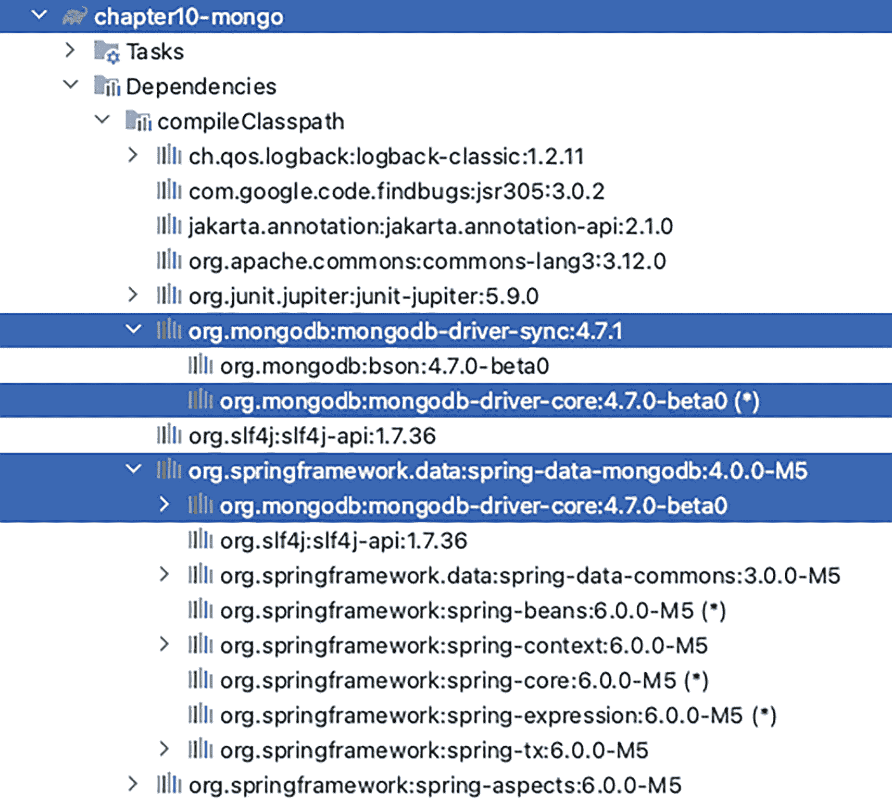
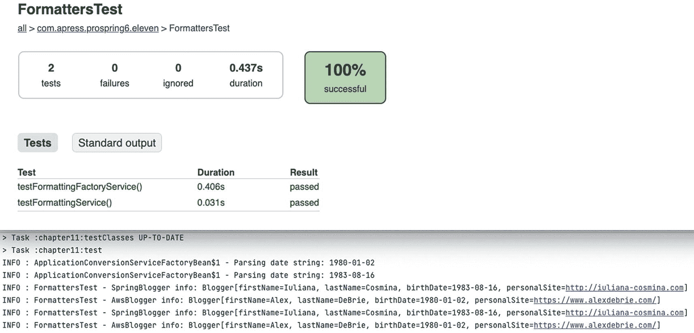
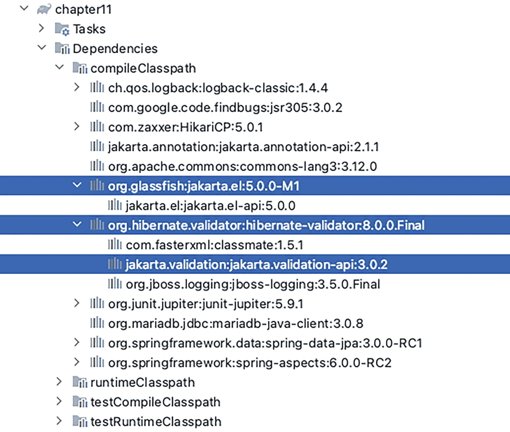
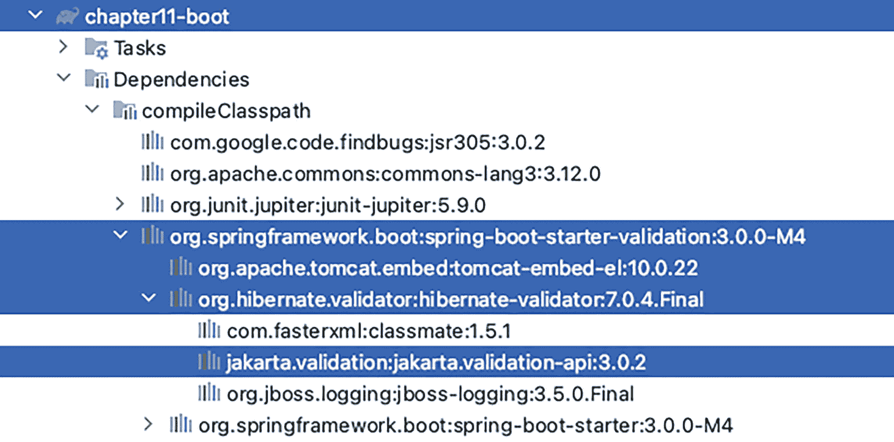
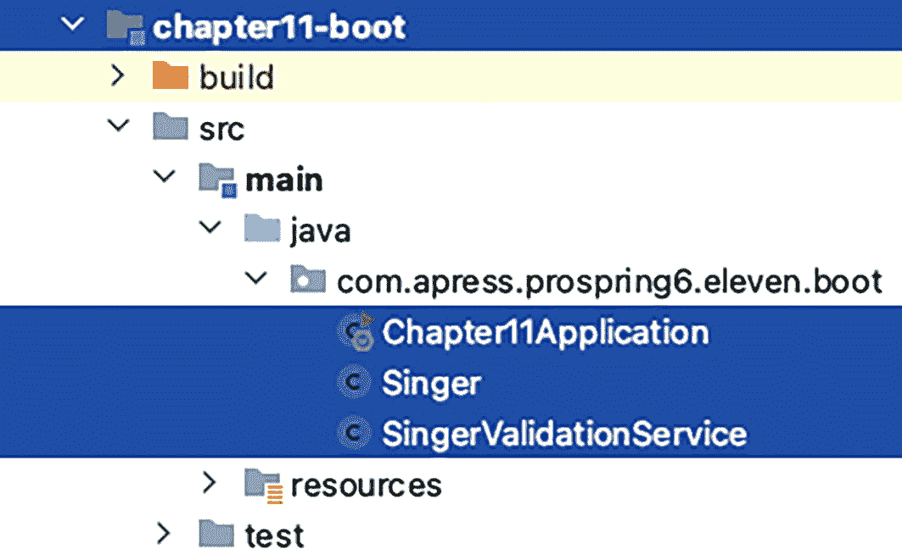
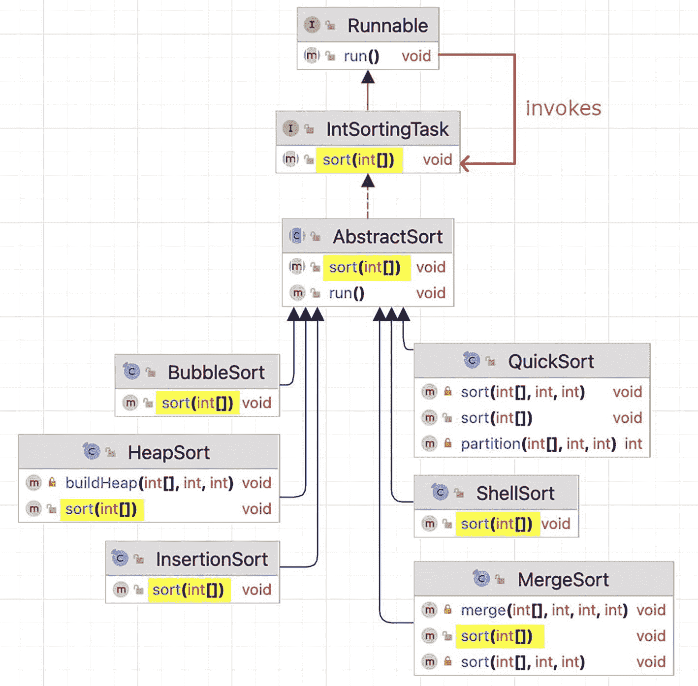
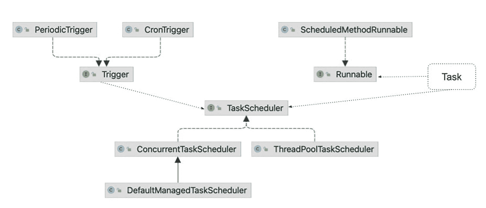

# 日志配置
logging:
pattern:
console: " %-5level: %class{0} - %msg%n"
level:
root: INFO
org.springframework.boot: DEBUG
com.apress.prospring6.ten.boot: DEBUG
org.springframework.orm.jpa: TRACE
清单 10-38
Spring Boot Data JPA 测试配置 yaml 文件
```

请注意，用于调试的 Hibernate 特定属性被设置为 `true`，并且日志配置更加详细。

Spring Boot 测试配置类使用 `@SpringBootTest` 注解以及设置测试上下文所需的其他注解，如清单 10-39 所示。

```
package com.apress.prospring6.ten.boot
import org.springframework.boot.test.context.SpringBootTest
import org.springframework.test.context.ActiveProfiles
import org.springframework.test.context.jdbc.Sql
import org.springframework.test.context.jdbc.SqlMergeMode
import org.testcontainers.junit.jupiter.Testcontainers
// 其他导入语句已省略
@ActiveProfiles("test")
@SqlMergeMode(SqlMergeMode.MergeMode.MERGE)
@Sql("classpath:testcontainers/drop-schema.sql", "classpath:testcontainers/create-schema.sql")
@SpringBootTest(classes = [Chapter10Application::class])
class Chapter10ApplicationTest {
@Autowired
var singerService: SingerService? = null
@Test
fun testFindAll() {
val singers = singerService!!.findAll().peek { s -> LOGGER.info(s.toString()) }
.toList()
Assertions.assertEquals(3, singers.size)
}
@Test
fun testFindAllWithAlbums() {
val singers = singerService!!.findAllWithAlbums()
.peek { s ->
LOGGER.info(s.toString())
s.albums.forEach { a -> LOGGER.info("\t" + a.toString()) }
}.toList()
Assertions.assertEquals(3, singers.size)
}
companion object {
private val LOGGER = LoggerFactory.getLogger(Chapter10Application::class.java)
}
}
清单 10-39
Spring Boot 数据测试类
```

告诉 Spring Boot 基于 `application-test.yaml` 中的配置初始化测试上下文的是 `@ActiveProfiles("test")`，它启用了 `test` 上下文。`@SpringBootTest(classes = [Chapter10Application::class])` 被显式配置为使用 `Chapter10Application` 配置。当只有一个 Spring Boot 测试类，且其名称恰好与 Spring Boot 配置类名称加上 `Test` 后缀相同时，这不是必需的，但在本书的示例中，为了更清晰，使用了这种形式，以便明确说明被测试 Bean 的配置来源。


### 使用 Spring Data JPA 的注意事项

利用 Spring Data JPA 的 Repository 抽象有助于简化 JPA 应用程序的开发。Spring Boot 可以进一步简化开发，但自定义配置可能需要一些学习成本。再次引用《我爱露西》中“终于到巴黎”这一集，**第** **6** **章**介绍过，Spring Data JPA 是链条中的最后一个翻译器。它的工作基于其前的翻译器：JDBC 驱动、JPA 和 Hibernate（以及类似的 Oracle TopLink 等），它使得编写 Kotlin 代码访问数据变得最为简单，因为它专注于业务逻辑，隐藏了技术复杂性和样板代码。所有这些技术层共同使得实现持久层变得相当简单和快速。Spring Data JPA 在自定义事务行为方面也带来了一些简便性。所有这些使得这一组合非常流行，尤其适用于大型企业项目，因为对于小型项目来说，它们可能过于复杂。此外，项目中引入的技术越多，开发者的学习曲线就越陡峭，并且在技术衔接处引入的故障点也越多。

到目前为止，本章已经介绍了 Spring Data JPA 仓库的核心概念和接口。JPA 适用于处理规范化的 SQL 数据库。那么，当处理非结构化、非强关系型且不适合 SQL 数据库的数据时，又该如何呢？Spring Data 是否为此提供了解决方案？当然有！你可以在下一节中了解相关内容。

## Spring Data 与 MongoDB^(⁹⁵)

几乎所有数据在某种程度上都是关系型的，多年来，通过外键等概念表示这些关系的 SQL 数据库一直主导着行业。然而，为了减少重复和存储成本而组织数据，在处理数据时会引入延迟，因为必须考虑关系。随着数据量的增长，描述关系的元数据量也会增长，操作会变得更慢。关系型数据库非常适合完成涉及大量表、复杂且庞大的查询，以及事务性操作至关重要（ACID）且速度并非总是必需的任务。其他好的用例包括大型级联删除以及维护关系和数据完整性。

在这个互联网新时代，速度是最常见的要求。SQL 数据库虽然在存储数据方面高效，并且在请求时提供数据非常精确和一致，但并不适合速度比数据完整性更重要的互联网服务。当你的数据不是强结构化的、数据关系不深、需要短时间保存数据（缓存）或查询不太复杂时，NoSQL 数据库就很有用。例如，eBay 使用 MongoDB，亚马逊使用 DynamoDB，这是一个为满足其自身商业需求而创建的 NoSQL 数据库，被认为是最适合购物网站的 NoSQL 数据库，因为它在亚马逊云中高度可定制、快速且可无限扩展。

因此，NoSQL 数据库的出现是为了满足快速获取数据的需求，即使数据并非总是一致。例如，当你访问亚马逊购物网站时，你不会期望立即看到最新的产品，但你最终会看到它们。此外，由于是非关系型的，NoSQL 数据库存在一些数据重复，因此数据完整性次于检索速度。

你需要记住的另一件事是，关系型数据库并不是真实系统的很好模型。它们迫使你在开始编写与数据库交互的代码之前就声明完整的数据结构，并且之后进行修改很棘手，这是一个问题，因为在现实生活中变化是不断发生的。NoSQL 的主要优势在于，除了每条记录的主标识符外，其他所有内容都可以在以后轻松修改。亚马逊的 DynamoDB 在这方面更进一步，因为除了主键之外，记录中所有其他列（称为*属性*）都可以因记录而异。不幸的是，这种灵活性水平意味着编写一个用于处理 DynamoDB 的 Spring Data 库几乎是不可能的。

由于 NoSQL 数据库已被广泛使用，因此增加一节关于 Spring 如何帮助与它们交互的内容是合适的。Spring 提供了相当多的用于处理 NoSQL 数据库的数据库，但我们最喜欢的是 MongoDB^(⁹⁶)，它提供了经典和响应式 API。除此之外，还支持 Apache Cassandra^(⁹⁷)（一个开源 NoSQL 数据库，能够快速处理海量数据）、Couchbase^(⁹⁸)（一个现代云数据库，在高度可扩展和可用的平台上为关键业务应用提供强大的功能）和 Redis^(⁹⁹)（一个开源、BSD 许可的内存数据结构存储，用作数据库、缓存和消息代理）。

最近，由于人们已经清楚完全非关系型的数据并不存在，NoSQL 这个术语的含义正逐渐从“非 SQL”转变为“不仅仅是 SQL”。因此，请随意探索 NoSQL 数据领域，因为你很可能会最终使用到这些数据库之一。


### MongoDB 概念

在本节中，你可以在自己的计算机上安装 MongoDB，但推荐的方式是使用 Docker，并按照 `chapter10-mongo` 项目中 `CHAPTER10-MONGO.adoc` 文件的建议设置容器。当然，你也可以完全跳过这一步，直接运行使用 Testcontainers MongoDB 容器的测试。

 水平线上火焰的插图。 若要将 MongoDB 用于商业项目，你必须购买付费方案。如果不想这样做，请使用更符合商业许可要求的产品，例如 Apache Cassandra。不过，两者的使用模式相似。因此，阅读并理解本书中关于 MongoDB 的部分，无论选择哪种方式都会有所帮助。

MongoDB 是一种面向文档的 NoSQL 数据库，用于存储大量数据。与传统关系型数据库使用表和行不同，MongoDB 使用集合和文档。集合中的文档不像表中的所有行那样具有固定的结构。

虽然我们已经提到 NoSQL 数据库的优势，但为了保持一致性，`Singer` 类被映射到一个名为 `singers` 的 MongoDB 集合。在 Spring 中，这是通过使用 `org.springframework.data.mongodb.core.mapping` 包中的 `@Document` 注解标注 `Singer` 类来实现的。该注解可用于配置与类名不同的集合名称，因为 MongoDB 的标准是使用文档类型的复数形式来命名集合。

`Singer` 类如代码清单 10-40 所示。

```
package com.apress.prospring6.ten.document
import org.springframework.data.mongodb.core.index.Indexed
import org.springframework.data.mongodb.core.mapping.Document
import org.springframework.data.mongodb.core.mapping.MongoId
import java.time.LocalDate
@Document(collection = "singers")
class Singer {
@MongoId
var id: String? = null
@Indexed
var firstName: String? = null
@Indexed
var lastName: String? = null
var birthDate: LocalDate? = null
constructor() {}
constructor(firstName: String?, lastName: String?, birthDate: LocalDate?) {
this.firstName = firstName
this.lastName = lastName
this.birthDate = birthDate
}
override fun toString(): String {
return "Singer{" +
"id='" + id + '\'' +
", firstName='" + firstName + '\'' +
", lastName='" + lastName + '\'' +
", birthDate=" + birthDate +
'}'
}
}
代码清单 10-40
配置为 MongoDB 文档的 Singer 类
```

MongoDB 要求所有文档都必须有一个 `_id` 字段。使用 Spring Data 时，映射到该字段的属性需要使用 `org.springframework.data.mongodb.core.mapping` 包中的 `@Id` 或 `@MongoId` 注解进行标注。`@MongoId` 注解本身被 `@Id` 元注解标注，虽然此处使用它只是为了明确表示该类映射到 MongoDB 文档，但它提供了使用 `@MongoId()` 配置字段类型的可能性。当这样注解时，Spring Data 会尝试将值转换为声明的类型。

`@Indexed` 注解告诉映射框架在该文档属性上调用 `createIndex(...)`，从而加快搜索速度。

如果文档中字段的名称需要与 Kotlin 类中的名称不同，你可以使用 `@Field` 注解来配置所需的值。

在 Spring 中，类型与 MongoDB 表示形式之间的映射是通过一组内置转换器完成的。这就是为什么我们可以声明 `LocalDate birthDate` 字段而无需任何转换注解的原因。

现在我们有了一个文档，下一步是创建一个用于处理歌手实例的仓库。该方法与 Spring Data JPA 中展示的方法类似。在 Spring Data MongoDB 中，有一个 `MongoRepository<T, ID>` 接口，它是 `org.springframework.data.repository` 包中 `CrudRepository<T, ID>` 接口的扩展（还有一个响应式版本，但将在**第** **20** **章**中详细介绍），我们的 `SingerRepository` 接口必须扩展该接口。`SingerRepository` 接口如代码清单 10-41 所示。

```
package com.apress.prospring6.ten.repos
import com.apress.prospring6.ten.document.Singer
import org.springframework.data.mongodb.repository.MongoRepository
import org.springframework.data.mongodb.repository.Query
import org.springframework.data.repository.query.Param
import java.time.LocalDate
interface SingerRepository : MongoRepository {
fun findByFirstName(firstName: String): Iterable
@Query("{'firstName' : ?0, 'lastName' : ?1}")
fun findByPositionedParams(fn: String, ln: String): Iterable
@Query("{'firstName' : :#{#fn}, 'lastName' : :#{#ln}}")
fun findByNamedParams(
@Param("fn") fn: String,
@Param("ln") ln: String
): Iterable
}
代码清单 10-41
SingerRepository MongoDB 数据仓库接口
```

这里介绍的 `SingerRepository` 接口包含两个 MongoDB 自定义查询。编写 MongoDB 查询表达式时，参数可以按位置指定，也可以像 SQL 查询那样命名。唯一的区别是查询表达式的语法；MongoDB 查询本质上是 JSON 对象。`findByPositionedParams(..)` 方法使用与参数顺序匹配的索引，`?0` 对应方法中的第一个参数，参数的值将替换 `?0`。这意味着开发人员必须跟踪位置，不要混淆它们，因为虽然 MongoDB 不会报错，但它不会返回预期的结果。然而，查询表达式非常简单，因此这是推荐的方法。

也可以使用命名参数，通过 `@Param` 注解和 SpEL 表达式来引用它们。表达式更复杂且冗长，但这种方法更灵活，并且没有错误定位参数的风险。选择你更习惯的选项即可。

正如我们已经习惯的那样，`SingerService` Bean 用于调用仓库方法，其实现是基础的，这里不再赘述。重要的是用于连接 MongoDB 实例并启用 Spring Data MongoDB 仓库支持的 Spring 配置。要使用的 `@Configuration` 类如代码清单 10-42 所示。


```
// 文件 mongo.properties：
mongo.url=mongodb://localhost:27017/musicdb
mongo.db=musicdb
mongo.user=prospring6
mongo.password=prospring6
mongo.authSource=admin
package com.apress.prospring6.ten.config
import com.mongodb.client.MongoClients
import com.mongodb.client.MongoClient
@ComponentScan(basePackages = ["com.apress.prospring6.ten.service"])
@EnableMongoRepositories(basePackages = ["com.apress.prospring6.ten.repos"])
@Configuration
@PropertySource("classpath:mongo.properties")
// 我们不能使用该注解，因为为简化起见，docker 中的 MongoDB 并未以副本集方式启动：
// @EnableTransactionManagement
open class MongoCfg : AbstractMongoClientConfiguration() {
@Value("\${mongo.url}")
private val url: String? = null
@Value("\${mongo.db}")
private val database: String? = null
@Value("\${mongo.user}")
private val user: String? = null
@Value("\${mongo.password}")
private val password: String? = null
@Value("\${mongo.authSource}")
private val authSource: String? = null
override fun getMappingBasePackages() =
mutableSetOf("com.apress.prospring6.ten.document")
@Bean
open fun transactionManager(dbFactory: MongoDatabaseFactory?):
MongoTransactionManager {
return MongoTransactionManager(dbFactory!!)
}
override fun getDatabaseName(): String = database!!
override fun autoIndexCreation(): Boolean {
return true
}
override fun mongoClientSettings(): MongoClientSettings {
val builder = MongoClientSettings.builder()
builder.applyConnectionString(ConnectionString(url!!))
.credential(
MongoCredential.createScramSha1Credential(
user!!,
authSource!!,
password!!.toCharArray()))
this.configureClientSettings(builder)
return builder.build()
}
}
清单 10-42
Mongo 配置 Bean 声明
```

`MongoClientSettings` 构建器用于根据连接字符串和其他提供的参数在内部创建 `MongoClient` 实例。同时，请查看源码包资源集合中的属性文件。

通过使用 `@EnableMongoRepositories` 注解配置类，即可启用对 MongoDB 数据仓库的支持。如果未配置基础包，基础设施将扫描该注解配置类所在的包。

这里需要提及的一点是，从 MongoDB 4.0 开始，也支持事务。事务建立在 `Sessions` 之上，因此需要一个活跃的 `com.mongodb.session.ClientSession`。如果未配置事务管理器 Bean，则事务功能将被禁用。

Spring 提供了 `MongoTransactionManager` 类用于 MongoDB 事务管理。`MongoTransactionManager` 类会将 `ClientSession` 绑定到当前线程。`MongoTemplate` 会检测该会话，并基于这些与事务相关联的资源进行操作。由于 Spring Data MongoDB 仓库由 `MongoTemplate` Bean 支持，因此其方法会在事务上下文中执行。

至于项目依赖，由于所有这些类都必须来自某个地方，项目的主要依赖是 `spring-data-mongodb` 和 `mongodb-driver-sync` 库。`mongodb-driver-sync` 库是 `mongodb-driver-core` 的一个封装，用于在与 MongoDB 实例交互时提供经典行为。此外，`mongodb-driver-reactivestreams` 库中还提供了一个提供响应式行为的封装。

图 10-7 展示了 `chapter10-mongo` 项目的依赖关系。



第 10 章 mongo 项目的依赖列表从上到下突出显示了四个项目：mongodb-driver-sync、mongodb-driver-core、spring-data-mongodb 和 mongodb-driver-core。

图 10-7

显示 `chapter10-mongo` 项目依赖关系的 Gradle 视图

由于 Spring Data 在 API 上的一致性，为 Spring Data Mongo 应用程序编写测试与为 Spring Data JPA 应用程序编写测试并无区别。

如果你对使用 Spring 和 MongoDB 感兴趣，Spring 官方文档^(¹⁰⁰) 和 MongoDB 官方文档^(¹⁰¹) 内容详实且易于理解。同时，欢迎尝试 Spring Boot MongoDB 启动器。本书仓库中提供了一个简单的项目示例。

## 使用 Spring Data 的考量

无论你是使用 Spring Data JPA、MongoDB 还是其他针对特定数据库的模块，Spring Data 都能大大减少你需要完成的工作量。再加上 Spring Boot，甚至连配置工作也能显著减少。然而，要真正发挥 Spring Data 的强大功能，你必须理解其所有构建模块。本书有助于实现这一目标，因为它逐步构建了所有层次，向你展示了通过正确使用 Spring 所提供的全部功能所能节省的工作量。

尽管如此，根据项目的规模和范围，使用 Spring Data 可能有些大材小用，因此在开始编写应用程序之前请考虑这一点。这就像为你 83 岁、只需要打电话和接电话、并且因为关节炎可能经常摔手机的奶奶选择一部智能手机。给她买一部昂贵、复杂、易碎且提供大量她永远不会使用的功能的手机毫无意义，而一部翻盖手机就能满足她所有的需求。因此，请根据项目试图满足的需求来选择合适的工具。


## 总结

由于这是数据访问系列章节的最后一章，因此有必要进行一个总体总结：

*   JPA 是一个规范，它定义了用于对象关系映射和管理持久化对象的 API。在 Oracle 决定将其开源并捐赠给 Jakarta 之前，它一直是 JEE 的一部分。这触发了包名从 `javax` 到 `jakarta` 的重命名。

*   所有 JPA 实现，如 Hibernate 和 EclipseLink 的最新版本，都已与新规范保持一致。

*   Spring Data JPA 在 JPA 之上增加了一层，并使用其所有特性，如实体、关联映射、实体生命周期管理，并增加了自己的特性，如 Spring Data 无代码仓库。

*   有多个 Spring Data 库，每个库都旨在减少使用特定数据库时的样板代码。Spring Data JPA 适用于任何关系型数据库。对于 NoSQL 数据库，有多个库可用于 MongoDB、CouchBase、Redis 等。

*   通过声明一个 `TransactionManager` bean 并使用 Spring 的 `@Transactional` 注解来注解服务类和方法，可以轻松配置事务行为。对于关系型数据库和非关系型数据库，其配置方式相同，唯一的区别在于 `TransactionManager` 的类型。

*   Spring Data Boot 启动器通过减少配置应用程序所需编写的代码，降低了与数据库交互所需的工作量。

*   Testcontainers 是一个用于测试需要数据库的 Spring 应用程序的出色工具，因为它易于设置，允许你重用大部分生产范围的配置。这使你能够在尽可能接近生产环境的测试上下文中运行集成测试。当然，它要求你安装 Docker 并能访问互联网，以便在需要时拉取容器镜像。

数据访问系列章节到此结束。

脚注 1   2   3   4   5   6   7   8   9   10   11   12   13   14   15   16   17   18

# 11. 验证、格式化和类型转换

在企业级应用中，验证至关重要。验证的目的是确保正在处理的数据满足所有预定义的业务需求，并保证数据在其他应用层中的完整性和可用性。

在应用程序开发中，数据验证总是与转换和格式化一同被提及。原因是数据源的格式很可能与应用程序中使用的格式不同。例如，在 Web 应用中，用户在 Web 浏览器前端输入信息。当用户保存该数据时，数据会被发送到服务器（在本地验证完成后）。在服务器端，会执行一个数据绑定过程，在此过程中，根据为每个属性定义的格式化规则（例如，日期格式模式为 `yyyy-MM-dd`），从 HTTP 请求中提取、转换数据，并将其绑定到相应的领域对象（例如，用户在 HTML 表单中输入歌手信息，然后该信息被绑定到服务器端的 `Singer` 对象）。当数据绑定完成后，验证规则会被应用于领域对象，以检查是否存在任何约束违规。如果一切顺利，数据将被持久化，并向用户显示成功消息。否则，验证错误消息会被填充并显示给用户。

在本章的第一部分，你将学习 Spring 如何为类型转换、字段格式化和验证提供复杂的支持。具体来说，本章涵盖以下主题：

*   *Spring 类型转换系统和 Formatter 服务提供者接口 (SPI)*：我们将介绍通用类型转换系统和 Formatter SPI。我们将介绍如何使用这些新服务来替代之前的 `PropertyEditor` 支持，以及它们如何在任何 Kotlin 类型之间进行转换。

*   *Spring 中的验证*：我们将讨论 Spring 如何支持领域对象验证。首先，我们简要介绍 Spring 自己的 Validator 接口。然后，我们重点介绍 JSR-349（Bean 验证）支持。

## Spring 类型转换系统

在 Spring 3 中，引入了一个新的类型转换系统，为在 Spring 驱动的应用程序中在任何 Java 类型之间进行转换提供了一种强大的方式。所有类都位于 `org.springframework.core.convert` 包中。本节将展示这个新服务如何执行之前 `PropertyEditor` 支持所提供的相同功能，以及它如何支持任何 Kotlin 类型之间的转换。我们还将演示如何使用 Converter SPI 实现自定义类型转换器。


### 使用 `PropertyEditors` 从 `String` 进行转换

**第** **4****章**介绍了 Spring 如何通过支持 `PropertyEditors`，将属性文件中的 `String` 转换为 POJO 的属性。我们在此快速回顾一下，然后介绍 Spring 的 Converter SPI（自 3.0 起可用）如何提供更强大的替代方案。

清单 11-1 展示了一个名为 `Blogger` 的记录。我们使用记录（或 Kotlin 中的*数据类*），因为我们知道不打算以任何方式修改这些 bean，也不需要代理它们。此外，使用记录还能减少我们需要编写的代码。

```
package com.apress.prospring6.eleven.domain
import java.net.URL
import java.time.LocalDate
data class Blogger (val firstName:String?, val lastName:String?, val birthDate:LocalDate,
val personalSite:URL)
清单 11-1
包含多种字段类型的 Blogger 记录
```

对于 `birthDate` 属性，使用了 `java.time.LocalDate` 类型。此外，还有一个 URL 类型的字段，用于指示博主的个人网站（如果适用）。假设我们想在 Spring 的 `ApplicationContext` 中构造 `Blogger` 实例，其值存储在 Spring 配置或属性文件中。为了实用，`AppConfig` 类声明了两个 `Blogger` bean：`awsBlogger`，它通过使用硬编码值的 `@Value` 注解注入属性值来创建；以及 `springBlogger`，它通过使用从 `blogger.properties` 配置文件中读取值的 `@Value` 注解注入属性值来创建。该属性文件使用**第** **4****章**介绍的 `@PropertySource` 注解进行配置。`AppConfig` 类如清单 11-2 所示，`blogger.properties` 文件的内容在第一个注释中给出。

```
package com.apress.prospring6.eleven
import org.springframework.beans.factory.annotation.Value
import org.springframework.context.annotation.Bean
import org.springframework.context.annotation.Configuration
import org.springframework.context.annotation.PropertySource
import java.net.URL
import java.time.LocalDate
/*
springBlogger.firstName=Iuliana
springBlogger.lastName=Cosmina
springBlogger.birthDate=1983-08-16
springBlogger.personalSite=https://iuliana-cosmina.com
*/
@PropertySource("classpath:blogger.properties")
@Configuration
open class AppConfig {
@Bean
@Throws(Exception::class)
open fun awsBlogger(
@Value("Alex") firstName: String?,
@Value("DeBrie") lastName: String?,
@Value("https://www.alexdebrie.com/") personalSite: URL?,
@Value("1980-01-02") birthDate: LocalDate?
): Blogger { // 我真的不知道他的生日是哪天 ;)
return Blogger(firstName!!, lastName!!, birthDate!!, personalSite!!)
}
@Bean
@Throws(Exception::class)
open fun springBlogger(
@Value("\${springBlogger.firstName}") firstName: String?,
@Value("\${springBlogger.lastName}") lastName: String?,
@Value("\${springBlogger.personalSite}") personalSite: URL?,
@Value("\${springBlogger.birthDate}") birthDate: LocalDate?
): Blogger {
return Blogger(firstName!!, lastName!!, birthDate!!, personalSite!!)
}
}
清单 11-2
声明两个 Blogger Bean 的 Spring 配置类
```

尝试基于 `AppConfig` 类创建应用上下文将会失败，并显示堆栈跟踪，明确指出 Spring 无法将日历日期的文本表示转换为 `java.time.LocalDate`：

```
org.springframework.beans.factory.UnsatisfiedDependencyException:
Error creating bean with name 'awsBlogger' defined in com.apress.prospring6.eleven.AppConfig:
Unsatisfied dependency expressed through method 'awsBlogger' parameter 3:
Failed to convert value of type 'java.lang.String' to required type 'java.time.LocalDate';
Cannot convert value of type 'java.lang.String' to required type 'java.time.LocalDate':
no matching editors or conversion strategy found
at app//org.springframework.beans.factory.support.ConstructorResolver.createArgumentArray(ConstructorResolver.java:774)
Caused by: java.lang.IllegalStateException:
Cannot convert value of type 'java.lang.String' to required type 'java.time.LocalDate':
no matching editors or conversion strategy found at
org.springframework.beans.TypeConverterDelegate.convertIfNecessary(TypeConverterDelegate.java:262)
```

要解决此问题，我们需要告诉 Spring 如何将日历日期的文本表示转换为 `java.time.LocalDate`。我们可以通过使用 `PropertyEditorSupport` 的扩展来实现，例如清单 11-3 中所示的 `LocalDatePropertyEditor`。

```
package com.apress.prospring6.eleven.property.editor
import java.beans.PropertyEditorSupport
import java.time.LocalDate
import java.time.format.DateTimeFormatter
class LocalDatePropertyEditor : PropertyEditorSupport() {
private val dateFormat = DateTimeFormatter.ofPattern("yyyy-MM-dd")
@Throws(IllegalArgumentException::class)
override fun setAsText(text: String) {
value = LocalDate.parse(text, dateFormat)
}
}
清单 11-3
LocalDatePropertyEditor 类
```

一个 `CustomEditorConfigurer` bean 需要成为配置的一部分，以注册我们的自定义属性编辑器：`LocalDatePropertyEditor`。Spring 2 中引入的旧式方法是声明一个 `PropertyEditorRegistrar` bean，该 bean 将 `LocalDatePropertyEditor` 实例映射到正确的类型，在本例中为 `LocalDate`。借助 lambda 表达式的魔力，可以在一行中创建一个实现 `PropertyEditorRegistrar` 的自定义类型的 bean。清单 11-4 显示了配置类，它声明了所有必要的 bean，以启用文本表示到 `LocalDate` 的正确转换。

```
package com.apress.prospring6.eleven.property.editor
import org.springframework.beans.PropertyEditorRegistrar
import org.springframework.beans.factory.config.CustomEditorConfigurer
import java.time.LocalDate;
// 其他导入语句已省略
@Configuration
open class CustomRegistrarCfg {
@Bean
open fun registrar(): PropertyEditorRegistrar {
return PropertyEditorRegistrar { registry: PropertyEditorRegistry ->
registry.registerCustomEditor(
LocalDate::class.java, LocalDatePropertyEditor()
)
}
}
@Bean
open fun customEditorConfigurer(): CustomEditorConfigurer {
val cus = CustomEditorConfigurer()
val registrars = arrayOfNulls(1)
registrars[0] = registrar()
cus.setPropertyEditorRegistrars(registrars)
return cus
}
}
清单 11-4
PropertyEditorRegistrar 类
```

要测试此类，我们只需基于 `AppConfig` 和 `CustomRegistrarCfg` 类构建一个应用上下文，检索两个博主 bean，并将其属性打印到控制台。这可以使用测试方法完成，如清单 11-5 所示。


```
package com.apress.prospring6.eleven
class ConvertersTest {
@Test // 旧方法
fun testCustomPropertyEditorRegistrar() {
AnnotationConfigApplicationContext(
AppConfig::class.java,
CustomRegistrarCfg::class.java
).use { ctx ->
val springBlogger = ctx.getBean("springBlogger", Blogger::class.java)
LOGGER.info("SpringBlogger info: {}", springBlogger)
val awsBlogger = ctx.getBean("awsBlogger", Blogger::class.java)
LOGGER.info("AwsBlogger info: {}", awsBlogger)
}
}
companion object {
private val LOGGER = LoggerFactory.getLogger(ConvertersTest::class.java)
}
}
// 预期输出
INFO ConvertersTest -
SpringBlogger info: Blogger{ firstName='Iuliana',
lastName='Cosmina',
birthDate=1983-08-16,
personalSite=https://iuliana-cosmina.com}
INFO ConvertersTest -
AwsBlogger info: Blogger{firstName='Alex',
lastName='DeBrie',
birthDate=1980-01-02,
personalSite=https://www.alexdebrie.com/}
清单 11-5
用于测试 LocalDatePropertyEditor 的 ConvertersTest 类和方法
```

运行此方法时，上下文应成功创建，并从上下文中检索并打印出两个 Bean。

该过程还有另一个版本，它需要一个类型为 `CustomEditorConfigurer` 的单一 Bean，该 Bean 通过将自定义属性编辑器映射到特定类型来注册它，并且不需要 `PropertyEditorRegistrar`，如清单 11-6 中的配置类所示。

```
package com.apress.prospring6.eleven.property.editor
import org.springframework.beans.factory.config.CustomEditorConfigurer
// 其他导入语句已省略
@Configuration
open class CustomEditorCfg {
@Bean
open fun customEditorConfigurer(): CustomEditorConfigurer {
val cus = CustomEditorConfigurer()
cus.setCustomEditors(mapOf(LocalDate::class.java to
LocalDatePropertyEditor::class.java))
return cus
}
}
清单 11-6
CustomEditorCfg 类
```

这是旧的做法。新的做法涉及 `org.springframework.core.convert` 包中的类，将在下一节讨论。

## 介绍 Spring 类型转换

Spring 3.0 引入了一个通用的类型转换系统，它位于 `org.springframework.core.convert` 包下。除了提供 `PropertyEditor` 支持的替代方案外，类型转换系统还可以配置为在任何 Kotlin 类型和 POJO 之间进行转换（而 `PropertyEditor` 专注于将属性文件中的 `String` 表示形式转换为 Java/Kotlin 类型）。

### 实现自定义转换器

为了演示类型转换系统的实际应用，让我们重新审视前面的示例，并使用相同的 `Blogger` 类。假设这次我们想使用类型转换系统将 `String` 格式的日期转换为博主的 `birthDate` 属性，该属性的类型是 `LocalDate`。为了支持这种转换，我们不是创建自定义的 `PropertyEditor`，而是通过实现 `org.springframework.core.convert.converter.Converter<S,T>` 接口来创建一个自定义转换器。清单 11-7 中的代码片段展示了这个自定义转换器。

```
package com.apress.prospring6.eleven.converter.bean
import org.springframework.core.convert.converter.Converter
import java.time.LocalDate
import java.time.format.DateTimeFormatter
class LocalDateConverter : Converter {
private val dateFormat = DateTimeFormatter.ofPattern("yyyy-MM-dd")
override fun convert(source: String): LocalDate {
return LocalDate.parse(source, dateFormat)
}
}
清单 11-7
LocalDateConverter 实现
```

我们实现了 `Converter<String, DateTime>` 接口，这意味着该转换器负责将 `String`（源类型 S）转换为 `LocalDate` 类型（目标类型 T）。

为了使用这个转换器而不是 `PropertyEditor`，我们需要在 Spring 的 `ApplicationContext` 中配置一个 `org.springframework.core.convert.ConversionService` 接口的实例。清单 11-8 展示了 Kotlin 配置类。

```
package com.apress.prospring6.eleven.converter.bean
import org.springframework.context.support.ConversionServiceFactoryBean
// 其他导入语句已省略
@Configuration
@ComponentScan
open class ConverterCfg {
@Bean
open fun conversionService(): ConversionServiceFactoryBean {
val conversionServiceFactoryBean = ConversionServiceFactoryBean()
val convs = mutableSetOf(
LocalDateConverter())
conversionServiceFactoryBean.setConverters(convs)
conversionServiceFactoryBean.afterPropertiesSet()
return conversionServiceFactoryBean
}
}
清单 11-8
用于使用转换器实现的 Kotlin 配置类
```

这里，我们通过声明一个类为 `ConversionServiceFactoryBean` 的 `conversionService` Bean，来指示 Spring 使用类型转换系统。这种类型的 Bean 将多个转换服务分组。如果没有定义转换服务 Bean，Spring 将使用基于 `PropertyEditor` 的系统。

默认情况下，类型转换服务支持常见类型之间的转换，包括字符串、数字、枚举、集合、映射等。此外，也支持在基于 `PropertyEditor` 的系统中从 `Strings` 到 Java/Kotlin 类型的转换。

测试方法与前面清单 11-5 中展示的方法几乎相同，唯一的区别是将 `CustomRegistrarCfg` 类替换为 `ConverterCfg`。


### 任意类型之间的转换

类型转换系统的真正强大之处在于能够在任意类型之间进行转换。清单 11-9 介绍了仅包含两个字段的记录 `SimpleBlogger`，以及将 `Blogger` 实例转换为 `SimpleBlogger` 实例的转换器实现。

```
package com.apress.prospring6.eleven.domain
import com.apress.prospring6.eleven.Blogger
import org.springframework.core.convert.converter.Converter
import java.net.URL
data class SimpleBlogger (val fullName:String, val personalSite:URL) {
class BloggerToSimpleBloggerConverter : Converter {
override fun convert(source:Blogger):SimpleBlogger =
SimpleBlogger(source.firstName + " " + source.lastName, source.personalSite)
}
}
清单 11-9
SimpleBlogger 记录与转换器
```

要将此转换器添加到应用程序上下文配置中，需要将 `BloggerToSimpleBloggerConverter` 的实例添加到 `ConversionServiceFactoryBean` 的转换器集合中，如清单 11-10 所示。

```
package com.apress.prospring6.eleven.converter.bean
// 导入语句已省略
@Configuration
@ComponentScan
open class ConverterCfg {
@Bean
open fun conversionService(): ConversionServiceFactoryBean {
val conversionServiceFactoryBean = ConversionServiceFactoryBean()
val convs = mutableSetOf(
LocalDateConverter(),
SimpleBlogger.BloggerToSimpleBloggerConverter())
conversionServiceFactoryBean.setConverters(convs)
conversionServiceFactoryBean.afterPropertiesSet()
return conversionServiceFactoryBean
}
}
清单 11-10
注册 SimpleBlogger 类与转换器
```

要测试此转换器，我们需要从上下文中检索转换器 bean，并将其中一个 `Blogger` 实例转换为 `SimpleBlogger` 实例，如清单 11-11 所示。

```
package com.apress.prospring6.eleven
import org.springframework.core.convert.ConversionService
class ConvertersTest {
@Test
fun testConvertingToSimpleBlogger() {
AnnotationConfigApplicationContext(AppConfig::class.java,
ConverterCfg::class.java).use { ctx ->
val springBlogger = ctx.getBean("springBlogger", Blogger::class.java)
LOGGER.info("SpringBlogger info: {}", springBlogger)
val conversionService =
ctx.getBean(
ConversionService::class.java
)
val simpleBlogger =
conversionService.convert(springBlogger, SimpleBlogger::class.java)
LOGGER.info("simpleBlogger info: {}", simpleBlogger)
}
}
...
companion object {
private val LOGGER = LoggerFactory.getLogger(ConvertersTest::class.java)
}
}
// 预期输出
INFO ConvertersTest - SpringBlogger info:
Blogger[firstName=Iuliana,
lastName=Cosmina,
birthDate=1983-08-16,
personalSite=https://iuliana-cosmina.com]
INFO ConvertersTest - simpleBlogger info:   SimpleBlogger[fullName=Iuliana Cosmina,
personalSite=https://iuliana-cosmina.com]
清单 11-11
转换为 SimpleBlogger
```

你可能已经注意到，`personalSite` 字段从 `String` 到 [`java.net`](http://java.net)`.URL` 的转换是自动完成的。这是因为 Spring 默认注册了一组转换器，用于处理最常见的开发用例（例如，从表示逗号分隔列表项的字符串转换为 `Array`，从 `List` 转换为 `Set` 等）。

借助 Spring 的类型转换服务，你可以轻松创建自定义转换器，并在应用程序的任何层执行转换。一个可能的用例是，你有两个系统包含相同的博主信息需要更新，但数据库结构不同（例如，系统 A 有两个字段名，而系统 B 只有一个字段等）。你可以在持久化到各个系统之前，使用类型转换系统来转换对象。

从 Spring 3.0 开始，Spring MVC 大量使用了转换服务（以及下一节讨论的 Formatter SPI）。在 Web 应用程序上下文配置中，使用 `@EnableWebMvc`（Spring 3.1 引入）注解的 Java/Kotlin 配置类会自动注册所有默认转换器（例如，`StringToArrayConverter`、`StringToBooleanConverter` 和 `StringToLocaleConverter`，它们都位于 `org.springframework.core.convert.support` 包下）和格式化器（例如，`CurrencyStyleFormatter`、`DateFormatter` 和 `AbstractNumberFormatter`，它们都位于 `org.springframework.format` 包下的各个子包中）。更多细节将在**第** **14** **章**讨论 Spring Web 应用程序开发时介绍。

## Spring 中的字段格式化

除了类型转换系统，Spring 为开发者带来的另一个重要特性是 Formatter SPI。正如你所料，这个 SPI 可以帮助配置字段格式化方面。在 Formatter SPI 中，实现格式化器的主要接口是 `org.springframework.format.Formatter<T>` 接口。Spring 提供了几种常用类型的实现，包括 `CurrencyStyleFormatter`、`DateFormatter`、`AbstractNumberFormatter` 和 `PercentStyleFormatter`。


### 实现自定义格式化器

实现自定义格式化器也很简单。我们将使用相同的 `Blogger` 记录，但不再使用转换器，而是实现一个自定义格式化器，用于将 `birthDate` 属性的 `LocalDate` 类型与 `String` 类型进行相互转换。这需要继承 Spring 的 `org.springframework.format.support.FormattingConversionServiceFactoryBean` 类，并提供我们自定义的格式化器。`FormattingConversionServiceFactoryBean` 类是一个工厂类，它提供了便捷的方式来访问底层的 `FormattingConversionService` 类，该类支持类型转换系统，并根据为每个字段类型定义的格式化规则进行字段格式化。

在清单 11-12 中，你可以看到一个自定义类，它继承了 `FormattingConversionServiceFactoryBean` 类，并为格式化 Java 的 `LocalDate` 类型定义了一个自定义格式化器。请注意，该格式化器可以通过日期模式进行配置。

```
package com.apress.prospring6.eleven.formatter.factory
import org.springframework.format.Formatter
import org.springframework.format.support.FormattingConversionServiceFactoryBean
// 其他 import 语句已省略
@Service("conversionService")
class ApplicationConversionServiceFactoryBean :
FormattingConversionServiceFactoryBean() {
private var dateTimeFormatter: DateTimeFormatter? = null
@set:Autowired(required = false)
var datePattern = DEFAULT_DATE_PATTERN
private val formatters: MutableSet> = mutableSetOf()
@PostConstruct
fun init() {
dateTimeFormatter = DateTimeFormatter.ofPattern(datePattern)
formatters.add(getDateTimeFormatter())
setFormatters(formatters)
}
private fun getDateTimeFormatter(): Formatter {
return object : Formatter {
@Throws(ParseException::class)
override fun parse(source: String, locale: Locale): LocalDate {
LOGGER.info("正在解析日期字符串: $source")
return LocalDate.parse(source, dateTimeFormatter)
}
override fun print(source: LocalDate, locale: Locale): String {
LOGGER.info("正在格式化日期时间: $source")
return source.format(dateTimeFormatter)
}
}
}
companion object {
private val LOGGER = LoggerFactory.getLogger(
ApplicationConversionServiceFactoryBean::class.java
)
private const val DEFAULT_DATE_PATTERN = "yyyy-MM-dd"
}
}
清单 11-12
ApplicationConversionServiceFactoryBean 实现
```

在清单 11-12 中，你可以轻松找到自定义格式化器。它实现了 `Formatter<LocalDate>` 接口，并实现了该接口定义的两个方法。`parse(..)` 方法将 `String` 格式解析为 `LocalDate` 类型（同时传递了 locale 参数以支持本地化），而 `LOGGER.info(..)` 方法则用于将 `LocalDate` 实例格式化为 `String`。日期模式可以注入到 bean 中（否则将使用默认值 `yyyy-MM-dd`）。此外，在 `init()` 方法中，通过调用 `setFormatters()` 方法注册了自定义格式化器。你可以根据需要添加任意数量的格式化器。

由于 `ApplicationConversionServiceFactoryBean` 被配置为一个 bean，使用它的最简单方法就是使用 `AppConfig` 类和这个 bean 创建一个注解上下文。清单 11-13 展示了一个测试方法，该方法创建了这个上下文并打印了两个 `Blogger` bean。

```
package com.apress.prospring6.eleven
// import 语句已省略
class FormattersTest {
@Test
fun testFormattingFactoryService() {
AnnotationConfigApplicationContext(
AppConfig::class.java,
ApplicationConversionServiceFactoryBean::class.java
).use { ctx ->
val springBlogger = ctx.getBean("springBlogger", Blogger::class.java)
LOGGER.info("SpringBlogger 信息: {}", springBlogger)
val awsBlogger = ctx.getBean("awsBlogger", Blogger::class.java)
LOGGER.info("AwsBlogger 信息: {}", awsBlogger)
}
}
companion object {
private val LOGGER = LoggerFactory.getLogger(FormattersTest::class.java)
}
}
清单 11-13
ApplicationConversionServiceFactoryBean 测试
```

此测试的目的是展示应用上下文已正确创建，并且两个 `Blogger` bean 也已正确创建。

 一个代表想法的符号，由电灯泡表示。 这个方法看起来可能不像一个测试，因为没有断言语句，但该方法本质上是在测试配置中所有 bean 都已正确配置的假设。如果你运行 Gradle 构建，系统会为你生成一个非常漂亮的包含测试结果的网页。图 11-1 展示了这个页面以及显示这些测试通过的控制台执行日志。



Formatters 测试的截图。数据显示：2 个测试，0 个失败，0 个忽略，耗时 0.437 秒，成功率 100%。它有 2 个标签页：测试和标准输出。测试标签页被选中。其后是一个包含 3 列 2 行的表格，以及包含任务和信息的代码。

图 11-1

Gradle 测试结果页面和日志，显示 `FormattersTest` 下的测试方法通过

执行 `testFormattingFactoryService()` 的输出证明，将文本表示转换为 `LocalDate` 的职责已由 `Formatter<LocalDate>` 实例接管。

`Formatter<T>` SPI 是一个组合接口，它继承了 `Printer<T>` 和 `Parser<T>` 接口。这三个接口都属于 `org.springframework.format` 包。清单 11-12 中 `Formatter<LocalDate>` 实现的每个方法都由这些接口之一提供。这三个接口如清单 11-14 所示。

```
// ---- Formatter.java ----
package org.springframework.format;
public interface Formatter extends Printer, Parser {
}
// ---- Printer.java ----
@FunctionalInterface
public interface Printer {
String print(T fieldValue, Locale locale);
}
// ---- Parser.java ----
import java.text.ParseException;
import java.util.Locale;
@FunctionalInterface
public interface Parser {
T parse(String clientValue, Locale locale) throws ParseException;
}
清单 11-14
Spring 格式化 SPI 接口
```

每当你需要一个格式化器时，你所要做的就是实现 `Formatter<T>` 接口，并用所需的类型参数化它，然后通过使用自定义的 `FormattingConversionServiceFactoryBean` 或声明一个 `FormattingConversionService` 类型的 bean 并将格式化器实例添加到其中，将其添加到 Spring 配置中。最简单的方法是使用 `DefaultFormattingConversionService`，它是 `FormattingConversionService` 的一个开箱即用的特化版本，默认配置了适用于大多数应用程序的转换器和格式化器。

清单 11-15 展示了 `FormattingServiceCfg`，它声明了一个名为 `conversionService` 的 bean，该 bean 是一个 `DefaultFormattingConversionService`，并向其中添加了 `Formatter<LocalDate>` 实现。


```
package com.apress.prospring6.eleven.formatter
import org.springframework.format.Formatter
import org.springframework.format.support.DefaultFormattingConversionService
import org.springframework.format.support.FormattingConversionService
// 其他导入语句已省略
@Configuration
open class FormattingServiceCfg {
@Bean
open fun conversionService(): FormattingConversionService {
val formattingConversionServiceBean = DefaultFormattingConversionService(true)
formattingConversionServiceBean.addFormatter(localDateFormatter())
return formattingConversionServiceBean
}
private fun localDateFormatter(): Formatter {
return object : Formatter {
@Throws(ParseException::class)
override fun parse(source: String, locale: Locale): LocalDate {
return LocalDate.parse(source, dateTimeFormatter)
}
override fun print(source: LocalDate, locale: Locale): String {
return source.format(dateTimeFormatter)
}
protected val dateTimeFormatter: DateTimeFormatter
get() = DateTimeFormatter.ofPattern("yyyy-MM-dd")
}
}
}
清单 11-15
使用 DefaultFormattingConversionService 注册自定义格式化器的配置类
```

 带阴影圆圈的感叹号。 在 Spring 应用中声明 `FormattingConversionService` 类型的 Bean 以自定义转换器和格式化器列表时，请确保该 Bean 的名称为 `conversionService`，因为 Spring 不接受其他命名方式。对于 `ConversionServiceFactoryBean` 类型的 Bean 也是如此，该实现便于配置访问一个已配置了适用于大多数环境的转换器的 `ConversionService`。

 带阴影圆圈的感叹号。 请注意，`DefaultFormattingConversionService` 构造函数的参数值为 `true`。该值被赋给 `registerDefaultFormatters` 字段，对于在上下文中启用默认格式化器集合是必需的。如果设置为 `false`，该 Bean 将仅启用默认的转换器集合。

## Spring 中的验证

验证是任何应用程序的关键组成部分。应用于领域对象的验证规则确保所有业务数据结构良好，并满足所有业务定义。理想情况是所有验证规则都维护在集中位置，并且对同一类型的数据应用相同的规则集，无论数据来自何种来源（例如，通过 Web 应用来自用户输入、通过 Web 服务来自远程应用、来自 JMS 消息或来自文件）。

谈到验证时，转换和格式化也很重要，因为在数据被验证之前，应根据为每种类型定义的格式化规则将其转换为所需的 POJO。例如，用户通过浏览器中的 Web 应用输入一些信息，然后将该数据提交到服务器。在服务器端，如果 Web 应用是使用 Spring MVC 开发的，Spring 将从 HTTP 请求中提取数据，并根据格式化规则（例如，表示日期的 `String` 将根据格式化规则 `yyyy-MM-dd` 转换为 `LocalDate` 字段）执行从 `String` 到所需类型的转换。这个过程称为*数据绑定*。当数据绑定完成且领域对象构建完成后，将对该对象应用验证，任何错误都将返回并显示给用户。如果验证成功，该对象将被持久化到数据库。

Spring 支持两种主要的验证类型。第一种由 Spring 提供。验证器通过实现 `org.springframework.validation.Validator` 接口来创建，如清单 11-16 所示。

```
package org.springframework.validation;
public interface Validator {
boolean supports(Class clazz);
void validate(Object target, Errors errors);
}
清单 11-16
Spring 的 Validator 接口 103
```

另一种验证类型是通过 Spring 对 JSR-349（Bean 验证）^(¹⁰⁴) 的支持。我们将在以下章节中介绍这两种验证类型。

### 使用 Spring Validator 接口

使用 Spring 的 `Validator` 接口，我们可以通过创建一个实现该接口的类来开发一些验证逻辑。让我们看看它是如何工作的。对于到目前为止我们一直在使用的 `Blogger` 类，假设名字不能为空。要针对此规则验证 `Blogger` 对象，需要一个自定义验证器。清单 11-17 展示了 `BloggerValidator` 验证器类。

```
package com.apress.prospring6.eleven.validator
import org.springframework.validation.Errors
import org.springframework.validation.ValidationUtils
import org.springframework.validation.Validator
// 其他导入语句已省略
@Component("simpleBloggerValidator")
class SimpleBloggerValidator : Validator {
override fun supports(clazz: Class): Boolean {
return Blogger::class.java == clazz
}
override fun validate(target: Any, errors: Errors) {
ValidationUtils.rejectIfEmpty(errors, "firstName", "field.required")
}
}
清单 11-17
Blogger 类的自定义验证器
```

验证器类实现了 `Validator` 接口并实现了两个方法。`supports(..)` 方法指示验证器是否支持对传入类类型的验证。`validate(..)` 方法对传入的对象执行验证。结果将存储在 `org.springframework.validation.Errors` 接口的实例中。在 `validate(..)` 方法中，我们仅对 firstName 属性进行检查，并使用便捷的 `ValidationUtils.rejectIfEmpty(..)` 方法来确保博主的名字不为空。最后一个参数是错误代码，可用于从资源包中查找验证消息以显示本地化的错误消息。

 一个创意的符号，由电灯泡表示。 要将此 Bean 添加到 Spring 应用上下文中，需要在现有配置类上添加注解 `@ComponentScan(basePackages = ["com.apress.prospring6.eleven.validator"])`，当应用程序启动时，它将被自动拾取。然而，在我们的测试方法中，我们避免使用该注解以防止测试上下文污染，而是从应用配置类 `AppConfig` 以及测试所针对的任何其他验证器 Bean 类中显式构建它。

 带阴影圆圈的感叹号。 任何进入系统的外部数据都需要被验证、转换并格式化为已知的类型。转换器、格式化器和验证器是处理用户提供数据的应用程序（例如带有表单的 Web 应用，或从任何第三方来源导入数据的应用）所必需的组件。

使用 Spring MVC 编写 Spring 应用的内容将在**第** **14** 章中介绍。在这类应用中，转换器、格式化器和验证器的强大功能才真正得以展现。由于我们尚未涉及该部分，本章中的应用上下文通过直接实例化创建，并且验证器被显式调用。`SimpleBloggerValidator` 在清单 11-18 中进行了测试。


```
package com.apress.prospring6.eleven
import com.apress.prospring6.eleven.formatter.FormattingServiceCfg
import com.apress.prospring6.eleven.validator.BloggerValidator
import org.springframework.validation.BeanPropertyBindingResult
import org.springframework.validation.ValidationUtils
// 其他导入语句已省略
class SpringValidatorTest {
@Test
@Throws(MalformedURLException::class)
fun testSimpleBloggerValidator() {
AnnotationConfigApplicationContext(
AppConfig::class.java,
FormattingServiceCfg::class.java,
SimpleBloggerValidator::class.java
).use { ctx ->
val blogger = Blogger("", "Pedala", LocalDate.of(2000, 1, 1),
URL("https://none.co.uk"))
val blogger2 =
Blogger(null, "Pedala", LocalDate.of(2000, 1, 1), URL("https://none.co.uk"))
val bloggerValidator =
ctx.getBean(SimpleBloggerValidator::class.java)
val result =
BeanPropertyBindingResult(blogger, "blogger")
ValidationUtils.invokeValidator(bloggerValidator, blogger, result)
val errors = result.allErrors
Assertions.assertEquals(1, errors.size)
errors.forEach(Consumer { e: ObjectError ->
LOGGER.info(
"对象 '{}' 验证失败。错误代码: {}",
e.objectName,
e.code
)
})
// ----------------'null' 通过验证---------------------
val result2 =
BeanPropertyBindingResult(blogger2, "blogger2")
ValidationUtils.invokeValidator(bloggerValidator, blogger2, result)
val errors2 = result2.allErrors
Assertions.assertEquals(0, errors2.size)
}
}
companion object {
private val LOGGER = LoggerFactory.getLogger(SpringValidatorTest::class.java)
}
}
清单 11-18
测试 Blogger 类的自定义验证器
```

在清单 11-18 的测试方法中，构造了一个 `Blogger` 对象，其 `firstName` 被设置为空 `String` 值。然后，从 `ApplicationContext` 中获取 `validator` bean。为了存储验证结果，使用待验证的对象及其名称（即第二个参数的作用）构造了一个 `BeanPropertyBindingResult` 类的实例。这对于将错误报告给链中的下一个服务或进行日志记录可能很有用。为了执行验证，调用了 `ValidationUtils.invokeValidator()` 方法，然后使用一个普通的断言语句检查返回的错误对象数量。由于创建的 `Blogger` 实例没有 `firstName`，验证失败，并创建了一个带有 `field.required` 错误代码的错误对象。

这个示例展示了一个非常简单的验证，仅检查对象的某个属性是否为空，但 `validate(..)` 方法可以更加复杂，根据不同的规则测试对象的更多属性。

 一个带有圆角的三角形中的感叹号。 `null` 值与空 `String` 值不同，因此 `firstName` 为 `null` 的 `Blogger` 对象不会违反 `SimpleBloggerValidator` 类所描述的验证规则。

例如，清单 11-19 中的 `BloggerValidator` 版本会检查 `firstName` 或 `lastName` 中至少有一个存在且不为 `null`（`StringUtils.isEmpty(..)` 方法确保了这一点），并且 `birthDate` 在 1983 年 1 月 1 日之后。

```
package com.apress.prospring6.eleven.validator
import org.apache.commons.lang3.StringUtils
// 导入语句已省略
@Component("complexBloggerValidator")
class ComplexBloggerValidator : Validator {
override fun supports(clazz: Class): Boolean {
return Blogger::class.java == clazz
}
override fun validate(target: Any, errors: Errors) {
val b = target as Blogger
if (StringUtils.isEmpty(b.firstName) && StringUtils.isEmpty(b.lastName)) {
errors.rejectValue("firstName", "firstNameOrLastName.required")
errors.rejectValue("lastName", "firstNameOrLastName.required")
}
if (b.birthDate.isBefore(LocalDate.of(1983, 1, 1))) {
errors.rejectValue("birthDate", "birthDate.greaterThan1983")
}
}
}
清单 11-19
Blogger 的复杂验证器实现
```

除此之外，还可以通过复用嵌套对象的验证逻辑来实现 `Validator` 接口，以验证复杂对象。为了展示这一点，引入了一个名为 `BloggerWithAddress` 的新类，它如其名所示：一个带有地址的博主。地址使用记录（record）建模，而博主则使用类建模，因为这样可以使验证适用于所有扩展它的类。清单 11-20 展示了 `Address` 记录和 `BloggerWithAddress` 类。

```
// ---- Address.kt ----
package com.apress.prospring6.eleven.domain
data class Address(val city:String, val country:String)
// ---- BloggerWithAddress.kt ----
package com.apress.prospring6.eleven.domain
class BloggerWithAddress(
var firstName: String?,
var lastName: String,
var birthDate: LocalDate,
var personalSite: URL?,
var address: Address
) {
override fun toString(): String =
"BloggerWithAddress{" +
"firstName='" + firstName + '\'' +
", lastName='" + lastName + '\'' +
", birthDate=" + birthDate +
", personalSite=" + personalSite +
", address=" + address +
'}'
}
清单 11-20
包含 Address 类型嵌套字段的复杂 BloggerWithAddress
```

清单 11-21 展示了 `AddressValidator`，它验证 `city` 和 `country` 字段均已填写，并且它们只包含字母。

```
package com.apress.prospring6.eleven.validator
import org.apache.commons.lang3.StringUtils
// 其他导入语句已省略
@Component("addressValidator")
class AddressValidator : Validator {
override fun supports(clazz: Class): Boolean {
return Address::class.java == clazz
}
override fun validate(target: Any, errors: Errors) {
ValidationUtils.rejectIfEmpty(errors, "city", "city.empty")
ValidationUtils.rejectIfEmpty(errors, "country", "country.empty")
val address = target as Address
if (!StringUtils.isAlpha(address.city)) {
errors.rejectValue("city", "city.onlyLettersAllowed")
}
if (!StringUtils.isAlpha(address.country)) {
ValidationUtils.rejectIfEmpty(errors, "country", "country.onlyLettersAllowed")
}
}
}
清单 11-21
AddressValidator 类
```

清单 11-22 展示了 `BloggerWithAddressValidator` 验证器，它使用 `AddressValidator` 检查 `address` 和 `personalSite` 字段是否已填写，`firstName` 和 `lastName` 中至少有一个已填写，并且地址是有效的。


```
package com.apress.prospring6.eleven.validator
// import 语句已省略
@Component("bloggerWithAddressValidator")
class BloggerWithAddressValidator(addressValidator: Validator) :
Validator {
private val addressValidator: Validator
init {
require(addressValidator.supports(Address::class.java)) {
"提供的 [Validator] 必须" +
"支持对 [Address] 实例的验证。"
}
this.addressValidator = addressValidator
}
override fun supports(clazz: Class): Boolean {
return BloggerWithAddress::class.java.isAssignableFrom(clazz)
}
override fun validate(target: Any, errors: Errors) {
ValidationUtils.rejectIfEmptyOrWhitespace(errors, "address", "address.required")
ValidationUtils.rejectIfEmptyOrWhitespace(errors, "personalSite", "personalSite.required")
val b = target as BloggerWithAddress
if (StringUtils.isEmpty(b.firstName) && StringUtils.isEmpty(b.lastName)) {
errors.rejectValue("firstName", "firstNameOrLastName.required")
errors.rejectValue("lastName", "firstNameOrLastName.required")
}
try {
errors.pushNestedPath("address")
ValidationUtils.invokeValidator(addressValidator, b.address, errors)
} finally {
errors.popNestedPath()
}
}
}
清单 11-22
BloggerWithAddressValidator 类
```

请注意，`BloggerWithAddressValidator` 是一个组合对象，包含一个嵌套的 `AddressValidator` 字段。该字段用于验证 `BloggerWithAddress` 实例中的嵌套 `address` 字段。注意 `supports(..)` 方法的主体。`BloggerWithAddress::class.java.isAssignableFrom(clazz)` 语句验证目标对象是 `BloggerWithAddress` 的实例还是其超类的实例。

`pushNestedPath(..)` 和 `popNestedPath(..)` 这两个方法用于为错误消息生成嵌套的错误属性。例如，当当前路径为 `blogger.` 时，调用 `pushNestedPath("address")` 会导致路径变为 `blogger.address.`，这意味着错误属性相对于此路径。然后，调用 `popNestedPath()` 会使路径恢复为 `blogger.`。

为了测试此实现，我们将执行与之前相同的操作：使用 `AddressValidator`、`BloggerWithAddressValidator` 和现有的 `AppConfig` 类构建一个 Spring 配置。然后，我们将创建一个无法通过验证的 `BloggerWithAddress` 实例，并检查我们的验证器是否报告了现有错误。代码如清单 11-23 所示。

```
package com.apress.prospring6.eleven
// import 语句已省略
class SpringValidatorTest {
@Test
@Throws(MalformedURLException::class)
fun testBloggerWithAddressValidator() {
AnnotationConfigApplicationContext(
AppConfig::class.java,
FormattingServiceCfg::class.java,
AddressValidator::class.java,
BloggerWithAddressValidator::class.java
).use { ctx ->
val address =
Address("221B", "UK")
val blogger =
BloggerWithAddress(null, "Mazzie", LocalDate.of(1973, 1, 1), null, address)
val bloggerValidator = ctx.getBean(
BloggerWithAddressValidator::class.java
)
val result =
BeanPropertyBindingResult(blogger, "blogger")
ValidationUtils.invokeValidator(bloggerValidator, blogger, result)
val errors = result.allErrors
Assertions.assertEquals(2, errors.size)
errors.forEach{ e: ObjectError ->
LOGGER.info(
"错误代码: {}",
e.code
)
}
}
}
...
}
\\ 预期输出
DEBUG ValidationUtils - 验证器发现 2 个错误
INFO SpringValidatorTest - 错误代码: personalSite.required
INFO SpringValidatorTest - 错误代码: city.onlyLettersAllowed
清单 11-23
测试 BloggerWithAddressValidator 类
```

有两个对象未通过验证：`address` 的城市名为 `221B`，`blogger` 的 `personalSite` 为 null。

本节中的示例都打印了错误代码。输出与验证错误对应的消息是**第** **14** **章**的主题。关于 Spring 验证的内容基本就这些了。下一节将介绍 Spring 与 Jakarta 的 Bean Validation API 和 Hibernate Validator 的集成。

## 使用 JSR-349 Bean Validation

从 Spring 4 开始，已实现对 JSR-349（Bean Validation 3.0）^(¹⁰⁵) 的全面支持。Bean Validation API 在 `jakarta.validation.constraints` 包下定义了一组以 Java/Kotlin 注解（例如 `@NotNull`）形式存在的约束，这些约束可以应用于领域对象。此外，还可以通过注解开发和应用自定义验证器（例如，类级别验证器）。

使用 Bean Validation API 可以使您免于与特定的验证服务提供者耦合。通过使用 Bean Validation API，您可以使用标准注解和 API 为领域对象实现验证逻辑，而无需了解底层的验证服务提供者。例如，Hibernate Validator^(¹⁰⁶) 就是 JSR-349 的一个参考实现。

Spring 为 Bean Validation API 提供了无缝支持。主要功能包括：支持用于定义验证约束的 JSR-349 标准注解、自定义验证器，以及在 Spring 的 `ApplicationContext` 中配置 JSR-349 验证。我们将在以下各节中逐一介绍这些功能。

### 依赖项

对于以下各节，我们需要将 `hibernate-validator` 库添加到 `chapter11` 项目的类路径中。当前特定于 Jakarta 10 的版本是 `8.0.0.Final`。其传递依赖是 `jakarta.validation-api` 版本 `3.0.2`。我们还需要一个 `jakarta.el.ExpressionFactory` 的实现，因为它提供了创建和评估 Jakarta 表达式语言表达式的实现，因此我们也添加了 Glassfish `jakarta.el` 版本 `5.0.0-M1` 库。

这些依赖项使用 Maven/Gradle 进行配置，并在 IntelliJ IDEA 的 Gradle 视图中显示，如图 11-2 所示。



第 11 章的依赖项列表从上到下突出显示了 3 个项目。O r g dot glass fish, jakarta dot e l, 5.0.0, M 1。O r g dot hibernate dot validator, hibernate-validator, 8.0.0, final。Jakarta dot validation, jakarta dot validation, a p i, 3.0.2。

图 11-2

显示 `chapter11` 项目依赖项的 Gradle 视图

### 在领域对象属性上定义验证约束

对于以下各节，验证的目标类型是 `Singer` 的一个变体，它有两个枚举类型字段用于设置其流派和性别。`Singer` 类以及两个枚举声明如清单 11-24 所示。

```
package com.apress.prospring6.eleven.domain
import jakarta.validation.constraints.NotNull
import jakarta.validation.constraints.Size
class Singer {
@NotNull @Size(min = 2, max = 60) var firstName: String? = null
var lastName: String? = null
@NotNull var genre: Genre? = null
var gender: Gender? = null
val isCountrySinger: Boolean
get() = genre == Genre.COUNTRY
override fun toString(): String {
return "Singer{" +
"firstName='" + firstName + '\'' +
", lastName='" + lastName + '\'' +
", genre=" + genre +
", gender=" + gender +
'}'
}
enum class Genre(private val code: String) {
POP("P"), JAZZ("J"), BLUES("B"), COUNTRY("C");
override fun toString() = this.code
}
enum class Gender(private val code: String) {
MALE("M"), FEMALE("F"), UNSPECIFIED("U");
override fun toString() = this.code
}
}
清单 11-24
增强的 Singer 类
```

`firstName` 属性应用了两个约束：`@NotNull` 注解，表示该值不应为 `null`；以及 `@Size` 注解，用于控制 `firstName` 属性的长度。`@NotNull` 约束也应用于 `genre` 属性。`genre` 属性表示歌手所属的音乐流派，而 `gender` 属性与音乐生涯（或任何职业生涯）无关，因此它可以是 `null`。


### 在 Spring 中配置 Bean Validation 支持

为了在 Spring 的 `ApplicationContext` 中配置对 Bean Validation API 的支持，我们需要在 Spring 配置中定义一个类型为 `org.springframework.validation.beanvalidation.LocalValidatorFactoryBean` 的 Bean。清单 11-25 展示了该配置类。

```
package com.apress.prospring6.eleven.validator
import org.springframework.validation.beanvalidation.LocalValidatorFactoryBean
// 其他导入语句已省略
@Configuration
@ComponentScan
open class JakartaValidationCfg {
@Bean
open fun validator() = LocalValidatorFactoryBean()
}
清单 11-25
在 Spring 应用程序中配置 Jakarta Validation 支持
```

声明一个 `LocalValidatorFactoryBean` Bean 并在当前包中启用组件扫描，以便注册 `SingerValidationService` Bean，这些就是所需的全部配置。清单 11-26 展示了 `SingerValidationService`，这是一个为 `Singer` 类提供验证服务的服务类。

```
package com.apress.prospring6.eleven.validator
// 其他导入语句已省略
import jakarta.validation.ConstraintViolation
import jakarta.validation.Validator
import org.springframework.stereotype.Service
@Service("singerValidationService")
class SingerValidationService(private val validator: Validator) {
fun validateSinger(singer: Singer): Set> {
return validator.validate(singer)
}
}
清单 11-26
SingerValidationService，为 Singer 类提供的验证服务
```

这里注入了一个 `jakarta.validation.Validator` 实例。

 一个创意的符号，由电灯泡表示。 请注意它与 Spring 提供的 `Validator` 接口（即 `org.springframework.validation.Validator`）的区别。使用 Jakarta `Validator` 允许你在必要时将业务逻辑与 Spring 解耦。

一旦定义了 `LocalValidatorFactoryBean`，你就可以在应用程序的任何地方注入任何 `Validator` Bean 并使用它。要对 POJO 执行验证，需要调用 `Validator.validate(..)` 方法。验证结果将以 `ConstraintViolation<T>` 接口的 `Set` 集合形式返回。

为了测试此配置，我们将使用与之前相同的方法，如清单 11-27 所示。

```
package com.apress.prospring6.eleven
import com.apress.prospring6.eleven.validator.JakartaValidationCfg
import com.apress.prospring6.eleven.validator.SingerValidationService
import akarta.validation.ConstraintViolation
// 其他导入语句已省略
class JakartaValidationTest {
@Test
fun testSingerValidation() {
AnnotationConfigApplicationContext(JakartaValidationCfg::class.java).use { ctx ->
val singerBeanValidationService =
ctx.getBean(
SingerValidationService::class.java
)
val singer = Singer()
singer.firstName = "J"
singer.lastName = "Mayer"
singer.genre = null
singer.gender = null
val violations =
singerBeanValidationService.validateSinger(singer)
Assertions.assertEquals(4, violations.size)
listViolations(violations)
}
}
...
companion object {
private val LOGGER = LoggerFactory.getLogger(JakartaValidationTest::class.java)
private fun listViolations(violations: Set>) {
violations.forEach{ violation: ConstraintViolation ->
LOGGER.info(
"属性: {} 的验证错误，值为: {}，错误消息: {}",
violation.propertyPath, violation.invalidValue, violation.message
)
}
}
}
}
// 预期输出
INFO : Version – HV000001: Hibernate Validator 8.0.0.Alpha1
...
INFO : JakartaValidationTest$Companion - 属性: firstName 的验证错误，值为: J ...
INFO : JakartaValidationTest$Companion - 属性: gender 的验证错误，值为: null ...
INFO : JakartaValidationTest$Companion - 属性:  的验证错误，值为: Singer{firstName='J', lastName='Mayer', genre=null, gender=null}，错误消息: Country Singer should have gender and last name defined
INFO : JakartaValidationTest$Companion - 属性: genre 的验证错误，值为: null ...
清单 11-27
测试 SingerValidationService
```

如该清单所示，构造了一个 `Singer` 对象，其中 `firstName` 和 `genre` 违反了通过注解声明的约束。调用了 `SingerValidationService.validateSinger(..)` 方法，该方法进而会调用 JSR-349（Bean Validation 3.0）。运行程序还会在控制台打印出被违反的规则以及被拒绝的值。如你所见，共有四个违规项，并显示了相应的消息。在输出中，你可以看到 Hibernate Validator 已经根据注解构建了默认的验证错误消息。你也可以提供自己的验证错误消息，我们将在下一节中演示这一点。


### 创建自定义验证器

除了属性级别的验证，我们还可以应用类级别的验证。当同一个类中某个字段的值依赖于另一个字段的值时，就需要用到类级别验证；例如，`age` 和 `dateOfBirth` 是相互关联的，如果年龄是 15 岁而 `dateOfBirth` 是 `1980-01-01`，则该对象无效。对于 `Singer` 类，针对乡村歌手，我们希望确保 `lastName` 和 gender 属性不为 `null`（再次说明，并非性别重要，仅出于教学目的）。在这种情况下，我们可以开发一个自定义验证器来执行检查。在 Bean Validation API 中，开发自定义验证器分为两步。首先，为验证器创建一个 `Annotation` 类型，如清单 11-28 所示。其次，开发实现验证逻辑的类。

```
package com.apress.prospring6.eleven.validator
import jakarta.validation.Constraint
import jakarta.validation.Payload
import java.lang.annotation.*
@Retention(RetentionPolicy.RUNTIME)
@Target(AnnotationTarget.ANNOTATION_CLASS, AnnotationTarget.CLASS)
@Constraint(validatedBy = [CountrySingerValidator::class])
@Documented
annotation class CheckCountrySinger(
val message: String = "乡村歌手应定义性别和姓氏",
val groups: Array<Any> = [],
val payload: Array<Payload> = []
)
清单 11-28
用于 Singer 实例的自定义验证器注解
```

`@Target(... AnnotationTarget.CLASS)` 注解表示该注解仅应应用于类级别。`@Constraint` 注解表明这是一个验证器，`validatedBy` 属性指定了提供验证逻辑的类。在注解体内，定义了三个属性（以方法的形式），如下所示：

*   `message` 属性定义了当约束被违反时要返回的消息（或错误代码）。也可以在注解中提供默认消息。
*   `groups` 属性指定了验证组（如果适用）。可以将验证器分配到不同的组，并对特定组执行验证。
*   `payload` 属性指定了额外的有效负载对象（属于实现 `jakarta.validation.Payload` 接口的类）。它允许你向约束附加额外信息（例如，有效负载对象可以指示约束违反的严重程度）。

清单 11-29 展示了提供验证逻辑的 `CountrySingerValidator` 类。

```
package com.apress.prospring6.eleven.validator
import com.apress.prospring6.eleven.domain.Singer
import jakarta.validation.ConstraintValidator
import jakarta.validation.ConstraintValidatorContext
class CountrySingerValidator : ConstraintValidator<CheckCountrySinger, Singer> {
override fun initialize(constraintAnnotation: CheckCountrySinger?) {}
override fun isValid(singer: Singer, context: ConstraintValidatorContext): Boolean {
return (singer.genre == null || !singer.isCountrySinger ||
singer.lastName != null) && singer.gender != null
}
}
清单 11-29
CountrySingerValidator 类
```

`CountrySingerValidator` 实现了 `ConstraintValidator<CheckCountrySinger, Singer>` 接口，这意味着该验证器会检查 `Singer` 类上的 `@CheckCountrySinger` 注解。`isValid()` 方法被实现，底层的验证服务提供者（例如 Hibernate Validator）会将待验证的实例传递给该方法。在该方法中，我们验证如果歌手是乡村音乐歌手，则 `lastName` 和 `gender` 属性不应为 `null`。结果是一个指示验证结果的 `Boolean` 值。

要启用验证，请将 `@CheckCountrySinger` 注解应用于 `Singer` 类，如清单 11-30 所示。

```
package com.apress.prospring6.eleven.domain
import com.apress.prospring6.eleven.validator.CheckCountrySinger
// 其他导入语句已省略
@CheckCountrySinger
class Singer {
...
}
清单 11-30
添加注解的 Singer 类
```

请注意，清单 11-29 中的类 `CountrySingerValidator` 并未声明为 bean。它是 `jakarta.validation.ConstraintValidator` 的一个实现，因此会被 `SingerValidationService` bean 自动检测到。为了测试自定义验证，需要另一个测试方法，如清单 11-31 所示。

```
package com.apress.prospring6.eleven
// 导入语句已省略
class JakartaValidationTest {
@Test
fun testCountrySingerValidation() {
AnnotationConfigApplicationContext(JakartaValidationCfg::class.java).use { ctx ->
val singerBeanValidationService =
ctx.getBean(
SingerValidationService::class.java
)
val singer = Singer()
singer.firstName = "John"
singer.lastName = "Mayer"
singer.genre = Singer.Genre.COUNTRY
singer.gender = null
val violations =
singerBeanValidationService.validateSinger(singer)
Assertions.assertEquals(2, violations.size)
listViolations(violations)
}
}
...
}
// 预期输出
INFO : JakartaValidationTest$Companion - 属性: gender 的验证错误，值为: null ...
INFO : JakartaValidationTest$Companion - 属性:  的验证错误，值为: Singer{firstName='John', lastName='Mayer', genre=C, gender=null}，错误消息: 乡村歌手应定义性别和姓氏
清单 11-31
测试自定义验证
```

在输出中，你可以看到被检查的值（即 `Singer` 实例）违反了乡村歌手的验证规则，因为 `gender` 属性为 `null`。另请注意，输出中的属性路径为空，因为这是一个类级别的验证错误。


### 使用 `AssertTrue` 进行自定义验证

除了实现自定义验证器之外，使用 Bean Validation API 进行自定义验证的另一种方法是使用 `@AssertTrue` 注解。为了在 `Singer` 类中使用此注解，应移除 `@CheckCountrySinger` 注解，将 `isCountrySinger()` 方法标注为 `@AssertTrue`，并将 `CountrySingerValidator.isValid(..)` 方法中的验证逻辑也移入此方法。由于我们希望保持 `Singer` 类不变，因此创建了一个包含这些更改的副本 `SingerTwo`，并在配置中添加了一个针对此类实例的验证器，名为 `SingerTwoValidationService`。

在清单 11-32 中，你可以看到包含 `isCountrySinger()` 方法的 `SingerTwo` 类。`SingerTwoValidationService` 与 `SingerValidationService` 几乎相同，唯一的区别在于其操作的领域对象类型。

```
package com.apress.prospring6.eleven.domain
import jakarta.validation.constraints.AssertTrue
// 其他导入语句已省略
class SingerTwo() {
@NotNull @Size(min = 2, max = 60) var firstName: String? = null
var lastName: String? = null
@NotNull var genre: Singer.Genre? = null
@NotNull var gender: Singer.Gender? = null
@AssertTrue(message =
"错误！个人客户应定义性别和姓氏")
fun isCountrySinger():  Boolean  = genre == null || (genre != Singer.Genre.COUNTRY ||
(gender != null && lastName != null))
override fun toString() = "Singer{" +
"firstName='" + firstName + '\'' +
", lastName='" + lastName + '\'' +
", genre=" + genre +
", gender=" + gender +
'}'
}
清单 11-32
使用 @AssertTrue 注解
```

当调用验证时，提供者会执行检查并确保结果为 `true`。JSR-349 还提供了 `@AssertFalse` 注解，用于检查某些应为 `false` 的条件。清单 11-33 中的测试方法测试了由 `@AssertTrue` 注解引入的验证规则是否被违反。

```
package com.apress.prospring6.eleven
// 导入语句已省略
class JakartaValidationTest {
@Test
fun testCountrySingerTwoValidation() {
AnnotationConfigApplicationContext(JakartaValidationCfg::class.java).use { ctx ->
val singerBeanValidationService = ctx.getBean(
SingerTwoValidationService::class.java
)
val singer = SingerTwo()
singer.firstName = "John"
singer.lastName = "Mayer"
singer.genre = Singer.Genre.COUNTRY
singer.gender = null
val violations: Set> =
singerBeanValidationService.validateSinger(singer)
Assertions.assertEquals(2, violations.size)
violations.forEach{ violation: ConstraintViolation ->
LOGGER.info(
"属性: {} 的验证错误，值为: {}，错误信息为: {}",
violation.propertyPath, violation.invalidValue, violation.message
)
}
}
}
...
}
// 预期输出
INFO : JakartaValidationTest - 属性: countrySinger 的验证错误，值为: false，错误信息为: 错误！个人客户应定义性别和姓氏
清单 11-33
测试 @AssertTrue 注解
```

以这种方式实现验证，可以清晰地知道哪条规则被违反，并允许配置自定义消息。它还提供了将代码保持在相同作用域内的优势。一些开发者可能会认为领域对象被验证逻辑污染了，并建议不要采用这种方法，但对于简单的验证规则，我们喜欢这种方法。当验证某个领域对象所需的代码变得比另一个更大时，就需要一个单独的验证器类了。

### 决定使用哪种验证 API

讨论了 Spring 自身的 `Validator` 接口和 Bean Validation API 之后，在你的应用程序中应该使用哪一种呢？JSR-349 无疑是首选。以下是主要原因：

*   JSR-349 是 Jakarta EE 标准，被许多前端/后端框架广泛支持（例如，Spring、JPA 3、Spring MVC 等）。
*   JSR-349 提供了一个标准的验证 API，隐藏了底层提供者，因此你不必绑定到特定的提供者。
*   从版本 4 开始，Spring 与 JSR-349 紧密集成。例如，在 Spring MVC Web 控制器中，你可以使用 `@Valid` 注解（位于 `jakarta.validation` 包下）来注解方法中的参数，Spring 将在数据绑定过程中自动调用 JSR-349 验证。此外，在 Spring MVC Web 应用程序上下文配置中，一个简单的注解（`@EnableWebMvc`）即可配置 Spring 自动启用 Spring 类型转换系统和字段格式化，并支持 JSR-349（Bean Validation）。
*   如果你使用 JPA 3，提供者将在持久化之前自动对实体执行 JSR-349 验证，提供了另一层保护。

关于使用 JSR-349（Bean Validation）并以 Hibernate Validator 作为实现提供者的详细信息，请参考 Hibernate Validator 的文档页面。


### 在 Spring Boot 应用中配置验证

你现在大概能猜到，有一个 Spring Boot 启动器库可以将所有必要的库添加到项目类路径中，这样你就可以立即开始编写验证器。这个库名为 `spring-boot-starter-validation`，将其添加到类路径中也无需显式声明 `LocalValidatorFactoryBean`。

图 11-3 展示了 Spring Boot 添加到项目类路径中的库集合。



第 11 章启动项目的依赖列表从上到下突出显示了 4 个项目：`org.springframework.boot:spring-boot-starter-validation:3.0.0-M4`、`org.apache.tomcat.embed:el:10.0.22`、`org.hibernate.validator:hibernate-validator:7.0.4.Final`。

图 11-3

展示 `chapter11-boot` 项目依赖的 Gradle 视图

为了测试验证功能是否正常工作（无需任何其他显式配置），我们将 `Singer` 对象和 `SingerValidationService` 复制到了该项目中，放在 `main` 类（即带有 `@SpringBootApplication` 注解的类）旁边，并修改了 `main` 方法，以创建一个 `Singer` 实例并使用 `SingerValidationService` bean 对其进行验证，正如本章到目前为止所做的那样。

图 11-4 展示了项目内容。



第 11 章启动项目的内容列表从上到下突出显示了 3 个内容：`Chapter11Application`、`Singer` 和 `SingerValidationService`。

图 11-4

展示 `chapter11-boot` 项目内容的项目视图

为简单起见，测试验证的代码位于 `@SpringBootApplication` 类的主体中。否则，一个空的 `main` 方法又有什么意义呢？你可以在代码清单 11-34 中看到验证 `Singer` 对象的代码。

```
package com.apress.prospring6.eleven.boot
import org.slf4j.Logger
import org.slf4j.LoggerFactory
import org.springframework.boot.SpringApplication
import org.springframework.boot.autoconfigure.SpringBootApplication
import org.springframework.core.env.AbstractEnvironment
@SpringBootApplication
open class Chapter11Application {
companion object {
private val LOGGER = LoggerFactory.getLogger(Chapter11Application::class.java)
@JvmStatic
fun main(args: Array) {
System.setProperty(AbstractEnvironment.ACTIVE_PROFILES_PROPERTY_NAME,
"dev")
val ctx = SpringApplication.run(
Chapter11Application::class.java, *args
)
val singerBeanValidationService = ctx.getBean(
SingerValidationService::class.java
)
val singer = Singer()
singer.firstName = "J"
singer.lastName = "Mayer"
singer.genre = null
singer.gender = null
val violations = singerBeanValidationService.validateSinger(singer)
if (violations.size != 2) {
LOGGER.error("Unexpected number of violations: {}", violations.size)
}
violations.forEach { violation ->
LOGGER.info(
"Validation error for property: {} with value: {} with error message: {}",
violation.getPropertyPath(), violation.invalidValue, violation.message
)
}
}
}
}
代码清单 11-34
验证 Singer 实例的 Spring Boot 主方法
```

## 本章小结

在本章中，我们介绍了 Spring 的类型转换系统以及字段格式化 SPI。你了解了除了 `PropertyEditors` 支持之外，新的类型转换系统如何用于任意类型转换。

我们还介绍了 Spring 中的验证支持、Spring 的 `Validator` 接口，以及 Spring 中推荐的 JSR-349（Bean 验证）支持。我们还介绍了 Spring Boot 验证启动器。

本章的要点很简单：你可以在 Spring 应用中通过多种方式实现和配置转换、格式化和验证。

脚注 1   2   3   4   5

# 12. 任务调度

任务调度是企业应用中的常见功能。任务调度主要由三部分组成：

*   *任务*：需要在特定时间或定期执行的业务逻辑片段
*   *触发器*：指定任务应执行的条件
*   *调度器*：根据触发器的信息执行任务

具体来说，本章涵盖以下主题：

*   *Spring 中的任务执行*：我们简要讨论 Spring 的 `TaskExecutor` 接口以及任务如何执行。
*   *Spring 中的任务调度*：我们讨论 Spring 如何支持任务调度，重点介绍 Spring 3 中引入的 `TaskScheduler` 抽象。我们还涵盖了调度场景，例如固定间隔调度和 `cron` 表达式。
*   *异步任务执行*：我们展示如何使用 Spring 中的 `@Async` 注解来异步执行任务。

## 关于任务

如果你是一位有一定经验的开发者，你可能了解执行线程的概念。Java/Kotlin 应用由 JVM 可以在一个或多个线程上运行的代码描述，其中一个线程是调用主类 `main(..)` 方法的非守护线程。在纯 Java 或 Kotlin 中，用于建模执行线程的类是 `java.lang.Thread`。可以通过扩展此类并重写其 `run()` 方法来创建执行线程。生成的实例建模了一个执行线程，必须通过调用其 `start()` 方法显式启动。

然而，还有另一种创建线程的方法，即创建一个实现 `java.lang.Runnable` 的类。该接口为需要执行代码的对象（包括 `Thread` 类）提供了通用协议。这意味着可以创建 `Runnable` 实例并将其传递给某些组件（称为*执行器*），这些组件按照其配置方式执行代码：顺序执行、并行执行、使用线程池提供的线程等。如果任务的定义还不明确，那么在 Kotlin 应用中，*任务*就是 `Runnable` 类型的任何实例。

在 Java 或 Kotlin 中，`java.util.concurrent.Executor` 接口代表了异步任务执行的抽象。在 Spring 中，有一个接口扩展了该接口，并且基本相同，只是它被注解为 `@FunctionalInterface` 以标记为函数式接口：`org.springframework.core.task.TaskExecutor`。

 一个带阴影圆圈内的小写 i 符号。 该接口是为了与 Spring 2.x 中的 JDK 1.4 向后兼容而必需的。

Spring 的 `TaskExecutor` 接口如代码清单 12-1 所示。

```
package org.springframework.core.task;
import java.util.concurrent.Executor;
@FunctionalInterface
public interface TaskExecutor extends Executor {
@Override
void execute(Runnable task);
}
代码清单 12-1
Spring 的 org.springframework.core.task.TaskExecutor 接口
```

该接口只有一个方法 `execute(Runnable task)`，它根据线程池的语义和配置接受一个任务进行执行。Spring 提供了一些有用的 `TaskExecutor` 实现。


## 在 Java 和 Kotlin 中执行任务

在 Java 和 Kotlin 中有相当多的 `java.util.concurrent.Executor` 实现。线程池在执行大量异步任务时具有提高性能的优势，因为它们提供了一种在执行一组任务时约束和管理资源（包括线程）的方法。`ThreadPoolExecutor` 维护着关于活动任务数和已完成任务数的基本统计信息，我们最喜欢的实现之一是编写一个实现了 `java.lang.Runnable` 的 `ThreadPoolMonitor` 类，用于打印这些统计信息。

本节介绍了一个模拟各种排序算法的类层次结构，如图 12-1 所示。这些类适用于创建可由执行器异步执行的排序任务。



一个自下而上的层次结构。插入排序、堆排序、冒泡排序、快速排序、希尔排序和归并排序都指向抽象排序类。抽象排序类指向一个整数排序任务。整数排序任务指向 Runnable。它表示从 void Runnable 到 void 整数排序任务的调用流程。

图 12-1

模拟各种排序算法的类层次结构

这些排序算法的实现对于本章来说并不重要，但由 `ThreadPoolExecutor` 类管理并并行运行它们才是重点。

所有特定于任务执行的 Java 组件都可以在 `java.util.concurrent` 包下找到。`ThreadPoolExecutor` 类是 `ExecutorService` 的一个实现，它使用一个或多个池化线程来执行每个提交的任务，并通过 `Executors` 工厂方法进行配置。线程池的大小及其最大容量作为参数提供给其构造函数。任务作为 `BlockingQueue<Runnable>` 的实现提供，通过线程安全的方式避免同一任务被多次提交执行。它还支持在检索元素之前等待队列变为非空的操作，这允许在队列内容开始执行后向该列表添加任务。

`ThreadPoolMonitor` 类是 `Thread` 的一个自定义扩展，专门为本节编写，用于打印正在运行的 `ThreadPoolExecutor` 的统计信息，其代码如清单 12-2 所示。

```
package com.apress.prospring6.twelve.classic
import org.slf4j.Logger
import org.slf4j.LoggerFactory
import java.util.concurrent.ThreadPoolExecutor
class ThreadPoolMonitor : Runnable {
var executor: ThreadPoolExecutor? = null
protected var printInterval = 200
override fun run() {
try {
while (executor!!.activeCount > 0) {
monitorThreadPool()
Thread.sleep(printInterval.toLong())
}
} catch (e: Exception) {
LOGGER.error(e.message)
}
}
private fun monitorThreadPool() {
val strBuff = "CurrentPoolSize : " + executor!!.poolSize +
" - CorePoolSize : " + executor!!.corePoolSize +
" - MaximumPoolSize : " + executor!!.maximumPoolSize +
" - ActiveTaskCount : " + executor!!.activeCount +
" - CompletedTaskCount : " + executor!!.completedTaskCount +
" - TotalTaskCount : " + executor!!.taskCount +
" - isTerminated : " + executor!!.isTerminated
LOGGER.debug(strBuff)
}
companion object {
private val LOGGER = LoggerFactory.getLogger(ThreadPoolMonitor::class.java)
}
}
清单 12-2
ThreadPoolMonitor 监控类
```

请注意，`ThreadPoolMonitor` 可以作为一个独立于其所监控的 `ThreadPoolExecutor` 管理的排序任务而执行的线程启动。

清单 12-3 展示了 `ClassicDemo` 类，它生成一个包含 100,000 个元素、值在 0 到 500,000 之间的数组，并将其交给图 12-1 中的任务进行并行排序。这些任务由 `ThreadPoolExecutor` 的一个实例管理和执行，并由 `ThreadPoolMonitor` 的一个实例进行监控。

```
package com.apress.prospring6.twelve.classic
import java.util.List
import java.util.Random
import java.util.concurrent.LinkedBlockingQueue
import java.util.concurrent.ThreadPoolExecutor
import java.util.concurrent.TimeUnit
object ClassicDemo {
// private static final Logger LOGGER = LoggerFactory.getLogger(ClassicDemo.class);
@JvmStatic
fun main(args: Array) {
val arr = Random().ints(100000, 0, 500000).toArray()
// LOGGER.info("Starting Array: {} " , Arrays.toString(arr));
val algsMonitor = ThreadPoolMonitor()
val monitor = Thread(algsMonitor)
val executor = ThreadPoolExecutor(2, 4, 0L, TimeUnit.MILLISECONDS,
LinkedBlockingQueue())
algsMonitor.executor = executor
listOf(
BubbleSort(arr),
InsertionSort(arr),
HeapSort(arr),
MergeSort(arr),
QuickSort(arr),
ShellSort(arr)
).forEach(executor::execute)
monitor.start()
executor.shutdown()
try {
executor.awaitTermination(30, TimeUnit.MINUTES)
} catch (e: InterruptedException) {
throw RuntimeException(e)
}
}
}
清单 12-3
ClassicDemo 监控类
```

代码使用空行被分成了六个部分。每个部分负责以下内容：

*   第一部分创建数组。如果你想打印它来检查其值，可以随意取消日志记录行的注释。
*   第二部分创建 `ThreadPoolMonitor` 实例（`algsMonitor`）和将要执行它的 `Thread`（`monitor`）。
*   第三部分创建 `ThreadPoolExecutor` 实例（`executor`）。请注意，在初始化 `ThreadPoolExecutor` 时，我们将初始池大小保持为 `2`，最大池大小保持为 `4`。
*   第四部分配置 `algsMonitor` 来监控 `executor`，然后创建任务并提交执行。
*   第五部分启动 `monitor` 线程。
*   最后一部分关闭 `executor`，导致所有已提交任务完成执行并终止线程池。

当执行 `ClassicDemo` 类时，清单 12-4 中显示的日志清楚地表明任务正在并行执行，并且有些任务比其他任务完成得更快……`BubbleSort` 在这场竞争中根本没有机会，对吧？

```
DEBUG: ThreadPoolMonitor - CurrentPoolSize : 2 - CorePoolSize : 2 - MaximumPoolSize : 4 - ActiveTaskCount : 2 - CompletedTaskCount : 0 - TotalTaskCount : 6 - isTerminated : false
INFO : AbstractSort - InsertionSort Sort Time: 0.8 seconds
DEBUG: ThreadPoolMonitor - MONITOR: [Sorting Algs Monitor] CurrentPoolSize : 2 - CorePoolSize : 2 - MaximumPoolSize : 4 - ActiveTaskCount : 2 - CompletedTaskCount : 1 - TotalTaskCount : 6 - isTerminated : false
INFO : AbstractSort - InsertionSort Sort Time: 0.847 seconds
INFO : AbstractSort - HeapSort Sort Time: 0.014 seconds
DEBUG: ThreadPoolMonitor - CurrentPoolSize : 2 - CorePoolSize : 2 - MaximumPoolSize : 4 - ActiveTaskCount : 2 - CompletedTaskCount : 2 - TotalTaskCount : 6 - isTerminated : false
INFO : AbstractSort - MergeSort Sort Time: 0.226 seconds
INFO : AbstractSort - QuickSort Sort Time: 0.011 seconds
INFO : AbstractSort - ShellSort Sort Time: 0.017 seconds
DEBUG: ThreadPoolMonitor - CurrentPoolSize : 1 - CorePoolSize : 2 - MaximumPoolSize : 4 - ActiveTaskCount : 1 - CompletedTaskCount : 5 - TotalTaskCount : 6 - isTerminated : false
...
DEBUG: ThreadPoolMonitor - CurrentPoolSize : 1 - CorePoolSize : 2 - MaximumPoolSize : 4 - ActiveTaskCount : 1 - CompletedTaskCount : 5 - TotalTaskCount : 6 - isTerminated : false
INFO : AbstractSort - BubbleSort Sort Time: 19.991 seconds
清单 12-4
ClassicDemo 控制台日志
```


日志清晰地显示了执行器中活跃任务、已完成任务和总完成任务数量的变化。在此示例中，`ThreadPoolExecutor` 是通过显式调用构造函数创建的，但通过调用工厂方法 `Executors.newFixedThreadPool(6)` 也能获得类似的结果。`ExecutorService` 还有其他 Kotlin 扩展，允许对任务执行进行更精细的控制，例如 `ScheduledExecutorService`，因此欢迎深入探究。接下来，我们将转向 Spring 如何执行任务。

## Spring 中的任务执行

Spring 的 `TaskExecutor` 接口是在 2.0 版本中添加的。与 JDK 类似，Spring 开箱即用地提供了许多适用于不同需求的 `TaskExecutor` 实现^(¹⁰⁷)。其中最值得关注的有以下几种：

*   `org.springframework.core.task.SyncTaskExecutor`：不异步执行任务；调用发生在调用线程中。
*   `org.springframework.core.task.SimpleAsyncTaskExecutor`：每次调用都创建新线程；不重用现有线程。
*   `org.springframework.scheduling.concurrent.ConcurrentTaskExecutor`：`java.util.concurrent.Executor` 实例的适配器。由于存在 `ThreadPoolTaskExecutor` 类，通常不常使用，但当 `ThreadPoolTaskExecutor` 不够灵活时，它很有用。
*   `org.springframework.scheduling.concurrent.ThreadPoolTaskExecutor`：`TaskExecutor` 实现，提供通过 Bean 属性配置 `ThreadPoolExecutor` 并将其暴露为 Spring `TaskExecutor` 的能力。
*   `org.springframework.scheduling.quartz.SimpleThreadPoolTaskExecutor`：Quartz 的 `SimpleThreadPool` 的子类；当需要 Quartz 和非 Quartz 组件共享线程池时使用。

每个 `TaskExecutor` 实现都有其特定用途，并且它们显然都具有相同的 API。唯一的区别在于配置，即在定义要使用哪个 `TaskExecutor` 实现及其属性（如果有）时。让我们看一个简单的示例，该示例打印一些随机文本。所使用的 `TaskExecutor` 实现是 `SimpleAsyncTaskExecutor`。首先，让我们创建一个包含任务执行逻辑的 Bean 类，如清单 12-5 所示。

```
package com.apress.prospring6.twelve
// 部分导入语句已省略
import org.springframework.core.task.TaskExecutor
import java.util.UUID
@Component
class RandomStringPrinter(private val taskExecutor: TaskExecutor) {
fun executeTask() {
for (i in 0..9) {
taskExecutor.execute {
LOGGER.info(
"{}: {}",
i,
UUID.randomUUID().toString().substring(0, 8)
)
}
}
}
companion object {
private val LOGGER = LoggerFactory.getLogger(RandomStringPrinter::class.java)
}
}
清单 12-5
RandomStringPrinter 类
```

这个类只是一个普通的 Bean，需要注入 `TaskExecutor` 作为依赖，并定义了一个 `executeTask()` 方法。`executeTask()` 方法通过创建一个新的 `Runnable` 实例（包含我们想要为此任务执行的逻辑）来调用所提供的 `TaskExecutor` 的 execute 方法。这里可能不太明显，因为使用了 lambda 表达式来创建 `Runnable` 实例。配置非常简单；它与上一节中描述的配置类似。这里我们唯一需要考虑的是，需要提供一个 `TaskExecutor` Bean 的声明，该 Bean 需要被注入到 `RandomStringPrinter` Bean 中。

清单 12-6 显示了配置类和名为 `SimpleAsyncTaskExecutorDemo` 的演示类。

```
package com.apress.prospring6.twelve
// 部分导入语句已省略
import org.springframework.scheduling.annotation.EnableAsync
@Configuration
@EnableAsync
internal open class AppConfig {
@Bean
open fun taskExecutor(): TaskExecutor {
return SimpleAsyncTaskExecutor()
}
}
object SimpleAsyncTaskExecutorDemo {
@Throws(IOException::class)
@JvmStatic
fun main(args: Array) {
AnnotationConfigApplicationContext(
AppConfig::class.java,
RandomStringPrinter::class.java
).use { ctx ->
val printer = ctx.getBean(RandomStringPrinter::class.java)
printer.executeTask()
System.`in`.read()
}
}
}
清单 12-6
SimpleAsyncTaskExecutorDemo 和 AppConfig Monitor 类
```

该类中最重要的部分是 `@EnableAsync` 注解，它启用了 Spring 的异步方法执行能力，这意味着 Spring 将搜索关联的线程池定义，要么是上下文中唯一的 `org.springframework.core.task.TaskExecutor` Bean，要么是名为 `taskExecutor` 的 `java.util.concurrent.Executor` Bean。如果未找到，将使用 `org.springframework.core.task.SimpleAsyncTaskExecutor` 来处理异步方法调用。

当运行 `SimpleAsyncTaskExecutorDemo` 类时，由于任务是异步执行的，每个任务会以随机顺序打印随机字符串。这一点很明显，因为每个任务都有一个关联的编号。清单 12-7 显示了示例输出。

```
INFO : RandomStringPrinter - 6: 87548a56
INFO : RandomStringPrinter - 4: 019c9571
INFO : RandomStringPrinter - 3: a5cc57ef
INFO : RandomStringPrinter - 1: 8a6dc271
INFO : RandomStringPrinter - 5: 52fd6224
INFO : RandomStringPrinter - 8: 11810531
INFO : RandomStringPrinter - 2: 820b17a4
INFO : RandomStringPrinter - 7: 9e56cf1b
INFO : RandomStringPrinter - 0: eab9362a
INFO : RandomStringPrinter - 9: d24c2076
清单 12-7
SimpleAsyncTaskExecutorDemo 类执行时打印的日志示例
```

## Spring 中的任务调度

执行任务显然很容易，但企业应用程序通常需要以更可控的方式执行，这意味着任务必须被调度。在许多应用程序中，各种任务（例如向客户发送电子邮件通知、运行日终作业、进行数据清理以及批量更新数据）需要被调度为定期运行，要么以固定间隔（例如，每小时一次），要么按特定计划（例如，每周一至周五，每晚 8 点）。

在 Spring 应用程序中，有多种方式可以触发任务的执行。一种方式是从应用程序部署环境中已有的调度系统外部触发作业。例如，许多企业使用商业系统（如 Control-M 或 CA AutoSys）来调度任务。如果应用程序运行在 Linux/Unix 平台上，可以使用 crontab 调度器。可以通过向 Spring 应用程序发送 RESTful-WS 请求，并由 Spring 的 MVC 控制器触发任务来完成作业触发。

另一种方式是使用 Spring 中的任务调度支持。Spring 在任务调度方面提供了三种选择：

*   *支持 JDK Timer*：Spring 支持 JDK 的 Timer 对象进行任务调度。
*   *与 Quartz 集成*：Quartz 作业调度器^(¹⁰⁸) 是一个流行的开源调度库。
*   *Spring 自身的 Spring `TaskScheduler` 抽象*：Spring 3 引入了 `TaskScheduler` 抽象，它提供了一种调度任务的简单方式，并支持大多数典型需求。

本节重点介绍使用 Spring 的 `TaskScheduler` 抽象进行任务调度，其结果是项目非常简单，唯一必需的 Spring 依赖是 `spring-context.jar` 库。


### 介绍 Spring 的 `TaskScheduler` 抽象

Spring 的 `TaskScheduler` 抽象提供了多种方法，用于调度任务在未来的某个时间点执行，它主要包含三个参与者：

*   ***Trigger* 接口**：`org.springframework.scheduling.Trigger` 接口为定义触发机制提供了支持。Spring 提供了两个 `Trigger` 实现。`CronTrigger` 类支持基于 `cron` 表达式触发，而 `PeriodicTrigger` 类支持基于初始延迟和固定间隔触发。

*   **任务**：任务是需要被调度的业务逻辑片段。在 Spring 中，任务可以指定为任何 Spring Bean 中的一个方法。

*   ***TaskScheduler* 接口**：`org.springframework.scheduling.TaskScheduler` 接口为任务调度提供了支持。Spring 提供了三个 `TaskScheduler` 接口的实现类。`ConcurrentTaskScheduler` 和 `ThreadPoolTaskScheduler` 类（均位于 `org.springframework.scheduling.concurrent` 包下）封装了 `java.util.concurrent.ScheduledThreadPoolExecutor` 类。这两个类都支持从共享线程池执行任务。`DefaultManagedTaskScheduler` 类（同样位于 `org.springframework.scheduling.concurrent` 包下）通常用于 Jakarta EE 环境。

图 12-2 展示了 `Trigger` 接口、`TaskScheduler` 接口以及实现了 `java.lang.Runnable` 接口的任务之间的关系。



一个展示触发器、任务和调度器之间关系的流程图。周期性触发器和 cron 触发器指向触发器。被调度的方法（runnable）和任务指向 runnable。触发器、runnable、来自默认托管任务调度器和线程池任务调度器的并发任务调度器指向任务调度器。

图 12-2

触发器、任务和调度器之间的关系

基本上，任务调度器基于日期、时间、执行一次或重复执行来执行任务。任务执行由 `Trigger` 实现触发，这些实现提供了对任务执行时间的精细控制，特别是相对于其他任务执行而言。

要使用 Spring 的 `TaskScheduler` 抽象来调度任务，需要使用一些注解，这些注解将在下一节中进行演示和描述。

### 探索一个示例任务

为了演示 Spring 中的任务调度，我们首先实现一个简单的任务，即一个维护汽车信息数据库的应用程序。清单 12-8 展示了 `Car` 类，它被实现为一个 JPA 实体类。

```
package com.apress.prospring6.twelve.entities
import jakarta.persistence.*
import java.io.Serial
import java.io.Serializable
import java.time.LocalDate
@Entity
@Table(name = "CAR")
class Car : Serializable {
@Id
@GeneratedValue(strategy = GenerationType.IDENTITY)
@Column(name = "ID")
var id: Long? = null
@Column(name = "LICENSE_PLATE")
var licensePlate: String? = null
@Column(name = "MANUFACTURER")
var manufacturer: String? = null
@Column(name = "MANUFACTURE_DATE")
var manufactureDate: LocalDate? = null
@Column(name = "AGE")
var age = 0
@Version
var version = 0
override fun toString(): String {
return "Car{" +
"id=" + id +
", licensePlate='" + licensePlate + '\'' +
", manufacturer='" + manufacturer + '\'' +
", manufactureDate=" + manufactureDate +
", age=" + age +
", version=" + version +
'}'
}
companion object {
@Serial
private val serialVersionUID = 2L
}
}
清单 12-8
Car 实体类
```

这个实体类用作由 Hibernate 生成的 `CAR` 表的模型。数据访问和服务层的配置由 `BasicDataSourceCfg` 和 `JpaConfig` 类提供，就像数据访问章节中展示的那样。为了告诉 Hibernate 创建表，`Environment.HBM2DDL_AUTO` 属性被设置为 `create-drop`。为了确保有一些数据可以操作，引入了一个名为 `DBInitializer` 的类。创建此类型的 Bean 会向表中添加三条 `Car` 记录。`DBInitializer` 类如清单 12-9 所示。

```
package com.apress.prospring6.twelve.config
// import statements omitted
@Service
class DBInitializer(private val carRepository: CarRepository) {
@PostConstruct
fun initDB() {
LOGGER.info("Starting database initialization...")
var car = Car().apply {
licensePlate = "GRAVITY-0405"
manufacturer = "Ford"
manufactureDate = LocalDate.of(2006, 9, 12)
}
carRepository.save(car)
car = Car().apply {
licensePlate = "CLARITY-0432"
manufacturer = "Toyota"
manufactureDate = LocalDate.of(2003, 9, 9)
}
carRepository.save(car)
car = Car().apply {
licensePlate = "ROSIE-0402"
manufacturer = "Toyota"
manufactureDate = LocalDate.of(2017, 4, 16)
}
carRepository.save(car)
car = Car().apply {
licensePlate = "HUGO-0442"
manufacturer = "Peugeot"
manufactureDate = LocalDate.of(2014, 6, 1)
}
carRepository.save(car)
car = Car().apply {
licensePlate = "NESSIE-0842"
manufacturer = "Ford"
manufactureDate = LocalDate.of(2004, 8, 17)
}
carRepository.save(car)
car = Car().apply {
licensePlate = "CALEDONIA-1983"
manufacturer = "Ford"
manufactureDate = LocalDate.of(2001, 10, 2)
}
carRepository.save(car)
LOGGER.info("Database initialization finished.")
}
companion object {
private val LOGGER = LoggerFactory.getLogger(DBInitializer::class.java)
}
}
清单 12-9
填充 CAR 表的 DBInitializer 类
```

注入到 `DBInitializer` 中的 `CarRepository` Bean 是一个典型的 Spring Data 仓库，它是一个扩展了 `CrudRepository<Car, Long>` 的接口。同一个 Bean 也被注入到清单 12-10 中描述的 `CarServiceImpl` 类中。


```
package com.apress.prospring6.twelve.service
import org.springframework.scheduling.annotation.Scheduled
// import statements omitted
@Service("carService")
@Repository
@Transactional
class CarServiceImpl(private val carRepository: CarRepository) : CarService {
override var isDone = false
@Transactional(readOnly = true)
override fun findAll(): Stream {
return StreamSupport.stream(carRepository.findAll().spliterator(), false)
}
override fun save(car: Car): Car {
return carRepository.save(car)
}
@Scheduled(fixedDelay = 10000)
override fun updateCarAgeJob() {
val cars = findAll()
val currentDate = LocalDate.now()
LOGGER.info("Car age update job started")
check(System.nanoTime() % 5 != 0L) { "Task no " + Thread.currentThread().name +
" is dead, dead dead..." }
cars.forEach { car: Car ->
val p = Period.between(car.manufactureDate, currentDate)
val age = p.years
car.age = age
save(car)
LOGGER.info("Car age update --> {}", car)
}
LOGGER.info("Car age update job completed successfully")
isDone = true
}
companion object {
private val LOGGER = LoggerFactory.getLogger(CarServiceImpl::class.java)
}
}
清单 12-10
CarServiceImpl 类
```

`CarServiceImpl` 类包含三个方法和一个访问器，如下所示：

*   `findAll():Stream<Car>`：检索所有汽车的信息。

*   `save(Car car):Car`：持久化更新后的 Car 对象。

*   `updateCarAgeJob()`：需要定期运行的任务，根据汽车的制造日期和当前日期更新车龄。注意 `@Scheduled` 注解，它配置此方法大约每 10 秒执行一次。

*   `isDone:boolean`：一个实用属性，用于了解任务何时结束，以便应用程序可以优雅地关闭。

唯一缺少的是启用任务调度的 Spring 应用程序配置。`TaskSchedulingConfig` 类如清单 12-11 所示。

```
package com.apress.prospring6.twelve.config
import org.springframework.context.annotation.ComponentScan
import org.springframework.context.annotation.Configuration
import org.springframework.scheduling.annotation.EnableScheduling
@Configuration
@ComponentScan(
basePackages = ["com.apress.prospring6.twelve.spring"],
excludeFilters = [ComponentScan.Filter(
type = FilterType.ASSIGNABLE_TYPE,
classes = [TaskSchedulingConfig2::class, TaskSchedulingConfig3::class,
TaskSchedulingConfig4::class]
)]
)
@EnableScheduling
open class TaskSchedulingConfig
清单 12-11
TaskSchedulingConfig 类
```

在 `@Configuration` 类上使用的 `@EnableScheduling` 注解，可以启用对容器中任何 Spring 管理的 bean 或其方法上的 `@Scheduled` 注解的检测。带有 `@Scheduled` 注解的方法甚至可以直接在 `@Configuration` 类中声明，因为配置类本身也是 bean。自 Spring 4.2 起，任何作用域的 bean 都支持 `@Scheduled` 方法。此注解告诉 Spring 查找关联的调度器定义：要么是上下文中唯一的 `TaskScheduler` bean，要么是名为 `taskScheduler` 的 `TaskScheduler` bean，要么是 `ScheduledExecutorService` bean。如果未找到，将创建并使用一个本地的单线程默认调度器来执行计划任务。

要调度 Spring bean 中的特定方法，该方法必须使用 `@Scheduled` 注解，并传入调度要求。

测试程序如清单 12-12 所示。

```
package com.apress.prospring6.twelve
// import statements omitted
object CarTaskSchedulerDemo {
private val LOGGER = LoggerFactory.getLogger(CarTaskSchedulerDemo::class.java)
@Throws(IOException::class)
@JvmStatic
fun main(args: Array) {
initCtx(*args).use { ctx ->
try {
val taskScheduler =
ctx!!.getBean(ScheduledAnnotationBeanPostProcessor.
DEFAULT_TASK_SCHEDULER_BEAN_NAME)
LOGGER.info(" >>>> 'taskScheduler' found: {}", taskScheduler.javaClass)
} catch (nbd: NoSuchBeanDefinitionException) {
LOGGER.debug("No 'taskScheduler' configured!")
}
try {
val taskExecutor = ctx!!.getBean("taskExecutor")
LOGGER.info(" >>>> 'taskExecutor' found: {}", taskExecutor.javaClass)
} catch (nbd: NoSuchBeanDefinitionException) {
LOGGER.debug("No 'taskExecutor' configured!")
}
System.`in`.read()
}
}
private fun initCtx(vararg args: String): GenericApplicationContext? {
if (args.isEmpty()) {
return AnnotationConfigApplicationContext(TaskSchedulingConfig::class.java)
} else if (args.size == 1) {
if (args[0] == "1") {
return AnnotationConfigApplicationContext(TaskSchedulingConfig::class.java)
} else if (args[0] == "2") {
return AnnotationConfigApplicationContext(TaskSchedulingConfig2::class.java)
} else if (args[0] == "3") {
return AnnotationConfigApplicationContext(TaskSchedulingConfig3::class.java)
} else if (args[0] == "4") {
return AnnotationConfigApplicationContext(TaskSchedulingConfig4::class.java)
}
}
return null
}
}
清单 12-12
CarTaskSchedulerDemo 类
```

由于我们想检查是否有调度器，我们在演示代码中搜索名为 `taskScheduler` 的调度器 bean（这是 `DEFAULT_TASK_SCHEDULER_BEAN_NAME` 常量的值），并打印其类。

Spring 中调度任务的实现方式与大多数其他框架相同，都是通过代理实现的。`@EnableScheduling` 注解会向上下文中添加一个 `org.springframework.scheduling.annotation.ScheduledAnnotationBeanPostProcessor` bean，该 bean 会拾取带有 `@Scheduled` 注解的方法。这些方法由 `TaskScheduler` 根据通过 `@Scheduled` 注解配置的 `fixedRate`、`fixedDelay` 或 `cron` 表达式来调用。

由于我们需要主线程继续执行，以便能看到 `updateCarAgeJob()` 方法被重复执行，因此使用 `System.in.read()` 语句来等待开发者在退出前按下任意键。控制台中打印的日志可能类似于清单 12-13 所示。


```
00:14:21.818 [main] INFO : ScheduledAnnotationBeanPostProcessor - No TaskScheduler/ScheduledExecutorService bean found for scheduled processing
00:14:21.822 [main] DEBUG: CarTaskSchedulerDemo - No 'taskScheduler' configured!
00:14:21.900 [pool-1-thread-1] INFO : CarServiceImpl - Car age update job started
00:14:21.903 [pool-1-thread-1] INFO : CarServiceImpl - Car age update --> Car{id=1, licensePlate='GRAVITY-0405', manufacturer='Ford', manufactureDate=2006-09-12, age=16, version=0}
00:14:21.908 [pool-1-thread-1] INFO : CarServiceImpl - Car age update --> Car{id=2, licensePlate='CLARITY-0432', manufacturer='Toyota', manufactureDate=2003-09-09, age=19, version=0}
00:14:21.908 [pool-1-thread-1] INFO : CarServiceImpl - Car age update --> Car{id=3, licensePlate='ROSIE-0402', manufacturer='Toyota', manufactureDate=2017-04-16, age=5, version=0}
...
00:14:21.909 [pool-1-thread-1] INFO : CarServiceImpl - Car age update job completed successfully
00:14:31.936 [pool-1-thread-1] INFO : CarServiceImpl - Car age update job started
00:14:31.936 [pool-1-thread-1] INFO : CarServiceImpl - Car age update --> Car{id=1, licensePlate='GRAVITY-0405', manufacturer='Ford', manufactureDate=2006-09-12, age=16, version=1}
00:14:31.937 [pool-1-thread-1] INFO : CarServiceImpl - Car age update --> Car{id=2, licensePlate='CLARITY-0432', manufacturer='Toyota', manufactureDate=2003-09-09, age=19, version=1}
00:14:31.937 [pool-1-thread-1] INFO : CarServiceImpl - Car age update --> Car{id=3, licensePlate='ROSIE-0402', manufacturer='Toyota', manufactureDate=2017-04-16, age=5, version=1}
00:14:31.938 [pool-1-thread-1] INFO : CarServiceImpl - Car age update job completed successfully
...
清单 12-13
CarTaskSchedulerDemo 日志
```

日志中添加了线程名称，以明确表明 `updateCarAgeJob()` 方法是在线程池中执行的，即使默认执行器使用的是单个线程。

有两种方法可以配置要使用的任务调度器：让 `TaskSchedulingConfig` 类实现 `org.springframework.scheduling.annotation.SchedulingConfigurer` 并重写 `configureTasks(..)` 方法来设置自定义任务调度器，或者声明一个自定义的任务调度器 Bean。

清单 12-14 展示了实现 `SchedulingConfigurer` 的 `TaskSchedulingConfig2` 类。

```
package com.apress.prospring6.twelve.spring.config
import org.springframework.context.annotation.FilterType
import org.springframework.scheduling.annotation.EnableScheduling
import org.springframework.scheduling.annotation.SchedulingConfigurer
import org.springframework.scheduling.concurrent.ThreadPoolTaskScheduler
import org.springframework.scheduling.config.ScheduledTaskRegistrar
import java.util.concurrent.Executor
import java.util.concurrent.ScheduledThreadPoolExecutor
// import statements omitted
@Configuration
@ComponentScan(
basePackages = ["com.apress.prospring6.twelve.spring"],
excludeFilters = [ComponentScan.Filter(
type = FilterType.ASSIGNABLE_TYPE,
classes = [TaskSchedulingConfig::class, TaskSchedulingConfig3::class,
TaskSchedulingConfig4::class]
)]
)
@EnableScheduling
open class TaskSchedulingConfig2 : SchedulingConfigurer {
override fun configureTasks(taskRegistrar: ScheduledTaskRegistrar) {
taskRegistrar.setScheduler(taskExecutor())
}
@Bean(destroyMethod = "shutdown")
open fun taskExecutor(): Executor {
val tpts = ThreadPoolTaskScheduler()
tpts.poolSize = 3
tpts.threadNamePrefix = "tsc2-"
tpts.setErrorHandler { }
tpts.setRejectedExecutionHandler { r, executor -> }
return tpts
}
companion object {
private val LOGGER = LoggerFactory.getLogger(TaskSchedulingConfig2::class.java)
}
}
清单 12-14
TaskSchedulingConfig2 配置类
```

任务调度器被配置为使用 `tsc2-` 前缀来命名其管理的线程，以明确表明调用 `updateCarAgeJob()` 的任务是由它执行的。清单 12-12 已经展示了如何使用应用程序参数 `"2"` 来测试此变体。

运行时，此版本的 `CarTaskSchedulerDemo` 会产生如清单 12-15 所示的输出。

```
00:15:47.299 [main] DEBUG: CarTaskSchedulerDemo - No 'taskScheduler' configured!
00:15:47.299 [main] INFO : CarTaskSchedulerDemo -  >>>> 'taskExecutor' found: class org.springframework.scheduling.concurrent.ThreadPoolTaskScheduler
00:15:47.375 [tsc2-1] INFO : CarServiceImpl - Car age update job started
00:15:47.378 [tsc2-1] INFO : CarServiceImpl - Car age update --> Car{id=1, licensePlate='GRAVITY-0405', manufacturer='Ford', manufactureDate=2006-09-12, age=16, version=0}
00:15:47.383 [tsc2-1] INFO : CarServiceImpl - Car age update --> Car{id=2, licensePlate='CLARITY-0432', manufacturer='Toyota', manufactureDate=2003-09-09, age=19, version=0}
00:15:47.383 [tsc2-1] INFO : CarServiceImpl - Car age update --> Car{id=3, licensePlate='ROSIE-0402', manufacturer='Toyota', manufactureDate=2017-04-16, age=5, version=0}
00:15:47.384 [tsc2-1] INFO : CarServiceImpl - Car age update job completed successfully
...
清单 12-15
CarTaskSchedulerDemo 日志，版本 2
```

你之所以看不到超过一个线程，是因为这些任务执行所需的时间非常短，以至于没有必要使用线程池中的另一个线程。

实现相同功能的另一种方法是直接声明任务调度器 Bean，如清单 12-16 所示。

```
package com.apress.prospring6.twelve.spring.config
@Configuration
@ComponentScan(
basePackages = ["com.apress.prospring6.twelve.spring"],
excludeFilters = [ComponentScan.Filter(
type = FilterType.ASSIGNABLE_TYPE,
classes = [TaskSchedulingConfig::class, TaskSchedulingConfig2::class,
TaskSchedulingConfig4::class]
)]
)
@EnableScheduling
open class TaskSchedulingConfig3 {
@Bean
open fun taskScheduler(): TaskScheduler {
val tpts = ThreadPoolTaskScheduler()
tpts.poolSize = 3
tpts.threadNamePrefix = "tsc3-"
return tpts
}
}
清单 12-16
TaskSchedulingConfig3 配置类
```

`TaskSchedulingConfig3` 类的测试程序已在之前的清单 12-12 中展示（使用 `"3"` 作为应用程序参数），但清单 12-17 中呈现的日志显示，新的任务调度器 Bean 已被使用。

```
00:16:32.485 [main] INFO : CarTaskSchedulerDemo -  >>>> 'taskScheduler' found: class org.springframework.scheduling.concurrent.ThreadPoolTaskScheduler
00:16:32.558 [tsc3-1] INFO : CarServiceImpl - Car age update job started
00:16:32.560 [tsc3-1] INFO : CarServiceImpl - Car age update --> Car{id=1, licensePlate='GRAVITY-0405', manufacturer='Ford', manufactureDate=2006-09-12, age=16, version=0}
00:16:32.565 [tsc3-1] INFO : CarServiceImpl - Car age update --> Car{id=2, licensePlate='CLARITY-0432', manufacturer='Toyota', manufactureDate=2003-09-09, age=19, version=0}
00:16:32.565 [tsc3-1] INFO : CarServiceImpl - Car age update --> Car{id=3, licensePlate='ROSIE-0402', manufacturer='Toyota', manufactureDate=2017-04-16, age=5, version=0}
00:16:32.566 [tsc3-1] INFO : CarServiceImpl - Car age update job completed successfully
...
清单 12-17
CarTaskSchedulerDemo 日志，版本 3
```


### Spring 中的异步任务执行

自 3.0 版本起，Spring 也支持使用注解来异步执行任务。为此，你只需在方法上添加 `@Async` 注解。这意味着调用方会立即返回，而实际执行则发生在提交给 Spring `TaskExecutor` 的任务中。

话虽如此，清单 12-18 展示了 `AsyncServiceImpl` 类，该类定义了两个由异步任务调用的简单方法。

```
package com.apress.prospring6.twelve.spring.async
import java.util.concurrent.CompletableFuture
import java.util.concurrent.Future
import org.slf4j.Logger
import org.slf4j.LoggerFactory
import org.springframework.scheduling.annotation.Async
class AsyncServiceImpl : AsyncService {
@Async
override fun asyncTask() {
LOGGER.info("开始执行异步任务")
check(System.nanoTime() % 5 != 0L) { "任务 " + Thread.currentThread().name +
" 已失效，彻底失效..." }
try {
Thread.sleep(10000)
} catch (ex: Exception) {
LOGGER.error("任务中断", ex)
}
LOGGER.info("异步任务执行完成")
}
@Async
override fun asyncWithReturn(name: String): Future? {
LOGGER.info("开始执行带返回值的异步任务，参数为 {}", name)
try {
Thread.sleep(5000)
} catch (ex: Exception) {
LOGGER.error("任务中断", ex)
}
LOGGER.info("带返回值的异步任务执行完成，参数为 {}", name)
return CompletableFuture.completedFuture("你好: $name")
}
companion object {
private val LOGGER = LoggerFactory.getLogger(AsyncServiceImpl::class.java)
}
}
清单 12-18
AsyncServiceImpl Bean 类
```

`AsyncService` 接口定义了两个方法，`AsyncServiceImpl` 提供了这些方法的实现。`asyncTask()` 方法是一个简单的任务，用于向日志记录器输出信息。`asyncWithReturn()` 方法接受一个 `String` 参数，并返回一个 `java.util.concurrent.CompletableFuture<T>` 实例，调用方稍后可以使用该实例来获取执行结果。

`@Async` 注解通过启用 Spring 的异步方法执行能力来被识别，这可以通过在 Kotlin 配置类上添加 `@EnableAsync` 注解来实现。通过声明配置类实现 `org.springframework.scheduling.annotation.AsyncConfigurer` 可以细化配置。

清单 12-19 展示了启用异步任务执行的空配置类。

```
package com.apress.prospring6.twelve.spring.async;
// 其他导入语句已省略
import org.springframework.scheduling.annotation.EnableAsync;
@Configuration
@EnableAsync
@ComponentScan
internal open class AsyncConfig {
@Bean
open fun asyncService(): AsyncService {
return AsyncServiceImpl()
}
}
清单 12-19
AsyncConfig Bean 类
```

 阴影圆圈内的小写 i 符号。 `AsyncService` Bean 是使用 `@Bean` 声明的，以避免被之前引入的任务调度配置类捕获并添加到不属于它的上下文中。这是一个技术决策，旨在避免冲突和日志污染，基本上是将示例作用域分开。

测试此配置需要显式提交任务，特别是因为我们需要 `asyncWithReturn()` 调用的结果。测试程序如清单 12-20 所示。

```
package com.apress.prospring6.twelve.spring.async
import org.springframework.scheduling.annotation.EnableAsync
import java.util.concurrent.ExecutionException
// 其他导入语句已省略
object AsyncDemo {
private val LOGGER = LoggerFactory.getLogger(AsyncDemo::class.java)
@Throws(IOException::class, ExecutionException::class, InterruptedException::class)
@JvmStatic
fun main(args: Array) {
AnnotationConfigApplicationContext(AsyncConfig::class.java).use { ctx ->
val asyncService = ctx.getBean("asyncService", AsyncService::class.java)
for (i in 0..4) {
asyncService.asyncTask()
}
val result1 = asyncService.asyncWithReturn("John Mayer")
val result2 = asyncService.asyncWithReturn("Eric Clapton")
val result3 = asyncService.asyncWithReturn("BB King")
Thread.sleep(6000)
LOGGER.info(" >> 结果 1: " + result1!!.get())
LOGGER.info(" >> 结果 2: " + result2!!.get())
LOGGER.info(" >> 结果 3: " + result3!!.get())
System.`in`.read()
}
}
}
清单 12-20
AsyncDemo 测试类
```

`asyncTask()` 方法被调用了五次，然后 `asyncWithReturn()` 使用不同的参数被调用了三次，之后我们在休眠六秒后检索结果。运行程序会产生如清单 12-21 所示的输出。

```
00:11:28.937 [main] INFO : AsyncExecutionAspectSupport - 未找到用于异步处理的 TaskExecutor Bean：没有类型为 TaskExecutor 的 Bean，也没有名为 'taskExecutor' 的 Bean
00:11:28.944 [SimpleAsyncTaskExecutor-1] INFO : AsyncServiceImpl - 开始执行异步任务
00:11:28.944 [SimpleAsyncTaskExecutor-3] INFO : AsyncServiceImpl - 开始执行异步任务
00:11:28.944 [SimpleAsyncTaskExecutor-4] INFO : AsyncServiceImpl - 开始执行异步任务
00:11:28.944 [SimpleAsyncTaskExecutor-5] INFO : AsyncServiceImpl - 开始执行异步任务
00:11:28.944 [SimpleAsyncTaskExecutor-2] INFO : AsyncServiceImpl - 开始执行异步任务
00:11:28.945 [SimpleAsyncTaskExecutor-8] INFO : AsyncServiceImpl - 开始执行带返回值的异步任务，参数为 BB King
00:11:28.945 [SimpleAsyncTaskExecutor-7] INFO : AsyncServiceImpl - 开始执行带返回值的异步任务，参数为 Eric Clapton
00:11:28.945 [SimpleAsyncTaskExecutor-6] INFO : AsyncServiceImpl - 开始执行带返回值的异步任务，参数为 John Mayer
00:11:33.951 [SimpleAsyncTaskExecutor-7] INFO : AsyncServiceImpl - 带返回值的异步任务执行完成，参数为 Eric Clapton
00:11:33.951 [SimpleAsyncTaskExecutor-6] INFO : AsyncServiceImpl - 带返回值的异步任务执行完成，参数为 John Mayer
00:11:33.951 [SimpleAsyncTaskExecutor-8] INFO : AsyncServiceImpl - 带返回值的异步任务执行完成，参数为 BB King
00:11:34.949 [main] INFO : AsyncDemo -  >> 结果 1: 你好: John Mayer
00:11:34.949 [main] INFO : AsyncDemo -  >> 结果 2: 你好: Eric Clapton
00:11:34.949 [main] INFO : AsyncDemo -  >> 结果 3: 你好: BB King
00:11:38.949 [SimpleAsyncTaskExecutor-5] INFO : AsyncServiceImpl - 异步任务执行完成
00:11:38.949 [SimpleAsyncTaskExecutor-2] INFO : AsyncServiceImpl - 异步任务执行完成
00:11:38.949 [SimpleAsyncTaskExecutor-3] INFO : AsyncServiceImpl - 异步任务执行完成
00:11:38.949 [SimpleAsyncTaskExecutor-4] INFO : AsyncServiceImpl - 异步任务执行完成
00:11:38.949 [SimpleAsyncTaskExecutor-1] INFO : AsyncServiceImpl - 异步任务执行完成
清单 12-21
AsyncDemo 日志示例

从输出中可以看到，所有调用都是同时启动的。三个带返回值的调用首先完成并显示在控制台输出中。最后，五个被调用的 `asyncTask()` 方法也完成了。

自定义此配置就像自定义计划配置一样简单——只需让配置类实现 `AsyncConfigurer` 并重写 `getAsyncExecutor()` 方法，如清单 12-22 所示。


```
package com.apress.prospring6.twelve.spring.async
import org.springframework.scheduling.annotation.AsyncConfigurer
import org.springframework.scheduling.concurrent.ThreadPoolTaskExecutor
// 其他导入语句已省略
@Configuration
@EnableAsync
@ComponentScan
class AsyncConfig : AsyncConfigurer {
override fun getAsyncExecutor(): Executor {
val tpts = ThreadPoolTaskExecutor().apply {
corePoolSize = 2
maxPoolSize = 10
threadNamePrefix = "tpte2-"
queueCapacity = 5
}
tpts.initialize()
return tpts
}
@Bean
fun asyncService(): AsyncService {
return AsyncServiceImpl()
}
}
清单 12-22
使用自定义异步执行器的 AsyncDemo
```

如果在同一个应用上下文中配置了多个任务执行器，可以通过将执行器的名称作为 `@Async` 注解的参数（例如 `@Async("otherExecutor")`）来将任务分配给特定的执行器。

任务执行和调度器都可以配置为使用特殊的异常处理器来处理任务以抛出异常结束的情况。如清单 12-23 所示，`ThreadPoolTaskScheduler` 可以配置一个 `org.springframework.util.ErrorHandler` 实例来处理异步执行任务期间发生的错误，而任务执行器可以配置一个 `java.util.concurrent.RejectedExecutionHandler` 类型的实例来处理被拒绝的任务。

```
package com.apress.prospring6.twelve.spring.config
import org.springframework.scheduling.annotation.EnableScheduling
import org.springframework.scheduling.concurrent.ThreadPoolTaskScheduler
import org.springframework.util.ErrorHandler
import java.util.concurrent.ConcurrentHashMap
import java.util.concurrent.RejectedExecutionHandler
import java.util.concurrent.ThreadPoolExecutor
/**
* Created by iuliana on 29/10/2022
*/
@Configuration
@ComponentScan(
basePackages = ["com.apress.prospring6.twelve.spring"],
excludeFilters = [ComponentScan.Filter(
type = FilterType.ASSIGNABLE_TYPE,
classes = [TaskSchedulingConfig::class, TaskSchedulingConfig2::class, TaskSchedulingConfig3::class]
)]
)
@EnableScheduling
open class TaskSchedulingConfig4 {
@Bean
open fun taskScheduler(): TaskScheduler {
val tpts = ThreadPoolTaskScheduler()
tpts.poolSize = 3
tpts.threadNamePrefix = "tsc4-"
tpts.setErrorHandler(LoggingErrorHandler("tsc4"))
tpts.setRejectedExecutionHandler(RejectedTaskHandler())
return tpts
}
}
internal class LoggingErrorHandler(private val name: String) : ErrorHandler {
override fun handleError(t: Throwable) {
LOGGER.error(
"[{}]: task failed because {}",
name, t.message, t
)
}
companion object {
private val LOGGER = LoggerFactory.getLogger(LoggingErrorHandler::class.java)
}
}
internal class RejectedTaskHandler : RejectedExecutionHandler {
private val rejectedTasks: MutableMap = ConcurrentHashMap()
override fun rejectedExecution(r: Runnable, executor: ThreadPoolExecutor) {
LOGGER.info(" >>  检查是否重新提交。")
var submit = true
if (rejectedTasks.containsKey(r)) {
val submittedCnt = rejectedTasks[r]!!
if (submittedCnt > 5) {
submit = false
} else {
rejectedTasks[r] = rejectedTasks[r]!! + 1
}
} else {
rejectedTasks[r] = 1
}
if (submit) {
executor.execute(r)
} else {
LOGGER.error(">> 任务 {} 无法重新提交。", r.toString())
}
}
companion object {
private val LOGGER = LoggerFactory.getLogger(RejectedTaskHandler::class.java)
}
}
清单 12-23
包含 ErrorHandler 和 RejectedExecutionHandler 的 TaskSchedulingConfig4 示例
```

`LoggingErrorHandler` 仅以 `ERROR` 级别记录正在处理的任务抛出的异常。`RejectedTaskHandler` 会重新提交被拒绝的任务，并记录重新提交的次数。如果某个任务被重新提交超过五次，则会抛出异常，并且该任务将不再被提交。

本章前面的清单 12-10 展示了 `CarServiceImpl` 在内部时间能被 5 整除时抛出 `IllegalStateException`。该异常的堆栈跟踪会显示在控制台中，`LoggingErrorHandler` 会拦截它并打印任务名称，这样我们就知道是哪个任务失败了。

任务被拒绝有两种情况：一是在调用 `shutdown()` 之后提交任务；二是线程池没有可用于执行任务的线程。对于第一种情况，`RejectedExecutionHandler` 的实现只能提交通知或记录包含失败任务详细信息的日志。对于第二种情况，像 `RejectedTaskHandler` 中的实现会尝试将任务重新提交给执行器几次，直到最终被拒绝（如果任务仍未执行）。不幸的是，对于像 `CarServiceImpl` 中那样几乎不做任何操作的任务，这种情况很难重现。

请随意运行 `chapter12` 项目中的示例，并注意 `TaskSchedulingConfig4` 配置特有的异常处理。

清单 12-20 展示了 `AsyncServiceImpl` 在内部时间能被 5 整除时抛出 `IllegalStateException`。对于 Spring 异步任务执行器，一个类型为 `org.springframework.aop.interceptor.SimpleAsyncUncaughtExceptionHandler` 的 bean 实现了 `org.springframework.aop.interceptor.AsyncUncaughtExceptionHandler`，该处理器仅记录异常。要覆盖此行为，我们必须实现此接口，并通过实现 `AsyncConfigurer` 接口中的 `getAsyncUncaughtExceptionHandler()` 方法来覆盖默认处理器。

清单 12-24 展示了自定义的 `AsyncExceptionHandler` 类和新的异步执行器配置。

```
package com.apress.prospring6.twelve.spring.async
import org.springframework.aop.interceptor.AsyncUncaughtExceptionHandler
// 其他导入语句已省略
internal class AsyncExceptionHandler : AsyncUncaughtExceptionHandler {
override fun handleUncaughtException(t: Throwable, method: Method, vararg obj: Any) {
LOGGER.error("[{}]: task method '{}' failed because {}",
Thread.currentThread(), method.name, t.message, t)
}
companion object {
private val LOGGER = LoggerFactory.getLogger(AsyncExceptionHandler::class.java)
}
}
@Configuration
@EnableAsync
@ComponentScan
internal open class Async2Config : AsyncConfigurer {
override fun getAsyncExecutor(): Executor {
val tpts = ThreadPoolTaskExecutor().apply {
corePoolSize = 2
maxPoolSize = 10
threadNamePrefix = "tpte2-"
queueCapacity = 5
}
tpts.initialize()
return tpts
}
@Bean
open fun asyncService(): AsyncService {
return AsyncServiceImpl()
}
override fun getAsyncUncaughtExceptionHandler(): AsyncUncaughtExceptionHandler {
return AsyncExceptionHandler()
}
}
object Async2Demo {
private val LOGGER = LoggerFactory.getLogger(AsyncDemo::class.java)
@Throws(IOException::class, ExecutionException::class, InterruptedException::class)
@JvmStatic
fun main(args: Array) {
AnnotationConfigApplicationContext(Async2Config::class.java).use { ctx ->
val asyncService = ctx.getBean("asyncService", AsyncService::class.java)
for (i in 0..4) {
asyncService.asyncTask()
}
val result1 = asyncService.asyncWithReturn("John Mayer")
val result2 = asyncService.asyncWithReturn("Eric Clapton")
val result3 = asyncService.asyncWithReturn("BB King")
Thread.sleep(6000)
LOGGER.info(" >> 结果 1: " + result1!!.get())
LOGGER.info(" >> 结果 2: " + result2!!.get())
LOGGER.info(" >> 结果 3: " + result3!!.get())
System.`in`.read()
}
}
}
清单 12-24
包含 AsyncExceptionHandler 的 Async2Demo 类
```

同样，请随意运行 `chapter12` 项目中的示例，并注意 `Async2Config` 配置特有的异常处理。


## 总结

在本章中，我们简要介绍了 Spring 的 `TaskExecutor` 及其常见实现。我们还介绍了 Spring 对任务调度的支持。我们重点讲解了 Spring 内置的 `TaskScheduler` 抽象，并通过一个批量数据更新任务的示例，演示了如何使用它来满足任务调度需求。此外，我们还介绍了 Spring 如何通过注解支持异步执行任务。

本章不需要专门的 Spring Boot 章节，因为任务注解的调度和异步执行是 `spring-context` 库的一部分，并且在基本的 Spring Boot 配置中即可使用。此外，使用 Spring 配置定时任务和异步任务已经非常简单；Spring Boot 在这方面能做的改进并不多。如果你感到好奇，并希望将提供的项目转换为 Spring Boot 项目，可以在之前的章节或本简短教程中找到灵感：[`https://spring.io/guides/gs/scheduling-tasks`](https://spring.io/guides/gs/scheduling-tasks)。

由于未来似乎是无服务器的，将不再有服务器来按计划间隔运行任务。当前云应用程序的常见做法是设计在容器中运行的微服务，这些容器按计划部署（例如，在 AWS 中使用计划执行的 Lambda 函数）。在下一章中，我们将介绍 Spring Remoting，它有助于满足我们的网络通信需求。

脚注 1   2

