# 13. Spring Remoting

到目前为止，本书中的项目都相对简单，因为它们可以在单个虚拟机上运行，并且与之交换数据的唯一组件是数据库（可以是本地或远程的）。这类应用程序被称为*单体应用*，所涉及的通信类型称为**进程间通信**。

然而，大多数企业应用程序都很复杂，由多个部分组成，并与其他应用程序通信。以一家销售产品的公司为例：当客户下订单时，订单处理系统处理该订单并生成一笔交易。在处理订单期间，会向库存系统查询产品是否有货。订单确认后，会向履行系统发送通知，以便将产品交付给客户。最后，信息被发送到会计系统，生成发票并处理付款。

这个业务流程并非由单个应用程序完成，而是由多个应用程序协同工作完成。有些应用程序可能是内部开发的，另一些则可能从外部供应商处购买。此外，这些应用程序可能运行在不同地点的不同机器上，并使用不同的技术和编程语言（例如 Java、.NET 或 C++）实现。在设计和实现应用程序时，为了构建高效的业务流程，在应用程序之间进行握手始终是一项关键任务。因此，应用程序需要通过各种协议和技术的远程支持，才能在企业环境中良好地运作。

在早期，应用程序之间的通信是通过*远程处理*和*Web 服务*实现的。在远程处理中，参与通信过程的应用程序可能位于同一台计算机上，也可能位于同一网络或不同网络中的两台不同计算机上。在远程处理中，两个应用程序彼此了解。一个应用程序对象的代理会在另一个应用程序上创建，这使得执行外部（远程）方法看起来就像调用本地方法一样。

在 Java 世界中，自 Java 诞生之初就存在远程处理支持。在早期（Java 1.x 时代），大多数远程处理需求都是通过使用传统的 TCP 套接字或 Java 远程方法调用（RMI）来实现的。J2EE 出现后，EJB 和 JMS 成为应用间服务器通信的常见选择。

XML 和互联网的快速发展催生了使用基于 HTTP 的 XML 进行远程支持的技术，也称为*Web 服务*。该术语包括任何基于 HTTP 的远程处理技术，包括用于基于 XML 的 RPC 的 Java API（JAX-RPC）、用于 XML Web 服务的 Java API（JAXWS）以及基于 HTTP 的技术（例如，Hessian^(¹⁰⁹) 和 Burlap^(¹¹⁰)）。Spring 曾经有自己的基于 HTTP 的远程处理支持，称为 Spring HTTP Invoker。在随后的几年里，为了应对互联网的爆炸式增长和更具响应性的 Web 应用程序需求（例如，通过 Ajax），更轻量级、更高效的应用程序远程处理支持对于企业的成功变得至关重要。因此，用于 RESTful Web 服务的 Java API（JAX-RS）应运而生并迅速流行起来。其他协议，如 Comet 和 HTML5 WebSocket，也吸引了许多开发者。毋庸置疑，远程处理技术正在快速演进。

如今，最流行的应用程序架构风格是*微服务*，即彼此独立的小模块/元素。有时，它们会相互依赖，甚至依赖于数据库。将应用程序分解为更小的元素可以带来结构的可扩展性和效率。这也要求服务之间进行高效的通信，如果事先没有考虑周全，可能会造成严重破坏。微服务应用程序组件之间的通信也称为**服务间通信**。

在选择服务之间如何通信时，绝对的领导者往往是 *HTTP*。通过 HTTP 的通信可以是*同步*的，即一个服务必须等待另一个服务完成后才能返回；这会导致两个服务之间的强耦合。通过 HTTP 的通信也可以是*异步*的，即服务接收来自第一个服务的请求后立即返回一个 URL。HTTP 的替代方案是 *gRPC*^(¹¹¹)，这是一个现代的、开源的、高性能的远程过程调用（RPC）框架，可以在任何环境中运行。遗憾的是，目前没有用于处理 gRPC 的 Spring 模块。

微服务应用程序中采用的第二种通信模式是*基于消息的通信*。最流行的协议是高级消息队列协议（AMQP）。与 HTTP 不同，所涉及的服务不直接相互通信，而是通过消息代理（Kafka、RabbitMQ、ActiveMQ、SNS 等）进行交互。

因此，本章的标题有些误导性。其内容将涵盖在 Spring 应用程序之间进行远程通信的几种方式，但 *Spring Remoting* 这个术语在某种程度上已经过时了。


## 使用 HTTP 进行通信

使用 HTTP 进行通信显然意味着应用程序必须是 Web 应用程序，或者暴露一些 REST API 来支持这些调用。为了展示两个 Spring 应用程序如何通过 HTTP 相互通信，我们使用一个模拟人发送和接收信件的应用程序，如图 13-1 所示。该应用程序使用不同的属性启动两次，分别模拟 Evelyn 和 Tom，这两位笔友使用 POST 请求互相发送信件，并将其保存到各自的 H2 数据库中。代表 Evelyn 的应用程序实例在端口 8080 上启动，代表 Tom 的应用程序实例在端口 8090 上启动。

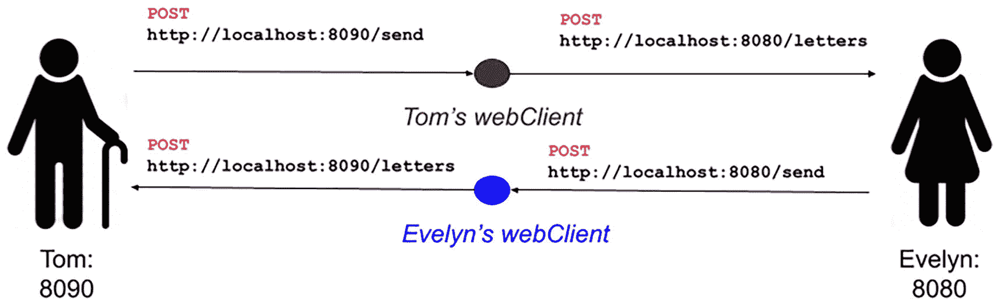

两个 Spring 应用程序之间使用 URL 进行通信的示例。该应用程序为 Tom 和 Evelyn 两个模型启动两次，每次使用不同的设置。笔友们互相发送邮件和信件。Tom 在端口 8090 上启动，Evelyn 在端口 8080 上启动。

图 13-1

两位笔友应用程序实例的抽象表示

为了让 Evelyn 向 Tom 发送一封信，会向 `http://localhost:8080/send` 发送一个 POST 事件，其请求体代表一封信。在内部，`LetterSender` Bean 将使用 `webClient` 实例向 Tom 暴露的 REST API `http://localhost:8090/letters` 发起 POST 调用。

 阴影圆圈内的小写 i 符号。 为了在本章中保持讨论和示例的简洁，维护应用程序之间的安全通信将不是重点。

为了让 Tom 向 Evelyn 发送一封信，将执行相同的操作，如图 13-1 所示。

前面提到的 `webClient` 是 Spring 的 `org.springframework.web.client.RestTemplate` 的一个实例，这是在非响应式应用程序中用于发起 REST 调用的 Web 客户端类。对于响应式应用程序，也有一个实现，将在**第 20 章**中介绍。

### 介绍 Spring Data REST

为简单起见，本章仅使用 Spring Boot 应用程序。为了进一步简化基于 HTTP 的信件通信应用程序，我们使用了 Spring Data REST 仓库。Spring Data REST 整合了 Spring HATEOAS（超媒体作为应用状态引擎）和 Spring Data JPA 的特性，并自动将它们结合起来，使我们能够暴露 REST API 来管理实体，而无需声明控制器来与 Spring 仓库交互。

图 13-2 显示了项目 `chapter13-sender-boot` 为模拟我们感兴趣的行为所需的依赖项。

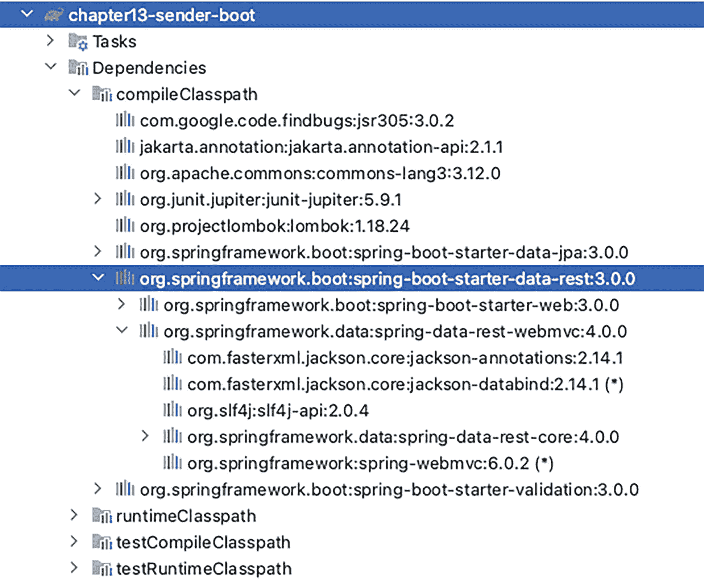

项目 chapter13-sender-boot 的截图。它列出了任务、依赖项、编译类路径、运行时类路径和测试编译类路径。在依赖项选项下，`org.springframework.boot:spring-boot-starter-data-rest:3.0.0` 以深色高亮显示。

图 13-2

项目 `chapter13-sender-boot` 的依赖项

让我们从实体类开始，逐步构建项目。模拟信件的类如清单 13-1 所示。

```
package com.apress.prospring6.thirteen
import jakarta.persistence.*
import java.io.Serial
import java.io.Serializable
import java.time.LocalDate
import jakarta.validation.constraints.NotEmpty
@Entity
class Letter() : Serializable {
@Id
@GeneratedValue(strategy = GenerationType.AUTO)
var id: Long? = null
@NotEmpty var title: String? = null
var sender: String? = null
var sentOn: LocalDate? = null
@Enumerated(EnumType.STRING)
var category = Category.MISC
@NotEmpty var content: String? = null
constructor(id: Long?, title: String?, sender: String?, sentOn: LocalDate?, category: Category, content: String?) : this() {
this.id = id
this.title = title
this.sender = sender
this.sentOn = sentOn
this.category = category
this.content = content
}
override fun hashCode() = content.hashCode() + 31*(
category.hashCode() + 31*(
sentOn.hashCode() + 31*(
sender.hashCode() + 31*(
title.hashCode() + 31*id.hashCode()))))
override fun equals(other: Any?) =
(other is Letter)
&& (other.id == id)
&& (other.title == title)
&& (other.sender == sender)
&& (other.sentOn == sentOn)
&& (other.category == category)
&& (other.content == content)
companion object {
@Serial
private val serialVersionUID = 1L
}
}
清单 13-1
Letter 类
```

`Category` 枚举用于根据层级范围对信件进行分类。该枚举具有多个值，为了确保信件发送时正确的序列化和反序列化，声明了 `CategorySerializer` 和 `CategoryDeserializer` 类，如清单 13-2 所示。


```
package com.apress.prospring6.thirteen
import com.fasterxml.jackson.core.JsonGenerator
import com.fasterxml.jackson.core.JsonParser
import com.fasterxml.jackson.databind.JsonDeserializer
import com.fasterxml.jackson.databind.JsonSerializer
// 其他导入语句已省略
@JsonSerialize(using = Category.CategorySerializer::class)
@JsonDeserialize(using = Category.CategoryDeserializer::class)
enum class Category(val namex:String) {
PERSONAL("Personal"),
FORMAL("Formal"),
MISC("Miscellaneous");
class CategorySerializer : JsonSerializer() {
@Throws(IOException::class)
override fun serialize(enumValue: Category,
gen: JsonGenerator, serializer: SerializerProvider) {
gen.writeString(enumValue.namex)
}
}
class CategoryDeserializer : JsonDeserializer() {
@Throws(IOException::class, JsonProcessingException::class)
override fun deserialize(parser: JsonParser, context
: DeserializationContext): Category? {
val jsonValue = parser.text
return eventOf(jsonValue)
}
}
companion object {
fun eventOf(value: String): Category? {
val result = values().filter { m: Category ->
m.namex.equals(value,ignoreCase = true)
}.firstOrNull()
return result
}
}
}
清单 13-2
Category 枚举及其 CategorySerializer 和 CategoryDeserializer 类
```

现在我们已经有了实体类，可以编写 Spring Data REST 仓库了。这个仓库就像一个 Spring Data 仓库，可以是 `JpaRepository<T, ID>`、`CrudRepository<T, ID>` 或 `PagingAndSortingRepository<T, ID>`，但其类和方法都使用了特殊的 Spring Data REST 注解进行修饰，这些注解告诉 Spring MVC（**第** **14** **章**的主题）创建用于管理实体的 RESTful 端点。`LetterRepository` 接口如清单 13-3 所示。

```
package com.apress.prospring6.thirteen
import org.springframework.data.jpa.repository.JpaRepository
import org.springframework.data.repository.query.Param
import org.springframework.data.rest.core.annotation.RepositoryRestResource
import org.springframework.data.rest.core.annotation.RestResource
import java.time.LocalDate
import java.util.List

@RepositoryRestResource(
collectionResourceRel = "mailbox",
path = "letters",
collectionResourceDescription = Description("信件与信件 API")
)
interface LetterRepository : JpaRepository {
@RestResource(path = "byCategory", rel = "customFindMethod")
fun findByCategory(@Param("category") category: Category): List
fun findBySentOn(@Param("date") sentOn: LocalDate): List
@RestResource(exported = false)
override fun deleteById(id: Long)
}
清单 13-3
LetterRepository Spring Data REST 仓库
```

`@RepositoryRestResource` 注解告诉 Spring MVC 在 `/letters` 路径下创建 RESTful 端点。当项目类路径中包含 `spring-boot-starter-data-rest` 时，此注解并非必需，但它对于自定义所有管理端点所基于的路径非常有用。管理 `Letter` 实例的默认根路径是 `letters`，与示例中使用的路径相同。当访问 `http://localhost:8090/letters` 时，会显示一个类似于清单 13-4 所示的 JSON 结构。

```
{
"_embedded" : {
"mailbox" : [ {
"title" : "来自英格兰的问候",
"sender" : "Evelyn",
"sentOn" : "2022-12-05",
"category" : "Personal",
"content" : "我很想去拜访。让我们讨论一下日期。",
"_links" : {
"self" : {
"href" : "http://localhost:8090/letters/1"
},
"letter" : {
"href" : "http://localhost:8090/letters/1"
}
}
} ]
},
"_links" : {
"self" : {
"href" : "http://localhost:8090/letters"
},
"profile" : {
"href" : "http://localhost:8090/profile/letters"
},
"search" : {
"href" : "http://localhost:8090/letters/search"
}
},
"page" : {
"size" : 20,
"totalElements" : 2,
"totalPages" : 1,
"number" : 0
}
}
清单 13-4
访问 http://localhost:8090/letters 端点时返回的 JSON 表示
```

`collectionResourceRel` 声明了在生成指向集合资源的链接时要使用的相对值。这意味着所有 `Letter` 实例都将作为名为 `mailbox` 的集合的一部分返回，该集合是可通过 URL `http://localhost:8090/letters` 端点访问的 JSON 表示的一个成员。

`@RestResource` 注解告诉 Spring MVC 资源的路径值是什么，并且 `rel` 属性的值将出现在链接中。通过执行 `curl` 命令访问 `http://localhost:8090/letters/search`（或在浏览器中打开该 URL），我们可以看到新方法与其他资源（包括参数名称）一起列出，如清单 13-5 所示。

```
##  curl http://localhost:8090/letters/search
{
"_links" : {
"findBySentOn" : {
"href" : "http://localhost:8090/letters/search/findBySentOn{?date}",
"templated" : true
},
"customFindMethod" : {
"href" : "http://localhost:8090/letters/search/byCategory{?category}",
"templated" : true
},
"self" : {
"href" : "http://localhost:8090/letters/search"
}
}
}
清单 13-5
访问 http://localhost:8090/letters/search 端点时返回的 JSON 表示
```

在清单 13-3 中，`deleteById(..)` 方法使用了 `@RestResource(exported = false)` 注解。`exported` 属性的值决定了该资源是否被导出。在此示例中，此配置的效果是不会为 `deleteById(..)` 方法创建 REST 端点。但是，有两个链接与清单 13-3 中 `LetterRepository` 声明的两个自定义搜索方法相匹配。`{?category}` 结构表示请求参数名称，因此按类别搜索的请求实际上类似于：

```
GET http://localhost:8090/letters/search/byCategory?category=PERSONAL
```

`LetterRepository` 接口的目的是暴露 REST API 端点，供 `RestTemplate` 实例调用。

接下来要分析的类是 `LetterSenderController`。这个类是一个 REST 控制器，它暴露了一个单一的 POST 处理器，用于在当前应用程序上触发发送信件的操作。该处理器方法使用 `RestTemplate` bean 向代表信件目的地的另一个应用程序实例发送 POST 请求。`LetterSenderController` 类如清单 13-6 所示。

```
package com.apress.prospring6.thirteen
import org.springframework.beans.factory.annotation.Value
import org.springframework.http.HttpEntity
import org.springframework.http.HttpMethod
import org.springframework.http.MediaType
import org.springframework.web.bind.annotation.PostMapping
import org.springframework.web.bind.annotation.RequestBody
import org.springframework.web.bind.annotation.RestController
import org.springframework.web.client.RestTemplate
import java.time.LocalDate

@RestController
class LetterSenderController(
private val webClient: RestTemplate,
@param:Value("#{senderApplication.correspondentAddress}")
private val correspondentAddress: String,
@param:Value("#{senderApplication.sender}") private val sender: String
) {
@PostMapping(path = ["send"], consumes = [MediaType.APPLICATION_JSON_VALUE])
fun sendLetter(@RequestBody letter: Letter) {
letter.sender = sender
letter.sentOn = LocalDate.now()
val request = HttpEntity(letter)
webClient.exchange(
"$correspondentAddress/letters", HttpMethod.POST, request,
Letter::class.java
)
}
companion object {
val log = LoggerFactory.getLogger(LetterSenderController::class.java)
}
}
清单 13-6
LetterSenderController 类
```


**第 3 章**介绍了原型注解。`@RestController` 是一个便捷注解，它本身被 `@Controller` 和 `@ResponseBody` 注解。如果 `@Controller` 用于标记用于 Web 用途的 Bean，包含映射到 URL 的方法，那么 `@RestController` 用于标记用于 REST 用途的 Bean，包含映射到 REST 端点的方法。由于本书目前尚未介绍 Spring MVC 支持（**第 14 章**）和 Spring REST 支持（**第 15 章**），目前这个解释就足够了。

`RestTemplate` 是一个有用的 Spring 类，用于创建执行 HTTP 请求的同步客户端。它公开了一组非常简单的用于设置请求内容和请求头的方法，并且还在底层 HTTP 客户端库（如 JDK HttpURLConnection、Apache HttpComponents 等）之上公开了一个简单的模板方法 API。`RestTemplate` 通常用作共享组件；在应用程序中声明一个 Bean，并在需要的地方注入。从 Spring 5.0 版本开始，此类处于维护模式，未来只接受小的变更请求和错误修复。建议使用 `org.springframework.web.reactive.client.WebClient`，它具有更现代的 API 并支持同步、异步和流式场景，但对于非响应式应用程序，响应式的 `WebClient` 并不适用。

`LetterSenderController` 类配置了一个 `sender`（即发信人的姓名及其值），该值从 Spring Boot 主应用程序类中注入，此处使用 SpEL 表达式引用：`#{senderApplication.sender}`。收信人也是如此，由 `correspondentAddress` 表示，它也是从 Spring Boot 属性中填充的。这些属性的值从 Spring Boot 配置文件（本例中为 `application.yaml` 文件）中读取。其内容如代码清单 13-7 所示。

```
# Spring Boot application name
spring:
application:
name: chapter13-sender-app
# datasource config
datasource:
url: "jdbc:h2:mem:testdb"
driverClassName: "org.h2.Driver"
username: sa
password: password
# jpa config
jpa:
database-platform: "org.hibernate.dialect.H2Dialect"
hibernate:
ddl-auto: create-drop
# Uppercase Table Names
naming:
physical-strategy: org.hibernate.boot.model.naming.PhysicalNamingStrategyStandardImpl
# enabling the H2 web console
h2:
console:
enabled: true
# application config
app:
sender:
name: "default"
correspondent:
address: "http://localhost:8090"
# server config
server:
port: 8090
compression:
enabled: true
address: 0.0.0.0
# logging config
logging:
pattern:
console: "%-5level: %class{0} - %msg%n"
level:
root: INFO
org.springframework: DEBUG
com.apress.prospring6.thirteen: INFO
代码清单 13-7
chapter13-sender-boot 项目的 application.yaml 文件
```

此配置分为以下几个部分，如果您已阅读过前面的章节，其中一些部分您应该已经熟悉：

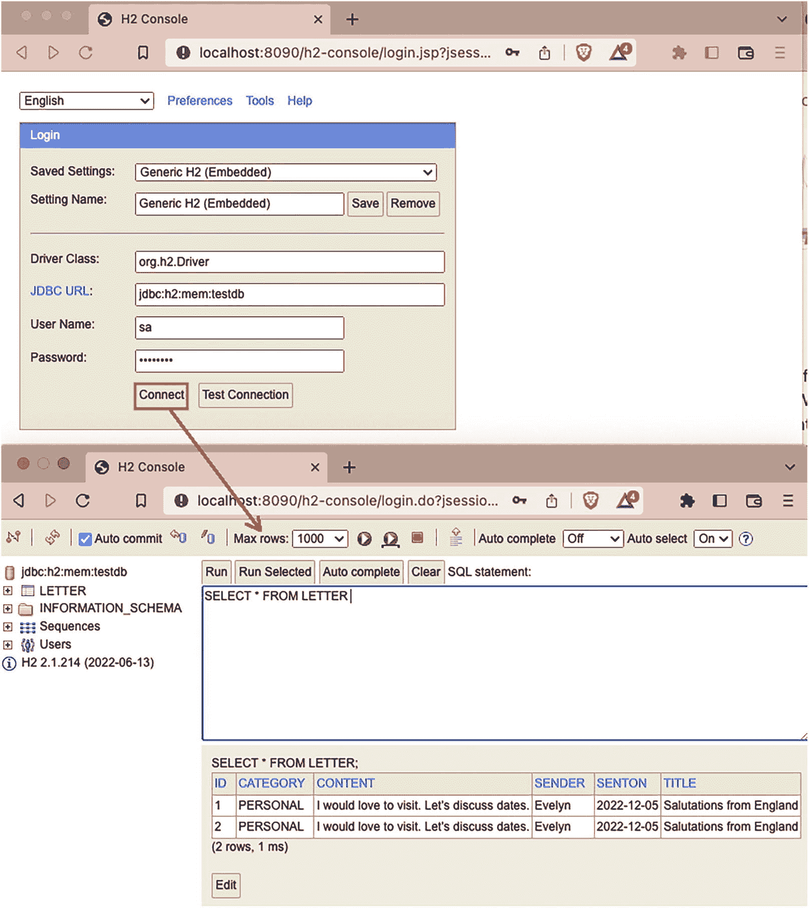

标题为“H 2 console”窗口的两个截图。它包括一个登录对话框。数据条目是已保存的设置、设置名称、驱动类、J D B C U R L、用户名和密码。一个箭头标记指向登录仪表板的连接选项。

图 13-3
H2 控制台登录和仪表板

*   `# Spring Boot application name`：此部分为 Spring `ApplicationContext` ID 配置一个值。

*   `# datasource config`：此部分配置数据源连接详细信息；在本例中，底层数据库是一个内存中的 H2 数据库。

*   `# jpa config`：此部分配置 JPA 详细信息，例如：用于与数据库通信的方言、是否应创建数据库以及表应如何命名；在本例中，所有表名都使用大写字母生成。

*   `# enabling the H2 web console`：正如该部分名称所示，为了检查应用程序是否正常运行，有时我们可能想要检查数据库和生成的表。此属性启用 `/h2-console` 端点，该端点指向用于管理 H2 数据库的 Web 控制台（类似于 phpMyAdmin^(¹¹²)，但更简单）。登录窗口和控制台仪表板如图 13-3 所示。

*   `# application config`：此部分配置发送信件的用户和接收信件的地址。默认配置是配置一个应用程序，其中发信人和通信地址代表同一个应用程序。

*   `# server config`：此部分配置应用程序可用的 URL。将地址设置为 `0.0.0.0` 允许应用程序在运行该应用程序的计算机关联的所有网络地址上访问（例如，`http://localhost:8090/letters`、`http://127.0.0.1:8090/letters` 等）。

*   `# logging config`：此部分配置应用程序中包和类的日志记录级别。

基于此配置和一个 Spring Boot 主类，可以启动一个能够通过 HTTP 与另一个应用程序通信的应用程序。Spring Boot 主类如代码清单 13-8 所示。

```
package com.apress.prospring6.thirteen
import org.springframework.boot.CommandLineRunner
// other import statements omitted
@SpringBootApplication
open class SenderApplication {
@Value("\${app.sender.name}")
var sender: String? = null
@Value("\${app.correspondent.address}")
var correspondentAddress: String? = null
@Bean
open fun restTemplate(): RestTemplate {
return RestTemplate()
}
@Bean
open fun initCmd(): CommandLineRunner {
return CommandLineRunner { args: Array ->
log.info(
" >>> Sender {}  ready to send letters to {} ",
sender,
correspondentAddress
)
}
}
companion object {
val log = LoggerFactory.getLogger(SenderApplication::class.java)
@JvmStatic
fun main(args: Array) {
val ctx = SpringApplication.run(
SenderApplication::class.java, *args
)
}
}
}
代码清单 13-8
chapter13-sender-boot 项目的 Spring Boot 主类
```

[`app.sender.name`](http://app.sender.name) 从 `application.yaml` 文件中读取并注入到 `sender` 属性中。`app.correspondent.address` 从 `application.yaml` 文件中读取并注入到 `correspondentAddress` 属性中。`SenderApplication` 配置声明了一个名为 `senderApplication` 的 Bean，该 Bean 的属性使用 SpEL 表达式注入到 `LetterSenderController` 类中，如前文代码清单 13-6 所示。

现在所有 Bean 和配置都已解释完毕，让我们启动 Tom 和 Evelyn 这两个应用程序实例，并开始发送信件。要启动应用程序的两个实例，您可以使用 IntelliJ IDEA 启动器，但最简单的方法是构建应用程序并使用生成的 JAR 启动它们。

要构建项目，请转到 `pro-spring-6/chapter13-sender-boot` 并运行 `gradle clean build`。项目构建完成，可执行文件生成在 `chapter13-sender-boot/build/libs/chapter13-sender-boot-1.0-SNAPSHOT.jar`。

要启动 Tom 应用程序，请打开一个终端并运行代码清单 13-9 中所示的命令。

```
java -jar \
build/libs/chapter13-sender-boot-1.0-SNAPSHOT.jar \
--server.port=8090 \
--app.sender.name=Tom \
--app.correspondent.address=http://localhost:8080 # Evelyn's address
代码清单 13-9
启动 Tom 应用程序
```


应用程序启动后，最后打印的两条日志条目应如下所示：

```
INFO: SenderApplication -  >>> Sender Tom  ready to send letters to http://localhost:8080
DEBUG: ApplicationAvailabilityBean - Application availability state ReadinessState changed to ACCEPTING_TRAFFIC
```

`INFO` 日志由 `CommandLineRunner` bean 打印。

要启动 Evelyn 应用程序，请打开终端并运行清单 13-10 中所示的命令。

```
java -jar \
build/libs/chapter13-sender-boot-1.0-SNAPSHOT.jar \
--server.port=8080 \
--app.sender.name=Evelyn \
--app.correspondent.address=http://localhost:8090 # Tom's address
清单 13-10
启动 Evelyn 应用程序
```

应用程序启动后，最后打印的两条日志条目应如下所示：

```
INFO : SenderApplication -  >>> Sender Evelyn  ready to send letters to http://localhost:8090
DEBUG: ApplicationAvailabilityBean - Application availability state ReadinessState changed to ACCEPTING_TRAFFIC
```

要让 Tom 向 Evelyn 发送一封信，必须向 `http://localhost:8090/send` 发送一个 POST 请求。最简单的方法是使用 IntelliJ IDEA 中嵌入的 HTTPie^(¹¹³) 客户端，执行 `chapter13-sender-boot/src/test/resources/Sender.http` 文件中的请求。

 一个带阴影圆圈内的小写 i 符号。 IntelliJ IDEA 社区版不包含 HTTPie。但是，你可以使用其他 HTTP 客户端（如 `curl`）实现相同的结果。

例如，从 Tom 向 Evelyn 发送信件的请求（`Sender.http` 文件中的请求之一）如清单 13-11 所示。

```
### Tom sending letter to Evelyn
POST http://localhost:8090/send
Content-Type: application/json
{
"title": "Salutations from Scotland",
"category": "Personal",
"content" : "Scotland is rather lovely this time of year. Would you like to visit?"
}
# Or, using curl
curl -X POST http://localhost:8090/send -H "Content-Type: application/json" -d '{"title":"Salutations from Scotland","category":"Personal","content":"Scotland is rather lovely this time of year. Would you like to visit?"}'
清单 13-11
使 Tom 向 Evelyn 发送信件的 POST 请求
```

我们如何知道这起作用了？我们查看 Tom 的日志，寻找报告 `restTemplate` bean 已执行请求的日志条目。这些日志条目应与清单 13-12 中显示的条目非常相似。

```
DEBUG: LogFormatUtils - POST "/send", parameters={}
DEBUG: AbstractHandlerMapping - Mapped to com.apress.prospring6.thirteen.LetterSenderController#sendLetter(Letter)
DEBUG: CompositeLog - HTTP POST http://localhost:8080/letters
DEBUG: CompositeLog - Accept=[application/json, application/*+json]
DEBUG: CompositeLog - Writing [Letter(id=null, title=Salutations from Scotland, sender=Tom, sentOn=2022-12-06, category=PERSONAL, content=Scotland is rather lovely this time of year. Would you like to visit?)] with org.springframework.http.converter.json.MappingJackson2HttpMessageConverter
DEBUG: CompositeLog - Response 201 CREATED
DEBUG: CompositeLog - Reading to [com.apress.prospring6.thirteen.Letter]
清单 13-12
使用 restTemplate Bean 发送请求的应用程序日志条目
```

在 Evelyn 应用程序上，你可以看到匹配的日志，如清单 13-13 所示。

```
DEBUG: LogFormatUtils - POST "/letters", parameters={}
DEBUG: AbstractMessageConverterMethodProcessor - Using 'application/json', given [application/json, application/*+json] and supported [application/hal+json, application/json, application/prs.hal-forms+json]
DEBUG: LogFormatUtils - Writing [EntityModel { content: Letter(id=1, title=Salutations from Scotland, sender=Tom, sentOn=2022-12-06,  (truncated)...]
DEBUG: FrameworkServlet - Completed 201 CREATED
清单 13-13
接收 POST 请求的应用程序日志条目
```

为了真正确信，你可以在浏览器中打开 `http://localhost:8080/letters`（或使用 `Sender.http` 文件中的 GET 请求）。Evelyn 返回的 JSON 表示现在应该在其 `mailbox` 中填充了 Tom 发送的信件。JSON 表示如清单 13-14 所示。

```
### Root JSON representation of Evelyn's letters
GET http://localhost:8080/letters
Accept: application/json
###
{
"_embedded" : {
"mailbox" : [ {
"title" : "Salutations from Scotland",
"sender" : "Tom",
"sentOn" : "2022-12-06",
"category" : "Personal",
"content" : "Scotland is rather lovely this time of year. Would you like to visit?",
"_links" : {
"self" : {
"href" : "http://localhost:8080/letters/1"
},
"letter" : {
"href" : "http://localhost:8080/letters/1"
}
}
} ]
},
"_links" : {
"self" : {
"href" : "http://localhost:8080/letters"
},
"profile" : {
"href" : "http://localhost:8080/profile/letters"
},
"search" : {
"href" : "http://localhost:8080/letters/search"
}
},
"page" : {
"size" : 20,
"totalElements" : 1,
"totalPages" : 1,
"number" : 0
}
}
清单 13-14
Evelyn 应用程序的信件资源的 JSON 表示
```

默认情况下，`RestTemplate` 会注册所有内置的消息转换器，这取决于类路径检查，这些检查有助于确定存在哪些可选的转换库。由于我们有两个相同的应用程序副本在通信，它们都可以在 `Letter` 及其 JSON 表示之间以及反向之间进行转换，而没有任何问题。如果需要，你也可以显式设置要使用的消息转换器。

然而，只要注册了正确的转换器，`RestTemplate` 就可以用于与任何其他语言编写的任何其他应用程序进行通信。例如，在清单 13-15 中，向 `LetterSenderController` 添加了一个方法，用于向 [`https://jsonplaceholder.typicode.com/users`](https://jsonplaceholder.typicode.com/users) 执行请求，该端点由免费的假 API 提供，用于测试和原型设计。

```
package com.apress.prospring6.thirteen;
// other imports omitted
@RestController
class LetterSenderController(
private val webClient: RestTemplate,
@param:Value("#{senderApplication.correspondentAddress}")
private val correspondentAddress: String,
@param:Value("#{senderApplication.sender}") private val sender: String
) {
...
@get:GetMapping(path = ["misc"], produces = [MediaType.APPLICATION_JSON_VALUE])
val miscData: String
get() {
val response = webClient.getForObject(
"https://jsonplaceholder.typicode.com/users",
String::class.java
)
log.info("Random info from non-java application: {} ", response)
return response!!
}
companion object {
val log = LoggerFactory.getLogger(LetterSenderController::class.java)
}
}
清单 13-15
使用 RestTemplate 执行 GET 请求到 https://jsonplaceholder.typicode.com/users
```

返回的结果是一个 JSON 表示的用户对象数组。如果应用程序有一个与 JSON 表示匹配的 `User` POJO 定义，转换器将确保正确的转换。

用于提交请求的 `RestTemplate` 类功能相当强大，但如前所述，它已被标记为弃用。未来似乎是响应式的，`WebClient` 和新的声明式 HTTP 接口是替代方案。

从 Spring 6 和 Spring Boot 3 开始，Spring 框架支持将远程 HTTP 服务代理为 Java/Kotlin 接口，该接口带有用于 HTTP 交换的注解方法，也称为*声明式 HTTP 接口*^(¹¹⁴)。声明式 HTTP 接口是一种有助于减少样板代码的接口，它生成一个实现此接口的代理，并在框架级别执行交换。这也将在**第** **20** **章**中介绍，因为本章的重点是实际的远程通信。


## 在 Spring 中使用 JMS

使用面向消息的中间件（通常称为消息队列（MQ）服务器）是支持应用程序间通信的另一种流行方式。MQ 服务器的主要优势在于它为应用程序集成提供了一种异步且松耦合的方式。在 Java/Kotlin 世界中，JMS 是连接 MQ 服务器以发送或接收消息的标准。MQ 服务器维护一个队列和主题列表，应用程序可以连接到这些队列和主题来发送和接收消息。以下是对队列和主题之间区别的简要说明：

*   ***队列***：队列用于支持点对点消息交换模型。当生产者向队列发送消息时，MQ 服务器将消息保留在队列中，并在消费者下次连接时将其传递给一个（且仅一个）消费者。

*   ***主题***：主题用于支持发布-订阅模型。任意数量的客户端都可以订阅主题内的消息。当该主题有消息到达时，MQ 服务器会将其传递给所有已订阅该消息的客户端。当有多个应用程序对同一信息（例如，新闻推送）感兴趣时，此模型特别有用。

在 JMS 中，生产者连接到 MQ 服务器并向队列或主题发送消息。消费者也连接到 MQ 服务器，并监听队列或主题以获取感兴趣的消息。在 JMS 1.1 中，API 得到了统一，因此生产者和消费者无需处理与队列和主题交互的不同 API。从 Spring Framework 5 开始，Spring 的 JMS 包完全支持 JMS 2.0，并要求运行时存在 JMS 2.0 API。因此，需要一个兼容 JMS 2.0 的提供者。从 Spring 6 开始，使用的 JMS API 规范是 Jakarta Messaging API 3.x 版，因为 JMS API 是 Oracle 外包的 Java EE 产品之一。

本书 Java 变体的前一版本使用了 HornetMQ 独立服务器来发送消息，但此后 HornetMQ 项目已退役。本章演示如何使用 Apache ActiveMQ Artemis^(¹¹⁵)，它有一个兼容 Jakarta JMS 的版本，并且有一个对应的 Spring Boot starter，这将使事情变得容易得多。

Spring 中 JMS 通信的核心是 `JmsTemplate`，它简化了发送和接收同步消息时资源的创建和释放。为方便起见，`JmsTemplate` 还公开了一个基本的请求-回复操作，允许发送消息并等待响应。`JmsTemplate` 类似于 `RestTemplate`；它们都用于应用程序之间的远程通信，并且都公开了供开发人员使用的实用 API。两种类型的实例一旦配置完成就是线程安全的，因此应用程序中只需要一个 `JmsTemplate` bean，并且可以在任何需要的地方注入它。不过有一个区别：`JmsTemplate` 是有状态的（某种程度上），因为它维护了对 `ConnectionFactory` 的引用，但这种状态不是会话状态。

### 使用 Apache ActiveMQ Artemis

使用 Spring Boot 使 JMS 应用程序的开发更加实用，因为当它在类路径上检测到 ActiveMQ Artemis 可用时，它会自动配置一个 `jakarta.jms.ConnectionFactory` bean。

ActiveMQ Artemis 可以在原生模式下使用，与代理的连接由 Netty 协议提供。`application.yaml` 文件可以如清单 13-16 所示。

```
spring:
artemis:
mode: native
host: 0.0.0.0
port: 61617
user: prospring6
password:prospring6
# 或者
spring:
artemis:
mode: native
broker-url: tcp://${IP_ADDRESS}:61617
user: prospring6
password:prospring6
清单 13-16
外部 ActiveMQ Artemis 服务器的 application.yaml 配置
```

从 Spring Boot 3.x 开始，属性 `spring.artemis.host` 和 `spring.artemis.port` 已被标记为已弃用，建议使用 `spring.artemis.broker-url`。

安装 ActiveMQ Artemis 不是本书的重点，因此对于代码示例，将使用嵌入式版本。要在 Spring Boot 应用程序中使用嵌入式 ActiveMQ Artemis，需要三样东西：类路径上的 `spring-boot-starter-artemis`、类路径上的 `artemis-jakarta-server` 以及 Spring Boot 嵌入式配置。图 13-4 显示了本节特定项目 `chapter13-artemis-boot` 的所有依赖项。

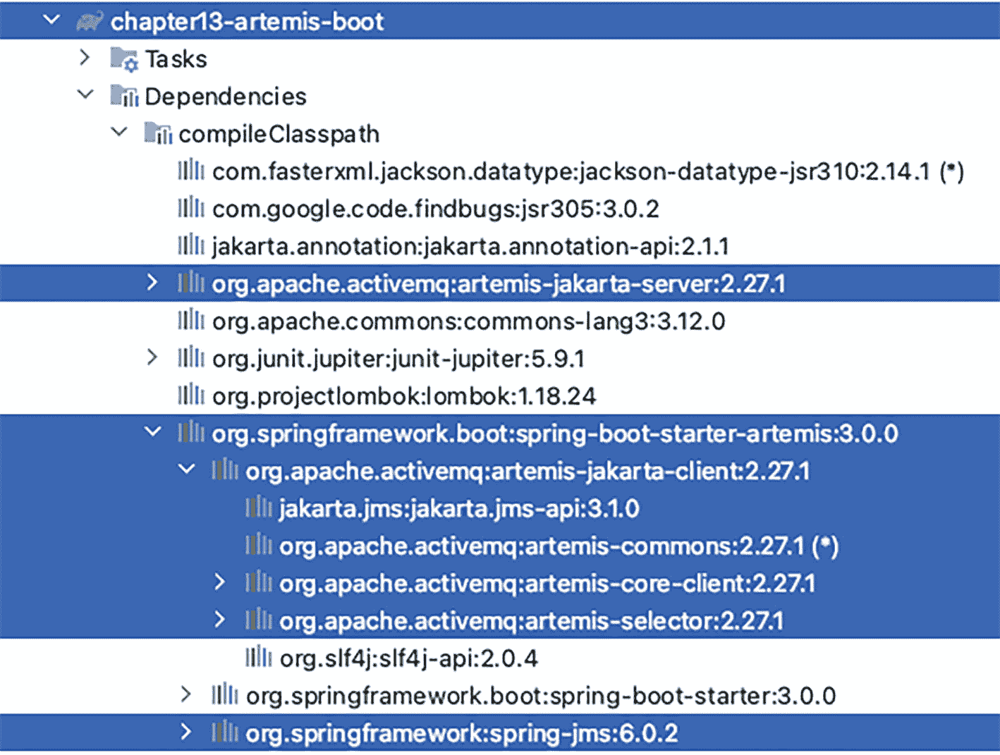

Springer 第 13 章 Artemis boot 的截图。依赖项选项列表列出了编译类路径选项。在编译类路径下，org apache active m q artemis jakarta server 和 org spring framework boot spring boot starter Artemis 选项以深色阴影突出显示。

图 13-4

Spring Boot Artemis JMS 项目依赖项

使用嵌入式 ActiveMQ Artemis 服务器的 Spring Boot 应用程序配置如清单 13-17 所示。

```
spring:
artemis:
mode: embedded
embedded:
queues: prospring6
enabled: true
清单 13-17
嵌入式 ActiveMQ Artemis 服务器的 application.yaml 配置
```

使用 Spring Boot 非常实用，因为无需声明 `jakarta.jms.ConnectionFactory`；它会自动设置。`spring.artemis.embedded.queues` 配置一个逗号分隔的队列列表，这些队列将在启动时创建。默认情况下，Spring Boot 会配置一个类型为 `org.springframework.jms.connection.CachingConnectionFactory` 的 bean。此类型是 `org.springframework.jms.connection.SingleConnectionFactory` 的扩展。这是一个特殊的类，它确保打开单个 JMS 连接，并在所有需要与 JMS 服务器通信的对象之间共享。`CachingConnectionFactory` 为消息生产者和消费者增加了缓存行为。图 13-5 显示了 `jakarta.jms.ConnectionFactory` 最常见的实现。

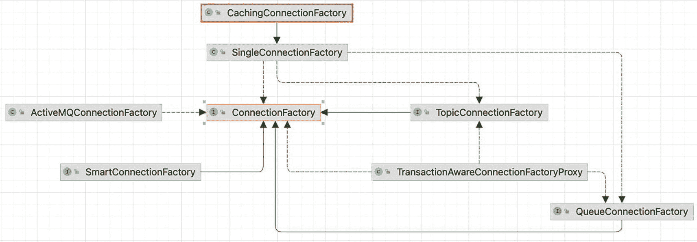

Jakarta dot j m s dot connection factory 的层次结构。catching connection factory 指向 single connection factory，后者分支为 connection factory、topic connection factory 和 queue connection factory。connection factory 有一个 active M Q connection factory。

图 13-5

`jakarta.jms.ConnectionFactory` 层次结构

在上一节中，我们在两个应用程序之间发送了 `Letter` 实例，因此在本节中，同一个对象将由 `Sender` 发送到 JMQ 队列，并由 `Receiver` 读取。由于 Spring Boot 使用的是嵌入式 Apache MQ Artemis 服务器，我们无法启动两个应用程序并在它们之间交换消息。因此，功能很简单，与图 13-6 中描绘的模式相匹配。

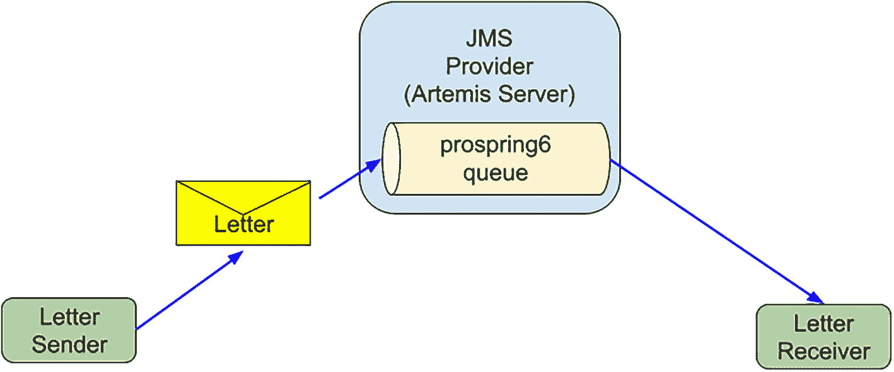


流程图描绘了 JMS 提供商 Artemis 服务器的架构。它从字母发送者开始，经过一个字母、pro spring 6 队列，最后到达字母接收者。

图 13-6

Spring Boot JMS 应用抽象架构

`Sender` Bean 使用`JmsTemplate` Bean 发送`Letter`实例。`JmsTemplate` Bean 也由 Spring Boot 自动配置，因此我们只需在`Sender` Bean 声明中注入并使用它即可。`Sender`类和 Bean 声明如清单 13-18 所示。

```
package com.apress.prospring6.thirteen
import org.springframework.jms.core.JmsTemplate
// 其他导入语句已省略
@Component
class Sender {
private var jmsTemplate: JmsTemplate? = null
constructor(jmsTemplate: JmsTemplate) {
this.jmsTemplate = jmsTemplate
}
@PostConstruct
fun init() {
jmsTemplate!!.deliveryDelay = 2000L
}
@Value("\${spring.artemis.embedded.queues}")
private val queueName: String? = null
fun send(letter: Letter?) {
log.info(" >> sending letter='{}'", letter)
jmsTemplate!!.convertAndSend(queueName, letter)
}
companion object {
val log = LoggerFactory.getLogger(Sender::class.java)
}
}
清单 13-18
JMS 生产者，Sender 类
```

请注意，队列名称是通过`@Value("${spring.artemis.embedded.queues}")`从 Spring Boot 配置文件中提取的。

`Receiver`更加简单，如清单 13-19 所示。

```
package com.apress.prospring6.thirteen
import org.springframework.jms.annotation.JmsListener
// 其他导入语句已省略
@Component
class Receiver {
@JmsListener(destination = "\${spring.artemis.embedded.queues}")
fun receive(letter: Letter?) {
log.info(" >> received letter='{}'", letter)
}
companion object {
val log = LoggerFactory.getLogger(Receiver::class.java)
}
}
清单 13-19
JMS 消费者，Receiver 类
```

这个 Bean 声明中最重要的是用`@JmsListener`注解的方法。该注解标记一个方法，使其成为指定目标上 JMS 消息监听器的目标。此注解还可以使用`connectionFactory`属性指定自定义的 JMS `ConnectionFactory`。如果不指定，它将使用 Spring Boot 配置的默认`ConnectionFactory`。

处理`@JmsListener`是 Spring Boot 自动配置的`org.springframework.jms.annotation.JmsListenerAnnotationBeanPostProcessor` Bean 的职责。如果没有 Spring Boot 来配置此 Bean，则需要将`@EnableJms`（来自包`org.springframework.jms.annotation`）放置在配置类上。

为了测试通过嵌入式 Artemis 服务器管理的`prospring6`队列，`Sender` Bean 发送的字母是否被`Receiver` Bean 接收，我们可以编写如清单 13-20 所示的程序。

```
package com.apress.prospring6.thirteen
import java.util.UUID
// 其他导入语句已省略
@SpringBootApplication
open class ArtemisApplication {
companion object {
val log = LoggerFactory.getLogger(ArtemisApplication::class.java)
@JvmStatic
fun main(args: Array) {
try {
SpringApplication.run(ArtemisApplication::class.java, *args).use { ctx ->
// Arrays.stream(ctx.getBeanDefinitionNames()).forEach(cn -> log.info("
// >>> {}: {}", cn, ctx.getBean(cn).getClass()));
val sender =
ctx.getBean(
Sender::class.java
)
for (i in 0..9) {
val letter =
Letter("Letter no. $i", "Test", LocalDate.now(),
UUID.randomUUID().toString())
sender.send(letter)
}
System.`in`.read()
}
} catch (e: IOException) {
log.error("Problem reading keystrokes.")
}
}
}
}
清单 13-20
测试 JMS 消息处理的程序
```

在清单 13-20 中，创建了应用上下文，然后从上下文中检索`Sender` Bean 并用于发送十个`Letter`实例。`Receiver` Bean 自动对队列中的`Letter`实例做出反应并“消费”它们，在本例中，这意味着它们仅被记录。运行此程序时，您可能会注意到它并未按预期工作，并且控制台中打印了以下消息：

```
Exception in thread "main"
org.springframework.jms.support.converter.MessageConversionException:
Cannot convert object of type [com.apress.prospring6.thirteen.Letter] to JMS message.
Supported message payloads are: String, byte array, Map, Serializable object.
at org.springframework.jms.support.converter.SimpleMessageConverter.toMessage(SimpleMessageConverter.java:79)
at org.springframework.jms.core.JmsTemplate.lambda$convertAndSend$5(JmsTemplate.java:661)
...
at com.apress.prospring6.thirteen.Sender.send(Sender.java:56)
at com.apress.prospring6.thirteen.ArtemisApplication.main(ArtemisApplication.java:70)
```

那么，问题出在哪里呢？默认情况下，如消息所述，只有少数几种类型的消息可以写入队列，并且所有这些类型都由实现`jakarta.jms.Message`的类型表示，如图 13-7 所示。

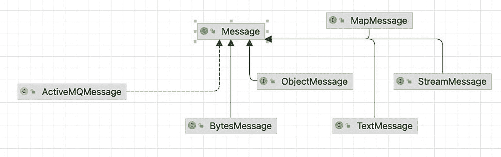

一个示意图列出了以下消息类型：Active M Q 消息、字节消息、对象消息、映射消息、流消息和文本消息。

图 13-7

消息层次结构

 一个带阴影圆圈内的小写 i 符号。 `ActiveMQMessage`类是作为`active-server.jar`库一部分的消息实现，但在 Spring 应用程序中并非必需。

那么，我们如何添加对不同类型的支持呢？错误消息中有一个提示：由于没有消息转换器，我们需要一个消息转换器。最简单的方法是提供一个转换器，将`Letter`转换为 JSON 文本表示，这样`Sender`将`jakarta.jms.TextMessage`写入队列，并将 JSON 表示转换回`Letter`，以便`Receiver`能够读取它。由于我们在 Spring 上下文中工作，最合适的方法是声明一个执行此操作的 Bean，并且由于这是一个 Spring Boot 应用程序，该 Bean 将在需要时自动使用。JMS 转换器 Bean 如清单 13-21 所示，并使用 Jackson 库进行配置。

```
package com.apress.prospring6.thirteen
import com.fasterxml.jackson.databind.json.JsonMapper
import com.fasterxml.jackson.datatype.jsr310.JavaTimeModule
import org.springframework.jms.support.converter.MappingJackson2MessageConverter
import org.springframework.jms.support.converter.MessageConverter
import org.springframework.jms.support.converter.MessageType
// 其他导入语句已省略
@SpringBootApplication
open class ArtemisApplication {
@Bean
open fun messageConverter(): MessageConverter {
val mapper = JsonMapper().apply {
registerModule(JavaTimeModule())
}
val converter = MappingJackson2MessageConverter().apply {
setTargetType(MessageType.TEXT)
setTypeIdPropertyName("_type")
setObjectMapper(mapper)
}
return converter
}
// main 方法已省略
}
清单 13-21
JMS 转换器 Bean
```

清单 13-21 中有三行代码用于配置以下内容：

*   `converter.setTargetType(MessageType.TEXT):` 指定应通过使用`MessageType.TEXT`枚举值调用，将对象编组为`TextMessage`。其他可能的值有：`BYTES`、`MAP`或`OBJECT`。


*   `converter.setTypeIdPropertyName("_type"):` 指定承载所含对象类型 ID 的 JMS 消息属性的名称。需要设置此属性以允许将传入消息转换为 Java 对象。

*   `mapper.registerModule(JavaTimeModule()):` 这是必需的，因为 `Letter` 记录包含一个名为 `sentOn` 的字段，其类型为 `java.time.LocalDate`。

在配置中添加此 Bean 后，应用程序现在可以按预期运行。如果我们运行 `main(..)` 方法并分析控制台，`Sender` 在发送 `Letter` 实例之前打印的日志消息，以及 `Receiver` 在接收 `Letter` 实例之后打印的日志消息，都会显示在控制台中。清单 13-22 显示了一个示例日志片段。

```
INFO : ActiveMQServerLogger_impl - AMQ221007: Server is now live
INFO : ActiveMQServerLogger_impl - AMQ221001: Apache ActiveMQ Artemis Message Broker version 2.27.1 [localhost, nodeID=62e0a32a-7a73-11ed-b408-3e5b0a7a3878]
...
INFO : Sender -  >> sending letter='Letter[title=Letter no. 0, sender=Test, sentOn=2022-12-12, content=95e3c388-37b5-499d-a720-c6b77b8cb99c]'
INFO : AuditLogger_impl - AMQ601267: User anonymous@invm:0 is creating a core session on target resource ActiveMQServerImpl::name=localhost with parameters: [63310d25-7a73-11ed-b408-3e5b0a7a3878, null, ****, 102400, RemotingConnectionImpl [ID=631dfa50-7a73-11ed-b408-3e5b0a7a3878, clientID=null, nodeID=62e0a32a-7a73-11ed-b408-3e5b0a7a3878, transportConnection=InVMConnection [serverID=0, id=631dfa50-7a73-11ed-b408-3e5b0a7a3878]], true, true, false, false, null, org.apache.activemq.artemis.core.protocol.core.impl.CoreSessionCallback@4a09407d, true, {}]
...
INFO : Sender -  >> sending letter='Letter[title=Letter no. 1, sender=Test, sentOn=2022-12-12, content=c9490fb3-49d3-4678-af76-a3c2fff3de21]'
...
INFO : Receiver -  >> received letter='Letter[title=Letter no. 0, sender=Test, sentOn=2022-12-12, content=95e3c388-37b5-499d-a720-c6b77b8cb99c]'
INFO : AuditLogger_impl - AMQ601759: User anonymous@invm:0 added acknowledgement of a message from prospring6: CoreMessage[messageID=17,durable=true,userID=6337eaf6-7a73-11ed-b408-3e5b0a7a3878,priority=4, timestamp=Mon Dec 12 23:19:12 GMT 2022,expiration=0, durable=true, address=prospring6,size=588,properties=TypedProperties[__AMQ_CID=63296c02-7a73-11ed-b408-3e5b0a7a3878,_type=com.apress.prospring6.thirteen.Letter,_AMQ_SCHED_DELIVERY=1670887154279,_AMQ_ROUTING_TYPE=1]]@489572349 to transaction: TransactionImpl [xid=null, txID=30, xid=null, state=ACTIVE, createTime=1670887154268(Mon Dec 12 23:19:14 GMT 2022), timeoutSeconds=300, nr operations = 1]@16eb0e22
INFO : Receiver -  >> received letter='Letter[title=Letter no. 1, sender=Test, sentOn=2022-12-12, content=c9490fb3-49d3-4678-af76-a3c2fff3de21]'
...
清单 13-22
Spring Boot 控制台日志片段，显示正在处理的 JMS 消息
```

在确认消息发送（生产）和接收（消费）的自定义日志消息中，还有一些 Artemis 特有的日志。由于服务器是嵌入式的，每条消息都使用匿名用户发送，这已由日志确认。从日志中可以看出，JMS 消息的发送和接收是在 JMS 事务中完成的，这是 Spring Boot 默认管理的。

更高级的行为，例如消息消费优先级和错误处理，可以通过自定义 Spring Boot 配置轻松实现。欢迎通过阅读官方文档^(¹¹⁶)来丰富您对 Spring Boot JMS 支持的知识。

## 使用 Spring for Apache Kafka

在本节中，我们专注于使用队列的点对点风格，这是公司内部更常用的模式，而不是关注任何特定的队列技术。我们将向您展示如何使用 Apache Kafka^(¹¹⁷) 编写 Spring Boot 应用程序。

在一个需要管理的数据量逐年呈指数级增长，并且以闪电般的速度访问数据对生产力至关重要的世界里，传统的队列技术难以适应。这时，开源 Apache Kafka 应运而生。它是一个分布式事件流平台，以用于构建高性能数据管道、流分析、数据集成和关键任务应用程序而闻名，被数千家公司采用。Apache Kafka 以其卓越的性能、低延迟、容错性和高吞吐量而著称。它能够每秒处理数千条消息。因此，与它集成自然是 Spring 团队的优先事项。Spring for Apache Kafka (`spring-kafka`) 项目将核心 Spring 概念应用于基于 Kafka 的消息传递解决方案的开发。

 一个带阴影圆圈内的小写字母 i 的符号。 请注意，该项目名为 *Spring for Apache Kafka*，而不是 *Spring Kafka*，原因是 Apache 基金会希望避免关于 Kafka 所有权的混淆。所有开源 Apache 项目的名称都带有“Apache”前缀，任何捐赠给 Apache 基金会的项目都会相应重命名。例如，Brooklyn 编排服务器在捐赠给 Apache 基金会后就变成了 Apache Brooklyn。

正如官方文档所述：“Apache Kafka 是一个由服务器和客户端组成的分布式系统，它们通过高性能 TCP 网络协议进行通信。它可以部署在裸机硬件、虚拟机以及本地和云环境中的容器上。”在本书的示例中，Apache Kafka 部署在本地 Docker 运行时中。

本地运行 Apache Kafka 所需的容器通过 `docker-compose.yaml` 文件进行配置，并使用 Docker Compose^(¹¹⁸) 来启动和关闭容器。此配置由 Bitnami^(¹¹⁹) 提供，Bitnami 是一个包含 Web 应用程序、软件栈以及虚拟设备的安装程序或软件包的库。完整的库通过 GitHub 共享，所有容器配置均可在此处获取：[`https://github.com/bitnami/containers`](https://github.com/bitnami/containers)。本书示例所需的配置是从此仓库^(¹²⁰)下载的。启动容器的说明可以在 `chapter13-kafka-boot/CHAPTER13-KAFKA-BOOT.adoc` 文档中找到。

前面使用术语 *容器*（复数）的原因是需要两个容器。事情是这样的，在生产环境中，Apache Kafka 以集群方式运行，必须有人来管理这些实例。这就是 Zookeeper 的用武之地。Zookeeper 是 Apache 开发的一款软件，充当集中式服务，用于维护命名和配置数据，并在分布式系统中提供灵活且强大的同步。这意味着在生产环境中，您可能会看到类似图 13-8 所示的设置，其中 Zookeeper 实例相互协调，每个实例负责其自己的 Apache Kafka 服务器。

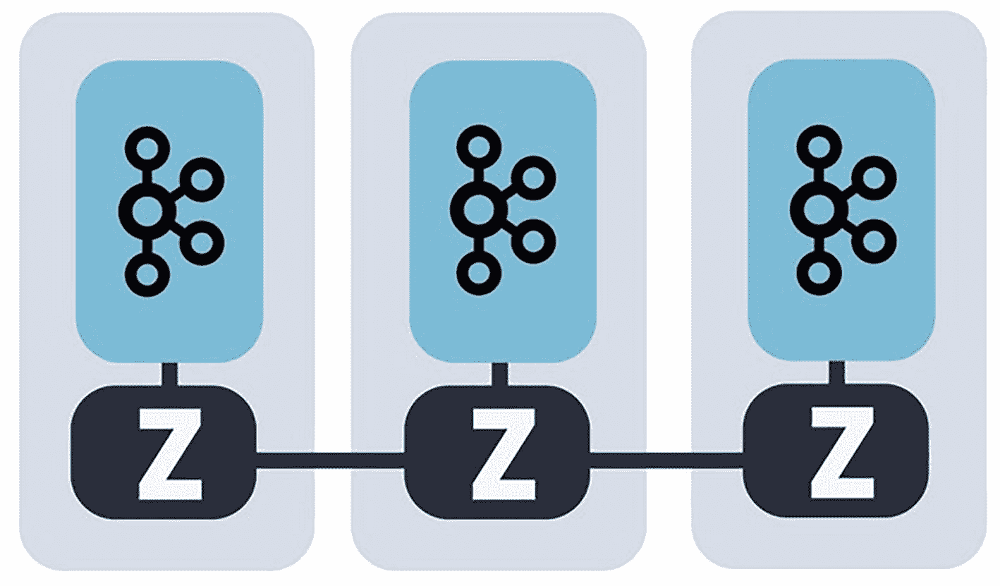

一个示意图，显示三个 Zookeeper 协调 Apache Kafka 服务器的元数据。带有图形徽标的矩形连接到标有字母 Z 的块。矩形表示节点，标有 Z 的气泡表示 Zookeeper 实例，葡萄徽标表示 Apache Kafka 实例。

图 13-8

Apache Kafka 生产环境设置


在生产系统中，多个 Zookeeper 实例协同工作，管理分布在多个节点集合上的 Kafka 数据，这正是 Kafka 实现高可用性和一致性的方式。在图 13-8 中，每个灰色矩形代表一个节点，标有 Z 的气泡代表 Zookeeper 实例，而黑色的“葡萄”标志代表 Apache Kafka 实例。不过，对于开发用的 Docker 环境，一个 Zookeeper 实例和一个 Apache Kafka 实例就足够了。

由于我们使用的是应用程序外部的 Apache Kafka 实例，因此可以编写另一个应用程序，该应用程序可以启动两次，并模拟实例之间的通信。正如本章开头所做的那样，我们将启动一个应用程序供 Tom 向 Evelyn 发送信件，再启动另一个供 Evelyn 向 Tom 发送信件。Tom 和 Evelyn 各自拥有接收消息的队列。每个应用程序都是一个 Web 应用程序，会暴露一个 `/kafka/send` 端点，并使用 POST 方法触发向对方队列发送消息，如图 13-9 所示。

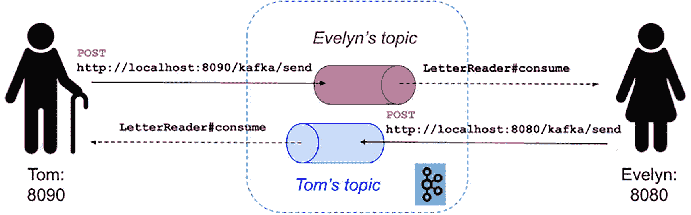

示意图展示了两个笔友 Tom 和 Evelyn 的 Spring 应用程序，它们通过 Apache Kafka 服务器进行通信。Tom 8090 通过 Evelyn 的主题指向 Evelyn 8080。Evelyn 8080 通过 Tom 的主题指向 Tom 8090。

图 13-9

使用 Apache Kafka 的两个笔友应用程序实例的抽象表示

Apache Kafka 没有对应的 Spring Boot Starter，因为你无法以嵌入式模式启动 Kafka，但创建一个 Spring Boot Web 应用程序、添加 `spring-kafka` 作为依赖项并使用 Spring 属性进行配置是相当容易的。图 13-10 展示了 `chapter13-kafka-boot` 项目的依赖关系。

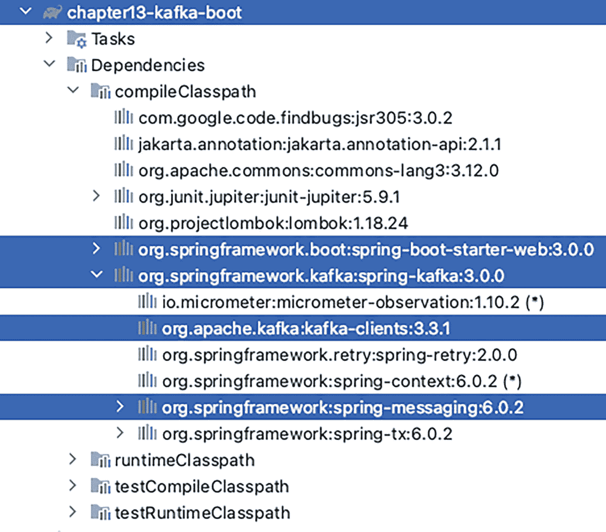

Spring 第 13 章 Kafka 启动的截图。依赖项选项列表列出了编译类路径选项。在编译类路径下，`org.springframework.kafka:spring-kafka` 和 `org.springframework.boot:spring-boot-starter-web` 选项以深色高亮显示。

图 13-10

使用 Apache Kafka 的 Spring Boot 应用程序的 Gradle 配置

现在我们有了期望的行为和依赖项，让我们看看构建这个应用程序需要什么。首先，我们需要告诉 Spring Boot Apache Kafka 的运行位置，以便调用其 API 来创建队列，并发送和接收消息。在代码清单 13-23 中，你可以看到 Spring Boot 应用程序的配置（`application.yaml` 文件的内容）。

```
# web config
server:
  port: 8090
  compression:
    enabled: true
  address: 0.0.0.0
# kafka config
spring:
  kafka:
    bootstrap-servers: localhost:9092
    consumer:
      group-id: letters-group-id
# custom config
app:
  sending:
    topic:
      name: default  # 发送信件的主题
  receiving:
    topic:
      name: self # 接收信件的主题
# logging config
logging:
  pattern:
    console: "%-5level: %class{0} - %msg%n"
  level:
    root: INFO
    org.springframework: DEBUG
    com.apress.prospring6.thirteen: INFO
代码清单 13-23
Spring Boot 与 Apache Kafka 应用程序配置
```

YAML 配置已按作用域划分为多个部分，各部分说明如下：

*   `# web config`：此部分配置 Web 应用程序的详细信息，例如端口，以及应用程序是否在所有网络 IP 上暴露（`0.0.0.0` 表示应用程序可通过 http://localhost:8090、http://127.0.0.1:8090 等地址访问）。
*   `# kafka config`：此部分配置 Apache Kafka 集群可用的位置和端口。`consumer.group-id` 是一个 Kafka 抽象概念，用于支持点对点和发布/订阅消息传递。此属性可用于对多个消费者进行分组，并自定义每个组的行为，例如消费消息时的优先级、并行度等。
*   `# custom config`：基于这两个属性的值，此部分配置发送消息的主题（[`app.topic.sending.name`](http://app.topic.sending.name)）和接收消息的主题（[`app.topic.receiving.name`](http://app.topic.receiving.name)）。[`app.topic.receiving.name`](http://app.topic.receiving.name) 属性还用于标识应用程序：Tom 或 Evelyn。
*   `# logging config`：此部分配置日志级别。

在这两个主题上，将写入 `Letter` 记录实例。记录声明如代码清单 13-24 所示。

```
package com.apress.prospring6.thirteen

import com.fasterxml.jackson.annotation.JsonFormat
import com.fasterxml.jackson.annotation.JsonProperty
import java.time.LocalDate

data class Letter (@JsonProperty("title") val title:String,
                   @JsonProperty("sender") val sender:String,
                   @JsonFormat(shape = JsonFormat.Shape.STRING, pattern = "yyyy-MM-dd")
                   @JsonProperty("sentOn") val sentOn:LocalDate,
                   @JsonProperty("content") val content:String )
代码清单 13-24
Letter 记录声明
```

由于我们不打算编辑接收到的 `Letter` 实例，因此 Kotlin 数据类非常适合此应用程序。

Apache Kafka 集群不知道我们需要哪些主题，因此我们必须进行配置。它也不知道我们计划从主题中生产和消费哪种类型的对象，因此我们也必须进行配置。为简单起见，我们将所有这些配置分组到一个名为 `KafkaConfig` 的类中，如代码清单 13-25 所示。


```
package com.apress.prospring6.thirteen
import org.apache.kafka.clients.admin.NewTopic
import org.apache.kafka.clients.consumer.ConsumerConfig
import org.apache.kafka.clients.producer.ProducerConfig
import org.apache.kafka.common.serialization.StringDeserializer
import org.apache.kafka.common.serialization.StringSerializer
import org.springframework.boot.autoconfigure.kafka.KafkaProperties
// 部分导入语句已省略
@SuppressWarnings({"unchecked", "rawtypes"})
@Configuration
open class KafkaConfig() {
@Autowired
var kafkaProperties: KafkaProperties? = null
@Value("#{kafkaApplication.sendingTopic}")
var sendingTopicName: String? = null
@Value("#{kafkaApplication.receivingTopic}")
var receivingTopicName: String? = null
constructor(kafkaProperties:KafkaProperties, sendingTopicName: String?, receivingTopicName: String?) : this() {
this.kafkaProperties = kafkaProperties
this.sendingTopicName = sendingTopicName
this.receivingTopicName = receivingTopicName
}
@Bean // 用于 LetterSender 的配置
open fun producerConfigs(): Map {
val props: MutableMap = HashMap(
kafkaProperties!!.buildProducerProperties()
)
props[ProducerConfig.KEY_SERIALIZER_CLASS_CONFIG] = StringSerializer::class.java
props[ProducerConfig.VALUE_SERIALIZER_CLASS_CONFIG] = JsonSerializer::class.java
return props
}
@Bean
open fun producerFactory(): ProducerFactory {
return DefaultKafkaProducerFactory(producerConfigs())
}
@Bean
open fun kafkaTemplate(): KafkaTemplate {
return KafkaTemplate(producerFactory())
}
@Bean // 发送信件（Letter）的主题
open fun sendingTopic(): NewTopic {
return NewTopic(sendingTopicName, 1, 1.toShort())
}
@Bean // 读取信件的主题
open fun receivingTopic(): NewTopic {
return NewTopic(receivingTopicName, 1, 1.toShort())
}
open fun consumerFactory(): ConsumerFactory {
val jsonDeserializer = JsonDeserializer()
jsonDeserializer.addTrustedPackages("*")
return DefaultKafkaConsumerFactory(
kafkaProperties!!.buildConsumerProperties(),
StringDeserializer(),
jsonDeserializer
)
}
@Bean
open fun kafkaListenerContainerFactory(): ConcurrentKafkaListenerContainerFactory {
val factory = ConcurrentKafkaListenerContainerFactory()
factory.consumerFactory = consumerFactory()
return factory
}
}
清单 13-25
KafkaConfig 配置类
```

在 Spring Boot 应用中，所有来自配置文件的 Kafka 专属属性都会被加载到一个 `KafkaProperties` 配置 Bean 中。该 Bean 被注入到 `KafkaConfig` 类中，因此可以扩展出专用于 `ProducerFactory<String,Any>` 或 `ConsumerFactory<String, Any>` 的属性——在本例中，我们添加了序列化器和反序列化器，用于在将 `Letter` 实例写入主题前将其转换为 JSON 表示，并在消费消息时进行反向转换。请注意，`Letter` 类型在任何地方都未被提及。`ProducerFactory` 只需要知道使用什么来转换消息键和消息本身，因为每条消息都必须通过唯一的键进行唯一标识。

在应用启动之前，Apache Kafka 集群中没有任何已定义的主题。我们为所需的每个主题声明一个 `NewTopic` Bean，这确保了如果配置名称的主题不存在，则会创建该主题。一个主题可以配置为划分为多个分区，并在多个代理之间进行复制。在我们这个非常简单的示例中，分区数和复制因子都设置为 `1`。

`KafkaTemplate` 类与 `JmsTemplate`（以及 `RestTemplate`）类似，需要此类型的 Bean 来执行 Apache Kafka 的高级操作。该 Bean 是线程安全的，并且用于生成消息时会使用已配置的 `ProducerFactory<K, V>` Bean。

`ConsumerFactory<K, V>` 用于从主题消费消息。对于这个简单的场景，我们使用 Spring 的 `DefaultKafkaConsumerFactory<K,V>` 实现，并采用最小化配置。

要消费消息，它们需要被监听器拾取。要创建这样一个监听器，除了在消费方法上附加 `@KafkaListener` 注解外，还需要一个 `ConcurrentKafkaListenerContainerFactory<K,V>`。

 一个带阴影圆圈内感叹号的符号。 用于生产和消费消息的 Bean 均不限制特定消息类型的原因在于，同一队列上可以写入多种类型的消息，并由不同的监听器读取，这些监听器由不同的 `ConcurrentKafkaListenerContainerFactory<K,V>` 创建。

请注意，Kafka 属性是从 Spring Boot 配置文件中提取的，并通过 `@Value(value = "${spring.kafka.*}")` 注入，但像 [`app.topic.sending.name`](http://app.topic.sending.name) 这样的自定义属性需要首先声明为 Spring Boot 主配置类的属性，并使用 SpEL 进行注入。

此配置中的 Bean 必须注入到用于生产和消费 `Letter` 实例的 Bean 中。用于建模消息生产者的类名为 `LetterSender`，因为它的职责是发送信件。该类如清单 13-26 所示。

```
package com.apress.prospring6.thirteen
import org.springframework.beans.factory.annotation.Value
import org.springframework.kafka.core.KafkaTemplate
import org.springframework.stereotype.Service
@Service
class LetterSender {
@Value("#{kafkaApplication.sendingTopic}")
var sendingToTopicName: String? = null
@Value("#{kafkaApplication.receivingTopic}")
private val sender: String? = null // 谁在发送信件
private val kafkaTemplate: KafkaTemplate? = null
// 使应用可配置
fun send(letter: Letter) {
log.info(">>>> [{}] 发送信件 -> {}", sender, letter)
kafkaTemplate!!.send(sendingToTopicName, UUID.randomUUID().toString(), letter)
}
companion object {
val log = LoggerFactory.getLogger(LetterSender::class.java)
}
}
清单 13-26
LetterSender 类与 Bean 配置
```

`LetterSender` Bean 需要 `KafkaTemplate` Bean 来发送消息，以及消息发送到的主题名称。`send(..)` 方法有多个版本，例如包含用于选择分区和消息生成时间的参数。还有一个版本返回 `CompletableFuture<SendResult<K, V>>`，允许声明一个在消息成功发送后执行的回调。

`kafkaApplication.receivingTopic` 也是发送消息的应用的名称，为了日志记录的目的被注入到此 Bean 中。

`LetterSender` Bean 被注入到 `KafkaController` 中，因此可以通过 POST 请求触发发送信件。`KafkaController` 类和 Bean 配置如清单 13-27 所示。

```
package com.apress.prospring6.thirteen
import org.springframework.web.bind.annotation.*
@RestController
@RequestMapping(path = ["/kafka"])
class KafkaController {
private var sender: LetterSender? = null
constructor(sender:LetterSender) {
this.sender = sender
}
@PostMapping(value = ["/send"])
fun sendMessageToKafkaTopic(@RequestBody letter: Letter) {
sender!!.send(letter)
}
}
清单 13-27
KafkaController 类与 Bean 配置
```

现在你已经知道如何将 `Letter` 实例发送到主题，我们将演示如何消费它们。之前已经提到过 `@KafkaListener`，但我们应该把它放在哪里呢？放在一个名为 `LetterReader` 的类的方法上，如清单 13-28 所示。


```
package com.apress.prospring6.thirteen
import org.springframework.beans.factory.annotation.Value
import org.springframework.kafka.annotation.KafkaListener
import org.springframework.messaging.handler.annotation.Payload
import org.springframework.stereotype.Service
@Service
class LetterReader {
@Value("#{kafkaApplication.receivingTopic}")
private val receivingTopicName: String? = null // 谁在接收信件
@KafkaListener(
topics = ["#{kafkaApplication.receivingTopic}"],
groupId = "\${spring.kafka.consumer.group-id}",
clientIdPrefix = "json",
containerFactory = "kafkaListenerContainerFactory"
)
fun consume(cr: ConsumerRecord) {
log.info(" {}", cr.timestamp())
log.info(" {}", cr.topic())
log.info(" {}", cr.partition())
log.info(" {}", cr.headers())
log.info(" {}", cr.key())
log.info(" {}", cr.value())
}
companion object {
val log = LoggerFactory.getLogger(LetterReader::class.java)
}
}
清单 13-28
LetterReader 类与 Bean 配置
```

`@KafkaListener` 注解将方法标记为 Kafka 消息监听器的目标。监听器需要知道要从中读取消息的主题（是的，它可以从多个主题读取消息），这通过 `topics` 属性进行配置。如果使用了多个组，并且我们希望监听器仅从单个主题组读取消息，那么 `groupId` 属性对此很有用。此外，由于我们希望确保消息被正确转换，我们需要确保创建了合适的监听器，这意味着需要通过 `containerFactory` 方法指定要使用的合适的 `ConcurrentKafkaListenerContainerFactory<K,V>`。

`consume(...​`​)` 方法可以有多种签名，只要 Spring 知道在从主题消费消息后如何处理它即可。来自 `org.springframework.messaging.handler.annotation` 包的 `@Payload` 注解将 Kafka 消息的主体绑定到此方法参数，并将其转换为适当的类型，在本例中为 `Letter`。该方法的另一个版本将整个消息作为 `ConsumerRecord<String, Letter>` 消费，展示了如何运行应用程序的两个实例。

最后一个要检查的类是 `KafkaApplication`，它是主要的 Spring Boot 配置类和运行器，如清单 13-29 所示。

```
package com.apress.prospring6.thirteen;
@SpringBootApplication
open class KafkaApplication {
@Value("\${app.sending.topic.name}")
var sendingTopic: String? = null
@Value("\${app.receiving.topic.name}")
var receivingTopic: String? = null
@Bean
open fun initCmd(): CommandLineRunner {
return CommandLineRunner { args: Array? ->
log.info(
" >>> 发送者 {}  准备向 {} 发送信件 ",
receivingTopic,
sendingTopic
)
}
}
companion object {
val log = LoggerFactory.getLogger(KafkaApplication::class.java)
@JvmStatic
fun main(args: Array) {
SpringApplication.run(KafkaApplication::class.java, *args)
}
}
}
清单 13-29
KafkaApplication Spring Boot 类
```

由于此应用程序将启动两次，一次用于 Evelyn，一次用于 Tom，因此创建了一个 `CommandLineRunner` Bean 来显示正在运行的是哪个应用程序。接收 `Letter` 的主题名称也是应用程序的名称。如前文图 13-9 所示，Evelyn 的应用程序在端口 8080 上启动，Tom 的应用程序在端口 8090 上启动。

要启动两个应用程序实例，方法是配置不同的 IntelliJ IDEA 启动器，或者构建应用程序并使用 JAR 在不同的终端窗口中启动两个实例，使用的命令如清单 13-30 所示。

```
# 启动 Evelyn
java -jar build/libs/chapter13-kafka-boot-6.0-SNAPSHOT.jar --app.sending.topic.name=Tom --app.receiving.topic.name=Evelyn --server.port=8080
# 启动 Tom
java -jar build/libs/chapter13-kafka-boot-6.0-SNAPSHOT.jar --app.sending.topic.name=Evelyn --app.receiving.topic.name=Tom --server.port=8090
清单 13-30
用于启动应用程序两个实例的 Bash 命令
```

当处理包含多个部分的应用程序时，我们喜欢将它们全部放在单独的 IntelliJ 终端中。如图 13-11 所示，有一个终端用于运行 Docker Compose 以启动 Apache Kafka 服务器，另一个终端有两个窗口，可以同时看到 Evelyn 和 Tom 在运行。

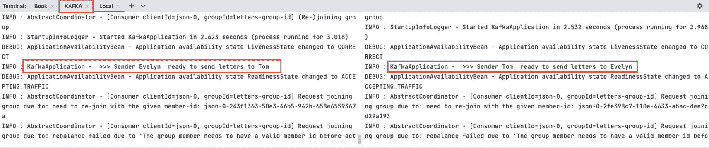

一个窗口的屏幕截图，包含 4 个选项卡：Terminal、book、Kafka 和 local。Kafka 选项卡高亮显示，local 选项卡带有下划线。Evelyn 和 Tom 在终端窗口的两个部分中同时运行。来自 Evelyn 和 Tom 的发送信件请求已高亮显示。

图 13-11
运行 Apache Kafka 和两个 Spring Boot 应用程序实例的 IntelliJ IDEA 终端

可以使用 `curl` ^(¹²¹) 或 `Postman` ^(¹²²) 发起请求，或者如果您使用的是 IntelliJ IDEA，则可以使用 HTTPie 客户端。从 Evelyn 向 Tom 发送 `Letter` 以及反向发送的请求体如清单 13-31 所示。

```
### Evelyn 向 Tom 发送信件消息
POST http://localhost:8080/kafka/send
Content-Type: application/json
{
"title": "致我亲爱的朋友",
"sender": "HTTPIE",
"sentOn" : "2022-12-04",
"content" : "好久没读到你写的东西了。想你！"
}
### Tom 向 Evelyn 发送信件消息
POST http://localhost:8090/kafka/send
Content-Type: application/json
{
"title": "我也想你",
"sender": "HTTPIE",
"sentOn" : "2022-12-05",
"content" : "苏格兰每年这个时候都相当可爱。你想来参观吗？"
}
清单 13-31
用于 HTTPie 从两个应用程序实例相互发送信件的 POST 请求
```

如果您运行这两个请求，您将看到两个应用程序都打印日志，确认发送和接收了 `Letter`，如清单 13-32 所示。

```
INFO : LetterSender - >>>> [Evelyn] 发送信件 -> Letter[title=致我亲爱的朋友, sender=HTTPIE, sentOn=2022-12-04, content=好久没读到你写的东西了。想你！]
DEBUG: FrameworkServlet - Completed 200 OK
...
DEBUG: LogAccessor - Received: 1 records
INFO : LetterReader - 
Letter[
title=我也想你,
sender=HTTPIE,
sentOn=2022-12-05,
content=苏格兰每年这个时候都相当可爱。你想来参观吗？
]
清单 13-32
Evelyn 的日志确认已发送一封信件并收到一封
```

Tom 应用程序会打印类似的信息。

之前提到过，使用 `@KafkaListener` 注解的方法可以有不同的签名，并且可以检查消息的所有细节，而不仅仅是主体（有效载荷）。为了实现这一点，该方法可以像清单 13-33 所示那样编写。

```
package com.apress.prospring6.thirteen
import org.apache.kafka.clients.consumer.ConsumerRecord
// 其他导入语句已省略
@Service
class LetterReader {
@KafkaListener(topics = ["#{kafkaApplication.receivingTopic}"],
groupId = "${spring.kafka.consumer.group-id}",
clientIdPrefix = "json",
containerFactory = "kafkaListenerContainerFactory")
fun consume(cr:ConsumerRecord) {
log.info(" {}", cr.timestamp());
log.info(" {}", cr.topic());
log.info(" {}", cr.partition());
log.info(" {}", cr.headers());
log.info(" {}", cr.key());
log.info(" {}", cr.value());
}
}
清单 13-33
Evelyn 的日志确认已发送一封信件并收到一封
```


`ConsumerRecord<K, V>` 是 `kafka-clients.jar` 库的一部分，如你所见，它是一个键/值对映射，对应消息标识符和有效载荷，但也包含其他有用信息，例如接收消息的主题名称和分区编号。

清单 13-34 展示了此更改后发送信件时该方法的输出。

```
INFO : LetterReader -  1671403710391
INFO : LetterReader -  Evelyn
INFO : LetterReader -  0
INFO : LetterReader -  RecordHeaders(headers = [], isReadOnly = false)
INFO : LetterReader -  dcccbbe7-3b5f-4447-9c15-0272f45591a9
INFO : LetterReader - 
Letter[
title=Miss you too,
sender=HTTPIE,
sentOn=2022-12-05,
content=Scotland is rather lovely this time of year. Would you like to visit?
]
清单 13-34
Evelyn 日志确认信件作为 ConsumerRecord 被接收
```

## 总结

在本章中，我们介绍了基于 Spring 的应用程序中最常用的远程通信技术。针对本章中的每个场景，我们都展示了如何发送和接收消息。远程应用程序之间的通信是一个庞大的主题，有多种技术可用于此目的。本章旨在向你介绍其中最常用的技术，并让你大致了解如何设计 Spring 应用程序以与其他应用程序（无论是否使用 Spring 编写）进行通信。

本章专门使用了 Spring Boot，因为重点在于 Spring 与每种技术（REST、JMS 和 Apache Kafka）的集成。

在下一章中，我们将讨论如何使用 Spring 编写 Web 应用程序。

脚注 1   2   3   4   5   6   7   8   9   10   11   12   13   14

