# 14. Spring MVC

在企业应用程序中，表示层严重影响着用户对应用程序的接受程度。表示层是应用程序的前门。它允许用户执行业务功能，并展示应用程序所维护信息的视图。用户界面的表现方式在很大程度上决定了应用程序的成功与否。由于互联网的爆炸式增长（尤其是在当今），以及人们使用的各种设备的兴起，开发应用程序的表示层是一项具有挑战性的任务。

以下是开发 Web 应用程序时的一些主要考虑因素：

*   *性能*：性能始终是 Web 应用程序的首要要求。如果用户选择一个功能或点击一个链接，并且执行时间很长（在互联网的世界里，三秒钟就像是一个世纪！），用户肯定不会对应用程序满意。

*   *用户友好性*：应用程序应易于使用和导航，并带有清晰的说明，不会让用户感到困惑。

*   *交互性和丰富性*：用户界面应具有高度的交互性和响应性。此外，在视觉呈现方面应丰富多样，例如图表、仪表盘类型的界面等。

*   *可访问性*：如今，用户要求应用程序可以通过任何设备从任何地方访问。在办公室，他们将使用台式机访问应用程序。在路上，用户将使用各种移动设备（包括笔记本电脑、平板电脑和智能手机）访问应用程序。

开发满足上述要求的 Web 应用程序并非易事，但业务用户认为这些是强制性的。幸运的是，许多新技术和框架已经被开发出来以满足这些需求。许多 Web 应用程序框架和库——例如 Spring MVC（Spring Web Flow）、Apache Struts、Tapestry、Faces（以前称为 Java Server Faces）、Google Web Toolkit (GWT)、jQuery、React 和 Dojo 等——提供了工具和丰富的组件库，可以帮助你开发高度交互的 Web 前端。Spring Web Flow^(¹²³) 提供了 Faces 集成，允许你将 Faces UI 组件模型与 Spring Web Flow 控制器一起使用。此外，许多框架提供了针对移动设备（如智能手机和平板电脑）的工具或相应的部件库。HTML5^(¹²⁴) 和 CSS3^(¹²⁵) 标准的兴起，以及大多数 Web 浏览器和移动设备制造商对这些最新标准的支持，也有助于简化需要从任何设备在任何地方访问的 Web 应用程序的开发。

与 Spring MVC 并行，从 5.0 版本开始，Spring 框架引入了一个名为 Spring WebFlux^(¹²⁶) 的响应式栈 Web 框架。该栈将在**第** **20** **章**中简要介绍。

在 Web 应用程序开发方面，Spring 提供了全面而深入的支持。Spring MVC 模块为 Web 应用程序开发提供了坚实的基础设施和模型-视图-控制器 (MVC) 框架。使用 Spring MVC 时，你可以使用各种视图技术（例如 JSP 或 Velocity）。此外，Spring MVC 与许多常见的 Web 框架和工具包（例如 Struts 和 GWT）集成。其他 Spring 项目有助于解决 Web 应用程序的特定需求。例如，Spring MVC 与 Spring Web Flow 项目及其 Spring Faces 模块结合使用时，为开发具有复杂流程的 Web 应用程序以及使用 Faces 作为视图技术提供了全面的支持。简而言之，在表示层开发方面有很多选择。本章重点介绍 Spring MVC，并讨论如何使用 Spring MVC 提供的强大功能来开发高性能的 Web 应用程序。

具体来说，本章涵盖以下主题：

*   *Spring MVC*：我们讨论 MVC 模式的主要概念并介绍 Spring MVC。我们介绍 Spring MVC 的核心概念，包括其 `WebApplicationContext` 层次结构和请求处理生命周期。

*   *i18n、区域设置和主题*：Spring MVC 为常见的 Web 应用程序需求提供全面支持，包括 i18n（国际化）、区域设置和主题。我们讨论如何使用 Spring MVC 开发支持这些需求的 Web 应用程序。

*   *视图支持*：Spring MVC 中视图技术的使用是可插拔的。在本章中，我们重点使用 Thymeleaf 作为 Web 应用程序的视图部分，因为它允许在不显式使用 JavaScript 和其他动态技术的情况下开发简单的网页。你可能想要使用的、Spring 支持的任何其他技术，例如 Groovy Markup Templates 和 JSP，都可以通过简单的配置更改轻松插入。

*   *文件上传支持*：我们讨论如何使用 Spring MVC 配合 Jakarta 的 Servlet 5.0 容器内置的多部分支持进行文件上传，而不是与 Apache Commons FileUpload 集成。


## 设置数据与底层

Web 应用必须提供对远程存储中数据的操作访问，这些数据通常存储在某种类型的数据库里。到目前为止，你已经了解了如何配置 Spring 应用，以使用 Spring Data 仓库来管理数据，并声明事务型 Bean 在事务内管理数据。这是应用的两个数据层；在本章中，你将学习配置应用的最后一层：表示层，即最终用户使用的 Web 应用或 Web 控制台，他们无需了解后端是哪种应用在承担繁重的工作。

本章沿用前几章使用的相同数据库结构，但在 `SINGER` 表中新增了一个名为 `PHOTO` 的列。新的 `SINGER` 表创建脚本如代码清单 14-1 所示。

```
CREATE TABLE SINGER (
ID INT NOT NULL AUTO_INCREMENT
, VERSION INT NOT NULL DEFAULT 0
, FIRST_NAME VARCHAR(60) NOT NULL
, LAST_NAME VARCHAR(40) NOT NULL
, BIRTH_DATE DATE
, PHOTO LONGBLOB NULL
, UNIQUE (FIRST_NAME, LAST_NAME)
, PRIMARY KEY (ID)
);
代码清单 14-1
更新后的 SINGER 表
```

`PHOTO` 列的数据类型为二进制大对象（`LONGBLOB`），将用于通过文件上传存储歌手的照片。要创建数据库及其中的表，需要一个 Docker 容器。创建镜像并运行它的步骤在 `chapter14/CHAPTER14.adoc` 文件中描述，该文件是本章项目的一部分。

为了将 `SINGER` 记录作为 Java 对象管理，我们使用 `Singer` 实例。该类被配置为 Jakarta Persistence 实体，如代码清单 14-2 所示。

```
package com.apress.prospring6.fourteen.entities
import jakarta.persistence.*
import jakarta.validation.*
import org.springframework.format.annotation.DateTimeFormat
@Entity
@Table(name = "SINGER")
class Singer : AbstractEntity() {
@Column(name = "FIRST_NAME")
var firstName: @NotEmpty @Size(min = 2, max = 30) String? = null
@Column(name = "LAST_NAME")
var lastName: @NotEmpty @Size(min = 2, max = 30) String? = null
@DateTimeFormat(pattern = "yyyy-MM-dd")
@Column(name = "BIRTH_DATE")
var birthDate: LocalDate? = null
@OneToMany(mappedBy = "singer")
var albums: MutableSet = HashSet()
@Basic(fetch = FetchType.LAZY)
@Lob
@Column(name = "PHOTO")
lateinit var photo: ByteArray
@ManyToMany
@JoinTable(
name = "SINGER_INSTRUMENT",
joinColumns = [JoinColumn(name = "SINGER_ID")],
inverseJoinColumns = [JoinColumn(name = "INSTRUMENT_ID")]
)
var instruments: MutableSet = mutableSetOf()
fun addAlbum(album: Album): Boolean {
album.singer = this
return albums.add(album)
}
fun removeAlbum(album: Album) {
albums.remove(album)
}
fun addInstrument(instrument: Instrument): Boolean {
return instruments.add(instrument)
}
override fun equals(other: Any?): Boolean {
if (this === other) return true
if (other == null || javaClass != other.javaClass) return false
val singer = other as Singer
return if (id != null) {
id == other.id
} else firstName == singer.firstName && lastName == singer.lastName
}
override fun hashCode(): Int {
return Objects.hash(firstName, lastName)
}
override fun toString(): String {
return ("Singer - Id: " + id + ", First name: " + firstName
+ ", Last name: " + lastName + ", Birthday: " + birthDate)
}
companion object {
@Serial
private val serialVersionUID = 2L
}
}
代码清单 14-2
更新后的 Singer 实体
```

`AbstractEntity` 是一个抽象类，包含应用中所有实体类共有的字段（`id` 和 `version`）。请注意，大多数字段都带有验证注解，这些注解对于验证用户提供的数据非常有用。`@DateTimeFormat` 注解是 Spring 的注解，用于配置一个字段或方法参数，使其根据作为属性提供的格式被格式化为日期或时间。

 一个信息符号。它由一个带阴影圆圈内的小写字母 i 表示。 `ALBUM` 和 `INSTRUMENT` 表及其对应的实体是项目的一部分，但仅通过操作 `Singer` 实例就足以覆盖 Spring MVC 的足够内容，因此本章将不再提及它们。

为了管理 `Singer` 实例，需要一个简单的 Spring Data 仓库接口，如代码清单 14-3 所示。

```
package com.apress.prospring6.fourteen.repos
import com.apress.prospring6.fourteen.entities.Singer
import org.springframework.data.jpa.repository.JpaRepository
import org.springframework.data.jpa.repository.Query
import org.springframework.data.repository.query.Param
import org.springframework.stereotype.Repository
import java.time.LocalDate
interface SingerRepo : JpaRepository {
@Query("select s from Singer s where s.firstName=:fn")
fun findByFirstName(@Param("fn") firstName: String): Iterable
@Query("select s from Singer s where s.firstName like %?1%")
fun findByFirstNameLike(firstName: String): Iterable
@Query("select s from Singer s where s.lastName=:ln")
fun findByLastName(@Param("ln") lastName: String): Iterable
@Query("select s from Singer s where s.lastName like %?1%")
fun findByLastNameLike(lastName: String): Iterable
@Query("select s from Singer s where s.birthDate=:date")
fun findByBirthDate(@Param("date") date: LocalDate): Iterable
}
代码清单 14-3
SingerRepo 接口
```

所有额外的方法都由 `SingerService` Bean 调用，用于对 `Singer` 实例执行各种操作。`SingerService` 接口声明了实现中所有可用的方法，如代码清单 14-4 所示。

```
package com.apress.prospring6.fourteen.services
import com.apress.prospring6.fourteen.entities.Singer
import com.apress.prospring6.fourteen.problem.InvalidCriteriaException
import com.apress.prospring6.fourteen.util.CriteriaDto
import org.springframework.data.domain.Page
import org.springframework.data.domain.Pageable
import java.util.List
interface SingerService {
fun findAll(): List
fun findById(id: Long): Singer
fun save(singer: Singer): Singer
fun delete(id: Long)
fun findAllByPage(pageable: Pageable): Page
@Throws(InvalidCriteriaException::class)
fun getByCriteriaDto(criteria: CriteriaDto): List
}
代码清单 14-4
SingerService 接口
```

实现 `SingerService` 的 `SingerServiceImpl` 类是事务性的，并且主要封装了 `SingerRepo` 的方法，除了 `getByCriteriaDto(..)` 方法。该方法用于根据作为参数传递的 `CriteriaDto` 实例，委托给 `SingerRepo` 中某个自定义的 `find*` 方法；其代码将在本章后面更相关的上下文中展示。

前两层的配置由两个类提供。`BasicDataSourceCfg` 类（在**第** **8** **章**中介绍）提供了与 MariaDB 数据库交互的方式。`TransactionCfg` 类（在**第** **9** **章**中介绍）提供了在事务环境中进行数据库操作的细节。如果这两个属于 `chapter-14` 项目的配置类看起来陌生，请随时回顾这两章。

现在底层已经设置完毕，我们准备开始介绍 Spring MVC。

## 介绍 Spring MVC

在继续实现表示层之前，让我们先了解 MVC 作为 Web 应用模式的一些主要概念，以及 Spring MVC 如何在这方面提供全面支持。

在接下来的章节中，我们将逐一介绍这些高层概念。首先，简要介绍 MVC。其次，介绍 Spring MVC 及其 WebApplicationContext 层次结构的高层视图。最后，讨论 Spring MVC 中的请求生命周期。


### 介绍 MVC

MVC 是在实现应用程序表示层时常用的一种模式。MVC 模式的主要原则是定义一个架构，让不同组件拥有清晰的职责。顾名思义，MVC 模式包含三个参与者：

*   *模型*：模型代表业务数据，以及在用户上下文中的应用程序“状态”。例如，在电子商务网站中，模型通常包含用户个人信息、购物车数据，以及用户购买商品时的订单数据。

*   *视图*：视图以所需格式向用户展示数据，支持与用户的交互，并支持客户端验证、国际化、样式等功能。

*   *控制器*：控制器处理用户在前端执行的操作请求，与服务层交互，更新模型，并根据执行结果将用户引导至适当的视图。

图 14-1 展示了一个常用的 Web 应用程序模式，由于引入了 Spring 作为主要组件，该模式可被视为对传统 MVC 模式的增强。

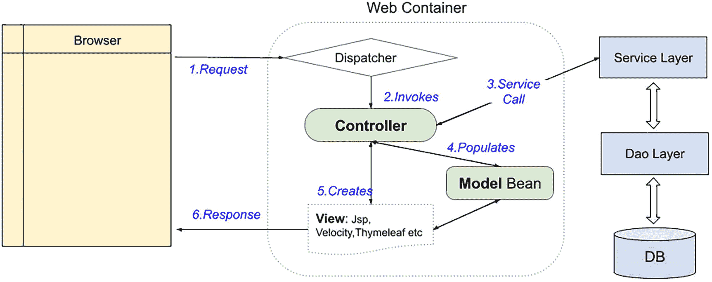

一个流程图。Web 容器的六个阶段如下：1. 请求。2. 调用。3. 服务调用。4. 填充。5. 创建。6. 响应。流程从浏览器、调度器、控制器到 JSP、Velocity 和 Thymeleaf 的视图。控制器和视图连接到模型 Bean。服务层、数据访问层和数据库。

图 14-1

典型 Web 应用程序中的 MVC 模式

一个普通的视图请求按如下方式处理：

1.  *请求*：请求被提交到服务器。在服务器端，大多数框架（例如 Spring MVC 或 Struts）都有一个调度器（以 Servlet 的形式）来处理请求。

2.  *调用*：调度器根据 HTTP 请求信息和 Web 应用程序配置，将请求分派给适当的控制器。

3.  *服务调用*：控制器与服务层交互。

4.  *填充模型*：控制器使用从服务层获取的信息来填充模型。

5.  *创建视图*：基于模型创建视图。

6.  *响应*：控制器将相应的视图返回给用户。

### Spring MVC 的增强功能

在 Spring 框架中，Spring MVC 模块为 MVC 模式提供了全面支持，并支持其他功能（例如主题、国际化、验证、类型转换和格式化），从而简化了表示层的实现。

在接下来的章节中，我们将讨论 Spring MVC 的主要概念。主题包括 Spring MVC 的 `WebApplicationContext` 层次结构、典型的请求处理生命周期以及配置。

#### Spring MVC `WebApplicationContext` 层次结构

在 Spring MVC 中，`DispatcherServlet` 是接收请求并将其分派给适当控制器的核心 Servlet。在一个 Spring MVC 应用程序中，可以有任意数量的 `DispatcherServlet` 实例用于不同目的（例如，处理用户界面请求和 RESTful Web 服务请求），每个 `DispatcherServlet` 实例都有自己的 `WebApplicationContext` 配置，该配置定义了 Servlet 级别的特性，例如支持该 Servlet 的控制器、处理器映射、视图解析、国际化、主题、验证、类型转换和格式化。

在 Servlet 级别的 `WebApplicationContext` 配置之下，Spring MVC 维护着一个根 `WebApplicationContext`，其中包含应用程序级别的配置，例如后端数据源、安全性、以及服务和持久层配置。根 `WebApplicationContext` 将对所有 Servlet 级别的 `WebApplicationContext` 可用。

让我们看一个例子。假设一个应用程序中有两个 `DispatcherServlet` 实例。一个 Servlet 支持用户界面（称为*应用程序 Servlet*），另一个以 RESTful Web 服务的形式为其他应用程序提供服务（称为*RESTful Servlet*）。在 Spring MVC 中，我们将为根 `WebApplicationContext` 实例以及两个 DispatcherServlet 实例的 `WebApplicationContext` 实例定义配置。图 14-2 显示了 Spring MVC 为此场景维护的 `WebApplicationContext` 层次结构。

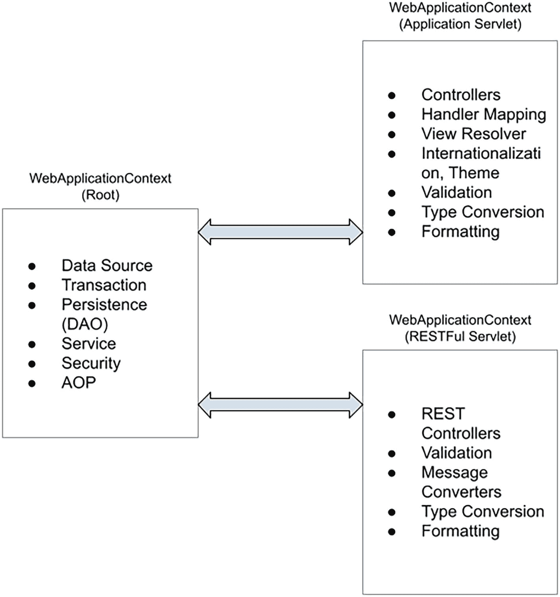

一个包含三个相互关联的 Web 应用程序上下文数据的流程图。1. Web 应用程序上下文，根。2. Web 应用程序上下文，应用程序服务器。3. Web 应用程序上下文，RESTful 服务。

图 14-2

Spring MVC `WebApplicationContext` 层次结构


#### Spring MVC 请求生命周期

让我们看看 Spring MVC 如何处理一个请求。图 14-3 展示了 Spring MVC 中处理请求所涉及的主要组件。

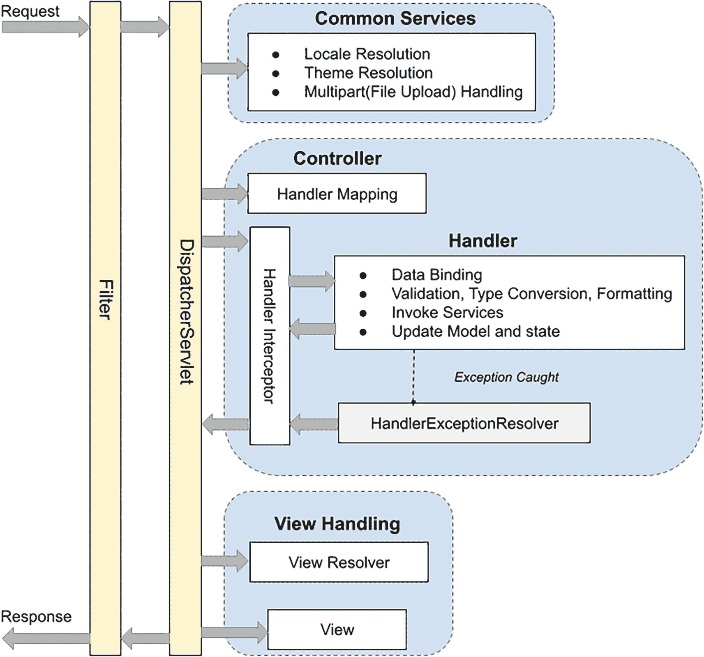

流程图从请求经过过滤器开始，随后到达调度器 Servlet。调度器 Servlet 指向公共服务、控制器、视图处理，并通过过滤器返回响应。

图 14-3

Spring MVC 请求

主要组件及其用途如下：

*   **过滤器**：过滤器应用于每个请求。下一节将介绍几种常用的过滤器及其用途。

*   **调度器 Servlet**：该 Servlet 分析请求并将其分派给相应的控制器进行处理¹。

*   **公共服务**：公共服务将应用于每个请求以提供支持，包括国际化（i18n）、主题和文件上传。它们的配置在 `DispatcherServlet` 的 `WebApplicationContext` 中定义。

*   **处理器映射**：它将传入的请求映射到处理器（Spring MVC 控制器类中的一个方法）。自 Spring 2.5 起，在大多数情况下无需配置，因为 Spring MVC 会自动注册一个开箱即用的 `HandlerMapping` 实现，该实现基于控制器类中通过 `@RequestMapping` 注解（及其扩展）在类型或方法级别表达的 HTTP 路径来映射处理器。

     一个信息符号。由一个带阴影圆圈内的小写字母 i 表示。 在 Spring 2.5 中，`DefaultAnnotationHandlerMapping` 是默认实现。从 Spring 3.1 开始，`RequestMappingHandlerMapping` 成为默认实现，只要遵循 Spring 的控制器和方法命名约定，它也支持将请求映射到未使用注解定义的处理器。

*   **处理器拦截器**：在 Spring MVC 中，你可以为处理器注册拦截器以实现通用检查或逻辑。例如，处理器拦截器可以检查以确保处理器仅在工作时间内被调用。

*   **处理器异常解析器**：在 Spring MVC 中，`HandlerExceptionResolver` 接口（定义在 `org.springframework.web.servlet` 包中）旨在处理处理器在请求处理过程中抛出的意外异常。默认情况下，`DispatcherServlet` 会注册 `DefaultHandlerExceptionResolver` 类（来自 `org.springframework.web.servlet.mvc.support` 包）。该解析器通过设置特定的响应状态码来处理某些标准的 Spring MVC 异常。你也可以通过使用 `@ExceptionHandler` 注解标注控制器方法并将异常类型作为属性传入，来实现自己的异常处理器。

*   **视图解析器**：Spring MVC 的 `ViewResolver` 接口（来自 `org.springframework.web.servlet` 包）支持基于控制器返回的逻辑名称进行视图解析。有许多实现类支持各种视图解析机制。例如，`UrlBasedViewResolver` 类支持将逻辑名称直接解析为 URL。`ContentNegotiatingViewResolver` 类支持根据客户端支持的媒体类型（如 XML、PDF 和 JSON）动态解析视图。还存在许多与不同视图技术集成的实现，例如 Thymeleaf^(¹²⁷)（`ThymeleafViewResolver`）、FreeMarker^(¹²⁸)（`FreeMarkerViewResolver`）、Velocity^(¹²⁹)（`VelocityViewResolver`）和 JasperReports^(¹³⁰)（`JasperReportsViewResolver`）。

这些描述仅涵盖了一些常用的处理器和解析器。如需完整描述，请参考 Spring 框架参考文档及其 Javadoc。

#### Spring MVC 配置

要在 Web 应用程序中启用 Spring MVC，需要进行一些初始配置，特别是 Web 部署描述符 `web.xml`。自 Spring 3.1 起，在 Servlet 3.0 Web 容器中支持基于代码的配置。这为 Web 部署描述符文件（`web.xml`）中所需的 XML 配置提供了一种替代方案。

 一个表示想法的符号。由一个电灯泡表示。 如果你对使用 XML 配置感兴趣，请查阅 *Pro Spring 4*，本书 Java 版本的第四版。

要为 Web 应用程序配置 Spring MVC 支持，我们需要对 Web 部署描述符执行以下配置：

*   配置根 `WebApplicationContext`

*   配置 Spring MVC 所需的 Servlet 过滤器

*   配置应用程序中的调度器 Servlet

在 Spring 中有多种方法可以做到这一点，但最简单的方法是扩展 `AbstractAnnotationConfigDispatcherServletInitializer`，这是来自 `org.springframework.web.servlet.support` 包的 Spring 工具类，如清单 14-5 所示。

```
package com.apress.prospring6.fourteen
import org.springframework.web.filter.CharacterEncodingFilter
import org.springframework.web.filter.HiddenHttpMethodFilter
import org.springframework.web.servlet.support.AbstractAnnotationConfigDispatcherServletInitializer
import jakarta.servlet.Filter
import java.nio.charset.StandardCharsets
class WebInitializer : AbstractAnnotationConfigDispatcherServletInitializer() {
override fun getRootConfigClasses(): Array> {
return arrayOf(BasicDataSourceCfg::class.java, TransactionCfg::class.java)
}
override fun getServletConfigClasses(): Array> {
return arrayOf(WebConfig::class.java)
}
override fun getServletMappings(): Array {
return arrayOf("/")
}
override fun getServletFilters(): Array {
val cef = CharacterEncodingFilter().apply {
encoding = StandardCharsets.UTF_8.name()
setForceEncoding(true)
}
return arrayOf(HiddenHttpMethodFilter(), cef)
}
}
清单 14-5
Spring Web 应用程序上下文的配置类
```

`AbstractAnnotationConfigDispatcherServletInitializer` 类实现了 `org.springframework.web.WebApplicationInitializer` 类。在 Servlet 环境中需要实现此接口，以便以编程方式配置 `ServletContext`。Spring 提供了多个实现，如图 14-4 所示，具体取决于用户自定义需求的复杂程度。

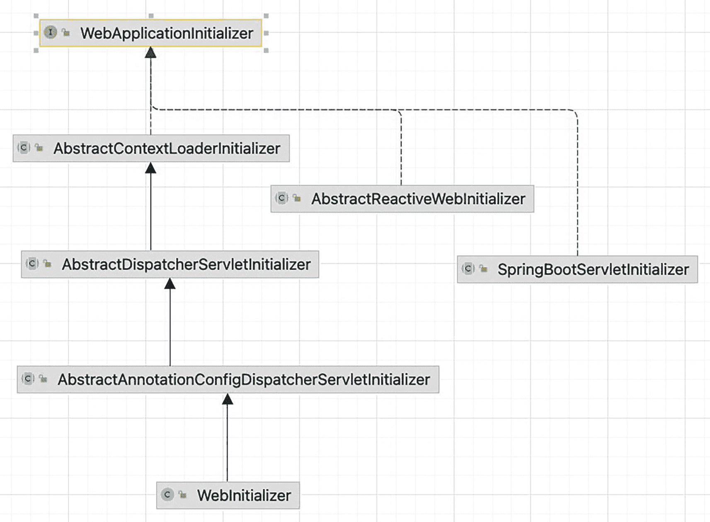

流程图从 Web 初始化器开始，随后是抽象注解配置调度器 Servlet 初始化器和 Web 应用程序初始化器。抽象调度器 Servlet 初始化器和抽象上下文加载器初始化器指向 Web 应用程序初始化器。

图 14-4

Spring `WebApplicationInitializer` 实现

在前面的示例中，使用了 Spring 类 `AbstractAnnotationConfigDispatcherServletInitializer`，因为它包含了配置使用基于 Kotlin 的 Spring 配置的 Spring Web 应用程序所需方法的具体实现。

所有实现 `WebApplicationInitializer` 接口的类都会被 `org.springframework.web.SpringServletContainerInitializer` 类自动检测到。从 Spring 6 开始，此类实现了 Servlet 3.0 的 `jakarta.servlet.ServletContainerInitializer` 接口，该接口在任何 Servlet 3.0 容器中自动引导。如清单 14-5 所示，以下方法被重写以插入自定义配置：

*   `getRootConfigClasses()`：将使用此方法返回的配置类创建一个类型为 `AnnotationConfigWebApplicationContext` 的根应用程序上下文。


*   `getServletConfigClasses()`：将使用此方法返回的配置类创建一个类型为 `AnnotationConfigWebApplicationContext` 的 Web 应用上下文。

*   `getServletMappings()`：`DispatcherServlet` 的映射（上下文）由此方法返回的字符串数组指定。

*   `getServletFilters()`：此方法返回一个 `jakarta.servlet.Filter` 实现数组，这些过滤器将应用于每个请求。

回到过滤器，表 14-1 描述了 `getServletFilters()` 返回的数组中的每个过滤器。

表 14-1

常用的 Spring MVC Servlet 过滤器

| 过滤器类全名 | 描述 |
| --- | --- |
| `org.springframework.web.filter.CharacterEncodingFilter` | 此过滤器用于指定请求的字符编码。 |
| `org.springframework.web.filter.HiddenHttpMethodFilter` | 此过滤器提供对 GET 和 POST 之外的 HTTP 方法（例如 PUT）的支持。 |

 一个警告符号。它由带阴影三角形内的感叹号表示。 虽然此处不需要（因此也未在配置中使用），但有一个过滤器实现值得一提：`org.springframework.orm.jpa.support.OpenEntityManagerInViewFilter`。此实现将 JPA `EntityManager` 绑定到线程，以处理整个请求。它旨在用于 Open `EntityManager` in View 模式，允许在 Web 视图中进行延迟加载，即使原始事务已经完成。虽然实用，但它相当危险，因为多个请求最终可能会消耗掉所有数据库允许的开放连接。此外，如果要加载的数据集很大，应用程序可能会冻结。这就是开发人员倾向于不使用它的原因，而是通过 Ajax 请求调用特定的处理器，在 Web 特定的视图对象（而非实体）中加载数据。

#### 在 Spring MVC 中创建第一个视图

有了服务层和 Spring MVC 配置，我们就可以开始实现第一个视图了。在本节中，我们将实现一个简单的视图，用于显示保存在 `SINGER` 表中的所有歌手。

正如本章开头所述，Thymeleaf 用于设计 HTML 页面。Thymeleaf 是一个现代的服务器端 Java 模板引擎，适用于 Web 和独立环境，并且由于它是专门为 Spring 应用程序创建的，因此可以与 Spring 应用程序平滑集成。要将 Thymeleaf 与 Spring Web 应用程序集成，需要将 Thymeleaf 库放在类路径上。现在是时候列出 `chapter-14` 项目的依赖项了，该项目代表一个 Spring MVC 应用程序，打包为 Web 应用程序归档 (WAR) 文件，并部署在 Apache Tomcat 10^(¹³¹) 服务器上。

图 14-5 在 Gradle 视图中显示了 `chapter-14` 项目的依赖项。

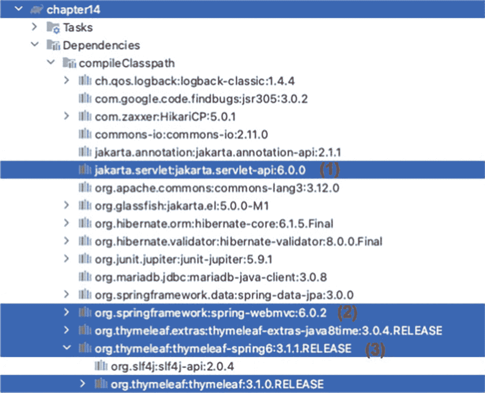

第 14 章项目的截图。它列出了任务和依赖项。依赖项列表包括 Jakarta service jakarta servlet、org spring framework spring web m v c、thyme leaf extras thyme af extra java 8 times、thyme leaf spring 6.3.1.1 release。

图 14-5

显示 `chapter-14` 项目依赖项的 Gradle 视图

标记为 (1) 的库 `jakarta.servlet-api` 库^(¹³²) 是 Jakarta 项目的一部分，包含开发 Web 应用程序所需的所有接口、类和方法。要开发 Spring Web 应用程序，我们需要在此基础上构建。此库的 6.0.0 版本适用于与 Apache Tomcat 10 兼容的 Web 应用程序。

标记为 (2) 的库 `spring-webmvc` 包含用于开发 Spring Web 应用程序的所有接口和类。Spring Web MVC 构建在 Servlet API 之上，是 Spring 框架的一部分。6.x 版本与 Jakarta EE 9 兼容。

标记为 (3) 的库 `thymeleaf-spring6` 提供了所有用于将 Thymeleaf 与 Spring 集成的接口和类。


#### 配置 `DispatcherServlet`

下一步是配置 `DispatcherServlet`。这通过创建一个配置类来实现，该类定义了 Spring Web 应用程序所需的所有基础设施 Bean。`chapter-14` 项目基于 Kotlin 配置的类如清单 14-6 所示。

```
package com.apress.prospring6.fourteen
import org.springframework.context.annotation.Description
import org.springframework.web.servlet.DispatcherServlet
import org.springframework.web.servlet.ViewResolver
import org.springframework.web.servlet.config.annotation.*
import org.thymeleaf.extras.java8time.dialect.Java8TimeDialect
import org.thymeleaf.spring6.SpringTemplateEngine
import org.thymeleaf.spring6.templateresolver.SpringResourceTemplateResolver
import org.thymeleaf.spring6.view.ThymeleafViewResolver
import org.thymeleaf.templatemode.TemplateMode
@Configuration
@EnableWebMvc
@ComponentScan(basePackages = ["com.apress.prospring6.fourteen"])
open class WebConfig : WebMvcConfigurer, ApplicationContextAware {
private var applicationContext: ApplicationContext? = null
@Throws(BeansException::class)
override fun setApplicationContext(applicationContext: ApplicationContext) {
this.applicationContext = applicationContext
}
@Bean
open fun templateResolver() =
SpringResourceTemplateResolver().apply {
setApplicationContext(applicationContext!!)
prefix = "/WEB-INF/views/"
suffix = ".html"
templateMode = TemplateMode.HTML
isCacheable = false
}
@Bean
@Description("Thymeleaf 模板引擎")
open fun templateEngine() = SpringTemplateEngine().apply {
addDialect(Java8TimeDialect())
setTemplateResolver(templateResolver())
setTemplateEngineMessageSource(messageSource())
enableSpringELCompiler = true
}
@Bean
@Description("Thymeleaf 视图解析器")
open fun viewResolver() = ThymeleafViewResolver().apply {
templateEngine = templateEngine()
order = 1
}
// 声明我们的静态资源。我们在 Java 配置中添加了缓存，但这不是必需的。
override fun addResourceHandlers(registry: ResourceHandlerRegistry) {
super.addResourceHandlers(registry)
registry.addResourceHandler("/images/**", "/styles/**")
.addResourceLocations("/images/", "/styles/")
}
override fun configureDefaultServletHandling(configurer:
DefaultServletHandlerConfigurer) {
configurer.enable();
}
override fun addViewControllers(registry: ViewControllerRegistry) {
registry.addRedirectViewController("/", "/home")
}
}
清单 14-6
Spring 的 DispatcherServlet 的配置类
```

接口 `WebMvcConfigurer` 定义了用于自定义基于 Kotlin 配置的回调方法，并且通过使用 `@EnableWebMvc` 来启用 Spring MVC。尽管一个 Spring 应用程序中可以有多个基于 Kotlin 的配置类，但只允许其中一个使用 `@EnableWebMvc` 注解。在清单 14-6 中，你可以看到重写了几个方法来自定义配置：

*   `addResourceHandlers(..)`：添加用于从 Web 应用程序根目录、类路径等特定位置提供静态资源（如图片、JavaScript 和 CSS 文件）的处理器。在此自定义实现中，任何包含资源的 URL 请求都将由一个绕过所有过滤器的特殊处理器处理。该方法定义了静态资源文件的位置，使 Spring MVC 能够高效地处理这些文件夹内的文件。在标签内，`location` 属性定义了静态资源的文件夹。调用 `WebMvcConfigurer.super.addResourceHandlers(registry)` 表示 Web 应用程序的根文件夹，默认为 `/src/main/webapp`。资源处理器路径 `/styles/**` 定义了映射到 CSS 资源的 URL；例如，对于 URL `http://localhost:8080/ch14/styles/standard.css`，Spring MVC 将从文件夹 `/src/main/webapp/styles` 中检索文件 `standard.css`。

*   `configureDefaultServletHandling(..)`：允许将 `DispatcherServlet` 映射到 Web 应用程序的根上下文 URL，同时仍然允许静态资源请求由容器的默认 Servlet 处理。

*   `addViewControllers(..)`：定义简单的自动控制器，这些控制器预先配置了响应状态码和/或用于渲染响应体的视图。这些视图没有控制器逻辑，用于渲染欢迎页面、执行简单的站点 URL 重定向、返回 404 状态等。在清单 14-6 中，我们使用此方法在访问站点根路径（`/`）时执行重定向到 `home` 视图，这基本上将主页变成了首页。

*   `viewResolver(..)`：声明一个类型为 `ThymeleafViewResolver` 的视图解析器，它将符号视图名称匹配到 `/WEB-INF/views` 下的 *.html 模板。Thymeleaf 是一个模板工具，通过组合多个片段根据逻辑名称生成视图；此工作由本配置中声明的 `SpringResourceTemplateResolver` Bean 执行。最终的视图是一个 HTML 页面，通过将 Thymeleaf 特殊构造替换为与 Spring 视图数据一起编译的 HTML 元素来构建，这由 `SpringTemplateEngine` 负责处理。

#### 实现 Spring 控制器

`home` 视图很简单，是介绍 Spring 控制器的最佳示例。*Spring 控制器* 是使用特殊原型注解 `@Controller` 及其扩展（如 `@RestController`，将在**第** **15** 章中介绍）进行注解的特殊 Bean。

`HomeController` 类如清单 14-7 所示。

```
package com.apress.prospring6.fourteen.controllers
import org.springframework.stereotype.Controller
import org.springframework.ui.Model
import org.springframework.web.bind.annotation.RequestMapping
import org.springframework.web.bind.annotation.RequestMethod
@Controller
class HomeController {
@GetMapping(path = ["home"])
fun home(model: Model): String {
model.addAttribute("message", "Spring MVC Thymeleaf 示例！！")
return "home"
}
}
清单 14-7
HomeController 类与 Bean 声明
```

注解 `@Controller` 应用于该类，表明它是一个 Spring MVC 控制器。`@RequestMapping` 注解指明了将由该注解所在方法处理的 URL。控制器类有时被称为*处理器*，因为它处理请求，而方法被称为*处理器方法*，因为它们也处理请求。通常，处理器方法处理那些在类级别使用 `@RequestMapping` 注解声明了公共根路径的请求；控制器类只是将它们分组的一种方式。

放置在 `home(..)` 方法上的 `@RequestMapping` 注解通过 `method` 属性映射到 HTTP GET 方法。这意味着任何对 URL `/home` 的 GET 请求都将由此方法处理。在此方法体内，`"Spring MVC Thymeleaf 示例！！"` 被设置为 `Model` 对象上 `message` 属性的值。在 `DispatcherServlet` 配置中，`ThymeleafViewResolver` 被配置为视图解析器，其文件前缀为 `/WEB-INF/views/`，后缀为 `.html`。因此，Spring MVC 将选取文件 `/WEB-INF/views/singers/home.html` 作为视图，并使用 `Model` 对象中的数据渲染它。


#### 实现视图

`home.html` Thymeleaf 模板相当简单，如清单 14-8 所示。

```

清单 14-8
/WEB-INF/views/singers/home.html Thymeleaf 视图文件的内容
```

任何见过 HTML 代码的人都会觉得这个模板非常眼熟。唯一额外的部分是所有以 `th:` 为前缀的元素。这个模板之所以看起来如此简单，是因为其主要部分位于另一个名为*布局*的模板中。该模板包含了网站的整体布局，对于每个视图，Thymeleaf 会将其部分内容替换为特定作用域的内容。网站的整体模板位于 `chapter14/src/main/webapp/WEB-INF/views/templates/` 目录下，名为 `layout.html`。由于本书的重点是 Spring 而非 Thymeleaf，且 `layout.html` 文件较大，此处不再展示（欢迎读者自行在项目仓库中查阅）；仅对少量 Thymeleaf 结构进行说明。清单 14-8 中的 Thymeleaf 结构解释如下：

*   `th:replace`：将 `home.html` 模板中的 `<head>` 标签替换为 `templates/layout.html` 中的片段，但将标题替换为作为自定义函数 `pageTitle(..)` 参数提供的值。
*   `th:fragment`：将 `templates/layout.html` 中的片段替换为 `home.html` 中声明的片段。在此示例中，`templates/layout.html` 中声明的 `pageContent` 部分是一个非常简单的通用片段，因此在每个继承的视图中，都需要将其替换为适当的内容。

##### 测试主页视图

视图文件位于 `webapp` 目录下的 `WEB-INF` 目录中，该目录汇集了所有 Web 资源。项目的内部结构是 Web 项目典型的 Maven 结构，并为 Gradle 配置了各种插件，以便将项目构建成可部署在 Apache Tomcat 服务器上的 WAR 文件。项目结构如图 14-6 所示（Maven 的 `.pom` 构建文件不属于 Kotlin 项目源码，因为我们专注于 Gradle）。

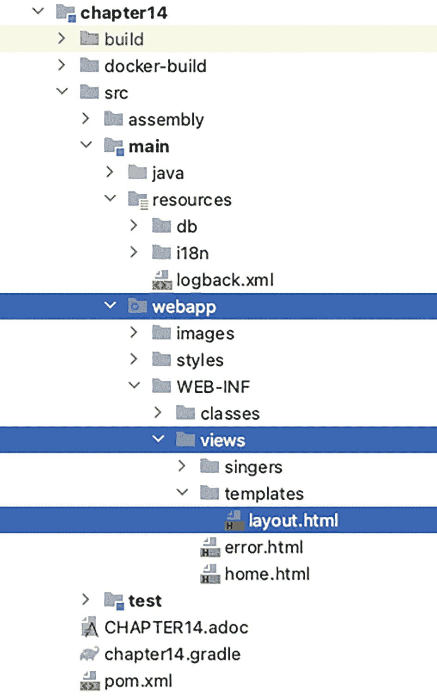

第 14 章下拉菜单的截图。在 s r 选项下，web app 被高亮显示。从第 14 章文件夹构建菜单中选择了 web app、views 和 layout 选项。

图 14-6

`chapter-14` 项目的内部结构

测试 `home.html` 视图有两种方式：

*   编写一个 Spring MVC 测试来测试视图的映射和模型的填充。
*   构建项目，将生成的 WAR 文件部署到本地 Apache Tomcat，然后检查主页。

为非常简单的视图和控制器编写测试相当简单。当应用程序上下文变得更加复杂且需要注入更多依赖时，测试可能会更复杂，但并非不可能。清单 14-9 展示了测试类和方法，用于检查 `/home` 路径到 `HomeController#home(..)` 方法的正确映射，以及为 `home.html` 视图填充模型的情况。

```
package com.apress.prospring6.fourteen.controllers
import com.apress.prospring6.fourteen.WebConfig
import org.junit.jupiter.api.Test
import org.springframework.test.context.junit.jupiter.web.SpringJUnitWebConfig
import org.springframework.test.web.servlet.MockMvc
import org.springframework.test.web.servlet.request.MockMvcRequestBuilders
import org.springframework.test.web.servlet.setup.MockMvcBuilders
import org.springframework.web.context.WebApplicationContext
import org.hamcrest.Matchers.containsString
import org.springframework.test.web.servlet.result.MockMvcResultHandlers.print
import org.springframework.test.web.servlet.result.MockMvcResultMatchers.*
@SpringJUnitWebConfig(classes = [WebConfig::class])
class HomeControllerTest(wac: WebApplicationContext) {
var mockMvc: MockMvc
init {
mockMvc = MockMvcBuilders.webAppContextSetup(wac).build()
}
@Test
@Throws(Exception::class)
fun testHome() {
mockMvc.perform(MockMvcRequestBuilders.get("/home"))
.andDo(MockMvcResultHandlers.print())
.andExpect(MockMvcResultMatchers.status().isOk())
.andExpect(MockMvcResultMatchers.view().name("home"))
.andExpect(
MockMvcResultMatchers.content()
.string(Matchers.containsString("Spring MVC ThymeleafExample!!"))
)
}
}
清单 14-9
测试 HomeController 和 home.html 视图
```

`MockMvc` 基于 `spring-test` 模块中的 Servlet API 模拟实现构建，不依赖于正在运行的容器，但仍需要 `servlet-api` 依赖。这不是端到端测试，它能工作是因为 `HomeController` 没有调用服务层和/或数据仓库层。

`MockMvcRequestBuilders.get(..)` 方法创建一个 `MockHttpServletRequest` 实例，该实例配置了为其设置的参数以创建有效请求。`MockMvc` 在通过 `@SpringJUnitWebConfig` 注解配置的上下文中执行请求。此注解是一个特殊的 Spring 测试注解，用于为 Spring Web 应用程序配置测试上下文。它使用 `@ExtendWith(SpringExtension.class)` 进行元注解，用于注册 `SpringExtension`，该扩展将 Spring TestContext 框架集成到 JUnit 5 的 Jupiter 编程模型中。


它还通过 `@ContextConfiguration` 进行了元注解，用于确定如何加载和配置集成测试所需的 `ApplicationContext`。同时，它还通过 `@WebAppConfiguration` 进行了元注解，用于配置测试时应加载一个 `WebApplicationContext`，并使用 Web 应用根路径的默认值。

该测试检查了响应的所有重要部分：

*   通过 `.andExpect(status().isOk())` 匹配器，验证 HTTP 响应码是否符合预期。
*   通过 `.andExpect(view().name("home"))` 匹配器，验证逻辑视图名称是否符合预期。
*   通过 `.andExpect(content().string(containsString("Spring MVC ThymeleafExample!!")))` 匹配器，验证添加到 Spring `Model` 实例中的属性是否已呈现在渲染后的视图中。

另一种检查主页是否正确渲染的方法是将应用实际部署。为此，你需要执行以下操作：

*   构建项目，生成 `build/libs/chapter14-6.0-SNAPSHOT.war` 文件。
*   下载并安装 Apache Tomcat 10。

 警告符号。由一个带阴影三角形内的感叹号表示。 在基于 Unix 的系统上，你可能需要使 `$TOMCAT_HOME/bin` 下的所有脚本具有可执行权限。

*   使用 IntelliJ IDEA 的 Tomcat 启动器部署 `chapter14-6.0-SNAPSHOT.war` 文件。

要创建 Apache Tomcat 启动器，请按照 IntelliJ 官方页面^(¹³³)上的说明操作。

 创意符号。由一个电灯泡表示。 你无法在 IntelliJ IDEA 社区版中创建 Tomcat 启动器。不过，你仍然可以在 `build.gradle` 文件中添加自定义部署任务。

在图 14-7 中，你可以看到“部署”选项卡用于将 Web 构件添加到启动器。当以展开形式添加时，启动器可以在调试模式下启动，代码中的断点将暂停应用，以便进行运行时调试。

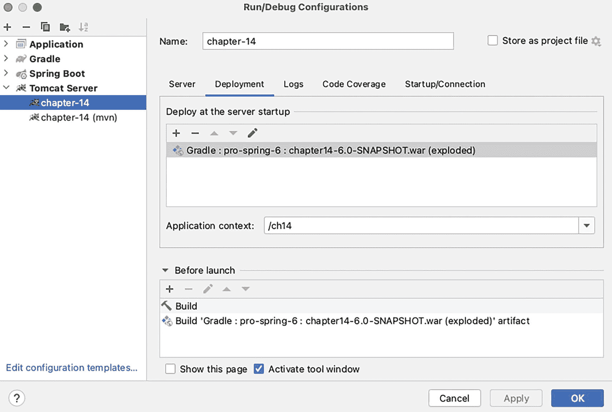

运行或调试配置的截图。它包含名称以及服务器、部署、日志、代码覆盖率和启动连接五个选项卡。部署部分包含了服务器启动时部署、应用上下文和启动前操作。

图 14-7

`chapter-14` 项目的 IntelliJ IDEA 启动器

一旦启动器就位，你就可以启动应用。当应用完全部署后，IntelliJ 会尝试打开一个指向 `http://localhost:8080/ch14/home` 的网页。如果页面加载正确，你应该会看到一个类似于图 14-8 所示的页面。

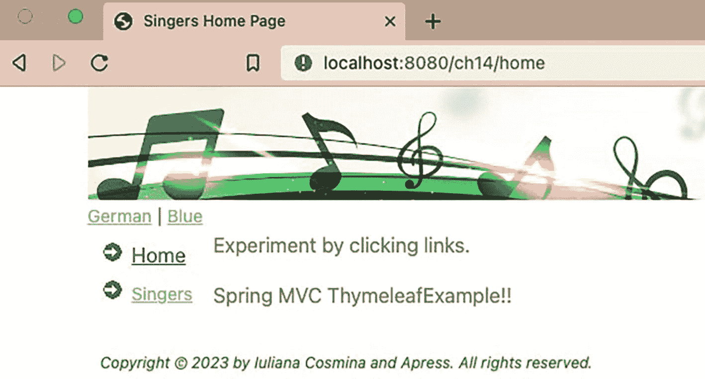

一个网页的截图。歌手的首页上显示了一个带有音乐符号的动画图像。尝试点击链接，图片下方是 Spring MVC Thymeleaf 示例。

图 14-8

`chapter-14` 项目的 IntelliJ IDEA 启动器

现在，我们的第一个视图已经可以工作了。在接下来的章节中，我们将用更多视图来丰富应用，并支持 i18n、主题、错误处理等功能。

#### 理解 Spring MVC 项目结构

在深入实现 Web 应用的各个方面之前，让我们先看看本章开发的示例 Web 应用的项目结构是什么样的。

通常，一个 Web 应用需要大量文件来支持各种功能。例如，有许多静态资源文件，如样式表、JavaScript 文件、图片和组件库。还有支持以多种语言呈现界面的文件。当然，还有将由 Web 容器解析和渲染的视图页面，以及模板框架（例如 Thymeleaf）用于提供一致应用外观和感觉的布局和定义文件。

将服务于不同目的的文件存储在一个结构良好的文件夹层次结构中，始终是一个好习惯。这能让你清晰地了解应用所使用的各种资源，并简化后续的维护工作。

项目结构已通过图 14-6 进行了介绍。表 14-2 描述了本章开发的 Web 应用的文件夹结构。请注意，此处展示的结构并非强制要求，而是开发者社区在 Web 应用开发中常用的结构。

表 14-2

示例 Web 项目文件夹结构说明

| 文件夹名称 | 用途 |
| --- | --- |
| `images` | 存储用于美化网站的图片：Logo、项目符号等。 |
| `styles` | 存储支持 CSS 样式、网站外观和感觉的样式表文件。 |
| `WEB-INF/classes` | 存储主题 Cookie 配置的属性文件。 |
| `WEB-INF/views` | 存储用于创建视图的模板文件，此处为 Thymeleaf 模板。 |
| `resources/i18n` | 存储支持 i18n 的文件。`application*.properties` 文件存储与布局相关的文本（例如，页面标题、字段标签和菜单标题）。`message*.properties` 文件存储各种消息（例如，成功和错误消息以及验证消息）。该示例将同时支持英语（美国）和德语（德国）。`i18n` 目录包含国际化资源文件。这些文件本可以放在 `WEB-INF/i18n` 下，但为了在章节末尾更容易迁移到 Spring Boot，将其放在了 `resources` 下。 |

 信息符号。由一个带阴影圆圈内的小写字母 i 表示。 有时可能还会有一个 `webapp/scripts` 目录，其中包含使页面动态化所需的通用 JavaScript 文件。也可能存在其他特定于所用 JavaScript 框架的目录，例如 `jQuery`^(¹³⁴) 或 `jqgrid`^(¹³⁵)。对于本章的简单示例，不需要此类文件。

表 14-2 中提到的大多数 Web 文件将不会在此展示。鉴于此，我们建议你下载本章的源代码副本，并将其解压到一个临时文件夹中，以便你可以直接将所需文件复制到项目中。

### 启用国际化 (i18n)

在开发 Web 应用时，尽早启用 i18n 始终是一个好习惯。主要工作是将用户界面文本和消息外部化到属性文件中。

即使你一开始没有 i18n 需求，将语言相关设置外部化也是好的，这样以后需要支持更多语言时会更容易。

使用 Spring MVC，启用 `i18n` 很简单。首先，将语言相关的用户界面设置外部化到 `/resources/i18n` 文件夹内的各个属性文件中，如表 14-2 所述。因为我们将同时支持英语（美国）和德语（德国），所以需要两个文件。`global.properties` 文件存储默认区域设置的设置，此处为英语（美国）。`global_de.properties` 文件存储德语（德国）语言的设置。


#### 在 `DispatcherServlet` 配置中配置 `i18n`

语言文件就位后，下一步是为 `DispatcherServlet` 实例的 `WebApplicationContext` 配置 i18n 支持。为此，我们需要在清单 14-6 中引入的 `WebConfig` 类中声明一个 `MessageSource` bean，将其注入模板解析器，并添加请求拦截器，以将视图模板中的所有消息代码替换为配置语言中的文本表示。支持国际化的配置修改如清单 14-10 所示。

```
package com.apress.prospring6.fourteen
import org.springframework.context.MessageSource
import org.springframework.context.support.ReloadableResourceBundleMessageSource
import org.springframework.web.servlet.i18n.LocaleChangeInterceptor
import org.springframework.web.servlet.mvc.WebContentInterceptor
import org.springframework.web.servlet.config.annotation.InterceptorRegistry
import org.springframework.web.servlet.i18n.CookieLocaleResolver
// 其他导入语句已省略
@Configuration
@EnableWebMvc
@ComponentScan(basePackages = ["com.apress.prospring6.fourteen"])
open class WebConfig : WebMvcConfigurer, ApplicationContextAware {
private var applicationContext: ApplicationContext? = null
@Bean
@Description("Thymeleaf 模板引擎")
open fun templateEngine() = SpringTemplateEngine().apply {
addDialect(Java8TimeDialect())
setTemplateResolver(templateResolver())
setTemplateEngineMessageSource(messageSource())
enableSpringELCompiler = true
}
override fun addInterceptors(registry: InterceptorRegistry) {
with(registry){
addInterceptor(localeChangeInterceptor()).addPathPatterns("/*")
addInterceptor(themeChangeInterceptor())
addInterceptor(webChangeInterceptor())
}
}
@Bean
open fun messageSource(): MessageSource
= ReloadableResourceBundleMessageSource().apply {
setBasename("classpath:i18n/global")
setDefaultEncoding(StandardCharsets.UTF_8.name())
setUseCodeAsDefaultMessage(true)
setFallbackToSystemLocale(true)
// # -1 : 从不重新加载，0 始终重新加载
// setCacheSeconds(0);
}
@Bean
open fun localeChangeInterceptor() = LocaleChangeInterceptor().apply {
paramName = "lang"
}
@Bean
open fun localeResolver() = CookieLocaleResolver("locale").apply {
setDefaultLocale(Locale.ENGLISH)
setCookieMaxAge(Duration.ofHours(1))
}
...
}
清单 14-10
为 Spring 的 DispatcherServlet 添加国际化配置类
```

在此版本的配置中，`MessageSource` bean 被声明为 `ReloadableResourceBundleMessageSource` 实例。`ReloadableResourceBundleMessageSource` 类实现了 `MessageSource` 接口，该接口从定义的文件（本例中为 `/resources/i18n` 文件夹中的 `global*.properties` 文件）加载消息，以支持 i18n。

请注意 `fallbackToSystemLocale` 属性。此属性指示 Spring MVC 在未找到客户端区域设置的特殊资源包时，是否回退到应用程序运行所在系统的区域设置。该实例使用属性文件的位置 `classpath:i18n/global` 进行配置，这意味着这些文件预期位于应用程序类路径下，因此在开发时位于 `resources` 目录下。编码也已配置，并且如果视图文件中使用了消息代码，但在资源文件中没有为其配置值，则该代码将用作值。

定义了一个类为 `LocaleChangeInterceptor` 的 Spring MVC 拦截器，它会拦截所有发往 `DispatcherServlet` 的请求。该拦截器支持通过可配置的请求参数进行区域设置切换。从拦截器配置来看，定义了一个名为 `lang` 的 URL 参数，用于更改应用程序的区域设置，并且该参数是可定制的，因此您可以根据需要使用不同的参数。

最后，定义了一个类为 `CookieLocaleResolver` 的 bean。该类支持从用户浏览器的 cookie 中存储和检索区域设置。

#### 修改视图以支持 i18n

现在国际化支持已配置完成，必须修改视图模板文件以支持国际化。之前引入的 `home.html` 视图没有任何需要国际化的元素，因此为了展示 Thymeleaf 模板中如何支持国际化，清单 14-11 展示了 `views/templates/layout.html` 文件的一个片段。

```

布局页面

DE

EN

页面内容

清单 14-11
views/templates/layout.html 片段
```

HTML 的 `lang` 属性用于标识 Web 上文本内容的语言。`th:lang` 构造使用 `LocaleChangeInterceptor` 在每个请求上设置的 `lang` 参数的值来填充此属性。因为我们在 `DispatcherServlet` 的 `WebApplicationContext` 中定义了 `LocaleChangeInterceptor`，Spring MVC 会将区域设置存储在浏览器的 cookie（名称为 `locale`）中，并且默认情况下，该 cookie 会在用户会话期间保留。如果您希望将 cookie 保留更长时间，可以在 `CookieLocaleResolver` bean 定义中，通过调用 `setCookieMaxAge(...​`​)` 来覆盖从类 `org.springframework.web.util.CookieGenerator` 继承的属性 `cookieMaxAge`。

要切换到英语（美国），您可以在浏览器中更改 URL 以反映 `?lang=en`，页面将切换回英语。由于没有提供名为 `global_en.properties` 的属性文件，Spring MVC 会回退使用默认文件 `global.properties`，该文件以站点的默认语言（英语）存储属性。

特定于区域设置的值将使用语法 `#{key}` 通过键来访问，其中 `key` 是国际化属性文件中的消息键。

### 使用主题和模板

除了 i18n 之外，Web 应用程序还需要适当的外观和感觉（例如，商业网站需要专业的外观，而社交网站需要更生动的风格），以及一致的布局，以便用户在使用 Web 应用程序时不会感到困惑。

 警告符号。它由阴影三角形内的感叹号表示。 目前，方法是将网站与后端分离，并使用诸如 React^(¹³⁶) 和 TypeScript^(¹³⁷) 等先进的 JavaScript 框架来创建网站，这些框架与 Spring REST Web 应用程序交互以进行数据管理和其他高级操作。这意味着用户界面将主要是静态的。这就是为什么本节将介绍的 `ThemeChangeInterceptor`、`ResourceBundleThemeSource` 和 `CookieThemeResolver` 类型在 Spring 6.x 中被标记为已弃用，但并未推荐替代方案的原因。


#### 主题支持

Spring MVC 为主题提供了全面支持，并且在 Web 应用中启用它非常简单。因此，我们将从 Spring 的主题配置开始，这些配置需要添加到 `WebConfig` 类中，如清单 14-12 所示。

```
package com.apress.prospring6.fourteen
import org.springframework.ui.context.support.ResourceBundleThemeSource
import org.springframework.web.servlet.theme.CookieThemeResolver
import org.springframework.web.servlet.theme.ThemeChangeInterceptor
// 其他导入语句已省略
@Configuration
@EnableWebMvc
@ComponentScan(basePackages = ["com.apress.prospring6.fourteen"])
open class WebConfig : WebMvcConfigurer, ApplicationContextAware {
private var applicationContext: ApplicationContext? = null
@Throws(BeansException::class)
override fun setApplicationContext(applicationContext: ApplicationContext) {
this.applicationContext = applicationContext
}
@Bean
open fun themeSource() = ResourceBundleThemeSource()
@Bean
open fun themeChangeInterceptor() = ThemeChangeInterceptor().apply {
paramName = "theme"
}
@Bean
open fun themeResolver() = CookieThemeResolver().apply {
defaultThemeName = "green"
cookieMaxAge = 3600
cookieName = "theme"
}
override fun addInterceptors(registry: InterceptorRegistry) {
with(registry){
addInterceptor(localeChangeInterceptor()).addPathPatterns("/*")
addInterceptor(themeChangeInterceptor())
addInterceptor(webChangeInterceptor())
}
}
...
}
清单 14-12
WebConfig 主题配置
```

第一个 bean 的类型为 `ResourceBundleThemeSource`，负责加载当前主题的 `ResourceBundle` bean。例如，如果当前主题名为 `blue`，该 bean 将查找文件 `blue.properties` 作为该主题的 `ResourceBundle` bean。这两个主题的属性文件位于 `WEB-INF/classes` 目录下。文件分别命名为 `blue.properties` 和 `green.properties`，它们分别对应 `blue` 和 `green` 主题。文件内容以主题名称作为属性，以及其他指向特定主题图片和 CSS 文件路径的属性。例如，`green.properties` 文件的内容如清单 14-13 所示。

```
css.style=/styles/decorator-green.css
banner.image=/images/banner-green.png
name=green
清单 14-13
green.properties 文件内容
```

新的拦截器 bean 类型为 `ThemeChangeInterceptor`，它会拦截每个请求以添加 `theme` 参数。

类型为 `CookieThemeResolver` 的 bean 用于解析用户的当前主题。属性 `defaultThemeName` 定义了要使用的默认主题，即 `green` 主题。请注意，顾名思义，`CookieThemeResolver` 类使用 cookie 来存储用户的主题。此外，还有一个类型为 `SessionThemeResolver` 的 bean，它将 *theme* 属性存储在用户的会话中，但为了使用它，我们需要为应用添加安全性，而我们目前不想这样做。

现在主题已配置完成，需要做的改动不多。在 `views/templates/layout.html` 文件中，我们只需要添加对 `theme` 参数的支持，并添加一个菜单选项来更改主题，方式与添加 locale 支持相同，如清单 14-14 所示。

```

布局页面

DE
EN
|

BLUE
GREEN

页面内容

清单 14-14
views/templates/layout.html 代码片段
```

请注意，在 `<head>` 部分中，`th:theme` 被添加为一个属性。该属性的值由 `ThemeChangeInterceptor` bean 设置。`#themes.code('css.style')` 结构是一个上下文对象，用于从主题的 `ResourceBundle` 中检索 `css.style` 属性，该属性指向样式表文件 `decorator-*.css` 的路径。其值通过 `th:with` 结构存储在 `cssStyle` 变量中，然后使用 `th:href="@{(${cssStyle})}"` 设置为 `href` 属性的值。

在重新构建并将应用重新部署到服务器后，再次打开浏览器并访问 `http://localhost:8080/ch14`，您将看到 `green.css` 文件中定义的样式已被应用，因为这是在 `ThemeChangeInterceptor` bean 声明中配置为默认的主题。

如果您愿意，可以右键单击网页并分析 Thymeleaf 为 `home.html` 模板生成的 HTML 代码。

#### 设计模板布局

通过使用 `views/templates/layout.html` 文件作为模板（每个视图都基于此模板），已经确保了网站结构的一致性。为了保持颜色和元素样式的一致性与匹配性，一个主题需要结合网页设计和 Spring MVC 配置。

所有网页的通用结构已在清单 14-11 中以 HTML 形式呈现，但图 14-9 提供了更有用的可视化表示。

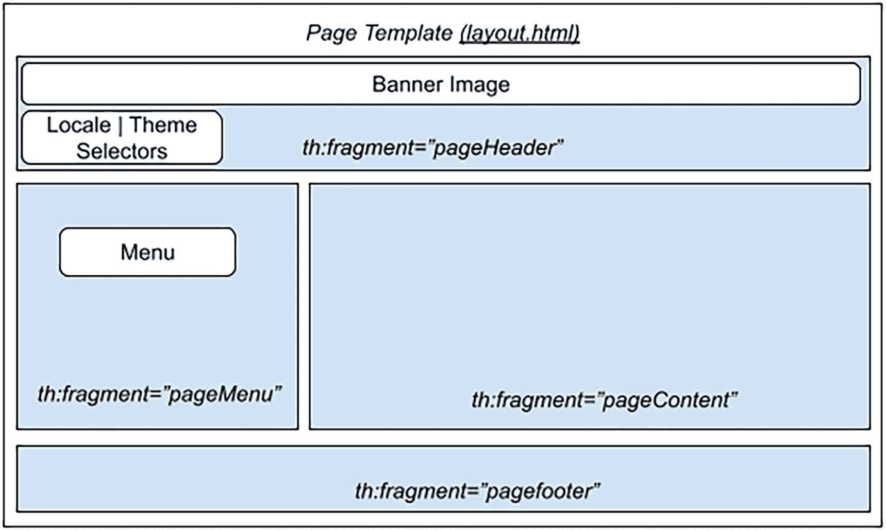

一个模型图，标题为页面模板。它包括一个横幅图片块。语言和主题选择器位于页面头部。菜单页面在左侧。页面内容在右侧。页面页脚在底部。

图 14-9

包含片段的 Thymeleaf 模板

横幅图片和字体颜色是网站主题的一部分，因此当在蓝色和绿色主题之间切换时，横幅和字体颜色也会随之改变。每个基于 `layout.html` 的视图都可以选择使用 `th:replace` 将其某些部分替换为来自该模板的片段，或者使用 `th:fragment` 声明自己的片段。显然，在大多数视图中，唯一需要定制的是 `pageContent` 片段和属于 `<head>` 元素的页面标题。

### 实现更复杂的视图

现在我们可以继续实现视图，这些视图允许用户查看完整的歌手列表、查看歌手详情、编辑现有歌手、创建新歌手，甚至删除歌手。

在接下来的章节中，我们将讨论 URL 到各个视图的映射，以及视图是如何实现的。我们还将讨论如何在 Spring MVC 中为编辑视图启用 JSR-349^(¹³⁸) 验证支持。

首先，我们需要设计如何将各种 URL 映射到相应的视图。在 Spring MVC 中，最佳实践之一是尽可能遵循 RESTful 风格的 URL 来映射视图。表 14-3 显示了 URL 到视图的映射，以及将处理该操作的控制器方法名称。

表 14-3

示例 Web 项目文件夹结构描述

| URL | HTTP 方法 | 控制器 | 方法描述 |
| --- | --- | --- | --- |
| `/singers` | GET | `SingersController` | 列出所有歌手。 |
| `/singers` | POST | `SingersController` | 创建新歌手。 |
| `/singers/create` | GET | `SingersController` | 显示创建歌手的表单。 |
| `/singers/search` | GET | `SingersController` | 显示搜索歌手的表单。 |
| `/singers/go` | GET | `SingersController` | 根据作为请求参数提供的条件列出歌手：`fieldName`、`fieldValue` 和 `exactMatch`。 |
| `/singer/id` | GET | `OneSingerController` | 显示具有指定 ID 的歌手信息。 |
| `/singer/id` | PUT | `OneSingerController` | 更新具有指定 ID 的歌手。 |
| `/singer/id` | DELETE | `OneSingerController` | 删除具有指定 ID 的歌手。 |
| `/singer/id/edit` | GET | `OneSingerController` | 显示编辑具有指定 ID 的歌手的表单。 |
| `/singer/id/upload` | GET | `OneSingerController` | 显示为具有指定 ID 的歌手上传照片的表单。 |
| `/singer/id/photo` | GET | `OneSingerController` | 以字节数组形式检索具有指定 ID 的歌手的照片。 |
| `/singer/id/photo` | POST | `OneSingerController` | 提交用户为具有指定 ID 的歌手提供的图片。 |


#### 实现歌手列表视图

要实现一个显示数据集的视图，我们需要三样东西：

*   URL 与处理器方法之间的映射

*   一个用于填充模型的处理器方法

*   视图模板，我们将其命名为 `list.html`

如表 14-3 所述，显示歌手列表的请求 URL 是 `/singers`，声明处理器方法的控制器是 `SingersController`。项目中有两个控制器。`SingersController` 分组处理不影响特定 `Singer` 实例（通过 ID 标识）的方法，所有处理的请求都归在 `/singers` 路径下。影响单个 `Singer` 实例（通过 ID 标识）的处理器方法归在 `OneSingerController` 下，所有处理的请求都归在 `/singer/{id}` 路径下。

代码清单 14-15 展示了 `SingersController` 类、控制器配置以及为显示歌手的视图填充模型的处理器方法。

```
package com.apress.prospring6.fourteen.controllers
import com.apress.prospring6.fourteen.services.SingerService
import org.springframework.context.MessageSource
import org.springframework.stereotype.Controller
import org.springframework.ui.Model
import org.springframework.web.bind.annotation.RequestMapping
// 其他导入语句已省略
@Controller
@RequestMapping("/singers")
class SingersController(private val singerService: SingerService, private val messageSource: MessageSource) {
@GetMapping //@RequestMapping(method = RequestMethod.GET)
fun list(uiModel: Model): String {
var singers: List = singerService.findAll().toMutableList()
singers = singers.sortedBy ( Singer::id )
uiModel.addAttribute("singers", singers)
return "singers/list"
}
// --------------- 创建 -------------------
@GetMapping(value = ["/create"])
fun showCreateForm(uiModel: Model): String {
uiModel.addAttribute("singerForm", SingerForm())
return "singers/create"
}
@PostMapping(consumes = [MediaType.MULTIPART_FORM_DATA_VALUE])
@Throws(
IOException::class
)
fun create(
singerForm: @Valid SingerForm, bindingResult: BindingResult, uiModel: Model,
httpServletRequest: HttpServletRequest,
locale: Locale
): String {
return if (bindingResult.hasErrors()) {
uiModel.addAttribute("message", messageSource.getMessage("singer.save.fail", arrayOf(), locale))
uiModel.addAttribute("singerForm", singerForm)
"singers/create"
} else {
uiModel.asMap().clear()
val s = Singer().apply {
firstName = singerForm.firstName
lastName = singerForm.lastName
birthDate = singerForm.birthDate
}
// 处理文件上传
if (!singerForm.file!!.isEmpty) {
setPhoto(s, singerForm.file!!)
}
val created = singerService.save(s)
"redirect:/singer/" + UrlUtil.encodeUrlPathSegment(
created.id.toString(),
httpServletRequest
)
}
}
// --------------- 搜索 -------------------
@GetMapping(value = ["/search"])
fun showSearchform(criteria: CriteriaDto?): String {
return "singers/search"
}
@GetMapping(value = ["/go"])
fun processSubmit(
@ModelAttribute("criteriaDto") @Valid criteria: CriteriaDto,
result: BindingResult, model: Model, locale: Locale
): String {
return if (result.hasErrors()) {
"singers/search"
} else try {
val singers: List = singerService.getByCriteriaDto(criteria)
if (singers.isEmpty()) {
result.addError(
FieldError(
"criteriaDto",
"noResults",
messageSource.getMessage("NotEmpty.criteriaDto.noResults", null, locale)
)
)
"singers/search"
} else if (singers.size == 1) {
"redirect:/singer/" + singers[0].id
} else {
model.addAttribute("singers", singers)
"singers/list"
}
} catch (ice: InvalidCriteriaException) {
result.addError(
FieldError(
"criteriaDto", ice.fieldName,
messageSource.getMessage(ice.messageKey, null, locale)
)
)
"singers/search"
}
}
}
代码清单 14-15
SingersController 控制器及 list(..) 方法
```

放置在类上的 `@RequestMapping` 注解表明，该类中的所有处理器方法要么应用于作为参数提供的路径，要么应用于相对于该路径的路径。

在 `list(..)` 方法上，应用于它的 `@RequestMapping(method = RequestMethod.GET)` 表明该方法用于处理对 URL `/singers` 的 GET 请求。`Model` 对象被填充了一个名为 `singers` 的属性，并用 `singerService.findAll()` 调用返回的歌手集合进行填充。

 一个警告符号。它由一个带阴影三角形内的感叹号表示。 除非返回的集合大小可控，否则绝不应在生产环境中使用 `findAll()` 方法；否则，可能会导致严重的性能问题。

`@GetMapping` 注解是一个元注解，用于替代 `@RequestMapping(method = RequestMethod.GET)`。你可以在处理器方法上使用它，以使代码更具可读性。

该方法返回的值是 `"singers/list"`，这是用于渲染模型中数据的视图的逻辑名称。`ThymeleafViewResolver` bean 使用此逻辑名称来标识要使用的视图模板，即作为对用户请求的响应而返回的 HTML 页面。

`views/singers/list.html` 模板如代码清单 14-16 所示。

```

计数
名字
姓氏

ID
...
...

代码清单 14-16
views/singers/list.html 模板内容
```

Thymeleaf 非常强大，除了之前描述的功能外，它还支持算术运算、比较器和条件表达式。例如，作为属性添加到 `<table>` 元素的 `th:if="${not #lists.isEmpty(singers)}"` 结构，根据 `singer` 属性值是否为非空列表来决定表格的创建。`th:each="singer : ${singers}"` 结构用于迭代 `singers` 列表的值。当作为 HTML 元素的属性设置时，它会为列表中的每个条目创建一个副本。在此模板中，它为 `singers` 列表中的每个值在表格中创建一行。使用 `${..}` 语法，它为列表中对象的每个属性创建一个单元格。

在浏览器中打开 `http://localhost:8080/ch14/singers` 时，页面中应显示一个包含歌手的 HTML 表格，如果你检查页面源代码，可以看到 Thymeleaf 生成的 HTML 代码。它应该类似于代码清单 14-17 中的代码。

```

序号
名字
姓氏

John
Mayer

Ben
Barnes

代码清单 14-17
Thymeleaf 为 singers/list 视图生成的 HTML 代码
```


#### 实现歌手展示视图

实现用于显示歌手信息的 `show.html` 视图与此类似。展示信息需要一次 GET 请求获取所有文本信息，以及另一次 GET 请求以字节数组形式获取照片。这两个处理方法的代码如代码清单 14-18 所示。

```
package com.apress.prospring6.fourteen.controllers
import org.springframework.http.MediaType
import org.springframework.web.bind.annotation.*
// 其他 import 语句已省略
@Controller
@RequestMapping("/singer/{id}")
class OneSingerController(private val singerService: SingerService, private val messageSource: MessageSource) {
@GetMapping
fun showSingerData(@PathVariable("id") id: Long, uiModel: Model): String {
val singer: Singer = singerService.findById(id)
uiModel.addAttribute("singer", singer)
return "singers/show"
}
...
@GetMapping("/photo")
@ResponseBody
fun downloadPhoto(@PathVariable("id") id: Long): ByteArray {
val singer: Singer = singerService.findById(id)
Companion.LOGGER.info("Downloading photo for id: {} with size: {}", singer.id, singer.photo.size)
return singer.photo
}
...
companion object {
private val LOGGER = LoggerFactory.getLogger(OneSingerController::class.java)
@Throws(IOException::class)
fun setPhoto(singer: Singer, file: MultipartFile) {
val inputStream = file.inputStream
val fileContent = IOUtils.toByteArray(inputStream)
singer.photo = fileContent
}
}
}
代码清单 14-18
OneSingerController 控制器及 show(..) 和 downloadPhoto(..) 方法
```

这两个方法是 `OneSingerController` 的一部分，因为这两个操作都作用于单个 `Singer` 实例。所有应用于系统中已存在（因此具有 `id`）的 `Singer` 实例的操作都分组在此控制器中，并且所有操作都映射到以 `/singer/{id}` 开头的 URL 请求。

代码易于阅读，但需要对注解进行一些额外说明：

*   `@RequestMapping("/singer/{id}")` 注解声明了此控制器中方法处理的所有请求 URL 的公共路径。由于它是在类型级别使用的，因此所有方法级别的映射都会继承它，并且附加的方法级别注解 URL 路径会追加到其后。

*   `@PathVariable("id")` 注解允许 Spring 从 URL 路径中获取参数，并将其作为值注入到调用 `showSingerData(..)` 方法时的 `id` 参数中。此注解本身配置了 URL 路径变量的名称（用于演示目的），但当 URL 路径变量名称与方法参数名称相同时，则无需如此。因此，在此场景中，`@PathVariable("id") Long id` 等同于 `@PathVariable Long id`。

*   `@GetMapping(value = "/photo")` 注解等同于 `@RequestMapping(value = "/photo", method = RequestMethod.GET)`。`@GetMapping` 中的 `value` 属性是 `@RequestMapping` 中相同属性的别名。在 `@RequestMapping` 中，`value` 和 `path` 属性互为别名，并且两者都是默认属性，这意味着以下所有注解都是等效的：
    *   `@GetMapping(value = "/photo")`

*   `@GetMapping(path = "/photo")`

*   `@GetMapping("/photo")`

*   `@RequestMapping(value = "/photo", method = RequestMethod.GET)`

*   `@RequestMapping(path = "/photo", method = RequestMethod.GET)`

*   `@ResponseBody` 注解表示返回值应绑定到响应体。这意味着 Spring 不会根据返回值查找视图，而是直接按原样返回值。

`downloadPhoto(..)` 处理器方法是必需的，因为照片以字节数组的形式保存在数据库中，并且为了在 HTML 中渲染它们，我们需要提供整个字节数组作为 `` 元素的源。

`show.html` 视图模板中的 `pageContent` 片段如代码清单 14-19 所示。（模板的其余部分从 `layout.html` 继承而来，未作更改，此处为节省篇幅已省略。）

```

FN
FN

LN
LN

BD
BD

编辑

上传照片

代码清单 14-19
views/singers/show.html 模板 pageContent 片段
```

要查看任何歌手的详细信息，只需点击该歌手在 `Cnt.` 列中数字上的链接。图 14-10 显示了歌手列表，并标出了可触发显示视图的链接。

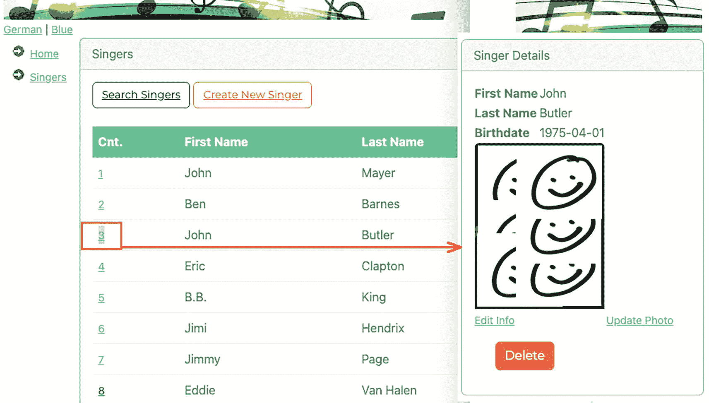

一张截图，列出了歌手的序号、名字和姓氏。右侧是歌手的详细信息，包括名字、姓氏和出生日期，并带有 3 个表情符号和删除选项。

图 14-10

列表视图与展示视图

`show.html` 视图模板的要点如下：

*   在 `th:src="@{/singer/} + ${singer.id} + '/photo'"` 中，使用了 `@{...​}` Thymeleaf 结构来构建相对于当前页面上下文的链接。这意味着生成的 HTML 中 `src` 属性的值变为 `/ch14/singer/3/photo`，完整的源 URL 变为 `http://localhost:8080/ch14/singer/3/photo`，该 URL 映射到 `downloadPhoto(..)` 处理器方法。

*   相同的结构用于生成“编辑信息”和“更新照片”链接。“编辑信息”链接会打开一个新页面，用户可以在其中编辑歌手的信息。“更新照片”链接会打开一个新页面，用户可以在其中上传新照片。


#### 处理删除请求

在 `show.html` 模板中有一个表单，用于触发针对当前显示歌手的 DELETE 请求。生成的 HTML 如代码清单 14-20 所示。

```

代码清单 14-20
歌手删除表单
```

请注意，实际上表单的 `method` 是 `POST`，但 Thymeleaf 在表单中添加了一个名为 `_method`、值为 `delete` 的隐藏输入。如果看起来这个表单输入指示了实际期望的请求方法，那是因为这正是它的用途。

解释很简单：就 HTTP 协议而言，人们主要用它来做两件事：检索数据（GET）或发送数据（POST）。这意味着 PUT 和 DELETE 等方法本质上与 POST 做的是同一件事——它们实际上是 POST 的*子类别*——因此 HTML 中无需直接支持更多方法。

然而，出于实际原因和可读性考虑，Thymeleaf 允许使用 `th:method="delete"` 或 `th:method="put"` 声明表单，并在生成响应时承担将它们转换为 POST 方法的繁重工作。不过，Spring 如何处理这些请求呢？或者更准确地说，处理方法应该如何映射到这些类型的请求？

答案是：与 GET 请求的方式相同。毕竟，`@RequestMapping` 注解可以针对特定的 HTTP 方法进行配置，并且还有元注解 `@DeleteRequest` 和 `@PutRequest`，它们分别等同于 `@RequestMapping(method = RequestMethod.DELETE)` 和 `@RequestMapping(method = RequestMethod.PUT)`。

代码清单 14-21 展示了处理删除歌手请求的方法。

```
package com.apress.prospring6.fourteen.controllers
import org.springframework.web.bind.annotation.DeleteMapping
// 其他 import 语句已省略
@Controller
@RequestMapping("/singer/{id}")
class OneSingerController(private val singerService: SingerService,
private val messageSource: MessageSource) {
// @RequestMapping(method = RequestMethod.DELETE)
@DeleteMapping
fun deleteSinger(@PathVariable("id") id: Long): String {
singerService.findById(id)
singerService.delete(id)
return "redirect:/singers/list"
}
...
}
代码清单 14-21
歌手删除处理器
```

不过，还有一件事是必要的：我们需要告诉 Spring，应用程序将会有 PUT 和 DELETE 请求，以便它知道将带有 `_method` 隐藏输入的 POST 请求转换为适当的 HTTP 请求，从而能够映射到相应类型的处理器。这是通过将 `org.springframework.web.filter.HiddenHttpMethodFilter` 的一个实例添加到过滤器列表中来实现的，这些过滤器会在请求传递给 `DispatcherServlet` 之前对其进行修改。该修改是在之前代码清单 14-5 中介绍的 `WebInitializer` 类中进行的。在介绍此配置时，曾简要解释过 `getServletFilters()` 方法。该方法再次展示在代码清单 14-22 中。

```
package com.apress.prospring6.fourteen
class WebInitializer : AbstractAnnotationConfigDispatcherServletInitializer {
override fun getServletFilters(): Array {
val cef = CharacterEncodingFilter().apply {
encoding = StandardCharsets.UTF_8.name()
setForceEncoding(true)
}
return arrayOf(HiddenHttpMethodFilter(), cef)
}
// 其他方法已省略
}
代码清单 14-22
在 Spring 应用程序中支持 PUT 和 DELETE 方法的配置
```

 一个警告符号。由一个带阴影三角形内的感叹号表示。 大多数开发人员在编写 Spring Web 应用程序时都会忘记这段配置，尤其是如果他们不经常这样做的话。毕竟，谁会经常从头开始编写 Spring Web 应用程序，以至于这些配置都成为例行公事呢？

#### 实现编辑歌手视图

要编辑歌手，我们需要一种不同类型的视图，它不仅显示数据，而且以可编辑的组件形式呈现，我们还需要一个表单来提交编辑后的数据。对于用于提交数据以编辑服务器上现有记录的请求，REST 约定使用 `PUT` 来区别于普通的 `POST` 请求，后者提交的数据用于创建新记录。

在“实现显示歌手视图”一节中介绍的“编辑信息”链接，指向一个在可编辑字段中显示歌手详细信息的页面。一个 `GET` 请求被提交到 `/singer/{id}/edit` URL。Spring 使用提供的 `id` 将 `Singer` 实例的详细信息填充到模型中，并返回 `singers/edit` 视图逻辑名称。该页面包含一个表单，该表单使用 HTTP `POST` 请求将编辑后的数据提交到 `/singer/{id}`。

包含表单设计的 Thymeleaf 片段如代码清单 14-23 所示。

```

编辑

名：

缺少名

姓：

缺少姓

生日：

缺少生日

取消

代码清单 14-23
包含编辑歌手表单的 singers/edit.html 片段
```

`edit.html` 模板中的重点如下：

*   `th:object="${singer}"`：此构造是模型对象；其属性用于填充字段。

*   `th:field="*{propName}"`：此构造用于标记表单字段，同时也用于用 `singer` 对象的属性填充它们。

*   `th:if="${#fields.hasErrors('labelName')}"`：此构造用于检查数据是否有任何错误。如果有，则显示包含该属性的元素，并用错误消息填充该元素。错误消息在表单提交后显示，Spring 执行验证，错误被添加到模型中，并且响应这次将数据和错误一起重定向回编辑视图。

*   `th:if="${message ne null}"`：此构造测试 `message` 对象是否不为 `null`，并显示包含该属性的元素。在这种情况下，它用于添加一条额外的消息，告知用户 `singer` 未被保存的原因。

如前所述，DELETE 和 PUT 方法受到 Thymeleaf 和 Spring 的支持。请注意，编辑表单具有属性 `th:method="put"`，但如果你查看生成的 HTML，表单的 `method` 是 `POST`，但 Thymeleaf 在表单中添加了一个名为 `_method`、值为 `put` 的隐藏输入。此输入配置了实际期望的请求方法，并且由于之前在“处理删除请求”一节中提到的 `HiddenHttpMethodFilter`，Spring 将这些 `POST` 请求视为 `PUT` 请求。

现在我们有了视图，让我们看看显示它并处理提交数据的 Spring 代码是什么样的。两个处理方法的代码如代码清单 14-24 所示。


```
package com.apress.prospring6.fourteen.controllers
import org.springframework.web.bind.annotation.PutMapping
// 其他导入语句已省略
@Controller
@RequestMapping("/singer/{id}")
class OneSingerController(private val singerService: SingerService, private val messageSource: MessageSource) {
@GetMapping(path = ["/edit"])
fun showEditForm(@PathVariable("id") id: Long, uiModel: Model): String {
val singer: Singer = singerService.findById(id)
uiModel.addAttribute("singer", singer)
return "singers/edit"
}
@PutMapping
fun updateSingerInfo(
@Valid singer: Singer,
bindingResult: BindingResult,
uiModel: Model,
locale: Locale
): String {
return if (bindingResult.hasErrors()) {
uiModel.addAttribute("message", messageSource.getMessage(
"singer.save.fail", arrayOf(), locale))
uiModel.addAttribute("singer", singer)
"singers/edit"
} else {
uiModel.asMap().clear()
val fromDb = singerService.findById(singer.id!!)
fromDb.firstName = singer.firstName
fromDb.lastName = singer.lastName
fromDb.birthDate = singer.birthDate
singerService.save(fromDb)
"redirect:/singer/" + singer.id
}
}
...
}
清单 14-24
用于显示编辑视图和处理 PUT 请求的处理程序方法
```

忽略 `@Valid` 注解以及所有与错误处理相关的代码——这些内容将在本章后续部分单独介绍。这段代码中值得注意的一点是引入了 `redirect:` 关键字。在逻辑视图名称前加上 `"redirect:"` 前缀，是告诉 Spring 将该逻辑视图名称用作重定向 URL。在编辑操作成功的情况下，重定向到显示歌手详细信息的页面；如果存在验证错误，则用户返回编辑页面并显示错误信息。

编辑表单应如图 14-11 所示；否则说明部署项目时出现了问题。

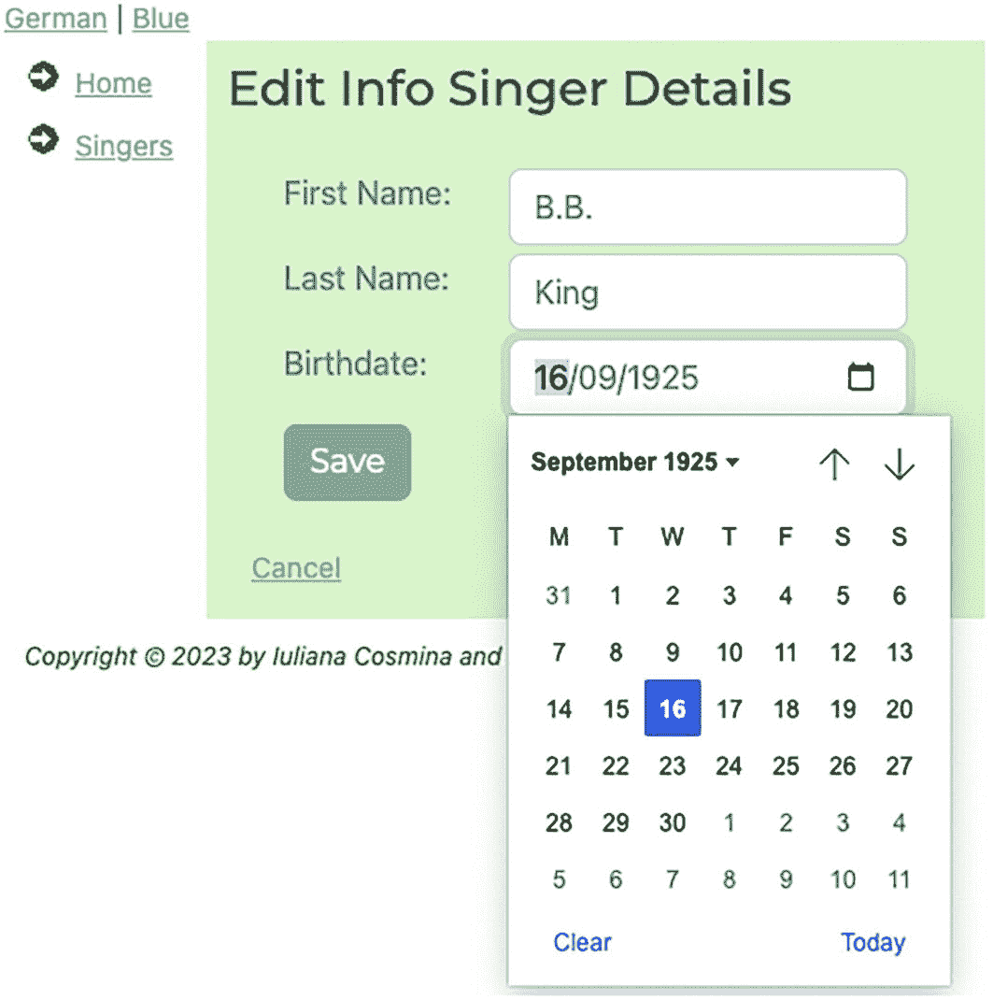

一张截图。显示编辑歌手详细信息。编辑出生日期时出现日历窗口，其中 1925 年 9 月 16 日被高亮显示。

图 14-11
编辑视图

#### 实现创建歌手视图

实现创建歌手视图与实现编辑视图非常相似。为了增加趣味性，`create.html` 文件中的表单还包含一个文件选择器，用于上传歌手的照片。除此之外，该表单与 `edit.html` 中的表单几乎完全相同。清单 14-25 展示了包含创建歌手表单的 `pageContent` 片段。

```

创建

名：

缺少名

姓：

缺少姓

出生日期：

缺少出生日期

照片

取消

清单 14-25
singers/create.html 表单
```

表单中包含文件选择器意味着表单中有一个 `file` 类型的输入字段，这进而意味着必须将表单的类型声明为 `enctype="multipart/form-data"`。这是一种用于表单的特殊类型，允许在提交的数据中包含完整的文件。歌手信息中有一个 `LONGBLOB` 类型的字段用于存储照片，该照片可以从客户端上传。这就是创建表单数据最终应存放的位置。但是，包含文件的用户数据需要在服务器端进行特殊处理。

长期以来，标准 Servlet 规范并不支持文件上传。因此，Spring MVC 曾与其他库（最常见的是 Apache Commons FileUpload 库^(¹³⁹)）配合使用来实现此功能。Spring MVC 内置了对 Commons FileUpload 的支持。然而，从 Servlet 3.0 开始，文件上传已成为 Web 容器的内置功能。Apache Tomcat 7 支持 Servlet 3.0，并且 Spring 从 3.1 版本开始也支持 Servlet 3.0 的文件上传。

因此，在 Spring Web 应用程序中支持文件上传是一件轻而易举的事，尤其是在将应用程序部署到 Apache Tomcat 10 时。

让我们从处理提交数据的代码开始。由于创建新歌手并非对现有歌手进行操作，因此处理程序方法位于 `SingersController` 中。代码如清单 14-26 所示。

```
package com.apress.prospring6.fourteen.controllers
import org.springframework.web.bind.annotation.PostMapping
import org.springframework.http.MediaType
import com.apress.prospring6.fourteen.util.SingerForm
import com.apress.prospring6.fourteen.controllers.OneSingerController.Companion.setPhoto
// 其他导入语句已省略
@Controller
@RequestMapping("/singers")
class SingersController(private val singerService: SingerService, private val messageSource: MessageSource) {
// --------------- 创建 -------------------
@GetMapping(value = ["/create"])
fun showCreateForm(uiModel: Model): String {
uiModel.addAttribute("singerForm", SingerForm())
return "singers/create"
}
@PostMapping(consumes = [MediaType.MULTIPART_FORM_DATA_VALUE])
@Throws(
IOException::class
)
fun create(
singerForm: @Valid SingerForm, bindingResult: BindingResult, uiModel: Model,
httpServletRequest: HttpServletRequest,
locale: Locale
): String {
return if (bindingResult.hasErrors()) {
uiModel.addAttribute("message", messageSource.getMessage(
"singer.save.fail", arrayOf(), locale))
uiModel.addAttribute("singerForm", singerForm)
"singers/create"
} else {
uiModel.asMap().clear()
val s = Singer().apply {
firstName = singerForm.firstName
lastName = singerForm.lastName
birthDate = singerForm.birthDate
}
// 处理文件上传
if (!singerForm.file!!.isEmpty) {
setPhoto(s, singerForm.file!!)
}
val created = singerService.save(s)
"redirect:/singer/" + UrlUtil.encodeUrlPathSegment(
created.id.toString(),
httpServletRequest
)
}
}
...
}
清单 14-26
用于处理创建歌手实例表单提交数据的处理程序方法
```

表单中的内容无法直接映射到 `Singer` 实例，因为 `photo` 字段的值将在处理程序方法中映射为 `org.springframework.web.multipart.MultipartFile`，因此需要使用 `SingerForm` 类型。


 警告符号。它由带阴影三角形内的感叹号表示。 在复杂应用中，DAO 层声明的实体类型永远不会在 Web 层的控制器中使用。通常会引入视图类型，这些类型包装一个或多个实体类型，仅暴露有用的字段，同时隐藏某些细节，例如标识符和密码等敏感数据，以及与 Web 上下文无关的字段，如 `version` 字段。

`SingerForm` 是一种视图类型，仅声明了为 Web 层创建 `Singer` 实例所需的字段。该类型的字段还装饰有验证注解，这些注解与 `Singer` 类中对应字段声明的注解相匹配。

`SingerForm` 如代码清单 14-27 所示。

```
package com.apress.prospring6.fourteen.util
import jakarta.validation.constraints.NotNull
import jakarta.validation.constraints.Size
import org.springframework.format.annotation.DateTimeFormat
import org.springframework.web.multipart.MultipartFile
import java.time.LocalDate
class SingerForm {
@NotEmpty(message = "{NotEmpty.singer.firstName}") @Size(
min = 2,
max = 30,
message = "{Size.singer.firstName}"
) var  firstName:String? = null
@NotEmpty(message = "{NotEmpty.singer.lastName}") @Size(
min = 2,
max = 30,
message = "{Size.singer.lastName}"
) var lastName:String? = null
@DateTimeFormat(pattern = "yyyy-MM-dd")
var birthDate: LocalDate? = null
var file: MultipartFile? = null
}
代码清单 14-27
SingerForm 视图类型
```

Spring MVC 足够智能，能够获取上传的内容，将其转换为 `MultipartFile`，并将其用作 `SingerForm` 中 `file` 字段的值。从 Spring MVC 填充的 `SingerForm` 中，会创建一个 `Singer` 实例。`setPhoto(..)` 方法用于将上传的内容读取为字节数组，然后可以将其保存到 `SINGER` 表的 `LONGBLOG photo` 列中。

但这足够了吗？事实证明这还不够，因为需要配置 Spring 的 `DispatcherServlet` 以支持文件上传。在使用 Spring MVC 且兼容 Servlet 3.0+ 的 Web 容器中，配置文件上传支持需要两个步骤。

首先，在定义创建 `DispatcherServlet` 所需所有内容的基于 Java 的配置类中，我们需要添加一个类型为 `StandardServletMultipartResolver` 的 Bean。这是基于 Servlet 3.0 `jakarta.servlet.http.Part` API 的 `MultipartResolver` 接口的标准实现。代码清单 14-28 展示了需要添加到 `WebConfig` 类中的此 Bean 的声明。

```
package com.apress.prospring6.fourteen
import org.springframework.web.multipart.support.StandardServletMultipartResolver
// 其他导入语句已省略
@Configuration
@EnableWebMvc
@ComponentScan(basePackages = ["com.apress.prospring6.fourteen"])
class WebConfig : WebMvcConfigurer, ApplicationContextAware {
@Bean(name = [DispatcherServlet.MULTIPART_RESOLVER_BEAN_NAME])
open fun multipartResolver() = StandardServletMultipartResolver()
// 其他配置代码已省略
}
代码清单 14-28
支持文件上传所需的 Spring Bean
```

第二步是在 Servlet 3.0+ 环境中启用 MultiParsing；这意味着 `WebInitializer` 实现需要一些更改。`AbstractDispatcherServletInitializer` 抽象类中定义了一个名为 `customizeRegistration(..)` 的方法，而 `AbstractAnnotationConfigDispatcherServletInitializer` 扩展了该类。必须实现此方法以注册一个 `jakarta.servlet.MultipartConfigElement` 实例。需要在 `WebInitializer` 类中添加的配置片段如代码清单 14-29 所示。

```
package com.apress.prospring6.fourteen
import jakarta.servlet.MultipartConfigElement
import jakarta.servlet.ServletRegistration
// 其他导入语句已省略
class WebInitializer : AbstractAnnotationConfigDispatcherServletInitializer() {
override fun getServletFilters(): Array {
val cef = CharacterEncodingFilter().apply {
encoding = StandardCharsets.UTF_8.name()
setForceEncoding(true)
}
return arrayOf(HiddenHttpMethodFilter(), cef)
}
public override fun customizeRegistration(registration: ServletRegistration.Dynamic) {
registration.setInitParameter("throwExceptionIfNoHandlerFound", "true")
registration.setMultipartConfig(multipartConfigElement) //  
super.customizeRegistration(registration)
}
private val multipartConfigElement: MultipartConfigElement
get() = MultipartConfigElement(null, MAX_FILE_SIZE, MAX_REQUEST_SIZE,
FILE_SIZE_THRESHOLD)
// 其他配置代码已省略
companion object {
private const val MAX_FILE_SIZE: Long = 5000000
// 超过此大小，Spring 将抛出异常。
private const val MAX_REQUEST_SIZE: Long = 5000000
// 超过此大小阈值后，文件将被写入磁盘
private const val FILE_SIZE_THRESHOLD = 0
}
}
代码清单 14-29
WebInitializer 的配置
```

`MultipartConfigElement` 的第一个参数是文件应存储的临时位置。第二个参数是允许上传的最大文件大小，此处为 `5MB`。第三个参数表示请求的大小，此处也是 `5MB`。最后一个参数表示文件将被写入磁盘的阈值。

要测试文件上传功能，请重新部署应用程序，并添加一个带有照片的新歌手。完成后，您将能够在显示视图中看到该照片。


### 启用 JSR-349（Bean 验证）

这个话题之所以留到现在才讲，是为了让大家能专注于构建网页，并将功能与各种按钮和链接关联起来。确保用户请求被正确处理固然重要，但确保用户提交的数据正确无误也同样关键。这一点对于要保存到数据库中的数据尤为重要，因为无效数据可能导致无效结果，甚至在某些情况下，让黑客有机可乘，入侵你的系统（例如，通过 SQL 注入^(¹⁴⁰)）。

**第** **11** **章**向你介绍了验证、格式化和类型转换，并提到为此目的声明的 Spring Bean 的真正威力，在处理用户提供数据的 Web 应用中最为有用。第 11 章向你介绍了 Spring 对 JSR-349（Bean 验证）^(¹⁴¹)（现已成为 Jakarta 库的一部分）的支持。清单 14-27 介绍了 `SingerForm` 类，该类声明了一些字段，这些字段使用用户提供的数据进行初始化。用于创建 `Singer` 领域对象的 `Singer` 类中也存在相同的验证注解。

清单 14-30 展示了带有自定义错误消息代码的验证注解的 `SingerForm` 版本。

```
package com.apress.prospring6.fourteen.util
import jakarta.validation.constraints.*
import org.springframework.web.multipart.MultipartFile
// 其他导入语句已省略
class SingerForm {
@NotEmpty @Size(
min = 2,
max = 30
) var firstName: String? = null
@NotEmpty @Size(
min = 2,
max = 30
) var lastName: String? = null
@DateTimeFormat(pattern = "yyyy-MM-dd")
var birthDate: LocalDate? = null
var file: MultipartFile? = null
}
清单 14-30
支持文件上传所需的 SingerForm 类型
```

这些约束被应用于各自的字段。请注意，对于验证消息，你使用花括号指定了一个消息键。这将导致从 `ResourceBundle` 中检索验证消息，从而支持国际化（i18n）。`@Size` 注解比较特殊，因为它声明了最小值和最大值；这些值通过 `{*}` 语法从代码注入到国际化消息中。

错误消息代码由 `org.springframework.validation.MessageCodesResolver` Bean 解析，该 Bean 在配置验证时由 Spring 自动注册。Spring 使用的默认实现是 `org.springframework.validation.DefaultMessageCodesResolver`。这种类型的 Bean 会根据字段上用于强制执行约束的注解、使用该注解的类型名称以及字段名称，创建两个消息代码。例如，对于类 `SingerForm` 中的 `firstName` 字段，对于 `@Size` 验证，此 Bean 将按以下顺序创建消息代码：

*   验证名称 + 对象名称 + 字段名称 ⇒ `Size.singerForm.firstName`
*   验证名称 + 字段名称 ⇒ `Size.firstName`
*   验证名称 + 字段类型 ⇒ `Size.java.lang.String`
*   验证名称 ⇒ `Size`

然而，如果这些消息属性都没有声明，则默认消息将设置为注解全名 + “message” ⇒ `jakarta.validation.constraints.Size.message`。对于 `singerForm` 对象，这些消息未在我们的初始国际化文件中声明，但 `singer` 对象的那些消息已声明。它们如清单 14-31 所示。

```
NotEmpty.singer.firstName=请输入名字的值
Size.singer.firstName=长度必须在 {2} 和 {1} 之间
NotEmpty.singer.lastName=请输入姓氏的值
Size.singer.lastName=长度必须在 {2} 和 {1} 之间
typeMismatch.birthDate=格式无效，应为 \'yyyy-mm-dd\'
清单 14-31
对象 singer 字段 firstName 的验证错误消息代码
```

这里有两种解决方案：添加一份清单 14-28 中消息的副本，并将 `singer` 替换为 `singerForm`；或者使用 `messages` 属性配置注解验证，以使用现有的一组消息。带有自定义错误消息的 `SingerForm` 版本如清单 14-32 所示。

```
package com.apress.prospring6.fourteen.util
import jakarta.validation.constraints.*
// 其他导入语句已省略
class SingerForm {
@NotEmpty(message = "{NotEmpty.singer.firstName}") @Size(
min = 2,
max = 30,
message = "{Size.singer.firstName}"
) var firstName: String? = null
@NotEmpty(message = "{NotEmpty.singer.lastName}") @Size(
min = 2,
max = 30,
message = "{Size.singer.lastName}"
) var lastName: String? = null
@DateTimeFormat(pattern = "yyyy-MM-dd")
var birthDate: LocalDate? = null
var file: MultipartFile? = null
}
清单 14-32
带有自定义错误消息的 SingerForm 版本
```

为了在 Web 数据绑定过程中启用 JSR-349 验证，我们只需将 `@Valid` 注解应用于 `SingersController.create(..)` 方法的 `SingerForm` 参数，以及 `OneSingerController.updateSingerInfo(..)` 方法的 `Singer` 参数。清单 14-33 展示了这两个方法的签名。

```
package com.apress.prospring6.fourteen.controllers
import jakarta.validation.Valid
// 其他导入语句已省略
@Controller
@RequestMapping("/singer/{id}")
class OneSingerController {
@PutMapping
fun updateSingerInfo(@Valid singer:Singer,
bindingResult:BindingResult,
uiModel:Model, locale:Locale):String {
// 方法体已省略
}
// 其他方法已省略
}
@Controller
@RequestMapping("/singers")
class SingersController {
@PostMapping(consumes = MediaType.MULTIPART_FORM_DATA_VALUE)
fun create(@Valid singerForm:SingerForm,
bindingResult:BindingResult, uiModel:Model,
httpServletRequest:HttpServletRequest,
locale:Locale):String {
// 方法体已省略
}
// 其他方法已省略
}
清单 14-33
带有验证功能的控制器
```

我们还希望 JSR-349 验证消息使用与视图相同的 `ResourceBundle` 实例。为此，我们需要在 `DispatcherServlet` 配置（即 `WebConfig` 类）中配置验证器，如清单 14-34 所示。

```
package com.apress.prospring6.fourteen
import org.springframework.validation.Validator
import org.springframework.validation.beanvalidation.LocalValidatorFactoryBean
// 其他导入语句已省略
@Configuration
@EnableWebMvc
@ComponentScan(basePackages = ["com.apress.prospring6.fourteen"])
open class WebConfig : WebMvcConfigurer, ApplicationContextAware {
private var applicationContext: ApplicationContext? = null
@Throws(BeansException::class)
override fun setApplicationContext(applicationContext: ApplicationContext) {
this.applicationContext = applicationContext
}
@Bean
open fun validator(): Validator = LocalValidatorFactoryBean().apply {
setValidationMessageSource(messageSource())
}
override fun getValidator() = validator()
@Bean
open fun messageSource(): MessageSource
= ReloadableResourceBundleMessageSource().apply {
setBasename("classpath:i18n/global")
setDefaultEncoding(StandardCharsets.UTF_8.name())
setUseCodeAsDefaultMessage(true)
setFallbackToSystemLocale(true)
// # -1 : 从不重新加载, 0 始终重新加载
// setCacheSeconds(0);
}
...
}
清单 14-34
Spring 验证配置
```

首先，定义了一个验证器 Bean，其类为 `LocalValidatorFactoryBean`，用于支持 JSR-349。请注意，我们将 `validationMessageSource` 属性设置为引用已定义的 `MessageSource` Bean，这会指示 JSR-349 验证器根据代码从 `MessageSource` Bean 中查找消息。然后，实现了 `getValidator()` 方法，以返回我们定义的验证器 Bean。


好的，作为一名高级文档工程师和翻译员，我将严格遵循您提供的注意事项和示例格式，将给定的英文文本翻译成中文。


好了，现在我们可以测试验证功能了。调出创建歌手的视图，在不插入任何数据的情况下点击“保存”按钮。返回的页面现在会报告多个验证错误，如图 14-12 所示。

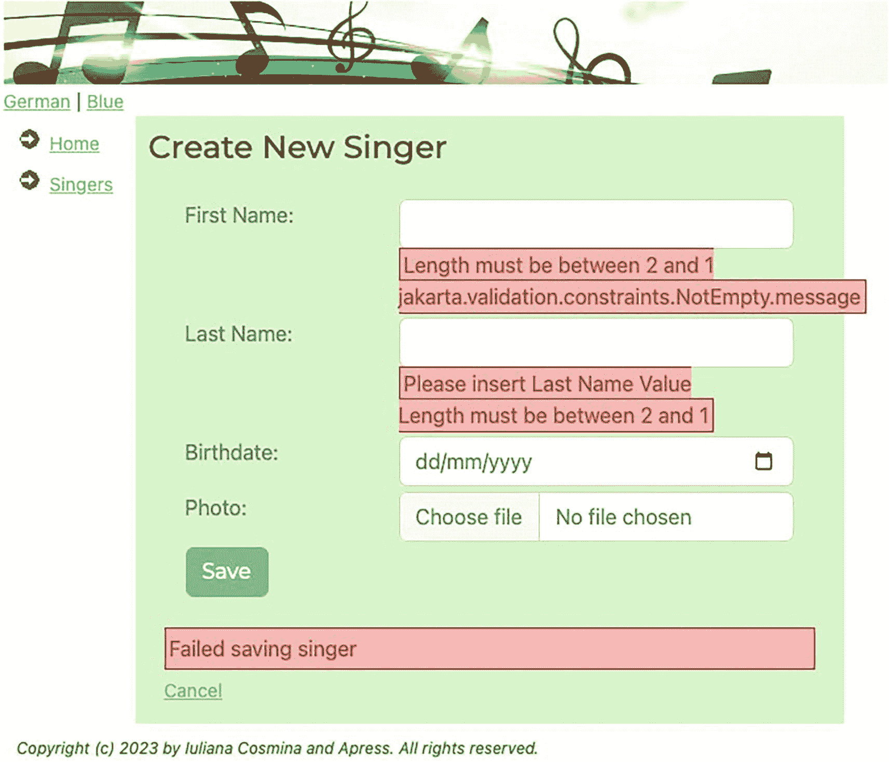

创建新歌手窗口的截图。姓和名列有字符长度限制。出生日期采用年、月、日格式。照片有选择文件的选项，但未选择任何文件。在保存选项下方，显示一条消息：“保存歌手失败”。

图 14-12

显示验证错误的页面

切换到德语（DE）语言并执行相同操作。这次，消息将以德语显示。

视图基本完成；我们现在需要做的就是处理潜在的错误。

### 异常处理

当执行处理器方法时，可能会出现问题。有些情况，比如尝试访问一个不存在的 URL，可能是意料之中的，但其他情况则不然。在这两种情况下，都必须记录活动并通知最终用户。Spring MVC 使用 `HandlerExceptionResolver` 的实现来捕获和处理异常。处理 MVC 异常的典型方法是准备一个模型并选择一个错误视图。可以按链式顺序使用多个异常解析器，以不同的方式处理不同类型的异常。Spring MVC 支持清单 14-35 中所示的默认解析器（在 Spring Web 应用程序中，这些类型的解析器会自动为您创建），它们声明在 `spring-webmvc.jar` 包中的 `DispatcherServlet.properties` 文件中。

```
org.springframework.web.servlet.HandlerExceptionResolver=
o.s.web.servlet.mvc.method.annotation.ExceptionHandlerExceptionResolver,\
o.s.web.servlet.mvc.annotation.ResponseStatusExceptionResolver,\
o.s.web.servlet.mvc.support.DefaultHandlerExceptionResolver
清单 14-35
DispatcherServlet.properties 默认异常解析器
```

默认的异常解析器执行以下功能：

*   `ExceptionHandlerExceptionResolver`：通过调用在控制器或使用 `@ControllerAdvice` 注解的类中找到的、使用 `@ExceptionHandler` 注解的方法来解析异常。

*   `ResponseStatusExceptionResolver`：解析使用 `@ResponseStatus` 注解的方法，并将它们映射到使用此注解配置的状态码。

*   `DefaultHandlerExceptionResolver`：解析由 Spring MVC 引发的异常，并将它们映射到 HTTP 状态码。在处理 REST 请求时，与此类等效的类是 `ResponseEntityExceptionHandler`。

`SimpleMappingExceptionResolver` 类不在前面的列表中，但可以声明和配置此类型的 Bean，以将异常类映射到视图名称，这对于在浏览器应用程序中呈现错误页面很有帮助。异常解析器提供与抛出异常的上下文相关的信息；即正在执行的处理器方法以及调用它时使用的参数。

让我们从一个最简单的例子开始：人们在编写 URL 时总是会犯错。让我们尝试访问以下 URL：`http://localhost:8080/ch14/missing`。由于没有配置异常处理，Spring 将尝试使用 `InternalResourceViewResolver` Bean（或找到的任何其他视图解析器）来查找视图。由于找不到视图，它假定这必须是一个静态页面并尝试渲染它。但它未能提供正确的页面，于是 Apache Tomcat 介入。它显示其默认的错误页面，让用户知道发生了什么，如图 14-13 所示。

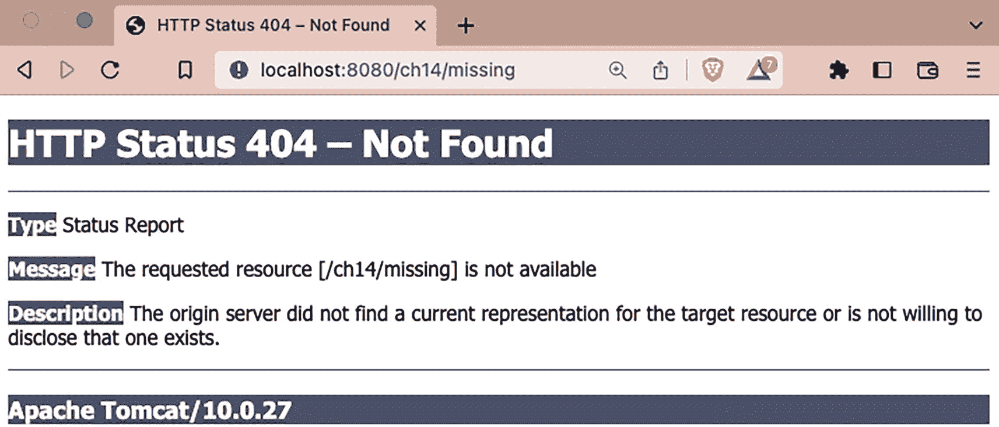

网页截图。显示 HTTP 状态 404 未找到。列出了类型、消息、描述和 Apache Tomcat 10.0.27。

图 14-13

Apache Tomcat 针对缺失视图的默认错误页面

默认的错误消息很好地描述了问题，并为缺失的资源返回了正确的 HTTP 状态码：404。但这仍然不行，因为这看起来像是一个技术异常或开发问题，而推荐的做法是不让最终用户知道这一点。此外，没有必要向最终用户提供这么多细节，因为他们不应该被应用程序的内部问题所困扰。那么，我们能做什么呢？开发 Web 应用程序的一条规则是保持外观和感觉的一致性，因此，我们可以显示一个自定义的错误视图，而不是 Apache Tomcat 页面。开箱即用，当找不到视图或处理器方法时，Spring MVC 不提供默认的（后备）错误页面。它也不会抛出异常；它只是将显示适当消息的责任转发给服务器。要覆盖此行为，我们需要对 Spring Web 应用程序配置进行以下更改。

首先，自定义 `DispatcherServlet`，使其在找不到处理器方法时抛出 `org.springframework.web.servlet.NoHandlerFoundException`。这是通过在 `WebInitializer` 类中重写 `AbstractDispatcherServletInitializer` 类的 `customizeRegistration(..)` 方法来实现的，如清单 14-36 所示。

```
package com.apress.prospring6.fourteen
import jakarta.servlet.ServletRegistration
// 其他导入方法已省略
class WebInitializer
: AbstractAnnotationConfigDispatcherServletInitializer {
override fun customizeRegistration(
registration:ServletRegistration.Dynamic) {
registration.setInitParameter(
"throwExceptionIfNoHandlerFound", "true")
super.customizeRegistration(registration)
}
// 其他配置方法已省略
}
清单 14-36
自定义 DispatcherServlet 以在未找到处理器时抛出 NoHandlerFoundException
```

此配置声明了一个名为 `throwExceptionIfNoHandlerFound` 的初始化参数，并将其设置为 `"true"`，这会导致 `DispatcherServlet` 在找不到处理器方法时抛出 `org.springframework.web.servlet.NoHandlerFoundException`。

 一个信息符号。它由一个带阴影圆圈内的小写字母 i 表示。  **注意**，如果使用了 `DefaultServletHttpRequestHandler`，则添加此配置不会起任何作用，因为请求将始终被转发给它，并且在这种情况下永远不会抛出 `NoHandlerFoundException`。您可以通过查看日志来验证这一点。如果您看到类似于以下输出片段的内容，则说明您还有更多步骤需要完成：

```
DEBUG o.s.w.s.DispatcherServlet - GET "/ch14/missing", parameters={}
DEBUG o.s.w.s.h.SimpleUrlHandlerMapping - Mapped to org.springframework.web.servlet.resource.DefaultServletHttpRequestHandler@763956dc
DEBUG o.s.w.s.DispatcherServlet - Completed 404 NOT_FOUND
```

因此，如果在您的配置中有以下内容：

```
override fun configureDefaultServletHandling(
configurer:DefaultServletHandlerConfigurer) {
configurer.enable()
}
```

如果您希望抛出 `NoHandlerFoundException`，只需删除此方法，并在没有 `DefaultServletHttpRequestHandler` 的情况下运行。

但是，如果没有一个自定义的 `HandlerExceptionResolver` 类型的 Bean 来执行除简单告知应用程序服务器该做什么之外的其他操作，那么这也不会起任何作用。这就引出了下一个更改。接下来，一个选择是实现 `HandlerExceptionResolver` 接口或扩展任何实现它的类，并为 `doResolveException(...`​`)` 方法提供所需的实现，该方法将返回所需的视图，如清单 14-37 所示。


```
package com.example.problem
import org.springframework.http.HttpStatus
import org.springframework.web.servlet.ModelAndView
import org.springframework.web.servlet.NoHandlerFoundException
import org.springframework.web.servlet.handler.SimpleMappingExceptionResolver
import javax.servlet.http.HttpServletRequest
import javax.servlet.http.HttpServletResponse
class MissingExceptionResolver : SimpleMappingExceptionResolver() {
override fun doResolveException(
request: HttpServletRequest,
response: HttpServletResponse, handler: Any, ex: Exception
): ModelAndView? {
if (ex is NoHandlerFoundException) {
val model = ModelAndView("error")
model.addObject(
"problem", "URL not supported : "
+ request.requestURI
)
response.status = HttpStatus.NOT_FOUND.value()
return model
}
return null
}
}
清单 14-37
HandlerExceptionResolver 实现
```

 一个带阴影圆圈内的感叹号符号。 请注意，错误处理使用了 `ModelAndView` 类型。由于异常处理方法并非在控制器类中声明的普通处理方法，因此无法将其结果映射到视图模板。该类型的对象在 Web MVC 框架中是 `Model` 和 `View` 对象的持有者，用于在单个对象中同时返回模型和视图。这使得 Spring MVC 能够在将错误视图发送给用户之前，根据处理请求时抛出的异常，使用不同的错误消息对其进行自定义。

以下是关于 `HandlerExceptionResolver` 实现的一些细节：

*   它可以返回一个指向错误视图的 `ModelAndView`，通常对于相关类别的错误或整个应用程序，该视图是相同的。
*   如果异常在解析器内部得到处理，它可以返回一个空的 `ModelAndView`。
*   如果异常仍未解决，它可以返回 `null`，从而允许其他异常解析器尝试处理它。如果没有任何异常解析器能够处理该异常，它将被向上冒泡到 `Servlet` 容器。

 一个警告符号。它由一个带阴影三角形内的感叹号表示。 在清单 14-37 中，请注意该方法返回了一个实际的 `ModelAndView` 实例。`HandlerExceptionResolve` 实现的设计目的是确保异常被解析为一个视图，或者允许其向上冒泡到 `Servlet` 容器。

下一步是声明一个此类型的 bean，并赋予其最低优先级（最高优先级），这样每当应用程序中出现问题时，将首先使用此异常解析器。

将多个 `SimpleMappingExceptionResolver` 映射到各种异常类型的替代方案是声明不同的错误处理方法，并将它们全部分组到一个使用 `@ControllerAdvice` 注解的类中。此注解是使用 `@Component` 进行元注解的，这意味着将创建一个此类型的 bean，它将拦截任何使用 `@ExceptionHandler` 注解的处理方法异常，这些异常在注解了 `@ControllerAdvice` 的类中声明了处理方法，并渲染相应的错误视图。清单 14-38 展示了一个使用 `@ControllerAdvice` 注解的类。

```
package com.apress.prospring6.fourteen.problem
import jakarta.servlet.http.HttpServletRequest
import org.springframework.http.HttpStatus
import org.springframework.web.bind.annotation.ControllerAdvice
import org.springframework.web.bind.annotation.ExceptionHandler
import org.springframework.web.bind.annotation.ResponseStatus
import org.springframework.web.servlet.ModelAndView
import org.springframework.web.servlet.NoHandlerFoundException
@ControllerAdvice
class GlobalExceptionHandler {
@ExceptionHandler(NotFoundException::class)
@ResponseStatus(HttpStatus.NOT_FOUND)
fun handle(ex: NotFoundException): ModelAndView {
val mav = ModelAndView()
mav.addObject("problem", ex.message)
mav.viewName = "error"
return mav
}
@ExceptionHandler(NoHandlerFoundException::class)
@ResponseStatus(HttpStatus.NOT_FOUND)
fun notFound(req: HttpServletRequest): ModelAndView {
val mav = ModelAndView()
mav.addObject("problem", "Not Supported " + req.requestURI)
mav.viewName = "error"
return mav
}
}
清单 14-38
GlobalExceptionHandler 实现
```

为了测试此异常处理程序是否按预期工作，你可以尝试访问 `http://localhost:8080/ch14/singer/99` 和 `http://localhost:8080/ch14/missing`。请注意，抛出了不同类型的异常，这会导致向错误视图模型添加不同的错误消息，如图 14-14 所示。

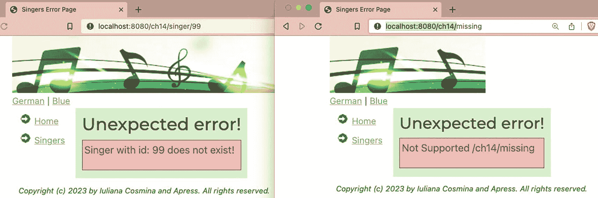

歌手错误页面的两个截图。1\. 显示了一个意外错误，ID 为 99 的歌手不存在。2\. 显示了一个意外错误，不支持 c h 14 missing。

图 14-14
自定义错误消息

你应该查看带有正确异常消息的错误页面。检查响应内容，你会注意到虽然显示了错误页面，但 HTTP 状态码仍然是 200。由于用户试图访问一个不存在的资源，HTTP 状态码应为 404。这可以通过使用 `@ResponseStatus(HttpStatus.NOT_FOUND)` 注解异常处理方法轻松实现，这在清单 14-38 中已经完成。

关于处理由处理方法抛出的异常，你需要了解的大致就是这些了。


### 迁移至 Spring Boot

迁移至 Spring Boot 使得创建 MVC 应用更加简单，因为 Spring Boot 应用不再需要 Apache Tomcat 服务器。同时，项目结构也更简洁，并且无需使用特殊插件来打包应用。

要创建一个完整的 Spring Web 应用，意味着除了 Web 层和视图模板层之外，还需要 DAO 层和服务层。这意味着你需要用于持久化和事务的特定 Boot 启动器库。如果你已经阅读本章至此，你会知道还需要验证功能。完整的依赖项列表如图 14-15 所示。

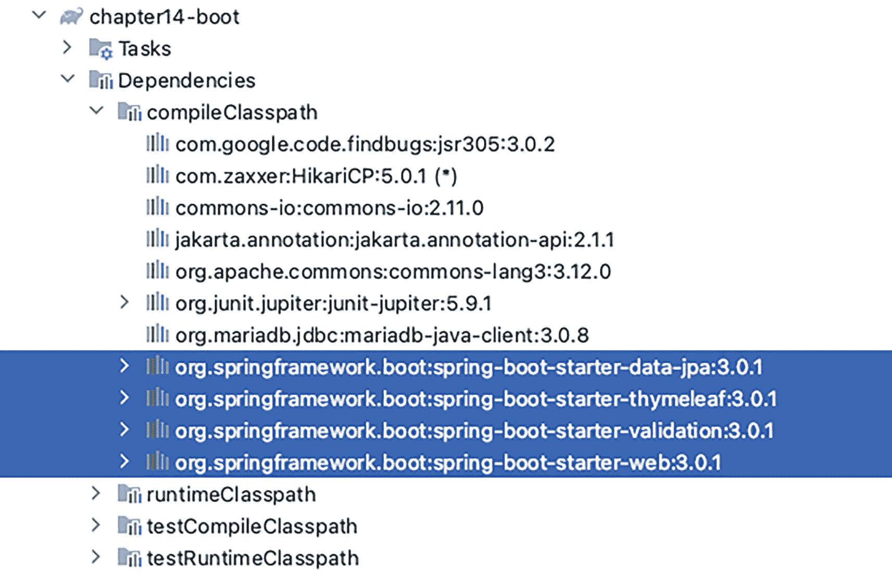

Spring Boot Web 应用依赖项的截图。从第 14 章 boot 的 compile classpath 菜单中高亮显示了四个应用依赖项。

图 14-15

Spring Boot Web 应用依赖项

项目的结构也必须改变，因为所有与界面相关的文件和资源文件都可以放置在 `resources` 目录下。项目内部结构的变化如图 14-16 所示。请忽略 `pom.xml` 文件，因为我们使用 Gradle 作为构建工具。

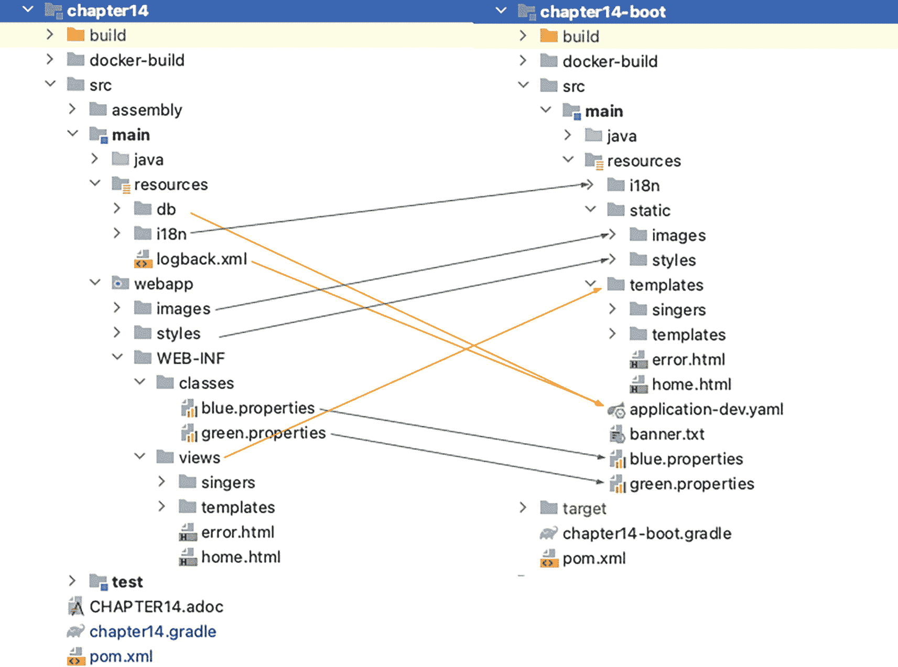

Spring Boot Web 应用依赖项的截图。第 14 章和第 14 章 boot 的依赖项用箭头连接。d b 和 log back 连接到应用。i18 n 连接到 i 18 n。images 连接到 images，styles 连接到 styles。Views 连接到 templates。Blue 和 green properties 连接到 blue 和 green properties。

图 14-16

Spring Boot Web 应用项目结构

橙色箭头显示的文件不仅名称发生了变化，位置也发生了改变。例如，数据源配置文件不再需要，因为其内容已通过使用 Spring Boot 配置属性进行配置。`logback.xml` 文件也不再需要，因为 Logback 配置是通过使用 Spring Boot 属性完成的。而包含 Thymeleaf 模板的 `views` 目录已重命名为 `templates`，因此无需使用显式的 Bean 配置来配置 Thymeleaf 支持，可以直接使用 Spring Boot 的默认配置。

用于主题配置的 `blue.properties` 和 `green.properties` 文件已从 `classes` 目录移至 `static` 文件夹的根目录，以便利用 Spring Boot 默认的通过 Bean 进行主题配置的方式，因为自定义它们很麻烦。

接下来要分析的是 Spring Boot 的 `application-dev.yaml` 文件内容，如代码清单 14-39 所示。

```
# web server configuration
server:
port: 8081
servlet:
context-path: /
compression:
enabled: true
address: 0.0.0.0
# application configuration
spring:
mvc:
hiddenmethod:
filter:
enabled: true
# internationalization configuration
messages:
basename: i18n/global
encoding: UTF-8
always-use-message-format: true
# file upload configuration
servlet:
multipart:
enabled: true
max-file-size: 10MB
max-request-size: 12MB
# view resolver configuration
thymeleaf:
prefix: classpath:templates/
suffix: .html
mode: HTML
cache: false
check-template: false
reactive:
max-chunk-size: 8192
# data source configuration
datasource:
driverClassName: org.mariadb.jdbc.Driver
url: jdbc:mariadb://localhost:3306/musicdb?useSSL=false
username: prospring6
password: prospring6
hikari:
maximum-pool-size: 25
jpa:
generate-ddl: false
properties:
hibernate:
jdbc:
batch_size: 10
fetch_size: 30
max_fetch_depth: 3
show-sql: true
format-sql: false
use_sql_comments: false
hbm2ddl:
auto: none
# Logging config
logging:
pattern:
console: "%-5level: %class{0} - %msg%n"
level:
root: INFO
org.springframework.boot: DEBUG
com.apress.prospring6.fourteen: INFO
代码清单 14-39
Spring Boot Web 应用配置
```

配置的每个部分都以注释开头，说明其作用范围。以下列表进一步解释了每个部分中使用的属性：

*   `# web server configuration`：此部分配置应用可访问的 URL。将地址设置为 `0.0.0.0` 允许应用在运行该计算机的所有网络地址上均可访问；例如，`http://localhost:8081/`、`http://127.0.0.1:8081/` 等。

*   `# HTTP Method filter`：将 `spring.mvc.hiddenmethod.filter.enabled` 设置为 `true`，此部分是 Spring Boot 中配置用于支持 PUT 和 DELETE HTTP 方法的过滤器的等效方式。

*   `# internationalization configuration`：此部分配置国际化文件的位置、名称、编码等。

*   `# file upload configuration`：此部分配置支持文件上传所需的所有组件。

*   `# view resolver configuration`：此部分配置 Thymeleaf 视图模板的位置、编码、最大大小等。Spring Boot 使用此配置来配置 Thymeleaf 引擎和 Thymeleaf 解析器 Bean。

*   `# data source configuration`：此部分将所有数据源配置（包括持久化）分组在一起。

*   `# Logging config`：此部分配置日志记录。

无法放入 `application-dev.yaml` 的配置部分被放置在典型的配置类中，并使用 `@Configuration` 注解。

 一个创意的符号。它由一个电灯泡表示。 `HibernateCfg` 类是为了解决 Spring Data JPA 与 MariaDB 中与数据库对象命名相关的 bug 而采取的变通方法。没有这个类，仓库就无法映射到表，因为 Spring Boot 会查找名为 `musicdb.singer` 的表但找不到它，因为 MariaDB Docker 容器是通过使用大写字母声明对象来配置的。由于将 Docker SQL 查询转换为小写工作量太大，因此有机会引入一些高级配置示例。

`HibernateCfg` 如代码清单 14-40 所示。

```
package com.apress.prospring6.fourteen.boot
import org.hibernate.boot.model.naming.Identifier
import org.hibernate.boot.model.naming.PhysicalNamingStrategyStandardImpl
import org.hibernate.engine.jdbc.env.spi.JdbcEnvironment
import org.springframework.context.annotation.Bean
import org.springframework.context.annotation.Configuration
@Configuration(proxyBeanMethods = false)
open class HibernateCfg {
@Bean
open fun caseSensitivePhysicalNamingStrategy(): PhysicalNamingStrategyStandardImpl {
return object : PhysicalNamingStrategyStandardImpl() {
override fun toPhysicalTableName(logicalName: Identifier,
context: JdbcEnvironment): Identifier {
return apply(logicalName, context)!!
}
override fun toPhysicalColumnName(logicalName: Identifier,
context: JdbcEnvironment): Identifier {
return apply(logicalName, context)!!
}
private fun apply(name: Identifier?, context: JdbcEnvironment): Identifier? {
if (name == null) {
return null
}
val builder = StringBuilder(name.text.replace('.', '_'))
var i = 1
while (i < builder.length - 1) {
if (isUnderscoreRequired(builder[i - 1], builder[i], builder[i + 1])) {
builder.insert(i++, '_')
}
i++
}
return Identifier.toIdentifier(builder.toString().uppercase(Locale.getDefault()))
}
private fun isUnderscoreRequired(before: Char, current: Char, after: Char): Boolean {
return Character.isLowerCase(before) && Character.isUpperCase(current) &&
Character.isLowerCase(after)
}
}
}
}
代码清单 14-40
HibernateCfg 类
```


此处扩展的 `PhysicalNamingStrategyStandardImpl` 类本身实现了 `PhysicalNamingStrategy`，这是一个可插拔的策略契约，用于对数据库对象名称应用物理命名规则。`@Configuration(proxyBeanMethods = false)` 配置用于排除此类中声明的 Bean 被代理，以强制执行 Bean 生命周期行为。这意味着通过调用 `caseSensitivePhysicalNamingStrategy()` 方法创建的任何 Bean 都将获得 `PhysicalNamingStrategyStandardImpl bean` 的一个新副本。

`WebConfig` 类是一个扩展了 `WebMvcConfigurer` 的 Spring Web 配置类，用于配置区域设置和主题拦截器及解析器。这些配置不会被 Spring Boot 自动配置，因此这项工作留给了开发者。`WebConfig` 类如清单 14-41 所示。

```
package com.apress.prospring6.fourteen.boot
import java.util.Locale
// 更多导入语句已省略
@Configuration
@ComponentScan(basePackages = ["com.apress.prospring6.fourteen.boot"])
open class WebConfig : WebMvcConfigurer {
@Bean
open fun localeChangeInterceptor() = LocaleChangeInterceptor().apply {
paramName = "lang"
}
@Bean
open fun themeChangeInterceptor() = ThemeChangeInterceptor().apply {
paramName = "theme"
}
@Bean
open fun localeResolver() = CookieLocaleResolver().apply {
setDefaultLocale(Locale.ENGLISH)
setCookieMaxAge(3600)
setCookieName("locale")
}
@Bean
open fun themeResolver() = CookieThemeResolver().apply {
defaultThemeName = "green"
cookieMaxAge = 3600
cookieName = "theme"
}
@Bean
open fun webChangeInterceptor() = WebContentInterceptor().apply {
cacheSeconds = 0
setSupportedMethods("GET", "POST", "PUT", "DELETE")
}
override fun addInterceptors(registry: InterceptorRegistry) {
registry.addInterceptor(localeChangeInterceptor()).addPathPatterns("/*")
registry.addInterceptor(themeChangeInterceptor())
registry.addInterceptor(webChangeInterceptor())
}
}
清单 14-41
WebConfig 类
```

 一个带阴影圆圈内感叹号的符号。 请注意，此类没有使用 `@EnableWebMvc` 注解。这是不必要的，因为 Spring Boot 会配置 Web 应用程序上下文。在 Spring Boot 应用程序中使用此注解，即使应用程序能够启动，也可能导致不可预测的行为。

剩下的工作是告诉 Spring Boot 我们的实体和仓库接口的位置，并启用事务支持。这些配置可以通过在 Spring Boot 主类上放置注解轻松完成，如清单 14-42 所示。

```
package com.apress.prospring6.fourteen.boot
import org.springframework.boot.SpringApplication
import org.springframework.boot.autoconfigure.SpringBootApplication
import org.springframework.boot.autoconfigure.domain.EntityScan
import org.springframework.core.env.AbstractEnvironment
import org.springframework.data.jpa.repository.config.EnableJpaRepositories
import org.springframework.transaction.annotation.EnableTransactionManagement
import java.util.Arrays
import java.util.stream.Collectors
@EntityScan(basePackages = ["com.apress.prospring6.fourteen.boot.entities"])
@EnableTransactionManagement
@EnableJpaRepositories("com.apress.prospring6.fourteen.boot.repos")
@SpringBootApplication
open class Chapter14Application {
companion object {
@JvmStatic
fun main(args: Array) {
System.setProperty(AbstractEnvironment.ACTIVE_PROFILES_PROPERTY_NAME, "dev")
SpringApplication.run(Chapter14Application::class.java, *args)
}
}
}
清单 14-42
Chapter14Application 类
```

声明一个名为 `dev` 的 profile 来运行应用程序的原因是为了能够稍微修改上下文以运行测试。

通过到目前为止描述的配置，运行 `Chapter14Application` 将启动与之前章节中部署在 Apache Tomcat 服务器上相同的应用程序。

#### 测试 Spring Boot Web 应用程序

 一个带阴影圆圈内感叹号的符号。 Java 姊妹版中描述的 Spring Boot Web 应用程序测试过程内部依赖于 docker-machine 项目。由于该项目已停止开发，Kotlin 版的作者决定放弃本节内容。替代方案在 [`https://spring.io/guides/gs/testing-web/`](https://spring.io/guides/gs/testing-web/) 中有描述。由于仅仅重复那里详述的过程价值不大，如果你想进行自己的测试，请自行查阅。

## 总结

在本章中，我们涵盖了使用 Spring MVC 进行 Web 开发的许多主题。首先，我们讨论了 MVC 模式的高级概念。然后，我们介绍了 Spring MVC 的架构，包括其 `WebApplicationContext` 层次结构、请求处理生命周期和配置。

接下来，您学习了如何使用 Spring MVC 和 JSP 作为视图技术开发一个示例性的歌手管理应用程序。在开发示例的过程中，我们详细阐述了不同的领域。主要主题包括 i18n、主题化以及使用 Thymeleaf 的模板支持。

要将 Spring Web 应用程序与视图技术集成，至少需要一个实现 Spring 的 `org.springframework.web.servlet.ViewResolver` 的自定义 Bean。Thymeleaf 也是一种模板视图技术，因此其 `ViewResolver` 实现依赖于 `SpringTemplateEngine` 和 `SpringResourceTemplateResolver`。

并且，由于 Spring Boot 是 Spring 团队的杰出特性，因此必须介绍如何使用它构建一个功能完备的 Web 应用程序。在下一章中，我们将通过介绍 REST 请求来涵盖 Spring 在 Web 应用程序开发方面带来的更多特性。

脚注 1   2   3   4   5   6   7   8   9   10   11   12   13   14   15   16   17   18   19


