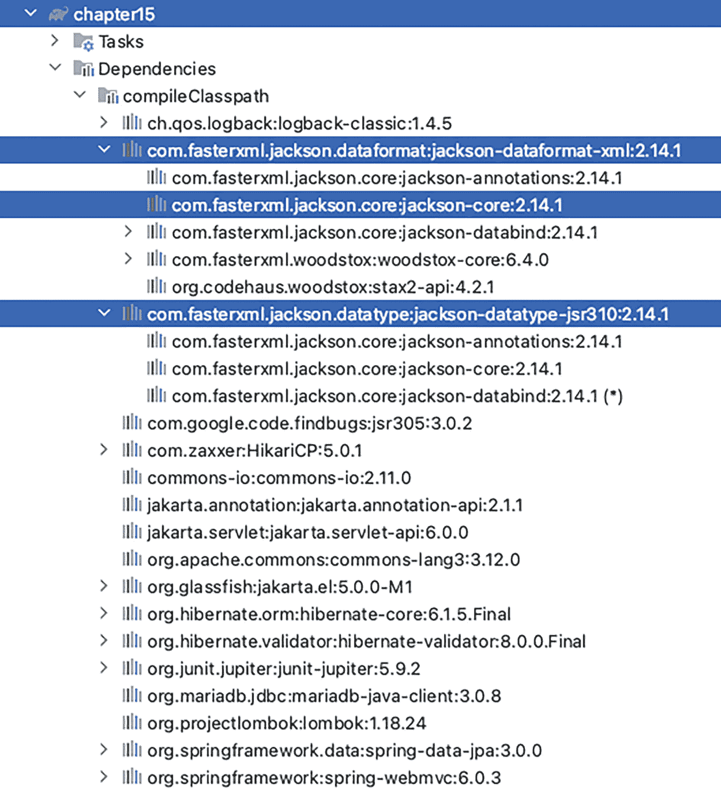
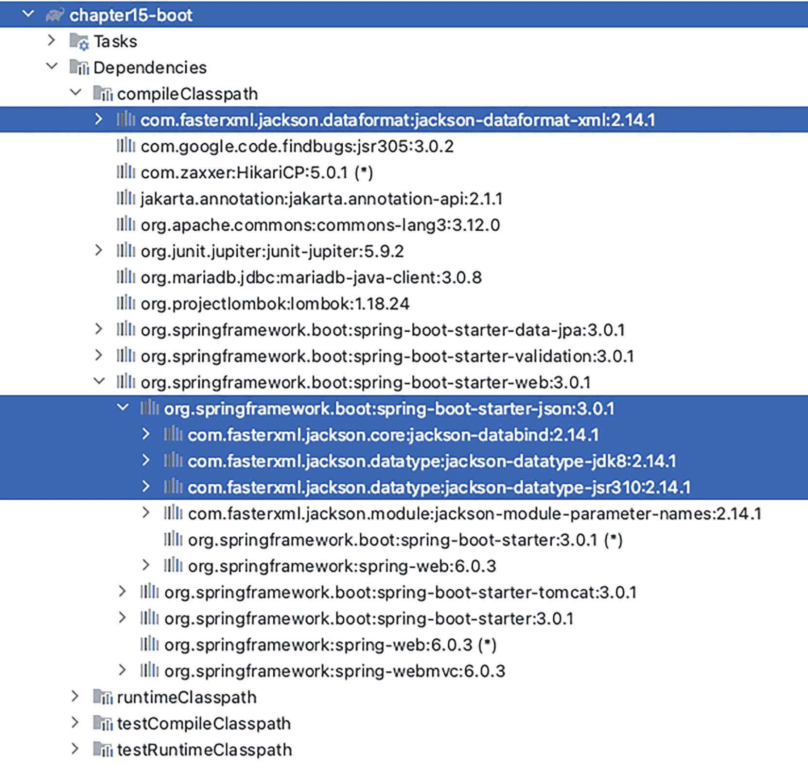

# 15. Spring REST 支持

第 13 章介绍了两个暴露 REST API 的 Spring Web 应用之间通过 HTTP 协议进行的通信。本章将扩展这一主题，向你介绍 RESTful Web 服务（也称为 RESTful-WS）。

如今，RESTful-WS 或许是远程访问中使用最广泛的技术。从通过 HTTP 进行远程服务调用，到支持 Ajax 风格的交互式 Web 前端，RESTful-WS 正被大量采用，这尤其得益于微服务的兴起。RESTful Web 服务之所以流行，有以下几个原因。

*   **易于理解**：RESTful Web 服务围绕 HTTP 设计。URL 与 HTTP 方法共同指定了请求的意图。例如，URL [`http://somedomain.com/restful/customer/1`](http://somedomain.com/restful/customer/1) 配合 HTTP 方法 `GET` 表示客户端想要检索客户信息，其中客户 ID 等于 1。

*   **轻量级**：与基于 SOAP 的 Web 服务相比，RESTful 要轻量得多。SOAP 服务包含大量元数据来描述客户端想要调用哪个服务。而对于 RESTful 的请求和响应，它就像任何其他 Web 应用一样，仅仅是一个 HTTP 请求和响应。

*   **防火墙友好**：由于 RESTful Web 服务设计为可通过 HTTP（或 HTTPS）访问，因此应用对防火墙更加友好，远程客户端也更容易访问。

在本章中，我们将介绍 RESTful-WS 的基本概念，以及 Spring 通过其 Spring MVC 模块对 RESTful-WS 的支持。

## 介绍 RESTful Web 服务

RESTful-WS 中的 REST 是 **RE**presentational **S**tate **T**ransfer（表述性状态转移）的缩写，它是一种架构风格。REST 定义了一组架构约束，这些约束共同描述了一个用于访问资源的统一接口。该统一接口的主要概念包括资源的标识以及通过表述对资源进行操作。

对于资源的标识，一条信息应能通过统一资源标识符（URI）访问。例如，URL [`http://somedomain.com/api/singer/1`](http://somedomain.com/api/singer/1) 是一个 URI，它通常代表一个资源，即一条标识符为 1 的歌手信息。如果标识符为 1 的歌手不存在，客户端可能会收到一个 404 HTTP 状态码，就像网站上的“页面未找到”错误。另一个例子，[`http://somedomain.com/api/singers`](http://somedomain.com/api/singers) 是一个 URI，它可能代表一个资源，即歌手信息列表。这些可识别的资源可以通过各种表述进行管理，如表 15-1 所示。

表 15-1

用于操作资源的表述

| HTTP 方法 | 描述 |
| --- | --- |
| `GET` | GET 检索资源的表述。 |
| `HEAD` | 与 GET 相同，但没有响应体。通常用于获取头部信息。 |
| `POST` | POST 创建新资源。 |
| `PUT` | PUT 更新资源。 |
| `DELETE` | DELETE 删除资源。 |
| `OPTIONS` | OPTIONS 检索允许的 HTTP 方法。 |

关于 RESTful Web 服务的详细描述，我们推荐 *Ajax and REST Recipes: A Problem-Solution Approach by Christian Gross*（Apress, 2006）。

### 使用 Spring MVC 暴露 RESTful Web 服务

在本节中，我们将向你展示如何使用 Spring MVC 将歌手服务作为 RESTful Web 服务暴露出来，正如上一节所设计的那样。本示例基于已介绍的 `Singer` 类和 `SingerRepo` 仓库接口构建。

信息 在本书的上一版中，使用了 Castor^(¹⁴²) XML 进行序列化。在本版中，由于 Castor 库已有一段时间未维护，因此改用 Jackson^(¹⁴³)。

Jackson 库功能非常强大，提供了将对象序列化为 JSON 和 XML 的组件。通过注解可以轻松地将 Java 属性映射到 XML 元素或 JSON 属性。尽管 Jackson 注解命名为 `@Json*`，但它们同样可以作为 XML 序列化的配置。清单 15-1 展示了使用 Jackson 注解修饰的 `Singer` 类。

```
package com.apress.prospring6.fifteen.entities
import com.fasterxml.jackson.annotation.JsonFormat
import com.fasterxml.jackson.annotation.JsonIgnore
// 其他导入语句已省略
@Entity
@Table(name = "SINGER")
class Singer {
@JsonIgnore // 不进行序列化
@Id
@GeneratedValue(strategy = GenerationType.IDENTITY)
@Column(name = "ID")
var id: Long? = null
@JsonIgnore // 不进行序列化
@Version
@Column(name = "VERSION")
var version = 0
@Column(name = "FIRST_NAME")
var firstName: @NotEmpty @Size(min = 2, max = 30) String? = null
@Column(name = "LAST_NAME")
var lastName: @NotEmpty @Size(min = 2, max = 30) String? = null
@JsonFormat(pattern = "yyyy-MM-dd")
@DateTimeFormat(pattern = "yyyy-MM-dd")
@Column(name = "BIRTH_DATE")
var birthDate: LocalDate? = null
companion object {
@Serial
private val serialVersionUID = 2L
}
override fun equals(other: Any?): Boolean {
if (this === other) return true
if (javaClass != other?.javaClass) return false
other as Singer
if (id != other.id) return false
if (firstName != other.firstName) return false
if (lastName != other.lastName) return false
return birthDate == other.birthDate
}
override fun hashCode(): Int {
var result = id?.hashCode() ?: 0
result = 31 * result + (firstName?.hashCode() ?: 0)
result = 31 * result + (lastName?.hashCode() ?: 0)
result = 31 * result + (birthDate?.hashCode() ?: 0)
return result
}
override fun toString(): String {
return "Singer(id=$id, version=$version, firstName=$firstName, lastName=$lastName, birthDate=$birthDate)"
}
}
清单 15-1
使用 Jackson 注解修饰的更新后的 Singer 类
```

默认情况下，Jackson 知道如何序列化为文本值的所有 `Singer` 字段都会被序列化。如果并非所有字段都需要序列化，例如 `version` 字段，则使用 `@JsonIgnore` 注解告诉 Jackson 跳过这些字段。

对于复杂类型（如日历日期），有两种选择：使用配置了我们希望日期值转换成的模式的 `@JsonFormat` 注解，或者扩展 `com.fasterxml.jackson.databind.ser.std.StdSerializer`。


### 实现 `SingerController`

为简单起见，我们将跳过声明 `SingerService`，直接编写一个使用 `SingerRepo` 的 `SingerController`。`SingerController` 如代码清单 15-2 所示。

```
package com.apress.prospring6.fifteen.controllers
import org.springframework.stereotype.Controller
import org.springframework.web.bind.annotation.*
// 其他 import 语句已省略
@Controller
@ResponseBody
@RequestMapping(path = ["singer"])
class SingerController(private val singerRepo: SingerRepo) {
@ResponseStatus(HttpStatus.OK) // @GetMapping(path={"/", ""})
@RequestMapping(path = ["/", ""], method = [RequestMethod.GET])
fun all(): List {
return singerRepo.findAll()
}
@ResponseStatus(HttpStatus.OK) //@GetMapping(path = "/{id}")
@RequestMapping(path = ["/{id}"], method = [RequestMethod.GET])
fun findSingerById(@PathVariable id: Long): Singer? {
return singerRepo.findById(id).orElse(null)
}
@ResponseStatus(HttpStatus.CREATED) //@PostMapping(path="/")
@RequestMapping(path = ["/"], method = [RequestMethod.POST])
fun create(@RequestBody singer: Singer): Singer {
LOGGER.info("Creating singer: {}", singer)
val saved = singerRepo.save(singer)
LOGGER.info("Singer created successfully with info: $saved")
return singer
}
@ResponseStatus(HttpStatus.OK) //@PutMapping(value="/{id}")
@RequestMapping(path = ["/{id}"], method = [RequestMethod.PUT])
fun update(
@RequestBody singer: Singer,
@PathVariable id: Long
) { // 如果启用验证，则无法提供缺少字段的 Singer
LOGGER.info("Updating singer: {}", singer)
val fromDb = singerRepo.findById(id).orElseThrow { IllegalArgumentException("Singer does not exist!") }
fromDb.firstName = singer.firstName
fromDb.lastName= singer.lastName
fromDb.birthDate = singer.birthDate
singerRepo.save(fromDb)
LOGGER.info("Singer updated successfully with info: $fromDb")
}
@ResponseStatus(HttpStatus.NO_CONTENT) //@DeleteMapping(value="/{id}")
@RequestMapping(path = ["/{id}"], method = [RequestMethod.DELETE])
fun delete(@PathVariable id: Long) {
LOGGER.info("Deleting singer with id: {}", id)
singerRepo.deleteById(id)
LOGGER.info("Singer deleted successfully")
}
companion object {
val LOGGER = LoggerFactory.getLogger(SingerController::class.java)
}
}
代码清单 15-2
SingerController 实现
```

上述类的主要要点如下：

*   该类使用 `@Controller` 注解，表明它是一个 Spring MVC 控制器。

*   类级别的 `@RequestMapping(value="/singer")` 注解表明该控制器将映射到主 Web 上下文下的所有 URL。在此示例中，`http://localhost:8080/singer` 下的所有 URL 都将由此控制器处理。

*   此控制器需要 `SingerRepo` 才能工作。

*   每个方法上的 `@RequestMapping` 注解指明了其将映射到的 URL 模式和对应的 HTTP 方法。例如，`all()` 方法将映射到 `http://localhost:8080/singer` URL，并使用 HTTP `GET` 方法。对于 `update(..)` 方法，它将映射到 URL `http://localhost:8080/singer/1`，并使用 HTTP PUT 方法。

*   此控制器与**第** **14** 章介绍的控制器有何不同？是什么让一个控制器被用于 REST 请求？有两方面：一是每个处理方法上都放置了 `@ResponseBody` 注解，二是处理方法不返回逻辑视图名称。`@ResponseBody` 注解表示方法返回值应绑定到 Web 响应体，用更专业的技术术语来说，就是方法返回的值实际上就是 Web 响应。如果觉得在每个方法上都标注 `@ResponseBody` 显得冗长，你可以轻松地通过在类上只使用一次来跳过，但这意味着控制器中的任何方法都不应返回视图或视图名称。

*   对于接受路径变量的方法（例如 `findSingerById(..)` 方法），路径变量使用 `@PathVariable` 注解。这指示 Spring MVC 将 URL 中的路径变量（例如 `http://localhost:8080/singer/1`）绑定到 `findSingerById(..)` 方法的 `id` 参数。请注意，对于 `id` 参数，其类型是 `Long`，Spring 的类型转换系统会自动为我们处理从 `String` 到 `Long` 的转换。

*   对于 `create(..)` 和 `update(..)` 方法，`Singer` 参数使用 `@RequestBody` 注解。这指示 Spring 自动将 HTTP 请求体中的内容绑定到 `Singer` 领域对象。转换将由已声明的 `HttpMessageConverter<Object>` 接口（位于 `org.springframework.http.converter` 包下）的实例完成，以支持各种格式，这将在本章后面讨论。

Spring 4.3 版本引入了 `@RequestMapping` 注解的一些定制化，以匹配基本的 HTTP 方法。表 15-2 列出了新注解与旧式 `@RequestMapping` 之间的等价关系。

表 15-2
Spring 4.3 引入的用于将 HTTP 方法请求映射到特定处理方法的注解

| 注解 | 旧式等价写法 |
| --- | --- |
| `@GetMapping` | `@RequestMapping(method = RequestMethod.GET)` |
| `@PostMapping` | `@RequestMapping(method = RequestMethod.POST)` |
| `@PutMapping` | `@RequestMapping(method = RequestMethod.PUT)` |
| `@DeleteMapping` | `@RequestMapping(method = RequestMethod.DELETE)` |

Spring 4.0 还为 REST 控制器类引入了另一个原型注解，称为 `@RestController`。该注解同样声明在 `org.springframework.web.bind.annotation` 包中，并且是元注解了 `@Controller` 和 `@ResponseBody`，这基本上赋予了它两者的能力。使用此注解以及表 15-2 中的注解，`SingerController` 类变得更加简洁，如代码清单 15-3 所示。

```
package com.apress.prospring6.fifteen.controllers
import org.springframework.web.bind.annotation.RestController
// 其他 import 语句已省略
@RestController
@RequestMapping(path = ["singer"])
class SingerController(private val singerRepo: SingerRepo) {
...
}
代码清单 15-3
使用 @RestController 的 SingerController 实现
```

对于不需要专门 Web 视图的 Spring Web REST 应用程序，也无需专门的视图解析器 Bean。因此，配置会稍微简单一些。`WebInitializer` 类（配置 `DispatcherServlet` 的类）对于 Spring Web 应用程序来说相当标准，并且当不使用专门视图时，不需要 `HiddenHttpMethodFilter`。请参见代码清单 15-4。

```
package com.apress.prospring6.fifteen
import jakarta.servlet.Filter
import org.springframework.web.filter.CharacterEncodingFilter
import org.springframework.web.filter.HiddenHttpMethodFilter
import org.springframework.web.servlet.support.AbstractAnnotationConfigDispatcherServletInitializer
import java.nio.charset.StandardCharsets
import java.nio.charset.StandardCharsets
class WebInitializer : AbstractAnnotationConfigDispatcherServletInitializer() {
override fun getRootConfigClasses(): Array> {
return arrayOf(BasicDataSourceCfg::class.java, TransactionCfg::class.java)
}
override fun getServletConfigClasses(): Array> {
return arrayOf(WebConfig::class.java)
}
override fun getServletMappings(): Array {
return arrayOf("/")
}
override fun getServletFilters(): Array {
val cef = CharacterEncodingFilter()
cef.encoding = StandardCharsets.UTF_8.name()
cef.setForceEncoding(true)
return arrayOf(HiddenHttpMethodFilter(), cef)
}
}
代码清单 15-4
WebInitializer 类
```


Spring MVC 的配置类（`WebConfig`，如清单 15-5 所示）同样简单，因为通常 REST 应用程序不需要主题或国际化功能。

```
package com.apress.prospring6.fifteen
import org.springframework.web.servlet.config.annotation.EnableWebMvc
import org.springframework.web.servlet.config.annotation.WebMvcConfigurer
// 其他 import 语句已省略
@Configuration
@EnableWebMvc
@ComponentScan(basePackages = ["com.apress.prospring6.fifteen"])
open class WebConfig : WebMvcConfigurer {
override fun addViewControllers(registry: ViewControllerRegistry) {
registry.addRedirectViewController("/", "/home")
}
@Bean
open fun validator(): Validator {
return LocalValidatorFactoryBean()
}
override fun getValidator(): Validator {
return validator()
}
}
清单 15-5
WebConfig 类
```

这种配置是最小化的，即使在经典配置中，Spring MVC 也会根据请求中的 `Accept` 头来确定请求的媒体类型。

你可以通过覆盖 `WebConfig` 类中的 `configureContentNegotiation(..)` 方法^(¹⁴⁴)，基于路径扩展名、查询参数来配置请求的媒体类型，或者通过声明不同的处理器方法并使用 `produces` 属性来实现。

为了覆盖 Spring MVC 创建的默认消息转换器，请实现 `configureMessageConverters()` 方法。如果你想在默认消息转换器集合中添加自定义消息转换器，请覆盖 `extendMessageConverters()` 方法^(¹⁴⁵)。

对于本章而言，我们不需要执行任何这些操作，因为 Spring MVC 配置的默认消息转换器已经足够满足我们的需求。

那么，既然我们已经确定客户端必须在请求中提供 `Accept` 头来指定他们想要的数据格式，我们还需要配置其他东西来使其工作吗？答案是不需要，但我们确实需要将合适的 Jackson 库添加到类路径中，以便 Spring MVC 能够使用它们。

`chapter15` 项目的依赖关系如图 15-1 所示。



第 15 章的依赖项列表中有 3 个高亮显示的库。它们分别是 jackson-dataformat-xml、jackson-core 和 jackson-datatype-jsr310。

图 15-1
`chapter15` 项目的依赖关系

在图 15-1 中，三个 Jackson 库被高亮显示：

*   `jackson-dataformat-xml` 用于序列化为 XML 格式。
*   `jackson-core` 是用于序列化为 JSON 格式的核心 Jackson 库，并包含所有 `@Json*` 注解。
*   `jackson-datatype-jsr310` 用于 Java 8 `Date` 和 `Time` 类型的序列化和格式化。

现在，服务端服务已经完成。此时，你可以构建包含 Web 应用程序的 WAR 文件，并将其部署到 Apache Tomcat 10 实例中，或者，如果你使用的是 IntelliJ IDEA，可以按照**第** **14** 章所示创建一个 Apache Tomcat 启动器。

### 测试 RESTful-WS 应用程序

测试 REST 应用程序的方法有很多种。我们可以构建一个 Java 或 Kotlin 客户端，可以使用 HTTPie 请求，也可以使用 `curl`^(¹⁴⁶)、Postman^(¹⁴⁷) 或任何其他用于发起 HTTP 请求的应用程序或命令行工具。让我们从最简单的 HTTPie 开始，即 IntelliJ IDEA HTTP 客户端（需要 IntelliJ IDEA Ultimate 版本）。以 XML 格式检索所有歌手的请求以及返回响应的片段如清单 15-6 所示。

```
### 请求
GET http://localhost:8080/ch15/singer/
Accept: application/xml
### 响应
HTTP/1.1 200
Content-Type: application/xml;charset=UTF-8
Transfer-Encoding: chunked
Date: Tue, 17 Jan 2023 22:13:57 GMT
Keep-Alive: timeout=20
Connection: keep-alive

John
Mayer
1977-10-16

Ben
Barnes
1981-08-20

清单 15-6
以 XML 格式获取所有歌手的 HTTPie 请求及响应
```

此命令向服务器的 RESTful Web 服务发送一个 HTTP 请求；在本例中，它调用了 `SingerController` 中的 `all()` 方法来检索并返回所有歌手信息。同时，`Accept` HTTP 头的值被设置为 `application/xml`，这意味着客户端希望以 XML 格式接收数据。

要以 JSON 格式获取数据，我们只需将 `Accept` 头的值替换为 `application/json` 即可。由于提到了 `curl`，清单 15-7 展示了以 JSON 格式检索数据的详细（`-v` 选项）`curl` 请求以及响应片段。

```
### 请求
curl -v -H "Accept: application/json" http://localhost:8080/ch15/singer/
### 响应
*   Trying 127.0.0.1:8080...
* Connected to localhost (127.0.0.1) port 8080 (#0)
> GET /ch15/singer/ HTTP/1.1
> Host: localhost:8080
> User-Agent: curl/7.84.0
> Accept: application/json
>
* Mark bundle as not supporting multiuse
< HTTP/1.1 200
< Content-Type: application/json;charset=UTF-8
< Transfer-Encoding: chunked
< Date: Tue, 17 Jan 2023 22:22:54 GMT
<
* Connection #0 to host localhost left intact
[
{
"firstName":"John",
"lastName":"Mayer",
"birthDate":"1977-10-16"
},
{
"firstName":"Ben",
"lastName":"Barnes",
"birthDate":"1981-08-20"
}
# 其他 JSON 元素已省略
]
清单 15-7
以 JSON 格式获取所有歌手的 curl 请求及响应
```

此命令向服务器的 RESTful Web 服务发送一个 HTTP 请求，同样调用 `SingerController` 中的 `all()` 方法来检索并返回所有歌手信息。在本例中，`-H` 选项声明了一个 HTTP 头属性，这意味着客户端希望以 JSON 格式接收数据。

HTTPie 和 `curl` 都发出相同的请求，唯一的区别在于 `Accept` 头的值。更改数据格式之所以有效，是因为 Spring MVC 会注册在类路径中找到的 `org.springframework.http.converter.HttpMessageConverter<T>` 实现，并使用它们进行内容类型解析。

当 Spring REST 应用程序需要相互通信时，对于非响应式应用程序，会使用 `RestTemplate` 实例。**第** **13** 章介绍了使用 `RestTemplate` 测试 Spring Boot 应用程序，并且这些测试被设计为在 Spring Boot 测试上下文中运行。对于本节，应用程序以经典方式配置，没有使用 Spring Boot，并打包为部署在 Apache Tomcat 服务器上的 `*.war` 文件。这意味着为此应用程序编写的测试与应用程序上下文是分离的。应用程序在 Tomcat 中运行，测试类仅与应用程序共享类路径，而不共享上下文，因此该测试相当于应用程序的一个客户端。

清单 15-8 展示了 `RestClientTest` 类，它使用 `RestTemplate` 实例向部署在 Tomcat 上的应用程序提交所有类型的 HTTP 请求。


```
package com.apress.prospring6.fifteen
import org.springframework.web.client.RestTemplate
// 其他导入语句已省略
class RestClientTest {
val restTemplate = RestTemplate()
@Test
fun testFindAll() {
LOGGER.info("--> 测试检索所有歌手")
val singers = restTemplate.getForObject(
URI_SINGER_ROOT,
Array::class.java
)
Assertions.assertTrue(singers!!.isNotEmpty())
Arrays.stream(singers).forEach { s: Singer ->
LOGGER.info(
s.toString()
)
}
}
@Test
fun testFindAllWithExecute() {
LOGGER.info("--> 测试检索所有歌手")
val singers = restTemplate.execute(
URI_SINGER_ROOT, HttpMethod.GET,
{ request: ClientHttpRequest? ->
LOGGER.debug(
"请求已提交 ..."
)
},
{ response: ClientHttpResponse ->
Assertions.assertEquals(
HttpStatus.OK,
response.statusCode
)
String(response.body.readAllBytes())
}
)
LOGGER.info("响应: {}", singers)
}
@Test
fun testFindById() {
LOGGER.info("--> 测试按 ID 检索歌手：1")
val singer = restTemplate.getForObject(
URI_SINGER_WITH_ID,
Singer::class.java, 1
)
Assertions.assertNotNull(singer)
LOGGER.info(singer!!.toString())
}
@Test
fun testCreate() {
LOGGER.info("--> 测试创建歌手")
var singerNew = Singer().apply {
firstName = "TEST"
lastName = "Singer"
birthDate = LocalDate.now()
}
singerNew = restTemplate.postForObject(
URI_SINGER_ROOT, singerNew,
Singer::class.java
)!!
LOGGER.info("歌手创建成功: $singerNew")
}
@Test
fun testDelete() {
LOGGER.info("--> 测试按 ID 删除歌手：57") // TODO 检查你的数据库，并从中选择一个 ID
val initialCount = restTemplate.getForObject(
URI_SINGER_ROOT,
Array::class.java
)!!.size
restTemplate.delete(URI_SINGER_WITH_ID, 57)
val afterDeleteCount = restTemplate.getForObject(
URI_SINGER_ROOT,
Array::class.java
)!!.size
Assertions.assertEquals(initialCount - afterDeleteCount, 1)
}
@Test
fun testUpdate() {
LOGGER.info("--> 测试按 ID 更新歌手：1")
val singer = restTemplate.getForObject(
URI_SINGER_WITH_ID,
Singer::class.java, 1
)!!
singer.firstName = "John"
restTemplate.put(URI_SINGER_WITH_ID, singer, 1)
LOGGER.info("歌手更新成功: $singer")
}
companion object {
private const val URI_SINGER_ROOT =
"http://localhost:8080/chapter15-1.0-SNAPSHOT/singer/"
private const val URI_SINGER_WITH_ID =
"http://localhost:8080/chapter15-1.0-SNAPSHOT/singer/{id}"
val LOGGER = LoggerFactory.getLogger(RestClientTest::class.java)
}
}
清单 15-8
使用 RestTemplate 向 ch15 Web 应用程序发送请求的 RestClientTest 类
```

`RestClientTest` 类包含用于测试 Web 应用程序支持的所有 URL 的方法。每个方法都可以在 IntelliJ IDEA 等智能编辑器中单独运行。声明了用于访问各种操作的 URL，这些 URL 将在后续示例中使用。`RestTemplate` 实例被创建并用于所有测试方法。

在 `testFindAll()` 方法中，调用了 `RestTemplate#getForObject(..)` 方法（对应于 HTTP GET 方法），传入了 URL 和期望的返回类型，即包含完整歌手列表的 `Singers[]` 类。

确保应用服务器正在运行，并且 Web 应用程序在上下文 `ch15` 下暴露。运行 `testFindAll()` 测试方法，测试应通过并产生如清单 15-9 所示的输出。

```
11:33:06.970 [Test worker] INFO  c.a.p.f.RestClientTest - --> 测试检索所有歌手
11:33:07.002 [Test worker] DEBUG o.s.w.c.RestTemplate - HTTP GET http://localhost:8080/ch15/singer/
11:33:07.018 [Test worker] DEBUG o.s.w.c.RestTemplate - Accept=[application/xml, text/xml, application/json, application/*+xml, application/*+json]
11:33:07.090 [Test worker] DEBUG o.s.w.c.RestTemplate - 响应 200 OK
11:33:07.096 [Test worker] DEBUG o.s.w.c.RestTemplate - 读取至 [com.apress.prospring6.fifteen.entities.Singer[]]
11:33:07.179 [Test worker] INFO  c.a.p.f.RestClientTest - Singer(id=null, version=0, firstName=John, lastName=Mayer, birthDate=1977-10-16)
11:33:07.179 [Test worker] INFO  c.a.p.f.RestClientTest - Singer(id=null, version=0, firstName=Ben, lastName=Barnes, birthDate=1981-08-20)
...
# 其余歌手已省略
清单 15-9
执行 RestClientTest#testFindAll()的控制台日志
```

如您所见，`RestTemplate` 实例提交请求时，`Accept` 头部的值与类路径上找到的所有转换器相匹配，在本例中为 `application/xml, text/xml, application/json, application/xml, application/json`，这保证了响应的正确解释以及成功转换为作为参数提供的 Java 类型，在本例中为 `Singer` 数组。我们不能使用 `List<Singer>` 作为要转换的响应类型，因为此类型是泛型，不能用作参数。

顾名思义，`getForObject(..)` 方法适用于提交 `GET` 请求。如果您分析其余的测试方法，您会看到 `RestTemplate` 中有与其余 HTTP 方法匹配的方法：`postForObject(..)` 用于 `POST`，`put(..)` 用于 `PUT`，以及 `delete(..)` 用于 `DELETE`。除此之外，还有专门的 `execute(..)` 和 `exchange()` 方法集。`execute(..)` 方法适用于需要在请求提交后立即执行回调方法（作为 `RequestCallback` 的实现提供）的情况，并且由于未提供用于转换响应体的类型作为参数，因此可以提供 `ResponseExtractor<T>` 来显式地将响应体转换为所需的类型。此方法有多个版本，包括额外的请求参数。清单 15-10 展示了如何使用 `execute(..)` 方法编写与 `testFindAll(..)` 等效的测试方法。

```
package com.apress.prospring6.fifteen
import org.springframework.web.client.RequestCallback
import org.springframework.web.client.ResponseExtractor
// 其他导入语句已省略
class RestClientTest {
@Test
fun testFindAllWithExecute() {
LOGGER.info("--> 测试检索所有歌手")
val singers = restTemplate.execute(URI_SINGER_ROOT, HttpMethod.GET,
{ request: ClientHttpRequest? ->
LOGGER.debug(
"请求已提交 ..."
)
},
{ response: ClientHttpResponse ->
Assertions.assertEquals(HttpStatus.OK, response.statusCode)
String(response.body.readAllBytes())
}
)
LOGGER.info("响应: {}", singers)
}
// 其他测试方法已省略
}
清单 15-10
使用模板 execute()进行测试
```

`RequestCallback`^(¹⁴⁸) 和 `ResponseExtractor<T>`^(¹⁴⁹) 都是函数式接口，允许使用 lambda 表达式内联声明它们的实现。这两个函数式接口如清单 15-11 所示。请注意，对于 Kotlin，通常不需要它们——此处列出它们以防万一需要用到。


```
// 注释已省略
package org.springframework.web.client
import java.io.IOException
import java.lang.reflect.Type
import org.springframework.http.client.ClientHttpRequest
@FunctionalInterface
interface RequestCallback {
fun doWithRequest(request:ClientHttpRequest)
}
//-------------------------------
package org.springframework.web.client
import java.io.IOException
import java.lang.reflect.Type
import org.springframework.http.client.ClientHttpResponse
import org.springframework.lang.Nullable
@FunctionalInterface
interface ResponseExtractor {
@Nullable
fun extractData(response:ClientHttpResponse) : T
}
清单 15-11
RequestCallback 和 ResponseExtractor 函数式接口
```

`exchange(..)` 方法集是 `RestTemplate` 提供的最通用/功能最强大的方法，当其他方法提供的参数集不足以满足需求时，它们最为适用。顾名思义，`exchange(..)` 方法旨在实现客户端与服务器上运行的应用程序之间的信息交换，因此最适合复杂的 `POST` 和 `PUT` 请求。清单 15-12 展示了使用 `exchange(..)` 的 `testCreate(..)` 版本。

```
package com.apress.prospring6.fifteen
import org.springframework.http.HttpEntity
import org.springframework.http.HttpMethod
// 其他导入语句已省略
public class RestClientTest {
@Test
fun testCreateWithExchange() {
LOGGER.info("--> 测试创建歌手")
val singerNew = Singer().apply {
firstName = "TEST2"
lastName = "Singer2"
birthDate = LocalDate.now()
}
val request = HttpEntity(singerNew)
val created = restTemplate.exchange(
URI_SINGER_ROOT, HttpMethod.POST, request,
Singer::class.java
)
Assertions.assertEquals(HttpStatus.CREATED, created.statusCode)
val singerCreated = created.body
Assertions.assertNotNull(singerCreated)
LOGGER.info("歌手创建成功: $singerCreated")
}
// 其他测试方法已省略
}
清单 15-12
在测试中使用 exchange()
```

`HttpEntity<T>` 功能强大，因为它可以将请求体和请求头封装在一起，这也使其适用于 `RestTemplate#exchange(..)` 来提交安全的 REST 请求。

使用 `RestTemplate` 进行测试很简单，但控制器可能需要进行一些调整，以使其在 REST 方面功能更强大。如果我们尝试编辑的 `Singer` 实例不存在会发生什么？如果我们尝试创建一个带有某个名称的 `Singer` 实例会发生什么？响应会是什么？由于所有处理器方法都使用了 `@ResponseStatus` 注解来配置一切正常时返回的响应状态码，但任何地方都没有配置错误状态码，因此我们会遇到麻烦。例如，现在运行 `testCreateWithExchange(..)` 方法会返回 500（`INTERNAL_SERVER_ERROR`），因为仓库抛出了一个未在任何地方处理的 `org.springframework.dao.DataIntegrityViolationException`。因此，处理异常是必要的。

### 使用 `ResponseEntity<T>` 进行 REST 异常处理

我们首先可以做的就是在异常发生的地方处理它，并通过 `ResponseEntity<T>` 类型显式返回所需的 `HttpStatus` 值。此类型是 `org.springframework.http.HttpEntity<T>` 的扩展，包含一个 `HttpStatusCode` 状态码。它可用于包装 `RestTemplate` 方法调用的结果，也可用作 REST 处理器方法中的返回类型。

话虽如此，让我们修改 `findSingerById(..)` 处理器方法，使其在存在具有所提供 `id` 的歌手时返回一个包含 `HttpStatus.OK` 状态码的 `ResponseEntity<Singer>`，并在找不到具有所提供 `id` 的歌手时返回一个包含 `HttpStatus.NOT_FOUND` 状态码的 `ResponseEntity<HttpStatus>`。清单 15-13 展示了该方法的此版本，它属于一个名为 `Singer2Controller` 的新 REST 控制器类。

```
package com.apress.prospring6.fifteen.controllers
import org.springframework.http.HttpStatus
import org.springframework.http.ResponseEntity
// 其他导入语句已省略
@RestController
@RequestMapping(path = ["singer2"])
class Singer2Controller(private val singerRepo: SingerRepo) {
@GetMapping(path = ["/{id}"])
fun findSingerById(@PathVariable id: Long): ResponseEntity {
val fromDb: Optional = singerRepo.findById(id)
return fromDb
.map { s: Singer ->
ResponseEntity.ok().body(s)
}
.orElseGet {
ResponseEntity.notFound()
.build()
}
}
...
}
清单 15-13
返回 ResponseEntity 的 Singer2Controller#findSingerById(..) 方法
```

请注意，现在不再需要 `@ResponseStatus(HttpStatus.OK)`，而且如果 `id` 与现有歌手不匹配，则会随 `HttpStatus.NOT_FOUND` 一起发送一个空响应。响应表示为 `ResponseEntity<T>`，对于成功的请求，它包含一个请求体和一个成功的 `200(Ok)` HTTP 状态码；对于失败的请求，仅包含一个 `404(Not Found)` HTTP 状态码。也可以通过调用构造函数显式创建对象，但 `ResponseEntity<T>` 提供了用于构建特定于最常见 HTTP 状态码的请求的构建器。清单 15-14 展示了相应的部分。

```
fun findSingerById(@PathVariable id: Long): ResponseEntity {
val fromDb: Optional = singerRepo.findById(id)
return fromDb
.map { s: Singer ->
ResponseEntity.ok().body(s)
}
.orElseGet {
ResponseEntity.notFound()
.build()
}
}
清单 15-14
使用构建器创建 ResponseEntity 的 Singer2Controller#findSingerById(..) 方法
```

由于响应是 `ResponseEntity<Singer>`，因此可以使用 `RestTemplate#exchange(..)` 方法编写两个测试来测试此方法，一个正向测试，一个反向测试。清单 15-15 展示了这两个测试方法。


```
package com.apress.prospring6.fifteen
import org.springframework.web.client.HttpClientErrorException
import org.springframework.web.client.RestTemplate
import org.springframework.http.RequestEntity
// 其他导入语句已省略
class RestClient2Test {
var restTemplate = RestTemplate()
@Test
@Throws(URISyntaxException::class)
fun testPositiveFindById() {
val headers = HttpHeaders()
headers.accept = listOf(MediaType.APPLICATION_JSON)
val req = RequestEntity(
headers, HttpMethod.GET, URI(
URI_SINGER2_ROOT + 1
)
)
LOGGER.info("--> 测试按 ID 检索歌手：1")
val response = restTemplate.exchange(
req,
Singer::class.java
)
Assertions.assertAll("findById",
Executable {
Assertions.assertEquals(
HttpStatus.OK,
response.statusCode
)
},
Executable {
Assertions.assertTrue(
Objects.requireNonNull(
response.headers[HttpHeaders.CONTENT_TYPE]
).contains(MediaType.APPLICATION_JSON_UTF8_VALUE)
)
},
Executable { Assertions.assertNotNull(response.body) },
Executable {
Assertions.assertEquals(
Singer::class.java,
response.body.javaClass
)
}
)
}
@Test
@Throws(URISyntaxException::class)
fun testNegativeFindById() {
LOGGER.info("--> 测试按 ID 检索歌手：99")
val req = RequestEntity(
HttpMethod.GET, URI(
URI_SINGER2_ROOT + 99
)
)
Assertions.assertThrowsExactly(
HttpClientErrorException.NotFound::class.java
) {
restTemplate.exchange(
req,
HttpStatus::class.java
)
}
} // 欢迎编写其余测试，以检验你对 exchange 方法的理解
companion object {
private const val URI_SINGER2_ROOT = "http://localhost:8080/ch15/singer2/"
val LOGGER = LoggerFactory.getLogger(RestClientTest::class.java)
}
}
清单 15-15 测试 Singer2Controller#findSingerById(..) 方法
```

如前所述，`RestTemplate#exchange(..)` 的 exchange 方法非常强大。在 `testPositiveFindById()` 测试方法中，调用了需要 `RequestEntity<T>` 参数并以对象类型作为返回值的方法版本。`RequestEntity<T>` 类型是 `HttpEntity<T>` 的扩展，它暴露了 HTTP 方法和目标 URL。有趣的是，请求的资源表示形式是 JSON，但 `RestTemplate` 足够智能，可以将其转换回 `Singer` 对象，从而可以对返回的对象进行断言。

在 `testNegativeFindById()` 测试方法中，请注意，我们并未检查 `RequestEntity<T>`，而是验证了是否抛出了 `org.springframework.web.client.HttpClientErrorException.NotFound` 异常。这是因为在底层，错误处理器会接收并处理带有 `404(Not Found)` 状态的响应，并通过抛出此类异常来实现。对于对应非成功响应的其他 HTTP 状态码，也会进行类似的处理，并且这些异常类型都继承自 `org.springframework.web.client.HttpClientErrorException`。

`Singer2Controller` 中的其余方法如清单 15-16 所示。

```
package com.apress.prospring6.fifteen.controllers
// 导入语句已省略
@RestController
@RequestMapping(path = ["singer2"])
class Singer2Controller(private val singerRepo: SingerRepo) {
@GetMapping(path = ["/", ""])
fun all(): ResponseEntity> {
val singers = singerRepo.findAll()
return if (singers.isEmpty()) {
ResponseEntity.notFound().build()
} else ResponseEntity.ok().body(singers)
}
@GetMapping(path = ["/{id}"])
fun findSingerById(@PathVariable id: Long): ResponseEntity {
val fromDb: Optional = singerRepo.findById(id)
return fromDb
.map { s: Singer ->
ResponseEntity.ok().body(s)
}
.orElseGet {
ResponseEntity.notFound()
.build()
}
}
@PostMapping(path = ["/"])
fun create(@RequestBody @Valid singer: Singer): ResponseEntity {
LOGGER.info("正在创建歌手：{}", singer)
return try {
val saved = singerRepo.save(singer)
LOGGER.info("歌手创建成功，信息：{}", saved)
ResponseEntity(saved, HttpStatus.CREATED)
} catch (dive: DataIntegrityViolationException) {
LOGGER.debug("无法创建歌手。", dive)
ResponseEntity.badRequest().build()
}
}
@PutMapping(value = ["/{id}"])
fun update(@RequestBody @Valid singer: Singer, @PathVariable id: Long): ResponseEntity {
LOGGER.info("正在更新歌手：{}", singer)
val fromDb: Optional = singerRepo.findById(id)
return fromDb
.map> { s: Singer ->
s.firstName = singer.firstName
s.lastName = singer.lastName
s.birthDate = singer.birthDate
try {
singerRepo.save(s)
return@map ResponseEntity.ok().build()
} catch (dive: DataIntegrityViolationException) {
Companion.LOGGER.debug("无法更新歌手。", dive)
return@map ResponseEntity.badRequest().build()
}
}
.orElseGet {
ResponseEntity.notFound().build()
}
}
@DeleteMapping(value = ["/{id}"])
fun delete(@PathVariable id: Long): ResponseEntity {
LOGGER.info("正在删除 ID 为：{} 的歌手", id)
val fromDb: Optional = singerRepo.findById(id)
return fromDb
.map> { s: Singer? ->
singerRepo.deleteById(id)
ResponseEntity.noContent().build()
}
.orElseGet {
ResponseEntity.notFound().build()
}
}
companion object {
val LOGGER = LoggerFactory.getLogger(Singer2Controller::class.java)
}
}
清单 15-16 完整的 Singer2Controller
```

查看完整的 `Singer2Controller`，你可能会注意到，当在数据库中找不到歌手时，存在重复的情况：都会构建并返回一个 `ResponseEntity.notFound().build()`。这导致相同的代码被编写了多次。更糟糕的是，当数据库中没有找到歌手时，我们也返回了这种类型的响应。那么，所有这些重复的代码能否避免呢？当然可以，阅读下一节你将学会如何做到。


### 使用 `@RestControllerAdvice` 进行 REST 异常处理

为了减少需要编写的代码，我们可以编写一个 `SingerService`，它封装了 `SingerRepo`，并抛出一个名为 `NotFoundException` 的异常，该异常被声明为继承 `RuntimeException`，因为受检异常很烦人。

 创意的象征，由一个电灯泡表示。 受检异常在 Kotlin 中不起作用。旨在生成有用 HTTP 状态码的异常映射仍然值得包含在你的代码中。

我们在控制器中注入一个此类型的 Bean，并用 `@ResponseStatus(value= HttpStatus.NOT_FOUND)` 注解该类，然后*瞧*，这个异常会自动映射到返回给客户端的响应状态。清单 15-17 展示了 `NotFoundException` 类。

```
package com.apress.prospring6.fifteen.problem
import org.springframework.http.HttpStatus
import org.springframework.web.bind.annotation.ResponseStatus
import java.io.Serial
@ResponseStatus(value = HttpStatus.NOT_FOUND, reason = "Requested item(s) not found")
class NotFoundException : RuntimeException {
var objIdentifier: Long? = null
constructor(cls: Class) : super("table for " + cls.simpleName + " is empty")
constructor(cls: Class, id: Long) : super(cls.simpleName + " with id: " + id + " does not exist!")
companion object {
@Serial
private val serialVersionUID = 2L
}
}
清单 15-17
NotFoundException REST 特定异常类
```

请注意，可以通过 `reason` 属性附加一条错误消息，该消息将成为响应的一部分。

清单 15-18 展示了 `SingerService` 的实现，当找不到某些数据时，它会抛出这种类型的异常。

```
package com.apress.prospring6.fifteen.services
import com.apress.prospring6.fifteen.problem.NotFoundException
// 其他导入语句已省略
@Transactional
@Service("singerService")
class SingerServiceImpl(private val singerRepo: SingerRepo) : SingerService {
override fun findAll(): List {
val singers = singerRepo.findAll()
if (singers.isEmpty()) {
throw NotFoundException(Singer::class.java)
}
return singers
}
override fun findById(id: Long): Singer? {
return singerRepo.findById(id).orElseThrow {
NotFoundException(
Singer::class.java, id
)
}
}
override fun save(singer: Singer): Singer {
return singerRepo.save(singer)
}
override fun update(id: Long, singer: Singer): Singer {
return singerRepo.findById(id)
.map { s: Singer ->
s.firstName = singer.firstName
s.lastName = singer.lastName
s.birthDate = singer.birthDate
singerRepo.save(s)
}
.orElseThrow {
NotFoundException(
Singer::class.java, id
)
}
}
override fun delete(id: Long) {
val fromDb = singerRepo.findById(id)
if (fromDb.isEmpty) {
throw NotFoundException(
Singer::class.java,
id
)
}
singerRepo.deleteById(id)
}
}
清单 15-18
SingerService 实现类
```

请注意，我们之前在控制器处理方法中的大部分逻辑现在都已移至此类。这意味着我们可以编写一个名为 `Singer3Controller` 的新控制器来使用此类型的 Bean，并且该控制器更加优雅和紧凑，如清单 15-19 所示。

```
package com.apress.prospring6.fifteen.controllers
import com.apress.prospring6.fifteen.services.SingerService
// 其他导入语句已省略
@RestController
@RequestMapping(path = ["singer3"])
class Singer3Controller(private val singerService: SingerService) {
@GetMapping(path = ["/", ""])
fun all(): List {
return singerService.findAll()
}
@GetMapping(path = ["/{id}"])
fun findSingerById(@PathVariable id: Long): Singer? {
return singerService.findById(id)
}
@PostMapping(path = ["/"])
@ResponseStatus(HttpStatus.CREATED)
fun create(@RequestBody @Valid singer: Singer): Singer {
LOGGER.info("Creating singer: $singer")
return singerService.save(singer)
}
@PutMapping(value = ["/{id}"])
fun update(@RequestBody @Valid singer: Singer, @PathVariable id: Long) {
LOGGER.info("Updating singer: $singer")
singerService.update(id, singer)
}
@ResponseStatus(HttpStatus.NO_CONTENT)
@DeleteMapping(value = ["/{id}"])
fun delete(@PathVariable id: Long) {
LOGGER.info("Deleting singer with id: {}", id)
singerService.delete(id)
}
companion object {
val LOGGER = LoggerFactory.getLogger(Singer3Controller::class.java)
}
}
清单 15-19
Singer3Controller 类
```

为了测试此异常是否会导致返回 `404(Not Found)` HTTP 状态码的响应，这项工作由清单 15-15 中引入的 `testNegativeFindById(..)` 完成，但通过发送请求 `"http://localhost:8080/ch15/singer3/99"`。

像这样注解一个异常可以完成任务，但我们的控制器还会抛出一个 `DataIntegrityViolationException`，该异常未映射到任何 HTTP 状态码。这种类型的异常不属于我们的应用程序，因此无法用 `@ResponseStatus` 进行注解。

对于这种类型的异常，解决方案是编写一个异常处理类，用 `@RestControllerAdvice`（相当于 REST 版本的 `@ControllerAdvice`）注解它，并为 `DataIntegrityViolationException` 声明一个方法处理器，类似于**第** **14** 章中为 Spring Web 应用程序所做的那样。

`RestErrorHandler` 类是一个用于 REST 请求的全局异常处理器，如清单 15-20 所示。

```
package com.apress.prospring6.fifteen.controllers
import org.springframework.dao.DataIntegrityViolationException
import org.springframework.http.HttpStatus
import org.springframework.http.ResponseEntity
import org.springframework.web.bind.annotation.ControllerAdvice
import org.springframework.web.bind.annotation.ExceptionHandler
@RestControllerAdvice
class RestErrorHandler {
// 如果你不想用 @ResponseStatus 注解 NotFoundException 类
/*    @ExceptionHandler(NotFoundException::class)
fun  handleNotFound(ex:NotFoundException):ResponseEntity {
return ResponseEntity.notFound().build();
}*/
@ExceptionHandler(DataIntegrityViolationException::class)
fun handleBadRequest(ex: DataIntegrityViolationException): ResponseEntity {
return ResponseEntity.badRequest().body(ex.message)
}
}
清单 15-20
RestErrorHandler 类
```

我们如何测试当发生 `DataIntegrityViolationException` 时，不再出现 `500(Internal Server Error)`？很简单：我们尝试使用现有的 `firstName` 和 `lastName` 创建一个新的 `Singer` 实例，由于这两者的组合被声明为 `SINGER` 表的唯一键，因此会抛出异常。该测试如清单 15-21 所示。


```
package com.apress.prospring6.fifteen
import org.springframework.web.client.HttpClientErrorException
import org.springframework.web.client.RestTemplate
// 其他 import 语句已省略
class RestClient3Test {
var restTemplate = RestTemplate()
@Test
@Throws(URISyntaxException::class)
fun testNegativeCreate() {
LOGGER.info("--> 测试创建歌手")
val singerNew = Singer()
singerNew.firstName = "Ben"
singerNew.lastName = "Barnes"
singerNew.birthDate = LocalDate.now()
val req = RequestEntity(
singerNew, HttpMethod.POST, URI(
URL_CREATE_SINGER
)
)
Assertions.assertThrowsExactly(
HttpClientErrorException.BadRequest::class.java
) {
restTemplate.exchange(
req,
HttpStatus::class.java
)
}
}
...
}
清单 15-21
RestClient3Test#testNegativeCreate() 测试方法
```

请注意，`RestTemplate` 抛出的异常类型是 `HttpClientErrorException.BadRequest`，该异常类型与 `400（错误请求）` HTTP 状态码相匹配。

关于编写 Spring REST Web 应用程序的这一节必须在此结束，因为涉及 Spring 的 REST API 主题非常广泛。请查看下一节，了解如何使用 Spring Boot 轻松构建 Spring REST Web 应用程序。

## 使用 Spring Boot 构建 RESTful Web 服务

本节之所以包含在内，是因为 Spring Boot 让一切开发都变得更加容易。`Singer` 实体、仓库、服务、异常和异常处理类与之前相同，无需做任何更改。与经典 Spring REST 应用程序相同的规则也适用：如果我们想要 XML 和 JSON 序列化，就需要将所需的 Jackson 库添加到类路径中。图 15-2 展示了 `chapter15-boot` 项目的依赖关系。



第 15 章启动项目的依赖关系列表中有 5 个高亮显示的库。它们分别是 jackson data format x m l、spring boot starter j son、jackson data bind、jackson datatype j d k 8 和 jackson datatype j s r 310。

图 15-2
`chapter15-boot` 项目的依赖关系

作为一个 Web 应用程序，Spring Boot 的配置与**第** **14** 章中介绍的配置几乎相同，只是 Thymeleaf 部分有所不同。清单 15-22 展示了 `application-dev.yaml` 中包含的 Spring Boot 配置。

```
# web 服务器配置
server:
port: 8081
servlet:
context-path: /
compression:
enabled: true # 通过压缩响应体提高网站性能
address: 0.0.0.0
# 数据源配置
spring:
datasource:
driverClassName: org.mariadb.jdbc.Driver
url: jdbc:mariadb://localhost:3306/musicdb?useSSL=false
username: prospring6
password: prospring6
hikari:
maximum-pool-size: 25
jpa:
generate-ddl: false
properties:
hibernate:
jdbc:
batch_size: 10
show-sql: true
format-sql: false
use_sql_comments: false
hbm2ddl:
auto: none
# 日志配置
logging:
pattern:
console: "%-5level: %class{0} - %msg%n"
level:
root: INFO
org.springframework.boot: DEBUG
com.apress.prospring6.fifteen: INFO
清单 15-22
chapter15-boot 项目的 Spring Boot 配置
```

像往常一样，`dev` 配置文件用于将应用程序连接到现有容器。这允许 `test` 配置文件使用 Testcontainers 启动一个容器。

## 本章小结

在本章中，我们涵盖了关于创建 Spring Restful Web 服务并通过 Spring 配置将其暴露的几个主题。涵盖的配置类型包括经典配置（应用程序打包为 `*.war` 并部署到 Apache Tomcat 10 服务器）以及使用 Spring Boot 的配置。REST API 通过 `RestTemplate` 和 `TestRestTemplate` 进行消费。

本章还涵盖了为 REST 请求编写处理程序方法以及异常处理的各种方式。在下一章中，我们将讨论 Spring Native Images 以及其他一些有用的支持技术。

脚注 1   2   3   4   5   6   7   8

