# 16. Spring Native 及其他实用技术

在前面的章节中，您已经了解了 Spring 框架如何帮助 Kotlin 和 Java 开发者创建 JEE 应用程序。通过使用 Spring 框架的依赖注入（DI）机制及其与各层的集成（通过 Spring 框架自身模块内的库或与第三方库的集成），您可以简化业务逻辑的实现和维护。

多年来，Spring 框架已经发生了巨大的演变，分裂成多个独立的项目，并与最新技术集成。版本 6 在功能和新增项目方面确实非常丰富。本章将向您介绍三个重要的新发展：

*   *Spring Native Images*：Spring Boot 2.3.0 引入了使用 Cloud Native Buildpacks（CNB）将应用程序打包成 Docker 镜像的能力。与此同时，Oracle 正在开发 GraalVM^(¹⁵⁰)，这是一个为 Java 和其他 JVM 语言编写的高性能 JDK 发行版，它承诺为单一语言提供令人难以置信的性能优化，并为多语言应用程序提供互操作性。其最终目标是拥有紧凑、快速启动的应用程序，这些应用程序可以例如在 AWS Lambda 函数中运行。AWS Lambda 函数是按需触发的应用程序，无需服务器一直运行。在 AWS EC2 上运行的 Spring Boot 应用程序是一种基础设施即服务（IaaS），而 AWS Lambda 是一种平台即服务（PaaS）。它帮助您仅在需要时运行和执行后端代码。Spring Native 项目提供了使用 GraalVM native-image 编译器将 Spring 应用程序编译为本机可执行文件的支持。该项目现已退役，因为它曾是实验性的，其成果是 Spring Boot 3 的官方本机支持^(¹⁵¹)。

*   *Spring for GraphQL*：GraphQL^(¹⁵²) 是一种 API 查询语言，也是一个使用现有数据来满足这些查询的运行时。长期以来，服务一直通过 HTTP 使用 REST 请求进行通信，以 JSON、XML 等多种格式处理信息。GraphQL 增加了轻松声明要检索哪些数据的能力，而无需编写复杂的代码来提供这些数据。Spring for GraphQL^(¹⁵³) 为构建在 GraphQL Java 之上的 Spring 应用程序提供支持。这是 GraphQL Java 团队和 Spring 工程团队之间的合作成果。在本章中，您将学习如何构建一个能够高效检索数据以响应 GraphQL 查询的 Spring Boot 应用程序。

*   *Spring Kotlin 应用程序*：Kotlin^(¹⁵⁴) 是一种跨平台、静态类型、通用、高级编程语言，具有类型推断功能。Kotlin 旨在与 Java 完全互操作，并且 Kotlin 标准库的 JVM 版本提供了更简洁的语法、各种类型和编程结构。一些开发者将其描述为 Scala 和 Java 的混合体。该语言拥有一个强大的社区支持，并且由开发出最佳 Java 编辑器的团队开发，因此它的快速采用并不令人意外；它的热度是当之无愧的。我们在本书中通篇使用 Kotlin，因此无需在本章中进一步讨论。


## Spring 原生镜像

Spring 原生镜像是一个独立的可执行文件，通过使用 GraalVM 原生镜像编译器对 Spring 应用进行提前处理而创建。与基于 JVM 的对应版本相比，原生镜像通常具有更小的内存占用和更快的启动速度。此外，你无需 JVM 即可运行它们。在前面的章节中，构建 Spring 项目的结果是一个包含所有字节码的可执行 JAR 文件，这是编译构成该项目的所有 Java 和 Spring 代码的结果。要执行 JAR 文件，你需要一个由 JDK（或在 Java 9 之前的远古时代由 JRE）提供的 JVM。Spring 原生将为目标系统生成一个可执行文件。原生可执行文件由以下部分组成：

*   **Substrate VM**：一种针对需要在其上运行的代码进行编译和配置的虚拟机。它是 JVM 的替代品。创建它的过程与使用 `jlink`^(¹⁵⁵) 从 JDK 中剥离运行应用程序所不需要的所有模块，以组装和优化一组模块及其依赖项到自定义运行时镜像的过程非常相似。

*   **DWARF 信息**：在调试过程中有用的信息。

*   **初始堆**：应用程序运行所需的内存。

*   **编译为原生代码的应用程序**：在本例中，是一个 Spring Boot 应用程序及其所有依赖项。

为简单起见，本节利用 Spring Boot 创建 Docker 镜像的能力，来创建一个包含 Spring 原生可执行文件的 Docker 镜像，并通过启动容器来运行应用程序。这更容易，因为它不需要你在机器上安装 GraalVM。此外，你显然需要在本地安装 Docker，因为你创建的 Docker 镜像需要添加到镜像目录中，然后需要一个运行时来运行基于该镜像的容器。

那么，什么是**提前（AOT）编译**，它与普通的 Java 编译有何不同？有几点值得提及：

*   AOT 编译是一个从应用程序的 *main* 入口点开始静态分析代码的过程。
*   在创建原生镜像时无法访问到的代码将从可执行文件中排除。这显然意味着使用 Spring 动态元素是不可能的，那些让天真的开发者着迷的“自动魔法”也一并失效。必须告知 GraalVM 关于反射、资源、序列化和动态代理的信息。
*   应用程序的类路径在构建时已知，并且在运行时不会改变。这意味着没有延迟类加载，可执行文件中的所有类在启动时都会加载到内存中。
*   Java 和 Kotlin 应用程序可能还存在其他限制，这些限制只有在更多公司开始使用 GraalVM 后才能发现。（例如，我们在为运行 Apple M1 架构的 macOS 构建原生镜像时遇到了一些问题。）

因此，必须放弃 Spring Boot 应用程序的灵活性和动态性，以换取较小的内存占用和更快的启动速度。这意味着不支持配置文件，并且 bean 一旦创建就无法修改。这值得吗？时间会给出答案。

当 Spring 应用程序被提前处理时，必须完成以下步骤才能将其转换为原生可执行文件：

*   生成 Java 代码。
*   为动态代理生成字节码。
*   生成以下 GraalVM JSON 提示文件，这些文件描述了 GraalVM 应如何处理无法通过直接检查代码来理解的内容：
    *   资源提示（`resource-config.json`）
    *   反射提示（`reflect-config.json`）
    *   序列化提示（`serialization-config.json`）
    *   Java 代理提示（`proxy-config.json`）
    *   JNI 提示（`jni-config.json`）

在典型的 Spring 应用程序中，需要大量反射来将 bean 注入到其他 bean 中。Spring IoC 容器识别 `@Configuration` 类和 bean 定义，并创建依赖树来决定 bean 的创建顺序，以便它们可以被注入。所有这些工作都在应用程序启动时完成，也称为**在运行时**完成。这显然需要一些时间，如果你读过前面的章节并亲自运行过代码，可能已经注意到了这一点。

在 Spring 原生可执行文件中，Spring 的行为有所不同。配置类不再被识别或解析，bean 定义也不会在运行时创建；所有这些工作都在构建时完成。bean 定义被处理并转换为源代码，由 GraalVM 编译器分析，以便那些无法访问（使用）的 bean 可以被丢弃。生成的代码非常冗长，因为没有了 Spring IoC 的强大功能，剩下的只有非常显式的代码，通过经典的 Java 和 Kotlin 代码——直接赋值和显式实例化 bean 类型——在正确的位置注入正确的 bean。这显然增加了构建时间，但这并不是真正的问题。

 一个创意的象征。它由一个电灯泡表示。 为了开发人员的舒适和速度，开发可以在普通的 JVM 上进行，而生产构建可以隔离在流水线中，仅在需要发布时运行。

构建 Spring Boot 原生镜像应用程序主要有两种方式：

*   使用 Spring Boot 对云原生构建包（CNB）^(¹⁵⁶) 的支持来生成一个包含原生可执行文件的轻量级容器
*   使用 GraalVM 原生构建工具来生成原生可执行文件

Spring Boot 原生支持非常简便，特别是如果你碰巧使用 Gradle，由于 Gradle 的原生构建工具插件，配置会非常简洁。然而，本节的重点不是编写 Spring 应用程序的代码和技术，而是将 Spring 应用程序编译为原生可执行文件并使用 Docker 运行时运行它所需的配置。


### Spring 应用程序

本节中编译为原生可执行文件的 Spring 应用程序是一个简单的 Spring Boot REST Web 应用程序。它使用 Spring Data JPA 从运行在本地 Docker 实例（如果你有资源，也可以是远程实例）的容器中的数据库检索数据。图 16-1 展示了本节所用简单项目的 Spring Boot 变体。

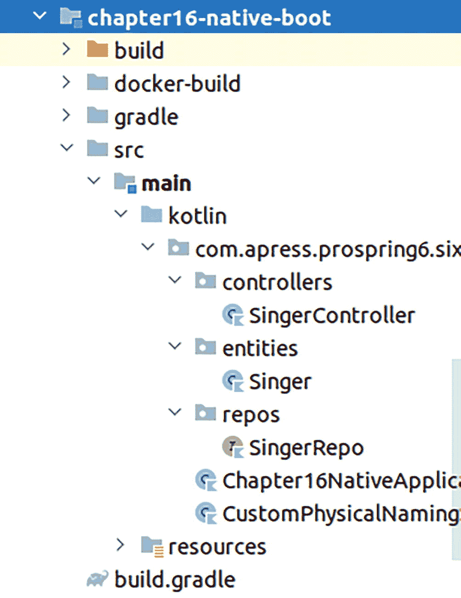

第 16 章原生启动的内容列表包括标记为 build、docker-build、gradle、s r c、main、kotlin 和 resources 的文件夹。其中 main 文件夹被高亮显示。

图 16-1

项目 `chapter16-native-boot`

所有类对你来说应该都很熟悉，因为在前面的章节中已经出现过。`Singer` 类是一个非常简单的实体类，如代码清单 16-1 所示。

```
package com.apress.prospring6.sixteen.boot.entities
import jakarta.persistence.*
import org.springframework.format.annotation.DateTimeFormat
import jakarta.persistence.GenerationType.IDENTITY
@Entity
@Table(name = "SINGER")
class Singer {
@Id
@GeneratedValue(strategy = GenerationType.IDENTITY)
@Column(name = "ID")
var id: Long? = null
@Version
@Column(name = "VERSION")
var version = 0
@Column(name = "FIRST_NAME")
val firstName: String? = null
@Column(name = "LAST_NAME")
val lastName: String? = null
@DateTimeFormat(pattern = "yyyy-MM-dd")
@Column(name = "BIRTH_DATE")
val birthDate: LocalDate? = null
companion object {
@Serial
private val serialVersionUID = 1L
}
override fun equals(other: Any?): Boolean {
if (this === other) return true
if (javaClass != other?.javaClass) return false
other as Singer
return id == other.id
}
override fun hashCode(): Int {
return id?.hashCode() ?: 0
}
}
代码清单 16-1
Singer 实体类
```

为了处理 `Singer` 实例，`SingerRepo` 接口被声明为继承 `JpaRepository<Singer, Long>`，如代码清单 16-2 所示。

```
package com.apress.prospring6.sixteen.boot.repos
import com.apress.prospring6.sixteen.boot.entities.Singer
import org.springframework.data.jpa.repository.JpaRepository
interface SingerRepo : JpaRepository {
}
代码清单 16-2
SingerRepo Spring Data 接口类
```

为简单起见，`SingerController` 类需要一个 `SingerRepo` 实例，通过其处理方法来回传递数据（为简化起见，我们跳过了服务层）。该类及其 bean 声明如代码清单 16-3 所示。

```
package com.apress.prospring6.sixteen.boot.controllers
import org.springframework.web.bind.annotation.*
// 其他 import 语句已省略
@RestController
@RequestMapping(value = ["/singer"])
class SingerController(private val singerRepo: SingerRepo) {
@GetMapping(path = ["/", ""])
fun all(): List {
return singerRepo.findAll()
}
@GetMapping(path = ["/{id}"])
fun findSingerById(@PathVariable id: Long): Singer? {
return singerRepo.findById(id).orElse(null)
}
@PostMapping(path = ["/"])
fun create(@RequestBody singer: Singer): Singer {
LOGGER.info("Creating singer: {}", singer)
return singerRepo.save(singer)
}
@PutMapping(value = ["/{id}"])
fun update(@RequestBody singer: Singer, @PathVariable id: Long?): Singer {
LOGGER.info("Updating singer: {}", singer)
return singerRepo.save(singer)
}
@DeleteMapping(value = ["/{id}"])
fun delete(@PathVariable id: Long) {
LOGGER.info("Deleting singer with id: {}", id)
singerRepo.deleteById(id)
}
companion object {
val LOGGER = LoggerFactory.getLogger(SingerController::class.java)
}
}
代码清单 16-3
SingerController 类
```

`CustomPhysicalNamingStrategy` bean 用于配置 Spring Data 以识别名称仅由大写字母组成的数据库对象，这超出了本节的范围。代码清单 16-4 中所示的 `Chapter16NativeApplication` 类是一个基本的 Spring Boot 配置和主类，也是此应用程序的入口点。

```
package com.apress.prospring6.sixteen.boot
import org.springframework.boot.SpringApplication
import org.springframework.boot.autoconfigure.SpringBootApplication
import org.springframework.boot.autoconfigure.domain.EntityScan
import org.springframework.data.jpa.repository.config.EnableJpaRepositories
import org.springframework.transaction.annotation.EnableTransactionManagement
@EntityScan(basePackages = ["com.apress.prospring6.sixteen.boot.entities"])
@EnableJpaRepositories("com.apress.prospring6.sixteen.boot.repos")
@EnableTransactionManagement
@SpringBootApplication
open class Chapter16NativeApplication {
companion object {
@JvmStatic
fun main(args: Array) {
SpringApplication.run(Chapter16NativeApplication::class.java, *args)
}
}
}
代码清单 16-4
Chapter16NativeApplication 类
```

如你所见，代码中没有任何需要修改的地方，以使此应用程序符合编译为 Spring Native 可执行文件的条件。所有配置都在配置文件中。那么，我们先来看一下 Gradle 配置，因为它相对较小。代码清单 16-5 展示了 `chapter16-native-boot` 项目的 Gradle 配置。

```
plugins {
id 'org.jetbrains.kotlin.jvm' version '1.8.10'
id 'org.springframework.boot' version '3.0.5'
id 'org.graalvm.buildtools.native' version '0.9.22'
}
apply plugin: 'io.spring.dependency-management'
description 'Chapter 16 Boot:  Spring Native'
group = 'com.apress.prospring6'
version = '1.0-SNAPSHOT'
repositories {
mavenCentral()
}
dependencies {
runtimeOnly 'org.jetbrains.kotlin:kotlin-reflect:1.8.10'
implementation 'org.springframework.boot:spring-boot-starter-web'
implementation 'org.springframework.boot:spring-boot-starter-data-jpa'
implementation "commons-io:commons-io:2.11.0"
implementation "com.zaxxer:HikariCP:$hikariVersion"
implementation "org.mariadb.jdbc:mariadb-java-client:$mariadbClientVersion"
}
tasks.named("bootBuildImage") {
docker {
buildpacks = [
"gcr.io/paketo-buildpacks/graalvm",
"gcr.io/paketo-buildpacks/java-native-image",
]
}
imageName = "prospring6-gradle-native:1.0"
}
bootJar {
manifest {
attributes 'Start-Class': 'com.apress.prospring6.sixteen.boot.Chapter16NativeApplication'
}
}
// gradle bootBuildImage
test {
useJUnitPlatform()
}
compileKotlin {
kotlinOptions.jvmTarget = '1.8'
}
compileTestKotlin {
kotlinOptions.jvmTarget = '1.8'
}
代码清单 16-5
build.gradle 文件的内容
```

此配置中最重要的部分是 GraalVM Native Image 插件：`org.graalvm.buildtools.native`。该项目的当前版本是 `0.9.22`。由于它在配置中的存在，Spring Boot Gradle 插件会向项目添加 AOT 任务。由于 IntelliJ IDEA 很智能，它会在 Gradle 视图中显示其作用域下的所有任务以及用于 AOT 目的的依赖项。图 16-2 描绘了 Gradle 视图，显示了 AOT 和 Native 任务及依赖项组。

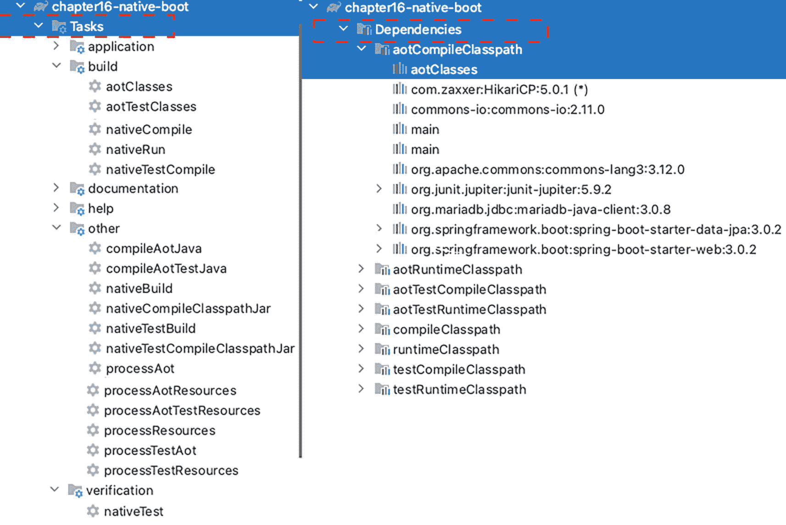

左侧是第 16 章原生启动的任务列表。它包括 application、build、documentation、help、other 和 verification。右侧的依赖项高亮显示了 a o t compile classpath 和 a o t classes。

图 16-2

项目 `chapter16-native-boot` 的 AOT 和 Native 任务及依赖项组


请注意，在 `aotCompileClasspath` 中有一个名为 `aotClasses` 的条目，它代表为 Spring 配置类和 Bean 定义生成的静态代码。`main` 可能代表应用程序的主入口点，即 `Chapter16NativeApplication` 类中的 main 方法。

由于该项目配置了 Java 19，我们需要自定义用于创建可执行文件的 Cloud Native Buildpacks。为此，我们为 `buildpacks` 属性指定一个包含两个值的数组：`gcr.io/paketo-buildpacks/graalvm` 和 `gcr.io/paketo-buildpacks/java-native-image`。为了在 Docker 仪表盘中轻松识别生成的本地镜像，`imageName` 属性被设置为 `prospring6-gradle-native:1.0`。

有了这个配置，剩下的就是在终端中，在 chapter16-native-boot 目录下运行 `gradle bootBuildImage` 来创建镜像。执行过程会花费很长时间，至少第一次是这样。对于这个小项目，大约花了 5 分钟，但这是因为可执行文件所依赖的 Docker 镜像也需要下载。清单 16-6 展示了此次执行的一些片段。

```
> Task :chapter16-native-boot:compileJava
...
> Task :chapter16-native-boot:processAot
...
>Task :chapter16-native-boot:compileAotJava
...
> Task :chapter16-native-boot:bootBuildImage
Building image 'docker.io/library/prospring6-gradle-native:1.0'
> Pulling builder image 'docker.io/paketobuildpacks/builder:tiny' ...
> Pulling run image 'docker.io/paketobuildpacks/run:tiny-cnb' ...
> Pulling buildpack image 'gcr.io/paketo-buildpacks/graalvm:latest' ...
> Pulling buildpack image 'gcr.io/paketo-buildpacks/java-native-image:latest' ...
> Executing lifecycle version v0.16.0
> Running creator
[creator]     ===> ANALYZING
[creator]     Previous image with name "docker.io/library/prospring6-gradle-native:1.0" not found
[creator]     ===> DETECTING
[creator]     7 of 15 buildpacks participating
[creator]     paketo-buildpacks/graalvm           7.10.0
...
[creator]     ===> BUILDING
[creator]     Paketo Buildpack for GraalVM 7.10.0
...
[creator]       Build Configuration:
[creator]         $BP_NATIVE_IMAGE                      true enable native image build
# other build specific variables
[creator]       Native Image: Contributing to layer
[creator]         Executing native-image  ... # classpath omitted
[creator]     =================================================================
[creator]     GraalVM Native Image: Generating '/layers/paketo-buildpacks_native-image/native-image/com.apress.prospring6.sixteen.boot.Chapter16NativeApplication' (static executable)...
[creator]     =================================================================
[creator]     [1/7] Initializing...
[creator]     [2/7] Performing analysis...  [***********]             (138.0s @ 3.28GB)
[creator]     [3/7] Building universe...                             (16.0s @ 3.34GB)
[creator]     [4/7] Parsing methods...      [***]                   (10.8s @ 3.47GB)
[creator]     [6/7] Compiling methods...    [********]                (75.3s @ 3.19GB)
[creator]     [7/7] Creating image...                                 (13.0s @ 2.88GB)
# listing packages, object types and  sizes omitted
...
[creator]     20.4s (6.9% of total time) in 129 GCs | Peak RSS: 5.36GB | CPU load: 5.51
[creator]     -------------------------------------------------------------------------
[creator]     Produced artifacts:
[creator]     /layers/paketo-buildpacks_native-image/native-image/com.apress.prospring6.sixteen.boot.Chapter16NativeApplication (executable)
[creator]     /layers/paketo-buildpacks_native-image/native-image/com.apress.prospring6.sixteen.boot.Chapter16NativeApplication.build_artifacts.txt (txt)
[creator]     =====================================================
[creator]     Finished generating '/layers/paketo-buildpacks_native-image/native-image/com.apress.prospring6.sixteen.boot.Chapter16NativeApplication' in 4m 53s.
[creator]     ===> EXPORTING
[creator]     Adding layer 'paketo-buildpacks/ca-certificates:helper'
[creator]     Adding layer 'buildpacksio/lifecycle:launch.sbom'
# layers to build the image
Successfully built image 'docker.io/library/prospring6-gradle-native:1.0'
BUILD SUCCESSFUL in 5m 36s
9 actionable tasks: 8 executed, 1 up-to-date
清单 16-6
gradle bootBuildImage 执行日志片段
```

首先，`compileJava` 任务编译项目，确保所有依赖项都已提供且项目功能正常。然后，`processAot` 任务生成 AOT Java 代码。接着，`processAot` 任务启动应用程序以检查其是否仍然正常工作。最后，`compileAotJava` 生成**原生字节码**。

所有这些任务的结果都可以在 `build/generated` 目录中看到。AOT 生成的 Java 代码和 GraalVM JSON 提示文件就保存在这里。字节码和原生代码则按作用域分组存储在 `build/classes/java/` 目录下。图 16-3 展示了这些新目录及其部分内容。

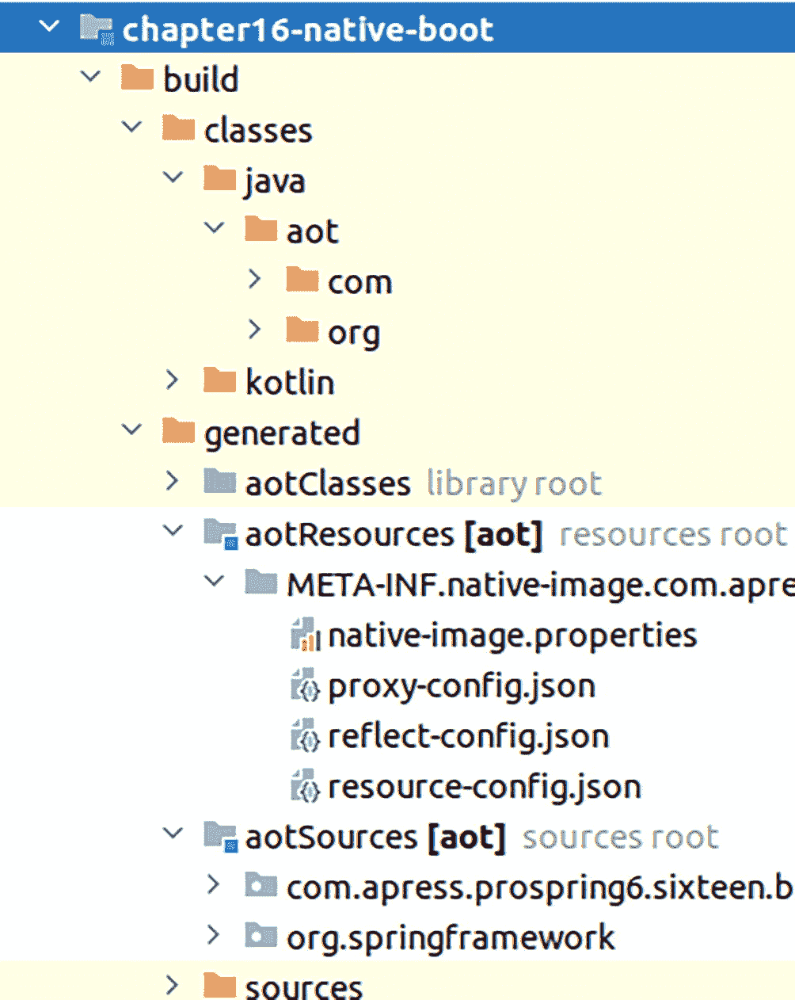


第 16 章原生启动中的文件夹列表包括：build、classes、java、a o t、com、org、kotlin、generated、a o t classes、a o t resources、a o t sources 和 sources。

图 16-3

构建过程生成的中间文件，用于生成原生镜像

最后，`bootBuildImage` 开始为原生可执行文件构建镜像。首先，它会下载基础的 CND 镜像，然后基于 GraalVM JDK 19.0.2 构建可执行文件，仅添加运行可执行文件所必需的少量组件。最终生成一个静态可执行文件，随后对其进行处理，以计算内存占用和存储需求，这些参数将决定 Docker 镜像的相应配置。

如果所有这些步骤都成功完成，Docker 仪表盘的“镜像”选项卡中应会列出最新生成的 `prospring6-gradle-native:1.0` 镜像，如图 16-4 所示。

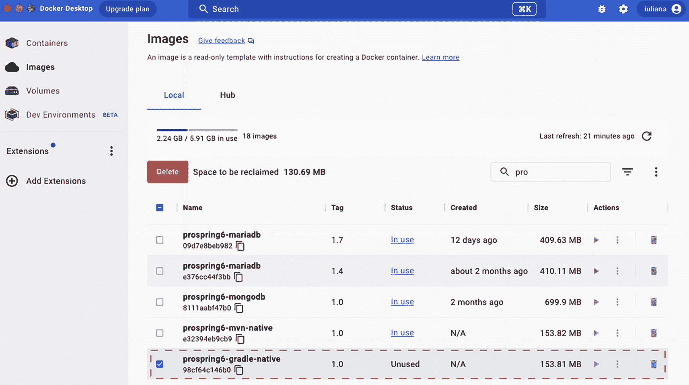

一张 Docker Desktop 的截图，左侧包含四个选项：容器、镜像、卷和开发环境。当前选中了“镜像”。右侧的镜像页面有一个表格，包含 6 列 5 行。列标题分别是：名称、标签、状态、创建时间、大小和操作。

图 16-4

Docker 仪表盘显示 `prospring6-gradle-native:1.0` 镜像

请注意该镜像的大小。点击其名称可查看镜像详情，如图 16-5 所示，包括各层、其内容以及漏洞信息（不必过分担心，因为任何软件都存在漏洞；关键在于其严重程度）。

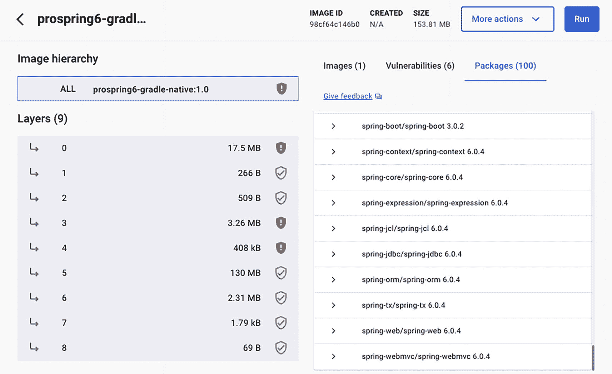

一张窗口截图，左侧显示镜像层级结构及 9 个层，大小标注从 0 到 8。右侧显示了一个软件包列表。顶部显示镜像 ID、创建时间、大小、更多操作和运行选项卡，其中“运行”选项卡被选中。

图 16-5

Docker 仪表盘显示 `prospring6-gradle-native:1.0` 镜像的详细信息

要检查此镜像是否正常工作，我们应该基于它启动一个容器。但由于我们知道应用程序需要数据库，因此需要一种方式来告知它数据库的位置和连接方法。所有这些细节都通过程序参数提供，这些参数会成为容器的环境变量。Spring Boot 应用程序可以在配置文件中引用这些变量。需要修改 `application.yaml` 文件中的数据源配置，以便从环境变量中获取连接数据库所需的值。配置示例如清单 16-7 所示。

```
spring:
datasource:
driverClassName: org.mariadb.jdbc.Driver
url: jdbc:mariadb://${DB_HOST:localhost}:${DB_PORT:3306}/${DB_SCHEMA:musicdb}?useSSL=false
username: ${DB_USER:prospring6}
password: ${DB_PASS:prospring6}
清单 16-7
引用环境变量的 Spring Boot 配置文件
```

`${VAR_NAME:default_value}` 用于为变量提供默认值，以防在启动应用程序时，环境变量既未设置也未通过命令行提供。配置中的所有变量都有默认值。当在需要连接到另一个容器中运行的数据库的容器内运行应用程序时，我们唯一需要实际值的变量是 `DB_HOST`，因为在容器中 `localhost` 指向的是容器自身。要获取数据库所在容器的 IP 地址（假设容器名为 `local-mariadb`），清单 16-8 中的命令可以完成此任务。

```
docker inspect local-mariadb | grep IPAddress  # 假设为 172.17.0.2
清单 16-8
检索正在运行的 Docker 容器 IP 地址的命令

现在我们已经有了数据库的 IP 地址，可以使用清单 16-9 中的命令启动我们的原生容器。

```
docker run --name prospring6-native -e DB_HOST=172.17.0.2 -d -p 8081:8081 prospring6-gradle-native:1.0
清单 16-9
启动 Docker 容器 IP 的命令

为了确保应用程序正确启动，你可以尝试访问 `http://localhost:8081/singers`，所有 `Singer` 实例的 JSON 表示形式都应返回。另一种确保应用程序正确启动的方法是检查 Docker 仪表盘中的容器日志，其中不仅显示 Spring Boot 应用程序的启动日志，还显示应用程序启动所花费的时间，这正是原生镜像的超级优势之一。图 16-6 展示了在本地系统 JVM 上启动的 `Chapter16NativeApplication` 与在容器内从原生可执行文件启动的同一应用程序之间的对比。

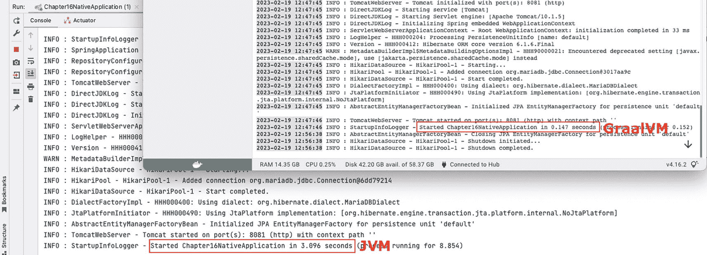

一张标题为“第 16 章原生应用程序”的窗口截图，控制台页面包含一系列信息和警告消息。高亮文本显示：在 JVM 上启动第 16 章原生应用程序耗时 3.096 秒，在 GraalVM 上耗时 0.147 秒。

图 16-6

基于 `prospring6-gradle-native:1.0` 镜像的容器启动时间

当应用程序被构建为原生可执行文件时，启动时间从 3 秒下降到 0.147 秒，启动时间缩短了 20 倍，而这仅仅是一个小型、非常简单的应用程序。对于执行更复杂操作的应用程序，改进效果可能会更好。

要了解更多关于原生镜像的信息，以及如何更好地开发 Spring 应用程序以便轻松构建为原生可执行文件的建议，请阅读官方文档，并留意会议上关于此主题的任何演讲。这项技术虽然已走出实验阶段，但仍处于早期阶段，要成为 Java 应用程序的行业默认标准（如果真能实现的话），还有很长的路要走。


## Spring for GraphQL

GraphQL 是一种用于 API 的查询语言，也是一个根据这些查询提供数据的运行时。GraphQL 提供了对 API 中数据的完整且易于理解的描述，允许客户端请求某些数据，并仅接收其请求的内容，而无需为此编写复杂的代码。

回顾本书迄今为止构建的 REST API。REST 请求被映射到 URL 路径，例如 `http://localhost:8081/singer/1`。客户端发送一个 HTTP GET 请求，并接收数据库中 `SINGER` 表里 `id=1` 的 `Singer` 对象的所有信息。如果客户端需要存储在其他表中关于该歌手的其他信息，则必须编写不同的查询，这些查询将被映射到不同的 URL 路径。因此，客户端必须发出多个请求。使用 GraphQL，客户端无需更改请求的 URL，只需更改用于指定所需数据的模式（schema）。最终，GraphQL 只是 REST、SOAP 或 gRPC 等已建立的应用程序间远程通信的另一种替代方案。

Facebook 发明了 GraphQL，因为 REST 无法在单个请求中检索相关的信息图。使用 REST，多次的来回通信会导致页面加载缓慢，并产生不可接受的闪烁。我们可以更深入地描述 GraphQL，但出于本次讨论的目的，我们仅列出其最重要的特性：

*   GraphQL 是基于模式（schema）的。
*   GraphQL 查询看起来很像 JSON，但它们不是 JSON。
*   GraphQL 是强类型的。GraphQL 模式语言支持标量类型 `String`、`Int`、`Float`、`Boolean` 和 `ID`，因此你可以直接在传递给 `buildSchema` 的模式中使用它们。
*   GraphQL 是为开发者设计的。
*   GraphQL 与传输层无关；它最常用于 HTTP，但不仅限于此。例如，你可以通过 TCP 和 WebSocket 使用它。
*   GraphQL 查询通过 POST 请求发送，因为它们根据需要可以很大且很复杂。它们可以通过嵌套所需的属性来指定从数据库的不同层级检索数据。

REST API 是端点的集合，而 GraphQL API 则专注于数据。本节重点介绍编写一个支持 GraphQL 的 Spring Boot 应用程序。GraphQL 的核心概念将根据需要逐步解释。

在本节中，我们将使用本书迄今为止所用数据库的修改版本。此应用程序管理的数据存储在三个表中：`SINGER`、`AWARD` 和 `INSTRUMENT`，它们之间的关系如图 16-7 所示。

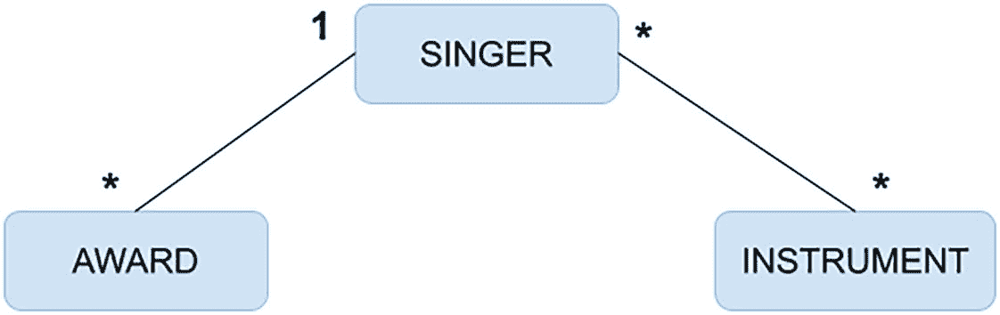

一个包含三个块的框图，左侧是 award，中间是 singer，右侧是 instrument。Award 和 singer 通过一条带有一个星号和数字 1 的线连接。Singer 和 instrument 通过一条带有两个星号的线连接。

图 16-7

项目 `chapter16-graphql-boot` 的表关系

对于本章中的代码示例，这些表是名为 `MUSICDB` 的模式的一部分，访问该模式的用户名为 `prospring6`。用于创建模式的 SQL 代码可以在 `chapter16-graphql-boot` 项目目录下的 `chapter16-graphql-boot/docker-build/scripts/01_CreateTable.sql` 文件中找到。用于填充表的 SQL 代码可以在 `chapter16-graphql-boot` 项目目录下的 `chapter16-graphql-boot/docker-build/scripts/02_InsertData.sql` 文件中找到。这些脚本是用于构建包含示例所需数据库的镜像的 Docker 配置的一部分。

除了 `spring-boot-starter-graphql` 依赖项之外，所有其他依赖项都与通过 Spring Data 仓库访问 MariaDB 数据库的 Spring Boot Web 应用程序相同。图 16-8 显示了 `chapter16-graphql-boot` 项目的依赖项。

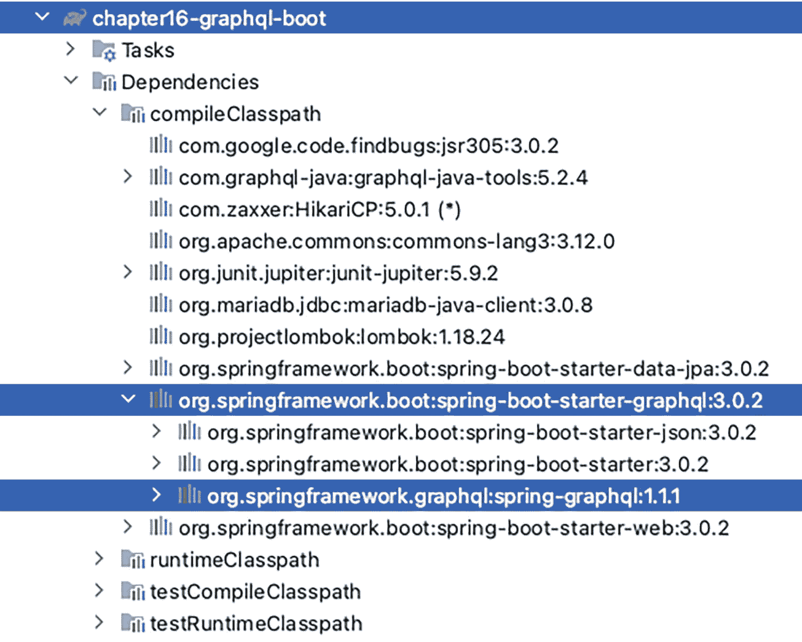

第 16 章 graphql boot 的依赖项列表中有两个高亮显示的库。它们是 spring boot starter graphql 和 spring graphql。

图 16-8

项目 `chapter16-graphql-boot` 的依赖项

`Singer` 实体类如清单 16-10 所示，与数据访问章节中介绍的实体类没有区别。

```
package com.apress.prospring6.sixteen.boot.entities
import jakarta.persistence.*
// 其他导入语句已省略
@Entity
@Table(name = "SINGER")
class Singer() : Serializable {
@Id
@GeneratedValue(strategy = GenerationType.IDENTITY)
@Column(name = "ID")
var id: Long? = null
@Version
@Column(name = "VERSION")
var version = 0
@Column(name = "FIRST_NAME")
var firstName: String? = null
@Column(name = "LAST_NAME")
var lastName: String? = null
@Column(name = "PSEUDONYM")
var pseudonym: String? = null
@Column(name = "GENRE")
var genre: String? = null
@DateTimeFormat(pattern = "yyyy-MM-dd")
@Column(name = "BIRTH_DATE")
var birthDate: LocalDate? = null
@OneToMany(mappedBy = "singer")
var awards: Set? = null
@ManyToMany
@JoinTable(
name = "SINGER_INSTRUMENT",
joinColumns = [JoinColumn(name = "SINGER_ID")],
inverseJoinColumns = [JoinColumn(name = "INSTRUMENT_ID")]
)
var instruments: Set? = null
// 构造函数、equals() 和 hashCode() 已省略
companion object {
@Serial
private val serialVersionUID = 1L
}
}
清单 16-10
Singer 实体类
```

注意 `Singer` 和 `Award` 类之间的 `@OneToMany` 关系，以及 `Singer` 和 `Instrument` 之间的 `@ManytoMany` 关系。默认情况下，这两种关系在首次访问时由持久化提供程序运行时进行延迟初始化。这是一个重要的细节，稍后你会看到。

`Award` 实体类如清单 16-11 所示。

```
package com.apress.prospring6.sixteen.boot.entities;
import jakarta.persistence.*
// 其他导入语句已省略
@Entity
@Table(name = "AWARD")
class Award : Serializable {
@Id
@GeneratedValue(strategy = GenerationType.IDENTITY)
@Column(name = "ID")
var id: Long? = null
@Version
@Column(name = "VERSION")
var version = 0
@ManyToOne
@JoinColumn(name = "SINGER_ID")
var singer: Singer? = null
@Column(name = "YEAR")
var year: Int? = null
@Column(name = "TYPE")
var category: String? = null
@Column(name = "ITEM_NAME")
var itemName: String? = null
@Column(name = "AWARD_NAME")
var awardName: String? = null
companion object {
@Serial
private val serialVersionUID = 3L
}
override fun equals(other: Any?): Boolean {
if (this === other) return true
if (javaClass != other?.javaClass) return false
other as Award
return id == other.id
}
override fun hashCode(): Int {
return id?.hashCode() ?: 0
}
}
清单 16-11
Award 实体类
```

注意 `Award` 和 `Singer` 之间的 `@ManyToOne` 关系。默认情况下，`singer` 字段在首次访问时由持久化提供程序运行时进行立即初始化。`SINGER_ID` 列实际上是一个外键，使得歌手记录成为该奖项的父记录，因此当访问一个 `award` 时，其父记录也应该可访问，这是有道理的。

`Instrument` 实体类非常简单，映射到一个只有一列（同时也是其主键）的表。引入它更多是作为一个虚拟类来展示 `@ManyToMany` 关系。

Spring Data 仓库接口与我们之前在数据访问章节中使用的接口相同，都是 `JpaRepository` 的简单扩展。仓库接口如清单 16-12 所示。

```
package com.apress.prospring6.sixteen.boot.entities
// 导入语句已省略
interface SingerRepo : JpaRepository { }
interface AwardRepo : JpaRepository{ }
interface InstrumentRepo : JpaRepository {
}
清单 16-12
仓库接口
```


为简单起见，我们将不使用服务 bean，而是直接实现 GraphQL 控制器。Spring for GraphQL 提供了一种基于注解的编程模型，其中 `@Controller` 组件使用特定的 GraphQL 注解来装饰具有灵活签名的处理器方法，以便为特定的 GraphQL 字段获取数据。让我们考虑一个最简单的示例：查询所有歌手。清单 16-13 展示了一个控制器，其中包含一个用于响应检索所有歌手的 GraphQL 查询的处理器方法。

```
package com.apress.prospring6.sixteen.boot.controllers;
import org.springframework.graphql.data.method.annotation.QueryMapping
import org.springframework.stereotype.Controller
// 其他导入语句已省略
@Controller
class SingerController(private val singerRepo:SingerRepo) {
@QueryMapping
fun  singers():Iterable{
return singerRepo.findAll()
}
// 其他处理器方法已省略
}
清单 16-13
用于返回歌手表中所有歌手的 GraphQL 处理器方法
```

`@Controller` 注解与本书前面介绍的构造型注解相同。Spring Boot 会自动扫描到它，并将所有 `org.springframework.graphql.execution.RuntimeWiringConfigurer` bean 添加到 `org.springframework.graphql.execution.GraphQlSource.Builder` 中，并启用对带注解的 `graphql.schema.DataFetcher` 实例的支持。

`@QueryMapping` 注解将方法绑定到一个查询，即 `Query` 类型下的一个 GraphQL 字段。`@QueryMapping` 是一个组合注解，相当于 `typeName="Query"` 的 `@SchemaMapping` 的快捷方式。这是将控制器方法映射到 GraphQL 查询的一种实用方式。你可以将 `@SchemaMapping` 视为 GraphQL 的 `@RequestMapping`。

现在我们有了一个处理器方法，接下来需要配置包含对象、查询和变更定义的 GraphQL 模式。这三个术语是 GraphQL 的核心术语。如前所述，GraphQL 是静态类型的，这意味着服务器确切地知道你可以查询的每个对象的形状，并且任何客户端实际上都可以“自省”服务器并请求“模式”。这些类型在位于 `resources/graphql` 下的模式文件中声明，它们映射到任何类型的 GraphQL 操作中涉及的所有对象。

清单 16-14 展示了在 `resources/graphql/singer.graphqls` 中声明的 `Singer` 对象模式和 `singers` 查询定义。

```
type Singer {
id: ID!
firstName: String!
lastName: String!
pseudonym: String
genre: String
birthDate: String
awards: [Award]
instruments: [Instrument]
}
type Query {
singers: [Singer]
}
清单 16-14
Singer 类型和 singers 查询的 GraphQL 模式
```

该模式描述了哪些查询是可能的，以及对于某个特定类型你可以获取哪些字段。如果某个字段不应为 `null`，则在声明中该类型必须以 `!`（感叹号）作为后缀。

那么，现在我们有了模式，是否就可以提交 GraphQL 请求了呢？还没有，因为我们还需要配置 Spring Boot 应用程序以支持 GraphQL，如清单 16-15 所示。

```
server:
port: 8081
servlet:
context-path: /
compression:
enabled: true
address: 0.0.0.0
spring:
graphql:
graphiql:
enabled: true
path: graphiql
datasource:
driverClassName: org.mariadb.jdbc.Driver
url: jdbc:mariadb://localhost:3307/musicdb?useSSL=false
username: prospring6
password: prospring6
hikari:
maximum-pool-size: 25
jpa:
generate-ddl: false
properties:
hibernate:
naming:
physical-strategy: com.apress.prospring6.sixteen.boot.CustomPhysicalNamingStrategy
jdbc:
batch_size: 10
fetch_size: 30
max_fetch_depth: 3
hbm2ddl:
auto: none
# 日志配置已省略
清单 16-15
GraphQL 的 Spring Boot 应用程序配置
```

GraphQL 查询可以通过名为 GraphiQL 的 Web 界面发送到应用程序。这是一个 Web 控制台，可以与任何 GraphQL 服务器通信，并有助于使用和开发 GraphQL API。它包含在 Spring Boot 的 GraphQL starter 中，默认在 `/graphiql` 端点暴露。在清单 16-15 中，配置了相同的值只是为了说明可以使用 `spring.graphql.graphiql.path` 属性来自定义 Web 控制台可访问的 URL 路径。该端点默认是禁用的，但可以通过将 `spring.graphql.graphiql.enabled` 属性设置为 `true` 来启用。GraphiQL 是一个编写和测试查询的非常实用的工具，尤其是在开发和测试期间。

现在我们可以启动应用程序并编写一些查询了。要访问 GraphiQL，请在浏览器中打开 `http://localhost:8081/graphiql` URL。如图 16-9 所示，这将打开 GraphiQL Web 控制台，左侧是一个编辑器，你可以在其中编写查询，右侧是一个面板，用于显示检索到的数据。

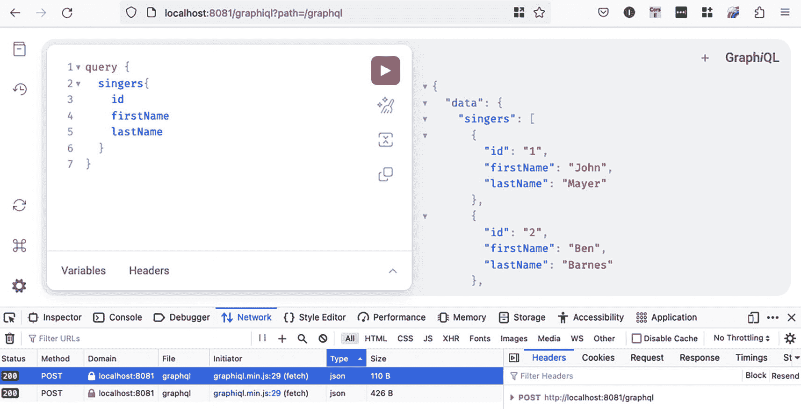

一个标题为“localhost”的窗口截图，左侧包含一个 7 行代码，带有变量和标头，右侧包含一个代码，显示歌手的 id、firstName 和 lastName。从水平选项列表中选择了“网络”。底部有两个表格。选择了“类型”和“标头”。

图 16-9
包含一个简单查询的 GraphiQL Web 控制台

此图像中的查询很简单；我们可以添加更多字段甚至关系。图 16-10 展示了一个 GraphQL 查询，它检索所有歌手的全部详细信息（虽然你通常不需要这样做，但请知道这是可能的）。

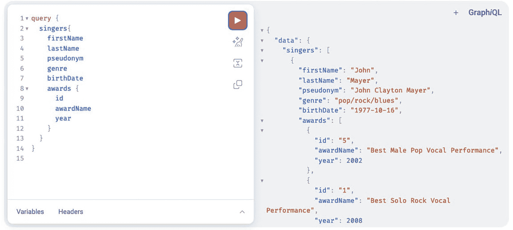

一个截图，左侧包含一个 15 行代码，带有变量和标头，右侧包含一个代码，显示歌手的 firstName、lastName、pseudonym、genre、birthDate、awards、id、awardName 和 year。右上角的文字显示“Graph i Q L”。

图 16-10
包含一个嵌套查询的 GraphiQL Web 控制台

所以这是可行的，尽管如前所述，`awards` 集合是延迟初始化的。另外……GraphQL 是如何处理此类查询的呢？看看为了检索这些数据在表上执行了多少查询会很有趣——简而言之，就是它到底有多高效。为了弄清楚这一点，让我们在 Spring Boot 配置中启用 SQL 日志记录，方法是将属性 `logging.level.sql=debug` 添加到配置中。

如果我们发送相同的查询并查看控制台日志，我们可以看到清单 16-16 中的日志。

```
DEBUG: SqlStatementLogger - select s1_0.ID,s1_0.BIRTH_DATE,s1_0.FIRST_NAME,s1_0.GENRE,s1_0.LAST_NAME,s1_0.PSEUDONYM,s1_0.VERSION from SINGER s1_0
DEBUG: SqlStatementLogger - select a1_0.SINGER_ID,a1_0.ID,a1_0.AWARD_NAME,a1_0.TYPE,a1_0.ITEM_NAME,a1_0.VERSION,a1_0.YEAR from AWARD a1_0 where a1_0.SINGER_ID=?
DEBUG: SqlStatementLogger - select a1_0.SINGER_ID,a1_0.ID,a1_0.AWARD_NAME,a1_0.TYPE,a1_0.ITEM_NAME,a1_0.VERSION,a1_0.YEAR from AWARD a1_0 where a1_0.SINGER_ID=?
DEBUG: SqlStatementLogger - select a1_0.SINGER_ID,a1_0.ID,a1_0.AWARD_NAME,a1_0.TYPE,a1_0.ITEM_NAME,a1_0.VERSION,a1_0.YEAR from AWARD a1_0 where a1_0.SINGER_ID=?
DEBUG: SqlStatementLogger - select a1_0.SINGER_ID,a1_0.ID,a1_0.AWARD_NAME,a1_0.TYPE,a1_0.ITEM_NAME,a1_0.VERSION,a1_0.YEAR from AWARD a1_0 where a1_0.SINGER_ID=?
...
清单 16-16
嵌套 GraphQL 查询的数据库查询
```

这里发生了两件事：

*   对于每位歌手，都会执行一个额外的查询来获取奖项（N+1 复杂度问题）。


*   之所以能够实现这一点，是因为默认情况下，Spring Boot 会在收到数据请求时配置一个打开的 Hibernate 会话。这使得可以加载懒加载关联，从而提高了开发人员的生产力，因为它保持了简单性。无需使用带有连接语句的特殊查询。提供此行为的 Bean 是 `OpenSessionInViewInterceptor`^((157))。

*每次请求一个会话*的事务模式的问题在于，它在生产环境中可能会变得低效。可以通过在 Spring Boot 配置中添加以下属性来禁用此行为：`spring.jpa.open-in-view=false`。然而，当 GraphQL 嵌套查询尝试获取懒加载关系时，这并不能很好地与之配合。

对此的修复方法是什么？我们需要修改 GraphQL 处理方法，并仅在需要时使用 Spring Data JPA Specification API 方法来提取关系数据。这显然意味着我们需要分析客户端发送的查询。有多种方法可以实现这一点，但最简单的是在 `QueryResolver` 实现中使用 `graphql.schema.DataFetchingEnvironment` 参数。在带有 `@QueryMapping` 注解的方法中，Spring Boot 会自动注入此参数的值，并且根据请求的关系，我们可以构建不同的查询。如果你还记得，我们确实有两个关系：“awards”和“instruments”。清单 16-17 展示了改进后的 `singers(..)` 处理方法。

```
package com.apress.prospring6.sixteen.boot.controllers
import org.springframework.graphql.data.method.annotation.QueryMapping
import org.springframework.stereotype.Controller
import graphql.schema.DataFetchingEnvironment
import graphql.schema.DataFetchingFieldSelectionSet
import jakarta.persistence.criteria.Fetch
import jakarta.persistence.criteria.Join
import jakarta.persistence.criteria.JoinType
import org.springframework.data.jpa.domain.Specification
// 其他导入语句已省略
@Controller
class SingerController(private val singerRepo: SingerRepo) {
@QueryMapping
fun singers(environment: DataFetchingEnvironment): Iterable {
val s = environment.selectionSet
return if (s.contains("awards") && !s.contains("instruments"))
singerRepo.findAll(fetchAwards())
else if (s.contains("awards") && s.contains("instruments"))
singerRepo.findAll(fetchAwards().and(fetchInstruments()))
else if (!s.contains("awards") && s.contains("instruments"))
singerRepo.findAll(fetchInstruments())
else singerRepo.findAll()
}
private fun fetchAwards(): Specification {
return Specification { root: Root, query: CriteriaQuery?,
builder: CriteriaBuilder? ->
val f =
root.fetch(
"awards",
JoinType.LEFT
)
val join =
f as Join
join.on
}
}
private fun fetchInstruments(): Specification {
return Specification { root: Root, query: CriteriaQuery?,
builder: CriteriaBuilder? ->
val f =
root.fetch(
"instruments",
JoinType.LEFT
)
val join =
f as Join
join.on
}
}
// 其他方法已省略
}
清单 16-17
singers() 方法
```

用于检索已加载某些关系的 `Singer` 实例列表的 `findAll(Specification<T> spec)` 方法由 `org.springframework.data.jpa.repository.JpaSpecificationExecutor<T>` 提供，因此必须修改 `SingerRepo` 以扩展此接口。

如果我们重新启动应用程序并发送清单 16-18 中的查询，我们会得到预期的回复，并且如果查看控制台，我们会注意到只执行了一个查询。

```
query {
singers{
firstName
lastName
pseudonym
genre
birthDate
awards {
awardName
year
}
}
}
清单 16-18
请求一对多关系的 GraphQL 查询
```

控制台日志中的查询如清单 16-19 所示。

```
select s1_0.ID,
a1_0.SINGER_ID,
a1_0.ID,a1_0.AWARD_NAME,
a1_0.TYPE,
a1_0.ITEM_NAME,
a1_0.VERSION,a1_0.YEAR,
s1_0.BIRTH_DATE,
s1_0.FIRST_NAME,
s1_0.GENRE,
s1_0.LAST_NAME,
s1_0.PSEUDONYM,
s1_0.VERSION
from SINGER s1_0
left join AWARD a1_0 on s1_0.ID=a1_0.SINGER_ID
清单 16-19
记录的查询 SQL
```

如果我们也将 `instruments` 关系添加到查询中，会发生什么？这是一个多对多关系，它在底层使用两个一对多关系进行建模：一个在 `SINGER` 和 `SINGER_INSTRUMENT` 之间，另一个在 `INSTRUMENT` 和 `SINGER_INSTRUMENT` 之间。清单 16-20 显示了 GraphQL 查询以及为提取请求数据而生成的查询。

```
query {
singers{
firstName
lastName
pseudonym
genre
birthDate
awards {
awardName
year
}
instruments {
name
}
}
}
# 结果查询
select s1_0.ID,
a1_0.SINGER_ID,a1_0.ID,
a1_0.AWARD_NAME,
a1_0.TYPE,a1_0.ITEM_NAME,
a1_0.VERSION,a1_0.YEAR,
s1_0.BIRTH_DATE,
s1_0.FIRST_NAME,
s1_0.GENRE,
i1_0.SINGER_ID,
i1_1.INSTRUMENT_ID,
s1_0.LAST_NAME,
s1_0.PSEUDONYM,
s1_0.VERSION
from SINGER s1_0
left join AWARD a1_0 on s1_0.ID=a1_0.SINGER_ID
left join (SINGER_INSTRUMENT i1_0 join INSTRUMENT i1_1 on i1_1.INSTRUMENT_ID=i1_0.INSTRUMENT_ID) on s1_0.ID=i1_0.SINGER_ID;
select s1_0.INSTRUMENT_ID,s1_1.ID,s1_1.BIRTH_DATE,s1_1.FIRST_NAME,s1_1.GENRE,s1_1.LAST_NAME,s1_1.PSEUDONYM,s1_1.VERSION
from SINGER_INSTRUMENT s1_0
join SINGER s1_1 on s1_1.ID=s1_0.SINGER_ID
where s1_0.INSTRUMENT_ID=?;
select s1_0.INSTRUMENT_ID,s1_1.ID,s1_1.BIRTH_DATE,s1_1.FIRST_NAME,s1_1.GENRE,s1_1.LAST_NAME,s1_1.PSEUDONYM,s1_1.VERSION
from SINGER_INSTRUMENT s1_0
join SINGER s1_1 on s1_1.ID=s1_0.SINGER_ID
where s1_0.INSTRUMENT_ID=?;
select s1_0.INSTRUMENT_ID,s1_1.ID,s1_1.BIRTH_DATE,s1_1.FIRST_NAME,s1_1.GENRE,s1_1.LAST_NAME,s1_1.PSEUDONYM,s1_1.VERSION
from SINGER_INSTRUMENT s1_0
join SINGER s1_1 on s1_1.ID=s1_0.SINGER_ID
where s1_0.INSTRUMENT_ID=?;
select s1_0.INSTRUMENT_ID,s1_1.ID,s1_1.BIRTH_DATE,s1_1.FIRST_NAME,s1_1.GENRE,s1_1.LAST_NAME,s1_1.PSEUDONYM,s1_1.VERSION
from SINGER_INSTRUMENT s1_0
join SINGER s1_1 on s1_1.ID=s1_0.SINGER_ID
where s1_0.INSTRUMENT_ID=?;
清单 16-20
带有多对多关系的 GraphQL 查询
```

那么，发生了什么？嗯，JPA 查询生成毕竟没那么智能。如果 SQL 开发人员要编写一个查询，从通过多对多关系相互链接的表中提取数据，就像清单 16-20 中描述的那样，该查询看起来会像清单 16-21 中所示的那样。

```
select
s1_0.ID,a1_0.SINGER_ID,a1_0.ID,
a1_0.AWARD_NAME,
a1_0.YEAR,
s1_0.BIRTH_DATE,
s1_0.FIRST_NAME,
s1_0.LAST_NAME,
I.INSTRUMENT_ID
from SINGER s1_0
left join AWARD a1_0 on s1_0.ID=a1_0.SINGER_ID
left join SINGER_INSTRUMENT SI on s1_0.ID = SI.SINGER_ID
left join INSTRUMENT I on I.INSTRUMENT_ID = SI.INSTRUMENT_ID;
清单 16-21
带有多对多关系的 SQL 查询
```

此外，如果你仔细查看生成的查询，你可能会注意到，无论你在 GraphQL 查询中指定了哪些字段，当为数据库生成查询时，除非你显式编写一个 SQL 原生查询来指定你从中获取数据的列名，否则 JPA 将生成一个包含所有列的 SQL 查询。从这个例子中，你可能会得出结论，GraphQL 并没有宣传的那么高效。尽管如此，它已经足够高效，使 Facebook 成为世界上使用最广泛的社交网络。

让我们看看我们可以支持的其他 GraphQL 查询。例如，如果我们想要获取具有特定 `ID` 的歌手的详细信息，要编写的查询可能看起来像清单 16-22 中描述的那样。

```
query {
singerById(id: 1){
firstName
lastName
awards {
awardName
year
}
instruments{
name
}
}
}
清单 16-22
用于检索 id 为 1 的歌手的详细信息的 GraphQL 查询
```


为了支持此查询，我们需要为其添加模式和处理方法。同时，这也是介绍`@Argument`注解的好时机。清单 16-23 展示了查询模式和处理方法。

```
type Query {
singerById(id: ID!) : Singer
}
package com.apress.prospring6.sixteen.boot.controllers
import org.springframework.graphql.data.method.annotation.Argument
// 其他导入语句已省略
@Controller
class SingerController {
@QueryMapping
fun singerById(@Argument id: Long, environment: DataFetchingEnvironment): Singer {
var spec = byId(id)
val s = environment.selectionSet
if (s.contains("awards") && !s.contains("instruments"))
spec = spec.and(fetchAwards())
else if (s.contains("awards") && s.contains("instruments"))
spec = spec.and(fetchAwards().and(fetchInstruments()))
else if (!s.contains("awards") && s.contains("instruments")) spec =
spec.and(fetchInstruments())
return singerRepo.findOne(spec).orElse(null)
}
// 其他方法已省略
}
清单 16-23
GraphQL 查询处理器
```

Spring GraphQL 的 `@Argument` 注解会将命名的 GraphQL 参数绑定到方法参数上。同样的 JPA `Specification<Singer>` 实例也被用于支持加载单个歌手的懒加载关系。

到目前为止，我们只进行了数据检索，现在是时候介绍如何支持创建新的 `Singer` 对象以及更新和删除现有 `Singer` 对象的操作了。所有这些操作都通过一个名为 `Mutation` 的概念或类型来支持。与 `Query` 类似，`Mutation` 声明了创建、更新或删除操作的模式。针对这些操作的 GraphQL 查询会被映射到带有 `@MutationMapping` 注解的处理方法上。

清单 16-24 展示了必要的变更操作以及创建和更新操作所需的 `SingerInput` 类型。

```
type Mutation {
updateSinger(id: ID!, singer: SingerInput): Singer!
deleteSinger(id: ID!): ID!
}
input SingerInput {
firstName: String!
lastName: String!
pseudonym: String
genre: String
birthDate: String
}
package com.apress.prospring6.sixteen.boot.controllers
import org.springframework.graphql.data.method.annotation.MutationMapping
// 其他导入语句已省略
@Controller
class SingerController(private val singerRepo: SingerRepo) {
@MutationMapping
fun newSinger(@Argument singer: SingerInput): Singer {
val date: LocalDate = try {
LocalDate.parse(singer.birthDate, DateTimeFormatter.ofPattern("yyyy-MM-dd"))
} catch (e: DateTimeParseException) {
throw IllegalArgumentException("日期格式错误")
}
val newSinger = Singer(
null, 0, singer.firstName, singer.lastName,
singer.pseudonym, singer.genre, date, null, null
)
return singerRepo.save(newSinger)
}
@MutationMapping
fun updateSinger(@Argument id: Long, @Argument singer: SingerInput): Singer {
val fromDb: Singer = singerRepo.findById(id).orElseThrow{
NotFoundException(
Singer::class.java, id
)
}
fromDb.firstName=singer.firstName
fromDb.lastName=singer.lastName
fromDb.pseudonym=singer.pseudonym
fromDb.genre=singer.genre
val date: LocalDate
try {
date = LocalDate.parse(singer.birthDate,
DateTimeFormatter.ofPattern("yyyy-MM-dd"))
fromDb.birthDate=date
} catch (e: DateTimeParseException) {
throw IllegalArgumentException("日期格式错误")
}
return singerRepo.save(fromDb)
}
@MutationMapping
fun deleteSinger(@Argument id: Long): Long {
singerRepo.findById(id).orElseThrow{
NotFoundException(
Singer::class.java, id
)
}
singerRepo.deleteById(id)
return id
}
data class SingerInput(
val firstName: String,
val lastName: String,
val pseudonym: String,
val genre: String,
val birthDate: String
)
// 其他方法已省略
}
清单 16-24
用于检索 id 为 1 的歌手的详细信息的 GraphQL 查询（在 resources/graphql/singer.graphqls 中声明）
```

 一个带阴影三角形和感叹号的符号。 在当前版本的 GraphQL 中，你不能声明没有返回类型的查询或变更。一种变通方法是在处理方法中返回一个代表操作成功的典型值，例如 `0`（零）或 `OK`，或者直接返回 `null` 并在模式中声明一个可空类型。

用于创建、更新和删除歌手的 GraphQL 查询如清单 16-25 所示。

```
# 创建歌手
mutation {
newSinger(singer: {
firstName: "Lindsey"
lastName: "Buckingham"
pseudonym: "The Greatest"
genre: "rock"
birthDate: "1949-10-03"
}) {
id
firstName
lastName
}
}
# 更新歌手
mutation {
updateSinger(id: 16, singer: {
firstName: "Lindsey"
lastName: "Buckingham"
genre: "rock"
birthDate: "1949-10-03"
}) {
id
firstName
lastName
}
}
# 删除歌手
mutation {
deleteSinger(id: 16)
}
清单 16-25
用于创建、更新和删除歌手的 GraphQL 查询
```

既然我们已经探讨了如何通过 GraphQL 查询创建 `Singer` 实例，那么如果我们尝试执行两次创建歌手的查询会发生什么？这显然是不允许的，因为我们的数据库中歌手应该是唯一的。尝试创建具有相同 `firstName` 和 `lastName` 的歌手会抛出 `DataIntegrityViolationException` 异常，我们可以在控制台日志中看到该异常，但在 GraphQL 中，Web 控制台不会提供太多详细信息，如图 16-11 所示。

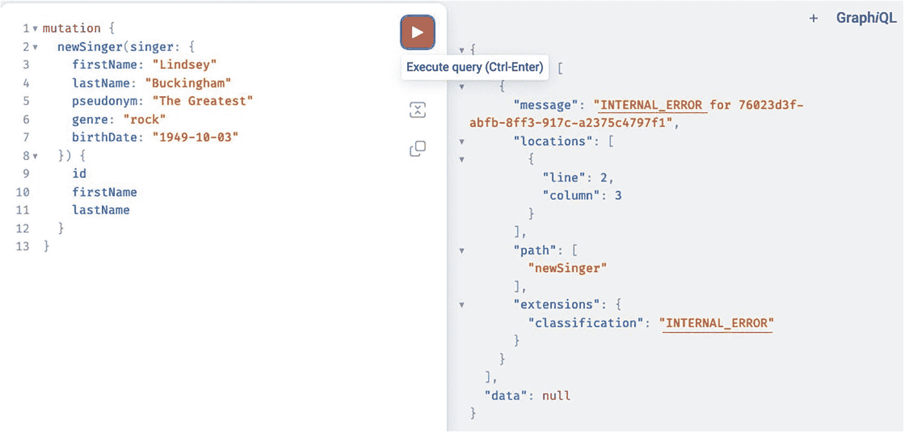

一张截图，左侧显示了一个包含 13 行代码的片段，内容涉及新歌手的名字、姓氏、艺名、流派、出生日期和 ID。执行查询的图标已被选中。右侧的错误列表包括位置、行、列、路径、扩展和分类。

图 16-11

GraphiQL Web 控制台在尝试执行两次相同变更时显示的错误

我们知道服务器在执行我们要求的操作时遇到了问题，但我们不知道原因。显然，需要适当的异常处理。在使用 GraphQL 时，我们通过扩展 `org.springframework.graphql.execution.DataFetcherExceptionResolverAdapter` 类并重写 `resolveToSingleError(..)` 方法或 `resolveToMultipleErrors(..)` 方法来处理错误。在配置中添加此类型的 Bean，可以在 GraphQL 响应中提供更简洁的方式来表示数据层错误，这些错误会显示在 GraphiQL Web 控制台中。清单 16-26 展示了 `DataFetcherExceptionResolverAdapter` 的自定义实现。

```
package com.apress.prospring6.sixteen.boot.problem
import graphql.GraphQLError
...
@Component
class CustomExceptionResolver : DataFetcherExceptionResolverAdapter() {
override fun resolveToSingleError(ex: Throwable, env: DataFetchingEnvironment): GraphQLError {
return if (ex is DataIntegrityViolationException) {
GraphqlErrorBuilder.newError()
.errorType(ErrorType.BAD_REQUEST)
.message("无法创建重复条目:" + ex.cause!!.cause!!.message)
.path(env.executionStepInfo.path)
.location(env.field.sourceLocation)
.build()
} else super.resolveToSingleError(ex, env)
}
override fun resolveToMultipleErrors(ex: Throwable, env: DataFetchingEnvironment): List {
return super.resolveToMultipleErrors(ex, env)
}
}
清单 16-26
DataFetcherExceptionResolverAdapter 的自定义实现
```

`resolveToSingleError(..)` 和 `resolveToMultipleErrors(..)` 方法具有相同的签名，它们之间的唯一区别在于：`resolveToSingleError(..)` 将抛出的异常解析为单个 GraphQL 错误，而 `resolveToMultipleErrors(..)` 则将其解析为多个 GraphQL 错误。`DataFetchingEnvironment` 参数提供了错误发生时的执行上下文详细信息。`GraphqlErrorBuilder` 是一个用于构建 GraphQL 错误的有用类。


`ErrorType` 表示错误类别，该枚举中的值与最常见的 HTTP 状态码对应：`BAD_REQUEST`、`UNAUTHORIZED`、`FORBIDDEN`、`NOT_FOUND` 和 `INTERNAL_ERROR`。可以设置自定义消息来添加关于失败的详细信息。`path` 是导致问题的查询或变更的名称。`location` 表示导致错误的 GraphQL 查询行。

将此 Bean 添加到配置后，错误信息会变得更易读，如图 16-12 所示，它为发送错误查询的人提供了修正所需的信息。

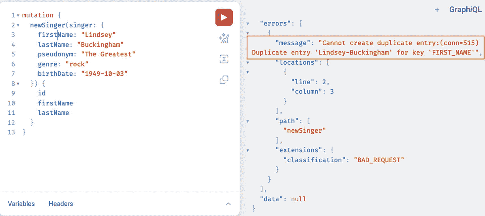

一张截图，左侧显示了一个包含 13 行代码的片段，内容涉及一位新歌手的名字、姓氏、笔名、流派、出生日期和 ID。右侧的错误列表突出显示了包含 2 行信息的消息。第 1 行：无法创建重复条目。第 2 行：键“名字”存在重复条目 Lindsey Buckingham。

图 16-12

GraphiQL 网页控制台，展示了在尝试两次执行同一变更时显示的自定义错误

测试 GraphQL 控制器可以像之前章节中测试 Web 应用那样进行，使用 `TestRestTemplate` 或 `MockMvc`，对于 Spring Boot 响应式 GraphQL 应用则使用 `WebClient`，通过在请求体中发送包含 GraphQL 查询的 POST 请求来实现。

本节仅简要介绍了如何在 Spring 中开始构建 GraphQL API 的基础知识。如果您想了解更多关于 Spring 对 GraphQL 的支持，请随时查看 Spring for GraphQL 官方项目页面^(¹⁵⁸)。

## 总结

GraalVM 原生镜像是一项不断发展的技术，并非所有库都提供支持。Spring Native 支持在 Spring Boot 3 之前一直处于实验阶段。

Spring 对 GraphQL 的采用清楚地表明 GraphQL 将会持续存在。GraphQL 中有一个操作本章未涉及：*订阅*。有时，客户端可能希望在它们关心的数据发生变化时从服务器接收更新。订阅正是提供此功能的操作。另一个未涉及的话题是在像 Netty 这样的响应式服务器上使用 GraphQL。在包含 GraphQL 的 Spring Boot 响应式应用中，可以使用 `org.springframework.graphql.test.tester.GraphQlTester`^(¹⁵⁹) 进行测试。

脚注 1   2   3   4   5   6   7   8   9   10

