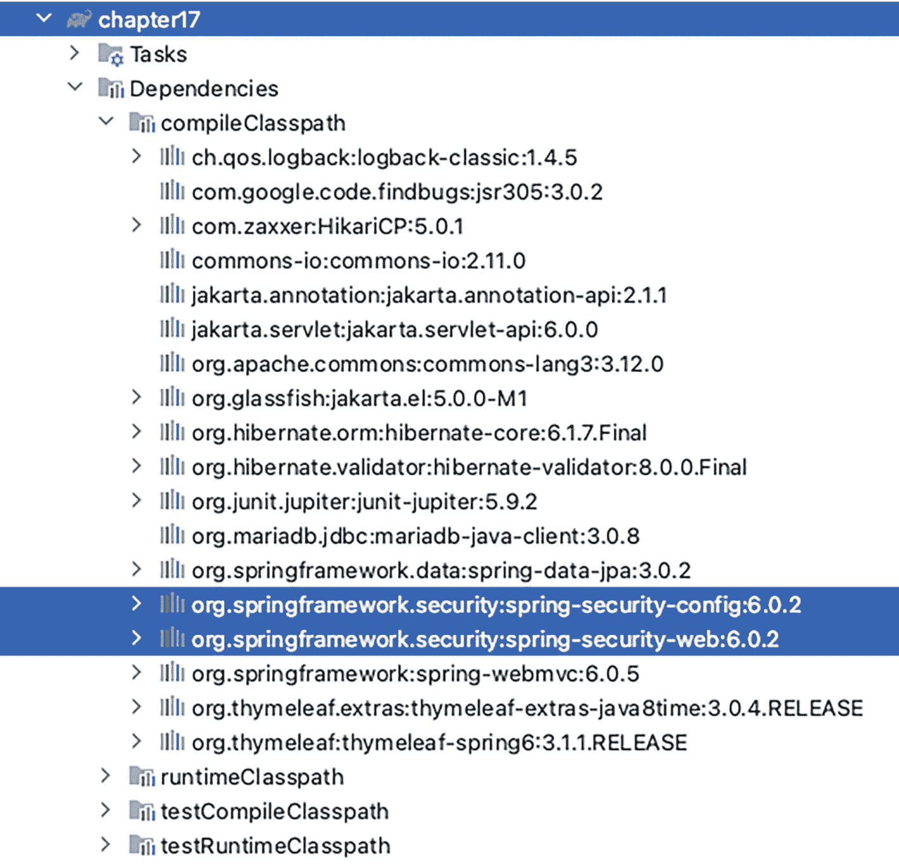
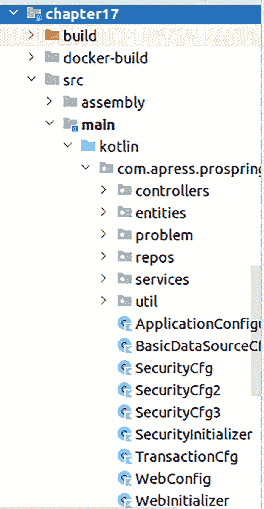
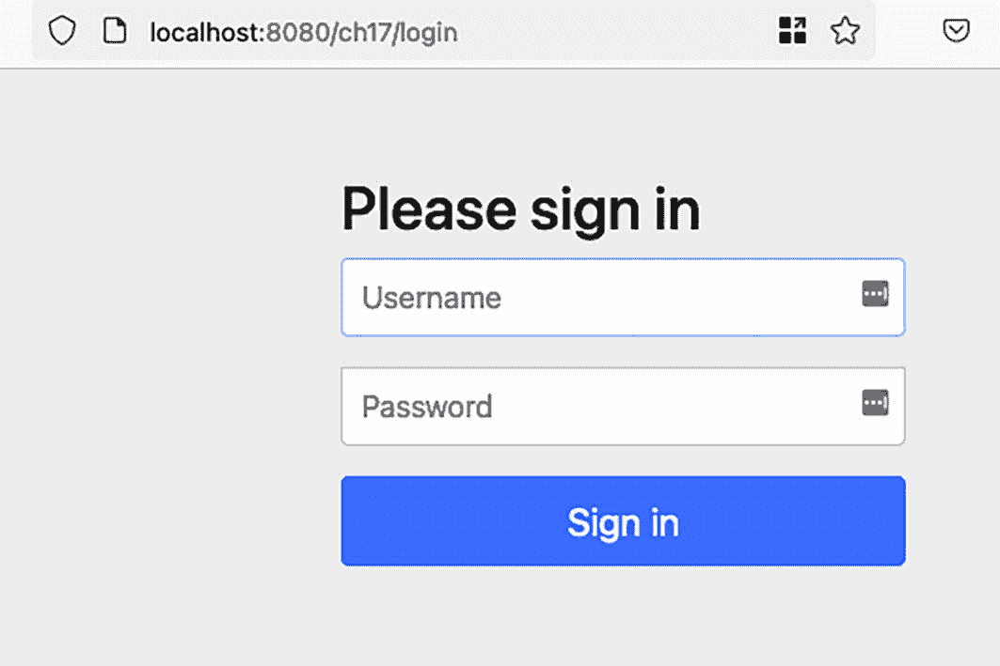
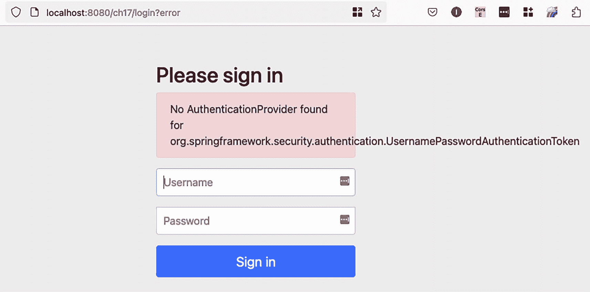
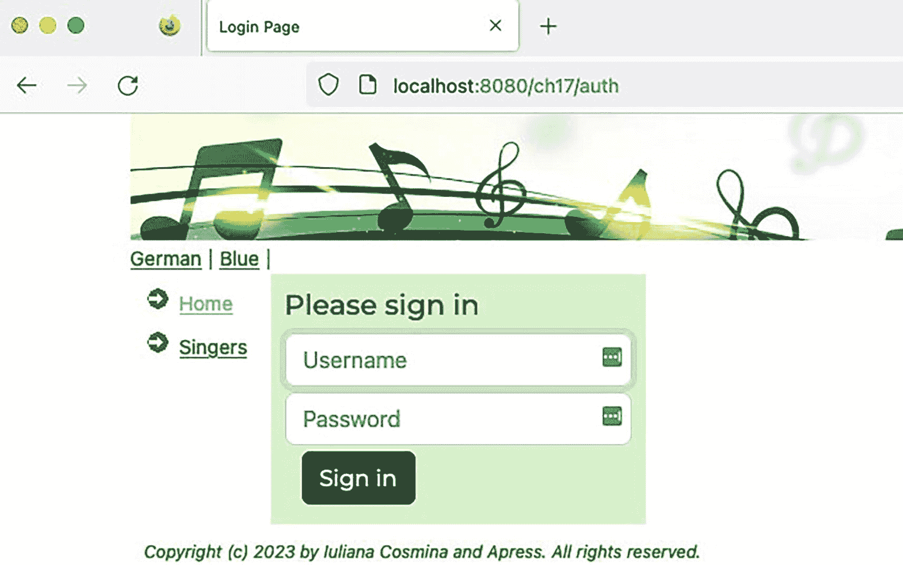
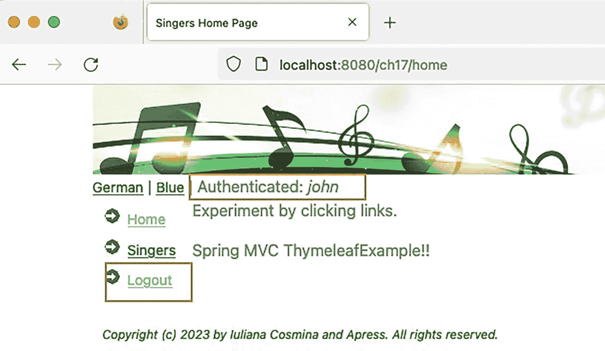
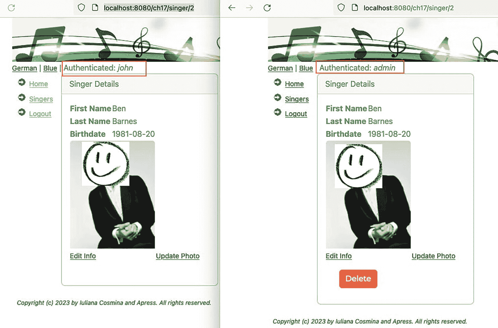
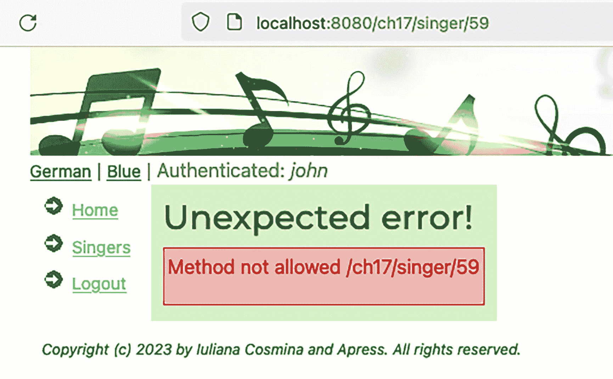
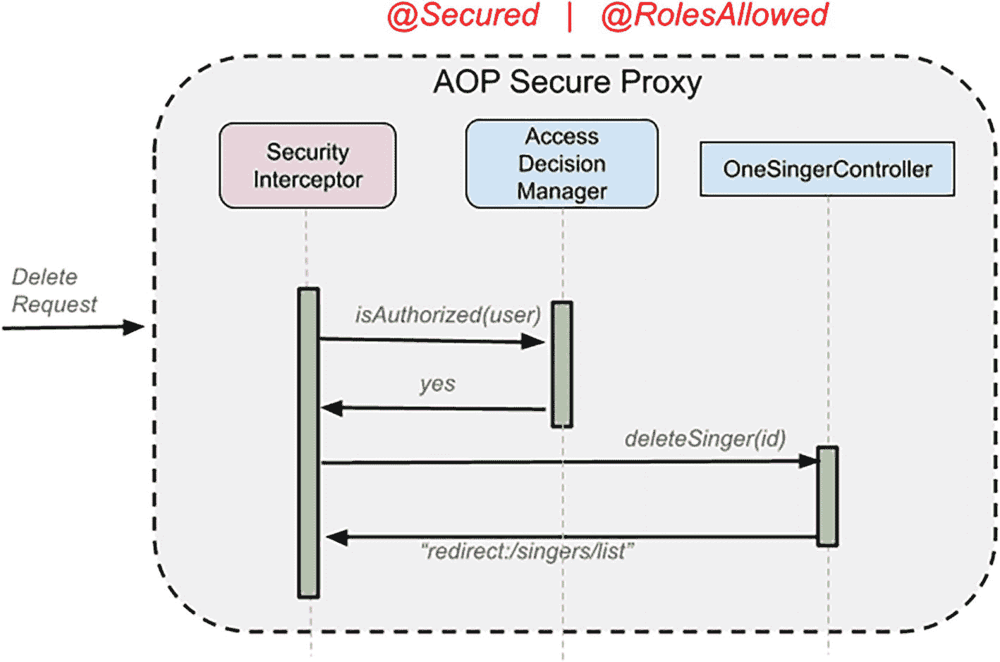
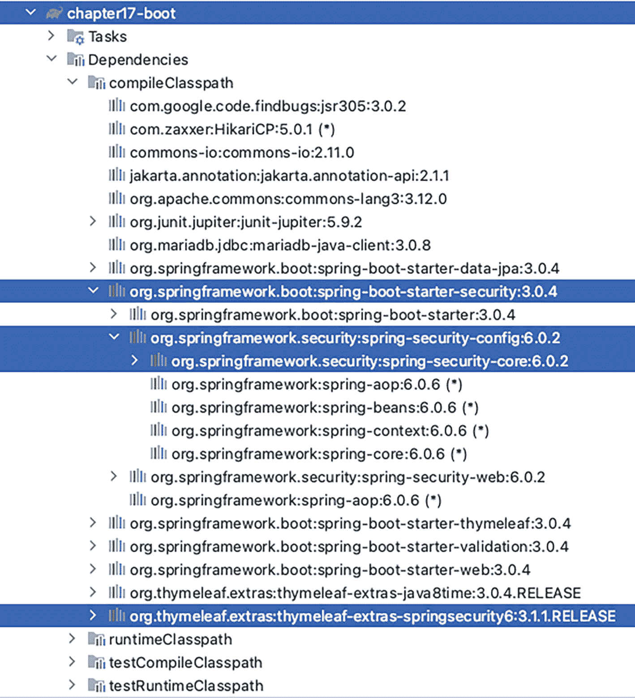

# 17. 保护 Spring Web 应用

**第** **14** **章**解释了如何使用经典的“手动”风格配置以及使用 Spring Boot 与 Thymeleaf 来构建 Spring Web 应用。本章将基于第 14 章构建的应用，添加一个安全层，用于声明哪些用户被允许访问应用的各个部分。例如，只有那些使用有效用户 ID 登录到应用的用户才能添加新歌手或更新现有歌手。其他用户，即*匿名用户*，只能查看歌手信息。

Spring Security^(¹⁶⁰) 是保护基于 Spring 的应用的最佳选择。Spring Security 为企业应用提供身份验证、授权和其他安全功能。虽然主要用于表示层，但 Spring Security 可以帮助保护应用内的所有层，包括服务层。在接下来的章节中，我们将演示如何使用 Spring Security 来保护歌手应用。对于 Web 应用，根据所使用的视图技术，可以在视图模板中使用标签，根据用户权限隐藏或显示视图的某些部分。

Spring Security 是一个相对复杂的框架，旨在让开发者能够轻松地在应用中实现安全功能。在成为 Spring 的一部分之前，该项目（始于 2003 年底）名为 *Acegi Security*。第一个 Spring Security 版本是 2008 年 4 月发布的 2.0.0 版本。

在应用安全方面，有两个重要的方面，Spring Security 可用于配置这两者：

*   *身份验证*：证明你就是你所声称的那个人的过程。这意味着你向应用提交你的凭证，这些凭证会与一组现有用户进行比对，如果找到匹配项，你就会被授予对应用的访问权限。

*   *授权*：授予已通过身份验证的一方执行某些特定操作权限的过程。Spring Security 本质上是一个由拦截规则组成的框架，用于授予或拒绝授予对资源的访问权限。

这两个过程围绕着一个主体（指代可以在应用内执行操作的用户、设备或系统）和凭证（主体用来确认其身份的识别密钥，例如用户名和密码）展开。

本章将展示如何使用 Spring Security 6.x 版本来配置授权和身份验证。

 一个带阴影圆圈内的感叹号符号。 你可以在 GitHub 上找到 Spring Security 的源代码，地址为 [`https://github.com/spring-projects/spring-security/`](https://github.com/spring-projects/spring-security/)。


## 配置 Spring Security - 经典方式

本节展示如何保护**第** **14** **章**中构建的应用程序。要为其添加 Spring Security，我们显然需要在类路径中添加几个库。一个 Spring Web 应用程序的最小 Spring Security 配置通常类似于图 17-1 所示。



一张截图列出了第 17 章的依赖项。它高亮显示了 `org.springframework.security:spring-security-config:6.0.2` 和 `org.springframework.security:spring-security-web:6.0.2`。

图 17-1

项目 `chapter17` 的依赖项

`spring-security-config` 库包含 Java/Kotlin 配置支持。`spring-security-web` 库包含 Web 安全基础设施代码，例如各种过滤器和其他 Servlet API 依赖项。

Spring Security 的内部机制很复杂，官方文档对此有非常详细且出色的解释。就本书而言，你只需要知道，一旦配置了 Spring Security，所有 HTTP 请求都会被一个安全拦截器拦截，并且对资源的访问权限将根据发起请求的用户来决定。安全拦截器的工作包括预处理步骤和后处理步骤。在预处理步骤中，它会检查所请求的资源是否通过由 `org.springframework.security.access.ConfigAttribute`^(¹⁶¹) 表示的元数据信息进行了安全保护。如果没有，则允许请求继续前往其请求的 URL 或方法。如果所请求的资源是受保护的，安全拦截器会从当前的 `SecurityContext` 中检索 `Authentication` 对象。如有必要，`Authentication` 对象将根据配置的 `AuthenticationManager` 进行身份验证。

拦截对 Web 应用程序的所有请求需要一个特殊的 Servlet 过滤器。需要配置的 Spring Security 过滤器名为 `springSecurityFilterChain`，顾名思义，它不是一个单一的过滤器，而是一组过滤器链，用于保护应用程序 URL、验证提交的用户名和密码、重定向到登录表单等。Spring Security 提供了配置此过滤器并自定义其各种功能的方法，可以达到任何所需的深度。

牢记上述细节，让我们看看如何使用经典配置在 Spring Web 应用程序中配置安全支持。

 一个表示想法的符号，由一个电灯泡表示。 如果需要，请在此处回顾**第** **14** **章**，以重新熟悉使用经典配置的 Spring Web 应用程序的组件，以及如何将应用程序打包为 WAR 文件并部署到 Apache Tomcat 10。

图 17-2 展示了使用经典配置的安全 Spring Web 应用程序的配置类。



一张截图列出了第 17 章的配置类。屏幕上显示了 `build`、`docker-build`、`src`、`assembly`、`main`、`kotlin`、`com.apress.prospring`、`controllers`、`entities`、`problem`、`repos`、`services`、`until`、`application configuration` 和 `security cfg` 文件夹。

图 17-2

项目 `chapter17` 的配置类

我们需要做的首要事情之一是确保 `springSecurityFilterChain` 是应用程序的入口点，并以最高优先级注册，使其成为过滤器链中的第一个过滤器，位于任何其他已注册的 `jakarta.servlet.Filter` 之前。这是通过向应用程序添加一个实现 `org.springframework.web.WebApplicationInitializer` 的类来完成的。在图 17-2 中，该类名为 `SecurityInitializer`。其实现如清单 17-1 所示。

```
package com.apress.prospring6.seventeen
import org.springframework.security.web.context.AbstractSecurityWebApplicationInitializer;
class SecurityInitializer : AbstractSecurityWebApplicationInitializer{
override
fun boolean enableHttpSessionEventPublisher() = true
}
清单 17-1
SecurityInitializer 类
```

请注意，`SecurityInitializer` 类并未直接实现 `WebApplicationInitializer`，而是通过扩展 `AbstractSecurityWebApplicationInitializer` 来利用其默认实现，从而减少开发人员的工作量。

 一个表示想法的符号，由一个电灯泡表示。 `enableHttpSessionEventPublisher()` 方法被重写以返回 `true`；默认情况下它返回 `false`，我们本可以保持原样，因为此配置对于本章其余部分并不重要。如果会话管理指定了最大会话数，则此方法应返回 `true`，因为在这种情况下，会将一个 `org.springframework.security.web.session.HttpSessionEventPublisher` 添加到配置中，以便在用户注销时通知会话注册表。

现在过滤器已就位，让我们为过滤器提供其工作所需的组件。

请注意，我们尚未为登录页面添加任何视图模板——使用 Spring Security，我们无需这样做。使用默认配置，会包含一个非常简单的默认登录页面，任何需要身份验证的请求都会被重定向到该页面。因此，我们可以直接跳到 Spring Security 配置。清单 17-2 展示了 `SecurityCfg` 类，其说明紧随清单之后。

```
package com.apress.prospring6.seventeen
import org.springframework.context.annotation.Configuration
import org.springframework.security.config.annotation.web.configuration.EnableWebSecurity
@Configuration
@EnableWebSecurity
open class SecurityCfg {
}
清单 17-2
SecurityCfg 类的基本版本
```

这是可能的最简单的 Spring Security 配置示例。它使用默认配置设置了 `securityFilterChain`，因此所有请求现在都被阻止。如果你部署该项目并尝试通过 `http://localhost:8080/ch17` 访问它（假设你使用 Tomcat 且 WAR 文件名为 `ch17.war`），你将被重定向到图 17-3 所示的登录屏幕。



Spring 登录页面的屏幕截图。它有用于输入用户名和密码的文本字段。登录按钮位于底部。

图 17-3

默认登录屏幕

这是一个非常简单的登录页面，使用 HTML 和 Bootstrap^(¹⁶²) 编写，包含一个用于提交用户名和密码的表单。如果你愿意，可以在浏览器中查看其源代码。如果你尝试输入用户名和密码，你将被重定向到同一页面，但会添加一条错误消息，如图 17-4 所示。



Spring 登录页面的屏幕截图，显示错误消息“未找到身份验证提供程序”。它有用于输入用户名和密码的文本字段。登录按钮位于底部。

图 17-4

带有错误消息的登录屏幕


Spring 所抱怨的是没有配置 `AuthenticationProvider` bean，因此 Spring 不知道去哪里查找用户名和密码来与提交的信息进行匹配，从而验证你的身份。为了尽可能保持简单，我们将配置一个 `UserDetailsService` 类型的 bean，使用内存认证进行演示。它声明了一个名为“john”的用户，密码为“doe”，角色为“USER”。该 bean 如清单 17-3 所示。

```
package com.apress.prospring6.seventeen
import org.springframework.security.core.userdetails.User
import org.springframework.security.core.userdetails.UserDetails
import org.springframework.security.core.userdetails.UserDetailsService
import org.springframework.security.provisioning.InMemoryUserDetailsManager
// 部分导入语句已省略
@Configuration
@EnableWebSecurity
open class SecurityCfg {
@Bean
open fun userDetailsService(): UserDetailsService {
UserDetails user = User.withDefaultPasswordEncoder()
.username("john")
.password("doe")
.roles("USER")
.build()
return InMemoryUserDetailsManager(user)
}
}
清单 17-3
SecurityCfg 类
```

这个配置很紧凑，但它做了很多事情，部分功能列表如下：

*   阻止对所有应用程序 URL 的访问
*   生成一个登录表单
*   允许名为 `john`、密码为 `doe` 的用户进行基于表单的身份验证
*   允许用户注销
*   防止 CSRF^(¹⁶³) 攻击
*   提供会话固定^(¹⁶⁴) 保护

`UserDetailsService` bean 也非常简单，`User` 对象是通过 `withDefaultPasswordEncoder()` 构建的，该方法委托给 `BCryptPasswordEncoder`。如果你想构建一个演示应用程序，并且需要多个用户和角色，你可以显式声明一个 `BCryptPasswordEncoder` bean 并使用它。清单 17-4 展示了如何操作。

```
package com.apress.prospring6.seventeen
import org.springframework.security.crypto.bcrypt.BCryptPasswordEncoder
// 部分导入语句已省略
@Configuration
@EnableWebSecurity
open class SecurityCfg {
@Bean
open fun encoder():PasswordEncoder  {
return BCryptPasswordEncoder()
}
@Bean
open fun userDetailsService(encoder:PasswordEncoder):
UserDetailsService {
val users  = User.builder().passwordEncoder(encoder::encode)
val joe = users
.username("john")
.password("doe")
.roles("USER")
.build()
val jane = users
.username("jane")
.password("doe")
.roles("USER")
.build()
val admin = users
.username("admin")
.password("admin")
.roles("ADMIN")
.build()
return InMemoryUserDetailsManager(jane, joe, admin)
}
}
清单 17-4
使用 BCryptPasswordEncoder 类的 SecurityCfg
```

该类使用 `@EnableWebSecurity` 注解进行标注，以在 Spring Web 应用程序中启用安全行为。此注解暴露了 `SecurityFilterChain` bean，因此我们可以对其进行自定义。到目前为止介绍的配置并未展示任何相关内容。`SecurityFilterChain` bean 的每个方面都可以自定义。让我们从小处着手，为其添加一个实际使用默认值的显式配置，以便了解其实现方式。清单 17-5 向你介绍了一个自定义的 `SecurityFilterChain` bean。

```
package com.apress.prospring6.seventeen
import org.springframework.security.config.Customizer
import org.springframework.security.config.annotation.web.builders.HttpSecurity
import org.springframework.security.web.SecurityFilterChain
// 部分导入语句已省略
@Configuration
@EnableWebSecurity
open class SecurityCfg {
@Bean
open fun securityFilterChain(http: HttpSecurity): SecurityFilterChain {
http
.authorizeHttpRequests{ authorize: AuthorizeHttpRequestsConfigurer.AuthorizationManagerRequestMatcherRegistry ->
authorize
.anyRequest().authenticated()
}
.logout(Customizer.withDefaults())
.formLogin(Customizer.withDefaults())
return http.build()
}
@Bean
open fun encoder(): PasswordEncoder {
return BCryptPasswordEncoder()
}
// 更多方法已省略
}
清单 17-5
包含简单 SecurityFilterChain 类的 SecurityCfg
```

下面逐一解释此配置中所有重要的部分：

*   `HttpSecurity`：此对象允许为特定的 HTTP 请求配置基于 Web 的安全性。Spring 会注入此对象的一个实例，可以对其进行进一步配置。
*   `authorizeHttpRequests(...)`：此方法支持自定义已认证用户对各种资源的访问。其语法是构建器特定的，并且可以通过 `.and()` 方法将多个规则连接在一起。
*   `httpBasic(Customizer.withDefaults())`：此方法用于为应用程序配置 HTTP 基本认证。`withDefaults()` 方法返回 `Customizer<T>` 函数式接口的一个空实现。这不会生成登录表单，而是由浏览器通过一个对话框阻止对应用程序的访问来强制执行认证，该对话框允许用户提交用户名和密码。由于不需要表单，基本认证更适合 REST 请求。此方法调用等同于 `httpBasic()`。
*   `formLogin(Customizer.withDefaults())`：此方法用于配置登录表单。使用空的 `Customizer<T>`，它显然会默认为通用的开箱即用表单，但 `Customizer<FormLoginConfigurer<?>>` 可以配置登录页面的路径，以及用户名和密码表单参数的名称。此方法调用等同于 `formLogin()`。
*   `logout(Customizer.withDefaults())`：此方法用于配置注销支持。当使用 `@EnableWebSecurity` 配置安全性时，此功能会自动启用。此调用等同于 `logout()`，为了教学目的而添加到此配置中。

现在我们已经有了一些默认设置，让我们自定义其中的一些。让我们从最难的开始：添加一个自定义的默认表单。为此，我们需要创建一个包含简单认证表单的 Thymeleaf 视图模板。其基础是 `views/templates/layout.html` 模板，该模板声明了页眉、菜单和页脚部分，因此认证表单将仅代表页面的中心部分，即 `pageContent` 部分。该表单如清单 17-6 所示。

```

登录

清单 17-6
一个 Thymeleaf 认证表单 (views/auth.html)
```

特意将提交表单的 URL 更改为 `/auth`，将用户名和密码字段重命名为 `user` 和 `pass`，并将文件命名为 `auth.html`，以便提供尽可能多的配置。

要配置 Spring Security 将此表单用作登录表单，必须将 `.formLogin()` 调用替换为清单 17-7 中的配置。

```
.formLogin{ loginConfigurer -> loginConfigurer
.loginPage("/auth")
.loginProcessingUrl("/auth")
.usernameParameter("user")
.passwordParameter("pass")
.defaultSuccessUrl("/home")
.permitAll() }
.csrf().disable()
清单 17-7
使用自定义表单的 Spring Security 配置
```

这些方法中的每一个名称都非常清楚地表明了它涵盖了配置的哪一部分：


*   `loginPage("/auth")` 将登录表单配置为名为 `auth` 的视图。我们可以通过 `@GetMapping` 处理方法，或者在 Web 配置中向 `ViewControllerRegistry` 添加映射，将此视图名称映射到 `views/auth.html` 模板，如清单 17-8 所示。

*   `loginProcessingUrl("/auth")` 用于将 `/auth` 声明为提交凭据的 URL，并且该 URL 与 Thymeleaf 表单声明中的 `th:action="@{/auth}"` 一致。

*   `defaultSuccessUrl("/home")` 用于在身份验证成功时将用户重定向到主页。默认情况下，用户会被重定向到应用的根路径 `/`，在本示例中，该路径与我们通过此方法配置的页面相同。当然，这样做的目的是在创建自定义配置时明确声明要使用哪个方法。

*   `csrf().disable()` 用于禁用 CSRF 令牌的生成。正如本节开头所述，默认情况下 CSRF 保护是启用的，为了保持表单和配置的简洁，我们决定禁用它。

 一个带阴影圆圈内的小写字母 i 符号。 Spring Security 4 引入了在 Spring 表单中使用 CSRF 令牌以防止跨站请求伪造的可能性^(¹⁶⁵)。在本示例中，为了保持简单，我们通过调用 `csrf().disable()` 禁用了 CSRF 令牌的使用。默认情况下，没有 CSRF 元素配置的配置是无效的，任何登录请求都会将你导向一个 403 错误页面，并显示以下信息：

`Invalid CSRF Token 'null' was found on the request parameter'_csrf' or header 'X-CSRF-TOKEN'.`

*   `permitAll()` 用于确保未经身份验证的用户可以访问身份验证表单。

```
package com.apress.prospring6.seventeen
import org.springframework.web.servlet.config.annotation.ViewControllerRegistry
// 其他导入语句已省略
@Configuration
@EnableWebMvc
open class WebConfig : WebMvcConfigurer, ApplicationContextAware {
override
fun addViewControllers(registry:ViewControllerRegistry) {
registry.addRedirectViewController("/", "/home")
registry.addViewController("/auth").setViewName("auth")
}
// 其他配置部分已省略
}
清单 17-8
将 /auth 路径映射到 views/auth.html 视图文件
```

现在，我们有了一个自定义表单。当我们尝试通过 `http://localhost:8080/ch17` 访问应用时，不会看到 Spring Security 的默认表单，而是会被重定向到自定义表单，该表单展示了网站的主题，如图 17-5 所示。



Spring Security 自定义登录页面的屏幕截图。它包含用于输入用户名和密码的文本字段。登录按钮位于底部。左侧是主页和歌手的选项。

图 17-5

使用 Spring Security 配置的自定义登录表单

到目前为止，本节中展示的每个默认配置在实际应用中可能都需要进行一些小的修改和调整。例如，`authorizeHttpRequests(..)` 方法用于为特定的 URL 路径设置授权。它也可以用于排除某些路径（如 CSS 和图片），并且我们可以添加一些额外的清理步骤，例如从浏览器缓存中删除身份验证详细信息或删除某些 Cookie。清单 17-9 展示了完整的代码。

```
package com.apress.prospring6.seventeen
import org.springframework.context.annotation.Bean
...
@Configuration
@EnableWebSecurity
open class SecurityCfg {
@Bean
@Throws(Exception::class)
open fun securityFilterChain(http: HttpSecurity): SecurityFilterChain {
http
.authorizeHttpRequests{ authorize ->
authorize
.requestMatchers("/styles/**", "/images/**").permitAll()
.anyRequest().authenticated()
}
.logout { httpSecurityLogoutConfigurer: LogoutConfigurer ->
httpSecurityLogoutConfigurer
.logoutUrl("/exit")
.permitAll()
.clearAuthentication(true)
}
.formLogin { loginConfigurer: FormLoginConfigurer ->
loginConfigurer
.loginPage("/auth")
.loginProcessingUrl("/auth")
.usernameParameter("user")
.passwordParameter("pass")
.defaultSuccessUrl("/home")
.permitAll()
}
.csrf().disable()
return http.build()
}
@Bean
open fun encoder(): PasswordEncoder {
return BCryptPasswordEncoder()
}
@Bean
open fun userDetailsService(encoder: PasswordEncoder): UserDetailsService {
val users = User.builder().passwordEncoder(encoder::encode)
val joe = users
.username("john")
.password("doe")
.roles("USER")
.build()
val jane = users
.username("jane")
.password("doe")
.roles("USER", "ADMIN")
.build()
val admin = users
.username("admin")
.password("admin")
.roles("ADMIN")
.build()
return InMemoryUserDetailsManager(jane, joe, admin)
}
}
清单 17-9
SecurityFilterChain 的自定义版本
```

请注意，注销行为也已配置，通过为 `logout(..)` 方法提供一个自定义器作为参数；除了将注销 URL 从 `/logout` 更改为 `/exit` 之外，它还添加了 `clearAuthentication(true)` 调用，该调用告诉 Spring 在用户注销时清除 `Authentication`（默认行为）。

现在我们已经有了完整的配置，如何告诉 Spring 呢？为了确保其正确使用，我们需要将 `SecurityCfg` 类添加到定义应用上下文的配置类集合中。在**第** **14** **章**中，用于注册 `DispatcherServlet` 并使用基于 Java 的 Spring 配置的 `WebInitializer` 类声明根应用由 `BasicDataSourceCfg` 和 `TransactionCfg` 配置，而 Web 应用上下文由 `WebConfig` 类配置。此配置如清单 17-10 所示。


```
package com.apress.prospring6.seventeen
import jakarta.servlet.Filter
...
@Configuration
@EnableWebMvc
open class WebConfig : WebMvcConfigurer, ApplicationContextAware {
private var applicationContext: ApplicationContext? = null
@Throws(BeansException::class)
override fun setApplicationContext(applicationContext: ApplicationContext) {
this.applicationContext = applicationContext
}
@Bean(name = [DispatcherServlet.MULTIPART_RESOLVER_BEAN_NAME])
open fun multipartResolver(): StandardServletMultipartResolver {
return StandardServletMultipartResolver()
}
@Bean
open fun templateResolver() =
SpringResourceTemplateResolver().apply {
setApplicationContext(applicationContext!!)
prefix = "/WEB-INF/views/"
suffix = ".html"
templateMode = TemplateMode.HTML
isCacheable = false
}
@Bean
@Description("Thymeleaf 模板引擎")
open fun templateEngine() =
SpringTemplateEngine().apply {
addDialect(Java8TimeDialect())
setTemplateResolver(templateResolver())
setTemplateEngineMessageSource(messageSource())
enableSpringELCompiler = true
}
@Bean
@Description("Thymeleaf 视图解析器")
open fun viewResolver(): ViewResolver =
ThymeleafViewResolver().apply {
templateEngine = templateEngine()
order = 1
}
@Bean
open fun themeSource() = ResourceBundleThemeSource()
@Bean
open fun validator(): Validator =
LocalValidatorFactoryBean().apply {
setValidationMessageSource(messageSource())
}
override fun getValidator(): Validator = validator()
// 声明静态资源。我在 Java 配置中添加了缓存，但这不是必需的。
override fun addResourceHandlers(registry: ResourceHandlerRegistry) {
super.addResourceHandlers(registry)
registry.addResourceHandler("/images/**", "/styles/**")
.addResourceLocations("/images/", "/styles/")
}
override fun addViewControllers(registry: ViewControllerRegistry) {
with(registry){
addRedirectViewController("/", "/home")
registry.addViewController("/auth").setViewName("auth")
}
}
override fun addInterceptors(registry: InterceptorRegistry) {
with(registry) {
addInterceptor(localeChangeInterceptor()).addPathPatterns("/*")
addInterceptor(themeChangeInterceptor())
addInterceptor(webChangeInterceptor())
}
}
@Bean
open fun messageSource(): MessageSource =
ReloadableResourceBundleMessageSource().apply {
setBasename("classpath:i18n/global")
setDefaultEncoding(StandardCharsets.UTF_8.name())
setUseCodeAsDefaultMessage(true)
setFallbackToSystemLocale(true)
// # -1 : 从不重新加载，0 始终重新加载
// setCacheSeconds(0);
}
@Bean
open fun localeChangeInterceptor(): LocaleChangeInterceptor =
LocaleChangeInterceptor().apply {
paramName = "lang"
}
@Bean
open fun themeChangeInterceptor() =
ThemeChangeInterceptor().apply {
paramName = "theme"
}
@Bean
open fun localeResolver() =
CookieLocaleResolver().apply {
setDefaultLocale(Locale.ENGLISH)
setCookieMaxAge(3600)
setCookieName("locale")
}
@Bean
open fun themeResolver() =
CookieThemeResolver().apply {
defaultThemeName = "green"
cookieMaxAge = 3600
cookieName = "theme"
}
@Bean
open fun webChangeInterceptor() =
WebContentInterceptor().apply {
cacheSeconds = 0
setSupportedMethods("GET", "POST", "PUT", "DELETE")
}
}
清单 17-10
第 17 章 Web 应用程序配置
```

当我们知道安全仅针对 Web 层实现时，可以将 `SecurityCfg` 类添加到 Web 上下文中。但在某些情况下，安全上下文会跨越多个层，最明显的例子是当访问应用程序的用户凭据存储在数据库中，以及服务层支持远程调用时。在这种情况下，会引入一个收集所有配置的配置类，并用于声明一个单一且功能强大的 Web 应用程序上下文。清单 17-11 展示了 `ApplicationConfiguration` 类。

```
package com.apress.prospring6.seventeen
import org.springframework.context.annotation.ComponentScan
import org.springframework.context.annotation.Configuration
@Configuration
@ComponentScan
open class ApplicationConfiguration
清单 17-11
ApplicationConfiguration 类
```

`ApplicationConfiguration` 类在 `chapter17` 项目的 `WebInitializer` 中用作单一配置入口点，如清单 17-12 所示。

```
package com.apress.prospring6.seventeen
// 省略 import 语句
class WebInitializer : AbstractAnnotationConfigDispatcherServletInitializer() {
override fun getRootConfigClasses() =
arrayOf>()
override fun getServletConfigClasses() =
arrayOf>(ApplicationConfiguration::class.java)
override fun getServletMappings() =
arrayOf("/")
override fun getServletFilters() =
arrayOf(
HiddenHttpMethodFilter(),
CharacterEncodingFilter().apply {
encoding = StandardCharsets.UTF_8.name()
setForceEncoding(true)
}
)
public override fun customizeRegistration(registration: ServletRegistration.Dynamic) {
with(registration) {
setInitParameter("throwExceptionIfNoHandlerFound", "true")
setMultipartConfig(multipartConfigElement) //  
}
super.customizeRegistration(registration)
}
private val multipartConfigElement = MultipartConfigElement(null, MAX_FILE_SIZE,
MAX_REQUEST_SIZE, FILE_SIZE_THRESHOLD)
companion object {
private const val MAX_FILE_SIZE: Long = 5000000
// 超过此大小，Spring 将抛出异常。
private const val MAX_REQUEST_SIZE: Long = 5000000
// 超过此大小阈值，文件将被写入磁盘
private const val FILE_SIZE_THRESHOLD = 0
}
}
清单 17-12
使用中的 WebInitializer
```

配置完成后，剩下的工作就是调整 UI 的某些部分，以提供一些显示已登录用户等的注销选项。由于我们使用的是 Thymeleaf，这很容易实现，但需要将 `thymeleaf-extras-springsecurity6` 库添加到类路径中。该库将 Spring Security 集成模块添加到应用程序中，从而允许在 Thymeleaf 模板中使用 Spring Security 方言结构。这意味着除了以 `th:` 为前缀的属性外，我们现在还可以使用以 `sec:` 为前缀的属性来访问安全上下文，并决定视图的呈现方式，例如针对不同角色的用户。

由于我们现在有了经过身份验证的用户，我们可以将以下内容添加到布局模板（`views/templates/layout.html`）中：

*   一个注销菜单项
*   一个显示已认证用户名称的区域

这两个修改如清单 17-13 所示。

```

已认证：

退出登录

页面内容

清单 17-13
views/templates/layout.html 中的 Thymeleaf 安全结构
```

 一个带阴影圆圈内感叹号的符号。 最重要的是，要使 `sec:` 属性被识别，必须在 `WebConfig` 类中将 `SpringSecurityDialect` 注册到 `SpringTemplateEngine` Bean 中，如清单 17-14 所示。


```
package com.apress.prospring6.seventeen;
import org.thymeleaf.extras.java8time.dialect.Java8TimeDialect;
import org.thymeleaf.extras.springsecurity6.dialect.SpringSecurityDialect;
import org.thymeleaf.spring6.SpringTemplateEngine
// 其他导入语句已省略
@Configuration
@EnableWebMvc
open class WebConfig : WebMvcConfigurer, ApplicationContextAware {
private var applicationContext: ApplicationContext? = null
@Bean
@Description("Thymeleaf 模板引擎")
open fun templateEngine() =
SpringTemplateEngine().apply {
addDialect(Java8TimeDialect())
setTemplateResolver(templateResolver())
setTemplateEngineMessageSource(messageSource())
addDialect(SpringSecurityDialect()) // 这是为了支持 sec: 标签所必需的
enableSpringELCompiler = true
}
// 其他配置已省略
}
清单 17-14
向 SpringTemplateEngine 注册 SpringSecurityDialect 的配置片段
```

完成此配置后，当用户成功登录应用程序时，主页将显示用户名和注销选项，如图 17-6 所示。



Spring Security Custom 中歌手主页屏幕的截图。左侧有主页、歌手和注销选项。主页选项被选中。屏幕上突出显示了已认证用户 john 和注销选项。

图 17-6

向已认证用户显示的主页

在我们的配置中，我们定义了两个角色：`USER` 和 `ADMIN`，但我们并未将它们用于任何用途，因为目前没有仅针对特定角色的配置。为了演示如何实现这一点，我们只允许拥有 `ADMIN` 权限的用户删除歌手。这意味着我们必须做两件事：

*   确保不为非 `ADMIN` 用户渲染“删除”按钮

*   通过保护控制器方法，拒绝非 `ADMIN` 用户的删除请求

通过结合使用 Thymeleaf 安全结构和 SpEL 表达式，可以轻松实现阻止“删除”按钮的渲染，如清单 17-15 所示。

```

net

清单 17-15
views/show.html 为非管理员用户隐藏删除按钮
```

通过此配置，用户 `john` 将无法再看到“删除”按钮，而 `admin` 用户仍然可以看到，如图 17-7 所示。



两张截图分别显示了已认证用户和已认证管理员的歌手详情页面。左侧有主页、歌手和注销选项。屏幕上显示了歌手详情，包括编辑信息和更新照片的选项。管理员页面上显示了删除选项。

图 17-7

角色为 `USER`（左）和角色为 `ADMIN`（右）的用户页面显示对比

Spring Security SpEL 表达式非常灵活。角色名称不区分大小写，因此 `hasRole('admin')` 与 `hasRole('ADMIN')` 的处理方式相同。此外，如果角色名称没有 `ROLE_` 前缀，则会默认添加，例如 `hasRole('ROLE_ADMIN')`。这使得使用 SpEL 表达式配置授权变得非常实用。

 一个带阴影圆圈内的小写 i 符号。 在 Spring Security 中，有两种方式描述用户可以做什么和不能做什么。对于每个应用程序用户，都会配置*权限*和*角色*。角色和权限都由 `List<GrantedAuthority>` 表示，其中 `org.springframework.security.core.GrantedAuthority` 接口表示授予 `Authentication` 对象的权限，即*许可*。角色无非就是名称以 `ROLE_` 为前缀的 `GrantedAuthority`。为什么有两种方式？因为在底层，Spring Security 可能被配置为以不同于权限的方式处理角色。权限是针对特定操作的细粒度许可，有时会与特定的数据范围或上下文相关联。例如，`Read`、`Write` 和 `Manage` 可以表示对给定信息范围的不同级别的许可。另一方面，角色是一组权限的粗粒度表示。`ROLE_USER` 可能只拥有 `Read` 或 `View` 权限，而 `ROLE_ADMIN` 则拥有 `Read`、`Write` 和 `Delete` 权限。

Spring Security 提供了相当多的 SpEL 表达式用于配置授权，其语法和用途在表 17-1 中列出并描述。

表 17-1

Spring Security SpEL 表达式

| 表达式 | 描述 |
| --- | --- |
| `hasRole(String role)` | 如果当前主体拥有指定角色，则返回 `true`；例如 `hasRole('admin')`。角色不区分大小写，如果未提供 `ROLE_` 前缀，则会默认添加。此行为可通过修改 `DefaultWebSecurityExpressionHandler` 上的 `defaultRolePrefix` 进行自定义^((166))。 |
| `hasAnyRole(String... roles)` | 如果当前主体拥有任意指定角色，则返回 `true`；例如 `hasAnyRole('admin', 'manager')`。 |
| `hasAuthority(String authority)` | 如果当前主体拥有指定权限，则返回 `true`；例如 `hasAuthority('read')`。 |
| `hasAnyAuthority(String... authorities)` | 如果当前主体拥有任意指定权限，则返回 `true`；例如 `hasAnyAuthority('read', 'write')`。 |
| `principal` | 允许直接访问代表当前用户的主体对象。 |
| `authentication` | 允许直接访问从 `SecurityContext` 获取的当前 `Authentication` 对象。 |
| `isAnonymous()` | 如果当前主体是匿名用户，则返回 `true`。 |
| `isRememberMe()` | 如果当前主体是“记住我”用户，则返回 `true`。 |
| `isAuthenticated()` | 如果用户不是匿名用户，则返回 `true`。 |
| `isFullyAuthenticated()` | 如果用户既不是匿名用户也不是“记住我”用户，则返回 `true`。 |
| `hasPermission(Object target, Object permission)` | 如果用户对给定目标拥有指定权限，则返回 `true`；例如 `hasPermission(domainObject, 'read')`。 |
| `hasPermission(Object targetId, String targetType, Object permission)` | 如果用户对由 ID 和类型标识的给定目标拥有指定权限，则返回 `true`；例如 `hasPermission(1, 'com.apress.Singer', 'read')`。 |

Spring Security SpEL 表达式 `hasRole('admin')` 可用于保护删除处理器方法，方法是将其作为属性值提供给 `@PreAuthorize` 注解。此注解以及稍后讨论的其他几个注解属于 `org.springframework.security.access.prepost` 包，该包允许您在注解方法执行前后定义安全相关的操作。`@PreAuthorize` 注解配置了一个方法访问控制表达式，该表达式将被评估以决定是否允许方法调用。清单 17-16 展示了使用 `@PreAuthorize` 注解的控制器方法。


```
package com.apress.prospring6.seventeen.controllers
import org.springframework.security.access.prepost.PreAuthorize
import org.springframework.stereotype.Controller
// 其他导入语句已省略
@Controller
@RequestMapping("/singer/{id}")
open class OneSingerController(private val singerService: SingerService,
private val messageSource: MessageSource) {
...
@PreAuthorize("hasRole('ROLE_ADMIN')")
@DeleteMapping
open fun deleteSinger(@PathVariable("id") id: Long): String {
singerService.findById(id)
singerService.delete(id)
return "redirect:/singers/list"
}
...
}
清单 17-16
受保护的控制器方法
```

为了确保当用户角色不是 `admin` 时，此方法不会被执行，我们需要暂时从 `views/singers/show.html` 中的“删除”按钮上移除 `sec:authorize="hasRole('ADMIN')"`。由于非管理员用户被禁止执行此方法，当点击“删除”按钮时，我们会被重定向到 Apache Tomcat 针对 `403(Forbidden)` 错误的默认页面。由于我们希望将用户重定向到 `views/error.html`，我们需要在标注了 `@ControllerAdvice` 的类中添加一个方法，如清单 17-17 所示。

```
package com.apress.prospring6.seventeen.problem
import org.springframework.http.HttpStatus
import org.springframework.security.access.AccessDeniedException
// 其他导入语句已省略
@ControllerAdvice
class GlobalExceptionHandler {
...
@ExceptionHandler(AccessDeniedException::class)
@ResponseStatus(HttpStatus.FORBIDDEN)
fun forbidden(req: HttpServletRequest): ModelAndView {
val mav = ModelAndView()
mav.addObject("problem", "Method not allowed " + req.requestURI)
mav.viewName = "error"
return mav
}
}
清单 17-17
Spring Web 应用程序中针对 org.springframework.security.access.AccessDeniedException 的处理程序
```

但稍等！我们还需要配置对这些类型注解的支持。`@EnableWebSecurity` 注解仅配置对安全 Web 请求的支持，因此要保护方法调用，我们需要在 `SecurityCfg` 类上添加 `@EnableMethodSecurity` 注解。新的配置如清单 17-18 所示。

```
package com.apress.prospring6.seventeen
import org.springframework.security.config.annotation.method.configuration.EnableMethodSecurity
// 其他导入语句已省略
@Configuration
@EnableWebSecurity
@EnableMethodSecurity
open class SecurityCfg {
// 配置 bean 已省略
}
清单 17-18
配置为支持安全方法的 SecurityCfg
```

通过此配置，当非管理员用户点击“删除”按钮时，用户会被重定向到图 17-8 所示的页面。



Spring Security Custom 中已认证用户 John 的主页屏幕截图，显示了一个意外错误。左侧有主页、歌手和注销选项。意外错误信息为：Method not allowed /ch17/singer/59。

图 17-8
非管理员用户尝试删除 `singer` 记录后被重定向到的错误页面

保护方法是通过代理实现的。系统会拾取安全注解，并在包含注解方法的 bean 周围创建一个代理，以便在必要时注入安全检查。

如前所述，`org.springframework.security.access.prepost` 包包含四个支持表达式属性的注解，用于允许调用前和调用后的授权检查，并支持对提交的集合参数或返回值进行过滤：`@PreAuthorize`、`@PreFilter`、`@PostAuthorize` 和 `@PostFilter`。默认情况下，`@EnableMethodSecurity` 注解会启用对这些方法的支持。但可以通过如下配置禁用它：`@EnableMethodSecurity(prePostEnabled= false)`。

要启用对 `org.springframework.security.access.annotation` 包中 `@Secured` 注解的支持，我们配置 `@EnableMethodSecurity(secured = true)`。默认情况下，`secured` 属性设置为 `false`。

Spring 还提供对 Jakarta 注解^(¹⁶⁷)（以前称为 JSR-250 注解）的支持。该库在 `jakarta.annotation.security` 包中包含安全注解，其功能与 Spring Security 注解有些相似。然而，它们是基于标准的注解，允许应用简单的基于角色的约束，但不如 Spring Security 原生注解强大。Jakarta Security 注解包括 `@RolesAllowed`、`@DenyAll`、`@PermitAll`、`@RunAs` 和 `@DeclareRoles`。通过以下配置可启用对这些注解的支持：`@EnableMethodSecurity(jsr250Enabled=true)`；默认情况下，`jsr250Enabled` 为 `false`。

这两种方法都会导致 Spring Security 将服务类包装在一个安全代理中。图 17-9 描述了安全方法执行的抽象模式以及所涉及的组件。



AOP 安全代理在安全方法和允许角色处的示意图。它包括安全拦截器、访问决策管理器和单个歌手控制器。删除请求被发送给 AOP 安全代理。授权流程从安全拦截器流向访问决策管理器。

图 17-9
安全方法执行的抽象模式

欢迎阅读官方文档^(¹⁶⁸)了解更多关于方法安全的内容，因为该主题的范围比本书所涵盖的要更广泛。


### JDBC 认证

到目前为止，你已经了解了最快速、最简单的认证模式，即用户凭据存储在内存中。对于生产级应用，凭据通常存储在关系型数据库、自定义数据存储或 LDAP 中。由于应用已将其余数据存储在数据库中，因此添加必要的表来存储凭据和用户组是非常实用的。本节的重点是 JDBC 认证以及将认证数据存储在 MariaDB 数据库中。

Spring Security 为基于 JDBC 的认证提供了默认查询，但要使这些查询生效，必须按照 Spring Security 提供的模式创建表。该模式实际上被打包在 `spring-security-core.jar` 中，这是 Spring Security 的核心库，也是 `spring-security-config.jar` 的一个依赖项。模式文件以类路径资源的形式提供，名为 `org/springframework/security/core/userdetails/jdbc/users.ddl`。该文件的内容如代码清单 17-19 所示。

```
create table users(
username varchar(50) not null primary key,
password varchar(500) not null,
enabled boolean not null
);
create table authorities (
username varchar(50) not null,
authority varchar(50) not null,
constraint fk_authorities_users foreign key(username) references users(username)
);
create unique index ix_auth_username on authorities (username,authority);
代码清单 17-19
Spring Security JDBC 模式
```

为了创建这些表，该文件的内容已添加到 `chapter17` 项目的配置中。填充这些表的方法不止一种，但 Spring 也通过提供一个名为 `UserDetailsManager` 的类（该类扩展了上一节介绍的 `UserDetailsService`）使这一过程变得简单。配置了包含代码清单 17-19 中声明的 Spring Security `users` 和 `authorities` 表的数据源的此类 Bean，能够加载凭据以促进认证过程。同一个类也可用于初始化这些表。首次启动 Spring Web 安全应用时，为了轻松填充安全表，可以按照代码清单 17-20 所示配置 `UserDetailsManager` Bean。

```
package com.apress.prospring6.seventeen
import org.springframework.security.provisioning.JdbcUserDetailsManager
import org.springframework.security.provisioning.UserDetailsManager
// 其他导入语句省略
@Configuration
@EnableWebSecurity
@EnableMethodSecurity
open class SecurityCfg2 {
...
@Bean
open fun users(dataSource: DataSource): UserDetailsManager {
val users = User.builder().passwordEncoder { rawPassword: String ->
encoder().encode(
rawPassword
)
}
val joe = users
.username("john")
.password("doe")
.roles("USER")
.build()
val jane = users
.username("jane")
.password("doe")
.roles("USER", "ADMIN")
.build()
val admin = users
.username("admin")
.password("admin")
.roles("ADMIN")
.build()
val manager = JdbcUserDetailsManager(dataSource)
return with(manager) {
createUser(joe)
createUser(jane)
createUser(admin)
this
}
}
// 其他配置 Bean 省略
}
代码清单 17-20
用于初始化安全表的 Spring Security UserDetailsManager 配置
```

下次使用相同数据源启动应用时，可以移除用户创建代码，而之前运行期间创建的用户仍会保留在数据库中，因此它们将按预期工作。这将 Spring 配置简化为代码清单 17-21 所示的内容。

```
package com.apress.prospring6.seventeen;
// 导入语句省略
@Configuration
@EnableWebSecurity
@EnableMethodSecurity
open class SecurityCfg2 {
@Bean
@Throws(Exception::class)
open fun securityFilterChain(http: HttpSecurity): SecurityFilterChain {
// 请求配置省略
return http.build()
}
@Bean
open fun encoder(): PasswordEncoder {
return BCryptPasswordEncoder()
}
@Bean
open fun users(dataSource: DataSource): UserDetailsManager {
return JdbcUserDetailsManager(dataSource)
}
}
代码清单 17-21
不包含初始化逻辑的 Spring Security UserDetailsManager 配置
```

到目前为止，你已经了解了 Spring Security 的 `UserDetailsService` 的内存实现和 JDBC 实现。如果由于某种原因无法使用 Spring Security 的默认模式，则需要提供一个自定义的 `UserDetailsService` 实现，负责根据用户提供的数据检索用户和权限。另一种方法是配置一个 `AuthenticationManagerBuilder` Bean，如代码清单 17-22 所示。

```
package com.apress.prospring6.seventeen
import org.springframework.security.config.annotation.ObjectPostProcessor
import org.springframework.security.config.annotation.authentication.builders.AuthenticationManagerBuilder
// 导入语句省略
@Configuration
@EnableWebSecurity
@EnableMethodSecurity
open class SecurityCfg3 {
@Bean
@Throws(Exception::class)
open fun securityFilterChain(http: HttpSecurity): SecurityFilterChain {
// 请求配置省略
return http.build()
}
@Bean
open fun encoder(): PasswordEncoder {
return BCryptPasswordEncoder()
}
@Bean
open fun authenticationManagerBuilder(
objectPostProcessor: ObjectPostProcessor,
dataSource: DataSource?
): AuthenticationManagerBuilder {
val authenticationManagerBuilder =
AuthenticationManagerBuilder(objectPostProcessor)
val findUserQuery = """
select username, password, enabled
from users where username = ?
""".trimIndent()
val findRoles = """
select username,authority from authorities
where username = ?
""".trimIndent()
return try {
authenticationManagerBuilder.jdbcAuthentication().dataSource(dataSource)
.passwordEncoder(encoder())
.usersByUsernameQuery(findUserQuery)
.authoritiesByUsernameQuery(findRoles)
authenticationManagerBuilder
} catch (e: Exception) {
throw RuntimeException("无法初始化 'AuthenticationManagerBuilder'",e)
}
}
}
代码清单 17-22
Spring Security AuthenticationManagerBuilder 配置
```

代码清单 17-22 中还有另一个简化之处：`findUserQuery` 和 `findRoles` 是为之前创建的 Spring Security 表编写的查询，但此 Bean 允许将用户和权限保存在具有不同名称和不同结构的表中——只要存在 `username`、`password`、`enabled` 和 `authority` 列，或者查询返回这些列，认证过程就能正常运行。例如，请看代码清单 17-23 中替代的 `findUserQuery` 和 `findRoles`，它们在名为 `staff` 和 `roles` 的表上执行，但将列重命名为 Spring Security `AuthenticationManagerBuilder` Bean 所期望的名称。

```
-- findUserQuery
select staff_id as username,
staff_credentials as password,
active as enabled
from staff  where staff_id = ?
-- findRoles
select staff_id as username,
role as authority
from roles where staff_id = ?
代码清单 17-23
用于检索凭据的替代查询
```

Spring Security 的配置灵活、多样且强大，你甚至可以实现 `UserDetailsService` 来使用 Spring Data 仓库管理安全数据，甚至可以使用 NoSQL 数据库作为存储。这完全取决于你的开发需求和想象力；毕竟，它们都只是可配置的 Bean。


### 测试安全的 Web 应用程序

测试安全的 Spring Web 应用程序也可以通过多种方式完成。对于部署到 Apache Tomcat 的应用程序进行集成测试需要大量设置，因此最简单的方法是使用支持表单身份验证的 Web 客户端，用它提交请求并验证你的假设。为此，我们选择了 REST Assured^(¹⁷⁰)。

REST Assured 为在 Java 中验证 REST 服务提供了一个非常简单的 API。在清单 17-24 中，你可以看到编写了三个测试来覆盖本节介绍的安全元素。

```
package com.apress.prospring6.seventeen.controllers
import io.restassured.RestAssured
import io.restassured.authentication.FormAuthConfig
import io.restassured.http.ContentType
import org.junit.jupiter.api.BeforeEach
import org.junit.jupiter.api.Test
import org.springframework.http.HttpStatus
import io.restassured.RestAssured.given
import org.junit.jupiter.api.Assertions.*
class SingerControllerTest {
@BeforeEach
fun setUp() {
RestAssured.port = 8080
RestAssured.baseURI = "http://localhost"
}
@Test
fun johnShouldNotSeeTheDeleteButton() {
val cfg = FormAuthConfig("/ch17/auth", "user", "pass")
.withLoggingEnabled()
val responseStr = RestAssured.given()
.contentType(ContentType.URLENC)
.auth().form("john", "doe", cfg)
.`when`()["/ch17/singer/1"]
.then()
.assertThat().statusCode(HttpStatus.OK.value())
.extract().body().asString()
Assertions.assertAll(
Executable {
Assertions.assertTrue(
responseStr.contains(
"Singer Details"
)
)
},
Executable {
Assertions.assertTrue(
responseStr.contains(
"Mayer"
)
)
},
Executable {
Assertions.assertFalse(
responseStr.contains(
"Delete"
)
)
}
)
}
@Test
fun johnShouldNotBeAllowedToDeleteSinger() {
val cfg = FormAuthConfig("/ch17/auth", "user", "pass")
.withLoggingEnabled()
val responseStr = RestAssured.given()
.contentType(ContentType.URLENC)
.auth().form("john", "doe", cfg)
.`when`().delete("/ch17/singer/1")
.then()
.assertThat().statusCode(HttpStatus.FORBIDDEN.value())
.extract().body().asString()
}
@Test
fun adminShouldSeeTheDeleteButton() {
val cfg = FormAuthConfig("/ch17/auth", "user", "pass")
.withLoggingEnabled()
val responseStr = RestAssured.given()
.contentType(ContentType.URLENC)
.auth().form("admin", "admin", cfg)
.`when`()["/ch17/singer/1"]
.then()
.assertThat().statusCode(HttpStatus.OK.value())
.extract().body().asString()
Assertions.assertAll(
Executable {
Assertions.assertTrue(
responseStr.contains(
"Singer Details"
)
)
},
Executable {
Assertions.assertTrue(
responseStr.contains(
"Mayer"
)
)
},
Executable {
Assertions.assertTrue(
responseStr.contains(
"Delete"
)
)
}
)
}
}
清单 17-24
测试代码
```

`FormAuthConfig` 对象被配置为创建一个表单授权配置，其中包含预定义的表单操作、用户名输入标签和密码输入标签。此对象映射到 `/views/auth.html` 视图模板中的表单。

`johnShouldNotSeeTheDeleteButton` 测试检查用户 `john`（非管理员用户）无法看到“删除”按钮，这证明了 Thymeleaf 安全元素的行为符合预期。`johnShouldNotBeAllowedToDeleteSinger` 测试检查用户 `john` 无法提交删除请求。这证明了 `@PreAuthorize` 注解也配置正确。`adminShouldSeeTheDeleteButton` 测试检查用户 `admin`（管理员用户）可以看到“删除”按钮。

为了结束本节，让我们看看安全过滤器。如本节开头所述，`securityFilterChain` 是安全过滤器集合的入口点。如果你想让 Spring 向你展示这些过滤器应用于请求的顺序，只需在你的 `resources/logback.xml` 文件中为 `org.springframework` 配置 `TRACE` 日志记录。这将打印大量日志消息，但你应该能看到一系列类似于清单 17-25 中的日志。

```
22:22:50.635 [http-nio-8080-exec-8] TRACE o.s.s.w.FilterChainProxy - Trying to match request against DefaultSecurityFilterChain
[
RequestMatcher=any request,
Filters= [
org.springframework.security.web.session.DisableEncodeUrlFilter@125ebc0d,
org.springframework.security.web.context.request.async.WebAsyncManagerIntegrationFilter@6525ad0,
org.springframework.security.web.context.SecurityContextHolderFilter@3a7c81e1,
org.springframework.security.web.header.HeaderWriterFilter@309cde68,
org.springframework.security.web.authentication.logout.LogoutFilter@7111e25c,
org.springframework.security.web.authentication.UsernamePasswordAuthenticationFilter@5d008ea9,
org.springframework.security.web.savedrequest.RequestCacheAwareFilter@202ba409,
org.springframework.security.web.servletapi.SecurityContextHolderAwareRequestFilter@2d073dc4,
org.springframework.security.web.authentication.AnonymousAuthenticationFilter@77286aac,
org.springframework.security.web.access.ExceptionTranslationFilter@2f8c1059,
org.springframework.security.web.access.intercept.AuthorizationFilter@7fafe94a
]
] (1/1)
22:22:50.636  DEBUG o.s.s.w.FilterChainProxy - Securing GET /singers
22:22:50.636  TRACE o.s.s.w.FilterChainProxy - Invoking DisableEncodeUrlFilter (1/11)
22:22:50.636  TRACE o.s.s.w.FilterChainProxy - Invoking WebAsyncManagerIntegrationFilter (2/11)
22:22:50.636  TRACE o.s.s.w.FilterChainProxy - Invoking SecurityContextHolderFilter (3/11)
22:22:50.636  TRACE o.s.s.w.FilterChainProxy - Invoking HeaderWriterFilter (4/11)
22:22:50.636  TRACE o.s.s.w.FilterChainProxy - Invoking LogoutFilter (5/11)
22:22:50.636  TRACE o.s.s.w.a.l.LogoutFilter - Did not match request to Or [Ant [pattern='/exit', GET], Ant [pattern='/exit', POST], Ant [pattern='/exit', PUT], Ant [pattern='/exit', DELETE]]
22:22:50.636  TRACE o.s.s.w.FilterChainProxy - Invoking UsernamePasswordAuthenticationFilter (6/11)
22:22:50.636  TRACE o.s.s.w.a.UsernamePasswordAuthenticationFilter - Did not match request to Ant [pattern='/auth', POST]
22:22:50.636  TRACE o.s.s.w.FilterChainProxy - Invoking RequestCacheAwareFilter (7/11)
22:22:50.636  TRACE o.s.s.w.s.HttpSessionRequestCache - matchingRequestParameterName is required for getMatchingRequest to lookup a value, but not provided
22:22:50.636  TRACE o.s.s.w.FilterChainProxy - Invoking SecurityContextHolderAwareRequestFilter (8/11)
22:22:50.636  TRACE o.s.s.w.FilterChainProxy - Invoking AnonymousAuthenticationFilter (9/11)
22:22:50.636  TRACE o.s.s.w.FilterChainProxy - Invoking ExceptionTranslationFilter (10/11)
22:22:50.636  TRACE o.s.s.w.FilterChainProxy - Invoking AuthorizationFilter (11/11)
...
清单 17-25
应用于 GET /singers 请求的 Spring Security 过滤器
```

清单 17-25 中的日志片段显示了一个成功的已认证请求，用户访问了其被授权访问的内容，这就是为什么你可以看到所有过滤器都被调用来处理该请求。

 一个创意的符号，由电灯泡表示。 清单 17-25 中的第一个日志片段显示了安全链中所有过滤器的类型。欢迎在 GitHub^(¹⁷¹) 上查看每个过滤器的代码。

正如 Bean 的名称所示，这些过滤器是链式的，并且按固定顺序执行。请求对象通过链从一个过滤器传递到下一个过滤器，就像工厂传送带上的物品经过各种机器一样。有些过滤器是关键的，如果它们发现请求有问题，就会抛出异常，整个处理过程停止；其余的过滤器将不会应用于该请求。有些过滤器不是关键的，但它们会在请求沿链传递之前对其进行修改。


 一个带阴影圆圈内的感叹号符号。 过滤器列表会根据应用程序中的配置而变化。例如，由于我们禁用了 CSRF 支持，`CsrfFilter` 不会出现在清单 17-25 的列表中。

例如，输入错误的用户名/密码组合会导致 `UsernamePasswordAuthenticationFilter` 抛出 `BadCredentialsException`。这是过滤器链中的第六个过滤器，处理过程在此处停止，因此其后的五个过滤器不会应用于该请求，因为正如该过滤器所表明的，该请求不包含应用程序可识别的凭证，如清单 17-26 所示。

```
22:34:23.027  DEBUG o.s.s.w.FilterChainProxy - Securing POST /auth
22:34:23.027  TRACE o.s.s.w.FilterChainProxy - Invoking DisableEncodeUrlFilter (1/11)
22:34:23.027  TRACE o.s.s.w.FilterChainProxy - Invoking WebAsyncManagerIntegrationFilter (2/11)
22:34:23.027  TRACE o.s.s.w.FilterChainProxy - Invoking SecurityContextHolderFilter (3/11)
22:34:23.027  TRACE o.s.s.w.FilterChainProxy - Invoking HeaderWriterFilter (4/11)
22:34:23.027  TRACE o.s.s.w.FilterChainProxy - Invoking LogoutFilter (5/11)
22:34:23.027  TRACE o.s.s.w.a.l.LogoutFilter - Did not match request to Or [Ant [pattern='/exit', GET], Ant [pattern='/exit', POST], Ant [pattern='/exit', PUT], Ant [pattern='/exit', DELETE]]
22:34:23.027  TRACE o.s.s.w.FilterChainProxy - Invoking UsernamePasswordAuthenticationFilter (6/11)
22:34:23.027  TRACE o.s.s.a.ProviderManager - Authenticating request with DaoAuthenticationProvider (1/1)
22:34:23.096  DEBUG o.s.s.a.d.DaoAuthenticationProvider - Failed to find user 'sfsfsf'
22:34:23.108  TRACE o.s.b.f.s.DefaultListableBeanFactory - Returning cached instance of singleton bean 'delegatingApplicationListener'
22:34:23.108  TRACE o.s.s.w.a.UsernamePasswordAuthenticationFilter - Failed to process authentication request
org.springframework.security.authentication.BadCredentialsException: Bad credentials
.. // 异常堆栈跟踪已省略
22:34:23.108  TRACE o.s.s.w.a.UsernamePasswordAuthenticationFilter - Cleared SecurityContextHolder
22:34:23.108  TRACE o.s.s.w.a.UsernamePasswordAuthenticationFilter - Handling authentication failure
22:34:23.108  DEBUG o.s.s.w.s.HttpSessionEventPublisher - Publishing event: org.springframework.security.web.session.HttpSessionCreatedEvent[source=org.apache.catalina.session.StandardSessionFacade@587e2789]
22:34:23.108  DEBUG o.s.s.w.DefaultRedirectStrategy - Redirecting to /ch17/auth?error
清单 17-26
应用于 POST /auth 请求（使用错误用户名和密码）的 Spring Security 过滤器
```

如本节开头所述，过滤器链中的每个过滤器都可以替换为自定义实现。如果你想了解更多关于 Spring Security 过滤器链架构和配置的信息，请查看官方文档^(¹⁷²)。

## 配置 Spring Security：Spring Boot 方式

保护 Spring Boot Web 应用程序也很简单。只需将 `spring-boot-starter-security` 依赖项添加到类路径中，即可为应用程序添加默认的安全配置。基于 Servlet 的 Spring 应用程序的 Spring Security 默认配置由 `org.springframework.boot.autoconfigure.security.servlet` 包中的 `SecurityAutoConfiguration` 类表示。默认情况下，应用程序会启用身份验证，并使用内容协商来确定是使用基本登录还是表单登录。如果检测到前者，则会生成一个非常简单的默认登录表单。

让我们从基础开始：由于我们复用了非 Spring Boot 项目中的 UI，因此还需要将 `thymeleaf-extras-springsecurity6` 库添加到类路径中。这使得项目类路径看起来如图 17-10 所示。



第 17-boot 章中依赖项下的编译类路径截图。它高亮显示了 org dot spring framework dot boot colon spring- boot- starter-security colon 3.0.4 以及 org dot spring framework dot security colon spring-security-config 和 core colon 6.0.2。

图 17-10

IntelliJ IDEA Gradle 视图中 `chapter17-boot` 项目的依赖项

Spring Boot 配置文件（`chapter17-boot/src/main/resources/application-dev.yaml`）与**第** **15** **章**中介绍的相同，但由于类路径包含 `spring-boot-starter-security` 依赖项，启动应用程序并通过 `http://localhost:8081` 访问时，会显示默认的登录表单。在没有特定安全配置的情况下，Spring Boot 会设置内存身份验证并为您生成一个密码，该密码可与名为 `user` 的用户一起使用。密码会显示在控制台日志中，如清单 17-27 所示。

```
WARN : UserDetailsServiceAutoConfiguration -
Using generated security password: 82155279-ce4c-4670-9d86-4990370ea728
This generated password is for development use only. Your security configuration must be updated before running your application in production.
清单 17-27
Spring Boot 为 Spring Security 身份验证生成的默认密码
```

如您所见，您还会收到警告，提示在生产环境之前必须正确配置安全性。如果您想自定义默认用户和密码，可以通过 `spring.security.user.username` 和 `spring.security.user.password` 属性实现。清单 17-28 展示了声明名为 `john` 的用户和密码为 `doe` 的 YAML 配置。（也可以配置角色。）

```
spring:
security:
user:
name: john
password: doe
roles: user,admin
清单 17-28
Spring Boot 为 Spring Security 身份验证配置的默认用户（application-dev.yaml）
```

当然，这种配置的局限性在于您只能拥有一个用户，因此上一节中介绍的三个用户的配置无法仅通过 Spring Boot 属性实现。在安全性方面，Spring Boot 属性无法提供太多帮助。因此，不幸的是，在 Spring Boot 中进行严肃安全处理的最简单方法是完全禁用安全自动配置，并从零开始构建我们的类。要禁用 Spring Boot 安全自动配置，我们需要从应用程序配置中排除 `SecurityAutoConfiguration` 类。这可以通过自定义 `@SpringBootApplication` 来实现，如清单 17-29 所示。


```
package com.apress.prospring6.seventeen.boot
import org.springframework.boot.SpringApplication
import org.springframework.boot.autoconfigure.SpringBootApplication
import org.springframework.boot.autoconfigure.security.servlet.SecurityAutoConfiguration
import org.springframework.core.env.AbstractEnvironment
@SpringBootApplication(exclude = [ SecurityAutoConfiguration::class ])
//@SpringBootApplication
open class Chapter17Application {
companion object {
@JvmStatic
fun main(args: Array) {
System.setProperty(AbstractEnvironment.ACTIVE_PROFILES_PROPERTY_NAME,
"dev")
SpringApplication.run(Chapter17Application::class.java, *args)
}
}
}
清单 17-29
排除 Spring Boot 默认安全配置类
```

也可以通过配置 Spring Boot 属性来实现排除，如清单 17-30 所示。

```
spring:
autoconfigure:
exclude: org.springframework.boot.autoconfigure.security.servlet.SecurityAutoConfiguration
清单 17-30
在 Spring Boot 应用程序中禁用 Spring Security 默认配置 (application-dev.yaml)
```

移除默认配置后，上一节中介绍的任何安全配置类都可以添加到应用程序中，并且它们都能很好地完成工作。至于测试，上一节中的 REST Assured 测试类同样适用于 Spring Boot 应用程序。

当然，保护应用程序安全的方法有很多种，但 Web 应用程序的关键在于所使用的认证类型。基于表单的认证很难模拟，因此最好正常启动应用程序，然后提交一些经过认证的 REST Assured 请求并检查假设。

## 总结

应用程序安全是构建旨在通过互联网供公众使用的应用程序时，需要纳入的最重要方面之一。对用户个人信息的访问必须仅限于经过验证的方；否则，存在身份盗窃的风险，这可能会毁掉一个人的生活。泄露的财务信息可能会摧毁全球经济。让开发人员能够轻松地设置和维护安全的应用程序，是 Spring Security 的闪光点。本章只是浅尝辄止。如果你想深入了解 Spring Security，并学习如何使用 OAuth 或 JWT 令牌配置 Spring Security，Apress 出版社很快将出版 *Pro Spring Security for Spring 6 and Spring Boot 3*^(¹⁷³)。

如果你有兴趣了解在经典 Web 应用程序和 Spring Boot Web 应用程序中配置和测试 Spring Security 的更多方法，请查看此仓库：[`https://github.com/spring-projects/spring-security-samples`](https://github.com/spring-projects/spring-security-samples)。

脚注 1   2   3   4   5   6   7   8   9   10   11   12   13   14

