# 18. 监控 Spring 应用程序

一个典型的 JEE 应用程序包含多个层和组件，例如表示层、服务层、持久层和后端数据源。在开发阶段，或者应用程序已部署到质量保证（QA）或生产环境后，我们希望确保应用程序处于健康状态，没有任何潜在问题或瓶颈。

在 Java/Kotlin 应用程序中，各种区域都可能导致性能问题或使服务器资源（如 CPU、内存或 I/O）过载。例如，低效的 Kotlin 代码、内存泄漏（例如，不断分配新对象而不释放引用，阻止底层 JVM 在垃圾回收过程中释放内存的代码）、计算错误的 JVM 参数、计算错误的线程池参数、过于宽松的数据源配置（例如，允许过多的并发数据库连接）、不正确的数据库设置以及长时间运行的 SQL 查询。

因此，我们需要了解应用程序的运行时行为，并识别是否存在任何潜在瓶颈或问题。在 Java/Kotlin 世界中，有许多工具可以帮助监控 JEE 应用程序的详细运行时行为。其中大多数都基于 Java 管理扩展（JMX）技术构建。

在本章中，我们将介绍监控基于 Spring 的 JEE 应用程序的常用技术。具体来说，本章涵盖以下主题：

*   *Spring 对 JMX 的支持*：我们将讨论 Spring 对 JMX 的全面支持，并演示如何使用 JMX 工具公开 Spring Bean 以进行监控。在本章中，我们将展示如何使用 `jvisualvm`^(¹⁷⁴) 作为应用程序监控工具。

*   *监控 Hibernate 统计信息*：Hibernate（以及许多其他框架）提供了支持类和基础设施，用于使用 JMX 公开操作状态和性能指标。我们将展示如何在基于 Spring 的 JEE 应用程序中启用这些常用组件的 JMX 监控。

*   *Spring Boot JMX 支持*：Spring Boot 提供了一个用于 JMX 支持的启动器库，该库开箱即用，带有完整的默认配置。这个库称为 Actuator，主要用于公开运行中应用程序的操作信息——健康、指标、信息、转储、环境等。它使用 HTTP 端点或 JMX Bean 使我们能够与之交互。Spring Boot Actuator 是本章的重点。

请记住，本章并非旨在介绍 JMX，并且假定读者对 JMX 有基本了解。有关详细信息，请参考 Oracle 的在线资源^(¹⁷⁵)。

## Spring 中的 JMX 支持

在 JMX 中，为 JMX 监控和管理而公开的类称为*托管 Bean*（通常称为 *MBean*）。Spring 框架支持多种公开 MBean 的机制。本章重点介绍如何将 Spring Bean（作为简单 POJO 开发）公开为 MBean 以进行 JMX 监控。

在以下各节中，我们将讨论将包含应用程序相关统计信息的 Bean 公开为 MBean 以进行 JMX 监控的过程。主题包括实现 Spring Bean、在 Spring `ApplicationContext` 中将 Spring Bean 公开为 MBean，以及使用 VisualVM 监控 MBean。


### 将 Spring Bean 导出到 JMX

作为示例，我们将使用**第** **15** 章中的 REST 示例。请查阅该章节以获取示例应用程序代码，或直接跳转到本书的配套源码，其中提供了我们将在此基础上构建的源代码。

为了增加趣味性，我们通过 JMX 公开一些属性值和方法，并通过一个名为 `AppStatistics` 的接口来声明它们，如清单 18-1 所示。

```
package com.apress.prospring6.eighteen.audit
interface AppStatistics {
val totalSingerCount: Int
fun findJohn(): String?
fun findSinger(firstName: String, lastName: String): String?
}
清单 18-1
AppStatistics 接口
```

`AppStatistics` 接口的实现是一个名为 `AppStatisticsImpl` 的类。由于该类是通过 JMX 公开属性和操作的类，因此我们需要添加适当的注解。`AppStatisticsImpl` 类如清单 18-2 所示。

```
package com.apress.prospring6.eighteen.audit;
import org.springframework.jmx.export.annotation.*;
// 其他导入语句已省略
@Component
@ManagedResource(description = "JMX 管理的资源", objectName = "jmxDemo:name=ProSpring6SingerApp")
class AppStatisticsImpl(private val singerService: SingerService) : AppStatistics {
@get:ManagedAttribute(description = "应用程序中的歌手数量")
override val totalSingerCount: Int
get() = singerService.findAll().size
@ManagedOperation
override fun findJohn(): String? {
val singers: List = singerService.
findByFirstNameAndLastName("John", "Mayer")
return if (singers.isNotEmpty()) {
(singers[0].firstName + " " + singers[0].lastName) + " " + singers[0].birthDate
} else "not found"
}
@ManagedOperation(description = "按名字和姓氏查找歌手")
@ManagedOperationParameters(
ManagedOperationParameter(name = "firstName", description = "歌手的名字"),
ManagedOperationParameter(name = "lastName", description = "歌手的姓氏")
)
override fun findSinger(firstName: String, lastName: String): String? {
val singers: List = singerService.
findByFirstNameAndLastName(firstName, lastName)
return if (singers.isNotEmpty()) {
(singers[0].firstName + " " + singers[0].lastName) + " " + singers[0].birthDate
} else "not found"
}
}
清单 18-2
AppStatisticsImpl 类
```

在此示例中，`@ManagedResource` 注解有一个名为 `objectName` 的属性，其值代表 MBean 的域和名称。`@ManagedAttribute` 注解用于将给定的 bean 属性公开为 JMX 属性。`@ManagedOperation` 用于将给定的方法公开为 JMX 操作。在此示例中，定义了几个方法来访问数据库数据和属性，例如 `SINGER` 表中的记录数。

要将 Spring bean 公开为 JMX，我们需要在 Spring 的 `ApplicationContext` 中添加配置。这是通过使用 `@EnableMBeanExport` 注解配置类来完成的。此注解启用了从 Spring 上下文中默认导出所有标准 MBean，以及所有带有 `@ManagedResource` 注解的 bean。基本上，这个注解就是告诉 Spring 创建一个名为 `mbeanExporter` 的 `MBeanExporter` bean。为了保持范围清晰，我们添加了一个名为 `MonitoringCfg` 的新类，并在其上添加了 `@EnableMBeanExport` 注解。此类如清单 18-3 所示。

```
package com.apress.prospring6.eighteen
import org.springframework.context.annotation.Configuration
import org.springframework.context.annotation.EnableMBeanExport
import org.springframework.jmx.support.RegistrationPolicy
@EnableMBeanExport(registration = RegistrationPolicy.REPLACE_EXISTING)
@Configuration
open class MonitoringCfg {
@Bean
open fun sessionFactory(entityManagerFactory: EntityManagerFactory): SessionFactory {
return entityManagerFactory.unwrap(SessionFactory::class.java)
}
}
清单 18-3
MonitoringCfg 配置类
```

`@EnableMBeanExport` 注解负责将 Spring bean 注册到 JMX MBean 服务器（一个实现了 JDK 的 `javax.management.MBeanServer` 接口的服务器，该接口存在于大多数常用的 Web 和 JEE 容器中，例如 Apache Tomcat 和 WebSphere）。当将 Spring bean 公开为 MBean 时，Spring 将尝试在服务器内定位一个正在运行的 `MBeanServer` 实例，并将 MBean 注册到其中。我们可以控制当 MBean 注册到 `MBeanServer` 实例时发生的情况。当注册过程发现一个 MBean 已经以相同的 `ObjectName` 注册时，Spring 的 JMX 支持允许三种不同的注册行为：

*   `FAIL_ON_EXISTING`：MBean 不会被注册，并抛出 `InstanceAlreadyExistsException` 异常。

*   `IGNORE_EXISTING`：MBean 不会被注册。现有的 MBean 不受影响，并且不会抛出异常。

*   `REPLACE_EXISTING`：MBean 被注册，覆盖已注册的 MBean。

如果没有显式配置，注册策略默认为 `FAIL_ON_EXISTING`。

使用 Apache Tomcat 时，会自动创建一个 `MBeanServer` 实例，因此无需额外配置。默认情况下，bean 的所有公共属性都会作为属性公开，所有公共方法都会作为操作公开。

现在，MBean 已可用于通过 JMX 进行监控。接下来，让我们设置 VisualVM 并使用其 JMX 客户端进行监控。


### 使用 VisualVM 进行 JMX 监控

VisualVM 是一个有用的（免费）工具，可以从多个方面帮助监控 Java 和 Kotlin 应用程序。它曾经位于 JDK 安装文件夹的 `bin` 目录下，但由于在较新版本的 JDK 中已被移除，你可以从项目网站下载独立版本^(¹⁷⁶)。

VisualVM 使用插件系统来支持各种监控功能。为了支持监控 Java 和 Kotlin 应用程序的 MBean，我们需要安装 MBeans 插件。安装步骤如下：

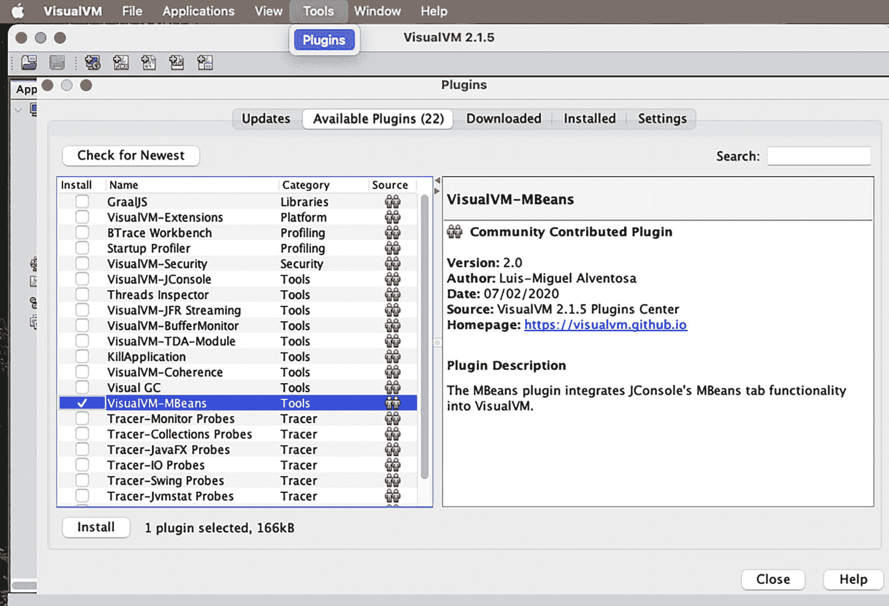

VisualVM 窗口截图。从工具菜单中选择了标记为“插件”的选项。在左侧窗格中，选择了以下插件：名称，VisualVM-MBeans。右侧显示了相应的版本、作者、日期、来源和主页详细信息。

图 18-1

已选择安装 `VisualVM-MBeans` 插件

1.  从 VisualVM 的菜单中，选择“工具” ➤ “插件”以打开如图 18-1 所示的“插件”对话框。
2.  点击“可用插件”选项卡。
3.  点击“检查最新版本”按钮。
4.  选择 `VisualVM-MBeans` 插件，然后点击“安装”按钮。

完成 `VisualVM-MBeans` 插件的安装后，请确认 Apache Tomcat 已启动并且示例应用程序正在运行。然后，在 VisualVM 的“应用程序”导航窗格中，你应该能够看到 Tomcat 进程正在运行，如图 18-2 左侧所示。双击“应用程序”窗格中的 Tomcat 节点。

默认情况下，VisualVM 会扫描在 JDK 平台上运行的 Java 和 Kotlin 应用程序。双击所需节点会打开监控屏幕。安装 `VisualVM-MBeans` 插件后，MBeans 选项卡变为可用。点击此选项卡会显示可用的 MBean。你应该会看到一个名为 `jmxDemo` 的节点。展开它，将显示通过清单 18-1 中的配置暴露的 `Prospring6SingerApp` MBean。

在右侧的“属性”选项卡上，你会看到对于我们在 bean 中实现的方法，一个名为 `TotalSingerCount` 的属性是从 `getTotalSingerCount`() 方法自动派生出来的。该值应与 `SINGER` 表中的歌手数量相同，如图 18-2 所示。

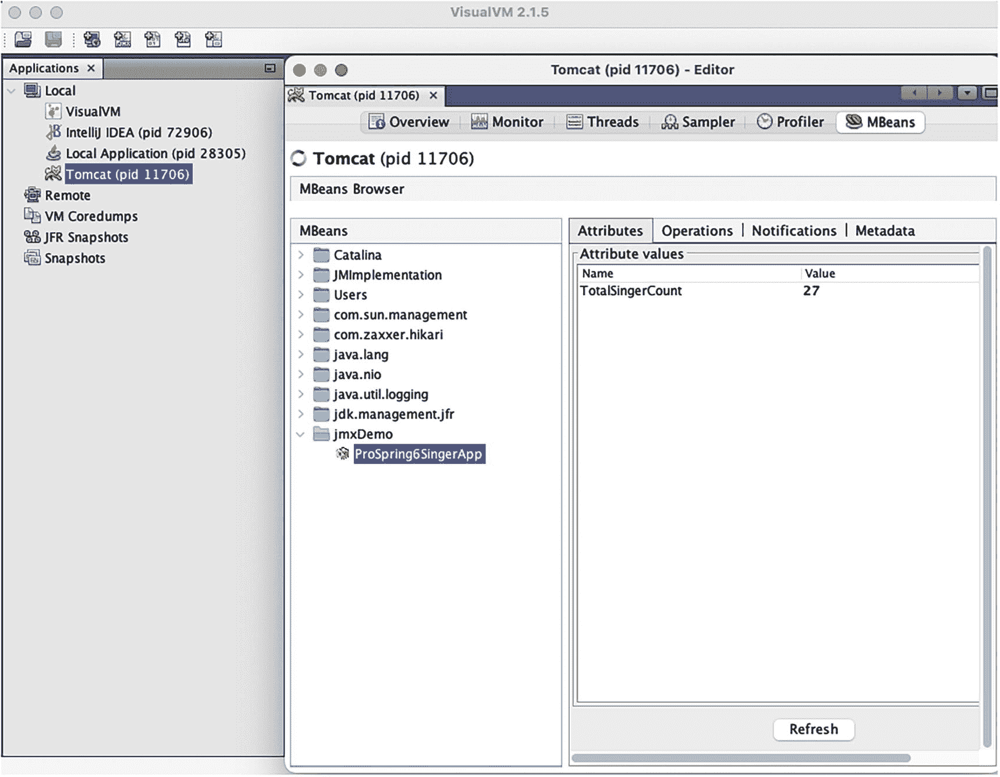

一个标题为“Tomcat”的对话框截图，覆盖在 VisualVM 窗口上。屏幕标题为“MBeans 浏览器”。在左侧窗格中，选择了标记为“pro spring 6 singer app”的选项。右侧窗格在选中“属性”选项卡时显示属性值。

图 18-2

在 VisualVM 中暴露的 `Prospring6SingerApp` MBean

在常规应用程序中，此数字会根据应用程序运行期间添加的歌手数量而变化。为了测试 MBean 如何反映表中的变化，我们可以使用重复测试方法来创建一定数量的歌手。清单 18-4 展示了 `RestClientTest` 类，其中包含一个创建十位歌手的测试方法和一个删除他们的方法。

```
package com.apress.prospring6.eighteen
import org.junit.jupiter.api.RepeatedTest
// 其他导入语句已省略
class RestClientTest {
var restTemplate = RestTemplate()
@RepeatedTest(10)
@Test
fun testCreate() {
LOGGER.info("--> 测试创建歌手")
var singerNew = Singer().apply {
firstName="TEST" + System.currentTimeMillis()
lastName="Singer" + System.currentTimeMillis()
birthDate=LocalDate.now()
}
singerNew = restTemplate.postForObject(
URI_SINGER_ROOT, singerNew,
Singer::class.java
)!!
LOGGER.info("歌手创建成功: $singerNew")
}
@Test
fun testDelete() {
LOGGER.info("--> 删除 id 大于 15 的歌手")
for (i in 16..99) {
try {
restTemplate.delete(URI_SINGER_WITH_ID, i)
} catch (e: Exception) {
// 无需处理
}
}
}
companion object {
private const val URI_SINGER_ROOT = "http://localhost:8080/chapter18-1.0-SNAPSHOT/singer/"
private const val URI_SINGER_WITH_ID = "http://localhost:8080/chapter18-1.0-SNAPSHOT/singer/{id}"
val LOGGER = LoggerFactory.getLogger(RestClientTest::class.java)
}
}
清单 18-4
RestClientTest 类
```

要查看 MBean 值的变化，请运行 `testCreate()` 方法，然后点击“刷新”按钮。你也可以通过转到“操作”选项卡并点击标记为方法名称 `getTotalSingerCount()` 的按钮来检索当前的歌手数量。将弹出一个显示操作返回值的弹出窗口，如图 18-3 所示。

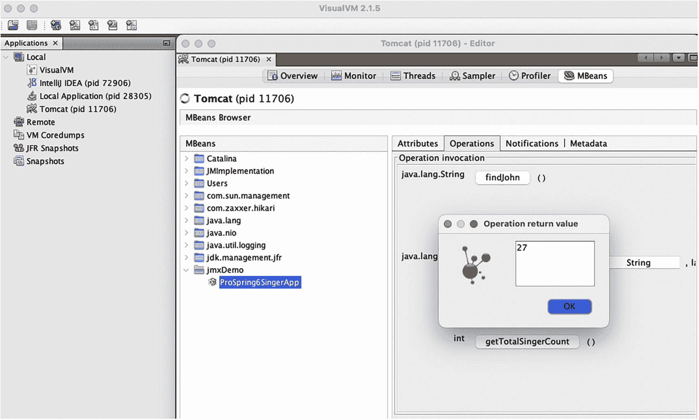

一个标题为“Tomcat”的对话框截图，覆盖在 VisualVM 窗口上。在左侧窗格中，选择了标记为“pro spring 6 singer app”的选项。在右侧窗格中，选中了“操作”选项卡。一个重叠的弹出框显示了操作返回值。

图 18-3

MBean `getTotalSingerCount()` 操作的结果

请随意尝试其他暴露的操作：`findJohn()` 和 `findSinger({"John", "Mayer")`。

### 监控 Hibernate 统计信息

Hibernate 也支持维护持久化相关指标并通过 JMX 暴露它们。要启用此功能，在 JPA 配置中，我们需要设置一些 Hibernate 属性，如清单 18-5 所示。

```
package com.apress.prospring6.eighteen
import org.hibernate.cfg.Environment
// 其他导入语句已省略
@Import(BasicDataSourceCfg::class)
@Configuration
@EnableJpaRepositories(basePackages = ["com.apress.prospring6.eighteen.repos"])
@EnableTransactionManagement
@ComponentScan(basePackages = ["com.apress.prospring6.eighteen.repos"])
open class TransactionCfg {
@Autowired
var dataSource: DataSource? = null
@Bean
open fun transactionManager(): PlatformTransactionManager {
val transactionManager = JpaTransactionManager()
transactionManager.entityManagerFactory = entityManagerFactory().getObject()
return transactionManager
}
@Bean
open fun jpaVendorAdapter(): JpaVendorAdapter {
return HibernateJpaVendorAdapter()
}
@Bean
open fun entityManagerFactory(): LocalContainerEntityManagerFactoryBean {
val factory = LocalContainerEntityManagerFactoryBean()
factory.setPersistenceProviderClass(HibernatePersistenceProvider::class.java)
factory.setPackagesToScan("com.apress.prospring6.eighteen.entities")
factory.dataSource = dataSource
factory.setJpaProperties(jpaProperties())
factory.jpaVendorAdapter = jpaVendorAdapter()
return factory
}
@Bean
open fun jpaProperties(): Properties {
val jpaProps = Properties()
jpaProps[Environment.HBM2DDL_AUTO] = "none"
jpaProps[Environment.FORMAT_SQL] = false
jpaProps[Environment.STATEMENT_BATCH_SIZE] = 30
jpaProps[Environment.USE_SQL_COMMENTS] = false
jpaProps["hibernate.jmx.enabled"] = true
jpaProps["hibernate.jmx.usePlatformServer"] = true
jpaProps[Environment.GENERATE_STATISTICS] = true
return jpaProps
}
}
清单 18-5
启用了统计信息的 Hibernate 配置类
```

属性 `hibernate.jmx.enabled` 和 `hibernate.jmx.usePlatformServer` 用于通过 JMX 暴露 Hibernate 指标。属性 `hibernate.generate_statistics` 指示 Hibernate 为其 JPA 持久化提供程序生成统计信息，而属性 `hibernate.session_factory_name` (`Environment.SESSION_FACTORY_NAME`) 定义了 Hibernate 统计信息 MBean 所需的会话工厂名称。

最后，我们需要声明一个 Spring bean 并将其配置为 MBean，以暴露所有 Hibernate 统计信息和指标。清单 18-6 展示了一个名为 `CustomHibernateStatistics` 的类的代码片段，该类用于暴露 Hibernate 统计信息和指标。


```
package com.apress.prospring6.eighteen.audit
import org.hibernate.SessionFactory
import org.hibernate.stat.*
import org.springframework.jmx.export.annotation.*
// 其他导入语句已省略
@Component
@ManagedResource(description = "JMX 管理资源",
objectName = "jmxDemo:name=ProSpring6SingerApp-hibernate")
class CustomHibernateStatistics(private val sessionFactory: SessionFactory) {
private var stats: Statistics? = null
@PostConstruct
private fun init() {
stats = sessionFactory.statistics
}
@ManagedOperation(description = "获取实体名称的统计信息")
@ManagedOperationParameter(name = "entityName",
description = "实体的完整类名")
fun getEntityStatistics(entityName: String): EntityStatistics {
return stats!!.getEntityStatistics(entityName)
}
@ManagedOperation(description = "获取角色的统计信息")
@ManagedOperationParameter(name = "role", description = "角色名称")
fun getCollectionStatistics(role: String): CollectionStatistics {
return stats!!.getCollectionStatistics(role)
}
@ManagedOperation(description = "获取查询的统计信息")
@ManagedOperationParameter(name = "hql", description = "查询名称")
fun getQueryStatistics(hql: String): QueryStatistics {
return stats!!.getQueryStatistics(hql)
}
@get:ManagedAttribute
val entityDeleteCount: Long
get() = stats!!.entityDeleteCount
@get:ManagedAttribute
val entityInsertCount: Long
get() = stats!!.entityInsertCount
@get:ManagedAttribute
val entityLoadCount: Long
get() = stats!!.entityLoadCount
// 其他方法/访问器已省略
}
清单 18-6
声明 MBean 以公开 Hibernate 统计信息的 MonitoringCfg
```

现在，Hibernate 统计信息已启用并可通过 JMX 获取，重新加载应用程序并刷新 VisualVM；您将能够看到 Hibernate 统计信息 MBean。单击该节点会在右侧显示详细统计信息。请注意，对于非 Java/Kotlin 原始类型的信息（例如 `List`），您可以单击该字段以展开并显示内容。

在 VisualVM 中，您可以看到许多其他指标，例如 `EntityNames`、`EntityInsertCount`、`Queries`、`PrepareStatementCount` 和 `TransactionCount`。这些指标有助于了解应用程序中的持久化行为，并可以帮助您进行故障排除和性能调优工作。

如果您再次运行 `testCreate()` 方法，您会注意到这些值发生了变化。创建歌手需要 Hibernate 持久化实例，因此您会看到 `TransactionCount`、`PrepareStatementCount`、`EntityInsertCount` 以及其他一些指标的值增加。

## 使用 Spring Boot 的 JMX

将之前的应用程序迁移到 Spring Boot 很容易，并且依赖项已提供并自动配置。对于 JMX，不需要启动器依赖项，但为了启用 JMX 以公开 MBean，我们需要将 `spring.jmx.enable=true` 属性添加到配置中。为了使此应用程序与上一节保持一致，我们还添加了 `spring.jmx.default-domain=jmxBootDemo`，将域名从 `bean` 更改为 `jmxBootDemo`，以便轻松识别我们的 MBean 所在的位置。

本节中的应用程序与**第** **15** 章中的 Spring Boot Web REST 应用程序相同。通过将 `spring.jmx.enable=true` 属性添加到配置中，`org.springframework.boot.autoconfigure.jmx.JmxAutoConfiguration` 类被添加到应用程序中，该类声明了一个 bean ID 为 `mbeanServer` 的 `MBeanServer`，并公开任何使用 Spring JMX 注解标注的 bean。

默认情况下，Spring Boot 会将管理端点作为 JMX MBean 公开在 `org.springframework.boot` 域下。`AppStatisticsImpl` 类与上一节中介绍的类相同。由于 Spring Boot 会公开所有 JMX MBean，如果类路径中的任何库包含它们，它们将在 `jmxDemo` 域下可用。现在，如果您打开 VisualVM 并访问 `Chapter18Application` 节点，您应该会在 MBeans 选项卡中看到 `jmxBootDemo` 域包含 `HikariDataSource` MBean，如图 18-4 所示。

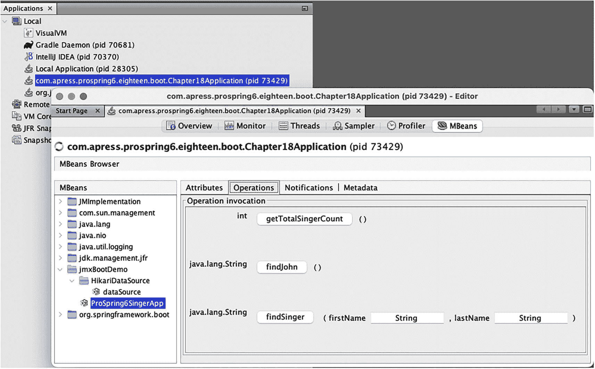

一个窗口的截图。在左侧窗格中，选择了 M beans 选项。Pro Sring Singer dot app。在右侧窗格中，选择了操作选项卡。它显示了 int、java dot lang dot string、first name 和 last name 的操作。

图 18-4

在 `chapter18-boot` 项目中声明的 `ProSpring6SingerApp` MBean 的操作

请注意，MBeans 选项卡中还有一个 `org.springframework.boot` 域。该域下内容不多，除了作为 JMX bean 公开的管理端点。在这样一个简单的应用程序中，可用的属性和操作并不多。如果您愿意，可以通过调用 `getProperty(..)` 操作并传入属性名称（例如 `spring.jmx.enabled`）来检查 Spring Boot 属性的值，如图 18-5 所示。

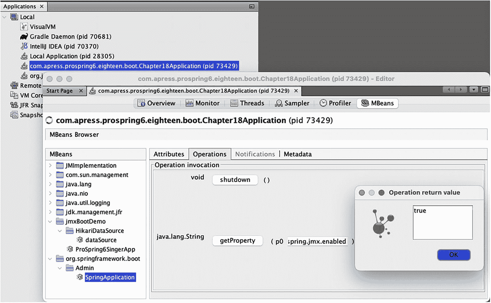

一个窗口的截图。在左侧窗格中，选择了标记为 spring application 的选项。在右侧窗格中，选择了操作选项卡。它显示了 void 和 java dot lang dot string 的操作。一个弹出框显示操作返回值为 true。

图 18-5

使用 `getProperty(..)` 操作检查 `spring.jmx.enabled` 属性的值

看起来 Spring Boot 并没有带来太多额外功能，但当将 Spring Boot Actuator 添加到应用程序中时，情况就不同了。


## 使用 Spring Boot Actuator 监控应用程序

Spring Boot 提供了通过 JMX 监控应用程序的附加功能。一旦 `spring-boot-actuator.jar` 位于类路径上，审计、健康检查和指标收集功能便会自动应用于应用程序。`spring-boot-actuator` 模块提供了一系列生产就绪的功能。推荐启用这些功能的方式是将 `spring-boot-starter-actuator` 添加到类路径中。图 18-6 展示了 `chapter18-boot` 项目的依赖关系，其中 `spring-boot-starter-actuator` 已展开以查看所有传递性依赖。

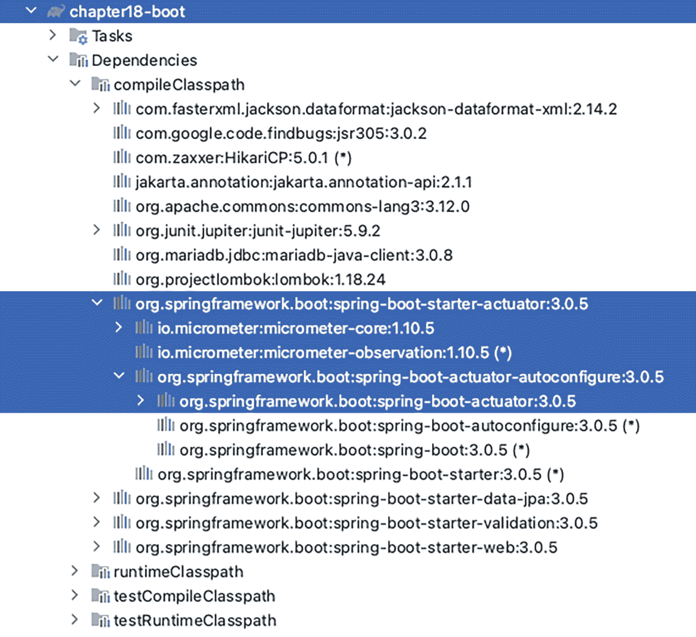

一张截图列出了第 18 章启动项目的依赖关系。其中两个类别及其子类别被选中。

图 18-6

`chapter18-boot` 项目依赖关系

Spring 参考文档对执行器（actuator）的定义如下：“执行器是一个制造业术语，指的是用于移动或控制某物的机械装置。执行器可以通过微小的变化产生大量的运动^(¹⁷⁷)。”

Spring Boot Actuator 向应用程序添加了一组端点，用于监控和与应用程序交互。通过配置，我们可以通过 JMX 或 HTTP 暴露这些端点，并且可以决定是暴露所有端点还是仅暴露部分端点。清单 18-7 中的配置是 `application.yaml` Spring Boot 配置文件的一部分，它启用了在 `jmxBootDemo` 域下通过 JMX 暴露所有 Actuator 端点。

```
management:
endpoints:
jmx:
domain: jmxBootDemo
exposure:
include: "*"
清单 18-7
在 jmxBootDemo 域下通过 JMX 暴露所有 Actuator 端点的配置
```

应用此配置后，当重启应用程序并连接 VisualVM 时，`jmxBootDemo` 域下会添加一系列 MBean，它们分组在 `Endpoint` 节点下，如图 18-7 所示。

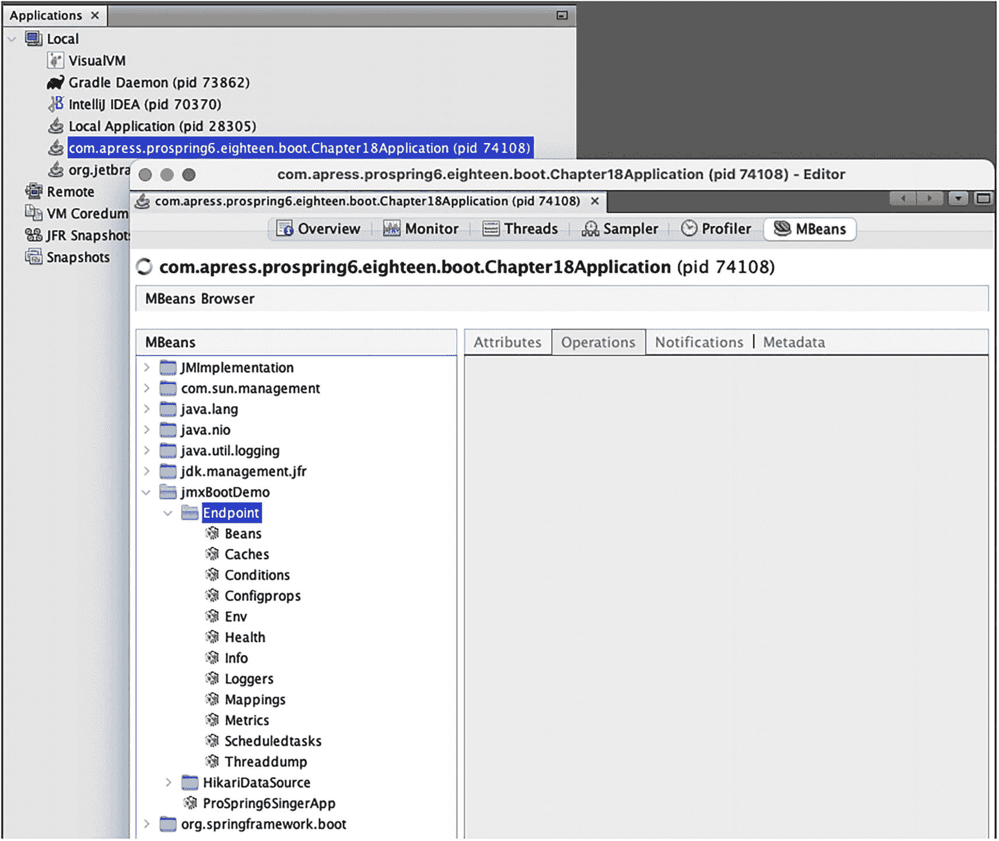

一个窗口的截图，标签页显示为“M Bean”并被选中。在左侧窗格中，选项“endpoint”被选中。窗口的右侧窗格有四个标签页，分别标记为“属性”、“操作”、“通知”和“元数据”。“操作”标签页被选中。

图 18-7

VisualVM 中显示的 Spring Boot Actuator JMX 端点

表 18-1 列出了 Spring Boot Actuator JMX 端点，并简要说明了它们暴露的操作。

表 18-1

Spring Boot Actuator JMX 端点

| 端点 | 描述 |
| --- | --- |
| Beans | `beans()` 操作列出应用程序中所有 Spring Bean 的完整列表。 |
| Caches | 暴露用于列出和清除现有缓存的操作。 |
| Conditions | `conditions()` 操作列出为 Spring Boot 应用程序配置评估的条件。 |
| Configprops | 暴露用于检索配置属性汇总列表的操作。 |
| Env | 暴露用于列出 Spring 的 `ConfigurableEnvironment` 中属性的操作。 |
| Health | `health()` 操作列出应用程序健康信息。 |
| Info | `info()` 操作列出任意应用程序信息。 |
| Loggers | 暴露用于显示和修改应用程序中日志记录器配置的操作。 |
| Mappings | `mappings()` 操作列出所有 `@RequestMapping` 路径。此列表包括 Actuator HTTP 端点。 |
| Metrics | `listNames()` 操作列出为应用程序配置的所有指标。 |
| Scheduledtasks | `scheduledTasks()` 操作列出应用程序中的所有计划任务。 |
| Threaddump | 暴露用于执行线程转储的操作。 |

如果您曾尝试在 VisualVM UI 中点击并调用操作，您可能已经意识到 JMX 端点使用起来很繁琐。好消息是，Spring Boot Actuator 也通过 HTTP 暴露了这些端点（以及更多），默认情况下它们都分组在 `/actuator` 路径下。端点分组的路径和端口可以通过配置进行自定义。

清单 18-8 展示了将所有 Actuator 端点通过 HTTP 暴露在 `/monitoring` 路径下并使用端口 9091 的配置。

```
management:
endpoints:
web:
exposure:
include: "*"
base-path: /monitoring
server:
port: 9091
清单 18-8
通过 HTTP 暴露所有 Actuator 端点的配置
```

要检查此配置的结果，只需在浏览器中打开 `http://localhost:9091/monitoring`。响应格式为 JSON，包含一个端点列表。其中一些端点与之前介绍的 JMX 端点相匹配，而另一些则是 Web 特有的端点。在像 Firefox 这样能良好显示 JSON 的浏览器中，此页面看起来如图 18-8 所示。

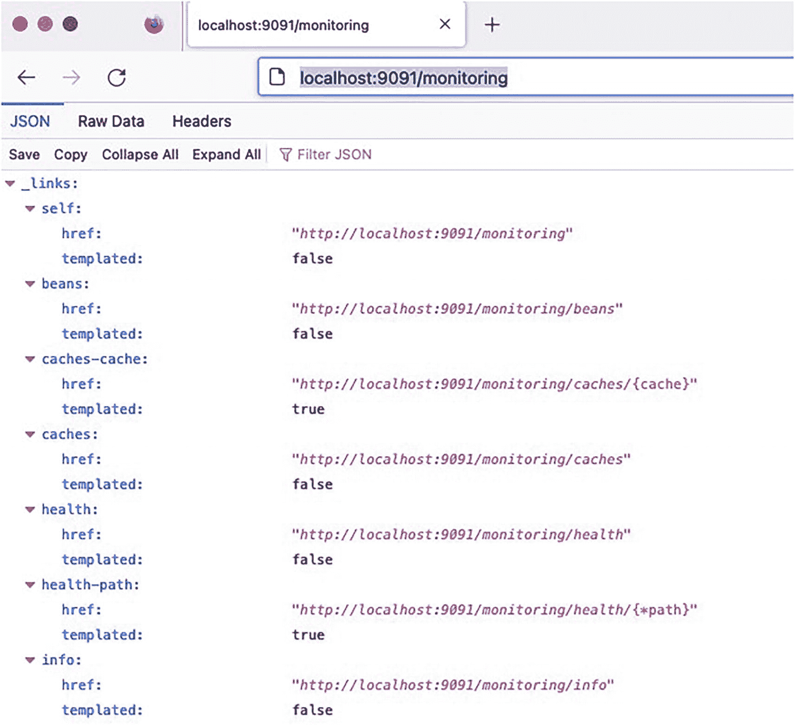

一张浏览器截图。地址栏中的文本被选中，显示为“localhost:9091/monitoring”。JSON 标签页被选中。显示了 self、beans、caches-cache、caches、health、health-path 和 info 的 href 和 templated 详细信息。

图 18-8

Spring Boot Actuator HTTP 端点

例如，`/health` 端点暴露了关于应用程序健康状态的基本信息。默认情况下，它只返回 `{"status":"UP"}`——是的，非常基础。要查看更多详细信息，必须在 Spring Boot 配置文件 `application.yml` 或 `applications.properties` 中将属性 `management.endpoint.health.show-details` 设置为 `always`。

设置完成后，将提供有关所用数据库及其状态的详细信息，以及有关磁盘空间的详细信息。清单 18-9 展示了我们在本地运行应用程序时在 `/health` 页面上看到的内容。

```
{
"status":"UP",
"components":{
"db":{
"status":"UP",
"details":{
"database":"MariaDB",
"validationQuery":"isValid()"
}
},
"diskSpace":{
"status":"UP",
"details":{
"total":499963174912,
"free":320641298432,
"threshold":10485760,
"path":"/workspace/pro-spring-6/.",
"exists":true
}
},
"ping":{
"status":"UP"
}
}
}
清单 18-9
/health 页面内容示例
```

大多数端点都是敏感的——默认情况下它们不是公开的——因此，如果应用程序是安全的，它们暴露的大部分信息将被省略。将所有端点分组在 `/actuator` 下是在 Spring Boot 2.x 中引入的。在之前的版本中，每个可用的端点都直接暴露在应用程序上下文下，因此 `/health` 端点暴露在 `http://localhost:8081/health` 下。

在此配置中，`/actuator` 路径通过 Spring Boot 配置重命名为 `/monitoring`。任何端点都可以进行同样的操作；例如，通过配置，我们可以将 `/health` 端点重命名为 `/salud`，只需将 `management.endpoints.web.path-mapping.health` 设置为此值即可。

如果出于安全原因，我们希望这些端点仅在内部可访问，我们可以通过将 `management.server.address` 属性设置为 `127.0.0.1` 来配置 IP 地址。


另一个简单的端点是 `/info` 端点。该端点显示从 `META-INF/build-info.properties`（构建时生成）或 Git 文件（如 `git.properties`，如果为此配置了插件则会生成）中读取的项目通用信息，或者通过 `info` 键下的任何环境属性来显示。此端点暴露的信息可以使用 Spring Boot 配置文件进行配置。默认情况下，不出所料，访问此端点会显示 JSON 格式的空内容 `{}`。将清单 18-10 中所示的属性添加到配置文件中，会使此端点变得更有用一些。

```
management:
info:
java:
enabled: true # 启用 Java 信息
env:
enabled: true # 启用环境信息 - 来自 'application.yml' 文件
info:
app:
name: chapter18-boot
description: "Pro Spring 6 - 第 18 章 :: Spring Actuator 应用"
version: 6.0-SNAPSHOT
author: "Iuliana Cosmina"
清单 18-10
用于 /info 端点的 Spring Boot 配置
```

当访问 `/info` 端点时，会返回清单 18-11 中的文本。

```
{
"app":{
"name":"chapter18-boot",
"description":"Pro Spring 6 - 第 18 章 :: Spring Actuator 应用",
"version":"6.0-SNAPSHOT"
},
"author":"Iuliana Cosmina",
"build":{
"artifact":"chapter18-boot",
"name":"chapter18-boot",
"time":"2023-03-25T00:32:55.002Z",
"version":"6.0-SNAPSHOT",
"group":"pro-spring-6"
},
"java":{
"version":"19.0.1",
"vendor":{
"name":"Amazon.com Inc.",
"version":"Corretto-19.0.1.10.1"
},
"runtime":{
"name":"OpenJDK Runtime Environment",
"version":"19.0.1+10-FR"
},
"jvm":{
"name":"OpenJDK 64-Bit Server VM",
"vendor":"Amazon.com Inc.",
"version":"19.0.1+10-FR"
}
}
}
清单 18-11
/info 端点的输出
```

其他端点的内容也可以自定义，不仅可以通过 Spring Boot 配置属性，还可以通过实现接口或扩展 `org.springframework.boot.actuate` 包中的特定类来实现。例如，`org.springframework.boot.actuate.health.HealthIndicator` 的自定义实现可以向 `/health` 端点添加额外信息。

不出所料，Spring Boot Actuator 提供了创建自定义端点的选项。这是通过使用 `org.springframework.boot.actuate.endpoint.annotation` 包中的 `@Endpoint` 注解来标注一个 Bean 实现的。使用 `@ReadOperation`（处理 GET 请求）、`@WriteOperation`（处理 POST 请求）和 `@DeleteOperation`（处理 DELETE 请求）注解其方法，可以同时通过 JMX 和 HTTP 暴露这些端点。

 一个带阴影圆圈内的感叹号符号。 在本书中，提到了一些支持过滤的端点，因为它们显示的数据可以通过在其 URI 后添加组件名称作为后缀来缩减。根据所讨论的端点，这些值可以是 Bean 名称、完全限定类名、属性名称等。您可能会将它们视为路径变量或过滤器，但 Spring 团队更倾向于称它们为*标签*。

Spring Boot Actuator 非常强大且高度可定制。要了解更多信息，请查看官方文档^(¹⁷⁸)。

### 将 Spring Boot Actuator 与 Micrometer 结合使用

图 18-6（本章前面部分）展示了 `spring-boot-starter-actuator` 库及其两个传递依赖：`micrometer-core` 和 `micrometer-observation`。Micrometer^(¹⁷⁹) 是一个开源指标门面，它提供了一个供应商中立的指标收集 API（父抽象实现是 `io.micrometer.core.instrument.MeterRegistry`^(¹⁸⁰)），并为本章开头提到的各种监控系统提供了实现。它可以与 Spring Boot Actuator 一起使用，但它本身也是一个独立的平台。

如果难以理解 Micrometer，可以想想 SLF4J，它是各种日志框架的门面或抽象。这意味着开发人员可以使用 SLF4J 编写日志消息，这些消息将由应用程序配置的框架收集并写入到所需的目标支持中。在本书中，SLF4J 与 Logback Classic 一起使用，但我们可以轻松地将 Logback Classic 替换为 Log4j2，而无需更改任何代码。从 Spring Boot Actuator 2.x 开始，您也可以对指标做同样的事情——Micrometer 可用于收集指标，并以任何（几乎）高级监控系统都能解释的格式暴露它们。Spring Boot 3 开箱即用地自动配置了相当长的一系列指标。通过向 `http://0.0.0.0:9091/monitoring/metrics` 端点（如上一节所配置）发送 GET 请求，可以返回此列表。清单 18-12 列出了这些指标的名称。

```
{
"names":[
"application.ready.time",
"application.started.time",
"disk.free",
"disk.total",
"executor.active",
"executor.completed",
"executor.pool.core",
"executor.pool.max",
"executor.pool.size",
"executor.queue.remaining",
"executor.queued",
"hikaricp.connections",
"hikaricp.connections.acquire",
"hikaricp.connections.active",
"hikaricp.connections.creation",
"hikaricp.connections.idle",
"hikaricp.connections.max",
"hikaricp.connections.min",
"hikaricp.connections.pending",
"hikaricp.connections.timeout",
"hikaricp.connections.usage",
"jdbc.connections.active",
"jdbc.connections.idle",
"jdbc.connections.max",
"jdbc.connections.min",
"jvm.buffer.count",
"jvm.buffer.memory.used",
"jvm.buffer.total.capacity",
"jvm.classes.loaded",
"jvm.classes.unloaded",
"jvm.compilation.time",
"jvm.gc.live.data.size",
"jvm.gc.max.data.size",
"jvm.gc.memory.allocated",
"jvm.gc.memory.promoted",
"jvm.gc.overhead",
"jvm.info",
"jvm.memory.committed",
"jvm.memory.max",
"jvm.memory.usage.after.gc",
"jvm.memory.used",
"jvm.threads.daemon",
"jvm.threads.live",
"jvm.threads.peak",
"jvm.threads.states",
"logback.events",
"process.cpu.usage",
"process.files.max",
"process.files.open",
"process.start.time",
"process.uptime",
"system.cpu.count",
"system.cpu.usage",
"system.load.average.1m",
"tomcat.sessions.active.current",
"tomcat.sessions.active.max",
"tomcat.sessions.alive.max",
"tomcat.sessions.created",
"tomcat.sessions.expired",
"tomcat.sessions.rejected"
]
}
清单 18-12
/metrics 端点列出的 Spring Boot 指标
```

这些指标可以归为几类：

*   应用时间

*   运行时间

*   JVM——垃圾回收器活动、内存消耗、线程利用率、类数量等。CPU 使用率

*   Spring 特定组件的活动

*   缓存活动

*   数据源和 HikariCP 活动

*   Tomcat 使用情况

*   Spring MVC 和 WebFlux 请求延迟（仅适用于 Spring Boot MVC 和 WebFlux 应用）

*   其他自定义组件的活动：`RestTemplate` 延迟、文件描述符使用情况、事件日志记录、RabbitMQ 或 ApacheMQ（如果使用）连接工厂等。


那么，当应用程序运行时产生大量数据，我们能拿它做什么呢？我们可以将其处理成肉眼可见的报告和图表，进而用于预测未来的行为。Micrometer 无法直接实现这一点，但有一个非常易用的工具可以完成这项工作，并且能与 Spring Boot Actuator 和 Micrometer 完美集成：Prometheus^(¹⁸¹)。Prometheus 是一个最初由 SoundCloud 构建的开源系统监控和警报工具包。它于 2012 年发布，此后成为一个独立的开源项目，拥有庞大且活跃的开发者和用户社区。

要将我们的 Spring Boot 应用程序与 Prometheus 集成，需要添加 `micrometer-registry-prometheus` 依赖。添加此依赖后，它应该会出现在 IntelliJ IDEA 的 Gradle 视图中，连同其传递依赖一起，如图 18-9 所示。

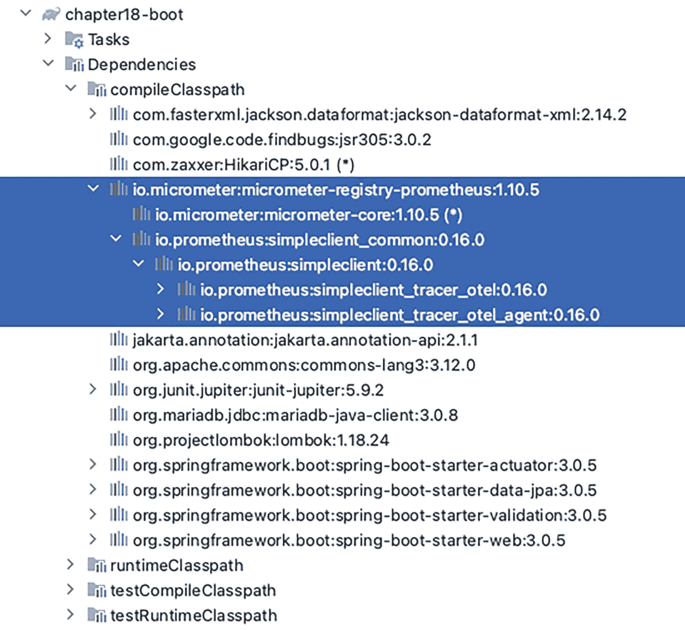

一张截图列出了第 18 章 boot 项目的依赖项。其中三个类别及其子类别被选中。

图 18-9

Spring Boot Actuator 和 Prometheus 应用程序依赖项

添加依赖并重新构建应用程序后，通过运行 `Chapter18Application` 主类来启动 Spring Boot 应用程序。打开 `http://localhost:9091/monitoring` URL 时，请注意 `prometheus` 端点，其 URL 为 `http://localhost:9091/monitoring/prometheus`。此端点由 `PrometheusScrapeEndpoint` 类提供，该类位于 `org.springframework.boot.actuate.metrics.export.prometheus` 包中，是 Spring Boot Actuator 项目的一部分。此端点将 Micrometer 提供的指标转换为 Prometheus 服务器可以抓取的格式。您可以通过访问清单 18-13 中的 Prometheus 端点来查看公开指标的摘要。

```
# HELP hikaricp_connections_max 最大连接数
# TYPE hikaricp_connections_max gauge
hikaricp_connections_max{pool="HikariPool-1",} 25.0
# HELP jvm_threads_live_threads 当前活跃线程数，包括守护线程和非守护线程
# TYPE jvm_threads_live_threads gauge
jvm_threads_live_threads 39.0
# HELP http_server_requests_seconds
# TYPE http_server_requests_seconds summary
http_server_requests_seconds_count{error="none",exception="none",method="GET",outcome="SUCCESS",status="200",uri="/singer/{id}",} 100.0
http_server_requests_seconds_sum{error="none",exception="none",method="GET",outcome="SUCCESS",status="200",uri="/singer/{id}",} 1.069158702
http_server_requests_seconds_count{error="none",exception="none",method="POST",outcome="SUCCESS",status="201",uri="/singer/",} 1000.0
http_server_requests_seconds_sum{error="none",exception="none",method="POST",outcome="SUCCESS",status="201",uri="/singer/",} 6.119599968
http_server_requests_seconds_count{error="none",exception="none",method="GET",outcome="SUCCESS",status="200",uri="/singer/",} 100.0
http_server_requests_seconds_sum{error="none",exception="none",method="GET",outcome="SUCCESS",status="200",uri="/singer/",} 1.052652658
...
清单 18-13
在 /prometheus 端点上列出的 Spring Boot 指标片段
```

下一步是运行 Prometheus 来绘制数据。为此，您需要按照官方页面^(¹⁸²)上的说明安装 Prometheus。为了保持实用性，我们建议采用 Docker 方式，在容器中运行它。在 `chapter18-boot` 文件夹中，您会找到一个名为 `CHAPTER18-BOOT.adoc` 的文件，其中解释了如何在 Docker 容器中设置 Prometheus；此处将跳过这些步骤，以免偏离本章的重点。

 一个表示想法的符号，由一个电灯泡代表。 在启动容器之前，请继续阅读本节，因为您需要通过配置文件告诉 Prometheus 指标来自何处。

Prometheus 配置文件名为 `prometheus.yaml`。这个名称不是强制性的，但确实能明确其用途。根据官方文档，我们必须定义一个任务（job），告诉 Prometheus 查询指标的频率以及从何处查询。语法是 YAML，最重要的属性列在清单 18-14 中。

```
global:
scrape_interval:     15s # 默认每 15 秒抓取一次目标。
# Prometheus 自身的自我监控配置
scrape_configs:
- job_name: 'prometheus'
# 覆盖全局默认值，每 5 秒抓取一次此任务的目标。
scrape_interval: 5s
static_configs:
- targets: ['0.0.0.0:9090']
- job_name: 'chapter18-boot'
metrics_path: '/monitoring/prometheus'
# 覆盖全局默认值，每 5 秒抓取一次此任务的目标。
scrape_interval: 5s
static_configs:
# 当 Prometheus 在 Docker 容器中运行时，必须使用网络内的真实 IP
- targets: ['192.168.0.6:9091']
清单 18-14
Prometheus 配置

请注意，对于 `chapter18-boot` 任务，`metrics_path` 属性设置为 Prometheus Actuator 端点，`targets` 设置为运行 `chapter18-boot` 应用程序的 IP 地址和端口。

在启动 Prometheus 容器之前，请先启动 `chapter18-boot` 应用程序。默认情况下，Prometheus Web 控制台可通过 `http://localhost:9090` 访问。在 `prometheus.yml` 文件中，名为 `prometheus` 的任务代表 Prometheus 应用程序自身的配置，可以自定义此任务的配置以在不同的 IP 和端口上启动 Prometheus。

Prometheus Web UI 的主页面非常简单。本次讨论最感兴趣的选项是 Status ➤ Targets，如图 18-10 所示。

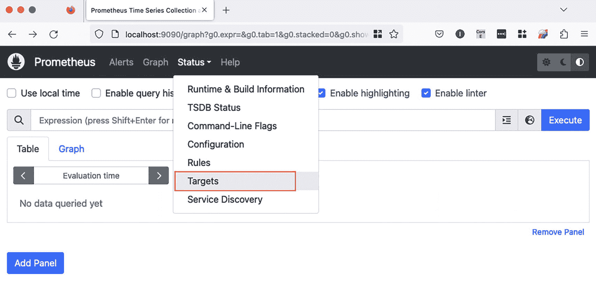

一张浏览器截图。屏幕标题显示为 Prometheus。从状态菜单中选择了标记为“targets”的选项。

图 18-10

Prometheus Web UI

选择 Targets 菜单项会将您带到图 18-11 所示的页面，该页面确认 `chapter18-boot` 状态为 `UP`，并列出了任务配置以及指标最近刷新的时间。如果文本显示为 `DOWN` 并以红色突出显示，则说明应用程序未启动，或者 `static_configs.targets` 未正确设置为 `chapter18-boot` 任务。

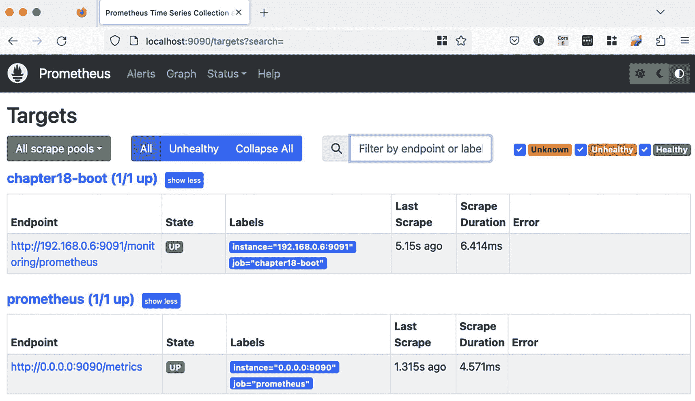

浏览器显示来自 Prometheus 网站的网页。它以六列显示第 18 章 boot 项目和 Prometheus 的条目：端点、状态、标签、上次抓取时间、抓取持续时间和错误。

图 18-11

Prometheus Web UI 显示正在运行的 `chapter18-boot` 和 Prometheus 应用程序

如果一切正常，您可以返回主页面并选择一个指标。最直观的指标之一是 `system_cpu_usage`，因此从指标列表中选择它，然后单击 Execute 按钮。在 Graph 选项卡中，除非您通过在第一个文本字段中设置一个合理的值（例如 15 或 30 分钟）来缩小指标分析的时间间隔，否则信息不会真正可见。生成的图表应该会非常有趣，类似于图 18-12 所示。

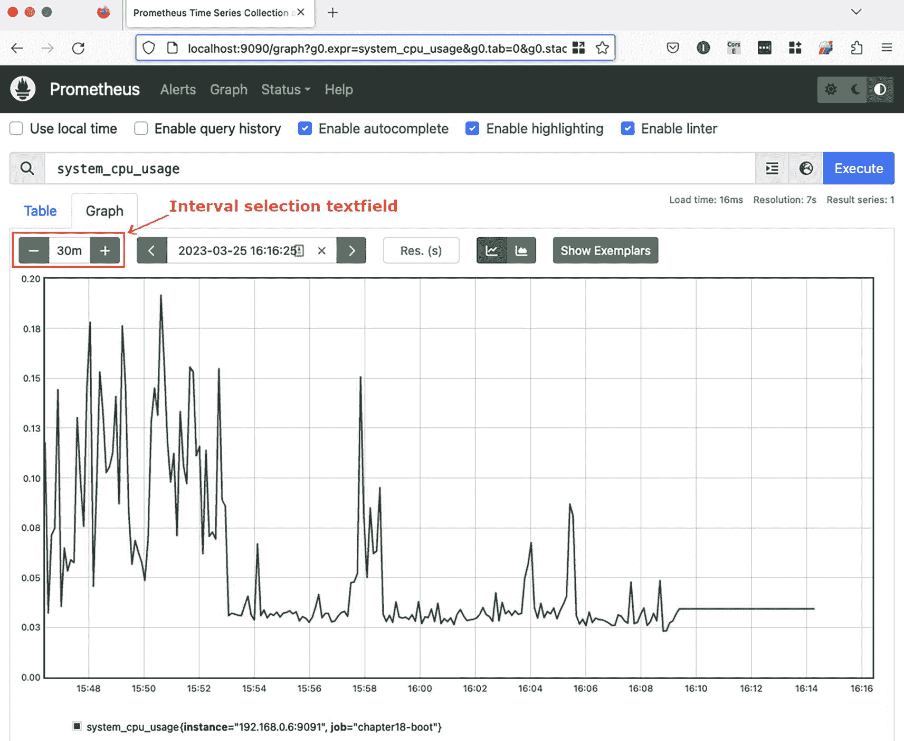

一张浏览器截图，显示来自 Prometheus 网站的网页。它显示了一个图表。时间间隔选择文本字段的值为 30 m 并被高亮显示。以下复选框被选中：启用自动完成、启用高亮显示和启用 linter。

图 18-12

Prometheus Web UI 显示 `system_cpu_usage` 指标的图表


如先前在清单 18-13 中所示，提供了多个与请求数量相关的指标。为了模拟服务器处理请求所需时间变化的情况，以便我们能够看到`http_server_requests_seconds_count`的图表，我们可以修改`SingerController`，为接收到`http://localhost:9091/singer/{id}` URL 的 GET 请求所返回的每个`Singer`实例引入不同的延迟。这是通过在该 URI 的处理方法中添加`Thread.sleep()`来实现的，该方法会根据记录 ID 生成不同的延迟时间。该处理方法如清单 18-15 所示。

```
package com.apress.prospring6.eighteen.boot.controllers
// 导入语句已省略
@RestController
@RequestMapping(value = ["/singer"])
class SingerController(private val singerService: SingerService) {
val LOGGER = LoggerFactory.getLogger(SingerController::class.java)
@GetMapping(path = ["/{id}"])
fun findSingerById(@PathVariable id: Long): Singer {
val singer = singerService.findById(id)
if (singer != null) {
val msec = 10
try {
Thread.sleep(msec * id)
} catch (e: InterruptedException) {
e.printStackTrace()
}
}else{
throw RuntimeException("Singer for ID=${id} does not exist")
}
return singer
}
// 其他方法和字段已省略
}
清单 18-15
针对请求路径 /singer{id} 并带有不同延迟的自定义处理方法
```

现在，为了提交大量请求并生成大量数据，以便 Prometheus 能够在图表上绘制数据，清单 18-16 中的测试类提供了两个非常有用的方法。

```
package com.apress.prospring6.eighteen.boot
// 导入语句已省略
class SingerControllerTest {
private val restTemplate = RestTemplate()
@RepeatedTest(50)
fun testFindAll() {
val singers = restTemplate.getForObject(
BASE_URL,
Array::class.java
)!!
Assertions.assertTrue(singers.size >= 15)
}
@RepeatedTest(500)
@Throws(URISyntaxException::class)
fun testCreate() {
val singerNew = Singer()
singerNew.firstName = UUID.randomUUID().toString().substring(0, 8)
singerNew.lastName = UUID.randomUUID().toString().substring(0, 8)
singerNew.birthDate = LocalDate.now()
val req = RequestEntity(
singerNew, HttpMethod.POST, URI(
BASE_URL
)
)
val response = restTemplate.exchange(
req,
String::class.java
)
Assertions.assertEquals(HttpStatus.CREATED, response.statusCode)
}
@RepeatedTest(10)
@Throws(URISyntaxException::class)
fun testPositiveFindById() {
val headers = HttpHeaders()
headers.accept = List.of(MediaType.APPLICATION_JSON)
for (i in 1..249) {
val req = RequestEntity(
headers, HttpMethod.GET, URI(
BASE_URL + i
)
)
val response = restTemplate.exchange(
req,
Singer::class.java
)
Assertions.assertAll("testPositiveFindById",
Executable {
Assertions.assertEquals(
HttpStatus.OK,
response.statusCode
)
},
Executable {
Assertions.assertTrue(
Objects.requireNonNull(
response.headers[HttpHeaders.CONTENT_TYPE]
).contains(MediaType.APPLICATION_JSON_VALUE)
)
},
Executable { Assertions.assertNotNull(response.body) },
Executable {
Assertions.assertEquals(
Singer::class.java,
response.body.javaClass
)
}
)
}
}
companion object {
private const val BASE_URL = "http://localhost:8081/singer/"
}
}
清单 18-16
用于生成指标数据的测试类
```

为了获得预期结果，请先运行`testCreate()`，然后运行`testPositiveFindById()`。第二个测试的执行需要一些时间，但你可以前往 Prometheus Web UI，绘制`http_server_requests_seconds_count`指标的图表，并时不时刷新页面，以观察正在处理的请求数量随时间增长的情况。

图 18-13 展示了为本书生成的图表。请注意多个请求路径是如何按颜色分组的。Prometheus 有两种类型的图表：堆叠图和非堆叠图；此图中的是堆叠类型。

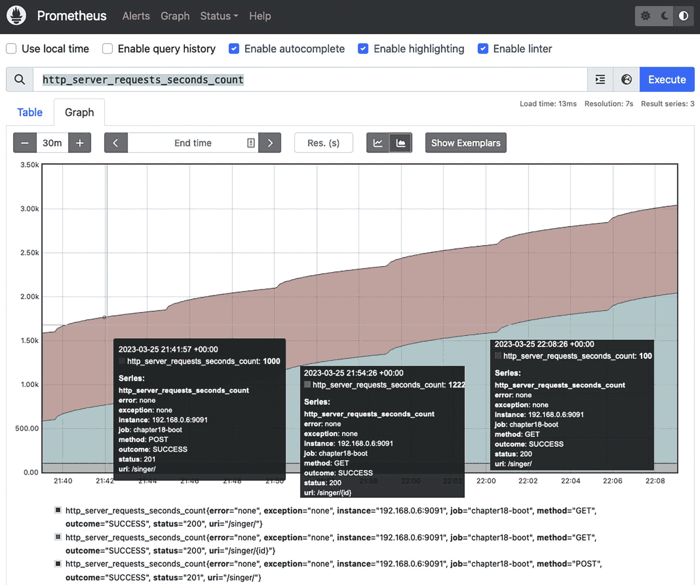

浏览器显示来自 Prometheus 网站的网页。顶部有两个标签页，分别标记为“表格”和“图表”。当前选中了“图表”标签页。它显示了一个包含三条曲线的图表。顶部的搜索栏中有文本，并且处于选中状态。图表类型图标已被选中并高亮显示。

图 18-13
显示`http_server_requests_seconds_count`指标图表的 Prometheus Web UI

请注意，对`/singer/`的 GET 请求的持续时间（图表底部以绿色显示）从未增加。请注意，对`/singer/`的 POST 请求的持续时间（以红色显示）也随着表格变大而增加。对`/singer/{id}`的 GET 请求的持续时间（以蓝色显示）是增加最多的，考虑到这是`Thread.sleep(..)`方法所在的位置。

Prometheus 图表相当简单，默认的 Micrometer 指标也很基础。在生产应用中，团队可以根据应用提供的服务定义自己的指标。例如，对于银行应用，登录失败结合某些来源 IP 可能会揭示某种类型的黑客攻击企图，因此一个必备的指标是将登录失败和产生请求的 IP 类别分组在一起。

目前，在可视化指标方面，领先的解决方案似乎是 Grafana^(¹⁸³)，好消息是它知道如何解释 Prometheus 指标。因此，Prometheus 指标可以转发到 Grafana，以绘制一些更高清晰度的图表。

## 总结

在本章中，我们涵盖了监控基于 Spring 的 JEE 应用的高级主题。首先，我们讨论了 Spring 对 JMX 的支持，这是监控 Java 和 Kotlin 应用的标准。我们讨论了实现自定义 MBean 以暴露应用相关信息，以及暴露 Hibernate 等常见组件的统计数据；并且我们展示了如何在 Spring Boot 应用中使用 JMX。

接下来，我们展示了 Spring Boot Actuator 在生成应用指标方面的强大功能，以及如何使用 Prometheus 绘制这些指标。在下一章中，我们将讨论 Spring 对 WebSocket 的支持。

脚注 1   2   3   4   5   6   7   8   9   10


# 19. Spring WebSocket 支持

传统上，Web 应用程序利用标准的请求/响应 HTTP 功能来提供客户端和服务器之间的通信。随着 Web 的发展，需要更多交互能力，其中一些要求来自服务器的推送/拉取或实时更新。随着时间的推移，人们实现了各种方法，例如持续轮询、长轮询和 Comet。每种方法都有其优缺点，而 WebSocket 协议试图从这些需求和缺陷中学习，创建一种更简单、更健壮的方式来构建交互式应用程序。HTML5 WebSocket 规范定义了一个 API，使网页能够使用 WebSocket 协议在浏览器和远程主机之间进行双向通信。

本章对 WebSocket 协议以及 Spring 框架提供的主要功能进行了高级概述。具体来说，本章涵盖以下主题：

*   *WebSocket 简介*：我们提供 WebSocket 协议的总体介绍。本章并非旨在作为 WebSocket 协议的详细参考，而是作为高级概述^(¹⁸⁴)。

*   *将 WebSocket 与 Spring 结合使用*：我们将深入探讨将 WebSocket 与 Spring 框架结合使用的一些细节；具体来说，我们将介绍使用 Spring 的 WebSocket API、利用 SockJS 作为不支持 WebSocket 的浏览器的回退选项，以及使用简单（或流式）面向文本的消息协议（STOMP）通过 SockJS/WebSocket 发送消息。

## WebSocket 简介

WebSocket 是作为 HTML5 计划的一部分开发的一项规范，它允许一个全双工的单套接字连接，客户端和服务器之间可以通过该连接发送消息。过去，需要实时更新功能的 Web 应用程序会定期轮询服务器端组件以获取这些数据，这会打开多个连接或使用长轮询。

使用 WebSocket 进行双向通信，避免了为客户端（例如，Web 浏览器）和 HTTP 服务器之间的双向通信执行 HTTP 轮询的需要。WebSocket 协议旨在取代所有利用 HTTP 进行传输的现有双向通信方法。WebSocket 的单套接字模型提供了更简单的解决方案，避免了为每个客户端建立多个连接以及相应的开销——例如，无需为每条消息发送 HTTP 标头。

WebSocket 在其初始握手期间利用 HTTP，这反过来允许它通过标准 HTTP（80）和 HTTPS（443）端口使用。WebSocket 规范定义了 `ws://` 和 `wss://` 方案，分别表示非安全连接和安全连接。WebSocket 协议包含两部分：客户端和服务器之间的握手以及数据传输。WebSocket 连接是通过在客户端和服务器之间的初始握手期间，在相同的底层 TCP/IP 连接上，发出从 HTTP 到 WebSocket 协议的升级请求来建立的。在通信的数据传输部分，客户端和服务器可以同时向彼此发送消息，这为向应用程序添加更健壮的实时通信功能打开了大门。

## 将 WebSocket 与 Spring 结合使用

从 4.1 版本开始，Spring 框架支持 WebSocket 风格的消息传递以及 STOMP 作为应用级子协议。在框架内，您可以在 `spring-websocket` 模块中找到对 WebSocket 的支持，该模块与 JSR-356（“Java WebSocket”）^(¹⁸⁵) 兼容。

应用程序开发人员还必须认识到，尽管 WebSocket 带来了新的、令人兴奋的机会，但并非所有 Web 浏览器都支持该协议。鉴于此，应用程序必须继续为用户工作，并利用某种回退技术来尽可能好地模拟预期的功能。为了处理这种情况，Spring 框架通过 SockJS 协议提供了透明的回退选项，我们将在本章后面介绍。

与基于 REST 的应用程序（其中服务由不同的 URL 表示）不同，WebSocket 使用单个 URL 来建立初始握手，数据流经同一连接。这种类型的消息传递功能更符合传统消息传递系统。从 Spring Framework 4 开始，诸如 `Message` 之类的核心基于消息的接口已从 Spring Integration 项目迁移到一个名为 `spring-messaging` 的新模块中，以支持 WebSocket 风格的消息传递应用程序。

当我们提到将 STOMP 用作应用级子协议时，我们指的是通过 WebSocket 传输的协议。WebSocket 本身是一个低级协议，它只是将字节转换为消息。应用程序需要理解通过线路发送的内容，这就是像 STOMP 这样的子协议发挥作用的地方。在初始握手期间，客户端和服务器可以使用 `Sec-WebSocket-Protocol` 标头来定义要使用的子协议。虽然 Spring 框架提供了对 STOMP 的支持，但 WebSocket 并未强制要求任何特定内容。

既然您已经了解了 WebSocket 是什么以及 Spring 提供的支持，您可能想知道在何处使用这项技术。鉴于 WebSocket 的单套接字特性及其提供连续双向数据流的能力，WebSocket 非常适合具有高频率消息传递和需要低延迟通信的应用程序。可能适合使用 WebSocket 的应用程序包括游戏、实时群组协作工具、消息传递系统、时间敏感的定价信息（例如金融更新）等。在设计考虑使用 WebSocket 的应用程序时，您必须考虑消息频率和延迟要求。这将有助于确定是使用 WebSocket 还是，例如，HTTP 长轮询。


## 使用 WebSocket API

如前所述，WebSocket 只是将字节转换为消息并在客户端和服务器之间传输。这些消息仍然需要应用程序本身来理解，这就是 STOMP 等子协议发挥作用的地方。如果你想直接使用较低层级的 WebSocket API，Spring 框架提供了一个可供交互的 API。在使用 Spring 的 WebSocket API 时，你通常会实现 `WebSocketHandler` 接口，或使用便捷的子类，例如用于处理二进制消息的 `BinaryWebSocketHandler`、用于处理 SockJS 消息的 `SockJsWebSocketHandler`，或用于处理基于字符串消息的 `TextWebSocketHandler`。在本例中，为简单起见，我们将使用 `TextWebSocketHandler` 通过 WebSocket 传递基于字符串的消息。让我们首先看看如何利用 Spring WebSocket API 在较低层级接收和处理 WebSocket 消息。

显然，我们需要在类路径中添加支持 WebSocket 通信的库。图 19-1 展示了一个使用 WebSocket 协议向自身发送消息的 Spring Web 应用程序的依赖关系。

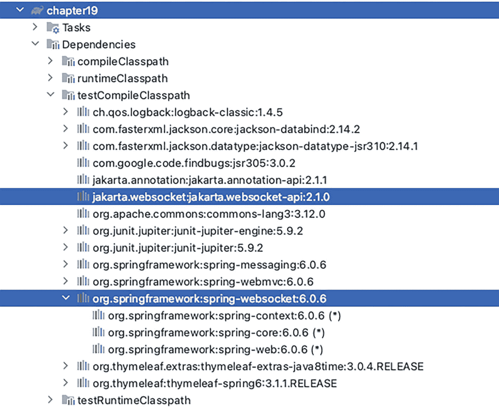

第 19 章的依赖项列表，其中高亮显示了两个库：`jakarta.websocket-api` 和 `spring-websocket`。

图 19-1
项目 `chapter19` 的依赖项

如你所见，这些依赖项对于 Spring Web 应用程序来说是典型的，类似于**第** **14** 章中介绍的那个。Jakarta WebSocket API 提供了一个平台无关的 WebSocket 协议 API，用于在 Web 上构建双向通信。`jakarta.websocket-api` 库包含了用于服务器和客户端的 Jakarta WebSocket API（仅 API，不包含实现）。`spring-websocket` 库包含了编写处理 WebSocket 消息的客户端和服务器端应用程序所需的 Spring WebSocket API。

为了发送和显示消息，我们创建了一个名为 `index.html` 的简单网页。该页面基于默认的 Thymeleaf 布局构建，包含用于与后端 WebSocket 服务通信的静态 HTML 和 JavaScript。为了处理通信，我们需要声明一个实现 `WebSocketHandler` 的特殊类型以及该类型的一个 bean。图 19-2 展示了实现 `org.springframework.web.socket.WebSocketHandler` 的类型层次结构。

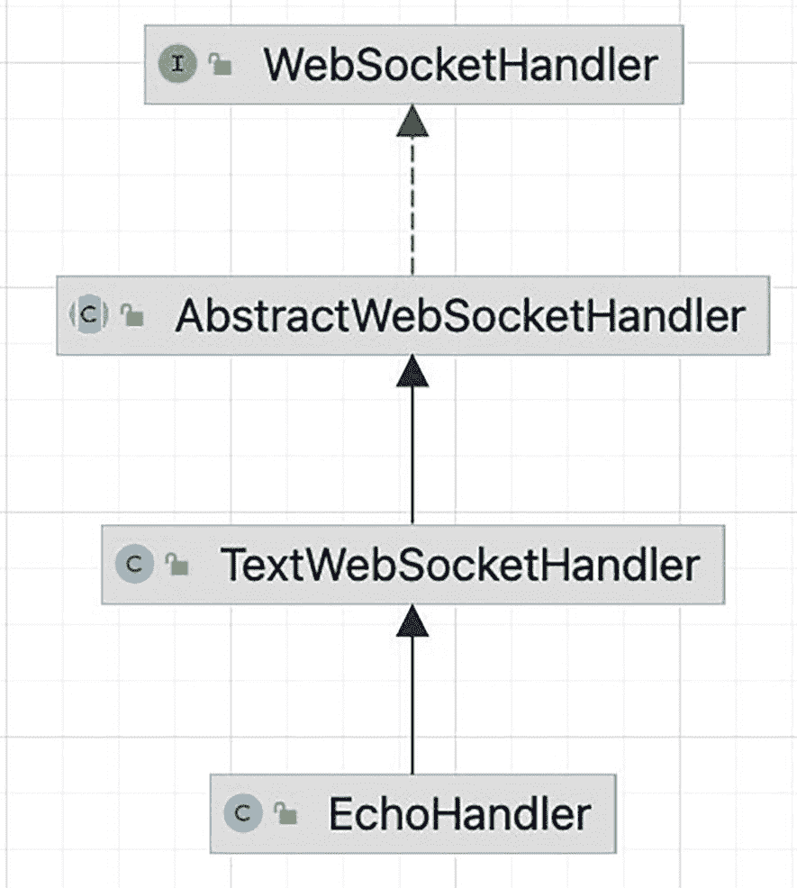

一个从底部到顶部共 4 步的垂直流程图：EchoHandler、TextWebSocketHandler、AbstractWebSocketHandler 和 WebSocketHandler。

图 19-2
`WebSocketHandler` 的实现

为了保持简单并利用 Spring 开箱即用的代码，我们的 `EchoHandler` 类将扩展 `TextWebSocketHandler`，而不是直接实现 `WebSocketHandler`。这使得我们的实现很简洁，因为唯一需要实现的方法是 `handleTextMessage(..)`，如清单 19-1 所示。

```
package com.apress.prospring6.nineteen
import org.springframework.web.socket.TextMessage
import org.springframework.web.socket.WebSocketSession
import org.springframework.web.socket.handler.TextWebSocketHandler
import java.io.IOException
class EchoHandler : TextWebSocketHandler() {
@Throws(IOException::class)
public override fun handleTextMessage(session: WebSocketSession,
textMessage: TextMessage) {
session.sendMessage(TextMessage(textMessage.payload))
}
}
清单 19-1
EchoHandler 类
```

如你所见，这是一个基本处理器，它接收提供的消息并简单地将其回显给客户端。接收到的 `WebSocket` 消息的内容包含在 `getPayload()` 方法中。

现在我们有了这个类型，需要在此示例中定义一个单一的处理器映射，该映射接收对 `/echoHandler` 的请求，并使用 ID 为 `echoHandler` 的 bean 来接收消息，并通过将提供的消息回显给客户端来响应。为了将 WebSocket 配置与 MVC 配置分开，我们引入了一个名为 `WebSocketConfig` 的类，该类声明了 bean 的映射并启用了对使用 WebSocket 进行通信的支持，如清单 19-2 所示。

```
package com.apress.prospring6.nineteen
import org.springframework.web.socket.config.annotation.EnableWebSocket
import org.springframework.web.socket.config.annotation.WebSocketConfigurer
import org.springframework.web.socket.config.annotation.WebSocketHandlerRegistry
// 其他导入语句已省略
@Configuration
@EnableWebSocket
open class WebSocketConfig : WebSocketConfigurer {
override fun registerWebSocketHandlers(registry: WebSocketHandlerRegistry) {
registry.addHandler(echoHandler(), "/echoHandler")
}
@Bean
open fun echoHandler(): EchoHandler {
return EchoHandler()
}
}
清单 19-2
WebSocketConfig 配置类
```

`@EnableWebSocket` 注解启用了对处理 `WebSocket` 请求的支持，而 `WebSocketConfig` 配置类实现了 Spring 的 `WebSocketConfigurer` 接口，该接口定义了用于配置 `WebSocket` 请求处理的回调方法。

Spring MVC 配置没有什么特别之处（如果需要回忆，请参考**第** **14** 章），但我们确实需要将 `index.html` 页面映射到 `/index` 路径。控制器如清单 19-3 所示。

```
package com.apress.prospring6.nineteen
import jakarta.servlet.http.HttpServletRequest
import org.springframework.stereotype.Controller
import org.springframework.ui.Model
import org.springframework.web.bind.annotation.GetMapping
@Controller
open class IndexController {
@GetMapping(path = ["index"])
open fun index(model: Model, request: HttpServletRequest): String {
val requestUrl = request.requestURL.toString()
val webSocketAddress = requestUrl.replace("http", "ws").
replace("index", "echoHandler")
model.addAttribute("webSocket", webSocketAddress)
return "index"
}
}
清单 19-3
IndexController 配置类
```

实现非常简单，但为了保持 WebSocket 处理器 URL 的动态性并相对于应用程序的上下文路径，我们采用了一点技巧：获取初始请求的 URL（即 `http://localhost:8080/ch19/index`），并用它来生成 `ws://localhost:8080/ch19/echoHandler` 值，该值作为 `webSocket` 属性添加到 `index` 模型中。

后端基本上就这些了。鉴于 `EchoHandler` 是一个典型的 Spring bean，你可以像在普通 Spring 应用程序中那样做任何事情，例如注入服务，以执行此处理器可能需要执行的任何功能。

`index.html` 页面是一个非常简单的 Thymeleaf 视图，代表一个简单的前端客户端，我们可以在其中与后端 WebSocket 服务进行交互。前端是一个简单的 HTML 页面，带有一点 JavaScript，使用浏览器的 API 建立 WebSocket 连接；它还包含一些 jQuery^(¹⁸⁶) 来处理按钮点击事件和数据显示。我知道 jQuery 非常简单，但为了本次讨论的目的，引入更复杂的 JavaScript 框架就有点大材小用了。前端应用程序将能够连接、断开连接、发送消息以及将状态更新显示到屏幕上。清单 19-4 展示了前端客户端页面（`views/index.html`）的代码。

```

WebSocket 测试器


```javascript
let ping;
let websocket;
let supportsWebSocket = 'WebSocket' in window || 'MozWebSocket' in window;
jQuery(function ($) {
$("#connect").attr("disabled", true);
if (supportsWebSocket) {
console.log(">> 已支持 WebSocket 协议。")
$("#connect").attr("disabled", false);
}
function writePing(message) {
$('#pingOutput').append(message + '\n');
}
function writeMessage(message) {
$('#messageOutput').append(message + '\n')
}
$('#connect')
.click(function doConnect() {
websocket = new WebSocket($("#target").val());
websocket.onopen = function (evt) {
let badge = $("#badgeStatus");
badge.text("已连接");
badge.attr('class','badge bg-success');
setInterval(function () {
if (websocket !== "undefined") {
websocket.send("ping");
}
}, 3000);
};
websocket.onclose = function (evt) {
let badge = $("#badgeStatus");
badge.text("已断开");
badge.attr('class','badge bg-light');
};
websocket.onmessage = function (evt) {
if (evt.data === "ping") {
writePing(evt.data);
} else {
writeMessage('回显: ' + evt.data);
}
};
websocket.onerror = function (evt) {
onError(writeStatus('错误:' + evt.data))
};
});
$('#disconnect')
.click(function () {
if (typeof websocket != 'undefined') {
websocket.close();
websocket = undefined;
} else {
alert("未连接。");
}
});
$('#send')
.click(function () {
if (typeof websocket != 'undefined') {
websocket.send($('#message').val());
} else {
alert("未连接。");
}
});
});
```

WebSocket 测试器

FN:

FN:

FN:

FN:

**清单 19-4**
`views/index.html` 视图

清单 19-4 中的代码片段提供了一个用户界面，允许我们回调 WebSocket API 并观察实时结果在屏幕上显示。

构建项目，并以任意方式将其部署到 Web 容器中，或者按照**第** **14** **章**的说明使用 IntelliJ IDEA Ultimate Tomcat 启动器。然后导航至 `http://localhost:8080/ch19/index` 以打开用户界面。点击“连接”按钮，您会注意到“连接”和“断开”按钮旁边出现一个绿色的“已连接”徽章，如图 19-3 所示，并且每三秒会在“Ping”文本区域显示一条 ping 消息。

继续在“消息”文本框中输入一条消息，然后点击“发送”按钮。该消息将被发送到后端 WebSocket 服务，并显示在“回显”框中。

当您完成消息发送后，点击“断开”按钮，您会注意到绿色徽章被替换为标有“已断开”的灰色徽章。在您重新连接到 WebSocket 服务之前，将无法再发送任何消息或再次断开连接。

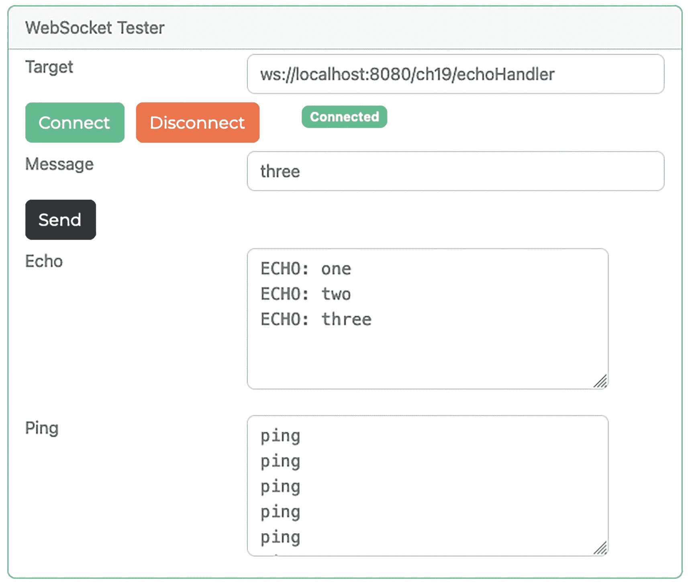

一个标题为“Web Socket 测试器”的窗口截图，包含带有连接和断开选项卡的目标、带有发送选项卡的消息、回显和 ping。目标来自本地主机的回显处理器。

**图 19-3**
WebSocket 客户端页面

虽然此示例在底层 WebSocket API 之上使用了 Spring 抽象，但您可以清楚地看到这项技术为应用程序带来的激动人心的可能性。现在，让我们看看当浏览器不支持 WebSocket 且需要回退选项时，如何处理此功能。清单 19-4 中的代码使用 `supportsWebSocket` 变量测试浏览器是否不支持 WebSocket，如果不支持，则禁用“连接”按钮。

## 使用 SockJS

由于并非所有浏览器都支持 WebSocket（例如，移动设备上的浏览器可能如此），并且应用程序仍需为最终用户正常运行，Spring 框架提供了一个利用 SockJS^(¹⁸⁷) 的回退选项。使用 SockJS 可以在运行时尽可能提供类似 WebSocket 的行为，而无需更改应用程序端代码。SockJS 协议通过 JavaScript 库在客户端使用。Spring 框架的 `spring-websocket` 库包含相关的 SockJS 服务器端组件。当使用 SockJS 提供无缝回退选项时，客户端将首先通过 `/info` 路径向服务器发送 GET 请求，以从服务器获取传输信息。SockJS 将首先尝试使用 WebSocket，然后是 HTTP 流式传输，最后将 HTTP 长轮询作为最后手段。

需要进行一个简单的修改来支持使用 SockJS 的 WebSocket 通信。首先，我们需要支持异步消息传递，这在清单 19-5 的配置中使用 `@EnableAsync` 注解启用。

```
package com.apress.prospring6.nineteen
import org.springframework.scheduling.annotation.EnableAsync
// 其他导入语句已省略
@EnableAsync
@Configuration
@EnableWebMvc
@ComponentScan
open class WebConfig : WebMvcConfigurer, ApplicationContextAware {
// 其他配置已省略
}
**清单 19-5**
用于 SockJS 异步配置的 Spring MVC 配置
```

Spring 官方 Javadoc 指出，`@EnableAsync` 注解启用了 Spring 的异步方法执行能力，从而为整个 Spring 应用程序上下文启用了注解驱动的异步处理^(¹⁸⁸)。

第二个更改必须在 `WebSocketConfig` 中完成，以为我们的处理器启用 SockJS 支持，如清单 19-6 所示。

```
package com.apress.prospring6.nineteen
import org.springframework.context.annotation.Bean
import org.springframework.context.annotation.Configuration
import org.springframework.web.socket.config.annotation.EnableWebSocket
import org.springframework.web.socket.config.annotation.WebSocketConfigurer
import org.springframework.web.socket.config.annotation.WebSocketHandlerRegistry
@Configuration
@EnableWebSocket
open class WebSocketConfig : WebSocketConfigurer {
override fun registerWebSocketHandlers(registry: WebSocketHandlerRegistry) {
registry.addHandler(echoHandler(), "/echoHandler")
registry.addHandler(echoHandler2(), "/sockjs/echoHandler").withSockJS()
}
@Bean
open fun echoHandler(): EchoHandler {
return EchoHandler()
}
@Bean
open fun echoHandler2(): EchoHandler {
return EchoHandler()
}
}
**清单 19-6**
用于 SockJS 配置的 Spring WebSocket
```

请注意，声明了另一个 `EchoHandler` bean，并将其映射到 `"/sockjs/echoHandler"`。

接下来，我们需要像在 WebSocket API 示例中那样创建一个 HTML 页面，但这次利用 SockJS 来处理传输协商。最显著的区别是，我们使用 SockJS 库而不是直接使用 WebSocket，并使用典型的 `http://` 方案而不是 `ws://` 来连接到端点。要使用 SockJS，我们需要将相应的 JavaScript 库添加到 HTML 页面，并且不再使用 `WebSocket` 进行通信，而是使用 `SockJS` 对象。HTML 代码与 `views/index2.html` 中的代码几乎相同，唯一的区别是用于处理 `SockJS` 通信的 JavaScript 代码，如清单 19-7 所示。


```
// 
// 
let ping;
let websocket;
jQuery(function ($) {
function writePing(message) {
$('#pingOutput').append(message + '\n');
}
function writeMessage(message) {
$('#messageOutput').append(message + '\n')
}
$('#connect')
.click(function doConnect() {
sockjs = new SockJS($("#target").val());
sockjs.onopen = function (evt) {
let badge=  $("#badgeStatus");
badge.text("Connected");
badge.attr('class','badge bg-success');
setInterval(function () {
if (sockjs !== "undefined") {
sockjs.send("ping");
}
}, 3000);
};
sockjs.onclose = function (evt) {
let badge=  $("#badgeStatus");
badge.text("Disconnected");
badge.attr('class','badge bg-light');
};
sockjs.onmessage = function (evt) {
if (evt.data === "ping") {
writePing(evt.data);
} else {
writeMessage('ECHO: ' + evt.data);
}
};
});
$('#disconnect')
.click(function () {
if (typeof sockjs != 'undefined') {
sockjs.close();
sockjs = undefined;
} else {
alert("Not connected.");
}
});
$('#send')
.click(function () {
if (typeof sockjs != 'undefined') {
sockjs.send($('#message').val());
} else {
alert("Not connected.");
}
});
});
清单 19-7
`views/index2.html` 视图中的 JavaScript 代码
```

实现新的 `SockJS` 代码后，构建项目并将其部署到容器中，然后导航至位于 `http://localhost:8080/ch19/index2` 的 UI，该页面具有与 WebSocket 示例相同的所有特性和功能，如图 19-4 所示。

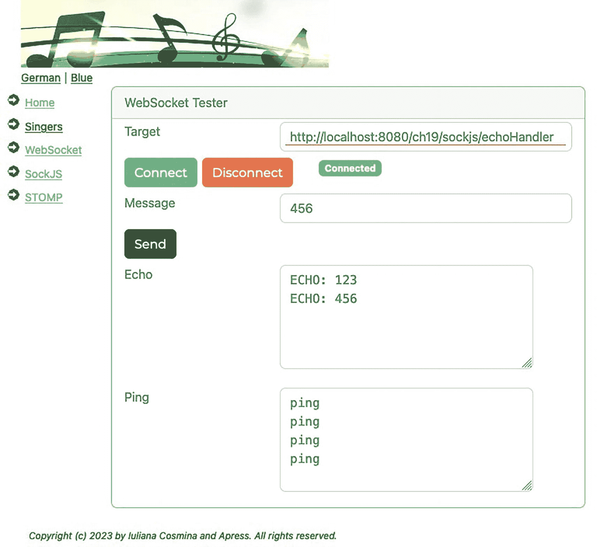

一张截图，左侧是德国蓝的选项列表，标记为首页、歌手、Web Socket、Sock JS 和 Stomp。其中“歌手”选项被选中。右侧是一个标题为“Web Socket 测试器”的框，包含目标地址及连接/断开标签、消息及发送标签、回显和 ping。

图 19-4
建立连接后的 SockJS 应用程序页面

要测试 SockJS 的回退功能，请尝试在浏览器中禁用 WebSocket 支持。例如，在 Firefox 中，导航至 `about:config` 页面，然后搜索 `network.websocket.enabled`。将此设置切换为 `false`，如图 19-5 所示，重新加载示例 UI 并重新连接。

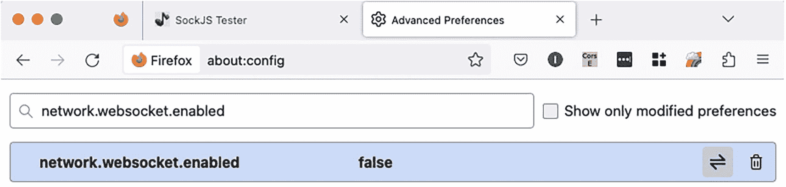

一张 Firefox 页面的截图，顶部有两个标签，分别标记为“Sock JS 测试器”和“高级首选项”。后者被选中。页面包含一个搜索框，内容为 `network.websocket.enabled`，一个“仅显示已修改首选项”的复选框，以及一个高亮显示的字段，内容为 `network.websocket.enabled`，值为 `false`。

图 19-5
Firefox `about:config` 页面

使用诸如 Live HTTP Headers 之类的工具，您可以检查从浏览器到服务器的流量以进行验证。验证行为后，将 Firefox 设置 `network.websocket.enabled` 切换回 `true`，重新加载页面并重新连接。通过 Live HTTP Headers 观察流量，现在将显示 WebSocket 握手。在这个简单的示例中，一切应该与使用 WebSocket API 时一样正常工作。

## 使用 STOMP 发送消息

在使用 WebSocket 时，通常会使用像 STOMP 这样的子协议作为客户端和服务器之间的通用格式，以便两端都知道预期内容并能够做出相应反应。Spring 框架原生支持 STOMP，我们将在示例中使用此协议。

STOMP（简单文本导向消息协议）是一种简单的、基于帧的消息协议，以 HTTP 为模型，可用于任何可靠的、双向流式网络协议（如 WebSocket）。STOMP 具有标准的协议格式；存在 JavaScript 客户端支持，用于在浏览器中发送和接收消息，并可选择性地接入支持 STOMP 的传统消息代理，例如 RabbitMQ 和 ActiveMQ。Spring 框架原生支持一个简单的代理，该代理在内存中处理订阅请求并将消息广播给已连接的客户端。在本节介绍的 STOMP 示例中，我们将使用这个简单代理，而将功能完备的代理设置留作练习^(¹⁸⁹)。

 阴影圆圈中的感叹号。 有关 STOMP 协议的完整描述，请参见官方网站^(¹⁹⁰)。

我们将创建一个简单的股票行情应用程序，该应用程序显示几个预定义的股票代码、它们的当前价格以及价格变动时的时间戳。新的股票代码和起始价格也可以通过 UI 添加。任何连接的客户端（即其他浏览器标签页或网络上全新的客户端）都将看到相同的数据，因为它们都订阅了消息广播。每秒，每个股票价格都会更新为一个新的随机金额，并且时间戳也会更新。

为了确保即使客户端浏览器不支持 WebSocket，客户端也能使用股票行情应用程序，我们将再次利用 SockJS 来透明地处理任何传输切换。在深入代码之前，值得注意的是，STOMP 消息支持由 `spring-messaging` 库提供。

让我们首先创建 `Stock` 领域对象，该对象保存股票信息，例如其代码和价格，如清单 19-8 所示。

```
package com.apress.prospring6.nineteen.stomp
import java.io.Serializable
import java.time.LocalDateTime
import java.time.format.DateTimeFormatter
class Stock() : Serializable {
var code: String? = null
var price = 0.0
var date: LocalDateTime? = null
constructor(code: String?, price: Double) : this() {
this.code = code
this.price = price
}
val dateFormatted: String
get() = DateTimeFormatter.ofPattern(DATE_FORMAT).format(date)
companion object {
private const val serialVersionUID = 1L
private const val DATE_FORMAT = "MMM dd yyyy HH:mm:ss"
}
}
清单 19-8
Stock 领域对象
```

为了处理股票更新请求，需要一个控制器。清单 19-9 展示了 `StockController` 类。


```
package com.apress.prospring6.nineteen.stomp
import org.springframework.messaging.handler.annotation.MessageMapping
import org.springframework.messaging.simp.SimpMessagingTemplate
import org.springframework.scheduling.TaskScheduler
// other import statements omitted
@Controller
open class StockController(
private val taskScheduler: TaskScheduler,
private val simpMessagingTemplate: SimpMessagingTemplate
) {
private val stocks: MutableList = ArrayList()
private val random = Random(System.currentTimeMillis())
@MessageMapping("/addStock")
@Throws(Exception::class)
open fun addStock(stock: Stock) {
stocks.add(stock)
broadcastUpdatedPrices()
}
private fun broadcastUpdatedPrices() {
for (stock in stocks) {
stock.price = stock.price + updatedStockPrice * stock.price
stock.date = LocalDateTime.now()
}
simpMessagingTemplate.convertAndSend("/topic/price", stocks)
}
private val updatedStockPrice: Double
get() {
var priceChange = random.nextDouble() * 5.0
if (random.nextInt(2) == 1) {
priceChange = -priceChange
}
return priceChange / 100.0
}
@PostConstruct
open fun broadcastTimePeriodically() {
with(stocks){
add(Stock("VMW", 1.00))
add(Stock("EMC", 1.00))
add(Stock("GOOG", 1.00))
add(Stock("IBM", 1.00))
}
taskScheduler.scheduleAtFixedRate({ broadcastUpdatedPrices() },
Duration.ofSeconds(2))
}
}
清单 19-9
StockController 类
```

该控制器具有以下特征：

*   控制器需要一个任务调度器（**第** **12****章**）和一个 `SimpMessagingTemplate`，用于每 2 秒发送一次`股票`价格更新。

*   控制器初始化时，列表中预定义了几个股票代码及其起始价格，用于演示目的。

*   `/addStock` 处理方法允许用户提交一个 `Stock` 实例，该实例会被添加到股票列表中，然后将股票广播给所有订阅者。

*   在广播股票时，我们遍历 `Stock` 实例列表，更新每个实例的价格，然后通过注入的 `SimpMessagingTemplate` 将它们发送给 `/topic/price` 的所有订阅者。`TaskExecutor` 实例通过每 2 秒调用一次 `broadcastUpdatedPrices`，将更新后的股票价格列表广播给所有已订阅的客户端。

有了控制器之后，我们现在需要一个 HTML UI 来向客户端显示股票信息。为简化操作，`views/index3.html` 视图使用 Thymeleaf 编写，并继承了第 14 章和第 17 章中使用的 `views/templates/layout.html` 模板的主题元素。

`views/index3.html` 视图中的 HTML JavaScript 代码如清单 19-10 所示。

```

let stomp;
function displayStockPrice(frame) {
let stocks = JSON.parse(frame.body);
$('#stock').empty();
for (let i in stocks) {
let stock = stocks[i];
$('#stock').append(
$('').append(
$('').html(stock.code),
$('').html(stock.price.toFixed(2)),
$('').html(stock.dateFormatted)
)
);
}
}
let connectCallback = function () {
stomp.subscribe('/topic/price', displayStockPrice);
};
let errorCallback = function (error) {
alert(error);
};
jQuery(function ($) {
$("#addStockButton").attr("disabled", true);
$('#connect')
.click(function doConnect() {
stomp = Stomp.over(new SockJS($("#target").val()));
stomp.connect("guest", "guest", connectCallback, errorCallback);
let badge=  $("#badgeStatus");
badge.text("Connected");
badge.attr('class','badge bg-success');
$("#addStockButton").attr('disabled', false);
});
$('#disconnect')
.click(function () {
if (typeof stomp != 'undefined') {
stomp.disconnect();
stomp = undefined;
let badge=  $("#badgeStatus");
badge.text("Disconnected");
badge.attr('class','badge bg-light');
$("#addStockButton").attr('disabled', true);
} else {
alert("Not connected.");
}
});
$('.addStockButton').click(function (e) {
e.preventDefault();
const stockStr = JSON.stringify({
'code': $('.addStock .code').val(),
'price': Number($('.addStock .price').val())
});
stomp.send('/app/addStock', {}, stockStr);
return false;
});
});

STOMP 测试器

FN:

股票详情

代码
价格
时间

FN:

FN:

清单 19-10
StockController HTML 页面
```

与本章前面的示例类似，我们将一些 HTML 与 JavaScript 混合在一起以更新显示。我们将 HTML 与 JavaScript 结合的原因（尽管这不符合常识性编程规则）是为了尽可能简化 Spring MVC 配置；同时也有助于使页面及其组件的功能易于理解。我们利用 jQuery 更新 HTML 数据，利用 SockJS 提供传输选择，并利用 STOMP JavaScript 库 `stomp.min.js` 与服务器通信。通过 STOMP 消息发送的数据以 JSON 格式编码，我们在事件发生时提取这些数据。建立 STOMP 连接后，我们订阅 `/topic/price` 以接收股票价格更新。

STOMP 通信的 Java 配置由 `StompConfig` 类表示，如清单 19-11 所示。

```
package com.apress.prospring6.nineteen
import org.springframework.context.annotation.Configuration
import org.springframework.scheduling.annotation.EnableAsync
import org.springframework.messaging.simp.config.MessageBrokerRegistry
import org.springframework.web.socket.config.annotation.EnableWebSocketMessageBroker
import org.springframework.web.socket.config.annotation.StompEndpointRegistry
import org.springframework.web.socket.config.annotation.WebSocketMessageBrokerConfigurer
@EnableAsync
@Configuration
@EnableWebSocketMessageBroker
open class StompConfig : WebSocketMessageBrokerConfigurer {
override fun registerStompEndpoints(registry: StompEndpointRegistry) {
registry.addEndpoint("/ws").withSockJS()
}
override fun configureMessageBroker(config: MessageBrokerRegistry) {
config.setApplicationDestinationPrefixes("/app")
config.enableSimpleBroker("/topic")
}
@Bean
open fun taskExecutor(): TaskExecutor {
return SimpleAsyncTaskExecutor()
}
}
清单 19-11
StompConfig 配置类
```

为了启用 Spring 异步调用和任务执行，配置类必须使用 `@EnableAsync` 注解，并且需要一个类型为 `org.springframework.core.task.TaskExecutor` 的 Bean 来重复广播股票信息。

配置类上的 `@EnableWebSocketMessageBroker` 注解启用了基于代理的、通过 WebSocket 并使用更高级别消息子协议的消息传递。请注意，该类实现了 `WebSocketMessageBrokerConfigurer` 接口，该接口定义了用于配置来自 WebSocket 客户端的、使用简单消息协议（例如 STOMP）的消息处理的方法。


`registerStompEndpoints` 方法用于注册 `/ws` 的 STOMP 端点映射。`http://localhost:8080/ch19/ws` 用于初始化一个 SockJS 实例，该实例为 STOMP 通信提供支持。`configureMessageBroker` 方法用于配置消息代理选项。

`applicationDestinationPrefixes` 属性有助于过滤指向应用程序注解方法的目标；此配置设置了 `/app` 过滤器。该过滤器需要作为股票处理器方法 URL 路径的前缀，这就是清单 19-10 包含以下代码的原因：

```
stomp.send('/app/addStock', {}, stockStr)
```

`enableSimpleBroker("/topic")` 启用了一个简单的消息代理，并配置了一个或多个前缀来过滤指向该代理的目标。在 `StockController` 的 `broadcastUpdatedPrices()` 方法中，你会看到股票数据以 `/topic/price` 作为目标发布到该主题；而在 `index3.html` 中，你会看到 `STOMP` 实例订阅了此主题，以便能够获取股票数据。

首次访问页面时，没有 STOMP 连接，因此股票表格为空，并且“添加股票”按钮处于禁用状态，如图 19-6 所示。

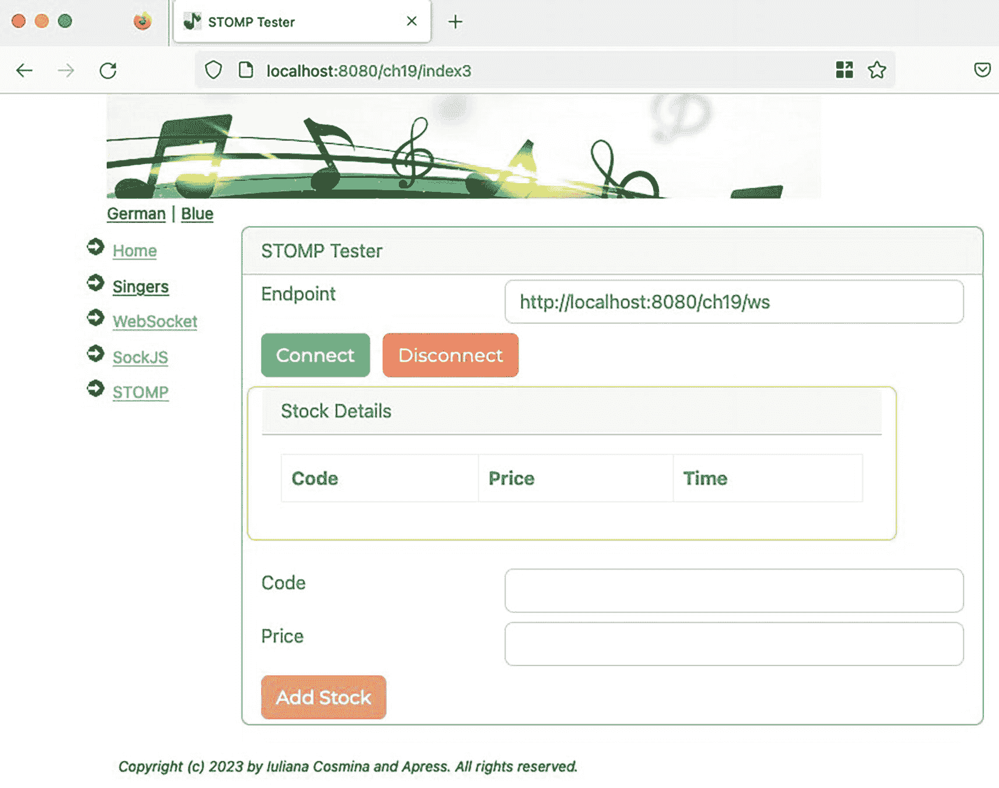

一张截图，左侧列出了 German Blue 的选项列表，标签为 home、singers、web socket、sock J S 和 Stomp。其中 singers 选项被选中。一个标题为“Stomp Tester”的框内包含带有连接和断开标签的端点，以及包含代码、价格、时间和添加股票标签的股票详情。

图 19-6

建立连接前的 STOMP 应用程序页面

点击“连接”按钮后，熟悉的绿色“已连接”徽章出现，股票数据加载到表格中并每 2 秒刷新一次，“添加股票”按钮现在已启用，允许你添加自己的股票，如图 19-7 所示。

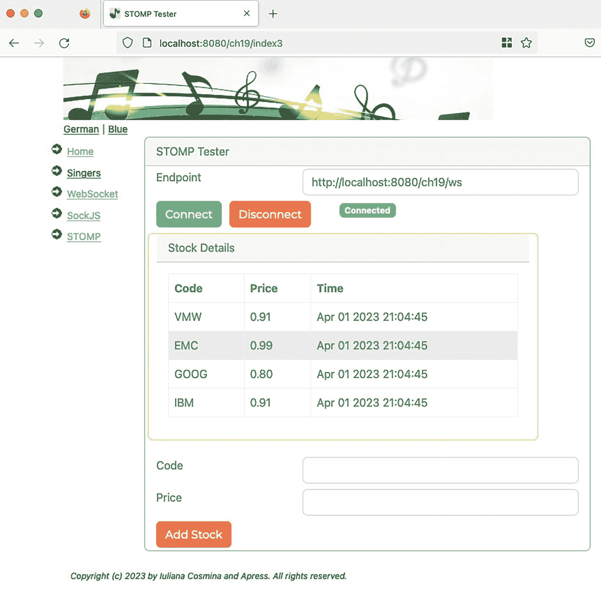

一张截图，左侧列出了 German Blue 的 5 个选项。其中 singers 选项被选中。一个标题为“Stomp Tester”的框内包含带有连接和断开标签的端点，以及一个包含 3 列 4 行表格的股票详情。列标题为代码、价格和时间。第 2 行被选中。

图 19-7

建立连接后的 STOMP 应用程序页面

在底层，连接已建立，在浏览器控制台中，我们可以看到浏览器订阅了 `topic/price` 队列，然后每 2 秒接收一次信息。浏览器控制台日志的片段如清单 19-12 所示。

```
Opening Web Socket...  stomp-1.7.1.min.js:8:1895
Web Socket Opened...   stomp-1.7.1.min.js:8:1895
>>> CONNECT
login:guest
passcode:guest
accept-version:1.1,1.0
heart-beat:10000,10000
>> SUBSCRIBE         stomp-1.7.1.min.js:8:1895
id:sub-0
destination:/topic/price
# 这部分每 2 秒重复一次
>> DISCONNECT       stomp-1.7.1.min.js:8:1895
清单 19-12
STOMP 通信的浏览器控制台日志片段
```

### Spring Boot 等效应用程序

将上述应用程序转换为 Spring Boot 应用程序相当容易，因为存在 `spring-boot-starter-websocket` 库。`chapter19-boot` 项目的依赖关系如图 19-8 所示。

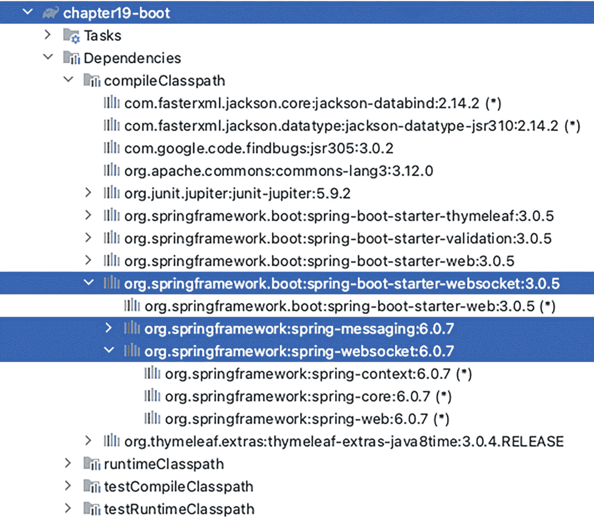

chapter 19 boot 的依赖项列表，其中高亮显示了三个库：spring boot starter websocket、spring messaging 和 spring websocket。

图 19-8

项目 `chapter19-boot` 的依赖关系

由于用户可以选择直接通过 WebSocket 进行通信，或使用 STOMP 等高级协议，因此仍然需要为这两种情况提供配置类，并配合使用 `@EnableWebSocket` 或 `@EnableWebSocketMessageBroker` 注解。因此，除了构建配置的简化和无需运行应用程序的服务器之外，Spring Boot 并没有过多地减少开发人员的工作量。出于这个原因，本章将不介绍如何编写用于 WebSocket 通信的 Spring Boot 应用程序，因为所有细节已在**第** **14** 章（Web 章节）以及本章中关于 WebSocket 的所有内容中涵盖。不过，`chapter19-boot` 项目是本书源码的一部分，欢迎查阅。

## 总结

在本章中，我们介绍了 WebSocket 的一般概念。我们讨论了 Spring 框架对底层 WebSocket API 的支持，然后继续使用 SockJS 作为回退选项，根据客户端浏览器选择合适的传输方式。最后，我们介绍了 STOMP 作为一种 WebSocket 子协议，用于在客户端和服务器之间传递消息。所有示例都展示并解释了 Kotlin 配置类。

在下一章中，我们将讨论如何构建一个响应式 Spring 应用程序，以及 WebSocket 如何用于响应式通信。

脚注 1   2   3   4   5   6   7


