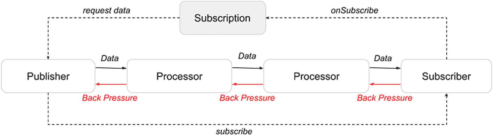
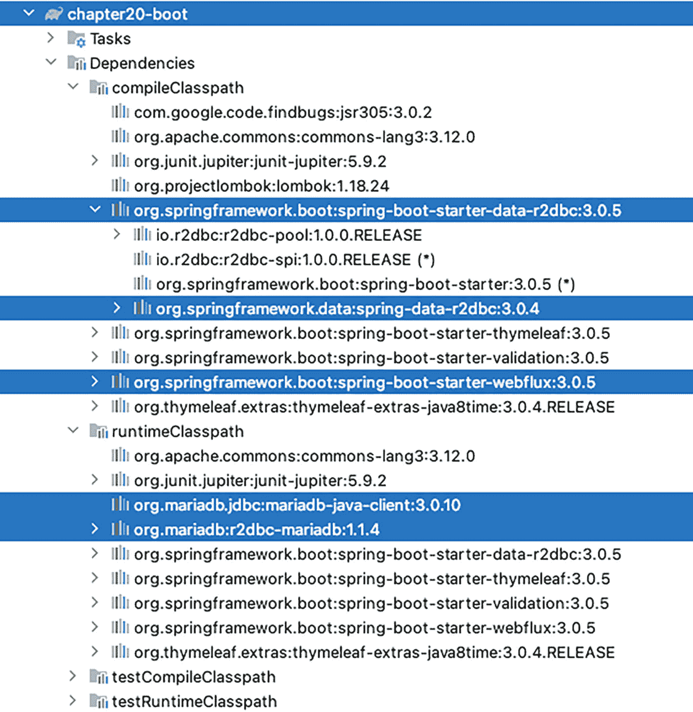
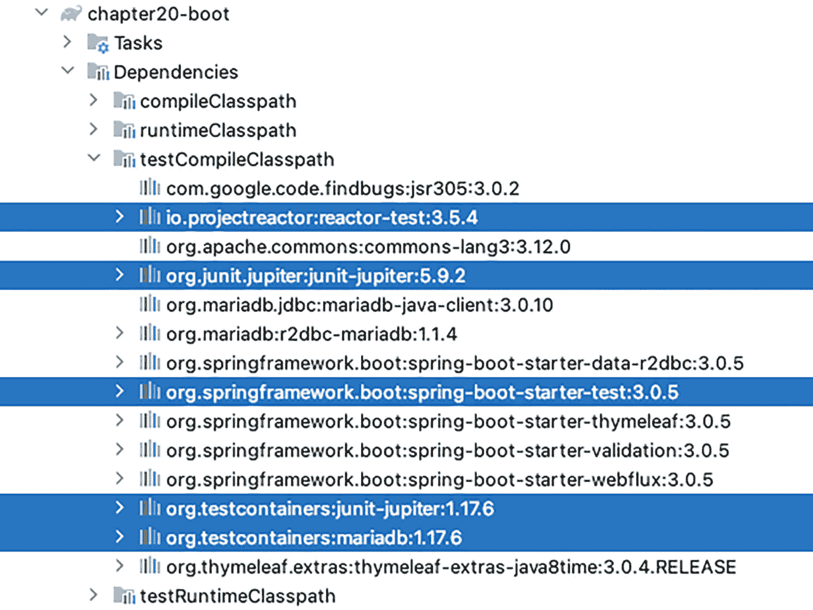
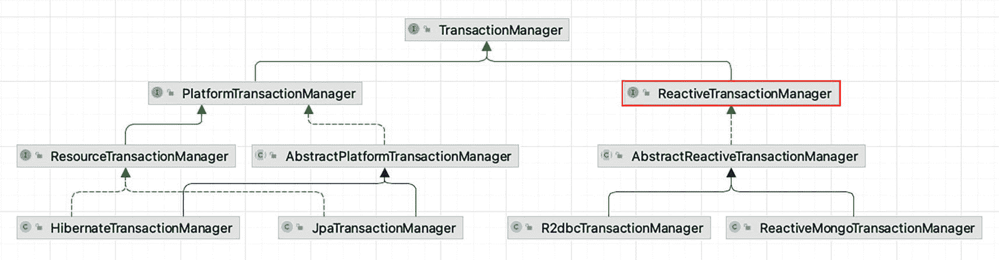
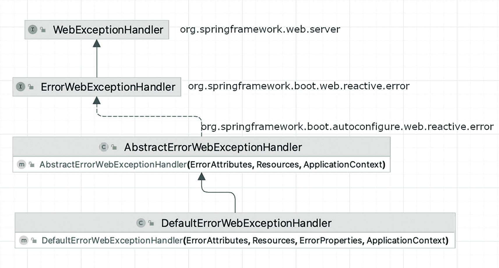
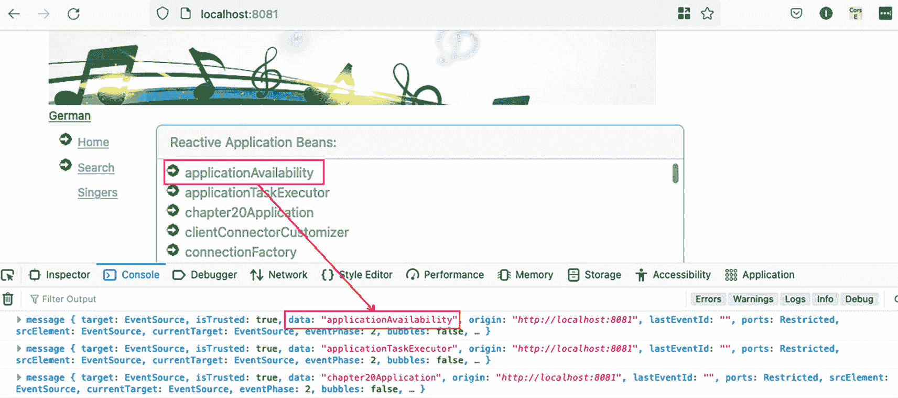
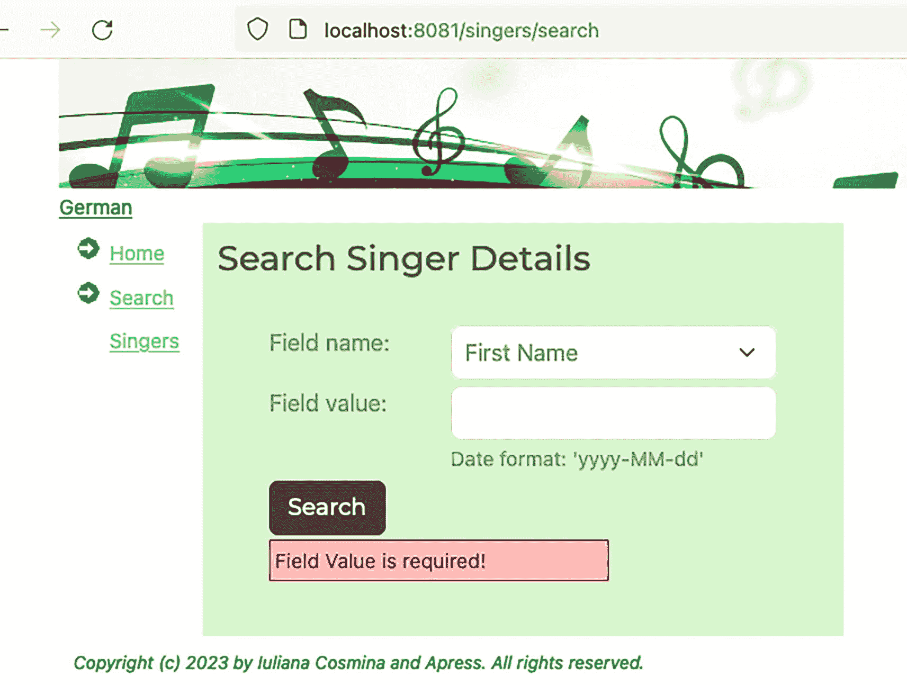

# 20. 响应式 Spring

前几章演示了如何在 Apache Tomcat 服务器实例上构建和运行典型的 Kotlin Web 应用程序，该服务器要么是外部的（适用于 Spring 经典配置），要么是嵌入式的（适用于 Spring Boot Web 应用程序）。无论哪种情况，Spring 的 `DispatcherServlet` 都负责将传入的 HTTP 请求定向到应用程序中声明的所有处理器。但是，像我们迄今为止开发的这类应用程序能否用于真实的生产环境？`DispatcherServlet` 同时能处理多少个 HTTP 请求？这个数量能否增加？`DispatcherServlet` 实际上对它能处理的请求数量没有决定权。这由 Servlet 容器定义，在我们的案例中，就是 Apache Tomcat 服务器。

Apache Tomcat 是基于 Java 软件平台构建和维护动态网站及应用程序的热门选择。Java Servlet API 使 Web 服务器能够使用 HTTP 协议处理基于 Java（或 Kotlin）的动态 Web 内容。这被称为**请求-响应模型**：客户端发出请求，服务器准备响应并将其发送回客户端。它是单向的，由客户端控制，服务器并不关心客户端能否处理响应。例如，当你在浏览器中进入 Facebook 聊天窗口时，如果服务器要发送你与该好友的所有对话，页面不仅会加载很长时间，甚至可能导致浏览器崩溃。

多年来，为了支持更高效的客户端-服务器交互，软件和应用程序开发风格已经进行了许多改进，但本章的重点是**响应式通信**。

 一个创意图标，带有灯泡符号。 如果你想更详细地了解客户端-服务器通信从最初的请求-响应模型到响应式模型的演变过程，请参阅 *Pro Spring MVC with WebFlux*（Apress, 2021）^(¹⁹¹)；从第 9 章开始阅读。

高效的响应式通信只能发生在响应式客户端和响应式服务器之间，也就是响应式应用程序之间。与经典的请求-响应风格（客户端和服务器以不连续的信息块交换数据）相比，响应式通信意味着客户端和服务器之间持续的数据流。

在处理大量数据时，响应式应用程序是解决方案。响应式应用程序的设计以韧性、响应性和可伸缩性为优先考虑。响应式宣言^(¹⁹²)描述了响应式应用程序的特性。响应式流 API 规范^(¹⁹³)提供了一组最小的接口，应用程序组件应实现这些接口，以便应用程序可以被视为响应式。因此，响应式流 API 是一种互操作性规范，确保响应式组件无缝集成，并保持操作的非阻塞和异步性。

四个关键术语描述了响应式应用程序：

*   *响应性*：期望快速且一致的响应时间。
*   *韧性*：故障是预料之中的，应用程序被设计为能够处理故障并自我修复。
*   *弹性*：应用程序应能够通过自动扩展其能力来处理高负载，并在不再需要时缩减规模。
*   *消息驱动*：响应式通信应该是异步的；组件应松散耦合，并使用消息进行通信。此外，应用背压以防止消息生产者压垮消费者。

响应式应用程序应该更灵活、松散耦合、非阻塞且可伸缩，但同时更易于开发、更易于变更，并且更能容忍故障。构建响应式应用程序需要遵循响应式编程范式的原则。

阅读了前面的介绍后，你可能会认为响应式应用程序是软件设计演进的巅峰，并且世界上每个应用程序都应该重新设计为响应式。不幸的是，情况并非总是如此。响应式应用程序并不总是比经典应用程序运行得更快，而且它们也有自己的一系列问题。正如你将在本章中看到的，响应式编程与命令式编程截然不同，并且需要一点思维转变。响应式应用程序的主要好处是它们是非阻塞的，并且能够用少量固定的线程和更少的内存需求来扩展应用程序，同时充分利用可用的处理能力。

在本章中，你将学习响应式编程，以及如何使用 Spring WebFlux 构建完全响应式的应用程序。


## Spring 中的响应式编程简介

响应式编程是一种声明式编程范式，其核心理念是异步事件处理和数据流，或者用我们喜欢的方式描述，即带有响应式流的函数式编程。响应式流是一项倡议，旨在为带有非阻塞背压的异步流处理提供标准。它对于解决需要跨线程边界进行复杂协调的问题极为有用。

Java 在版本 8 中引入了 Streams API 和 lambda 表达式，这是迈向响应式编程的第一步，因为响应式编程也可以定义为*带有响应式流的函数式编程*。直到 Java 9 才提供了响应式流。由于无法等待延迟了六个月发布的 JDK 9，创建了 Spring 的 Pivotal 开源团队使用他们自己的响应式库 Project Reactor^(¹⁹⁴) 构建了 Spring WebFlux^(¹⁹⁵)。

 一个警告图标。三角形内有一个感叹号。 Kotlin 对响应式编程范式有自己的见解。它被称为*协程*，或者更具体地说是 *Kotlin Flow*。由于我们希望与本书的 Java 姊妹版保持一致，我们将讨论范围限定在“Spring 与 Java 方式”的响应式编程。欢迎您通过官方文档渠道探索协程和 Flow。

响应式流为 Java 或 Kotlin 中的响应式编程提供了一个通用 API。它由四个简单的接口组成，为带有非阻塞背压的异步流处理提供了标准。如果您想编写一个能够与其他响应式组件集成的组件，您需要实现这些接口之一。在抽象层面上，响应式流规范中描述的组件及其之间的关系，如图 20-1 所示。



一个流程图展示了数据流和背压在 4 个组件之间的流动。这些组件分别是发布者、2 个处理器和一个订阅者。发布者订阅了订阅者。订阅者在订阅时获得一个订阅对象，并向发布者请求数据。

图 20-1

响应式流规范的抽象表示

如果您觉得这很像带有背压功能的发布者/订阅者模型，那基本上就是如此。数据在组件之间*流动*，每个组件处理数据并将其向前传递，每个组件通过背压来调节速度。现实世界中最贴切的模型是工厂传送带。让我们逐一分析图 20-1 中的组件。

*   **发布者** 是一个潜在无限的数据生产者。在 Java 或 Kotlin 中，数据生产者必须实现 `org.reactivestreams.Publisher<T>`。发布者准备数据并将其作为单独的消息传输给订阅者。发布者根据订阅者的需求发出值。

*   **订阅者** 向发布者注册以消费数据。在 Java 或 Kotlin 中，数据消费者必须实现 `org.reactivestreams.Subscriber<T>`。订阅者接收来自发布者的消息并处理它们。这是 Streams API 中的终端操作。

*   订阅时，会创建一个**订阅**对象来表示发布者和订阅者之间的一对一关系。该对象向发布者请求数据，并可以取消数据需求。在 Java 或 Kotlin 中，订阅类必须实现 `org.reactivestreams.Subscription`，并且此类型的对象只能被一个订阅者使用一次。

*   **处理器** 是一个特殊的组件，具有发布者和订阅者的相同属性。在 Java 或 Kotlin 中，数据处理器必须实现 `org.reactivestreams.Processor<T,R>`。处理器可以链接起来形成一个流处理管道。处理器消费链中位于其前面的发布者/处理器的数据，并发出数据供链中位于其后面的处理器/订阅者消费。如果订阅者/处理器消费数据的速度不够快，它可以通过背压来减慢发布者/处理器发出数据的速度。

您可以在 IDE 或 GitHub^(¹⁹⁶) 上查看这些接口的代码。

 一个警告图标。三角形内有一个感叹号。 大多数针对 JVM 的响应式实现是并行开发的，因此今天我们有了 RxJava^(¹⁹⁷)、Akka Streams^(¹⁹⁸)、Ratpack^(¹⁹⁹)、Vert.x^(²⁰⁰) 和 Project Reactor。

使用响应式流编写的代码看起来与使用非响应式流编写的代码相似，但底层机制是不同的。响应式流是**异步的**，但您无需编写处理异步的逻辑。您只需要声明当流中发出某个值时应该发生什么。您编写的代码会在流异步发出元素时被调用，独立于主程序流程。如果涉及多个处理器，每个处理器都在自己的线程上执行。由于您的代码是异步运行的，您必须小心提供给处理器（转换器）方法的函数。确保它们是**纯函数**。纯函数应仅通过其参数和返回值与程序交互。对于相同的参数值，它们返回相同的结果，并且绝不应修改需要同步的对象，因为这可能会导致整个流程出现不可预测的延迟。

Project Reactor 实现了响应式流 API，为响应式应用提供了一个具有高效需求管理的非阻塞稳定基础。它声明了两个主要的发布者实现：

*   `reactor.core.publisher.Mono<T>`：表示零个或一个元素的响应式流发布者
*   `reactor.core.publisher.Flux<T>`：表示零到无限个元素的异步序列的响应式流发布者

`Mono<T>` 和 `Flux<T>` 类似于 `java.util.concurrent.Future<V>`。它们都表示异步计算的结果。它们之间的区别在于，当您尝试使用 `get()` 方法获取结果时，`Future<V>` 会阻塞当前线程直到计算完成。而 `Mono<T>` 和 `Flux<T>` 都提供了一系列 `block*()` 方法，用于检索不阻塞当前线程的异步计算的值。

为了更直观地展示响应式编程在语法上与命令式编程的不同，让我们考虑以下场景：给定一个歌手列表，我们想要找出所有年龄大于 50 岁的歌手，并计算他们的年龄总和。如果代码以命令式风格编写，并且针对 Java，它可能看起来像清单 20-1 中所示的代码片段。


```
package com.apress.prospring6.twenty.boot;
// import statements omitted
public class SimpleProgrammingTest {
List singers = List.of(
Singer.builder().firstName("John").lastName("Mayer").birthDate(LocalDate.of(1977, 10, 16)).build(),
Singer.builder().firstName("B.B.").lastName("King").birthDate(LocalDate.of(1929, 9, 16)).build(),
Singer.builder().firstName("Peggy").lastName("Lee").birthDate(LocalDate.of(1920, 5, 26)).build(),
Singer.builder().firstName("Ella").lastName("Fitzgerald").birthDate(LocalDate.of(1917, 4, 25)).build()
);
Function> computeAge = singer -> Pair.of(singer,Period.between(singer.getBirthDate(), LocalDate.now()).getYears());
Predicate> checkAge = pair -> pair.getRight() > 50;
@Test
void imperativePlay(){
int agesum = 0;
for (var s : singers) {
var p = computeAge.apply(s);
if (checkAge.test(p)) {
agesum += p.getRight();
}
}
assertEquals(300, agesum);
}
}
清单 20-1
处理歌手列表的 Java 命令式风格代码
```

不太美观，对吧？嗯，这就是所有 Java 开发者在 Java 8 引入 Stream API 之前常写的代码类型。一系列指令被逐一列出供 JVM 执行。此外，使用 `Function<T,R>` 和 `Predicate<T>` 有点取巧，因为 Java 8 之前也不存在这些类型。

使用 Kotlin 和函数式构造，同样的代码可以写得更具声明性和函数式风格，如清单 20-2 所示。

```
package com.apress.prospring6.twenty.boot
import org.junit.jupiter.api.Assertions.assertEquals
// import statements omitted
class SimpleProgrammingTest {
var singers: List = listOf(
Singer().apply{firstName="John"; lastName = "Mayer";
birthDate = LocalDate.of(1977, 10, 16)},
Singer().apply{firstName="B.B."; lastName = "King";
birthDate = LocalDate.of(1929, 9, 16)},
Singer().apply{firstName="Peggy"; lastName = "Lee";
birthDate = LocalDate.of(1920, 5, 26)},
Singer().apply{firstName="Ella"; lastName = "Fitzgerald";
birthDate = LocalDate.of(1917, 4, 25)}
)
var computeAge  = { singer: Singer ->
Pair(
singer,
Period.between(singer.birthDate, LocalDate.now()).years
)
}
var checkAge = { pair:Pair -> pair.second > 50 }
@Test
fun streamsPlay() {
val agesum: Int = singers
.map(computeAge)
.filter(checkAge)
.map{ obj:Pair -> obj.second }
.reduce{ a: Int, b: Int -> Integer.sum(a, b) }
Assertions.assertEquals(
300,
agesum
)
}
}
清单 20-2
使用 Kotlin 处理歌手列表的声明式/函数式风格代码
```

声明式编程更多的是一个不断定义事物是什么的过程。声明式编程关注程序*应该实现什么*，而命令式编程关注程序*应该如何实现*结果。

将清单 20-2 中的代码转换为响应式代码并不需要太多功夫：我们只需将 `Stream<T>` 替换为 `Flux<T>`，并确保声明一个订阅者，对链中最后一个处理器（`reduce(..)` 函数）的结果进行处理。代码如清单 20-3 所示。

```
package com.apress.prospring6.twenty.boot
import reactor.core.publisher.BaseSubscriber
import reactor.core.publisher.Flux
// other import statements omitted
class SimpleProgrammingTest {
var singers: List = ...
var computeAge  = { singer: Singer ->
Pair(
singer,
Period.between(singer.birthDate, LocalDate.now()).years
)
}
var checkAge = { pair:Pair -> pair.second > 50 }
@Test
fun reactivePlay() {
Flux.fromIterable(singers) // Flux
.map(computeAge) // Flux >
.filter(checkAge) // Flux >
.map{ obj -> obj.second } // Flux 
.reduce(0,
{ a: Int, b: Int ->
Integer.sum(
a,
b
)
})
.subscribe(object : BaseSubscriber() {
override fun hookOnNext(agesum: Int) {
Assertions.assertEquals(
300,
agesum
)
}
})
}
}
清单 20-3
使用响应式流处理歌手列表的函数式风格代码
```

`BaseSubscriber<T>` 抽象类是 `Subscriber<T>` 实现的一个简单基类，允许用户直接对其执行 `request(long)` 和 `cancel()` 操作。`hookOnNext(..)` 方法用于将行为附加到发出的值上；在我们的例子中，这是检查我们假设的完美位置。

现在你已经了解了 Project Reactor 的响应式编程，让我们换个话题，看看如何使用 Spring WebFlux 编写响应式应用程序。


## 介绍 Spring WebFlux

Spring Web MVC 是围绕 `DispatcherServlet` 设计的，该 Servlet 是一个网关，负责将 HTTP 请求映射到处理器，并配置了主题、国际化、文件上传和视图解析等功能。Spring MVC 是为 Servlet API 和 Servlet 容器构建的。这意味着 Spring MVC 主要使用阻塞式 I/O，并且每个 HTTP 请求对应一个线程。虽然可以支持请求的异步处理，但这需要更大的线程池，进而需要更多资源，并且难以扩展。

Spring WebFlux 是一个响应式栈 Web 框架，在 Spring 5 中引入，是 Spring 对日益严重的阻塞式 I/O 架构问题的回应。它可以在 Servlet 3.1+ 容器上运行，但也能适配其他原生服务器 API。首选的服务器是 Netty^(²⁰¹)，它在异步、非阻塞领域久经考验。Spring WebFlux 在设计上考虑了函数式响应式编程，并允许以声明式风格编写代码。这两个框架有一些共同元素，甚至可以一起使用。处理器方法没有理由不能返回 `Flux<T>` 或 `Mono<T>`，本章稍后将展示这一点。

 一个警告图标。三角形内有一个感叹号。 编写响应式应用程序时需要记住的一点是，应用程序的每个组件都必须是响应式的；否则，应用程序将不是真正的响应式，非响应式组件可能成为瓶颈并破坏整个流程。例如，一个典型的三层应用程序（表示层、服务层和数据库层）只有在所有三层都是响应式的情况下才是响应式的。因此，一个响应式的 Spring WebFlux 应用程序必须拥有响应式的视图、响应式的控制器、响应式的服务、响应式的仓库以及响应式的数据库（任何带有响应式驱动程序的 SQL 数据库，例如 MongoDB、RethinkDB 等）。此外，调用该应用程序的客户端也必须是响应式的。

在将歌手应用程序转换为响应式应用程序之前，让我们先回顾一下 Spring WebFlux 在底层是如何工作的。

响应式应用程序可以部署在 Servlet 3.1+ 容器上，例如 Tomcat、Jetty 或 Undertow。这里的诀窍是不使用 `DispatcherServlet`。`DispatcherServlet` 是 HTTP 请求处理器/控制器的中央调度器，无论它多么强大，它仍然是一个阻塞组件。这时，新的、改进后的 Spring Web 组件通过引入 `org.springframework.http.server.reactive.HttpHandler`^(²⁰²) 来解决问题。该接口代表了响应式 HTTP 请求处理的最低层级契约，Spring 为每个受支持的服务器提供了基于它的服务器适配器。其代码如代码清单 20-4 所示。

```
package org.springframework.http.server.reactive;
import reactor.core.publisher.Mono;
// 其他注释已省略
public interface HttpHandler {
/**
* 处理给定的请求并写入响应。
* @param request 当前请求
* @param response 当前响应
* @return 表示请求处理完成
*/
Mono handle(ServerHttpRequest request, ServerHttpResponse response);
}
代码清单 20-4
HttpHandler 接口
```

表 20-1 列出了 Spring WebFlux 支持的服务器以及代表每个服务器非阻塞 I/O 到响应式流桥接核心的适配器类名称。

表 20-1

Spring WebFlux 支持的 HTTP 服务器

| 服务器名称 | Spring 适配器 | 使用的 Servlet API |
| --- | --- | --- |
| Netty^(²⁰³) | `ReactorHttpHandlerAdapter` | 使用 Reactor Netty 库的 Netty API |
| Undertow^(²⁰⁴) | `UndertowHttpHandlerAdapter` | Spring Web Undertow 到响应式流的桥接 |
| Tomcat^(²⁰⁵) | `TomcatHttpHandlerAdapter` | Spring Web：Servlet 3.1 非阻塞 I/O 到响应式流的桥接 |
| Jetty^(²⁰⁶) | `JettyHttpHandlerAdapter` | Spring Web：Servlet 3.1 非阻塞 I/O 到响应式流的桥接 |

在 `HttpHandler` 之上，Spring 提供了 `org.springframework.web.server.WebHandler`^(²⁰⁷) 接口，这是一个稍高层次的契约，描述了所有通用服务器 API，并具有过滤器链式处理和异常处理功能。该接口如代码清单 20-5 所示，看起来与 `HttpHandler` 非常相似。

```
package org.springframework.web.server;
import reactor.core.publisher.Mono;
import org.springframework.web.server.adapter.HttpWebHandlerAdapter;
import org.springframework.web.server.adapter.WebHttpHandlerBuilder;
public interface WebHandler {
/**
* 处理 Web 服务器交换。
* @param exchange 当前服务器交换
* @return {@code Mono} 用于指示请求处理何时完成
*/
Mono handle(ServerWebExchange exchange);
}
代码清单 20-5
WebHandler 接口
```

`WebHandler` 在其 `handle(..)` 方法中没有使用 `ServerRequest` 和 `ServerResponse` 对象，而是使用了一个 `ServerWebExchange` 类型的对象，这是一个专门的接口，代表了 HTTP 请求-响应交互的契约，并且还暴露了额外的服务器端处理相关属性和特性，例如请求属性。与 Spring Web MVC 应用程序相比，这对 Spring WebFlux 配置意味着什么？

Spring Web MVC 应用程序有一个 `org.springframework.web.servlet.DispatcherServlet` bean 作为前端控制器，拦截所有请求并将其匹配到处理器方法。Spring WebFlux 应用程序有一个 `org.springframework.web.reactive.DispatcherHandler` bean 作为 HTTP 请求处理器/控制器的调度器。`DispatcherHandler` 是 `WebHandler` 和 `ApplicationContextAware` 的实现，这使其能够访问应用程序配置中的所有 bean。它是核心的 `WebHandler` 实现，并提供了由可配置组件执行的请求处理算法。它委托给专门的 bean 来处理请求并渲染适当的响应，并且它们的实现（如预期）是非阻塞的。与 Spring MVC 生态系统类似，有一个 `HandlerMapping` bean 用于将请求映射到处理器，一个 `HandlerAdapter` bean 用于调用处理器，一个 `org.springframework.web.server.WebExceptionHandler` bean 用于处理异常，以及一个 `HandlerResultHandler` bean 用于从处理器获取结果并最终确定响应，所有这些都声明在 `org.springframework.web.reactive` 包中。

按照 Spring 的典型方式，在大多数情况下，配置 `DispatcherHandler` bean 不需要直接描述它的代码。要配置一个将在 Servlet 3.1+ 容器中运行的 Spring WebFlux 应用程序，您需要执行以下操作：

*   声明一个 Spring WebFlux 配置类，并使用 `@Configuration` 和 `@EnableWebFlux` 对其进行注解。`@EnableWebFlux` 注解是 `org.springframework.web.reactive.config` 包的一部分，它启用了注解控制器和函数式端点的使用。

*   扩展 `org.springframework.web.server.adapter.AbstractReactiveWebInitializer` 类，实现 `getConfigClasses()` 方法，并将您的 Spring WebFlux 配置类注入其中。

在 Spring Boot 应用程序中，您无需执行任何这些操作。只需声明您的控制器、处理器类和函数式端点即可。因为本章的最终目标是从数据库到表示层构建一个完全响应式的应用程序，所以不会展示响应式应用程序的经典 Spring 配置。如需详细了解该配置的书籍，请参考之前提到的 *Pro Spring MVC with WebFlux*^(²⁰⁸)。


### 响应式应用的 Spring Boot 配置

让我们从配置开始。要构建一个响应式三层应用，我们需要所有层都由响应式组件表示。这意味着以下几点：

*   *数据访问层必须是响应式的*：这意味着数据库驱动必须是响应式的，并且持久化层（如果使用）也必须是响应式的。传统的数据库 JDBC 驱动不是响应式的，因此在响应式应用中，它们代表了一个阻塞 I/O 组件，会影响整个应用的行为。因此，需要一种 SQL 响应式驱动，于是 R2DBC^(²⁰⁹) 应运而生。响应式关系数据库连接（R2DBC）项目为关系数据库带来了响应式编程 API，并且有一个适用于 MariaDB 的驱动。对于持久化，有一个 Hibernate Reactive 库^(²¹⁰)，但其功能有限，因此本章不会使用它。

*   *服务层必须是响应式的*：这并不复杂；我们只需要确保服务类只返回 `Flux<T>` 和 `Mono<T>` 实例。

*   *Web 层必须是响应式的*：这意味着控制器和处理程序也是响应式的，因此也只返回 `Flux<T>` 和 `Mono<T>` 实例。

*   *表示层必须是响应式的*：这意味着视图模板必须是动态的，以便它们能够在数据从服务器到达时进行渲染。Thymeleaf^(²¹¹) 和 jQuery^(²¹²) 的组合可以很好地处理与服务器的响应式通信，但如果你需要更高级的用户界面，React^(²¹³) 和 Angular^(²¹⁴) 是更合适的选择。

图 20-2 显示了项目依赖关系。



第 20 章项目的依赖关系列表。标题为“第 20 章 boot”。第 20 章包括任务和依赖关系。依赖关系包括编译类路径及其后的 13 个组件、运行时类路径及其后的 9 个组件、测试编译类路径和测试运行时类路径。

图 20-2

项目 `chapter20-boot` 的依赖关系

`spring-boot-starter-data-r2dbc` 的主要依赖是 `spring-data-r2dbc`^(²¹⁵)，它是 Spring Data 家族的一部分，可以轻松实现响应式仓库。Spring Data R2DBC 非常简单：它不提供缓存、延迟加载、写后缓存或 ORM 框架的许多其他特性，但它确实提供了对象映射，这足以消除一些样板代码，因为将数据库对象转换为 Java 对象可能很麻烦。

`spring-boot-starter-webflux` 的主要依赖是 `spring-webflux`，它包含了所有可用于开发响应式 Web 应用的 Spring 组件。响应式栈 Web 框架 Spring WebFlux 是在 Spring Framework 5 中添加的，它是非阻塞的，支持响应式流背压，并且可以在 Netty、Undertow 和 Servlet 容器等服务器上运行。Spring Boot WebFlux 默认配置包含 Reactor Netty^(²¹⁶) 服务器，该服务器基于 Netty^(²¹⁸) 框架提供非阻塞且支持背压的 TCP/HTTP/UDP/QUIC^(²¹⁷) 客户端和服务器。

### 响应式仓库与数据库

与本章关联的项目选择的数据库是 MariaDB。有一个稳定的适用于 MariaDB 的 R2DBC 驱动，因此它将取代阻塞式的 JDBC 驱动。响应式驱动按预期提供了与数据库的非阻塞通信和身份验证。由于驱动的使用是由 Spring Data 在底层完成的，现在开发者查看代码时唯一能注意到的是配置中使用了响应式驱动。数据库连接 URL 不再使用 `jdbc:` 前缀，而是使用 `r2dbc` 前缀。

清单 20-6 显示了使用响应式驱动时，`application.yaml` 配置文件中的 Spring Boot 数据源配置属性。

```
spring:
r2dbc:
url: r2dbc:mariadb://localhost:3306/musicdb
username: prospring6
password: prospring6
清单 20-6
使用响应式驱动的 Spring Boot 数据源配置
```

Spring Data R2DBC 提供了一些有用的类，例如 `org.springframework.data.r2dbc.core` 包中的 `R2dbcEntityTemplate`，它相当于响应式环境中的 `JdbcTemplate`。它通过实体简化了响应式 R2DBC 的使用，并有助于避免常见错误。为了执行数据库操作，`R2dbcEntityTemplate` 委托给一个 `DatabaseClient`（同一包），该客户端也可以用于使用 Criteria API 为映射实体执行语句。在本项目中，隐式使用了 Spring Data 仓库，因此无需直接使用这些类；只需知道它们存在，并且如果需要可以使用即可。

Spring Data 响应式仓库与非响应式仓库没有太大区别。它们只是为实体类型的基本查询（创建、读取、更新和删除）提供契约的接口。可以通过添加（响应式版本的）`@Query` 注解方法和自定义实现来扩展它们，如**第** **10** **章**所示。

清单 20-7 显示了 `SingerRepo` 接口，它扩展了 Spring Data 仓库接口 `ReactiveCrudRepository<T,ID>`，并添加了自己的响应式方法。

```
package com.apress.prospring6.twenty.boot.repo
import com.apress.prospring6.twenty.boot.model.Singer
import org.springframework.data.r2dbc.repository.Query
...
interface SingerRepo : ReactiveCrudRepository {
@Query("select * from singer where first_name=:fn and last_name=:ln")
fun findByFirstNameAndLastName(@Param("fn") firstName: String,
@Param("ln") lastName: String): Mono
@Query("select * from singer where first_name=:fn")
fun findByFirstName(@Param("fn") firstName: String): Flux
@Query("select * from singer where last_name=:ln")
fun findByLastName(@Param("ln") lastName: String): Flux
@Query("select * from singer where birth_date=:ln")
fun findByBirthDate(@Param("bd") birthDate: LocalDate): Flux
}
清单 20-7
SingerRepo 响应式仓库接口
```

请注意，某些 Spring Data 组件（例如 `@Param` 注解）可以在响应式上下文中使用，只有那些直接与数据流交互的组件才需要是响应式的。Spring Data 现在有两个组件：`org.springframework.data.r2dbc.repository` 包中的响应式组件和 `org.springframework.data.jpa.repository.query` 包中的非响应式组件。

本例中使用的 `ReactiveCrudRepository<T,ID>` 接口是**第** **10** **章**中介绍的 `CrudRepository<T,ID>` 的响应式等价物，其主要特点是返回响应式类型，因此我们获得的结果不是数据，而是一个数据响应式流，当订阅者请求时，它会发出数据。

 一个警告图标。圆圈内有一个感叹号。 请注意，为了保持我们的仓库完全响应式，所有额外配置的方法必须返回 `Flux<T>` 或 `Mono<T>`。


当通过配置（如此处所示）或通过自定义接口组合自定义实现（如**第** **10** **章**所示）为 Spring Data 响应式仓库增加额外方法时，您可能想要测试您的仓库。通过结合使用 TestContainers、JUnit 5、Spring Boot 和 Project Reactor 测试库，您可以轻松做到这一点。*（是的，我们知道，当需要四个库才能完成时，这看起来并不那么容易！）*

图 20-3 展示了 `chapter20-boot` 项目的测试依赖项。



第 20 章启动项目测试依赖项列表。标题为：第 20 章启动。第 20 章包含任务和依赖项。依赖项包括编译类路径、运行时类路径、测试编译类路径（后跟 14 个组件）和测试运行时类路径。

图 20-3

`chapter20-boot` 项目测试依赖项

要编写测试，我们需要执行以下操作：

*   设置一个 MariaDB 容器，提取其属性，将连接 URL 转换为响应式连接 URL，并将其注入到 Spring Boot 测试上下文中。这一步是必要的，以便 Spring Boot 能够配置 R2DBC 驱动。
*   使用 `@DataR2dbcTest` 注解测试类，让 Spring Boot 知道所需的测试上下文是专门针对响应式上下文的，并且我们只对 Spring Data 组件感兴趣。
*   为了对以响应式方式操作的数据进行断言检查，我们需要使用 Project Reactor 的 `StepVerifier`，它提供了一种声明式的方式来为异步 Publisher 序列创建可验证的脚本，通过表达对订阅时将发生的事件的期望。
*   为了控制测试方法的执行顺序（我们在这里保持测试非常简单），用它们的执行步骤编号标记方法并检查假设。我们使用 JUnit 5 注解和静态方法，在本书的这个阶段您应该已经熟悉它们了。

清单 20-8 展示了测试类，它检查了 `SingerRepo` 接口最重要的方法，并使用了所有提到的库和组件。

```
package com.apress.prospring6.twenty.boot
// Spring Boot imports
import org.springframework.boot.test.autoconfigure.data.r2dbc.DataR2dbcTest
import org.springframework.data.r2dbc.core.R2dbcEntityTemplate
// TestContainers imports
import org.testcontainers.containers.MariaDBContainer
import org.testcontainers.junit.jupiter.Container
import org.testcontainers.junit.jupiter.Testcontainers
import org.testcontainers.utility.MountableFile
// Project Reactor Test imports
import reactor.test.StepVerifier
// JUnit 5 import
import static org.junit.jupiter.api.Assertions.assertNotNull
// other import statements omitted
@DataR2dbcTest
@TestMethodOrder(MethodOrderer.OrderAnnotation::class)
class SingerRepoTest : ReactiveDbConfigTests() {
@Autowired
var singerRepo: SingerRepo? = null
@Order(1)
@Test
fun testRepoExists() {
Assertions.assertNotNull(singerRepo)
}
@Order(2)
@Test
fun testCount() {
singerRepo!!.count()
.log()
.`as`> { publisher: Mono ->
StepVerifier.create(
publisher
)
}
.expectNextMatches { p: Long -> p == 4L }
.verifyComplete()
}
@Order(3)
@Test
fun testFindByFistName() {
singerRepo!!.findByFirstName("John")
.log()
.`as`> { publisher: Flux ->
StepVerifier.create(
publisher
)
}
.expectNextCount(2)
.verifyComplete()
}
@Order(4)
@Test
fun testFindByFistNameAndLastName() {
singerRepo!!.findByFirstNameAndLastName("John", "Mayer")
.log()
.`as`> { publisher: Mono ->
StepVerifier.create(
publisher
)
}
.expectNext(
Singer().apply {
id = 1L
firstName = "John"
lastName = "Mayer"
birthDate = LocalDate.of(1977, 10, 16)
}
)
.verifyComplete()
}
@Order(5)
@Test
fun testFindByFistNameAndLastNameNoResult() {
singerRepo!!.findByFirstNameAndLastName("Gigi", "Pedala")
.log()
.`as`> { publisher: Mono ->
StepVerifier.create(
publisher
)
}
.expectNextCount(0)
.verifyComplete()
}
@Order(6)
@Test
fun testCreateSinger() {
singerRepo!!.save(
Singer().apply {
firstName = "Test"
lastName ="Test"
birthDate = LocalDate.now()
}
)
.log()
.`as`{ publisher: Mono ->
StepVerifier.create(
publisher
)
}
.assertNext{ s ->
Assertions.assertNotNull(s.id)
}
.verifyComplete()
}
@Order(7)
@Test // negative test, lastName is null, which is not allowed
fun testFailedCreateSinger() {
singerRepo!!.save(
Singer().apply {
firstName = "Test"
birthDate = LocalDate.now()
}
)
.log()
.`as`{ publisher: Mono ->
StepVerifier.create(
publisher
)
}
.verifyError(TransientDataAccessResourceException::class.java)
}
@Order(8)
@Test
fun testDeleteSinger() {
singerRepo!!.deleteById(4L)
.log()
.`as`> { publisher: Mono ->
StepVerifier.create(
publisher
)
}
.expectNextCount(0)
.verifyComplete()
}
}
清单 20-8
响应式仓库测试类
```

请注意，测试方法也是按照函数式编程范式编写的。每个语句都声明了在数据发出时要对其执行的操作。这里最重要的方法是 `verifyComplete()`，它触发验证，期望一个完成信号作为终止事件。

添加了 `log()` 方法，用于观察所有响应式流信号，并使用配置的日志库（本例中为 Logback）跟踪它们。当运行此测试类时，测试应该通过，并且控制台日志（如清单 20-9 所示）可能看起来冗长，但它非常清楚地表明 `SingerRepo` 和 R2DBC 驱动确实在协同工作并以响应式方式进行通信。


```
INFO 14470 --- [    Test worker] c.a.p.twenty.boot.RepositoryTest         : 使用 Java 19.0.2 启动 RepositoryTest，PID 为 14470
INFO 14470 --- [    Test worker] .s.d.r.c.RepositoryConfigurationDelegate : 在 DEFAULT 模式下引导 Spring Data R2DBC 仓库。
INFO 14470 --- [    Test worker] .s.d.r.c.RepositoryConfigurationDelegate : 在 130 毫秒内完成 Spring Data 仓库扫描。发现 1 个 R2DBC 仓库接口。
INFO 14470 --- [    Test worker] c.a.p.twenty.boot.RepositoryTest         : RepositoryTest 在 1.385 秒内启动（进程运行了 10.938 秒）
INFO 14470 --- [    Test worker] reactor.Mono.UsingWhen.1                 : onSubscribe(MonoUsingWhen.MonoUsingWhenSubscriber)
INFO 14470 --- [    Test worker] reactor.Mono.UsingWhen.1                 : request(unbounded)
INFO 14470 --- [actor-tcp-nio-2] reactor.Mono.UsingWhen.1                 : onNext(4)
INFO 14470 --- [actor-tcp-nio-2] reactor.Mono.UsingWhen.1                 : onComplete()
INFO 14470 --- [    Test worker] reactor.Flux.UsingWhen.2                 : onSubscribe(FluxUsingWhen.UsingWhenSubscriber)
INFO 14470 --- [    Test worker] reactor.Flux.UsingWhen.2                 : request(unbounded)
INFO 14470 --- [actor-tcp-nio-2] reactor.Flux.UsingWhen.2                 : onNext(Singer(id=3, firstName=John, lastName=Butler, birthDate=1975-04-01))
INFO 14470 --- [actor-tcp-nio-2] reactor.Flux.UsingWhen.2                 : onNext(Singer(id=1, firstName=John, lastName=Mayer, birthDate=1977-10-16))
INFO 14470 --- [actor-tcp-nio-2] reactor.Flux.UsingWhen.2                 : onComplete()
INFO 14470 --- [    Test worker] reactor.Mono.Next.3                      : onSubscribe(MonoNext.NextSubscriber)
INFO 14470 --- [    Test worker] reactor.Mono.Next.3                      : request(unbounded)
INFO 14470 --- [actor-tcp-nio-2] reactor.Mono.Next.3                      : onNext(Singer(id=1, firstName=John, lastName=Mayer, birthDate=1977-10-16))
INFO 14470 --- [actor-tcp-nio-2] reactor.Mono.Next.3                      : onComplete()
INFO 14470 --- [    Test worker] reactor.Mono.UsingWhen.4                 : onSubscribe(MonoUsingWhen.MonoUsingWhenSubscriber)
INFO 14470 --- [    Test worker] reactor.Mono.UsingWhen.4                 : request(unbounded)
INFO 14470 --- [actor-tcp-nio-2] reactor.Mono.UsingWhen.4                 : onNext(Singer(id=5, firstName=Test, lastName=Test, birthDate=2023-04-15))
INFO 14470 --- [actor-tcp-nio-2] reactor.Mono.UsingWhen.4                 : onComplete()
INFO 14470 --- [    Test worker] reactor.Mono.UsingWhen.5                 : onSubscribe(MonoUsingWhen.MonoUsingWhenSubscriber)
INFO 14470 --- [    Test worker] reactor.Mono.UsingWhen.5                 : request(unbounded)
INFO 14470 --- [actor-tcp-nio-2] reactor.Mono.UsingWhen.5                 : onComplete()
清单 20-9
响应式仓库测试类控制台日志
```

该控制台日志显示了线程标识符，并清晰地表明仓库操作是在不同的线程上执行的，这符合响应式组件的预期。

这一切都很好，但我们可以检查错误行为吗？我们如何检查一个没有 `lastName` 的 `Singer` 对象无法保存到表中？从技术上讲，这种情况不应该发生，因为我们期望 Spring 验证能够阻止此类对象作为参数传递给仓库 bean，但仅作为示例，我们来尝试一下。`StepVerifier` 为此提供了几个方法：`verifyError*()` 系列方法允许开发者检查操作是否以错误结束，以及该错误的特征是什么。例如，在清单 20-10 中，我们检查尝试保存一个没有 `lastName` 的 `Singer` 对象是否会失败，并抛出 `TransientDataAccessResourceException` 异常。

```
import org.springframework.dao.TransientDataAccessResourceException
...
@Test // 负面测试，lastName 为 null，这是不允许的
fun testFailedCreateSinger() {
singerRepo!!.save(
Singer().apply {
firstName = "Test"
birthDate = LocalDate.now()
}
)
.log()
.`as`{ publisher: Mono ->
StepVerifier.create(
publisher
)
}
.verifyError(TransientDataAccessResourceException::class.java)
}
清单 20-10
检查失败的执行
```

现在我们有了一个响应式数据仓库，我们可以用它来构建一个响应式服务。


### 响应式服务

响应式服务类在此场景中并无特殊之处；它仅转发来自响应式仓库的返回对象，并将底层数据处理异常替换为服务层范围的异常。在实际实现中，服务方法可能会通过添加自己的处理器函数，对仓库方法返回的数据应用更多转换，正如本章开头所示。

清单 20-11 展示了 `SingerService` 接口，即我们响应式服务的模板。

```
package com.apress.prospring6.twenty.boot.service
// 导入语句已省略
interface SingerService {
fun findAll(): Flux
fun findById(id: Long): Mono
fun findByFirstNameAndLastName(firstName: String, lastName: String): Mono
fun findByFirstName(firstName: String): Flux
fun findByCriteriaDto(criteria: CriteriaDto): Flux
fun save(singer: Singer): Mono
fun update(id: Long, updateData: Singer): Mono
fun delete(id: Long): Mono
}
清单 20-11
描述响应式服务类模板的 SingerService 接口
```

请注意，所有方法都返回响应式类型，这正是使其成为真正能够与响应式仓库和响应式控制器交互、且不阻碍数据流的响应式服务的关键所在。

实现此接口的 `SingerServiceImpl` 类如清单 20-12 所示。

```
package com.apress.prospring6.twenty.boot.service
// 导入语句已省略
import java.time.LocalDate
import java.time.format.DateTimeFormatter
@Transactional
@Service
open class SingerServiceImpl : SingerService {
private val singerRepo: SingerRepo? = null
override fun findAll(): Flux {
return singerRepo!!.findAll()
}
override fun findByCriteriaDto(criteria: SingerService.CriteriaDto): Flux {
val fieldName = SingerService.FieldGroup.getField(criteria.fieldName!!.uppercase())
return when (fieldName) {
SingerService.FieldGroup.FIRSTNAME -> if ("*" == criteria.fieldValue) singerRepo!!.findAll() else singerRepo!!.findByFirstName(
criteria.fieldValue!!
)
SingerService.FieldGroup.LASTNAME -> if ("*" == criteria.fieldValue) singerRepo!!.findAll() else singerRepo!!.findByLastName(
criteria.fieldValue!!
)
SingerService.FieldGroup.BIRTHDATE -> if ("*" == criteria.fieldValue) singerRepo!!.findAll() else singerRepo!!.findByBirthDate(
LocalDate.parse(criteria.fieldValue!!, DateTimeFormatter.ofPattern("yyyy-MM-dd"))
)
}
}
override fun findByFirstNameAndLastName(firstName: String, lastName: String): Mono {
return singerRepo!!.findByFirstNameAndLastName(firstName, lastName)
}
override fun findById(id: Long): Mono {
return singerRepo!!.findById(id)
}
override fun findByFirstName(firstName: String): Flux {
return singerRepo!!.findByFirstName(firstName)
}
override fun save(singer: Singer): Mono {
return singerRepo!!.save(singer)
.onErrorMap { error: Throwable ->
SaveException(
"无法保存歌手 $singer",
error
)
}
}
override fun update(id: Long, updateData: Singer): Mono {
return singerRepo!!.findById(id)
.flatMap{ original: Singer ->
original.firstName = updateData.firstName
original.lastName = updateData.lastName
original.birthDate = updateData.birthDate
singerRepo.save(original)
.onErrorMap { error: Throwable? ->
SaveException(
"无法更新歌手 $updateData",
error
)
}
}
}
override fun delete(id: Long): Mono {
return singerRepo!!.deleteById(id)
}
}
清单 20-12
SingerServiceImpl 响应式服务类与 Bean 定义
```

`SingerServiceImpl` 类相当简单，自身逻辑很少，主要围绕搜索功能和 `Singer` 对象的更新。

`SaveException` 只是一个简单的类，继承自 `RuntimeException`，它包装了 Spring Data 异常，以提供关于异常产生上下文的更多信息。

这里需要注意的另一件事是，此服务是事务性的。那么，事务在响应式应用程序中是如何工作的呢？它们的工作方式与命令式应用程序基本相同，但功能基于不同的组件。

响应式应用程序中的事务与命令式应用程序中的目的相同：将多个数据库操作分组到一个多步骤操作中，仅当所有步骤都成功时，该操作才成功；否则，失败步骤之前的任何成功步骤都会被回滚。在 Spring 应用程序中，迭代式和响应式事务管理由 `PlatformTransactionManager` 启用，它管理事务资源的事务，并通过使用 Spring 的 `@Transactional`（来自 `org.springframework.transaction.annotation` 包）注解将资源标记为事务性。然而，在较低层面上，情况略有不同。

事务管理需要将其事务状态与执行相关联。在命令式编程中，这通常是 `java.lang.ThreadLocal` 存储，因此事务状态绑定到 Spring 容器开始执行代码的 `Thread`。在响应式应用程序中，这不适用，因为响应式执行需要多个线程。解决方案是引入 `ThreadLocal` 存储的响应式替代方案，而 Reactor 的 `reactor.util.context.Context` 类型上下文允许将上下文数据绑定到特定的执行，对于响应式编程，这是一个 `Subscription` 对象。Project Reactor 的 `Context` 接口允许 Spring 将事务状态以及所有资源和同步绑定到特定的 `Subscription`。所有使用 Project Reactor 的响应式代码现在都可以参与响应式事务。

从 Spring Framework 5.2 M2 开始，Spring 通过 `ReactiveTransactionManager` SPI 支持响应式事务管理。`org.springframework.transaction.ReactiveTransactionManager` 是一个用于响应式和非阻塞集成的事务管理抽象，它使用事务资源。它是返回 `Publisher<T>` 类型的响应式 `@Transactional` 方法以及使用 `TransactionalOperator` 进行编程式事务管理的基础。Spring Data R2DBC 在 `org.springframework.r2dbc.connection` 包中提供了 `R2dbcTransactionManager`，它实现了 `ReactiveTransactionManager`。

图 20-4 展示了 `org.springframework.transaction.TransactionManager` 的命令式和响应式接口与类层次结构。



一张图表将事务管理器分为两部分。平台事务管理器包含资源和抽象平台事务管理器，其后是 Hibernate 和 JPA。响应式事务管理器包含抽象响应式事务管理器，其后是 R2DBC 和 Reactive Mongo。

图 20-4

`TransactionManager` 命令式与响应式层次结构对比

在图 20-4 中，也包含了 `ReactiveMongoTransactionManager`，因为 `pro-spring-6` 项目的类路径中有 `spring-data-mongodb`。该类是 MongoDB 的响应式事务管理器，负责管理事务，以便在托管事务内执行的代码参与多文档事务。

`R2dbcTransactionManager` 包装了一个到数据库的响应式连接来执行其工作，该连接由 R2DBC 驱动程序提供。在 Spring Boot 应用程序中，配置相当简单，如清单 20-13 所示。


```
package com.apress.prospring6.twenty.boot
import io.r2dbc.spi.ConnectionFactory
import org.springframework.r2dbc.connection.R2dbcTransactionManager
import org.springframework.transaction.ReactiveTransactionManager
import org.springframework.transaction.annotation.EnableTransactionManagement
// 其他导入语句已省略
@EnableTransactionManagement
@SpringBootApplication
open class Chapter20Application {
@Bean
open fun transactionManager(connectionFactory: ConnectionFactory): ReactiveTransactionManager {
return R2dbcTransactionManager(connectionFactory)
}
companion object {
val LOGGER = LoggerFactory.getLogger(Chapter20Application::class.java)
@JvmStatic
fun main(args: Array) {
System.setProperty(AbstractEnvironment.ACTIVE_PROFILES_PROPERTY_NAME,
"dev")
SpringApplication.run(Chapter20Application::class.java, *args)
}
}
}
清单 20-13
配置 R2dbcTransactionManager
```

关于清单 20-13 中的示例，需要澄清两点：

*   `@EnableTransactionManagement` 注解是启用 Spring 注解驱动的事务管理能力所必需的，这意味着支持 `@Transactional` 注解。

*   `ConnectionFactory` Bean 并未显式声明。Spring Boot 会根据 `application.yaml`（或等效的 `application.properties`）中的配置创建此 Bean，并将其注入到任何需要的地方，在本例中即注入到我们的响应式事务管理 Bean 中。（Spring Boot 配置已在清单 20-6 中介绍过。）

虽然有些重复，但我们也可以为 `SingerServiceImpl` 编写一些测试。我们只需将此 Bean 添加到测试上下文中即可。清单 20-14 展示了 `SingerServiceImpl` 的几个测试方法。

```
package com.apress.prospring6.twenty.boot.service
// 导入语句已省略
@DataR2dbcTest
@TestMethodOrder(MethodOrderer.OrderAnnotation::class)
@Import(
SingerServiceImpl::class
)
class SingerServiceTest : ReactiveDbConfigTests() {
@Autowired
var singerService: SingerService? = null
@Order(2)
@Test
fun testFindAll() {
singerService!!.findAll()
.log()
.`as`> { publisher: Flux ->
StepVerifier.create(
publisher
)
}
.expectNextCount(4)
.verifyComplete()
}
@Order(3)
@Test
fun testFindById() {
singerService!!.findById(1L)
.log()
.`as`> { publisher: Mono ->
StepVerifier.create(
publisher
)
}
.expectNextMatches { s: Singer -> "John" == s.firstName &&
"Mayer" == s.lastName }
.verifyComplete()
}
@Order(8)
@Test
fun testNoCreateSinger() {
singerService!!.save(
Singer().apply {
firstName = "John"
lastName = "Mayer"
birthDate = LocalDate.now()
}
)
.log()
.`as`> { publisher: Mono ->
StepVerifier.create(
publisher
)
}
.verifyError(SaveException::class.java)
}
@Order(9)
@Test
fun testUpdateSinger() {
singerService!!.update(
4L,
Singer().apply {
firstName = "Erik Patrick"
lastName = "Clapton"
birthDate = LocalDate.now()
}
)
.log()
.`as`> { publisher: Mono ->
StepVerifier.create(
publisher
)
}
.expectNext(
Singer().apply {
id = 4L
firstName = "Erik Patrick"
lastName = "Clapton"
birthDate = LocalDate.now()
}
)
.verifyComplete()
}
@Order(10)
@Test
fun testUpdateSingerWithDuplicateData() {
singerService!!.update(
4L,
Singer().apply {
firstName = "John"
lastName = "Mayer"
birthDate = LocalDate.now()
}
)
.log()
.`as`> { publisher: Mono ->
StepVerifier.create(
publisher
)
}
.verifyError(SaveException::class.java)
}
@Order(11)
@Test // 负面测试，lastName 为 null，这是不允许的
fun testFailedCreateSinger() {
singerService!!.update(
4L,
Singer().apply {
firstName = "Test"
birthDate = LocalDate.now()
}
)
.log()
.`as`> { publisher: Mono ->
StepVerifier.create(
publisher
)
}
.verifyError(SaveException::class.java)
}
@Order(12)
@Test
fun testDeleteSinger() {
singerService!!.delete(4L)
.log()
.`as`> { publisher: Mono ->
StepVerifier.create(
publisher
)
}
.expectNextCount(0)
.verifyComplete()
}
// 部分测试方法已省略
}
清单 20-14
测试 SingerServiceImpl 响应式服务类
```

清单 20-14 还展示了用于检查是否抛出了服务层异常（而非 Spring Data 异常）的测试。底层异常的类型已在注释中说明。

针对所有这些情况，我们选择使用 `onErrorMap(..)` 将异常转换为更有用的形式。然而，Project Reactor 提供了六种方法来处理其响应式类型（`Mono<T>`、`Flux<T>`）上的错误，现列出并说明如下：

*   `onErrorReturn(..)`: 声明一个默认值，当处理器中抛出异常时发出该值。此方法不会以任何方式阻碍数据流；当处理有问题的元素时，会发出默认值，而流中的其余元素将正常处理。此方法有三种变体：
    *   一种以要返回的值作为参数

*   一种以要返回的值和应返回默认值的异常类型作为参数

*   一种以要返回的值和一个用于匹配异常以返回默认值的谓词作为参数

*   `onErrorResume()`: 声明一个默认函数，用于在处理器中抛出异常时选择一个备用的 `Publisher<T>`。它也具有与 `onErrorReturn(..)` 相同的三种变体。对于有问题的元素，会使用选定的 `Publisher<T>` 发出一个值，而流中的其余元素将正常处理。

*   `onErrorContinue(..)`: 声明一个消费者，用于在处理器中抛出异常时执行。此方法也具有与 `onErrorReturn(..)` 相同的三种变体，但不是返回值，而是执行消费者。它使用声明的消费者处理有问题的元素，并保持下游链对正常元素不变。

*   `doOnError(..)`: 消费错误并停止对流中后续元素的执行。它也具有与 `onErrorReturn(..)` 相同的三种变体，但在消费者执行后，错误会被传播并继续对流中后续元素执行。

*   `onErrorMap(..)`: 将一个错误转换为另一个错误，并停止对流中后续元素的执行。

由于测试上下文中没有事务管理器，因此测试不是事务性的。通过一些服务测试足以证明响应式服务层也能正常工作，因此我们现在可以继续实现，添加响应式控制器。


### 响应式控制器

如前所述，响应式控制器本质上就是包含返回 `Flux<T>` 和 `Mono<T>` 类型处理方法的一种控制器。这对于 REST 控制器来说是合理的，因为对于返回逻辑视图名称的控制器而言，响应式概念实际上既无意义，也不会带来任何好处。话虽如此，我们来看一下清单 20-15，它展示了一个用于管理 `Singer` 实例的 REST 控制器。

```
package com.apress.prospring6.twenty.boot.controller
import org.springframework.http.HttpStatus
import org.springframework.http.ResponseEntity
import reactor.core.publisher.Flux
import reactor.core.publisher.Mono
// 其他导入语句已省略
@RestController
@RequestMapping(path = ["/reactive/singer"])
class ReactiveSingerController {
lateinit var singerService: SingerService
/* 1 */
@GetMapping(path = ["", "/"])
fun list(): Flux {
return singerService.findAll()
}
/* 3 */
@GetMapping(path = ["/{id}"])
fun findById(@PathVariable id: Long): Mono> {
return singerService.findById(id)
.map { s -> ResponseEntity.ok().body(s) }
.defaultIfEmpty(ResponseEntity.notFound().build())
}
/* 4 */
@PostMapping
@ResponseStatus(HttpStatus.CREATED)
fun create(@RequestBody singer: Singer): Mono {
return singerService.save(singer)
}
/* 5 */
@PutMapping("/{id}")
fun updateById(@PathVariable id: Long, @RequestBody singer: Singer): Mono> {
return singerService.update(id, singer)
.map { s -> ResponseEntity.ok().body(s) }
.defaultIfEmpty(ResponseEntity.badRequest().build())
}
/* 2 */
@DeleteMapping("/{id}")
fun deleteById(@PathVariable id: Long): Mono> {
return singerService.delete(id)
.then(Mono.fromCallable{
ResponseEntity.noContent().build()
})
.defaultIfEmpty(ResponseEntity.notFound().build())
}
/* 6 */
@GetMapping(params = ["name"])
fun searchSingers(@RequestParam("name") name: String): Flux {
if (name.isBlank()) {
throw IllegalArgumentException("缺少请求参数 'name'");
}
return singerService.findByFirstName(name)
}
/* 7 */
@GetMapping(params = ["fn", "ln"])
fun searchSinger(@RequestParam("fn") fn: String, @RequestParam("ln") ln: String): Mono {
if (fn.isBlank()) {
throw IllegalArgumentException("缺少请求参数 'fn'");
}
if (ln.isBlank()) {
throw IllegalArgumentException("缺少请求参数 'ln'");
}
return singerService.findByFirstNameAndLastName(fn, ln)
}
}
清单 20-15
ReactiveSingerController 类
```

除了返回类型（因为使用了响应式的 `SingerService`，所以这些返回类型是必需的）之外，这个控制器并没有什么特别之处。当你启动应用程序，并使用 `curl`、Postman、`HttpIE` 或浏览器（针对 GET 端点）等客户端测试 `reactive/singer` 端点时，你会注意到这个控制器的行为与非响应式控制器没有任何区别。这是因为这些客户端都不是响应式的，而且这个学术示例过于简单，无法真正观察到任何差异。

 一个创意图标，带有灯泡符号。 你可以尝试生成大量随机数据来填充 `SINGER` 表，然后尝试访问 `/reactive/singer` 端点，以观察数据流。

因此，目前这个控制器能做的事情并不多，但这也没关系。之所以首先介绍这个控制器，是因为我们打算使用处理函数（handler functions）来重写它，这是 Spring WebFlow 引入的炫酷特性之一。你可能已经注意到，在清单 20-15 中，每个方法都带有一个编号注释。添加这些注释是为了方便在清单 20-17 中查找对应的处理函数。

### 处理类与函数式端点

处理类只是对处理函数进行逻辑分组的一种方式。处理函数必须实现 `HandlerFunction`^(²¹⁹) 函数式接口，并为其 `handle(..)` 方法提供实现，该方法接受一个 `org.springframework.web.reactive.function.server.ServerRequest` 参数，并返回一个 `Mono<org.springframework.web.reactive.function.server.ServerResponse>`。

清单 20-16 展示了其代码。

```
package org.springframework.web.reactive.function.server;
import reactor.core.publisher.Mono;
@FunctionalInterface
public interface HandlerFunction {
Mono handle(ServerRequest request);
}
清单 20-16
HandlerFunction 类
```

`HandlerFunction<T>` 的实现代表一个处理请求的函数，并且可以通过 `RouterFunction` 将其映射到请求路径。

 一个信息图标，圆圈内包含字母 i。 清单 20-16 中展示的版本是响应式版本，作为 Spring WebFlux 的一部分在 5.0 版本中引入。`RouterFunction` 也是如此。在 Spring MVC 5.2 版本中，在 `org.springframework.web.servlet.function` 包中添加了非响应式版本，作为控制器的函数式替代方案。其语法更具声明性，并且请求映射集中在一个单一的 bean 中，使得配置更易于阅读。

让我们利用这种新的声明式语法，编写一些代码，为请求声明处理函数，而不是处理方法。清单 20-17 展示了 `SingerHandler` 类，它包含了与上一节介绍的 `ReactiveSingerController` 类中所有处理方法相对应的处理函数。


```java
package com.apress.prospring6.twenty.boot.handler
import org.springframework.http.MediaType
import org.springframework.web.reactive.function.server.HandlerFunction
import org.springframework.web.reactive.function.server.ServerRequest
import org.springframework.web.reactive.function.server.ServerResponse
import java.net.URI
import org.springframework.web.reactive.function.server.ServerResponse.*
// 其他导入语句已省略
@Component
class SingerHandler(private val singerService: SingerService) {
/* 1 */
var list: HandlerFunction = HandlerFunction { serverRequest: ServerRequest? ->
ServerResponse.ok()
.contentType(MediaType.APPLICATION_JSON)
.body(singerService.findAll(), Singer::class.java)
}
/* 2 */
var deleteById: HandlerFunction = HandlerFunction { serverRequest: ServerRequest ->
ServerResponse.noContent()
.build(singerService.delete(serverRequest.pathVariable("id").toLong()))
}
/* 3 */
fun findById(serverRequest: ServerRequest): Mono {
val id = serverRequest.pathVariable("id").toLong()
return singerService.findById(id)
.flatMap { singer ->
ServerResponse.ok()
.contentType(MediaType.APPLICATION_JSON).bodyValue(singer)
}
.switchIfEmpty(ServerResponse.notFound().build())
}
/* 4 */
fun create(serverRequest: ServerRequest): Mono {
val singerMono = serverRequest.bodyToMono(
Singer::class.java
)
return singerMono
.flatMap(singerService::save)
.log()
.flatMap { s: Any ->
ServerResponse.created(URI.create("/singer/" + (s as Singer).id))
.contentType(MediaType.APPLICATION_JSON).bodyValue(s)
}
// .switchIfEmpty(status(HttpStatus.INTERNAL_SERVER_ERROR).build());
}
/* 5 */
fun updateById(serverRequest: ServerRequest): Mono {
val id = serverRequest.pathVariable("id").toLong()
return singerService.findById(id)
.flatMap { fromDb ->
serverRequest.bodyToMono(Singer::class.java)
.flatMap { s: Singer? ->
ServerResponse.ok()
.contentType(MediaType.APPLICATION_JSON)
.body(
singerService.update(id, s as Singer),
Singer::class.java
)
}
} // 我们切换到 400，因为这是一个无效的 PUT 请求
.switchIfEmpty(ServerResponse.badRequest().bodyValue("更新歌手失败！"))
// 我们可以在 ServerResponse 中放入任何内容，包括异常
//) .switchIfEmpty(badRequest().bodyValue(new NotFoundException(String.class, id)));
}
/* 6 */
fun searchSingers(serverRequest: ServerRequest): Mono {
val name = serverRequest.queryParam("name").orElse(null)
return if (name.isBlank()) {
// 参数为空字符串
// return badRequest().bodyValue(new IllegalArgumentException("Missing request parameter 'name'"));
ServerResponse.badRequest().bodyValue("缺少请求参数 'name'")
} else ServerResponse.ok()
.contentType(MediaType.APPLICATION_JSON).body(singerService.findByFirstName(name), Singer::class.java)
}
/* 7 */
fun searchSinger(serverRequest: ServerRequest): Mono {
val fn = serverRequest.queryParam("fn").orElse(null)
val ln = serverRequest.queryParam("ln").orElse(null)
return if (fn == null || ln == null || fn.isBlank() || ln.isBlank()) {
// {fn, ln}中的一个（或两个）参数为空字符串
// return badRequest().bodyValue(new IllegalArgumentException("Missing request parameter, one of {fn, ln}"));
ServerResponse.badRequest().bodyValue("缺少请求参数，{fn, ln}中的一个")
} else singerService.findByFirstNameAndLastName(fn, ln)
.flatMap { singer ->
ServerResponse.ok()
.contentType(MediaType.APPLICATION_JSON).bodyValue(singer)
}
}
fun search(serverRequest: ServerRequest): Mono {
val criteriaMono = serverRequest.bodyToMono(
SingerService.CriteriaDto::class.java
)
return criteriaMono.log()
.flatMap { criteria: SingerService.CriteriaDto ->
validate(
criteria
)
}
.flatMap { criteria: SingerService.CriteriaDto ->
ServerResponse.ok()
.contentType(MediaType.APPLICATION_JSON)
.body(
singerService.findByCriteriaDto(criteria),
Singer::class.java
)
}
}
private fun validate(criteria: SingerService.CriteriaDto): Mono {
val validator = SingerService.CriteriaValidator()
val errors = BeanPropertyBindingResult(criteria, "criteria")
validator.validate(criteria, errors)
if (errors.hasErrors()) {
// throw new ServerWebInputException(errors.toString());
throw MissingValueException.of(errors.allErrors)
}
return Mono.just(criteria)
}
fun searchView(request: ServerRequest?): Mono {
return ServerResponse
.ok()
.contentType(MediaType.TEXT_HTML)
.render("singers/search", SingerService.CriteriaDto())
}
}
清单 20-17
SingerHandler 类
```


声明了一个类型为 `SingerHandler` 的 Bean，它是 Spring WebFlux 应用配置的一部分，其方法被用作管理 `Singer` 实例的请求处理函数。

清单 20-17 中带有数字注释的函数，便于识别 `ReactiveSingerController`（清单 20-15）中对应的处理方法，同时这些注释也可作为解释每个函数以下特性的指引：

1.  `list`：一个简单的处理函数，返回通过调用 `singerService.findAll()` 获取的所有 `Singer` 对象实例。它被声明为 `HandlerFunction<ServerResponse>` 类型的字段，并且是 `SingerHandler` 类的成员。由于它对 `singerService` 的依赖，无法在同一行中声明并初始化。要初始化此字段，必须先初始化 `singerService` 字段。由于 `singerService` 在构造函数中初始化，因此 `list` 字段的初始化也是构造函数的一部分。初始的 `ServerResponse.ok()` 将 HTTP 响应状态设置为 `200 (OK)`，并返回一个内部 `BodyBuilder` 的引用，允许链式调用其他方法来描述请求。该链必须以返回 `Mono<ServerResponse>` 的 `body*(..)` 方法之一结束。

2.  `deleteById`：一个简单的处理函数，用于删除 `ID` 与路径变量匹配的 `Singer` 实例。路径变量通过调用 `serverRequest.pathVariable("id")` 提取。`ID` 参数代表路径变量的名称。`singerService.delete()` 方法返回 `Mono<Void>`，因此 `Mono<ServerResponse>` 实际上会发出一个带有空响应体的响应，状态码为 `204 (无内容)`，由 `ServerResponse.noContent()` 设置。

3.  `findById`：一个处理函数，返回由 `id` 路径变量标识的单个 `Singer` 实例。该实例通过调用返回 `Mono<Singer>` 的 `singerService.findById(..)` 获取。如果此流发出一个值，则表示找到了与路径变量匹配的歌手，并创建一个状态码为 `200 (OK)`、响应体为 JSON 格式的 `Singer` 实例的响应。为了在不阻塞的情况下访问流发出的 `Singer` 实例，使用了 `flatMap(..)` 函数。如果流没有发出值，则表示未找到具有预期 ID 的歌手，因此通过调用 `switchIfEmpty(ServerResponse.notFound().build())` 创建一个状态为 `404 (未找到)` 的空响应。

4.  `create`：用于创建新 `Singer` 实例的处理函数。`Singer` 实例从请求体中提取。通过调用 `serverRequest.bodyToMono(String.class)` 将请求体读取为 `Mono<Singer>`。当成功执行保存时，`flatMap(singerService::save)` 流会发出一个值，响应会填充一个指向可访问已创建资源的 URL 的 Location 标头，并返回 `201 (已创建)` 响应状态。如果流没有发出值，则表示保存操作失败，并且可以通过向此处理链添加诸如 `.switchIfEmpty(status(HttpStatus.INTERNAL_SERVER_ERROR).build())` 之类的内容来配置所需的响应状态。但是，我们将 `SingerService` 声明为在保存 `Singer` 实例失败时抛出 `SavingException`，因此这不再适用，因为错误处理器会处理它。

5.  `updateById`：用于更新 `Singer` 实例的处理函数。此处提及它只是为了指出 `switchIfEmpty(..)` 方法不仅可以构建带有响应状态的响应，还可以构建带有自定义响应体的响应，并且此方法展示了一个示例，其中响应体是 `"Failure to update singer!"` 文本。响应体可以是任何类型的对象，包括由 `singerService.update(..)` 方法发出的异常对象。

6.  `searchSingers`：一个处理函数，用于处理带有名为 `name` 的参数的请求。其值通过调用 `serverRequest.queryParam("name")` 提取。

现在我们有了处理函数，下一步是将它们映射到请求。这是通过一个 `RouterFunction` Bean 完成的。此 Bean 可以在任何配置类中声明。`org.springframework.web.reactive.function.server.RouterFunction<T>`^(²²⁰) 是一个简单的函数式接口，描述了将传入请求路由到 `HandlerFunction<T>` 实例的函数。其代码如清单 20-18 所示。

```
package org.springframework.web.reactive.function.server;
// 导入语句已省略
@FunctionalInterface
public interface RouterFunction {
Mono> route(ServerRequest request);
// 默认方法已省略
}
清单 20-18
RouterFunction 函数式接口
```

`route(..)` 方法返回与作为参数提供的请求匹配的处理函数。如果未找到处理函数，则返回一个空的 `Mono<Void>`。`RouterFunction<T>` 的作用与控制器类中的 `@RequestMapping` 注解类似。

通过使用 `org.springframework.web.reactive.function.server.RouterFunctions` 类中的构建器方法，可以轻松地为 Spring 应用组合一个 `RouterFunction<T>`。此类提供了用于构建简单和嵌套路由函数的静态方法，甚至可以将 `RouterFunction<T>` 转换为 `HttpHandler`，从而使应用能够在 Servlet 3.1+ 容器中运行。在进一步讨论路由函数之前，让我们先看看 `SingerHandler` 中处理函数的配置，如清单 20-19 所示。

```
package com.apress.prospring6.twenty.boot
import org.springframework.web.reactive.function.server.RequestPredicates
import org.springframework.web.reactive.function.server.RouterFunction
import org.springframework.web.reactive.function.server.ServerResponse
import org.springframework.web.reactive.function.server.RequestPredicates.queryParam
import org.springframework.web.reactive.function.server.RouterFunctions.route
@Configuration
open class RoutesConfig {
@Bean
open fun staticRouter():RouterFunction {
return resources("/images/**", ClassPathResource("static/images/"))
.and(resources("/styles/**", ClassPathResource("static/styles/")))
.and(resources("/js/**", ClassPathResource("static/js/")));
}
@Bean
open fun singerRoutes( homeHandler:HomeHandler,
singerHandler:SingerHandler):RouterFunction {
return route()
// 返回主页视图模板
.GET("/", homeHandler::view)
.GET("/home", homeHandler::view)
.GET("/singers/search", singerHandler::searchView)
.POST("/singers/go", singerHandler::search)
// 这些需要放在这里，否则参数将不会被考虑
.GET("/handler/singer", queryParam("name", {_ -> true}),
singerHandler::searchSingers)
.GET("/handler/singer", RequestPredicates.all()
.and(queryParam("fn", {_ -> true}))
.and(queryParam("ln", {_ -> true})), singerHandler::searchSinger)
// 带参数的请求始终放在前面
.GET("/handler/singer", singerHandler.list)
.POST("/handler/singer", singerHandler::create)
.GET("/handler/singer/{id}", singerHandler::findById)
.PUT("/handler/singer/{id}", singerHandler::updateById)
.DELETE("/handler/singer/{id}", singerHandler.deleteById)
.filter { request, next ->
LOGGER.info("Before handler invocation: {}", request.path())
return@filter next.handle(request)
}
.build()
}
...
companion object {
val LOGGER = LoggerFactory.getLogger(RoutesConfig::class.java)
}
}
清单 20-19
RoutesConfig 类，为 SingerHandler 中的处理函数声明路由配置 Bean
```

`singerRoutes` Bean 是一个路由器函数，用于将传入请求路由到之前介绍的 `SingerHandler` Bean 中声明的处理函数。


在清单 20-19 中，每个处理函数都对应`SingerHandler`中的一个处理函数。`RouterFunctionBuilder`中的`route()`方法进一步用于通过特定于 HTTP 方法、路径和请求参数的方法来添加路由映射。

以下列表讨论了其中一些行：

*   `GET("/handler/singer", singerHandler.list)`：`GET(..)`是抽象工具类`org.springframework.web.reactive.function.server.RequestPredicates`中的一个静态方法，此处用于创建一条路由，将`GET`请求映射到`/handler/singer` URL，并关联`singerHandler.list`函数。

*   `DELETE("/handler/singer/{id}", singerHandler.deleteById)`：`DELETE(..)`是工具类`RequestPredicates`中的一个静态方法，它创建一条路由，将`DELETE`请求映射到`/handler/singer/{id}` URL，其中`id`是传递给`singerHandler.deleteById`函数的路径变量名称。

*   `GET("/handler/singer/{id}", singerHandler::findById)`：将`GET`请求映射到`/handler/singer/{id}`，并关联`singerHandler.findById`。

*   `POST("/handler/singer", singerHandler::create)`：`POST()`是工具类`RequestPredicates`中的一个静态方法，它创建一条路由，将`POST`请求映射到`/handler/singer` URL，并关联`singerHandler.create`函数。

*   `PUT("/handler/singer/{id}", singerHandler::updateById)`：`PUT()`是工具类`RequestPredicates`中的一个静态方法，它创建一条路由，将`PUT`请求映射到`/handler/singer/{id}` URL，并关联`singerHandler.updateById`函数。

*   `GET("/handler/singer", queryParam("name", t` **->** `true), singerHandler::searchSingers)`：将`GET`方法映射到`/handler/singer?name=${val}`，并关联`singerHandler.searchSingers`函数。参数通过`RequestPredicates.queryParam(..)`工具方法声明，该方法基本上返回一个`RequestPredicate`，如果该参数是 URL 的一部分，则返回`true`。

`filter(..)`语句声明了一个过滤所有请求的函数。此示例中的该语句仅打印一条简单的日志，但它可用于检查任何类型的横切关注点，例如日志记录、安全性等。

调用`build()`方法来构造`RouterFunction<ServerResponse>` Bean。

有了这个配置，我们现在就有了一个位于`/handler/singer` URL 下的歌手 API。当你启动应用程序并使用`curl`、Postman、HTTPie 等客户端或浏览器（针对 GET 端点）测试`/handler/singer`端点时，你会注意到一切运行良好，其行为与`ReactiveSingerController`实现的行为相同。

 一个警告图标。圆圈内有一个感叹号。 带有参数的路由请求需要在构建器中首先指定，或者至少在基于相同路径但无参数的路由之前指定。请求会按照声明的顺序与路由器函数中的现有路由进行匹配。因此，对 URL `"/handler/singers?name=John"`的请求会匹配列表中找到的第一个映射到`"/handler/singers"`的路由。这是因为只有在找到路由后才会检查参数是否存在，因为请求参数是可选的，并且不是路由的一部分。因此，对`"/handler/singers"`的 GET 请求将首先与第一个`GET "/handler/singers"`路由进行匹配，并检查`name`参数是否存在。如果未找到，则判定为不匹配，接着检查列表中下一个`GET "/handler/singers"`是否匹配。但如果既未找到`fn`参数也未找到`ln`参数，则同样不匹配，因此继续检查列表中的下一个。如果该路由没有参数，则最终调用`singerHandler.list`。

### 响应式错误处理

在之前的“响应式服务”部分，我们修改了`save(..)`和`update(..)`方法，使其发出`SavingException`类型的异常消息。当处理函数或响应式处理方法调用这些方法之一且发生意外情况时，必须处理该异常。这允许开发者记录异常、保存抛出异常的上下文，并决定 HTTP 状态码。对于响应式控制器，使用`@RestControllerAdvice`注解的类可以完成这项工作，但对于处理函数，我们需要其他东西，一种更函数式的方式。我们需要一个`WebExceptionHandler` Bean。幸运的是，这个 Bean 也适用于响应式控制器。

Spring Boot 自动配置了一个类型为`DefaultErrorWebExceptionHandler`的默认`WebExceptionHandler` Bean。图 20-5 描述了`WebExceptionHandler`的层次结构。



一个层次结构展示了 4 个组件。流程从默认错误 Web 异常处理器开始，随后是抽象错误 Web 异常处理器、错误 Web 异常处理器和 Web 异常处理器。

图 20-5

`WebExceptionHandler`层次结构

此 Bean 返回的响应是一个通用的 JSON 表示对象，包含`400（错误请求）`HTTP 状态码、URI 路径和一个字母数字请求标识符。如果我们想要自定义行为，需要声明自己的`WebExceptionHandler` Bean。

清单 20-20 展示了一个非常简单的自定义`WebExceptionHandler` Bean 版本，它被添加到`RoutingConfig`类中。

```
package com.apress.prospring6.twenty.boot
import org.springframework.web.server.WebExceptionHandler
// 其他导入语句已省略
@Configuration
open class RoutesConfig {
...
@Bean
@Order(-2)
open fun  exceptionHandler():WebExceptionHandler {
return object : WebExceptionHandler {
override fun handle(exchange: ServerWebExchange, ex: Throwable): Mono {
when(ex) {
is SaveException -> {
LOGGER.debug("RouterConfig:: handling exception :: ", ex)
exchange.response.setStatusCode(HttpStatus.BAD_REQUEST)
// 标记响应为已完成，并禁止向其写入
return exchange.response.setComplete()
}
is IllegalArgumentException -> {
LOGGER.debug("RouterConfig:: handling exception :: " , ex)
exchange.response.setStatusCode(HttpStatus.BAD_REQUEST)
// 标记响应为已完成，并禁止向其写入
return exchange.response.setComplete()
}
is MissingValueException -> {
exchange.response.setStatusCode(HttpStatus.BAD_REQUEST)
exchange.response.headers.add("Content-Type", "application/json")
try {
val message = JsonMapper().writeValueAsString(ex.fieldNames)
val buffer = exchange.response.
bufferFactory().wrap(message.toByteArray())
return exchange.response.writeWith(Flux.just(buffer))
} catch (_:JsonProcessingException) {
}
}
}
return Mono.error(ex)
}
}
}
companion object {
val LOGGER = LoggerFactory.getLogger(RoutesConfig::class.java)
}
}
清单 20-20
自定义 WebExceptionHandler Bean
```

请注意，为了确保我们的异常处理器被使用，我们需要通过使用`@Order(-2)`注解为其赋予最高优先级；否则，Spring Boot 仍将使用默认处理器。


### 使用 `WebTestClient` 测试响应式端点

为了使用真实的响应式客户端测试响应式端点，我们可以使用 `WebTestClient` 的实例。

`WebClient` API 是在 Spring 5 中引入的，用以替代现有的 `RestTemplate` 客户端。在 Spring 6 中，你仍然可以同时使用两者向 Spring 应用提交请求，但 `WebClient` 更适用于响应式应用，因为它是 `spring-webflux` 包的一部分。`WebClient` 可用于同步或异步 HTTP 请求，它提供了一个功能性的流式 API，可以直接集成到你现有的 Spring 配置和 WebFlux 响应式框架中。

`WebClient` 只能基于现有的异步 HTTP 客户端库使用。在 `chapter20-boot` 项目中，使用的是 Reactor Netty，但 Jetty Reactive 或 Apache Reactive HTTP 客户端也同样适用。`WebClient` 可用于向任何语言编写的其他响应式服务发起请求。

为了测试响应式 Web 应用，还引入了 `WebTestClient`，作为生产环境中使用的 `WebClient` 的对应组件。`WebTestClient` 在内部使用 `WebClient` 来执行请求，同时提供流式 API 来验证响应。

在本节中，我们将使用 `WebTestClient` 实例向前几节构建的 API 提交一些请求。

让我们从测试由 `ReactiveSingerController` 支持的端点开始。清单 20-21 展示了创建一个指向根 URL `http://localhost:8081/reactive/singer` 的 `WebClient`，以及一个检查是否返回了预期记录数的测试。

```
package com.apress.prospring6.twenty.boot.webclient
import org.springframework.test.web.reactive.server.WebTestClient
// 其他导入语句已省略
class ReactiveSingerControllerTest {
private val controllerClient = WebTestClient
.bindToServer()
.baseUrl("http://localhost:8081/reactive/singer")
.build()
...
@Test
fun shouldReturnAFew() {
controllerClient.get()
.uri { uriBuilder: UriBuilder ->
uriBuilder.queryParam(
"name",
"John"
).build()
}
.accept(MediaType.APPLICATION_JSON)
.exchange()
.expectStatus().isOk()
.expectHeader().contentType(MediaType.APPLICATION_JSON)
.expectBody()
.jsonPath("$.length()").isEqualTo(2)
}
...
companion object {
private val LOGGER = LoggerFactory.getLogger(SingerHandlerTest::class.java)
}
}
清单 20-21
使用 WebTestClient 实例的测试类
```

这里有几个要点：

*   我们通过 `WebTestClient.bindToServer()` 返回的构建器创建了一个 `WebTestClient` 实例，并将该客户端的基 URL 设置为 `http://localhost:8081/reactive/singer`。显然，这意味着应用必须正在运行，此测试才能按预期工作。

*   向配置好的基 URL 发送了一个 `GET` 请求，其中 `name` 参数设置为 `"John"`。

*   为了发送请求，我们调用了 `exchange()`。

*   为了检查结果，我们使用了可用的断言方法：`expect*(..)` 用于检查状态和头部，`jsonPath(..).*` 用于检查对请求体的假设，尤其是在请求体为 JSON 格式时。

然而，更有趣的是测试一个负面场景——例如，当我们尝试创建另一个 John Mayer 时，如清单 20-22 所示。

```
package com.apress.prospring6.twenty.boot.webclient
import org.springframework.test.web.reactive.server.WebTestClient
// 其他导入语句已省略
class ReactiveSingerControllerTest {
private val controllerClient = WebTestClient
.bindToServer()
.baseUrl("http://localhost:8081/reactive/singer")
.build()
...
@Test
fun shouldFailToCreateJohnMayer() {
controllerClient.post()
.accept(MediaType.APPLICATION_JSON)
.bodyValue(
Singer().apply {
firstName = "John"
lastName = "Mayer"
birthDate = LocalDate.of(1977, 10, 16)
}
)
.exchange()
.expectStatus().is4xxClientError()
.expectBody()
.consumeWith { body: EntityExchangeResult? ->
LOGGER.debug(
"body: {}",
body
)
}
}
...
}
清单 20-22
使用 WebTestClient 测试负面场景的测试方法
```

`shouldFailToCreateJohnMayer()` 测试将会通过，并且不会创建任何 `Singer` 实例，因为已经存在一个具有这些名字的歌手。响应 HTTP 代码是 `400`，控制台打印的响应详情（如清单 20-23 所示）证明了这一点。响应详情包括验证失败的对象。

```
DEBUG c.a.p.t.b.w.SingerHandlerTest -- body:
> POST http://localhost:8081/reactive/singer
> accept-encoding: [gzip]
> user-agent: [ReactorNetty/1.1.5]
> host: [localhost:8081]
> WebTestClient-Request-Id: [1]
> Accept: [application/json]
> Content-Type: [application/json]
> Content-Length: [74]
{
"id":null,
"firstName":"John",
"lastName":"Mayer",
"birthDate":"1977-10-16"
}
< 400 BAD_REQUEST Bad Request
< content-length: [0]
清单 20-23
shouldFailToCreateJohnMayer() 测试的控制台日志
```

`WebTestClient` 并不关心是哪种后端组件生成了对所发送请求的响应，这意味着如果基 URL 被替换为 `http://localhost:8081/handler/singer`，并且请求由 `SingerHandler` 类中的函数处理，本节编写的测试仍然能够通过。


### 响应式 Web 层

迁移 Web 层需要相当多的改动，因为在不知道实际有多少数据需要被发送并渲染的情况下，渲染视图会非常困难。过去，异步 JavaScript 和 XML（AJAX）被用来解决这个问题，但 AJAX 只能让我们在页面上响应用户操作来更新页面，它无法解决来自服务器的更新问题。由于响应式通信涉及双向数据流，因此需要新的 Web 库。实现方式不止一种，但在本节中，我们将介绍最常见的方式：使用**服务器发送事件**。

作为一个非常简单的例子，让我们在 singer 应用中创建一个页面，用于显示应用上下文中的 bean 列表。在前面的章节中，`HomeController` 包含一个返回简单 `String` 的单一处理方法，我们将修改此方法，使其以 `Flux<String>` 的形式返回应用上下文中所有 bean 的名称。

Thymeleaf 支持响应式视图，并且有多种方式可以用响应式数据填充模型。为了快速简便，我们将使用最简单的方式：使用一段 JavaScript 代码，逐步用流式数据填充视图。不过在此之前，我们必须配置 Thymeleaf 以支持响应式。清单 20-24 展示了这个配置类，它有点冗长。其中设置的大多数属性值，Spring Boot 已经使用其默认值进行了设置，但这样编写类是为了从开发角度明确哪些是可以自定义的。

```
package com.apress.prospring6.twenty.boot
import org.springframework.boot.autoconfigure.thymeleaf.ThymeleafProperties
import org.springframework.boot.context.properties.EnableConfigurationProperties
import org.springframework.web.reactive.config.ViewResolverRegistry
import org.springframework.web.reactive.config.WebFluxConfigurer
import org.thymeleaf.spring6.ISpringWebFluxTemplateEngine
import org.thymeleaf.spring6.view.reactive.ThymeleafReactiveViewResolver
// 其他导入语句已省略
@Configuration
@EnableConfigurationProperties(ThymeleafProperties::class)
open class ReactiveThymeleafWebConfig(
private val thymeleafTemplateEngine: ISpringWebFluxTemplateEngine) :
WebFluxConfigurer {
@Bean
open fun thymeleafReactiveViewResolver() =
ThymeleafReactiveViewResolver().apply {
templateEngine = thymeleafTemplateEngine
order = 1
}
override fun configureViewResolvers(registry: ViewResolverRegistry) {
registry.viewResolver(thymeleafReactiveViewResolver())
}
@Bean
open fun messageSource(): MessageSource =
ResourceBundleMessageSource().apply {
setBasenames("i18n/global")
setDefaultEncoding("UTF-8")
}
override fun addFormatters(registry: FormatterRegistry) {
registry.addFormatterForFieldAnnotation(
DateTimeFormatAnnotationFormatterFactory())
}
}
清单 20-24
响应式 Thymeleaf 配置类
```

负责解析模板的模板解析器 bean 不需要是响应式的。由于模板解析器 bean 包含来自应用配置的数据，在使用 Spring Boot 时，可以完全省略它，并通过在配置类上添加 `@EnableConfigurationProperties(ThymeleafProperties.class)` 注解来替代。

使用模板解析器的模板引擎是响应式的，并且是 `ISpringWebFluxTemplateEngine` 的一个实现。因此，为与 Spring MVC 类型集成而设计的 `SpringTemplateEngine`，必须替换为 `SpringWebFluxTemplateEngine`，后者是 `ISpringWebFluxTemplateEngine` 接口的一个实现，专为与 Spring WebFlux 集成并以响应式友好方式执行模板而设计。由于模板引擎只需要一个模板解析器，无需其他，因此这个 bean 声明被跳过，让 Spring Boot 来配置它，我们只需在配置中注入它即可。

`@EnableConfigurationProperties` 注解启用了对 Thymeleaf 配置属性的支持。`ThymeleafProperties` 类使用了 `@ConfigurationProperties (prefix = "spring.thymeleaf")` 注解，这使其成为 Thymeleaf 属性的配置 bean。这意味着你可以使用 `application.yaml` 或 `application.properties` 来配置 Thymeleaf。这些属性以 `spring.thymeleaf` 为前缀，允许你在不编写额外代码的情况下配置模板解析器 bean。Spring Boot 的 Thymeleaf 配置属性如清单 20-25 所示。

```
spring:
thymeleaf:
prefix: classpath:templates/
suffix: .html
mode: HTML
cache: false
check-template: false
reactive:
max-chunk-size: 8192
清单 20-25
Spring Boot Thymeleaf 配置
```

`ThymeleafReactiveViewResolver` 是 `org.springframework.web.reactive.result.view.ViewResolver` 接口的一个实现，即 Spring WebFlux 的视图解析器接口。你应该关注 `responseMaxChunkSizeBytes` 属性，因为它定义了 Thymeleaf 引擎生成并作为输出传递给服务器的 `org.springframework.core.io.buffer.DataBuffer` 实例的最大大小。这一点很重要，因为如果你有大量数据通过 `Flux<T>` 发送，你可能希望分块、一点一点地渲染视图，而不是让网页保持加载状态，直到响应完成（特别是因为这是响应式通信的主要思想之一）。

现在，让我们来谈谈我们的控制器。由于 `HomeController` 需要使用 `@RestController` 注解，因为它的处理方法返回一个响应式数据流，我们需要另一种方式来返回逻辑视图名称。令人惊讶的是，我们可以为此使用一个处理函数。首先，让我们看看清单 20-26 中展示的 `HomeController`。

```
package com.apress.prospring6.twenty.boot.controller
// 导入语句已省略
@RestController
class HomeController : ApplicationContextAware {
private var ctx: ApplicationContext? = null
@Throws(BeansException::class)
override fun setApplicationContext(applicationContext: ApplicationContext) {
ctx = applicationContext
}
@RequestMapping(
value = ["/beans"],
produces = [MediaType.TEXT_EVENT_STREAM_VALUE]
)
@ResponseBody
fun getBeanNames(): Flux {
// 此请求的响应负载将以 JSON 格式渲染
get() {
val beans = ctx!!.beanDefinitionNames.sorted()
return Flux.fromIterable(beans).delayElements(java.time.Duration.ofMillis(200))
}
}
清单 20-26
响应式 HomeController 类
```

注意 `MediaType.TEXT_EVENT_STREAM_VALUE`，这是一个值为 `text/event-stream` 的常量。这是当 GET 请求发送到 URL `http://localhost:8081/beans` 时，服务器发送给客户端的特定于简单文本数据流的 MIME 类型。

事件流中的消息由一对换行符分隔。一行中第一个字符是冒号，本质上是一条注释，会被忽略。

当应用启动后，你可以通过运行一个简单的 `curl` 命令来测试该方法是否返回一个 bean 名称的 flux。该命令以及来自流的一些事件如清单 20-27 所示。

```
> curl -H "Accept:text/event-stream" http://localhost:8081/beans
data:applicationAvailability
data:applicationTaskExecutor
data:chapter20Application
data:clientConnectorCustomizer
data:connectionFactory
data:data-r2dbc.repository-aot-processor#0
// 流的其余事件已省略
清单 20-27
对 http://localhost:8081/beans 的 GET 请求返回的数据流
```

Thymeleaf 生成三种类型的服务器发送事件（SSE）：


*   ***头部**：数据以 `head:` 或 `{prefix_}head` 为前缀。用于通信过程中的单个事件，包含迭代数据之前的所有标记（如果有）。示例：*当你在浏览 Facebook 帖子时，打开页面的那一刻，数据库中在你打开页面的时间戳之前存在的所有评论，都应该已经渲染在页面中了。没有必要逐个渲染它们。Thymeleaf 支持这种类型的初始化事件。*

*   ***数据消息**：数据以 `message:` 或 `{prefix_}message` 为前缀。用于一系列事件，每个事件对应数据驱动生成的一个值。示例：*当你在浏览 Facebook 帖子时，其他用户在你查看页面时发布的评论会一条一条地出现在评论区。评论数据会通过类型为 message 的 SSE 发送到客户端。*

*   ***尾部**：数据以 `tail:` 或 `{prefix_}tail` 为前缀。用于通信过程中的单个事件，包含迭代数据之后的所有标记（如果有）。示例：*假设 Facebook 有一个选项，用户可以通过它选择停止查看新评论，那么可以使用这种类型的事件来发送数据库中所有评论，这些评论的时间戳介于最后显示的评论和用户选择停止查看新评论的时间戳之间。*

 一个警告图标。圆圈内有一个感叹号。 `prefix` 值可以通过 `org.thymeleaf.spring6.context.webflux.ReactiveDataDriverContextVariable` 构造函数设置，当响应式流被包装在其中，并且该变量作为属性添加到 Thymeleaf 响应式视图时。当同一个网页上使用多个 SSE 源时，前缀非常有用，因为它有助于将服务器发送的事件按类别分开，从而可以在页面的不同部分显示数据。然而，这是一个复杂的场景，我们不会在本节中介绍。

`/beans` URL 被用作 SSE 流的源。使用该 URL 创建一个 `EventSource` 实例，它会打开一个持久连接，服务器通过该连接以 `text/event-stream` 格式发送事件。该连接保持打开状态，直到通过调用 `EventSource.close()` 关闭。Spring WebFlux 将这些事件标记为消息事件，并在 `EventSource` 实例上设置一个 `EventListener` 实例来拦截这些事件，提取数据，并将其添加到 HTML 页面。

bean 名称流被有意地通过在生成的 `Flux<String>` 上调用 `delayElements(Duration.ofMillis(200))` 来减慢速度，以展示持续的通信。如果你使用 Chrome 或 Firefox，在加载页面时，你可以在开发者控制台中看到服务器发送的事件。只需从清单 20-28 所示的 `home.html` 模板片段（HTML 和 JavaScript）中的 `EventListener` 实例主体中移除 `console.log(event)` 语句的注释即可。

```

/*'+ event.data +'')
});
this.source.onerror = function () {
this.source.close();
};
},
stop: function() {
this.source.close();
}
};
/*]]>*/

响应式应用 Bean：

清单 20-28
用于显示作为服务器发送事件接收的 Bean 名称的 Thymeleaf 模板片段（来自 home.html）
```

`/*[[@{|/beans|}]]*/` 是一个 Thymeleaf 链接表达式，用于生成相对于应用程序上下文的 URL。它看起来很奇怪，但所有这些符号确保它不会被解释为其他内容，并且会生成有效的 JavaScript 代码。

在清单 20-28 中，使用了 `jQuery` 库来编写处理服务器发送事件所需的 JavaScript 代码。SSE 是一种服务器推送技术，使客户端能够通过 HTTP 连接从服务器接收自动更新。这意味着页面已渲染，但连接保持打开状态，因此服务器可以向客户端发送更多数据。服务器发送事件 `EventSource` API 已标准化为 HTML5 的一部分。

在图 20-6 中，歌手应用程序的主页面在 Firefox 中打开，你可以在开发者控制台中看到从服务器发送的数据流。



歌手应用程序主页面的截图。背景屏幕有一张带有音乐符号的封面照片，左侧有 3 个选项。一个弹出对话框显示了响应式应用程序 Bean，并突出显示了应用程序的可用性。下面是控制台中数据的详细信息。

图 20-6

在 Firefox 开发者控制台中显示的服务器发送事件

还缺少一块：`/home` URL 路径与 `home.html` 视图之间的映射。在本节开头提到，这可以通过使用处理函数和路由函数来完成。清单 20-29 展示了用于渲染名为 `home` 的视图模板的处理函数。

```
package com.apress.prospring6.twenty.boot.handler
import org.springframework.http.MediaType
import org.springframework.stereotype.Component
import org.springframework.web.reactive.function.server.ServerRequest
import org.springframework.web.reactive.function.server.ServerResponse
import reactor.core.publisher.Mono
@Component
class HomeHandler {
fun view(request: ServerRequest): Mono {
return ServerResponse
.ok()
.contentType(MediaType.TEXT_HTML)
.render("home")
}
}
清单 20-29
用于映射并返回逻辑视图名称的处理函数
```

`render(..)` 方法有两个版本。清单 20-29 中使用的那个只将逻辑视图名称作为参数，它使用可变参数来声明模型属性，以防有多个：`render(String name, Object...`​ `modelAttributes)`。在另一个版本中，第二个参数是一个 `Map<String, ?>`，表示用于渲染模板的模型。

要将此处理函数添加到应用程序路由配置中，我们只需将 `HomeHandler` 注入到本章配置的路由函数 bean 中，并添加一个 `GET(..)` 路由函数，如清单 20-30 所示。

```
package com.apress.prospring6.twenty.boot
// 导入语句已省略
@Configuration
open class RoutesConfig {
@Bean
open fun singerRoutes( homeHandler:HomeHandler,
singerHandler:SingerHandler):RouterFunction {
return route()
// 返回 home 视图模板
.GET("/", homeHandler::view)
.GET("/home", homeHandler::view)
.GET("/singers/search", singerHandler::searchView)
.POST("/singers/go", singerHandler::search)
// 这些需要放在这里，否则参数将不会被考虑
.GET("/handler/singer", queryParam("name", {_ -> true}),
singerHandler::searchSingers)
.GET("/handler/singer", RequestPredicates.all()
.and(queryParam("fn", {_ -> true}))
.and(queryParam("ln", {_ -> true})), singerHandler::searchSinger)
// 带参数的请求总是优先
.GET("/handler/singer", singerHandler.list)
.POST("/handler/singer", singerHandler::create)
.GET("/handler/singer/{id}", singerHandler::findById)
.PUT("/handler/singer/{id}", singerHandler::updateById)
.DELETE("/handler/singer/{id}", singerHandler.deleteById)
.filter { request, next ->
LOGGER.info("Before handler invocation: {}", request.path())
return@filter next.handle(request)
}
.build()
}
...
}
清单 20-30
包含 HomeHandler::view 处理函数的路由函数
```


编写 Spring 响应式 Web 应用时，另一个有趣的小知识是：你可以使用 `RouterFunctions.resources(..)` 方法，将静态资源的路由配置隔离到另一个独立的路由函数中。该方法会将匹配给定模式的请求路由到相对于给定根位置的资源，这对于跳过仅适用于动态资源的额外过滤非常有用。

清单 20-31 展示了一个用于静态资源的 `RouterFunction<ServerResponse>` 示例。

```
package com.apress.prospring6.twenty.boot
import org.springframework.web.reactive.function.server.RouterFunction
import org.springframework.web.reactive.function.server.RouterFunctions.resources
// 其他导入语句已省略
@Configuration
open class RoutesConfig {
@Bean
open fun staticRouter():RouterFunction {
return resources("/images/**", ClassPathResource("static/images/"))
.and(resources("/styles/**", ClassPathResource("static/styles/")))
.and(resources("/js/**", ClassPathResource("static/js/")));
}
...
}
清单 20-31
静态资源的 RouterFunction
```

请注意，`RouterFunction<ServerResponse>` 可以使用 `and(.)` 方法进行组合。最终的路由函数是一个组合路由函数，它会先调用第一个函数，如果该路由没有结果，则调用另一个函数，以此类推。

### 处理函数验证

函数式端点可以使用 Spring 的验证设施对请求体进行验证。为了解释验证的工作原理，我们将添加一个条件对象，允许用户指定数据库查询的过滤器。该条件对象在服务中用于决定执行哪个查询仓库。

`CriteriaDto` 类被添加到 `SingerService` 接口中，因为它仅在该服务的上下文中使用，因此与该服务紧密相关。由于我们处理的是用户提供的数据，因此还需要一个验证器类。清单 20-32 展示了这两个类以及使用 `CriteriaDto` 作为参数的服务方法骨架。

```
package com.apress.prospring6.twenty.boot.service
import org.springframework.validation.Errors
import org.springframework.validation.ValidationUtils
import org.springframework.validation.Validator
// 其他导入语句已省略
interface SingerService {
fun findByCriteriaDto(criteria: CriteriaDto): Flux
...
class CriteriaDto {
var fieldName: String? = null
var fieldValue: String? = null
}
class CriteriaValidator : Validator {
override fun supports(clazz: Class): Boolean {
return CriteriaDto::class.java.isAssignableFrom(clazz)
}
override fun validate(target: Any, errors: Errors) {
ValidationUtils.rejectIfEmpty(
errors,
"fieldName",
"required",
arrayOf("fieldName"),
"字段名是必填项！"
)
ValidationUtils.rejectIfEmpty(
errors,
"fieldValue",
"required",
arrayOf("fieldValue"),
"字段值是必填项！"
)
}
}
enum class FieldGroup {
FIRSTNAME,
LASTNAME,
BIRTHDATE;
companion object {
fun getField(field: String): FieldGroup {
return valueOf(field.uppercase(Locale.getDefault()))
}
}
}
}
清单 20-32
CriteriaDto 对象和 CriteriaValidator 类
```

该类的实例用于保存表单对象的搜索条件。要使这些实例有效，两个字段都必须存在，验证器会检查这些实例。

添加 `FieldGroup` 枚举是为了方便选择基于哪一列进行过滤。清单 20-33 展示了 `findByCriteriaDto(..)` 方法的实现。

```
package com.apress.prospring6.twenty.boot.service
// 导入语句已省略
@Transactional
@Service
open class SingerServiceImpl : SingerService {
private val singerRepo: SingerRepo? = null
...
override fun findByCriteriaDto(criteria: SingerService.CriteriaDto): Flux {
val fieldName = SingerService.FieldGroup.getField(criteria.fieldName!!.uppercase())
return when (fieldName) {
SingerService.FieldGroup.FIRSTNAME ->
if ("*" == criteria.fieldValue) singerRepo!!.findAll()
else singerRepo!!.findByFirstName(
criteria.fieldValue!!
)
SingerService.FieldGroup.LASTNAME ->
if ("*" == criteria.fieldValue) singerRepo!!.findAll()
else singerRepo!!.findByLastName(
criteria.fieldValue!!
)
SingerService.FieldGroup.BIRTHDATE ->
if ("*" == criteria.fieldValue) singerRepo!!.findAll()
else singerRepo!!.findByBirthDate(
LocalDate.parse(criteria.fieldValue!!,
DateTimeFormatter.ofPattern("yyyy-MM-dd"))
)
}
}
...
}
清单 20-33
SingerServiceImpl#findByCriteriaDto(..) 实现
```

为了增加趣味性，我们添加了选择所有条目的功能——只需将字段值设为 `*` 即可。

`findByCriteriaDto(..)` 方法由 `SingerHandler` 中的处理函数调用，如清单 20-34 所示。


```
package com.apress.prospring6.twenty.boot.handler
import org.springframework.validation.BeanPropertyBindingResult
// import 语句已省略
@Component
class SingerHandler(private val singerService: SingerService) {
...
fun search(serverRequest: ServerRequest): Mono {
val criteriaMono = serverRequest.bodyToMono(
SingerService.CriteriaDto::class.java
)
return criteriaMono.log()
.flatMap { criteria: SingerService.CriteriaDto ->
validate(
criteria
)
}
.flatMap { criteria: SingerService.CriteriaDto ->
ServerResponse.ok()
.contentType(MediaType.APPLICATION_JSON)
.body(
singerService.findByCriteriaDto(criteria),
Singer::class.java
)
}
}
private fun validate(criteria: SingerService.CriteriaDto):
Mono {
val validator = SingerService.CriteriaValidator()
val errors = BeanPropertyBindingResult(criteria, "criteria")
validator.validate(criteria, errors)
if (errors.hasErrors()) {
// throw new ServerWebInputException(errors.toString());
throw MissingValueException.of(errors.allErrors)
}
return Mono.just(criteria)
}
...
}
清单 20-34 调用 `findByCriteriaDto(..)` 服务方法的处理函数
```

请注意 `validate(..)` 方法，它在响应式链中用作处理器。在这个简单示例中，`CriteriaValidator` 在此方法中实例化；在更大的应用程序中，如果验证器在多个处理函数中使用，你可能希望将其声明为一个 Bean。如果 `validator.validate(criteria, errors)` 填充了 `errors` 对象，则会使用缺失字段的名称和错误消息创建一个 `MissingValueException`。`MissingValueException` 是一个自定义异常类型，带有一个简单的构建器，可以将验证错误转换为可在界面中显示的表示形式。

清单 20-35 展示了这个自定义异常类型。

```
package com.apress.prospring6.twenty.boot.problem
import org.springframework.validation.FieldError
import org.springframework.validation.ObjectError
// 部分 import 语句已省略
class MissingValueException : RuntimeException {
var fieldNames: Map = mutableMapOf()
private set
constructor(message: String?, fieldNames: Map) : super(message) {
this.fieldNames = fieldNames
}
constructor(message: String?, cause: Throwable?, fieldNames: Map) : super(message, cause) {
this.fieldNames = fieldNames
}
companion object {
fun of(errors: List): MissingValueException {
val fields: List = ArrayList()
val fieldNames = HashMap()
errors.forEach(Consumer { err: ObjectError ->
fieldNames[(err as FieldError).field] = err.getDefaultMessage()!!
})
return MissingValueException("某些值缺失！", fieldNames)
}
}
}
清单 20-35 `MissingValueException` 自定义异常类型
```

下一步是在 `SingerHandler` 中添加一个方法来渲染搜索视图，如清单 20-36 所示。

```
package com.apress.prospring6.twenty.boot.handler
// import 语句已省略
@Component
class SingerHandler(private val singerService: SingerService) {
...
fun searchView(request: ServerRequest?): Mono {
return ServerResponse
.ok()
.contentType(MediaType.TEXT_HTML)
.render("singers/search", SingerService.CriteriaDto())
}
}
清单 20-36 用于渲染 Thymeleaf 搜索视图的 `SingerHandler.searchView()` 处理函数
```

现在，在设计视图模板之前，我们需要将两个新处理函数的路由添加到清单 20-19 中引入的 `singerRoutes` 路由函数中。我们还需要在 `WebExceptionHandler` 中添加一个新部分来处理 `MissingValueException`。

清单 20-37 展示了 `singerRoutes` 路由函数的最小配置，包含两个映射以及一个新的 `WebExceptionHandler` Bean，其中包含一个用于处理 `MissingValueException` 的代码块。

```
package com.apress.prospring6.twenty.boot
// import 语句已省略
@Configuration
open class RoutesConfig {
...
@Bean
open fun singerRoutes( homeHandler:HomeHandler,
singerHandler:SingerHandler):RouterFunction {
return route()
// 返回 home 视图模板
.GET("/", homeHandler::view)
.GET("/home", homeHandler::view)
.GET("/singers/search", singerHandler::searchView)
.POST("/singers/go", singerHandler::search)
// 这些必须放在这里，否则参数将不会被考虑
.GET("/handler/singer", queryParam("name", {_ -> true}),
singerHandler::searchSingers)
.GET("/handler/singer", RequestPredicates.all()
.and(queryParam("fn", {_ -> true}))
.and(queryParam("ln", {_ -> true})), singerHandler::searchSinger)
// 带参数的请求总是优先
.GET("/handler/singer", singerHandler.list)
.POST("/handler/singer", singerHandler::create)
.GET("/handler/singer/{id}", singerHandler::findById)
.PUT("/handler/singer/{id}", singerHandler::updateById)
.DELETE("/handler/singer/{id}", singerHandler.deleteById)
.filter { request, next ->
LOGGER.info("处理函数调用前：{}", request.path())
return@filter next.handle(request)
}
.build()
}
@Bean
@Order(-2)
open fun  exceptionHandler():WebExceptionHandler {
return object : WebExceptionHandler {
override fun handle(exchange: ServerWebExchange, ex: Throwable): Mono {
when(ex) {
is SaveException -> {
LOGGER.debug("RouterConfig:: 处理异常 :: ", ex)
exchange.response.setStatusCode(HttpStatus.BAD_REQUEST)
// 标记响应为已完成，并禁止向其写入
return exchange.response.setComplete()
}
is IllegalArgumentException -> {
LOGGER.debug("RouterConfig:: 处理异常 :: " , ex)
exchange.response.setStatusCode(HttpStatus.BAD_REQUEST)
// 标记响应为已完成，并禁止向其写入
return exchange.response.setComplete()
}
is MissingValueException -> {
exchange.response.setStatusCode(HttpStatus.BAD_REQUEST)
exchange.response.headers.add("Content-Type", "application/json")
try {
val message = JsonMapper().writeValueAsString(ex.fieldNames)
val buffer = exchange.response.bufferFactory().
wrap(message.toByteArray())
return exchange.response.writeWith(Flux.just(buffer))
} catch (_:JsonProcessingException) {
}
}
}
return Mono.error(ex)
}
}
}
companion object {
val LOGGER = LoggerFactory.getLogger(RoutesConfig::class.java)
}
}
清单 20-37 路由函数的最小配置
```

现在我们拥有了除视图之外所需的一切。`singers/search.html` 视图需要包含一个动态区域，用于根据搜索结果构建表格；一个仅在出现错误时显示的动态区域；以及用于填充这些元素的 JavaScript 代码。

`search.html` 视图模板的主要部分如清单 20-38 所示。

```

搜索

名：

名
姓
出生日期

操作

/*';
content += ''+singers[i].id+'';
content += ''+singers[i].firstName+'';
content += ''+singers[i].lastName+'';
}
$('#singerSearchResults tbody').html(content);
if(content !== '') {
$('#singerSearchResults').show();
} else {
$('#singerSearchResults').hide();
}
}
$('#singerSearchForm').submit(function(evt){
evt.preventDefault();
let fieldName = $('#fieldName').val();
let fieldValue = $('#fieldValue').val();
let json = { "fieldName" : fieldName, "fieldValue" : fieldValue};
$.ajax({
url: $('#singerSearchForm')[0].action,
type: 'POST',
dataType: 'json',
contentType: 'application/json',
data: JSON.stringify(json),
success: function(responseData) { renderSearchResults(responseData);},
error: function(e) {
let jsonData = e.responseJSON;
for(let i in jsonData) {
let key = i;
let val = jsonData[i];
$('#errMessage').append(""+ val +"");
}
$('#errMessage').show();
}
});
})
/*]]>*/

计数
名
姓

ID
...
...

清单 20-38 `singers/search.html` 视图的主要部分
```


这段 JavaScript 代码与用于显示 bean 名称的代码非常相似，不同之处在于这次写入的是表格行，并且 `$.ajax(..)` 中还有一个 `error` 部分，负责显示从服务器接收到的验证错误消息。

图 20-7 展示了“搜索歌手详情”页面，在未提供搜索值就发送请求后，页面会显示一条验证错误消息。



歌手应用“搜索歌手详情”页面的截图。屏幕顶部有一张带有音乐符号的封面图片，左侧有 3 个选项。标题显示为“搜索歌手详情”。页面包含两个输入框，分别用于输入字段名称和字段值，以及一个搜索标签页，并附带一条验证错误消息。

图 20-7

显示验证错误消息的“搜索歌手详情”页面

构建 Spring 响应式应用是一个庞大的主题，超出了本章的介绍范围。如果你对构建 Spring 响应式应用感兴趣，可以查阅本章引用的其他资源，以及 Josh Long 的《Reactive Spring》一书，该书在 Leanpub 上出版，最后更新于 2022 年 9 月^(²²¹)。

## 总结

本章让你深入了解了构建响应式 Spring WebFlux 应用时哪些方面是重要的。我们讨论了一些关于迁移多层应用的细节，以强调一个事实：响应式应用只有在所有组件都是响应式的情况下，才是完全响应式的。为了帮助你从 Spring Web MVC 过渡到 WebFlux，我们提供了两种技术配置之间的对比。

我们还描述了如何使用响应式控制器和处理函数。接着，我们探讨了如何测试响应式仓库和服务，以及如何使用 `WebTestClient` 进行测试来消费响应式服务。

本章有几个要点值得记住。Spring WebFlux 代码更简洁、更精炼。Spring Boot 提供了大量开箱即用的组件，让你能够将更多时间投入到开发上，而减少在配置上花费的时间。错误处理更容易实现，代码也更容易阅读。然而，并非所有组件都必须采用响应式。当你只需要向用户渲染一个简单页面时，就没有必要使用响应式组件来渲染它。


脚注 1   2   3   4   5   6   7   8   9   10   11   12   13   14   15   16   17   18   19   20   21   22   23   24   25   26   27   28   29   30   31  索引 A AbstractLockOpener 类 Acegi 安全系统 ActiveMQ Artemis Actuator addAdvice(Advice) 方法 高级消息队列协议 (AMQP) Advice Advised 方法 afterPropertiesSet() 方法 提前编译 (AOT) @AliasFor 注解 AllServiceImpl.countSingers() 方法 基于注解的编程模型 AnnotationConfigApplicationContext AnnotationConfigWebApplicationContext 匿名用户 aotCompileClasspath Apache ActiveMQ Artemis Apache Commons BasicDataSource Apache Kafka Bash 命令 配置类 容器 定义 Evelyn 日志 HTTPie KafkaController 类/Bean 配置 信件记录实例 LetterReader 信件记录实例 LetterSender 生产系统 Spring Boot YAML 配置 Apache 软件基金会 Apache Tomcat ApplicationConfiguration 类 ApplicationContext 配置 接口 嵌套 ApplicationContextAware 接口 ApplicationContext.getBean(..) ApplicationEventPublisher.publishEvent() 方法 应用 Servlet apply() 方法 AppStatisticsImpl 类 @Argument 注解 Aspect AspectJ @AspectJ 风格的注解 after 通知 AfterAdviceV1 类 @AfterReturning @AfterThrowing AfterThrowingAdviceV2 类 assertThrows(..) 方法 输出 PretentiosGuitarist 类 Singer 实现 testAfterThrowingAdviceV2() 测试方法 类型 around 通知 AroundAdviceV1 类 AroundAdviceV2 类 CommandingDocumentarist 类 声明 simpleAfterAdvice 切面 Bean 自动检测 before 通知 通知类 AnnotatedAdviceTest 类 BeforeAdviceV1 类 BeforeAdviceV2 类 BeforeAdviceV3 类 BeforeAdviceV4 类 @Before 注解 @ComponentScan 配置类 @EnableAspectJAutoProxy 注解 异常 表达式 MethodBeforeAdvice 代理 经验法则 testBeforeAdviceV1() 方法 测试 测试方法 BeforeAdviceV5 类 BeforeAdviceV6 类 BeforeAdviceV7 类 GrammyGuitarist 类 引入 NewDocumentarist 类 场景 面向切面编程 (AOP) 通知 通知类型 Around 通知 Concert 实现 创建 自定义通知 缺点 execute() 接口 KeyGenerator 类 ManualAdviceDemo 类 Performance 接口 SimpleAroundAdvice SimpleBeforeAdvice 目标 目标亲和性 throws 通知 顾问 Alliance 架构 aop 命名空间 连接点 代理 动作 代理 Bean ProxyFactory 类 代理实例 @AspectJ 风格的注解 参见 @AspectJ 风格的注解 切面 基础 选择类型 概念 考虑因素 横切关注点 声明式方法 声明式配置 框架服务 功能 实现 连接点 org.springframework.aop.Advisor PointcutAdvisor 接口 切入点 参见 切入点 代理 参见 代理 ProxyFactoryBean 类 参见 ProxyFactoryBean 类 ProxyFactory 类 类型 @AssertFalse 注解 @AssertTrue 注解 @Async 注解 异步 JavaScript 和 XML (AJAX) AsyncService Bean asyncTask() 方法 asyncWithReturn() 方法 原子性、一致性、隔离性和持久性 (ACID) Atomikos @Audited 注解 authorizeHttpRequests(...) 方法 自动配置机制 自动化前端测试 @Autowired 注解 @Autowired @Qualifier("list") 自动装配 byName byType 构造器 默认 定义 无自动装配 AutowiringCfg 类 AutowiringDemo 类 Award 接口 B basePackageClasses BaseSubscriber<T> 抽象类 BatchSqlUpdate.setBatchSize() 方法 BatchSqlUpdate.updateByNamedParam() 方法 BCryptPasswordEncoder Bean @Bean 注解 BeanCreationException @Bean(destroyMethod="..") BeanFactory BeanInstantiationException Bean 生命周期管理 Bean 管理的事务 (BMTs) BeanNameAware 接口 BeanNameAware.setBeanName() BeanNamingCfg Bean 命名结构 @AliasFor 注解 ApplicationContext Bean 命名风格, @Bean Bean 实例化模式 Bean 作用域 application 自定义 prototype request session singleton thread websocket Bitronix 引导过程 buildDefaultBeanName(..) 方法 byName 自动装配 byType 自动装配 C Category 枚举 chapter20-boot 项目 测试依赖 @CheckCountrySinger 注解 ChildConfig 类 经典 Hello World Kotlin 应用 Cloud Native Buildpacks (CNB) 编码技巧 CollectingBean Bean CollectionConfig 声明, List<Song> Bean 集合 CollectingBean CollectionConfig 对象 @Qualifier 注解 @Column 注解 @Component 注解 @ComponentScan 注解 组件扫描 ConfigurableMessageProvider @Configuration 注解 @Configuration 类 配置元数据 配置参数 configureContentNegotiation(..) 方法 configureMessageBroker configureMessageConverters() 方法 Constraint 注解 构造器自动装配 ConstructorConfusion Bean 构造器注入 consume(…) 方法 Container 接口 容器管理的事务 (CMTs) @ContextConfiguration 注解 ContextLoaderListener 类 ContextNestingDemo 类 上下文依赖查找 (CDL) @Controller 注解 @ControllerAdvice 控制器处理器方法 约定 IntelliJ IDEA 编辑器 Java/Kotlin 库 时间和决心 countSingers() 方法 createKeyOpener() 方法 createNamedQuery(..) 方法 createSQLQuery(..) 方法 CriteriaDto 类 横切关注点 CrudRepository<T, ID> 接口 ctx.getBeansOfType(String.class) ctx.getEnvironment().setActiveProfiles("..") 客户关系管理 (CRM) 系统 customizeRegistration(..) CustomPhysicalNamingStrategy Bean CustomSingerAuditRepository D 数据访问对象 (DAO) 模式 数据库即服务 (DBaaS) 数据绑定 DataIntegrityViolationException dataSource 属性 DataSource 修改器方法 @DateTimeFormat 注解 声明式编程 declareParameter() 方法 DefaultListableBeanFactory 接口 deleteById(..) 方法 依赖注入 (DI) ApplicationContext 基本配置 Bean 和 BeanFactory 类 组件 构造器注入 DAO 组件 字段注入 JNDI 流行度 Setter 注入 类型 依赖管理工具 依赖拉取 @DependsOn 注解 destroySingletons() 销毁生命周期回调方法 destroyMethod 属性 DisposableBean.destroy() DisposableBean 接口 @PreDestroy 注解, JSR-250 main() 方法 关闭钩子 DispatcherServlet displayInfo() 方法 @DisplayName 注解 文档 Dojo Driver DriverManagerDataSource DriverManager 的 getConnection() 方法 动态字节码增强 E @EnableAsync 注解 @EnableConfigurationProperties 注解 enableHttpSessionEventPublisher() 方法 @EnableJpaRepositories 注解 @EnableMBeanExport 注解 @EnableMethodSecurity 注解 @EnableMongoRepositories @EnableScheduling 注解 @EnableTransactionManagement 注解 @EnableWebSecurity 注解 @EnableWebSocket 注解 启用国际化 (i18n) DispatcherServlet 配置 LocaleChangeInterceptor MessageSource Bean 修改视图 属性文件 要求 企业 JavaBeans (EJB) @EntityListeners(AuditingEntityListener.class) 注解 EntityManager.createNamedQuery(..) 方法 EntityManager.createQuery() 方法 EntityManagerFactory entityManagerFactoryRef 属性 EntityManager.merge(..) 方法 @EntityScan 注解 equals() 方法 事件驱动系统 EventsConfig 配置类 @ExceptionHandler 注解 exchange(..) 方法 excludeFilters execute(..) 方法 executeTask() 方法 Executors Executors 工厂方法 表达式语言 (EL) extendMessageConverters() 方法 @ExtendWith 注解 F Faces UI 组件模型 FactoryBean 接口 FactoryBean.getObject() 方法 字段格式化 ApplicationConversionServiceFactoryBean blogger Bean 自定义格式化器 gradle 测试结果 字段注入 findAll() 方法 findAll(Specification<T> spec) 方法 findAllWithAlbum() 方法 findAuditByIdAndRevision(..) 方法 findAuditByRevision(..) 方法 findByCriteriaDto(..) 方法 findByFirstName(..) 方法 findById() 方法 findByIdWithAlbums(..) 方法 findByLastName(..) 方法 findByPositionedParams(..) 方法 findBySinger(..) 查询 findFirstNameById() 方法 findNameById(..) 方法 findSingerById(..) 方法 findWithReleaseDateGreaterThan(..) 方法 Flux<String> Flux<T> Foo Bean FoodProviderService 接口 FoodProviderService.provideLunchSet() FormAuthConfig 对象 formLogin(Customizer.withDefaults()) 方法 .formLogin() 调用 @FunctionalInterface Future<V> G @GeneratedValue 注解 GenericGroovyApplicationContext 类 getAsyncExecutor() 方法 getAsyncUncaughtExceptionHandler() 方法 getBean("childProvider") getBean("{name}", {type}.class) 方法 getFirstNameById(..) 存储函数 getForObject(..) 方法 @GetMapping 注解 getMyKeyOpener() 类 getObject() 方法 getObjectType() 方法 getPayload() 方法 getPropagationBehavior() 方法 getTotalSingerCount() 方法 getValidator() 方法 Google Web Toolkit (GWT) GraalVM Gradle 配置文件 Gradle 项目 Gradle 视图, IntelliJ IDEA GraphQL Boot 应用 特性 创建/更新/删除 定义 实体类 多对多关系 一对多关系 查询 Web 控制台 Groovy GroovyBeanDefinitionReader H handle(..) 方法 处理器函数 build() 方法 创建 DELETE(..) deleteById findById 函数式接口 GET(..) HandlerFunction<T> list POST() PUT() RouterFunction 函数式接口 searchSingers SingerHandler 类 updateById 处理器方法 handleTextMessage(..) hashCode() 方法 HashiCorp 的 Vault hasSavePoint() 方法 Hello World 应用 HelloWorldConfiguration 类 HelloWorldSpringAnnotated 类 Hibernate 数据删除 插入 更新 EJB 实体 Bean 生成表, 实体 JPA 映射 AbstractEntity 类 album 实体类 映射到多 命名 Instrument 一对多 Hibernate Session 接口 singer 实体类 ORM 库 属性 查询数据 关联获取 插入数据 懒加载 示例数据模型 会话工厂 SQL 原生查询 存储函数 使用案例 Hibernate Envers 添加表, 实体版本控制 EntityManagerFactory SingerAudit 实体 版本控制实体 Hibernate 查询语言 (HQL) hibernate-validator 库 HiddenHttpMethodFilter HikariCP HomeController HomeController#home(..) 方法 home(..) 方法 基于 HTTP 的技术 httpBasic(Customizer.withDefaults()) 方法 HTTP GET 方法 HttpSecurity 超媒体作为应用状态引擎 (HATEOAS) I iBATIS ImplicitNamingStrategy @Import 注解 includeFilters 基础设施即服务 (IaaS) 基础设施 Bean 初始化生命周期回调方法 AllInitMethodsDemo ApplicationContext 配置 基本 Bean, 两个依赖 @Bean 注解 Bean 创建过程 基于回调的机制 init() 方法 InitializingBean 接口 InitMethodDemo 类 main() 方法 @PostConstruct 注解, JSR-250 静态初始化方法 initialize() 方法 InitializingBean 接口 init() 方法 面向注入的应用 注入参数 ApplicationContext 嵌套 集合 简单值 SpEL @Inject @Named("list") InjectSimpleSpELDemo 类 innerJoin(..) 方法 insertWithAlbum() 方法 Inspiration 类 实例化管理 实例化模式无关 实例化模式选择 IntelliJ IDEA Interface 21 框架 进程间通信 服务间通信 引入和 Advisor around 通知 contact 类 Contact 实例 横切逻辑定义 DelegatingIntroductionInterceptor IntroductionAdvisor IntroductionDemo 类 IntroductionInterceptor 接口 invoke() 方法 isModified() 方法 IsModifiedMixin 对象修改 每类生命周期 每实例生命周期 PointcutAdvisor 代理 ProxyFactoryBean 类 setFirstName() 方法 结构 控制反转 (IoC) 注入 *vs*. 构造器注入 setter 依赖注入 Spring 子类型 类型 isCompleted() 方法 isCountrySinger() 方法 ISpringWebFluxTemplateEngine isSingleton 属性 J Jakarta Persistence API jakarta.persistence.NamedQuery 方法 jakarta.persistence 包 Jakarta Security 注解 Jakarta Transaction API (JTA) Jakarta WebSocket API Java RESTful Web 服务 API (JAX-RS) 基于 XML 的 RPC 的 Java API (JAX-RPC) Java XML Web 服务 API (JAXWS) JavaBeans java.beans.PropertyEditor 接口 Java 社区进程 (JCP) Java 数据对象 (JDO) Java EE 连接器架构 (JCA) Java 企业版 (JEE) 应用 应用服务器 兼容容器 Java/Kotlin 应用 Java/Kotlin 配置 Java/Kotlin 配置类 Java 管理扩展 (JMX) 端点 导出 Hibernate 属性 监控 Spring Bean Spring Boot Spring 支持 支持 VisualVM Java 命名和目录接口 (JNDI) 仓库 Java 面向对象查询 (jOOQ) AlbumRecord 好处 类 生成的代码生成 类 DAO 类 findAllWithAlbumsAsRecords() 日志 Gradle 配置 连接查询 JOOQDaoTest 执行日志 MariaDB DataSource POJO 类 SQL 查询 测试 withDirectory 属性 Java 持久化 API (JPA) 注解 Bean 概念 createQuery() 方法 条件 API 查询特性 数据插入 删除 更新 讨论 EntityManager 实例 和 HQL 实现 jpaProperties 和 JPQL 元模型类 POJO 映射 规范 Java 持久化查询语言 (JPQL) Java Servlet API Java 规范请求 (JSRs) Java 事务 API (JTA) java.util.Properties JDBC 认证 JdbcTemplate jdbcTemplate.queryForObject(..) 方法 JNDI JEE 命名空间 任务调度支持 johnMayer.sing() 方法 johnShouldNotSeeTheDeleteButton 测试 @JoinColumn 注解 连接点 @JoinTable 注解 jQuery @JsonFormat 注解 JSR-250 注解 JSR-349 Bean 验证 API @AssertTrue Bean 验证 启动应用 自定义验证器 依赖 领域对象属性 Jupiter 编程模型 K @KafkaListener 注解 KeyHelper 实例 Kotlin 配置 L lang 属性 @LastModifiedBy @LastModifiedDate 布局 ListableBeanFactory 加载时织入 (LTW) LocalContainerEntityManagerFactoryBean LockOpener 类 LockOpener 接口 LOGGER.info(..) 方法 log() 方法 logout(Customizer.withDefaults()) 方法 查找方法注入 AbstractLockOpener 类 依赖 描述 displayInfo() 方法 KeyHelper 类 KeyHelper 实例 生命周期 LockOpener 类 @Lookup 注解 非单例 Bean setter 注入 类型 M main() 方法 @ManagedAttribute 注解 托管 Bean ManagedComponent 接口 @ManytoMany 关系 @ManyToOne 注解 mapRow() 方法 MariaDB MariaDBErrorCodesTranslator Maven 项目 标准结构 MBeans MessageDigest 类 MessageDigestFactoryBean MessageDigest.getInstance() message.properties MessageProvider 消息队列 (MQ) 服务器 ActiveMQ Artemis 队列 *vs*. 主题 MessageRenderer MessageSourceResolvable MessageSupportFactory 方法注入 Micrometer 微服务 Mockito 工具方法 MockMvc MockMvcRequestBuilders.get(..) 方法 模型 JDBC 操作 BatchSqlUpdate 类 数据插入 MappingSqlQuery<T> SingerRepo 接口 SqlFunction SqlUpdate 类 模型-视图-控制器 (MVC) 配置 控制器 DispatcherServlet 异常处理 第一个视图 实现视图 DELETE 请求 URL JSR-349 (Bean 验证), 启用 较低层级 模式 项目结构 请求生命周期 Servlet 过滤器 设置数据 Singer 视图创建 编辑 列表显示 Spring Boot 模板布局 主题支持 视图技术 WebApplicationContext Web 应用需求 @Modifying 注解 MongoDB ACID Bean 声明 文档 NoSQL 数据库 SingerRepository 接口 Testcontainers @MongoId 注解 单体应用 Mono<T> multisetAgg(..) 方法 Musicdb 模式 MutablePropertySources 类 Mutation @MutationMapping MyBatis N namedQueriesLocation 属性 @NamedQuery 注解 命名查询 原生字节码 原生查询 Netty NewsletterSender 接口 无参构造器 非关系型数据 非单例 Bean NonSingletonDemo 类 非单例 noRollbackFor 属性 NoSQL 数据库 @NotAudited 注解 NotFoundException 类 @NotNull 注解 NoUniqueBeanDefinitionException NullPointerException O 对象映射 对象修改检测 Contact 对象 IsModified 接口 修改检查逻辑 null 检查 使用 面向对象 (OO) 模型 面向对象编程 (OOP) 对象关系映射 (ORM) 对象/XML 映射 (OXM) onApplicationEvent(..) OneSingerController.updateSingerInfo(..) 方法 @OneToMany 关系 openLock() 方法 org.springframework org.springframework.beans org.springframework.beans.factory.BeanFactory 接口 org.springframework.beans.factory.NoSuchBeanDefinitionException 异常 org.springframework.beans.factory.support.BeanNameGenerator org.springframework.context.annotation.AnnotationBeanNameGenerator 类 org.springframework.context.annotation.internalAutowiredAnnotationProcessor Bean org.springframework.context.annotation.internalCommonAnnotationProcessor Bean org.springframework.context.ConfigurableApplicationContext 接口 org.springframework.context.support.GenericApplicationContext org.springframework.core.io.Resource 接口 org.springframework.http.server.reactive.HttpHandler org.springframework.transaction.ReactiveTransactionManager org.springframework.transaction.TransactionManager org.springframework.web.reactive.DispatcherHandler org.springframework.web.reactive.result.view.ViewResolver 接口 org.springframework.web.servlet.DispatcherServlet orphanRemoval 属性 P 包 导入语句 段落 图标 @Param 注解 ParentConfig 类 @PathVariable("id") 注解 每类生命周期 performLookup() 每实例生命周期 PhysicalNamingStrategy PickleAutowiringDemo PicoContainer Pivotal Software 平台即服务 (PaaS) PlatformTransactionManager 切入点和 Advisor AnnotationMatchingPointcut AdviceRequired AnnotatedGuitarist 类 自定义注解 实例测试 ClassFilter 接口 ComposablePointcut ComposablePointcut.intersection() 方法 ComposablePointcut.union() 方法 GrammyGuitarist 类 接口 MethodMatcher 实现 方法 输出 RestMethodMatcher SingMethodMatcher TalkMethodMatcher 测试 控制流切入点 ControlFlowDemo ControlFlowPointcut 类 foo() 方法 run() 方法 SimpleBeforeAdvice 类 sing() 方法 test() 方法 TestBean 类 TransactionService 接口 UML 序列图 使用 创建 AspectJ 切入点表达式 正则表达式 DefaultPointcutAdvisor 定义 DynamicMethodMatcherPointcut DynamicPointcutDemo 类 getClassFilter() 方法 实现 Singer 接口 动态切入点 硬编码方法实现 MethodMatcher 接口 NameMatchMethodPointcut GrammyGuitarist 类 实例 NameMatchMethodPointcutAdvisor NamePointcutDemo 类 perthis/pertarget PointcutAdvisor.getPointcut() 方法 Pointcut 接口 StaticMethodMatcherPointcut 类 getClassFilter() 方法 GoodGuitarist 类 GreatGuitarist 类 实现 main(..) 方法 输出 SimpleAroundAdvice 静态切入点 POJO popNestedPath(..) PostgreSQL @PreAuthorize 注解 @Primary 注解 printCollections() 方法 Project Reactors Prometheus 配置文件 Prometheus Web UI PropertyEditor 接口 PropertyEditors @PropertySource 注解 pro-spring-6 项目 provideLunchSet() 代理 Advised 接口 CGLIB 代理 选择 特性 目标 JDK 代理 NoOpBeforeAdvice 类 性能 ProxyFactory 类 SimpleBean 接口 测试用例 TestResults 类 类型 proxyBeanMethods 属性 ProxyFactory 类 ProxyFactory.addAdvice() 方法 ProxyFactoryBean 类 AopConfig 类 AuditAdvice 类 Documentarist 类 execute() 方法 接口 引入 方法 代理 sing() 方法 目标 Bean 测试 pushNestedPath(..) Q @Qualifier 注解 质量保证 (QA) @Query 注解方法 @Query 注解 @Query 方法 queryForObject(..) 方法 @QueryMapping 注解 R RabbitMQ R2dbcTransactionManager React 响应式应用 好处 描述 处理器类 参见 处理器函数 处理器函数 验证 响应式控制器 响应式错误处理 响应式服务 仓库和驱动 Servlet 3.1+ 容器 Spring Boot 配置 测试响应式端点, WebTestClient Thymeleaf 事务 Web 层 响应式通信 ReactiveCrudRepository<T, ID> 接口 ReactiveMongoTransactionManager 响应式编程 函数式编程, 响应式流 处理器 发布者 纯函数 订阅者 订阅 响应式关系数据库连接 (R2DBC) ReactiveSingerController 响应式流 registerShutdownHook() 方法 关系数据库管理系统 (RDBMS) 远程组件 远程方法调用 (RMI) 远程过程调用 (RPC) 远程处理 HTTP Spring Data REST XML RepoDemo.main(..) 方法 @Repository 注解 仓库接口 @RepositoryRestResource 注解 @RequestMapping 注解 请求-响应模型 resolveToMultipleErrors(..) 方法 解析依赖 @Resource(name="list") ResourcePropertySource 类 @ResponseBody 注解 基于 REST 的应用 RestClientTest 类 RestClient3Test#testNegativeCreate() 测试方法 @RestController 注解 RestErrorHandler 类 RESTful Servlet RESTful Web 服务 exchange() 在测试中 Jackson 注解 Jackson 库 JSON 格式 HTTP 方法 RequestCallback ResponseEntity<Singer> ResponseEntity<T> ResponseExtractor<T> @RestController RestTemplate SingerController Singer2Controller Singer3Controller SingerService 实现 Spring Boot Spring MVC 测试 @RestResource 注解 RestTemplate RestTemplate#exchange(..) exchange 方法 RestTemplate#exchange(..) 方法 RestTemplate#getForObject(..) 方法 ResultSet 映射 回滚 rollbackFor 属性 run() 方法 RuntimeException 方法 S SaveException save(..) 方法 @Scheduled 注解 SecurityAutoConfiguration 类 SecurityCfg 类 SecurityInitializer 类 安全拦截器 安全项目 Selenium 服务器发送事件 (SSEs) ServerWebExchange @Service 注解 Session.createQuery() 方法 session.delete() 方法 sessionFactory 属性 Session.getNamedQuery() 方法 setApplicationContext(ApplicationContext) setFirstNameFor(..) setParameter(..) 方法 setParent() 方法 Setter 注入 shouldFailToCreateJohnMayer() 测试 showSingerData(..) 方法 ShutdownHookBean.setApplicationContext(ApplicationContext ctx) 方法 SimpleBean SimpleBeanNameGenerator 简单文本导向消息协议 (STOMP) SingerAuditRepository 方法 SingerDaoImpl 方法 SingerDaoImpl.findAllWithAlbum() 方法 SingerDaoImpl.findById() 方法 singerDao.save() 方法 Singer 领域对象模型 SingerHandler.searchView() 处理器函数 SingerInput 类型 SingerRepo 接口 singerRepo.countAllSingers() 方法 SingerRepository SingersController.create(..) 方法 SingerService 接口 SingerServiceImpl 类 SingerServiceImpl.delete(..) 方法 SingerServiceImpl.save(..) 方法 SingerServiceTest singers(..) 处理器方法 singers/search.html 视图 SingerSummary SingerSummaryService SingerSummaryServiceImpl 单例 Bean 接口类型 单例设计模式 单例模式 @Size 注解 SockJS 协议 SockJsWebSocketHandler Song 类 Spring 4.0 Spring 应用 Spring Bean 生命周期 Spring Boot Actuator AOP 应用 应用配置 Chapter5Application 主类 依赖列表 依赖管理 @EnableAspectJAutoProxy(proxyTargetClass = true) 注解 Gradle 插件 添加 gradle 测试页面 gradle 视图 GrammyGuitarist 类型 HibernateCfg 类 库 项目 属性 REST Web 应用 @SpringBootTest 注解 启动器库 启动器模块 测试 测试注解 测试类 事务性项目 事务性支持 Type LocalSessionFactoryBean WebConfig 类 WebFlux Spring Boot JDBC application-dev.yaml 内容 application-testcontainers.yaml 配置文件 数据库初始化 DataSource Bean 环境设置工作 ORM 技术 输出执行代码 PlatformTransactionManager Bean 测试类 测试配置文件 spring-boot-starter-actuator spring-boot-starter-data-jpa spring-boot-starter-jdbc 库 Spring 社区 Spring 配置 注解类型 ApplicationContextAware 接口 ApplicationContext 配置 应用可移植性 BeanNameAware 接口 销毁回调 参见 销毁生命周期回调方法 Environment 和 PropertySource 抽象 FactoryBean 接口 直接访问 FactoryBean MessageDigestFactoryBean 事务代理 FoodProviderService 接口 Groovy 语言 初始化回调 参见 初始化生命周期回调方法 集成测试 Amazon DynamoDB 实例 前端测试 MessageRenderer selenium TestMessageProvider 国际化, MessageSource 接口 ApplicationContext, MessageSource ApplicationEvent getMessage() 方法 MessageSourceResolvable MessageSource, 独立应用 ResourceBundleMessageSource StaticMessageSource 实现 更新组件 JavaBeans PropertyEditors Java/Kotlin 配置类 配置文件特性 Resource 接口 Spring Boot 测试注解 企业测试框架 集成测试逻辑 单元测试 测试类别 Spring 容器 Spring Data JPA 注解配置 自动配置机制 类路径 自定义查询 实体类 实体版本控制/历史检索 gradle 视图 JpaRepository 命名策略 项目依赖 投影查询 仓库抽象 yaml 配置 Spring Data 项目 Spring Data R2DBC Spring Data 仓库 Spring Data REST 类别 枚举 依赖 Evelyn 应用 H2 控制台 登录 HTTPie JSON 表示 letter 类 LetterSenderController 主类 REST API RestTemplate Tom 应用 Spring Data REST 仓库 Spring 表达式语言 (SpEL) Spring 框架 类和包 描述 演进 JavaScript /.NET 开发者 XML 配置 Spring HTTP Invoker Spring Javadoc Spring JDBC 基础设施 CoreDao 接口 DAC 类 数据库连接 数据源 嵌入式数据库支持 异常处理 iBATIS JDBC 扩展 JdbcTemplate 类 DAO 命名参数 ResultSetExtractor<T> 接口 RowMapper<T> Kotlin 应用 logback.xml 内容 MariaDB musicdb 模式 操作 参见 模型 JDBC 操作 ORM 工具 包 PlainSingerDao 实现 POJO 示例数据模型, 示例代码 SingerDao 接口 静态块 Testcontainers 测试注解 @SpringJUnitConfig 注解 SpringJUnitJupiterConfig 注解 Spring-messaging Spring Modules Spring Native 镜像 AOT 启动应用 Docker 镜像 DWARF 信息 环境变量 可执行文件 Gradle 配置 初始堆 中间文件 JSON 表示 原生代码 Singer 类 SingerRepo 接口 虚拟机 构建方式 Spring 打包 Spring 驱动的应用 Spring 项目 基于 AMQP 的消息传递解决方案 应用 Cloud Foundry 和 Kubernetes 数据库 GraphQL Java HATEOAS 原则 基于 Kafka 的消息传递解决方案 库 安全应用 会话 Shell Spring-WS 应用开发工具 Spring Security 认证 AuthenticationManagerBuilder 授权 Boot 凭据 自定义登录 错误消息 过滤器 GET/singers 请求 基于 JDBC 的认证 布局模板 登录屏幕 模式文件 SpEL 表达式 UserDetailsManager 用户名/密码 Web 应用 spring-security-config 库 springSecurityFilterChain Spring 特定接口 Spring 事务管理 ACID 属性 隔离级别 JTA PlatformTransactionManager 接口 示例数据模型/基础设施 AOP XML 风格配置 配置类 声明式事务 JPA 实体类 MariaDB 容器 ProgrammaticTransactionCfg 回滚事务 Spring ORM 库 事务类型 Spring Web Flow Spring WebFlux HTTP 服务器 响应式栈 Web 框架 @Sql 注解 @Sql* 注解 SQL 和 NoSQL 数据库 SQL 存储函数 SqlUpdate.setReturnGeneratedKeys() 方法 SqlUpdate.updateByNamedParam() 方法 standardLockOpener Bean StandardLockOpener 类 StandardOutMessageRenderer 类 原型注解 StockController 类 STOMP 通信 supports(..) 方法 同步 T @Table 注解 目标 目标 Bean 属性 目标类 构造器 任务执行 函数式接口 Java/Kotlin 可运行实例 TaskExecutor 接口 TaskScheduler 抽象 任务调度 部分 示例任务 异步任务执行 汽车实体类 CarServiceImpl 类 CarTaskSchedulerDemo 类 DBInitializer TaskSchedulingConfig 类 TaskSchedulingConfig2 类 Spring 应用 TaskScheduler 抽象 tearDown() 方法 @Test 类 Testcontainers 定义 MariaDB StoredFunctionV2Test 实现 StoredFunctionV3Test 实现 测试配置类 TestContainersConfig 类 testCreate() 方法 testCreateWithExchange(..) 方法 testDelete() 方法 testFindAll() 方法 testFindAllWithMappingSqlQuery() 测试方法 testFindByNameWithMappingSqlQuery() 方法 testInsertSinger() 方法 testNegativeFindById() 测试方法 testPositiveFindById() 测试方法 testRollbackRuntimeUpdate() 方法 testStandardOutMessageRenderer() 方法 testStoredFunction() 测试方法 testUpdateAlbumSet() 方法 testUpdate() 方法 TextWebSocketHandler ThreadPoolExecutor Thymeleaf ThymeleafProperties ThymeleafReactiveViewResolver Thymeleaf 视图模板 TitleProvider 类 toString() 方法 传统编程方法论 @Transactional 注解 @Transactional 方法 事务管理 transactionManagerRef 属性 TransactionTemplate Bean TransactionTemplate.execute(..) 方法 TrickyTarget 类 TrickyTarget 代码 类型转换系统 任意类型 自定义转换器 PropertyEditors 记录 命名 Blogger blogger.properties 文件 CustomEditorConfigurer LocalDatePropertyEditor PropertyEditorRegistrar TypeScript U Unadvised 方法 统一资源标识符 (URI) 基于 Unix 的系统 updateCarAgeJob() 方法 update() 方法 UserDetailsService Bean V Vaadin @Valid 注解 validate(..) 方法 验证 Validator 接口 AddressValidator 类 Blogger 类 BloggerWithAddress 类 BloggerWithAddressValidator 实现 验证器 ValidationUtils.rejectIfEmpty(..) 方法 @Value 注解 @Value("#{collectionConfig.list}") verifyError*() 家族 W webapp/scripts 目录 WebClient WebConfig 类 WebExceptionHandler Bean WebHandler 接口 WebInitializer 类 WebSocket API 双向通信 带 STOMP 的消息 单套接字模型 Spring Spring Boot 应用 SockJS WebSocket 通信 WebSocketConfig WebSocketHandler 实现 WebSocket 协议 WebTestClient X, Y XML 配置文件 Z Zookeeper
