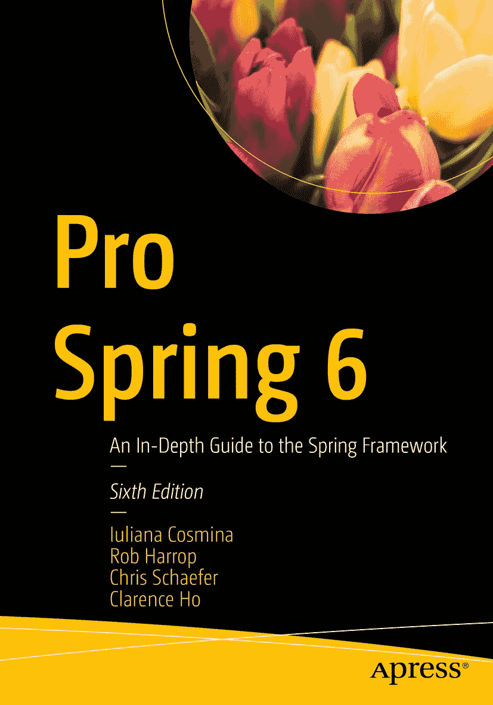

ISBN 978-1-4842-8639-5e-ISBN 978-1-4842-8640-1 [`doi.org/10.1007/978-1-4842-8640-1`](https://doi.org/10.1007/978-1-4842-8640-1) © Iuliana Cosmina, Rob Harrop, Chris Schaefer, and Clarence Ho 2023 本作品受版权保护。出版商保留所有权利，无论是涉及材料的全部或部分，特别是翻译、重印、重用插图、朗诵、广播、以缩微胶卷或任何其他物理方式复制，以及传输或信息存储与检索、电子改编、计算机软件，或采用目前已知或未来开发的类似或不同方法进行使用的权利。本书中使用的通用描述性名称、注册商标名称、商标、服务标志等，即使未作明确声明，也不意味着这些名称不受相关保护法律和法规的约束，因此可自由用于一般用途。出版商、作者和编辑均假定本书中的建议和信息在出版之日是真实准确的。出版商、作者或编辑均不对本书所含材料或可能存在的任何错误或遗漏提供明示或暗示的保证。对于已出版地图中的管辖权主张和机构隶属关系，出版商保持中立。

本 Apress 印记由注册公司 APress Media, LLC（Springer Nature 的一部分）出版。

注册公司地址为：1 New York Plaza, New York, NY 10004, U.S.A.

*谨以此书献给我的 Evelyn Walker。感谢你成为我从未意识到自己需要的朋友。*

*——Iuliana Cosmina*

引言

本书涵盖 Spring Framework 6 版本，是迄今为止最全面的 Spring 参考书和实践指南，旨在帮助您充分利用这一领先的企业级 Java 应用程序开发框架的强大功能。

本版本涵盖了核心 Spring 及其与其他领先 Java 技术的集成，例如 Hibernate、JPA 3、Thymeleaf、Kafka、GraphQL 和 WebFlux。本书的重点是使用 Java 配置类、lambda 表达式、Spring Boot 和响应式编程。我们分享了在企业应用程序开发方面的见解和实际经验，包括远程处理、事务、Web 层和表示层等等。

通过《Pro Spring 6》，您将学习如何执行以下操作：

*   使用控制反转（IoC）和依赖注入（DI）
*   了解 Spring Framework 6 的新特性
*   使用 Spring MVC 构建基于 Spring 的 Web 应用程序
*   使用 Spring WebFlux 构建 Spring Web 响应式应用程序
*   使用 JUnit 5 测试 Spring 应用程序
*   利用新的 Java 8+ lambda 语法
*   将 Spring Boot 提升到高级水平，以便快速启动并运行任何类型的 Spring 应用程序
*   使用 Cloud Native Buildpacks 将您的 Spring Native 应用程序打包成 Docker 镜像

本书附带一个多模块项目，使用 Gradle 8/Maven 3.9 进行配置。该项目可在 Apress 官方仓库中找到：[`https://github.com/Apress/pro-spring-6`](https://github.com/Apress/pro-spring-6)。根据其`README.adoc`文件中的说明，克隆后即可立即构建项目。如果您本地未安装 Gradle/Maven，可以依赖 IntelliJ IDEA，通过使用 Gradle/Maven Wrapper（[`https://docs.gradle.org/current/userguide/gradle_wrapper.html`](https://docs.gradle.org/current/userguide/gradle_wrapper.html)）来下载并使用它构建您的项目。本书末尾有一个简短的附录，描述了项目结构、配置以及与可用于开发和运行本书代码示例（可在 GitHub 上获取）的开发工具相关的其他详细信息。

在本书编写过程中，Spring 6 和 Spring Boot 3 的新版本发布了，IntelliJ IDEA 的新版本发布了，Gradle/Maven 以及本书中使用的其他技术也更新到了新版本。我们升级到了新版本，以提供最新的信息，并使本书与官方文档保持同步。多位审阅者检查了本书的技术准确性，但如果您发现任何不一致之处，请发送电子邮件至`editorial@apress.com`，我们将创建勘误表。

您可以在`github.com/apress/pro-spring-6`访问本书的示例源代码。该代码将得到维护，与新技术版本同步，并根据使用它学习 Spring 的开发者的建议进行丰富。

我们真诚地希望您能像我们享受编写本书一样，享受使用本书学习 Spring 的过程。

致谢

编写这本书很困难。自本书第一版编写以来，Spring 呈指数级增长，一个为 Java 应用程序提供依赖注入的小型框架，已经发展成为一个项目集合，旨在用于开发从网站到移动应用程序、在 Arduino 上运行的小型应用程序以及微服务等各种现代应用程序。

这本书历史悠久；毕竟这是第六版。Rob Harrop 和 Jan Machacheck 撰写了一本全面的 Spring 书籍，名为《Pro Spring: From Professional to Expert》，于 2005 年出版；那是第一版。在过去的 18 年里，Spring 发生了巨大的变化，本书也随之演变，以至于原始文本所剩无几。您现在阅读的是其第六版。在之前的版本中，一批轮换的作者承担了使本书变得更好并升级以跟上 Spring Framework 发展的重任。我是在第五版时加入的，负责将材料从 Spring 4 升级到 Spring 5，这是我第二次参与本书的升级工作。

然而，我并非独自完成第六版，因此在本节中，我要感谢所有相关人员：感谢 Steve Anglin 在 2014 年对我下注，给了我成为技术作者的机会；感谢 Mark Powers 指导我完成制作一本值得出版的书籍的整个过程；感谢我的技术审阅者 Manual Jordan Elera，确保书中的代码质量良好；感谢所有语法审阅者，确保书中的文本可读、易懂且有意义。

非常感谢阅读本书、运行代码并发现我和上述所有人遗漏的错误和缺陷的人们：Rafal Nowicki、Carlos Perez、Affid Fedorov 以及所有 GitHub 贡献者。

最大的感谢要献给我的导师 Achim Wagner，我已故的挚友 Evelyn Walker，以及我的朋友 Mihaela Filipiuc、Agustin Demouselle 和 Bogza-Vlad 一家，感谢你们在我需要的时候始终支持我。

> ——Iuliana Cosmina

关于作者 关于技术审阅者

